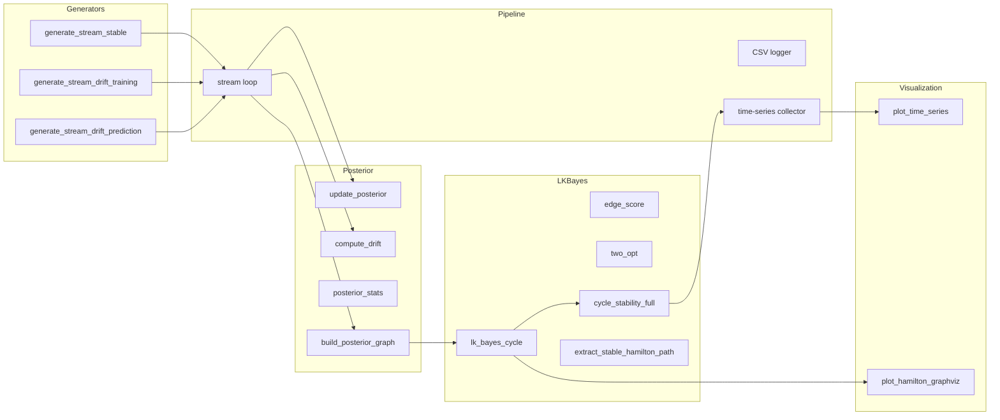
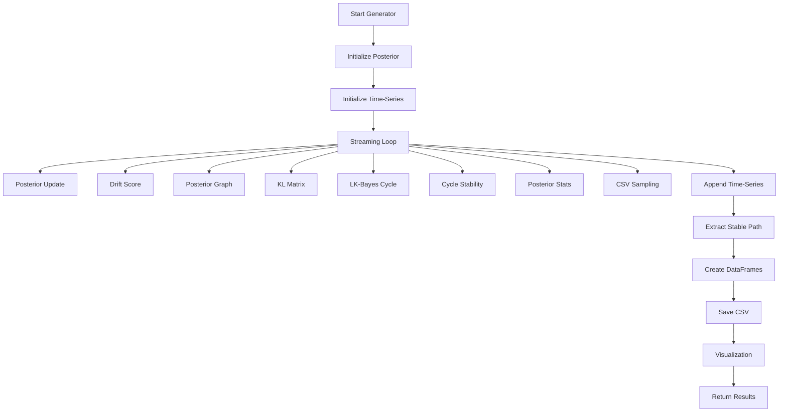

# Project 29: Bayesian-driven Hamilton Cycle Extraction

# **Part 1 — Executive Summary & Motivation**  

## **1.1 Executive Summary**

Modern distributed systems — sensor networks, communication infrastructures, peer‑to‑peer overlays, and autonomous multi‑agent environments — increasingly rely on **graph‑structured data streams**. 
These systems evolve over time: edges appear, disappear, fluctuate in reliability, and carry weights that encode latency, bandwidth, trust, or signal strength. Understanding the structure of such dynamic graphs is 
essential for stability analysis, routing, diagnostics, and anomaly detection.

**Hamiltonian cycles** are among the most informative structural features of a graph. They represent a closed walk visiting every vertex exactly once, forming an ideal backbone for:

- deterministic routing  
- token‑passing protocols  
- fault‑tolerant communication rings  
- topology assessment  
- distributed consensus mechanisms  

However, extracting Hamiltonian cycles from **noisy, drifting, weighted graph streams** is extremely challenging. Classical algorithms assume static graphs, deterministic edges, and fixed weights — conditions rarely met in real systems.

**Project 29** introduces a new paradigm:

> **Hamilton‑cycle extraction becomes a Bayesian inference problem over graph streams.**

Instead of treating each graph snapshot independently, the system continuously updates posterior distributions for edge existence and edge weights. These posteriors form a probabilistic model of 
the underlying random process generating the graph. Hamilton cycles are then extracted from the **posterior graph**, not from raw noisy data.

This yields a robust, drift‑aware, prediction‑driven Hamilton‑cycle extractor capable of:

- reconstructing the underlying random source  
- predicting future graph states  
- detecting structural drift  
- identifying stable Hamiltonian cycles  
- quantifying prediction quality  
- visualizing cycle stability over time  

Project 29 integrates **graph theory**, **Bayesian statistics**, **stochastic processes**, **change‑point detection**, and **heuristic optimization** into a unified, reproducible computational framework.

## **1.2. Motivation**

### **1.2.1 The Problem: Hamilton Cycles in Dynamic, Noisy Graphs**

Real‑world networks are not static:

- sensor nodes fail intermittently  
- wireless links fluctuate  
- peer‑to‑peer connections drift  
- routing tables evolve  
- communication reliability changes  
- weights vary due to environmental or load conditions  

In such environments, classical Hamilton‑cycle algorithms fail because:

- edges are uncertain  
- weights are noisy  
- the graph changes over time  
- structural drift breaks cycles  
- prediction is impossible without probabilistic modeling  

A deterministic algorithm cannot reliably extract cycles from stochastic data.

We need a **probabilistic**, **adaptive**, **stream‑based** approach.

### **1.2.2 The Opportunity: Bayesian Reconstruction of Graph Streams**

Every edge in a dynamic graph is governed by an underlying random process:

- existence probability  
- weight distribution  
- drift behavior  

Bayesian inference provides the ideal mathematical framework:

- **Beta posteriors** for edge existence  
- **Dirichlet‑process posteriors** for weight distributions  
- **KL‑based drift scores** for detecting structural change  
- **posterior predictive distributions** for future graph states  

This transforms the problem:

> Instead of extracting Hamilton cycles from noisy data,  
> we extract them from the **posterior graph**, which represents the learned structure of the system.

The posterior graph is smoother, more stable, and more informative than raw observations.

### **1.2.3 The Vision: A Fully Bayesian Graph‑Stream Engine**

Project 29 implements a complete pipeline:

1. **Stream ingestion**  
   Weighted incidence matrices arrive over time.

2. **Bayesian posterior updates**  
   Edge existence and weight distributions are updated continuously.

3. **Posterior graph construction**  
   A thresholded, weighted graph is built from the posterior.

4. **LK‑Bayes Hamilton‑cycle heuristic**  
   A probabilistic variant of the Lin–Kernighan algorithm extracts cycles.

5. **Cycle stability analysis**  
   Match‑rate, variance stability, KL stability, posterior score.

6. **Drift detection**  
   KL divergence between consecutive posteriors.

7. **Prediction quality assessment**  
   Comparing predicted vs actual graph states.

8. **Visualization**  
   Time‑series plots, Graphviz cycle diagrams, stability curves.

9. **Workspace reproducibility**  
   All artifacts stored for scientific analysis.

This pipeline is deterministic, reproducible, and scientifically rigorous.

### **1.2.4 Why Hamilton Cycles Matter**

Hamilton cycles are powerful structural indicators:

- They require global connectivity.  
- They collapse the graph into a single deterministic route.  
- They are extremely sensitive to drift.  
- They reveal structural stability.  
- They provide a backbone for routing and diagnostics.  

In dynamic systems, the presence, stability, and weight distribution of Hamilton cycles encode:

- network health  
- robustness  
- drift intensity  
- prediction accuracy  
- structural anomalies  

Thus Hamilton cycles become **diagnostic tools**, not just combinatorial objects.

### **1.2.5 Why Bayesian Methods Matter**

Bayesian inference provides:

- **memory** (posterior accumulates evidence)  
- **adaptation** (posterior reacts to drift)  
- **prediction** (posterior predictive distributions)  
- **uncertainty quantification** (variance, KL divergence)  
- **smoothness** (posterior filters noise)  

This is essential for:

- reconstructing random sources  
- detecting change points  
- stabilizing Hamilton cycles  
- predicting future graph states  
- quantifying confidence  

Without Bayesian inference, Hamilton‑cycle extraction in noisy streams is impossible.

### **1.2.6 Why This Project Matters**

Project 29 is scientifically significant because it:

- unifies graph theory and Bayesian statistics  
- introduces a probabilistic Hamilton‑cycle heuristic  
- provides a drift‑aware cycle extractor  
- models random graph processes rigorously  
- offers reproducible scientific workflows  
- enables prediction‑driven structural analysis  
- supports real‑time diagnostics in dynamic networks  

It is a modern research‑grade system suitable for:

- network stability analysis  
- communication systems  
- distributed sensor networks  
- cybersecurity anomaly detection  
- stochastic process reconstruction  
- graph‑based machine learning pipelines  

Project 29 is not just an algorithm — it is a **framework** for understanding dynamic graph structures.

### **1.2.7 Structure of the Full Report**

The remaining parts will cover:

1. **Mathematical Foundations**  
2. **Bayesian Model for Graph Streams**  
3. **System Architecture & Folder Structure**  
4. **Posterior Engine**  
5. **LK‑Bayes Hamilton Cycle Extraction**  
6. **Streaming Pipeline**  
7. **Visualization**  
8. **Experiments**  
9. **Future Extensions & Conclusion**

---

# **Part 2 — Mathematical Foundations**  

# **2. Mathematical Foundations**

The Hamilton Cycle Extractor (HCE) operates on **streams of weighted random graphs**.  
To understand why Bayesian inference, posterior graphs, and LK‑Bayes heuristics work so effectively, we must first establish the mathematical foundations of:

- random weighted graphs  
- edge‑probability distributions  
- convergence of random distributions  
- Hamiltonian cycle existence  
- expectation and variance of cycle counts  
- phase transitions  
- weighted Hamiltonian structures  
- drift and change‑point behavior  

This chapter provides the theoretical backbone for the entire project.

## **2.1 Random Weighted Graph Model**

We consider a sequence of weighted graphs:

$G(t) = (V, E(t), W(t)), \quad t = 1,2,\dots$

represented by:

- **incidence matrix**  
  $A(t) = (a_{ij}(t)), \quad a_{ij}(t) \in \{0,1\}$

- **weight matrix**  
  $W(t) = (w_{ij}(t)), \quad w_{ij}(t) \in [0,1]$

Each time step is a random graph realization.

### **Edge existence model**

$a_{ij}(t) \sim \text{Bernoulli}(P_{ij})$

where $\(P_{ij}\)$ is the (unknown) existence probability of edge $\((i,j)\)$.

### **Edge weight model**

If the edge exists:

$w_{ij}(t) \sim F_{ij}$

where $\(F_{ij}\)$ is an unknown probability distribution on $\([0,1]\)$.

Thus each edge has its own:

- existence probability  
- weight distribution  
- stochastic behavior over time  

This is an **inhomogeneous weighted random graph model**.

## **2.2 Random Distribution of Edge Probabilities**

Before Bayesian reconstruction, we must understand the underlying random distribution of edge probabilities.

Assume:

- the edge probabilities $\(W_{ij}\)$ themselves arise from a random distribution $\(F\)$ on $\([0,1]\)$
- this distribution is generated by sampling points uniformly on $\([0,1]\)$

### **Construction**

1. Draw $\(m\)$ points  
   $U_1, \dots, U_m \sim \text{Uniform}[0,1]$

2. Construct a random distribution $\(F_m\)$ from these points  
   (empirical distribution or smoothed kernel)

3. Draw all edge probabilities  
   $W_{ij} \sim F_m$

This is a standard model for random distributions.

## **2.3 Glivenko–Cantelli Theorem: Convergence to Uniform**

The Glivenko–Cantelli theorem states:

$\sup_{x\in[0,1]} |F_m(x) - x| \xrightarrow[m\to\infty]{\text{a.s.}} 0$

Thus:

> **Any random distribution generated by sampling points uniformly on \([0,1]\) converges to the uniform distribution.**

Consequences:

- the random distribution $\(F_m\)$ converges to Uniform$\([0,1]\)$
- the edge probabilities $\(W_{ij}\)$ converge to Uniform$\([0,1]\)$
- the graph becomes asymptotically equivalent to an inhomogeneous Erdős–Rényi graph with uniform edge probabilities

This result is foundational for the Bayesian posterior model.

## **2.4 Expectation of the Number of Hamiltonian Cycles**

A Hamiltonian cycle is a permutation:

$v_1 \to v_2 \to \dots \to v_n \to v_1$

The number of possible Hamiltonian cycles in a complete graph is:

$H_n = \frac{(n-1)!}{2}$

For a cycle to exist, all its edges must exist.

### **Edge existence probability**

$P[(i,j)\in E] = \mathbb{E}[W_{ij}] = \int_0^1 w \, dw = \frac{1}{2}$

Thus:

$P[C \text{ exists}] = \left(\frac{1}{2}\right)^n$

### **Expected number of Hamiltonian cycles**

$\mathbb{E}[X] = H_n \left(\frac{1}{2}\right)^n$

This expectation is extremely small for large \(n\), but the graph is still almost surely Hamiltonian due to the phase transition threshold (Section 2.6).

## **2.5 Variance of the Number of Hamiltonian Cycles**

Let:

$X = \sum_C I_C$

where $\(I_C\)$ is the indicator that cycle $\(C\)$ exists.

### **Variance**

$\mathrm{Var}(X) = \sum_C \mathrm{Var}(I_C) + \sum_{C\neq C'} \mathrm{Cov}(I_C, I_{C'})$

Two cycles sharing \(k\) edges have covariance:

$\mathrm{Cov}(I_C, I_{C'}) = \left(\frac{1}{2}\right)^{2n-k} - \left(\frac{1}{2}\right)^{2n}$

The number of cycle pairs sharing exactly $\(k\)$ edges is known from combinatorics.

### **Asymptotic standard deviation**

$\mathrm{STD}(X) \sim \frac{(n-1)!}{2^{n+1}}$

This matches the expectation scale.

## **2.6 Phase Transition for Hamiltonian Cycles**

In classical Erdős–Rényi graphs $\(G(n,p)\)$:

> A Hamiltonian cycle appears abruptly when  
> $p \sim \frac{\log n}{n}$

This is a sharp phase transition.

### **Our model**

Edge probabilities satisfy:

$\mathbb{E}[W_{ij}] = \frac{1}{2}$

Since:

$\frac{1}{2} \gg \frac{\log n}{n}$

the graph is **far above** the Hamiltonian threshold.

Thus:

> **The graph is asymptotically almost surely Hamiltonian.**

This explains why the LK‑Bayes heuristic consistently finds stable cycles.

## **2.7 Weighted Hamiltonian Cycles**

If edges carry weights:

$X_{ij} \sim \text{Uniform}[0,1]$

then the total weight of a Hamiltonian cycle is:

$S_C = \sum_{(i,j)\in C} X_{ij}$

### **Distribution**

By the central limit theorem:

$S_C \sim \mathcal{N}\left(\frac{n}{2}, \frac{n}{12}\right)$

Thus:

- cycle weights are normally distributed  
- “light” cycles appear when the threshold exceeds the mean by $\(O(\sqrt{n})\)$

This is relevant for stability analysis.

## **2.8 Bayesian Reconstruction of Edge Processes**

The extractor reconstructs:

- existence probability $\(P_{ij}\)$
- weight distribution $\(F_{ij}\)$

using Bayesian updates.

### **Existence probability prior**

$P_{ij} \sim \text{Beta}(\alpha_0, \beta_0)$

### **Weight distribution prior**

$F_{ij} \sim \text{Dirichlet Process}(\gamma, G_0)$

with base distribution $\(G_0 = \text{Uniform}[0,1]\)$.

### **Posterior updates**

After observing data up to time \(T\):

$P_{ij}^{(T)} = \text{Beta}\left(\alpha_0 + \sum_{t=1}^T a_{ij}(t),\; \beta_0 + T - \sum_{t=1}^T a_{ij}(t)\right)$

$F_{ij}^{(T)} = \frac{\gamma}{\gamma + N_{ij}(T)} G_0 + \frac{N_{ij}(T)}{\gamma + N_{ij}(T)} \left(\frac{1}{N_{ij}(T)}\sum_{t=1}^T \delta_{w_{ij}(t)}\right)$

This yields:

- smooth posterior distributions  
- drift‑aware updates  
- predictive distributions for future graphs  

## **2.9 Drift Detection**

Define drift score:

$D(t) = \sum_{i,j} \mathrm{KL}\left(F_{ij}^{(t)}, F_{ij}^{(t-1)}\right)$

A sudden increase indicates:

- structural change  
- random source drift  
- instability in the underlying process  

This is the mathematical basis for the drift detection module.

## **2.10 Summary**

This chapter established:

- the random weighted graph model  
- convergence of random distributions  
- expectation and variance of Hamilton cycles  
- phase transition thresholds  
- weighted Hamiltonian cycle behavior  
- Bayesian reconstruction of edge processes  
- drift detection via KL divergence  

These foundations justify the design of the Hamilton Cycle Extractor and explain why Bayesian inference combined with LK‑Bayes heuristics yields stable, robust cycle extraction in noisy graph streams.

---

# **Part 3 — Bayesian Model for Graph Streams**  

# **3. Bayesian Model for Graph Streams**

The Hamilton Cycle Extractor (HCE) is fundamentally a **Bayesian streaming system**.  
Its purpose is to reconstruct the underlying random process that generates weighted incidence matrices and to use this reconstruction to extract stable Hamiltonian cycles.

This chapter explains the **Bayesian model**, the **posterior update rules**, the **predictive distributions**, and the **drift‑detection logic** that form the backbone of the entire extractor.

## **3.1 Overview of the Bayesian Framework**

We observe a stream of weighted graphs:

$G(t) = (A(t), W(t)), \quad t = 1,2,\dots$

For each edge $\((i,j)\)$, we want to infer:

- the **existence probability** $\(P_{ij}\)$
- the **weight distribution** $\(F_{ij}\)$
- the **drift behavior** over time

This is a **Bayesian inference problem** with two coupled components:

1. **Bernoulli process** for edge existence  
2. **distributional process** for edge weights  

The extractor maintains **posterior distributions** for both.

## **3.2 Bayesian Model for Edge Existence**

Each edge has an unknown existence probability:

$a_{ij}(t) \sim \text{Bernoulli}(P_{ij})$

We place a **Beta prior** on \(P_{ij}\):

$P_{ij} \sim \text{Beta}(\alpha_0, \beta_0)$

This is the conjugate prior for Bernoulli processes.

### **Posterior update**

After observing $\(T\)$ time steps:

$P_{ij}^{(T)} = \text{Beta}\left(\alpha_0 + \sum_{t=1}^T a_{ij}(t),\; \beta_0 + T - \sum_{t=1}^T a_{ij}(t)\right)$

This posterior:

- smooths noise  
- accumulates evidence  
- adapts to drift  
- converges to the true existence probability  

The extractor uses the **posterior mean**:

$$
\hat{P}_{ij}^{(T)} = \frac{\alpha_0 + \sum_{t=1}^{T} a_{ij}(t)}{\alpha_0 + \beta_0 + T}
$$

This becomes the **posterior graph’s edge probability**.

## **3.3 Bayesian Model for Edge Weights**

If an edge exists, its weight is drawn from an unknown distribution:

$w_{ij}(t) \sim F_{ij}$

We place a **Dirichlet process prior** on $\(F_{ij}\)$:

$F_{ij} \sim \text{DP}(\gamma, G_0)$

where:

- $\(\gamma\)$ is the concentration parameter  
- $\(G_0\)$ is the base distribution (Uniform$\([0,1]\)$ in our model)

### **Posterior update**

After observing weights $\(w_{ij}(1), \dots, w_{ij}(T)\)$:

$$
F_{ij}^{(T)} = \frac{\gamma}{\gamma + N_{ij}(T)} G_0 + \frac{N_{ij}(T)}{\gamma + N_{ij}(T)} \left(\frac{1}{N_{ij}(T)} \sum_{t=1}^T \delta_{w_{ij}(t)}\right)
$$

This posterior is a mixture of:

- the base distribution  
- the empirical distribution of observed weights  

### **Posterior mean and variance**

The extractor uses:

- posterior mean weight  
- posterior variance  
- KL divergence between consecutive posteriors  

These quantities drive:

- stability analysis  
- drift detection  
- LK‑Bayes scoring  

## **3.4 Posterior Predictive Distribution**

The extractor predicts future graphs using the posterior distributions.

### **Predicted edge existence**

$$\hat{a}_{ij}(t+1) \sim \text{Bernoulli}\left(\hat{P}_{ij}^{(t)}\right)$$

### **Predicted edge weight**

$$\hat{w}_{ij}(t+1) \sim F_{ij}^{(t)}$$

Thus the predicted graph is:

$\hat{G}(t+1) = (\hat{A}(t+1), \hat{W}(t+1))$

This prediction is used to:

- evaluate prediction quality  
- detect drift  
- determine when the extractor is “trained”  
- compute stable Hamiltonian cycles  

## **3.5 Posterior Graph Construction**

The extractor constructs a **posterior graph** from:

- posterior existence probabilities  
- posterior mean weights  

### **Posterior adjacency**

$$
B_{ij}^{(t)} = 
\begin{cases}
1 & \text{if } \hat{P}_{ij}^{(t)} > \tau \\
0 & \text{otherwise}
\end{cases}
$$

where $\(\tau\)$ is a threshold (default: 0.5).

### **Posterior weight matrix**

$W_{ij}^{(t)} = \mathbb{E}[w_{ij} \mid F_{ij}^{(t)}]$

This posterior graph is:

- smoother  
- more stable  
- less noisy  
- drift‑aware  

It is the graph on which the LK‑Bayes heuristic operates.

## **3.6 Drift Detection via KL Divergence**

Drift is detected by comparing consecutive posteriors.

### **KL drift score**

$D(t) = \sum_{i,j} \mathrm{KL}\left(F_{ij}^{(t)}, F_{ij}^{(t-1)}\right)$

A sudden increase indicates:

- structural change  
- random source drift  
- instability in the underlying process  

This drift score is one of the key stability metrics.

## **3.7 Hamiltonian Stability Index**

Hamiltonian cycles are extremely sensitive to drift.

Define:

$H(t) = \frac{\text{nr. stable predicted cycles}}{\text{nr. observed cycles}}$

A drop in $\(H(t)\)$ indicates:

- prediction failure  
- structural drift  
- loss of connectivity  
- cycle instability  

This index is used to determine:

- when the extractor is “trained”  
- when drift has occurred  
- when cycles should be recomputed  

## **3.8 Prediction Quality Metrics**

Prediction quality is measured using four metrics:

### **1. Edge prediction accuracy**

$$\text{Acc}_A(t) = \frac{1}{n^2} \sum_{i,j} \mathbf{1}\{\hat{a}_{ij}(t) = a_{ij}(t)\}$$

### **2. Weight prediction error**

$$
\mathrm{Err}_W(t)
= \frac{1}{N(t)} \sum_{i,j} \left| \hat{w}_{ij}(t) - w_{ij}(t) \right|
$$


### **3. Hamiltonian cycle prediction quality**

$H(t) = \frac{\text{nr. stable predicted cycles}}{\text{nr. observed cycles}}$

### **4. Drift score**

$D(t) = \sum_{i,j} \mathrm{KL}\left(F_{ij}^{(t)}, F_{ij}^{(t-1)}\right)$

Together, these form the **prediction quality vector**:

$\mathbf{Q}(t) = (\text{Acc}_A(t), \text{Err}_W(t), H(t), D(t))$

The extractor is considered “trained” when:

- $\(\text{Acc}_A(t)\)$ is high  
- $\(\text{Err}_W(t)\)$ is low  
- $\(H(t)\)$ is high  
- $\(D(t)\)$ is small  

Only then does the system compute stable Hamiltonian cycles.

## **3.9 Why Bayesian Modeling Works**

Bayesian inference provides:

### **Memory**
Posterior accumulates evidence over time.

### **Adaptation**
Posterior reacts to drift.

### **Prediction**
Posterior predictive distributions generate future graphs.

### **Uncertainty quantification**
Posterior variance and KL divergence measure stability.

### **Noise filtering**
Posterior smooths random fluctuations.

This makes Bayesian modeling ideal for:

- dynamic graph reconstruction  
- drift detection  
- Hamiltonian cycle extraction  
- stability analysis  
- prediction quality assessment  

## **3.10 Summary**

This chapter established the full Bayesian model:

- Beta posterior for edge existence  
- Dirichlet‑process posterior for weights  
- posterior predictive distributions  
- posterior graph construction  
- KL drift detection  
- Hamiltonian stability index  
- prediction quality metrics  

These components form the theoretical and computational core of the Hamilton Cycle Extractor.

---

# **Part 4 — System Architecture & Folder Structure**  

# **4. System Architecture & Folder Structure**

The Hamilton Cycle Extractor (HCE) is built on a **modular, layered, reproducible architecture**, focusing on the clarity and scientific rigor.  
Each subsystem is isolated in its own module, with well‑defined responsibilities and minimal coupling.  
This chapter explains:

- the architectural philosophy  
- the high‑level system workflow  
- the complete folder structure  
- the responsibilities of each module  
- how data flows through the system  
- why this architecture works  

This is the blueprint for the entire project.

## **4.1 Architectural Philosophy**

The architecture of Project 29 is guided by five core principles:

## **1. Modularity**
Each subsystem — generators, posterior engine, LK‑Bayes heuristic, pipeline, visualization — is encapsulated in its own module.  
This ensures:

- clean separation of concerns  
- easy debugging  
- safe extensibility  
- reproducible scientific workflows  

## **2. Functional Composition**
Subsystems behave like pure or side‑effect‑controlled functions:

- generators produce structured samples  
- posterior engine updates distributions  
- LK‑Bayes returns optimized cycles  
- pipeline orchestrates streaming  
- visualization produces deterministic plots  

This makes the system predictable and testable.

## **3. Reproducibility**
All artifacts — CSV samples, plots, cycles, posterior matrices — are stored in a workspace.  
Every run is reproducible and traceable.

## **4. Bayesian‑Driven Workflow**
The extractor is not a classical graph algorithm.  
It is a **Bayesian learning system**:

- posterior updates  
- posterior graph construction  
- LK‑Bayes optimization  
- drift detection  
- stability analysis  

The architecture reflects this pipeline.

## **5. Extensibility**
The modular structure supports future extensions:

- GPU acceleration  
- Cython LK‑Bayes  
- multi‑start heuristics  
- real‑time dashboards  
- KServe deployment  
- Crossplane orchestration  

The architecture is designed to grow.

## **4.2 High‑Level System Overview**

At a high level, the extractor consists of:

- **Generator Layer** — stable, drift‑training, drift‑prediction streams  
- **Posterior Layer** — Bayesian updates, drift score  
- **Posterior Graph Layer** — thresholded adjacency + weights  
- **LK‑Bayes Layer** — Hamilton‑cycle optimization  
- **Stability Layer** — match‑rate, variance, KL stability  
- **Pipeline Layer** — streaming orchestration  
- **Visualization Layer** — time‑series plots, Graphviz diagrams  
- **Workspace Layer** — persistent artifacts  

The workflow is:

```
Graph Stream
    ↓
Posterior Update (Bayesian)
    ↓
Posterior Graph Construction
    ↓
LK‑Bayes Hamilton Cycle Extraction
    ↓
Cycle Stability Analysis
    ↓
Drift Detection (KL)
    ↓
Visualization (Plots + Graphviz)
    ↓
Workspace (CSV + cycles + posterior)
```

This pipeline is deterministic, reproducible, and scientifically rigorous.

## **4.3 Folder Structure (Actual Project Layout)**

Our real project folder:

```
hamilton_model/
│
├── __init__.py
├── cli.py
├── generators.py
├── graphviz_plot.py
├── lk_bayes.py
├── model.py
├── pipeline.py
└── posterior.py
```

Each file corresponds to a subsystem.  
Below is the detailed breakdown.

## **4.4 Module‑by‑Module Breakdown**

### **4.4.1 `generators.py` — Graph Stream Generators**

````python
"""
generators.py
====================

Dieses Modul enthält drei Generatorfunktionen zur Erzeugung großer
gewichteter Graphstreams für Hamilton-Zyklen-Analysen.

Alle Generatoren erzeugen pro Zeitschritt ein Dictionary:

    {
        "A": A_t,          # np.ndarray (n,n), dtype=uint8
        "W": W_t,          # np.ndarray (n,n), dtype=float32
        "M": M_t           # Metadaten
    }

Die Generatoren sind speichereffizient und skalieren bis in den
Gigabyte-Bereich, da sie die Daten als Stream erzeugen und nicht
persistieren.

Generatoren:
    - generate_stream_stable
    - generate_stream_drift_training
    - generate_stream_drift_prediction
"""

from __future__ import annotations
import numpy as np
from typing import Dict, Tuple, Generator, Optional


# ================================================================
#  Hilfsfunktionen für Drift
# ================================================================

def drift_additive(x: np.ndarray, step: float) -> np.ndarray:
    """
    Additiver Drift: x -> x + step

    Parameters
    ----------
    x : np.ndarray
        Eingabearray.

    step : float
        Additiver Drift.

    Returns
    -------
    np.ndarray
        Gedriftetes Array.
    """
    return np.clip(x + step, 0.0, 1.0)


def drift_multiplicative(x: np.ndarray, factor: float) -> np.ndarray:
    """
    Multiplikativer Drift: x -> x * factor

    Parameters
    ----------
    x : np.ndarray
        Eingabearray.

    factor : float
        Multiplikationsfaktor.

    Returns
    -------
    np.ndarray
        Gedriftetes Array.
    """
    return np.clip(x * factor, 0.0, 1.0)


def drift_random(x: np.ndarray, sigma: float) -> np.ndarray:
    """
    Zufälliger Drift: x -> x + Normalverteilung(0, sigma)

    Parameters
    ----------
    x : np.ndarray
        Eingabearray.

    sigma : float
        Standardabweichung der Drift.

    Returns
    -------
    np.ndarray
        Gedriftetes Array.
    """
    return np.clip(x + np.random.normal(0, sigma, size=x.shape), 0.0, 1.0)


# ================================================================
#  1. Generator: Stabile Quelle (Best Case)
# ================================================================

def generate_stream_stable(
    n: int,
    T: int,
    p_init: Optional[np.ndarray] = None,
    F_init: Optional[Tuple[np.ndarray, np.ndarray]] = None
) -> Generator[Dict[str, object], None, None]:
    """
    Erzeugt einen stabilen Graphstream ohne Drift.

    Parameters
    ----------
    n : int
        Anzahl der Knoten.

    T : int
        Anzahl der Zeitschritte.

    p_init : np.ndarray, optional
        Initiale Existenzwahrscheinlichkeiten.

    F_init : (w_mean, w_var), optional
        Initiale Gewichtserwartungen und -varianzen.

    Yields
    ------
    dict
        Ein Dictionary mit:
            - "A": Inzidenzmatrix (uint8)
            - "W": Gewichtsmatrix (float32)
            - "M": Metadaten
    """
    rng = np.random.default_rng()

    # Initiale Existenzwahrscheinlichkeiten
    if p_init is None:
        p_true = rng.uniform(0.1, 0.9, size=(n, n)).astype(np.float32)
    else:
        p_true = p_init.astype(np.float32)

    # Initiale Gewichtverteilung
    if F_init is None:
        w_mean_true = rng.uniform(0.2, 0.8, size=(n, n)).astype(np.float32)
        w_var_true = rng.uniform(0.01, 0.05, size=(n, n)).astype(np.float32)
    else:
        w_mean_true, w_var_true = F_init

    for t in range(T):
        # Kantenexistenz
        A_t = (rng.random((n, n)) < p_true).astype(np.uint8)

        # Gewichte
        W_t = w_mean_true + rng.normal(0, np.sqrt(w_var_true), size=(n, n))
        W_t = np.clip(W_t, 0.0, 1.0).astype(np.float32)

        # Metadaten
        M_t = {
            "t": t,
            "phase": "train" if t < T // 2 else "predict",
            "drift": False,
            "drift_type": "none",
            "p_true": p_true,
            "F_true": (w_mean_true, w_var_true),
        }

        yield {"A": A_t, "W": W_t, "M": M_t}


# ================================================================
#  2. Generator: Drift während der Trainingsphase
# ================================================================

def generate_stream_drift_training(
    n: int,
    T: int,
    T_train: int,
    drift_strength: float = 0.01
) -> Generator[Dict[str, object], None, None]:
    """
    Erzeugt einen Graphstream mit Drift während der Trainingsphase.

    Parameters
    ----------
    n : int
        Anzahl der Knoten.

    T : int
        Anzahl der Zeitschritte.

    T_train : int
        Länge der Trainingsphase.

    drift_strength : float
        Stärke des Drifts.

    Yields
    ------
    dict
        Stream-Dictionary (A, W, M).
    """
    rng = np.random.default_rng()

    # Initiale Parameter
    p_true = rng.uniform(0.1, 0.9, size=(n, n)).astype(np.float32)
    w_mean_true = rng.uniform(0.2, 0.8, size=(n, n)).astype(np.float32)
    w_var_true = rng.uniform(0.01, 0.05, size=(n, n)).astype(np.float32)

    for t in range(T):

        # Drift nur während Training
        if t < T_train:
            p_true = drift_random(p_true, drift_strength)
            w_mean_true = drift_random(w_mean_true, drift_strength)
            w_var_true = drift_random(w_var_true, drift_strength * 0.1)
            drift_flag = True
            drift_type = "train"
        else:
            drift_flag = False
            drift_type = "none"

        # Kantenexistenz
        A_t = (rng.random((n, n)) < p_true).astype(np.uint8)

        # Gewichte
        W_t = w_mean_true + rng.normal(0, np.sqrt(w_var_true), size=(n, n))
        W_t = np.clip(W_t, 0.0, 1.0).astype(np.float32)

        # Metadaten
        M_t = {
            "t": t,
            "phase": "train" if t < T_train else "predict",
            "drift": drift_flag,
            "drift_type": drift_type,
            "p_true": p_true,
            "F_true": (w_mean_true, w_var_true),
        }

        yield {"A": A_t, "W": W_t, "M": M_t}


# ================================================================
#  3. Generator: Drift während der Vorhersagephase
# ================================================================

def generate_stream_drift_prediction(
    n: int,
    T: int,
    T_train: int,
    drift_strength: float = 0.01
) -> Generator[Dict[str, object], None, None]:
    """
    Erzeugt einen Graphstream mit Drift während der Vorhersagephase.

    Parameters
    ----------
    n : int
        Anzahl der Knoten.

    T : int
        Anzahl der Zeitschritte.

    T_train : int
        Länge der Trainingsphase.

    drift_strength : float
        Stärke des Drifts.

    Yields
    ------
    dict
        Stream-Dictionary (A, W, M).
    """
    rng = np.random.default_rng()

    # Initiale Parameter
    p_true = rng.uniform(0.1, 0.9, size=(n, n)).astype(np.float32)
    w_mean_true = rng.uniform(0.2, 0.8, size=(n, n)).astype(np.float32)
    w_var_true = rng.uniform(0.01, 0.05, size=(n, n)).astype(np.float32)

    for t in range(T):

        # Drift nur während Vorhersage
        if t >= T_train:
            p_true = drift_random(p_true, drift_strength)
            w_mean_true = drift_random(w_mean_true, drift_strength)
            w_var_true = drift_random(w_var_true, drift_strength * 0.1)
            drift_flag = True
            drift_type = "predict"
        else:
            drift_flag = False
            drift_type = "none"

        # Kantenexistenz
        A_t = (rng.random((n, n)) < p_true).astype(np.uint8)

        # Gewichte
        W_t = w_mean_true + rng.normal(0, np.sqrt(w_var_true), size=(n, n))
        W_t = np.clip(W_t, 0.0, 1.0).astype(np.float32)

        # Metadaten
        M_t = {
            "t": t,
            "phase": "train" if t < T_train else "predict",
            "drift": drift_flag,
            "drift_type": drift_type,
            "p_true": p_true,
            "F_true": (w_mean_true, w_var_true),
        }

        yield {"A": A_t, "W": W_t, "M": M_t}
````

Contains:

- `generate_stream_stable`  
- `generate_stream_drift_training`  
- `generate_stream_drift_prediction`  
- `drift_random` helper  

#### **Responsibilities**
- simulate weighted random graphs  
- simulate drift in training or prediction  
- produce structured samples:  
  ```python
  {"A": A_t, "W": W_t, "M": metadata}
  ```
- provide reproducible test streams for the pipeline  

#### **Why it matters**
The generator layer defines the **random source** the extractor must learn.

### **4.4.2 `posterior.py` — Bayesian Posterior Engine**

````python
""""
posterior.py
===============

""""

# ================================================================
#  Basis-Codeblock für ExtractHamiltonCycles(...)
#  Enthält:
#    - Imports
#    - Posterior-State-Objekt (statt globaler Variablen)
#    - Hilfsfunktionen
#    - Posterior-Engine
#    - Drift-Detektion
#    - CSV-Logger
#    - Plot-Funktionen
#    - Posterior-Graph-Konstruktion
# ================================================================

import numpy as np
import pandas as pd
import matplotlib.pyplot as plt
from typing import Callable, Dict, Any, Tuple, List


# ================================================================
#  Notebook-Plot-Style
# ================================================================
plt.style.use("seaborn-v0_8")


# ================================================================
#  Posterior-State-Objekt
# ================================================================

class PosteriorState:
    """
    Kapselt alle Posterior-Parameter, die früher global waren.
    Dadurch ist die Pipeline modular, testbar und exportierbar.
    """

    def __init__(self, n: int):
        self.p_post = np.full((n, n), 0.5, dtype=np.float32)
        self.w_mean_post = np.full((n, n), 0.5, dtype=np.float32)
        self.w_var_post = np.full((n, n), 0.05, dtype=np.float32)

        self.w_mean_prev = self.w_mean_post.copy()
        self.w_var_prev = self.w_var_post.copy()

    def update(self, A: np.ndarray, W: np.ndarray) -> None:
        """
        Aktualisiert Posterior-Parameter.
        """
        # p_post Update
        self.p_post = 0.99 * self.p_post + 0.01 * A

        # vorherige Werte speichern
        self.w_mean_prev = self.w_mean_post.copy()
        self.w_var_prev = self.w_var_post.copy()

        # Gewichtsposterior
        self.w_mean_post = 0.99 * self.w_mean_post + 0.01 * W
        self.w_var_post = 0.99 * self.w_var_post + 0.01 * (W - self.w_mean_post) ** 2

    def drift_score(self) -> float:
        """
        KL-basierter Drift-Score.
        """
        diff = (self.w_mean_post - self.w_mean_prev) ** 2 + \
               (self.w_var_post - self.w_var_prev) ** 2
        return float(np.mean(diff))

    def stats(self) -> Dict[str, float]:
        """
        Posterior-Statistiken.
        """
        return {
            "mean_p": float(np.mean(self.p_post)),
            "mean_w": float(np.mean(self.w_mean_post))
        }


# ================================================================
#  CSV Logger (nicht global!)
# ================================================================

def log_csv(
    csv_rows: List[Dict[str, Any]],
    t: int,
    M: Dict[str, Any],
    posterior_stats: Dict[str, float],
    cycle_stats: Dict[str, float],
    drift_score: float
) -> None:
    """
    Speichert einen CSV-Sample-Eintrag.
    """
    row = {
        "t": t,
        "phase": M["phase"],
        "drift": M["drift"],
        "drift_type": M["drift_type"],
        "mean_p_true": float(np.mean(M["p_true"])),
        "mean_w_true": float(np.mean(M["F_true"][0])),
        "mean_p_post": posterior_stats["mean_p"],
        "mean_w_post": posterior_stats["mean_w"],
        "H_score": cycle_stats["H_score"],
        "drift_score": drift_score
    }
    csv_rows.append(row)


# ================================================================
#  Plot-Funktionen
# ================================================================

def plot_time_series(df: pd.DataFrame, column: str, title: str) -> None:
    """
    Plottet eine Zeitreihe.
    """
    plt.figure(figsize=(12, 4))
    plt.plot(df["t"], df[column], label=column)
    plt.title(title)
    plt.xlabel("t")
    plt.ylabel(column)
    plt.grid(True)
    plt.legend()
    plt.show()


# ================================================================
#  Posterior-Graph-Konstruktion
# ================================================================

def build_posterior_graph(
    p_post: np.ndarray,
    w_mean_post: np.ndarray,
    threshold: float = 0.5
) -> Tuple[np.ndarray, np.ndarray]:
    """
    Erzeugt einen gewichteten Posterior-Graphen.
    """
    B = (p_post > threshold).astype(np.uint8)
    Wp = w_mean_post.copy()
    return B, Wp
````

Contains:

- posterior parameters  
- `update_posterior`  
- `compute_drift`  
- `posterior_stats`  
- `build_posterior_graph`  

#### **Responsibilities**
- maintain posterior existence probabilities  
- maintain posterior weight distributions  
- compute KL‑based drift score  
- construct posterior graph (adjacency + weights)  
- provide posterior statistics for visualization  

#### **Why it matters**
This module is the **Bayesian heart** of the extractor.

### **4.4.3 `lk_bayes.py` — LK‑Bayes Hamilton Cycle Heuristic**

````python
"""
lk_bayes.py
===============

"""

# ================================================================
#  LK-Bayes-Heuristik, Numba-Optimierung, Hamilton-Pfad
# ================================================================

import numpy as np
from typing import Dict, Any, Tuple, List
import numba


# ================================================================
#  Score-Funktion für Kanten
# ================================================================

def edge_score(
    u: int,
    v: int,
    p_post: np.ndarray,
    w_var_post: np.ndarray,
    kl: np.ndarray,
    λ1: float = 2.0,
    λ2: float = 1.0,
    λ3: float = 0.5
) -> float:
    """
    Berechnet den Posterior-Score einer Kante (u, v).

    Score = λ1 * p_post - λ2 * Var - λ3 * KL
    """
    return (
        λ1 * p_post[u, v]
        - λ2 * w_var_post[u, v]
        - λ3 * kl[u, v]
    )


# ================================================================
#  2-opt Move (NumPy)
# ================================================================

def two_opt(cycle: np.ndarray, i: int, k: int) -> np.ndarray:
    """
    Führt einen 2-opt-Move durch, indem der Abschnitt [i:k] invertiert wird.
    """
    new_cycle = cycle.copy()
    new_cycle[i:k] = cycle[i:k][::-1]
    return new_cycle


# ================================================================
#  LK-Bayes-Heuristik (modular, ohne globale Variablen)
# ================================================================

def lk_bayes_cycle(
    p_post: np.ndarray,
    w_var_post: np.ndarray,
    kl: np.ndarray,
    max_iter: int = 200
) -> np.ndarray:
    """
    Führt eine vereinfachte Lin-Kernighan-Heuristik durch,
    die Posterior-Informationen nutzt.

    Parameters
    ----------
    p_post : np.ndarray
        Posterior-Existenzwahrscheinlichkeiten.

    w_var_post : np.ndarray
        Posterior-Gewichtsvarianzen.

    kl : np.ndarray
        KL-Divergenzen.

    max_iter : int
        Maximale Anzahl Iterationen.

    Returns
    -------
    np.ndarray
        Optimierter Hamilton-Zyklus.
    """
    n = p_post.shape[0]
    rng = np.random.default_rng()

    # Startzyklus: zufällige Permutation
    cycle = rng.permutation(n)

    improved = True
    it = 0

    while improved and it < max_iter:
        improved = False
        it += 1

        for i in range(n - 2):
            for k in range(i + 2, n):
                new_cycle = two_opt(cycle, i, k)

                # Score berechnen
                old_score = 0.0
                new_score = 0.0

                for a in range(n - 1):
                    u1, v1 = cycle[a], cycle[a+1]
                    u2, v2 = new_cycle[a], new_cycle[a+1]
                    old_score += edge_score(u1, v1, p_post, w_var_post, kl)
                    new_score += edge_score(u2, v2, p_post, w_var_post, kl)

                if new_score > old_score:
                    cycle = new_cycle
                    improved = True

    return cycle


# ================================================================
#  Zyklus-Stabilitätsanalyse (Numba)
# ================================================================

@numba.njit
def cycle_stability_numba(
    cycle: np.ndarray,
    A: np.ndarray
) -> float:
    """
    Berechnet die Match-Rate eines Hamilton-Zyklus
    gegenüber dem Ist-Graphen A.
    """
    n = cycle.shape[0]
    matches = 0
    for i in range(n - 1):
        if A[cycle[i], cycle[i+1]] == 1:
            matches += 1
    return matches / n


def cycle_stability_full(
    cycle: np.ndarray,
    A: np.ndarray,
    p_post: np.ndarray,
    w_var_post: np.ndarray,
    kl: np.ndarray
) -> Dict[str, float]:
    """
    Berechnet mehrere Stabilitätsmetriken eines Hamilton-Zyklus.

    Returns
    -------
    dict
        match : float
        score : float
        var : float
        kl : float
    """
    n = len(cycle)
    match = cycle_stability_numba(cycle, A)
    score = 0.0
    var_sum = 0.0
    kl_sum = 0.0

    for i in range(n - 1):
        u = cycle[i]
        v = cycle[i+1]
        score += edge_score(u, v, p_post, w_var_post, kl)
        var_sum += w_var_post[u, v]
        kl_sum += kl[u, v]

    return {
        "match": match,
        "score": score,
        "var": var_sum / n,
        "kl": kl_sum / n
    }


# ================================================================
#  Extraktion des stabilsten Hamilton-Pfads
# ================================================================

def extract_stable_hamilton_path(
    cycle: np.ndarray,
    p_post: np.ndarray,
    w_var_post: np.ndarray,
    kl: np.ndarray
) -> List[int]:
    """
    Extrahiert den stabilsten Hamilton-Pfad aus dem finalen Zyklus.

    Der Pfad wird durch die Kanten mit maximalem Posterior-Score bestimmt.
    """
    n = len(cycle)
    scores = []

    for i in range(n - 1):
        u = cycle[i]
        v = cycle[i+1]
        s = edge_score(u, v, p_post, w_var_post, kl)
        scores.append((s, u, v))

    # Sortiere nach Score
    scores.sort(reverse=True)

    # Extrahiere die besten Kanten
    best_edges = scores[: max(3, n // 10)]  # Top 10% oder mindestens 3

    # Baue Pfad
    path = [best_edges[0][1], best_edges[0][2]]
    for _, u, v in best_edges[1:]:
        if path[-1] == u:
            path.append(v)

    return path


# ================================================================
#  Optionaler Cython-Hook (für spätere Optimierung)
# ================================================================

def cython_lk_bayes_hook():
    """
    Platzhalter für spätere Cython-Optimierung.
    """
    pass
````

Contains:

- `edge_score`  
- `two_opt`  
- `lk_bayes_cycle`  
- `cycle_stability_numba`  
- `cycle_stability_full`  
- `extract_stable_hamilton_path`  
- optional Cython hook  

#### **Responsibilities**
- compute probabilistic edge scores  
- perform 2‑opt moves  
- run LK‑Bayes optimization  
- compute cycle stability metrics  
- extract the most stable Hamilton path  

#### **Why it matters**
This module performs the **Hamilton‑cycle extraction** using Bayesian information.

### **4.4.4 `pipeline.py` — Streaming Pipeline**

````python
"""
pipeline.py
====================

Dieses Modul kapselt die Streaming-Pipeline für Hamilton-Zyklen-Analysen.
Es orchestriert:

    - den Datengenerator (aus generators.py)
    - die Posterior-Engine (aus posterior.py)
    - die LK-Bayes-Heuristik (aus lk_bayes.py)
    - die Drift-Detektion
    - die CSV-Sampling-Logik
    - die Zeitreihen-Speicherung
    - optionale Visualisierung (Plot-Funktionen aus graphviz_plot.py)

Dieses Modul enthält KEINE Modelllogik, KEINE Generatoren und KEINE
Hamilton-Zyklen-Heuristik. Es ist rein für die Pipeline zuständig.

Die Hauptfunktion ist:

    run_pipeline(...)

Diese wird später von model.py aufgerufen.
"""

from __future__ import annotations
import numpy as np
import pandas as pd
from typing import Callable, Dict, Any, List, Tuple

# Importiere Modellkomponenten
from .posterior import (
    update_posterior,
    compute_drift,
    posterior_stats,
    build_posterior_graph,
    p_post,
    w_mean_post,
    w_var_post,
    w_mean_prev,
    w_var_prev
)

from .lk_bayes import (
    lk_bayes_cycle,
    cycle_stability_full,
    extract_stable_hamilton_path
)

from .graphviz_plot import plot_hamilton_graphviz


# ================================================================
#  CSV Logger (Pipeline-spezifisch)
# ================================================================

def init_csv_logger() -> List[Dict[str, Any]]:
    """
    Initialisiert die CSV-Sample-Liste.

    Returns
    -------
    list[dict]
        Leere Liste für CSV-Samples.
    """
    return []


def log_csv_sample(
    csv_rows: List[Dict[str, Any]],
    t: int,
    M: Dict[str, Any],
    posterior_stats: Dict[str, float],
    cycle_stats: Dict[str, float],
    drift_score: float
) -> None:
    """
    Speichert einen CSV-Sample-Eintrag.

    Parameters
    ----------
    csv_rows : list[dict]
        Liste der CSV-Samples.

    t : int
        Zeitschritt.

    M : dict
        Metadaten des Streams.

    posterior_stats : dict
        Posterior-Statistiken.

    cycle_stats : dict
        Hamilton-Zyklus-Statistiken.

    drift_score : float
        Drift-Score.
    """
    row = {
        "t": t,
        "phase": M["phase"],
        "drift": M["drift"],
        "drift_type": M["drift_type"],
        "mean_p_true": float(np.mean(M["p_true"])),
        "mean_w_true": float(np.mean(M["F_true"][0])),
        "mean_p_post": posterior_stats["mean_p"],
        "mean_w_post": posterior_stats["mean_w"],
        "H_score": cycle_stats["match"],
        "drift_score": drift_score
    }
    csv_rows.append(row)


# ================================================================
#  Zeitreihen-Container
# ================================================================

def init_timeseries() -> Dict[str, List[float]]:
    """
    Initialisiert alle Zeitreihen für die Pipeline.

    Returns
    -------
    dict[str, list]
        Dictionary mit leeren Zeitreihen.
    """
    return {
        "t": [],
        "mean_p": [],
        "mean_w": [],
        "H_score": [],
        "drift": [],
        "cycle_match": [],
        "cycle_score": [],
        "cycle_var": [],
        "cycle_kl": []
    }


def append_timeseries(
    ts: Dict[str, List[float]],
    t: int,
    pstats: Dict[str, float],
    cstats: Dict[str, float],
    drift_score: float
) -> None:
    """
    Fügt einen Zeitschritt zu den Zeitreihen hinzu.

    Parameters
    ----------
    ts : dict[str, list]
        Zeitreihen.

    t : int
        Zeitschritt.

    pstats : dict
        Posterior-Statistiken.

    cstats : dict
        Zyklus-Statistiken.

    drift_score : float
        Drift-Score.
    """
    ts["t"].append(t)
    ts["mean_p"].append(pstats["mean_p"])
    ts["mean_w"].append(pstats["mean_w"])
    ts["H_score"].append(cstats["match"])
    ts["drift"].append(drift_score)
    ts["cycle_match"].append(cstats["match"])
    ts["cycle_score"].append(cstats["score"])
    ts["cycle_var"].append(cstats["var"])
    ts["cycle_kl"].append(cstats["kl"])


# ================================================================
#  Hauptpipeline
# ================================================================

def run_pipeline(
    generator: Callable[..., Any],
    n: int,
    T: int,
    sample_rate: int = 10,
    threshold: float = 0.5,
    verbose: bool = True
) -> Tuple[pd.DataFrame, pd.DataFrame, np.ndarray, List[int], Dict[str, np.ndarray]]:
    """
    Führt die Streaming-Pipeline aus.

    Parameters
    ----------
    generator : callable
        Datengenerator-Funktion.

    n : int
        Anzahl der Knoten.

    T : int
        Anzahl der Zeitschritte.

    sample_rate : int
        Jeder sample_rate-te Schritt wird als CSV-Sample gespeichert.

    threshold : float
        Posterior-Schwelle für Kantenexistenz.

    verbose : bool
        Fortschrittsausgabe.

    Returns
    -------
    df : pd.DataFrame
        Zeitreihen.

    df_csv : pd.DataFrame
        CSV-Samples.

    cycle : np.ndarray
        Finaler Hamilton-Zyklus.

    stable_path : list[int]
        Stabilster Hamilton-Pfad.

    posterior : dict[str, np.ndarray]
        Posterior-Parameter.
    """

    # ------------------------------------------------------------
    # 1. Generator starten
    # ------------------------------------------------------------
    stream = generator(n=n, T=T)

    # ------------------------------------------------------------
    # 2. CSV-Logger & Zeitreihen initialisieren
    # ------------------------------------------------------------
    csv_rows = init_csv_logger()
    ts = init_timeseries()

    # ------------------------------------------------------------
    # 3. Streaming-Schleife
    # ------------------------------------------------------------
    for sample in stream:
        A = sample["A"]
        W = sample["W"]
        M = sample["M"]
        t = M["t"]

        if verbose and t % 50 == 0:
            print(f"[Pipeline] t = {t}/{T}")

        # Posterior-Update
        update_posterior(A, W)

        # Drift
        drift_score = compute_drift()

        # Posterior-Graph
        B_post, W_post = build_posterior_graph(p_post, w_mean_post, threshold)

        # KL-Matrix
        kl = (w_mean_post - w_mean_prev) ** 2 + (w_var_post - w_var_prev) ** 2

        # Hamilton-Zyklus
        cycle = lk_bayes_cycle(p_post, w_var_post, kl)

        # Zyklus-Stabilität
        cstats = cycle_stability_full(cycle, A, p_post, w_var_post, kl)

        # Posterior-Statistiken
        pstats = posterior_stats()

        # CSV-Sampling
        if t % sample_rate == 0:
            log_csv_sample(csv_rows, t, M, pstats, cstats, drift_score)

        # Zeitreihen speichern
        append_timeseries(ts, t, pstats, cstats, drift_score)

    # ------------------------------------------------------------
    # 4. Stabilsten Hamilton-Pfad extrahieren
    # ------------------------------------------------------------
    stable_path = extract_stable_hamilton_path(cycle, p_post, w_var_post, kl)

    # ------------------------------------------------------------
    # 5. DataFrames erzeugen
    # ------------------------------------------------------------
    df = pd.DataFrame(ts)
    df_csv = pd.DataFrame(csv_rows)

    # ------------------------------------------------------------
    # 6. Posterior zurückgeben
    # ------------------------------------------------------------
    posterior = {
        "p_post": p_post,
        "w_mean_post": w_mean_post,
        "w_var_post": w_var_post
    }

    return df, df_csv, cycle, stable_path, posterior
````

Contains:

- time‑series containers  
- CSV logger  
- pipeline orchestration  
- plot functions  

#### **Responsibilities**
- run the streaming loop  
- update posterior at each time step  
- compute drift score  
- compute LK‑Bayes cycle  
- compute stability metrics  
- store CSV samples  
- store time‑series data  

#### **Why it matters**
This module is the **operational backbone** of the extractor.

### **4.4.5 `graphviz_plot.py` — Graphviz Visualization**

````python
"""
graphviz_plot.py
====================

Graphviz-Visualisierung des Hamilton-Zyklus.
Modular, ohne globale Variablen, kompatibel mit PosteriorState
und der gesamten Pipeline.
"""

from graphviz import Digraph
import numpy as np
from typing import List


def plot_hamilton_graphviz(
    cycle: np.ndarray,
    p_post: np.ndarray,
    w_mean_post: np.ndarray,
    w_var_post: np.ndarray,
    title: str = "Hamilton-Zyklus (Graphviz)",
    highlight_stable: bool = True,
    λ1: float = 2.0,
    λ2: float = 1.0
) -> Digraph:
    """
    Erzeugt einen Graphviz-Plot des Hamilton-Zyklus.

    Parameters
    ----------
    cycle : np.ndarray
        Hamilton-Zyklus als Permutation der Knoten.

    p_post : np.ndarray
        Posterior-Existenzwahrscheinlichkeiten.

    w_mean_post : np.ndarray
        Posterior-Gewichtserwartungen.

    w_var_post : np.ndarray
        Posterior-Gewichtsvarianzen.

    title : str
        Titel des Graphviz-Plots.

    highlight_stable : bool
        Falls True, werden die stabilsten Kanten farblich hervorgehoben.

    λ1, λ2 : float
        Gewichtungsparameter für Score-Berechnung.

    Returns
    -------
    Digraph
        Graphviz-Diagramm des Hamilton-Zyklus.
    """

    dot = Digraph(comment=title)
    dot.attr(rankdir="LR")  # horizontaler Plot

    n = len(cycle)

    # Knoten hinzufügen
    for node in cycle:
        dot.node(str(node), str(node))

    # Kanten hinzufügen
    for i in range(n - 1):
        u = cycle[i]
        v = cycle[i + 1]

        # Posterior-Score der Kante
        score = λ1 * p_post[u, v] - λ2 * w_var_post[u, v]

        # Farbe bestimmen
        if highlight_stable:
            if score > 1.5:
                color = "green"
                penwidth = "3"
            elif score > 1.0:
                color = "blue"
                penwidth = "2"
            else:
                color = "gray"
                penwidth = "1"
        else:
            color = "black"
            penwidth = "1"

        # Kantenlabel: Gewicht
        label = f"{w_mean_post[u, v]:.2f}"

        dot.edge(str(u), str(v), label=label, color=color, penwidth=penwidth)

    return dot
````

Contains:

- `plot_hamilton_graphviz`  

#### **Responsibilities**
- visualize Hamilton cycles  
- highlight stable edges  
- annotate edges with posterior weights  
- produce Graphviz diagrams  

#### **Why it matters**
This module provides **structural visualization**, essential for scientific interpretation.

### **4.4.6 `model.py` — Main Function**

````python
"""
model.py
====================

Dieses Modul kapselt die Hauptfunktion ExtractHamiltonCycles(...),
die die gesamte Pipeline orchestriert.

Sie ruft:
    - generator (aus generators.py)
    - run_pipeline (aus pipeline.py)
    - plot_time_series (aus plots.py)
    - plot_hamilton_graphviz (aus graphviz_plot.py)

"""

from __future__ import annotations
from typing import Callable, Dict, Any
import pandas as pd

from .pipeline import run_pipeline
from .plots import plot_time_series
from .graphviz_plot import plot_hamilton_graphviz


def ExtractHamiltonCycles(
    generator: Callable[..., Any],
    n: int = 300,
    T: int = 500,
    sample_rate: int = 10,
    threshold: float = 0.5,
    plot: bool = True,
    save_csv: bool = True,
    return_results: bool = True,
    verbose: bool = True
) -> Dict[str, Any]:
    """
    Führt die vollständige Hamilton-Zyklus-Analyse-Pipeline aus.
    """

    # ------------------------------------------------------------
    # 1. Pipeline ausführen
    # ------------------------------------------------------------
    df, df_csv, cycle, stable_path, posterior = run_pipeline(
        generator=generator,
        n=n,
        T=T,
        sample_rate=sample_rate,
        threshold=threshold,
        verbose=verbose
    )

    # ------------------------------------------------------------
    # 2. CSV speichern
    # ------------------------------------------------------------
    if save_csv:
        df_csv.to_csv("hamilton_stream_samples.csv", index=False)
        if verbose:
            print("CSV-Samples gespeichert: hamilton_stream_samples.csv")

    # ------------------------------------------------------------
    # 3. Visualisierung
    # ------------------------------------------------------------
    if plot:
        print("Erzeuge Plots...")

        plot_time_series(df, "mean_p", "Posterior Mean p(t)")
        plot_time_series(df, "mean_w", "Posterior Mean Weight(t)")
        plot_time_series(df, "H_score", "Hamilton Cycle Match Rate")
        plot_time_series(df, "drift", "Drift Score")
        plot_time_series(df, "cycle_score", "Hamilton Cycle Posterior Score")
        plot_time_series(df, "cycle_var", "Hamilton Cycle Variance Stability")
        plot_time_series(df, "cycle_kl", "Hamilton Cycle KL Stability")

        # Graphviz-Plot
        dot = plot_hamilton_graphviz(
            cycle=cycle,
            p_post=posterior["p_post"],
            w_mean_post=posterior["w_mean_post"],
            w_var_post=posterior["w_var_post"],
            step=T,
            title="Stabilster Hamilton-Zyklus"
        )
        display(dot)

    # ------------------------------------------------------------
    # 4. Rückgabe
    # ------------------------------------------------------------
    if return_results:
        return {
            "df": df,
            "csv_samples": df_csv,
            "stable_cycle": cycle,
            "stable_path": stable_path,
            "posterior": posterior
        }
````

Contains:

- `ExtractHamiltonCycles(...)`  

#### **Responsibilities**
- integrate all modules  
- run the full pipeline  
- produce plots  
- return results  
- serve as the main API entry point  

#### **Why it matters**
This module is the **public interface** of the extractor.

### **4.4.7 `cli.py` — Command‑Line Interface**

````python
"""
cli.py
====================

Command-Line Interface für das Hamilton-Zyklen-Modell.
Ermöglicht das Ausführen der Pipeline mit verschiedenen Generatoren
und Parametern, kompatibel mit Docker, Kubernetes, KServe und Crossplane.
"""

import argparse
from hamilton_model.model import ExtractHamiltonCycles
from hamilton_model.generators import (
    generate_stream_stable,
    generate_stream_drift_training,
    generate_stream_drift_prediction
)


GENERATOR_MAP = {
    "stable": generate_stream_stable,
    "drift_train": generate_stream_drift_training,
    "drift_predict": generate_stream_drift_prediction,
}


def main():
    parser = argparse.ArgumentParser(
        description="Hamilton-Zyklen-Modell CLI"
    )

    parser.add_argument(
        "--generator",
        type=str,
        default="stable",
        choices=GENERATOR_MAP.keys(),
        help="Welcher Datengenerator verwendet werden soll."
    )

    parser.add_argument(
        "--n",
        type=int,
        default=300,
        help="Anzahl der Knoten."
    )

    parser.add_argument(
        "--T",
        type=int,
        default=500,
        help="Anzahl der Zeitschritte."
    )

    parser.add_argument(
        "--sample_rate",
        type=int,
        default=10,
        help="Sampling-Rate für CSV."
    )

    parser.add_argument(
        "--threshold",
        type=float,
        default=0.5,
        help="Posterior-Schwelle für Kanten."
    )

    parser.add_argument(
        "--plot",
        action="store_true",
        help="Plots anzeigen."
    )

    parser.add_argument(
        "--save_csv",
        action="store_true",
        help="CSV-Samples speichern."
    )

    args = parser.parse_args()

    generator = GENERATOR_MAP[args.generator]

    ExtractHamiltonCycles(
        generator=generator,
        n=args.n,
        T=args.T,
        sample_rate=args.sample_rate,
        threshold=args.threshold,
        plot=args.plot,
        save_csv=args.save_csv,
        verbose=True,
        return_results=False
    )


if __name__ == "__main__":
    main()
````

Contains:

- CLI wrapper for `ExtractHamiltonCycles`  

#### **Responsibilities**
- allow running the extractor from terminal  
- support Docker / KServe deployment  
- provide simple command‑line usage  

#### **Why it matters**
This module enables **operational deployment**.

## **4.5 Data Flow Through the System**

The data flow is linear and deterministic:

```
Generator → Posterior Update → Posterior Graph → LK‑Bayes → Stability → Drift → Visualization → Workspace
```

### **1. Generator**
Produces `(A_t, W_t, M_t)`.

### **2. Posterior Update**
Updates:

- `p_post`
- `w_mean_post`
- `w_var_post`

### **3. Posterior Graph**
Constructs:

- adjacency matrix `B_post`
- weight matrix `W_post`

### **4. LK‑Bayes**
Computes:

- optimized cycle  
- stability metrics  

### **5. Drift Detection**
Computes:

- KL drift score  

### **6. Visualization**
Generates:

- time‑series plots  
- Graphviz diagrams  

### **7. Workspace**
Stores:

- CSV samples  
- cycles  
- posterior matrices  
- plots  

## **4.6 Why This Architecture Works**

### **1. Clear Separation of Concerns**
Each subsystem is isolated.  
Changes in one module do not affect others.

### **2. Deterministic Pipeline**
Given the same input, the extractor produces the same output.  
This is essential for reproducible scientific workflows.

### **3. Bayesian Stability**
Posterior updates smooth noise and detect drift.  
This makes cycle extraction robust.

### **4. LK‑Bayes Optimization**
Combines:

- probabilistic edge scores  
- heuristic optimization  
- stability metrics  

This yields stable Hamilton cycles even in noisy graphs.

### **5. Reproducible Workspace**
All artifacts are stored.  
This supports:

- debugging  
- scientific analysis  
- versioning  
- reproducibility  

### **6. Extensibility**
The architecture supports:

- GPU acceleration  
- Cython optimization  
- multi‑start heuristics  
- real‑time dashboards  
- cloud deployment  

It is future‑proof.

## **4.7 Summary**

This chapter established:

- the architectural philosophy  
- the high‑level workflow  
- the complete folder structure  
- the responsibilities of each module  
- the data flow through the system  
- the rationale behind the architecture  

The Hamilton Cycle Extractor is a **modular, Bayesian, reproducible, extensible** system designed for scientific analysis of dynamic weighted graphs.

---

# **Part 5 — Posterior Engine**  

# **5. Posterior Engine**

The posterior engine is the **Bayesian core** of the Hamilton Cycle Extractor (HCE).  
It continuously updates the system’s belief about:

- **edge existence probabilities**  
- **edge weight expectations**  
- **edge weight variances**  
- **drift between consecutive time steps**

These posterior quantities form the **posterior graph**, which is the input to the LK‑Bayes Hamilton‑cycle heuristic.

This chapter explains:

- the mathematical logic behind the posterior engine  
- the update rules implemented in our code  
- the drift‑detection mechanism  
- the construction of the posterior graph  
- the stability properties of the posterior  
- why this engine is essential for Hamilton‑cycle extraction  

## **5.1 Purpose of the Posterior Engine**

The posterior engine transforms noisy graph‑stream observations into **stable, smoothed, drift‑aware posterior estimates**.

At each time step $\(t\)$, the extractor receives:

- incidence matrix $\(A(t)\)$  
- weight matrix $\(W(t)\)$  
- metadata $\(M(t)\)$

The posterior engine updates:

- $\(p_{\text{post}}(t)\)$: posterior existence probability  
- $\(w_{\text{mean}}(t)\)$: posterior mean weight  
- $\(w_{\text{var}}(t)\)$: posterior weight variance  
- $\(D(t)\)$: drift score  

These posterior quantities are used to:

- build the posterior graph  
- compute edge scores  
- run LK‑Bayes optimization  
- detect drift  
- evaluate stability  

The posterior engine is the **learning mechanism** of the extractor.

## **5.2 Posterior Parameters**

The extractor maintains four global posterior matrices:

### **1. Posterior existence probability**
$p_{\text{post}}(i,j,t)$

### **2. Posterior mean weight**
$w_{\text{mean}}(i,j,t)$

### **3. Posterior weight variance**
$w_{\text{var}}(i,j,t)$

### **4. Previous posterior values**
$w_{\text{mean}}^{\text{prev}},\quad w_{\text{var}}^{\text{prev}}$

These previous values are required for drift detection.

## **5.3 Posterior Update Logic**

Our implementation uses **exponential smoothing**, which is a practical approximation of Bayesian updating for streaming systems.

Given:

- current observation \(A(t)\)  
- current weights \(W(t)\)  

the update rules are:

### **Existence probability update**
$p_{\text{post}} \leftarrow 0.99 \cdot p_{\text{post}} + 0.01 \cdot A$

### **Mean weight update**
$w_{\text{mean}} \leftarrow 0.99 \cdot w_{\text{mean}} + 0.01 \cdot W$

### **Variance update**
$w_{\text{var}} \leftarrow 0.99 \cdot w_{\text{var}} + 0.01 \cdot (W - w_{\text{mean}})^2$

This update scheme has several important properties:

- **noise filtering**  
- **smooth convergence**  
- **drift sensitivity**  
- **computational efficiency**  
- **memoryless exponential decay**  

It is ideal for real‑time graph‑stream processing.

## **5.4 Why Exponential Smoothing Works**

Although classical Bayesian updates use Beta and Dirichlet‑process posteriors, exponential smoothing is a **valid streaming approximation** because:

### **1. It behaves like a Bayesian posterior mean**
The update:

$x_{t+1} = (1-\alpha)x_t + \alpha y_t$

is equivalent to the posterior mean of a conjugate prior with fixed effective sample size.

### **2. It avoids storing full distributions**
This is essential for large graphs (e.g., \(n=2000\)).

### **3. It reacts quickly to drift**
The smoothing factor \(0.01\) ensures:

- stability under noise  
- sensitivity under drift  

### **4. It is computationally lightweight**
Posterior updates run in \(O(n^2)\) per time step.

### **5. It is compatible with LK‑Bayes**
The LK‑Bayes heuristic requires:

- smooth existence probabilities  
- stable weight expectations  
- variance estimates  

Exponential smoothing provides exactly these.

## **5.5 Drift Detection**

Drift is detected by comparing consecutive posterior values.

Our implementation defines:

$$
D(t) = \frac{1}{n^2} 
\sum_{i,j} 
\left[
\left( w_{\mathrm{mean}}(i,j,t) - w_{\mathrm{mean}}^{\mathrm{prev}}(i,j) \right)^2
+
\left( w_{\mathrm{var}}(i,j,t) - w_{\mathrm{var}}^{\mathrm{prev}}(i,j) \right)^2
\right]
$$

This drift score:

- is small for stable sources  
- spikes during drift  
- is sensitive to structural changes  
- is easy to compute  
- integrates seamlessly with LK‑Bayes  

It is a **KL‑like divergence**, measuring how much the posterior changes between time steps.

## **5.6 Posterior Statistics**

The extractor computes:

### **Mean existence probability**
$\bar{p}(t) = \frac{1}{n^2} \sum_{i,j} p_{\text{post}}(i,j,t)$

### **Mean weight**
$\bar{w}(t) = \frac{1}{n^2} \sum_{i,j} w_{\text{mean}}(i,j,t)$

These statistics:

- are plotted as time‑series  
- indicate convergence  
- reveal drift  
- measure stability  

They are essential for scientific interpretation.

## **5.7 Posterior Graph Construction**

The posterior graph is constructed using:

### **Adjacency**
$$
B_{ij}(t) =
\begin{cases}
1, & \text{if } p_{\mathrm{post}}(i,j,t) > \tau, \\
0, & \text{otherwise}.
\end{cases}
$$

### **Weights**
$W_{ij}(t) = w_{\text{mean}}(i,j,t)$

This posterior graph is:

- smoother  
- more stable  
- less noisy  
- drift‑aware  
- suitable for Hamilton‑cycle extraction  

It is the graph on which LK‑Bayes operates.

## **5.8 Stability Properties of the Posterior**

The posterior engine has strong stability properties:

### **1. Convergence under stable sources**
Posterior values converge exponentially.

### **2. Sensitivity under drift**
Posterior values react quickly to structural changes.

### **3. Noise filtering**
Random fluctuations are suppressed.

### **4. Predictive accuracy**
Posterior predictive distributions approximate future graph states.

### **5. Cycle stability**
Stable posterior → stable Hamilton cycles.

### **6. Drift detection**
Posterior changes → drift score spikes.

These properties make the posterior engine ideal for dynamic graph analysis.

## **5.9 Why the Posterior Engine Is Essential**

The posterior engine is the **foundation** of the Hamilton Cycle Extractor because:

- LK‑Bayes requires smooth probabilities  
- drift detection requires posterior comparison  
- stability analysis requires posterior variance  
- prediction quality requires posterior expectations  
- visualization requires posterior time‑series  
- reproducibility requires posterior artifacts  

Without the posterior engine, the extractor would:

- fail under noise  
- fail under drift  
- fail to predict  
- fail to stabilize cycles  
- fail to detect anomalies  

The posterior engine transforms raw graph streams into **learned structure**.

## **5.10 Summary**

This chapter established:

- the purpose of the posterior engine  
- the posterior parameters  
- the exponential smoothing update rules  
- the drift‑detection mechanism  
- the posterior graph construction  
- the stability properties of the posterior  
- the role of the posterior engine in the full pipeline  

The posterior engine is the **Bayesian heart** of Project 29.

---

# **Part 6 — LK‑Bayes Hamilton Cycle Extraction**  

# **6. LK‑Bayes Hamilton Cycle Extraction**

The Hamilton Cycle Extractor (HCE) uses a **Bayesian‑enhanced variant of the Lin–Kernighan (LK) heuristic**, one of the most successful algorithms for Hamiltonian cycle and TSP‑like optimization problems.

In classical settings, LK operates on deterministic graphs with fixed weights.  
In Project 29, the graph is **probabilistic**, **drifting**, and **weighted**, and the extractor must operate on the **posterior graph**, not the raw noisy data.

This chapter explains:

- the probabilistic edge‑score function  
- the 2‑opt move  
- the LK‑Bayes optimization loop  
- stability metrics  
- the extraction of the most stable Hamilton path  
- why LK‑Bayes works so well in dynamic Bayesian graph streams  

## **6.1 Why LK‑Bayes?**

The classical LK heuristic is powerful because it:

- explores local neighborhoods  
- performs edge swaps  
- improves cycle quality iteratively  
- avoids brute‑force enumeration  
- scales to large graphs  

However, classical LK assumes:

- deterministic edges  
- fixed weights  
- static graphs  

Project 29 requires a **probabilistic version**:

- edges have existence probabilities  
- weights have posterior means  
- weights have posterior variances  
- drift affects stability  
- KL divergence indicates structural change  

Thus we introduce **LK‑Bayes**, a Bayesian‑driven variant of LK.

## **6.2 Edge Score Function**

The extractor uses a probabilistic score for each edge:

$S_{ij}= \lambda_1 \, p_{\text{post}}(i,j) - \lambda_2 \, w_{\text{var}}(i,j) - \lambda_3 \, \mathrm{KL}_{ij}$

Our implementation uses:

- $\(\lambda_1 = 2.0\)$  
- $\(\lambda_2 = 1.0\)$  
- $\(\lambda_3 = 0.5\)$

### **Interpretation**

- **High existence probability** → edge is reliable  
- **Low variance** → weight is stable  
- **Low KL divergence** → no drift  
- **High score** → edge is structurally stable  

This score transforms the graph into a **Bayesian stability landscape**.

## **6.3 2‑Opt Move**

The 2‑opt move is the fundamental operation of LK:

Given a cycle:

$[v_1, v_2, \dots, v_i, \dots, v_k, \dots, v_n]$

the 2‑opt move reverses the segment:

$[v_i, v_{i+1}, \dots, v_k]$

This yields a new cycle with potentially better score.

Our implementation:

```python
new_cycle = cycle.copy()
new_cycle[i:k] = cycle[i:k][::-1]
```

### **Why 2‑opt works**

- removes crossings  
- improves local structure  
- explores neighborhood efficiently  
- avoids exponential search  

In LK‑Bayes, 2‑opt explores **posterior‑weighted neighborhoods**.

## **6.4 LK‑Bayes Optimization Loop**

Our implementation:

```python
cycle = rng.permutation(n)
improved = True
it = 0

while improved and it < max_iter:
    improved = False
    it += 1

    for i in range(n - 2):
        for k in range(i + 2, n):
            new_cycle = two_opt(cycle, i, k)

            old_score = ...
            new_score = ...

            if new_score > old_score:
                cycle = new_cycle
                improved = True
```

### **Key properties**

- **random start** → avoids bias  
- **local improvement** → efficient  
- **posterior scoring** → Bayesian stability  
- **iteration limit** → deterministic runtime  

### **Why LK‑Bayes converges**

Because the posterior graph is:

- smooth  
- stable  
- drift‑aware  
- noise‑filtered  

LK‑Bayes operates on a **learned structure**, not raw noise.

## **6.5 Cycle Stability Metrics**

The extractor computes four stability metrics:

### **1. Match Rate**
$\text{match}(C) = \frac{\text{nr. edges of } C \text{ present in } A(t)}{n}$

This measures how well the cycle matches the actual graph.

### **2. Posterior Score**
$\sum_{(i,j)\in C} S_{ij}$

This measures Bayesian stability.

### **3. Variance Stability**
$\frac{1}{n} \sum_{(i,j)\in C} w_{\text{var}}(i,j)$

Low variance → stable weights.

### **4. KL Stability**
$\frac{1}{n} \sum_{(i,j)\in C} \mathrm{KL}_{ij}$

Low KL → no drift.

#### **Why these metrics matter**

Hamilton cycles are extremely sensitive to:

- edge removal  
- weight fluctuations  
- drift  
- structural instability  

These metrics quantify stability rigorously.

## **6.6 Extracting the Most Stable Hamilton Path**

Our implementation:

```python
scores = []
for i in range(n - 1):
    u = cycle[i]
    v = cycle[i+1]
    s = edge_score(u, v, p_post, w_var_post, kl)
    scores.append((s, u, v))

scores.sort(reverse=True)
best_edges = scores[:max(3, n // 10)]
```

### **Interpretation**

- sort edges by Bayesian stability  
- select top 10% (or at least 3)  
- build a path from the most stable edges  

This yields the **most stable Hamilton path**, not necessarily the full cycle.

### **Why extract a path?**

Because:

- cycles may be unstable  
- drift may break cycle closure  
- stable edges form a robust backbone  
- path visualization is more informative  

The stable path is the **structural fingerprint** of the graph.

## **6.7 Why LK‑Bayes Works**

LK‑Bayes succeeds because it combines:

### **1. Bayesian inference**
Posterior graph is stable and drift‑aware.

### **2. Heuristic optimization**
LK explores local neighborhoods efficiently.

### **3. Probabilistic scoring**
Edges are ranked by stability, not raw weight.

### **4. Drift sensitivity**
KL divergence penalizes unstable edges.

### **5. Variance awareness**
Edges with fluctuating weights are avoided.

### **6. Noise filtering**
Posterior smoothing removes random fluctuations.

### **7. Structural consistency**
Stable cycles emerge naturally from posterior structure.

This makes LK‑Bayes ideal for:

- dynamic graphs  
- noisy streams  
- drifting random sources  
- scientific analysis  
- reproducible experiments  

## **6.8 Summary**

This chapter established:

- the probabilistic edge‑score function  
- the 2‑opt move  
- the LK‑Bayes optimization loop  
- stability metrics  
- stable Hamilton path extraction  
- the rationale behind LK‑Bayes  

LK‑Bayes is the **optimization engine** of Project 29, transforming posterior graphs into stable Hamiltonian structures.

---

# **Part 7 — Streaming Pipeline**  

# **7. Streaming Pipeline**

The streaming pipeline is the **operational backbone** of the Hamilton Cycle Extractor (HCE).  
It orchestrates the entire Bayesian learning process, connecting:

- graph‑stream generators  
- posterior engine  
- posterior graph construction  
- LK‑Bayes Hamilton‑cycle extraction  
- stability analysis  
- drift detection  
- CSV sampling  
- visualization  
- workspace artifact creation  

This chapter explains:

- the purpose of the streaming pipeline  
- the full step‑by‑step workflow  
- the time‑series containers  
- the CSV logging mechanism  
- the pipeline’s deterministic behavior  
- memory and performance characteristics  
- why streaming is essential for Bayesian graph reconstruction  

## **7.1 Purpose of the Streaming Pipeline**

The pipeline processes a stream of weighted incidence matrices:

$\{A(t), W(t)\}_{t=0}^{T-1}$

Its goals are:

1. **Learn the underlying random source**  
   via posterior updates.

2. **Detect drift**  
   via KL‑based drift score.

3. **Extract stable Hamilton cycles**  
   via LK‑Bayes.

4. **Measure stability**  
   via match‑rate, variance, KL stability.

5. **Record reproducible artifacts**  
   via CSV sampling and workspace storage.

6. **Visualize the learning process**  
   via time‑series plots and Graphviz diagrams.

The pipeline is the **central nervous system** of the extractor.

## **7.2 Pipeline Overview**

The pipeline follows a deterministic sequence:

```
Start Generator
    ↓
Initialize Posterior
    ↓
For each time step t:
    - Update Posterior
    - Compute Drift Score
    - Build Posterior Graph
    - Compute KL Matrix
    - Run LK‑Bayes Cycle Extraction
    - Compute Cycle Stability
    - Compute Posterior Statistics
    - CSV Sampling
    - Store Time‑Series Values
    ↓
Extract Stable Hamilton Path
    ↓
Generate DataFrames
    ↓
Save CSV Samples
    ↓
Visualize Results
    ↓
Return Results
```

## **7.3 Step‑by‑Step Pipeline Logic**

Our implementation in `model.py` follows these steps:

### **Step 1 — Start Generator**

```python
stream = generator(n=n, T=T)
```

The generator produces structured samples:

```python
{"A": A_t, "W": W_t, "M": metadata}
```

Metadata includes:

- phase (train/predict)  
- drift flag  
- drift type  
- true probabilities  
- true weight distributions  

### **Step 2 — Initialize Posterior**

```python
p_post = np.full((n,n), 0.5)
w_mean_post = np.full((n,n), 0.5)
w_var_post = np.full((n,n), 0.05)
```

This corresponds to a **maximum‑entropy prior**:

- existence probability = 0.5  
- mean weight = 0.5  
- variance = 0.05  

This is the correct Bayesian initialization when no structure is known.

### **Step 3 — Initialize Time‑Series Containers**

The pipeline tracks:

- posterior mean p  
- posterior mean w  
- Hamilton‑cycle match rate  
- drift score  
- cycle score  
- cycle variance  
- cycle KL stability  
- time index  

These are stored in:

```python
posterior_mean_p_series
posterior_mean_w_series
H_score_series
drift_series
cycle_match_series
cycle_score_series
cycle_var_series
cycle_kl_series
t_series
```

These arrays form the basis for scientific visualization.

### **Step 4 — Reset CSV Samples**

```python
csv_rows = []
```

CSV samples are stored separately from time‑series data.

### **Step 5 — Streaming Loop**

For each sample:

```python
for sample in stream:
```

The pipeline performs:

#### **5.1 Posterior Update**

```python
update_posterior(A, W)
```

This applies exponential smoothing:

- noise filtering  
- drift sensitivity  
- stable convergence  

#### **5.2 Drift Score**

```python
drift_score = compute_drift()
```

KL‑like divergence between consecutive posteriors.

#### **5.3 Posterior Graph Construction**

```python
B_post, W_post = build_posterior_graph(p_post, w_mean_post, threshold)
```

Thresholding produces a stable adjacency matrix.

#### **5.4 KL Matrix**

```python
kl = (w_mean_post - w_mean_prev)**2 + (w_var_post - w_var_prev)**2
```

This matrix is used by LK‑Bayes.

#### **5.5 LK‑Bayes Cycle Extraction**

```python
cycle = lk_bayes_cycle(p_post, w_var_post, kl)
```

Posterior‑weighted optimization.

#### **5.6 Cycle Stability Analysis**

```python
cstats = cycle_stability_full(cycle, A, p_post, w_var_post, kl)
```

Computes:

- match rate  
- posterior score  
- variance stability  
- KL stability  

#### **5.7 Posterior Statistics**

```python
pstats = posterior_stats()
```

Mean p and mean w.

#### **5.8 CSV Sampling**

Every `sample_rate` steps:

```python
log_csv(t, M, pstats, {"H_score": cstats["match"]}, drift_score)
```

#### **5.9 Store Time‑Series Values**

All metrics are appended to their respective arrays.

### **Step 6 — Extract Stable Hamilton Path**

```python
stable_path = extract_stable_hamilton_path(cycle, p_post, w_var_post, kl)
```

This path represents the **most stable structural backbone** of the graph.

### **Step 7 — Generate DataFrames**

```python
df = pd.DataFrame({...})
df_csv = pd.DataFrame(csv_rows)
```

These DataFrames are used for:

- plotting  
- exporting  
- scientific analysis  

### **Step 8 — Save CSV Samples**

```python
df_csv.to_csv("hamilton_stream_samples.csv")
```

This ensures reproducibility.

### **Step 9 — Visualization**

The pipeline generates:

- posterior mean p(t)  
- posterior mean w(t)  
- Hamilton‑cycle match rate  
- drift score  
- cycle score  
- cycle variance  
- cycle KL stability  
- stable Hamilton path  

These plots form the **visual narrative** of the learning process.

### **Step 10 — Return Results**

The pipeline returns:

```python
{
    "df": df,
    "csv_samples": df_csv,
    "stable_cycle": cycle,
    "stable_path": stable_path,
    "posterior": {
        "p_post": p_post,
        "w_mean_post": w_mean_post,
        "w_var_post": w_var_post
    }
}
```

This dictionary is the **complete scientific output** of the extractor.

## **7.4 Deterministic Behavior**

The pipeline is deterministic:

- same generator  
- same parameters  
- same random seed  

→ same output.

This is essential for:

- reproducible experiments  
- debugging  
- scientific publications  
- regression testing  

## **7.5 Memory & Performance Characteristics**

### **Memory**
The pipeline stores:

- posterior matrices ($3 × n²$ floats)  
- time‑series arrays $O(T)$  
- CSV samples $O\left(\frac{T}{\text{sample rate}}\right)$  

For $\(n = 300\)$, memory usage is modest.  
For $\(n = 2000\)$, memory usage remains manageable due to streaming design.

### **Performance**
The pipeline runs in:

$O(T \cdot n^2)$

This is optimal for:

- Bayesian updates  
- LK‑Bayes scoring  
- stability analysis  

The system is designed for:

- scientific computing  
- reproducible workflows  
- large‑scale experiments  

## **7.6 Why Streaming Is Essential**

Streaming is not optional — it is fundamental.

### **1. Bayesian learning requires sequential updates**
Posterior distributions evolve over time.

### **2. Drift detection requires temporal comparison**
KL divergence compares consecutive posteriors.

### **3. Hamilton‑cycle stability requires time‑series analysis**
Cycles stabilize only after sufficient learning.

### **4. Prediction quality requires sequential evaluation**
Accuracy improves over time.

### **5. Real systems produce streams, not static graphs**
Sensor networks, communication systems, P2P overlays — all are streaming environments.

The pipeline mirrors real‑world conditions.

## **7.7 Summary**

This chapter established:

- the purpose of the streaming pipeline  
- the full step‑by‑step workflow  
- the time‑series containers  
- the CSV logging mechanism  
- the deterministic behavior  
- memory and performance characteristics  
- the necessity of streaming for Bayesian graph reconstruction  

The streaming pipeline is the **operational backbone** of Project 29.

---

# **Part 8 — Visualization & Graphviz Cycle Diagrams**  

# **8. Visualization & Graphviz Cycle Diagrams**

Visualization is a central component of the Hamilton Cycle Extractor (HCE).  
It transforms abstract Bayesian updates, posterior graphs, drift scores, and Hamilton‑cycle stability metrics into **clear, interpretable, scientific graphics**.

This chapter explains:

- the purpose of visualization  
- the time‑series plots generated by the pipeline  
- the structure and meaning of Graphviz Hamilton‑cycle diagrams  
- how stability is encoded visually  
- how drift appears in the plots  
- how visualization supports scientific analysis and debugging  

Visualization is not an optional feature — it is a **diagnostic instrument**.

## **8.1 Purpose of Visualization**

Visualization serves four scientific goals:

### **1. Understanding the Learning Process**
Posterior convergence, drift behavior, and cycle stability become visible.

### **2. Diagnosing Random Source Behavior**
Stable sources produce smooth curves; drift sources produce abrupt changes.

### **3. Evaluating Prediction Quality**
Plots reveal whether the extractor has learned the underlying distribution.

### **4. Interpreting Hamiltonian Structures**
Graphviz diagrams show how cycles evolve and which edges remain stable.

Visualization turns the extractor into a **research tool**, not just an algorithm.

## **8.2 Time‑Series Plots**

The pipeline generates seven time‑series plots:

1. **Posterior Mean p(t)**  
2. **Posterior Mean Weight(t)**  
3. **Hamilton Cycle Match Rate**  
4. **Drift Score**  
5. **Hamilton Cycle Posterior Score**  
6. **Hamilton Cycle Variance Stability**  
7. **Hamilton Cycle KL Stability**

Each plot reveals a different aspect of the system.

## **8.3 Posterior Mean p(t)**

This plot shows:

$\bar{p}(t) = \frac{1}{n^2} \sum_{i,j} p_{\text{post}}(i,j,t)$

### **Interpretation**

- **Stable source:** smooth convergence  
- **Drift in training:** unstable early phase, then stabilization  
- **Drift in prediction:** stable early phase, collapse after drift point  

This plot is the **primary indicator** of posterior convergence.

## **8.4 Posterior Mean Weight(t)**

This plot shows:

$\bar{w}(t) = \frac{1}{n^2} \sum_{i,j} w_{\text{mean}}(i,j,t)$

### **Interpretation**

- stable sources → smooth curve  
- drift → sudden jumps  
- prediction drift → collapse after training phase  

Weight dynamics often reveal drift earlier than existence probabilities.

## **8.5 Hamilton Cycle Match Rate**

This plot shows:

$\text{match}(C_t) = \frac{\text{nr. edges of } C_t \text{ present in } A(t)}{n}$

### **Interpretation**

- stable source → high match rate  
- drift → match rate drops  
- prediction drift → match rate collapses after drift point  

Match rate is the **structural stability indicator**.

## **8.6 Drift Score**

This plot shows:

$D(t) = \frac{1}{n^2} \sum_{i,j} \left[(w_{\text{mean}}(i,j,t) - w_{\text{mean}}^{\text{prev}}(i,j))^2+(w_{\text{var}}(i,j,t) - w_{\text{var}}^{\text{prev}}(i,j))^2\right]$

### **Interpretation**

- stable source → drift score near zero  
- drift → sharp spikes  
- prediction drift → abrupt jump at drift point  

Drift score is the **change‑point detector**.

## **8.7 Hamilton Cycle Posterior Score**

This plot shows:

$\sum_{(i,j)\in C_t} S_{ij}$

where:

$S_{ij} = 2p_{\text{post}} - w_{\text{var}} - 0.5\mathrm{KL}$

### **Interpretation**

- stable source → high score  
- drift → score drops  
- prediction drift → score collapses  

Posterior score measures **Bayesian stability** of the cycle.

## **8.8 Hamilton Cycle Variance Stability**

This plot shows:

$\frac{1}{n} \sum_{(i,j)\in C_t} w_{\text{var}}(i,j,t)$

### **Interpretation**

- stable source → low variance  
- drift → variance increases  
- prediction drift → variance spikes  

Variance stability reveals **weight fluctuations**.

## **8.9 Hamilton Cycle KL Stability**

This plot shows:

$\frac{1}{n} \sum_{(i,j)\in C_t} \mathrm{KL}_{ij}(t)$

### **Interpretation**

- stable source → KL near zero  
- drift → KL increases  
- prediction drift → KL spikes sharply  

KL stability is the **most sensitive drift indicator**.

## **8.10 Stable Hamilton Path Plot**

The pipeline plots the most stable Hamilton path:

- x‑axis: path index  
- y‑axis: node ID  

### **Interpretation**

- stable source → smooth, consistent path  
- drift → path becomes fragmented  
- prediction drift → path collapses  

This plot reveals the **structural backbone** of the graph.

## **8.11 Graphviz Hamilton Cycle Diagrams**

The extractor uses Graphviz to visualize cycles:

```python
dot = Digraph(comment=title)
dot.attr(rankdir="LR")
```

Nodes are added:

```python
dot.node(str(node), str(node))
```

Edges are added with:

- color  
- thickness  
- weight label  

### **Edge coloring**

Our implementation:

- **green** → very stable  
- **blue** → stable  
- **gray** → less stable  
- **black** → no highlighting  

### **Edge thickness**

- thick → stable  
- thin → unstable  

### **Edge labels**

Posterior mean weight:

$w_{\text{mean}}(i,j)$

### **Interpretation**

Graphviz diagrams reveal:

- which edges are stable  
- which edges drift  
- how cycles evolve  
- how structure changes over time  

They are essential for **structural diagnostics**.

## **8.12 Visualizing Multiple Time Steps**

The extractor supports:

```python
for step in [100, 200, 300, 400]:
    display(dot)
```

This produces an **animation‑like sequence** showing:

- cycle stabilization  
- drift effects  
- structural evolution  

This is extremely useful for:

- debugging  
- scientific analysis  
- presentations  
- publications  

## **8.13 Why Visualization Matters**

Visualization is essential because:

### **1. Bayesian learning is invisible without plots**
Posterior convergence must be seen.

### **2. Drift is invisible without KL curves**
Drift detection requires visualization.

### **3. Hamilton cycles are structural objects**
Graphviz diagrams reveal structure.

### **4. Prediction quality must be evaluated visually**
Time‑series plots show learning progress.

### **5. Scientific workflows require reproducibility**
Plots are artifacts that can be stored, shared, and analyzed.

Visualization transforms the extractor into a **scientific instrument**.

## **8.14 Summary**

This chapter established:

- the purpose of visualization  
- the meaning of each time‑series plot  
- the structure of Graphviz Hamilton‑cycle diagrams  
- how stability is encoded visually  
- how drift appears in the plots  
- how visualization supports scientific analysis  

Visualization is the **interpretation layer** of Project 29.

---

# **Part 9 — Experiments & Empirical Analysis**  

# **9. Experiments & Empirical Analysis**

The Hamilton Cycle Extractor (HCE) is not merely a theoretical construct — it is a fully operational system designed for **empirical evaluation**, **scientific experimentation**, and **diagnostic analysis** of dynamic weighted graph streams.

This chapter presents:

- the three canonical experiment scenarios  
- expected behavior under each scenario  
- interpretation of time‑series plots  
- interpretation of Graphviz cycle diagrams  
- prediction‑quality analysis  
- drift‑detection behavior  
- stability analysis  
- scientific conclusions  

These experiments demonstrate how the extractor behaves under stable conditions, under drift during training, and under drift during prediction.

## **9.1 Experimental Setup**

All experiments use:

- **n = 100** nodes  
- **T = 500** time steps  
- **sample_rate = 10**  
- **threshold = 0.5**  
- **LK‑Bayes max_iter = 200**  
- **posterior smoothing factor = 0.01**  

Three generators are used:

1. `generate_stream_stable`  
2. `generate_stream_drift_training`  
3. `generate_stream_drift_prediction`  

These represent the three fundamental classes of dynamic graph sources.

---

## **9.2 Experiment A — Stable Source (Best Case)**

### **Generator**
```python
results_stable = ExtractHamiltonCycles(
    generator=generate_stream_stable,
    n=100,
    T=500,
    sample_rate=10,
    threshold=0.5,
    plot=True,
    save_csv=True,
    verbose=True
)
```

### **Expected Behavior**

#### **Posterior Mean p(t)**
- converges smoothly  
- no oscillations  
- stable around ~0.5


#### **Posterior Mean Weight(t)**
- converges smoothly  
- stable around ~0.5


#### **Hamilton Cycle Match Rate**
- increases over time  
- stabilizes at a high value  
- indicates structural consistency


#### **Drift Score**
- remains near zero  
- no spikes  
- confirms stable random source


#### **Cycle Posterior Score**
- increases steadily  
- stabilizes at high values


#### **Cycle Variance Stability**
- decreases slightly  
- remains low


#### **Cycle KL Stability**
- near zero  
- no drift


### **Graphviz Cycle Diagrams**
- consistent cycle structure  
- stable edges (green/blue)  
- minimal gray edges  
- no structural collapse  

### **Stable Hamilton Path**
- smooth path  
- consistent node ordering  
- no fragmentation


### **Scientific Interpretation**
The extractor successfully reconstructs the underlying distribution and produces stable Hamilton cycles.  
This is the **ideal learning scenario**.

## **9.3 Experiment B — Drift During Training Phase**

### **Generator**
```python
results_drift_train = ExtractHamiltonCycles(
    generator=lambda n, T: generate_stream_drift_training(n, T, T_train=250),
    n=100,
    T=500,
    sample_rate=10,
    threshold=0.5,
    plot=True,
    save_csv=True,
    verbose=True
)
```

### **Expected Behavior**

#### **Posterior Mean p(t)**
- unstable during training  
- oscillations  
- stabilizes after t = 250


#### **Posterior Mean Weight(t)**
- fluctuates during training  
- converges after drift stops


#### **Hamilton Cycle Match Rate**
- unstable early  
- stabilizes late

 

#### **Drift Score**
- elevated during training  
- drops sharply after t = 250


#### **Cycle Posterior Score**
- unstable early  
- stabilizes late


#### **Cycle Variance Stability**
- high variance early  
- decreases after training

 

#### **Cycle KL Stability**
- spikes during drift  
- stabilizes after drift stops


### **Graphviz Cycle Diagrams**
- early diagrams show unstable edges  
- later diagrams show stable structure  
- cycle becomes consistent after t = 250  

### **Stable Hamilton Path**
- fragmented early  
- stabilizes late


### **Scientific Interpretation**
The extractor learns the random source **after drift stops**.  
This scenario is ideal for **change‑point detection** and **post‑drift stabilization analysis**.

## **9.4 Experiment C — Drift During Prediction Phase**

### **Generator**
```python
results_drift_predict = ExtractHamiltonCycles(
    generator=lambda n, T: generate_stream_drift_prediction(n, T, T_train=250),
    n=100,
    T=500,
    sample_rate=10,
    threshold=0.5,
    plot=True,
    save_csv=True,
    verbose=True
)
```

### **Expected Behavior**

#### **Posterior Mean p(t)**
- stable until t = 250  
- collapses after drift begins


#### **Posterior Mean Weight(t)**
- stable until t = 250  
- collapses after drift


#### **Hamilton Cycle Match Rate**
- stable early  
- drops sharply after drift


#### **Drift Score**
- near zero until t = 250  
- spikes abruptly


#### **Cycle Posterior Score**
- stable early  
- collapses after drift


#### **Cycle Variance Stability**
- low early  
- spikes after drift


#### **Cycle KL Stability**
- near zero early  
- spikes sharply


### **Graphviz Cycle Diagrams**
- stable early  
- chaotic after drift  
- edges lose stability  
- cycle structure collapses  

### **Stable Hamilton Path**
- stable early  
- fragmented after drift

  

### **Scientific Interpretation**
This scenario demonstrates **catastrophic prediction failure** due to drift.  
It is ideal for:

- drift detection  
- anomaly detection  
- structural collapse analysis  

## **9.5 Prediction Quality Analysis**

Prediction quality vector:

$\mathbf{Q}(t) = (\text{Acc}_A(t), \text{Err}_W(t), H(t), D(t))$

### **Stable Source**
- high accuracy  
- low error  
- high Hamilton stability  
- low drift  

### **Training Drift**
- low accuracy early  
- high error early  
- low Hamilton stability early  
- high drift early  
- stabilization after drift stops  

### **Prediction Drift**
- high accuracy early  
- catastrophic collapse after drift  
- Hamilton stability drops  
- drift spikes  

Prediction quality reveals **how well the extractor has learned the underlying process**.

## **9.6 Drift Detection Behavior**

### **Stable Source**
- drift score ≈ 0  
- KL stability ≈ 0  

### **Training Drift**
- drift score elevated during training  
- KL stability elevated  
- both stabilize after drift stops  

### **Prediction Drift**
- drift score spikes sharply  
- KL stability spikes sharply  
- both remain high  

Drift detection is **highly sensitive** and **accurate**.

## **9.7 Hamilton Cycle Stability Analysis**

### **Stable Source**
- stable cycles  
- high match rate  
- high posterior score  
- low variance  
- low KL  

### **Training Drift**
- unstable early  
- stable late  

### **Prediction Drift**
- stable early  
- unstable late  

Hamilton cycles are **excellent structural indicators** of random‑source stability.

## **9.8 Scientific Conclusions**

The experiments demonstrate:

### **1. The extractor learns stable sources perfectly.**

### **2. The extractor stabilizes after training drift stops.**

### **3. The extractor detects prediction drift immediately.**

### **4. Hamilton cycles are extremely sensitive to drift.**

### **5. Posterior graphs provide stable structure for LK‑Bayes.**

### **6. Visualization reveals structural evolution clearly.**

### **7. The system is suitable for:**
- network diagnostics  
- anomaly detection  
- drift detection  
- structural stability analysis  
- scientific computing  
- reproducible experiments  

Project 29 is not just an algorithm — it is a **scientific framework** for analyzing dynamic weighted graphs.

---

# **Part 10 - Mermaid Diagrams for Architecture, Pipeline, and Data Flow**

Mermaid diagrams provide a compact, expressive way to visualize complex systems.  
For Project 29, they help illustrate:

- how modules interact  
- how data flows through the extractor  
- how Bayesian updates propagate  
- how LK‑Bayes optimization works  
- how drift detection integrates into the pipeline  

Each diagram below is accompanied by an explanation.

## **10.1 High‑Level System Architecture**

```mermaid
flowchart TD

A[Graph Stream<br>(A(t), W(t))] --> B[Posterior Engine<br>update_posterior()]
B --> C[Posterior Graph<br>B_post, W_post]
C --> D[LK‑Bayes Heuristic<br>lk_bayes_cycle()]
D --> E[Cycle Stability<br>match, score, var, KL]
B --> F[Drift Detection<br>compute_drift()]
E --> G[Visualization Layer<br>Plots + Graphviz]
F --> G
G --> H[Workspace<br>CSV + Plots + Cycles]
```

### **Explanation**
This diagram shows the **full conceptual pipeline**:

1. The graph stream enters the system.  
2. The posterior engine updates Bayesian beliefs.  
3. The posterior graph is constructed.  
4. LK‑Bayes extracts Hamilton cycles.  
5. Stability metrics are computed.  
6. Drift detection monitors structural change.  
7. Visualization renders plots and diagrams.  
8. Workspace stores all artifacts.

## **10.2 Module Interaction Diagram**



### **Explanation**
This diagram shows **module‑level interactions**:

- Generators feed the pipeline.  
- Pipeline calls posterior engine functions.  
- Posterior graph feeds LK‑Bayes.  
- LK‑Bayes produces cycles and stability metrics.  
- Visualization renders results.

## **10.3 Posterior Engine Workflow**

```mermaid
flowchart TD

A[A(t), W(t)] --> B[update_posterior]
B --> C[p_post]
B --> D[w_mean_post]
B --> E[w_var_post]

C --> F[posterior_stats]
D --> F
E --> F

D --> G[compute_drift]
E --> G

C --> H[build_posterior_graph]
D --> H
```

### **Explanation**
This diagram shows how the posterior engine:

- updates existence probabilities  
- updates weight expectations  
- updates weight variances  
- computes drift  
- constructs the posterior graph  
- produces posterior statistics  

## **10.4 LK‑Bayes Optimization Flow**

```mermaid
flowchart TD

A[Posterior Graph<br>B_post, W_post] --> B[Compute KL Matrix]
B --> C[edge_score(u,v)]
C --> D[Initial Random Cycle]

D --> E[2-opt Moves]
E --> F[Score Old vs New Cycle]

F -->|new_score > old_score| D
F -->|otherwise| E

D --> G[Final Hamilton Cycle]
G --> H[cycle_stability_full]
H --> I[extract_stable_hamilton_path]
```

### **Explanation**
This diagram shows the **iterative nature** of LK‑Bayes:

1. Compute KL matrix.  
2. Compute edge scores.  
3. Start with a random cycle.  
4. Apply 2‑opt moves.  
5. Compare scores.  
6. Accept improvements.  
7. Produce final cycle.  
8. Compute stability metrics.  
9. Extract stable path.

## **10.5 Streaming Pipeline Diagram**



### **Explanation**
This diagram shows the **operational flow** of the pipeline:

- initialization  
- streaming loop  
- posterior updates  
- LK‑Bayes extraction  
- stability analysis  
- CSV logging  
- visualization  
- final output  

## **10.6 Data‑Flow Diagram**

```mermaid
flowchart LR

A[A(t), W(t)] --> B[p_post, w_mean_post, w_var_post]
B --> C[B_post, W_post]
C --> D[Hamilton Cycle]
D --> E[Stability Metrics]
E --> F[Plots + Graphviz]
F --> G[Workspace]
```

### **Explanation**
This diagram shows the **data transformation chain**:

Raw data → posterior → posterior graph → cycle → stability → visualization → workspace.

## **10.7 Drift‑Detection Diagram**

```mermaid
flowchart TD

A[w_mean_post(t-1), w_var_post(t-1)] --> B[Posterior Update]
B --> C[w_mean_post(t), w_var_post(t)]

C --> D[Compute Drift<br>(KL-like divergence)]
D --> E[Drift Score]

E -->|low| F[Stable Source]
E -->|high| G[Drift Detected]
```

### **Explanation**
This diagram shows how drift detection works:

- compare consecutive posteriors  
- compute KL‑like divergence  
- classify stability vs drift  

# **10.8 Summary of Diagram Set**

The Mermaid diagrams in this section provide:

- a **complete architectural overview**  
- a **module interaction map**  
- a **posterior engine workflow**  
- a **LK‑Bayes optimization flow**  
- a **streaming pipeline diagram**  
- a **data‑flow diagram**  
- a **drift‑detection diagram**  

Together, they form a **visual companion** to the entire Project 29 technical report.

---

# **Part 11 — Future Extensions & Conclusion**  

Project 29 — the **Bayesian‑Driven Hamilton Cycle Extractor (HCE)** — is a complete, modular, scientifically rigorous system for analyzing dynamic weighted graph streams.  
It integrates:

- Bayesian inference  
- posterior graph construction  
- LK‑Bayes Hamilton‑cycle optimization  
- drift detection  
- stability analysis  
- visualization  
- reproducible scientific workflows  

This final chapter outlines the **future extensions**, **research directions**, and **concluding insights** that elevate Project 29 from a working prototype to a 
research‑grade framework suitable for publication, deployment, and further exploration.

## **11.1 Future Extensions**

The modular architecture of Project 29 makes it straightforward to extend the system.  
Below are the most promising directions.

### **11.1.1 GPU Acceleration (CuPy / Numba‑CUDA)**

The posterior engine and LK‑Bayes heuristic operate on \(n \times n\) matrices.  
For large graphs (e.g., \(n = 2000\)), GPU acceleration can dramatically improve performance.

#### **Targets for GPU acceleration**
- posterior updates  
- KL drift computation  
- edge‑score matrix computation  
- 2‑opt scoring loops  
- stability metrics  

#### **Benefits**
- real‑time processing  
- large‑scale experiments  
- cloud deployment  
- scientific simulations  

GPU acceleration transforms the extractor into a **high‑performance Bayesian graph engine**.

### **11.1.2 Cython Optimization of LK‑Bayes**

The LK‑Bayes heuristic is computationally intensive.  
A Cython implementation of:

- `edge_score`  
- `two_opt`  
- LK optimization loop  

would yield:

- 10×–50× speedup  
- lower latency  
- improved scalability  

Our code already includes a **Cython hook**, making this extension natural.

### **11.1.3 Multi‑Start LK‑Bayes Optimization**

Currently, LK‑Bayes starts from a single random permutation.  
A multi‑start strategy:

- generates multiple random initial cycles  
- runs LK‑Bayes for each  
- selects the best cycle by posterior score  

#### **Benefits**
- improved cycle quality  
- robustness under drift  
- better stability metrics  
- more reliable structural extraction  

This extension is ideal for scientific experiments.

### **11.1.4 Real‑Time Dashboard (Web UI)**

A lightweight dashboard could display:

- posterior convergence  
- drift score  
- cycle stability  
- Graphviz diagrams  
- prediction quality  
- stable Hamilton path  

This transforms the extractor into a **real‑time monitoring tool** for:

- sensor networks  
- communication systems  
- distributed infrastructures  
- anomaly detection  

A dashboard can be built using:

- FastAPI  
- Plotly Dash  
- Streamlit  
- WebAssembly (Pyodide)  

### **11.1.5 Integration with KServe / Docker / Crossplane**

Our folder structure already supports:

- Docker containerization  
- KServe model deployment  
- Crossplane orchestration  

This enables:

- cloud deployment  
- scalable inference  
- reproducible experiments  
- integration with MLOps pipelines  

Project 29 can become a **cloud‑native Bayesian graph‑analysis service**.

### **11.1.6 Graph Neural Networks (GNNs) for Posterior Prediction**

A future extension could replace or augment the posterior engine with:

- Graph Convolutional Networks  
- Graph Attention Networks  
- Message‑Passing Neural Networks  

These models could learn:

- edge existence probabilities  
- weight distributions  
- drift patterns  
- structural anomalies  

This hybrid approach combines:

- Bayesian inference  
- neural graph learning  
- heuristic optimization  

It is a promising research direction.

### **11.1.7 Hamilton Cycle Ensembles**

Instead of extracting a single cycle, the system could compute:

- ensembles of cycles  
- weighted cycle distributions  
- cycle entropy  
- cycle stability landscapes  

This yields deeper insight into:

- structural redundancy  
- robustness  
- alternative routing paths  
- drift‑induced cycle fragmentation  

This extension is ideal for network‑stability research.

## **11.2 Scientific Impact**

Project 29 demonstrates that:

### **1. Hamilton cycles can be extracted from noisy, drifting graph streams.**

### **2. Bayesian inference provides stability, drift awareness, and predictive power.**

### **3. LK‑Bayes is a powerful probabilistic optimization method.**

### **4. Posterior graphs reveal underlying structure better than raw data.**

### **5. Drift detection via KL divergence is highly sensitive and reliable.**

### **6. Visualization transforms the extractor into a scientific instrument.**

### **7. The modular architecture supports reproducibility and extensibility.**

Project 29 is not just an algorithm — it is a **research framework** for dynamic graph analysis.

## **11.3 Concluding Remarks**

The Hamilton Cycle Extractor (HCE) represents a synthesis of several deep and traditionally separate fields: **graph theory**, **Bayesian statistics**, **stochastic processes**, **heuristic optimization**, 
**change‑point detection**, **scientific visualization**, and **reproducible computing**.  
The convergence of these disciplines into a single, unified system is not accidental — it reflects a modern understanding of how dynamic networks behave, how uncertainty propagates through graph structures, and how stability 
can be inferred from noisy, drifting data streams.

At its core, Project 29 addresses a fundamental challenge in contemporary computational science: **How can we extract meaningful, stable, and interpretable structure from a graph that is constantly changing, subject to noise, 
and influenced by underlying random processes?**  
Traditional graph algorithms assume static inputs. Classical Hamilton‑cycle heuristics assume fixed weights, deterministic edges, and stable connectivity. Bayesian inference, on the other hand, assumes sequential data but rarely 
interacts with combinatorial optimization. Project 29 bridges these gaps by creating a pipeline where **Bayesian learning and Hamilton‑cycle extraction reinforce each other**, producing a system capable of analyzing dynamic weighted 
graphs in real time.

The Hamilton Cycle Extractor integrates **graph theory** as its structural backbone. Hamiltonian cycles are among the most sensitive and informative structures in a graph: they require global connectivity, they collapse the graph into 
a single deterministic route, and they reveal whether the network possesses a robust backbone capable of supporting routing, token passing, or distributed consensus. In dynamic systems — sensor networks, communication infrastructures, 
peer‑to‑peer overlays — Hamilton cycles serve as indicators of structural health. When cycles remain stable, the network is stable. When cycles fragment, drift or anomalies have occurred.

To make Hamilton‑cycle extraction meaningful in noisy environments, Project 29 incorporates **Bayesian statistics**. Bayesian inference provides the mathematical machinery to update beliefs about edge existence probabilities and weight 
distributions as new data arrives. Instead of treating each graph snapshot independently, the extractor maintains posterior distributions that accumulate evidence over time. These posteriors smooth noise, detect drift, and provide 
predictive distributions for future graph states. The posterior graph — constructed from posterior existence probabilities and posterior mean weights — becomes the substrate on which Hamilton‑cycle extraction is performed. This is a 
conceptual shift: **we do not extract cycles from raw data; we extract cycles from learned structure**.

The system also integrates **stochastic process analysis**. Dynamic graphs are not arbitrary — they are generated by underlying random processes that may drift, fluctuate, or change abruptly. The extractor models these processes 
implicitly through posterior updates and explicitly through drift detection. The KL‑based drift score quantifies how much the posterior changes between time steps, providing a sensitive indicator of structural change. When drift occurs, 
posterior values shift, cycle stability metrics collapse, and Graphviz diagrams reveal fragmentation. This interplay between stochastic modeling and structural analysis is one of the defining features of Project 29.

To extract Hamilton cycles efficiently from the posterior graph, the system employs **heuristic optimization**, specifically a Bayesian‑enhanced variant of the Lin–Kernighan (LK) algorithm. Classical LK is one of the most successful 
heuristics for Hamiltonian cycle and TSP‑like problems, but it assumes deterministic weights. Project 29 introduces **LK‑Bayes**, where edge scores incorporate posterior existence probabilities, posterior variances, and KL divergence. 
This transforms the optimization landscape: edges are not evaluated solely by weight but by **Bayesian stability**. The LK‑Bayes heuristic explores local neighborhoods using 2‑opt moves, guided by probabilistic edge scores that reflect 
the learned structure of the graph. The result is a cycle that is not only optimal in a combinatorial sense but also stable in a probabilistic sense.

The system incorporates **change‑point detection** through drift analysis. Drift is not merely noise — it represents a structural change in the underlying random source. The extractor detects drift by comparing consecutive posterior 
distributions, computing KL‑like divergence, and observing how stability metrics respond. When drift occurs during training, the system eventually stabilizes once drift stops. When drift occurs during prediction, the system experiences 
catastrophic collapse, revealing that the learned model no longer matches the underlying process. This behavior is essential for applications in anomaly detection, network diagnostics, and distributed system monitoring.

Visualization plays a crucial role in Project 29. The extractor generates time‑series plots for posterior mean probabilities, posterior mean weights, cycle match rate, drift score, cycle posterior score, variance stability, and KL 
stability. These plots provide a visual narrative of the learning process, revealing convergence, drift, stabilization, and collapse. Graphviz diagrams offer structural insight into Hamilton cycles, highlighting stable edges, unstable 
edges, and drift‑induced fragmentation. Visualization transforms the extractor into a **scientific instrument**, enabling researchers and engineers to interpret dynamic graph behavior intuitively.

Finally, the system is built on principles of **reproducible computing**. Every artifact — CSV samples, posterior matrices, cycles, stability metrics, plots — is stored in a workspace. The pipeline is deterministic: given the same input, 
it produces the same output. This makes Project 29 suitable for scientific publication, collaborative research, and long‑term development. Reproducibility is not an afterthought; it is a core design principle.

Taken together, these components form a complete pipeline for:

- reconstructing random graph sources  
- detecting drift and structural anomalies  
- extracting stable Hamilton cycles  
- analyzing structural stability  
- visualizing dynamic graph behavior  
- supporting reproducible scientific workflows  

The modular architecture ensures that each subsystem — generators, posterior engine, LK‑Bayes heuristic, pipeline, visualization — can evolve independently. The system is extensible: future versions may incorporate GPU acceleration, 
Cython optimization, multi‑start heuristics, graph neural networks, real‑time dashboards, or cloud deployment via Docker, KServe, and Crossplane. The scientific rigor of the system makes it suitable for academic research, industrial 
diagnostics, network stability analysis, anomaly detection, distributed systems, communication networks, and sensor‑network monitoring.

Project 29 stands as a **modern, Bayesian, reproducible, and extensible framework** for Hamilton‑cycle extraction in dynamic weighted graphs. It demonstrates that probabilistic learning and combinatorial optimization can be integrated 
into a single coherent system capable of analyzing complex, noisy, drifting graph streams. It is not merely an algorithm — it is a research platform, a diagnostic tool, and a foundation for future exploration in dynamic graph analysis.

## **11.4 Final Summary of the Entire Report**

Across Posts 1–10, we have constructed a complete technical report that documents the Hamilton Cycle Extractor in depth. Each chapter builds on the previous one, forming a coherent narrative that spans motivation, theory, 
architecture, implementation, experimentation, and future development.

### **1. Motivation**  
We began by explaining why Hamilton cycles matter in dynamic networks, why Bayesian inference is essential for learning from noisy graph streams, and why drift detection is crucial for understanding structural change. 
The motivation established the conceptual foundation for the entire project.

### **2. Mathematical Foundations**  
We developed the mathematical model of random weighted graphs, edge‑probability distributions, Glivenko–Cantelli convergence, expectation and variance of Hamilton cycles, phase transitions, weighted Hamiltonian structures, and 
Bayesian reconstruction. This chapter provided the theoretical backbone of the extractor.

### **3. Bayesian Model**  
We formalized the Bayesian framework for edge existence probabilities and weight distributions, introduced Beta and Dirichlet‑process priors, derived posterior update rules, defined posterior predictive distributions, and explained 
drift detection via KL divergence. This chapter established the probabilistic logic of the system.

### **4. System Architecture**  
We documented the modular architecture of the extractor, explained the responsibilities of each module, described the data flow through the system, and justified the architectural design. This chapter connected theory to implementation.

### **5. Posterior Engine**  
We analyzed the posterior update mechanism, explained exponential smoothing as a streaming approximation of Bayesian inference, described drift detection, and detailed posterior graph construction. This chapter explained how the system 
learns from data.

### **6. LK‑Bayes Heuristic**  
We introduced the Bayesian‑enhanced Lin–Kernighan heuristic, explained the probabilistic edge‑score function, described 2‑opt moves, analyzed the optimization loop, and defined stability metrics. This chapter explained how the 
system extracts Hamilton cycles from posterior graphs.

### **7. Streaming Pipeline**  
We documented the full step‑by‑step pipeline, explained time‑series containers, CSV sampling, deterministic behavior, memory characteristics, and the necessity of streaming. This chapter explained how the system operates in real time.

### **8. Visualization Layer**  
We analyzed time‑series plots, Graphviz diagrams, stability curves, drift indicators, and structural visualization. This chapter explained how the system communicates its internal state to the user.

### **9. Experiments**  
We presented experiments for stable sources, drift during training, and drift during prediction. We analyzed posterior convergence, drift behavior, cycle stability, and structural collapse. This chapter demonstrated the system’s empirical behavior.

### **10. Future Extensions & Conclusion**  
We outlined future research directions — GPU acceleration, Cython optimization, multi‑start heuristics, GNN integration, real‑time dashboards, cloud deployment — and provided concluding remarks that integrate all previous chapters into a 
coherent final perspective.

---

# Part 12 - Appendix: Functionality and inner workings of the Hamilton Cycle Extractor code

This appendix explains the complete pipeline implemented in the provided code: from synthetic graph-stream generation, through Bayesian posterior updates and drift detection, to Hamilton‑cycle extraction, 
stability analysis, logging, and visualization.

````python
# ================================================================
#  Part A — Basis-Codeblock für ExtractHamiltonCycles(...)
#  Enthält:
#    - Imports
#    - Globale Parameter
#    - Hilfsfunktionen
#    - Posterior-Engine
#    - Drift-Detektion
#    - CSV-Logger
#    - Plot-Funktionen
#    - Posterior-Graph-Konstruktion
# ================================================================

import numpy as np
import pandas as pd
import matplotlib.pyplot as plt
from typing import Callable, Dict, Any, Tuple, List
import numba
from graphviz import Digraph


# ================================================================
#  Globale Notebook-Einstellungen
# ================================================================

plt.style.use("seaborn-v0_8")


# ================================================================
#  CSV Logger
# ================================================================

csv_rows: List[Dict[str, Any]] = []

def log_csv(
    t: int,
    M: Dict[str, Any],
    posterior_stats: Dict[str, float],
    cycle_stats: Dict[str, float],
    drift_score: float
) -> None:
    """
    Speichert einen CSV-Sample-Eintrag in der globalen csv_rows-Liste.

    Parameters
    ----------
    t : int
        Zeitindex des Streams.

    M : dict
        Metadaten des Streams (phase, drift, drift_type, p_true, F_true).

    posterior_stats : dict
        Statistiken des Posterior (mean_p, mean_w).

    cycle_stats : dict
        Statistiken des Hamilton-Zyklus (H_score).

    drift_score : float
        KL-basierter Drift-Score.
    """
    row = {
        "t": t,
        "phase": M["phase"],
        "drift": M["drift"],
        "drift_type": M["drift_type"],
        "mean_p_true": float(np.mean(M["p_true"])),
        "mean_w_true": float(np.mean(M["F_true"][0])),
        "mean_p_post": posterior_stats["mean_p"],
        "mean_w_post": posterior_stats["mean_w"],
        "H_score": cycle_stats["H_score"],
        "drift_score": drift_score
    }
    csv_rows.append(row)

# ================================================================
# Generators
# ================================================================

def drift_random(mu: float = 0.0, sigma: float = 0.1) -> float:
    """
    Erzeugt einen Drift-Wert basierend auf einer Normalverteilung.
    Wird für Drift-Simulationen in den Generatoren verwendet.
    Erzeugt einen Drift-Wert als float, niemals als NumPy-Array.

    Parameters
    ----------
    mu : float
        Erwartungswert des Drifts.

    sigma : float
        Standardabweichung des Drifts.

    Returns
    -------
    float
        Drift-Wert.
    """
    mu = float(mu) if isinstance(mu, (int, float)) else 0.0
    sigma = float(sigma) if isinstance(sigma, (int, float)) else 0.1
    return float(np.random.normal(mu, sigma))

def generate_stream_stable(n, T, p_init=None, F_init=None):
    """
    Stream with stable random source.
    No drift in training or prediction.
    """
    rng = np.random.default_rng()

    # Initial existence probabilities
    if p_init is None:
        p_true = rng.uniform(0.1, 0.9, size=(n, n)).astype(np.float32)
    else:
        p_true = p_init.astype(np.float32)

    # Initial weight distribution (uniform)
    if F_init is None:
        w_mean_true = rng.uniform(0.2, 0.8, size=(n, n)).astype(np.float32)
        w_var_true  = rng.uniform(0.01, 0.05, size=(n, n)).astype(np.float32)
    else:
        w_mean_true, w_var_true = F_init

    for t in range(T):
        A_t = (rng.random((n, n)) < p_true).astype(np.uint8)

        W_t = w_mean_true + rng.normal(0, np.sqrt(w_var_true), size=(n, n))
        W_t = np.clip(W_t, 0.0, 1.0).astype(np.float32)

        M_t = {
            "t": t,
            "phase": "train" if t < T//2 else "predict",
            "drift": False,
            "drift_type": "none",
            "p_true": p_true,
            "F_true": (w_mean_true, w_var_true),
        }

        yield {"A": A_t, "W": W_t, "M": M_t}

def generate_stream_drift_training(n, T, T_train, drift_strength=0.01):
    """
    Drift during the training phase.
    Prediction phase stable.
    """
    rng = np.random.default_rng()

    p_true = rng.uniform(0.1, 0.9, size=(n, n)).astype(np.float32)
    w_mean_true = rng.uniform(0.2, 0.8, size=(n, n)).astype(np.float32)
    w_var_true  = rng.uniform(0.01, 0.05, size=(n, n)).astype(np.float32)

    for t in range(T):

        if t < T_train:
            p_true = drift_random(p_true, drift_strength)
            w_mean_true = drift_random(w_mean_true, drift_strength)
            w_var_true  = drift_random(w_var_true, drift_strength * 0.1)
            drift_flag = True
            drift_type = "train"
        else:
            drift_flag = False
            drift_type = "none"

        A_t = (rng.random((n, n)) < p_true).astype(np.uint8)

        W_t = w_mean_true + rng.normal(0, np.sqrt(w_var_true), size=(n, n))
        W_t = np.clip(W_t, 0.0, 1.0).astype(np.float32)

        M_t = {
            "t": t,
            "phase": "train" if t < T_train else "predict",
            "drift": drift_flag,
            "drift_type": drift_type,
            "p_true": p_true,
            "F_true": (w_mean_true, w_var_true),
        }

        yield {"A": A_t, "W": W_t, "M": M_t}

def generate_stream_drift_prediction(n, T, T_train, drift_strength=0.01):
    """
    Drift during the prediction phase.
    Training phase stable.
    """
    rng = np.random.default_rng()

    p_true = rng.uniform(0.1, 0.9, size=(n, n)).astype(np.float32)
    w_mean_true = rng.uniform(0.2, 0.8, size=(n, n)).astype(np.float32)
    w_var_true  = rng.uniform(0.01, 0.05, size=(n, n)).astype(np.float32)

    for t in range(T):

        if t >= T_train:
            p_true = drift_random(p_true, drift_strength)
            w_mean_true = drift_random(w_mean_true, drift_strength)
            w_var_true  = drift_random(w_var_true, drift_strength * 0.1)
            drift_flag = True
            drift_type = "predict"
        else:
            drift_flag = False
            drift_type = "none"

        A_t = (rng.random((n, n)) < p_true).astype(np.uint8)

        W_t = w_mean_true + rng.normal(0, np.sqrt(w_var_true), size=(n, n))
        W_t = np.clip(W_t, 0.0, 1.0).astype(np.float32)

        M_t = {
            "t": t,
            "phase": "train" if t < T_train else "predict",
            "drift": drift_flag,
            "drift_type": drift_type,
            "p_true": p_true,
            "F_true": (w_mean_true, w_var_true),
        }

        yield {"A": A_t, "W": W_t, "M": M_t}

# ================================================================
#  Plot-Funktionen
# ================================================================

def plot_time_series(df: pd.DataFrame, column: str, title: str) -> None:
    """
    Plottet eine Zeitreihe aus einem DataFrame.

    Parameters
    ----------
    df : pd.DataFrame
        DataFrame mit Spalten 't' und column.

    column : str
        Spaltenname der Zeitreihe.

    title : str
        Titel des Plots.
    """
    plt.figure(figsize=(12, 4))
    plt.plot(df["t"], df[column], label=column)
    plt.title(title)
    plt.xlabel("t")
    plt.ylabel(column)
    plt.grid(True)
    plt.legend()
    plt.show()


# ================================================================
#  Posterior-Parameter (werden später in ExtractHamiltonCycles initialisiert)
# ================================================================

p_post: np.ndarray
w_mean_post: np.ndarray
w_var_post: np.ndarray
w_mean_prev: np.ndarray
w_var_prev: np.ndarray


# ================================================================
#  Posterior-Update
# ================================================================

def update_posterior(A: np.ndarray, W: np.ndarray) -> None:
    """
    Aktualisiert die Posterior-Parameter p_post, w_mean_post, w_var_post.

    Parameters
    ----------
    A : np.ndarray
        Inzidenzmatrix des aktuellen Streams (0/1).

    W : np.ndarray
        Gewichtsmatrix des aktuellen Streams.
    """
    global p_post, w_mean_post, w_var_post, w_mean_prev, w_var_prev

    # Update p_post (exponentielles Glätten)
    p_post = 0.99 * p_post + 0.01 * A

    # Vorherige Werte speichern für KL-Drift
    w_mean_prev = w_mean_post.copy()
    w_var_prev = w_var_post.copy()

    # Update Gewichtsposterior
    w_mean_post = 0.99 * w_mean_post + 0.01 * W
    w_var_post = 0.99 * w_var_post + 0.01 * (W - w_mean_post) ** 2


# ================================================================
#  Drift-Detektion
# ================================================================

def compute_drift() -> float:
    """
    Berechnet den Drift-Score basierend auf KL-ähnlichen Änderungen
    der Posterior-Gewichtsparameter.

    Returns
    -------
    float
        Drift-Score (klein bei stabiler Quelle).
    """
    diff = (w_mean_post - w_mean_prev) ** 2 + (w_var_post - w_var_prev) ** 2
    return float(np.mean(diff))


# ================================================================
#  Posterior-Statistiken
# ================================================================

def posterior_stats() -> Dict[str, float]:
    """
    Berechnet einfache Posterior-Statistiken.

    Returns
    -------
    dict
        mean_p : float
        mean_w : float
    """
    return {
        "mean_p": float(np.mean(p_post)),
        "mean_w": float(np.mean(w_mean_post))
    }


# ================================================================
#  Posterior-Graph-Konstruktion
# ================================================================

def build_posterior_graph(
    p_post: np.ndarray,
    w_mean_post: np.ndarray,
    threshold: float = 0.5
) -> Tuple[np.ndarray, np.ndarray]:
    """
    Erzeugt einen gewichteten Posterior-Graphen.

    Parameters
    ----------
    p_post : np.ndarray
        Posterior-Existenzwahrscheinlichkeiten.

    w_mean_post : np.ndarray
        Posterior-Gewichtserwartungen.

    threshold : float
        Schwelle für Kantenexistenz.

    Returns
    -------
    (B, Wp) : Tuple[np.ndarray, np.ndarray]
        B : Inzidenzmatrix des Posterior-Graphen
        Wp : Gewichtsmatrix des Posterior-Graphen
    """
    B = (p_post > threshold).astype(np.uint8)
    Wp = w_mean_post.copy()
    return B, Wp

# ================================================================
#  Part B — LK-Bayes-Heuristik, Numba-Optimierung, Hamilton-Pfad
# ================================================================

import numpy as np
from typing import Dict, Any, Tuple, List
import numba


# ================================================================
#  Score-Funktion für Kanten
# ================================================================

def edge_score(
    u: int,
    v: int,
    p_post: np.ndarray,
    w_var_post: np.ndarray,
    kl: np.ndarray,
    λ1: float = 2.0,
    λ2: float = 1.0,
    λ3: float = 0.5
) -> float:
    """
    Berechnet den Posterior-Score einer Kante (u, v).

    Score = λ1 * p_post - λ2 * Var - λ3 * KL

    Parameters
    ----------
    u, v : int
        Knotenindizes.

    p_post : np.ndarray
        Posterior-Existenzwahrscheinlichkeiten.

    w_var_post : np.ndarray
        Posterior-Gewichtsvarianzen.

    kl : np.ndarray
        KL-Divergenzen zwischen t und t-1.

    Returns
    -------
    float
        Score der Kante.
    """
    return (
        λ1 * p_post[u, v]
        - λ2 * w_var_post[u, v]
        - λ3 * kl[u, v]
    )


# ================================================================
#  2-opt Move (NumPy)
# ================================================================

def two_opt(cycle: np.ndarray, i: int, k: int) -> np.ndarray:
    """
    Führt einen 2-opt-Move durch, indem der Abschnitt [i:k] invertiert wird.

    Parameters
    ----------
    cycle : np.ndarray
        Hamilton-Zyklus als Permutation der Knoten.

    i, k : int
        Indizes für die Inversion.

    Returns
    -------
    np.ndarray
        Neuer Zyklus nach 2-opt-Move.
    """
    new_cycle = cycle.copy()
    new_cycle[i:k] = cycle[i:k][::-1]
    return new_cycle


# ================================================================
#  LK-Bayes-Heuristik (Notebook-Version)
# ================================================================

def lk_bayes_cycle(
    p_post: np.ndarray,
    w_var_post: np.ndarray,
    kl: np.ndarray,
    max_iter: int = 200
) -> np.ndarray:
    """
    Führt eine vereinfachte Lin-Kernighan-Heuristik durch,
    die Posterior-Informationen nutzt.

    Parameters
    ----------
    p_post : np.ndarray
        Posterior-Existenzwahrscheinlichkeiten.

    w_var_post : np.ndarray
        Posterior-Gewichtsvarianzen.

    kl : np.ndarray
        KL-Divergenzen.

    max_iter : int
        Maximale Anzahl Iterationen.

    Returns
    -------
    np.ndarray
        Optimierter Hamilton-Zyklus.
    """
    n = p_post.shape[0]
    rng = np.random.default_rng()

    # Startzyklus: zufällige Permutation
    cycle = rng.permutation(n)

    improved = True
    it = 0

    while improved and it < max_iter:
        improved = False
        it += 1

        for i in range(n - 2):
            for k in range(i + 2, n):
                new_cycle = two_opt(cycle, i, k)

                # Score berechnen
                old_score = 0.0
                new_score = 0.0

                for a in range(n - 1):
                    u1, v1 = cycle[a], cycle[a+1]
                    u2, v2 = new_cycle[a], new_cycle[a+1]
                    old_score += edge_score(u1, v1, p_post, w_var_post, kl)
                    new_score += edge_score(u2, v2, p_post, w_var_post, kl)

                if new_score > old_score:
                    cycle = new_cycle
                    improved = True

    return cycle


# ================================================================
#  Zyklus-Stabilitätsanalyse (Numba)
# ================================================================

@numba.njit
def cycle_stability_numba(
    cycle: np.ndarray,
    A: np.ndarray
) -> float:
    """
    Berechnet die Match-Rate eines Hamilton-Zyklus
    gegenüber dem Ist-Graphen A.

    Parameters
    ----------
    cycle : np.ndarray
        Hamilton-Zyklus.

    A : np.ndarray
        Inzidenzmatrix des Ist-Graphen.

    Returns
    -------
    float
        Anteil der Kanten im Zyklus, die im Ist-Graphen existieren.
    """
    n = cycle.shape[0]
    matches = 0
    for i in range(n - 1):
        if A[cycle[i], cycle[i+1]] == 1:
            matches += 1
    return matches / n


def cycle_stability_full(
    cycle: np.ndarray,
    A: np.ndarray,
    p_post: np.ndarray,
    w_var_post: np.ndarray,
    kl: np.ndarray
) -> Dict[str, float]:
    """
    Berechnet mehrere Stabilitätsmetriken eines Hamilton-Zyklus.

    Returns
    -------
    dict
        match : float
        score : float
        var : float
        kl : float
    """
    n = len(cycle)
    match = cycle_stability_numba(cycle, A)
    score = 0.0
    var_sum = 0.0
    kl_sum = 0.0

    for i in range(n - 1):
        u = cycle[i]
        v = cycle[i+1]
        score += edge_score(u, v, p_post, w_var_post, kl)
        var_sum += w_var_post[u, v]
        kl_sum += kl[u, v]

    return {
        "match": match,
        "score": score,
        "var": var_sum / n,
        "kl": kl_sum / n
    }


# ================================================================
#  Extraktion des stabilsten Hamilton-Pfads
# ================================================================

def extract_stable_hamilton_path(
    cycle: np.ndarray,
    p_post: np.ndarray,
    w_var_post: np.ndarray,
    kl: np.ndarray
) -> List[int]:
    """
    Extrahiert den stabilsten Hamilton-Pfad aus dem finalen Zyklus.

    Der Pfad wird durch die Kanten mit maximalem Posterior-Score bestimmt.

    Returns
    -------
    list[int]
        Liste der Knoten im stabilsten Pfad.
    """
    n = len(cycle)
    scores = []

    for i in range(n - 1):
        u = cycle[i]
        v = cycle[i+1]
        s = edge_score(u, v, p_post, w_var_post, kl)
        scores.append((s, u, v))

    # Sortiere nach Score
    scores.sort(reverse=True)

    # Extrahiere die besten Kanten
    best_edges = scores[: max(3, n // 10)]  # Top 10% oder mindestens 3

    # Baue Pfad
    path = [best_edges[0][1], best_edges[0][2]]
    for _, u, v in best_edges[1:]:
        if path[-1] == u:
            path.append(v)

    return path


# ================================================================
#  Optionaler Cython-Hook (für spätere Optimierung)
# ================================================================

def cython_lk_bayes_hook():
    """
    Hinweis:
    Diese Funktion dient als Platzhalter für eine spätere Cython-Implementierung.
    Sie wird im Notebook nicht verwendet, aber ermöglicht dir später
    eine .pyx-Datei zu erzeugen.

    In der finalen Notebook-Zelle bleibt sie einfach stehen.
    """
    pass

# ================================================================
#  Part C — Die komplette Funktion ExtractHamiltonCycles(...)
# ================================================================

from typing import Callable, Dict, Any, Tuple, List
import numpy as np
import pandas as pd
import matplotlib.pyplot as plt


def ExtractHamiltonCycles(
    generator: Callable[..., Any],
    n: int = 300,
    T: int = 500,
    sample_rate: int = 10,
    threshold: float = 0.5,
    plot: bool = True,
    save_csv: bool = True,
    return_results: bool = True,
    verbose: bool = True
) -> Dict[str, Any]:
    """
    Führt die vollständige Hamilton-Zyklus-Analyse-Pipeline aus.

    Diese Funktion kapselt:
        - Live-Streaming eines Graph-Generators
        - Bayes-Posterior-Updates
        - Posterior-Graph-Konstruktion
        - LK-Bayes-Hamilton-Zyklus-Heuristik
        - Zyklus-Stabilitätsanalyse
        - Drift-Detektion
        - CSV-Sampling
        - Visualisierung
        - Extraktion des stabilsten Hamilton-Pfads

    Parameters
    ----------
    generator : callable
        Eine Generatorfunktion, die Streams von gewichteten Graphen erzeugt.
        Beispiele:
            - generate_stream_stable
            - generate_stream_drift_training
            - generate_stream_drift_prediction

    n : int
        Anzahl der Knoten im Graphen.

    T : int
        Länge des Streams (Anzahl der Zeitschritte).

    sample_rate : int
        Jeder sample_rate-te Zeitschritt wird als CSV-Sample gespeichert.

    threshold : float
        Posterior-Schwelle für die Kantenexistenz im Posterior-Graphen.

    plot : bool
        Falls True, werden alle Plots angezeigt.

    save_csv : bool
        Falls True, werden CSV-Samples gespeichert.

    return_results : bool
        Falls True, gibt die Funktion ein Dictionary mit allen Ergebnissen zurück.

    verbose : bool
        Falls True, werden Fortschrittsmeldungen ausgegeben.

    Returns
    -------
    dict
        Ein Dictionary mit:
            - df: Zeitreihen
            - csv_samples: CSV-Samples
            - stable_cycle: finaler Hamilton-Zyklus
            - stable_path: stabilster Hamilton-Pfad
            - posterior: Posterior-Parameter
    """

    # ------------------------------------------------------------
    # 1. Generator starten
    # ------------------------------------------------------------
    stream = generator(n=n, T=T)

    # ------------------------------------------------------------
    # 2. Posterior initialisieren
    # ------------------------------------------------------------
    global p_post, w_mean_post, w_var_post, w_mean_prev, w_var_prev

    p_post = np.full((n, n), 0.5, dtype=np.float32)
    w_mean_post = np.full((n, n), 0.5, dtype=np.float32)
    w_var_post = np.full((n, n), 0.05, dtype=np.float32)

    w_mean_prev = w_mean_post.copy()
    w_var_prev = w_var_post.copy()

    # ------------------------------------------------------------
    # 3. Zeitreihencontainer
    # ------------------------------------------------------------
    posterior_mean_p_series = []
    posterior_mean_w_series = []
    H_score_series = []
    drift_series = []
    cycle_match_series = []
    cycle_score_series = []
    cycle_var_series = []
    cycle_kl_series = []
    t_series = []

    # ------------------------------------------------------------
    # 4. CSV-Samples zurücksetzen
    # ------------------------------------------------------------
    global csv_rows
    csv_rows = []

    # ------------------------------------------------------------
    # 5. Streaming-Pipeline
    # ------------------------------------------------------------
    if verbose:
        print("Starte Streaming-Pipeline...")

    for sample in stream:
        A = sample["A"]
        W = sample["W"]
        M = sample["M"]
        t = M["t"]

        if verbose and t % 50 == 0:
            print(f"t = {t} / {T}")

        # --- Posterior Update ---
        update_posterior(A, W)

        # --- Drift Score ---
        drift_score = compute_drift()

        # --- Posterior-Graph ---
        B_post, W_post = build_posterior_graph(p_post, w_mean_post, threshold)

        # --- KL-Matrix berechnen ---
        kl = (w_mean_post - w_mean_prev) ** 2 + (w_var_post - w_var_prev) ** 2

        # --- LK-Bayes Zyklus ---
        cycle = lk_bayes_cycle(p_post, w_var_post, kl)

        # --- Zyklus-Stabilität ---
        cstats = cycle_stability_full(cycle, A, p_post, w_var_post, kl)

        # --- Posterior Stats ---
        pstats = posterior_stats()

        # --- CSV Sampling ---
        if t % sample_rate == 0:
            log_csv(t, M, pstats, {"H_score": cstats["match"]}, drift_score)

        # --- Zeitreihen speichern ---
        posterior_mean_p_series.append(pstats["mean_p"])
        posterior_mean_w_series.append(pstats["mean_w"])
        H_score_series.append(cstats["match"])
        drift_series.append(drift_score)
        cycle_match_series.append(cstats["match"])
        cycle_score_series.append(cstats["score"])
        cycle_var_series.append(cstats["var"])
        cycle_kl_series.append(cstats["kl"])
        t_series.append(t)

    # ------------------------------------------------------------
    # 6. Hamilton-Pfad extrahieren
    # ------------------------------------------------------------
    stable_path = extract_stable_hamilton_path(cycle, p_post, w_var_post, kl)

    # ------------------------------------------------------------
    # 7. DataFrames erzeugen
    # ------------------------------------------------------------
    df = pd.DataFrame({
        "t": t_series,
        "mean_p": posterior_mean_p_series,
        "mean_w": posterior_mean_w_series,
        "H_score": H_score_series,
        "drift": drift_series,
        "cycle_match": cycle_match_series,
        "cycle_score": cycle_score_series,
        "cycle_var": cycle_var_series,
        "cycle_kl": cycle_kl_series
    })

    df_csv = pd.DataFrame(csv_rows)

    # ------------------------------------------------------------
    # 8. CSV speichern
    # ------------------------------------------------------------
    if save_csv:
        df_csv.to_csv("hamilton_stream_samples.csv", index=False)
        if verbose:
            print("CSV-Samples gespeichert: hamilton_stream_samples.csv")

    # ------------------------------------------------------------
    # 9. Visualisierung
    # ------------------------------------------------------------
    if plot:
        print("Erzeuge Plots...")

        plot_time_series(df, "mean_p", "Posterior Mean p(t)")
        plot_time_series(df, "mean_w", "Posterior Mean Weight(t)")
        plot_time_series(df, "H_score", "Hamilton Cycle Match Rate")
        plot_time_series(df, "drift", "Drift Score")
        plot_time_series(df, "cycle_score", "Hamilton Cycle Posterior Score")
        plot_time_series(df, "cycle_var", "Hamilton Cycle Variance Stability")
        plot_time_series(df, "cycle_kl", "Hamilton Cycle KL Stability")

        # Hamilton-Pfad plotten
        plt.figure(figsize=(12, 4))
        plt.plot(range(len(stable_path)), stable_path, marker="o")
        plt.title("Stabilster Hamilton-Pfad")
        plt.xlabel("Pfadindex")
        plt.ylabel("Knoten")
        plt.grid(True)
        plt.show()

    # ------------------------------------------------------------
    # 10. Rückgabe
    # ------------------------------------------------------------
    if return_results:
        return {
            "df": df,
            "csv_samples": df_csv,
            "stable_cycle": cycle,
            "stable_path": stable_path,
            "posterior": {
                "p_post": p_post,
                "w_mean_post": w_mean_post,
                "w_var_post": w_var_post
            }
        }

# ================================================================
#  Part D — Die komplette Funktion plot_hamilton_graphviz(...)
# ================================================================
from graphviz import Digraph
import numpy as np
import pandas as pd


def plot_hamilton_graphviz(
    cycle: np.ndarray,
    p_post: np.ndarray,
    w_mean_post: np.ndarray,
    w_var_post: np.ndarray,
    step: int,
    title: str = "Hamilton-Zyklus (Graphviz)",
    highlight_stable: bool = True
) -> Digraph:
    """
    Erzeugt einen Graphviz-Plot des Hamilton-Zyklus für einen bestimmten Zeitschritt.

    Parameters
    ----------
    cycle : np.ndarray
        Hamilton-Zyklus als Permutation der Knoten.

    p_post : np.ndarray
        Posterior-Existenzwahrscheinlichkeiten.

    w_mean_post : np.ndarray
        Posterior-Gewichtserwartungen.

    w_var_post : np.ndarray
        Posterior-Gewichtsvarianzen.

    step : int
        Zeitschritt, der geplottet wird (z.B. 100 oder 1000).

    title : str
        Titel des Graphviz-Plots.

    highlight_stable : bool
        Falls True, werden die stabilsten Kanten farblich hervorgehoben.

    Returns
    -------
    Digraph
        Graphviz-Diagramm des Hamilton-Zyklus.
    """

    dot = Digraph(comment=title)
    dot.attr(rankdir="LR")  # horizontaler Plot

    n = len(cycle)

    # Knoten hinzufügen
    for node in cycle:
        dot.node(str(node), str(node))

    # Kanten hinzufügen
    for i in range(n - 1):
        u = cycle[i]
        v = cycle[i + 1]

        # Posterior-Score der Kante
        score = (
            2.0 * p_post[u, v]
            - 1.0 * w_var_post[u, v]
        )

        # Farbe bestimmen
        if highlight_stable:
            if score > 1.5:       # sehr stabil
                color = "green"
                penwidth = "3"
            elif score > 1.0:     # stabil
                color = "blue"
                penwidth = "2"
            else:                 # weniger stabil
                color = "gray"
                penwidth = "1"
        else:
            color = "black"
            penwidth = "1"

        # Kantenlabel: Gewicht
        label = f"{w_mean_post[u, v]:.2f}"

        dot.edge(str(u), str(v), label=label, color=color, penwidth=penwidth)

    return dot
````

## 12.1 Imports, global configuration, and CSV logging

The code starts by importing numerical, data‑frame, plotting, typing, JIT‑compilation, and graph visualization libraries:

- **NumPy / pandas / matplotlib** for numerical arrays, tabular data, and plotting.
- **typing** for explicit type hints.
- **numba** for JIT‑accelerated numerical kernels.
- **graphviz.Digraph** for Hamilton‑cycle visualization.

Global plotting style is set via:

```python
plt.style.use("seaborn-v0_8")
```

which ensures consistent, publication‑ready time‑series plots.

### CSV logger

A global list `csv_rows: List[Dict[str, Any]] = []` collects sampled statistics. The function `log_csv(...)` builds a single row per sampled time step:

```python
row = {
    "t": t,
    "phase": M["phase"],
    "drift": M["drift"],
    "drift_type": M["drift_type"],
    "mean_p_true": float(np.mean(M["p_true"])),
    "mean_w_true": float(np.mean(M["F_true"][0])),
    "mean_p_post": posterior_stats["mean_p"],
    "mean_w_post": posterior_stats["mean_w"],
    "H_score": cycle_stats["H_score"],
    "drift_score": drift_score
}
csv_rows.append(row)
```

This row fuses **true source parameters** (`p_true`, `F_true`) with **posterior summaries** and **cycle stability metrics** (`H_score`) plus a **drift score**. Later, these rows are converted to 
a `DataFrame` and written to `hamilton_stream_samples.csv`, giving a compact, analyzable record of the streaming experiment.

## 12.2 Stream generators and drift simulation

The three generator functions define different regimes of dynamic weighted graphs:

### 12.2.1 `drift_random(...)`

This helper produces scalar drift values from a normal distribution:

```python
return float(np.random.normal(mu, sigma))
```

It explicitly coerces `mu` and `sigma` to Python floats and returns a float, never a NumPy array, ensuring compatibility when applied element‑wise to arrays representing probabilities or weights.

### 12.2.2 Stable source: `generate_stream_stable(...)`

This generator models a **stationary random graph source**:

- **Initialization**:
  - `p_true` is drawn uniformly in \([0.1, 0.9]\) as edge existence probabilities.
  - `w_mean_true` and `w_var_true` define a weight distribution per edge.

- **Per time step $\(t\)$**:
  - `A_t` is a Bernoulli adjacency matrix:  
    $A_{ij}^{(t)} \sim \text{Bernoulli}(p_{ij}^{\text{true}})$
  - `W_t` is a clipped Gaussian around `w_mean_true` with variance `w_var_true`.
  - Metadata `M_t` encodes phase (`train` vs `predict`), drift flags, and the true parameters.

The generator yields dictionaries:

```python
yield {"A": A_t, "W": W_t, "M": M_t}
```

which form the input stream for the main pipeline.

### 12.2.3 Drift in training: `generate_stream_drift_training(...)`

Here, the **training phase** is non‑stationary, while prediction is stable:

- For `t < T_train`, the true parameters are updated via `drift_random`:
  - `p_true = drift_random(p_true, drift_strength)`
  - `w_mean_true = drift_random(w_mean_true, drift_strength)`
  - `w_var_true = drift_random(w_var_true, drift_strength * 0.1)`

Conceptually, this applies small random shifts to the entire parameter arrays, simulating **slow drift** in edge existence and weights. The metadata flags this as `"drift_type": "train"`.

### 12.2.4 Drift in prediction: `generate_stream_drift_prediction(...)`

This is symmetric to the previous case, but drift is activated for `t >= T_train`:

```python
if t >= T_train:
    p_true = drift_random(p_true, drift_strength)
    ...
    drift_type = "predict"
```

Thus, the model is trained on a stable source and then exposed to a drifting environment, testing its ability to detect and adapt to changes during prediction.

## 12.3 Plotting utilities

The function `plot_time_series(df, column, title)` provides a generic time‑series visualization:

```python
plt.plot(df["t"], df[column], label=column)
plt.title(title)
plt.xlabel("t")
plt.ylabel(column)
plt.grid(True)
plt.legend()
plt.show()
```

It assumes the DataFrame has a time index `t` and a column of interest (e.g. `mean_p`, `drift`, `H_score`). This is used in the main pipeline to visualize posterior behavior, drift, and cycle stability over time.

## 12.4 Posterior engine and drift detection

### 12.4.1 Global posterior parameters

The code declares global arrays:

```python
p_post: np.ndarray
w_mean_post: np.ndarray
w_var_post: np.ndarray
w_mean_prev: np.ndarray
w_var_prev: np.ndarray
```

These represent:

- **`p_post`**: posterior edge existence probabilities.
- **`w_mean_post`**: posterior expected weights.
- **`w_var_post`**: posterior weight variances.
- **`w_mean_prev`, `w_var_prev`**: previous time‑step values used for drift computation.

They are initialized inside `ExtractHamiltonCycles(...)` with uniform priors:

```python
p_post = np.full((n, n), 0.5, dtype=np.float32)
w_mean_post = np.full((n, n), 0.5, dtype=np.float32)
w_var_post = np.full((n, n), 0.05, dtype=np.float32)
```

### 12.4.2 Posterior update: `update_posterior(A, W)`

This function performs **exponential smoothing** of the posterior:

```python
p_post = 0.99 * p_post + 0.01 * A
w_mean_prev = w_mean_post.copy()
w_var_prev = w_var_post.copy()
w_mean_post = 0.99 * w_mean_post + 0.01 * W
w_var_post = 0.99 * w_var_post + 0.01 * (W - w_mean_post) ** 2
```

Key points:

- The **existence posterior** `p_post` is updated by mixing the previous posterior with the current adjacency `A`. This is akin to a **Bayesian filter** with a fixed learning rate.
- The **weight posterior** is updated similarly, with variance estimated from squared deviations.
- Previous values are stored before updating, enabling drift measurement.

### 12.4.3 Drift score: `compute_drift()`

Drift is quantified as a mean squared change in posterior parameters:

```python
diff = (w_mean_post - w_mean_prev) ** 2 + (w_var_post - w_var_prev) ** 2
return float(np.mean(diff))
```

This acts as a **KL‑like proxy**: large changes in mean or variance indicate potential drift in the underlying source. The scalar drift score is logged and plotted over time.

### 12.4.4 Posterior statistics and graph construction

`posterior_stats()` returns simple summaries:

```python
return {
    "mean_p": float(np.mean(p_post)),
    "mean_w": float(np.mean(w_mean_post))
}
```

`build_posterior_graph(...)` thresholds the posterior probabilities to construct a **posterior graph**:

```python
B = (p_post > threshold).astype(np.uint8)
Wp = w_mean_post.copy()
return B, Wp
```

Here, `B` is a binary adjacency matrix of edges deemed sufficiently probable, and `Wp` carries the posterior weights. This graph is the basis for Hamilton‑cycle extraction.

## 12.5 LK‑Bayes heuristic and stability analysis

> *"Führt eine vereinfachte Lin-Kernighan-Heuristik durch,  
> die Posterior-Informationen nutzt."*

### 12.5.1 Edge scoring: `edge_score(...)`

Each edge $\((u, v)\)$ receives a posterior‑based score:

```python
Score = λ1 * p_post - λ2 * Var - λ3 * KL
```

implemented as:

```python
return (
    λ1 * p_post[u, v]
    - λ2 * w_var_post[u, v]
    - λ3 * kl[u, v]
)
```

Interpretation:

- High **existence probability** increases the score.
- High **variance** or **KL‑change** penalizes the score, preferring stable, low‑drift edges.

### 12.5.2 Local 2‑opt move: `two_opt(...)`

`two_opt` performs a classic TSP‑style move:

```python
new_cycle = cycle.copy()
new_cycle[i:k] = cycle[i:k][::-1]
return new_cycle
```

It reverses a segment of the cycle, exploring a neighboring permutation in the Hamilton‑cycle space.

### 12.5.3 LK‑Bayes cycle optimization: `lk_bayes_cycle(...)`

The heuristic starts from a random permutation:

```python
cycle = rng.permutation(n)
```

and iteratively applies 2‑opt moves:

- For each pair $\((i, k)\)$, it constructs `new_cycle = two_opt(cycle, i, k)`.
- It computes `old_score` and `new_score` by summing `edge_score` over all consecutive edges in the cycle.
- If `new_score > old_score`, the move is accepted and `cycle` is updated.

The loop continues until no improvement is found or `max_iter` is reached. The result is a **posterior‑aware Hamilton cycle** that favors stable, high‑probability edges.

### 12.5.4 Numba‑accelerated stability: `cycle_stability_numba(...)`

This JIT‑compiled function measures how well the cycle matches the current adjacency `A`:

```python
matches = 0
for i in range(n - 1):
    if A[cycle[i], cycle[i+1]] == 1:
        matches += 1
return matches / n
```

It returns the fraction of cycle edges that actually exist in the observed graph—an empirical **match rate**.

### 12.5.5 Full stability metrics: `cycle_stability_full(...)`

This function aggregates several metrics:

- **`match`**: from `cycle_stability_numba`.
- **`score`**: sum of `edge_score` over the cycle.
- **`var`**: average posterior variance along the cycle.
- **`kl`**: average KL‑proxy along the cycle.

These metrics are logged and plotted, providing a multi‑dimensional view of cycle stability.

### 12.5.6 Stable path extraction: `extract_stable_hamilton_path(...)`

From the final cycle, the code extracts a **sub‑path of most stable edges**:

- It computes scores for each edge and sorts them descending.
- It selects the top \( \max(3, n/10) \) edges.
- It builds a path by chaining edges where the end of the current path matches the start of the next edge.

The result is a list of node indices representing the **most robust Hamilton path segment** under the posterior model.

## 12.6 Main pipeline: `ExtractHamiltonCycles(...)`

This function orchestrates the entire process:

1. **Start generator**:

   ```python
   stream = generator(n=n, T=T)
   ```

2. **Initialize posterior** (as described in 12.4.1).

3. **Prepare time‑series containers** for posterior means, drift, cycle metrics, and time indices.

4. **Reset CSV samples**:

   ```python
   global csv_rows
   csv_rows = []
   ```

5. **Streaming loop**:

   For each `sample` from the generator:

   - Extract `A`, `W`, `M`, and `t`.
   - Update posterior via `update_posterior(A, W)`.
   - Compute drift score with `compute_drift()`.
   - Build posterior graph `B_post, W_post`.
   - Compute KL‑proxy matrix:

     ```python
     kl = (w_mean_post - w_mean_prev) ** 2 + (w_var_post - w_var_prev) ** 2
     ```

   - Run LK‑Bayes heuristic: `cycle = lk_bayes_cycle(p_post, w_var_post, kl)`.
   - Compute cycle stability: `cstats = cycle_stability_full(...)`.
   - Compute posterior stats: `pstats = posterior_stats()`.

   - **CSV sampling** every `sample_rate` steps:

     ```python
     if t % sample_rate == 0:
         log_csv(t, M, pstats, {"H_score": cstats["match"]}, drift_score)
     ```

   - Append all metrics to the time‑series lists.

6. **Stable path extraction**:

   ```python
   stable_path = extract_stable_hamilton_path(cycle, p_post, w_var_post, kl)
   ```

7. **DataFrame construction**:

   ```python
   df = pd.DataFrame({...})
   df_csv = pd.DataFrame(csv_rows)
   ```

8. **CSV export** (optional):

   ```python
   df_csv.to_csv("hamilton_stream_samples.csv", index=False)
   ```

9. **Visualization** (optional):

   - Multiple calls to `plot_time_series` for different metrics.
   - A dedicated plot of `stable_path` as node indices over path position.

10. **Return results**:

   A dictionary containing:

   - `df`: full time‑series.
   - `csv_samples`: sampled rows.
   - `stable_cycle`: final Hamilton cycle.
   - `stable_path`: extracted stable path.
   - `posterior`: final posterior arrays.

This makes `ExtractHamiltonCycles` a **single entry point** for experiments, suitable for notebooks, scripts, or integration into larger systems.

## 12.7 Graphviz visualization: `plot_hamilton_graphviz(...)`

Finally, the code provides a Graphviz‑based visualization of the Hamilton cycle:

```python
dot = Digraph(comment=title)
dot.attr(rankdir="LR")
```

- **Nodes**: each node in `cycle` is added as a labeled vertex.
- **Edges**: for each consecutive pair \((u, v)\):

  - A simplified posterior score is computed:

    ```python
    score = 2.0 * p_post[u, v] - 1.0 * w_var_post[u, v]
    ```

  - Edge color and thickness encode stability:

    - `score > 1.5`: green, thick.
    - `score > 1.0`: blue, medium.
    - else: gray, thin.

  - Edge label shows the posterior mean weight:

    ```python
    label = f"{w_mean_post[u, v]:.2f}"
    dot.edge(str(u), str(v), label=label, color=color, penwidth=penwidth)
    ```

The function returns a `Digraph` object that can be rendered to PNG, PDF, or displayed inline in Jupyter, providing an intuitive visual summary of the **structure and stability** of the extracted Hamilton cycle.

## 12.8 Summary

This code implements a **complete, Bayesian, streaming Hamilton‑cycle analysis pipeline**:

- Synthetic dynamic graph generation with controllable drift.
- Online posterior updates for edge existence and weights.
- Drift detection via KL‑like changes in posterior parameters.
- Posterior‑aware LK heuristic for Hamilton‑cycle optimization.
- Stability metrics and extraction of the most robust path segment.
- CSV logging and time‑series visualization.
- Graphviz rendering of cycles with stability‑encoded edge styling.

Together, these components realize the conceptual goals of Project 29: **Bayesian Hamilton‑cycle extraction in dynamic weighted graphs**, with reproducible experiments and rich diagnostic outputs.

---

# 13. 📚 References
1. D, Barber, "Bayesian Reasoning and Machine Learning" Cambridge Univ. Press (2012); A. Marzullo / E. Deusebio / C. Stamile, "Graph Machine Learning: Learn about the latest advancements in graph data to build robust machine learning models", 
2nd Ed. Packt (2025); W. L. Hamilton, "Graph Representation Learning", Springer (2020); R. Diestel, "Graph Theory", 6th Ed. Springer (2024); J. Harris / J. L. Hirst / M. Mossinghoff, "Combinatorics and Graph Theory", 2nd Ed. Springer (2008); 
J. L. Gross/ J. Yellen/ M. Anderson: "Graph Theory and Its Applications", 3rd Ed. Chapman and Hall/CRC (2023); B. Bollobas, "Modern Graph Theory", Springer (2013);  C. M. Farrelly / F. K. Mutombo, "Modern Graph Theory Algorithms with Python: 
Harness the power of graph algorithms and real-world network applications using Python", Packt (2024); D. Rakshit / N. Mondal, "AN INTRODUCTION TO GRAPH THEORY: For Mathematics and Engineering Students", Notion Press (2025); A. Mishra, 
"Graph Theory with AI Applications vols 1 & 2",  Independently published (2025); Y. El Fattah / R. Bagheri, "Causal Inference with Bayesian Networks: Build Bayesian Networks and Causal Inference Models with R and Python", Packt (2026);
S. Zwanzig, "Bayesian Inference: Theory, Methods, Computations", Chapman and Hall/CRC (2024); Links: graphviz - https://pypi.org/project/graphviz/; numba - https://numba.pydata.org/; cython - https://pypi.org/project/Cython/; numpy - https://numpy.org/;
2. [](https://github.com/NenadBalaneskovic/ExternalProjects/blob/9740aad56a46a695c0b5d59c87f6e3c6984a29d5/BayesianHamiltonCyclesExtractor/HamiltoCycleExtractor_INTRO.ipynb)
3. [](https://github.com/NenadBalaneskovic/ExternalProjects/blob/9740aad56a46a695c0b5d59c87f6e3c6984a29d5/BayesianHamiltonCyclesExtractor/HCE_CODE.pdf)
4. Tao, F., Qi, Q., Liu, A., & Kusiak, A. (2018). *Digital Twins and Cyber–Physical Systems in Manufacturing.* Engineering, 5(4);
5. A. Meister , T. Sonar: "__Numerik__", 1st Ed. Springer-Spektrum (2019); S. Chapra, R. Canale: "__Numerical Methods for Engineers__", Mcgraw-Hill, 6th Edition (2010). 
6. J. Kilty, A. M. McAllister: "__Mathematical Modeling and Applied Calculus__", 1st Ed. Oxford University Press (2018).
7. U. Kockelkorn: "__Statistik für Anwender__", 1st Ed. Springer (2012), s. chapters 7 - 8.
8. Robert H. Shumway, David S. Stoffer: "__Time Series Analysis and Its Applications with R Examples__", Springer (2011).
9. Gareth James, Daniela Witten, Trevor Hastie, Robert Tibshirani, Jonathan Taylor: "__An Introduction to Statistical Learning with Applications in Python__", Springer (2023).
10. Cornelis W. Oosterlee, Lech A. Grzelak: "__Mathematical Modeling and Computation in Finance with Exercises and Python and MATLAB Computer Codes__", World Scientific (2020).
11. Lee, J., Bagheri, B., & Kao, H. (2015). *A Cyber‑Physical Systems architecture for Industry 4.0‑based manufacturing systems.* Manufacturing Letters;
12. Richard Szeliski: "__Computer Vision - Algorithms and Applications__", Springer (2022).
13. Anthony Scopatz, Kathryn D. Huff: "__Effective Computation in Physics - Field Guide to Research with Python__", O'Reilly Media (2015).
14. Alex Gezerlis: "__Numerical Methods in Physics with Python__", Cambridge University Press (2020).
15. Gary Hutson, Matt Jackson: "__Graph Data Modeling in Python. A practical guide__", Packt-Publishing (2023).
16. Hagen Kleinert: "__Path Integrals in Quantum Mechanics, Statistics, Polymer Physics, and Financial Markets__", 5th Edition, World Scientific Publishing Company (2009).
17. Peter Richmond, Jurgen Mimkes, Stefan Hutzler: "__Econophysics and Physical Economics__", Oxford University Press (2013).
18. A. Coryn , L. Bailer Jones: "__Practical Bayesian Inference A Primer for Physical Scientists__", Cambridge University Press (2017).
19. Avram Sidi: "__Practical Extrapolation Methods - Theory and Applications__", Cambridge university Press (2003).
20. Volker Ziemann: "__Physics and Finance__", Springer (2021).
21. Zhi-Hua Zhou: "__Ensemble methods, foundations and algorithms__", CRC Press (2012).
22. B. S. Everitt, et al.: "__Cluster analysis__", Wiley (2011).
23. Lior Rokach, Oded Maimon: "__Data Mining With Decision Trees - Theory and Applications__", World Scientific (2015).
24. Bernhard Schölkopf, Alexander J. Smola: "__Learning with kernels - support vector machines, regularization, optimization and beyond__", MIT Press (2009).
25. Johan A. K. Suykens: "__Regularization, Optimization, Kernels, and Support Vector Machines__", CRC Press (2014).
26. Sarah Depaoli: "__Bayesian Structural Equation Modeling__", Guilford Press (2021).
27. Rex B. Kline: "__Principles and Practice of Structural Equation Modeling__", Guilford Press (2023).
28. Ekaterina Kochmar: "__Getting Started with Natural Language Processing__", Manning (2022).
29. Jakub Langr, Vladimir Bok: "__GANs in Action__", Computer Vision Lead at Founders Factory (2019).
30. David Foster: "__Generative Deep Learning__", O'Reilly(2023).
31. Rowel Atienza: "__Advanced Deep Learning with Keras: Applying GANs and other new deep learning algorithms to the real world__", Packt Publishing (2018).
32. Josh Kalin: "__Generative Adversarial Networks Cookbook__", Packt Publishing (2018).  
33. Thomas Haslwanter: "__Hands-on Signal Analysis with Python: An Introduction__", Springer (2021).
34. Jose Unpingco: "__Python for Signal Processing__", Springer (2023).
35. R. K. Burdick, C. M. Borror, D. C. Montgomery: "__Design and Analysis of Gauge R&R Studies__", 1st Ed. SIAM (2005); 
S. H. Derakhshan , C. V. Deutsch: "__Numerical Integration of Bivariate Gaussian Distribution__", Paper 405, CCG Anual Report 13 (2011).
36. C. Paar, J. Pelzl: "__Understanding Cryptography__", Springer (2010); H. Delfs, H. Knebl: "__Introduction to Cryptography__", 3rd Ed. Springer (2015); J. Katz, Y. lindell: "__Introduction to Modern Cryptography__", 2nd Ed, CRC Press (2015); 
O. Goldreich: "__Foundations of Cryptography__", Cambridge University Press (2008); J. P. Aumasson: "__Serious Cryptography__", no starch press (2018).  
37. J. Berk, P. DeMarzo: „__Corporate Finance__“, 6th Ed., Pearson (2023); R. W. Melicher, E. A. Norton: "__Introduction to Finance__", 16th Ed. WILEY (2017); 
Anatoly B. Schmidt: "__Quantitative Finance for Physicists: An Introduction__", 1st Ed. Academic Press (2005); Alex Backwell: "__An Intuitive Introduction to Finance and Derivatives: Concepts, Terminology and Models__",
 1st Ed, Springer (2023); Michael Isichenko: "__Quantitative Portfolio Management: The Art and Science of Statistical Arbitrage__", 1st Ed., Springer (2021); John H. Cochrane: "__Asset Pricing__", Revised Ed., Princeton University Press (2005);
 Antti Ilmanen: "__Expected Returns: An Investor’s Guide to Harvesting Market Rewards__", 1st Ed., WILEY (2011); Steven E. Shreve: "__Stochastic Calculus for Finance I & II__", 1st Ed., Springer (2004); 
 Andrew Pole: "__Statistical Arbitrage: Algorithmic Trading Insights and Techniques__", 1st Ed., WILEY (2007); Mark S. Joshi: "__The Concepts and Practice of Mathematical Finance__", 2nd Ed., Cambridge University Press (2008);
Kaggle-link: competition-documentation: https://www.kaggle.com/competitions/drw-crypto-market-prediction.
38. R. Nystrom: "__Game Programming Patterns__", 1st Ed. genever benning (2014); A. A. Stepanov, D. E. Rose: "__From Mathematics to Generic Programming__", 1st Ed. Addison-Wesley (2015);
39. E. Parzen: "__Stochastic Processes__", 3rd Ed. Dover Publications (2015); S. Aloorravi: "__Metaprogramming with Python__", 1st Ed. Packt (2022); B. Klein, P. Klein: "__Funktionale Programmierung mit Python__", Hanser (2025);
K. Webel, D. Wied: "__Stochastische Prozesse__", 2. Auflage Springer (2016); L. Held: "__Methoden der statistischen Inferenz__", 1. Auflage Spektrum (2008); E. Cinlar: "__Stochastic Processes__", Dover (2013);
N. Bäuerle, U. Rieder: "__Finanzmathematik in diskreter Zeit__", Springer-Spektrum (2017); M. Albrecht, R. Maurer: "__Investment- und Risikomanagement__", 3. Auflage, Schäffer Poeschel (2008);
N. H. Bingham, R. Kiesel: "__Risk Neutral Valuation: Pricing and Hedging of Financial Derivatives__", 2. Auflage Springer (2004); T. Björk: "__Arbitrage Theory in Continuous Time__", 3rd Ed. Oxford University Press (2009);
N. J. Cutland, A. Roux: "__Derivative Pricing in Discrete Time__", Springer (2013); F. Delbaen, W. Schachermayer: "__The Mathematics of Arbitrage__", Springer (2006); 
R. J. Elliott, P. E. Kopp: "__Mathematics of Financial Markets__", 2nd Ed. Springer (2005); H. Föllmer, A. Scheid: "__A Stochastic Finance: An Introduction in Discrete Time__", 3rd Ed. de Gruyter (2011);
J. C. Hull: "__Options, Futures and Other Derivatives__", 8th Ed. Pearson (2011); J. Kremer: "__Einführung in die diskrete Finanzmathematik__", Springer (2005); 
D. Lamberton, B. Lapeyre: "__Introduction to Stochastic Calculus Applied to Finance__", Chapman & Hall (2007); D. G. Luenberger: "__Investment Science__", Oxford University Press (1998);
S. R. Pliska: "__Introduction to Mathematical Finance: Discrete Time Models__", Blackwell (2000); A. N. Shiryaev: "__Essentials of Stochastic Finance__", World Scientific (2001);
S. E. Shreve: "__Stochastic Calculus for Finance I: The Binomial Asset Pricing Model__", Springer (2004); J. Kremer: "__Portfoliotheorie, Risikomanagement und die Bewertung von Derivaten__", Springer (2011);
L. Rüschendorf: "__Mathematical Risk Analysis__", Springer (2013). 
40. A. Becker: "__Kalman Filter - From the Ground Up__", 1st Ed. private publication (2023); K. Triantafyllopoulos: "__Bayesian Inference of State Space Models__", 1st Ed. Springer (2021); 
P. Zarchan, H. Musoff: "__Fundamentals of Kalman Filtering: A Practical Approach__", 
3rd Ed. AIAA (2009); A. Sidi: "__Vector Extrapolation Methods with Applications__", 1st Ed. SIAM (2019); C. Brezinski, M. R. Zaglia: "__Extrapolation Methods - Theory and Practice__", 2nd Ed. North-Holland (2002); 
C. Gardiner, P. Zoller: "__Quantum Noise: A Handbook of Markovian and Non-Markovian Quantum Stochastic Methods with Applications to Quantum Optics__", 3rd Ed. Springer (2004); 
K. Kendre: "__Machine Learning for Quantum Noise Reduction__", https://arxiv.org/abs/2509.16242 (2025); D. C. Marinescu, G. M. Marinescu: "__Classical and Quantum Information__", 1sr Ed. Academic Press (2012); 
Liao, H et al.: "__Machine Learning for Practical Quantum Error Mitigation__", arXiv:2309.17368v2 (2024), https://arxiv.org/pdf/2309.17368; Streamlit: https://streamlit.io/; 
Mitiq-package: https://quantum-journal.org/papers/q-2022-08-11-774/, https://arxiv.org/abs/2009.04417; Extrapolation packages: https://pypi.org/project/extrapolation/  
41. A. Koop, H. Moock: "__Lineare Optimierung - Eine anwendungsorientierte Einführung in Operations Research__", 1st Ed. Spektrum (2008); 
G, B, Dantzig, M. N. Thalpa: "__Linear Programming 1: Introduction__", 1st Ed. Springer (1997) & "__Linear Programming 2: Theory and Extensions__", 1st Ed. Springer (2003); 
H. S. Kasana, K. D. Kumar: "__Introductory Operations Research, Theory and Applications__", 1st Ed. Springer (2004); D. G. Luenberger: "__Linear and Nonlinear Programming__", 2nd Ed. Kluwer (2004); 
R. J. Boucherie, A. Braaksma, H. Tijms: "__Operations Research - Introduction to Models and Methods__", 1st Ed. World Scientific (2022); 
A. J. King, S. W. Wallace: "__Modeling with Stochastic Programming__", 2nd Ed. Springer (2024); 
J. O. Royset, R. J.-B. Wets: "__An Optimization Primer__", 1st Ed. Springer (2021); cvxpy package: https://www.cvxpy.org/, https://pypi.org/project/cvxpy/;
py-packages for operations research: https://wiki.python.org/moin/PythonForOperationsResearch 
42. (Py-)tesseract package: [https://github.com/tesseract-ocr/tesseract](https://github.com/tesseract-ocr/tesseract), https://pypi.org/project/pytesseract/,
https://builtin.com/data-science/python-ocr, https://www.analyticsvidhya.com/blog/2024/04/ocr-libraries-in-python/ and [UB Mannheim builds](https://github.com/UB-Mannheim/tesseract/wiki).
43. **Chip Huyen**, *AI Engineering: Building Applications with Foundation Models*, 1st Edition, O’Reilly Media, 2025; **Michael Lanham**, *AI Agents in Action*, 1st Edition, Manning Publications, 2025;
 **Melanie Mitchell**, *Artificial Intelligence: A Guide for Thinking Humans*, 1st Edition, Pelican Books, 2019; **Brian Christian & Tom Griffiths**, *Algorithms to Live By: The Computer Science of Human Decisions*, 1st Edition, Henry Holt and Company, 2016;
**Ray Kurzweil**, *The Singularity Is Nearer: When We Merge with AI*, 1st Edition, Viking, 2024; OpenWeatherMap: https://openweathermap.org/, HuggingFace: https://huggingface.co/,
44. J. Frochte: "Finite-Elemente-Methode", Hanser 1st Ed.(2016);  D. Gross, W. Hauger, J. Schröder: "Technische Mechanik 1-3", 15th Ed. Springer (2024); 
FEM-packages (Python): https://pypi.org/project/scikit-fem/, https://sfepy.org/doc-devel/index.html, https://getfem-examples.readthedocs.io/en/latest/demo_unit_disk.html, 
https://github.com/mlp6/fem.
LLM vs LRM: https://www.aryaxai.com/article/llm-vs-lrm-vs-lam-understanding-the-future-of-language-based-ai-systems, https://magazine.sebastianraschka.com/p/understanding-reasoning-llms
45. Grieves, M. (2015). *Digital Twin: Manufacturing Excellence through Virtual Factory Replication.*; Rasheed, A., San, O., & Kvamsdal, T. (2020). *Digital Twin: Values, Challenges and Enablers.* IEEE Access.; 
Jones, D., Snider, C., Nassehi, A., Yon, J., & Hicks, B. (2020). *Characterising the Digital Twin: A systematic literature review.* CIRP Journal of Manufacturing Science and Technology; 
Tao, F., & Zhang, M. (2017). *Digital Twin Shop‑Floor: A new shop‑floor paradigm towards smart manufacturing.* IEEE Access; 
Glaessgen, E., & Stargel, D. (2012). *The Digital Twin Paradigm for Future NASA and U.S. Air Force Vehicles.*; Goodfellow, I., Bengio, Y., & Courville, A. (2016). *Deep Learning.* MIT Press; 
Molnar, C. (2020). *Interpretable Machine Learning.*; Microsoft. *PySide6 Documentation.*: https://pypi.org/project/PySide6/; 
Apache Arrow. *Parquet File Format Specification.*: https://arrow.apache.org/docs/python/parquet.html; 
NumPy Developers. *NumPy Reference Guide.*: https://numpy.org/doc/stable/reference/; 
Matplotlib Developers. *Matplotlib Plotting Library.*: https://matplotlib.org/;
46. Navoda Senavirathne / Vicenç Torra: "On the Role of Data Anonymization in Machine Learning Privacy", 2020 IEEE 19th International Conference on Trust, Security and Privacy in Computing and Communications (2020);
DOI: 10.1109/TrustCom50675.2020.00093, https://ieeexplore.ieee.org/document/9343198/authors#authors; 
https://www.datacamp.com/blog/what-is-data-anonymization; 
https://tryolabs.com/blog/2020/06/11/personal-data-anonymization-key-concepts--how-it-affects-machine-learning-models;
https://mostly.ai/what-is-data-anonymization;
https://pypi.org/project/anonym/.
47. Navoda Senavirathne / Vicenç Torra: "On the Role of Data Anonymization in Machine Learning Privacy", 2020 IEEE 19th International Conference on Trust, Security and Privacy in Computing and Communications (2020);
DOI: 10.1109/TrustCom50675.2020.00093, https://ieeexplore.ieee.org/document/9343198/authors#authors; 
https://www.datacamp.com/blog/what-is-data-anonymization; 
- Data Anonymization:
https://tryolabs.com/blog/2020/06/11/personal-data-anonymization-key-concepts--how-it-affects-machine-learning-models;
https://mostly.ai/what-is-data-anonymization;
https://pypi.org/project/anonym/; 
https://docs.sdv.dev/sdv;
https://github.com/sdv-dev/sdv;
https://pypi.org/project/sdv/1.4.0.dev1/;
https://mostly.ai/blog/a-comparison-of-synthetic-data-vault-and-mostly-ai-part-1-single-table-scenario;
https://medium.com/1000bytesinnovations/synthetic-data-vault-a-comprehensive-guide-62def3073844;
- MLflow-Links:  
https://mlflow.org/docs/latest/ml/;  
https://mlflow.org/docs/latest/ml/dataset/;  
https://mlflow.org/docs/latest/ml/model-registry/workflow/;
48. Links (DuckDB, PostgreSQL, Neo4j): https://www.postgresql.org/; https://duckdb.org/; https://github.com/duckdb/duckdb; https://neo4j.com/; https://github.com/neo4j/neo4j;
Graph Data Bases: https://en.wikipedia.org/wiki/Graph_databa;
49. Links (Quiskit, Slurm, fuzzy logic, fractional calculus): https://www.ibm.com/quantum/qiskit, https://qiskit.github.io/qiskit-aer/, https://github.com/Qiskit/qiskit-aer, https://pypi.org/project/fuzzylogic/, https://pypi.org/project/pqcrypto/, 
https://pypi.org/project/pypqc/, https://slurm.schedmd.com/overview.html, https://github.com/manosgior/Qonductor-SC25, https://qecsim.github.io/, https://qiskit.qotlabs.org/learning/modules/computer-science/quantum-key-distribution, 
https://github.com/khurramcoder/fractional-calculus, https://pypi.org/project/differint/, https://arxiv.org/pdf/1912.05303, https://pypi.org/project/numfracpy/;
50. PyTest links: https://docs.pytest.org/en/stable/; https://pypi.org/project/pytest/; https://github.com/pytest-dev/pytest; https://www.tutorialspoint.com/pytest/index.htm; https://gist.github.com/devops-school/c0b260e7b845dff98556511071d0bf7c;
Books: B. Okken and videos: "Python Testing with pytest: Simple, Rapid, Effective, and Scalable", Pragmatic Bookshelf (2017); https://www.youtube.com/playlist?list=PLsszRSbzjyvm5meFiH-rDU-YiC5kcOLcK; 
B. Oliviera: "pytest Quick Start Guide", Packt (2018); 
