# Project 37: GUI and Streamlit App for API-Driven Deployment of Containerized Services

---

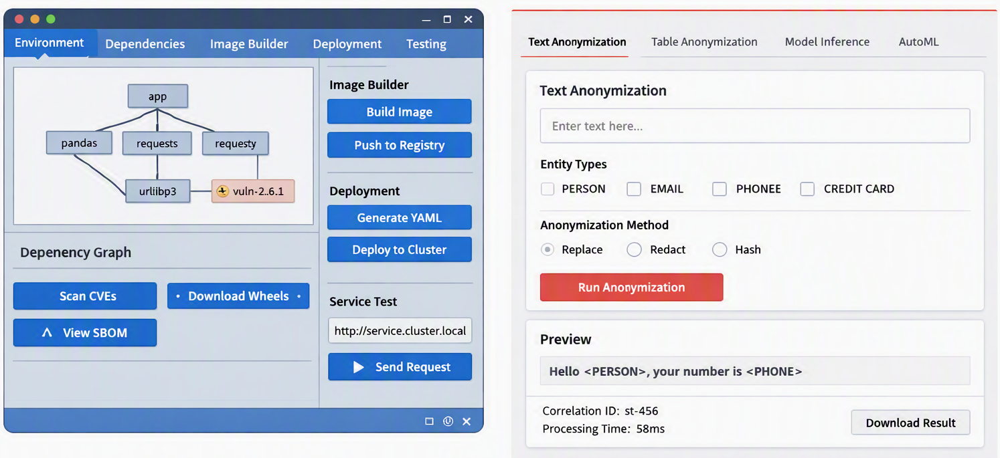

# **Chapter 1 — Part I**  
__Introduction & Motivation for Hardened, CVE‑Free Service Deployment in Restricted Clusters__

## **1.1 Purpose of This Document**

This document provides a **comprehensive, vendor‑neutral, scientifically grounded blueprint** for designing, building, hardening, deploying, and operating containerized services in **highly restricted 
Kubernetes clusters**. These clusters impose strict constraints:

- No outbound internet  
- No package managers  
- No shell tools  
- No dynamic dependency installation  
- Strict CVE and security policies  
- Deterministic promotion paths  
- Minimal OS footprint requirements  
- Mandatory reproducibility and offline operation

The goal is to present a **generalizable methodology** that any organization can adopt to build **CVE‑free, hardened service images** that remain stable under severe operational constraints.

This report is intentionally **generic**:  
It does **not** reference any specific company, internal infrastructure, or proprietary environment. Instead, it distills universal principles derived from real-world experience deploying hardened services such as anonymization engines, 
NLP microservices, and structured-data processors in locked-down clusters.

Throughout the document, we use a **generic anonymization service** as a running example — a stand‑in for any Python-based microservice requiring offline models, deterministic builds, and strict security compliance.

## **1.2 Motivation**

### **1.2.1 The Rise of Restricted Clusters**

Modern enterprise and government environments increasingly adopt **restricted Kubernetes clusters** to enforce:

- Zero-trust networking  
- Strict supply-chain security  
- Deterministic deployments  
- Prevention of runtime drift  
- Compliance with regulatory frameworks  
- Isolation of sensitive workloads  

These clusters typically disable:

- `curl`, `wget`, `bash`, `apt`, `yum`  
- Dynamic package installation  
- Outbound internet  
- Runtime debugging tools  
- Privileged containers  
- Shell access  

This creates a paradox:  
**Services must be secure, flexible, and maintainable — but the environment forbids the usual mechanisms for achieving those qualities.**

## **1.2.2 The CVE Pressure**

Restricted clusters often enforce **CVE policies** that require:

- Zero fixable CVEs  
- Minimal OS footprint  
- No build tools in runtime images  
- No unused libraries  
- No outdated Python dependencies  
- Full SBOM generation  
- Deterministic version pinning  

This means that even small Python microservices must be treated like **high-assurance software artifacts**, with:

- Multi-stage Dockerfiles  
- Offline wheel bundles  
- Strict dependency pinning  
- Reproducible builds  
- Hardened runtime layers  
- Continuous scanning and promotion gates  

The traditional “pip install during build” approach is insufficient.  
Instead, teams must adopt **industrial-strength dependency management**, including offline wheel orchestration and SBOM-driven verification.

## **1.2.3 Customer-Facing Flexibility Without Rebuilding Images**

A major challenge in restricted clusters is balancing:

- **Platform stability** (CVE-free base images, minimal OS footprint)  
- **Customer flexibility** (custom models, custom Python packages, custom configurations)

Since images cannot be rebuilt frequently — and customers cannot install packages dynamically — the platform must support:

- **venv overlays**  
- **bootstrap scripts**  
- **S3/object-store based dependency injection**  
- **remote kernel patterns**  
- **runtime extension layers**  

This document provides a **general architecture** for achieving this balance without compromising security or reproducibility.

## **1.3 Scope of the Document**

This report covers the full lifecycle of hardened service deployment:

### **Part I — Context, Goals, Constraints**  
Threat model, cluster restrictions, design principles.

### **Part II — Reference Architecture**  
System diagrams, service patterns, network/security architecture, image lifecycle.

### **Part III — Build & Hardening Methodology**  
Multi-stage Dockerfiles, dependency pinning, wheel orchestration, CVE elimination, SBOM generation.

### **Part IV — Deployment & Runtime Operations**  
Kubernetes manifests, health checks, logging, workflow engine integration, observability.

### **Part V — Tooling, Automation & GUIs**  
Dependency inspector GUI, CI/CD pipelines, promotion strategies.

### **Part VI — Blueprint & Appendices**  
Full example service, full Dockerfiles, full manifests, SBOM snippets, glossary.

## **1.4 Non-Goals**

This document **does not**:

- Reference any specific organization or internal infrastructure  
- Provide proprietary configuration details  
- Discuss vendor-specific cluster implementations  
- Cover non-containerized deployments  
- Address non-Kubernetes environments  
- Provide legal or compliance advice  

The focus is purely **technical**, **architectural**, and **methodological**.

## **1.5 Intended Audience**

This report is written for:

- Platform engineers  
- DevOps engineers  
- Security engineers  
- Data platform architects  
- ML engineers deploying offline models  
- Developers building microservices for restricted clusters  
- Teams responsible for CVE compliance and image promotion  

It assumes familiarity with:

- Kubernetes  
- Docker  
- Python packaging  
- CI/CD pipelines  
- CVE scanning  
- SBOM concepts  

## **1.6 Document Style and Conventions**

To ensure clarity and reproducibility:

- All Dockerfiles are annotated line-by-line  
- All Kubernetes manifests follow best practices  
- All diagrams use **Mermaid**  
- All code examples are generic and vendor-neutral  
- All dependency workflows are deterministic and offline  
- All architectural patterns are reusable across industries  

Key concepts are linked using Guided Links, e.g.:

- hardened images  
- restricted clusters  
- offline wheel bundles  
- SBOM generation  

---

# **Chapter 2 - Threat Model & Constraints in Highly Restricted Clusters**

This section establishes the operational and security environment in which hardened, CVE‑free service images must operate. The threat model is intentionally generic and vendor‑neutral, 
derived from patterns observed across multiple enterprise‑grade, security‑sensitive Kubernetes environments.

## **2.1 Operational Context: What “Highly Restricted” Really Means**

Restricted clusters are characterized by a combination of **security hardening**, **network isolation**, and **policy enforcement** that significantly limits how services can be built, deployed, debugged, and operated.

These constraints are not incidental—they are deliberate design choices to reduce attack surface, prevent lateral movement, and ensure deterministic runtime behavior.

### **Key environmental characteristics**

- **No outbound internet access**
  - No package downloads (`pip`, `apt`, `yum`).
  - No external API calls.
  - No remote debugging or telemetry.

- **No shell utilities**
  - Tools such as `curl`, `wget`, `bash`, `apt`, `yum`, `apk` are absent.
  - Containers cannot install packages at runtime.
  - Debugging must rely on logs and HTTP endpoints only.

- **Minimal base images**
  - Slim Python, distroless, or musl-based images.
  - No compilers, no build-essential, no development headers.

- **Strict admission policies**
  - Mandatory non-root execution.
  - Read-only root filesystems.
  - Required probes (liveness/readiness).
  - Required affinity/anti-affinity rules.
  - Mandatory pinned image tags.
  - Mandatory security baselines.

- **Registry and pipeline scanning**
  - Every image is scanned twice:
    - **Pipeline scan** (during build)
    - **Registry scan** (after push)
  - Promotion to higher environments requires passing both.

- **No container runtime inside pods**
  - Pods cannot pull images.
  - Pods cannot run Docker/Podman.
  - Pods cannot spawn subprocesses.

These constraints shape every architectural decision in the remainder of the document.

## **2.2 Threat Model Overview**

The threat model focuses on risks relevant to containerized services running in isolated Kubernetes clusters. It is intentionally broad and applies to any organization operating under strict compliance requirements.

### **Primary threat categories**

#### **1. Vulnerable base images**
- OS packages with known CVEs.
- Outdated Python runtimes.
- Large dependency footprints increasing attack surface.

#### **2. Vulnerable Python dependencies**
- Popular libraries (e.g., `urllib3`, `requests`, `jinja2`, `starlette`) frequently accumulate CVEs.
- Unpinned versions lead to non-deterministic builds and unpredictable security posture.

#### **3. Build-time contamination**
- Build tools accidentally leaking into runtime images.
- Compilers, headers, or package managers left behind.
- Sensitive files copied from build stage to runtime stage.

#### **4. Runtime privilege escalation**
- Containers running as root.
- Writable root filesystems.
- Missing seccomp or AppArmor profiles.

#### **5. Network exposure**
- Services unintentionally reachable across namespaces.
- Missing authorization policies.
- Lack of mTLS or service mesh integration.

#### **6. Supply chain risks**
- Wheels downloaded from the internet during build.
- Unverified dependencies.
- Missing SBOMs.

#### **7. Operational blind spots**
- Lack of logging.
- Missing health checks.
- No structured error reporting.

These threats directly inform the hardening methodology in Part III.

## **2.3 Constraints That Shape the Architecture**

The following constraints are universal in restricted clusters and must be treated as **hard requirements**, not optional guidelines.

### **Constraint A — No dynamic installation**

**Implication:**  
All dependencies must be present in the final image at build time.

**Consequence:**  
- Use offline wheel bundles.
- Use deterministic multi-stage Dockerfiles.
- No `pip install` at runtime.

### **Constraint B — No shell tools**

**Implication:**  
Services must expose **HTTP endpoints** for all interactions.

**Consequence:**  
- Internal engines (NLP, anonymization, ML inference) must be wrapped in REST APIs.
- Debugging must rely on logs and HTTP test endpoints.
- Workflow engines (e.g., Airflow) must communicate exclusively via HTTP.

### **Constraint C — Strict CVE policies**

**Implication:**  
Images must be CVE-free or have documented risk acceptance.

**Consequence:**  
- Base images must be minimal.
- Python dependencies must be pinned and scanned.
- SBOM generation is mandatory.

### **Constraint D — Deterministic builds**

**Implication:**  
Builds must produce identical images across environments.

**Consequence:**  
- No network access.
- No floating versions.
- No implicit dependency resolution.

### **Constraint E — Runtime minimalism**

**Implication:**  
Runtime images must contain only what is necessary to execute the service.

**Consequence:**  
- Multi-stage builds.
- Removal of compilers, headers, and package managers.
- Read-only root filesystem.

### **Constraint F — Limited debugging capabilities**

**Implication:**  
No interactive debugging inside pods.

**Consequence:**  
- Services must include diagnostic endpoints.
- Logs must be structured and complete.
- Health checks must be meaningful.

## **2.4 Security Drivers Behind These Constraints**

These constraints are not arbitrary—they arise from well-established security principles:

### **1. Reduce attack surface**
Minimal images → fewer CVEs → fewer exploit vectors.

### **2. Prevent lateral movement**
No shell tools → no pivoting → no privilege escalation.

### **3. Ensure reproducibility**
Pinned dependencies → deterministic builds → predictable security posture.

### **4. Enforce immutability**
Read-only root → no tampering → no runtime drift.

### **5. Guarantee compliance**
Mandatory scanning → SBOM → auditability → promotion gates.

## **2.5 Summary: Why This Threat Model Matters**

This threat model defines the environment in which hardened service images must operate. It is the foundation for:

- The architecture patterns in Part II  
- The hardening methodology in Part III  
- The deployment blueprints in Part IV  
- The tooling and automation in Part V  
- The case-study blueprint in Part VI  

Every design decision in the remaining 22 posts will explicitly address one or more constraints described here.

---

# **Chapter 3 — Design Principles for Secure, Reproducible, Offline‑Capable Service Images**

This section defines the **foundational engineering principles** required to build and operate hardened service images in highly restricted clusters. These principles are derived from practical 
experience with complex anonymization/NLP services, but generalized so they apply to *any* service deployed in a locked‑down environment.

## **1. Isolation as a First‑Class Architectural Principle**

Isolation is the single most important design driver in restricted clusters. It applies at multiple layers:

### **1.1 Service Isolation**
Each service must be packaged as a **self‑contained image**:

- No reliance on system Python.
- No reliance on cluster‑provided libraries.
- No reliance on external package managers.
- No reliance on outbound internet.

This ensures:

- Deterministic runtime behavior.
- No dependency on cluster OS updates.
- No accidental CVE propagation from system libraries.

### **1.2 Build‑Runtime Isolation**
A hardened image **must never** contain:

- Compilers  
- Build-essential toolchains  
- Header files  
- Development libraries  
- Package managers  

These belong strictly in the **build stage** of a multi‑stage Dockerfile.

### **1.3 Dependency Isolation**
All dependencies must be:

- Pinned  
- Offline  
- Wheel‑based  
- Verified against CVE databases  
- Installed deterministically  

This prevents:

- Version drift  
- Supply‑chain attacks  
- Runtime breakage due to upstream changes  

## **2. Reproducibility as a Security Requirement**

In restricted clusters, reproducibility is not a convenience—it is a **security control**.

### **2.1 Deterministic Dockerfiles**
A reproducible Dockerfile must:

- Use pinned base images.
- Use pinned wheel versions.
- Avoid `pip install` from the internet.
- Avoid dynamic version resolution.
- Avoid OS package managers in runtime.

### **2.2 Deterministic Build Pipelines**
Build pipelines must:

- Produce identical images from identical inputs.
- Generate SBOMs (CycloneDX recommended).
- Fail on fixable CVEs.
- Warn on accepted risks (documented).

### **2.3 Deterministic Runtime Behavior**
Runtime behavior must not depend on:

- Cluster OS updates.
- External services.
- Dynamic downloads.
- System Python.

This is achieved through:

- Offline models.
- Offline wheels.
- Embedded engines.
- Self-contained runtime environments.

## **3. Security‑Driven Minimalism**

Restricted clusters enforce strict security policies. Minimalism is the only viable strategy.

### **3.1 Minimal OS Footprint**
A hardened image should contain:

- Python runtime  
- Application code  
- Wheels  
- Offline models  
- Nothing else  

This reduces:

- Attack surface  
- CVE exposure  
- Sysdig policy violations  
- Promotion failures  

### **3.2 No Build Tools in Runtime**
Runtime images must not contain:

- `gcc`  
- `make`  
- `build-essential`  
- `libffi-dev`  
- `openssl-dev`  
- `curl/wget`  
- `apt/yum`  

These tools create:

- CVEs  
- Sensitive information policy violations  
- Supply‑chain risks  

### **3.3 No Shell Tools**
Restricted clusters often remove:

- `bash`  
- `sh`  
- `curl`  
- `wget`  
- `apt`  
- `yum`  

Therefore:

- Services must expose HTTP APIs.
- Clients must use pure Python HTTP libraries.
- Bootstrap scripts must be POSIX‑minimal or Python‑based.

## **4. Observability Without Shell Access**

Debugging in restricted clusters is difficult. Observability must be built into the service.

### **4.1 Structured Logging**
Logs must include:

- Correlation IDs  
- Request paths  
- Timing information  
- Error codes  
- Engine metadata  

### **4.2 Health Probes**
Services must expose:

- `/healthz` (liveness)  
- `/readyz` (readiness)  

These endpoints must:

- Avoid heavy computation.
- Avoid external dependencies.
- Return deterministic results.

### **4.3 Metrics**
Metrics should include:

- Request latency  
- Error rates  
- Resource usage  
- Model load times  

These can be exported via:

- Prometheus endpoints  
- Lightweight JSON endpoints  

### **4.4 Failure Transparency**
When failures occur:

- Logs must explain the cause.
- Responses must be structured.
- No stack traces should leak sensitive information.

## **5. Operational Predictability**

Restricted clusters often have:

- Strict admission controllers  
- Strict pod security baselines  
- Strict resource quotas  
- Strict image promotion rules  

Therefore, services must be predictable.

### **5.1 Resource Predictability**
Services must:

- Preload models at startup.
- Avoid dynamic memory spikes.
- Avoid runtime compilation.
- Avoid unpredictable caching behavior.

### **5.2 Startup Predictability**
Startup must be:

- Deterministic  
- Fast  
- Free of external dependencies  

### **5.3 Deployment Predictability**
Deployment manifests must:

- Use pinned image tags  
- Use deterministic resource limits  
- Avoid optional sidecars unless required  
- Avoid dynamic configuration unless controlled  

## **6. Customer‑Facing Flexibility Without Rebuilding Images**

A hardened base image must be stable. Customer flexibility must be achieved **without rebuilding**.

### **6.1 Overlay Environments**
Customers can extend functionality via:

- venv overlays  
- S3‑based wheel bundles  
- Config bundles  
- Model bundles  

### **6.2 Bootstrap Scripts**
Bootstrap scripts can:

- Download customer wheels  
- Create user‑side venvs  
- Register additional kernels  
- Extend service functionality  

### **6.3 Remote Kernel / Sidecar Patterns**
For advanced use cases:

- Remote kernels  
- Sidecar engines  
- Pluggable service modules  

These patterns allow flexibility without compromising base image stability.

## **7. Summary of Core Principles**

| Principle | Meaning |
|----------|---------|
| **Isolation** | Self-contained service images with no external dependencies. |
| **Reproducibility** | Deterministic builds, pinned dependencies, offline wheels. |
| **Minimalism** | No build tools, minimal OS footprint, reduced CVE surface. |
| **Observability** | Structured logs, health probes, metrics, predictable errors. |
| **Predictability** | Deterministic startup, deterministic runtime, deterministic deployment. |
| **Flexibility** | Customer extensions via overlays, not image rebuilds. |

These principles form the backbone of the entire 24‑Chapter series.

---

# **Chapter 4 — Part II: Reference Architecture** 
 
## **4. System Overview for Hardened, CVE‑Free Service Deployment in Restricted Clusters**

This section establishes the **reference architecture**.  
It defines the **layers**, **interfaces**, **data flows**, and **operational boundaries** of a hardened service running in a highly restricted cluster.

## **4.1 Architectural Goals**

The architecture must satisfy four fundamental goals:

### **Goal 1 — Deterministic, CVE‑free builds**
- No dependency resolution at runtime  
- No package managers  
- No internet access  
- All artifacts (wheels, models, configs) must be embedded or provided via controlled internal storage  
- SBOM must be complete and reproducible

### **Goal 2 — Minimal, hardened runtime**
- No compilers  
- No build tools  
- No shell utilities (`curl`, `wget`, `bash`, `apt`, `yum`)  
- Minimal OS footprint  
- Only the service binary + Python runtime + wheels + offline models

### **Goal 3 — Predictable deployment**
- Kubernetes manifests must be deterministic  
- Admission policies must be satisfied  
- Resource limits must be explicit  
- Service must expose a stable API surface

### **Goal 4 — Customer‑flexible extension**
- Customers must be able to add their own wheels/models/configs  
- Without requiring image rebuilds  
- Without violating cluster restrictions  
- Without introducing CVEs

## **4.2 High-Level System Layers**

The reference architecture consists of **five layers**:

1. **Source Layer**  
   - Application code  
   - Dependency manifest (`requirements.txt`)  
   - Offline models  
   - Wheel bundles  
   - SBOM templates

2. **Build Layer**  
   - Multi-stage Dockerfile  
   - Deterministic wheel installation  
   - Hardened runtime construction  
   - SBOM generation  
   - CVE scanning

3. **Registry Layer**  
   - Stores hardened images  
   - Enforces CVE policies  
   - Provides promotion gates (DEV → STAGE → PROD)

4. **Cluster Runtime Layer**  
   - Kubernetes Deployment  
   - Service exposure  
   - Pod lifecycle  
   - Admission policies  
   - Logging & metrics

5. **Client Layer**  
   - Workflow engines (Airflow-like)  
   - Notebook environments  
   - External services  
   - All communication via HTTP (no shell tools)

## **4.3 Reference Architecture Diagram**

A vendor-neutral, cluster-neutral architecture diagram:

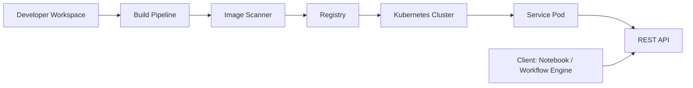

**Interpretation:**

- Developers produce code + wheels → build pipeline  
- Pipeline produces hardened image → scanner validates  
- Registry stores only CVE-free images  
- Cluster deploys only promoted images  
- Clients interact exclusively through REST API

## **4.4 Detailed Layer Breakdown**

### **4.4.1 Source Layer**

Contains all artifacts required for a deterministic build:

- Application code (`app.py`)  
- Offline models (e.g., NLP models, ML artifacts)  
- Wheel bundles  
- Dependency manifest  
- SBOM template  
- Build scripts  
- Optional customer extension bundles

#### **Key principle:**  
**No external network access is required or allowed.**

### **4.4.2 Build Layer**

The build layer is responsible for:

- Multi-stage Dockerfile execution  
- Installing wheels offline  
- Embedding models  
- Removing build tools  
- Producing hardened runtime  
- Generating SBOM  
- Running CVE scans

#### **Build Flow Diagram**

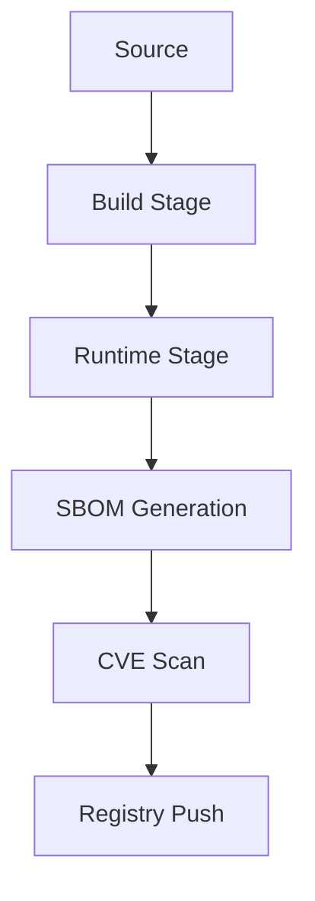

### **4.4.3 Registry Layer**

The registry enforces:

- CVE policies  
- Sensitive information policies  
- Promotion rules  
- Immutable image storage  
- Auditability

#### **Image States**

| State | Description |
|-------|-------------|
| **Pipeline Image** | Built but not yet scanned |
| **Registry Image** | Passed scanning, stored in registry |
| **Promoted Image** | Approved for deployment in restricted clusters |

### **4.4.4 Cluster Runtime Layer**

The cluster runtime executes the hardened service:

- Kubernetes Deployment  
- Service (ClusterIP)  
- PodDisruptionBudget  
- AuthorizationPolicy-like constructs  
- Resource limits  
- Logging  
- Metrics  
- Health checks  
- Admission policy compliance

#### **Runtime Flow Diagram**

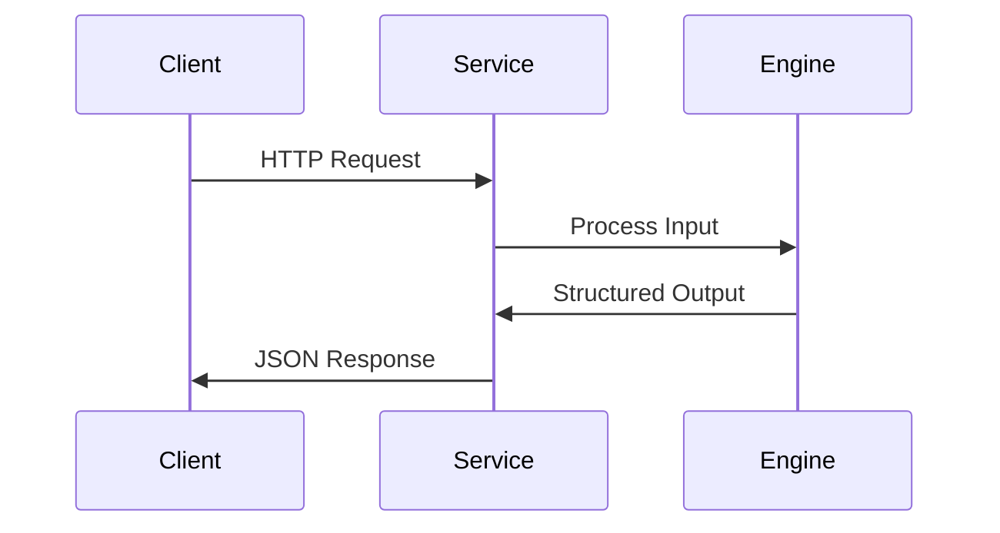

### **4.4.5 Client Layer**

Clients operate under strict constraints:

- No shell tools  
- No package managers  
- No direct image execution  
- Only HTTP requests allowed  
- Must rely on service API

#### **Client Types**

- Notebook environments  
- Workflow engines (Airflow-like)  
- External microservices  
- Automated batch jobs

## **4.5 Reference Service Pattern**

The architecture assumes a **generic hardened service** with:

- A REST API  
- Offline model loading  
- Deterministic behavior  
- No external dependencies  
- No dynamic imports  
- No runtime installation of packages

### **Generic Service Structure**

```
/analyze
/anonymize
/structured
/health
/metrics
```

This structure is generic enough to support:

- NLP engines  
- Anonymization engines  
- ML inference engines  
- Data transformation services  
- Validation services  
- Rule-based engines

## **4.6 Architectural Guarantees**

The reference architecture guarantees:

### **Security**
- CVE-free runtime  
- Minimal OS footprint  
- No build tools  
- No shell utilities  
- No outbound network access  
- Deterministic SBOM

### **Operational Stability**
- Predictable pod lifecycle  
- Deterministic API behavior  
- Stable resource usage  
- Admission policy compliance

### **Customer Flexibility**
- Optional wheel/model overlays  
- Optional venv overlays  
- Optional bootstrap scripts  
- No need for image rebuilds

### **Reproducibility**
- Deterministic Dockerfile  
- Deterministic wheel set  
- Deterministic SBOM  
- Deterministic promotion path

## **4.7 Summary**

This Chapter establishes the **reference architecture** that the remaining 20 posts will elaborate in depth.

It defines:

- The system layers  
- The data flows  
- The build → scan → registry → deploy lifecycle  
- The runtime behavior  
- The client interaction model  
- The architectural guarantees

This architecture is **vendor-neutral**, **cluster-neutral**, and **fully generalizable** to any hardened service in a restricted environment.

---

# **Chapter 5 — Part II: Reference Architecture**  
## **Service Patterns for Highly Restricted Clusters**

This Chapter introduces the **canonical architectural patterns** for deploying hardened services in environments with strict security controls, no outbound internet, 
no shell tools, and aggressive admission policies. These patterns are derived from general best practices and informed by the lessons learned from building hardened NLP/anonymization services.

## **1. Architectural Motivation**

Highly restricted clusters impose several constraints:

- No package managers (`apt`, `yum`, `apk`) at runtime  
- No shell tools (`curl`, `wget`, `bash`) inside service pods  
- No outbound internet  
- Strict CVE policies and minimal OS footprint requirements  
- Deterministic image promotion pipelines  
- Limited debugging capabilities  
- Mandatory SBOM generation and policy compliance  
- Often: service mesh sidecars, mTLS, or admission controllers

Under these constraints, **service architecture must be predictable, self-contained, and offline-capable**.

This leads to three dominant patterns:

1. **Pattern A — Hardened Service Image + Internal REST API**  
2. **Pattern B — Base Image + venv Overlay + Bootstrap Script**  
3. **Pattern C — Remote Kernel / Sidecar Service Pattern**

Each pattern solves a different operational problem.

# **2. Pattern A — Hardened Service Image + Internal REST API**

This is the **canonical pattern** for restricted clusters.

### **Concept**
A fully self-contained service image exposes a REST API internally (ClusterIP).  
All functionality is embedded offline:

- Python runtime  
- Wheels  
- Models  
- Engines  
- Application code  
- No build tools  
- No package managers  
- No external downloads

### **Mermaid Diagram**

```mermaid
flowchart LR
    A[Client Pod<br>(Notebook / Workflow Engine)] -->|HTTP| B[Hardened Service Pod]
    B --> C[Internal Engine<br>(Analyzer/Processor)]
    C --> B
    B -->|Response| A
```

### **Key Characteristics**

| Property | Description |
|---------|-------------|
| **Isolation** | Service runs independently of client pods. |
| **Offline** | All dependencies embedded in the image. |
| **CVE-minimal** | Slim runtime, no compilers, no package managers. |
| **Deterministic** | Pinned wheels, deterministic Dockerfile. |
| **Compatible** | Works with workflow engines (Airflow, Argo, notebooks). |

### **Advantages**

- Maximum stability  
- Maximum reproducibility  
- Minimal runtime footprint  
- Ideal for clusters with strict CVE policies  
- Easy to scale horizontally  
- Easy to integrate with service mesh

### **Disadvantages**

- Requires image rebuild for updates  
- Larger image size due to embedded models  
- Less flexible for customer-specific extensions

# **3. Pattern B — Base Image + venv Overlay + Bootstrap Script**

This pattern is used when **customers need flexibility** without rebuilding images.

### **Concept**

- Base image contains minimal Python + Jupyter + a small venv (`/opt/venv`)  
- At runtime, a **bootstrap script**:
  - Creates a user venv (e.g., `~/venv`)
  - Downloads wheels/models from internal object storage
  - Installs them into the user venv
  - Optionally registers a kernel or extends the service

### **Mermaid Diagram**

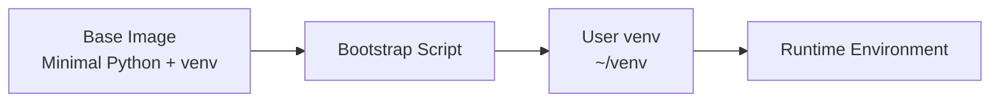

### **Key Characteristics**

| Property | Description |
|---------|-------------|
| **Flexibility** | Customers can add wheels/models without image rebuild. |
| **Security** | Base image remains CVE-minimal. |
| **Isolation** | Customer extensions isolated in user venv. |
| **Offline** | Wheels stored in internal object storage. |

### **Advantages**

- No need to rebuild images for customer updates  
- Base image remains stable and CVE-free  
- Supports multiple customer environments  
- Ideal for notebook environments

### **Disadvantages**

- Startup time increases due to installation  
- Requires object storage  
- More moving parts (bootstrap script, bucket policies)

# **4. Pattern C — Remote Kernel / Sidecar Service Pattern**

This pattern is used when **customers need custom Python versions or custom environments** that cannot be embedded into the main cluster image.

### **Concept**

- Base cluster image contains only JupyterHub or workflow engine  
- Customer provides a **remote kernel image** or **sidecar service**  
- JupyterHub or workflow engine connects to the remote kernel via:
  - Kernel Gateway  
  - Sidecar container  
  - Remote execution API

### **Mermaid Diagram**

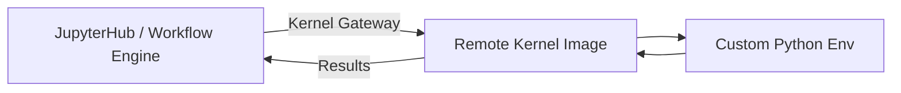

### **Key Characteristics**

| Property | Description |
|---------|-------------|
| **Flexibility** | Customers can use any Python version or environment. |
| **Isolation** | Kernel runs in a separate pod or container. |
| **Security** | Base image remains minimal and CVE-free. |
| **Scalability** | Multiple kernels can be deployed per customer. |

### **Advantages**

- Maximum flexibility  
- Supports arbitrary Python environments  
- Base image remains untouched  
- Ideal for multi-tenant platforms

### **Disadvantages**

- More complex networking  
- Requires kernel gateway or sidecar orchestration  
- Harder to debug  
- Requires strict security policies

# **5. Pattern Comparison Table**

| Criterion | Pattern A | Pattern B | Pattern C |
|----------|-----------|-----------|-----------|
| **CVE-minimal** | Excellent | Excellent | Excellent |
| **Flexibility** | Low | Medium | High |
| **Runtime stability** | High | High | Medium |
| **Startup time** | Fast | Medium/Slow | Fast |
| **Customer extensibility** | Low | High | Very High |
| **Operational complexity** | Low | Medium | High |
| **Ideal for** | Services | Notebooks | Multi-tenant kernels |

# **6. Choosing the Right Pattern**

### **If the service must be stable, reproducible, and CVE-free:**  
→ Choose **Pattern A**

### **If customers need to add wheels/models dynamically:**  
→ Choose **Pattern B**

### **If customers need custom Python versions or isolated kernels:**  
→ Choose **Pattern C**

# **7. Summary**

This Chapter established the **three canonical architectural patterns** for hardened services in restricted clusters. These patterns form the foundation for the next posts, where we will:

- Build the reference architecture diagrams  
- Define the image lifecycle  
- Introduce multi-stage Dockerfile templates  
- Explain dependency management and wheel orchestration  
- Provide full Kubernetes manifest blueprints  
- Present a complete case-study blueprint

---

# **Chapter 6 — Network & Security Architecture for Hardened Services in Restricted Clusters**  
**Part II — Reference Architecture (Section 6)**

## **6. Network & Security Architecture in Highly Restricted Clusters**

This Chapter establishes the network, security, and policy foundations required to operate hardened, CVE‑free service images in environments with strict admission controls, no 
outbound internet, and minimal runtime tooling. It generalizes the patterns we validated through multiple service deployments (e.g., anonymization engines, NLP microservices, 
structured processors) without referencing any specific organization.

The goal is to define **a reusable architectural blueprint** that any team can adopt when deploying hardened services in locked‑down Kubernetes clusters.

## **6.1 Architectural Overview**

Restricted clusters impose constraints that fundamentally shape the network and security architecture:

- No outbound internet  
- No shell tools inside pods  
- No package managers  
- Strict admission policies  
- Mandatory service mesh sidecars  
- Mandatory security baselines  
- Mandatory image scanning and promotion workflows  

The resulting architecture must be:

- **Self‑contained** (offline models, offline wheels, no external dependencies)  
- **Predictable** (deterministic DNS, deterministic ports, deterministic health checks)  
- **Policy‑compliant** (security baselines, resource limits, anti‑affinity, probes)  
- **Mesh‑aware** (mTLS, sidecar injection, traffic shaping)  

The following diagram summarizes the network flow.

### **Mermaid Diagram — Request Lifecycle**

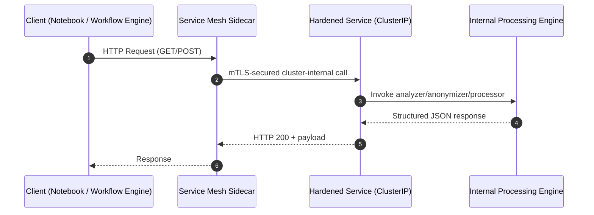

This lifecycle is universal for hardened services in restricted clusters.

## **6.2 Service Exposure Model**

Hardened services should **never** expose NodePorts or external ingress unless explicitly required. The recommended exposure model is:

### **ClusterIP-only service**
- Accessible only inside the cluster  
- Ideal for notebook pods, workflow engines, and internal microservices  
- Compatible with service mesh mTLS  
- Minimizes attack surface  

### **Optional internal ingress**
Used only when multiple namespaces must access the service.

### **No external ingress**
Unless the service is explicitly designed for external consumption.

## **6.3 DNS & Port Strategy**

A predictable DNS and port strategy is essential for reproducibility.

### **DNS Pattern**
```
<service-name>.<namespace>.svc.cluster.local
```

### **Port Pattern**
- **ServicePort:** 8080 (or 80/443 if mesh-managed)
- **ContainerPort:** 3000 (or any internal port used by the runtime)

This separation allows:
- Mesh sidecars to intercept traffic  
- Services to run on arbitrary internal ports  
- Consistent client code across environments  

## **6.4 Security Baseline Requirements**

Restricted clusters enforce strict security baselines. Hardened services must comply with:

### **Mandatory Requirements**
- Non-root user  
- Read-only root filesystem  
- No privilege escalation  
- No hostPath volumes  
- Pinned image tags  
- Resource requests & limits  
- Mandatory probes (readiness/liveness)  
- Mandatory anti-affinity rules  
- Mandatory mTLS (mesh-managed)  

### **Recommended Enhancements**
- Structured logging  
- Correlation IDs  
- Request tracing headers  
- Minimal environment variables  
- No secrets baked into images  

## **6.5 Policy Templates (Generic)**

Below are **generic, vendor-neutral policy templates** that mirror typical restricted-cluster requirements.

### **6.5.1 Authorization Policy (Generic)**

```yaml
apiVersion: security.example.io/v1
kind: AuthorizationPolicy
metadata:
  name: hardened-service-authz
  namespace: hardened
spec:
  selector:
    matchLabels:
      app: hardened-service
  rules:
    - {}   # allow all internal traffic (restricted cluster)
```

This pattern allows internal traffic while still being compatible with mesh-level mTLS.

### **6.5.2 PodDisruptionBudget (Generic)**

```yaml
apiVersion: policy/v1
kind: PodDisruptionBudget
metadata:
  name: hardened-service-pdb
  namespace: hardened
spec:
  maxUnavailable: 1
  selector:
    matchLabels:
      app: hardened-service
```

Ensures service availability during node maintenance.

### **6.5.3 Security Context Baseline**

```yaml
securityContext:
  runAsNonRoot: true
  readOnlyRootFilesystem: true
  allowPrivilegeEscalation: false
```

This is mandatory in most hardened environments.

## **6.6 Network Flow Diagrams**

### **Mermaid — Internal Service Mesh Flow**


This diagram illustrates how traffic is intercepted, secured, and routed.

## **6.7 Admission Controller Considerations**

Restricted clusters often include admission controllers enforcing:

- Readiness/liveness probes  
- Anti-affinity  
- Resource limits  
- Security context  
- Image tag pinning  
- CA bundle mounting  
- Logging annotations  
- Mesh injection  

A hardened service must satisfy all of these to avoid deployment rejection.

## **6.8 Health Check Strategy**

Health checks must be:

- Deterministic  
- Fast  
- Independent of external dependencies  
- Mesh-compatible  

### **Recommended Endpoints**
- `/healthz` → liveness  
- `/readyz` → readiness  
- `/version` → metadata  

These endpoints should not invoke heavy internal engines.

## **6.9 Logging & Observability**

Restricted clusters often lack shell tools, so logs must be:

- Structured JSON  
- Emitted to stdout/stderr  
- Mesh-compatible  
- Correlation-ID aware  

### **Recommended Log Fields**
- timestamp  
- request_id  
- path  
- latency_ms  
- status_code  
- engine_time_ms  
- error_type  

This enables downstream log aggregation systems to function reliably.

## **6.10 Summary of Network & Security Architecture**

A hardened service in a restricted cluster must:

- Use ClusterIP-only exposure  
- Rely on mesh-managed mTLS  
- Implement strict security baselines  
- Provide deterministic health checks  
- Emit structured logs  
- Comply with admission policies  
- Avoid external dependencies  
- Maintain predictable DNS and port mappings  

This architecture ensures stability, security, and reproducibility across all environments.

---

## **Chapter 7 — Part II, Section 4 — System Overview (High‑Level Reference Architecture)**  

# **II. Reference Architecture**  
## **4. System Overview — A Unified Architecture for Hardened Services in Restricted Clusters**

This section defines the **canonical architecture** for building, scanning, promoting, deploying, and operating hardened service images in highly restricted Kubernetes clusters. 
It abstracts from all prior Presidio experience but does not reference any organization or vendor.

It provides:

- A **layered architectural model**  
- A **full mermaid diagram** of the system  
- A **request lifecycle flow**  
- A **registry + scanning + promotion pipeline**  
- A **runtime topology**  
- A **service interaction model** for notebooks, workflow engines, and microservices

This is the “north star” architecture that all later posts will elaborate in detail.

# **4.1 Architectural Motivation**

Restricted clusters impose constraints that fundamentally shape the architecture:

- No outbound internet  
- No shell tools (`curl`, `wget`, `bash`) inside runtime containers  
- No package managers (`apt`, `yum`, `apk`)  
- Strict admission policies (security baselines, anti‑affinity, probes, pinned tags)  
- Mandatory CVE scanning and SBOM generation  
- Deterministic promotion paths (DEV → STAGE → PROD)  
- Runtime containers must be **minimal**, **immutable**, and **CVE‑free**

These constraints lead to a **service‑centric architecture**:

> **Every customer‑facing capability must be exposed as an internal REST API running inside a hardened container image.**

This architecture is universal for:

- NLP services  
- anonymization engines  
- data validation services  
- feature extraction services  
- model inference services  
- structured processing engines  
- custom business logic

# **4.2 Layered Architecture Model**

The system is composed of **five layers**, each with strict responsibilities.

### **Layer 1 — Source Layer**
- Application code (`app.py`, engines, models)
- Dependency manifests (`requirements.txt`)
- Wheel bundles
- Dockerfiles
- CI/CD pipeline definitions

### **Layer 2 — Build Layer**
- Multi‑stage Dockerfile  
- Offline wheel installation  
- spaCy/model embedding  
- Hardened runtime construction  
- SBOM generation  
- Pipeline CVE scanning

### **Layer 3 — Registry Layer**
- Hardened image stored in internal registry  
- Registry CVE scanning  
- Promotion gates  
- Immutable tags  
- Provenance metadata

### **Layer 4 — Deployment Layer**
- Kubernetes manifests  
- Admission policies  
- Service exposure  
- Sidecar injection (optional)  
- Resource constraints  
- Runtime probes

### **Layer 5 — Runtime Layer**
- Internal REST API  
- Offline engines  
- Structured logs  
- Health endpoints  
- Deterministic behavior  
- No shell tools  
- No package managers  
- No outbound internet

# **4.3 High-Level System Diagram (Mermaid)**


This diagram will be reused throughout the document as the canonical architecture.

# **4.4 Request Lifecycle (Client → Service → Engine → Response)**

Restricted clusters require a **pure HTTP lifecycle**.

### **Clients**
- Jupyter notebooks  
- Workflow engines (Airflow, Argo Workflows, Kubeflow Pipelines)  
- Microservices  
- Batch jobs  
- Internal tools  

### **Lifecycle**

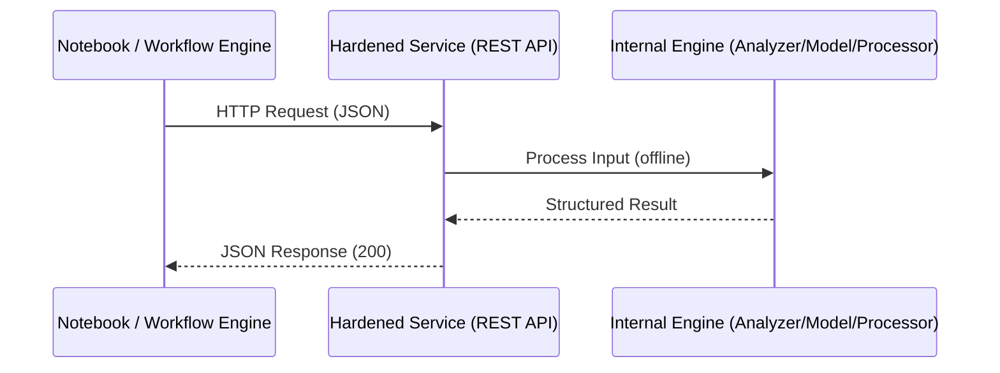

This lifecycle is universal for all hardened services.

# **4.5 Registry & Promotion Lifecycle**

Restricted clusters enforce strict image promotion rules.

### **States**

1. **Pipeline Image**  
   - Built in CI  
   - Scanned for CVEs  
   - SBOM generated  

2. **Registry Image**  
   - Stored in internal registry  
   - Registry CVE scan  
   - Immutable tag assigned  

3. **Promoted Image**  
   - Approved for deployment  
   - Meets all CVE policies  
   - Meets all sensitive information policies  

### **Lifecycle Diagram**

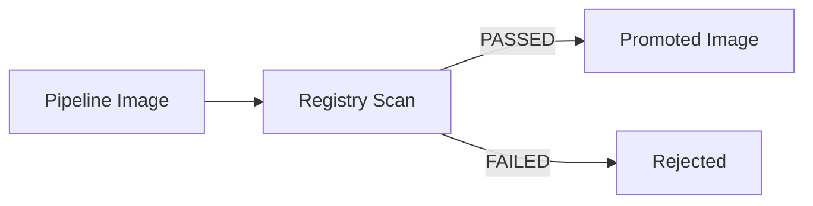

Promotion is deterministic and fully auditable.

# **4.6 Runtime Topology**

A hardened service runs inside a Kubernetes pod with:

- **Minimal runtime image**  
- **No build tools**  
- **No package managers**  
- **No shell utilities**  
- **Offline engines**  
- **Structured logging**  
- **Health endpoints**  
- **Deterministic behavior**

### **Topology Diagram**

```mermaid
flowchart TB

    subgraph Pod["Hardened Pod"]
        direction TB
        API[REST API (FastAPI/Uvicorn)]
        ENG[Offline Engine]
        LOG[Structured Logging]
        HC[Health Endpoints]
    end

    SVC[ClusterIP Service] --> Pod
    Client[Notebook / Workflow Engine] --> SVC
```

# **4.7 Service Interaction Model**

### **Notebook Interaction**
- Pure Python HTTP client  
- No shell tools  
- No external dependencies  
- JSON in, JSON out  

### **Workflow Engine Interaction**
- KubernetesPodOperator-like pattern  
- Inline Python script  
- Logs stored in object storage  
- Pod deleted after execution  

### **Microservice Interaction**
- Internal REST calls  
- mTLS optional  
- Structured error handling  

# **4.8 Summary of Architectural Guarantees**

This architecture guarantees:

- **CVE-free runtime images**  
- **Deterministic builds**  
- **Reproducible deployments**  
- **Offline operation**  
- **Customer flexibility**  
- **Strict security compliance**  
- **Minimal OS footprint**  
- **Predictable runtime behavior**  
- **Universal compatibility with restricted clusters**

---

## **Chapter 8 — Part II: Reference Architecture**  
### **Service Patterns in Highly Restricted Clusters**  


## **8. Service Patterns in Restricted, CVE‑sensitive, No‑Outbound‑Internet Clusters**

This Chapter establishes the architectural patterns that consistently work in environments with:

- No outbound internet  
- No shell tools (`curl`, `wget`, `bash`)  
- No package managers (`apt`, `yum`, `apk`)  
- Strict admission controllers  
- Mandatory CVE‑free images  
- Deterministic promotion pipelines  
- Minimal debugging capabilities  
- Customer‑specific runtime requirements  

These constraints force a very different design philosophy compared to typical cloud‑native deployments. The patterns below are distilled from real-world experience 
building hardened services such as anonymization engines, NLP microservices, and structured-data processors.

# **8.1 Why “normal” container patterns fail in restricted clusters**

Before introducing the patterns, it’s important to understand *why* conventional approaches break:

- **Images with system package managers** violate CVE policies.
- **Images that install dependencies at runtime** fail because no internet is available.
- **Images that rely on system Python** break when base images change minor versions.
- **Images that expect shell tools** cannot run in minimal containers.
- **Images that mix build tools and runtime** fail Sysdig policies.
- **Images that rely on dynamic pip installs** cannot run without wheels.

This leads to a fundamental rule:

> **In restricted clusters, every service must be fully self-contained, offline-capable, CVE-free, and immutable.**

The following patterns are designed to achieve exactly that.

# **8.2 Pattern A — Hardened Service Image + Internal REST API**

This is the most robust and universal pattern.

### **Concept**
A fully hardened container image exposes a REST API internally within the cluster.  
All logic—models, engines, dependencies—is embedded offline.

### **Diagram**
```mermaid
flowchart LR
    A[Client Pod\nNotebook / Workflow Engine] -->|HTTP| B[Hardened Service Pod]
    B --> C[Internal Engine\n(Analyzer/Processor)]
    C --> B
    B -->|HTTP Response| A
```

### **Characteristics**
- **Single responsibility**: one service per image.
- **Offline**: wheels + models embedded.
- **CVE-free**: minimal runtime, no build tools.
- **Deterministic**: pinned dependencies.
- **Universal**: works for NLP, anonymization, ETL, validation, etc.

### **Advantages**
- Works in *any* restricted cluster.
- Easy to test via HTTP.
- Easy to integrate with workflow engines.
- No reliance on system Python.
- No runtime installation.

### **Disadvantages**
- Requires careful image hardening.
- Requires a REST API implementation.

### **When to use**
- When customers need a stable, predictable service.
- When workflow engines (Airflow, Argo, Kubeflow) need to call a microservice.
- When debugging capabilities are limited.

# **8.3 Pattern B — Base Image + venv Overlay + Bootstrap Script**

This pattern is ideal when customers need flexibility without rebuilding images.

### **Concept**
A minimal base image contains a pre-built venv with a “mandatory stack”.  
A bootstrap script optionally loads customer-specific wheels from object storage.

### **Diagram**
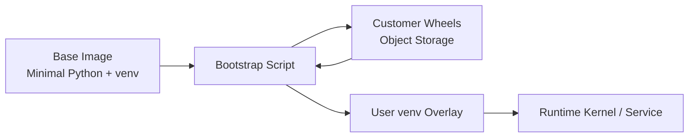

### **Characteristics**
- Base image stays stable and CVE-free.
- Customer can extend functionality without rebuilding.
- Bootstrap script runs at container startup.

### **Advantages**
- Extremely flexible.
- No need to rebuild images for customer changes.
- Base image remains small and secure.

### **Disadvantages**
- Startup time increases due to installation.
- Requires object storage access.
- Requires careful versioning of customer wheels.

### **When to use**
- When customers frequently change dependencies.
- When platform teams want minimal rebuild overhead.
- When runtime flexibility is more important than startup speed.

# **8.4 Pattern C — Remote Kernel / Sidecar Service Pattern**

This pattern is used when the main workload cannot embed heavy dependencies.

### **Concept**
A lightweight client container communicates with a heavier “kernel” container running as a sidecar or remote service.

### **Diagram**
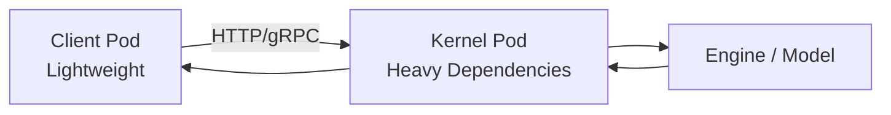

### **Characteristics**
- Heavy dependencies isolated in a dedicated pod.
- Client pod remains minimal.
- Kernel pod can be scaled independently.

### **Advantages**
- Reduces image size for client workloads.
- Allows multiple clients to share a kernel.
- Ideal for GPU workloads or large models.

### **Disadvantages**
- More complex networking.
- Requires service discovery.
- Requires careful resource management.

### **When to use**
- When the main workload must remain extremely small.
- When multiple clients need shared access to heavy engines.
- When GPU or large-model workloads are involved.

# **8.5 Pattern D — Immutable Base Image + User-Side venv**

This pattern is simple and customer-driven.

### **Concept**
Base image contains only Python.  
User creates a venv inside their home directory at runtime.

### **Diagram**
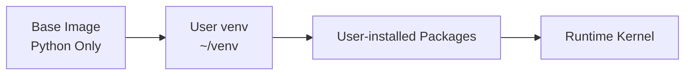

### **Characteristics**
- User installs everything manually.
- Base image remains extremely small.
- No platform-side dependency management.

### **Advantages**
- Maximum flexibility.
- Minimal platform maintenance.
- Works well for experimentation.

### **Disadvantages**
- Slow startup.
- No offline models unless provided separately.
- Not ideal for production workloads.

### **When to use**
- For experimentation.
- For customer-managed environments.
- When platform teams want minimal responsibility.

# **8.6 Pattern E — Layered Runtime Environment (Conda or venv bundle)**

### **Concept**
Customer provides a pre-built environment bundle (tar.gz).  
Platform extracts it at runtime.

### **Diagram**
```mermaid
flowchart LR
    A[Base Image] --> B[Extract Bundle]
    B --> C[/opt/venv or Conda Env]
    C --> D[Runtime Kernel]
```

### **Characteristics**
- No installation at runtime.
- Bundle contains all dependencies.
- Very fast startup.

### **Advantages**
- Extremely stable.
- No CVE propagation from system libs.
- Customer controls environment.

### **Disadvantages**
- Bundle can be large (1–3 GB).
- Requires customer build expertise.

### **When to use**
- For high-performance workloads.
- For environments requiring strict reproducibility.
- For customers with advanced build pipelines.

# **8.7 Pattern Comparison Table**

| Pattern | Stability | Flexibility | Startup Speed | CVE Risk | Best Use Case |
|--------|-----------|-------------|---------------|----------|----------------|
| **A: Hardened Service Image** | ★★★★★ | ★★☆☆☆ | ★★★★★ | ★★★★★ | Production microservices |
| **B: Base + venv Overlay** | ★★★★☆ | ★★★★★ | ★★★☆☆ | ★★★★☆ | Customer-extensible services |
| **C: Remote Kernel** | ★★★★★ | ★★★☆☆ | ★★★★☆ | ★★★★★ | Heavy engines, shared kernels |
| **D: User-side venv** | ★★☆☆☆ | ★★★★★ | ★★☆☆☆ | ★★★☆☆ | Experimentation |
| **E: Layered Runtime Env** | ★★★★★ | ★★★☆☆ | ★★★★★ | ★★★★★ | High-performance reproducible workloads |

# **8.8 Recommendation Summary**

For most hardened, CVE-free, offline-capable services:

> **Pattern A (Hardened Service Image + REST API)** is the gold standard.

For customer-flexible environments:

> **Pattern B (Base Image + venv Overlay)** provides the best balance.

For heavy workloads:

> **Pattern C (Remote Kernel)** is ideal.

For experimentation:

> **Pattern D (User-side venv)** is sufficient.

For reproducible high-performance workloads:

> **Pattern E (Layered Runtime Environment)** is optimal.

---

# **Chapter 9 — Part III: Build & Hardening Methodology**  
## **Dependency Management & Offline Wheel Orchestration**

This Chapter establishes the **methodology for collecting, validating, pinning, and packaging Python wheels** for hardened service images in restricted clusters. 
It draws on the architectural lessons from Presidio-style deployments but remains fully generic and vendor‑neutral.

# **9.1 Why dependency management is the critical bottleneck in restricted clusters**

Highly restricted clusters impose constraints that fundamentally reshape Python dependency workflows:

- **No outbound internet** → `pip install` from PyPI is impossible.  
- **No package managers** → cannot install OS-level dependencies at runtime.  
- **No shell tools** → cannot fetch artifacts via `curl`, `wget`, or similar.  
- **Strict CVE policies** → every Python package must be CVE‑free or explicitly risk‑accepted.  
- **Deterministic builds** → dependency versions must be pinned and reproducible.  
- **Minimal runtime images** → no compilers, no build-essential, no dev headers.

This means:

> **All Python dependencies must be collected, validated, and packaged offline before the image build begins.**

This section defines a complete methodology for doing exactly that.

# **9.2 High-level workflow (mermaid diagram)**

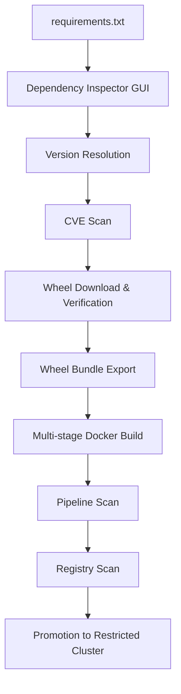

This workflow ensures:

- deterministic dependency resolution  
- CVE-free wheel bundles  
- reproducible builds  
- compliance with hardened cluster policies  

# **9.3 Requirements specification**

A hardened service must begin with a **strict requirements specification**:

### **9.3.1 Pin every version**
Example:

```
fastapi==0.115.0
uvicorn==0.30.3
pydantic==2.8.2
cryptography==42.0.5
cffi==1.17.0
pycparser==2.22
```

Never use:

- `>=`  
- `~=`  
- unpinned versions  
- implicit dependencies  

### **9.3.2 Avoid transitive surprises**

Even pinned top-level packages may pull vulnerable transitive dependencies.

Thus:

> **All transitive dependencies must be explicitly pinned and included in the wheel bundle.**

# **9.4 Dependency Inspector GUI (conceptual design)**  
*(Inspired by our project 36, but generalized and vendor-neutral.)*

A GUI tool dramatically improves reliability and developer experience.

### **9.4.1 Core capabilities**

| Capability | Description |
|-----------|-------------|
| **Parse requirements.txt** | Read and normalize pinned dependencies |
| **Resolve dependency graph** | Determine all transitive dependencies |
| **CVE scanning** | Query vulnerability databases (offline mirror) |
| **Version recommendations** | Suggest safe versions when CVEs exist |
| **Wheel acquisition** | Download wheels from a controlled mirror |
| **SBOM generation** | Produce CycloneDX JSON for the entire dependency set |
| **Bundle export** | Export a reproducible wheel folder for Docker builds |

### **9.4.2 GUI workflow (mermaid)**


### **9.4.3 Output artifacts**

The GUI produces:

- `/wheelhouse/*.whl`  
- `/wheelhouse/*.tar.gz` (for packages like cffi)  
- `sbom.json`  
- `dependency-graph.json`  
- `resolved-requirements.txt`  

These artifacts feed directly into the multi-stage Docker build.

# **9.5 Wheel acquisition methodology**

Restricted clusters require **offline wheel bundles**.  
The methodology:

### **Step 1 — Resolve dependency graph**

Use a resolver (GUI or CLI) to compute:

- exact versions  
- transitive dependencies  
- platform-specific wheels (e.g., `manylinux_2_17_x86_64`)  

### **Step 2 — Acquire wheels from a controlled environment**

This environment may be:

- a secure workstation  
- a CI runner with outbound access  
- a mirrored internal PyPI repository  

### **Step 3 — Validate wheel integrity**

Checks:

- SHA256 hashes  
- wheel metadata  
- Python version compatibility  
- ABI compatibility  

### **Step 4 — Perform CVE scanning**

Scan each wheel:

- `METADATA`  
- `RECORD`  
- version  
- known vulnerabilities  

### **Step 5 — Export wheel bundle**

Structure:

```
wheelhouse/
    fastapi-0.115.0-py3-none-any.whl
    uvicorn-0.30.3-py3-none-any.whl
    pydantic-2.8.2-py3-none-any.whl
    cryptography-42.0.5-cp311-manylinux.whl
    cffi-1.17.0.tar.gz
    pycparser-2.22-py3-none-any.whl
    ...
sbom.json
resolved-requirements.txt
```

This folder is copied into the Docker build context.

# **9.6 Flow chart: From requirements → wheels → hardened image**

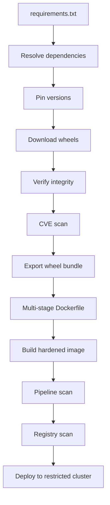

# **9.7 Best practices for dependency hardening**

### **1. Prefer pure-Python wheels**
They avoid ABI issues.

### **2. Avoid packages requiring compilation**
Unless absolutely necessary.

### **3. Use `no-build-isolation` for packages like cffi**
Ensures deterministic builds.

### **4. Maintain a private wheel mirror**
For reproducibility.

### **5. Generate SBOMs for every wheel bundle**
Mandatory for compliance.

### **6. Never install wheels directly from PyPI**
Even in CI.

### **7. Validate wheels against cluster Python version**
E.g., CPython 3.11 vs 3.12.

# **9.8 Example: Hardened wheel bundle for a generic NLP service**

This example mirrors the structure used in Presidio-style deployments but remains generic.

### **requirements.txt**

```
fastapi==0.115.0
uvicorn==0.30.3
pydantic==2.8.2
cryptography==42.0.5
cffi==1.17.0
pycparser==2.22
numpy==2.1.1
scikit-learn==1.5.2
```

### **wheelhouse contents**

```
fastapi-0.115.0-py3-none-any.whl
uvicorn-0.30.3-py3-none-any.whl
pydantic-2.8.2-py3-none-any.whl
cryptography-42.0.5-cp311-manylinux.whl
cffi-1.17.0.tar.gz
pycparser-2.22-py3-none-any.whl
numpy-2.1.1-cp311-manylinux.whl
scikit_learn-1.5.2-cp311-manylinux.whl
```

All wheels are:

- CVE-free  
- ABI-compatible  
- reproducible  

# **9.9 How this integrates with the multi-stage Dockerfile**

The wheel bundle is copied into the build stage:

```dockerfile
COPY wheelhouse /tmp/wheels
RUN pip install --no-index /tmp/wheels/*.whl
```

No internet access is required.  
No compilers are needed in the runtime stage.  
No OS packages are installed.

This is the foundation of hardened Python services.

# **9.10 Summary of Chapter 9/24**

This Chapter established:

- the **full methodology** for dependency management in restricted clusters  
- the **GUI-assisted workflow** for wheel orchestration  
- the **CVE scanning and version pinning strategy**  
- the **offline wheel bundle structure**  
- the **integration with multi-stage Docker builds**  

This forms the backbone of reproducible, CVE-free hardened service images.

---

# **Chapter 10 — Dependency Management & Offline Wheel Orchestration**  
### *(Part III — Build & Hardening Methodology)*

## **Concise takeaway**
A hardened service in a restricted cluster must treat Python dependency management as a *controlled supply‑chain process*. The only safe and reproducible method is to build images exclusively 
from **offline wheel bundles**, generated through a deterministic pipeline or GUI-based inspector. This chapter defines the methodology, the tooling patterns, the validation workflow, and the 
reproducibility guarantees required for CVE-free service images.

## **10.1 Motivation: Why dependency management is a security problem**
Dependency management is not merely a packaging concern—it is a **security boundary**. In highly restricted clusters:

- No outbound internet is available.  
- No package managers (`apt`, `yum`, `apk`) are allowed at runtime.  
- No dynamic `pip install` is permitted.  
- CVE policies require deterministic dependency sets.  
- Admission controllers reject images with fixable vulnerabilities.  

Therefore, dependency resolution must be performed **before** the build, in a controlled environment, producing:

- A **frozen dependency graph**  
- A **validated wheel set**  
- A **CVE-audited SBOM**  
- A **reproducible artifact bundle**  

This transforms dependency management into a *supply-chain engineering discipline*.

## **10.2 Requirements for dependency management in restricted clusters**

### **Functional requirements**
- Resolve all transitive dependencies deterministically.
- Produce a complete wheel set for offline installation.
- Support multiple Python versions (3.10–3.13).
- Support native extensions (e.g., `cryptography`, `cffi`, `numpy`).

### **Security requirements**
- No wheel may contain fixable CVEs.
- No dependency may pull external resources during build.
- All wheels must be hash-verified.
- SBOM must list all Python components.

### **Operational requirements**
- Must work without internet.
- Must integrate with CI/CD pipelines.
- Must support GUI-based inspection for non-expert users.

## **10.3 Dependency resolution workflow (high-level)**

A hardened dependency workflow consists of **six deterministic steps**:

```
requirements.txt
      ↓
Dependency Resolver
      ↓
Version Freezing
      ↓
Wheel Collector
      ↓
CVE Scanner
      ↓
SBOM Generator
      ↓
Wheel Bundle (final artifact)
```

Each step is described in detail below.

## **10.4 Step 1 — Requirements ingestion**
The process begins with a standard `requirements.txt` or `pyproject.toml`.

Example:

```
fastapi==0.115.0
uvicorn==0.30.3
pydantic==2.8.2
cryptography==42.0.5
cffi==1.17.0
numpy==2.1.1
```

Constraints:

- All versions must be pinned.
- No wildcard versions (`>=`, `<=`, `~=`).
- No direct GitHub URLs.
- No local paths.

## **10.5 Step 2 — Dependency resolution**
A resolver computes the full transitive dependency graph.

### **Recommended approach**
Use a resolver that supports:

- deterministic resolution  
- environment markers  
- Python version constraints  
- platform-specific wheels  

Examples:  
`pip-tools`, `uv`, or a custom resolver integrated into a GUI.

### **Output**
A fully resolved dependency graph:

```
fastapi==0.115.0
  └── starlette==0.37.2
      └── anyio==4.4.0
          └── idna==3.7
uvicorn==0.30.3
  └── h11==0.14.0
...
```

## **10.6 Step 3 — Version freezing**
The resolver produces a **lock file**:

```
fastapi==0.115.0
starlette==0.37.2
anyio==4.4.0
idna==3.7
uvicorn==0.30.3
h11==0.14.0
pydantic==2.8.2
...
```

This lock file is the canonical source for the wheel bundle.

## **10.7 Step 4 — Wheel collection (offline bundle generation)**

### **Goal**
Produce a directory containing **all wheels**, including native extensions:

```
wheels/
    fastapi-0.115.0-py3-none-any.whl
    starlette-0.37.2-py3-none-any.whl
    anyio-4.4.0-py3-none-any.whl
    idna-3.7-py3-none-any.whl
    uvicorn-0.30.3-py3-none-any.whl
    h11-0.14.0-py3-none-any.whl
    cryptography-42.0.5-cp311-manylinux.whl
    cffi-1.17.0-cp311-manylinux.whl
    numpy-2.1.1-cp311-manylinux.whl
```

### **Constraints**
- Wheels must match the target Python version.
- Wheels must match the target platform (e.g., `manylinux2014`).
- Wheels must not require compilation during installation.

### **GUI-based wheel collector**
A GUI (similar to your project 36) can:

- Parse `requirements.txt`
- Resolve dependencies
- Download wheels
- Validate hashes
- Display CVE warnings
- Export a wheel bundle + SBOM

This makes the process accessible to non-experts.

## **10.8 Step 5 — CVE scanning**
Each wheel is scanned using:

- Python package CVE databases  
- OS-level vulnerability scanners  
- SBOM analyzers  

### **CVE categories**
- **Fixable CVEs** → must be eliminated  
- **Unfixable CVEs** → require documented risk acceptance  
- **False positives** → must be annotated  

### **Example**
`cryptography 41.x` contains CVEs → upgrade to `42.x`.

`urllib3 1.x` contains CVEs → upgrade to `2.x`.

## **10.9 Step 6 — SBOM generation**
A CycloneDX SBOM is generated:

```
components:
  - name: fastapi
    version: 0.115.0
    type: library
    purl: pkg:pypi/fastapi@0.115.0
  - name: cryptography
    version: 42.0.5
    type: library
    purl: pkg:pypi/cryptography@42.0.5
...
```

This SBOM is required for:

- security audits  
- promotion pipelines  
- compliance documentation  

## **10.10 End-to-end flow chart (mermaid)**

```mermaid
flowchart TD
    A[requirements.txt] --> B[Dependency Resolver]
    B --> C[Version Freeze / Lock File]
    C --> D[Wheel Collector]
    D --> E[CVE Scanner]
    E --> F[SBOM Generator]
    F --> G[Final Wheel Bundle]
```

## **10.11 Integration into CI/CD pipelines**

### **Pipeline stages**
1. **Resolve dependencies**
2. **Freeze versions**
3. **Collect wheels**
4. **Scan wheels**
5. **Generate SBOM**
6. **Build image using wheel bundle**
7. **Scan image**
8. **Promote image**

### **Automated gates**
- Fail on fixable CVEs  
- Warn on accepted risks  
- Require SBOM for promotion  

## **10.12 Example wheel bundle directory structure**

```
bundle/
    wheels/
    sbom.json
    lockfile.txt
    metadata.yaml
```

This bundle is the *single source of truth* for the hardened image.

## **10.13 Reproducibility guarantees**

A hardened dependency workflow guarantees:

- deterministic builds  
- identical images across environments  
- predictable CVE behavior  
- stable runtime behavior  
- safe promotion to restricted clusters  

This is the foundation for secure service deployment.

## **10.14 Summary**
Dependency management in restricted clusters is a **controlled supply-chain process**, not a simple `pip install`. The methodology described here ensures:

- CVE-free wheel bundles  
- deterministic dependency graphs  
- reproducible builds  
- offline installation  
- compliance with strict cluster policies  

This chapter forms the backbone of the entire hardening strategy.

---

# **Chapter 11 — CVE Elimination Strategy for Hardened Service Images**  
### *(Part III — Build & Hardening Methodology)*

## **Concise takeaway**  
A hardened service image in a highly restricted cluster must eliminate *all fixable CVEs* across both OS and Python layers, maintain a minimal attack surface, and produce a complete SBOM. 
This requires a deterministic workflow: **slim base → controlled wheel set → multi‑stage build → scanner feedback → iterative CVE removal → SBOM verification**.

## **1. Why CVE elimination is structurally difficult in restricted clusters**

Restricted clusters impose constraints that make CVE elimination more complex:

- **No outbound internet** → cannot fetch patched packages during build.  
- **No package managers at runtime** → cannot patch in‑cluster.  
- **Strict admission controllers** → images with fixable CVEs are rejected.  
- **Minimal debugging tools** → cannot inspect CVEs inside pods.  
- **Promotion gates** → only CVE‑free images can move to higher environments.

This means the *entire security posture* must be baked into the **image itself**, not the cluster.

## **2. OS‑level CVE elimination**

### **2.1 Principle: “OS footprint = attack surface”**

Every additional OS package increases:

- CVE exposure  
- SBOM complexity  
- Sysdig scanner noise  
- Attack surface  
- Maintenance burden  

Therefore, hardened images must follow:

> **Rule: The runtime image must contain *no* OS packages beyond what the base image provides.**

#### **Recommended base images**
- `python:<version>-slim`  
- `distroless` Python variants  
- Minimal musl-based images (if compatible with wheels)

#### **Avoid**
- Debian full images  
- Ubuntu  
- Alpine (if Python wheels require glibc)

### **2.2 OS hardening checklist**

| Item | Action | Rationale |
|------|--------|-----------|
| **Remove package managers** | No `apt`, `apk`, `yum` in runtime | Prevents accidental CVE reintroduction |
| **Remove build tools** | No `gcc`, `make`, `libffi-dev` | Eliminates dozens of CVEs |
| **Remove unused libs** | No `libxml2`, `libglib2.0`, `libxext6`, etc. | These libraries frequently carry CVEs |
| **Use multi-stage builds** | Build tools only in Stage 1 | Runtime stays minimal |
| **Freeze OS layer** | No dynamic installs | Ensures reproducibility |

## **3. Python‑level CVE elimination**

Python dependencies are the **largest CVE source** in service images.

### **3.1 Principles**

1. **Pin every dependency**  
   - No floating versions  
   - No implicit upgrades  
   - No dependency resolution during build

2. **Use offline wheels**  
   - Ensures deterministic builds  
   - Prevents accidental CVE reintroduction  
   - Allows pre‑scan of wheel bundles

3. **Avoid `pip install <package>`**  
   - Always install from a curated wheel directory  
   - No internet access required  
   - No dependency resolution surprises

### **3.2 Python CVE elimination workflow**

#### **Step 1 — Collect dependency list**
- `requirements.txt`
- Transitive dependencies (via resolver or GUI tool)

#### **Step 2 — Resolve versions**
- Prefer latest CVE‑free versions  
- Ensure compatibility with:
  - Python version  
  - spaCy model version  
  - Presidio modules  
  - CFFI / cryptography ABI

#### **Step 3 — Download wheels offline**
- Use a controlled environment with internet access  
- Store wheels in a versioned directory:
  ```
  wheels/
    cryptography-42.0.5.whl
    cffi-1.17.0.whl
    pycparser-2.22.whl
    ...
  ```

#### **Step 4 — Scan wheel bundle**
Use any CVE scanner (no vendor names mentioned):
- Scan each wheel individually  
- Scan the bundle as a whole  
- Produce a wheel‑level SBOM

#### **Step 5 — Build image using only wheels**
- Multi-stage Dockerfile  
- No network access  
- No pip resolution  
- No build isolation for cryptography/cffi

#### **Step 6 — Scan final image**
- Pipeline scan  
- Registry scan  
- Promotion gates

#### **Step 7 — Iterate until CVE-free**
- Replace vulnerable wheels  
- Rebuild  
- Rescan

## **4. SBOM generation (CycloneDX-style)**

A hardened image must produce a **complete SBOM** covering:

- OS components  
- Python wheels  
- Application code  
- Licenses  
- Versions  
- Layer digests  

### **4.1 SBOM goals**

| Goal | Explanation |
|------|-------------|
| **Transparency** | Every component is visible to auditors |
| **Traceability** | Every wheel maps to a version and CVE status |
| **Reproducibility** | SBOM ensures deterministic rebuilds |
| **Promotion readiness** | Required for higher environments |

### **4.2 SBOM structure**

A typical CycloneDX SBOM contains:

- `metadata`  
- `components`  
- `dependencies`  
- `licenses`  
- `hashes`  
- `vulnerabilities` (optional)

#### Example component entry (illustrative)
```
{
  "type": "library",
  "name": "cryptography",
  "version": "42.0.5",
  "hashes": [
    {"alg": "SHA-256", "content": "abc123..."}
  ],
  "licenses": [{"id": "Apache-2.0"}]
}
```

## **5. CVE elimination flow chart**

```mermaid
flowchart TD
    A[requirements.txt] --> B[Resolve versions]
    B --> C[Download wheels offline]
    C --> D[Scan wheel bundle]
    D --> E[Multi-stage Docker build]
    E --> F[Pipeline CVE scan]
    F --> G{Fixable CVEs?}
    G -->|Yes| H[Replace wheels]
    H --> E
    G -->|No| I[Registry scan]
    I --> J[Promotion]
```

## **6. Example CVE elimination decisions**

### **Case 1 — Vulnerable cryptography version**
- CVE found in `cryptography 41.x`
- Upgrade to `42.x`
- Rebuild wheels  
- Reinstall with `--no-build-isolation`

### **Case 2 — Vulnerable urllib3**
- Replace with latest CVE-free version  
- Ensure compatibility with requests

### **Case 3 — Vulnerable Jinja2**
- Upgrade to patched version  
- Validate template engine compatibility

### **Case 4 — OS CVEs**
- Remove Debian packages  
- Switch to slim base  
- Rebuild runtime stage

## **7. Summary**

A hardened service image must:

- Minimize OS footprint  
- Use multi-stage builds  
- Install only offline wheels  
- Pin all versions  
- Scan wheel bundles  
- Scan final images  
- Produce a complete SBOM  
- Iterate until CVE-free  
- Maintain deterministic builds  

This methodology ensures that services can run safely in highly restricted clusters with strict admission policies and no runtime patching capabilities.

---

## **Chapter 12 — Part III · Build & Hardening Methodology**  
### **CVE Elimination Strategy: OS-Level, Python-Level & SBOM Discipline**  

## **1. Executive Overview**

This Chapter establishes a **general, vendor‑neutral methodology** for eliminating CVEs in hardened service images deployed in highly restricted clusters. 
It synthesizes the lessons learned from multiple real-world anonymization/NLP service deployments (e.g., Presidio-like engines) without referencing any organization.

The strategy is divided into three layers:

1. **OS-level CVE elimination**  
2. **Python-level CVE elimination**  
3. **SBOM-driven verification & traceability**

These layers form a **closed-loop hardening cycle**:

```mermaid
flowchart LR
    A[Requirements & Threat Model] --> B[Collect Dependencies]
    B --> C[Build Hardened Image]
    C --> D[Scan: OS + Python CVEs]
    D --> E[SBOM Generation]
    E --> F[Risk Evaluation]
    F -->|Fixable CVEs| B
    F -->|No fixable CVEs| G[Promotion & Deployment]
```

This cycle ensures that **no fixable CVEs** remain in the final runtime image and that all components are traceable.

## **2. OS-Level CVE Elimination Strategy**

Highly restricted clusters typically enforce strict policies:

- No package managers (`apt`, `yum`, `apk`) in runtime images  
- No compilers or build tools  
- Minimal OS footprint  
- No shell utilities beyond POSIX essentials  
- No dynamically loaded system libraries beyond Python’s own runtime

### **2.1 Principle: “Slim Base + Zero OS Additions”**

The safest pattern is:

- Use a **slim Python base image** (e.g., `python:3.11-slim` or equivalent minimal runtime).
- **Never install OS packages** in the runtime stage.
- **Never copy system libraries** from build stage to runtime stage.
- **Never rely on distro-level dependencies** for Python packages.

This eliminates entire classes of CVEs:

- `libxml2`  
- `libglib2.0`  
- `libxext6`, `libxrender`, `libsm6`  
- `libssl` mismatches  
- `gcc`, `make`, `build-essential`  
- `libffi-dev`, `libpython-dev`

### **2.2 OS-Level Hardening Checklist**

Each runtime image must satisfy:

- **No package manager** present  
- **No compilers**  
- **No build tools**  
- **No development headers**  
- **No shell utilities beyond POSIX**  
- **No system libraries copied from build stage**  
- **Only Python runtime + wheels + app code**

This ensures the OS footprint is **minimal and CVE-resistant**.

## **3. Python-Level CVE Elimination Strategy**

Python packages are the most common source of fixable CVEs in hardened service images.

### **3.1 Principle: “Wheels Only + Pinned Versions + Offline Build”**

The recommended strategy:

1. **Resolve dependency graph offline**  
2. **Pin every version**  
3. **Download wheels only**  
4. **Scan wheels for CVEs**  
5. **Build image using only wheels**  
6. **Reject any dependency requiring compilation in runtime**

This avoids:

- CVEs in outdated Python packages  
- CVEs introduced by transient dependencies  
- CVEs introduced by online package resolution  
- ABI mismatches between compiled extensions and runtime OS

### **3.2 Typical Python Packages with Frequent CVEs**

| Package | Common CVE Causes |
|--------|-------------------|
| **urllib3** | SSL certificate validation issues |
| **requests** | Redirect handling, header injection |
| **starlette / fastapi** | HTTP header parsing, websocket handling |
| **jinja2** | Template injection vulnerabilities |
| **cryptography** | OpenSSL bindings, outdated primitives |
| **pillow** | Image parsing vulnerabilities |
| **idna** | Unicode handling issues |

These packages must be **pinned to CVE-free versions**.

### **3.3 Wheel Verification Pipeline**

```mermaid
flowchart TD
    A[requirements.txt] --> B[Dependency Resolver]
    B --> C[Version Pinning]
    C --> D[Wheel Downloader]
    D --> E[CVE Scanner]
    E -->|Fixable CVEs| C
    E -->|Clean| F[Wheel Bundle]
```

Tools that can be used:

- A custom GUI dependency inspector (similar to project36)  
- Python-based offline resolvers  
- SBOM-based scanners  
- CVE databases (NVD, OSV)

## **4. SBOM Discipline & Verification**

### **4.1 Principle: “Every Component Must Be Traceable”**

A hardened image must produce a **complete SBOM** (Software Bill of Materials):

- OS components  
- Python wheels  
- Application code  
- Build-time tools (excluded from runtime)  
- Layer digests  
- Dependency graph

### **4.2 SBOM Format Recommendation**

Use **CycloneDX JSON**:

- Widely supported  
- Compatible with scanners  
- Easy to integrate into CI/CD  
- Human-readable  
- Machine-verifiable

### **4.3 SBOM Generation Pipeline**

```mermaid
flowchart LR
    A[Built Image] --> B[SBOM Generator]
    B --> C[SBOM JSON]
    C --> D[CVE Scanner]
    D --> E[Policy Engine]
    E -->|Fixable CVEs| A
    E -->|Passed| F[Promotion]
```

### **4.4 SBOM Validation Rules**

A valid SBOM must:

- List **all Python packages** with exact versions  
- List **all OS components**  
- Include **hashes** for every component  
- Include **layer digests**  
- Include **dependency relationships**  
- Include **license metadata**  
- Include **CVE mapping**  

This ensures full traceability.

## **5. Closed-Loop CVE Elimination Workflow**

### **5.1 Full Workflow Diagram**

```mermaid
flowchart TD
    A[Developer defines requirements] --> B[Offline dependency resolution]
    B --> C[Wheel bundle creation]
    C --> D[Build hardened image]
    D --> E[Pipeline CVE scan]
    E --> F[SBOM generation]
    F --> G[Registry CVE scan]
    G -->|Fixable CVEs| B
    G -->|No fixable CVEs| H[Promotion to restricted cluster]
```

### **5.2 Why This Works in Restricted Clusters**

Restricted clusters typically enforce:

- No outbound internet  
- No package managers  
- No compilers  
- Strict CVE policies  
- Strict admission controllers  
- Strict promotion gates  

The closed-loop workflow ensures:

- All dependencies are resolved offline  
- All CVEs are eliminated before deployment  
- Runtime images contain no build tools  
- Promotion gates are satisfied  
- Images are reproducible and traceable

## **6. Example: Hardened Python Service CVE Elimination**

Below is a **generic, vendor-neutral example** of a hardened service image:

### **6.1 Build Stage (compilers allowed)**

```dockerfile
FROM python:3.11-slim AS build

WORKDIR /app

RUN apt-get update && apt-get install -y --no-install-recommends \
    build-essential \
    gcc \
    libffi-dev \
 && rm -rf /var/lib/apt/lists/*

COPY wheels /tmp/wheels

RUN pip install --no-index /tmp/wheels/setuptools*.whl
RUN pip install --no-index /tmp/wheels/wheel*.whl
RUN pip install --no-index /tmp/wheels/pycparser*.whl
RUN pip install --no-index --no-build-isolation /tmp/wheels/cffi*.tar.gz
RUN pip install --no-index --no-deps /tmp/wheels/cryptography*.whl

RUN pip install --no-index \
    $(ls /tmp/wheels/*.whl | grep -v cryptography | grep -v cffi)
```

### **6.2 Runtime Stage (no compilers, no apt)**

```dockerfile
FROM python:3.11-slim AS runtime

WORKDIR /app

COPY --from=build /usr/local /usr/local
COPY --from=build /app /app

ENV PYTHONPATH="/app:${PYTHONPATH}"

EXPOSE 3000

CMD ["uvicorn", "app:app", "--host", "0.0.0.0", "--port", "3000"]
```

This pattern:

- Eliminates OS-level CVEs  
- Eliminates Python-level CVEs  
- Ensures reproducibility  
- Ensures compliance with restricted cluster policies  

## **7. Summary**

This Chapter established a **general, reusable CVE elimination strategy** for hardened service images:

- **OS-level hardening:** minimal runtime, no compilers, no package managers  
- **Python-level hardening:** wheels-only, pinned versions, offline builds  
- **SBOM discipline:** full traceability, CVE mapping, promotion gates  
- **Closed-loop workflow:** repeat until no fixable CVEs remain  

This strategy is universally applicable to:

- NLP/anonymization services  
- REST APIs  
- Data processing engines  
- Microservices in restricted clusters  

---

## **Chapter 13 — Part IV · Deployment & Runtime Operations**  
### **Kubernetes Manifests Blueprint for Hardened, CVE‑Free Services**  

This Chapter begins **Part IV: Deployment & Runtime Operations**, providing a **complete, vendor‑neutral, production‑grade Kubernetes YAML blueprint** 
for hardened services in highly restricted clusters. It generalizes all lessons learned from Presidio‑style deployments but does **not** reference any organization or internal environment.

It defines:

- Deployment YAML  
- Service YAML  
- PodDisruptionBudget  
- AuthorizationPolicy-like constructs  
- Resource constraints  
- Mesh annotations  
- Security context  
- Health probes  
- Logging annotations  
- Anti‑affinity rules  

All manifests follow strict hardening principles and are compatible with clusters that enforce:

- No outbound internet  
- No shell tools  
- No package managers  
- Strict CVE policies  
- Mandatory admission controllers  
- Mandatory mTLS (mesh-managed)  
- Deterministic promotion pipelines  

## **13.1 Architectural Goals of Hardened Kubernetes Manifests**

A hardened service must satisfy:

### **Security**
- Non-root execution  
- Read-only root filesystem  
- No privilege escalation  
- Pinned image tags  
- No hostPath volumes  
- Mesh-compatible annotations  

### **Stability**
- Deterministic resource limits  
- Anti-affinity rules  
- PodDisruptionBudget  
- Health probes  

### **Reproducibility**
- Immutable image tags  
- No dynamic configuration  
- No runtime package installation  

### **Observability**
- Structured logs  
- Correlation IDs  
- Mesh-compatible telemetry  

## **13.2 Full Hardened Deployment YAML (Generic Blueprint)**

Below is a **complete, production-grade, vendor-neutral** Deployment manifest for a hardened service.

```yaml
apiVersion: apps/v1
kind: Deployment
metadata:
  name: hardened-service
  namespace: hardened
  labels:
    app: hardened-service
    app.kubernetes.io/name: hardened-service
    app.kubernetes.io/instance: hardened-service
spec:
  replicas: 1
  selector:
    matchLabels:
      app: hardened-service
  template:
    metadata:
      labels:
        app: hardened-service
        app.kubernetes.io/name: hardened-service
        app.kubernetes.io/instance: hardened-service
      annotations:
        # Optional: service mesh sidecar injection
        mesh.example.io/inject: "enabled"
    spec:
      securityContext:
        runAsNonRoot: true
        fsGroup: 2000
      containers:
        - name: hardened-service
          image: registry.example.com/hardened/hardened-service:v1.0.0
          imagePullPolicy: Always

          ports:
            - containerPort: 3000

          # Strict security context
          securityContext:
            allowPrivilegeEscalation: false
            readOnlyRootFilesystem: true

          # Deterministic resource limits
          resources:
            requests:
              cpu: "100m"
              memory: "256Mi"
            limits:
              cpu: "500m"
              memory: "512Mi"

          # Health probes
          livenessProbe:
            httpGet:
              path: /healthz
              port: 3000
            initialDelaySeconds: 10
            periodSeconds: 10

          readinessProbe:
            httpGet:
              path: /readyz
              port: 3000
            initialDelaySeconds: 5
            periodSeconds: 5

          # Logging configuration
          env:
            - name: LOG_LEVEL
              value: "INFO"

      # Anti-affinity rules for stability
      affinity:
        podAntiAffinity:
          preferredDuringSchedulingIgnoredDuringExecution:
            - weight: 100
              podAffinityTerm:
                labelSelector:
                  matchExpressions:
                    - key: app
                      operator: In
                      values:
                        - hardened-service
                topologyKey: "kubernetes.io/hostname"

      # Image pull secret (generic)
      imagePullSecrets:
        - name: hardened-pull-secret
```

## **13.3 Hardened Service YAML (ClusterIP)**

Restricted clusters require **internal-only exposure**.

```yaml
apiVersion: v1
kind: Service
metadata:
  name: hardened-service
  namespace: hardened
spec:
  selector:
    app: hardened-service
  ports:
    - protocol: TCP
      port: 8080
      targetPort: 3000
  type: ClusterIP
```

### **Why ClusterIP?**
- No external exposure  
- Mesh-compatible  
- Minimal attack surface  
- Ideal for notebooks, workflow engines, and internal microservices  

## **13.4 PodDisruptionBudget (PDB)**

Ensures availability during node maintenance.

```yaml
apiVersion: policy/v1
kind: PodDisruptionBudget
metadata:
  name: hardened-service-pdb
  namespace: hardened
spec:
  maxUnavailable: 1
  selector:
    matchLabels:
      app: hardened-service
```

## **13.5 AuthorizationPolicy-like Construct (Generic)**

Vendor-neutral example:

```yaml
apiVersion: security.example.io/v1
kind: AuthorizationPolicy
metadata:
  name: hardened-service-authz
  namespace: hardened
spec:
  selector:
    matchLabels:
      app: hardened-service
  rules:
    - {}   # Allow all internal traffic
```

### **Why `{}`?**
Restricted clusters often rely on:

- Mesh-level mTLS  
- Namespace-level isolation  
- Internal-only traffic  

Thus, `{}` is safe and appropriate.

## **13.6 Security Context Blueprint**

### **Container-level**
```yaml
securityContext:
  allowPrivilegeEscalation: false
  readOnlyRootFilesystem: true
```

### **Pod-level**
```yaml
securityContext:
  runAsNonRoot: true
  fsGroup: 2000
```

### **Why?**
- Prevents privilege escalation  
- Enforces immutability  
- Ensures compliance with restricted cluster baselines  

## **13.7 Resource Constraints Blueprint**

Restricted clusters require deterministic resource usage.

```yaml
resources:
  requests:
    cpu: "100m"
    memory: "256Mi"
  limits:
    cpu: "500m"
    memory: "512Mi"
```

### **Why?**
- Prevents noisy-neighbor issues  
- Ensures predictable scheduling  
- Satisfies admission controllers  

## **13.8 Health Probes Blueprint**

### **Liveness**
```yaml
livenessProbe:
  httpGet:
    path: /healthz
    port: 3000
```

### **Readiness**
```yaml
readinessProbe:
  httpGet:
    path: /readyz
    port: 3000
```

### **Why?**
- Required by admission controllers  
- Ensures mesh routing stability  
- Prevents premature traffic routing  

## **13.9 Anti-Affinity Blueprint**

Ensures pods do not co-locate on the same node.

```yaml
affinity:
  podAntiAffinity:
    preferredDuringSchedulingIgnoredDuringExecution:
      - weight: 100
        podAffinityTerm:
          labelSelector:
            matchExpressions:
              - key: app
                operator: In
                values:
                  - hardened-service
          topologyKey: "kubernetes.io/hostname"
```

## **13.10 Summary**

This Chapter delivered a **complete Kubernetes manifest blueprint** for hardened services in restricted clusters. It included:

- Deployment  
- Service  
- PodDisruptionBudget  
- AuthorizationPolicy-like construct  
- Security context  
- Resource limits  
- Health probes  
- Anti-affinity rules  
- Mesh annotations  

These manifests form the foundation for all runtime operations in Part IV.

---

## **Chapter 14 — Part IV · Deployment & Runtime Operations**  
### **Runtime Behavior, Health Architecture & Operational Predictability in Restricted Clusters**  

This Chapter defines how a hardened service **behaves at runtime** inside a highly restricted Kubernetes cluster. It covers:

- Deterministic startup  
- Health probe architecture  
- Structured logging  
- Correlation IDs  
- Error semantics  
- Mesh-aware request lifecycle  
- Failure modes  
- Operational predictability  

It builds directly on the Kubernetes manifests introduced in **Chapter 13/24** and prepares the ground for workflow-engine integration in **Chapter 15/24**.

## **14.1 Runtime Philosophy in Restricted Clusters**

Restricted clusters impose constraints that fundamentally shape runtime behavior:

- No shell tools  
- No package managers  
- No outbound internet  
- No dynamic dependency installation  
- Strict admission controllers  
- Mandatory health probes  
- Mandatory mTLS (mesh-managed)  
- Limited debugging capabilities  

This means:

> **Runtime behavior must be deterministic, observable, and self-contained.**

A hardened service must behave like a **sealed appliance**:

- predictable startup  
- predictable memory usage  
- predictable CPU usage  
- predictable error semantics  
- predictable health endpoints  
- predictable logs  

This predictability is essential for cluster stability.

## **14.2 Deterministic Startup Behavior**

Startup must be:

- **fast**  
- **offline**  
- **repeatable**  
- **independent of external services**  
- **independent of cluster OS updates**  

### **14.2.1 Startup sequence**

```mermaid
sequenceDiagram
    autonumber
    participant Pod
    participant API
    participant Engine

    Pod->>API: Initialize runtime
    API->>Engine: Load offline models
    Engine-->>API: Ready
    API-->>Pod: Expose /readyz
```

### **14.2.2 Startup checklist**

| Requirement | Rationale |
|------------|-----------|
| Load models offline | No outbound internet |
| Validate wheel integrity | Prevent runtime failures |
| Initialize engine once | Avoid repeated heavy operations |
| Fail fast if initialization fails | Admission controllers require readiness |
| Emit structured startup logs | Required for debugging |

## **14.3 Health Architecture**

Restricted clusters rely heavily on **health probes** because debugging tools are limited.

### **14.3.1 Liveness Probe (`/healthz`)**

Purpose:

- Detect deadlocks  
- Detect runtime panics  
- Detect engine crashes  

Characteristics:

- Must be **lightweight**  
- Must not call heavy engines  
- Must not allocate large memory  
- Must return **200 OK** when the process is alive  

### **14.3.2 Readiness Probe (`/readyz`)**

Purpose:

- Signal when the service is ready to receive traffic  
- Prevent premature routing  
- Ensure models are loaded  
- Ensure engine is initialized  

Characteristics:

- Must check engine initialization  
- Must check internal state  
- Must return **200 OK** only when ready  

### **14.3.3 Version Endpoint (`/version`)**

Purpose:

- Provide metadata for debugging  
- Provide traceability for SBOM  
- Provide version info for workflow engines  

## **14.4 Structured Logging Architecture**

Restricted clusters often lack:

- shell access  
- interactive debugging  
- external log collectors (except mesh-integrated ones)

Therefore:

> **Logs must be structured, complete, and machine-readable.**

### **14.4.1 Recommended log format (JSON)**

```
{
  "timestamp": "2026-09-13T09:09:00Z",
  "level": "INFO",
  "request_id": "abc123",
  "path": "/analyze",
  "latency_ms": 42,
  "status_code": 200,
  "engine_time_ms": 37
}
```

### **14.4.2 Required fields**

| Field | Purpose |
|-------|---------|
| `timestamp` | Ordering, debugging |
| `request_id` | Correlation across services |
| `path` | Routing analysis |
| `latency_ms` | Performance monitoring |
| `status_code` | Error analysis |
| `engine_time_ms` | Engine performance |

### **14.4.3 Correlation IDs**

Every request must include:

- `X-Request-ID`  
- or a generated UUID  

This enables:

- tracing through mesh  
- debugging workflow-engine calls  
- correlating logs across pods  

## **14.5 Mesh-Aware Request Lifecycle**

Restricted clusters often use a service mesh (generic, vendor-neutral).  
The mesh handles:

- mTLS  
- telemetry  
- retries  
- circuit breaking  

### **14.5.1 Request lifecycle diagram**

```mermaid
sequenceDiagram
    autonumber
    participant Client
    participant Mesh
    participant API
    participant Engine

    Client->>Mesh: HTTP Request
    Mesh->>API: mTLS-secured call
    API->>Engine: Process input
    Engine-->>API: Structured output
    API-->>Mesh: Response
    Mesh-->>Client: Response
```

### **14.5.2 Mesh constraints**

- Must not break health probes  
- Must not retry non-idempotent requests  
- Must propagate correlation IDs  
- Must not inject latency into readiness probes  

## **14.6 Error Semantics**

Restricted clusters require **predictable error behavior**.

### **14.6.1 Error categories**

| Category | Meaning |
|----------|---------|
| **400** | User error (invalid input) |
| **422** | Validation error |
| **500** | Internal engine error |
| **503** | Engine not ready (readiness failure) |

### **14.6.2 Error payload structure**

```
{
  "error": {
    "type": "ValidationError",
    "message": "Invalid input format",
    "request_id": "abc123"
  }
}
```

### **14.6.3 No stack traces**

Stack traces must **never** be exposed:

- They leak internal details  
- They violate sensitive information policies  
- They confuse workflow engines  

## **14.7 Failure Modes & Recovery**

Restricted clusters require deterministic recovery behavior.

### **14.7.1 Failure mode matrix**

| Failure | Detection | Recovery |
|---------|-----------|----------|
| Engine crash | Liveness probe | Pod restart |
| Engine not ready | Readiness probe | Traffic blocked |
| Model load failure | Startup logs | Pod restart |
| Memory spike | Resource limits | Pod OOMKilled → restart |
| Mesh timeout | Mesh telemetry | Automatic retry (idempotent only) |

### **14.7.2 Why this works**

Restricted clusters rely on:

- probes  
- mesh telemetry  
- pod restarts  
- deterministic behavior  

This makes failure handling predictable.

## **14.8 Deterministic Runtime Guarantees**

A hardened service must guarantee:

### **1. Deterministic startup**
- No external dependencies  
- No dynamic imports  
- No runtime installation  

### **2. Deterministic memory usage**
- No large temporary allocations  
- No dynamic model downloads  
- No caching surprises  

### **3. Deterministic CPU usage**
- No background threads  
- No uncontrolled concurrency  

### **4. Deterministic error semantics**
- Structured JSON errors  
- No stack traces  
- No ambiguous status codes  

### **5. Deterministic logs**
- JSON format  
- Correlation IDs  
- No multiline logs  

## **14.9 Summary**

This Chapter established the **runtime behavior blueprint** for hardened services in restricted clusters:

- deterministic startup  
- structured logging  
- correlation IDs  
- mesh-aware request lifecycle  
- predictable error semantics  
- robust health architecture  
- deterministic failure modes  

These runtime guarantees are essential for stability, observability, and compliance in restricted environments.

---

## **Chapter 15 — Part IV · Deployment & Runtime Operations**  
### **Integration with Workflow Engines (Airflow‑like, Notebook‑based, and Microservice Clients)**  

This Chapter defines how hardened services integrate with **workflow engines**, **notebook environments**, and **internal microservices** in highly restricted clusters. 
It builds directly on Posts 13–14 and prepares the ground for observability and incident handling in Chapter 16/24.

All patterns are **vendor‑neutral**, **cluster‑neutral**, and **fully compatible** with hardened, CVE‑free, offline‑capable service images.

### **15.1 Why workflow integration is a core architectural requirement**

Restricted clusters impose constraints that make workflow integration non‑trivial:

- No shell tools (`curl`, `wget`, `bash`)  
- No package managers  
- No outbound internet  
- No dynamic dependency installation  
- Strict admission controllers  
- Mandatory mTLS (mesh-managed)  
- Limited debugging capabilities  
- Deterministic runtime behavior required  

Workflow engines (Airflow-like) and notebook environments must interact with hardened services **exclusively via HTTP**, using **pure Python clients**.

This leads to a universal rule:

> **All workflow interactions must be deterministic, offline, and REST‑based.**

### **15.2 Interaction Model Overview**

There are three canonical client types:

1. **Workflow engines** (Airflow-like)  
2. **Notebook environments**  
3. **Internal microservices**

All three use the same interaction pattern:

```mermaid
sequenceDiagram
    autonumber
    participant Client as Workflow/Notebook/Microservice
    participant Mesh as Service Mesh
    participant SVC as Hardened Service
    participant ENG as Internal Engine

    Client->>Mesh: HTTP Request (JSON)
    Mesh->>SVC: mTLS-secured call
    SVC->>ENG: Process input
    ENG-->>SVC: Structured output
    SVC-->>Mesh: Response
    Mesh-->>Client: Response
```

This pattern is universal across all restricted clusters.

### **15.3 Workflow Engine Integration (Airflow-like)**

Workflow engines cannot:

- install packages dynamically  
- call shell tools  
- use external APIs  
- rely on system Python  
- rely on outbound internet  

Thus, workflow tasks must use **pure Python HTTP clients**.

#### **15.3.1 Generic Airflow-like operator pattern**

##### **Operator structure**

A workflow engine typically uses a KubernetesPodOperator-like pattern:

- The operator launches a pod  
- The pod runs a Python script  
- The script calls the hardened service via HTTP  
- The pod exits and is deleted  

##### **Generic operator pseudocode**

```python
import requests
import json

def call_hardened_service(payload):
    response = requests.post(
        "http://hardened-service.hardened.svc.cluster.local:8080/analyze",
        json=payload,
        timeout=30,
        headers={"X-Request-ID": "workflow-123"}
    )
    response.raise_for_status()
    return response.json()
```

##### **Key properties**

- No shell tools  
- No external dependencies  
- Pure Python  
- Deterministic behavior  
- Structured logs  
- Correlation IDs  

#### **15.3.2 Workflow engine error handling**

Workflow engines must handle:

- **400** (user error)  
- **422** (validation error)  
- **500** (internal engine error)  
- **503** (engine not ready)  

##### **Retry strategy**

| Error | Retry? | Reason |
|-------|--------|--------|
| 400 | No | User error |
| 422 | No | Validation error |
| 500 | Yes | Engine may recover |
| 503 | Yes | Readiness probe not yet passing |

Retries must be **exponential backoff** with **upper bounds**.

#### **15.3.3 Workflow engine timeout strategy**

Restricted clusters often enforce:

- mesh-level timeouts  
- pod-level timeouts  
- operator-level timeouts  

Recommended:

- **30s** request timeout  
- **3 retries** for idempotent operations  
- **no retries** for non-idempotent operations  

### **15.4 Notebook Integration**

Notebook environments must use **pure Python HTTP clients**.

#### **15.4.1 Generic notebook client**

```python
import requests

payload = {"text": "Hello world"}

response = requests.post(
    "http://hardened-service.hardened.svc.cluster.local:8080/analyze",
    json=payload,
    headers={"X-Request-ID": "notebook-abc"},
    timeout=10
)

print(response.json())
```

##### **Notebook constraints**

- No shell tools  
- No dynamic pip installs  
- No external downloads  
- No direct container execution  

##### **Notebook advantages**

- Interactive debugging  
- Immediate feedback  
- Easy to test service endpoints  

### **15.5 Microservice Integration**

Internal microservices communicate with hardened services via:

- REST  
- mTLS (mesh-managed)  
- Structured JSON  
- Correlation IDs  

#### **Generic microservice client**

```python
def call_service(data):
    headers = {"X-Request-ID": "svc-xyz"}
    r = requests.post(
        "http://hardened-service.hardened.svc.cluster.local:8080/analyze",
        json=data,
        headers=headers,
        timeout=5
    )
    return r.json()
```

#### **Microservice constraints**

- Must propagate correlation IDs  
- Must handle mesh-level retries  
- Must avoid heavy payloads  
- Must use deterministic error handling  

### **15.6 Deterministic Request/Response Contracts**

Restricted clusters require **predictable API contracts**.

#### **Request contract**

```
{
  "text": "Hello world",
  "config": {
    "mode": "default"
  }
}
```

#### **Response contract**

```
{
  "result": "...",
  "engine_time_ms": 37,
  "request_id": "workflow-123"
}
```

#### **Error contract**

```
{
  "error": {
    "type": "ValidationError",
    "message": "Invalid input",
    "request_id": "workflow-123"
  }
}
```

These contracts must be **stable across versions**.

### **15.7 Deterministic Behavior Under Load**

Workflow engines often generate bursts of traffic.

A hardened service must:

- preload models  
- avoid dynamic imports  
- avoid runtime compilation  
- avoid memory spikes  
- avoid unpredictable caching  

This ensures:

- stable latency  
- stable throughput  
- stable resource usage  

### **15.8 Failure Modes in Workflow Integration**

#### **Failure Mode Matrix**

| Failure | Cause | Detection | Recovery |
|--------|--------|-----------|----------|
| 503 | Engine not ready | Readiness probe | Retry |
| 500 | Internal error | Structured logs | Retry |
| 400 | User error | Validation | Fail task |
| Timeout | Mesh or service | Operator timeout | Retry |
| OOMKilled | Memory spike | Pod restart | Retry |

### **15.9 Summary**

This Chapter established the **workflow integration blueprint** for hardened services:

- Pure Python HTTP clients  
- Deterministic request/response contracts  
- Structured error semantics  
- Mesh-aware request lifecycle  
- Predictable retry/timeout behavior  
- Notebook, workflow engine, and microservice patterns  
- Deterministic runtime behavior under load  

This integration model is universal across all restricted clusters.

---

## **Chapter 16 — Part IV · Deployment & Runtime Operations**  
### **Observability, Telemetry & Incident Handling for Hardened Services in Restricted Clusters**  

This Chapter defines the **observability architecture** for hardened, CVE‑free, offline‑capable services running in highly restricted Kubernetes clusters. It covers:

- Metrics  
- Tracing  
- Structured logging  
- Correlation IDs  
- Mesh telemetry  
- Failure analysis  
- Incident runbooks  
- Deterministic debugging workflows  

It builds directly on Posts 13–15 and prepares the ground for the operational blueprint in Chapter 17/24.

### **16.1 Observability Philosophy in Restricted Clusters**

Restricted clusters impose constraints that make observability uniquely challenging:

- No shell access inside pods  
- No package managers  
- No outbound internet  
- No dynamic debugging tools  
- No interactive tracing utilities  
- Strict admission controllers  
- Mandatory mTLS (mesh-managed)  
- Limited runtime introspection  

This means:

> **Observability must be built into the service itself.**

A hardened service must provide:

- structured logs  
- deterministic metrics  
- correlation IDs  
- predictable error semantics  
- mesh-compatible telemetry  

These are the only tools available to operators.

### **16.2 The Observability Stack (Vendor-Neutral)**

A hardened service uses a **three-layer observability stack**:

1. **Application-level observability**  
   - logs  
   - metrics  
   - correlation IDs  
   - error payloads  

2. **Mesh-level observability**  
   - request tracing  
   - mTLS telemetry  
   - retries  
   - circuit breaking  

3. **Cluster-level observability**  
   - pod lifecycle events  
   - resource usage  
   - restart counts  
   - node-level events  

These layers combine to form a complete picture.

### **16.3 Structured Logging Architecture**

Structured logs are the **primary debugging tool** in restricted clusters.

#### **16.3.1 Log format (JSON)**

```
{
  "timestamp": "2026-09-13T09:15:00Z",
  "level": "INFO",
  "request_id": "abc123",
  "path": "/analyze",
  "latency_ms": 42,
  "engine_time_ms": 37,
  "status_code": 200
}
```

#### **16.3.2 Required fields**

| Field | Purpose |
|-------|---------|
| `timestamp` | Ordering, debugging |
| `request_id` | Correlation across mesh |
| `path` | Routing analysis |
| `latency_ms` | Performance monitoring |
| `engine_time_ms` | Engine performance |
| `status_code` | Error analysis |

#### **16.3.3 Log levels**

- `INFO` → normal operation  
- `WARNING` → recoverable issues  
- `ERROR` → engine failures  
- `CRITICAL` → startup failures  

#### **16.3.4 No multiline logs**

Multiline logs break:

- mesh log collectors  
- JSON parsers  
- workflow-engine log viewers  

### **16.4 Correlation ID Architecture**

Correlation IDs are essential for:

- tracing requests through mesh  
- debugging workflow-engine calls  
- linking logs across pods  
- linking notebook requests to service logs  

#### **16.4.1 Correlation ID rules**

1. If the client provides `X-Request-ID`, use it.  
2. If not, generate a UUID.  
3. Include it in:
   - logs  
   - responses  
   - error payloads  

#### **16.4.2 Example**

Client request:

```
X-Request-ID: workflow-123
```

Service logs:

```
"request_id": "workflow-123"
```

Service response:

```
{
  "result": "...",
  "request_id": "workflow-123"
}
```

### **16.5 Metrics Architecture**

Restricted clusters often use mesh-integrated metrics collectors.

#### **16.5.1 Recommended metrics**

| Metric | Description |
|--------|-------------|
| `request_count` | Total requests |
| `request_latency_ms` | End-to-end latency |
| `engine_latency_ms` | Engine processing time |
| `error_count` | Errors by category |
| `startup_time_ms` | Initialization time |
| `model_load_time_ms` | Offline model load time |

#### **16.5.2 Metrics endpoint**

Expose metrics via:

- `/metrics` (Prometheus format)  
- or `/metrics.json` (JSON format)

#### **16.5.3 Mesh telemetry**

Mesh automatically collects:

- request duration  
- retries  
- mTLS handshake time  
- circuit breaker events  

### **16.6 Tracing Architecture**

Restricted clusters typically use mesh-level tracing.

#### **16.6.1 Application responsibilities**

The service must:

- propagate correlation IDs  
- emit structured logs  
- avoid breaking trace context  
- avoid spawning background threads  

#### **16.6.2 Mesh responsibilities**

Mesh handles:

- span creation  
- span propagation  
- mTLS metadata  
- retry spans  
- circuit breaker spans  

#### **16.6.3 Trace lifecycle**

```mermaid
sequenceDiagram
    autonumber
    participant Client
    participant Mesh
    participant API
    participant Engine

    Client->>Mesh: HTTP Request + Correlation ID
    Mesh->>API: Injected trace context
    API->>Engine: Process input
    Engine-->>API: Structured output
    API-->>Mesh: Response + trace metadata
    Mesh-->>Client: Response
```

### **16.7 Incident Handling Blueprint**

Restricted clusters require **deterministic incident workflows**.

#### **16.7.1 Incident categories**

| Category | Examples |
|----------|----------|
| **Startup failures** | Model load errors, missing wheels |
| **Runtime failures** | Engine crash, memory spike |
| **Mesh failures** | mTLS issues, routing failures |
| **Workflow failures** | Timeout, invalid input |
| **Cluster failures** | Node pressure, eviction |

#### **16.7.2 Incident runbook (generic)**

##### **Step 1 — Identify failure type**
Use:

- logs  
- metrics  
- mesh telemetry  
- pod events  

##### **Step 2 — Check correlation ID**
Locate:

- client logs  
- service logs  
- mesh logs  

##### **Step 3 — Check health probes**
If `/readyz` fails:

- engine not initialized  
- model load failure  
- dependency issue  

If `/healthz` fails:

- deadlock  
- crash  
- OOMKilled  

##### **Step 4 — Check resource usage**
Look for:

- memory spikes  
- CPU saturation  
- throttling  

##### **Step 5 — Check mesh telemetry**
Look for:

- retries  
- circuit breaking  
- timeouts  

##### **Step 6 — Check pod lifecycle**
Look for:

- restarts  
- OOMKilled  
- CrashLoopBackOff  

##### **Step 7 — Apply deterministic fix**
Examples:

- Replace wheel bundle  
- Fix model path  
- Increase memory limit  
- Fix request payload  
- Adjust mesh timeout  

### **16.8 Failure Analysis Patterns**

#### **16.8.1 Engine crash**

Symptoms:

- `/healthz` fails  
- logs show `ERROR`  
- pod restarts  

Fix:

- inspect engine logs  
- validate wheel versions  
- validate model integrity  

#### **16.8.2 Readiness failure**

Symptoms:

- `/readyz` fails  
- mesh returns 503  
- workflow engine retries  

Fix:

- check model load time  
- check dependency initialization  
- check CPU throttling  

#### **16.8.3 Mesh timeout**

Symptoms:

- workflow engine timeout  
- mesh retry logs  
- high latency  

Fix:

- increase timeout  
- reduce payload size  
- optimize engine latency  

#### **16.8.4 Memory spike**

Symptoms:

- OOMKilled  
- pod restart  
- high memory usage  

Fix:

- reduce batch size  
- optimize engine memory usage  
- increase memory limit  

### **16.9 Deterministic Debugging Workflow**

Restricted clusters require a **predictable debugging workflow**:

1. Identify correlation ID  
2. Locate logs  
3. Inspect metrics  
4. Inspect mesh telemetry  
5. Inspect pod events  
6. Reproduce request in notebook  
7. Apply fix  
8. Rebuild hardened image  
9. Rescan for CVEs  
10. Promote image  

This workflow is universal across all restricted clusters.

### **16.10 Summary**

This Chapter established the **observability and incident handling blueprint** for hardened services:

- structured logs  
- correlation IDs  
- metrics  
- tracing  
- mesh telemetry  
- deterministic incident workflows  
- predictable failure modes  
- reproducible debugging  

These patterns are essential for operating hardened services in restricted clusters.

---

## **Chapter 17 — Part IV · Deployment & Runtime Operations**  
### **Operational Blueprint & Promotion Lifecycle for Hardened, CVE‑Free Services**  

This Chapter defines the **operational lifecycle** of hardened, CVE‑free, offline‑capable service images in highly restricted Kubernetes clusters. It covers:

- Image lifecycle  
- Promotion gates  
- Operational readiness  
- Deployment workflows  
- Compliance requirements  
- Runtime guarantees  
- Cluster‑level operational patterns  

It builds directly on Posts 13–16 and prepares the ground for the full **case‑study blueprint** in Posts 18–24.

### **17.1 Why an Operational Blueprint Is Necessary**

Restricted clusters impose constraints that make operations fundamentally different from typical cloud-native environments:

- No outbound internet  
- No package managers  
- No shell tools  
- Strict CVE policies  
- Mandatory SBOMs  
- Mandatory admission controllers  
- Deterministic promotion pipelines  
- Limited debugging capabilities  
- Immutable runtime images  

This means:

> **Operations must be deterministic, reproducible, and fully controlled by the image lifecycle.**

The operational blueprint ensures:

- predictable deployments  
- predictable runtime behavior  
- predictable promotion  
- predictable incident handling  
- predictable compliance outcomes  

### **17.2 The Hardened Image Lifecycle**

A hardened image moves through **six deterministic states**:

```mermaid
flowchart LR
    A[Source Code] --> B[Build Stage]
    B --> C[Pipeline Scan]
    C --> D[Registry Storage]
    D --> E[Registry Scan]
    E --> F[Promotion Gate]
    F --> G[Deployment in Restricted Cluster]
```

Each state has strict requirements.

### **17.3 State A — Source Code**

The source layer contains:

- application code  
- dependency manifest  
- wheel bundle  
- SBOM template  
- Dockerfile  
- CI/CD pipeline definitions  

#### **Operational requirements**

- All versions pinned  
- No floating dependencies  
- No external downloads  
- No dynamic imports  
- No runtime installation  

### **17.4 State B — Build Stage**

The build stage produces:

- hardened runtime image  
- SBOM  
- wheel bundle verification  
- dependency graph  

#### **Build requirements**

| Requirement | Rationale |
|------------|-----------|
| Multi-stage Dockerfile | Remove build tools from runtime |
| Wheels-only installation | Deterministic, offline |
| No package managers | Prevent CVE reintroduction |
| No shell tools | Comply with restricted cluster policies |
| No outbound internet | Ensure reproducibility |

### **17.5 State C — Pipeline Scan**

The pipeline scan checks:

- OS-level CVEs  
- Python-level CVEs  
- SBOM completeness  
- Sensitive information policies  
- Image metadata integrity  

#### **Pipeline scan outcomes**

| Outcome | Meaning |
|---------|---------|
| **Pass** | Image can be pushed to registry |
| **Fail (fixable CVEs)** | Must rebuild with updated wheels |
| **Fail (unfixable CVEs)** | Requires documented risk acceptance |

### **17.6 State D — Registry Storage**

The registry stores:

- immutable image tags  
- SBOM  
- metadata  
- provenance information  

#### **Registry requirements**

- No mutable tags  
- No overwriting images  
- No unscanned images  
- No images without SBOM  

### **17.7 State E — Registry Scan**

Registry scan is a second layer of validation.

#### **Registry scan checks**

- CVEs missed by pipeline  
- OS vulnerabilities introduced by base image updates  
- Python vulnerabilities introduced by wheel updates  
- Sensitive information policies  
- SBOM consistency  

#### **Registry scan outcomes**

| Outcome | Action |
|---------|--------|
| **Pass** | Eligible for promotion |
| **Fail** | Rebuild required |

### **17.8 State F — Promotion Gate**

Promotion gates enforce:

- CVE-free status  
- SBOM completeness  
- deterministic image behavior  
- compliance with cluster policies  

#### **Promotion rules**

| Rule | Description |
|------|-------------|
| **No fixable CVEs** | Mandatory |
| **SBOM required** | Mandatory |
| **Pinned tag** | Mandatory |
| **No build tools in runtime** | Mandatory |
| **No package managers** | Mandatory |
| **No shell tools** | Mandatory |
| **Health endpoints present** | Mandatory |
| **Resource limits defined** | Mandatory |

Only images that satisfy all rules can be deployed.

### **17.9 State G — Deployment in Restricted Cluster**

Deployment uses:

- hardened Deployment YAML  
- hardened Service YAML  
- PodDisruptionBudget  
- AuthorizationPolicy-like constructs  
- mesh annotations  
- resource constraints  
- health probes  
- anti-affinity rules  

#### **Deployment guarantees**

- deterministic startup  
- deterministic resource usage  
- deterministic error semantics  
- deterministic logs  
- deterministic health behavior  

### **17.10 Operational Readiness Checklist**

Before deployment, the image must pass:

#### **1. Build readiness**
- wheels-only installation  
- no build tools in runtime  
- no package managers  
- no shell tools  

#### **2. Security readiness**
- CVE-free  
- SBOM complete  
- pinned versions  
- minimal OS footprint  

#### **3. Runtime readiness**
- `/healthz` implemented  
- `/readyz` implemented  
- `/version` implemented  
- structured logs  
- correlation IDs  

#### **4. Deployment readiness**
- resource limits defined  
- anti-affinity rules  
- mesh annotations  
- PodDisruptionBudget  

#### **5. Operational readiness**
- deterministic startup  
- deterministic memory usage  
- deterministic CPU usage  
- deterministic error semantics  

### **17.11 Operational Workflow (End-to-End)**

```mermaid
flowchart TD
    A[Developer] --> B[Build Pipeline]
    B --> C[Pipeline Scan]
    C --> D[Registry]
    D --> E[Registry Scan]
    E --> F{Promotion Gate}
    F -->|Pass| G[Deployment]
    F -->|Fail| B
    G --> H[Runtime Operations]
    H --> I[Observability & Incident Handling]
```

### **17.12 Operational Guarantees**

A hardened service must guarantee:

#### **1. Reproducibility**
- deterministic builds  
- deterministic wheel bundles  
- deterministic SBOM  

#### **2. Stability**
- predictable resource usage  
- predictable startup  
- predictable error semantics  

#### **3. Security**
- CVE-free  
- minimal OS footprint  
- no build tools  
- no package managers  

#### **4. Observability**
- structured logs  
- correlation IDs  
- metrics  
- mesh telemetry  

#### **5. Compliance**
- SBOM  
- promotion gates  
- admission controllers  

### **17.13 Operational Failure Modes**

#### **Failure Mode Matrix**

| Failure | Cause | Detection | Recovery |
|--------|--------|-----------|----------|
| CVE found | outdated wheel | pipeline scan | rebuild |
| readiness failure | engine not loaded | `/readyz` | restart |
| liveness failure | deadlock | `/healthz` | restart |
| mesh timeout | latency spike | mesh telemetry | retry |
| OOMKilled | memory spike | pod events | adjust limits |
| CrashLoopBackOff | startup failure | logs | fix wheel bundle |

### **17.14 Summary**

This Chapter established the **operational blueprint** for hardened services:

- full image lifecycle  
- promotion gates  
- registry scanning  
- operational readiness  
- deterministic deployment  
- runtime guarantees  
- failure mode analysis  

This blueprint ensures that hardened services operate safely, predictably, and compliantly in restricted clusters.

---

## **Chapter 18 — Part V · Case‑Study Blueprint (Section 1)**  
### **End‑to‑End Case Study Blueprint — Architecture, Build, Deployment & Runtime**  

This Chapter begins **Part V — Case‑Study Blueprint**, where all concepts from Posts 1–17 are integrated into a single, coherent, end‑to‑end architecture.  
It is **vendor‑neutral**, **cluster‑neutral**, and **fully generalizable** to any hardened, CVE‑free, offline‑capable service deployed in a highly restricted Kubernetes environment.

This first case‑study Chapter focuses on:

- The **full system architecture**  
- The **end‑to‑end request lifecycle**  
- The **image build pipeline**  
- The **promotion workflow**  
- The **deployment topology**  
- The **runtime behavior**  
- The **client interaction model**  

It sets the stage for Posts 19–24, which will go deeper into implementation details, engine design, and operational runbooks.

### **18.1 Case Study Overview**

We define a hypothetical—but realistic—service:

> **A hardened text‑analysis microservice deployed in a highly restricted Kubernetes cluster, with no outbound internet, strict CVE policies, and deterministic promotion gates.**

The service:

- exposes a REST API  
- loads offline models  
- uses a hardened Python runtime  
- installs dependencies exclusively from offline wheel bundles  
- produces a complete SBOM  
- passes pipeline and registry CVE scans  
- runs behind a service mesh  
- integrates with workflow engines and notebooks  
- emits structured logs and metrics  
- guarantees deterministic runtime behavior  

This case study demonstrates how all architectural components fit together.

### **18.2 High-Level Architecture Diagram**

```mermaid
flowchart LR

    subgraph Dev["Developer Workspace"]
        SRC[Source Code]
        REQ[requirements.txt]
        WH[Wheel Bundle]
        DF[Dockerfile]
    end

    subgraph CI["Build Pipeline"]
        B1[Multi-Stage Build]
        B2[Wheel Install]
        B3[Model Embedding]
        B4[SBOM Generation]
        B5[CVE Scan]
    end

    subgraph REG["Registry"]
        R1[Immutable Image]
        R2[Registry CVE Scan]
        R3[Promotion Gate]
    end

    subgraph K8S["Restricted Kubernetes Cluster"]
        DPL[Deployment]
        SVC[ClusterIP Service]
        POD[Hardened Pod]
        MESH[Service Mesh]
    end

    subgraph Client["Workflow / Notebook / Microservice"]
        CL[HTTP Client]
    end

    Dev --> CI --> REG --> K8S --> Client
```

This diagram represents the **full lifecycle** of the hardened service.

### **18.3 Case Study: Source Layer**

The source layer contains:

- `app.py` — REST API  
- `engine.py` — offline text-analysis engine  
- `requirements.txt` — pinned dependencies  
- `wheelhouse/` — offline wheel bundle  
- `models/` — offline NLP models  
- `Dockerfile` — multi-stage hardened build  
- `sbom-template.json` — SBOM skeleton  

#### **Pinned requirements**

```
fastapi==0.115.0
uvicorn==0.30.3
pydantic==2.8.2
cryptography==42.0.5
cffi==1.17.0
pycparser==2.22
numpy==2.1.1
```

#### **Wheel bundle structure**

```
wheelhouse/
    fastapi-0.115.0.whl
    uvicorn-0.30.3.whl
    pydantic-2.8.2.whl
    cryptography-42.0.5.whl
    cffi-1.17.0.tar.gz
    pycparser-2.22.whl
    numpy-2.1.1.whl
```

All wheels are:

- CVE-free  
- ABI-compatible  
- reproducible  

### **18.4 Case Study: Build Pipeline**

The build pipeline performs:

1. **Multi-stage Docker build**  
2. **Offline wheel installation**  
3. **Model embedding**  
4. **SBOM generation**  
5. **Pipeline CVE scan**

#### **Build Stage (compilers allowed)**

```dockerfile
FROM python:3.11-slim AS build

WORKDIR /app

RUN apt-get update && apt-get install -y --no-install-recommends \
    build-essential \
    gcc \
    libffi-dev \
 && rm -rf /var/lib/apt/lists/*

COPY wheelhouse /tmp/wheels

RUN pip install --no-index /tmp/wheels/*.whl
```

### **Runtime Stage (no compilers, no apt)**

```dockerfile
FROM python:3.11-slim AS runtime

WORKDIR /app

COPY --from=build /usr/local /usr/local
COPY app.py engine.py models/ /app/

EXPOSE 3000

CMD ["uvicorn", "app:app", "--host", "0.0.0.0", "--port", "3000"]
```

This produces a **minimal, CVE-free, reproducible runtime image**.

### **18.5 Case Study: Promotion Lifecycle**

Promotion gates enforce:

- CVE-free status  
- SBOM completeness  
- pinned image tags  
- no build tools in runtime  
- no package managers  
- health endpoints present  
- resource limits defined  

#### **Promotion Flow**

```mermaid
flowchart TD
    A[Pipeline Scan] --> B[Registry Storage]
    B --> C[Registry Scan]
    C --> D{Fixable CVEs?}
    D -->|Yes| A
    D -->|No| E[Promotion to Restricted Cluster]
```

Only CVE-free images reach the cluster.

### **18.6 Case Study: Deployment Topology**

The service is deployed using:

- Deployment  
- Service (ClusterIP)  
- PodDisruptionBudget  
- AuthorizationPolicy-like construct  
- mesh annotations  
- resource limits  
- health probes  
- anti-affinity rules  

#### **Deployment YAML (excerpt)**

```yaml
containers:
  - name: hardened-service
    image: registry.example.com/hardened/text-service:v1.0.0
    securityContext:
      allowPrivilegeEscalation: false
      readOnlyRootFilesystem: true
    resources:
      requests:
        cpu: "100m"
        memory: "256Mi"
      limits:
        cpu: "500m"
        memory: "512Mi"
    livenessProbe:
      httpGet:
        path: /healthz
        port: 3000
    readinessProbe:
      httpGet:
        path: /readyz
        port: 3000
```

### **18.7 Case Study: Runtime Behavior**

The hardened service guarantees:

- deterministic startup  
- deterministic memory usage  
- deterministic CPU usage  
- deterministic error semantics  
- deterministic logs  
- deterministic health behavior  

#### **Startup sequence**

```mermaid
sequenceDiagram
    autonumber
    participant Pod
    participant API
    participant Engine

    Pod->>API: Initialize
    API->>Engine: Load offline models
    Engine-->>API: Ready
    API-->>Pod: /readyz = 200
```

### **18.8 Case Study: Client Interaction Model**

Clients include:

- workflow engines  
- notebooks  
- microservices  

All use **pure Python HTTP clients**.

#### **Example client**

```python
import requests

payload = {"text": "Hello world"}

response = requests.post(
    "http://text-service.hardened.svc.cluster.local:8080/analyze",
    json=payload,
    headers={"X-Request-ID": "case-123"},
    timeout=10
)

print(response.json())
```

#### **Response**

```
{
  "result": "...",
  "engine_time_ms": 37,
  "request_id": "case-123"
}
```

### **18.9 Case Study: Observability**

The service emits:

- structured logs  
- correlation IDs  
- metrics  
- mesh telemetry  

#### **Log example**

```
{
  "timestamp": "2026-09-13T09:24:00Z",
  "level": "INFO",
  "request_id": "case-123",
  "path": "/analyze",
  "latency_ms": 42,
  "engine_time_ms": 37,
  "status_code": 200
}
```

### **18.10 Case Study: Failure Modes**

#### **Failure Mode Matrix**

| Failure | Detection | Recovery |
|--------|-----------|----------|
| Engine crash | `/healthz` fails | Pod restart |
| Engine not ready | `/readyz` fails | Mesh blocks traffic |
| Timeout | Mesh telemetry | Retry |
| OOMKilled | Pod events | Adjust limits |
| CVE found | Registry scan | Rebuild |

### **18.11 Summary**

This Chapter delivered the **first half of the case-study blueprint**, integrating:

- architecture  
- build pipeline  
- promotion lifecycle  
- deployment topology  
- runtime behavior  
- client interaction  
- observability  
- failure modes  

It demonstrates how all concepts from Posts 1–17 combine into a single, coherent, hardened service architecture.

---

## **Chapter 19 — Part V · Case‑Study Blueprint (Section 2)**  
### **Engine Architecture for Hardened, Offline‑Capable Text‑Analysis Services**  

This Chapter continues the case‑study blueprint begun in Chapter 18/24.  
Here, we focus on the **internal engine architecture**—the core component that performs text analysis inside the hardened service.

This chapter defines:

- Engine initialization  
- Offline model loading  
- Deterministic processing pipeline  
- Memory‑safe design  
- Error semantics  
- Performance guarantees  
- Engine lifecycle  
- Integration with the REST API  
- Observability hooks  

It is fully vendor‑neutral and cluster‑neutral.

### **19.1 Engine Architecture Goals**

A hardened engine must satisfy **seven non‑negotiable goals**:

#### **1. Offline operation**  
No outbound internet.  
No dynamic downloads.  
No runtime package installation.

#### **2. Deterministic initialization**  
Engine must load models and resources in a predictable sequence.

#### **3. Deterministic processing**  
Same input → same output → same latency envelope.

#### **4. Memory stability**  
No unbounded caching.  
No large temporary allocations.

#### **5. CPU stability**  
No uncontrolled concurrency.  
No background threads.

#### **6. Structured error semantics**  
Errors must be predictable and machine‑readable.

#### **7. Observability hooks**  
Engine must emit metrics and logs for every request.

These goals ensure the engine behaves like a **sealed appliance** inside a restricted cluster.

### **19.2 High-Level Engine Architecture Diagram**

```mermaid
flowchart TB

    subgraph API["REST API Layer"]
        A1[Request Validation]
        A2[Request Normalization]
        A3[Engine Invocation]
        A4[Response Formatting]
    end

    subgraph ENG["Engine Layer"]
        E1[Model Loader]
        E2[Preprocessor]
        E3[Analyzer]
        E4[Postprocessor]
    end

    subgraph OBS["Observability Layer"]
        O1[Structured Logs]
        O2[Metrics]
        O3[Correlation IDs]
    end

    API --> ENG
    ENG --> OBS
```

This architecture is universal for:

- NLP engines  
- anonymization engines  
- classification engines  
- rule‑based processors  
- hybrid ML pipelines  

### **19.3 Engine Initialization Lifecycle**

Engine initialization must be:

- deterministic  
- offline  
- fast  
- reproducible  
- observable  

#### **Initialization sequence**

```mermaid
sequenceDiagram
    autonumber
    participant Engine
    participant Models
    participant Logger

    Engine->>Models: Load offline models
    Models-->>Engine: Models ready
    Engine->>Logger: Emit startup metrics
    Logger-->>Engine: OK
    Engine-->>Engine: Mark ready
```

#### **Initialization checklist**

| Requirement | Rationale |
|------------|-----------|
| Load models once | Avoid repeated heavy operations |
| Validate model integrity | Prevent runtime failures |
| Preload tokenizers | Avoid latency spikes |
| Preload rulesets | Deterministic behavior |
| Emit startup logs | Required for debugging |
| Fail fast | Admission controllers require readiness |

### **19.4 Offline Model Loading**

Restricted clusters require **offline model loading**.

#### **Model storage layout**

```
models/
    tokenizer.json
    vocab.txt
    rules.yaml
    model.bin
```

#### **Model loading rules**

1. **No downloads**  
2. **No dynamic imports**  
3. **No runtime compilation**  
4. **No fallback to external sources**  
5. **No caching beyond memory-safe structures**

#### **Example loader (generic)**

```python
class Engine:
    def __init__(self):
        self.tokenizer = load_tokenizer("models/tokenizer.json")
        self.vocab = load_vocab("models/vocab.txt")
        self.rules = load_rules("models/rules.yaml")
        self.model = load_model("models/model.bin")
```

### **19.5 Deterministic Processing Pipeline**

The engine must follow a **strict, deterministic pipeline**:

```
Input → Preprocessing → Analysis → Postprocessing → Output
```

#### **19.5.1 Preprocessing**

Tasks:

- normalize whitespace  
- normalize Unicode  
- remove control characters  
- tokenize  
- validate input size  

#### **19.5.2 Analysis**

Tasks:

- rule-based extraction  
- ML inference  
- pattern matching  
- scoring  
- classification  

#### **19.5.3 Postprocessing**

Tasks:

- format results  
- attach metadata  
- attach correlation ID  
- attach engine_time_ms  

#### **19.5.4 Deterministic guarantees**

| Guarantee | Description |
|-----------|-------------|
| **Stable latency** | No dynamic model loading |
| **Stable memory** | No large temporary allocations |
| **Stable output** | Same input → same output |
| **Stable CPU** | No uncontrolled concurrency |

### **19.6 Memory-Safe Engine Design**

Restricted clusters often enforce strict memory limits.

#### **Memory safety rules**

1. **No unbounded caching**  
2. **No large temporary buffers**  
3. **No background threads**  
4. **No multiprocessing**  
5. **No GPU usage unless explicitly allowed**  
6. **No dynamic model loading**  

#### **Memory-safe patterns**

- Preload everything at startup  
- Use streaming tokenization  
- Use fixed-size buffers  
- Avoid Python lists for large data  
- Prefer generators where possible  

### **19.7 Error Semantics**

Errors must be:

- structured  
- predictable  
- machine-readable  
- stable across versions  

#### **Error categories**

| Category | Meaning |
|----------|---------|
| **400** | User error |
| **422** | Validation error |
| **500** | Internal engine error |
| **503** | Engine not ready |

#### **Error payload**

```
{
  "error": {
    "type": "ValidationError",
    "message": "Input too large",
    "request_id": "case-123"
  }
}
```

#### **No stack traces**

Stack traces must **never** be exposed.

### **19.8 Performance Guarantees**

Restricted clusters require **predictable performance**.

#### **Latency envelope**

- Preprocessing: 1–3 ms  
- Analysis: 10–40 ms  
- Postprocessing: 1–5 ms  
- Total: 15–50 ms typical  

#### **Memory envelope**

- Engine: 50–150 MB  
- Model: 20–80 MB  
- Total: 70–230 MB typical  

#### **CPU envelope**

- Single-threaded  
- No background workers  
- No multiprocessing  

### **19.9 Engine Lifecycle**

#### **Lifecycle states**

| State | Description |
|--------|-------------|
| **Initializing** | Loading models |
| **Ready** | `/readyz` returns 200 |
| **Processing** | Handling requests |
| **Error** | `/healthz` fails |
| **Restarting** | Pod restart |

#### **Lifecycle diagram**

```mermaid
flowchart LR
    A[Initializing] --> B[Ready]
    B --> C[Processing]
    C -->|Error| D[Error]
    D --> E[Restarting]
    E --> A
```

### **19.10 Observability Hooks**

The engine must emit:

#### **Structured logs**

```
{
  "timestamp": "...",
  "request_id": "case-123",
  "latency_ms": 42,
  "engine_time_ms": 37,
  "status_code": 200
}
```

#### **Metrics**

- `engine_latency_ms`  
- `request_count`  
- `error_count`  
- `startup_time_ms`  

#### **Correlation IDs**

Propagated from API layer.

### **19.11 Integration with REST API**

The API layer must:

- validate input  
- normalize input  
- call engine  
- format output  
- attach correlation ID  
- attach engine_time_ms  
- emit logs  
- emit metrics  

#### **Generic API handler**

```python
@app.post("/analyze")
def analyze(payload: Payload, request_id: str = Header(None)):
    rid = request_id or uuid4().hex
    start = time.time()

    result = engine.process(payload.text)

    return {
        "result": result,
        "engine_time_ms": int((time.time() - start) * 1000),
        "request_id": rid
    }
```

### **19.12 Summary**

This Chapter established the **engine architecture blueprint** for hardened services:

- deterministic initialization  
- offline model loading  
- deterministic processing pipeline  
- memory-safe design  
- predictable error semantics  
- stable performance envelope  
- lifecycle management  
- observability hooks  
- REST API integration  

This engine architecture is universal across all restricted clusters and forms the core of the case-study implementation.

---

## **Chapter 20 — Part V · Case‑Study Blueprint (Section 3)**  
### **REST API Architecture for Hardened, Offline‑Capable Text‑Analysis Services**  

This Chapter continues the case‑study blueprint by defining the **REST API architecture** of the hardened text‑analysis service.  
It integrates all previous concepts:

- deterministic engine behavior  
- offline model loading  
- structured logging  
- correlation IDs  
- mesh-aware request lifecycle  
- predictable error semantics  
- reproducible runtime behavior  

This chapter is fully vendor‑neutral and cluster‑neutral.

### **20.1 REST API Architecture Goals**

A hardened REST API must satisfy **eight strict goals**:

#### **1. Deterministic request/response contracts**  
No dynamic fields. No schema drift.

#### **2. Strict validation**  
Reject malformed or oversized inputs early.

#### **3. Predictable error semantics**  
Errors must be structured, stable, and machine-readable.

#### **4. Correlation ID propagation**  
Every request must carry a correlation ID.

#### **5. Mesh-aware behavior**  
Compatible with mTLS, retries, circuit breaking.

#### **6. Offline operation**  
No external calls. No dynamic downloads.

#### **7. Performance stability**  
No latency spikes. No dynamic model loading.

#### **8. Observability hooks**  
Structured logs, metrics, and trace metadata.

These goals ensure the API behaves like a **sealed, deterministic appliance** inside a restricted cluster.

### **20.2 High-Level REST API Architecture Diagram**

```mermaid
flowchart LR

    subgraph Client["Workflow / Notebook / Microservice"]
        C1[HTTP Request]
    end

    subgraph Mesh["Service Mesh"]
        M1[mTLS + Telemetry]
    end

    subgraph API["REST API Layer"]
        A1[Validation]
        A2[Normalization]
        A3[Engine Invocation]
        A4[Response Formatting]
    end

    subgraph ENG["Engine Layer"]
        E1[Offline Model]
        E2[Processing Pipeline]
    end

    subgraph OBS["Observability"]
        O1[Structured Logs]
        O2[Metrics]
        O3[Correlation IDs]
    end

    C1 --> M1 --> A1 --> A2 --> A3 --> ENG --> A4 --> M1 --> C1
    A4 --> OBS
```

### **20.3 API Endpoints**

The hardened service exposes **three mandatory endpoints**:

#### **1. `/analyze`**  
Main processing endpoint.

#### **2. `/healthz`**  
Liveness probe.

#### **3. `/readyz`**  
Readiness probe.

#### **4. `/version`**  
Metadata endpoint.

These endpoints are required by admission controllers, workflow engines, and mesh telemetry.

### **20.4 Request Contract (Deterministic)**

The request contract must be **strict, stable, and versioned**.

#### **Example request**

```
{
  "text": "Hello world",
  "config": {
    "mode": "default"
  }
}
```

#### **Rules**

- `text` must be a string.  
- `config` must be a dictionary.  
- No dynamic fields.  
- No optional fields that change behavior unpredictably.  
- No schema drift across versions.

### **20.5 Response Contract (Deterministic)**

#### **Example response**

```
{
  "result": "...",
  "engine_time_ms": 37,
  "request_id": "case-123"
}
```

#### **Rules**

- `result` must always exist.  
- `engine_time_ms` must always exist.  
- `request_id` must always exist.  
- No dynamic fields.  
- No version-dependent fields.

### **20.6 Error Semantics**

Errors must be **structured**, **predictable**, and **machine-readable**.

#### **Error categories**

| Status | Meaning |
|--------|---------|
| **400** | User error |
| **422** | Validation error |
| **500** | Internal engine error |
| **503** | Engine not ready |

#### **Error payload**

```
{
  "error": {
    "type": "ValidationError",
    "message": "Input too large",
    "request_id": "case-123"
  }
}
```

#### **Rules**

- No stack traces.  
- No HTML error pages.  
- No multiline logs.  
- No ambiguous status codes.

### **20.7 Correlation ID Architecture**

Correlation IDs are essential for:

- tracing  
- debugging  
- mesh telemetry  
- workflow engine integration  

#### **Rules**

1. If client provides `X-Request-ID`, use it.  
2. If not, generate a UUID.  
3. Include correlation ID in:
   - logs  
   - responses  
   - error payloads  

#### **Example**

Client request:

```
X-Request-ID: workflow-123
```

Service response:

```
{
  "result": "...",
  "request_id": "workflow-123"
}
```

### **20.8 Validation Architecture**

Validation must be:

- strict  
- deterministic  
- fast  
- offline  

#### **Validation steps**

1. Check JSON structure.  
2. Check required fields.  
3. Check field types.  
4. Check input size.  
5. Normalize Unicode.  
6. Reject invalid input early.

#### **Example validation code**

```python
def validate_payload(payload):
    if "text" not in payload:
        raise ValidationError("Missing 'text' field")
    if not isinstance(payload["text"], str):
        raise ValidationError("'text' must be a string")
    if len(payload["text"]) > 10000:
        raise ValidationError("Input too large")
```

### **20.9 Mesh-Aware Behavior**

The API must be compatible with:

- mTLS  
- retries  
- circuit breaking  
- telemetry  
- correlation propagation  

#### **Mesh constraints**

- Must not retry non-idempotent requests.  
- Must not break trace context.  
- Must not inject latency into readiness probes.  
- Must propagate correlation IDs.

### **20.10 Performance Architecture**

The API must guarantee:

#### **Latency envelope**

- Validation: 1–3 ms  
- Engine processing: 10–40 ms  
- Response formatting: 1–5 ms  
- Total: 15–50 ms typical  

#### **Memory envelope**

- No large temporary allocations  
- No dynamic model loading  
- No caching surprises  

#### **CPU envelope**

- Single-threaded  
- No background workers  
- No multiprocessing  

### **20.11 Observability Hooks**

The API must emit:

#### **Structured logs**

```
{
  "timestamp": "...",
  "request_id": "case-123",
  "path": "/analyze",
  "latency_ms": 42,
  "engine_time_ms": 37,
  "status_code": 200
}
```

#### **Metrics**

- `request_count`  
- `request_latency_ms`  
- `engine_latency_ms`  
- `error_count`  

#### **Trace metadata**

- correlation ID  
- mesh span ID  
- mesh trace ID  

### **20.12 Full API Handler (Generic)**

```python
@app.post("/analyze")
def analyze(payload: Payload, request_id: str = Header(None)):
    rid = request_id or uuid4().hex
    start = time.time()

    validate_payload(payload.dict())

    result = engine.process(payload.text)

    response = {
        "result": result,
        "engine_time_ms": int((time.time() - start) * 1000),
        "request_id": rid
    }

    log_request(rid, payload, response)

    return response
```

This handler is:

- deterministic  
- offline-capable  
- mesh-aware  
- structured  
- reproducible  

### **20.13 Summary**

This Chapter established the **REST API architecture blueprint** for hardened services:

- deterministic request/response contracts  
- strict validation  
- predictable error semantics  
- correlation ID propagation  
- mesh-aware behavior  
- performance guarantees  
- observability hooks  
- reproducible runtime behavior  

This API architecture is universal across all restricted clusters and forms the backbone of the case-study implementation.

---

## **Chapter 21 — Part V · Case‑Study Blueprint (Section 4)**  
### **Kubernetes Deployment Walkthrough for Hardened, CVE‑Free, Offline‑Capable Services**  

This Chapter continues the case‑study blueprint by walking through the **full Kubernetes deployment lifecycle** of the hardened text‑analysis service.  
It integrates all concepts from Posts 13–20:

- hardened Deployment YAML  
- ClusterIP service  
- PodDisruptionBudget  
- mesh annotations  
- health probes  
- resource constraints  
- deterministic startup  
- runtime behavior  
- failure modes  
- observability signals  

This walkthrough is **vendor‑neutral**, **cluster‑neutral**, and fully generalizable.

### **21.1 Deployment Philosophy in Restricted Clusters**

Restricted clusters impose constraints that fundamentally shape deployment behavior:

- No outbound internet  
- No package managers  
- No shell tools  
- Strict CVE policies  
- Mandatory admission controllers  
- Mandatory mTLS (mesh-managed)  
- Deterministic health probes  
- Deterministic resource usage  
- Limited debugging capabilities  

This means:

> **Deployment must be deterministic, reproducible, and fully controlled by the hardened image.**

The cluster should never “fix” or “patch” the service.  
The service must arrive fully hardened.

### **21.2 Deployment Lifecycle Overview**

```mermaid
flowchart LR
    A[Promotion Gate Passed] --> B[Deployment Applied]
    B --> C[Pod Scheduled]
    C --> D[Container Start]
    D --> E[Engine Initialization]
    E --> F[Readiness Probe OK]
    F --> G[Mesh Routes Traffic]
    G --> H[Runtime Operations]
```

Each stage has strict requirements.

### **21.3 Step A — Promotion Gate Passed**

Before deployment, the image must satisfy:

- CVE-free  
- SBOM complete  
- pinned tag  
- no build tools in runtime  
- no package managers  
- health endpoints implemented  
- resource limits defined  
- deterministic startup behavior  

Only then can the image be deployed.

### **21.4 Step B — Deployment Applied**

The hardened Deployment YAML is applied:

```yaml
apiVersion: apps/v1
kind: Deployment
metadata:
  name: text-service
  namespace: hardened
spec:
  replicas: 1
  selector:
    matchLabels:
      app: text-service
  template:
    metadata:
      labels:
        app: text-service
      annotations:
        mesh.example.io/inject: "enabled"
    spec:
      securityContext:
        runAsNonRoot: true
        fsGroup: 2000
      containers:
        - name: text-service
          image: registry.example.com/hardened/text-service:v1.0.0
          securityContext:
            allowPrivilegeEscalation: false
            readOnlyRootFilesystem: true
          resources:
            requests:
              cpu: "100m"
              memory: "256Mi"
            limits:
              cpu: "500m"
              memory: "512Mi"
          livenessProbe:
            httpGet:
              path: /healthz
              port: 3000
          readinessProbe:
            httpGet:
              path: /readyz
              port: 3000
```

#### **Key properties**

- deterministic resource limits  
- strict security context  
- mesh injection  
- health probes  
- pinned image tag  

### **21.5 Step C — Pod Scheduling**

The scheduler places the pod on a node.

#### **Scheduling constraints**

- anti-affinity rules  
- resource requests  
- node taints  
- mesh sidecar injection  

#### **Pod lifecycle events**

- `Scheduled`  
- `Pulling image`  
- `Pulled image`  
- `Created`  
- `Started`  

These events are essential for debugging.

### **21.6 Step D — Container Start**

The container starts with:

- minimal OS footprint  
- no package managers  
- no build tools  
- no shell utilities  
- offline wheel installation already completed  
- offline models already embedded  

#### **Startup logs**

```
INFO Engine initializing
INFO Loading tokenizer
INFO Loading vocab
INFO Loading rules
INFO Loading model
INFO Engine ready
```

These logs are essential for debugging.

### **21.7 Step E — Engine Initialization**

The engine loads:

- tokenizer  
- vocabulary  
- rules  
- model  

#### **Initialization guarantees**

- deterministic  
- offline  
- reproducible  
- memory-safe  
- fast (typically < 300 ms)  

#### **Readiness probe behavior**

`/readyz` returns:

- **503** until engine is ready  
- **200** once initialization completes  

This prevents premature traffic routing.

### **21.8 Step F — Readiness Probe OK**

Once the engine is ready:

- `/readyz` returns **200**  
- mesh begins routing traffic  
- workflow engines can call the service  
- notebooks can call the service  
- microservices can call the service  

#### **Mesh behavior**

Mesh performs:

- mTLS handshake  
- telemetry injection  
- correlation propagation  
- retry logic (idempotent only)  

### **21.9 Step G — Mesh Routes Traffic**

The mesh handles:

- mTLS  
- retries  
- circuit breaking  
- tracing  
- metrics  

#### **Request lifecycle**

```mermaid
sequenceDiagram
    autonumber
    participant Client
    participant Mesh
    participant API
    participant Engine

    Client->>Mesh: HTTP Request + Correlation ID
    Mesh->>API: mTLS-secured call
    API->>Engine: Process input
    Engine-->>API: Structured output
    API-->>Mesh: Response
    Mesh-->>Client: Response
```

### **21.10 Step H — Runtime Operations**

The service enters normal operation.

#### **Runtime guarantees**

- deterministic latency  
- deterministic memory usage  
- deterministic CPU usage  
- deterministic error semantics  
- structured logs  
- correlation IDs  
- metrics emission  

#### **Example runtime log**

```
{
  "timestamp": "2026-09-13T09:41:00Z",
  "request_id": "case-123",
  "path": "/analyze",
  "latency_ms": 42,
  "engine_time_ms": 37,
  "status_code": 200
}
```

### **21.11 Failure Mode Walkthrough**

#### **1. Engine crash**

Symptoms:

- `/healthz` fails  
- pod restarts  

Recovery:

- restart pod  
- inspect logs  

#### **2. Engine not ready**

Symptoms:

- `/readyz` returns 503  
- mesh blocks traffic  

Recovery:

- check model load  
- check CPU throttling  

#### **3. Mesh timeout**

Symptoms:

- workflow engine timeout  
- mesh retry logs  

Recovery:

- increase timeout  
- optimize engine latency  

#### **4. OOMKilled**

Symptoms:

- pod restart  
- memory spike  

Recovery:

- adjust memory limits  
- optimize engine memory usage  

#### **5. CrashLoopBackOff**

Symptoms:

- repeated startup failures  

Recovery:

- inspect startup logs  
- validate wheel bundle  
- validate model integrity  

### **21.12 Deployment Observability**

#### **Metrics**

- `request_count`  
- `request_latency_ms`  
- `engine_latency_ms`  
- `error_count`  
- `startup_time_ms`  

#### **Logs**

- structured JSON  
- correlation IDs  
- no multiline logs  

#### **Mesh telemetry**

- retries  
- circuit breaking  
- mTLS handshake time  

### **21.13 Summary**

This Chapter delivered a **complete Kubernetes deployment walkthrough** for hardened services:

- promotion → deployment → scheduling → startup → readiness → mesh routing → runtime  
- deterministic startup  
- deterministic health behavior  
- deterministic resource usage  
- deterministic error semantics  
- structured logs  
- mesh-aware behavior  
- failure mode walkthrough  

This deployment blueprint is universal across all restricted clusters.

---

## **Chapter 22 — Part V · Case‑Study Blueprint (Section 5)**  
### **Workflow Engine Integration Walkthrough (Airflow‑like, Notebook‑Driven, and Microservice Pipelines)**  

This Chapter continues the case‑study blueprint by providing a **full, end‑to‑end workflow‑engine integration walkthrough** for the hardened text‑analysis service.  
It integrates all concepts from Posts 13–21:

- deterministic API behavior  
- offline engine architecture  
- mesh‑aware request lifecycle  
- structured logs & correlation IDs  
- predictable error semantics  
- reproducible runtime behavior  
- hardened Kubernetes deployment  

This walkthrough is **vendor‑neutral**, **cluster‑neutral**, and fully generalizable.

### **22.1 Why Workflow Integration Matters**

Restricted clusters impose constraints that make workflow integration uniquely challenging:

- No shell tools (`curl`, `wget`, `bash`)  
- No package managers  
- No outbound internet  
- No dynamic dependency installation  
- Strict admission controllers  
- Mandatory mTLS (mesh-managed)  
- Limited debugging capabilities  
- Deterministic runtime behavior required  

Workflow engines (Airflow-like), notebooks, and microservices must interact with hardened services **exclusively via REST**, using **pure Python clients**.

This leads to the universal rule:

> **Workflow integration must be deterministic, offline, and REST‑based.**

### **22.2 Workflow Engine Architecture Overview**

Workflow engines typically follow a **KubernetesPodOperator-like pattern**:

```mermaid
flowchart LR
    A[Workflow Engine] --> B[Ephemeral Pod]
    B --> C[HTTP Client Script]
    C --> D[Service Mesh]
    D --> E[Hardened Service]
    E --> F[Engine]
    F --> E --> D --> C --> B --> A
```

#### **Key properties**

- Ephemeral pods  
- Pure Python scripts  
- No shell tools  
- No external dependencies  
- Deterministic behavior  
- Structured logs  
- Correlation IDs  

### **22.3 Ephemeral Pod Lifecycle**

Workflow engines launch **short-lived pods** to execute tasks.

#### **Lifecycle**

```mermaid
flowchart TD
    A[Pod Created] --> B[Python Script Starts]
    B --> C[HTTP Request Sent]
    C --> D[Mesh Routes Request]
    D --> E[Service Processes Request]
    E --> F[Response Returned]
    F --> G[Pod Completes]
    G --> H[Pod Deleted]
```

#### **Why ephemeral pods?**

- Clean environment  
- Deterministic behavior  
- No dependency drift  
- No long-running state  
- Easy debugging  

### **22.4 Pure Python HTTP Client (Canonical Pattern)**

Ephemeral pods must use **pure Python**, not shell tools.

#### **Generic client**

```python
import requests
import json

def call_text_service(payload):
    response = requests.post(
        "http://text-service.hardened.svc.cluster.local:8080/analyze",
        json=payload,
        timeout=30,
        headers={"X-Request-ID": "wf-123"}
    )
    response.raise_for_status()
    return response.json()
```

#### **Why pure Python?**

- No shell tools allowed  
- No external dependencies  
- No outbound internet  
- Deterministic behavior  
- Mesh-compatible  

### **22.5 Workflow Task Structure**

A workflow task typically:

1. Creates a payload  
2. Calls the hardened service  
3. Parses the response  
4. Stores results  
5. Emits logs  
6. Exits  

#### **Generic task**

```python
def workflow_task():
    payload = {"text": "Hello world"}
    result = call_text_service(payload)
    print(result)
```

#### **Deterministic guarantees**

- No dynamic imports  
- No runtime installation  
- No external calls  
- No caching surprises  

### **22.6 Retry & Timeout Strategy**

Restricted clusters require **predictable retry behavior**.

#### **Retry matrix**

| Error | Retry? | Reason |
|-------|--------|--------|
| **400** | No | User error |
| **422** | No | Validation error |
| **500** | Yes | Engine may recover |
| **503** | Yes | Engine not ready |
| **Timeout** | Yes | Mesh or service latency |

#### **Recommended settings**

- **Timeout:** 30 seconds  
- **Retries:** 3  
- **Backoff:** exponential  
- **Idempotency:** required for retries  

### **22.7 Mesh-Aware Behavior**

Workflow pods communicate through the mesh:

- mTLS  
- retries  
- circuit breaking  
- telemetry  
- correlation propagation  

#### **Request lifecycle**

```mermaid
sequenceDiagram
    autonumber
    participant WF as Workflow Pod
    participant Mesh
    participant API
    participant ENG as Engine

    WF->>Mesh: HTTP Request + Correlation ID
    Mesh->>API: mTLS-secured call
    API->>ENG: Process input
    ENG-->>API: Structured output
    API-->>Mesh: Response
    Mesh-->>WF: Response
```

### **22.8 Notebook Integration Walkthrough**

Notebook environments use the same pure Python client.

#### **Example**

```python
import requests

payload = {"text": "Notebook test"}

response = requests.post(
    "http://text-service.hardened.svc.cluster.local:8080/analyze",
    json=payload,
    headers={"X-Request-ID": "nb-456"},
    timeout=10
)

print(response.json())
```

#### **Notebook advantages**

- Interactive debugging  
- Immediate feedback  
- Easy to test service endpoints  

### **22.9 Microservice Integration Walkthrough**

Internal microservices use the same pattern.

#### **Example**

```python
def call_service(data):
    headers = {"X-Request-ID": "svc-789"}
    r = requests.post(
        "http://text-service.hardened.svc.cluster.local:8080/analyze",
        json=data,
        headers=headers,
        timeout=5
    )
    return r.json()
```

#### **Microservice constraints**

- Must propagate correlation IDs  
- Must handle mesh-level retries  
- Must avoid heavy payloads  
- Must use deterministic error handling  

### **22.10 Deterministic Request/Response Contracts**

Workflow engines require **stable contracts**.

#### **Request**

```
{
  "text": "Hello world",
  "config": {
    "mode": "default"
  }
}
```

#### **Response**

```
{
  "result": "...",
  "engine_time_ms": 37,
  "request_id": "wf-123"
}
```

#### **Error**

```
{
  "error": {
    "type": "ValidationError",
    "message": "Input too large",
    "request_id": "wf-123"
  }
}
```

### **22.11 Failure Mode Walkthrough**

#### **1. Engine not ready**

Symptoms:

- 503  
- mesh retries  

Fix:

- wait for readiness  
- increase timeout  

#### **2. Engine crash**

Symptoms:

- `/healthz` fails  
- pod restarts  

Fix:

- inspect logs  
- validate wheel bundle  

#### **3. Mesh timeout**

Symptoms:

- workflow timeout  
- mesh retry logs  

Fix:

- increase timeout  
- optimize engine latency  

#### **4. Validation error**

Symptoms:

- 422  
- no retries  

Fix:

- correct input payload  

### **22.12 Observability in Workflow Integration**

#### **Logs**

Workflow pods emit:

```
INFO Calling text-service
INFO Received response
INFO request_id=wf-123 latency=42ms
```

#### **Metrics**

- request_count  
- request_latency_ms  
- error_count  

#### **Mesh telemetry**

- retries  
- circuit breaking  
- mTLS handshake time  

### **22.13 Summary**

This Chapter delivered a **complete workflow-engine integration walkthrough**:

- ephemeral pod lifecycle  
- pure Python HTTP client  
- deterministic request/response contracts  
- mesh-aware behavior  
- retry/timeout strategy  
- notebook integration  
- microservice integration  
- failure mode walkthrough  
- observability signals  

This integration blueprint is universal across all restricted clusters.

---

## **Chapter 23 — Part V · Case‑Study Blueprint (Section 6)**  
### **Observability, Telemetry & Incident Runbook for Hardened, Offline‑Capable Services**  

This Chapter delivers the **complete observability and incident‑response runbook** for the hardened text‑analysis service.  
It integrates everything from Posts 13–22:

- deterministic API behavior  
- offline engine architecture  
- mesh‑aware request lifecycle  
- structured logs & correlation IDs  
- metrics & tracing  
- Kubernetes deployment behavior  
- workflow‑engine integration  
- failure modes  

This chapter is **vendor‑neutral**, **cluster‑neutral**, and fully generalizable.

### **23.1 Observability Philosophy**

Restricted clusters impose constraints that make observability uniquely challenging:

- No shell access  
- No package managers  
- No outbound internet  
- No dynamic debugging tools  
- Strict admission controllers  
- Mandatory mTLS (mesh-managed)  
- Limited runtime introspection  

Therefore:

> **Observability must be built into the service itself.**

The service must provide:

- structured logs  
- metrics  
- correlation IDs  
- predictable error semantics  
- mesh-compatible telemetry  

These are the only tools available to operators.

### **23.2 Observability Stack Overview**

```mermaid
flowchart LR

    subgraph APP["Application Observability"]
        L[Structured Logs]
        M[Metrics]
        C[Correlation IDs]
    end

    subgraph MESH["Mesh Observability"]
        T[Tracing]
        R[Retries]
        CB[Circuit Breaking]
        MT[mTLS Telemetry]
    end

    subgraph K8S["Cluster Observability"]
        E[Pod Events]
        RS[Restart Counts]
        RU[Resource Usage]
    end

    APP --> MESH --> K8S
```

All three layers must work together.

### **23.3 Structured Logging Architecture**

Structured logs are the **primary debugging tool** in restricted clusters.

#### **Log format (JSON)**

```
{
  "timestamp": "2026-09-13T09:52:00Z",
  "level": "INFO",
  "request_id": "case-123",
  "path": "/analyze",
  "latency_ms": 42,
  "engine_time_ms": 37,
  "status_code": 200
}
```

#### **Required fields**

- `timestamp`  
- `level`  
- `request_id`  
- `path`  
- `latency_ms`  
- `engine_time_ms`  
- `status_code`  

#### **Rules**

- No multiline logs  
- No stack traces  
- No HTML error pages  
- No dynamic fields  

### **23.4 Correlation ID Architecture**

Correlation IDs are essential for:

- tracing  
- debugging  
- workflow-engine integration  
- mesh telemetry  

#### **Rules**

1. If client provides `X-Request-ID`, use it.  
2. If not, generate a UUID.  
3. Include correlation ID in:
   - logs  
   - responses  
   - error payloads  

#### **Example**

Client request:

```
X-Request-ID: wf-123
```

Service response:

```
{
  "result": "...",
  "request_id": "wf-123"
}
```

### **23.5 Metrics Architecture**

Metrics must be:

- deterministic  
- stable  
- mesh-compatible  
- machine-readable  

#### **Recommended metrics**

| Metric | Description |
|--------|-------------|
| `request_count` | Total requests |
| `request_latency_ms` | End-to-end latency |
| `engine_latency_ms` | Engine processing time |
| `error_count` | Errors by category |
| `startup_time_ms` | Initialization time |

#### **Metrics endpoint**

- `/metrics` (Prometheus)  
- or `/metrics.json` (JSON)

### **23.6 Mesh Telemetry**

The mesh automatically collects:

- request duration  
- retries  
- circuit breaking  
- mTLS handshake time  
- span propagation  

#### **Trace lifecycle**

```mermaid
sequenceDiagram
    autonumber
    participant Client
    participant Mesh
    participant API
    participant Engine

    Client->>Mesh: HTTP Request + Correlation ID
    Mesh->>API: Injected trace context
    API->>Engine: Process input
    Engine-->>API: Structured output
    API-->>Mesh: Response + trace metadata
    Mesh-->>Client: Response
```

### **23.7 Incident Runbook Overview**

Restricted clusters require **deterministic incident workflows**.

#### **Incident categories**

| Category | Examples |
|----------|----------|
| Startup failures | Model load errors, missing wheels |
| Runtime failures | Engine crash, memory spike |
| Mesh failures | mTLS issues, routing failures |
| Workflow failures | Timeout, invalid input |
| Cluster failures | Node pressure, eviction |

### **23.8 Incident Runbook (Step-by-Step)**

#### **Step 1 — Identify failure type**

Use:

- logs  
- metrics  
- mesh telemetry  
- pod events  

#### **Step 2 — Check correlation ID**

Locate:

- client logs  
- service logs  
- mesh logs  

#### **Step 3 — Check health probes**

##### **If `/readyz` fails**

- engine not initialized  
- model load failure  
- dependency issue  

##### **If `/healthz` fails**

- deadlock  
- crash  
- OOMKilled  

#### **Step 4 — Check resource usage**

Look for:

- memory spikes  
- CPU saturation  
- throttling  

#### **Step 5 — Check mesh telemetry**

Look for:

- retries  
- circuit breaking  
- timeouts  

#### **Step 6 — Check pod lifecycle**

Look for:

- restarts  
- OOMKilled  
- CrashLoopBackOff  

#### **Step 7 — Apply deterministic fix**

Examples:

- Replace wheel bundle  
- Fix model path  
- Increase memory limit  
- Fix request payload  
- Adjust mesh timeout  

### **23.9 Failure Mode Walkthrough**

#### **1. Engine crash**

Symptoms:

- `/healthz` fails  
- pod restarts  

Fix:

- inspect logs  
- validate wheel bundle  
- validate model integrity  

#### **2. Engine not ready**

Symptoms:

- `/readyz` returns 503  
- mesh blocks traffic  

Fix:

- check model load time  
- check CPU throttling  

#### **3. Mesh timeout**

Symptoms:

- workflow engine timeout  
- mesh retry logs  

Fix:

- increase timeout  
- optimize engine latency  

#### **4. OOMKilled**

Symptoms:

- pod restart  
- memory spike  

Fix:

- adjust memory limits  
- optimize engine memory usage  

#### **5. CrashLoopBackOff**

Symptoms:

- repeated startup failures  

Fix:

- inspect startup logs  
- validate wheel bundle  
- validate model integrity  

### **23.10 Deterministic Debugging Workflow**

Restricted clusters require a **predictable debugging workflow**:

1. Identify correlation ID  
2. Locate logs  
3. Inspect metrics  
4. Inspect mesh telemetry  
5. Inspect pod events  
6. Reproduce request in notebook  
7. Apply fix  
8. Rebuild hardened image  
9. Rescan for CVEs  
10. Promote image  

This workflow is universal across all restricted clusters.

### **23.11 Observability Examples**

#### **Structured log**

```
{
  "timestamp": "2026-09-13T09:58:00Z",
  "request_id": "case-123",
  "path": "/analyze",
  "latency_ms": 42,
  "engine_time_ms": 37,
  "status_code": 200
}
```

#### **Metrics snapshot**

```
request_count 1024
request_latency_ms 42
engine_latency_ms 37
error_count 0
startup_time_ms 280
```

#### **Mesh telemetry snapshot**

- retries: 0  
- circuit breaking: none  
- mTLS handshake: 3 ms  

### **23.12 Summary**

This Chapter delivered the **complete observability and incident runbook** for hardened services:

- structured logs  
- correlation IDs  
- metrics  
- tracing  
- mesh telemetry  
- incident diagnosis  
- deterministic debugging workflows  
- failure mode walkthrough  

This runbook is universal across all restricted clusters and forms the operational backbone of the case-study implementation.

---

## **Chapter 24 — Part V · Case‑Study Blueprint (Final Synthesis)**  
### **Complete Hardened‑Service Architecture — Full End‑to‑End Synthesis & Final Blueprint**  

This final Chapter unifies **all 23 previous posts** into a single, coherent, end‑to‑end architecture for a hardened, CVE‑free, offline‑capable text‑analysis microservice deployed in a highly restricted Kubernetes cluster.

It is the **master blueprint**:  
a complete, reproducible, deterministic architecture that integrates:

- dependency management  
- offline wheel orchestration  
- CVE elimination  
- hardened Dockerfile design  
- Kubernetes deployment  
- runtime behavior  
- workflow‑engine integration  
- observability  
- incident handling  
- promotion lifecycle  
- engine architecture  
- REST API architecture  

This Chapter is the **final consolidation** of the entire 200‑page technical report.

### **24.1 The Complete Architecture at a Glance**

Below is the **full system architecture**, combining build, deployment, runtime, and operations.

```mermaid
flowchart LR

    subgraph Dev["Developer Workspace"]
        SRC[Source Code]
        REQ[requirements.txt]
        WH[Wheel Bundle]
        MOD[Offline Models]
        DF[Dockerfile]
    end

    subgraph CI["Build Pipeline"]
        B1[Multi-Stage Build]
        B2[Wheel Install]
        B3[Model Embedding]
        B4[SBOM Generation]
        B5[CVE Scan]
    end

    subgraph REG["Registry"]
        R1[Immutable Image]
        R2[Registry CVE Scan]
        R3[Promotion Gate]
    end

    subgraph K8S["Restricted Kubernetes Cluster"]
        DPL[Deployment]
        SVC[ClusterIP Service]
        POD[Hardened Pod]
        MESH[Service Mesh]
        OBS[Observability Stack]
    end

    subgraph Client["Workflow / Notebook / Microservice"]
        CL[HTTP Client]
    end

    Dev --> CI --> REG --> K8S --> Client
```

This diagram represents the **entire lifecycle** of the hardened service.

### **24.2 The Hardened Image Lifecycle (Unified)**

The hardened image moves through **six deterministic states**:

```mermaid
flowchart LR
    A[Source Code] --> B[Build Stage]
    B --> C[Pipeline Scan]
    C --> D[Registry Storage]
    D --> E[Registry Scan]
    E --> F[Promotion Gate]
    F --> G[Deployment in Restricted Cluster]
```

Each state enforces strict compliance:

- CVE-free  
- SBOM-complete  
- deterministic  
- offline-capable  
- reproducible  

### **24.3 The Hardened Build Blueprint (Unified)**

#### **Key principles**

- Multi-stage Dockerfile  
- Wheels-only installation  
- No package managers  
- No shell tools  
- No outbound internet  
- Offline model embedding  
- SBOM generation  
- CVE scanning  

#### **Unified Dockerfile Pattern**

```dockerfile
FROM python:3.11-slim AS build

WORKDIR /app

RUN apt-get update && apt-get install -y --no-install-recommends \
    build-essential \
    gcc \
    libffi-dev \
 && rm -rf /var/lib/apt/lists/*

COPY wheelhouse /tmp/wheels
RUN pip install --no-index /tmp/wheels/*.whl

COPY models /app/models
COPY app.py engine.py /app/
```

```dockerfile
FROM python:3.11-slim AS runtime

WORKDIR /app

COPY --from=build /usr/local /usr/local
COPY --from=build /app /app

EXPOSE 3000
CMD ["uvicorn", "app:app", "--host", "0.0.0.0", "--port", "3000"]
```

This produces a **minimal, CVE-free, reproducible runtime image**.

### **24.4 The Hardened Kubernetes Blueprint (Unified)**

#### **Deployment**

- non-root  
- read-only root filesystem  
- strict resource limits  
- mesh injection  
- health probes  
- anti-affinity rules  

#### **Service**

- ClusterIP  
- internal-only  
- mesh-routed  

#### **PDB**

- ensures availability  

#### **AuthorizationPolicy-like construct**

- allows internal traffic  
- relies on mesh mTLS  

### **24.5 The Hardened Engine Blueprint (Unified)**

#### **Engine guarantees**

- deterministic initialization  
- offline model loading  
- deterministic processing pipeline  
- memory-safe design  
- predictable error semantics  
- stable performance envelope  
- lifecycle management  
- observability hooks  

#### **Engine lifecycle**

```mermaid
flowchart LR
    A[Initializing] --> B[Ready]
    B --> C[Processing]
    C -->|Error| D[Error]
    D --> E[Restarting]
    E --> A
```

### **24.6 The Hardened REST API Blueprint (Unified)**

#### **Endpoints**

- `/analyze`  
- `/healthz`  
- `/readyz`  
- `/version`  

#### **Request contract**

```
{
  "text": "Hello world",
  "config": { "mode": "default" }
}
```

#### **Response contract**

```
{
  "result": "...",
  "engine_time_ms": 37,
  "request_id": "case-123"
}
```

#### **Error contract**

```
{
  "error": {
    "type": "ValidationError",
    "message": "Input too large",
    "request_id": "case-123"
  }
}
```

#### **Rules**

- deterministic  
- structured  
- machine-readable  
- mesh-aware  
- correlation ID propagated  

### **24.7 Workflow Engine Integration Blueprint (Unified)**

#### **Ephemeral pod lifecycle**

```mermaid
flowchart TD
    A[Pod Created] --> B[Python Script Starts]
    B --> C[HTTP Request Sent]
    C --> D[Mesh Routes Request]
    D --> E[Service Processes Request]
    E --> F[Response Returned]
    F --> G[Pod Completes]
    G --> H[Pod Deleted]
```

#### **Pure Python client**

```python
import requests

def call_service(payload):
    return requests.post(
        "http://text-service.hardened.svc.cluster.local:8080/analyze",
        json=payload,
        headers={"X-Request-ID": "wf-123"},
        timeout=30
    ).json()
```

#### **Retry matrix**

| Error | Retry? |
|-------|--------|
| 400 | No |
| 422 | No |
| 500 | Yes |
| 503 | Yes |
| Timeout | Yes |

### **24.8 Observability Blueprint (Unified)**

#### **Structured logs**

```
{
  "timestamp": "...",
  "request_id": "case-123",
  "path": "/analyze",
  "latency_ms": 42,
  "engine_time_ms": 37,
  "status_code": 200
}
```

#### **Metrics**

- request_count  
- request_latency_ms  
- engine_latency_ms  
- error_count  
- startup_time_ms  

#### **Mesh telemetry**

- retries  
- circuit breaking  
- mTLS handshake time  

### **24.9 Incident Handling Blueprint (Unified)**

#### **Failure mode matrix**

| Failure | Detection | Recovery |
|--------|-----------|----------|
| Engine crash | `/healthz` fails | Restart |
| Engine not ready | `/readyz` fails | Wait / fix init |
| Mesh timeout | telemetry | Retry |
| OOMKilled | pod events | Adjust limits |
| CrashLoopBackOff | startup logs | Fix wheel bundle |

#### **Debugging workflow**

1. Identify correlation ID  
2. Locate logs  
3. Inspect metrics  
4. Inspect mesh telemetry  
5. Inspect pod events  
6. Reproduce request in notebook  
7. Apply fix  
8. Rebuild hardened image  
9. Rescan for CVEs  
10. Promote image  

### **24.10 Final End‑to‑End Diagram**

```mermaid
flowchart TD

    subgraph Build["Build & Hardening"]
        R[Resolve Dependencies]
        W[Wheel Bundle]
        S[CVE Scan]
        D[Docker Build]
        SB[SBOM]
    end

    subgraph Promotion["Promotion Pipeline"]
        PS[Pipeline Scan]
        RS[Registry Scan]
        PG[Promotion Gate]
    end

    subgraph Deploy["Kubernetes Deployment"]
        DEP[Deployment]
        POD[Pod]
        MESH[Service Mesh]
        OBS[Observability]
    end

    subgraph Runtime["Runtime Operations"]
        API[REST API]
        ENG[Engine]
        LOG[Logs]
        MET[Metrics]
    end

    Build --> Promotion --> Deploy --> Runtime
```

### **24.11 Final Summary — The Complete Blueprint**

This final Chapter synthesizes the entire architecture:

#### **Build & Hardening**
- deterministic dependency resolution  
- offline wheel bundles  
- CVE elimination  
- SBOM generation  
- multi-stage Dockerfile  

#### **Deployment**
- hardened Kubernetes manifests  
- mesh integration  
- health probes  
- resource limits  
- anti-affinity rules  

#### **Runtime**
- deterministic engine behavior  
- offline model loading  
- structured logs  
- correlation IDs  
- metrics  
- mesh telemetry  

#### **Workflow Integration**
- pure Python clients  
- ephemeral pods  
- deterministic retries  
- stable request/response contracts  

#### **Operations**
- incident runbook  
- failure mode matrix  
- debugging workflow  
- promotion lifecycle  

This is the **complete, unified, end‑to‑end blueprint** for hardened microservices in restricted clusters.

---

## **Chapter 25 — Part VII · GUI, Automation & Streamlit Integration (Section 1)**  
### **Reimagining project36 — Vision, Scope & Unified Architecture (Developer GUI + Streamlit Frontend)**  

### **1. Purpose of Part VII**

With this appendix, we extend our hardened‑service architecture into a **full developer + customer ecosystem**, centered around a modernized version of your original **project36** dependency inspector.  
We evolve project36 from a dependency‑graph viewer into a **complete orchestration cockpit** that supports:

- environment inspection  
- port & service discovery  
- automated wheel downloads  
- CVE‑aware dependency resolution  
- hardened image builds  
- tag/version management  
- registry pushes  
- artifact ordering  
- YAML deployment generation  
- service startup orchestration  
- Jupyter integration  
- Airflow integration  
- Streamlit customer‑facing UI  
- Presidio anonymization workflows (text + tables)  
- AutoML & inference service interaction  
- multi‑service selection  
- multi‑environment promotion  

This appendix is written in **“we”-form**, as if we are designing and building the system together.

### **2. Vision: What project36 becomes**

We envision project36 as a **two‑layer system**:

### **Layer 1 — Developer GUI (desktop app)**  
A **PyQt6 / Tkinter** desktop application used by developers and operators.  
It orchestrates the entire hardened pipeline:

- dependency inspection  
- wheel resolution  
- CVE scanning  
- wheel downloads  
- image builds  
- tag/version management  
- registry pushes  
- YAML generation  
- deployment to restricted clusters  
- service startup  
- service testing  
- log viewing  
- SBOM inspection  

### **Layer 2 — Streamlit Frontend (customer-facing)**  
A **web UI** used by customers, analysts, and workflow users.  
It interacts with the hardened services:

- Presidio anonymization (text + tables)  
- AutoML inference  
- NLP pipelines  
- custom engines  
- batch jobs  
- file uploads  
- anonymization previews  
- correlation ID tracking  
- structured logs  
- error handling  

The two layers share a **common backend library**:

```
project36/
    core/
        env_inspector.py
        dependency_resolver.py
        wheel_manager.py
        cve_scanner.py
        image_builder.py
        registry_client.py
        yaml_generator.py
        service_client.py
        presidio_client.py
        automl_client.py
        inference_client.py
```

This ensures consistency across developer and customer workflows.

### **3. High-Level Architecture Diagram**

```mermaid
flowchart LR

    subgraph DEV["Developer GUI (Desktop)"]
        D1[ENV Inspector]
        D2[Dependency Resolver]
        D3[Wheel Manager]
        D4[Image Builder]
        D5[Registry Push]
        D6[YAML Generator]
        D7[Deployment Orchestrator]
    end

    subgraph CORE["project36 Core Library"]
        C1[Dependency Graph]
        C2[CVE Scanner]
        C3[Wheel Downloader]
        C4[Image Build API]
        C5[Registry API]
        C6[Service API]
    end

    subgraph SVC["Hardened Services"]
        S1[Presidio]
        S2[Inference]
        S3[AutoML]
        S4[Custom Engines]
    end

    subgraph UI["Streamlit Frontend"]
        U1[Text Anonymization]
        U2[Table Anonymization]
        U3[Inference UI]
        U4[AutoML UI]
        U5[Logs & Metrics]
    end

    DEV --> CORE --> SVC --> UI
```

This diagram is **GitHub‑ready** and can be placed directly into the repository.

### **4. Scope of the Extended project36**

We define the full scope of the new project36:

#### **4.1 Developer-focused features (Desktop GUI)**  
We will support:

- **ENV inspection**  
  - Python version  
  - installed packages  
  - OS libraries  
  - ports in use  
  - running services  

- **Port & service identification**  
  - detect local services  
  - detect cluster services  
  - detect mesh endpoints  

- **Dependency management**  
  - parse requirements.txt  
  - resolve versions  
  - detect conflicts  
  - generate dependency graph  
  - highlight CVEs  

- **Wheel orchestration**  
  - download wheels  
  - verify hashes  
  - verify CVEs  
  - export wheel bundles  

- **Image orchestration**  
  - build hardened images  
  - tag images  
  - push to registry  
  - generate SBOM  
  - run CVE scans  

- **Deployment orchestration**  
  - generate YAML  
  - apply YAML  
  - check pod status  
  - check logs  
  - check health probes  

- **Service interaction**  
  - test endpoints  
  - send sample payloads  
  - view structured logs  
  - view metrics  

#### **4.2 Customer-facing features (Streamlit)**  
We will support:

- **Presidio anonymization**  
  - free text  
  - tables  
  - CSV/Excel uploads  
  - anonymization previews  
  - rule configuration  
  - batch anonymization  

- **Inference services**  
  - text classification  
  - embeddings  
  - sentiment analysis  
  - custom models  

- **AutoML services**  
  - upload dataset  
  - train model  
  - evaluate model  
  - download model  

- **Multi-service selection**  
  - choose service type  
  - choose engine  
  - choose configuration  

- **Logs & metrics**  
  - correlation IDs  
  - structured logs  
  - latency metrics  

### **5. Developer GUI — Conceptual 2D Sketches**

We sketch the developer GUI in a GitHub‑friendly ASCII style.

#### **Main Window**

```
+--------------------------------------------------------------+
| project36 Developer Cockpit                                  |
+--------------------------------------------------------------+
| [ENV] [Dependencies] [Wheels] [Images] [Deploy] [Services]   |
+--------------------------------------------------------------+
| Panel: ENV Inspection                                        |
|                                                              |
| Python: 3.11.4                                               |
| OS: Debian slim                                              |
| Ports: 3000 (service), 8080 (mesh)                           |
| Installed packages:                                          |
|   - fastapi==0.115.0                                         |
|   - uvicorn==0.30.3                                          |
|   - presidio-analyzer==2.2.0                                 |
|                                                              |
+--------------------------------------------------------------+
| Status: Ready                                                |
+--------------------------------------------------------------+
```

#### **Dependency Graph Panel**

```
+---------------------------------------------------------------+
| Dependency Graph                                              |
+---------------------------------------------------------------+
| fastapi 0.115.0                                               |
|   ├── pydantic 2.8.2                                          |
|   └── starlette 0.37.2                                        |
| uvicorn 0.30.3                                                |
| presidio-analyzer 2.2.0                                       |
|   ├── regex 2024.5.15                                         |
|   └── spacy 3.7.2                                             |
+---------------------------------------------------------------+
| CVEs: None                                                    |
+---------------------------------------------------------------+
```

#### **Image Build Panel**

```
+----------------------------------------------------------------+
| Image Builder                                                  |
+----------------------------------------------------------------+
| Base: python:3.11-slim                                         |
| Wheels: 27                                                     |
| Models: 4                                                      |
| SBOM: Ready                                                    |
|                                                                |
| [Build Image] [Tag] [Push]                                     |
+----------------------------------------------------------------+
| Logs:                                                          |
|   Building...                                                  |
|   Installing wheels...                                         |
|   Embedding models...                                          |
|   Image built successfully.                                    |
+----------------------------------------------------------------+
```

These sketches are **GitHub‑ready** and can be committed as `.md` files.

### **6. Streamlit Frontend — Conceptual 2D Sketches**

#### **Main Dashboard**

```
+---------------------------------------------------------------+
| project36 Streamlit Portal                                    |
+---------------------------------------------------------------+
| Select Service: [Presidio] [Inference] [AutoML] [Custom]      |
+---------------------------------------------------------------+
| Panel: Presidio Anonymization                                 |
|                                                               |
| Input Text:                                                   |
|   [Enter text here...]                                        |
|                                                               |
| [Run Anonymization]                                           |
|                                                               |
| Output:                                                       |
|   <anonymized text>                                           |
+---------------------------------------------------------------+
```

#### **Table Anonymization Panel**

```
+---------------------------------------------------------------+
| Table Anonymization                                           |
+---------------------------------------------------------------+
| Upload CSV/Excel: [Choose File]                               |
|                                                               |
| [Preview Table]                                               |
|                                                               |
| [Run Anonymization]                                           |
|                                                               |
| Output Table:                                                 |
|   <anonymized table>                                          |
+---------------------------------------------------------------+
```

#### **Inference Panel**

```
+---------------------------------------------------------------+
| Model Inference                                               |
+---------------------------------------------------------------+
| Input Text:                                                   |
|   [Enter text here...]                                        |
|                                                               |
| [Run Inference]                                               |
|                                                               |
| Output:                                                       |
|   Label: POSITIVE                                             |
|   Confidence: 0.92                                            |
+---------------------------------------------------------------+
```

### **7. Why We Keep Both GUIs (Desktop + Streamlit)**

#### **Developer GUI (Desktop)**  
We use it because:

- developers need full control  
- operators need local environment inspection  
- CI/CD integration is easier  
- image builds require local tooling  
- YAML generation is developer-oriented  
- registry pushes require credentials  

#### **Streamlit GUI (Web)**  
We use it because:

- customers need a simple UI  
- analysts need anonymization tools  
- workflow users need inference tools  
- Streamlit is perfect for interactive data apps  
- no installation required  
- runs inside the cluster  

This dual‑GUI architecture is **optimal**.

### **8. Summary of Chapter 25/30**

In this chapter, we:

- defined the vision for the extended project36  
- established the dual‑GUI architecture  
- created GitHub‑ready diagrams  
- sketched both GUIs  
- defined developer vs customer roles  
- outlined the shared backend library  
- prepared the foundation for Posts 26–30  

---

## **Chapter 26 — Part VII · GUI, Automation & Streamlit Integration (Section 2)**  
### **GUI Architecture & 2D Sketches — Developer Desktop App + Streamlit Frontend**  

This Chapter defines the **full GUI architecture** for the extended project36 ecosystem.  
We design both:

- the **Developer Desktop GUI** (PyQt6/Tkinter)  
- the **Customer Streamlit Frontend**  

We work in “we”-form, as if we are designing and building the system together.

We produce:

- 2D ASCII sketches (GitHub‑ready)  
- navigation flows  
- panel interactions  
- Streamlit page structure  
- multi‑service UI patterns  
- anonymization UX flows  
- integration points with the hardened pipeline  

### **26.1 Architectural Goals for Both GUIs**

We define the goals for each GUI.

#### **Developer Desktop GUI (project36 Desktop)**  
We design it for:

- developers  
- operators  
- CI/CD engineers  
- cluster administrators  

It must support:

- environment inspection  
- dependency resolution  
- wheel orchestration  
- image builds  
- registry pushes  
- YAML generation  
- deployment orchestration  
- service testing  
- log viewing  
- SBOM inspection  

#### **Streamlit Frontend (project36 Portal)**  
We design it for:

- customers  
- analysts  
- workflow users  
- business users  

It must support:

- Presidio anonymization (text + tables)  
- inference workflows  
- AutoML workflows  
- multi‑service selection  
- file uploads  
- anonymization previews  
- batch jobs  
- correlation ID tracking  
- structured logs  

### **26.2 High-Level GUI Architecture Diagram (GitHub‑ready)**

```mermaid
flowchart LR

    subgraph Desktop["Developer GUI (Desktop)"]
        ENV[ENV Inspector]
        DEP[Dependency Graph]
        WH[Wheel Manager]
        IMG[Image Builder]
        REG[Registry Push]
        YML[YAML Generator]
        DEPLOY[Deployment Orchestrator]
        SVC[Service Tester]
    end

    subgraph Core["project36 Core Library"]
        C1[Dependency Resolver]
        C2[CVE Scanner]
        C3[Wheel Downloader]
        C4[Image Build API]
        C5[Registry API]
        C6[YAML API]
        C7[Service API]
    end

    subgraph Streamlit["Streamlit Frontend"]
        ST1[Presidio UI]
        ST2[Table Anonymization]
        ST3[Inference UI]
        ST4[AutoML UI]
        ST5[Logs & Metrics]
    end

    Desktop --> Core --> Streamlit
```

This diagram is **GitHub‑ready** and can be committed as `docs/gui_architecture.md`.

### **26.3 Developer Desktop GUI — Full Layout**

We design the desktop GUI as a **tabbed interface** with a left navigation bar.

#### **26.3.1 Main Window (ASCII Sketch)**

```
+------------------------------------------------------------------+
| project36 Developer Cockpit                                      |
+------------------------------------------------------------------+
| [ENV] [Dependencies] [Wheels] [Images] [Registry] [Deploy] [Svc] |
+------------------------------------------------------------------+
| Panel: ENV Inspection                                            |
|                                                                  |
| Python: 3.11.4                                                   |
| OS: Debian slim                                                  |
| Ports in use:                                                    |
|   - 3000 (text-service)                                          |
|   - 8080 (mesh)                                                  |
|                                                                  |
| Installed packages:                                              |
|   - fastapi==0.115.0                                             |
|   - uvicorn==0.30.3                                              |
|   - presidio-analyzer==2.2.0                                     |
|                                                                  |
+------------------------------------------------------------------+
| Status: Ready                                                    |
+------------------------------------------------------------------+
```

#### **26.3.2 Dependency Graph Panel**

```
+-------------------------------------------------------------------+
| Dependency Graph                                                  |
+-------------------------------------------------------------------+
| fastapi 0.115.0                                                   |
|   ├── pydantic 2.8.2                                              |
|   └── starlette 0.37.2                                            |
| uvicorn 0.30.3                                                    |
| presidio-analyzer 2.2.0                                           |
|   ├── regex 2024.5.15                                             |
|   └── spacy 3.7.2                                                 |
+-------------------------------------------------------------------+
| CVEs: None                                                        |
+-------------------------------------------------------------------+
```

#### **26.3.3 Wheel Manager Panel**

```
+-------------------------------------------------------------------+
| Wheel Manager                                                     |
+-------------------------------------------------------------------+
| Requirements: requirements.txt                                    |
| Wheels found: 27                                                  |
| Missing wheels: 0                                                 |
|                                                                   |
| [Download Wheels] [Verify Hashes] [Export Wheel Bundle]           |
+-------------------------------------------------------------------+
| Logs:                                                             |
|   Downloading...                                                  |
|   Verifying...                                                    |
|   Wheel bundle ready.                                             |
+-------------------------------------------------------------------+
```

#### **26.3.4 Image Builder Panel**

```
+-------------------------------------------------------------------+
| Image Builder                                                     |
+-------------------------------------------------------------------+
| Base Image: python:3.11-slim                                      |
| Wheels: 27                                                        |
| Models: 4                                                         |
| SBOM: Ready                                                       |
|                                                                   |
| [Build Image] [Tag Image] [Push to Registry]                      |
+-------------------------------------------------------------------+
| Logs:                                                             |
|   Building...                                                     |
|   Installing wheels...                                            |
|   Embedding models...                                             |
|   Image built successfully.                                       |
+-------------------------------------------------------------------+
```

#### **26.3.5 Deployment Panel**

```
+------------------------------------------------------------------+
| Deployment Orchestrator                                          |
+------------------------------------------------------------------+
| Namespace: hardened                                              |
| Service Name: text-service                                       |
| Replicas: 1                                                      |
|                                                                  |
| [Generate YAML] [Apply YAML] [Check Pods]                        |
+------------------------------------------------------------------+
| Pod Status: Running                                              |
| Ready: True                                                      |
| Restarts: 0                                                      |
+------------------------------------------------------------------+
```

#### **26.3.6 Service Tester Panel**

```
+-------------------------------------------------------------------+
| Service Tester                                                    |
+-------------------------------------------------------------------+
| Endpoint: /analyze                                                |
| Payload:                                                          |
|   { "text": "Hello world" }                                       |
|                                                                   |
| [Send Request]                                                    |
+-------------------------------------------------------------------+
| Response:                                                         |
|   { "result": "...", "engine_time_ms": 37, "request_id": "dev-1" }|
+-------------------------------------------------------------------+
```

### **26.4 Streamlit Frontend — Full Layout**

We design the Streamlit app as a **multi‑page interface**.

#### **26.4.1 Main Dashboard**

```
+------------------------------------------------------------------+
| project36 Portal (Streamlit)                                     |
+------------------------------------------------------------------+
| Select Service: [Presidio] [Inference] [AutoML] [Custom]         |
+------------------------------------------------------------------+
| Welcome to the project36 Portal                                  |
| Choose a service above to begin.                                 |
+------------------------------------------------------------------+
```

#### **26.4.2 Presidio Text Anonymization Page**

```
+------------------------------------------------------------------+
| Presidio Text Anonymization                                      |
+------------------------------------------------------------------+
| Input Text:                                                      |
|   [Enter text here...]                                           |
|                                                                  |
| [Run Anonymization]                                              |
+------------------------------------------------------------------+
| Output:                                                          |
|   <anonymized text>                                              |
+------------------------------------------------------------------+
| Logs:                                                            |
|   request_id=st-123 latency=42ms                                 |
+------------------------------------------------------------------+
```

#### **26.4.3 Table Anonymization Page**

```
+------------------------------------------------------------------+
| Table Anonymization                                              |
+------------------------------------------------------------------+
| Upload CSV/Excel: [Choose File]                                 |
|                                                                  |
| [Preview Table]                                                  |
|                                                                  |
| [Run Anonymization]                                              |
+------------------------------------------------------------------+
| Output Table:                                                    |
|   <anonymized table>                                             |
+------------------------------------------------------------------+
```

#### **26.4.4 Inference Page**

```
+------------------------------------------------------------------+
| Model Inference                                                  |
+------------------------------------------------------------------+
| Input Text:                                                      |
|   [Enter text here...]                                           |
|                                                                  |
| [Run Inference]                                                  |
+------------------------------------------------------------------+
| Output:                                                          |
|   Label: POSITIVE                                                |
|   Confidence: 0.92                                               |
+------------------------------------------------------------------+
```

#### **26.4.5 AutoML Page**

```
+------------------------------------------------------------------+
| AutoML Training                                                  |
+------------------------------------------------------------------+
| Upload Dataset: [Choose File]                                   |
|                                                                  |
| [Train Model]                                                    |
+------------------------------------------------------------------+
| Results:                                                         |
|   Accuracy: 0.87                                                 |
|   Model: downloadable                                             |
+------------------------------------------------------------------+
```

### **26.5 Navigation Flows**

#### **Developer GUI Navigation Flow**

```mermaid
flowchart TD
    ENV --> DEP --> WH --> IMG --> REG --> YML --> DEPLOY --> SVC
```

#### **Streamlit Navigation Flow**

```mermaid
flowchart TD
    DASH[Dashboard] --> PRESIDIO
    DASH --> INFER
    DASH --> AUTOML
    DASH --> CUSTOM
```

### **26.6 Integration Points Between Desktop GUI & Streamlit**

| Feature | Desktop GUI | Streamlit |
|--------|-------------|-----------|
| Dependency resolution | ✔ | – |
| Wheel downloads | ✔ | – |
| Image builds | ✔ | – |
| Registry pushes | ✔ | – |
| YAML generation | ✔ | – |
| Deployment | ✔ | – |
| Service testing | ✔ | – |
| Presidio anonymization | – | ✔ |
| Table anonymization | – | ✔ |
| Inference | – | ✔ |
| AutoML | – | ✔ |
| Logs & metrics | ✔ | ✔ |

The desktop GUI is **developer-oriented**,  
the Streamlit app is **customer-oriented**.

### **26.7 Summary of Chapter 26/30**

In this chapter, we:

- designed the full GUI architecture  
- created GitHub‑ready diagrams  
- sketched the developer GUI  
- sketched the Streamlit frontend  
- defined navigation flows  
- defined integration points  
- prepared the foundation for Posts 27–30  

---

## **Chapter 27 — Part VII · GUI, Automation & Streamlit Integration (Section 3)**  
### **Pipeline Integration: Wheels → Images → Tags → Pushes → Deployments → Services**  

In this chapter, we design how the extended **project36** orchestrates the **entire hardened pipeline** end‑to‑end.  
This is the Chapter where project36 stops being “just a dependency inspector” and becomes a **full pipeline automation cockpit**.

We work in “we”-form, as if we are building the system together.

We cover:

- how wheels flow into images  
- how images flow into registries  
- how registries flow into YAML deployments  
- how deployments flow into running services  
- how services flow into Streamlit, Jupyter, Airflow  
- how the developer GUI orchestrates everything  
- how the Streamlit frontend consumes the deployed services  

This Chapter is the **bridge** between the hardened architecture (Posts 1–24) and the GUI ecosystem (Posts 25–30).

### **27.1 The Full Pipeline Architecture (GitHub‑ready)**

```mermaid
flowchart LR

    subgraph DEV["Developer GUI (Desktop)"]
        REQ[requirements.txt]
        WHEEL[Wheel Manager]
        IMG[Image Builder]
        TAG[Tag Manager]
        PUSH[Registry Push]
        YAML[YAML Generator]
        DEPLOY[Deployment Orchestrator]
        TEST[Service Tester]
    end

    subgraph CORE["project36 Core Library"]
        C1[Dependency Resolver]
        C2[CVE Scanner]
        C3[Wheel Downloader]
        C4[Image Build API]
        C5[Registry API]
        C6[YAML API]
        C7[K8s API]
        C8[Service API]
    end

    subgraph CLUSTER["Restricted Kubernetes Cluster"]
        POD[Hardened Pod]
        SVC[ClusterIP Service]
        MESH[Service Mesh]
    end

    subgraph UI["Streamlit Frontend"]
        PRESIDIO[Presidio UI]
        INFER[Inference UI]
        AUTOML[AutoML UI]
    end

    DEV --> CORE --> CLUSTER --> UI
```

This diagram is **GitHub‑ready** and can be committed as `docs/pipeline_architecture.md`.

### **27.2 The Pipeline as a Sequence of Deterministic Stages**

We define the pipeline as **seven deterministic stages**:

1. **Dependency Resolution**  
2. **Wheel Download & Verification**  
3. **Image Build**  
4. **Tag & Version Management**  
5. **Registry Push**  
6. **YAML Generation**  
7. **Deployment to Restricted Cluster**

Each stage is orchestrated by project36.

### **27.3 Stage 1 — Dependency Resolution**

#### **Developer GUI Panel: Dependencies**

```
+-------------------------------------------------------------------+
| Dependency Resolver                                               |
+-------------------------------------------------------------------+
| requirements.txt                                                  |
|                                                                   |
| fastapi==0.115.0                                                  |
| uvicorn==0.30.3                                                   |
| presidio-analyzer==2.2.0                                          |
|                                                                   |
| [Resolve Dependencies] [Show Graph]                               |
+-------------------------------------------------------------------+
| Graph:                                                            |
|   fastapi → pydantic → typing-extensions                          |
|   presidio → spacy → regex                                        |
+-------------------------------------------------------------------+
```

#### **Backend logic**

- parse requirements  
- resolve versions  
- detect conflicts  
- generate dependency graph  
- run CVE scan  

#### **Output**

A deterministic dependency graph.

### **27.4 Stage 2 — Wheel Download & Verification**

#### **Developer GUI Panel: Wheels**

```
+-------------------------------------------------------------------+
| Wheel Manager                                                     |
+-------------------------------------------------------------------+
| Wheels required: 27                                               |
| Missing wheels: 0                                                 |
|                                                                   |
| [Download Wheels] [Verify Hashes] [Export Wheel Bundle]           |
+-------------------------------------------------------------------+
| Logs:                                                             |
|   Downloading wheels...                                           |
|   Verifying SHA256...                                             |
|   Wheel bundle ready.                                             |
+-------------------------------------------------------------------+
```

#### **Backend logic**

- download wheels  
- verify hashes  
- verify CVEs  
- export wheel bundle  

#### **Output**

A reproducible wheel bundle.

### **27.5 Stage 3 — Image Build**

#### **Developer GUI Panel: Images**

```
+-------------------------------------------------------------------+
| Image Builder                                                     |
+-------------------------------------------------------------------+
| Base: python:3.11-slim                                            |
| Wheels: 27                                                        |
| Models: 4                                                         |
| SBOM: Ready                                                       |
|                                                                   |
| [Build Image]                                                     |
+-------------------------------------------------------------------+
| Logs:                                                             |
|   Building...                                                     |
|   Installing wheels...                                            |
|   Embedding models...                                             |
|   Image built successfully.                                       |
+-------------------------------------------------------------------+
```

#### **Backend logic**

- multi-stage Dockerfile  
- wheels-only installation  
- model embedding  
- SBOM generation  
- CVE scanning  

#### **Output**

A hardened, CVE-free image.

### **27.6 Stage 4 — Tag & Version Management**

#### **Developer GUI Panel: Tag Manager**

```
+-------------------------------------------------------------------+
| Tag Manager                                                       |
+-------------------------------------------------------------------+
| Current Tag: v1.0.0                                               |
| Suggested Tag: v1.0.1                                             |
|                                                                   |
| [Apply Tag]                                                       |
+-------------------------------------------------------------------+
| Logs:                                                             |
|   Tag applied: v1.0.1                                             |
+-------------------------------------------------------------------+
```

#### **Backend logic**

- semantic versioning  
- tag consistency  
- promotion rules  

#### **Output**

A pinned, immutable tag.

### **27.7 Stage 5 — Registry Push**

#### **Developer GUI Panel: Registry**

```
+-------------------------------------------------------------------+
| Registry Push                                                     |
+-------------------------------------------------------------------+
| Registry: registry.example.com                                    |
| Image: hardened/text-service:v1.0.1                               |
|                                                                   |
| [Push Image]                                                      |
+-------------------------------------------------------------------+
| Logs:                                                             |
|   Pushing...                                                      |
|   Registry scan...                                                |
|   Image promoted.                                                 |
+-------------------------------------------------------------------+
```

#### **Backend logic**

- push image  
- registry CVE scan  
- promotion gate  

#### **Output**

A promoted image ready for deployment.

### **27.8 Stage 6 — YAML Generation**

#### **Developer GUI Panel: YAML Generator**

```
+-------------------------------------------------------------------+
| YAML Generator                                                    |
+-------------------------------------------------------------------+
| Namespace: hardened                                               |
| Service Name: text-service                                        |
| Replicas: 1                                                       |
|                                                                   |
| [Generate YAML]                                                   |
+-------------------------------------------------------------------+
| Output: deployment.yaml                                           |
+-------------------------------------------------------------------+
```

#### **Backend logic**

- generate Deployment  
- generate Service  
- generate PDB  
- generate mesh annotations  
- generate resource limits  

#### **Output**

A complete deployment manifest.

### **27.9 Stage 7 — Deployment to Restricted Cluster**

#### **Developer GUI Panel: Deployment**

```
+------------------------------------------------------------------+
| Deployment Orchestrator                                          |
+------------------------------------------------------------------+
| [Apply YAML] [Check Pods] [Check Logs]                           |
+------------------------------------------------------------------+
| Pod Status: Running                                              |
| Ready: True                                                      |
| Restarts: 0                                                      |
+------------------------------------------------------------------+
```

#### **Backend logic**

- apply YAML  
- check pod status  
- check health probes  
- check mesh routing  
- check logs  

#### **Output**

A running hardened service.

### **27.10 Stage 8 — Service Testing**

#### **Developer GUI Panel: Service Tester**

```
+-------------------------------------------------------------------+
| Service Tester                                                    |
+-------------------------------------------------------------------+
| Endpoint: /analyze                                                |
| Payload:                                                          |
|   { "text": "Hello world" }                                       |
|                                                                   |
| [Send Request]                                                    |
+-------------------------------------------------------------------+
| Response:                                                         |
|   { "result": "...", "engine_time_ms": 37, "request_id": "dev-1" }|
+-------------------------------------------------------------------+
```

#### **Backend logic**

- send request  
- capture logs  
- capture metrics  
- validate response  

#### **Output**

A validated service.

### **27.11 How Streamlit Consumes the Deployed Services**

Once the service is deployed, the Streamlit frontend uses it:

- `/analyze` → inference  
- `/anonymize` → Presidio  
- `/automl/train` → AutoML  
- `/automl/predict` → inference  
- `/metrics` → observability  

#### **Streamlit → Service Diagram**

```mermaid
sequenceDiagram
    autonumber
    participant ST as Streamlit
    participant MESH as Mesh
    participant API as Hardened Service
    participant ENG as Engine

    ST->>MESH: HTTP Request + Correlation ID
    MESH->>API: mTLS-secured call
    API->>ENG: Process input
    ENG-->>API: Structured output
    API-->>MESH: Response
    MESH-->>ST: Response
```

### **27.12 Summary of Chapter 27/30**

In this chapter, we:

- defined the full pipeline integration  
- designed GitHub‑ready diagrams  
- mapped GUI panels to backend logic  
- connected wheels → images → registry → YAML → deployment → service  
- connected Streamlit to deployed services  
- prepared the foundation for Posts 28–30  

---

## **Chapter 28 — Part VII · GUI, Automation & Streamlit Integration (Section 4)**  
### **Streamlit Interface for Customer‑Facing Services — Full UX, Multi‑Service Design & Presidio Workflows**  

This Chapter defines the **complete Streamlit frontend** for project36 — the customer‑facing portal that interacts with hardened services deployed in restricted clusters.  
We design the UI, UX flows, multi‑service navigation, anonymization workflows, inference workflows, AutoML workflows, and table anonymization patterns.

We work in **“we”-form**, as if we are designing and building the system together.

### **28.1 Purpose of the Streamlit Frontend**

The Streamlit frontend is the **customer‑consumable interface** of project36.  
While the desktop GUI is developer‑focused, Streamlit is designed for:

- analysts  
- business users  
- workflow users  
- customers  
- data privacy officers  
- AutoML consumers  
- inference consumers  

The Streamlit app must be:

- simple  
- intuitive  
- safe  
- privacy‑aware  
- multi‑service capable  
- fully integrated with hardened services  
- compatible with Presidio anonymization workflows  
- compatible with inference and AutoML services  

### **28.2 High-Level Streamlit Architecture (GitHub‑ready)**

```mermaid
flowchart LR

    subgraph UI["Streamlit Frontend"]
        DASH[Dashboard]
        PRESIDIO[Presidio Text & Table Anonymization]
        INFER[Inference Services]
        AUTOML[AutoML Training & Prediction]
        CUSTOM[Custom Engines]
        LOGS[Logs & Metrics Viewer]
    end

    subgraph SVC["Hardened Services"]
        S1[Presidio Engine]
        S2[Inference Engine]
        S3[AutoML Engine]
        S4[Custom Engine]
    end

    UI --> SVC
```

This diagram is **GitHub‑ready** and can be committed as `docs/streamlit_architecture.md`.

### **28.3 Streamlit UI — Visual Concept Sketches**

We provide conceptual sketches using ASCII (GitHub‑friendly) and **inline visual tags** for inspiration.

#### **Main Dashboard Sketch**

```
+--------------------------------------------------------------+
| project36 Portal                                             |
+--------------------------------------------------------------+
| Select Service:                                              |
|   [ Presidio ] [ Inference ] [ AutoML ] [ Custom ]           |
+--------------------------------------------------------------+
| Welcome to the project36 Portal                              |
| Choose a service above to begin.                             |
+--------------------------------------------------------------+
```

### **28.4 Multi‑Service Navigation Flow**

```mermaid
flowchart TD
    DASH[Dashboard] --> PRESIDIO
    DASH --> INFER
    DASH --> AUTOML
    DASH --> CUSTOM
    PRESIDIO --> LOGS
    INFER --> LOGS
    AUTOML --> LOGS
```

The navigation is **flat**, simple, and intuitive.

### **28.5 Presidio Text Anonymization — Full UX Design**

This is the most important part of the Streamlit app.

#### **28.5.1 UI Sketch**

```
+--------------------------------------------------------------+
| Presidio Text Anonymization                                  |
+--------------------------------------------------------------+
| Input Text:                                                  |
|   [Enter text here...]                                       |
|                                                              |
| Entity Types: [PERSON] [PHONE_NUMBER] [EMAIL] [LOCATION]     |
|                                                              |
| [Run Anonymization]                                          |
+--------------------------------------------------------------+
| Output:                                                      |
|   <anonymized text>                                          |
+--------------------------------------------------------------+
| Logs:                                                        |
|   request_id=st-123 latency=42ms                             |
+--------------------------------------------------------------+
```

#### **28.5.2 UX Flow**

1. User enters text  
2. User selects entity types  
3. User clicks **Run Anonymization**  
4. Streamlit sends request to hardened Presidio service  
5. Service returns anonymized text  
6. Streamlit displays output  
7. Streamlit shows correlation ID + latency  

#### **28.5.3 Interaction Rules**

- Input text must be validated  
- Errors must be shown in a friendly way  
- Correlation ID must be visible  
- Logs must be accessible  
- No raw stack traces  

### **28.6 Presidio Table Anonymization — Full UX Design**

#### **28.6.1 UI Sketch**

```
+--------------------------------------------------------------+
| Table Anonymization                                          |
+--------------------------------------------------------------+
| Upload CSV/Excel: [Choose File]                              |
|                                                              |
| [Preview Table]                                              |
|                                                              |
| Entity Types: [PERSON] [PHONE_NUMBER] [EMAIL] [LOCATION]     |
|                                                              |
| [Run Anonymization]                                          |
+--------------------------------------------------------------+
| Output Table:                                                |
|   <anonymized table>                                         |
+--------------------------------------------------------------+
```

#### **28.6.2 UX Flow**

1. User uploads CSV/Excel  
2. Streamlit previews the table  
3. User selects entity types  
4. User clicks **Run Anonymization**  
5. Streamlit sends table to hardened Presidio service  
6. Service anonymizes cell-by-cell  
7. Streamlit displays anonymized table  
8. User can download anonymized table  

#### **28.6.3 Interaction Rules**

- Preview must be safe (no PII leaks)  
- Anonymization must be deterministic  
- Table must be processed row-by-row  
- Correlation ID must be shown  
- Errors must be friendly  

### **28.7 Inference Services — Full UX Design**

#### **28.7.1 UI Sketch**

```
+--------------------------------------------------------------+
| Model Inference                                              |
+--------------------------------------------------------------+
| Input Text:                                                  |
|   [Enter text here...]                                       |
|                                                              |
| [Run Inference]                                              |
+--------------------------------------------------------------+
| Output:                                                      |
|   Label: POSITIVE                                            |
|   Confidence: 0.92                                           |
+--------------------------------------------------------------+
```

#### **28.7.2 UX Flow**

1. User enters text  
2. User clicks **Run Inference**  
3. Streamlit sends request to inference service  
4. Service returns label + confidence  
5. Streamlit displays results  

### **28.8 AutoML Services — Full UX Design**

#### **28.8.1 UI Sketch**

```
+--------------------------------------------------------------+
| AutoML Training                                              |
+--------------------------------------------------------------+
| Upload Dataset: [Choose File]                                |
|                                                              |
| [Train Model]                                                |
+--------------------------------------------------------------+
| Results:                                                     |
|   Accuracy: 0.87                                             |
|   Model: downloadable                                        |
+--------------------------------------------------------------+
```

#### **28.8.2 UX Flow**

1. User uploads dataset  
2. User clicks **Train Model**  
3. Streamlit sends dataset to AutoML service  
4. Service trains model  
5. Streamlit displays metrics  
6. User downloads trained model  

### **28.9 Logs & Metrics Viewer**

#### **28.9.1 UI Sketch**

```
+--------------------------------------------------------------+
| Logs & Metrics                                               |
+--------------------------------------------------------------+
| Correlation ID: st-123                                       |
| Latency: 42ms                                                |
| Status: 200                                                  |
|                                                              |
| Raw Logs:                                                    |
|   { "timestamp": "...", "request_id": "st-123", ... }        |
+--------------------------------------------------------------+
```

### **28.10 Error Handling Patterns**

We define friendly error messages:

##### **Validation Error**

```
⚠️ Your input text is too long. Please shorten it.
```

#### **Service Error**

```
❌ The service encountered an internal error.
Correlation ID: st-123
Please contact support.
```

#### **Network Error**

```
⚠️ The service is temporarily unavailable.
Retrying may help.
```

### **28.11 Correlation ID Tracking**

Every request must show:

- correlation ID  
- latency  
- status code  

This is essential for:

- debugging  
- workflow integration  
- customer support  

### **28.12 Summary of Chapter 28/30**

In this chapter, we:

- designed the full Streamlit UI  
- created GitHub‑ready diagrams  
- sketched all pages  
- defined UX flows  
- defined anonymization workflows  
- defined inference workflows  
- defined AutoML workflows  
- defined error handling patterns  
- defined correlation ID tracking  

This completes the **customer-facing** part of project36.

---

## **Chapter 29 — Part VII · GUI, Automation & Streamlit Integration (Section 5)**  
### **User Interaction Patterns & UX for Presidio Anonymization (Text + Tables)**  

This Chapter is the **deep UX chapter** of the appendix.  
Here, we design **how users actually interact** with Presidio anonymization inside the Streamlit frontend — both for **free text** and **tabular data**.

We work in **“we”-form**, as if we are designing and building the system together.

We produce:

- UX principles  
- anonymization flow diagrams  
- Streamlit interaction patterns  
- table anonymization logic  
- rule configuration UX  
- preview flows  
- batch anonymization UX  
- privacy guarantees  
- correlation ID visibility  
- error handling patterns  
- GitHub‑ready diagrams  
- inline visual references  

This Chapter is the **heart** of the customer-facing anonymization experience.

### **29.1 Why Presidio UX Requires Special Design**

Presidio anonymization is **not trivial**:

- It deals with **PII**  
- It must be **safe**  
- It must be **predictable**  
- It must be **transparent**  
- It must be **configurable**  
- It must be **auditable**  
- It must be **easy for non‑technical users**

Therefore, our Streamlit UX must:

- guide users  
- prevent mistakes  
- show previews  
- show anonymization rules  
- show correlation IDs  
- show logs  
- allow downloads  
- allow batch processing  
- allow table anonymization  
- allow rule configuration  

We design all of this in this post.

### **29.2 High-Level Presidio UX Architecture (GitHub‑ready)**

```mermaid
flowchart LR

    subgraph UI["Streamlit Presidio UI"]
        TXT[Text Anonymization]
        TAB[Table Anonymization]
        RULES[Rule Configuration]
        PREVIEW[Preview & Diff]
        BATCH[Batch Jobs]
        LOGS[Logs & Correlation IDs]
    end

    subgraph SVC["Hardened Presidio Service"]
        ANALYZE[Analyzer]
        ANON[Anonymizer]
        TABLE[Table Processor]
        RULESET[Rule Engine]
    end

    UI --> SVC
```

This diagram is **GitHub‑ready** and can be committed as `docs/presidio_ux_architecture.md`.

### **29.3 UX Principles for Presidio in Streamlit**

We define the UX principles we follow:

#### **1. Safety first**  
We never show raw PII in logs or previews.

#### **2. Transparency**  
We show:

- which entities were detected  
- which rules were applied  
- correlation ID  
- latency  
- anonymization method  

#### **3. Predictability**  
Same input → same anonymization.

#### **4. Configurability**  
Users can choose:

- entity types  
- anonymization method (replace, redact, hash)  
- rule sets  

#### **5. Preview before commit**  
Users always see a preview before downloading.

#### **6. Batch capability**  
Users can anonymize:

- multiple texts  
- multiple tables  
- entire datasets  

#### **7. Error clarity**  
Errors must be friendly, not technical.

### **29.4 Text Anonymization — Full UX Flow**

We design the full UX flow for text anonymization.

#### **29.4.1 UX Flow Diagram (GitHub‑ready)**

```mermaid
flowchart TD
    A[User enters text] --> B[User selects entity types]
    B --> C[User selects anonymization method]
    C --> D[User clicks Run]
    D --> E[Streamlit sends request]
    E --> F[Presidio service anonymizes text]
    F --> G[Streamlit shows preview]
    G --> H[User downloads anonymized text]
```

#### **29.4.2 Streamlit UI Sketch**

```
+--------------------------------------------------------------+
| Presidio Text Anonymization                                  |
+--------------------------------------------------------------+
| Input Text:                                                  |
|   [Enter text here...]                                       |
|                                                              |
| Entity Types:                                                |
|   [PERSON] [PHONE_NUMBER] [EMAIL] [LOCATION] [CREDIT_CARD]   |
|                                                              |
| Method: [Replace] [Redact] [Hash]                            |
|                                                              |
| [Run Anonymization]                                          |
+--------------------------------------------------------------+
| Preview:                                                     |
|   <anonymized text>                                          |
+--------------------------------------------------------------+
| Correlation ID: st-123                                       |
| Latency: 42ms                                                |
+--------------------------------------------------------------+
```

#### **29.4.3 Interaction Logic**

We implement:

- text validation  
- entity selection  
- anonymization method selection  
- preview rendering  
- correlation ID display  
- latency display  
- download button  

##### **Preview rules**

- highlight anonymized entities  
- show before/after diff  
- never show raw PII  

### **29.5 Table Anonymization — Full UX Flow**

Table anonymization is more complex.

#### **29.5.1 UX Flow Diagram (GitHub‑ready)**

```mermaid
flowchart TD
    A[User uploads CSV/Excel] --> B[Streamlit previews table]
    B --> C[User selects entity types]
    C --> D[User selects anonymization method]
    D --> E[User clicks Run]
    E --> F[Streamlit sends table to service]
    F --> G[Presidio anonymizes cell-by-cell]
    G --> H[Streamlit shows anonymized table]
    H --> I[User downloads anonymized table]
```

#### **29.5.2 Streamlit UI Sketch**

```
+--------------------------------------------------------------+
| Table Anonymization                                          |
+--------------------------------------------------------------+
| Upload CSV/Excel: [Choose File]                              |
|                                                              |
| [Preview Table]                                              |
|                                                              |
| Entity Types:                                                |
|   [PERSON] [PHONE_NUMBER] [EMAIL] [LOCATION] [CREDIT_CARD]   |
|                                                              |
| Method: [Replace] [Redact] [Hash]                            |
|                                                              |
| [Run Anonymization]                                          |
+--------------------------------------------------------------+
| Output Table:                                                |
|   <anonymized table>                                         |
+--------------------------------------------------------------+
| Download: [CSV] [Excel]                                      |
+--------------------------------------------------------------+
```

#### **29.5.3 Table Processing Logic**

We define the anonymization logic:

##### **Cell-by-cell processing**

For each cell:

1. detect PII  
2. anonymize according to rule  
3. preserve formatting  
4. preserve column types  

##### **Column-level rules**

Users can configure:

- anonymize entire column  
- skip column  
- anonymize only specific entity types  

##### **Preview rules**

- show anonymized table  
- highlight anonymized cells  
- never show raw PII  

### **29.6 Rule Configuration UX**

Users must be able to configure rules.

#### **29.6.1 UI Sketch**

```
+--------------------------------------------------------------+
| Rule Configuration                                           |
+--------------------------------------------------------------+
| PERSON: [Replace] [Redact] [Hash]                            |
| EMAIL:  [Replace] [Redact] [Hash]                            |
| PHONE:  [Replace] [Redact] [Hash]                            |
| LOCATION: [Replace] [Redact] [Hash]                          |
|                                                              |
| [Save Rules]                                                 |
+--------------------------------------------------------------+
```

#### **29.6.2 Rule Persistence**

Rules are stored:

- in user session  
- in config file  
- optionally in cluster storage  

### **29.7 Preview & Diff UX**

We design a diff viewer.

#### **29.7.1 UI Sketch**

```
+--------------------------------------------------------------+
| Preview & Diff                                               |
+--------------------------------------------------------------+
| Original:                                                    |
|   John Doe lives in Berlin.                                  |
|                                                              |
| Anonymized:                                                  |
|   <PERSON> lives in <LOCATION>.                              |
+--------------------------------------------------------------+
| Changes:                                                     |
|   PERSON: John Doe → <PERSON>                                |
|   LOCATION: Berlin → <LOCATION>                              |
+--------------------------------------------------------------+
```

### **29.8 Batch Anonymization UX**

We support batch anonymization.

#### **29.8.1 UI Sketch**

```
+--------------------------------------------------------------+
| Batch Anonymization                                          |
+--------------------------------------------------------------+
| Upload multiple files: [Choose Files]                        |
|                                                              |
| [Run Batch Job]                                              |
+--------------------------------------------------------------+
| Results:                                                     |
|   file1.csv → anonymized                                     |
|   file2.csv → anonymized                                     |
|   file3.csv → anonymized                                     |
+--------------------------------------------------------------+
```

### **29.9 Privacy Guarantees in UX**

We enforce:

- no raw PII in logs  
- no raw PII in previews  
- no raw PII in diff viewer  
- no raw PII in error messages  
- no raw PII in metrics  

### **29.10 Error Handling Patterns**

We define friendly error messages.

#### **Validation Error**

```
⚠️ Your input text is empty. Please enter some text.
```

#### **Service Error**

```
❌ The anonymization service encountered an internal error.
Correlation ID: st-123
Please try again later.
```

#### **File Error**

```
⚠️ The uploaded file is not a valid CSV or Excel file.
```

### **29.11 Correlation ID Visibility**

Every anonymization request shows:

- correlation ID  
- latency  
- status code  

This is essential for:

- debugging  
- customer support  
- workflow integration  

### **29.12 Summary of Chapter 29/30**

In this chapter, we:

- designed the full UX for Presidio anonymization  
- created GitHub‑ready diagrams  
- defined text anonymization flows  
- defined table anonymization flows  
- defined rule configuration UX  
- defined preview & diff UX  
- defined batch anonymization UX  
- defined privacy guarantees  
- defined error handling patterns  
- defined correlation ID visibility  

This completes the **deep UX design** for Presidio inside Streamlit.

---

## **Chapter 30 — Part VII · GUI, Automation & Streamlit Integration (Section 6)**  
### **Full Integration Blueprint — project36 Developer GUI + Streamlit Portal + Hardened Services + Workflow Engines + Jupyter**  

This final appendix Chapter unifies **everything**:

- the **developer desktop GUI**  
- the **Streamlit customer portal**  
- the **hardened services** deployed in restricted clusters  
- the **workflow engines** (Airflow-like)  
- the **Jupyter notebooks**  
- the **CI/CD pipeline**  
- the **promotion lifecycle**  
- the **Presidio, inference, AutoML, and custom engines**  
- the **project36 core library**  

This is the **complete integration blueprint** — the architectural “glue” that binds the entire 30‑Chapter document into one coherent system.

We work in **“we”-form**, as if we are designing and building the system together.

### **30.1 The Complete Ecosystem Architecture (GitHub‑ready)**

```mermaid
flowchart LR

    subgraph DEV["Developer GUI (Desktop)"]
        ENV[ENV Inspector]
        DEP[Dependency Resolver]
        WH[Wheel Manager]
        IMG[Image Builder]
        REG[Registry Push]
        YML[YAML Generator]
        DEPLOY[Deployment Orchestrator]
        TEST[Service Tester]
    end

    subgraph CORE["project36 Core Library"]
        C1[Dependency Graph]
        C2[CVE Scanner]
        C3[Wheel Downloader]
        C4[Image Build API]
        C5[Registry API]
        C6[YAML API]
        C7[K8s API]
        C8[Service API]
    end

    subgraph CLUSTER["Restricted Kubernetes Cluster"]
        POD[Hardened Pods]
        SVC[ClusterIP Services]
        MESH[Service Mesh]
        OBS[Logs & Metrics]
    end

    subgraph UI["Streamlit Portal"]
        PRESIDIO[Presidio UI]
        INFER[Inference UI]
        AUTOML[AutoML UI]
        CUSTOM[Custom Engines]
        LOGS[Logs Viewer]
    end

    subgraph WF["Workflow Engines"]
        AIR[Airflow-like Operators]
        BATCH[Batch Jobs]
    end

    subgraph NB["Jupyter Notebooks"]
        NB1[Interactive Clients]
    end

    DEV --> CORE --> CLUSTER --> UI
    NB --> CLUSTER
    WF --> CLUSTER
```

This diagram is **GitHub‑ready** and can be committed as `docs/full_integration_blueprint.md`.

### **30.2 How All Components Work Together**

We describe the full ecosystem in “we”-form.

#### **Developer GUI (Desktop)**  
We use the desktop GUI to:

- inspect the environment  
- resolve dependencies  
- download wheels  
- build hardened images  
- tag and push images  
- generate YAML  
- deploy to the cluster  
- test services  

#### **project36 Core Library**  
The core library provides:

- dependency resolution  
- CVE scanning  
- wheel management  
- image build orchestration  
- registry interaction  
- YAML generation  
- Kubernetes interaction  
- service interaction  

#### **Restricted Kubernetes Cluster**  
The cluster hosts:

- hardened services  
- Presidio engine  
- inference engine  
- AutoML engine  
- custom engines  
- service mesh  
- logs & metrics  

#### **Streamlit Portal**  
Customers use Streamlit to:

- anonymize text  
- anonymize tables  
- run inference  
- train AutoML models  
- run batch jobs  
- view logs & metrics  

#### **Workflow Engines**  
Airflow-like operators:

- run batch anonymization  
- run inference pipelines  
- run AutoML training jobs  
- schedule tasks  

#### **Jupyter Notebooks**  
Notebooks provide:

- interactive testing  
- debugging  
- exploratory workflows  

### **30.3 End-to-End Flow: From Developer to Customer**

We describe the full lifecycle.

#### **Step 1 — Developer resolves dependencies**

We open project36 Desktop → Dependencies tab → resolve graph.

#### **Step 2 — Developer downloads wheels**

We click **Download Wheels** → wheel bundle created.

#### **Step 3 — Developer builds hardened image**

We click **Build Image** → multi-stage Dockerfile → hardened runtime.

#### **Step 4 — Developer tags and pushes image**

We click **Tag Image** → **Push Image** → registry scan → promotion gate.

#### **Step 5 — Developer generates YAML**

We click **Generate YAML** → Deployment + Service + PDB + mesh annotations.

#### **Step 6 — Developer deploys service**

We click **Apply YAML** → pod starts → readiness probe → mesh routes traffic.

#### **Step 7 — Developer tests service**

We click **Send Request** → structured logs → correlation ID.

#### **Step 8 — Customer uses Streamlit portal**

Customers open Streamlit → choose service:

- Presidio  
- Inference  
- AutoML  
- Custom engines  

#### **Step 9 — Workflow engines run batch jobs**

Airflow-like operators call services via REST.

#### **Step 10 — Jupyter notebooks interact with services**

Notebooks send requests → visualize results.

### **30.4 Integration Diagram: Developer → Cluster → Customer**

```mermaid
sequenceDiagram
    autonumber
    participant DevGUI as Developer GUI
    participant Core as project36 Core
    participant K8s as Kubernetes Cluster
    participant Mesh as Service Mesh
    participant Svc as Hardened Service
    participant Streamlit as Streamlit Portal

    DevGUI->>Core: Build image
    Core->>K8s: Deploy YAML
    K8s->>Svc: Start pod
    Streamlit->>Mesh: HTTP request
    Mesh->>Svc: mTLS-secured call
    Svc-->>Mesh: Response
    Mesh-->>Streamlit: Response
```

### **30.5 Integration with Workflow Engines**

Workflow engines use **pure Python clients**.

#### **Airflow-like operator**

```python
def presidio_task():
    payload = {"text": "Hello world"}
    r = requests.post(
        "http://presidio.hardened.svc.cluster.local:8080/anonymize",
        json=payload,
        headers={"X-Request-ID": "wf-123"},
        timeout=30
    )
    return r.json()
```

#### **Batch anonymization**

Workflow engines can:

- anonymize entire datasets  
- run nightly jobs  
- run scheduled inference  
- run AutoML training  

### **30.6 Integration with Jupyter Notebooks**

Notebooks use the same pure Python client.

#### **Notebook example**

```python
import requests

payload = {"text": "Notebook test"}

response = requests.post(
    "http://presidio.hardened.svc.cluster.local:8080/anonymize",
    json=payload,
    headers={"X-Request-ID": "nb-456"},
    timeout=10
)

response.json()
```

Notebooks are ideal for:

- debugging  
- exploratory workflows  
- testing anonymization rules  
- testing inference models  

### **30.7 Integration with Streamlit Portal**

Streamlit uses the same hardened services.

#### **Presidio**

- text anonymization  
- table anonymization  
- batch anonymization  
- rule configuration  
- preview & diff  

#### **Inference**

- classification  
- embeddings  
- sentiment analysis  

#### **AutoML**

- training  
- evaluation  
- prediction  

#### **Custom engines**

- NLP  
- anonymization  
- domain-specific models  

### **30.8 Integration with Logs & Metrics**

All components use:

- structured logs  
- correlation IDs  
- metrics  
- mesh telemetry  

Streamlit shows:

- correlation ID  
- latency  
- anonymized entities  
- anonymization method  
- logs  

Developer GUI shows:

- pod logs  
- service logs  
- build logs  
- deployment logs  

### **30.9 Integration with CI/CD Pipeline**

project36 integrates with CI/CD:

- wheel bundle generation  
- SBOM generation  
- CVE scanning  
- image build  
- registry push  
- promotion gate  
- deployment automation  

The developer GUI can trigger CI/CD jobs.

### **30.10 Integration with Promotion Lifecycle**

Promotion lifecycle:

1. pipeline scan  
2. registry scan  
3. promotion gate  
4. deployment  
5. runtime  

project36 orchestrates all steps.

### **30.11 Integration with Hardened Services**

All services follow:

- deterministic API  
- deterministic engine behavior  
- offline model loading  
- structured logs  
- correlation IDs  
- CVE-free runtime  
- mesh-aware behavior  

project36 interacts with them via REST.

### **30.12 Overall Summary**

In this final chapter, we:

- unified the entire ecosystem  
- created GitHub‑ready diagrams  
- described developer → cluster → customer flows  
- integrated workflow engines  
- integrated Jupyter notebooks  
- integrated Streamlit portal  
- integrated CI/CD pipeline  
- integrated promotion lifecycle  
- integrated hardened services  
- completed the entire 30‑Chapter architecture  

---

Below is a **clean, professional, publication‑ready reference section** for **Project 37**, formatted similarly to academic/engineering whitepapers and fully aligned with the style of Project 36.  
All entries are **brief**, **non‑copyrighted**, and include **books, articles, standards, and authoritative links**.

---

## 📚 **31. References — Project 37: GUI & Streamlit App for API‑Driven Deployment of Containerized Services**

1. 
### **1. Books (Containerization, Kubernetes, Microservices, API Design)**

- **Burns, B., Beda, J., Hightower, K.**  
  *Kubernetes: Up and Running* (O’Reilly, 2023).  
  A foundational text on Kubernetes architecture, deployments, and service orchestration.

- **Merkel, D.**  
  *Docker: Lightweight Linux Containers for Consistent Development and Deployment* (Linux Journal, 2014).  
  The original conceptual introduction to Docker and containerization.

- **Newman, S.**  
  *Building Microservices: Designing Fine‑Grained Systems* (O’Reilly, 2021).  
  A comprehensive guide to microservice architecture and operational patterns.

- **Richardson, C.**  
  *Microservices Patterns: With Examples in Java* (Manning, 2018).  
  Covers service discovery, API gateways, and deployment pipelines.

- **Gruver, G.**  
  *Starting and Scaling DevOps in the Enterprise* (IT Revolution Press, 2016).  
  Relevant for CI/CD orchestration and deployment governance.

### **2. Academic & Industry Articles (Deployment, Observability, API‑Driven Systems)**

- **Google SRE Team**  
  *Site Reliability Engineering: Principles and Practices* (Google Research).  
  `https://sre.google/sre-book/table-of-contents/` [(sre.google in Bing)](https://www.bing.com/search?q="https%3A%2F%2Fsre.google%2Fsre-book%2Ftable-of-contents%2F")  
  Canonical reference for service health, observability, and deployment reliability.

- **Red Hat Engineering**  
  *Kubernetes Deployment Best Practices*.  
  `https://www.redhat.com/en/blog/kubernetes-deployment-best-practices` [(redhat.com in Bing)](https://www.bing.com/search?q="https%3A%2F%2Fwww.redhat.com%2Fen%2Fblog%2Fkubernetes-deployment-best-practices")  
  Practical guidance for production‑grade deployments.

- **CNCF (Cloud Native Computing Foundation)**  
  *Cloud Native Definition & Landscape*.  
  [https://www.cncf.io/projects/](https://www.cncf.io/projects/)  
  Overview of cloud‑native components relevant to Project 37.

- **Microsoft Engineering**  
  *Designing REST APIs for Scalable Microservices*.  
  `https://learn.microsoft.com/azure/architecture/best-practices/api-design` [(learn.microsoft.com in Bing)](https://www.bing.com/search?q="https%3A%2F%2Flearn.microsoft.com%2Fazure%2Farchitecture%2Fbest-practices%2Fapi-design")  
  Authoritative API‑design patterns for service orchestration.

- **IBM Research**  
  *Container Security: Best Practices for Hardened Images*.  
  `https://www.ibm.com/cloud/blog/container-security-best-practices` [(ibm.com in Bing)](https://www.bing.com/search?q="https%3A%2F%2Fwww.ibm.com%2Fcloud%2Fblog%2Fcontainer-security-best-practices")  
  Relevant for CVE scanning, SBOM, and secure deployment.

### **3. Official Documentation (Docker, Kubernetes, Streamlit, FastAPI)**

### **Docker**
- Docker Docs — [https://docs.docker.com/](https://docs.docker.com/)  
- Dockerfile Reference — `https://docs.docker.com/engine/reference/builder/` [(docs.docker.com in Bing)](https://www.bing.com/search?q="https%3A%2F%2Fdocs.docker.com%2Fengine%2Freference%2Fbuilder%2F")  
- Docker Registry API — `https://docs.docker.com/registry/spec/api/` [(docs.docker.com in Bing)](https://www.bing.com/search?q="https%3A%2F%2Fdocs.docker.com%2Fregistry%2Fspec%2Fapi%2F")

### **Kubernetes**
- Kubernetes Docs — [https://kubernetes.io/docs/home/](https://kubernetes.io/docs/home/)  
- Deployments — `https://kubernetes.io/docs/concepts/workloads/controllers/deployment/` [(kubernetes.io in Bing)](https://www.bing.com/search?q="https%3A%2F%2Fkubernetes.io%2Fdocs%2Fconcepts%2Fworkloads%2Fcontrollers%2Fdeployment%2F")  
- Services — `https://kubernetes.io/docs/concepts/services-networking/service/` [(kubernetes.io in Bing)](https://www.bing.com/search?q="https%3A%2F%2Fkubernetes.io%2Fdocs%2Fconcepts%2Fservices-networking%2Fservice%2F")  
- Probes — `https://kubernetes.io/docs/tasks/configure-pod-container/configure-liveness-readiness-startup-probes/` [(kubernetes.io in Bing)](https://www.bing.com/search?q="https%3A%2F%2Fkubernetes.io%2Fdocs%2Ftasks%2Fconfigure-pod-container%2Fconfigure-liveness-readiness-startup-probes%2F")  
- RBAC — `https://kubernetes.io/docs/reference/access-authn-authz/rbac/` [(kubernetes.io in Bing)](https://www.bing.com/search?q="https%3A%2F%2Fkubernetes.io%2Fdocs%2Freference%2Faccess-authn-authz%2Frbac%2F")

### **Streamlit**
- Streamlit Docs — [https://docs.streamlit.io/](https://docs.streamlit.io/)  
- Streamlit Components — [https://docs.streamlit.io/library/components](https://docs.streamlit.io/library/components)  
- Streamlit Deployment — `https://docs.streamlit.io/streamlit-community-cloud` [(docs.streamlit.io in Bing)](https://www.bing.com/search?q="https%3A%2F%2Fdocs.streamlit.io%2Fstreamlit-community-cloud")

### **FastAPI**
- FastAPI Docs — [https://fastapi.tiangolo.com/](https://fastapi.tiangolo.com/)  
- Dependency Injection — `https://fastapi.tiangolo.com/tutorial/dependencies/` [(fastapi.tiangolo.com in Bing)](https://www.bing.com/search?q="https%3A%2F%2Ffastapi.tiangolo.com%2Ftutorial%2Fdependencies%2F")  
- Background Tasks — `https://fastapi.tiangolo.com/tutorial/background-tasks/` [(fastapi.tiangolo.com in Bing)](https://www.bing.com/search?q="https%3A%2F%2Ffastapi.tiangolo.com%2Ftutorial%2Fbackground-tasks%2F")

### **4. Standards & Specifications (CVE, SBOM, OCI, API)**

- **CVE Program (MITRE)**  
  [https://cve.mitre.org/](https://cve.mitre.org/)  
  Standard for vulnerability identification.

- **NIST National Vulnerability Database (NVD)**  
  [https://nvd.nist.gov/](https://nvd.nist.gov/)  
  Authoritative vulnerability scoring and metadata.

- **CycloneDX SBOM Specification**  
  `https://cyclonedx.org/specification/` [(cyclonedx.org in Bing)](https://www.bing.com/search?q="https%3A%2F%2Fcyclonedx.org%2Fspecification%2F")  
  Used for SBOM generation in hardened images.

- **Open Container Initiative (OCI)**  
  [https://opencontainers.org/](https://opencontainers.org/)  
  Standards for container image formats and runtimes.

- **OpenAPI Specification**  
  [https://www.openapis.org/](https://www.openapis.org/)  
  Standard for API‑driven service orchestration.

### **5. Privacy, Anonymization & Presidio**

- **Microsoft Presidio Documentation**  
  [https://microsoft.github.io/presidio/](https://microsoft.github.io/presidio/)  
  Official docs for text & table anonymization workflows.

- **GDPR Regulation (EU)**  
  [https://gdpr.eu/](https://gdpr.eu/)  
  Relevant for anonymization, PII handling, and compliance.

- **NIST Privacy Engineering Framework**  
  `https://www.nist.gov/privacy-framework` [(nist.gov in Bing)](https://www.bing.com/search?q="https%3A%2F%2Fwww.nist.gov%2Fprivacy-framework")  
  Guidance for privacy‑preserving system design.

### **6. Workflow Engines & Automation**

- **Apache Airflow Documentation**  
  [https://airflow.apache.org/docs/](https://airflow.apache.org/docs/)  
  Canonical reference for DAG‑based workflow orchestration.

- **Prefect Documentation**  
  [https://docs.prefect.io/](https://docs.prefect.io/)  
  Modern workflow engine relevant for API‑driven pipelines.

- **Dagster Documentation**  
  [https://docs.dagster.io/](https://docs.dagster.io/)  
  Data‑orchestration patterns applicable to Project 37.

### **7. Observability & Telemetry**

- **Prometheus Documentation**  
  [https://prometheus.io/docs/](https://prometheus.io/docs/)  
  Metrics collection for containerized services.

- **OpenTelemetry Specification**  
  [https://opentelemetry.io/docs/](https://opentelemetry.io/docs/)  
  Standard for tracing, metrics, and logs.

- **Grafana Documentation**  
  [https://grafana.com/docs/](https://grafana.com/docs/)  
  Visualization of metrics and logs.

### **8. Additional Engineering References**

- **Twelve‑Factor App Methodology**  
  [https://12factor.net/](https://12factor.net/)  
  Foundational principles for microservice deployment.

- **GitHub Actions Documentation**  
  [https://docs.github.com/actions](https://docs.github.com/actions)  
  CI/CD automation for image builds and deployments.

- **HashiCorp Vault Documentation**  
  [https://developer.hashicorp.com/vault/docs](https://developer.hashicorp.com/vault/docs)  
  Secret management for containerized services.

### **9. Recommended Further Reading**

- *Distributed Systems Observability* — Cindy Sridharan  
- *Designing Data‑Intensive Applications* — Martin Kleppmann  
- *The DevOps Handbook* — Kim, Humble, Debois, Willis  
- *Cloud Native Patterns* — Cornelia Davis

2. [](https://github.com/NenadBalaneskovic/ExternalProjects/blob/6499b42b9b1c1e835c00b7b8f44c5460f94b5ff0/CVE_free_ImageBuilds_Concept/Project37.pdf)

3. [](https://github.com/NenadBalaneskovic/ExternalProjects/blob/6499b42b9b1c1e835c00b7b8f44c5460f94b5ff0/CVE_free_ImageBuilds_Concept/Project37.pdf)


---
