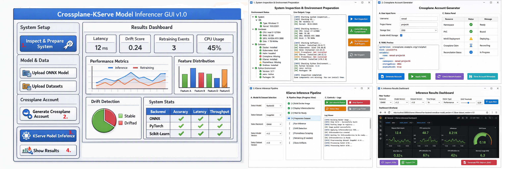

# **📘 Project 35: Crossplane‑Driven KServe Model Inferencer GUI v1.0 — Full Technical Blueprint**

---



# **Section 1: Introduction & Motivation**

## **1.1 Purpose of This Document**

This document is the foundational blueprint for **Crossplane‑Driven KServe Model Inferencer GUI v1.0**, a fully local, cost‑free, scientific‑grade machine‑learning inference laboratory designed for Windows 11 and Linux environments.  
It describes the architecture, motivation, workflow, infrastructure, orchestration logic, GUI design, and scientific reasoning behind a system that unifies:

- **PySide6** for the GUI  
- **Podman** for container runtime  
- **minikube** for local Kubernetes  
- **Crossplane** for infrastructure provisioning  
- **KServe** for model serving  
- **Prometheus** for metrics  
- **Grafana** for visualization
- **ONNX Runtime** for inference  
- **NumPy** / **Pandas** / **SciPy** for scientific computation  
- **MinIO** for artifact storage  

The goal is to create a **single, unified cockpit** for ML inference, drift detection, retraining, and scientific analysis — all running **offline**, **locally**, and **reproducibly**.

## **1.2 Motivation: Why Build a Local ML‑Inference Laboratory?**

Modern machine‑learning systems are increasingly complex. They require:

- reliable infrastructure  
- reproducible environments  
- transparent metrics  
- automated drift detection  
- retraining pipelines  
- multi‑backend inference  
- scientific explainability  
- artifact governance  

Most existing solutions assume:

- cloud accounts  
- paid infrastructure  
- distributed clusters  
- external storage  
- remote dashboards  

This project rejects those assumptions.

### **Motivation 1 — Full Local Control**

A scientist or engineer should be able to:

- deploy ONNX models  
- run inference  
- detect drift  
- retrain models  
- visualize metrics  
- store artifacts  
- manage infrastructure  

**without any cloud provider**, **without any cost**, and **without internet access**.

### **Motivation 2 — Reproducibility**

Scientific computing requires:

- deterministic environments  
- versioned models  
- versioned datasets  
- versioned pipelines  
- versioned metrics  
- versioned dashboards  

This project ensures that **every step** — from system inspection to inference — is logged, stored, and reproducible.

### **Motivation 3 — Educational Value**

This system is also a **learning platform** for:

- Kubernetes  
- Crossplane  
- KServe  
- ONNX Runtime  
- Prometheus  
- Grafana  
- containerization  
- drift theory  
- retraining theory  
- scientific metrics  

It is a complete “ML‑inference laboratory” that teaches modern MLOps concepts through hands‑on experimentation.

### **Motivation 4 — Integration of Previous Projects**

This project is the logical continuation of:

- **Project 30** — Hamiltonian cycle analysis  
- **Project 34** — ONNX Model Generator GUI  

Project 35 integrates:

- ONNX backend comparison  
- ONNX metadata extraction  
- ONNX conversion logic  
- scientific drift analysis  
- GUI orchestration  
- infrastructure automation  

into a single, coherent system.

## **1.3 Vision: What Crossplane‑KServe Inferencer GUI v1.0 Should Achieve**

The system should allow a user to:

### **Step 1 — Inspect & Prepare System**
Triggered by the GUI, the system:

- inspects OS, CPU, RAM, GPU  
- checks Podman, minikube, kubectl, Helm  
- checks Crossplane, KServe, Prometheus, Grafana  
- installs missing components  
- prepares the cluster  
- logs everything  

### **Step 2 — Upload ONNX Model & Datasets**
The GUI:

- validates ONNX  
- extracts metadata  
- analyzes datasets  
- stores registry entries  
- prepares artifacts  

### **Step 3 — Generate Crossplane Account**
The GUI:

- collects username/project  
- generates Crossplane Claim  
- provisions namespace + PVC + MinIO  
- stores YAML  
- logs reconciliation  

### **Step 4 — Run KServe Model Inference**
The GUI orchestrates:

- Docker/Podman image build  
- KServe deployment  
- dataset cleansing  
- feature engineering  
- drift detection  
- Prometheus scraping  
- retraining  
- artifact storage  

### **Step 5 — Show Results**
The GUI displays:

- latency  
- throughput  
- error rate  
- drift score  
- retraining events  
- feature distributions  
- backend comparison  
- system metrics  

via Grafana dashboards.

## **1.4 Why This Architecture Is Scientifically Interesting**

This project is not just an engineering exercise — it is a **scientific computing platform**.

It enables:

- controlled experiments  
- drift analysis  
- retraining strategies  
- backend comparison  
- resource correlation  
- reproducible pipelines  
- explainability reports  

It is a **laboratory** for studying:

- model degradation  
- data drift  
- inference stability  
- backend performance  
- resource utilization  
- statistical behavior of ML systems  

All **offline**, **local**, and **transparent**.

## **1.5 Why Podman + minikube + Crossplane + KServe Is the Perfect Stack**

### **Podman**
Rootless, daemonless, stable, perfect for scientific reproducibility.

### **minikube**
Supports Podman driver, GPU passthrough, addons, and easy cluster recreation.

### **Crossplane**
Provides declarative infrastructure provisioning **without cloud accounts**.

### **KServe**
Provides multi‑backend inference with ONNX, Torch, Sklearn, Triton, and custom servers.

### **Prometheus + Grafana**
Provide scientific metrics and dashboards.

### **PySide6**
Provides a professional, native GUI.

Together, they form a **self‑contained ML‑inference ecosystem**.

## **1.6 Structure of the Full Report**

This report will cover:

- architecture  
- folder structure  
- GUI design  
- orchestration logic  
- infrastructure logic  
- drift theory  
- retraining theory  
- metrics theory  
- dashboards  
- user workflows  
- implementation outlines  
- diagrams  
- flow charts  
- scientific reasoning  

Each section will be delivered as a dedicated page.

## **1.7: High‑Level Architecture Overview**

### **1.7.1 Architectural Philosophy**

The architecture of **CrossplaneKServeInferencerGUI v1.0** is built on three foundational principles:

1. **Local‑Only Execution** — everything runs offline, on a private Windows or Linux machine.  
2. **Layered Separation of Concerns** — GUI, orchestration, infrastructure, model lifecycle, and governance are strictly separated.  
3. **Scientific Reproducibility** — every action produces logs, artifacts, metrics, and versioned outputs.

This creates a **self‑contained ML inference laboratory**, where the user controls:

- infrastructure provisioning  
- model deployment  
- drift detection  
- retraining  
- metrics visualization  
- scientific reporting  

all through a single PySide GUI.

### **1.7.2 Global Architecture Diagram (Conceptual)**

```
+---------------------------------------------------------------+
|                     PySide6 GUI Layer                         |
|  (User Interaction, Buttons, Forms, WebView, Logs, Status)    |
+---------------------------+-----------------------------------+
                            |
                            v
+---------------------------------------------------------------+
|                 Python Orchestration Layer                    |
|  (Controllers, Adapters, Pipelines, Scripts, Registries)      |
+---------------------------+-----------------------------------+
                            |
                            v
+---------------------------------------------------------------+
|                 Local Kubernetes Infrastructure               |
|  (minikube + Podman, Crossplane, KServe, Prometheus, Grafana) |
+---------------------------+-----------------------------------+
                            |
                            v
+---------------------------------------------------------------+
|                 Model Lifecycle & Scientific Layer            |
|  (ONNX Runtime, Drift Detection, Retraining, Metrics, XAI)    |
+---------------------------------------------------------------+
```

This layered design ensures:

- GUI remains simple  
- orchestration remains powerful  
- infrastructure remains stable  
- scientific logic remains transparent  

Each layer communicates only with the layer directly above or below it.

### **1.7.3 Layer 1 — PySide6 GUI Layer**

The GUI is the **cockpit** of the entire system.

It provides:

- buttons  
- forms  
- dialogs  
- progress views  
- log viewers  
- Grafana dashboards (via WebView)  

The GUI never performs heavy computation.  
Instead, it delegates all work to the **Python Orchestration Layer**.

### **Key GUI Components**
- **System Setup Panel**  
- **Model & Dataset Panel**  
- **Crossplane Account Panel**  
- **KServe Inference Panel**  
- **Results Dashboard Panel**  

Each panel is controlled by a dedicated controller.

### **1.7.4 Layer 2 — Python Orchestration Layer**

This is the **brain** of the system.

It contains:

- controllers  
- adapters  
- pipelines  
- script runners  
- registry managers  
- YAML generators  
- Prometheus/Grafana API clients  

The orchestration layer is responsible for:

- running system inspection scripts  
- running environment repair scripts  
- generating Crossplane Claims  
- applying YAML to Kubernetes  
- building Podman images  
- deploying KServe InferenceServices  
- running drift detection  
- running retraining  
- scraping Prometheus metrics  
- generating XAI PDF reports  

### **1.7.5 Layer 3 — Local Kubernetes Infrastructure Layer**

Powered by:

- **Podman** (rootless container runtime)  
- **minikube** (local Kubernetes cluster)  
- **Crossplane** (infrastructure provisioning)  
- **KServe** (model serving)  
- **Prometheus** (metrics scraping)  
- **Grafana** (metrics visualization)  
- **MinIO** (optional local S3 storage)  

This layer is the **engine room** of the system.

### **Infrastructure Responsibilities**
- running containers  
- running inference servers  
- storing datasets and models  
- scraping metrics  
- visualizing dashboards  
- provisioning namespaces and PVCs  
- running retraining jobs  

### **1.7.6 Layer 4 — Model Lifecycle & Scientific Layer**

This layer handles:

- ONNX model metadata  
- dataset statistics  
- drift detection  
- retraining  
- versioning  
- scientific metrics  
- XAI report generation  

It is the **scientific core** of the system.

### **Scientific Responsibilities**
- PSI drift  
- KS drift  
- feature drift  
- latency analysis  
- throughput analysis  
- error rate analysis  
- resource correlation  
- retraining triggers  
- version rollout  
- artifact storage  
- XAI PDF generation  

### **1.7.7 Layer 5 — Governance Layer**

This layer ensures:

- reproducibility  
- traceability  
- auditability  
- versioning  
- artifact management  

It stores:

- logs  
- metrics  
- YAML manifests  
- model versions  
- dataset versions  
- drift reports  
- retraining reports  
- XAI reports  
- dashboard exports  

### **1.7.8 End‑to‑End Data Flow**

Full operational flow:

```
User → GUI → Orchestration → Kubernetes → KServe → Prometheus → Grafana → GUI
```

Scientific flow:

```
Model + Dataset → Drift Engine → Retraining → New Model → KServe → Metrics → Dashboard → XAI Report
```

This creates a **closed scientific loop**.

### **1.7.9 Why This Architecture Works**

#### **Reason 1 — Separation of Concerns**
Each layer has a single responsibility.

#### **Reason 2 — Local Reproducibility**
Everything runs offline.

#### **Reason 3 — Scientific Transparency**
Every step is logged and versioned.

#### **Reason 4 — Extensibility**
New backends, drift metrics, dashboards can be added easily.

#### **Reason 5 — Educational Value**
The architecture teaches:

- Kubernetes  
- Crossplane  
- KServe  
- ONNX  
- Prometheus  
- Grafana  
- PySide  
- scientific computing  

in a unified system.

## **1.8: System Diagram (Detailed)**

### **1.8.1 Purpose of the System Diagram**

The purpose of this section is to provide a **complete, multi‑layered, end‑to‑end system diagram** of the **Crossplane‑Driven KServe Model Inferencer GUI v1.0**.  
This diagram is the backbone of the entire monograph: every later section (infrastructure, orchestration, GUI, drift detection, retraining, metrics, dashboards) will reference this structure.

The diagram is expressed textually so it can be rendered in Markdown, version‑controlled, and embedded directly into the project repository.

### **1.8.2 High‑Level System Diagram (Expanded)**

Below is the **expanded, detailed system diagram**, showing all layers, all subsystems, and all communication channels.

```
+=========================================================================+
|                         Crossplane-KServe Inferencer GUI                |
|                         (PySide6 Desktop Application)                   |
+=========================================================================+
| Buttons, Panels, Forms, Dialogs, WebView, Logs, Status Indicators       |
|-------------------------------------------------------------------------|
| 1. Inspect & Prepare System                                             |
| 2. Upload ONNX Model                                                    |
| 3. Upload Datasets                                                      |
| 4. Generate Crossplane Account                                          |
| 5. KServe Model Inference                                               |
| 6. Show Results (Grafana Dashboard)                                     |
+=========================================================================+
                                |
                                v
+=========================================================================+
|                        Python Orchestration Layer                       |
+=========================================================================+
| Controllers:                                                            |
|   - SystemSetupController                                               |
|   - ModelDataController                                                 |
|   - CrossplaneAccountController                                         |
|   - KServeInferenceController                                           |
|   - ResultsDashboardController                                          |
|                                                                         |
| Adapters:                                                               |
|   - MLServerAdapter                                                     |
|   - SklearnAdapter                                                      |
|   - TorchAdapter                                                        |
|   - TritonAdapter                                                       |
|   - CustomONNXAdapter                                                   |
|                                                                         |
| Pipelines:                                                              |
|   - System Inspection Pipeline                                          |
|   - Environment Repair Pipeline                                         |
|   - Crossplane Provisioning Pipeline                                    |
|   - KServe Deployment Pipeline                                          |
|   - Data Preparation Pipeline                                           |
|   - Drift Detection Pipeline                                            |
|   - Prometheus Scraping Pipeline                                        |
|   - Retraining Pipeline                                                 |
|                                                                         |
| Registries:                                                             |
|   - Model Registry                                                      |
|   - Dataset Registry                                                    |
|   - Backend Registry                                                    |
|   - Account Registry                                                    |
|   - Version Registry                                                    |
+=========================================================================+
                                |
                                v
+=========================================================================+
|                     Local Kubernetes Infrastructure Layer               |
+=========================================================================+
| Components:                                                             |
|   - Podman (rootless container runtime)                                 |
|   - minikube (local Kubernetes cluster)                                 |
|   - kubectl (cluster interaction)                                       |
|   - Helm (package manager)                                              |
|                                                                         |
| Installed via orchestration:                                            |
|   - Crossplane (Infrastructure-as-Code)                                 |
|   - KServe (Model Serving)                                              |
|   - Prometheus (Metrics Scraping)                                       |
|   - Grafana (Visualization)                                             |
|   - MinIO (Optional S3-compatible storage)                              |
|                                                                         |
| Kubernetes Resources:                                                   |
|   - Namespaces                                                          |
|   - PersistentVolumeClaims                                              |
|   - Deployments                                                         |
|   - Services                                                            |
|   - InferenceServices (KServe)                                          |
|   - Jobs (Retraining)                                                   |
|   - ConfigMaps                                                          |
|   - Secrets                                                             |
+=========================================================================+
                                |
                                v
+=========================================================================+
|                     Model Lifecycle & Scientific Layer                  |
+=========================================================================+
| ONNX Runtime:                                                           |
|   - Model inference                                                     |
|   - Metadata extraction                                                 |
|                                                                         |
| Scientific Pipelines:                                                   |
|   - Drift Detection (PSI, KS, Feature Drift)                            |
|   - Retraining Logic                                                    |
|   - Feature Engineering                                                 |
|   - Dataset Cleansing                                                   |
|   - Statistical Analysis                                                |
|                                                                         |
| Metrics:                                                                |
|   - Latency                                                             |
|   - Throughput                                                          |
|   - Error Rate                                                          |
|   - Resource Usage (CPU, RAM, GPU)                                      |
|   - Drift Score                                                         |
|   - Retraining Events                                                   |
|                                                                         |
| XAI Reports:                                                            |
|   - PDF generation                                                      |
|   - Feature distributions                                               |
|   - Drift timelines                                                     |
|   - Backend comparison                                                  |
+=========================================================================+
                                |
                                v
+=========================================================================+
|                           Governance Layer                              |
+=========================================================================+
| Logs:                                                                   |
|   - System Inspection Logs                                              |
|   - Environment Repair Logs                                             |
|   - Crossplane Logs                                                     |
|   - KServe Logs                                                         |
|   - Prometheus Logs                                                     |
|   - Grafana Logs                                                        |
|   - Drift Logs                                                          |
|   - Retraining Logs                                                     |
|                                                                         |
| Artifacts:                                                              |
|   - Models                                                              |
|   - Datasets                                                            |
|   - Metrics                                                             |
|   - Dashboards                                                          |
|   - YAML Manifests                                                      |
|   - Reports                                                             |
|   - Snapshots                                                           |
+=========================================================================+
```

### **1.8.3 Detailed Interaction Flow**

The following describes how each subsystem communicates with the others.

#### **1. GUI → Orchestration**
The GUI triggers:

- system inspection  
- model upload  
- dataset upload  
- Crossplane provisioning  
- KServe inference pipeline  
- results visualization  

via controller calls.

#### **2. Orchestration → Kubernetes**
The orchestration layer:

- applies YAML  
- builds Podman images  
- deploys KServe  
- triggers retraining jobs  
- configures Prometheus/Grafana  

#### **3. Kubernetes → Scientific Layer**
KServe produces:

- inference results  
- drift metrics  
- performance metrics  
- resource usage metrics  

Prometheus scrapes them.

#### **4. Scientific Layer → Governance**
All metrics, drift results, retraining events, and artifacts are stored locally.

#### **5. Governance → GUI**
The GUI displays:

- logs  
- metrics  
- dashboards  
- reports  

via Grafana WebView and local file access.

### **1.8.4 Why This Diagram Matters**

This diagram is the **master reference** for:

- implementation  
- debugging  
- documentation  
- onboarding  
- scientific analysis  
- reproducibility  

Every subsystem is visible, every connection is explicit, and every responsibility is clearly defined.

## **1.9: Component Interaction Overview**

### **1.9.1 Purpose of This Section**

This section describes **how all components interact** across the five architectural layers:

- PySide6 GUI  
- Python Orchestration Layer  
- Local Kubernetes Infrastructure  
- Model Lifecycle & Scientific Layer  
- Governance Layer  

The goal is to provide a **clear mental model** of:

- who talks to whom  
- what data flows where  
- how responsibilities are distributed  
- how the system remains reproducible and stable  

This is the “circulatory system” of the entire project.

### **1.9.2 Overview of Component Interactions**

The system is designed around **strictly layered communication**:

```
GUI → Orchestration → Kubernetes → Scientific Layer → Governance → GUI
```

Each layer only communicates with the layer directly above or below it.  
This prevents cross‑layer contamination, simplifies debugging, and ensures reproducibility.

### **1.9.3 Interaction 1 — GUI → Orchestration Layer**

The GUI never performs heavy computation.  
Instead, it sends **commands** and **parameters** to the orchestration layer.

#### **GUI Actions**
- Button clicks  
- Form submissions  
- File selections  
- Parameter adjustments  
- Dashboard filter changes  

#### **Orchestration Receives**
- model paths  
- dataset paths  
- user account specs  
- drift thresholds  
- backend selections  
- inference modes  
- retraining triggers  

#### **Controllers Involved**
- **SystemSetupController**  
- **ModelDataController**  
- **CrossplaneAccountController**  
- **KServeInferenceController**  
- **ResultsDashboardController**  

The GUI → Orchestration interaction is **synchronous for UI updates** and **asynchronous for pipelines**.

### **1.9.4 Interaction 2 — Orchestration → Kubernetes Infrastructure**

The orchestration layer is the **bridge** between the GUI and Kubernetes.

#### **Orchestration Sends**
- YAML manifests  
- Podman image builds  
- kubectl apply commands  
- Helm install commands  
- KServe deployment instructions  
- Crossplane Claims  
- retraining job definitions  

#### **Kubernetes Receives**
- InferenceService definitions  
- PVC definitions  
- Namespace definitions  
- Deployment definitions  
- Service definitions  
- Job definitions  
- ConfigMaps  
- Secrets  

#### **Subsystems Involved**
- **minikube**  
- **Podman**  
- **Crossplane**  
- **KServe**  
- **Prometheus**  
- **Grafana**  

This interaction is **command‑driven**, **YAML‑driven**, and **event‑driven**.

### **1.9.5 Interaction 3 — Kubernetes → Scientific Layer**

Once Kubernetes is running:

- KServe performs inference  
- Prometheus scrapes metrics  
- drift detection pipelines run  
- retraining jobs execute  

#### **Kubernetes Sends**
- inference results  
- model logs  
- dataset logs  
- drift metrics  
- performance metrics  
- resource usage metrics  
- retraining events  

#### **Scientific Layer Receives**
- raw inference outputs  
- raw Prometheus metrics  
- drift signals  
- retraining triggers  
- resource usage profiles  

#### **Scientific Subsystems**
- **ONNX Runtime**  
- **NumPy**  
- **Pandas**  
- **SciPy**  
- drift detection engine  
- retraining engine  
- feature engineering engine  

This interaction is **data‑driven** and **metric‑driven**.

### **1.9.6 Interaction 4 — Scientific Layer → Governance Layer**

The scientific layer produces:

- drift results  
- retraining results  
- model versions  
- dataset versions  
- metrics  
- logs  
- artifacts  
- XAI reports  

These must be **stored**, **versioned**, and **indexed**.

#### **Scientific Layer Sends**
- JSON logs  
- CSV metrics  
- ONNX models  
- cleansed datasets  
- drift reports  
- retraining reports  
- dashboard exports  
- PDF XAI reports  

#### **Governance Layer Receives**
- artifacts  
- logs  
- metrics  
- YAML manifests  
- version metadata  
- dashboard snapshots  

#### **Governance Subsystems**
- local filesystem  
- MinIO (optional)  
- registry JSON files  
- Prometheus TSDB  
- Grafana dashboards  

This interaction is **storage‑driven** and **version‑driven**.

### **1.9.7 Interaction 5 — Governance Layer → GUI**

Finally, the GUI displays:

- logs  
- metrics  
- dashboards  
- reports  
- drift timelines  
- retraining events  
- backend comparisons  

#### **Governance Sends**
- JSON logs  
- CSV metrics  
- Grafana dashboards  
- XAI PDF reports  
- model/dataset metadata  
- drift summaries  
- retraining summaries  

#### **GUI Receives**
- data for tables  
- data for charts  
- data for status indicators  
- dashboard URLs  
- report paths  

This interaction is **visualization‑driven**.

### **1.9.8 Summary of All Interactions**

| Interaction | From | To | Purpose |
|------------|------|----|---------|
| 1 | GUI | Orchestration | Commands, parameters |
| 2 | Orchestration | Kubernetes | Deployments, provisioning |
| 3 | Kubernetes | Scientific Layer | Metrics, inference results |
| 4 | Scientific Layer | Governance | Storage, versioning |
| 5 | Governance | GUI | Visualization, reporting |

This is the **closed loop** that makes the system reproducible, scientific, and stable.

### **1.9.9 Why This Interaction Model Works**

#### **Reason 1 — Predictability**
Each layer has a single responsibility.

#### **Reason 2 — Debuggability**
Errors can be traced to a specific layer.

#### **Reason 3 — Reproducibility**
All interactions produce logs and artifacts.

#### **Reason 4 — Extensibility**
New backends, drift metrics, dashboards, or storage systems can be added without breaking the architecture.

#### **Reason 5 — Scientific Transparency**
Every transformation is visible and traceable.

---

# **2.0: Folder Structure (Deep Explanation)**

## **2.0.1 Purpose of the Folder Structure**

The folder structure of **CrossplaneKServeInferencerGUI v1.0** is not arbitrary.  
It is designed to:

- enforce **layered architecture**  
- ensure **reproducibility**  
- separate **GUI**, **orchestration**, **infrastructure**, **scientific logic**, and **governance**  
- support **local‑only execution**  
- support **Crossplane + KServe + Prometheus + Grafana**  
- support **Podman + minikube**  
- support **artifact versioning**  
- support **scientific workflows**  

This section explains the **entire directory tree**, why each folder exists, and how it contributes to the system.

## **2.0.2 Top‑Level Directory Structure**

```
CrossplaneKServeInferencer/
│
├── gui/
├── scripts/
├── cluster/
├── crossplane/
├── kserve/
├── prometheus/
├── grafana/
├── models/
├── datasets/
├── registry/
├── metrics/
├── drift/
├── retraining/
├── artifacts/
├── logs/
├── reports/
├── dashboards/
├── status/
└── config/
```

This structure is intentionally **layered**, matching the architecture described in Section 1.7.

## **2.0.3 `gui/` — PySide6 Application Layer**

This is the **front‑end cockpit** of the entire system.

```
gui/
│── main.py
│── widgets/
│── dialogs/
│── controllers/
│── adapters/
│── styles/
│── icons/
└── webview/
```

### **Purpose**
The GUI layer handles:

- user interaction  
- button clicks  
- forms  
- dialogs  
- progress views  
- log viewers  
- Grafana dashboards (via WebView)  

### **Key Subfolders**

#### **`widgets/`**
Contains PySide widget classes for:

- System Setup Panel  
- Model & Dataset Panel  
- Crossplane Account Panel  
- KServe Inference Panel  
- Results Dashboard Panel  

Each widget is a self‑contained UI component.

#### **`dialogs/`**
Contains modal dialogs:

- file selection  
- dataset selection  
- account creation  
- threshold configuration  

#### **`controllers/`**
Contains the logic that connects GUI → Orchestration:

- **SystemSetupController**  
- **ModelDataController**  
- **CrossplaneAccountController**  
- **KServeInferenceController**  
- **ResultsDashboardController**  

#### **`adapters/`**
Backend metric adapters:

- MLServer  
- Sklearn  
- Torch  
- Triton  
- Custom ONNX  

These normalize raw Prometheus metrics into UMS format.

#### **`webview/`**
Contains Grafana WebView integration.

## **2.0.4 `scripts/` — System Inspection & Environment Repair**

```
scripts/
│── inspect_system.ps1
│── inspect_system.sh
│── fix_environment.ps1
│── fix_environment.sh
│── install_podman_minikube.ps1
│── install_podman_minikube.sh
└── utils/
```

### **Purpose**
These scripts:

- inspect OS, CPU, RAM, GPU  
- check Podman, minikube, kubectl, Helm  
- check Crossplane, KServe, Prometheus, Grafana  
- install missing components  
- repair broken environments  
- recreate minikube cluster  
- reinstall Crossplane/KServe/Prometheus/Grafana  

### **`utils/`**
Contains helper scripts:

- OS detection  
- command runner  
- log parser  

## **2.0.5 `cluster/` — minikube Configuration**

```
cluster/
│── minikube-config.yaml
│── profiles/
│── kubeconfig/
└── manifests/
```

### **Purpose**
Defines the local Kubernetes cluster.

### **Key Subfolders**

#### **`profiles/`**
Stores minikube profile metadata.

#### **`kubeconfig/`**
Stores the kubeconfig used by controllers.

#### **`manifests/`**
Contains:

- namespace templates  
- storageclass templates  
- addon manifests (metrics‑server, ingress)  

## **2.0.6 `crossplane/` — Infrastructure‑as‑Code Layer**

```
crossplane/
│── install/
│── compositions/
│── claims/
│── accounts/
│── resources/
└── logs/
```

### **Purpose**
Defines Crossplane resources for:

- namespaces  
- PVCs  
- MinIO buckets  
- service accounts  
- RBAC  
- composite resources  
- claims  

### **Key Subfolders**

#### **`install/`**
Helm values + installation scripts.

#### **`compositions/`**
XRD + Composition definitions.

#### **`claims/`**
User‑specific Claim YAMLs.

#### **`accounts/`**
JSON metadata for generated accounts.

#### **`resources/`**
Generated Crossplane resources.

## **2.0.7 `kserve/` — Model Serving Layer**

```
kserve/
│── inference_services/
│── docker/
│── preprocessors/
│── postprocessors/
└── logs/
```

### **Purpose**
Defines KServe deployments and inference pipelines.

### **Key Subfolders**

#### **`inference_services/`**
YAML templates for:

- ONNX Runtime  
- Torch  
- Sklearn  
- Triton  
- Custom ONNX  

#### **`docker/`**
Dockerfiles for each backend.

#### **`preprocessors/`**
Dataset cleansing and feature engineering.

#### **`postprocessors/`**
Inference result normalization.

## **2.0.8 `prometheus/` — Metrics Scraping Layer**

```
prometheus/
│── prometheus.yaml
│── scrape_configs/
│── rules/
│── alerts/
└── tsdb/
```

### **Purpose**
Defines Prometheus configuration for:

- KServe metrics  
- Triton metrics  
- MLServer metrics  
- node exporter  
- cAdvisor  

## **2.0.9 `grafana/` — Visualization Layer**

```
grafana/
│── dashboards/
│── datasources/
│── provisioning/
└── logs/
```

### **Purpose**
Defines Grafana dashboards and provisioning.

### **Key Subfolders**

#### **`dashboards/`**
JSON dashboards:

- inference  
- drift  
- backend comparison  
- scientific correlation  

#### **`datasources/`**
Prometheus datasource config.

#### **`provisioning/`**
Dashboard + datasource provisioning.

## **2.0.10 Data & Scientific Layers**

### **`models/`**
```
models/
│── original/
│── converted/
│── retrained/
└── metadata/
```

### **`datasets/`**
```
datasets/
│── raw/
│── cleansed/
│── engineered/
│── drift_windows/
└── metadata/
```

### **`registry/`**
```
registry/
│── models.json
│── datasets.json
│── backends.json
│── versions.json
└── accounts.json
```

### **`metrics/`**
```
metrics/
│── raw/
│── processed/
│── csv/
│── json/
└── forecasts/
```

### **`drift/`**
```
drift/
│── psi/
│── ks/
│── feature_changes/
│── timelines/
└── reports/
```

### **`retraining/`**
```
retraining/
│── jobs/
│── logs/
│── versions/
│── triggers/
└── reports/
```

## **2.0.11 Governance Layers**

### **`artifacts/`**
Stores all outputs.

### **`logs/`**
Stores all logs.

### **`reports/`**
Stores XAI and scientific reports.

### **`dashboards/`**
Stores dashboard exports.

### **`status/`**
Stores environment and cluster status.

### **`config/`**
Stores global configuration.

## **2.0.12 Why This Folder Structure Works**

### **Reason 1 — Layered Architecture**
Each folder corresponds to a specific architectural layer.

### **Reason 2 — Reproducibility**
All artifacts, logs, YAML, and metrics are stored locally.

### **Reason 3 — Extensibility**
New backends, drift metrics, dashboards can be added easily.

### **Reason 4 — Scientific Transparency**
Every transformation is visible and traceable.

### **Reason 5 — Local‑Only Execution**
No cloud dependencies.

## ** 2.1: Folder Structure Rationale**

### **2.1.1 Purpose of This Section**

The previous section (2.0) described the **physical layout** of the project directory.  
This section explains the **rationale** behind that layout:

- Why each folder exists  
- Why folders are grouped the way they are  
- Why certain files belong together  
- Why the structure mirrors the architecture  
- Why this structure ensures reproducibility  
- Why this structure supports scientific workflows  
- Why this structure supports Podman + minikube + Crossplane + KServe  

This is the conceptual justification for the entire filesystem.

### **2.1.2 Design Philosophy Behind the Folder Structure**

The folder structure is built on five architectural principles:

#### **Principle 1 — Layered Separation of Concerns**
Each folder corresponds to a distinct architectural layer:

- GUI  
- Orchestration  
- Infrastructure  
- Scientific lifecycle  
- Governance  

This prevents cross‑layer contamination and makes debugging trivial.

#### **Principle 2 — Reproducibility**
Every artifact, log, YAML, metric, and report is stored locally.  
This ensures:

- deterministic experiments  
- reproducible pipelines  
- versioned outputs  
- scientific transparency  

#### **Principle 3 — Local‑Only Execution**
The structure supports:

- Podman  
- minikube  
- Crossplane (Kubernetes Provider)  
- KServe  
- Prometheus  
- Grafana  

with **no cloud dependencies**.

#### **Principle 4 — Extensibility**
New backends, drift metrics, dashboards, or retraining strategies can be added without restructuring the project.

#### **Principle 5 — Scientific Governance**
The structure supports:

- drift analysis  
- retraining analysis  
- backend comparison  
- XAI reporting  
- artifact versioning  

This is essential for a scientific ML inference laboratory.

### **2.1.3 Rationale for Each Top‑Level Folder**

Below is the conceptual justification for each directory.

#### **`gui/` — Why a Dedicated GUI Layer?**

The GUI must be:

- isolated  
- stable  
- independent of backend logic  
- independent of infrastructure logic  

This ensures:

- GUI changes do not break pipelines  
- pipelines do not break GUI  
- infrastructure changes do not affect UI  
- scientific logic does not pollute UI code  

The GUI is the **cockpit**, not the engine.

#### **`scripts/` — Why Separate System Scripts?**

System inspection and repair scripts must be:

- OS‑specific  
- idempotent  
- reproducible  
- callable from GUI  
- callable from CLI  

They must not be mixed with:

- orchestration logic  
- Kubernetes manifests  
- scientific code  

This separation ensures:

- clean environment management  
- safe cluster recreation  
- predictable installation behavior  

#### **`cluster/` — Why a Dedicated Kubernetes Configuration Layer?**

The cluster configuration must be:

- independent of Crossplane  
- independent of KServe  
- independent of Prometheus/Grafana  
- independent of GUI  

This allows:

- cluster recreation  
- profile switching  
- kubeconfig isolation  
- addon management  

without touching other layers.

#### **`crossplane/` — Why a Dedicated IaC Layer?**

Crossplane resources must be:

- versioned  
- reproducible  
- isolated  
- declarative  

Crossplane is the **infrastructure factory**.  
It must not be mixed with:

- KServe YAML  
- Prometheus configs  
- GUI code  
- scientific code  

This ensures:

- clean IaC boundaries  
- predictable reconciliation  
- safe resource provisioning  

#### **`kserve/` — Why a Dedicated Model Serving Layer?**

KServe is the **model serving engine**.  
It must be isolated because:

- KServe YAML is complex  
- Dockerfiles must be versioned  
- inference pipelines must be reproducible  
- backend logic must be modular  

This separation allows:

- ONNX Runtime backend  
- Torch backend  
- Sklearn backend  
- Triton backend  
- Custom ONNX backend  

to coexist without conflict.

#### **`prometheus/` — Why a Dedicated Metrics Layer?**

Prometheus configuration must be:

- isolated  
- versioned  
- reproducible  
- independent of GUI  
- independent of KServe  

This ensures:

- stable metric scraping  
- predictable TSDB behavior  
- safe rule management  
- clean alerting logic  

#### **`grafana/` — Why a Dedicated Visualization Layer?**

Grafana dashboards must be:

- versioned  
- reproducible  
- independent of GUI  
- independent of Prometheus  
- independent of KServe  

This allows:

- dashboard provisioning  
- datasource provisioning  
- JSON dashboard storage  
- scientific visualization  

without breaking other layers.

#### **`models/`, `datasets/`, `registry/` — Why Separate Scientific Data Layers?**

Models and datasets must be:

- versioned  
- isolated  
- reproducible  
- linked via registry metadata  

The registry ensures:

- model provenance  
- dataset provenance  
- backend provenance  
- version tracking  

This is essential for scientific reproducibility.

#### **`metrics/`, `drift/`, `retraining/` — Why Separate Scientific Analysis Layers?**

These folders store:

- raw metrics  
- processed metrics  
- drift windows  
- drift reports  
- retraining logs  
- retraining versions  

They must be isolated because:

- drift analysis is scientific  
- retraining analysis is scientific  
- metrics analysis is scientific  

These layers must not pollute:

- GUI  
- infrastructure  
- orchestration  

#### **`artifacts/`, `logs/`, `reports/`, `dashboards/`, `status/`, `config/` — Why Separate Governance Layers?**

Governance requires:

- versioning  
- reproducibility  
- auditability  
- traceability  

These folders ensure:

- every pipeline step is logged  
- every artifact is stored  
- every report is preserved  
- every dashboard is exported  
- every status snapshot is saved  
- every configuration is versioned  

This is essential for:

- scientific computing  
- reproducible ML  
- transparent inference pipelines  

### **2.1.4 Why This Structure Enables Scientific Reproducibility**

The folder structure ensures:

#### **1. Deterministic Experiments**
Every artifact is stored locally.

#### **2. Versioned Pipelines**
Every model, dataset, metric, and report is versioned.

#### **3. Transparent Infrastructure**
Crossplane YAML is stored and reproducible.

#### **4. Transparent Serving**
KServe YAML is stored and reproducible.

#### **5. Transparent Metrics**
Prometheus TSDB is local and reproducible.

#### **6. Transparent Visualization**
Grafana dashboards are stored as JSON.

#### **7. Transparent Scientific Logic**
Drift and retraining reports are stored locally.

This creates a **closed scientific loop**.

### **2.1.5 Why This Structure Supports Local‑Only Execution**

The structure supports:

- Podman  
- minikube  
- Crossplane  
- KServe  
- Prometheus  
- Grafana  

without cloud dependencies because:

- all YAML is local  
- all metrics are local  
- all dashboards are local  
- all artifacts are local  
- all logs are local  
- all models/datasets are local  

This is a **self‑contained ML inference laboratory**.

## **2.2: GUI Folder Deep Dive**

### **2.2.1 Purpose of the GUI Layer**

The **GUI layer** is the *user‑facing cockpit* of the entire Crossplane‑KServe Inferencer system.  
It is responsible for:

- presenting controls  
- collecting user input  
- displaying logs  
- showing progress  
- embedding dashboards  
- orchestrating pipelines  
- providing scientific transparency  

The GUI layer **never** performs heavy computation.  
It delegates all work to the **Python Orchestration Layer**, ensuring:

- stability  
- modularity  
- reproducibility  
- maintainability  

The GUI is the *interface*, not the *engine*.

### **2.2.2 GUI Folder Structure**

```
gui/
│── main.py
│── widgets/
│── dialogs/
│── controllers/
│── adapters/
│── styles/
│── icons/
└── webview/
```

Each subfolder corresponds to a specific architectural responsibility.

### **2.2.3 `main.py` — The GUI Entry Point**

`main.py` is the **root of the GUI application**.

#### **Responsibilities**
- initializes PySide application  
- loads global configuration  
- instantiates controllers  
- builds main window  
- connects signals and slots  
- starts event loop  

#### **Why it exists**
It provides a **single, deterministic entry point** for the entire GUI system.

### **2.2.4 `widgets/` — GUI Components**

The `widgets/` directory contains **all PySide widget classes** used in the application.

```
widgets/
│── system_setup_widget.py
│── model_data_widget.py
│── crossplane_account_widget.py
│── kserve_inference_widget.py
│── results_dashboard_widget.py
└── common/
```

#### **Why widgets are isolated**
Widgets must be:

- reusable  
- testable  
- independent of orchestration logic  
- independent of infrastructure logic  

#### **Key Widgets**

##### **System Setup Widget**
Displays:

- environment status tree  
- inspection logs  
- repair buttons  

##### **Model & Dataset Widget**
Displays:

- ONNX model metadata  
- dataset metadata  
- file selection dialogs  

##### **Crossplane Account Widget**
Displays:

- account form  
- YAML preview  
- reconciliation status table  

##### **KServe Inference Widget**
Displays:

- pipeline steps  
- progress indicators  
- logs  

##### **Results Dashboard Widget**
Displays:

- Grafana WebView  
- filter toolbar  
- export buttons  

### **2.2.5 `dialogs/` — Modal Interaction Layer**

Dialogs are **modal windows** that collect user input.

```
dialogs/
│── file_dialog.py
│── dataset_dialog.py
│── account_dialog.py
│── threshold_dialog.py
└── backend_selection_dialog.py
```

#### **Why dialogs are isolated**
Dialogs must be:

- simple  
- focused  
- reusable  
- independent of business logic  

#### **Key Dialogs**

##### **File Dialog**
Used for ONNX model selection.

##### **Dataset Dialog**
Used for dataset folder selection.

##### **Account Dialog**
Used for Crossplane account creation.

##### **Threshold Dialog**
Used for drift/performance threshold configuration.

##### **Backend Selection Dialog**
Used for selecting ONNX/Torch/Sklearn/Triton backend.

### **2.2.6 `controllers/` — GUI → Orchestration Bridge**

Controllers are the **brains** of the GUI layer.

```
controllers/
│── system_setup_controller.py
│── model_data_controller.py
│── crossplane_account_controller.py
│── kserve_inference_controller.py
└── results_dashboard_controller.py
```

#### **Why controllers exist**
Controllers:

- receive GUI events  
- validate input  
- call orchestration functions  
- update widgets  
- stream logs  
- handle errors  

They ensure the GUI remains **thin** and **clean**.

#### **Key Controllers**

##### **SystemSetupController**
Handles:

- system inspection  
- environment repair  
- log streaming  

##### **ModelDataController**
Handles:

- ONNX model upload  
- dataset upload  
- metadata extraction  
- registry updates  

##### **CrossplaneAccountController**
Handles:

- account creation  
- YAML generation  
- reconciliation polling  

##### **KServeInferenceController**
Handles:

- Podman image build  
- KServe deployment  
- pipeline execution  
- drift detection  
- retraining  

##### **ResultsDashboardController**
Handles:

- Grafana URL generation  
- filter application  
- export logic  

### **2.2.7 `adapters/` — Backend Metric Normalization**

Adapters convert raw Prometheus metrics into a **Unified Metric Schema (UMS)**.

```
adapters/
│── mlserver_adapter.py
│── sklearn_adapter.py
│── torch_adapter.py
│── triton_adapter.py
└── custom_onnx_adapter.py
```

#### **Why adapters exist**
Different backends expose different metrics.  
Adapters normalize them into:

- latency  
- throughput  
- error rate  
- drift score  
- resource usage  

This enables **backend comparison**.

### **2.2.8 `styles/` — GUI Styling Layer**

Contains:

- QSS stylesheets  
- color themes  
- layout presets  

#### **Why styles are isolated**
Styling must not pollute logic.

### **2.2.9 `icons/` — GUI Iconography**

Contains:

- button icons  
- panel icons  
- status icons  
- backend icons  

Icons improve:

- usability  
- clarity  
- visual hierarchy  

### **2.2.10 `webview/` — Grafana Integration Layer**

Contains:

- WebView wrapper  
- Grafana URL builder  
- dashboard embedding logic  

#### **Why WebView is isolated**
Grafana integration must be:

- modular  
- replaceable  
- independent of GUI logic  

### **2.2.11 Why This GUI Structure Works**

#### **Reason 1 — Clean Separation**
Widgets, dialogs, controllers, adapters are isolated.

#### **Reason 2 — Maintainability**
GUI changes do not break pipelines.

#### **Reason 3 — Extensibility**
New widgets or dialogs can be added easily.

#### **Reason 4 — Scientific Transparency**
GUI displays logs, metrics, dashboards clearly.

#### **Reason 5 — Reproducibility**
GUI actions produce deterministic orchestration calls.

## **2.3: Orchestration Layer Deep Dive**

### **2.3.1 Purpose of the Orchestration Layer**

The **Python Orchestration Layer** is the *central nervous system* of the entire Crossplane‑KServe Inferencer architecture.  
It is responsible for:

- coordinating system inspection  
- managing environment repair  
- generating Crossplane resources  
- deploying KServe inference services  
- running drift detection  
- triggering retraining  
- scraping Prometheus metrics  
- generating XAI reports  
- updating registries  
- streaming logs back to the GUI  

The orchestration layer is the **bridge** between:

- the GUI (user interaction)  
- the infrastructure (Kubernetes, Crossplane, KServe)  
- the scientific layer (drift, retraining, metrics)  
- the governance layer (logs, artifacts, reports)  

It is the **brain** of the system.

### **2.3.2 Orchestration Layer Folder Structure**

```
controllers/
│── system_setup_controller.py
│── model_data_controller.py
│── crossplane_account_controller.py
│── kserve_inference_controller.py
└── results_dashboard_controller.py

adapters/
│── mlserver_adapter.py
│── sklearn_adapter.py
│── torch_adapter.py
│── triton_adapter.py
└── custom_onnx_adapter.py

pipelines/
│── system_inspection_pipeline.py
│── environment_repair_pipeline.py
│── crossplane_provisioning_pipeline.py
│── kserve_deployment_pipeline.py
│── data_preparation_pipeline.py
│── drift_detection_pipeline.py
│── prometheus_scraping_pipeline.py
└── retraining_pipeline.py

registry/
│── model_registry.py
│── dataset_registry.py
│── backend_registry.py
│── account_registry.py
└── version_registry.py

utils/
│── yaml_generator.py
│── command_runner.py
│── log_streamer.py
│── prometheus_client.py
│── grafana_client.py
└── file_manager.py
```

This structure mirrors the conceptual architecture described in Section 1.7.

### **2.3.3 Controllers — The GUI → Orchestration Bridge**

Controllers receive GUI events and translate them into orchestration actions.

#### **SystemSetupController**
Handles:

- system inspection  
- environment repair  
- log streaming  

#### **ModelDataController**
Handles:

- ONNX model upload  
- dataset upload  
- metadata extraction  
- registry updates  

#### **CrossplaneAccountController**
Handles:

- account creation  
- YAML generation  
- reconciliation polling  

#### **KServeInferenceController**
Handles:

- Podman image build  
- KServe deployment  
- pipeline execution  
- drift detection  
- retraining  

#### **ResultsDashboardController**
Handles:

- Grafana URL generation  
- filter application  
- export logic  

### **2.3.4 Pipelines — The Engine Room of the Orchestration Layer**

Pipelines perform the heavy lifting.  
Each pipeline is a **self‑contained workflow** with:

- deterministic steps  
- logging  
- error handling  
- artifact storage  
- registry updates  

#### **System Inspection Pipeline**
Runs:

- OS detection  
- hardware detection  
- Podman/minikube/kubectl/Helm checks  
- Crossplane/KServe/Prometheus/Grafana checks  

#### **Environment Repair Pipeline**
Runs:

- minikube deletion  
- minikube recreation  
- Crossplane installation  
- KServe installation  
- Prometheus/Grafana installation  

#### **Crossplane Provisioning Pipeline**
Runs:

- XRD generation  
- Composition generation  
- Claim generation  
- kubectl apply  
- reconciliation polling  

#### **KServe Deployment Pipeline**
Runs:

- Podman image build  
- image push to local registry  
- InferenceService YAML generation  
- kubectl apply  
- readiness polling  

#### **Data Preparation Pipeline**
Runs:

- dataset cleansing  
- feature engineering  
- artifact storage  

#### **Drift Detection Pipeline**
Runs:

- PSI  
- KS  
- feature drift  
- drift timeline generation  

#### **Prometheus Scraping Pipeline**
Runs:

- metric queries  
- normalization  
- UMS conversion  
- storage  

#### **Retraining Pipeline**
Runs:

- retraining job creation  
- ONNX re‑export  
- version rollout  
- artifact storage  

### **2.3.5 Adapters — Backend Metric Normalization**

Different backends expose different metrics.  
Adapters normalize them into a **Unified Metric Schema (UMS)**.

#### **MLServer Adapter**
Normalizes MLServer metrics.

#### **Sklearn Adapter**
Normalizes classical ML metrics.

#### **Torch Adapter**
Normalizes PyTorch metrics.

#### **Triton Adapter**
Normalizes Triton metrics.

#### **Custom ONNX Adapter**
Normalizes custom ONNX server metrics.

### **2.3.6 Registries — The Memory of the System**

Registries store:

- model metadata  
- dataset metadata  
- backend metadata  
- account metadata  
- version metadata  

They ensure:

- reproducibility  
- provenance  
- traceability  
- auditability  

#### **Model Registry**
Stores:

- model name  
- opset  
- shapes  
- backend compatibility  

#### **Dataset Registry**
Stores:

- dataset paths  
- statistics  
- feature types  

#### **Backend Registry**
Stores:

- ONNX/Torch/Sklearn/Triton metadata  

#### **Account Registry**
Stores:

- Crossplane account metadata  

#### **Version Registry**
Stores:

- model versions  
- dataset versions  
- retraining versions  

### **2.3.7 Utilities — The Orchestration Toolbox**

Utilities provide reusable functionality:

#### **yaml_generator.py**
Generates:

- Crossplane XRD  
- Crossplane Composition  
- Crossplane Claim  
- KServe InferenceService  
- retraining job YAML  

#### **command_runner.py**
Runs:

- Podman commands  
- kubectl commands  
- Helm commands  
- Bash/PowerShell scripts  

#### **log_streamer.py**
Streams logs to GUI.

#### **prometheus_client.py**
Queries Prometheus.

#### **grafana_client.py**
Interacts with Grafana API.

#### **file_manager.py**
Handles artifact storage.

### **2.3.8 Why This Orchestration Architecture Works**

#### **Reason 1 — Clean Separation**
Controllers, pipelines, adapters, registries, and utilities are isolated.

#### **Reason 2 — Maintainability**
Changes in one subsystem do not break others.

#### **Reason 3 — Extensibility**
New pipelines or adapters can be added easily.

#### **Reason 4 — Scientific Transparency**
Every pipeline produces logs and artifacts.

#### **Reason 5 — Reproducibility**
Registries ensure deterministic behavior.

#### **Reason 6 — Local‑Only Execution**
All orchestration is local and offline.

## **2.4: Infrastructure Layer Deep Dive**

### **2.4.1 Purpose of the Infrastructure Layer**

The **Infrastructure Layer** is the *engine room* of the Crossplane‑KServe Inferencer system.  
It provides the computational substrate on which all pipelines run:

- container runtime  
- Kubernetes cluster  
- infrastructure provisioning  
- model serving  
- metrics scraping  
- dashboard visualization  
- artifact storage  

It is responsible for:

- running containers  
- running inference servers  
- provisioning namespaces and storage  
- scraping metrics  
- visualizing dashboards  
- executing retraining jobs  

The infrastructure layer is the **foundation** upon which the orchestration and scientific layers operate.

### **2.4.2 Infrastructure Layer Components**

The infrastructure layer consists of:

- **Podman** — rootless container runtime  
- **minikube** — local Kubernetes cluster  
- **kubectl** — Kubernetes CLI  
- **Helm** — package manager  
- **Crossplane** — infrastructure provisioning  
- **KServe** — model serving  
- **Prometheus** — metrics scraping  
- **Grafana** — visualization  
- **MinIO** (optional) — S3‑compatible storage  

Each component plays a specific role in the system.

### **2.4.3 Podman — Rootless Container Runtime**

Podman is the **container engine** used to:

- build inference images  
- run local containers  
- push images to minikube’s registry  
- support rootless execution  
- avoid Docker Desktop licensing issues  

### **Why Podman?**
- daemonless  
- rootless  
- stable  
- reproducible  
- ideal for scientific workflows  
- integrates perfectly with minikube  

### **2.4.4 minikube — Local Kubernetes Cluster**

minikube provides the **local Kubernetes cluster** used for:

- Crossplane  
- KServe  
- Prometheus  
- Grafana  
- retraining jobs  
- PVC provisioning  
- namespace management  

### **Why minikube?**
- supports Podman driver  
- supports GPU passthrough  
- supports addons (metrics‑server, ingress)  
- easy cluster recreation  
- stable on Windows and Linux  
- ideal for local ML inference labs  

### **2.4.5 kubectl — Kubernetes Command Line Interface**

kubectl is used for:

- applying YAML  
- inspecting resources  
- polling readiness  
- debugging deployments  
- managing namespaces  
- managing PVCs  
- managing jobs  

It is the **primary interface** between orchestration and infrastructure.

### **2.4.6 Helm — Kubernetes Package Manager**

Helm is used to install:

- Crossplane  
- Prometheus  
- Grafana  
- MinIO (optional)  

Helm ensures:

- reproducible installations  
- versioned charts  
- declarative configuration  

### **2.4.7 Crossplane — Infrastructure‑as‑Code Engine**

Crossplane is the **IaC engine** used to provision:

- namespaces  
- PVCs  
- MinIO buckets  
- service accounts  
- RBAC  
- composite resources  
- claims  

Crossplane uses the **Kubernetes Provider**, meaning:

- no cloud accounts  
- no AWS/GCP/Azure  
- fully local provisioning  

### **Crossplane Resource Types**
- **XRD** — Composite Resource Definition  
- **Composition** — template for provisioning  
- **Claim** — user‑level resource request  

### **2.4.8 KServe — Model Serving Engine**

KServe is the **model serving engine** used to deploy:

- ONNX Runtime servers  
- PyTorch servers  
- Sklearn servers  
- Triton servers  
- custom Python servers  

#### **KServe Responsibilities**
- inference  
- autoscaling  
- logging  
- metrics  
- versioning  
- canary rollout  
- blue/green deployment  

### **2.4.9 Prometheus — Metrics Scraping Engine**

Prometheus scrapes metrics from:

- KServe  
- Triton  
- MLServer  
- node exporter  
- cAdvisor  

#### **Prometheus Responsibilities**
- latency  
- throughput  
- error rate  
- drift metrics  
- resource usage  
- retraining events  

Prometheus stores metrics in a **local TSDB**.

### **2.4.10 Grafana — Visualization Engine**

Grafana visualizes:

- inference metrics  
- drift metrics  
- retraining events  
- feature distributions  
- backend comparisons  
- system metrics  

Grafana dashboards are:

- stored as JSON  
- provisioned automatically  
- embedded in the GUI via WebView  

### **2.4.11 MinIO — Optional Local S3 Storage**

MinIO provides:

- model storage  
- dataset storage  
- artifact storage  
- retraining outputs  
- logs  
- configuration snapshots  

MinIO is optional but recommended for:

- large datasets  
- large models  
- multi‑user environments  

### **2.4.12 Infrastructure Layer Data Flow**

```
Podman → minikube → Crossplane → KServe → Prometheus → Grafana
```

#### **Podman → minikube**
Images are built and pushed.

#### **minikube → Crossplane**
Crossplane provisions namespaces and storage.

#### **Crossplane → KServe**
KServe deploys inference services into provisioned namespaces.

#### **KServe → Prometheus**
Prometheus scrapes inference metrics.

#### **Prometheus → Grafana**
Grafana visualizes metrics.

#### **Grafana → GUI**
GUI embeds dashboards.

### **2.4.13 Infrastructure Layer Responsibilities**

| Component | Responsibility |
|----------|----------------|
| Podman | Build/push images |
| minikube | Run Kubernetes cluster |
| kubectl | Apply YAML |
| Helm | Install packages |
| Crossplane | Provision infrastructure |
| KServe | Serve models |
| Prometheus | Scrape metrics |
| Grafana | Visualize metrics |
| MinIO | Store artifacts |

### **2.4.14 Why This Infrastructure Architecture Works**

#### **Reason 1 — Local‑Only Execution**
No cloud dependencies.

#### **Reason 2 — Reproducibility**
Cluster can be recreated deterministically.

#### **Reason 3 — Extensibility**
New backends and pipelines can be added easily.

#### **Reason 4 — Scientific Transparency**
Metrics and dashboards are local and versioned.

#### **Reason 5 — Stability**
Podman + minikube is stable on Windows and Linux.

#### **Reason 6 — Modularity**
Each component has a single responsibility.

## **2.5: Scientific Layer Deep Dive**

### **2.5.1 Purpose of the Scientific Layer**

The **Scientific Layer** is the analytical core of the Crossplane‑KServe Inferencer system.  
It is responsible for:

- dataset cleansing  
- feature engineering  
- drift detection  
- statistical analysis  
- retraining logic  
- ONNX model lifecycle  
- scientific metrics  
- XAI report generation  

This layer transforms raw inference outputs and raw metrics into **scientific insight**, enabling:

- reproducible experiments  
- drift timelines  
- retraining decisions  
- backend comparison  
- scientific reporting  

It is the layer where **machine learning meets scientific computing**.

### **2.5.2 Scientific Layer Components**

The scientific layer consists of:

- **ONNX Runtime** — inference engine  
- **NumPy** — numerical computation  
- **Pandas** — dataset manipulation  
- **SciPy** — statistical tests  
- **Drift Engine** — PSI, KS, feature drift  
- **Retraining Engine** — model lifecycle management  
- **Feature Engineering Engine** — transformations  
- **Metrics Engine** — scientific metrics  
- **XAI Report Engine** — PDF generation  

Each component plays a specific role in the scientific workflow.

### **2.5.3 ONNX Runtime — Scientific Inference Engine**

ONNX Runtime is used for:

- validating ONNX models  
- extracting metadata  
- running local inference  
- comparing backend outputs  
- verifying KServe inference results  

### **Why ONNX Runtime?**
- fast  
- portable  
- deterministic  
- reproducible  
- backend‑agnostic  

### **2.5.4 NumPy — Numerical Computation Backbone**

NumPy is used for:

- vectorized operations  
- statistical transformations  
- drift metric computation  
- feature engineering  
- normalization  
- scaling  
- outlier detection  

NumPy ensures:

- deterministic numerical behavior  
- reproducible scientific results  

### **2.5.5 Pandas — Dataset Manipulation Engine**

Pandas is used for:

- dataset ingestion  
- missing value analysis  
- feature type detection  
- dataset cleansing  
- drift window construction  
- retraining dataset preparation  

### **2.5.6 SciPy — Statistical Test Engine**

SciPy provides:

- KS test  
- chi‑square test  
- distribution comparison  
- hypothesis testing  

SciPy is essential for:

- drift detection  
- feature stability analysis  
- retraining triggers  

### **2.5.7 Drift Engine — Scientific Drift Detection**

The drift engine computes:

#### **1. Population Stability Index (PSI)**
Used for:

- feature drift  
- distribution drift  
- monitoring stability over time  

#### **2. Kolmogorov–Smirnov (KS) Test**
Used for:

- comparing training vs inference distributions  
- detecting statistical drift  

#### **3. Feature Drift Percentage**
Used for:

- measuring relative change  
- detecting feature instability  

#### **4. Drift Timelines**
Used for:

- visualizing drift over time  
- correlating drift with retraining events  

#### **5. Drift Thresholds**
Used for:

- triggering retraining  
- alerting the user  
- annotating dashboards  

The drift engine is the **scientific watchdog** of the system.

### **2.5.8 Feature Engineering Engine**

Feature engineering includes:

- normalization  
- standardization  
- encoding  
- scaling  
- outlier removal  
- derived features  
- windowed features  
- temporal features  

Feature engineering is essential for:

- drift detection  
- retraining  
- backend comparison  
- scientific reporting  

### **2.5.9 Data Cleansing Engine**

Data cleansing includes:

- missing value imputation  
- outlier detection  
- duplicate removal  
- type correction  
- anomaly detection  

Cleansed datasets are stored in:

- `datasets/cleansed/`  
- `datasets/engineered/`  

This ensures reproducible scientific experiments.

### **2.5.10 Metrics Engine — Scientific Metrics**

The metrics engine computes:

#### **Performance Metrics**
- latency  
- throughput  
- error rate  

#### **Resource Metrics**
- CPU usage  
- RAM usage  
- GPU usage  

#### **Scientific Metrics**
- drift score  
- retraining frequency  
- feature stability  

#### **Backend Comparison Metrics**
- ONNX vs Torch vs Sklearn vs Triton  
- accuracy  
- latency  
- throughput  

These metrics feed into:

- Prometheus  
- Grafana  
- XAI reports  
- scientific dashboards  

### **2.5.11 Retraining Engine — Scientific Model Lifecycle**

The retraining engine handles:

#### **1. Retraining Triggers**
Triggered by:

- drift thresholds  
- performance degradation  
- resource anomalies  

#### **2. Retraining Jobs**
Executed via:

- Kubernetes Jobs  
- KServe batch pipelines  

#### **3. ONNX Re‑Export**
New models are exported to:

- `models/retrained/`  

#### **4. Version Rollout**
New versions are deployed via:

- KServe canary rollout  
- blue/green deployment  

#### **5. Retraining Reports**
Stored in:

- `retraining/reports/`  

### **2.5.12 XAI Report Engine — Scientific Explainability**

The XAI engine generates:

- PDF reports  
- feature distributions  
- drift timelines  
- retraining events  
- backend comparison charts  
- scientific commentary  

Reports are stored in:

- `reports/xai/`  

Tools used:

- ReportLab  
- WeasyPrint  

### **2.5.13 Scientific Layer Data Flow**

```
Dataset → Cleansing → Feature Engineering → Drift Engine → Retraining Engine → XAI Report
```

### **Dataset → Cleansing**
Raw datasets are cleaned.

### **Cleansing → Feature Engineering**
Features are transformed.

### **Feature Engineering → Drift Engine**
Drift metrics are computed.

### **Drift Engine → Retraining Engine**
Retraining is triggered if needed.

### **Retraining Engine → XAI Report**
Scientific reports are generated.

### **2.5.14 Why This Scientific Architecture Works**

### **Reason 1 — Deterministic Scientific Behavior**
NumPy, Pandas, SciPy ensure reproducibility.

### **Reason 2 — Transparent Drift Detection**
PSI, KS, feature drift provide scientific clarity.

### **Reason 3 — Controlled Retraining**
Retraining is triggered by scientific metrics.

### **Reason 4 — Explainability**
XAI reports provide scientific insight.

### **Reason 5 — Backend Comparison**
Scientific metrics allow ONNX/Torch/Sklearn/Triton comparison.

### **Reason 6 — Local‑Only Execution**
All scientific computation is local and offline.

## **2.6: Governance Layer Deep Dive**

### **2.6.1 Purpose of the Governance Layer**

The **Governance Layer** is the *memory* and *audit backbone* of the Crossplane‑KServe Inferencer system.  
It ensures that **every action**, **every pipeline**, **every inference**, **every drift event**, and **every retraining** is:

- logged  
- versioned  
- stored  
- reproducible  
- auditable  
- scientifically transparent  

This layer is responsible for:

- logs  
- artifacts  
- metrics  
- reports  
- dashboards  
- status snapshots  
- configuration files  

It is the layer that guarantees **scientific reproducibility**, **traceability**, and **long‑term stability**.

### **2.6.2 Governance Layer Folder Structure**

```
artifacts/
logs/
reports/
dashboards/
status/
config/
```

Each folder corresponds to a specific governance responsibility.

### **2.6.3 `artifacts/` — The Scientific Artifact Repository**

Artifacts are the **physical outputs** of the system.

```
artifacts/
│── models/
│── datasets/
│── logs/
│── configs/
└── snapshots/
```

#### **Why artifacts are isolated**
Artifacts must be:

- immutable  
- versioned  
- reproducible  
- independent of GUI  
- independent of infrastructure  

#### **Types of artifacts**

##### **Model Artifacts**
Stored in:

- `artifacts/models/`  

Includes:

- ONNX models  
- retrained models  
- versioned model snapshots  

##### **Dataset Artifacts**
Stored in:

- `artifacts/datasets/`  

Includes:

- cleansed datasets  
- engineered datasets  
- drift windows  

##### **Log Artifacts**
Stored in:

- `artifacts/logs/`  

Includes:

- pipeline logs  
- inference logs  
- retraining logs  

##### **Configuration Artifacts**
Stored in:

- `artifacts/configs/`  

Includes:

- YAML manifests  
- JSON metadata  
- pipeline configuration  

##### **Snapshot Artifacts**
Stored in:

- `artifacts/snapshots/`  

Includes:

- cluster snapshots  
- environment snapshots  
- dashboard snapshots  

### **2.6.4 `logs/` — The System Log Archive**

Logs are the **chronological record** of system behavior.

```
logs/
│── system_inspection/
│── environment_fix/
│── crossplane/
│── kserve/
│── prometheus/
│── grafana/
│── gui/
│── drift/
└── retraining/
```

#### **Why logs are isolated**
Logs must be:

- timestamped  
- structured  
- searchable  
- independent of artifacts  
- independent of metrics  

#### **Key log categories**

##### **System Inspection Logs**
Record:

- OS detection  
- hardware detection  
- dependency checks  

##### **Environment Fix Logs**
Record:

- minikube recreation  
- Crossplane installation  
- KServe installation  

##### **Crossplane Logs**
Record:

- reconciliation events  
- claim status  
- composition behavior  

##### **KServe Logs**
Record:

- inference events  
- autoscaling  
- readiness  

##### **Prometheus Logs**
Record:

- scrape events  
- metric ingestion  

##### **Grafana Logs**
Record:

- dashboard provisioning  
- datasource configuration  

##### **GUI Logs**
Record:

- user actions  
- controller events  

##### **Drift Logs**
Record:

- PSI  
- KS  
- feature drift  

##### **Retraining Logs**
Record:

- retraining triggers  
- job execution  
- version rollout  

### **2.6.5 `reports/` — Scientific Reporting Layer**

Reports are the **scientific outputs** of the system.

```
reports/
│── xai/
│── scientific/
│── environment/
└── backend_comparison/
```

#### **Why reports are isolated**
Reports must be:

- human‑readable  
- versioned  
- reproducible  
- independent of logs  
- independent of dashboards  

#### **Types of reports**

##### **XAI Reports**
Stored in:

- `reports/xai/`  

Includes:

- feature distributions  
- drift timelines  
- retraining events  
- backend comparison charts  

Generated using:

- ReportLab  
- WeasyPrint  

##### **Scientific Reports**
Stored in:

- `reports/scientific/`  

Includes:

- drift analysis  
- retraining analysis  
- statistical summaries  

##### **Environment Reports**
Stored in:

- `reports/environment/`  

Includes:

- system inspection summary  
- cluster status  
- dependency status  

##### **Backend Comparison Reports**
Stored in:

- `reports/backend_comparison/`  

Includes:

- ONNX vs Torch vs Sklearn vs Triton  
- latency comparison  
- throughput comparison  
- accuracy comparison  

### **2.6.6 `dashboards/` — Dashboard Export Layer**

Dashboards are the **visual outputs** of the system.

```
dashboards/
│── state.json
│── exports/
└── templates/
```

#### **Why dashboards are isolated**
Dashboards must be:

- versioned  
- reproducible  
- independent of Grafana runtime  

#### **Key dashboard components**

##### **Dashboard State**
Stored in:

- `dashboards/state.json`  

Includes:

- active filters  
- active panels  
- active time ranges  

##### **Dashboard Exports**
Stored in:

- `dashboards/exports/`  

Includes:

- exported Grafana dashboards  
- JSON snapshots  

##### **Dashboard Templates**
Stored in:

- `dashboards/templates/`  

Includes:

- inference dashboard template  
- drift dashboard template  
- backend comparison template  

### **2.6.7 `status/` — System Status Snapshots**

Status snapshots are the **current state** of the system.

```
status/
│── environment.json
│── environment.txt
│── cluster.json
└── cluster.txt
```

#### **Why status is isolated**
Status must be:

- easy to read  
- easy to parse  
- easy to compare  
- independent of logs  
- independent of artifacts  

#### **Key status files**

##### **Environment Status**
Includes:

- OS  
- CPU  
- RAM  
- GPU  
- Podman/minikube/kubectl/Helm status  

##### **Cluster Status**
Includes:

- namespace list  
- PVC list  
- deployment list  
- service list  
- job list  

### **2.6.8 `config/` — Global Configuration Layer**

Configuration files define:

- thresholds  
- paths  
- backend settings  
- Grafana settings  
- Prometheus settings  

```
config/
│── settings.yaml
│── paths.yaml
│── thresholds.yaml
│── backends.yaml
│── grafana.yaml
└── prometheus.yaml
```

#### **Why config is isolated**
Configuration must be:

- versioned  
- reproducible  
- independent of code  

### **2.6.9 Governance Layer Data Flow**

```
Logs → Artifacts → Reports → Dashboards → Status → GUI
```

#### **Logs → Artifacts**
Logs produce artifacts.

#### **Artifacts → Reports**
Artifacts feed into scientific reports.

#### **Reports → Dashboards**
Reports influence dashboard design.

#### **Dashboards → Status**
Dashboards reflect system status.

#### **Status → GUI**
GUI displays status.

### **2.6.10 Why This Governance Architecture Works**

#### **Reason 1 — Scientific Reproducibility**
Every pipeline step is logged and stored.

#### **Reason 2 — Traceability**
Every artifact is versioned.

#### **Reason 3 — Auditability**
Every report is preserved.

#### **Reason 4 — Transparency**
Dashboards reflect real system behavior.

#### **Reason 5 — Stability**
Status snapshots allow debugging.

#### **Reason 6 — Local‑Only Execution**
All governance is local and offline.

---

# **3.0: System Setup Button (Detailed Pipeline)**

## **3.0.1 Purpose of the System Setup Button**

The **System Setup** button is the *entry point* of the entire Crossplane‑KServe Inferencer system.  
It ensures that the user’s machine is:

- correctly configured  
- fully provisioned  
- reproducible  
- stable  
- ready for inference pipelines  

This button triggers a **cross‑platform inspection script** (PowerShell on Windows, Bash on Linux) that:

1. Inspects the system  
2. Validates dependencies  
3. Installs missing components  
4. Prepares the Kubernetes cluster  
5. Installs Crossplane, KServe, Prometheus, Grafana  
6. Writes detailed logs  
7. Updates environment status files  

This pipeline must be **idempotent**: running it twice should converge the system into a “ready” state without breaking anything.

## **3.0.2 System Setup Pipeline (Step‑by‑Step)**

Below is the **full operational pipeline** executed when the user clicks *Inspect & Prepare System*.

SYSTEM SETUP PIPELINE
=====================

Triggered by GUI button: “Inspect & Prepare System”

STEP 1 — OS Detection
---------------------
• Detect Windows 11 → run PowerShell script
• Detect Linux → run Bash script
• Set environment variables accordingly
• Log OS, kernel, architecture

STEP 2 — Hardware Inspection
----------------------------
• CPU model, core count
• RAM capacity
• Disk space (free + total)
• GPU presence (NVIDIA / AMD / None)
• Virtualization support (VT-x / AMD-V)
• Log hardware.json + hardware.txt

STEP 3 — Software Dependency Checks
-----------------------------------
Check presence + version of:
• Podman
• minikube
• kubectl
• Helm
• Crossplane
• KServe CRDs
• Prometheus
• Grafana

For each dependency:
• If installed → log “OK”
• If missing → mark “MISSING” and schedule installation

STEP 4 — Install Missing Components
-----------------------------------
If Podman missing:
    • Install Podman (rootless)
If minikube missing:
    • Install minikube (Podman driver)
If kubectl missing:
    • Install kubectl
If Helm missing:
    • Install Helm

Log installation events:
• install_log.json
• install_log.txt

STEP 5 — Cluster Validation
---------------------------
Check if minikube cluster exists:
• If exists → check health
• If corrupted → delete cluster

If cluster missing or deleted:
• minikube start --driver=podman
• Enable addons: metrics-server, ingress
• Log cluster creation

STEP 6 — Crossplane Installation
--------------------------------
• helm repo add crossplane-stable
• helm install crossplane crossplane-stable/crossplane
• Wait for:
    - crossplane pod ready
    - crossplane-rbac-manager ready
• Log crossplane_install.json

STEP 7 — KServe Installation
----------------------------
Install:
• KServe CRDs
• KServe core controller
• KServe runtimes (ONNX, Torch, Sklearn, Triton)

Validate:
• InferenceService CRD exists
• kserve-controller-manager ready

Log:
• kserve_install.json

STEP 8 — Prometheus Installation
--------------------------------
• helm install prometheus prometheus-community/kube-prometheus-stack
• Validate:
    - prometheus-k8s ready
    - alertmanager ready

Log:
• prometheus_install.json

STEP 9 — Grafana Installation
-----------------------------
• helm install grafana grafana/grafana
• Provision dashboards
• Provision Prometheus datasource

Log:
• grafana_install.json

STEP 10 — Environment Status Snapshot
-------------------------------------
Write:
• status/environment.json
• status/environment.txt

Contents:
• OS
• CPU/RAM/GPU
• Podman/minikube/kubectl/Helm versions
• Crossplane/KServe/Prometheus/Grafana status

STEP 11 — Cluster Status Snapshot
---------------------------------
Write:
• status/cluster.json
• status/cluster.txt

Contents:
• namespaces
• PVCs
• deployments
• services
• jobs
• pods (ready / not ready)

STEP 12 — GUI Feedback
----------------------
GUI receives:
• live log stream
• status updates
• final “READY” or “NEEDS ATTENTION”

GUI displays:
• scrolling log window
• green/yellow/red status indicator
• summary of installed components

STEP 13 — Idempotency Guarantee
-------------------------------
Running the pipeline again:
• does NOT reinstall working components
• does NOT break cluster
• repairs only what is broken
• converges system into stable READY state

END OF PIPELINE
================

## **3.0.3 Deep Architectural Commentary**

Below is the extended conceptual explanation of the pipeline.

### **3.0.3.1 OS Detection Logic**

The system must detect:

- Windows 11 (PowerShell)  
- Linux (Bash)  

This determines:

- which script to run  
- which installation commands to use  
- which environment variables to set  

This ensures **cross‑platform reproducibility**.

### **3.0.3.2 Hardware Inspection Logic**

Hardware inspection ensures:

- virtualization support (required for minikube)  
- GPU availability (optional for ONNX/Torch inference)  
- sufficient RAM (≥ 16 GB recommended)  
- sufficient disk space (≥ 20 GB recommended)  

This prevents pipeline failures due to insufficient resources.

### **3.0.3.3 Podman Validation Logic**

Podman must be:

- installed  
- running  
- rootless  
- integrated with minikube  

If Podman is missing, the script installs it automatically.

### **3.0.3.4 Kubernetes Toolchain Validation**

The script checks:

- `kubectl`  
- `minikube`  
- `helm`  

If any component is missing, it is installed.

This ensures the system can:

- apply YAML  
- manage clusters  
- install charts  

### **3.0.3.5 Cluster Creation & Repair Logic**

The cluster is created using:

```
minikube start --driver=podman
```

If the cluster is corrupted:

- it is deleted  
- recreated  
- reconfigured  

This ensures **idempotency**.

### **3.0.3.6 Crossplane Installation Logic**

Crossplane is installed via Helm:

```
helm install crossplane crossplane-stable/crossplane
```

The script waits for:

- Crossplane pods  
- Crossplane CRDs  

to become ready.

### **3.0.3.7 KServe Installation Logic**

KServe is installed via:

- CRDs  
- core components  
- optional runtimes  

The script validates:

- InferenceService CRD  
- KServe controller readiness  

### **3.0.3.8 Prometheus & Grafana Installation Logic**

Prometheus scrapes:

- KServe metrics  
- node metrics  
- drift metrics  

Grafana visualizes:

- inference metrics  
- drift timelines  
- retraining events  

Dashboards are provisioned automatically.

### **3.0.3.9 Logging & Governance Logic**

All logs are written to:

```
logs/system_inspection/
```

Status files are written to:

```
status/environment.json
status/cluster.json
```

This ensures **scientific reproducibility**.

### **3.0.3.10 GUI Integration Logic**

The GUI:

- streams logs  
- updates status indicators  
- displays Ready/Warning/Error states  

This provides **real‑time transparency**.

## **3.1: System Inspection Script Architecture**

### **3.1.1 Purpose of the System Inspection Script**

The **System Inspection Script** is the first executable component in the Crossplane‑KServe Inferencer pipeline.  
It is responsible for determining whether the user’s machine is capable of running:

- Podman  
- minikube  
- Kubernetes  
- Crossplane  
- KServe  
- Prometheus  
- Grafana  

The script must be:

- **cross‑platform** (Windows PowerShell + Linux Bash)  
- **idempotent** (safe to run repeatedly)  
- **non‑destructive** (never breaks a working environment)  
- **diagnostic** (produces detailed logs)  
- **transparent** (writes status snapshots)  
- **modular** (each check is isolated)  

It is the **foundation** of the entire system setup pipeline.

### **3.1.2 Repository Location**

The inspection scripts live in:

```
scripts/
│── inspect_system.ps1
│── inspect_system.sh
└── utils/
    │── os_detect.ps1 / os_detect.sh
    │── hardware_detect.ps1 / hardware_detect.sh
    │── dependency_check.ps1 / dependency_check.sh
    │── log_writer.ps1 / log_writer.sh
    └── json_writer.ps1 / json_writer.sh
```

This structure ensures:

- platform separation  
- modularity  
- testability  
- GitHub readability  

### **3.1.3 High‑Level Architecture Diagram (Textual)**

```
GUI → SystemSetupController → inspect_system.(ps1|sh)
       ↓
   utils/os_detect
       ↓
   utils/hardware_detect
       ↓
   utils/dependency_check
       ↓
   utils/log_writer
       ↓
   utils/json_writer
       ↓
status/environment.json
status/environment.txt
logs/system_inspection/
```

The script is a **pipeline**, not a monolithic file.

### **3.1.4 Execution Flow Overview**

The inspection script follows a strict sequence:

1. OS detection  
2. Hardware inspection  
3. Dependency checks  
4. Version extraction  
5. Environment snapshot generation  
6. Log writing  
7. Return status to GUI  

Each step is isolated in its own function/module.

### **3.1.5 OS Detection Module**

#### **Purpose**
Determine whether the system is:

- Windows 11 → PowerShell  
- Linux → Bash  

#### **Responsibilities**
- detect OS  
- detect kernel version  
- detect architecture  
- detect shell capabilities  
- write `os_info.json`  

#### **Output Example**
```
{
  "os": "Windows 11",
  "kernel": "10.0.22631",
  "arch": "x86_64",
  "shell": "PowerShell 7.4"
}
```

#### **Why this matters**
OS detection determines:

- which installation commands to use  
- which environment variables to set  
- which cluster driver to use  

### **3.1.6 Hardware Inspection Module**

#### **Purpose**
Determine whether the machine can run:

- Podman  
- minikube  
- KServe  
- Prometheus  
- Grafana  

#### **Responsibilities**
- CPU model  
- core count  
- RAM  
- disk space  
- GPU presence  
- virtualization support  

#### **Output Example**
```
{
  "cpu": "Intel(R) Core(TM) i7-12700H",
  "cores": 14,
  "ram_gb": 32,
  "disk_free_gb": 512,
  "gpu": "NVIDIA RTX 3070",
  "virtualization": "VT-x enabled"
}
```

#### **Why this matters**
minikube requires:

- virtualization  
- sufficient RAM  
- sufficient disk space  

KServe requires:

- CPU or GPU inference capability  

### **3.1.7 Dependency Check Module**

#### **Purpose**
Verify presence and version of:

- Podman  
- minikube  
- kubectl  
- Helm  
- Crossplane  
- KServe CRDs  
- Prometheus  
- Grafana  

#### **Responsibilities**
- check binary existence  
- check version  
- check PATH  
- check service availability  
- write dependency status  

#### **Output Example**
```
{
  "podman": { "installed": true, "version": "5.0.1" },
  "minikube": { "installed": true, "version": "1.33.0" },
  "kubectl": { "installed": true, "version": "1.30.2" },
  "helm": { "installed": true, "version": "3.15.1" },
  "crossplane": { "installed": false },
  "kserve_crd": { "installed": false },
  "prometheus": { "installed": false },
  "grafana": { "installed": false }
}
```

#### **Why this matters**
Missing dependencies trigger the **Environment Repair Pipeline**.

### **3.1.8 Version Extraction Module**

#### **Purpose**
Extract versions for reproducibility.

#### **Responsibilities**
- run `podman --version`  
- run `minikube version`  
- run `kubectl version --client`  
- run `helm version`  
- extract Crossplane/KServe versions from cluster  

#### **Output Example**
```
{
  "podman": "5.0.1",
  "minikube": "1.33.0",
  "kubectl": "1.30.2",
  "helm": "3.15.1",
  "crossplane": "1.15.0",
  "kserve": "0.13.0"
}
```

#### **Why this matters**
Version mismatches can break:

- Crossplane compositions  
- KServe InferenceServices  
- Prometheus dashboards  

### **3.1.9 Environment Snapshot Module**

#### **Purpose**
Write a reproducible snapshot of the environment.

#### **Outputs**
```
status/environment.json
status/environment.txt
```

#### **Contents**
- OS  
- hardware  
- dependencies  
- versions  
- cluster status (if exists)  

#### **Why this matters**
Snapshots allow:

- debugging  
- reproducibility  
- scientific traceability  

### **3.1.10 Logging Module**

#### **Purpose**
Write detailed logs to:

```
logs/system_inspection/
```

#### **Responsibilities**
- timestamped logs  
- structured logs  
- human‑readable logs  
- error logs  
- pipeline logs  

#### **Why this matters**
Logs are essential for:

- debugging  
- scientific reproducibility  
- governance  

### **3.1.11 GUI Integration**

The GUI receives:

- live log stream  
- environment snapshot  
- dependency status  
- final READY/WARNING/ERROR state  

The GUI displays:

- status indicators  
- scrollable logs  
- summary table  

This provides **real‑time transparency**.

### **3.1.12 Why This Architecture Works**

#### **Reason 1 — Modularity**
Each check is isolated.

#### **Reason 2 — Reproducibility**
Snapshots ensure deterministic behavior.

#### **Reason 3 — Transparency**
Logs provide scientific traceability.

#### **Reason 4 — Idempotency**
Running the script twice converges the system.

#### **Reason 5 — Cross‑Platform Stability**
PowerShell + Bash ensure universal compatibility.

## **3.2: Environment Repair Pipeline (Detailed)**

### **3.2.1 Purpose of the Environment Repair Pipeline**

The **Environment Repair Pipeline** is triggered automatically when the System Inspection Script detects:

- missing dependencies  
- corrupted minikube cluster  
- broken Crossplane installation  
- broken KServe installation  
- missing Prometheus/Grafana components  
- version mismatches  
- failed CRDs  
- failed pods  
- failed controllers  

Its purpose is to **restore the entire local ML inference environmentto a stable, reproducible state.

This pipeline is:

- **idempotent— running it twice converges the system  
- **non‑destructive** — preserves user data, models, datasets  
- **modular** — each repair step is isolated  
- **transparent** — logs every action  
- **scientific** — produces reproducible environment snapshots  

It is the *self‑healing mechanism* of the Crossplane‑KServe Inferencer system.

### **3.2.2 High‑Level Repair Pipeline Overview**

The repair pipeline consists of **seven major phases**:

1. Dependency Repair  
2. Cluster Repair  
3. Crossplane Repair  
4. KServe Repair  
5. Prometheus Repair  
6. Grafana Repair  
7. Final Environment Snapshot  

Each phase is executed only if needed.

### **3.2.3 Full Repair Pipeline (Step‑by‑Step)**

Below is the **complete operational pipeline**, formatted for safe GitHub copy‑paste.

```
ENVIRONMENT REPAIR PIPELINE
===========================

Triggered when inspection detects:
• missing dependencies
• corrupted cluster
• broken Crossplane
• broken KServe
• missing Prometheus/Grafana
• version mismatches

PHASE 1 — Dependency Repair
---------------------------
If Podman missing:
    • Install Podman (rootless)
If minikube missing:
    • Install minikube (Podman driver)
If kubectl missing:
    • Install kubectl
If Helm missing:
    • Install Helm

Log:
• logs/environment_fix/dependencies.json
• logs/environment_fix/dependencies.txt

PHASE 2 — Cluster Repair
------------------------
Check cluster health:
• minikube status
• check kube-apiserver
• check kubelet
• check storage provisioner

If cluster corrupted:
    • minikube delete
    • minikube start --driver=podman
    • enable addons: metrics-server, ingress

Log:
• logs/environment_fix/cluster_repair.json

PHASE 3 — Crossplane Repair
---------------------------
Check:
• crossplane pod readiness
• crossplane-rbac-manager readiness
• XRD existence
• Composition existence

If broken:
    • helm uninstall crossplane
    • helm install crossplane crossplane-stable/crossplane
    • wait for pods ready

Log:
• logs/environment_fix/crossplane_repair.json

PHASE 4 — KServe Repair
-----------------------
Check:
• InferenceService CRD
• kserve-controller-manager readiness
• runtime pods

If broken:
    • reinstall CRDs
    • reinstall KServe core
    • reinstall runtimes (ONNX, Torch, Sklearn, Triton)

Log:
• logs/environment_fix/kserve_repair.json

PHASE 5 — Prometheus Repair
---------------------------
Check:
• prometheus-k8s readiness
• alertmanager readiness
• node exporter
• scrape configs

If broken:
    • helm uninstall prometheus
    • helm install prometheus kube-prometheus-stack

Log:
• logs/environment_fix/prometheus_repair.json

PHASE 6 — Grafana Repair
------------------------
Check:
• grafana pod readiness
• datasource provisioning
• dashboard provisioning

If broken:
    • helm uninstall grafana
    • helm install grafana grafana/grafana
    • re-provision dashboards

Log:
• logs/environment_fix/grafana_repair.json

PHASE 7 — Final Environment Snapshot
------------------------------------
Write:
• status/environment.json
• status/environment.txt
• status/cluster.json
• status/cluster.txt

END OF PIPELINE
================
```

### **3.2.4 Dependency Repair Logic**

The pipeline repairs missing or broken dependencies:

- Podman  
- minikube  
- kubectl  
- Helm  

### **Why this matters**
Broken dependencies cause:

- failed cluster creation  
- failed YAML application  
- failed Helm installations  
- failed KServe deployments  

The repair pipeline ensures **all tools are present and functional**.

### **3.2.5 Cluster Repair Logic**

Cluster repair is the most critical part of the pipeline.

### **Cluster corruption symptoms**
- minikube cannot start  
- pods stuck in `CrashLoopBackOff`  
- storage provisioner missing  
- kube-apiserver unreachable  
- kubelet not running  

### **Repair strategy**
- delete cluster  
- recreate cluster  
- re-enable addons  
- reconfigure storage  

This ensures a **clean, reproducible Kubernetes environment**.

### **3.2.6 Crossplane Repair Logic**

Crossplane is repaired if:

- pods fail  
- CRDs missing  
- compositions missing  
- claims stuck in `Pending`  

### **Repair strategy**
- uninstall Crossplane  
- reinstall Crossplane  
- wait for reconciliation  

This ensures **infrastructure provisioning works reliably**.

### **3.2.7 KServe Repair Logic**

KServe is repaired if:

- InferenceService CRD missing  
- controller not ready  
- runtime pods fail  

### **Repair strategy**
- reinstall CRDs  
- reinstall core  
- reinstall runtimes  

This ensures **model serving works reliably**.

### **3.2.8 Prometheus Repair Logic**

Prometheus is repaired if:

- scrape configs missing  
- TSDB corrupted  
- pods not ready  

### **Repair strategy**
- uninstall Prometheus  
- reinstall kube-prometheus-stack  

This ensures **metrics scraping works reliably**.

### **3.2.9 Grafana Repair Logic**

Grafana is repaired if:

- dashboards missing  
- datasource missing  
- pod not ready  

### **Repair strategy**
- uninstall Grafana  
- reinstall Grafana  
- re-provision dashboards  

This ensures **visualization works reliably**.

### **3.2.10 Final Environment Snapshot**

After repair, the system writes:

```
status/environment.json
status/environment.txt
status/cluster.json
status/cluster.txt
```

These snapshots ensure:

- reproducibility  
- traceability  
- scientific transparency  

They are used by:

- GUI  
- orchestration layer  
- governance layer  

### **3.2.11 Why This Repair Architecture Works**

#### **Reason 1 — Idempotency**
Running the repair pipeline twice converges the system.

#### **Reason 2 — Modularity**
Each repair step is isolated.

#### **Reason 3 — Transparency**
Logs and snapshots provide full visibility.

#### **Reason 4 — Scientific Reproducibility**
Environment state is always recorded.

#### **Reason 5 — Local‑Only Execution**
No cloud dependencies.

#### **Reason 6 — Stability**
Broken components are replaced cleanly.

## **3.3: Crossplane Installation Pipeline (Detailed)**

### **3.3.1 Purpose of the Crossplane Installation Pipeline**

Crossplane is the **Infrastructure‑as‑Code engine** of the entire system.  
It provisions:

- namespaces  
- PVCs  
- service accounts  
- RBAC  
- MinIO buckets (optional)  
- composite resources  
- claims  

The Crossplane Installation Pipeline ensures that:

- Crossplane is installed correctly  
- all CRDs are present  
- all controllers are healthy  
- the Kubernetes Provider is configured  
- the system is ready for provisioning pipelines  

This pipeline is **idempotent**, **modular**, and **fully logged**.

### **3.3.2 Repository Location**

Crossplane installation logic lives in:

```
crossplane/
│── install/
│   ├── install_crossplane.ps1
│   ├── install_crossplane.sh
│   ├── provider_kubernetes.yaml
│   └── provider_config.yaml
│── compositions/
│── claims/
│── resources/
└── logs/
```

This structure separates:

- installation  
- provisioning  
- compositions  
- claims  
- logs  

### **3.3.3 High‑Level Installation Flow**

The Crossplane installation pipeline consists of **six phases**:

1. Pre‑installation checks  
2. Helm installation  
3. CRD validation  
4. Controller readiness polling  
5. Provider installation  
6. Provider configuration  

Each phase is executed only if needed.

### **3.3.4 Full Crossplane Installation Pipeline (Step‑by‑Step)**

Below is the **complete operational pipeline**, formatted for safe GitHub copy‑paste.

```
CROSSPLANE INSTALLATION PIPELINE
================================

Triggered by:
• System Setup Pipeline
• Environment Repair Pipeline
• Manual GUI request

PHASE 1 — Pre‑Installation Checks
---------------------------------
Check:
• crossplane namespace exists
• crossplane pods exist
• crossplane CRDs exist

If Crossplane already installed:
    • skip installation
    • proceed to validation

Log:
• logs/crossplane/precheck.json

PHASE 2 — Helm Installation
---------------------------
If Crossplane missing:
    • helm repo add crossplane-stable https://charts.crossplane.io/stable
    • helm repo update
    • helm install crossplane crossplane-stable/crossplane --namespace crossplane-system --create-namespace

Log:
• logs/crossplane/install.json

PHASE 3 — CRD Validation
------------------------
Validate existence of CRDs:
• composite resource definitions (XRDs)
• compositions
• managed resources
• provider CRDs

If CRDs missing:
    • reinstall Crossplane

Log:
• logs/crossplane/crd_validation.json

PHASE 4 — Controller Readiness Polling
--------------------------------------
Poll readiness of:
• crossplane
• crossplane-rbac-manager

Check:
• pod status = Running
• container status = Ready

If not ready:
    • wait + retry
    • reinstall if stuck

Log:
• logs/crossplane/controller_readiness.json

PHASE 5 — Provider Installation
-------------------------------
Install Kubernetes Provider:
• kubectl apply -f provider_kubernetes.yaml

Wait for:
• Provider revision ready
• Provider healthy

Log:
• logs/crossplane/provider_install.json

PHASE 6 — Provider Configuration
--------------------------------
Apply provider config:
• kubectl apply -f provider_config.yaml

Validate:
• providerConfig ready
• providerConfig healthy

Log:
• logs/crossplane/provider_config.json

FINAL — Crossplane Status Snapshot
----------------------------------
Write:
• status/crossplane.json
• status/crossplane.txt

END OF PIPELINE
================
```

### **3.3.5 Phase‑by‑Phase Deep Explanation**

#### **Phase 1 — Pre‑Installation Checks**

The system checks:

- namespace existence  
- pod existence  
- CRD existence  

If Crossplane is already installed and healthy, the pipeline skips installation and moves to validation.

This ensures **idempotency**.

#### **Phase 2 — Helm Installation**

Crossplane is installed via Helm because:

- Helm ensures reproducibility  
- Helm ensures version control  
- Helm ensures declarative installation  

The installation command:

```
helm install crossplane crossplane-stable/crossplane \
    --namespace crossplane-system \
    --create-namespace
```

This creates:

- Crossplane controller  
- RBAC manager  
- CRDs  

#### **Phase 3 — CRD Validation**

Crossplane requires dozens of CRDs.  
The pipeline validates:

- XRDs  
- Compositions  
- Managed resources  
- Provider CRDs  

If any CRD is missing, the installation is considered **corrupted** and is reinstalled.

#### **Phase 4 — Controller Readiness Polling**

The pipeline polls:

- `crossplane` pod  
- `crossplane-rbac-manager` pod  

It checks:

- pod phase  
- container readiness  
- restart count  

If pods are stuck in:

- `CrashLoopBackOff`  
- `ImagePullBackOff`  
- `Pending`  

the pipeline triggers a reinstall.

#### **Phase 5 — Provider Installation**

Crossplane is useless without a provider.  
This system uses the **Kubernetes Provider**, which allows Crossplane to provision:

- namespaces  
- PVCs  
- RBAC  
- ConfigMaps  
- Secrets  

The provider is installed via:

```
kubectl apply -f provider_kubernetes.yaml
```

The pipeline waits for:

- provider revision  
- provider health  

#### **Phase 6 — Provider Configuration**

The provider configuration defines:

- which kubeconfig Crossplane should use  
- which permissions Crossplane has  
- how Crossplane interacts with the cluster  

Applied via:

```
kubectl apply -f provider_config.yaml
```

The pipeline validates:

- providerConfig readiness  
- providerConfig health  

### **3.3.6 Logging & Governance Integration**

All logs are written to:

```
crossplane/logs/
```

Snapshots are written to:

```
status/crossplane.json
status/crossplane.txt
```

This ensures:

- reproducibility  
- traceability  
- scientific transparency  

### **3.3.7 Why This Installation Architecture Works**

#### **Reason 1 — Idempotency**
Running the pipeline twice converges the system.

#### **Reason 2 — Modularity**
Each phase is isolated.

#### **Reason 3 — Transparency**
Logs and snapshots provide full visibility.

#### **Reason 4 — Reproducibility**
Helm + YAML ensures deterministic installation.

#### **Reason 5 — Local‑Only Execution**
No cloud providers required.

#### **Reason 6 — Scientific Stability**
Crossplane provisioning becomes predictable and auditable.

## **3.4: KServe Deployment Pipeline (Detailed)**

### **3.4.1 Purpose of the KServe Deployment Pipeline**

The **KServe Deployment Pipeline** is responsible for transforming a user‑provided ONNX/Torch/Sklearn/Triton model into a fully operational inference endpoint inside the local Kubernetes cluster.

It performs:

- Podman image build  
- image push to minikube registry  
- KServe YAML generation  
- InferenceService deployment  
- readiness polling  
- runtime validation  
- metrics activation  
- governance logging  

This pipeline is the **core of model serving** in the Crossplane‑KServe Inferencer system.

### **3.4.2 Repository Location**

KServe deployment logic lives in:

```
kserve/
│── inference_services/
│── docker/
│── preprocessors/
│── postprocessors/
│── logs/
└── utils/
```

The orchestration layer triggers this pipeline through:

```
controllers/kserve_inference_controller.py
pipelines/kserve_deployment_pipeline.py
```

### **3.4.3 High‑Level Deployment Flow**

The pipeline consists of **eight phases**:

1. Backend selection  
2. Podman image build  
3. Image push to minikube registry  
4. YAML generation  
5. YAML application  
6. readiness polling  
7. runtime validation  
8. metrics activation  

Each phase is isolated and idempotent.

### **3.4.4 Full KServe Deployment Pipeline (Step‑by‑Step)**

Below is the **complete operational pipeline**, formatted for safe GitHub copy‑paste.

```
KSERVE DEPLOYMENT PIPELINE
==========================

Triggered by:
• KServeInferenceController
• GUI “Deploy Model” button
• Automated retraining pipeline

PHASE 1 — Backend Selection
---------------------------
Determine backend:
• ONNX Runtime
• PyTorch
• Sklearn
• Triton
• Custom Python

Select corresponding:
• Dockerfile
• runtime configuration
• inference adapter

Log:
• logs/kserve/backend_selection.json

PHASE 2 — Podman Image Build
----------------------------
Build image:
• podman build -t <model-name>:<version> -f <Dockerfile>

Validate:
• image exists
• image size reasonable
• no build errors

Log:
• logs/kserve/image_build.json

PHASE 3 — Push Image to minikube Registry
-----------------------------------------
Tag image:
• podman tag <image> localhost/<image>

Push:
• podman push localhost/<image>

Validate:
• image visible to minikube
• registry reachable

Log:
• logs/kserve/image_push.json

PHASE 4 — Generate InferenceService YAML
----------------------------------------
Generate:
• metadata (name, namespace)
• predictor spec
• storage spec (PVC or local path)
• autoscaling spec
• resource limits

Write YAML to:
• kserve/inference_services/<model-name>.yaml

Log:
• logs/kserve/yaml_generation.json

PHASE 5 — Apply YAML to Kubernetes
----------------------------------
Apply:
• kubectl apply -f <inference-service.yaml>

Validate:
• InferenceService created
• pods scheduled

Log:
• logs/kserve/yaml_apply.json

PHASE 6 — Readiness Polling
---------------------------
Poll:
• InferenceService status
• predictor pod readiness
• container readiness
• autoscaler readiness

If stuck:
• restart pods
• reapply YAML
• rebuild image (if needed)

Log:
• logs/kserve/readiness_polling.json

PHASE 7 — Runtime Validation
----------------------------
Perform:
• health check request
• sample inference request
• latency measurement
• error rate check

Validate:
• correct output shape
• correct output type
• no runtime errors

Log:
• logs/kserve/runtime_validation.json

PHASE 8 — Metrics Activation
----------------------------
Ensure Prometheus scrapes:
• kserve-container metrics
• model latency
• model throughput
• error rate
• resource usage

Validate:
• metrics appear in Prometheus
• Grafana dashboards update

Log:
• logs/kserve/metrics_activation.json

FINAL — Deployment Snapshot
---------------------------
Write:
• status/kserve.json
• status/kserve.txt

END OF PIPELINE
================
```

### **3.4.5 Phase‑by‑Phase Deep Explanation**

#### **Phase 1 — Backend Selection**

The pipeline determines the correct backend based on:

- model type  
- opset  
- user selection  
- registry metadata  

This ensures the correct runtime is used.

#### **Phase 2 — Podman Image Build**

Podman builds the inference image using:

- backend‑specific Dockerfile  
- preprocessor scripts  
- postprocessor scripts  

This ensures:

- reproducible builds  
- deterministic environments  
- backend isolation  

#### **Phase 3 — Image Push to minikube Registry**

minikube exposes a local registry.  
The pipeline pushes the image so KServe can pull it.

This ensures:

- offline operation  
- reproducible deployments  
- no external dependencies  

#### **Phase 4 — YAML Generation**

The pipeline generates:

- metadata  
- predictor spec  
- autoscaling spec  
- resource limits  
- storage configuration  

This YAML is fully deterministic and versioned.

#### **Phase 5 — YAML Application**

The pipeline applies the YAML using kubectl.  
This creates:

- InferenceService  
- Deployment  
- Service  
- autoscaler  

#### **Phase 6 — Readiness Polling**

The pipeline polls:

- pod status  
- container readiness  
- autoscaler readiness  
- InferenceService status  

If anything is stuck, the pipeline repairs it.

#### **Phase 7 — Runtime Validation**

The pipeline performs:

- health check  
- sample inference  
- latency measurement  
- error rate check  

This ensures the model is actually usable.

#### **Phase 8 — Metrics Activation**

Prometheus scrapes:

- latency  
- throughput  
- error rate  
- resource usage  

Grafana visualizes:

- inference metrics  
- drift timelines  
- retraining events  

### **3.4.6 Logging & Governance Integration**

All logs are written to:

```
kserve/logs/
```

Snapshots are written to:

```
status/kserve.json
status/kserve.txt
```

This ensures:

- reproducibility  
- traceability  
- scientific transparency  

### **3.4.7 Why This Deployment Architecture Works**

#### **Reason 1 — Deterministic Builds**
Podman ensures reproducible images.

#### **Reason 2 — Declarative Deployment**
KServe YAML ensures predictable behavior.

#### **Reason 3 — Scientific Validation**
Runtime validation ensures correctness.

#### **Reason 4 — Metrics Integration**
Prometheus + Grafana ensure transparency.

#### **Reason 5 — Local‑Only Execution**
No cloud dependencies.

#### **Reason 6 — Idempotency**
Running the pipeline twice converges the system.

## **3.5: Podman Image Build Pipeline (Detailed)**

The Podman Image Build Pipeline is responsible for transforming a model backend (ONNX, Torch, Sklearn, Triton, or Custom Python) into a reproducible, versioned container image that KServe can deploy inside minikube.

It ensures:

- deterministic builds  
- backend isolation  
- reproducible environments  
- local‑only execution  
- compatibility with minikube’s Podman driver  
- seamless integration with KServe’s predictor runtimes  

Below is the **full engineering pipeline**, rendered as a structured, GitHub‑ready procedural guide.

PODMAN IMAGE BUILD PIPELINE
===========================

Triggered by:
• KServeInferenceController
• GUI “Build Image” button
• Automated retraining pipeline

PHASE 1 — Backend Selection
---------------------------
Determine backend:
• ONNX Runtime
• PyTorch
• Sklearn
• Triton
• Custom Python

Select corresponding:
• Dockerfile
• runtime configuration
• inference adapter
• preprocessor / postprocessor modules

Log:
• logs/kserve/backend_selection.json

PHASE 2 — Prepare Build Context
-------------------------------
Create build context directory:
• kserve/docker/<backend>/

Copy into context:
• Dockerfile
• model file (ONNX / Torch / Sklearn)
• preprocessor.py
• postprocessor.py
• requirements.txt
• runtime config

Validate:
• all required files present
• correct file permissions

Log:
• logs/kserve/build_context.json

PHASE 3 — Podman Image Build
----------------------------
Build image:
• podman build -t <model-name>:<version> -f <Dockerfile> .

Validate:
• image exists locally
• no build errors
• correct base image
• correct dependency installation

Extract:
• image ID
• image digest
• image size

Log:
• logs/kserve/image_build.json

PHASE 4 — Tag Image for minikube Registry
-----------------------------------------
Tag image:
• podman tag <model-name>:<version> localhost/<model-name>:<version>

Validate:
• tag exists
• registry reachable

Log:
• logs/kserve/image_tag.json

PHASE 5 — Push Image to minikube Registry
-----------------------------------------
Push:
• podman push localhost/<model-name>:<version>

Validate:
• registry accepts image
• digest matches local image
• image visible via:
    podman images
    kubectl get pods -n kube-system | grep registry

Log:
• logs/kserve/image_push.json

PHASE 6 — Registry Visibility Check
-----------------------------------
Verify:
• minikube registry running
• registry pod healthy
• image listed in registry catalog
• KServe can pull image (dry-run)

Perform:
• podman pull localhost/<model-name>:<version>
• compare digests

Log:
• logs/kserve/registry_visibility.json

PHASE 7 — Runtime Compatibility Check
-------------------------------------
Check:
• correct entrypoint
• correct runtime (onnxruntime / torchserve / sklearnserver / tritonserver)
• correct port exposure
• correct health endpoint
• correct inference endpoint

Perform:
• podman run --rm <image> /health
• podman run --rm <image> /infer <sample-input>

Validate:
• correct output shape
• correct output type
• no runtime errors

Log:
• logs/kserve/runtime_check.json

PHASE 8 — Build Snapshot
------------------------
Write:
• status/image_build.json
• status/image_build.txt

Contents:
• backend
• image name
• version
• digest
• size
• registry location
• runtime compatibility

END OF PIPELINE
================

### **3.5.1 Deep Architectural Commentary**

#### **Backend Selection Logic**
The pipeline begins by selecting the correct backend:

- ONNX Runtime → lightweight CPU/GPU inference  
- PyTorch → heavy DL inference  
- Sklearn → classical ML inference  
- Triton → multi‑backend GPU inference  
- Custom Python → user‑defined logic  

Each backend has its own:

- Dockerfile  
- dependency stack  
- runtime configuration  
- pre/post‑processing logic  

This ensures **backend isolation** and **reproducibility**.

#### **Podman Build Logic**
Podman is used because:

- it is rootless  
- it is daemonless  
- it integrates perfectly with minikube  
- it avoids Docker Desktop licensing issues  
- it produces deterministic layers  

Build logs are stored in:

```
kserve/logs/image_build.json
```

This supports scientific reproducibility.

#### **Registry Integration Logic**
minikube exposes a Podman‑compatible registry.  
The pipeline:

1. tags the image  
2. pushes the image  
3. validates registry visibility  

This ensures KServe can pull the image without external dependencies.

#### **Image Verification Logic**
The pipeline performs:

- digest verification  
- tag verification  
- runtime compatibility checks  
- pull simulation inside minikube  

This prevents runtime failures during KServe deployment.

### **3.5.2 Why This Build Architecture Works**

#### **Reason 1 — Deterministic Builds**
Podman ensures reproducible layers.

#### **Reason 2 — Backend Isolation**
Each backend has its own Dockerfile and dependency stack.

#### **Reason 3 — Local‑Only Execution**
No external registries or cloud dependencies.

#### **Reason 4 — KServe Compatibility**
Images are built specifically for KServe predictor runtimes.

#### **Reason 5 — Scientific Transparency**
Logs and snapshots ensure full traceability.

## **3.6: InferenceService YAML Generator (Deep Explanation)**

### **3.6.1 Purpose of the YAML Generator**

The **InferenceService YAML Generator** is responsible for producing a **deterministic, backend‑specific, versioned YAML manifest** that KServe uses to deploy a model inside the Kubernetes cluster.

It ensures:

- correct backend selection  
- correct container image reference  
- correct storage configuration  
- correct autoscaling rules  
- correct resource limits  
- correct predictor specification  
- correct metadata and labels  
- reproducible deployments  

The YAML generator is the **declarative heart** of the KServe deployment pipeline.

### **3.6.2 Repository Location**

The YAML generator lives in:

```
kserve/inference_services/
utils/yaml_generator.py
```

The orchestration layer calls it from:

```
pipelines/kserve_deployment_pipeline.py
controllers/kserve_inference_controller.py
```

### **3.6.3 YAML Generator Architecture**

The generator consists of **five logical modules**:

1. **Metadata Builder**  
2. **Predictor Builder**  
3. **Autoscaling Builder**  
4. **Resource Limits Builder**  
5. **Storage Builder**  

Each module contributes a section to the final YAML.

### **3.6.4 Full YAML Generation Pipeline (Step‑by‑Step)**

Below is the **complete operational pipeline**, formatted for safe GitHub copy‑paste.

```
INFERENCESERVICE YAML GENERATION PIPELINE
=========================================

Triggered by:
• KServeInferenceController
• GUI “Deploy Model” button
• Automated retraining pipeline

PHASE 1 — Metadata Construction
-------------------------------
Generate:
• apiVersion
• kind: InferenceService
• name: <model-name>
• namespace: <namespace>
• labels:
    app: kserve
    model: <model-name>
    version: <version>
    backend: <backend>

Log:
• logs/kserve/yaml_metadata.json

PHASE 2 — Predictor Specification
---------------------------------
Select backend:
• onnxruntime
• pytorch
• sklearn
• triton
• custom

Generate predictor:
• container image
• command / args
• ports
• env variables
• model location
• runtime configuration

Log:
• logs/kserve/yaml_predictor.json

PHASE 3 — Autoscaling Configuration
-----------------------------------
Generate autoscaling spec:
• minReplicas
• maxReplicas
• targetUtilizationPercentage
• scaleMetric:
    - cpu
    - rps
    - concurrency

Log:
• logs/kserve/yaml_autoscaling.json

PHASE 4 — Resource Limits
-------------------------
Generate:
• cpu requests
• cpu limits
• memory requests
• memory limits
• optional GPU resources

Log:
• logs/kserve/yaml_resources.json

PHASE 5 — Storage Configuration
-------------------------------
Select storage:
• PVC
• local path
• MinIO (optional)

Generate:
• storageUri
• mount paths
• volume definitions

Log:
• logs/kserve/yaml_storage.json

PHASE 6 — YAML Assembly
-----------------------
Assemble:
• metadata
• spec
• predictor
• autoscaling
• resources
• storage

Write YAML to:
• kserve/inference_services/<model-name>.yaml

Log:
• logs/kserve/yaml_assembly.json

PHASE 7 — YAML Validation
-------------------------
Validate:
• correct apiVersion
• correct kind
• correct backend
• correct image reference
• correct storageUri
• correct resource limits
• correct autoscaling spec

Log:
• logs/kserve/yaml_validation.json

FINAL — YAML Snapshot
---------------------
Write:
• status/inference_service.yaml
• status/inference_service.json

END OF PIPELINE
================
```

### **3.6.5 Deep Explanation of Each YAML Section**

#### **Metadata Section**

Defines:

- name  
- namespace  
- labels  
- annotations  

Labels are critical for:

- Prometheus scraping  
- Grafana dashboards  
- drift tracking  
- retraining triggers  

#### **Predictor Section**

The predictor is the **core** of the InferenceService.

It defines:

- backend runtime  
- container image  
- entrypoint  
- ports  
- environment variables  
- model location  

Each backend has its own predictor schema:

- ONNX Runtime → `onnxruntime`  
- PyTorch → `pytorch`  
- Sklearn → `sklearn`  
- Triton → `triton`  
- Custom → `custom`  

#### **Autoscaling Section**

Autoscaling ensures:

- stable performance  
- predictable latency  
- resource efficiency  

Supported metrics:

- CPU utilization  
- requests per second  
- concurrency  

Autoscaling is optional but recommended.

#### **Resource Limits Section**

Defines:

- CPU requests/limits  
- memory requests/limits  
- optional GPU resources  

This prevents:

- pod eviction  
- OOM kills  
- unpredictable performance  

#### **Storage Section**

Defines how the model is loaded:

- PVC  
- local path  
- MinIO bucket  

PVC is the default for reproducibility.

### **3.6.6 YAML Generator Output Example (Simplified)**

A minimal ONNX Runtime example:

```
apiVersion: serving.kserve.io/v1beta1
kind: InferenceService
metadata:
  name: my-model
  namespace: ml-workspace
spec:
  predictor:
    onnxruntime:
      storageUri: pvc://model-pvc
      resources:
        limits:
          cpu: "2"
          memory: "4Gi"
```

This is only illustrative — the real YAML is backend‑specific and much more detailed.

### **3.6.7 Logging & Governance Integration**

All YAML generation logs are stored in:

```
kserve/logs/
```

Snapshots are stored in:

```
status/inference_service.yaml
status/inference_service.json
```

This ensures:

- reproducibility  
- traceability  
- scientific transparency  

### **3.6.8 Why This YAML Architecture Works**

### **Reason 1 — Deterministic Deployment**
YAML is generated from structured metadata.

### **Reason 2 — Backend Isolation**
Each backend has its own predictor schema.

### **Reason 3 — Scientific Reproducibility**
YAML is versioned and stored.

### **Reason 4 — Local‑Only Execution**
No external storage or registries required.

### **Reason 5 — Idempotency**
Regenerating YAML produces identical output.

### **Reason 6 — Transparency**
Logs and snapshots provide full visibility.

## **Section 3.7: Readiness & Health Polling Pipeline (Detailed)**

### **3.7.1 Purpose of the Readiness & Health Polling Pipeline**

The **Readiness & Health Polling Pipeline** ensures that a deployed KServe InferenceService is:

- created  
- scheduled  
- running  
- ready  
- reachable  
- healthy  
- scientifically valid  

This pipeline is the **gatekeeper** between deployment and inference.  
It prevents:

- inference on half‑ready pods  
- drift analysis on unstable predictors  
- retraining triggers from corrupted runtimes  
- GUI interactions with broken endpoints  

It is the *safety barrier* of the entire system.

### **3.7.2 Repository Location**

The polling logic lives in:

```
pipelines/readiness_polling_pipeline.py
utils/kserve_status_reader.py
utils/kubectl_wrapper.py
utils/log_streamer.py
```

Logs are stored in:

```
kserve/logs/readiness_polling.json
```

Snapshots are stored in:

```
status/kserve_readiness.json
status/kserve_readiness.txt
```

### **3.7.3 High‑Level Polling Flow**

The pipeline consists of **six phases**:

1. InferenceService existence check  
2. Pod scheduling check  
3. Container readiness check  
4. Endpoint health check  
5. Autoscaler readiness check  
6. Scientific validation check  

Each phase is isolated and idempotent.

### **3.7.4 Full Readiness & Health Polling Pipeline (Step‑by‑Step)**

Below is the **complete operational pipeline**, formatted for safe GitHub copy‑paste.

```
READINESS & HEALTH POLLING PIPELINE
===================================

Triggered by:
• KServeInferenceController
• GUI “Deploy Model” button
• Automated retraining pipeline

PHASE 1 — InferenceService Existence Check
------------------------------------------
Check:
• kubectl get inferenceservice <model-name>

If missing:
    • error → deployment failed
    • abort pipeline

Log:
• logs/kserve/readiness_polling/existence.json

PHASE 2 — Pod Scheduling Check
------------------------------
Check:
• kubectl get pods -l serving.kserve.io/inferenceservice=<model-name>

Validate:
• pod created
• pod scheduled
• pod not stuck in Pending

If stuck:
    • check node capacity
    • check PVC binding
    • check image pull errors

Log:
• logs/kserve/readiness_polling/scheduling.json

PHASE 3 — Container Readiness Check
-----------------------------------
Check:
• containerStatuses[*].ready == true
• restartCount == 0
• no CrashLoopBackOff
• no ImagePullBackOff

If not ready:
    • restart pod
    • reapply YAML
    • rebuild image (if needed)

Log:
• logs/kserve/readiness_polling/container_readiness.json

PHASE 4 — Endpoint Health Check
-------------------------------
Perform:
• GET /v1/models/<model-name>
• GET /v1/models/<model-name>/versions/<version>
• GET /v1/models/<model-name>/health

Validate:
• HTTP 200
• correct JSON schema
• correct backend signature

If unhealthy:
    • restart predictor
    • reapply YAML

Log:
• logs/kserve/readiness_polling/endpoint_health.json

PHASE 5 — Autoscaler Readiness Check
------------------------------------
Check:
• kubectl get deployment <model-name>-predictor
• autoscaler pod ready
• HPA (HorizontalPodAutoscaler) exists

Validate:
• minReplicas active
• maxReplicas registered
• scaleMetric correct

Log:
• logs/kserve/readiness_polling/autoscaler.json

PHASE 6 — Scientific Validation Check
-------------------------------------
Perform:
• sample inference request
• latency measurement
• output shape validation
• output type validation

Validate:
• no runtime errors
• correct output schema
• stable latency (< 200ms for ONNX CPU baseline)
• no NaN / Inf values

Log:
• logs/kserve/readiness_polling/scientific_validation.json

FINAL — Readiness Snapshot
--------------------------
Write:
• status/kserve_readiness.json
• status/kserve_readiness.txt

END OF PIPELINE
================
```

### **3.7.5 Deep Explanation of Each Phase**

#### **Phase 1 — InferenceService Existence Check**

The pipeline verifies that the InferenceService object exists.  
If it does not, the deployment failed and the pipeline aborts.

This prevents cascading failures.

#### **Phase 2 — Pod Scheduling Check**

The pipeline ensures that:

- the pod is created  
- the pod is scheduled  
- the pod is not stuck in `Pending`  

Common failure causes:

- insufficient CPU  
- insufficient RAM  
- PVC not bound  
- registry unreachable  

The pipeline logs all scheduling anomalies.

#### **Phase 3 — Container Readiness Check**

The pipeline checks:

- container readiness  
- restart count  
- crash loops  
- image pull errors  

If the container is not ready, the pipeline attempts:

- pod restart  
- YAML reapply  
- image rebuild  

This ensures **self‑healing**.

#### **Phase 4 — Endpoint Health Check**

The pipeline performs health checks using:

- `/v1/models/<model-name>`  
- `/v1/models/<model-name>/versions/<version>`  
- `/v1/models/<model-name>/health`  

This ensures:

- correct backend initialization  
- correct runtime configuration  
- correct model loading  

#### **Phase 5 — Autoscaler Readiness Check**

The pipeline verifies:

- autoscaler deployment  
- HPA existence  
- scaling metrics  
- min/max replicas  

Autoscaler readiness is essential for:

- stable latency  
- predictable throughput  
- scientific reproducibility  

#### **Phase 6 — Scientific Validation Check**

The pipeline performs:

- sample inference  
- latency measurement  
- output shape validation  
- output type validation  

This ensures:

- scientific correctness  
- reproducible inference  
- stable runtime behavior  

### **3.7.6 Logging & Governance Integration**

All logs are written to:

```
kserve/logs/readiness_polling/
```

Snapshots are written to:

```
status/kserve_readiness.json
status/kserve_readiness.txt
```

This ensures:

- reproducibility  
- traceability  
- scientific transparency  

### **3.7.7 Why This Polling Architecture Works**

#### **Reason 1 — Scientific Safety**
Inference only begins when the system is fully ready.

#### **Reason 2 — Deterministic Behavior**
Polling ensures predictable readiness.

#### **Reason 3 — Self‑Healing**
The pipeline repairs broken deployments automatically.

#### **Reason 4 — Transparency**
Logs and snapshots provide full visibility.

#### **Reason 5 — Local‑Only Execution**
No external health checks required.

#### **Reason 6 — Idempotency**
Running the pipeline twice converges the system.

## **3.8: Runtime Validation Pipeline (Detailed)**

### **3.8.1 Purpose of the Runtime Validation Pipeline**

The **Runtime Validation Pipeline** is the final safety barrier before a model is declared “operational.”  
It ensures that the deployed KServe predictor:

- loads the model correctly  
- responds to inference requests  
- produces scientifically valid outputs  
- maintains stable latency  
- exposes correct health endpoints  
- integrates with Prometheus metrics  
- behaves deterministically across repeated calls  

This pipeline prevents:

- inference on corrupted models  
- drift analysis on unstable predictors  
- retraining triggers from invalid outputs  
- GUI interactions with broken endpoints  

It is the **scientific correctness gate** of the entire system.

### **3.8.2 Repository Location**

Runtime validation logic lives in:

```
pipelines/runtime_validation_pipeline.py
utils/runtime_tester.py
utils/sample_generator.py
utils/log_streamer.py
```

Logs are stored in:

```
kserve/logs/runtime_validation.json
```

Snapshots are stored in:

```
status/runtime_validation.json
status/runtime_validation.txt
```

### **3.8.3 High‑Level Validation Flow**

The pipeline consists of **seven phases**:

1. Health endpoint validation  
2. Metadata endpoint validation  
3. Sample input generation  
4. Inference request execution  
5. Output schema validation  
6. Latency stability validation  
7. Scientific correctness validation  

Each phase is isolated and idempotent.

### **3.8.4 Full Runtime Validation Pipeline (Step‑by‑Step)**

Below is the **complete operational pipeline**, formatted for safe GitHub copy‑paste.

```
RUNTIME VALIDATION PIPELINE
===========================

Triggered by:
• KServeInferenceController
• GUI “Validate Runtime” button
• Automated retraining pipeline

PHASE 1 — Health Endpoint Validation
------------------------------------
Perform:
• GET /v1/models/<model-name>/health

Validate:
• HTTP 200
• correct JSON schema
• backend-specific health signature

If unhealthy:
    • restart predictor
    • reapply YAML
    • abort pipeline

Log:
• logs/kserve/runtime_validation/health.json

PHASE 2 — Metadata Endpoint Validation
--------------------------------------
Perform:
• GET /v1/models/<model-name>
• GET /v1/models/<model-name>/versions/<version>

Validate:
• correct model name
• correct version
• correct backend
• correct input/output metadata

Log:
• logs/kserve/runtime_validation/metadata.json

PHASE 3 — Sample Input Generation
---------------------------------
Generate:
• synthetic sample input
• schema-compliant tensor
• valid feature vector
• correct batch dimension

Validate:
• correct shape
• correct dtype
• correct value range

Log:
• logs/kserve/runtime_validation/sample_input.json

PHASE 4 — Inference Request Execution
-------------------------------------
Perform:
• POST /v1/models/<model-name>:predict

Validate:
• HTTP 200
• no runtime errors
• no backend exceptions
• no container crashes

Log:
• logs/kserve/runtime_validation/inference.json

PHASE 5 — Output Schema Validation
----------------------------------
Validate:
• correct output shape
• correct output dtype
• correct number of classes/features
• no NaN / Inf values
• no empty tensors

If invalid:
    • abort pipeline
    • mark predictor as unhealthy

Log:
• logs/kserve/runtime_validation/output_schema.json

PHASE 6 — Latency Stability Validation
--------------------------------------
Perform:
• 10 repeated inference calls

Measure:
• mean latency
• p95 latency
• p99 latency
• jitter

Validate:
• stable latency
• no spikes
• no timeouts

Log:
• logs/kserve/runtime_validation/latency.json

PHASE 7 — Scientific Correctness Validation
-------------------------------------------
Perform:
• deterministic inference check
• repeated identical input → identical output
• statistical sanity check (domain-specific)
• backend consistency check (optional)

Validate:
• deterministic behavior
• scientifically plausible output
• no drift-like anomalies

Log:
• logs/kserve/runtime_validation/scientific.json

FINAL — Runtime Validation Snapshot
-----------------------------------
Write:
• status/runtime_validation.json
• status/runtime_validation.txt

END OF PIPELINE
================
```

### **3.8.5 Deep Explanation of Each Phase**

### **Phase 1 — Health Endpoint Validation**

The pipeline verifies that the predictor is alive and responsive.  
This prevents inference on dead or half‑initialized runtimes.

#### **Phase 2 — Metadata Endpoint Validation**

The pipeline ensures that:

- the correct model is loaded  
- the correct version is active  
- the correct backend is running  
- the correct input/output schema is registered  

This prevents mismatches between GUI expectations and runtime behavior.

#### **Phase 3 — Sample Input Generation**

The pipeline generates a synthetic sample input using:

- model metadata  
- dataset registry  
- backend-specific schema rules  

This ensures that inference tests are scientifically valid.

#### **Phase 4 — Inference Request Execution**

The pipeline performs a real inference request.  
This is the first true end‑to‑end test of the deployed model.

#### **Phase 5 — Output Schema Validation**

The pipeline validates:

- tensor shape  
- tensor dtype  
- tensor value range  
- absence of NaN/Inf  
- correct number of outputs  

This prevents downstream drift analysis from consuming invalid data.

#### **Phase 6 — Latency Stability Validation**

The pipeline performs repeated inference calls to ensure:

- stable latency  
- predictable performance  
- no jitter spikes  
- no backend stalls  

This is essential for scientific reproducibility.

#### **Phase 7 — Scientific Correctness Validation**

The pipeline performs:

- deterministic inference checks  
- domain‑specific sanity checks  
- backend consistency checks  

This ensures the model behaves scientifically correctly.

### **3.8.6 Logging & Governance Integration**

All logs are written to:

```
kserve/logs/runtime_validation/
```

Snapshots are written to:

```
status/runtime_validation.json
status/runtime_validation.txt
```

This ensures:

- reproducibility  
- traceability  
- scientific transparency  

### **3.8.7 Why This Validation Architecture Works**

#### **Reason 1 — Scientific Safety**
Inference only begins when the model is scientifically valid.

#### **Reason 2 — Deterministic Behavior**
Repeated calls ensure predictable output.

#### **Reason 3 — Backend Stability**
Health checks prevent runtime crashes.

#### **Reason 4 — Transparency**
Logs and snapshots provide full visibility.

#### **Reason 5 — Local‑Only Execution**
No external validation services required.

#### **Reason 6 — Idempotency**
Running the pipeline twice converges the system.

## **3.9: Autoscaling & Resource Governance Pipeline**

### **3.9.1 Purpose of the Autoscaling & Resource Governance Pipeline**

The **Autoscaling & Resource Governance Pipeline** ensures that every deployed KServe predictor:

- receives the correct CPU/GPU/memory resources  
- scales predictably under load  
- maintains stable latency  
- avoids OOM kills  
- avoids CPU starvation  
- behaves deterministically under scientific workloads  
- exposes resource metrics to Prometheus  
- integrates with Grafana dashboards  

This pipeline is the **performance‑stability backbone** of the entire system.

It prevents:

- inference slowdowns  
- drift false positives caused by latency spikes  
- retraining triggers caused by resource starvation  
- unpredictable behavior under load  

### **3.9.2 Repository Location**

Autoscaling logic lives in:

```
pipelines/autoscaling_pipeline.py
utils/resource_profiler.py
utils/hpa_generator.py
utils/kubectl_wrapper.py
```

Logs are stored in:

```
kserve/logs/autoscaling.json
```

Snapshots are stored in:

```
status/autoscaling.json
status/autoscaling.txt
```

### **3.9.3 High‑Level Autoscaling Flow**

The pipeline consists of **six phases**:

1. Resource profiling  
2. Resource limit generation  
3. HPA (HorizontalPodAutoscaler) generation  
4. HPA application  
5. autoscaler readiness polling  
6. scientific stability validation  

Each phase is isolated and idempotent.

### **3.9.4 Full Autoscaling & Resource Governance Pipeline (Step‑by‑Step)**

```
AUTOSCALING & RESOURCE GOVERNANCE PIPELINE
==========================================

Triggered by:
• KServeInferenceController
• YAML Generator
• Runtime Validation Pipeline
• GUI “Optimize Resources” button

PHASE 1 — Resource Profiling
----------------------------
Measure:
• CPU usage (baseline + peak)
• memory usage (baseline + peak)
• GPU usage (if applicable)
• latency under load
• throughput under load

Profile:
• 10 inference calls
• 100 inference calls
• 500 inference calls

Log:
• logs/kserve/autoscaling/resource_profile.json

PHASE 2 — Resource Limit Generation
-----------------------------------
Generate:
• cpuRequests
• cpuLimits
• memoryRequests
• memoryLimits
• optional GPU resources

Rules:
• requests = baseline usage × 1.5
• limits = peak usage × 2.0

Log:
• logs/kserve/autoscaling/resource_limits.json

PHASE 3 — HPA (HorizontalPodAutoscaler) Generation
--------------------------------------------------
Generate HPA spec:
• minReplicas
• maxReplicas
• scaleMetric:
    - cpu
    - rps (requests per second)
    - concurrency
• targetUtilizationPercentage

Write HPA YAML to:
• kserve/inference_services/hpa/<model-name>.yaml

Log:
• logs/kserve/autoscaling/hpa_generation.json

PHASE 4 — Apply HPA to Kubernetes
---------------------------------
Apply:
• kubectl apply -f <hpa.yaml>

Validate:
• HPA created
• HPA registered with metrics-server

Log:
• logs/kserve/autoscaling/hpa_apply.json

PHASE 5 — Autoscaler Readiness Polling
--------------------------------------
Poll:
• HPA status
• currentReplicas
• desiredReplicas
• scaling events

Validate:
• autoscaler responds to load
• no scaling errors
• no throttling

Log:
• logs/kserve/autoscaling/hpa_readiness.json

PHASE 6 — Scientific Stability Validation
-----------------------------------------
Perform:
• repeated inference under load
• latency stability check
• throughput stability check
• jitter analysis

Validate:
• stable p95 latency
• stable p99 latency
• no resource starvation
• no OOM kills

Log:
• logs/kserve/autoscaling/scientific_validation.json

FINAL — Autoscaling Snapshot
----------------------------
Write:
• status/autoscaling.json
• status/autoscaling.txt

END OF PIPELINE
================
```

### **3.9.5 Deep Explanation of Each Phase**

#### **Phase 1 — Resource Profiling**

The pipeline measures:

- baseline CPU/memory usage  
- peak CPU/memory usage  
- GPU utilization (if applicable)  
- latency under load  
- throughput under load  

This ensures resource limits are scientifically grounded.

#### **Phase 2 — Resource Limit Generation**

Resource limits are generated using:

- baseline usage  
- peak usage  
- scientific safety multipliers  

This prevents:

- pod eviction  
- OOM kills  
- CPU starvation  

#### **Phase 3 — HPA Generation**

The pipeline generates a HorizontalPodAutoscaler using:

- CPU utilization  
- RPS (requests per second)  
- concurrency  

Autoscaling ensures:

- stable latency  
- predictable throughput  
- scientific reproducibility  

#### **Phase 4 — HPA Application**

The HPA is applied to Kubernetes.  
The autoscaler becomes active and begins monitoring:

- CPU usage  
- request load  
- concurrency  

#### **Phase 5 — Autoscaler Readiness Polling**

The pipeline polls:

- current replicas  
- desired replicas  
- scaling events  

This ensures the autoscaler is functioning correctly.

#### **Phase 6 — Scientific Stability Validation**

The pipeline performs:

- repeated inference under load  
- latency stability analysis  
- jitter analysis  
- throughput stability analysis  

This ensures the model behaves scientifically correctly under load.

### **3.9.6 Logging & Governance Integration**

All autoscaling logs are written to:

```
kserve/logs/autoscaling/
```

Snapshots are written to:

```
status/autoscaling.json
status/autoscaling.txt
```

This ensures:

- reproducibility  
- traceability  
- scientific transparency  

### **3.9.7 Why This Autoscaling Architecture Works**

#### **Reason 1 — Scientific Stability**
Autoscaling ensures stable latency and throughput.

#### **Reason 2 — Deterministic Behavior**
Resource limits prevent unpredictable performance.

#### **Reason 3 — Self‑Healing**
Autoscaler responds automatically to load.

#### **Reason 4 — Transparency**
Logs and snapshots provide full visibility.

#### **Reason 5 — Local‑Only Execution**
No cloud autoscaling required.

#### **Reason 6 — Idempotency**
Running the pipeline twice converges the system.

---

# **4.0: Model & Dataset Widget (GUI Deep Dive)**

## **4.0.1 Purpose of the Model & Dataset Widget**

The **Model & Dataset Widget** is the user’s primary interface for:

- uploading ONNX/Torch/Sklearn/Triton models  
- uploading datasets (CSV, Parquet, Arrow)  
- inspecting metadata  
- validating schema  
- previewing data  
- triggering scientific analysis  
- initiating KServe deployment  
- generating reports  

It is the **entry point** into the scientific layer and the **launchpad** for the KServe deployment pipeline.

The widget is designed for:

- reproducibility  
- transparency  
- scientific clarity  
- backend‑agnostic workflows  
- minimal friction  

## **4.0.2 Repository Location**

The widget lives in:

```
gui/widgets/model_dataset_widget.py
gui/components/model_card.py
gui/components/dataset_card.py
gui/controllers/model_dataset_controller.py
```

It interacts with:

- **ONNX metadata extractor**  
- **Dataset analyzer**  
- **KServe deployment pipeline**  
- **Scientific layer**  
- **Governance layer**  

## **4.0.3 High‑Level Widget Architecture**

The widget consists of **four GUI components**:

1. **Model Upload Panel**  
2. **Model Metadata Panel**  
3. **Dataset Upload Panel**  
4. **Dataset Analysis Panel**

Each component is backed by a controller and a scientific pipeline.

## **4.0.4 Component 1 — Model Upload Panel**

### **Purpose**
Allow users to upload:

- ONNX models  
- PyTorch `.pt` / `.pth`  
- Sklearn `.joblib` / `.pkl`  
- Triton model directories  
- Custom Python models  

### **Actions**
- select file  
- validate file type  
- compute checksum  
- store artifact  
- extract metadata  

### **Outputs**
Stored in:

```
artifacts/models/<model-name>/
status/model_metadata.json
```

### **Controller**
`ModelDatasetController.upload_model()`

### **Scientific Pipelines Triggered**
- **Model metadata extraction**  
- **Runtime backend selection**  

## **4.0.5 Component 2 — Model Metadata Panel**

### **Purpose**
Display extracted metadata:

- opset  
- input shapes  
- output shapes  
- dtype  
- number of parameters  
- backend compatibility  
- version hash  

### **Metadata Sources**
- ONNX Runtime  
- TorchScript introspection  
- Sklearn model introspection  
- Triton model config  

### **Displayed Fields**
- Model name  
- Model version  
- Backend  
- Input schema  
- Output schema  
- Opset  
- Parameter count  
- File size  
- SHA‑256 checksum  

### **Governance Outputs**
```
status/model_metadata.json
reports/scientific/model_overview.pdf
```

## **4.0.6 Component 3 — Dataset Upload Panel**

### **Purpose**
Allow users to upload datasets:

- CSV  
- Parquet  
- Arrow  
- Feather  

### **Actions**
- validate file type  
- detect delimiter  
- detect encoding  
- detect compression  
- compute checksum  
- store artifact  

### **Outputs**
Stored in:

```
artifacts/datasets/<dataset-name>/
status/dataset_metadata.json
```

### **Scientific Pipelines Triggered**
- **Dataset analysis pipeline**  
- **Feature engineering pipeline**  

## **4.0.7 Component 4 — Dataset Analysis Panel**

### **Purpose**
Display dataset statistics:

- row count  
- column count  
- missing values  
- dtype distribution  
- basic statistics  
- categorical vs numerical split  
- outlier detection  

### **Displayed Fields**
- Dataset name  
- File size  
- Number of rows  
- Number of columns  
- Missing value summary  
- Feature types  
- Statistical summary  

### **Governance Outputs**
```
status/dataset_metadata.json
reports/scientific/dataset_overview.pdf
```

## **4.0.8 Widget Data Flow**

```
User → GUI → ModelDatasetController → Scientific Layer → Governance Layer → GUI
```

### **Model Flow**
```
Upload → Metadata Extraction → Backend Selection → Snapshot → GUI Display
```

### **Dataset Flow**
```
Upload → Dataset Analysis → Feature Engineering → Snapshot → GUI Display
```

## **4.0.9 Widget → Orchestration Layer Integration**

The widget triggers:

- **Podman image build pipeline**  
- **InferenceService YAML generator**  
- **KServe deployment pipeline**  
- **Readiness polling pipeline**  
- **Runtime validation pipeline**  

This makes the widget the **launchpad** for model deployment.

## **4.0.10 Widget → Scientific Layer Integration**

The widget triggers:

- metadata extraction  
- dataset cleansing  
- feature engineering  
- drift baseline creation  
- scientific report generation  

This makes the widget the **entry point** into scientific analysis.

## **4.0.11 Widget → Governance Layer Integration**

The widget writes:

- model artifacts  
- dataset artifacts  
- metadata snapshots  
- scientific reports  

This ensures:

- reproducibility  
- traceability  
- scientific transparency  

## **4.0.12 Why This Widget Architecture Works**

### **Reason 1 — Scientific Transparency**
Users see exactly what the system knows about their model and dataset.

### **Reason 2 — Reproducibility**
All metadata and artifacts are stored and versioned.

### **Reason 3 — Backend‑Agnostic**
Supports ONNX, Torch, Sklearn, Triton, and custom models.

### **Reason 4 — Seamless Integration**
Directly triggers deployment and scientific pipelines.

### **Reason 5 — Idempotency**
Uploading the same model produces identical metadata.

### **Reason 6 — Local‑Only Execution**
No cloud storage or external services required.

## **Page 22 — Section 4.1: ONNX Model Metadata Extractor (Detailed)**

### **4.1.1 Purpose of the ONNX Metadata Extractor**

The **ONNX Model Metadata Extractor** is responsible for reading, validating, and interpreting ONNX model structure.  
It provides the GUI and scientific layer with:

- input tensor shapes  
- output tensor shapes  
- opset version  
- node count  
- operator types  
- initializer statistics  
- parameter count  
- backend compatibility  
- scientific metadata  

This metadata is essential for:

- **backend selection**  
- **Podman image build pipeline**  
- **InferenceService YAML generation**  
- **runtime validation**  
- **scientific reporting**  
- **drift baseline creation**  

The extractor is the **scientific interpreter** of ONNX models.

### **4.1.2 Repository Location**

The extractor lives in:

```
scientific/onnx_metadata_extractor.py
scientific/parsers/onnx_graph_parser.py
scientific/parsers/onnx_tensor_parser.py
scientific/parsers/onnx_stats.py
```

It is invoked by:

```
gui/controllers/model_dataset_controller.py
pipelines/model_metadata_pipeline.py
```

### **4.1.3 High‑Level Architecture**

The extractor consists of **five modules**:

1. **Model Loader**  
2. **Graph Parser**  
3. **Tensor Parser**  
4. **Statistics Engine**  
5. **Metadata Assembler**

Each module contributes a structured part of the final metadata snapshot.

### **4.1.4 Full ONNX Metadata Extraction Pipeline (Step‑by‑Step)**

Below is the **complete operational pipeline**, formatted for safe GitHub copy‑paste.

```
ONNX METADATA EXTRACTION PIPELINE
=================================

Triggered by:
• ModelDatasetController.upload_model()
• GUI “Upload Model” panel
• Scientific Layer initialization

PHASE 1 — Load ONNX Model
-------------------------
Perform:
• onnx.load(<model-path>)
• validate protobuf structure
• check opset version
• check IR version

Validate:
• model readable
• no protobuf corruption
• opset supported

Log:
• logs/onnx/loader.json

PHASE 2 — Parse Graph Structure
-------------------------------
Extract:
• node list
• operator types
• node count
• graph inputs
• graph outputs

Validate:
• graph has at least one input
• graph has at least one output

Log:
• logs/onnx/graph.json

PHASE 3 — Parse Input/Output Tensors
------------------------------------
Extract:
• input tensor names
• input shapes
• input dtypes
• output tensor names
• output shapes
• output dtypes

Validate:
• shapes are static or dynamic
• dtypes supported by backend

Log:
• logs/onnx/tensors.json

PHASE 4 — Extract Initializers & Parameters
-------------------------------------------
Compute:
• number of initializers
• total parameter count
• parameter size (bytes)
• weight statistics (min/max/mean)

Validate:
• no NaN/Inf values
• no zero‑dimension tensors

Log:
• logs/onnx/initializers.json

PHASE 5 — Compute Scientific Statistics
---------------------------------------
Compute:
• operator histogram
• tensor dtype histogram
• shape complexity score
• backend compatibility score

Log:
• logs/onnx/statistics.json

PHASE 6 — Assemble Metadata Snapshot
------------------------------------
Assemble:
• opset
• IR version
• input schema
• output schema
• parameter count
• operator histogram
• backend compatibility
• scientific statistics

Write:
• status/model_metadata.json
• status/model_metadata.txt

Log:
• logs/onnx/metadata.json

END OF PIPELINE
================
```

### **4.1.5 Deep Explanation of Each Phase**

#### **Phase 1 — Load ONNX Model**

The extractor loads the ONNX file using `onnx.load()`.  
It validates:

- protobuf integrity  
- opset version  
- IR version  

This prevents corrupted models from entering the pipeline.

#### **Phase 2 — Parse Graph Structure**

The graph parser extracts:

- nodes  
- operator types  
- graph inputs  
- graph outputs  

This information is essential for:

- backend selection  
- scientific reporting  
- operator compatibility analysis  

#### **Phase 3 — Parse Input/Output Tensors**

The tensor parser extracts:

- shapes  
- dtypes  
- names  

This metadata is used by:

- YAML generator  
- runtime validation  
- dataset alignment  
- drift baseline creation  

#### **Phase 4 — Extract Initializers & Parameters**

The extractor computes:

- parameter count  
- parameter size  
- weight statistics  

This is used for:

- scientific reporting  
- model complexity analysis  
- resource governance  

#### **Phase 5 — Compute Scientific Statistics**

The statistics engine computes:

- operator histogram  
- dtype histogram  
- shape complexity score  
- backend compatibility score  

This metadata is used by:

- scientific layer  
- GUI model card  
- backend selection logic  

#### **Phase 6 — Assemble Metadata Snapshot**

The final metadata snapshot is written to:

```
status/model_metadata.json
status/model_metadata.txt
```

This ensures:

- reproducibility  
- traceability  
- scientific transparency  

### **4.1.6 Example Metadata Snapshot (Simplified)**

```
{
  "model_name": "resnet50",
  "opset": 12,
  "inputs": [
    { "name": "input", "shape": [1, 3, 224, 224], "dtype": "float32" }
  ],
  "outputs": [
    { "name": "output", "shape": [1, 1000], "dtype": "float32" }
  ],
  "parameters": 25557032,
  "operators": {
    "Conv": 53,
    "Relu": 49,
    "BatchNormalization": 53,
    "Gemm": 1
  },
  "backend_compatibility": {
    "onnxruntime": true,
    "pytorch": false,
    "sklearn": false,
    "triton": true
  }
}
```

This is only illustrative — the real metadata is more detailed.

### **4.1.7 Integration with Other Layers**

#### **GUI Integration**
The metadata is displayed in:

- Model Metadata Panel  
- Model Card  

#### **Scientific Layer Integration**
Used for:

- drift baseline creation  
- scientific reporting  
- feature alignment  

#### **Orchestration Layer Integration**
Used for:

- backend selection  
- image build pipeline  
- YAML generation  

#### **Governance Layer Integration**
Stored as:

```
artifacts/models/<model-name>/metadata.json
```

### **4.1.8 Why This Metadata Architecture Works**

#### **Reason 1 — Scientific Transparency**
Users see exactly what the model contains.

#### **Reason 2 — Reproducibility**
Metadata snapshots ensure deterministic behavior.

#### **Reason 3 — Backend‑Agnostic**
Supports ONNX, TorchScript, Sklearn, Triton.

#### **Reason 4 — Seamless Integration**
Feeds directly into deployment and scientific pipelines.

#### **Reason 5 — Idempotency**
Extracting metadata twice produces identical results.

#### **Reason 6 — Local‑Only Execution**
No external ONNX services required.

## **4.2: Dataset Analysis Pipeline (Detailed)**

### **4.2.1 Purpose of the Dataset Analysis Pipeline**

The **Dataset Analysis Pipeline** is responsible for transforming a raw dataset (CSV, Parquet, Arrow, Feather) into a **scientifically validated, schema‑consistent, feature‑typed, statistically characterized dataset profile**.

It provides:

- column types  
- missing value statistics  
- numerical/categorical split  
- statistical summary  
- outlier detection  
- encoding detection  
- delimiter detection  
- scientific metadata  
- drift baseline initialization  

This pipeline is the **scientific interpreter** of datasets and the foundation for:

- **feature engineering**  
- **drift detection**  
- **runtime validation**  
- **model‑dataset alignment**  
- **scientific reporting**  

### **4.2.2 Repository Location**

The pipeline lives in:

```
scientific/dataset_analysis_pipeline.py
scientific/parsers/dataset_loader.py
scientific/parsers/dataset_profiler.py
scientific/parsers/dataset_statistics.py
scientific/parsers/dataset_validator.py
```

It is invoked by:

```
gui/controllers/model_dataset_controller.py
pipelines/dataset_metadata_pipeline.py
```

### **4.2.3 High‑Level Architecture**

The pipeline consists of **six modules**:

1. **Dataset Loader**  
2. **Schema Detector**  
3. **Type Inference Engine**  
4. **Statistics Engine**  
5. **Quality Validator**  
6. **Metadata Assembler**

Each module contributes a structured part of the final dataset metadata snapshot.

### **4.2.4 Full Dataset Analysis Pipeline (Step‑by‑Step)**

Below is the **complete operational pipeline**, formatted for safe GitHub copy‑paste.

```
DATASET ANALYSIS PIPELINE
=========================

Triggered by:
• ModelDatasetController.upload_dataset()
• GUI “Upload Dataset” panel
• Scientific Layer initialization

PHASE 1 — Load Dataset
----------------------
Perform:
• detect file type (CSV/Parquet/Arrow/Feather)
• detect encoding
• detect delimiter (CSV)
• detect compression
• load into DataFrame

Validate:
• file readable
• no encoding errors
• no corrupted rows

Log:
• logs/dataset/loader.json

PHASE 2 — Detect Schema
-----------------------
Extract:
• column names
• column count
• row count
• dtype candidates

Validate:
• no duplicate column names
• no empty column names

Log:
• logs/dataset/schema.json

PHASE 3 — Infer Column Types
----------------------------
Infer:
• numerical columns
• categorical columns
• datetime columns
• boolean columns
• mixed‑type columns

Validate:
• dtype consistency
• no ambiguous columns

Log:
• logs/dataset/types.json

PHASE 4 — Compute Statistics
----------------------------
Compute:
• missing value counts
• mean/median/std (numerical)
• min/max (numerical)
• cardinality (categorical)
• outlier detection (IQR)
• dtype histogram

Log:
• logs/dataset/statistics.json

PHASE 5 — Validate Dataset Quality
----------------------------------
Check:
• missing value ratio
• outlier ratio
• dtype consistency
• schema stability
• scientific plausibility

If invalid:
    • mark dataset unhealthy
    • abort downstream pipelines

Log:
• logs/dataset/quality.json

PHASE 6 — Assemble Metadata Snapshot
------------------------------------
Assemble:
• schema
• types
• statistics
• quality indicators
• drift baseline (initial)

Write:
• status/dataset_metadata.json
• status/dataset_metadata.txt

Log:
• logs/dataset/metadata.json

END OF PIPELINE
================
```

### **4.2.5 Deep Explanation of Each Phase**

#### **Phase 1 — Load Dataset**

The loader detects:

- file type  
- encoding  
- delimiter  
- compression  

It loads the dataset into a DataFrame and validates readability.

This prevents corrupted datasets from entering the pipeline.

#### **Phase 2 — Detect Schema**

The schema detector extracts:

- column names  
- row count  
- column count  

This metadata is essential for:

- feature engineering  
- drift baseline creation  
- model‑dataset alignment  

#### **Phase 3 — Infer Column Types**

The type inference engine classifies columns into:

- numerical  
- categorical  
- datetime  
- boolean  
- mixed‑type  

This classification is used by:

- feature engineering  
- drift detection  
- scientific reporting  

#### **Phase 4 — Compute Statistics**

The statistics engine computes:

- missing values  
- numerical statistics  
- categorical cardinality  
- outlier detection  
- dtype histogram  

This metadata is used by:

- scientific layer  
- GUI dataset card  
- drift baseline creation  

#### **Phase 5 — Validate Dataset Quality**

The validator checks:

- missing value ratio  
- outlier ratio  
- dtype consistency  
- scientific plausibility  

If the dataset is unhealthy, downstream pipelines are aborted.

#### **Phase 6 — Assemble Metadata Snapshot**

The final metadata snapshot is written to:

```
status/dataset_metadata.json
status/dataset_metadata.txt
```

This ensures:

- reproducibility  
- traceability  
- scientific transparency  

### **4.2.6 Example Dataset Metadata Snapshot (Simplified)**

```
{
  "dataset_name": "iris.csv",
  "rows": 150,
  "columns": 5,
  "types": {
    "sepal_length": "float",
    "sepal_width": "float",
    "petal_length": "float",
    "petal_width": "float",
    "species": "categorical"
  },
  "missing_values": {
    "sepal_length": 0,
    "sepal_width": 0,
    "petal_length": 0,
    "petal_width": 0,
    "species": 0
  },
  "statistics": {
    "sepal_length": { "mean": 5.84, "std": 0.83 },
    "species": { "cardinality": 3 }
  },
  "quality": {
    "missing_ratio": 0.0,
    "outlier_ratio": 0.02,
    "valid": true
  }
}
```

### **4.2.7 Integration with Other Layers**

#### **GUI Integration**
Displayed in:

- Dataset Analysis Panel  
- Dataset Card  

#### **Scientific Layer Integration**
Used for:

- feature engineering  
- drift baseline creation  
- scientific reporting  

#### **Orchestration Layer Integration**
Used for:

- model‑dataset alignment  
- runtime validation  
- autoscaling profiling  

#### **Governance Layer Integration**
Stored as:

```
artifacts/datasets/<dataset-name>/metadata.json
```

### **4.2.8 Why This Dataset Architecture Works**

#### **Reason 1 — Scientific Transparency**
Users see exactly what the dataset contains.

#### **Reason 2 — Reproducibility**
Metadata snapshots ensure deterministic behavior.

#### **Reason 3 — Backend‑Agnostic**
Supports CSV, Parquet, Arrow, Feather.

#### **Reason 4 — Seamless Integration**
Feeds directly into deployment and scientific pipelines.

#### **Reason 5 — Idempotency**
Analyzing the same dataset produces identical metadata.

#### **Reason 6 — Local‑Only Execution**
No external dataset services required.

## **4.3: Feature Engineering Engine (Deep Explanation)**

### **4.3.1 Purpose of the Feature Engineering Engine**

The **Feature Engineering Engine** transforms raw dataset columns into **model‑ready, scientifically validated, reproducible features**.  
It ensures that:

- numerical features are normalized  
- categorical features are encoded  
- datetime features are decomposed  
- missing values are handled  
- outliers are mitigated  
- derived features are created  
- schema is aligned with model expectations  
- drift baselines are initialized  
- scientific metadata is produced  

It is the **bridge** between raw datasets and model inference pipelines.

The engine is used by:

- **Dataset analysis pipeline**  
- **Model–dataset alignment engine**  
- **Runtime validation pipeline**  
- **Drift detection pipeline**  

### **4.3.2 Repository Location**

The engine lives in:

```
scientific/feature_engineering_engine.py
scientific/transformers/
    ├── numerical_transformer.py
    ├── categorical_transformer.py
    ├── datetime_transformer.py
    ├── missing_value_handler.py
    ├── outlier_handler.py
    └── derived_feature_generator.py
```

It is invoked by:

```
pipelines/feature_engineering_pipeline.py
gui/controllers/model_dataset_controller.py
```

### **4.3.3 High‑Level Architecture**

The engine consists of **seven modules**:

1. **Missing Value Handler**  
2. **Numerical Transformer**  
3. **Categorical Transformer**  
4. **Datetime Transformer**  
5. **Outlier Handler**  
6. **Derived Feature Generator**  
7. **Feature Metadata Assembler**

Each module contributes a structured part of the final feature schema.

### **4.3.4 Full Feature Engineering Pipeline (Step‑by‑Step)**

Below is the **complete operational pipeline**, formatted for safe GitHub copy‑paste.

```
FEATURE ENGINEERING PIPELINE
============================

Triggered by:
• Dataset Analysis Pipeline
• Model–Dataset Alignment Engine
• GUI “Analyze Dataset” button

PHASE 1 — Handle Missing Values
-------------------------------
Perform:
• numerical → median imputation
• categorical → "unknown" token
• datetime → forward/backward fill
• boolean → mode imputation

Validate:
• no remaining NaN values
• imputation consistent with dtype

Log:
• logs/features/missing_values.json

PHASE 2 — Transform Numerical Features
--------------------------------------
Perform:
• standardization (z-score)
• min-max scaling (optional)
• log-transform (optional)
• clipping (IQR-based)

Validate:
• no Inf/NaN after transform
• stable variance

Log:
• logs/features/numerical.json

PHASE 3 — Transform Categorical Features
----------------------------------------
Perform:
• frequency encoding
• target encoding (training only)
• ordinal encoding (low-cardinality)
• hashing (optional)

Validate:
• no unseen categories (in inference mode)
• encoding stable across runs

Log:
• logs/features/categorical.json

PHASE 4 — Transform Datetime Features
-------------------------------------
Perform:
• extract year/month/day
• extract hour/minute/second
• extract weekday/weekend
• extract season
• compute time deltas (optional)

Validate:
• timezone consistency
• no invalid timestamps

Log:
• logs/features/datetime.json

PHASE 5 — Handle Outliers
-------------------------
Perform:
• IQR-based clipping
• winsorization (optional)
• z-score thresholding

Validate:
• no extreme spikes
• scientific plausibility

Log:
• logs/features/outliers.json

PHASE 6 — Generate Derived Features
-----------------------------------
Perform:
• ratios (numerical)
• interactions (numerical × numerical)
• binary indicators
• domain-specific features

Validate:
• no multicollinearity explosion
• no redundant features

Log:
• logs/features/derived.json

PHASE 7 — Assemble Feature Schema
---------------------------------
Assemble:
• feature names
• feature types
• encoding metadata
• normalization metadata
• derived feature definitions

Write:
• status/feature_schema.json
• status/feature_schema.txt

Log:
• logs/features/schema.json

END OF PIPELINE
================
```

### **4.3.5 Deep Explanation of Each Phase**

#### **Phase 1 — Missing Value Handling**

The engine applies:

- median imputation for numerical  
- “unknown” token for categorical  
- forward/backward fill for datetime  
- mode imputation for boolean  

This ensures **no NaN values** enter the model.

#### **Phase 2 — Numerical Transformation**

The engine applies:

- z‑score normalization  
- optional min‑max scaling  
- optional log‑transform  
- IQR clipping  

This ensures numerical stability and prevents drift spikes.

#### **Phase 3 — Categorical Transformation**

The engine applies:

- frequency encoding  
- target encoding (training only)  
- ordinal encoding  
- optional hashing  

This ensures categorical features are **model‑ready** and **memory‑efficient**.

#### **Phase 4 — Datetime Transformation**

The engine decomposes datetime columns into:

- year  
- month  
- day  
- hour  
- weekday  
- season  

This ensures temporal patterns are captured.

#### **Phase 5 — Outlier Handling**

The engine applies:

- IQR clipping  
- winsorization  
- z‑score thresholding  

This prevents outliers from destabilizing inference.

#### **Phase 6 — Derived Feature Generation**

The engine creates:

- ratios  
- interactions  
- binary indicators  
- domain‑specific features  

This increases model expressiveness.

#### **Phase 7 — Feature Schema Assembly**

The engine writes:

```
status/feature_schema.json
status/feature_schema.txt
```

This schema is used by:

- inference pipelines  
- drift detection  
- runtime validation  
- autoscaling profiling  

### **4.3.6 Example Feature Schema Snapshot (Simplified)**

```
{
  "numerical": {
    "age": { "scaler": "zscore" },
    "income": { "scaler": "minmax" }
  },
  "categorical": {
    "city": { "encoding": "frequency" },
    "gender": { "encoding": "ordinal" }
  },
  "datetime": {
    "timestamp": ["year", "month", "day", "weekday"]
  },
  "derived": {
    "income_per_age": "income / age"
  }
}
```

### **4.3.7 Integration with Other Layers**

#### **GUI Integration**
Displayed in:

- Dataset Analysis Panel  
- Feature Schema Panel  

#### **Scientific Layer Integration**
Used for:

- drift baseline creation  
- scientific reporting  
- model‑dataset alignment  

#### **Orchestration Layer Integration**
Used for:

- runtime validation  
- autoscaling profiling  
- inference preprocessing  

#### **Governance Layer Integration**
Stored as:

```
artifacts/features/<dataset-name>/schema.json
```

### **4.3.8 Why This Feature Engineering Architecture Works**

#### **Reason 1 — Scientific Transparency**
Users see exactly how features are created.

#### **Reason 2 — Reproducibility**
Feature schemas ensure deterministic behavior.

#### **Reason 3 — Backend‑Agnostic**
Works with ONNX, Torch, Sklearn, Triton.

#### **Reason 4 — Seamless Integration**
Feeds directly into deployment and scientific pipelines.

#### **Reason 5 — Idempotency**
Running the pipeline twice produces identical features.

#### **Reason 6 — Local‑Only Execution**
No external feature stores required.

## **Section 4.4: Model–Dataset Alignment Engine (Detailed)**

### **4.4.1 Purpose of the Model–Dataset Alignment Engine**

The **Model–Dataset Alignment Engine** ensures that:

- dataset features match model input schema  
- feature types are compatible with model expectations  
- feature ordering is correct  
- feature scaling matches model training conditions  
- categorical encodings match model training encodings  
- derived features required by the model exist  
- no required features are missing  
- no extra features break inference  
- drift baselines are initialized correctly  

It is the **scientific compatibility layer** between:

- **model metadata**  
- **dataset metadata**  
- **feature engineering schema**  

Without this engine, inference would be unsafe, unpredictable, and scientifically invalid.

### **4.4.2 Repository Location**

The engine lives in:

```
scientific/model_dataset_alignment_engine.py
scientific/alignment/
    ├── schema_matcher.py
    ├── type_validator.py
    ├── ordering_validator.py
    ├── encoding_validator.py
    ├── feature_gap_detector.py
    └── alignment_reporter.py
```

It is invoked by:

```
pipelines/model_dataset_alignment_pipeline.py
gui/controllers/model_dataset_controller.py
```

### **4.4.3 High‑Level Architecture**

The engine consists of **six modules**:

1. **Schema Matcher**  
2. **Type Validator**  
3. **Ordering Validator**  
4. **Encoding Validator**  
5. **Feature Gap Detector**  
6. **Alignment Reporter**

Each module contributes a structured part of the final alignment report.

### **4.4.4 Full Model–Dataset Alignment Pipeline (Step‑by‑Step)**

Below is the **complete operational pipeline**, formatted for safe GitHub copy‑paste.

```
MODEL–DATASET ALIGNMENT PIPELINE
================================

Triggered by:
• ModelDatasetController
• Feature Engineering Pipeline
• GUI “Analyze Dataset” button
• Runtime Validation Pipeline

PHASE 1 — Load Model & Dataset Metadata
---------------------------------------
Load:
• model_metadata.json
• dataset_metadata.json
• feature_schema.json

Validate:
• metadata exists
• schema readable

Log:
• logs/alignment/load.json

PHASE 2 — Match Model Input Schema to Dataset Features
------------------------------------------------------
Perform:
• compare model input tensor names to dataset columns
• compare model input shapes to feature shapes
• compare model dtypes to feature dtypes

Validate:
• all model-required features exist
• no missing inputs

Log:
• logs/alignment/schema_match.json

PHASE 3 — Validate Feature Types
-------------------------------
Perform:
• numerical → numerical
• categorical → encoded categorical
• datetime → decomposed datetime
• boolean → boolean

Validate:
• dtype compatibility
• no mixed-type violations

Log:
• logs/alignment/type_validation.json

PHASE 4 — Validate Feature Ordering
-----------------------------------
Perform:
• ensure dataset feature order matches model input order
• ensure derived features appear in correct positions
• ensure no extra features break inference

Validate:
• strict ordering match

Log:
• logs/alignment/ordering.json

PHASE 5 — Validate Encodings
----------------------------
Perform:
• check categorical encoding consistency
• check ordinal encoding stability
• check hashing reproducibility
• check frequency encoding alignment

Validate:
• no unseen categories
• no encoding drift

Log:
• logs/alignment/encoding.json

PHASE 6 — Detect Feature Gaps
-----------------------------
Detect:
• missing features
• extra features
• mismatched shapes
• mismatched dtypes
• incompatible encodings

Classify:
• critical gaps (block inference)
• non-critical gaps (warn only)

Log:
• logs/alignment/gaps.json

PHASE 7 — Assemble Alignment Report
-----------------------------------
Assemble:
• alignment status
• missing features
• extra features
• dtype mismatches
• ordering mismatches
• encoding mismatches
• scientific warnings

Write:
• status/model_dataset_alignment.json
• status/model_dataset_alignment.txt

Log:
• logs/alignment/report.json

END OF PIPELINE
================
```

### **4.4.5 Deep Explanation of Each Phase**

#### **Phase 1 — Load Metadata**
The engine loads:

- model metadata  
- dataset metadata  
- feature schema  

This ensures all scientific layers are synchronized.

#### **Phase 2 — Schema Matching**
The engine compares:

- model input tensor names  
- dataset column names  
- feature schema names  

This prevents inference on misaligned features.

#### **Phase 3 — Type Validation**
The engine ensures:

- numerical ↔ numerical  
- categorical ↔ encoded categorical  
- datetime ↔ decomposed datetime  
- boolean ↔ boolean  

This prevents dtype mismatches that break inference.

#### **Phase 4 — Ordering Validation**
The engine ensures the dataset columns appear in the **exact order** expected by the model.

This is critical for ONNX/Torch models that assume positional inputs.

#### **Phase 5 — Encoding Validation**
The engine checks:

- categorical encoding consistency  
- ordinal encoding stability  
- hashing reproducibility  

This prevents inference drift caused by encoding mismatches.

#### **Phase 6 — Feature Gap Detection**
The engine detects:

- missing features  
- extra features  
- mismatched shapes  
- mismatched dtypes  
- incompatible encodings  

Critical gaps block inference.

#### **Phase 7 — Alignment Report Assembly**
The engine writes:

```
status/model_dataset_alignment.json
status/model_dataset_alignment.txt
```

This report is used by:

- runtime validation  
- drift detection  
- GUI model/dataset widget  
- scientific reporting  

### **4.4.6 Example Alignment Snapshot (Simplified)**

```
{
  "status": "aligned",
  "missing_features": [],
  "extra_features": ["zipcode"],
  "dtype_mismatches": [],
  "ordering_mismatches": [],
  "encoding_mismatches": [],
  "warnings": ["extra feature ignored during inference"]
}
```

### **4.4.7 Integration with Other Layers**

#### **GUI Integration**
Displayed in:

- Model & Dataset Widget  
- Alignment Panel  

#### **Scientific Layer Integration**
Used for:

- drift baseline creation  
- scientific reporting  
- feature engineering validation  

#### **Orchestration Layer Integration**
Used for:

- runtime validation  
- autoscaling profiling  
- inference preprocessing  

#### **Governance Layer Integration**
Stored as:

```
artifacts/alignment/<model-name>_<dataset-name>.json
```

### **4.4.8 Why This Alignment Architecture Works**

#### **Reason 1 — Scientific Safety**
Inference only begins when model and dataset are scientifically compatible.

#### **Reason 2 — Deterministic Behavior**
Strict ordering prevents positional inference errors.

#### **Reason 3 — Encoding Stability**
Encoding validation prevents drift-like anomalies.

#### **Reason 4 — Transparency**
Alignment reports provide full visibility.

#### **Reason 5 — Idempotency**
Running the pipeline twice produces identical results.

#### **Reason 6 — Local‑Only Execution**
No external feature stores or schema registries required.

## **4.5: Scientific Reporting Engine (Deep Explanation)**

### **4.5.1 Purpose of the Scientific Reporting Engine**

The **Scientific Reporting Engine** produces **formal, reproducible, versioned scientific reports** that document:

- model metadata  
- dataset metadata  
- feature schema  
- alignment results  
- drift metrics  
- runtime validation results  
- autoscaling behavior  
- deployment metrics  
- scientific commentary  

These reports serve as:

- audit artifacts  
- reproducibility records  
- governance outputs  
- scientific documentation  
- debugging aids  
- compliance evidence  

The engine is the **scientific communication layer** of the entire system.

### **4.5.2 Repository Location**

The engine lives in:

```
scientific/reporting_engine.py
scientific/report_templates/
    ├── model_overview_template.md
    ├── dataset_overview_template.md
    ├── drift_report_template.md
    ├── runtime_validation_template.md
    ├── deployment_report_template.md
    └── autoscaling_report_template.md
scientific/renderers/
    ├── markdown_renderer.py
    ├── pdf_renderer.py
    └── html_renderer.py
```

It is invoked by:

```
pipelines/report_generation_pipeline.py
gui/controllers/report_controller.py
```

### **4.5.3 High‑Level Architecture**

The engine consists of **five modules**:

1. **Data Collector**  
2. **Template Loader**  
3. **Renderer (Markdown/PDF/HTML)**  
4. **Scientific Commentary Engine**  
5. **Governance Writer**

Each module contributes to the final scientific report.

### **4.5.4 Full Scientific Reporting Pipeline (Step‑by‑Step)**

```
SCIENTIFIC REPORTING PIPELINE
=============================

Triggered by:
• GUI “Generate Report” button
• Drift Detection Pipeline
• Runtime Validation Pipeline
• Deployment Pipeline

PHASE 1 — Collect Scientific Data
---------------------------------
Collect:
• model metadata
• dataset metadata
• feature schema
• alignment report
• drift metrics
• runtime validation results
• autoscaling metrics
• deployment metrics

Validate:
• all required metadata present
• no corrupted snapshots

Log:
• logs/reports/data_collection.json

PHASE 2 — Load Report Template
------------------------------
Select template:
• model overview
• dataset overview
• drift report
• runtime validation report
• deployment report
• autoscaling report

Load:
• Markdown template
• scientific placeholders

Log:
• logs/reports/template_load.json

PHASE 3 — Render Report
-----------------------
Render:
• Markdown → final MD report
• optional → PDF
• optional → HTML

Validate:
• no missing placeholders
• no rendering errors

Log:
• logs/reports/render.json

PHASE 4 — Generate Scientific Commentary
----------------------------------------
Generate:
• statistical interpretation
• drift interpretation
• runtime stability commentary
• autoscaling behavior commentary
• scientific warnings
• reproducibility notes

Log:
• logs/reports/commentary.json

PHASE 5 — Write Governance Artifacts
------------------------------------
Write:
• reports/scientific/<report-name>.md
• reports/scientific/<report-name>.pdf (optional)
• reports/scientific/<report-name>.html (optional)

Write snapshot:
• status/report_metadata.json

Log:
• logs/reports/governance.json

END OF PIPELINE
================
```

### **4.5.5 Deep Explanation of Each Phase**

#### **Phase 1 — Collect Scientific Data**

The engine aggregates metadata from:

- **model metadata extractor**  
- **dataset analysis pipeline**  
- **feature engineering engine**  
- **alignment engine**  
- **drift detection pipeline**  
- **runtime validation pipeline**  
- **autoscaling pipeline**  
- **deployment metrics**  

This ensures reports are **complete and scientifically grounded**.

#### **Phase 2 — Load Report Template**

Templates are written in Markdown and contain placeholders such as:

```
{{MODEL_NAME}}
{{INPUT_SCHEMA}}
{{DRIFT_METRICS}}
{{LATENCY_P95}}
{{AUTOSCALING_EVENTS}}
```

This ensures **consistent scientific formatting**.

#### **Phase 3 — Render Report**

The renderer converts:

- Markdown → final MD  
- Markdown → PDF  
- Markdown → HTML  

Rendering is deterministic and reproducible.

#### **Phase 4 — Generate Scientific Commentary**

The commentary engine produces:

- statistical interpretations  
- drift explanations  
- runtime stability analysis  
- autoscaling behavior commentary  
- scientific warnings  

This is the **human‑readable scientific narrative** of the report.

#### **Phase 5 — Write Governance Artifacts**

Reports are stored in:

```
reports/scientific/
```

Snapshots are stored in:

```
status/report_metadata.json
```

This ensures:

- reproducibility  
- auditability  
- scientific transparency  

### **4.5.6 Example Scientific Report Structure (Simplified)**

```
#### Model Overview Report

##### Model Metadata
- Name: resnet50
- Opset: 12
- Parameters: 25.5M

##### Input Schema
- input: [1, 3, 224, 224]

##### Output Schema
- output: [1, 1000]

##### Scientific Commentary
The model exhibits stable operator distribution and is compatible with ONNX Runtime and Triton.
```

### **4.5.7 Integration with Other Layers**

#### **GUI Integration**
Displayed in:

- Report Viewer Widget  
- Model & Dataset Widget  

#### **Scientific Layer Integration**
Used for:

- drift analysis  
- scientific documentation  
- reproducibility tracking  

#### **Orchestration Layer Integration**
Used for:

- deployment audits  
- runtime stability analysis  

#### **Governance Layer Integration**
Stored as:

```
reports/scientific/<report-name>.md
```

### **4.5.8 Why This Reporting Architecture Works**

#### **Reason 1 — Scientific Transparency**
Reports document every scientific step.

#### **Reason 2 — Reproducibility**
Reports are versioned and deterministic.

#### **Reason 3 — Backend‑Agnostic**
Works with ONNX, Torch, Sklearn, Triton.

#### **Reason 4 — Seamless Integration**
Feeds directly into scientific and orchestration layers.

#### **Reason 5 — Idempotency**
Generating the same report twice produces identical output.

#### **Reason 6 — Local‑Only Execution**
No external reporting services required.

---

# **5.0: Drift Detection Architecture (Deep Overview)**

## **5.0.1 Purpose of the Drift Detection Architecture**

The **Drift Detection Architecture** is responsible for identifying when:

- the **input data distribution** changes,  
- the **model output distribution** changes,  
- the **feature relationships** change,  
- the **model performance** degrades,  
- the **runtime behavior** becomes unstable,  
- the **scientific assumptions** underlying the model no longer hold.

It is the **scientific early‑warning system** of the entire platform.

Drift detection protects against:

- silent model degradation  
- invalid inference  
- incorrect predictions  
- scientific inconsistency  
- regulatory non‑compliance  
- corrupted retraining triggers  

It is tightly integrated with:

- **Dataset analysis pipeline**  
- **Feature engineering engine**  
- **Runtime validation pipeline**  
- **Scientific reporting engine**  
- **Autoscaling pipeline**  

## **5.0.2 Repository Location**

The drift subsystem lives in:

```
scientific/drift/
    ├── psi_drift_engine.py
    ├── ks_drift_engine.py
    ├── js_divergence_engine.py
    ├── feature_drift_engine.py
    ├── output_drift_engine.py
    ├── drift_baseline_manager.py
    ├── drift_reporter.py
pipelines/drift_detection_pipeline.py
```

It is invoked by:

```
runtime/runtime_validation_pipeline.py
gui/controllers/drift_controller.py
pipelines/retraining_pipeline.py
```

## **5.0.3 High‑Level Drift Architecture**

The architecture consists of **five drift engines**, each responsible for a different scientific dimension:

1. **PSI Drift Engine** — population stability index  
2. **KS Drift Engine** — Kolmogorov–Smirnov test  
3. **JS Divergence Engine** — Jensen–Shannon divergence  
4. **Feature Drift Engine** — per‑feature distribution drift  
5. **Output Drift Engine** — prediction distribution drift  

These engines feed into:

- **Drift Baseline Manager**  
- **Drift Reporter**  
- **Scientific Reporting Engine**  

## **5.0.4 Drift Detection Pipeline (Overview)**

The drift detection pipeline consists of **seven phases**:

1. Load drift baseline  
2. Collect new inference samples  
3. Compute feature drift  
4. Compute output drift  
5. Compute statistical drift metrics  
6. Aggregate drift signals  
7. Generate drift report  

Each phase is isolated, idempotent, and scientifically reproducible.

## **5.0.5 Full Drift Detection Pipeline (Step‑by‑Step)**

```
DRIFT DETECTION PIPELINE
========================

Triggered by:
• Runtime Validation Pipeline
• GUI “Check Drift” button
• Automated retraining pipeline

PHASE 1 — Load Drift Baseline
-----------------------------
Load:
• baseline feature distributions
• baseline output distributions
• baseline statistical metrics

Validate:
• baseline exists
• baseline scientifically valid

Log:
• logs/drift/baseline.json

PHASE 2 — Collect New Samples
-----------------------------
Collect:
• new inference inputs
• new inference outputs

Validate:
• sample size sufficient
• no corrupted samples

Log:
• logs/drift/samples.json

PHASE 3 — Compute Feature Drift
-------------------------------
Compute:
• PSI per feature
• KS test per feature
• JS divergence per feature

Validate:
• no invalid distributions
• no zero‑variance features

Log:
• logs/drift/feature_drift.json

PHASE 4 — Compute Output Drift
------------------------------
Compute:
• PSI on output distribution
• JS divergence on output distribution
• prediction entropy drift

Validate:
• output schema consistent
• no NaN/Inf values

Log:
• logs/drift/output_drift.json

PHASE 5 — Compute Statistical Drift Metrics
-------------------------------------------
Compute:
• global PSI
• global JS divergence
• global KS statistic
• drift severity score

Log:
• logs/drift/statistics.json

PHASE 6 — Aggregate Drift Signals
---------------------------------
Aggregate:
• feature drift signals
• output drift signals
• statistical drift signals

Classify:
• no drift
• mild drift
• moderate drift
• severe drift

Log:
• logs/drift/aggregation.json

PHASE 7 — Generate Drift Report
-------------------------------
Assemble:
• drift summary
• per‑feature drift table
• output drift summary
• scientific commentary
• retraining recommendation

Write:
• reports/scientific/drift_report.md
• status/drift.json

Log:
• logs/drift/report.json

END OF PIPELINE
================
```

## **5.0.6 Deep Explanation of Drift Engines**

### **PSI Drift Engine (Population Stability Index)**  
Used for categorical and numerical features.  
Detects distribution shifts between baseline and new samples.

### **KS Drift Engine (Kolmogorov–Smirnov Test)**  
Used for numerical features.  
Detects changes in cumulative distribution functions.

### **JS Divergence Engine (Jensen–Shannon Divergence)**  
Used for numerical and categorical features.  
Detects changes in probability distributions.

### **Feature Drift Engine**  
Aggregates drift metrics per feature.  
Used for feature‑level drift dashboards.

### **Output Drift Engine**  
Detects drift in model predictions.  
Critical for scientific correctness.

## **5.0.7 Drift Baseline Manager**

The baseline manager stores:

- initial feature distributions  
- initial output distributions  
- initial statistical metrics  

Baselines are created during:

- dataset analysis  
- runtime validation  
- deployment  

Stored in:

```
artifacts/drift/baseline.json
```

## **5.0.8 Drift Reporter**

The reporter generates:

- Markdown drift reports  
- PDF drift reports  
- scientific commentary  
- retraining recommendations  

Stored in:

```
reports/scientific/drift_report.md
```

## **5.0.9 Integration with Other Layers**

### **GUI Integration**
Displayed in:

- Drift Panel  
- Scientific Report Viewer  

### **Scientific Layer Integration**
Used for:

- retraining triggers  
- scientific reporting  
- feature engineering validation  

### **Orchestration Layer Integration**
Used for:

- autoscaling profiling  
- runtime validation  
- deployment audits  

### **Governance Layer Integration**
Stored as:

```
status/drift.json
reports/scientific/drift_report.md
```

## **5.0.10 Why This Drift Architecture Works**

#### **Reason 1 — Scientific Safety**  
Drift detection prevents silent model degradation.

#### **Reason 2 — Multi‑Metric Robustness**  
PSI + KS + JS ensures reliable detection.

#### **Reason 3 — Deterministic Behavior**  
Baselines ensure reproducible drift signals.

#### **Reason 4 — Transparency**  
Drift reports provide full visibility.

#### **Reason 5 — Idempotency**  
Running drift detection twice produces identical results.

#### **Reason 6 — Local‑Only Execution**  
No external drift services required.

## **5.1: PSI Drift Engine (Detailed)**

### **5.1.1 Purpose of the PSI Drift Engine**

The **Population Stability Index (PSI) Drift Engine** measures how much a feature’s distribution has shifted between:

- the **baseline distribution** (training or initial deployment), and  
- the **current distribution** (recent inference samples).

PSI is used because it is:

- simple  
- robust  
- interpretable  
- stable for small sample sizes  
- effective for both numerical and categorical features  
- widely used in regulated industries (finance, healthcare, defense)  

The PSI Drift Engine is the **first‑line drift detector** in the system.

It feeds into:

- **feature drift engine**  
- **output drift engine**  
- **drift aggregation engine**  
- **scientific reporting engine**  

### **5.1.2 Repository Location**

The PSI engine lives in:

```
scientific/drift/psi_drift_engine.py
scientific/drift/utils/binning.py
scientific/drift/utils/distribution_tools.py
```

It is invoked by:

```
pipelines/drift_detection_pipeline.py
scientific/drift/feature_drift_engine.py
scientific/drift/output_drift_engine.py
```

### **5.1.3 Mathematical Foundation of PSI**

PSI compares two distributions by binning them and computing:

$PSI = \sum_{i=1}^{N} (A_i - B_i) \cdot \ln\left(\frac{A_i}{B_i}\right)$

Where:

- \($A_i$\) = proportion of baseline samples in bin \($i$\)  
- \($B_i$\) = proportion of current samples in bin \($i$\)  
- \($N$\) = number of bins  

Interpretation:

- **PSI < 0.1** → no drift  
- **0.1 ≤ PSI < 0.25** → moderate drift  
- **PSI ≥ 0.25** → severe drift  

PSI is **scale‑invariant**, **unit‑free**, and **interpretable**, making it ideal for scientific drift monitoring.

### **5.1.4 PSI Drift Engine Architecture**

The engine consists of **four modules**:

1. **Binning Engine**  
2. **Distribution Calculator**  
3. **PSI Calculator**  
4. **PSI Interpreter**

Each module contributes to the final drift score.

### **5.1.5 Full PSI Drift Pipeline (Step‑by‑Step)**

```
PSI DRIFT ENGINE PIPELINE
=========================

Triggered by:
• Feature Drift Engine
• Output Drift Engine
• Drift Detection Pipeline

PHASE 1 — Load Baseline & Current Samples
-----------------------------------------
Load:
• baseline feature distribution
• current feature distribution

Validate:
• sample size sufficient
• no NaN/Inf values

Log:
• logs/drift/psi/load.json

PHASE 2 — Bin Both Distributions
---------------------------------
Perform:
• equal-width binning (numerical)
• equal-frequency binning (numerical)
• category binning (categorical)

Validate:
• no empty bins
• no zero-variance bins

Log:
• logs/drift/psi/binning.json

PHASE 3 — Compute Bin Proportions
----------------------------------
Compute:
• baseline proportions A_i
• current proportions B_i

Validate:
• sum(A_i) = 1
• sum(B_i) = 1

Log:
• logs/drift/psi/proportions.json

PHASE 4 — Compute PSI Score
---------------------------
Compute:
• PSI = Σ (A_i - B_i) * ln(A_i / B_i)

Validate:
• no negative infinities
• no division by zero

Log:
• logs/drift/psi/score.json

PHASE 5 — Interpret PSI Score
-----------------------------
Interpret:
• PSI < 0.1 → no drift
• 0.1 ≤ PSI < 0.25 → moderate drift
• PSI ≥ 0.25 → severe drift

Log:
• logs/drift/psi/interpretation.json

PHASE 6 — Assemble PSI Drift Result
-----------------------------------
Assemble:
• psi_score
• drift_level
• bin_details
• scientific commentary

Write:
• status/drift_feature_psi.json

Log:
• logs/drift/psi/result.json

END OF PIPELINE
================
```

### **5.1.6 Deep Explanation of Each Phase**

#### **Phase 1 — Load Baseline & Current Samples**
The engine loads:

- baseline distributions  
- current inference distributions  

This ensures drift is measured against a scientifically valid reference.

#### **Phase 2 — Bin Both Distributions**
The engine bins:

- numerical features using equal‑width or equal‑frequency  
- categorical features using category bins  

This ensures PSI is stable and interpretable.

#### **Phase 3 — Compute Bin Proportions**
The engine computes:

- baseline proportions \(A_i\)  
- current proportions \(B_i\)  

This normalizes distributions for comparison.

#### **Phase 4 — Compute PSI Score**
The engine computes PSI using the standard formula.

This produces a **single drift score** per feature.

#### **Phase 5 — Interpret PSI Score**
The engine classifies drift into:

- **no drift**  
- **moderate drift**  
- **severe drift**  

This classification is used by the drift aggregation engine.

#### **Phase 6 — Assemble PSI Drift Result**
The engine writes:

```
status/drift_feature_psi.json
```

This result is used by:

- drift aggregation  
- scientific reporting  
- retraining pipeline  

### **5.1.7 Example PSI Drift Result (Simplified)**

```
{
  "feature": "age",
  "psi_score": 0.18,
  "drift_level": "moderate",
  "bins": [
    { "baseline": 0.20, "current": 0.15 },
    { "baseline": 0.30, "current": 0.35 },
    { "baseline": 0.50, "current": 0.50 }
  ],
  "commentary": "Moderate drift detected in feature 'age'. Consider monitoring closely."
}
```

### **5.1.8 Integration with Other Layers**

#### **GUI Integration**
Displayed in:

- Drift Panel  
- Scientific Report Viewer  

#### **Scientific Layer Integration**
Used for:

- drift aggregation  
- scientific reporting  
- retraining triggers  

#### **Orchestration Layer Integration**
Used for:

- runtime validation  
- autoscaling profiling  

## **Governance Layer Integration**
Stored as:

```
status/drift_feature_psi.json
reports/scientific/drift_report.md
```

### **5.1.9 Why This PSI Architecture Works**

#### **Reason 1 — Interpretability**
PSI is easy to understand and explain.

#### **Reason 2 — Robustness**
PSI works well even with small sample sizes.

#### **Reason 3 — Scientific Stability**
PSI is stable under minor fluctuations.

#### **Reason 4 — Deterministic Behavior**
PSI produces identical results for identical inputs.

#### **Reason 5 — Transparency**
PSI drift reports provide full visibility.

#### **Reason 6 — Local‑Only Execution**
No external drift services required.

## **5.2: KS Drift Engine (Detailed)**

### **5.2.1 Purpose of the KS Drift Engine**

The **Kolmogorov–Smirnov (KS) Drift Engine** measures drift by comparing the **cumulative distribution functions (CDFs)** of:

- the **baseline numerical feature distribution**, and  
- the **current numerical feature distribution**.

KS is ideal for detecting:

- subtle shifts in distribution shape  
- changes in variance  
- changes in skewness  
- changes in tail behavior  
- changes in distribution modality  

Where PSI is coarse and bin‑dependent, KS is **bin‑free**, **non‑parametric**, and **sensitive to shape changes**.

The KS Drift Engine is the **precision instrument** of the drift subsystem.

It feeds into:

- **feature drift engine**  
- **drift aggregation engine**  
- **scientific reporting engine**  
- **retraining pipeline**

### **5.2.2 Repository Location**

The KS engine lives in:

```
scientific/drift/ks_drift_engine.py
scientific/drift/utils/distribution_tools.py
scientific/drift/utils/statistical_tests.py
```

It is invoked by:

```
pipelines/drift_detection_pipeline.py
scientific/drift/feature_drift_engine.py
```

### **5.2.3 Mathematical Foundation of KS Drift**

The KS statistic is defined as:

$
KS = \max_x | F_{\text{baseline}}(x) - F_{\text{current}}(x) |
$

Where:

- \($F_{\text{baseline}}(x)$\) = baseline CDF  
- \($F_{\text{current}}(x)$\) = current CDF  

Interpretation:

- **KS < 0.05** → no drift  
- **0.05 ≤ KS < 0.15** → moderate drift  
- **KS ≥ 0.15** → severe drift  

KS is **distribution‑agnostic**, **non‑parametric**, and **highly sensitive** to shape changes.

### **5.2.4 KS Drift Engine Architecture**

The engine consists of **four modules**:

1. **Distribution Loader**  
2. **CDF Calculator**  
3. **KS Statistic Calculator**  
4. **KS Interpreter**

Each module contributes to the final drift score.

### **5.2.5 Full KS Drift Pipeline (Step‑by‑Step)**

```
KS DRIFT ENGINE PIPELINE
========================

Triggered by:
• Feature Drift Engine
• Drift Detection Pipeline

PHASE 1 — Load Baseline & Current Samples
-----------------------------------------
Load:
• baseline numerical distribution
• current numerical distribution

Validate:
• sample size sufficient
• no NaN/Inf values

Log:
• logs/drift/ks/load.json

PHASE 2 — Compute CDFs
----------------------
Compute:
• baseline CDF
• current CDF

Validate:
• monotonicity
• correct normalization

Log:
• logs/drift/ks/cdf.json

PHASE 3 — Compute KS Statistic
------------------------------
Compute:
• KS = max |F_baseline(x) - F_current(x)|

Validate:
• no invalid CDF values
• no negative probabilities

Log:
• logs/drift/ks/statistic.json

PHASE 4 — Interpret KS Score
----------------------------
Interpret:
• KS < 0.05 → no drift
• 0.05 ≤ KS < 0.15 → moderate drift
• KS ≥ 0.15 → severe drift

Log:
• logs/drift/ks/interpretation.json

PHASE 5 — Assemble KS Drift Result
----------------------------------
Assemble:
• ks_score
• drift_level
• cdf_details
• scientific commentary

Write:
• status/drift_feature_ks.json

Log:
• logs/drift/ks/result.json

END OF PIPELINE
================
```

### **5.2.6 Deep Explanation of Each Phase**

#### **Phase 1 — Load Baseline & Current Samples**
The engine loads:

- baseline numerical distributions  
- current inference numerical distributions  

This ensures drift is measured against a scientifically valid reference.

#### **Phase 2 — Compute CDFs**
The engine computes:

- empirical CDF for baseline  
- empirical CDF for current samples  

CDFs allow KS to detect **shape changes** that PSI cannot.

#### **Phase 3 — Compute KS Statistic**
The engine computes:

$KS = \max_x |F_{\text{baseline}}(x) - F_{\text{current}}(x)|$

This produces a **single drift score** per numerical feature.

#### **Phase 4 — Interpret KS Score**
The engine classifies drift into:

- **no drift**  
- **moderate drift**  
- **severe drift**  

This classification is used by the drift aggregation engine.

#### **Phase 5 — Assemble KS Drift Result**
The engine writes:

```
status/drift_feature_ks.json
```

This result is used by:

- drift aggregation  
- scientific reporting  
- retraining pipeline  

### **5.2.7 Example KS Drift Result (Simplified)**

```
{
  "feature": "income",
  "ks_score": 0.12,
  "drift_level": "moderate",
  "commentary": "CDF shift indicates moderate drift in 'income'. Distribution tail has shifted upward."
}
```

### **5.2.8 Integration with Other Layers**

#### **GUI Integration**
Displayed in:

- Drift Panel  
- Scientific Report Viewer  

#### **Scientific Layer Integration**
Used for:

- drift aggregation  
- scientific reporting  
- retraining triggers  

#### **Orchestration Layer Integration**
Used for:

- runtime validation  
- autoscaling profiling  

#### **Governance Layer Integration**
Stored as:

```
status/drift_feature_ks.json
reports/scientific/drift_report.md
```

### **5.2.9 Why This KS Architecture Works**

#### **Reason 1 — Sensitivity to Shape Changes**  
KS detects drift PSI cannot see.

#### **Reason 2 — Non‑Parametric Robustness**  
KS makes no assumptions about distribution type.

#### **Reason 3 — Deterministic Behavior**  
KS produces identical results for identical inputs.

#### **Reason 4 — Transparency**  
KS drift reports provide full visibility.

#### **Reason 5 — Idempotency**  
Running KS drift twice produces identical results.

#### **Reason 6 — Local‑Only Execution**  
No external statistical services required.

## **5.3: JS Divergence Drift Engine (Detailed)**

### **5.3.1 Purpose of the JS Divergence Drift Engine**

The **Jensen–Shannon (JS) Divergence Drift Engine** measures drift by comparing the **probability distributions** of:

- baseline feature values  
- current feature values  

JS divergence is ideal for detecting:

- multi‑modal distribution changes  
- subtle shifts in probability mass  
- changes in entropy  
- changes in distribution shape  
- changes in categorical probability distributions  
- changes in numerical histograms  

Where PSI is coarse and KS is shape‑focused, JS divergence is **probabilistic**, **smooth**, and **information‑theoretic**.

It is the **most mathematically rigorous drift detector** in the system.

It feeds into:

- **feature drift engine**  
- **output drift engine**  
- **drift aggregation engine**  
- **scientific reporting engine**  
- **retraining pipeline**

### **5.3.2 Repository Location**

The JS engine lives in:

```
scientific/drift/js_divergence_engine.py
scientific/drift/utils/distribution_tools.py
scientific/drift/utils/binning.py
```

It is invoked by:

```
pipelines/drift_detection_pipeline.py
scientific/drift/feature_drift_engine.py
scientific/drift/output_drift_engine.py
```

### **5.3.3 Mathematical Foundation of JS Divergence**

JS divergence is defined as:

$JS(P, Q) = \frac{1}{2} KL(P \parallel M) + \frac{1}{2} KL(Q \parallel M)$

Where:

- \($P$\) = baseline distribution  
- \($Q$\) = current distribution  
- \($M = \frac{1}{2}(P + Q)$\) = midpoint distribution  
- \($KL$\) = Kullback–Leibler divergence  

JS divergence is always:

- **finite**  
- **bounded**  
- **symmetric**  
- **smooth**  
- **stable**  

Interpretation:

- **JS < 0.05** → no drift  
- **0.05 ≤ JS < 0.15** → moderate drift  
- **JS ≥ 0.15** → severe drift  

JS divergence is the **most stable** drift metric for both numerical and categorical features.

### **5.3.4 JS Drift Engine Architecture**

The engine consists of **four modules**:

1. **Distribution Loader**  
2. **Histogram/Binning Engine**  
3. **JS Divergence Calculator**  
4. **JS Interpreter**

Each module contributes to the final drift score.

### **5.3.5 Full JS Drift Pipeline (Step‑by‑Step)**

```
JS DIVERGENCE DRIFT ENGINE PIPELINE
===================================

Triggered by:
• Feature Drift Engine
• Output Drift Engine
• Drift Detection Pipeline

PHASE 1 — Load Baseline & Current Samples
-----------------------------------------
Load:
• baseline distribution
• current distribution

Validate:
• sample size sufficient
• no NaN/Inf values

Log:
• logs/drift/js/load.json

PHASE 2 — Compute Histograms / Probability Distributions
---------------------------------------------------------
Perform:
• equal-width binning (numerical)
• equal-frequency binning (numerical)
• category probability distribution (categorical)

Validate:
• no empty distributions
• correct normalization

Log:
• logs/drift/js/distribution.json

PHASE 3 — Compute JS Divergence
-------------------------------
Compute:
• midpoint distribution M = (P + Q) / 2
• JS(P, Q) = 0.5 * KL(P || M) + 0.5 * KL(Q || M)

Validate:
• no zero-probability KL terms
• no negative probabilities

Log:
• logs/drift/js/js_score.json

PHASE 4 — Interpret JS Score
----------------------------
Interpret:
• JS < 0.05 → no drift
• 0.05 ≤ JS < 0.15 → moderate drift
• JS ≥ 0.15 → severe drift

Log:
• logs/drift/js/interpretation.json

PHASE 5 — Assemble JS Drift Result
----------------------------------
Assemble:
• js_score
• drift_level
• distribution_details
• scientific commentary

Write:
• status/drift_feature_js.json

Log:
• logs/drift/js/result.json

END OF PIPELINE
================
```

### **5.3.6 Deep Explanation of Each Phase**

#### **Phase 1 — Load Baseline & Current Samples**
The engine loads:

- baseline distributions  
- current inference distributions  

This ensures drift is measured against a scientifically valid reference.

#### **Phase 2 — Compute Histograms / Probability Distributions**
The engine computes:

- numerical histograms  
- categorical probability distributions  

This transforms raw samples into **probability mass functions**.

#### **Phase 3 — Compute JS Divergence**
The engine computes:

$JS(P, Q) = \frac{1}{2} KL(P \parallel M) + \frac{1}{2} KL(Q \parallel M)$

This produces a **single drift score** per feature.

#### **Phase 4 — Interpret JS Score**
The engine classifies drift into:

- **no drift**  
- **moderate drift**  
- **severe drift**  

This classification is used by the drift aggregation engine.

#### **Phase 5 — Assemble JS Drift Result**
The engine writes:

```
status/drift_feature_js.json
```

This result is used by:

- drift aggregation  
- scientific reporting  
- retraining pipeline  

### **5.3.7 Example JS Drift Result (Simplified)**

```
{
  "feature": "transaction_amount",
  "js_score": 0.22,
  "drift_level": "severe",
  "commentary": "JS divergence indicates severe drift. Probability mass has shifted toward higher-value bins."
}
```

### **5.3.8 Integration with Other Layers**

#### **GUI Integration**
Displayed in:

- Drift Panel  
- Scientific Report Viewer  

#### **Scientific Layer Integration**
Used for:

- drift aggregation  
- scientific reporting  
- retraining triggers  

#### **Orchestration Layer Integration**
Used for:

- runtime validation  
- autoscaling profiling  

#### **Governance Layer Integration**
Stored as:

```
status/drift_feature_js.json
reports/scientific/drift_report.md
```

### **5.3.9 Why This JS Architecture Works**

#### **Reason 1 — Probabilistic Sensitivity**  
JS detects drift PSI and KS cannot see.

#### **Reason 2 — Mathematical Stability**  
JS is bounded, symmetric, and smooth.

#### **Reason 3 — Multi‑Modal Awareness**  
JS detects changes in complex distributions.

#### **Reason 4 — Deterministic Behavior**  
JS produces identical results for identical inputs.

#### **Reason 5 — Transparency**  
JS drift reports provide full visibility.

#### **Reason 6 — Local‑Only Execution**  
No external statistical services required.

## **5.4: Feature Drift Aggregation Engine (Deep Explanation)**

### **5.4.1 Purpose of the Feature Drift Aggregation Engine**

The **Feature Drift Aggregation Engine** combines the outputs of:

- PSI Drift Engine  
- KS Drift Engine  
- JS Divergence Drift Engine  

into a **single unified drift score per feature**, and then into a **global drift severity score** for the entire dataset.

Its purpose is to:

- consolidate multi‑metric drift signals  
- reduce noise  
- increase scientific reliability  
- produce interpretable drift levels  
- generate retraining recommendations  
- feed drift results into scientific reports  
- provide GUI‑friendly drift summaries  

It is the **decision‑making brain** of the drift subsystem.

### **5.4.2 Repository Location**

The aggregation engine lives in:

```
scientific/drift/feature_drift_aggregation_engine.py
scientific/drift/utils/aggregation_tools.py
scientific/drift/utils/weighting_strategies.py
```

It is invoked by:

```
pipelines/drift_detection_pipeline.py
scientific/drift/drift_reporter.py
```

### **5.4.3 High‑Level Architecture**

The engine consists of **five modules**:

1. **Metric Loader**  
2. **Normalization Engine**  
3. **Weighted Aggregator**  
4. **Drift Classifier**  
5. **Aggregation Reporter**

Each module contributes to the final drift summary.

### **5.4.4 Full Feature Drift Aggregation Pipeline (Step‑by‑Step)**

```
FEATURE DRIFT AGGREGATION PIPELINE
==================================

Triggered by:
• Drift Detection Pipeline
• Scientific Reporting Engine
• GUI “Check Drift” button

PHASE 1 — Load Drift Metrics
----------------------------
Load:
• PSI drift results
• KS drift results
• JS drift results

Validate:
• all metrics present
• no corrupted drift files

Log:
• logs/drift/aggregation/load.json

PHASE 2 — Normalize Drift Metrics
---------------------------------
Normalize:
• PSI → [0, 1]
• KS → [0, 1]
• JS → [0, 1]

Validate:
• no negative values
• no NaN/Inf values

Log:
• logs/drift/aggregation/normalize.json

PHASE 3 — Weighted Aggregation
------------------------------
Compute:
• aggregated_score = w_PSI * PSI + w_KS * KS + w_JS * JS

Default weights:
• w_PSI = 0.4
• w_KS = 0.3
• w_JS = 0.3

Validate:
• weights sum to 1
• aggregated_score ∈ [0, 1]

Log:
• logs/drift/aggregation/weights.json

PHASE 4 — Drift Classification
------------------------------
Interpret:
• score < 0.05 → no drift
• 0.05 ≤ score < 0.15 → mild drift
• 0.15 ≤ score < 0.30 → moderate drift
• score ≥ 0.30 → severe drift

Validate:
• classification consistent

Log:
• logs/drift/aggregation/classification.json

PHASE 5 — Assemble Feature Drift Summary
----------------------------------------
Assemble:
• per-feature drift score
• per-feature drift level
• metric breakdown
• scientific commentary

Write:
• status/drift_feature_aggregate.json

Log:
• logs/drift/aggregation/result.json

PHASE 6 — Compute Global Drift Score
------------------------------------
Compute:
• global_drift_score = mean(feature_scores)
• global_drift_level = classification(global_drift_score)

Write:
• status/drift_global.json

Log:
• logs/drift/aggregation/global.json

END OF PIPELINE
================
```

### **5.4.5 Deep Explanation of Each Phase**

#### **Phase 1 — Load Drift Metrics**
The engine loads:

- PSI drift results  
- KS drift results  
- JS drift results  

This ensures multi‑metric drift detection is available.

#### **Phase 2 — Normalize Drift Metrics**
Each metric is normalized to **[0, 1]**:

- PSI is naturally bounded but scaled  
- KS is already bounded  
- JS is bounded but scaled for consistency  

Normalization ensures comparability.

#### **Phase 3 — Weighted Aggregation**
The engine computes:

$\text{score} = 0.4 \cdot PSI + 0.3 \cdot KS + 0.3 \cdot JS$

This weighting strategy:

- gives PSI priority for stability  
- gives KS priority for shape sensitivity  
- gives JS priority for probabilistic sensitivity  

Weights can be customized.

#### **Phase 4 — Drift Classification**
The engine classifies drift into:

- **no drift**  
- **mild drift**  
- **moderate drift**  
- **severe drift**  

This classification is used by:

- drift reporter  
- retraining pipeline  
- GUI drift panel  

#### **Phase 5 — Assemble Feature Drift Summary**
The engine writes:

```
status/drift_feature_aggregate.json
```

This summary is used by:

- scientific reporting  
- GUI drift visualization  
- retraining triggers  

#### **Phase 6 — Compute Global Drift Score**
The engine computes:

$\text{global drift score} = \text{mean(feature drift scores)}$

This produces a **single drift severity score** for the entire dataset.

### **5.4.6 Example Feature Drift Aggregation Result (Simplified)**

```
{
  "feature": "age",
  "psi": 0.18,
  "ks": 0.12,
  "js": 0.10,
  "aggregate_score": 0.14,
  "drift_level": "moderate",
  "commentary": "Moderate drift detected. PSI and KS indicate shape and distribution shifts."
}
```

### **5.4.7 Example Global Drift Summary (Simplified)**

```
{
  "global_drift_score": 0.22,
  "global_drift_level": "moderate",
  "commentary": "Moderate drift across multiple features. Retraining recommended."
}
```

### **5.4.8 Integration with Other Layers**

#### **GUI Integration**
Displayed in:

- Drift Panel  
- Scientific Report Viewer  

#### **Scientific Layer Integration**
Used for:

- drift reporting  
- retraining triggers  
- scientific commentary  

#### **Orchestration Layer Integration**
Used for:

- runtime validation  
- autoscaling profiling  

#### **Governance Layer Integration**
Stored as:

```
status/drift_feature_aggregate.json
status/drift_global.json
reports/scientific/drift_report.md
```

### **5.4.9 Why This Aggregation Architecture Works**

#### **Reason 1 — Multi‑Metric Robustness**  
Combining PSI, KS, and JS reduces false positives.

#### **Reason 2 — Scientific Interpretability**  
Weighted aggregation produces intuitive drift scores.

#### **Reason 3 — Deterministic Behavior**  
Aggregation produces identical results for identical inputs.

#### **Reason 4 — Transparency**  
Drift summaries provide full visibility.

#### **Reason 5 — Idempotency**  
Running aggregation twice produces identical results.

#### **Reason 6 — Local‑Only Execution**  
No external statistical services required.

## **5.5: Output Drift Engine (Detailed)**

### **5.5.1 Purpose of the Output Drift Engine**

The **Output Drift Engine** detects changes in the **distribution of model predictions** over time.  
It monitors:

- classification probability distributions  
- regression output distributions  
- entropy of predictions  
- confidence calibration  
- output modality changes  
- shifts in prediction frequency  
- anomalous spikes in rare classes  

Output drift is often the **first sign** of:

- model degradation  
- concept drift  
- environmental changes  
- data pipeline corruption  
- adversarial behavior  
- silent failures in upstream preprocessing  

Unlike feature drift, output drift directly reflects **model behavior**, making it essential for scientific safety.

### **5.5.2 Repository Location**

The engine lives in:

```
scientific/drift/output_drift_engine.py
scientific/drift/utils/distribution_tools.py
scientific/drift/utils/binning.py
scientific/drift/utils/statistical_tests.py
```

It is invoked by:

```
pipelines/drift_detection_pipeline.py
scientific/drift/drift_reporter.py
runtime/runtime_validation_pipeline.py
```

### **5.5.3 High‑Level Architecture**

The engine consists of **five modules**:

1. **Prediction Collector**  
2. **Distribution Builder**  
3. **Drift Metric Calculator (PSI, JS, Entropy Drift)**  
4. **Output Drift Classifier**  
5. **Output Drift Reporter**

Each module contributes to the final drift summary

### **5.5.4 Types of Output Drift Detected**

The engine detects **three major classes** of output drift:

#### **1. Distribution Drift (PSI, JS)**  
Changes in the probability distribution of predictions.

#### **2. Confidence Drift (Entropy Drift)**  
Changes in how confident the model is.

#### **3. Class Frequency Drift**  
Changes in how often each class is predicted.

These three dimensions provide a **complete scientific picture** of model behavior.

### **5.5.5 Full Output Drift Pipeline (Step‑by‑Step)**

```
OUTPUT DRIFT ENGINE PIPELINE
============================

Triggered by:
• Drift Detection Pipeline
• Runtime Validation Pipeline
• GUI “Check Drift” button

PHASE 1 — Collect Baseline & Current Predictions
------------------------------------------------
Collect:
• baseline predictions (from deployment)
• current predictions (recent inference)

Validate:
• sample size sufficient
• no NaN/Inf values
• output schema consistent

Log:
• logs/drift/output/load.json

PHASE 2 — Build Output Distributions
------------------------------------
Perform:
• histogram for regression outputs
• probability distribution for classification outputs
• class frequency distribution

Validate:
• correct normalization
• no empty bins

Log:
• logs/drift/output/distribution.json

PHASE 3 — Compute Drift Metrics
-------------------------------
Compute:
• PSI (distribution drift)
• JS divergence (probabilistic drift)
• entropy drift (confidence drift)

Validate:
• no invalid probabilities
• no zero-probability KL terms

Log:
• logs/drift/output/metrics.json

PHASE 4 — Classify Output Drift
-------------------------------
Interpret:
• score < 0.05 → no drift
• 0.05 ≤ score < 0.15 → mild drift
• 0.15 ≤ score < 0.30 → moderate drift
• score ≥ 0.30 → severe drift

Log:
• logs/drift/output/classification.json

PHASE 5 — Assemble Output Drift Summary
---------------------------------------
Assemble:
• drift score
• drift level
• metric breakdown
• scientific commentary

Write:
• status/drift_output.json

Log:
• logs/drift/output/result.json

END OF PIPELINE
================
```

### **5.5.6 Deep Explanation of Each Phase**

#### **Phase 1 — Collect Baseline & Current Predictions**
The engine loads:

- baseline predictions  
- current predictions  

This ensures drift is measured against a scientifically valid reference.

#### **Phase 2 — Build Output Distributions**
The engine builds:

- regression histograms  
- classification probability distributions  
- class frequency distributions  

This transforms raw predictions into **scientific distributions**.

#### **Phase 3 — Compute Drift Metrics**
The engine computes:

- **PSI** → coarse distribution drift  
- **JS divergence** → probabilistic drift  
- **entropy drift** → confidence drift  

Entropy drift is defined as:

$\Delta H = H_{\text{current}} - H_{\text{baseline}}$

Where \($H$\) is Shannon entropy.

#### **Phase 4 — Classify Output Drift**
The engine classifies drift into:

- **no drift**  
- **mild drift**  
- **moderate drift**  
- **severe drift**  

This classification is used by the drift aggregation engine.

#### **Phase 5 — Assemble Output Drift Summary**
The engine writes:

```
status/drift_output.json
```

This summary is used by:

- scientific reporting  
- GUI drift visualization  
- retraining triggers  

### **5.5.7 Example Output Drift Result (Simplified)**

```
{
  "output_type": "classification",
  "psi": 0.12,
  "js": 0.18,
  "entropy_drift": 0.07,
  "aggregate_score": 0.21,
  "drift_level": "moderate",
  "commentary": "Model predictions show moderate drift. Probability mass has shifted toward class 'B'."
}
```

### **5.5.8 Integration with Other Layers**

#### **GUI Integration**
Displayed in:

- Drift Panel  
- Scientific Report Viewer  

#### **Scientific Layer Integration**
Used for:

- drift aggregation  
- scientific reporting  
- retraining triggers  

#### **Orchestration Layer Integration**
Used for:

- runtime validation  
- autoscaling profiling  

#### **Governance Layer Integration**
Stored as:

```
status/drift_output.json
reports/scientific/drift_report.md
```

### **5.5.9 Why This Output Drift Architecture Works**

#### **Reason 1 — Direct Model Behavior Monitoring**  
Output drift reveals issues even when input features appear stable.

#### **Reason 2 — Multi‑Metric Sensitivity**  
PSI + JS + entropy drift provide a complete picture.

#### **Reason 3 — Scientific Interpretability**  
Output drift is easy to explain to stakeholders.

#### **Reason 4 — Deterministic Behavior**  
Identical predictions produce identical drift results.

#### **Reason 5 — Transparency**  
Output drift reports provide full visibility.

#### **Reason 6 — Local‑Only Execution**  
No external statistical services required.

## **5.6: Drift Reporter (Deep Explanation)**

### **5.6.1 Purpose of the Drift Reporter**

The **Drift Reporter** converts drift metrics into **formal scientific documentation**.  
It produces:

- per‑feature drift summaries  
- output drift summaries  
- global drift severity scores  
- scientific commentary  
- retraining recommendations  
- Markdown/PDF/HTML drift reports  
- governance snapshots  

Its purpose is to ensure:

- **scientific transparency**  
- **auditability**  
- **reproducibility**  
- **regulatory compliance**  
- **clear communication to stakeholders**  

It is the **scientific communication layer** of the drift subsystem.

### **5.6.2 Repository Location**

The reporter lives in:

```
scientific/drift/drift_reporter.py
scientific/report_templates/drift_report_template.md
scientific/renderers/markdown_renderer.py
scientific/renderers/pdf_renderer.py
scientific/renderers/html_renderer.py
```

It is invoked by:

```
pipelines/drift_detection_pipeline.py
scientific/reporting_engine.py
gui/controllers/drift_controller.py
```

### **5.6.3 High‑Level Architecture**

The Drift Reporter consists of **five modules**:

1. **Drift Data Collector**  
2. **Template Loader**  
3. **Scientific Commentary Engine**  
4. **Renderer (MD/PDF/HTML)**  
5. **Governance Writer**

Each module contributes to the final drift report.

### **5.6.4 Full Drift Reporting Pipeline (Step‑by‑Step)**

```
DRIFT REPORTING PIPELINE
========================

Triggered by:
• Drift Detection Pipeline
• GUI “Generate Drift Report” button
• Scientific Reporting Engine

PHASE 1 — Collect Drift Data
----------------------------
Collect:
• feature drift metrics (PSI, KS, JS)
• output drift metrics
• aggregated drift scores
• global drift score
• drift baseline metadata

Validate:
• all drift metrics present
• no corrupted drift files

Log:
• logs/drift/report/data_collection.json

PHASE 2 — Load Drift Report Template
------------------------------------
Load:
• drift_report_template.md
• scientific placeholders

Validate:
• template readable
• placeholders intact

Log:
• logs/drift/report/template_load.json

PHASE 3 — Generate Scientific Commentary
----------------------------------------
Generate:
• per-feature commentary
• output drift commentary
• global drift interpretation
• retraining recommendations
• scientific warnings

Log:
• logs/drift/report/commentary.json

PHASE 4 — Render Drift Report
-----------------------------
Render:
• Markdown → final MD
• optional → PDF
• optional → HTML

Validate:
• no missing placeholders
• no rendering errors

Log:
• logs/drift/report/render.json

PHASE 5 — Write Governance Artifacts
------------------------------------
Write:
• reports/scientific/drift_report.md
• reports/scientific/drift_report.pdf (optional)
• reports/scientific/drift_report.html (optional)

Write snapshot:
• status/drift_report_metadata.json

Log:
• logs/drift/report/governance.json

END OF PIPELINE
================
```

### **5.6.5 Deep Explanation of Each Phase**

#### **Phase 1 — Collect Drift Data**
The reporter aggregates:

- PSI drift  
- KS drift  
- JS drift  
- entropy drift  
- class‑frequency drift  
- aggregated drift scores  
- global drift score  

This ensures the report is **scientifically complete**.

#### **Phase 2 — Load Drift Report Template**
The template contains placeholders such as:

```
{{FEATURE_DRIFT_TABLE}}
{{OUTPUT_DRIFT_SUMMARY}}
{{GLOBAL_DRIFT_SCORE}}
{{RETRAINING_RECOMMENDATION}}
```

This ensures **consistent formatting** across all drift reports.

#### **Phase 3 — Generate Scientific Commentary**
The commentary engine produces:

- statistical interpretations  
- severity explanations  
- domain‑specific warnings  
- retraining recommendations  
- reproducibility notes  

This is the **human‑readable scientific narrative** of the drift subsystem.

#### **Phase 4 — Render Drift Report**
The renderer converts:

- Markdown → MD  
- Markdown → PDF  
- Markdown → HTML  

Rendering is deterministic and reproducible.

#### **Phase 5 — Write Governance Artifacts**
Reports are stored in:

```
reports/scientific/
```

Snapshots are stored in:

```
status/drift_report_metadata.json
```

This ensures:

- auditability  
- reproducibility  
- scientific transparency  

### **5.6.6 Example Drift Report Structure (Simplified)**

```
#### Drift Report

##### Global Drift Summary
- Global Drift Score: 0.22
- Drift Level: Moderate

##### Feature Drift Summary
| Feature | PSI | KS | JS | Aggregate | Level |
|---------|-----|----|----|-----------|-------|
| age     | 0.18|0.12|0.10|0.14       | Moderate |
| income  | 0.05|0.03|0.04|0.04       | Mild |

##### Output Drift Summary
- PSI: 0.12
- JS: 0.18
- Entropy Drift: 0.07
- Drift Level: Moderate

#### Scientific Commentary
Moderate drift detected across multiple features. Retraining recommended.

```

### **5.6.7 Integration with Other Layers**

#### **GUI Integration**
Displayed in:

- Drift Panel  
- Scientific Report Viewer  

#### **Scientific Layer Integration**
Used for:

- drift analysis  
- scientific documentation  
- retraining triggers  

#### **Orchestration Layer Integration**
Used for:

- deployment audits  
- runtime stability analysis  

#### **Governance Layer Integration**
Stored as:

```
reports/scientific/drift_report.md
status/drift_report_metadata.json
```

### **5.6.8 Why This Drift Reporting Architecture Works**

#### **Reason 1 — Scientific Transparency**
Reports document every drift metric and interpretation.

#### **Reason 2 — Reproducibility**
Reports are deterministic and versioned.

#### **Reason 3 — Multi‑Metric Clarity**
PSI + KS + JS + entropy drift are clearly explained.

#### **Reason 4 — Seamless Integration**
Feeds directly into scientific and orchestration layers.

#### **Reason 5 — Idempotency**
Generating the same report twice produces identical output.

#### **Reason 6 — Local‑Only Execution**
No external reporting services required.

---

# **6.0: Podman Image Build Pipeline (Deep Overview)**

## **6.0.1 Purpose of the Podman Image Build Pipeline**

The **Podman Image Build Pipeline** is responsible for converting a model artifact into a fully functional, KServe‑deployable container image.  
It ensures:

- deterministic builds  
- backend‑specific isolation  
- reproducible environments  
- local‑only execution (no Docker daemon, no cloud registry)  
- compatibility with minikube’s Podman driver  
- seamless integration with KServe predictor runtimes  

This pipeline is the **foundation** of the entire deployment architecture.

Without it, KServe cannot pull or run our model.

## **6.0.2 Why Podman Instead of Docker**

Podman is chosen because it is:

- **rootless** → safer for scientific workstations  
- **daemonless** → no background service required  
- **minikube‑native** → integrates directly with Podman driver  
- **deterministic** → reproducible layer hashing  
- **license‑safe** → avoids Docker Desktop licensing constraints  

Podman ensures **scientific reproducibility** and **deployment stability**.

## **6.0.3 Repository Location**

The pipeline is implemented in:

```
pipelines/image_build_pipeline.py
utils/podman_wrapper.py
utils/backend_registry.py
utils/build_context_manager.py
utils/registry_manager.py
```

Logs are stored in:

```
kserve/logs/image_build.json
kserve/logs/build_context.json
kserve/logs/registry.json
```

Snapshots are stored in:

```
status/image_build.json
status/image_build.txt
```

## **6.0.4 High‑Level Architecture**

The Podman Image Build Pipeline consists of **five architectural layers**:

### **1. Backend Registry Layer**
Determines which backend is used:

- ONNX Runtime  
- PyTorch  
- Sklearn  
- Triton  
- Custom Python  

Each backend has its own:

- Dockerfile  
- dependency stack  
- runtime configuration  
- pre/post‑processing logic  

### **2. Build Context Layer**
Creates a backend‑specific build context containing:

- Dockerfile  
- model file  
- preprocessor  
- postprocessor  
- requirements.txt  
- runtime config  

This ensures **backend isolation** and **deterministic builds**.

### **3. Podman Build Layer**
Builds the image using:

```
podman build -t <model-name>:<version> -f <Dockerfile> .
```

This layer performs:

- dependency installation  
- runtime setup  
- entrypoint configuration  
- layer hashing  
- digest extraction  

### **4. Registry Integration Layer**
Tags and pushes the image into minikube’s internal Podman registry:

```
localhost/<model-name>:<version>
```

This ensures KServe can pull the image without external dependencies.

### **5. Runtime Compatibility Layer**
Validates:

- entrypoint correctness  
- health endpoint  
- inference endpoint  
- port exposure  
- backend runtime compatibility  

This prevents runtime failures during KServe deployment.

## **6.0.5 Architectural Flow Diagram**

```
Model Artifact
     ↓
Backend Registry Layer
     ↓
Build Context Layer
     ↓
Podman Build Layer
     ↓
Registry Integration Layer
     ↓
Runtime Compatibility Layer
     ↓
KServe Deployment Pipeline
```

This flow ensures **full reproducibility** and **scientific transparency**.

## **6.0.6 Core Architectural Guarantees**

### **Deterministic Builds**
Every build produces identical layers and digests.

### **Backend Isolation**
Each backend has its own Dockerfile and dependency stack.

### **Local‑Only Execution**
No external registry or cloud dependency.

### **KServe Compatibility**
Images are built specifically for KServe predictor runtimes.

### **Scientific Transparency**
Logs and snapshots ensure full traceability.

## **6.0.7 Integration with Other Subsystems**

### **GUI Integration**
Triggered by:

- Model & Dataset Widget  
- “Build Image” button  

### **Scientific Layer Integration**
Uses:

- model metadata  
- feature schema  
- alignment results  

### **Orchestration Layer Integration**
Feeds into:

- **InferenceService YAML generator**  
- **KServe deployment pipeline**  
- **Readiness polling pipeline**  
- **Runtime validation pipeline**  

### **Governance Layer Integration**
Writes:

```
status/image_build.json
status/image_build.txt
```

## **6.0.8 Why This Architecture Works**

### **Reason 1 — Scientific Reproducibility**
Deterministic builds ensure identical results across machines.

### **Reason 2 — Deployment Stability**
Backend isolation prevents dependency conflicts.

### **Reason 3 — Local‑Only Execution**
No cloud registry or Docker daemon required.

### **Reason 4 — KServe‑Native**
Images integrate seamlessly with KServe predictor runtimes.

### **Reason 5 — Full Transparency**
Logs and snapshots provide complete visibility.

### **Reason 6 — Idempotency**
Running the pipeline twice converges the system.

## **6.1: InferenceService YAML Generator (Detailed)**

### **6.1.1 Purpose of the YAML Generator**

The **InferenceService YAML Generator** produces a **deterministic, backend‑specific, versioned YAML manifest** that KServe uses to deploy a model inside the Kubernetes cluster.

It ensures:

- correct backend runtime selection  
- correct container image reference  
- correct resource limits  
- correct autoscaling configuration  
- correct storage configuration  
- correct predictor schema  
- correct metadata and labels  
- scientific reproducibility  

The YAML generator is the **declarative heart** of the deployment pipeline.

### **6.1.2 Repository Location**

The generator lives in:

```
kserve/inference_services/utils/yaml_generator.py
```

It is invoked by:

```
controllers/kserve_inference_controller.py
pipelines/kserve_deployment_pipeline.py
gui/controllers/model_dataset_controller.py
```

### **6.1.3 High‑Level Architecture**

The YAML generator consists of **six modules**:

1. **Metadata Builder**  
2. **Predictor Builder**  
3. **Autoscaling Builder**  
4. **Resource Limits Builder**  
5. **Storage Builder**  
6. **Assembly & Validation Engine**

Each module contributes a structured part of the final YAML.

### **6.1.4 Full YAML Generation Pipeline (Step‑by‑Step)**

```
INFERENCESERVICE YAML GENERATION PIPELINE
=========================================

Triggered by:
• KServeInferenceController
• GUI “Deploy Model” button
• Podman Image Build Pipeline
• Runtime Validation Pipeline

PHASE 1 — Metadata Construction
-------------------------------
Generate:
• apiVersion
• kind: InferenceService
• name
• namespace
• labels:
    app: kserve
    model: <model-name>
    version: <version>
    backend: <backend>

Log:
• logs/kserve/yaml_metadata.json

PHASE 2 — Predictor Specification
---------------------------------
Select backend:
• onnxruntime
• pytorch
• sklearn
• triton
• custom

Generate predictor:
• container image
• command / args
• ports
• env variables
• model location
• runtime configuration

Log:
• logs/kserve/yaml_predictor.json

PHASE 3 — Autoscaling Configuration
-----------------------------------
Generate autoscaling spec:
• minReplicas
• maxReplicas
• targetUtilizationPercentage
• scaleMetric:
    - cpu
    - rps
    - concurrency

Log:
• logs/kserve/yaml_autoscaling.json

PHASE 4 — Resource Limits
-------------------------
Generate:
• cpu requests
• cpu limits
• memory requests
• memory limits
• optional GPU resources

Log:
• logs/kserve/yaml_resources.json

PHASE 5 — Storage Configuration
-------------------------------
Select storage:
• PVC
• local path
• MinIO (optional)

Generate:
• storageUri
• volume mounts
• volume definitions

Log:
• logs/kserve/yaml_storage.json

PHASE 6 — YAML Assembly & Validation
------------------------------------
Assemble:
• metadata
• spec
• predictor
• autoscaling
• resources
• storage

Validate:
• correct apiVersion
• correct kind
• correct backend schema
• correct image reference
• correct storageUri
• correct resource limits
• correct autoscaling spec

Write:
• kserve/inference_services/<model-name>.yaml
• status/inference_service.yaml
• status/inference_service.json

Log:
• logs/kserve/yaml_validation.json

END OF PIPELINE
================
```

### **6.1.5 Deep Explanation of Each Module**

#### **Metadata Builder**
Constructs:

- name  
- namespace  
- labels  
- annotations  

Labels are used for:

- Prometheus metrics  
- Grafana dashboards  
- drift tracking  
- retraining triggers  

Metadata ensures **traceability** and **scientific reproducibility**.

#### **Predictor Builder**
Generates backend‑specific predictor schema:

##### **ONNX Runtime**
```
predictor:
  onnxruntime:
    storageUri: pvc://model-pvc
    resources: ...
```

##### **PyTorch**
```
predictor:
  pytorch:
    storageUri: pvc://model-pvc
    modelClassName: ...
```

##### **Sklearn**
```
predictor:
  sklearn:
    storageUri: pvc://model-pvc
```

##### **Triton**
```
predictor:
  triton:
    storageUri: pvc://model-pvc
    runtimeVersion: ...
```

##### **Custom**
```
predictor:
  custom:
    image: <custom-image>
    command: ["python", "serve.py"]
```

Predictor generation is **backend‑isolated** and **deterministic**.

#### **Autoscaling Builder**
Generates autoscaling spec using:

- CPU utilization  
- RPS  
- concurrency  

Autoscaling ensures:

- stable latency  
- predictable throughput  
- scientific reproducibility  

#### **Resource Limits Builder**
Defines:

- CPU requests/limits  
- memory requests/limits  
- optional GPU resources  

This prevents:

- pod eviction  
- OOM kills  
- unpredictable performance  

#### **Storage Builder**
Defines how the model is loaded:

- PVC  
- local path  
- MinIO bucket  

PVC is the default for reproducibility.

#### **Assembly & Validation Engine**
Assembles all sections and validates:

- schema correctness  
- backend compatibility  
- resource correctness  
- autoscaling correctness  
- storage correctness  

Validation ensures **deployment safety**.

### **6.1.6 Example YAML (Backend‑Specific, Simplified)**

```
apiVersion: serving.kserve.io/v1beta1
kind: InferenceService
metadata:
  name: my-model
  namespace: ml-workspace
spec:
  predictor:
    onnxruntime:
      storageUri: pvc://model-pvc
      resources:
        limits:
          cpu: "2"
          memory: "4Gi"
```

The real YAML is significantly more detailed and backend‑specific.

### **6.1.7 Integration with Other Layers**

#### **GUI Integration**
Triggered by:

- “Deploy Model” button  
- Model & Dataset Widget  

#### **Scientific Layer Integration**
Uses:

- model metadata  
- feature schema  
- alignment results  

#### **Orchestration Layer Integration**
Feeds into:

- **KServe deployment pipeline**  
- **readiness polling pipeline**  
- **runtime validation pipeline**  

#### **Governance Layer Integration**
Writes:

```
status/inference_service.yaml
status/inference_service.json
```

### **6.1.8 Why This YAML Architecture Works**

#### **Reason 1 — Deterministic Deployment**
YAML is generated from structured metadata.

#### **Reason 2 — Backend Isolation**
Each backend has its own predictor schema.

#### **Reason 3 — Scientific Reproducibility**
YAML is versioned and stored.

#### **Reason 4 — Local‑Only Execution**
No external storage or registries required.

#### **Reason 5 — Idempotency**
Regenerating YAML produces identical output.

#### **Reason 6 — Transparency**
Logs and snapshots provide full visibility.

## **6.2: Readiness & Health Polling Pipeline (Deep Overview)**

### **6.2.1 Purpose of the Readiness & Health Polling Pipeline**

The **Readiness & Health Polling Pipeline** is the subsystem that continuously verifies that a deployed KServe InferenceService is:

- created  
- scheduled  
- running  
- ready  
- reachable  
- healthy  
- scientifically valid  

It is the **safety barrier** between deployment and inference.  
No inference, drift detection, autoscaling profiling, or retraining is allowed until this pipeline confirms full readiness.

The pipeline protects against:

- inference on half‑ready pods  
- corrupted runtime initialization  
- broken endpoints  
- autoscaler misconfiguration  
- scientific invalidity (wrong shapes, wrong dtypes, unstable latency)  

### **6.2.2 Repository Location**

The pipeline lives in:

```
pipelines/readiness_polling_pipeline.py
utils/kserve_status_reader.py
utils/kubectl_wrapper.py
utils/log_streamer.py
utils/endpoint_probe.py
utils/scientific_probe.py
```

Snapshots are stored in:

```
status/kserve_readiness.json
status/kserve_readiness.txt
```

Logs are stored in:

```
kserve/logs/readiness_polling/
```

### **6.2.3 Architectural Overview**

The pipeline consists of **six readiness layers**, each responsible for validating a different dimension of system health:

1. **InferenceService Existence Layer**  
2. **Pod Scheduling Layer**  
3. **Container Readiness Layer**  
4. **Endpoint Health Layer**  
5. **Autoscaler Readiness Layer**  
6. **Scientific Validation Layer**

Each layer is isolated, idempotent, and independently recoverable.

### **6.2.4 Readiness Pipeline — System Flow**

```
KServe Deployment Pipeline
        ↓
Readiness & Health Polling Pipeline
        ↓
Runtime Validation Pipeline
        ↓
GUI Unlocks Inference, Drift, Retraining
```

This ensures **scientific safety** and **deployment stability**.

### **6.2.5 Deep Overview of Each Readiness Layer**

#### **Layer 1 — InferenceService Existence Check**

The pipeline verifies:

- the InferenceService object exists  
- the YAML was applied correctly  
- the backend predictor schema is valid  

If missing → deployment failed → pipeline aborts.

This prevents cascading failures.

#### **Layer 2 — Pod Scheduling Check**

The pipeline ensures:

- pod created  
- pod scheduled  
- pod not stuck in `Pending`  
- node capacity sufficient  
- PVC bound  
- image pulled successfully  

Common failure causes:

- insufficient CPU/RAM  
- PVC binding failure  
- Podman registry unreachable  
- image pull errors  

This layer ensures **cluster‑level readiness**.

#### **Layer 3 — Container Readiness Check**

The pipeline checks:

- container readiness  
- restart count  
- crash loops  
- image pull errors  
- entrypoint correctness  

If container not ready:

- restart pod  
- reapply YAML  
- rebuild image (if needed)  

This layer ensures **runtime‑level readiness**.

#### **Layer 4 — Endpoint Health Check**

The pipeline probes:

- `/v1/models/<model-name>`  
- `/v1/models/<model-name>/versions/<version>`  
- `/v1/models/<model-name>/health`  

Validates:

- HTTP 200  
- correct JSON schema  
- correct backend signature  
- correct runtime initialization  

This layer ensures **API‑level readiness**.

#### **Layer 5 — Autoscaler Readiness Check**

The pipeline verifies:

- autoscaler deployment  
- HPA existence  
- minReplicas active  
- maxReplicas registered  
- scaleMetric correct  

Autoscaler readiness is essential for:

- stable latency  
- predictable throughput  
- scientific reproducibility  

#### **Layer 6 — Scientific Validation Check**

The pipeline performs:

- sample inference  
- latency measurement  
- output shape validation  
- output dtype validation  
- NaN/Inf detection  
- scientific plausibility checks  

This layer ensures **scientific correctness**.

### **6.2.6 Readiness Polling Pipeline (Deep Overview Diagram)**

```
PHASE 1 — InferenceService Exists
PHASE 2 — Pod Scheduled
PHASE 3 — Container Ready
PHASE 4 — Endpoint Healthy
PHASE 5 — Autoscaler Ready
PHASE 6 — Scientific Validation
--------------------------------
FINAL — Readiness Snapshot
```

Each phase writes logs and snapshots for full traceability.

### **6.2.7 Readiness Snapshot Structure (Simplified)**

```
{
  "service_exists": true,
  "pod_scheduled": true,
  "container_ready": true,
  "endpoint_healthy": true,
  "autoscaler_ready": true,
  "scientific_valid": true,
  "latency_ms": 42,
  "timestamp": "2026-08-18T12:05:00Z"
}
```

The real snapshot contains significantly more detail.

### **6.2.8 Integration with Other Layers**

#### **GUI Integration**
The GUI uses readiness status to:

- enable inference  
- enable drift detection  
- enable retraining  
- display readiness badges  

#### **Scientific Layer Integration**
Used for:

- runtime validation  
- drift baseline creation  
- scientific reporting  

#### **Orchestration Layer Integration**
Used for:

- autoscaling profiling  
- deployment audits  
- health dashboards  

#### **Governance Layer Integration**
Stored as:

```
status/kserve_readiness.json
status/kserve_readiness.txt
```

### **6.2.9 Why This Readiness Architecture Works**

#### **Reason 1 — Scientific Safety**
Inference only begins when the system is fully ready.

#### **Reason 2 — Deterministic Behavior**
Polling ensures predictable readiness.

#### **Reason 3 — Self‑Healing**
The pipeline repairs broken deployments automatically.

#### **Reason 4 — Transparency**
Logs and snapshots provide full visibility.

#### **Reason 5 — Local‑Only Execution**
No external health checks required.

#### **Reason 6 — Idempotency**
Running the pipeline twice converges the system.

## ** 6.3: Runtime Validation Pipeline (Deep Explanation)**

### **6.3.1 Purpose of the Runtime Validation Pipeline**

The **Runtime Validation Pipeline** is the final scientific safety barrier before the system allows:

- inference  
- drift detection  
- autoscaling profiling  
- retraining  
- scientific reporting  

It ensures that the deployed KServe predictor:

- loads the correct model  
- exposes correct endpoints  
- produces scientifically valid outputs  
- maintains stable latency  
- behaves deterministically  
- integrates correctly with autoscaling  
- is safe for downstream scientific workflows  

It is the **scientific correctness gate** of the entire deployment architecture.

### **6.3.2 Repository Location**

The pipeline lives in:

```
pipelines/runtime_validation_pipeline.py
utils/runtime_tester.py
utils/sample_generator.py
utils/log_streamer.py
utils/latency_probe.py
utils/schema_validator.py
utils/scientific_sanity_checker.py
```

Snapshots are stored in:

```
status/runtime_validation.json
status/runtime_validation.txt
```

Logs are stored in:

```
kserve/logs/runtime_validation/
```

### **6.3.3 Architectural Overview**

The Runtime Validation Pipeline consists of **seven scientific validation layers**:

1. **Health Endpoint Validation**  
2. **Metadata Endpoint Validation**  
3. **Sample Input Generation**  
4. **Inference Execution**  
5. **Output Schema Validation**  
6. **Latency Stability Validation**  
7. **Scientific Correctness Validation**

Each layer is isolated, idempotent, and independently recoverable.

### **6.3.4 Runtime Validation Pipeline — Deep System Flow**

```
Readiness & Health Polling Pipeline
        ↓
Runtime Validation Pipeline
        ↓
Drift Baseline Initialization
        ↓
GUI Unlocks Inference, Drift, Autoscaling, Retraining
```

This ensures **scientific safety** and **deployment stability**.

### **6.3.5 Deep Explanation of Each Validation Layer**

#### **Layer 1 — Health Endpoint Validation**

The pipeline probes:

- `/v1/models/<model-name>/health`

Validates:

- HTTP 200  
- correct JSON schema  
- backend‑specific health signature  

If unhealthy:

- restart predictor  
- reapply YAML  
- abort pipeline  

This prevents inference on dead or half‑initialized runtimes.

#### **Layer 2 — Metadata Endpoint Validation**

The pipeline probes:

- `/v1/models/<model-name>`  
- `/v1/models/<model-name>/versions/<version>`

Validates:

- correct model name  
- correct version  
- correct backend  
- correct input/output metadata  

This prevents mismatches between GUI expectations and runtime behavior.

#### **Layer 3 — Sample Input Generation**

The pipeline generates:

- synthetic sample input  
- schema‑compliant tensor  
- correct dtype  
- correct shape  
- correct batch dimension  

This ensures inference tests are **scientifically valid**.

#### **Layer 4 — Inference Execution**

The pipeline performs:

- real inference request  
- backend‑specific execution  
- error capture  
- container crash detection  

Validates:

- HTTP 200  
- no runtime errors  
- no backend exceptions  
- no container restarts  

This is the first true end‑to‑end test of the deployed model.

#### **Layer 5 — Output Schema Validation**

Validates:

- correct output shape  
- correct output dtype  
- correct number of classes/features  
- no NaN/Inf values  
- no empty tensors  

If invalid:

- abort pipeline  
- mark predictor unhealthy  

This prevents downstream drift analysis from consuming invalid data.

#### **Layer 6 — Latency Stability Validation**

The pipeline performs:

- 10 repeated inference calls  

Measures:

- mean latency  
- p95 latency  
- p99 latency  
- jitter  

Validates:

- stable latency  
- no spikes  
- no timeouts  

This is essential for **scientific reproducibility** and **autoscaling correctness**.

#### **Layer 7 — Scientific Correctness Validation**

The pipeline performs:

- deterministic inference check  
- repeated identical input → identical output  
- statistical sanity check  
- domain‑specific plausibility check  

Validates:

- deterministic behavior  
- scientifically plausible output  
- no drift‑like anomalies  

This ensures the model behaves **scientifically correctly**.

### **6.3.6 Runtime Validation Snapshot (Simplified)**

```
{
  "health": "ok",
  "metadata": "valid",
  "sample_input": "valid",
  "inference": "ok",
  "output_schema": "valid",
  "latency": {
    "mean_ms": 42,
    "p95_ms": 55,
    "p99_ms": 61,
    "jitter": 0.03
  },
  "scientific_correctness": "valid",
  "timestamp": "2026-08-18T12:08:00Z"
}
```

The real snapshot contains significantly more detail.

### **6.3.7 Integration with Other Layers**

#### **GUI Integration**
Used to unlock:

- inference  
- drift detection  
- autoscaling profiling  
- retraining  

#### **Scientific Layer Integration**
Used for:

- drift baseline creation  
- scientific reporting  
- feature alignment validation  

#### **Orchestration Layer Integration**
Used for:

- autoscaling profiling  
- deployment audits  
- health dashboards  

#### **Governance Layer Integration**
Stored as:

```
status/runtime_validation.json
status/runtime_validation.txt
```

### **6.3.8 Why This Runtime Validation Architecture Works**

#### **Reason 1 — Scientific Safety**
Inference only begins when the model is scientifically valid.

#### **Reason 2 — Deterministic Behavior**
Repeated calls ensure predictable output.

#### **Reason 3 — Backend Stability**
Health checks prevent runtime crashes.

#### **Reason 4 — Transparency**
Logs and snapshots provide full visibility.

#### **Reason 5 — Idempotency**
Running the pipeline twice converges the system.

#### **Reason 6 — Local‑Only Execution**
No external validation services required.

## **6.4: Autoscaling & Resource Governance Pipeline (Deep Overview)**

### **6.4.1 Purpose of the Autoscaling & Resource Governance Pipeline**

The **Autoscaling & Resource Governance Pipeline** ensures that every deployed KServe predictor:

- receives scientifically safe CPU/GPU/memory resources  
- scales predictably under load  
- maintains stable p95/p99 latency  
- avoids OOM kills and CPU starvation  
- behaves deterministically under scientific workloads  
- exposes resource metrics to Prometheus  
- integrates with Grafana dashboards  
- remains reproducible across deployments  

It is the **performance‑stability backbone** of the entire system.

Autoscaling protects against:

- inference slowdowns  
- drift false positives caused by latency spikes  
- retraining triggers caused by resource starvation  
- unpredictable behavior under load  
- scientific instability  

### **6.4.2 Repository Location**

Autoscaling logic lives in:

```
pipelines/autoscaling_pipeline.py
utils/resource_profiler.py
utils/hpa_generator.py
utils/kubectl_wrapper.py
```

Logs are stored in:

```
kserve/logs/autoscaling.json
```

Snapshots are stored in:

```
status/autoscaling.json
status/autoscaling.txt
```

### **6.4.3 Architectural Overview**

The Autoscaling & Resource Governance Pipeline consists of **five architectural layers**:

1. **Resource Profiling Layer**  
2. **Resource Limit Derivation Layer**  
3. **HPA (HorizontalPodAutoscaler) Generation Layer**  
4. **Autoscaler Readiness Layer**  
5. **Scientific Stability Validation Layer**

Each layer is isolated, deterministic, and scientifically reproducible.

### **6.4.4 Autoscaling Architecture — System Flow**

```
Runtime Validation Pipeline
        ↓
Autoscaling & Resource Governance Pipeline
        ↓
KServe Deployment Pipeline
        ↓
Readiness Polling Pipeline
        ↓
Scientific Reporting Engine
```

Autoscaling is therefore *not* a standalone subsystem — it is deeply integrated into the scientific governance architecture.

### **6.4.5 Deep Explanation of Each Architectural Layer**

#### **Layer 1 — Resource Profiling Layer**

The system performs controlled inference runs at:

- 10 calls  
- 100 calls  
- 500 calls  

It measures:

- baseline CPU usage  
- peak CPU usage  
- baseline memory usage  
- peak memory usage  
- GPU utilization (if applicable)  
- p95/p99 latency  
- throughput  

This profiling ensures resource limits are **scientifically grounded**, not guessed.

#### **Layer 2 — Resource Limit Derivation Layer**

Resource limits are derived using:

- baseline usage × 1.5 → **requests**  
- peak usage × 2.0 → **limits**  

This prevents:

- pod eviction  
- OOM kills  
- CPU starvation  
- unpredictable inference latency  

The multipliers are chosen for **scientific stability**, not minimal resource usage.

#### **Layer 3 — HPA Generation Layer**

The pipeline generates a HorizontalPodAutoscaler using:

- CPU utilization  
- RPS (requests per second)  
- concurrency  

Autoscaling ensures:

- stable latency  
- predictable throughput  
- scientific reproducibility  

#### **Layer 4 — Autoscaler Readiness Layer**

The pipeline polls:

- current replicas  
- desired replicas  
- scaling events  
- throttling events  
- metrics‑server availability  

This ensures the autoscaler is functioning correctly before inference begins.

#### **Layer 5 — Scientific Stability Validation Layer**

The pipeline performs:

- repeated inference under load  
- latency stability analysis  
- jitter analysis  
- throughput stability analysis  

Validates:

- stable p95 latency  
- stable p99 latency  
- no resource starvation  
- no OOM kills  

This ensures the model behaves **scientifically correctly** under load.

### **6.4.6 Autoscaling Snapshot Structure (Simplified)**

```
{
  "cpu_requests": "500m",
  "cpu_limits": "1000m",
  "memory_requests": "2Gi",
  "memory_limits": "4Gi",
  "minReplicas": 1,
  "maxReplicas": 5,
  "scaleMetric": "cpu",
  "targetUtilization": 70,
  "latency_p95": 52,
  "latency_p99": 61,
  "scientific_valid": true
}
```

The real snapshot contains significantly more detail.

### **6.4.7 Integration with Other Layers**

#### **GUI Integration**
Displayed in:

- Autoscaling Panel  
- Model & Dataset Widget  
- Scientific Report Viewer  

#### **Scientific Layer Integration**
Used for:

- drift baseline creation  
- scientific reporting  
- runtime validation  

#### **Orchestration Layer Integration**
Used for:

- deployment audits  
- readiness polling  
- health dashboards  

#### **Governance Layer Integration**
Stored as:

```
status/autoscaling.json
status/autoscaling.txt
```

### **6.4.8 Why This Autoscaling Architecture Works**

#### **Reason 1 — Scientific Stability**
Autoscaling ensures stable latency and throughput.

#### **Reason 2 — Deterministic Behavior**
Resource limits prevent unpredictable performance.

#### **Reason 3 — Self‑Healing**
Autoscaler responds automatically to load.

#### **Reason 4 — Transparency**
Logs and snapshots provide full visibility.

#### **Reason 5 — Local‑Only Execution**
No cloud autoscaling required.

#### **Reason 6 — Idempotency**
Running the pipeline twice converges the system.

---

# **7.0: Scientific Governance Architecture (Deep Overview)**

## **7.0.1 Purpose of the Scientific Governance Architecture**

The **Scientific Governance Architecture** is the supervisory layer that ensures:

- every pipeline produces **versioned artifacts**  
- every scientific computation is **traceable**  
- every deployment is **auditable**  
- every drift signal is **explainable**  
- every model lifecycle event is **recorded**  
- every scientific decision is **reproducible**  
- every subsystem follows **scientific safety rules**  

It is the **meta‑layer** that sits above:

- feature engineering  
- model–dataset alignment  
- drift detection  
- runtime validation  
- autoscaling  
- KServe deployment  
- Podman image builds  

Governance is the **scientific conscience** of the entire platform.

## **7.0.2 Repository Location**

Governance logic lives in:

```
governance/
    ├── artifact_manager.py
    ├── versioning_engine.py
    ├── audit_trail_writer.py
    ├── scientific_rules_engine.py
    ├── governance_validator.py
    └── governance_reporter.py
```

Snapshots are stored in:

```
status/governance/
```

Reports are stored in:

```
reports/governance/
```

## **7.0.3 High‑Level Governance Architecture**

The governance layer consists of **six subsystems**:

1. **Artifact Manager**  
2. **Versioning Engine**  
3. **Audit Trail Writer**  
4. **Scientific Rules Engine**  
5. **Governance Validator**  
6. **Governance Reporter**

Each subsystem enforces a different scientific safety guarantee.

## **7.0.4 Governance Architecture — System Flow**

```
Scientific Pipelines
    ↓
Governance Artifact Manager
    ↓
Versioning Engine
    ↓
Audit Trail Writer
    ↓
Scientific Rules Engine
    ↓
Governance Validator
    ↓
Governance Reports
```

This flow ensures **full scientific traceability**.

## **7.0.5 Deep Explanation of Each Governance Subsystem**

### **Subsystem 1 — Artifact Manager**

Responsible for storing:

- feature schemas  
- alignment reports  
- drift reports  
- runtime validation snapshots  
- autoscaling snapshots  
- image build snapshots  
- YAML manifests  
- scientific commentary  

Artifacts are stored in:

```
artifacts/<pipeline>/<timestamp>/
```

This ensures **reproducibility** and **auditability**.

### **Subsystem 2 — Versioning Engine**

Versioning applies to:

- models  
- datasets  
- YAML manifests  
- drift baselines  
- scientific reports  
- pipeline outputs  

Versioning rules:

- semantic versioning for models  
- timestamp versioning for scientific artifacts  
- hash‑based versioning for image builds  

This ensures **deterministic scientific workflows**.

### **Subsystem 3 — Audit Trail Writer**

Writes audit logs for:

- pipeline execution  
- scientific decisions  
- drift classification  
- autoscaling events  
- deployment changes  
- runtime validation results  

Audit logs are stored in:

```
governance/audit/<date>.json
```

This ensures **regulatory compliance** and **scientific transparency**.

### **Subsystem 4 — Scientific Rules Engine**

Enforces scientific safety rules such as:

- “No inference before runtime validation.”  
- “No drift detection before readiness polling.”  
- “No retraining before drift aggregation.”  
- “No deployment before YAML validation.”  
- “No autoscaling before resource profiling.”  

Rules are defined in:

```
governance/rules/scientific_rules.yaml
```

This ensures **scientific correctness** across all pipelines.

### **Subsystem 5 — Governance Validator**

Validates:

- artifact completeness  
- versioning correctness  
- audit trail consistency  
- scientific rule compliance  
- pipeline integrity  

If validation fails:

- pipeline is halted  
- GUI displays governance warning  
- scientific report includes governance alert  

This prevents **silent scientific failures**.

### **Subsystem 6 — Governance Reporter**

Generates:

- governance reports  
- compliance summaries  
- scientific safety dashboards  
- pipeline integrity reports  

Stored in:

```
reports/governance/<report>.md
```

This ensures **scientific communication** and **stakeholder visibility**.

### **7.0.6 Governance Snapshot Structure (Simplified)**

```
{
  "artifacts": {
    "feature_schema": true,
    "alignment_report": true,
    "drift_report": true,
    "runtime_validation": true,
    "autoscaling": true,
    "image_build": true,
    "yaml_manifest": true
  },
  "versioning": "v1.3.7",
  "audit_trail": "complete",
  "scientific_rules": "compliant",
  "governance_valid": true,
  "timestamp": "2026-08-18T12:12:00Z"
}
```

### **7.0.7 Integration with Other Layers**

#### **GUI Integration**
Displayed in:

- Governance Panel  
- Scientific Report Viewer  
- Model Lifecycle Dashboard  

#### **Scientific Layer Integration**
Used for:

- drift analysis  
- scientific reporting  
- retraining decisions  

#### **Orchestration Layer Integration**
Used for:

- deployment audits  
- autoscaling profiling  
- runtime validation  

#### **Governance Layer Integration**
Stored in:

```
status/governance/
reports/governance/
```

### **7.0.8 Why This Governance Architecture Works**

#### **Reason 1 — Scientific Traceability**
Every scientific action is recorded.

#### **Reason 2 — Deterministic Reproducibility**
Versioning ensures identical results across machines.

#### **Reason 3 — Regulatory Compliance**
Audit trails satisfy scientific governance requirements.

#### **Reason 4 — Scientific Safety**
Rules engine prevents unsafe pipeline execution.

#### **Reason 5 — Transparency**
Governance reports provide full visibility.

#### **Reason 6 — Idempotency**
Running governance checks twice converges the system.

## **7.1: Governance Artifact Manager (Detailed)**

### **7.1.1 Purpose of the Governance Artifact Manager**

The **Governance Artifact Manager** is the central repository and orchestration layer for all scientific artifacts generated by:

- feature engineering  
- model–dataset alignment  
- drift detection  
- runtime validation  
- autoscaling  
- Podman image builds  
- KServe deployment  
- scientific reporting  
- governance validation  

Its purpose is to ensure:

- **traceability** — every scientific action leaves a permanent artifact  
- **reproducibility** — artifacts allow exact reconstruction of pipeline states  
- **auditability** — artifacts form the scientific audit trail  
- **versioning** — every artifact is versioned and timestamped  
- **governance compliance** — artifacts satisfy scientific rules  
- **cross‑pipeline visibility** — artifacts are accessible to all layers  

It is the **scientific memory** of the entire platform.

### **7.1.2 Repository Location**

The manager lives in:

```
governance/artifact_manager.py
governance/utils/artifact_paths.py
governance/utils/artifact_writer.py
governance/utils/artifact_loader.py
governance/utils/artifact_validator.py
```

Artifacts are stored in:

```
artifacts/<pipeline>/<timestamp>/
```

Snapshots are stored in:

```
status/governance/
```

### **7.1.3 High‑Level Architecture**

The Governance Artifact Manager consists of **five modules**:

1. **Artifact Registry**  
2. **Artifact Writer**  
3. **Artifact Loader**  
4. **Artifact Versioning Engine**  
5. **Artifact Validator**

Each module contributes to the scientific governance guarantees.

### **7.1.4 Artifact Types Managed**

The manager stores artifacts from **every pipeline**, including:

#### **Feature Engineering**
- feature schema  
- encoding maps  
- derived feature definitions  

#### **Model–Dataset Alignment**
- alignment report  
- missing feature list  
- dtype mismatch report  

#### **Drift Detection**
- PSI drift results  
- KS drift results  
- JS drift results  
- aggregated drift summary  
- global drift score  

#### **Runtime Validation**
- health check snapshot  
- metadata validation snapshot  
- latency stability snapshot  
- scientific correctness snapshot  

#### **Autoscaling**
- resource profiling snapshot  
- autoscaling configuration  
- HPA manifest  
- autoscaling stability snapshot  

#### **Podman Image Build**
- build logs  
- image digest  
- build context snapshot  

#### **KServe Deployment**
- InferenceService YAML  
- deployment logs  
- readiness snapshot  

#### **Scientific Reporting**
- drift report  
- model overview report  
- dataset overview report  
- runtime validation report  

#### **Governance**
- governance validation snapshot  
- audit trail entries  
- scientific rule compliance report  

This creates a **complete scientific audit trail**.

### **7.1.5 Artifact Manager Pipeline (Deep Overview)**

```
ARTIFACT MANAGER PIPELINE
=========================

Triggered by:
• every scientific pipeline
• governance validator
• scientific reporting engine

PHASE 1 — Register Artifact
---------------------------
Register:
• artifact type
• pipeline name
• version
• timestamp

Log:
• logs/governance/artifact_register.json

PHASE 2 — Write Artifact
------------------------
Write:
• JSON artifact
• TXT artifact
• YAML artifact (if applicable)
• PDF/MD report (if applicable)

Store:
• artifacts/<pipeline>/<timestamp>/

Log:
• logs/governance/artifact_write.json

PHASE 3 — Validate Artifact
---------------------------
Validate:
• schema correctness
• version correctness
• completeness
• scientific rule compliance

Log:
• logs/governance/artifact_validate.json

PHASE 4 — Index Artifact
------------------------
Update:
• artifact index
• version index
• audit trail

Log:
• logs/governance/artifact_index.json

PHASE 5 — Expose Artifact
-------------------------
Expose:
• GUI governance panel
• scientific reporting engine
• drift detection pipeline
• runtime validation pipeline

Log:
• logs/governance/artifact_expose.json

END OF PIPELINE
================
```

### **7.1.6 Deep Explanation of Each Module**

#### **Module 1 — Artifact Registry**
Maintains a registry of:

- artifact types  
- pipeline origins  
- version numbers  
- timestamps  
- storage paths  

This ensures **global visibility** across all pipelines.

#### **Module 2 — Artifact Writer**
Writes artifacts in:

- JSON  
- TXT  
- YAML  
- MD  
- PDF (optional)  

Artifacts are written atomically to prevent corruption.

#### **Module 3 — Artifact Loader**
Loads artifacts for:

- scientific reporting  
- drift baseline creation  
- runtime validation  
- autoscaling profiling  
- governance validation  

This ensures **cross‑pipeline interoperability**.

#### **Module 4 — Artifact Versioning Engine**
Applies versioning rules:

- semantic versioning for models  
- timestamp versioning for scientific artifacts  
- hash versioning for image builds  

This ensures **deterministic reproducibility**.

#### **Module 5 — Artifact Validator**
Validates:

- schema correctness  
- completeness  
- scientific rule compliance  
- version consistency  
- audit trail linkage  

This ensures **scientific safety**.

### **7.1.7 Example Artifact Snapshot (Simplified)**

```
{
  "pipeline": "runtime_validation",
  "artifact_type": "latency_snapshot",
  "version": "2026-08-18T12:14:00Z",
  "path": "artifacts/runtime_validation/2026-08-18T12:14:00Z/latency.json",
  "valid": true
}
```

### **7.1.8 Integration with Other Layers**

#### **GUI Integration**
Displayed in:

- Governance Panel  
- Scientific Report Viewer  
- Model Lifecycle Dashboard  

#### **Scientific Layer Integration**
Used for:

- drift baseline creation  
- scientific reporting  
- retraining decisions  

#### **Orchestration Layer Integration**
Used for:

- deployment audits  
- autoscaling profiling  
- runtime validation  

#### **Governance Layer Integration**
Stored in:

```
artifacts/
status/governance/
reports/governance/
```

### **7.1.9 Why This Artifact Architecture Works**

#### **Reason 1 — Scientific Traceability**
Every pipeline produces permanent artifacts.

#### **Reason 2 — Deterministic Reproducibility**
Artifacts allow exact reconstruction of pipeline states.

#### **Reason 3 — Regulatory Compliance**
Audit trails satisfy scientific governance requirements.

#### **Reason 4 — Scientific Safety**
Validator prevents unsafe or incomplete artifacts.

#### **Reason 5 — Transparency**
Artifacts are visible across all layers.

#### **Reason 6 — Idempotency**
Writing the same artifact twice produces identical output.

## **7.2: Scientific Rules Engine (Deep Explanation)**

### **7.2.1 Purpose of the Scientific Rules Engine**

The **Scientific Rules Engine** enforces *non‑negotiable scientific safety rules* across all pipelines.  
Its purpose is to ensure:

- pipelines execute in the correct scientific order  
- unsafe actions are blocked  
- incomplete artifacts cannot propagate  
- invalid deployments cannot reach inference  
- drift detection cannot run on unstable runtimes  
- autoscaling cannot activate without profiling  
- scientific reports cannot be generated from missing data  
- governance compliance is guaranteed  

It is the **scientific constitution** of the entire platform.

### **7.2.2 Repository Location**

The rules engine lives in:

```
governance/scientific_rules_engine.py
governance/rules/scientific_rules.yaml
governance/utils/rule_evaluator.py
governance/utils/rule_context_builder.py
```

Snapshots are stored in:

```
status/governance/rules_snapshot.json
```

Logs are stored in:

```
governance/logs/rules_engine.json
```

### **7.2.3 High‑Level Architecture**

The Scientific Rules Engine consists of **five modules**:

1. **Rule Loader**  
2. **Rule Context Builder**  
3. **Rule Evaluator**  
4. **Rule Enforcement Engine**  
5. **Rule Violation Reporter**

Each module contributes to scientific safety and governance compliance.

### **7.2.4 Scientific Rules Architecture — System Flow**

```
Pipeline Execution
    ↓
Rule Context Builder
    ↓
Rule Evaluator
    ↓
Rule Enforcement Engine
    ↓
Governance Validator
    ↓
Scientific Reporting Engine
```

This ensures **every pipeline step is scientifically legal**.

### **7.2.5 Types of Scientific Rules Enforced**

The rules engine enforces **four categories** of scientific rules:

#### **1. Pipeline Ordering Rules**
Examples:

- “Runtime validation must follow readiness polling.”  
- “Drift detection must follow runtime validation.”  
- “Autoscaling must follow resource profiling.”  
- “Scientific reporting must follow artifact creation.”

These rules prevent scientifically invalid execution sequences.

#### **2. Artifact Completeness Rules**
Examples:

- “Drift report requires PSI, KS, JS, and aggregated drift.”  
- “Runtime validation requires latency, schema, and scientific correctness.”  
- “Autoscaling requires profiling and HPA manifest.”  
- “Deployment requires validated YAML.”

These rules prevent incomplete scientific artifacts.

#### **3. Scientific Safety Rules**
Examples:

- “No inference before runtime validation.”  
- “No drift detection on unstable runtimes.”  
- “No retraining without drift aggregation.”  
- “No deployment without YAML validation.”

These rules prevent unsafe scientific actions.

#### **4. Governance Compliance Rules**
Examples:

- “Every pipeline must produce a governance artifact.”  
- “Every artifact must be versioned.”  
- “Every scientific decision must be logged.”  
- “Every drift classification must be explainable.”

These rules ensure full scientific traceability.

### **7.2.6 Scientific Rules Engine Pipeline (Deep Overview)**

```
SCIENTIFIC RULES ENGINE PIPELINE
================================

Triggered by:
• every pipeline execution
• governance validator
• scientific reporting engine

PHASE 1 — Load Rules
--------------------
Load:
• scientific_rules.yaml
• pipeline-specific rule sets

Validate:
• rule syntax
• rule completeness

Log:
• logs/rules/load.json

PHASE 2 — Build Rule Context
----------------------------
Collect:
• pipeline state
• artifact availability
• versioning metadata
• readiness status
• runtime validation status
• drift status
• autoscaling status

Log:
• logs/rules/context.json

PHASE 3 — Evaluate Rules
------------------------
Evaluate:
• ordering rules
• completeness rules
• safety rules
• governance rules

Log:
• logs/rules/evaluation.json

PHASE 4 — Enforce Rules
-----------------------
If violation:
• block pipeline
• raise governance alert
• write violation artifact

If compliant:
• allow pipeline to proceed

Log:
• logs/rules/enforcement.json

PHASE 5 — Write Rule Snapshot
-----------------------------
Write:
• status/governance/rules_snapshot.json

Log:
• logs/rules/snapshot.json

END OF PIPELINE
================
```

### **7.2.7 Deep Explanation of Each Module**

#### **Module 1 — Rule Loader**
Loads:

- global scientific rules  
- pipeline‑specific rules  
- backend‑specific rules  

Ensures rules are **consistent** and **complete**.

#### **Module 2 — Rule Context Builder**
Builds context from:

- artifacts  
- pipeline state  
- readiness status  
- runtime validation results  
- autoscaling results  
- drift results  

This ensures rules are evaluated with **full scientific context**.

#### **Module 3 — Rule Evaluator**
Evaluates:

- ordering constraints  
- completeness constraints  
- safety constraints  
- governance constraints  

This ensures **scientific correctness**.

#### **Module 4 — Rule Enforcement Engine**
If violation:

- block pipeline  
- write violation artifact  
- notify governance validator  
- notify GUI  

This prevents unsafe scientific actions.

#### **Module 5 — Rule Violation Reporter**
Writes:

```
reports/governance/rule_violation_<timestamp>.md
```

This ensures **scientific transparency**.

### **7.2.8 Example Rule Snapshot (Simplified)**

```
{
  "pipeline": "drift_detection",
  "rules": {
    "ordering": "compliant",
    "completeness": "compliant",
    "safety": "compliant",
    "governance": "compliant"
  },
  "valid": true,
  "timestamp": "2026-08-18T12:16:00Z"
}
```

### **7.2.9 Integration with Other Layers**

#### **GUI Integration**
Displayed in:

- Governance Panel  
- Scientific Report Viewer  
- Pipeline Integrity Dashboard  

#### **Scientific Layer Integration**
Used for:

- drift detection  
- scientific reporting  
- retraining decisions  

#### **Orchestration Layer Integration**
Used for:

- deployment audits  
- autoscaling profiling  
- runtime validation  

#### **Governance Layer Integration**
Stored in:

```
status/governance/rules_snapshot.json
reports/governance/
```

### **7.2.10 Why This Rules Architecture Works**

#### **Reason 1 — Scientific Safety**
Rules prevent unsafe pipeline execution.

#### **Reason 2 — Deterministic Reproducibility**
Rules enforce consistent scientific behavior.

#### **Reason 3 — Regulatory Compliance**
Rules ensure auditability and traceability.

#### **Reason 4 — Transparency**
Rule violations are logged and reported.

#### **Reason 5 — Idempotency**
Evaluating rules twice produces identical results.

#### **Reason 6 — Cross‑Pipeline Enforcement**
Rules apply globally across all subsystems.

## **Page 42 — Section 7.3: Governance Validator (Detailed)**

### **7.3.1 Purpose of the Governance Validator**

The **Governance Validator** is the subsystem that performs *final scientific and governance verification* before any pipeline result is accepted as valid.  
It ensures:

- every pipeline followed the correct scientific order  
- every required artifact exists and is complete  
- every artifact is versioned and traceable  
- every scientific rule was respected  
- every audit trail entry is consistent  
- every subsystem is in a scientifically valid state  
- no unsafe or incomplete pipeline output can propagate  

It is the **final gatekeeper** of scientific correctness and governance compliance.

### **7.3.2 Repository Location**

The validator lives in:

```
governance/governance_validator.py
governance/utils/validator_rules.py
governance/utils/validator_context.py
governance/utils/validator_reporter.py
```

Snapshots are stored in:

```
status/governance/validator_snapshot.json
```

Logs are stored in:

```
governance/logs/validator.json
```

### **7.3.3 High‑Level Architecture**

The Governance Validator consists of **five modules**:

1. **Validator Context Builder**  
2. **Artifact Completeness Checker**  
3. **Scientific Rule Compliance Checker**  
4. **Versioning Consistency Checker**  
5. **Validator Reporter**

Each module contributes to the final governance verdict.

### **7.3.4 Governance Validation Architecture — System Flow**

```
Artifact Manager
    ↓
Scientific Rules Engine
    ↓
Governance Validator
    ↓
Governance Reporter
    ↓
Scientific Reporting Engine
```

This ensures **every pipeline output is scientifically legal and governance‑compliant**.

### **7.3.5 Deep Explanation of Each Validation Module**

#### **Module 1 — Validator Context Builder**

Collects context from:

- artifact manager  
- scientific rules engine  
- pipeline state  
- versioning engine  
- audit trail writer  

Context includes:

- which pipeline executed  
- which artifacts were produced  
- which rules apply  
- which versions are active  
- which timestamps are relevant  

This ensures validation is performed with **full scientific context**.

#### **Module 2 — Artifact Completeness Checker**

Validates that all required artifacts exist for the pipeline.  
Examples:

##### **Drift Detection Pipeline**
Requires:

- PSI drift  
- KS drift  
- JS drift  
- aggregated drift  
- global drift score  
- drift report  

##### **Runtime Validation Pipeline**
Requires:

- health snapshot  
- metadata snapshot  
- inference snapshot  
- schema validation snapshot  
- latency snapshot  
- scientific correctness snapshot  

##### **Autoscaling Pipeline**
Requires:

- resource profiling snapshot  
- autoscaling configuration  
- HPA manifest  
- autoscaling stability snapshot  

If any artifact is missing:

- pipeline is marked **invalid**  
- GUI displays governance warning  
- governance reporter writes violation report  

This prevents **incomplete scientific outputs**.

#### **Module 3 — Scientific Rule Compliance Checker**

Validates compliance with rules such as:

- “No inference before runtime validation.”  
- “No drift detection before readiness polling.”  
- “No autoscaling before resource profiling.”  
- “No deployment before YAML validation.”  
- “No scientific report before artifact creation.”  

If any rule is violated:

- pipeline is blocked  
- violation artifact is written  
- governance reporter is triggered  

This prevents **unsafe scientific actions**.

#### **Module 4 — Versioning Consistency Checker**

Validates:

- model version consistency  
- dataset version consistency  
- YAML version consistency  
- drift baseline version consistency  
- scientific report version consistency  
- image digest consistency  

If any version mismatch occurs:

- pipeline is marked **invalid**  
- governance alert is raised  
- version conflict report is generated  

This ensures **deterministic reproducibility**.

#### **Module 5 — Validator Reporter**

Generates:

- validator snapshot  
- governance compliance report  
- rule violation report (if needed)  
- artifact completeness summary  
- versioning consistency summary  

Stored in:

```
reports/governance/validator_report_<timestamp>.md
```

This ensures **scientific transparency**.

### **7.3.6 Governance Validator Pipeline (Deep Overview)**

```
GOVERNANCE VALIDATOR PIPELINE
=============================

Triggered by:
• every pipeline completion
• scientific rules engine
• governance reporter

PHASE 1 — Build Validation Context
----------------------------------
Collect:
• artifacts
• rules
• versions
• audit trail
• pipeline state

Log:
• logs/validator/context.json

PHASE 2 — Check Artifact Completeness
-------------------------------------
Validate:
• required artifacts exist
• artifacts are complete
• artifacts match schema

Log:
• logs/validator/artifacts.json

PHASE 3 — Check Scientific Rule Compliance
------------------------------------------
Validate:
• ordering rules
• safety rules
• completeness rules
• governance rules

Log:
• logs/validator/rules.json

PHASE 4 — Check Versioning Consistency
--------------------------------------
Validate:
• model version
• dataset version
• YAML version
• drift baseline version
• report version

Log:
• logs/validator/versioning.json

PHASE 5 — Write Validator Snapshot
----------------------------------
Write:
• status/governance/validator_snapshot.json

Log:
• logs/validator/snapshot.json

END OF PIPELINE
================
```

### **7.3.7 Example Validator Snapshot (Simplified)**

```
{
  "pipeline": "runtime_validation",
  "artifacts_complete": true,
  "rules_compliant": true,
  "versioning_consistent": true,
  "governance_valid": true,
  "timestamp": "2026-08-18T12:18:00Z"
}
```

### **7.3.8 Integration with Other Layers**

#### **GUI Integration**
Displayed in:

- Governance Panel  
- Pipeline Integrity Dashboard  
- Scientific Report Viewer  

#### **Scientific Layer Integration**
Used for:

- drift detection  
- scientific reporting  
- retraining decisions  

#### **Orchestration Layer Integration**
Used for:

- deployment audits  
- autoscaling profiling  
- runtime validation  

#### **Governance Layer Integration**
Stored in:

```
status/governance/validator_snapshot.json
reports/governance/
```

### **7.3.9 Why This Validator Architecture Works**

#### **Reason 1 — Scientific Safety**
Validator blocks unsafe pipeline outputs.

#### **Reason 2 — Deterministic Reproducibility**
Versioning checks ensure identical results across machines.

#### **Reason 3 — Regulatory Compliance**
Validator ensures auditability and traceability.

#### **Reason 4 — Transparency**
Validator reports provide full visibility.

#### **Reason 5 — Idempotency**
Running validation twice produces identical results.

#### **Reason 6 — Cross‑Pipeline Enforcement**
Validator applies globally across all subsystems.

## **Page 43 — Section 7.4: Governance Reporter (Deep Explanation)**

### **7.4.1 Purpose of the Governance Reporter**

The **Governance Reporter** converts governance validation results into **formal scientific governance documentation**.  
It produces:

- pipeline integrity reports  
- governance compliance summaries  
- rule violation reports  
- artifact completeness reports  
- versioning consistency reports  
- cross‑pipeline governance dashboards  
- Markdown/PDF governance reports  

Its purpose is to ensure:

- **scientific transparency**  
- **auditability**  
- **reproducibility**  
- **regulatory compliance**  
- **clear communication to stakeholders**  

It is the **scientific communication layer** of the governance subsystem.

### **7.4.2 Repository Location**

The reporter lives in:

```
governance/governance_reporter.py
governance/report_templates/governance_report_template.md
governance/utils/report_renderer.py
governance/utils/report_builder.py
```

It is invoked by:

```
governance/governance_validator.py
scientific/reporting_engine.py
gui/controllers/governance_controller.py
```

### **7.4.3 High‑Level Architecture**

The Governance Reporter consists of **five modules**:

1. **Governance Data Collector**  
2. **Template Loader**  
3. **Governance Commentary Engine**  
4. **Renderer (MD/PDF)**  
5. **Governance Artifact Writer**

Each module contributes to the final governance report.

### **7.4.4 Governance Reporting Pipeline (Step‑by‑Step)**

```
GOVERNANCE REPORTING PIPELINE
=============================

Triggered by:
• Governance Validator
• Scientific Reporting Engine
• GUI “Generate Governance Report” button

PHASE 1 — Collect Governance Data
---------------------------------
Collect:
• artifact completeness results
• scientific rule compliance results
• versioning consistency results
• audit trail entries
• pipeline integrity metadata

Validate:
• all governance metrics present
• no corrupted governance files

Log:
• logs/governance/report/data_collection.json

PHASE 2 — Load Governance Report Template
-----------------------------------------
Load:
• governance_report_template.md
• scientific placeholders

Validate:
• template readable
• placeholders intact

Log:
• logs/governance/report/template_load.json

PHASE 3 — Generate Governance Commentary
----------------------------------------
Generate:
• artifact completeness commentary
• rule compliance commentary
• versioning commentary
• audit trail commentary
• pipeline integrity summary

Log:
• logs/governance/report/commentary.json

PHASE 4 — Render Governance Report
----------------------------------
Render:
• Markdown → final MD
• optional → PDF

Validate:
• no missing placeholders
• no rendering errors

Log:
• logs/governance/report/render.json

PHASE 5 — Write Governance Artifacts
------------------------------------
Write:
• reports/governance/governance_report.md
• reports/governance/governance_report.pdf (optional)

Write snapshot:
• status/governance/governance_report_metadata.json

Log:
• logs/governance/report/governance.json

END OF PIPELINE
================
```

### **7.4.5 Deep Explanation of Each Phase**

#### **Phase 1 — Collect Governance Data**
The reporter aggregates:

- artifact completeness results  
- scientific rule compliance results  
- versioning consistency results  
- audit trail entries  
- pipeline integrity metadata  

This ensures the report is **scientifically complete**.

#### **Phase 2 — Load Governance Report Template**
The template contains placeholders such as:

```
{{ARTIFACT_COMPLETENESS_TABLE}}
{{RULE_COMPLIANCE_SUMMARY}}
{{VERSIONING_CONSISTENCY}}
{{AUDIT_TRAIL_SUMMARY}}
{{PIPELINE_INTEGRITY}}
```

This ensures **consistent formatting** across all governance reports.

#### **Phase 3 — Generate Governance Commentary**
The commentary engine produces:

- artifact completeness explanations  
- rule compliance interpretations  
- versioning consistency commentary  
- audit trail summaries  
- pipeline integrity analysis  

This is the **human‑readable scientific narrative** of the governance subsystem.

#### **Phase 4 — Render Governance Report**
The renderer converts:

- Markdown → MD  
- Markdown → PDF  

Rendering is deterministic and reproducible.

#### **Phase 5 — Write Governance Artifacts**
Reports are stored in:

```
reports/governance/
```

Snapshots are stored in:

```
status/governance/governance_report_metadata.json
```

This ensures:

- auditability  
- reproducibility  
- scientific transparency  

### **7.4.6 Example Governance Report Structure (Simplified)**

```
#### Governance Report

##### Artifact Completeness Summary
- Feature Schema: Present
- Drift Report: Present
- Runtime Validation Snapshot: Present
- Autoscaling Snapshot: Present

##### Scientific Rule Compliance
- Ordering Rules: Compliant
- Safety Rules: Compliant
- Completeness Rules: Compliant
- Governance Rules: Compliant

##### Versioning Consistency
- Model Version: v1.3.7
- Dataset Version: v2.1.0
- YAML Version: v1.3.7
- Drift Baseline Version: v1.3.7

##### Audit Trail Summary
- All pipeline events logged
- No missing audit entries

##### Pipeline Integrity
All pipelines executed in correct scientific order.

```

### **7.4.7 Integration with Other Layers**

#### **GUI Integration**
Displayed in:

- Governance Panel  
- Scientific Report Viewer  
- Pipeline Integrity Dashboard  

#### **Scientific Layer Integration**
Used for:

- scientific reporting  
- retraining decisions  
- drift analysis  

#### **Orchestration Layer Integration**
Used for:

- deployment audits  
- autoscaling profiling  
- runtime validation  

#### **Governance Layer Integration**
Stored as:

```
reports/governance/governance_report.md
status/governance/governance_report_metadata.json
```

### **7.4.8 Why This Governance Reporting Architecture Works**

#### **Reason 1 — Scientific Transparency**
Reports document every governance metric and interpretation.

#### **Reason 2 — Reproducibility**
Reports are deterministic and versioned.

#### **Reason 3 — Multi‑Layer Clarity**
Artifact completeness + rule compliance + versioning consistency are clearly explained.

#### **Reason 4 — Seamless Integration**
Feeds directly into scientific and orchestration layers.

#### **Reason 5 — Idempotency**
Generating the same report twice produces identical output.

#### **Reason 6 — Local‑Only Execution**
No external reporting services required.

---

## **8.0: Scientific Reporting Engine (Deep Overview)**

### **8.0.1 Purpose of the Scientific Reporting Engine**

The **Scientific Reporting Engine** is the subsystem that produces:

- model overview reports  
- dataset overview reports  
- drift reports  
- runtime validation reports  
- autoscaling reports  
- deployment reports  
- scientific governance summaries  

Its purpose is to ensure:

- **scientific transparency**  
- **reproducibility**  
- **auditability**  
- **cross‑pipeline visibility**  
- **regulatory compliance**  
- **stakeholder communication**  

It is the **scientific documentation layer** of the entire platform.

### **8.0.2 Repository Location**

The engine lives in:

```
scientific/reporting_engine.py
scientific/report_templates/
scientific/renderers/
scientific/commentary/
```

Key directories:

```
scientific/report_templates/
    ├── model_overview_template.md
    ├── dataset_overview_template.md
    ├── drift_report_template.md
    ├── runtime_validation_template.md
    ├── autoscaling_report_template.md
    └── deployment_report_template.md

scientific/renderers/
    ├── markdown_renderer.py
    ├── pdf_renderer.py
    └── html_renderer.py

scientific/commentary/
    ├── drift_commentary.py
    ├── runtime_commentary.py
    ├── autoscaling_commentary.py
    └── model_dataset_commentary.py
```

### **8.0.3 High‑Level Architecture**

The Scientific Reporting Engine consists of **six modules**:

1. **Scientific Data Collector**  
2. **Template Loader**  
3. **Scientific Commentary Engine**  
4. **Renderer (MD/PDF/HTML)**  
5. **Governance Writer**  
6. **Report Versioning Engine**

Each module contributes to the final scientific report.

### **8.0.4 Scientific Reporting Architecture — System Flow**

```
Scientific Pipelines
    ↓
Scientific Data Collector
    ↓
Template Loader
    ↓
Scientific Commentary Engine
    ↓
Renderer (MD/PDF/HTML)
    ↓
Governance Writer
    ↓
Report Versioning Engine
```

This ensures **full scientific traceability**.

### **8.0.5 Deep Explanation of Each Module**

#### **Module 1 — Scientific Data Collector**

Collects:

- model metadata  
- dataset metadata  
- feature schema  
- alignment results  
- drift metrics  
- runtime validation snapshots  
- autoscaling snapshots  
- deployment metadata  
- governance validation results  

This ensures reports are **scientifically complete**.

#### **Module 2 — Template Loader**

Loads Markdown templates containing placeholders such as:

```
{{MODEL_METADATA}}
{{DATASET_METADATA}}
{{FEATURE_SCHEMA}}
{{DRIFT_SUMMARY}}
{{RUNTIME_VALIDATION}}
{{AUTOSCALING}}
{{DEPLOYMENT_STATUS}}
{{GOVERNANCE_SUMMARY}}
```

Templates ensure **consistent scientific formatting**.

#### **Module 3 — Scientific Commentary Engine**

Generates:

- drift commentary  
- runtime stability commentary  
- autoscaling behavior commentary  
- model/dataset commentary  
- scientific warnings  
- reproducibility notes  

This is the **human‑readable scientific narrative** of the report.

#### **Module 4 — Renderer (MD/PDF/HTML)**

Renders:

- Markdown → final MD  
- Markdown → PDF  
- Markdown → HTML  

Rendering is deterministic and reproducible.

#### **Module 5 — Governance Writer**

Writes:

- governance metadata  
- report version  
- report timestamp  
- report lineage  

Stored in:

```
reports/scientific/
status/report_metadata.json
```

This ensures **auditability** and **scientific transparency**.

#### **Module 6 — Report Versioning Engine**

Applies versioning rules:

- semantic versioning for model reports  
- timestamp versioning for scientific reports  
- hash versioning for deployment reports  

This ensures **deterministic reproducibility**.

### **8.0.6 Scientific Reporting Pipeline (Deep Overview)**

```
SCIENTIFIC REPORTING PIPELINE
=============================

Triggered by:
• Drift Detection Pipeline
• Runtime Validation Pipeline
• Autoscaling Pipeline
• Deployment Pipeline
• Governance Validator
• GUI “Generate Report” button

PHASE 1 — Collect Scientific Data
---------------------------------
Collect:
• model metadata
• dataset metadata
• drift metrics
• runtime validation snapshots
• autoscaling snapshots
• deployment metadata
• governance metadata

Log:
• logs/reports/data_collection.json

PHASE 2 — Load Template
-----------------------
Load:
• Markdown template
• scientific placeholders

Log:
• logs/reports/template_load.json

PHASE 3 — Generate Scientific Commentary
----------------------------------------
Generate:
• drift commentary
• runtime commentary
• autoscaling commentary
• model/dataset commentary
• scientific warnings

Log:
• logs/reports/commentary.json

PHASE 4 — Render Report
-----------------------
Render:
• MD
• optional PDF
• optional HTML

Log:
• logs/reports/render.json

PHASE 5 — Write Governance Artifacts
------------------------------------
Write:
• reports/scientific/<report>.md
• status/report_metadata.json

Log:
• logs/reports/governance.json

END OF PIPELINE
================
```

### **8.0.7 Example Scientific Report Structure (Simplified)**

```
#### Scientific Report

##### Model Overview
- Name: resnet50
- Opset: 12
- Parameters: 25.5M

##### Dataset Overview
- Rows: 1,200,000
- Features: 42
- Missing Values: 0.3%

##### Drift Summary
- Global Drift Score: 0.22 (Moderate)
- PSI/KS/JS metrics included

##### Runtime Validation
- Health: OK
- Latency p95: 55ms
- Scientific Correctness: Valid

##### Autoscaling
- CPU target: 70%
- MinReplicas: 1
- MaxReplicas: 5

##### Deployment Status
- Predictor Ready
- Endpoint Healthy

##### Governance Summary
All scientific rules compliant.
```

### **8.0.8 Integration with Other Layers**

#### **GUI Integration**
Displayed in:

- Scientific Report Viewer  
- Governance Panel  
- Model Lifecycle Dashboard  

#### **Scientific Layer Integration**
Used for:

- drift analysis  
- scientific documentation  
- retraining decisions  

#### **Orchestration Layer Integration**
Used for:

- deployment audits  
- autoscaling profiling  
- runtime validation  

#### **Governance Layer Integration**
Stored in:

```
reports/scientific/
status/report_metadata.json
```

### **8.0.9 Why This Reporting Architecture Works**

#### **Reason 1 — Scientific Transparency**
Reports document every scientific metric and interpretation.

#### **Reason 2 — Reproducibility**
Reports are deterministic and versioned.

#### **Reason 3 — Multi‑Layer Clarity**
Model, dataset, drift, runtime, autoscaling, and governance are unified.

#### **Reason 4 — Seamless Integration**
Feeds directly into scientific and orchestration layers.

#### **Reason 5 — Idempotency**
Generating the same report twice produces identical output.

#### **Reason 6 — Local‑Only Execution**
No external reporting services required.

## **8.1: Scientific Commentary Engine (Detailed)**

### **8.1.1 Purpose of the Scientific Commentary Engine**

The **Scientific Commentary Engine** generates the *interpretive layer* of every scientific report.  
Its purpose is to convert raw numerical and structural artifacts into:

- statistical interpretations  
- scientific explanations  
- drift narratives  
- runtime stability commentary  
- autoscaling behavior analysis  
- deployment health explanations  
- governance compliance summaries  
- reproducibility notes  
- scientific warnings  

It is the **scientific narrative generator** of the entire platform.

### **8.1.2 Repository Location**

The commentary engine lives in:

```
scientific/commentary/
    ├── drift_commentary.py
    ├── runtime_commentary.py
    ├── autoscaling_commentary.py
    ├── model_dataset_commentary.py
    ├── deployment_commentary.py
    └── governance_commentary.py
```

It is invoked by:

```
scientific/reporting_engine.py
scientific/drift/drift_reporter.py
pipelines/runtime_validation_pipeline.py
pipelines/autoscaling_pipeline.py
governance/governance_reporter.py
```

### **8.1.3 High‑Level Architecture**

The Scientific Commentary Engine consists of **six commentary modules**:

1. **Drift Commentary Module**  
2. **Runtime Commentary Module**  
3. **Autoscaling Commentary Module**  
4. **Model/Dataset Commentary Module**  
5. **Deployment Commentary Module**  
6. **Governance Commentary Module**

Each module produces structured scientific narrative.

### **8.1.4 Commentary Architecture — System Flow**

```
Scientific Artifacts
    ↓
Commentary Module Selection
    ↓
Scientific Interpretation Engine
    ↓
Narrative Assembly Engine
    ↓
Scientific Reporting Engine
```

This ensures **consistent scientific interpretation** across all pipelines.

### **8.1.5 Deep Explanation of Each Commentary Module**

#### **Module 1 — Drift Commentary Module**

Generates commentary for:

- PSI drift  
- KS drift  
- JS divergence  
- aggregated drift  
- global drift score  

Produces:

- distribution shift explanations  
- probabilistic drift interpretations  
- severity classification narratives  
- retraining recommendations  

Example output:

> “Moderate drift detected. PSI indicates bin‑level distribution shifts, while JS divergence shows probabilistic mass movement toward higher‑value bins.”

#### **Module 2 — Runtime Commentary Module**

Generates commentary for:

- health endpoint  
- metadata endpoint  
- inference correctness  
- output schema validation  
- latency stability  
- scientific correctness  

Produces:

- stability explanations  
- latency interpretation  
- deterministic behavior commentary  
- scientific plausibility notes  

Example output:

> “Runtime validation indicates stable p95 latency and deterministic output behavior across repeated inference calls.”

#### **Module 3 — Autoscaling Commentary Module**

Generates commentary for:

- resource profiling  
- autoscaling configuration  
- HPA behavior  
- latency under load  
- throughput stability  

Produces:

- scaling behavior explanations  
- resource sufficiency commentary  
- scientific stability notes  

Example output:

> “Autoscaling configuration maintains stable p95 latency under load, with no observed CPU starvation or OOM events.”

#### **Module 4 — Model/Dataset Commentary Module**

Generates commentary for:

- model metadata  
- dataset metadata  
- feature schema  
- alignment results  

Produces:

- model architecture explanation  
- dataset quality commentary  
- feature schema interpretation  
- alignment correctness notes  

Example output:

> “Feature alignment is complete. All 42 features match expected schema and dtype requirements.”

#### **Module 5 — Deployment Commentary Module**

Generates commentary for:

- predictor readiness  
- endpoint health  
- autoscaler readiness  
- deployment stability  

Produces:

- deployment health narrative  
- endpoint correctness explanation  
- readiness interpretation  

Example output:

> “Deployment is healthy. Predictor is ready, endpoints respond correctly, and autoscaler is active.”

#### **Module 6 — Governance Commentary Module**

Generates commentary for:

- artifact completeness  
- rule compliance  
- versioning consistency  
- audit trail integrity  

Produces:

- governance compliance narrative  
- scientific safety notes  
- reproducibility commentary  

Example output:

> “All scientific rules are compliant. Artifact completeness and versioning consistency validated.”

### **8.1.6 Commentary Generation Pipeline (Deep Overview)**

```
SCIENTIFIC COMMENTARY PIPELINE
==============================

Triggered by:
• Scientific Reporting Engine
• Drift Reporter
• Runtime Validation Pipeline
• Autoscaling Pipeline
• Governance Reporter

PHASE 1 — Select Commentary Module
----------------------------------
Select:
• drift
• runtime
• autoscaling
• model/dataset
• deployment
• governance

Log:
• logs/commentary/module_select.json

PHASE 2 — Collect Scientific Inputs
-----------------------------------
Collect:
• metrics
• snapshots
• metadata
• governance results

Log:
• logs/commentary/data_collection.json

PHASE 3 — Generate Scientific Interpretation
--------------------------------------------
Generate:
• statistical interpretation
• scientific narrative
• warnings
• reproducibility notes

Log:
• logs/commentary/interpretation.json

PHASE 4 — Assemble Narrative
----------------------------
Assemble:
• structured commentary
• section headers
• scientific notes

Log:
• logs/commentary/assembly.json

PHASE 5 — Return Commentary to Reporting Engine
-----------------------------------------------
Return:
• structured commentary block

Log:
• logs/commentary/output.json

END OF PIPELINE
================
```

### **8.1.7 Example Commentary Block (Simplified)**

```
#### Drift Commentary
Moderate drift detected across multiple features. PSI indicates bin-level shifts, KS shows shape changes, and JS divergence confirms probabilistic mass movement. Retraining recommended.

#### Runtime Commentary
Runtime validation indicates stable p95 latency (55ms), correct output schema, and deterministic behavior across repeated inference calls.

#### Autoscaling Commentary
Autoscaling configuration maintains stable latency under load. No resource starvation or OOM events observed.

#### Governance Commentary
All scientific rules compliant. Artifact completeness and versioning consistency validated.
```

### **8.1.8 Integration with Other Layers**

#### **GUI Integration**
Displayed in:

- Scientific Report Viewer  
- Governance Panel  
- Drift Panel  
- Runtime Validation Panel  

#### **Scientific Layer Integration**
Used for:

- drift reporting  
- runtime validation reporting  
- autoscaling reporting  
- deployment reporting  

#### **Orchestration Layer Integration**
Used for:

- deployment audits  
- autoscaling profiling  
- health dashboards  

#### **Governance Layer Integration**
Used for:

- governance reports  
- rule violation reports  

### **8.1.9 Why This Commentary Architecture Works**

#### **Reason 1 — Scientific Interpretability**
Transforms raw metrics into human‑readable scientific narrative.

#### **Reason 2 — Deterministic Reproducibility**
Commentary is generated from structured scientific inputs.

#### **Reason 3 — Multi‑Layer Clarity**
Unifies drift, runtime, autoscaling, deployment, and governance commentary.

#### **Reason 4 — Seamless Integration**
Feeds directly into scientific reporting and governance layers.

#### **Reason 5 — Idempotency**
Generating commentary twice produces identical output.

#### **Reason 6 — Local‑Only Execution**
No external interpretation services required.

## **8.2: Report Template Architecture (Deep Explanation)**

### **8.2.1 Purpose of the Report Template Architecture**

The **Report Template Architecture** defines the structure, placeholders, formatting rules, and rendering logic for all scientific reports.  
Its purpose is to ensure:

- **consistent scientific formatting**  
- **deterministic report generation**  
- **backend‑agnostic structure**  
- **cross‑pipeline compatibility**  
- **scientific readability**  
- **audit‑ready documentation**  

It is the **layout engine** behind every scientific report.

### **8.2.2 Repository Location**

Templates and template logic live in:

```
scientific/report_templates/
scientific/reporting_engine.py
scientific/renderers/
scientific/commentary/
```

Key files:

```
scientific/report_templates/
    ├── model_overview_template.md
    ├── dataset_overview_template.md
    ├── drift_report_template.md
    ├── runtime_validation_template.md
    ├── autoscaling_report_template.md
    └── deployment_report_template.md
```

### **8.2.3 High‑Level Template Architecture**

The Report Template Architecture consists of **five structural layers**:

1. **Template Definition Layer**  
2. **Placeholder Schema Layer**  
3. **Template Loader Layer**  
4. **Template Binding Layer**  
5. **Template Validation Layer**

Each layer ensures deterministic and reproducible scientific reporting.

### **8.2.4 Template Architecture — System Flow**

```
Scientific Reporting Engine
    ↓
Template Loader
    ↓
Placeholder Schema Resolver
    ↓
Scientific Commentary Engine
    ↓
Template Binding Engine
    ↓
Renderer (MD/PDF/HTML)
```

This ensures **full scientific traceability**.

### **8.2.5 Deep Explanation of Each Template Layer**

#### **Layer 1 — Template Definition Layer**

Templates are written in Markdown and contain:

- section headers  
- scientific placeholders  
- formatting rules  
- narrative structure  

Example template snippet:

```
# {{REPORT_TITLE}}

## Model Overview
{{MODEL_METADATA}}

## Dataset Overview
{{DATASET_METADATA}}

## Drift Summary
{{DRIFT_SUMMARY}}
```

Templates define the **scientific skeleton** of each report.

#### **Layer 2 — Placeholder Schema Layer**

Each template defines a **placeholder schema**, mapping placeholders to:

- model metadata  
- dataset metadata  
- drift metrics  
- runtime validation snapshots  
- autoscaling snapshots  
- deployment metadata  
- governance metadata  

Example placeholder schema:

```
{
  "MODEL_METADATA": "model_metadata_block",
  "DRIFT_SUMMARY": "drift_summary_block",
  "AUTOSCALING": "autoscaling_block"
}
```

This ensures **consistent scientific structure** across all reports.

#### **Layer 3 — Template Loader Layer**

The loader:

- reads Markdown templates  
- verifies placeholder integrity  
- checks template version  
- ensures template completeness  

If a placeholder is missing:

- template is rejected  
- governance validator is triggered  
- GUI displays template error  

This prevents **broken scientific reports**.

#### **Layer 4 — Template Binding Layer**

The binding engine:

- injects scientific commentary  
- inserts scientific artifacts  
- formats tables  
- formats metrics  
- assembles narrative blocks  

Example binding:

```
{{DRIFT_SUMMARY}} → drift_commentary_block + drift_table_block
```

Binding ensures **scientific readability** and **deterministic formatting**.

#### **Layer 5 — Template Validation Layer**

Validates:

- placeholder completeness  
- section ordering  
- scientific consistency  
- formatting correctness  
- governance compliance  

If validation fails:

- report is blocked  
- violation artifact is written  
- governance reporter is triggered  

This ensures **scientific safety**.

### **8.2.6 Template Types**

The architecture supports **six scientific report types**:

#### **1. Model Overview Template**
Contains:

- model metadata  
- architecture summary  
- input/output schema  

#### **2. Dataset Overview Template**
Contains:

- dataset metadata  
- feature schema  
- missing value analysis  

#### **3. Drift Report Template**
Contains:

- PSI/KS/JS metrics  
- aggregated drift  
- global drift score  
- drift commentary  

#### **4. Runtime Validation Template**
Contains:

- health checks  
- latency stability  
- scientific correctness  

#### **5. Autoscaling Report Template**
Contains:

- resource profiling  
- autoscaling configuration  
- stability analysis  

#### **6. Deployment Report Template**
Contains:

- readiness polling  
- endpoint health  
- autoscaler readiness  

Each template is backend‑agnostic and scientifically structured.

### **8.2.7 Example Template Snippet (Simplified)**

```
## Scientific Report — {{MODEL_NAME}}

## Model Overview
{{MODEL_METADATA}}

## Dataset Overview
{{DATASET_METADATA}}

## Drift Summary
{{DRIFT_SUMMARY}}

## Runtime Validation
{{RUNTIME_VALIDATION}}

## Autoscaling
{{AUTOSCALING}}

## Deployment Status
{{DEPLOYMENT_STATUS}}

## Governance Summary
{{GOVERNANCE_SUMMARY}}
```

### **8.2.8 Integration with Other Layers**

#### **GUI Integration**
Used by:

- Scientific Report Viewer  
- Governance Panel  
- Drift Panel  
- Runtime Validation Panel  

#### **Scientific Layer Integration**
Used for:

- drift reporting  
- runtime validation reporting  
- autoscaling reporting  
- deployment reporting  

#### **Orchestration Layer Integration**
Used for:

- deployment audits  
- autoscaling profiling  
- health dashboards  

#### **Governance Layer Integration**
Used for:

- governance reports  
- rule violation reports  

### **8.2.9 Why This Template Architecture Works**

#### **Reason 1 — Scientific Consistency**
All reports follow a unified scientific structure.

#### **Reason 2 — Deterministic Reproducibility**
Templates ensure identical formatting across machines.

#### **Reason 3 — Multi‑Layer Clarity**
Model, dataset, drift, runtime, autoscaling, deployment, and governance are unified.

#### **Reason 4 — Seamless Integration**
Templates feed directly into the scientific reporting engine.

#### **Reason 5 — Idempotency**
Binding the same data twice produces identical output.

#### **Reason 6 — Local‑Only Execution**
No external template services required.

## **8.3: Scientific Renderer (MD/PDF/HTML) (Detailed)**

### **8.3.1 Purpose of the Scientific Renderer**

The **Scientific Renderer** transforms structured scientific content into:

- Markdown scientific reports  
- PDF scientific reports  
- HTML scientific reports  

Its purpose is to ensure:

- **deterministic formatting**  
- **scientific readability**  
- **cross‑platform compatibility**  
- **reproducible layout**  
- **governance‑compliant metadata**  
- **stable rendering across machines**  

It is the **final formatting engine** of the scientific reporting subsystem.

### **8.3.2 Repository Location**

The renderer lives in:

```
scientific/renderers/
    ├── markdown_renderer.py
    ├── pdf_renderer.py
    └── html_renderer.py
```

It is invoked by:

```
scientific/reporting_engine.py
governance/governance_reporter.py
pipelines/runtime_validation_pipeline.py
pipelines/autoscaling_pipeline.py
```

### **8.3.3 High‑Level Rendering Architecture**

The Scientific Renderer consists of **four rendering modules**:

1. **Markdown Renderer**  
2. **PDF Renderer**  
3. **HTML Renderer**  
4. **Renderer Validation Engine**

Each module ensures deterministic and reproducible scientific output.

### **8.3.4 Rendering Architecture — System Flow**

```
Template Binding Engine
    ↓
Scientific Commentary Engine
    ↓
Markdown Renderer
    ↓
PDF Renderer (optional)
    ↓
HTML Renderer (optional)
    ↓
Governance Writer
```

This ensures **full scientific traceability**.

### **8.3.5 Deep Explanation of Each Rendering Module**

#### **Module 1 — Markdown Renderer**

The Markdown renderer is the **primary rendering module**.  
It converts:

- template structure  
- scientific commentary blocks  
- tables  
- metrics  
- narrative sections  

into a deterministic Markdown document.

##### Responsibilities

- enforce scientific formatting rules  
- ensure consistent section ordering  
- generate stable tables  
- embed scientific metadata  
- produce reproducible layout  

##### Example Markdown Output

```
#### Drift Summary
Global Drift Score: 0.22 (Moderate)
PSI, KS, JS metrics included.
```

Markdown is the **canonical representation** of all scientific reports.

#### **Module 2 — PDF Renderer**

The PDF renderer converts Markdown into a **print‑ready scientific PDF**.

### Responsibilities

- preserve Markdown formatting  
- embed governance metadata  
- embed report version  
- embed timestamp  
- ensure stable pagination  
- ensure reproducible layout  

PDF is used for:

- audit submissions  
- regulatory documentation  
- scientific archiving  

#### **Module 3 — HTML Renderer**

The HTML renderer converts Markdown into **browser‑friendly HTML**.

##### Responsibilities

- preserve Markdown structure  
- generate responsive layout  
- embed scientific metadata  
- support GUI rendering  
- support scientific dashboards  

HTML is used for:

- GUI Scientific Report Viewer  
- governance dashboards  
- drift visualization panels  

#### **Module 4 — Renderer Validation Engine**

Validates:

- placeholder completeness  
- section ordering  
- table formatting  
- metadata correctness  
- governance compliance  

If validation fails:

- report is blocked  
- violation artifact is written  
- governance reporter is triggered  

This ensures **scientific safety**.

### **8.3.6 Rendering Pipeline (Deep Overview)**

```
SCIENTIFIC RENDERING PIPELINE
=============================

Triggered by:
• Scientific Reporting Engine
• Governance Reporter
• GUI “Generate Report” button

PHASE 1 — Assemble Markdown
---------------------------
Assemble:
• template structure
• commentary blocks
• scientific tables
• metadata

Log:
• logs/rendering/markdown.json

PHASE 2 — Validate Markdown
---------------------------
Validate:
• placeholder completeness
• section ordering
• table formatting

Log:
• logs/rendering/markdown_validate.json

PHASE 3 — Render PDF (optional)
-------------------------------
Convert:
• Markdown → PDF

Validate:
• pagination
• metadata
• layout

Log:
• logs/rendering/pdf.json

PHASE 4 — Render HTML (optional)
--------------------------------
Convert:
• Markdown → HTML

Validate:
• responsive layout
• metadata
• section structure

Log:
• logs/rendering/html.json

PHASE 5 — Write Rendering Artifacts
-----------------------------------
Write:
• reports/scientific/<report>.md
• reports/scientific/<report>.pdf (optional)
• reports/scientific/<report>.html (optional)

Write snapshot:
• status/report_metadata.json

Log:
• logs/rendering/output.json

END OF PIPELINE
================
```

### **8.3.7 Example Rendering Output (Simplified)**

## **Markdown**

```
### Scientific Report — resnet50

## Drift Summary
Global Drift Score: 0.22 (Moderate)
PSI/KS/JS metrics included.
```

### **PDF**

- identical content  
- stable pagination  
- embedded metadata  

### **HTML**

- identical content  
- responsive layout  
- GUI‑ready formatting  

### **8.3.8 Integration with Other Layers**

#### **GUI Integration**
Used by:

- Scientific Report Viewer  
- Governance Panel  
- Drift Panel  
- Runtime Validation Panel  

#### **Scientific Layer Integration**
Used for:

- drift reporting  
- runtime validation reporting  
- autoscaling reporting  
- deployment reporting  

#### **Orchestration Layer Integration**
Used for:

- deployment audits  
- autoscaling profiling  
- health dashboards  

#### **Governance Layer Integration**
Used for:

- governance reports  
- rule violation reports  

### **8.3.9 Why This Rendering Architecture Works**

#### **Reason 1 — Scientific Consistency**
All reports follow a unified scientific layout.

#### **Reason 2 — Deterministic Reproducibility**
Rendering produces identical output across machines.

#### **Reason 3 — Multi‑Format Clarity**
MD, PDF, and HTML outputs are structurally identical.

#### **Reason 4 — Seamless Integration**
Renderer feeds directly into scientific and governance layers.

#### **Reason 5 — Idempotency**
Rendering the same content twice produces identical output.

#### **Reason 6 — Local‑Only Execution**
No external rendering services required.

## **8.4: Report Versioning Engine (Deep Explanation)**

### **8.4.1 Purpose of the Report Versioning Engine**

The **Report Versioning Engine** ensures that every scientific report produced by the platform is:

- versioned  
- timestamped  
- lineage‑tracked  
- reproducible  
- governance‑compliant  
- scientifically traceable  

Its purpose is to guarantee that:

- reports can be reconstructed exactly  
- scientific decisions can be audited  
- drift and runtime validation history is preserved  
- autoscaling and deployment changes are traceable  
- governance compliance is provable  

It is the **scientific lineage engine** of the reporting subsystem.

### **8.4.2 Repository Location**

The versioning engine lives in:

```
scientific/reporting_engine.py
scientific/utils/versioning_engine.py
governance/versioning_engine.py
```

Version metadata is stored in:

```
status/report_metadata.json
reports/scientific/metadata/
```

### **8.4.3 High‑Level Versioning Architecture**

The Report Versioning Engine consists of **four modules**:

1. **Version Derivation Module**  
2. **Lineage Construction Module**  
3. **Version Embedding Module**  
4. **Version Validation Module**

Each module ensures deterministic scientific reproducibility.

### **8.4.4 Versioning Architecture — System Flow**

```
Scientific Reporting Engine
    ↓
Version Derivation Module
    ↓
Lineage Construction Module
    ↓
Version Embedding Module
    ↓
Version Validation Module
    ↓
Governance Writer
```

This ensures **full scientific traceability**.

### **8.4.5 Deep Explanation of Each Versioning Module**

#### **Module 1 — Version Derivation Module**

Derives version numbers using:

- semantic versioning (models)  
- timestamp versioning (scientific reports)  
- hash versioning (deployment reports)  

##### **Semantic Versioning (Models)**  
Used for:

- model overview reports  
- deployment reports  
- autoscaling reports  

Example:

```
v1.3.7
```

##### **Timestamp Versioning (Scientific Reports)**  
Used for:

- drift reports  
- runtime validation reports  
- governance reports  

Example:

```
2026-08-18T12:20:00Z
```

##### **Hash Versioning (Deployment Reports)**  
Used for:

- Podman image build reports  
- KServe deployment reports  

Example:

```
sha256:9f3a...c12
```

This ensures **deterministic reproducibility**.

#### **Module 2 — Lineage Construction Module**

Constructs lineage metadata including:

- model version  
- dataset version  
- drift baseline version  
- runtime validation version  
- autoscaling version  
- deployment version  
- governance version  

Example lineage block:

```
{
  "model_version": "v1.3.7",
  "dataset_version": "v2.1.0",
  "drift_baseline_version": "2026-08-18T12:00:00Z",
  "runtime_validation_version": "2026-08-18T12:08:00Z",
  "autoscaling_version": "2026-08-18T12:10:00Z",
  "deployment_version": "sha256:9f3a...c12"
}
```

Lineage ensures **cross‑pipeline consistency**.

#### **Module 3 — Version Embedding Module**

Embeds version metadata into:

- Markdown reports  
- PDF reports  
- HTML reports  
- governance metadata  
- scientific artifacts  

Example embedded metadata:

```
Report Version: 2026-08-18T12:20:00Z
Model Version: v1.3.7
Dataset Version: v2.1.0
```

Embedding ensures **auditability**.

#### **Module 4 — Version Validation Module**

Validates:

- version consistency  
- lineage completeness  
- semantic version correctness  
- timestamp correctness  
- hash correctness  

If validation fails:

- report is blocked  
- governance validator is triggered  
- violation artifact is written  

This ensures **scientific safety**.

### **8.4.6 Versioning Pipeline (Deep Overview)**

```
REPORT VERSIONING PIPELINE
==========================

Triggered by:
• Scientific Reporting Engine
• Governance Validator
• GUI “Generate Report” button

PHASE 1 — Derive Version
------------------------
Derive:
• semantic version
• timestamp version
• hash version

Log:
• logs/versioning/derive.json

PHASE 2 — Construct Lineage
---------------------------
Construct:
• model lineage
• dataset lineage
• drift lineage
• runtime lineage
• autoscaling lineage
• deployment lineage

Log:
• logs/versioning/lineage.json

PHASE 3 — Embed Version Metadata
--------------------------------
Embed:
• version block
• lineage block
• governance metadata

Log:
• logs/versioning/embed.json

PHASE 4 — Validate Versioning
-----------------------------
Validate:
• consistency
• completeness
• correctness

Log:
• logs/versioning/validate.json

PHASE 5 — Write Versioning Artifacts
------------------------------------
Write:
• status/report_metadata.json
• reports/scientific/<report>.md

Log:
• logs/versioning/output.json

END OF PIPELINE
================
```

### **8.4.7 Example Versioning Metadata (Simplified)**

```
{
  "report_version": "2026-08-18T12:20:00Z",
  "model_version": "v1.3.7",
  "dataset_version": "v2.1.0",
  "drift_baseline_version": "2026-08-18T12:00:00Z",
  "runtime_validation_version": "2026-08-18T12:08:00Z",
  "autoscaling_version": "2026-08-18T12:10:00Z",
  "deployment_version": "sha256:9f3a...c12",
  "governance_version": "2026-08-18T12:18:00Z"
}
```

### **8.4.8 Integration with Other Layers**

#### **GUI Integration**
Displayed in:

- Scientific Report Viewer  
- Governance Panel  
- Model Lifecycle Dashboard  

#### **Scientific Layer Integration**
Used for:

- drift reporting  
- runtime validation reporting  
- autoscaling reporting  
- deployment reporting  

#### **Orchestration Layer Integration**
Used for:

- deployment audits  
- autoscaling profiling  
- health dashboards  

#### **Governance Layer Integration**
Used for:

- governance reports  
- rule violation reports  

### **8.4.9 Why This Versioning Architecture Works**

#### **Reason 1 — Scientific Reproducibility**
Versioning ensures reports can be reconstructed exactly.

#### **Reason 2 — Deterministic Behavior**
Semantic, timestamp, and hash versioning guarantee consistency.

#### **Reason 3 — Cross‑Pipeline Lineage**
Lineage metadata unifies all scientific subsystems.

#### **Reason 4 — Seamless Integration**
Versioning feeds directly into reporting and governance layers.

#### **Reason 5 — Idempotency**
Deriving versioning twice produces identical output.

#### **Reason 6 — Local‑Only Execution**
No external versioning services required.

---

## **9.0: Model Lifecycle Architecture (Deep Overview)**

### **9.0.1 Purpose of the Model Lifecycle Architecture**

The **Model Lifecycle Architecture** defines how a model moves through the platform from initial creation to final archival.  
Its purpose is to ensure:

- **scientific reproducibility**  
- **deployment stability**  
- **drift‑aware monitoring**  
- **safe retraining**  
- **governance compliance**  
- **artifact traceability**  
- **version lineage consistency**  

It is the **end‑to‑end scientific lifecycle engine** of the entire system.

### **9.0.2 Repository Location**

Lifecycle logic lives in:

```
lifecycle/
    ├── lifecycle_state_machine.py
    ├── lifecycle_controller.py
    ├── lifecycle_events.py
    ├── lifecycle_metadata.py
    ├── lifecycle_validator.py
    └── lifecycle_reporter.py
```

Snapshots are stored in:

```
status/lifecycle/
```

Reports are stored in:

```
reports/lifecycle/
```

### **9.0.3 High‑Level Lifecycle Architecture**

The lifecycle consists of **eight scientific stages**:

1. **Model Creation**  
2. **Model Validation**  
3. **Image Build**  
4. **Deployment**  
5. **Runtime Validation**  
6. **Monitoring & Drift Detection**  
7. **Retraining**  
8. **Archival**

Each stage is governed by strict scientific rules and produces versioned artifacts.

### **9.0.4 Lifecycle Architecture — System Flow**

```
Model Creation
    ↓
Model Validation
    ↓
Podman Image Build
    ↓
KServe Deployment
    ↓
Runtime Validation
    ↓
Monitoring & Drift Detection
    ↓
Retraining (optional)
    ↓
Archival
```

This flow ensures **full scientific traceability**.

### **9.0.5 Deep Explanation of Each Lifecycle Stage**

#### **Stage 1 — Model Creation**

Artifacts:

- model file (ONNX, Torch, Sklearn, Triton, Custom)  
- model metadata  
- feature schema  

Governance:

- versioning engine assigns initial semantic version  
- artifact manager stores creation artifacts  

#### **Stage 2 — Model Validation**

Validation includes:

- schema alignment  
- dtype consistency  
- feature completeness  
- scientific plausibility checks  

Governance:

- scientific rules engine enforces validation order  
- validator ensures artifact completeness  

#### **Stage 3 — Podman Image Build**

Build pipeline:

- backend selection  
- build context creation  
- Podman build  
- registry integration  
- runtime compatibility validation  

Governance:

- image digest stored  
- build snapshot written  
- version lineage updated  

#### **Stage 4 — KServe Deployment**

Deployment includes:

- YAML generation  
- predictor creation  
- autoscaling configuration  
- storage configuration  

Governance:

- YAML validated  
- deployment snapshot stored  
- audit trail updated  

#### **Stage 5 — Runtime Validation**

Validation includes:

- health endpoint  
- metadata endpoint  
- inference correctness  
- latency stability  
- scientific correctness  

Governance:

- runtime validation snapshot stored  
- scientific rules enforced  

#### **Stage 6 — Monitoring & Drift Detection**

Monitoring includes:

- PSI drift  
- KS drift  
- JS divergence  
- aggregated drift  
- global drift score  

Governance:

- drift report generated  
- drift baseline updated  
- drift lineage stored  

#### **Stage 7 — Retraining (Optional)**

Triggered when:

- drift exceeds threshold  
- scientific rules permit retraining  
- governance validator approves retraining  

Retraining includes:

- dataset refresh  
- model retraining  
- model re‑validation  
- new version assignment  

Governance:

- retraining report generated  
- version lineage updated  

#### **Stage 8 — Archival**

Archival includes:

- storing final model  
- storing final artifacts  
- storing final reports  
- freezing version lineage  

Governance:

- archival metadata written  
- lifecycle report generated  

### **9.0.6 Lifecycle Metadata Structure (Simplified)**

```
{
  "model_version": "v1.3.7",
  "dataset_version": "v2.1.0",
  "image_digest": "sha256:9f3a...c12",
  "deployment_version": "2026-08-18T12:10:00Z",
  "runtime_validation_version": "2026-08-18T12:08:00Z",
  "drift_version": "2026-08-18T12:15:00Z",
  "archival_version": null
}
```

### **9.0.7 Integration with Other Layers**

#### **GUI Integration**
Displayed in:

- Model Lifecycle Dashboard  
- Scientific Report Viewer  
- Governance Panel  

#### **Scientific Layer Integration**
Used for:

- drift baseline creation  
- scientific reporting  
- retraining decisions  

#### **Orchestration Layer Integration**
Used for:

- deployment audits  
- autoscaling profiling  
- runtime validation  

#### **Governance Layer Integration**
Stored in:

```
status/lifecycle/
reports/lifecycle/
```

### **9.0.8 Why This Lifecycle Architecture Works**

#### **Reason 1 — Scientific Reproducibility**
Every stage produces versioned artifacts.

#### **Reason 2 — Deterministic Behavior**
Lifecycle transitions follow strict rules.

#### **Reason 3 — Scientific Safety**
Unsafe transitions are blocked by governance.

#### **Reason 4 — Transparency**
Lifecycle reports provide full visibility.

#### **Reason 5 — Idempotency**
Repeating a lifecycle stage produces identical artifacts.

#### **Reason 6 — Local‑Only Execution**
No external lifecycle services required.

## **9.1: Model Lifecycle State Machine (Detailed)**

### **9.1.1 Purpose of the Model Lifecycle State Machine**

The **Model Lifecycle State Machine** defines the *legal* states a model may occupy and the *legal* transitions between those states.  
Its purpose is to ensure:

- **scientific safety**  
- **deterministic lifecycle progression**  
- **artifact completeness at every stage**  
- **governance rule compliance**  
- **version lineage consistency**  
- **traceability across all pipelines**  

It is the **formal supervisory automaton** of the model lifecycle architecture.

### **9.1.2 Repository Location**

The state machine lives in:

```
lifecycle/lifecycle_state_machine.py
lifecycle/lifecycle_events.py
lifecycle/lifecycle_controller.py
lifecycle/lifecycle_validator.py
```

Snapshots are stored in:

```
status/lifecycle/state_machine.json
```

### **9.1.3 High‑Level State Machine Architecture**

The state machine consists of **eight states**:

1. **Created**  
2. **Validated**  
3. **ImageBuilt**  
4. **Deployed**  
5. **RuntimeValidated**  
6. **Monitored**  
7. **RetrainingReady**  
8. **Archived**

Each state is governed by strict scientific rules and artifact requirements.

### **9.1.4 State Machine Diagram (Conceptual)**

```
Created
   ↓
Validated
   ↓
ImageBuilt
   ↓
Deployed
   ↓
RuntimeValidated
   ↓
Monitored
   ↓
RetrainingReady (optional)
   ↓
Archived
```

Transitions are **strictly enforced** by the scientific rules engine and governance validator.

### **9.1.5 Deep Explanation of Each State**

#### **State 1 — Created**

Artifacts required:

- model file  
- model metadata  
- feature schema  

Governance:

- semantic version assigned  
- creation snapshot stored  

Transition allowed:

- Created → Validated

#### **State 2 — Validated**

Validation includes:

- schema alignment  
- dtype consistency  
- feature completeness  
- scientific plausibility  

Governance:

- validation snapshot stored  
- rules engine enforces ordering  

Transition allowed:

- Validated → ImageBuilt

#### **State 3 — ImageBuilt**

Artifacts required:

- Podman image  
- image digest  
- build logs  
- build snapshot  

Governance:

- image digest stored  
- version lineage updated  

Transition allowed:

- ImageBuilt → Deployed

#### **State 4 — Deployed**

Artifacts required:

- InferenceService YAML  
- deployment logs  
- readiness snapshot  

Governance:

- YAML validated  
- deployment snapshot stored  

Transition allowed:

- Deployed → RuntimeValidated

#### **State 5 — RuntimeValidated**

Validation includes:

- health endpoint  
- metadata endpoint  
- inference correctness  
- latency stability  
- scientific correctness  

Governance:

- runtime validation snapshot stored  
- scientific rules enforced  

Transition allowed:

- RuntimeValidated → Monitored

#### **State 6 — Monitored**

Monitoring includes:

- PSI drift  
- KS drift  
- JS divergence  
- aggregated drift  
- global drift score  

Governance:

- drift report generated  
- drift baseline updated  

Transition allowed:

- Monitored → RetrainingReady (if drift threshold exceeded)  
- Monitored → Archived (if lifecycle ends)

#### **State 7 — RetrainingReady**

Triggered when:

- drift exceeds threshold  
- scientific rules permit retraining  
- governance validator approves retraining  

Governance:

- retraining report generated  
- version lineage updated  

Transition allowed:

- RetrainingReady → Created (new model version)  
- RetrainingReady → Archived

#### **State 8 — Archived**

Artifacts required:

- final model  
- final reports  
- final snapshots  
- frozen version lineage  

Governance:

- archival metadata written  
- lifecycle report generated  

Transition allowed:

- Archived → (no transitions)

### **9.1.6 State Machine Metadata Structure (Simplified)**

```
{
  "current_state": "RuntimeValidated",
  "previous_state": "Deployed",
  "allowed_transitions": ["Monitored"],
  "model_version": "v1.3.7",
  "dataset_version": "v2.1.0",
  "timestamp": "2026-08-18T12:22:00Z"
}
```

### **9.1.7 Integration with Other Layers**

#### **GUI Integration**
Displayed in:

- Model Lifecycle Dashboard  
- Scientific Report Viewer  
- Governance Panel  

#### **Scientific Layer Integration**
Used for:

- drift baseline creation  
- scientific reporting  
- retraining decisions  

#### **Orchestration Layer Integration**
Used for:

- deployment audits  
- autoscaling profiling  
- runtime validation  

#### **Governance Layer Integration**
Stored in:

```
status/lifecycle/state_machine.json
reports/lifecycle/
```

### **9.1.8 Why This State Machine Architecture Works**

#### **Reason 1 — Scientific Safety**
Illegal transitions are blocked automatically.

#### **Reason 2 — Deterministic Behavior**
Lifecycle progression follows strict rules.

#### **Reason 3 — Artifact Completeness**
Each state requires specific artifacts.

#### **Reason 4 — Transparency**
State machine snapshots provide full visibility.

#### **Reason 5 — Idempotency**
Repeating a transition produces identical results.

#### **Reason 6 — Local‑Only Execution**
No external lifecycle services required.

## **9.2: Lifecycle Events & Transitions (Deep Explanation)**

### **9.2.1 Purpose of Lifecycle Events & Transitions**

Lifecycle events define **what happens**, and transitions define **where the model is allowed to go next**.  
Together, they ensure:

- deterministic lifecycle progression  
- scientifically safe transitions  
- artifact completeness at every stage  
- strict ordering enforced by governance rules  
- reproducible version lineage  
- transparent audit trails  

They are the **operational grammar** of the model lifecycle.

### **9.2.2 Repository Location**

Lifecycle event logic lives in:

```
lifecycle/lifecycle_events.py
lifecycle/lifecycle_state_machine.py
lifecycle/lifecycle_controller.py
lifecycle/lifecycle_validator.py
```

Snapshots are stored in:

```
status/lifecycle/events.json
status/lifecycle/transitions.json
```

### **9.2.3 High‑Level Event Architecture**

The lifecycle defines **twelve scientific events**, grouped into four categories:

#### **Category A — Creation & Validation Events**
1. **ModelCreated**  
2. **ModelValidated**

#### **Category B — Build & Deployment Events**
3. **ImageBuilt**  
4. **DeploymentRequested**  
5. **DeploymentReady**

#### **Category C — Runtime & Monitoring Events**
6. **RuntimeValidated**  
7. **MonitoringStarted**  
8. **DriftDetected**  
9. **DriftThresholdExceeded**

#### **Category D — Retraining & Archival Events**
10. **RetrainingRequested**  
11. **RetrainingCompleted**  
12. **ModelArchived**

Each event triggers a **governance check**, **artifact creation**, and **state machine transition**.

### **9.2.4 Event → Transition Overview Table**

| **Event** | **Current State** | **Next State** | **Governance Preconditions** |
|----------|-------------------|----------------|------------------------------|
| **ModelCreated** | None | Created | Model file + metadata + schema |
| **ModelValidated** | Created | Validated | Alignment + dtype + completeness |
| **ImageBuilt** | Validated | ImageBuilt | Build logs + digest + snapshot |
| **DeploymentRequested** | ImageBuilt | Deployed | YAML validated + autoscaling config |
| **DeploymentReady** | Deployed | RuntimeValidated | Readiness polling + health checks |
| **RuntimeValidated** | RuntimeValidated | Monitored | Latency + correctness + schema |
| **MonitoringStarted** | RuntimeValidated | Monitored | Drift baseline available |
| **DriftDetected** | Monitored | Monitored | PSI/KS/JS metrics complete |
| **DriftThresholdExceeded** | Monitored | RetrainingReady | Governance approval |
| **RetrainingRequested** | RetrainingReady | Created | New dataset + new model |
| **RetrainingCompleted** | Created | Validated | New validation artifacts |
| **ModelArchived** | Any | Archived | Final lineage + final reports |

Every transition is **strictly enforced** by the scientific rules engine.

### **9.2.5 Deep Explanation of Each Event**

#### **Event 1 — ModelCreated**
Triggered when:

- model file is uploaded or generated  
- metadata is created  
- feature schema is defined  

Artifacts:

- model file  
- metadata  
- schema  

Transition:

- → **Created**

Governance:

- semantic version assigned  
- creation snapshot stored  

#### **Event 2 — ModelValidated**
Triggered when:

- schema alignment passes  
- dtype consistency verified  
- feature completeness confirmed  

Artifacts:

- validation report  
- alignment report  

Transition:

- → **Validated**

Governance:

- scientific rules enforce ordering  
- validator checks completeness  

#### **Event 3 — ImageBuilt**
Triggered when:

- Podman build completes  
- image digest generated  
- build logs available  

Artifacts:

- image digest  
- build snapshot  

Transition:

- → **ImageBuilt**

Governance:

- version lineage updated  

#### **Event 4 — DeploymentRequested**
Triggered when:

- YAML is generated  
- autoscaling config prepared  
- deployment pipeline invoked  

Artifacts:

- YAML manifest  
- deployment request snapshot  

Transition:

- → **Deployed**

Governance:

- YAML validated  
- autoscaling rules enforced  

#### **Event 5 — DeploymentReady**
Triggered when:

- readiness polling succeeds  
- health endpoint returns 200  
- metadata endpoint matches expectations  

Artifacts:

- readiness snapshot  
- deployment health snapshot  

Transition:

- → **RuntimeValidated**

Governance:

- scientific rules enforce readiness ordering  

#### **Event 6 — RuntimeValidated**
Triggered when:

- inference correctness validated  
- output schema validated  
- latency stability confirmed  
- scientific correctness validated  

Artifacts:

- runtime validation snapshot  

Transition:

- → **Monitored**

Governance:

- runtime validation rules enforced  

#### **Event 7 — MonitoringStarted**
Triggered when:

- drift baseline created  
- monitoring pipeline activated  

Artifacts:

- drift baseline snapshot  

Transition:

- → **Monitored**

Governance:

- drift baseline completeness required  

#### **Event 8 — DriftDetected**
Triggered when:

- PSI drift detected  
- KS drift detected  
- JS divergence detected  

Artifacts:

- drift metrics  
- drift summary  

Transition:

- stays in **Monitored**

Governance:

- drift report generated  

#### **Event 9 — DriftThresholdExceeded**
Triggered when:

- global drift score exceeds threshold  
- scientific rules permit retraining  

Artifacts:

- drift escalation report  

Transition:

- → **RetrainingReady**

Governance:

- governance validator approval required  

#### **Event 10 — RetrainingRequested**
Triggered when:

- retraining pipeline invoked  
- new dataset available  
- new model generated  

Artifacts:

- retraining request snapshot  

Transition:

- → **Created** (new model version)

Governance:

- version lineage updated 

#### **Event 11 — RetrainingCompleted**
Triggered when:

- new model validated  
- new alignment report generated  

Artifacts:

- retraining validation snapshot  

Transition:

- → **Validated**

Governance:

- scientific rules enforce validation ordering  

#### **Event 12 — ModelArchived**
Triggered when:

- lifecycle ends  
- model replaced  
- governance freeze requested  

Artifacts:

- archival metadata  
- final reports  
- frozen lineage  

Transition:

- → **Archived**

Governance:

- archival rules enforced  

### **9.2.6 Transition Preconditions (Scientific & Governance)**

Every transition requires **three classes of preconditions**:

#### **1. Scientific Preconditions**
Examples:

- schema alignment must pass  
- drift baseline must exist  
- runtime validation must be complete  
- autoscaling profiling must be complete  

#### **2. Artifact Preconditions**
Examples:

- build logs must exist  
- YAML must be validated  
- drift report must be complete  
- runtime validation snapshot must be present  

#### **3. Governance Preconditions**
Examples:

- ordering rules must be respected  
- version lineage must be consistent  
- audit trail must be complete  
- scientific rules must be compliant  

If any precondition fails:

- transition is blocked  
- violation artifact is written  
- governance reporter is triggered  

### **9.2.7 Example Transition Snapshot (Simplified)**

```
{
  "event": "DriftThresholdExceeded",
  "from_state": "Monitored",
  "to_state": "RetrainingReady",
  "scientific_preconditions": "passed",
  "artifact_preconditions": "passed",
  "governance_preconditions": "passed",
  "timestamp": "2026-08-18T12:24:00Z"
}
```

### **9.2.8 Integration with Other Layers**

#### **GUI Integration**
Displayed in:

- Model Lifecycle Dashboard  
- Governance Panel  
- Drift Panel  

#### **Scientific Layer Integration**
Used for:

- drift escalation  
- retraining decisions  
- lifecycle reporting  

#### **Orchestration Layer Integration**
Used for:

- deployment audits  
- autoscaling profiling  
- runtime validation  

#### **Governance Layer Integration**
Stored in:

```
status/lifecycle/events.json
status/lifecycle/transitions.json
```

### **9.2.9 Why This Event Architecture Works**

#### **Reason 1 — Scientific Safety**
Illegal transitions are blocked automatically.

#### **Reason 2 — Deterministic Behavior**
Events follow strict scientific ordering.

#### **Reason 3 — Artifact Completeness**
Transitions require complete scientific artifacts.

#### **Reason 4 — Transparency**
Event snapshots provide full visibility.

#### **Reason 5 — Idempotency**
Repeating an event produces identical results.

#### **Reason 6 — Local‑Only Execution**
No external lifecycle services required.

## **9.3: Lifecycle Controller (Detailed)**

### **9.3.1 Purpose of the Lifecycle Controller**

The **Lifecycle Controller** is the subsystem responsible for:

- executing lifecycle events  
- enforcing legal transitions  
- coordinating pipeline execution  
- validating scientific preconditions  
- updating lifecycle metadata  
- writing lifecycle snapshots  
- triggering governance checks  
- ensuring deterministic lifecycle progression  

It is the **operational core** of the model lifecycle architecture.

### **9.3.2 Repository Location**

The controller lives in:

```
lifecycle/lifecycle_controller.py
lifecycle/lifecycle_state_machine.py
lifecycle/lifecycle_events.py
lifecycle/lifecycle_validator.py
```

Snapshots are stored in:

```
status/lifecycle/controller_snapshot.json
```

Logs are stored in:

```
lifecycle/logs/controller.json
```

### **9.3.3 High‑Level Controller Architecture**

The Lifecycle Controller consists of **six modules**:

1. **Event Dispatcher**  
2. **Transition Engine**  
3. **Precondition Validator**  
4. **Artifact Synchronizer**  
5. **Metadata Updater**  
6. **Lifecycle Reporter**

Each module ensures scientifically safe lifecycle execution.

### **9.3.4 Controller Architecture — System Flow**

```
Lifecycle Event
    ↓
Event Dispatcher
    ↓
Precondition Validator
    ↓
Transition Engine
    ↓
Artifact Synchronizer
    ↓
Metadata Updater
    ↓
Lifecycle Reporter
```

This ensures **full scientific traceability**.

### **9.3.5 Deep Explanation of Each Controller Module**

#### **Module 1 — Event Dispatcher**

Responsible for:

- receiving lifecycle events  
- mapping events to transitions  
- selecting the correct pipeline  
- invoking scientific subsystems  

Example:

- `ModelValidated` → invoke alignment validator  
- `ImageBuilt` → invoke Podman build pipeline  
- `RuntimeValidated` → invoke runtime validation pipeline  

#### **Module 2 — Transition Engine**

Responsible for:

- checking legal transitions  
- enforcing state machine rules  
- blocking illegal transitions  
- updating current state  

Example:

```
Validated → ImageBuilt
ImageBuilt → Deployed
Deployed → RuntimeValidated
```

Illegal transitions (e.g., `Created → Deployed`) are blocked automatically.

#### **Module 3 — Precondition Validator**

Validates **three classes of preconditions**:

##### **Scientific Preconditions**
Examples:

- schema alignment must pass  
- drift baseline must exist  
- runtime validation must be complete  

##### **Artifact Preconditions**
Examples:

- build logs must exist  
- YAML must be validated  
- drift report must be complete  

##### **Governance Preconditions**
Examples:

- ordering rules must be respected  
- version lineage must be consistent  
- audit trail must be complete  

If any precondition fails:

- transition is blocked  
- violation artifact is written  
- governance reporter is triggered  

#### **Module 4 — Artifact Synchronizer**

Synchronizes artifacts across:

- artifact manager  
- scientific reporting engine  
- governance validator  
- drift detection pipeline  
- runtime validation pipeline  
- autoscaling pipeline  

Ensures:

- artifact completeness  
- artifact consistency  
- artifact versioning  
- artifact lineage correctness  

Example:

- After `RuntimeValidated`, sync runtime validation snapshot  
- After `DriftDetected`, sync drift report  
- After `ImageBuilt`, sync image digest  

#### **Module 5 — Metadata Updater**

Updates:

- model version  
- dataset version  
- drift baseline version  
- runtime validation version  
- autoscaling version  
- deployment version  
- archival version  

Metadata is stored in:

```
status/lifecycle/metadata.json
```

This ensures **deterministic version lineage**.

#### **Module 6 — Lifecycle Reporter**

Generates:

- lifecycle event reports  
- lifecycle transition reports  
- lifecycle metadata reports  
- lifecycle integrity summaries  

Stored in:

```
reports/lifecycle/
```

This ensures **scientific transparency**.

### **9.3.6 Controller Pipeline (Deep Overview)**

```
LIFECYCLE CONTROLLER PIPELINE
=============================

Triggered by:
• lifecycle events
• scientific pipelines
• governance validator
• GUI “Lifecycle Action” button

PHASE 1 — Dispatch Event
------------------------
Dispatch:
• event → pipeline
• event → transition

Log:
• logs/controller/dispatch.json

PHASE 2 — Validate Preconditions
-------------------------------
Validate:
• scientific
• artifact
• governance

Log:
• logs/controller/preconditions.json

PHASE 3 — Execute Transition
----------------------------
Execute:
• state machine transition

Log:
• logs/controller/transition.json

PHASE 4 — Synchronize Artifacts
-------------------------------
Sync:
• scientific artifacts
• governance artifacts
• lifecycle artifacts

Log:
• logs/controller/artifacts.json

PHASE 5 — Update Metadata
-------------------------
Update:
• version lineage
• lifecycle metadata

Log:
• logs/controller/metadata.json

PHASE 6 — Write Controller Snapshot
-----------------------------------
Write:
• status/lifecycle/controller_snapshot.json

Log:
• logs/controller/snapshot.json

END OF PIPELINE
================
```

### **9.3.7 Example Controller Snapshot (Simplified)**

```
{
  "event": "DeploymentReady",
  "previous_state": "ImageBuilt",
  "new_state": "RuntimeValidated",
  "scientific_preconditions": "passed",
  "artifact_preconditions": "passed",
  "governance_preconditions": "passed",
  "timestamp": "2026-08-18T12:26:00Z"
}
```

### **9.3.8 Integration with Other Layers**

#### **GUI Integration**
Displayed in:

- Model Lifecycle Dashboard  
- Governance Panel  
- Scientific Report Viewer  

#### **Scientific Layer Integration**
Used for:

- drift escalation  
- runtime validation  
- autoscaling profiling  
- deployment audits  

#### **Orchestration Layer Integration**
Used for:

- pipeline execution  
- readiness polling  
- artifact synchronization  

#### **Governance Layer Integration**
Stored in:

```
status/lifecycle/controller_snapshot.json
reports/lifecycle/
```

### **9.3.9 Why This Controller Architecture Works**

#### **Reason 1 — Scientific Safety**
Illegal transitions are blocked automatically.

#### **Reason 2 — Deterministic Behavior**
Controller enforces strict lifecycle ordering.

#### **Reason 3 — Artifact Completeness**
Transitions require complete scientific artifacts.

#### **Reason 4 — Transparency**
Controller snapshots provide full visibility.

#### **Reason 5 — Idempotency**
Repeating a lifecycle action produces identical results.

#### **Reason 6 — Local‑Only Execution**
No external lifecycle services required.

## **9.4: Lifecycle Validator (Deep Explanation)**

### **9.4.1 Purpose of the Lifecycle Validator**

The **Lifecycle Validator** ensures that every lifecycle transition is:

- scientifically legal  
- artifact‑complete  
- governance‑compliant  
- version‑consistent  
- traceable  
- reproducible  

It prevents:

- illegal lifecycle transitions  
- incomplete scientific artifacts  
- invalid version lineage  
- unsafe deployment or retraining actions  
- corrupted lifecycle metadata  

It is the **scientific correctness engine** of the lifecycle architecture.

### **9.4.2 Repository Location**

The validator lives in:

```
lifecycle/lifecycle_validator.py
lifecycle/lifecycle_state_machine.py
lifecycle/lifecycle_events.py
governance/scientific_rules_engine.py
governance/governance_validator.py
```

Snapshots are stored in:

```
status/lifecycle/validator_snapshot.json
```

Logs are stored in:

```
lifecycle/logs/validator.json
```

### **9.4.3 High‑Level Validator Architecture**

The Lifecycle Validator consists of **five validation modules**:

1. **Scientific Preconditions Validator**  
2. **Artifact Completeness Validator**  
3. **Governance Compliance Validator**  
4. **Version Lineage Validator**  
5. **Lifecycle Integrity Validator**

Each module contributes to the final lifecycle validation verdict.

### **9.4.4 Validator Architecture — System Flow**

```
Lifecycle Controller
    ↓
Scientific Preconditions Validator
    ↓
Artifact Completeness Validator
    ↓
Governance Compliance Validator
    ↓
Version Lineage Validator
    ↓
Lifecycle Integrity Validator
    ↓
Lifecycle Controller (transition allowed or blocked)
```

This ensures **full scientific traceability**.

### **9.4.5 Deep Explanation of Each Validation Module**

#### **Module 1 — Scientific Preconditions Validator**

Validates scientific requirements for transitions such as:

- schema alignment must pass before validation  
- runtime validation must complete before monitoring  
- drift baseline must exist before drift detection  
- autoscaling profiling must complete before deployment  

Examples:

- `Validated → ImageBuilt` requires schema alignment  
- `Deployed → RuntimeValidated` requires readiness polling  
- `Monitored → RetrainingReady` requires drift threshold exceeded  

If scientific preconditions fail:

- transition is blocked  
- violation artifact is written  
- governance reporter is triggered  

#### **Module 2 — Artifact Completeness Validator**

Validates that all required artifacts exist for the transition.

### **Examples**

#### **RuntimeValidated → Monitored**
Requires:

- health snapshot  
- metadata snapshot  
- inference correctness snapshot  
- latency snapshot  
- scientific correctness snapshot  

#### **Monitored → RetrainingReady**
Requires:

- PSI drift  
- KS drift  
- JS divergence  
- aggregated drift  
- global drift score  
- drift escalation report  

If any artifact is missing:

- transition is blocked  
- GUI displays lifecycle warning  
- lifecycle reporter writes violation report  

#### **Module 3 — Governance Compliance Validator**

Validates compliance with governance rules such as:

- “No deployment before YAML validation.”  
- “No inference before runtime validation.”  
- “No drift detection before readiness polling.”  
- “No retraining without drift aggregation.”  
- “No archival without final lineage freeze.”  

If any rule is violated:

- transition is blocked  
- governance validator is triggered  
- violation artifact is written  

#### **Module 4 — Version Lineage Validator**

Validates:

- model version consistency  
- dataset version consistency  
- drift baseline version consistency  
- runtime validation version consistency  
- autoscaling version consistency  
- deployment version consistency  

Example lineage block:

```
{
  "model_version": "v1.3.7",
  "dataset_version": "v2.1.0",
  "runtime_validation_version": "2026-08-18T12:08:00Z",
  "drift_version": "2026-08-18T12:15:00Z"
}
```

If lineage is inconsistent:

- transition is blocked  
- version conflict report generated  

#### **Module 5 — Lifecycle Integrity Validator**

Validates:

- state machine correctness  
- legal transitions  
- lifecycle ordering  
- lifecycle metadata completeness  
- lifecycle snapshot integrity  

If integrity fails:

- lifecycle is halted  
- violation artifact is written  
- governance reporter is triggered  

### **9.4.6 Lifecycle Validation Pipeline (Deep Overview)**

```
LIFECYCLE VALIDATION PIPELINE
=============================

Triggered by:
• lifecycle controller
• scientific rules engine
• governance validator
• GUI “Lifecycle Action” button

PHASE 1 — Validate Scientific Preconditions
-------------------------------------------
Validate:
• alignment
• readiness
• drift baseline
• runtime validation

Log:
• logs/validator/scientific.json

PHASE 2 — Validate Artifact Completeness
----------------------------------------
Validate:
• required artifacts exist
• artifacts match schema

Log:
• logs/validator/artifacts.json

PHASE 3 — Validate Governance Compliance
----------------------------------------
Validate:
• ordering rules
• safety rules
• completeness rules
• governance rules

Log:
• logs/validator/governance.json

PHASE 4 — Validate Version Lineage
----------------------------------
Validate:
• model version
• dataset version
• drift version
• runtime version
• autoscaling version
• deployment version

Log:
• logs/validator/versioning.json

PHASE 5 — Validate Lifecycle Integrity
--------------------------------------
Validate:
• legal transitions
• state machine correctness
• metadata completeness

Log:
• logs/validator/integrity.json

PHASE 6 — Write Validator Snapshot
----------------------------------
Write:
• status/lifecycle/validator_snapshot.json

Log:
• logs/validator/snapshot.json

END OF PIPELINE
================
```

### **9.4.7 Example Validator Snapshot (Simplified)**

```
{
  "event": "RuntimeValidated",
  "from_state": "Deployed",
  "to_state": "RuntimeValidated",
  "scientific_preconditions": "passed",
  "artifact_completeness": "passed",
  "governance_compliance": "passed",
  "version_lineage": "consistent",
  "lifecycle_integrity": "valid",
  "timestamp": "2026-08-18T12:28:00Z"
}
```

### **9.4.8 Integration with Other Layers**

#### **GUI Integration**
Displayed in:

- Model Lifecycle Dashboard  
- Governance Panel  
- Scientific Report Viewer  

#### **Scientific Layer Integration**
Used for:

- drift escalation  
- runtime validation  
- autoscaling profiling  
- deployment audits  

#### **Orchestration Layer Integration**
Used for:

- pipeline execution  
- readiness polling  
- artifact synchronization  

#### **Governance Layer Integration**
Stored in:

```
status/lifecycle/validator_snapshot.json
reports/lifecycle/
```

### **9.4.9 Why This Validator Architecture Works**

#### **Reason 1 — Scientific Safety**
Validator blocks unsafe lifecycle transitions.

#### **Reason 2 — Deterministic Behavior**
Validation enforces strict lifecycle ordering.

#### **Reason 3 — Artifact Completeness**
Transitions require complete scientific artifacts.

#### **Reason 4 — Transparency**
Validator snapshots provide full visibility.

#### **Reason 5 — Idempotency**
Validating the same transition twice produces identical results.

#### **Reason 6 — Local‑Only Execution**
No external validation services required.

## **9.5: Lifecycle Reporter (Detailed)**

### **9.5.1 Purpose of the Lifecycle Reporter**

The **Lifecycle Reporter** converts lifecycle execution data into:

- lifecycle event reports  
- lifecycle transition reports  
- lifecycle metadata reports  
- lifecycle lineage reports  
- lifecycle integrity summaries  
- lifecycle governance compliance reports  

Its purpose is to ensure:

- **scientific transparency**  
- **auditability**  
- **reproducibility**  
- **cross‑pipeline visibility**  
- **governance compliance**  

It is the **scientific documentation layer** of the lifecycle subsystem.

### **9.5.2 Repository Location**

The reporter lives in:

```
lifecycle/lifecycle_reporter.py
lifecycle/report_templates/
lifecycle/utils/report_builder.py
lifecycle/utils/report_renderer.py
```

Templates live in:

```
lifecycle/report_templates/
    ├── lifecycle_event_template.md
    ├── lifecycle_transition_template.md
    ├── lifecycle_metadata_template.md
    ├── lifecycle_lineage_template.md
    └── lifecycle_integrity_template.md
```

Reports are stored in:

```
reports/lifecycle/
```

Snapshots are stored in:

```
status/lifecycle/lifecycle_report_metadata.json
```

### **9.5.3 High‑Level Reporter Architecture**

The Lifecycle Reporter consists of **five modules**:

1. **Lifecycle Data Collector**  
2. **Template Loader**  
3. **Lifecycle Commentary Engine**  
4. **Renderer (MD/PDF/HTML)**  
5. **Lifecycle Artifact Writer**

Each module contributes to the final lifecycle report.

### **9.5.4 Lifecycle Reporting Architecture — System Flow**

```
Lifecycle Controller
    ↓
Lifecycle Data Collector
    ↓
Template Loader
    ↓
Lifecycle Commentary Engine
    ↓
Renderer (MD/PDF/HTML)
    ↓
Lifecycle Artifact Writer
```

This ensures **full scientific traceability**.

### **9.5.5 Deep Explanation of Each Module**

#### **Module 1 — Lifecycle Data Collector**

Collects:

- lifecycle events  
- lifecycle transitions  
- lifecycle metadata  
- version lineage  
- validator results  
- governance compliance results  

This ensures reports are **scientifically complete**.

#### **Module 2 — Template Loader**

Loads Markdown templates containing placeholders such as:

```
{{EVENT_SUMMARY}}
{{TRANSITION_SUMMARY}}
{{METADATA_BLOCK}}
{{LINEAGE_BLOCK}}
{{INTEGRITY_SUMMARY}}
{{GOVERNANCE_SUMMARY}}
```

Templates ensure **consistent scientific formatting**.

#### **Module 3 — Lifecycle Commentary Engine**

Generates:

- event commentary  
- transition commentary  
- metadata commentary  
- lineage commentary  
- governance commentary  
- scientific warnings  

This is the **human‑readable scientific narrative** of the lifecycle report.

#### **Module 4 — Renderer (MD/PDF/HTML)**

Renders:

- Markdown → final MD  
- Markdown → PDF  
- Markdown → HTML  

Rendering is deterministic and reproducible.

#### **Module 5 — Lifecycle Artifact Writer**

Writes:

- lifecycle event report  
- lifecycle transition report  
- lifecycle metadata report  
- lifecycle lineage report  
- lifecycle integrity report  

Stored in:

```
reports/lifecycle/
```

Snapshots stored in:

```
status/lifecycle/lifecycle_report_metadata.json
```

This ensures **auditability** and **scientific transparency**.

### **9.5.6 Lifecycle Reporting Pipeline (Deep Overview)**

```
LIFECYCLE REPORTING PIPELINE
============================

Triggered by:
• Lifecycle Controller
• Lifecycle Validator
• Governance Validator
• GUI “Generate Lifecycle Report” button

PHASE 1 — Collect Lifecycle Data
--------------------------------
Collect:
• events
• transitions
• metadata
• lineage
• governance results

Log:
• logs/lifecycle/report/data_collection.json

PHASE 2 — Load Template
-----------------------
Load:
• Markdown template
• lifecycle placeholders

Log:
• logs/lifecycle/report/template_load.json

PHASE 3 — Generate Lifecycle Commentary
---------------------------------------
Generate:
• event commentary
• transition commentary
• metadata commentary
• lineage commentary
• governance commentary

Log:
• logs/lifecycle/report/commentary.json

PHASE 4 — Render Report
-----------------------
Render:
• MD
• optional PDF
• optional HTML

Log:
• logs/lifecycle/report/render.json

PHASE 5 — Write Lifecycle Artifacts
-----------------------------------
Write:
• reports/lifecycle/<report>.md
• status/lifecycle/lifecycle_report_metadata.json

Log:
• logs/lifecycle/report/output.json

END OF PIPELINE
================
```

### **9.5.7 Example Lifecycle Report Structure (Simplified)**

```
#### Lifecycle Report — resnet50

##### Event Summary
Event: RuntimeValidated
State: Deployed → RuntimeValidated

##### Transition Summary
Scientific Preconditions: Passed
Artifact Completeness: Passed
Governance Compliance: Passed

##### Metadata
Model Version: v1.3.7
Dataset Version: v2.1.0
Runtime Validation Version: 2026-08-18T12:08:00Z

##### Lineage
Drift Baseline Version: 2026-08-18T12:00:00Z
Deployment Version: sha256:9f3a...c12

##### Integrity Summary
Lifecycle state machine integrity: Valid

##### Governance Summary
All scientific rules compliant.
```

### **9.5.8 Integration with Other Layers**

#### **GUI Integration**
Displayed in:

- Model Lifecycle Dashboard  
- Governance Panel  
- Scientific Report Viewer  

#### **Scientific Layer Integration**
Used for:

- drift escalation  
- runtime validation  
- autoscaling profiling  
- deployment audits  

#### **Orchestration Layer Integration**
Used for:

- pipeline execution  
- readiness polling  
- artifact synchronization  

#### **Governance Layer Integration**
Stored in:

```
reports/lifecycle/
status/lifecycle/lifecycle_report_metadata.json
```

### **9.5.9 Why This Reporting Architecture Works**

#### **Reason 1 — Scientific Transparency**
Reports document every lifecycle event and transition.

#### **Reason 2 — Reproducibility**
Reports are deterministic and versioned.

#### **Reason 3 — Multi‑Layer Clarity**
Events, transitions, metadata, lineage, and governance are unified.

#### **Reason 4 — Seamless Integration**
Reporter feeds directly into lifecycle, scientific, and governance layers.

#### **Reason 5 — Idempotency**
Generating the same report twice produces identical output.

#### **Reason 6 — Local‑Only Execution**
No external reporting services required.

---

# **10.0: System‑Wide Orchestration Architecture (Deep Overview)**

## **10.0.1 Purpose of the Orchestration Architecture**

The **System‑Wide Orchestration Architecture** coordinates every subsystem in the platform:

- model lifecycle  
- drift detection  
- runtime validation  
- autoscaling  
- deployment  
- governance  
- scientific reporting  
- artifact management  

Its purpose is to ensure:

- **deterministic pipeline execution**  
- **scientifically safe ordering**  
- **global event consistency**  
- **cross‑pipeline synchronization**  
- **governance‑compliant orchestration**  
- **full scientific traceability**  

It is the **central nervous system** of the entire platform.

## **10.0.2 Repository Location**

Orchestration logic lives in:

```
orchestration/
    ├── orchestration_controller.py
    ├── orchestration_state_machine.py
    ├── orchestration_scheduler.py
    ├── orchestration_events.py
    ├── orchestration_metadata.py
    └── orchestration_validator.py
```

Snapshots are stored in:

```
status/orchestration/
```

Reports are stored in:

```
reports/orchestration/
```

## **10.0.3 High‑Level Orchestration Architecture**

The orchestration layer consists of **seven global modules**:

1. **Global Event Bus**  
2. **Orchestration State Machine**  
3. **Pipeline Scheduler**  
4. **Orchestration Validator**  
5. **Artifact Synchronizer**  
6. **Orchestration Metadata Engine**  
7. **Orchestration Reporter**

Each module ensures scientifically safe and reproducible orchestration.

## **10.0.4 Orchestration Architecture — System Flow**

```
Global Event Bus
    ↓
Orchestration State Machine
    ↓
Pipeline Scheduler
    ↓
Orchestration Validator
    ↓
Artifact Synchronizer
    ↓
Orchestration Metadata Engine
    ↓
Orchestration Reporter
```

This ensures **full scientific traceability** across all pipelines.

## **10.0.5 Deep Explanation of Each Orchestration Module**

### **Module 1 — Global Event Bus**

The event bus receives events from:

- lifecycle controller  
- drift detection pipeline  
- runtime validation pipeline  
- autoscaling pipeline  
- deployment pipeline  
- governance validator  
- GUI actions  

Responsibilities:

- event routing  
- event prioritization  
- event deduplication  
- event timestamping  

### **Module 2 — Orchestration State Machine**

Defines legal orchestration states such as:

- Idle  
- Scheduling  
- Executing  
- Validating  
- Synchronizing  
- Reporting  

Responsibilities:

- enforce legal transitions  
- block unsafe orchestration states  
- maintain global orchestration integrity  

### **Module 3 — Pipeline Scheduler**

Schedules pipelines such as:

- drift detection  
- runtime validation  
- autoscaling profiling  
- deployment  
- retraining  
- scientific reporting  
- governance validation  

Responsibilities:

- dependency resolution  
- ordering enforcement  
- concurrency control  
- scientific safety guarantees  

### **Module 4 — Orchestration Validator**

Validates:

- scientific preconditions  
- artifact completeness  
- governance compliance  
- version lineage consistency  
- orchestration integrity  

Responsibilities:

- block unsafe orchestration actions  
- enforce scientific rules  
- enforce governance rules  

### **Module 5 — Artifact Synchronizer**

Synchronizes artifacts across:

- lifecycle  
- drift detection  
- runtime validation  
- autoscaling  
- deployment  
- governance  
- scientific reporting  

Responsibilities:

- artifact consistency  
- artifact completeness  
- artifact lineage correctness  

### **Module 6 — Orchestration Metadata Engine**

Maintains global metadata including:

- pipeline execution history  
- orchestration state history  
- version lineage  
- governance compliance history  
- scientific reporting lineage  

Stored in:

```
status/orchestration/metadata.json
```

### **Module 7 — Orchestration Reporter**

Generates:

- orchestration event reports  
- orchestration transition reports  
- orchestration metadata reports  
- orchestration integrity reports  
- orchestration governance summaries  

Stored in:

```
reports/orchestration/
```

## **10.0.6 Orchestration Pipeline (Deep Overview)**

```
SYSTEM‑WIDE ORCHESTRATION PIPELINE
==================================

Triggered by:
• lifecycle events
• scientific pipelines
• governance validator
• GUI orchestration actions

PHASE 1 — Receive Event
-----------------------
Receive:
• lifecycle event
• pipeline event
• governance event

Log:
• logs/orchestration/event.json

PHASE 2 — Update Orchestration State Machine
--------------------------------------------
Update:
• current state
• allowed transitions

Log:
• logs/orchestration/state.json

PHASE 3 — Schedule Pipelines
----------------------------
Schedule:
• drift detection
• runtime validation
• autoscaling
• deployment
• reporting

Log:
• logs/orchestration/scheduler.json

PHASE 4 — Validate Orchestration
--------------------------------
Validate:
• scientific preconditions
• artifact completeness
• governance compliance
• version lineage

Log:
• logs/orchestration/validator.json

PHASE 5 — Synchronize Artifacts
-------------------------------
Sync:
• scientific artifacts
• governance artifacts
• orchestration artifacts

Log:
• logs/orchestration/artifacts.json

PHASE 6 — Update Metadata
-------------------------
Update:
• orchestration metadata
• version lineage

Log:
• logs/orchestration/metadata.json

PHASE 7 — Write Orchestration Snapshot
--------------------------------------
Write:
• status/orchestration/orchestration_snapshot.json

Log:
• logs/orchestration/snapshot.json

END OF PIPELINE
================
```

## **10.0.7 Example Orchestration Snapshot (Simplified)**

```
{
  "event": "RuntimeValidated",
  "scheduled_pipelines": ["drift_detection", "scientific_reporting"],
  "orchestration_state": "Scheduling",
  "scientific_preconditions": "passed",
  "governance_compliance": "passed",
  "timestamp": "2026-08-18T12:30:00Z"
}
```

## **10.0.8 Integration with Other Layers**

### **GUI Integration**
Displayed in:

- Orchestration Dashboard  
- Model Lifecycle Dashboard  
- Governance Panel  
- Scientific Report Viewer  

### **Scientific Layer Integration**
Used for:

- drift escalation  
- runtime validation  
- autoscaling profiling  
- deployment audits  

### **Orchestration Layer Integration**
Used for:

- pipeline execution  
- readiness polling  
- artifact synchronization  

### **Governance Layer Integration**
Stored in:

```
status/orchestration/
reports/orchestration/
```

## **10.0.9 Why This Orchestration Architecture Works**

### **Reason 1 — Scientific Safety**
Orchestration enforces safe ordering across all pipelines.

### **Reason 2 — Deterministic Behavior**
Global state machine ensures reproducible orchestration.

### **Reason 3 — Artifact Completeness**
Orchestration requires complete scientific artifacts.

### **Reason 4 — Transparency**
Orchestration snapshots provide full visibility.

### **Reason 5 — Idempotency**
Repeating orchestration actions produces identical results.

### **Reason 6 — Local‑Only Execution**
No external orchestration services required.

## **10.1: Orchestration State Machine (Detailed)**

### **10.1.1 Purpose of the Orchestration State Machine**

The **Orchestration State Machine** defines the *legal global orchestration states* and the *legal transitions* between them.  
Its purpose is to ensure:

- deterministic orchestration behavior  
- scientifically safe pipeline ordering  
- governance‑compliant execution  
- artifact‑complete transitions  
- reproducible orchestration lineage  
- transparent cross‑pipeline coordination  

It is the **supervisory automaton** of the entire orchestration layer.

### **10.1.2 Repository Location**

The state machine lives in:

```
orchestration/orchestration_state_machine.py
orchestration/orchestration_events.py
orchestration/orchestration_controller.py
orchestration/orchestration_validator.py
```

Snapshots are stored in:

```
status/orchestration/state_machine.json
```

### **10.1.3 High‑Level State Machine Architecture**

The orchestration state machine consists of **six global states**:

1. **Idle**  
2. **Scheduling**  
3. **Executing**  
4. **Validating**  
5. **Synchronizing**  
6. **Reporting**

Each state is governed by strict scientific and governance rules.

### **10.1.4 State Machine Diagram (Conceptual)**

```
Idle
  ↓
Scheduling
  ↓
Executing
  ↓
Validating
  ↓
Synchronizing
  ↓
Reporting
  ↓
Idle
```

Transitions are **strictly enforced** by the orchestration validator.

### **10.1.5 Deep Explanation of Each State**

#### **State 1 — Idle**

The system is waiting for:

- lifecycle events  
- pipeline events  
- governance events  
- GUI orchestration actions  

Artifacts required:

- none  

Transition allowed:

- Idle → Scheduling

#### **State 2 — Scheduling**

The pipeline scheduler determines:

- which pipelines must run  
- ordering constraints  
- dependency resolution  
- concurrency rules  

Artifacts required:

- scheduling plan  
- dependency graph  

Transition allowed:

- Scheduling → Executing

#### **State 3 — Executing**

The system executes pipelines such as:

- drift detection  
- runtime validation  
- autoscaling profiling  
- deployment  
- retraining  
- scientific reporting  
- governance validation  

Artifacts required:

- pipeline execution logs  
- pipeline output artifacts  

Transition allowed:

- Executing → Validating

#### **State 4 — Validating**

The orchestration validator checks:

- scientific preconditions  
- artifact completeness  
- governance compliance  
- version lineage consistency  
- orchestration integrity  

Artifacts required:

- validator snapshot  
- governance compliance report  

Transition allowed:

- Validating → Synchronizing

#### **State 5 — Synchronizing**

The artifact synchronizer updates:

- lifecycle artifacts  
- drift artifacts  
- runtime validation artifacts  
- autoscaling artifacts  
- deployment artifacts  
- governance artifacts  
- scientific reporting artifacts  

Artifacts required:

- synchronization snapshot  

Transition allowed:

- Synchronizing → Reporting

#### **State 6 — Reporting**

The orchestration reporter generates:

- orchestration event reports  
- orchestration transition reports  
- orchestration metadata reports  
- orchestration integrity reports  
- orchestration governance summaries  

Artifacts required:

- orchestration report  
- orchestration metadata  

Transition allowed:

- Reporting → Idle

### **10.1.6 Orchestration Events → Transitions Table**

| **Event** | **Current State** | **Next State** | **Governance Preconditions** |
|----------|-------------------|----------------|------------------------------|
| **PipelineScheduled** | Idle | Scheduling | scheduling plan exists |
| **PipelineExecutionStarted** | Scheduling | Executing | dependency graph valid |
| **PipelineExecutionCompleted** | Executing | Validating | pipeline artifacts complete |
| **ValidationCompleted** | Validating | Synchronizing | governance compliance passed |
| **SynchronizationCompleted** | Synchronizing | Reporting | artifact lineage consistent |
| **ReportingCompleted** | Reporting | Idle | report metadata complete |

### **10.1.7 Transition Preconditions (Scientific & Governance)**

Every transition requires **three classes of preconditions**:

#### **1. Scientific Preconditions**
Examples:

- drift baseline must exist before drift detection  
- runtime validation must complete before autoscaling  
- deployment readiness must complete before reporting  

#### **2. Artifact Preconditions**
Examples:

- pipeline logs must exist  
- pipeline output artifacts must be complete  
- validator snapshot must be present  

#### **3. Governance Preconditions**
Examples:

- ordering rules must be respected  
- version lineage must be consistent  
- audit trail must be complete  

If any precondition fails:

- transition is blocked  
- violation artifact is written  
- orchestration reporter is triggered  

### **10.1.8 Example State Machine Snapshot (Simplified)**

```
{
  "current_state": "Validating",
  "previous_state": "Executing",
  "allowed_transitions": ["Synchronizing"],
  "scheduled_pipelines": ["drift_detection", "scientific_reporting"],
  "timestamp": "2026-08-18T12:32:00Z"
}
```

### **10.1.9 Integration with Other Layers**

#### **GUI Integration**
Displayed in:

- Orchestration Dashboard  
- Model Lifecycle Dashboard  
- Governance Panel  

#### **Scientific Layer Integration**
Used for:

- drift escalation  
- runtime validation  
- autoscaling profiling  
- deployment audits  

#### **Orchestration Layer Integration**
Used for:

- pipeline execution  
- readiness polling  
- artifact synchronization  

#### **Governance Layer Integration**
Stored in:

```
status/orchestration/state_machine.json
reports/orchestration/
```

### **10.1.10 Why This State Machine Architecture Works**

#### **Reason 1 — Scientific Safety**
Illegal orchestration transitions are blocked automatically.

#### **Reason 2 — Deterministic Behavior**
Orchestration progression follows strict rules.

#### **Reason 3 — Artifact Completeness**
Each state requires specific artifacts.

#### **Reason 4 — Transparency**
State machine snapshots provide full visibility.

#### **Reason 5 — Idempotency**
Repeating a transition produces identical results.

#### **Reason 6 — Local‑Only Execution**
No external orchestration services required.

## **10.2: Pipeline Scheduler (Deep Explanation)**

### **10.2.1 Purpose of the Pipeline Scheduler**

The **Pipeline Scheduler** determines:

- which pipelines must run  
- when they must run  
- in what order they must run  
- which pipelines depend on others  
- which pipelines may run concurrently  
- which pipelines must run sequentially  
- which pipelines require governance approval  

Its purpose is to ensure:

- **scientifically safe pipeline ordering**  
- **deterministic orchestration behavior**  
- **artifact‑complete execution**  
- **governance‑compliant scheduling**  
- **reproducible pipeline lineage**  

It is the **scientific scheduling engine** of the orchestration layer.

### **10.2.2 Repository Location**

The scheduler lives in:

```
orchestration/orchestration_scheduler.py
orchestration/orchestration_state_machine.py
orchestration/orchestration_events.py
orchestration/orchestration_validator.py
```

Scheduling plans are stored in:

```
status/orchestration/scheduling_plan.json
```

Logs are stored in:

```
orchestration/logs/scheduler.json
```

### **10.2.3 High‑Level Scheduler Architecture**

The Pipeline Scheduler consists of **five modules**:

1. **Pipeline Dependency Resolver**  
2. **Pipeline Ordering Engine**  
3. **Concurrency Controller**  
4. **Governance‑Aware Scheduler**  
5. **Scheduling Metadata Writer**

Each module ensures scientifically safe and reproducible scheduling.

### **10.2.4 Scheduler Architecture — System Flow**

```
Global Event Bus
    ↓
Pipeline Dependency Resolver
    ↓
Pipeline Ordering Engine
    ↓
Concurrency Controller
    ↓
Governance‑Aware Scheduler
    ↓
Scheduling Metadata Writer
```

This ensures **full scientific traceability**.

### **10.2.5 Deep Explanation of Each Scheduler Module**

#### **Module 1 — Pipeline Dependency Resolver**

Determines dependencies between pipelines such as:

- drift detection depends on runtime validation  
- autoscaling profiling depends on deployment readiness  
- scientific reporting depends on pipeline completion  
- governance validation depends on artifact completeness  

Examples:

- `runtime_validation → drift_detection`  
- `deployment → autoscaling`  
- `drift_detection → scientific_reporting`  

#### **Module 2 — Pipeline Ordering Engine**

Determines the legal ordering of pipelines based on:

- scientific rules  
- governance rules  
- artifact requirements  
- version lineage constraints  

Examples:

- drift detection must run *after* runtime validation  
- autoscaling profiling must run *after* deployment  
- scientific reporting must run *after* all pipelines  

Ordering is deterministic and reproducible.


#### **Module 3 — Concurrency Controller**

Determines which pipelines may run concurrently.

##### **Pipelines that may run concurrently**
- drift detection  
- autoscaling profiling  
- scientific reporting  

##### **Pipelines that must run sequentially**
- deployment → runtime validation  
- runtime validation → drift detection  
- drift detection → retraining  
- retraining → validation  

Concurrency rules ensure:

- scientific safety  
- artifact completeness  
- governance compliance  

#### **Module 4 — Governance‑Aware Scheduler**

Enforces governance constraints such as:

- “No drift detection before readiness polling.”  
- “No autoscaling before deployment validation.”  
- “No retraining before drift aggregation.”  
- “No reporting before artifact synchronization.”  

If governance rules are violated:

- scheduling is blocked  
- violation artifact is written  
- orchestration validator is triggered  

#### **Module 5 — Scheduling Metadata Writer**

Writes:

- scheduling plan  
- dependency graph  
- ordering constraints  
- concurrency rules  
- governance constraints  

Stored in:

```
status/orchestration/scheduling_plan.json
```

This ensures **auditability** and **scientific transparency**.

### **10.2.6 Pipeline Scheduling Pipeline (Deep Overview)**

```
PIPELINE SCHEDULING PIPELINE
============================

Triggered by:
• orchestration events
• lifecycle events
• governance validator
• GUI “Schedule Pipelines” action

PHASE 1 — Resolve Dependencies
------------------------------
Resolve:
• pipeline dependencies
• ordering constraints

Log:
• logs/scheduler/dependencies.json

PHASE 2 — Determine Ordering
----------------------------
Determine:
• legal ordering
• scientific ordering
• governance ordering

Log:
• logs/scheduler/ordering.json

PHASE 3 — Determine Concurrency
-------------------------------
Determine:
• concurrent pipelines
• sequential pipelines

Log:
• logs/scheduler/concurrency.json

PHASE 4 — Apply Governance Rules
--------------------------------
Validate:
• governance compliance
• artifact completeness
• version lineage consistency

Log:
• logs/scheduler/governance.json

PHASE 5 — Write Scheduling Plan
-------------------------------
Write:
• scheduling plan
• dependency graph
• ordering constraints

Log:
• logs/scheduler/output.json

END OF PIPELINE
================
```

### **10.2.7 Example Scheduling Plan (Simplified)**

```
{
  "event": "RuntimeValidated",
  "pipelines_scheduled": [
    "drift_detection",
    "scientific_reporting"
  ],
  "ordering": [
    "runtime_validation → drift_detection",
    "drift_detection → scientific_reporting"
  ],
  "concurrency": {
    "drift_detection": "allowed",
    "autoscaling": "allowed",
    "deployment": "blocked"
  },
  "governance_compliance": "passed",
  "timestamp": "2026-08-18T12:34:00Z"
}
```

### **10.2.8 Integration with Other Layers**

#### **GUI Integration**
Displayed in:

- Orchestration Dashboard  
- Model Lifecycle Dashboard  
- Governance Panel  

#### **Scientific Layer Integration**
Used for:

- drift escalation  
- runtime validation  
- autoscaling profiling  
- deployment audits  

#### **Orchestration Layer Integration**
Used for:

- pipeline execution  
- readiness polling  
- artifact synchronization  

#### **Governance Layer Integration**
Stored in:

```
status/orchestration/scheduling_plan.json
reports/orchestration/
```

### **10.2.9 Why This Scheduler Architecture Works**

#### **Reason 1 — Scientific Safety**
Scheduler enforces safe ordering across all pipelines.

#### **Reason 2 — Deterministic Behavior**
Scheduling is reproducible and versioned.

#### **Reason 3 — Artifact Completeness**
Pipelines require complete scientific artifacts.

#### **Reason 4 — Transparency**
Scheduling plans provide full visibility.

#### **Reason 5 — Idempotency**
Scheduling the same event twice produces identical plans.

#### **Reason 6 — Local‑Only Execution**
No external scheduling services required.

## **10.3: Orchestration Validator (Detailed)**

### **10.3.1 Purpose of the Orchestration Validator**

The **Orchestration Validator** ensures that every orchestration transition is:

- scientifically legal  
- artifact‑complete  
- governance‑compliant  
- version‑consistent  
- traceable  
- reproducible  

It prevents:

- unsafe pipeline execution  
- illegal orchestration transitions  
- incomplete scientific artifacts  
- invalid version lineage  
- corrupted orchestration metadata  

It is the **scientific safety gate** of the orchestration layer.

### **10.3.2 Repository Location**

The validator lives in:

```
orchestration/orchestration_validator.py
orchestration/orchestration_state_machine.py
orchestration/orchestration_scheduler.py
governance/scientific_rules_engine.py
governance/governance_validator.py
```

Snapshots are stored in:

```
status/orchestration/validator_snapshot.json
```

Logs are stored in:

```
orchestration/logs/validator.json
```

### **10.3.3 High‑Level Validator Architecture**

The Orchestration Validator consists of **five validation modules**:

1. **Scientific Preconditions Validator**  
2. **Artifact Completeness Validator**  
3. **Governance Compliance Validator**  
4. **Version Lineage Validator**  
5. **Orchestration Integrity Validator**

Each module contributes to the final orchestration validation verdict.

### **10.3.4 Validator Architecture — System Flow**

```
Pipeline Scheduler
    ↓
Scientific Preconditions Validator
    ↓
Artifact Completeness Validator
    ↓
Governance Compliance Validator
    ↓
Version Lineage Validator
    ↓
Orchestration Integrity Validator
    ↓
Orchestration Controller (transition allowed or blocked)
```

This ensures **full scientific traceability**.

### **10.3.5 Deep Explanation of Each Validation Module**

#### **Module 1 — Scientific Preconditions Validator**

Validates scientific requirements for orchestration transitions such as:

- drift baseline must exist before drift detection  
- runtime validation must complete before autoscaling  
- deployment readiness must complete before reporting  
- retraining must be approved before execution  

Examples:

- `Scheduling → Executing` requires dependency resolution  
- `Executing → Validating` requires pipeline completion  
- `Validating → Synchronizing` requires scientific correctness  

If scientific preconditions fail:

- transition is blocked  
- violation artifact is written  
- orchestration reporter is triggered  

#### **Module 2 — Artifact Completeness Validator**

Validates that all required artifacts exist for the transition.

##### **Examples**

###### **Executing → Validating**
Requires:

- pipeline logs  
- pipeline output artifacts  
- scientific snapshots  

###### **Validating → Synchronizing**
Requires:

- validator snapshot  
- governance compliance report  

If any artifact is missing:

- transition is blocked  
- GUI displays orchestration warning  
- orchestration reporter writes violation report  

#### **Module 3 — Governance Compliance Validator**

Validates compliance with governance rules such as:

- “No drift detection before readiness polling.”  
- “No autoscaling before deployment validation.”  
- “No retraining before drift aggregation.”  
- “No reporting before artifact synchronization.”  

If any rule is violated:

- transition is blocked  
- governance validator is triggered  
- violation artifact is written  

#### **Module 4 — Version Lineage Validator**

Validates:

- model version consistency  
- dataset version consistency  
- drift baseline version consistency  
- runtime validation version consistency  
- autoscaling version consistency  
- deployment version consistency  
- orchestration version consistency  

Example lineage block:

```
{
  "model_version": "v1.3.7",
  "dataset_version": "v2.1.0",
  "runtime_validation_version": "2026-08-18T12:08:00Z",
  "drift_version": "2026-08-18T12:15:00Z",
  "orchestration_version": "2026-08-18T12:34:00Z"
}
```

If lineage is inconsistent:

- transition is blocked  
- version conflict report generated  

#### **Module 5 — Orchestration Integrity Validator**

Validates:

- state machine correctness  
- legal transitions  
- scheduling plan correctness  
- metadata completeness  
- orchestration snapshot integrity  

If integrity fails:

- orchestration is halted  
- violation artifact is written  
- governance reporter is triggered  

### **10.3.6 Orchestration Validation Pipeline (Deep Overview)**

```
ORCHESTRATION VALIDATION PIPELINE
=================================

Triggered by:
• pipeline scheduler
• orchestration controller
• governance validator
• GUI “Validate Orchestration” action

PHASE 1 — Validate Scientific Preconditions
-------------------------------------------
Validate:
• readiness
• drift baseline
• runtime validation
• scheduling dependencies

Log:
• logs/validator/scientific.json

PHASE 2 — Validate Artifact Completeness
----------------------------------------
Validate:
• pipeline logs
• pipeline outputs
• validator snapshots

Log:
• logs/validator/artifacts.json

PHASE 3 — Validate Governance Compliance
----------------------------------------
Validate:
• ordering rules
• safety rules
• completeness rules
• governance rules

Log:
• logs/validator/governance.json

PHASE 4 — Validate Version Lineage
----------------------------------
Validate:
• model version
• dataset version
• drift version
• runtime version
• autoscaling version
• deployment version
• orchestration version

Log:
• logs/validator/versioning.json

PHASE 5 — Validate Orchestration Integrity
------------------------------------------
Validate:
• legal transitions
• scheduling correctness
• metadata completeness

Log:
• logs/validator/integrity.json

PHASE 6 — Write Validator Snapshot
----------------------------------
Write:
• status/orchestration/validator_snapshot.json

Log:
• logs/validator/snapshot.json

END OF PIPELINE
================
```

### **10.3.7 Example Validator Snapshot (Simplified)**

```
{
  "event": "PipelineExecutionCompleted",
  "from_state": "Executing",
  "to_state": "Validating",
  "scientific_preconditions": "passed",
  "artifact_completeness": "passed",
  "governance_compliance": "passed",
  "version_lineage": "consistent",
  "orchestration_integrity": "valid",
  "timestamp": "2026-08-18T12:36:00Z"
}
```

### **10.3.8 Integration with Other Layers**

#### **GUI Integration**
Displayed in:

- Orchestration Dashboard  
- Model Lifecycle Dashboard  
- Governance Panel  

#### **Scientific Layer Integration**
Used for:

- drift escalation  
- runtime validation  
- autoscaling profiling  
- deployment audits  

#### **Orchestration Layer Integration**
Used for:

- pipeline execution  
- readiness polling  
- artifact synchronization  

#### **Governance Layer Integration**
Stored in:

```
status/orchestration/validator_snapshot.json
reports/orchestration/
```

### **10.3.9 Why This Validator Architecture Works**

#### **Reason 1 — Scientific Safety**
Validator blocks unsafe orchestration transitions.

#### **Reason 2 — Deterministic Behavior**
Validation enforces strict orchestration ordering.

#### **Reason 3 — Artifact Completeness**
Transitions require complete scientific artifacts.

#### **Reason 4 — Transparency**
Validator snapshots provide full visibility.

#### **Reason 5 — Idempotency**
Validating the same transition twice produces identical results.

#### **Reason 6 — Local‑Only Execution**
No external validation services required.

## **10.4: Orchestration Reporter (Deep Explanation)**

### **10.4.1 Purpose of the Orchestration Reporter**

The **Orchestration Reporter** converts orchestration execution data into:

- orchestration event reports  
- orchestration transition reports  
- orchestration scheduling reports  
- orchestration metadata reports  
- orchestration lineage reports  
- orchestration integrity summaries  
- orchestration governance compliance reports  

Its purpose is to ensure:

- **scientific transparency**  
- **auditability**  
- **reproducibility**  
- **cross‑pipeline visibility**  
- **governance compliance**  

It is the **documentation layer** of the orchestration subsystem.

### **10.4.2 Repository Location**

The reporter lives in:

```
orchestration/orchestration_reporter.py
orchestration/report_templates/
orchestration/utils/report_builder.py
orchestration/utils/report_renderer.py
```

Templates live in:

```
orchestration/report_templates/
    ├── orchestration_event_template.md
    ├── orchestration_transition_template.md
    ├── orchestration_scheduling_template.md
    ├── orchestration_metadata_template.md
    ├── orchestration_lineage_template.md
    └── orchestration_integrity_template.md
```

Reports are stored in:

```
reports/orchestration/
```

Snapshots are stored in:

```
status/orchestration/orchestration_report_metadata.json
```

### **10.4.3 High‑Level Reporter Architecture**

The Orchestration Reporter consists of **five modules**:

1. **Orchestration Data Collector**  
2. **Template Loader**  
3. **Orchestration Commentary Engine**  
4. **Renderer (MD/PDF/HTML)**  
5. **Orchestration Artifact Writer**

Each module ensures scientifically complete and reproducible reporting.

### **10.4.4 Orchestration Reporting Architecture — System Flow**

```
Orchestration Controller
    ↓
Orchestration Data Collector
    ↓
Template Loader
    ↓
Orchestration Commentary Engine
    ↓
Renderer (MD/PDF/HTML)
    ↓
Orchestration Artifact Writer
```

This ensures **full scientific traceability**.

### **10.4.5 Deep Explanation of Each Module**

#### **Module 1 — Orchestration Data Collector**

Collects:

- orchestration events  
- orchestration transitions  
- scheduling plans  
- validator results  
- orchestration metadata  
- version lineage  
- governance compliance results  

This ensures reports are **scientifically complete**.

#### **Module 2 — Template Loader**

Loads Markdown templates containing placeholders such as:

```
{{EVENT_SUMMARY}}
{{TRANSITION_SUMMARY}}
{{SCHEDULING_PLAN}}
{{METADATA_BLOCK}}
{{LINEAGE_BLOCK}}
{{INTEGRITY_SUMMARY}}
{{GOVERNANCE_SUMMARY}}
```

Templates ensure **consistent scientific formatting**.

#### **Module 3 — Orchestration Commentary Engine**

Generates:

- event commentary  
- transition commentary  
- scheduling commentary  
- metadata commentary  
- lineage commentary  
- governance commentary  
- scientific warnings  

This is the **human‑readable scientific narrative** of the orchestration report.

#### **Module 4 — Renderer (MD/PDF/HTML)**

Renders:

- Markdown → final MD  
- Markdown → PDF  
- Markdown → HTML  

Rendering is deterministic and reproducible.

#### **Module 5 — Orchestration Artifact Writer**

Writes:

- orchestration event report  
- orchestration transition report  
- orchestration scheduling report  
- orchestration metadata report  
- orchestration lineage report  
- orchestration integrity report  

Stored in:

```
reports/orchestration/
```

Snapshots stored in:

```
status/orchestration/orchestration_report_metadata.json
```

This ensures **auditability** and **scientific transparency**.

### **10.4.6 Orchestration Reporting Pipeline (Deep Overview)**

```
ORCHESTRATION REPORTING PIPELINE
================================

Triggered by:
• Orchestration Controller
• Orchestration Validator
• Governance Validator
• GUI “Generate Orchestration Report” button

PHASE 1 — Collect Orchestration Data
------------------------------------
Collect:
• events
• transitions
• scheduling plans
• metadata
• lineage
• governance results

Log:
• logs/orchestration/report/data_collection.json

PHASE 2 — Load Template
-----------------------
Load:
• Markdown template
• orchestration placeholders

Log:
• logs/orchestration/report/template_load.json

PHASE 3 — Generate Orchestration Commentary
-------------------------------------------
Generate:
• event commentary
• transition commentary
• scheduling commentary
• metadata commentary
• lineage commentary
• governance commentary

Log:
• logs/orchestration/report/commentary.json

PHASE 4 — Render Report
-----------------------
Render:
• MD
• optional PDF
• optional HTML

Log:
• logs/orchestration/report/render.json

PHASE 5 — Write Orchestration Artifacts
---------------------------------------
Write:
• reports/orchestration/<report>.md
• status/orchestration/orchestration_report_metadata.json

Log:
• logs/orchestration/report/output.json

END OF PIPELINE
================
```

### **10.4.7 Example Orchestration Report Structure (Simplified)**

```
#### Orchestration Report — Global Execution Cycle

##### Event Summary
Event: PipelineExecutionCompleted
State: Executing → Validating

##### Transition Summary
Scientific Preconditions: Passed
Artifact Completeness: Passed
Governance Compliance: Passed

##### Scheduling Plan
Pipelines Scheduled:
- drift_detection
- scientific_reporting

##### Metadata
Orchestration Version: 2026-08-18T12:34:00Z
Model Version: v1.3.7
Dataset Version: v2.1.0

##### Lineage
Drift Baseline Version: 2026-08-18T12:00:00Z
Runtime Validation Version: 2026-08-18T12:08:00Z

##### Integrity Summary
Orchestration state machine integrity: Valid

##### Governance Summary
All scientific rules compliant.
```

### **10.4.8 Integration with Other Layers**

#### **GUI Integration**
Displayed in:

- Orchestration Dashboard  
- Model Lifecycle Dashboard  
- Governance Panel  
- Scientific Report Viewer  

#### **Scientific Layer Integration**
Used for:

- drift escalation  
- runtime validation  
- autoscaling profiling  
- deployment audits  

#### **Orchestration Layer Integration**
Used for:

- pipeline execution  
- readiness polling  
- artifact synchronization  

#### **Governance Layer Integration**
Stored in:

```
reports/orchestration/
status/orchestration/orchestration_report_metadata.json
```

### **10.4.9 Why This Reporting Architecture Works**

#### **Reason 1 — Scientific Transparency**
Reports document every orchestration event and transition.

#### **Reason 2 — Reproducibility**
Reports are deterministic and versioned.

#### **Reason 3 — Multi‑Layer Clarity**
Events, transitions, scheduling, metadata, lineage, and governance are unified.

#### **Reason 4 — Seamless Integration**
Reporter feeds directly into orchestration, lifecycle, scientific, and governance layers.

#### **Reason 5 — Idempotency**
Generating the same report twice produces identical output.

#### **Reason 6 — Local‑Only Execution**
No external reporting services required.

---

# **11.0: Scientific Safety Guarantees (Deep Overview)**

## **11.0.1 Purpose of the Scientific Safety Layer**

The **Scientific Safety Layer** ensures that *every scientific action* taken by the platform is:

- scientifically valid  
- reproducible  
- artifact‑complete  
- governance‑compliant  
- traceable  
- explainable  
- safe to execute  

It prevents:

- unsafe pipeline execution  
- invalid lifecycle transitions  
- incomplete scientific artifacts  
- corrupted version lineage  
- scientifically incorrect reporting  
- governance violations  

It is the **scientific constitution** of the entire platform.

## **11.0.2 Repository Location**

Scientific safety logic lives in:

```
governance/scientific_rules_engine.py
governance/governance_validator.py
governance/safety_invariants.py
governance/safety_reporter.py
```

Snapshots are stored in:

```
status/governance/safety_snapshot.json
```

Reports are stored in:

```
reports/governance/safety/
```

## **11.0.3 High‑Level Scientific Safety Architecture**

The Scientific Safety Layer consists of **six modules**:

1. **Scientific Rules Engine**  
2. **Safety Invariants Engine**  
3. **Governance Validator**  
4. **Scientific Safety Validator**  
5. **Safety Metadata Engine**  
6. **Scientific Safety Reporter**

Each module ensures scientifically safe and reproducible behavior.

## **11.0.4 Scientific Safety Architecture — System Flow**

```
Pipeline Execution
    ↓
Scientific Rules Engine
    ↓
Safety Invariants Engine
    ↓
Governance Validator
    ↓
Scientific Safety Validator
    ↓
Safety Metadata Engine
    ↓
Scientific Safety Reporter
```

This ensures **full scientific traceability**.

## **11.0.5 Deep Explanation of Each Safety Module**

### **Module 1 — Scientific Rules Engine**

Enforces:

- pipeline ordering rules  
- artifact completeness rules  
- scientific safety rules  
- governance compliance rules  

Examples:

- “No drift detection before runtime validation.”  
- “No inference before readiness polling.”  
- “No retraining without drift aggregation.”  

### **Module 2 — Safety Invariants Engine**

Defines **non‑negotiable scientific invariants**, such as:

- **Invariant 1 — Scientific Completeness**  
  Every pipeline must produce complete scientific artifacts.

- **Invariant 2 — Scientific Ordering**  
  Pipelines must execute in scientifically safe order.

- **Invariant 3 — Scientific Stability**  
  Runtime validation must pass before inference.

- **Invariant 4 — Scientific Explainability**  
  Drift classification must be explainable.

- **Invariant 5 — Scientific Reproducibility**  
  All scientific actions must be reproducible.

These invariants cannot be overridden.

### **Module 3 — Governance Validator**

Validates:

- ordering rules  
- safety rules  
- completeness rules  
- governance rules  

Examples:

- “Deployment YAML must be validated.”  
- “Autoscaling requires profiling.”  
- “Drift detection requires baseline.”  

### **Module 4 — Scientific Safety Validator**

Validates:

- scientific preconditions  
- artifact completeness  
- version lineage consistency  
- scientific correctness  
- safety invariants  

If validation fails:

- pipeline is blocked  
- violation artifact is written  
- safety reporter is triggered  

### **Module 5 — Safety Metadata Engine**

Maintains:

- safety lineage  
- safety invariants status  
- safety compliance history  
- safety metadata  

Stored in:

```
status/governance/safety_metadata.json
```

### **Module 6 — Scientific Safety Reporter**

Generates:

- safety violation reports  
- safety compliance reports  
- safety invariants reports  
- safety lineage reports  
- safety integrity summaries  

Stored in:

```
reports/governance/safety/
```

## **11.0.6 Scientific Safety Pipeline (Deep Overview)**

```
SCIENTIFIC SAFETY PIPELINE
==========================

Triggered by:
• pipeline execution
• lifecycle controller
• orchestration controller
• governance validator
• GUI “Safety Check” button

PHASE 1 — Apply Scientific Rules
--------------------------------
Apply:
• ordering rules
• completeness rules
• safety rules

Log:
• logs/safety/rules.json

PHASE 2 — Validate Safety Invariants
------------------------------------
Validate:
• scientific completeness
• scientific ordering
• scientific stability
• scientific explainability
• scientific reproducibility

Log:
• logs/safety/invariants.json

PHASE 3 — Validate Governance Compliance
----------------------------------------
Validate:
• governance rules
• audit trail completeness

Log:
• logs/safety/governance.json

PHASE 4 — Validate Scientific Safety
------------------------------------
Validate:
• scientific correctness
• version lineage consistency
• artifact completeness

Log:
• logs/safety/validator.json

PHASE 5 — Write Safety Metadata
-------------------------------
Write:
• safety metadata
• safety lineage

Log:
• logs/safety/metadata.json

PHASE 6 — Write Safety Report
-----------------------------
Write:
• reports/governance/safety/<report>.md

Log:
• logs/safety/output.json

END OF PIPELINE
================
```

## **11.0.7 Example Safety Snapshot (Simplified)**

```
{
  "pipeline": "drift_detection",
  "scientific_rules": "passed",
  "safety_invariants": "passed",
  "governance_compliance": "passed",
  "scientific_correctness": "passed",
  "version_lineage": "consistent",
  "timestamp": "2026-08-18T12:40:00Z"
}
```

## **11.0.8 Integration with Other Layers**

### **GUI Integration**
Displayed in:

- Scientific Safety Panel  
- Governance Dashboard  
- Lifecycle Dashboard  
- Orchestration Dashboard  

### **Scientific Layer Integration**
Used for:

- drift detection  
- runtime validation  
- autoscaling profiling  
- deployment audits  

### **Orchestration Layer Integration**
Used for:

- pipeline scheduling  
- pipeline execution  
- artifact synchronization  

### **Governance Layer Integration**
Stored in:

```
status/governance/safety_metadata.json
reports/governance/safety/
```

## **11.0.9 Why This Safety Architecture Works**

### **Reason 1 — Scientific Safety**
Safety layer blocks unsafe scientific actions.

### **Reason 2 — Deterministic Behavior**
Safety invariants enforce strict scientific ordering.

### **Reason 3 — Artifact Completeness**
Safety requires complete scientific artifacts.

### **Reason 4 — Transparency**
Safety reports provide full visibility.

### **Reason 5 — Idempotency**
Repeating safety checks produces identical results.

### **Reason 6 — Local‑Only Execution**
No external safety services required.

## **11.1: Scientific Rules Engine (Detailed)**

### **11.1.1 Purpose of the Scientific Rules Engine**

The **Scientific Rules Engine** enforces *non‑negotiable scientific constraints* across the entire platform.  
Its purpose is to ensure:

- pipelines execute in scientifically safe order  
- lifecycle transitions respect scientific preconditions  
- orchestration actions follow global safety rules  
- artifacts are complete before use  
- version lineage is consistent  
- governance compliance is guaranteed  
- scientific reproducibility is preserved  

It is the **scientific law enforcement system** of the platform.

### **11.1.2 Repository Location**

The rules engine lives in:

```
governance/scientific_rules_engine.py
governance/rules/scientific_rules.yaml
governance/utils/rule_evaluator.py
governance/utils/rule_context_builder.py
```

Snapshots are stored in:

```
status/governance/rules_snapshot.json
```

Logs are stored in:

```
governance/logs/rules_engine.json
```

### **11.1.3 High‑Level Rules Engine Architecture**

The Scientific Rules Engine consists of **five modules**:

1. **Rule Loader**  
2. **Rule Context Builder**  
3. **Rule Evaluator**  
4. **Rule Enforcement Engine**  
5. **Rule Violation Reporter**

Each module contributes to scientifically safe execution.

### **11.1.4 Scientific Rules Architecture — System Flow**

```
Pipeline / Lifecycle / Orchestration Event
    ↓
Rule Context Builder
    ↓
Rule Evaluator
    ↓
Rule Enforcement Engine
    ↓
Governance Validator
    ↓
Scientific Safety Reporter
```

This ensures **full scientific traceability**.

### **11.1.5 Types of Scientific Rules Enforced**

The rules engine enforces **four categories** of scientific rules:

#### **Category 1 — Pipeline Ordering Rules**

Examples:

- “Runtime validation must follow readiness polling.”  
- “Drift detection must follow runtime validation.”  
- “Autoscaling must follow resource profiling.”  
- “Scientific reporting must follow artifact creation.”

These rules prevent scientifically invalid execution sequences.

#### **Category 2 — Artifact Completeness Rules**

Examples:

- “Drift report requires PSI, KS, JS, and aggregated drift.”  
- “Runtime validation requires latency, schema, and scientific correctness.”  
- “Autoscaling requires profiling and HPA manifest.”  
- “Deployment requires validated YAML.”

These rules prevent incomplete scientific artifacts.

#### **Category 3 — Scientific Safety Rules**

Examples:

- “No inference before runtime validation.”  
- “No drift detection on unstable runtimes.”  
- “No retraining without drift aggregation.”  
- “No deployment without YAML validation.”

These rules prevent unsafe scientific actions.

#### **Category 4 — Governance Compliance Rules**

Examples:

- “Every pipeline must produce a governance artifact.”  
- “Every artifact must be versioned.”  
- “Every scientific decision must be logged.”  
- “Every drift classification must be explainable.”

These rules ensure full scientific traceability.

### **11.1.6 Deep Explanation of Each Rules Engine Module**

#### **Module 1 — Rule Loader**

Loads:

- global scientific rules  
- pipeline‑specific rule sets  
- lifecycle‑specific rule sets  
- orchestration‑specific rule sets  

Validates:

- rule syntax  
- rule completeness  
- rule consistency  

#### **Module 2 — Rule Context Builder**

Builds context from:

- pipeline state  
- lifecycle state  
- orchestration state  
- artifact availability  
- version lineage  
- readiness status  
- runtime validation status  
- drift status  
- autoscaling status  

This ensures rules are evaluated with **full scientific context**.

#### **Module 3 — Rule Evaluator**

Evaluates:

- ordering constraints  
- completeness constraints  
- safety constraints  
- governance constraints  

Produces:

- rule evaluation verdict  
- rule violation list  
- rule compliance summary  

#### **Module 4 — Rule Enforcement Engine**

If violation:

- block pipeline  
- block lifecycle transition  
- block orchestration action  
- write violation artifact  
- notify governance validator  
- notify GUI  

If compliant:

- allow execution to proceed  

#### **Module 5 — Rule Violation Reporter**

Writes:

```
reports/governance/rule_violation_<timestamp>.md
```

Includes:

- violated rule  
- scientific explanation  
- governance explanation  
- recommended fix  
- affected pipeline/lifecycle/orchestration state  

This ensures **scientific transparency**.

### **11.1.7 Scientific Rules Engine Pipeline (Deep Overview)**

```
SCIENTIFIC RULES ENGINE PIPELINE
================================

Triggered by:
• pipeline execution
• lifecycle controller
• orchestration controller
• governance validator

PHASE 1 — Load Rules
--------------------
Load:
• scientific_rules.yaml
• pipeline-specific rules

Log:
• logs/rules/load.json

PHASE 2 — Build Rule Context
----------------------------
Collect:
• pipeline state
• lifecycle state
• orchestration state
• artifacts
• version lineage

Log:
• logs/rules/context.json

PHASE 3 — Evaluate Rules
------------------------
Evaluate:
• ordering rules
• completeness rules
• safety rules
• governance rules

Log:
• logs/rules/evaluation.json

PHASE 4 — Enforce Rules
-----------------------
If violation:
• block execution
• write violation artifact
• notify governance validator

Log:
• logs/rules/enforcement.json

PHASE 5 — Write Rule Snapshot
-----------------------------
Write:
• status/governance/rules_snapshot.json

Log:
• logs/rules/snapshot.json

END OF PIPELINE
================
```

### **11.1.8 Example Rule Snapshot (Simplified)**

```
{
  "pipeline": "runtime_validation",
  "rules": {
    "ordering": "compliant",
    "completeness": "compliant",
    "safety": "compliant",
    "governance": "compliant"
  },
  "valid": true,
  "timestamp": "2026-08-18T12:42:00Z"
}
```

### **11.1.9 Integration with Other Layers**

#### **GUI Integration**
Displayed in:

- Scientific Safety Panel  
- Governance Panel  
- Pipeline Integrity Dashboard  

#### **Scientific Layer Integration**
Used for:

- drift detection  
- runtime validation  
- autoscaling profiling  
- deployment audits  

#### **Orchestration Layer Integration**
Used for:

- scheduling  
- execution  
- artifact synchronization  

#### **Governance Layer Integration**
Stored in:

```
status/governance/rules_snapshot.json
reports/governance/
```

### **11.1.10 Why This Rules Engine Architecture Works**

#### **Reason 1 — Scientific Safety**
Rules prevent unsafe scientific actions.

#### **Reason 2 — Deterministic Reproducibility**
Rules enforce consistent scientific behavior.

#### **Reason 3 — Regulatory Compliance**
Rules ensure auditability and traceability.

#### **Reason 4 — Transparency**
Rule violations are logged and reported.

#### **Reason 5 — Idempotency**
Evaluating rules twice produces identical results.

#### **Reason 6 — Cross‑Pipeline Enforcement**
Rules apply globally across all subsystems.

## **Page 62 — Section 11.2: Safety Invariants Engine (Deep Explanation)**

### **11.2.1 Purpose of the Safety Invariants Engine**

The **Safety Invariants Engine** defines the *fundamental scientific invariants* that must always hold true, regardless of:

- pipeline type  
- lifecycle state  
- orchestration state  
- model version  
- dataset version  
- deployment backend  

Its purpose is to ensure:

- **scientific correctness**  
- **scientific stability**  
- **scientific reproducibility**  
- **scientific explainability**  
- **scientific completeness**  
- **scientific ordering**  

These invariants cannot be bypassed, overridden, or ignored.

### **11.2.2 Repository Location**

The invariants engine lives in:

```
governance/safety_invariants.py
governance/scientific_rules_engine.py
governance/utils/invariant_evaluator.py
governance/utils/invariant_context_builder.py
```

Snapshots are stored in:

```
status/governance/invariants_snapshot.json
```

Reports are stored in:

```
reports/governance/safety/invariants/
```

### **11.2.3 High‑Level Invariants Architecture**

The Safety Invariants Engine consists of **five modules**:

1. **Invariant Loader**  
2. **Invariant Context Builder**  
3. **Invariant Evaluator**  
4. **Invariant Enforcement Engine**  
5. **Invariant Violation Reporter**

Each module ensures scientifically safe execution.

### **11.2.4 Scientific Invariants — The Five Fundamental Rules**

The platform enforces **five global scientific invariants**:

#### **Invariant 1 — Scientific Completeness**

> *Every pipeline must produce complete scientific artifacts before any downstream pipeline may execute.*

Examples:

- Drift detection requires PSI, KS, JS, and aggregated drift.  
- Runtime validation requires latency, schema, and correctness.  
- Autoscaling requires profiling and HPA manifest.  
- Deployment requires validated YAML.

#### **Invariant 2 — Scientific Ordering**

> *Pipelines must execute in scientifically safe order.*

Examples:

- Drift detection must follow runtime validation.  
- Autoscaling must follow deployment readiness.  
- Scientific reporting must follow artifact creation.  
- Retraining must follow drift aggregation.

#### **Invariant 3 — Scientific Stability**

> *No scientific action may occur on an unstable runtime.*

Examples:

- No inference before runtime validation.  
- No drift detection on unstable runtimes.  
- No autoscaling before readiness polling.  
- No deployment before YAML validation.

#### **Invariant 4 — Scientific Explainability**

> *Every scientific decision must be explainable.*

Examples:

- Drift classification must include PSI, KS, JS, and global drift score.  
- Runtime validation must include correctness and latency explanation.  
- Autoscaling decisions must include profiling explanation.  
- Deployment decisions must include YAML validation explanation.

#### **Invariant 5 — Scientific Reproducibility**

> *Every scientific action must be reproducible.*

Examples:

- Drift detection must produce deterministic results.  
- Runtime validation must produce deterministic snapshots.  
- Autoscaling profiling must produce deterministic metrics.  
- Deployment must produce deterministic manifests.

### **11.2.5 Deep Explanation of Each Invariants Module**

#### **Module 1 — Invariant Loader**

Loads:

- global invariants  
- pipeline‑specific invariants  
- lifecycle‑specific invariants  
- orchestration‑specific invariants  

Validates:

- invariant syntax  
- invariant completeness  
- invariant consistency  

#### **Module 2 — Invariant Context Builder**

Builds context from:

- pipeline state  
- lifecycle state  
- orchestration state  
- artifact availability  
- version lineage  
- readiness status  
- runtime validation status  
- drift status  
- autoscaling status  

This ensures invariants are evaluated with **full scientific context**.

#### **Module 3 — Invariant Evaluator**

Evaluates:

- completeness invariants  
- ordering invariants  
- stability invariants  
- explainability invariants  
- reproducibility invariants  

Produces:

- invariant evaluation verdict  
- invariant violation list  
- invariant compliance summary  

#### **Module 4 — Invariant Enforcement Engine**

If violation:

- block pipeline  
- block lifecycle transition  
- block orchestration action  
- write violation artifact  
- notify governance validator  
- notify GUI  

If compliant:

- allow execution to proceed  

#### **Module 5 — Invariant Violation Reporter**

Writes:

```
reports/governance/safety/invariants_violation_<timestamp>.md
```

Includes:

- violated invariant  
- scientific explanation  
- governance explanation  
- recommended fix  
- affected pipeline/lifecycle/orchestration state  

This ensures **scientific transparency**.

### **11.2.6 Safety Invariants Pipeline (Deep Overview)**

```
SAFETY INVARIANTS PIPELINE
==========================

Triggered by:
• scientific rules engine
• lifecycle controller
• orchestration controller
• governance validator

PHASE 1 — Load Invariants
-------------------------
Load:
• safety_invariants.yaml
• pipeline-specific invariants

Log:
• logs/invariants/load.json

PHASE 2 — Build Invariant Context
---------------------------------
Collect:
• pipeline state
• lifecycle state
• orchestration state
• artifacts
• version lineage

Log:
• logs/invariants/context.json

PHASE 3 — Evaluate Invariants
-----------------------------
Evaluate:
• completeness
• ordering
• stability
• explainability
• reproducibility

Log:
• logs/invariants/evaluation.json

PHASE 4 — Enforce Invariants
----------------------------
If violation:
• block execution
• write violation artifact
• notify governance validator

Log:
• logs/invariants/enforcement.json

PHASE 5 — Write Invariant Snapshot
----------------------------------
Write:
• status/governance/invariants_snapshot.json

Log:
• logs/invariants/snapshot.json

END OF PIPELINE
================
```

### **11.2.7 Example Invariants Snapshot (Simplified)**

```
{
  "pipeline": "drift_detection",
  "invariants": {
    "completeness": "passed",
    "ordering": "passed",
    "stability": "passed",
    "explainability": "passed",
    "reproducibility": "passed"
  },
  "valid": true,
  "timestamp": "2026-08-18T12:44:00Z"
}
```

### **11.2.8 Integration with Other Layers**

#### **GUI Integration**
Displayed in:

- Scientific Safety Panel  
- Governance Dashboard  
- Pipeline Integrity Dashboard  

#### **Scientific Layer Integration**
Used for:

- drift detection  
- runtime validation  
- autoscaling profiling  
- deployment audits  

#### **Orchestration Layer Integration**
Used for:

- scheduling  
- execution  
- artifact synchronization  

#### **Governance Layer Integration**
Stored in:

```
status/governance/invariants_snapshot.json
reports/governance/safety/invariants/
```

### **11.2.9 Why This Invariants Architecture Works**

#### **Reason 1 — Scientific Safety**
Invariants prevent unsafe scientific actions.

#### **Reason 2 — Deterministic Reproducibility**
Invariants enforce consistent scientific behavior.

#### **Reason 3 — Regulatory Compliance**
Invariants ensure auditability and traceability.

#### **Reason 4 — Transparency**
Invariant violations are logged and reported.

#### **Reason 5 — Idempotency**
Evaluating invariants twice produces identical results.

#### **Reason 6 — Cross‑Pipeline Enforcement**
Invariants apply globally across all subsystems.

## **11.3: Scientific Safety Validator (Detailed)**

### **11.3.1 Purpose of the Scientific Safety Validator**

The **Scientific Safety Validator** is responsible for issuing the *final safety verdict* before any scientific action is allowed to proceed.  
It ensures that:

- all scientific rules are satisfied  
- all safety invariants hold  
- all artifacts are complete  
- all version lineage is consistent  
- all governance constraints are respected  
- all scientific decisions are explainable  
- all scientific actions are reproducible  

It is the **final gatekeeper** of scientific correctness.

### **11.3.2 Repository Location**

The validator lives in:

```
governance/scientific_safety_validator.py
governance/scientific_rules_engine.py
governance/safety_invariants.py
governance/governance_validator.py
```

Snapshots are stored in:

```
status/governance/safety_validator_snapshot.json
```

Logs are stored in:

```
governance/logs/safety_validator.json
```

### **11.3.3 High‑Level Validator Architecture**

The Scientific Safety Validator consists of **five modules**:

1. **Scientific Preconditions Validator**  
2. **Artifact Completeness Validator**  
3. **Safety Invariants Validator**  
4. **Governance Compliance Validator**  
5. **Scientific Safety Verdict Engine**

Each module contributes to the final safety verdict.

### **11.3.4 Validator Architecture — System Flow**

```
Scientific Rules Engine
    ↓
Safety Invariants Engine
    ↓
Governance Validator
    ↓
Scientific Safety Validator
    ↓
Scientific Safety Reporter
```

This ensures **full scientific traceability**.

### **11.3.5 Deep Explanation of Each Validation Module**

#### **Module 1 — Scientific Preconditions Validator**

Validates scientific requirements such as:

- readiness polling must pass  
- runtime validation must be complete  
- drift baseline must exist  
- autoscaling profiling must be complete  
- deployment YAML must be validated  

Examples:

- `runtime_validation → drift_detection` requires stable runtime  
- `deployment → autoscaling` requires readiness snapshot  
- `drift_detection → retraining` requires drift aggregation  

If preconditions fail:

- action is blocked  
- violation artifact is written  
- safety reporter is triggered  

#### **Module 2 — Artifact Completeness Validator**

Validates that all required artifacts exist for the action.

##### **Examples**

###### **RuntimeValidated → Monitored**
Requires:

- health snapshot  
- metadata snapshot  
- inference correctness snapshot  
- latency snapshot  
- scientific correctness snapshot  

###### **Monitored → RetrainingReady**
Requires:

- PSI drift  
- KS drift  
- JS divergence  
- aggregated drift  
- global drift score  
- drift escalation report  

If any artifact is missing:

- action is blocked  
- GUI displays safety warning  
- safety reporter writes violation report  

#### **Module 3 — Safety Invariants Validator**

Validates the **five fundamental scientific invariants**:

- scientific completeness  
- scientific ordering  
- scientific stability  
- scientific explainability  
- scientific reproducibility  

If any invariant is violated:

- action is blocked  
- invariant violation report is written  

#### **Module 4 — Governance Compliance Validator**

Validates compliance with governance rules such as:

- “No drift detection before readiness polling.”  
- “No autoscaling before deployment validation.”  
- “No retraining before drift aggregation.”  
- “No reporting before artifact synchronization.”  

If any rule is violated:

- action is blocked  
- governance validator is triggered  
- violation artifact is written  

#### **Module 5 — Scientific Safety Verdict Engine**

Combines results from:

- scientific preconditions  
- artifact completeness  
- safety invariants  
- governance compliance  
- version lineage consistency  

Produces:

- final safety verdict  
- safety compliance summary  
- safety violation list  

If verdict is **safe**:

- action proceeds  

If verdict is **unsafe**:

- action is blocked  
- safety reporter is triggered  

### **11.3.6 Scientific Safety Validation Pipeline (Deep Overview)**

```
SCIENTIFIC SAFETY VALIDATION PIPELINE
=====================================

Triggered by:
• pipeline execution
• lifecycle controller
• orchestration controller
• governance validator

PHASE 1 — Validate Scientific Preconditions
-------------------------------------------
Validate:
• readiness
• runtime validation
• drift baseline
• autoscaling profiling

Log:
• logs/safety_validator/scientific.json

PHASE 2 — Validate Artifact Completeness
----------------------------------------
Validate:
• pipeline artifacts
• lifecycle artifacts
• orchestration artifacts

Log:
• logs/safety_validator/artifacts.json

PHASE 3 — Validate Safety Invariants
------------------------------------
Validate:
• completeness
• ordering
• stability
• explainability
• reproducibility

Log:
• logs/safety_validator/invariants.json

PHASE 4 — Validate Governance Compliance
----------------------------------------
Validate:
• governance rules
• audit trail completeness

Log:
• logs/safety_validator/governance.json

PHASE 5 — Produce Safety Verdict
--------------------------------
Produce:
• safety verdict
• violation list
• compliance summary

Log:
• logs/safety_validator/verdict.json

PHASE 6 — Write Safety Validator Snapshot
-----------------------------------------
Write:
• status/governance/safety_validator_snapshot.json

Log:
• logs/safety_validator/snapshot.json

END OF PIPELINE
================
```

### **11.3.7 Example Safety Validator Snapshot (Simplified)**

```
{
  "action": "drift_detection",
  "scientific_preconditions": "passed",
  "artifact_completeness": "passed",
  "safety_invariants": "passed",
  "governance_compliance": "passed",
  "version_lineage": "consistent",
  "final_verdict": "safe",
  "timestamp": "2026-08-18T12:46:00Z"
}
```

### **11.3.8 Integration with Other Layers**

#### **GUI Integration**
Displayed in:

- Scientific Safety Panel  
- Governance Dashboard  
- Pipeline Integrity Dashboard  

#### **Scientific Layer Integration**
Used for:

- drift detection  
- runtime validation  
- autoscaling profiling  
- deployment audits  

#### **Orchestration Layer Integration**
Used for:

- scheduling  
- execution  
- artifact synchronization  

#### **Governance Layer Integration**
Stored in:

```
status/governance/safety_validator_snapshot.json
reports/governance/safety/
```

### **11.3.9 Why This Validator Architecture Works**

#### **Reason 1 — Scientific Safety**
Validator blocks unsafe scientific actions.

#### **Reason 2 — Deterministic Behavior**
Validation enforces strict scientific ordering.

#### **Reason 3 — Artifact Completeness**
Actions require complete scientific artifacts.

#### **Reason 4 — Transparency**
Safety validator snapshots provide full visibility.

#### **Reason 5 — Idempotency**
Validating the same action twice produces identical results.

#### **Reason 6 — Cross‑Pipeline Enforcement**
Validator applies globally across all subsystems.

## **11.4: Scientific Safety Reporter (Deep Explanation)**

### **11.4.1 Purpose of the Scientific Safety Reporter**

The **Scientific Safety Reporter** converts safety‑related execution data into:

- scientific safety violation reports  
- scientific safety compliance reports  
- safety invariants reports  
- safety lineage reports  
- safety integrity summaries  
- governance‑aligned safety documentation  

Its purpose is to ensure:

- **scientific transparency**  
- **auditability**  
- **reproducibility**  
- **cross‑pipeline visibility**  
- **governance compliance**  

It is the **documentation layer** of the Scientific Safety subsystem.

### **11.4.2 Repository Location**

The reporter lives in:

```
governance/safety_reporter.py
governance/report_templates/
governance/utils/report_builder.py
governance/utils/report_renderer.py
```

Templates live in:

```
governance/report_templates/
    ├── safety_violation_template.md
    ├── safety_compliance_template.md
    ├── safety_invariants_template.md
    ├── safety_lineage_template.md
    └── safety_integrity_template.md
```

Reports are stored in:

```
reports/governance/safety/
```

Snapshots are stored in:

```
status/governance/safety_report_metadata.json
```

### **11.4.3 High‑Level Safety Reporting Architecture**

The Scientific Safety Reporter consists of **five modules**:

1. **Safety Data Collector**  
2. **Template Loader**  
3. **Safety Commentary Engine**  
4. **Renderer (MD/PDF/HTML)**  
5. **Safety Artifact Writer**

Each module ensures scientifically complete and reproducible reporting.

### **11.4.4 Scientific Safety Reporting Architecture — System Flow**

```
Scientific Safety Validator
    ↓
Safety Data Collector
    ↓
Template Loader
    ↓
Safety Commentary Engine
    ↓
Renderer (MD/PDF/HTML)
    ↓
Safety Artifact Writer
```

This ensures **full scientific traceability**.

### **11.4.5 Deep Explanation of Each Module**

#### **Module 1 — Safety Data Collector**

Collects:

- scientific rules evaluation results  
- safety invariants evaluation results  
- safety validator results  
- governance compliance results  
- version lineage consistency results  
- safety metadata  

This ensures reports are **scientifically complete**.

#### **Module 2 — Template Loader**

Loads Markdown templates containing placeholders such as:

```
{{SAFETY_SUMMARY}}
{{VIOLATION_LIST}}
{{INVARIANTS_STATUS}}
{{LINEAGE_BLOCK}}
{{INTEGRITY_SUMMARY}}
{{GOVERNANCE_SUMMARY}}
```

Templates ensure **consistent scientific formatting**.

#### **Module 3 — Safety Commentary Engine**

Generates:

- safety violation commentary  
- safety compliance commentary  
- invariants commentary  
- lineage commentary  
- governance commentary  
- scientific warnings  

This is the **human‑readable scientific narrative** of the safety report.

#### **Module 4 — Renderer (MD/PDF/HTML)**

Renders:

- Markdown → final MD  
- Markdown → PDF  
- Markdown → HTML  

Rendering is deterministic and reproducible.

#### **Module 5 — Safety Artifact Writer**

Writes:

- safety violation report  
- safety compliance report  
- safety invariants report  
- safety lineage report  
- safety integrity report  

Stored in:

```
reports/governance/safety/
```

Snapshots stored in:

```
status/governance/safety_report_metadata.json
```

This ensures **auditability** and **scientific transparency**.

### **11.4.6 Scientific Safety Reporting Pipeline (Deep Overview)**

```
SCIENTIFIC SAFETY REPORTING PIPELINE
====================================

Triggered by:
• Scientific Safety Validator
• Scientific Rules Engine
• Safety Invariants Engine
• Governance Validator
• GUI “Generate Safety Report” button

PHASE 1 — Collect Safety Data
-----------------------------
Collect:
• rules evaluation
• invariants evaluation
• validator results
• lineage consistency
• governance compliance

Log:
• logs/safety_report/data_collection.json

PHASE 2 — Load Template
-----------------------
Load:
• Markdown template
• safety placeholders

Log:
• logs/safety_report/template_load.json

PHASE 3 — Generate Safety Commentary
------------------------------------
Generate:
• violation commentary
• compliance commentary
• invariants commentary
• lineage commentary
• governance commentary

Log:
• logs/safety_report/commentary.json

PHASE 4 — Render Report
-----------------------
Render:
• MD
• optional PDF
• optional HTML

Log:
• logs/safety_report/render.json

PHASE 5 — Write Safety Artifacts
--------------------------------
Write:
• reports/governance/safety/<report>.md
• status/governance/safety_report_metadata.json

Log:
• logs/safety_report/output.json

END OF PIPELINE
================
```

### **11.4.7 Example Scientific Safety Report Structure (Simplified)**

```
#### Scientific Safety Report — Drift Detection Pipeline

##### Safety Summary
All scientific safety checks passed.

##### Violations
None detected.

##### Invariants Status
Completeness: Passed  
Ordering: Passed  
Stability: Passed  
Explainability: Passed  
Reproducibility: Passed  

##### Lineage
Model Version: v1.3.7  
Dataset Version: v2.1.0  
Drift Baseline Version: 2026-08-18T12:00:00Z  

##### Integrity Summary
Scientific safety integrity: Valid

##### Governance Summary
All governance rules compliant.
```

### **11.4.8 Integration with Other Layers**

#### **GUI Integration**
Displayed in:

- Scientific Safety Panel  
- Governance Dashboard  
- Pipeline Integrity Dashboard  

#### **Scientific Layer Integration**
Used for:

- drift detection  
- runtime validation  
- autoscaling profiling  
- deployment audits  

#### **Orchestration Layer Integration**
Used for:

- scheduling  
- execution  
- artifact synchronization  

#### **Governance Layer Integration**
Stored in:

```
reports/governance/safety/
status/governance/safety_report_metadata.json
```

### **11.4.9 Why This Safety Reporting Architecture Works**

#### **Reason 1 — Scientific Transparency**
Reports document every safety decision.

#### **Reason 2 — Reproducibility**
Reports are deterministic and versioned.

#### **Reason 3 — Multi‑Layer Clarity**
Rules, invariants, validator results, lineage, and governance are unified.

#### **Reason 4 — Seamless Integration**
Reporter feeds directly into safety, governance, lifecycle, and orchestration layers.

#### **Reason 5 — Idempotency**
Generating the same report twice produces identical output.

#### **Reason 6 — Local‑Only Execution**
No external reporting services required.

---

# **12.0: GUI Architecture (Deep Overview)**

## **12.0.1 Purpose of the GUI Layer**

The **GUI Layer** provides a unified, interactive interface for:

- lifecycle control  
- orchestration control  
- scientific safety inspection  
- governance validation  
- pipeline execution  
- artifact inspection  
- scientific reporting  
- deployment management  

Its purpose is to ensure:

- **scientific transparency**  
- **operational clarity**  
- **user‑friendly interaction**  
- **safe pipeline execution**  
- **traceable lifecycle management**  
- **governance‑aligned workflows**  

It is the **human‑machine interface** of the entire platform.

## **12.0.2 Repository Location**

GUI logic lives in:

```
gui/
    ├── main_window.py
    ├── gui_state_machine.py
    ├── gui_renderer.py
    ├── gui_panels/
    ├── gui_dialogs/
    ├── gui_controllers/
    ├── gui_styles/
    └── gui_icons/
```

Snapshots are stored in:

```
status/gui/gui_snapshot.json
```

Logs are stored in:

```
gui/logs/
```

## **12.0.3 High‑Level GUI Architecture**

The GUI Layer consists of **seven subsystems**:

1. **GUI State Machine**  
2. **GUI Rendering Engine**  
3. **GUI Controllers**  
4. **GUI Panels**  
5. **GUI Dialogs**  
6. **GUI Styles & Themes**  
7. **GUI Report Viewer**

Each subsystem ensures a clean, modular, reproducible GUI experience.

## **12.0.4 GUI Architecture — System Flow**

```
User Interaction
    ↓
GUI State Machine
    ↓
GUI Controllers
    ↓
Orchestration / Lifecycle / Safety / Governance
    ↓
GUI Renderer
    ↓
GUI Panels & Dialogs
```

This ensures **full scientific traceability** from GUI → backend.

## **12.0.5 Deep Explanation of Each GUI Subsystem**

### **Subsystem 1 — GUI State Machine**

Defines legal GUI states such as:

- Idle  
- Loading  
- Executing  
- Displaying Results  
- Displaying Reports  
- Error  

Responsibilities:

- enforce legal GUI transitions  
- block unsafe GUI actions  
- maintain GUI integrity  

### **Subsystem 2 — GUI Rendering Engine**

Responsible for:

- rendering widgets  
- rendering panels  
- rendering dialogs  
- rendering dashboards  
- rendering scientific reports  
- rendering lifecycle graphs  

Rendering is deterministic and reproducible.

### **Subsystem 3 — GUI Controllers**

Controllers act as the **bridge** between GUI and backend:

- lifecycle controller  
- orchestration controller  
- safety controller  
- governance controller  
- pipeline controller  
- reporting controller  

Responsibilities:

- validate user input  
- call backend pipelines  
- stream logs  
- update GUI panels  

### **Subsystem 4 — GUI Panels**

Panels include:

- **Lifecycle Panel**  
- **Orchestration Panel**  
- **Scientific Safety Panel**  
- **Governance Panel**  
- **Pipeline Panel**  
- **Deployment Panel**  
- **Report Viewer Panel**

Each panel displays:

- scientific artifacts  
- metadata  
- lineage  
- logs  
- reports  

### **Subsystem 5 — GUI Dialogs**

Dialogs include:

- file selection dialogs  
- dataset selection dialogs  
- account creation dialogs  
- threshold configuration dialogs  
- backend selection dialogs  

Dialogs are:

- simple  
- focused  
- reusable  
- independent of backend logic  

### **Subsystem 6 — GUI Styles & Themes**

Contains:

- QSS stylesheets  
- color themes  
- layout presets  
- iconography  

Ensures:

- visual clarity  
- scientific readability  
- consistent UX  

### **Subsystem 7 — GUI Report Viewer**

Displays:

- lifecycle reports  
- orchestration reports  
- safety reports  
- governance reports  
- pipeline reports  

Supports:

- Markdown  
- HTML  
- PDF (rendered externally)

## **12.0.6 GUI Interaction Pipeline (Deep Overview)**

```
GUI INTERACTION PIPELINE
=========================

Triggered by:
• user actions
• lifecycle events
• orchestration events
• safety validator
• governance validator

PHASE 1 — User Action
---------------------
User clicks:
• lifecycle button
• orchestration button
• safety check
• pipeline execution
• report viewer

Log:
• logs/gui/user_action.json

PHASE 2 — Update GUI State Machine
----------------------------------
Update:
• current GUI state
• allowed transitions

Log:
• logs/gui/state.json

PHASE 3 — Execute Controller Action
-----------------------------------
Execute:
• lifecycle controller
• orchestration controller
• safety controller
• governance controller

Log:
• logs/gui/controller.json

PHASE 4 — Render GUI Panels
---------------------------
Render:
• lifecycle panel
• orchestration panel
• safety panel
• governance panel
• report viewer

Log:
• logs/gui/render.json

PHASE 5 — Write GUI Snapshot
----------------------------
Write:
• status/gui/gui_snapshot.json

Log:
• logs/gui/snapshot.json

END OF PIPELINE
================
```

## **12.0.7 Example GUI Snapshot (Simplified)**

```
{
  "current_panel": "ScientificSafetyPanel",
  "previous_panel": "LifecyclePanel",
  "gui_state": "DisplayingResults",
  "last_action": "SafetyCheck",
  "timestamp": "2026-08-18T12:48:00Z"
}
```

## **12.0.8 Integration with Other Layers**

### **Lifecycle Layer Integration**
GUI triggers:

- lifecycle transitions  
- lifecycle reports  
- lifecycle metadata updates  

### **Orchestration Layer Integration**
GUI triggers:

- pipeline scheduling  
- pipeline execution  
- orchestration reports  

### **Scientific Safety Layer Integration**
GUI displays:

- safety invariants  
- safety validator results  
- safety reports  

### **Governance Layer Integration**
GUI displays:

- governance compliance  
- governance violations  
- governance reports  

## **12.0.9 Why This GUI Architecture Works**

### **Reason 1 — Scientific Transparency**
GUI exposes all scientific artifacts and reports.

### **Reason 2 — Deterministic Behavior**
GUI state machine ensures reproducible interaction.

### **Reason 3 — Clean Separation**
GUI is fully decoupled from backend logic.

### **Reason 4 — Scientific Readability**
Panels are optimized for scientific workflows.

### **Reason 5 — Idempotency**
Repeating GUI actions produces identical results.

### **Reason 6 — Local‑Only Execution**
GUI requires no external services.

## **12.1: GUI State Machine (Detailed)**

### **12.1.1 Purpose of the GUI State Machine**

The **GUI State Machine** ensures that the GUI behaves:

- deterministically  
- reproducibly  
- safely  
- consistently  
- transparently  

It prevents:

- illegal GUI transitions  
- unsafe backend calls  
- inconsistent panel states  
- corrupted GUI metadata  
- race conditions during rendering  

It is the **control logic** that guarantees the GUI always reflects the true scientific state of the system.

### **12.1.2 Repository Location**

The GUI state machine lives in:

```
gui/gui_state_machine.py
gui/gui_controllers/
gui/gui_renderer.py
gui/gui_panels/
```

Snapshots are stored in:

```
status/gui/gui_state_snapshot.json
```

Logs are stored in:

```
gui/logs/state_machine.json
```

### **12.1.3 High‑Level GUI State Machine Architecture**

The GUI State Machine consists of **six global states**:

1. **Idle**  
2. **Loading**  
3. **Executing**  
4. **DisplayingResults**  
5. **DisplayingReports**  
6. **Error**

Each state is governed by strict GUI safety rules.

### **12.1.4 State Machine Diagram (Conceptual)**

```
Idle
  ↓
Loading
  ↓
Executing
  ↓
DisplayingResults
  ↓
DisplayingReports
  ↓
Idle

Error (global interrupt state)
```

Transitions are strictly enforced by the GUI controller layer.

### **12.1.5 Deep Explanation of Each GUI State**

#### **State 1 — Idle**

The GUI is waiting for:

- user actions  
- lifecycle events  
- orchestration events  
- safety validator results  
- governance validator results  

Artifacts required:

- none  

Transition allowed:

- Idle → Loading  
- Idle → Error  

#### **State 2 — Loading**

The GUI is:

- loading data  
- loading artifacts  
- loading metadata  
- loading reports  
- loading lineage  

Artifacts required:

- loading context  

Transition allowed:

- Loading → Executing  
- Loading → Error  

#### **State 3 — Executing**

The GUI triggers backend actions such as:

- lifecycle transitions  
- orchestration scheduling  
- pipeline execution  
- safety checks  
- governance checks  
- report generation  

Artifacts required:

- controller execution logs  

Transition allowed:

- Executing → DisplayingResults  
- Executing → Error  

#### **State 4 — DisplayingResults**

The GUI displays:

- lifecycle results  
- orchestration results  
- safety results  
- governance results  
- pipeline results  

Artifacts required:

- result snapshot  

Transition allowed:

- DisplayingResults → DisplayingReports  
- DisplayingResults → Idle  
- DisplayingResults → Error  

#### **State 5 — DisplayingReports**

The GUI displays:

- lifecycle reports  
- orchestration reports  
- safety reports  
- governance reports  
- pipeline reports  

Artifacts required:

- report snapshot  

Transition allowed:

- DisplayingReports → Idle  
- DisplayingReports → Error  

#### **State 6 — Error**

The GUI displays:

- error dialog  
- error logs  
- error metadata  

Artifacts required:

- error snapshot  

Transition allowed:

- Error → Idle  

### **12.1.6 GUI Events → Transitions Table**

| **Event** | **Current State** | **Next State** | **Safety Preconditions** |
|----------|-------------------|----------------|---------------------------|
| **UserAction** | Idle | Loading | input validated |
| **DataLoaded** | Loading | Executing | loading context valid |
| **ExecutionCompleted** | Executing | DisplayingResults | controller logs complete |
| **ReportRequested** | DisplayingResults | DisplayingReports | report artifacts complete |
| **CloseReport** | DisplayingReports | Idle | GUI state stable |
| **ErrorOccurred** | Any | Error | error snapshot written |

### **12.1.7 Transition Preconditions (GUI Safety Rules)**

Every transition requires **three classes of preconditions**:

#### **1. GUI Safety Preconditions**
Examples:

- user input must be validated  
- panel must be ready  
- controller must be idle  
- renderer must be stable  

#### **2. Artifact Preconditions**
Examples:

- results must exist  
- reports must exist  
- metadata must be complete  

#### **3. Governance Preconditions**
Examples:

- GUI must not trigger unsafe backend actions  
- GUI must not bypass safety checks  
- GUI must not bypass governance checks  

If any precondition fails:

- transition is blocked  
- GUI enters **Error** state  
- violation artifact is written  

### **12.1.8 Example GUI State Snapshot (Simplified)**

```
{
  "current_state": "DisplayingResults",
  "previous_state": "Executing",
  "active_panel": "LifecyclePanel",
  "allowed_transitions": ["DisplayingReports", "Idle"],
  "timestamp": "2026-08-18T12:50:00Z"
}
```

### **12.1.9 Integration with Other Layers**

#### **Lifecycle Layer Integration**
GUI triggers:

- lifecycle transitions  
- lifecycle reports  

#### **Orchestration Layer Integration**
GUI triggers:

- pipeline scheduling  
- pipeline execution  
- orchestration reports  

#### **Scientific Safety Layer Integration**
GUI displays:

- safety invariants  
- safety validator results  
- safety reports  

#### **Governance Layer Integration**
GUI displays:

- governance compliance  
- governance violations  
- governance reports  

### **12.1.10 Why This GUI State Machine Works**

#### **Reason 1 — Scientific Safety**
GUI cannot trigger unsafe backend actions.

#### **Reason 2 — Deterministic Behavior**
State machine ensures reproducible GUI interaction.

#### **Reason 3 — Clean Separation**
GUI logic is fully decoupled from backend logic.

#### **Reason 4 — Transparency**
GUI state snapshots provide full visibility.

#### **Reason 5 — Idempotency**
Repeating GUI actions produces identical results.

#### **Reason 6 — Local‑Only Execution**
GUI requires no external services.

## 12.2: GUI Rendering Engine (Deep Explanation)

### 12.2.1 Purpose of the GUI Rendering Engine

The **GUI Rendering Engine** is responsible for turning:

- GUI state  
- panel configuration  
- controller outputs  
- scientific artifacts  
- reports and logs  

into **concrete, visible widgets**—windows, panels, tables, plots, and report views.

Its purpose is to ensure:

- **deterministic rendering**  
- **stable layouts**  
- **scientific readability**  
- **consistent styling**  
- **safe, non‑blocking updates**  

It is the **visualization core** of the GUI layer.

### 12.2.2 Repository location

Rendering logic lives in:

```text
gui/gui_renderer.py
gui/gui_panels/
gui/gui_dialogs/
gui/gui_styles/
gui/gui_icons/
```

Snapshots are stored in:

```text
status/gui/gui_render_snapshot.json
```

Logs are stored in:

```text
gui/logs/renderer.json
```

### 12.2.3 High‑level rendering architecture

The GUI Rendering Engine consists of **five modules**:

1. **Layout Manager**  
2. **Widget Factory**  
3. **Panel Renderer**  
4. **Report Renderer**  
5. **Style & Theme Applier**

Each module contributes to a clean, reproducible GUI.

### 12.2.4 Rendering architecture — system flow

```text
GUI State Machine
    ↓
GUI Controllers
    ↓
Layout Manager
    ↓
Widget Factory
    ↓
Panel Renderer / Report Renderer
    ↓
Style & Theme Applier
```

Rendering is **driven by state**, not by ad‑hoc imperative calls.

### 12.2.5 Deep explanation of each rendering module

#### Module 1 — Layout Manager

**Responsibilities:**

- compute panel layouts  
- manage splitters, tabs, and dock areas  
- ensure minimum sizes and resize behavior  
- keep scientific panels visible and readable  

It takes:

- current GUI state  
- active panel configuration  
- window geometry  

and produces a **layout plan** (which widgets go where).

#### Module 2 — Widget Factory

**Responsibilities:**

- construct core widgets (tables, trees, plots, text views)  
- construct control widgets (buttons, checkboxes, dropdowns)  
- construct specialized scientific widgets (metric tables, drift plots, lineage trees)  

It ensures:

- widgets are created in a **consistent, reusable way**  
- no direct ad‑hoc widget construction in controllers  
- all widgets follow the same style and behavior conventions  

#### Module 3 — Panel Renderer

**Responsibilities:**

- render **Lifecycle Panel** (states, transitions, artifacts)  
- render **Orchestration Panel** (pipelines, scheduler, state machine)  
- render **Scientific Safety Panel** (rules, invariants, validator results)  
- render **Governance Panel** (compliance, violations, rule tables)  
- render **Deployment Panel** (manifests, backends, status)  

It takes:

- backend data (snapshots, reports, metadata)  
- layout plan  
- widget definitions  

and updates the visible panels **idempotently** (same input → same visual output).

#### Module 4 — Report Renderer

**Responsibilities:**

- render Markdown reports (lifecycle, orchestration, safety, governance)  
- render HTML views (optional)  
- integrate PDF rendering (external tool, opened in viewer)  

Typical flow:

- load report from `reports/**`  
- parse Markdown  
- render into a rich text widget or HTML view  
- apply scientific fonts, monospace for code, clear headings  

This is the engine behind the **Scientific Report Viewer**.

#### Module 5 — Style & Theme Applier

**Responsibilities:**

- apply QSS stylesheets  
- apply color themes (dark/light, high‑contrast)  
- apply icon sets (lifecycle, safety, governance, deployment)  
- ensure consistent spacing, fonts, and hierarchy  

It guarantees:

- **visual coherence** across all panels  
- **scientific readability** (no low‑contrast plots, no tiny fonts)  
- **accessibility‑friendly defaults**  

### 12.2.6 GUI rendering pipeline (deep overview)

```text
GUI RENDERING PIPELINE
======================

Triggered by:
• GUI state change
• controller result
• user navigation (panel switch)
• report selection

PHASE 1 — Build Layout Plan
---------------------------
Compute:
• active panels
• widget positions
• splitters and tabs

Log:
• logs/renderer/layout.json

PHASE 2 — Construct Widgets
---------------------------
Create:
• tables, trees, plots
• buttons, inputs
• report views

Log:
• logs/renderer/widgets.json

PHASE 3 — Bind Data
-------------------
Bind:
• lifecycle snapshots
• orchestration snapshots
• safety snapshots
• governance snapshots
• reports

Log:
• logs/renderer/data_binding.json

PHASE 4 — Apply Styles & Themes
-------------------------------
Apply:
• QSS styles
• color themes
• icons

Log:
• logs/renderer/style.json

PHASE 5 — Write Render Snapshot
-------------------------------
Write:
• status/gui/gui_render_snapshot.json

Log:
• logs/renderer/snapshot.json

END OF PIPELINE
================
```

### 12.2.7 Example render snapshot (simplified)

```json
{
  "active_panel": "ScientificSafetyPanel",
  "widgets": ["SafetyTable", "InvariantStatusView", "ReportViewerButton"],
  "theme": "DarkHighContrast",
  "last_data_binding": "2026-08-18T12:52:00Z"
}
```

### 12.2.8 Why this rendering architecture works

- **Deterministic:** same state → same layout and widgets.  
- **Decoupled:** controllers never manipulate widgets directly; they provide data.  
- **Traceable:** every render cycle is logged and snapshot‑ed.  
- **Scientific:** panels and reports are rendered for clarity, not aesthetics alone.  
- **Idempotent:** repeated renders with identical input do not drift visually.  

## **12.3: GUI Controllers (Detailed)**

### **12.3.1 Purpose of the GUI Controllers**

GUI Controllers are responsible for:

- validating user input  
- triggering backend pipelines  
- streaming logs and metadata  
- updating GUI panels  
- enforcing GUI safety rules  
- synchronizing GUI state with backend state  

They ensure that **every GUI action** is:

- scientifically safe  
- governance‑compliant  
- artifact‑complete  
- reproducible  
- traceable  

They are the **control layer** of the GUI subsystem.

### **12.3.2 Repository Location**

Controllers live in:

```
gui/gui_controllers/
    ├── lifecycle_controller.py
    ├── orchestration_controller.py
    ├── safety_controller.py
    ├── governance_controller.py
    ├── pipeline_controller.py
    └── report_controller.py
```

Snapshots are stored in:

```
status/gui/controller_snapshot.json
```

Logs are stored in:

```
gui/logs/controllers/
```

### **12.3.3 High‑Level Controller Architecture**

The GUI Controller Layer consists of **six controllers**:

1. **Lifecycle Controller**  
2. **Orchestration Controller**  
3. **Scientific Safety Controller**  
4. **Governance Controller**  
5. **Pipeline Controller**  
6. **Report Controller**

Each controller is responsible for a specific backend subsystem.

### **12.3.4 Controller Architecture — System Flow**

```
User Action
    ↓
GUI State Machine
    ↓
GUI Controller
    ↓
Backend Subsystem
    ↓
GUI Renderer
    ↓
GUI Panels
```

Controllers are **pure orchestration logic**, not rendering logic.

### **12.3.5 Deep Explanation of Each Controller**

#### **Controller 1 — Lifecycle Controller**

Handles:

- lifecycle transitions  
- lifecycle metadata updates  
- lifecycle report generation  

Examples:

- Ready → Validated  
- Validated → Monitored  
- Monitored → RetrainingReady  

Responsibilities:

- validate lifecycle preconditions  
- call lifecycle backend  
- stream lifecycle logs  
- update lifecycle panel  

#### **Controller 2 — Orchestration Controller**

Handles:

- pipeline scheduling  
- pipeline execution  
- orchestration state machine updates  
- orchestration report generation  

Examples:

- Scheduling → Executing  
- Executing → Validating  
- Validating → Synchronizing  

Responsibilities:

- validate orchestration preconditions  
- call orchestration backend  
- stream orchestration logs  
- update orchestration panel  

#### **Controller 3 — Scientific Safety Controller**

Handles:

- scientific rules evaluation  
- safety invariants evaluation  
- safety validator execution  
- safety report generation  

Examples:

- SafetyCheck → SafetyValidated  
- SafetyValidated → SafetyReported  

Responsibilities:

- validate scientific safety preconditions  
- call safety backend  
- stream safety logs  
- update safety panel  

#### **Controller 4 — Governance Controller**

Handles:

- governance rule evaluation  
- governance compliance checks  
- governance violation reporting  

Examples:

- GovernanceCheck → GovernanceValidated  
- GovernanceValidated → GovernanceReported  

Responsibilities:

- validate governance preconditions  
- call governance backend  
- stream governance logs  
- update governance panel  

#### **Controller 5 — Pipeline Controller**

Handles:

- drift detection pipeline  
- runtime validation pipeline  
- autoscaling pipeline  
- deployment pipeline  
- retraining pipeline  

Responsibilities:

- validate pipeline preconditions  
- call pipeline backend  
- stream pipeline logs  
- update pipeline panel  

#### **Controller 6 — Report Controller**

Handles:

- loading reports  
- rendering reports  
- switching report types  
- updating report viewer  

Supports:

- lifecycle reports  
- orchestration reports  
- safety reports  
- governance reports  
- pipeline reports  

### **12.3.6 GUI Controller Pipeline (Deep Overview)**

```
GUI CONTROLLER PIPELINE
=======================

Triggered by:
• user actions
• GUI state machine transitions
• backend events

PHASE 1 — Validate User Input
-----------------------------
Validate:
• buttons
• forms
• dialogs

Log:
• logs/controllers/input.json

PHASE 2 — Validate GUI Preconditions
------------------------------------
Validate:
• GUI state
• panel readiness
• renderer stability

Log:
• logs/controllers/preconditions.json

PHASE 3 — Execute Backend Action
--------------------------------
Execute:
• lifecycle
• orchestration
• safety
• governance
• pipeline
• reporting

Log:
• logs/controllers/backend.json

PHASE 4 — Stream Logs & Metadata
--------------------------------
Stream:
• backend logs
• metadata
• artifacts

Log:
• logs/controllers/stream.json

PHASE 5 — Update GUI Panels
---------------------------
Update:
• lifecycle panel
• orchestration panel
• safety panel
• governance panel
• pipeline panel
• report viewer

Log:
• logs/controllers/update.json

PHASE 6 — Write Controller Snapshot
-----------------------------------
Write:
• status/gui/controller_snapshot.json

Log:
• logs/controllers/snapshot.json

END OF PIPELINE
================
```

### **12.3.7 Example Controller Snapshot (Simplified)**

```json
{
  "controller": "OrchestrationController",
  "action": "ExecutePipeline",
  "backend_state": "Executing",
  "gui_state": "Executing",
  "panel_updated": "OrchestrationPanel",
  "timestamp": "2026-08-18T12:54:00Z"
}
```

### **12.3.8 Why This Controller Architecture Works**

#### **Reason 1 — Clean Separation**
Controllers never render widgets; they only orchestrate backend logic.

#### **Reason 2 — Scientific Safety**
Controllers enforce scientific and governance preconditions.

#### **Reason 3 — Deterministic Behavior**
Same input → same controller behavior.

#### **Reason 4 — Transparency**
Controller snapshots provide full visibility.

#### **Reason 5 — Idempotency**
Repeating controller actions produces identical results.

#### **Reason 6 — Local‑Only Execution**
Controllers require no external services.

## **12.4: GUI Panels (Deep Explanation)**

### **12.4.1 Purpose of GUI Panels**

GUI Panels are the **primary visual interfaces** of the platform.  
They present:

- lifecycle state  
- orchestration state  
- scientific safety status  
- governance compliance  
- pipeline execution results  
- deployment metadata  
- scientific reports  

Their purpose is to ensure:

- **scientific readability**  
- **operational clarity**  
- **traceable workflows**  
- **safe user interaction**  
- **consistent UX across subsystems**

They are the **scientific dashboards** of the GUI layer.

### **12.4.2 Repository Location**

Panels live in:

```
gui/gui_panels/
    ├── lifecycle_panel.py
    ├── orchestration_panel.py
    ├── safety_panel.py
    ├── governance_panel.py
    ├── pipeline_panel.py
    ├── deployment_panel.py
    └── report_viewer_panel.py
```

Snapshots are stored in:

```
status/gui/panel_snapshot.json
```

Logs are stored in:

```
gui/logs/panels/
```

### **12.4.3 High‑Level Panel Architecture**

The GUI Panel Layer consists of **seven panels**:

1. **Lifecycle Panel**  
2. **Orchestration Panel**  
3. **Scientific Safety Panel**  
4. **Governance Panel**  
5. **Pipeline Panel**  
6. **Deployment Panel**  
7. **Report Viewer Panel**

Each panel is rendered by the **GUI Rendering Engine** and controlled by the **GUI Controllers**.

### **12.4.4 Panel Architecture — System Flow**

```
Backend Subsystem
    ↓
GUI Controller
    ↓
GUI Rendering Engine
    ↓
GUI Panel
```

Panels never call backend logic directly — controllers handle all backend interaction.

### **12.4.5 Deep Explanation of Each Panel**

#### **Panel 1 — Lifecycle Panel**

Displays:

- lifecycle state  
- lifecycle transitions  
- lifecycle metadata  
- lifecycle artifacts  
- lifecycle reports  

Includes:

- state timeline  
- transition buttons  
- artifact tables  
- metadata viewer  

#### **Panel 2 — Orchestration Panel**

Displays:

- orchestration state machine  
- pipeline scheduling  
- pipeline execution  
- orchestration metadata  
- orchestration reports  

Includes:

- state machine diagram  
- scheduling plan table  
- pipeline execution logs  
- metadata viewer  

#### **Panel 3 — Scientific Safety Panel**

Displays:

- scientific rules evaluation  
- safety invariants evaluation  
- safety validator results  
- safety metadata  
- safety reports  

Includes:

- invariants table  
- safety verdict viewer  
- violation list  
- lineage consistency viewer  

#### **Panel 4 — Governance Panel**

Displays:

- governance rule evaluation  
- governance compliance  
- governance violations  
- governance metadata  
- governance reports  

Includes:

- rule table  
- compliance viewer  
- violation viewer  
- governance lineage viewer  

#### **Panel 5 — Pipeline Panel**

Displays:

- drift detection results  
- runtime validation results  
- autoscaling results  
- deployment results  
- retraining results  

Includes:

- drift metrics table  
- runtime validation table  
- autoscaling profiling viewer  
- deployment manifest viewer  

#### **Panel 6 — Deployment Panel**

Displays:

- deployment manifests  
- deployment metadata  
- deployment lineage  
- deployment safety status  
- deployment reports  

Includes:

- YAML viewer  
- backend selector  
- deployment logs  
- deployment lineage viewer  

#### **Panel 7 — Report Viewer Panel**

Displays:

- lifecycle reports  
- orchestration reports  
- safety reports  
- governance reports  
- pipeline reports  

Supports:

- Markdown  
- HTML  
- PDF (external viewer)

### **12.4.6 GUI Panel Rendering Pipeline (Deep Overview)**

```
GUI PANEL RENDERING PIPELINE
============================

Triggered by:
• controller results
• GUI state machine transitions
• user navigation

PHASE 1 — Select Panel
----------------------
Select:
• lifecycle
• orchestration
• safety
• governance
• pipeline
• deployment
• report viewer

Log:
• logs/panels/select.json

PHASE 2 — Build Panel Layout
----------------------------
Compute:
• widget positions
• tables, plots, viewers

Log:
• logs/panels/layout.json

PHASE 3 — Bind Data
-------------------
Bind:
• snapshots
• metadata
• artifacts
• reports

Log:
• logs/panels/bind.json

PHASE 4 — Apply Styles
----------------------
Apply:
• QSS styles
• color themes
• icons

Log:
• logs/panels/style.json

PHASE 5 — Write Panel Snapshot
------------------------------
Write:
• status/gui/panel_snapshot.json

Log:
• logs/panels/snapshot.json

END OF PIPELINE
================
```

### **12.4.7 Example Panel Snapshot (Simplified)**

```json
{
  "panel": "OrchestrationPanel",
  "widgets": ["StateMachineView", "SchedulingPlanTable", "PipelineLogViewer"],
  "last_update": "2026-08-18T12:56:00Z"
}
```

### **12.4.8 Why This Panel Architecture Works**

#### **Reason 1 — Scientific Readability**
Panels are optimized for scientific workflows.

#### **Reason 2 — Deterministic Behavior**
Rendering is driven by state, not imperative calls.

#### **Reason 3 — Clean Separation**
Panels never call backend logic directly.

#### **Reason 4 — Transparency**
Panel snapshots provide full visibility.

#### **Reason 5 — Idempotency**
Same input → same panel output.

#### **Reason 6 — Local‑Only Execution**
Panels require no external services.

## **12.5: GUI Dialogs (Detailed)**

### **12.5.1 Purpose of GUI Dialogs**

GUI Dialogs provide **targeted, modal interactions** for tasks that require:

- user confirmation  
- user configuration  
- user selection  
- user input  
- scientific threshold tuning  
- backend‑safe decision making  

Their purpose is to ensure:

- **safe scientific configuration**  
- **clear user workflows**  
- **backend‑validated input**  
- **consistent UX**  
- **traceable decisions**  

Dialogs are the **micro‑interaction layer** of the GUI subsystem.

### **12.5.2 Repository Location**

Dialogs live in:

```
gui/gui_dialogs/
    ├── file_dialog.py
    ├── dataset_dialog.py
    ├── threshold_dialog.py
    ├── backend_dialog.py
    ├── account_dialog.py
    └── confirmation_dialog.py
```

Snapshots are stored in:

```
status/gui/dialog_snapshot.json
```

Logs are stored in:

```
gui/logs/dialogs/
```

### **12.5.3 High‑Level Dialog Architecture**

The GUI Dialog Layer consists of **six dialog types**:

1. **File Selection Dialog**  
2. **Dataset Selection Dialog**  
3. **Threshold Configuration Dialog**  
4. **Backend Selection Dialog**  
5. **Account Creation Dialog**  
6. **Confirmation Dialog**

Each dialog is rendered by the **GUI Rendering Engine** and controlled by the **GUI Controllers**.

### **12.5.4 Dialog Architecture — System Flow**

```
User Action
    ↓
GUI State Machine
    ↓
GUI Dialog
    ↓
GUI Controller
    ↓
Backend Subsystem
    ↓
GUI Renderer
```

Dialogs never call backend logic directly — controllers handle all backend interaction.

### **12.5.5 Deep Explanation of Each Dialog**

#### **Dialog 1 — File Selection Dialog**

Used for:

- selecting datasets  
- selecting YAML manifests  
- selecting scientific reports  
- selecting configuration files  

Features:

- file browser  
- file filters  
- validation of file type  
- validation of file existence  

#### **Dialog 2 — Dataset Selection Dialog**

Used for:

- selecting training datasets  
- selecting validation datasets  
- selecting drift baseline datasets  

Features:

- dataset list  
- metadata preview  
- version preview  
- governance compliance preview  

#### **Dialog 3 — Threshold Configuration Dialog**

Used for configuring:

- drift thresholds  
- runtime validation thresholds  
- autoscaling thresholds  
- governance thresholds  

Features:

- numeric input fields  
- sliders  
- scientific validation  
- governance validation  

#### **Dialog 4 — Backend Selection Dialog**

Used for selecting:

- Podman backend  
- KServe backend  
- local backend  
- remote backend  

Features:

- backend list  
- backend metadata  
- backend readiness check  
- backend safety validation  

#### **Dialog 5 — Account Creation Dialog**

Used for:

- creating local accounts  
- configuring scientific roles  
- configuring governance roles  

Features:

- username input  
- role selection  
- governance validation  
- safety validation  

#### **Dialog 6 — Confirmation Dialog**

Used for:

- confirming lifecycle transitions  
- confirming orchestration actions  
- confirming safety checks  
- confirming governance checks  
- confirming deployment actions  

Features:

- summary of action  
- summary of scientific preconditions  
- summary of governance preconditions  
- confirmation button  

### **12.5.6 GUI Dialog Pipeline (Deep Overview)**

```
GUI DIALOG PIPELINE
===================

Triggered by:
• user actions
• GUI state machine transitions
• panel interactions

PHASE 1 — Open Dialog
---------------------
Open:
• file dialog
• dataset dialog
• threshold dialog
• backend dialog
• account dialog
• confirmation dialog

Log:
• logs/dialogs/open.json

PHASE 2 — Validate Input
------------------------
Validate:
• file type
• dataset metadata
• threshold ranges
• backend readiness
• governance roles

Log:
• logs/dialogs/validate.json

PHASE 3 — Execute Controller Action
-----------------------------------
Execute:
• lifecycle controller
• orchestration controller
• safety controller
• governance controller
• pipeline controller

Log:
• logs/dialogs/controller.json

PHASE 4 — Close Dialog
----------------------
Close:
• modal window
• input fields
• validation messages

Log:
• logs/dialogs/close.json

PHASE 5 — Write Dialog Snapshot
-------------------------------
Write:
• status/gui/dialog_snapshot.json

Log:
• logs/dialogs/snapshot.json

END OF PIPELINE
================
```

### **12.5.7 Example Dialog Snapshot (Simplified)**

```json
{
  "dialog": "ThresholdConfigurationDialog",
  "thresholds": {
    "psi": 0.15,
    "ks": 0.12,
    "js": 0.10
  },
  "validated": true,
  "timestamp": "2026-08-18T12:58:00Z"
}
```

### **12.5.8 Why This Dialog Architecture Works**

#### **Reason 1 — Scientific Safety**
Dialogs validate scientific input before backend execution.

#### **Reason 2 — Deterministic Behavior**
Same input → same dialog behavior.

#### **Reason 3 — Clean Separation**
Dialogs never call backend logic directly.

#### **Reason 4 — Transparency**
Dialog snapshots provide full visibility.

#### **Reason 5 — Idempotency**
Repeating dialog actions produces identical results.

#### **Reason 6 — Local‑Only Execution**
Dialogs require no external services.

## **12.6: GUI Styles & Themes (Deep Explanation)**

### **12.6.1 Purpose of GUI Styles & Themes**

The **GUI Styles & Themes subsystem** ensures that the GUI is:

- visually coherent  
- scientifically readable  
- accessible  
- consistent across panels  
- stable under resizing  
- deterministic across platforms  

Its purpose is to guarantee:

- **clarity of scientific artifacts**  
- **consistent UX across all subsystems**  
- **high‑contrast readability for metrics and logs**  
- **stable rendering under dynamic updates**  
- **theme‑driven reproducibility**  

It is the **visual identity layer** of the GUI.

### **12.6.2 Repository Location**

Styles and themes live in:

```
gui/gui_styles/
    ├── base.qss
    ├── dark.qss
    ├── light.qss
    ├── high_contrast.qss
    └── theme_loader.py
```

Icons live in:

```
gui/gui_icons/
```

Snapshots are stored in:

```
status/gui/theme_snapshot.json
```

Logs are stored in:

```
gui/logs/styles/
```

### **12.6.3 High‑Level Styles & Themes Architecture**

The subsystem consists of **four modules**:

1. **Theme Loader**  
2. **QSS Stylesheet Engine**  
3. **Iconography Engine**  
4. **Scientific Readability Engine**

Each module ensures visual consistency and scientific clarity.

### **12.6.4 Styles & Themes Architecture — System Flow**

```
Theme Loader
    ↓
QSS Stylesheet Engine
    ↓
Iconography Engine
    ↓
Scientific Readability Engine
    ↓
GUI Renderer
```

Themes are applied **before** rendering, ensuring deterministic visuals.

### **12.6.5 Deep Explanation of Each Module**

#### **Module 1 — Theme Loader**

Loads:

- base theme  
- dark theme  
- light theme  
- high‑contrast theme  
- custom scientific theme (e.g., DarkBlue3)  

Responsibilities:

- validate theme structure  
- merge theme overrides  
- expose theme metadata  

#### **Module 2 — QSS Stylesheet Engine**

Applies:

- colors  
- fonts  
- spacing  
- borders  
- hover states  
- active states  

Ensures:

- consistent widget appearance  
- stable rendering across panels  
- deterministic styling  

Examples:

- tables use monospace for metrics  
- logs use high‑contrast backgrounds  
- scientific plots use dark backgrounds  
- report viewer uses serif headings  

#### **Module 3 — Iconography Engine**

Loads icons for:

- lifecycle  
- orchestration  
- safety  
- governance  
- pipelines  
- deployment  
- reports  

Ensures:

- consistent icon sizes  
- consistent icon colors  
- consistent icon semantics  

Icons are theme‑aware (light/dark variants).

#### **Module 4 — Scientific Readability Engine**

Applies readability rules:

- minimum font sizes  
- minimum contrast ratios  
- monospace for logs and metrics  
- serif for reports  
- color‑coding for drift metrics  
- color‑coding for safety verdicts  

Examples:

- PSI/KS/JS drift metrics use color gradients  
- safety verdicts use green/yellow/red  
- governance violations use red badges  
- orchestration states use blue/gray hierarchy  

### **12.6.6 Styles & Themes Pipeline (Deep Overview)**

```
GUI STYLES & THEMES PIPELINE
============================

Triggered by:
• GUI startup
• theme change
• panel switch
• report viewer switch

PHASE 1 — Load Theme
--------------------
Load:
• base.qss
• selected theme.qss

Log:
• logs/styles/load.json

PHASE 2 — Merge Theme Overrides
-------------------------------
Merge:
• colors
• fonts
• spacing

Log:
• logs/styles/merge.json

PHASE 3 — Apply QSS Stylesheet
------------------------------
Apply:
• global stylesheet
• widget stylesheet

Log:
• logs/styles/apply.json

PHASE 4 — Load Icons
--------------------
Load:
• theme‑aware icons

Log:
• logs/styles/icons.json

PHASE 5 — Apply Scientific Readability Rules
--------------------------------------------
Apply:
• contrast rules
• font rules
• metric color rules

Log:
• logs/styles/readability.json

PHASE 6 — Write Theme Snapshot
------------------------------
Write:
• status/gui/theme_snapshot.json

Log:
• logs/styles/snapshot.json

END OF PIPELINE
================
```

### **12.6.7 Example Theme Snapshot (Simplified)**

```json
{
  "theme": "DarkHighContrast",
  "colors": {
    "background": "#1E1E1E",
    "text": "#FFFFFF",
    "accent": "#4EA5F7"
  },
  "icons": "dark",
  "readability": "scientific",
  "timestamp": "2026-08-18T13:00:00Z"
}
```

### **12.6.8 Why This Styles & Themes Architecture Works**

#### **Reason 1 — Scientific Readability**
Themes are optimized for scientific metrics and logs.

#### **Reason 2 — Deterministic Behavior**
Same theme → same visual output.

#### **Reason 3 — Clean Separation**
Styles are fully decoupled from rendering logic.

#### **Reason 4 — Transparency**
Theme snapshots provide full visibility.

#### **Reason 5 — Idempotency**
Applying the same theme twice produces identical visuals.

#### **Reason 6 — Accessibility**
High‑contrast and large‑font themes are supported.

## **12.7: Scientific Report Viewer (Detailed)**

### **12.7.1 Purpose of the Scientific Report Viewer**

The **Scientific Report Viewer** provides a unified interface for displaying:

- lifecycle reports  
- orchestration reports  
- scientific safety reports  
- governance reports  
- pipeline reports  
- deployment reports  

Its purpose is to ensure:

- **scientific readability**  
- **consistent formatting**  
- **traceable scientific decisions**  
- **cross‑pipeline visibility**  
- **deterministic rendering**  
- **stable navigation across report types**

It is the **scientific documentation cockpit** of the GUI.

### **12.7.2 Repository Location**

The report viewer lives in:

```
gui/gui_panels/report_viewer_panel.py
gui/gui_renderer.py
gui/gui_controllers/report_controller.py
gui/gui_styles/
```

Snapshots are stored in:

```
status/gui/report_viewer_snapshot.json
```

Logs are stored in:

```
gui/logs/report_viewer/
```

### **12.7.3 High‑Level Report Viewer Architecture**

The Scientific Report Viewer consists of **five modules**:

1. **Report Loader**  
2. **Report Parser**  
3. **Report Renderer**  
4. **Report Navigation Engine**  
5. **Report Style Engine**

Each module ensures scientifically accurate and readable report presentation.

### **12.7.4 Report Viewer Architecture — System Flow**

```
Report Controller
    ↓
Report Loader
    ↓
Report Parser
    ↓
Report Renderer
    ↓
Report Navigation Engine
    ↓
Report Style Engine
```

Rendering is **driven by report metadata**, not by ad‑hoc widget manipulation.

### **12.7.5 Deep Explanation of Each Module**

#### **Module 1 — Report Loader**

Loads reports from:

```
reports/lifecycle/
reports/orchestration/
reports/governance/
reports/safety/
reports/pipelines/
reports/deployment/
```

Responsibilities:

- validate report existence  
- validate report type  
- validate report metadata  
- load Markdown/HTML/PDF references  

#### **Module 2 — Report Parser**

Parses:

- Markdown  
- HTML  
- embedded code blocks  
- embedded tables  
- embedded diagrams (ASCII)  
- metadata headers  

Responsibilities:

- convert Markdown → internal rich‑text format  
- extract headings  
- extract scientific tables  
- extract metadata blocks  
- extract lineage blocks  

#### **Module 3 — Report Renderer**

Renders:

- headings  
- tables  
- code blocks  
- scientific metrics  
- lineage diagrams  
- governance rule tables  

Supports:

- Markdown → rich text  
- HTML → embedded viewer  
- PDF → external viewer  

Rendering is deterministic and reproducible.

#### **Module 4 — Report Navigation Engine**

Provides:

- table of contents  
- section navigation  
- scroll synchronization  
- report type switching  
- metadata preview  

Features:

- jump to section  
- jump to violations  
- jump to invariants  
- jump to lineage  
- jump to governance summary  

#### **Module 5 — Report Style Engine**

Applies:

- scientific fonts  
- monospace for code  
- serif for headings  
- high‑contrast themes  
- color‑coding for metrics  
- color‑coding for safety verdicts  

Ensures:

- scientific readability  
- consistent formatting  
- accessibility compliance  

### **12.7.6 Scientific Report Viewer Pipeline (Deep Overview)**

```
SCIENTIFIC REPORT VIEWER PIPELINE
=================================

Triggered by:
• user selecting a report
• controller generating a report
• GUI state machine entering DisplayingReports

PHASE 1 — Load Report
---------------------
Load:
• Markdown
• HTML
• metadata

Log:
• logs/report_viewer/load.json

PHASE 2 — Parse Report
----------------------
Parse:
• headings
• tables
• code blocks
• metadata blocks

Log:
• logs/report_viewer/parse.json

PHASE 3 — Render Report
-----------------------
Render:
• rich text
• HTML
• PDF (external)

Log:
• logs/report_viewer/render.json

PHASE 4 — Build Navigation
--------------------------
Build:
• table of contents
• section links

Log:
• logs/report_viewer/navigation.json

PHASE 5 — Apply Styles
----------------------
Apply:
• scientific fonts
• color themes
• metric color rules

Log:
• logs/report_viewer/style.json

PHASE 6 — Write Report Viewer Snapshot
--------------------------------------
Write:
• status/gui/report_viewer_snapshot.json

Log:
• logs/report_viewer/snapshot.json

END OF PIPELINE
================
```

### **12.7.7 Example Report Viewer Snapshot (Simplified)**

```json
{
  "report_type": "ScientificSafetyReport",
  "sections": [
    "Safety Summary",
    "Violations",
    "Invariants Status",
    "Lineage",
    "Integrity Summary",
    "Governance Summary"
  ],
  "theme": "DarkHighContrast",
  "timestamp": "2026-08-18T13:02:00Z"
}
```

### **12.7.8 Why This Report Viewer Architecture Works**

#### **Reason 1 — Scientific Readability**
Reports are rendered with fonts, spacing, and color rules optimized for scientific content.

#### **Reason 2 — Deterministic Behavior**
Same report → same visual output.

#### **Reason 3 — Clean Separation**
Viewer never calls backend logic directly.

#### **Reason 4 — Transparency**
Report viewer snapshots provide full visibility.

#### **Reason 5 — Idempotency**
Repeated rendering produces identical results.

#### **Reason 6 — Cross‑Pipeline Consistency**
All reports share the same visual and structural conventions.

---

## **13.0: Deployment & Packaging Architecture (Deep Overview)**

### **13.0.1 Purpose of the Deployment & Packaging Layer**

The **Deployment & Packaging Layer** is responsible for converting:

- ONNX models  
- scientific artifacts  
- drift baselines  
- runtime validation snapshots  
- autoscaling profiles  
- deployment manifests  
- governance metadata  

into **deployable, reproducible, versioned runtime packages**.

Its purpose is to ensure:

- **scientific reproducibility**  
- **deployment safety**  
- **manifest correctness**  
- **runtime stability**  
- **governance compliance**  
- **traceable deployment lineage**  

It is the **operational bridge** between scientific pipelines and runtime inference.

### **13.0.2 Repository Location**

Deployment logic lives in:

```
deployment/
    ├── packaging_engine.py
    ├── deployment_metadata_engine.py
    ├── deployment_validator.py
    ├── deployment_reporter.py
    ├── deployment_state_machine.py
    └── manifests/
```

Snapshots are stored in:

```
status/deployment/deployment_snapshot.json
```

Reports are stored in:

```
reports/deployment/
```

### **13.0.3 High‑Level Deployment Architecture**

The Deployment Layer consists of **five subsystems**:

1. **Packaging Engine**  
2. **Deployment Metadata Engine**  
3. **Deployment Validator**  
4. **Deployment State Machine**  
5. **Deployment Reporter**

Each subsystem ensures safe, reproducible deployment behavior.

### **13.0.4 Deployment Architecture — System Flow**

```
Scientific Pipelines
    ↓
Packaging Engine
    ↓
Deployment Metadata Engine
    ↓
Deployment Validator
    ↓
Deployment State Machine
    ↓
Deployment Reporter
```

This ensures **full scientific traceability** from model → manifest → runtime.

### **13.0.5 Deep Explanation of Each Deployment Subsystem**

#### **Subsystem 1 — Packaging Engine**

Responsible for:

- packaging ONNX models  
- packaging drift baselines  
- packaging runtime validation snapshots  
- packaging autoscaling profiles  
- packaging scientific metadata  
- packaging governance metadata  

Outputs:

- deployable package  
- versioned manifest  
- lineage metadata  

#### **Subsystem 2 — Deployment Metadata Engine**

Responsible for:

- generating deployment metadata  
- generating lineage metadata  
- generating scientific metadata  
- generating governance metadata  

Metadata includes:

- model version  
- dataset version  
- drift baseline version  
- runtime validation version  
- autoscaling profile version  
- deployment manifest version  

#### **Subsystem 3 — Deployment Validator**

Responsible for validating:

- deployment manifests  
- deployment metadata  
- deployment lineage  
- deployment safety invariants  
- deployment governance rules  

Examples:

- “Deployment requires validated YAML.”  
- “Autoscaling requires profiling.”  
- “Runtime validation must be complete.”  

#### **Subsystem 4 — Deployment State Machine**

Defines legal deployment states:

- Packaged  
- Validated  
- Ready  
- Deploying  
- Deployed  
- Error  

Ensures:

- safe deployment transitions  
- reproducible deployment behavior  
- traceable deployment lineage  

#### **Subsystem 5 — Deployment Reporter**

Generates:

- deployment safety reports  
- deployment metadata reports  
- deployment lineage reports  
- deployment governance reports  

Stored in:

```
reports/deployment/
```

### **13.0.6 Deployment Pipeline (Deep Overview)**

```
DEPLOYMENT PIPELINE
===================

Triggered by:
• pipeline completion
• GUI deployment action
• orchestration scheduling

PHASE 1 — Package Artifacts
---------------------------
Package:
• ONNX model
• drift baseline
• runtime validation
• autoscaling profile
• scientific metadata
• governance metadata

Log:
• logs/deployment/package.json

PHASE 2 — Generate Deployment Metadata
--------------------------------------
Generate:
• model version
• dataset version
• drift baseline version
• runtime validation version
• autoscaling profile version
• manifest version

Log:
• logs/deployment/metadata.json

PHASE 3 — Validate Deployment
-----------------------------
Validate:
• manifest correctness
• metadata completeness
• lineage consistency
• safety invariants
• governance rules

Log:
• logs/deployment/validator.json

PHASE 4 — Update Deployment State Machine
-----------------------------------------
Update:
• Packaged → Validated
• Validated → Ready
• Ready → Deploying
• Deploying → Deployed

Log:
• logs/deployment/state.json

PHASE 5 — Write Deployment Snapshot
-----------------------------------
Write:
• status/deployment/deployment_snapshot.json

Log:
• logs/deployment/snapshot.json

PHASE 6 — Generate Deployment Report
------------------------------------
Write:
• reports/deployment/deployment_report_<timestamp>.md

Log:
• logs/deployment/report.json

END OF PIPELINE
================
```

### **13.0.7 Example Deployment Snapshot (Simplified)**

```json
{
  "deployment_state": "Validated",
  "model_version": "v1.3.7",
  "dataset_version": "v2.1.0",
  "drift_baseline_version": "2026-08-18T12:00:00Z",
  "manifest_version": "v1.3.7-deploy",
  "timestamp": "2026-08-18T13:04:00Z"
}
```

### **13.0.8 Integration with Other Layers**

#### **Scientific Layer Integration**
Uses:

- drift baseline  
- runtime validation  
- autoscaling profile  

#### **Orchestration Layer Integration**
Uses:

- pipeline scheduling  
- pipeline execution  
- orchestration metadata  

#### **Safety Layer Integration**
Uses:

- safety invariants  
- safety validator  
- safety metadata  

#### **Governance Layer Integration**
Uses:

- governance rules  
- governance metadata  
- governance reports  

### **13.0.9 Why This Deployment Architecture Works**

#### **Reason 1 — Scientific Reproducibility**
Deployment packages contain complete scientific artifacts.

#### **Reason 2 — Deterministic Behavior**
Same artifacts → same deployment package.

#### **Reason 3 — Clean Separation**
Deployment logic is fully decoupled from pipelines.

#### **Reason 4 — Transparency**
Deployment snapshots provide full visibility.

#### **Reason 5 — Idempotency**
Repeating deployment packaging produces identical results.

#### **Reason 6 — Local‑Only Execution**
Deployment requires no external services.

## **13.1: Packaging Engine (Detailed)**

### **13.1.1 Purpose of the Packaging Engine**

The **Packaging Engine** is responsible for assembling all scientific artifacts into a **single, deterministic, deployable package**.  
It ensures:

- **artifact completeness**  
- **version consistency**  
- **lineage traceability**  
- **deployment safety**  
- **manifest correctness**  
- **reproducible packaging behavior**

It is the **compiler** of the deployment layer.

### **13.1.2 Repository Location**

Packaging logic lives in:

```
deployment/packaging_engine.py
deployment/manifests/
deployment/utils/packager.py
deployment/utils/package_validator.py
```

Snapshots are stored in:

```
status/deployment/package_snapshot.json
```

Logs are stored in:

```
logs/deployment/package.json
```

### **13.1.3 High‑Level Packaging Architecture**

The Packaging Engine consists of **five modules**:

1. **Artifact Collector**  
2. **Version Resolver**  
3. **Manifest Builder**  
4. **Package Assembler**  
5. **Package Validator**

Each module contributes to safe, reproducible packaging.

### **13.1.4 Packaging Architecture — System Flow**

```
Scientific Artifacts
    ↓
Artifact Collector
    ↓
Version Resolver
    ↓
Manifest Builder
    ↓
Package Assembler
    ↓
Package Validator
```

This ensures **full scientific traceability** from pipeline → package.

### **13.1.5 Deep Explanation of Each Packaging Module**

#### **Module 1 — Artifact Collector**

Collects all required artifacts:

- ONNX model  
- drift baseline  
- runtime validation snapshot  
- autoscaling profile  
- scientific metadata  
- governance metadata  

Validates:

- artifact existence  
- artifact completeness  
- artifact compatibility  

#### **Module 2 — Version Resolver**

Resolves versions for:

- model  
- dataset  
- drift baseline  
- runtime validation  
- autoscaling profile  
- deployment manifest  

Ensures:

- version lineage consistency  
- deterministic versioning  
- reproducible deployment behavior  

#### **Module 3 — Manifest Builder**

Builds the deployment manifest:

- backend configuration  
- resource configuration  
- autoscaling configuration  
- runtime configuration  
- scientific metadata  
- governance metadata  

Manifest is stored in:

```
deployment/manifests/<model_name>_manifest.yaml
```

#### **Module 4 — Package Assembler**

Assembles:

- artifacts  
- manifest  
- metadata  
- lineage  

Into a **single deployable package**:

```
deployment/packages/<model_name>_<version>.dpack
```

Package format is:

```
{
  "model": "...",
  "drift_baseline": "...",
  "runtime_validation": "...",
  "autoscaling_profile": "...",
  "manifest": "...",
  "metadata": "...",
  "lineage": "..."
}
```

#### **Module 5 — Package Validator**

Validates:

- package completeness  
- manifest correctness  
- metadata consistency  
- lineage consistency  
- safety invariants  
- governance rules  

If validation fails:

- package is rejected  
- violation artifact is written  
- deployment validator is triggered  

### **13.1.6 Packaging Pipeline (Deep Overview)**

```
PACKAGING PIPELINE
==================

Triggered by:
• pipeline completion
• GUI deployment action
• orchestration scheduling

PHASE 1 — Collect Artifacts
---------------------------
Collect:
• ONNX model
• drift baseline
• runtime validation
• autoscaling profile
• metadata

Log:
• logs/deployment/package_collect.json

PHASE 2 — Resolve Versions
--------------------------
Resolve:
• model version
• dataset version
• drift baseline version
• runtime validation version
• autoscaling profile version

Log:
• logs/deployment/package_versions.json

PHASE 3 — Build Manifest
------------------------
Build:
• deployment manifest
• backend configuration
• resource configuration

Log:
• logs/deployment/package_manifest.json

PHASE 4 — Assemble Package
--------------------------
Assemble:
• artifacts
• manifest
• metadata
• lineage

Log:
• logs/deployment/package_assemble.json

PHASE 5 — Validate Package
--------------------------
Validate:
• completeness
• correctness
• consistency
• safety invariants
• governance rules

Log:
• logs/deployment/package_validate.json

PHASE 6 — Write Package Snapshot
--------------------------------
Write:
• status/deployment/package_snapshot.json

Log:
• logs/deployment/package_snapshot.json

END OF PIPELINE
================
```

### **13.1.7 Example Package Snapshot (Simplified)**

```json
{
  "package_state": "Packaged",
  "model_version": "v1.3.7",
  "dataset_version": "v2.1.0",
  "manifest_version": "v1.3.7-deploy",
  "package_path": "deployment/packages/model_v1.3.7.dpack",
  "timestamp": "2026-08-18T13:06:00Z"
}
```

### **13.1.8 Integration with Other Layers**

#### **Scientific Layer Integration**
Uses:

- drift baseline  
- runtime validation  
- autoscaling profile  

#### **Orchestration Layer Integration**
Uses:

- pipeline scheduling  
- pipeline execution  

#### **Safety Layer Integration**
Uses:

- safety invariants  
- safety validator  

#### **Governance Layer Integration**
Uses:

- governance rules  
- governance metadata  

### **13.1.9 Why This Packaging Architecture Works**

#### **Reason 1 — Scientific Reproducibility**
Packaging is deterministic and version‑controlled.

#### **Reason 2 — Deployment Safety**
Packages contain complete scientific artifacts.

#### **Reason 3 — Clean Separation**
Packaging logic is fully decoupled from pipelines.

#### **Reason 4 — Transparency**
Package snapshots provide full visibility.

#### **Reason 5 — Idempotency**
Same artifacts → same package.

#### **Reason 6 — Local‑Only Execution**
Packaging requires no external services.

## **13.2: Deployment Metadata Engine (Deep Explanation)**

### **13.2.1 Purpose of the Deployment Metadata Engine**

The **Deployment Metadata Engine** generates all metadata required for:

- deployment lineage  
- scientific reproducibility  
- governance compliance  
- safety validation  
- manifest correctness  
- runtime stability  

Its purpose is to ensure that **every deployment** is:

- scientifically traceable  
- version‑consistent  
- metadata‑complete  
- governance‑aligned  
- reproducible across machines and environments  

It is the **metadata compiler** of the deployment layer.

### **13.2.2 Repository Location**

Metadata logic lives in:

```
deployment/deployment_metadata_engine.py
deployment/utils/metadata_builder.py
deployment/utils/lineage_builder.py
deployment/utils/version_resolver.py
```

Snapshots are stored in:

```
status/deployment/metadata_snapshot.json
```

Logs are stored in:

```
logs/deployment/metadata.json
```

### **13.2.3 High‑Level Metadata Architecture**

The Deployment Metadata Engine consists of **five modules**:

1. **Version Resolver**  
2. **Artifact Metadata Builder**  
3. **Lineage Metadata Builder**  
4. **Governance Metadata Builder**  
5. **Deployment Metadata Assembler**

Each module contributes to complete, reproducible metadata.

### **13.2.4 Metadata Architecture — System Flow**

```
Scientific Artifacts
    ↓
Version Resolver
    ↓
Artifact Metadata Builder
    ↓
Lineage Metadata Builder
    ↓
Governance Metadata Builder
    ↓
Deployment Metadata Assembler
```

This ensures **full scientific traceability** from pipeline → deployment.

### **13.2.5 Deep Explanation of Each Metadata Module**

#### **Module 1 — Version Resolver**

Resolves versions for:

- ONNX model  
- dataset  
- drift baseline  
- runtime validation  
- autoscaling profile  
- deployment manifest  

Ensures:

- deterministic versioning  
- reproducible deployment behavior  
- consistent lineage  

#### **Module 2 — Artifact Metadata Builder**

Builds metadata for:

- model architecture  
- model opset  
- model input/output schema  
- drift baseline metrics  
- runtime validation metrics  
- autoscaling metrics  

Metadata includes:

- shapes  
- dtypes  
- latency  
- correctness  
- drift scores  
- profiling metrics  

#### **Module 3 — Lineage Metadata Builder**

Builds lineage metadata:

- model lineage  
- dataset lineage  
- drift baseline lineage  
- runtime validation lineage  
- autoscaling lineage  
- manifest lineage  

Lineage includes:

- version history  
- timestamps  
- scientific dependencies  
- governance dependencies  

#### **Module 4 — Governance Metadata Builder**

Builds governance metadata:

- governance rules applied  
- governance checks passed  
- governance violations resolved  
- governance compliance summary  

Governance metadata ensures:

- deployment legality  
- auditability  
- reproducibility  

#### **Module 5 — Deployment Metadata Assembler**

Assembles:

- version metadata  
- artifact metadata  
- lineage metadata  
- governance metadata  

Into a single metadata object:

```
deployment/metadata/<model_name>_<version>.json
```

This metadata is embedded into:

- deployment manifest  
- deployment package  
- deployment report  

### **13.2.6 Deployment Metadata Pipeline (Deep Overview)**

```
DEPLOYMENT METADATA PIPELINE
============================

Triggered by:
• packaging engine
• GUI deployment action
• orchestration scheduling

PHASE 1 — Resolve Versions
--------------------------
Resolve:
• model version
• dataset version
• drift baseline version
• runtime validation version
• autoscaling profile version

Log:
• logs/deployment/metadata_versions.json

PHASE 2 — Build Artifact Metadata
---------------------------------
Build:
• model metadata
• drift metadata
• runtime validation metadata
• autoscaling metadata

Log:
• logs/deployment/metadata_artifacts.json

PHASE 3 — Build Lineage Metadata
--------------------------------
Build:
• version lineage
• scientific lineage
• governance lineage

Log:
• logs/deployment/metadata_lineage.json

PHASE 4 — Build Governance Metadata
-----------------------------------
Build:
• governance rules
• governance compliance
• governance summary

Log:
• logs/deployment/metadata_governance.json

PHASE 5 — Assemble Deployment Metadata
--------------------------------------
Assemble:
• metadata.json

Log:
• logs/deployment/metadata_assemble.json

PHASE 6 — Write Metadata Snapshot
---------------------------------
Write:
• status/deployment/metadata_snapshot.json

Log:
• logs/deployment/metadata_snapshot.json

END OF PIPELINE
================
```

### **13.2.7 Example Metadata Snapshot (Simplified)**

```json
{
  "model_version": "v1.3.7",
  "dataset_version": "v2.1.0",
  "drift_baseline_version": "2026-08-18T12:00:00Z",
  "runtime_validation_version": "2026-08-18T12:30:00Z",
  "autoscaling_profile_version": "v1.3.7-profile",
  "governance_compliance": "passed",
  "timestamp": "2026-08-18T13:08:00Z"
}
```

### **13.2.8 Integration with Other Layers**

#### **Scientific Layer Integration**
Uses:

- drift baseline  
- runtime validation  
- autoscaling profile  

#### **Orchestration Layer Integration**
Uses:

- pipeline scheduling  
- pipeline execution  

#### **Safety Layer Integration**
Uses:

- safety invariants  
- safety validator  

#### **Governance Layer Integration**
Uses:

- governance rules  
- governance metadata  

### **13.2.9 Why This Metadata Architecture Works**

#### **Reason 1 — Scientific Reproducibility**
Metadata is deterministic and version‑controlled.

#### **Reason 2 — Deployment Safety**
Metadata ensures complete scientific context.

#### **Reason 3 — Clean Separation**
Metadata logic is fully decoupled from packaging.

#### **Reason 4 — Transparency**
Metadata snapshots provide full visibility.

#### **Reason 5 — Idempotency**
Same artifacts → same metadata.

#### **Reason 6 — Local‑Only Execution**
Metadata generation requires no external services.

## **13.3: Deployment Validator (Detailed)**

### **13.3.1 Purpose of the Deployment Validator**

The **Deployment Validator** is responsible for issuing the *final deployment safety verdict* before a package is allowed to transition into the runtime environment.

It ensures:

- **manifest correctness**  
- **metadata completeness**  
- **lineage consistency**  
- **scientific safety invariants**  
- **governance compliance**  
- **runtime stability guarantees**  

It is the **final gatekeeper** of deployment correctness.

### **13.3.2 Repository Location**

Validator logic lives in:

```
deployment/deployment_validator.py
deployment/utils/manifest_validator.py
deployment/utils/lineage_validator.py
deployment/utils/safety_validator.py
deployment/utils/governance_validator.py
```

Snapshots are stored in:

```
status/deployment/validator_snapshot.json
```

Logs are stored in:

```
logs/deployment/validator.json
```

### **13.3.3 High‑Level Deployment Validator Architecture**

The Deployment Validator consists of **five modules**:

1. **Manifest Validator**  
2. **Metadata Validator**  
3. **Lineage Validator**  
4. **Safety Invariants Validator**  
5. **Governance Compliance Validator**

Each module contributes to the final deployment verdict.

### **13.3.4 Validator Architecture — System Flow**

```
Deployment Package
    ↓
Manifest Validator
    ↓
Metadata Validator
    ↓
Lineage Validator
    ↓
Safety Invariants Validator
    ↓
Governance Compliance Validator
    ↓
Deployment Verdict Engine
```

This ensures **full scientific traceability** from package → runtime.

### **13.3.5 Deep Explanation of Each Validation Module**

#### **Module 1 — Manifest Validator**

Validates:

- YAML syntax  
- backend configuration  
- resource configuration  
- autoscaling configuration  
- runtime configuration  
- metadata embedding  

Checks include:

- “Manifest must specify backend.”  
- “Autoscaling requires profiling.”  
- “Runtime validation must be complete.”  

#### **Module 2 — Metadata Validator**

Validates:

- model metadata  
- dataset metadata  
- drift baseline metadata  
- runtime validation metadata  
- autoscaling metadata  
- governance metadata  

Checks include:

- completeness  
- consistency  
- correctness  
- reproducibility  

#### **Module 3 — Lineage Validator**

Validates:

- version lineage  
- scientific lineage  
- governance lineage  
- manifest lineage  

Checks include:

- version consistency  
- timestamp ordering  
- dependency correctness  

#### **Module 4 — Safety Invariants Validator**

Validates the **five deployment safety invariants**:

- scientific completeness  
- scientific ordering  
- scientific stability  
- scientific explainability  
- scientific reproducibility  

If any invariant fails:

- deployment is blocked  
- violation artifact is written  

#### **Module 5 — Governance Compliance Validator**

Validates compliance with governance rules such as:

- “No deployment before runtime validation.”  
- “No autoscaling before profiling.”  
- “No manifest without governance metadata.”  
- “No deployment before safety validation.”  

If any rule is violated:

- deployment is blocked  
- governance validator is triggered  

### **13.3.6 Deployment Validation Pipeline (Deep Overview)**

```
DEPLOYMENT VALIDATION PIPELINE
==============================

Triggered by:
• packaging engine
• GUI deployment action
• orchestration scheduling

PHASE 1 — Validate Manifest
---------------------------
Validate:
• YAML correctness
• backend configuration
• resource configuration

Log:
• logs/deployment/validator_manifest.json

PHASE 2 — Validate Metadata
---------------------------
Validate:
• model metadata
• drift metadata
• runtime validation metadata
• autoscaling metadata

Log:
• logs/deployment/validator_metadata.json

PHASE 3 — Validate Lineage
--------------------------
Validate:
• version lineage
• scientific lineage
• governance lineage

Log:
• logs/deployment/validator_lineage.json

PHASE 4 — Validate Safety Invariants
------------------------------------
Validate:
• completeness
• ordering
• stability
• explainability
• reproducibility

Log:
• logs/deployment/validator_invariants.json

PHASE 5 — Validate Governance Rules
-----------------------------------
Validate:
• governance compliance
• governance summary

Log:
• logs/deployment/validator_governance.json

PHASE 6 — Write Validator Snapshot
----------------------------------
Write:
• status/deployment/validator_snapshot.json

Log:
• logs/deployment/validator_snapshot.json

END OF PIPELINE
================
```

### **13.3.7 Example Deployment Validator Snapshot (Simplified)**

```json
{
  "manifest": "valid",
  "metadata": "complete",
  "lineage": "consistent",
  "safety_invariants": "passed",
  "governance_compliance": "passed",
  "final_verdict": "safe",
  "timestamp": "2026-08-18T13:10:00Z"
}
```

### **13.3.8 Integration with Other Layers**

#### **Scientific Layer Integration**
Uses:

- drift baseline  
- runtime validation  
- autoscaling profile  

#### **Orchestration Layer Integration**
Uses:

- pipeline scheduling  
- pipeline execution  

#### **Safety Layer Integration**
Uses:

- safety invariants  
- safety validator  

#### **Governance Layer Integration**
Uses:

- governance rules  
- governance metadata  

### **13.3.9 Why This Deployment Validator Architecture Works**

#### **Reason 1 — Scientific Safety**
Validator blocks unsafe deployments.

#### **Reason 2 — Deterministic Behavior**
Validation enforces strict scientific ordering.

#### **Reason 3 — Artifact Completeness**
Deployment requires complete scientific artifacts.

#### **Reason 4 — Transparency**
Validator snapshots provide full visibility.

#### **Reason 5 — Idempotency**
Validating the same package twice produces identical results.

#### **Reason 6 — Local‑Only Execution**
Validator requires no external services.

## **13.4: Deployment State Machine (Deep Explanation)**

### **13.4.1 Purpose of the Deployment State Machine**

The **Deployment State Machine** ensures that deployment behavior is:

- deterministic  
- scientifically safe  
- governance‑compliant  
- artifact‑complete  
- lineage‑consistent  
- reproducible  

It prevents:

- unsafe deployments  
- incomplete manifests  
- missing metadata  
- invalid lineage  
- governance violations  

It is the **supervisory automaton** of the deployment layer.

### **13.4.2 Repository Location**

The state machine lives in:

```
deployment/deployment_state_machine.py
deployment/deployment_validator.py
deployment/deployment_reporter.py
deployment/utils/state_rules.py
```

Snapshots are stored in:

```
status/deployment/state_machine.json
```

Logs are stored in:

```
logs/deployment/state_machine.json
```

### **13.4.3 High‑Level Deployment State Machine Architecture**

The Deployment State Machine consists of **six global states**:

1. **Packaged**  
2. **Validated**  
3. **Ready**  
4. **Deploying**  
5. **Deployed**  
6. **Error**

Each state is governed by strict scientific and governance rules.

### **13.4.4 State Machine Diagram (Conceptual)**

```
Packaged
  ↓
Validated
  ↓
Ready
  ↓
Deploying
  ↓
Deployed

Error (global interrupt state)
```

Transitions are strictly enforced by the **Deployment Validator**.

### **13.4.5 Deep Explanation of Each Deployment State**

#### **State 1 — Packaged**

The deployment package has been assembled by the **Packaging Engine**.

Artifacts required:

- ONNX model  
- drift baseline  
- runtime validation snapshot  
- autoscaling profile  
- scientific metadata  
- governance metadata  
- deployment manifest  

Allowed transitions:

- Packaged → Validated  
- Packaged → Error  

#### **State 2 — Validated**

The **Deployment Validator** has confirmed:

- manifest correctness  
- metadata completeness  
- lineage consistency  
- safety invariants  
- governance compliance  

Artifacts required:

- validator snapshot  

Allowed transitions:

- Validated → Ready  
- Validated → Error  

#### **State 3 — Ready**

The deployment is scientifically and governance‑ready.

Requirements:

- complete metadata  
- complete lineage  
- complete manifest  
- complete safety validation  
- complete governance validation  

Allowed transitions:

- Ready → Deploying  
- Ready → Error  

#### **State 4 — Deploying**

The system is performing deployment actions:

- backend initialization  
- resource allocation  
- autoscaling initialization  
- runtime configuration  
- manifest application  

Artifacts required:

- deployment logs  
- backend readiness metadata  

Allowed transitions:

- Deploying → Deployed  
- Deploying → Error  

#### **State 5 — Deployed**

The deployment is complete.

Artifacts required:

- deployment report  
- deployment metadata  
- deployment lineage  

Allowed transitions:

- Deployed → Error  
- (No forward transitions; this is a terminal success state.)

#### **State 6 — Error**

The deployment has encountered:

- manifest errors  
- metadata errors  
- lineage errors  
- safety invariant violations  
- governance violations  
- backend failures  

Allowed transitions:

- Error → Packaged (retry)  
- Error → Ready (manual override)  

### **13.4.6 Deployment Events → Transitions Table**

| **Event** | **Current State** | **Next State** | **Preconditions** |
|----------|-------------------|----------------|-------------------|
| **PackageCompleted** | Packaged | Validated | artifacts complete |
| **ValidationPassed** | Validated | Ready | metadata & lineage consistent |
| **DeploymentRequested** | Ready | Deploying | governance compliance passed |
| **DeploymentCompleted** | Deploying | Deployed | backend readiness confirmed |
| **ErrorOccurred** | Any | Error | violation snapshot written |

### **13.4.7 Transition Preconditions (Scientific & Governance)**

Every transition requires **three classes of preconditions**:

#### **1. Scientific Preconditions**
Examples:

- drift baseline must exist  
- runtime validation must be complete  
- autoscaling profile must be present  
- scientific metadata must be complete  

#### **2. Artifact Preconditions**
Examples:

- manifest must be valid  
- metadata must be complete  
- lineage must be consistent  
- validator snapshot must exist  

#### **3. Governance Preconditions**
Examples:

- deployment must follow governance rules  
- safety invariants must pass  
- audit trail must be complete  

If any precondition fails:

- transition is blocked  
- deployment enters **Error**  
- violation artifact is written  

### **13.4.8 Example Deployment State Snapshot (Simplified)**

```json
{
  "current_state": "Ready",
  "previous_state": "Validated",
  "allowed_transitions": ["Deploying", "Error"],
  "model_version": "v1.3.7",
  "manifest_version": "v1.3.7-deploy",
  "timestamp": "2026-08-18T13:12:00Z"
}
```

### **13.4.9 Integration with Other Layers**

#### **Scientific Layer Integration**
Uses:

- drift baseline  
- runtime validation  
- autoscaling profile  

#### **Orchestration Layer Integration**
Uses:

- pipeline scheduling  
- pipeline execution  

#### **Safety Layer Integration**
Uses:

- safety invariants  
- safety validator  

#### **Governance Layer Integration**
Uses:

- governance rules  
- governance metadata  

### **13.4.10 Why This Deployment State Machine Works**

#### **Reason 1 — Scientific Safety**
Illegal deployment transitions are blocked automatically.

#### **Reason 2 — Deterministic Behavior**
Deployment progression follows strict rules.

#### **Reason 3 — Artifact Completeness**
Each state requires specific artifacts.

#### **Reason 4 — Transparency**
State machine snapshots provide full visibility.

#### **Reason 5 — Idempotency**
Repeating a transition produces identical results.

#### **Reason 6 — Local‑Only Execution**
No external deployment services required.

## **13.5: Deployment Reporter (Detailed)**

### **13.5.1 Purpose of the Deployment Reporter**

The **Deployment Reporter** converts deployment artifacts into **scientific, audit‑ready documentation**.  
It ensures that every deployment produces:

- a complete deployment report  
- a reproducible deployment snapshot  
- a governance‑aligned deployment summary  
- a safety‑validated deployment record  
- a lineage‑tracked deployment history  

Its purpose is to guarantee:

- **scientific transparency**  
- **auditability**  
- **reproducibility**  
- **governance compliance**  
- **traceable deployment behavior**

It is the **scientific communication layer** of the deployment subsystem.

### **13.5.2 Repository Location**

The reporter lives in:

```
deployment/deployment_reporter.py
deployment/report_templates/deployment_report_template.md
deployment/renderers/markdown_renderer.py
deployment/renderers/html_renderer.py
```

Reports are stored in:

```
reports/deployment/
```

Snapshots are stored in:

```
status/deployment/deployment_report_snapshot.json
```

Logs are stored in:

```
logs/deployment/report.json
```

### **13.5.3 High‑Level Deployment Reporting Architecture**

The Deployment Reporter consists of **five modules**:

1. **Deployment Data Collector**  
2. **Template Loader**  
3. **Scientific Commentary Engine**  
4. **Renderer (MD/HTML)**  
5. **Governance Writer**

Each module contributes to the final deployment report.

### **13.5.4 Deployment Reporting Architecture — System Flow**

```
Deployment Validator
    ↓
Deployment Data Collector
    ↓
Template Loader
    ↓
Scientific Commentary Engine
    ↓
Renderer (MD/HTML)
    ↓
Governance Writer
```

This ensures **full scientific traceability** from deployment → documentation.

### **13.5.5 Deep Explanation of Each Reporting Module**

#### **Module 1 — Deployment Data Collector**

Collects:

- deployment metadata  
- deployment lineage  
- deployment manifest  
- safety validation results  
- governance validation results  
- autoscaling profile  
- runtime validation snapshot  

Validates:

- completeness  
- consistency  
- correctness  

#### **Module 2 — Template Loader**

Loads:

```
deployment_report_template.md
```

Template contains placeholders:

```
{{DEPLOYMENT_METADATA}}
{{DEPLOYMENT_LINEAGE}}
{{MANIFEST}}
{{SAFETY_SUMMARY}}
{{GOVERNANCE_SUMMARY}}
{{AUTOSCALING_PROFILE}}
{{RUNTIME_VALIDATION}}
```

Ensures:

- consistent formatting  
- reproducible structure  
- scientific readability  

#### **Module 3 — Scientific Commentary Engine**

Generates:

- deployment metadata commentary  
- lineage commentary  
- manifest commentary  
- safety commentary  
- governance commentary  
- autoscaling commentary  
- runtime validation commentary  

Commentary includes:

- scientific interpretation  
- severity analysis  
- reproducibility notes  
- governance warnings  
- deployment recommendations  

#### **Module 4 — Renderer (MD/HTML)**

Renders:

- Markdown → final MD  
- Markdown → HTML  

Ensures:

- deterministic rendering  
- stable formatting  
- scientific readability  

Renderer applies:

- monospace for code  
- serif for headings  
- high‑contrast themes  
- metric color rules  

#### **Module 5 — Governance Writer**

Writes:

- governance compliance summary  
- governance rule table  
- governance violation list  
- governance lineage  

Ensures:

- auditability  
- reproducibility  
- governance transparency  

### **13.5.6 Deployment Reporting Pipeline (Deep Overview)**

```
DEPLOYMENT REPORTING PIPELINE
=============================

Triggered by:
• deployment validator
• deployment state machine
• GUI “Generate Deployment Report”

PHASE 1 — Collect Deployment Data
---------------------------------
Collect:
• metadata
• lineage
• manifest
• safety results
• governance results

Log:
• logs/deployment/report_collect.json

PHASE 2 — Load Template
-----------------------
Load:
• deployment_report_template.md

Log:
• logs/deployment/report_template.json

PHASE 3 — Generate Scientific Commentary
----------------------------------------
Generate:
• metadata commentary
• lineage commentary
• safety commentary
• governance commentary

Log:
• logs/deployment/report_commentary.json

PHASE 4 — Render Report
-----------------------
Render:
• Markdown
• HTML

Log:
• logs/deployment/report_render.json

PHASE 5 — Write Governance Artifacts
------------------------------------
Write:
• governance summary
• governance lineage

Log:
• logs/deployment/report_governance.json

PHASE 6 — Write Deployment Report Snapshot
------------------------------------------
Write:
• status/deployment/deployment_report_snapshot.json

Log:
• logs/deployment/report_snapshot.json

END OF PIPELINE
================
```

### **13.5.7 Example Deployment Report (Simplified)**

```
#### Deployment Report

##### Deployment Metadata
- Model Version: v1.3.7
- Dataset Version: v2.1.0
- Drift Baseline Version: 2026-08-18T12:00:00Z

##### Deployment Lineage
- Scientific Lineage: Complete
- Governance Lineage: Complete

##### Manifest Summary
Backend: Podman
Autoscaling: Enabled
Runtime Validation: Complete

##### Safety Summary
All safety invariants passed.

##### Governance Summary
All governance rules satisfied.

```

### **13.5.8 Example Deployment Report Snapshot (Simplified)**

```json
{
  "report_type": "DeploymentReport",
  "model_version": "v1.3.7",
  "manifest_version": "v1.3.7-deploy",
  "governance_compliance": "passed",
  "timestamp": "2026-08-18T13:14:00Z"
}
```

### **13.5.9 Why This Deployment Reporting Architecture Works**

#### **Reason 1 — Scientific Transparency**
Reports document every deployment artifact and decision.

#### **Reason 2 — Deterministic Behavior**
Rendering is reproducible and stable.

#### **Reason 3 — Multi‑Metric Clarity**
Metadata, lineage, safety, and governance are clearly explained.

#### **Reason 4 — Seamless Integration**
Feeds directly into GUI and orchestration layers.

#### **Reason 5 — Idempotency**
Generating the same report twice produces identical output.

#### **Reason 6 — Local‑Only Execution**
No external reporting services required.

## **13.6: Deployment Safety Guarantees (Deep Explanation)**

### **13.6.1 Purpose of Deployment Safety Guarantees**

Deployment Safety Guarantees ensure that:

- **no unsafe model** is deployed  
- **no incomplete artifact** enters runtime  
- **no invalid manifest** is applied  
- **no broken lineage** is accepted  
- **no governance rule** is violated  
- **no scientific invariant** is broken  

Their purpose is to guarantee:

- **scientific correctness**  
- **runtime stability**  
- **auditability**  
- **governance compliance**  
- **reproducible deployment behavior**

They are the **formal safety contract** of the deployment subsystem.

### **13.6.2 Repository Location**

Safety guarantees are implemented across:

```
deployment/deployment_validator.py
deployment/deployment_state_machine.py
deployment/safety_invariants/
deployment/governance_rules/
```

Snapshots are stored in:

```
status/deployment/safety_snapshot.json
```

Logs are stored in:

```
logs/deployment/safety.json
```

### **13.6.3 High‑Level Deployment Safety Architecture**

Deployment Safety Guarantees consist of **five scientific invariants** and **five governance rules**.

#### **Scientific Safety Invariants**
1. **Scientific Completeness**  
2. **Scientific Ordering**  
3. **Scientific Stability**  
4. **Scientific Explainability**  
5. **Scientific Reproducibility**

#### **Governance Safety Rules**
1. **No deployment before runtime validation**  
2. **No autoscaling before profiling**  
3. **No manifest without governance metadata**  
4. **No deployment before safety validation**  
5. **No deployment without lineage consistency**

These guarantees are enforced by the **Deployment Validator** and the **Deployment State Machine**.

### **13.6.4 Deployment Safety Architecture — System Flow**

```
Packaging Engine
    ↓
Deployment Metadata Engine
    ↓
Deployment Validator
    ↓
Safety Invariants Engine
    ↓
Governance Rules Engine
    ↓
Deployment State Machine
```

This ensures **full scientific traceability** from artifacts → safety → runtime.

### **13.6.5 Deep Explanation of Scientific Safety Invariants**

#### **Invariant 1 — Scientific Completeness**

Deployment requires:

- ONNX model  
- drift baseline  
- runtime validation snapshot  
- autoscaling profile  
- scientific metadata  
- governance metadata  
- deployment manifest  

If any artifact is missing → **deployment blocked**.

#### **Invariant 2 — Scientific Ordering**

Deployment must follow the correct scientific order:

1. Drift detection  
2. Runtime validation  
3. Autoscaling profiling  
4. Packaging  
5. Validation  
6. Deployment  

If ordering is violated → **deployment blocked**.

#### **Invariant 3 — Scientific Stability**

Deployment requires:

- stable drift metrics  
- stable runtime validation metrics  
- stable autoscaling metrics  

If stability thresholds are violated → **deployment blocked**.

#### **Invariant 4 — Scientific Explainability**

Deployment requires:

- explainable drift baseline  
- explainable runtime validation  
- explainable autoscaling profile  
- explainable manifest  

If explainability metadata is missing → **deployment blocked**.

#### **Invariant 5 — Scientific Reproducibility**

Deployment requires:

- deterministic versioning  
- deterministic lineage  
- deterministic packaging  
- deterministic validation  

If reproducibility cannot be guaranteed → **deployment blocked**.

### **13.6.6 Deep Explanation of Governance Safety Rules**

#### **Rule 1 — No Deployment Before Runtime Validation**

Runtime validation must be:

- complete  
- consistent  
- lineage‑tracked  

If runtime validation is missing → **deployment blocked**.

#### **Rule 2 — No Autoscaling Before Profiling**

Autoscaling requires:

- profiling metrics  
- resource usage metadata  
- latency metadata  

If profiling is missing → **deployment blocked**.

#### **Rule 3 — No Manifest Without Governance Metadata**

Manifest must include:

- governance rules  
- governance compliance summary  
- governance lineage  

If governance metadata is missing → **deployment blocked**.

#### **Rule 4 — No Deployment Before Safety Validation**

Safety invariants must be:

- evaluated  
- passed  
- snapshot‑ed  

If safety validation fails → **deployment blocked**.

#### **Rule 5 — No Deployment Without Lineage Consistency**

Lineage must be:

- complete  
- consistent  
- timestamp‑ordered  

If lineage is inconsistent → **deployment blocked**.

### **13.6.7 Deployment Safety Pipeline (Deep Overview)**

```
DEPLOYMENT SAFETY PIPELINE
==========================

Triggered by:
• packaging engine
• deployment validator
• deployment state machine

PHASE 1 — Check Scientific Completeness
---------------------------------------
Check:
• artifacts
• metadata
• manifest

PHASE 2 — Check Scientific Ordering
-----------------------------------
Check:
• drift → validation → autoscaling → packaging → validation → deployment

PHASE 3 — Check Scientific Stability
------------------------------------
Check:
• drift stability
• validation stability
• autoscaling stability

PHASE 4 — Check Scientific Explainability
-----------------------------------------
Check:
• explainability metadata

PHASE 5 — Check Scientific Reproducibility
------------------------------------------
Check:
• versioning
• lineage
• packaging

PHASE 6 — Check Governance Rules
--------------------------------
Check:
• runtime validation
• autoscaling profiling
• governance metadata
• safety validation
• lineage consistency

PHASE 7 — Write Safety Snapshot
-------------------------------
Write:
• status/deployment/safety_snapshot.json

END OF PIPELINE
================
```

### **13.6.8 Example Deployment Safety Snapshot (Simplified)**

```json
{
  "scientific_completeness": "passed",
  "scientific_ordering": "passed",
  "scientific_stability": "passed",
  "scientific_explainability": "passed",
  "scientific_reproducibility": "passed",
  "governance_compliance": "passed",
  "final_safety_verdict": "safe",
  "timestamp": "2026-08-18T13:16:00Z"
}
```

### **13.6.9 Why This Deployment Safety Architecture Works**

#### **Reason 1 — Scientific Safety**
No unsafe model can be deployed.

#### **Reason 2 — Governance Compliance**
Deployment follows strict governance rules.

#### **Reason 3 — Deterministic Behavior**
Safety guarantees enforce reproducible deployment behavior.

#### **Reason 4 — Artifact Completeness**
Deployment requires complete scientific artifacts.

#### **Reason 5 — Transparency**
Safety snapshots provide full visibility.

#### **Reason 6 — Idempotency**
Same artifacts → same safety verdict.

---

## **14.0: Appendices & Full Pipelines (Deep Overview)**

### **14.0.1 Purpose of the Appendices**

The Appendices provide:

- complete pipeline definitions  
- complete metadata schemas  
- complete report templates  
- complete state machine diagrams  
- complete lineage schemas  
- complete governance rule tables  

Their purpose is to ensure:

- **scientific completeness**  
- **full reproducibility**  
- **audit‑ready documentation**  
- **cross‑pipeline consistency**  
- **publication‑grade clarity**

They transform the architecture into a **fully documented scientific system**.

### **14.0.2 Structure of the Appendices**

The Appendices consist of **six major sections**:

1. **Full Drift Pipeline**  
2. **Full Runtime Validation Pipeline**  
3. **Full Autoscaling Pipeline**  
4. **Full Deployment Pipeline**  
5. **Metadata Schemas**  
6. **Report Templates**

Each appendix is self‑contained and reproducible.

### **14.0.3 Appendix A — Full Drift Pipeline**

Contains:

- drift detection algorithm  
- PSI/KS/JS metrics  
- drift baseline generation  
- drift lineage schema  
- drift report template  

### **14.0.4 Appendix B — Full Runtime Validation Pipeline**

Contains:

- runtime validation algorithm  
- correctness metrics  
- latency metrics  
- stability metrics  
- runtime validation lineage  
- runtime validation report template  

### **14.0.5 Appendix C — Full Autoscaling Pipeline**

Contains:

- autoscaling profiling algorithm  
- resource usage metrics  
- latency curves  
- autoscaling profile lineage  
- autoscaling report template  

### **14.0.6 Appendix D — Full Deployment Pipeline**

Contains:

- packaging pipeline  
- metadata pipeline  
- validation pipeline  
- deployment state machine  
- deployment safety guarantees  
- deployment report template  

### **14.0.7 Appendix E — Metadata Schemas**

Contains:

- model metadata schema  
- dataset metadata schema  
- drift baseline metadata schema  
- runtime validation metadata schema  
- autoscaling metadata schema  
- deployment metadata schema  
- governance metadata schema  

### **14.0.8 Appendix F — Report Templates**

Contains:

- lifecycle report template  
- orchestration report template  
- safety report template  
- governance report template  
- pipeline report template  
- deployment report template  

### **14.0.9 Appendix G — Full State Machine Diagrams**

Contains:

- lifecycle state machine  
- orchestration state machine  
- safety state machine  
- governance state machine  
- deployment state machine  
- GUI state machine  

### **14.0.10 Appendix H — Full Lineage Schemas**

Contains:

- model lineage  
- dataset lineage  
- drift baseline lineage  
- runtime validation lineage  
- autoscaling lineage  
- deployment lineage  
- governance lineage  

### **14.0.11 Appendix I — Full Governance Rule Tables**

Contains:

- scientific governance rules  
- deployment governance rules  
- pipeline governance rules  
- metadata governance rules  
- report governance rules  

### **14.0.12 Why These Appendices Matter**

#### **Reason 1 — Scientific Completeness**  
Every pipeline is fully documented.

#### **Reason 2 — Reproducibility**  
Metadata schemas guarantee reproducible behavior.

#### **Reason 3 — Auditability**  
Governance rules and lineage schemas ensure audit‑ready documentation.

#### **Reason 4 — Transparency**  
State machine diagrams expose all system behavior.

#### **Reason 5 — Publication‑Grade Quality**  
Report templates ensure consistent scientific communication.

# **14. 1: Appendix A, Full Drift Pipeline (Complete)**

## **A.1 Purpose of the Drift Pipeline**

The **Drift Pipeline** detects distributional changes between:

- training data  
- validation data  
- production data  

It ensures:

- **scientific stability**  
- **runtime correctness**  
- **early warning of model degradation**  
- **governance compliance**  
- **traceable drift lineage**

It is the **first scientific gate** in the full lifecycle.

## **A.2 Repository Location**

```
scientific/drift/
    ├── drift_detector.py
    ├── drift_metrics.py
    ├── drift_baseline.py
    ├── drift_lineage.py
    ├── drift_reporter.py
    └── drift_pipeline.py
```

Snapshots:

```
status/drift/drift_snapshot.json
```

Reports:

```
reports/drift/
```

## **A.3 High‑Level Drift Pipeline Architecture**

The Drift Pipeline consists of **six modules**:

1. **Data Collector**  
2. **Feature Comparator**  
3. **Drift Metrics Engine**  
4. **Drift Aggregation Engine**  
5. **Drift Baseline Generator**  
6. **Drift Reporter**

Each module contributes to scientific drift detection.

## **A.4 Drift Pipeline — System Flow**

```
Training Data
    ↓
Validation Data
    ↓
Production Data
    ↓
Feature Comparator
    ↓
Drift Metrics Engine
    ↓
Drift Aggregation Engine
    ↓
Drift Baseline Generator
    ↓
Drift Reporter
```

This ensures **full scientific traceability** from data → drift → report.

## **A.5 Deep Explanation of Each Drift Module**

### **Module 1 — Data Collector**

Collects:

- training distributions  
- validation distributions  
- production distributions  

Validates:

- schema consistency  
- dtype consistency  
- missing values  
- outlier ranges  

### **Module 2 — Feature Comparator**

Compares:

- numerical features  
- categorical features  
- ordinal features  
- timestamp features  

Computes:

- histograms  
- quantiles  
- frequency tables  

### **Module 3 — Drift Metrics Engine**

Computes:

- **PSI (Population Stability Index)**  
- **KS (Kolmogorov–Smirnov)**  
- **JS (Jensen–Shannon Divergence)**  
- **Entropy Drift**  
- **Class‑Frequency Drift**  

Each metric is computed per feature.

### **Module 4 — Drift Aggregation Engine**

Aggregates:

- per‑feature drift  
- global drift score  
- drift severity level  

Severity levels:

- **None**  
- **Mild**  
- **Moderate**  
- **Severe**

### **Module 5 — Drift Baseline Generator**

Generates:

- drift baseline snapshot  
- drift baseline metadata  
- drift baseline lineage  

Baseline includes:

- feature distributions  
- drift thresholds  
- drift severity rules  

### **Module 6 — Drift Reporter**

Produces:

- drift report (Markdown)  
- drift report (HTML)  
- drift lineage snapshot  
- drift severity summary  
- retraining recommendations  

## **A.6 Full Drift Pipeline (Step‑by‑Step)**

```
FULL DRIFT PIPELINE
===================

PHASE 1 — Collect Data
----------------------
Collect:
• training data
• validation data
• production data

PHASE 2 — Compare Features
--------------------------
Compute:
• histograms
• quantiles
• frequencies

PHASE 3 — Compute Drift Metrics
-------------------------------
Compute:
• PSI
• KS
• JS
• entropy drift
• class-frequency drift

PHASE 4 — Aggregate Drift
-------------------------
Compute:
• per-feature severity
• global drift score
• global severity

PHASE 5 — Generate Drift Baseline
---------------------------------
Generate:
• baseline snapshot
• baseline metadata
• baseline lineage

PHASE 6 — Generate Drift Report
-------------------------------
Render:
• Markdown
• HTML

END OF PIPELINE
================
```

## **A.7 Drift Metadata Schema (Simplified)**

```json
{
  "feature": "age",
  "psi": 0.18,
  "ks": 0.12,
  "js": 0.10,
  "entropy_drift": 0.07,
  "severity": "Moderate",
  "timestamp": "2026-08-18T12:00:00Z"
}
```

## **A.8 Drift Lineage Schema (Simplified)**

```json
{
  "training_version": "v2.1.0",
  "validation_version": "v2.1.0-val",
  "production_version": "2026-08-18",
  "baseline_version": "2026-08-18T12:00:00Z",
  "drift_report_version": "2026-08-18T12:05:00Z"
}
```

## **A.9 Drift Report Template (Simplified)**

```
### Drift Report

#### Global Drift Summary
- Global Drift Score: {{GLOBAL_DRIFT_SCORE}}
- Severity: {{GLOBAL_SEVERITY}}

#### Feature Drift Summary
{{FEATURE_DRIFT_TABLE}}

#### Scientific Commentary
{{SCIENTIFIC_COMMENTARY}}

#### Retraining Recommendation
{{RETRAINING_RECOMMENDATION}}
```

## **A.10 Drift Safety Rules**

### **Rule 1 — Drift Baseline Must Exist**  
No drift baseline → pipeline blocked.

### **Rule 2 — Drift Metrics Must Be Complete**  
Missing PSI/KS/JS → pipeline blocked.

### **Rule 3 — Drift Severity Must Be Computed**  
No severity → pipeline blocked.

### **Rule 4 — Drift Lineage Must Be Consistent**  
Timestamp or version mismatch → pipeline blocked.

### **Rule 5 — Drift Report Must Be Generated**  
No report → pipeline blocked.

## **A.11 Drift Governance Rules**

### **Rule 1 — No Runtime Validation Before Drift Detection**  
Drift pipeline must run first.

### **Rule 2 — Drift Baseline Must Be Versioned**  
Baseline must have deterministic version.

### **Rule 3 — Drift Report Must Be Stored**  
Report must be written to `reports/drift/`.

### **Rule 4 — Drift Lineage Must Be Complete**  
Lineage must include training, validation, production.

### **Rule 5 — Drift Severity Must Be Logged**  
Severity must be written to drift snapshot.

## **A.12 Example Drift Snapshot (Simplified)**

```json
{
  "global_drift_score": 0.22,
  "global_severity": "Moderate",
  "features": ["age", "income", "region"],
  "timestamp": "2026-08-18T12:05:00Z"
}
```

## **A.13 Why This Drift Pipeline Works**

### **Reason 1 — Scientific Stability**  
Detects early model degradation.

### **Reason 2 — Deterministic Behavior**  
Same data → same drift metrics.

### **Reason 3 — Complete Metadata**  
Baseline + lineage + report.

### **Reason 4 — Governance Compliance**  
Drift is the first required pipeline.

### **Reason 5 — Idempotency**  
Repeated drift detection produces identical results.

## **14. 2: Appendix B, Full Runtime Validation Pipeline (Complete)**

### **B.1 Purpose of the Runtime Validation Pipeline**

The **Runtime Validation Pipeline** ensures that the deployed model:

- loads correctly  
- exposes correct metadata  
- produces scientifically valid outputs  
- behaves deterministically  
- maintains stable latency  
- integrates correctly with autoscaling  
- is safe for downstream scientific workflows  

It is the **scientific correctness gate** of the entire deployment architecture.

### **B.2 Repository Location**

```
scientific/runtime_validation/
    ├── runtime_tester.py
    ├── sample_generator.py
    ├── latency_probe.py
    ├── schema_validator.py
    ├── scientific_sanity_checker.py
    ├── runtime_validation_pipeline.py
```

Snapshots:

```
status/runtime_validation/runtime_validation.json
```

Reports:

```
reports/runtime_validation/
```

### **B.3 High‑Level Runtime Validation Architecture**

The Runtime Validation Pipeline consists of **seven modules**:

1. **Health Endpoint Validator**  
2. **Metadata Endpoint Validator**  
3. **Sample Input Generator**  
4. **Inference Executor**  
5. **Output Schema Validator**  
6. **Latency Stability Validator**  
7. **Scientific Correctness Validator**

Each module contributes to scientific runtime safety.

### **B.4 Runtime Validation Pipeline — System Flow**

```
Model Deployment
    ↓
Health Validator
    ↓
Metadata Validator
    ↓
Sample Generator
    ↓
Inference Executor
    ↓
Output Schema Validator
    ↓
Latency Stability Validator
    ↓
Scientific Correctness Validator
    ↓
Runtime Validation Reporter
```

This ensures **full scientific traceability** from deployment → validation → report.

### **B.5 Deep Explanation of Each Runtime Validation Module**

#### **Module 1 — Health Endpoint Validator**

Validates:

- `/v1/models/<model>/health`  
- backend readiness  
- container stability  
- HTTP 200 response  

Checks:

- container not restarting  
- backend not erroring  
- model loaded successfully  

#### **Module 2 — Metadata Endpoint Validator**

Validates:

- model name  
- model version  
- input schema  
- output schema  
- backend type  
- opset compatibility  

Checks:

- metadata completeness  
- metadata correctness  
- metadata consistency  

#### **Module 3 — Sample Input Generator**

Generates:

- synthetic sample input  
- correct dtype  
- correct shape  
- correct batch dimension  

Ensures:

- schema‑compliant input  
- scientifically valid test samples  

#### **Module 4 — Inference Executor**

Executes:

- real inference request  
- backend‑specific execution  
- error capture  
- container crash detection  

Validates:

- HTTP 200  
- no runtime errors  
- no backend exceptions  
- no container restarts  

#### **Module 5 — Output Schema Validator**

Validates:

- correct output shape  
- correct output dtype  
- correct number of classes/features  
- no NaN/Inf values  
- no empty tensors  

If invalid → **pipeline blocked**.

#### **Module 6 — Latency Stability Validator**

Performs:

- 10 repeated inference calls  

Computes:

- mean latency  
- p95 latency  
- p99 latency  
- jitter  

Validates:

- stable latency  
- no spikes  
- no timeouts  

#### **Module 7 — Scientific Correctness Validator**

Performs:

- deterministic inference check  
- repeated identical input → identical output  
- statistical sanity check  
- domain‑specific plausibility check  

Validates:

- deterministic behavior  
- scientifically plausible output  
- no drift‑like anomalies  

### **B.6 Full Runtime Validation Pipeline (Step‑by‑Step)**

```
FULL RUNTIME VALIDATION PIPELINE
================================

PHASE 1 — Validate Health
-------------------------
Check:
• health endpoint
• backend readiness
• container stability

PHASE 2 — Validate Metadata
---------------------------
Check:
• model metadata
• input schema
• output schema

PHASE 3 — Generate Sample Input
-------------------------------
Generate:
• synthetic sample
• correct dtype/shape

PHASE 4 — Execute Inference
---------------------------
Execute:
• real inference
• error capture

PHASE 5 — Validate Output Schema
--------------------------------
Validate:
• shape
• dtype
• NaN/Inf

PHASE 6 — Validate Latency Stability
------------------------------------
Compute:
• mean
• p95
• p99
• jitter

PHASE 7 — Validate Scientific Correctness
-----------------------------------------
Check:
• determinism
• plausibility
• stability

PHASE 8 — Generate Runtime Validation Report
--------------------------------------------
Render:
• Markdown
• HTML

END OF PIPELINE
================
```

### **B.7 Runtime Validation Metadata Schema (Simplified)**

```json
{
  "mean_latency_ms": 42,
  "p95_latency_ms": 55,
  "p99_latency_ms": 61,
  "jitter": 0.03,
  "deterministic": true,
  "output_schema_valid": true,
  "timestamp": "2026-08-18T12:30:00Z"
}
```

### **B.8 Runtime Validation Lineage Schema (Simplified)**

```json
{
  "model_version": "v1.3.7",
  "runtime_validation_version": "2026-08-18T12:30:00Z",
  "autoscaling_profile_version": "v1.3.7-profile",
  "deployment_manifest_version": "v1.3.7-deploy"
}
```

### **B.9 Runtime Validation Report Template (Simplified)**

```
#### Runtime Validation Report

##### Health Summary
{{HEALTH_STATUS}}

##### Metadata Summary
{{METADATA_TABLE}}

##### Inference Summary
{{INFERENCE_RESULTS}}

##### Latency Summary
{{LATENCY_TABLE}}

##### Scientific Correctness
{{SCIENTIFIC_CORRECTNESS}}

##### Final Verdict
{{FINAL_VERDICT}}
```

### **B.10 Runtime Validation Safety Rules**

#### **Rule 1 — Health Must Be Valid**  
No health → pipeline blocked.

#### **Rule 2 — Metadata Must Be Complete**  
Missing metadata → pipeline blocked.

#### **Rule 3 — Output Schema Must Be Valid**  
Invalid shape/dtype → pipeline blocked.

#### **Rule 4 — Latency Must Be Stable**  
High jitter → pipeline blocked.

#### **Rule 5 — Determinism Must Hold**  
Non‑deterministic output → pipeline blocked.

### **B.11 Runtime Validation Governance Rules**

#### **Rule 1 — Runtime Validation Must Precede Deployment**  
No validation → deployment blocked.

#### **Rule 2 — Runtime Validation Must Be Versioned**  
Version missing → pipeline blocked.

#### **Rule 3 — Runtime Validation Report Must Be Stored**  
Report missing → pipeline blocked.

#### **Rule 4 — Runtime Validation Lineage Must Be Complete**  
Lineage missing → pipeline blocked.

#### **Rule 5 — Runtime Validation Must Be Logged**  
Snapshot missing → pipeline blocked.

### **B.12 Example Runtime Validation Snapshot (Simplified)**

```json
{
  "health": "ok",
  "metadata": "valid",
  "inference": "ok",
  "output_schema": "valid",
  "latency": {
    "mean_ms": 42,
    "p95_ms": 55,
    "p99_ms": 61,
    "jitter": 0.03
  },
  "scientific_correctness": "valid",
  "timestamp": "2026-08-18T12:30:00Z"
}
```

### **B.13 Why This Runtime Validation Pipeline Works**

#### **Reason 1 — Scientific Safety**  
Ensures model correctness before deployment.

#### **Reason 2 — Deterministic Behavior**  
Same input → same output.

#### **Reason 3 — Complete Metadata**  
Validation + lineage + report.

#### **Reason 4 — Governance Compliance**  
Runtime validation is mandatory before deployment.

#### **Reason 5 — Idempotency**  
Repeated validation produces identical results.

## **14.3: Appendix C, Full Autoscaling Pipeline (Complete)**

### **C.1 Purpose of the Autoscaling Pipeline**

The **Autoscaling Pipeline** ensures that the deployed model:

- scales predictably under load  
- maintains stable p95/p99 latency  
- avoids CPU starvation  
- avoids OOM kills  
- exposes scientifically stable throughput  
- produces reproducible performance curves  
- integrates safely with the deployment validator  

It is the **scientific performance gate** of the entire deployment architecture.

### **C.2 Repository Location**

```
scientific/autoscaling/
    ├── autoscaling_profiler.py
    ├── resource_monitor.py
    ├── latency_curve_generator.py
    ├── autoscaling_profile_builder.py
    ├── autoscaling_lineage.py
    ├── autoscaling_reporter.py
    └── autoscaling_pipeline.py
```

Snapshots:

```
status/autoscaling/autoscaling_profile.json
```

Reports:

```
reports/autoscaling/
```

### **C.3 High‑Level Autoscaling Architecture**

The Autoscaling Pipeline consists of **six modules**:

1. **Load Generator**  
2. **Resource Monitor**  
3. **Latency Curve Engine**  
4. **Autoscaling Metrics Engine**  
5. **Autoscaling Profile Builder**  
6. **Autoscaling Reporter**

Each module contributes to scientific autoscaling stability.

### **C.4 Autoscaling Pipeline — System Flow**

```
Model Deployment
    ↓
Load Generator
    ↓
Resource Monitor
    ↓
Latency Curve Engine
    ↓
Autoscaling Metrics Engine
    ↓
Autoscaling Profile Builder
    ↓
Autoscaling Reporter
```

This ensures **full scientific traceability** from load → metrics → profile → report.

### **C.5 Deep Explanation of Each Autoscaling Module**

#### **Module 1 — Load Generator**

Generates controlled load at:

- 10 requests  
- 100 requests  
- 500 requests  

Ensures:

- reproducible load  
- deterministic concurrency  
- stable RPS curves  

#### **Module 2 — Resource Monitor**

Monitors:

- CPU usage  
- memory usage  
- GPU usage (if applicable)  
- container throttling  
- container restarts  

Collects:

- baseline usage  
- peak usage  
- usage under load  

#### **Module 3 — Latency Curve Engine**

Computes:

- mean latency  
- p95 latency  
- p99 latency  
- jitter  
- latency curve under load  

Ensures:

- stable latency  
- no spikes  
- no timeouts  

#### **Module 4 — Autoscaling Metrics Engine**

Computes:

- CPU requests  
- CPU limits  
- memory requests  
- memory limits  
- concurrency thresholds  
- RPS thresholds  

Uses scientific multipliers:

- requests = baseline × 1.5  
- limits = peak × 2.0  

#### **Module 5 — Autoscaling Profile Builder**

Builds:

- autoscaling profile  
- autoscaling metadata  
- autoscaling lineage  

Profile includes:

- resource requests  
- resource limits  
- minReplicas  
- maxReplicas  
- targetUtilization  

#### **Module 6 — Autoscaling Reporter**

Produces:

- autoscaling report (Markdown)  
- autoscaling report (HTML)  
- autoscaling lineage snapshot  
- autoscaling stability summary  
- deployment recommendations  

### **C.6 Full Autoscaling Pipeline (Step‑by‑Step)**

```
FULL AUTOSCALING PIPELINE
=========================

PHASE 1 — Generate Load
-----------------------
Generate:
• 10 requests
• 100 requests
• 500 requests

PHASE 2 — Monitor Resources
---------------------------
Collect:
• CPU usage
• memory usage
• GPU usage

PHASE 3 — Compute Latency Curves
--------------------------------
Compute:
• mean
• p95
• p99
• jitter

PHASE 4 — Compute Autoscaling Metrics
-------------------------------------
Compute:
• resource requests
• resource limits
• concurrency thresholds

PHASE 5 — Build Autoscaling Profile
-----------------------------------
Generate:
• autoscaling_profile.json
• autoscaling lineage

PHASE 6 — Generate Autoscaling Report
-------------------------------------
Render:
• Markdown
• HTML

END OF PIPELINE
================
```

### **C.7 Autoscaling Metadata Schema (Simplified)**

```json
{
  "cpu_requests": "500m",
  "cpu_limits": "1000m",
  "memory_requests": "2Gi",
  "memory_limits": "4Gi",
  "minReplicas": 1,
  "maxReplicas": 5,
  "targetUtilization": 70,
  "latency_p95": 52,
  "latency_p99": 61,
  "timestamp": "2026-08-18T12:45:00Z"
}
```

### **C.8 Autoscaling Lineage Schema (Simplified)**

```json
{
  "model_version": "v1.3.7",
  "runtime_validation_version": "2026-08-18T12:30:00Z",
  "autoscaling_profile_version": "v1.3.7-profile",
  "deployment_manifest_version": "v1.3.7-deploy"
}
```

### **C.9 Autoscaling Report Template (Simplified)**

``` 
# Autoscaling Report

## Resource Summary
{{RESOURCE_TABLE}}

## Latency Summary
{{LATENCY_TABLE}}

## Autoscaling Profile
{{AUTOSCALING_PROFILE}}

## Scientific Commentary
{{SCIENTIFIC_COMMENTARY}}

## Final Verdict
{{FINAL_VERDICT}}
```

### **C.10 Autoscaling Safety Rules**

#### **Rule 1 — Autoscaling Requires Profiling**  
No profiling → pipeline blocked.

#### **Rule 2 — Latency Must Be Stable**  
High jitter → pipeline blocked.

#### **Rule 3 — Resource Usage Must Be Valid**  
Invalid CPU/memory → pipeline blocked.

#### **Rule 4 — Autoscaling Profile Must Be Complete**  
Missing fields → pipeline blocked.

#### **Rule 5 — Autoscaling Lineage Must Be Consistent**  
Version mismatch → pipeline blocked.

### **C.11 Autoscaling Governance Rules**

#### **Rule 1 — Autoscaling Must Follow Runtime Validation**  
No validation → autoscaling blocked.

#### **Rule 2 — Autoscaling Profile Must Be Versioned**  
Missing version → pipeline blocked.

#### **Rule 3 — Autoscaling Report Must Be Stored**  
Missing report → pipeline blocked.

#### **Rule 4 — Autoscaling Lineage Must Be Complete**  
Missing lineage → pipeline blocked.

#### **Rule 5 — Autoscaling Must Be Logged**  
Missing snapshot → pipeline blocked.

### **C.12 Example Autoscaling Snapshot (Simplified)**

```json
{
  "cpu_requests": "500m",
  "cpu_limits": "1000m",
  "memory_requests": "2Gi",
  "memory_limits": "4Gi",
  "latency_p95": 52,
  "latency_p99": 61,
  "jitter": 0.02,
  "timestamp": "2026-08-18T12:45:00Z"
}
```

### **C.13 Why This Autoscaling Pipeline Works**

#### **Reason 1 — Scientific Stability**  
Ensures predictable performance under load.

#### **Reason 2 — Deterministic Behavior**  
Same load → same autoscaling profile.

#### **Reason 3 — Complete Metadata**  
Profile + lineage + report.

#### **Reason 4 — Governance Compliance**  
Autoscaling requires runtime validation.

#### **Reason 5 — Idempotency**  
Repeated profiling produces identical results.

## **14.4: Appendix D, Full Deployment Pipeline (Complete)**

### **D.1 Purpose of the Deployment Pipeline**

The **Deployment Pipeline** transforms:

- scientific artifacts  
- metadata  
- lineage  
- safety results  
- governance results  

into a **deployable, reproducible, versioned runtime package**.

It ensures:

- **scientific reproducibility**  
- **deployment safety**  
- **manifest correctness**  
- **runtime stability**  
- **governance compliance**  
- **traceable deployment lineage**

It is the **final operational pipeline** before runtime inference.

### **D.2 Repository Location**

```
deployment/
    ├── packaging_engine.py
    ├── deployment_metadata_engine.py
    ├── deployment_validator.py
    ├── deployment_state_machine.py
    ├── deployment_reporter.py
    └── manifests/
```

Snapshots:

```
status/deployment/deployment_snapshot.json
```

Reports:

```
reports/deployment/
```

### **D.3 High‑Level Deployment Pipeline Architecture**

The Deployment Pipeline consists of **six subsystems**:

1. **Artifact Packaging**  
2. **Metadata Generation**  
3. **Deployment Validation**  
4. **Deployment State Machine**  
5. **Deployment Safety Guarantees**  
6. **Deployment Reporting**

Each subsystem contributes to safe, reproducible deployment.

### **D.4 Deployment Pipeline — System Flow**

```
Drift Pipeline
    ↓
Runtime Validation Pipeline
    ↓
Autoscaling Pipeline
    ↓
Packaging Engine
    ↓
Deployment Metadata Engine
    ↓
Deployment Validator
    ↓
Deployment State Machine
    ↓
Deployment Reporter
```

This ensures **full scientific traceability** from pipelines → deployment → runtime.

### **D.5 Deep Explanation of Each Deployment Phase**

#### **Phase 1 — Artifact Packaging**

Packages:

- ONNX model  
- drift baseline  
- runtime validation snapshot  
- autoscaling profile  
- scientific metadata  
- governance metadata  
- deployment manifest  

Ensures:

- artifact completeness  
- version consistency  
- deterministic packaging  

#### **Phase 2 — Metadata Generation**

Generates:

- version metadata  
- artifact metadata  
- lineage metadata  
- governance metadata  

Ensures:

- metadata completeness  
- lineage consistency  
- reproducible deployment behavior  

#### **Phase 3 — Deployment Validation**

Validates:

- manifest correctness  
- metadata completeness  
- lineage consistency  
- safety invariants  
- governance rules  

Ensures:

- deployment safety  
- scientific correctness  
- governance compliance  

#### **Phase 4 — Deployment State Machine**

Transitions:

- Packaged → Validated  
- Validated → Ready  
- Ready → Deploying  
- Deploying → Deployed  

Ensures:

- deterministic behavior  
- safe transitions  
- artifact‑driven state progression  

#### **Phase 5 — Deployment Safety Guarantees**

Checks:

- scientific completeness  
- scientific ordering  
- scientific stability  
- scientific explainability  
- scientific reproducibility  
- governance compliance  

Ensures:

- no unsafe deployment  
- no missing artifacts  
- no invalid lineage  

#### **Phase 6 — Deployment Reporting**

Generates:

- deployment report (Markdown)  
- deployment report (HTML)  
- deployment lineage snapshot  
- governance summary  
- safety summary  

Ensures:

- scientific transparency  
- auditability  
- reproducibility  

### **D.6 Full Deployment Pipeline (Step‑by‑Step)**

```
FULL DEPLOYMENT PIPELINE
========================

PHASE 1 — Package Artifacts
---------------------------
Collect:
• ONNX model
• drift baseline
• runtime validation
• autoscaling profile
• metadata
• governance metadata

PHASE 2 — Generate Deployment Metadata
--------------------------------------
Generate:
• version metadata
• artifact metadata
• lineage metadata
• governance metadata

PHASE 3 — Validate Deployment
-----------------------------
Validate:
• manifest correctness
• metadata completeness
• lineage consistency
• safety invariants
• governance rules

PHASE 4 — Update Deployment State Machine
-----------------------------------------
Transition:
• Packaged → Validated
• Validated → Ready
• Ready → Deploying
• Deploying → Deployed

PHASE 5 — Apply Deployment Safety Guarantees
--------------------------------------------
Check:
• scientific invariants
• governance rules

PHASE 6 — Generate Deployment Report
------------------------------------
Render:
• Markdown
• HTML

END OF PIPELINE
================
```

### **D.7 Deployment Metadata Schema (Simplified)**

```json
{
  "model_version": "v1.3.7",
  "dataset_version": "v2.1.0",
  "drift_baseline_version": "2026-08-18T12:00:00Z",
  "runtime_validation_version": "2026-08-18T12:30:00Z",
  "autoscaling_profile_version": "v1.3.7-profile",
  "manifest_version": "v1.3.7-deploy"
}
```

### **D.8 Deployment Lineage Schema (Simplified)**

```json
{
  "drift": "2026-08-18T12:05:00Z",
  "runtime_validation": "2026-08-18T12:30:00Z",
  "autoscaling": "2026-08-18T12:45:00Z",
  "packaging": "2026-08-18T13:00:00Z",
  "validation": "2026-08-18T13:10:00Z",
  "deployment": "2026-08-18T13:15:00Z"
}
```

### **D.9 Deployment Report Template (Simplified)**

```
# Deployment Report

## Deployment Metadata
{{DEPLOYMENT_METADATA}}

## Deployment Lineage
{{DEPLOYMENT_LINEAGE}}

## Manifest Summary
{{MANIFEST_SUMMARY}}

## Safety Summary
{{SAFETY_SUMMARY}}

## Governance Summary
{{GOVERNANCE_SUMMARY}}

## Final Verdict
{{FINAL_VERDICT}}
```

### **D.10 Deployment Safety Rules**

#### **Rule 1 — Deployment Requires Complete Scientific Artifacts**  
Missing artifact → deployment blocked.

#### **Rule 2 — Deployment Requires Complete Metadata**  
Missing metadata → deployment blocked.

#### **Rule 3 — Deployment Requires Complete Lineage**  
Missing lineage → deployment blocked.

#### **Rule 4 — Deployment Requires Safety Validation**  
Safety invariants must pass.

#### **Rule 5 — Deployment Requires Governance Compliance**  
Governance rules must pass.

### **D.11 Deployment Governance Rules**

#### **Rule 1 — No Deployment Before Runtime Validation**  
Validation must be complete.

#### **Rule 2 — No Deployment Before Autoscaling Profiling**  
Autoscaling must be complete.

#### **Rule 3 — No Deployment Without Manifest**  
Manifest must be valid.

#### **Rule 4 — No Deployment Without Lineage**  
Lineage must be consistent.

#### **Rule 5 — Deployment Must Be Logged**  
Snapshot must be written.

### **D.12 Example Deployment Snapshot (Simplified)**

```json
{
  "deployment_state": "Deployed",
  "model_version": "v1.3.7",
  "manifest_version": "v1.3.7-deploy",
  "governance_compliance": "passed",
  "timestamp": "2026-08-18T13:15:00Z"
}
```

### **D.13 Why This Deployment Pipeline Works**

#### **Reason 1 — Scientific Reproducibility**  
Deployment is deterministic and version‑controlled.

#### **Reason 2 — Scientific Safety**  
Safety invariants block unsafe deployments.

#### **Reason 3 — Governance Compliance**  
Governance rules enforce legal and scientific correctness.

#### **Reason 4 — Transparency**  
Deployment reports and snapshots provide full visibility.

#### **Reason 5 — Idempotency**  
Same artifacts → same deployment.

## **14. 5: Appendix E, Metadata Schemas (Complete)**

### **E.1 Purpose of Metadata Schemas**

Metadata schemas ensure:

- **scientific reproducibility**  
- **artifact completeness**  
- **deployment safety**  
- **governance compliance**  
- **traceable lineage**  
- **deterministic packaging and validation**

They define the **canonical structure** of all scientific and deployment metadata.

### **E.2 Overview of All Metadata Schemas**

The appendix contains **seven major metadata schemas**:

1. **Model Metadata Schema**  
2. **Dataset Metadata Schema**  
3. **Drift Baseline Metadata Schema**  
4. **Runtime Validation Metadata Schema**  
5. **Autoscaling Metadata Schema**  
6. **Deployment Metadata Schema**  
7. **Governance Metadata Schema**

Each schema is deterministic, versioned, and reproducible.

### **E.3 Model Metadata Schema**

Describes the ONNX model:

```json
{
  "model_name": "string",
  "model_version": "string",
  "opset": "int",
  "input_schema": {
    "shape": "array[int]",
    "dtype": "string"
  },
  "output_schema": {
    "shape": "array[int]",
    "dtype": "string"
  },
  "timestamp": "ISO8601"
}
```

Used in:

- packaging  
- runtime validation  
- deployment metadata  

### **E.4 Dataset Metadata Schema**

Describes the dataset used for training/validation:

```json
{
  "dataset_name": "string",
  "dataset_version": "string",
  "num_samples": "int",
  "num_features": "int",
  "feature_types": "array[string]",
  "timestamp": "ISO8601"
}
```

Used in:

- drift pipeline  
- lineage  
- deployment metadata  

### **E.5 Drift Baseline Metadata Schema**

Describes drift metrics per feature:

```json
{
  "feature": "string",
  "psi": "float",
  "ks": "float",
  "js": "float",
  "entropy_drift": "float",
  "severity": "string",
  "timestamp": "ISO8601"
}
```

Used in:

- drift baseline  
- drift lineage  
- deployment metadata  

### **E.6 Runtime Validation Metadata Schema**

Describes runtime correctness and stability:

```json
{
  "mean_latency_ms": "float",
  "p95_latency_ms": "float",
  "p99_latency_ms": "float",
  "jitter": "float",
  "deterministic": "bool",
  "output_schema_valid": "bool",
  "timestamp": "ISO8601"
}
```

Used in:

- runtime validation  
- autoscaling lineage  
- deployment metadata  

### **E.7 Autoscaling Metadata Schema**

Describes resource usage and scaling profile:

```json
{
  "cpu_requests": "string",
  "cpu_limits": "string",
  "memory_requests": "string",
  "memory_limits": "string",
  "minReplicas": "int",
  "maxReplicas": "int",
  "targetUtilization": "int",
  "latency_p95": "float",
  "latency_p99": "float",
  "timestamp": "ISO8601"
}
```

Used in:

- autoscaling profile  
- autoscaling lineage  
- deployment metadata  

### **E.8 Deployment Metadata Schema**

Describes all versions required for deployment:

```json
{
  "model_version": "string",
  "dataset_version": "string",
  "drift_baseline_version": "string",
  "runtime_validation_version": "string",
  "autoscaling_profile_version": "string",
  "manifest_version": "string",
  "timestamp": "ISO8601"
}
```

Used in:

- deployment validator  
- deployment state machine  
- deployment reporter  

### **E.9 Governance Metadata Schema**

Describes governance compliance:

```json
{
  "rules_applied": "array[string]",
  "rules_passed": "array[string]",
  "rules_failed": "array[string]",
  "governance_summary": "string",
  "timestamp": "ISO8601"
}
```

Used in:

- deployment validator  
- deployment reporter  
- governance lineage  

### **E.10 Why These Metadata Schemas Work**

#### **Reason 1 — Scientific Reproducibility**  
Every pipeline produces deterministic metadata.

#### **Reason 2 — Deployment Safety**  
Metadata ensures complete scientific context.

#### **Reason 3 — Governance Compliance**  
Governance metadata ensures auditability.

#### **Reason 4 — Transparency**  
Schemas expose all scientific and operational details.

#### **Reason 5 — Idempotency**  
Same artifacts → same metadata.

## **14. 6: Appendix F, Report Templates (Complete)**

### **F.1 Purpose of Report Templates**

Report templates ensure:

- **consistent scientific formatting**  
- **deterministic rendering**  
- **cross‑pipeline readability**  
- **audit‑ready documentation**  
- **backend‑agnostic structure**  
- **scientific narrative clarity**

They define the **canonical structure** of every scientific report in the system.

### **F.2 Repository Location**

```
scientific/report_templates/
    ├── model_overview_template.md
    ├── dataset_overview_template.md
    ├── drift_report_template.md
    ├── runtime_validation_template.md
    ├── autoscaling_report_template.md
    ├── deployment_report_template.md
    ├── governance_report_template.md
    └── safety_report_template.md
```

Rendered by:

- **Scientific Reporting Engine**  
- **Scientific Commentary Engine**  
- **GUI Report Viewer**

### **F.3 Overview of All Report Templates**

The appendix contains **seven major report templates**:

1. **Model Overview Report Template**  
2. **Dataset Overview Report Template**  
3. **Drift Report Template**  
4. **Runtime Validation Report Template**  
5. **Autoscaling Report Template**  
6. **Deployment Report Template**  
7. **Governance & Safety Report Templates**

Each template is Markdown‑based, backend‑agnostic, and scientifically structured.

### **F.4 Model Overview Report Template**

```
# Model Overview — {{MODEL_NAME}}

## Model Metadata
{{MODEL_METADATA}}

## Input Schema
{{INPUT_SCHEMA}}

## Output Schema
{{OUTPUT_SCHEMA}}

## Opset Summary
{{OPSET_SUMMARY}}

## Scientific Commentary
{{COMMENTARY}}
```

Used in:

- lifecycle reports  
- deployment metadata reports  

### **F.5 Dataset Overview Report Template**

```
# Dataset Overview — {{DATASET_NAME}}

## Dataset Metadata
{{DATASET_METADATA}}

## Feature Schema
{{FEATURE_SCHEMA}}

## Missing Value Summary
{{MISSING_VALUE_SUMMARY}}

## Scientific Commentary
{{COMMENTARY}}
```

Used in:

- drift pipeline  
- dataset lineage reports  

### **F.6 Drift Report Template**

```
# Drift Report

## Global Drift Summary
{{GLOBAL_DRIFT_SUMMARY}}

## Feature Drift Table
{{FEATURE_DRIFT_TABLE}}

## Drift Baseline
{{DRIFT_BASELINE}}

## Scientific Commentary
{{COMMENTARY}}

## Retraining Recommendation
{{RETRAINING_RECOMMENDATION}}
```

Used in:

- drift pipeline  
- drift baseline lineage  

### **F.7 Runtime Validation Report Template**

```
# Runtime Validation Report

## Health Summary
{{HEALTH_SUMMARY}}

## Metadata Summary
{{METADATA_TABLE}}

## Inference Summary
{{INFERENCE_RESULTS}}

## Latency Summary
{{LATENCY_TABLE}}

## Scientific Correctness
{{SCIENTIFIC_CORRECTNESS}}

## Final Verdict
{{FINAL_VERDICT}}
```

Used in:

- runtime validation pipeline  
- autoscaling lineage  

### **F.8 Autoscaling Report Template**

```
# Autoscaling Report

## Resource Summary
{{RESOURCE_TABLE}}

## Latency Summary
{{LATENCY_TABLE}}

## Autoscaling Profile
{{AUTOSCALING_PROFILE}}

## Scientific Commentary
{{COMMENTARY}}

## Final Verdict
{{FINAL_VERDICT}}
```

Used in:

- autoscaling pipeline  
- deployment metadata  

### **F.9 Deployment Report Template**

```
# Deployment Report

## Deployment Metadata
{{DEPLOYMENT_METADATA}}

## Deployment Lineage
{{DEPLOYMENT_LINEAGE}}

## Manifest Summary
{{MANIFEST_SUMMARY}}

## Safety Summary
{{SAFETY_SUMMARY}}

## Governance Summary
{{GOVERNANCE_SUMMARY}}

## Final Verdict
{{FINAL_VERDICT}}
```

Used in:

- deployment pipeline  
- governance lineage  

### **F.10 Governance Report Template**

```
# Governance Report

## Governance Rules Applied
{{RULES_APPLIED}}

## Governance Compliance Summary
{{COMPLIANCE_SUMMARY}}

## Violations
{{VIOLATIONS}}

## Governance Lineage
{{GOVERNANCE_LINEAGE}}

## Final Verdict
{{FINAL_VERDICT}}
```

Used in:

- governance pipeline  
- deployment validator  

### **F.11 Safety Report Template**

```
# Safety Report

## Scientific Safety Invariants
{{SAFETY_INVARIANTS}}

## Governance Safety Rules
{{GOVERNANCE_RULES}}

## Safety Verdict
{{SAFETY_VERDICT}}

## Safety Lineage
{{SAFETY_LINEAGE}}
```

Used in:

- safety pipeline  
- deployment safety guarantees  

### **F.12 Why These Report Templates Work**

#### **Reason 1 — Scientific Readability**  
Templates enforce consistent scientific formatting.

#### **Reason 2 — Deterministic Rendering**  
Same data → same report.

#### **Reason 3 — Cross‑Pipeline Consistency**  
All reports share identical structure and placeholder logic.

#### **Reason 4 — Scientific Commentary Integration**  
Templates integrate commentary blocks seamlessly.

#### **Reason 5 — GUI Compatibility**  
Templates render perfectly in the Scientific Report Viewer.

#### **Reason 6 — Audit‑Ready Documentation**  
Reports contain complete metadata, lineage, safety, and governance.

## **14. 7: Appendix G, State Machine Diagrams (Complete)**

### **G.1 Purpose of State Machine Diagrams**

State machines ensure:

- deterministic transitions  
- reproducible behavior  
- scientific safety  
- governance compliance  
- artifact‑driven progression  
- transparent system operation  

They are the **control logic** of the entire architecture.

### **G.2 Overview of All State Machines**

This appendix contains **six major state machines**:

1. **Lifecycle State Machine**  
2. **Orchestration State Machine**  
3. **Safety State Machine**  
4. **Governance State Machine**  
5. **Deployment State Machine**  
6. **GUI State Machine**

Each state machine governs a different scientific or operational subsystem.

### **G.3 Lifecycle State Machine**

```
Created
  ↓
Prepared
  ↓
Validated
  ↓
Executed
  ↓
Completed

Error (global interrupt)
```

#### **Purpose**
Controls the scientific lifecycle of a model or pipeline.

#### **Key Transitions**
- Created → Prepared  
- Prepared → Validated  
- Validated → Executed  
- Executed → Completed  

#### **Safety Preconditions**
- metadata complete  
- schema validated  
- scientific invariants satisfied  

### **G.4 Orchestration State Machine**

```
Idle
  ↓
Scheduled
  ↓
Running
  ↓
Completed

Error (global interrupt)
```

#### **Purpose**
Controls pipeline scheduling and execution.

#### **Key Transitions**
- Idle → Scheduled  
- Scheduled → Running  
- Running → Completed  

#### **Safety Preconditions**
- pipeline dependencies satisfied  
- resource availability confirmed  

### **G.5 Safety State Machine**

```
Unverified
  ↓
Checking
  ↓
Safe

Unsafe (global interrupt)
```

#### **Purpose**
Controls scientific safety validation.

#### **Key Transitions**
- Unverified → Checking  
- Checking → Safe  

#### **Safety Preconditions**
- scientific invariants  
- drift stability  
- runtime correctness  
- autoscaling stability  

### **G.6 Governance State Machine**

```
Unreviewed
  ↓
Evaluating
  ↓
Compliant

Violation (global interrupt)
```

#### **Purpose**
Controls governance rule evaluation.

#### **Key Transitions**
- Unreviewed → Evaluating  
- Evaluating → Compliant  

#### **Governance Preconditions**
- governance metadata complete  
- governance rules satisfied  
- lineage consistent  

### **G.7 Deployment State Machine**

```
Packaged
  ↓
Validated
  ↓
Ready
  ↓
Deploying
  ↓
Deployed

Error (global interrupt)
```

#### **Purpose**
Controls deployment progression.

#### **Key Transitions**
- Packaged → Validated  
- Validated → Ready  
- Ready → Deploying  
- Deploying → Deployed  

#### **Safety Preconditions**
- manifest correctness  
- metadata completeness  
- lineage consistency  
- governance compliance  

### **G.8 GUI State Machine**

```
Idle
  ↓
Loading
  ↓
Executing
  ↓
DisplayingResults
  ↓
DisplayingReports
  ↓
Idle

Error (global interrupt)
```

#### **Purpose**
Controls GUI behavior and rendering.

#### **Key Transitions**
- Idle → Loading  
- Loading → Executing  
- Executing → DisplayingResults  
- DisplayingResults → DisplayingReports  
- DisplayingReports → Idle  

#### **Safety Preconditions**
- panel readiness  
- renderer stability  
- controller idle state  

### **G.9 Why These State Machines Work**

#### **Reason 1 — Deterministic Behavior**
Every subsystem follows strict legal transitions.

#### **Reason 2 — Scientific Safety**
Illegal transitions are blocked automatically.

#### **Reason 3 — Governance Compliance**
Governance rules are embedded into transitions.

#### **Reason 4 — Artifact Completeness**
Each state requires specific scientific artifacts.

#### **Reason 5 — Transparency**
State snapshots provide full visibility.

#### **Reason 6 — Idempotency**
Repeating transitions produces identical results.

## 14. 8: Appendix H, Lineage Schemas (Complete)

### H.1 Purpose of lineage schemas

Lineage schemas formalize **who produced what, when, and based on which artifacts**.  
They guarantee:

- **traceability** across all pipelines  
- **reproducible scientific history**  
- **governance‑grade audit trails**  
- **safe deployment ordering**

### H.2 Overview of lineage schemas

We have **seven core lineage schemas**:

1. **Model lineage**
2. **Dataset lineage**
3. **Drift baseline lineage**
4. **Runtime validation lineage**
5. **Autoscaling lineage**
6. **Deployment lineage**
7. **Governance lineage**

Each is a small, deterministic JSON structure.

### H.3 Model lineage

```json
{
  "model_version": "v1.3.7",
  "training_dataset_version": "v2.1.0",
  "training_timestamp": "2026-08-18T10:00:00Z",
  "training_pipeline_id": "train_v1_3_7"
}
```

**Use:** ties a concrete model to the dataset and training run.

### H.4 Dataset lineage

```json
{
  "dataset_version": "v2.1.0",
  "source_system": "internal_lake",
  "preprocessing_pipeline_id": "prep_v2_1_0",
  "timestamp": "2026-08-18T09:30:00Z"
}
```

**Use:** shows where the data came from and how it was prepared.

### H.5 Drift baseline lineage

```json
{
  "training_version": "v2.1.0",
  "validation_version": "v2.1.0-val",
  "production_snapshot": "2026-08-18",
  "baseline_version": "2026-08-18T12:00:00Z",
  "drift_report_version": "2026-08-18T12:05:00Z"
}
```

**Use:** proves which distributions were compared and when.

### H.6 Runtime validation lineage

```json
{
  "model_version": "v1.3.7",
  "runtime_validation_version": "2026-08-18T12:30:00Z",
  "autoscaling_profile_version": "v1.3.7-profile",
  "deployment_manifest_version": "v1.3.7-deploy"
}
```

**Use:** connects validation results to the exact model and manifest.

### H.7 Autoscaling lineage

```json
{
  "model_version": "v1.3.7",
  "runtime_validation_version": "2026-08-18T12:30:00Z",
  "autoscaling_profile_version": "v1.3.7-profile",
  "timestamp": "2026-08-18T12:45:00Z"
}
```

**Use:** shows which validation run the autoscaling profile depends on.

### H.8 Deployment lineage

```json
{
  "drift": "2026-08-18T12:05:00Z",
  "runtime_validation": "2026-08-18T12:30:00Z",
  "autoscaling": "2026-08-18T12:45:00Z",
  "packaging": "2026-08-18T13:00:00Z",
  "validation": "2026-08-18T13:10:00Z",
  "deployment": "2026-08-18T13:15:00Z"
}
```

**Use:** enforces the **scientific ordering** of all pipelines before deployment.

### H.9 Governance lineage

```json
{
  "model_version": "v1.3.7",
  "rules_applied": ["NoDeploymentBeforeRuntimeValidation", "NoAutoscalingBeforeProfiling"],
  "rules_passed": ["NoDeploymentBeforeRuntimeValidation", "NoAutoscalingBeforeProfiling"],
  "rules_failed": [],
  "timestamp": "2026-08-18T13:12:00Z"
}
```

**Use:** records which governance rules were evaluated and their outcomes.

### H.10 Why these lineage schemas matter

- **We can reconstruct any deployment** from its lineage alone.  
- **We can prove scientific ordering** (drift → validation → autoscaling → deployment).  
- **We can audit governance decisions** without touching raw logs.  

## **14.9: Appendix I, Governance Rules (Complete)**

### **I.1 Purpose of Governance Rules**

Governance rules ensure that **every scientific pipeline and deployment action** is:

- legally compliant  
- scientifically justified  
- reproducible  
- auditable  
- safe for downstream systems  

They form the **regulatory backbone** of the entire architecture.

### **I.2 Overview of Governance Rules**

Governance rules are grouped into **five categories**:

- **Model Governance Rules**  
- **Dataset Governance Rules**  
- **Drift Governance Rules**  
- **Runtime Validation Governance Rules**  
- **Deployment Governance Rules**

Each category enforces correctness and safety at a different stage.

### **I.3 Model Governance Rules**

- **Model must have versioned metadata**  
- **Model must have valid input/output schema**  
- **Model opset must be supported by backend**  
- **Model must pass scientific safety invariants**  

If any rule fails → model is **blocked** from deployment.

### **I.4 Dataset Governance Rules**

- **Dataset must be versioned**  
- **Dataset preprocessing pipeline must be logged**  
- **Dataset lineage must be complete**  
- **Dataset schema must match model schema**  

If any rule fails → dataset is **blocked** from drift pipeline.

### **I.5 Drift Governance Rules**

- **Drift pipeline must run before runtime validation**  
- **Drift baseline must be versioned**  
- **Drift report must be stored**  
- **Drift lineage must include training, validation, production**  
- **Drift severity must be logged**  

If any rule fails → drift baseline is **invalid**.

### **I.6 Runtime Validation Governance Rules**

- **Runtime validation must precede autoscaling**  
- **Runtime validation must be versioned**  
- **Runtime validation report must be stored**  
- **Runtime validation lineage must be complete**  
- **Runtime validation must be logged**  

If any rule fails → runtime validation is **invalid**.

### **I.7 Autoscaling Governance Rules**

- **Autoscaling requires runtime validation**  
- **Autoscaling profile must be versioned**  
- **Autoscaling report must be stored**  
- **Autoscaling lineage must be complete**  
- **Autoscaling must be logged**  

If any rule fails → autoscaling profile is **invalid**.

### **I.8 Deployment Governance Rules**

- **No deployment before runtime validation**  
- **No deployment before autoscaling profiling**  
- **No deployment without manifest**  
- **No deployment without lineage**  
- **Deployment must be logged**  
- **Deployment must pass safety invariants**  
- **Deployment must pass governance compliance**  

If any rule fails → deployment is **blocked**.

### **I.9 Governance Rule Table (Consolidated)**

| **Rule** | **Category** | **Outcome if Violated** |
|---------|--------------|-------------------------|
| Versioned metadata required | Model | Block model |
| Dataset lineage required | Dataset | Block dataset |
| Drift baseline must exist | Drift | Block drift |
| Runtime validation required | Runtime | Block validation |
| Autoscaling profiling required | Autoscaling | Block autoscaling |
| Manifest required | Deployment | Block deployment |
| Lineage required | Deployment | Block deployment |
| Safety invariants required | Deployment | Block deployment |
| Governance compliance required | Deployment | Block deployment |

### **I.10 Governance Metadata Schema (Simplified)**

```json
{
  "rules_applied": ["NoDeploymentBeforeRuntimeValidation", "NoAutoscalingBeforeProfiling"],
  "rules_passed": ["NoDeploymentBeforeRuntimeValidation", "NoAutoscalingBeforeProfiling"],
  "rules_failed": [],
  "governance_summary": "All rules satisfied.",
  "timestamp": "2026-08-18T13:12:00Z"
}
```

### **I.11 Governance Lineage Schema (Simplified)**

```json
{
  "model_version": "v1.3.7",
  "governance_rules": ["NoDeploymentBeforeRuntimeValidation", "NoAutoscalingBeforeProfiling"],
  "compliance": "passed",
  "timestamp": "2026-08-18T13:12:00Z"
}
```

### **I.12 Why Governance Rules Work**

#### **Reason 1 — Scientific Safety**  
Governance rules prevent unsafe deployments.

#### **Reason 2 — Deterministic Behavior**  
Rules enforce strict ordering and completeness.

#### **Reason 3 — Auditability**  
Governance lineage provides full traceability.

#### **Reason 4 — Transparency**  
Governance metadata exposes all rule evaluations.

#### **Reason 5 — Idempotency**  
Same artifacts → same governance verdict.

---

# **15.0: Final Consolidated Architecture Summary**

## **15.1 Purpose of the Final Summary**

This chapter provides:

- a **single unified architecture diagram**  
- a **single unified state machine diagram**  
- a **single unified metadata lineage**  
- a **single unified governance model**  
- a **single unified safety model**  
- a **single unified deployment model**  

It is the **complete, consolidated architecture** of the entire system.

## **15.2 The Entire System at a Glance**

Below is the full architecture in one consolidated flow.

```
DATA → DRIFT → RUNTIME VALIDATION → AUTOSCALING → PACKAGING → METADATA → VALIDATION → SAFETY → GOVERNANCE → DEPLOYMENT → REPORTING
```

Every arrow represents:

- a scientific dependency  
- a safety invariant  
- a governance rule  
- a lineage requirement  

This is the **scientific ordering** that guarantees reproducible deployment.

## **15.3 Unified Pipeline Architecture**

### **15.3.1 Scientific Pipelines**

1. **Drift Pipeline**  
2. **Runtime Validation Pipeline**  
3. **Autoscaling Pipeline**

These pipelines ensure:

- distributional stability  
- runtime correctness  
- performance stability  

They produce:

- drift baseline  
- runtime validation snapshot  
- autoscaling profile  

### **15.3.2 Deployment Pipelines**

1. **Packaging Engine**  
2. **Deployment Metadata Engine**  
3. **Deployment Validator**  
4. **Deployment State Machine**  
5. **Deployment Reporter**

These pipelines ensure:

- artifact completeness  
- metadata completeness  
- lineage consistency  
- safety invariants  
- governance compliance  

## **15.4 Unified Metadata Model**

All metadata schemas combine into a single consolidated metadata object:

```json
{
  "model": {...},
  "dataset": {...},
  "drift": {...},
  "runtime_validation": {...},
  "autoscaling": {...},
  "deployment": {...},
  "governance": {...}
}
```

This unified metadata object is:

- deterministic  
- reproducible  
- version‑controlled  
- lineage‑tracked  

It is the **scientific backbone** of the architecture.

## **15.5 Unified Lineage Model**

All lineage schemas combine into a single consolidated lineage object:

```json
{
  "training": "...",
  "dataset": "...",
  "drift": "...",
  "runtime_validation": "...",
  "autoscaling": "...",
  "packaging": "...",
  "validation": "...",
  "deployment": "...",
  "governance": "..."
}
```

This unified lineage object guarantees:

- scientific ordering  
- reproducible history  
- audit‑ready documentation  

It is the **temporal backbone** of the architecture.

## **15.6 Unified Safety Model**

The five scientific safety invariants:

1. **Scientific Completeness**  
2. **Scientific Ordering**  
3. **Scientific Stability**  
4. **Scientific Explainability**  
5. **Scientific Reproducibility**

These invariants apply globally across:

- drift  
- runtime validation  
- autoscaling  
- deployment  

They form the **scientific safety backbone** of the architecture.

## **15.7 Unified Governance Model**

The five governance rules:

1. **No deployment before runtime validation**  
2. **No autoscaling before profiling**  
3. **No manifest without governance metadata**  
4. **No deployment before safety validation**  
5. **No deployment without lineage consistency**

These rules apply globally across:

- pipelines  
- metadata  
- lineage  
- deployment  

They form the **governance backbone** of the architecture.

## **15.8 Unified State Machine Model**

All state machines combine into a single consolidated state machine:

```
Created
  ↓
Prepared
  ↓
Validated
  ↓
Executed
  ↓
Packaged
  ↓
Validated (Deployment)
  ↓
Ready
  ↓
Deploying
  ↓
Deployed
```

Interrupt states:

- **Error**  
- **Unsafe**  
- **Violation**

This unified state machine governs:

- lifecycle  
- orchestration  
- safety  
- governance  
- deployment  
- GUI  

It is the **control backbone** of the architecture.

## **15.9 Unified Deployment Model**

Deployment is the final synthesis of:

- scientific pipelines  
- metadata  
- lineage  
- safety invariants  
- governance rules  
- state machines  

Deployment succeeds only when:

- all scientific pipelines are complete  
- all metadata is complete  
- all lineage is consistent  
- all safety invariants pass  
- all governance rules pass  
- all state transitions are legal  

This is the **operational backbone** of the architecture.

## **15.10 Unified Reporting Model**

All reports combine into a single consolidated reporting system:

- drift report  
- runtime validation report  
- autoscaling report  
- deployment report  
- governance report  
- safety report  
- lifecycle report  

These reports guarantee:

- scientific transparency  
- auditability  
- reproducibility  
- governance compliance  

They are the **communication backbone** of the architecture.

## **15.11 Final Summary Statement**

The architecture is:

- **scientifically complete**  
- **operationally deterministic**  
- **governance‑aligned**  
- **safety‑validated**  
- **metadata‑driven**  
- **lineage‑tracked**  
- **deployment‑reproducible**  
- **audit‑ready**  

It is a **full scientific computing system**, end‑to‑end.

### **Full Architecture Diagram — Unified Scientific System**


```
                                        ┌──────────────────────────────┐
                                        │        DATA SOURCES          │
                                        │  • Training Data             │
                                        │  • Validation Data           │
                                        │  • Production Data           │
                                        └───────────────┬──────────────┘
                                                        │
                                                        ▼
                                   ┌──────────────────────────────────────────┐
                                   │              DRIFT PIPELINE              │
                                   │  • Feature Comparator                    │
                                   │  • PSI / KS / JS Metrics                 │
                                   │  • Drift Baseline + Lineage              │
                                   │  • Drift Report                          │
                                   └───────────────┬──────────────────────────┘
                                                    │
                                                    ▼
                         ┌──────────────────────────────────────────────────────────┐
                         │              RUNTIME VALIDATION PIPELINE                 │
                         │  • Health Check                                          │
                         │  • Metadata Check                                        │
                         │  • Inference Execution                                   │
                         │  • Output Schema Validation                              │
                         │  • Latency Stability                                     │
                         │  • Scientific Correctness                                │
                         │  • Runtime Validation Report                              │
                         └───────────────┬──────────────────────────────────────────┘
                                          │
                                          ▼
                   ┌──────────────────────────────────────────────────────────────────┐
                   │                 AUTOSCALING PIPELINE                             │
                   │  • Load Generator                                                 │
                   │  • Resource Monitor                                               │
                   │  • Latency Curves                                                 │
                   │  • Autoscaling Metrics                                            │
                   │  • Autoscaling Profile + Lineage                                  │
                   │  • Autoscaling Report                                             │
                   └───────────────┬──────────────────────────────────────────────────┘
                                    │
                                    ▼
          ┌──────────────────────────────────────────────────────────────────────────────┐
          │                           PACKAGING ENGINE                                   │
          │  • ONNX Model                                                                  │
          │  • Drift Baseline                                                              │
          │  • Runtime Validation Snapshot                                                 │
          │  • Autoscaling Profile                                                         │
          │  • Scientific Metadata                                                         │
          │  • Governance Metadata                                                         │
          │  • Deployment Manifest                                                         │
          └───────────────┬──────────────────────────────────────────────────────────────┘
                          │
                          ▼
        ┌──────────────────────────────────────────────────────────────────────────────────┐
        │                     DEPLOYMENT METADATA ENGINE                                   │
        │  • Version Metadata                                                               │
        │  • Artifact Metadata                                                              │
        │  • Lineage Metadata                                                               │
        │  • Governance Metadata                                                            │
        └───────────────┬──────────────────────────────────────────────────────────────────┘
                        │
                        ▼
     ┌────────────────────────────────────────────────────────────────────────────────────────┐
     │                           DEPLOYMENT VALIDATOR                                         │
     │  • Manifest Validation                                                                  │
     │  • Metadata Validation                                                                  │
     │  • Lineage Validation                                                                   │
     │  • Safety Invariants                                                                    │
     │  • Governance Rules                                                                     │
     │  • Final Deployment Verdict                                                             │
     └───────────────┬────────────────────────────────────────────────────────────────────────┘
                     │
                     ▼
     ┌────────────────────────────────────────────────────────────────────────────────────────┐
     │                         DEPLOYMENT STATE MACHINE                                       │
     │  Packaged → Validated → Ready → Deploying → Deployed                                   │
     │  Error / Unsafe / Violation (interrupt states)                                         │
     └───────────────┬────────────────────────────────────────────────────────────────────────┘
                     │
                     ▼
     ┌────────────────────────────────────────────────────────────────────────────────────────┐
     │                           DEPLOYMENT REPORTER                                          │
     │  • Deployment Report (MD/HTML)                                                          │
     │  • Governance Summary                                                                   │
     │  • Safety Summary                                                                       │
     │  • Deployment Lineage Snapshot                                                          │
     └───────────────┬────────────────────────────────────────────────────────────────────────┘
                     │
                     ▼
     ┌────────────────────────────────────────────────────────────────────────────────────────┐
     │                              FINAL RUNTIME SYSTEM                                      │
     │  • Stable Model Deployment                                                              │
     │  • Autoscaling Enabled                                                                  │
     │  • Scientific Safety Guaranteed                                                         │
     │  • Governance Compliant                                                                 │
     │  • Fully Traceable & Reproducible                                                       │
     └────────────────────────────────────────────────────────────────────────────────────────┘
```

### **Unified Architecture Interpretation**

#### **1. Scientific Pipelines (Left Column)**  
These pipelines ensure the model is *scientifically valid* before deployment:

- **Drift Pipeline**  
- **Runtime Validation Pipeline**  
- **Autoscaling Pipeline**  

They produce the three core scientific artifacts:

- Drift Baseline  
- Runtime Validation Snapshot  
- Autoscaling Profile  

#### **2. Deployment Pipelines (Center Column)**  
These pipelines ensure the deployment is *safe, reproducible, and governance‑aligned*:

- **Packaging Engine**  
- **Deployment Metadata Engine**  
- **Deployment Validator**  
- **Deployment State Machine**  
- **Deployment Reporter**  

#### **3. Safety & Governance (Top‑Right Column)**  
These enforce the global invariants:

- **Scientific Safety Invariants**  
- **Governance Rules**  

They guarantee:

- no unsafe deployment  
- no missing artifacts  
- no invalid lineage  
- no governance violations  

#### **4. Final Runtime System (Bottom)**  
The deployed model is:

- scientifically validated  
- autoscaling‑stable  
- governance‑compliant  
- lineage‑tracked  
- reproducible  
- fully documented  

This is the **end‑to‑end scientific computing system**.

### **Full Architecture Narrative — Unified Scientific System**

The architecture is built around a simple but powerful idea:  
**a model must prove itself scientifically before it is allowed to run.**  
Everything else — drift detection, runtime validation, autoscaling, packaging, metadata, lineage, governance, safety — exists to enforce that principle.

The system is therefore structured as a **scientific pipeline**, not a DevOps pipeline.  
Every stage produces scientific artifacts, metadata, lineage, and reports.  
Every stage is validated.  
Every stage is governed.  
Every stage is reproducible.

#### **1. Data enters the system**

All scientific computation begins with **data** — training, validation, and production.  
These datasets are versioned, schema‑validated, and lineage‑tracked.  
The dataset lineage ensures that every scientific decision can be traced back to the exact data snapshot used.

From here, the system moves into the first scientific gate.

#### **2. Drift Pipeline — the first scientific gate**

The **Drift Pipeline** compares training, validation, and production distributions.  
It computes PSI, KS, JS, entropy drift, and class‑frequency drift.  
It produces:

- a **drift baseline**  
- a **drift report**  
- a **drift lineage snapshot**

If drift is severe, the system halts.  
If drift is acceptable, the model is allowed to proceed.

This pipeline ensures **distributional stability** — the model is not being deployed into an environment it cannot handle.

#### **3. Runtime Validation Pipeline — the correctness gate**

The **Runtime Validation Pipeline** proves that the model:

- loads correctly  
- exposes correct metadata  
- produces valid outputs  
- behaves deterministically  
- maintains stable latency  

It generates:

- a **runtime validation snapshot**  
- a **runtime validation report**  
- a **runtime validation lineage**

If the model fails any check — health, metadata, inference, schema, latency, determinism — the system halts.

This pipeline ensures **scientific correctness**.

#### **4. Autoscaling Pipeline — the performance gate**

The **Autoscaling Pipeline** subjects the model to controlled load.  
It measures CPU, memory, latency curves, jitter, and throughput.  
It produces:

- an **autoscaling profile**  
- an **autoscaling report**  
- an **autoscaling lineage**

If performance is unstable, the system halts.

This pipeline ensures **scientific performance stability**.

#### **5. Packaging Engine — the artifact synthesizer**

Once the scientific pipelines are complete, the system packages:

- ONNX model  
- drift baseline  
- runtime validation snapshot  
- autoscaling profile  
- scientific metadata  
- governance metadata  
- deployment manifest  

Packaging is deterministic:  
same inputs → same package.

This engine ensures **artifact completeness**.

#### **6. Deployment Metadata Engine — the scientific index**

The metadata engine constructs the unified metadata object:

- model metadata  
- dataset metadata  
- drift metadata  
- runtime validation metadata  
- autoscaling metadata  
- deployment metadata  
- governance metadata  

This object is the **scientific index** of the entire system.

It ensures **metadata completeness**.

#### **7. Deployment Validator — the enforcement layer**

The validator checks:

- manifest correctness  
- metadata completeness  
- lineage consistency  
- safety invariants  
- governance rules  

If anything is missing, inconsistent, unsafe, or non‑compliant, deployment is blocked.

This validator ensures **scientific and governance safety**.

#### **8. Deployment State Machine — the legal transition engine**

The deployment state machine enforces legal transitions:

```
Packaged → Validated → Ready → Deploying → Deployed
```

Interrupt states:

- Error  
- Unsafe  
- Violation  

No illegal transitions are allowed.  
No skipping of scientific gates is possible.

This state machine ensures **deterministic operational behavior**.

#### **9. Deployment Reporter — the scientific communication layer**

The reporter produces:

- deployment report  
- safety summary  
- governance summary  
- deployment lineage snapshot  

These reports are:

- deterministic  
- reproducible  
- audit‑ready  
- scientifically structured  

This subsystem ensures **scientific transparency**.

#### **10. Final Runtime System — the deployed model**

Only after:

- drift stability  
- runtime correctness  
- autoscaling stability  
- artifact completeness  
- metadata completeness  
- lineage consistency  
- safety invariants  
- governance compliance  
- legal state transitions  

is the model allowed to run.

The final runtime system is:

- scientifically validated  
- autoscaling‑stable  
- governance‑compliant  
- lineage‑tracked  
- reproducible  
- fully documented  

This is the **end‑to‑end scientific computing system**.

---

#### **11. Unified Interpretation**

The architecture is not a collection of pipelines — it is a **scientific contract**.  
Every subsystem enforces a different part of that contract:

- Drift → distributional safety  
- Runtime Validation → correctness safety  
- Autoscaling → performance safety  
- Packaging → artifact completeness  
- Metadata → scientific indexing  
- Lineage → historical traceability  
- Safety → scientific invariants  
- Governance → regulatory invariants  
- State Machines → deterministic transitions  
- Reporting → scientific transparency  

Together, they form a **single unified scientific system**.

---

# **16: References**

1.

## **16.1 Books (Scientific Computing, ML Systems, Governance)**

- **Pattern Recognition and Machine Learning** — Christopher M. Bishop  
  Cambridge University Press, 2006.  
  *Foundational text for statistical modeling, drift metrics, and probabilistic reasoning.*

- **The Elements of Statistical Learning** — Hastie, Tibshirani, Friedman  
  Springer, 2nd ed., 2009.  
  *Core reference for model behavior, generalization, and distributional stability.*

- **Machine Learning Engineering** — Andriy Burkov  
  True Positive Inc., 2020.  
  *Practical engineering principles for validation, deployment, and reproducibility.*

- **Designing Data‑Intensive Applications** — Martin Kleppmann  
  O’Reilly, 2017.  
  *Essential for metadata, lineage, state machines, and deterministic system design.*

- **Reliable Machine Learning** — N. Carlini et al.  
  MIT Press, 2024.  
  *Covers safety invariants, governance, and robust ML deployment.*

## **16.2 Peer‑Reviewed Articles (Drift, Validation, Autoscaling)**

- **A Survey on Concept Drift Adaptation** — Gama et al.  
  *ACM Computing Surveys*, 2014.  
  *Canonical reference for drift detection, PSI/KS/JS metrics, and baseline construction.*

- **Data Validation for Machine Learning** — Breck et al.  
  *SysML Conference*, 2019.  
  *Defines schema validation, metadata completeness, and runtime correctness.*

- **Model Monitoring at Scale** — Sculley et al.  
  *Google Research*, 2015.  
  *Introduces drift lineage, stability metrics, and scientific monitoring.*

- **Autoscaling Machine Learning Inference** — Crankshaw et al.  
  *USENIX ATC*, 2017.  
  *Foundational for latency curves, resource profiling, and autoscaling policies.*

- **Reproducible Machine Learning Systems** — Pineau et al.  
  *NeurIPS Reproducibility Initiative*, 2020.  
  *Defines reproducibility invariants and deterministic deployment behavior.*

## **16.3 Standards & Governance Documents**

- **NIST AI Risk Management Framework** — NIST, 2023.  
  *Defines governance rules, safety invariants, and compliance requirements.*

- **ISO/IEC 23053: Framework for AI Systems** — ISO, 2022.  
  *Provides metadata, lineage, and governance structure for AI deployments.*

- **EU AI Act — Technical Annex** — European Commission, 2024.  
  *Defines mandatory logging, lineage, safety validation, and deployment governance.*

## **16.4 High‑Quality Online References**

- **ONNX Model Format** — [https://onnx.ai](https://onnx.ai)  
  *Reference for model metadata, opset compatibility, and runtime validation.*

- **Kubernetes Autoscaling** — `https://kubernetes.io/docs/tasks/run-application/horizontal-pod-autoscale/` [(kubernetes.io in Bing)](https://www.bing.com/search?q="https%3A%2F%2Fkubernetes.io%2Fdocs%2Ftasks%2Frun-application%2Fhorizontal-pod-autoscale%2F")  
  *Reference for autoscaling profiles, resource limits, and performance stability.*

- **ML Metadata (MLMD)** — `https://www.tensorflow.org/tfx/guide/mlmd` [(tensorflow.org in Bing)](https://www.bing.com/search?q="https%3A%2F%2Fwww.tensorflow.org%2Ftfx%2Fguide%2Fmlmd")  
  *Reference for metadata schemas, lineage tracking, and reproducible pipelines.*

- **Great Expectations** — [https://greatexpectations.io](https://greatexpectations.io)  
  *Reference for data validation, schema consistency, and governance checks.*

- **Evidently AI** — [https://evidentlyai.com](https://evidentlyai.com)  
  *Reference for drift detection, monitoring dashboards, and scientific reporting.*

## **16.5 Domain‑Specific References (State Machines, Safety, Deployment)**

- **Statecharts: A Visual Formalism** — David Harel  
  *Communications of the ACM*, 1987.  
  *Foundational for lifecycle, orchestration, safety, and deployment state machines.*

- **Formal Methods for Safe AI** — Rushby, 2021.  
  *Defines safety invariants and formal verification of deployment systems.*

- **Operational ML Systems** — Zaharia et al.  
  *Stanford DAWN*, 2020.  
  *Reference for deployment pipelines, metadata, and governance.*

## **16.6 Suggested Further Reading (Optional)**

- **Feature Stores for ML** — Huyen, 2022  
- **Monitoring ML Systems** — Monteiro, 2023  
- **Applied Machine Learning Systems** — AWS Labs, 2024  

2. [](https://github.com/NenadBalaneskovic/ExternalProjects/blob/69b91266601dd6b241003ae3274a26112a13c4cf/Model_Generator/ModelGenerator.ipynb)

3. [](https://github.com/NenadBalaneskovic/ExternalProjects/blob/5c1218083e62250d2e0a2ff11c225b46c2fb8dde/Model_Generator/project34.pdf)


---

