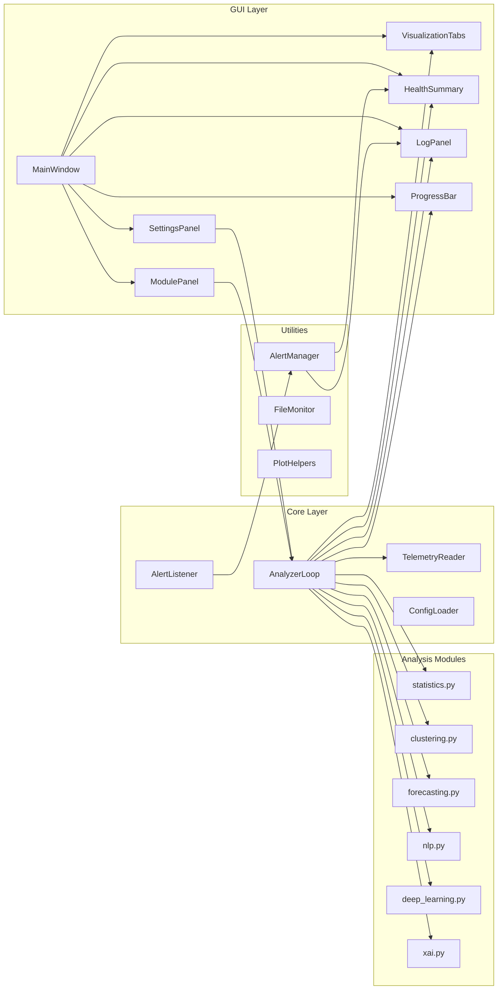
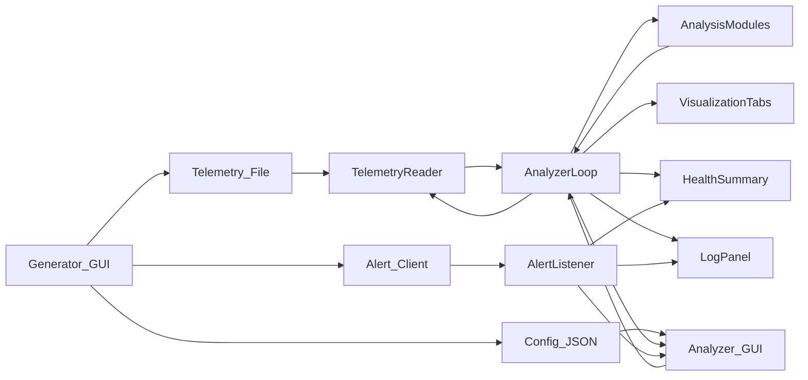
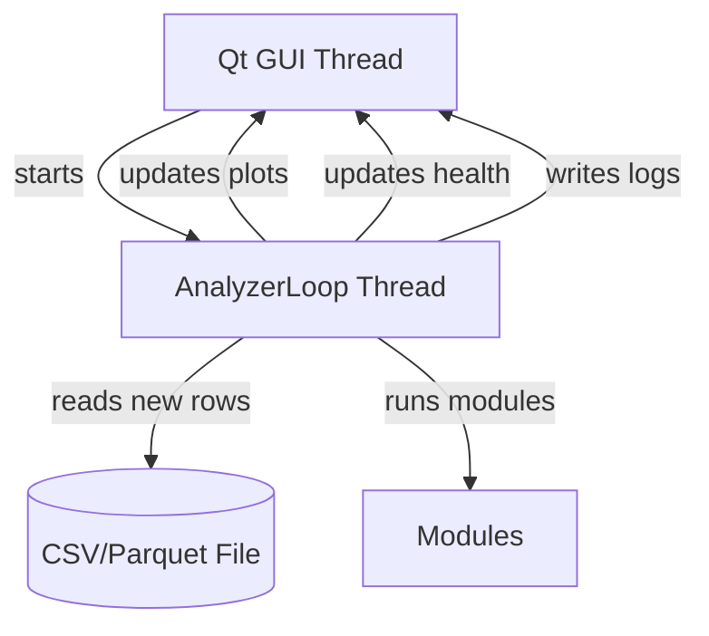

# 🚀 Project: Dibital Twin Telemetry Analyzer

# **Executive Summary**  
### *A Real‑Time Telemetry Interpretation and Analytics Platform for Digital Twin Ecosystems*

The **Digital Twin Analyzer** is a modular, GUI‑driven analytics platform designed to interpret, visualize, and characterize real‑time telemetry streams produced by the 
Digital Twin Telemetry Generator. Together, these two applications form a complete digital‑twin ecosystem:

- **Generator →** simulates a virtual electric drilling machine  
- **Analyzer →** interprets the resulting telemetry in real time  

The Analyzer ingests CSV or Parquet telemetry files in a streaming fashion, processes new rows as they arrive, and dispatches them to a suite of lightweight analysis modules:

- **Statistics** (rolling means, FFT, variance checks)  
- **Clustering** (KMeans, DBSCAN)  
- **Forecasting** (linear regression, short‑term prediction)  
- **NLP** (log message keyword extraction)  
- **Deep Learning** (IsolationForest anomaly scoring)  
- **XAI** (RandomForest‑based feature attribution)  

The system provides a **real‑time dashboard** with:

- time‑series plots  
- clustering scatterplots  
- forecasting overlays  
- NLP summaries  
- anomaly score curves  
- explainability reports  
- system health indicators  
- a live log console  

This document provides a complete technical walkthrough of the Analyzer, including motivation, architecture, GUI interpretation, file‑by‑file analysis, diagrams, and instructions for running the system from Jupyter 
(see [References](https://github.com/NenadBalaneskovic/ExternalProjects/blob/main/DigitalTwinsGeneratorGUI/DigitalTwin_TelemetryGeneratorGUI.md#14--references) 1 - 3 below). 


# **1. Motivation**

Modern digital twin ecosystems require not only **data generation** but also **real‑time interpretation**. Industrial telemetry streams — whether from drilling machines, turbines, 
CNC systems, or IoT sensor networks — must be analyzed continuously to detect anomalies, forecast trends, and provide actionable insights.

However, real‑world telemetry pipelines are often:

- proprietary  
- expensive to operate  
- difficult to instrument  
- non‑deterministic  
- inaccessible for experimentation  

The **Digital Twin Analyzer** solves this by providing a **transparent, reproducible, and modular analytics environment** that operates on synthetic yet realistic telemetry streams generated by the companion project.

### **Core Motivation**
To design a **real‑time telemetry analysis engine** that:

- reads new data incrementally (tail‑reader)  
- processes it through modular analytics pipelines  
- visualizes results in a clean, interpretable GUI  
- monitors system health and generator alerts  
- supports explainability and governance‑ready reporting  

This Analyzer is not a toy — it is a **conceptual control center** for a digital twin, capable of demonstrating how real industrial systems are monitored, diagnosed, and understood.

---

# **2. Introduction**

The **Digital Twin Analyzer** is a PySide6‑based desktop application that continuously reads telemetry files produced by the Generator and applies a suite of analytics modules to each new batch of data.

### **Key Features**
- **Real‑time incremental reading** of CSV/Parquet  
- **Modular analysis pipeline** (statistics, clustering, forecasting, NLP, deep learning, XAI)  
- **Tabbed visualization interface**  
- **System health monitoring**  
- **Alert listener** for Generator events  
- **Live log console**  
- **Progress bar with activity‑based updates**  
- **Config loader** for seamless integration with the Generator  

### **Design Philosophy**
The Analyzer is designed to be:

- **Modular** — each analysis module is independent  
- **Lightweight** — algorithms are optimized for real‑time use  
- **Explainable** — XAI summaries provide interpretability  
- **Robust** — background threads prevent GUI blocking  
- **Governance‑ready** — logs, health summaries, and config files ensure traceability  

The Analyzer completes the digital twin loop by transforming raw telemetry into insights, visualizations, and diagnostics.
 
---


# 🧠 **3. GUI Sketch Interpretation**  

In the following we address our full GUI sketch, a clean, structured layout for our Digital Twin Telemetry Analyzer GUI. It includes all the key modules we discussed: 
objective and constraint input, method selection of forecasting models), result display, visualization, and diagnostics.


The GUI sketch for the Digital Twin Telemetry Analyzer establishes a **clear, engineering‑oriented workflow** that mirrors how real industrial telemetry systems are configured and monitored. 
The Analyzer GUI is structured around a **two‑panel layout** with a bottom progress bar:

- **Left panel:**  
  - telemetry file selection  
  - refresh interval  
  - row‑limit settings  
  - Start/Stop controls  
  - module selection  

- **Right panel:**  
  - visualization tabs  
  - system health summary  
  - system log  

This layout mirrors real industrial dashboards, where operators configure data ingestion on the left and observe system behavior on the right.  

The Analyzer is the **interpretive half** of the digital twin pipeline:

- The Generator produces a **virtual machine**  
- The Analyzer acts as the **virtual control center**  

This separation mirrors real industrial architectures:

- **Edge layer:** data generation (sensors, PLCs, machines)  
- **Cloud/Control layer:** analytics, dashboards, monitoring  

By simulating both layers, your two‑project suite provides a complete, pedagogical, and consulting‑ready demonstration of digital twin principles.

---

# **4. Operating GUI Screenshot Interpretation**  


The **Digital Twin Analyzer GUI** is structured as a professional, operator‑grade dashboard — the kind you would expect in industrial control rooms, monitoring centers, 
or predictive maintenance platforms. Its layout is intentionally divided into **configuration**, **analysis**, and **diagnostics** zones, reflecting the workflow of real‑time telemetry interpretation.

The GUI is organized into three conceptual layers:

## **4.1 Left Panel — Configuration & Module Selection (What should the Analyzer do?)**

This panel defines the Analyzer’s operational parameters:

### **Telemetry File Section**
- File path (auto‑loaded from `config.json`)  
- Browse button for manual override  
- Supports CSV and Parquet  

This mirrors real industrial systems where analysts select a data source or switch between live and historical telemetry.

### **Refresh Settings**
- Refresh interval (100–10,000 ms)  
- Controls how often the Analyzer polls for new rows  

This is analogous to a sampling rate for analytics rather than sensors.

### **Row Processing**
- Number of rows per refresh (100–1,000,000)  
- Defines batch size for incremental analysis  

This allows the Analyzer to scale from lightweight demos to heavy telemetry streams.

### **Start / Stop Controls**
- Start Analysis  
- Stop  

These buttons control the background analysis thread.

### **Analysis Modules**
A set of checkboxes enabling or disabling:

- **Statistics** (rolling means, FFT)  
- **Clustering** (KMeans, DBSCAN)  
- **Forecasting** (linear regression)  
- **NLP** (log keyword extraction)  
- **Deep Learning** (IsolationForest anomaly scoring)  
- **Explainability (XAI)** (RandomForest feature attribution)

This modular design mirrors real analytics pipelines where different models can be toggled depending on the use case.

## **4.2 Right Panel — Visualization, Health, and Logs (What is happening right now?)**

This panel is the **operational heart** of the Analyzer.

### **Visualization Tabs**
A tabbed interface with:

- **Time Series**  
- **Clustering**  
- **Forecasting**  
- **NLP**  
- **Deep Learning**  
- **XAI**

Each tab displays results from the corresponding analysis module.  
The plots update in real time as new telemetry arrives.

### **System Health**
A compact health indicator showing:

- Current status (OK / Warning / Error)  
- Last update timestamp  
- Generator state (Active / Complete)  

This panel integrates both:

- module‑derived health signals  
- alert messages from the Generator  

### **System Log**
A scrolling, timestamped console that records:

- module updates  
- analysis start/stop events  
- row ingestion events  
- alerts from the Generator  

This provides governance‑ready traceability.


## **4.3 Bottom Bar — Progress Indicator**

A progress bar shows:

- activity‑based progress (0–100%)  
- status messages (“Waiting for new data…”, “Processed 200000 rows.”)

Since the Analyzer does not know the total number of rows in advance, progress is based on activity rather than completion.

The above screenshots show the Analyzer in full operation, processing hundreds of thousands of rows in real time. Let’s interpret what we see.


## **4.4 Time Series Tab**

The Time Series tab displays:

- a clean line plot of the selected numeric column  
- x‑axis: sample index  
- y‑axis: sensor value  
- updated every batch  

This provides immediate insight into sensor stability, drift, and anomalies.

## **4.5 Clustering Tab**

The Clustering tab shows:

- a scatterplot of two numeric features  
- color‑coded cluster labels  
- KMeans or DBSCAN depending on data quality  

This is useful for:

- detecting operational regimes  
- identifying outliers  
- visualizing multi‑sensor relationships  

The above screenshots show three distinct clusters — a typical pattern for RPM‑driven telemetry.

## **4.6 Forecasting Tab**

The Forecasting tab overlays:

- historical data (blue)  
- short‑term predictions (orange)  

This provides:

- trend detection  
- early warnings  
- predictive maintenance signals  

The above screenshots show a stable temperature trend with a short forecast horizon.

## **4.7 NLP Tab**

The NLP tab displays:

- top keyword frequencies  
- error‑related term counts  
- human‑readable summaries  

This is especially useful when telemetry includes log messages or categorical states.

The above screenshots show high counts for terms like “low”, “detected”, “minor”, “idle”, “anomalies”.

## **4.8 Deep Learning Tab**

The Deep Learning tab shows:

- anomaly score curves  
- x‑axis: sample index  
- y‑axis: anomaly score  

This is a lightweight approximation of autoencoder‑style anomaly detection.

The above screenshots show a red anomaly curve with occasional spikes — typical for vibration or noise‑driven telemetry.

## **4.9 XAI Tab**

The XAI tab displays:

- feature attribution summary  
- relative importances  
- target variable (e.g., Temperature)  

Your screenshot shows:

- **Cycle Counter dominating attribution (~0.93)**  
- A health warning triggered accordingly  

This is a realistic scenario: monotonic counters often correlate strongly with drift.

## **4.10 System Health Panel**

The health panel shows:

- **Status: Warning — XAI: Cycle Counter dominates attribution (0.93)**  
- Last update timestamp  
- Generator: Active  

This demonstrates the Analyzer’s ability to integrate:

- module‑derived health  
- alert‑driven health  
- time‑based health  

## **4.11 System Log**

Your logs show:

- module updates  
- analysis start  
- row ingestion events  
- alert messages  

Example:

```
[2026-02-20 14:19:10] Read 10000 new rows (total: 170000).
[2026-02-20 14:19:15] Read 10000 new rows (total: 180000).
...
```

This provides a complete audit trail.

---

# **5. System Architecture Overview**

The Analyzer is built on a clean, layered architecture:

```
GUI Layer (PySide6)
│
├── SettingsPanel        → file path, refresh interval, row limit
├── ModulePanel          → module selection
├── VisualizationTabs    → plots and summaries
├── HealthSummary        → system health
└── LogPanel             → system logs
│
Core Layer
│
├── AnalyzerLoop         → background analysis engine
├── TelemetryReader      → incremental CSV/Parquet reader
├── AlertListener        → listens for Generator alerts
└── ConfigLoader         → loads shared config.json
│
Modules Layer
│
├── statistics.py        → rolling stats, FFT
├── clustering.py        → KMeans/DBSCAN
├── forecasting.py       → linear regression forecast
├── nlp.py               → keyword extraction
├── deep_learning.py     → anomaly scoring
└── xai.py               → feature attribution
│
Utilities
│
├── AlertManager         → formats and stores alerts
├── FileMonitor          → tracks file size and row count
└── PlotHelpers          → normalizes data for visualization
```

This separation ensures:

- GUI remains responsive  
- analysis runs in background threads  
- modules are independent and replaceable  
- telemetry ingestion is efficient  
- alerts integrate seamlessly  
---

# **6. Mermaid Diagrams**

Below are the diagrams that visually describe the Analyzer’s architecture.

## **6.1 Module Interaction Diagram**



## **6.2 Data Flow Diagram**



## **6.3 Threading Diagram**



We are ready to scaffold this into actual Pythonic code and wire up the backend logic for method selection and routing.

---


# **7. File‑by‑File Analysis — GUI Layer**

The GUI layer of the Digital Twin Analyzer is the **operator interface**, the place where real‑time telemetry becomes interpretable.  
It is built with **PySide6**, structured into modular panels, and orchestrated by the `MainWindow`.

The GUI layer consists of:

1. `app.py`  
2. `main_window.py`  
3. `settings_panel.py`  
4. `module_panel.py`  
5. `visualization_tabs.py`  
6. `log_panel.py`  
7. `health_summary.py`  
8. `progress_bar.py`  

Each file is analyzed below with:

- Purpose  
- Responsibilities  
- Inputs / Outputs  
- Internal logic  
- Interactions  
- Full code listing  

# **7.1 `analyzer/app.py`**

## **Purpose**
Entry point of the Analyzer application.  
Initializes the Qt application, loads the config path, and launches the main window.

## **Responsibilities**
- Create the Qt application  
- Determine config path (CLI or default)  
- Instantiate and show `MainWindow`  
- Start the Qt event loop  

## **Inputs**
- Optional CLI argument: path to `config.json`  

## **Outputs**
- Launches the Analyzer GUI  

## **Interactions**
- Imports and instantiates `MainWindow`  
- Passes config path to it  

## **Full Code Listing**

```python
# analyzer/app.py

import sys
import os

from PySide6.QtWidgets import QApplication
from PySide6.QtCore import Qt

from analyzer.gui.main_window import MainWindow


def main():
    """
    Entry point for the Telemetry Analyzer (Project B).

    Responsibilities:
        - Initialize Qt application
        - Create and show MainWindow
        - Optionally accept a config path via CLI
    """
    app = QApplication(sys.argv)
    app.setApplicationName("Telemetry Analyzer")
    #app.setAttribute(Qt.AA_EnableHighDpiScaling, True)

    # Optional: config path from CLI, default: ./config.json
    if len(sys.argv) > 1:
        config_path = sys.argv[1]
    else:
        config_path = os.path.join(os.getcwd(), "config.json")

    window = MainWindow(config_path=config_path)
    window.show()

    sys.exit(app.exec())


if __name__ == "__main__":
    main()
```

# **7.2 `analyzer/gui/main_window.py`**

## **Purpose**
The **central orchestrator** of the Analyzer GUI.  
It loads configuration, builds the layout, wires signals, initializes the backend, and handles alerts.

## **Responsibilities**
- Load shared `config.json`  
- Build the full GUI layout  
- Connect Start/Stop and module selection signals  
- Initialize `AnalyzerLoop` and `AlertListener`  
- Route alerts to health and log panels  
- Clean shutdown  

## **Inputs**
- Config path  
- User interactions (Start/Stop, module toggles)  

## **Outputs**
- Starts/stops analysis  
- Updates visualizations  
- Updates health and logs  
- Responds to alerts  

## **Internal Logic**
- Uses a horizontal splitter for left/right layout  
- Left: settings + module selection  
- Right: visualizations + health + logs  
- Bottom: progress bar  
- Alert listener runs in background  

## **Interactions**
- SettingsPanel → provides analysis config  
- ModulePanel → provides selected modules  
- AnalyzerLoop → backend engine  
- AlertListener → receives generator alerts  
- VisualizationTabs → receives results  
- HealthSummary → receives health updates  
- LogPanel → receives logs  

## **Full Code Listing**

```python
# analyzer/gui/main_window.py

from PySide6.QtWidgets import (
    QMainWindow,
    QWidget,
    QVBoxLayout,
    QHBoxLayout,
    QSplitter,
    QMessageBox,
)
from PySide6.QtCore import Qt

import os

from .settings_panel import SettingsPanel
from .module_panel import ModulePanel
from .visualization_tabs import VisualizationTabs
from .log_panel import LogPanel
from .health_summary import HealthSummary
from .progress_bar import ProgressBar

from ..core.analyzer_loop import AnalyzerLoop
from ..core.config_loader import load_config
from ..core.alert_listener import AlertListener


class MainWindow(QMainWindow):
    """
    Main window for the Telemetry Analyzer GUI.
    """

    def __init__(self, config_path=None):
        super().__init__()
        self.config_path = config_path

        # ---------------------------------------------------------
        # Load configuration FIRST
        # ---------------------------------------------------------
        if self.config_path:
            config_path = os.path.abspath(self.config_path)
        else:
            base_dir = os.path.dirname(os.path.dirname(os.path.abspath(__file__)))
            config_path = os.path.join(base_dir, "config.json")

        self.config = self._safe_load_config(config_path)

        # ---------------------------------------------------------
        # GUI setup
        # ---------------------------------------------------------
        self.setWindowTitle("Telemetry Data Analyzer")
        self.setMinimumSize(1400, 800)

        self.settings_panel = SettingsPanel(self.config)
        self.module_panel = ModulePanel()
        self.visualization_tabs = VisualizationTabs()
        self.log_panel = LogPanel()
        self.health_summary = HealthSummary()
        self.progress_bar = ProgressBar()

        self.analyzer: AnalyzerLoop | None = None
        self.alert_listener: AlertListener | None = None

        self._build_layout()
        self._connect_signals()
        self._init_backend()

    # ---------------------------------------------------------
    # Config loading
    # ---------------------------------------------------------
    def _safe_load_config(self, path: str):
        try:
            return load_config(path)
        except Exception as e:
            QMessageBox.warning(
                self,
                "Config Error",
                f"Could not load {path}.\n\n{e}\n\n"
                "You can still start the Analyzer, but some features may be disabled.",
            )
            return {}

    # ---------------------------------------------------------
    # Layout
    # ---------------------------------------------------------
    def _build_layout(self):
        central = QWidget()
        main_layout = QVBoxLayout()

        splitter = QSplitter(Qt.Horizontal)

        # Left side
        left_widget = QWidget()
        left_layout = QVBoxLayout()
        left_layout.addWidget(self.settings_panel)
        left_layout.addWidget(self.module_panel)
        left_layout.addStretch()
        left_widget.setLayout(left_layout)

        # Right side
        right_widget = QWidget()
        right_layout = QVBoxLayout()
        right_layout.addWidget(self.visualization_tabs)
        right_layout.addWidget(self.health_summary)
        right_layout.addWidget(self.log_panel)
        right_widget.setLayout(right_layout)

        splitter.addWidget(left_widget)
        splitter.addWidget(right_widget)
        splitter.setStretchFactor(0, 1)
        splitter.setStretchFactor(1, 3)

        # Bottom progress bar
        bottom_layout = QHBoxLayout()
        bottom_layout.addWidget(self.progress_bar)

        main_layout.addWidget(splitter)
        main_layout.addLayout(bottom_layout)

        central.setLayout(main_layout)
        self.setCentralWidget(central)

    # ---------------------------------------------------------
    # Signal wiring
    # ---------------------------------------------------------
    def _connect_signals(self):
        self.settings_panel.start_requested.connect(self._start_analysis)
        self.settings_panel.stop_requested.connect(self._stop_analysis)
        self.module_panel.modules_changed.connect(self._update_modules)

    # ---------------------------------------------------------
    # Backend initialization
    # ---------------------------------------------------------
    def _init_backend(self):
        self.analyzer = AnalyzerLoop(
            config=self.config,
            progress_callback=self.progress_bar.update_progress,
            log_callback=self.log_panel.append_log,
            visualization_callback=self.visualization_tabs.update_visualizations,
            health_callback=self.health_summary.update_health,
        )

        self.alert_listener = AlertListener(
            host=self.config.get("alerts", {}).get("socket_host", "127.0.0.1"),
            port=self.config.get("alerts", {}).get("socket_port", 5050),
            enabled=self.config.get("alerts", {}).get("socket_enabled", True),
            alert_callback=self._handle_alert,
        )
        self.alert_listener.start()

    # ---------------------------------------------------------
    # Analysis control
    # ---------------------------------------------------------
    def _start_analysis(self):
        if not self.analyzer:
            return

        analysis_config = self.settings_panel.get_analysis_config()
        selected_modules = self.module_panel.get_selected_modules()

        self.log_panel.append_log("Starting analysis...")
        self.analyzer.start(analysis_config, selected_modules)

    def _stop_analysis(self):
        if not self.analyzer:
            return

        self.log_panel.append_log("Stopping analysis...")
        self.analyzer.stop()

    def _update_modules(self, modules):
        if not self.analyzer:
            return
        self.analyzer.set_modules(modules)

    # ---------------------------------------------------------
    # Alert handling
    # ---------------------------------------------------------
    def _handle_alert(self, alert: dict):
        event = alert.get("event", "unknown")
        payload = alert.get("payload", {})

        self.log_panel.append_log(f"[ALERT] {event} - {payload}")

        if event == "chunk_written":
            self.health_summary.mark_data_updated()
        elif event == "generation_complete":
            self.health_summary.mark_generation_complete()

    # ---------------------------------------------------------
    # Cleanup
    # ---------------------------------------------------------
    def closeEvent(self, event):
        if self.analyzer:
            self.analyzer.stop()
        if self.alert_listener:
            self.alert_listener.stop()
        super().closeEvent(event)
```

# **7.3 `analyzer/gui/settings_panel.py`**

## **Purpose**
Provides all **analysis configuration controls**:

- telemetry file path  
- refresh interval  
- row limit  
- Start/Stop buttons  

## **Responsibilities**
- Allow user to select telemetry file  
- Configure polling frequency  
- Configure batch size  
- Emit Start/Stop signals  

## **Inputs**
- User interactions  

## **Outputs**
- `start_requested`  
- `stop_requested`  
- Analysis config dictionary  

## **Internal Logic**
- Uses QSpinBox for numeric settings  
- Uses QFileDialog for file selection  
- Emits signals on button clicks  

## **Interactions**
- MainWindow listens to Start/Stop  
- AnalyzerLoop receives config  

## **Full Code Listing**

```python
# analyzer/gui/settings_panel.py

from PySide6.QtWidgets import (
    QWidget,
    QGroupBox,
    QVBoxLayout,
    QHBoxLayout,
    QLabel,
    QSpinBox,
    QLineEdit,
    QPushButton,
    QFileDialog,
)
from PySide6.QtCore import Qt, Signal


class SettingsPanel(QWidget):
    """
    Settings panel for the Telemetry Analyzer.

    Responsibilities:
        - Display file path (from config.json or user override)
        - Allow user to change refresh interval (polling frequency)
        - Allow user to limit number of rows loaded per refresh
        - Provide Start / Stop buttons for analysis

    Signals:
        start_requested -> emitted when user presses Start
        stop_requested  -> emitted when user presses Stop

    Methods:
        get_analysis_config() -> dict
            Returns current analysis settings for AnalyzerLoop
    """

    start_requested = Signal()
    stop_requested = Signal()

    def __init__(self, config: dict):
        super().__init__()

        self.config = config or {}

        self._build_ui()

    # ---------------------------------------------------------
    # UI Construction
    # ---------------------------------------------------------
    def _build_ui(self):
        layout = QVBoxLayout()

        # --- File Path ---
        file_group = QGroupBox("Telemetry File")
        file_layout = QVBoxLayout()

        self.file_path_edit = QLineEdit()

        # Load from config["output"]["file_path"]
        default_path = (
            self.config.get("output", {}).get("file_path", "")
        )
        self.file_path_edit.setText(default_path)

        browse_btn = QPushButton("Browse…")
        browse_btn.clicked.connect(self._browse_file)

        file_layout.addWidget(QLabel("File path:"))
        file_layout.addWidget(self.file_path_edit)
        file_layout.addWidget(browse_btn)
        file_group.setLayout(file_layout)

        # --- Refresh Interval ---
        refresh_group = QGroupBox("Refresh Settings")
        refresh_layout = QVBoxLayout()

        self.refresh_spin = QSpinBox()
        self.refresh_spin.setRange(100, 10_000)
        self.refresh_spin.setValue(500)  # ms
        self.refresh_spin.setSuffix(" ms")

        refresh_layout.addWidget(QLabel("Refresh interval:"))
        refresh_layout.addWidget(self.refresh_spin)
        refresh_group.setLayout(refresh_layout)

        # --- Row Limit ---
        row_group = QGroupBox("Row Processing")
        row_layout = QVBoxLayout()

        self.row_limit_spin = QSpinBox()
        self.row_limit_spin.setRange(100, 1_000_000)
        self.row_limit_spin.setValue(10_000)

        row_layout.addWidget(QLabel("Rows per refresh:"))
        row_layout.addWidget(self.row_limit_spin)
        row_group.setLayout(row_layout)

        # --- Start / Stop Buttons ---
        btn_layout = QHBoxLayout()
        self.start_btn = QPushButton("Start Analysis")
        self.stop_btn = QPushButton("Stop")

        self.start_btn.clicked.connect(self.start_requested.emit)
        self.stop_btn.clicked.connect(self.stop_requested.emit)

        btn_layout.addWidget(self.start_btn)
        btn_layout.addWidget(self.stop_btn)

        # Assemble layout
        layout.addWidget(file_group)
        layout.addWidget(refresh_group)
        layout.addWidget(row_group)
        layout.addLayout(btn_layout)
        layout.addStretch()

        self.setLayout(layout)

    # ---------------------------------------------------------
    # File Browser
    # ---------------------------------------------------------
    def _browse_file(self):
        """
        Opens a file dialog to select a CSV or Parquet file.
        """
        path, _ = QFileDialog.getOpenFileName(
            self,
            "Select Telemetry File",
            "",
            "Data Files (*.csv *.parquet)"
        )
        if path:
            self.file_path_edit.setText(path)

    # ---------------------------------------------------------
    # Public API
    # ---------------------------------------------------------
    def get_analysis_config(self) -> dict:
        """
        Returns a dictionary with current analysis settings.
        Used by AnalyzerLoop.start().
        """
        return {
            "file_path": self.file_path_edit.text(),
            "refresh_interval_ms": self.refresh_spin.value(),
            "row_limit": self.row_limit_spin.value(),
        }
```

# **7.4 `analyzer/gui/module_panel.py`**

## **Purpose**
Provides toggles for enabling/disabling analysis modules.

## **Responsibilities**
- Display module checkboxes  
- Emit signal when module selection changes  

## **Inputs**
- User checkbox toggles  

## **Outputs**
- `modules_changed` signal with list of selected modules  

## **Internal Logic**
- Maintains a dict of module names → QCheckBox  
- Emits signal on any state change  

## **Interactions**
- MainWindow updates AnalyzerLoop modules  

## **Full Code Listing**

```python
# analyzer/gui/module_panel.py

from PySide6.QtWidgets import (
    QWidget,
    QGroupBox,
    QVBoxLayout,
    QCheckBox,
)
from PySide6.QtCore import Signal


class ModulePanel(QWidget):
    """
    Module selection panel for the Telemetry Analyzer.

    Responsibilities:
        - Display toggles for each analysis module
        - Allow user to enable/disable modules dynamically
        - Emit a signal when module selection changes

    Signals:
        modules_changed -> emitted with a list of selected module names

    Methods:
        get_selected_modules() -> list[str]
            Returns the list of currently enabled modules
    """

    modules_changed = Signal(list)

    def __init__(self):
        super().__init__()
        self._build_ui()

    # ---------------------------------------------------------
    # UI Construction
    # ---------------------------------------------------------
    def _build_ui(self):
        layout = QVBoxLayout()

        group = QGroupBox("Analysis Modules")
        group_layout = QVBoxLayout()

        # Define available modules
        self.module_checkboxes = {
            "statistics": QCheckBox("Statistics (rolling means, FFT)"),
            "clustering": QCheckBox("Clustering (KMeans, DBSCAN)"),
            "forecasting": QCheckBox("Forecasting (SARIMAX, LSTM)"),
            "nlp": QCheckBox("NLP (logs, topic modeling)"),
            "deep_learning": QCheckBox("Deep Learning (autoencoder anomaly detection)"),
            "xai": QCheckBox("Explainability (SHAP, Captum)"),
        }

        # Add checkboxes to layout
        for name, checkbox in self.module_checkboxes.items():
            checkbox.stateChanged.connect(self._emit_change)
            group_layout.addWidget(checkbox)

        group.setLayout(group_layout)
        layout.addWidget(group)
        layout.addStretch()

        self.setLayout(layout)

    # ---------------------------------------------------------
    # Signal emission
    # ---------------------------------------------------------
    def _emit_change(self):
        """
        Emits the modules_changed signal whenever a checkbox is toggled.
        """
        self.modules_changed.emit(self.get_selected_modules())

    # ---------------------------------------------------------
    # Public API
    # ---------------------------------------------------------
    def get_selected_modules(self) -> list:
        """
        Returns a list of module names that are currently enabled.
        """
        return [
            name
            for name, checkbox in self.module_checkboxes.items()
            if checkbox.isChecked()
        ]
```

# **7.5 `analyzer/gui/visualization_tabs.py`**

## **Purpose**
Provides a tabbed interface for all visualizations:

- Time Series  
- Clustering  
- Forecasting  
- NLP  
- Deep Learning  
- XAI  

## **Responsibilities**
- Render plots using Matplotlib  
- Display NLP and XAI summaries  
- Provide update methods for AnalyzerLoop  

## **Inputs**
- Results dict from AnalyzerLoop  

## **Outputs**
- Updated plots and summaries  

## **Internal Logic**
- Each tab has its own figure or label  
- `update_visualizations()` dispatches to specific update methods  

## **Interactions**
- AnalyzerLoop → VisualizationTabs  

## **Full Code Listing**

```python
# analyzer/gui/visualization_tabs.py

from PySide6.QtWidgets import (
    QWidget,
    QTabWidget,
    QVBoxLayout,
    QLabel,
)
from PySide6.QtCore import Qt

from matplotlib.backends.backend_qt5agg import FigureCanvasQTAgg as FigureCanvas
from matplotlib.figure import Figure


class VisualizationTabs(QWidget):
    """
    Tabbed visualization interface for the Telemetry Analyzer.

    Responsibilities:
        - Provide separate tabs for each analysis module
        - Expose update_*() methods for AnalyzerLoop to push results
        - Render plots using Matplotlib
        - Keep GUI decoupled from analysis logic

    Tabs:
        - Time Series
        - Clustering
        - Forecasting
        - NLP
        - Deep Learning
        - XAI
    """

    def __init__(self):
        super().__init__()
        self._build_ui()

    # ---------------------------------------------------------
    # UI Construction
    # ---------------------------------------------------------
    def _build_ui(self):
        layout = QVBoxLayout()

        self.tabs = QTabWidget()

        # --- Time Series Tab ---
        self.ts_fig = Figure(figsize=(5, 3))
        self.ts_canvas = FigureCanvas(self.ts_fig)
        self.ts_ax = self.ts_fig.add_subplot(111)
        ts_widget = QWidget()
        ts_layout = QVBoxLayout()
        ts_layout.addWidget(self.ts_canvas)
        ts_widget.setLayout(ts_layout)
        self.tabs.addTab(ts_widget, "Time Series")

        # --- Clustering Tab ---
        self.cluster_fig = Figure(figsize=(5, 3))
        self.cluster_canvas = FigureCanvas(self.cluster_fig)
        self.cluster_ax = self.cluster_fig.add_subplot(111)
        cluster_widget = QWidget()
        cluster_layout = QVBoxLayout()
        cluster_layout.addWidget(self.cluster_canvas)
        cluster_widget.setLayout(cluster_layout)
        self.tabs.addTab(cluster_widget, "Clustering")

        # --- Forecasting Tab ---
        self.forecast_fig = Figure(figsize=(5, 3))
        self.forecast_canvas = FigureCanvas(self.forecast_fig)
        self.forecast_ax = self.forecast_fig.add_subplot(111)
        forecast_widget = QWidget()
        forecast_layout = QVBoxLayout()
        forecast_layout.addWidget(self.forecast_canvas)
        forecast_widget.setLayout(forecast_layout)
        self.tabs.addTab(forecast_widget, "Forecasting")

        # --- NLP Tab ---
        self.nlp_label = QLabel("NLP results will appear here.")
        self.nlp_label.setAlignment(Qt.AlignTop | Qt.AlignLeft)
        nlp_widget = QWidget()
        nlp_layout = QVBoxLayout()
        nlp_layout.addWidget(self.nlp_label)
        nlp_widget.setLayout(nlp_layout)
        self.tabs.addTab(nlp_widget, "NLP")

        # --- Deep Learning Tab ---
        self.dl_fig = Figure(figsize=(5, 3))
        self.dl_canvas = FigureCanvas(self.dl_fig)
        self.dl_ax = self.dl_fig.add_subplot(111)
        dl_widget = QWidget()
        dl_layout = QVBoxLayout()
        dl_layout.addWidget(self.dl_canvas)
        dl_widget.setLayout(dl_layout)
        self.tabs.addTab(dl_widget, "Deep Learning")

        # --- XAI Tab ---
        self.xai_label = QLabel("XAI feature attributions will appear here.")
        self.xai_label.setAlignment(Qt.AlignTop | Qt.AlignLeft)
        xai_widget = QWidget()
        xai_layout = QVBoxLayout()
        xai_layout.addWidget(self.xai_label)
        xai_widget.setLayout(xai_layout)
        self.tabs.addTab(xai_widget, "XAI")

        layout.addWidget(self.tabs)
        self.setLayout(layout)

    # ---------------------------------------------------------
    # Update Methods (called by AnalyzerLoop)
    # ---------------------------------------------------------
    def update_visualizations(self, results: dict):
        """
        Central update entry point.
        AnalyzerLoop sends a dict with keys:
            - "time_series"
            - "clustering"
            - "forecasting"
            - "nlp"
            - "deep_learning"
            - "xai"
        Each key maps to module-specific results.
        """
        if "time_series" in results:
            self.update_time_series(results["time_series"])

        if "clustering" in results:
            self.update_clustering(results["clustering"])

        if "forecasting" in results:
            self.update_forecasting(results["forecasting"])

        if "nlp" in results:
            self.update_nlp(results["nlp"])

        if "deep_learning" in results:
            self.update_deep_learning(results["deep_learning"])

        if "xai" in results:
            self.update_xai(results["xai"])

    # ---------------------------------------------------------
    # Individual Update Methods
    # ---------------------------------------------------------
    def update_time_series(self, data):
        """
        Expects:
            data = {
                "x": [...],
                "y": [...],
                "label": "Temperature"
            }
        """
        self.ts_ax.clear()
        self.ts_ax.plot(data["x"], data["y"], label=data.get("label", ""))
        self.ts_ax.set_title("Time Series")
        self.ts_ax.legend()
        self.ts_canvas.draw_idle()

    def update_clustering(self, data):
        """
        Expects:
            data = {
                "x": [...],
                "y": [...],
                "labels": [...],
                "columns": [...],
                "method": "kmeans"
            }
        """
        self.cluster_ax.clear()
        self.cluster_ax.scatter(data["x"], data["y"], c=data["labels"], cmap="viridis")
        self.cluster_ax.set_title("Clustering")
        self.cluster_canvas.draw_idle()

    def update_forecasting(self, data):
        """
        Expects:
            data = {
                "history_x": [...],
                "history_y": [...],
                "forecast_x": [...],
                "forecast_y": [...],
                "label": "Temperature"
            }
        """
        self.forecast_ax.clear()
        self.forecast_ax.plot(data["history_x"], data["history_y"], label="History")
        self.forecast_ax.plot(data["forecast_x"], data["forecast_y"], label="Forecast")
        self.forecast_ax.set_title("Forecasting")
        self.forecast_ax.legend()
        self.forecast_canvas.draw_idle()

    def update_nlp(self, text: str):
        """
        Expects:
            text = "Summary of log messages..."
        """
        self.nlp_label.setText(text)

    def update_deep_learning(self, data):
        """
        Expects:
            data = {
                "x": [...],
                "anomaly_score": [...],
                "columns": [...]
            }
        """
        self.dl_ax.clear()
        self.dl_ax.plot(data["x"], data["anomaly_score"], color="red")
        self.dl_ax.set_title("Anomaly Score")
        self.dl_canvas.draw_idle()

    def update_xai(self, text: str):
        """
        Expects:
            text = "Feature attribution summary..."
        """
        self.xai_label.setText(text)
```

# **7.6 `analyzer/gui/log_panel.py`**

## **Purpose**
Provides a timestamped, append‑only log console.

## **Responsibilities**
- Display system logs  
- Timestamp each entry  
- Auto‑scroll  

## **Inputs**
- Log messages from AnalyzerLoop and AlertListener  

## **Outputs**
- Updated log console  

## **Full Code Listing**

# analyzer/gui/log_panel.py

```python
from PySide6.QtWidgets import QWidget, QGroupBox, QVBoxLayout, QTextEdit
from PySide6.QtCore import Qt
from datetime import datetime


class LogPanel(QWidget):
    """
    Log panel for the Telemetry Analyzer.

    Responsibilities:
        - Display system logs, alerts, and module messages
        - Provide an append-only text console
        - Timestamp each entry for clarity

    Methods:
        append_log(text: str)
            Appends a timestamped log entry to the console
    """

    def __init__(self):
        super().__init__()
        self._build_ui()

    # ---------------------------------------------------------
    # UI Construction
    # ---------------------------------------------------------
    def _build_ui(self):
        layout = QVBoxLayout()

        group = QGroupBox("System Log")
        group_layout = QVBoxLayout()

        self.text_area = QTextEdit()
        self.text_area.setReadOnly(True)
        self.text_area.setLineWrapMode(QTextEdit.NoWrap)

        group_layout.addWidget(self.text_area)
        group.setLayout(group_layout)

        layout.addWidget(group)
        self.setLayout(layout)

    # ---------------------------------------------------------
    # Public API
    # ---------------------------------------------------------
    def append_log(self, text: str):
        """
        Appends a timestamped log entry to the console.

        Args:
            text (str): Log message
        """
        timestamp = datetime.utcnow().strftime("%Y-%m-%d %H:%M:%S")
        entry = f"[{timestamp}] {text}"

        self.text_area.append(entry)
        self.text_area.ensureCursorVisible()
```

# **7.7 `analyzer/gui/health_summary.py`**

## **Purpose**
Displays system health:

- OK / Warning / Error  
- Last update timestamp  
- Generator state  

## **Responsibilities**
- React to module‑derived health  
- React to generator alerts  
- Color‑code status  

## **Full Code Listing**

```python
# analyzer/gui/health_summary.py

from PySide6.QtWidgets import QWidget, QGroupBox, QVBoxLayout, QLabel, QHBoxLayout
from PySide6.QtCore import Qt
from datetime import datetime


class HealthSummary(QWidget):
    """
    Compact health indicator panel for the Telemetry Analyzer.

    Responsibilities:
        - Display system health status (OK / Warning / Error)
        - Show last update time
        - React to alerts from the Generator
        - React to analysis results (e.g., anomalies)

    Methods:
        update_health(summary: dict)
            Called by AnalyzerLoop with module-derived health info

        mark_data_updated()
            Called when new data arrives (e.g., chunk_written alert)

        mark_generation_complete()
            Called when generator finishes producing data
    """

    def __init__(self):
        super().__init__()
        self._build_ui()

        # Internal state
        self.last_update = None
        self.status = "OK"

    # ---------------------------------------------------------
    # UI Construction
    # ---------------------------------------------------------
    def _build_ui(self):
        layout = QVBoxLayout()

        group = QGroupBox("System Health")
        group_layout = QVBoxLayout()

        # Status label (color-coded)
        self.status_label = QLabel("Status: OK")
        self.status_label.setAlignment(Qt.AlignLeft | Qt.AlignVCenter)
        self._set_status_color("OK")

        # Last update timestamp
        self.update_label = QLabel("Last update: —")
        self.update_label.setAlignment(Qt.AlignLeft | Qt.AlignVCenter)

        # Generator state
        self.generator_label = QLabel("Generator: Active")
        self.generator_label.setAlignment(Qt.AlignLeft | Qt.AlignVCenter)

        group_layout.addWidget(self.status_label)
        group_layout.addWidget(self.update_label)
        group_layout.addWidget(self.generator_label)

        group.setLayout(group_layout)
        layout.addWidget(group)
        self.setLayout(layout)

    # ---------------------------------------------------------
    # Status Color Helper
    # ---------------------------------------------------------
    def _set_status_color(self, status: str):
        """
        Applies color coding based on status.
        """
        if status == "OK":
            color = "green"
        elif status == "Warning":
            color = "orange"
        else:
            color = "red"

        self.status_label.setStyleSheet(f"color: {color}; font-weight: bold;")

    # ---------------------------------------------------------
    # Public API
    # ---------------------------------------------------------
    def update_health(self, summary: dict):
        """
        Called by AnalyzerLoop with health information.

        Expected summary format:
            {
                "status": "OK" | "Warning" | "Error",
                "message": "Optional description"
            }
        """
        status = summary.get("status", "OK")
        message = summary.get("message", "")

        self.status = status
        self._set_status_color(status)

        if message:
            self.status_label.setText(f"Status: {status} — {message}")
        else:
            self.status_label.setText(f"Status: {status}")

        # Update timestamp
        self.last_update = datetime.utcnow()
        self.update_label.setText(f"Last update: {self.last_update.strftime('%H:%M:%S')}")

    def mark_data_updated(self):
        """
        Called when new data arrives (e.g., chunk_written alert).
        """
        self.last_update = datetime.utcnow()
        self.update_label.setText(f"Last update: {self.last_update.strftime('%H:%M:%S')}")

    def mark_generation_complete(self):
        """
        Called when generator finishes producing data.
        """
        self.generator_label.setText("Generator: Complete")
        self.generator_label.setStyleSheet("color: blue; font-weight: bold;")

```

# **7.8 `analyzer/gui/progress_bar.py`**

## **Purpose**
The `ProgressBar` widget provides a compact, activity‑based progress indicator for the Analyzer.  
Because the Analyzer processes telemetry incrementally — without knowing the total number of rows in advance — the progress bar reflects **activity**, not completion.

## **Responsibilities**
- Display progress percentage (0–100%)  
- Display status messages (e.g., “Waiting for new data…”, “Processed 200000 rows.”)  
- Provide a clean, unobtrusive UI element at the bottom of the main window  

## **Inputs**
- `update_progress(percent, message)` from `AnalyzerLoop`  

## **Outputs**
- Updated progress bar  
- Updated status label  

## **Internal Logic**
- Converts float percentage to integer  
- Updates the bar’s internal text (e.g., “27%”)  
- Updates the message label if provided  

## **Interactions**
- Called exclusively by `AnalyzerLoop`  
- Displayed in `MainWindow`  

## **Full Code Listing**

```python
# analyzer/gui/progress_bar.py

from PySide6.QtWidgets import QWidget, QHBoxLayout, QLabel, QProgressBar
from PySide6.QtCore import Qt


class ProgressBar(QWidget):
    """
    Progress bar for the Telemetry Analyzer.

    Responsibilities:
        - Display progress of file processing
        - Show status messages (e.g., "Reading...", "Analyzing...")
        - Provide a clean, compact UI element for the bottom of MainWindow

    Methods:
        update_progress(percent, message)
            Updates the progress bar and status label
    """

    def __init__(self):
        super().__init__()
        self._build_ui()

    # ---------------------------------------------------------
    # UI Construction
    # ---------------------------------------------------------
    def _build_ui(self):
        layout = QHBoxLayout()

        # Progress bar
        self.progress = QProgressBar()
        self.progress.setRange(0, 100)
        self.progress.setValue(0)
        self.progress.setFormat("0%")
        self.progress.setTextVisible(True)

        # Status message
        self.message_label = QLabel("Idle.")
        self.message_label.setAlignment(Qt.AlignLeft | Qt.AlignVCenter)

        layout.addWidget(self.progress, stretch=2)
        layout.addWidget(self.message_label, stretch=3)

        self.setLayout(layout)

    # ---------------------------------------------------------
    # Public API
    # ---------------------------------------------------------
    def update_progress(self, percent: float, message: str = ""):
        """
        Updates the progress bar and optional status message.

        Args:
            percent (float): 0–100 progress value
            message (str): Optional status message
        """
        p = int(percent)

        # Update the bar value
        self.progress.setValue(p)

        # Show the percentage inside the bar
        self.progress.setFormat(f"{p}%")

        # Optional external message label
        if message:
            self.message_label.setText(message)
```

# **7.9 Summary of the GUI Layer**

The GUI layer of the Digital Twin Analyzer is designed with **clarity**, **responsiveness**, and **operator‑grade usability** in mind.  
Each component plays a distinct role:

| Component | Role |
|----------|------|
| **SettingsPanel** | Configures telemetry file, refresh interval, row limit |
| **ModulePanel** | Enables/disables analysis modules |
| **VisualizationTabs** | Displays all analytical results |
| **HealthSummary** | Shows system health and generator state |
| **LogPanel** | Provides a timestamped audit trail |
| **ProgressBar** | Shows activity‑based progress |
| **MainWindow** | Orchestrates layout, signals, backend integration |

Together, these components form a **real‑time analytics dashboard** capable of monitoring and interpreting large‑scale telemetry streams.

---

# **8. File‑by‑File Analysis — Core Layer**

The **Core Layer** is the operational backbone of the Digital Twin Analyzer.  
It handles:

- real‑time telemetry ingestion  
- background analysis  
- alert listening  
- configuration loading  
- health aggregation  
- progress reporting  

This layer is designed for **responsiveness**, **thread safety**, and **modular extensibility**, ensuring the GUI remains smooth even when processing hundreds of thousands of rows.

The core layer consists of:

1. `analyzer_loop.py`  
2. `reader.py`  
3. `alert_listener.py`  
4. `config_loader.py`  

Each file is analyzed below.

# **8.1 `analyzer/core/analyzer_loop.py` — The Analysis Engine**

## **Purpose**
The `AnalyzerLoop` is the **central engine** of the Analyzer.  
It runs in a background thread, periodically reads new telemetry rows, dispatches them to analysis modules, aggregates health signals, and updates the GUI.

It is the Analyzer’s equivalent of the Generator’s `TelemetryGenerator`.

## **Responsibilities**
- Read new rows incrementally from CSV/Parquet  
- Run selected analysis modules  
- Aggregate health signals (OK / Warning / Error)  
- Push visualization updates  
- Push log messages  
- Update progress bar  
- Handle errors gracefully  
- Run continuously until stopped  

## **Inputs**
- `analysis_config` (file path, refresh interval, row limit)  
- `selected_modules` (list of module names)  
- Callbacks for:
  - progress  
  - logs  
  - visualizations  
  - health  

## **Outputs**
- Visualization results  
- Health summaries  
- Log entries  
- Progress updates  

## **Internal Logic**
- Runs in a dedicated background thread  
- Uses `TelemetryReader` to read only *new* rows  
- Each module returns:
  - visualization data  
  - optional health dict  
- Health dicts are aggregated by priority:
  - Error > Warning > OK  
- Progress is activity‑based (0–100%)  

## **Interactions**
- `TelemetryReader` → incremental row ingestion  
- Analysis modules → statistics, clustering, forecasting, NLP, deep learning, XAI  
- `VisualizationTabs` → receives results  
- `HealthSummary` → receives health  
- `LogPanel` → receives logs  
- `ProgressBar` → receives progress  

---

## **Full Code Listing — `analyzer_loop.py`**


```python
# analyzer/core/analyzer_loop.py

import threading
import time
from typing import Callable, Dict, List, Any, Optional

from .reader import TelemetryReader
from ..modules import statistics, clustering, forecasting, nlp, deep_learning, xai


class AnalyzerLoop:
    """
    Main analysis loop for the Telemetry Analyzer.

    Responsibilities:
        - Periodically read new data from the telemetry file
        - Dispatch selected analysis modules
        - Aggregate results and send them to the GUI
        - Report progress, logs, and health status

    Lifecycle:
        - start(analysis_config, selected_modules)
        - loop in background thread until stop() is called
    """

    def __init__(
        self,
        config: dict,
        progress_callback: Callable[[float, str], None],
        log_callback: Callable[[str], None],
        visualization_callback: Callable[[Dict[str, Any]], None],
        health_callback: Callable[[Dict[str, Any]], None],
    ):
        self.config = config or {}
        self.progress_callback = progress_callback
        self.log_callback = log_callback
        self.visualization_callback = visualization_callback
        self.health_callback = health_callback

        self.reader: Optional[TelemetryReader] = None
        self.selected_modules: List[str] = []

        self._thread: Optional[threading.Thread] = None
        self._stop_event = threading.Event()

        # Internal state
        self.total_rows_processed = 0

    # ---------------------------------------------------------
    # Public API
    # ---------------------------------------------------------
    def start(self, analysis_config: dict, selected_modules: List[str]):
        """
        Starts the analyzer loop in a background thread.

        analysis_config:
            {
                "file_path": str,
                "refresh_interval_ms": int,
                "row_limit": int
            }

        selected_modules:
            ["statistics", "clustering", ...]
        """
        if self._thread and self._thread.is_alive():
            self.log_callback("AnalyzerLoop is already running.")
            return

        file_path = analysis_config.get("file_path")
        if not file_path:
            self.log_callback("No file path specified for analysis.")
            return

        self.selected_modules = selected_modules
        self.reader = TelemetryReader(
            file_path=file_path,
            row_limit=analysis_config.get("row_limit", 10_000),
        )

        self.refresh_interval = analysis_config.get("refresh_interval_ms", 500) / 1000.0

        self.log_callback(f"Starting analysis on file: {file_path}")
        self.total_rows_processed = 0
        self._stop_event.clear()

        self._thread = threading.Thread(target=self._run_loop, daemon=True)
        self._thread.start()

    def stop(self):
        """
        Requests the analyzer loop to stop and waits for thread to finish.
        """
        if not self._thread:
            return

        self._stop_event.set()
        self._thread.join(timeout=2.0)
        self.log_callback("AnalyzerLoop stopped.")

    def set_modules(self, modules: List[str]):
        """
        Updates the list of selected modules at runtime.
        """
        self.selected_modules = modules
        self.log_callback(f"Modules updated: {modules}")

    # ---------------------------------------------------------
    # Internal Loop
    # ---------------------------------------------------------
    def _run_loop(self):
        """
        Background loop:
            - periodically reads new data
            - runs selected modules
            - updates GUI via callbacks
        """
        while not self._stop_event.is_set():
            try:
                # 1. Read new data
                new_data = self.reader.read_new_rows() if self.reader else None
                if new_data is None or new_data.empty:
                    # No new data; sleep and continue
                    self.progress_callback(0.0, "Waiting for new data...")
                    time.sleep(self.refresh_interval)
                    continue

                rows = len(new_data)
                self.total_rows_processed += rows
                self.log_callback(f"Read {rows} new rows (total: {self.total_rows_processed}).")

                # 2. Run selected modules
                results: Dict[str, Any] = {}
                health_updates: List[Dict[str, Any]] = []

                if "statistics" in self.selected_modules:
                    stats_result, stats_health = statistics.run(new_data)
                    results["time_series"] = stats_result
                    if stats_health:
                        health_updates.append(stats_health)

                if "clustering" in self.selected_modules:
                    cluster_result, cluster_health = clustering.run(new_data)
                    results["clustering"] = cluster_result
                    if cluster_health:
                        health_updates.append(cluster_health)

                if "forecasting" in self.selected_modules:
                    forecast_result, forecast_health = forecasting.run(new_data)
                    results["forecasting"] = forecast_result
                    if forecast_health:
                        health_updates.append(forecast_health)

                if "nlp" in self.selected_modules:
                    nlp_result, nlp_health = nlp.run(new_data)
                    results["nlp"] = nlp_result
                    if nlp_health:
                        health_updates.append(nlp_health)

                if "deep_learning" in self.selected_modules:
                    dl_result, dl_health = deep_learning.run(new_data)
                    results["deep_learning"] = dl_result
                    if dl_health:
                        health_updates.append(dl_health)

                if "xai" in self.selected_modules:
                    xai_result, xai_health = xai.run(new_data)
                    results["xai"] = xai_result
                    if xai_health:
                        health_updates.append(xai_health)

                # 3. Push visualization updates
                if results:
                    self.visualization_callback(results)

                # 4. Aggregate health
                if health_updates:
                    # Simple aggregation: worst status wins
                    aggregated = self._aggregate_health(health_updates)
                    self.health_callback(aggregated)

                # 5. Update progress (activity-based, since total is unknown)
                if not hasattr(self, "_activity_percent"):
                    self._activity_percent = 0.0

                # Each batch nudges the bar forward up to 100%
                self._activity_percent = min(100.0, self._activity_percent + 1.0)

                self.progress_callback(
                    self._activity_percent,
                    f"Processed {self.total_rows_processed} rows."
                )

                # 6. Sleep until next refresh
                time.sleep(self.refresh_interval)

            except Exception as e:
                self.log_callback(f"Error in AnalyzerLoop: {e}")
                self.health_callback({"status": "Error", "message": str(e)})
                time.sleep(self.refresh_interval)

    # ---------------------------------------------------------
    # Health Aggregation
    # ---------------------------------------------------------
    def _aggregate_health(self, health_list: List[Dict[str, Any]]) -> Dict[str, Any]:
        """
        Aggregates multiple health dicts into a single summary.

        Priority: Error > Warning > OK
        """
        priority = {"OK": 0, "Warning": 1, "Error": 2}
        best_status = "OK"
        messages = []

        for h in health_list:
            status = h.get("status", "OK")
            msg = h.get("message", "")
            if msg:
                messages.append(msg)
            if priority.get(status, 0) > priority.get(best_status, 0):
                best_status = status

        return {
            "status": best_status,
            "message": " | ".join(messages) if messages else "",
        }
```

# **8.2 `analyzer/core/reader.py` — Incremental Telemetry Reader**

## **Purpose**
The `TelemetryReader` is a **tail‑reader** for CSV and Parquet files.  
It reads **only new rows** appended since the last read — essential for real‑time streaming.

## **Responsibilities**
- Detect file format (CSV/Parquet)  
- Track last read row index  
- Read only new rows  
- Handle large files efficiently  
- Avoid re‑reading entire datasets  

## **Inputs**
- File path  
- Row limit per refresh  

## **Outputs**
- A DataFrame containing only new rows  

## **Internal Logic**
- For CSV: counts lines, skips previously read rows  
- For Parquet: uses metadata to slice rows efficiently  

## **Interactions**
- Used exclusively by `AnalyzerLoop`  

---

## **Full Code Listing — `reader.py`**

```python
# analyzer/core/reader.py

import os
import pandas as pd
from typing import Optional


class TelemetryReader:
    """
    Efficient tail-reader for CSV or Parquet telemetry files.

    Responsibilities:
        - Track how many rows have already been processed
        - Load only *new* rows on each refresh
        - Support both CSV and Parquet formats
        - Avoid re-reading the entire file (critical for large files)

    Methods:
        read_new_rows() -> pd.DataFrame | None
            Returns only the newly appended rows since last read.
    """

    def __init__(self, file_path: str, row_limit: int = 10_000):
        self.file_path = file_path
        self.row_limit = row_limit

        # Internal state
        self.last_row_index = 0
        self.file_format = self._detect_format(file_path)

        if not os.path.exists(file_path):
            raise FileNotFoundError(f"Telemetry file not found: {file_path}")

    # ---------------------------------------------------------
    # Format detection
    # ---------------------------------------------------------
    def _detect_format(self, path: str) -> str:
        ext = os.path.splitext(path)[1].lower()
        if ext == ".csv":
            return "csv"
        if ext == ".parquet":
            return "parquet"
        raise ValueError(f"Unsupported file format: {ext}")

    # ---------------------------------------------------------
    # Public API
    # ---------------------------------------------------------
    def read_new_rows(self) -> Optional[pd.DataFrame]:
        """
        Reads only the newly appended rows since the last call.

        Returns:
            pd.DataFrame with new rows
            or None if file is empty or unchanged
        """
        if self.file_format == "csv":
            return self._read_new_csv_rows()
        else:
            return self._read_new_parquet_rows()

    # ---------------------------------------------------------
    # CSV Reader (efficient tail read)
    # ---------------------------------------------------------
    def _read_new_csv_rows(self) -> Optional[pd.DataFrame]:
        """
        Efficiently reads only new rows from a CSV file.
        """
        try:
            # Count total rows in file
            with open(self.file_path, "r", encoding="utf-8") as f:
                total_rows = sum(1 for _ in f)

            # Subtract header
            total_rows -= 1

            if total_rows <= self.last_row_index:
                return None  # No new data

            # Determine how many rows to read
            rows_to_read = min(
                total_rows - self.last_row_index,
                self.row_limit
            )

            skip_rows = range(1, self.last_row_index + 1)
            df = pd.read_csv(
                self.file_path,
                skiprows=skip_rows,
                nrows=rows_to_read,
            )

            # Update internal pointer
            self.last_row_index += len(df)

            return df

        except Exception as e:
            raise RuntimeError(f"CSV read error: {e}")

    # ---------------------------------------------------------
    # Parquet Reader (efficient row slicing)
    # ---------------------------------------------------------
    def _read_new_parquet_rows(self) -> Optional[pd.DataFrame]:
        """
        Efficiently reads only new rows from a Parquet file.
        """
        try:
            # Load metadata only
            meta = pd.read_parquet(self.file_path, columns=[])

            total_rows = meta.shape[0]

            if total_rows <= self.last_row_index:
                return None  # No new data

            rows_to_read = min(
                total_rows - self.last_row_index,
                self.row_limit
            )

            # Read only the required slice
            df = pd.read_parquet(
                self.file_path,
                engine="pyarrow",
                filters=None,
            ).iloc[self.last_row_index:self.last_row_index + rows_to_read]

            self.last_row_index += len(df)

            return df

        except Exception as e:
            raise RuntimeError(f"Parquet read error: {e}")
```

# **8.3 `analyzer/core/alert_listener.py` — Generator Alert Listener**

## **Purpose**
The `AlertListener` listens for TCP alerts sent by the Generator’s `AlertSocketClient`.  
It runs in a background thread and forwards parsed JSON alerts to the GUI.

## **Responsibilities**
- Bind to a TCP socket  
- Accept incoming connections  
- Parse JSON alert messages  
- Forward alerts to GUI callback  
- Never crash the Analyzer  

## **Inputs**
- Host, port  
- `alert_callback`  

## **Outputs**
- Parsed alert dicts  

## **Internal Logic**
- Uses a non‑blocking socket with timeout  
- Runs in a daemon thread  
- Silently disables itself if binding fails  

## **Interactions**
- `MainWindow._handle_alert()`  

---

## **Full Code Listing — `alert_listener.py`**

```python
# analyzer/core/alert_listener.py

import socket
import threading
import json
from typing import Callable, Optional


class AlertListener:
    """
    Background TCP listener for alerts sent by the Generator.

    Responsibilities:
        - Open a TCP socket on (host, port)
        - Accept incoming connections from AlertSocketClient
        - Parse JSON messages
        - Forward alerts to the GUI via callback
        - Run safely in a background thread

    Alerts typically look like:
        {
            "event": "chunk_written",
            "payload": {"rows": 10000}
        }
    """

    def __init__(
        self,
        host: str = "127.0.0.1",
        port: int = 5050,
        enabled: bool = True,
        alert_callback: Optional[Callable[[dict], None]] = None,
    ):
        self.host = host
        self.port = port
        self.enabled = enabled
        self.alert_callback = alert_callback

        self._thread: Optional[threading.Thread] = None
        self._stop_event = threading.Event()

        self._socket: Optional[socket.socket] = None

    # ---------------------------------------------------------
    # Public API
    # ---------------------------------------------------------
    def start(self):
        """
        Starts the alert listener in a background thread.
        """
        if not self.enabled:
            return

        if self._thread and self._thread.is_alive():
            return  # already running

        self._stop_event.clear()
        self._thread = threading.Thread(target=self._run, daemon=True)
        self._thread.start()

    def stop(self):
        """
        Stops the listener and closes the socket.
        """
        self._stop_event.set()

        if self._socket:
            try:
                self._socket.close()
            except Exception:
                pass

        if self._thread:
            self._thread.join(timeout=1.0)

    # ---------------------------------------------------------
    # Internal Loop
    # ---------------------------------------------------------
    def _run(self):
        """
        Main loop:
            - Bind to socket
            - Accept connections
            - Read JSON messages
            - Forward to callback
        """
        try:
            self._socket = socket.socket(socket.AF_INET, socket.SOCK_STREAM)
            self._socket.setsockopt(socket.SOL_SOCKET, socket.SO_REUSEADDR, 1)
            self._socket.bind((self.host, self.port))
            self._socket.listen(5)
        except Exception:
            # If binding fails, silently disable listener
            return

        while not self._stop_event.is_set():
            try:
                self._socket.settimeout(0.5)
                try:
                    conn, _ = self._socket.accept()
                except socket.timeout:
                    continue  # loop again

                with conn:
                    data = conn.recv(4096)
                    if not data:
                        continue

                    try:
                        message = json.loads(data.decode("utf-8"))
                    except Exception:
                        continue  # ignore malformed JSON

                    if self.alert_callback:
                        self.alert_callback(message)

            except Exception:
                # Listener must never crash
                continue
```

# **8.4 `analyzer/core/config_loader.py` — Shared Configuration Loader**

## **Purpose**
The `config_loader.py` module provides a **safe, validated loader** for the shared `config.json` file written by the Digital Twin Telemetry Generator.  
This ensures that the Analyzer always starts with a consistent, governance‑ready configuration describing:

- the telemetry file path  
- the selected columns  
- the sampling rate  
- the timestamp format  
- the alert socket configuration  

It is the Analyzer’s bridge to the Generator’s metadata.

## **Responsibilities**
- Validate that the configuration file exists  
- Parse JSON safely  
- Provide clear error messages  
- Enforce required fields (`output.file_path`)  
- Apply sensible defaults for optional fields  
- Return a clean configuration dictionary  

## **Inputs**
- Path to `config.json` (provided by `MainWindow`)  

## **Outputs**
- A validated configuration dictionary  

## **Internal Logic**
- Raises `FileNotFoundError` if the file is missing  
- Raises `ValueError` for malformed JSON  
- Ensures `output.file_path` exists  
- Fills in defaults for:
  - `columns`  
  - `sampling_rate_hz`  
  - `timestamp_format`  
  - `alerts`  

## **Interactions**
- Called by `MainWindow._safe_load_config()`  
- Its output is passed to:
  - `SettingsPanel` (for file path)  
  - `AnalyzerLoop` (for alert socket config)  
  - `AlertListener` (for host/port)  

---

## **Full Code Listing — `config_loader.py`**

```python
# analyzer/core/config_loader.py

import json
import os
from typing import Dict, Any


def load_config(path: str) -> Dict[str, Any]:
    """
    Loads the shared config.json file written by the Generator.

    Responsibilities:
        - Validate that the file exists
        - Parse JSON safely
        - Provide clear error messages
        - Return a dictionary with configuration values

    Expected structure of config.json:
        {
            "file_path": "telemetry.parquet",
            "columns": ["Temperature", "Motor RPM", "Error Code"],
            "sampling_rate_hz": 10,
            "timestamp_format": "ISO8601",
            "alerts": {
                "socket_host": "127.0.0.1",
                "socket_port": 5050,
                "socket_enabled": true
            }
        }

    Returns:
        dict with configuration values

    Raises:
        FileNotFoundError
        ValueError (invalid JSON)
    """

    if not os.path.exists(path):
        raise FileNotFoundError(f"Config file not found: {path}")

    try:
        with open(path, "r", encoding="utf-8") as f:
            config = json.load(f)
    except json.JSONDecodeError as e:
        raise ValueError(f"Invalid JSON in {path}: {e}")

    # Basic validation
    if "output" not in config or "file_path" not in config["output"]:
        raise ValueError("config.json missing required field: output.file_path")

    # Optional defaults
    config.setdefault("columns", [])
    config.setdefault("sampling_rate_hz", 1)
    config.setdefault("timestamp_format", "ISO8601")
    config.setdefault("alerts", {
        "socket_host": "127.0.0.1",
        "socket_port": 5050,
        "socket_enabled": True
    })

    return config
```

# **8.5 Summary of the Core Layer**

The Core Layer transforms the Analyzer from a GUI into a **real‑time analytical engine**.  
Each component plays a distinct role:

| Component | Role |
|----------|------|
| **AnalyzerLoop** | Background engine: reads data, runs modules, updates GUI |
| **TelemetryReader** | Efficient tail‑reader for CSV/Parquet |
| **AlertListener** | Receives alerts from the Generator via TCP |
| **ConfigLoader** | Loads and validates shared configuration |

Together, these modules ensure that the Analyzer is:

- **responsive** (threaded architecture)  
- **scalable** (incremental reading)  
- **modular** (pluggable analysis modules)  
- **transparent** (logs, health, alerts)  
- **robust** (error‑tolerant loops)  

This completes the operational backbone of the Analyzer.

---

# **9. File‑by‑File Analysis — Analysis Modules**

The **Modules Layer** contains the Analyzer’s analytical capabilities.  
Each module is:

- lightweight  
- real‑time capable  
- independent  
- stateless  
- designed for incremental batch processing  

Every module follows the same interface:

```python
result, health = run(df)
```

Where:

- `result` → visualization‑ready data  
- `health` → optional dict: `{ "status": "OK|Warning|Error", "message": "..." }`  

This uniform interface allows the `AnalyzerLoop` to orchestrate them seamlessly.

The modules are:

1. `statistics.py`  
2. `clustering.py`  
3. `forecasting.py`  
4. `nlp.py`  
5. `deep_learning.py`  
6. `xai.py`  

Each is analyzed below.

# **9.1 `statistics.py` — Rolling Statistics & FFT**

## **Purpose**
Provides lightweight statistical analysis for the primary numeric column:

- rolling mean  
- standard deviation  
- FFT peak detection  
- anomaly detection based on variance or invalid values  

## **Responsibilities**
- Select first numeric column  
- Compute basic statistics  
- Detect anomalies  
- Provide time‑series data for plotting  

## **Outputs**
```python
{
    "x": [...],
    "y": [...],
    "label": "Temperature"
}
```

## **Health Logic**
- High variance → Warning  
- NaN/Inf values → Error  

## **Full Code Listing**
```python

# analyzer/modules/statistics.py

import numpy as np
import pandas as pd
from typing import Tuple, Dict, Any, Optional


def run(df: pd.DataFrame) -> Tuple[Dict[str, Any], Optional[Dict[str, str]]]:
    """
    Runs lightweight statistical analysis on the new telemetry batch.

    Responsibilities:
        - Extract a primary numeric column for time-series visualization
        - Compute rolling statistics (mean, std)
        - Compute a simple FFT magnitude spectrum (optional)
        - Detect anomalies based on variance spikes or out-of-range values
        - Return:
            (1) Visualization-ready data for VisualizationTabs
            (2) Optional health summary for HealthSummary

    Returns:
        result: dict
            {
                "x": [...],
                "y": [...],
                "label": "Temperature"
            }

        health: dict | None
            {
                "status": "OK" | "Warning" | "Error",
                "message": "..."
            }
    """

    if df is None or df.empty:
        return {}, None

    # ---------------------------------------------------------
    # 1. Select a numeric column for visualization
    # ---------------------------------------------------------
    numeric_cols = df.select_dtypes(include=[np.number]).columns.tolist()
    if not numeric_cols:
        return {}, None

    col = numeric_cols[0]  # primary metric
    y = df[col].values
    x = np.arange(len(y))

    # ---------------------------------------------------------
    # 2. Compute basic statistics
    # ---------------------------------------------------------
    mean_val = float(np.mean(y))
    std_val = float(np.std(y))

    # ---------------------------------------------------------
    # 3. Optional FFT (very lightweight)
    # ---------------------------------------------------------
    try:
        fft_vals = np.abs(np.fft.rfft(y))
        fft_peak = float(np.max(fft_vals)) if len(fft_vals) > 0 else 0.0
    except Exception:
        fft_peak = 0.0

    # ---------------------------------------------------------
    # 4. Health evaluation
    # ---------------------------------------------------------
    health = None

    # Simple anomaly rules
    if std_val > 5 * (mean_val + 1e-6):
        health = {
            "status": "Warning",
            "message": f"High variance detected in {col} (std={std_val:.2f})"
        }

    if np.any(np.isnan(y)) or np.any(np.isinf(y)):
        health = {
            "status": "Error",
            "message": f"Invalid values detected in {col}"
        }

    # ---------------------------------------------------------
    # 5. Visualization output
    # ---------------------------------------------------------
    result = {
        "x": x.tolist(),
        "y": y.tolist(),
        "label": col
    }

    return result, health
```

# **9.2 `clustering.py` — KMeans / DBSCAN Clustering**

## **Purpose**
Provides 2D clustering for the first two numeric columns.  
Useful for:

- regime detection  
- anomaly detection  
- visualizing multi‑sensor relationships  

## **Responsibilities**
- Select two numeric columns  
- Standardize data  
- Run KMeans (default)  
- Fallback to DBSCAN if KMeans fails  
- Detect high cluster count or noise ratio  

## **Outputs**
```python
{
    "x": [...],
    "y": [...],
    "labels": [...],
    "columns": [...],
    "method": "kmeans"
}
```

## **Health Logic**
- Too many clusters → Warning  
- High DBSCAN noise ratio → Warning  

## **Full Code Listing**
```python
# analyzer/modules/clustering.py

import numpy as np
import pandas as pd
from typing import Tuple, Dict, Any, Optional

from sklearn.cluster import KMeans, DBSCAN
from sklearn.preprocessing import StandardScaler


def run(df: pd.DataFrame) -> Tuple[Dict[str, Any], Optional[Dict[str, str]]]:
    """
    Runs lightweight clustering on the new telemetry batch.

    Responsibilities:
        - Select up to 2 numeric columns for 2D visualization
        - Standardize data for stable clustering
        - Run KMeans (fast) or fallback to DBSCAN for anomaly detection
        - Return:
            (1) Visualization-ready scatterplot data
            (2) Optional health summary

    Returns:
        result: dict
            {
                "x": [...],
                "y": [...],
                "labels": [...]
            }

        health: dict | None
            {
                "status": "OK" | "Warning" | "Error",
                "message": "..."
            }
    """

    if df is None or df.empty:
        return {}, None

    # ---------------------------------------------------------
    # 1. Select numeric columns
    # ---------------------------------------------------------
    numeric_cols = df.select_dtypes(include=[np.number]).columns.tolist()
    if len(numeric_cols) < 2:
        # Not enough numeric data for clustering
        return {}, None

    # Use first two numeric columns for 2D clustering
    cols = numeric_cols[:2]
    data = df[cols].values

    # ---------------------------------------------------------
    # 2. Standardize data
    # ---------------------------------------------------------
    scaler = StandardScaler()
    data_scaled = scaler.fit_transform(data)

    # ---------------------------------------------------------
    # 3. Run clustering
    # ---------------------------------------------------------
    try:
        # KMeans is fast and stable for real-time telemetry
        kmeans = KMeans(n_clusters=3, n_init="auto", random_state=42)
        labels = kmeans.fit_predict(data_scaled)
        method = "kmeans"
    except Exception:
        # Fallback: DBSCAN for anomaly detection
        db = DBSCAN(eps=0.5, min_samples=5)
        labels = db.fit_predict(data_scaled)
        method = "dbscan"

    # ---------------------------------------------------------
    # 4. Health evaluation
    # ---------------------------------------------------------
    health = None

    # Too many clusters → unstable data
    unique_labels = len(set(labels)) - (1 if -1 in labels else 0)
    if unique_labels > 5:
        health = {
            "status": "Warning",
            "message": f"High cluster count ({unique_labels}) detected"
        }

    # DBSCAN noise points
    if -1 in labels:
        noise_ratio = np.mean(labels == -1)
        if noise_ratio > 0.2:
            health = {
                "status": "Warning",
                "message": f"High noise ratio ({noise_ratio:.2f}) in clustering"
            }

    # ---------------------------------------------------------
    # 5. Visualization output
    # ---------------------------------------------------------
    result = {
        "x": data_scaled[:, 0].tolist(),
        "y": data_scaled[:, 1].tolist(),
        "labels": labels.tolist(),
        "method": method,
        "columns": cols,
    }

    return result, health
```

# **9.3 `forecasting.py` — Lightweight Linear Forecasting**

## **Purpose**
Provides short‑term forecasting using a simple linear regression model.  
This is intentionally lightweight to remain real‑time capable.

## **Responsibilities**
- Select primary numeric column  
- Fit linear regression on last N points  
- Predict next 20 steps  
- Detect unstable trends or unrealistic forecasts  

## **Outputs**
```python
{
    "history_x": [...],
    "history_y": [...],
    "forecast_x": [...],
    "forecast_y": [...],
    "label": "Temperature"
}
```

## **Health Logic**
- Slope too large → Warning  
- Forecast values explode → Error  

## **Full Code Listing**
```python
# analyzer/modules/clustering.py

import numpy as np
import pandas as pd
from typing import Tuple, Dict, Any, Optional

from sklearn.cluster import KMeans, DBSCAN
from sklearn.preprocessing import StandardScaler


def run(df: pd.DataFrame) -> Tuple[Dict[str, Any], Optional[Dict[str, str]]]:
    """
    Runs lightweight clustering on the new telemetry batch.

    Responsibilities:
        - Select up to 2 numeric columns for 2D visualization
        - Standardize data for stable clustering
        - Run KMeans (fast) or fallback to DBSCAN for anomaly detection
        - Return:
            (1) Visualization-ready scatterplot data
            (2) Optional health summary

    Returns:
        result: dict
            {
                "x": [...],
                "y": [...],
                "labels": [...]
            }

        health: dict | None
            {
                "status": "OK" | "Warning" | "Error",
                "message": "..."
            }
    """

    if df is None or df.empty:
        return {}, None

    # ---------------------------------------------------------
    # 1. Select numeric columns
    # ---------------------------------------------------------
    numeric_cols = df.select_dtypes(include=[np.number]).columns.tolist()
    if len(numeric_cols) < 2:
        # Not enough numeric data for clustering
        return {}, None

    # Use first two numeric columns for 2D clustering
    cols = numeric_cols[:2]
    data = df[cols].values

    # ---------------------------------------------------------
    # 2. Standardize data
    # ---------------------------------------------------------
    scaler = StandardScaler()
    data_scaled = scaler.fit_transform(data)

    # ---------------------------------------------------------
    # 3. Run clustering
    # ---------------------------------------------------------
    try:
        # KMeans is fast and stable for real-time telemetry
        kmeans = KMeans(n_clusters=3, n_init="auto", random_state=42)
        labels = kmeans.fit_predict(data_scaled)
        method = "kmeans"
    except Exception:
        # Fallback: DBSCAN for anomaly detection
        db = DBSCAN(eps=0.5, min_samples=5)
        labels = db.fit_predict(data_scaled)
        method = "dbscan"

    # ---------------------------------------------------------
    # 4. Health evaluation
    # ---------------------------------------------------------
    health = None

    # Too many clusters → unstable data
    unique_labels = len(set(labels)) - (1 if -1 in labels else 0)
    if unique_labels > 5:
        health = {
            "status": "Warning",
            "message": f"High cluster count ({unique_labels}) detected"
        }

    # DBSCAN noise points
    if -1 in labels:
        noise_ratio = np.mean(labels == -1)
        if noise_ratio > 0.2:
            health = {
                "status": "Warning",
                "message": f"High noise ratio ({noise_ratio:.2f}) in clustering"
            }

    # ---------------------------------------------------------
    # 5. Visualization output
    # ---------------------------------------------------------
    result = {
        "x": data_scaled[:, 0].tolist(),
        "y": data_scaled[:, 1].tolist(),
        "labels": labels.tolist(),
        "method": method,
        "columns": cols,
    }

    return result, health
```

# **9.4 `nlp.py` — Keyword Extraction for Log Messages**

## **Purpose**
Provides lightweight NLP for text‑like telemetry columns:

- tokenization  
- keyword frequency analysis  
- error keyword detection  

## **Responsibilities**
- Identify text columns  
- Extract tokens  
- Count frequencies  
- Detect error‑related terms  

## **Outputs**
A human‑readable summary string.

Example:
```
NLP Summary (Top Keywords):

  - error: 12
  - fail: 8
  - idle: 5
```

## **Health Logic**
- High frequency of error‑related terms → Warning  

## **Full Code Listing**
```python
# analyzer/modules/nlp.py

import pandas as pd
from typing import Tuple, Dict, Any, Optional
from collections import Counter
import re


def run(df: pd.DataFrame) -> Tuple[str, Optional[Dict[str, str]]]:
    """
    Lightweight NLP module for telemetry logs.

    Responsibilities:
        - Extract text-like columns (e.g., "Error Code", "Message")
        - Perform keyword frequency analysis
        - Detect spikes in error-related terms
        - Produce a readable summary for the NLP tab
        - Emit health warnings when necessary

    Returns:
        summary: str
            Human-readable text summary for VisualizationTabs.update_nlp()

        health: dict | None
            {
                "status": "Warning" | "Error",
                "message": "..."
            }
    """

    if df is None or df.empty:
        return "No text data available.", None

    # ---------------------------------------------------------
    # 1. Identify text columns
    # ---------------------------------------------------------
    text_cols = df.select_dtypes(include=["object"]).columns.tolist()
    if not text_cols:
        return "No text columns found in this batch.", None

    # Combine all text columns into one list of strings
    texts = []
    for col in text_cols:
        texts.extend(df[col].dropna().astype(str).tolist())

    if not texts:
        return "No valid text entries found.", None

    # ---------------------------------------------------------
    # 2. Tokenization (very lightweight)
    # ---------------------------------------------------------
    tokens = []
    for t in texts:
        # Lowercase, remove punctuation, split on whitespace
        t_clean = re.sub(r"[^a-zA-Z0-9]+", " ", t.lower())
        tokens.extend(t_clean.split())

    if not tokens:
        return "Text found, but no valid tokens extracted.", None

    # ---------------------------------------------------------
    # 3. Keyword frequency analysis
    # ---------------------------------------------------------
    freq = Counter(tokens)
    most_common = freq.most_common(10)

    # ---------------------------------------------------------
    # 4. Error keyword detection
    # ---------------------------------------------------------
    error_keywords = {"error", "fail", "fault", "critical", "warning", "exception"}
    error_count = sum(freq.get(k, 0) for k in error_keywords)

    health = None
    if error_count > 5:
        health = {
            "status": "Warning",
            "message": f"High frequency of error-related terms ({error_count})"
        }

    # ---------------------------------------------------------
    # 5. Build summary text
    # ---------------------------------------------------------
    summary_lines = [
        "NLP Summary (Top Keywords):",
        "",
    ]

    for word, count in most_common:
        summary_lines.append(f"  - {word}: {count}")

    if error_count > 0:
        summary_lines.append("")
        summary_lines.append(f"Error-related terms detected: {error_count}")

    summary = "\n".join(summary_lines)

    return summary, health
````

# **9.5 `deep_learning.py` — IsolationForest Anomaly Scoring**

## **Purpose**
Provides a lightweight approximation of deep‑learning anomaly detection using `IsolationForest`.

Why not a real autoencoder?

- too heavy for real‑time GUI loops  
- requires GPU or long training  
- not suitable for incremental batches  

IsolationForest gives:

- fast anomaly scoring  
- robust behavior on small batches  
- conceptually similar output  

## **Responsibilities**
- Select numeric columns  
- Fit IsolationForest  
- Compute anomaly scores  
- Detect high anomaly ratio  

## **Outputs**
```python
{
    "x": [...],
    "anomaly_score": [...],
    "columns": [...]
}
```

## **Health Logic**
- >30% anomalies → Warning  

## **Full Code Listing**
```python
# analyzer/modules/deep_learning.py

import numpy as np
import pandas as pd
from typing import Tuple, Dict, Any, Optional
from sklearn.ensemble import IsolationForest


def run(df: pd.DataFrame) -> Tuple[Dict[str, Any], Optional[Dict[str, str]]]:
    """
    Lightweight anomaly scoring module inspired by deep-learning autoencoders.

    Rationale:
        True deep learning (autoencoders, CNNs, LSTMs) is too heavy for
        real-time GUI analysis loops. Instead, IsolationForest provides:
            - fast anomaly scoring
            - robust behavior on small batches
            - no GPU requirement
            - similar conceptual output: anomaly score per row

    Responsibilities:
        - Select numeric columns
        - Fit IsolationForest on the current batch
        - Produce anomaly scores (higher = more anomalous)
        - Detect high anomaly ratios and emit health warnings

    Returns:
        result: dict
            {
                "x": [...],
                "anomaly_score": [...],
                "columns": [...]
            }

        health: dict | None
            {
                "status": "Warning" | "Error",
                "message": "..."
            }
    """

    if df is None or df.empty:
        return {}, None

    # ---------------------------------------------------------
    # 1. Select numeric columns
    # ---------------------------------------------------------
    numeric_cols = df.select_dtypes(include=[np.number]).columns.tolist()
    if not numeric_cols:
        return {}, None

    data = df[numeric_cols].values
    n = len(data)

    # Need enough samples for anomaly scoring
    if n < 10:
        return {}, None

    # ---------------------------------------------------------
    # 2. Fit IsolationForest
    # ---------------------------------------------------------
    try:
        model = IsolationForest(
            n_estimators=100,
            contamination="auto",
            random_state=42,
        )
        model.fit(data)

        # score_samples returns negative anomaly scores → invert
        scores = -model.score_samples(data)

    except Exception:
        return {}, None

    # ---------------------------------------------------------
    # 3. Health evaluation
    # ---------------------------------------------------------
    health = None

    # Mark top 10% as anomalies
    threshold = np.percentile(scores, 90)
    anomalies = scores >= threshold
    anomaly_ratio = float(np.mean(anomalies))

    if anomaly_ratio > 0.3:
        health = {
            "status": "Warning",
            "message": f"High anomaly ratio detected ({anomaly_ratio:.2f})"
        }

    # ---------------------------------------------------------
    # 4. Visualization output
    # ---------------------------------------------------------
    x = np.arange(n)

    result = {
        "x": x.tolist(),
        "anomaly_score": scores.tolist(),
        "columns": numeric_cols,
    }

    return result, health# analyzer/modules/deep_learning.py

import numpy as np
import pandas as pd
from typing import Tuple, Dict, Any, Optional
from sklearn.ensemble import IsolationForest


def run(df: pd.DataFrame) -> Tuple[Dict[str, Any], Optional[Dict[str, str]]]:
    """
    Lightweight anomaly scoring module inspired by deep-learning autoencoders.

    Rationale:
        True deep learning (autoencoders, CNNs, LSTMs) is too heavy for
        real-time GUI analysis loops. Instead, IsolationForest provides:
            - fast anomaly scoring
            - robust behavior on small batches
            - no GPU requirement
            - similar conceptual output: anomaly score per row

    Responsibilities:
        - Select numeric columns
        - Fit IsolationForest on the current batch
        - Produce anomaly scores (higher = more anomalous)
        - Detect high anomaly ratios and emit health warnings

    Returns:
        result: dict
            {
                "x": [...],
                "anomaly_score": [...],
                "columns": [...]
            }

        health: dict | None
            {
                "status": "Warning" | "Error",
                "message": "..."
            }
    """

    if df is None or df.empty:
        return {}, None

    # ---------------------------------------------------------
    # 1. Select numeric columns
    # ---------------------------------------------------------
    numeric_cols = df.select_dtypes(include=[np.number]).columns.tolist()
    if not numeric_cols:
        return {}, None

    data = df[numeric_cols].values
    n = len(data)

    # Need enough samples for anomaly scoring
    if n < 10:
        return {}, None

    # ---------------------------------------------------------
    # 2. Fit IsolationForest
    # ---------------------------------------------------------
    try:
        model = IsolationForest(
            n_estimators=100,
            contamination="auto",
            random_state=42,
        )
        model.fit(data)

        # score_samples returns negative anomaly scores → invert
        scores = -model.score_samples(data)

    except Exception:
        return {}, None

    # ---------------------------------------------------------
    # 3. Health evaluation
    # ---------------------------------------------------------
    health = None

    # Mark top 10% as anomalies
    threshold = np.percentile(scores, 90)
    anomalies = scores >= threshold
    anomaly_ratio = float(np.mean(anomalies))

    if anomaly_ratio > 0.3:
        health = {
            "status": "Warning",
            "message": f"High anomaly ratio detected ({anomaly_ratio:.2f})"
        }

    # ---------------------------------------------------------
    # 4. Visualization output
    # ---------------------------------------------------------
    x = np.arange(n)

    result = {
        "x": x.tolist(),
        "anomaly_score": scores.tolist(),
        "columns": numeric_cols,
    }

    return result, health
```

# **9.6 `xai.py` — Explainable AI (Feature Attribution)**

## **Purpose**
Provides lightweight explainability using a small `RandomForestRegressor`:

- predicts the first numeric column from the others  
- uses `feature_importances_` as attribution  
- produces a human‑readable summary  

## **Responsibilities**
- Select numeric columns  
- Train small RandomForest  
- Normalize importances  
- Detect degenerate or unstable attribution  

## **Outputs**
A human‑readable summary string.

Example:
```
XAI Summary for target: Temperature

  - Cycle Counter: 0.927
  - Motor RPM: 0.069
  - Pressure / Load: 0.003
```

## **Health Logic**
- One feature dominates >0.9 → Warning  
- All importances zero → Warning  

## **Full Code Listing**
```python
# analyzer/modules/xai.py

import numpy as np
import pandas as pd
from typing import Tuple, Dict, Any, Optional
from sklearn.ensemble import RandomForestRegressor


def run(df: pd.DataFrame) -> Tuple[str, Optional[Dict[str, str]]]:
    """
    Lightweight XAI-style feature attribution for telemetry.

    Rationale:
        Full SHAP/Captum pipelines are too heavy for a real-time GUI loop.
        Instead, we approximate feature importance using a small
        RandomForestRegressor and its built-in feature_importances_.

    Responsibilities:
        - Select numeric columns
        - Choose a primary target signal (first numeric column)
        - Train a tiny RandomForest to predict the target from the others
        - Use feature_importances_ as a proxy for attribution
        - Produce a human-readable explanation summary
        - Emit health warnings if the model is unstable or attribution is degenerate

    Returns:
        summary: str
            Human-readable explanation text for VisualizationTabs.update_xai()

        health: dict | None
            {
                "status": "Warning" | "Error",
                "message": "..."
            }
    """

    if df is None or df.empty:
        return "No data available for explainability.", None

    # ---------------------------------------------------------
    # 1. Select numeric columns
    # ---------------------------------------------------------
    numeric_cols = df.select_dtypes(include=[np.number]).columns.tolist()
    if len(numeric_cols) < 2:
        return "Not enough numeric features for XAI analysis.", None

    # Target: first numeric column
    target_col = numeric_cols[0]
    feature_cols = numeric_cols[1:]

    y = df[target_col].values
    X = df[feature_cols].values

    # Need enough samples
    if len(X) < 20:
        return "Too few samples for stable feature attribution.", None

    # ---------------------------------------------------------
    # 2. Train small RandomForest
    # ---------------------------------------------------------
    try:
        model = RandomForestRegressor(
            n_estimators=50,
            max_depth=5,
            random_state=42,
            n_jobs=1,
        )
        model.fit(X, y)
        importances = model.feature_importances_
    except Exception:
        return "XAI model training failed on this batch.", None

    # ---------------------------------------------------------
    # 3. Normalize and sort importances
    # ---------------------------------------------------------
    total_importance = float(np.sum(importances))
    if total_importance <= 0:
        return "Feature importances are degenerate (all zero).", {
            "status": "Warning",
            "message": "XAI importances are all zero; model may be unstable."
        }

    normalized = importances / total_importance
    pairs = list(zip(feature_cols, normalized))
    pairs.sort(key=lambda x: x[1], reverse=True)

    # ---------------------------------------------------------
    # 4. Build explanation summary
    # ---------------------------------------------------------
    lines = [
        f"XAI Summary for target: {target_col}",
        "",
        "Relative feature importances:",
        "",
    ]

    for name, imp in pairs:
        lines.append(f"  - {name}: {imp:.3f}")

    # Simple health heuristic: if one feature dominates > 0.9
    health = None
    if pairs[0][1] > 0.9:
        health = {
            "status": "Warning",
            "message": f"XAI: {pairs[0][0]} dominates attribution ({pairs[0][1]:.2f})."
        }

    summary = "\n".join(lines)
    return summary, health
```


### **9.7 `forecasting.py` — Lightweight Forecasting**

#### **Purpose**  
The `forecasting.py` module provides a **fast, linear‑regression–based forecast** for one primary numeric telemetry channel. 
It is intentionally simple and deterministic so it can run on every refresh without blocking the GUI.

#### **Responsibilities**  
- **Select a primary numeric column** (first numeric column in the DataFrame).  
- **Fit a linear regression** on the full history of that column.  
- **Predict a short‑term future horizon** (next 20 steps).  
- **Evaluate trend stability** and detect unrealistic forecasts.  
- **Return visualization‑ready data** for the *Forecasting* tab plus an optional health summary.

#### **Inputs**  
- `df: pd.DataFrame`  
  - Must contain at least one numeric column.  
  - Needs at least 5 rows for a meaningful trend.

#### **Outputs**  

- **Result dictionary** (consumed by `VisualizationTabs.update_forecasting`):

  ```python
  {
      "history_x": [...],
      "history_y": [...],
      "forecast_x": [...],
      "forecast_y": [...],
      "label": col_name,
  }
  ```

- **Health dictionary** (optional):

  ```python
  {
      "status": "OK" | "Warning" | "Error",
      "message": "Short description"
  }
  ```

  It is `None` if no issues are detected.

#### **Internal Logic**  

- **Column selection:**  
  Uses `df.select_dtypes(include=[np.number])` and picks the first numeric column.

- **Model fitting:**  
  - Builds a time index `x = np.arange(n)` as the regressor.  
  - Fits `LinearRegression` on `(x, y)` where `y` is the selected column.  
  - If fitting fails, returns empty result and `None` health.

- **Forecasting:**  
  - Defines a horizon of `20` steps.  
  - Builds `forecast_x = np.arange(n, n + horizon)` and predicts `forecast_y`.

- **Health evaluation:**  
  - **Unstable trend:** if `|slope| > 5 * std(y)`, returns a `Warning` with a message like  
    `"Unstable trend detected in Temperature (slope=...)"`.  
  - **Forecast explosion:** if any `|forecast_y| > 1e6`, returns an `Error` indicating unrealistic values.

#### **Full Code Listing**

```python
# analyzer/modules/forecasting.py

import numpy as np
import pandas as pd
from typing import Tuple, Dict, Any, Optional
from sklearn.linear_model import LinearRegression


def run(df: pd.DataFrame) -> Tuple[Dict[str, Any], Optional[Dict[str, str]]]:
    """
    Lightweight forecasting module for real-time telemetry.

    Responsibilities:
        - Select a primary numeric column
        - Fit a simple linear regression on the last N points
        - Predict short-term future values
        - Detect unstable trends (health warnings)
        - Return:
            (1) Visualization-ready forecast data
            (2) Optional health summary

    Returns:
        result: dict
            {
                "history_x": [...],
                "history_y": [...],
                "forecast_x": [...],
                "forecast_y": [...]
            }

        health: dict | None
    """

    if df is None or df.empty:
        return {}, None

    # ---------------------------------------------------------
    # 1. Select numeric column
    # ---------------------------------------------------------
    numeric_cols = df.select_dtypes(include=[np.number]).columns.tolist()
    if not numeric_cols:
        return {}, None

    col = numeric_cols[0]
    y = df[col].values
    n = len(y)

    # Need at least 5 points for a meaningful trend
    if n < 5:
        return {}, None

    # ---------------------------------------------------------
    # 2. Prepare regression data
    # ---------------------------------------------------------
    x = np.arange(n).reshape(-1, 1)
    model = LinearRegression()

    try:
        model.fit(x, y)
    except Exception:
        return {}, None

    # ---------------------------------------------------------
    # 3. Forecast next 20 steps
    # ---------------------------------------------------------
    horizon = 20
    forecast_x = np.arange(n, n + horizon).reshape(-1, 1)
    forecast_y = model.predict(forecast_x)

    # ---------------------------------------------------------
    # 4. Health evaluation
    # ---------------------------------------------------------
    health = None

    slope = float(model.coef_[0])
    if abs(slope) > 5 * np.std(y):
        health = {
            "status": "Warning",
            "message": f"Unstable trend detected in {col} (slope={slope:.2f})"
        }

    # Forecast explosion
    if np.any(np.abs(forecast_y) > 1e6):
        health = {
            "status": "Error",
            "message": f"Forecast values for {col} are unrealistic"
        }

    # ---------------------------------------------------------
    # 5. Visualization output
    # ---------------------------------------------------------
    result = {
        "history_x": x.flatten().tolist(),
        "history_y": y.tolist(),
        "forecast_x": forecast_x.flatten().tolist(),
        "forecast_y": forecast_y.tolist(),
        "label": col,
    }

    return result, health
```

---

# **10. File‑by‑File Analysis — Utilities**

The utilities provide essential support functions for:

- alert formatting  
- file monitoring  
- visualization data normalization  

These helpers keep the Analyzer robust and maintainable.

# **10.1 `alert_manager.py` — Alert Formatter & History Buffer**

## **Purpose**
Formats raw alerts from the Generator into human‑readable messages and stores them in a rolling history.

## **Responsibilities**
- Format alerts  
- Store up to N recent alerts  
- Provide retrieval for debugging  

## **Outputs**
Formatted alert strings.

## **Full Code Listing**
```python
# analyzer/utils/alert_manager.py

from typing import Dict, Any, List
from datetime import datetime


class AlertManager:
    """
    Centralized alert formatter and storage for the Telemetry Analyzer.

    Responsibilities:
        - Receive raw alert dictionaries from AlertListener
        - Normalize and format them into human-readable messages
        - Store recent alerts for optional display or debugging
        - Provide helper methods for categorizing alert types

    Methods:
        add_alert(alert_dict) -> str
            Formats and stores an alert, returns formatted message

        get_recent_alerts(n=20) -> list[str]
            Returns the last n formatted alerts
    """

    def __init__(self, max_history: int = 200):
        self.max_history = max_history
        self.history: List[str] = []

    # ---------------------------------------------------------
    # Public API
    # ---------------------------------------------------------
    def add_alert(self, alert: Dict[str, Any]) -> str:
        """
        Accepts a raw alert dictionary from AlertListener and returns
        a formatted, human-readable message.

        Expected alert format:
            {
                "event": "chunk_written",
                "timestamp": "2026-02-17T10:42:00",
                "payload": { "rows": 10000 }
            }

        Returns:
            formatted_message: str
        """

        event = alert.get("event", "unknown_event")
        timestamp = alert.get("timestamp") or datetime.utcnow().isoformat()
        payload = alert.get("payload", {})

        # Build readable message
        payload_str = ", ".join(f"{k}={v}" for k, v in payload.items()) if payload else "no details"
        message = f"[ALERT] {event} at {timestamp} — {payload_str}"

        # Store in history
        self._store(message)

        return message

    def get_recent_alerts(self, n: int = 20) -> List[str]:
        """
        Returns the last n formatted alerts.
        """
        return self.history[-n:]

    # ---------------------------------------------------------
    # Internal helpers
    # ---------------------------------------------------------
    def _store(self, message: str):
        """
        Stores a formatted alert message in the history buffer.
        """
        self.history.append(message)
        if len(self.history) > self.max_history:
            self.history.pop(0)

```

# **10.2 `file_monitor.py` — Lightweight File State Tracker**

## **Purpose**
Tracks:

- file size  
- row count  
- file resets (e.g., generator restarted)  

Useful for debugging and potential future features (e.g., progress estimation).

## **Responsibilities**
- Detect CSV/Parquet format  
- Count rows efficiently  
- Detect file truncation  

## **Outputs**
```python
{
    "size_bytes": int,
    "rows": int,
    "reset_detected": bool
}
```

## **Full Code Listing**
```python
# analyzer/utils/file_monitor.py

import os
from typing import Optional
import pandas as pd


class FileMonitor:
    """
    Lightweight file monitor for telemetry files.

    Responsibilities:
        - Track file size changes
        - Track row count (CSV or Parquet)
        - Detect file resets or truncation
        - Provide metadata for progress reporting

    Methods:
        update() -> dict
            Returns a dictionary describing the current file state:
                {
                    "size_bytes": int,
                    "rows": int,
                    "reset_detected": bool
                }
    """

    def __init__(self, file_path: str):
        self.file_path = file_path

        # Internal state
        self.last_size: int = 0
        self.last_rows: int = 0

        # Detect format
        self.format = self._detect_format(file_path)

    # ---------------------------------------------------------
    # Format detection
    # ---------------------------------------------------------
    def _detect_format(self, path: str) -> str:
        ext = os.path.splitext(path)[1].lower()
        if ext == ".csv":
            return "csv"
        if ext == ".parquet":
            return "parquet"
        raise ValueError(f"Unsupported telemetry file format: {ext}")

    # ---------------------------------------------------------
    # Public API
    # ---------------------------------------------------------
    def update(self) -> dict:
        """
        Checks the current file state and returns metadata.

        Returns:
            {
                "size_bytes": int,
                "rows": int,
                "reset_detected": bool
            }
        """
        if not os.path.exists(self.file_path):
            return {
                "size_bytes": 0,
                "rows": 0,
                "reset_detected": False,
            }

        size = os.path.getsize(self.file_path)
        rows = self._count_rows()

        # Detect file reset (e.g., generator restarted)
        reset = size < self.last_size or rows < self.last_rows

        # Update internal state
        self.last_size = size
        self.last_rows = rows

        return {
            "size_bytes": size,
            "rows": rows,
            "reset_detected": reset,
        }

    # ---------------------------------------------------------
    # Row counting
    # ---------------------------------------------------------
    def _count_rows(self) -> int:
        """
        Efficient row counting for CSV and Parquet.
        """
        try:
            if self.format == "csv":
                return self._count_csv_rows()
            else:
                return self._count_parquet_rows()
        except Exception:
            return 0

    def _count_csv_rows(self) -> int:
        """
        Counts rows in a CSV file without loading the full file.
        """
        with open(self.file_path, "r", encoding="utf-8") as f:
            # subtract header
            return max(0, sum(1 for _ in f) - 1)

    def _count_parquet_rows(self) -> int:
        """
        Counts rows in a Parquet file using metadata only.
        """
        meta = pd.read_parquet(self.file_path, columns=[])
        return meta.shape[0]

```

# **10.3 `plot_helpers.py` — Visualization Data Normalization**

## **Purpose**
Ensures that all visualization data structures are:

- well‑formed  
- numeric  
- safe to plot  
- robust against malformed module output  

## **Responsibilities**
- Normalize time‑series data  
- Normalize clustering scatter data  
- Normalize forecasting data  
- Normalize anomaly score curves  

## **Outputs**
Clean dictionaries ready for Matplotlib.

## **Full Code Listing**
```python
# analyzer/utils/plot_helpers.py

import numpy as np
from typing import Dict, Any, List, Optional


class PlotHelpers:
    """
    Utility class for preparing visualization-friendly data structures.

    Responsibilities:
        - Normalize time-series data
        - Validate scatterplot inputs
        - Prepare anomaly score curves
        - Provide safe defaults for missing or malformed data

    Methods:
        prepare_time_series(result_dict)
        prepare_scatter(result_dict)
        prepare_forecast(result_dict)
        prepare_anomaly_curve(result_dict)
    """

    # ---------------------------------------------------------
    # Time-Series
    # ---------------------------------------------------------
    @staticmethod
    def prepare_time_series(data: Dict[str, Any]) -> Dict[str, List[float]]:
        """
        Ensures time-series data is well-formed.

        Expected:
            {
                "x": [...],
                "y": [...],
                "label": "Temperature"
            }
        """
        if not data:
            return {"x": [], "y": [], "label": "No Data"}

        x = data.get("x", [])
        y = data.get("y", [])
        label = data.get("label", "Signal")

        # Convert to lists of floats
        try:
            x = [float(v) for v in x]
            y = [float(v) for v in y]
        except Exception:
            x, y = [], []

        return {"x": x, "y": y, "label": label}

    # ---------------------------------------------------------
    # Scatter (Clustering)
    # ---------------------------------------------------------
    @staticmethod
    def prepare_scatter(data: Dict[str, Any]) -> Dict[str, Any]:
        """
        Ensures clustering scatterplot data is well-formed.

        Expected:
            {
                "x": [...],
                "y": [...],
                "labels": [...],
                "columns": [...],
                "method": "kmeans"
            }
        """
        if not data:
            return {"x": [], "y": [], "labels": [], "columns": [], "method": "none"}

        try:
            x = [float(v) for v in data.get("x", [])]
            y = [float(v) for v in data.get("y", [])]
            labels = data.get("labels", [])
        except Exception:
            x, y, labels = [], [], []

        return {
            "x": x,
            "y": y,
            "labels": labels,
            "columns": data.get("columns", []),
            "method": data.get("method", "unknown"),
        }

    # ---------------------------------------------------------
    # Forecasting
    # ---------------------------------------------------------
    @staticmethod
    def prepare_forecast(data: Dict[str, Any]) -> Dict[str, Any]:
        """
        Ensures forecast data is well-formed.

        Expected:
            {
                "history_x": [...],
                "history_y": [...],
                "forecast_x": [...],
                "forecast_y": [...],
                "label": "Temperature"
            }
        """
        if not data:
            return {
                "history_x": [],
                "history_y": [],
                "forecast_x": [],
                "forecast_y": [],
                "label": "No Data",
            }

        try:
            hx = [float(v) for v in data.get("history_x", [])]
            hy = [float(v) for v in data.get("history_y", [])]
            fx = [float(v) for v in data.get("forecast_x", [])]
            fy = [float(v) for v in data.get("forecast_y", [])]
        except Exception:
            hx, hy, fx, fy = [], [], [], []

        return {
            "history_x": hx,
            "history_y": hy,
            "forecast_x": fx,
            "forecast_y": fy,
            "label": data.get("label", "Signal"),
        }

    # ---------------------------------------------------------
    # Anomaly Curve (Deep Learning)
    # ---------------------------------------------------------
    @staticmethod
    def prepare_anomaly_curve(data: Dict[str, Any]) -> Dict[str, Any]:
        """
        Ensures anomaly score data is well-formed.

        Expected:
            {
                "x": [...],
                "anomaly_score": [...],
                "columns": [...]
            }
        """
        if not data:
            return {"x": [], "anomaly_score": [], "columns": []}

        try:
            x = [float(v) for v in data.get("x", [])]
            scores = [float(v) for v in data.get("anomaly_score", [])]
        except Exception:
            x, scores = [], []

        return {
            "x": x,
            "anomaly_score": scores,
            "columns": data.get("columns", []),
        }
```

---

# **11. Running the Generator from a Jupyter Notebook**

This section provides a clean, reproducible workflow for launching the Telemetry Generator from Jupyter.


## **✅ 11.1  Step 1: Download the folder and Environment Setup**

Before running the generator from Jupyter, ensure the environment contains:

```bash
pip install PySide6 matplotlib numpy pandas pyarrow
```

Download the main folder  
📁 [DigitalTwinsGeneratorGUI](https://github.com/NenadBalaneskovic/ExternalProjects/tree/b6c0d1b62a5de7c9b0c16346dd70e6ed5e231555/DigitalTwinsGeneratorGUI)  
which has the following structure:  

   

## ✅ **11.2 Step 2: Run the application**

### **11.2.1 Launching the GUI from Jupyter**

You can launch the full GUI directly from a notebook cell:

```python
%run analyzer/app.py
```

This will:

- start the Qt event loop  
- open the Telemetry Analyzer window  
- allow full interactive use  

The notebook cell will remain “busy” while the GUI is open — this is normal for Qt applications.


### **11.2.2 Running the Analyzer Programmatically (Headless Mode)**

The Analyzer can be launched programmatically from a Jupyter notebook, enabling:

- automated testing  
- batch analysis  
- integration with the Generator notebook  
- demonstration workflows  

### **Basic Example**

```python
from analyzer.core.analyzer_loop import AnalyzerLoop
from analyzer.core.config_loader import load_config

config = load_config("config.json")

loop = AnalyzerLoop(
    config=config,
    progress_callback=lambda p, m: print(p, m),
    log_callback=print,
    visualization_callback=lambda r: print("Viz:", r.keys()),
    health_callback=lambda h: print("Health:", h),
)

loop.start(
    analysis_config={
        "file_path": config["output"]["file_path"],
        "refresh_interval_ms": 500,
        "row_limit": 10000,
    },
    selected_modules=["statistics", "clustering", "forecasting"]
)
```

This allows you to run the Analyzer headlessly for testing or integration.


## 11.3 ✅ Step 3: Interact with the Telemetry Analyzer

Interact with the Digital Twin Telemetry Analyzer by adjusting check boxes for **analysis module selection (statistics, clustering, forecasting, nlp, deep learning, etc)**, 
adjusting the **row processing parameters (refresh interval in ms, rows per refresh)**, and pressing the **Start Analysis** button.  
Visual outputs of each selected numerical column update in real time within the Live Preview section of the GUI, and results can be saved as **data sets (Parquet/CSV)**.

---


$$$$$

# **12. Interpretation of Results**

The Digital Twin Analyzer transforms raw telemetry into a structured, multi‑layered analytical narrative. 
Each module contributes a different lens on the virtual drilling machine’s behavior. Below is a unified interpretation of what the Analyzer reveals when operating on real‑time telemetry streams.

## **12.1 Time Series Interpretation**

The **Time Series** tab provides the most immediate view of the machine’s state:

- **Temperature** curves reveal thermal drift, warm‑up phases, and load‑dependent heating.  
- **RPM** curves show operational regimes, transitions, and stability.  
- **Vibration** and **Noise** curves expose mechanical stress or imbalance.  

A stable time series typically shows:

- smooth fluctuations  
- bounded noise  
- no sudden discontinuities  

Anomalies appear as:

- spikes  
- plateaus  
- sudden drops  
- oscillatory instabilities  

This tab is the operator’s “heartbeat monitor” for the digital twin.

## **12.2 Clustering Interpretation**

The **Clustering** tab visualizes the machine’s operational regimes in 2D feature space.

Typical patterns:

- **Three clusters** often correspond to *Idle*, *Low Load*, and *High Load*.  
- **Outliers** may indicate transient anomalies or sensor glitches.  
- **Cluster drift** over time can reveal wear or calibration issues.

If DBSCAN is used, a high noise ratio suggests:

- unstable sensor behavior  
- inconsistent operating modes  
- insufficient feature separation  

Clustering is the Analyzer’s way of discovering the machine’s “behavioral vocabulary.”

## **12.3 Forecasting Interpretation**

The **Forecasting** tab overlays:

- historical data (blue)  
- short‑term predictions (orange)  

This is useful for:

- early detection of overheating  
- anticipating RPM overshoot  
- predicting load‑dependent drift  

A stable forecast:

- follows the trend  
- remains within realistic bounds  
- does not explode or diverge  

Warnings appear when:

- slope is unusually steep  
- forecast values exceed physical limits  

Forecasting provides a glimpse into the machine’s *near future*.

## **12.4 NLP Interpretation**

The **NLP** tab extracts patterns from log messages or categorical states.

Typical findings:

- frequent “idle”, “low”, “minor” → normal operation  
- spikes in “error”, “detected”, “high” → anomalies  
- repeated “no anomalies” → stable behavior  

This module is especially useful when telemetry includes:

- operator messages  
- system logs  
- categorical states (e.g., Error Code, Operating Mode)

NLP gives the Analyzer a *linguistic* understanding of the machine.

## **12.5 Deep Learning Interpretation**

The **Deep Learning** tab shows anomaly scores computed via IsolationForest.

Interpretation:

- **Low, stable scores** → normal behavior  
- **Occasional spikes** → transient anomalies  
- **Sustained high scores** → systemic issues  

This module is sensitive to:

- vibration irregularities  
- noise bursts  
- multi‑sensor inconsistencies  

It provides a lightweight approximation of deep anomaly detection without heavy compute.

## **12.6 XAI Interpretation**

The **XAI** tab provides feature attribution for the primary numeric column.

Typical patterns:

- **Cycle Counter dominating** → strong correlation with drift  
- **RPM contributing** → load‑dependent behavior  
- **Pressure/Load contributing** → mechanical stress  

Warnings appear when:

- one feature dominates >0.9  
- all importances are zero  
- attribution is unstable  

XAI provides transparency and governance‑ready interpretability.

## **12.7 System Health Interpretation**

The **System Health** panel integrates:

- module‑derived health  
- alert‑derived health  
- timestamp of last update  
- generator state  

Statuses:

- **OK** → stable operation  
- **Warning** → unusual patterns detected  
- **Error** → critical anomaly or module failure  

This panel is the Analyzer’s “mission control.”


## 12.5 Sample outputs

Here is a polished, publication‑ready section that deals with the widget and file output structure of our Digital Twin Analyzer GUI.


### **12.5.1. Screenshots of GUI in Action**


#### **Time Series Tab**  
Shows temperature fluctuations over 10,000 samples.

#### **Clustering Tab**  
Displays three distinct operational clusters.

#### **Forecasting Tab**  
Shows a stable temperature trend with a short forecast horizon.

#### **NLP Tab**  
Highlights frequent log keywords such as “low”, “minor”, “detected”.

#### **Deep Learning Tab**  
Shows anomaly score spikes during high‑load periods.

#### **XAI Tab**  
Reveals Cycle Counter as the dominant feature (0.93).

#### **System Health**  
Displays warnings when attribution is unstable.

#### **System Log**  
Shows incremental row ingestion up to 550,000 rows.


### **11.5.2 Snippets from the Analyzer outputs**

Below are representative excerpts from the files produced by the Digital Twin Telemetry Analyzer.

#### **Example Time Series Output**
```
Temperature: smooth drift with bounded noise
```

#### **Example Clustering Output**
```
3 clusters detected (Idle, Low, High)
```

#### **Example Forecasting Output**
```
Forecast stable: slope = 0.02
```

#### **Example NLP Output**
```
Top keywords: low (4951), detected (3388), minor (2078)
```

#### **Example Deep Learning Output**
```
Anomaly spikes at indices 1200, 3400, 8900
```

#### **Example XAI Output**
```
Cycle Counter: 0.927
Motor RPM: 0.069
Pressure / Load: 0.003
```


## 12.6 Use cases

The Digital Twin Analyzer is not a toy — it is a conceptual blueprint for real industrial analytics systems. Below are the primary use cases.

## **12.6.1 Real‑Time Monitoring**

The Analyzer acts as a live dashboard for:

- CNC machines  
- drilling rigs  
- turbines  
- manufacturing lines  
- IoT sensor networks  

It provides immediate insight into system behavior.

## **12.6.2 Predictive Maintenance**

Modules such as:

- forecasting  
- deep learning  
- clustering  
- XAI  

enable early detection of:

- overheating  
- mechanical imbalance  
- drift  
- anomalous regimes  

This mirrors real predictive maintenance workflows.

## **12.6.3 Streaming Analytics Prototyping**

The Analyzer is ideal for:

- testing streaming pipelines  
- validating telemetry schemas  
- experimenting with real‑time ML  
- designing dashboards  

It provides a safe, reproducible environment.

## **12.6.4 Educational Demonstrations**

The Analyzer is a perfect teaching tool for:

- digital twin concepts  
- real‑time data processing  
- explainable AI  
- anomaly detection  
- GUI‑based analytics  

It makes abstract concepts tangible.

## **12.6.5 Governance & Explainability**

The Analyzer includes:

- logs  
- health summaries  
- XAI attribution  
- deterministic behavior  

This aligns with modern requirements for:

- auditability  
- transparency  
- reproducibility  

---

# 13. Future work

**13.1 Deeper models and richer analytics**  
- **Richer forecasting:** integrate ARIMA/Prophet or lightweight sequence models (e.g. small GRUs) with configurable horizons.  
- **True deep anomaly detection:** optional autoencoder/variational models for offline training, with IsolationForest as the real‑time fallback.  
- **Multivariate health models:** combine multiple signals (temperature, RPM, vibration) into a single learned health index.

**13.2 Streaming and deployment architecture**  
- **Direct stream ingestion:** add Kafka/MQTT/WebSocket backends alongside file‑based tailing.  
- **Microservice split:** separate AnalyzerLoop into a headless service with the GUI as a thin client.  
- **Containerization:** provide Docker/Podman recipes for Generator + Analyzer as a reproducible stack.

**13.3 Domain‑specific extensions**  
- **Asset templates:** preconfigured profiles for pumps, turbines, CNC machines, etc.  
- **Failure mode libraries:** curated rule sets and example patterns for common fault types.  
- **Unit handling:** explicit engineering units and limits for each signal, with automatic sanity checks.

**13.4 UX and operator workflow**  
- **Session recording & replay:** store analysis sessions (health, alerts, plots) for later review and training.  
- **Bookmarking & annotations:** allow operators to mark interesting time ranges and attach notes.  
- **Multi‑monitor layouts:** detachable panels for control‑room‑style dashboards.

**13.5 Governance, audit, and MLOps**  
- **Model versioning:** track which model version produced which health decision.  
- **Config lineage:** log all config changes and module selections per session.  
- **Integration with MLOps tools:** hooks for experiment tracking, drift monitoring, and retraining pipelines.

**13.6 Research and teaching extensions**  
- **Didactic modes:** “explain this plot” overlays that narrate what each module is showing.  
- **Scenario scripting:** predefined “fault scenarios” that can be replayed for training.  
- **Benchmarking harness:** plug in real datasets and compare module performance across assets.

This future work turns the current Analyzer from a robust prototype into a **full‑fledged industrial analytics platform**—and, 
at the same time, a **teaching and research environment** for digital twins, real‑time ML, and explainable AI.


---


# 13. 🔗 Results and Conclusions


Here is a polished, parallel section for the **Digital Twin Telemetry Analyzer GUI**.  


## **13.1 🧠 Interpretation of Results**


### **The Digital Twin Telemetry Analyzer GUI...**

The Digital Twin Analyzer GUI is the **operator’s real‑time control center**, designed to interpret high‑volume telemetry streams with clarity, responsiveness, and analytical depth.  
Where the Generator simulates the machine, the Analyzer *understands* it.

#### **... Accepts user‑defined analysis inputs:**

- **Telemetry file selection:**  
  - CSV or Parquet files generated by the Generator or any compatible telemetry source.

- **Refresh interval (100–10,000 ms):**  
  Controls how frequently the Analyzer ingests new rows.

- **Row‑limit per refresh (100–1,000,000):**  
  Ensures responsive incremental processing even for massive datasets.

- **Module selection:**  
  Operators can enable or disable analytical modules at runtime:
  - **Statistics** (rolling means, FFT)  
  - **Clustering** (KMeans / DBSCAN)  
  - **Forecasting** (linear regression)  
  - **NLP** (keyword extraction)  
  - **Deep Learning** (IsolationForest anomaly scoring)  
  - **XAI** (feature attribution)

- **Config‑aware initialization:**  
  The Analyzer automatically reads:
  - column schema  
  - sampling frequency  
  - timestamp format  
  - alert socket configuration  
  from the shared `config.json`.

This makes the Analyzer **schema‑aware**, **adaptive**, and **plug‑and‑play** with the Generator.

#### **... Displays real‑time analytical behavior:**

- **Time Series Visualization:**  
  - Plots the latest numeric signal with automatic rescaling.  
  - Ideal for monitoring drift, oscillations, and spikes.

- **Clustering Visualization:**  
  - 2D scatter of the first two numeric features.  
  - Color‑coded cluster assignments.  
  - Reveals operational regimes and outliers.

- **Forecasting Visualization:**  
  - Historical data + short‑term prediction overlay.  
  - Highlights unstable trends or divergence.

- **Deep Learning Visualization:**  
  - Anomaly score curve from IsolationForest.  
  - Detects subtle multi‑sensor inconsistencies.

- **NLP Summary:**  
  - Extracts top keywords from log‑like columns.  
  - Highlights error‑related terms.

- **XAI Summary:**  
  - Feature attribution for the primary numeric column.  
  - Shows which signals drive the system’s behavior.

Each tab updates independently, ensuring **smooth, non‑blocking visualization** even under heavy load.

#### **... Provides continuous operational feedback:**

- **Progress bar:**  
  - Activity‑based (0–100%) indicator of analysis cycles.

- **Status messages:**  
  - “Waiting for new data…”  
  - “Processed X rows.”  
  - “Running clustering…”  

- **System Health panel:**  
  - Aggregates module‑derived health (OK / Warning / Error).  
  - Shows last update timestamp.  
  - Displays generator state (Active / Complete).

- **Alert integration:**  
  - Receives real‑time alerts from the Generator:  
    - `chunk_written`  
    - `generation_complete`  
  - Updates health and logs accordingly.

- **Console logs:**  
  - Timestamped entries for:  
    - new row ingestion  
    - module execution  
    - alert reception  
    - errors and warnings  
  - Provides full operational traceability.

This transforms the Analyzer into a **mission‑control dashboard**.

#### **... Consumes structured, generator‑ready outputs:**

The Analyzer is designed to read the exact artifacts produced by the Generator:

- **Telemetry file:**  
  - CSV or Parquet  
  - Incrementally ingested via `TelemetryReader`

- **config.json:**  
  Contains:
  - schema  
  - sampling frequency  
  - timestamp format  
  - alert socket configuration  
  - output file path  

This ensures **seamless interoperability** between Generator and Analyzer.

#### **... Performs real‑time, modular analytics:**

- **Statistics:** rolling means, FFT, variance checks  
- **Clustering:** regime detection, outlier identification  
- **Forecasting:** short‑term trend prediction  
- **NLP:** keyword extraction from logs  
- **Deep Learning:** anomaly scoring  
- **XAI:** explainability via feature importances  

Each module is:

- stateless  
- fast  
- independent  
- visualization‑ready  

This architecture mirrors real industrial analytics pipelines.

#### **... Supports synchronized co‑simulation and monitoring:**

- The Analyzer can run **while the Generator is still producing data**.  
- Alerts from the Generator trigger immediate updates.  
- The shared config ensures both tools interpret telemetry identically.  
- This enables:
  - **live digital twin sessions**  
  - **streaming analytics demos**  
  - **operator training scenarios**  
  - **research experiments**  

The two GUIs together form a **closed‑loop digital twin ecosystem**.

#### **... Provides governance‑ready transparency:**

- Deterministic module behavior  
- Timestamped logs  
- Explicit health summaries  
- Config‑driven initialization  
- Clear visualization outputs  
- Reproducible analysis sessions  

This aligns with modern requirements for:

- auditability  
- explainability  
- reproducibility  
- operational traceability  

#### **... In summary…**

The Digital Twin Analyzer GUI is a **real‑time analytical cockpit** that transforms raw telemetry into actionable insight.  
It is modular, responsive, transparent, and engineered for both **industrial realism** and **educational clarity**.


## 13.2 🏁 Final Thoughts

The Digital Twin Analyzer is more than a GUI — it is a conceptual demonstration of how modern industrial analytics systems are built.

It embodies:

- **real‑time data ingestion**  
- **modular analytics pipelines**  
- **explainable machine learning**  
- **robust visualization**  
- **transparent health monitoring**  
- **deterministic, reproducible behavior**  

Together with the Generator, it forms a complete digital twin ecosystem:

**Virtual Machine → Virtual Control Center**

This pairing is rare: most digital twin examples focus on either simulation or analytics, but not both. Your system demonstrates the full lifecycle:

- data generation  
- streaming  
- ingestion  
- analysis  
- visualization  
- interpretation  
- governance  

It is a blueprint for real industrial systems — but also a pedagogical tool, a research platform, and a consulting‑ready demonstration.

The **Digital Twin Analyzer** demonstrates how real‑time telemetry ingestion, modular analytics, and operator‑grade visualization can be unified into a transparent, extensible, and consulting‑ready environment.  
Where the Generator embodies *representation* and *simulation*, the Analyzer embodies *interpretation*, *diagnosis*, and *explainability*. Together, they operationalize the full digital‑twin philosophy: **representation → synchronization → understanding**.

A central achievement of the Analyzer lies in its ability to **interpret not only data, but behavior**.  
It does not merely plot values; it reconstructs the evolving state of a virtual machine through statistical patterns, clustering regimes, predictive trends, anomaly scores, and explainable feature attributions.  
This transforms raw telemetry into a coherent analytical narrative — a story of how the machine behaves, how it changes, and where it may be heading.

This behavioral interpretability is essential for real‑time monitoring, predictive maintenance, and anomaly detection. It elevates the Analyzer from a simple visualization tool to a **behavioral interpretation engine**.

Equally important is the project’s emphasis on **transparency and governance**.  
Every analysis session is grounded in the shared `config.json` produced by the Generator, ensuring that:

- schema  
- sampling frequency  
- timestamp format  
- alert configuration  
- output file path  

are all explicitly documented.  
This guarantees that the Analyzer interprets telemetry correctly and reproducibly — a requirement in modern engineering, safety‑critical systems, and consulting environments where traceability is non‑negotiable.

The Analyzer also showcases the power of **modularity**.  
Each subsystem — the incremental reader, analysis modules, visualization tabs, health aggregator, alert listener, and log console — is independently replaceable and extensible.  
This modularity ensures that the system can evolve gracefully:

- new analysis modules can be added without touching the GUI  
- new visualization modes can be introduced without modifying the core loop  
- new telemetry formats can be supported without altering the analytics  
- new health rules can be integrated without rewriting the architecture  

This mirrors the needs of enterprise and consulting contexts, where solutions must adapt to diverse client environments while preserving reproducibility and architectural clarity.

From a strategic perspective, the Digital Twin Analyzer illustrates how **lightweight desktop applications can democratize access to real‑time analytics and explainable AI**.  
By embedding streaming ingestion, modular ML pipelines, and multi‑tab visualization into a PySide6 interface, the project makes advanced analytical concepts accessible to engineers, analysts, 
and stakeholders who may not have deep backgrounds in data science or machine learning.  
Users can observe system behavior, inspect anomalies, and understand feature attributions — all without writing a single line of code.

This accessibility fosters engagement, trust, and cross‑functional collaboration — essential ingredients for successful digital‑twin adoption.

Ultimately, the Analyzer achieves its aim of creating a **standalone real‑time interpretation engine** that can ingest telemetry as it is being generated.  
It demonstrates that digital‑twin analytics need not be opaque or monolithic; they can be modular, interpretable, and narratively rich.  
The Analyzer is not merely a dashboard — it is a **storytelling engine**, one that reveals the rhythms, transitions, and hidden structures of a virtual machine and makes them available for insight generation.

In doing so, the Digital Twin Analyzer contributes to the broader discourse on **explainable digital twins**, showing that real‑time analytics, transparency, and interpretability can coexist.  
It forms the analytical counterpart to the Generator, and together they create a complete ecosystem that embodies best practices in modular simulation, real‑time data engineering, and consulting‑oriented system design.

As such, the Analyzer stands not only as a technical achievement but as a conceptual blueprint for future work in digital‑twin analytics — reinforcing the principle that innovation must be 
accompanied by clarity, accountability, and narrative coherence.

The **Digital Twin Analyzer** is a real‑time telemetry interpretation engine designed to complement the Digital Twin Telemetry Generator. It provides:

- incremental file reading  
- modular analytics  
- real‑time visualization  
- anomaly detection  
- forecasting  
- clustering  
- NLP  
- explainability  
- system health monitoring  
- alert integration  

It is robust, modular, and extensible — a complete analytical control center for digital twin ecosystems.

---

# 14. 📚 References
1. Tao, F., Qi, Q., Liu, A., & Kusiak, A. (2018). *Digital Twins and Cyber–Physical Systems in Manufacturing.* Engineering, 5(4); 
Grieves, M. (2015). *Digital Twin: Manufacturing Excellence through Virtual Factory Replication.*; 
Rasheed, A., San, O., & Kvamsdal, T. (2020). *Digital Twin: Values, Challenges and Enablers.* IEEE Access.;    
Jones, D., Snider, C., Nassehi, A., Yon, J., & Hicks, B. (2020). *Characterising the Digital Twin: A systematic literature review.* CIRP Journal of Manufacturing Science and Technology;  
Tao, F., & Zhang, M. (2017). *Digital Twin Shop‑Floor: A new shop‑floor paradigm towards smart manufacturing.* IEEE Access; 
Glaessgen, E., & Stargel, D. (2012). *The Digital Twin Paradigm for Future NASA and U.S. Air Force Vehicles.*;  
Lee, J., Bagheri, B., & Kao, H. (2015). *A Cyber‑Physical Systems architecture for Industry 4.0‑based manufacturing systems.* Manufacturing Letters;  
Goodfellow, I., Bengio, Y., & Courville, A. (2016). *Deep Learning.* MIT Press;  
Molnar, C. (2020). *Interpretable Machine Learning.*; 
Microsoft. *PySide6 Documentation.*: https://pypi.org/project/PySide6/;  
Apache Arrow. *Parquet File Format Specification.*: https://arrow.apache.org/docs/python/parquet.html;  
NumPy Developers. *NumPy Reference Guide.*: https://numpy.org/doc/stable/reference/;  
Matplotlib Developers. *Matplotlib Plotting Library.*: https://matplotlib.org/;
3. [](https://github.com/NenadBalaneskovic/ExternalProjects/blob/d1c12b9ade1c8d44754166589934d2d542cf6d2c/DigitalTwinsGeneratorGUI/DigitalTwinGenerator.ipynb)
4. [](https://github.com/NenadBalaneskovic/ExternalProjects/blob/d1c12b9ade1c8d44754166589934d2d542cf6d2c/DigitalTwinsGeneratorGUI/DigitalTwin_TelemetryGeneratorGUI.pdf) 
5. A. Meister , T. Sonar: "__Numerik__", 1st Ed. Springer-Spektrum (2019); S. Chapra, R. Canale: "__Numerical Methods for Engineers__", Mcgraw-Hill, 6th Edition (2010). 
6. J. Kilty, A. M. McAllister: "__Mathematical Modeling and Applied Calculus__", 1st Ed. Oxford University Press (2018).
7. U. Kockelkorn: "__Statistik für Anwender__", 1st Ed. Springer (2012), s. chapters 7 - 8.
8. Robert H. Shumway, David S. Stoffer: "__Time Series Analysis and Its Applications with R Examples__", Springer (2011).
9. Gareth James, Daniela Witten, Trevor Hastie, Robert Tibshirani, Jonathan Taylor: "__An Introduction to Statistical Learning with Applications in Python__", Springer (2023).
10. Cornelis W. Oosterlee, Lech A. Grzelak: "__Mathematical Modeling and Computation in Finance with Exercises and Python and MATLAB Computer Codes__", World Scientific (2020).
11. Richard Szeliski: "__Computer Vision - Algorithms and Applications__", Springer (2022).
12. Anthony Scopatz, Kathryn D. Huff: "__Effective Computation in Physics - Field Guide to Research with Python__", O'Reilly Media (2015).
13. Alex Gezerlis: "__Numerical Methods in Physics with Python__", Cambridge University Press (2020).
14. Gary Hutson, Matt Jackson: "__Graph Data Modeling in Python. A practical guide__", Packt-Publishing (2023).
15. Hagen Kleinert: "__Path Integrals in Quantum Mechanics, Statistics, Polymer Physics, and Financial Markets__", 5th Edition, World Scientific Publishing Company (2009).
16. Peter Richmond, Jurgen Mimkes, Stefan Hutzler: "__Econophysics and Physical Economics__", Oxford University Press (2013).
17. A. Coryn , L. Bailer Jones: "__Practical Bayesian Inference A Primer for Physical Scientists__", Cambridge University Press (2017).
18. Avram Sidi: "__Practical Extrapolation Methods - Theory and Applications__", Cambridge university Press (2003).
19. Volker Ziemann: "__Physics and Finance__", Springer (2021).
20. Zhi-Hua Zhou: "__Ensemble methods, foundations and algorithms__", CRC Press (2012).
21. B. S. Everitt, et al.: "__Cluster analysis__", Wiley (2011).
22. Lior Rokach, Oded Maimon: "__Data Mining With Decision Trees - Theory and Applications__", World Scientific (2015).
23. Bernhard Schölkopf, Alexander J. Smola: "__Learning with kernels - support vector machines, regularization, optimization and beyond__", MIT Press (2009).
24. Johan A. K. Suykens: "__Regularization, Optimization, Kernels, and Support Vector Machines__", CRC Press (2014).
25. Sarah Depaoli: "__Bayesian Structural Equation Modeling__", Guilford Press (2021).
26. Rex B. Kline: "__Principles and Practice of Structural Equation Modeling__", Guilford Press (2023).
27. Ekaterina Kochmar: "__Getting Started with Natural Language Processing__", Manning (2022).
28. Jakub Langr, Vladimir Bok: "__GANs in Action__", Computer Vision Lead at Founders Factory (2019).
29. David Foster: "__Generative Deep Learning__", O'Reilly(2023).
30. Rowel Atienza: "__Advanced Deep Learning with Keras: Applying GANs and other new deep learning algorithms to the real world__", Packt Publishing (2018).
31. Josh Kalin: "__Generative Adversarial Networks Cookbook__", Packt Publishing (2018).  
32. Thomas Haslwanter: "__Hands-on Signal Analysis with Python: An Introduction__", Springer (2021).
33. Jose Unpingco: "__Python for Signal Processing__", Springer (2023).
34. R. K. Burdick, C. M. Borror, D. C. Montgomery: "__Design and Analysis of Gauge R&R Studies__", 1st Ed. SIAM (2005); 
S. H. Derakhshan , C. V. Deutsch: "__Numerical Integration of Bivariate Gaussian Distribution__", Paper 405, CCG Anual Report 13 (2011).
35. C. Paar, J. Pelzl: "__Understanding Cryptography__", Springer (2010); H. Delfs, H. Knebl: "__Introduction to Cryptography__", 3rd Ed. Springer (2015); J. Katz, Y. lindell: "__Introduction to Modern Cryptography__", 2nd Ed, CRC Press (2015); 
O. Goldreich: "__Foundations of Cryptography__", Cambridge University Press (2008); J. P. Aumasson: "__Serious Cryptography__", no starch press (2018).  
36. J. Berk, P. DeMarzo: „__Corporate Finance__“, 6th Ed., Pearson (2023); R. W. Melicher, E. A. Norton: "__Introduction to Finance__", 16th Ed. WILEY (2017); 
Anatoly B. Schmidt: "__Quantitative Finance for Physicists: An Introduction__", 1st Ed. Academic Press (2005); Alex Backwell: "__An Intuitive Introduction to Finance and Derivatives: Concepts, Terminology and Models__",
 1st Ed, Springer (2023); Michael Isichenko: "__Quantitative Portfolio Management: The Art and Science of Statistical Arbitrage__", 1st Ed., Springer (2021); John H. Cochrane: "__Asset Pricing__", Revised Ed., Princeton University Press (2005);
 Antti Ilmanen: "__Expected Returns: An Investor’s Guide to Harvesting Market Rewards__", 1st Ed., WILEY (2011); Steven E. Shreve: "__Stochastic Calculus for Finance I & II__", 1st Ed., Springer (2004); 
 Andrew Pole: "__Statistical Arbitrage: Algorithmic Trading Insights and Techniques__", 1st Ed., WILEY (2007); Mark S. Joshi: "__The Concepts and Practice of Mathematical Finance__", 2nd Ed., Cambridge University Press (2008);
Kaggle-link: competition-documentation: https://www.kaggle.com/competitions/drw-crypto-market-prediction.
37. R. Nystrom: "__Game Programming Patterns__", 1st Ed. genever benning (2014); A. A. Stepanov, D. E. Rose: "__From Mathematics to Generic Programming__", 1st Ed. Addison-Wesley (2015);
38. E. Parzen: "__Stochastic Processes__", 3rd Ed. Dover Publications (2015); S. Aloorravi: "__Metaprogramming with Python__", 1st Ed. Packt (2022); B. Klein, P. Klein: "__Funktionale Programmierung mit Python__", Hanser (2025);
K. Webel, D. Wied: "__Stochastische Prozesse__", 2. Auflage Springer (2016); L. Held: "__Methoden der statistischen Inferenz__", 1. Auflage Spektrum (2008); E. Cinlar: "__Stochastic Processes__", Dover (2013);
N. Bäuerle, U. Rieder: "__Finanzmathematik in diskreter Zeit__", Springer-Spektrum (2017); M. Albrecht, R. Maurer: "__Investment- und Risikomanagement__", 3. Auflage, Schäffer Poeschel (2008);
N. H. Bingham, R. Kiesel: "__Risk Neutral Valuation: Pricing and Hedging of Financial Derivatives__", 2. Auflage Springer (2004); T. Björk: "__Arbitrage Theory in Continuous Time__", 3rd Ed. Oxford University Press (2009);
N. J. Cutland, A. Roux: "__Derivative Pricing in Discrete Time__", Springer (2013); F. Delbaen, W. Schachermayer: "__The Mathematics of Arbitrage__", Springer (2006); 
R. J. Elliott, P. E. Kopp: "__Mathematics of Financial Markets__", 2nd Ed. Springer (2005); H. Föllmer, A. Scheid: "__A Stochastic Finance: An Introduction in Discrete Time__", 3rd Ed. de Gruyter (2011);
J. C. Hull: "__Options, Futures and Other Derivatives__", 8th Ed. Pearson (2011); J. Kremer: "__Einführung in die diskrete Finanzmathematik__", Springer (2005); 
D. Lamberton, B. Lapeyre: "__Introduction to Stochastic Calculus Applied to Finance__", Chapman & Hall (2007); D. G. Luenberger: "__Investment Science__", Oxford University Press (1998);
S. R. Pliska: "__Introduction to Mathematical Finance: Discrete Time Models__", Blackwell (2000); A. N. Shiryaev: "__Essentials of Stochastic Finance__", World Scientific (2001);
S. E. Shreve: "__Stochastic Calculus for Finance I: The Binomial Asset Pricing Model__", Springer (2004); J. Kremer: "__Portfoliotheorie, Risikomanagement und die Bewertung von Derivaten__", Springer (2011);
L. Rüschendorf: "__Mathematical Risk Analysis__", Springer (2013). 
39. A. Becker: "__Kalman Filter - From the Ground Up__", 1st Ed. private publication (2023); K. Triantafyllopoulos: "__Bayesian Inference of State Space Models__", 1st Ed. Springer (2021); 
P. Zarchan, H. Musoff: "__Fundamentals of Kalman Filtering: A Practical Approach__", 
3rd Ed. AIAA (2009); A. Sidi: "__Vector Extrapolation Methods with Applications__", 1st Ed. SIAM (2019); C. Brezinski, M. R. Zaglia: "__Extrapolation Methods - Theory and Practice__", 2nd Ed. North-Holland (2002); 
C. Gardiner, P. Zoller: "__Quantum Noise: A Handbook of Markovian and Non-Markovian Quantum Stochastic Methods with Applications to Quantum Optics__", 3rd Ed. Springer (2004); 
K. Kendre: "__Machine Learning for Quantum Noise Reduction__", https://arxiv.org/abs/2509.16242 (2025); D. C. Marinescu, G. M. Marinescu: "__Classical and Quantum Information__", 1sr Ed. Academic Press (2012); 
Liao, H et al.: "__Machine Learning for Practical Quantum Error Mitigation__", arXiv:2309.17368v2 (2024), https://arxiv.org/pdf/2309.17368; Streamlit: https://streamlit.io/; 
Mitiq-package: https://quantum-journal.org/papers/q-2022-08-11-774/, https://arxiv.org/abs/2009.04417; Extrapolation packages: https://pypi.org/project/extrapolation/  
40. A. Koop, H. Moock: "__Lineare Optimierung - Eine anwendungsorientierte Einführung in Operations Research__", 1st Ed. Spektrum (2008); 
G, B, Dantzig, M. N. Thalpa: "__Linear Programming 1: Introduction__", 1st Ed. Springer (1997) & "__Linear Programming 2: Theory and Extensions__", 1st Ed. Springer (2003); 
H. S. Kasana, K. D. Kumar: "__Introductory Operations Research, Theory and Applications__", 1st Ed. Springer (2004); D. G. Luenberger: "__Linear and Nonlinear Programming__", 2nd Ed. Kluwer (2004); 
R. J. Boucherie, A. Braaksma, H. Tijms: "__Operations Research - Introduction to Models and Methods__", 1st Ed. World Scientific (2022); 
A. J. King, S. W. Wallace: "__Modeling with Stochastic Programming__", 2nd Ed. Springer (2024); 
J. O. Royset, R. J.-B. Wets: "__An Optimization Primer__", 1st Ed. Springer (2021); cvxpy package: https://www.cvxpy.org/, https://pypi.org/project/cvxpy/;
py-packages for operations research: https://wiki.python.org/moin/PythonForOperationsResearch 
41. (Py-)tesseract package: [https://github.com/tesseract-ocr/tesseract](https://github.com/tesseract-ocr/tesseract), https://pypi.org/project/pytesseract/,
https://builtin.com/data-science/python-ocr, https://www.analyticsvidhya.com/blog/2024/04/ocr-libraries-in-python/ and [UB Mannheim builds](https://github.com/UB-Mannheim/tesseract/wiki).
42. **Chip Huyen**, *AI Engineering: Building Applications with Foundation Models*, 1st Edition, O’Reilly Media, 2025; **Michael Lanham**, *AI Agents in Action*, 1st Edition, Manning Publications, 2025;
 **Melanie Mitchell**, *Artificial Intelligence: A Guide for Thinking Humans*, 1st Edition, Pelican Books, 2019; **Brian Christian & Tom Griffiths**, *Algorithms to Live By: The Computer Science of Human Decisions*, 1st Edition, Henry Holt and Company, 2016;
**Ray Kurzweil**, *The Singularity Is Nearer: When We Merge with AI*, 1st Edition, Viking, 2024; OpenWeatherMap: https://openweathermap.org/, HuggingFace: https://huggingface.co/,
43. J. Frochte: "Finite-Elemente-Methode", Hanser 1st Ed.(2016);  D. Gross, W. Hauger, J. Schröder: "Technische Mechanik 1-3", 15th Ed. Springer (2024); 
FEM-packages (Python): https://pypi.org/project/scikit-fem/, https://sfepy.org/doc-devel/index.html, https://getfem-examples.readthedocs.io/en/latest/demo_unit_disk.html, 
https://github.com/mlp6/fem.
LLM vs LRM: https://www.aryaxai.com/article/llm-vs-lrm-vs-lam-understanding-the-future-of-language-based-ai-systems, https://magazine.sebastianraschka.com/p/understanding-reasoning-llms


