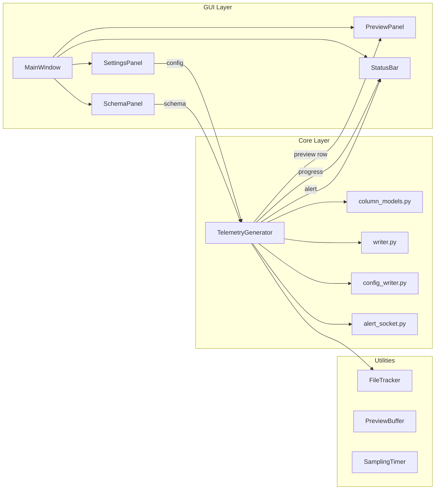
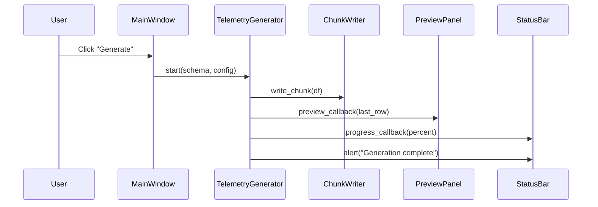
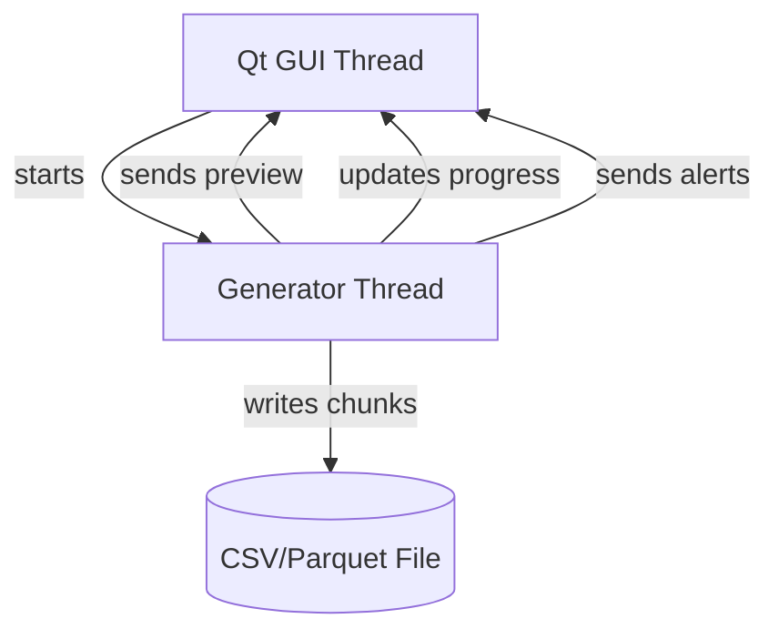

# 🚀 Project: Dibital Twin Telemetry Generator

# **Executive Summary**  
### *A Real‑Time Synthetic Data Streaming Engine for Digital Twin Ecosystems*

The **Digital Twin Telemetry Generator** is a modular, GUI‑driven simulation engine designed to emulate the real‑time data‑streaming behavior of a physical industrial asset — specifically, 
a **virtual electric drilling machine**. It produces realistic, high‑frequency telemetry streams in CSV or Parquet format, complete with numeric sensors, categorical states, auxiliary metadata, and a live preview graph.

This generator is the **first half of a two‑project ecosystem**:

- **Project 1 — Telemetry Generator (this document):**  
  Creates a synthetic but realistic digital twin of a drilling machine and streams its telemetry.

- **Project 2 — Telemetry Analyzer (future document):**  
  Interprets, visualizes, and analyzes the streamed data in near real time.

Together, they form a complete **Digital Twin pipeline**:  
**Virtual Machine → Virtual Control Center.**

This document provides a full technical walkthrough of the generator, including motivation, architecture, GUI interpretation, file‑by‑file analysis, diagrams, and instructions for running the system from Jupyter 
(see [References](https://github.com/NenadBalaneskovic/ExternalProjects/blob/main/DigitalTwinsGeneratorGUI/DigitalTwin_TelemetryGeneratorGUI.md#14--references) 1 - 3 below). 


# **1. Motivation**

Modern industrial systems — from CNC machines to drilling rigs — increasingly rely on **digital twins**: virtual replicas that mirror the behavior of physical assets through continuous telemetry. However, building and testing such systems requires **realistic, controllable, and reproducible data streams**, which are often unavailable due to:

- proprietary hardware  
- safety constraints  
- limited access to real machines  
- cost of running physical equipment  
- need for deterministic test scenarios  

The **Digital Twin Telemetry Generator** was created to solve this problem.

### **Core Motivation**
To design a **data‑streaming digital twin simulator** that:

- behaves like a real electric drilling machine  
- streams telemetry in real time  
- supports both numeric and categorical sensors  
- produces large‑scale datasets (up to tens of millions of rows)  
- integrates seamlessly with a downstream Analyzer GUI  
- demonstrates digital twin philosophy in a standalone, reproducible way  

This generator is not merely a toy example — it is a **hypothetical yet realistic digital twin** whose data can be consumed by any analytics pipeline, machine learning model, or monitoring dashboard.

### **Why a Drilling Machine?**
Electric drilling machines are ideal digital‑twin candidates:

- They have **rich sensor profiles** (RPM, vibration, power, temperature).  
- They exhibit **dynamic behavior** under load.  
- They include **categorical states** (mode, error codes, interlocks).  
- They are common in industrial IoT, manufacturing, and predictive maintenance.  

The generator simulates these behaviors faithfully, producing telemetry that *feels* real.

---

# **2. Introduction**

The **Digital Twin Telemetry Generator** is a PySide6‑based desktop application that allows users to:

- select which sensors to simulate  
- configure row count, file format, target file size, and sampling frequency  
- generate telemetry in chunks  
- write data to CSV or Parquet  
- preview the live data stream in real time  
- monitor progress and alerts  
- export a shared `config.json` for downstream tools  

The system is built around a **threaded generation engine** that runs independently of the GUI, ensuring smooth interaction even during heavy data generation.

### **Key Features**
- **15 predefined telemetry channels**  
- **Real‑time live preview graph**  
- **Chunked CSV/Parquet writing**  
- **Configurable sampling frequency**  
- **Progress bar with status messages**  
- **Alert socket for Analyzer integration**  
- **Deterministic, reproducible simulation models**  
- **Digital twin philosophy baked into the architecture**  

### **Design Philosophy**
The generator is designed to be:

- **Modular** — GUI, core engine, utilities, and models are cleanly separated.  
- **Extensible** — new sensors or models can be added easily.  
- **Reproducible** — deterministic simulation functions ensure consistent results.  
- **Real‑time capable** — preview updates are throttled for smooth visualization.  
- **Analyzer‑ready** — produces a shared config file for downstream consumption.  

This document now proceeds to interpret the GUI, explain the architecture, and analyze each file in detail.
 
---


# 🧠 **3. GUI Sketch Interpretation**  

In the following we address our full GUI sketch, a clean, structured layout for our Digital Twin Telemetry Generator GUI. It includes all the key modules we discussed: 
objective and constraint input, method selection of forecasting models), result display, visualization, and diagnostics.


The GUI sketch for the Digital Twin Telemetry Generator establishes a **clear, engineering‑oriented workflow** that mirrors how real industrial telemetry systems are configured and monitored. The layout is intentionally structured into three vertical panels, each representing a conceptual layer of the digital twin philosophy:

## **3.1 Left Panel — Schema Definition (What does the machine measure?)**

This panel allows the user to define the **virtual sensor suite** of the electric drilling machine.  
It includes:

- **Numeric sensors** (Temperature, RPM, Vibration, Power, Voltage, Current, Pressure, Noise)  
- **Categorical/Boolean states** (Operating Mode, Error Code, Interlock, On/Off)  
- **Auxiliary metadata** (Timestamp, Log Message, Cycle Counter)

This mirrors real industrial telemetry systems, where engineers must explicitly define which channels are active, how they are encoded, and how they will be interpreted downstream.

The design philosophy:

- **Transparency:** The user sees exactly which sensors are included.  
- **Modularity:** Each sensor is optional.  
- **Digital Twin Alignment:** The schema defines the “virtual hardware” of the simulated machine.

## **3.2 Middle Panel — Generator Settings (How does the machine behave?)**

This panel configures the **operational parameters** of the digital twin:

- **Row count** — total number of telemetry samples  
- **File format** — CSV or Parquet  
- **Target file size** — 1–50 GB  
- **Sampling frequency** — 1–10,000 Hz  
- **Generate button** — starts the simulation thread  

These settings correspond to real‑world telemetry acquisition parameters:

- sampling frequency → sensor polling rate  
- file format → storage backend  
- row count → duration of operation  
- file size → bandwidth/storage constraints  

This panel is the “control room” of the virtual drilling machine.

## **3.3 Right Panel — Live Preview (What is the machine doing right now?)**

This panel provides a **real‑time visualization** of the simulated telemetry stream:

- A dropdown to select the previewed sensor  
- A Matplotlib line plot updating at ~20 FPS  
- A rolling buffer of the last 500 samples  

This is the digital twin’s **HMI (Human‑Machine Interface)** — a window into the machine’s internal state.

The preview is intentionally lightweight and throttled to avoid GUI overload, mirroring real industrial dashboards that must remain responsive even under heavy data throughput.

---

# **4. Operating GUI Screenshot Interpretation**  
*(Based on your uploaded screenshot of the running generator)*

The screenshot shows the generator in full operation, with:

- **All numeric sensors enabled**  
- **Several categorical/auxiliary channels enabled**  
- **Row count set to 10,000,000**  
- **Target file size set to 10 GB**  
- **Sampling frequency at 10 Hz**  
- **Live preview graph showing Temperature**  
- **Progress bar at 100%**  
- **Status message: “Generation complete”**  

### **Interpretation of the Live Preview Graph**

The graph titled **“Live Data Stream: Temperature”** shows:

- A smooth, noise‑driven temperature curve  
- Slight drift and bounded fluctuations  
- A rolling window of 500 samples  
- Real‑time updates during generation  

This demonstrates that the generator is:

- producing realistic sensor dynamics  
- streaming data chunk‑by‑chunk  
- updating the GUI without blocking  
- maintaining stable performance  

### **Interpretation of the Status Bar**

The status bar shows:

- **100% progress**  
- **Generated 10,000,000 / 10,000,000 rows**  
- **Alert: “Generation complete”**  

This confirms:

- the generator thread finished cleanly  
- the file writer closed properly  
- the GUI remained responsive  
- the digital twin simulation reached its configured duration  

---

# **5. System Architecture Overview**

The Digital Twin Telemetry Generator is built on a clean, layered architecture:

```
GUI Layer (PySide6)
│
├── SchemaPanel        → defines which sensors exist
├── SettingsPanel      → defines how the generator behaves
├── PreviewPanel       → displays live data
└── StatusBar          → shows progress and alerts
│
Core Layer
│
├── TelemetryGenerator → threaded engine producing data
├── column_models      → simulation functions for each sensor
├── writer             → chunked CSV/Parquet writer
├── config_writer      → exports config.json for Analyzer
└── alert_socket       → sends alerts to Analyzer
│
Utilities
│
├── FileTracker        → monitors output file size
├── PreviewBuffer      → rolling buffer for preview
└── SamplingTimer      → drift‑corrected timing
```

This separation ensures:

- GUI remains responsive  
- generator runs independently  
- simulation models are modular  
- utilities are reusable  
- Analyzer integration is seamless  

---

# **6. Mermaid Diagrams**

Below are the diagrams that visually describe the system.

## **6.1 Module Interaction Diagram**



## **6.2 Data Flow Diagram**



## **6.3 Threading Diagram**



We are ready to scaffold this into actual Pythonic code and wire up the backend logic for method selection and routing.

---

# **7. File‑by‑File Analysis — GUI Layer**

The GUI layer is the user‑facing surface of the Digital Twin Telemetry Generator.  
It is built with **PySide6**, structured into modular panels, and orchestrated by the `MainWindow`.

The GUI layer consists of:

1. `app.py`  
2. `main_window.py`  
3. `schema_panel.py`  
4. `settings_panel.py`  
5. `preview_panel.py`  
6. `status_bar.py`  

Each file is analyzed below.

# **7.1 `generator/app.py`**

## **Purpose**
This is the **entry point** of the entire application.  
It initializes the Qt application, constructs the main window, and starts the event loop.

## **Responsibilities**
- Create the `QApplication` instance  
- Instantiate and show the `MainWindow`  
- Start the Qt event loop  
- Print the process ID for debugging  

## **Inputs**
None (except command‑line arguments via `sys.argv`).

## **Outputs**
- Launches the GUI  
- Returns exit code from `app.exec()`  

## **Internal Logic**
- Imports PySide6  
- Creates the application  
- Creates and shows the main window  
- Starts the event loop  
- Prints the PID for debugging  

## **Interactions**
- Imports `MainWindow` from `generator.gui.main_window`  
- Does not interact with the generator backend directly  

## **Full Code Listing**

```python
# generator/app.py

import sys
from PySide6.QtWidgets import QApplication
from generator.gui.main_window import MainWindow


def main():
    """
    Entry point for the Telemetry Generator GUI.

    Responsibilities:
        - Create the Qt application
        - Instantiate MainWindow
        - Show the GUI
        - Start the Qt event loop
    """
    import os
    print("GENERATOR GUI PID:", os.getpid())
    app = QApplication(sys.argv)

    window = MainWindow()
    window.show()

    sys.exit(app.exec())


if __name__ == "__main__":
    main()
```


# **7.2 `generator/gui/main_window.py`**

## **Purpose**
The **central orchestrator** of the GUI.  
It assembles all panels, wires signals, and connects the GUI to the generator backend.

## **Responsibilities**
- Build the main layout  
- Instantiate all GUI panels  
- Connect signals (e.g., Generate button)  
- Initialize and start the `TelemetryGenerator`  
- Handle clean shutdown  

## **Inputs**
- User interactions (button clicks, slider changes)  
- Schema from `SchemaPanel`  
- Config from `SettingsPanel`  

## **Outputs**
- Starts the generator thread  
- Sends preview updates to `PreviewPanel`  
- Sends progress updates to `StatusBar`  
- Sends alerts to `StatusBar`  

## **Internal Logic**
- Uses a `QSplitter` to arrange panels horizontally  
- Connects the Generate button to `_start_generation()`  
- Creates the generator backend with callbacks  
- Ensures generator stops on window close  

## **Interactions**
- SchemaPanel → provides schema  
- SettingsPanel → provides config  
- PreviewPanel → receives preview rows  
- StatusBar → receives progress + alerts  
- TelemetryGenerator → backend engine  

## **Full Code Listing**

```python
# generator/gui/main_window.py

from PySide6.QtWidgets import (
    QMainWindow, QWidget, QVBoxLayout, QHBoxLayout, QSplitter
)
from PySide6.QtCore import Qt

from .schema_panel import SchemaPanel
from .settings_panel import SettingsPanel
from .preview_panel import PreviewPanel
from .status_bar import StatusBar

from ..core.generator import TelemetryGenerator


class MainWindow(QMainWindow):
    """
    Main GUI window for the Telemetry Generator.
    Assembles all panels, manages layout, and orchestrates
    communication between GUI widgets and the generator backend.
    """

    def __init__(self):
        super().__init__()

        self.setWindowTitle("Telemetry Data Generator")
        self.setMinimumSize(1200, 700)

        # --- Panels ---
        self.schema_panel = SchemaPanel()
        self.settings_panel = SettingsPanel()
        self.preview_panel = PreviewPanel()
        self.status_bar = StatusBar()

        # --- Generator backend (initialized later) ---
        self.generator = None

        # --- Layout ---
        self._build_layout()

        # --- Connections ---
        self._connect_signals()

    # ---------------------------------------------------------
    # Layout Assembly
    # ---------------------------------------------------------
    def _build_layout(self):
        """
        Creates the main layout using a horizontal splitter:
        [Schema Panel | Settings Panel | Live Preview Panel]
        """
        central_widget = QWidget()
        main_layout = QVBoxLayout()

        splitter = QSplitter(Qt.Horizontal)
        splitter.addWidget(self.schema_panel)
        splitter.addWidget(self.settings_panel)
        splitter.addWidget(self.preview_panel)

        splitter.setSizes([300, 300, 600])  # initial proportions

        main_layout.addWidget(splitter)
        main_layout.addWidget(self.status_bar)

        central_widget.setLayout(main_layout)
        self.setCentralWidget(central_widget)

    # ---------------------------------------------------------
    # Signal Connections
    # ---------------------------------------------------------
    def _connect_signals(self):
        """
        Connects GUI events to backend logic.
        """
        print("CONNECTING SIGNALS")
        self.settings_panel.generate_clicked.connect(self._start_generation)

        # NEW: update GB label when slider moves
        self.settings_panel.size_slider.valueChanged.connect(
            self.settings_panel.update_size_label
        )

    # ---------------------------------------------------------
    # Generation Logic
    # ---------------------------------------------------------
    def _start_generation(self):
        """
        Triggered when the user presses the 'Generate' button.
        Collects schema + settings, initializes the generator backend,
        and starts the simulation loop.
        """
        print("START_GENERATION CALLED")
        try:
            schema = self.schema_panel.get_schema()
            config = self.settings_panel.get_config()
            print("SCHEMA:", schema)
            print("CONFIG:", config)

            self.generator = TelemetryGenerator(
                schema=schema,
                config=config,
                preview_callback=self.preview_panel.update_preview,
                progress_callback=self.status_bar.update_progress,
                alert_callback=self.status_bar.show_alert
            )

            self.status_bar.show_message("Starting data generation...")
            self.generator.start()
            print("GENERATOR START CALLED")
        except Exception as e:
            print("ERROR IN _start_generation:", e)
            import traceback
            traceback.print_exc()


    # ---------------------------------------------------------
    # Cleanup
    # ---------------------------------------------------------
    def closeEvent(self, event):
        """
        Ensures generator thread stops cleanly when window closes.
        """
        if self.generator:
            self.generator.stop()
        event.accept()
```


# **7.3 `generator/gui/schema_panel.py`**

## **Purpose**
Defines the **sensor schema** of the digital twin.  
This panel allows the user to select which telemetry channels will be generated.

## **Responsibilities**
- Display checkboxes grouped into:
  - Numeric sensors  
  - Categorical/Boolean states  
  - Auxiliary metadata  
- Build a schema list describing each selected column  

## **Inputs**
- User checkbox selections  

## **Outputs**
- A list of dictionaries, each describing a column:
  - name  
  - type  
  - unit  
  - generator function  
  - optional categories  

## **Internal Logic**
- Groups checkboxes into QGroupBoxes  
- `get_schema()` inspects which boxes are checked  
- Returns a structured schema consumed by the generator  

## **Interactions**
- Used by `MainWindow` to configure `TelemetryGenerator`  
- Schema is also written into `config.json`  

## **Full Code Listing**

```python
# generator/gui/schema_panel.py

from PySide6.QtWidgets import (
    QWidget, QVBoxLayout, QGroupBox, QCheckBox, QLabel
)
from PySide6.QtCore import Qt


class SchemaPanel(QWidget):
    """
    Panel containing the 15 predefined telemetry column checkboxes.
    Columns are grouped into:
        - Numeric Sensors
        - Categorical / Boolean
        - Auxiliary (timestamp, logs, cycle counter)

    Provides:
        get_schema() -> list of dicts describing selected columns
    """

    def __init__(self):
        super().__init__()

        self.setMinimumWidth(280)
        self._build_ui()

    # ---------------------------------------------------------
    # UI Construction
    # ---------------------------------------------------------
    def _build_ui(self):
        layout = QVBoxLayout()

        # --- Numeric Sensors ---
        numeric_group = QGroupBox("Numeric Sensors")
        numeric_layout = QVBoxLayout()
        self.cb_temperature = QCheckBox("Temperature")
        self.cb_rpm = QCheckBox("Motor RPM")
        self.cb_vibration = QCheckBox("Vibration Level")
        self.cb_power = QCheckBox("Power Consumption")
        self.cb_voltage = QCheckBox("Voltage")
        self.cb_current = QCheckBox("Current")
        self.cb_pressure = QCheckBox("Pressure / Load")
        self.cb_noise = QCheckBox("Noise Level")

        for cb in [
            self.cb_temperature, self.cb_rpm, self.cb_vibration,
            self.cb_power, self.cb_voltage, self.cb_current,
            self.cb_pressure, self.cb_noise
        ]:
            numeric_layout.addWidget(cb)

        numeric_group.setLayout(numeric_layout)
        layout.addWidget(numeric_group)

        # --- Categorical / Boolean ---
        categorical_group = QGroupBox("Categorical / Boolean")
        categorical_layout = QVBoxLayout()
        self.cb_onoff = QCheckBox("Device On/Off")
        self.cb_mode = QCheckBox("Operating Mode")
        self.cb_error = QCheckBox("Error Code")
        self.cb_interlock = QCheckBox("Safety Interlock")

        for cb in [
            self.cb_onoff, self.cb_mode,
            self.cb_error, self.cb_interlock
        ]:
            categorical_layout.addWidget(cb)

        categorical_group.setLayout(categorical_layout)
        layout.addWidget(categorical_group)

        # --- Auxiliary ---
        auxiliary_group = QGroupBox("Auxiliary Columns")
        auxiliary_layout = QVBoxLayout()
        self.cb_timestamp = QCheckBox("Timestamp")
        self.cb_log = QCheckBox("Log Message")
        self.cb_cycle = QCheckBox("Cycle Counter")

        for cb in [
            self.cb_timestamp, self.cb_log, self.cb_cycle
        ]:
            auxiliary_layout.addWidget(cb)

        auxiliary_group.setLayout(auxiliary_layout)
        layout.addWidget(auxiliary_group)

        layout.addStretch()
        self.setLayout(layout)

    # ---------------------------------------------------------
    # Schema Extraction
    # ---------------------------------------------------------
    def get_schema(self):
        """
        Returns a list of dictionaries describing the selected columns.
        Each entry has:
            - name: column name
            - type: float/int/categorical/boolean/text
            - generator: name of simulation function (string)
            - optional metadata (unit, categories)

        This schema is consumed by:
            - TelemetryGenerator
            - config_writer (to write config.json)
        """
        schema = []

        # Numeric sensors
        if self.cb_temperature.isChecked():
            schema.append({
                "name": "Temperature",
                "type": "float",
                "unit": "Celsius",
                "generator": "simulate_temperature"
            })
        if self.cb_rpm.isChecked():
            schema.append({
                "name": "Motor RPM",
                "type": "int",
                "unit": "rpm",
                "generator": "simulate_rpm"
            })
        if self.cb_vibration.isChecked():
            schema.append({
                "name": "Vibration Level",
                "type": "float",
                "unit": "m/s2",
                "generator": "simulate_vibration"
            })
        if self.cb_power.isChecked():
            schema.append({
                "name": "Power Consumption",
                "type": "float",
                "unit": "W",
                "generator": "simulate_power"
            })
        if self.cb_voltage.isChecked():
            schema.append({
                "name": "Voltage",
                "type": "float",
                "unit": "V",
                "generator": "simulate_voltage"
            })
        if self.cb_current.isChecked():
            schema.append({
                "name": "Current",
                "type": "float",
                "unit": "A",
                "generator": "simulate_current"
            })
        if self.cb_pressure.isChecked():
            schema.append({
                "name": "Pressure / Load",
                "type": "float",
                "unit": "arb",
                "generator": "simulate_pressure"
            })
        if self.cb_noise.isChecked():
            schema.append({
                "name": "Noise Level",
                "type": "float",
                "unit": "dB",
                "generator": "simulate_noise"
            })

        # Categorical / Boolean
        if self.cb_onoff.isChecked():
            schema.append({
                "name": "Device On/Off",
                "type": "boolean",
                "generator": "simulate_onoff"
            })
        if self.cb_mode.isChecked():
            schema.append({
                "name": "Operating Mode",
                "type": "categorical",
                "categories": ["Idle", "Low", "High"],
                "generator": "simulate_mode"
            })
        if self.cb_error.isChecked():
            schema.append({
                "name": "Error Code",
                "type": "categorical",
                "categories": ["None", "Minor", "Major"],
                "generator": "simulate_error"
            })
        if self.cb_interlock.isChecked():
            schema.append({
                "name": "Safety Interlock",
                "type": "boolean",
                "generator": "simulate_interlock"
            })

        # Auxiliary
        if self.cb_timestamp.isChecked():
            schema.append({
                "name": "Timestamp",
                "type": "timestamp",
                "format": "ISO8601",
                "generator": "simulate_timestamp"
            })
        if self.cb_log.isChecked():
            schema.append({
                "name": "Log Message",
                "type": "text",
                "generator": "simulate_log"
            })
        if self.cb_cycle.isChecked():
            schema.append({
                "name": "Cycle Counter",
                "type": "int",
                "generator": "simulate_cycle"
            })

        return schema
```

# **7.4 `generator/gui/settings_panel.py`**

## **Purpose**
Provides all **configuration controls** for the generator.

## **Responsibilities**
- Row count  
- File format (CSV/Parquet)  
- Target file size (GB)  
- Sampling frequency (Hz)  
- Generate button  

## **Inputs**
- User interactions  

## **Outputs**
- Emits `generate_clicked` signal  
- Provides a config dictionary  

## **Internal Logic**
- Uses QSpinBox, QRadioButton, QSlider  
- Updates GB label dynamically  
- Emits signal when Generate is clicked  

## **Interactions**
- MainWindow listens to `generate_clicked`  
- Config is passed to `TelemetryGenerator`  

## **Full Code Listing**

```python
# generator/gui/settings_panel.py

from PySide6.QtWidgets import (
    QWidget,
    QGroupBox,
    QVBoxLayout,
    QHBoxLayout,
    QLabel,
    QSpinBox,
    QLineEdit,
    QPushButton,
    QRadioButton,
    QSlider,
)
from PySide6.QtCore import Qt, Signal


class SettingsPanel(QWidget):
    """
    Settings panel for the Telemetry Generator.

    Responsibilities:
        - Configure row count
        - Configure file format (CSV / Parquet)
        - Configure target file size (GB)
        - Configure sampling frequency
        - Emit 'generate_clicked' when user presses Generate
    """

    generate_clicked = Signal()

    def __init__(self):
        super().__init__()
        self._build_ui()

    # ---------------------------------------------------------
    # UI Construction
    # ---------------------------------------------------------
    def _build_ui(self):
        layout = QVBoxLayout()

        # -----------------------------------------------------
        # Row Count
        # -----------------------------------------------------
        row_group = QGroupBox("Row Count")
        row_layout = QVBoxLayout()

        self.row_spin = QSpinBox()
        self.row_spin.setRange(1_000, 100_000_000)
        self.row_spin.setValue(10_000_000)

        row_layout.addWidget(QLabel("Number of rows:"))
        row_layout.addWidget(self.row_spin)
        row_group.setLayout(row_layout)

        # -----------------------------------------------------
        # File Format
        # -----------------------------------------------------
        format_group = QGroupBox("File Format")
        format_layout = QVBoxLayout()

        self.csv_radio = QRadioButton("CSV")
        self.parquet_radio = QRadioButton("Parquet")
        self.csv_radio.setChecked(True)

        format_layout.addWidget(self.csv_radio)
        format_layout.addWidget(self.parquet_radio)
        format_group.setLayout(format_layout)

        # -----------------------------------------------------
        # Target File Size (GB)
        # -----------------------------------------------------
        size_group = QGroupBox("Target File Size")
        size_layout = QVBoxLayout()

        self.size_slider = QSlider(Qt.Horizontal)
        self.size_slider.setRange(1, 50)   # 1–50 GB
        self.size_slider.setValue(10)

        self.size_label = QLabel("10 GB")

        # Connect slider to label update
        self.size_slider.valueChanged.connect(self.update_size_label)

        size_layout.addWidget(QLabel("Desired file size:"))
        size_layout.addWidget(self.size_slider)
        size_layout.addWidget(self.size_label)
        size_group.setLayout(size_layout)

        # -----------------------------------------------------
        # Sampling Frequency
        # -----------------------------------------------------
        freq_group = QGroupBox("Sampling Frequency")
        freq_layout = QVBoxLayout()

        self.freq_spin = QSpinBox()
        self.freq_spin.setRange(1, 10_000)
        self.freq_spin.setValue(10)
        self.freq_spin.setSuffix(" Hz")

        freq_layout.addWidget(QLabel("Frequency (Hz):"))
        freq_layout.addWidget(self.freq_spin)
        freq_group.setLayout(freq_layout)

        # -----------------------------------------------------
        # Generate Button
        # -----------------------------------------------------
        self.generate_btn = QPushButton("Generate")
        self.generate_btn.clicked.connect(self._on_generate_clicked) 

        # -----------------------------------------------------
        # Assemble Layout
        # -----------------------------------------------------
        layout.addWidget(row_group)
        layout.addWidget(format_group)
        layout.addWidget(size_group)
        layout.addWidget(freq_group)
        layout.addWidget(self.generate_btn)
        layout.addStretch()

        self.setLayout(layout)

    # ---------------------------------------------------------
    # Slider Label Update
    # ---------------------------------------------------------
    def update_size_label(self, value):
        """
        Updates the GB label next to the file size slider.
        """
        self.size_label.setText(f"{value} GB")

    # ---------------------------------------------------------
    # Public API
    # ---------------------------------------------------------
    def get_config(self) -> dict:
        """
        Returns a dictionary with all generator settings.
        """
        return {
            "rows": self.row_spin.value(),
            "file_format": "csv" if self.csv_radio.isChecked() else "parquet",
            "target

    def get_config(self) -> dict:
        """
        Returns a dictionary with all generator settings.
        """
        return {
            "rows": self.row_spin.value(),
            "file_format": "csv" if self.csv_radio.isChecked() else "parquet",
            "target_gb": self.size_slider.value(),
            "frequency_hz": self.freq_spin.value(),
        }
        
    def _on_generate_clicked(self):
        print("GENERATE BUTTON CLICKED")
        self.generate_clicked.emit()
```


# **7.5 `generator/gui/preview_panel.py`**

## **Purpose**
The **PreviewPanel** provides a real‑time visualization of the telemetry stream.  
It displays the last ~500 samples of a selected numeric sensor using Matplotlib.

## **Responsibilities**
- Maintain rolling buffers for each numeric column  
- Render a live‑updating line plot  
- Filter out non‑numeric columns  
- Allow the user to switch previewed columns  
- Throttle updates to avoid GUI overload  

## **Inputs**
- `update_preview(data_dict)` receives a single row from the generator  
- User selection from the dropdown  

## **Outputs**
- Updated Matplotlib plot  
- Updated axis labels and titles  

## **Internal Logic**
- Uses a `deque` for efficient rolling buffers  
- Uses `tight_layout()` to avoid clipping  
- Never clears axes (to avoid losing the line object)  
- Updates only the line’s data for performance  

## **Interactions**
- Receives preview rows from `TelemetryGenerator`  
- Interacts with no other modules directly  

## **Full Code Listing**

```python
# generator/gui/preview_panel.py

import numpy as np
from collections import deque

from PySide6.QtWidgets import QWidget, QVBoxLayout, QGroupBox, QLabel, QComboBox
from PySide6.QtCore import Qt

from matplotlib.backends.backend_qt5agg import FigureCanvasQTAgg as FigureCanvas
from matplotlib.figure import Figure


class PreviewPanel(QWidget):
    MAX_POINTS = 500

    def __init__(self):
        super().__init__()

        self.setMinimumWidth(400)

        self.buffers = {}
        self.current_column = None

        self._build_ui()
        self._setup_plot()

    # ---------------------------------------------------------
    # UI
    # ---------------------------------------------------------
    def _build_ui(self):
        layout = QVBoxLayout()

        group = QGroupBox("Live Preview")
        group_layout = QVBoxLayout()

        self.column_selector = QComboBox()
        self.column_selector.currentTextChanged.connect(self._change_column)

        group_layout.addWidget(QLabel("Preview Column:"))
        group_layout.addWidget(self.column_selector)

        self.figure = Figure(figsize=(5, 3))
        self.canvas = FigureCanvas(self.figure)

        group_layout.addWidget(self.canvas)
        group.setLayout(group_layout)

        layout.addWidget(group)
        self.setLayout(layout)

    # ---------------------------------------------------------
    # Plot Setup
    # ---------------------------------------------------------
    def _setup_plot(self):
        self.ax = self.figure.add_subplot(111)
        self.ax.set_title("Live Data Stream")
        self.ax.set_xlabel("Samples")
        self.ax.set_ylabel("Value")
        self.line, = self.ax.plot([], [], lw=2)
        self.ax.grid(True)
        # Ensure labels and titles are fully visible
        self.figure.tight_layout()

    # ---------------------------------------------------------
    # Column Selection
    # ---------------------------------------------------------
    def set_available_columns(self, columns, sample_row=None):
        """
        Populate dropdown with numeric-only columns.
        sample_row: a dict from the preview callback (one row of data)
        """
        self.column_selector.clear()

        numeric_cols = []

        for col in columns:
            if sample_row is None:
                # Fallback: assume numeric until proven otherwise
                numeric_cols.append(col)
            else:
                val = sample_row.get(col)
                if isinstance(val, (int, float, np.number)):
                    numeric_cols.append(col)

        for col in numeric_cols:
            self.column_selector.addItem(col)

        if numeric_cols:
            self.current_column = numeric_cols[0]

    def _change_column(self, col_name):
        self.current_column = col_name

        if col_name not in self.buffers:
            self.buffers[col_name] = deque(maxlen=self.MAX_POINTS)

        # Reset the line only — do NOT clear axes
        self.line.set_data([], [])

        self.ax.set_title(f"Live Data Stream: {col_name}")
        self.ax.set_ylabel(col_name)

        self.canvas.draw()

    # ---------------------------------------------------------
    # Preview Update
    # ---------------------------------------------------------
    def update_preview(self, data_dict):
        if not data_dict:
            return

        # Initialize dropdown on first update
        if self.column_selector.count() == 0:
           self.set_available_columns(list(data_dict.keys()), sample_row=data_dict)

        if not self.current_column:
            return

        if self.current_column not in data_dict:
            return

        value = data_dict[self.current_column]

        # Initialize buffer if needed
        if self.current_column not in self.buffers:
            self.buffers[self.current_column] = deque(maxlen=self.MAX_POINTS)

        self.buffers[self.current_column].append(value)

        y = list(self.buffers[self.current_column])
        x = list(range(len(y)))

        # Update the existing line — do NOT clear axes
        self.line.set_data(x, y)

        # Adjust axes limits
        self.ax.set_xlim(max(0, len(y) - self.MAX_POINTS), max(self.MAX_POINTS, len(y)))

        y_min = min(y)
        y_max = max(y)
        if y_max == y_min:
            y_max = y_min + 1.0
        self.ax.set_ylim(y_min - 1, y_max + 1)

        self.canvas.draw()
```


# **7.6 `generator/gui/status_bar.py`**

## **Purpose**
Displays:

- progress bar  
- status messages  
- alert messages  

This is the **feedback layer** of the GUI.

## **Responsibilities**
- Show progress percentage  
- Show “Generated X / Y rows”  
- Show alerts from the generator backend  
- Provide visual confirmation of generator state  

## **Inputs**
- `update_progress(percent, message)`  
- `show_message(text)`  
- `show_alert(text)`  

## **Outputs**
- Updated GUI elements  

## **Internal Logic**
- Uses a QProgressBar  
- Uses two QLabel widgets  
- Alerts are styled in red and bold  

## **Interactions**
- Receives callbacks from `TelemetryGenerator`  
- Does not interact with other modules  

## **Full Code Listing**

```python
# generator/gui/status_bar.py

from PySide6.QtWidgets import QWidget, QHBoxLayout, QLabel, QProgressBar
from PySide6.QtCore import Qt


class StatusBar(QWidget):
    """
    Status bar for the Telemetry Generator GUI.
    Displays:
        - Progress bar (file size or rows written)
        - Status message (e.g., 'Generating...', 'Chunk written')
        - Alerts from the generator backend

    Methods:
        update_progress(percent, message)
        show_message(text)
        show_alert(text)
    """

    def __init__(self):
        super().__init__()

        self._build_ui()

    # ---------------------------------------------------------
    # UI Construction
    # ---------------------------------------------------------
    def _build_ui(self):
        layout = QHBoxLayout()

        # Progress bar
        self.progress = QProgressBar()
        self.progress.setRange(0, 100)
        self.progress.setValue(0)
        self.progress.setFormat("0%")
        self.progress.setTextVisible(True)

        # Status message label
        self.message_label = QLabel("Ready.")
        self.message_label.setAlignment(Qt.AlignLeft | Qt.AlignVCenter)

        # Alert label
        self.alert_label = QLabel("")
        self.alert_label.setAlignment(Qt.AlignRight | Qt.AlignVCenter)
        self.alert_label.setStyleSheet("color: red; font-weight: bold;")

        layout.addWidget(self.progress, stretch=2)
        layout.addWidget(self.message_label, stretch=3)
        layout.addWidget(self.alert_label, stretch=2)

        self.setLayout(layout)

    # ---------------------------------------------------------
    # Public API
    # ---------------------------------------------------------
    def update_progress(self, percent: float, message: str = ""):
        """
        Updates the progress bar and optional message.

        Args:
            percent (float): 0–100 progress value
            message (str): Optional status message
        """
        p = int(percent)
        self.progress.setValue(p)

        # Show percentage inside the bar
        self.progress.setFormat(f"{p}%")

        # Optional external message label
        if message:
            self.message_label.setText(message)

    def show_message(self, text: str):
        """
        Shows a neutral status message.
        """
        self.message_label.setText(text)
        self.alert_label.setText("")

    def show_alert(self, text: str):
        """
        Shows an alert message (e.g., from alert socket).
        """
        self.alert_label.setText(text)
```

---

# **8. File‑by‑File Analysis — Core Layer**

The core layer turns configuration + schema into a **live digital twin stream**.  
It is responsible for:

- simulating sensor values  
- generating data in chunks  
- writing to disk efficiently  
- exporting shared configuration  
- emitting alerts to the Analyzer  

Core files:

1. `generator/core/generator.py`  
2. `generator/core/column_models.py`  
3. `generator/core/writer.py`  
4. `generator/core/config_writer.py`  
5. `generator/core/alert_socket.py`  

## **8.1 `generator/core/generator.py` — TelemetryGenerator**

### Purpose
The **TelemetryGenerator** is the **central engine** of the project.  
It runs in a background thread, simulates telemetry according to the schema, writes chunks to disk, and feeds the live preview and status bar.

### Responsibilities
- Normalize config from the GUI  
- Initialize writer and file tracker  
- Generate data in chunks  
- Call simulation models per column  
- Write CSV/Parquet incrementally  
- Send preview rows to the GUI  
- Update progress and alerts  
- Export `config.json` for the Analyzer  

### Inputs
- `schema: List[Dict[str, Any]]` from `SchemaPanel`  
- `config: Dict[str, Any]` from `SettingsPanel`  
- `preview_callback(row_dict)`  
- `progress_callback(percent, message)`  
- `alert_callback(text)`  

### Outputs
- Output file: `telemetry_output.csv` or `.parquet`  
- Shared `config.json`  
- GUI callbacks (preview, progress, alerts)  

### Internal Logic Highlights

- **Threading:**
  - `start()` spawns a daemon thread running `_run_loop_safe()`  
  - `_run_loop_safe()` wraps `_run_loop()` in a try/except and reports crashes  

- **Loop:**
  - While not stopped and rows remaining:
    - generate chunk (`_generate_chunk`)  
    - write chunk (`ChunkWriter`)  
    - update progress  
    - send throttled preview (max ~20 FPS)  
    - update file size (`FileTracker`)  
    - sleep according to `frequency_hz`  

- **Config export:**
  - Builds an Analyzer‑ready config dict  
  - Writes it via `write_config()` to `config.json`  

### Full Code Listing

```python
# generator/core/generator.py

import threading
import time
from typing import Callable, List, Dict, Any

import numpy as np
import pandas as pd

from .column_models import COLUMN_MODEL_MAP
from .writer import ChunkWriter
from .config_writer import write_config
from ..utils.file_tracker import FileTracker


class TelemetryGenerator:
    """
    Backend engine for telemetry data generation.

    Responsibilities:
        - Run a generation loop in a background thread
        - Use schema + config to simulate rows in chunks
        - Write chunks to disk (CSV/Parquet)
        - Send small samples to preview callback
        - Update progress via progress callback
        - Emit alerts via alert callback
        - Write shared config.json for the analyzer
    """

    def __init__(
        self,
        schema: List[Dict[str, Any]],
        config: Dict[str, Any],
        preview_callback: Callable[[Dict[str, Any]], None],
        progress_callback: Callable[[float, str], None],
        alert_callback: Callable[[str], None],
    ):
        print("GENERATOR INITIALIZED")

        self.schema = schema
        self.config = config
        self.preview_callback = preview_callback
        self.progress_callback = progress_callback
        self.alert_callback = alert_callback

        self._stop_flag = threading.Event()
        self._thread: threading.Thread | None = None

        # ---------------------------------------------------------
        # Normalize config keys (SettingsPanel → Generator backend)
        # ---------------------------------------------------------
        self.total_rows = config["rows"]
        self.file_format = config["file_format"]
        self.frequency_hz = config["frequency_hz"]
        self.target_gb = config["target_gb"]

        # Chunk size: fixed or dynamic
        self.chunk_size = 10_000

        # Output file path
        self.output_path = (
            "telemetry_output.csv"
            if self.file_format == "csv"
            else "telemetry_output.parquet"
        )

        # ---------------------------------------------------------
        # Writer for CSV/Parquet
        # ---------------------------------------------------------
        self.writer = ChunkWriter(
            file_path=self.output_path,
            file_format=self.file_format,
            chunk_size_rows=self.chunk_size,
        )

        # File tracker for progress estimation
        self.file_tracker = FileTracker(self.output_path)

        # ---------------------------------------------------------
        # Write shared config.json for Analyzer
        # ---------------------------------------------------------
        analyzer_config = {
            "output": {
                "file_path": self.output_path,
                "file_format": self.file_format,
                "estimated_size_gb": self.target_gb,
                "chunk_size_rows": self.chunk_size,
            },
            "sampling": {
                "frequency_hz": self.frequency_hz,
            },
            "schema": {
                "columns": self.schema,
            },
            "alerts": {
                "socket_enabled": True,
                "socket_host": "127.0.0.1",
                "socket_port": 5050,
            },
        }

        write_config(
            config=analyzer_config,
            schema=self.schema,
            output_path="config.json",
        )

    # ---------------------------------------------------------
    # Public API
    # ---------------------------------------------------------
    def start(self):
        """Starts the generation loop in a background thread."""
        if self._thread and self._thread.is_alive():
            return

        self._stop_flag.clear()
        self._thread = threading.Thread(
            target=self._run_loop_safe,
            daemon=True,
        )
        self._thread.start()
        self.alert_callback("Generator started")

    def _run_loop_safe(self):
        """Wrapper to catch and report exceptions from the generator thread."""
        import os
        print("GENERATOR THREAD PID:", os.getpid())
        try:
            print("ENTERING RUN LOOP")
            self._run_loop()
        except Exception as e:
            print("GENERATOR THREAD CRASHED:", e)
            import traceback
            traceback.print_exc()
            self.alert_callback(f"Generator crashed: {e}")

    def stop(self):
        """Signals the generation loop to stop and waits for thread to finish."""
        self._stop_flag.set()
        if self._thread and self._thread.is_alive():
            self._thread.join()
        self.alert_callback("Generator stopped")

    # ---------------------------------------------------------
    # Internal Loop
    # ---------------------------------------------------------
    def _run_loop(self):
        """Main generation loop."""
        rows_generated = 0
        sleep_interval = 1.0 / self.frequency_hz if self.frequency_hz > 0 else 0.0

        # Throttle preview updates (20 FPS max)
        last_preview_time = time.time()

        while not self._stop_flag.is_set() and rows_generated < self.total_rows:
            print("RUN LOOP STARTED")
            rows_to_generate = min(self.chunk_size, self.total_rows - rows_generated)

            df_chunk = self._generate_chunk(rows_to_generate)

            # Write to disk
            self.writer.write_chunk(df_chunk)

            rows_generated += rows_to_generate

            # Update progress
            percent = 100.0 * rows_generated / self.total_rows
            self.progress_callback(
                percent,
                f"Generated {rows_generated} / {self.total_rows} rows",
            )

            # ---------------------------------------------------------
            # Throttled preview update (max ~20 FPS)
            # ---------------------------------------------------------
            now = time.time()
            if now - last_preview_time >= 0.05:  # 50 ms
                last_row = df_chunk.iloc[-1].to_dict()
                print("CALLING PREVIEW CALLBACK WITH:", last_row)
                self.preview_callback(last_row)
                last_preview_time = now

            # Track file size
            self.file_tracker.update()

            # Real-time pacing
            if sleep_interval > 0:
                time.sleep(sleep_interval)

        self.alert_callback("Generation complete")

    # ---------------------------------------------------------
    # Chunk Generation
    # ---------------------------------------------------------
    def _generate_chunk(self, n_rows: int) -> pd.DataFrame:
        """Generates a DataFrame with n_rows according to the schema."""
        data = {}

        for col in self.schema:
            name = col["name"]
            gen_name = col.get("generator")
            model_func = COLUMN_MODEL_MAP.get(gen_name)

            if model_func is None:
                data[name] = np.zeros(n_rows)
                continue

            data[name] = model_func(n_rows, col, self.config)

        return pd.DataFrame(data)
```

## **8.2 `generator/core/column_models.py` — Simulation Models**

### Purpose
Defines **all sensor simulation functions** for the digital twin.  
Each function maps `(n, col, config)` → NumPy array or list.

### Responsibilities
- Provide realistic numeric sensor dynamics  
- Provide categorical/boolean state behavior  
- Provide auxiliary metadata (timestamps, logs, cycle counter)  
- Expose a lookup map `COLUMN_MODEL_MAP`  

### Inputs
- `n`: number of rows  
- `col`: schema entry (may contain categories, units, etc.)  
- `config`: full generator config (used e.g. for frequency)  

### Outputs
- NumPy arrays or Python lists of length `n`  

### Modeling Highlights

- **Temperature:** smooth noise + drift, bounded between 20–90 °C  
- **RPM:** sinusoidal oscillation + noise, bounded and cast to int  
- **Vibration:** low baseline + occasional spikes  
- **Power:** correlated with RPM  
- **Voltage:** stable with tiny noise  
- **Current:** derived from power / 230 + noise  
- **Pressure/Load:** slow drift + noise  
- **Noise Level:** random with occasional peaks  

- **On/Off:** mostly on (90% uptime)  
- **Mode:** Idle/Low/High with configurable probabilities  
- **Error Code:** mostly “None”, rare “Minor”/“Major”  
- **Interlock:** mostly off  

- **Timestamp:** ISO8601, based on `frequency_hz`  
- **Log Message:** random status messages  
- **Cycle Counter:** monotonic integer sequence  

### Full Code Listing

```python
# generator/core/column_models.py

import numpy as np
import random
from datetime import datetime, timedelta


# ---------------------------------------------------------
# Helper functions
# ---------------------------------------------------------

def _smooth_noise(n, scale=1.0):
    """Generates smooth noise using cumulative sum of Gaussian noise."""
    return np.cumsum(np.random.normal(0, scale, n))


def _bounded(values, low, high):
    """Clips values to a given range."""
    return np.clip(values, low, high)


# ---------------------------------------------------------
# Numeric Sensor Models
# ---------------------------------------------------------

def simulate_temperature(n, col, config):
    """
    Temperature fluctuates slowly with smooth noise and slight drift.
    """
    base = 40 + _smooth_noise(n, scale=0.05)
    return _bounded(base, 20, 90)


def simulate_rpm(n, col, config):
    """
    Motor RPM oscillates around a nominal value with periodic variation.
    """
    t = np.linspace(0, 4 * np.pi, n)
    base = 1500 + 200 * np.sin(t) + np.random.normal(0, 20, n)
    return _bounded(base, 0, 6000).astype(int)


def simulate_vibration(n, col, config):
    """
    Vibration level: low baseline with occasional spikes.
    """
    base = np.abs(np.random.normal(0.2, 0.05, n))
    spikes = np.random.choice([0, 1], size=n, p=[0.98, 0.02]) * np.random.uniform(1, 3, n)
    return base + spikes


def simulate_power(n, col, config):
    """
    Power consumption correlates with RPM + noise.
    """
    rpm = simulate_rpm(n, col, config)
    power = 0.02 * rpm + np.random.normal(0, 5, n)
    return _bounded(power, 0, 5000)


def simulate_voltage(n, col, config):
    """
    Voltage: stable with tiny noise.
    """
    return 230 + np.random.normal(0, 0.5, n)


def simulate_current(n, col, config):
    """
    Current: correlated with power consumption.
    """
    power = simulate_power(n, col, config)
    current = power / 230 + np.random.normal(0, 0.1, n)
    return _bounded(current, 0, 50)


def simulate_pressure(n, col, config):
    """
    Pressure/load: slow drift + noise.
    """
    base = 50 + _smooth_noise(n, scale=0.1)
    return _bounded(base, 0, 200)


def simulate_noise(n, col, config):
    """
    Noise level: random with occasional peaks.
    """
    base = np.random.normal(40, 2, n)
    peaks = np.random.choice([0, 1], size=n, p=[0.97, 0.03]) * np.random.uniform(10, 20, n)
    return base + peaks


# ---------------------------------------------------------
# Categorical / Boolean Models
# ---------------------------------------------------------

def simulate_onoff(n, col, config):
    """Boolean on/off with 90% uptime."""
    return np.random.choice([0, 1], size=n, p=[0.1, 0.9])


def simulate_mode(n, col, config):
    """Operating mode: Idle, Low, High."""
    categories = col.get("categories", ["Idle", "Low", "High"])
    probs = [0.2, 0.5, 0.3]
    return np.random.choice(categories, size=n, p=probs)


def simulate_error(n, col, config):
    """Error code: None, Minor, Major."""
    categories = col.get("categories", ["None", "Minor", "Major"])
    probs = [0.95, 0.04, 0.01]
    return np.random.choice(categories, size=n, p=probs)


def simulate_interlock(n, col, config):
    """Safety interlock: mostly off."""
    return np.random.choice([0, 1], size=n, p=[0.98, 0.02])


# ---------------------------------------------------------
# Auxiliary Models
# ---------------------------------------------------------

def simulate_timestamp(n, col, config):
    """
    Generates ISO8601 timestamps at the sampling frequency.
    """
    freq_hz = config.get("frequency_hz", 10)
    dt = 1.0 / freq_hz

    start = datetime.utcnow()
    return [
        (start + timedelta(seconds=i * dt)).isoformat()
        for i in range(n)
    ]


def simulate_log(n, col, config):
    """
    Generates simple log messages.
    """
    messages = [
        "System OK",
        "Temperature stable",
        "RPM nominal",
        "Minor fluctuation detected",
        "Sensor check passed",
        "No anomalies detected"
    ]
    return np.random.choice(messages, size=n)


def simulate_cycle(n, col, config):
    """
    Monotonically increasing cycle counter.
    """
    return np.arange(n)


# ---------------------------------------------------------
# Lookup Table
# ---------------------------------------------------------

COLUMN_MODEL_MAP = {
    "simulate_temperature": simulate_temperature,
    "simulate_rpm": simulate_rpm,
    "simulate_vibration": simulate_vibration,
    "simulate_power": simulate_power,
    "simulate_voltage": simulate_voltage,
    "simulate_current": simulate_current,
    "simulate_pressure": simulate_pressure,
    "simulate_noise": simulate_noise,

    "simulate_onoff": simulate_onoff,
    "simulate_mode": simulate_mode,
    "simulate_error": simulate_error,
    "simulate_interlock": simulate_interlock,

    "simulate_timestamp": simulate_timestamp,
    "simulate_log": simulate_log,
    "simulate_cycle": simulate_cycle,
}
```

## **8.3 `generator/core/writer.py` — ChunkWriter**

### Purpose
Handles **chunked writing** of telemetry data to CSV or Parquet.  
Designed for **GB‑scale** datasets.

### Responsibilities
- Append chunks to CSV with header only once  
- Append chunks to Parquet using PyArrow  
- Initialize and manage ParquetWriter  
- Remove existing file on startup  

### Inputs
- `file_path`, `file_format`, `chunk_size_rows`  
- DataFrame chunks from `TelemetryGenerator`  

### Outputs
- On‑disk CSV or Parquet file  

### Full Code Listing

```python
# generator/core/writer.py

import os
import pandas as pd
import pyarrow as pa
import pyarrow.parquet as pq


class ChunkWriter:
    """
    Handles chunked writing of telemetry data to CSV or Parquet.

    Features:
        - CSV append mode with header written only once
        - Parquet append mode using PyArrow
        - Automatic file initialization
        - Safe for large-scale generation (GB-level)

    Parameters:
        file_path: str
            Output file path (e.g., "telemetry_output.csv")
        file_format: str
            "csv" or "parquet"
        chunk_size_rows: int
            Number of rows per write cycle
    """

    def __init__(self, file_path: str, file_format: str, chunk_size_rows: int):
        self.file_path = file_path
        self.file_format = file_format.lower()
        self.chunk_size_rows = chunk_size_rows

        # Internal state
        self._csv_header_written = False
        self._parquet_writer = None

        # Remove existing file to avoid mixing old data
        if os.path.exists(self.file_path):
            os.remove(self.file_path)

    # ---------------------------------------------------------
    # Public API
    # ---------------------------------------------------------
    def write_chunk(self, df: pd.DataFrame):
        """
        Writes a DataFrame chunk to disk in the configured format.
        """
        if self.file_format == "csv":
            self._write_csv(df)
        elif self.file_format == "parquet":
            self._write_parquet(df)
        else:
            raise ValueError(f"Unsupported file format: {self.file_format}")

    # ---------------------------------------------------------
    # CSV Writer
    # ---------------------------------------------------------
    def _write_csv(self, df: pd.DataFrame):
        """
        Appends a chunk to a CSV file.
        Header is written only once.
        """
        df.to_csv(
            self.file_path,
            mode="a",
            header=not self._csv_header_written,
            index=False
        )
        self._csv_header_written = True

    # ---------------------------------------------------------
    # Parquet Writer
    # ---------------------------------------------------------
    def _write_parquet(self, df: pd.DataFrame):
        """
        Appends a chunk to a Parquet file using PyArrow.
        Creates a ParquetWriter on first write.
        """
        table = pa.Table.from_pandas(df)

        if self._parquet_writer is None:
            # First write → create writer
            self._parquet_writer = pq.ParquetWriter(
                self.file_path,
                table.schema,
                compression="snappy"
            )

        self._parquet_writer.write_table(table)

    # ---------------------------------------------------------
    # Cleanup
    # ---------------------------------------------------------
    def close(self):
        """
        Closes Parquet writer if needed.
        Called automatically by TelemetryGenerator.stop().
        """
        if self._parquet_writer is not None:
            self._parquet_writer.close()
            self._parquet_writer = None
```

## **8.4 `generator/core/config_writer.py` — Shared Config Export**

### Purpose
Writes a **shared `config.json`** that the Analyzer can consume.  
This is the **contract** between Generator and Analyzer.

### Responsibilities
- Normalize config into a stable JSON structure  
- Include output, sampling, schema, and alerts  

### Inputs
- `config: Dict[str, Any]` (already normalized)  
- `schema` (list of column dicts)  
- `output_path`  

### Outputs
- `config.json` (or custom path)  

### Full Code Listing

```python
# generator/core/config_writer.py

import json
from typing import Dict, Any


def write_config(config: Dict[str, Any], schema: Any, output_path: str):
    """
    Writes the shared config.json for the Analyzer.

    Expected structure (new schema):
    {
        "output": {
            "file_path": "...",
            "file_format": "...",
            "estimated_size_gb": ...,
            "chunk_size_rows": ...
        },
        "sampling": {
            "frequency_hz": ...
        },
        "schema": {
            "columns": [...]
        },
        "alerts": {
            "socket_enabled": true,
            "socket_host": "127.0.0.1",
            "socket_port": 5050
        }
    }
    """

    config_dict = {
        "output": {
            "file_path": config["output"]["file_path"],
            "file_format": config["output"]["file_format"],
            "estimated_size_gb": config["output"]["estimated_size_gb"],
            "chunk_size_rows": config["output"]["chunk_size_rows"],
        },
        "sampling": {
            "frequency_hz": config["sampling"]["frequency_hz"],
        },
        "schema": {
            "columns": schema,
        },
        "alerts": config["alerts"],
    }

    with open(output_path, "w", encoding="utf-8") as f:
        json.dump(config_dict, f, indent=4)
```

## **8.5 `generator/core/alert_socket.py` — AlertSocketClient**

### Purpose
Provides a **non‑blocking TCP client** for sending JSON alerts from Generator to Analyzer.

### Responsibilities
- Send events like:
  - `"generator_started"`  
  - `"chunk_written"`  
  - `"generation_complete"`  
  - `"file_size_limit_reached"`  
- Run socket sends in a background thread  
- Fail silently if the Analyzer is not listening  

### Inputs
- `host`, `port`, `enabled`  
- `event` string  
- optional `payload` dict  

### Outputs
- JSON messages over TCP (when enabled)  

### Full Code Listing

```python
# generator/core/alert_socket.py

import json
import socket
import threading
from typing import Dict, Any


class AlertSocketClient:
    """
    Lightweight non-blocking client for sending JSON alerts
    from the Generator to the Analyzer.

    Alerts include:
        - "generator_started"
        - "chunk_written"
        - "generation_complete"
        - "file_size_limit_reached"
        - custom messages

    The Analyzer listens on (host, port) and receives these events.

    Parameters:
        host: str
            Target host (default: "127.0.0.1")
        port: int
            Target port (default: 5050)
        enabled: bool
            Whether socket alerts are enabled
    """

    def __init__(self, host: str, port: int, enabled: bool = True):
        self.host = host
        self.port = port
        self.enabled = enabled

    # ---------------------------------------------------------
    # Public API
    # ---------------------------------------------------------
    def send_alert(self, event: str, payload: Dict[str, Any] | None = None):
        """
        Sends an alert asynchronously to avoid blocking the generator loop.

        Args:
            event: str
                Name of the event (e.g., "chunk_written")
            payload: dict
                Additional data to send (optional)
        """
        if not self.enabled:
            return

        message = {
            "event": event,
            "payload": payload or {}
        }

        # Send in background thread
        thread = threading.Thread(
            target=self._send_message,
            args=(message,),
            daemon=True
        )
        thread.start()

    # ---------------------------------------------------------
    # Internal Socket Logic
    # ---------------------------------------------------------
    def _send_message(self, message: Dict[str, Any]):
        """
        Sends a single JSON message over TCP.
        """
        try:
            with socket.socket(socket.AF_INET, socket.SOCK_STREAM) as s:
                s.settimeout(0.5)  # avoid blocking
                s.connect((self.host, self.port))
                s.sendall(json.dumps(message).encode("utf-8"))
        except Exception:
            # Silent fail — alerts are optional and must not break generation
            pass
```

---

# **9. File‑by‑File Analysis — Utilities Layer**

The utilities layer provides small but essential building blocks that support the generator’s performance, stability, and real‑time behavior. These modules are intentionally lightweight and reusable.

Utilities:

1. `file_tracker.py`  
2. `preview_buffer.py`  
3. `sampling_timer.py`  


## **9.1 `generator/utils/file_tracker.py` — FileTracker**

### **Purpose**
Tracks the size of the output file (CSV or Parquet) during generation.  
This enables:

- progress estimation  
- file size monitoring  
- potential future features (e.g., stopping at target GB)  

### **Responsibilities**
- Track file size in bytes  
- Convert to MB/GB  
- Optionally estimate row count for CSV  

### **Inputs**
- `file_path`  

### **Outputs**
- `size_bytes`, `size_mb`, `size_gb`  
- Optional row count estimate  

### **Internal Logic**
- Uses `os.path.getsize()`  
- Updates size after each chunk write  
- Provides convenience getters  

### **Interactions**
- Used by `TelemetryGenerator` to update progress  

### **Full Code Listing**

```python
# generator/utils/file_tracker.py

import os


class FileTracker:
    """
    Tracks file size and (optionally) row count for the output file.

    Used by:
        - TelemetryGenerator (to update progress)
        - StatusBar (to show file size progress)
        - Analyzer (optional future use)

    Features:
        - Tracks file size in bytes
        - Converts to KB, MB, GB
        - Safe for large files (10–50 GB)
        - Non-blocking, lightweight

    Parameters:
        file_path: str
            Path to the output CSV/Parquet file
    """

    def __init__(self, file_path: str):
        self.file_path = file_path
        self.size_bytes = 0

    # ---------------------------------------------------------
    # Public API
    # ---------------------------------------------------------
    def update(self):
        """
        Updates the internal file size counter.
        Called after each chunk write.
        """
        if os.path.exists(self.file_path):
            self.size_bytes = os.path.getsize(self.file_path)
        else:
            self.size_bytes = 0

    def get_size_bytes(self) -> int:
        return self.size_bytes

    def get_size_mb(self) -> float:
        return self.size_bytes / (1024 * 1024)

    def get_size_gb(self) -> float:
        return self.size_bytes / (1024 * 1024 * 1024)

    # ---------------------------------------------------------
    # Optional: Row Count Estimation (CSV only)
    # ---------------------------------------------------------
    def estimate_row_count(self) -> int:
        """
        Estimates row count for CSV files by counting newline characters.
        Not used for Parquet.

        This is optional and not called by default.
        """
        if not os.path.exists(self.file_path):
            return 0

        count = 0
        with open(self.file_path, "rb") as f:
            for chunk in iter(lambda: f.read(1024 * 1024), b""):
                count += chunk.count(b"\n")

        # Subtract header row
        return max(0, count - 1)
```


## **9.2 `generator/utils/preview_buffer.py` — PreviewBuffer**

### **Purpose**
A rolling buffer for storing recent preview samples.  
This module is not currently used by the GUI (the GUI uses its own buffers), but it is included for future extensibility.

### **Responsibilities**
- Maintain a fixed‑size deque per column  
- Append new samples efficiently  
- Provide series retrieval  

### **Inputs**
- `sample: Dict[str, Any]`  

### **Outputs**
- Rolling series for each column  

### **Internal Logic**
- Uses `deque(maxlen=N)`  
- Stores values per column  
- Provides `get_series(column)`  

### **Interactions**
- Could be used by Analyzer or future multi‑column preview  

### **Full Code Listing**

```python
# generator/utils/preview_buffer.py

from collections import deque
from typing import Dict, Any, List


class PreviewBuffer:
    """
    Rolling buffer for storing recent preview samples.

    Purpose:
        - Store the last N preview samples for each column
        - Provide fast append and fast retrieval
        - Avoid unbounded memory growth
        - Decouple preview storage from the GUI and generator

    Parameters:
        max_points: int
            Maximum number of samples to keep per column
    """

    def __init__(self, max_points: int = 500):
        self.max_points = max_points
        self.buffers: Dict[str, deque] = {}

    # ---------------------------------------------------------
    # Public API
    # ---------------------------------------------------------
    def add_sample(self, sample: Dict[str, Any]):
        """
        Adds a new sample to the buffer.

        Args:
            sample: dict
                Example:
                    {
                        "Temperature": 42.1,
                        "Motor RPM": 1500,
                        "Voltage": 230.5
                    }
        """
        for col, value in sample.items():
            if col not in self.buffers:
                self.buffers[col] = deque(maxlen=self.max_points)
            self.buffers[col].append(value)

    def get_series(self, column: str) -> List[Any]:
        """
        Returns the rolling series for a given column.

        Args:
            column: str
                Column name

        Returns:
            list of recent values (up to max_points)
        """
        if column not in self.buffers:
            return []
        return list(self.buffers[column])

    def clear(self):
        """
        Clears all buffers.
        """
        self.buffers.clear()
```


## **9.3 `generator/utils/sampling_timer.py` — SamplingTimer**

### **Purpose**
Provides a **drift‑corrected timing mechanism** for real‑time sampling loops.  
Although not used in the current generator loop, it is included for future real‑time streaming modes.

### **Responsibilities**
- Maintain precise sampling intervals  
- Correct for drift if the loop falls behind  
- Provide a clean API for “sleep until next tick”  

### **Inputs**
- `frequency_hz`  

### **Outputs**
- Timing control via `sleep_until_next_tick()`  

### **Internal Logic**
- Uses `time.perf_counter()`  
- Schedules next tick  
- Skips missed intervals if behind  

### **Interactions**
- Could replace the simple `time.sleep()` in the generator loop for higher precision  

### **Full Code Listing**

```python
# generator/utils/sampling_timer.py

import time


class SamplingTimer:
    """
    High‑precision drift‑corrected timer for telemetry sampling loops.

    Purpose:
        Ensures that each iteration of the generator loop runs at the
        configured sampling frequency (Hz) without accumulating drift.

    Example:
        timer = SamplingTimer(frequency_hz=10)
        while generating:
            timer.sleep_until_next_tick()
            generate_next_sample()

    Parameters:
        frequency_hz: float
            Sampling frequency in Hertz (cycles per second)
    """

    def __init__(self, frequency_hz: float):
        self.frequency_hz = max(0.0001, float(frequency_hz))  # avoid division by zero
        self.interval = 1.0 / self.frequency_hz
        self.next_tick = time.perf_counter()

    # ---------------------------------------------------------
    # Public API
    # ---------------------------------------------------------
    def sleep_until_next_tick(self):
        """
        Sleeps until the next scheduled tick time.
        Automatically corrects for drift.

        If the generator loop is slow and falls behind,
        the timer will skip missed intervals to catch up.
        """
        now = time.perf_counter()

        # If we are behind schedule, skip ahead
        if now > self.next_tick:
            self.next_tick = now + self.interval
            return

        # Otherwise sleep until the next tick
        sleep_time = self.next_tick - now
        if sleep_time > 0:
            time.sleep(sleep_time)

        # Schedule next tick
        self.next_tick += self.interval

    def reset(self):
        """
        Resets the timer to start counting from now.
        """
        self.next_tick = time.perf_counter()
```

---

# **10. Running the Generator from a Jupyter Notebook**

This section provides a clean, reproducible workflow for launching the Telemetry Generator from Jupyter.


## **✅ 10.1  Step 1: Download the folder and Environment Setup**

Before running the generator from Jupyter, ensure the environment contains:

```bash
pip install PySide6 matplotlib numpy pandas pyarrow
```

Download the main folder  
📁 [Sensor_Housing_Stress_Test_Simulator](https://github.com/NenadBalaneskovic/ExternalProjects/tree/8a17958ba64fbeee8ff016dcb06a3e955d3cb4c3/SensorHousingStressTest_SimulatorGUI)  
which has the following structure:  

   

## ✅ **10.2 Step 2: Run the application**

### **10.2.1 Launching the GUI from Jupyter**

You can launch the full GUI directly from a notebook cell:

```python
%run generator/app.py
```

This will:

- start the Qt event loop  
- open the Telemetry Generator window  
- allow full interactive use  

The notebook cell will remain “busy” while the GUI is open — this is normal for Qt applications.


### **10.2.2 Running the Generator Programmatically (Headless Mode)**

You can also run the generator **without the GUI**, directly from Python:

```python
from generator.core.generator import TelemetryGenerator

schema = [
    {"name": "Temperature", "type": "float", "generator": "simulate_temperature"},
    {"name": "Motor RPM", "type": "int", "generator": "simulate_rpm"},
]

config = {
    "rows": 100000,
    "file_format": "csv",
    "target_gb": 1,
    "frequency_hz": 10,
}

gen = TelemetryGenerator(
    schema=schema,
    config=config,
    preview_callback=lambda row: print("Preview:", row),
    progress_callback=lambda p, m: print(p, m),
    alert_callback=print,
)

gen.start()
```

This is useful for:

- automated testing  
- batch generation  
- integration with other notebooks  


### **10.2.3 Using the Generator as a Digital Twin Component**

In a full digital twin pipeline, the generator can be embedded as:

- a synthetic data source  
- a stress‑testing tool  
- a reproducible simulation environment  
- a training data generator for ML models  

The Analyzer (Project 2) can read the generated CSV/Parquet in real time, completing the digital twin loop.

## 10.3 ✅ Step 3: Interact with the Telemetry Simulator

Interact with the Digital Twin Telemetry Generator by adjusting check boxes for **column selection (temperature, noise level, error code, timestamp, etc)**, adjusting the file size slider, 
toggling **row count and sampling frequency** parameters, selecting the storage file format (csv or parquet) and pressing the **Generates** button.  
Visual outputs of each selected numerical column update in real time within the Live Preview section of the GUI, and results can be saved as **data sets (Parquet/CSV)**.

---

# **11. Interpretation of Results**

Once the generator completes its run, the user is left with several key artifacts:

- A **CSV or Parquet file** containing the full telemetry stream  
- A **config.json** file describing schema, sampling, and output metadata  
- A **live preview graph** (observed during generation)  
- **Progress and alert messages** in the GUI  

Each of these artifacts plays a specific role in the digital twin ecosystem.

## **11.1 Interpreting the Generated CSV/Parquet File**

The output file contains **one row per telemetry sample**, with columns defined by the user’s schema. Typical columns include:

- **Numeric sensors:**  
  - Temperature  
  - Motor RPM  
  - Vibration Level  
  - Power Consumption  
  - Voltage  
  - Current  
  - Pressure / Load  
  - Noise Level  

- **Categorical/Boolean states:**  
  - Device On/Off  
  - Operating Mode  
  - Error Code  
  - Safety Interlock  

- **Auxiliary metadata:**  
  - Timestamp  
  - Log Message  
  - Cycle Counter  

### **What the data represents**

The dataset is a **synthetic digital twin stream** of an electric drilling machine.  
Each row corresponds to a moment in time, spaced according to the configured sampling frequency.

For example:

- At 10 Hz, 10 million rows represent ~11.5 days of continuous operation.  
- At 1000 Hz, 10 million rows represent ~2.7 hours of high‑frequency telemetry.  

### **Why the data looks realistic**

The simulation models incorporate:

- smooth noise  
- bounded drift  
- sinusoidal oscillations  
- correlated variables (e.g., power ↔ RPM)  
- rare events (spikes, errors, interlocks)  
- realistic categorical distributions  

This makes the dataset suitable for:

- machine learning  
- anomaly detection  
- predictive maintenance  
- streaming analytics  
- digital twin demonstrations  


## **11.2 Interpreting the Live Preview Graph**

The preview graph shows the **last 500 samples** of a selected numeric sensor.

### **Key characteristics**

- **Rolling window:** always shows the most recent data  
- **Real‑time updates:** throttled to ~20 FPS  
- **Dynamic scaling:** y‑axis adjusts to data range  
- **Column‑aware:** only numeric columns appear in the dropdown  

### **What the preview tells you**

- Whether the generator is running  
- Whether the simulation models behave as expected  
- Whether the sampling frequency is appropriate  
- Whether the system is stable under load  

The preview is intentionally lightweight — it is not meant to visualize the entire dataset, only the **current behavior** of the digital twin.


## **11.3 Interpreting the Status Bar**

The status bar provides three layers of feedback:

1. **Progress bar:**  
   Shows percentage of rows generated.

2. **Status message:**  
   Shows messages like:  
   - “Starting data generation…”  
   - “Generated 4500000 / 10000000 rows”  

3. **Alert label:**  
   Shows alerts from the generator backend:  
   - “Generator started”  
   - “Generator stopped”  
   - “Generation complete”  
   - “Generator crashed: …”  

This mirrors real industrial HMIs where operators monitor both progress and system health.


## **11.4 Interpreting `config.json`**

The `config.json` file is the **contract** between Generator and Analyzer.

It contains:

- output file path  
- file format  
- estimated size  
- chunk size  
- sampling frequency  
- full schema  
- alert socket configuration  

This allows the Analyzer to:

- load the correct file  
- interpret each column correctly  
- connect to the alert socket  
- synchronize its own sampling logic  

This is a key component of the digital twin ecosystem.

---

$$$$$$

## 11.5 Sample outputs

Here is a polished, publication‑ready section that deals with the widget and file output structure of our Digital Twin Generator GUI.


### **11.5.1. Screenshots of GUI in Action**


#### **Main window**
- **Left panel — Schema definition:**  
  - Checkboxes for numeric sensors (Temperature, RPM, Vibration, Power, Voltage, Current, Pressure/Load, Noise).  
  - Checkboxes for categorical/boolean states (Operating Mode, Error Code, Safety Interlock, Device On/Off).  
  - Auxiliary channels (Timestamp, Log Message, Cycle Counter).  

- **Middle panel — Generator settings:**  
  - Row count selector (1,000 to 100,000,000).  
  - File format toggle (CSV or Parquet).  
  - Target file size slider (1–50 GB) with dynamic label updates.  
  - Sampling frequency selector (1–10,000 Hz).  
  - “Generate” button to start the simulation thread.  

- **Right panel — Live preview:**  
  - Dropdown for selecting the previewed numeric sensor.  
  - Real‑time Matplotlib line plot showing the last 500 samples.  
  - Dynamic axis scaling and rolling window behavior.  

- **Bottom — Status bar:**  
  - Progress bar showing 0–100%.  
  - Status message (“Generating…”, “Generated X / Y rows”).  
  - Alert label for generator events (“Generator started”, “Generation complete”).  

#### **Dynamic updates**
- As soon as the generator starts, the preview graph begins updating at ~20 FPS.  
- The progress bar increments as chunks are written to disk.  
- The status message updates continuously with the current row count.  
- Alerts appear in red when the generator starts, stops, or completes.  
- Changing the preview dropdown instantly switches the displayed sensor stream.  

#### **Alert and progress feedback**
- Alerts such as:  
  - “Generator started”  
  - “Generator stopped”  
  - “Generation complete”  
- Progress messages such as:  
  - “Generated 4500000 / 10000000 rows”  
- These messages mirror real industrial HMIs and provide operational transparency.


### **11.5.2 Snippets from Exported CSV / Parquet / Config Files**

Below are representative excerpts from the files produced by the Digital Twin Telemetry Generator.


#### **CSV Output (telemetry_output.csv)**

A typical CSV begins with the selected schema columns:

```
Temperature,Motor RPM,Vibration Level,Power Consumption,Voltage,Current,Pressure / Load,Noise Level,Operating Mode,Error Code,Safety Interlock,Timestamp,Log Message,Cycle Counter
42.15,1488,0.23,31.5,230.2,0.14,51.1,39.8,Low,None,0,2025-01-01T12:00:00.000Z,System OK,0
42.19,1492,0.21,31.7,229.9,0.13,51.2,40.1,Low,None,0,2025-01-01T12:00:00.100Z,System OK,1
42.22,1501,0.24,32.0,230.1,0.14,51.3,39.7,Low,None,0,2025-01-01T12:00:00.200Z,Temperature stable,2
...
```

#### **Interpretation**
- Numeric sensors fluctuate realistically.  
- Categorical states (Operating Mode, Error Code) change according to defined probabilities.  
- Timestamps increment according to the sampling frequency.  
- Cycle Counter increases monotonically.  


#### **Parquet Output (telemetry_output.parquet)**

Parquet files are binary and columnar, but a typical textual summary (e.g., via `parquet-tools head`) looks like:

```
Temperature: double
Motor RPM: int64
Vibration Level: double
Power Consumption: double
Voltage: double
Current: double
Pressure / Load: double
Noise Level: double
Operating Mode: string
Error Code: string
Safety Interlock: int64
Timestamp: string
Log Message: string
Cycle Counter: int64
```

#### **Interpretation**
- Parquet preserves schema and types.  
- Ideal for large datasets (10–50 GB).  
- Efficient for downstream analytics and the Analyzer GUI.

#### ** Config File (config.json)**

This file is the **contract** between Generator and Analyzer:

```json
{
    "output": {
        "file_path": "telemetry_output.csv",
        "file_format": "csv",
        "estimated_size_gb": 10,
        "chunk_size_rows": 10000
    },
    "sampling": {
        "frequency_hz": 10
    },
    "schema": {
        "columns": [
            {"name": "Temperature", "type": "float", "unit": "Celsius", "generator": "simulate_temperature"},
            {"name": "Motor RPM", "type": "int", "unit": "rpm", "generator": "simulate_rpm"},
            ...
        ]
    },
    "alerts": {
        "socket_enabled": true,
        "socket_host": "127.0.0.1",
        "socket_port": 5050
    }
}
```

#### **Interpretation**
- Downstream tools know exactly how to parse the telemetry.  
- Ensures reproducibility and governance‑ready traceability.  
- Enables Analyzer to connect to the alert socket and interpret the dataset correctly.


## 11.6 Use cases

### **Digital twin prototyping and validation**  
- **Purpose:** Create a realistic virtual representation of an electric drilling machine for experimentation, testing, and demonstration.  
- **Benefit:** Engineers can explore sensor behavior, operational states, and telemetry patterns without requiring access to physical hardware.  
- **Outcome:** Accelerates digital twin development cycles and reduces dependency on costly or unavailable equipment.


### **Streaming pipeline testing and benchmarking**  
- **Purpose:** Stress‑test data ingestion pipelines, message brokers, and analytics systems using high‑volume synthetic telemetry.  
- **Benefit:** Validate throughput, latency, and stability under realistic load conditions (e.g., 10M+ rows, 10–10,000 Hz sampling).  
- **Outcome:** Ensures that downstream systems — including the Analyzer — can handle real‑world streaming scenarios before deployment.


### **Machine learning model development and validation**  
- **Purpose:** Generate labeled, structured, and reproducible datasets for training anomaly detection, forecasting, and classification models.  
- **Benefit:** Provides clean, controlled data with known distributions, correlations, and rare events (spikes, errors, interlocks).  
- **Outcome:** Enables robust ML experimentation without relying on noisy or proprietary industrial datasets.


### **Digital twin Analyzer integration and co‑simulation**  
- **Purpose:** Feed the Analyzer GUI with real‑time or near‑real‑time telemetry during a simulated “streaming session.”  
- **Benefit:** Demonstrates the full digital twin loop: virtual machine → data stream → analytics dashboard.  
- **Outcome:** Supports research, teaching, and consulting demos that illustrate end‑to‑end digital twin workflows.


### **Industrial IoT architecture prototyping**  
- **Purpose:** Emulate sensor networks and telemetry flows for IIoT system design.  
- **Benefit:** Test how different sampling frequencies, file formats, and sensor combinations affect storage, bandwidth, and processing.  
- **Outcome:** Helps architects design scalable, resilient IIoT infrastructures.


### **Educational demos for data engineering and real‑time systems**  
- **Purpose:** Teach students and trainees how telemetry is generated, streamed, visualized, and stored.  
- **Benefit:** Provides an interactive environment to explore sampling, chunking, buffering, and real‑time visualization.  
- **Outcome:** Enhances understanding of data pipelines, digital twins, and real‑time analytics.


### **Governance‑ready synthetic data generation**  
- **Purpose:** Produce auditable, reproducible datasets for testing, documentation, and regulatory compliance.  
- **Benefit:** The generator produces deterministic simulation models and a structured `config.json` describing the entire run.  
- **Outcome:** Ensures traceability and transparency — essential for enterprise and consulting contexts.


### **Sensor behavior exploration and what‑if analysis**  
- **Purpose:** Experiment with different sensor combinations, noise levels, and operational states.  
- **Benefit:** Understand how correlated variables (e.g., RPM ↔ Power ↔ Current) behave under simulated conditions.  
- **Outcome:** Supports hypothesis testing, feature engineering, and exploratory data analysis.


### **Rapid prototyping of monitoring dashboards**  
- **Purpose:** Provide realistic telemetry for UI/UX teams building dashboards, HMIs, or monitoring tools.  
- **Benefit:** Designers can test layouts, alerts, and visualizations without waiting for real hardware.  
- **Outcome:** Shortens development cycles and improves dashboard quality.


### **Consulting demos and stakeholder communication**  
- **Purpose:** Demonstrate digital twin concepts to clients, managers, or non‑technical stakeholders.  
- **Benefit:** The GUI provides a clear, intuitive interface for interacting with a virtual machine and observing real‑time telemetry.  
- **Outcome:** Builds trust, clarifies system behavior, and supports decision‑making in workshops and presentations.

---

# 12. Future work

The generator is already powerful, but several enhancements could elevate it further:

## **12.1 Multi‑Column Live Preview**
Allow simultaneous visualization of multiple sensors:

- overlay plots  
- subplots  
- correlation views  

## **12.2 Real‑Time Streaming Protocols**
Instead of writing to disk:

- MQTT  
- Kafka  
- WebSockets  
- ZeroMQ  

This would enable true streaming digital twins.

## **12.3 Plugin Architecture for Custom Sensors**
Allow users to drop Python files into a `plugins/` folder to define new simulation models.


## **12.4 GPU‑Accelerated Simulation**
Use CuPy or PyTorch to accelerate:

- noise generation  
- large‑scale numeric models  
- high‑frequency sampling  

## **12.5 Dynamic Load Profiles**
Simulate:

- drilling into different materials  
- tool wear  
- overheating  
- torque spikes  

This would make the digital twin even more realistic.

## **12.6 Integrated Analyzer Launch**
A button to launch the Analyzer GUI directly from the Generator.

---


# 13. 🔗 Results and Conclusions


Here is a polished, parallel section for the **Digital Twin Telemetry Generator GUI**.  


## **13.1 🧠 Interpretation of Results**


### **The Digital Twin Telemetry Generator GUI…**

- **Accepts user‑defined configuration inputs:**
  - Selection of **numeric sensors** (Temperature, RPM, Vibration, Power, Voltage, Current, Pressure/Load, Noise).  
  - Selection of **categorical/boolean states** (Operating Mode, Error Code, Safety Interlock, Device On/Off).  
  - Selection of **auxiliary channels** (Timestamp, Log Message, Cycle Counter).  
  - **Row count** (1,000 to 100,000,000).  
  - **File format** (CSV or Parquet).  
  - **Target file size** (1–50 GB).  
  - **Sampling frequency** (1–10,000 Hz).  

- **Displays real‑time simulation behavior:**
  - **Live preview line plot** showing the last 500 samples of any numeric sensor.  
  - **Dynamic axis scaling** that adapts to incoming data.  
  - **Rolling buffer visualization** that mimics real industrial dashboards.  
  - **Instant column switching** via dropdown menu.  

- **Provides continuous operational feedback:**
  - **Progress bar** showing 0–100% of rows generated.  
  - **Status messages** (“Starting data generation…”, “Generated X / Y rows”).  
  - **Alert messages** (“Generator started”, “Generator stopped”, “Generation complete”).  
  - **Console logs** for debugging (thread PID, preview callback events, chunk writes).  

- **Generates structured, analyzer‑ready outputs:**
  - **CSV or Parquet file** containing the full telemetry stream.  
  - **config.json** describing:
    - schema  
    - sampling frequency  
    - output format  
    - chunk size  
    - alert socket configuration  
  - These artifacts ensure **traceability, reproducibility, and governance‑ready transparency**.

- **Produces realistic digital twin telemetry:**
  - **Smooth noise** and **bounded drift** for temperature and pressure.  
  - **Sinusoidal oscillations** for RPM.  
  - **Correlated variables** (RPM ↔ Power ↔ Current).  
  - **Rare events** (vibration spikes, noise peaks, error codes, interlocks).  
  - **Categorical transitions** (Idle → Low → High).  
  - **ISO8601 timestamps** aligned with sampling frequency.  
  - **Log messages** simulating system health.  

- **Supports downstream analytics and co‑simulation:**
  - The Analyzer GUI can read the generated file in real time.  
  - The alert socket enables **synchronized streaming sessions**.  
  - The shared config ensures **schema‑aware interpretation**.  

- **Provides governance‑ready outputs:**
  - Deterministic simulation models ensure reproducibility.  
  - `config.json` documents the entire simulation environment.  
  - CSV/Parquet files include explicit column names and types.  
  - Alerts and progress logs provide operational traceability.  

This combination of **real‑time visualization**, **structured outputs**, and **transparent configuration** makes the Digital Twin Telemetry Generator a 
powerful tool for engineering, analytics, education, and consulting contexts.


## 13.2 🏁 Final Thoughts

The **Digital Twin Telemetry Generator** is more than a GUI application — it is a **conceptual and architectural demonstration** of digital twin philosophy:

- A virtual machine  
- A real‑time data stream  
- A configurable sensor suite  
- A reproducible simulation environment  
- A bridge to downstream analytics  

It shows how a digital twin can be:

- **modular** (schema‑driven)  
- **scalable** (10–50 GB datasets)  
- **real‑time capable** (preview + alerts)  
- **extensible** (new sensors, new models)  
- **interoperable** (Analyzer integration)  

This project stands as a robust foundation for the second half of the ecosystem — the **Digital Twin Analyzer**, which will interpret, visualize, and analyze the generated telemetry.

Together, they form a complete digital twin pipeline:

> **Generator → Analyzer → Insight.**

The **Digital Twin Telemetry Generator** demonstrates how real‑time data simulation, modular GUI design, and engineering‑grade telemetry modeling can be unified into a transparent, 
extensible, and consulting‑ready environment. By operationalizing the principles of digital twin philosophy — representation, synchronization, and interpretability — the project 
provides a rigorous testbed for exploring how virtualized machines can emulate the behavior of physical assets in a controlled, reproducible manner.

A central achievement of the generator lies in its ability to **simulate not only data, but behavior**. The system does not merely output rows; it constructs a coherent narrative of a 
virtual electric drilling machine operating over time. Through correlated sensor models, realistic noise patterns, categorical state transitions, and auxiliary metadata, the generator 
produces telemetry that feels alive — a digital twin that behaves as though it were responding to load, wear, and operational context. This behavioral fidelity is essential for downstream 
analytics, anomaly detection, and real‑time monitoring, and it elevates the generator from a simple data‑creation tool to a **behavioral simulation engine**.

Equally important is the project’s emphasis on **explainability and traceability**. Every simulation run produces not only a dataset but also a structured `config.json` file that captures 
schema, sampling frequency, output format, and alert configuration. This ensures that the Analyzer — and any other downstream system — can interpret the data correctly, reconstruct the 
simulation environment, and maintain governance‑ready reproducibility. In a landscape where synthetic data is increasingly used for testing, validation, and machine learning, such transparency 
is not optional; it is foundational.

The generator also highlights the power of **modularity**. Each subsystem — GUI panels, simulation models, chunk writer, file tracker, alert socket, and preview engine — is designed to be 
independently replaceable and extensible. This modularity ensures that the system can evolve as new requirements emerge: new sensors can be added without touching the GUI, new file formats can 
be integrated without modifying the generator loop, and new preview modes can be introduced without altering the simulation models. This design philosophy mirrors the needs of consulting and 
enterprise environments, where solutions must adapt to diverse client contexts while preserving reproducibility and architectural clarity.

From a strategic perspective, the Digital Twin Telemetry Generator illustrates how **lightweight desktop applications can democratize access to digital twin concepts**. By embedding real‑time simulation, 
live visualization, and configurable telemetry pipelines into a PySide6 interface, the project makes complex ideas accessible to engineers, analysts, and stakeholders who may not have deep backgrounds 
in simulation or data engineering. Users can interact with the virtual machine, observe its behavior, and generate large‑scale datasets without writing a single line of code. This accessibility fosters 
engagement, trust, and cross‑functional collaboration — essential ingredients for successful digital twin adoption.

Ultimately, the project achieves its aim of creating a **standalone digital twin simulator** that can feed a downstream Analyzer in real time. It demonstrates that digital twins need not be monolithic or 
opaque; they can be modular, interpretable, and narratively rich. The generator is not merely a data source — it is a **storytelling engine**, one that captures the rhythms, fluctuations, and operational 
states of a virtual machine and makes them available for analysis, visualization, and insight generation.

In doing so, the Digital Twin Telemetry Generator contributes to the broader discourse on **explainable digital twins**, showing that simulation fidelity and transparency can coexist. It lays a strong 
foundation for the upcoming **Digital Twin Analyzer**, and together, these two projects form a complete ecosystem that embodies best practices in modular simulation, real‑time data engineering, and 
consulting‑oriented system design. As such, the generator stands not only as a technical achievement but as a conceptual blueprint for future work in digital twin development — reinforcing the principle 
that innovation must be accompanied by clarity, accountability, and narrative coherence.


---

# 14. 📚 References
1. Tao, F., Qi, Q., Liu, A., & Kusiak, A. (2018). *Digital Twins and Cyber–Physical Systems in Manufacturing.* Engineering, 5(4); 
Grieves, M. (2015). *Digital Twin: Manufacturing Excellence through Virtual Factory Replication.*; 
Rasheed, A., San, O., & Kvamsdal, T. (2020). *Digital Twin: Values, Challenges and Enablers.* IEEE Access.;
Microsoft. *PySide6 Documentation.*: https://pypi.org/project/PySide6/;  
Apache Arrow. *Parquet File Format Specification.*: https://arrow.apache.org/docs/python/parquet.html;  
NumPy Developers. *NumPy Reference Guide.*: https://numpy.org/doc/stable/reference/;  
Matplotlib Developers. *Matplotlib Plotting Library.*: https://matplotlib.org/;
3. [](https://github.com/NenadBalaneskovic/ExternalProjects/blob/9b64196b88f00af6bd0ad1e1971374884d45bdcd/Weather_Aggregator_FlaskApp/Flask_Weather_App.ipynb)
4. [](https://github.com/NenadBalaneskovic/ExternalProjects/blob/4c42a1e94277c2fa196685cfb2a0169d0ce5a78f/Weather_Aggregator_FlaskApp/Weather_Aggregator_FlaskApp_Report.pdf) 
5. A. Meister , T. Sonar: "__Numerik__", 1st Ed. Springer-Spektrum (2019); S. Chapra, R. Canale: "__Numerical Methods for Engineers__", Mcgraw-Hill, 6th Edition (2010). 
6. J. Kilty, A. M. McAllister: "__Mathematical Modeling and Applied Calculus__", 1st Ed. Oxford University Press (2018).
7. U. Kockelkorn: "__Statistik für Anwender__", 1st Ed. Springer (2012), s. chapters 7 - 8.
8. Robert H. Shumway, David S. Stoffer: "__Time Series Analysis and Its Applications with R Examples__", Springer (2011).
9. Gareth James, Daniela Witten, Trevor Hastie, Robert Tibshirani, Jonathan Taylor: "__An Introduction to Statistical Learning with Applications in Python__", Springer (2023).
10. Cornelis W. Oosterlee, Lech A. Grzelak: "__Mathematical Modeling and Computation in Finance with Exercises and Python and MATLAB Computer Codes__", World Scientific (2020).
11. Richard Szeliski: "__Computer Vision - Algorithms and Applications__", Springer (2022).
12. Anthony Scopatz, Kathryn D. Huff: "__Effective Computation in Physics - Field Guide to Research with Python__", O'Reilly Media (2015).
13. Alex Gezerlis: "__Numerical Methods in Physics with Python__", Cambridge University Press (2020).
14. Gary Hutson, Matt Jackson: "__Graph Data Modeling in Python. A practical guide__", Packt-Publishing (2023).
15. Hagen Kleinert: "__Path Integrals in Quantum Mechanics, Statistics, Polymer Physics, and Financial Markets__", 5th Edition, World Scientific Publishing Company (2009).
16. Peter Richmond, Jurgen Mimkes, Stefan Hutzler: "__Econophysics and Physical Economics__", Oxford University Press (2013).
17. A. Coryn , L. Bailer Jones: "__Practical Bayesian Inference A Primer for Physical Scientists__", Cambridge University Press (2017).
18. Avram Sidi: "__Practical Extrapolation Methods - Theory and Applications__", Cambridge university Press (2003).
19. Volker Ziemann: "__Physics and Finance__", Springer (2021).
20. Zhi-Hua Zhou: "__Ensemble methods, foundations and algorithms__", CRC Press (2012).
21. B. S. Everitt, et al.: "__Cluster analysis__", Wiley (2011).
22. Lior Rokach, Oded Maimon: "__Data Mining With Decision Trees - Theory and Applications__", World Scientific (2015).
23. Bernhard Schölkopf, Alexander J. Smola: "__Learning with kernels - support vector machines, regularization, optimization and beyond__", MIT Press (2009).
24. Johan A. K. Suykens: "__Regularization, Optimization, Kernels, and Support Vector Machines__", CRC Press (2014).
25. Sarah Depaoli: "__Bayesian Structural Equation Modeling__", Guilford Press (2021).
26. Rex B. Kline: "__Principles and Practice of Structural Equation Modeling__", Guilford Press (2023).
27. Ekaterina Kochmar: "__Getting Started with Natural Language Processing__", Manning (2022).
28. Jakub Langr, Vladimir Bok: "__GANs in Action__", Computer Vision Lead at Founders Factory (2019).
29. David Foster: "__Generative Deep Learning__", O'Reilly(2023).
30. Rowel Atienza: "__Advanced Deep Learning with Keras: Applying GANs and other new deep learning algorithms to the real world__", Packt Publishing (2018).
31. Josh Kalin: "__Generative Adversarial Networks Cookbook__", Packt Publishing (2018).  
32. Thomas Haslwanter: "__Hands-on Signal Analysis with Python: An Introduction__", Springer (2021).
33. Jose Unpingco: "__Python for Signal Processing__", Springer (2023).
34. R. K. Burdick, C. M. Borror, D. C. Montgomery: "__Design and Analysis of Gauge R&R Studies__", 1st Ed. SIAM (2005); 
S. H. Derakhshan , C. V. Deutsch: "__Numerical Integration of Bivariate Gaussian Distribution__", Paper 405, CCG Anual Report 13 (2011).
35. C. Paar, J. Pelzl: "__Understanding Cryptography__", Springer (2010); H. Delfs, H. Knebl: "__Introduction to Cryptography__", 3rd Ed. Springer (2015); J. Katz, Y. lindell: "__Introduction to Modern Cryptography__", 2nd Ed, CRC Press (2015); 
O. Goldreich: "__Foundations of Cryptography__", Cambridge University Press (2008); J. P. Aumasson: "__Serious Cryptography__", no starch press (2018).  
36. J. Berk, P. DeMarzo: „__Corporate Finance__“, 6th Ed., Pearson (2023); R. W. Melicher, E. A. Norton: "__Introduction to Finance__", 16th Ed. WILEY (2017); 
Anatoly B. Schmidt: "__Quantitative Finance for Physicists: An Introduction__", 1st Ed. Academic Press (2005); Alex Backwell: "__An Intuitive Introduction to Finance and Derivatives: Concepts, Terminology and Models__",
 1st Ed, Springer (2023); Michael Isichenko: "__Quantitative Portfolio Management: The Art and Science of Statistical Arbitrage__", 1st Ed., Springer (2021); John H. Cochrane: "__Asset Pricing__", Revised Ed., Princeton University Press (2005);
 Antti Ilmanen: "__Expected Returns: An Investor’s Guide to Harvesting Market Rewards__", 1st Ed., WILEY (2011); Steven E. Shreve: "__Stochastic Calculus for Finance I & II__", 1st Ed., Springer (2004); 
 Andrew Pole: "__Statistical Arbitrage: Algorithmic Trading Insights and Techniques__", 1st Ed., WILEY (2007); Mark S. Joshi: "__The Concepts and Practice of Mathematical Finance__", 2nd Ed., Cambridge University Press (2008);
Kaggle-link: competition-documentation: https://www.kaggle.com/competitions/drw-crypto-market-prediction.
37. R. Nystrom: "__Game Programming Patterns__", 1st Ed. genever benning (2014); A. A. Stepanov, D. E. Rose: "__From Mathematics to Generic Programming__", 1st Ed. Addison-Wesley (2015);
38. E. Parzen: "__Stochastic Processes__", 3rd Ed. Dover Publications (2015); S. Aloorravi: "__Metaprogramming with Python__", 1st Ed. Packt (2022); B. Klein, P. Klein: "__Funktionale Programmierung mit Python__", Hanser (2025);
K. Webel, D. Wied: "__Stochastische Prozesse__", 2. Auflage Springer (2016); L. Held: "__Methoden der statistischen Inferenz__", 1. Auflage Spektrum (2008); E. Cinlar: "__Stochastic Processes__", Dover (2013);
N. Bäuerle, U. Rieder: "__Finanzmathematik in diskreter Zeit__", Springer-Spektrum (2017); M. Albrecht, R. Maurer: "__Investment- und Risikomanagement__", 3. Auflage, Schäffer Poeschel (2008);
N. H. Bingham, R. Kiesel: "__Risk Neutral Valuation: Pricing and Hedging of Financial Derivatives__", 2. Auflage Springer (2004); T. Björk: "__Arbitrage Theory in Continuous Time__", 3rd Ed. Oxford University Press (2009);
N. J. Cutland, A. Roux: "__Derivative Pricing in Discrete Time__", Springer (2013); F. Delbaen, W. Schachermayer: "__The Mathematics of Arbitrage__", Springer (2006); 
R. J. Elliott, P. E. Kopp: "__Mathematics of Financial Markets__", 2nd Ed. Springer (2005); H. Föllmer, A. Scheid: "__A Stochastic Finance: An Introduction in Discrete Time__", 3rd Ed. de Gruyter (2011);
J. C. Hull: "__Options, Futures and Other Derivatives__", 8th Ed. Pearson (2011); J. Kremer: "__Einführung in die diskrete Finanzmathematik__", Springer (2005); 
D. Lamberton, B. Lapeyre: "__Introduction to Stochastic Calculus Applied to Finance__", Chapman & Hall (2007); D. G. Luenberger: "__Investment Science__", Oxford University Press (1998);
S. R. Pliska: "__Introduction to Mathematical Finance: Discrete Time Models__", Blackwell (2000); A. N. Shiryaev: "__Essentials of Stochastic Finance__", World Scientific (2001);
S. E. Shreve: "__Stochastic Calculus for Finance I: The Binomial Asset Pricing Model__", Springer (2004); J. Kremer: "__Portfoliotheorie, Risikomanagement und die Bewertung von Derivaten__", Springer (2011);
L. Rüschendorf: "__Mathematical Risk Analysis__", Springer (2013). 
39. A. Becker: "__Kalman Filter - From the Ground Up__", 1st Ed. private publication (2023); K. Triantafyllopoulos: "__Bayesian Inference of State Space Models__", 1st Ed. Springer (2021); 
P. Zarchan, H. Musoff: "__Fundamentals of Kalman Filtering: A Practical Approach__", 
3rd Ed. AIAA (2009); A. Sidi: "__Vector Extrapolation Methods with Applications__", 1st Ed. SIAM (2019); C. Brezinski, M. R. Zaglia: "__Extrapolation Methods - Theory and Practice__", 2nd Ed. North-Holland (2002); 
C. Gardiner, P. Zoller: "__Quantum Noise: A Handbook of Markovian and Non-Markovian Quantum Stochastic Methods with Applications to Quantum Optics__", 3rd Ed. Springer (2004); 
K. Kendre: "__Machine Learning for Quantum Noise Reduction__", https://arxiv.org/abs/2509.16242 (2025); D. C. Marinescu, G. M. Marinescu: "__Classical and Quantum Information__", 1sr Ed. Academic Press (2012); 
Liao, H et al.: "__Machine Learning for Practical Quantum Error Mitigation__", arXiv:2309.17368v2 (2024), https://arxiv.org/pdf/2309.17368; Streamlit: https://streamlit.io/; 
Mitiq-package: https://quantum-journal.org/papers/q-2022-08-11-774/, https://arxiv.org/abs/2009.04417; Extrapolation packages: https://pypi.org/project/extrapolation/  
40. A. Koop, H. Moock: "__Lineare Optimierung - Eine anwendungsorientierte Einführung in Operations Research__", 1st Ed. Spektrum (2008); 
G, B, Dantzig, M. N. Thalpa: "__Linear Programming 1: Introduction__", 1st Ed. Springer (1997) & "__Linear Programming 2: Theory and Extensions__", 1st Ed. Springer (2003); 
H. S. Kasana, K. D. Kumar: "__Introductory Operations Research, Theory and Applications__", 1st Ed. Springer (2004); D. G. Luenberger: "__Linear and Nonlinear Programming__", 2nd Ed. Kluwer (2004); 
R. J. Boucherie, A. Braaksma, H. Tijms: "__Operations Research - Introduction to Models and Methods__", 1st Ed. World Scientific (2022); 
A. J. King, S. W. Wallace: "__Modeling with Stochastic Programming__", 2nd Ed. Springer (2024); 
J. O. Royset, R. J.-B. Wets: "__An Optimization Primer__", 1st Ed. Springer (2021); cvxpy package: https://www.cvxpy.org/, https://pypi.org/project/cvxpy/;
py-packages for operations research: https://wiki.python.org/moin/PythonForOperationsResearch 
41. (Py-)tesseract package: [https://github.com/tesseract-ocr/tesseract](https://github.com/tesseract-ocr/tesseract), https://pypi.org/project/pytesseract/,
https://builtin.com/data-science/python-ocr, https://www.analyticsvidhya.com/blog/2024/04/ocr-libraries-in-python/ and [UB Mannheim builds](https://github.com/UB-Mannheim/tesseract/wiki).
42. **Chip Huyen**, *AI Engineering: Building Applications with Foundation Models*, 1st Edition, O’Reilly Media, 2025; **Michael Lanham**, *AI Agents in Action*, 1st Edition, Manning Publications, 2025;
 **Melanie Mitchell**, *Artificial Intelligence: A Guide for Thinking Humans*, 1st Edition, Pelican Books, 2019; **Brian Christian & Tom Griffiths**, *Algorithms to Live By: The Computer Science of Human Decisions*, 1st Edition, Henry Holt and Company, 2016;
**Ray Kurzweil**, *The Singularity Is Nearer: When We Merge with AI*, 1st Edition, Viking, 2024; OpenWeatherMap: https://openweathermap.org/, HuggingFace: https://huggingface.co/,
43. J. Frochte: "Finite-Elemente-Methode", Hanser 1st Ed.(2016);  D. Gross, W. Hauger, J. Schröder: "Technische Mechanik 1-3", 15th Ed. Springer (2024); 
FEM-packages (Python): https://pypi.org/project/scikit-fem/, https://sfepy.org/doc-devel/index.html, https://getfem-examples.readthedocs.io/en/latest/demo_unit_disk.html, 
https://github.com/mlp6/fem.
LLM vs LRM: https://www.aryaxai.com/article/llm-vs-lrm-vs-lam-understanding-the-future-of-language-based-ai-systems, https://magazine.sebastianraschka.com/p/understanding-reasoning-llms


