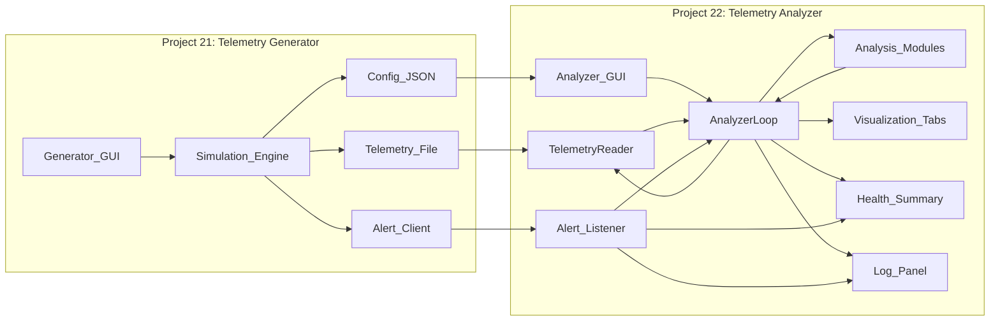

# 🌐 **Digital Twin Telemetry Ecosystem Overview (Projects 21 + 22)**

The **Digital Twin Telemetry Generator GUI (Project 21)** and the **Digital Twin Telemetry Analyzer GUI (Project 22)** form a complete, modular, and governance‑ready ecosystem 
for simulating, ingesting, analyzing, and narrating industrial telemetry. Together, they operationalize the full lifecycle of a digital twin:

**Representation → Synchronization → Interpretation → Explainability → Governance**

This ecosystem enables engineers, analysts, and consultants to explore machine behavior end‑to‑end — from synthetic telemetry generation to real‑time analytics and explainable 
diagnostics — all within lightweight, transparent, Python‑based desktop applications.

## 🧩 **Ecosystem Architecture**

### **1. Digital Twin Telemetry Generator (Project 21)**  
Acts as the **virtual machine**, producing realistic, correlated, and narratable telemetry streams.  
It simulates:

- numeric sensors  
- categorical states  
- auxiliary metadata  
- correlated electrical behavior  
- rare events and operational transitions  

It outputs:

- **CSV/Parquet telemetry files**  
- **config.json** describing schema, sampling frequency, and alert configuration  
- **real‑time alerts** for synchronized analytics  

### **2. Digital Twin Telemetry Analyzer (Project 22)**  
Acts as the **interpretation cockpit**, ingesting telemetry incrementally and applying modular analytics:

- statistics  
- clustering  
- forecasting  
- NLP  
- anomaly detection  
- explainable AI  

It visualizes results in real time and aggregates system health into governance‑ready summaries.

## 🔄 **End‑to‑End Workflow**

1. **Configure & simulate** telemetry in the Generator  
2. **Observe live preview** of machine behavior  
3. **Write telemetry** to CSV/Parquet in chunks  
4. **Emit alerts** to the Analyzer (chunk_written, generation_complete)  
5. **Analyzer ingests** new rows incrementally  
6. **Analytics modules run** independently  
7. **Visualizations update** across multiple tabs  
8. **Health summary aggregates** module‑level diagnostics  
9. **Logs capture** all events for traceability  
10. **Stakeholders interpret** machine behavior with explainable outputs  

This creates a **closed‑loop digital twin ecosystem** suitable for engineering, consulting, onboarding, and compliance workflows.

## 🧭 **Strategic Value**

- **For Engineering Teams:**  
  Prototype telemetry pipelines, validate ML models, and test monitoring dashboards.

- **For Consultants:**  
  Demonstrate predictive‑maintenance workflows, generate scenario‑specific datasets, and deliver explainable diagnostics.

- **For Compliance & ESG:**  
  Structured config files, deterministic models, and transparent logs support auditability and reproducibility.

- **For Research & Teaching:**  
  A fully narratable environment for digital‑twin concepts, anomaly detection, and real‑time analytics.

# 📊 **Side‑by‑Side Comparison: Generator vs. Analyzer**

| Dimension | **Project 21 – Telemetry Generator** | **Project 22 – Telemetry Analyzer** |
|----------|---------------------------------------|--------------------------------------|
| **Primary Role** | Virtual machine / telemetry simulator | Real‑time analytics and interpretation engine |
| **Core Function** | Generate realistic, correlated telemetry | Ingest, analyze, visualize, and explain telemetry |
| **Data Flow** | Writes CSV/Parquet + config.json + alerts | Reads CSV/Parquet incrementally + listens to alerts |
| **Behavior Model** | Thermal drift, RPM oscillations, vibration spikes, correlated electrical variables, rare events | Statistical trends, clustering regimes, forecasts, anomaly scores, NLP summaries, XAI attributions |
| **User Controls** | Sensor selection, sampling frequency, file format, target size/rows | Refresh interval, row limit, module selection |
| **Visualization** | Live preview (rolling 500 samples) | Multi‑tab analytics: time series, clustering, forecasting, NLP, anomaly, XAI |
| **Governance Outputs** | config.json, logs, deterministic models | health summaries, logs, config‑aware initialization |
| **Interoperability** | Sends alerts to Analyzer | Reacts to alerts from Generator |
| **Architecture** | Sensor models → chunk writer → preview engine → alert socket | TelemetryReader → analytics modules → visualization tabs → health aggregator |
| **Consulting Use Cases** | Scenario generation, synthetic datasets, onboarding demos | Real‑time diagnostics, explainable analytics, compliance reporting |
| **ESG / Risk Value** | Transparent simulation, reproducible telemetry | Transparent analytics, explainable diagnostics |
| **Extensibility** | Add sensors, file formats, streaming protocols | Add analytics modules, visualizations, ingestion modes |

# 🧠 **Ecosystem Summary**

Together, Projects **21** and **22** form a **complete digital‑twin telemetry ecosystem**:

- **Project 21** creates the *story* — a narratable, realistic stream of machine behavior.  
- **Project 22** interprets the *story* — transforming telemetry into insight, diagnostics, and explainable analytics.  

This pairing demonstrates how simulation, analytics, explainability, and governance can be unified into a coherent, modular, and stakeholder‑friendly environment — ideal for engineering, consulting, research, and compliance.

---

# Digital Twin Telemetry Ecosystem (Projects 21 & 22)

This repository segment presents a **paired digital‑twin ecosystem** built around two tightly integrated desktop applications:

- **Project 21 – Digital Twin Telemetry Generator GUI**  
  A PySide6‑based virtual machine that produces **realistic, correlated, and narratable telemetry** for an electric drilling machine. It simulates numeric sensors, categorical states, and auxiliary metadata, writing telemetry to CSV/Parquet while emitting a structured `config.json` and real‑time alerts.

- **Project 22 – Digital Twin Telemetry Analyzer GUI**  
  A PySide6‑based **real‑time analytics cockpit** that ingests telemetry incrementally, runs modular analytics (statistics, clustering, forecasting, NLP, anomaly detection, XAI), and visualizes results across multiple tabs with health summaries and governance‑ready logs.

Together, they form a **closed‑loop digital‑twin workflow**:

1. **Simulate** realistic machine behavior in the Generator  
2. **Write** telemetry and configuration artifacts  
3. **Ingest & analyze** telemetry in the Analyzer  
4. **Visualize & explain** system behavior in real time  
5. **Document & govern** the full pipeline via structured configs and logs  

This ecosystem is designed for:

- **Engineering teams** prototyping telemetry and predictive‑maintenance pipelines  
- **Consultants** running live demos, workshops, and scenario‑based analyses  
- **Compliance & ESG stakeholders** requiring transparent, reproducible, and auditable workflows  
- **Researchers & educators** teaching digital‑twin concepts, anomaly detection, and explainable analytics

## High‑level architecture

The following Mermaid diagram shows the **end‑to‑end data and control flow** between the Generator (Project 21), the Analyzer (Project 22), and their shared artifacts.

## Ecosystem at a glance

- **Generator (Project 21)**  
  - Simulates realistic telemetry (sensors, states, metadata)  
  - Writes CSV/Parquet + `config.json`  
  - Emits alerts for synchronization  
  - Provides live preview and progress feedback  

- **Analyzer (Project 22)**  
  - Incrementally ingests telemetry  
  - Runs modular analytics (statistics, clustering, forecasting, NLP, anomaly, XAI)  
  - Visualizes results in multi‑tab views  
  - Aggregates health and logs for governance  

- **Shared governance layer**  
  - `config.json` documents schema and sampling  
  - Logs capture simulation and analytics events  
  - Deterministic models and modules support reproducibility  

This combined README and architecture diagram can serve as the **entry point** for readers exploring the digital‑twin telemetry ecosystem, before diving into the detailed project pages for **Project 21** and **Project 22**.

