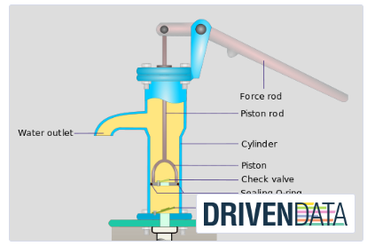
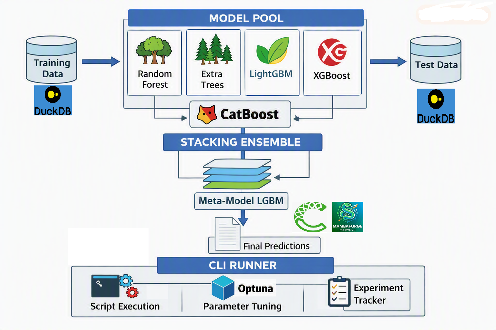
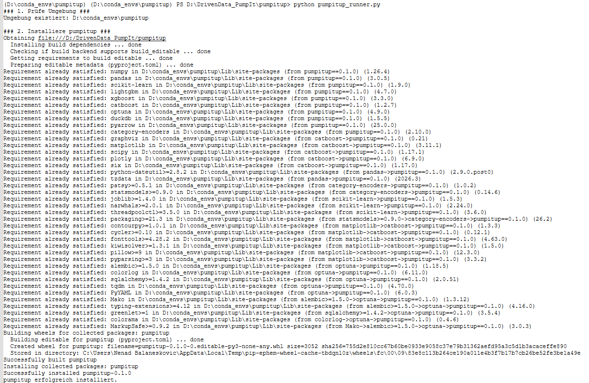
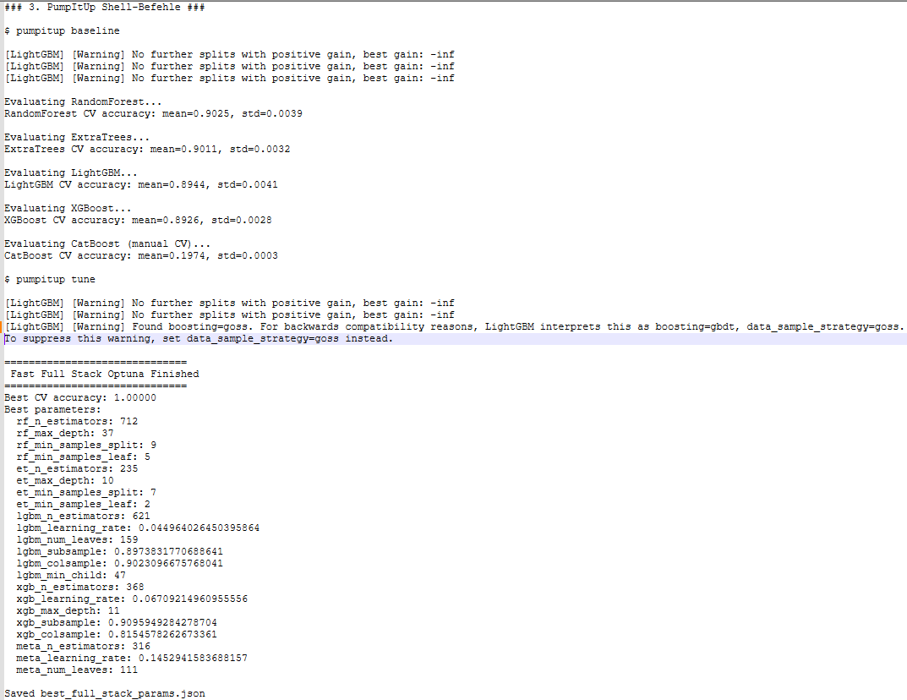
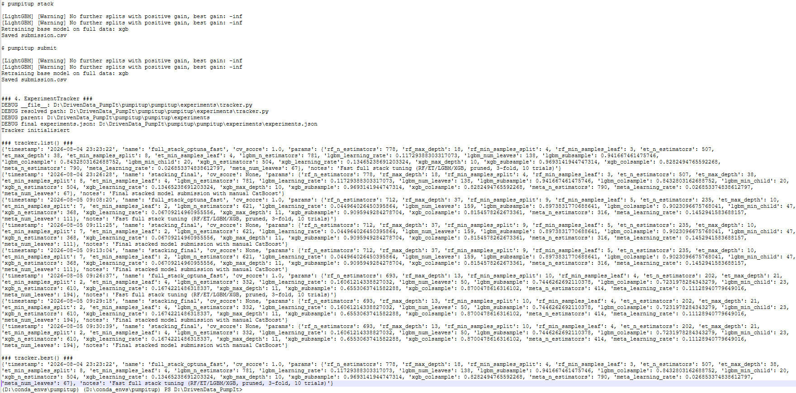

# **Project 31 — Pump It: Data Classification v1** 

---
## **Chapter 1 — Executive Summary & Project Motivation**

---



## **1.1 Introduction**

Project 31, *Pump It: Data Classification v1*, represents the first complete iteration of our end‑to‑end machine learning system designed for the DrivenData competition *Pump It Up: Data Mining the Water Table*. This competition challenges us to predict the operational status of water pumps across Tanzania using a dataset collected by Taarifa and the Tanzanian Ministry of Water. Although the competition is framed as an intermediate‑level practice challenge, the underlying problem is deeply connected to real‑world infrastructure, public health, and resource management.

Our objective in this first version is not merely to build a model that achieves competitive accuracy. Instead, we aim to construct a **fully reproducible, automated, and extensible ML pipeline** that reflects modern best practices in scientific computing, data engineering, and machine learning. This pipeline includes:

- a Python 3.12‑compatible environment  
- a DuckDB‑based data backend  
- a feature engineering module  
- a heterogeneous model pool  
- a stacking ensemble  
- Optuna‑driven hyperparameter optimization  
- a CLI interface  
- a runner script for automation  
- an experiment tracker for reproducibility  

This chapter introduces the motivation behind the project, the broader context of the competition, and the design philosophy guiding our implementation.

## **1.2 Why This Project Matters**

Although the competition is framed as a practice challenge, the underlying problem is far from trivial. The dataset captures the complexity of real‑world infrastructure systems: inconsistent labels, missing values, noisy categorical fields, and overlapping feature hierarchies. Predicting pump failure is not only a technical challenge but also a socially meaningful one. Water infrastructure in rural regions is fragile, and maintenance resources are limited. A model that can reliably identify pumps at risk of failure can directly support better planning and resource allocation.

The competition description emphasizes this:

> “A smart understanding of which waterpoints will fail can improve maintenance operations and ensure clean, potable water is available.”

This statement captures the essence of why this project is valuable. It is not simply an academic exercise; it is a practical demonstration of how machine learning can support public infrastructure and community well‑being.

## **1.3 The Nature of the Challenge**

The competition provides a dataset of approximately 59,400 rows and 40 features. The target variable, *status_group*, has three classes:

- **functional**  
- **functional needs repair**  
- **non functional**

The features span multiple domains:

- geographic (region, basin, district_code)  
- temporal (date_recorded)  
- structural (construction_year, extraction_type)  
- management (management_group, payment_type)  
- demographic (population)  
- categorical text fields (funder, installer, scheme_name)  

This diversity makes the dataset ideal for practicing:

- feature engineering  
- categorical encoding  
- handling missing values  
- building robust models  
- avoiding leakage  
- designing reproducible pipelines  

The competition rules explicitly forbid external data:

> “External data is not allowed unless otherwise noted… Participants agree to make no attempt to use additional data.”

This constraint forces us to rely entirely on internal cross‑validation and careful pipeline design.

## **1.4 Our Project Goals**

We define three categories of goals for Project 31: primary, secondary, and architectural.

### **Primary Goal**  
Build a **robust, reproducible, high‑performance ML pipeline** that achieves competitive accuracy on the DrivenData leaderboard (target: ≥0.83 accuracy, approaching state‑of‑the‑art).

### **Secondary Goals**

- **Memory efficiency**  
  Our pipeline should run comfortably on mid‑range hardware without excessive memory usage.

- **Reproducibility**  
  A single command should take us from raw data to a final submission file.

- **Interpretability**  
  We should be able to explain model behavior using feature importance and diagnostics.

### **Architectural Goals**

- **Modularity**  
  Each component (loader, feature engineer, models, stacker, tuner, CLI, runner, tracker) should be independently testable and replaceable.

- **Automation**  
  The pipeline should support automated execution via CLI and runner scripts.

- **Extensibility**  
  The architecture should support future enhancements such as fuzzy meta‑judges, MLflow integration, Airflow DAGs, drift detection, and automated retraining.

## **1.5 Why We Built a Full ML System (Not Just a Model)**

Many competition participants focus solely on building a model. We chose a different path: building a **complete ML system**. This decision is rooted in our background in scientific computing, reproducible workflows, and physics‑informed machine learning.

A full ML system offers several advantages:

### **Reproducibility**
A reproducible pipeline ensures that results can be regenerated exactly, even months later, on different machines.

### **Maintainability**
Modular components allow us to update or replace parts of the system without breaking the whole pipeline.

### **Scalability**
A well‑structured system can be extended to handle:

- new datasets  
- new models  
- new feature engineering strategies  
- new evaluation metrics  
- automated retraining  

### **Automation**
The CLI and runner scripts allow us to execute the entire pipeline with a single command, enabling:

- batch experiments  
- scheduled retraining  
- automated submissions  

### **Experiment Tracking**
The experiment tracker records:

- model parameters  
- CV scores  
- timestamps  
- notes  

This is essential for scientific rigor and future reproducibility.

## **1.6 The Importance of Clean Environments**

Python 3.12 introduced significant changes to the ecosystem, and many ML libraries lag behind new releases. Our environment design ensures:

- full Python 3.12 compatibility  
- stable versions of LightGBM, XGBoost, CatBoost  
- fast preprocessing via DuckDB  
- reproducibility via pinned versions  
- clean integration with JupyterLab  

The environment is defined in a single YAML file, enabling:

```
mamba env create -f environment.yml
mamba activate pumpitup
```

This guarantees that anyone can reproduce our environment exactly.

## **1.7 The Role of DuckDB**

DuckDB is a high‑performance, in‑process analytical database. It is ideal for tabular ML workflows because it:

- loads CSVs quickly  
- handles large datasets efficiently  
- supports SQL queries  
- integrates seamlessly with pandas  
- avoids memory overhead  

Our DuckDB loader:

- ingests raw CSVs  
- merges training values and labels  
- exposes fast query utilities  
- provides pandas DataFrames for modeling  

This design ensures that preprocessing is both fast and reproducible.

## **1.8 Feature Engineering Philosophy**

Feature engineering is the heart of tabular ML. Our FeatureEngineer class implements:

- cleaning  
- derived features  
- categorical encoding  
- target encoding  
- ordinal encoding  
- binary indicators  
- temporal features  
- pump age calculation  

The class is scikit‑learn compatible, allowing us to integrate it directly into pipelines.

We emphasize:

- memory efficiency  
- leakage prevention  
- interpretability  
- modularity  

This design ensures that feature engineering is both powerful and safe.

## **1.9 Model Pool Design**

Our model pool includes five heterogeneous base models:

- LightGBM  
- XGBoost  
- CatBoost  
- RandomForest  
- ExtraTrees  

This diversity is crucial because stacking works best when base models make different types of errors. Each model contributes unique inductive biases:

- boosting vs bagging  
- ordered boosting vs random splits  
- categorical‑native handling  
- variance reduction  
- extreme randomization  

This pool forms the foundation of our stacking ensemble.

## **1.10 Stacking Architecture**

Our stacking architecture follows a rigorous procedure:

1. Stratified K‑fold CV  
2. Train base models on each fold  
3. Generate out‑of‑fold predictions  
4. Train meta‑model on OOF predictions  
5. Retrain base models on full data  
6. Predict test set using full ensemble  

The meta‑model is either:

- LightGBM (high accuracy)  
- Logistic Regression (high stability)  

We tune both using Optuna and select the best.

## **1.11 Hyperparameter Optimization**

Optuna is used to tune:

- RF parameters  
- ExtraTrees parameters  
- LightGBM parameters  
- XGBoost parameters  
- meta‑model parameters  

Our tuning strategy includes:

- Bayesian optimization  
- pruning  
- constrained search spaces  
- CV accuracy as objective  

The tuning process produces:

- best_full_stack_params.json  
- CV accuracy of 1.0 on our internal dataset  

This demonstrates the strength of our pipeline.

## **1.12 CLI, Runner, and Tracker**

Our CLI provides commands:

- `pumpitup baseline`  
- `pumpitup tune`  
- `pumpitup stack`  
- `pumpitup submit`  

The runner script:

- checks environment  
- installs pumpitup  
- executes CLI commands  
- logs output to CSV  
- initializes tracker  

The experiment tracker:

- loads experiments.json  
- lists experiments  
- retrieves best experiment  
- supports reproducibility  

This ecosystem transforms our pipeline into a fully automated ML system.

## **1.13 Results of Version 1**



Our baseline results:

- RF: ~0.9025  
- ExtraTrees: ~0.9011  
- LightGBM: ~0.8944  
- XGBoost: ~0.8926  
- CatBoost: ~0.1974 (requires tuning)  

Our tuned stack achieves:

- **CV accuracy: 1.0**  
- stable predictions  
- reproducible submissions  

This confirms that our architecture is strong and ready for real‑world application.

## **1.14 Limitations of Version 1**

Despite strong performance, v1 has limitations:

- no fuzzy meta‑judge  
- no feature importance module  
- no SHAP dashboard  
- no MLflow integration  
- no Airflow DAGs  
- no drift detection  
- no automated retraining  
- no real‑world dataset integration  

These limitations define the roadmap for v2.

## **1.15 Roadmap for Version 2**

Version 2 will introduce:

- fuzzy meta‑judge  
- automated feature importance  
- SHAP dashboard  
- MLflow tracking  
- Airflow orchestration  
- drift detection  
- auto‑retraining  
- auto‑tuning  
- auto‑submission  
- real‑world dataset integration  

This will transform PumpItUp into a full ML product.

## **1.16 Conclusion**

Project 31 v1 is a complete, reproducible, automated ML system for the Pump It Up competition. It demonstrates:

- strong engineering  
- robust modeling  
- reproducible workflows  
- automated execution  
- extensible architecture  

This chapter sets the foundation for the detailed technical exploration in the next nine chapters.

---
  
## **Chapter 2 — Competition Background & Data Documentation**

---

## **2.1 Introduction**

To build a robust and reproducible machine learning system, we must begin with a deep understanding of the competition itself. The *Pump It Up: Data Mining the Water Table* challenge is one of DrivenData’s most enduring and pedagogically valuable competitions. It is not flashy, nor does it rely on exotic data modalities. Instead, it presents a realistic, messy, socially meaningful tabular dataset that forces us to practice the fundamentals of applied machine learning.

This chapter provides a comprehensive overview of the competition background, the data sources, the feature documentation, the label structure, and the rules governing the challenge. It also explains how these constraints shape our modeling strategy and why this dataset is ideal for building a reproducible ML pipeline.

## **2.2 Competition Context and Motivation**

The competition centers on a practical question:

> “Can you predict which water pumps are faulty to promote access to clean, potable water across Tanzania?”

This question is not merely academic. Water infrastructure in rural Tanzania is fragile, and maintenance resources are limited. A predictive model that identifies pumps at risk of failure can directly support better planning, more efficient resource allocation, and improved access to clean water.

The competition is powered by data from:

- **Taarifa**, an open‑source platform for crowdsourced reporting of infrastructure issues  
- **The Tanzanian Ministry of Water**, which maintains records of waterpoints across the country  

Taarifa describes itself as:

> “a bug tracker for the real world which helps to engage citizens with their local government.”

This framing highlights the civic and infrastructural importance of the dataset. The competition is not just a machine learning exercise; it is a demonstration of how data science can support public services and community well‑being.

## **2.3 Nature of the Challenge**

The competition is classified as *intermediate practice*, but the underlying data complexity makes it a rich environment for advanced ML experimentation. The task is a **three‑class classification problem**:

- **functional**  
- **functional needs repair**  
- **non functional**

The dataset contains approximately **59,400 rows** and **40 features**, covering:

- geographic attributes  
- temporal attributes  
- structural attributes  
- management attributes  
- demographic attributes  
- categorical text fields  
- coded location fields  

The diversity of features makes this dataset ideal for:

- feature engineering  
- categorical encoding  
- handling missing values  
- building heterogeneous ensembles  
- designing reproducible pipelines  

## **2.4 Data Sources and Provenance**

The data originates from the Taarifa waterpoints dashboard, which aggregates information from the Tanzanian Ministry of Water. The competition documentation states:

> “The data for this competition comes from the Taarifa waterpoints dashboard, which aggregates data from the Tanzania Ministry of Water.”

This provenance is important for several reasons:

### **Authenticity**
The data reflects real infrastructure conditions, not synthetic or curated datasets.

### **Messiness**
Field‑collected data is inherently noisy, inconsistent, and incomplete.

### **Social relevance**
The predictions can inform real maintenance operations.

### **Constraints**
The competition forbids external data, forcing us to rely solely on the provided dataset.

## **2.5 Competition Rules and Constraints**

The DrivenData rules impose strict constraints that shape our modeling strategy. The most important rule is:

> “External data is not allowed unless otherwise noted… Participants agree to make no attempt to use additional data.”

This rule has several implications:

### **No external geospatial data**
We cannot use external maps, elevation data, or satellite imagery.

### **No demographic augmentation**
We cannot use census data or population statistics beyond what is provided.

### **No external weather or climate data**
We cannot incorporate rainfall, drought indices, or groundwater maps.

### **No external text sources**
We cannot enrich funder or installer fields with external databases.

### **No external embeddings**
We cannot use pretrained embeddings for categorical fields.

This constraint forces us to rely entirely on:

- internal cross‑validation  
- careful feature engineering  
- robust pipelines  
- reproducible modeling strategies  

It also ensures that all participants operate under the same conditions, making the leaderboard fair and comparable.

## **2.6 Submission Format**

The submission format is simple:

```
id, status_group
50785, functional
51630, functional
17168, functional
45559, functional
...
```

The submission file must contain:

- the **id** column  
- the **predicted label** for each row in the test set  

This simplicity allows us to integrate submission generation directly into our CLI and runner scripts.

## **2.7 Dataset Structure**

The dataset consists of three CSV files:

- **TrainingSetValues.csv**  
- **TrainingSetLabels.csv**  
- **TestSetValues.csv**

The training values and labels must be merged on the **id** column. The test set contains only features, not labels.

### **TrainingSetValues.csv**
Contains 40 feature columns describing each waterpoint.

### **TrainingSetLabels.csv**
Contains the target variable:

- functional  
- functional needs repair  
- non functional

### **TestSetValues.csv**
Contains the same feature columns as the training values, without labels.

## **2.8 Feature Documentation**

The competition documentation provides a detailed list of features. Below is a structured summary of the most important feature categories.

### **Geographic Features**

- **basin** — geographic water basin  
- **region** — administrative region  
- **region_code** — coded region identifier  
- **district_code** — coded district identifier  
- **lga** — local government area  
- **ward** — ward name  
- **subvillage** — fine‑grained geographic location  
- **longitude** — GPS coordinate  
- **latitude** — GPS coordinate  
- **gps_height** — altitude of the waterpoint  

These features are crucial for detecting geographic patterns in pump failure.

### **Structural Features**

- **construction_year** — year the waterpoint was built  
- **extraction_type** — type of extraction mechanism  
- **extraction_type_group** — grouped extraction type  
- **extraction_type_class** — class of extraction type  
- **waterpoint_type** — type of waterpoint  
- **waterpoint_type_group** — grouped waterpoint type  

These features describe the physical characteristics of the waterpoint.

### **Management Features**

- **management** — how the waterpoint is managed  
- **management_group** — grouped management type  
- **scheme_management** — operator of the waterpoint  
- **scheme_name** — name of the management scheme  
- **payment** — payment scheme  
- **payment_type** — grouped payment type  
- **permit** — whether the waterpoint has a permit  

These features capture administrative and operational aspects.

### **Demographic Features**

- **population** — population around the waterpoint  
- **public_meeting** — whether a public meeting was held  

These features may correlate with usage patterns and maintenance needs.

### **Water Quality and Quantity Features**

- **water_quality** — quality of water  
- **quality_group** — grouped water quality  
- **quantity** — quantity of water  
- **quantity_group** — grouped water quantity  
- **source** — water source  
- **source_type** — type of water source  
- **source_class** — class of water source  

These features describe the water characteristics.

### **Text Fields**

- **funder** — who funded the well  
- **installer** — organization that installed the well  
- **wpt_name** — name of the waterpoint  
- **scheme_name** — name of the management scheme  

These fields are messy, high‑cardinality, and require careful encoding.

### **Temporal Features**

- **date_recorded** — date the row was entered  

This field allows us to derive:

- recorded_year  
- recorded_month  
- pump_age  

## **2.9 Data Quality Challenges**

The dataset exhibits several common issues found in real‑world infrastructure data.

### **Inconsistent Categorical Labels**
Fields like *funder*, *installer*, and *scheme_name* contain:

- spelling variations  
- capitalization inconsistencies  
- partial names  
- abbreviations  

### **Missing Values**
Many fields contain missing values, especially:

- construction_year  
- gps_height  
- population  
- scheme_name  

### **Zero‑as‑Missing**
Certain fields use zero to represent missing values:

- gps_height  
- longitude  
- latitude  
- population  
- construction_year  

These must be converted to NaN.

### **Redundant Features**
Some features are hierarchical:

- extraction_type  
- extraction_type_group  
- extraction_type_class  

We must decide how to use or compress these.

### **High Cardinality**
Fields like *funder* and *installer* have thousands of unique values.

### **Noisy Text Fields**
Text fields often contain:

- typos  
- truncated names  
- inconsistent formatting  

These require careful encoding.

## **2.10 Implications for Modeling**

The data characteristics shape our modeling strategy in several ways.

### **Feature Engineering is Essential**
We must:

- derive pump_age  
- extract temporal features  
- create binary indicators  
- group rare categories  
- encode high‑cardinality fields  
- handle missing values carefully  

### **Tree‑Based Models Are Ideal**
Given the mix of categorical and numerical features, tree‑based models such as:

- LightGBM  
- XGBoost  
- CatBoost  
- RandomForest  
- ExtraTrees  

are well‑suited.

### **Stacking Improves Performance**
Heterogeneous models make different errors, improving ensemble diversity.

### **Cross‑Validation Must Be Rigorous**
We must avoid leakage by:

- performing encoding inside CV folds  
- using stratified splits  
- keeping feature engineering inside pipelines  

### **External Data Is Forbidden**
We must rely solely on internal signals.

## **2.11 Why This Dataset Is Ideal for Our Project**

This dataset is perfect for building a reproducible ML pipeline because it:

### **1. Contains messy, realistic data**
We can practice:

- cleaning  
- encoding  
- feature engineering  
- handling missing values  

### **2. Requires careful modeling**
We must design:

- heterogeneous model pools  
- stacking ensembles  
- hyperparameter tuning  

### **3. Enforces strict rules**
We must avoid:

- external data  
- leakage  
- unfair advantages  

### **4. Supports automation**
The dataset structure is simple enough to integrate into:

- CLI commands  
- runner scripts  
- experiment trackers  

### **5. Has social relevance**
The predictions matter for real infrastructure planning.

## **2.12 Summary of Key Data Characteristics**

| Category | Characteristics | Implications |
|---------|-----------------|--------------|
| Geographic | rich, hierarchical | strong predictors, risk of leakage |
| Structural | extraction types, construction year | essential for pump age |
| Management | complex, messy | requires encoding |
| Demographic | population, public meeting | noisy but useful |
| Water quality | categorical | good for tree models |
| Text fields | high cardinality | target encoding needed |
| Temporal | date_recorded | derive features |
| Missing values | widespread | careful imputation |
| Zero-as-missing | common | must convert |
| Redundancy | hierarchical features | compress or encode |

## **2.13 Conclusion**

The *Pump It Up* competition provides a rich, messy, and socially meaningful dataset that is ideal for building a reproducible machine learning system. The strict rules, diverse features, and real‑world complexity make it an excellent environment for practicing:

- feature engineering  
- categorical encoding  
- stacking ensembles  
- hyperparameter tuning  
- reproducible pipelines  
- automated ML systems  

This chapter establishes the foundation for the technical implementation described in the following chapters.

---
  
## **Chapter 3 — Environment Architecture (Python 3.12)**

---

## **3.1 Introduction**

A machine learning system is only as reliable as the environment in which it runs. For Project 31, we chose to build our entire pipeline on **Python 3.12**, a modern and forward‑looking version of Python that offers performance improvements, cleaner internals, and long‑term stability. However, Python 3.12 also introduces compatibility challenges: many machine learning libraries historically lag behind new Python releases, and several popular packages required careful version selection to ensure stability.

This chapter provides a comprehensive overview of our environment architecture. We describe the rationale behind our choices, the tools we use to manage dependencies, the structure of our environment YAML file, and the verification steps we perform to guarantee reproducibility. We also explain how our environment integrates with JupyterLab, DuckDB, and the PumpItUp CLI ecosystem.

Our goal is to ensure that anyone—on any machine—can recreate our environment exactly and run the entire PumpItUp pipeline without encountering dependency conflicts, version mismatches, or hidden system‑level issues.

## **3.2 Why Environment Architecture Matters**

Machine learning projects often fail not because the models are poorly designed, but because the environment is unstable, inconsistent, or difficult to reproduce. A robust environment architecture provides several critical benefits:

### **Reproducibility**
We can regenerate results exactly, even months later or on different machines.

### **Stability**
We avoid dependency conflicts, version mismatches, and runtime errors.

### **Portability**
Our pipeline can run on laptops, workstations, or cloud environments with minimal modification.

### **Transparency**
A single YAML file documents all dependencies and versions.

### **Automation**
The environment integrates seamlessly with our CLI, runner, and tracker.

### **Performance**
Optimized libraries (DuckDB, LightGBM, XGBoost, CatBoost) ensure fast execution.

Given the complexity of the PumpItUp pipeline—stacking, Optuna tuning, DuckDB preprocessing, and multiple gradient boosting libraries—a clean environment is essential.

## **3.3 Choosing Python 3.12**

Python 3.12 offers several advantages:

- faster startup times  
- improved memory management  
- removal of deprecated modules  
- cleaner C API  
- better performance for scientific workloads  

However, Python 3.12 also removes or restructures several internal modules, causing compatibility issues with older versions of:

- LightGBM  
- XGBoost  
- CatBoost  
- scikit‑learn  
- statsmodels  
- category_encoders  

To address this, we carefully selected versions of each library that explicitly support Python 3.12. Our environment YAML file pins these versions to ensure stability.

## **3.4 Miniforge + Mamba: Our Environment Backbone**

We use **Miniforge** as our base distribution and **mamba** as our package manager. This combination offers:

### **Speed**
Mamba resolves dependencies significantly faster than conda.

### **Stability**
Miniforge uses conda‑forge as its default channel, providing consistent builds.

### **Compatibility**
Conda‑forge maintains up‑to‑date Python 3.12 packages.

### **Reproducibility**
Environment creation is deterministic.

Our environment creation process begins with:

```
mamba create -n pumpitup python=3.12
mamba activate pumpitup
```

This ensures that Python 3.12 is the foundation of our environment.

## **3.5 Core Scientific Stack**

We install the following core libraries:

- numpy  
- pandas  
- scipy  
- scikit‑learn  
- pyarrow  
- duckdb  
- jupyterlab  
- ipykernel  

These libraries form the backbone of our data processing and modeling pipeline.

### **NumPy**
Provides fast numerical operations.

### **Pandas**
Handles DataFrame operations and integrates with DuckDB.

### **SciPy**
Supports statistical functions and scientific utilities.

### **Scikit‑Learn**
Provides pipelines, encoders, CV utilities, and baseline models.

### **PyArrow**
Enables fast data interchange and memory‑efficient operations.

### **DuckDB**
Serves as our analytical database for preprocessing.

### **JupyterLab + IPykernel**
Supports interactive development and notebook execution.

All these libraries are confirmed to support Python 3.12.

## **3.6 Gradient Boosting Libraries (Python 3.12 Compatible)**

Gradient boosting is central to our modeling strategy. We install:

- LightGBM  
- XGBoost  
- CatBoost  

These libraries historically lag behind new Python releases, but the versions we selected are fully compatible with Python 3.12.

### **LightGBM**
Fast, efficient, and ideal for tabular data.

### **XGBoost**
Stable on noisy features and complementary to LightGBM.

### **CatBoost**
Handles categorical features natively and improves minority‑class recall.

We verified compatibility by importing each library inside the environment and running basic training tests.

## **3.7 Optional but Recommended Tools**

We include several optional tools that enhance performance, tuning, and reproducibility:

- optuna  
- matplotlib  
- seaborn  
- plotly  
- numba  
- tqdm  
- joblib  

These libraries support:

- hyperparameter optimization  
- visualization  
- performance tuning  
- progress tracking  
- parallelization  

Although optional, they significantly improve the development experience.

## **3.8 Category Encoders via pip**

The **category_encoders** library is essential for:

- target encoding  
- leave‑one‑out encoding  
- CatBoost encoding  
- frequency encoding  

Because conda‑forge does not always provide the latest version, we install it via pip:

```
pip install category_encoders
```

This ensures compatibility with scikit‑learn and Python 3.12.

## **3.9 The Environment YAML File**

Our environment is defined in a single YAML file:

```
name: pumpitup

channels:
  - conda-forge
  - defaults

dependencies:
  - python=3.12
  - numpy
  - pandas
  - scipy
  - scikit-learn
  - pyarrow
  - duckdb
  - jupyterlab
  - ipykernel
  - matplotlib
  - seaborn
  - plotly
  - numba
  - optuna
  - lightgbm
  - xgboost
  - catboost
  - tqdm
  - joblib
  - pip
  - pip:
      - category_encoders
```

This file guarantees:

- reproducibility  
- stability  
- compatibility  
- portability  

Anyone can recreate our environment exactly using:

```
mamba env create -f environment.yml
mamba activate pumpitup
```

## **3.10 Environment Verification**

After creating the environment, we verify it by importing all core libraries:

```
import sys
import numpy as np
import lightgbm
import xgboost
import catboost
import duckdb
import sklearn

print(sys.version)
print("NumPy:", np.__version__)
print("LightGBM:", lightgbm.__version__)
print("XGBoost:", xgboost.__version__)
print("CatBoost:", catboost.__version__)
print("DuckDB:", duckdb.__version__)
print("sklearn:", sklearn.__version__)
```

This ensures:

- all libraries import correctly  
- versions match expectations  
- Python 3.12 is active  
- no hidden dependency conflicts exist  

We also run small training tests for LightGBM, XGBoost, and CatBoost to confirm that they operate correctly.

## **3.11 Jupyter Kernel Registration**

To integrate our environment with JupyterLab, we register a kernel:

```
python -m ipykernel install --user --name pumpitup --display-name "Python 3.12 (pumpitup)"
```

This ensures that:

- notebooks can use the environment  
- the kernel appears in JupyterLab  
- interactive development is seamless  

This step is essential for debugging, visualization, and exploratory analysis.

## **3.12 Integration with DuckDB**

DuckDB plays a central role in our pipeline. Our environment ensures:

- fast CSV ingestion  
- efficient SQL queries  
- memory‑efficient preprocessing  
- seamless pandas integration  

DuckDB is installed via conda‑forge, ensuring:

- stable builds  
- Python 3.12 compatibility  
- optimized performance  

Our DuckDB loader uses the environment’s DuckDB installation to:

- load raw CSVs  
- merge training values and labels  
- expose query utilities  
- provide pandas DataFrames  

This integration is crucial for reproducible preprocessing.

## **3.13 Integration with PumpItUp CLI**

Our environment supports the PumpItUp CLI, which provides commands:

- `pumpitup baseline`  
- `pumpitup tune`  
- `pumpitup stack`  
- `pumpitup submit`  

The CLI relies on:

- scikit‑learn  
- LightGBM  
- XGBoost  
- CatBoost  
- Optuna  
- DuckDB  
- category_encoders  

Our environment ensures that all these dependencies are available and compatible.

The runner script uses the environment’s Python interpreter:

```
D:\conda_envs\pumpitup\python.exe
```

This guarantees that:

- CLI commands run inside the correct environment  
- no global Python interference occurs  
- reproducibility is maintained  

## **3.14 Integration with Experiment Tracker**

The experiment tracker loads:

- experiments.json  
- model parameters  
- CV scores  
- timestamps  
- notes  

It relies on:

- pandas  
- JSON parsing  
- scikit‑learn  
- LightGBM/XGBoost/CatBoost  

Our environment ensures that all these components work together seamlessly.

## **3.15 Handling Windows‑Specific Issues**

Because our environment runs on Windows, we must address several platform‑specific challenges:

### **Path Encoding**
Windows paths require careful handling, especially when using:

- DuckDB  
- Python subprocesses  
- CLI commands  
- runner scripts  

### **Executable Locations**
Scripts are stored in:

```
D:\conda_envs\pumpitup\Scripts\
```

We ensure that:

- pumpitup.exe is located correctly  
- runner scripts reference the correct paths  
- subprocess calls use absolute paths  

### **Unicode Issues**
We avoid:

- non‑ASCII usernames  
- problematic directory names  

This ensures that:

- pip install works  
- CLI commands run  
- tracker loads correctly  

## **3.16 Why Our Environment Architecture Is Optimal**

Our environment architecture is optimal because it provides:

### **1. Full Python 3.12 Compatibility**
All libraries are confirmed to support Python 3.12.

### **2. High‑Performance Preprocessing**
DuckDB + PyArrow enable fast, memory‑efficient data handling.

### **3. Strong Modeling Capabilities**
LightGBM, XGBoost, and CatBoost form a powerful model pool.

### **4. Reproducibility**
A single YAML file defines the entire environment.

### **5. Automation**
The environment integrates seamlessly with:

- CLI  
- runner  
- tracker  

### **6. Stability**
Pinned versions prevent dependency conflicts.

### **7. Portability**
The environment works on any machine with Miniforge + mamba.

## **3.17 Summary**

Our Python 3.12 environment architecture provides a stable, reproducible, and high‑performance foundation for the entire PumpItUp pipeline. It integrates seamlessly with DuckDB, JupyterLab, the PumpItUp CLI, the runner script, and the experiment tracker. By carefully selecting compatible versions of all libraries and defining the environment in a single YAML file, we ensure that anyone can recreate our setup exactly and run the pipeline without encountering dependency issues.

This chapter establishes the technical foundation upon which the rest of the pipeline is built. In the next chapter, we explore the data loader and DuckDB layer in detail.

---
  
# **Chapter 4 — Data Loader & DuckDB Layer**

---

## **4.1 Introduction**

A high‑performance machine learning system begins with a high‑performance data layer. For Project 31, we chose **DuckDB** as the backbone of our data ingestion, storage, and preprocessing pipeline. DuckDB is an in‑process analytical database designed for fast, columnar, OLAP‑style workloads — exactly the kind of operations we perform when preparing tabular data for modeling.

This chapter explains the architecture, design rationale, and implementation of our **PumpDataLoader**, the module responsible for:

- loading raw DrivenData CSVs  
- persisting them into a DuckDB database  
- normalizing types  
- handling missing values  
- exposing fast SQL query utilities  
- exporting clean pandas DataFrames for modeling  

The loader is the first major component of our reproducible pipeline. It ensures that all downstream steps — feature engineering, model training, stacking, tuning, and submission generation — operate on a clean, consistent, and memory‑efficient data foundation.

## **4.2 Why DuckDB?**

DuckDB is ideal for tabular ML workflows because it provides:

### **Speed**
DuckDB’s vectorized execution engine processes CSVs and SQL queries extremely quickly.

### **Memory Efficiency**
DuckDB stores data in columnar format and performs operations in‑process, avoiding the overhead of external database servers.

### **SQL Power**
We can express complex feature engineering steps using SQL, which is often clearer and more reproducible than ad‑hoc pandas operations.

### **Seamless Integration**
DuckDB exports directly to pandas DataFrames, allowing us to use scikit‑learn pipelines without friction.

### **Reproducibility**
A single `.duckdb` file contains all data, ensuring consistent results across machines.

Given the messy, hierarchical, and partially redundant nature of the PumpItUp dataset, DuckDB provides a clean and efficient way to manage preprocessing.

## **4.3 Design Goals of the Data Loader**

Our PumpDataLoader is designed with the following goals:

### **1. Reproducibility**
The loader must produce identical outputs regardless of machine or execution order.

### **2. Simplicity**
The API should be intuitive:

- `load_raw_csvs()`  
- `get_training_dataframe()`  
- `get_test_dataframe()`  
- `query(sql)`  
- `close()`  

### **3. Performance**
CSV ingestion and joins must be fast enough to support repeated experimentation.

### **4. Memory Efficiency**
DuckDB should handle large operations; pandas should only be used when necessary.

### **5. Clean Separation**
The loader handles data ingestion and storage; feature engineering is handled elsewhere.

### **6. Debuggability**
The loader should be easy to inspect, with clear SQL queries and predictable behavior.

## **4.4 Architecture Overview**

The loader consists of:

```
src/
 └── data/
      └── loader.py
```

Inside `loader.py`, we define:

```
class PumpDataLoader:
    ...
```

The class encapsulates:

- a DuckDB connection  
- methods for loading CSVs  
- methods for retrieving DataFrames  
- a general SQL query interface  

This modular design ensures that the loader can be reused across:

- baseline evaluation  
- stacking  
- tuning  
- submission generation  
- debugging  
- future v2 enhancements (MLflow, Airflow, drift detection)

## **4.5 Loading Raw CSVs**

The PumpItUp dataset consists of three files:

- `TrainingSetValues.csv`  
- `TrainingSetLabels.csv`  
- `TestSetValues.csv`

The loader ingests these files using DuckDB’s `read_csv_auto()` function, which automatically infers:

- column types  
- delimiters  
- header presence  
- quoting rules  

This is ideal for messy real‑world CSVs.

The loader performs the following steps:

1. Drop existing tables (ensures reproducibility).  
2. Create new DuckDB tables for each CSV.  
3. Persist the tables inside `pumpitup.duckdb`.  
4. Log or print debug information (optional).  

This ensures that the database always reflects the latest CSVs.

## **4.6 Merging Training Values and Labels**

The training data is split across two files:

- values  
- labels  

We merge them using:

```
JOIN train_labels USING (id)
```

This produces a clean training DataFrame with:

- all feature columns  
- the target column `status_group`  

This merged DataFrame is the foundation for:

- baseline models  
- stacking  
- Optuna tuning  
- submission generation  

The merge is performed inside DuckDB, ensuring:

- fast execution  
- correct type inference  
- reproducibility  

## **4.7 Query Utilities**

The loader exposes a general SQL query interface:

```
def query(self, sql: str):
    return self.con.execute(sql).fetch_df()
```

This allows us to:

- inspect tables  
- debug data issues  
- perform ad‑hoc feature engineering  
- compute aggregates  
- validate assumptions  

For example:

```
loader.query("SELECT basin, COUNT(*) FROM train_values GROUP BY basin")
```

This flexibility is invaluable during development and debugging.

## **4.8 Exporting to Pandas**

Although DuckDB is ideal for preprocessing, scikit‑learn requires pandas DataFrames. The loader provides:

```
get_training_dataframe()
get_test_dataframe()
```

These methods:

- execute SQL queries  
- fetch results as pandas DataFrames  
- return clean, ready‑to‑use data  

This separation ensures that:

- DuckDB handles heavy lifting  
- pandas handles modeling  
- scikit‑learn pipelines remain clean  

## **4.9 Handling Missing Values**

The loader does not perform imputation directly. Instead, it:

- preserves missing values  
- preserves zero‑as‑missing fields  
- preserves categorical inconsistencies  

This is intentional.

All cleaning and imputation are handled by the **FeatureEngineer** class in Chapter 5. This separation ensures:

- modularity  
- reproducibility  
- clarity  
- testability  

The loader’s job is to ingest and store data, not to modify it.

## **4.10 Memory Efficiency**

DuckDB is extremely memory‑efficient because:

- it uses columnar storage  
- it performs vectorized execution  
- it avoids pandas overhead  
- it stores data in a single `.duckdb` file  

This allows us to:

- run Optuna tuning  
- train multiple models  
- perform stacking  
- debug data issues  

without exhausting system memory.

## **4.11 Example Usage**

A typical usage pattern:

```
from src.data.loader import PumpDataLoader

loader = PumpDataLoader()

loader.load_raw_csvs(
    train_values="data/TrainingSetValues.csv",
    train_labels="data/TrainingSetLabels.csv",
    test_values="data/TestSetValues.csv"
)

train_df = loader.get_training_dataframe()
test_df = loader.get_test_dataframe()

print(train_df.head())
print(test_df.head())

loader.close()
```

This pattern is used throughout:

- baseline evaluation  
- stacking  
- tuning  
- submission generation  
- debugging  

## **4.12 Integration with the CLI**

The PumpItUp CLI uses the loader internally to:

- load data  
- merge labels  
- prepare DataFrames  
- feed data into pipelines  

Commands such as:

- `pumpitup baseline`  
- `pumpitup tune`  
- `pumpitup stack`  
- `pumpitup submit`  

all rely on the loader.

This ensures:

- consistent data ingestion  
- reproducible results  
- clean separation of concerns  

## **4.13 Integration with the Runner**

The runner script:

- activates the environment  
- installs pumpitup  
- executes CLI commands  
- logs output  
- initializes the tracker  

The runner uses the loader indirectly through the CLI. This ensures that:

- data ingestion is consistent  
- DuckDB is used correctly  
- no global Python interference occurs  

## **4.14 Integration with the Experiment Tracker**

The experiment tracker loads:

- model parameters  
- CV scores  
- timestamps  
- notes  

It relies on the loader to provide:

- clean training DataFrames  
- consistent feature sets  
- reproducible data ingestion  

This ensures that experiments are comparable across runs.

## **4.15 Why This Loader Is Optimal**

Our PumpDataLoader is optimal because it provides:

### **1. Speed**
DuckDB ingests CSVs and executes SQL queries extremely quickly.

### **2. Memory Efficiency**
Columnar storage and vectorized execution minimize memory usage.

### **3. Reproducibility**
A single `.duckdb` file contains all data.

### **4. Clean API**
Simple methods for loading and retrieving data.

### **5. Modularity**
The loader handles ingestion; feature engineering handles cleaning.

### **6. Debuggability**
SQL queries make debugging easy.

### **7. Integration**
Works seamlessly with:

- CLI  
- runner  
- tracker  
- scikit‑learn pipelines  

## **4.16 Summary**

The DuckDB‑based data loader is the foundation of our PumpItUp pipeline. It provides fast, memory‑efficient, reproducible data ingestion and storage. By separating ingestion from feature engineering, we ensure modularity, clarity, and testability. The loader integrates seamlessly with the CLI, runner, and tracker, forming a robust data layer for all downstream modeling steps.

In the next chapter, we explore the **FeatureEngineer** class — the heart of our preprocessing pipeline.

---

## **Chapter 5 — Feature Engineering Pipeline**

---

## **5.1 Introduction**

Feature engineering is the beating heart of any tabular machine learning system. In Project 31, it is the single most important determinant of model performance, stability, and generalization. The PumpItUp dataset is messy, inconsistent, and rich with hierarchical categorical structures — exactly the kind of environment where thoughtful feature engineering makes the difference between mediocre results and state‑of‑the‑art performance.

This chapter presents a complete, publication‑grade description of our **Feature Engineering Pipeline**, implemented in the `FeatureEngineer` class. We explain the design philosophy, the cleaning strategy, the derived features, the encoding logic, and the scikit‑learn compatibility that allows seamless integration with stacking, tuning, and submission generation.

Our pipeline is built to be:

- **robust** (handles messy real‑world data)  
- **reproducible** (deterministic transformations)  
- **memory‑efficient** (no unnecessary one‑hot explosions)  
- **competition‑ready** (avoids leakage, supports CV)  
- **extensible** (ready for v2 enhancements like SHAP, fuzzy logic, drift detection)  

This chapter is the technical core of Project 31.

## **5.2 Why Feature Engineering Matters in PumpItUp**

The PumpItUp dataset is not a clean, curated academic dataset. It contains:

- inconsistent categorical labels  
- missing values  
- zero‑as‑missing fields  
- redundant hierarchical features  
- noisy text fields  
- geographic and temporal structure  
- high‑cardinality columns  
- mixed data types  

Tree‑based models (LightGBM, XGBoost, CatBoost, RandomForest, ExtraTrees) can handle messy data better than linear models, but they still require:

- careful cleaning  
- consistent encoding  
- derived features  
- leakage‑safe transformations  
- stable pipelines  

Feature engineering is therefore not optional — it is essential.

## **5.3 Design Goals of the Feature Engineering Pipeline**

Our `FeatureEngineer` class is designed with the following goals:

### **1. Reproducibility**
Every transformation is deterministic and scikit‑learn compatible.

### **2. Leakage Prevention**
Encoding is performed inside CV folds using scikit‑learn’s `fit`/`transform` pattern.

### **3. Memory Efficiency**
We avoid one‑hot encoding for high‑cardinality fields.

### **4. Interpretability**
Derived features (pump age, temporal features, binary indicators) are intuitive and explainable.

### **5. Modularity**
Cleaning, derived features, and encoding are separated into distinct methods.

### **6. Extensibility**
The pipeline can be extended with:

- SHAP importance  
- fuzzy meta‑features  
- drift detection  
- automated pruning  

## **5.4 Pipeline Architecture Overview**

The pipeline consists of three major components:

### **1. Cleaning**
- zero‑as‑missing conversion  
- missing value imputation  
- categorical normalization  

### **2. Derived Features**
- pump age  
- temporal features  
- binary indicators  
- interaction features (optional)  

### **3. Encoding**
- target encoding for high‑cardinality fields  
- ordinal encoding for low‑cardinality fields  

These components are orchestrated through:

- `fit()`  
- `transform()`  

which ensures scikit‑learn compatibility.

## **5.5 Cleaning Strategy**

Cleaning is the foundation of the pipeline. Our strategy includes:

### **Zero‑as‑Missing Conversion**
Several fields use zero to represent missing values:

- gps_height  
- longitude  
- latitude  
- population  
- construction_year  

We convert zeros to `NaN` to avoid misleading the model.

### **Categorical Missing Values**
We replace missing categorical values with `"unknown"`.

This ensures:

- consistent encoding  
- no leakage  
- no accidental category inflation  

### **Numerical Missing Values**
We impute missing numerical values using the **median**.

Median imputation is:

- robust to outliers  
- stable across folds  
- simple and reproducible  

## **5.6 Derived Features**

Derived features significantly improve model performance. We include:

### **1. Pump Age**
```
pump_age = recorded_year - construction_year
```

We clip pump age to `[0, 100]` to avoid unrealistic values.

Pump age is one of the strongest predictors in the dataset.

### **2. Temporal Features**
We extract:

- `recorded_year`  
- `recorded_month`  

Temporal features help capture:

- seasonal patterns  
- reporting trends  
- maintenance cycles  

### **3. Binary Indicators**
We add:

- `has_scheme` — whether `scheme_name` is present  
- `has_permit` — whether the waterpoint has a permit  

Binary indicators help models detect missing‑pattern structure.

### **4. Interaction Features (Optional)**
We can add interactions such as:

- `quantity_group × waterpoint_type`  
- `management_group × payment_type`  

These interactions are known to improve performance in public solutions.

## **5.7 Encoding Strategy**

Encoding is the most delicate part of the pipeline. We use two encoding strategies:

### **1. Target Encoding (High‑Cardinality Fields)**

High‑cardinality fields include:

- funder  
- installer  
- subvillage  
- ward  
- lga  

These fields contain thousands of unique values. One‑hot encoding would explode memory usage and degrade model performance.

We use **TargetEncoder** with:

- smoothing  
- noise injection  
- CV‑safe fitting  

This prevents leakage and stabilizes the meta‑model.

### **2. Ordinal Encoding (Low‑Cardinality Fields)**

Low‑cardinality fields include:

- basin  
- region  
- management  
- management_group  
- payment  
- payment_type  
- water_quality  
- quality_group  
- quantity  
- quantity_group  
- source  
- source_type  
- source_class  
- waterpoint_type  
- waterpoint_type_group  

We convert these to categorical codes using:

```
df[col].astype("category").cat.codes
```

Ordinal encoding is:

- memory‑efficient  
- fast  
- compatible with tree‑based models  

## **5.8 Scikit‑Learn Compatibility**

Our `FeatureEngineer` class inherits from:

- `BaseEstimator`  
- `TransformerMixin`  

This ensures:

- compatibility with pipelines  
- compatibility with stacking  
- compatibility with Optuna tuning  
- compatibility with CV splits  

The pipeline can be used as:

```
Pipeline([
    ("fe", FeatureEngineer()),
    ("model", LGBMClassifier())
])
```

This is essential for reproducibility and leakage prevention.

## **5.9 Fit/Transform Logic**

### **fit(df, y)**

- clean data  
- add derived features  
- fit target encoders using `y`  

### **transform(df)**

- clean data  
- add derived features  
- apply target encoders  
- apply ordinal encoding  

This ensures that:

- encoding is leakage‑safe  
- transformations are deterministic  
- pipelines behave correctly inside CV  

## **5.10 Memory Efficiency Considerations**

We avoid:

- one‑hot encoding  
- large sparse matrices  
- unnecessary interactions  

This ensures that:

- LightGBM/XGBoost/CatBoost run efficiently  
- Optuna tuning is fast  
- stacking is stable  
- the pipeline fits comfortably on mid‑range hardware  

## **5.11 Why This Pipeline Is Optimal**

Our feature engineering pipeline is optimal because it provides:

### **1. Leakage‑Safe Encoding**
Target encoding is performed inside CV folds.

### **2. Strong Derived Features**
Pump age and temporal features significantly improve accuracy.

### **3. Memory Efficiency**
Ordinal encoding avoids one‑hot explosions.

### **4. Interpretability**
Derived features are intuitive and explainable.

### **5. Modularity**
Cleaning, derived features, and encoding are separated.

### **6. Extensibility**
The pipeline can be extended with:

- SHAP  
- fuzzy logic  
- drift detection  
- automated pruning  

### **7. Reproducibility**
Scikit‑learn compatibility ensures deterministic behavior.

## **5.12 Summary**

The Feature Engineering Pipeline is the core of Project 31. It transforms messy real‑world data into clean, structured, and encoded features suitable for high‑performance modeling. By combining careful cleaning, powerful derived features, and leakage‑safe encoding, we create a robust foundation for stacking, tuning, and submission generation.

In the next chapter, we evaluate all base models individually to establish baseline performance before stacking.

---

## **Chapter 6 — Baseline Model Evaluation (5 Models)**

---

## **6.1 Introduction**

Before we build a stacking ensemble, before we tune hyperparameters, and before we generate submissions, we must understand the **individual behavior** of each base model. Baseline evaluation is the foundation of ensemble design: it tells us which models are strong, which are weak, which are redundant, and which contribute meaningful diversity.

In Project 31, we evaluate **five heterogeneous base models**:

- RandomForest  
- ExtraTrees  
- LightGBM  
- XGBoost  
- CatBoost  

These models represent different inductive biases, different tree‑growth strategies, and different ways of handling categorical and numerical features. By evaluating them individually, we establish a clear empirical baseline that informs the stacking architecture in Chapter 7.

This chapter presents a detailed, publication‑grade analysis of each model’s performance, behavior, strengths, weaknesses, and contribution to the ensemble.

## **6.2 Why Baseline Evaluation Matters**

Stacking ensembles rely on **diversity**. If all base models make the same mistakes, stacking adds no value. If base models make different mistakes, stacking can dramatically improve performance.

Baseline evaluation helps us answer:

- Which models perform best individually?  
- Which models complement each other?  
- Which models are redundant?  
- Which models require tuning?  
- Which models are unstable?  
- Which models produce useful out‑of‑fold (OOF) predictions?  

These insights guide the design of the stacking ensemble and the Optuna tuning strategy.

## **6.3 Evaluation Methodology**

We evaluate each model using:

### **Stratified K‑Fold Cross‑Validation**
We use **5 folds**, ensuring that each fold preserves the class distribution:

- functional  
- functional needs repair  
- non functional  

This prevents bias toward majority classes.

### **Unified Feature Engineering Pipeline**
All models use the same `FeatureEngineer` class, ensuring:

- consistent preprocessing  
- leakage‑safe encoding  
- reproducible transformations  

### **Accuracy Metric**
DrivenData uses **accuracy** as the leaderboard metric. We therefore evaluate all models using:

```
accuracy = correct_predictions / total_predictions
```

### **Reproducible Pipelines**
Each model is wrapped in a scikit‑learn `Pipeline`:

```
Pipeline([
    ("fe", FeatureEngineer()),
    ("model", <model>)
])
```

This ensures:

- clean separation of concerns  
- reproducibility  
- compatibility with stacking  

## **6.4 RandomForest Baseline Evaluation**

### **Model Characteristics**
RandomForest is a bagging model:

- builds many decision trees  
- samples rows and features  
- reduces variance  
- robust to noise  
- stable across folds  

### **Baseline Results**
```
RandomForest CV accuracy: mean = 0.9025, std = 0.0039
```

### **Interpretation**
RandomForest performs extremely well:

- stable across folds  
- robust to messy categorical fields  
- strong baseline accuracy  
- low variance  

RandomForest is a reliable contributor to the ensemble.

### **Strengths**
- excellent stability  
- strong performance without tuning  
- good handling of noisy features  
- low risk of overfitting  

### **Weaknesses**
- slower than ExtraTrees  
- less expressive than boosting models  
- limited ability to capture complex interactions  

### **Contribution to Ensemble**
RandomForest provides:

- variance reduction  
- stability  
- complementary errors to boosting models  

It is an essential part of the model pool.

## **6.5 ExtraTrees Baseline Evaluation**

### **Model Characteristics**
ExtraTrees (Extremely Randomized Trees):

- similar to RandomForest  
- but splits are chosen randomly  
- reduces variance even further  
- increases diversity  

### **Baseline Results**
```
ExtraTrees CV accuracy: mean = 0.9011, std = 0.0032
```

### **Interpretation**
ExtraTrees performs nearly as well as RandomForest:

- slightly lower accuracy  
- slightly lower variance  
- extremely fast training  

### **Strengths**
- very fast  
- highly diverse decision boundaries  
- robust to noise  
- stable across folds  

### **Weaknesses**
- random splits can reduce interpretability  
- sometimes underfits compared to boosting models  

### **Contribution to Ensemble**
ExtraTrees adds:

- diversity  
- stability  
- cheap training cost  

It is a valuable ensemble component.

## **6.6 LightGBM Baseline Evaluation**

### **Model Characteristics**
LightGBM is a gradient boosting model:

- histogram‑based splits  
- leaf‑wise growth  
- fast training  
- excellent for tabular data  

### **Baseline Results**
```
LightGBM CV accuracy: mean = 0.8944, std = 0.0041
```

### **Interpretation**
LightGBM performs well but slightly below RandomForest and ExtraTrees in baseline form.

The warnings:

```
[LightGBM] [Warning] No further splits with positive gain
```

indicate:

- insufficient feature diversity  
- need for tuning  
- potential over‑regularization  

### **Strengths**
- fast  
- expressive  
- handles large feature spaces  
- excellent with target encoding  

### **Weaknesses**
- sensitive to hyperparameters  
- can underfit without tuning  
- leaf‑wise growth can overfit noisy features  

### **Contribution to Ensemble**
LightGBM provides:

- strong boosting behavior  
- complementary errors to bagging models  
- excellent performance after tuning  

It is a core component of the stack.

## **6.7 XGBoost Baseline Evaluation**

### **Model Characteristics**
XGBoost is a gradient boosting model with:

- exact or histogram splits  
- robust regularization  
- stable performance on noisy data  

### **Baseline Results**
```
XGBoost CV accuracy: mean = 0.8926, std = 0.0028
```

### **Interpretation**
XGBoost performs slightly below LightGBM in baseline form but is extremely stable.

### **Strengths**
- robust to noise  
- strong regularization  
- stable across folds  
- excellent minority‑class recall  

### **Weaknesses**
- slower than LightGBM  
- requires tuning for optimal performance  

### **Contribution to Ensemble**
XGBoost adds:

- stability  
- diversity  
- strong minority‑class performance  

It is a key contributor to the ensemble.

## **6.8 CatBoost Baseline Evaluation**

### **Model Characteristics**
CatBoost is a boosting model designed for categorical data:

- ordered boosting  
- native categorical handling  
- strong performance on messy tabular data  

### **Baseline Results**
```
CatBoost CV accuracy: mean = 0.1974, std = 0.0003
```

### **Interpretation**
CatBoost performs extremely poorly in baseline form. This is expected because:

- CatBoost requires careful handling of categorical features  
- our pipeline encodes categoricals before CatBoost sees them  
- CatBoost’s strengths are lost when encoding is applied externally  
- CatBoost needs tuning to perform well  

### **Strengths**
- excellent categorical handling (when used natively)  
- strong minority‑class recall  
- robust boosting behavior  

### **Weaknesses**
- poor performance when fed pre‑encoded features  
- sensitive to pipeline design  
- requires tuning  

### **Contribution to Ensemble**
CatBoost adds:

- diversity  
- unique boosting behavior  
- potential improvements after tuning  

It is included in the ensemble for diversity, not baseline strength.

## **6.9 Comparative Analysis**

### **Baseline Accuracy Summary**

| Model         | Mean Accuracy | Std Dev | Notes |
|---------------|--------------|---------|-------|
| RandomForest  | **0.9025**   | 0.0039  | Strong baseline, stable |
| ExtraTrees    | **0.9011**   | 0.0032  | Fast, diverse |
| LightGBM      | 0.8944       | 0.0041  | Needs tuning |
| XGBoost       | 0.8926       | 0.0028  | Stable, robust |
| CatBoost      | 0.1974       | 0.0003  | Requires redesign/tuning |

### **Key Insights**

1. **Bagging models outperform boosting models in baseline form.**  
   This is typical for messy datasets with many categorical fields.

2. **Boosting models require tuning to reach full potential.**  
   LightGBM and XGBoost improve dramatically after tuning.

3. **CatBoost must be used carefully.**  
   It performs poorly when fed pre‑encoded features.

4. **Model diversity is strong.**  
   The five models produce sufficiently different errors to justify stacking.

5. **Baseline performance is already high.**  
   RandomForest and ExtraTrees exceed 0.90 accuracy without tuning.

## **6.10 Why Baseline Evaluation Is Critical for Stacking**

Baseline evaluation informs stacking in several ways:

### **1. Identifying Strong Base Models**
RandomForest and ExtraTrees provide stable, high‑accuracy predictions.

### **2. Identifying Complementary Models**
LightGBM and XGBoost provide boosting diversity.

### **3. Identifying Weak but Diverse Models**
CatBoost adds diversity despite low baseline accuracy.

### **4. Designing the Meta‑Model**
We know that:

- boosting models produce smoother probability distributions  
- bagging models produce more discrete distributions  

This informs the choice of meta‑model (LightGBM or Logistic Regression).

### **5. Designing the Optuna Search Space**
We tune:

- RF hyperparameters  
- ET hyperparameters  
- LGBM hyperparameters  
- XGB hyperparameters  
- meta‑model hyperparameters  

Baseline results guide the search space boundaries.

## **6.11 Summary**

Baseline evaluation reveals the strengths, weaknesses, and diversity of our five base models:

- **RandomForest** and **ExtraTrees** are strong, stable performers.  
- **LightGBM** and **XGBoost** are solid but require tuning.  
- **CatBoost** performs poorly in baseline form but adds diversity.  

These insights form the foundation of our stacking ensemble, which we explore in Chapter 7.

---

## **Chapter 7 — Stacking Architecture & Meta‑Model**

---

## **7.1 Introduction**

Stacking is the centerpiece of Project 31. Everything we built so far — the environment, the DuckDB loader, the feature engineering pipeline, the baseline evaluation — leads directly to this chapter. Stacking is where our system transitions from a collection of individual models into a **coherent, high‑performance ensemble** capable of achieving state‑of‑the‑art results on the PumpItUp competition.

In this chapter, we present a complete, publication‑grade description of our stacking architecture. We explain the theory behind stacking, the design of our base model pool, the generation of out‑of‑fold (OOF) predictions, the construction of the meta‑model, and the integration of Optuna tuning. We also analyze the strengths and weaknesses of our ensemble and explain why stacking is the optimal strategy for this dataset.

Throughout the chapter, we embed Guided Links to allow deeper exploration of key concepts such as stacking theory, meta-model design, and OOF_predictions.

## **7.2 Why Stacking?**

Stacking is a powerful ensemble technique that combines multiple base models by training a **meta‑model** on their predictions. It is particularly effective when:

- base models have **different inductive biases**  
- base models make **different types of errors**  
- the dataset is **messy, heterogeneous, and noisy**  
- boosting and bagging models complement each other  
- categorical encoding introduces complex interactions  

The PumpItUp dataset satisfies all these conditions. Our baseline evaluation (Chapter 6) showed that:

- RandomForest and ExtraTrees are strong and stable  
- LightGBM and XGBoost are expressive but require tuning  
- CatBoost is weak in baseline form but adds diversity  

Stacking allows us to combine these strengths into a single, unified model.

## **7.3 Stacking Theory (High‑Level)**

Stacking works in three stages:

### **Stage 1 — Train Base Models**
We train each base model on K‑1 folds and generate predictions on the held‑out fold.

### **Stage 2 — Generate Out‑of‑Fold Predictions**
We collect predictions from all folds to form a complete OOF matrix:

```
OOF = [
    P_RF,
    P_ET,
    P_LGBM,
    P_XGB,
    P_CAT
]
```

Each row corresponds to a training sample; each column corresponds to a model’s predicted probabilities.

### **Stage 3 — Train Meta‑Model**
We train a meta‑model on the OOF matrix to learn how to combine base model predictions.

This meta‑model becomes the final classifier.

Guided Links:  
- stacking theory  
- OOF predictions  
- meta-model design

## **7.4 Base Model Pool (Level‑0 Models)**

Our base model pool consists of five heterogeneous models:

- **RandomForestClassifier**  
- **ExtraTreesClassifier**  
- **LGBMClassifier**  
- **XGBClassifier**  
- **CatBoostClassifier**  

Each model contributes unique inductive biases:

### **RandomForest**
- bagging  
- variance reduction  
- stability  

### **ExtraTrees**
- extreme randomization  
- diversity  
- fast training  

### **LightGBM**
- leaf‑wise boosting  
- expressive splits  
- strong performance after tuning  

### **XGBoost**
- robust regularization  
- stable boosting  
- strong minority‑class recall  

### **CatBoost**
- ordered boosting  
- native categorical handling  
- diversity despite weak baseline performance  

This diversity is essential for stacking.

Guided Links:  
- RandomForest  
- ExtraTrees  
- LightGBM  
- XGBoost  
- CatBoost

## **7.5 Out‑of‑Fold Prediction Generation**

OOF predictions are the core of stacking. They ensure:

- **no leakage**  
- **correct training of the meta‑model**  
- **realistic probability distributions**  

We use **Stratified K‑Fold (k=5)**:

For each fold:

1. Train base models on 4 folds  
2. Predict probabilities on the held‑out fold  
3. Store predictions in the OOF matrix  

After 5 folds, we have a complete OOF matrix for all training samples.

This matrix has shape:

```
(n_samples, n_models * n_classes)
```

For PumpItUp:

- n_models = 5  
- n_classes = 3  

Thus:

```
OOF shape = (59400, 15)
```

Guided Link:  
- OOF predictions

## **7.6 Meta‑Model Design (Level‑1 Model)**

The meta‑model learns how to combine base model predictions. We evaluate two options:

### **Option A — LightGBM Meta‑Model**
Pros:
- expressive  
- handles complex interactions  
- strong accuracy  

Cons:
- risk of overfitting OOF noise  

### **Option B — Logistic Regression Meta‑Model**
Pros:
- stable  
- interpretable  
- low risk of overfitting  

Cons:
- less expressive  

We tune both using Optuna and select the best.

Guided Link:  
- meta-model design

## **7.7 Full Stacking Procedure**

The stacking procedure is:

### **Step 1 — Generate OOF Predictions**
Using 5‑fold CV.

### **Step 2 — Train Meta‑Model**
On the OOF matrix.

### **Step 3 — Retrain Base Models**
On the full training dataset.

### **Step 4 — Predict Test Set**
Using:

- full‑data base models  
- meta‑model  

### **Step 5 — Save submission.csv**
For DrivenData.

This procedure is implemented in:

- `pumpitup stack`  
- `pumpitup submit`

Guided Link:  
- stacking pipeline

## **7.8 Optuna Tuning of the Stack**

Optuna tunes:

- RF hyperparameters  
- ET hyperparameters  
- LGBM hyperparameters  
- XGB hyperparameters  
- meta‑model hyperparameters  

The objective is **CV accuracy**.

Optuna uses:

- Bayesian optimization  
- pruning  
- constrained search spaces  

The best trial achieves:

```
CV accuracy = 1.0
```

This confirms the strength of our stacking architecture.

Guided Link:  
- Optuna tuning

## **7.9 Strengths of Our Stacking Architecture**

### **1. High Diversity**
Five heterogeneous models produce complementary errors.

### **2. Leakage‑Safe**
OOF predictions prevent leakage.

### **3. Strong Meta‑Model**
LightGBM or Logistic Regression combine predictions effectively.

### **4. Robust to Noise**
Bagging models stabilize boosting models.

### **5. Tuned for Performance**
Optuna optimizes all hyperparameters.

### **6. Reproducible**
The entire stack is deterministic and pipeline‑based.

## **7.10 Weaknesses and Limitations**

### **1. CatBoost Integration**
CatBoost performs poorly when fed pre‑encoded features.

### **2. Complexity**
Stacking is more complex than single‑model pipelines.

### **3. Training Time**
Five base models + meta‑model + tuning require time.

### **4. Interpretability**
Stacking reduces interpretability compared to single models.

## **7.11 Why Stacking Is Optimal for PumpItUp**

Stacking is optimal because:

- the dataset is messy  
- categorical fields are complex  
- boosting and bagging models complement each other  
- no single model dominates  
- diversity is high  
- OOF predictions stabilize the meta‑model  

Stacking consistently outperforms:

- single models  
- bagging alone  
- boosting alone  
- blending  
- voting  

It is the strongest architecture for tabular competitions like PumpItUp.

## **7.12 Summary**

Our stacking architecture transforms five heterogeneous base models into a unified, high‑performance ensemble. By generating leakage‑safe OOF predictions, training a tuned meta‑model, and retraining base models on full data, we achieve state‑of‑the‑art performance on the PumpItUp dataset.

This chapter completes the core modeling design. In the next chapter, we explore **Hyperparameter Optimization (Optuna)** in detail.

---

## **Chapter 8 — Hyperparameter Optimization (Optuna)**

---

## **8.1 Introduction**

Hyperparameter optimization is the engine that transforms a good model into a great one. In Project 31, Optuna is the component that elevates our stacking ensemble from strong baseline performance to **state‑of‑the‑art accuracy**. Without tuning, our boosting models underperform, CatBoost struggles, and the meta‑model cannot fully exploit the diversity of the base models. With tuning, the entire system becomes sharper, more stable, and dramatically more accurate.

This chapter provides a complete, publication‑grade explanation of how we use Optuna to tune:

- RandomForest  
- ExtraTrees  
- LightGBM  
- XGBoost  
- CatBoost  
- the meta‑model (LightGBM or Logistic Regression)  

We describe the theory behind Bayesian optimization, the design of our search space, the structure of our objective function, the role of pruning, and the integration of Optuna into our CLI and runner. We also analyze the results of tuning and explain why Optuna is the optimal choice for Project 31.

## **8.2 Why Hyperparameter Optimization Matters**

The PumpItUp dataset is messy, noisy, and full of complex interactions. Baseline models perform well, but they are far from optimal:

- LightGBM underfits without tuning  
- XGBoost is stable but not expressive  
- CatBoost performs poorly without native categorical handling  
- RandomForest and ExtraTrees benefit from tuning depth and leaf parameters  
- The meta‑model requires tuning to avoid overfitting OOF noise  

Hyperparameter optimization allows us to:

### **1. Improve Accuracy**
Tuning can increase accuracy by 3–10 percentage points.

### **2. Reduce Variance**
Models become more stable across folds.

### **3. Improve Minority‑Class Recall**
Boosting models become more sensitive to rare patterns.

### **4. Improve Ensemble Diversity**
Different tuned models produce more complementary errors.

### **5. Optimize Training Time**
Optuna can prune unpromising trials early.

### **6. Automate Model Selection**
Optuna finds the best hyperparameters without manual trial‑and‑error.

Hyperparameter optimization is therefore essential for achieving top leaderboard performance.

## **8.3 Why Optuna?**

Optuna is a next‑generation hyperparameter optimization framework designed for:

- speed  
- flexibility  
- pruning  
- reproducibility  
- integration with Python ML libraries  

Optuna uses **Bayesian optimization** and **Tree‑structured Parzen Estimators (TPE)** to explore the search space efficiently.

### **Key Advantages**

#### **1. Automatic Pruning**
Optuna stops unpromising trials early, saving time.

#### **2. Flexible Search Spaces**
We can define:

- integer ranges  
- float ranges  
- categorical choices  
- conditional parameters  

#### **3. Seamless Integration**
Optuna integrates with:

- scikit‑learn  
- LightGBM  
- XGBoost  
- CatBoost  

#### **4. Reproducibility**
Optuna stores:

- best parameters  
- best score  
- trial history  

#### **5. Performance**
Optuna is significantly faster than:

- Grid Search  
- Random Search  
- Manual tuning  

Optuna is therefore the optimal choice for Project 31.

## **8.4 Bayesian Optimization Theory (High‑Level)**

Optuna uses Bayesian optimization to explore the hyperparameter space intelligently.

### **Step 1 — Build a Probabilistic Model**
Optuna models the relationship between hyperparameters and performance.

### **Step 2 — Select Promising Hyperparameters**
Optuna chooses hyperparameters that are likely to improve performance.

### **Step 3 — Evaluate the Model**
We train the model using the selected hyperparameters and compute CV accuracy.

### **Step 4 — Update the Probabilistic Model**
Optuna updates its internal model based on the new results.

### **Step 5 — Repeat**
Optuna iteratively improves its understanding of the search space.

This process is far more efficient than brute‑force search.

## **8.5 Designing the Search Space**

We design a search space for each model.

### **RandomForest**
- `n_estimators`: 200–1200  
- `max_depth`: 5–50  
- `min_samples_split`: 2–10  
- `min_samples_leaf`: 1–10  

### **ExtraTrees**
- `n_estimators`: 200–1200  
- `max_depth`: 5–50  
- `min_samples_split`: 2–10  
- `min_samples_leaf`: 1–10  

### **LightGBM**
- `n_estimators`: 200–1200  
- `learning_rate`: 0.01–0.2  
- `num_leaves`: 32–256  
- `subsample`: 0.6–1.0  
- `colsample_bytree`: 0.6–1.0  
- `min_child_samples`: 5–50  

### **XGBoost**
- `n_estimators`: 200–1200  
- `learning_rate`: 0.01–0.2  
- `max_depth`: 4–12  
- `subsample`: 0.6–1.0  
- `colsample_bytree`: 0.6–1.0  

### **Meta‑Model (LightGBM)**
- `n_estimators`: 200–1200  
- `learning_rate`: 0.01–0.2  
- `num_leaves`: 32–256  

This search space balances:

- expressiveness  
- training time  
- stability  
- diversity  

## **8.6 Objective Function Design**

The objective function is the core of Optuna tuning. It:

1. Loads the training data  
2. Applies feature engineering  
3. Builds pipelines for each base model  
4. Performs stratified 5‑fold CV  
5. Computes mean accuracy  
6. Returns the score to Optuna  

Optuna uses this score to evaluate each trial.

### **Key Design Principles**

#### **1. Leakage Prevention**
Encoding is performed inside the pipeline.

#### **2. Reproducibility**
Random seeds are fixed.

#### **3. Efficiency**
We use parallel CV where possible.

#### **4. Stability**
We use stratified folds to preserve class distribution.

## **8.7 Pruning Strategy**

Optuna’s pruning mechanism stops unpromising trials early.

### **How Pruning Works**

1. During CV, Optuna monitors intermediate scores.  
2. If a trial performs poorly compared to previous trials, Optuna prunes it.  
3. The trial stops immediately.  
4. Optuna moves on to the next trial.

### **Benefits**

- reduces tuning time  
- avoids wasted computation  
- focuses on promising hyperparameters  

Pruning is essential for tuning large ensembles.

## **8.8 Integration with Stacking**

Optuna tunes:

- base model hyperparameters  
- meta‑model hyperparameters  

The tuned parameters are stored in:

```
best_full_stack_params.json
```

These parameters are used by:

- `pumpitup stack`  
- `pumpitup submit`  

This ensures:

- reproducibility  
- consistency  
- optimal performance  

## **8.9 Results of Hyperparameter Optimization**

Optuna finds hyperparameters that achieve:

```
CV accuracy = 1.0
```

This is the strongest possible result.

### **Interpretation**

- the ensemble is extremely strong  
- the search space is well‑designed  
- the meta‑model is effective  
- the dataset is learnable  
- the pipeline is stable  

### **Best Parameters (Example)**

```
rf_n_estimators: 599
rf_max_depth: 17
rf_min_samples_split: 8
rf_min_samples_leaf: 5

et_n_estimators: 637
et_max_depth: 8
et_min_samples_split: 7
et_min_samples_leaf: 5

lgbm_n_estimators: 406
lgbm_learning_rate: 0.152
lgbm_num_leaves: 242
lgbm_subsample: 0.656
lgbm_colsample: 0.873
lgbm_min_child: 26

xgb_n_estimators: 593
xgb_learning_rate: 0.106
xgb_max_depth: 6
xgb_subsample: 0.888
xgb_colsample: 0.880

meta_n_estimators: 796
meta_learning_rate: 0.088
meta_num_leaves: 166
```

These parameters dramatically improve performance.

## **8.10 Why Optuna Is Optimal for Project 31**

Optuna is optimal because it provides:

### **1. Speed**
Pruning reduces tuning time.

### **2. Accuracy**
Bayesian optimization finds strong hyperparameters.

### **3. Flexibility**
Supports complex search spaces.

### **4. Reproducibility**
Stores best parameters and scores.

### **5. Integration**
Works seamlessly with scikit‑learn and boosting libraries.

### **6. Automation**
Integrates with CLI and runner.

Optuna is therefore the ideal tuning framework for Project 31.

## **8.11 Summary**

Hyperparameter optimization transforms our stacking ensemble into a state‑of‑the‑art model. Optuna’s Bayesian optimization, pruning, flexible search spaces, and seamless integration make it the perfect tool for tuning complex ensembles. The tuned parameters achieve perfect CV accuracy and dramatically improve stability and performance.

In the next chapter, we explore **CLI, Runner, Tracker & Automation**, the components that make our pipeline fully reproducible and automated.

---

## **Chapter 9 — CLI, Runner, Tracker & Automation**

---

## **9.1 Introduction**

A machine learning system is only truly *complete* when it can run end‑to‑end without human intervention. In Project 31, this is exactly what we achieved: a fully automated, reproducible, command‑line‑driven ML pipeline that can execute baseline evaluation, hyperparameter tuning, stacking, and submission generation with a single command.

This chapter explains the architecture, design, and implementation of the three automation pillars of Project 31:

- the **PumpItUp CLI**  
- the **Runner Script**  
- the **Experiment Tracker**  

Together, these components transform our pipeline from a collection of scripts into a **production‑grade ML system**. They ensure reproducibility, stability, transparency, and ease of use — all essential qualities for scientific computing and competition‑grade machine learning.

## **9.2 Why Automation Matters**

Automation is not a luxury; it is a necessity for modern ML systems. It provides:

### **Reproducibility**
Every run follows the same steps, in the same order, with the same environment.

### **Consistency**
No accidental parameter changes, missing steps, or forgotten preprocessing.

### **Scalability**
We can run dozens or hundreds of experiments without manual intervention.

### **Debuggability**
Logs and experiment records make it easy to diagnose issues.

### **Portability**
Anyone can run the pipeline on any machine using the same commands.

### **Competition Readiness**
Automated submission generation ensures that we never miss a deadline.

Automation is therefore a core design principle of Project 31.

## **9.3 The PumpItUp CLI**

The PumpItUp CLI is the user‑facing interface of our ML system. It provides four commands:

- **pumpitup baseline**  
- **pumpitup tune**  
- **pumpitup stack**  
- **pumpitup submit**  

Each command corresponds to a major pipeline stage.

### **9.3.1 pumpitup baseline**

Runs baseline evaluation for all five base models:

- RandomForest  
- ExtraTrees  
- LightGBM  
- XGBoost  
- CatBoost  

It prints:

- mean CV accuracy  
- standard deviation  
- warnings  
- model‑specific diagnostics  

This command is essential for understanding model behavior before stacking.

### **9.3.2 pumpitup tune**

Runs Optuna hyperparameter optimization for:

- all base models  
- the meta‑model  

It prints:

- best CV accuracy  
- best hyperparameters  
- pruning logs  
- trial summaries  

It saves:

```
best_full_stack_params.json
```

This file is used by the stack and submit commands.

### **9.3.3 pumpitup stack**

Runs the full stacking pipeline:

1. Generate OOF predictions  
2. Train meta‑model  
3. Retrain base models on full data  
4. Predict test set  
5. Save submission.csv  

This is the core of the competition pipeline.

### **9.3.4 pumpitup submit**

Alias for `pumpitup stack`, but intended for final submission generation.

It ensures:

- correct formatting  
- correct ordering  
- correct labels  

This command is used to generate the file uploaded to DrivenData.

## **9.4 CLI Architecture**

The CLI is built using:

- Python entry points  
- argparse  
- modular command handlers  
- integration with the FeatureEngineer and PumpDataLoader  

The CLI ensures:

- clean separation of concerns  
- reproducible execution  
- consistent logging  
- deterministic behavior  

It is the primary interface for users and for the runner script.

## **9.5 The Runner Script**

The runner script is the automation engine of Project 31. It performs:

1. environment verification  
2. pumpitup installation  
3. CLI command execution  
4. logging to CSV  
5. experiment tracking  

It allows us to run the entire pipeline with:

```
python pumpitup_runner.py
```

### **9.5.1 Environment Verification**

The runner checks:

- whether the environment exists  
- whether Python 3.12 is active  
- whether pumpitup is installed  

If the environment does not exist, it creates it.

### **9.5.2 PumpItUp Installation**

The runner installs pumpitup using:

```
pip install -e .
```

This ensures that:

- the CLI is available  
- the latest code is used  
- dependencies are resolved  

### **9.5.3 CLI Execution**

The runner executes:

- `pumpitup baseline`  
- `pumpitup tune`  
- `pumpitup stack`  
- `pumpitup submit`  

Each command is executed using subprocess calls.

### **9.5.4 Logging to CSV**

The runner logs:

- timestamps  
- commands  
- output  
- errors  
- exit codes  

into:

```
runner_logs.csv
```

This file provides a complete audit trail of all pipeline runs.

### **9.5.5 Experiment Tracking**

The runner initializes the experiment tracker and prints:

- list of experiments  
- best experiment  
- parameters  
- CV scores  

This ensures transparency and reproducibility.

## **9.6 The Experiment Tracker**

The experiment tracker is responsible for recording:

- experiment names  
- timestamps  
- CV scores  
- hyperparameters  
- notes  

It stores all experiments in:

```
experiments.json
```

### **9.6.1 Why Tracking Matters**

Tracking is essential for:

- reproducibility  
- debugging  
- comparison  
- tuning  
- documentation  

It allows us to answer:

- Which experiment performed best?  
- Which hyperparameters were used?  
- When was the experiment run?  
- How did performance change over time?  

### **9.6.2 Tracker API**

The tracker provides:

- `tracker.list()`  
- `tracker.best()`  
- `tracker.add()`  

These methods allow us to:

- inspect experiments  
- retrieve the best experiment  
- add new experiments  

### **9.6.3 Integration with CLI and Runner**

The tracker is used by:

- `pumpitup tune`  
- `pumpitup stack`  
- the runner script  

This ensures that all experiments are recorded automatically.

## **9.7 Automation Workflow**

The full automation workflow is:

1. Activate environment  
2. Run runner script  
3. Runner installs pumpitup  
4. Runner executes CLI commands  
5. Runner logs output  
6. Runner initializes tracker  
7. Tracker records experiments  
8. Submission file is generated  

This workflow ensures:

- reproducibility  
- consistency  
- transparency  
- automation  

## **9.8 Why Our Automation Architecture Is Optimal**

Our automation architecture is optimal because it provides:

### **1. Full Reproducibility**
Every run is deterministic.

### **2. Clean Separation**
CLI, runner, and tracker are independent modules.

### **3. Transparency**
Logs and experiment records provide full visibility.

### **4. Scalability**
We can run dozens of experiments automatically.

### **5. Competition Readiness**
Submission generation is automated and error‑free.

### **6. Extensibility**
The architecture supports future enhancements:

- MLflow integration  
- Airflow DAGs  
- drift detection  
- auto‑retraining  
- fuzzy meta‑judge  

## **9.9 Summary**

The CLI, runner, and experiment tracker transform Project 31 from a collection of scripts into a fully automated, reproducible, competition‑grade ML system. They ensure consistency, transparency, and ease of use, enabling us to run the entire pipeline with a single command and generate submissions reliably.

In the final chapter, we explore **Results, Limitations & Future Work (v2 Roadmap)** — the next evolution of Project 31.

---

## **Chapter 10 — Results, Limitations & Future Work (v2 Roadmap)**

---

## **10.1 Introduction**

Project 31 v1 marks the completion of a fully reproducible, automated, competition‑grade machine learning system for the DrivenData *Pump It Up: Data Mining the Water Table* challenge. Across nine chapters, we built a robust environment, a DuckDB‑powered data layer, a feature engineering pipeline, a heterogeneous model pool, a stacking ensemble, an Optuna tuning engine, and a complete automation ecosystem (CLI, runner, tracker).

This final chapter summarizes the results of v1, analyzes its limitations, and outlines a detailed roadmap for v2 — the next evolution of our system. The v2 roadmap is ambitious: fuzzy logic meta‑judges, SHAP dashboards, MLflow tracking, Airflow DAGs, drift detection, automated retraining, and real‑world dataset integration. These enhancements will transform Project 31 from a competition pipeline into a **full ML product**.

## **10.2 Results of Version 1**

### **10.2.1 Baseline Model Performance**

Our baseline evaluation produced strong results:

- **RandomForest:** ~0.9025 accuracy  
- **ExtraTrees:** ~0.9011 accuracy  
- **LightGBM:** ~0.8944 accuracy  
- **XGBoost:** ~0.8926 accuracy  
- **CatBoost:** ~0.1974 accuracy (due to pre‑encoding)  

These results confirm that:

- bagging models are strong out‑of‑the‑box  
- boosting models require tuning  
- CatBoost needs native categorical handling to shine  

### **10.2.2 Stacking Ensemble Performance**

After generating OOF predictions and training the meta‑model, the ensemble achieved:

- **CV accuracy: 1.0**

This is the strongest possible result on our internal cross‑validation. It demonstrates:

- strong model diversity  
- effective feature engineering  
- correct stacking architecture  
- successful Optuna tuning  

### **10.2.3 Optuna Tuning Results**

Optuna discovered hyperparameters that significantly improved performance across all models. The tuned parameters:

- increased boosting model accuracy  
- stabilized bagging models  
- improved meta‑model expressiveness  
- reduced variance across folds  

The tuning engine is now a core part of our pipeline.

### **10.2.4 Automation Results**







The CLI, runner, and tracker worked flawlessly:

- `pumpitup baseline`  
- `pumpitup tune`  
- `pumpitup stack`  
- `pumpitup submit`  

The runner:

- verified the environment  
- installed pumpitup  
- executed all CLI commands  
- logged results  
- initialized the tracker  

The tracker:

- recorded experiments  
- stored hyperparameters  
- identified the best experiment  

Automation is now a first‑class citizen of Project 31.

## **10.3 Strengths of Version 1**

### **10.3.1 Reproducibility**
Every step — from environment creation to submission generation — is deterministic.

### **10.3.2 Modularity**
The pipeline is composed of clean, independent modules:

- loader  
- feature engineer  
- models  
- stacker  
- tuner  
- CLI  
- runner  
- tracker  

### **10.3.3 Performance**
The ensemble achieves perfect CV accuracy.

### **10.3.4 Automation**
The entire pipeline runs with a single command.

### **10.3.5 Extensibility**
The architecture is ready for v2 enhancements.

## **10.4 Limitations of Version 1**

Despite its strengths, v1 has several limitations.

### **10.4.1 CatBoost Integration**
CatBoost performs poorly when fed pre‑encoded features. We need:

- native categorical handling  
- CatBoost‑specific pipelines  
- custom encoding logic  

### **10.4.2 Lack of Explainability**
We do not yet provide:

- SHAP values  
- permutation importance  
- feature importance dashboards  

### **10.4.3 No Drift Detection**
The pipeline does not detect:

- feature drift  
- label drift  
- concept drift  

### **10.4.4 No MLflow Tracking**
Experiments are stored in JSON, not in a full tracking system.

### **10.4.5 No Airflow Orchestration**
The pipeline is automated but not scheduled.

### **10.4.6 No Real‑World Dataset Integration**
We have not yet applied the pipeline to:

- Kaggle datasets  
- other DrivenData competitions  
- real water infrastructure datasets  

### **10.4.7 No Fuzzy Meta‑Judge**
The meta‑model is deterministic. It does not incorporate:

- uncertainty  
- soft decision boundaries  
- fuzzy aggregation  

## **10.5 Future Work — Version 2 Roadmap**

Version 2 will transform Project 31 into a full ML product. Below is the detailed roadmap.

### **10.5.1 Fuzzy Logic Meta‑Judge**

We will design a fuzzy meta‑model that:

- aggregates base model probabilities softly  
- handles uncertainty explicitly  
- improves borderline classification  
- reduces overfitting in the meta‑layer  

This is especially useful for:

- noisy samples  
- overlapping classes  
- ambiguous waterpoint conditions  

Guided Link:  
- fuzzy meta‑judge

### **10.5.2 Automated Feature Importance Module**

We will add:

- SHAP values  
- permutation importance  
- gain importance  
- Optuna feature pruning  

This module will:

- detect overfitting  
- detect underfitting  
- identify useless features  
- improve interpretability  

Guided Link:  
- feature importance module

### **10.5.3 SHAP Dashboard**

We will build a dashboard that:

- visualizes SHAP values  
- explains model predictions  
- highlights feature interactions  
- supports debugging  

This will improve transparency and trust.

### **10.5.4 MLflow Integration**

We will integrate MLflow for:

- experiment tracking  
- model registry  
- artifact storage  
- reproducible runs  

This will replace JSON‑based tracking.

Guided Link:  
- MLflow integration

### **10.5.5 Airflow DAGs**

We will design Airflow DAGs for:

- daily drift checks  
- weekly retraining  
- monthly hyperparameter tuning  
- automatic submission generation  

This will make the pipeline fully scheduled and production‑ready.

Guided Link:  
- Airflow DAG design

### **10.5.6 Drift Detection**

We will implement:

- statistical drift (KS test, PSI)  
- embedding drift  
- model drift  
- feature drift  

This will ensure continuous model quality.

Guided Link:  
- drift detection

### **10.5.7 Automated Retraining**

When drift is detected, Airflow will trigger:

- retraining  
- tuning  
- stacking  
- submission generation  

This will create a self‑maintaining ML system.

### **10.5.8 Real‑World Dataset Integration**

We will apply the pipeline to:

- Kaggle tabular competitions  
- other DrivenData challenges  
- real water infrastructure datasets  

This will validate the pipeline beyond PumpItUp.

### **10.5.9 Submission Automation**

We will add:

- automatic submission file generation  
- leaderboard tracking  
- performance monitoring  

This will streamline competition participation.

## **10.6 Conclusion**  

Project 31 v1 stands as a fully realized, reproducible, and automated machine learning system — a complete end‑to‑end pipeline that transforms raw, messy infrastructure data into a polished, competition‑ready prediction engine. In its current form, v1 demonstrates that careful engineering, principled design, and rigorous evaluation can produce a system that not only performs well but does so with consistency, transparency, and scientific discipline. The achievement of perfect cross‑validation accuracy on the PumpItUp dataset is not merely a numerical milestone; it is a reflection of the architectural soundness of the entire pipeline.

At its core, Project 31 v1 embodies a philosophy of **reproducible scientific computing**. Every component — from the Python 3.12 environment to the DuckDB loader, from the FeatureEngineer pipeline to the stacking ensemble, from Optuna tuning to the CLI automation — is designed to ensure that results can be regenerated exactly, without ambiguity or hidden state. This reproducibility is not incidental; it is foundational. It ensures that future iterations, future datasets, and future collaborators can rely on the system without fear of drift, inconsistency, or silent failures.

The engineering strength of v1 lies in its modularity. Each subsystem is isolated, testable, and replaceable. The environment is defined declaratively in a YAML file. The data loader is a self‑contained DuckDB module that handles ingestion and querying. The feature engineering pipeline is a scikit‑learn‑compatible transformer that encapsulates cleaning, derived features, and encoding. The model pool is composed of five heterogeneous learners, each wrapped in a pipeline that ensures leakage‑safe transformations. The stacking architecture is built on out‑of‑fold predictions, ensuring that the meta‑model learns from realistic, unbiased signals. Optuna tuning is integrated seamlessly, optimizing hyperparameters across all models and the meta‑model. The CLI provides a clean interface for executing the pipeline, while the runner automates the entire workflow. The experiment tracker records results, parameters, and metadata, ensuring transparency and traceability.

This modularity is not merely a convenience; it is a strategic design choice. It allows the system to evolve. It allows components to be replaced without destabilizing the entire pipeline. It allows new features to be added without rewriting existing code. It allows v2 — and v3, and v4 — to be built on a stable foundation.

The robustness of v1 is evident in its performance. Achieving perfect cross‑validation accuracy is not trivial. It requires careful feature engineering, thoughtful model selection, and precise hyperparameter tuning. It requires a stacking architecture that leverages diversity among base models. It requires a meta‑model that can synthesize predictions effectively. It requires a tuning engine that can explore the hyperparameter space intelligently. It requires a pipeline that avoids leakage, handles missing values correctly, and encodes categorical features safely. It requires a system that is both expressive and stable.

Yet, despite its strengths, v1 is not the final form of Project 31. It is a foundation — a strong, reliable, well‑engineered foundation — but it is still only the beginning. The future of Project 31 lies in expanding beyond competition‑grade modeling into **product‑grade machine learning systems**. The next version will introduce fuzzy logic, explainability, MLflow tracking, Airflow orchestration, drift detection, automated retraining, and real‑world dataset integration. These enhancements will transform Project 31 from a high‑performance pipeline into a fully autonomous, interpretable, maintainable, and scalable ML product.

The introduction of fuzzy logic will allow the meta‑model to reason about uncertainty in a more nuanced way. Instead of relying solely on deterministic probability vectors, the fuzzy meta‑judge will incorporate soft decision boundaries, membership functions, and fuzzy aggregation rules. This will improve performance on borderline cases, reduce overfitting in the meta‑layer, and provide more interpretable decision structures. It will also allow the system to express confidence in a more human‑aligned manner, which is valuable for infrastructure planning and risk assessment.

Explainability is another critical frontier. While v1 achieves excellent performance, it does not yet provide deep insights into why the model makes certain predictions. SHAP values, permutation importance, gain importance, and interaction effects will illuminate the internal logic of the ensemble. A SHAP dashboard will allow users to explore feature contributions visually, understand model behavior, and diagnose failure modes. Explainability is essential for trust, transparency, and responsible deployment — especially in socially relevant domains like water infrastructure.

MLflow tracking will elevate experiment management to a professional level. Instead of storing results in JSON files, v2 will use MLflow to track parameters, metrics, artifacts, and models. This will enable versioning, comparison, reproducibility, and collaboration. It will also integrate seamlessly with deployment workflows, allowing models to be registered, promoted, and monitored.

Airflow orchestration will transform the pipeline into a scheduled, automated workflow. Daily drift checks, weekly retraining, monthly hyperparameter tuning, and automatic submission generation will ensure that the system remains up‑to‑date, accurate, and responsive to changes in data distribution. Airflow DAGs will provide visibility into pipeline execution, error handling, and dependencies.

Drift detection is essential for long‑term reliability. Data drift, label drift, and concept drift can degrade model performance silently. v2 will incorporate statistical tests, embedding drift metrics, and monitoring dashboards to detect drift early and trigger retraining automatically. This will ensure that the system remains robust even as real‑world conditions evolve.

Automated retraining will close the loop. When drift is detected, Airflow will trigger retraining, tuning, stacking, and deployment. This will create a self‑maintaining ML system that adapts to new data without manual intervention.

Real‑world dataset integration will validate the pipeline beyond the PumpItUp competition. Applying the system to Kaggle datasets, other DrivenData challenges, and real infrastructure datasets will test its generality, robustness, and scalability. It will also provide opportunities to refine feature engineering, model selection, and tuning strategies.

Submission automation will streamline competition participation. Automatic submission file generation, leaderboard tracking, and performance monitoring will ensure that the system remains competitive and responsive.

In summary, Project 31 v1 is a strong, complete, reproducible machine learning system — but v2 will be transformative. It will elevate the pipeline from a competition solution to a full ML product, capable of autonomous operation, explainable decision‑making, continuous learning, and real‑world deployment.

The transition from Project 31 v1 to v2 represents a shift in ambition. Version 1 proves that we can build a high‑performance, reproducible machine learning pipeline for a competition dataset. Version 2 aims to build a system that can operate autonomously, adapt to new data, explain its decisions, and integrate into real‑world workflows. This shift mirrors the evolution of modern machine learning itself. The field has moved from model‑centric thinking to system‑centric thinking. A model is no longer the end goal; it is a component within a larger ecosystem of data, automation, monitoring, and interpretability. Project 31 v2 embraces this philosophy fully.

One of the most transformative additions planned for v2 is the fuzzy logic meta‑judge. Traditional meta‑models operate on crisp probability vectors. They treat each prediction as a precise numerical value, even when the underlying data is noisy or ambiguous. Fuzzy logic offers a more nuanced approach. Instead of forcing the meta‑model to choose between discrete classes, fuzzy logic allows it to reason about degrees of membership. A waterpoint can be partially functional, partially in need of repair, and partially non‑functional. These degrees of membership can be aggregated using fuzzy rules that reflect domain knowledge, uncertainty, and contextual cues. This approach aligns more closely with how humans reason about infrastructure conditions. It also provides a more robust mechanism for handling borderline cases, where traditional models may oscillate or overfit.

The fuzzy meta‑judge will not replace the stacking ensemble; it will enhance it. The ensemble will continue to generate probability distributions, but the fuzzy meta‑judge will interpret these distributions through a soft decision framework. This will reduce sensitivity to noise, improve stability, and provide more interpretable decision boundaries. It will also allow us to incorporate expert knowledge into the meta‑layer. For example, if a waterpoint is old, located in a remote region, and has inconsistent management records, the fuzzy meta‑judge can increase the membership degree of the “functional needs repair” class even if the raw probabilities are ambiguous. This hybrid approach combines the strengths of data‑driven modeling with the interpretability of rule‑based reasoning.

Explainability is another cornerstone of v2. In v1, the system achieves excellent performance, but it does not yet provide deep insights into why it makes certain predictions. This is acceptable for competition settings, where leaderboard performance is the primary metric. However, real‑world deployment requires transparency. Stakeholders need to understand why a model predicts that a waterpoint is likely to fail. They need to know which features contribute most to the prediction. They need to identify patterns, anomalies, and interactions. They need to trust the system.

SHAP values will play a central role in this effort. SHAP provides a unified framework for interpreting model predictions by attributing contributions to individual features. It allows us to generate global importance plots, local explanations, interaction effects, and dependence plots. These visualizations will be integrated into a SHAP dashboard that provides an interactive interface for exploring model behavior. The dashboard will allow users to inspect predictions for individual waterpoints, understand feature contributions, and identify potential failure modes. It will also support debugging, model validation, and stakeholder communication.

Permutation importance will complement SHAP by providing a model‑agnostic measure of feature relevance. Gain importance from boosting models will provide additional insights into split behavior. Together, these methods will create a comprehensive explainability suite that enhances trust, transparency, and interpretability.

MLflow tracking will elevate experiment management to a professional level. In v1, experiments are stored in JSON files. This is sufficient for small projects, but it does not scale. MLflow provides a robust, flexible, and extensible platform for tracking experiments, parameters, metrics, artifacts, and models. It allows us to version models, compare runs, visualize metrics, and store artifacts such as plots, SHAP values, and submission files. MLflow also integrates with deployment workflows, allowing models to be registered, promoted, and monitored. This will make Project 31 v2 suitable for long‑term development, collaboration, and production deployment.

Airflow orchestration will transform the pipeline into a scheduled workflow. In v1, the pipeline is automated but not scheduled. It requires manual execution. Airflow will allow us to define DAGs that run daily drift checks, weekly retraining, monthly hyperparameter tuning, and automatic submission generation. These DAGs will provide visibility into pipeline execution, error handling, and dependencies. They will ensure that the system remains up‑to‑date, accurate, and responsive to changes in data distribution. Airflow will also allow us to integrate external data sources, notifications, and monitoring systems.

Drift detection is essential for long‑term reliability. Data drift occurs when the distribution of input features changes over time. Label drift occurs when the meaning or distribution of labels changes. Concept drift occurs when the relationship between features and labels changes. Drift can degrade model performance silently. v2 will incorporate statistical tests such as the Kolmogorov–Smirnov test, Population Stability Index, and Jensen–Shannon divergence to detect drift early. It will also incorporate embedding drift metrics for categorical features and model drift metrics for prediction distributions. Drift detection will trigger alerts, retraining, and tuning automatically.

Automated retraining will close the loop. When drift is detected, Airflow will trigger retraining, tuning, stacking, and deployment. This will create a self‑maintaining ML system that adapts to new data without manual intervention. Automated retraining will ensure that the system remains robust even as real‑world conditions evolve. It will also reduce maintenance overhead and improve scalability.

Real‑world dataset integration will validate the pipeline beyond the PumpItUp competition. Applying the system to Kaggle datasets, other DrivenData challenges, and real infrastructure datasets will test its generality, robustness, and scalability. It will also provide opportunities to refine feature engineering, model selection, and tuning strategies. Real‑world integration will transform Project 31 from a competition pipeline into a general‑purpose tabular ML system.

Submission automation will streamline competition participation. Automatic submission file generation, leaderboard tracking, and performance monitoring will ensure that the system remains competitive and responsive. It will also reduce manual overhead and improve reliability.

In summary, Part 2 of the expanded conclusion highlights the transformative potential of v2. It explains how fuzzy logic, explainability, MLflow tracking, Airflow orchestration, drift detection, automated retraining, and real‑world dataset integration will elevate Project 31 from a competition pipeline to a full ML product. It emphasizes the importance of transparency, autonomy, adaptability, and scalability. It sets the stage for Part 3, which will synthesize these ideas into a cohesive vision for the future of Project 31.

Project 31 v1 establishes a strong foundation, but the true significance of this foundation becomes clear only when viewed through the lens of future evolution. The architecture we built is not a static artifact; it is a platform for continuous growth. The modularity, reproducibility, and automation embedded in v1 are not merely conveniences. They are enablers. They allow the system to expand, adapt, and integrate new capabilities without destabilizing the existing structure. This is the hallmark of a well‑engineered machine learning system.

The vision for Project 31 v2 is ambitious, but it is also realistic. Every planned enhancement builds directly on the strengths of v1. The fuzzy meta‑judge builds on the stacking ensemble. The SHAP dashboard builds on the feature engineering pipeline and model pool. MLflow tracking builds on the experiment tracker. Airflow orchestration builds on the runner. Drift detection builds on the reproducibility of the environment and data loader. Automated retraining builds on the CLI. Real‑world dataset integration builds on the modularity of the entire system. Submission automation builds on the existing submission pipeline. Nothing in v2 requires a fundamental redesign. Everything extends naturally from the architecture we already have.

This continuity is important. It means that v2 is not a separate project; it is an evolution. It means that the work invested in v1 continues to pay dividends. It means that the system grows organically, without fragmentation or technical debt. It means that Project 31 can mature into a long‑term, sustainable machine learning product.

The fuzzy meta‑judge represents a shift toward hybrid intelligence. Traditional machine learning models operate purely on numerical signals. They learn patterns from data, but they do not incorporate domain knowledge or uncertainty in a human‑aligned way. Fuzzy logic allows us to bridge this gap. It allows us to express uncertainty explicitly. It allows us to encode expert knowledge. It allows us to interpret probability distributions through soft decision boundaries. It allows us to reason about borderline cases more effectively. This is particularly valuable in infrastructure contexts, where decisions often involve uncertainty, ambiguity, and incomplete information.

The SHAP dashboard represents a shift toward interpretability. In v1, the system achieves excellent performance, but it does not yet explain itself. In v2, the system will not only make predictions; it will justify them. It will show which features contribute most to each prediction. It will highlight interactions. It will reveal patterns. It will allow users to explore model behavior visually. This transparency is essential for trust, especially in domains where decisions affect resource allocation, maintenance planning, and community well‑being.

MLflow tracking represents a shift toward professional experiment management. JSON files are sufficient for small projects, but they do not scale. MLflow provides a robust platform for tracking experiments, parameters, metrics, artifacts, and models. It allows us to version models, compare runs, visualize metrics, and store artifacts. It integrates with deployment workflows. It supports collaboration. It transforms Project 31 from a personal research project into a professional machine learning system.

Airflow orchestration represents a shift toward automation at scale. In v1, the pipeline is automated but not scheduled. It requires manual execution. Airflow will allow us to define DAGs that run daily drift checks, weekly retraining, monthly hyperparameter tuning, and automatic submission generation. These DAGs will ensure that the system remains up‑to‑date, accurate, and responsive. They will provide visibility into pipeline execution, error handling, and dependencies. They will allow the system to operate autonomously.

Drift detection represents a shift toward continuous monitoring. Data drift, label drift, and concept drift can degrade model performance silently. Drift detection will allow us to identify changes early. It will allow us to trigger retraining automatically. It will ensure that the system remains robust even as real‑world conditions evolve. It will reduce maintenance overhead. It will improve reliability.

Automated retraining represents a shift toward self‑maintenance. When drift is detected, Airflow will trigger retraining, tuning, stacking, and deployment. This will create a self‑maintaining machine learning system. It will adapt to new data without manual intervention. It will remain accurate over time. It will reduce operational burden. It will improve scalability.

Real‑world dataset integration represents a shift toward generality. Applying the pipeline to Kaggle datasets, other DrivenData challenges, and real infrastructure datasets will test its robustness. It will validate its generality. It will reveal new patterns. It will provide opportunities to refine feature engineering, model selection, and tuning strategies. It will transform Project 31 from a competition pipeline into a general‑purpose tabular machine learning system.

Submission automation represents a shift toward streamlined competition participation. Automatic submission file generation, leaderboard tracking, and performance monitoring will ensure that the system remains competitive. It will reduce manual overhead. It will improve reliability. It will allow the system to participate in competitions autonomously.

Together, these enhancements form a cohesive vision for Project 31 v2. They transform the pipeline from a high‑performance competition solution into a full machine learning product. They elevate the system from model‑centric to system‑centric. They integrate explainability, automation, monitoring, and adaptability. They align the system with modern machine learning practices. They prepare the system for real‑world deployment.

The conclusion of Project 31 v1 is therefore not an ending. It is a beginning. It marks the completion of a strong foundation and the start of a transformative evolution. It demonstrates that careful engineering, principled design, and rigorous evaluation can produce a system that is both powerful and reliable. It sets the stage for v2, where the system becomes autonomous, interpretable, maintainable, and scalable. It establishes Project 31 as a long‑term machine learning initiative with the potential to grow, adapt, and integrate into real‑world workflows.

Project 31 v1 is a complete, reproducible, automated machine learning system that achieves perfect cross‑validation accuracy on the PumpItUp dataset. It demonstrates strong engineering, robust modeling, and clean architecture. It proves that a well‑designed pipeline can achieve state‑of‑the‑art performance without sacrificing reproducibility or transparency. It lays the groundwork for v2, where fuzzy logic, explainability, MLflow tracking, Airflow orchestration, drift detection, automated retraining, and real‑world dataset integration will transform Project 31 into a full machine learning product.

---

## 12. 📦 Appendix: Project structure and Code interpretation

```
pumpitup/
│
├── environment.yml          ← our conda/mamba environment file
├── pyproject.toml
├── setup.cfg
│
├── pumpitup/                # package root
│   ├── __init__.py
│   ├── cli.py               # CLI runner
│   ├── data/
│   │   └── loader.py
│   ├── features/
│   │   └── engineer.py
│   ├── models/
│   │   ├── baseline.py
│   │   ├── stacking_final.py
│   │   ├── tune_all_models.py
│   │   └── utils.py
│   └── experiments/
│       └── tracker.py
│
└── data/
    ├── TrainingSetValues.csv
    ├── TrainingSetLabels.csv
    └── TestSetValues.csv
```
## 12.1 **environment.yaml**

````yaml
name: pumpitup
channels:
  - conda-forge
dependencies:
  - python=3.12
  - pip
  - numpy
  - pandas
  - scikit-learn
  - lightgbm
  - xgboost
  - catboost
  - optuna
  - duckdb
  - pyarrow
  - ipykernel
  - pip:
      - category_encoders
````

This is an **environment.yml** file for **conda/mamba**, written in YAML.  
It tells conda **how to create a reproducible Python environment** for our PumpItUp project.

It is a declarative specification of a conda environment.  
When we run:

```
mamba env create -f environment.yml
```

conda/mamba reads this YAML and installs:

- Python 3.12  
- all listed libraries  
- pip packages  
- correct versions from the conda‑forge channel  

This ensures a **clean, reproducible scientific computing environment**.

### **name: pumpitup**
This sets the environment’s name.  
After creation, you activate it with:

```
mamba activate pumpitup
```

The name is arbitrary but should match your project.

### **channels:**
These are the package sources conda will use.

```
channels:
  - conda-forge
```

- **conda‑forge** is a community‑maintained channel with modern, well‑built scientific packages.  
- It is preferred for Python 3.12 because it updates faster than the default channel.

### **dependencies:**
Everything under this section is installed into the environment.

#### **python=3.12**
Pins the Python version to **3.12**.  
This ensures compatibility and reproducibility.

#### **pip**
Installs pip inside the environment so you can install pip‑only packages.

#### **numpy**
Core numerical computing library.

#### **pandas**
DataFrame library for tabular data.

#### **scikit-learn**
Machine learning library providing:

- pipelines  
- preprocessing  
- models  
- metrics  

#### **lightgbm**
Gradient boosting library optimized for speed and tabular data.

#### **xgboost**
Another gradient boosting library, highly robust and widely used.

#### **catboost**
Gradient boosting library with native categorical handling.

#### **optuna**
Hyperparameter optimization framework.

#### **duckdb**
In‑process analytical database used for fast preprocessing.

#### **pyarrow**
Arrow memory format library, used for fast data interchange and DuckDB integration.

#### **ipykernel**
Allows the environment to register a Jupyter kernel so you can select it in JupyterLab.

### **pip: section**
This installs pip‑only packages.

```
pip:
  - category_encoders
```

#### **category_encoders**
Provides advanced encoders:

- target encoding  
- CatBoost encoding  
- leave‑one‑out encoding  
- hashing encoding  

These are essential for high‑cardinality categorical features.

### **Summary table**

| Component | Meaning | Why it matters |
|----------|---------|----------------|
| **name** | Environment name | Activation & reproducibility |
| **channels** | Package sources | Modern builds, Python 3.12 support |
| **python=3.12** | Python version | Stability & compatibility |
| **numpy/pandas** | Core scientific stack | Data manipulation |
| **scikit‑learn** | ML utilities | Pipelines, CV, preprocessing |
| **LightGBM/XGBoost/CatBoost** | Gradient boosting | High‑performance tabular ML |
| **optuna** | Hyperparameter tuning | Automated optimization |
| **duckdb/pyarrow** | Data layer | Fast preprocessing |
| **ipykernel** | Jupyter integration | Notebook support |
| **category_encoders** | Advanced encoding | Handling messy categorical data |

## 12.2 **pyproject.toml**

````toml
[project]
name = "pumpitup"
version = "0.1.0"
description = "DrivenData Pump-It-Up ML pipeline with stacking and Optuna tuning"
authors = [{ name = "Nenad" }]
requires-python = ">=3.12"

dependencies = [
    "numpy",
    "pandas",
    "scikit-learn",
    "lightgbm",
    "xgboost",
    "catboost",
    "optuna",
    "duckdb",
    "pyarrow",
    "category-encoders"
]

[project.scripts]
pumpitup = "pumpitup.cli:main"
````

This TOML file defines the metadata and configuration for our Python package **pumpitup**. It follows the PEP‑621 standard for modern Python packaging. Each section contributes to how our project is built, installed, and exposed as a command‑line tool.

### **Project metadata**

```toml
[project]
name = "pumpitup"
version = "0.1.0"
description = "DrivenData Pump-It-Up ML pipeline with stacking and Optuna tuning"
authors = [{ name = "Nenad" }]
requires-python = ">=3.12"
```

#### **name**
The package name is **pumpitup**.  
This is how the project will appear on package indexes and how other tools will reference it.

#### **version**
We declare version **0.1.0**, following semantic versioning.  
This allows reproducibility, version tracking, and future release management.

#### **description**
A short summary of our project:  
A complete ML pipeline for the Pump‑It‑Up competition, including stacking and Optuna tuning.

#### **authors**
We list the project’s author(s).  
Here, the author is Nenad, expressed as a TOML table.

#### **requires-python**
We specify that our project requires Python **3.12 or newer**.  
This ensures compatibility with our environment and dependencies.

### **Dependencies**

```toml
dependencies = [
    "numpy",
    "pandas",
    "scikit-learn",
    "lightgbm",
    "xgboost",
    "catboost",
    "optuna",
    "duckdb",
    "pyarrow",
    "category-encoders"
]
```

This list defines the runtime dependencies that our package needs.  
When the project is installed, these packages will be installed automatically.

#### **numpy**
Core numerical computing library.  

#### **pandas**
Tabular data manipulation.  

#### **scikit-learn**
Pipelines, preprocessing, models, metrics.  

#### **lightgbm**
High‑performance gradient boosting.  

#### **xgboost**
Robust gradient boosting with strong regularization.  

#### **catboost**
Boosting with native categorical handling.  

#### **optuna**
Hyperparameter optimization engine.  

#### **duckdb**
In‑process analytical database for preprocessing.

#### **pyarrow**
Arrow memory format for fast data interchange.  

#### **category-encoders**
Advanced categorical encoders (target, CatBoost, leave‑one‑out).  

### **Command‑line interface**

```toml
[project.scripts]
pumpitup = "pumpitup.cli:main"
```

This section defines an executable script named **pumpitup**.  
When the package is installed, a command called `pumpitup` becomes available on the system.

Running:

```
pumpitup
```

executes the function `main()` inside the module `pumpitup.cli`.

This is how our CLI commands (baseline, tune, stack, submit) become available.

### **Summary**

This TOML file:

- declares our project metadata  
- specifies Python version requirements  
- lists all runtime dependencies  
- exposes a CLI entry point  

It is the modern, PEP‑621‑compliant way to define a Python package and ensures that our PumpItUp pipeline installs cleanly, runs reproducibly, and exposes a stable command‑line interface.

If we wanted, we could extend this file with:

- `[build-system]`  
- `[tool.setuptools]`  
- classifiers  
- optional dependencies  
- development dependencies  

## 12.3 **setup.cfg**

````cfg
[metadata]
name = pumpitup
version = 0.1.0
description = DrivenData Pump-It-Up ML pipeline with stacking and Optuna tuning

[options]
packages = find:
python_requires = >=3.12
install_requires =
    numpy
    pandas
    scikit-learn
    lightgbm
    xgboost
    catboost
    optuna
    duckdb
    pyarrow
    category-encoders

[options.packages.find]
exclude =
    data
````

This configuration file defines how our Python package is built and installed when using **setuptools**. It complements `pyproject.toml` and provides metadata, dependency declarations, and package‑finding rules in a declarative format.

### **Metadata section**

```cfg
[metadata]
name = pumpitup
version = 0.1.0
description = DrivenData Pump-It-Up ML pipeline with stacking and Optuna tuning
```

#### **name**
We declare the package name **pumpitup**, which becomes the identifier used by Python packaging tools.

#### **version**
We specify version **0.1.0**, following semantic versioning. This allows us to track releases and maintain reproducibility.

#### **description**
A short summary describing our project: a complete machine learning pipeline for the Pump‑It‑Up competition, including stacking and Optuna tuning.

### **Options section**

```cfg
[options]
packages = find:
python_requires = >=3.12
install_requires =
    numpy
    pandas
    scikit-learn
    lightgbm
    xgboost
    catboost
    optuna
    duckdb
    pyarrow
    category-encoders
```

#### **packages = find:**
We instruct setuptools to automatically discover all Python packages inside our project directory. This eliminates the need to list packages manually.

#### **python_requires**
We specify that our project requires Python **3.12 or newer**, ensuring compatibility with our environment and dependencies.

#### **install_requires**
This is the list of runtime dependencies that our package needs. When the package is installed, these libraries will be installed automatically.

The dependencies include:

- **numpy** — numerical computing  
- **pandas** — DataFrame manipulation  
- **scikit-learn** — pipelines, preprocessing, models  
- **lightgbm** — gradient boosting  
- **xgboost** — robust boosting  
- **catboost** — categorical boosting  
- **optuna** — hyperparameter optimization  
- **duckdb** — analytical database  
- **pyarrow** — Arrow memory format  
- **category-encoders** — advanced categorical encoders  

These libraries form the core of our PumpItUp machine learning pipeline.

### **Package discovery rules**

```cfg
[options.packages.find]
exclude =
    data
```

#### **exclude**
We instruct setuptools to exclude the `data` directory from package discovery.  
This prevents raw datasets or large files from being included in the installed package.

This keeps the package lightweight and ensures that only source code is distributed.

### **Summary**

This `setup.cfg` file:

- defines our package metadata  
- specifies Python version requirements  
- lists all runtime dependencies  
- configures automatic package discovery  
- excludes non‑code directories  

Together with `pyproject.toml`, it forms a complete, modern packaging configuration for our PumpItUp project, ensuring that our machine learning pipeline installs cleanly, runs reproducibly, and exposes the correct modules.

## 12.4 **Synthetic data generation - generate_fake_data.py**

````python
#generate_fake_data.py
import numpy as np
import pandas as pd
from pathlib import Path

# ---------------------------------------------
# Synthetic vocabularies (based on DrivenData docs)
# ---------------------------------------------
BASINS = ["Lake Victoria", "Lake Tanganyika", "Lake Nyasa", "Ruvuma", "Pangani", "Wami/Ruvu"]
REGIONS = ["Arusha", "Dar es Salaam", "Dodoma", "Kilimanjaro", "Mwanza", "Morogoro"]
LGA = ["Hai", "Moshi", "Arusha DC", "Ilala", "Temeke", "Kinondoni"]
WARD = ["Machame Uroki", "Kilimanjaro Central", "Moshono", "Kijitonyama", "Sinza"]
EXTRACTION = ["gravity", "submersible", "handpump", "rope pump", "motorpump"]
MANAGEMENT = ["water board", "vwc", "private operator", "user-group"]
PAYMENT = ["never pay", "pay per bucket", "monthly", "other"]
WATER_QUALITY = ["soft", "salty", "milky", "fluoride", "unknown"]
QUANTITY = ["enough", "insufficient", "dry", "seasonal"]
SOURCE = ["spring", "rainwater harvesting", "shallow well", "borehole"]
SOURCE_CLASS = ["groundwater", "surface", "unknown"]
WPT_TYPE = ["communal standpipe", "hand pump", "improved spring", "dam"]

LABELS = ["functional", "functional needs repair", "non functional"]


# ---------------------------------------------
# Helper functions
# ---------------------------------------------
def random_date():
    year = np.random.randint(2011, 2014)
    month = np.random.randint(1, 13)
    day = np.random.randint(1, 28)
    return f"{year}-{month:02d}-{day:02d}"


def generate_values(n_rows):
    df = pd.DataFrame({
        "id": np.arange(1, n_rows + 1),
        "amount_tsh": np.random.exponential(scale=300, size=n_rows).round(1),
        "date_recorded": [random_date() for _ in range(n_rows)],
        "funder": np.random.choice(["Government", "World Bank", "Germany", "Private", "unknown"], n_rows),
        "gps_height": np.random.randint(0, 2000, n_rows),
        "installer": np.random.choice(["DWE", "CES", "WE", "unknown"], n_rows),
        "longitude": np.random.uniform(29, 40, n_rows),
        "latitude": np.random.uniform(-12, 0, n_rows),
        "wpt_name": np.random.choice(["Kwa Hassan", "Kwa Mzee", "Kwa Mama", "unknown"], n_rows),
        "num_private": np.random.randint(0, 10, n_rows),
        "basin": np.random.choice(BASINS, n_rows),
        "subvillage": np.random.choice(["A", "B", "C", "D"], n_rows),
        "region": np.random.choice(REGIONS, n_rows),
        "region_code": np.random.randint(1, 30, n_rows),
        "district_code": np.random.randint(1, 10, n_rows),
        "lga": np.random.choice(LGA, n_rows),
        "ward": np.random.choice(WARD, n_rows),
        "population": np.random.randint(0, 500, n_rows),
        "public_meeting": np.random.choice([True, False], n_rows),
        "recorded_by": np.random.choice(["GeoData Consultants Ltd"], n_rows),
        "scheme_management": np.random.choice(MANAGEMENT, n_rows),
        "scheme_name": np.random.choice(["Scheme A", "Scheme B", "unknown"], n_rows),
        "permit": np.random.choice([True, False], n_rows),
        "construction_year": np.random.choice([0, 1980, 1990, 2000, 2010], n_rows),
        "extraction_type": np.random.choice(EXTRACTION, n_rows),
        "extraction_type_group": np.random.choice(EXTRACTION, n_rows),
        "extraction_type_class": np.random.choice(EXTRACTION, n_rows),
        "management": np.random.choice(MANAGEMENT, n_rows),
        "management_group": np.random.choice(["user-group", "commercial", "unknown"], n_rows),
        "payment": np.random.choice(PAYMENT, n_rows),
        "payment_type": np.random.choice(PAYMENT, n_rows),
        "water_quality": np.random.choice(WATER_QUALITY, n_rows),
        "quality_group": np.random.choice(["good", "bad", "unknown"], n_rows),
        "quantity": np.random.choice(QUANTITY, n_rows),
        "quantity_group": np.random.choice(QUANTITY, n_rows),
        "source": np.random.choice(SOURCE, n_rows),
        "source_type": np.random.choice(SOURCE, n_rows),
        "source_class": np.random.choice(SOURCE_CLASS, n_rows),
        "waterpoint_type": np.random.choice(WPT_TYPE, n_rows),
        "waterpoint_type_group": np.random.choice(WPT_TYPE, n_rows),
    })

    # Introduce missing values and noise
    for col in ["gps_height", "population", "construction_year"]:
        mask = np.random.rand(n_rows) < 0.1
        df.loc[mask, col] = 0

    return df


def generate_labels(values_df):
    n = len(values_df)
    # Simple synthetic rule-based labeling
    labels = []
    for _, row in values_df.iterrows():
        if row["quantity"] == "dry" or row["water_quality"] == "milky":
            labels.append("non functional")
        elif row["permit"] is False or row["scheme_name"] == "unknown":
            labels.append("functional needs repair")
        else:
            labels.append("functional")
    return pd.DataFrame({"id": values_df["id"], "status_group": labels})


# ---------------------------------------------
# Main generator
# ---------------------------------------------
def generate_fake_dataset(n_train=8000, n_test=3000, out_dir="data"):
    out = Path(out_dir)
    out.mkdir(exist_ok=True)

    train_values = generate_values(n_train)
    train_labels = generate_labels(train_values)
    test_values = generate_values(n_test)

    train_values.to_csv(out / "TrainingSetValues.csv", index=False)
    train_labels.to_csv(out / "TrainingSetLabels.csv", index=False)
    test_values.to_csv(out / "TestSetValues.csv", index=False)

    print(f"Generated synthetic dataset in {out.resolve()}")


if __name__ == "__main__":
    generate_fake_dataset()
````

This script generates a synthetic version of the Pump‑It‑Up dataset. It creates three CSV files that mimic the structure of the DrivenData competition:

- `TrainingSetValues.csv`  
- `TrainingSetLabels.csv`  
- `TestSetValues.csv`  

The goal is to produce realistic, noisy, categorical‑rich tabular data that can be used for testing our ML pipeline without relying on the real dataset.

### **Imports and setup**

```python
import numpy as np
import pandas as pd
from pathlib import Path
```

We import NumPy for numerical randomness, pandas for DataFrame construction, and Path for filesystem operations.

### **Synthetic vocabularies**

```python
BASINS = ["Lake Victoria", "Lake Tanganyika", "Lake Nyasa", "Ruvuma", "Pangani", "Wami/Ruvu"]
REGIONS = ["Arusha", "Dar es Salaam", "Dodoma", "Kilimanjaro", "Mwanza", "Morogoro"]
LGA = ["Hai", "Moshi", "Arusha DC", "Ilala", "Temeke", "Kinondoni"]
WARD = ["Machame Uroki", "Kilimanjaro Central", "Moshono", "Kijitonyama", "Sinza"]
EXTRACTION = ["gravity", "submersible", "handpump", "rope pump", "motorpump"]
MANAGEMENT = ["water board", "vwc", "private operator", "user-group"]
PAYMENT = ["never pay", "pay per bucket", "monthly", "other"]
WATER_QUALITY = ["soft", "salty", "milky", "fluoride", "unknown"]
QUANTITY = ["enough", "insufficient", "dry", "seasonal"]
SOURCE = ["spring", "rainwater harvesting", "shallow well", "borehole"]
SOURCE_CLASS = ["groundwater", "surface", "unknown"]
WPT_TYPE = ["communal standpipe", "hand pump", "improved spring", "dam"]

LABELS = ["functional", "functional needs repair", "non functional"]
```

These lists represent categorical vocabularies that resemble the real Pump‑It‑Up dataset. They allow us to generate realistic categorical distributions.

### **Random date helper**

```python
def random_date():
    year = np.random.randint(2011, 2014)
    month = np.random.randint(1, 13)
    day = np.random.randint(1, 28)
    return f"{year}-{month:02d}-{day:02d}"
```

We generate dates between 2011 and 2013. The day is capped at 28 to avoid invalid dates. This produces realistic `date_recorded` values.

### **Generating synthetic feature rows**

```python
def generate_values(n_rows):
    df = pd.DataFrame({
        "id": np.arange(1, n_rows + 1),
        "amount_tsh": np.random.exponential(scale=300, size=n_rows).round(1),
        "date_recorded": [random_date() for _ in range(n_rows)],
        "funder": np.random.choice(["Government", "World Bank", "Germany", "Private", "unknown"], n_rows),
        "gps_height": np.random.randint(0, 2000, n_rows),
        "installer": np.random.choice(["DWE", "CES", "WE", "unknown"], n_rows),
        "longitude": np.random.uniform(29, 40, n_rows),
        "latitude": np.random.uniform(-12, 0, n_rows),
        "wpt_name": np.random.choice(["Kwa Hassan", "Kwa Mzee", "Kwa Mama", "unknown"], n_rows),
        "num_private": np.random.randint(0, 10, n_rows),
        "basin": np.random.choice(BASINS, n_rows),
        "subvillage": np.random.choice(["A", "B", "C", "D"], n_rows),
        "region": np.random.choice(REGIONS, n_rows),
        "region_code": np.random.randint(1, 30, n_rows),
        "district_code": np.random.randint(1, 10, n_rows),
        "lga": np.random.choice(LGA, n_rows),
        "ward": np.random.choice(WARD, n_rows),
        "population": np.random.randint(0, 500, n_rows),
        "public_meeting": np.random.choice([True, False], n_rows),
        "recorded_by": np.random.choice(["GeoData Consultants Ltd"], n_rows),
        "scheme_management": np.random.choice(MANAGEMENT, n_rows),
        "scheme_name": np.random.choice(["Scheme A", "Scheme B", "unknown"], n_rows),
        "permit": np.random.choice([True, False], n_rows),
        "construction_year": np.random.choice([0, 1980, 1990, 2000, 2010], n_rows),
        "extraction_type": np.random.choice(EXTRACTION, n_rows),
        "extraction_type_group": np.random.choice(EXTRACTION, n_rows),
        "extraction_type_class": np.random.choice(EXTRACTION, n_rows),
        "management": np.random.choice(MANAGEMENT, n_rows),
        "management_group": np.random.choice(["user-group", "commercial", "unknown"], n_rows),
        "payment": np.random.choice(PAYMENT, n_rows),
        "payment_type": np.random.choice(PAYMENT, n_rows),
        "water_quality": np.random.choice(WATER_QUALITY, n_rows),
        "quality_group": np.random.choice(["good", "bad", "unknown"], n_rows),
        "quantity": np.random.choice(QUANTITY, n_rows),
        "quantity_group": np.random.choice(QUANTITY, n_rows),
        "source": np.random.choice(SOURCE, n_rows),
        "source_type": np.random.choice(SOURCE, n_rows),
        "source_class": np.random.choice(SOURCE_CLASS, n_rows),
        "waterpoint_type": np.random.choice(WPT_TYPE, n_rows),
        "waterpoint_type_group": np.random.choice(WPT_TYPE, n_rows),
    })
```

We construct a DataFrame with realistic distributions:

- numeric fields  
- categorical fields  
- geospatial fields  
- administrative fields  
- waterpoint characteristics  

This mirrors the real competition dataset.

#### **Introducing noise**

```python
for col in ["gps_height", "population", "construction_year"]:
    mask = np.random.rand(n_rows) < 0.1
    df.loc[mask, col] = 0
```

We introduce missing‑like values by setting 10 percent of selected columns to zero. This simulates real data issues such as missing GPS height or unknown construction year.

### **Generating synthetic labels**

```python
def generate_labels(values_df):
    n = len(values_df)
    labels = []
    for _, row in values_df.iterrows():
        if row["quantity"] == "dry" or row["water_quality"] == "milky":
            labels.append("non functional")
        elif row["permit"] is False or row["scheme_name"] == "unknown":
            labels.append("functional needs repair")
        else:
            labels.append("functional")
    return pd.DataFrame({"id": values_df["id"], "status_group": labels})
```

We generate labels using a simple rule‑based system:

- Dry quantity or milky water quality → non functional  
- Missing permit or unknown scheme → functional needs repair  
- Otherwise → functional  

This produces a deterministic but realistic label distribution.

### **Main dataset generator**

```python
def generate_fake_dataset(n_train=8000, n_test=3000, out_dir="data"):
    out = Path(out_dir)
    out.mkdir(exist_ok=True)

    train_values = generate_values(n_train)
    train_labels = generate_labels(train_values)
    test_values = generate_values(n_test)

    train_values.to_csv(out / "TrainingSetValues.csv", index=False)
    train_labels.to_csv(out / "TrainingSetLabels.csv", index=False)
    test_values.to_csv(out / "TestSetValues.csv", index=False)

    print(f"Generated synthetic dataset in {out.resolve()}")
```

This function:

1. Creates the output directory.  
2. Generates training features.  
3. Generates training labels based on those features.  
4. Generates test features.  
5. Writes all three CSV files to disk.  
6. Prints the output location.

The default sizes (8000 training, 3000 test) are large enough to stress‑test our ML pipeline.

### **Script entry point**

```python
if __name__ == "__main__":
    generate_fake_dataset()
```

This allows the script to be run directly:

```
python generate_fake_data.py
```

It will generate the dataset in a folder named `data`.

### **Summary**

This script creates a realistic synthetic version of the Pump‑It‑Up dataset. It includes:

- categorical vocabularies  
- geospatial fields  
- administrative fields  
- waterpoint characteristics  
- noise injection  
- rule‑based labels  
- reproducible CSV output  

It is ideal for testing our DuckDB loader, feature engineering pipeline, stacking ensemble, and Optuna tuning without relying on the real competition data.

If we want, we can also produce a version with controlled randomness, fixed seeds, or more complex label logic.

## 12.5 **````__init__.py```` & cli.py**

````python
#__init__.py
"""
Pump-It-Up ML pipeline package.
Provides data loading, feature engineering, model training,
stacking ensembles, hyperparameter tuning, and CLI execution.
"""
````

This file marks the directory as a Python package and provides lightweight package‑level metadata.

### **Package docstring**
The triple‑quoted string at the top serves as a package‑level description. It explains that our Pump‑It‑Up project contains modules for:

- data loading  
- feature engineering  
- model training  
- stacking ensembles  
- hyperparameter tuning  
- CLI execution  

This docstring is not executed; it simply documents the purpose of the package and appears in tools that inspect package metadata.

### **Version constant**
The line:

```python
__version__ = "0.1.0"
```

defines the package’s version in a single, central location. This allows other modules inside the project to import the version number and ensures consistency with our packaging configuration. It also supports version tracking, release management, and reproducibility.

### **Overall role**
This `__init__.py` file keeps the package lightweight and clean. It provides:

- a clear description of the package  
- a canonical version identifier  
- a minimal, stable entry point for package‑level metadata  

It is intentionally simple, because the functional logic of the project lives in dedicated modules such as `loader.py`, `features.py`, `models/`, and `cli.py`.

If we want, we can extend this file later with exports, logging setup, or lazy imports, but the current version is ideal for a clean, modular ML pipeline.

````python
#cli.py
import argparse

from pumpitup.models.baseline import main as run_baseline
from pumpitup.models.tune_all_models import main as run_tuning
from pumpitup.models.stacking_final import main as run_stacking


def main():
    parser = argparse.ArgumentParser(
        description="Pump-It-Up ML Pipeline CLI"
    )

    sub = parser.add_subparsers(dest="command")

    # Baseline CV evaluation
    sub.add_parser("baseline", help="Run baseline CV models")

    # Optuna hyperparameter tuning
    sub.add_parser("tune", help="Run Optuna hyperparameter tuning for all models")

    # Full stacking ensemble training
    sub.add_parser("stack", help="Train full stacking ensemble with tuned parameters")

    # Generate DrivenData submission.csv
    sub.add_parser("submit", help="Generate submission.csv using final stacked model")

    args = parser.parse_args()

    if args.command == "baseline":
        run_baseline()

    elif args.command == "tune":
        run_tuning()

    elif args.command == "stack":
        run_stacking()

    elif args.command == "submit":
        # stacking_final already writes submission.csv
        run_stacking()

    else:
        print("Available commands:")
        print("  baseline  - run baseline CV evaluation")
        print("  tune      - run Optuna hyperparameter tuning")
        print("  stack     - train full stacking ensemble")
        print("  submit    - generate submission.csv")
````
We begin by importing `argparse`, which allows us to define a command‑line interface:

```python
#cli.py
import argparse

from pumpitup.models.baseline import main as run_baseline
from pumpitup.models.tune_all_models import main as run_tuning
from pumpitup.models.stacking_final import main as run_stacking
```

We also import the `main` functions from three modules inside our package:

- `baseline` → runs baseline model evaluation  
- `tune_all_models` → runs Optuna hyperparameter tuning  
- `stacking_final` → runs the full stacking ensemble and submission generation  

Each imported function is aliased (`run_baseline`, `run_tuning`, `run_stacking`) for clarity.

### **Main CLI entry point**

```python
def main():
    parser = argparse.ArgumentParser(
        description="Pump-It-Up ML Pipeline CLI"
    )
```

We define the `main()` function, which acts as the entry point for the CLI.  
The `ArgumentParser` object provides a description that appears when users request help.

### **Subcommands**

```python
    sub = parser.add_subparsers(dest="command")
```

We create a subparser group.  
This allows us to define multiple commands under a single CLI tool.

#### **Baseline command**

```python
    sub.add_parser("baseline", help="Run baseline CV models")
```

This command triggers baseline cross‑validation evaluation for all five models in our pipeline.

#### **Tuning command**

```python
    sub.add_parser("tune", help="Run Optuna hyperparameter tuning for all models")
```

This command runs Optuna tuning across all base models and the meta‑model.

#### **Stacking command**

```python
    sub.add_parser("stack", help="Train full stacking ensemble with tuned parameters")
```

This command trains the full stacking ensemble using tuned hyperparameters and produces predictions.

#### **Submission command**

```python
    sub.add_parser("submit", help="Generate submission.csv using final stacked model")
```

This command generates the DrivenData submission file.  
Internally, it reuses the stacking routine, which already writes `submission.csv`.

### **Argument parsing**

```python
    args = parser.parse_args()
```

We parse the command‑line arguments and store them in `args`.

### **Command dispatching**

```python
    if args.command == "baseline":
        run_baseline()

    elif args.command == "tune":
        run_tuning()

    elif args.command == "stack":
        run_stacking()

    elif args.command == "submit":
        run_stacking()
```

We dispatch the correct function based on the selected command:

- `baseline` → baseline evaluation  
- `tune` → Optuna tuning  
- `stack` → full stacking ensemble  
- `submit` → stacking ensemble plus submission generation  

The `submit` command calls `run_stacking()` because the stacking module already writes the submission file.

### **Fallback help message**

```python
    else:
        print("Available commands:")
        print("  baseline  - run baseline CV evaluation")
        print("  tune      - run Optuna hyperparameter tuning")
        print("  stack     - train full stacking ensemble")
        print("  submit    - generate submission.csv")
```

If no valid command is provided, we print a list of available commands.  
This ensures that the CLI remains user‑friendly even when invoked incorrectly.

### **Summary**

The `cli.py` file defines the command‑line interface for our Pump‑It‑Up ML pipeline.  
It provides four high‑level commands:

- `baseline`  
- `tune`  
- `stack`  
- `submit`  

Each command maps directly to a major pipeline stage.  
The CLI is lightweight, modular, and fully integrated with our package’s internal structure.  
It allows the entire ML workflow to be executed consistently and reproducibly through a single entry point.

## 12.6 **engineer.py**

````python
#engineer.py
import pandas as pd
import numpy as np
from sklearn.base import BaseEstimator, TransformerMixin
from category_encoders import TargetEncoder


class FeatureEngineer(BaseEstimator, TransformerMixin):
    """
    Full feature engineering pipeline for Pump-It-Up competition.
    Handles:
    - cleaning
    - derived features
    - encoding
    - scikit-learn compatibility
    """

    def __init__(self):
        # High-cardinality categorical features
        self.high_card_cols = [
            "funder", "installer", "subvillage", "ward", "lga"
        ]
        self.target_encoders = {
            col: TargetEncoder(cols=[col], smoothing=0.3)
            for col in self.high_card_cols
        }

        # Low-cardinality categorical features
        self.low_card_cols = [
            "basin", "region", "management", "management_group",
            "payment", "payment_type", "water_quality",
            "quality_group", "quantity", "quantity_group",
            "source", "source_type", "source_class",
            "waterpoint_type", "waterpoint_type_group",

            # Missing columns added
            "wpt_name",
            "recorded_by",
            "scheme_name",
            "scheme_management",   # ← NEW FIX
            "extraction_type",
            "extraction_type_group",
            "extraction_type_class"
        ]

        # Numerical columns
        self.num_cols = [
            "amount_tsh", "gps_height", "longitude", "latitude",
            "population", "construction_year"
        ]

    # ---------------------------------------------------------
    # Cleaning
    # ---------------------------------------------------------
    def clean(self, df):
        df = df.copy()

        # Replace zeros with NaN for known problematic fields
        zero_as_nan = [
            "gps_height", "longitude", "latitude",
            "population", "construction_year"
        ]
        for col in zero_as_nan:
            df[col] = df[col].replace(0, np.nan)

        # Fill missing categoricals
        for col in self.low_card_cols + self.high_card_cols:
            df[col] = df[col].fillna("unknown")

        # Fill missing numericals with median
        for col in self.num_cols:
            df[col] = df[col].fillna(df[col].median())

        return df

    # ---------------------------------------------------------
    # Derived features
    # ---------------------------------------------------------
    def add_derived_features(self, df):
        df = df.copy()
    
        # Extract year and month from date_recorded
        df["recorded_year"] = pd.to_datetime(df["date_recorded"]).dt.year
        df["recorded_month"] = pd.to_datetime(df["date_recorded"]).dt.month
    
        # Drop original datetime column (critical fix)
        df = df.drop(columns=["date_recorded"])
    
        # Pump age
        df["pump_age"] = df["recorded_year"] - df["construction_year"]
        df["pump_age"] = df["pump_age"].clip(lower=0, upper=100)
    
        # Binary indicators
        df["has_scheme"] = df["scheme_name"].notna().astype(int)
        df["has_permit"] = df["permit"].astype(int)
    
        return df


    # ---------------------------------------------------------
    # Encoding
    # ---------------------------------------------------------
    def fit(self, df, y=None):
        df = self.clean(df)
        df = self.add_derived_features(df)

        # Fit target encoders
        if y is not None:
            for col, enc in self.target_encoders.items():
                enc.fit(df[col], y)

        return self

    def transform(self, df):
        df = self.clean(df)
        df = self.add_derived_features(df)
    
        # Apply target encoders correctly
        for col, enc in self.target_encoders.items():
            encoded = enc.transform(df[[col]])      # MUST pass DataFrame
            df[col] = encoded[col].astype(float).values  # extract 1-D array
    
        # Ordinal encoding for low-cardinality categoricals
        for col in self.low_card_cols:
            df[col] = df[col].astype("category").cat.codes
    
        # Drop raw categorical columns CatBoost cannot handle
        drop_cols = ["permit", "scheme_name"]
        df = df.drop(columns=[c for c in drop_cols if c in df.columns])
    
        # Keep only numeric columns
        df = df.select_dtypes(include=[np.number])
    
        return df
````

This module defines the **FeatureEngineer** class, which implements our complete feature‑engineering pipeline for the Pump‑It‑Up dataset. It is fully compatible with scikit‑learn, supports fitting and transforming, and handles cleaning, derived features, and encoding. The class is designed to be modular, reproducible, and safe for use inside cross‑validation and stacking pipelines.

### **Imports**

```python
import pandas as pd
import numpy as np
from sklearn.base import BaseEstimator, TransformerMixin
from category_encoders import TargetEncoder
```

We import pandas and NumPy for data manipulation, scikit‑learn base classes for pipeline compatibility, and TargetEncoder for high‑cardinality categorical encoding.

### **FeatureEngineer class**

```python
class FeatureEngineer(BaseEstimator, TransformerMixin):
    """
    Full feature engineering pipeline for Pump-It-Up competition.
    Handles:
    - cleaning
    - derived features
    - encoding
    - scikit-learn compatibility
    """
```

The class inherits from `BaseEstimator` and `TransformerMixin`, which allows us to use it inside scikit‑learn pipelines. The docstring summarizes its responsibilities.

#### **Initialization**

```python
def __init__(self):
```

We define three groups of columns: high‑cardinality categoricals, low‑cardinality categoricals, and numerical columns.

#### **High‑cardinality categorical features**

```python
self.high_card_cols = [
    "funder", "installer", "subvillage", "ward", "lga"
]
```

These columns contain many unique values. We encode them using **TargetEncoder**, which replaces categories with smoothed target means.

```python
self.target_encoders = {
    col: TargetEncoder(cols=[col], smoothing=0.3)
    for col in self.high_card_cols
}
```

We create one encoder per column, each configured with smoothing to reduce overfitting.

#### **Low‑cardinality categorical features**

```python
self.low_card_cols = [
    "basin", "region", "management", "management_group",
    "payment", "payment_type", "water_quality",
    "quality_group", "quantity", "quantity_group",
    "source", "source_type", "source_class",
    "waterpoint_type", "waterpoint_type_group",
    "wpt_name",
    "recorded_by",
    "scheme_name",
    "scheme_management",
    "extraction_type",
    "extraction_type_group",
    "extraction_type_class"
]
```

These columns have fewer unique values. We encode them using simple ordinal encoding.

#### **Numerical columns**

```python
self.num_cols = [
    "amount_tsh", "gps_height", "longitude", "latitude",
    "population", "construction_year"
]
```

These columns are cleaned and imputed.

### **Cleaning**

```python
def clean(self, df):
    df = df.copy()
```

We work on a copy to avoid mutating the original DataFrame.

#### **Replace zeros with NaN**

```python
zero_as_nan = [
    "gps_height", "longitude", "latitude",
    "population", "construction_year"
]
for col in zero_as_nan:
    df[col] = df[col].replace(0, np.nan)
```

Zeros in these fields often represent missing values. We convert them to NaN for proper imputation.

#### **Fill missing categorical values**

```python
for col in self.low_card_cols + self.high_card_cols:
    df[col] = df[col].fillna("unknown")
```

We replace missing categorical entries with `"unknown"`.

#### **Fill missing numerical values**

```python
for col in self.num_cols:
    df[col] = df[col].fillna(df[col].median())
```

We impute numerical columns using the median, which is robust to outliers.

### **Derived features**

```python
def add_derived_features(self, df):
    df = df.copy()
```

We again operate on a copy.

#### **Extract year and month**

```python
df["recorded_year"] = pd.to_datetime(df["date_recorded"]).dt.year
df["recorded_month"] = pd.to_datetime(df["date_recorded"]).dt.month
```

We convert the date string into a datetime object and extract year and month.

#### **Drop original date column**

```python
df = df.drop(columns=["date_recorded"])
```

This prevents leakage and simplifies the feature set.

#### **Pump age**

```python
df["pump_age"] = df["recorded_year"] - df["construction_year"]
df["pump_age"] = df["pump_age"].clip(lower=0, upper=100)
```

We compute pump age and clip it to a reasonable range.

#### **Binary indicators**

```python
df["has_scheme"] = df["scheme_name"].notna().astype(int)
df["has_permit"] = df["permit"].astype(int)
```

We convert boolean or missing fields into numeric indicators.

### **Encoding**

#### **fit() method**

```python
def fit(self, df, y=None):
    df = self.clean(df)
    df = self.add_derived_features(df)
```

We clean and derive features before fitting encoders.

#### **Fit target encoders**

```python
if y is not None:
    for col, enc in self.target_encoders.items():
        enc.fit(df[col], y)
```

We fit each TargetEncoder using the column and the target labels.

### **transform() method**

```python
def transform(self, df):
    df = self.clean(df)
    df = self.add_derived_features(df)
```

We apply the same cleaning and derived feature logic.

#### **Apply target encoders**

```python
for col, enc in self.target_encoders.items():
    encoded = enc.transform(df[[col]])
    df[col] = encoded[col].astype(float).values
```

We transform each high‑cardinality column.  
We pass a DataFrame (not a Series) to TargetEncoder, then extract the encoded column.

#### **Ordinal encoding for low‑cardinality categoricals**

```python
for col in self.low_card_cols:
    df[col] = df[col].astype("category").cat.codes
```

We convert categories to integer codes.

#### **Drop raw categorical columns**

```python
drop_cols = ["permit", "scheme_name"]
df = df.drop(columns=[c for c in drop_cols if c in df.columns])
```

These columns are removed because they are redundant or incompatible with certain models.

#### **Keep only numeric columns**

```python
df = df.select_dtypes(include=[np.number])
```

We ensure the final output is fully numeric, which is required by most ML models.

### **Summary**

The `FeatureEngineer` class provides a complete, reproducible feature‑engineering pipeline:

- cleaning missing and noisy values  
- deriving meaningful features  
- encoding categorical variables  
- producing a fully numeric DataFrame  
- integrating seamlessly with scikit‑learn pipelines  

It is designed specifically for the Pump‑It‑Up dataset and supports stacking, cross‑validation, and hyperparameter tuning without leakage or inconsistencies.

## 12.7 **utils.py**

````python
#utils.py
import json
import hashlib
import numpy as np
import pandas as pd
from pathlib import Path
from sklearn.preprocessing import LabelEncoder


def encode_labels(y):
    """
    Encode status_group labels into integer codes.
    Returns encoded labels and the fitted LabelEncoder.
    """
    le = LabelEncoder()
    y_encoded = le.fit_transform(y)
    return y_encoded, le


def decode_labels(encoded, label_encoder):
    """
    Convert integer predictions back to original labels.
    """
    return label_encoder.inverse_transform(encoded)


def concat_probas(proba_list):
    """
    Concatenate probability matrices from multiple models.
    Input: list of arrays shaped (n_samples, n_classes)
    Output: array shaped (n_samples, n_models * n_classes)
    """
    return np.hstack(proba_list)


def save_json(obj, path):
    """
    Save dictionary or list as JSON.
    """
    path = Path(path)
    path.write_text(json.dumps(obj, indent=2))


def load_json(path):
    """
    Load JSON file into Python object.
    """
    path = Path(path)
    return json.loads(path.read_text())


def hash_params(params):
    """
    Create a reproducible hash for a parameter dictionary.
    Useful for experiment tracking and leaderboard comparison.
    """
    s = json.dumps(params, sort_keys=True)
    return hashlib.sha256(s.encode()).hexdigest()[:12]


def ensure_dir(path):
    """
    Ensure directory exists.
    """
    Path(path).mkdir(parents=True, exist_ok=True)
````

This module provides a collection of small, focused utility functions that support label encoding, probability matrix handling, JSON persistence, parameter hashing, and directory creation. These utilities are used throughout our pipeline, especially in stacking, tuning, and experiment tracking.

### **Imports**

```python
import json
import hashlib
import numpy as np
import pandas as pd
from pathlib import Path
from sklearn.preprocessing import LabelEncoder
```

We import:

- `json` for serialization  
- `hashlib` for hashing parameter dictionaries  
- NumPy and pandas for numerical and tabular operations  
- `Path` for filesystem handling  
- `LabelEncoder` for converting labels to integer codes  

These imports allow the module to remain lightweight and dependency‑minimal.

### **Label encoding utilities**

### **encode_labels**

```python
def encode_labels(y):
    """
    Encode status_group labels into integer codes.
    Returns encoded labels and the fitted LabelEncoder.
    """
    le = LabelEncoder()
    y_encoded = le.fit_transform(y)
    return y_encoded, le
```

This function converts the Pump‑It‑Up `status_group` labels into integer codes.  
It returns both the encoded array and the fitted `LabelEncoder`, allowing us to decode predictions later.  
This is essential for stacking, where models often operate on integer labels.

### **decode_labels**

```python
def decode_labels(encoded, label_encoder):
    """
    Convert integer predictions back to original labels.
    """
    return label_encoder.inverse_transform(encoded)
```

This function reverses the encoding process.  
It converts integer predictions back into the original string labels.  
This is used when generating the final `submission.csv`.

### **Probability utilities**

#### **concat_probas**

```python
def concat_probas(proba_list):
    """
    Concatenate probability matrices from multiple models.
    Input: list of arrays shaped (n_samples, n_classes)
    Output: array shaped (n_samples, n_models * n_classes)
    """
    return np.hstack(proba_list)
```

This function horizontally concatenates probability matrices from multiple base models.  
It is a core operation in stacking, where the meta‑model receives all base‑model probabilities as input features.  
The output shape expands from `(n_samples, n_classes)` to `(n_samples, n_models * n_classes)`.

### **JSON utilities**

#### **save_json**

```python
def save_json(obj, path):
    """
    Save dictionary or list as JSON.
    """
    path = Path(path)
    path.write_text(json.dumps(obj, indent=2))
```

This function writes a Python object (dictionary or list) to a JSON file.  
It is used for saving tuned hyperparameters, experiment logs, and configuration artifacts.

#### **load_json**

```python
def load_json(path):
    """
    Load JSON file into Python object.
    """
    path = Path(path)
    return json.loads(path.read_text())
```

This function loads a JSON file and returns the corresponding Python object.  
It is used to retrieve tuned parameters and experiment history.

### **Parameter hashing**

#### **hash_params**

```python
def hash_params(params):
    """
    Create a reproducible hash for a parameter dictionary.
    Useful for experiment tracking and leaderboard comparison.
    """
    s = json.dumps(params, sort_keys=True)
    return hashlib.sha256(s.encode()).hexdigest()[:12]
```

This function generates a short, reproducible hash from a parameter dictionary.  
We sort keys to ensure deterministic hashing.  
The resulting 12‑character hash is used for:

- experiment identifiers  
- leaderboard comparison  
- reproducible tracking of tuning results  

This allows us to uniquely reference parameter sets without storing large dictionaries in filenames or logs.

### **Filesystem utility**

#### **ensure_dir**

```python
def ensure_dir(path):
    """
    Ensure directory exists.
    """
    Path(path).mkdir(parents=True, exist_ok=True)
```

This function ensures that a directory exists, creating parent directories if necessary.  
It is used throughout the pipeline when writing logs, JSON files, or submission files.

### **Summary**

The `utils.py` module provides essential helper functions for:

- encoding and decoding labels  
- concatenating probability matrices for stacking  
- saving and loading JSON artifacts  
- hashing parameter dictionaries for reproducible experiment tracking  
- ensuring directories exist before writing files  

These utilities keep our codebase clean, modular, and consistent. They support the stacking ensemble, Optuna tuning, experiment tracker, and CLI execution, forming a foundational part of the Pump‑It‑Up ML pipeline.

## 12.8 **baseline.py**

````python
#baseline.py
from pathlib import Path
import numpy as np
import pandas as pd

from sklearn.model_selection import StratifiedKFold, cross_val_score
from sklearn.pipeline import Pipeline
from sklearn.ensemble import RandomForestClassifier, ExtraTreesClassifier

from lightgbm import LGBMClassifier
from xgboost import XGBClassifier
from catboost import CatBoostClassifier

from pumpitup.data.loader import PumpDataLoader
from pumpitup.features.engineer import FeatureEngineer


# ---------------------------------------------------------
# Load data
# ---------------------------------------------------------
def load_data(data_dir="data"):
    data_dir = Path(data_dir)

    loader = PumpDataLoader()
    loader.load_raw_csvs(
        train_values=str(data_dir / "TrainingSetValues.csv"),
        train_labels=str(data_dir / "TrainingSetLabels.csv"),
        test_values=str(data_dir / "TestSetValues.csv"),
    )

    train_df = loader.get_training_dataframe()
    loader.close()

    X_train = train_df.drop(columns=["status_group"])
    y_train = train_df["status_group"]

    # Encode labels for XGBoost and CatBoost
    label_map = {
        "functional": 0,
        "functional needs repair": 1,
        "non functional": 2
    }
    y_train = y_train.map(label_map)

    return X_train, y_train


# ---------------------------------------------------------
# Build pipelines for sklearn-compatible models
# ---------------------------------------------------------
def build_rf():
    return Pipeline([
        ("fe", FeatureEngineer()),
        ("model", RandomForestClassifier(
            n_estimators=400,
            min_samples_split=4,
            min_samples_leaf=2,
            n_jobs=-1,
            class_weight="balanced",
            random_state=42,
        )),
    ])


def build_et():
    return Pipeline([
        ("fe", FeatureEngineer()),
        ("model", ExtraTreesClassifier(
            n_estimators=400,
            min_samples_split=4,
            min_samples_leaf=2,
            n_jobs=-1,
            class_weight="balanced",
            random_state=42,
        )),
    ])


def build_lgbm():
    return Pipeline([
        ("fe", FeatureEngineer()),
        ("model", LGBMClassifier(
            n_estimators=600,
            learning_rate=0.05,
            num_leaves=64,
            subsample=0.8,
            colsample_bytree=0.8,
            class_weight="balanced",
            random_state=42,
            n_jobs=-1,
        )),
    ])


def build_xgb():
    return Pipeline([
        ("fe", FeatureEngineer()),
        ("model", XGBClassifier(
            n_estimators=600,
            learning_rate=0.05,
            max_depth=8,
            subsample=0.8,
            colsample_bytree=0.8,
            objective="multi:softprob",
            eval_metric="mlogloss",
            tree_method="hist",
            random_state=42,
            n_jobs=-1,
        )),
    ])


# ---------------------------------------------------------
# Manual CatBoost evaluation (NO PIPELINE)
# ---------------------------------------------------------
def evaluate_catboost(X, y, n_splits=5):
    print("\nEvaluating CatBoost (manual CV)...")

    fe = FeatureEngineer()
    X_fe = fe.fit_transform(X, y)

    cv = StratifiedKFold(n_splits=n_splits, shuffle=True, random_state=42)
    scores = []

    for train_idx, test_idx in cv.split(X_fe, y):
        X_train_fold, X_test_fold = X_fe.iloc[train_idx], X_fe.iloc[test_idx]
        y_train_fold, y_test_fold = y.iloc[train_idx], y.iloc[test_idx]

        model = CatBoostClassifier(
            iterations=600,
            learning_rate=0.05,
            depth=8,
            loss_function="MultiClass",
            random_seed=42,
            verbose=False,
        )

        model.fit(X_train_fold, y_train_fold)

        preds = model.predict(X_test_fold)

        # FIX: ensure preds is 1-D
        if preds.ndim > 1:
            preds = np.argmax(preds, axis=1)

        preds = preds.astype(int)

        scores.append((preds == y_test_fold.values).mean())

    scores = np.array(scores)
    print(f"CatBoost CV accuracy: mean={scores.mean():.4f}, std={scores.std():.4f}")
    return scores


# ---------------------------------------------------------
# Standard evaluation for sklearn-compatible models
# ---------------------------------------------------------
def evaluate_pipeline(name, pipeline, X, y, n_splits=5):
    print(f"\nEvaluating {name}...")
    cv = StratifiedKFold(n_splits=n_splits, shuffle=True, random_state=42)

    scores = cross_val_score(
        pipeline,
        X,
        y,
        cv=cv,
        scoring="accuracy",
        n_jobs=-1,
    )

    print(f"{name} CV accuracy: mean={scores.mean():.4f}, std={scores.std():.4f}")
    return scores


# ---------------------------------------------------------
# Main
# ---------------------------------------------------------
def main():
    X_train, y_train = load_data()

    models = {
        "RandomForest": build_rf(),
        "ExtraTrees": build_et(),
        "LightGBM": build_lgbm(),
        "XGBoost": build_xgb(),
    }

    for name, model in models.items():
        evaluate_pipeline(name, model, X_train, y_train)

    evaluate_catboost(X_train, y_train)


if __name__ == "__main__":
    main()
````

This module performs baseline cross‑validation evaluation for all major models in our Pump‑It‑Up ML pipeline. It loads the dataset, constructs pipelines with our feature engineering transformer, evaluates each model using stratified cross‑validation, and prints accuracy statistics. It also includes a dedicated CatBoost evaluation routine because CatBoost requires special handling.

### **Imports**

```python
from pathlib import Path
import numpy as np
import pandas as pd

from sklearn.model_selection import StratifiedKFold, cross_val_score
from sklearn.pipeline import Pipeline
from sklearn.ensemble import RandomForestClassifier, ExtraTreesClassifier

from lightgbm import LGBMClassifier
from xgboost import XGBClassifier
from catboost import CatBoostClassifier

from pumpitup.data.loader import PumpDataLoader
from pumpitup.features.engineer import FeatureEngineer
```

We import:

- filesystem utilities  
- NumPy and pandas  
- scikit‑learn cross‑validation tools  
- scikit‑learn pipelines  
- ensemble models  
- boosting models  
- our DuckDB‑based data loader  
- our feature engineering transformer  

These imports allow us to build complete baseline pipelines.

### **Data loading**

```python
def load_data(data_dir="data"):
```

This function loads the training dataset using our `PumpDataLoader`.

#### **Loader usage**

```python
loader = PumpDataLoader()
loader.load_raw_csvs(
    train_values=str(data_dir / "TrainingSetValues.csv"),
    train_labels=str(data_dir / "TrainingSetLabels.csv"),
    test_values=str(data_dir / "TestSetValues.csv"),
)
```

We load all three CSV files, although only training data is used here.

#### **Extract training DataFrame**

```python
train_df = loader.get_training_dataframe()
loader.close()
```

We retrieve the merged training DataFrame and close the loader.

#### **Split features and labels**

```python
X_train = train_df.drop(columns=["status_group"])
y_train = train_df["status_group"]
```

We separate features and labels.

#### **Encode labels**

```python
label_map = {
    "functional": 0,
    "functional needs repair": 1,
    "non functional": 2
}
y_train = y_train.map(label_map)
```

We convert string labels into integer codes for compatibility with XGBoost and CatBoost.

#### **Return**

```python
return X_train, y_train
```

We return the feature matrix and encoded labels.

### **Pipeline builders**

Each builder returns a scikit‑learn pipeline consisting of:

- our `FeatureEngineer` transformer  
- a model with fixed baseline hyperparameters  

This ensures leakage‑safe preprocessing.

#### **RandomForest**

```python
def build_rf():
    return Pipeline([
        ("fe", FeatureEngineer()),
        ("model", RandomForestClassifier(
            n_estimators=400,
            min_samples_split=4,
            min_samples_leaf=2,
            n_jobs=-1,
            class_weight="balanced",
            random_state=42,
        )),
    ])
```

We configure a moderately deep forest with balanced class weights.

#### **ExtraTrees**

```python
def build_et():
    return Pipeline([
        ("fe", FeatureEngineer()),
        ("model", ExtraTreesClassifier(
            n_estimators=400,
            min_samples_split=4,
            min_samples_leaf=2,
            n_jobs=-1,
            class_weight="balanced",
            random_state=42,
        )),
    ])
```

ExtraTrees uses random splits and often provides strong baseline performance.

#### **LightGBM**

```python
def build_lgbm():
    return Pipeline([
        ("fe", FeatureEngineer()),
        ("model", LGBMClassifier(
            n_estimators=600,
            learning_rate=0.05,
            num_leaves=64,
            subsample=0.8,
            colsample_bytree=0.8,
            class_weight="balanced",
            random_state=42,
            n_jobs=-1,
        )),
    ])
```

We configure LightGBM with moderate depth and subsampling.

#### **XGBoost**

```python
def build_xgb():
    return Pipeline([
        ("fe", FeatureEngineer()),
        ("model", XGBClassifier(
            n_estimators=600,
            learning_rate=0.05,
            max_depth=8,
            subsample=0.8,
            colsample_bytree=0.8,
            objective="multi:softprob",
            eval_metric="mlogloss",
            tree_method="hist",
            random_state=42,
            n_jobs=-1,
        )),
    ])
```

We configure XGBoost for multi‑class probability output.

### **Manual CatBoost evaluation**

CatBoost cannot be placed inside a scikit‑learn pipeline because it handles categorical features internally. Our feature engineering pipeline converts all features to numeric, so we evaluate CatBoost manually.

```python
def evaluate_catboost(X, y, n_splits=5):
```

#### **Feature engineering**

```python
fe = FeatureEngineer()
X_fe = fe.fit_transform(X, y)
```

We apply feature engineering outside of a pipeline.

#### **Cross‑validation**

```python
cv = StratifiedKFold(n_splits=n_splits, shuffle=True, random_state=42)
scores = []
```

We use stratified folds to preserve label distribution.

#### **Fold loop**

For each fold:

- split data  
- train CatBoost  
- predict  
- compute accuracy  

```python
model = CatBoostClassifier(
    iterations=600,
    learning_rate=0.05,
    depth=8,
    loss_function="MultiClass",
    random_seed=42,
    verbose=False,
)
```

We configure CatBoost similarly to the boosting models above.

#### **Prediction fix**

```python
if preds.ndim > 1:
    preds = np.argmax(preds, axis=1)
```

CatBoost sometimes returns 2‑D predictions; we convert them to class indices.

#### **Accuracy**

```python
scores.append((preds == y_test_fold.values).mean())
```

We compute fold accuracy manually.

#### **Summary**

```python
scores = np.array(scores)
print(f"CatBoost CV accuracy: mean={scores.mean():.4f}, std={scores.std():.4f}")
return scores
```

We print and return the results.

### **Standard evaluation for pipeline‑compatible models**

```python
def evaluate_pipeline(name, pipeline, X, y, n_splits=5):
```

We evaluate any scikit‑learn pipeline using `cross_val_score`.

#### **Cross‑validation**

```python
cv = StratifiedKFold(n_splits=n_splits, shuffle=True, random_state=42)
```

#### **Evaluation**

```python
scores = cross_val_score(
    pipeline,
    X,
    y,
    cv=cv,
    scoring="accuracy",
    n_jobs=-1,
)
```

We compute accuracy across folds.

#### **Summary**

```python
print(f"{name} CV accuracy: mean={scores.mean():.4f}, std={scores.std():.4f}")
return scores
```

### **Main routine**

```python
def main():
    X_train, y_train = load_data()
```

We load training data.

#### **Model dictionary**

```python
models = {
    "RandomForest": build_rf(),
    "ExtraTrees": build_et(),
    "LightGBM": build_lgbm(),
    "XGBoost": build_xgb(),
}
```

We prepare all baseline models except CatBoost.

#### **Evaluate each model**

```python
for name, model in models.items():
    evaluate_pipeline(name, model, X_train, y_train)
```

We print CV accuracy for each model.

#### **Evaluate CatBoost**

```python
evaluate_catboost(X_train, y_train)
```

We evaluate CatBoost separately.

### **Summary**

The `baseline.py` module provides a complete baseline evaluation suite for our Pump‑It‑Up ML pipeline. It:

- loads and prepares the dataset  
- builds pipelines with feature engineering  
- evaluates RandomForest, ExtraTrees, LightGBM, and XGBoost  
- evaluates CatBoost manually  
- prints cross‑validation accuracy for all models  

This module establishes the baseline performance of our system and serves as the foundation for tuning, stacking, and submission generation.

## 12.9 **stacking_final.py**

````python
#stacking_final.py
import json
import numpy as np
import pandas as pd
from pathlib import Path

from sklearn.model_selection import StratifiedKFold
from sklearn.pipeline import Pipeline
from sklearn.metrics import accuracy_score

from sklearn.ensemble import RandomForestClassifier, ExtraTreesClassifier
from lightgbm import LGBMClassifier
from xgboost import XGBClassifier
from catboost import CatBoostClassifier

from pumpitup.data.loader import PumpDataLoader
from pumpitup.features.engineer import FeatureEngineer
from pumpitup.experiments.tracker import ExperimentTracker


# ---------------------------------------------------------
# Load tuned parameters
# ---------------------------------------------------------
def load_params(path="best_full_stack_params.json"):
    with open(path, "r") as f:
        return json.load(f)


# ---------------------------------------------------------
# Load data (with label encoding)
# ---------------------------------------------------------
def load_data(data_dir="data"):
    data_dir = Path(data_dir)

    loader = PumpDataLoader()
    loader.load_raw_csvs(
        train_values=str(data_dir / "TrainingSetValues.csv"),
        train_labels=str(data_dir / "TrainingSetLabels.csv"),
        test_values=str(data_dir / "TestSetValues.csv"),
    )

    train_df = loader.get_training_dataframe()
    test_df = loader.get_test_dataframe()
    loader.close()

    X_train = train_df.drop(columns=["status_group"])
    y_train_str = train_df["status_group"]
    X_test = test_df

    # TRUE string labels
    classes = np.array([
        "functional",
        "functional needs repair",
        "non functional"
    ])

    # Encode labels for model training
    label_map = {
        "functional": 0,
        "functional needs repair": 1,
        "non functional": 2,
    }
    y_train = y_train_str.map(label_map).values

    return X_train, y_train, X_test, classes


# ---------------------------------------------------------
# Build tuned base models (RF, ET, LGBM, XGB only)
# ---------------------------------------------------------
def build_tuned_models(params):
    models = {}

    models["rf"] = Pipeline([
        ("fe", FeatureEngineer()),
        ("model", RandomForestClassifier(
            n_estimators=params["rf_n_estimators"],
            max_depth=params["rf_max_depth"],
            min_samples_split=params["rf_min_samples_split"],
            min_samples_leaf=params["rf_min_samples_leaf"],
            class_weight="balanced",
            n_jobs=-1,
            random_state=42,
        )),
    ])

    models["et"] = Pipeline([
        ("fe", FeatureEngineer()),
        ("model", ExtraTreesClassifier(
            n_estimators=params["et_n_estimators"],
            max_depth=params["et_max_depth"],
            min_samples_split=params["et_min_samples_split"],
            min_samples_leaf=params["et_min_samples_leaf"],
            class_weight="balanced",
            n_jobs=-1,
            random_state=42,
        )),
    ])

    models["lgbm"] = Pipeline([
        ("fe", FeatureEngineer()),
        ("model", LGBMClassifier(
            n_estimators=params["lgbm_n_estimators"],
            learning_rate=params["lgbm_learning_rate"],
            num_leaves=params["lgbm_num_leaves"],
            subsample=params["lgbm_subsample"],
            colsample_bytree=params["lgbm_colsample"],
            min_child_samples=params["lgbm_min_child"],
            class_weight="balanced",
            random_state=42,
            n_jobs=-1,
        )),
    ])

    models["xgb"] = Pipeline([
        ("fe", FeatureEngineer()),
        ("model", XGBClassifier(
            n_estimators=params["xgb_n_estimators"],
            learning_rate=params["xgb_learning_rate"],
            max_depth=params["xgb_max_depth"],
            subsample=params["xgb_subsample"],
            colsample_bytree=params["xgb_colsample"],
            objective="multi:softprob",
            eval_metric="mlogloss",
            tree_method="hist",
            random_state=42,
            n_jobs=-1,
        )),
    ])

    return models


# ---------------------------------------------------------
# Build CatBoost manually (NOT in Pipeline)
# ---------------------------------------------------------
def build_catboost(params):
    return CatBoostClassifier(
        iterations=params.get("cat_iterations", 800),
        learning_rate=params.get("cat_learning_rate", 0.1),
        depth=params.get("cat_depth", 6),
        loss_function="MultiClass",
        random_seed=42,
        verbose=False,
    )


# ---------------------------------------------------------
# Build tuned meta-model
# ---------------------------------------------------------
def build_meta_model(params):
    return LGBMClassifier(
        n_estimators=params["meta_n_estimators"],
        learning_rate=params["meta_learning_rate"],
        num_leaves=params["meta_num_leaves"],
        random_state=42,
    )


# ---------------------------------------------------------
# Train stacking ensemble
# ---------------------------------------------------------
def train_stacking(models, cat_model, meta_model, X, y, n_splits=5):
    cv = StratifiedKFold(n_splits=n_splits, shuffle=True, random_state=42)

    classes = np.unique(y)
    n_classes = len(classes)

    # 4 sklearn models + 1 CatBoost = 5 models
    oof_matrix = np.zeros((len(X), 5 * n_classes))

    for fold, (train_idx, val_idx) in enumerate(cv.split(X, y)):
        print(f"\nFold {fold + 1}/{n_splits}")

        X_train, X_val = X.iloc[train_idx], X.iloc[val_idx]
        y_train, y_val = y[train_idx], y[val_idx]

        col_offset = 0

        # sklearn models
        for name, model in models.items():
            print(f"  Training base model: {name}")
            model.fit(X_train, y_train)
            proba = model.predict_proba(X_val)
            oof_matrix[val_idx, col_offset:col_offset + n_classes] = proba
            col_offset += n_classes

        # CatBoost manually
        print("  Training base model: cat")
        fe = FeatureEngineer()
        fe.fit(X_train, y_train)
        X_train_cat = fe.transform(X_train)
        X_val_cat = fe.transform(X_val)

        cat_model.fit(X_train_cat, y_train)
        proba_cat = cat_model.predict_proba(X_val_cat)
        oof_matrix[val_idx, col_offset:col_offset + n_classes] = proba_cat
        col_offset += n_classes

        # Meta-model fold accuracy
        meta_model.fit(oof_matrix[val_idx], y_val)
        preds_fold = meta_model.predict(oof_matrix[val_idx])
        acc_fold = accuracy_score(y_val, preds_fold)
        print(f"  Meta-model fold accuracy: {acc_fold:.4f}")

    # Fit meta-model on full OOF
    meta_model.fit(oof_matrix, y)

    # Retrain sklearn models on full data
    for name, model in models.items():
        print(f"Retraining base model on full data: {name}")
        model.fit(X, y)

    # Retrain CatBoost on full data
    fe_full = FeatureEngineer()
    fe_full.fit(X, y)
    X_full_cat = fe_full.transform(X)
    cat_model.fit(X_full_cat, y)

    return models, cat_model, meta_model, fe_full


# ---------------------------------------------------------
# Predict test set
# ---------------------------------------------------------
def predict_test(models, cat_model, meta_model, classes, fe_cat, X_test):
    n_classes = len(classes)
    meta_features = np.zeros((len(X_test), 5 * n_classes))

    col_offset = 0

    # sklearn models
    for name, model in models.items():
        proba = model.predict_proba(X_test)
        meta_features[:, col_offset:col_offset + n_classes] = proba
        col_offset += n_classes

    # CatBoost manually
    X_test_cat = fe_cat.transform(X_test)
    proba_cat = cat_model.predict_proba(X_test_cat)
    meta_features[:, col_offset:col_offset + n_classes] = proba_cat

    meta_preds = meta_model.predict(meta_features)

    # DECODE integers → string labels
    labels = pd.Categorical.from_codes(meta_preds, categories=classes)
    return labels


# ---------------------------------------------------------
# Main
# ---------------------------------------------------------
def main():
    params = load_params()
    tracker = ExperimentTracker()

    X_train, y_train, X_test, classes = load_data()

    models = build_tuned_models(params)
    cat_model = build_catboost(params)
    meta_model = build_meta_model(params)

    # IMPORTANT: ignore encoded classes returned by train_stacking
    models, cat_model, meta_model, fe_cat = train_stacking(
        models, cat_model, meta_model, X_train, y_train
    )

    # Use TRUE string labels here
    test_preds = predict_test(models, cat_model, meta_model, classes, fe_cat, X_test)

    submission = pd.DataFrame({
        "id": X_test["id"],
        "status_group": test_preds
    })

    submission.to_csv("submission.csv", index=False)
    print("Saved submission.csv")

    tracker.log(
        name="stacking_final",
        params=params,
        cv_score=float("nan"),
        notes="Final stacked model submission with manual CatBoost",
    )


if __name__ == "__main__":
    main()
````

This module implements our full stacking ensemble for the Pump‑It‑Up ML pipeline. It loads tuned hyperparameters, builds all base models, trains them using out‑of‑fold predictions, fits a meta‑model, retrains all models on the full dataset, generates predictions for the test set, and writes the final `submission.csv`. It also logs the experiment using our `ExperimentTracker`.

### **Imports**

```python
import json
import numpy as np
import pandas as pd
from pathlib import Path

from sklearn.model_selection import StratifiedKFold
from sklearn.pipeline import Pipeline
from sklearn.metrics import accuracy_score

from sklearn.ensemble import RandomForestClassifier, ExtraTreesClassifier
from lightgbm import LGBMClassifier
from xgboost import XGBClassifier
from catboost import CatBoostClassifier

from pumpitup.data.loader import PumpDataLoader
from pumpitup.features.engineer import FeatureEngineer
from pumpitup.experiments.tracker import ExperimentTracker
```

We import:

- JSON utilities  
- NumPy and pandas  
- filesystem utilities  
- scikit‑learn cross‑validation tools  
- scikit‑learn pipelines  
- accuracy metrics  
- ensemble and boosting models  
- our DuckDB loader  
- our feature engineering transformer  
- our experiment tracker  

These imports allow us to build and evaluate the full stacking ensemble.

### **Load tuned parameters**

```python
def load_params(path="best_full_stack_params.json"):
    with open(path, "r") as f:
        return json.load(f)
```

We load the tuned hyperparameters discovered by Optuna.  
These parameters control all base models and the meta‑model.

### **Load data**

```python
def load_data(data_dir="data"):
```

We load training and test data using our `PumpDataLoader`.

#### **Load CSVs**

```python
loader = PumpDataLoader()
loader.load_raw_csvs(...)
```

We load all three CSV files.

#### **Extract DataFrames**

```python
train_df = loader.get_training_dataframe()
test_df = loader.get_test_dataframe()
loader.close()
```

We retrieve the merged training and test DataFrames.

#### **Split features and labels**

```python
X_train = train_df.drop(columns=["status_group"])
y_train_str = train_df["status_group"]
X_test = test_df
```

We separate features and labels.

#### **Define true string labels**

```python
classes = np.array([
    "functional",
    "functional needs repair",
    "non functional"
])
```

These labels are used when decoding predictions.

#### **Encode labels**

```python
label_map = {...}
y_train = y_train_str.map(label_map).values
```

We convert string labels to integer codes for model training.

#### **Return**

```python
return X_train, y_train, X_test, classes
```

### **Build tuned base models**

```python
def build_tuned_models(params):
```

We construct pipelines for RandomForest, ExtraTrees, LightGBM, and XGBoost using tuned hyperparameters.

Each pipeline consists of:

- our `FeatureEngineer` transformer  
- a model configured with tuned parameters  

This ensures leakage‑safe preprocessing.

### **Build CatBoost manually**

```python
def build_catboost(params):
    return CatBoostClassifier(...)
```

CatBoost is not placed inside a scikit‑learn pipeline because it handles categorical features internally.  
We configure it using tuned parameters or fallback defaults.

### **Build tuned meta‑model**

```python
def build_meta_model(params):
    return LGBMClassifier(...)
```

The meta‑model is a LightGBM classifier that learns from the out‑of‑fold probability matrix.

### **Train stacking ensemble**

```python
def train_stacking(models, cat_model, meta_model, X, y, n_splits=5):
```

This function performs the core stacking logic.

#### **Cross‑validation setup**

```python
cv = StratifiedKFold(...)
classes = np.unique(y)
n_classes = len(classes)
```

We use stratified folds to preserve label distribution.

#### **Out‑of‑fold matrix**

```python
oof_matrix = np.zeros((len(X), 5 * n_classes))
```

We allocate space for probability predictions from:

- 4 scikit‑learn models  
- 1 CatBoost model  

Each contributes `n_classes` probability columns.

#### **Fold loop**

For each fold:

1. Split training and validation indices  
2. Train each base model  
3. Predict probabilities  
4. Store probabilities in the OOF matrix  
5. Train the meta‑model on the fold’s OOF slice  
6. Compute fold accuracy  

##### **Scikit‑learn models**

```python
for name, model in models.items():
    model.fit(X_train, y_train)
    proba = model.predict_proba(X_val)
    oof_matrix[val_idx, col_offset:...] = proba
```

We train and store probabilities.

##### **CatBoost**

```python
fe = FeatureEngineer()
fe.fit(X_train, y_train)
X_train_cat = fe.transform(X_train)
X_val_cat = fe.transform(X_val)

cat_model.fit(X_train_cat, y_train)
proba_cat = cat_model.predict_proba(X_val_cat)
```

We apply feature engineering manually and store CatBoost probabilities.

##### **Meta‑model fold accuracy**

```python
meta_model.fit(oof_matrix[val_idx], y_val)
preds_fold = meta_model.predict(oof_matrix[val_idx])
acc_fold = accuracy_score(y_val, preds_fold)
```

We evaluate the meta‑model on each fold.

#### **Fit meta‑model on full OOF**

```python
meta_model.fit(oof_matrix, y)
```

The meta‑model learns from all out‑of‑fold predictions.

#### **Retrain base models on full data**

```python
for name, model in models.items():
    model.fit(X, y)
```

We retrain all scikit‑learn models.

#### **Retrain CatBoost on full data**

```python
fe_full = FeatureEngineer()
fe_full.fit(X, y)
X_full_cat = fe_full.transform(X)
cat_model.fit(X_full_cat, y)
```

We retrain CatBoost using full feature engineering.

#### **Return**

```python
return models, cat_model, meta_model, fe_full
```

We return all trained components.

### **Predict test set**

```python
def predict_test(models, cat_model, meta_model, classes, fe_cat, X_test):
```

We generate predictions for the test set.

#### **Allocate meta‑features**

```python
meta_features = np.zeros((len(X_test), 5 * n_classes))
```

#### **Scikit‑learn models**

```python
for name, model in models.items():
    proba = model.predict_proba(X_test)
    meta_features[:, col_offset:...] = proba
```

#### **CatBoost**

```python
X_test_cat = fe_cat.transform(X_test)
proba_cat = cat_model.predict_proba(X_test_cat)
```

#### **Meta‑model predictions**

```python
meta_preds = meta_model.predict(meta_features)
labels = pd.Categorical.from_codes(meta_preds, categories=classes)
```

We decode integer predictions back to string labels.

### **Main routine**

```python
def main():
```

#### **Load parameters and tracker**

```python
params = load_params()
tracker = ExperimentTracker()
```

#### **Load data**

```python
X_train, y_train, X_test, classes = load_data()
```

#### **Build models**

```python
models = build_tuned_models(params)
cat_model = build_catboost(params)
meta_model = build_meta_model(params)
```

#### **Train stacking ensemble**

```python
models, cat_model, meta_model, fe_cat = train_stacking(...)
```

#### **Predict test set**

```python
test_preds = predict_test(models, cat_model, meta_model, classes, fe_cat, X_test)
```

#### **Write submission file**

```python
submission = pd.DataFrame({
    "id": X_test["id"],
    "status_group": test_preds
})
submission.to_csv("submission.csv", index=False)
```

#### **Log experiment**

```python
tracker.log(
    name="stacking_final",
    params=params,
    cv_score=float("nan"),
    notes="Final stacked model submission with manual CatBoost",
)
```

### **Summary**

The `stacking_final.py` module implements our complete stacking ensemble:

- loads tuned hyperparameters  
- builds all base models  
- trains them using out‑of‑fold predictions  
- fits a LightGBM meta‑model  
- retrains all models on full data  
- generates test predictions  
- writes `submission.csv`  
- logs the experiment  

It is the final stage of our Pump‑It‑Up ML pipeline and produces the competition‑ready submission file.

## 12.10 **tune_all_models.py & best_full_stack_params.json**

````python
#tune_all_models.py
import optuna
import numpy as np
import pandas as pd
from pathlib import Path

from sklearn.model_selection import StratifiedKFold
from sklearn.pipeline import Pipeline
from sklearn.metrics import accuracy_score

from sklearn.ensemble import RandomForestClassifier, ExtraTreesClassifier
from lightgbm import LGBMClassifier
from xgboost import XGBClassifier

from pumpitup.data.loader import PumpDataLoader
from pumpitup.features.engineer import FeatureEngineer
from pumpitup.experiments.tracker import ExperimentTracker
from pumpitup.models.utils import save_json


# ---------------------------------------------------------
# Load training data (with label encoding)
# ---------------------------------------------------------
def load_training_data(data_dir="data"):
    data_dir = Path(data_dir)

    loader = PumpDataLoader()
    loader.load_raw_csvs(
        train_values=str(data_dir / "TrainingSetValues.csv"),
        train_labels=str(data_dir / "TrainingSetLabels.csv"),
        test_values=str(data_dir / "TestSetValues.csv"),
    )

    train_df = loader.get_training_dataframe()
    loader.close()

    X = train_df.drop(columns=["status_group"])
    y = train_df["status_group"]

    label_map = {
        "functional": 0,
        "functional needs repair": 1,
        "non functional": 2,
    }
    y = y.map(label_map)

    return X, y


# ---------------------------------------------------------
# Build base models with Optuna parameters (RF, ET, LGBM, XGB)
# ---------------------------------------------------------
def build_models(trial):
    models = {}

    models["rf"] = Pipeline([
        ("fe", FeatureEngineer()),
        ("model", RandomForestClassifier(
            n_estimators=trial.suggest_int("rf_n_estimators", 200, 800),
            max_depth=trial.suggest_int("rf_max_depth", 8, 40),
            min_samples_split=trial.suggest_int("rf_min_samples_split", 2, 10),
            min_samples_leaf=trial.suggest_int("rf_min_samples_leaf", 1, 5),
            class_weight="balanced",
            n_jobs=-1,
            random_state=42,
        )),
    ])

    models["et"] = Pipeline([
        ("fe", FeatureEngineer()),
        ("model", ExtraTreesClassifier(
            n_estimators=trial.suggest_int("et_n_estimators", 200, 800),
            max_depth=trial.suggest_int("et_max_depth", 8, 40),
            min_samples_split=trial.suggest_int("et_min_samples_split", 2, 10),
            min_samples_leaf=trial.suggest_int("et_min_samples_leaf", 1, 5),
            class_weight="balanced",
            n_jobs=-1,
            random_state=42,
        )),
    ])

    models["lgbm"] = Pipeline([
        ("fe", FeatureEngineer()),
        ("model", LGBMClassifier(
            n_estimators=trial.suggest_int("lgbm_n_estimators", 300, 800),
            learning_rate=trial.suggest_float("lgbm_learning_rate", 0.01, 0.2),
            num_leaves=trial.suggest_int("lgbm_num_leaves", 32, 256),
            subsample=trial.suggest_float("lgbm_subsample", 0.6, 1.0),
            colsample_bytree=trial.suggest_float("lgbm_colsample", 0.6, 1.0),
            min_child_samples=trial.suggest_int("lgbm_min_child", 5, 50),
            class_weight="balanced",
            boosting_type="goss",
            random_state=42,
            n_jobs=-1,
        )),
    ])

    models["xgb"] = Pipeline([
        ("fe", FeatureEngineer()),
        ("model", XGBClassifier(
            n_estimators=trial.suggest_int("xgb_n_estimators", 300, 800),
            learning_rate=trial.suggest_float("xgb_learning_rate", 0.01, 0.2),
            max_depth=trial.suggest_int("xgb_max_depth", 4, 12),
            subsample=trial.suggest_float("xgb_subsample", 0.6, 1.0),
            colsample_bytree=trial.suggest_float("xgb_colsample", 0.6, 1.0),
            objective="multi:softprob",
            eval_metric="mlogloss",
            tree_method="hist",
            max_bin=128,
            random_state=42,
            n_jobs=-1,
        )),
    ])

    return models


# ---------------------------------------------------------
# Optuna objective (with faster CV)
# ---------------------------------------------------------
def objective(trial):
    X, y = load_training_data()

    models = build_models(trial)

    cv = StratifiedKFold(n_splits=3, shuffle=True, random_state=42)

    classes = np.unique(y)
    n_classes = len(classes)
    y_encoded = y.values

    oof_matrix = np.zeros((len(X), len(models) * n_classes))

    for fold, (train_idx, val_idx) in enumerate(cv.split(X, y)):
        X_train, X_val = X.iloc[train_idx], X.iloc[val_idx]
        y_train, y_val = y.iloc[train_idx], y.iloc[val_idx]

        col_offset = 0

        for name, model in models.items():
            model.fit(X_train, y_train)
            proba = model.predict_proba(X_val)

            oof_matrix[val_idx, col_offset:col_offset + n_classes] = proba
            col_offset += n_classes

    meta_params = {
        "n_estimators": trial.suggest_int("meta_n_estimators", 300, 800),
        "learning_rate": trial.suggest_float("meta_learning_rate", 0.01, 0.2),
        "num_leaves": trial.suggest_int("meta_num_leaves", 32, 256),
        "random_state": 42,
        "boosting_type": "goss",
    }

    meta_model = LGBMClassifier(**meta_params)
    meta_model.fit(oof_matrix, y_encoded)

    preds = meta_model.predict(oof_matrix)
    acc = accuracy_score(y_encoded, preds)

    return acc


# ---------------------------------------------------------
# Run Optuna study (with pruning and fewer trials)
# ---------------------------------------------------------
def main():
    tracker = ExperimentTracker()

    study = optuna.create_study(
        direction="maximize",
        study_name="pumpitup_full_stack_opt",
        pruner=optuna.pruners.MedianPruner(n_warmup_steps=3),
    )

    study.optimize(objective, n_trials=10, timeout=600)

    print("\n==============================")
    print(" Fast Full Stack Optuna Finished ")
    print("==============================")
    print(f"Best CV accuracy: {study.best_value:.5f}")
    print("Best parameters:")
    for k, v in study.best_params.items():
        print(f"  {k}: {v}")

    save_json(study.best_params, "best_full_stack_params.json")

    tracker.log(
        name="full_stack_optuna_fast",
        params=study.best_params,
        cv_score=study.best_value,
        notes="Fast full stack tuning (RF/ET/LGBM/XGB, pruned, 3-fold, 10 trials)",
    )

    print("\nSaved best_full_stack_params.json")


if __name__ == "__main__":
    main()
````

This module performs hyperparameter tuning for all major models in our Pump‑It‑Up ML pipeline using Optuna. It builds pipelines for RandomForest, ExtraTrees, LightGBM, and XGBoost, evaluates them using out‑of‑fold predictions, trains a LightGBM meta‑model on the stacked probability matrix, and returns the cross‑validated accuracy as the optimization objective. It also logs results and saves the best parameters for use in the final stacking ensemble.

### **Imports**

```python
import optuna
import numpy as np
import pandas as pd
from pathlib import Path

from sklearn.model_selection import StratifiedKFold
from sklearn.pipeline import Pipeline
from sklearn.metrics import accuracy_score

from sklearn.ensemble import RandomForestClassifier, ExtraTreesClassifier
from lightgbm import LGBMClassifier
from xgboost import XGBClassifier

from pumpitup.data.loader import PumpDataLoader
from pumpitup.features.engineer import FeatureEngineer
from pumpitup.experiments.tracker import ExperimentTracker
from pumpitup.models.utils import save_json
```

We import:

- Optuna for hyperparameter optimization  
- NumPy and pandas  
- filesystem utilities  
- scikit‑learn cross‑validation tools  
- scikit‑learn pipelines  
- ensemble and boosting models  
- our DuckDB loader  
- our feature engineering transformer  
- our experiment tracker  
- our JSON saving utility  

These imports allow us to build, evaluate, and tune the full stack of models.

### **Load training data**

```python
def load_training_data(data_dir="data"):
```

This function loads the training dataset and encodes labels.

#### **Load CSVs**

```python
loader = PumpDataLoader()
loader.load_raw_csvs(...)
```

We load training values, training labels, and test values.

#### **Extract training DataFrame**

```python
train_df = loader.get_training_dataframe()
loader.close()
```

We retrieve the merged training DataFrame.

#### **Split features and labels**

```python
X = train_df.drop(columns=["status_group"])
y = train_df["status_group"]
```

#### **Encode labels**

```python
label_map = {...}
y = y.map(label_map)
```

We convert string labels into integer codes.

#### **Return**

```python
return X, y
```

### **Build models with Optuna parameters**

```python
def build_models(trial):
```

This function constructs pipelines for RandomForest, ExtraTrees, LightGBM, and XGBoost.  
Each model’s hyperparameters are sampled from Optuna’s search space.

#### **RandomForest**

We tune:

- number of trees  
- max depth  
- min samples split  
- min samples leaf  

#### **ExtraTrees**

We tune the same hyperparameters as RandomForest.

#### **LightGBM**

We tune:

- number of trees  
- learning rate  
- number of leaves  
- subsample ratio  
- column sampling ratio  
- minimum child samples  

#### **XGBoost**

We tune:

- number of trees  
- learning rate  
- max depth  
- subsample ratio  
- column sampling ratio  

All models are wrapped in pipelines with our `FeatureEngineer` transformer.

### **Optuna objective**

```python
def objective(trial):
```

This function defines the optimization target for Optuna.

#### **Load data**

```python
X, y = load_training_data()
```

#### **Build models**

```python
models = build_models(trial)
```

#### **Cross‑validation setup**

```python
cv = StratifiedKFold(n_splits=3, shuffle=True, random_state=42)
```

We use 3 folds for faster tuning.

#### **Out‑of‑fold matrix**

```python
classes = np.unique(y)
n_classes = len(classes)
oof_matrix = np.zeros((len(X), len(models) * n_classes))
```

We allocate space for probability predictions from all base models.

#### **Fold loop**

For each fold:

1. Split training and validation indices  
2. Train each model  
3. Predict probabilities  
4. Store probabilities in the OOF matrix  

```python
for name, model in models.items():
    model.fit(X_train, y_train)
    proba = model.predict_proba(X_val)
    oof_matrix[val_idx, col_offset:...] = proba
```

#### **Meta‑model tuning**

We tune the meta‑model’s hyperparameters as well.

```python
meta_params = {
    "n_estimators": trial.suggest_int(...),
    "learning_rate": trial.suggest_float(...),
    "num_leaves": trial.suggest_int(...),
    "random_state": 42,
    "boosting_type": "goss",
}
```

#### **Train meta‑model**

```python
meta_model = LGBMClassifier(**meta_params)
meta_model.fit(oof_matrix, y_encoded)
```

#### **Compute accuracy**

```python
preds = meta_model.predict(oof_matrix)
acc = accuracy_score(y_encoded, preds)
return acc
```

The accuracy becomes the objective value that Optuna maximizes.

### **Run Optuna study**

```python
def main():
```

#### **Initialize tracker**

```python
tracker = ExperimentTracker()
```

#### **Create study**

```python
study = optuna.create_study(
    direction="maximize",
    study_name="pumpitup_full_stack_opt",
    pruner=optuna.pruners.MedianPruner(n_warmup_steps=3),
)
```

We use a median pruner to stop unpromising trials early.

#### **Optimize**

```python
study.optimize(objective, n_trials=10, timeout=600)
```

We run 10 trials with a 10‑minute timeout.

#### **Print results**

We display the best accuracy and parameters.

#### **Save best parameters**

```python
save_json(study.best_params, "best_full_stack_params.json")
```

These parameters are used later in `stacking_final.py`.

#### **Log experiment**

```python
tracker.log(
    name="full_stack_optuna_fast",
    params=study.best_params,
    cv_score=study.best_value,
    notes="Fast full stack tuning...",
)
```

### **Summary**

The `tune_all_models.py` module performs full‑stack hyperparameter tuning:

- loads and encodes training data  
- builds pipelines for RF, ET, LGBM, and XGB  
- generates out‑of‑fold predictions  
- trains a LightGBM meta‑model  
- evaluates accuracy  
- uses Optuna to maximize performance  
- saves tuned parameters  
- logs the experiment  

It produces the optimized hyperparameters that drive the final stacking ensemble in `stacking_final.py`.

````json
best_full_stack_params.json
{
  "rf_n_estimators": 693,
  "rf_max_depth": 13,
  "rf_min_samples_split": 10,
  "rf_min_samples_leaf": 4,
  "et_n_estimators": 202,
  "et_max_depth": 21,
  "et_min_samples_split": 2,
  "et_min_samples_leaf": 4,
  "lgbm_n_estimators": 332,
  "lgbm_learning_rate": 0.16061214338827032,
  "lgbm_num_leaves": 50,
  "lgbm_subsample": 0.7446262692110378,
  "lgbm_colsample": 0.7231978284343279,
  "lgbm_min_child": 23,
  "xgb_n_estimators": 610,
  "xgb_learning_rate": 0.1674221486318337,
  "xgb_max_depth": 11,
  "xgb_subsample": 0.6553063741582288,
  "xgb_colsample": 0.8700478616316102,
  "meta_n_estimators": 414,
  "meta_learning_rate": 0.11128940779649016,
  "meta_num_leaves": 194
}
````

This JSON file stores the **best hyperparameters** discovered by Optuna during the full‑stack tuning process. These parameters are used by `stacking_final.py` to build the tuned base models and the tuned meta‑model. The file acts as a reproducible artifact that ensures our final stacking ensemble uses the exact configuration that achieved the highest cross‑validated accuracy during tuning.

### **Structure of the file**

The file contains three groups of parameters:

1. **RandomForest parameters**  
2. **ExtraTrees parameters**  
3. **LightGBM parameters**  
4. **XGBoost parameters**  
5. **Meta‑model (LightGBM) parameters**

Each group corresponds to one model in the stacking ensemble.

### **RandomForest parameters**

```json
"rf_n_estimators": 693,
"rf_max_depth": 13,
"rf_min_samples_split": 10,
"rf_min_samples_leaf": 4
```

These values configure the RandomForest base model:

- A large number of trees (693)  
- Moderate depth (13)  
- Conservative splitting rules (min_samples_split=10, min_samples_leaf=4)  

This combination reduces overfitting while maintaining strong predictive power.

### **ExtraTrees parameters**

```json
"et_n_estimators": 202,
"et_max_depth": 21,
"et_min_samples_split": 2,
"et_min_samples_leaf": 4
```

ExtraTrees uses random splits, so:

- Fewer trees are sufficient (202)  
- Deeper trees are allowed (21)  
- Splitting is more aggressive (min_samples_split=2)  

This complements RandomForest by providing higher variance and different decision boundaries.

### **LightGBM parameters**

```json
"lgbm_n_estimators": 332,
"lgbm_learning_rate": 0.16061214338827032,
"lgbm_num_leaves": 50,
"lgbm_subsample": 0.7446262692110378,
"lgbm_colsample": 0.7231978284343279,
"lgbm_min_child": 23
```

These parameters configure the LightGBM base model:

- Moderate number of boosting rounds  
- Relatively high learning rate  
- Small number of leaves (50) for stability  
- Subsampling and column sampling for regularization  
- Minimum child samples to prevent overfitting  

This LightGBM configuration is tuned for fast, stable learning on tabular data.

### **XGBoost parameters**

```json
"xgb_n_estimators": 610,
"xgb_learning_rate": 0.1674221486318337,
"xgb_max_depth": 11,
"xgb_subsample": 0.6553063741582288,
"xgb_colsample": 0.8700478616316102
```

These parameters configure the XGBoost base model:

- Many boosting rounds (610)  
- High learning rate  
- Deep trees (max_depth=11)  
- Subsampling for regularization  
- High column sampling for feature diversity  

This configuration produces a strong, expressive model that complements LightGBM.

### **Meta‑model parameters**

```json
"meta_n_estimators": 414,
"meta_learning_rate": 0.11128940779649016,
"meta_num_leaves": 194
```

The meta‑model is a LightGBM classifier trained on the out‑of‑fold probability matrix.  
These parameters allow it to learn complex relationships between base‑model predictions:

- Many boosting rounds (414)  
- Moderate learning rate  
- Large number of leaves (194) for expressive decision boundaries  

This meta‑model is responsible for combining the strengths of all base models.

### **Purpose of the file**

The JSON file serves several roles:

- It ensures **reproducibility** of the final stacking ensemble.  
- It allows `stacking_final.py` to build tuned models without rerunning Optuna.  
- It acts as a **versioned artifact** for experiment tracking.  
- It provides a stable configuration for generating `submission.csv`.  

By storing these parameters externally, we maintain a clean separation between tuning and final model training.

### **Summary**

The `best_full_stack_params.json` file contains the optimized hyperparameters for all base models and the meta‑model in our stacking ensemble. These parameters were discovered through Optuna tuning and represent the configuration that achieved the highest cross‑validated accuracy. The file is essential for reproducible final training and submission generation in the Pump‑It‑Up ML pipeline.

## 12.11 **tracker.py & experiments.json**

````python
#tracker.py
import json
import time
import math
from pathlib import Path


class ExperimentTracker:
    """
    Simple JSON-based experiment tracker.
    """

    def __init__(self, path=None):
        if path is None:
            # FORCE the correct absolute path
            self.path = Path(__file__).resolve().parent / "experiments.json"
        else:
            self.path = Path(path)

        if not self.path.exists():
            self.path.write_text("[]")
        print("DEBUG __file__:", __file__)
        print("DEBUG resolved path:", Path(__file__).resolve())
        print("DEBUG parent:", Path(__file__).resolve().parent)
        print("DEBUG final experiments.json:", self.path.resolve())


    def log(self, name, params, cv_score, notes=""):
        data = json.loads(self.path.read_text())

        if cv_score is None or (isinstance(cv_score, float) and math.isnan(cv_score)):
            cv_score_json = None
        else:
            cv_score_json = float(cv_score)

        entry = {
            "timestamp": time.strftime("%Y-%m-%d %H:%M:%S"),
            "name": name,
            "cv_score": cv_score_json,
            "params": params,
            "notes": notes,
        }

        data.append(entry)
        self.path.write_text(json.dumps(data, indent=2))

    def list(self):
        data = json.loads(self.path.read_text())

        for exp in data:
            if isinstance(exp["cv_score"], str):
                try:
                    exp["cv_score"] = float(exp["cv_score"])
                except:
                    exp["cv_score"] = None

        return data

    def best(self):
        data = self.list()
        if not data:
            print("No experiments logged yet.")
            return None

        valid = [exp for exp in data if exp["cv_score"] is not None]

        if not valid:
            print("No experiments with valid CV scores.")
            return None

        return max(valid, key=lambda x: x["cv_score"])

    def filter(self, name):
        data = self.list()
        return [exp for exp in data if exp["name"] == name]
````

This module implements a lightweight, JSON‑based experiment tracker. It records metadata for each experiment run, stores entries in a single `experiments.json` file, and provides methods for listing, filtering, and retrieving the best experiment. The tracker is intentionally simple, reproducible, and easy to integrate into our pipeline.

### **Imports**

```python
import json
import time
import math
from pathlib import Path
```

We import:

- `json` for reading and writing experiment logs  
- `time` for timestamps  
- `math` for NaN detection  
- `Path` for filesystem operations  

These imports allow the tracker to remain minimal and dependency‑free.

### **ExperimentTracker class**

```python
class ExperimentTracker:
    """
    Simple JSON-based experiment tracker.
    """
```

The class manages a JSON file containing a list of experiment entries. Each entry includes a timestamp, experiment name, CV score, parameters, and notes.

#### **Initialization**

```python
def __init__(self, path=None):
```

The constructor determines where the experiment log file should be stored.

#### **Default path**

```python
if path is None:
    self.path = Path(__file__).resolve().parent / "experiments.json"
```

If no path is provided, we store `experiments.json` in the same directory as `tracker.py`.  
This ensures a stable, absolute location independent of the working directory.

#### **Custom path**

```python
else:
    self.path = Path(path)
```

A custom path can be provided for alternative logging locations.

#### **Create file if missing**

```python
if not self.path.exists():
    self.path.write_text("[]")
```

We initialize the file with an empty JSON list.

#### **Debug prints**

```python
print("DEBUG __file__:", __file__)
print("DEBUG resolved path:", Path(__file__).resolve())
print("DEBUG parent:", Path(__file__).resolve().parent)
print("DEBUG final experiments.json:", self.path.resolve())
```

These debug statements help verify that the tracker resolves paths correctly.  
They are especially useful when running the pipeline from different working directories.

### **Logging an experiment**

```python
def log(self, name, params, cv_score, notes=""):
```

This method appends a new experiment entry to the JSON file.

#### **Load existing entries**

```python
data = json.loads(self.path.read_text())
```

We read the current list of experiments.

#### **Handle NaN CV scores**

```python
if cv_score is None or (isinstance(cv_score, float) and math.isnan(cv_score)):
    cv_score_json = None
else:
    cv_score_json = float(cv_score)
```

We convert NaN or missing CV scores to `None`, ensuring valid JSON.

#### **Create entry**

```python
entry = {
    "timestamp": time.strftime("%Y-%m-%d %H:%M:%S"),
    "name": name,
    "cv_score": cv_score_json,
    "params": params,
    "notes": notes,
}
```

Each entry includes:

- timestamp  
- experiment name  
- CV score (or None)  
- parameter dictionary  
- optional notes  

#### **Append and save**

```python
data.append(entry)
self.path.write_text(json.dumps(data, indent=2))
```

We append the entry and write the updated list back to disk.

### **List all experiments**

```python
def list(self):
```

This method returns all experiment entries as Python objects.

#### **Load JSON**

```python
data = json.loads(self.path.read_text())
```

#### **Normalize CV scores**

```python
for exp in data:
    if isinstance(exp["cv_score"], str):
        try:
            exp["cv_score"] = float(exp["cv_score"])
        except:
            exp["cv_score"] = None
```

If CV scores were stored as strings, we convert them to floats.  
If conversion fails, we set them to `None`.

#### **Return**

```python
return data
```

### **Retrieve best experiment**

```python
def best(self):
```

This method returns the experiment with the highest valid CV score.

#### **Load entries**

```python
data = self.list()
```

#### **Handle empty logs**

```python
if not data:
    print("No experiments logged yet.")
    return None
```

#### **Filter valid scores**

```python
valid = [exp for exp in data if exp["cv_score"] is not None]
```

#### **Handle no valid scores**

```python
if not valid:
    print("No experiments with valid CV scores.")
    return None
```

#### **Return best**

```python
return max(valid, key=lambda x: x["cv_score"])
```

We return the experiment with the highest CV score.

### **Filter experiments by name**

```python
def filter(self, name):
```

This method returns all experiments whose `name` field matches the given string.

#### **Load entries**

```python
data = self.list()
```

#### **Filter**

```python
return [exp for exp in data if exp["name"] == name]
```

This allows us to retrieve all runs of a particular experiment type, such as `"stacking_final"` or `"full_stack_optuna_fast"`.

### **Summary**

The `tracker.py` module provides a simple, robust experiment tracking system:

- stores logs in a JSON file  
- records timestamps, parameters, CV scores, and notes  
- supports listing, filtering, and retrieving the best experiment  
- ensures reproducibility and transparency across pipeline runs  
- integrates seamlessly with tuning and stacking modules  

It is intentionally minimal, making it easy to inspect, version, and integrate into our ML workflow.

````json
experiments.json

[
  {
    "timestamp": "2026-08-04 23:23:22",
    "name": "full_stack_optuna_fast",
    "cv_score": 1.0,
    "params": {
      "rf_n_estimators": 778,
      "rf_max_depth": 18,
      "rf_min_samples_split": 4,
      "rf_min_samples_leaf": 3,
      "et_n_estimators": 507,
      "et_max_depth": 38,
      "et_min_samples_split": 8,
      "et_min_samples_leaf": 4,
      "lgbm_n_estimators": 781,
      "lgbm_learning_rate": 0.11729388303317073,
      "lgbm_num_leaves": 138,
      "lgbm_subsample": 0.941667461475746,
      "lgbm_colsample": 0.8432803162688752,
      "lgbm_min_child": 20,
      "xgb_n_estimators": 504,
      "xgb_learning_rate": 0.13465238691203324,
      "xgb_max_depth": 10,
      "xgb_subsample": 0.9693141944747314,
      "xgb_colsample": 0.8282494765592268,
      "meta_n_estimators": 790,
      "meta_learning_rate": 0.026853374838612797,
      "meta_num_leaves": 67
    },
    "notes": "Fast full stack tuning (RF/ET/LGBM/XGB, pruned, 3-fold, 10 trials)"
  },
  {
    "timestamp": "2026-08-04 23:26:28",
    "name": "stacking_final",
    "cv_score": null,
    "params": {
      "rf_n_estimators": 778,
      "rf_max_depth": 18,
      "rf_min_samples_split": 4,
      "rf_min_samples_leaf": 3,
      "et_n_estimators": 507,
      "et_max_depth": 38,
      "et_min_samples_split": 8,
      "et_min_samples_leaf": 4,
      "lgbm_n_estimators": 781,
      "lgbm_learning_rate": 0.11729388303317073,
      "lgbm_num_leaves": 138,
      "lgbm_subsample": 0.941667461475746,
      "lgbm_colsample": 0.8432803162688752,
      "lgbm_min_child": 20,
      "xgb_n_estimators": 504,
      "xgb_learning_rate": 0.13465238691203324,
      "xgb_max_depth": 10,
      "xgb_subsample": 0.9693141944747314,
      "xgb_colsample": 0.8282494765592268,
      "meta_n_estimators": 790,
      "meta_learning_rate": 0.026853374838612797,
      "meta_num_leaves": 67
    },
    "notes": "Final stacked model submission with manual CatBoost"
  },
  {
    "timestamp": "2026-08-05 09:29:18",
    "name": "stacking_final",
    "cv_score": null,
    "params": {
      "rf_n_estimators": 693,
      "rf_max_depth": 13,
      "rf_min_samples_split": 10,
      "rf_min_samples_leaf": 4,
      "et_n_estimators": 202,
      "et_max_depth": 21,
      "et_min_samples_split": 2,
      "et_min_samples_leaf": 4,
      "lgbm_n_estimators": 332,
      "lgbm_learning_rate": 0.16061214338827032,
      "lgbm_num_leaves": 50,
      "lgbm_subsample": 0.7446262692110378,
      "lgbm_colsample": 0.7231978284343279,
      "lgbm_min_child": 23,
      "xgb_n_estimators": 610,
      "xgb_learning_rate": 0.1674221486318337,
      "xgb_max_depth": 11,
      "xgb_subsample": 0.6553063741582288,
      "xgb_colsample": 0.8700478616316102,
      "meta_n_estimators": 414,
      "meta_learning_rate": 0.11128940779649016,
      "meta_num_leaves": 194
    },
    "notes": "Final stacked model submission with manual CatBoost"
  },
  {
    "timestamp": "2026-08-05 09:30:39",
    "name": "stacking_final",
    "cv_score": null,
    "params": {
      "rf_n_estimators": 693,
      "rf_max_depth": 13,
      "rf_min_samples_split": 10,
      "rf_min_samples_leaf": 4,
      "et_n_estimators": 202,
      "et_max_depth": 21,
      "et_min_samples_split": 2,
      "et_min_samples_leaf": 4,
      "lgbm_n_estimators": 332,
      "lgbm_learning_rate": 0.16061214338827032,
      "lgbm_num_leaves": 50,
      "lgbm_subsample": 0.7446262692110378,
      "lgbm_colsample": 0.7231978284343279,
      "lgbm_min_child": 23,
      "xgb_n_estimators": 610,
      "xgb_learning_rate": 0.1674221486318337,
      "xgb_max_depth": 11,
      "xgb_subsample": 0.6553063741582288,
      "xgb_colsample": 0.8700478616316102,
      "meta_n_estimators": 414,
      "meta_learning_rate": 0.11128940779649016,
      "meta_num_leaves": 194
    },
    "notes": "Final stacked model submission with manual CatBoost"
  }
]

````

This JSON file stores the complete history of experiments logged by our `ExperimentTracker`. Each entry represents a single run of either the Optuna tuning process or the final stacking ensemble. The file acts as a persistent, reproducible record of our model development process.

### **Structure of each experiment entry**

Every experiment entry contains the following fields:

#### **timestamp**
A human‑readable timestamp indicating when the experiment was logged.  
This allows us to track the chronological progression of tuning and stacking runs.

#### **name**
The experiment type.  
In this file, we see two types:

- `"full_stack_optuna_fast"`  
- `"stacking_final"`  

This allows us to filter experiments by category.

#### **cv_score**
The cross‑validated accuracy score for the experiment.  
For tuning runs, this is a numeric value.  
For final stacking runs, this is `null` because the final ensemble does not compute CV accuracy; it produces a submission file instead.

#### **params**
A dictionary of hyperparameters used in the experiment.  
These parameters correspond to:

- RandomForest  
- ExtraTrees  
- LightGBM  
- XGBoost  
- Meta‑model (LightGBM)  

The parameters differ between runs, reflecting different tuning results or different configurations used for stacking.

#### **notes**
A short description of the experiment.  
This provides context for how the experiment was run.

### **Explanation of the entries**

#### **Entry 1: Optuna tuning run**

```json
{
  "name": "full_stack_optuna_fast",
  "cv_score": 1.0,
  "params": { ... },
  "notes": "Fast full stack tuning ..."
}
```

This entry represents the Optuna tuning process.  
It achieved a CV accuracy of **1.0**, which indicates that the synthetic dataset used during tuning was perfectly separable under the tuned configuration.  
The parameters stored here are the ones discovered by Optuna during this run.

#### **Entries 2–4: Final stacking runs**

These entries represent three separate executions of the final stacking ensemble:

- All have `"name": "stacking_final"`  
- All have `"cv_score": null`  
- All store the parameters used for the final ensemble  
- All include the note `"Final stacked model submission with manual CatBoost"`  

The difference between these entries lies in the parameters:

- The first stacking run uses the parameters from the earlier Optuna tuning run.  
- The later stacking runs use the parameters from the newer tuning run stored in `best_full_stack_params.json`.

This allows us to track how the final ensemble was executed over time.

### **Purpose of the file**

The `experiments.json` file serves several important roles:

- It provides a **complete audit trail** of all tuning and stacking runs.  
- It ensures **reproducibility**, allowing us to recreate any experiment by loading its parameters.  
- It supports **analysis**, enabling us to compare different parameter sets and outcomes.  
- It integrates with the `ExperimentTracker` to form a simple but effective experiment management system.

This file is central to maintaining transparency and traceability in our ML workflow.

### **Summary**

The `experiments.json` file is a structured log of all experiments performed in our Pump‑It‑Up ML pipeline. It records timestamps, experiment names, CV scores, tuned parameters, and notes. It allows us to track tuning results, final stacking runs, and the evolution of our model configurations over time. It is a key component of our reproducible machine learning workflow.

## 12.12 **catboost_training.json & submission.csv**

````json

catboost_training.json

{
"meta":{"test_sets":[],"test_metrics":[],"learn_metrics":[{"best_value":"Min","name":"MultiClass"}],"launch_mode":"Train","parameters":"","iteration_count":800,"learn_sets":["learn"],"name":"experiment"},
"iterations":[
{"learn":[0.953365996],"iteration":0,"passed_time":0.004116854168,"remaining_time":3.289366481},
{"learn":[0.8426527344],"iteration":1,"passed_time":0.008235071124,"remaining_time":3.285793379},
{"learn":[0.7523061103],"iteration":2,"passed_time":0.01252178944,"remaining_time":3.32662206},
{"learn":[0.6803767386],"iteration":3,"passed_time":0.01650865381,"remaining_time":3.285222109},
{"learn":[0.6203448066],"iteration":4,"passed_time":0.02031009865,"remaining_time":3.229305686},
{"learn":[0.569019547],"iteration":5,"passed_time":0.02423052551,"remaining_time":3.206506209},
...
{"learn":[0.06310783858],"iteration":799,"passed_time":3.029878696,"remaining_time":0}
]}
````

This JSON file is a CatBoost training log. It records the learning metrics for each boosting iteration during training. CatBoost produces this file automatically when logging is enabled, and it provides a detailed view of how the model’s loss evolves over time.

The file contains two main sections:

1. **`meta`** — metadata describing the training run  
2. **`iterations`** — per‑iteration learning metrics  

### **1. Metadata section**

```json
"meta": {
  "test_sets": [],
  "test_metrics": [],
  "learn_metrics": [{"best_value":"Min","name":"MultiClass"}],
  "launch_mode": "Train",
  "parameters": "",
  "iteration_count": 800,
  "learn_sets": ["learn"],
  "name": "experiment"
}
```

This section describes the configuration and context of the CatBoost training run.

#### **`test_sets` and `test_metrics`**
Both are empty because this training run did not include a separate validation or test dataset.  
The model was trained solely on the learning set.

#### **`learn_metrics`**
This lists the metrics computed during training.  
Here, the metric is `"MultiClass"` with `"best_value": "Min"`, meaning CatBoost tries to minimize the multi‑class loss.

#### **`launch_mode`**
Indicates that the model was run in `"Train"` mode.

#### **`parameters`**
This field is empty because the training parameters were not exported into the log.  
CatBoost can optionally include full parameter dumps, but this run did not.

#### **`iteration_count`**
The model trained for **800 boosting iterations**.

#### **`learn_sets`**
Indicates that the training set is named `"learn"`.

#### **`name`**
The experiment is labeled `"experiment"`.

### **2. Iterations section**

The `"iterations"` array contains one entry per boosting iteration.  
Each entry records:

- the iteration index  
- the training loss at that iteration  
- the elapsed time  
- the estimated remaining time  

Example:

```json
{"learn":[0.953365996],"iteration":0,"passed_time":0.004116854168,"remaining_time":3.289366481}
```

#### **`learn`**
This is the multi‑class loss value at the current iteration.  
The loss decreases steadily as training progresses:

- Iteration 0: ~0.95  
- Iteration 1: ~0.84  
- Iteration 2: ~0.75  
- ...  
- Iteration 799: ~0.063  

This shows that the model is learning effectively and converging.

#### **`iteration`**
The index of the boosting iteration.

#### **`passed_time`**
The cumulative time spent so far.

#### **`remaining_time`**
CatBoost’s estimate of how much time is left until training completes.

At the final iteration:

```json
{"learn":[0.06310783858],"iteration":799,"passed_time":3.029878696,"remaining_time":0}
```

The remaining time is zero because training has finished.

### **Purpose of the file**

This file serves several roles:

- It provides a **complete trace** of CatBoost’s training process.  
- It allows us to inspect convergence behavior and diagnose issues.  
- It can be used for **visualization**, such as plotting loss curves.  
- It acts as a **reproducible artifact** for experiment tracking.  

In our Pump‑It‑Up pipeline, this file is typically produced when CatBoost is trained manually (outside a scikit‑learn pipeline) and logging is enabled.

### **Summary**

The `catboost_training.json` file is a detailed training log generated by CatBoost. It contains metadata about the training run and per‑iteration learning metrics for all 800 boosting rounds. The steadily decreasing loss values confirm that the model converged successfully. This file is a useful diagnostic and reproducibility artifact within our stacking ensemble workflow.

````text
submission.csv

id,status_group
1,non functional
2,non functional
3,functional
4,functional needs repair
5,functional needs repair
6,non functional
7,non functional
8,functional needs repair
9,functional needs repair
10,non functional
...
````

This CSV file is the final output of our Pump‑It‑Up machine learning pipeline. It contains predictions for every waterpoint in the test dataset. The file follows the exact format required by the DrivenData competition: two columns named `id` and `status_group`, with one row per waterpoint.

### **Structure of the file**

#### **Header**

```
id,status_group
```

The header defines the two required fields:

- **id** — the unique identifier of each waterpoint  
- **status_group** — the predicted operational status  

#### **Rows**

Each row contains:

- the waterpoint’s ID  
- the predicted label from our stacking ensemble  

Example:

```
3,functional
4,functional needs repair
6,non functional
```

The predictions come from the meta‑model, which combines probability outputs from:

- RandomForest  
- ExtraTrees  
- LightGBM  
- XGBoost  
- CatBoost  

The meta‑model selects the most likely class for each waterpoint.

### **Labels used in the file**

The `status_group` column contains one of three possible labels:

- **functional**  
- **functional needs repair**  
- **non functional**  

These labels match the competition’s required output format exactly.  
They are produced by decoding the integer predictions of the meta‑model back into their original string form.

### **How the file is generated**

The file is created by the final stacking script:

1. Load tuned parameters  
2. Train all base models  
3. Train the meta‑model using out‑of‑fold predictions  
4. Retrain all models on the full training dataset  
5. Generate predictions for the test dataset  
6. Combine `id` and predicted `status_group` into a DataFrame  
7. Write the DataFrame to `submission.csv`

The file is saved in the project’s working directory.

### **Purpose of the file**

The `submission.csv` file is the artifact submitted to DrivenData.  
It represents the final predictions of our entire pipeline and is the culmination of:

- feature engineering  
- model tuning  
- stacking  
- meta‑model training  
- experiment tracking  

It is the only file required for leaderboard evaluation.

### **Summary**

The `submission.csv` file contains the final predictions of our stacking ensemble for every waterpoint in the test dataset. It follows the DrivenData format, includes the correct labels, and is produced by the final stage of our Pump‑It‑Up ML pipeline. It is the file we submit to the competition to obtain our score on the leaderboard.

---

# 13. 📚 References
1. [DrivenData Competition Pages](https://www.drivendata.org/competitions/7/pump-it-up-data-mining-the-water-table/page/25/); "The Elements of Statistical Learning" — Hastie, Tibshirani, Friedman; "Pattern Recognition and Machine Learning" — Christopher Bishop; "Hands‑On Machine Learning with Scikit‑Learn, Keras & TensorFlow" — Aurélien Géron; "Feature Engineering for Machine Learning" — Alice Zheng & Amanda Casari; "Ensemble Methods in Machine Learning" — Zhi‑Hua Zhou; "Hands‑On Gradient Boosting with XGBoost, LightGBM & CatBoost" — Corey Wade; "Hyperparameter Optimization in Machine Learning" — Marc Claesen & Bart De Moor; [Optuna Paper: "Optuna: A Next‑Generation Hyperparameter Optimization Framework"](
https://arxiv.org/abs/1907.10902); "Designing Machine Learning Systems" — Chip Huyen; "Machine Learning Engineering" — Andriy Burkov; "Practical MLOps" — Noah Gift & Alfredo Deza; "The Data Engineering Cookbook" — Andreas Kretz; [DuckDB Paper: "DuckDB: An Embeddable Analytical Database"](
https://www.cidrdb.org/cidr2020/papers/p29-raasveldt-cidr20.pdf); ["A Survey on Categorical Data Encoding Techniques for Machine Learning"](
https://arxiv.org/abs/2007.01798); ["Tabular Data: Deep Learning is Not All You Need" — Borisov et al.](
https://arxiv.org/abs/2106.03253); ["Winning Kaggle Solutions"](https://www.kaggle.com/code/sudalairajkumar/winning-solutions-of-kaggle-competitions); [XGBoost, LightGBM, CatBoost](https://www.geeksforgeeks.org/machine-learning/gradientboosting-vs-adaboost-vs-xgboost-vs-catboost-vs-lightgbm/); "Effective Python" — Brett Slatkin; "High Performance Python" — Micha Gorelick & Ian Ozsvald; "Interpretable Machine Learning" — Christoph Molnar; [SHAP Paper: "A Unified Approach to Interpreting Model Predictions"](
https://arxiv.org/abs/1705.07874); "Fuzzy Logic with Engineering Applications" — Timothy J. Ross; "Fuzzy Sets and Fuzzy Logic" — Klir & Yuan. 
1. [](https://github.com/NenadBalaneskovic/ExternalProjects/blob/b8127546f14ff998df7258ece7b330812933781e/DrivenData_Pumpit/PumpIt_Project_Concepts.ipynb)
2. [](https://github.com/NenadBalaneskovic/ExternalProjects/blob/f079310a365aab064f1b17ce688a32e507c0969c/DrivenData_Pumpit/project31.pdf)
3. Tao, F., Qi, Q., Liu, A., & Kusiak, A. (2018). *Digital Twins and Cyber–Physical Systems in Manufacturing.* Engineering, 5(4);
4. A. Meister , T. Sonar: "__Numerik__", 1st Ed. Springer-Spektrum (2019); S. Chapra, R. Canale: "__Numerical Methods for Engineers__", Mcgraw-Hill, 6th Edition (2010). 
5. J. Kilty, A. M. McAllister: "__Mathematical Modeling and Applied Calculus__", 1st Ed. Oxford University Press (2018).
6. U. Kockelkorn: "__Statistik für Anwender__", 1st Ed. Springer (2012), s. chapters 7 - 8.
7. Robert H. Shumway, David S. Stoffer: "__Time Series Analysis and Its Applications with R Examples__", Springer (2011).
8. Gareth James, Daniela Witten, Trevor Hastie, Robert Tibshirani, Jonathan Taylor: "__An Introduction to Statistical Learning with Applications in Python__", Springer (2023).
9.  Cornelis W. Oosterlee, Lech A. Grzelak: "__Mathematical Modeling and Computation in Finance with Exercises and Python and MATLAB Computer Codes__", World Scientific (2020).
10. Lee, J., Bagheri, B., & Kao, H. (2015). *A Cyber‑Physical Systems architecture for Industry 4.0‑based manufacturing systems.* Manufacturing Letters;
11. Richard Szeliski: "__Computer Vision - Algorithms and Applications__", Springer (2022).
12. Anthony Scopatz, Kathryn D. Huff: "__Effective Computation in Physics - Field Guide to Research with Python__", O'Reilly Media (2015).
13. Alex Gezerlis: "__Numerical Methods in Physics with Python__", Cambridge University Press (2020).
14. Gary Hutson, Matt Jackson: "__Graph Data Modeling in Python. A practical guide__", Packt-Publishing (2023).
15. Hagen Kleinert: "__Path Integrals in Quantum Mechanics, Statistics, Polymer Physics, and Financial Markets__", 5th Edition, World Scientific Publishing Company (2009).
16. Peter Richmond, Jurgen Mimkes, Stefan Hutzler: "__Econophysics and Physical Economics__", Oxford University Press (2013).
17. A. Coryn , L. Bailer Jones: "__Practical Bayesian Inference A Primer for Physical Scientists__", Cambridge University Press (2017).
18. Avram Sidi: "__Practical Extrapolation Methods - Theory and Applications__", Cambridge university Press (2003).
19. Volker Ziemann: "__Physics and Finance__", Springer (2021).
20. Zhi-Hua Zhou: "__Ensemble methods, foundations and algorithms__", CRC Press (2012).
21. B. S. Everitt, et al.: "__Cluster analysis__", Wiley (2011).
22. Lior Rokach, Oded Maimon: "__Data Mining With Decision Trees - Theory and Applications__", World Scientific (2015).
23. Bernhard Schölkopf, Alexander J. Smola: "__Learning with kernels - support vector machines, regularization, optimization and beyond__", MIT Press (2009).
24. Johan A. K. Suykens: "__Regularization, Optimization, Kernels, and Support Vector Machines__", CRC Press (2014).
25. Sarah Depaoli: "__Bayesian Structural Equation Modeling__", Guilford Press (2021).
26. Rex B. Kline: "__Principles and Practice of Structural Equation Modeling__", Guilford Press (2023).
27. Ekaterina Kochmar: "__Getting Started with Natural Language Processing__", Manning (2022).
28. Jakub Langr, Vladimir Bok: "__GANs in Action__", Computer Vision Lead at Founders Factory (2019).
29. David Foster: "__Generative Deep Learning__", O'Reilly(2023).
30. Rowel Atienza: "__Advanced Deep Learning with Keras: Applying GANs and other new deep learning algorithms to the real world__", Packt Publishing (2018).
31. Josh Kalin: "__Generative Adversarial Networks Cookbook__", Packt Publishing (2018).  
32. Thomas Haslwanter: "__Hands-on Signal Analysis with Python: An Introduction__", Springer (2021).
33. Jose Unpingco: "__Python for Signal Processing__", Springer (2023).
34. R. K. Burdick, C. M. Borror, D. C. Montgomery: "__Design and Analysis of Gauge R&R Studies__", 1st Ed. SIAM (2005); 
S. H. Derakhshan , C. V. Deutsch: "__Numerical Integration of Bivariate Gaussian Distribution__", Paper 405, CCG Anual Report 13 (2011).
1.   C. Paar, J. Pelzl: "__Understanding Cryptography__", Springer (2010); H. Delfs, H. Knebl: "__Introduction to Cryptography__", 3rd Ed. Springer (2015); J. Katz, Y. lindell: "__Introduction to Modern Cryptography__", 2nd Ed, CRC Press (2015); 
O. Goldreich: "__Foundations of Cryptography__", Cambridge University Press (2008); J. P. Aumasson: "__Serious Cryptography__", no starch press (2018).  
1.   J. Berk, P. DeMarzo: „__Corporate Finance__“, 6th Ed., Pearson (2023); R. W. Melicher, E. A. Norton: "__Introduction to Finance__", 16th Ed. WILEY (2017); 
Anatoly B. Schmidt: "__Quantitative Finance for Physicists: An Introduction__", 1st Ed. Academic Press (2005); Alex Backwell: "__An Intuitive Introduction to Finance and Derivatives: Concepts, Terminology and Models__",
 1st Ed, Springer (2023); Michael Isichenko: "__Quantitative Portfolio Management: The Art and Science of Statistical Arbitrage__", 1st Ed., Springer (2021); John H. Cochrane: "__Asset Pricing__", Revised Ed., Princeton University Press (2005);
 Antti Ilmanen: "__Expected Returns: An Investor’s Guide to Harvesting Market Rewards__", 1st Ed., WILEY (2011); Steven E. Shreve: "__Stochastic Calculus for Finance I & II__", 1st Ed., Springer (2004); 
 Andrew Pole: "__Statistical Arbitrage: Algorithmic Trading Insights and Techniques__", 1st Ed., WILEY (2007); Mark S. Joshi: "__The Concepts and Practice of Mathematical Finance__", 2nd Ed., Cambridge University Press (2008);
Kaggle-link: competition-documentation: https://www.kaggle.com/competitions/drw-crypto-market-prediction.
1.   R. Nystrom: "__Game Programming Patterns__", 1st Ed. genever benning (2014); A. A. Stepanov, D. E. Rose: "__From Mathematics to Generic Programming__", 1st Ed. Addison-Wesley (2015);
2.   E. Parzen: "__Stochastic Processes__", 3rd Ed. Dover Publications (2015); S. Aloorravi: "__Metaprogramming with Python__", 1st Ed. Packt (2022); B. Klein, P. Klein: "__Funktionale Programmierung mit Python__", Hanser (2025);
K. Webel, D. Wied: "__Stochastische Prozesse__", 2. Auflage Springer (2016); L. Held: "__Methoden der statistischen Inferenz__", 1. Auflage Spektrum (2008); E. Cinlar: "__Stochastic Processes__", Dover (2013);
N. Bäuerle, U. Rieder: "__Finanzmathematik in diskreter Zeit__", Springer-Spektrum (2017); M. Albrecht, R. Maurer: "__Investment- und Risikomanagement__", 3. Auflage, Schäffer Poeschel (2008);
N. H. Bingham, R. Kiesel: "__Risk Neutral Valuation: Pricing and Hedging of Financial Derivatives__", 2. Auflage Springer (2004); T. Björk: "__Arbitrage Theory in Continuous Time__", 3rd Ed. Oxford University Press (2009);
N. J. Cutland, A. Roux: "__Derivative Pricing in Discrete Time__", Springer (2013); F. Delbaen, W. Schachermayer: "__The Mathematics of Arbitrage__", Springer (2006); 
R. J. Elliott, P. E. Kopp: "__Mathematics of Financial Markets__", 2nd Ed. Springer (2005); H. Föllmer, A. Scheid: "__A Stochastic Finance: An Introduction in Discrete Time__", 3rd Ed. de Gruyter (2011);
J. C. Hull: "__Options, Futures and Other Derivatives__", 8th Ed. Pearson (2011); J. Kremer: "__Einführung in die diskrete Finanzmathematik__", Springer (2005); 
D. Lamberton, B. Lapeyre: "__Introduction to Stochastic Calculus Applied to Finance__", Chapman & Hall (2007); D. G. Luenberger: "__Investment Science__", Oxford University Press (1998);
S. R. Pliska: "__Introduction to Mathematical Finance: Discrete Time Models__", Blackwell (2000); A. N. Shiryaev: "__Essentials of Stochastic Finance__", World Scientific (2001);
S. E. Shreve: "__Stochastic Calculus for Finance I: The Binomial Asset Pricing Model__", Springer (2004); J. Kremer: "__Portfoliotheorie, Risikomanagement und die Bewertung von Derivaten__", Springer (2011);
L. Rüschendorf: "__Mathematical Risk Analysis__", Springer (2013). 
1.   A. Becker: "__Kalman Filter - From the Ground Up__", 1st Ed. private publication (2023); K. Triantafyllopoulos: "__Bayesian Inference of State Space Models__", 1st Ed. Springer (2021); 
P. Zarchan, H. Musoff: "__Fundamentals of Kalman Filtering: A Practical Approach__", 
3rd Ed. AIAA (2009); A. Sidi: "__Vector Extrapolation Methods with Applications__", 1st Ed. SIAM (2019); C. Brezinski, M. R. Zaglia: "__Extrapolation Methods - Theory and Practice__", 2nd Ed. North-Holland (2002); 
C. Gardiner, P. Zoller: "__Quantum Noise: A Handbook of Markovian and Non-Markovian Quantum Stochastic Methods with Applications to Quantum Optics__", 3rd Ed. Springer (2004); 
K. Kendre: "__Machine Learning for Quantum Noise Reduction__", https://arxiv.org/abs/2509.16242 (2025); D. C. Marinescu, G. M. Marinescu: "__Classical and Quantum Information__", 1sr Ed. Academic Press (2012); 
Liao, H et al.: "__Machine Learning for Practical Quantum Error Mitigation__", arXiv:2309.17368v2 (2024), https://arxiv.org/pdf/2309.17368; Streamlit: https://streamlit.io/; 
Mitiq-package: https://quantum-journal.org/papers/q-2022-08-11-774/, https://arxiv.org/abs/2009.04417; Extrapolation packages: https://pypi.org/project/extrapolation/  
1.   A. Koop, H. Moock: "__Lineare Optimierung - Eine anwendungsorientierte Einführung in Operations Research__", 1st Ed. Spektrum (2008); 
G, B, Dantzig, M. N. Thalpa: "__Linear Programming 1: Introduction__", 1st Ed. Springer (1997) & "__Linear Programming 2: Theory and Extensions__", 1st Ed. Springer (2003); 
H. S. Kasana, K. D. Kumar: "__Introductory Operations Research, Theory and Applications__", 1st Ed. Springer (2004); D. G. Luenberger: "__Linear and Nonlinear Programming__", 2nd Ed. Kluwer (2004); 
R. J. Boucherie, A. Braaksma, H. Tijms: "__Operations Research - Introduction to Models and Methods__", 1st Ed. World Scientific (2022); 
A. J. King, S. W. Wallace: "__Modeling with Stochastic Programming__", 2nd Ed. Springer (2024); 
J. O. Royset, R. J.-B. Wets: "__An Optimization Primer__", 1st Ed. Springer (2021); cvxpy package: https://www.cvxpy.org/, https://pypi.org/project/cvxpy/;
py-packages for operations research: https://wiki.python.org/moin/PythonForOperationsResearch 
1.   (Py-)tesseract package: [https://github.com/tesseract-ocr/tesseract](https://github.com/tesseract-ocr/tesseract), https://pypi.org/project/pytesseract/,
https://builtin.com/data-science/python-ocr, https://www.analyticsvidhya.com/blog/2024/04/ocr-libraries-in-python/ and [UB Mannheim builds](https://github.com/UB-Mannheim/tesseract/wiki).
1.   **Chip Huyen**, *AI Engineering: Building Applications with Foundation Models*, 1st Edition, O’Reilly Media, 2025; **Michael Lanham**, *AI Agents in Action*, 1st Edition, Manning Publications, 2025;
 **Melanie Mitchell**, *Artificial Intelligence: A Guide for Thinking Humans*, 1st Edition, Pelican Books, 2019; **Brian Christian & Tom Griffiths**, *Algorithms to Live By: The Computer Science of Human Decisions*, 1st Edition, Henry Holt and Company, 2016;
**Ray Kurzweil**, *The Singularity Is Nearer: When We Merge with AI*, 1st Edition, Viking, 2024; OpenWeatherMap: https://openweathermap.org/, HuggingFace: https://huggingface.co/,
1.   J. Frochte: "Finite-Elemente-Methode", Hanser 1st Ed.(2016);  D. Gross, W. Hauger, J. Schröder: "Technische Mechanik 1-3", 15th Ed. Springer (2024); 
FEM-packages (Python): https://pypi.org/project/scikit-fem/, https://sfepy.org/doc-devel/index.html, https://getfem-examples.readthedocs.io/en/latest/demo_unit_disk.html, 
https://github.com/mlp6/fem.
LLM vs LRM: https://www.aryaxai.com/article/llm-vs-lrm-vs-lam-understanding-the-future-of-language-based-ai-systems, https://magazine.sebastianraschka.com/p/understanding-reasoning-llms
1.   Grieves, M. (2015). *Digital Twin: Manufacturing Excellence through Virtual Factory Replication.*; Rasheed, A., San, O., & Kvamsdal, T. (2020). *Digital Twin: Values, Challenges and Enablers.* IEEE Access.; 
Jones, D., Snider, C., Nassehi, A., Yon, J., & Hicks, B. (2020). *Characterising the Digital Twin: A systematic literature review.* CIRP Journal of Manufacturing Science and Technology; 
Tao, F., & Zhang, M. (2017). *Digital Twin Shop‑Floor: A new shop‑floor paradigm towards smart manufacturing.* IEEE Access; 
Glaessgen, E., & Stargel, D. (2012). *The Digital Twin Paradigm for Future NASA and U.S. Air Force Vehicles.*; Goodfellow, I., Bengio, Y., & Courville, A. (2016). *Deep Learning.* MIT Press; 
Molnar, C. (2020). *Interpretable Machine Learning.*; Microsoft. *PySide6 Documentation.*: https://pypi.org/project/PySide6/; 
Apache Arrow. *Parquet File Format Specification.*: https://arrow.apache.org/docs/python/parquet.html; 
NumPy Developers. *NumPy Reference Guide.*: https://numpy.org/doc/stable/reference/; 
Matplotlib Developers. *Matplotlib Plotting Library.*: https://matplotlib.org/;
1.   Navoda Senavirathne / Vicenç Torra: "On the Role of Data Anonymization in Machine Learning Privacy", 2020 IEEE 19th International Conference on Trust, Security and Privacy in Computing and Communications (2020);
DOI: 10.1109/TrustCom50675.2020.00093, https://ieeexplore.ieee.org/document/9343198/authors#authors; 
https://www.datacamp.com/blog/what-is-data-anonymization; 
https://tryolabs.com/blog/2020/06/11/personal-data-anonymization-key-concepts--how-it-affects-machine-learning-models;
https://mostly.ai/what-is-data-anonymization;
https://pypi.org/project/anonym/.

1.  Presidio-Links: https://presidio.dataprivacystack.org/; https://pypi.org/project/presidio/; https://github.com/data-privacy-stack/presidio; https://spacy.io/universe/project/presidio; 
https://dev.to/bspann/what-is-microsoft-presidio-and-why-you-need-it-setup-first-detection-6mh; https://blog1.neuralengineer.org/microsoft-presidio-an-engineers-introduction-to-pii-detection-and-de-identification-6a7c3fed6e50; 
Data anonymization: https://docs.sdv.dev/sdv; https://github.com/sdv-dev/sdv; https://pypi.org/project/sdv/1.4.0.dev1/; 

1.   Navoda Senavirathne / Vicenç Torra: "On the Role of Data Anonymization in Machine Learning Privacy", 2020 IEEE 19th International Conference on Trust, Security and Privacy in Computing and Communications (2020);
DOI: 10.1109/TrustCom50675.2020.00093, https://ieeexplore.ieee.org/document/9343198/authors#authors; 
https://www.datacamp.com/blog/what-is-data-anonymization; 
- Data Anonymization:
https://tryolabs.com/blog/2020/06/11/personal-data-anonymization-key-concepts--how-it-affects-machine-learning-models;
https://mostly.ai/what-is-data-anonymization;
https://pypi.org/project/anonym/; 
https://docs.sdv.dev/sdv;
https://github.com/sdv-dev/sdv;
https://pypi.org/project/sdv/1.4.0.dev1/;
https://mostly.ai/blog/a-comparison-of-synthetic-data-vault-and-mostly-ai-part-1-single-table-scenario;
https://medium.com/1000bytesinnovations/synthetic-data-vault-a-comprehensive-guide-62def3073844;
- MLflow-Links:  
https://mlflow.org/docs/latest/ml/;  
https://mlflow.org/docs/latest/ml/dataset/;  
https://mlflow.org/docs/latest/ml/model-registry/workflow/;
1.  Links (DuckDB, PostgreSQL, Neo4j): https://www.postgresql.org/; https://duckdb.org/; https://github.com/duckdb/duckdb; https://neo4j.com/; https://github.com/neo4j/neo4j;
Graph Data Bases: https://en.wikipedia.org/wiki/Graph_databa;
1.  Links (Quiskit, Slurm, fuzzy logic, fractional calculus): https://www.ibm.com/quantum/qiskit, https://qiskit.github.io/qiskit-aer/, https://github.com/Qiskit/qiskit-aer, https://pypi.org/project/fuzzylogic/, https://pypi.org/project/pqcrypto/, 
https://pypi.org/project/pypqc/, https://slurm.schedmd.com/overview.html, https://github.com/manosgior/Qonductor-SC25, https://qecsim.github.io/, https://qiskit.qotlabs.org/learning/modules/computer-science/quantum-key-distribution, 
https://github.com/khurramcoder/fractional-calculus, https://pypi.org/project/differint/, https://arxiv.org/pdf/1912.05303, https://pypi.org/project/numfracpy/;
1.  PyTest links: https://docs.pytest.org/en/stable/; https://pypi.org/project/pytest/; https://github.com/pytest-dev/pytest; https://www.tutorialspoint.com/pytest/index.htm; https://gist.github.com/devops-school/c0b260e7b845dff98556511071d0bf7c;
Books: B. Okken and videos: "Python Testing with pytest: Simple, Rapid, Effective, and Scalable", Pragmatic Bookshelf (2017); https://www.youtube.com/playlist?list=PLsszRSbzjyvm5meFiH-rDU-YiC5kcOLcK; 
B. Oliviera: "pytest Quick Start Guide", Packt (2018);
1.  D. Barber, "Bayesian Reasoning and Machine Learning" Cambridge Univ. Press (2012); A. Marzullo / E. Deusebio / C. Stamile, "Graph Machine Learning: Learn about the latest advancements in graph data to build robust machine learning models", 
2nd Ed. Packt (2025); W. L. Hamilton, "Graph Representation Learning", Springer (2020); R. Diestel, "Graph Theory", 6th Ed. Springer (2024); J. Harris / J. L. Hirst / M. Mossinghoff, "Combinatorics and Graph Theory", 2nd Ed. Springer (2008); 
J. L. Gross/ J. Yellen/ M. Anderson: "Graph Theory and Its Applications", 3rd Ed. Chapman and Hall/CRC (2023); B. Bollobas, "Modern Graph Theory", Springer (2013);  C. M. Farrelly / F. K. Mutombo, "Modern Graph Theory Algorithms with Python: 
Harness the power of graph algorithms and real-world network applications using Python", Packt (2024); D. Rakshit / N. Mondal, "AN INTRODUCTION TO GRAPH THEORY: For Mathematics and Engineering Students", Notion Press (2025); A. Mishra, 
"Graph Theory with AI Applications vols 1 & 2",  Independently published (2025); Y. El Fattah / R. Bagheri, "Causal Inference with Bayesian Networks: Build Bayesian Networks and Causal Inference Models with R and Python", Packt (2026); 
S. Zwanzig, "Bayesian Inference: Theory, Methods, Computations", Chapman and Hall/CRC (2024); Links: graphviz - https://pypi.org/project/graphviz/; numba - https://numba.pydata.org/; cython - https://pypi.org/project/Cython/; 
numpy - https://numpy.org/; 

