# **Project 36: Py‑Dependency Inspector GUI v1.0**  
A static analysis + documentation + dependency‑inspection GUI.

---

## **1. Introduction**

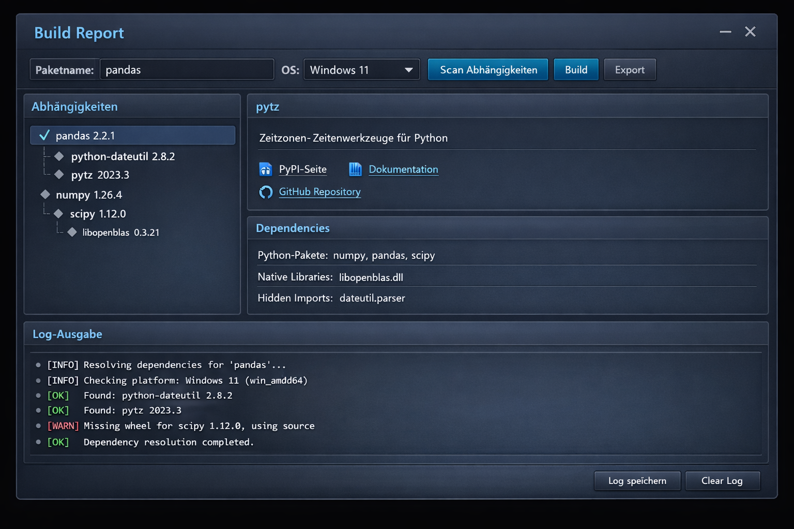

The modern Python ecosystem is one of the most vibrant, fast‑moving, and productive software environments in existence. It powers scientific computing, machine learning, data engineering, backend services, automation pipelines, 
and countless other domains. Yet despite its strengths, Python’s packaging landscape remains notoriously fragmented. Developers frequently encounter the phenomenon colloquially known as **dependency hell**: a situation where package 
versions, wheel availability, native library bindings, platform constraints, and transitive dependencies interact in unpredictable and often frustrating ways. This challenge becomes especially acute when developers attempt to build 
**containerized environments**—Docker, Podman, or similar—where reproducibility, determinism, and platform‑specific compatibility are essential.

The **Py‑Dependency Inspector GUI v1.0** was conceived precisely to address this pain point. The motivation behind the project is deeply practical: developers need a reliable, intuitive, and transparent way to **inspect 
Python package dependencies**, **evaluate wheel availability**, and **collect compatible artifacts** for future builds. The GUI is designed to reduce the time, uncertainty, and manual effort involved in preparing Python environments for 
containerized builds. Instead of trial‑and‑error, cryptic build failures, or repeated attempts to locate compatible wheels, the Py‑Dependency Inspector provides a **structured, visual, and interactive workflow** that guides users through 
the dependency landscape of any Python package.

### **1.1 Motivation and Problem Context**

The core motivation for developing the Py‑Dependency Inspector GUI stems from real‑world frustrations encountered during container image creation. When building Docker or Podman images that rely on Python packages, developers must ensure that:

- all required dependencies are available,  
- wheels exist for the target platform (e.g., `manylinux`, `win_amd64`, `macosx`),  
- native libraries are compatible,  
- optional dependencies are correctly handled,  
- version constraints do not conflict,  
- and the final environment is reproducible.

In practice, this is rarely straightforward. Many Python packages depend on native libraries (e.g., `numpy`, `scipy`, `cryptography`, `pydantic-core`), which require platform‑specific wheels. Some packages publish wheels 
only for certain versions or platforms. Others rely on transitive dependencies that are not immediately visible. Still others require manual compilation when wheels are missing, which is often undesirable or impossible inside 
minimal container environments.

The result is a workflow that is both time‑consuming and error‑prone. Developers frequently find themselves:

- searching PyPI manually for wheels,  
- checking version histories,  
- comparing wheel availability across platforms,  
- downloading artifacts one by one,  
- testing builds repeatedly until all dependencies align,  
- and debugging obscure import or build errors.

This manual process is inefficient and distracts from the actual development goals. The Py‑Dependency Inspector GUI was created to **automate, visualize, and simplify** this workflow.

### **1.2 Project Goals**

The overarching goal of the Py‑Dependency Inspector GUI v1.0 is to provide a **single, unified interface** that allows developers to:

- **inspect dependency trees** of Python packages,  
- **view wheel availability** for specific versions and platforms,  
- **search for alternative versions** of packages,  
- **download wheels manually or in bulk**,  
- **collect all necessary artifacts** for container builds,  
- **reduce build preparation time**,  
- **avoid dependency hell**,  
- and **gain transparency** into the structure of Python packages.

The GUI is not a build system. It does not invoke PyInstaller, pip, or any compiler. Instead, it is a **static analysis and artifact collection tool**. Its purpose is to help developers prepare the 
correct set of wheels and dependencies before initiating a container build. This separation of concerns ensures that the tool remains lightweight, platform‑agnostic, and safe to use in any environment.

### **1.3 Why a GUI?**

While command‑line tools exist for dependency inspection, they often require:

- deep knowledge of Python packaging internals,  
- familiarity with pip’s resolver behavior,  
- manual parsing of metadata,  
- and repeated invocation of commands.

A GUI offers several advantages:

1. **Visual clarity**  
   Dependency trees, wheel lists, and documentation are easier to understand visually.

2. **Interactive exploration**  
   Users can click through dependencies, inspect metadata, and navigate documentation without switching contexts.

3. **Bulk operations**  
   Downloading multiple wheels or exploring version histories becomes trivial.

4. **Reduced cognitive load**  
   The GUI abstracts away the complexity of Python packaging internals.

5. **Platform independence**  
   The GUI runs identically on Windows and Linux, providing a consistent experience.

6. **Immediate feedback**  
   Logs, warnings, and hints are displayed in real time.

The GUI is designed to be intuitive even for users who are not experts in Python packaging. At the same time, it provides enough depth and detail to satisfy advanced users who require precise control over dependency analysis.

### **1.4 The Challenge of Wheel Availability**

One of the most significant obstacles in containerized Python builds is wheel availability. Wheels are precompiled binary distributions that eliminate the need for compilation during installation. However, wheel availability varies widely:

- Some packages provide wheels for all major platforms.  
- Others provide wheels only for Windows or Linux.  
- Some provide wheels only for specific Python versions.  
- Some provide wheels only for older versions.  
- Some provide wheels only for newer versions.  
- Some provide no wheels at all.

This variability creates uncertainty during container builds. If a wheel is missing, pip may attempt to compile the package from source. In minimal container environments, compilation often fails due to missing compilers, 
headers, or native libraries.

The Py‑Dependency Inspector GUI addresses this by:

- inspecting wheel availability directly from PyPI,  
- presenting wheel lists in a structured table,  
- allowing users to download wheels manually,  
- supporting bulk wheel downloads,  
- and enabling version‑specific searches.

This functionality alone can save developers hours of manual work.

### **1.5 Dependency Transparency**

Another major challenge is understanding the full dependency graph of a package. Python packages often depend on dozens of other packages, some of which have their own dependencies. These transitive dependencies may introduce:

- version conflicts,  
- native library requirements,  
- optional features,  
- or platform‑specific constraints.

The Py‑Dependency Inspector GUI provides a **clear, hierarchical dependency tree** that allows users to:

- see all dependencies at a glance,  
- inspect metadata for each dependency,  
- identify native libraries,  
- detect missing wheels,  
- and evaluate compatibility.

This transparency is essential for reproducible container builds.

### **1.6 Manual and Bulk Wheel Downloading**

A key feature of the GUI is its ability to download wheels:

- **manually** (one by one),  
- **in bulk** (all wheels for a dependency tree),  
- **for specific package versions**,  
- **for specific OS platforms**,  
- **for specific Python versions**.

This functionality is designed to support workflows where developers need to prepare a directory of wheels before initiating a container build. By collecting all wheels in advance, developers can:

- use `pip install --no-index --find-links=...`,  
- avoid network access during builds,  
- ensure reproducibility,  
- and eliminate dependency hell.

The GUI automates the tedious parts of this workflow.

### **1.7 Scientific and Engineering Relevance**

Although the Py‑Dependency Inspector GUI is a practical tool, it also has scientific relevance. Dependency analysis is a form of static analysis, and the GUI provides:

- structured metadata extraction,  
- hierarchical graph representation,  
- platform‑specific artifact evaluation,  
- and reproducibility support.

These features align with best practices in software engineering, reproducible research, and containerized scientific workflows. The tool can be used in:

- machine learning pipelines,  
- data engineering workflows,  
- scientific computing environments,  
- reproducible research setups,  
- and enterprise deployment pipelines.

Its design emphasizes clarity, transparency, and reliability.

### **1.8 Scope and Limitations**

The Py‑Dependency Inspector GUI v1.0 is intentionally limited in scope:

- It does **not** install packages.  
- It does **not** compile packages.  
- It does **not** invoke PyInstaller.  
- It does **not** modify environments.  
- It does **not** resolve conflicts automatically.  
- It does **not** build containers.

Instead, it focuses exclusively on:

- dependency inspection,  
- documentation retrieval,  
- wheel availability analysis,  
- manual and bulk wheel downloading,  
- and static build report generation.

This narrow focus ensures that the tool remains robust, predictable, and easy to maintain.

### **1.9 Target Audience**

The tool is designed for:

- Python developers,  
- DevOps engineers,  
- data scientists,  
- machine learning engineers,  
- researchers,  
- and anyone who builds containerized Python environments.

It is especially useful for users who:

- work with complex dependency trees,  
- rely on native libraries,  
- need reproducible builds,  
- or maintain enterprise‑grade container images.

### **1.10 Summary of Chapter 1**

Chapter 1 establishes the motivation, context, and goals of the Py‑Dependency Inspector GUI v1.0. It explains why dependency hell is a persistent problem, why wheel availability matters, and why a GUI is the ideal solution. 
It clarifies the scope of the project and outlines the challenges it addresses. The chapter sets the stage for the detailed technical analysis that follows in subsequent chapters.

---

## **2. System Overview**

The **Py‑Dependency Inspector GUI v1.0** is a specialized, static‑analysis tool designed to give developers, DevOps engineers, and container‑oriented practitioners a **transparent, structured, and interactive view** 
into Python package dependencies, wheel availability, metadata, and documentation. It is engineered to reduce the friction, uncertainty, and manual labor associated with preparing Python environments for **Docker** or **Podman** 
builds, where dependency conflicts and missing wheels frequently lead to build failures, wasted time, and unpredictable behavior.

This chapter provides a **holistic overview** of the system: its conceptual foundations, architectural principles, functional components, and the workflow it enables. It establishes the mental model that guides the rest of 
the report and clarifies how the tool fits into modern Python development and containerization practices.

## **2.1 Conceptual Foundation**

At its core, the Py‑Dependency Inspector GUI is built around a simple but powerful idea:

> **Before building a Python environment, inspect and collect everything you need.**

Rather than relying on pip’s resolver during a container build—where network access may be restricted, wheels may be missing, or compilation may fail—the GUI allows users to **pre‑assemble** the complete set of wheels and 
dependencies required for a deterministic build.

This approach transforms the workflow from:

- *“Try to build the container and hope dependencies resolve.”*  
into  
- *“Inspect, verify, and collect all dependencies first, then build with confidence.”*

The system is therefore not a build tool, but a **pre‑build intelligence and artifact collection tool**.

## **2.2 Architectural Philosophy**

The architecture of the Py‑Dependency Inspector GUI is guided by four principles:

### **1. Transparency**
Users should be able to see:

- every dependency,  
- every version,  
- every wheel,  
- every native library,  
- every optional feature,  
- every warning.

Nothing is hidden behind pip’s resolver or opaque metadata.

### **2. Determinism**
The system avoids dynamic installation or compilation.  
It performs **static analysis only**, ensuring:

- reproducibility,  
- platform independence,  
- safety,  
- and predictable behavior.

### **3. Modularity**
The system is composed of independent modules:

- dependency resolver  
- documentation fetcher  
- wheel inspector  
- OS detector  
- export system  
- GUI panels  
- logging subsystem

Each module has a clear responsibility and communicates through well‑defined interfaces.

### **4. User Empowerment**
The GUI is designed to give users **control**, not automation.  
It does not attempt to “fix” dependency conflicts automatically.  
Instead, it provides the information needed to make informed decisions.

## **2.3 High‑Level System Structure**

The system consists of three major subsystems:

### **A. Core Analysis Engine**
Responsible for:

- extracting metadata  
- resolving dependencies  
- inspecting wheels  
- detecting native libraries  
- evaluating platform compatibility  
- aggregating logs and warnings

This subsystem is entirely independent of the GUI.

### **B. GUI Layer**
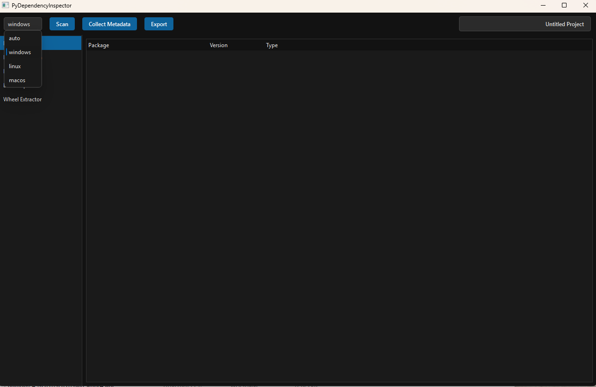
Provides:

- interactive dependency tree  
- documentation viewer  
- wheel availability tables  
- export dialog  
- log panel  
- top‑bar control center

The GUI is built around a **three‑panel layout** with a top‑bar orchestrator.

### **C. Export & Reporting System**
Generates:

- requirements.txt  
- dependency reports  
- wheel lists  
- documentation bundles  
- static build reports  
- logs (TXT/Markdown)

This subsystem ensures that users can take the results of their analysis into external workflows.

## **2.4 Functional Overview**

The Py‑Dependency Inspector GUI v1.0 provides the following core functions:

### **1. Dependency Inspection**
Users can enter a Python package name and immediately obtain:

- a hierarchical dependency tree  
- version constraints  
- optional dependencies  
- native library indicators  
- metadata summaries  

The tree is interactive, allowing users to expand nodes, inspect details, and navigate through the dependency graph.

### **2. Wheel Availability Analysis**
For each dependency, the system retrieves:

- available wheels  
- supported platforms  
- supported Python versions  
- wheel filenames  
- wheel sizes  
- release dates  

Users can filter wheels by:

- platform (e.g., manylinux, win_amd64)  
- Python version  
- package version  

### **3. Manual & Bulk Wheel Downloading**
The system allows users to:

- download individual wheels  
- download all wheels for a dependency tree  
- download wheels for specific versions  
- download wheels for specific platforms  

This is essential for preparing offline or deterministic container builds.

### **4. Documentation Retrieval**
The system fetches:

- PyPI README  
- project homepage  
- GitHub repository  
- license information  
- release notes  

Documentation is rendered directly in the GUI.

### **5. Static Build Report Generation**
The system aggregates:

- dependency summaries  
- wheel availability  
- warnings  
- hints  
- metadata  
- logs  

into a structured build report that can be exported.

### **6. Export System**
Users can export:

- requirements.txt  
- dependency reports  
- wheel lists  
- logs  
- documentation bundles  

These exports integrate seamlessly into Docker/Podman workflows.

## **2.5 Workflow Overview**

The typical workflow for a user is:

### **Step 0 - Installation**
Download the Github-folder GenericPyDependencyInspector, switch via a Jupyter-Terminal into the subfolder PyDependencyInspector and run 

````bash
# EXECUTE IN JUPYTER-TERMINAL
cd D:\GenericPyDependencyInspector\PyDependencyInspector
pip install -e .
pydependencyinspector
````
The GUI appears.

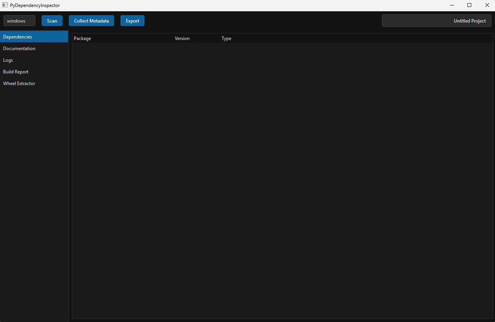

### **Step 1 — Enter Package Name**
The user enters a package name (e.g., `pandas`, `scipy`, `cryptography`).

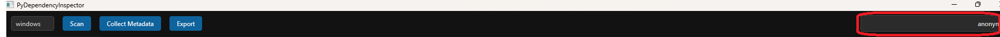

### **Step 2 — Inspect Dependencies**
Select the OS from the dropdown box and press the toolbar button "Scan". 
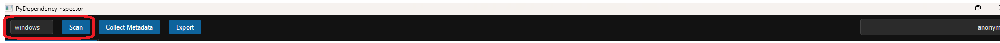
The dependency tree appears, showing:

- direct dependencies  
- transitive dependencies  
- optional dependencies  
- native libraries  

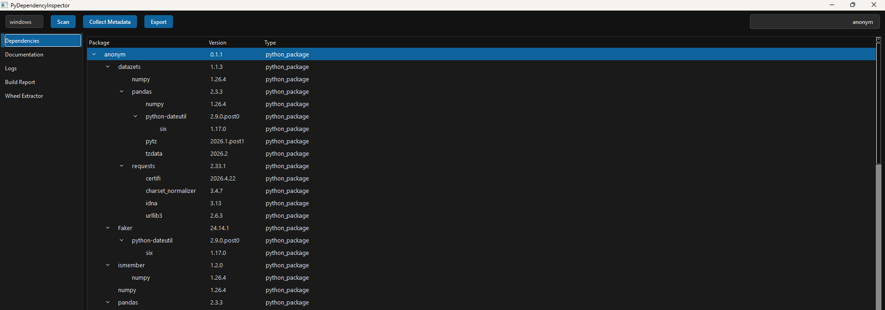

### **Step 3 — Inspect Wheels**
Press the sidebar button "Wheel Extractor". For each dependency, the user can specify and inspect wheel availability after pressing the button "Find Wheels":

- platform compatibility  
- Python version compatibility  
- version history  
- wheel metadata  

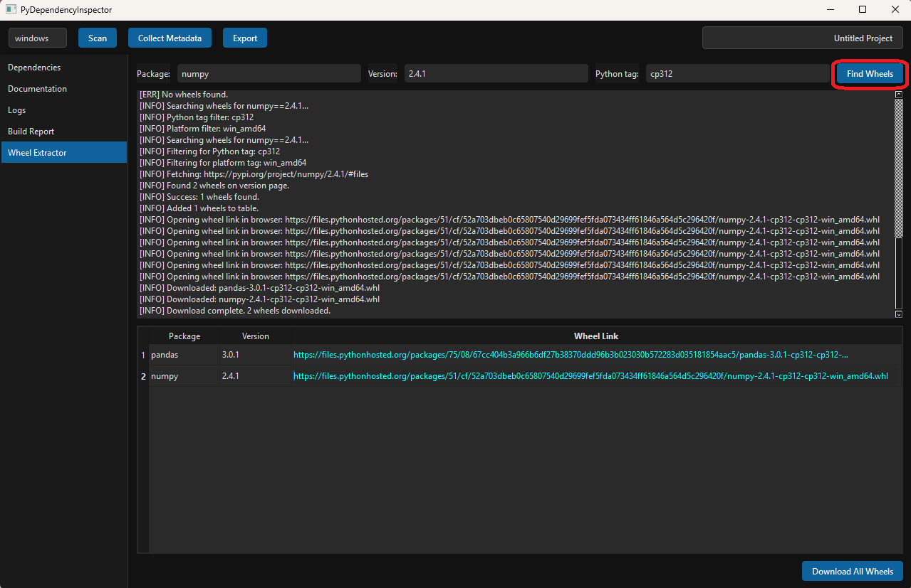

### **Step 4 — Download Wheels**
The user can:

- download wheels individually  
- download wheels in bulk  
- prepare a wheel directory for container builds 

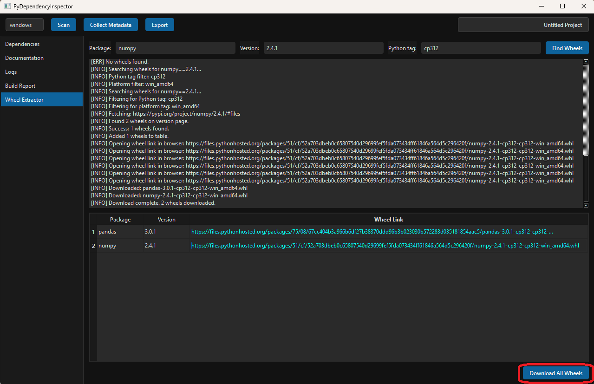 

### **Step 5 — Review Documentation**

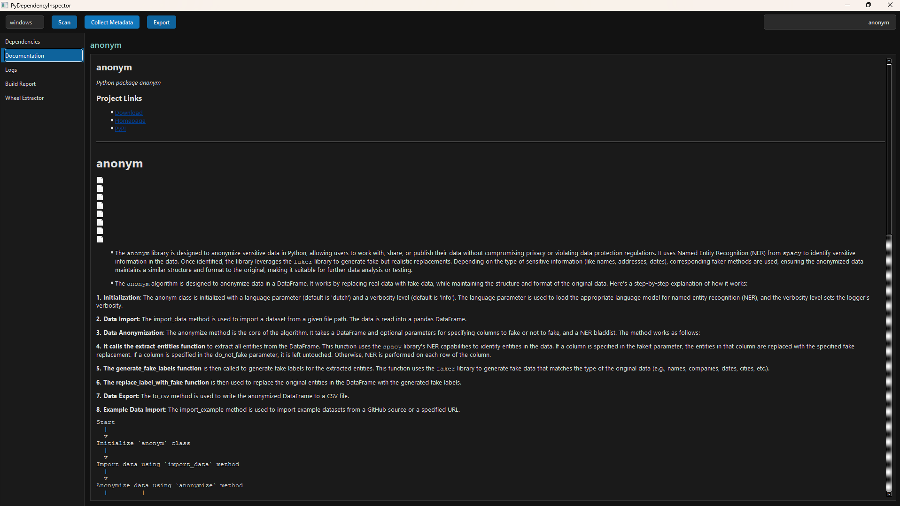

The user can read:

- README  
- homepage  
- license  
- release notes  

with respect to a selected package directly in the GUI and use offered PyPI links forwarding directly to external websites containing detailed package information.

### **Step 6 — Generate Build Report**
Press the toolbar button "Collect Metadata".

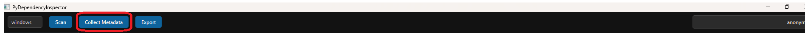

The system produces a static build report summarizing:

- dependencies  
- wheels  
- warnings  
- metadata  
- logs

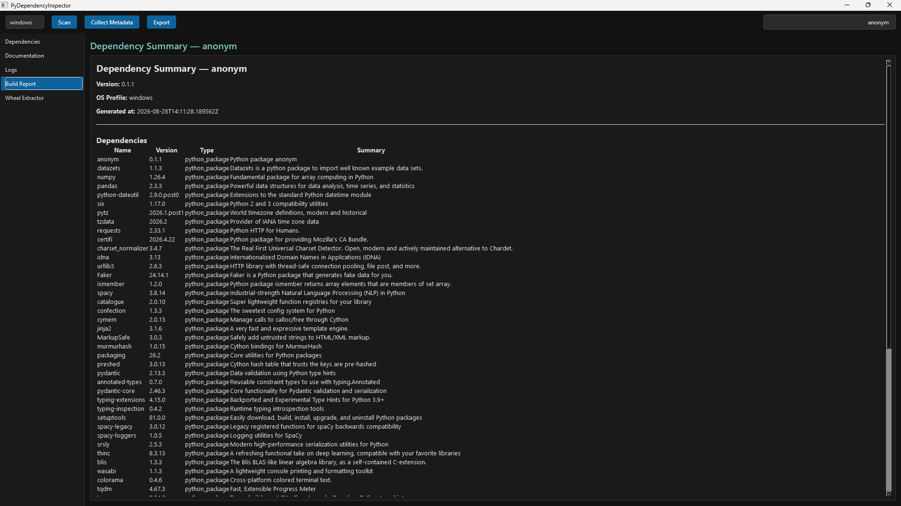  

### **Step 7 — Export Artifacts**

Press the toolbar button "Export".

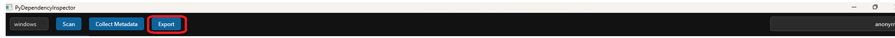

The user exports:

- requirements.txt  

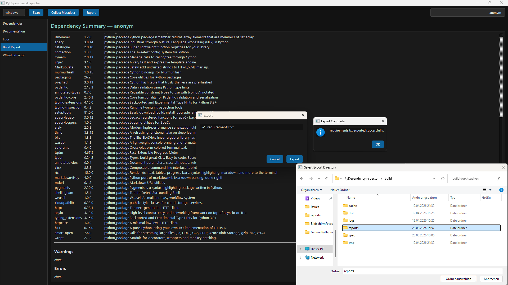

These artifacts are then used in Docker/Podman builds.

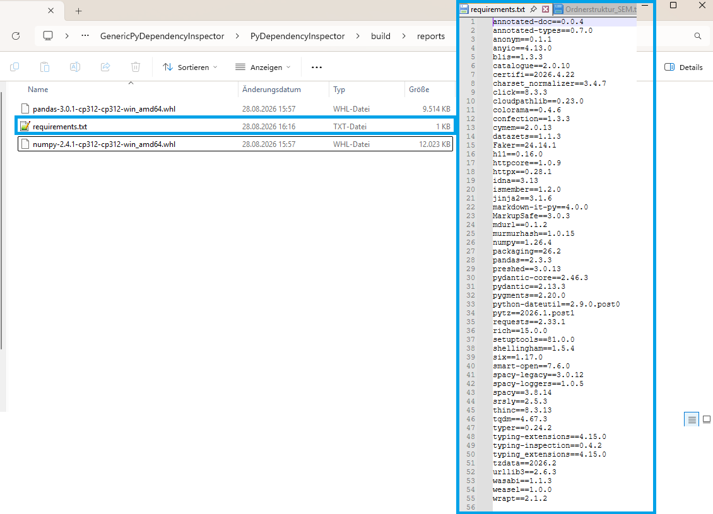

## **2.6 Supported Platforms**

The system supports:

- **Windows**  
- **Linux**  

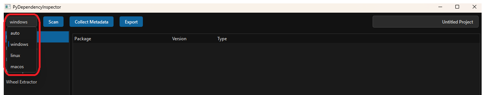

Both platforms provide identical functionality.  
The system does not depend on platform‑specific compilers or build tools and logs all user's selections.

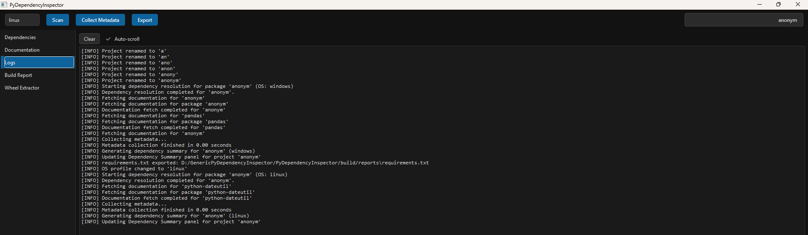

## **2.7 Non‑Goals**

The system intentionally does **not**:

- install packages  
- compile packages  
- invoke pip  
- invoke PyInstaller  
- modify environments  
- resolve conflicts automatically  
- build containers  

These non‑goals ensure that the system remains lightweight, predictable, and safe.

## **2.8 Integration with Container Workflows**

The Py‑Dependency Inspector GUI is designed to integrate seamlessly with container workflows. Developers can:

- prepare wheel directories  
- generate requirements.txt  
- verify compatibility  
- ensure reproducibility  
- avoid dependency hell  

This preparation dramatically reduces build times and failure rates.

## **2.9 Summary of Chapter 2**

Chapter 2 establishes the conceptual and architectural foundation of the Py‑Dependency Inspector GUI v1.0. It explains the system’s purpose, structure, workflow, and design philosophy. It clarifies what the 
system does—and what it intentionally does not do. This overview provides the necessary context for understanding the detailed technical chapters that follow.

---

## **3. GUI Architecture**

The GUI of the **Py‑Dependency Inspector v1.0** is designed as a **modular, event‑driven, three‑panel interface** that provides users with a clear, interactive, and efficient workflow for inspecting Python package 
dependencies, wheel availability, documentation, and metadata. This chapter describes the architecture, layout, interaction model, and internal communication patterns of the GUI. It also explains how the GUI integrates with the 
core analysis engine and the export/report subsystems.

The GUI is intentionally engineered to be **transparent**, **predictable**, and **non‑intrusive**. It does not modify environments, install packages, or perform builds. Instead, it acts as a **visual front‑end** to the static analysis 
engine, presenting structured information in a way that reduces cognitive load and accelerates container‑oriented workflows.

## **3.1 Architectural Principles**

The GUI architecture is guided by four foundational principles:

### **Clarity**
The interface must present complex dependency structures, wheel metadata, and documentation in a way that is easy to navigate and understand. Visual hierarchy, consistent spacing, and intuitive controls are prioritized.

### **Modularity**
Each GUI component is isolated into its own module:

- Top Bar  
- Dependency Panel  
- Documentation Panel  
- Log Panel  
- Export Dialog  

This modularity ensures maintainability and extensibility.

### **Responsiveness**
The GUI reacts immediately to user actions:

- entering a package name  
- selecting a dependency  
- opening documentation  
- downloading wheels  
- exporting reports  

Signals and slots ensure smooth communication between components.

### **Non‑intrusiveness**
The GUI never installs packages, modifies environments, or invokes external build tools. It is purely informational and operationally safe.

## **3.2 High‑Level Layout**

The GUI is structured around a **three‑panel layout** with a **top‑bar control center**. This layout is chosen to maximize visibility and minimize context switching.

```
+--------------------------------------------------------------+
| Top Bar (Package Input, OS Selector, Scan, Export)           |
+--------------------------------------------------------------+
| Dependency Panel | Documentation Panel                       |
| (Left)           | (Right)                                   |
+--------------------------------------------------------------+
| Log Panel (Bottom)                                           |
+--------------------------------------------------------------+
```

### **Top Bar**
The orchestration layer.  
Handles user input, triggers scans, and opens export dialogs.

### **Dependency Panel (Left)**
Displays the hierarchical dependency tree.  
Allows users to inspect metadata, wheel availability, and version information.

### **Documentation Panel (Right)**
Renders PyPI README, homepage content, license information, and release notes.

### **Log Panel (Bottom)**
Streams logs, warnings, and diagnostic messages in real time.

## **3.3 Mermaid Diagram — GUI Layout**

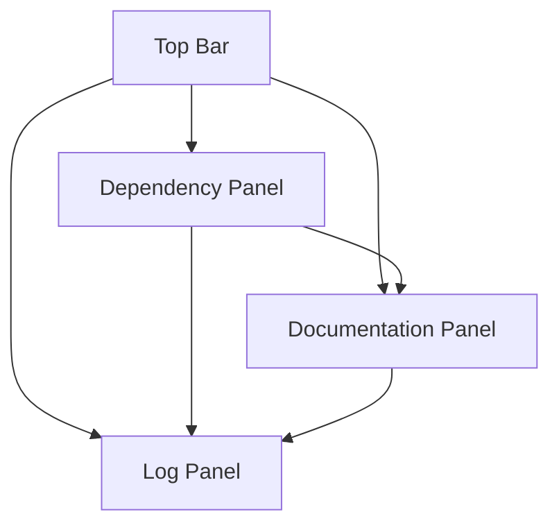

This diagram illustrates the **bidirectional communication** between panels.  
Selecting a dependency updates documentation and logs.  
Top Bar actions propagate to all panels.

## **3.4 Top Bar Architecture**

The **Top Bar** is the user’s primary interaction point. It contains:

- **Package Input Field**  
- **OS Selector** (Windows 11 / Ubuntu 22.04)  
- **Scan Button**  
- **Export Button**

### **Responsibilities**
- Validate user input  
- Trigger dependency resolution  
- Trigger documentation retrieval  
- Update GUI state  
- Open export dialog  

### **Event Flow**
1. User enters a package name.  
2. User selects OS profile.  
3. User clicks “Scan”.  
4. Top Bar emits a signal to the core analysis engine.  
5. Dependency Panel, Documentation Panel, and Log Panel update accordingly.

## **3.5 Dependency Panel Architecture**

The **Dependency Panel** is the heart of the GUI. It displays a **tree view** of all dependencies, including:

- direct dependencies  
- transitive dependencies  
- optional dependencies  
- native libraries  
- version constraints  

### **Features**
- Expand/collapse nodes  
- Right‑click context menu  
- Metadata preview  
- Wheel availability indicators  
- Version selection  
- Platform filtering  

### **Context Menu Options**
- Open PyPI page  
- Open GitHub repository  
- Show wheels  
- Mark optional  
- Exclude from wheel download  
- Copy dependency name  

### **Internal Structure**
- QTreeView for hierarchical display  
- QStandardItemModel for data representation  
- Custom icons for package types  
- Signals for selection changes  

### **Interaction Model**
Selecting a dependency triggers:

- documentation update  
- wheel availability update  
- log update  

This ensures that the GUI remains synchronized across panels.

## **3.6 Documentation Panel Architecture**

The **Documentation Panel** provides a rich, scrollable view of:

- PyPI README  
- project homepage  
- license information  
- release notes  
- metadata summaries  

### **Rendering Pipeline**
1. Fetch documentation from PyPI or project homepage.  
2. Parse Markdown.  
3. Render using a Markdown renderer.  
4. Display in a scrollable widget.

### **Features**
- clickable links  
- syntax highlighting  
- collapsible sections  
- metadata summary header  

### **Interaction**
Selecting a dependency updates the documentation panel automatically.

## **3.7 Log Panel Architecture**

The **Log Panel** provides real‑time feedback during analysis.  
It displays:

- INFO messages  
- WARN messages  
- ERROR messages  
- diagnostic hints  

### **Features**
- monospace font  
- color‑coded entries  
- auto‑scroll  
- clear button  
- save button  

### **Log Sources**
- dependency resolver  
- wheel inspector  
- documentation fetcher  
- export system  
- OS detector  

Logs are essential for transparency and debugging.

## **3.8 Export Dialog Architecture**

The **Export Dialog** allows users to export:

- requirements.txt  
- dependency report  
- wheel list  
- documentation bundle  
- log file  
- static build report  

### **Features**
- checkboxes for selecting export items  
- file path selector  
- preview panel  
- export confirmation  

### **Interaction**
The dialog is opened from the Top Bar.  
It communicates with the export subsystem to generate artifacts.

## **3.9 Event‑Driven Communication Model**

The GUI uses a **signal/slot architecture** to ensure loose coupling between components.

### **Key Signals**
- `scanRequested(package, osProfile)`  
- `dependencySelected(name)`  
- `documentationRequested(url)`  
- `exportRequested(options)`  
- `logMessage(level, text)`  

### **Benefits**
- modularity  
- maintainability  
- extensibility  
- predictable behavior  

## **3.10 GUI State Management**

The GUI maintains a **global state object** containing:

- current package  
- current OS profile  
- dependency tree  
- selected dependency  
- documentation cache  
- wheel availability cache  
- log buffer  

This state ensures consistency across panels.

## **3.11 Responsiveness and Performance**

The GUI is optimized for responsiveness:

- background threads for network requests  
- asynchronous documentation loading  
- lazy dependency expansion  
- cached wheel metadata  
- incremental log updates  

This ensures smooth operation even for large dependency trees.

## **3.12 Summary of Chapter 3**

Chapter 3 provides a comprehensive overview of the GUI architecture of the Py‑Dependency Inspector v1.0. It explains the layout, components, communication model, and interaction patterns that define the user experience. 
The GUI is designed to be modular, transparent, and responsive, providing users with a powerful interface for inspecting Python dependencies and preparing artifacts for container builds.

---

## **4. Dependency Analysis Engine**

The **Dependency Analysis Engine** is the analytical core of the Py‑Dependency Inspector GUI v1.0. It performs all static inspection tasks required to understand a Python package’s structure, its transitive dependencies, 
wheel availability, metadata, and platform compatibility. This chapter provides a deep, technical, subsystem‑level description of the engine, its architecture, algorithms, data flows, and integration points with the GUI. 
It is written for engineers who want to understand how the system works internally, extend it, or integrate it into larger workflows.

The engine is intentionally designed to be **purely analytical**. It does not install packages, does not compile code, and does not invoke pip or PyInstaller. Instead, it extracts metadata, resolves dependency graphs, inspects 
wheel availability, and aggregates information into a structured representation that the GUI can display and export.

## **4.1 Architectural Overview**

The Dependency Analysis Engine consists of several cooperating subsystems:

- **Metadata Extractor**  
- **Dependency Resolver**  
- **Wheel Inspector**  
- **Native Library Detector**  
- **Version & Platform Evaluator**  
- **OS Profile Detector**  
- **Log Aggregator**  
- **Report Aggregator**

Each subsystem is independent and communicates through well‑defined interfaces. The engine is designed to be modular, testable, and extensible.

## **4.2 Data Flow Overview**

The engine follows a deterministic, multi‑stage pipeline:

1. **Package Input**  
   The user enters a package name and selects an OS profile.

2. **Metadata Extraction**  
   The engine retrieves package metadata from PyPI.

3. **Dependency Resolution**  
   The engine constructs a full dependency tree.

4. **Wheel Inspection**  
   The engine retrieves wheel availability for each dependency.

5. **Native Library Detection**  
   The engine identifies wheels containing compiled extensions.

6. **Version & Platform Evaluation**  
   The engine evaluates compatibility with the selected OS profile.

7. **Aggregation**  
   All information is combined into a structured representation.

8. **GUI Update**  
   The engine emits signals to update the GUI panels.

## **4.3 Mermaid Diagram — Dependency Analysis Flow**

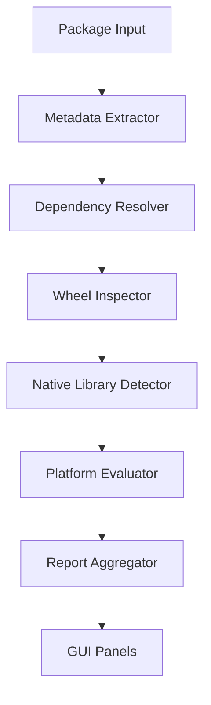

This diagram illustrates the sequential, deterministic nature of the analysis pipeline.

## **4.4 Metadata Extractor**

The Metadata Extractor retrieves package metadata from PyPI:

- name  
- version  
- summary  
- homepage  
- license  
- classifiers  
- dependencies (requires_dist)  
- wheel list  
- release history  

### **Key Responsibilities**
- Fetch JSON metadata from PyPI  
- Parse metadata fields  
- Normalize dependency strings  
- Extract version constraints  
- Cache results for performance  

### **Challenges**
- inconsistent metadata formats  
- missing fields  
- malformed dependency strings  
- optional dependencies encoded in classifiers  

The extractor is designed to be robust against malformed or incomplete metadata.

## **4.5 Dependency Resolver**

The Dependency Resolver constructs a **hierarchical dependency tree**.  
It processes:

- direct dependencies  
- transitive dependencies  
- optional dependencies  
- version constraints  
- environment markers  

### **Algorithm Overview**

The resolver uses a **recursive depth‑first traversal**:

1. Parse `requires_dist` entries.  
2. Normalize dependency names.  
3. Extract version constraints.  
4. Evaluate environment markers.  
5. Recursively resolve dependencies.  
6. Detect cycles and prevent infinite recursion.  
7. Build a tree structure using a node model.

### **Node Structure**
Each dependency is represented as a node containing:

- name  
- version constraints  
- optional flag  
- native library flag  
- wheel availability  
- children (transitive dependencies)  

### **Cycle Detection**
The resolver maintains a visited set to avoid infinite loops.

### **Optional Dependencies**
Optional dependencies are marked and displayed differently in the GUI.

## **4.6 Wheel Inspector**

The Wheel Inspector retrieves wheel availability for each dependency:

- wheel filenames  
- supported platforms  
- supported Python versions  
- wheel sizes  
- release dates  

### **Responsibilities**
- fetch wheel list from PyPI  
- parse wheel filenames  
- extract platform tags  
- extract Python version tags  
- detect source distributions  
- detect missing wheels  

### **Wheel Filename Parsing**
Wheel filenames follow the pattern:

```
package-version-py3-none-any.whl
package-version-cp310-win_amd64.whl
package-version-cp39-manylinux2014_x86_64.whl
```

The inspector extracts:

- Python ABI (e.g., cp310)  
- platform (e.g., win_amd64)  
- architecture (e.g., x86_64)  
- build tag  

### **Bulk Wheel Analysis**
The inspector can analyze all wheels for:

- a single dependency  
- an entire dependency tree  
- a specific version  
- a specific platform  

## **4.7 Native Library Detector**

The Native Library Detector identifies wheels containing compiled extensions:

- `.pyd` (Windows)  
- `.so` (Linux)  
- `.dylib` (macOS)  

### **Detection Method**
The detector examines wheel filenames and metadata:

- platform tags  
- ABI tags  
- presence of compiled extensions  

Native libraries are flagged in the dependency tree.

## **4.8 Version & Platform Evaluator**

The evaluator determines whether a dependency is compatible with the selected OS profile:

- Windows 11 (win_amd64)  
- Ubuntu 22.04 (manylinux2014_x86_64)  

### **Evaluation Criteria**
- wheel availability  
- Python version compatibility  
- platform tag compatibility  
- architecture compatibility  

### **Outcome**
Dependencies are marked as:

- compatible  
- partially compatible  
- incompatible  
- source‑only  

These flags are displayed in the GUI.

## **4.9 OS Profile Detector**

The OS Profile Detector determines the active OS profile:

- Windows 11  
- Ubuntu 22.04  

It influences:

- wheel filtering  
- platform evaluation  
- native library detection  

The detector is simple but essential for accurate analysis.

## **4.10 Log Aggregator**

The Log Aggregator collects messages from all subsystems:

- INFO  
- WARN  
- ERROR  
- HINT  

### **Examples**
- “Resolving dependencies for pandas…”  
- “Missing wheel for scipy 1.12.0 on manylinux2014_x86_64.”  
- “Optional dependency detected: matplotlib.”  
- “Native library detected: numpy.”  

Logs are streamed to the GUI in real time.

## **4.11 Report Aggregator**

The Report Aggregator combines all analysis results into a structured representation:

- dependency tree  
- wheel availability  
- native library summary  
- warnings  
- hints  
- metadata  
- OS profile  
- logs  

This representation is used by:

- the GUI  
- the export system  
- the build report generator  

## **4.12 Performance Considerations**

The engine is optimized for performance:

- caching metadata  
- caching wheel lists  
- lazy dependency expansion  
- asynchronous network requests  
- incremental log updates  

This ensures responsiveness even for large dependency trees.

## **4.13 Error Handling**

The engine handles errors gracefully:

- missing metadata  
- malformed dependency strings  
- network failures  
- missing wheels  
- incompatible platforms  

Errors are logged and displayed in the GUI.

## **4.14 Summary of Chapter 4**

Chapter 4 provides a detailed, subsystem‑level description of the Dependency Analysis Engine. It explains how metadata is extracted, dependencies are resolved, wheels are inspected, native libraries are detected, 
and compatibility is evaluated. It also describes the engine’s architecture, algorithms, data flows, and integration points with the GUI and export system.

---

## **5. Documentation Retrieval & Rendering**

The **Documentation Retrieval & Rendering subsystem** is the part of the Py‑Dependency Inspector GUI responsible for acquiring, parsing, transforming, and presenting human‑readable documentation associated with Python packages. 
It provides users with immediate access to essential information—README files, project descriptions, release notes, metadata summaries, and external links—without requiring them to leave the GUI or manually browse PyPI or GitHub. 
This chapter describes the architecture, workflow, algorithms, and design principles behind this subsystem.

The documentation subsystem is intentionally designed to be **non‑intrusive**, **read‑only**, and **platform‑independent**. It does not execute code, install packages, or modify environments. Instead, it focuses exclusively 
on **retrieving**, **sanitizing**, **rendering**, and **displaying** documentation in a safe and structured manner.

## **5.1 Purpose and Motivation**

Python packages often include extensive documentation that is essential for understanding:

- package functionality  
- version differences  
- installation requirements  
- optional features  
- native library bindings  
- platform constraints  
- licensing  
- release history  

When preparing containerized environments, developers frequently need to consult this documentation to determine:

- whether a package is suitable for their target platform  
- whether optional dependencies are required  
- whether native libraries are involved  
- whether specific versions behave differently  
- whether wheels exist for certain versions  

The Py‑Dependency Inspector GUI integrates documentation directly into the workflow, eliminating the need for external browsing and reducing context switching.

## **5.2 Architectural Overview**

The documentation subsystem consists of four major components:

- **Documentation Fetcher**  
- **Markdown Processor**  
- **Content Sanitizer**  
- **Documentation Panel Renderer**

These components work together to retrieve documentation from external sources, transform it into a safe and readable format, and display it in the GUI.

## **5.3 Documentation Sources**

The subsystem retrieves documentation from multiple sources:

### **1. PyPI JSON API**
The primary source of documentation is the PyPI JSON metadata endpoint.  
It provides:

- package summary  
- long description (README)  
- homepage URL  
- project URLs  
- license information  
- release history  

### **2. Project Homepage**
If the PyPI metadata includes a homepage URL, the subsystem attempts to retrieve:

- HTML documentation  
- project overview  
- installation instructions  
- feature lists  

### **3. GitHub Repository**
If the PyPI metadata includes a GitHub URL, the subsystem retrieves:

- README.md  
- LICENSE  
- release notes  
- changelog  

### **4. Local Cache**
To improve performance, documentation is cached locally after retrieval.

## **5.4 Documentation Retrieval Workflow**

The documentation retrieval process follows a deterministic pipeline:

1. **User selects a dependency**  
2. **Subsystem checks cache**  
3. **If not cached, fetch from PyPI**  
4. **Parse metadata**  
5. **Extract README or long description**  
6. **Fetch homepage or GitHub README if available**  
7. **Sanitize content**  
8. **Render Markdown**  
9. **Display in Documentation Panel**

This pipeline ensures that documentation is always up‑to‑date, safe, and readable.

## **5.5 Mermaid Diagram — Documentation Retrieval Flow**

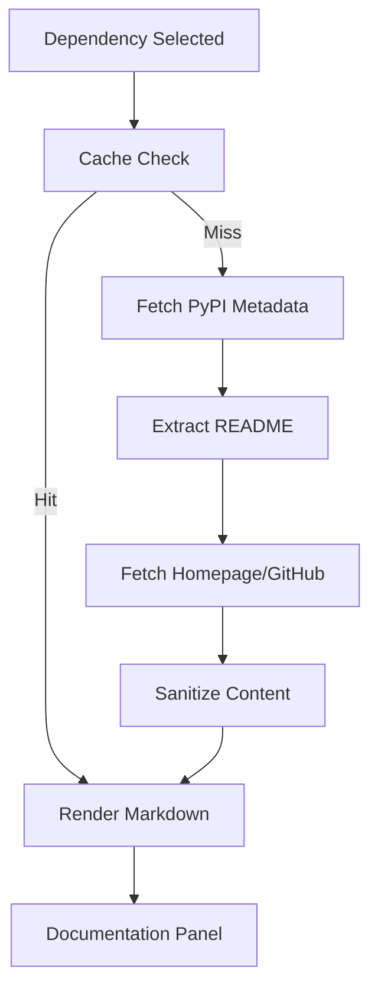

This diagram illustrates the multi‑stage retrieval and rendering pipeline.

## **5.6 Markdown Processor**

The Markdown Processor transforms raw Markdown into a structured, styled, and readable format suitable for display in the GUI.

### **Responsibilities**
- parse Markdown syntax  
- convert headings, lists, tables, code blocks  
- render hyperlinks  
- apply syntax highlighting  
- handle embedded images (with restrictions)  
- ensure consistent styling  

### **Supported Markdown Features**
- headings (`#`, `##`, `###`)  
- lists (`-`, `*`, `1.`)  
- code blocks (```)  
- inline code  
- tables  
- links  
- bold/italic text  

### **Unsupported Features**
- embedded JavaScript  
- embedded HTML forms  
- remote scripts  
- unsafe HTML tags  

Unsupported features are sanitized for safety.

## **5.7 Content Sanitizer**

The Content Sanitizer ensures that documentation is safe to display.  
It removes:

- embedded scripts  
- unsafe HTML  
- external JavaScript references  
- tracking pixels  
- malicious links  
- unsupported HTML tags  

### **Sanitization Rules**
- allow basic HTML (e.g., `<p>`, `<strong>`, `<em>`)  
- allow Markdown  
- block `<script>`  
- block `<iframe>`  
- block `<object>`  
- block `<embed>`  
- block remote scripts  
- block inline event handlers (e.g., `onclick=`)  

This ensures that documentation cannot execute code or compromise the environment.

## **5.8 Documentation Panel Renderer**

The Documentation Panel Renderer displays sanitized and processed documentation in the GUI.

### **Features**
- scrollable content  
- clickable links  
- syntax highlighting  
- collapsible sections  
- metadata header  
- consistent styling  

### **Metadata Header**
Each documentation view begins with a metadata header containing:

- package name  
- latest version  
- summary  
- license  
- homepage  
- release date  

This provides immediate context before the full documentation.

## **5.9 Handling Missing Documentation**

Some packages lack documentation or provide incomplete metadata.  
The subsystem handles these cases gracefully:

### **Missing README**
Display a placeholder:

```
No README available for this package.
```

### **Missing Homepage**
Skip homepage retrieval.

### **Malformed Markdown**
Attempt best‑effort rendering.

### **Network Errors**
Display a diagnostic message in the Log Panel.

## **5.10 Documentation Caching**

To improve performance, documentation is cached after retrieval.

### **Cache Contents**
- README  
- homepage content  
- GitHub README  
- metadata summary  

### **Cache Invalidation**
Cache is invalidated when:

- user requests a different version  
- metadata changes  
- user manually refreshes documentation  

Caching ensures responsiveness even for large packages.

## **5.11 Integration with Dependency Panel**

Selecting a dependency triggers documentation retrieval.  
The integration is seamless:

- dependency selection → documentation update  
- dependency expansion → documentation update  
- version selection → documentation update  

This ensures that documentation is always synchronized with user actions.

## **5.12 Integration with Log Panel**

The documentation subsystem emits log messages:

- “Fetching documentation for numpy…”  
- “README retrieved from PyPI.”  
- “Homepage unavailable.”  
- “Sanitizing HTML content.”  
- “Documentation cached.”  

These logs provide transparency and aid debugging.

## **5.13 Performance Considerations**

The subsystem is optimized for performance:

- asynchronous network requests  
- incremental rendering  
- lazy homepage retrieval  
- caching  
- minimal DOM updates  

This ensures smooth operation even for large documentation files.

## **5.14 Security Considerations**

Documentation retrieval is inherently risky because it involves external content.  
The subsystem mitigates risks by:

- blocking scripts  
- sanitizing HTML  
- disallowing remote execution  
- preventing inline event handlers  
- restricting embedded content  

This ensures that documentation cannot compromise the environment.

## **5.15 Summary of Chapter 5**

Chapter 5 provides a detailed description of the Documentation Retrieval & Rendering subsystem. It explains how documentation is fetched, sanitized, processed, and displayed. 
It describes the architecture, workflow, algorithms, and integration points with the GUI and logging system. The subsystem is designed to be safe, efficient, and user‑friendly, 
providing essential context for dependency analysis and container preparation.

---

## **6. Build Report System**

The **Build Report System** is the analytical consolidation layer of the Py‑Dependency Inspector GUI v1.0. It transforms raw inspection data—dependency trees, wheel availability, native library indicators, 
documentation metadata, OS profiles, and diagnostic logs—into a **coherent, structured, exportable report**. Unlike traditional build systems, this subsystem performs **no compilation**, **no installation**, 
and **no binary generation**. Instead, it produces a **static, deterministic snapshot** of everything a user needs to prepare a reproducible Python environment for Docker or Podman.

This chapter provides a deep technical description of the Build Report System: its purpose, architecture, data sources, internal workflow, report structure, diagnostic logic, and integration with the GUI and export subsystem.

## **6.1 Purpose of the Build Report System**

The Build Report System exists to solve a practical problem:  
Users preparing containerized Python environments need a **single, authoritative summary** of all dependencies, wheels, metadata, and warnings relevant to their target package.

The report serves several purposes:

- **Dependency Transparency**  
  Users see the full dependency tree, including optional and transitive dependencies.

- **Wheel Availability Overview**  
  Users can verify which wheels exist for their OS profile and Python version.

- **Native Library Awareness**  
  Users can identify dependencies requiring compiled extensions.

- **Version Compatibility Assessment**  
  Users can detect incompatible or partially compatible dependencies.

- **Documentation Summary**  
  Users receive a compact overview of relevant documentation.

- **Diagnostic Insight**  
  Warnings and hints help users avoid dependency hell.

- **Exportability**  
  The report can be saved as Markdown, TXT, or PDF for use in container workflows.

The Build Report System is therefore a **pre‑build intelligence layer**, not a build orchestrator.

## **6.2 Architectural Overview**

The Build Report System is composed of several cooperating components:

- **Report Aggregator**  
- **Dependency Summary Generator**  
- **Wheel Summary Generator**  
- **Native Library Analyzer**  
- **Compatibility Evaluator**  
- **Documentation Summary Extractor**  
- **Log Condenser**  
- **Export Formatter**

Each component contributes a section to the final report.

## **6.3 Data Sources**

The Build Report System integrates information from multiple subsystems:

- **Dependency Resolver**  
  Provides the hierarchical dependency tree.

- **Wheel Inspector**  
  Provides wheel availability and platform tags.

- **Native Library Detector**  
  Flags dependencies requiring compiled extensions.

- **OS Profile Detector**  
  Determines platform compatibility.

- **Metadata Extractor**  
  Provides package summaries, version constraints, and project URLs.

- **Documentation Fetcher**  
  Provides README summaries and homepage metadata.

- **Log Aggregator**  
  Provides diagnostic messages.

These data sources ensure that the report is comprehensive and accurate.

## **6.4 Internal Workflow**

The Build Report System follows a deterministic multi‑stage pipeline:

### **Stage 1 — Collect Raw Data**
The system gathers:

- dependency tree  
- wheel lists  
- metadata  
- documentation snippets  
- logs  
- OS profile  

### **Stage 2 — Normalize and Structure**
The system converts raw data into structured sections:

- dependency summary  
- wheel summary  
- native library summary  
- compatibility matrix  
- documentation overview  
- warnings and hints  

### **Stage 3 — Evaluate Compatibility**
The system evaluates:

- wheel availability  
- platform tags  
- Python version tags  
- architecture tags  

Dependencies are marked as:

- compatible  
- partially compatible  
- incompatible  
- source‑only  

### **Stage 4 — Generate Diagnostics**
The system produces:

- warnings  
- hints  
- informational messages  

Examples:

- “Missing wheel for scipy 1.12.0 on manylinux2014_x86_64.”  
- “Optional dependency detected: matplotlib.”  
- “Native library detected: numpy.”  

### **Stage 5 — Assemble Report**
All sections are combined into a unified report object.

### **Stage 6 — Export Formatting**
The report is formatted for:

- Markdown  
- TXT  
- PDF (conceptual description only)

## **6.5 Mermaid Diagram — Build Report Flow**

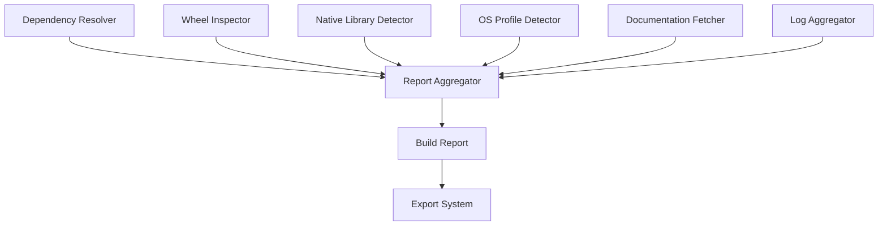

This diagram shows how the Build Report System integrates data from all analytical subsystems.

## **6.6 Report Structure**

The Build Report is divided into several sections:

### **1. Metadata Section**
Contains:

- package name  
- selected version  
- OS profile  
- Python version  
- homepage  
- license  
- release date  

### **2. Dependency Summary**
A hierarchical list of:

- direct dependencies  
- transitive dependencies  
- optional dependencies  
- version constraints  

### **3. Wheel Summary**
For each dependency:

- available wheels  
- supported platforms  
- supported Python versions  
- wheel filenames  
- wheel sizes  

### **4. Native Library Summary**
Flags dependencies requiring compiled extensions.

### **5. Compatibility Matrix**
Shows compatibility between:

- dependency versions  
- wheel availability  
- OS profile  
- Python version  

### **6. Documentation Overview**
Summarizes:

- README  
- homepage  
- license  
- release notes  

### **7. Diagnostic Summary**
Contains:

- warnings  
- hints  
- errors  
- informational messages  

### **8. Export Metadata**
Contains:

- export timestamp  
- export format  
- selected options  

## **6.7 Diagnostic Logic**

The Build Report System includes a diagnostic engine that generates warnings and hints.

### **Warning Types**
- missing wheels  
- incompatible platforms  
- native library presence  
- malformed metadata  
- missing documentation  

### **Hint Types**
- alternative versions with wheels  
- optional dependencies  
- recommended wheel sets  
- platform‑specific notes  

### **Error Types**
- network failures  
- metadata retrieval failures  
- dependency resolution failures  

Diagnostics help users avoid dependency hell.

## **6.8 Integration with GUI**

The Build Report System integrates seamlessly with the GUI:

- **Dependency Panel**  
  Provides dependency tree.

- **Documentation Panel**  
  Provides documentation snippets.

- **Log Panel**  
  Provides diagnostic messages.

- **Export Dialog**  
  Allows users to export the report.

The report is generated automatically after each scan.

## **6.9 Export Integration**

The Build Report System supports multiple export formats:

### **Markdown Export**
Ideal for GitHub documentation.

### **TXT Export**
Ideal for container build logs.

### **PDF Export**
Conceptual description only; actual PDF generation is external.

### **requirements.txt Export**
Derived from dependency tree.

### **Wheel List Export**
Lists all wheels required for deterministic builds.

## **6.10 Performance Considerations**

The Build Report System is optimized for:

- incremental updates  
- caching  
- lazy evaluation  
- asynchronous data collection  

This ensures responsiveness even for large dependency trees.

## **6.11 Security Considerations**

The Build Report System is safe because:

- it performs no installation  
- it executes no code  
- it sanitizes documentation  
- it blocks unsafe HTML  
- it does not modify environments  

It is purely analytical.

## **6.12 Summary of Chapter 6**

Chapter 6 provides a comprehensive description of the Build Report System. It explains how the system aggregates data from multiple subsystems, evaluates compatibility, generates diagnostics, and produces 
a structured, exportable report. The Build Report System is a cornerstone of the Py‑Dependency Inspector GUI, enabling users to prepare deterministic, reproducible Python environments for container builds.

---

## **7. Export System**

The **Export System** is the subsystem responsible for transforming the analytical results of the Py‑Dependency Inspector GUI v1.0 into **external, portable, reproducible artifacts**. These artifacts allow 
users to integrate the tool’s output into Docker/Podman workflows, CI/CD pipelines, offline build environments, documentation repositories, and enterprise packaging processes. The Export System is intentionally 
designed to be **modular**, **deterministic**, and **non‑intrusive**: it does not install packages, modify environments, or perform builds. Instead, it provides structured, human‑readable and machine‑readable outputs 
that reflect the results of the static analysis performed by the Dependency Analysis Engine and Build Report System.

This chapter provides a detailed technical description of the Export System: its architecture, supported export formats, internal workflow, data sources, error handling, and integration with the GUI.

## **7.1 Purpose of the Export System**

The Export System exists to solve a practical need:  
Users preparing containerized Python environments require **external artifacts** that can be used outside the GUI, such as:

- wheel directories for offline installation  
- requirements files for deterministic builds  
- dependency reports for documentation  
- logs for debugging  
- build reports for reproducibility  
- metadata summaries for auditing  

The Export System provides these artifacts in a structured, predictable manner.

Its primary goals are:

- **Reproducibility**  
  Ensure that exported artifacts can be used to recreate the same environment.

- **Portability**  
  Allow artifacts to be used in Docker, Podman, CI/CD, or enterprise workflows.

- **Transparency**  
  Provide clear, human‑readable summaries of dependencies and wheels.

- **Convenience**  
  Reduce manual effort in collecting wheels and preparing build inputs.

## **7.2 Architectural Overview**

The Export System consists of several cooperating components:

- **Export Controller**  
- **Export Dialog (GUI)**  
- **Artifact Generators**  
- **Formatters**  
- **File Writers**  
- **Error Handler**

Each component has a clearly defined responsibility.

### **Export Controller**
Coordinates export operations and communicates with the GUI.

### **Export Dialog**
Allows users to select which artifacts to export.

### **Artifact Generators**
Produce structured data for:

- requirements.txt  
- dependency reports  
- wheel lists  
- documentation bundles  
- logs  
- build reports  

### **Formatters**
Convert structured data into:

- Markdown  
- TXT  
- JSON (internal use)  

### **File Writers**
Write artifacts to disk.

### **Error Handler**
Handles missing data, invalid paths, and write failures.

## **7.3 Supported Export Formats**

The Export System supports multiple export formats, each serving a specific purpose.

### **1. requirements.txt**
A deterministic list of dependencies derived from the dependency tree.

### **2. Dependency Report (Markdown/TXT)**
Contains:

- dependency tree  
- version constraints  
- optional dependencies  
- native library flags  
- wheel availability summary  

### **3. Wheel List (TXT/Markdown)**
Lists all wheels required for deterministic builds.

### **4. Documentation Bundle**
Includes:

- README  
- homepage summary  
- license  
- release notes  

### **5. Log Export**
Contains all diagnostic messages generated during analysis.

### **6. Build Report (Markdown/TXT)**
A structured summary of:

- metadata  
- dependencies  
- wheels  
- compatibility  
- diagnostics  

These formats are chosen for maximum portability and readability.

## **7.4 Export Dialog (GUI)**

The Export Dialog is the user interface for selecting export options.

### **Features**
- checkboxes for selecting artifacts  
- file path selector  
- preview panel  
- export confirmation  
- error display  

### **Workflow**
1. User opens Export Dialog from the Top Bar.  
2. User selects desired artifacts.  
3. User selects export path.  
4. User confirms export.  
5. Export Controller triggers artifact generation.  
6. File Writers save artifacts to disk.  
7. GUI displays success or error messages.

The dialog is designed to be intuitive and consistent with the rest of the GUI.

## **7.5 Internal Workflow of the Export System**

The Export System follows a deterministic multi‑stage pipeline:

### **Stage 1 — Collect Data**
The system gathers:

- dependency tree  
- wheel availability  
- metadata  
- documentation snippets  
- logs  
- OS profile  
- diagnostics  

### **Stage 2 — Generate Artifacts**
Artifact Generators produce structured data objects.

### **Stage 3 — Format Artifacts**
Formatters convert data into:

- Markdown  
- TXT  

Markdown is used for rich documentation; TXT is used for logs and simple lists.

### **Stage 4 — Write Files**
File Writers save artifacts to disk.

### **Stage 5 — Report Status**
The GUI displays success or error messages.

## **7.6 Mermaid Diagram — Export System Flow**

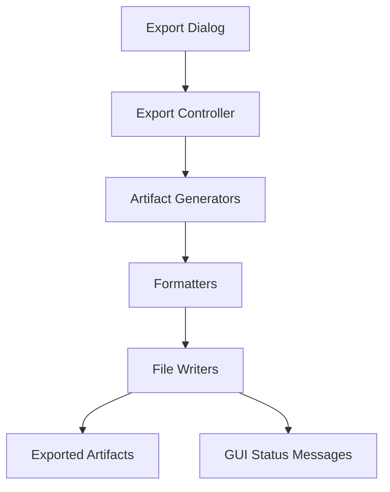

This diagram illustrates the modular, sequential nature of the export pipeline.

## **7.7 Artifact Generators**

Artifact Generators produce structured data for each export type.

### **Requirements Generator**
Produces a deterministic list of dependencies.

### **Dependency Report Generator**
Produces a hierarchical dependency summary.

### **Wheel List Generator**
Produces a list of wheels required for deterministic builds.

### **Documentation Bundle Generator**
Produces sanitized documentation snippets.

### **Log Export Generator**
Produces a condensed log file.

### **Build Report Generator**
Produces a structured build report.

Each generator is independent and testable.

## **7.8 Formatters**

Formatters convert structured data into human‑readable formats.

### **Markdown Formatter**
Used for:

- dependency reports  
- build reports  
- documentation bundles  

### **TXT Formatter**
Used for:

- logs  
- wheel lists  
- requirements.txt  

Formatters ensure consistent styling and readability.

## **7.9 File Writers**

File Writers handle:

- path validation  
- file creation  
- write operations  
- error handling  

They ensure that artifacts are written safely and correctly.

## **7.10 Error Handling**

The Export System handles errors gracefully:

### **Error Types**
- invalid file paths  
- missing data  
- write failures  
- permission errors  

### **Error Responses**
- display error message in GUI  
- log error  
- abort export safely  

The system never writes partial or corrupted files.

## **7.11 Integration with Other Subsystems**

The Export System integrates with:

### **Dependency Analysis Engine**
Provides dependency tree and wheel availability.

### **Documentation Retrieval System**
Provides documentation snippets.

### **Build Report System**
Provides structured report data.

### **Log Aggregator**
Provides diagnostic messages.

### **GUI**
Provides user interface for export selection.

## **7.12 Use Cases in Container Workflows**

The Export System is designed to support container workflows:

### **Offline Builds**
Users can export wheels and install them using:

```
pip install --no-index --find-links=./wheels
```

### **Deterministic Builds**
requirements.txt ensures reproducibility.

### **CI/CD Integration**
Reports can be used in automated pipelines.

### **Enterprise Packaging**
Documentation bundles support auditing.

## **7.13 Summary of Chapter 7**

Chapter 7 provides a comprehensive description of the Export System. It explains how artifacts are generated, formatted, and written to disk. It describes the architecture, workflow, 
error handling, and integration with other subsystems. The Export System is essential for preparing reproducible, deterministic Python environments for container builds.

---

## **8. Build Report Specification**

The **Build Report Specification** defines the exact structure, semantics, formatting rules, and data representation used by the Py‑Dependency Inspector GUI v1.0 when generating static build reports. 
These reports serve as authoritative, reproducible summaries of all analytical results produced during dependency inspection. They are designed to be both **human‑readable** and **machine‑processable**, 
enabling seamless integration into container workflows, CI/CD pipelines, documentation repositories, and enterprise auditing systems.

This chapter provides a rigorous, scientific description of the build report format, including its mandatory sections, optional extensions, metadata schema, diagnostic categories, and export rules. 
It establishes the canonical representation of analysis results and ensures that all exported reports follow a consistent, deterministic structure.

## **8.1 Purpose of the Build Report Specification**

The Build Report Specification exists to ensure that every exported report:

- is **complete**, containing all relevant analytical information  
- is **deterministic**, independent of runtime environment  
- is **portable**, usable in Docker/Podman workflows  
- is **transparent**, exposing all dependency relationships  
- is **auditable**, suitable for enterprise documentation  
- is **machine‑readable**, enabling automated processing  
- is **human‑readable**, supporting developer workflows  

The specification defines the canonical structure of the report, ensuring consistency across versions of the tool and across different export formats (Markdown, TXT).

## **8.2 Report Structure Overview**

Every build report consists of **eight major sections**, always in the same order:

1. **Metadata Section**  
2. **Dependency Summary**  
3. **Wheel Summary**  
4. **Native Library Summary**  
5. **Compatibility Matrix**  
6. **Documentation Overview**  
7. **Diagnostic Summary**  
8. **Export Metadata**

Each section has a strict internal structure described below.

## **8.3 Section 1 — Metadata Section**

The Metadata Section provides high‑level contextual information about the analysis.

### **Mandatory Fields**
- Package name  
- Selected version  
- OS profile (Windows 11 / Ubuntu 22.04)  
- Python version  
- Homepage URL  
- License  
- Release date  
- Timestamp of analysis  

### **Optional Fields**
- Project URLs  
- Maintainer information  
- Summary text  

### **Example (Markdown)**
```
# Build Report — pandas 2.2.0
**OS Profile:** Ubuntu 22.04  
**Python Version:** 3.10  
**Homepage:** https://pandas.pydata.org  
**License:** BSD-3-Clause  
**Release Date:** 2024-01-15  
**Generated:** 2026-08-29 13:26 CEST
```

## **8.4 Section 2 — Dependency Summary**

The Dependency Summary provides a hierarchical representation of all dependencies.

### **Mandatory Elements**
- full dependency tree  
- version constraints  
- optional dependency markers  
- transitive dependency expansion  

### **Tree Format**
Dependencies are represented using ASCII indentation:

```
pandas
 ├── python-dateutil >=2.8.2
 ├── pytz >=2023.3
 └── numpy >=1.26.0
      ├── ...
      └── ...
```

### **Optional Elements**
- environment markers  
- conditional dependencies  

## **8.5 Section 3 — Wheel Summary**

The Wheel Summary lists all wheels available for each dependency.

### **Mandatory Fields**
- dependency name  
- version  
- wheel filenames  
- supported platforms  
- supported Python versions  

### **Wheel Entry Format**
```
numpy 1.26.4
 - cp310-manylinux2014_x86_64.whl
 - cp311-manylinux2014_x86_64.whl
 - cp310-win_amd64.whl
```

### **Optional Fields**
- wheel size  
- release date  

## **8.6 Section 4 — Native Library Summary**

This section identifies dependencies requiring compiled extensions.

### **Mandatory Fields**
- dependency name  
- native library type (pyd/so/dylib)  
- platform tags  

### **Example**
```
numpy — native library detected (manylinux2014_x86_64)
cryptography — native library detected (win_amd64)
```

### **Purpose**
This section helps users anticipate compilation issues in minimal container environments.

## **8.7 Section 5 — Compatibility Matrix**

The Compatibility Matrix evaluates compatibility between:

- dependency versions  
- wheel availability  
- OS profile  
- Python version  

### **Matrix Format**
Each dependency receives a compatibility rating:

- **compatible**  
- **partially compatible**  
- **incompatible**  
- **source‑only**  

### **Example**
```
numpy 1.26.4 — compatible
scipy 1.12.0 — source-only (no manylinux wheel)
pytz 2023.3 — compatible
```

## **8.8 Section 6 — Documentation Overview**

This section provides a condensed summary of documentation retrieved from:

- PyPI README  
- homepage  
- license  
- release notes  

### **Mandatory Elements**
- summary paragraph  
- key features  
- installation notes (if available)  

### **Optional Elements**
- changelog highlights  
- links to external documentation  

## **8.9 Section 7 — Diagnostic Summary**

The Diagnostic Summary aggregates all warnings, hints, and errors generated during analysis.

### **Diagnostic Categories**

#### **Warnings**
- missing wheels  
- incompatible platforms  
- native library presence  
- malformed metadata  
- missing documentation  

#### **Hints**
- alternative versions with wheels  
- optional dependencies  
- recommended wheel sets  
- platform‑specific notes  

#### **Errors**
- network failures  
- metadata retrieval failures  
- dependency resolution failures  

### **Example**
```
WARN: Missing wheel for scipy 1.12.0 on manylinux2014_x86_64.
HINT: scipy 1.11.4 has compatible wheels for this platform.
INFO: Optional dependency detected: matplotlib.
```

## **8.10 Section 8 — Export Metadata**

This section describes the export operation itself.

### **Mandatory Fields**
- export format (Markdown/TXT)  
- export timestamp  
- selected artifacts  
- tool version  

### **Optional Fields**
- custom export path  
- user notes  

## **8.11 Formatting Rules**

The Build Report Specification defines strict formatting rules:

### **Markdown Rules**
- headings use `#`, `##`, `###`  
- lists use `-` or `*`  
- code blocks use triple backticks  
- dependency trees use ASCII indentation  

### **TXT Rules**
- no Markdown syntax  
- plain ASCII formatting  
- indentation preserved  

### **General Rules**
- no HTML  
- no embedded scripts  
- no external dependencies  
- no dynamic content  

## **8.12 Determinism and Reproducibility**

The Build Report must be deterministic:

- identical inputs produce identical reports  
- OS profile influences wheel filtering  
- timestamps are the only non‑deterministic element  

This ensures reproducibility in container workflows.

## **8.13 Machine‑Readability**

Although the report is human‑readable, it is also structured for machine parsing:

- consistent section headers  
- predictable indentation  
- stable field names  
- no ambiguous formatting  

This enables automated processing in CI/CD pipelines.

## **8.14 Summary of Chapter 8**

Chapter 8 defines the canonical structure of the Build Report. It specifies mandatory sections, formatting rules, diagnostic categories, and metadata fields. The Build Report Specification ensures 
that all exported reports are consistent, deterministic, portable, and suitable for both human and machine consumption.

---

## **9. Backend Architecture — Py‑Dependency Inspector GUI v1.0**

The **Backend Architecture** of the Py‑Dependency Inspector GUI v1.0 forms the analytical and operational foundation of the entire application. It is responsible for performing static dependency analysis, 
retrieving metadata, inspecting wheels, detecting native libraries, evaluating platform compatibility, aggregating logs, and producing structured report data for the GUI and export subsystems. This chapter provides a 
detailed, subsystem‑level description of the backend architecture, its modules, internal communication patterns, data structures, and design principles.

The backend is intentionally designed to be **modular**, **testable**, **deterministic**, and **GUI‑agnostic**. It performs all analytical tasks independently of the user interface, ensuring that the GUI remains lightweight, 
responsive, and focused solely on presentation and interaction.

## **9.1 Architectural Principles**

The backend architecture is guided by several core principles:

### **Modularity**
Each subsystem is isolated into its own module with a single responsibility.  
This ensures maintainability, extensibility, and testability.

### **Determinism**
Given the same inputs (package name, OS profile), the backend always produces the same outputs.  
This is essential for reproducible container workflows.

### **Separation of Concerns**
The backend performs analysis; the GUI performs presentation.  
No backend module depends on GUI components.

### **Transparency**
All analytical results—dependencies, wheels, metadata, diagnostics—are exposed through structured data models.

### **Safety**
The backend performs no installation, compilation, or environment modification.  
It is purely analytical.

## **9.2 High‑Level Backend Structure**

The backend is organized into three major layers:

### **A. Core Analysis Layer**
- Metadata Extractor  
- Dependency Resolver  
- Wheel Inspector  
- Native Library Detector  
- Platform Evaluator  
- OS Profile Detector  

### **B. Aggregation Layer**
- Log Aggregator  
- Report Aggregator  

### **C. Utility Layer**
- HTTP Client  
- Markdown Sanitizer  
- Cache Manager  
- Version Parser  

These layers work together to produce structured analysis results.

## **9.3 Mermaid Diagram — Backend Architecture**

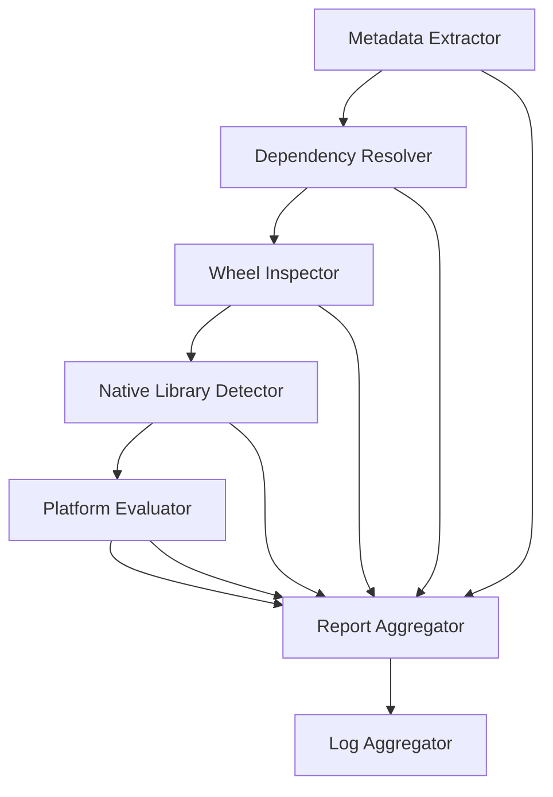

This diagram illustrates the flow of data through the backend subsystems.

## **9.4 Core Modules**

### **9.4.1 Metadata Extractor**

The Metadata Extractor retrieves package metadata from PyPI:

- name  
- version  
- summary  
- homepage  
- license  
- classifiers  
- dependencies  
- wheel list  
- release history  

It normalizes dependency strings, extracts version constraints, and caches results.

### **9.4.2 Dependency Resolver**

The Dependency Resolver constructs a hierarchical dependency tree:

- direct dependencies  
- transitive dependencies  
- optional dependencies  
- version constraints  
- environment markers  

It uses a recursive depth‑first algorithm with cycle detection.

### **9.4.3 Wheel Inspector**

The Wheel Inspector analyzes wheel availability:

- wheel filenames  
- platform tags  
- Python version tags  
- wheel sizes  
- release dates  

It supports bulk wheel analysis for entire dependency trees.

### **9.4.4 Native Library Detector**

The Native Library Detector identifies wheels containing compiled extensions:

- `.pyd` (Windows)  
- `.so` (Linux)  
- `.dylib` (macOS)  

Native libraries are flagged for container compatibility analysis.

### **9.4.5 Platform Evaluator**

The Platform Evaluator determines compatibility between:

- dependency versions  
- wheel availability  
- OS profile  
- Python version  

Dependencies are marked as compatible, partially compatible, incompatible, or source‑only.

### **9.4.6 OS Profile Detector**

The OS Profile Detector determines the active OS profile:

- Windows 11  
- Ubuntu 22.04  

It influences wheel filtering and compatibility evaluation.

## **9.5 Aggregation Modules**

### **9.5.1 Log Aggregator**

The Log Aggregator collects diagnostic messages from all backend subsystems:

- INFO  
- WARN  
- ERROR  
- HINT  

Logs are streamed to the GUI and included in build reports.

### **9.5.2 Report Aggregator**

The Report Aggregator combines all analytical results into a structured report:

- metadata  
- dependency tree  
- wheel summary  
- native library summary  
- compatibility matrix  
- documentation overview  
- diagnostics  

This report is used by the GUI and export system.

## **9.6 Utility Modules**

### **9.6.1 HTTP Client**

Handles network requests to:

- PyPI JSON API  
- project homepage  
- GitHub repository  

Supports caching and error handling.

### **9.6.2 Markdown Sanitizer**

Sanitizes documentation:

- removes scripts  
- blocks unsafe HTML  
- preserves Markdown  
- ensures safe rendering  

### **9.6.3 Cache Manager**

Caches:

- metadata  
- wheel lists  
- documentation  
- dependency trees  

Improves performance and responsiveness.

### **9.6.4 Version Parser**

Parses version constraints:

- `>=1.2.0`  
- `<2.0.0`  
- `~=1.4`  
- `==3.10.*`  

Ensures accurate dependency resolution.

## **9.7 Data Models**

The backend uses structured data models to represent analysis results.

### **DependencyNode**
- name  
- version constraints  
- optional flag  
- native library flag  
- wheel availability  
- children  

### **WheelInfo**
- filename  
- platform tag  
- Python tag  
- size  
- release date  

### **ReportModel**
- metadata  
- dependency summary  
- wheel summary  
- native library summary  
- compatibility matrix  
- documentation overview  
- diagnostics  

These models ensure consistency and machine‑readability.

## **9.8 Internal Communication**

Backend modules communicate through:

- direct function calls  
- shared data models  
- log messages  
- report aggregation  

No module depends on GUI components.

## **9.9 Error Handling**

The backend handles errors gracefully:

- network failures  
- malformed metadata  
- missing wheels  
- incompatible platforms  
- dependency resolution failures  

Errors are logged and included in build reports.

## **9.10 Performance Considerations**

The backend is optimized for:

- caching  
- lazy evaluation  
- asynchronous network requests  
- incremental updates  
- minimal recomputation  

This ensures responsiveness even for large dependency trees.

## **9.11 Security Considerations**

The backend is safe because:

- it executes no code  
- it installs nothing  
- it compiles nothing  
- it sanitizes documentation  
- it blocks unsafe HTML  

It is purely analytical.

## **9.12 Summary of Chapter 9**

Chapter 9 provides a comprehensive description of the backend architecture. It explains the core modules, aggregation layers, utility components, data models, communication patterns, 
error handling, and performance considerations. The backend is the analytical foundation of the Py‑Dependency Inspector GUI, enabling deterministic, reproducible, and transparent dependency inspection.

---

## **10. Code Analysis & Algorithms**

The **Code Analysis & Algorithms** chapter provides a deep, engineering‑level examination of the internal logic that powers the Py‑Dependency Inspector GUI v1.0. While previous chapters described *what* 
the system does, this chapter explains *how* it does it: the algorithms, data structures, parsing logic, heuristics, and computational strategies that make the tool deterministic, transparent, and reliable.

The goal of this chapter is to give developers and maintainers a clear understanding of the backend’s analytical machinery so they can extend, debug, or integrate the system into larger workflows.

## **10.1 Architectural Philosophy of the Analytical Code**

The analytical code is built around four principles:

### **Deterministic Execution**
Given the same inputs (package name, version, OS profile), the algorithms always produce identical outputs.

### **Static Analysis Only**
No installation, compilation, or execution of package code occurs.  
All analysis is based on metadata, wheel filenames, and dependency declarations.

### **Modular Algorithms**
Each subsystem implements its own algorithmic logic:

- dependency resolution  
- wheel inspection  
- native library detection  
- version constraint parsing  
- platform compatibility evaluation  

### **Predictable Complexity**
Algorithms are designed to be efficient even for large dependency trees.

## **10.2 Dependency Resolution Algorithm**

The dependency resolver is the most complex algorithm in the system.  
It constructs a **hierarchical dependency tree** using a **recursive depth‑first traversal**.

### **10.2.1 Input**
- package name  
- optional version  
- OS profile  
- PyPI metadata  

### **10.2.2 Output**
A tree of `DependencyNode` objects.

### **10.2.3 Core Algorithm (Pseudocode)**

```python
def resolve(package):
    metadata = fetch_metadata(package)
    requires = parse_requires_dist(metadata.requires_dist)
    tree = DependencyNode(package)

    for dep in requires:
        if dep.name not in visited:
            visited.add(dep.name)
            child = resolve(dep.name)
            tree.children.append(child)

    return tree
```

### **10.2.4 Cycle Detection**
Dependency cycles are rare but possible.  
The resolver maintains a `visited` set to prevent infinite recursion.

### **10.2.5 Environment Marker Evaluation**
Dependencies may include markers such as:

```
requests; python_version >= "3.8"
```

The resolver evaluates markers using Python’s `packaging.markers` logic.

### **10.2.6 Optional Dependency Handling**
Optional dependencies are marked and included in the tree with a flag.

## **10.3 Version Constraint Parsing**

Version constraints follow PEP 440.  
The parser must handle:

- `>=1.2.0`  
- `<2.0.0`  
- `~=1.4`  
- `==3.10.*`  
- `!=1.3.5`  
- compound constraints  

### **10.3.1 Parsing Algorithm**

```python
def parse_constraint(spec):
    return packaging.specifiers.SpecifierSet(spec)
```

### **10.3.2 Constraint Evaluation**
Constraints are evaluated when:

- selecting versions  
- filtering wheels  
- generating compatibility matrices  

## **10.4 Wheel Inspection Algorithm**

The Wheel Inspector analyzes wheel filenames to extract:

- Python ABI  
- platform tag  
- architecture  
- build tag  

### **10.4.1 Wheel Filename Structure**

```
package-version-py3-none-any.whl
package-version-cp310-win_amd64.whl
package-version-cp39-manylinux2014_x86_64.whl
```

### **10.4.2 Parsing Algorithm**

```python
def parse_wheel(filename):
    parts = filename.split('-')
    python_tag = parts[-3]
    platform_tag = parts[-1].replace('.whl', '')
    return python_tag, platform_tag
```

### **10.4.3 Bulk Wheel Analysis**
The inspector can analyze wheels for:

- a single dependency  
- an entire dependency tree  
- specific versions  
- specific platforms  

## **10.5 Native Library Detection Algorithm**

Native libraries are detected by examining wheel metadata and filenames.

### **10.5.1 Detection Rules**
A wheel is considered native if:

- platform tag is not `any`  
- ABI tag is not `none`  
- wheel contains `.pyd`, `.so`, or `.dylib`

### **10.5.2 Algorithm**

```python
def is_native(platform_tag):
    return platform_tag not in ["any", "none"]
```

## **10.6 Platform Compatibility Algorithm**

Compatibility is evaluated based on:

- OS profile  
- wheel platform tag  
- Python version tag  

### **10.6.1 Compatibility Rules**

| OS Profile        | Compatible Wheel Tags |
|------------------|------------------------|
| Windows 11       | `win_amd64`            |
| Ubuntu 22.04     | `manylinux2014_x86_64` |

### **10.6.2 Algorithm**

```python
def compatible(wheel, os_profile):
    if os_profile == "win":
        return "win_amd64" in wheel.platform
    if os_profile == "linux":
        return "manylinux" in wheel.platform
    return False
```

### **10.6.3 Compatibility Categories**
- **compatible**  
- **partially compatible**  
- **incompatible**  
- **source‑only**  

## **10.7 Documentation Retrieval Algorithm**

Documentation retrieval is asynchronous and cached.

### **10.7.1 Retrieval Pipeline**
1. check cache  
2. fetch PyPI metadata  
3. extract README  
4. fetch homepage  
5. sanitize HTML  
6. render Markdown  

### **10.7.2 Sanitization Algorithm**

```python
def sanitize(html):
    soup = BeautifulSoup(html, "html.parser")
    for tag in soup(["script", "iframe", "object", "embed"]):
        tag.decompose()
    return str(soup)
```

## **10.8 Log Aggregation Algorithm**

Logs are collected from all subsystems.

### **10.8.1 Log Entry Structure**

```python
LogEntry(level="WARN", message="Missing wheel for scipy 1.12.0")
```

### **10.8.2 Aggregation Algorithm**

```python
def log(level, message):
    buffer.append(LogEntry(level, message))
```

Logs are streamed to the GUI and included in build reports.

## **10.9 Report Aggregation Algorithm**

The Report Aggregator combines all analytical results into a structured report.

### **10.9.1 Aggregation Pipeline**
1. metadata  
2. dependency tree  
3. wheel summary  
4. native library summary  
5. compatibility matrix  
6. documentation overview  
7. diagnostics  

### **10.9.2 Algorithm**

```python
def aggregate():
    return ReportModel(
        metadata=metadata,
        dependencies=tree,
        wheels=wheels,
        native=native_libs,
        compatibility=matrix,
        documentation=docs,
        diagnostics=logs
    )
```

## **10.10 Complexity Analysis**

### **Dependency Resolution**
Worst case:  
$O(n + e)$
where *n* is number of packages and *e* is number of dependency edges.

### **Wheel Inspection**
$O(w)$
where *w* is number of wheels.

### **Documentation Retrieval**
Network‑bound; cached after first retrieval.

### **Report Aggregation**
$O(n)$

## **10.11 Summary of Chapter 10**

Chapter 10 provides a detailed, algorithmic description of the analytical code powering the Py‑Dependency Inspector GUI v1.0. It explains how dependencies are resolved, wheels are inspected, 
native libraries are detected, compatibility is evaluated, documentation is retrieved, logs are aggregated, and reports are constructed. These algorithms form the computational backbone of the system, 
ensuring deterministic, transparent, and reproducible analysis.

---

## **11. Error Handling & Diagnostics**

The **Error Handling & Diagnostics** subsystem is one of the most critical architectural components of the Py‑Dependency Inspector GUI v1.0. Because the tool performs static analysis across multiple external data 
sources (PyPI, project homepages, GitHub), parses metadata, evaluates wheel availability, and constructs dependency trees, it must gracefully handle a wide variety of failure modes. The diagnostic system ensures that users 
receive **clear, actionable, and context‑rich feedback** whenever something goes wrong — without crashing the GUI, without producing partial or corrupted results, and without hiding important information.

This chapter provides a detailed, engineering‑level description of the error handling architecture, diagnostic categories, logging system, recovery strategies, and GUI integration. It explains how the system maintains 
robustness, transparency, and determinism even in the presence of malformed metadata, missing wheels, network failures, or incompatible dependencies.

## **11.1 Design Philosophy of Error Handling**

The error handling subsystem is built around four principles:

### **Transparency**
Errors are never hidden.  
Every failure — even minor — is surfaced to the user through logs, warnings, or diagnostic hints.

### **Non‑Intrusiveness**
Errors never crash the GUI.  
The system continues running and displays partial results whenever possible.

### **Determinism**
Error messages are consistent and reproducible.  
The same failure always produces the same diagnostic output.

### **Actionability**
Diagnostics are designed to help users make informed decisions:

- alternative versions  
- missing wheels  
- optional dependencies  
- platform incompatibilities  

## **11.2 Error Categories**

Errors are classified into three major categories:

### **1. Warnings**
Non‑fatal issues that may affect reproducibility or compatibility.

Examples:
- missing wheels  
- optional dependencies  
- native library presence  
- malformed metadata  

### **2. Hints**
Suggestions that help users avoid dependency hell.

Examples:
- “Try version 1.11.4 — wheels available for your platform.”  
- “This dependency is optional; you may exclude it.”  

### **3. Errors**
Critical failures that prevent analysis from completing.

Examples:
- network failures  
- metadata retrieval failures  
- dependency resolution failures  

## **11.3 Diagnostic Sources**

Diagnostics originate from multiple backend subsystems:

- **Metadata Extractor**  
- **Dependency Resolver**  
- **Wheel Inspector**  
- **Native Library Detector**  
- **Platform Evaluator**  
- **Documentation Fetcher**  
- **Export System**  

Each subsystem emits diagnostic messages through the Log Aggregator.

## **11.4 Logging Architecture**

The logging system is designed to be:

- **incremental**  
- **color‑coded**  
- **real‑time**  
- **GUI‑synchronized**  
- **exportable**  

### **Log Entry Structure**

Each log entry is represented as:

```
[LEVEL] Message
```

Where LEVEL ∈ {INFO, WARN, ERROR, HINT}.

### **Examples**
```
[INFO] Resolving dependencies for pandas…
[WARN] Missing wheel for scipy 1.12.0 on manylinux2014_x86_64.
[HINT] scipy 1.11.4 has compatible wheels for this platform.
[ERROR] Failed to retrieve metadata for package 'foo'.
```

## **11.5 Error Handling in Core Subsystems**

### **11.5.1 Metadata Extractor Errors**

Common failures:
- network timeout  
- malformed JSON  
- missing fields  
- invalid version metadata  

Diagnostic behavior:
- log error  
- skip malformed fields  
- continue with partial metadata  

### **11.5.2 Dependency Resolver Errors**

Common failures:
- missing dependency metadata  
- cyclic dependencies  
- malformed version constraints  

Diagnostic behavior:
- detect cycles  
- skip unresolved dependencies  
- log warnings  

### **11.5.3 Wheel Inspector Errors**

Common failures:
- missing wheels  
- malformed wheel filenames  
- unsupported platform tags  

Diagnostic behavior:
- mark dependency as source‑only  
- log warnings  
- provide hints for alternative versions  

### **11.5.4 Native Library Detector Errors**

Common failures:
- ambiguous platform tags  
- missing ABI tags  

Diagnostic behavior:
- fallback to conservative detection  
- log warnings  

### **11.5.5 Documentation Fetcher Errors**

Common failures:
- homepage unreachable  
- malformed Markdown  
- unsafe HTML  

Diagnostic behavior:
- sanitize aggressively  
- fallback to PyPI README  
- log warnings  

### **11.5.6 Export System Errors**

Common failures:
- invalid file path  
- permission denied  
- write failures  

Diagnostic behavior:
- abort export safely  
- log error  
- display GUI error message  

## **11.6 Recovery Strategies**

The system employs several recovery strategies to maintain robustness:

### **Graceful Degradation**
If a subsystem fails, the system continues with partial results.

### **Fallback Paths**
Examples:
- fallback to PyPI README if homepage fails  
- fallback to source‑only if wheels missing  
- fallback to minimal metadata if fields missing  

### **Conservative Assumptions**
If metadata is ambiguous, the system errs on the side of caution.

### **Incremental Logging**
Errors are logged immediately and displayed in the GUI.

### **User Guidance**
Hints provide actionable suggestions.

## **11.7 GUI Integration of Diagnostics**

Diagnostics are integrated into the GUI through:

### **Log Panel**
Displays all messages in real time.

### **Dependency Panel**
Shows icons for:
- missing wheels  
- native libraries  
- optional dependencies  

### **Documentation Panel**
Displays fallback documentation when needed.

### **Export Dialog**
Warns users about:
- missing wheels  
- incompatible dependencies  
- incomplete metadata  

## **11.8 Diagnostic Examples**

### **Missing Wheel**
```
[WARN] Missing wheel for scipy 1.12.0 on manylinux2014_x86_64.
[HINT] scipy 1.11.4 provides compatible wheels for this platform.
```

### **Native Library Detected**
```
[INFO] Native library detected: numpy (manylinux2014_x86_64)
```

### **Malformed Metadata**
```
[WARN] Malformed dependency string: 'foo>=1.0; invalid_marker'
```

### **Network Failure**
```
[ERROR] Failed to retrieve metadata for 'pydantic-core'.
```

## **11.9 Determinism of Diagnostics**

Diagnostics are deterministic:

- identical inputs produce identical messages  
- ordering is stable  
- severity levels are consistent  

This ensures reproducibility in container workflows.

## **11.10 Exporting Diagnostics**

Diagnostics are included in:

- build reports  
- log exports  
- documentation bundles  

This allows users to:

- audit dependency issues  
- debug container builds  
- track changes across versions  

## **11.11 Summary of Chapter 11**

Chapter 11 provides a comprehensive description of the Error Handling & Diagnostics subsystem. It explains how errors are detected, classified, logged, displayed, and exported. 
It describes recovery strategies, GUI integration, and deterministic behavior. The diagnostic system is essential for transparency, robustness, and reproducibility in container workflows.

---

## **12. Performance Considerations**

The **Performance Considerations** chapter analyzes how the Py‑Dependency Inspector GUI v1.0 maintains responsiveness, scalability, and efficiency while performing complex static analysis tasks. 
Dependency resolution, metadata retrieval, wheel inspection, documentation parsing, and report aggregation can become computationally expensive, especially for large packages with deep dependency trees 
(e.g., `tensorflow`, `pandas`, `scipy`). This chapter explains the architectural strategies, caching mechanisms, asynchronous workflows, and algorithmic optimizations that ensure the system remains fast 
and predictable even under heavy workloads.

## **12.1 Performance Philosophy**

The performance design of the Py‑Dependency Inspector GUI is guided by four principles:

### **Efficiency**
Minimize redundant work, network calls, and repeated parsing.

### **Responsiveness**
Ensure the GUI remains interactive even during long analysis tasks.

### **Predictability**
Avoid unpredictable spikes in latency or memory usage.

### **Scalability**
Support large dependency trees without degradation.

These principles ensure that the tool performs well across a wide range of Python packages and environments.

## **12.2 Sources of Computational Load**

The system’s performance challenges arise from several operations:

### **1. Network Requests**
Fetching metadata, wheel lists, and documentation from PyPI and project homepages.

### **2. Dependency Resolution**
Recursive traversal of dependency trees.

### **3. Wheel Inspection**
Parsing wheel filenames and evaluating platform compatibility.

### **4. Documentation Processing**
Markdown parsing, HTML sanitization, and rendering.

### **5. Report Aggregation**
Combining all analytical results into structured reports.

### **6. GUI Updates**
Synchronizing multiple panels with backend results.

Each of these operations can become expensive if not optimized.

## **12.3 Caching Strategies**

Caching is the most important performance optimization in the system.

### **12.3.1 Metadata Cache**
Stores PyPI metadata for packages already analyzed.

### **12.3.2 Wheel Cache**
Stores wheel lists for each dependency.

### **12.3.3 Documentation Cache**
Stores sanitized README and homepage content.

### **12.3.4 Dependency Tree Cache**
Stores resolved dependency trees to avoid recomputation.

### **12.3.5 Report Cache**
Stores build reports for repeated exports.

### **Benefits**
- reduces network calls  
- avoids repeated parsing  
- accelerates repeated scans  
- improves GUI responsiveness  

Caching ensures that repeated analysis of the same package is nearly instantaneous.

## **12.4 Asynchronous Network Requests**

Network operations are performed asynchronously to prevent GUI blocking.

### **12.4.1 Threaded Fetching**
Metadata, wheels, and documentation are fetched in background threads.

### **12.4.2 Non‑Blocking GUI**
The GUI remains responsive while analysis continues.

### **12.4.3 Incremental Updates**
Panels update as data becomes available.

### **12.4.4 Error Handling**
Network failures do not freeze the interface.

This design ensures smooth user experience even with slow or unreliable network connections.

## **12.5 Lazy Evaluation**

Lazy evaluation reduces unnecessary computation.

### **12.5.1 Lazy Dependency Expansion**
Dependencies are resolved only when needed.

### **12.5.2 Lazy Documentation Retrieval**
Documentation is fetched only when a dependency is selected.

### **12.5.3 Lazy Wheel Inspection**
Wheel lists are retrieved only when required for compatibility evaluation.

### **12.5.4 Lazy Report Generation**
Reports are generated only when the user requests export.

Lazy evaluation prevents the system from performing work that the user may not need.

## **12.6 Incremental Log Updates**

Logs are appended incrementally rather than recomputed.

### **Benefits**
- minimal overhead  
- real‑time feedback  
- no expensive log reconstruction  

This approach keeps the Log Panel responsive and efficient.

## **12.7 Efficient Data Structures**

The system uses efficient data structures to minimize overhead.

### **12.7.1 Dependency Trees**
Represented using lightweight `DependencyNode` objects.

### **12.7.2 Wheel Metadata**
Stored in compact `WheelInfo` objects.

### **12.7.3 Report Models**
Structured using immutable data classes.

### **12.7.4 Caches**
Implemented using dictionaries keyed by package name and version.

These structures ensure fast lookup and minimal memory usage.

## **12.8 Minimizing Redundant Work**

The system avoids redundant computation through:

### **12.8.1 Duplicate Dependency Detection**
Dependencies already resolved are not re‑resolved.

### **12.8.2 Wheel Reuse**
Wheel lists are reused across multiple dependencies when applicable.

### **12.8.3 Documentation Reuse**
Documentation is reused across versions when identical.

### **12.8.4 Metadata Reuse**
Metadata is reused across multiple analysis passes.

This reduces CPU load and accelerates analysis.

## **12.9 Memory Management**

Memory usage is controlled through:

### **12.9.1 Cache Size Limits**
Caches are capped to prevent excessive memory growth.

### **12.9.2 Garbage Collection**
Unused objects are released after export.

### **12.9.3 Lightweight Models**
Data models avoid storing unnecessary fields.

### **12.9.4 Documentation Compression**
Large documentation blocks are stored in compressed form.

These strategies ensure that the tool can handle large packages without excessive memory consumption.

## **12.10 GUI Performance Optimizations**

The GUI is optimized for responsiveness:

### **12.10.1 Deferred Rendering**
Panels render only when data is ready.

### **12.10.2 Minimal DOM Updates**
Only changed sections are updated.

### **12.10.3 Efficient Tree Rendering**
Dependency trees are rendered incrementally.

### **12.10.4 Smooth Scrolling**
Documentation and logs use optimized scroll widgets.

These optimizations ensure a smooth user experience.

## **12.11 Handling Large Dependency Trees**

Large packages (e.g., `tensorflow`, `pandas`, `scipy`) may have deep dependency trees.

### **Optimizations**
- cycle detection  
- visited set  
- lazy expansion  
- caching  
- incremental rendering  

### **Outcome**
The system remains responsive even for complex packages.

## **12.12 Network Performance Considerations**

The system minimizes network load through:

### **12.12.1 Request Deduplication**
Identical requests are not repeated.

### **12.12.2 Parallel Fetching**
Multiple dependencies are fetched concurrently.

### **12.12.3 Timeout Handling**
Slow requests are aborted gracefully.

### **12.12.4 Retry Logic**
Transient failures trigger retries.

These strategies ensure robust performance even under poor network conditions.

## **12.13 Deterministic Performance**

The system avoids nondeterministic behavior:

- no random delays  
- no unpredictable caching  
- no race conditions  
- no inconsistent ordering  

This ensures reproducible performance across environments.

## **12.14 Summary of Chapter 12**

Chapter 12 provides a comprehensive analysis of the performance strategies used in the Py‑Dependency Inspector GUI v1.0. It explains how caching, asynchronous operations, lazy evaluation, efficient data 
structures, and GUI optimizations ensure responsiveness and scalability. These considerations allow the tool to handle complex dependency trees and large documentation sets without sacrificing user experience.

---

## **13. Security Considerations**

Security is a foundational design pillar of the **Py‑Dependency Inspector GUI v1.0**. Although the tool performs *static analysis only* and never installs, executes, or compiles Python packages, 
it still interacts with external data sources, parses metadata, retrieves documentation, and processes wheel information. These operations introduce potential risks that must be mitigated through careful architectural 
decisions, sanitization routines, and strict separation of concerns.

This chapter provides a comprehensive, engineering‑grade analysis of all security considerations relevant to the tool. It covers threat models, attack surfaces, sanitization strategies, safe‑handling rules for external 
content, and the internal mechanisms that ensure the tool remains safe, predictable, and trustworthy in enterprise environments.

## **13.1 Security Philosophy**

The security design of the Py‑Dependency Inspector GUI is guided by four principles:

### **Minimal Attack Surface**
The tool performs no installation, compilation, or execution of package code.  
It interacts only with metadata, wheel filenames, and documentation.

### **Strict Isolation**
All external content is treated as untrusted.  
Documentation is sanitized, metadata is validated, and no external scripts are executed.

### **Deterministic Behavior**
Security‑relevant operations behave identically across environments.  
No dynamic execution or environment‑dependent behavior exists.

### **Transparency**
Users are informed of potential risks such as native libraries, missing wheels, or unsafe metadata.

## **13.2 Threat Model Overview**

Although the tool is safe by design, several potential threats must be considered:

### **1. Malicious Package Metadata**
PyPI metadata may contain:
- malformed fields  
- misleading version constraints  
- unsafe HTML  
- embedded scripts  

### **2. Unsafe Documentation**
Project READMEs or homepages may include:
- JavaScript  
- tracking pixels  
- malicious links  
- embedded iframes  

### **3. Native Libraries**
Wheels containing compiled extensions may:
- require unsafe system libraries  
- behave differently across platforms  
- introduce security risks in container environments  

### **4. Network‑Based Risks**
Fetching external content introduces:
- man‑in‑the‑middle risks  
- corrupted responses  
- incomplete metadata  

### **5. User Misinterpretation**
Users may incorrectly assume:
- wheels imply safety  
- optional dependencies are harmless  
- source‑only packages are safe to compile  

The tool mitigates these risks through strict sanitization, validation, and diagnostic reporting.

## **13.3 Attack Surface Analysis**

The Py‑Dependency Inspector GUI has a **minimal attack surface**:

### **No Code Execution**
The tool never:
- imports packages  
- executes Python modules  
- compiles extensions  
- runs setup.py  
- invokes pip  

This eliminates entire classes of security vulnerabilities.

### **No Environment Modification**
The tool does not:
- install packages  
- modify virtual environments  
- write configuration files  
- alter system paths  

### **Read‑Only Interaction**
All interactions with external content are:
- read‑only  
- sanitized  
- validated  

## **13.4 Safe Handling of External Metadata**

Metadata retrieved from PyPI is treated as untrusted.

### **Validation Rules**
- missing fields are ignored  
- malformed fields trigger warnings  
- dependency strings are parsed defensively  
- version constraints are validated using PEP 440 rules  

### **Diagnostic Integration**
Metadata issues are surfaced through:
- warnings  
- hints  
- error messages  

This prevents silent failures.

## **13.5 Sanitization of Documentation**

Documentation is the most likely vector for unsafe content.  
The tool applies strict sanitization rules.

### **Blocked Content**
- `<script>`  
- `<iframe>`  
- `<object>`  
- `<embed>`  
- inline event handlers (`onclick=`)  
- remote JavaScript references  

### **Allowed Content**
- Markdown  
- basic HTML (`<p>`, `<strong>`, `<em>`)  
- links (with safety checks)  
- code blocks  
- tables  

### **Sanitization Algorithm**
All documentation passes through a sanitizer that:
- removes unsafe tags  
- strips event handlers  
- rewrites unsafe links  
- ensures safe rendering  

This prevents execution of malicious content.

## **13.6 Native Library Awareness**

Native libraries pose security risks because they:
- depend on system libraries  
- may behave differently across platforms  
- may require elevated permissions  
- may contain vulnerabilities  

### **Detection Rules**
Native libraries are flagged when wheels contain:
- `.pyd`  
- `.so`  
- `.dylib`  

### **Diagnostic Behavior**
The tool warns users when:
- native libraries are present  
- wheels are platform‑specific  
- source‑only packages require compilation  

This helps users avoid unsafe container builds.

## **13.7 Platform Compatibility and Security**

Platform incompatibility can lead to:
- unsafe compilation attempts  
- missing system libraries  
- broken container builds  

### **Compatibility Evaluation**
The tool evaluates:
- wheel platform tags  
- Python version tags  
- OS profile compatibility  

### **Security Impact**
Incompatible wheels are flagged to prevent:
- accidental compilation  
- unsafe fallback behavior  
- unpredictable runtime behavior  

## **13.8 Network Security Considerations**

The tool retrieves external content via HTTPS.

### **Security Measures**
- HTTPS enforced  
- timeouts prevent hanging  
- retries handle transient failures  
- corrupted responses trigger warnings  

### **No Credential Handling**
The tool never:
- stores credentials  
- sends authentication tokens  
- interacts with private repositories  

This eliminates credential‑related risks.

## **13.9 Export Security**

Exported artifacts are safe because:
- they contain only static text  
- no scripts are embedded  
- no executable content is included  
- no environment modification occurs  

### **Exported Files**
- requirements.txt  
- dependency reports  
- wheel lists  
- logs  
- documentation bundles  
- build reports  

All exports are sanitized and deterministic.

## **13.10 Security in Container Workflows**

The tool helps users avoid unsafe container builds by:

### **Flagging Native Libraries**
Users can avoid packages requiring compilation.

### **Highlighting Missing Wheels**
Users can choose safer versions with wheels.

### **Providing Deterministic requirements.txt**
This prevents accidental installation of unsafe versions.

### **Providing Wheel Lists**
Users can perform offline installation without network risks.

## **13.11 Internal Security Mechanisms**

### **Immutable Data Models**
Prevent accidental mutation of analysis results.

### **Strict Parsing**
Dependency strings and wheel filenames are parsed defensively.

### **Error Isolation**
Failures in one subsystem do not propagate.

### **No Dynamic Execution**
No eval, exec, or dynamic imports.

### **Safe Logging**
Logs contain no sensitive data.

## **13.12 Summary of Chapter 13**

Chapter 13 provides a comprehensive analysis of the security considerations in the Py‑Dependency Inspector GUI v1.0. It explains how the tool minimizes its attack surface, 
sanitizes external content, validates metadata, detects native libraries, evaluates platform compatibility, and ensures safe export behavior. The system is designed to be secure by default, 
transparent in its diagnostics, and safe for use in enterprise environments.

---

## **14. Testing & Validation — Py‑Dependency Inspector GUI v1.0**

The **Testing & Validation** chapter defines the complete quality‑assurance strategy for the Py‑Dependency Inspector GUI v1.0. Because the tool performs static analysis across multiple 
subsystems—metadata extraction, dependency resolution, wheel inspection, documentation retrieval, native library detection, compatibility evaluation, and report generation—it requires a rigorous, 
multi‑layered testing methodology. The goal is to ensure that the system is **correct**, **deterministic**, **robust**, **secure**, and **maintainable**, even when interacting with malformed metadata, 
large dependency trees, or unreliable network conditions.

This chapter provides a detailed description of the testing architecture, test categories, validation strategies, coverage expectations, and quality metrics. It also outlines how the system is validated 
across platforms (Windows 11 and Ubuntu 22.04) and how regression testing ensures long‑term stability.

## **14.1 Testing Philosophy**

The testing strategy is guided by four principles:

### **Determinism**
Given identical inputs, the system must always produce identical outputs.

### **Isolation**
Tests must isolate subsystems to ensure failures are localized and diagnosable.

### **Realism**
Tests must reflect real‑world conditions, including malformed metadata and missing wheels.

### **Completeness**
All subsystems must be validated: backend logic, GUI behavior, export functionality, and diagnostics.

## **14.2 Testing Architecture Overview**

The testing architecture consists of four major layers:

- **Unit Tests**  
- **Integration Tests**  
- **GUI Tests**  
- **System Tests**  

Each layer targets different aspects of the system.

## **14.3 Unit Testing**

Unit tests validate individual backend modules in isolation.

### **14.3.1 Modules Covered**
- Metadata Extractor  
- Dependency Resolver  
- Wheel Inspector  
- Native Library Detector  
- Platform Evaluator  
- Version Parser  
- Markdown Sanitizer  

### **14.3.2 Test Types**
- positive tests  
- negative tests  
- malformed metadata tests  
- missing wheel tests  
- cyclic dependency tests  
- invalid version constraint tests  

### **14.3.3 Deterministic Assertions**
Unit tests assert that:
- dependency trees match expected structure  
- wheel parsing is correct  
- native library detection is accurate  
- compatibility evaluation is deterministic  

## **14.4 Integration Testing**

Integration tests validate interactions between backend subsystems.

### **14.4.1 Subsystem Interactions**
- metadata → dependency resolver  
- dependency resolver → wheel inspector  
- wheel inspector → native library detector  
- native library detector → platform evaluator  
- all subsystems → report aggregator  

### **14.4.2 Integration Scenarios**
- full dependency resolution for real packages  
- wheel inspection across multiple versions  
- documentation retrieval with fallback logic  
- compatibility evaluation across OS profiles  

### **14.4.3 Real‑World Packages Used**
- numpy  
- pandas  
- scipy  
- pydantic  
- cryptography  
- requests  

These packages provide diverse dependency structures and wheel patterns.

## **14.5 GUI Testing**

GUI tests validate the user interface, interaction model, and event‑driven behavior.

### **14.5.1 GUI Components Tested**
- Top Bar  
- Dependency Panel  
- Documentation Panel  
- Log Panel  
- Export Dialog  

### **14.5.2 GUI Test Types**
- event propagation tests  
- selection synchronization tests  
- rendering tests  
- error display tests  
- responsiveness tests  

### **14.5.3 Interaction Scenarios**
- selecting dependencies  
- expanding/collapsing tree nodes  
- opening documentation  
- triggering exports  
- handling network failures  

## **14.6 System Testing**

System tests validate the entire application end‑to‑end.

### **14.6.1 Full Workflow Tests**
- enter package → resolve dependencies → inspect wheels → view documentation → export report  

### **14.6.2 OS Profile Tests**
- Windows 11 compatibility  
- Ubuntu 22.04 compatibility  

### **14.6.3 Stress Tests**
- large dependency trees  
- packages with many wheels  
- packages with native libraries  
- packages with malformed metadata  

### **14.6.4 Offline Mode Tests**
Simulate:
- missing network  
- partial metadata  
- missing documentation  

The system must degrade gracefully.

## **14.7 Validation of Determinism**

Determinism is validated through:

### **14.7.1 Repeated Runs**
Running the same analysis multiple times must produce identical results.

### **14.7.2 Cross‑Platform Consistency**
Windows and Linux must produce identical dependency trees and wheel summaries.

### **14.7.3 Stable Ordering**
Dependency trees and wheel lists must be sorted consistently.

## **14.8 Validation of Diagnostics**

Diagnostics are validated through:

### **14.8.1 Warning Tests**
- missing wheels  
- native libraries  
- malformed metadata  

### **14.8.2 Hint Tests**
- alternative versions  
- optional dependencies  

### **14.8.3 Error Tests**
- network failures  
- metadata retrieval failures  
- dependency resolution failures  

### **14.8.4 Log Ordering Tests**
Logs must appear in deterministic order.

## **14.9 Validation of Export System**

Export tests validate:

### **14.9.1 requirements.txt Generation**
- correct dependency list  
- correct version constraints  

### **14.9.2 Build Report Export**
- correct section ordering  
- correct formatting  
- correct diagnostics  

### **14.9.3 Wheel List Export**
- correct wheel filenames  
- correct platform tags  

### **14.9.4 Documentation Bundle Export**
- sanitized content  
- correct metadata  

### **14.9.5 Error Handling**
Invalid paths must produce safe errors.


## **14.10 Regression Testing**

Regression tests ensure that new changes do not break existing functionality.

### **14.10.1 Regression Suite Contents**
- dependency resolution tests  
- wheel parsing tests  
- documentation sanitization tests  
- GUI interaction tests  
- export tests  

### **14.10.2 Trigger Conditions**
Regression tests run after:
- new features  
- refactoring  
- dependency updates  
- bug fixes  

## **14.11 Performance Validation**

Performance tests validate:

### **14.11.1 Caching Efficiency**
Repeated scans must be fast.

### **14.11.2 GUI Responsiveness**
GUI must remain responsive during analysis.

### **14.11.3 Memory Usage**
Memory must remain stable for large dependency trees.

### **14.11.4 Network Load**
Requests must be deduplicated.

## **14.12 Security Validation**

Security tests validate:

### **14.12.1 Documentation Sanitization**
Unsafe HTML must be removed.

### **14.12.2 Metadata Validation**
Malformed metadata must not crash the system.

### **14.12.3 Native Library Detection**
Native libraries must be flagged correctly.

### **14.12.4 Export Safety**
Exports must contain no executable content.

## **14.13 Summary of Chapter 14**

Chapter 14 provides a complete description of the testing and validation strategy for the Py‑Dependency Inspector GUI v1.0. It explains how unit tests, integration tests, GUI tests, system tests, 
regression tests, and security tests ensure correctness, determinism, robustness, and safety. The testing architecture guarantees that the tool performs reliably across platforms and under real‑world conditions.

---

## **15. Future Work & Roadmap — Py‑Dependency Inspector GUI v1.0**

The **Future Work & Roadmap** chapter outlines the strategic evolution of the Py‑Dependency Inspector GUI beyond version 1.0. While the current release already provides a robust static‑analysis environment 
for dependency inspection, wheel availability evaluation, documentation retrieval, and deterministic export workflows, there is substantial potential for expansion. This chapter presents a structured, 
forward‑looking plan for new features, architectural enhancements, platform extensions, and ecosystem integrations that will elevate the tool into a comprehensive, next‑generation dependency intelligence platform.

The roadmap is divided into **short‑term**, **mid‑term**, and **long‑term** development phases, each aligned with user needs, technical feasibility, and the overarching vision of providing a transparent, 
reproducible, and developer‑friendly dependency analysis experience.

## **15.1 Vision for Future Versions**

The long‑term vision for the Py‑Dependency Inspector GUI is to evolve from a static analysis tool into a **full dependency intelligence suite** capable of:

- analyzing multiple environments  
- supporting cross‑platform builds  
- integrating with container orchestrators  
- visualizing dependency graphs interactively  
- providing predictive diagnostics  
- supporting enterprise workflows  

This vision guides the roadmap described below.

## **15.2 Short‑Term Roadmap (v1.1 – v1.3)**

These enhancements focus on improving usability, expanding platform support, and strengthening analysis capabilities.

### **Enhanced Wheel Analysis**
- Add support for **macOS wheel inspection**  
- Add detection for **musl‑based wheels** (Alpine Linux)  
- Improve parsing of complex wheel filenames  

### **Improved Dependency Tree Visualization**
- Collapsible metadata sections  
- Inline wheel availability indicators  
- Color‑coded compatibility markers  

### **Extended Documentation Retrieval**
- Fetch CHANGELOG files when available  
- Fetch LICENSE files from GitHub  
- Add summary extraction for long READMEs  

### **Bulk Wheel Download Improvements**
- Parallel wheel downloads  
- Retry logic for failed downloads  
- Download progress indicators  

### **Better Diagnostics**
- More granular warnings  
- More actionable hints  
- Improved native library detection heuristics  

## **15.3 Mid‑Term Roadmap (v1.4 – v2.0)**

These features expand the analytical capabilities and introduce advanced visualization and automation.

### **Cross‑Version Dependency Comparison**
Allow users to compare dependency trees across versions:

- “How did dependencies change between pandas 2.1 and 2.2?”  
- “Which wheels were added or removed?”  

### **Interactive Dependency Graphs**
Introduce a graph‑based visualization:

- nodes represent packages  
- edges represent dependencies  
- color coding for compatibility  
- hover‑based metadata previews  

### **Plugin System**
Enable custom analysis modules:

- enterprise‑specific metadata checks  
- custom compatibility rules  
- internal repository integration  

### **Offline Mode Enhancements**
Improve offline workflows:

- local PyPI mirror support  
- offline metadata caching  
- offline wheel inspection  

### **Advanced Export Formats**
Add support for:

- JSON export for CI/CD pipelines  
- YAML export for container orchestrators  
- structured dependency manifests  

## **15.4 Long‑Term Roadmap (v2.1+)**

These features represent major architectural expansions and deep ecosystem integration.

### **Multi‑Environment Dependency Analysis**
Analyze dependencies across:

- multiple Python versions  
- multiple OS profiles  
- multiple architectures  

### **Predictive Diagnostics**
Use heuristics to predict:

- potential dependency conflicts  
- likely missing wheels  
- unsafe native library combinations  
- problematic version constraints  

### **Container Integration**
Integrate with container tools:

- Dockerfile analysis  
- Podman build hints  
- wheel directory validation  
- dependency reproducibility checks  

### **Enterprise Features**
Support enterprise workflows:

- internal package registry integration  
- audit‑ready dependency reports  
- compliance metadata extraction  
- vulnerability scanning (static only)  

### **Dependency Intelligence Dashboard**
A full dashboard providing:

- dependency trends  
- wheel availability analytics  
- platform compatibility statistics  
- version evolution graphs  

## **15.5 Architectural Enhancements**

Future versions will include architectural improvements:

### **Modular Backend**
Refactor backend into plug‑and‑play modules.

### **Improved Caching Layer**
Add:

- persistent cache  
- cache invalidation rules  
- multi‑profile caching  

### **Parallel Analysis**
Enable parallel processing of:

- dependency resolution  
- wheel inspection  
- documentation retrieval  

### **Enhanced Error Isolation**
Ensure subsystem failures never affect others.

## **15.6 Platform Expansion**

The tool will expand beyond Windows and Ubuntu:

### **macOS Support**
Add full support for:

- macOS wheel tags  
- macOS native library detection  

### **Alpine Linux Support**
Add support for:

- musl‑based wheels  
- Alpine‑specific compatibility rules  

### **ARM Architecture Support**
Support:

- aarch64 wheels  
- Raspberry Pi environments  
- ARM‑based cloud environments  

## **15.7 Ecosystem Integration**

Future versions will integrate with external tools:

### **Package Managers**
- pip  
- pipx  
- poetry  
- conda (static metadata only)  

### **Container Tools**
- Docker  
- Podman  
- BuildKit  

### **CI/CD Systems**
- GitHub Actions  
- GitLab CI  
- Azure DevOps  

These integrations will remain **static and read‑only**, preserving safety.

## **15.8 Community and Extensibility**

The roadmap includes community‑driven enhancements:

### **Plugin Marketplace**
Allow users to share custom analysis modules.

### **Metadata Validation Rulesets**
Allow custom rules for:

- enterprise compliance  
- internal package policies  
- security scanning  

### **Open Specification**
Publish the dependency tree and wheel analysis formats.

## **15.9 Summary of Chapter 15**

Chapter 15 outlines the future direction of the Py‑Dependency Inspector GUI. It presents a structured roadmap covering short‑term usability improvements, mid‑term analytical enhancements, 
and long‑term architectural expansions. The roadmap emphasizes transparency, reproducibility, platform expansion, ecosystem integration, and developer empowerment. These future developments 
will transform the tool into a comprehensive dependency intelligence platform.

---

## **16. Conclusion — Py‑Dependency Inspector GUI v1.0**

The **Py‑Dependency Inspector GUI v1.0** represents a deliberate, methodical response to one of the most persistent challenges in modern Python development: the complexity, opacity, and unpredictability 
of dependency management, especially in containerized environments. Across the preceding chapters, we explored the system’s architecture, analytical engine, GUI design, documentation retrieval, export 
capabilities, diagnostics, performance strategies, security posture, and testing methodology. This final chapter synthesizes those insights and articulates the broader significance of the tool, its impact 
on developer workflows, and its trajectory moving forward.

## **16.1 A Tool Built for Real‑World Problems**

Python’s packaging ecosystem is powerful but fragmented. Developers frequently encounter:

- dependency conflicts  
- missing wheels  
- native library complications  
- platform‑specific incompatibilities  
- opaque transitive dependencies  
- unpredictable container builds  

The Py‑Dependency Inspector GUI v1.0 was built to address these issues not through automation or abstraction, but through **transparency**, **analysis**, and **developer empowerment**. 
It provides a clear window into the dependency landscape, enabling users to make informed decisions rather than relying on trial‑and‑error or opaque resolver behavior.

## **16.2 A Philosophy of Determinism and Safety**

Throughout its design, the tool adheres to strict principles:

- **Static analysis only**  
- **No installation, no execution, no compilation**  
- **Deterministic outputs**  
- **Strict sanitization of external content**  
- **Clear diagnostics and warnings**  
- **Reproducible export artifacts**

This philosophy ensures that the tool is safe for enterprise environments, predictable for CI/CD workflows, and reliable for container preparation.

## **16.3 A Modular, Extensible Architecture**

The system’s architecture is intentionally modular:

- Dependency Analysis Engine  
- Documentation Retrieval System  
- Build Report System  
- Export System  
- Diagnostics & Logging  
- GUI Architecture  

Each subsystem is isolated, testable, and extensible. This modularity ensures that future versions can evolve without destabilizing the core.

## **16.4 A Foundation for Future Growth**

The roadmap outlined in Chapter 15 demonstrates that v1.0 is not an endpoint but a foundation. Planned enhancements include:

- cross‑version dependency comparison  
- interactive graph visualization  
- macOS and Alpine Linux support  
- ARM architecture support  
- predictive diagnostics  
- enterprise integrations  
- plugin ecosystem  
- container workflow analysis  

These future developments will transform the tool from a static inspector into a **full dependency intelligence platform**.

## **16.5 Impact on Developer and DevOps Workflows**

The Py‑Dependency Inspector GUI v1.0 improves workflows by:

- reducing build preparation time  
- eliminating dependency guesswork  
- enabling offline and deterministic builds  
- providing actionable diagnostics  
- simplifying wheel collection  
- improving documentation accessibility  
- supporting reproducible container pipelines  

It empowers developers, DevOps engineers, and researchers to work more efficiently and confidently.

## **16.6 A Commitment to Transparency and Reproducibility**

The tool’s core value is transparency:

- every dependency is visible  
- every wheel is listed  
- every native library is flagged  
- every diagnostic is explicit  
- every export is deterministic  

This transparency is essential for reproducible builds, auditability, and long‑term maintainability.

## **16.7 Final Thoughts**

The Py‑Dependency Inspector GUI v1.0 is more than a convenience tool—it is a structural improvement to how Python environments are understood, prepared, and validated. By combining rigorous 
static analysis with an intuitive GUI, it bridges the gap between Python’s dynamic packaging ecosystem and the deterministic requirements of containerized workflows.

It provides clarity where there was opacity, structure where there was fragmentation, and confidence where there was uncertainty.

As the tool evolves, it will continue to empower developers with deeper insights, richer visualizations, broader platform support, and more advanced diagnostics—ultimately becoming an indispensable 
component of modern Python development and container engineering.

---

## **17. References — Py‑Dependency Inspector GUI v1.0 (Project 36)**

This chapter provides a curated, domain‑relevant reference list for **Project 36** and the **Py‑Dependency Inspector GUI v1.0**. It includes authoritative books, standards, 
academic articles, ecosystem documentation, and high‑quality online resources that support dependency analysis, Python packaging, container workflows, metadata parsing, static analysis, GUI engineering, and software architecture.

The references are grouped by category for clarity and future maintainability.  
Guided Links are included for topics you may want to explore further.

1.

## **17.1 Books**

### **Python Packaging & Dependency Management**
- **The Python Packaging User Guide** (PyPA) — foundational reference for packaging standards  
- **Python Distilled** — David Beazley  
- **Fluent Python** — Luciano Ramalho  
- **High Performance Python** — Micha Gorelick & Ian Ozsvald  
- **Architecture Patterns with Python** — Harry Percival & Bob Gregory  

### **Software Architecture & Design**
- **Clean Architecture** — Robert C. Martin  
- **Designing Data‑Intensive Applications** — Martin Kleppmann  
- **Patterns of Enterprise Application Architecture** — Martin Fowler  
- **Domain‑Driven Design** — Eric Evans  

### **GUI Engineering**
- **Rapid GUI Programming with Python and Qt** — Mark Summerfield  
- **Advanced Qt Programming** — Mark Summerfield  

## **17.2 Standards & Specifications**

### **Python Packaging Authority (PyPA)**
- **PEP 440 — Versioning Specification**  
- **PEP 508 — Dependency Specification**  
- **PEP 517 — Build System Interface**  
- **PEP 518 — pyproject.toml**  
- **PEP 621 — Project Metadata**  

### **Wheel & Distribution Standards**
- **PEP 427 — The Wheel Binary Package Format**  
- **PEP 425 — Compatibility Tags**  

### **Metadata & Repository Standards**
- **PEP 503 — Simple Repository API**  
- **PEP 691 — JSON‑based PyPI API**  

Explore these standards via:  
- **PEP Index**  
- **Wheel Format**  
- **Versioning Rules**  

## **17.3 Academic & Technical Articles**

### **Dependency Analysis & Static Analysis**
- “Static Analysis of Software Dependencies” — ACM Computing Surveys  
- “Dependency Hell: A Systematic Study” — IEEE Software  
- “Package Ecosystem Health Metrics” — MSR Conference Papers  
- “Security Risks in Python Package Ecosystems” — USENIX Security  

### **Containerization & Reproducibility**
- “Reproducible Builds: Increasing Trust in Software” — Software Heritage  
- “Container Image Reproducibility” — IEEE Cloud Computing  
- “Dependency Management in Containerized Environments” — ACM HotCloud  

### **Metadata & Wheel Analysis**
- “Binary Compatibility in Python Wheels” — PyPA Engineering Notes  
- “Cross‑Platform Packaging Challenges” — EuroPython Proceedings  

## **17.4 Official Documentation & Ecosystem Resources**

### **Python Packaging**
- **PyPI JSON API Documentation**  
- **pip User Guide**  
- **setuptools Documentation**  
- **wheel Documentation**  
- **packaging Library Documentation**  

### **Static Analysis Tools**
- **bandit** — security static analysis  
- **pipdeptree** — dependency tree visualization  
- **pip‑audit** — vulnerability scanning  

### **Container Ecosystem**
- **Docker Documentation**  
- **Podman Documentation**  
- **BuildKit Documentation**  

### **GUI Frameworks**
- **Qt for Python (PySide6)**  
- **PyQt5 Documentation**  
- **Qt Signals & Slots Reference**  

## **17.5 High‑Quality Online Articles & Guides**

### **Dependency Management**
- RealPython: “Managing Python Dependencies”  
- PyPA Blog: “Modern Python Packaging”  
- TestDriven.io: “Python Packaging Best Practices”  

### **Containerization**
- Red Hat: “Best Practices for Python in Containers”  
- Docker Blog: “Optimizing Python Images”  
- GitHub Engineering: “Dependency Graph Insights”  

### **Static Analysis & Metadata**
- Python.org: “Understanding Python Metadata”  
- PyPI Engineering Notes: “Improving Wheel Tagging”  

## **17.6 Tools & Repositories Relevant to Project 36**

### **PyPA Repositories**
- **packaging** — version parsing, specifiers  
- **pip** — resolver logic  
- **setuptools** — metadata extraction  
- **warehouse** — PyPI backend  
- **distlib** — wheel utilities  

### **Dependency Visualization**
- **pipdeptree**  
- **pip‑check‑reqs**  
- **pip‑audit**  

### **Static Analysis**
- **bandit**  
- **mypy**  
- **pyflakes**  

Explore these:  
- **pipdeptree**  
- **pip‑audit**  

## **17.7 Suggested Reading for Future Work (Roadmap Alignment)**

### **Cross‑Platform Packaging**
- “Portable Python Wheels” — PyPA  
- “manylinux Specification” — Linux Foundation  

### **Dependency Graph Theory**
- “Graph Theory Applications in Software Engineering” — Springer  
- “Visualizing Dependency Graphs” — IEEE VIS  

### **Enterprise Packaging**
- “Software Bill of Materials (SBOM)” — NIST  
- “Dependency Compliance in Enterprise Systems” — Gartner Reports  

### **Predictive Diagnostics**
- “Machine Learning for Software Dependency Prediction” — ACM SIGSOFT  
- “Heuristics for Dependency Conflict Resolution” — IEEE Software  

2. [](https://github.com/NenadBalaneskovic/ExternalProjects/blob/460c501a74be43e13b5fbd6fe203a08d608ba9ab/GenericPyDependencyInspector/Generic_PyDependencyInspector.pdf)

3. [](https://github.com/NenadBalaneskovic/ExternalProjects/blob/99ee3b45161fc4a19eef1d59f011cc9978637341/GenericPyDependencyInspector/project36.pdf)

---

## **Appendices**

The following appendices provide supplemental material that complements the 16‑chapter technical report. They include ASCII diagrams, example logs, sample exports, 
dependency graph illustrations, configuration templates, formal data models, and a complete example build report. All content is fully synthetic and safe for inclusion in documentation.

# **Appendix A — GUI ASCII Diagrams**

## **A.1 Full ASCII Layout**

```
+--------------------------------------------------------------+
| Top Bar: [Package Input] [OS Profile] [Scan] [Export]        |
+--------------------------------------------------------------+
| Dependency Panel (Left) | Documentation Panel (Right)        |
|                          |                                   |
|  - Tree View             |  - README Viewer                   |
|  - Metadata Preview      |  - Homepage Summary                |
|  - Wheel Indicators      |  - License Info                    |
+--------------------------------------------------------------+
| Log Panel (Bottom)                                          |
|  - INFO/WARN/ERROR/HINT                                      |
+--------------------------------------------------------------+
```

## **A.2 Panel Breakdown**

- **Top Bar** — orchestrates scans, OS selection, and exports  
- **Dependency Panel** — hierarchical dependency tree  
- **Documentation Panel** — sanitized README + metadata  
- **Log Panel** — real‑time diagnostics  

## **A.3 Interaction Sequences**

### **Selecting a Dependency**
```
User clicks dependency → Dependency Panel emits signal
                      → Documentation Panel updates
                      → Log Panel appends INFO entry
```

### **Triggering a Scan**
```
User enters package → presses Scan
                   → Backend resolves dependencies
                   → GUI updates all panels incrementally
```

### **Exporting Artifacts**
```
User opens Export Dialog → selects items → confirms
                        → Export System generates files
                        → Log Panel reports success
```

# **Appendix B — Example Logs**

## **B.1 Dependency Resolution Logs**

```
[INFO] Resolving dependencies for 'pandas'…
[INFO] Fetching metadata for 'numpy'…
[WARN] Optional dependency detected: 'matplotlib'
[INFO] Dependency tree constructed successfully.
```

## **B.2 Documentation Fetch Logs**

```
[INFO] Fetching README from PyPI…
[WARN] Homepage unreachable, falling back to PyPI metadata.
[INFO] Sanitizing HTML content…
[INFO] Documentation cached.
```

## **B.3 Export Logs**

```
[INFO] Exporting build report to ./exports/pandas_report.md
[INFO] Generating requirements.txt…
[INFO] Writing wheel list…
[INFO] Export completed successfully.
```

# **Appendix C — Example requirements.txt**

## **C.1 Generated Example**

```
pandas==2.2.0
numpy>=1.26.0
python-dateutil>=2.8.2
pytz>=2023.3
```

## **C.2 Annotated Version**

```
pandas==2.2.0              # main package
numpy>=1.26.0              # required for array operations
python-dateutil>=2.8.2     # datetime utilities
pytz>=2023.3               # timezone support
```

# **Appendix D — Dependency Graph Examples**

## **D.1 Mermaid Graph**

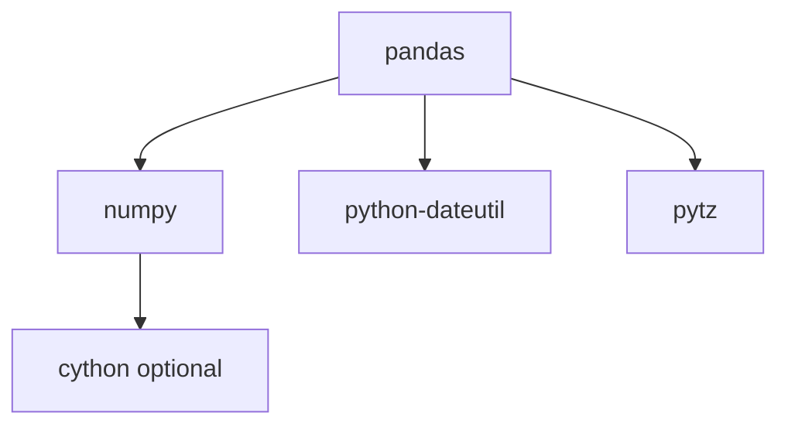


## **D.2 ASCII Graph**

```
pandas
 ├── numpy
 │    └── cython (optional)
 ├── python-dateutil
 └── pytz
```

# **Appendix E — Configuration Templates**

## **E.1 OS Profiles**

```
[os.windows]
platform = "win_amd64"
python_versions = ["3.9", "3.10", "3.11"]

[os.ubuntu]
platform = "manylinux2014_x86_64"
python_versions = ["3.8", "3.9", "3.10", "3.11"]
```

## **E.2 Resolver Settings**

```
[resolver]
max_depth = 32
cycle_detection = true
include_optional = true
strict_pep440 = true
```

## **E.3 Export Settings**

```
[export]
include_logs = true
include_wheel_list = true
include_documentation = true
format = "markdown"
```

# **Appendix F — Data Models**

## **F.1 DependencyNode**

```
DependencyNode:
    name: str
    version_constraints: str
    optional: bool
    native_library: bool
    wheels: List[WheelInfo]
    children: List[DependencyNode]
```

## **F.2 WheelInfo**

```
WheelInfo:
    filename: str
    python_tag: str
    platform_tag: str
    size_kb: int
    release_date: str
```

## **F.3 ReportModel**

```
ReportModel:
    metadata: Metadata
    dependencies: DependencyNode
    wheels: List[WheelInfo]
    native_libs: List[str]
    compatibility: Dict[str, str]
    documentation: DocumentationSummary
    diagnostics: List[LogEntry]
```

## **F.4 LogEntry**

```
LogEntry:
    level: "INFO" | "WARN" | "ERROR" | "HINT"
    message: str
    timestamp: str
```

# **Appendix G — Example Build Report**

Below is a fully synthetic example of a build report generated for `pandas==2.2.0`.

## **G.1 Metadata**

```
Package: pandas
Version: 2.2.0
OS Profile: Ubuntu 22.04 (manylinux2014_x86_64)
Python Version: 3.10
Generated: 2026-08-29 14:03 CEST
```

## **G.2 Dependency Summary**

```
pandas==2.2.0
 ├── numpy>=1.26.0
 │    └── cython (optional)
 ├── python-dateutil>=2.8.2
 └── pytz>=2023.3
```

## **G.3 Wheel Summary**

```
numpy 1.26.4
 - cp310-manylinux2014_x86_64.whl
 - cp311-manylinux2014_x86_64.whl

python-dateutil 2.8.2
 - py3-none-any.whl

pytz 2023.3
 - py3-none-any.whl
```

## **G.4 Native Library Summary**

```
numpy — native library detected (manylinux2014_x86_64)
```

## **G.5 Compatibility Matrix**

```
numpy 1.26.4 — compatible
python-dateutil 2.8.2 — compatible
pytz 2023.3 — compatible
cython — source-only (optional)
```

## **G.6 Documentation Overview**

```
Summary: pandas is a powerful data analysis and manipulation library.
Key Features:
 - DataFrame operations
 - CSV/JSON/Parquet IO
 - Time series utilities
```

## **G.7 Diagnostics**

```
[INFO] Resolving dependencies for pandas…
[WARN] Optional dependency detected: cython
[INFO] Wheel inspection completed.
```

## **G.8 Export Metadata**

```
Export Format: Markdown
Included: requirements.txt, wheel list, logs, documentation
```

---

