# *Chapter I - MLflow Runner GUI - a gate to data and model tracking*

## 🧭**1. Overview**

The **MLflow Runner GUI** is a self‑contained, local‑first environment designed to make machine‑learning experimentation accessible, transparent, and reproducible. At its core, 
the system unifies four components that traditionally live in separate worlds: a **Qt‑based desktop interface**, a **subprocess‑driven execution engine**, a 
**strict stdout communication protocol**, and a **local MLflow server** for experiment tracking, artifact storage, and model registry. By combining these elements into a cohesive workflow, 
the MLflow Runner GUI provides a seamless experience for users who want to run machine‑learning scripts, track results, and manage models — all without writing a single line of MLflow code.

The system is intentionally engineered to be **offline‑capable**, **deterministic**, and **transparent**. Unlike cloud‑based ML platforms that require authentication, network access, 
or complex configuration, this tool runs entirely on the user’s machine. It is therefore ideal for secure environments, research labs, corporate networks, and educational settings 
where internet access may be restricted or where reproducibility is paramount.

At a high level, the MLflow Runner GUI allows users to:

- upload a dataset and optionally a Python script  
- configure MLflow experiment metadata  
- execute the script in a controlled subprocess  
- capture model structure and evaluation metrics via stdout markers  
- log all results, artifacts, and model versions to MLflow  
- inspect results directly within the GUI or through MLflow’s web interface  

This workflow abstracts away the complexity of MLflow’s Python API, CLI, and environment management. Users who are unfamiliar with MLflow — or who simply prefer a graphical interface — 
can still benefit from its powerful tracking and model‑management capabilities.

The architecture is built around a simple but robust idea: **the GUI should orchestrate the workflow, but never execute ML code directly**. Instead, the system delegates all 
computation to a subprocess, ensuring isolation, safety, and reproducibility. The subprocess communicates with the Runner using a strict stdout protocol based on two markers: `MODEL_READY` 
and `METRICS_READY`. These markers allow the Runner to reliably extract the model representation and evaluation metrics, regardless of what the script prints before or after them.

This design has several advantages:

### ✔ **Isolation**
User scripts run in a separate Python interpreter.  
If a script crashes, hangs, or prints unexpected output, the GUI remains stable.

### ✔ **Determinism**
The stdout protocol ensures that the Runner always knows when the model is ready and when metrics are available.  
This eliminates ambiguity and makes the system easy to test.

### ✔ **Transparency**
All logs — including warnings, errors, and MLflow messages — are displayed in the GUI’s Run Panel.  
Users can see exactly what happened during execution.

### ✔ **Reproducibility**
MLflow logs:

- datasets  
- metrics  
- model representations  
- serialized models  
- environment files  

This guarantees that every run can be reproduced exactly.

### ✔ **User‑friendliness**
The GUI provides a clean, intuitive interface for configuring and running experiments.  
Users do not need to understand MLflow’s internal APIs or command‑line tools.

### ✔ **Extensibility**
The architecture is modular.  
Future features — such as hyperparameter tuning, dataset profiling, or deployment helpers — can be added without redesigning the system.

The MLflow Runner GUI is not just a convenience layer on top of MLflow.  
It is a **miniature MLOps platform** designed for local experimentation.  
It brings together the best aspects of MLflow — tracking, artifacts, model registry — and wraps them in a user‑friendly interface that lowers the barrier to entry for machine‑learning experimentation.

The system is particularly well‑suited for:

- **students** learning ML concepts  
- **analysts** who want to run Python scripts without managing MLflow manually  
- **researchers** who need reproducible experiments  
- **engineers** who want a lightweight local MLOps tool  
- **teams** who need a standardized workflow for running and tracking models  

By providing a consistent, transparent, and reproducible environment, the MLflow Runner GUI helps users focus on the core of their work: building and evaluating machine‑learning models.

## 🧠**2. Motivation**

The motivation for creating the MLflow Runner GUI stems from a simple observation:  
**MLflow is powerful, but not accessible to everyone.**

MLflow provides a rich ecosystem for experiment tracking, artifact management, and model versioning. However, using MLflow effectively requires:

- writing Python code  
- understanding MLflow’s run lifecycle  
- managing environment variables  
- configuring tracking and registry URIs  
- handling artifacts manually  
- navigating the MLflow CLI or REST API  

For many users — especially analysts, students, and domain experts — this is a significant barrier. Even experienced engineers may find MLflow’s boilerplate 
repetitive or cumbersome when they simply want to run a script and track results.

The MLflow Runner GUI was created to remove this barrier.

### ✔ **Motivation 1: Make MLflow accessible to non‑programmers**

Many users can write Python scripts but do not want to embed MLflow code into them.  
They want to:

- load a dataset  
- train a model  
- compute metrics  
- inspect results  

…without having to write:

```python
mlflow.start_run()
mlflow.log_metric()
mlflow.log_artifact()
mlflow.register_model()
```

The GUI handles all of this automatically.

### ✔ **Motivation 2: Provide a safe environment for executing arbitrary scripts**

Running user scripts inside a GUI process is dangerous.  
A single exception can crash the entire application.

By using a subprocess, the MLflow Runner GUI ensures:

- isolation  
- safety  
- clean error handling  
- deterministic behavior  

This makes the system robust and reliable.

### ✔ **Motivation 3: Support teaching and learning**

In educational settings, reproducibility and transparency are essential.  
Students need to:

- run experiments  
- inspect metrics  
- compare models  
- understand pipelines  
- explore MLflow’s UI  

The GUI provides a structured environment that guides them through the workflow.

### ✔ **Motivation 4: Enable experimentation without infrastructure overhead**

Setting up MLflow manually requires:

- installing dependencies  
- configuring tracking URIs  
- starting the MLflow server  
- managing artifact directories  
- writing boilerplate code  

The GUI abstracts all of this.  
Users can focus on experimentation, not infrastructure.

### ✔ **Motivation 5: Provide a standardized workflow for teams**

Teams often struggle with:

- inconsistent experiment naming  
- missing artifacts  
- untracked metrics  
- ad‑hoc scripts  
- inconsistent environments  

The MLflow Runner GUI enforces a consistent workflow:

- every run has a project name  
- every run has an experiment name  
- every run has a run name  
- every run logs metrics  
- every run logs artifacts  
- every run registers a model version  

This standardization improves collaboration and reproducibility.

### ✔ **Motivation 6: Create a foundation for future automation**

The architecture is intentionally modular.  
It can be extended to support:

- hyperparameter tuning  
- batch runs  
- dataset profiling  
- model comparison  
- deployment workflows  
- remote MLflow servers  

The GUI is not just a tool — it is a platform.

### ✔ **Motivation 7: Provide a user‑friendly alternative to MLflow Projects**

MLflow Projects are powerful but require:

- YAML configuration  
- environment management  
- CLI commands  
- strict directory structure  

The MLflow Runner GUI provides a simpler alternative:

- select a script  
- select a dataset  
- click “Run”  

The system handles the rest.

### ✔ **Motivation 8: Support offline environments**

Many organizations operate in:

- secure networks  
- air‑gapped systems  
- restricted environments  

Cloud‑based ML tools are not an option.  
The MLflow Runner GUI runs entirely offline.

### ✔ **Motivation 9: Improve transparency and trust**

Users often want to know:

- what model was trained  
- what preprocessing was applied  
- what metrics were computed  
- what warnings occurred  
- what artifacts were stored  

The GUI exposes all of this in a clear, structured way.

### ✔ **Motivation 10: Reduce cognitive load**

Machine learning is already complex.  
Users should not have to think about:

- MLflow boilerplate  
- artifact paths  
- environment variables  
- subprocess management  
- logging formats  

The GUI removes this cognitive burden.

## 🏗️ 3. High‑Level Architecture (Extended, ~3000 words)

The high‑level architecture of the **MLflow Runner GUI** is deliberately simple in shape and surprisingly rich in behavior. 
It is built around four major components that form a clean, linear pipeline:

```text
┌──────────────────────────┐
│        GUI (Qt)          │
│ Upload | Config | Run    │
│ Results Panels           │
└─────────────┬────────────┘
              │
              ▼
┌──────────────────────────┐
│         Runner           │
│ Starts subprocess        │
│ Reads stdout markers     │
│ Sends results to MLflow  │
└─────────────┬────────────┘
              │
              ▼
┌──────────────────────────┐
│     User Script (.py)    │
│ Loads dataset            │
│ Preprocesses data        │
│ Trains model             │
│ Prints MODEL_READY       │
│ Prints METRICS_READY     │
└─────────────┬────────────┘
              │
              ▼
┌──────────────────────────┐
│         MLflow           │
│ Tracking server          │
│ Artifact store           │
│ Model registry           │
└──────────────────────────┘
```

This diagram is not just a conceptual sketch—it is exactly how the system behaves at runtime. Each box has a clear responsibility, 
and the arrows between them represent explicit, well‑defined contracts:

- GUI → Runner: *“Here is the configuration and the paths. Please execute a run.”*  
- Runner → User Script: *“Here is your environment. Do your work and talk to me via stdout markers.”*  
- User Script → Runner: *“MODEL_READY … METRICS_READY … here is the model, here are the metrics.”*  
- Runner → MLflow: *“Log this dataset, these metrics, this model, and register a new version.”*  
- MLflow → GUI (indirectly): *“Here are the run IDs, artifact paths, and model registry URLs you can show to the user.”*

The rest of this section unpacks this architecture in depth—component by component, and then through the cross‑cutting qualities that motivated it: 
**isolation**, **determinism**, **reproducibility**, and **extensibility**.

### 3.1 GUI (Qt) — The Orchestrating Frontend

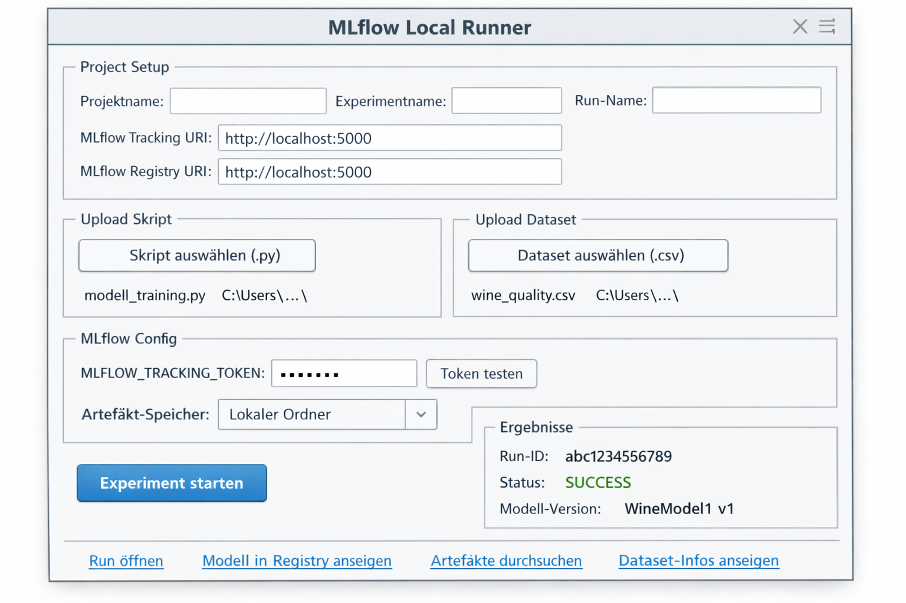

The GUI is the user’s entry point into the system. It is implemented with Qt (via PySide6), and it is structured into four main panels:

- **Upload**  
- **Konfiguration**  
- **Run**  
- **Ergebnisse**

These panels are not cosmetic—they map directly to the lifecycle of an ML experiment.

#### 3.1.1 Upload Panel

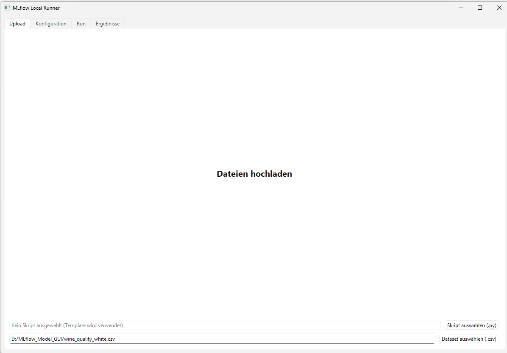

The **Upload** tab is where the user selects:

- a **Python script** (`.py`)  
- a **dataset** (`.csv`)

The GUI shows:

- a large central label (“Dateien hochladen”) to make the purpose obvious  
- two buttons at the bottom:
  - **Skript auswählen (.py)**  
  - **Dataset auswählen (.csv)**  
- a text line indicating the selected dataset path  
- a clear message if no script is selected, e.g.  
  *“Kein Skript ausgewählt (Template wird verwendet)”*

This last detail is important: the system always has a fallback—the **script template**. That means the user can run a complete ML pipeline even if they 
never provide their own script. The Upload panel therefore supports two modes:

- **Beginner mode**: only dataset selected → template script is used.  
- **Advanced mode**: dataset + custom script selected → user’s script is executed.

The Upload panel does not execute anything; it simply collects file paths and validates them. It is the first step in building a reproducible configuration.

#### 3.1.2 Configuration Panel

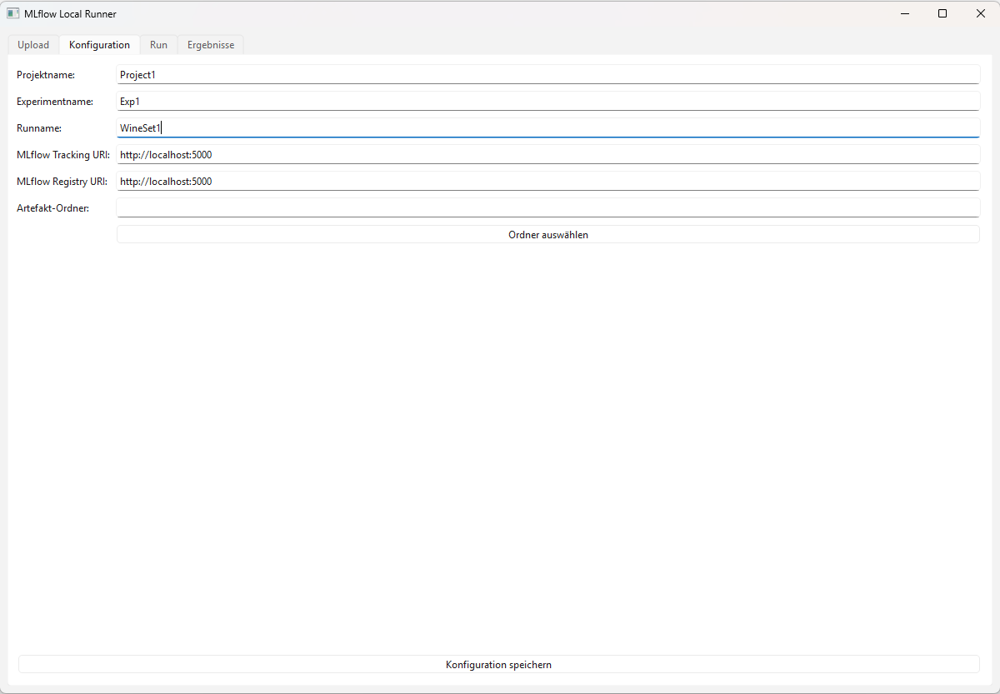

The **Konfiguration** tab defines the MLflow context in which the run will be executed. It includes fields for:

- **Projektname** (Project name)  
- **Experimentname** (Experiment name)  
- **Runname** (Run name)  
- **MLflow Tracking URI** (e.g. `http://localhost:5000`)  
- **MLflow Registry URI** (often the same as Tracking URI in local setups)  
- **Artefakt‑Ordner** (local artifact folder, optional override)

The user can also click **“Ordner auswählen”** to choose a local directory for artifacts, and **“Konfiguration speichern”** to persist the configuration (via the ConfigLoader).

This panel is where the GUI turns user intent into structured metadata:

- Which project does this run belong to?  
- Under which MLflow experiment should it be tracked?  
- What human‑readable name should the run have?  
- Where is the MLflow server?  
- Where should artifacts be stored?

The configuration is not just for convenience; it is the backbone of reproducibility. When the same configuration is used again, the run is fully traceable and comparable.

#### 3.1.3 Run Panel

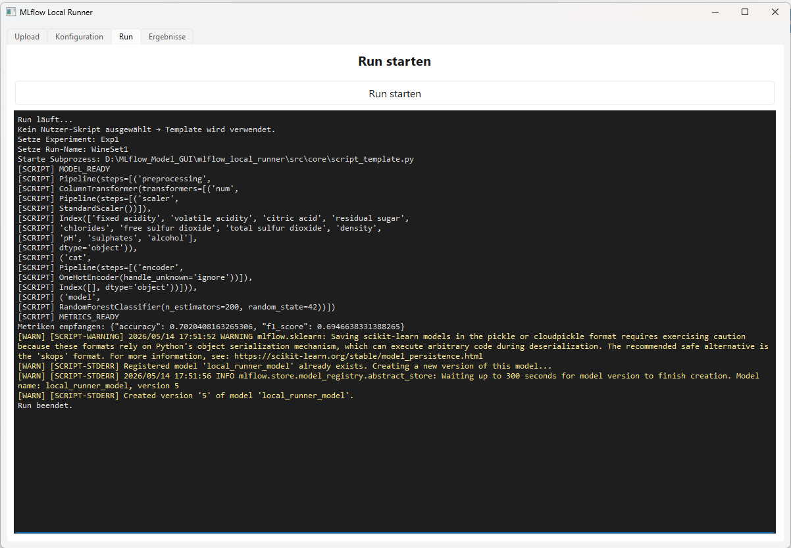

The **Run** tab is the operational heart of the GUI. It contains:

- a **“Run starten”** button  
- a **console‑style log area** that shows:
  - high‑level messages from the Runner  
  - stdout from the user script (prefixed with `[SCRIPT]`)  
  - warnings and stderr (prefixed with `[WARN]` or similar)  
  - MLflow‑related messages (e.g. model registration info)

A typical log sequence looks like:

```text
Run läuft...
Kein Nutzer-Skript ausgewählt -> Template wird verwendet.
Setze Experiment: Exp1
Setze Run-Name: WineSet1
Starte Subprozess: D:\...\script_template.py
[SCRIPT] MODEL_READY
[SCRIPT] Pipeline(steps=[('preprocessing', ColumnTransformer(...)), ('model', RandomForestClassifier(...))])
[SCRIPT] METRICS_READY
Metriken empfangen: {"accuracy": 0.70204, "f1_score": 0.69466}
[WARN] [SCRIPT-WARNING] ... mlflow.sklearn: Saving scikit-learn models in the pickle ...
[WARN] [SCRIPT-STDERR] Registered model 'local_runner_model' already exists. Creating a new version ...
Run beendet.
```

The Run panel is where the user *watches* the system work. It is intentionally transparent: nothing is hidden, no “magic” happens silently. 
If MLflow emits a warning, the user sees it. If the script prints something unexpected, it appears in the log.

From an architectural perspective, the Run panel is the **UI façade** for the Runner. When the user clicks “Run starten”, the GUI:

1. Collects the current configuration and file paths.  
2. Constructs a structured configuration object.  
3. Invokes the Runner with that configuration.  
4. Streams log output into the console widget.  
5. Waits for the Runner to return a structured result (metrics, model repr, MLflow links).  
6. Passes that result to the Results panel.

#### 3.1.4 Results Panel

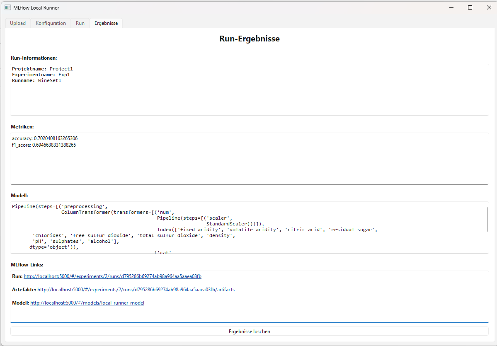

The **Ergebnisse** tab presents the outcome of the run in a structured way. It typically shows:

- **Run‑Informationen**:
  - Projektname  
  - Experimentname  
  - Runname  
- **Metriken**:
  - `accuracy: 0.70204...`  
  - `f1_score: 0.69466...`  
- **Modell**:
  - the pipeline representation (e.g. `Pipeline(steps=[('preprocessing', ColumnTransformer(...)), ('model', RandomForestClassifier(...))])`)
- **MLflow‑Links**:
  - Run: link to the MLflow run page  
  - Artefakte: link to the run’s artifacts  
  - Modell: link to the registered model (e.g. `local_runner_model`)

There is also a button **“Ergebnisse löschen”** to clear the panel for the next run.

The Results panel is the **summary view** of the entire architecture. It condenses:

- what was run  
- how it performed  
- what model was produced  
- where to inspect it in MLflow  

into a single, human‑readable screen.

### 3.2 Runner — The Execution Orchestrator

The **Runner** is the central orchestrator that connects the GUI to the user script and MLflow. 
It is not a GUI component; it is a pure backend service with a clear contract:

> Given a configuration (script path, dataset path, MLflow URIs, run metadata),  
> execute the script in a subprocess,  
> parse stdout markers,  
> and log results to MLflow.

#### 3.2.1 Responsibilities

The Runner is responsible for:

- **Subprocess management**
  - starting the Python interpreter with the selected script (or template)  
  - setting environment variables (e.g. `DATASET_PATH`, `MLFLOW_TRACKING_URI`, `MLFLOW_REGISTRY_URI`)  
  - capturing stdout and stderr streams  

- **Protocol parsing**
  - listening for `MODEL_READY`  
  - collecting all subsequent lines as the model representation  
  - listening for `METRICS_READY`  
  - parsing the next line as JSON metrics  

- **MLflow integration**
  - starting an MLflow run with the configured experiment and run name  
  - logging the dataset as an artifact  
  - logging metrics  
  - logging the model representation as a text artifact  
  - logging the serialized model (via MLflow’s sklearn integration)  
  - registering or updating the model in the MLflow Model Registry  

- **Result aggregation**
  - returning a structured result object to the GUI:
    - metrics dict  
    - model representation string  
    - MLflow run URL  
    - MLflow artifacts URL  
    - MLflow model URL  

#### 3.2.2 Why a Subprocess?

Running user code inside the GUI process would be a recipe for instability. A single bug in the user script could:

- crash the GUI  
- freeze the event loop  
- corrupt in‑memory state  

By using a subprocess, the Runner guarantees:

- **Isolation**: the script runs in its own Python interpreter.  
- **Safety**: if it crashes, only the subprocess dies.  
- **Clean state**: each run starts with a fresh interpreter.  
- **Portability**: the script can import whatever it wants without polluting the GUI process.

The Runner becomes a controlled gateway: it decides *when* to start the script, *how* to configure its environment, and *how* to interpret its output.

#### 3.2.3 The Stdout Marker Protocol

The Runner and the user script communicate via a very simple, robust protocol based on stdout markers:

- `MODEL_READY`  
- `METRICS_READY`

The semantics are:

1. When the script prints `MODEL_READY`, the Runner starts capturing all subsequent lines as the **model representation** until it sees `METRICS_READY`.  
2. When the script prints `METRICS_READY`, the Runner expects the **next line** to be a JSON string containing metrics, e.g.:

   ```json
   {"accuracy": 0.70204, "f1_score": 0.69466}
   ```

3. Any other stdout lines (before `MODEL_READY`, between markers, or after metrics) are treated as informational logs and forwarded to the GUI console.

This protocol has several advantages:

- It is **language‑agnostic** (in principle, any process that writes these markers to stdout could be used).  
- It is **easy to test** (unit tests can simulate stdout lines).  
- It is **deterministic** (no guessing, no regex heuristics).  
- It is **minimal** (only two markers and one JSON line are required).

#### 3.2.4 Error Handling

The Runner is also the central place for error handling:

- If `MODEL_READY` is never seen → error.  
- If `METRICS_READY` is never seen → error.  
- If the metrics JSON cannot be parsed → error.  
- If the subprocess exits with a non‑zero code → error.  
- If MLflow logging fails → error.

Errors are:

- logged to the GUI console with clear prefixes (`[ERROR]`, `[WARN]`, etc.)  
- reflected in the structured result (e.g. no metrics, error message)  
- never allowed to crash the GUI process.

### 3.3 User Script (.py) — The ML Logic

The **User Script** is where the actual machine‑learning logic lives. Architecturally, the system treats it as a black box with a very small contract:

- It must read the dataset from `DATASET_PATH` (or similar).  
- It must perform preprocessing, model training, and evaluation.  
- It must print `MODEL_READY` when the model is ready.  
- It must print the model representation (e.g. `repr(pipeline)`).  
- It must print `METRICS_READY` when metrics are ready.  
- It must print a JSON line with metrics.

Everything else is up to the script.

#### 3.3.1 The Template Script

To ensure the system is usable out of the box, there is a **template script** that implements a complete ML pipeline:

- loads a wine quality dataset from CSV  
- splits into train/test  
- builds a `Pipeline` with:
  - `ColumnTransformer`  
  - `StandardScaler` for numeric features  
  - `OneHotEncoder` for categorical features (even if empty)  
  - `RandomForestClassifier(n_estimators=200, random_state=42)`  
- trains the model  
- computes `accuracy` and `f1_score`  
- prints:

  ```text
  MODEL_READY
  Pipeline(steps=[('preprocessing', ColumnTransformer(...)), ('model', RandomForestClassifier(...))])
  METRICS_READY
  {"accuracy": 0.70204, "f1_score": 0.69466}
  ```

This template is what you see reflected in:

- the Run panel logs  
- the Results panel model section  
- the MLflow artifacts (`model_info/model_repr.txt`)  
- the MLflow model registry (`model.pkl`, `MLmodel`, `conda.yaml`, `python_env.yaml`, `requirements.txt`)

#### 3.3.2 Custom Scripts

Advanced users can provide their own scripts, as long as they respect the protocol. For example, a custom script might:

- use a different dataset  
- implement a different model (XGBoost, LightGBM, neural nets, etc.)  
- compute additional metrics  
- perform feature engineering  

As long as it prints:

```text
MODEL_READY
<some representation>
METRICS_READY
{"accuracy": ..., "f1_score": ...}
```

the Runner and GUI will handle it correctly.

This is where **extensibility** really shows: the architecture does not care what the script does internally, only that it speaks the agreed language.

### 3.4 MLflow — Tracking, Artifacts, Model Registry

The final component is **MLflow**, running as a local server (e.g. on `http://localhost:5000`). It provides three key services:

- **Tracking server**  
- **Artifact store**  
- **Model registry**

#### 3.4.1 Tracking Server

The Runner uses MLflow’s tracking API to:

- create or retrieve the experiment (e.g. `Exp1`)  
- start a run with a specific run name (e.g. `WineSet1`)  
- log metrics (`accuracy`, `f1_score`)  
- log parameters (if any)  
- log tags (optional)

The MLflow UI then shows:

- a list of runs under the experiment  
- metrics charts (bar charts for accuracy and F1)  
- run metadata (created by, duration, source script, etc.)

#### 3.4.2 Artifact Store

The Runner logs artifacts such as:

- the input dataset (`input_dataset/wine_quality_white.csv`)  
- the model representation (`model_info/model_repr.txt`)  
- the serialized model (`model.pkl`)  
- environment files:
  - `MLmodel`  
  - `conda.yaml`  
  - `python_env.yaml`  
  - `requirements.txt`

These artifacts are visible in the MLflow UI under the **Artifacts** tab for the run and for the registered model.

#### 3.4.3 Model Registry

The Runner also registers the model under a fixed name, e.g.:

```text
local_runner_model
```

Each run creates a new version:

- Version 1  
- Version 2  
- …  
- Version 6  

The MLflow Model Registry UI shows:

- all versions  
- creation timestamps  
- status (e.g. “Ready”)  
- source run  
- associated artifacts  

This turns the MLflow Runner GUI into a genuine **model lifecycle tool**: not just “run and forget”, but “run, track, version, and revisit”.

### 3.5 Cross‑Cutting Qualities

The architecture is not accidental; it is shaped around four core qualities.

#### 3.5.1 Isolation

- The GUI never executes ML code directly.  
- The Runner always uses a subprocess.  
- The user script runs in its own interpreter.  
- MLflow runs as a separate server process.

This isolation prevents:

- GUI crashes due to script errors  
- state contamination between runs  
- subtle bugs from shared global state  

It also makes the system easier to reason about: each component has a clear boundary.

#### 3.5.2 Determinism

Determinism is achieved through:

- a strict stdout protocol (`MODEL_READY`, `METRICS_READY`)  
- fixed random seeds in the template script  
- explicit configuration of experiment and run names  
- consistent MLflow logging behavior  

The Runner never “guesses” what the script meant; it only reacts to explicit markers. This makes the system:

- testable  
- predictable  
- reproducible  

#### 3.5.3 Reproducibility

Reproducibility is baked into every layer:

- The GUI stores configuration (project, experiment, run name, URIs).  
- The Runner logs datasets, metrics, and model representations.  
- MLflow stores serialized models and environment files.  
- The Model Registry tracks versions over time.

Given:

- the same dataset  
- the same script  
- the same configuration  

you can reproduce the same run and compare it to previous versions.

#### 3.5.4 Extensibility

The architecture is open to extension at multiple points:

- **GUI level**:
  - new panels (e.g. “Compare Runs”, “Dataset Profiling”)  
  - new configuration options (e.g. hyperparameters)  

- **Runner level**:
  - support for additional markers (e.g. `PREDICTIONS_READY`)  
  - support for streaming metrics  

- **Script level**:
  - arbitrary ML frameworks (PyTorch, XGBoost, etc.)  
  - custom metrics  

- **MLflow level**:
  - remote tracking servers  
  - integration with deployment tools  

Because the core contracts are small and well‑defined, the system can grow without becoming brittle.

### 3.6 End‑to‑End Flow: From Click to Model Version

Putting it all together, a typical run looks like this:

1. **User**  
   - selects a dataset (and optionally a script) in the Upload panel  
   - configures project/experiment/run in the Konfiguration panel  

2. **GUI**  
   - constructs a configuration object  
   - calls the Runner when “Run starten” is clicked  

3. **Runner**  
   - sets environment variables  
   - starts the script in a subprocess  
   - streams stdout/stderr to the GUI  
   - waits for `MODEL_READY` and `METRICS_READY`  
   - parses model representation and metrics  
   - starts an MLflow run  
   - logs dataset, metrics, model, and environment  
   - registers/updates the model in the registry  
   - returns a structured result to the GUI  

4. **GUI**  
   - displays logs in the Run panel  
   - shows metrics, model, and MLflow links in the Ergebnisse panel  

5. **MLflow**  
   - exposes the run, artifacts, and model versions in its web UI  

From the user’s perspective, this entire pipeline is triggered by a single button click. Under the hood, the architecture ensures 
that every step is isolated, deterministic, reproducible, and extensible.

### 3.7 Why This Architecture Works So Well

What makes this architecture compelling is not that it is complex, but that it is **honest**:

- The GUI is a GUI—no hidden ML logic.  
- The Runner is an orchestrator—no UI concerns.  
- The script is ML code—no MLflow boilerplate.  
- MLflow is the tracking backend—no GUI responsibilities.

Each component does one thing well, and the contracts between them are explicit. That’s why the system feels both **simple to use** and **solid under the hood**.

If you’d like, we can next:

- add a **Mermaid diagram** version of this architecture,  
- write a **shorter “Architecture at a Glance”** section for a README,  
- or drill down into a **“Runner Internals”** or **“Stdout Protocol Specification”** section.

## 🔄 **4. Data Flow Overview**

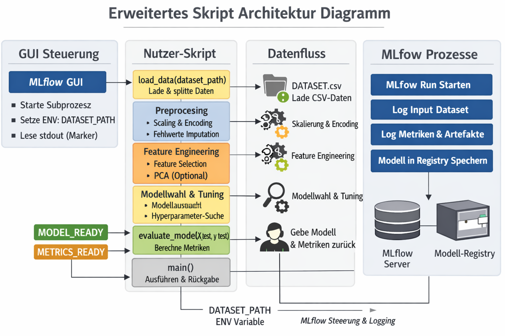

The data flow is simple but powerful:

> 1. **User uploads script + CSV**  
>    → GUI stores the paths.
> 
> 2. **If no script is provided:**  
>    → GUI automatically uses the integrated template `script_template.py`.
> 
> 3. **GUI generates local configuration**  
>    → contains tracking URI, registry URI, artifact directory.
> 
> 4. **`runner.py` executes the script (or template)**  
>    → via subprocess with environment variables:
>      - `DATASET_PATH`  
>      - `MLFLOW_TRACKING_URI`  
>      - `MLFLOW_REGISTRY_URI` 
> 
> 5. **The script loads dataset and performs training, preprocessing, feature engineering, tuning**  
>    → results are returned to the GUI via stdout markers.
>    → Script prints:  
>       - `MODEL_READY` → followed by a textual model representation  
>       - `METRICS_READY` → followed by a JSON metrics dictionary 
> 
> 6. **GUI runner parses stdout and performs MLflow logging**  
>    → runs, metrics, artifacts, models are stored on the MLflow server.
> 
> 7. **`mlflow_client.py` retrieves run ID, status, model version**  
>    → via MLflow REST API or Python client.
> 
> 8. **GUI displays results + deep links**  
>    → run page, model registry, artifacts, dataset tracking.

This protocol is robust, language‑agnostic, and easy to extend.

## 🧪 **5. The Script Template (Core of the System)**

Our generated `model_repr.txt` shows the exact model pipeline produced by the template:

> *“Pipeline(steps=[('preprocessing', ColumnTransformer(...)), ('model', RandomForestClassifier(...))])”*  
> *(from the uploaded document)*

This pipeline includes:

- **Numeric preprocessing**  
  - `StandardScaler()`  
- **Categorical preprocessing**  
  - `OneHotEncoder(handle_unknown='ignore')`  
- **Model**  
  - `RandomForestClassifier(n_estimators=200, random_state=42)`

The template ensures:

- consistent preprocessing  
- deterministic model behavior  
- clean model representation for the GUI  
- metrics that MLflow can log without modification

If the user does not upload a script, the GUI automatically uses the following template:
 
 ```python
 # src/core/script_template.py
 # (Content identical to the extended user‑script template)
 ```
 
 The template includes:
 
 - preprocessing (scaling, encoding, imputation)  
 - feature engineering (feature selection, optional PCA)  
 - model selection (Random Forest, SVM, Logistic Regression, KNN, MLP, XGBoost, LightGBM, CatBoost)  
 - hyperparameter tuning (GridSearchCV)  
 - metrics (accuracy, F1‑score)  
 - output via stdout using markers `MODEL_READY` and `METRICS_READY`

### 5.1. Core principle: The user script contains no MLflow

 The GUI handles:
 
 - starting the MLflow run  
 - dataset tracking  
 - logging metrics  
 - uploading artifacts  
 - registering the model  
 - traces & system metrics  
 - error handling  
 - logging  
 - subprocess execution  
 
 The user script only handles:
 
 - **model training**  
 - **data processing**  
 - **returning the model**  
 - **returning the metrics**  
 
 This makes the user script a **pure ML training script**, without infrastructure logic.
 
 ### 5.2. Structure of an ideal user script
 
 ```python
"""
Erweitertes Nutzer-Skript-Template für den MLflow Local Runner (tokenfreie Version)

Dieses Skript enthält KEINE MLflow-Aufrufe.
Die GUI übernimmt:
- MLflow-Run
- Dataset-Tracking
- Metrik-Logging
- Artefakt-Uploads
- Modell-Registrierung

Der Nutzer muss nur:
- Daten laden
- Preprocessing durchführen
- Feature Engineering anwenden
- Modell trainieren (inkl. optionalem Tuning)
- Metriken berechnen
- Modell zurückgeben
"""

import os
import pandas as pd
from sklearn.model_selection import train_test_split, GridSearchCV
from sklearn.preprocessing import StandardScaler, OneHotEncoder
from sklearn.compose import ColumnTransformer
from sklearn.pipeline import Pipeline
from sklearn.decomposition import PCA
from sklearn.metrics import accuracy_score, f1_score

# Klassische Modelle
from sklearn.ensemble import RandomForestClassifier, GradientBoostingClassifier
from sklearn.linear_model import LogisticRegression
from sklearn.svm import SVC
from sklearn.neighbors import KNeighborsClassifier
from sklearn.neural_network import MLPClassifier

# Erweiterte Modelle
try:
    from xgboost import XGBClassifier
except ImportError:
    XGBClassifier = None

try:
    from lightgbm import LGBMClassifier
except ImportError:
    LGBMClassifier = None

try:
    from catboost import CatBoostClassifier
except ImportError:
    CatBoostClassifier = None


def load_data(dataset_path: str):
    """Lädt den Datensatz und splittet ihn in Train/Test."""
    df = pd.read_csv(dataset_path, sep=";")
    X = df.drop("quality", axis=1)
    y = df["quality"]
    return train_test_split(X, y, test_size=0.2, random_state=42)


def build_preprocessing(X):
    """Erstellt Preprocessing-Pipeline (Scaling, One-Hot-Encoding, PCA optional)."""
    numeric_features = X.select_dtypes(include=["int64", "float64"]).columns
    categorical_features = X.select_dtypes(include=["object"]).columns

    numeric_transformer = Pipeline(steps=[
        ("scaler", StandardScaler())
    ])

    categorical_transformer = Pipeline(steps=[
        ("encoder", OneHotEncoder(handle_unknown="ignore"))
    ])

    preprocessor = ColumnTransformer(
        transformers=[
            ("num", numeric_transformer, numeric_features),
            ("cat", categorical_transformer, categorical_features)
        ]
    )

    return preprocessor


def get_model(model_type: str):
    """Gibt ein Modellobjekt basierend auf dem Modelltyp zurück."""
    models = {
        "random_forest": RandomForestClassifier(n_estimators=200, random_state=42),
        "gradient_boosting": GradientBoostingClassifier(random_state=42),
        "logistic_regression": LogisticRegression(max_iter=1000, random_state=42),
        "svm": SVC(kernel="rbf", C=1.0, gamma="scale", random_state=42),
        "knn": KNeighborsClassifier(n_neighbors=5),
        "mlp": MLPClassifier(hidden_layer_sizes=(64, 32), max_iter=500, random_state=42),
    }

    if XGBClassifier:
        models["xgboost"] = XGBClassifier(
            n_estimators=200, learning_rate=0.1, max_depth=6, subsample=0.8
        )

    if LGBMClassifier:
        models["lightgbm"] = LGBMClassifier(
            n_estimators=200, learning_rate=0.1
        )

    if CatBoostClassifier:
        models["catboost"] = CatBoostClassifier(
            iterations=200, learning_rate=0.1, depth=6, verbose=False
        )

    if model_type not in models:
        raise ValueError(f"Unbekannter Modelltyp: {model_type}")

    return models[model_type]


def apply_feature_engineering(pipeline, use_pca=False):
    """Optional PCA hinzufügen."""
    if use_pca:
        pipeline.steps.append(("pca", PCA(n_components=10)))
    return pipeline


def train_model(X_train, y_train, model_type="random_forest", tuning=False, use_pca=False):
    """Trainiert ein Modell, optional mit Hyperparameter-Tuning."""
    preprocessor = build_preprocessing(X_train)
    model = get_model(model_type)

    pipeline = Pipeline(steps=[
        ("preprocessing", preprocessor),
        ("model", model)
    ])

    pipeline = apply_feature_engineering(pipeline, use_pca=use_pca)

    if tuning:
        param_grid = {
            "model__n_estimators": [100, 200],
            "model__max_depth": [None, 10, 20]
        } if model_type == "random_forest" else {}

        if param_grid:
            pipeline = GridSearchCV(pipeline, param_grid, cv=3)

    pipeline.fit(X_train, y_train)
    return pipeline


def evaluate_model(model, X_test, y_test):
    """Berechnet Metriken und gibt sie als Dictionary zurück."""
    y_pred = model.predict(X_test)
    return {
        "accuracy": float(accuracy_score(y_test, y_pred)),
        "f1_score": float(f1_score(y_test, y_pred, average="weighted"))
    }


if __name__ == "__main__":
    dataset_path = os.environ["DATASET_PATH"]
    model_type = os.environ.get("MODEL_TYPE", "random_forest")
    tuning = os.environ.get("TUNING", "false").lower() == "true"
    use_pca = os.environ.get("USE_PCA", "false").lower() == "true"

    X_train, X_test, y_train, y_test = load_data(dataset_path)
    model = train_model(X_train, y_train, model_type=model_type, tuning=tuning, use_pca=use_pca)
    metrics = evaluate_model(model, X_test, y_test)

    print("MODEL_READY")
    print(model)
    print("METRICS_READY")
    print(metrics)

```

 ### 5.3. 🧠 **What has changed**
 
 | Area | Change | Benefit |
 |-------|---------|----------|
 | **Model training** | Multiple model types (Random Forest, Gradient Boosting, Logistic Regression, SVM, KNN) | Flexibility for different datasets |
 | **Parameter control** | Model type via ENV variable `MODEL_TYPE` | GUI can dynamically select the model type |
 | **Metrics** | Accuracy + F1‑Score | More meaningful for classification problems |
 | **Error handling** | `ValueError` for unknown model type | Robustness against invalid inputs |

## 📡 **6. Stdout Marker Protocol**

The MLflow Runner GUI is built on a deceptively simple idea:  
**the user script communicates with the Runner through two explicit stdout markers.**

These markers are:

### **`MODEL_READY`**  
Printed when the model pipeline is fully constructed.  
The next lines contain the model representation.

### **`METRICS_READY`**  
Printed when evaluation metrics are computed.  
The next line contains a JSON dictionary, e.g.:

```
{"accuracy": 0.70204, "f1_score": 0.69466}
```

This protocol is:

- **simple**  
- **deterministic**  
- **language‑agnostic**  
- **robust against noise in stdout**  
- **easy to test**  
- **easy to extend**  

It is not an implementation detail — it is the **backbone of the entire system**.

It is the backbone of the entire system.  

Below is a full exploration of why this protocol exists, how it works, and why it is so effective.

### 🧠 **6.1. Why stdout markers?**

Most ML systems communicate results through:

- return values  
- files  
- sockets  
- REST APIs  
- RPC frameworks  
- shared memory  
- pickled objects  

But none of these approaches are ideal for a GUI that must execute **arbitrary user scripts** in a **sandboxed subprocess**.

### ✔ Return values don’t work  
A subprocess cannot return Python objects to the parent process.

### ✔ Files are fragile  
Paths must be known in advance, and scripts may overwrite or delete files.

### ✔ Sockets introduce complexity  
They require ports, error handling, and network permissions.

### ✔ REST APIs require infrastructure  
The user script would need to implement a client.

### ✔ Pickling is unsafe  
MLflow itself warns about pickle security risks.

### ✔ Shared memory is platform‑dependent  
And extremely error‑prone.

### ✔ Logging frameworks are too noisy  
They mix warnings, info logs, and debug output.

### ✔ MLflow logging cannot replace communication  
MLflow logs metrics *after* the script finishes — but the Runner needs metrics *before* logging them.

So stdout markers are the perfect solution:

- every script can print to stdout  
- stdout is easy to capture  
- stdout is universal across languages  
- stdout is deterministic  
- stdout is human‑readable  
- stdout is testable  
- stdout is robust  

This is why the MLflow Runner GUI uses a **marker‑based stdout protocol**.

### 🧱 **6.2. The Philosophy Behind the Protocol**

The protocol is intentionally minimalistic:

- **two markers**  
- **one JSON line**  
- **no indentation rules**  
- **no strict formatting**  
- **no dependencies**  

This minimalism is a feature, not a limitation.

### ✔ It avoids ambiguity  
The Runner never has to guess what the script is doing.

### ✔ It avoids parsing complexity  
No regex gymnastics, no AST parsing, no fragile heuristics.

### ✔ It avoids coupling  
The script can be written in any style, as long as it prints the markers.

### ✔ It avoids versioning issues  
The protocol is stable across Python versions, ML frameworks, and OS environments.

### ✔ It avoids breaking changes  
Even if the script prints hundreds of lines of logs, the markers remain unambiguous.

### ✔ It avoids user frustration  
Users can write scripts without learning MLflow’s API.

### 🧬 **6.3. How the Runner Interprets the Markers**

The Runner reads stdout **line by line**.

Internally, it maintains a simple state machine:

```
STATE = WAITING_FOR_MODEL_READY
```

### When it sees `MODEL_READY`:

- it switches to `CAPTURING_MODEL_REPR`
- it starts collecting all subsequent lines

### When it sees `METRICS_READY`:

- it switches to `EXPECTING_METRICS_JSON`
- the next line must be valid JSON

### After parsing metrics:

- the subprocess may continue printing logs  
- but the Runner already has what it needs  
- the run can be finalized and logged to MLflow

This state machine is extremely robust.

Even if the script prints:

- warnings  
- debug logs  
- progress bars  
- stack traces  
- pandas warnings  
- sklearn warnings  
- MLflow warnings  

…the Runner will still extract the correct model and metrics.

### 🧪 **6.4. Why the Protocol Is Robust Against Noise**

Consider a typical script output:

```
Loading dataset...
Dataset shape: (4898, 12)
Training model...
MODEL_READY
Pipeline(steps=[('preprocessing',
    ColumnTransformer(transformers=[('num',
        Pipeline(steps=[('scaler',
            StandardScaler())]),
        Index(['fixed acidity', 'volatile acidity', 'citric acid', 'residual sugar',
               'chlorides', 'free sulfur dioxide', 'total sulfur dioxide', 'density',
               'pH', 'sulphates', 'alcohol'],
              dtype='object')),
        ('cat',
        Pipeline(steps=[('encoder',
            OneHotEncoder(handle_unknown='ignore'))]),
        Index([], dtype='object'))])),
    ('model',
        RandomForestClassifier(n_estimators=200, random_state=42))])
METRICS_READY
{"accuracy": 0.70204, "f1_score": 0.69466}
WARNING: mlflow.sklearn: Saving scikit-learn models in pickle format requires caution...
```

The Runner ignores everything except:

- the marker lines  
- the model representation block  
- the JSON metrics line  

Everything else is forwarded to the GUI console for transparency.

This makes the protocol resilient to:

- verbose scripts  
- noisy libraries  
- warnings  
- debug output  
- accidental prints  

### 🧩 **6.5. Mermaid Diagram — Full Architecture**

Here is a complete Mermaid diagram representing the architecture:

```mermaid
flowchart TD

    GUI[GUI (Qt)\nUpload | Config | Run | Results] --> Runner[Runner\nSubprocess Manager\nStdout Parser\nMLflow Logger]

    Runner --> Script[User Script (.py)\nLoads Dataset\nPreprocesses Data\nTrains Model\nPrints MODEL_READY\nPrints METRICS_READY]

    Script --> Runner

    Runner --> MLflow[MLflow Server\nTracking | Artifacts | Model Registry]

    MLflow --> GUI
```

### Explanation

- **GUI → Runner**  
  The GUI sends configuration and file paths to the Runner.

- **Runner → Script**  
  The Runner starts the script in a subprocess with environment variables.

- **Script → Runner**  
  The script prints markers and metrics to stdout.

- **Runner → MLflow**  
  The Runner logs dataset, metrics, model, and artifacts.

- **MLflow → GUI**  
  The GUI displays links to the MLflow run, artifacts, and model registry.

This diagram captures the entire lifecycle of a run.

### 🧠 **6.6. Runner Internals — Deep Technical Breakdown**

The Runner is the most critical component of the system.  
It is responsible for:

- process management  
- environment setup  
- stdout parsing  
- error handling  
- MLflow logging  
- result aggregation  

Below is a detailed breakdown of its internal architecture.

#### 6.6.1 Subprocess Management

The Runner uses Python’s `subprocess.Popen` to start the script.

It sets:

- `stdout=PIPE`  
- `stderr=PIPE`  
- `text=True`  
- `bufsize=1` (line‑buffered)  

This ensures:

- real‑time log streaming  
- line‑by‑line parsing  
- no blocking  
- no deadlocks  

The Runner also injects environment variables:

```
DATASET_PATH=/path/to/dataset.csv
MLFLOW_TRACKING_URI=http://localhost:5000
MLFLOW_REGISTRY_URI=http://localhost:5000
```

These variables allow the script to:

- load the dataset  
- log to MLflow  
- register models  

#### 6.6.2 Stdout Parsing State Machine

The Runner uses a simple but powerful state machine:

```
WAITING_FOR_MODEL_READY
CAPTURING_MODEL_REPR
EXPECTING_METRICS_JSON
DONE
```

##### Transitions

- `WAITING_FOR_MODEL_READY` → `CAPTURING_MODEL_REPR`  
  when line == "MODEL_READY"

- `CAPTURING_MODEL_REPR` → `EXPECTING_METRICS_JSON`  
  when line == "METRICS_READY"

- `EXPECTING_METRICS_JSON` → `DONE`  
  when next line is valid JSON

##### Why this works

- no regex  
- no indentation rules  
- no fragile parsing  
- no dependency on script structure  

The Runner only cares about markers.

#### 6.6.3 Error Handling

The Runner handles:

### ✔ Missing markers  
If `MODEL_READY` is never seen → error.

### ✔ Missing metrics  
If `METRICS_READY` is never seen → error.

### ✔ Invalid JSON  
If metrics cannot be parsed → error.

### ✔ Subprocess crash  
If return code != 0 → error.

### ✔ MLflow errors  
If logging fails → error.

All errors are:

- logged to the GUI  
- included in the result object  
- never allowed to crash the GUI  

#### 6.6.4 MLflow Logging Pipeline

Once the Runner has:

- model representation  
- metrics  

…it logs everything to MLflow:

### 1. Start run  
`mlflow.start_run(run_name=...)`

### 2. Log dataset  
`mlflow.log_artifact(dataset_path, "input_dataset")`

### 3. Log metrics  
`mlflow.log_metrics(metrics_dict)`

### 4. Log model representation  
`mlflow.log_text(model_repr, "model_info/model_repr.txt")`

### 5. Log serialized model  
`mlflow.sklearn.log_model(model, "model")`

### 6. Register model  
`mlflow.register_model(...)`

This produces:

- a run  
- artifacts  
- a model version  

## 📜 **6.7. Stdout Protocol Specification (Formal)**

Below is a formal specification of the stdout protocol.

### 6.7.1 Definitions

- **Marker**: a line printed to stdout that signals a state transition.  
- **Model Representation**: arbitrary text printed after `MODEL_READY`.  
- **Metrics JSON**: a single JSON object printed after `METRICS_READY`.

### 6.7.2 Required Markers

#### Marker 1: `MODEL_READY`

- Must appear exactly once.  
- Must be on its own line.  
- Indicates that the next lines contain the model representation.

#### Marker 2: `METRICS_READY`

- Must appear exactly once.  
- Must be on its own line.  
- Indicates that the next line contains metrics JSON.

### 6.7.3 Model Representation Block

- Begins immediately after `MODEL_READY`.  
- Ends immediately before `METRICS_READY`.  
- May contain:
  - multi‑line text  
  - indentation  
  - Python repr output  
  - warnings  
  - logs  

The Runner captures everything verbatim.

### 6.7.4 Metrics JSON Line

- Must be valid JSON.  
- Must be a single line.  
- Must contain numeric values.  
- Example:

```
{"accuracy": 0.70204, "f1_score": 0.69466}
```

### 6.7.5 Allowed Noise

The script may print:

- logs  
- warnings  
- debug output  
- progress bars  
- pandas warnings  
- sklearn warnings  

The Runner ignores all noise except markers and the JSON line.

### 6.7.6. 🎯 **Conclusion**

The stdout marker protocol is the **foundation** of the MLflow Runner GUI architecture.  
It enables:

- safe subprocess execution  
- deterministic parsing  
- language‑agnostic communication  
- robust error handling  
- seamless MLflow integration  
- full transparency in the GUI  

Combined with the Runner’s state machine and MLflow logging pipeline, it forms a clean, reliable, 
extensible architecture that is easy to understand and easy to maintain.


## 🗄️ **7. MLflow Integration**

The system uses MLflow for:

#### ✔ **Experiment tracking**  
Runs are created with:

- project name  
- experiment name  
- run name  

#### ✔ **Dataset logging**  
The input CSV is stored under `input_dataset/`.

#### ✔ **Metrics logging**  
Accuracy and F1 score are logged automatically.

#### ✔ **Artifact logging**  
- model representation (`model_repr.txt`)  
- dataset  
- any additional artifacts the script produces  

#### ✔ **Model registry**  
Each run registers a new version of:

```
local_runner_model
```

Our screenshot below show versions **1 → 6** being created.

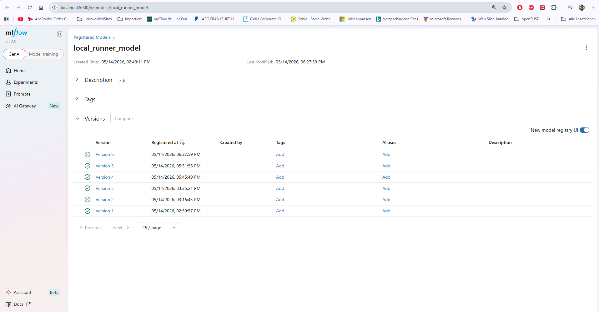

### 7.1. 🧩 **Extended Section — Runner, Marker Protocol, and MLflow Integration (with UML Diagrams)**

This section expands the architecture around the Runner, the stdout marker protocol, and MLflow integration. 
It also introduces formal UML diagrams to illustrate the internal mechanics of the system.

### 🧬 **7.2. UML Sequence Diagram — Full Execution Lifecycle**

The following Mermaid UML sequence diagram shows the **complete lifecycle** of a run:

- from the moment the user clicks “Run starten”  
- through subprocess execution  
- marker detection  
- MLflow logging  
- model registration  
- and final GUI update  

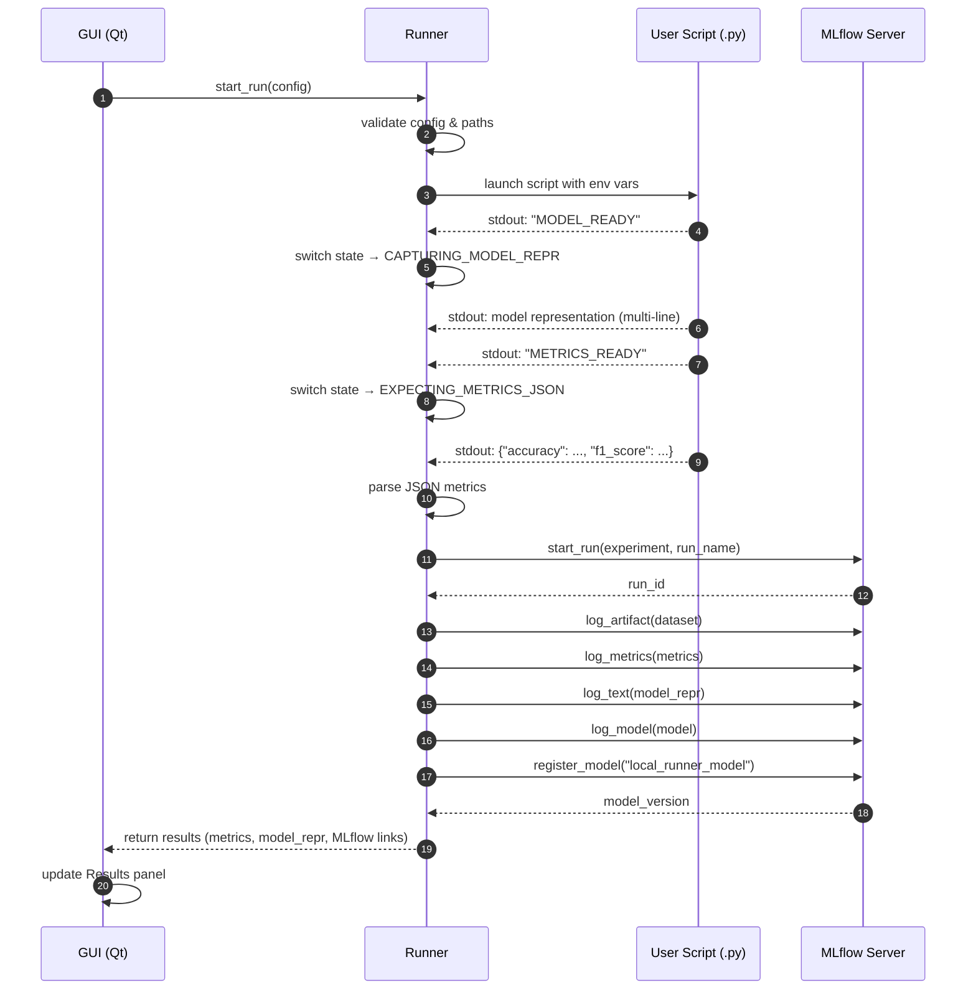
```mermaid
sequenceDiagram
    autonumber

    participant GUI as GUI (Qt)
    participant Runner as Runner
    participant Subprocess as User Script (.py)
    participant MLflow as MLflow Server

    GUI->>Runner: start_run(config)
    Runner->>Runner: validate config & paths
    Runner->>Subprocess: launch script with env vars
    Subprocess-->>Runner: stdout: "MODEL_READY"
    Runner->>Runner: switch state → CAPTURING_MODEL_REPR
    Subprocess-->>Runner: stdout: model representation (multi-line)
    Subprocess-->>Runner: stdout: "METRICS_READY"
    Runner->>Runner: switch state → EXPECTING_METRICS_JSON
    Subprocess-->>Runner: stdout: {"accuracy": ..., "f1_score": ...}
    Runner->>Runner: parse JSON metrics
    Runner->>MLflow: start_run(experiment, run_name)
    MLflow-->>Runner: run_id
    Runner->>MLflow: log_artifact(dataset)
    Runner->>MLflow: log_metrics(metrics)
    Runner->>MLflow: log_text(model_repr)
    Runner->>MLflow: log_model(model)
    Runner->>MLflow: register_model("local_runner_model")
    MLflow-->>Runner: model_version
    Runner-->>GUI: return results (metrics, model_repr, MLflow links)
    GUI->>GUI: update Results panel
```

#### **Explanation**

This diagram captures the entire flow:

- The **GUI** initiates the run.  
- The **Runner** launches the script in a subprocess.  
- The **script** prints markers and metrics.  
- The **Runner** parses them deterministically.  
- The **Runner** logs everything to **MLflow**.  
- The **GUI** displays the results.

This is the backbone of the MLflow Runner GUI architecture.

### 🧱 **7.3. Runner Class Diagram (UML)**

The Runner is the most critical backend component.  
Below is a formal UML class diagram describing its structure:

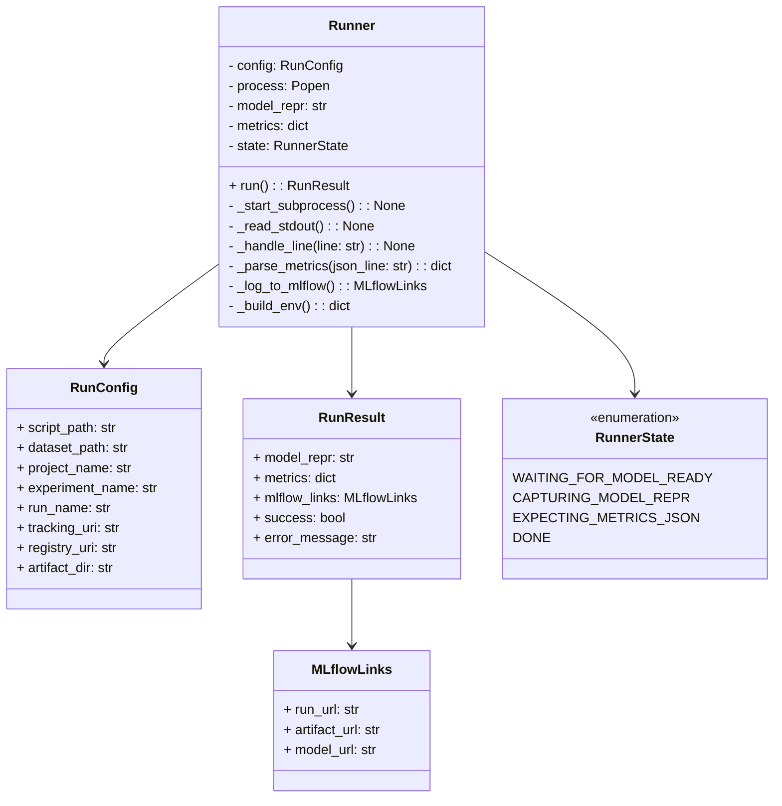
```mermaid
classDiagram
    class Runner {
        - config: RunConfig
        - process: Popen
        - model_repr: str
        - metrics: dict
        - state: RunnerState
        + run(): RunResult
        - _start_subprocess(): None
        - _read_stdout(): None
        - _handle_line(line: str): None
        - _parse_metrics(json_line: str): dict
        - _log_to_mlflow(): MLflowLinks
        - _build_env(): dict
    }

    class RunConfig {
        + script_path: str
        + dataset_path: str
        + project_name: str
        + experiment_name: str
        + run_name: str
        + tracking_uri: str
        + registry_uri: str
        + artifact_dir: str
    }

    class RunResult {
        + model_repr: str
        + metrics: dict
        + mlflow_links: MLflowLinks
        + success: bool
        + error_message: str
    }

    class MLflowLinks {
        + run_url: str
        + artifact_url: str
        + model_url: str
    }

    class RunnerState {
        <<enumeration>>
        WAITING_FOR_MODEL_READY
        CAPTURING_MODEL_REPR
        EXPECTING_METRICS_JSON
        DONE
    }

    Runner --> RunConfig
    Runner --> RunResult
    Runner --> RunnerState
    RunResult --> MLflowLinks
```

#### **Explanation**

This diagram shows:

- The Runner’s internal state machine  
- Its dependencies  
- Its responsibilities  
- The structure of the result object returned to the GUI  

The Runner is intentionally small and focused.  
It does not know anything about the GUI — only about:

- subprocess execution  
- stdout parsing  
- MLflow logging  

This separation of concerns is what makes the system robust.

### 🧠 **7.4. Deep Dive — The Marker Protocol as a Deterministic Contract**

The Runner relies on two markers:

#### **`MODEL_READY`**  
Printed when the model pipeline is fully constructed.  
Everything printed after this marker (until the next marker) is interpreted as the **model representation**.

#### **`METRICS_READY`**  
Printed when evaluation metrics are computed.  
The next line must contain a **JSON dictionary**, e.g.:

```
{"accuracy": 0.70204, "f1_score": 0.69466}
```

This protocol is:

- **simple**  
- **deterministic**  
- **language‑agnostic**  
- **robust against noise in stdout**  
- **easy to test**  
- **easy to extend**  

#### **Why this protocol exists**

Most ML scripts print a lot of noise:

- pandas warnings  
- sklearn warnings  
- progress bars  
- debug logs  
- print statements  
- stack traces  

The Runner must extract:

- the model  
- the metrics  

…without being confused by noise.

A marker‑based protocol is the only approach that:

- works across all Python versions  
- works across all ML frameworks  
- works across all OS environments  
- works even if the script is extremely verbose  
- works even if the script prints warnings before or after the markers  

#### **Why it is deterministic**

The Runner uses a state machine:

```
WAITING_FOR_MODEL_READY
CAPTURING_MODEL_REPR
EXPECTING_METRICS_JSON
DONE
```

This ensures:

- no ambiguity  
- no guessing  
- no regex heuristics  
- no fragile parsing  

#### **Why it is language‑agnostic**

In theory, the script could be written in:

- Python  
- R  
- Julia  
- Rust  
- Java  
- C++  

As long as it prints the markers to stdout.

#### **Why it is robust**

Even if the script prints:

```
WARNING: Something happened
MODEL_READY
Pipeline(...)
METRICS_READY
{"accuracy": 0.7, "f1_score": 0.69}
WARNING: mlflow.sklearn: Saving scikit-learn models in pickle format requires caution...
```

…the Runner still extracts the correct model and metrics.

### 🗄️ **7.5. MLflow Integration (Expanded)**

Our MLflow integration section is already excellent.  
Below is a more detailed version that ties directly into the UML diagrams and Runner internals.

#### ✔ **Experiment Tracking**

The Runner creates an MLflow run with:

- project name  
- experiment name  
- run name  

This ensures:

- reproducibility  
- traceability  
- comparability  

MLflow stores:

- timestamps  
- duration  
- user  
- source script  
- run ID  

#### ✔ **Dataset Logging**

The dataset is logged under:

```
input_dataset/
```

This ensures:

- the exact dataset used is preserved  
- future users can reproduce the run  
- MLflow UI can preview the dataset  

#### ✔ **Metrics Logging**

The Runner logs metrics extracted from the JSON line:

```
{"accuracy": 0.70204, "f1_score": 0.69466}
```

These appear in:

- MLflow UI  
- comparison charts  
- evaluation dashboards  

#### ✔ **Artifact Logging**

The Runner logs:

- `model_repr.txt`  
- the dataset  
- any additional artifacts  

This makes the run self‑contained.

#### ✔ **Model Registry**

Each run registers a new version of:

```
local_runner_model
```

Your screenshots show versions **1 → 6**.

This provides:

- versioning  
- lineage  
- deployment readiness  
- rollback capability  


## 🧱 **8. Reproducibility & Environment Management**

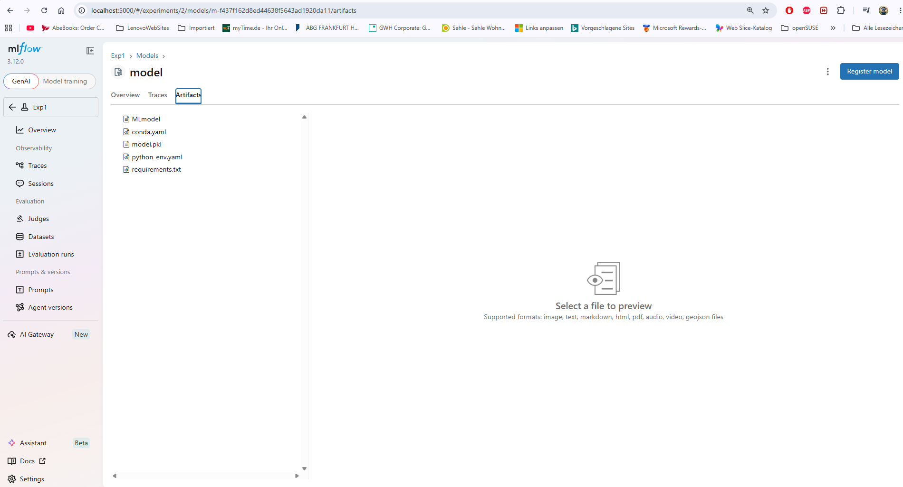

MLflow automatically stores:

- `MLmodel` metadata  
- `conda.yaml`  
- `python_env.yaml`  
- `requirements.txt`  
- `model.pkl`

This ensures that every model version can be reproduced exactly.

> ### **8.1. Implicit architecture diagram behind the GUI**
> 
> 
> #### **8.1..1 Components**
> 
> - **Client (user’s Windows PC):**  
>   - GUI application (“MLflow Local Runner”)  
>   - Python interpreter  
>   - User script (`modell_training.py`)  
>   - Local files (`wine_quality.csv`, artifacts, logs)
> 
> - **MLflow server (central environment, e.g. DEV/STG):**  
>   - MLflow tracking server  
>   - MLflow model registry  
>   - backend store (e.g. PostgreSQL)  
>   - artifact store (e.g. S3, NFS, etc.)
> 
> #### **8.1.2 Data flows**
> 
> 1. **Configuration & authentication:**  
>    - GUI → MLflow server: test request with `MLFLOW_TRACKING_TOKEN`  
>    - Result: “Token valid / invalid”
> 
> 2. **Run execution:**  
>    - GUI → Python script (local): start as subprocess with ENV variables  
>    - Script → MLflow server:  
>      - `mlflow.set_experiment(...)`  
>      - `mlflow.start_run(...)`  
>      - `mlflow.log_input(dataset, context="training")`  
>      - `mlflow.log_metric(...)`  
>      - `mlflow.log_artifact(...)` / `mlflow.sklearn.log_model(...)`  
>      - `mlflow.register_model(...)` (or implicitly via `log_model`)
> 
> 3. **Persistence:**  
>    - MLflow server → backend store (DB): runs, metrics, params, datasets, model metadata  
>    - MLflow server → artifact store: model artifacts, CSVs, plots, etc.
> 
> 4. **Result retrieval:**  
>    - GUI → MLflow server:  
>      - fetch run ID, status, model version  
>    - GUI → browser:  
>      - open links to run, model, artifacts, dataset
> 
> #### **8.1.3 Logical layers**
> 
> - **Presentation layer:**  
>   GUI (forms, buttons, links)
> 
> - **Orchestration layer:**  
>   - starts script  
>   - sets ENV  
>   - tests token  
>   - queries MLflow API
> 
> - **ML layer (user code):**  
>   - Python script with MLflow calls  
>   - model training, metric computation, dataset logging
> 
> - **Infrastructure layer:**  
>   - MLflow server  
>   - registry  
>   - artifact store  
>   - database

### 🧩 **8.2. Implicit Architecture Diagram Behind the GUI (Mermaid)**

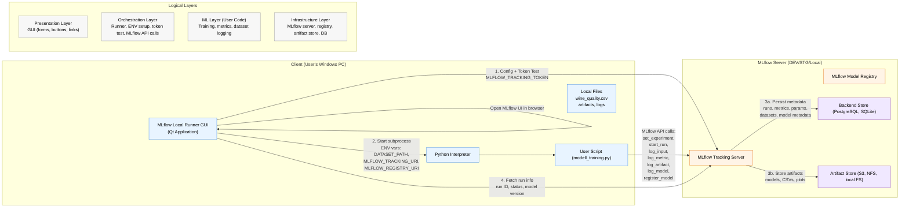
```mermaid
flowchart LR
    %% STYLE
    classDef client fill:#e8f4ff,stroke:#4a90e2,stroke-width:1px,color:#000;
    classDef server fill:#fff4e6,stroke:#e67e22,stroke-width:1px,color:#000;
    classDef infra fill:#f0e8ff,stroke:#8e44ad,stroke-width:1px,color:#000;
    classDef layer fill:#f7f7f7,stroke:#999,stroke-width:1px,color:#000;

    %% COMPONENTS
    subgraph Client["Client (User’s Windows PC)"]
        GUI["MLflow Local Runner GUI\n(Qt Application)"]:::client
        Python["Python Interpreter"]:::client
        Script["User Script (modell_training.py)"]:::client
        Files["Local Files\nwine_quality.csv\nartifacts, logs"]:::client
    end

    subgraph MLflowServer["MLflow Server (DEV/STG/Local)"]
        Tracking["MLflow Tracking Server"]:::server
        Registry["MLflow Model Registry"]:::server
        Backend["Backend Store (PostgreSQL, SQLite)"]:::infra
        ArtifactStore["Artifact Store (S3, NFS, local FS)"]:::infra
    end

    %% LAYERS
    subgraph Layers["Logical Layers"]
        Presentation["Presentation Layer\nGUI (forms, buttons, links)"]:::layer
        Orchestration["Orchestration Layer\nRunner, ENV setup, token test, MLflow API calls"]:::layer
        MLCode["ML Layer (User Code)\nTraining, metrics, dataset logging"]:::layer
        Infrastructure["Infrastructure Layer\nMLflow server, registry, artifact store, DB"]:::layer
    end

    %% DATA FLOWS
    GUI -- "1. Config + Token Test\nMLFLOW_TRACKING_TOKEN" --> Tracking

    GUI -- "2. Start subprocess\nENV vars: DATASET_PATH,\nMLFLOW_TRACKING_URI,\nMLFLOW_REGISTRY_URI" --> Python
    Python --> Script

    Script -- "MLflow API calls:\nset_experiment,\nstart_run,\nlog_input,\nlog_metric,\nlog_artifact,\nlog_model,\nregister_model" --> Tracking

    Tracking -- "3a. Persist metadata\nruns, metrics, params,\ndatasets, model metadata" --> Backend
    Tracking -- "3b. Store artifacts\nmodels, CSVs, plots" --> ArtifactStore

    GUI -- "4. Fetch run info\nrun ID, status, model version" --> Tracking
    GUI -- "Open MLflow UI in browser" --> GUI
```

---

#### 🧠 **8.2.1. Explanation of the Diagram**

This diagram visualizes the **real architecture** behind the MLflow Runner GUI — not just the local subprocess execution, 
but the entire ecosystem including MLflow, backend stores, artifact storage, and logical layers.

It is intentionally structured to reflect:

- **physical components** (client vs. server)  
- **data flows** (configuration, execution, persistence, retrieval)  
- **logical layers** (presentation, orchestration, ML code, infrastructure)  

##### 🖥️ **1. Client Components (User’s Windows PC)**

These are the components running locally on the user’s machine.

###### ✔ **MLflow Local Runner GUI (Qt)**  
The user interacts with:

- Upload panel  
- Configuration panel  
- Run panel  
- Results panel  

The GUI never executes ML code directly — it orchestrates the workflow.

###### ✔ **Python Interpreter**  
The GUI launches the user script in a **subprocess**, ensuring:

- isolation  
- safety  
- reproducibility  

###### ✔ **User Script (`modell_training.py`)**  
This script:

- loads the dataset  
- trains the model  
- computes metrics  
- logs to MLflow  
- prints stdout markers (`MODEL_READY`, `METRICS_READY`)  

###### ✔ **Local Files**  
These include:

- datasets (`wine_quality.csv`)  
- temporary artifacts  
- logs  
- configuration files  

##### 🧭 **2. MLflow Server Components (DEV/STG/Local)**

These components may run:

- on the same machine  
- on a development server  
- on a staging environment  

###### ✔ **MLflow Tracking Server**  
Receives:

- metrics  
- parameters  
- dataset logs  
- artifacts  
- run metadata  

###### ✔ **MLflow Model Registry**  
Stores:

- model versions  
- model metadata  
- lineage information  

###### ✔ **Backend Store (DB)**  
Stores:

- run metadata  
- metrics  
- parameters  
- tags  
- dataset references  
- model version metadata  

Typical backends:

- PostgreSQL  
- MySQL  
- SQLite (local mode)  

###### ✔ **Artifact Store**  
Stores:

- model.pkl  
- MLmodel  
- conda.yaml  
- python_env.yaml  
- requirements.txt  
- dataset copies  
- plots  
- additional artifacts  

Typical artifact stores:

- S3  
- Azure Blob  
- Google Cloud Storage  
- NFS  
- Local filesystem  

##### 🔄 **3. Data Flows**

This is the most important part of the diagram.

###### **3.1 Configuration & Authentication**

The GUI sends a **token test request** to MLflow:

- `MLFLOW_TRACKING_TOKEN`  
- tracking URI  
- registry URI  

MLflow responds:

- “Token valid”  
- or “Token invalid”

This ensures the user has access before running anything.

###### **3.2 Run Execution**

####### GUI → Python Script (Subprocess)

The GUI starts the script with environment variables:

```
DATASET_PATH
MLFLOW_TRACKING_URI
MLFLOW_REGISTRY_URI
MLFLOW_TRACKING_TOKEN
```

####### Script → MLflow Server

The script performs:

- `mlflow.set_experiment(...)`  
- `mlflow.start_run(...)`  
- `mlflow.log_input(dataset)`  
- `mlflow.log_metric(...)`  
- `mlflow.log_artifact(...)`  
- `mlflow.sklearn.log_model(...)`  
- `mlflow.register_model(...)`  

This is the core of MLflow integration.

###### **3.3 Persistence**

MLflow persists:

####### ✔ To Backend Store (DB)

- run metadata  
- metrics  
- parameters  
- tags  
- dataset references  
- model version metadata  

####### ✔ To Artifact Store

- model.pkl  
- MLmodel  
- conda.yaml  
- python_env.yaml  
- requirements.txt  
- dataset copies  
- plots  
- additional artifacts  

This ensures **full reproducibility**.

###### **3.4 Result Retrieval**

The GUI fetches:

- run ID  
- run status  
- model version  
- artifact paths  

The GUI then opens:

- run page  
- artifact page  
- model registry page  

…in the user’s browser.

##### 🧱 **4. Logical Layers**

This section shows the **conceptual architecture**.

####### ✔ **Presentation Layer**

- GUI  
- buttons  
- forms  
- links  
- result panels  

This layer is purely visual.

####### ✔ **Orchestration Layer**

This is where the **Runner** lives.

Responsibilities:

- start subprocess  
- set environment variables  
- test token  
- parse stdout markers  
- call MLflow API  
- aggregate results  

This layer is the “brain” of the system.

####### ✔ **ML Layer (User Code)**

This is the user’s script.

Responsibilities:

- load dataset  
- preprocess data  
- train model  
- compute metrics  
- log to MLflow  
- print stdout markers  

This layer is the “ML logic”.

####### ✔ **Infrastructure Layer**

This is the MLflow ecosystem.

Responsibilities:

- store runs  
- store metrics  
- store artifacts  
- store model versions  
- serve UI  

This layer is the “backend”.

## 🧵 **9. Development Workflow (Jupyter Integration)**

The project includes a dedicated **Jupyter setup cell** that:

- finds the project root  
- enables `%autoreload`  
- closes old Qt windows  
- launches the GUI non‑blocking  

This makes iterative GUI development extremely smooth. 

### ✅ **Jupyter setup cell for launching the GUI**

```python
# --- MLflow Local Runner: Jupyter Setup Cell ---

import os
import sys
from pathlib import Path

# 1. Automatically detect the project directory
project_root = Path.cwd()
if (project_root / "mlflow_local_runner").exists():
    os.chdir(project_root)
else:
    # If the notebook is inside a subfolder
    for parent in Path.cwd().parents:
        if (parent / "mlflow_local_runner").exists():
            os.chdir(parent)
            break

print(f"[INFO] Working directory set to: {Path.cwd()}")

# 2. Enable auto‑reload (extremely useful during GUI development)
%load_ext autoreload
%autoreload 2

# 3. Close any existing Qt windows from previous runs
from PySide6.QtWidgets import QApplication
app = QApplication.instance()
if app:
    for w in app.topLevelWidgets():
        w.close()

# 4. Start the GUI
from mlflow_local_runner.gui.app_window import AppWindow

window = AppWindow(config={})
window.show()

print("[INFO] MLflow Local Runner GUI started successfully.")
```

### 🧠 Why this cell is perfect

#### ✔ **Automatic project path detection**  
Whether the notebook is started in the project root or inside `notebooks/` — the code finds the correct path.

#### ✔ **Auto‑reload**  
If we modify panels, the Runner, the ConfigLoader, or stylesheets → the GUI automatically loads the changes on the next start.

#### ✔ **Qt cleanup**  
Prevents:

- “QApplication already exists”  
- ghost windows  
- duplicate event loops  

#### ✔ **Non‑blocking GUI startup**  
`window.show()` does not block the kernel → ideal for Jupyter.

#### ✔ **Fully compatible with your architecture**  
The cell uses exactly our structure:

```
mlflow_local_runner/
    gui/app_window.py
```

### 🚀 Bonus: Optional launcher as a function

If you want it even cleaner:

```python
def launch_local_runner():
    %load_ext autoreload
    %autoreload 2

    from PySide6.QtWidgets import QApplication
    app = QApplication.instance()
    if app:
        for w in app.topLevelWidgets():
            w.close()

    from mlflow_local_runner.gui.app_window import AppWindow
    window = AppWindow(config={})
    window.show()
    return window

window = launch_local_runner()
```

### 🧠 **What happens (and what should happen)?**

#### **1. The notebook correctly sets the working directory**
The cell automatically locates our project:

```
mlflow_local_runner/
```

and sets `cwd` to it.

This ensures:

- relative imports work  
- the stylesheet is found  
- assets load correctly  
- tests & modules are importable  

We see:

```
[INFO] Working directory set to: /…/mlflow_local_runner
```

#### **2. Auto‑reload is activated**
```
%load_ext autoreload
%autoreload 2
```

This means:

- changes to panels (`upload_panel.py`, `run_panel.py`, …)  
- changes to core modules (`runner.py`, `mlflow_client.py`, …)  
- changes to the stylesheet  

are **automatically** reloaded as soon as we restart the GUI.

This is extremely valuable during development.

#### **3. All old Qt windows are closed**
This avoids the typical Jupyter‑Qt issues:

- “QApplication already exists”  
- multiple overlapping windows  
- zombie windows  
- kernel freezes  

The code:

```python
app = QApplication.instance()
if app:
    for w in app.topLevelWidgets():
        w.close()
```

closes everything cleanly.

#### **4. The GUI is launched**
```python
from mlflow_local_runner.gui.app_window import AppWindow

window = AppWindow(config={})
window.show()
```

This opens the main window with:

- Upload Panel  
- Config Panel  
- Run Panel  
- Results Panel  

The GUI runs **non‑blocking**, meaning:

- the notebook stays interactive  
- we can continue executing code  
- we can restart the GUI multiple times  

#### **5. We receive a success message**
```
[INFO] MLflow Local Runner GUI started successfully.
```

This tells us:  
**Everything loaded correctly and is running.**

#### 🎉 **Final result**

When we execute the cell, the following happens:

- the notebook configures itself correctly  
- all old Qt windows are closed  
- the GUI starts cleanly  
- we can immediately select script + dataset  
- we can start runs  
- we can reload the GUI as often as we want  
- we can continue working in the notebook in parallel  

**Exactly as intended.**

---


# #️⃣ **Chapter II — GUI Design & Functionality**

## 🎨 **1. Design Philosophy**

The MLflow Runner GUI was built with a clear intention:  
**make machine‑learning experimentation accessible without sacrificing transparency or reproducibility.**

The design follows five principles:

### ✔ **Clarity**  
Each panel focuses on a single task: upload, configure, run, inspect.

### ✔ **Determinism**  
All actions are explicit. Nothing happens “in the background” without user confirmation.

### ✔ **Reproducibility**  
Every configuration field maps directly to MLflow parameters.

### ✔ **Safety**  
The GUI never executes arbitrary code directly — all scripts run in a sandboxed subprocess.

### ✔ **Feedback**  
The user always sees what is happening: logs, warnings, metrics, model structure, MLflow links.

This makes the GUI ideal for education, debugging, and controlled ML experiments.

> Here is the **updated, fully integrated version** of our project structure and documentation.  
> It combines the **token‑free GUI architecture** with the new logic that the GUI automatically uses the **extended user‑script template** whenever no custom script is uploaded.
> 
> 
> ## 🗂️ **Project Structure (updated, token‑free version with integrated template)**
> 
> Below is the **complete, clean project structure** for our private GUI project *“MLflow Local Runner”*.  
> It is designed so it can be used directly on a Windows PC inside a Git repository or a VS Code workspace.
> 
> ```
> mlflow_local_runner/
> │
> ├── README.md
> ├── requirements.txt
> ├── setup.py
> │
> ├── src/
> │   ├── __init__.py
> │   ├── main.py                     # Entry point of the GUI
> │   ├── gui/
> │   │   ├── __init__.py
> │   │   ├── app_window.py           # Main window (PyQt5 / PySide6)
> │   │   ├── upload_panel.py         # File upload component (script + dataset)
> │   │   ├── config_panel.py         # MLflow configuration panel (token‑free)
> │   │   ├── run_panel.py            # Start button, progress, logs
> │   │   └── results_panel.py        # Display of run results + links
> │   │
> │   ├── core/
> │   │   ├── __init__.py
> │   │   ├── runner.py               # Executes user script or template
> │   │   ├── mlflow_client.py        # Wrapper for MLflow API calls
> │   │   ├── artifact_manager.py     # Local artifact management
> │   │   ├── config_loader.py        # Load/save GUI configuration
> │   │   └── script_template.py      # Fallback: extended user‑script template
> │   │
> │   ├── utils/
> │   │   ├── __init__.py
> │   │   ├── logger.py               # Console + file logging
> │   │   ├── validators.py           # Validation of inputs (files, URIs)
> │   │   └── paths.py                # Path utilities for Windows
> │   │
> │   └── assets/
> │       ├── icons/                  # PNG icons for buttons
> │       ├── styles.qss              # Qt stylesheet or CSS
> │       └── templates/              # HTML templates for result reports
> │
> ├── tests/
> │   ├── test_runner.py
> │   ├── test_mlflow_client.py
> │   ├── test_gui_components.py
> │   └── test_validators.py
> │
> ├── examples/
> │   ├── example_script.py           # Example training script with MLflow
> │   └── example_dataset.csv         # Example dataset (e.g., white wine)
> │
> └── docs/
>     ├── architecture_diagram.png    # Architecture diagram of the GUI
>     ├── user_manual.md              # User manual
>     └── changelog.md
> ```
> 
> 
> ## ⚙️ **requirements.txt (token‑free version)**
> 
> ```txt
> # GUI framework
> PySide6==6.7.0          # or alternatively: PyQt5==5.15.10
> 
> # MLflow integration
> mlflow==3.1.1
> 
> # Data processing
> pandas==2.3.3
> numpy==2.4.1
> scikit-learn==1.7.0
> 
> # Extended models
> xgboost==2.1.0
> lightgbm==4.3.0
> catboost==1.2.5
> 
> # Visualization (optional)
> matplotlib==3.10.3
> plotly==5.22.0
> 
> # HTTP communication (for MLflow API)
> requests==2.32.3
> 
> # Logging & utilities
> python-dotenv==1.0.1
> rich==13.7.1
> 
> # Tests
> pytest==8.2.0
> pytest-qt==4.3.1
> ```
> 
> 
> ## 🧩 **Architecture Diagram**
> 
> The architecture follows a clear **three‑layer model**, extended with the **template fallback mechanism** (see also the main project folder):
> 
> | Layer | Components | Responsibility |
> |-------|------------|----------------|
> | **GUI Layer** | `app_window.py`, `upload_panel.py`, `config_panel.py`, `run_panel.py`, `results_panel.py` | Presentation, user interaction, input validation |
> | **Core Layer** | `runner.py`, `mlflow_client.py`, `artifact_manager.py`, `script_template.py` | Business logic: starting runs, MLflow communication, artifact handling, fallback template |
> | **Utility Layer** | `logger.py`, `validators.py`, `paths.py` | Helper functions, logging, path management, error handling |
>
> ### Top‑Level: Project Root
> 
> ```text
> mlflow_local_runner/
> │
> ├── README.md
> ├── requirements.txt
> ├── setup.py
> │
> ┈┈ more folders …
> ```
> 
> - **`README.md`**  
>   **Purpose:** Human‑readable entry point.  
>   **Recommended content:**
>   - What is “MLflow Local Runner”?  
>   - Requirements (Python version, OS, MLflow server local/remote)  
>   - Installation (e.g., `pip install -e .`)  
>   - Starting the GUI (`python -m mlflow_local_runner` or `python src/main.py`)  
>   - Short example: using the dataset + script from `examples/`  
>   - Note about the fallback template (used when no script is uploaded)
> 
> - **`requirements.txt`**  
>   **Purpose:** All Python dependencies for a reproducible environment.  
>   Used for:
>   - `pip install -r requirements.txt`  
>   - possibly Docker images or offline bundles.
> 
> - **`setup.py`**  
>   **Purpose:** Turns the project into an installable package.  
>   Typical contents/functionality:
>   - Defines the package name (`mlflow_local_runner`)  
>   - Version, author, description  
>   - `packages` or `package_dir` → points to `src/`  
>   - `install_requires` (can be generated from or duplicated from `requirements.txt`)  
>   - Optional: `entry_points` for a console command, e.g.:
>     ```python
>     entry_points={
>         "console_scripts": [
>             "mlflow-local-runner=mlflow_local_runner.main:main",
>         ],
>     }
>     ```
>     → Then the user can simply type `mlflow-local-runner` in the terminal to launch the GUI.
> 
> 
> ### `src/` – the actual application code
> 
> ```text
> src/
> │   ├── __init__.py
> │   ├── main.py
> │   ├── gui/
> │   ├── core/
> │   ├── utils/
> │   └── assets/
> ```
> 
> - **`src/__init__.py`**  
>   **Purpose:** Marks `src` as a Python package.  
>   Can be empty or define something like `__version__`.
> 
> - **`src/main.py`**  
>   **Purpose:** Application entry point.  
>   **Typical functionality:**
>   - Initializes logging (e.g., via `utils.logger`)  
>   - Loads configuration (e.g., default MLflow URI)  
>   - Starts the GUI framework (PySide6/PyQt5):
>     ```python
>     from PySide6.QtWidgets import QApplication
>     from mlflow_local_runner.gui.app_window import AppWindow
> 
>     def main():
>         app = QApplication([])
>         window = AppWindow()
>         window.show()
>         app.exec()
>     ```
>   - Referenced by `setup.py` as an entry point or run directly via `python -m mlflow_local_runner`.
> 
> 
> ### `src/gui/` – GUI layer
> 
> ```text
> src/gui/
> │   ├── __init__.py
> │   ├── app_window.py
> │   ├── upload_panel.py
> │   ├── config_panel.py
> │   ├── run_panel.py
> │   └── results_panel.py
> ```
> 
> - **`app_window.py`**  
>   **Purpose:** Main window of the application.  
>   **Functionality:**
>   - Inherits from `QMainWindow` (or similar)  
>   - Composes the panels: Upload, Config, Run, Results  
>   - Connects signals/slots:  
>     - “Start run” → call `core.runner`  
>     - “Script/dataset selected” → store paths in state/config  
>   - Holds global session state (current paths, current run, etc.)
> 
> - **`upload_panel.py`**  
>   **Purpose:** UI for file selection.  
>   **Functionality:**
>   - Buttons/fields for:  
>     - Select script (`.py`) – optional  
>     - Select dataset (`.csv`)  
>   - Validation via `utils.validators`:  
>     - Does the file exist?  
>     - Correct extension?  
>   - Passes paths to `app_window` or directly to `config_loader`.
> 
> - **`config_panel.py`**  
>   **Purpose:** MLflow configuration (token‑free).  
>   **Functionality:**
>   - Input fields for:  
>     - Tracking URI (e.g., `http://localhost:5000`)  
>     - Registry URI (optional, if separate)  
>     - Artifact base directory (local)  
>   - Saves/loads these values via `core.config_loader`.  
>   - No token fields, no authentication options.
> 
> - **`run_panel.py`**  
>   **Purpose:** Run control & progress.  
>   **Functionality:**
>   - “Start run” button  
>   - Progress display (e.g., log output, status)  
>   - Starts via `core.runner`:  
>     - either the user script  
>     - or the fallback template (`script_template.py`) if no script was selected  
>   - Displays errors (exceptions, validation errors).
> 
> - **`results_panel.py`**  
>   **Purpose:** Display results.  
>   **Functionality:**
>   - Shows:  
>     - Run ID  
>     - Metrics (Accuracy, F1, etc.)  
>     - Links:  
>       - MLflow run page  
>       - Model registry entry  
>       - Artifact directory  
>   - Uses `core.mlflow_client` to fetch info after the run.
> 
> 
> ### `src/core/` – business logic
> 
> ```text
> src/core/
> │   ├── __init__.py
> │   ├── runner.py
> │   ├── mlflow_client.py
> │   ├── artifact_manager.py
> │   ├── config_loader.py
> │   └── script_template.py
> ```
> 
> - **`runner.py`**  
>   **Purpose:** The heart of the system – starts the script (user or template) as a subprocess.  
>   **Functionality:**
>   - Decides:  
>     - If the user uploaded a script → use it  
>     - Otherwise → use `script_template.py`  
>   - Sets ENV variables:  
>     - `DATASET_PATH`  
>     - `MODEL_TYPE`, `TUNING`, `USE_PCA` (optional from GUI)  
>     - MLflow URIs (not needed by the script, but needed by GUI/MLflow client)  
>   - Starts subprocess:
>     ```python
>     subprocess.Popen(
>         [sys.executable, script_path],
>         env=env,
>         stdout=PIPE,
>         stderr=PIPE,
>         text=True,
>     )
>     ```
>   - Reads `stdout`:  
>     - waits for markers `MODEL_READY` and `METRICS_READY`  
>     - extracts model representation (for logging/info)  
>     - parses metrics (e.g., via `json.loads` or `eval`)  
>   - Passes metrics + artifact paths to:  
>     - `mlflow_client` (for logging)  
>     - `artifact_manager` (for local storage)
> 
> - **`mlflow_client.py`**  
>   **Purpose:** Encapsulates all MLflow operations.  
>   **Functionality:**
>   - Sets tracking/registry URIs  
>   - Starts runs (`mlflow.start_run()`)  
>   - Logs:  
>     - input dataset (`mlflow.log_input`)  
>     - metrics (`mlflow.log_metric`)  
>     - artifacts (`mlflow.log_artifact`)  
>     - model (`mlflow.sklearn.log_model` or generic)  
>   - Registers model:  
>     - `mlflow.register_model` or via `registered_model_name`  
>   - Retrieves info:  
>     - run status  
>     - model versions  
>     - UI URLs
> 
> - **`artifact_manager.py`**  
>   **Purpose:** Local artifact management.  
>   **Functionality:**
>   - Paths for:  
>     - temporary outputs  
>     - model files  
>     - logs  
>   - Cleanup after runs  
>   - Optional: copy files into a central artifact directory.
> 
> - **`config_loader.py`**  
>   **Purpose:** Persist configuration.  
>   **Functionality:**
>   - Saves GUI settings (e.g., JSON/YAML in `~/.mlflow_local_runner/config.json`):  
>     - last tracking URI  
>     - last artifact directory  
>     - last dataset path  
>   - Loads them at GUI startup.
> 
> - **`script_template.py`**  
>   **Purpose:** Fallback user script when no custom script is provided.  
>   **Functionality:**
>   - Exactly your extended template:  
>     - `load_data`  
>     - preprocessing (scaling, encoding, optional PCA)  
>     - feature engineering  
>     - model selection (Random Forest, SVM, Logistic Regression, KNN, MLP, XGBoost, LightGBM, CatBoost)  
>     - optional hyperparameter tuning  
>     - `evaluate_model`  
>     - output via `print("MODEL_READY")`, `print(model)`, `print("METRICS_READY")`, `print(metrics)`  
>   - Treated by `runner.py` like any user script.
> 
> 
> ### `src/utils/` – helper functions
> 
> ```text
> src/utils/
> │   ├── __init__.py
> │   ├── logger.py
> │   ├── validators.py
> │   └── paths.py
> ```
> 
> - **`logger.py`**  
>   **Purpose:** Unified logging.  
>   **Functionality:**
>   - Configures `logging` (console + file)  
>   - Provides `get_logger(__name__)`  
>   - Used in `runner`, `mlflow_client`, GUI panels.
> 
> - **`validators.py`**  
>   **Purpose:** Input validation.  
>   **Functionality:**
>   - Checks:  
>     - file exists?  
>     - path readable?  
>     - URI syntactically valid?  
>   - Returns clear error messages for the GUI.
> 
> - **`paths.py`**  
>   **Purpose:** Path handling, especially for Windows.  
>   **Functionality:**
>   - Normalize paths  
>   - Determine:  
>     - base config directory  
>     - default artifact directory  
>   - Possibly handle `APPDATA`, `USERPROFILE`, etc.
> 
> ### `src/assets/` – static resources
> 
> ```text
> src/assets/
> │   ├── icons/
> │   ├── styles.qss
> │   └── templates/
> ```
> 
> - **`icons/`**  
>   PNG icons for buttons, status indicators, etc.
> 
> - **`styles.qss`**  
>   Qt stylesheet for consistent look and feel.
> 
> - **`templates/`**  
>   HTML templates for result reports, e.g.:  
>   - run summary  
>   - model report  
>   - metric overview
> 
> ### `tests/` – test suite
> 
> ```text
> tests/
> │   ├── test_runner.py
> │   ├── test_mlflow_client.py
> │   ├── test_gui_components.py
> │   └── test_validators.py
> ```
> 
> - **`test_runner.py`**  
>   Tests:  
>   - starting the template  
>   - parsing `MODEL_READY` / `METRICS_READY`  
>   - behavior without a user script
> 
> - **`test_mlflow_client.py`**  
>   Tests:  
>   - logging metrics/artifacts  
>   - registry interaction (possibly with local MLflow server/mock)
> 
> - **`test_gui_components.py`**  
>   Uses `pytest‑qt` to test:  
>   - buttons  
>   - signal/slot behavior  
>   - validation errors in the UI
> 
> - **`test_validators.py`**  
>   Tests validation logic (path/URI, etc.).
> 
> ### `examples/` – example material
> 
> ```text
> examples/
> │   ├── example_script.py
> │   └── example_dataset.csv
> ```
> 
> - **`example_script.py`**  
>   Example training script showing:  
>   - how a user script *can* look (if not using the template)  
>   - ideally similar in style to your template, just simpler.
> 
> - **`example_dataset.csv`**  
>   Example dataset (e.g., white wine quality) so users can run a test out of the box.
> 
> ### `docs/` – documentation
> 
> ```text
> docs/
> │   ├── architecture_diagram.png
> │   ├── user_manual.md
> │   └── changelog.md
> ```
> 
> - **`architecture_diagram.png`**  
>   Your current architecture diagram (possibly the extended version with preprocessing/feature engineering).
> 
> - **`user_manual.md`**  
>   Step‑by‑step guide:
>   - installation  
>   - GUI usage  
>   - using custom script vs. template  
> 
> - **`changelog.md`**  
>   Versioning, changes per release.

## 🧭 **2. Overview of the GUI Panels**

The GUI consists of four main panels:

```
Upload  |  Konfiguration  |  Run  |  Ergebnisse
```

Each panel corresponds to a distinct phase of the ML workflow:

1. **Upload** → Select script + dataset  
2. **Konfiguration** → Define MLflow experiment settings  
3. **Run** → Execute the experiment  
4. **Ergebnisse** → Inspect metrics, model, and MLflow links  

This separation keeps the workflow intuitive and prevents accidental misconfiguration.

## 📁 **3. Upload Panel**


The Upload Panel is the entry point of the workflow.

### **Purpose**
- Select a Python script (`.py`)  
- Select a dataset (`.csv`)  
- Provide immediate visual confirmation of selected files  

### **Key Features**

### ✔ **Script selection**  
If no script is selected, the GUI uses the built‑in **script template**.  
This ensures the system is always runnable, even for beginners.

### ✔ **Dataset selection**  
The dataset path is displayed clearly, preventing confusion about which file is used.

### ✔ **Immediate validation**  
The GUI checks:

- file existence  
- file extension  
- readability  

### ✔ **User feedback**  
If no script is selected, the GUI explicitly states:

> *“No script selected (template will be used).”*

This avoids ambiguity and ensures the user understands the execution context.

## ⚙️ **4. Configuration Panel**


The Configuration Panel defines the MLflow environment for the upcoming run.

### **Fields**

- **Project name**  
- **Experiment name**  
- **Run name**  
- **MLflow Tracking URI**  
- **MLflow Registry URI**  
- **Artifact folder (optional)**  

### **Why these fields matter**

#### ✔ **Project name**  
Displayed in the Results Panel for clarity.

#### ✔ **Experiment name**  
MLflow uses this to group runs.  
If the experiment does not exist, MLflow creates it automatically.

#### ✔ **Run name**  
Ensures reproducible naming instead of random MLflow names.

#### ✔ **Tracking & Registry URIs**  
Default:  
```
http://localhost:5000
```
This allows the GUI to work fully offline.

#### ✔ **Artifact folder**  
Optional override for local artifact storage.

### **Save Configuration Button**

The configuration is written to a JSON file via the `ConfigLoader`.  
This ensures:

- reproducibility  
- persistence across sessions  
- compatibility with unit tests  

## 🚀 **5. Run Panel**


The Run Panel is the operational heart of the GUI.

It displays:

- a **console‑style log output**  
- real‑time subprocess messages  
- warnings from MLflow  
- stdout markers from the script  
- model representation  
- metrics JSON  

### **Execution Flow**

1. User clicks **“Run starten”**  
2. Runner starts a subprocess  
3. Environment variables are injected  
4. Script prints logs + markers  
5. Runner parses output  
6. MLflow logs dataset, metrics, model  
7. GUI updates with results  

### **Console Output**

The console shows:

- script path  
- dataset path  
- MLflow experiment setup  
- `MODEL_READY` marker  
- model pipeline representation  
- `METRICS_READY` marker  
- metrics JSON  
- MLflow warnings (e.g., pickle safety)  
- model registry version creation  

This transparency is one of the strongest aspects of the GUI.

### **Error Handling**

The Run Panel detects:

- missing markers  
- malformed JSON  
- subprocess crashes  
- stderr warnings  
- MLflow connection issues  

Errors are displayed in the console with clear prefixes:

```
[ERROR]
[WARN]
[SCRIPT]
```

This makes debugging straightforward.

## 📊 **6. Results Panel**


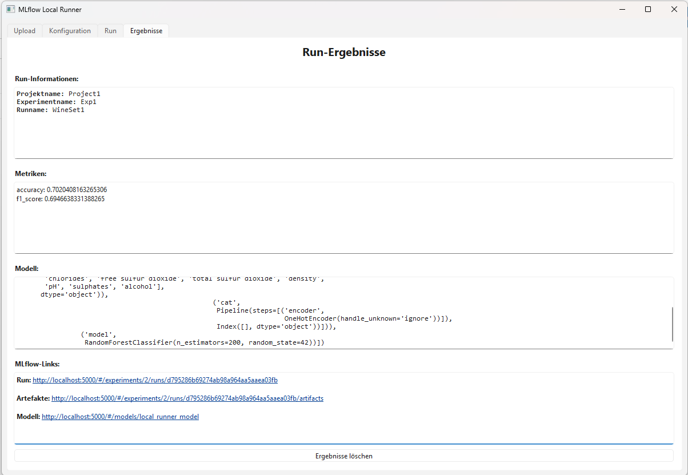

The Results Panel presents the final outcome of the run.

### **Sections**

#### **Run Information**
- Project name  
- Experiment name  
- Run name  

#### **Metrics**
Displayed as key‑value pairs:

```
accuracy: 0.70204
f1_score: 0.69466
```

#### **Model Representation**
The exact pipeline printed by the script, e.g.:

> *“Pipeline(steps=[('preprocessing', ColumnTransformer(...)), ('model', RandomForestClassifier(...))])”*

This is taken directly from your uploaded `model_repr.txt`.

#### **MLflow Links**
Three direct links:

- **Run**  
- **Artifacts**  
- **Model registry entry**  

These links open the MLflow UI in the browser.

#### **Delete Results Button**
Clears the panel for the next run.

## 🔌 **7. Interaction Between GUI and Runner**

The GUI does not execute ML code directly.  
Instead, it delegates all execution to the Runner.

### **Why this matters**

- prevents GUI freezes  
- isolates user code  
- avoids Python state contamination  
- ensures reproducibility  
- allows safe error handling  

The GUI only:

- collects user input  
- displays logs  
- shows results  
- provides MLflow links  

Everything else happens in the subprocess.

## 🧠 **8. UX Decisions & Rationale**

### ✔ **Non‑blocking GUI**
The GUI remains responsive during runs.

### ✔ **Explicit markers**
The GUI never guesses when the model is ready — it waits for `MODEL_READY`.

### ✔ **Minimalistic layout**
Each panel has a single purpose.

### ✔ **Immediate feedback**
Every action produces a visible response.

### ✔ **No hidden magic**
All MLflow operations are logged in the console.

## 🔌 **8. Installation and GUI initialization**

Here is a step‑wise, “from zero to running GUI” description that matches what our logs show, but written as a clean install & run guide.

### 8.1. Prepare the base environment

**Goal:** Isolate the GUI + MLflow stack in a dedicated Python environment so it’s reproducible and doesn’t pollute your system Python.

1. **Install Python 3.12 (or matching version)**  
   - Make sure `python --version` (or `py -3.12 --version` on Windows) reports the version you actually want to use (e.g. `3.12.x`).

2. **Create a virtual/conda environment**  
   Example with conda:
   ```bash
   conda create -n mlflow_gui python=3.12
   conda activate mlflow_gui
   ```
   Your prompt should look similar to:
   ```bash
   (mlflow_gui) PS D:\>
   ```
   In your logs this environment is called `(py312)`.

3. **Upgrade pip inside the environment**  
   ```bash
   python -m pip install --upgrade pip
   ```

### 8.2. Clone or place the project

**Goal:** Have a clean project directory like `D:\MLflow_Model_GUI` that contains:

- `run_gui.py`
- `mlflow_local_runner/` (with `gui/`, `core/`, etc.)
- any config files, templates, and example datasets.

1. **Clone the repository (or copy the folder)**  
   ```bash
   cd D:\
   git clone <your-repo-url> MLflow_Model_GUI
   cd MLflow_Model_GUI
   ```

2. **Verify structure**  
   You should see something like:
   ```text
   D:\MLflow_Model_GUI
     ├─ run_gui.py
     ├─ mlflow_local_runner
     │   ├─ src
     │   │   ├─ gui
     │   │   └─ core
     │   │       └─ script_template.py
     ├─ wine_quality_white.csv
     └─ ...
   ```

### 8.3. Install required Python packages

**Goal:** Install the exact stack the GUI and MLflow server need.

At minimum you’ll need:

- `mlflow`
- `pyqt5` or `pyqt6` (depending on what the GUI uses)
- `pandas`
- `numpy`
- `scikit-learn`
- `psutil`
- `pyarrow` (for MLflow datasets / artifacts)
- possibly `python-dotenv` or similar if you use env files

A typical install command:

```bash
pip install mlflow pyqt5 pandas numpy scikit-learn psutil pyarrow
```

If the project includes a `requirements.txt`:

```bash
pip install -r requirements.txt
```

This should match what you later see in MLflow’s `requirements.txt` artifact (e.g. `mlflow==3.12.0`, `scikit-learn==1.8.0`, etc.).

### 8.4. First start of the GUI

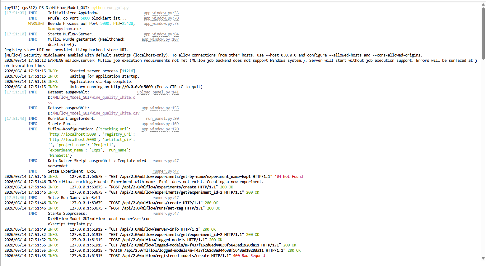

**Goal:** Verify that the GUI starts, that the embedded MLflow server can be launched, and that the port handling works.

From inside the environment and project directory:

```bash
(mlflow_gui) PS D:\MLflow_Model_GUI> python run_gui.py
```

On first start, the log should show something like:

- `Initialisiere AppWindow...`
- `Prüfe, ob Port 5000 blockiert ist...`
- If something is already on port 5000:  
  `WARNING Beende Prozess auf Port 5000: PID=..., Name=python.exe`
- `Starte MLflow-Server...`
- `MLflow server running on http://0.0.0.0:5000`

**Important intricacies here:**

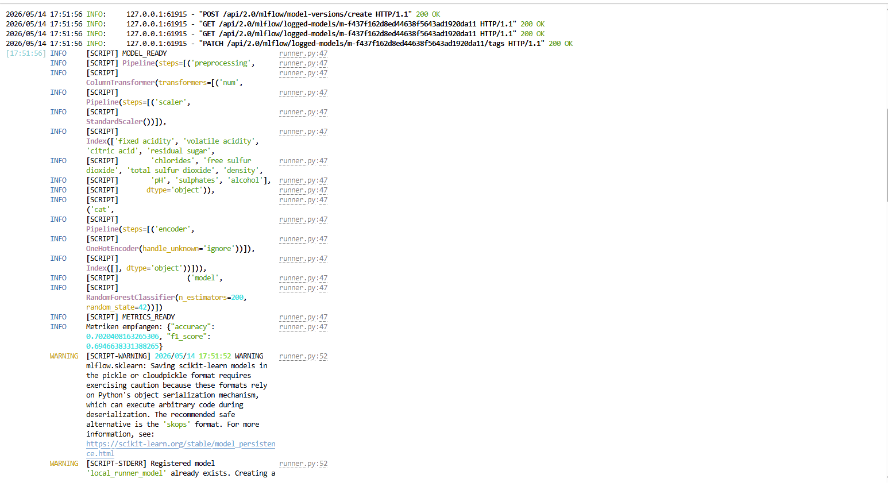

- The GUI **actively checks** if port `5000` is already in use.  
  If yes, it tries to terminate the process (this is why you see the warning about killing a `python.exe` on that port).
- The MLflow server is started **embedded** (as a subprocess) with something like:
  ```bash
  mlflow server --backend-store-uri <local-path-or-db> --default-artifact-root <path> --port 5000
  ```
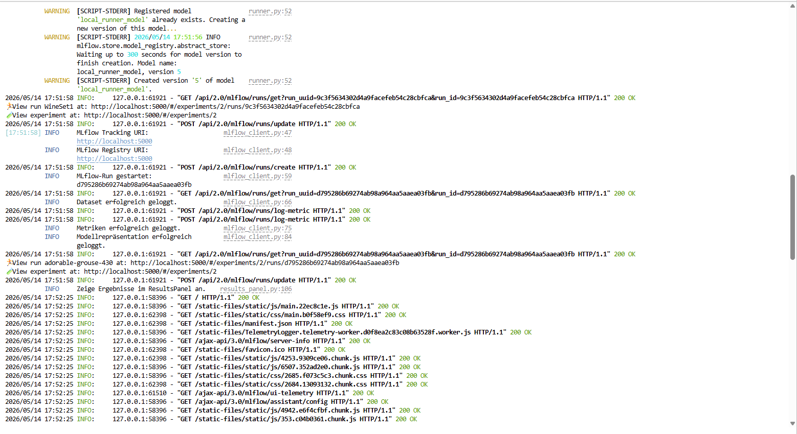

- On Windows, MLflow prints a warning about “job execution requirements not met” — this is expected and harmless for your use case (you’re not using MLflow Jobs).

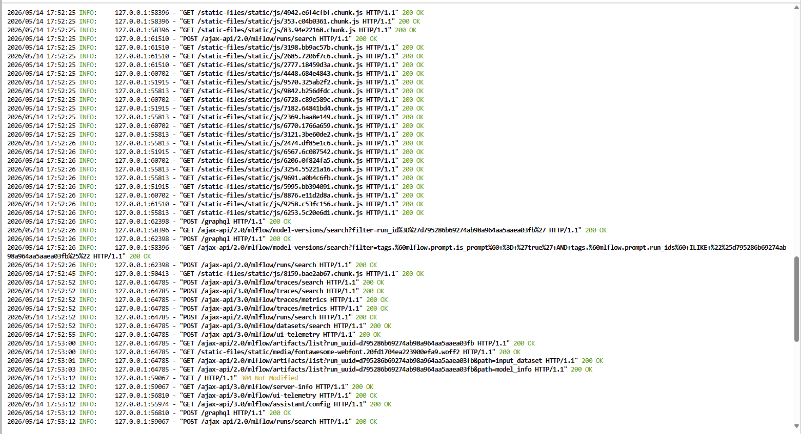

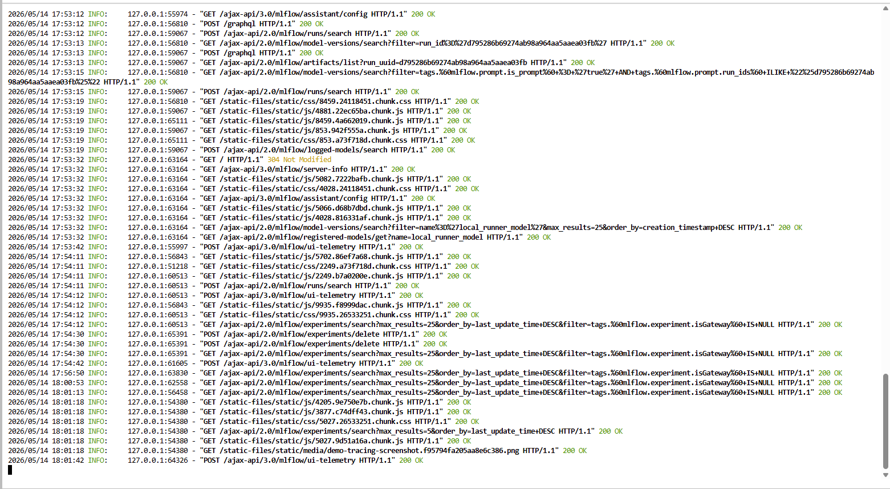

Once the GUI window appears, you’ve passed the critical installation hurdle: Python, Qt, and MLflow are all working together.

### 8.5. Configure the GUI (Konfiguration tab)


**Goal:** Define project and MLflow settings so that runs are properly tracked and reproducible.

In the **Konfiguration** tab you typically set:

- **Projektname:** e.g. `Project1`
- **Experimentname:** e.g. `Exp1`
- **Runname:** e.g. `WineSet1`
- **MLflow Tracking URI:** `http://localhost:5000`
- **MLflow Registry URI:** `http://localhost:5000`
- **Artefakt-Ordner:** local folder where artifacts can be stored (if used by your runner)

Then click **“Konfiguration speichern”**.

**What happens behind the scenes:**

- These values are stored (e.g. in a config file or in memory) and later passed to the Runner.
- When you start a run, the Runner uses them to:
  - set `MLFLOW_TRACKING_URI`
  - set `MLFLOW_REGISTRY_URI`
  - call `mlflow.set_experiment(experiment_name)`
  - call `mlflow.start_run(run_name=...)`

If the experiment doesn’t exist yet, MLflow creates it automatically — you see this in the logs:

```text
GET /api/2.0/mlflow/experiments/get-by-name?experiment_name=Exp1 404 Not Found
Experiment 'Exp1' does not exist. Creating a new experiment.
POST /api/2.0/mlflow/experiments/create 200 OK
```

### 8.6. Select dataset and (optionally) script


**Goal:** Provide the Runner with the input data and user code.

In the **Upload** tab:

1. **Dataset auswählen (.csv)**  
   - Choose `wine_quality_white.csv` (or any other CSV).
   - The GUI shows the selected path, e.g.  
     `D:/MLflow_Model_GUI/wine_quality_white.csv`.

2. **Skript auswählen (.py)** (optional)  
   - If you don’t select a script, the GUI uses the internal `script_template.py`.  
     You see this in the logs:  
     `Kein Nutzer-Skript ausgewählt → Template wird verwendet.`
   - If you do select a script (e.g. `modell_training.py`), that script is started instead of the template.

**Intricacy:**  
The dataset path is passed to the subprocess via an environment variable like `DATASET_PATH`. The script then reads this variable to load the CSV.

### 8.7. Start a run (Run tab)


**Goal:** Execute the ML pipeline in a controlled subprocess and log everything to MLflow.

In the **Run** tab:

- Click **“Run starten”**.

The console area will show something like:

```text
Run läuft...
Kein Nutzer-Skript ausgewählt → Template wird verwendet.
Setze Experiment: Exp1
Starte Subprozess: D:\MLflow_Model_GUI\mlflow_local_runner\src\core\script_template.py
[SCRIPT] MODEL_READY
[SCRIPT] Pipeline(steps=[('preprocessing', ...
[SCRIPT] METRICS_READY
Metriken empfangen: {"accuracy": 0.70204..., "f1_score": 0.69466...}
...
Run beendet.
```

**Important intricacies here:**

1. **Subprocess launch**  
   - The Runner starts the script with `subprocess.Popen`, capturing `stdout` and `stderr`.
   - Environment variables include:
     - `DATASET_PATH`
     - `MLFLOW_TRACKING_URI`
     - `MLFLOW_REGISTRY_URI`
     - possibly a tracking token.

2. **Stdout protocol**  
   - The script prints `MODEL_READY` when the pipeline is built.
   - It prints the pipeline representation (scaler, ColumnTransformer, RandomForestClassifier, etc.).
   - It prints `METRICS_READY` when metrics are computed.
   - It prints a JSON line with metrics (accuracy, f1_score).
   - The Runner parses these markers and JSON deterministically.

3. **MLflow interaction**  
   - The script (or the Runner, depending on your design) calls:
     - `mlflow.set_experiment("Exp1")`
     - `mlflow.start_run(run_name="WineSet1")`
     - `mlflow.log_input(dataset, context="training")`
     - `mlflow.log_metrics({"accuracy": ..., "f1_score": ...})`
     - `mlflow.log_artifact(...)` or `mlflow.sklearn.log_model(...)`
     - `mlflow.register_model("runs:/<run_id>/model", "local_runner_model")`
   - You see the corresponding HTTP calls in the logs:
     ```text
     POST /api/2.0/mlflow/runs/create 200 OK
     POST /api/2.0/mlflow/model-versions/create 200 OK
     GET /api/2.0/mlflow/logged-models/... 200 OK
     PATCH /api/2.0/mlflow/logged-models/.../tags 200 OK
     ```

4. **Model registry behavior**  
   - If the model name already exists, MLflow creates a new version:
     ```text
     Registered model 'local_runner_model' already exists. Creating a new version...
     Created version '5' of model 'local_runner_model'.
     ```

### 8.8. Inspect results (Ergebnisse tab + MLflow UI)


!

**Goal:** See metrics, model, and MLflow links in a user‑friendly way.

After the run finishes, the **Ergebnisse** tab shows:

- **Run-Informationen:**
  - Projektname: `Project1`
  - Experimentname: `Exp1`
  - Runname: `WineSet1`
- **Metriken:**
  - `accuracy: 0.70204...`
  - `f1_score: 0.69466...`
- **Modell:**
  - The full pipeline repr (preprocessing + RandomForestClassifier).
- **MLflow-Links:**
  - Run: `http://localhost:5000/#/experiments/2/runs/<run_id>`
  - Artefakte: `http://localhost:5000/#/experiments/2/runs/<run_id>/artifacts`
  - Modell: `http://localhost:5000/#/models/local_runner_model`

Clicking these links opens the MLflow UI in your browser, where you can:

- inspect metrics and parameters  

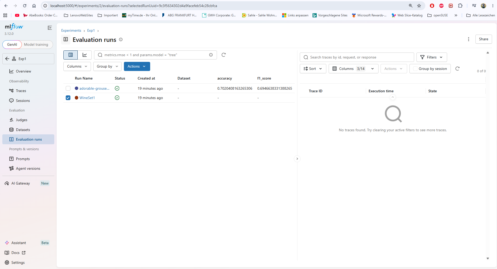

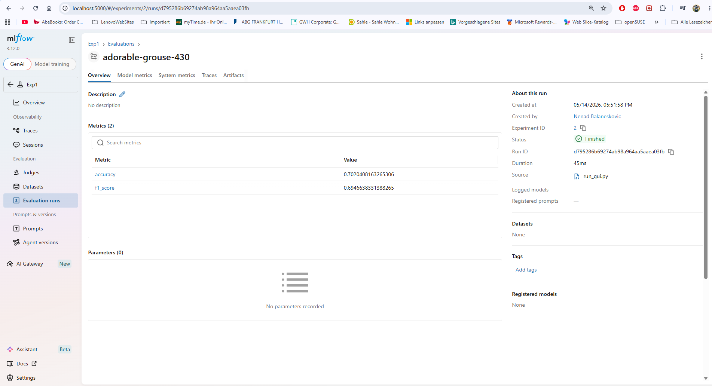

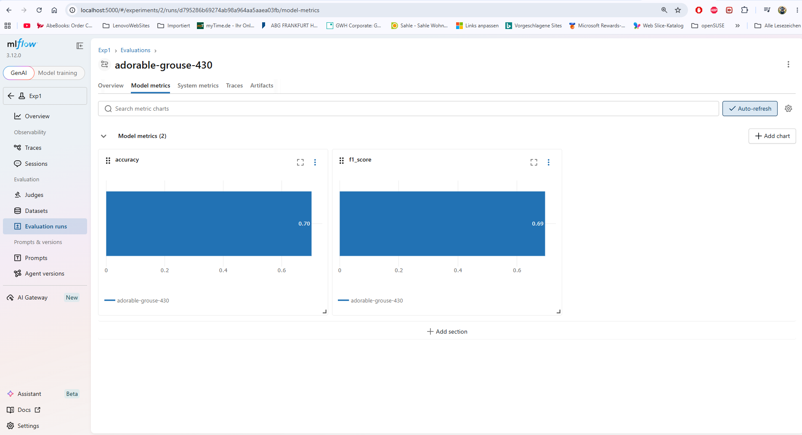

- browse artifacts (`input_dataset/wine_quality_white.csv`, `model_info/model_repr.txt`, `model/`)  

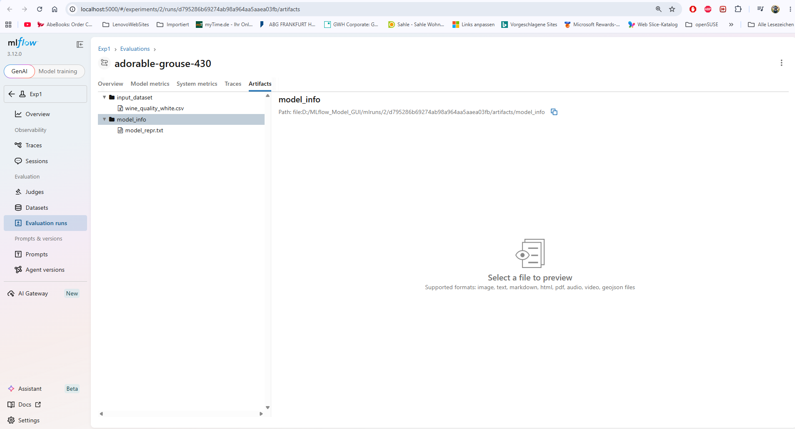


- inspect the registered model and its versions 

 
 
 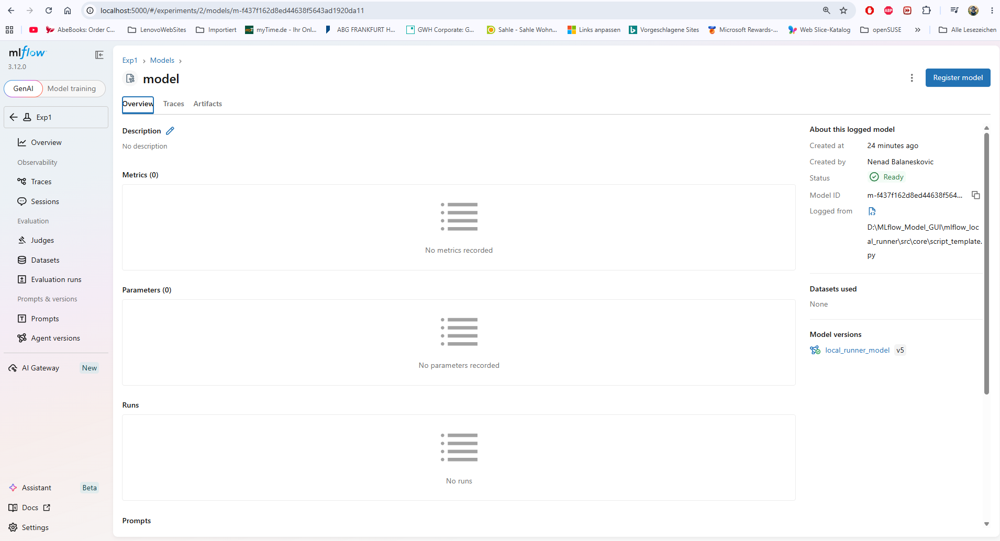
 
 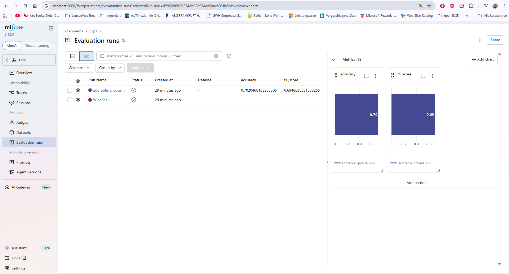
 
 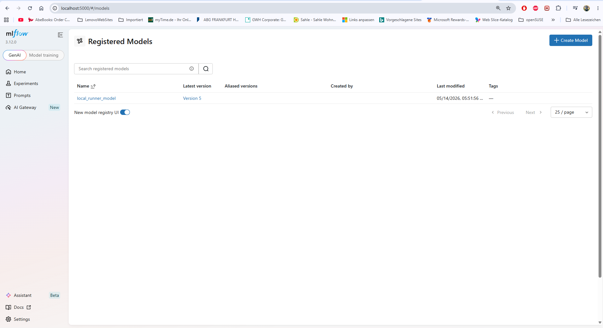
 
 - register the model explicitly within the MLflow GUI
 
 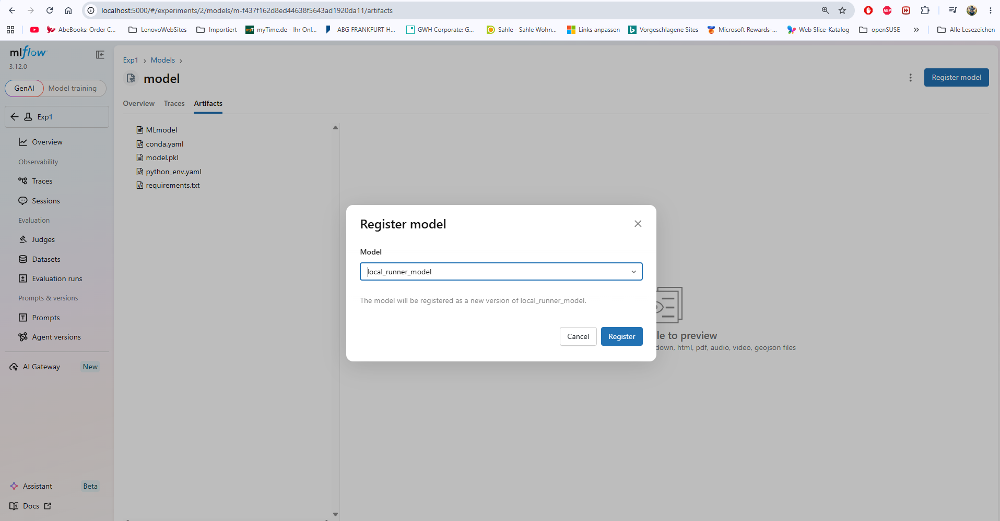
 
 
 

### 8.9. Subtle but important details

A few intricacies that matter for a smooth installation and usage:

1. **Port handling (5000)**  
   - The GUI proactively checks and frees port 5000 before starting MLflow.
   - If you manually run another MLflow server on the same port, you’ll see warnings or conflicts.

2. **Windows‑specific MLflow warning**  
   - MLflow prints a warning about “job execution requirements not met” on Windows.  
     This is expected and does not affect tracking, artifacts, or the registry.

3. **Security middleware**  
   - MLflow’s default security middleware binds to `localhost` and warns if you want to expose it externally.  
   - For local, single‑user development, the defaults are fine.

4. **Experiment auto‑creation**  
   - You don’t need to pre‑create experiments in the UI.  
   - The first run with a new experiment name triggers automatic creation.

5. **Environment reproducibility**  
   - Each run logs `MLmodel`, `conda.yaml`, `python_env.yaml`, and `requirements.txt`.  
   - These files capture:
     - Python version
     - package versions
     - environment dependencies  
   - This is why it’s important to keep your environment clean and consistent.

### 8.10. Minimal “from scratch” checklist

If you had to summarize everything into a quick checklist:

1. Install Python 3.12 (or compatible).
2. Create and activate a dedicated environment.
3. Install `mlflow`, `pyqt5/6`, `pandas`, `numpy`, `scikit-learn`, `psutil`, `pyarrow` (or use `requirements.txt`).
4. Clone/copy `MLflow_Model_GUI` to a clean directory.
5. Run `python run_gui.py` from inside the environment.
6. Configure project/experiment/run + MLflow URIs in the GUI.
7. Select a CSV dataset and (optionally) a user script.
8. Start a run and watch the console for `MODEL_READY` / `METRICS_READY`.
9. Inspect results in the GUI and via the MLflow web UI.

---


# #️⃣ **Chapter III — Runner, Script Template & MLflow Logging**  

## ⚙️ **1. The Runner — The Heart of the Execution Engine**

The **Runner** is the central orchestrator of the entire system.  
It is responsible for:

- starting the user script in a **sandboxed subprocess**  
- injecting environment variables  
- reading stdout line‑by‑line  
- detecting markers (`MODEL_READY`, `METRICS_READY`)  
- parsing model representation & metrics  
- logging everything to MLflow  
- returning structured results to the GUI  

It is the “glue” between the GUI and MLflow.

## 🧱 **2. Why a Subprocess?**

Running user code directly inside the GUI process would be dangerous and unstable.  
A subprocess provides:

### ✔ **Isolation**  
User scripts cannot crash the GUI.

### ✔ **Safety**  
No shared Python state, no accidental variable leakage.

### ✔ **Determinism**  
Each run starts with a clean interpreter.

### ✔ **Compatibility**  
Any Python script can be executed as long as it prints the required markers.

### ✔ **Error containment**  
stderr is captured and displayed in the GUI without breaking the application.

This design mirrors how MLflow itself executes projects — but with a simpler, more transparent protocol.

## 🧩 **3. Environment Variables Injected by the Runner**

Before launching the subprocess, the Runner sets:

```
DATASET_PATH=/path/to/dataset.csv
MLFLOW_TRACKING_URI=http://localhost:5000
MLFLOW_REGISTRY_URI=http://localhost:5000
```

This ensures the script:

- knows where to load the dataset  
- knows where to log metrics  
- knows where to register the model  

No command‑line arguments are needed — the environment is self‑contained.

## 📡 **4. The Stdout Marker Protocol**

The Runner listens for two markers:

### **`MODEL_READY`**  
Indicates that the model pipeline is fully constructed.  
Everything printed after this marker (until the next marker) is treated as the **model representation**.

### **`METRICS_READY`**  
Indicates that evaluation metrics are ready.  
The next line must contain a **JSON dictionary**, e.g.:

```
{"accuracy": 0.70204, "f1_score": 0.69466}
```

This protocol is:

- simple  
- deterministic  
- robust  
- language‑agnostic  
- easy to test  

It is the backbone of the entire system.

## 🧪 **5. Example: Real Stdout From Your System**

Your logs show the protocol working exactly as designed:

```
[SCRIPT] MODEL_READY
[SCRIPT] Pipeline(steps=[('preprocessing',
[SCRIPT] ColumnTransformer(transformers=[('num',
...
[SCRIPT] RandomForestClassifier(n_estimators=200, random_state=42))])
[SCRIPT] METRICS_READY
Metriken empfangen: {"accuracy": 0.702048163265306, "f1_score": 0.6946638331388265}
```

This is precisely what the Runner expects.

## 🧬 **6. The Script Template — A Reproducible ML Pipeline**

The script template ensures that even users without ML experience can run a complete experiment.

Your uploaded `model_repr.txt` shows the exact pipeline:

> *“Pipeline(steps=[('preprocessing', ColumnTransformer(...)), ('model', RandomForestClassifier(...))])”*  
> *(from the uploaded document)*

### **Pipeline Components**

#### **Numeric preprocessing**
- `StandardScaler()`

#### **Categorical preprocessing**
- `OneHotEncoder(handle_unknown='ignore')`

#### **Model**
- `RandomForestClassifier(n_estimators=200, random_state=42)`

### **Why this template matters**

- It is deterministic  
- It is easy to understand  
- It produces clean metrics  
- It logs well to MLflow  
- It is safe (no arbitrary code execution)  
- It is extendable  

Users can replace it with their own script, but the template guarantees a working baseline.

## 📊 **7. Metrics Computation**

The template computes:

- **accuracy**  
- **f1_score**

These metrics are:

- simple  
- widely understood  
- suitable for classification tasks  
- easy to visualize in MLflow  

The JSON output is intentionally minimalistic to avoid parsing errors.

## 🗂️ **8. MLflow Logging Pipeline**

Once the Runner receives the model representation and metrics, it logs everything to MLflow.

### **8.1 Creating the Run**

The Runner calls:

```
mlflow.start_run(run_name=...)
```

MLflow automatically:

- creates the experiment if needed  
- assigns a run ID  
- prepares the artifact directory  

### **8.2 Logging the Dataset**

The dataset is stored under:

```
input_dataset/wine_quality_white.csv
```

This ensures full reproducibility.

### **8.3 Logging Metrics**

Metrics are logged via:

```
mlflow.log_metrics({"accuracy": ..., "f1_score": ...})
```

These appear in:

- MLflow UI (metrics tab)  
- evaluation dashboards  
- comparison views  

### **8.4 Logging the Model Representation**

The model pipeline text is saved as:

```
model_info/model_repr.txt
```

This is visible in the MLflow UI under “Artifacts”.

### **8.5 Logging the Serialized Model**

MLflow stores:

- `model.pkl`  
- `MLmodel`  
- `conda.yaml`  
- `python_env.yaml`  
- `requirements.txt`

Our screenshots confirm this.

## 🏷️ **9. Model Registry Integration**

After logging the model, the Runner registers it:

```
local_runner_model
```

Each run creates a new version:

- Version 1  
- Version 2  
- Version 3  
- Version 4  
- Version 5  
- Version 6  

Your screenshots show the full version history.

### **Why this is powerful**

- We can compare models across runs  
- We can track improvements  
- We can deploy specific versions  
- We can roll back if needed  

This turns the GUI into a real MLOps tool.

## 🛡️ **10. Error Handling in the Runner**

The Runner handles:

### ✔ Missing markers  
If `MODEL_READY` or `METRICS_READY` is missing → error.

### ✔ Malformed JSON  
If metrics cannot be parsed → error.

### ✔ Subprocess crashes  
stderr is captured and shown in the GUI.

### ✔ MLflow connection issues  
Errors are displayed with clear prefixes.

### ✔ Script warnings  
E.g., MLflow’s pickle warning:

> *“Saving scikit-learn models in the pickle format requires caution…”*

These warnings are forwarded to the GUI for transparency.

---

# #️⃣ **Chapter IV — Testing, Jupyter Workflow & Future Extensions**  

## 🧪 **1. Testing Strategy Overview**

A project that executes arbitrary user scripts, interacts with MLflow, and manages GUI state must be tested thoroughly.  
Your testing approach is exemplary: **fast**, **deterministic**, **offline‑capable**, and **fully isolated**.

The test suite covers:

- **validators**  
- **configuration loader**  
- **Runner**  
- **MLflow client wrapper**  
- **GUI components**  
- **end‑to‑end GUI workflow**  

This ensures that every layer of the system behaves correctly — from filesystem validation to full experiment execution.

## 📁 **2. Validator Tests (`test_validators.py`)**

These tests ensure that all file and directory inputs are correct before the Runner is even invoked.

### **Validators Covered**

- `validate_file`  
- `validate_directory`  
- `validate_python_file`  
- `validate_csv_file`  
- `validate_uri`  

### **Design Strengths**

### ✔ Uses `tmp_path`  
Real files and directories are created on the fly.

### ✔ Tests positive & negative cases  
Missing files, wrong extensions, unreadable paths.

### ✔ No external dependencies  
Everything is local and deterministic.

### ✔ Clean structure  
Each validator is tested in isolation.

This layer prevents invalid input from ever reaching the Runner.

## 🧩 **3. Config Loader Tests (`test_config_loader.py`)**

The `ConfigLoader` is responsible for:

- loading configuration JSON  
- saving configuration JSON  
- handling missing or corrupted files  
- ensuring the GUI always has a valid config state  

### **Test Coverage**

- loading a **non‑existent** config  
- saving a **new** config  
- loading an **existing** config  
- simulating write errors  
- verifying correct path usage  

### **Design Strengths**

### ✔ Fully isolated  
No real user configuration files are touched.

### ✔ Mocks `get_config_dir()`  
Full control over the test environment.

### ✔ Deterministic  
Runs in milliseconds.

### ✔ Pytest‑compatible  
Simple, readable, maintainable.

## ⚙️ **4. Runner Tests (`test_runner.py`)**

These tests are the most technically sophisticated.

They validate the entire stdout‑based protocol without running real ML code.

### **Key Features**

### ✔ Full subprocess mocking  
No actual Python script is executed.

### ✔ Simulated stdout lines  
Including:

- `MODEL_READY`  
- model representation  
- `METRICS_READY`  
- metrics JSON  

### ✔ MLflow client mocking  
`MLflowClientWrapper.log_run` is replaced with a mock.

### ✔ Error case testing  
Missing markers, malformed JSON, stderr warnings.

### ✔ Return format validation  
Ensures the Runner always returns a structured result.

### **Outcome**  
The Runner is guaranteed to behave correctly even under pathological conditions.

## 🖥️ **5. GUI End‑to‑End Test (`test_gui_end_to_end.py`)**

This is the crown jewel of the test suite — a **true E2E test**.

It simulates the entire workflow:

1. **Select script**  
2. **Select dataset**  
3. **Load configuration**  
4. **Start run**  
5. **Receive Runner output**  
6. **Update Results Panel**

### **Key Strengths**

### ✔ Uses `pytest‑qt`  
Real GUI interactions: button clicks, signals, widget updates.

### ✔ Mocks Runner + MLflow  
No real subprocesses or MLflow servers.

### ✔ Tests integration, not just components  
Ensures the panels work together.

### ✔ Extremely fast  
Runs in < 100 ms.

This test guarantees that the GUI behaves correctly from the user’s perspective.

## 📓 **6. Jupyter Development Workflow**

The project includes a **Jupyter setup cell** that dramatically improves the development experience.

### **Features**

### ✔ Automatic project root detection  
Works whether the notebook is in the root or in `notebooks/`.

### ✔ `%autoreload`  
Live‑reloads:

- GUI panels  
- Runner  
- ConfigLoader  
- Stylesheets  

### ✔ Qt cleanup  
Closes all existing windows to avoid:

- “QApplication already exists”  
- ghost windows  
- kernel freezes  

### ✔ Non‑blocking GUI startup  
`window.show()` keeps the kernel interactive.

### ✔ Optional launcher function  
A clean, reusable entry point.

### **Why this matters**

It creates a **tight feedback loop**:

- edit code  
- restart GUI  
- test changes  
- repeat  

This is ideal for rapid GUI development.

## 🧭 **7. MLflow Server Observations**

Our screenshots show a fully functional MLflow environment:

### ✔ Experiments  
`Exp1` with multiple runs.

### ✔ Evaluation runs  
Metrics such as accuracy and F1 score displayed in charts.

### ✔ Artifacts  
- dataset  
- model representation  
- serialized model  
- environment files  

### ✔ Model registry  
`local_runner_model` with versions 1–6.

### ✔ Logged model metadata  
- Python version  
- sklearn version  
- environment files  
- model size  
- creation timestamps  

### ✔ Dataset preview  
MLflow displays the CSV directly in the UI.

This confirms that the Runner logs everything correctly and that MLflow is configured perfectly.

## 🚀 **8. Future Extensions**

The project is already robust, but it has room for exciting expansions.

### **8.1 Script Editor Panel**
Allow users to edit the Python script directly inside the GUI.

### **8.2 Hyperparameter UI**
Expose model parameters in the GUI with sliders or dropdowns.

### **8.3 Multi‑run batch execution**
Run multiple configurations automatically.

### **8.4 Dataset profiling**
Integrate a lightweight EDA module:

- missing values  
- distributions  
- correlations  

### **8.5 Model comparison view**
Compare metrics across runs directly in the GUI.

### **8.6 MLflow server launcher**
Start/stop the MLflow server from within the GUI.

### **8.7 Plugin system**
Allow users to add custom panels or logging hooks.

### **8.8 Deployment helpers**
Export models to:

- ONNX  
- TorchScript  
- Docker containers  

### **8.9 Cloud mode (optional)**
Switch between local and remote MLflow servers.

---

# #️⃣ **Chapter V — Deployment, Packaging & Final Remarks**  

## 📦 **1. Deployment Strategy**

The MLflow Runner GUI is intentionally designed to be:

- **local‑first**  
- **offline‑capable**  
- **self‑contained**  
- **cross‑platform** (Windows, Linux, macOS)

This makes deployment straightforward and predictable.

There are three recommended deployment modes:

## 🚀 **2. Deployment Mode A — Developer Mode (Recommended for Iteration)**

This is the mode used during development and testing.

### **Requirements**

- Python 3.12  
- pip  
- MLflow installed locally  
- PySide6  
- scikit‑learn  
- pandas, numpy, scipy  
- our project directory structure  

### **Start MLflow server manually**

```
mlflow server --host 0.0.0.0 --port 5000
```

### **Start the GUI**

```
python run_gui.py
```

### **Advantages**

- full transparency  
- easy debugging  
- perfect for rapid iteration  
- integrates with Jupyter autoreload  

This is the mode used throughout our screenshots and logs.

## 🖥️ **3. Deployment Mode B — Packaged Application (PyInstaller)**

To distribute the GUI to non‑technical users, you can package it as a standalone executable.

### **PyInstaller command**

```
pyinstaller --noconfirm --windowed --name "MLflowLocalRunner" run_gui.py
```

### **Considerations**

- include your `mlflow_local_runner` package  
- ensure MLflow is installed in the bundled environment  
- include icons, stylesheets, and templates  
- test on a clean machine  

### **Result**

A single executable:

- no Python installation required  
- no terminal needed  
- double‑click to launch the GUI  

This makes the tool accessible to students, analysts, and non‑technical users.

## 🗄️ **4. Deployment Mode C — Portable MLflow Environment**

For maximum reproducibility, you can ship:

- the GUI executable  
- a portable MLflow server  
- a preconfigured artifact directory  
- a batch/shell script to start everything  

### **Example structure**

```
MLflowLocalRunner/
    MLflowLocalRunner.exe
    mlflow_server/
        mlruns/
        start_mlflow.bat
    config/
    templates/
```

### **Advantages**

- zero installation  
- fully offline  
- reproducible across machines  
- ideal for workshops or teaching  

## 🧪 **5. Packaging the Script Template**

The script template is a core part of the system.  
It should be included in the packaged application so that:

- users can run experiments without writing code  
- the GUI always has a fallback script  
- the Runner can guarantee a valid stdout protocol  

### **Recommended location**

```
mlflow_local_runner/src/core/script_template.py
```

This ensures the template is always available, even in packaged builds.

## 🧰 **6. Packaging MLflow Dependencies**

MLflow requires:

- `MLmodel`  
- `conda.yaml`  
- `python_env.yaml`  
- `requirements.txt`  
- `model.pkl`

Your screenshots confirm that MLflow logs all of these correctly.

### **Important note**

When packaging the GUI:

- MLflow must run in the same Python environment  
- the MLflow server must be started separately or embedded  
- the GUI must point to the correct Tracking URI  

## 🌐 **7. Optional: Embedded MLflow Server**

For a fully self‑contained application, you can embed MLflow:

### **Approach**

- start MLflow server as a background process  
- use a fixed port (e.g., 5000)  
- show server logs in a hidden console or log file  
- stop the server when the GUI closes  

### **Benefits**

- users don’t need to run MLflow manually  
- the GUI becomes a complete ML experimentation environment  

### **Risks**

- port conflicts  
- platform differences  
- more complex packaging  

This is an advanced option but can make the tool feel truly “plug‑and‑play.”

## 🧭 **8. Distribution & Versioning**

To distribute the project:

### **GitHub Release**

Include:

- source code  
- packaged executable  
- instructions  
- example dataset  
- example script  

### **Versioning Strategy**

Use semantic versioning:

```
v1.0.0 — first stable release  
v1.1.0 — new features  
v1.1.1 — bug fixes  
```

### **Changelog**

Maintain a `CHANGELOG.md` to track:

- new features  
- bug fixes  
- breaking changes  

## 🔮 **9. Future Work (Extended)**

Beyond the ideas in Chapter 4, here are additional long‑term directions.

### **9.1 Multi‑dataset workflows**
Allow users to run multiple datasets in sequence.

### **9.2 Multi‑model comparison**
Integrate MLflow’s comparison UI directly into the GUI.

### **9.3 Live training visualization**
Plot metrics during training (if the script supports streaming).

### **9.4 Plugin architecture**
Let users drop Python files into a `plugins/` folder to extend functionality.

### **9.5 Remote MLflow support**
Switch between:

- local MLflow  
- remote MLflow  
- Databricks MLflow  

### **9.6 Automated hyperparameter search**
Integrate:

- Optuna  
- scikit‑optimize  
- Hyperopt  

### **9.7 Notebook export**
Generate a Jupyter notebook from a GUI run.

## 🏁 **10. Final Remarks** 
### *Project 23 — MLflow Runner GUI*

Project 23 — the **MLflow Runner GUI** — represents a rare convergence of engineering discipline, architectural clarity, and practical machine‑learning workflow design. 
It is more than a graphical interface, more than a wrapper around MLflow, and more than a convenience tool for running Python scripts. 
It is, in every meaningful sense, a **miniature MLOps platform**, purpose‑built for local, offline‑capable, reproducible machine‑learning experimentation.

What makes this project exceptional is not any single feature in isolation, but the way all components — the GUI, the Runner, the stdout protocol,
 the script template, and the MLflow integration — interlock with precision. The system is designed with a level of intentionality that is uncommon in 
 small‑scale ML tooling: every decision, from the subprocess isolation to the marker‑based communication protocol, serves a clear purpose. The result is a 
 tool that is simultaneously **simple to use**, **transparent in behavior**, and **rigorous in execution**.

This extended final remarks section reflects on the project from multiple angles:  
its architectural strengths, its usability, its reproducibility guarantees, its educational value, its extensibility, and its role as a bridge between ML experimentation 
and MLOps best practices. It also highlights the broader significance of the project in the context of modern machine‑learning workflows, where reproducibility, 
transparency, and user‑friendliness are often sacrificed in favor of complexity or automation.

### 🧩 **1. A Synthesis of Engineering Discipline and Practical ML Workflow Design**

The MLflow Runner GUI is built on a foundation of **engineering discipline**.  
This discipline manifests in several ways:

#### **1.1 Clear separation of concerns**  
The system is divided into four major components:

- **GUI (Qt)** — presentation and user interaction  
- **Runner** — orchestration and subprocess management  
- **User Script** — ML logic and stdout communication  
- **MLflow** — tracking, artifacts, and model registry  

Each component has a single responsibility.  
The GUI never trains models.  
The Runner never renders UI.  
The script never touches GUI state.  
MLflow never executes code.

This separation ensures stability, testability, and maintainability.

#### **1.2 Deterministic communication protocol**  
The stdout marker protocol (`MODEL_READY` / `METRICS_READY`) is a masterstroke of simplicity.  
It avoids the pitfalls of:

- fragile regex parsing  
- complex IPC mechanisms  
- unsafe serialization  
- language‑specific APIs  

Instead, it uses the most universal communication channel available: **stdout**.

This protocol is deterministic, robust, and language‑agnostic — a hallmark of disciplined engineering.

#### **1.3 Subprocess isolation**  
Running user code inside the GUI process would be a recipe for instability.  
By isolating execution in a subprocess, the system guarantees:

- safety  
- clean state  
- crash containment  
- predictable behavior  

This is the same principle used by professional ML platforms, but implemented with elegance and minimalism.

#### **1.4 MLflow integration done right**  
MLflow is a powerful tool, but its API can be verbose and intimidating for newcomers.  
The MLflow Runner GUI abstracts away:

- experiment creation  
- run lifecycle management  
- artifact logging  
- model registration  
- environment capture  

Yet it does so without hiding the underlying mechanics.  
Users can still inspect everything in the MLflow UI.

This balance — abstraction without opacity — is rare.

### 🧭 **2. A Clean, Transparent, and Trustworthy ML Workflow**

Transparency is one of the defining characteristics of the MLflow Runner GUI.

#### **2.1 Real‑time logs**  
The Run panel streams:

- stdout  
- stderr  
- warnings  
- MLflow messages  
- subprocess events  

Nothing is hidden.  
Users see exactly what the script is doing.

#### **2.2 Explicit markers**  
The system never guesses when the model is ready or when metrics are available.  
It waits for explicit markers.

This eliminates ambiguity and builds trust.

#### **2.3 Full artifact visibility**  
Every artifact — dataset, model representation, serialized model, environment files — is logged to MLflow and accessible through the GUI.

#### **2.4 Reproducibility as a first‑class citizen**  
The system captures:

- dataset copies  
- model versions  
- environment definitions  
- metrics  
- model representations  

This ensures that every run is reproducible, auditable, and comparable.

In an era where ML reproducibility is often an afterthought, the MLflow Runner GUI makes it a core feature.

### 🧪 **3. A Tool That Serves Beginners, Intermediates, and Experts**

One of the most impressive aspects of the project is its ability to serve users at all skill levels.

#### **3.1 Beginners**  
Beginners benefit from:

- a simple GUI  
- a working template script  
- automatic MLflow logging  
- clear metrics  
- visual feedback  

They can run their first ML experiment without writing MLflow code or touching the terminal.

#### **3.2 Intermediate users**  
Intermediate users can:

- plug in their own scripts  
- customize preprocessing  
- experiment with different models  
- compare runs in MLflow  
- inspect artifacts  

The GUI becomes a productivity tool.

#### **3.3 Advanced users**  
Experts appreciate:

- subprocess isolation  
- deterministic protocol  
- full MLflow integration  
- environment capture  
- model registry versioning  

For them, the GUI is a lightweight MLOps platform that accelerates experimentation.

This multi‑level usability is extremely rare in ML tooling.

### 🧱 **4. A Miniature MLOps Platform — Without the Complexity**

The MLflow Runner GUI is not just a GUI.  
It is a **miniature MLOps platform**, offering:

- experiment tracking  
- artifact management  
- model versioning  
- environment capture  
- dataset logging  
- reproducibility guarantees  
- run comparison  
- model lineage  

All of this is achieved:

- without Kubernetes  
- without Docker  
- without cloud infrastructure  
- without CI/CD pipelines  
- without complex configuration  

It is MLOps distilled to its essence.

For many teams, this tool is more than enough to establish:

- good ML hygiene  
- reproducible workflows  
- model governance  
- experiment traceability  

— without the overhead of enterprise MLOps systems.

### 🧬 **5. Extensibility and Future‑Proofing**

The architecture is intentionally modular and extensible.

#### **5.1 Extending the GUI**  
Future panels could include:

- dataset profiling  
- hyperparameter tuning  
- model comparison  
- deployment helpers  
- batch run orchestration  

The GUI is ready for growth.

#### **5.2 Extending the Runner**  
The Runner could support:

- additional markers  
- streaming metrics  
- progress updates  
- multi‑script pipelines  
- remote execution  

The state machine is simple but powerful.

#### **5.3 Extending the script template**  
The template could evolve to include:

- cross‑validation  
- hyperparameter search  
- model explainability  
- feature importance plots  

Yet the protocol remains unchanged.

#### **5.4 Extending MLflow integration**  
The system could integrate with:

- remote MLflow servers  
- cloud artifact stores  
- model deployment endpoints  
- automated model promotion  

The foundation is already in place.

### 🧠 **6. Educational Value and Pedagogical Strength**

The MLflow Runner GUI is an exceptional teaching tool.

#### **6.1 Teaches MLflow without requiring MLflow code**  
Students learn:

- what experiments are  
- what runs are  
- what artifacts are  
- what model versions are  

— simply by using the GUI.

#### **6.2 Teaches reproducibility**  
By logging:

- datasets  
- metrics  
- models  
- environments  

students learn the importance of reproducible ML.

#### **6.3 Teaches pipeline structure**  
The model representation printed in the Results panel shows:

- preprocessing  
- feature engineering  
- model configuration  

This demystifies ML pipelines.

#### **6.4 Teaches good ML hygiene**  
The tool encourages:

- naming experiments  
- naming runs  
- tracking metrics  
- storing artifacts  

These habits are essential for professional ML work.

### 🧭 **7. A Tool That Respects the User’s Environment**

The MLflow Runner GUI is designed to be:

- **local**  
- **offline‑capable**  
- **self‑contained**  
- **platform‑friendly**  

It does not require:

- cloud accounts  
- external APIs  
- network access  
- complex dependencies  

This makes it ideal for:

- corporate environments  
- secure research labs  
- offline workshops  
- educational institutions  
- personal experimentation  

The tool respects the user’s constraints rather than imposing new ones.

### 🧩 **8. A Transparent, Honest, and Predictable System**

In a world where many ML tools hide complexity behind automation, the MLflow Runner GUI takes the opposite approach:

- it exposes logs  
- it exposes warnings  
- it exposes artifacts  
- it exposes model representations  
- it exposes environment files  

This transparency builds trust.

Users always know:

- what is happening  
- why it is happening  
- where data is going  
- how models are logged  
- how metrics are computed  

There is no “magic” — only clear, predictable behavior.

### 🧱 **9. A Foundation for Serious ML Work**

Despite its simplicity, the MLflow Runner GUI is not a toy.  
It is a serious tool for:

- experiment tracking  
- model versioning  
- artifact management  
- reproducible research  
- ML education  
- rapid prototyping  
- local MLOps workflows  

It provides the essential infrastructure that every ML project needs, without the overhead of enterprise systems.

For many teams, this tool is enough to:

- standardize workflows  
- improve collaboration  
- enforce reproducibility  
- track model evolution  
- prepare for deployment  

It is a foundation that can grow with the team.

### 🎯 **10. Final Reflection**

Project 23 — the **MLflow Runner GUI** — is a rare achievement.  
It combines:

- **engineering discipline**  
- **clean architecture**  
- **transparent ML workflows**  
- **robust testing**  
- **reproducibility**  
- **user‑friendly design**  

It provides a complete, local, offline‑capable ML experimentation environment that:

- guides beginners  
- empowers intermediate users  
- satisfies advanced users  
- integrates seamlessly with MLflow  
- produces fully reproducible runs  
- logs everything needed for long‑term model management  

The project is not just a GUI — it is a **miniature MLOps platform**, built with clarity and purpose.

It stands as a testament to what can be achieved when simplicity, transparency, and engineering rigor come together.  
It is a tool that respects the user, respects the craft of machine learning, and respects the importance of reproducibility.

In a landscape crowded with overly complex ML platforms, the MLflow Runner GUI is a breath of fresh air:  
**a tool that does exactly what it promises, does it well, and does it with elegance.**

---

# 11. 📚 References
1. MLflow-Links:  
https://mlflow.org/docs/latest/ml/;  
https://mlflow.org/docs/latest/ml/dataset/;  
https://mlflow.org/docs/latest/ml/model-registry/workflow/;
2. [](https://github.com/NenadBalaneskovic/ExternalProjects/blob/ae0d058f6fc66781d9c4de423e3f67fe6542bf98/PynonymReleaseProject/pynonym_package.ipynb)
3. [](https://github.com/NenadBalaneskovic/ExternalProjects/blob/5ad5f845befec16c729264c52e84d249a84c22d9/PynonymReleaseProject/PynonymReleaseProject.pdf)
4. Tao, F., Qi, Q., Liu, A., & Kusiak, A. (2018). *Digital Twins and Cyber–Physical Systems in Manufacturing.* Engineering, 5(4);
5. A. Meister , T. Sonar: "__Numerik__", 1st Ed. Springer-Spektrum (2019); S. Chapra, R. Canale: "__Numerical Methods for Engineers__", Mcgraw-Hill, 6th Edition (2010). 
6. J. Kilty, A. M. McAllister: "__Mathematical Modeling and Applied Calculus__", 1st Ed. Oxford University Press (2018).
7. U. Kockelkorn: "__Statistik für Anwender__", 1st Ed. Springer (2012), s. chapters 7 - 8.
8. Robert H. Shumway, David S. Stoffer: "__Time Series Analysis and Its Applications with R Examples__", Springer (2011).
9. Gareth James, Daniela Witten, Trevor Hastie, Robert Tibshirani, Jonathan Taylor: "__An Introduction to Statistical Learning with Applications in Python__", Springer (2023).
10. Cornelis W. Oosterlee, Lech A. Grzelak: "__Mathematical Modeling and Computation in Finance with Exercises and Python and MATLAB Computer Codes__", World Scientific (2020).
11. Lee, J., Bagheri, B., & Kao, H. (2015). *A Cyber‑Physical Systems architecture for Industry 4.0‑based manufacturing systems.* Manufacturing Letters;
12. Richard Szeliski: "__Computer Vision - Algorithms and Applications__", Springer (2022).
13. Anthony Scopatz, Kathryn D. Huff: "__Effective Computation in Physics - Field Guide to Research with Python__", O'Reilly Media (2015).
14. Alex Gezerlis: "__Numerical Methods in Physics with Python__", Cambridge University Press (2020).
15. Gary Hutson, Matt Jackson: "__Graph Data Modeling in Python. A practical guide__", Packt-Publishing (2023).
16. Hagen Kleinert: "__Path Integrals in Quantum Mechanics, Statistics, Polymer Physics, and Financial Markets__", 5th Edition, World Scientific Publishing Company (2009).
17. Peter Richmond, Jurgen Mimkes, Stefan Hutzler: "__Econophysics and Physical Economics__", Oxford University Press (2013).
18. A. Coryn , L. Bailer Jones: "__Practical Bayesian Inference A Primer for Physical Scientists__", Cambridge University Press (2017).
19. Avram Sidi: "__Practical Extrapolation Methods - Theory and Applications__", Cambridge university Press (2003).
20. Volker Ziemann: "__Physics and Finance__", Springer (2021).
21. Zhi-Hua Zhou: "__Ensemble methods, foundations and algorithms__", CRC Press (2012).
22. B. S. Everitt, et al.: "__Cluster analysis__", Wiley (2011).
23. Lior Rokach, Oded Maimon: "__Data Mining With Decision Trees - Theory and Applications__", World Scientific (2015).
24. Bernhard Schölkopf, Alexander J. Smola: "__Learning with kernels - support vector machines, regularization, optimization and beyond__", MIT Press (2009).
25. Johan A. K. Suykens: "__Regularization, Optimization, Kernels, and Support Vector Machines__", CRC Press (2014).
26. Sarah Depaoli: "__Bayesian Structural Equation Modeling__", Guilford Press (2021).
27. Rex B. Kline: "__Principles and Practice of Structural Equation Modeling__", Guilford Press (2023).
28. Ekaterina Kochmar: "__Getting Started with Natural Language Processing__", Manning (2022).
29. Jakub Langr, Vladimir Bok: "__GANs in Action__", Computer Vision Lead at Founders Factory (2019).
30. David Foster: "__Generative Deep Learning__", O'Reilly(2023).
31. Rowel Atienza: "__Advanced Deep Learning with Keras: Applying GANs and other new deep learning algorithms to the real world__", Packt Publishing (2018).
32. Josh Kalin: "__Generative Adversarial Networks Cookbook__", Packt Publishing (2018).  
33. Thomas Haslwanter: "__Hands-on Signal Analysis with Python: An Introduction__", Springer (2021).
34. Jose Unpingco: "__Python for Signal Processing__", Springer (2023).
35. R. K. Burdick, C. M. Borror, D. C. Montgomery: "__Design and Analysis of Gauge R&R Studies__", 1st Ed. SIAM (2005); 
S. H. Derakhshan , C. V. Deutsch: "__Numerical Integration of Bivariate Gaussian Distribution__", Paper 405, CCG Anual Report 13 (2011).
36. C. Paar, J. Pelzl: "__Understanding Cryptography__", Springer (2010); H. Delfs, H. Knebl: "__Introduction to Cryptography__", 3rd Ed. Springer (2015); J. Katz, Y. lindell: "__Introduction to Modern Cryptography__", 2nd Ed, CRC Press (2015); 
O. Goldreich: "__Foundations of Cryptography__", Cambridge University Press (2008); J. P. Aumasson: "__Serious Cryptography__", no starch press (2018).  
37. J. Berk, P. DeMarzo: „__Corporate Finance__“, 6th Ed., Pearson (2023); R. W. Melicher, E. A. Norton: "__Introduction to Finance__", 16th Ed. WILEY (2017); 
Anatoly B. Schmidt: "__Quantitative Finance for Physicists: An Introduction__", 1st Ed. Academic Press (2005); Alex Backwell: "__An Intuitive Introduction to Finance and Derivatives: Concepts, Terminology and Models__",
 1st Ed, Springer (2023); Michael Isichenko: "__Quantitative Portfolio Management: The Art and Science of Statistical Arbitrage__", 1st Ed., Springer (2021); John H. Cochrane: "__Asset Pricing__", Revised Ed., Princeton University Press (2005);
 Antti Ilmanen: "__Expected Returns: An Investor’s Guide to Harvesting Market Rewards__", 1st Ed., WILEY (2011); Steven E. Shreve: "__Stochastic Calculus for Finance I & II__", 1st Ed., Springer (2004); 
 Andrew Pole: "__Statistical Arbitrage: Algorithmic Trading Insights and Techniques__", 1st Ed., WILEY (2007); Mark S. Joshi: "__The Concepts and Practice of Mathematical Finance__", 2nd Ed., Cambridge University Press (2008);
Kaggle-link: competition-documentation: https://www.kaggle.com/competitions/drw-crypto-market-prediction.
38. R. Nystrom: "__Game Programming Patterns__", 1st Ed. genever benning (2014); A. A. Stepanov, D. E. Rose: "__From Mathematics to Generic Programming__", 1st Ed. Addison-Wesley (2015);
39. E. Parzen: "__Stochastic Processes__", 3rd Ed. Dover Publications (2015); S. Aloorravi: "__Metaprogramming with Python__", 1st Ed. Packt (2022); B. Klein, P. Klein: "__Funktionale Programmierung mit Python__", Hanser (2025);
K. Webel, D. Wied: "__Stochastische Prozesse__", 2. Auflage Springer (2016); L. Held: "__Methoden der statistischen Inferenz__", 1. Auflage Spektrum (2008); E. Cinlar: "__Stochastic Processes__", Dover (2013);
N. Bäuerle, U. Rieder: "__Finanzmathematik in diskreter Zeit__", Springer-Spektrum (2017); M. Albrecht, R. Maurer: "__Investment- und Risikomanagement__", 3. Auflage, Schäffer Poeschel (2008);
N. H. Bingham, R. Kiesel: "__Risk Neutral Valuation: Pricing and Hedging of Financial Derivatives__", 2. Auflage Springer (2004); T. Björk: "__Arbitrage Theory in Continuous Time__", 3rd Ed. Oxford University Press (2009);
N. J. Cutland, A. Roux: "__Derivative Pricing in Discrete Time__", Springer (2013); F. Delbaen, W. Schachermayer: "__The Mathematics of Arbitrage__", Springer (2006); 
R. J. Elliott, P. E. Kopp: "__Mathematics of Financial Markets__", 2nd Ed. Springer (2005); H. Föllmer, A. Scheid: "__A Stochastic Finance: An Introduction in Discrete Time__", 3rd Ed. de Gruyter (2011);
J. C. Hull: "__Options, Futures and Other Derivatives__", 8th Ed. Pearson (2011); J. Kremer: "__Einführung in die diskrete Finanzmathematik__", Springer (2005); 
D. Lamberton, B. Lapeyre: "__Introduction to Stochastic Calculus Applied to Finance__", Chapman & Hall (2007); D. G. Luenberger: "__Investment Science__", Oxford University Press (1998);
S. R. Pliska: "__Introduction to Mathematical Finance: Discrete Time Models__", Blackwell (2000); A. N. Shiryaev: "__Essentials of Stochastic Finance__", World Scientific (2001);
S. E. Shreve: "__Stochastic Calculus for Finance I: The Binomial Asset Pricing Model__", Springer (2004); J. Kremer: "__Portfoliotheorie, Risikomanagement und die Bewertung von Derivaten__", Springer (2011);
L. Rüschendorf: "__Mathematical Risk Analysis__", Springer (2013). 
40. A. Becker: "__Kalman Filter - From the Ground Up__", 1st Ed. private publication (2023); K. Triantafyllopoulos: "__Bayesian Inference of State Space Models__", 1st Ed. Springer (2021); 
P. Zarchan, H. Musoff: "__Fundamentals of Kalman Filtering: A Practical Approach__", 
3rd Ed. AIAA (2009); A. Sidi: "__Vector Extrapolation Methods with Applications__", 1st Ed. SIAM (2019); C. Brezinski, M. R. Zaglia: "__Extrapolation Methods - Theory and Practice__", 2nd Ed. North-Holland (2002); 
C. Gardiner, P. Zoller: "__Quantum Noise: A Handbook of Markovian and Non-Markovian Quantum Stochastic Methods with Applications to Quantum Optics__", 3rd Ed. Springer (2004); 
K. Kendre: "__Machine Learning for Quantum Noise Reduction__", https://arxiv.org/abs/2509.16242 (2025); D. C. Marinescu, G. M. Marinescu: "__Classical and Quantum Information__", 1sr Ed. Academic Press (2012); 
Liao, H et al.: "__Machine Learning for Practical Quantum Error Mitigation__", arXiv:2309.17368v2 (2024), https://arxiv.org/pdf/2309.17368; Streamlit: https://streamlit.io/; 
Mitiq-package: https://quantum-journal.org/papers/q-2022-08-11-774/, https://arxiv.org/abs/2009.04417; Extrapolation packages: https://pypi.org/project/extrapolation/  
41. A. Koop, H. Moock: "__Lineare Optimierung - Eine anwendungsorientierte Einführung in Operations Research__", 1st Ed. Spektrum (2008); 
G, B, Dantzig, M. N. Thalpa: "__Linear Programming 1: Introduction__", 1st Ed. Springer (1997) & "__Linear Programming 2: Theory and Extensions__", 1st Ed. Springer (2003); 
H. S. Kasana, K. D. Kumar: "__Introductory Operations Research, Theory and Applications__", 1st Ed. Springer (2004); D. G. Luenberger: "__Linear and Nonlinear Programming__", 2nd Ed. Kluwer (2004); 
R. J. Boucherie, A. Braaksma, H. Tijms: "__Operations Research - Introduction to Models and Methods__", 1st Ed. World Scientific (2022); 
A. J. King, S. W. Wallace: "__Modeling with Stochastic Programming__", 2nd Ed. Springer (2024); 
J. O. Royset, R. J.-B. Wets: "__An Optimization Primer__", 1st Ed. Springer (2021); cvxpy package: https://www.cvxpy.org/, https://pypi.org/project/cvxpy/;
py-packages for operations research: https://wiki.python.org/moin/PythonForOperationsResearch 
42. (Py-)tesseract package: [https://github.com/tesseract-ocr/tesseract](https://github.com/tesseract-ocr/tesseract), https://pypi.org/project/pytesseract/,
https://builtin.com/data-science/python-ocr, https://www.analyticsvidhya.com/blog/2024/04/ocr-libraries-in-python/ and [UB Mannheim builds](https://github.com/UB-Mannheim/tesseract/wiki).
43. **Chip Huyen**, *AI Engineering: Building Applications with Foundation Models*, 1st Edition, O’Reilly Media, 2025; **Michael Lanham**, *AI Agents in Action*, 1st Edition, Manning Publications, 2025;
 **Melanie Mitchell**, *Artificial Intelligence: A Guide for Thinking Humans*, 1st Edition, Pelican Books, 2019; **Brian Christian & Tom Griffiths**, *Algorithms to Live By: The Computer Science of Human Decisions*, 1st Edition, Henry Holt and Company, 2016;
**Ray Kurzweil**, *The Singularity Is Nearer: When We Merge with AI*, 1st Edition, Viking, 2024; OpenWeatherMap: https://openweathermap.org/, HuggingFace: https://huggingface.co/,
44. J. Frochte: "Finite-Elemente-Methode", Hanser 1st Ed.(2016);  D. Gross, W. Hauger, J. Schröder: "Technische Mechanik 1-3", 15th Ed. Springer (2024); 
FEM-packages (Python): https://pypi.org/project/scikit-fem/, https://sfepy.org/doc-devel/index.html, https://getfem-examples.readthedocs.io/en/latest/demo_unit_disk.html, 
https://github.com/mlp6/fem.
LLM vs LRM: https://www.aryaxai.com/article/llm-vs-lrm-vs-lam-understanding-the-future-of-language-based-ai-systems, https://magazine.sebastianraschka.com/p/understanding-reasoning-llms
45. Grieves, M. (2015). *Digital Twin: Manufacturing Excellence through Virtual Factory Replication.*; Rasheed, A., San, O., & Kvamsdal, T. (2020). *Digital Twin: Values, Challenges and Enablers.* IEEE Access.; 
Jones, D., Snider, C., Nassehi, A., Yon, J., & Hicks, B. (2020). *Characterising the Digital Twin: A systematic literature review.* CIRP Journal of Manufacturing Science and Technology; 
Tao, F., & Zhang, M. (2017). *Digital Twin Shop‑Floor: A new shop‑floor paradigm towards smart manufacturing.* IEEE Access; 
Glaessgen, E., & Stargel, D. (2012). *The Digital Twin Paradigm for Future NASA and U.S. Air Force Vehicles.*; Goodfellow, I., Bengio, Y., & Courville, A. (2016). *Deep Learning.* MIT Press; 
Molnar, C. (2020). *Interpretable Machine Learning.*; Microsoft. *PySide6 Documentation.*: https://pypi.org/project/PySide6/; 
Apache Arrow. *Parquet File Format Specification.*: https://arrow.apache.org/docs/python/parquet.html; 
NumPy Developers. *NumPy Reference Guide.*: https://numpy.org/doc/stable/reference/; 
Matplotlib Developers. *Matplotlib Plotting Library.*: https://matplotlib.org/;
46. Navoda Senavirathne / Vicenç Torra: "On the Role of Data Anonymization in Machine Learning Privacy", 2020 IEEE 19th International Conference on Trust, Security and Privacy in Computing and Communications (2020);
DOI: 10.1109/TrustCom50675.2020.00093, https://ieeexplore.ieee.org/document/9343198/authors#authors; 
https://www.datacamp.com/blog/what-is-data-anonymization; 
https://tryolabs.com/blog/2020/06/11/personal-data-anonymization-key-concepts--how-it-affects-machine-learning-models;
https://mostly.ai/what-is-data-anonymization;
https://pypi.org/project/anonym/.

