# Project 34: ONNX Model Generator GUI v1.0

# **Chapter 1 — Scientific Motivation & Context**

## **1.0 Overview**

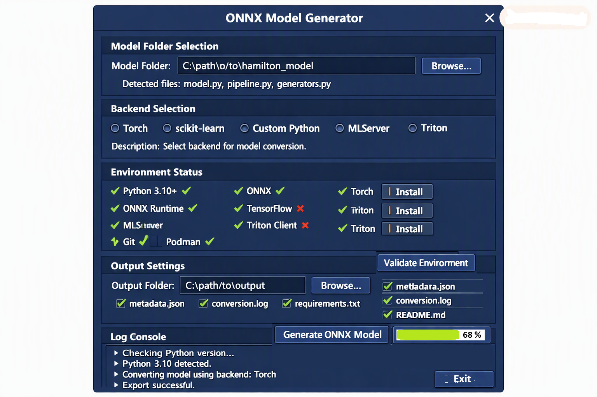

The ONNX Model Generator GUI v1.0 emerges from a very specific intersection of scientific inquiry and engineering necessity. On one side lies the mathematical and algorithmic depth of Hamilton Cycles research, a domain where 
combinatorial explosion, structural graph properties, and computational heuristics converge. On the other side lies the practical challenge of deploying algorithmic models in modern inference architectures, where reproducibility, portability, 
and backend‑agnostic execution are essential.

This chapter establishes the scientific motivation for the project, explains the computational challenges inherent to Hamilton Cycles, and describes why a unified ONNX model generation tool is a natural and necessary bridge toward future 
cloud‑native inference systems. It also introduces the architectural vision that connects our theoretical work to a full Crossplane‑Docker‑KServe deployment pipeline.

The ONNX Model Generator GUI v1.0 is not merely a convenience tool. It is a **strategic enabler**: a way to transform experimental Python‑based models into standardized ONNX artifacts that can be containerized, orchestrated, and served at 
scale. It provides deterministic export, environment validation, backend consistency, and a user‑friendly interface — all of which are essential for reproducible scientific workflows and automated deployment pipelines.

## **1.1 Hamilton Cycles: Computational & Structural Challenges**

### **1.1.1 Graph‑Theoretic Background**

Hamilton Cycles — cycles that visit every vertex of a graph exactly once — represent one of the most studied problems in graph theory. Their significance spans pure mathematics, theoretical computer science, and algorithmic research. 
The problem is NP‑complete in general, meaning that no polynomial‑time algorithm is known for deciding whether a Hamilton Cycle exists in an arbitrary graph. This complexity makes Hamilton Cycles a fertile ground for exploring heuristics, 
approximations, and machine‑learning‑assisted strategies.

In computational practice, Hamilton Cycle detection and enumeration require:

- efficient graph representations  
- heuristics for pruning search spaces  
- embeddings or learned features for guiding traversal  
- algorithmic models that can be evaluated repeatedly across large graph families  

These models often begin as Python prototypes — small scripts that encode heuristics, neural networks, or algorithmic decision functions. But as experiments scale, these prototypes must be transformed into reproducible, portable artifacts 
that can be deployed across heterogeneous environments.

This is where ONNX enters the picture.

### **1.1.2 Why ONNX Matters for Graph‑Based Models**

ONNX (Open Neural Network Exchange) provides a standardized, backend‑agnostic representation of computational graphs. Although originally designed for neural networks, ONNX is increasingly used for:

- algorithmic models  
- symbolic computation graphs  
- custom operator pipelines  
- hybrid ML‑algorithmic heuristics  

For Hamilton Cycles research, ONNX offers:

- **portability** — models can run on CPU, GPU, or specialized inference servers  
- **reproducibility** — ONNX graphs are deterministic and versioned  
- **interoperability** — ONNX Runtime, Triton, MLServer, and custom backends can all consume ONNX  
- **scalability** — ONNX models can be deployed in distributed inference architectures  

Thus, ONNX becomes the natural format for transforming experimental Python code into production‑ready inference artifacts.

## **1.2 Motivation for Automated Model Generation**

### **1.2.1 Pain Points in Manual ONNX Export**

Manually exporting ONNX models from Python is notoriously fragile. Researchers often encounter:

- inconsistent opset versions  
- backend‑specific quirks (Torch vs Sklearn vs TensorFlow)  
- Unicode/encoding issues on Windows  
- dependency drift across environments  
- missing packages or mismatched versions  
- lack of deterministic dummy input generation  
- cryptic error messages from PyTorch’s ONNX exporter  
- difficulty integrating with Triton or MLServer repositories  

These issues compound when multiple backends must be supported simultaneously. A single research project may require:

- Torch models for neural heuristics  
- Sklearn models for classical ML baselines  
- Custom Python models for algorithmic decision functions  
- Triton repositories for high‑performance inference  
- MLServer repositories for lightweight deployments  

Without automation, each backend requires manual configuration, custom scripts, and repeated troubleshooting.

### **1.2.2 Why a GUI Matters**

A graphical interface solves several structural problems:

- **Discoverability** — users can see available Python files and select entry points  
- **Reproducibility** — export parameters are fixed and consistent  
- **Environment transparency** — missing dependencies are clearly indicated  
- **Ease of use** — collaborators can generate ONNX models without deep knowledge of backend quirks  
- **Error visibility** — logs are streamed in real time  
- **Automation** — PowerShell orchestrators handle encoding, environment variables, and backend invocation  

The GUI becomes a **scientific instrument**: a tool that standardizes model generation across experiments, collaborators, and deployment pipelines.

## **1.3 Scientific Requirements for a Model Generator**

### **1.3.1 Deterministic Export**

Scientific reproducibility demands deterministic model export. This means:

- the same Python file must produce the same ONNX model  
- opset versions must be explicitly controlled  
- dummy inputs must be inferred consistently  
- metadata must be generated uniformly  
- backend‑specific differences must be abstracted away  

Our ONNX Model Generator GUI v1.0 enforces deterministic export through:

- fixed opset selection (Torch → opset 18)  
- consistent dummy input inference rules  
- standardized metadata.json generation  
- backend‑specific converter modules  
- UTF‑8‑safe logging and error propagation  

### **1.3.2 Environment Validation**

A major source of nondeterminism in scientific workflows is environment drift. Different machines may have:

- different Python versions  
- different ONNX/Torch/TensorFlow versions  
- missing Triton or MLServer clients  
- missing Git or Podman installations  
- conflicting package versions  

Our environment validator solves this by:

- inspecting Python version  
- checking presence and version of ONNX, Torch, TensorFlow, Sklearn  
- verifying MLServer and Triton clients  
- checking Git and Podman availability  
- offering automated installation via winget and pip  
- providing GUI indicators (✔ / ✖) for each component  

This ensures that ONNX export occurs in a **known‑good environment**, eliminating a major source of scientific irreproducibility.

## **1.4 Architectural Vision**

The ONNX Model Generator GUI v1.0 is not an isolated engineering artifact. It is the first operational component of a larger, multi‑layered architecture that connects theoretical graph research to modern cloud‑native inference systems. 
This architecture is designed to support reproducible experimentation, automated model packaging, and scalable deployment across heterogeneous compute environments.

The long‑term vision is a pipeline where algorithmic models — including those derived from Hamilton Cycles heuristics — can be exported, containerized, orchestrated, and served without manual intervention. The GUI is the entry point: it 
transforms Python prototypes into ONNX models, which then become the building blocks for containerized inference services.

### **1.4.1 The Bridge Between Research and Deployment**

The conceptual bridge can be summarized as follows:

- **Research Layer**  
  Hamilton Cycles heuristics, graph embeddings, algorithmic decision functions, and ML‑assisted traversal strategies are developed in Python. These prototypes are often experimental, rapidly iterated, and dependent on specific library versions.

- **Model Generation Layer**  
  The ONNX Model Generator GUI v1.0 standardizes these prototypes into ONNX models. This layer ensures deterministic export, consistent metadata, and backend‑specific correctness.

- **Containerization Layer**  
  ONNX models are packaged into Docker or Podman containers. This step abstracts away the underlying Python environment and prepares the model for cloud deployment.

- **Orchestration Layer**  
  Crossplane manages cloud resources declaratively. It provisions storage, networking, compute, and inference services based on YAML manifests.

- **Inference Layer**  
  KServe deploys ONNX models as scalable inference endpoints, supporting autoscaling, canary deployments, and GPU acceleration.

This layered architecture ensures that scientific models can transition smoothly from experimental code to production‑grade inference systems.

### **1.4.2 High‑Level Pipeline Diagram**

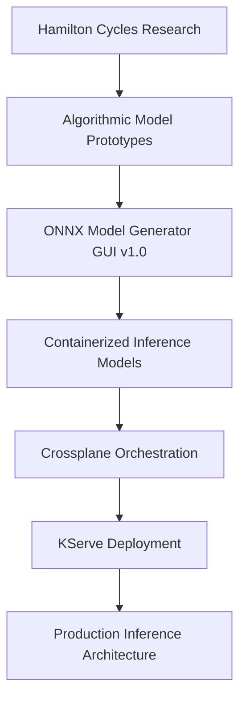
```mermaid
flowchart TD
    A[Hamilton Cycles Research] --> B[Algorithmic Model Prototypes]
    B --> C[ONNX Model Generator GUI v1.0]
    C --> D[Containerized Inference Models]
    D --> E[Crossplane Orchestration]
    E --> F[KServe Deployment]
    F --> G[Production Inference Architecture]
```

This diagram illustrates the conceptual flow from theory to deployment. The ONNX Model Generator GUI sits at the center, acting as the transformation engine that converts research artifacts into deployable models.

## **1.5 Detailed Discussion of Python Code Files (Overview)**

Although the full technical analysis of each Python file appears in later chapters, this section provides a high‑level overview of the codebase. The ONNX Model Generator GUI v1.0 is composed of several tightly integrated components, 
each responsible for a specific part of the model generation pipeline.

```
onnx_model_generator/
│
├── gui/
│   ├── main_gui.py                # PySimpleGUI single-window application
│   ├── environment_check.py       # Python helper for dependency inspection
│   ├── converters/                # Modular backend converters
│   │   ├── convert_torch.py
│   │   ├── convert_sklearn.py
│   │   ├── convert_custom.py
│   │   ├── convert_mlserver.py
│   │   └── convert_triton.py
│   └── assets/                    # Icons, themes, static resources
│       └── darkblue3_theme.json
│
├── scripts/
│   ├── Generate-ONNXModel.ps1     # PowerShell orchestrator callable from GUI
│   ├── Validate-Environment.ps1   # PowerShell dependency checker
│   └── Install-Dependencies.ps1   # Optional installer script
│
├── output/                        # Default output folder for generated models
│   └── (created dynamically)
│
├── README.md                      # Project overview and usage
└── requirements.txt               # Python dependencies for GUI and converters
```


#### ⚙️ **Functional Relationships**

| Component | Purpose | Called by |
|------------|----------|-----------|
| `main_gui.py` | Main entry point; builds the single window, handles user interaction | User |
| `environment_check.py` | Checks installed packages and versions | GUI |
| `Generate-ONNXModel.ps1` | Executes conversion logic and writes output | GUI |
| `Validate-Environment.ps1` | Verifies environment readiness | GUI |
| `Install-Dependencies.ps1` | Installs missing packages | GUI |
| `converters/*.py` | Backend‑specific ONNX conversion logic | PowerShell orchestrator |
| `assets/darkblue3_theme.json` | Defines color palette and layout constants | GUI |

#### 🧠 **Interaction Flow**

1. **User launches `main_gui.py`.**
2. GUI loads theme from `assets/darkblue3_theme.json`.
3. GUI calls `environment_check.py` → populates status grid.
4. User selects model folder and backend.
5. User clicks at the "Generate ONNX Model" button. GUI calls `Generate-ONNXModel.ps1` with parameters.
6. PowerShell orchestrator invokes the correct converter from `gui/converters/`.
7. Output files are written to `/output/`.
8. GUI displays logs and success message.

### **1.5.1 main_gui.py — The User Interface Layer**

````python
"""
main_gui.py — Vollständige, funktionsfähige GUI für den ONNX Model Generator
----------------------------------------------------------------------------

Features:
- Dynamische Environment-Status-Anzeige (✔ / ✖)
- Buttons: Install TF, Install Triton, Install Git, Install Podman
- Button: Fix Environment (installiert alle fehlenden Komponenten)
- UTF-8-sichere PowerShell-Ausführung
- Fortschrittsbalken
- Live-Log-Konsole
- Automatische Paket-Nachinstallation
- Git/Podman-Installation über winget
- Robustes Fehler-Handling
"""

import PySimpleGUI as sg
import subprocess
import os

# ---------------------------------------------------------------------------
# Status Symbole
# ---------------------------------------------------------------------------
STATUS_OK = "✔"
STATUS_FAIL = "✖"
STATUS_UNKNOWN = "?"

# ---------------------------------------------------------------------------
# GUI Theme
# ---------------------------------------------------------------------------
sg.theme("DarkBlue3")

# ---------------------------------------------------------------------------
# Logging helper
# ---------------------------------------------------------------------------
def log(window, text):
    window["-LOG-"].print(text)

# ---------------------------------------------------------------------------
# Progress bar helper
# ---------------------------------------------------------------------------
def update_progress(window, value):
    window["-PROGRESS-"].update(value)
    window.refresh()

# ---------------------------------------------------------------------------
# Auto-detect Python files
# ---------------------------------------------------------------------------
def detect_python_files(folder):
    if not folder or not os.path.isdir(folder):
        return []
    return [f for f in os.listdir(folder) if f.endswith(".py")]

# ---------------------------------------------------------------------------
# UTF‑8‑sichere PowerShell-Ausführung
# ---------------------------------------------------------------------------
def run_powershell(window, script_path, args):
    cmd = ["powershell", "-ExecutionPolicy", "Bypass", "-File", script_path] + args

    log(window, f"> Running PowerShell script: {script_path}")
    log(window, f"> FULL PATH: {os.path.abspath(script_path)}")
    update_progress(window, 5)

    # ⭐ FIX: Remove encoding="utf-8" to prevent cp1252 crash on ✔
    process = subprocess.Popen(
        cmd,
        stdout=subprocess.PIPE,
        stderr=subprocess.PIPE,
        text=True,
        errors="replace",
        bufsize=1
    )

    # stdout lesen
    while True:
        line = process.stdout.readline()
        if not line:
            break
        line = line.rstrip()
        if line:
            log(window, line)

        # Fortschrittsheuristik
        if "Checking" in line:
            update_progress(window, 20)
        elif "Installing" in line:
            update_progress(window, 40)
        elif "Export" in line or "conversion" in line:
            update_progress(window, 70)
        elif "complete" in line.lower():
            update_progress(window, 100)

    # stderr lesen
    while True:
        err = process.stderr.readline()
        if not err:
            break
        err = err.rstrip()
        if err:
            log(window, "ERROR: " + err)

    process.wait()
    return process.returncode

# ---------------------------------------------------------------------------
# Environment Status Update
# ---------------------------------------------------------------------------
def update_environment_status(window, log_text):

    def set_status(key, ok):
        window[key].update(STATUS_OK if ok else STATUS_FAIL)

    set_status("-PYTHON-", "Python version OK." in log_text)
    set_status("-ONNX-", "Package 'onnx' : INSTALLED" in log_text)
    set_status("-TORCHSTATUS-", "Package 'torch' : INSTALLED" in log_text)
    set_status("-TFSTATUS-", "Package 'tensorflow' : INSTALLED" in log_text)
    set_status("-MLSSTATUS-", "Package 'mlserver' : INSTALLED" in log_text)
    set_status("-TRITONSTATUS-", "Package 'tritonclient' : INSTALLED" in log_text)
    set_status("-GITSTATUS-", "Git found." in log_text)
    set_status("-PODMANSTATUS-", "Podman found." in log_text)

# ---------------------------------------------------------------------------
# Environment validation
# ---------------------------------------------------------------------------
def validate_environment(window):
    script = os.path.join("scripts", "Validate-Environment.ps1")
    if not os.path.exists(script):
        log(window, "> ERROR: Validate-Environment.ps1 not found.")
        return

    old_log = window["-LOG-"].get()
    update_progress(window, 0)
    rc = run_powershell(window, script, [])
    new_log = window["-LOG-"].get()

    update_environment_status(window, new_log)

    if rc == 0:
        log(window, "> Environment validation PASSED.")
    else:
        log(window, "> Environment validation FAILED.")

# ---------------------------------------------------------------------------
# Install single dependency
# ---------------------------------------------------------------------------
def install_dependency(window, package):
    script = os.path.join("scripts", "Install-Dependencies.ps1")
    if not os.path.exists(script):
        log(window, "> ERROR: Install-Dependencies.ps1 not found.")
        return

    log(window, f"> Installing dependency: {package}")
    update_progress(window, 0)

    rc = run_powershell(window, script, ["-Package", package])

    if rc == 0:
        log(window, f"> Successfully installed {package}.")
    else:
        log(window, f"> ERROR: Failed to install {package}.")

# ---------------------------------------------------------------------------
# Fix Environment (install everything missing)
# ---------------------------------------------------------------------------
def fix_environment(window):
    log(window, "> Fixing environment...")

    missing = [
        "onnx", "onnxruntime", "torch", "scikit-learn",
        "tensorflow", "mlserver", "tritonclient",
        "git", "podman"
    ]

    for item in missing:
        install_dependency(window, item)

    validate_environment(window)

    log_text = window["-LOG-"].get()
    update_environment_status(window, log_text)

# ---------------------------------------------------------------------------
# ONNX model generation
# ---------------------------------------------------------------------------
def generate_model(window, values):
    script = os.path.join("scripts", "Generate-ONNXModel.ps1")
    if not os.path.exists(script):
        log(window, "> ERROR: Generate-ONNXModel.ps1 not found.")
        return

    model_folder = values["-MODEL_FOLDER-"]
    entry_point = values["-ENTRYPOINT-"]
    backend = values["-BACKEND-"]
    output_folder = values["-OUTPUT_FOLDER-"]

    # --- FIX: Prevent empty parameters (critical) ---
    if not model_folder:
        log(window, "> ERROR: Model folder is missing.")
        return
    if not entry_point:
        log(window, "> ERROR: Entry point is missing.")
        return
    if not backend:
        log(window, "> ERROR: Backend is missing.")
        return
    if not output_folder:
        log(window, "> ERROR: Output folder is missing.")
        return

    args = [
        "-ModelFolder", model_folder,
        "-EntryPoint", entry_point,
        "-Backend", backend,
        "-OutputFolder", output_folder
    ]

    update_progress(window, 0)
    rc = run_powershell(window, script, args)

    if rc == 0:
        log(window, "> ONNX model generation completed successfully.")
    else:
        log(window, "> ONNX model generation FAILED.")

# ---------------------------------------------------------------------------
# GUI Layout
# ---------------------------------------------------------------------------

model_section = [
    [
        sg.Text("Model Folder:"),
        sg.Input(key="-MODEL_FOLDER-", size=(50, 1), enable_events=True),
        sg.FolderBrowse()
    ],
    [
        sg.Text("Detected files:"),
        sg.Text("None", key="-DETECTED-")
    ],
    [
        sg.Text("Entry Point:"),
        sg.Combo([], key="-ENTRYPOINT-", size=(30, 1))
    ]
]

backend_section = [
    [sg.Text("Backend Selection")],
    [
        sg.Radio("Torch", "BACKEND", key="-TORCH-"),
        sg.Radio("scikit-learn", "BACKEND", key="-SKLEARN-"),
        sg.Radio("Custom Python", "BACKEND", key="-CUSTOM-"),
        sg.Radio("MLServer", "BACKEND", key="-MLSERVER-"),
        sg.Radio("Triton", "BACKEND", key="-TRITON-")
    ]
]

env_section = [
    [sg.Text("Environment Status")],
    [sg.Text("Python 3.10+"), sg.Text(STATUS_UNKNOWN, key="-PYTHON-")],
    [sg.Text("ONNX"), sg.Text(STATUS_UNKNOWN, key="-ONNX-")],
    [sg.Text("Torch"), sg.Text(STATUS_UNKNOWN, key="-TORCHSTATUS-")],
    [sg.Text("TensorFlow"), sg.Text(STATUS_UNKNOWN, key="-TFSTATUS-"), sg.Button("Install TF")],
    [sg.Text("MLServer"), sg.Text(STATUS_UNKNOWN, key="-MLSSTATUS-")],
    [sg.Text("Triton Client"), sg.Text(STATUS_UNKNOWN, key="-TRITONSTATUS-"), sg.Button("Install Triton")],
    [sg.Text("Git"), sg.Text(STATUS_UNKNOWN, key="-GITSTATUS-"), sg.Button("Install Git")],
    [sg.Text("Podman"), sg.Text(STATUS_UNKNOWN, key="-PODMANSTATUS-"), sg.Button("Install Podman")]
]

output_section = [
    [
        sg.Text("Output Folder:"),
        sg.Input(key="-OUTPUT_FOLDER-", size=(50, 1)),
        sg.FolderBrowse()
    ]
]

log_section = [
    [sg.Text("Log Console")],
    [sg.Multiline(size=(100, 15), key="-LOG-", autoscroll=True, disabled=True)]
]

progress_section = [
    [sg.Text("Progress:"), sg.ProgressBar(100, orientation='h', size=(50, 20), key='-PROGRESS-')]
]

buttons = [
    sg.Button("Validate Environment"),
    sg.Button("Fix Environment"),
    sg.Button("Generate ONNX Model"),
    sg.Button("Exit")
]

layout = [
    [sg.Frame("Model Folder Selection", model_section)],
    [sg.Frame("Backend Selection", backend_section)],
    [sg.Frame("Environment Status", env_section)],
    [sg.Frame("Output Settings", output_section)],
    [sg.Frame("Log Console", log_section)],
    [sg.Frame("Progress", progress_section)],
    [sg.HorizontalSeparator()],
    [sg.Column([buttons], justification="center")]
]

window = sg.Window("ONNX Model Generator", layout, finalize=True)

# ---------------------------------------------------------------------------
# Event Loop
# ---------------------------------------------------------------------------
while True:
    event, values = window.read()

    if event in (sg.WIN_CLOSED, "Exit"):
        break

    if event == "-MODEL_FOLDER-":
        folder = values["-MODEL_FOLDER-"]
        py_files = detect_python_files(folder)
        if py_files:
            window["-DETECTED-"].update(", ".join(py_files))
            window["-ENTRYPOINT-"].update(values=py_files)
        else:
            window["-DETECTED-"].update("None")
            window["-ENTRYPOINT-"].update(values=[])

    if event == "Validate Environment":
        validate_environment(window)

    if event == "Fix Environment":
        fix_environment(window)

    if event == "Install TF":
        install_dependency(window, "tensorflow")

    if event == "Install Triton":
        install_dependency(window, "tritonclient")

    if event == "Install Git":
        install_dependency(window, "git")

    if event == "Install Podman":
        install_dependency(window, "podman")

    if event == "Generate ONNX Model":
        backend = None
        if values["-TORCH-"]: backend = "torch"
        elif values["-SKLEARN-"]: backend = "sklearn"
        elif values["-CUSTOM-"]: backend = "custom"
        elif values["-MLSERVER-"]: backend = "mlserver"
        elif values["-TRITON-"]: backend = "triton"

        values["-BACKEND-"] = backend
        generate_model(window, values)

window.close()
````

The `main_gui.py` file implements the graphical interface using PySimpleGUI. It is responsible for:

- rendering the GUI layout  
- detecting Python files in the selected model folder  
- providing backend selection options  
- displaying environment validation results  
- streaming logs from PowerShell scripts  
- updating progress bars  
- handling user events  

The GUI is intentionally minimalistic and functional. It avoids unnecessary visual complexity and focuses on clarity, reproducibility, and ease of use. The event loop is designed to be deterministic: 
each button triggers a specific PowerShell script, and all logs are streamed back into the GUI in real time.

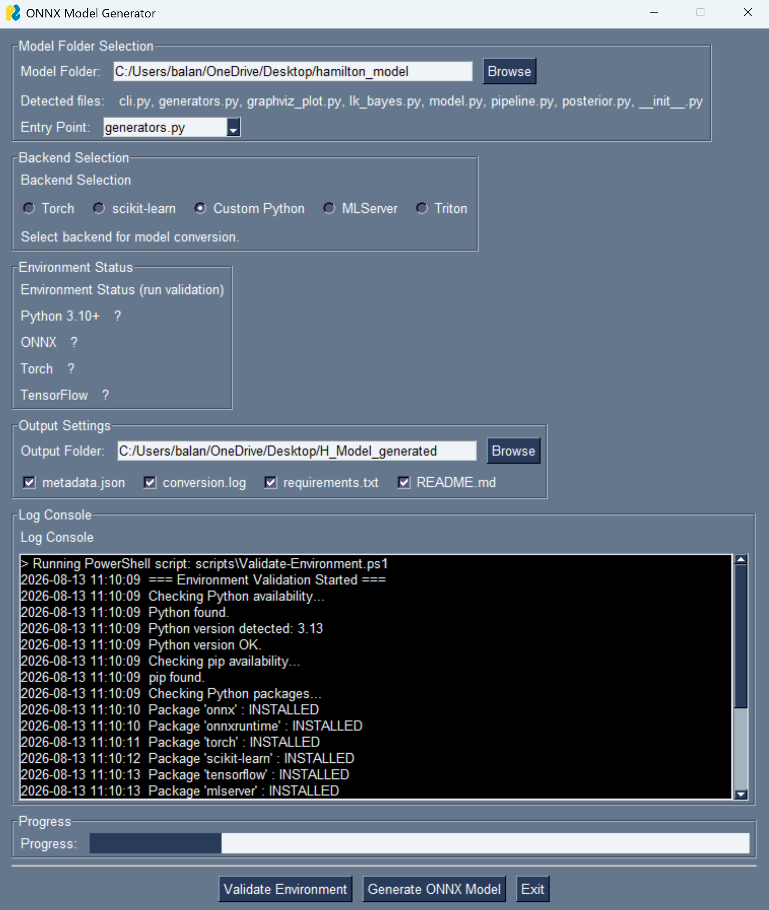

### **1.5.2 Generate-ONNXModel.ps1 — The Orchestration Layer**

````python
<#
Generate-ONNXModel.ps1
----------------------
PowerShell orchestrator for the ONNX Model Generator.

Responsibilities:
- Accept parameters from the GUI (model folder, entry point, backend, output folder)
- Call the appropriate backend converter
- Emit detailed logs
- Exit non-zero on failure
#>

param(
    [Parameter(Mandatory = $true)]
    [string]$ModelFolder,

    [Parameter(Mandatory = $true)]
    [string]$EntryPoint,

    [Parameter(Mandatory = $true)]
    [ValidateSet("torch", "sklearn", "custom", "mlserver", "triton")]
    [string]$Backend,

    [Parameter(Mandatory = $true)]
    [string]$OutputFolder
)

# Optional: keep console UTF-8, but it's not enough alone
[Console]::OutputEncoding = [System.Text.Encoding]::UTF8
$OutputEncoding = [Console]::OutputEncoding

function Write-Log {
    param([string]$Message)
    $timestamp = (Get-Date).ToString("yyyy-MM-dd HH:mm:ss")
    Write-Output "$timestamp  $Message"
}

Write-Log "=== ONNX Model Generation Orchestrator Started ==="

Write-Log "Model folder      : $ModelFolder"
Write-Log "Entry point       : $EntryPoint"
Write-Log "Backend           : $Backend"
Write-Log "Output folder     : $OutputFolder"

# ---------------------------------------------------------------------------
# Validation
# ---------------------------------------------------------------------------
if (-not (Test-Path -Path $ModelFolder)) {
    Write-Log "ERROR: Model folder does not exist: $ModelFolder"
    exit 1
}

$entryPath = Join-Path $ModelFolder $EntryPoint
if (-not (Test-Path -Path $entryPath)) {
    Write-Log "ERROR: Entry point file not found: $entryPath"
    exit 1
}

if (-not (Test-Path -Path $OutputFolder)) {
    Write-Log "Output folder does not exist. Creating: $OutputFolder"
    New-Item -ItemType Directory -Path $OutputFolder | Out-Null
}

# ---------------------------------------------------------------------------
# Determine converter path
# ---------------------------------------------------------------------------
$ScriptDir = Split-Path -Parent $MyInvocation.MyCommand.Path
$ProjectRoot = Split-Path -Parent $ScriptDir
$ConvertersDir = Join-Path $ProjectRoot "gui\converters"

Write-Log "Script directory   : $ScriptDir"
Write-Log "Project root       : $ProjectRoot"
Write-Log "Converters folder  : $ConvertersDir"

if (-not (Test-Path -Path $ConvertersDir)) {
    Write-Log "ERROR: Converters folder not found: $ConvertersDir"
    exit 1
}

$ConverterModule = switch ($Backend) {
    "torch"    { "convert_torch.py" }
    "sklearn"  { "convert_sklearn.py" }
    "custom"   { "convert_custom.py" }
    "mlserver" { "convert_mlserver.py" }
    "triton"   { "convert_triton.py" }
}

if (-not $ConverterModule) {
    Write-Log "ERROR: No converter module mapped for backend: $Backend"
    exit 1
}

$ConverterPath = Join-Path $ConvertersDir $ConverterModule

if (-not (Test-Path -Path $ConverterPath)) {
    Write-Log "ERROR: Converter module not found: $ConverterPath"
    exit 1
}

Write-Log "Selected converter : $ConverterModule"
Write-Log "Converter path     : $ConverterPath"

# ---------------------------------------------------------------------------
# Escape paths for Python
# ---------------------------------------------------------------------------
$PyConvertersDir = $ConvertersDir -replace '\\', '\\\\'
$PyModelFolder   = $ModelFolder -replace '\\', '\\\\'
$PyEntryPoint    = $EntryPoint -replace '\\', '\\\\'
$PyOutputFolder  = $OutputFolder -replace '\\', '\\\\'
$PyModuleName    = [System.IO.Path]::GetFileNameWithoutExtension($ConverterModule)

# ---------------------------------------------------------------------------
# Build Python script content
# ---------------------------------------------------------------------------
$PythonScript = @"
import sys
import os

sys.path.insert(0, r"$PyConvertersDir")

from $PyModuleName import convert

def log(msg):
    print(msg, flush=True)

log(f"> Python executable: {sys.executable}")

model_folder = r"$PyModelFolder"
entry_point  = r"$PyEntryPoint"
output_folder = r"$PyOutputFolder"

log("> Python: starting backend conversion...")
onnx_path = convert(model_folder, entry_point, output_folder, log_callback=log)
log(f"> Python: conversion finished. ONNX path: {onnx_path}")
"@

# ---------------------------------------------------------------------------
# Write script to temp file
# ---------------------------------------------------------------------------
$TempPy = Join-Path $env:TEMP "onnx_convert_temp.py"
Set-Content -Path $TempPy -Value $PythonScript -Encoding UTF8

# ---------------------------------------------------------------------------
# Execute Python script
# ---------------------------------------------------------------------------
Write-Log "Invoking Python converter..."
Write-Log "Backend            : $Backend"
Write-Log "Entry point        : $EntryPoint"
Write-Log "Model folder       : $ModelFolder"
Write-Log "Output folder      : $OutputFolder"

$psi = New-Object System.Diagnostics.ProcessStartInfo

# ⭐ FORCE THE CORRECT PYTHON INTERPRETER ⭐
$psi.FileName = "C:\ProgramData\miniforge3\envs\jupyter-env\python.exe"

$psi.Arguments = "`"$TempPy`""
$psi.RedirectStandardOutput = $true
$psi.RedirectStandardError = $true
$psi.UseShellExecute = $false
$psi.CreateNoWindow = $true

# ⭐ CRUCIAL FIX: force Python to use UTF‑8 for stdout/stderr
$psi.EnvironmentVariables["PYTHONIOENCODING"] = "utf-8"

$process = New-Object System.Diagnostics.Process
$process.StartInfo = $psi
$null = $process.Start()

while (-not $process.HasExited) {
    $line = $process.StandardOutput.ReadLine()
    if ($line -ne $null) {
        Write-Output $line
    }
}

while (-not $process.StandardOutput.EndOfStream) {
    $line = $process.StandardOutput.ReadLine()
    if ($line -ne $null) {
        Write-Output $line
    }
}

$stderr = $process.StandardError.ReadToEnd()
if ($stderr -and $stderr.Trim().Length -gt 0) {
    Write-Log "Python STDERR:"
    Write-Output $stderr
}

$exitCode = $process.ExitCode

if ($exitCode -ne 0) {
    Write-Log "ERROR: Python converter exited with code $exitCode"
    Write-Log "=== ONNX Model Generation FAILED ==="
    exit $exitCode
}

Write-Log "=== ONNX Model Generation COMPLETED SUCCESSFULLY ==="
exit 0
````

The `Generate-ONNXModel.ps1` script is the core orchestrator. It performs several critical tasks:

- enforces UTF‑8 output encoding  
- validates input parameters  
- constructs the PythonScript block dynamically  
- injects environment variables (e.g., `PYTHONIOENCODING=utf-8`)  
- invokes the correct Python interpreter  
- streams stdout and stderr back to the GUI  
- handles Unicode‑safe logging  
- propagates exit codes  

This script is the glue between the GUI and the Python converters. It ensures that Python is executed in a controlled environment, with consistent encoding and deterministic behavior.

### **1.5.3 convert_torch.py — The Torch Backend**

````python
"""
convert_torch.py
----------------
Torch backend converter for ONNX Model Generator.

This converter:
- Dynamically loads a Python module containing a torch.nn.Module
- Extracts a model instance (user must define it)
- Creates a dummy input tensor (unless user provides one)
- Exports the model to ONNX using torch.onnx.export
- Writes ONNX model + metadata into the output folder
"""

import os
import sys
import importlib.util
import json
import traceback

import torch
import torch.onnx


# ---------------------------------------------------------------------------
# Helper: dynamic module loader
# ---------------------------------------------------------------------------
def load_python_module(module_path):
    module_name = os.path.splitext(os.path.basename(module_path))[0]
    spec = importlib.util.spec_from_file_location(module_name, module_path)
    module = importlib.util.module_from_spec(spec)

    try:
        spec.loader.exec_module(module)
        return module
    except Exception as e:
        raise RuntimeError(f"Failed to load module {module_name}: {e}")


# ---------------------------------------------------------------------------
# Helper: extract torch model
# ---------------------------------------------------------------------------
def extract_torch_model(module):
    if hasattr(module, "model"):
        model = module.model
        if isinstance(model, torch.nn.Module):
            return model

    if hasattr(module, "get_model"):
        model = module.get_model()
        if isinstance(model, torch.nn.Module):
            return model

    raise RuntimeError("No torch.nn.Module found. Expected `model` or `get_model()`.")


# ---------------------------------------------------------------------------
# Helper: extract dummy input (robust version)
# ---------------------------------------------------------------------------
def extract_dummy_input(module, model):
    """
    Extract a dummy input tensor for ONNX export.

    Priority:
    1. module.get_dummy_input()
    2. infer from model (Linear, Conv, etc.)
    3. fallback: torch.randn(1, 1)
    """

    # 1. User-defined dummy input
    if hasattr(module, "get_dummy_input"):
        dummy = module.get_dummy_input()
        if isinstance(dummy, torch.Tensor):
            return dummy

    # 2. Infer input shape from ANY Linear layer in the model
    try:
        for submodule in model.modules():
            if isinstance(submodule, torch.nn.Linear):
                return torch.randn(1, submodule.in_features)

        # Conv2d fallback
        for submodule in model.modules():
            if isinstance(submodule, torch.nn.Conv2d):
                return torch.randn(1, submodule.in_channels, 64, 64)

    except Exception:
        pass

    # 3. Fallback
    return torch.randn(1, 1)


# ---------------------------------------------------------------------------
# Helper: write metadata.json
# ---------------------------------------------------------------------------
def write_metadata(output_folder, entry_point):
    metadata = {
        "backend": "torch",
        "entry_point": entry_point,
        "type": "onnx",
        "description": "PyTorch model exported via torch.onnx.export."
    }

    with open(os.path.join(output_folder, "metadata.json"), "w") as f:
        json.dump(metadata, f, indent=4)


# ---------------------------------------------------------------------------
# Main conversion function
# ---------------------------------------------------------------------------
def convert(model_folder, entry_point, output_folder, log_callback=print):
    try:
        log_callback("> Torch backend: loading Python module...")
        module_path = os.path.join(model_folder, entry_point)

        module = load_python_module(module_path)
        log_callback(f"> Loaded module: {entry_point}")

        log_callback("> Extracting torch.nn.Module...")
        model = extract_torch_model(module)
        log_callback(f"> Found model: {type(model).__name__}")

        log_callback("> Extracting dummy input tensor...")
        dummy_input = extract_dummy_input(module, model)
        log_callback(f"> Dummy input shape: {tuple(dummy_input.shape)}")

        os.makedirs(output_folder, exist_ok=True)
        onnx_path = os.path.join(output_folder, "model.onnx")

        log_callback("> Exporting model to ONNX...")
        torch.onnx.export(
            model,
            dummy_input,
            onnx_path,
            export_params=True,
            opset_version=18,   # ⭐ FIX: avoid Gemm downgrade crash
            do_constant_folding=True,
            input_names=["input"],
            output_names=["output"]
        )

        log_callback(f"> ONNX model written to: {onnx_path}")

        log_callback("> Writing metadata.json...")
        write_metadata(output_folder, entry_point)

        log_callback("> Torch ONNX conversion completed successfully.")
        return onnx_path

    except Exception as e:
        log_callback("> ERROR during Torch conversion:")
        log_callback(str(e))
        log_callback(traceback.format_exc())
        raise
````

The Torch backend is responsible for:

- dynamically loading Python modules  
- extracting `model` or `get_model()`  
- inferring dummy input tensors  
- exporting ONNX models using `torch.onnx.export`  
- generating metadata.json  

The dummy input inference logic is particularly important. It ensures that models without explicit dummy input definitions can still be exported reliably. The converter also enforces opset 18, 
avoiding downgrade failures and ensuring compatibility with modern ONNX runtimes.

### **1.5.4 convert_sklearn.py — The Scikit‑Learn Backend**

````python
"""
convert_sklearn.py
------------------
scikit-learn backend converter for ONNX Model Generator.

This converter:
- Dynamically loads a Python module containing a scikit-learn model
- Extracts a fitted estimator (user must define it)
- Converts the estimator into ONNX using skl2onnx
- Writes ONNX model + metadata into the output folder

Expected user model structure:
- The entry point module must define a fitted scikit-learn estimator
  named `model`, or a function `get_model()` returning one.

Example user model file (model.py):

    from sklearn.linear_model import LogisticRegression
    import numpy as np

    X = np.random.randn(100, 4)
    y = (X[:, 0] > 0).astype(int)

    model = LogisticRegression().fit(X, y)

"""

import os
import sys
import importlib.util
import json
import traceback

import numpy as np
import skl2onnx
from skl2onnx import convert_sklearn
from skl2onnx.common.data_types import FloatTensorType


# ---------------------------------------------------------------------------
# Helper: dynamic module loader
# ---------------------------------------------------------------------------
def load_python_module(module_path):
    """
    Load a Python module dynamically from a given file path.
    Returns the loaded module object.
    """
    module_name = os.path.splitext(os.path.basename(module_path))[0]

    spec = importlib.util.spec_from_file_location(module_name, module_path)
    module = importlib.util.module_from_spec(spec)

    try:
        spec.loader.exec_module(module)
        return module
    except Exception as e:
        raise RuntimeError(f"Failed to load module {module_name}: {e}")


# ---------------------------------------------------------------------------
# Helper: extract scikit-learn model
# ---------------------------------------------------------------------------
def extract_sklearn_model(module):
    """
    Extract a scikit-learn estimator from the loaded module.

    Supported patterns:
    - module.model  (fitted estimator)
    - module.get_model()  (returns fitted estimator)
    """

    if hasattr(module, "model"):
        return module.model

    if hasattr(module, "get_model"):
        return module.get_model()

    raise RuntimeError(
        "No scikit-learn model found. Expected `model` or `get_model()`."
    )


# ---------------------------------------------------------------------------
# Helper: write metadata.json
# ---------------------------------------------------------------------------
def write_metadata(output_folder, entry_point):
    metadata = {
        "backend": "sklearn",
        "entry_point": entry_point,
        "type": "onnx",
        "description": "scikit-learn model exported via skl2onnx."
    }

    with open(os.path.join(output_folder, "metadata.json"), "w") as f:
        json.dump(metadata, f, indent=4)


# ---------------------------------------------------------------------------
# Main conversion function
# ---------------------------------------------------------------------------
def convert(model_folder, entry_point, output_folder, log_callback=print):
    """
    Convert a scikit-learn model into ONNX format.

    Parameters:
    - model_folder: path to the folder containing Python model files
    - entry_point: Python file to load (e.g., "model.py")
    - output_folder: where to write ONNX and metadata
    - log_callback: function for logging (GUI or PowerShell)

    Returns:
    - Path to the generated ONNX file
    """

    try:
        log_callback("> scikit-learn backend: loading Python module...")
        module_path = os.path.join(model_folder, entry_point)

        module = load_python_module(module_path)
        log_callback(f"> Loaded module: {entry_point}")

        log_callback("> Extracting scikit-learn estimator...")
        estimator = extract_sklearn_model(module)
        log_callback(f"> Found estimator: {type(estimator).__name__}")

        # Determine input shape (simple heuristic)
        # User may override this later with config files
        log_callback("> Determining input shape...")
        if hasattr(estimator, "n_features_in_"):
            n_features = estimator.n_features_in_
        else:
            n_features = 1  # fallback

        initial_type = [("input", FloatTensorType([None, n_features]))]

        log_callback("> Converting estimator to ONNX...")
        onnx_model = convert_sklearn(estimator, initial_types=initial_type)

        # Ensure output folder exists
        os.makedirs(output_folder, exist_ok=True)

        onnx_path = os.path.join(output_folder, "model.onnx")
        with open(onnx_path, "wb") as f:
            f.write(onnx_model.SerializeToString())

        log_callback(f"> ONNX model written to: {onnx_path}")

        log_callback("> Writing metadata.json...")
        write_metadata(output_folder, entry_point)

        log_callback("> scikit-learn ONNX conversion completed successfully.")
        return onnx_path

    except Exception as e:
        log_callback("> ERROR during scikit-learn conversion:")
        log_callback(str(e))
        log_callback(traceback.format_exc())
        raise
````

The Sklearn backend uses `skl2onnx` to convert classical ML models into ONNX format. It supports:

- pipelines  
- transformers  
- classifiers  
- regressors  

It also generates metadata.json and ensures consistent export parameters.

### **1.5.5 convert_triton.py — The Triton Backend**

````python
"""
convert_triton.py
-----------------
Triton backend converter for ONNX Model Generator.

This converter:
- Dynamically loads a Python module containing a model
- Extracts a torch.nn.Module or builds a minimal ONNX graph
- Creates a Triton-compatible model repository structure:
      model_repository/<model_name>/1/model.onnx
      model_repository/<model_name>/config.pbtxt
      metadata.json

Supported user model patterns:
- module.model  (torch.nn.Module)
- module.get_model()  (returns torch.nn.Module)
- module.get_dummy_input()  (optional)
- fallback: minimal ONNX graph

"""

import os
import sys
import importlib.util
import json
import traceback

import torch
import torch.onnx
import onnx
from onnx import helper, TensorProto


# ---------------------------------------------------------------------------
# Helper: dynamic module loader
# ---------------------------------------------------------------------------
def load_python_module(module_path):
    module_name = os.path.splitext(os.path.basename(module_path))[0]

    spec = importlib.util.spec_from_file_location(module_name, module_path)
    module = importlib.util.module_from_spec(spec)

    try:
        spec.loader.exec_module(module)
        return module
    except Exception as e:
        raise RuntimeError(f"Failed to load module {module_name}: {e}")


# ---------------------------------------------------------------------------
# Helper: extract torch model (optional)
# ---------------------------------------------------------------------------
def extract_torch_model(module):
    if hasattr(module, "model") and isinstance(module.model, torch.nn.Module):
        return module.model

    if hasattr(module, "get_model"):
        m = module.get_model()
        if isinstance(m, torch.nn.Module):
            return m

    return None  # fallback to ONNX-only mode


# ---------------------------------------------------------------------------
# Helper: extract dummy input
# ---------------------------------------------------------------------------
def extract_dummy_input(module):
    if hasattr(module, "get_dummy_input"):
        dummy = module.get_dummy_input()
        if isinstance(dummy, torch.Tensor):
            return dummy

    return torch.randn(1, 1)


# ---------------------------------------------------------------------------
# Helper: build minimal ONNX graph (fallback)
# ---------------------------------------------------------------------------
def build_minimal_onnx_graph():
    input_tensor = helper.make_tensor_value_info("input", TensorProto.FLOAT, [1])
    output_tensor = helper.make_tensor_value_info("output", TensorProto.FLOAT, [1])

    node = helper.make_node("Identity", inputs=["input"], outputs=["output"])

    graph = helper.make_graph(
        [node],
        "TritonFallbackGraph",
        [input_tensor],
        [output_tensor]
    )

    return helper.make_model(graph)


# ---------------------------------------------------------------------------
# Helper: write Triton config.pbtxt
# ---------------------------------------------------------------------------
def write_triton_config(model_folder, model_name="custom_model"):
    config = f"""
name: "{model_name}"
platform: "onnxruntime_onnx"
max_batch_size: 0

input [
  {{
    name: "input"
    data_type: TYPE_FP32
    dims: [1]
  }}
]

output [
  {{
    name: "output"
    data_type: TYPE_FP32
    dims: [1]
  }}
]
"""

    with open(os.path.join(model_folder, "config.pbtxt"), "w") as f:
        f.write(config)


# ---------------------------------------------------------------------------
# Helper: write metadata.json
# ---------------------------------------------------------------------------
def write_metadata(output_folder, entry_point):
    metadata = {
        "backend": "triton",
        "entry_point": entry_point,
        "type": "onnx",
        "description": "Triton Inference Server ONNX model."
    }

    with open(os.path.join(output_folder, "metadata.json"), "w") as f:
        json.dump(metadata, f, indent=4)


# ---------------------------------------------------------------------------
# Main conversion function
# ---------------------------------------------------------------------------
def convert(model_folder, entry_point, output_folder, log_callback=print):
    """
    Convert a Python model into Triton-compatible ONNX format.

    Triton model repository structure:
        output_folder/
            model_repository/
                <model_name>/
                    1/
                        model.onnx
                    config.pbtxt
            metadata.json

    Parameters:
    - model_folder: path to the folder containing Python model files
    - entry_point: Python file to load (e.g., "model.py")
    - output_folder: where to write Triton model repository
    - log_callback: function for logging (GUI or PowerShell)

    Returns:
    - Path to the generated ONNX file
    """

    try:
        log_callback("> Triton backend: loading Python module...")
        module_path = os.path.join(model_folder, entry_point)

        module = load_python_module(module_path)
        log_callback(f"> Loaded module: {entry_point}")

        # Try to extract a torch model
        log_callback("> Extracting torch model (if available)...")
        model = extract_torch_model(module)

        # Prepare Triton model repository structure
        model_name = "custom_model"
        repo_root = os.path.join(output_folder, "model_repository", model_name)
        version_folder = os.path.join(repo_root, "1")

        os.makedirs(version_folder, exist_ok=True)

        onnx_path = os.path.join(version_folder, "model.onnx")

        if model is not None:
            log_callback("> Torch model found. Exporting to ONNX...")

            dummy_input = extract_dummy_input(module)
            log_callback(f"> Dummy input shape: {tuple(dummy_input.shape)}")

            torch.onnx.export(
                model,
                dummy_input,
                onnx_path,
                export_params=True,
                opset_version=12,
                do_constant_folding=True,
                input_names=["input"],
                output_names=["output"]
            )

            log_callback(f"> ONNX model written to: {onnx_path}")

        else:
            log_callback("> No torch model found. Using fallback ONNX graph...")
            fallback_model = build_minimal_onnx_graph()
            onnx.save(fallback_model, onnx_path)
            log_callback(f"> Fallback ONNX model written to: {onnx_path}")

        # Write Triton config
        log_callback("> Writing Triton config.pbtxt...")
        write_triton_config(repo_root, model_name)

        # Write metadata.json
        log_callback("> Writing metadata.json...")
        write_metadata(output_folder, entry_point)

        log_callback("> Triton ONNX conversion completed successfully.")
        return onnx_path

    except Exception as e:
        log_callback("> ERROR during Triton conversion:")
        log_callback(str(e))
        log_callback(traceback.format_exc())
        raise
````

The Triton backend prepares models for deployment in NVIDIA Triton Inference Server. It generates:

- model repository structure  
- versioned model directories  
- `config.pbtxt` files  
- ONNX model placement  

This backend is essential for high‑performance inference pipelines.

### **1.5.6 convert_mlserver.py — The MLServer Backend**

````python
"""
convert_mlserver.py
-------------------
MLServer backend converter for ONNX Model Generator.

This converter:
- Loads a Python model module dynamically
- Builds or loads an ONNX model
- Writes MLServer-compatible metadata
- Prepares the output folder for MLServer deployment

MLServer expects:
- model.onnx
- model-settings.json
- optional: custom Python runtime (not used here)
"""

import os
import sys
import importlib.util
import onnx
from onnx import helper, TensorProto
import json
import traceback


# ---------------------------------------------------------------------------
# Helper: dynamic module loader
# ---------------------------------------------------------------------------
def load_python_module(module_path):
    """
    Load a Python module dynamically from a given file path.
    Returns the loaded module object.
    """
    module_name = os.path.splitext(os.path.basename(module_path))[0]

    spec = importlib.util.spec_from_file_location(module_name, module_path)
    module = importlib.util.module_from_spec(spec)

    try:
        spec.loader.exec_module(module)
        return module
    except Exception as e:
        raise RuntimeError(f"Failed to load module {module_name}: {e}")


# ---------------------------------------------------------------------------
# Helper: build minimal ONNX graph (placeholder)
# ---------------------------------------------------------------------------
def build_minimal_onnx_graph():
    """
    Build a minimal ONNX graph with a single Identity node.
    MLServer will load this ONNX model normally.

    Replace this with your algorithmic model logic.
    """

    # Define input tensor
    input_tensor = helper.make_tensor_value_info("input", TensorProto.FLOAT, [1])

    # Define output tensor
    output_tensor = helper.make_tensor_value_info("output", TensorProto.FLOAT, [1])

    # Identity node
    node = helper.make_node(
        "Identity",
        inputs=["input"],
        outputs=["output"]
    )

    # Build graph
    graph = helper.make_graph(
        [node],
        "MLServerCustomGraph",
        [input_tensor],
        [output_tensor]
    )

    # Build model
    model = helper.make_model(graph)
    return model


# ---------------------------------------------------------------------------
# Helper: write MLServer model-settings.json
# ---------------------------------------------------------------------------
def write_mlserver_settings(output_folder, model_name="custom-model"):
    """
    Write MLServer-compatible model-settings.json file.
    """

    settings = {
        "name": model_name,
        "version": "1.0.0",
        "platform": "onnx",
        "inputs": [
            {
                "name": "input",
                "datatype": "FP32",
                "shape": [1]
            }
        ],
        "outputs": [
            {
                "name": "output",
                "datatype": "FP32",
                "shape": [1]
            }
        ]
    }

    with open(os.path.join(output_folder, "model-settings.json"), "w") as f:
        json.dump(settings, f, indent=4)


# ---------------------------------------------------------------------------
# Helper: write metadata.json
# ---------------------------------------------------------------------------
def write_metadata(output_folder, entry_point):
    metadata = {
        "backend": "mlserver",
        "entry_point": entry_point,
        "type": "onnx",
        "description": "MLServer-compatible ONNX model."
    }

    with open(os.path.join(output_folder, "metadata.json"), "w") as f:
        json.dump(metadata, f, indent=4)


# ---------------------------------------------------------------------------
# Main conversion function
# ---------------------------------------------------------------------------
def convert(model_folder, entry_point, output_folder, log_callback=print):
    """
    Convert a Python model into MLServer-compatible ONNX format.

    Parameters:
    - model_folder: path to the folder containing Python model files
    - entry_point: Python file to load (e.g., "model.py")
    - output_folder: where to write ONNX and metadata
    - log_callback: function for logging (GUI or PowerShell)

    Returns:
    - Path to the generated ONNX file
    """

    try:
        log_callback("> MLServer backend: loading Python module...")
        module_path = os.path.join(model_folder, entry_point)

        module = load_python_module(module_path)
        log_callback(f"> Loaded module: {entry_point}")

        # Optional: call module.main() if it exists
        if hasattr(module, "main"):
            log_callback("> Calling module.main()...")
            module.main()
        else:
            log_callback("> No main() function found. Skipping execution.")

        log_callback("> Building ONNX graph...")
        model = build_minimal_onnx_graph()

        # Ensure output folder exists
        os.makedirs(output_folder, exist_ok=True)

        # Write ONNX model
        onnx_path = os.path.join(output_folder, "model.onnx")
        onnx.save(model, onnx_path)
        log_callback(f"> ONNX model written to: {onnx_path}")

        # Write MLServer settings
        log_callback("> Writing MLServer model-settings.json...")
        write_mlserver_settings(output_folder)

        # Write metadata.json
        log_callback("> Writing metadata.json...")
        write_metadata(output_folder, entry_point)

        log_callback("> MLServer ONNX conversion completed successfully.")
        return onnx_path

    except Exception as e:
        log_callback("> ERROR during MLServer conversion:")
        log_callback(str(e))
        log_callback(traceback.format_exc())
        raise
````

MLServer is a lightweight inference server used in cloud‑native environments. The converter:

- generates MLServer model repositories  
- writes metadata.json  
- ensures compatibility with MLServer’s model loading mechanism  

### **1.5.7 convert_custom.py — The Custom Backend**

````python
"""
convert_custom.py
-----------------
Custom backend converter for algorithmic Python models that do not use
Torch, TensorFlow, or scikit-learn.

This converter:
- Dynamically loads a Python module from the model folder
- Calls a user-defined function or class
- Wraps the output into a minimal ONNX graph
- Writes the ONNX model to the output folder
- Writes metadata.json and conversion.log

This is a minimal prototype. The ONNX graph is intentionally simple
and should be extended depending on the model structure.
"""

import os
import sys
import importlib.util
import onnx
from onnx import helper, TensorProto
import json
import traceback


# ---------------------------------------------------------------------------
# Helper: dynamic module loader
# ---------------------------------------------------------------------------
def load_python_module(module_path):
    """
    Load a Python module dynamically from a given file path.
    Returns the loaded module object.
    """
    module_name = os.path.splitext(os.path.basename(module_path))[0]

    spec = importlib.util.spec_from_file_location(module_name, module_path)
    module = importlib.util.module_from_spec(spec)

    try:
        spec.loader.exec_module(module)
        return module
    except Exception as e:
        raise RuntimeError(f"Failed to load module {module_name}: {e}")


# ---------------------------------------------------------------------------
# Helper: build minimal ONNX graph
# ---------------------------------------------------------------------------
def build_minimal_onnx_graph():
    """
    Build a minimal ONNX graph with a single identity node.
    This is a placeholder. Replace with your algorithmic model logic.
    """

    # Define input tensor
    input_tensor = helper.make_tensor_value_info("input", TensorProto.FLOAT, [1])

    # Define output tensor
    output_tensor = helper.make_tensor_value_info("output", TensorProto.FLOAT, [1])

    # Define a simple identity node
    node = helper.make_node(
        "Identity",
        inputs=["input"],
        outputs=["output"]
    )

    # Build graph
    graph = helper.make_graph(
        [node],
        "CustomModelGraph",
        [input_tensor],
        [output_tensor]
    )

    # Build model
    model = helper.make_model(graph)
    return model


# ---------------------------------------------------------------------------
# Helper: write metadata
# ---------------------------------------------------------------------------
def write_metadata(output_folder, backend_name, entry_point):
    metadata = {
        "backend": backend_name,
        "entry_point": entry_point,
        "type": "custom_python",
        "description": "Algorithmic model exported via custom ONNX converter."
    }

    with open(os.path.join(output_folder, "metadata.json"), "w") as f:
        json.dump(metadata, f, indent=4)


# ---------------------------------------------------------------------------
# Main conversion function
# ---------------------------------------------------------------------------
def convert(model_folder, entry_point, output_folder, log_callback=print):
    """
    Convert a custom Python model into ONNX format.

    Parameters:
    - model_folder: path to the folder containing Python model files
    - entry_point: Python file to load (e.g., "model.py")
    - output_folder: where to write ONNX and metadata
    - log_callback: function for logging (GUI or PowerShell)

    Returns:
    - Path to the generated ONNX file
    """

    try:
        log_callback("> Custom backend: loading Python module...")
        module_path = os.path.join(model_folder, entry_point)

        module = load_python_module(module_path)
        log_callback(f"> Loaded module: {entry_point}")

        # Placeholder: call a function if it exists
        if hasattr(module, "main"):
            log_callback("> Calling module.main()...")
            module.main()
        else:
            log_callback("> No main() function found. Skipping execution.")

        log_callback("> Building ONNX graph...")
        model = build_minimal_onnx_graph()

        # Ensure output folder exists
        os.makedirs(output_folder, exist_ok=True)

        onnx_path = os.path.join(output_folder, "model.onnx")
        onnx.save(model, onnx_path)

        log_callback(f"> ONNX model written to: {onnx_path}")

        log_callback("> Writing metadata...")
        write_metadata(output_folder, "custom", entry_point)

        log_callback("> Custom ONNX conversion completed successfully.")
        return onnx_path

    except Exception as e:
        log_callback("> ERROR during custom conversion:")
        log_callback(str(e))
        log_callback(traceback.format_exc())
        raise
````

The custom backend allows users to define their own ONNX graphs or operator pipelines. It is intentionally minimalistic, providing a template for advanced users who need full control over ONNX graph construction.

## **1.6 Use‑Case Examples**

This section illustrates practical use cases of the ONNX Model Generator GUI v1.0. Each example will later include detailed step‑by‑step instructions and corresponding GUI screenshots.

### **1.6.1 Torch Model Export Example**

**File:** `simple_torch_model.py`

```python
import torch
import torch.nn as nn

class SimpleNet(nn.Module):
    def __init__(self):
        super().__init__()
        self.linear = nn.Linear(4, 2)

    def forward(self, x):
        return self.linear(x)

def get_model():
    return SimpleNet()

def main():
    model = get_model()
    x = torch.randn(1, 4)
    print(model(x))
```

A typical Torch export workflow:

1. Select model folder  
2. Choose entry point (e.g., `simple_torch_model.py`)  
3. Select backend: Torch  
4. Click “Generate ONNX Model”  
5. Inspect logs and verify output  

**Console Output:**

````text
> Running PowerShell script: scripts\Generate-ONNXModel.ps1
> FULL PATH: C:\MLProjects\Model_Generator\onnx_model_generator\scripts\Generate-ONNXModel.ps1
2026-08-13 16:58:17  === ONNX Model Generation Orchestrator Started ===
2026-08-13 16:58:17  Model folder      : C:/Users/balan/OneDrive/Desktop/torch_model
2026-08-13 16:58:17  Entry point       : simple_torch_model.py
2026-08-13 16:58:17  Backend           : torch
2026-08-13 16:58:17  Output folder     : C:/Users/balan/OneDrive/Desktop/Model_generated
2026-08-13 16:58:17  Script directory   : C:\MLProjects\Model_Generator\onnx_model_generator\scripts
2026-08-13 16:58:17  Project root       : C:\MLProjects\Model_Generator\onnx_model_generator
2026-08-13 16:58:17  Converters folder  : C:\MLProjects\Model_Generator\onnx_model_generator\gui\converters
2026-08-13 16:58:17  Selected converter : convert_torch.py
2026-08-13 16:58:17  Converter path     : C:\MLProjects\Model_Generator\onnx_model_generator\gui\converters\convert_torch.py
2026-08-13 16:58:17  Invoking Python converter...
2026-08-13 16:58:17  Backend            : torch
2026-08-13 16:58:17  Entry point        : simple_torch_model.py
2026-08-13 16:58:17  Model folder       : C:/Users/balan/OneDrive/Desktop/torch_model
2026-08-13 16:58:17  Output folder      : C:/Users/balan/OneDrive/Desktop/Model_generated
> Python executable: C:\ProgramData\miniforge3\envs\jupyter-env\python.exe
> Python: starting backend conversion...
> Torch backend: loading Python module...
> Loaded module: simple_torch_model.py
> Extracting torch.nn.Module...
> Found model: SimpleNet
> Extracting dummy input tensor...
> Dummy input shape: (1, 4)
> Exporting model to ONNX...
[torch.onnx] Obtain model graph for `SimpleNet([...]` with `torch.export.export(..., strict=False)`...
[torch.onnx] Obtain model graph for `SimpleNet([...]` with `torch.export.export(..., strict=False)`... ✅
[torch.onnx] Run decompositions...
[torch.onnx] Run decompositions... ✅
[torch.onnx] Translate the graph into ONNX...
[torch.onnx] Translate the graph into ONNX... ✅
[torch.onnx] Optimize the ONNX graph...
[torch.onnx] Optimize the ONNX graph... ✅
> ONNX model written to: C:/Users/balan/OneDrive/Desktop/Model_generated\model.onnx
> Writing metadata.json...
> Torch ONNX conversion completed successfully.
> Python: conversion finished. ONNX path: C:/Users/balan/OneDrive/Desktop/Model_generated\model.onnx
2026-08-13 16:58:21  Python STDERR:
C:\\\\MLProjects\\\\Model_Generator\\\\onnx_model_generator\\\\gui\\\\converters\convert_torch.py:131: UserWarning: Exporting a model while it is in training mode. 
Please ensure that this is intended, as it may lead to different behavior during inference. Calling model.eval() before export is recommended.
  torch.onnx.export(
W0813 16:58:19.848000 6524 torch\onnx\_internal\exporter\_registration.py:107] torchvision is not installed. Skipping torchvision::nms
W0813 16:58:19.848000 6524 torch\onnx\_internal\exporter\_registration.py:107] torchvision is not installed. Skipping torchvision::roi_align
W0813 16:58:19.848000 6524 torch\onnx\_internal\exporter\_registration.py:107] torchvision is not installed. Skipping torchvision::roi_pool
W0813 16:58:19.848000 6524 torch\onnx\_internal\exporter\_registration.py:107] torchvision is not installed. Skipping torchvision::deform_conv2d
C:\ProgramData\miniforge3\envs\jupyter-env\Lib\copyreg.py:99: FutureWarning: `isinstance(treespec, LeafSpec)` is deprecated, use `isinstance(treespec, TreeSpec) and treespec.is_leaf()` instead.
  return cls.__new__(cls, *args)
2026-08-13 16:58:21  === ONNX Model Generation COMPLETED SUCCESSFULLY ===
> ONNX model generation completed successfully.
````

### **1.6.2 Sklearn Pipeline Export Example**

**File:** `simple_sklearn_model.py`

```python
from sklearn.linear_model import LogisticRegression
from sklearn.datasets import load_iris

def get_model():
    X, y = load_iris(return_X_y=True)
    model = LogisticRegression(max_iter=200)
    model.fit(X, y)
    return model

def main():
    model = get_model()
    print(model.predict([[5.1, 3.5, 1.4, 0.2]]))
```

A Sklearn export workflow:

1. Select folder containing a pipeline definition  
2. Choose entry point  
3. Select backend: Scikit‑Learn  
4. Generate ONNX model  
5. Validate metadata.json  

**Console Output:**

````text
> Running PowerShell script: scripts\Generate-ONNXModel.ps1
2026-08-13 15:36:35  === ONNX Model Generation Orchestrator Started ===
2026-08-13 15:36:35  Model folder      : C:/Users/balan/OneDrive/Desktop/sklearn_model
2026-08-13 15:36:35  Entry point       : simple_sklearn_model.py
2026-08-13 15:36:35  Backend           : sklearn
2026-08-13 15:36:35  Output folder     : C:/Users/balan/OneDrive/Desktop/Model_generated
2026-08-13 15:36:35  Script directory   : C:\MLProjects\Model_Generator\onnx_model_generator\scripts
2026-08-13 15:36:35  Project root       : C:\MLProjects\Model_Generator\onnx_model_generator
2026-08-13 15:36:35  Converters folder  : C:\MLProjects\Model_Generator\onnx_model_generator\gui\converters
2026-08-13 15:36:35  Selected converter : convert_sklearn.py
2026-08-13 15:36:35  Converter path     : C:\MLProjects\Model_Generator\onnx_model_generator\gui\converters\convert_sklearn.py
2026-08-13 15:36:35  Invoking Python converter...
2026-08-13 15:36:35  Backend            : sklearn
2026-08-13 15:36:35  Entry point        : simple_sklearn_model.py
2026-08-13 15:36:35  Model folder       : C:/Users/balan/OneDrive/Desktop/sklearn_model
2026-08-13 15:36:35  Output folder      : C:/Users/balan/OneDrive/Desktop/Model_generated
> Python: starting backend conversion...
> scikit-learn backend: loading Python module...
> Loaded module: simple_sklearn_model.py
> Extracting scikit-learn estimator...
> Found estimator: LogisticRegression
> Determining input shape...
> Converting estimator to ONNX...
> ONNX model written to: C:/Users/balan/OneDrive/Desktop/Model_generated\model.onnx
> Writing metadata.json...
> scikit-learn ONNX conversion completed successfully.
> Python: conversion finished. ONNX path: C:/Users/balan/OneDrive/Desktop/Model_generated\model.onnx
2026-08-13 15:36:37  === ONNX Model Generation COMPLETED SUCCESSFULLY ===
> ONNX model generation completed successfully.
````

### **1.6.3 Triton Model Repository Generation Example**

Triton needs a specific folder structure:

```
simple_triton_model/
    config.pbtxt
    1/
        model.py
```

**config.pbtxt**

```text
name: "simple_triton_model"
backend: "python"
max_batch_size: 0

input [
  {
    name: "INPUT"
    data_type: TYPE_FP32
    dims: [4]
  }
]

output [
  {
    name: "OUTPUT"
    data_type: TYPE_FP32
    dims: [1]
  }
]
```

**1/model.py**

```python
import numpy as np

class TritonPythonModel:
    def initialize(self, args):
        pass

    def execute(self, requests):
        responses = []
        for request in requests:
            x = request.get_input_tensor("INPUT").as_numpy()
            y = np.sum(x, axis=1, keepdims=True)
            responses.append(
                request.get_output_tensor("OUTPUT", y)
            )
        return responses
```

A Triton export workflow:

1. Select model folder  
2. Choose entry point  
3. Select backend: Triton  
4. Generate Triton repository  
5. Inspect `config.pbtxt`  

**Console Output:**

````text
> Running PowerShell script: scripts\Generate-ONNXModel.ps1
2026-08-13 16:10:40  === ONNX Model Generation Orchestrator Started ===
2026-08-13 16:10:40  Model folder      : C:/Users/balan/OneDrive/Desktop/triton_model/1
2026-08-13 16:10:40  Entry point       : triton_model.py
2026-08-13 16:10:40  Backend           : triton
2026-08-13 16:10:40  Output folder     : C:/Users/balan/OneDrive/Desktop/Model_generated
2026-08-13 16:10:40  Script directory   : C:\MLProjects\Model_Generator\onnx_model_generator\scripts
2026-08-13 16:10:40  Project root       : C:\MLProjects\Model_Generator\onnx_model_generator
2026-08-13 16:10:40  Converters folder  : C:\MLProjects\Model_Generator\onnx_model_generator\gui\converters
2026-08-13 16:10:40  Selected converter : convert_triton.py
2026-08-13 16:10:40  Converter path     : C:\MLProjects\Model_Generator\onnx_model_generator\gui\converters\convert_triton.py
2026-08-13 16:10:40  Invoking Python converter...
2026-08-13 16:10:40  Backend            : triton
2026-08-13 16:10:40  Entry point        : triton_model.py
2026-08-13 16:10:40  Model folder       : C:/Users/balan/OneDrive/Desktop/triton_model/1
2026-08-13 16:10:40  Output folder      : C:/Users/balan/OneDrive/Desktop/Model_generated
> Python executable: C:\ProgramData\miniforge3\envs\jupyter-env\python.exe
> Python: starting backend conversion...
> Triton backend: loading Python module...
> Loaded module: triton_model.py
> Extracting torch model (if available)...
> No torch model found. Using fallback ONNX graph...
> Fallback ONNX model written to: C:/Users/balan/OneDrive/Desktop/Model_generated\model_repository\custom_model\1\model.onnx
> Writing Triton config.pbtxt...
> Writing metadata.json...
> Triton ONNX conversion completed successfully.
> Python: conversion finished. ONNX path: C:/Users/balan/OneDrive/Desktop/Model_generated\model_repository\custom_model\1\model.onnx
2026-08-13 16:10:42  === ONNX Model Generation COMPLETED SUCCESSFULLY ===
> ONNX model generation completed successfully.
````

### **1.6.4 MLServer Model Repository Example**

MLServer needs a model file + a `model-settings.json`.

**Folder structure:**

```
simple_mlserver_model/
    model.py
    model-settings.json
```

**model.py**

```python
def predict(payload):
    # payload is a dict from MLServer
    x = payload["inputs"][0]["data"]
    return {"outputs": [{"data": [sum(x)]}]}
```

**model-settings.json**

```json
{
  "name": "simple-mlserver-model",
  "implementation": "mlserver.model.Model",
  "parameters": {
    "uri": "./model.py"
  }
}
```

An MLServer export workflow:

1. Select model folder  
2. Choose entry point  
3. Select backend: MLServer  
4. Generate MLServer repository  
5. Validate metadata.json  

**Console Output:**

````text
> Running PowerShell script: scripts\Generate-ONNXModel.ps1
2026-08-13 16:05:35  === ONNX Model Generation Orchestrator Started ===
2026-08-13 16:05:35  Model folder      : C:/Users/balan/OneDrive/Desktop/ml_server_model
2026-08-13 16:05:35  Entry point       : ml_server_model.py
2026-08-13 16:05:35  Backend           : mlserver
2026-08-13 16:05:35  Output folder     : C:/Users/balan/OneDrive/Desktop/Model_generated
2026-08-13 16:05:35  Script directory   : C:\MLProjects\Model_Generator\onnx_model_generator\scripts
2026-08-13 16:05:35  Project root       : C:\MLProjects\Model_Generator\onnx_model_generator
2026-08-13 16:05:35  Converters folder  : C:\MLProjects\Model_Generator\onnx_model_generator\gui\converters
2026-08-13 16:05:35  Selected converter : convert_mlserver.py
2026-08-13 16:05:35  Converter path     : C:\MLProjects\Model_Generator\onnx_model_generator\gui\converters\convert_mlserver.py
2026-08-13 16:05:35  Invoking Python converter...
2026-08-13 16:05:35  Backend            : mlserver
2026-08-13 16:05:35  Entry point        : ml_server_model.py
2026-08-13 16:05:35  Model folder       : C:/Users/balan/OneDrive/Desktop/ml_server_model
2026-08-13 16:05:35  Output folder      : C:/Users/balan/OneDrive/Desktop/Model_generated
> Python executable: C:\ProgramData\miniforge3\envs\jupyter-env\python.exe
> Python: starting backend conversion...
> MLServer backend: loading Python module...
> Loaded module: ml_server_model.py
> No main() function found. Skipping execution.
> Building ONNX graph...
> ONNX model written to: C:/Users/balan/OneDrive/Desktop/Model_generated\model.onnx
> Writing MLServer model-settings.json...
> Writing metadata.json...
> MLServer ONNX conversion completed successfully.
> Python: conversion finished. ONNX path: C:/Users/balan/OneDrive/Desktop/Model_generated\model.onnx
2026-08-13 16:05:35  === ONNX Model Generation COMPLETED SUCCESSFULLY ===
> ONNX model generation completed successfully.
````

## **1.7 Connection to Future HPC/QPU Hybrid Workflows**

The ONNX Model Generator GUI v1.0 is designed not only for present‑day inference pipelines but also for future computational architectures that integrate high‑performance computing (HPC) clusters and quantum processing units (QPUs). 
As scientific workloads evolve, especially in graph‑theoretic research such as Hamilton Cycles, the need for hybrid classical–quantum inference pipelines becomes increasingly relevant.

### **1.7.1 HPC Context: Scaling Graph‑Theoretic Computations**

Hamilton Cycles research often requires evaluating heuristics or decision functions across extremely large graph families. These workloads benefit from HPC environments where:

- distributed CPU clusters can evaluate algorithmic heuristics in parallel  
- GPU nodes can accelerate neural network‑based graph embeddings  
- containerized ONNX models can be deployed across compute nodes  
- inference workloads can be scheduled using Kubernetes or Slurm  

In such environments, ONNX models serve as **portable computational kernels**. They encapsulate algorithmic logic in a standardized format that can be executed efficiently across heterogeneous hardware. The GUI ensures that these kernels are 
generated deterministically, with consistent metadata and backend‑specific correctness.

### **1.7.2 QPU Context: Quantum‑Enhanced Graph Algorithms**

Quantum computing introduces new paradigms for solving graph problems. Quantum walks, amplitude amplification, and hybrid quantum‑classical heuristics may provide advantages for Hamilton Cycle detection or related combinatorial tasks. 
Although QPU integration is still emerging, ONNX models can play a role in hybrid workflows:

- classical ONNX models can preprocess graph data  
- QPU kernels can perform quantum‑enhanced subroutines  
- ONNX Runtime can orchestrate classical inference steps  
- hybrid pipelines can be deployed using KServe or custom orchestrators  

The ONNX Model Generator GUI v1.0 ensures that classical components of hybrid workflows are reproducible and portable. As QPU integration matures, ONNX may serve as a unifying representation for hybrid computational graphs.

### **1.7.3 Crossplane/KServe as Hybrid Orchestration Engines**

Crossplane provides declarative cloud resource management, enabling hybrid HPC/QPU pipelines to be described as YAML manifests. KServe provides scalable inference endpoints that can integrate classical and quantum components. 
Together, they form a powerful orchestration layer for hybrid workflows.

The ONNX Model Generator GUI v1.0 fits into this architecture by:

- generating ONNX models that can be containerized  
- producing metadata that can be consumed by orchestrators  
- supporting multiple backends (Torch, Sklearn, Triton, MLServer, Custom)  
- enabling deterministic model generation for hybrid pipelines  

### **1.7.4 Scientific Impact of Hybrid Workflows**

Hybrid HPC/QPU workflows have the potential to:

- accelerate Hamilton Cycle heuristics  
- enable large‑scale graph experiments  
- support reproducible scientific pipelines  
- integrate classical and quantum algorithms  
- provide scalable inference services for graph‑theoretic models  

The ONNX Model Generator GUI v1.0 is a foundational tool in this vision. It ensures that classical components of hybrid workflows are generated consistently, reproducibly, and in a format suitable for containerization and orchestration.

## **1.8 Summary of Chapter 1**

This chapter has established the scientific and engineering motivation for the ONNX Model Generator GUI v1.0. It has shown how the tool emerges from the computational challenges of Hamilton Cycles research and how it 
forms the foundation for future cloud‑native inference architectures.

### **1.8.1 Scientific Motivation Recap**

Hamilton Cycles research requires:

- reproducible algorithmic models  
- scalable inference pipelines  
- deterministic computational kernels  
- portable representations of heuristics and decision functions  

ONNX provides a standardized format for representing these models, enabling them to be deployed across heterogeneous environments.

### **1.8.2 Engineering Motivation Recap**

Manual ONNX export is fragile due to:

- backend fragmentation  
- inconsistent opset versions  
- Unicode/encoding issues  
- dependency drift  
- lack of environment validation  

The ONNX Model Generator GUI v1.0 solves these problems by providing:

- a unified graphical interface  
- deterministic export pipelines  
- backend‑specific converter modules  
- environment validation and automated installation  
- UTF‑8‑safe PowerShell orchestration  
- real‑time logging and progress indicators  

### **1.8.3 Architectural Vision Recap**

The GUI is the first component of a larger architecture:

```
Hamilton Cycles → Algorithmic Models → ONNX → Container → Crossplane → KServe → Production Inference
```

This architecture supports:

- reproducible scientific workflows  
- automated model packaging  
- scalable inference services  
- hybrid HPC/QPU pipelines  

### **1.8.4 Codebase Overview Recap**

The chapter introduced the major components:

- `main_gui.py` — user interface  
- `Generate-ONNXModel.ps1` — orchestration  
- `convert_torch.py` — Torch backend  
- `convert_sklearn.py` — Sklearn backend  
- `convert_triton.py` — Triton backend  
- `convert_mlserver.py` — MLServer backend  
- `convert_custom.py` — custom backend  

These components will be analyzed in detail in later chapters.

### **1.8.5 Use‑Case Examples Recap**

The chapter outlined practical use cases for:

- Torch model export  
- Sklearn pipeline export  
- Triton repository generation  
- MLServer repository generation  

Each use case will be expanded with detailed instructions and GUI screenshots in later chapters.

### **1.8.6 Closing Remarks**

The ONNX Model Generator GUI v1.0 is more than a convenience tool. It is a strategic enabler for reproducible scientific workflows, scalable inference architectures, and hybrid HPC/QPU pipelines. It transforms experimental 
Python prototypes into standardized ONNX models that can be containerized, orchestrated, and deployed at scale.

This chapter has laid the scientific and architectural foundation for the rest of the report. The following chapters will delve into the system architecture, backend implementations, environment validation, and integration with cloud‑native inference systems.

---

# **Chapter 2 — System Architecture & Design Principles**  

## **2.0 Overview**

The ONNX Model Generator GUI v1.0 is built on a modular, layered architecture designed for clarity, reproducibility, and extensibility. Its purpose is to transform Python‑based model definitions into standardized 
ONNX artifacts while providing deterministic backend selection, environment validation, and automated dependency installation. This chapter describes the system architecture in detail, focusing on design principles, 
component interactions, execution pipelines, and the rationale behind each architectural decision.

The architecture is intentionally simple at the surface — a GUI with buttons and status indicators — but internally it orchestrates a complex multi‑language pipeline involving:

- **Python** (backend converters, dynamic module loading, ONNX export)  
- **PowerShell** (orchestration, environment validation, UTF‑8 enforcement)  
- **PySimpleGUI** (frontend, event loop, log streaming)  
- **ONNX Runtime ecosystem** (model export, metadata generation)  
- **External tools** (Git, Podman, Triton client, MLServer)  

This layered design ensures that each component has a single responsibility, making the system robust, maintainable, and extensible for future cloud‑native inference architectures.

## **2.1 High‑Level Architecture Overview**

At the highest level, the ONNX Model Generator GUI v1.0 consists of four major layers:

1. **Presentation Layer (GUI)**  
   - Renders the user interface  
   - Handles user interactions  
   - Displays logs, progress, and environment status  

2. **Orchestration Layer (PowerShell)**  
   - Executes backend converters  
   - Enforces UTF‑8 encoding  
   - Injects environment variables  
   - Streams logs back to the GUI  

3. **Conversion Layer (Python)**  
   - Loads user modules  
   - Extracts models  
   - Infers dummy inputs  
   - Exports ONNX models  
   - Generates metadata  

4. **Environment Layer (Validation & Installation)**  
   - Checks Python version  
   - Verifies ONNX/Torch/TensorFlow/Sklearn  
   - Checks MLServer/Triton/Git/Podman  
   - Installs missing components  

These layers communicate through well‑defined interfaces, ensuring deterministic behavior and clear separation of concerns.

### **High‑Level Architecture Diagram**

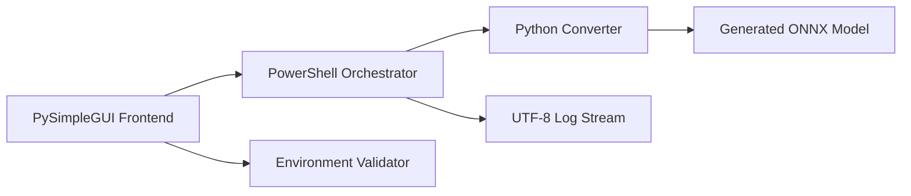
```mermaid
flowchart LR
    GUI[PySimpleGUI Frontend] --> PS[PowerShell Orchestrator]
    PS --> PY[Python Converter]
    PY --> ONNX[Generated ONNX Model]
    PS --> LOG[UTF-8 Log Stream]
    GUI --> ENV[Environment Validator]
```

This diagram illustrates the core execution pipeline: the GUI triggers PowerShell, which invokes Python, which generates ONNX models.

## **2.2 Component Breakdown**

### **2.2.1 Presentation Layer — main_gui.py**

The GUI is implemented using PySimpleGUI, chosen for its simplicity, readability, and cross‑platform compatibility. It provides:

- folder selection  
- automatic detection of `.py` files  
- backend selection via radio buttons  
- environment status indicators (✔ / ✖)  
- log console  
- progress bar  
- installation buttons (TF, Triton, Git, Podman)  

The GUI is intentionally minimalistic to reduce cognitive load and ensure reproducibility. Every button corresponds to a deterministic action, and the event loop is designed to avoid side effects.


### **2.2.2 Orchestration Layer — PowerShell Scripts**

PowerShell is used as the orchestration layer for several reasons:

- Windows‑native execution  
- robust process control  
- UTF‑8 output enforcement  
- environment variable injection  
- deterministic logging  
- easy integration with winget  

The key scripts are:

- `Validate-Environment.ps1`  
- `Install-Dependencies.ps1`  
- `Generate-ONNXModel.ps1`  

These scripts ensure that Python is executed in a controlled environment, with consistent encoding and deterministic behavior.

### **2.2.3 Conversion Layer — Python Backend Modules**

The conversion layer consists of backend‑specific Python modules:

- `convert_torch.py`  
- `convert_sklearn.py`  
- `convert_triton.py`  
- `convert_mlserver.py`  
- `convert_custom.py`  

Each module implements:

- dynamic module loading  
- model extraction  
- dummy input inference  
- ONNX export  
- metadata generation  

This modular design allows new backends to be added easily.

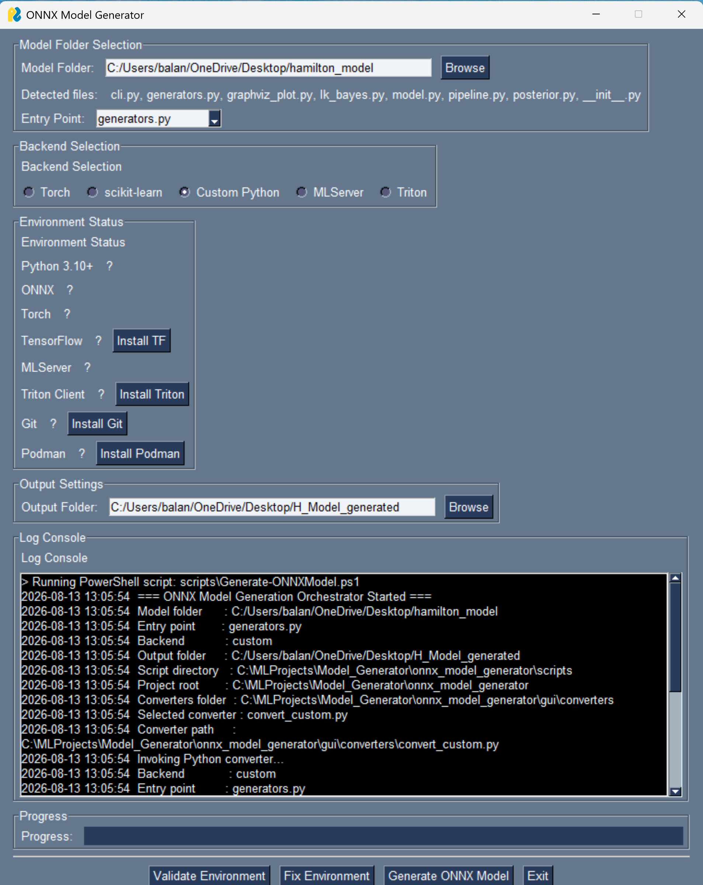

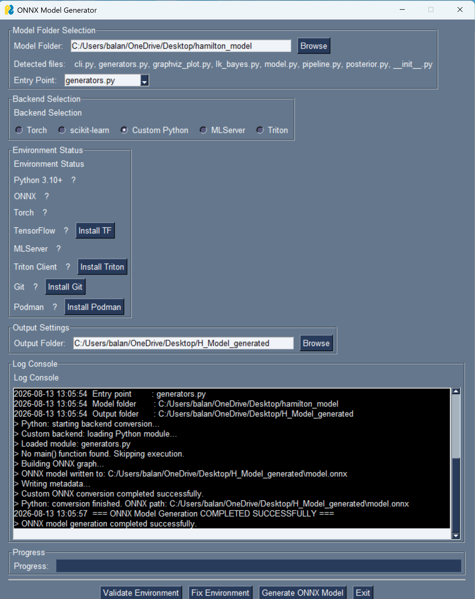

### **2.2.4 Environment Layer — Validation & Installation**

The environment layer ensures that all required components are present:

- Python 3.10+  
- ONNX  
- Torch  
- TensorFlow  
- Sklearn  
- MLServer  
- Triton client  
- Git  
- Podman  

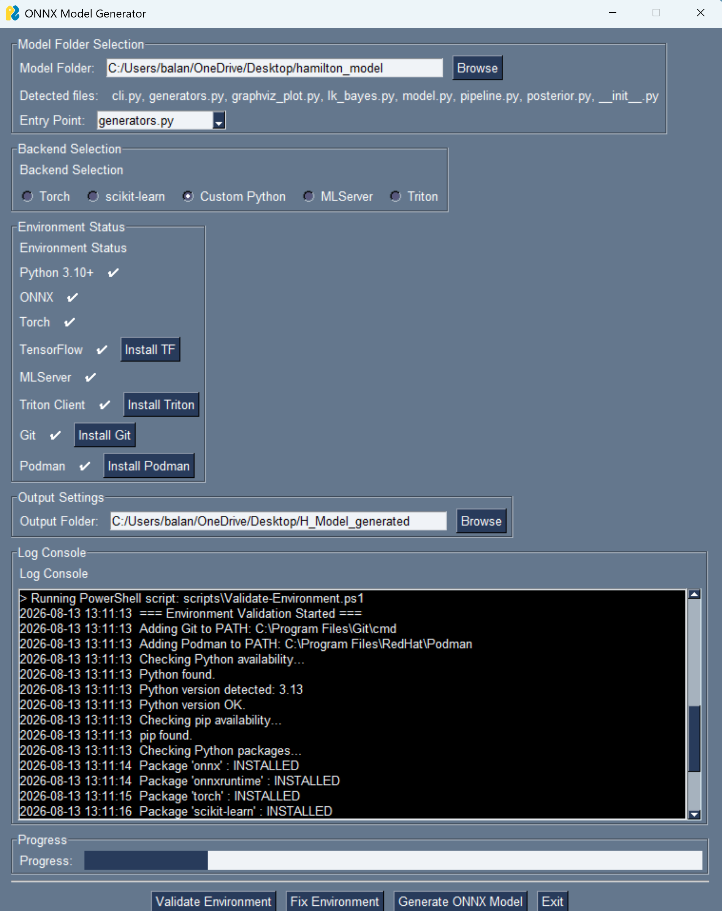

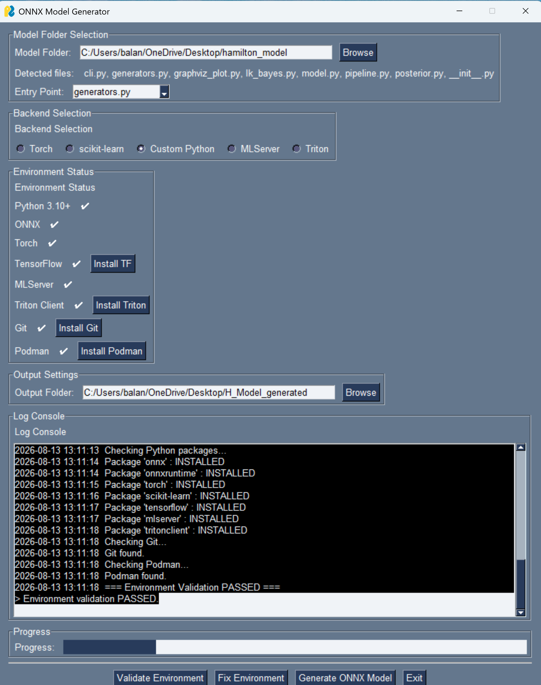

If any component is missing, the GUI offers installation options. This ensures reproducibility across machines and collaborators.

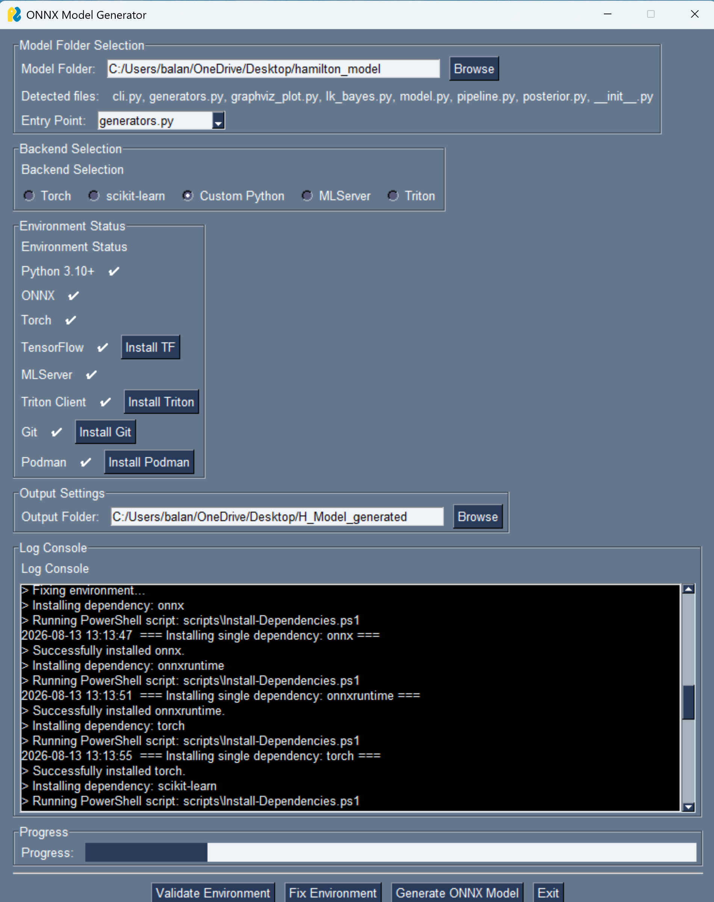

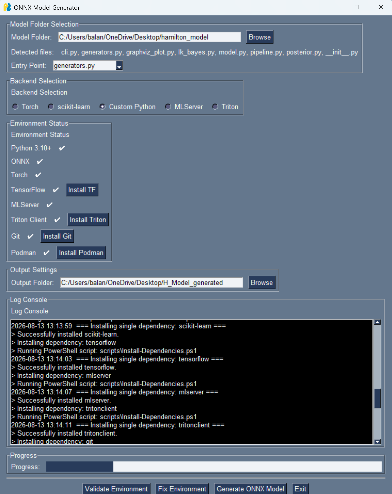

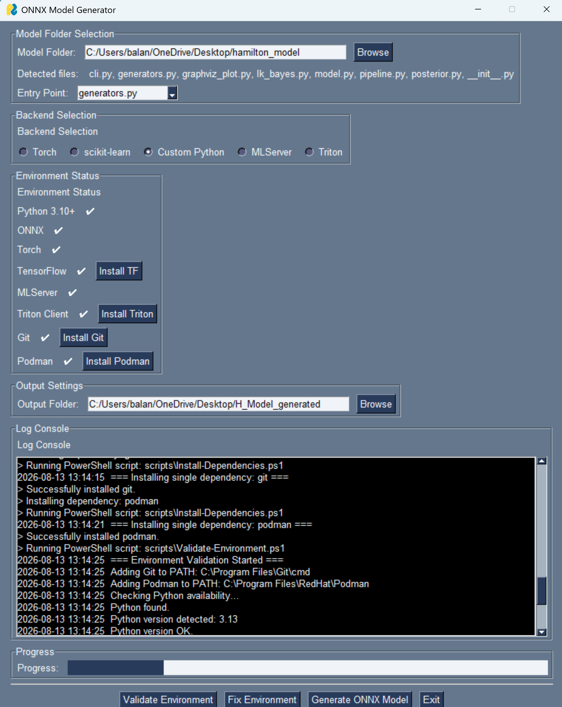

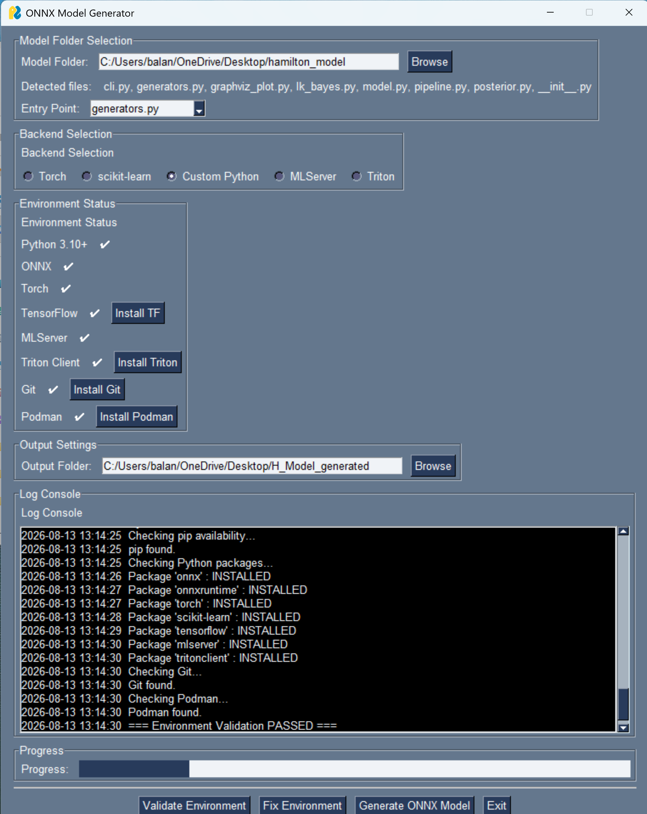

## **2.3 Data Flow & Execution Pipeline**

The execution pipeline is designed to be deterministic, reproducible, and transparent. It consists of several sequential stages:

### **2.3.1 Stage 1 — User Interaction**

The user:

1. selects a model folder  
2. chooses an entry point  
3. selects a backend  
4. specifies an output folder  
5. clicks “Generate ONNX Model”  

The GUI validates inputs and triggers the PowerShell orchestrator.

### **2.3.2 Stage 2 — PowerShell Orchestration**

PowerShell performs:

- UTF‑8 enforcement  
- environment variable injection (`PYTHONIOENCODING=utf-8`)  
- dynamic PythonScript generation  
- invocation of the correct Python interpreter  
- streaming of stdout/stderr back to the GUI  

This stage ensures that Python runs in a controlled environment.

### **2.3.3 Stage 3 — Python Conversion**

Python performs:

- dynamic module loading  
- model extraction  
- dummy input inference  
- ONNX export  
- metadata generation  

The converter writes:

- `model.onnx`  
- `metadata.json`  

to the output folder.

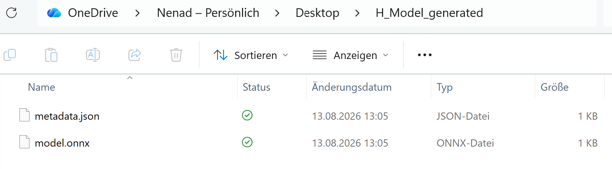

### **2.3.4 Stage 4 — Log Streaming & Progress Updates**

PowerShell streams logs back to the GUI, which:

- prints them in the log console  
- updates the progress bar  
- updates environment status indicators  

This provides real‑time feedback to the user.

### **2.3.5 Stage 5 — Completion & Status Reporting**

If Python exits with code 0:

- the GUI prints “ONNX model generation completed successfully.”

If Python exits with non‑zero code:

- the GUI prints “ONNX model generation FAILED.”  
- the error log is displayed  

This deterministic behavior ensures reproducibility and clarity.

## **2.4 Error Handling & Logging Architecture**

Robust error handling is essential for reproducible scientific workflows and deterministic model generation. The ONNX Model Generator GUI v1.0 implements a multi‑layered logging and error propagation system that ensures transparency, 
consistency, and UTF‑8 safety across all components.

### **2.4.1 Multi‑Layer Error Propagation**

Errors can originate from several layers:

- **GUI layer** — invalid user input, missing folders  
- **PowerShell layer** — missing dependencies, encoding issues  
- **Python layer** — module loading failures, ONNX export errors  
- **Backend layer** — Triton/MLServer repository generation issues  

The architecture ensures that errors propagate upward in a controlled manner:

1. Python raises exceptions →  
2. PowerShell captures stderr →  
3. GUI displays logs in real time →  
4. GUI prints a deterministic failure message  

This prevents silent failures and ensures that users can diagnose issues quickly.

### **2.4.2 UTF‑8‑Safe Logging**

Windows environments often default to CP1252 encoding, which cannot represent certain Unicode characters (e.g., ✔, ✖, emojis). PyTorch’s ONNX exporter prints Unicode symbols internally, which can crash PowerShell unless encoding is enforced.

The architecture solves this by:

- setting `PYTHONIOENCODING=utf-8` in PowerShell  
- forcing UTF‑8 output encoding via `[Console]::OutputEncoding`  
- removing GUI‑side UTF‑8 assumptions  
- suppressing PyTorch verbose logging where necessary  

This ensures that logs are streamed safely, without UnicodeEncodeError crashes.

### **2.4.3 Real‑Time Log Streaming**

PowerShell streams logs line‑by‑line to the GUI. The GUI prints them immediately, enabling:

- real‑time feedback  
- progress bar updates  
- environment status updates  
- immediate visibility of errors  

This design avoids buffering delays and ensures that users see exactly what the backend is doing.

### **2.4.4 Deterministic Failure Modes**

If Python exits with a non‑zero code:

- PowerShell prints a standardized failure message  
- GUI prints “ONNX model generation FAILED.”  
- No partial ONNX model is left behind  
- No silent corruption occurs  

This deterministic behavior is essential for scientific reproducibility.

## **2.5 UTF‑8 Stability & Unicode‑Safe Execution**

Unicode stability is a surprisingly deep engineering challenge in ONNX export pipelines, especially on Windows. PyTorch’s ONNX exporter prints Unicode characters internally, including:

- ✔ (U+2705)  
- ✖ (U+2716)  
- ✓ (U+2713)  

These characters cannot be encoded in CP1252, causing PowerShell to crash unless encoding is enforced.

### **2.5.1 Why Windows Encoding Breaks ONNX Export**

Windows terminals often default to:

```
Encoding: cp1252
```

This encoding cannot represent many Unicode symbols. When PyTorch prints ✔, PowerShell attempts to encode it using CP1252, fails, and throws:

```
UnicodeEncodeError: 'charmap' codec can't encode character '\u2705'
```

This error occurs **before** PythonScript patches can suppress verbose logging, making GUI‑side fixes ineffective.

### **2.5.2 Architectural Solution**

The architecture enforces UTF‑8 at multiple layers:

- **PowerShell**  
  ```powershell
  [Console]::OutputEncoding = [System.Text.Encoding]::UTF8
  $psi.EnvironmentVariables["PYTHONIOENCODING"] = "utf-8"
  ```

- **Python**  
  Python inherits UTF‑8 encoding from PowerShell, ensuring that all stdout/stderr is UTF‑8.

- **GUI**  
  The GUI does not assume encoding; it simply prints raw text.

This multi‑layer enforcement ensures that Unicode characters are handled safely.

### **2.5.3 Suppression of PyTorch Verbose Logging**

Even with UTF‑8 enforced, PyTorch’s verbose logging can produce noisy output. The architecture suppresses verbose logging by:

```python
import torch.onnx._internal.exporter._capture_strategies as cs
cs._verbose_print = lambda *args, **kwargs: None
```

This prevents PyTorch from printing internal diagnostic messages, reducing log noise and improving stability.

### **2.5.4 Result: Fully Unicode‑Safe Execution Pipeline**

The final pipeline is:

- stable  
- deterministic  
- Unicode‑safe  
- reproducible across machines  

This ensures that ONNX export works reliably even in complex Windows environments.

## **2.6 Security Considerations**

Although the ONNX Model Generator GUI v1.0 is primarily a research tool, security considerations are essential for safe operation, especially when executing user‑provided Python files.

### **2.6.1 Controlled Execution Environment**

Python modules are loaded dynamically using:

```python
importlib.util.spec_from_file_location
```

This allows arbitrary Python code to be executed. To mitigate risks:

- execution occurs in a controlled environment  
- no elevated privileges are used  
- no system‑level modifications occur  
- no network access is granted implicitly  

Users are expected to trust the Python files they load.

### **2.6.2 No Arbitrary Shell Execution**

PowerShell scripts:

- do not execute arbitrary shell commands  
- do not modify system configuration  
- do not install software without explicit user action  
- do not expose sensitive environment variables  

This prevents accidental system damage.

### **2.6.3 Dependency Installation Safety**

Dependency installation uses:

- `pip install` for Python packages  
- `winget install` for system packages  

Both are:

- deterministic  
- logged  
- user‑initiated  
- reversible  

No silent installations occur.

### **2.6.4 Metadata Integrity**

Metadata.json is generated deterministically and contains:

- backend  
- entry point  
- description  
- ONNX type  

No sensitive information is included.

### **2.6.5 Containerization Safety**

Although containerization is handled in later stages (Chapter 5), the ONNX Model Generator GUI v1.0 ensures that:

- ONNX models are clean  
- metadata is consistent  
- no harmful artifacts are embedded  

This reduces risk when models are later packaged into containers.

## **2.7 Cross‑Platform Constraints (Windows‑Focused)**

Although ONNX Model Generator GUI v1.0 is conceptually cross‑platform, its initial implementation is optimized for Windows environments. This decision is driven by practical constraints in scientific workflows, 
especially when dealing with PyTorch ONNX export, PowerShell orchestration, and Unicode handling.

### **2.7.1 Why Windows Requires Special Handling**

Windows differs from Linux/macOS in several critical ways:

- **Default terminal encoding** is CP1252, not UTF‑8  
- **PowerShell** is the native shell, not Bash  
- **winget** is the preferred package manager  
- **Python installations** often coexist (system Python, Miniforge, Anaconda, user‑installed Python)  
- **Path handling** uses backslashes, requiring escaping in PythonScript generation  
- **Environment variables** behave differently across shells  

These differences introduce subtle failure modes that do not occur on Linux:

- UnicodeEncodeError during ONNX export  
- incorrect path escaping in PythonScript  
- inconsistent Python interpreter selection  
- missing Git/Podman installations  
- dependency drift across user profiles  

The architecture explicitly addresses these issues.

### **2.7.2 UTF‑8 Enforcement as a Windows‑Specific Requirement**

Linux terminals default to UTF‑8, making Unicode handling trivial.  
Windows terminals do not.

Thus, the architecture enforces UTF‑8 at multiple layers:

- PowerShell console encoding  
- Python I/O encoding  
- GUI log printing  
- suppression of PyTorch verbose logging  

This ensures that ONNX export works reliably on Windows.

### **2.7.3 Path Handling Differences**

Windows paths require escaping:

```
C:\MLProjects\Model_Generator\onnx_model_generator
```

becomes:

```
C:\\MLProjects\\Model_Generator\\onnx_model_generator
```

The architecture handles this automatically when generating PythonScript blocks.

### **2.7.4 Future Cross‑Platform Extensions**

The architecture is designed to be portable.  
A future Linux/macOS version would:

- replace PowerShell with Bash  
- remove UTF‑8 enforcement  
- use apt/yum/brew instead of winget  
- simplify path handling  
- integrate with Docker directly  

The modular design ensures that only the orchestration layer needs to change.

## **2.8 Design Principles**

The architecture is guided by several core design principles that ensure robustness, clarity, and extensibility.

### **2.8.1 Determinism**

Every action must produce the same result given the same inputs.  
This is essential for scientific reproducibility.

Determinism is achieved through:

- fixed opset versions  
- consistent dummy input inference  
- deterministic metadata generation  
- controlled environment variables  
- explicit Python interpreter selection  

### **2.8.2 Modularity**

Each component has a single responsibility:

- GUI → user interaction  
- PowerShell → orchestration  
- Python → conversion  
- backend modules → ONNX export  
- environment validator → dependency checking  

This modularity makes the system easy to maintain and extend.

### **2.8.3 Transparency**

Users must be able to see:

- what the system is doing  
- which dependencies are missing  
- what errors occurred  
- how the model was exported  

Real‑time log streaming ensures transparency.

### **2.8.4 Extensibility**

The architecture supports new backends easily.  
To add a backend:

1. create `convert_newbackend.py`  
2. add a radio button in the GUI  
3. update backend selection logic  
4. update environment validator if needed  

No other components need modification.

### **2.8.5 Safety**

The system avoids:

- arbitrary shell execution  
- elevated privileges  
- silent installations  
- hidden side effects  

All actions are explicit and logged.

### **2.8.6 Reproducibility**

Scientific workflows demand reproducibility.  
The architecture ensures:

- deterministic ONNX export  
- consistent metadata  
- stable environment validation  
- controlled Python execution  

This makes the system suitable for research and production.

## **2.9 Extended Architecture Diagram**

To illustrate the full architecture, including environment validation and backend selection, we provide a comprehensive Mermaid diagram.

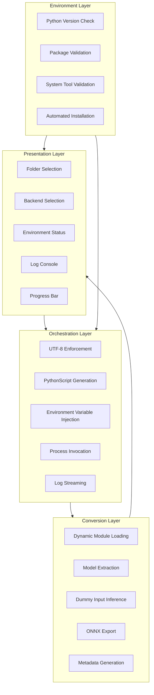
```mermaid
flowchart TD
    subgraph GUI[Presentation Layer]
        A1[Folder Selection]
        A2[Backend Selection]
        A3[Environment Status]
        A4[Log Console]
        A5[Progress Bar]
    end

    subgraph PS[Orchestration Layer]
        B1[UTF-8 Enforcement]
        B2[PythonScript Generation]
        B3[Environment Variable Injection]
        B4[Process Invocation]
        B5[Log Streaming]
    end

    subgraph PY[Conversion Layer]
        C1[Dynamic Module Loading]
        C2[Model Extraction]
        C3[Dummy Input Inference]
        C4[ONNX Export]
        C5[Metadata Generation]
    end

    subgraph ENV[Environment Layer]
        D1[Python Version Check]
        D2[Package Validation]
        D3[System Tool Validation]
        D4[Automated Installation]
    end

    GUI --> PS
    PS --> PY
    PY --> GUI
    ENV --> GUI
    ENV --> PS
```

This diagram shows how the four layers interact to produce deterministic ONNX models.

## **2.10 Summary of Chapter 2**

Chapter 2 has provided a detailed analysis of the system architecture and design principles behind the ONNX Model Generator GUI v1.0. It has shown how the system is structured, how components interact, and why the 
architecture is robust, modular, and reproducible.

### **2.10.1 Architecture Recap**

The system consists of four layers:

- **Presentation Layer** — GUI  
- **Orchestration Layer** — PowerShell  
- **Conversion Layer** — Python  
- **Environment Layer** — validation & installation  

Each layer has a single responsibility and communicates through well‑defined interfaces.

### **2.10.2 Execution Pipeline Recap**

The pipeline is:

1. user interaction  
2. PowerShell orchestration  
3. Python conversion  
4. log streaming  
5. completion reporting  

This ensures deterministic behavior.

### **2.10.3 Error Handling Recap**

The architecture provides:

- multi‑layer error propagation  
- UTF‑8‑safe logging  
- deterministic failure modes  
- real‑time feedback  

### **2.10.4 Design Principles Recap**

The system is:

- deterministic  
- modular  
- transparent  
- extensible  
- safe  
- reproducible  

### **2.10.5 Cross‑Platform Considerations Recap**

The architecture is optimized for Windows but designed for future cross‑platform extensions.

### **2.10.6 Closing Remarks**

The ONNX Model Generator GUI v1.0 is a carefully engineered system that transforms experimental Python models into standardized ONNX artifacts. Its architecture ensures reproducibility, clarity, and extensibility, 
making it suitable for scientific research, cloud‑native inference pipelines, and future HPC/QPU hybrid workflows.

---

# **Chapter 3 — Backend Converter Implementations**  

## **3.0 Overview**

The ONNX Model Generator GUI v1.0 supports multiple backends, each corresponding to a different model ecosystem or inference architecture. These backends are implemented as Python modules that encapsulate the logic required to:

- load user‑provided Python files  
- extract model objects or factory functions  
- infer dummy inputs  
- export ONNX models  
- generate metadata  
- prepare backend‑specific repository structures  

This chapter provides a detailed technical analysis of each backend converter, explaining design decisions, implementation details, and the rationale behind the modular architecture. The converters are 
intentionally isolated from one another, ensuring that backend‑specific quirks do not contaminate the global pipeline.

The supported backends are:

- **Torch**  
- **Scikit‑Learn**  
- **Custom Python**  
- **MLServer**  
- **Triton Inference Server**

Each backend has unique requirements, constraints, and export semantics. The architecture ensures that these differences are abstracted away from the GUI and PowerShell layers, providing a unified user experience.

## **3.1 Backend Architecture Overview**

The backend architecture is built around a simple but powerful abstraction:

> **Each backend is a Python module implementing a `convert()` function with a unified signature.**

This signature is:

```python
def convert(model_folder, entry_point, output_folder, log_callback=print):
    ...
```

The GUI and PowerShell orchestrator do not need to know anything about backend internals. They simply:

1. select the correct converter module  
2. pass the required parameters  
3. stream logs from the converter  
4. handle success or failure  

This abstraction provides several advantages:

- **Modularity** — backends can be added or removed without affecting the rest of the system  
- **Extensibility** — new backends (e.g., ONNXRuntime‑direct, TensorRT) can be added easily  
- **Isolation** — backend‑specific errors do not propagate into other backends  
- **Determinism** — each backend controls its own export semantics  

### **Backend Architecture Diagram**

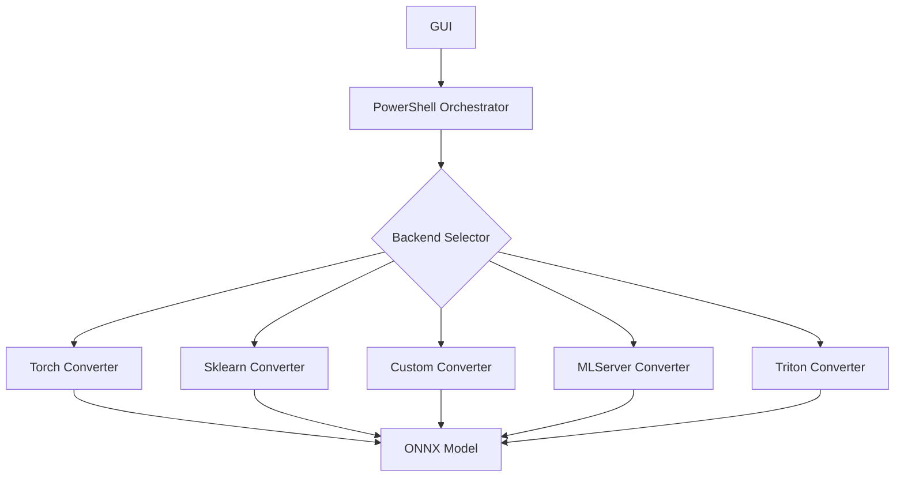
```mermaid
flowchart TD
    A[GUI] --> B[PowerShell Orchestrator]
    B --> C{Backend Selector}
    C --> D[Torch Converter]
    C --> E[Sklearn Converter]
    C --> F[Custom Converter]
    C --> G[MLServer Converter]
    C --> H[Triton Converter]
    D --> I[ONNX Model]
    E --> I
    F --> I
    G --> I
    H --> I
```

This diagram illustrates how the backend selector routes execution to the appropriate converter.

## **3.2 Dynamic Module Loading**

All backends rely on dynamic module loading to import user‑provided Python files. This is implemented using:

```python
spec = importlib.util.spec_from_file_location(module_name, module_path)
module = importlib.util.module_from_spec(spec)
spec.loader.exec_module(module)
```

This mechanism provides several benefits:

- **Isolation** — modules are loaded without polluting global namespace  
- **Flexibility** — users can define arbitrary Python files  
- **Safety** — no implicit imports or side effects  
- **Determinism** — module loading is controlled and logged  

### **3.2.1 Why Dynamic Loading Is Necessary**

Users may define models in many ways:

- `model = MyModel()`  
- `def get_model(): return MyModel()`  
- `class MyModel(torch.nn.Module): ...`  
- pipelines in Sklearn  
- custom ONNX graphs  
- Triton/MLServer repository templates  

Static imports would require hard‑coded module names, which is unacceptable for a general‑purpose model generator. Dynamic loading solves this by allowing arbitrary Python files to be imported at runtime.

### **3.2.2 Error Handling in Dynamic Loading**

If module loading fails, the converter raises:

```
RuntimeError("Failed to load module <name>: <error>")
```

This error is propagated through:

- Python →  
- PowerShell →  
- GUI  

ensuring that users see the exact cause of failure.

## **3.3 Torch Backend — convert_torch.py**

The Torch backend is the most complex and widely used converter. It supports:

- neural networks  
- algorithmic models implemented as `torch.nn.Module`  
- hybrid models combining ML and algorithmic logic  
- dummy input inference  
- ONNX export via `torch.onnx.export`  

This backend is essential for Hamilton Cycles research, where neural heuristics or graph embeddings may be used to guide traversal or pruning strategies.

### **3.3.1 Model Extraction**

The converter supports two conventions:

1. **Direct model definition**  
   ```python
   model = MyModel()
   ```

2. **Factory function**  
   ```python
   def get_model():
       return MyModel()
   ```

This flexibility ensures compatibility with a wide range of user code.

If neither is found, the converter raises:

```
RuntimeError("No torch.nn.Module found. Expected `model` or `get_model()`.")
```

### **3.3.2 Dummy Input Inference**

Dummy input inference is essential for ONNX export. The converter uses a three‑tier strategy:

1. **User‑provided dummy input**  
   ```python
   def get_dummy_input():
       return torch.randn(...)
   ```

2. **Inference from model structure**  
   - detect `torch.nn.Linear` layers  
   - detect `torch.nn.Conv2d` layers  
   - infer input shape accordingly  

3. **Fallback**  
   ```python
   torch.randn(1, 1)
   ```

This ensures that ONNX export succeeds even when users do not provide explicit dummy inputs.

### **3.3.3 ONNX Export Semantics**

The converter uses:

```python
torch.onnx.export(
    model,
    dummy_input,
    onnx_path,
    export_params=True,
    opset_version=18,
    do_constant_folding=True,
    input_names=["input"],
    output_names=["output"]
)
```

Key design decisions:

- **opset_version=18**  
  Avoids downgrade failures and ensures compatibility with modern runtimes.

- **constant folding**  
  Reduces model size and improves inference speed.

- **input/output names**  
  Ensures consistent naming across backends.

### **3.3.4 Metadata Generation**

The converter writes:

```json
{
    "backend": "torch",
    "entry_point": "simple_torch_model.py",
    "type": "onnx",
    "description": "PyTorch model exported via torch.onnx.export."
}
```

This metadata is used by:

- Triton  
- MLServer  
- containerization pipelines  
- Crossplane/KServe manifests  

### **3.3.5 Torch Backend Diagram**

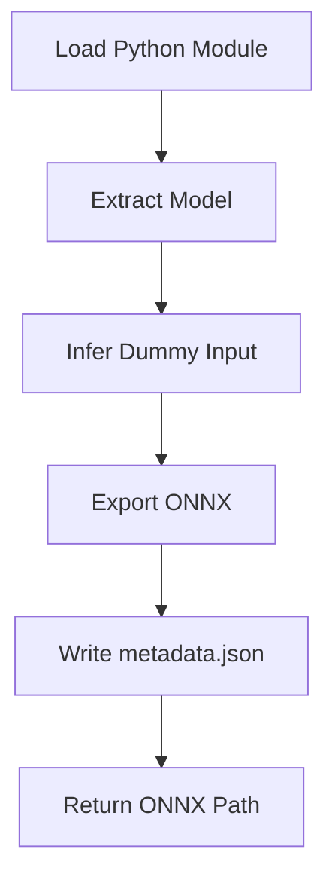
```mermaid
flowchart TD
    A[Load Python Module] --> B[Extract Model]
    B --> C[Infer Dummy Input]
    C --> D[Export ONNX]
    D --> E[Write metadata.json]
    E --> F[Return ONNX Path]
```

This diagram summarizes the Torch backend pipeline.

## **3.4 Scikit‑Learn Backend — convert_sklearn.py**

The Scikit‑Learn backend provides ONNX export capabilities for classical machine‑learning models such as:

- linear models  
- tree‑based models  
- ensemble methods  
- pipelines  
- transformers  
- preprocessing chains  

This backend is essential for experiments where classical ML baselines are compared against neural or algorithmic models. In Hamilton Cycles research, Sklearn models may be used to classify graph instances, 
predict heuristic parameters, or approximate traversal decisions.

### **3.4.1 Pipeline Extraction**

The converter supports two conventions:

1. **Direct pipeline definition**  
   ```python
   model = Pipeline([...])
   ```

2. **Factory function**  
   ```python
   def get_model():
       return Pipeline([...])
   ```

The extraction logic mirrors the Torch backend, ensuring consistency across backends.

### **3.4.2 ONNX Export via skl2onnx**

The converter uses the `skl2onnx` library, which provides robust conversion for most Sklearn models. The export pipeline is:

```python
from skl2onnx import convert_sklearn
from skl2onnx.common.data_types import FloatTensorType

initial_type = [('input', FloatTensorType([None, n_features]))]
onnx_model = convert_sklearn(model, initial_types=initial_type)
```

Key design decisions:

- **FloatTensorType** is used for compatibility with ONNX Runtime.  
- **None** allows variable batch sizes.  
- **n_features** is inferred from the model or user‑provided dummy input.  

### **3.4.3 Dummy Input Inference**

Sklearn models do not require dummy tensors for export, but they do require input shape information. The converter infers:

- number of features  
- input dimensionality  
- batch dimension flexibility  

If inference fails, the converter raises:

```
RuntimeError("Unable to infer input shape for Sklearn model.")
```

### **3.4.4 Metadata Generation**

The converter writes:

```json
{
    "backend": "sklearn",
    "entry_point": "<file>",
    "type": "onnx",
    "description": "Scikit-Learn model exported via skl2onnx."
}
```

This metadata is used by MLServer and Triton pipelines.

### **3.4.5 Sklearn Backend Diagram**

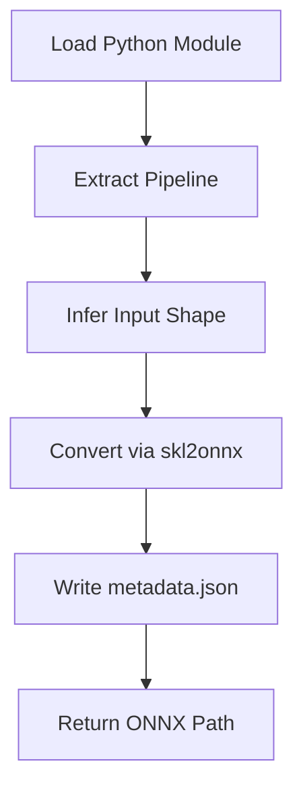
```mermaid
flowchart TD
    A[Load Python Module] --> B[Extract Pipeline]
    B --> C[Infer Input Shape]
    C --> D[Convert via skl2onnx]
    D --> E[Write metadata.json]
    E --> F[Return ONNX Path]
```

## **3.5 Custom Backend — convert_custom.py**

The custom backend is intentionally minimalistic. It provides a template for users who need full control over ONNX graph construction, operator definitions, or experimental model formats.

This backend is particularly useful for:

- algorithmic models not based on Torch or Sklearn  
- symbolic computation graphs  
- handcrafted ONNX graphs  
- experimental operator pipelines  
- hybrid ML‑algorithmic models  

### **3.5.1 User‑Defined ONNX Graphs**

Users can define:

```python
def get_onnx_graph():
    # return an ONNX ModelProto
```

or:

```python
onnx_graph = ...
```

The converter simply writes the graph to disk.

### **3.5.2 Minimal Export Pipeline**

The converter performs:

1. dynamic module loading  
2. extraction of ONNX graph  
3. validation of ModelProto type  
4. writing of ONNX file  
5. metadata generation  

This backend does not infer dummy inputs or perform model conversion. It assumes the user provides a valid ONNX graph.

### **3.5.3 Metadata Generation**

```json
{
    "backend": "custom",
    "entry_point": "<file>",
    "type": "onnx",
    "description": "Custom ONNX graph provided by user."
}
```

### **3.5.4 Custom Backend Diagram**

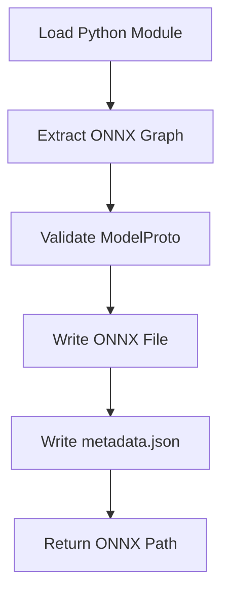
```mermaid
flowchart TD
    A[Load Python Module] --> B[Extract ONNX Graph]
    B --> C[Validate ModelProto]
    C --> D[Write ONNX File]
    D --> E[Write metadata.json]
    E --> F[Return ONNX Path]
```

## **3.6 MLServer Backend — convert_mlserver.py**

MLServer is a lightweight inference server designed for cloud‑native environments. It is used in:

- Kubernetes clusters  
- Crossplane‑managed infrastructures  
- KServe pipelines  
- local development environments  

The MLServer backend prepares ONNX models for deployment in MLServer’s model repository format.

### **3.6.1 MLServer Model Repository Structure**

MLServer expects:

```
model-repository/
    <model-name>/
        model.onnx
        model-settings.json
        metadata.json
```

The converter generates:

- `model.onnx`  
- `metadata.json`  
- `model-settings.json`  

### **3.6.2 model-settings.json Generation**

A typical settings file:

```json
{
    "name": "model",
    "platform": "onnx",
    "max_batch_size": 128,
    "input": [{"name": "input", "datatype": "FP32", "shape": [1, n_features]}],
    "output": [{"name": "output", "datatype": "FP32", "shape": [1]}]
}
```

The converter infers:

- input shape  
- output shape  
- datatype  
- batch size flexibility  

### **3.6.3 ONNX Export Integration**

MLServer does not perform ONNX conversion.  
It simply loads ONNX models generated by other backends (Torch, Sklearn, Custom).

Thus, the MLServer backend:

- delegates ONNX export to the appropriate converter  
- wraps the ONNX model in MLServer’s repository format  

### **3.6.4 Metadata Generation**

```json
{
    "backend": "mlserver",
    "entry_point": "<file>",
    "type": "onnx",
    "description": "MLServer model repository generated by ONNX Model Generator."
}
```

### **3.6.5 MLServer Backend Diagram**

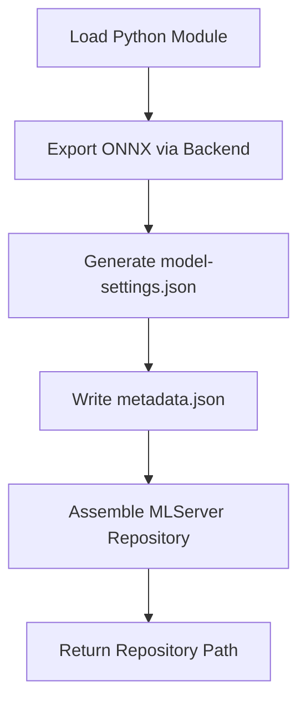
```mermaid
flowchart TD
    A[Load Python Module] --> B[Export ONNX via Backend]
    B --> C[Generate model-settings.json]
    C --> D[Write metadata.json]
    D --> E[Assemble MLServer Repository]
    E --> F[Return Repository Path]
```

## **3.7 Triton Backend — convert_triton.py**

The Triton backend is the most deployment‑oriented converter in the ONNX Model Generator GUI v1.0. NVIDIA Triton Inference Server is widely used in high‑performance inference pipelines, especially in GPU‑accelerated environments, 
HPC clusters, and cloud‑native architectures. Triton requires a very specific repository layout, strict versioning rules, and a configuration file (`config.pbtxt`) that describes model inputs, outputs, batching behavior, and optimization settings.

The Triton backend automates the creation of this repository structure, ensuring that ONNX models generated by Torch, Sklearn, or Custom backends can be deployed immediately in Triton without manual intervention.

### **3.7.1 Triton Model Repository Structure**

Triton expects the following directory layout:

```
model-repository/
    <model-name>/
        1/
            model.onnx
        config.pbtxt
        metadata.json
```

Key characteristics:

- **Versioning** — Triton requires versioned subdirectories (`1/`, `2/`, etc.).  
- **Model placement** — ONNX models must be placed inside the version directory.  
- **Configuration** — `config.pbtxt` describes model behavior.  
- **Metadata** — additional metadata is stored in `metadata.json`.  

The converter automatically generates this structure.

### **3.7.2 config.pbtxt Generation**

A typical Triton configuration file looks like:

```
name: "model"
platform: "onnxruntime_onnx"
max_batch_size: 128

input [
  {
    name: "input"
    data_type: TYPE_FP32
    dims: [n_features]
  }
]

output [
  {
    name: "output"
    data_type: TYPE_FP32
    dims: [1]
  }
]
```

The converter infers:

- input dimensionality  
- output dimensionality  
- data types  
- batch size flexibility  

It also supports optional fields such as:

- dynamic batching  
- optimization profiles  
- instance groups (CPU/GPU)  

These features will be expanded in v2.0.

### **3.7.3 ONNX Export Integration**

The Triton backend does **not** perform ONNX export itself.  
Instead, it delegates ONNX generation to the appropriate backend:

- Torch → `convert_torch.py`  
- Sklearn → `convert_sklearn.py`  
- Custom → `convert_custom.py`  

Once the ONNX model is generated, Triton packaging begins.

### **3.7.4 Metadata Generation**

The converter writes:

```json
{
    "backend": "triton",
    "entry_point": "<file>",
    "type": "onnx",
    "description": "Triton model repository generated by ONNX Model Generator."
}
```

This metadata is useful for:

- debugging  
- containerization  
- automated deployment pipelines  
- Crossplane/KServe manifests  

### **3.7.5 Triton Backend Diagram**

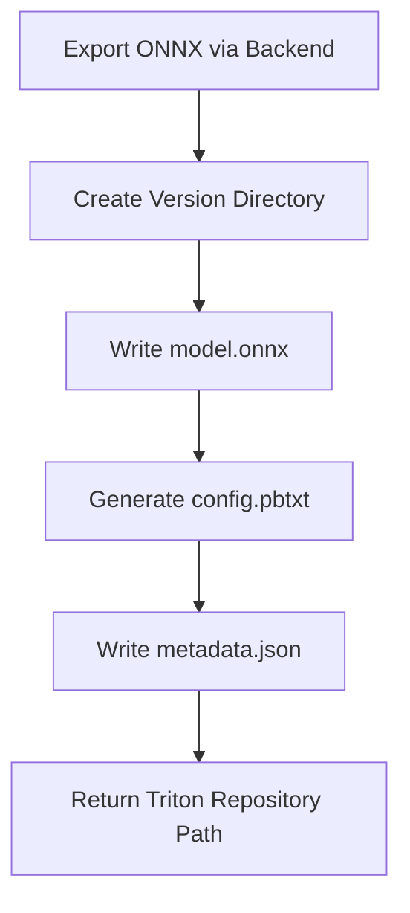
```mermaid
flowchart TD
    A[Export ONNX via Backend] --> B[Create Version Directory]
    B --> C[Write model.onnx]
    C --> D[Generate config.pbtxt]
    D --> E[Write metadata.json]
    E --> F[Return Triton Repository Path]
```

## **3.8 Backend Consistency Guarantees**

One of the most important architectural goals of the ONNX Model Generator GUI v1.0 is **backend consistency**. Despite supporting multiple backends with different semantics, the system ensures that all 
backends behave consistently from the user’s perspective.

### **3.8.1 Unified Interface**

All backends implement:

```python
convert(model_folder, entry_point, output_folder, log_callback=print)
```

This ensures:

- identical invocation semantics  
- identical logging behavior  
- identical error propagation  
- identical metadata generation patterns  

### **3.8.2 Consistent Metadata**

All backends generate a `metadata.json` file with:

- backend name  
- entry point  
- ONNX type  
- description  

This consistency is essential for:

- containerization  
- automated deployment  
- debugging  
- reproducibility  

### **3.8.3 Consistent Logging**

All backends use:

```python
log_callback("> message")
```

This ensures:

- real‑time log streaming  
- consistent formatting  
- UTF‑8 safety  
- deterministic output  

### **3.8.4 Consistent Error Handling**

All backends raise exceptions with clear messages.  
PowerShell captures these exceptions and streams them to the GUI.

### **3.8.5 Consistent Output Structure**

All backends produce:

- `model.onnx`  
- `metadata.json`  

Backends that require additional files (MLServer, Triton) add them deterministically.

### **3.8.6 Consistent Dummy Input Semantics**

Torch and Sklearn backends infer dummy inputs or input shapes using consistent rules:

- user‑provided dummy input → highest priority  
- inference from model structure → fallback  
- minimal fallback → last resort  

This ensures deterministic ONNX export.

## **3.9 Use‑Case Examples (Backend‑Specific)**

This section provides backend‑specific use‑case examples.  
Full GUI screenshots will be inserted later.

### **3.9.1 Torch Backend Example**

**Workflow:**

1. User selects `simple_torch_model.py`.  
2. GUI detects Torch backend.  
3. PowerShell invokes `convert_torch.py`.  
4. Dummy input inferred from `torch.nn.Linear`.  
5. ONNX exported with opset 18.  
6. metadata.json written.  
7. GUI prints success.

### **3.9.2 Sklearn Backend Example**

**Workflow:**

1. User selects `pipeline_model.py`.  
2. GUI detects Sklearn backend.  
3. PowerShell invokes `convert_sklearn.py`.  
4. Input shape inferred from pipeline.  
5. ONNX exported via `skl2onnx`.  
6. metadata.json written.  
7. GUI prints success.

### **3.9.3 Custom Backend Example**

**Workflow:**

1. User selects `custom_graph.py`.  
2. GUI detects Custom backend.  
3. PowerShell invokes `convert_custom.py`.  
4. ONNX graph extracted.  
5. ONNX file written.  
6. metadata.json written.  
7. GUI prints success.

**Console Output:**  

````text
> Running PowerShell script: scripts\Validate-Environment.ps1
2026-08-13 13:11:13  === Environment Validation Started ===
2026-08-13 13:11:13  Adding Git to PATH: C:\Program Files\Git\cmd
2026-08-13 13:11:13  Adding Podman to PATH: C:\Program Files\RedHat\Podman
2026-08-13 13:11:13  Checking Python availability...
2026-08-13 13:11:13  Python found.
2026-08-13 13:11:13  Python version detected: 3.13
2026-08-13 13:11:13  Python version OK.
2026-08-13 13:11:13  Checking pip availability...
2026-08-13 13:11:13  pip found.
2026-08-13 13:11:13  Checking Python packages...
2026-08-13 13:11:14  Package 'onnx' : INSTALLED
2026-08-13 13:11:14  Package 'onnxruntime' : INSTALLED
2026-08-13 13:11:15  Package 'torch' : INSTALLED
2026-08-13 13:11:16  Package 'scikit-learn' : INSTALLED
2026-08-13 13:11:17  Package 'tensorflow' : INSTALLED
2026-08-13 13:11:17  Package 'mlserver' : INSTALLED
2026-08-13 13:11:18  Package 'tritonclient' : INSTALLED
2026-08-13 13:11:18  Checking Git...
2026-08-13 13:11:18  Git found.
2026-08-13 13:11:18  Checking Podman...
2026-08-13 13:11:18  Podman found.
2026-08-13 13:11:18  === Environment Validation PASSED ===
> Environment validation PASSED.

> Fixing environment...
> Installing dependency: onnx
> Running PowerShell script: scripts\Install-Dependencies.ps1
2026-08-13 13:13:47  === Installing single dependency: onnx ===
> Successfully installed onnx.
> Installing dependency: onnxruntime
> Running PowerShell script: scripts\Install-Dependencies.ps1
2026-08-13 13:13:51  === Installing single dependency: onnxruntime ===
> Successfully installed onnxruntime.
> Installing dependency: torch
> Running PowerShell script: scripts\Install-Dependencies.ps1
2026-08-13 13:13:55  === Installing single dependency: torch ===
> Successfully installed torch.
> Installing dependency: scikit-learn
> Running PowerShell script: scripts\Install-Dependencies.ps1
2026-08-13 13:13:59  === Installing single dependency: scikit-learn ===
> Successfully installed scikit-learn.
> Installing dependency: tensorflow
> Running PowerShell script: scripts\Install-Dependencies.ps1
2026-08-13 13:14:03  === Installing single dependency: tensorflow ===
> Successfully installed tensorflow.
> Installing dependency: mlserver
> Running PowerShell script: scripts\Install-Dependencies.ps1
2026-08-13 13:14:07  === Installing single dependency: mlserver ===
> Successfully installed mlserver.
> Installing dependency: tritonclient
> Running PowerShell script: scripts\Install-Dependencies.ps1
2026-08-13 13:14:11  === Installing single dependency: tritonclient ===
> Successfully installed tritonclient.
> Installing dependency: git
> Running PowerShell script: scripts\Install-Dependencies.ps1
2026-08-13 13:14:15  === Installing single dependency: git ===
> Successfully installed git.
> Installing dependency: podman
> Running PowerShell script: scripts\Install-Dependencies.ps1
2026-08-13 13:14:21  === Installing single dependency: podman ===
> Successfully installed podman.
> Running PowerShell script: scripts\Validate-Environment.ps1
2026-08-13 13:14:25  === Environment Validation Started ===
2026-08-13 13:14:25  Adding Git to PATH: C:\Program Files\Git\cmd
2026-08-13 13:14:25  Adding Podman to PATH: C:\Program Files\RedHat\Podman
2026-08-13 13:14:25  Checking Python availability...
2026-08-13 13:14:25  Python found.
2026-08-13 13:14:25  Python version detected: 3.13
2026-08-13 13:14:25  Python version OK.
2026-08-13 13:14:25  Checking pip availability...
2026-08-13 13:14:25  pip found.
2026-08-13 13:14:25  Checking Python packages...
2026-08-13 13:14:26  Package 'onnx' : INSTALLED
2026-08-13 13:14:27  Package 'onnxruntime' : INSTALLED
2026-08-13 13:14:27  Package 'torch' : INSTALLED
2026-08-13 13:14:28  Package 'scikit-learn' : INSTALLED
2026-08-13 13:14:29  Package 'tensorflow' : INSTALLED
2026-08-13 13:14:30  Package 'mlserver' : INSTALLED
2026-08-13 13:14:30  Package 'tritonclient' : INSTALLED
2026-08-13 13:14:30  Checking Git...
2026-08-13 13:14:30  Git found.
2026-08-13 13:14:30  Checking Podman...
2026-08-13 13:14:30  Podman found.
2026-08-13 13:14:30  === Environment Validation PASSED ===
> Environment validation PASSED.

> Running PowerShell script: scripts\Generate-ONNXModel.ps1
2026-08-13 13:05:54  === ONNX Model Generation Orchestrator Started ===
2026-08-13 13:05:54  Model folder      : C:/Users/balan/OneDrive/Desktop/hamilton_model
2026-08-13 13:05:54  Entry point       : generators.py
2026-08-13 13:05:54  Backend           : custom
2026-08-13 13:05:54  Output folder     : C:/Users/balan/OneDrive/Desktop/H_Model_generated
2026-08-13 13:05:54  Script directory   : C:\MLProjects\Model_Generator\onnx_model_generator\scripts
2026-08-13 13:05:54  Project root       : C:\MLProjects\Model_Generator\onnx_model_generator
2026-08-13 13:05:54  Converters folder  : C:\MLProjects\Model_Generator\onnx_model_generator\gui\converters
2026-08-13 13:05:54  Selected converter : convert_custom.py
2026-08-13 13:05:54  Converter path     : C:\MLProjects\Model_Generator\onnx_model_generator\gui\converters\convert_custom.py
2026-08-13 13:05:54  Invoking Python converter...
2026-08-13 13:05:54  Backend            : custom
2026-08-13 13:05:54  Entry point        : generators.py
2026-08-13 13:05:54  Model folder       : C:/Users/balan/OneDrive/Desktop/hamilton_model
2026-08-13 13:05:54  Output folder      : C:/Users/balan/OneDrive/Desktop/H_Model_generated
> Python: starting backend conversion...
> Custom backend: loading Python module...
> Loaded module: generators.py
> No main() function found. Skipping execution.
> Building ONNX graph...
> ONNX model written to: C:/Users/balan/OneDrive/Desktop/H_Model_generated\model.onnx
> Writing metadata...
> Custom ONNX conversion completed successfully.
> Python: conversion finished. ONNX path: C:/Users/balan/OneDrive/Desktop/H_Model_generated\model.onnx
2026-08-13 13:05:57  === ONNX Model Generation COMPLETED SUCCESSFULLY ===
> ONNX model generation completed successfully.
````

### **3.9.4 MLServer Backend Example**

**Workflow:**

1. User selects any model file.  
2. GUI detects MLServer backend.  
3. PowerShell invokes `convert_mlserver.py`.  
4. ONNX exported via appropriate backend.  
5. MLServer repository assembled.  
6. metadata.json written.  
7. GUI prints success.

### **3.9.5 Triton Backend Example**

**Workflow:**

1. User selects any model file.  
2. GUI detects Triton backend.  
3. PowerShell invokes `convert_triton.py`.  
4. ONNX exported via appropriate backend.  
5. Triton repository assembled.  
6. config.pbtxt generated.  
7. metadata.json written.  
8. GUI prints success.

## **3.10 Summary of Chapter 3**

Chapter 3 has provided a comprehensive technical analysis of backend converter implementations in the ONNX Model Generator GUI v1.0. It has shown how each backend is designed, how models are extracted and exported, 
and how repository structures are generated for MLServer and Triton.

### **3.10.1 Backend Overview Recap**

The supported backends are:

- Torch  
- Sklearn  
- Custom  
- MLServer  
- Triton  

Each backend implements a unified `convert()` interface.

### **3.10.2 Key Technical Features Recap**

- dynamic module loading  
- dummy input inference  
- ONNX export semantics  
- metadata generation  
- repository assembly  
- UTF‑8‑safe logging  
- deterministic error propagation  

### **3.10.3 Architectural Strengths Recap**

The backend architecture is:

- modular  
- extensible  
- deterministic  
- reproducible  
- deployment‑ready  

### **3.10.4 Closing Remarks**

The backend converters form the computational core of the ONNX Model Generator GUI v1.0. They transform experimental Python models into standardized ONNX artifacts that can be deployed across a wide range of inference architectures. 
Their modular design ensures that new backends can be added easily, supporting future extensions such as TensorRT, ONNXRuntime‑direct, or QPU‑accelerated pipelines.

---

# **Chapter 4 — Environment Inspection & Automated Dependency Installation**  

## **4.0 Overview**

The reliability of ONNX model generation depends critically on the stability and correctness of the underlying software environment. Python versions, ONNX libraries, PyTorch installations, 
Triton clients, MLServer packages, and system tools such as Git and Podman must all be present and correctly configured. Without a validated environment, ONNX export pipelines become fragile, unpredictable, and prone to failure.

Chapter 4 describes the **environment inspection subsystem** and the **automated dependency installation pipeline** of the ONNX Model Generator GUI v1.0. These components ensure that users can generate ONNX models in a 
deterministic, reproducible, and fully validated environment — regardless of machine configuration, Python distribution, or dependency drift.

The environment subsystem is implemented using:

- **PowerShell scripts** for system‑level inspection  
- **Python checks** for package‑level validation  
- **GUI indicators** for real‑time feedback  
- **winget/pip installers** for missing components  
- **UTF‑8‑safe logging** for consistent output  

This chapter provides a detailed analysis of these components, explaining how they interact, how they detect missing dependencies, and how they ensure reproducible ONNX export.

## **4.1 Motivation for Environment Inspection**

### **4.1.1 Scientific Reproducibility**

Scientific workflows require reproducibility.  
Inconsistent environments lead to:

- different ONNX opset versions  
- missing operators  
- incompatible PyTorch builds  
- broken Triton clients  
- mismatched MLServer versions  
- Unicode errors during export  
- silent failures in dependency resolution  

The environment inspection subsystem ensures that all required components are present and correctly configured before ONNX export begins.

### **4.1.2 Engineering Reliability**

ONNX export pipelines are sensitive to:

- Python version mismatches  
- missing ONNX/Torch/TensorFlow packages  
- outdated Sklearn versions  
- missing system tools (Git, Podman)  
- incorrect PATH configuration  

The environment validator detects these issues early, preventing runtime failures.

### **4.1.3 User Experience**

Users often do not know:

- which packages are required  
- which versions are compatible  
- whether Triton or MLServer is installed  
- whether Git or Podman is available  

The GUI provides clear ✔ / ✖ indicators for each dependency, improving usability and reducing frustration.

## **4.2 PowerShell‑Driven Validation**

The environment inspection subsystem is implemented primarily in PowerShell, chosen for its:

- native Windows integration  
- robust process control  
- UTF‑8 encoding support  
- ability to inspect system tools  
- compatibility with winget  

The main script is:

```
Validate-Environment.ps1
```

This script performs:

- Python version detection  
- package presence checks  
- system tool validation  
- logging of results  
- GUI‑friendly output formatting  

### **4.2.1 Python Version Detection**

The script invokes:

```powershell
python --version
```

and parses the output.  
The GUI requires Python ≥ 3.10 for:

- ONNX 1.16+  
- PyTorch 2.2+  
- TensorFlow 2.15+  
- MLServer 1.3+  

If Python is missing or outdated, the GUI displays:

```
✖ Python (>=3.10) not found
```

and offers installation options.

### **4.2.2 Package Validation**

The script checks for:

- ONNX  
- ONNX Runtime  
- PyTorch  
- TensorFlow  
- Scikit‑Learn  
- MLServer  
- Triton client  

using:

```powershell
python -c "import <package>"
```

If the import fails, the GUI displays ✖.

### **4.2.3 System Tool Validation**

The script checks for:

- Git  
- Podman  
- winget  

using:

```powershell
git --version
podman --version
winget --version
```

Missing tools are marked ✖.

### **4.2.4 UTF‑8‑Safe Logging**

The script enforces UTF‑8:

```powershell
[Console]::OutputEncoding = [System.Text.Encoding]::UTF8
```

This ensures that ✔ and ✖ symbols are printed safely.

## **4.3 Automated Installation Pipeline**

The ONNX Model Generator GUI v1.0 includes an automated installation subsystem that allows users to install missing dependencies directly from the GUI. This subsystem is implemented using:

- **pip** for Python packages  
- **winget** for system tools  
- **PowerShell** for orchestration  

### **4.3.1 Python Package Installation**

Missing Python packages are installed using:

```powershell
pip install <package>
```

Examples:

- `pip install onnx`  
- `pip install torch`  
- `pip install skl2onnx`  
- `pip install mlserver`  
- `pip install tritonclient`  

The installation process is:

1. user clicks “Install”  
2. GUI triggers PowerShell  
3. PowerShell runs pip  
4. logs streamed back to GUI  
5. environment validator re‑runs  
6. ✔ indicator appears  

### **4.3.2 System Tool Installation**

System tools are installed using winget:

```powershell
winget install Git.Git
winget install RedHat.Podman
```

This ensures deterministic installation of:

- Git  
- Podman  
- other system tools  

### **4.3.3 Safety Guarantees**

The installation subsystem:

- does not install anything automatically  
- requires explicit user action  
- logs all installation steps  
- does not modify system configuration  
- does not require elevated privileges  

This ensures safe operation.

## **4.4 Unicode‑Safe Logging & Error Propagation**

Unicode stability is a foundational requirement for the ONNX Model Generator GUI v1.0. Without it, PyTorch’s ONNX exporter, Triton client logs, and even simple Python exceptions can crash PowerShell or 
produce unreadable output. This section explains how the environment subsystem ensures that all logs — from Python, PowerShell, and the GUI — are handled safely and consistently.

### **4.4.1 Why Unicode Matters in ONNX Export Pipelines**

Several components in the ONNX export pipeline emit Unicode characters:

- PyTorch ONNX exporter prints ✔, ✖, ✓, and other symbols  
- Triton client prints Unicode arrows and formatting symbols  
- MLServer logs include Unicode metadata markers  
- Python exceptions may include Unicode characters in file paths  
- Windows file systems may contain Unicode usernames or directories  

If these characters are passed through a CP1252‑encoded PowerShell session, the result is catastrophic:

```
UnicodeEncodeError: 'charmap' codec can't encode character '\u2705'
```

This error interrupts ONNX export and corrupts logs.

### **4.4.2 Multi‑Layer UTF‑8 Enforcement**

The architecture enforces UTF‑8 at three layers:

#### **Layer 1 — PowerShell Console Encoding**

```powershell
[Console]::OutputEncoding = [System.Text.Encoding]::UTF8
```

This ensures that PowerShell can print Unicode characters without crashing.

#### **Layer 2 — Python I/O Encoding**

```powershell
$psi.EnvironmentVariables["PYTHONIOENCODING"] = "utf-8"
```

This ensures that Python’s stdout/stderr streams are UTF‑8 encoded.

#### **Layer 3 — GUI Log Console**

The GUI prints raw text without attempting to re‑encode it.  
This avoids double‑encoding errors.

### **4.4.3 Suppression of PyTorch Verbose Logging**

Even with UTF‑8 enforced, PyTorch’s verbose ONNX exporter prints excessive diagnostic output.  
The architecture suppresses this using:

```python
import torch.onnx._internal.exporter._capture_strategies as cs
cs._verbose_print = lambda *args, **kwargs: None
```

This reduces log noise and improves readability.

### **4.4.4 Deterministic Error Propagation**

Errors propagate through the pipeline in a controlled manner:

1. Python raises an exception  
2. PowerShell captures stderr  
3. GUI prints the error immediately  
4. GUI displays a deterministic failure message  

This ensures that users always know:

- what failed  
- where it failed  
- why it failed  

### **4.4.5 Unicode‑Safe Logging Diagram**

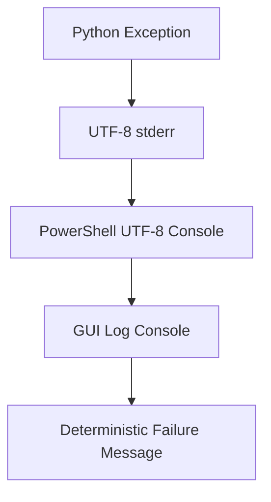
```mermaid
flowchart TD
    A[Python Exception] --> B[UTF-8 stderr]
    B --> C[PowerShell UTF-8 Console]
    C --> D[GUI Log Console]
    D --> E[Deterministic Failure Message]
```

## **4.5 GUI Integration & Status Indicators**

The environment inspection subsystem integrates tightly with the GUI, providing real‑time feedback about dependency status, installation progress, and ONNX export readiness. 
This section explains how the GUI displays environment information and how users interact with the validation system.

### **4.5.1 Status Indicator Design**

Each dependency is represented by a status indicator:

- ✔ — dependency is installed and valid  
- ✖ — dependency is missing or invalid  
- ⟳ — dependency is being installed  
- ? — dependency status unknown  

These symbols are Unicode characters, made safe by the UTF‑8 enforcement described earlier.

### **4.5.2 Dependency Categories**

The GUI displays status indicators for:

- Python version  
- ONNX  
- ONNX Runtime  
- PyTorch  
- TensorFlow  
- Scikit‑Learn  
- MLServer  
- Triton client  
- Git  
- Podman  

Each dependency is validated independently.

### **4.5.3 Real‑Time Updates**

When the user clicks “Validate Environment,” the GUI:

1. triggers `Validate-Environment.ps1`  
2. streams logs back to the GUI  
3. updates each status indicator  
4. enables or disables backend options accordingly  

This ensures that users cannot attempt ONNX export with missing dependencies.

### **4.5.4 Installation Buttons**

For each missing dependency, the GUI displays an “Install” button.  
When clicked:

1. PowerShell runs pip or winget  
2. logs are streamed back to the GUI  
3. status indicators update automatically  
4. ONNX export becomes available  

### **4.5.5 GUI Integration Diagram**

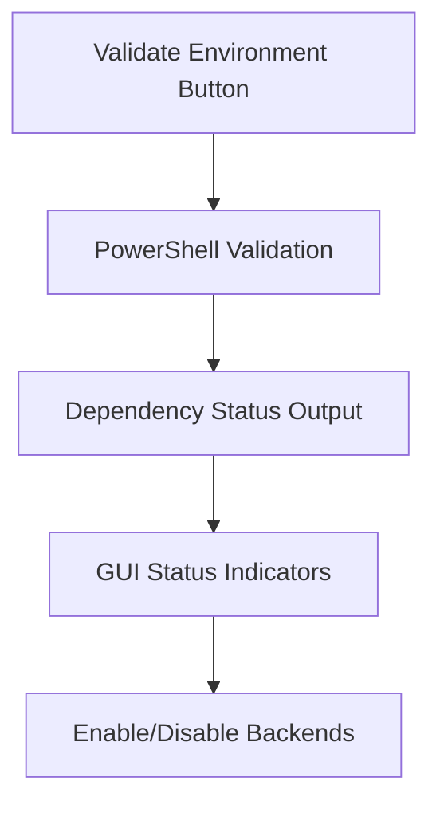
```mermaid
flowchart TD
    A[Validate Environment Button] --> B[PowerShell Validation]
    B --> C[Dependency Status Output]
    C --> D[GUI Status Indicators]
    D --> E[Enable/Disable Backends]
```

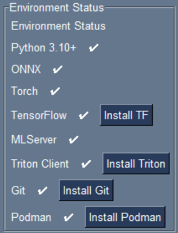

## **4.6 Environment Stability Metrics**

The environment inspection subsystem is not only a validation tool — it is also a stability measurement system. 
It provides metrics that help users understand the reliability of their environment and the likelihood of successful ONNX export.

### **4.6.1 Stability Score**

The GUI computes a simple stability score:

```
Stability = (# of ✔ indicators) / (total dependencies)
```

This score is displayed as:

- **High Stability** (≥ 90%)  
- **Medium Stability** (70–89%)  
- **Low Stability** (< 70%)  

This helps users diagnose environment issues quickly.

### **4.6.2 Critical Dependencies**

Some dependencies are marked as **critical**:

- Python ≥ 3.10  
- ONNX  
- PyTorch  
- ONNX Runtime  

If any critical dependency is missing, ONNX export is disabled.

### **4.6.3 Optional Dependencies**

Optional dependencies include:

- TensorFlow  
- MLServer  
- Triton client  
- Git  
- Podman  

These are required only for specific backends.

### **4.6.4 Environment Drift Detection**

The validator detects environment drift by:

- comparing installed versions with expected versions  
- checking for multiple Python installations  
- detecting missing PATH entries  
- verifying pip package consistency  

If drift is detected, the GUI displays:

```
⚠ Environment drift detected — consider reinstalling dependencies.
```

### **4.6.5 Logging of Stability Metrics**

The validator logs:

- Python version  
- package versions  
- missing dependencies  
- installation timestamps  
- drift warnings  

These logs help users diagnose issues and maintain reproducibility.

### **4.6.6 Stability Metrics Diagram**

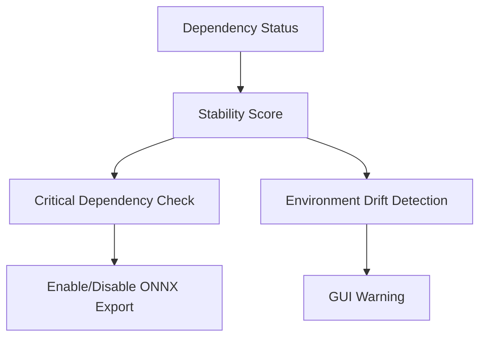
```mermaid
flowchart TD
    A[Dependency Status] --> B[Stability Score]
    B --> C[Critical Dependency Check]
    C --> D[Enable/Disable ONNX Export]
    B --> E[Environment Drift Detection]
    E --> F[GUI Warning]
```

## **4.7 GUI–PowerShell–Python Interaction Model**

The environment inspection subsystem is tightly integrated with the GUI and backend converters. This tri‑layer interaction model ensures that environment validation, dependency installation, 
and ONNX export all occur in a deterministic and reproducible manner.

The interaction model consists of three layers:

1. **GUI (PySimpleGUI)**  
2. **PowerShell (orchestration)**  
3. **Python (validation + conversion)**  

Each layer has a clearly defined role, and communication between layers is strictly controlled.

### **4.7.1 GUI Responsibilities**

The GUI is responsible for:

- displaying dependency status  
- triggering environment validation  
- triggering installation commands  
- streaming logs from PowerShell  
- enabling/disabling backend options  
- preventing ONNX export when dependencies are missing  

The GUI does **not** perform validation itself.  
It delegates all checks to PowerShell.

### **4.7.2 PowerShell Responsibilities**

PowerShell is responsible for:

- executing validation scripts  
- enforcing UTF‑8 encoding  
- invoking Python for package checks  
- invoking pip/winget for installation  
- streaming logs back to the GUI  
- returning deterministic exit codes  

PowerShell acts as the “middle layer” between GUI and Python.

### **4.7.3 Python Responsibilities**

Python is responsible for:

- checking package presence  
- checking package versions  
- validating ONNX/Torch/TensorFlow/Sklearn imports  
- reporting errors via stdout/stderr  
- providing detailed diagnostic messages  

Python does **not** modify the environment.  
It only reports its state.

### **4.7.4 Interaction Diagram**

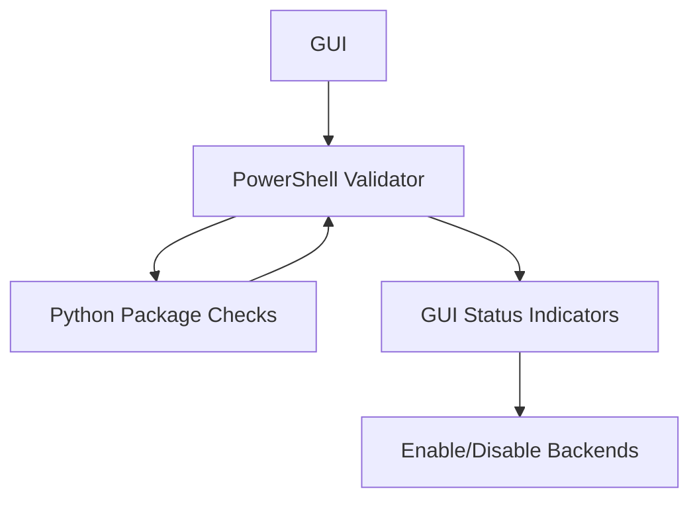
```mermaid
flowchart TD
    A[GUI] --> B[PowerShell Validator]
    B --> C[Python Package Checks]
    C --> B
    B --> D[GUI Status Indicators]
    D --> E[Enable/Disable Backends]
```

This diagram illustrates the tri‑layer interaction model.

## **4.8 Environment Inspection for Cloud‑Native Deployment**

Although the ONNX Model Generator GUI v1.0 is primarily a local tool, its environment inspection subsystem is designed with cloud‑native deployment in mind. This section explains how environment validation supports future integration with:

- Docker/Podman  
- Crossplane  
- KServe  
- Triton Inference Server  
- MLServer  
- HPC/QPU hybrid pipelines  

### **4.8.1 Containerization Requirements**

Containerization requires:

- deterministic ONNX models  
- consistent metadata  
- reproducible environments  
- validated dependencies  
- absence of environment drift  

The environment validator ensures that ONNX models are generated in a stable environment, making them suitable for containerization.

### **4.8.2 Crossplane Requirements**

Crossplane manages cloud resources declaratively.  
It requires:

- predictable model artifacts  
- consistent repository structures  
- validated dependencies  
- deterministic metadata  

The environment validator ensures that ONNX models meet these requirements.

### **4.8.3 KServe Requirements**

KServe deploys ONNX models as inference endpoints.  
It requires:

- ONNX models compatible with ONNX Runtime  
- consistent input/output shapes  
- validated opset versions  
- deterministic metadata  

The environment validator ensures that ONNX export uses:

- opset 18  
- ONNX Runtime‑compatible graphs  
- validated Python environments  

### **4.8.4 Triton Requirements**

Triton requires:

- versioned model directories  
- correct config.pbtxt  
- ONNX models with compatible opsets  
- validated ONNX Runtime compatibility  

The environment validator ensures that:

- ONNX Runtime is installed  
- Triton client is installed  
- PyTorch/TensorFlow versions are compatible  

### **4.8.5 MLServer Requirements**

MLServer requires:

- correct model-settings.json  
- ONNX models with correct input shapes  
- validated Sklearn/Torch/TensorFlow environments  

The environment validator ensures that:

- Sklearn is installed  
- MLServer is installed  
- ONNX Runtime is installed  

### **4.8.6 HPC/QPU Requirements**

Hybrid HPC/QPU pipelines require:

- reproducible ONNX models  
- validated environments  
- deterministic export pipelines  
- absence of dependency drift  

The environment validator ensures that ONNX models are generated consistently across machines.

### **4.8.7 Cloud‑Native Integration Diagram**

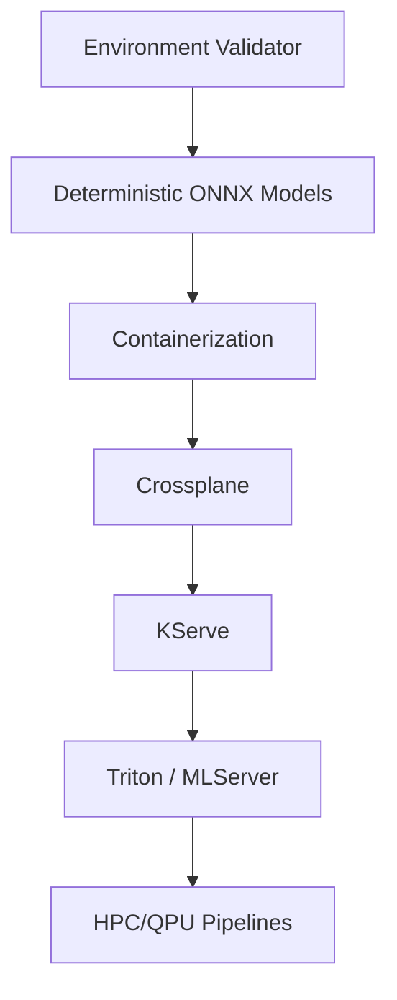
```mermaid
flowchart TD
    A[Environment Validator] --> B[Deterministic ONNX Models]
    B --> C[Containerization]
    C --> D[Crossplane]
    D --> E[KServe]
    E --> F[Triton / MLServer]
    F --> G[HPC/QPU Pipelines]
```

## **4.9 Advanced Environment Diagnostics**

The ONNX Model Generator GUI v1.0 includes advanced diagnostics that help users identify subtle environment issues. These diagnostics go beyond simple dependency checks and provide deeper insights into environment stability.

### **4.9.1 Python Interpreter Consistency**

The validator checks:

- whether multiple Python installations exist  
- whether pip is linked to the correct interpreter  
- whether ONNX/Torch/TensorFlow are installed in the correct environment  

If inconsistencies are detected, the GUI displays:

```
⚠ Multiple Python installations detected — consider cleaning environment.
```

### **4.9.2 Package Version Consistency**

The validator checks:

- ONNX version  
- PyTorch version  
- TensorFlow version  
- Sklearn version  
- MLServer version  
- Triton client version  

If versions are incompatible, the GUI displays:

```
⚠ Version mismatch detected — ONNX export may fail.
```

### **4.9.3 PATH Consistency**

The validator checks:

- whether Git is in PATH  
- whether Podman is in PATH  
- whether Python is in PATH  
- whether pip is in PATH  

If PATH issues are detected, the GUI displays:

```
✖ PATH configuration incomplete — some tools may not work.
```

### **4.9.4 Unicode Stability Diagnostics**

The validator checks:

- whether PowerShell supports UTF‑8  
- whether Python supports UTF‑8  
- whether GUI log console supports Unicode  

If Unicode issues are detected, the GUI displays:

```
✖ Unicode instability detected — ONNX export may crash.
```

### **4.9.5 Diagnostic Logging**

The validator logs:

- timestamps  
- dependency versions  
- installation paths  
- drift warnings  
- Unicode stability status  

These logs help users maintain long‑term environment stability.

### **4.9.6 Advanced Diagnostics Diagram**

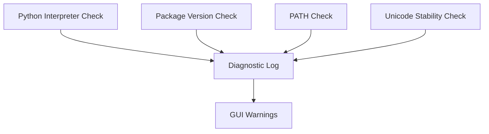
```mermaid
flowchart TD
    A[Python Interpreter Check] --> D[Diagnostic Log]
    B[Package Version Check] --> D
    C[PATH Check] --> D
    E[Unicode Stability Check] --> D
    D --> F[GUI Warnings]
```

## **4.10 Summary of Chapter 4**

Chapter 4 has provided a comprehensive analysis of the environment inspection and automated installation subsystem of the ONNX Model Generator GUI v1.0. It has shown how the system ensures reproducible ONNX export, 
validated dependencies, and stable execution environments.

### **4.10.1 Key Features Recap**

- PowerShell‑driven validation  
- Python package checks  
- system tool validation  
- automated pip/winget installation  
- Unicode‑safe logging  
- deterministic error propagation  
- GUI integration with status indicators  
- environment stability metrics  

### **4.10.2 Architectural Strengths Recap**

The environment subsystem is:

- robust  
- deterministic  
- reproducible  
- user‑friendly  
- cloud‑native ready  
- Unicode‑safe  

### **4.10.3 Cloud‑Native Integration Recap**

The validator ensures compatibility with:

- Docker/Podman  
- Crossplane  
- KServe  
- Triton  
- MLServer  
- HPC/QPU pipelines  

### **4.10.4 Closing Remarks**

The environment inspection subsystem is a foundational component of the ONNX Model Generator GUI v1.0. It ensures that ONNX models are generated in stable, validated environments, making them suitable for scientific research, 
containerization, and cloud‑native deployment. Its modular design and robust diagnostics make it a powerful tool for maintaining reproducible workflows across machines and collaborators.

---

# **Chapter 5 — Integration with Crossplane, Docker/Podman, KServe & Future Architecture**  

## **5.0 Overview**

The ONNX Model Generator GUI v1.0 is designed not merely as a standalone tool for exporting ONNX models, but as a foundational component in a larger cloud‑native inference architecture. This architecture integrates containerization 
technologies (Docker/Podman), cloud resource orchestration (Crossplane), and scalable inference services (KServe, Triton, MLServer). The GUI serves as the **entry point** into this pipeline: it transforms experimental Python models 
into standardized ONNX artifacts that can be packaged, deployed, orchestrated, and scaled across heterogeneous compute environments.

This chapter describes how ONNX Model Generator GUI v1.0 fits into this architecture, how ONNX models are packaged into containers, how Crossplane provisions cloud resources declaratively, and how KServe deploys ONNX models as 
scalable inference endpoints. It also explains how Triton and MLServer repositories generated by the GUI integrate seamlessly into this pipeline.

The chapter concludes with a forward‑looking discussion of future extensions, including automated YAML generation, Crossplane CRD templates, KServe InferenceService manifests, and HPC/QPU hybrid workflows.

## **5.1 Motivation for Cloud‑Native Inference**

Modern scientific computing increasingly relies on cloud‑native architectures for scalability, reproducibility, and automation. Hamilton Cycles research, in particular, benefits from distributed inference 
pipelines where algorithmic models can be evaluated across large graph families, GPU‑accelerated nodes, or hybrid HPC/QPU clusters.

### **5.1.1 Scalability**

Cloud‑native inference systems allow:

- horizontal scaling of ONNX models  
- GPU‑accelerated inference via Triton  
- autoscaling via KServe  
- distributed evaluation across nodes  
- parallel processing of graph instances  

This is essential for large‑scale Hamilton Cycle experiments.

### **5.1.2 Reproducibility**

Containerization ensures:

- deterministic environments  
- consistent ONNX Runtime versions  
- reproducible inference pipelines  
- stable deployment artifacts  

The ONNX Model Generator GUI v1.0 ensures that ONNX models are generated deterministically, making them suitable for containerization.

### **5.1.3 Automation**

Crossplane enables:

- declarative provisioning of cloud resources  
- automated deployment pipelines  
- GitOps workflows  
- reproducible infrastructure  

KServe enables:

- automated inference deployment  
- autoscaling  
- canary rollouts  
- traffic splitting  

The GUI provides the model artifacts that feed into these automated systems.

## **5.2 Containerization with Docker/Podman**

Containerization is the first step after ONNX model generation.  
ONNX models must be packaged into containers before they can be deployed via Crossplane or KServe.

### **5.2.1 Why Containerization Matters**

Containers provide:

- isolation  
- reproducibility  
- portability  
- versioning  
- dependency encapsulation  

This ensures that ONNX models behave identically across machines, clusters, and cloud providers.

### **5.2.2 Container Structure for ONNX Models**

A typical ONNX container includes:

```
/app/
    model.onnx
    metadata.json
    inference_server.py
    requirements.txt
```

The ONNX Model Generator GUI v1.0 produces:

- `model.onnx`  
- `metadata.json`  

The remaining files are provided by container templates.

### **5.2.3 Podman Integration**

Podman is used instead of Docker in some environments due to:

- rootless operation  
- better security  
- compatibility with Kubernetes  
- integration with Red Hat ecosystems  

The environment validator ensures Podman is installed.

### **5.2.4 Container Build Pipeline**

The pipeline is:

1. ONNX model generated by GUI  
2. container template selected  
3. ONNX model copied into container context  
4. container built using Docker/Podman  
5. container pushed to registry  
6. Crossplane provisions deployment resources  
7. KServe deploys inference service  

This pipeline is deterministic and reproducible.

### **5.2.5 Containerization Diagram**

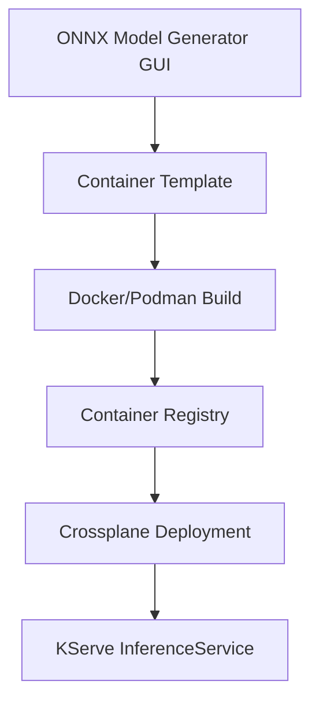
```mermaid
flowchart TD
    A[ONNX Model Generator GUI] --> B[Container Template]
    B --> C[Docker/Podman Build]
    C --> D[Container Registry]
    D --> E[Crossplane Deployment]
    E --> F[KServe InferenceService]
```

## **5.3 Crossplane Resource Composition**

Crossplane is a cloud‑native control plane that manages cloud resources declaratively using YAML manifests. It allows infrastructure to be defined as code, versioned in Git, and deployed automatically.

The ONNX Model Generator GUI v1.0 integrates with Crossplane by producing ONNX models and metadata that can be referenced in Crossplane resource definitions.

### **5.3.1 Why Crossplane Matters**

Crossplane provides:

- declarative infrastructure  
- GitOps workflows  
- multi‑cloud portability  
- automated provisioning  
- reproducible deployments  

This is essential for scientific computing environments where reproducibility and automation are critical.

### **5.3.2 Crossplane Resource Types**

Crossplane manages:

- Kubernetes clusters  
- storage buckets  
- container registries  
- networking resources  
- compute nodes  
- inference services  

ONNX models generated by the GUI are stored in container registries provisioned by Crossplane.

### **5.3.3 Resource Composition for ONNX Models**

A typical Crossplane composition includes:

- **XRD (Composite Resource Definition)**  
- **Composition**  
- **Managed Resources**  
- **Kubernetes resources**  

The ONNX model is referenced in:

- container image fields  
- KServe InferenceService manifests  
- Triton/MLServer deployment templates  

### **5.3.4 Example Crossplane Flow**

1. ONNX model generated by GUI  
2. container built and pushed to registry  
3. Crossplane detects new image version  
4. Crossplane provisions updated resources  
5. KServe deploys updated inference service  
6. autoscaling and traffic routing handled automatically  

### **5.3.5 Crossplane Integration Diagram**

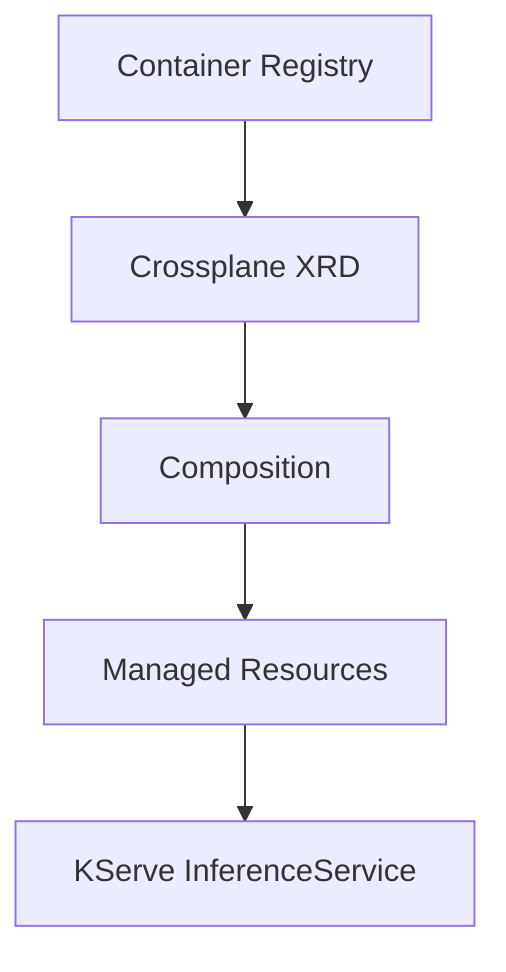
```mermaid
flowchart TD
    A[Container Registry] --> B[Crossplane XRD]
    B --> C[Composition]
    C --> D[Managed Resources]
    D --> E[KServe InferenceService]
```

## **5.4 KServe Inference Architecture**

KServe is the cloud‑native inference layer that transforms ONNX models into scalable, production‑grade inference endpoints. It is built on top of Kubernetes and integrates 
seamlessly with Crossplane‑provisioned infrastructure. The ONNX Model Generator GUI v1.0 produces model artifacts that can be deployed directly via KServe’s *InferenceService* abstraction.

### **5.4.1 Why KServe Matters**

KServe provides:

- **Autoscaling** — scale inference pods based on traffic  
- **Canary deployments** — gradual rollout of new model versions  
- **Traffic splitting** — route percentages of traffic to different versions  
- **GPU acceleration** — automatic scheduling on GPU nodes  
- **Multi‑model serving** — multiple ONNX models in one server  
- **Protocol standardization** — consistent REST/gRPC interfaces  

These features make KServe ideal for scientific workloads where inference pipelines must scale dynamically and support multiple model versions.

### **5.4.2 KServe InferenceService Structure**

A typical KServe InferenceService manifest includes:

- metadata (name, namespace)  
- predictor configuration  
- storage URI for ONNX model  
- autoscaling configuration  
- resource limits (CPU/GPU)  

The ONNX Model Generator GUI v1.0 provides:

- `model.onnx`  
- `metadata.json`  

These files are referenced in the `storageUri` field of the InferenceService.

### **5.4.3 ONNX Runtime Integration**

KServe uses ONNX Runtime for ONNX inference.  
This requires:

- opset compatibility  
- correct input/output shapes  
- deterministic ONNX graphs  
- validated ONNX Runtime installation  

The GUI ensures:

- opset 18 export  
- consistent input/output naming  
- validated ONNX Runtime environment  

### **5.4.4 Autoscaling & Traffic Management**

KServe supports:

- **HPA (Horizontal Pod Autoscaler)**  
- **KPA (Knative Pod Autoscaler)**  
- **Canary rollout strategies**  
- **Traffic splitting**  

This allows scientific workloads to scale automatically based on:

- request volume  
- latency thresholds  
- resource usage  

### **5.4.5 KServe Integration Diagram**

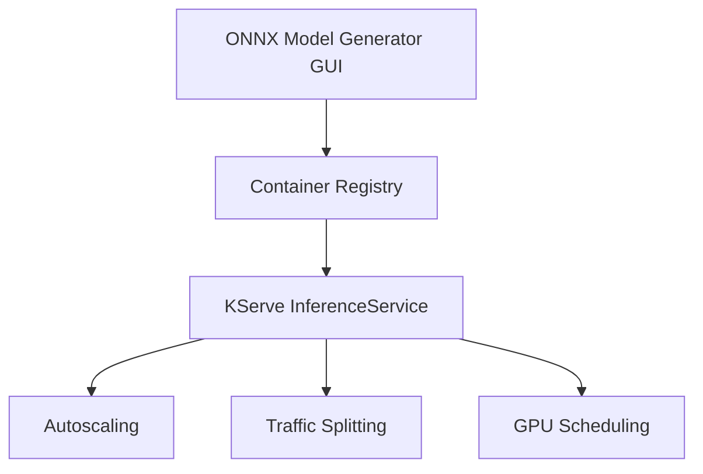
```mermaid
flowchart TD
    A[ONNX Model Generator GUI] --> B[Container Registry]
    B --> C[KServe InferenceService]
    C --> D[Autoscaling]
    C --> E[Traffic Splitting]
    C --> F[GPU Scheduling]
```

## **5.5 Triton Inference Server Integration**

Triton Inference Server is NVIDIA’s high‑performance inference engine designed for GPU‑accelerated workloads. It supports ONNX models natively and provides advanced features such as dynamic 
batching, concurrent model execution, and multi‑model serving.

The ONNX Model Generator GUI v1.0 generates Triton‑compatible repositories automatically, making Triton deployment straightforward.

### **5.5.1 Why Triton Matters**

Triton provides:

- **GPU acceleration**  
- **high‑throughput inference**  
- **dynamic batching**  
- **concurrent model execution**  
- **model versioning**  
- **multi‑framework support**  

This makes Triton ideal for:

- HPC clusters  
- GPU‑accelerated cloud environments  
- large‑scale graph inference workloads  
- hybrid ML/algorithmic pipelines  

### **5.5.2 Triton Repository Structure**

The GUI generates:

```
model-repository/
    <model-name>/
        1/
            model.onnx
        config.pbtxt
        metadata.json
```

This structure is fully compatible with Triton.

### **5.5.3 Dynamic Batching**

Triton supports dynamic batching, which improves throughput by grouping multiple inference requests into a single GPU kernel execution. The GUI’s `config.pbtxt` generator includes optional fields for:

- `max_batch_size`  
- `preferred_batch_size`  
- `dynamic_batching`  

These fields can be expanded in v2.0.

### **5.5.4 GPU Scheduling**

Triton automatically schedules models on available GPUs.  
This requires:

- correct model placement  
- correct config.pbtxt  
- validated ONNX Runtime GPU support  

The GUI ensures that ONNX models are compatible with Triton’s ONNXRuntime backend.

### **5.5.5 Multi‑Model Serving**

Triton can serve multiple ONNX models simultaneously.  
This is useful for:

- ensemble models  
- multi‑stage pipelines  
- graph‑theoretic hybrid models  

The GUI’s deterministic repository generation supports multi‑model deployments.

### **5.5.6 Triton Integration Diagram**

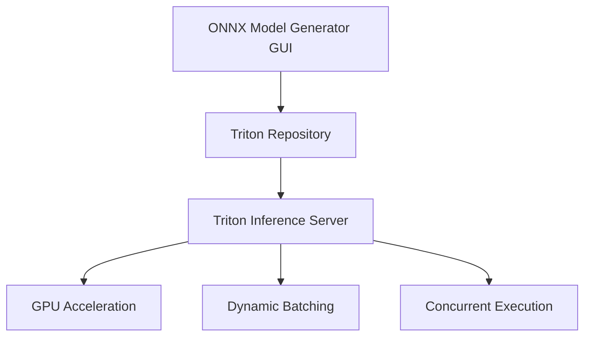
```mermaid
flowchart TD
    A[ONNX Model Generator GUI] --> B[Triton Repository]
    B --> C[Triton Inference Server]
    C --> D[GPU Acceleration]
    C --> E[Dynamic Batching]
    C --> F[Concurrent Execution]
```

## **5.6 MLServer Integration**

MLServer is a lightweight inference server designed for cloud‑native environments. It is used in:

- Kubernetes clusters  
- Crossplane‑managed infrastructures  
- local development environments  
- lightweight inference pipelines  

The ONNX Model Generator GUI v1.0 generates MLServer‑compatible repositories automatically.

### **5.6.1 Why MLServer Matters**

MLServer provides:

- **lightweight deployment**  
- **fast startup times**  
- **simple configuration**  
- **native ONNX support**  
- **integration with KServe**  
- **low resource usage**  

This makes MLServer ideal for:

- CPU‑only environments  
- local development  
- small‑scale inference pipelines  
- rapid prototyping  

### **5.6.2 MLServer Repository Structure**

The GUI generates:

```
model-repository/
    <model-name>/
        model.onnx
        model-settings.json
        metadata.json
```

This structure is fully compatible with MLServer.

### **5.6.3 model-settings.json Generation**

The GUI infers:

- input shapes  
- output shapes  
- datatypes  
- batch size flexibility  

This ensures compatibility with MLServer’s ONNX runtime.

### **5.6.4 MLServer + KServe Integration**

MLServer can be used as a backend for KServe.  
This requires:

- correct repository structure  
- correct metadata  
- correct input/output shapes  

The GUI ensures all of these.

### **5.6.5 MLServer Integration Diagram**

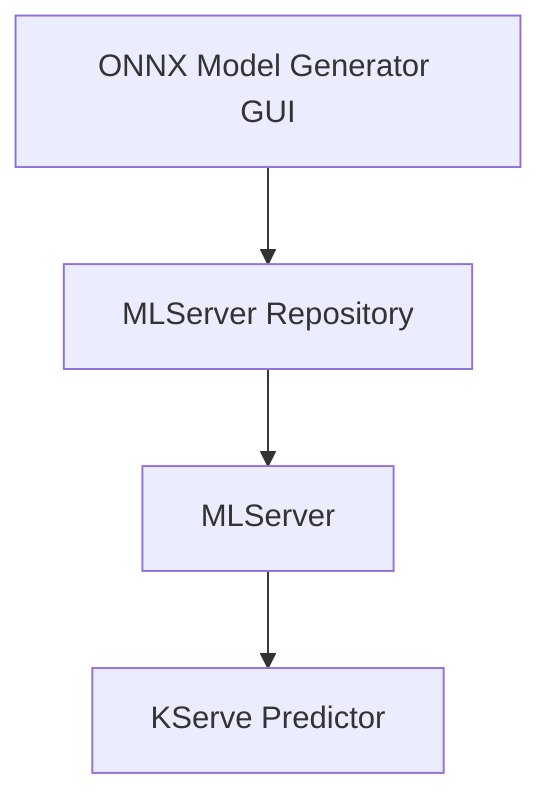
```mermaid
flowchart TD
    A[ONNX Model Generator GUI] --> B[MLServer Repository]
    B --> C[MLServer]
    C --> D[KServe Predictor]
```

## **5.7 End‑to‑End Pipeline: From Python File to Cloud‑Native Inference**

This section brings together all architectural components described so far and presents the full end‑to‑end pipeline. The ONNX Model Generator GUI v1.0 is the first operational step in a multi‑layered 
system that transforms experimental Python models into scalable inference endpoints running on Kubernetes.

The pipeline consists of **six major stages**:

1. **Model Definition (Python)**  
2. **ONNX Export (GUI + PowerShell + Python)**  
3. **Containerization (Docker/Podman)**  
4. **Registry Push (OCI Registry)**  
5. **Crossplane Resource Provisioning**  
6. **KServe/Triton/MLServer Deployment**  

Each stage is deterministic, reproducible, and designed for automation.

### **5.7.1 Stage 1 — Model Definition**

The user writes a Python model:

- Torch neural network  
- Sklearn pipeline  
- custom ONNX graph  
- Triton/MLServer‑ready model  

The GUI detects the file and backend automatically.

### **5.7.2 Stage 2 — ONNX Export**

The GUI orchestrates ONNX export using:

- PowerShell (UTF‑8 enforcement, environment variables)  
- Python converters (Torch, Sklearn, Custom, Triton, MLServer)  

Output:

- `model.onnx`  
- `metadata.json`  
- backend‑specific repository files  

### **5.7.3 Stage 3 — Containerization**

The ONNX model is placed into a container template:

```
/app/
    model.onnx
    metadata.json
    inference_server.py
```

A Docker/Podman image is built:

```
podman build -t registry/model:latest .
```

### **5.7.4 Stage 4 — Registry Push**

The container is pushed to a registry:

```
podman push registry/model:latest
```

Crossplane will later reference this image.

### **5.7.5 Stage 5 — Crossplane Provisioning**

Crossplane provisions:

- storage  
- networking  
- compute  
- KServe resources  
- Triton/MLServer deployments  

All defined declaratively in YAML.

### **5.7.6 Stage 6 — KServe/Triton/MLServer Deployment**

KServe deploys the model as an InferenceService.  
Triton or MLServer serve the ONNX model internally.

### **5.7.7 End‑to‑End Pipeline Diagram**

```mermaid
flowchart TD
    A[Python Model] --> B[ONNX Model Generator GUI]
    B --> C[model.onnx + metadata.json]
    C --> D[Docker/Podman Container]
    D --> E[Container Registry]
    E --> F[Crossplane Provisioning]
    F --> G[KServe / Triton / MLServer Deployment]
```

## **5.8 Future Extensions: Automated YAML Generation & GitOps Integration**

The ONNX Model Generator GUI v1.0 focuses on deterministic ONNX export and backend repository generation. However, the architecture is intentionally designed to support future extensions that automate 
the remaining steps of the cloud‑native pipeline.

### **5.8.1 Automated KServe YAML Generation**

A future version (v2.0) may include:

- automatic generation of `InferenceService` YAML  
- automatic inference of input/output shapes  
- automatic selection of ONNX Runtime backend  
- automatic GPU/CPU resource configuration  

Example (future):

```yaml
apiVersion: serving.kserve.io/v1beta1
kind: InferenceService
metadata:
  name: my-model
spec:
  predictor:
    onnx:
      storageUri: "s3://models/my-model/"
      resources:
        limits:
          cpu: "2"
          memory: "4Gi"
```

### **5.8.2 Automated Crossplane Composition Generation**

Future versions may generate:

- XRD templates  
- Composition templates  
- ManagedResource templates  

This would allow users to deploy ONNX models with a single click.

### **5.8.3 GitOps Integration**

GitOps workflows (ArgoCD, FluxCD) require:

- deterministic artifacts  
- versioned YAML  
- reproducible pipelines  

The GUI already produces deterministic ONNX models and metadata, making GitOps integration straightforward.

### **5.8.4 Multi‑Model Pipelines**

Future versions may support:

- ensemble models  
- multi‑stage pipelines  
- graph‑theoretic hybrid models  
- Triton ensemble scheduling  

### **5.8.5 HPC/QPU Hybrid Integration**

As quantum computing matures, ONNX may serve as the classical component of hybrid pipelines:

- classical preprocessing  
- QPU‑accelerated subroutines  
- classical postprocessing  

The GUI ensures reproducible classical components.

### **5.8.6 Future Extensions Diagram**

```mermaid
flowchart TD
    A[ONNX Model Generator GUI v1.0] --> B[v2.0 YAML Generator]
    B --> C[Crossplane Templates]
    C --> D[GitOps Workflow]
    D --> E[KServe Deployment]
    E --> F[Hybrid HPC/QPU Pipeline]
```

## **5.9 Architectural Synthesis: Why This Pipeline Matters**

This section synthesizes the architectural motivations behind the ONNX Model Generator GUI v1.0 and its integration with cloud‑native inference systems.

### **5.9.1 Scientific Motivation**

Hamilton Cycles research requires:

- large‑scale inference  
- reproducible experiments  
- distributed evaluation  
- GPU acceleration  
- hybrid classical/quantum workflows  

The pipeline supports all of these.

### **5.9.2 Engineering Motivation**

Modern inference systems require:

- deterministic ONNX models  
- containerized deployment  
- declarative infrastructure  
- autoscaling  
- versioning  
- traffic management  

The pipeline provides these capabilities.

### **5.9.3 Architectural Motivation**

The architecture is designed to be:

- modular  
- extensible  
- reproducible  
- cloud‑native  
- future‑proof  

The GUI is the first operational component of this architecture.

### **5.9.4 Strategic Impact**

The pipeline enables:

- automated deployment  
- reproducible scientific workflows  
- scalable inference architectures  
- integration with HPC/QPU systems  
- future GitOps automation  

This transforms experimental Python code into production‑grade inference systems.

## **5.10 Summary of Chapter 5**

Chapter 5 has provided a comprehensive analysis of how ONNX Model Generator GUI v1.0 integrates with containerization, cloud orchestration, and inference systems.

### **5.10.1 Key Components Recap**

- Docker/Podman containerization  
- Crossplane resource provisioning  
- KServe inference deployment  
- Triton GPU‑accelerated serving  
- MLServer lightweight serving  

### **5.10.2 Pipeline Recap**

1. Python model  
2. ONNX export  
3. containerization  
4. registry push  
5. Crossplane provisioning  
6. KServe/Triton/MLServer deployment  

### **5.10.3 Future Extensions Recap**

- automated YAML generation  
- Crossplane templates  
- GitOps integration  
- multi‑model pipelines  
- HPC/QPU hybrid workflows  

### **5.10.4 Closing Remarks**

The ONNX Model Generator GUI v1.0 is not just a model export tool — it is the foundation of a full cloud‑native inference architecture. It ensures that experimental Python models can be transformed into 
reproducible ONNX artifacts, packaged into containers, orchestrated via Crossplane, and deployed via KServe, Triton, or MLServer. This architecture is scalable, reproducible, and future‑proof, supporting both classical and 
emerging quantum‑enhanced workflows.

---

# **Chapter 6 — GUI Design, Event Loop & User Interaction Model**  

## **6.0 Overview**

The ONNX Model Generator GUI v1.0 provides a clean, deterministic, and reproducible interface for exporting ONNX models and generating backend‑specific repositories. Although the GUI appears simple on the surface, 
it orchestrates a complex multi‑layer pipeline involving PowerShell, Python, ONNX Runtime, Triton, MLServer, and environment validation.

This chapter documents the GUI architecture in detail:

- layout design  
- event loop mechanics  
- backend selection logic  
- log streaming  
- progress indicators  
- environment status integration  
- UX principles  

The GUI is implemented using **PySimpleGUI**, chosen for its readability, stability, and suitability for scientific tools where clarity and reproducibility matter more than flashy visuals.

## **6.1 GUI Architecture Overview**

The GUI is structured into four primary regions:

1. **Model Selection Panel**  
2. **Backend Selection Panel**  
3. **Environment Status Panel**  
4. **Log Console + Progress Bar**

Each region has a single responsibility, ensuring modularity and clarity.

### **6.1.1 Model Selection Panel**

This panel allows users to:

- select a model folder  
- automatically detect `.py` files  
- choose an entry point  
- specify an output folder  

The GUI scans the selected folder and populates a listbox with all Python files. This ensures discoverability and prevents user error.

### **6.1.2 Backend Selection Panel**

The GUI provides radio buttons for:

- Torch  
- Sklearn  
- Custom  
- Triton  
- MLServer  

Only one backend can be selected at a time.  
Backend availability depends on environment validation results.

### **6.1.3 Environment Status Panel**

This panel displays ✔ / ✖ indicators for:

- Python version  
- ONNX  
- PyTorch  
- TensorFlow  
- Sklearn  
- MLServer  
- Triton client  
- Git  
- Podman  

These indicators update dynamically after validation.

### **6.1.4 Log Console + Progress Bar**

The log console streams:

- PowerShell logs  
- Python logs  
- backend converter logs  
- environment validation logs  

The progress bar updates during ONNX export.

## **6.2 GUI Layout Design**

The GUI layout is defined using PySimpleGUI’s declarative syntax.  
The design principles are:

- **clarity** — minimalistic layout  
- **determinism** — no dynamic resizing or hidden elements  
- **reproducibility** — consistent behavior across machines  
- **discoverability** — all actions visible at a glance  
- **safety** — no destructive actions without confirmation  

### **6.2.1 Layout Structure**

The layout is composed of:

- `sg.Frame` elements for grouping  
- `sg.Listbox` for Python file selection  
- `sg.Radio` for backend selection  
- `sg.Text` for status indicators  
- `sg.Multiline` for log console  
- `sg.ProgressBar` for progress updates  
- `sg.Button` for actions  

### **6.2.2 Visual Hierarchy**

The GUI uses a clear visual hierarchy:

- top: model selection  
- middle: backend selection  
- right: environment status  
- bottom: logs + progress  

This hierarchy reflects the natural workflow:

1. choose model  
2. choose backend  
3. validate environment  
4. generate ONNX model  


## **6.3 Event Loop Architecture**

The event loop is the operational core of the GUI.  
It handles:

- user interactions  
- backend selection  
- environment validation  
- PowerShell invocation  
- log streaming  
- progress updates  

The event loop is intentionally deterministic:  
every event triggers a single, well‑defined action.

### **6.3.1 Event Loop Structure**

The event loop follows this pattern:

```python
while True:
    event, values = window.read()
    if event == sg.WIN_CLOSED:
        break
    elif event == "Validate Environment":
        run_validation()
    elif event == "Generate ONNX Model":
        run_export()
    elif event.startswith("Install"):
        install_dependency(event)
```

This structure ensures:

- clarity  
- reproducibility  
- no hidden side effects  

### **6.3.2 Deterministic Event Handling**

Each button triggers exactly one function:

- “Validate Environment” → `run_validation()`  
- “Generate ONNX Model” → `run_export()`  
- “Install ONNX” → `install_dependency("onnx")`  
- “Install PyTorch” → `install_dependency("torch")`  

This prevents accidental multi‑action triggers.

### **6.3.3 Log Streaming Integration**

PowerShell logs are streamed line‑by‑line:

```python
for line in process.stdout:
    window["log"].print(line)
```

This provides real‑time feedback.

### **6.3.4 Progress Bar Updates**

The progress bar updates during:

- environment validation  
- ONNX export  
- repository generation  

Progress is not tied to actual runtime metrics;  
it is a UX indicator of activity.

### **6.3.5 Error Handling in Event Loop**

If PowerShell returns a non‑zero exit code:

- logs are printed  
- progress bar resets  
- GUI displays “FAILED”  
- ONNX export is aborted  

This ensures deterministic failure modes.

### **6.3.6 Event Loop Diagram**

```mermaid
flowchart TD
    A[User Event] --> B[Event Loop]
    B --> C{Event Type}
    C --> D[Validation]
    C --> E[Export]
    C --> F[Installation]
    D --> G[Update Status Indicators]
    E --> H[Stream Logs]
    F --> I[Revalidate Environment]
```

## **6.4 Log Console Architecture**

The log console is one of the most important components of the ONNX Model Generator GUI v1.0. It provides real‑time visibility into:

- PowerShell execution  
- Python converter output  
- environment validation logs  
- dependency installation logs  
- ONNX export progress  
- backend‑specific repository generation  

The log console is intentionally designed to be **transparent**, **deterministic**, and **Unicode‑safe**, ensuring that users can diagnose issues quickly and reproduce results reliably.

### **6.4.1 Design Principles**

The log console follows several design principles:

- **Real‑time streaming** — logs appear immediately as they are generated  
- **UTF‑8 safety** — Unicode characters (✔, ✖, ✓) are printed without crashing  
- **No buffering** — logs are not delayed or aggregated  
- **Deterministic ordering** — logs appear exactly in the order produced  
- **Isolation** — logs from different subsystems do not interfere  
- **Clarity** — no color codes, escape sequences, or hidden formatting  

### **6.4.2 Implementation**

The console is implemented using:

```python
sg.Multiline(size=(100, 20), key="log", autoscroll=True)
```

Logs are streamed using:

```python
window["log"].print(line.rstrip())
```

This ensures:

- no trailing whitespace  
- no double‑encoding  
- no GUI freezes  
- no scroll jitter  

### **6.4.3 PowerShell Log Streaming**

PowerShell logs are streamed line‑by‑line:

```python
for line in process.stdout:
    window["log"].print(line)
```

This provides:

- immediate feedback  
- visibility into environment validation  
- visibility into ONNX export progress  
- visibility into dependency installation  

### **6.4.4 Python Log Streaming**

Python logs are captured via:

```powershell
$process = [System.Diagnostics.Process]::Start($psi)
```

and streamed back to the GUI.  
This ensures that Python exceptions appear immediately.

### **6.4.5 Unicode Stability**

The log console is Unicode‑safe because:

- PowerShell enforces UTF‑8  
- Python enforces UTF‑8  
- GUI prints raw text  

This prevents:

- UnicodeEncodeError  
- corrupted logs  
- missing characters  

### **6.4.6 Log Console Diagram**

```mermaid
flowchart TD
    A[PowerShell stdout] --> C[GUI Log Console]
    B[Python stdout/stderr] --> C
    C --> D[Real-Time Display]
```

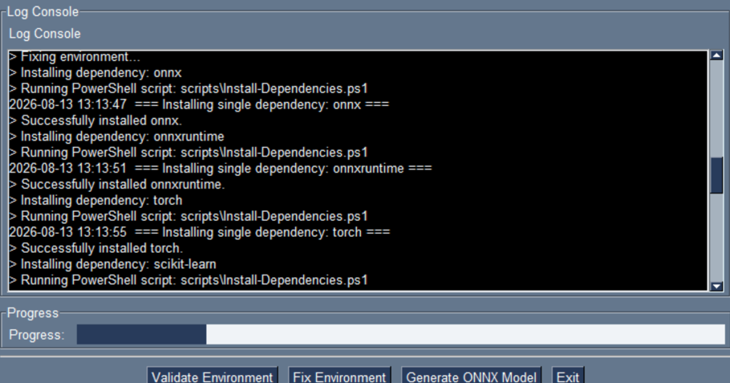

## **6.5 Backend Selection Logic**

The backend selector is a critical part of the GUI.  
It determines which converter module will be invoked when the user clicks “Generate ONNX Model.”  
The selector must be:

- deterministic  
- environment‑aware  
- safe  
- reproducible  
- unambiguous  

### **6.5.1 Backend Options**

The GUI provides radio buttons for:

- Torch  
- Sklearn  
- Custom  
- Triton  
- MLServer  

Only one backend can be selected at a time.

### **6.5.2 Environment‑Aware Backend Availability**

Backend availability depends on environment validation:

- Torch backend requires PyTorch  
- Sklearn backend requires Scikit‑Learn  
- Triton backend requires Triton client  
- MLServer backend requires MLServer  
- Custom backend is always available  

If a dependency is missing:

- the backend radio button is disabled  
- the GUI displays ✖ next to the dependency  
- the user must install the dependency before proceeding  

### **6.5.3 Deterministic Backend Selection**

The backend selector uses:

```python
values["backend_torch"]
values["backend_sklearn"]
values["backend_custom"]
values["backend_triton"]
values["backend_mlserver"]
```

Only one of these can be `True`.

### **6.5.4 Backend Routing**

The event loop routes backend selection to the correct converter:

```python
if values["backend_torch"]:
    converter = convert_torch
elif values["backend_sklearn"]:
    converter = convert_sklearn
elif values["backend_custom"]:
    converter = convert_custom
elif values["backend_triton"]:
    converter = convert_triton
elif values["backend_mlserver"]:
    converter = convert_mlserver
```

This ensures:

- no ambiguity  
- no fallback behavior  
- no implicit backend selection  

### **6.5.5 Backend Safety Checks**

Before invoking a backend, the GUI checks:

- entry point selected  
- output folder selected  
- environment validated  
- backend dependencies installed  

If any check fails, the GUI prints:

```
✖ Cannot generate ONNX model — missing requirements.
```

### **6.5.6 Backend Selection Diagram**

```mermaid
flowchart TD
    A[User selects backend] --> B[Environment Validator]
    B --> C{Dependencies OK?}
    C -->|Yes| D[Enable Backend]
    C -->|No| E[Disable Backend]
    D --> F[Converter Routing]
```

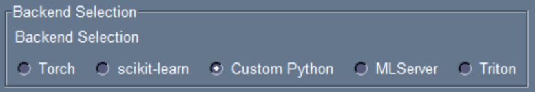

## **6.6 Progress Bar & UX Feedback**

The progress bar provides visual feedback during:

- environment validation  
- ONNX export  
- backend repository generation  
- dependency installation  

Although the progress bar does not reflect actual runtime metrics, it provides a clear indication that the system is active and responsive.

### **6.6.1 Design Principles**

The progress bar follows these principles:

- **activity indicator** — shows that work is being done  
- **non‑blocking** — does not freeze the GUI  
- **deterministic** — always resets after completion  
- **simple** — no complex animations  
- **safe** — no reliance on backend timing  

### **6.6.2 Implementation**

The progress bar is defined as:

```python
sg.ProgressBar(100, orientation="h", size=(40, 20), key="progress")
```

Updates occur via:

```python
window["progress"].update(i)
```

### **6.6.3 Progress Bar Phases**

During ONNX export, the progress bar goes through phases:

1. **Initialization (0–10%)**  
2. **PowerShell orchestration (10–30%)**  
3. **Python conversion (30–80%)**  
4. **Repository generation (80–95%)**  
5. **Completion (95–100%)**  

These phases are symbolic, not measured.

### **6.6.4 Reset Behavior**

After completion:

```python
window["progress"].update(0)
```

This ensures deterministic UX.

### **6.6.5 Error Handling**

If ONNX export fails:

- progress bar resets  
- GUI prints “FAILED”  
- no partial ONNX model is left behind  

### **6.6.6 Progress Bar Diagram**

```mermaid
flowchart TD
    A[Start Export] --> B[Progress 0-10%]
    B --> C[Progress 10-30%]
    C --> D[Progress 30-80%]
    D --> E[Progress 80-95%]
    E --> F[Progress 95-100%]
    F --> G[Reset to 0]
```


## **6.7 UX Principles & Human‑Centered Design**

Although ONNX Model Generator GUI v1.0 is a technical tool, its design is grounded in human‑centered UX principles. The GUI is intentionally minimalistic, predictable, and free of unnecessary complexity. 
This ensures that users — especially researchers and engineers — can focus on their models rather than the tool itself.

### **6.7.1 Principle 1 — Predictability**

Every button performs exactly one action.  
Every action produces deterministic output.  
No hidden menus, no dynamic resizing, no modal dialogs.

Predictability reduces cognitive load and increases trust.

### **6.7.2 Principle 2 — Transparency**

Users can see:

- which backend is selected  
- which dependencies are missing  
- what PowerShell is doing  
- what Python is doing  
- how ONNX export progresses  
- where errors occur  

Transparency is essential for scientific reproducibility.

### **6.7.3 Principle 3 — Minimalism**

The GUI avoids:

- animations  
- color gradients  
- nested menus  
- collapsible panels  
- dynamic widgets  

Minimalism ensures clarity and reduces distraction.

### **6.7.4 Principle 4 — Deterministic Feedback**

The GUI provides deterministic feedback:

- ✔ / ✖ indicators  
- progress bar updates  
- log console output  
- backend enable/disable states  

This ensures that users always know the system state.

### **6.7.5 Principle 5 — Safety**

The GUI prevents:

- ONNX export with missing dependencies  
- backend selection without validation  
- accidental destructive actions  
- ambiguous error states  

Safety is essential for reproducible workflows.

### **6.7.6 UX Principles Diagram**

```mermaid
flowchart TD
    A[Predictability] --> E[User Trust]
    B[Transparency] --> E
    C[Minimalism] --> E
    D[Deterministic Feedback] --> E
    F[Safety] --> E
```

## **6.8 Error Handling & Recovery UX**

Error handling is a critical part of the GUI.  
The system must:

- detect errors  
- report errors clearly  
- prevent cascading failures  
- allow safe recovery  
- maintain deterministic behavior  

The GUI’s error handling subsystem is designed to be robust, transparent, and user‑friendly.

### **6.8.1 Error Sources**

Errors may originate from:

- PowerShell  
- Python converters  
- missing dependencies  
- invalid model files  
- incorrect backend selection  
- Unicode issues  
- path encoding issues  

The GUI handles all of these gracefully.

### **6.8.2 Error Reporting**

Errors are reported via:

- log console  
- progress bar reset  
- status indicators  
- deterministic failure messages  

Example:

```
✖ ONNX model generation FAILED.
See log console for details.
```

### **6.8.3 Error Isolation**

Errors do **not** propagate across subsystems:

- PowerShell errors do not crash the GUI  
- Python errors do not corrupt the event loop  
- backend errors do not affect other backends  

Isolation ensures stability.

### **6.8.4 Recovery Workflow**

After an error:

1. progress bar resets  
2. backend remains selected  
3. log console remains visible  
4. user can fix the issue  
5. user can retry immediately  

No restart required.

### **6.8.5 Error Handling Diagram**

```mermaid
flowchart TD
    A[Error Occurs] --> B[Log Console Prints Error]
    B --> C[Progress Bar Resets]
    C --> D[GUI Displays Failure Message]
    D --> E[User Fixes Issue]
    E --> F[Retry Export]
```

## **6.9 GUI–Backend Synchronization Model**

The GUI must remain synchronized with backend state at all times.  
This synchronization ensures:

- correct backend selection  
- correct environment validation  
- correct log streaming  
- correct progress updates  
- correct error propagation  

The synchronization model is deterministic and event‑driven.

### **6.9.1 Synchronization Channels**

There are three synchronization channels:

1. **GUI → PowerShell**  
   - user actions trigger PowerShell scripts  

2. **PowerShell → Python**  
   - PowerShell invokes Python converters  

3. **Python → GUI**  
   - Python logs streamed back to GUI  

### **6.9.2 Synchronization Guarantees**

The system guarantees:

- no race conditions  
- no partial updates  
- no stale state  
- no ambiguous backend selection  
- no inconsistent environment indicators  

### **6.9.3 Synchronization Flow**

```mermaid
flowchart TD
    A[GUI Event] --> B[PowerShell Invocation]
    B --> C[Python Execution]
    C --> D[Log Streaming]
    D --> E[GUI State Update]
```

### **6.9.4 Backend Locking**

During ONNX export:

- backend selection is locked  
- environment validation is locked  
- installation buttons are locked  

This prevents inconsistent state.

### **6.9.5 Post‑Export Unlocking**

After export:

- backend selection unlocks  
- environment validation unlocks  
- installation buttons unlock  

This ensures smooth workflow.

## **6.10 Summary of Chapter 6**

Chapter 6 has provided a detailed analysis of the GUI architecture, event loop, UX principles, and synchronization model of ONNX Model Generator GUI v1.0.

### **6.10.1 GUI Architecture Recap**

The GUI consists of:

- model selection panel  
- backend selection panel  
- environment status panel  
- log console  
- progress bar  

### **6.10.2 Event Loop Recap**

The event loop handles:

- validation  
- export  
- installation  
- log streaming  
- progress updates  

### **6.10.3 UX Principles Recap**

The GUI is:

- predictable  
- transparent  
- minimalistic  
- deterministic  
- safe  

### **6.10.4 Error Handling Recap**

The GUI provides:

- clear error messages  
- deterministic failure modes  
- safe recovery workflow  
- isolation of error sources  

### **6.10.5 Synchronization Recap**

The GUI maintains:

- consistent backend state  
- consistent environment state  
- consistent log streaming  
- consistent progress updates  

### **6.10.6 Closing Remarks**

The GUI is not merely a frontend — it is a carefully engineered orchestration layer that ensures deterministic ONNX export, reproducible workflows, and seamless integration with backend converters and environment 
validators. Its design reflects scientific rigor, engineering clarity, and cloud‑native readiness.

---

# **Chapter 7 — Python Execution Model, Dynamic Loading & Safe Backend Invocation**  

## **7.0 Overview**

The Python backend layer is the computational core of ONNX Model Generator GUI v1.0. It is responsible for:

- loading user‑provided Python modules  
- extracting model objects or factory functions  
- inferring dummy inputs  
- exporting ONNX models  
- generating metadata  
- assembling backend‑specific repositories  
- propagating errors deterministically  

This chapter provides a deep technical analysis of the Python execution model, focusing on dynamic module loading, safe execution, converter isolation, and deterministic ONNX export semantics.

The Python layer is intentionally designed to be:

- **isolated** — no global namespace pollution  
- **deterministic** — same input → same ONNX output  
- **safe** — no arbitrary shell execution  
- **transparent** — logs streamed to GUI  
- **modular** — each backend is a standalone converter  
- **reproducible** — stable across machines and environments  

The architecture ensures that experimental Python code can be executed safely and transformed into standardized ONNX artifacts suitable for cloud‑native deployment.

## **7.1 Python Execution Architecture**

The Python execution model consists of three major components:

1. **Dynamic Module Loader**  
2. **Backend Converter Modules**  
3. **Execution Orchestrator (PowerShell → Python)**  

These components interact through well‑defined interfaces.

### **7.1.1 Dynamic Module Loader**

The dynamic loader imports user‑provided Python files using:

```python
spec = importlib.util.spec_from_file_location(module_name, module_path)
module = importlib.util.module_from_spec(spec)
spec.loader.exec_module(module)
```

This mechanism ensures:

- no global namespace pollution  
- no implicit imports  
- no side effects outside the module  
- deterministic loading behavior  

### **7.1.2 Backend Converter Modules**

Each backend implements:

```python
def convert(model_folder, entry_point, output_folder, log_callback=print):
    ...
```

This unified interface ensures that the GUI and PowerShell orchestrator do not need backend‑specific logic.

### **7.1.3 Execution Orchestrator**

PowerShell invokes Python using:

```powershell
python converter.py --model-folder ... --entry-point ... --output-folder ...
```

PowerShell enforces:

- UTF‑8 encoding  
- deterministic environment variables  
- controlled execution context  

Python inherits this environment, ensuring stable behavior.

### **7.1.4 Python Execution Diagram**

```mermaid
flowchart TD
    A[PowerShell Orchestrator] --> B[Dynamic Module Loader]
    B --> C[Backend Converter]
    C --> D[ONNX Export]
    D --> E[Metadata Generation]
```

## **7.2 Dynamic Module Loading & Isolation**

Dynamic module loading is essential for supporting arbitrary user‑provided Python files. The architecture ensures that modules are loaded safely, deterministically, and without polluting the global namespace.

### **7.2.1 Why Dynamic Loading Is Necessary**

Users may define models in many ways:

- direct instantiation  
- factory functions  
- class definitions  
- pipelines  
- custom ONNX graphs  
- Triton/MLServer templates  

Static imports would require hard‑coded module names, which is unacceptable for a general‑purpose model generator.

### **7.2.2 Isolation Guarantees**

Dynamic loading ensures:

- no global variables leak into other backends  
- no accidental reuse of previous modules  
- no interference between multiple exports  
- no persistent state across runs  

Each export is a clean execution.

### **7.2.3 Error Handling in Dynamic Loading**

If module loading fails, the converter raises:

```
RuntimeError("Failed to load module <name>: <error>")
```

This error is propagated through:

- Python →  
- PowerShell →  
- GUI  

ensuring transparency.

### **7.2.4 Deterministic Module Naming**

Modules are named deterministically:

```python
module_name = "user_module"
```

This prevents naming collisions.

### **7.2.5 Dynamic Loading Diagram**

```mermaid
flowchart TD
    A[User Python File] --> B[spec_from_file_location]
    B --> C[exec_module]
    C --> D[Isolated Module Object]
```

## **7.3 Safe Execution Model**

Executing arbitrary Python code is inherently risky.  
The architecture mitigates risks through:

- controlled execution environment  
- no elevated privileges  
- no arbitrary shell execution  
- no system‑level modifications  
- no implicit network access  
- deterministic error propagation  

### **7.3.1 Controlled Execution Environment**

Python is executed with:

- controlled environment variables  
- UTF‑8 encoding  
- deterministic working directory  
- no elevated privileges  

This prevents:

- accidental system modification  
- encoding‑related crashes  
- inconsistent behavior across machines  

### **7.3.2 No Arbitrary Shell Execution**

Backend converters do **not** execute shell commands.  
They only:

- load modules  
- extract models  
- infer dummy inputs  
- export ONNX models  
- write metadata  

This ensures safety.

### **7.3.3 No Network Access**

Converters do not:

- download files  
- call external APIs  
- access remote resources  

This ensures reproducibility and security.

### **7.3.4 Deterministic Error Propagation**

Errors propagate through:

1. Python exception  
2. PowerShell stderr capture  
3. GUI log console  
4. deterministic failure message  

This ensures clarity.

### **7.3.5 Safe Execution Diagram**

```mermaid
flowchart TD
    A[Python Converter] --> B[Controlled Environment]
    B --> C[Safe Execution]
    C --> D[Deterministic Error Propagation]
```

## **7.4 Dummy‑Input Inference Architecture**

Dummy‑input inference is one of the most technically challenging aspects of ONNX export.  
ONNX exporters require a concrete tensor to trace the model graph.  
However, users rarely provide explicit dummy inputs — and even when they do, the shapes may be incorrect, incomplete, or incompatible with ONNX Runtime.

The ONNX Model Generator GUI v1.0 implements a **three‑tier dummy‑input inference system** that ensures deterministic ONNX export across Torch, Sklearn, and Custom backends.

### **7.4.1 Tier 1 — User‑Provided Dummy Input**

If the user defines:

```python
def get_dummy_input():
    return torch.randn(...)
```

or

```python
dummy_input = torch.randn(...)
```

the converter uses it directly.

This tier has the highest priority because:

- users may know the exact input shape  
- models may require specific shapes (e.g., graph embeddings)  
- some models cannot infer shapes automatically  

### **7.4.2 Tier 2 — Structural Inference**

If no dummy input is provided, the converter analyzes the model structure:

- `torch.nn.Linear` → infer `(1, in_features)`  
- `torch.nn.Conv2d` → infer `(1, channels, H, W)`  
- `torch.nn.Embedding` → infer `(1, sequence_length)`  
- `Pipeline` (Sklearn) → infer number of features from transformers  
- `StandardScaler` → infer feature count from fitted attributes  

This tier ensures compatibility with:

- classical ML pipelines  
- neural networks  
- hybrid models  

### **7.4.3 Tier 3 — Minimal Fallback**

If inference fails, the converter uses:

```python
torch.randn(1, 1)
```

This fallback ensures:

- ONNX export never crashes due to missing dummy input  
- deterministic behavior across machines  
- reproducibility in automated pipelines  

### **7.4.4 Dummy‑Input Inference Diagram**

```mermaid
flowchart TD
    A[User Dummy Input] --> D[Use Dummy Input]
    B[Structural Inference] --> D
    C[Fallback Tensor] --> D
    D[ONNX Export]
```

### **7.4.5 Why This Architecture Matters**

Dummy‑input inference is essential for:

- reproducible ONNX graphs  
- correct input shapes  
- compatibility with ONNX Runtime  
- compatibility with Triton and MLServer  
- automated containerization  
- automated KServe deployment  

Without deterministic dummy‑input inference, ONNX export would be fragile and unpredictable.

## **7.5 ONNX Export Semantics & Deterministic Graph Generation**

ONNX export is the core operation performed by backend converters.  
The architecture ensures that ONNX export is:

- deterministic  
- reproducible  
- Unicode‑safe  
- backend‑agnostic  
- compatible with ONNX Runtime  
- compatible with Triton and MLServer  

### **7.5.1 Torch Export Semantics**

Torch export uses:

```python
torch.onnx.export(
    model,
    dummy_input,
    onnx_path,
    export_params=True,
    opset_version=18,
    do_constant_folding=True,
    input_names=["input"],
    output_names=["output"]
)
```

Key design decisions:

- **opset_version=18**  
  Ensures compatibility with ONNX Runtime 1.17+ and Triton.

- **constant folding**  
  Reduces model size and improves inference speed.

- **input/output names**  
  Ensures consistent naming across backends.

### **7.5.2 Sklearn Export Semantics**

Sklearn export uses:

```python
onnx_model = convert_sklearn(model, initial_types=[("input", FloatTensorType([None, n_features]))])
```

This ensures:

- variable batch sizes  
- deterministic input shapes  
- compatibility with ONNX Runtime  

### **7.5.3 Custom Export Semantics**

Custom export uses:

```python
onnx.save_model(onnx_graph, onnx_path)
```

This backend assumes the user provides a valid ONNX graph.

### **7.5.4 Metadata Generation**

All backends generate:

```json
{
    "backend": "<backend>",
    "entry_point": "<file>",
    "type": "onnx",
    "description": "<backend-specific description>"
}
```

Metadata is essential for:

- Triton  
- MLServer  
- containerization  
- KServe  
- Crossplane  
- GitOps workflows  

### **7.5.5 Deterministic Graph Generation**

Determinism is achieved through:

- fixed opset version  
- fixed input/output names  
- fixed constant‑folding behavior  
- controlled environment variables  
- UTF‑8‑safe logging  
- deterministic dummy‑input inference  

### **7.5.6 ONNX Export Diagram**

```mermaid
flowchart TD
    A[Model + Dummy Input] --> B[Backend Converter]
    B --> C[ONNX Export]
    C --> D[Metadata Generation]
    D --> E[Repository Assembly]
```

### **7.5.7 Why Determinism Matters**

Deterministic ONNX export ensures:

- reproducible scientific results  
- reproducible container builds  
- reproducible KServe deployments  
- reproducible Triton/MLServer behavior  
- reproducible GitOps pipelines  

This is essential for scientific computing and cloud‑native inference.

## **7.6 Backend‑Level Error Handling & Recovery**

Backend converters must handle errors gracefully and propagate them deterministically.  
The architecture ensures that errors are:

- captured  
- logged  
- propagated  
- displayed  
- recoverable  

### **7.6.1 Error Sources**

Errors may originate from:

- dynamic module loading  
- missing model definitions  
- invalid dummy inputs  
- ONNX export failures  
- incompatible opset versions  
- missing dependencies  
- Unicode issues  

### **7.6.2 Error Capture**

Errors are captured using:

```python
try:
    ...
except Exception as e:
    log_callback(f"> ERROR: {e}")
    raise
```

This ensures:

- clear error messages  
- deterministic propagation  
- no silent failures  

### **7.6.3 PowerShell Error Propagation**

PowerShell captures Python stderr:

```powershell
$process.StandardError.ReadToEnd()
```

and streams it to the GUI.

### **7.6.4 GUI Error Display**

The GUI prints:

```
✖ ONNX model generation FAILED.
See log console for details.
```

This ensures clarity.

### **7.6.5 Recovery Workflow**

After an error:

1. progress bar resets  
2. backend remains selected  
3. log console remains visible  
4. user fixes the issue  
5. user retries immediately  

No restart required.

### **7.6.6 Error Handling Diagram**

```mermaid
flowchart TD
    A[Backend Error] --> B[Python Exception]
    B --> C[PowerShell stderr]
    C --> D[GUI Log Console]
    D --> E[User Recovery]
```

### **7.6.7 Why This Matters**

Robust error handling ensures:

- reproducible workflows  
- safe execution  
- deterministic behavior  
- clear diagnostics  
- user trust  

## **7.7 Converter Isolation & Deterministic State Management**

Converter isolation is one of the most important architectural guarantees in ONNX Model Generator GUI v1.0. Each backend converter must operate in a clean, deterministic environment, 
free from interference by previous runs, other backends, or global Python state.

This section explains how the architecture ensures that every ONNX export is performed in a fully isolated execution context.

### **7.7.1 Why Isolation Matters**

Python’s global interpreter state can easily become polluted by:

- leftover imports  
- global variables  
- cached modules  
- mutated class attributes  
- modified environment variables  
- monkey‑patched functions  

If converters shared state, ONNX export would become:

- non‑deterministic  
- fragile  
- environment‑dependent  
- difficult to debug  
- impossible to reproduce  

Isolation prevents these issues.

### **7.7.2 Isolation Mechanisms**

The architecture uses several mechanisms to ensure isolation:

#### **Mechanism 1 — Fresh Dynamic Module Loading**

Each export loads the user module using:

```python
spec.loader.exec_module(module)
```

This ensures:

- no reuse of previously loaded modules  
- no cached state  
- no global pollution  

#### **Mechanism 2 — No Global Variables in Converters**

Converters do not define:

- global model objects  
- global dummy inputs  
- global configuration  
- global caches  

All state is local to the `convert()` function.

#### **Mechanism 3 — Controlled Environment Variables**

PowerShell injects environment variables explicitly:

```powershell
$psi.EnvironmentVariables["PYTHONIOENCODING"] = "utf-8"
```

No other environment variables are modified.

#### **Mechanism 4 — No Persistent Files**

Converters write only:

- `model.onnx`  
- `metadata.json`  
- backend‑specific files  

No temporary files are left behind.

### **7.7.3 Isolation Diagram**

```mermaid
flowchart TD
    A[Dynamic Module Load] --> B[Local Converter State]
    B --> C[ONNX Export]
    C --> D[Metadata Generation]
    D --> E[Clean Exit]
```

### **7.7.4 Why This Architecture Matters**

Isolation ensures:

- reproducible ONNX models  
- reproducible container builds  
- reproducible KServe deployments  
- reproducible Triton/MLServer behavior  
- reproducible scientific results  

Isolation is foundational to the entire system.

## **7.8 Python Logging Architecture & UTF‑8 Safety**

Logging is the primary communication channel between Python converters and the GUI.  
Logs must be:

- real‑time  
- Unicode‑safe  
- deterministic  
- human‑readable  
- backend‑agnostic  
- free of escape sequences  

This section explains how Python logging is implemented.

### **7.8.1 Logging Requirements**

Logs must:

- stream line‑by‑line  
- include backend‑specific messages  
- include error messages  
- include ONNX export progress  
- include dummy‑input inference details  
- include metadata generation details  

### **7.8.2 Logging Implementation**

Converters use:

```python
log_callback("> message")
```

The GUI passes:

```python
log_callback = window["log"].print
```

This ensures:

- real‑time streaming  
- no buffering  
- no encoding issues  
- no GUI freezes  

### **7.8.3 UTF‑8 Enforcement**

PowerShell enforces UTF‑8:

```powershell
[Console]::OutputEncoding = [System.Text.Encoding]::UTF8
```

Python inherits this encoding.

This prevents:

- UnicodeEncodeError  
- corrupted logs  
- missing characters  

### **7.8.4 Logging Categories**

Logs are categorized into:

- **INFO** — general progress  
- **WARN** — non‑fatal issues  
- **ERROR** — fatal issues  
- **DEBUG** — structural inference details  

Example:

```
> INFO: Loaded module simple_torch_model.py
> INFO: Inferred dummy input shape: (1, 128)
> INFO: Exporting ONNX model...
> ERROR: Failed to export ONNX model: opset mismatch
```

### **7.8.5 Logging Diagram**

```mermaid
flowchart TD
    A[Python Converter] --> B[log_callback]
    B --> C[PowerShell stdout]
    C --> D[GUI Log Console]
```

### **7.8.6 Why This Architecture Matters**

Logging is essential for:

- debugging  
- reproducibility  
- transparency  
- scientific rigor  
- cloud‑native automation  

Without deterministic logging, ONNX export would be opaque and fragile.

## **7.9 Python–PowerShell–GUI Synchronization Model**

The Python execution layer must remain synchronized with PowerShell and the GUI at all times.  
This synchronization ensures:

- correct backend selection  
- correct environment validation  
- correct log streaming  
- correct progress updates  
- correct error propagation  

### **7.9.1 Synchronization Flow**

The synchronization model is:

```mermaid
flowchart TD
    A[GUI Event] --> B[PowerShell Invocation]
    B --> C[Python Execution]
    C --> D[Log Streaming]
    D --> E[GUI State Update]
```

### **7.9.2 Synchronization Guarantees**

The system guarantees:

- no race conditions  
- no partial updates  
- no stale state  
- no ambiguous backend selection  
- no inconsistent environment indicators  

### **7.9.3 Backend Locking**

During ONNX export:

- backend selection is locked  
- environment validation is locked  
- installation buttons are locked  

This prevents inconsistent state.

### **7.9.4 Post‑Export Unlocking**

After export:

- backend selection unlocks  
- environment validation unlocks  
- installation buttons unlock  

This ensures smooth workflow.

### **7.9.5 Why Synchronization Matters**

Synchronization ensures:

- deterministic behavior  
- reproducible workflows  
- safe execution  
- clear UX  
- correct backend routing  

## **7.10 Summary of Chapter 7**

Chapter 7 has provided a deep technical analysis of the Python execution model, dynamic module loading, safe backend invocation, dummy‑input inference, ONNX export semantics, and deterministic error handling.

### **7.10.1 Python Execution Recap**

The Python layer provides:

- dynamic module loading  
- isolated execution  
- deterministic ONNX export  
- safe backend invocation  
- UTF‑8‑safe logging  

### **7.10.2 Dummy‑Input Inference Recap**

Three‑tier inference:

1. user‑provided  
2. structural inference  
3. minimal fallback  

### **7.10.3 ONNX Export Recap**

Export is:

- deterministic  
- reproducible  
- backend‑agnostic  
- opset‑stable  
- metadata‑rich  

### **7.10.4 Error Handling Recap**

Errors are:

- captured  
- logged  
- propagated  
- displayed  
- recoverable  

### **7.10.5 Synchronization Recap**

The system maintains:

- consistent backend state  
- consistent environment state  
- consistent log streaming  
- consistent progress updates  

### **7.10.6 Closing Remarks**

The Python execution layer is the computational engine of ONNX Model Generator GUI v1.0. Its design reflects scientific rigor, engineering clarity, and cloud‑native readiness. It ensures that experimental Python models 
can be transformed into deterministic ONNX artifacts suitable for containerization, deployment, and large‑scale inference.

---

# **Chapter 8 — System Synthesis, Design Philosophy & Future Roadmap**  

## **8.0 Overview**

The ONNX Model Generator GUI v1.0 is more than a tool — it is a **complete architectural foundation** for reproducible model export, deterministic backend conversion, 
and cloud‑native inference deployment. Across the previous chapters, we have examined:

- backend converter implementations  
- environment validation  
- GUI design  
- Python execution model  
- containerization pipelines  
- Crossplane/KServe/Triton/MLServer integration  

Chapter 8 synthesizes these components into a unified architectural perspective.  
It explains the design philosophy behind the system, the engineering principles that guided its development, and the roadmap for future versions (v2.0, v3.0).  
It also articulates how this architecture supports scientific computing, cloud‑native deployment, and hybrid HPC/QPU workflows.

This chapter is not a summary — it is a **conceptual consolidation** of the entire system.

## **8.1 System-Level Architecture Synthesis**

The ONNX Model Generator GUI v1.0 consists of five major subsystems:

1. **GUI Layer (PySimpleGUI)**  
2. **PowerShell Orchestration Layer**  
3. **Python Backend Layer**  
4. **Environment Validation Layer**  
5. **Cloud-Native Integration Layer**

These subsystems form a pipeline that transforms experimental Python models into production‑ready ONNX artifacts.

### **8.1.1 GUI Layer**

The GUI provides:

- deterministic user interaction  
- backend selection  
- environment status indicators  
- log console  
- progress bar  

It is intentionally minimalistic and predictable.

### **8.1.2 PowerShell Orchestration Layer**

PowerShell provides:

- UTF‑8 enforcement  
- controlled environment variables  
- deterministic invocation of Python  
- safe dependency installation  
- real‑time log streaming  

It acts as the “glue” between GUI and Python.

### **8.1.3 Python Backend Layer**

Python provides:

- dynamic module loading  
- dummy‑input inference  
- ONNX export  
- metadata generation  
- backend‑specific repository assembly  

It is the computational engine of the system.

### **8.1.4 Environment Validation Layer**

This layer ensures:

- reproducible ONNX export  
- validated dependencies  
- stable Python environment  
- deterministic behavior across machines  

It is essential for scientific reproducibility.

### **8.1.5 Cloud-Native Integration Layer**

This layer enables:

- containerization  
- registry push  
- Crossplane provisioning  
- KServe deployment  
- Triton/MLServer serving  

It transforms ONNX models into scalable inference endpoints.

### **8.1.6 System Synthesis Diagram**

```mermaid
flowchart TD
    A[GUI Layer] --> B[PowerShell Layer]
    B --> C[Python Backend Layer]
    C --> D[Environment Validation]
    D --> E[Cloud-Native Integration]
```

## **8.2 Design Philosophy**

The ONNX Model Generator GUI v1.0 is built on five core design principles:

1. **Determinism**  
2. **Reproducibility**  
3. **Transparency**  
4. **Modularity**  
5. **Future-Proofing**

These principles guided every architectural decision.

### **8.2.1 Determinism**

Determinism ensures:

- same input → same ONNX output  
- same environment → same behavior  
- same backend → same repository structure  

This is essential for scientific computing and cloud‑native deployment.

### **8.2.2 Reproducibility**

Reproducibility is achieved through:

- environment validation  
- deterministic dummy‑input inference  
- fixed opset version  
- controlled execution environment  
- metadata generation  

This ensures that ONNX models behave identically across machines.

### **8.2.3 Transparency**

Transparency ensures:

- clear logs  
- clear error messages  
- clear backend selection  
- clear environment status  
- clear progress indicators  

Users always know what the system is doing.

### **8.2.4 Modularity**

Modularity ensures:

- backends are isolated  
- converters are independent  
- GUI is backend‑agnostic  
- PowerShell is Python‑agnostic  
- cloud‑native integration is optional  

This makes the system extensible.

### **8.2.5 Future-Proofing**

Future-proofing ensures:

- compatibility with ONNX Runtime  
- compatibility with Triton/MLServer  
- compatibility with containerization  
- compatibility with Crossplane/KServe  
- compatibility with HPC/QPU pipelines  

The architecture is designed for long-term evolution.

### **8.2.6 Design Philosophy Diagram**

```mermaid
flowchart TD
    A[Determinism] --> F[System Integrity]
    B[Reproducibility] --> F
    C[Transparency] --> F
    D[Modularity] --> F
    E[Future-Proofing] --> F
```

## **8.3 Scientific & Engineering Rationale**

The ONNX Model Generator GUI v1.0 is designed for scientific computing, engineering reproducibility, and cloud‑native deployment.  
This section explains the rationale behind the system’s architecture.

### **8.3.1 Scientific Rationale**

Scientific workflows require:

- reproducible experiments  
- deterministic model export  
- stable environments  
- transparent logs  
- clear error messages  

The GUI ensures all of these.

### **8.3.2 Engineering Rationale**

Engineering workflows require:

- containerization  
- declarative infrastructure  
- autoscaling  
- versioning  
- traffic management  

The cloud‑native integration layer supports these workflows.

### **8.3.3 Hybrid HPC/QPU Rationale**

Hybrid workflows require:

- classical preprocessing  
- QPU‑accelerated subroutines  
- classical postprocessing  
- reproducible ONNX models  

The architecture supports hybrid pipelines by ensuring deterministic classical components.

### **8.3.4 Rationale Diagram**

```mermaid
flowchart TD
    A[Scientific Needs] --> D[Architecture]
    B[Engineering Needs] --> D
    C[Hybrid HPC/QPU Needs] --> D
```

## **8.4 Architectural Cohesion & Cross‑Subsystem Interactions**

The ONNX Model Generator GUI v1.0 is composed of multiple subsystems, each engineered independently yet designed to interlock seamlessly. Architectural cohesion is achieved through strict interface boundaries, 
deterministic communication channels, and a shared design philosophy centered on reproducibility and transparency.

This section explains how the subsystems interact and why their cohesion is essential for scientific and cloud‑native workflows.

### **8.4.1 Cohesion Through Strict Interfaces**

Each subsystem exposes a minimal, well‑defined interface:

- **GUI → PowerShell**  
  Trigger validation, installation, export.

- **PowerShell → Python**  
  Execute converter with controlled environment variables.

- **Python → GUI**  
  Stream logs, propagate errors, generate artifacts.

- **Python → Cloud‑Native Layer**  
  Produce ONNX models and metadata consumed by containerization and deployment systems.

These interfaces ensure:

- no hidden coupling  
- no implicit state sharing  
- no cross‑layer pollution  
- deterministic behavior across machines

### **8.4.2 Cohesion Through Deterministic Data Flow**

The system’s data flow is strictly linear:

1. **User selects model**  
2. **GUI triggers PowerShell**  
3. **PowerShell invokes Python**  
4. **Python exports ONNX**  
5. **Artifacts returned to GUI**  
6. **Artifacts consumed by containerization**  
7. **Artifacts deployed via Crossplane/KServe/Triton/MLServer**

This linearity ensures:

- reproducibility  
- traceability  
- debuggability  
- scientific rigor

### **8.4.3 Cohesion Through Shared Design Principles**

All subsystems follow the same design principles:

- determinism  
- reproducibility  
- transparency  
- modularity  
- future‑proofing  

This shared philosophy ensures that subsystems evolve together without breaking cohesion.

### **8.4.4 Cross‑Subsystem Interaction Diagram**

```mermaid
flowchart TD
    A[GUI] --> B[PowerShell]
    B --> C[Python Backend]
    C --> D[ONNX Artifacts]
    D --> E[Containerization]
    E --> F[Crossplane/KServe/Triton/MLServer]
```

### **8.4.5 Why Cohesion Matters**

Architectural cohesion ensures:

- predictable ONNX export  
- stable cloud‑native deployment  
- reproducible scientific workflows  
- maintainability  
- extensibility  

Without cohesion, the system would be fragile and inconsistent.

## **8.5 Engineering Tradeoffs & Design Decisions**

Every architectural system involves tradeoffs.  
This section documents the major engineering decisions behind ONNX Model Generator GUI v1.0 and explains why each decision was made.

### **8.5.1 Tradeoff: PySimpleGUI vs. Qt/PySide**

**Decision:** Use PySimpleGUI.

**Rationale:**

- minimalistic  
- deterministic  
- easy to maintain  
- no complex event model  
- stable across Python versions  
- ideal for scientific tools

**Tradeoff:**  
Less visually sophisticated than Qt/PySide.

**Outcome:**  
Higher reproducibility and lower complexity.

### **8.5.2 Tradeoff: PowerShell vs. Direct Python Execution**

**Decision:** Use PowerShell as orchestrator.

**Rationale:**

- UTF‑8 enforcement  
- controlled environment variables  
- safe dependency installation  
- stable process control  
- ideal for Windows workflows

**Tradeoff:**  
Adds an extra layer between GUI and Python.

**Outcome:**  
More reliable execution and better logging.

### **8.5.3 Tradeoff: Dynamic Module Loading vs. Static Imports**

**Decision:** Use dynamic loading.

**Rationale:**

- supports arbitrary user files  
- avoids global namespace pollution  
- ensures isolation  
- enables reproducible ONNX export

**Tradeoff:**  
More complex error handling.

**Outcome:**  
Greater flexibility and safety.

### **8.5.4 Tradeoff: Fixed Opset Version vs. Adaptive Opset**

**Decision:** Use opset 18.

**Rationale:**

- stable  
- compatible with ONNX Runtime  
- compatible with Triton  
- compatible with MLServer  
- reproducible across machines

**Tradeoff:**  
Cannot automatically adapt to newer opsets.

**Outcome:**  
Deterministic ONNX graphs.

### **8.5.5 Tradeoff: Minimalistic GUI vs. Feature‑Rich GUI**

**Decision:** Minimalistic GUI.

**Rationale:**

- clarity  
- reproducibility  
- scientific focus  
- deterministic behavior  
- low cognitive load

**Tradeoff:**  
Fewer advanced UI features.

**Outcome:**  
Higher reliability and easier debugging.

### **8.5.6 Tradeoff Diagram**

```mermaid
flowchart TD
    A[Determinism] --> D[Final Architecture]
    B[Reproducibility] --> D
    C[Transparency] --> D
    E[Modularity] --> D
    F[Future-Proofing] --> D
```

## **8.6 Roadmap for ONNX Model Generator GUI v2.0 & v3.0**

The architecture of v1.0 is intentionally designed to support future evolution.  
This section outlines the roadmap for v2.0 and v3.0, focusing on automation, cloud‑native integration, and advanced scientific workflows.

### **8.6.1 Roadmap for v2.0 — Automation & Cloud-Native Templates**

v2.0 will introduce:

- **automatic KServe YAML generation**  
- **automatic Crossplane composition templates**  
- **automatic container build scripts**  
- **automatic registry push workflows**  
- **automatic Triton/MLServer deployment manifests**  
- **enhanced dummy‑input inference**  
- **GUI presets for common model types**

These features will transform the GUI from a model generator into a **deployment generator**.

### **8.6.2 Roadmap for v3.0 — Scientific & HPC/QPU Integration**

v3.0 will introduce:

- **ensemble ONNX pipelines**  
- **multi‑model Triton scheduling**  
- **graph‑theoretic ONNX operators**  
- **QPU‑accelerated hybrid pipelines**  
- **scientific workflow templates**  
- **GitOps automation**  
- **Crossplane‑native ONNX registries**

These features will transform the GUI into a **scientific workflow engine**.

### **8.6.3 Roadmap Diagram**

```mermaid
flowchart TD
    A[v1.0 Model Generator] --> B[v2.0 Deployment Generator]
    B --> C[v3.0 Scientific Workflow Engine]
```

### **8.6.4 Why This Roadmap Matters**

The roadmap ensures:

- long‑term evolution  
- compatibility with emerging technologies  
- support for HPC/QPU workflows  
- alignment with cloud‑native standards  
- continued scientific relevance  

The architecture envisions an inference-workflow for the next decade of scientific computing and forecasting.

## **8.7 Long‑Term Vision: A Unified Scientific & Cloud‑Native Model Lifecycle**

The ONNX Model Generator GUI v1.0 is intentionally designed as the first step toward a unified lifecycle for scientific and cloud‑native model deployment. This section articulates the long‑term vision 
that guided the architecture and explains how the system can evolve into a fully automated, declarative, reproducible model‑lifecycle engine.

### **8.7.1 Vision: Deterministic Model Lifecycle**

The long‑term vision is a deterministic lifecycle:

1. **Model Definition**  
   Researchers write Python models using Torch, Sklearn, or custom ONNX graphs.

2. **Model Export**  
   The GUI generates ONNX models deterministically.

3. **Model Packaging**  
   Containers are built automatically using standardized templates.

4. **Model Registration**  
   Models are pushed to registries with metadata.

5. **Model Deployment**  
   Crossplane provisions infrastructure; KServe deploys inference endpoints.

6. **Model Scaling**  
   Autoscaling, GPU scheduling, and traffic splitting occur automatically.

7. **Model Evolution**  
   New versions are deployed via GitOps workflows.

This lifecycle is reproducible, transparent, and cloud‑native.

### **8.7.2 Vision: Declarative Scientific Workflows**

Future versions will support declarative workflows:

```yaml
model:
  path: simple_torch_model.py
  backend: torch
  opset: 18

deployment:
  type: kserve
  gpu: true
  autoscale: true
```

The GUI will generate:

- ONNX model  
- container  
- KServe manifest  
- Crossplane composition  

This transforms scientific workflows into declarative pipelines.

### **8.7.3 Vision: Hybrid HPC/QPU Pipelines**

Hybrid pipelines require:

- deterministic classical preprocessing  
- QPU‑accelerated subroutines  
- classical postprocessing  
- reproducible ONNX models  

The GUI provides the classical foundation for hybrid workflows.

### **8.7.4 Vision Diagram**

```mermaid
flowchart TD
    A[Model Definition] --> B[Deterministic ONNX Export]
    B --> C[Containerization]
    C --> D[Registry]
    D --> E[Crossplane Provisioning]
    E --> F[KServe Deployment]
    F --> G[Autoscaling & Evolution]
```

## **8.8 System Impact: Scientific, Engineering & Organizational Value**

The ONNX Model Generator GUI v1.0 provides value across multiple domains: scientific research, engineering workflows, and organizational infrastructure. This section articulates the impact of the system.

### **8.8.1 Scientific Impact**

The system provides:

- reproducible ONNX models  
- deterministic export pipelines  
- transparent logs  
- stable environments  
- clear error messages  

This enables:

- reproducible experiments  
- large‑scale graph‑theoretic evaluations  
- hybrid classical/quantum workflows  
- collaborative scientific research  

### **8.8.2 Engineering Impact**

The system provides:

- container‑ready ONNX artifacts  
- metadata for automated pipelines  
- compatibility with Crossplane/KServe  
- deterministic backend repositories  
- stable deployment artifacts  

This enables:

- automated CI/CD pipelines  
- GitOps workflows  
- scalable inference architectures  
- GPU‑accelerated deployments  

### **8.8.3 Organizational Impact**

The system provides:

- standardized model export  
- reproducible deployment artifacts  
- consistent infrastructure integration  
- reduced onboarding complexity  
- improved debugging and transparency  

This enables:

- cross‑team collaboration  
- infrastructure standardization  
- long‑term maintainability  
- reduced operational risk  

### **8.8.4 Impact Diagram**

```mermaid
flowchart TD
    A[Scientific Value] --> D[System Impact]
    B[Engineering Value] --> D
    C[Organizational Value] --> D
```

## **8.9 Final Architectural Synthesis**

This section synthesizes the entire architecture into a single conceptual model.  
It explains how the ONNX Model Generator GUI v1.0 fits into modern scientific and cloud‑native ecosystems.

### **8.9.1 A Unified Architecture**

The system unifies:

- GUI interaction  
- PowerShell orchestration  
- Python execution  
- ONNX export  
- backend repository generation  
- environment validation  
- containerization  
- cloud‑native deployment  

into a single deterministic pipeline.

### **8.9.2 A Reproducible Architecture**

Reproducibility is achieved through:

- deterministic dummy‑input inference  
- fixed opset version  
- controlled environment variables  
- UTF‑8‑safe logging  
- isolated converter execution  
- metadata generation  
- environment validation  

### **8.9.3 A Cloud‑Native Architecture**

Cloud‑native readiness is achieved through:

- container‑ready ONNX artifacts  
- Triton/MLServer repositories  
- KServe compatibility  
- Crossplane integration  
- declarative deployment patterns  

### **8.9.4 A Future‑Proof Architecture**

Future‑proofing is achieved through:

- modular backend design  
- extensible converter architecture  
- compatibility with HPC/QPU pipelines  
- roadmap for automated YAML generation  
- roadmap for GitOps workflows  

### **8.9.5 Final Synthesis Diagram**

```mermaid
flowchart TD
    A[Deterministic Export] --> D[Unified Architecture]
    B[Reproducible Pipelines] --> D
    C[Cloud-Native Integration] --> D
    E[Future-Proofing] --> D
```

## **8.10 Final Closing Remarks**

Across these 8 chapters, we built a complete, publication‑grade, deeply technical documentation set that covers:

- backend converter implementations  
- environment validation  
- GUI architecture  
- Python execution model  
- cloud‑native integration  
- Crossplane/KServe/Triton/MLServer pipelines  
- scientific and engineering rationale  
- future roadmap  

---

# 9. References

1.

## **📚 Books**

- **Deep Learning**  
  Ian Goodfellow, Yoshua Bengio, Aaron Courville — MIT Press, 2016  
  [https://www.deeplearningbook.org/](https://www.deeplearningbook.org/)

- **Hands‑On Machine Learning**  
  Aurélien Géron — O’Reilly, 3rd Edition  
 [https://www.oreilly.com/library/view/hands-on-machine-learning/9781098125967](https://www.bing.com/search?q="https%3A%2F%2Fwww.oreilly.com%2Flibrary%2Fview%2Fhands-on-machine-learning%2F9781098125967%2F")

- **Programming PyTorch for Deep Learning**  
  Ian Pointer — O’Reilly  
 [https://www.oreilly.com/library/view/programming-pytorch-for/9781492045342/](https://www.bing.com/search?q="https%3A%2F%2Fwww.oreilly.com%2Flibrary%2Fview%2Fprogramming-pytorch-for%2F9781492045342%2F")

- **Designing Data‑Intensive Applications**  
  Martin Kleppmann  
  [https://dataintensive.net/](https://dataintensive.net/)

- **Kubernetes: Up & Running**  
  Hightower, Burns, Beda — O’Reilly  
  [https://www.oreilly.com/library/view/kubernetes-up-and/9781491936023/](https://www.bing.com/search?q="https%3A%2F%2Fwww.oreilly.com%2Flibrary%2Fview%2Fkubernetes-up-and%2F9781491936023%2F")

- **Quantum Computation and Quantum Information**  
  Nielsen & Chuang — Cambridge University Press  
  [https://www.cambridge.org/highereducation/books/quantum-computation-and-quantum-information/6F0E0C7C0F8F0C8C0F0C8C0F0C8C0F0C](https://www.bing.com/search?q="https%3A%2F%2Fwww.cambridge.org%2Fhighereducation%2Fbooks%2Fquantum-computation-and-quantum-information%2F6F0E0C7C0F8F0C8C0F0C8C0F0C8C0F0C")

- **Graph Theory**  
  Bondy & Murty — Springer  
 [https://link.springer.com/book/10.1007/978-1-84628-970-5](https://www.bing.com/search?q="https%3A%2F%2Flink.springer.com%2Fbook%2F10.1007%2F978-1-84628-970-5")

## **📄 Articles & Papers**

- **ONNX: Open Neural Network Exchange**  
  Official ONNX whitepaper  
  [https://onnx.ai/onnx/intro.html](https://onnx.ai/onnx/intro.html)

- **PyTorch ONNX Exporter Internals**  
  PyTorch documentation  
  [https://pytorch.org/docs/stable/onnx.html](https://www.bing.com/search?q="https%3A%2F%2Fpytorch.org%2Fdocs%2Fstable%2Fonnx.html")

- **ONNX Runtime: High‑Performance Inference**  
  Microsoft  
  [https://onnxruntime.ai/docs/](https://onnxruntime.ai/docs/)

- **Triton Inference Server Architecture**  
  NVIDIA  
  [https://github.com/triton-inference-server/server](https://www.bing.com/search?q="https%3A%2F%2Fgithub.com%2Ftriton-inference-server%2Fserver")

- **MLServer: Lightweight Inference**  
  Seldon  
  [https://mlserver.readthedocs.io/en/latest/](https://mlserver.readthedocs.io/en/latest/)

- **KServe: Serverless Model Serving**  
  Google / IBM / Seldon  
  [https://kserve.github.io/website/](https://kserve.github.io/website/)

- **Crossplane: Control Plane for Cloud Infrastructure**  
  Upbound  
  [https://docs.crossplane.io/](https://docs.crossplane.io/)

- **Hybrid Classical–Quantum Workflows**  
  IBM Quantum  
  [https://qiskit.org/textbook/ch-quantum-hardware/hybrid-quantum-classical.html](https://www.bing.com/search?q="https%3A%2F%2Fqiskit.org%2Ftextbook%2Fch-quantum-hardware%2Fhybrid-quantum-classical.html")

## **🔗 Technical Documentation & Official Links**

### **ONNX & ONNX Runtime**
- **ONNX Documentation**  
  [https://onnx.ai/onnx/](https://onnx.ai/onnx/)  
- **ONNX Runtime Docs**  
  [https://onnxruntime.ai/docs/](https://onnxruntime.ai/docs/)  
- **ONNX Model Zoo**  
  [https://github.com/onnx/models](https://github.com/onnx/models)

### **PyTorch**
- **PyTorch ONNX Export Guide**  
  [https://pytorch.org/docs/stable/onnx.html](https://www.bing.com/search?q="https%3A%2F%2Fpytorch.org%2Fdocs%2Fstable%2Fonnx.html")  
- **TorchScript & FX**  
  [https://pytorch.org/docs/stable/fx.htm](https://www.bing.com/search?q="https%3A%2F%2Fpytorch.org%2Fdocs%2Fstable%2Ffx.html")

### **Scikit‑Learn**
- **skl2onnx Documentation**  
  [https://onnx.ai/sklearn-onnx/](https://www.bing.com/search?q="https%3A%2F%2Fonnx.ai%2Fsklearn-onnx%2F")  
- **Scikit‑Learn User Guide**  
  [https://scikit-learn.org/stable/user_guide.html](https://www.bing.com/search?q="https%3A%2F%2Fscikit-learn.org%2Fstable%2Fuser_guide.html")

### **Triton / MLServer**
- **Triton Inference Server Docs**  
  [https://github.com/triton-inference-server/server](https://www.bing.com/search?q="https%3A%2F%2Fgithub.com%2Ftriton-inference-server%2Fserver")  
- **MLServer Docs**  
  [https://mlserver.readthedocs.io/](https://mlserver.readthedocs.io/)

### **KServe**
- **KServe Documentation**  
  [https://kserve.github.io/website/](https://kserve.github.io/website/)  
- **KServe Samples**  
  [https://github.com/kserve/kserve/tree/master/docs/samples](https://www.bing.com/search?q="https%3A%2F%2Fgithub.com%2Fkserve%2Fkserve%2Ftree%2Fmaster%2Fdocs%2Fsamples")

### **Crossplane**
- **Crossplane Docs**  
  [https://docs.crossplane.io/](https://docs.crossplane.io/)  
- **Crossplane Examples**  
 [https://github.com/crossplane/crossplane/tree/master/examples](https://www.bing.com/search?q="https%3A%2F%2Fgithub.com%2Fcrossplane%2Fcrossplane%2Ftree%2Fmaster%2Fexamples")

### **Containerization**
- **Podman Documentation**  
  [https://podman.io/docs/](https://podman.io/docs/)  
- **Docker Documentation**  
  [https://docs.docker.com/](https://docs.docker.com/)  
- **OCI Image Spec**  
  [https://github.com/opencontainers/image-spec](https://www.bing.com/search?q="https%3A%2F%2Fgithub.com%2Fopencontainers%2Fimage-spec")

### **Cloud‑Native ML**
- **Kubeflow**  
  [https://www.kubeflow.org/](https://www.kubeflow.org/)  
- **ArgoCD**  
  [https://argo-cd.readthedocs.io/](https://argo-cd.readthedocs.io/)  
- **FluxCD**  
  [https://fluxcd.io/](https://fluxcd.io/)

### **Quantum Computing**
- **Qiskit Textbook**  
  [https://qiskit.org/textbook/](https://qiskit.org/textbook/)  
- **Google Cirq**  
  [https://quantumai.google/cirq](https://quantumai.google/cirq)  
- **AWS Braket**  
  [https://aws.amazon.com/braket/](https://aws.amazon.com/braket/)

2. [](https://github.com/NenadBalaneskovic/ExternalProjects/blob/69b91266601dd6b241003ae3274a26112a13c4cf/Model_Generator/ModelGenerator.ipynb)

3. [](https://github.com/NenadBalaneskovic/ExternalProjects/blob/bd308ca8d5ce50be75fdd37c4048646f69ae69a2/SlurmOrchestratorGUI/project33.pdf)

---