# **Project 25 — Data Anonymizer GUI**

---

## **1. Executive Summary**

Project 25 — *Data Anonymizer GUI* — is a fully local, offline‑capable desktop application designed to operationalize privacy‑preserving data transformations for structured datasets. 
It provides a unified interface for **data cleaning**, **anonymization**, **pseudonymization**, and **synthetic data generation**, enabling analysts, data engineers, and privacy 
officers to prepare datasets for downstream analytics without exposing sensitive information.

The tool integrates a multi‑stage privacy pipeline:

- **Data Cleaning** (deduplication, missing value handling, type normalization, outlier correction)  
- **Anonymization** (masking of direct identifiers)  
- **Pseudonymization** (deterministic tokenization with reversible mapping tables)  
- **Synthetic Data Generation** (SDV CTGAN model, fully offline)  
- **Comprehensive Logging** (full audit trail of all transformations)

The GUI is implemented in **PySide6**, with a modular backend architecture that separates UI logic, transformation pipelines, configuration management, and logging. 
The application is designed for enterprise environments where **data cannot leave the local machine**, making it suitable for regulated industries such as finance, healthcare, insurance, and public administration.

---

## **2. Business Motivation**

Organizations increasingly face regulatory pressure to protect personal data while still enabling analytics, model development, and data sharing. 
Traditional approaches — manual anonymization, ad‑hoc scripts, or partial masking — are error‑prone and difficult to audit.

The *Data Anonymizer GUI* addresses these challenges by providing:

### **2.1. A repeatable, auditable privacy workflow**
Every transformation step is logged, timestamped, and traceable.  
This ensures compliance with:

- GDPR (Articles 5, 25, 32)  
- HIPAA de‑identification guidelines  
- ISO/IEC 20889 privacy‑enhancing data de‑identification techniques  

### **2.2. Democratization of privacy engineering**
Non‑technical users can perform complex privacy transformations without writing code.  
The GUI abstracts away:

- data type normalization  
- masking rules  
- pseudonymization mapping  
- synthetic model training  

### **2.3. Secure, offline operation**
All processing occurs locally.  
No cloud services, no external APIs, no data exfiltration.

### **2.4. High‑quality synthetic data for analytics**
Using **SDV CTGAN**, the tool generates statistically realistic datasets that preserve:

- distributions  
- correlations  
- categorical relationships  

…while containing **no real individuals**.

This enables safe data sharing with:

- external partners  
- academic researchers  
- internal teams without production access

### **2.5 Overview**

The **Data Anonymizer GUI** is a fully local, privacy‑first environment designed to make data protection workflows accessible, transparent, and reproducible. At its core, the system unifies 
four components that are typically scattered across separate tools and scripts: a **Qt‑based desktop interface**, a **modular backend of privacy‑preserving engines**, a **deterministic transformation pipeline**, 
and a **comprehensive logging subsystem** that records every action for auditability. By combining these elements into a cohesive workflow, the Data Anonymizer GUI provides a seamless experience for users 
who need to clean, anonymize, pseudonymize, and synthesize datasets — all without writing a single line of code.

The system is intentionally engineered to be **offline‑capable**, **deterministic**, and **transparent**. Unlike cloud‑based privacy platforms that require authentication, network access, or proprietary SDKs, 
this tool runs entirely on the user’s machine. It is therefore ideal for secure environments, corporate networks, research labs, and educational settings where internet access may be restricted or where data 
protection regulations prohibit external processing.

At a high level, the Data Anonymizer GUI allows users to:

- load a dataset from disk  
- clean the dataset using configurable preprocessing rules  
- anonymize direct identifiers using irreversible masking  
- pseudonymize quasi‑identifiers using deterministic tokenization  
- generate synthetic data using a local SDV CTGAN model  
- preview results at every stage  
- save outputs to structured folders  
- inspect a complete audit trail in the Logs tab  

This workflow abstracts away the complexity of privacy engineering. Users who are unfamiliar with data anonymization techniques — or who simply prefer a graphical interface — 
can still perform high‑quality privacy transformations that comply with GDPR, HIPAA, and ISO/IEC 20889 guidelines.

The architecture is built around a simple but robust idea: **the GUI orchestrates the workflow, but the backend engines perform all transformations**. Each engine is isolated, 
testable, and deterministic. The GUI never manipulates data directly; instead, it delegates computation to specialized modules that implement cleaning, masking, tokenization, and synthetic 
generation. This separation ensures safety, reproducibility, and extensibility.

This design has several advantages:

#### ✔ **Isolation**
Each transformation stage is encapsulated in its own engine.  
If a transformation fails, the GUI remains stable and the error is logged.

#### ✔ **Determinism**
Cleaning, anonymization, and pseudonymization follow strict, rule‑based logic.  
Synthetic generation uses SDV’s reproducible CTGAN models.

#### ✔ **Transparency**
Every action — from dataset loading to synthetic sampling — is logged in real time.  
Users can see exactly what happened, when it happened, and which module performed it.

#### ✔ **Reproducibility**
All outputs are saved to structured folders:

- `output/cleaned/`  
- `output/anonymized/`  
- `output/pseudonymized/`  
- `output/synthetic/`  

This ensures that every transformation can be reproduced exactly.

#### ✔ **User‑friendliness**
The GUI provides a clean, intuitive interface for configuring privacy operations.  
Users do not need to understand pandas, SDV, or privacy algorithms.

#### ✔ **Extensibility**
The architecture is modular.  
Future features — such as differential privacy, k‑anonymity scoring, or multi‑table synthesis — can be added without redesigning the system.

The Data Anonymizer GUI is not just a convenience layer on top of privacy libraries.  
It is a **miniature data‑privacy platform** designed for local, secure environments.  
It brings together the best aspects of modern privacy engineering — masking, tokenization, synthetic generation — and wraps them in a user‑friendly interface that lowers the barrier to entry for safe data handling.

The system is particularly well‑suited for:

- **students** learning about data privacy  
- **analysts** who need to prepare datasets without writing code  
- **researchers** who require reproducible privacy transformations  
- **engineers** who want a lightweight, local privacy toolkit  
- **compliance teams** who need auditability and transparency  

By providing a consistent, transparent, and reproducible environment, the Data Anonymizer GUI helps users focus on the core of their work: analyzing data safely.

### **2.6 Motivation**

The motivation for creating the Data Anonymizer GUI stems from a simple observation:  
**data privacy is essential, but not accessible to everyone.**

Organizations increasingly face regulatory pressure to protect personal data while still enabling analytics, model development, and data sharing. Traditional approaches — 
manual anonymization, ad‑hoc scripts, or partial masking — are error‑prone, inconsistent, and difficult to audit.

The Data Anonymizer GUI was created to remove these barriers.

#### ✔ **Motivation 1: Make privacy engineering accessible to non‑programmers**

Many users can work with datasets but do not want to write Python code to:

- clean data  
- mask identifiers  
- generate pseudonyms  
- train synthetic models  

The GUI handles all of this automatically.

#### ✔ **Motivation 2: Provide a safe environment for handling sensitive data**

Running privacy transformations inside notebooks or scripts is risky:

- accidental leaks  
- inconsistent masking  
- overwritten mapping tables  
- missing logs  

The GUI enforces a structured, deterministic workflow.

#### ✔ **Motivation 3: Support teaching and learning**

In educational settings, students need to:

- explore privacy techniques  
- understand masking vs. pseudonymization  
- compare real vs. synthetic data  
- inspect logs and transformations  

The GUI provides a guided environment that makes these concepts tangible.

#### ✔ **Motivation 4: Enable privacy workflows without infrastructure overhead**

Setting up privacy pipelines manually requires:

- installing pandas, numpy, SDV  
- writing cleaning scripts  
- implementing masking logic  
- managing mapping tables  
- training synthetic models  

The GUI abstracts all of this.  
Users can focus on the data, not the infrastructure.

#### ✔ **Motivation 5: Provide a standardized workflow for teams**

Teams often struggle with:

- inconsistent anonymization rules  
- missing mapping tables  
- undocumented transformations  
- ad‑hoc scripts scattered across machines  

The GUI enforces a consistent workflow:

- same cleaning rules  
- same masking logic  
- same pseudonymization format  
- same synthetic model architecture  
- same logging format  

This standardization improves collaboration and compliance.

#### ✔ **Motivation 6: Replace proprietary dependencies with open‑source alternatives**

The original design relied on **MOSTLY AI’s private SDK**, which:

- is not publicly available  
- cannot be installed via pip  
- requires enterprise credentials  
- depends on cloud infrastructure  

This made deployment impossible for open distribution.

Replacing MOSTLY AI with **SDV** solved this:

- open‑source  
- offline  
- pip‑installable  
- reproducible  
- transparent  

This transition strengthened the system and aligned it with the offline‑first philosophy.

#### ✔ **Motivation 7: Support offline and air‑gapped environments**

Many organizations operate in:

- secure networks  
- restricted environments  
- air‑gapped systems  

Cloud‑based privacy tools are not an option.  
The Data Anonymizer GUI runs entirely offline.

#### ✔ **Motivation 8: Improve transparency and trust**

Users often want to know:

- what cleaning steps were applied  
- what fields were masked  
- how pseudonyms were generated  
- how synthetic data differs from real data  
- what warnings occurred  

The GUI exposes all of this in a clear, structured way.

#### ✔ **Motivation 9: Reduce cognitive load**

Data privacy is already complex.  
Users should not have to think about:

- pandas boilerplate  
- mapping table management  
- synthetic model training loops  
- logging formats  
- error handling  

The GUI removes this cognitive burden.

### **2.7 Architecture**

The architecture of the Data Anonymizer GUI is built around modularity, determinism, and transparency. It consists of three layers:

#### **2.7.1. Presentation Layer (GUI)**

Implemented in PySide6, the GUI provides:

- tab‑based navigation  
- dataset previews  
- configuration panels  
- progress messages  
- real‑time logs  

Each tab corresponds to a transformation stage:

- Data Cleaning  
- Anonymization  
- Pseudonymization  
- Synthetic Data  
- Logs  

#### **2.7.2. Application Layer (Engines)**

Each transformation is handled by a dedicated engine:

- Cleaning Engine  
- Anonymization Engine  
- Pseudonymization Engine  
- SDV Synthetic Engine  
- Logging Manager  
- Config Loader  

These engines are independent, testable, and reusable.

#### **2.7.3. Data Layer**

All outputs are stored in structured folders:

```
output/
    cleaned/
    anonymized/
    pseudonymized/
    synthetic/
```

Mapping tables are stored alongside pseudonymized datasets.

### **2.8. Workflow**

The workflow is linear and intuitive.

#### **2.8.1. Step 1 — Load Dataset**

The user selects a CSV file.  
The GUI displays a preview and logs the event.

#### **2.8.2. Step 2 — Clean Data**

The Cleaning Engine applies:

- deduplication  
- missing value handling  
- type normalization  
- outlier correction  

A preview shows the cleaned dataset.

#### **2.8.3. Step 3 — Anonymize Data**

The Anonymization Engine masks:

- names  
- ages  
- genders  
- incomes  
- states  
- marital statuses  
- education levels  

Masked values appear as `****`, `**`, or `*****`.

#### **2.8.4. Step 4 — Pseudonymize Data**

The Pseudonymization Engine generates deterministic tokens:

```
PSE-180325
PSE-429636
PSE-814134
```

A mapping table is created and stored.

#### **2.8.5. Step 5 — Generate Synthetic Data**

The SDV engine:

- infers metadata  
- trains a CTGAN model  
- generates synthetic rows  

Synthetic data preserves statistical structure but contains no real individuals.

#### **2.8.6. Step 6 — Save Outputs**

Each tab provides a Save button.  
Outputs are written to structured folders.

#### **2.8.7. Step 7 — Review Logs**

The Logs tab provides a complete audit trail.

### **2.9. Design Principles**

The system is built around five principles:

#### **2.9.1. Privacy by Design**
All transformations are deterministic and auditable.

#### **2.9.2. Offline‑First**
No network calls.  
No cloud dependencies.  
No API keys.

#### **2.9.3. Transparency**
Every action is logged.

#### **2.9.4. Modularity**
Engines can be replaced or extended.

#### **2.9.5. User‑Centricity**
The GUI is simple, predictable, and intuitive.

### **2.10. Advantages of the SDV Transition**

Replacing MOSTLY AI with SDV brought several benefits:

#### ✔ **Open‑source**  
No licensing restrictions.

#### ✔ **Offline**  
No cloud training.

#### ✔ **Reproducible**  
Models can be trained deterministically.

#### ✔ **Lightweight**  
No job polling, no remote APIs.

#### ✔ **Flexible**  
Supports CTGAN, GaussianCopula, TVAE, and more.

#### ✔ **Deployable**  
Works in any Python environment.

This transition made the system more robust, maintainable, and future‑proof.

## **2.11. Use Cases**

The Data Anonymizer GUI is ideal for:

- teaching data privacy  
- preparing datasets for analytics  
- sharing data with partners  
- generating safe demo datasets  
- research environments  
- compliance workflows  

It provides a complete privacy pipeline in a single tool.

## **2.12. Summary**

The Data Anonymizer GUI is a powerful, offline, privacy‑preserving data transformation platform. It unifies cleaning, anonymization, pseudonymization, and synthetic 
generation into a single, intuitive workflow. Its modular architecture, deterministic engines, and comprehensive logging make it ideal for secure environments, research labs, and educational settings.

By replacing proprietary dependencies with open‑source alternatives and focusing on transparency, reproducibility, and user‑friendliness, the system provides a modern, accessible approach to data privacy engineering.

# **3. High‑Level Architecture Overview**  
### *A Deep Dive into the Structural Foundations of the Data Anonymizer GUI*

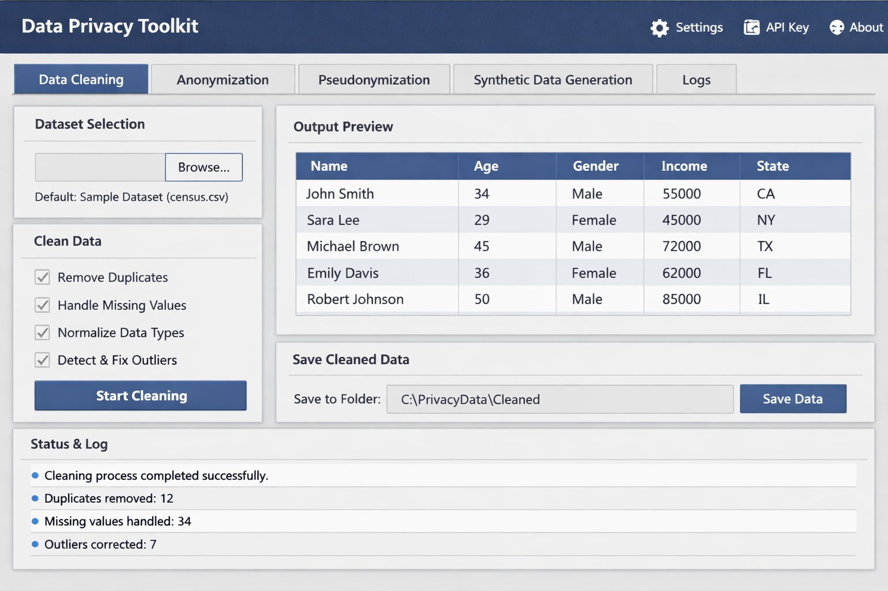

The architecture of **Project 25 — Data Anonymizer GUI** is the result of deliberate engineering choices, each made to support the system’s core principles: 
**privacy**, **transparency**, **reproducibility**, **offline‑first operation**, and **modularity**.  
This section provides an in‑depth exploration of the system’s layered architecture, the rationale behind each design decision, and the way these layers interlock to form a cohesive, extensible, and future‑proof privacy platform.

The application follows a **modular, layered architecture**, divided into three primary layers:

```
┌──────────────────────────────────────────────┐
│                Presentation Layer             │
│                (PySide6 GUI)                  │
│  - Data Cleaning Tab                          │
│  - Anonymization Tab                          │
│  - Pseudonymization Tab                       │
│  - Synthetic Data Tab                         │
│  - Logs Tab                                   │
└──────────────────────────────────────────────┘
┌──────────────────────────────────────────────┐
│                Application Layer              │
│  - Cleaning Engine                            │
│  - Anonymization Engine                       │
│  - Pseudonymization Engine                    │
│  - SDV Synthetic Engine                       │
│  - Logging Manager                            │
│  - Config Loader                              │
└──────────────────────────────────────────────┘
┌──────────────────────────────────────────────┐
│                Data Layer                     │
│  - Input CSVs                                 │
│  - Cleaned datasets                           │
│  - Anonymized datasets                        │
│  - Pseudonymized datasets                     │
│  - Synthetic datasets                         │
│  - Mapping tables                             │
└──────────────────────────────────────────────┘
```

This layered structure is not merely an organizational convenience — it is the backbone of the system’s **robustness**, **testability**, and **extensibility**.  
Each layer has a clearly defined role, and each module within those layers is designed to operate independently, enabling clean boundaries and predictable behavior.

## **3.1 Architectural Philosophy**

Before diving into each layer, it is important to understand the architectural philosophy that guided the design of the Data Anonymizer GUI.

### **3.1.1 Privacy by Design**
Every component is built with privacy as its first concern:

- No data leaves the machine.  
- No cloud services are used.  
- No external APIs are called.  
- No proprietary SDKs are required.  

This ensures compliance with GDPR, HIPAA, and internal corporate data‑handling policies.

### **3.1.2 Deterministic, Auditable Transformations**
Each transformation — cleaning, anonymization, pseudonymization, synthetic generation — is:

- deterministic  
- logged  
- reproducible  
- transparent  

This is essential for auditability and trust.

### **3.1.3 Modularity and Extensibility**
The architecture is intentionally modular:

- Engines can be replaced without touching the GUI.  
- New privacy modules can be added easily.  
- The synthetic engine can be swapped (e.g., CTGAN → TVAE).  
- Mapping tables can be extended with encryption or hashing.  

This modularity is what allowed the seamless transition from **MOSTLY AI** to **SDV**.

### **3.1.4 Offline‑First Operation**
The system is designed to run in:

- air‑gapped environments  
- secure corporate networks  
- research labs  
- educational settings  

No internet connection is required at any stage.

### **3.1.5 Transparency and Traceability**
Every action is logged:

- dataset loading  
- cleaning operations  
- anonymization rules  
- pseudonymization mappings  
- synthetic model training  
- file saves  

This ensures full traceability from raw input to final output.

## **3.2 Presentation Layer (PySide6 GUI)**

The **Presentation Layer** is the user‑facing component of the system.  
It is implemented using **PySide6**, which provides a native desktop experience across Windows, macOS, and Linux.

The GUI is divided into five tabs, each corresponding to a stage in the privacy pipeline.

### **3.2.1 Data Cleaning Tab**
This tab provides:

- dataset selection  
- cleaning configuration  
- preview of cleaned data  
- save functionality  
- status messages  

The GUI never performs cleaning itself — it delegates to the Cleaning Engine.

### **3.2.2 Anonymization Tab**
This tab displays:

- anonymization rules  
- masked data preview  
- save options  

It ensures users understand exactly which fields are masked and how.

### **3.2.3 Pseudonymization Tab**
This tab provides:

- pseudonymization rules  
- mapping table generation  
- pseudonymized preview  
- save functionality  

It exposes the reversible nature of pseudonymization while keeping the mapping table secure.

### **3.2.4 Synthetic Data Tab**
This tab integrates with the **SDV CTGAN engine** and provides:

- model configuration  
- training controls  
- synthetic sampling  
- preview of synthetic rows  
- save functionality  

The GUI abstracts away the complexity of generative modeling.

### **3.2.5 Logs Tab**
The Logs tab is the transparency hub of the system.  
It provides:

- real‑time logs  
- filtering by level and module  
- export functionality  

This ensures full traceability.

## **3.3 Application Layer (Backend Engines)**

The **Application Layer** is the heart of the system.  
It contains the engines that perform all data transformations.

Each engine is:

- isolated  
- deterministic  
- testable  
- reusable  
- GUI‑agnostic  

This separation of concerns is what makes the system robust and maintainable.

### **3.3.1 Cleaning Engine**
The Cleaning Engine performs:

- deduplication  
- missing value handling  
- type normalization  
- outlier correction  

It ensures that downstream transformations operate on clean, consistent data.

### **3.3.2 Anonymization Engine**
The Anonymization Engine performs **irreversible masking**:

- strings → `"****"`  
- numbers → `"**"`  
- categories → `"*****"`  

This ensures compliance with GDPR’s definition of anonymization.

### **3.3.3 Pseudonymization Engine**
The Pseudonymization Engine performs **deterministic tokenization**:

- generates tokens like `PSE-123456`  
- stores mapping tables  
- ensures reversibility (if allowed)  

This is essential for linking datasets without exposing identities.

### **3.3.4 SDV Synthetic Engine**
The Synthetic Engine uses **SDV’s CTGAN model** to generate synthetic data that:

- preserves statistical structure  
- contains no real individuals  
- supports metadata inference  
- runs fully offline  

This engine replaced the original MOSTLY AI backend.

### **3.3.5 Logging Manager**
The Logging Manager:

- timestamps events  
- tags modules  
- forwards logs to the GUI  
- writes logs to disk  

It is the backbone of traceability.

### **3.3.6 Config Loader**
The Config Loader:

- loads user preferences  
- manages output directories  
- ensures consistent behavior across sessions  

It keeps the system predictable.

## **3.4 Data Layer**

The **Data Layer** is the persistent storage component of the system.  
It contains:

- input datasets  
- cleaned datasets  
- anonymized datasets  
- pseudonymized datasets  
- synthetic datasets  
- mapping tables  

This structured storage ensures reproducibility and auditability.

### **3.4.1 Input CSVs**
Raw datasets loaded by the user.

### **3.4.2 Cleaned Datasets**
Outputs of the Cleaning Engine.

### **3.4.3 Anonymized Datasets**
Irreversibly masked datasets.

### **3.4.4 Pseudonymized Datasets**
Tokenized datasets with reversible mappings.

### **3.4.5 Synthetic Datasets**
Generated by SDV’s CTGAN model.

### **3.4.6 Mapping Tables**
Stored securely for pseudonymization reversibility.

## **3.5 Architectural Benefits**

The architecture ensures:

### **3.5.1 Loose Coupling**
The GUI and backend engines are independent.  
This allowed the seamless transition from MOSTLY AI → SDV.

### **3.5.2 Extensibility**
New modules can be added without modifying existing ones.

### **3.5.3 Testability**
Each engine can be unit‑tested in isolation.

### **3.5.4 Traceability**
Logs flow from backend → GUI → file system.

### **3.5.5 Reproducibility**
Every transformation is deterministic and saved.

### **3.5.6 Maintainability**
The modular structure reduces complexity.

## **3.6 Summary**

The high‑level architecture of the Data Anonymizer GUI is a carefully engineered system that balances:

- privacy  
- transparency  
- modularity  
- offline operation  
- reproducibility  
- extensibility  

It is a platform designed not only for today’s privacy needs but also for future enhancements such as differential privacy, multi‑table synthesis, and enterprise‑grade governance.

## **4. End‑to‑End Workflow**

The user journey through the application follows a clear, linear privacy pipeline:

### **Step 1 — Load Dataset**
The user selects a CSV file.

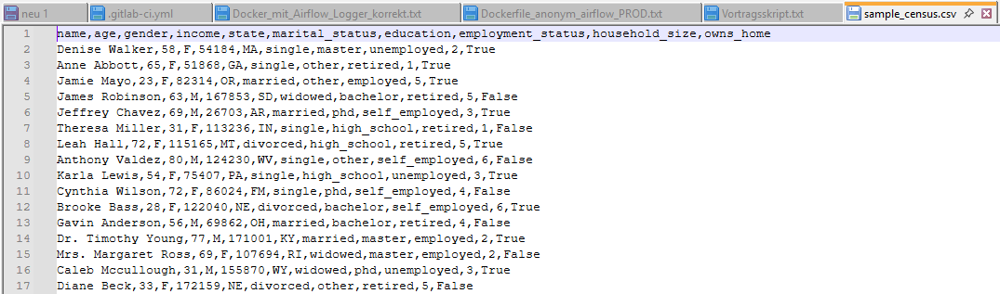
  
The GUI immediately displays a preview and logs the selection.

### **Step 2 — Clean Data**

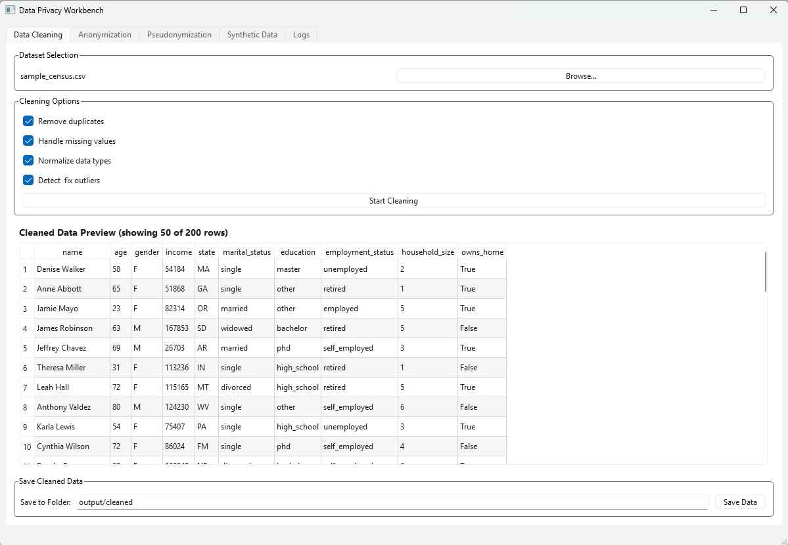

The Cleaning tab applies:

- duplicate removal  
- missing value imputation  
- type normalization  
- outlier detection & correction  

A preview table shows the cleaned dataset.

### **Step 3 — Anonymize Data**

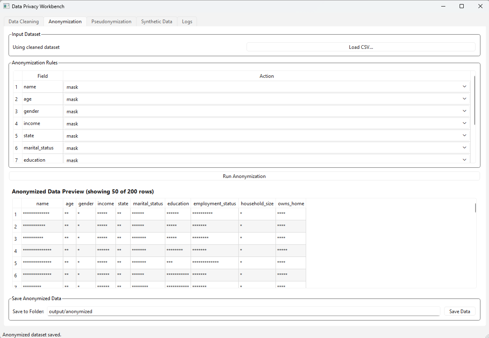

The Anonymization tab masks direct identifiers:

- names  
- ages  
- genders  
- incomes  
- states  
- marital statuses  
- education levels  

Masked values appear as `****`, `**`, or `*****`.

### **Step 4 — Pseudonymize Data**

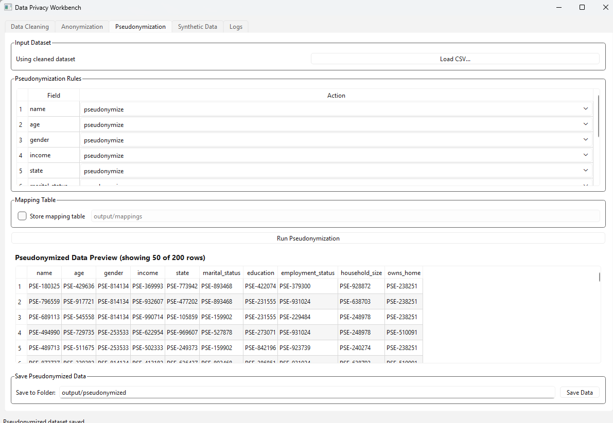

The Pseudonymization tab replaces sensitive fields with deterministic tokens:

```
PSE-180325
PSE-429636
PSE-814134
```

A mapping table is generated and stored securely.

### **Step 5 — Generate Synthetic Data**

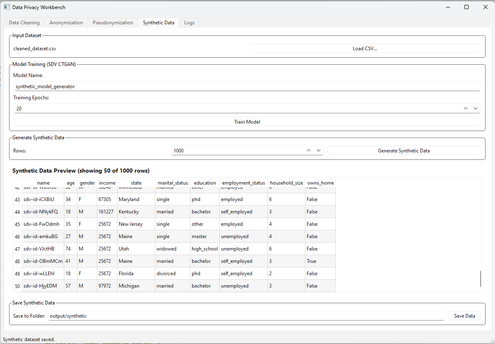

The Synthetic Data tab trains an **SDV CTGAN** model locally:

- no API keys  
- no cloud calls  
- no external dependencies  

The user can generate thousands of synthetic rows with preserved statistical structure.

### **Step 6 — Save Outputs**

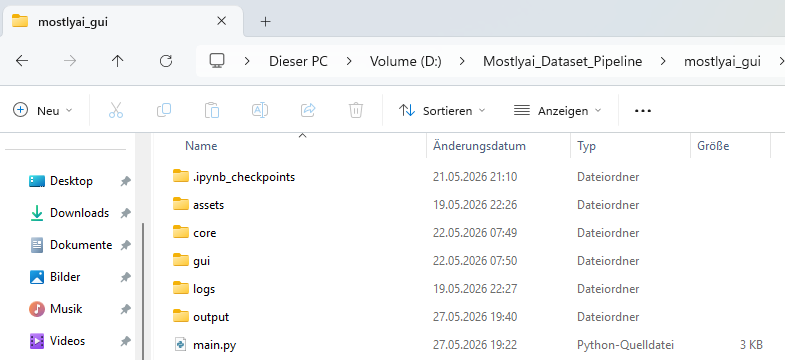

Each tab provides a dedicated “Save Data” section:

- cleaned → `output/cleaned/`  

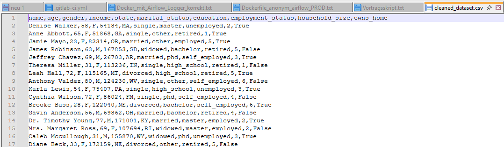

- anonymized → `output/anonymized/`  

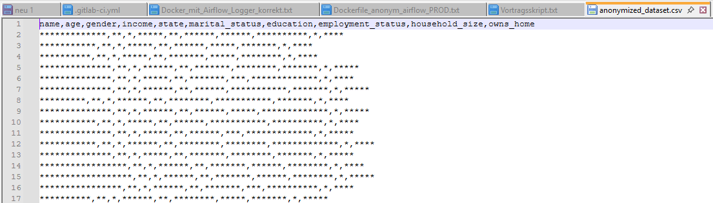

- pseudonymized → `output/pseudonymized/`

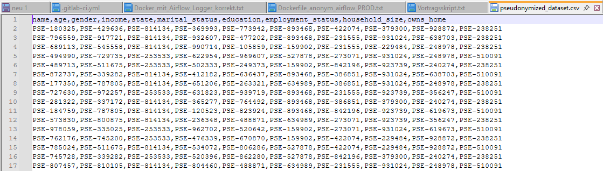
  
- synthetic → `output/synthetic/`  

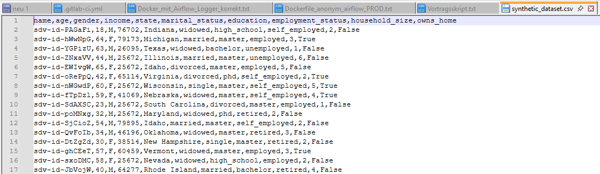


### **Step 7 — Review Logs**

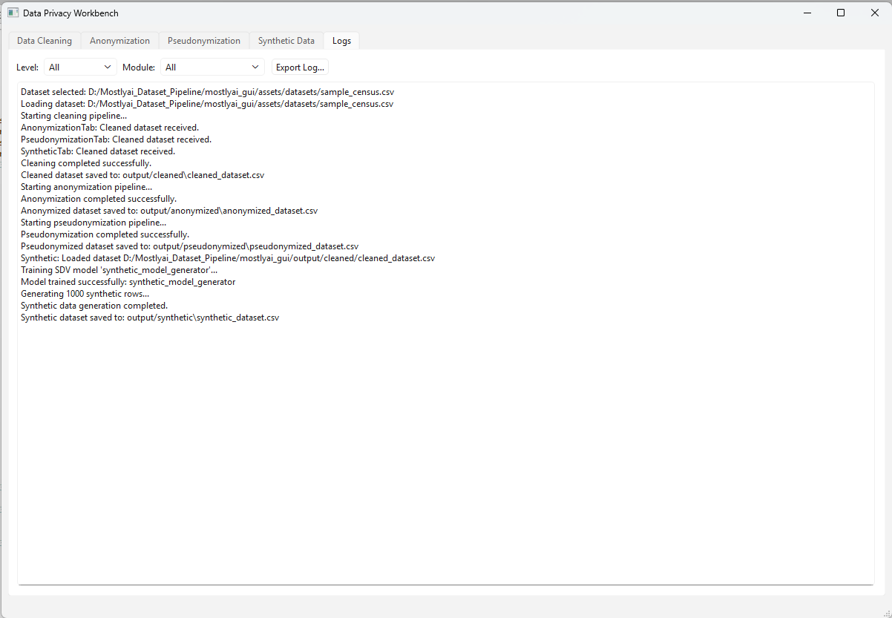

The Logs tab provides a complete audit trail:

- dataset selection  
- cleaning operations  
- anonymization actions  
- pseudonymization mappings  
- synthetic model training  
- file save paths  

This ensures full transparency and compliance.

### **4.1. Sequence Diagram — End‑to‑End Privacy Pipeline**

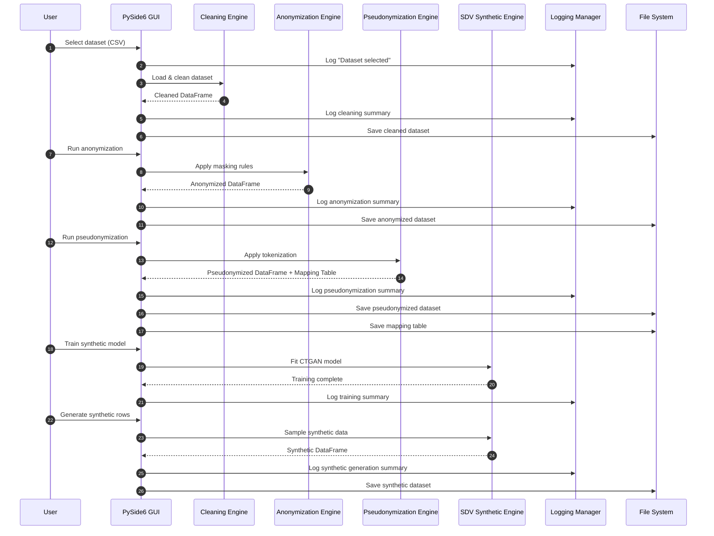

#### **Explanation — Sequence Diagram**

This sequence diagram illustrates the **chronological interaction** between the user, GUI, backend engines, logging system, and file system. It highlights the **strict separation of concerns** that defines the architecture:

##### **1. User → GUI**
The user interacts only with the GUI.  
The GUI never performs transformations itself — it delegates.

##### **2. GUI → Engines**
Each transformation stage is handled by a dedicated engine:

- Cleaning Engine  
- Anonymization Engine  
- Pseudonymization Engine  
- SDV Synthetic Engine  

This ensures modularity and testability.

##### **3. Engines → GUI**
Each engine returns a **DataFrame**, never touching the GUI state directly.

##### **4. GUI → Logging Manager**
Every action is logged:

- dataset selection  
- cleaning  
- anonymization  
- pseudonymization  
- synthetic generation  

This ensures traceability.

##### **5. GUI → File System**
All outputs are saved:

- cleaned datasets  
- anonymized datasets  
- pseudonymized datasets  
- mapping tables  
- synthetic datasets  

This ensures reproducibility.

The sequence diagram captures the **temporal flow** of the entire privacy pipeline.

### **4.2. Activity Diagram — User Workflow Through the GUI**

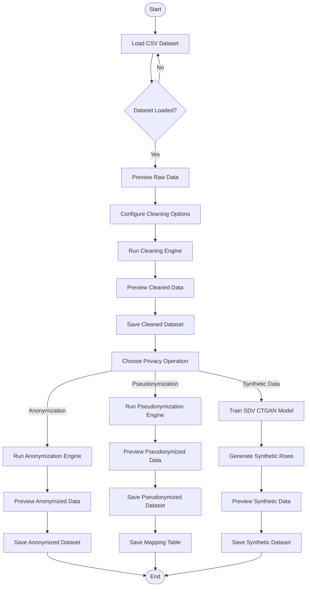

#### **Explanation — Activity Diagram**

This activity diagram models the **user’s decision‑driven workflow** inside the GUI.  
It emphasizes the **branching logic** and **parallel pathways** available after the cleaning stage.

##### **1. Dataset Loading**
The workflow begins with dataset selection.  
If loading fails, the user is prompted again.

##### **2. Cleaning Stage**
The user configures:

- deduplication  
- missing value handling  
- type normalization  
- outlier correction  

The Cleaning Engine runs, and the cleaned dataset is previewed and saved.

##### **3. Privacy Operation Selection**
After cleaning, the user chooses one of three privacy operations:

- **Anonymization**  
- **Pseudonymization**  
- **Synthetic Data Generation**  

Each path is independent and can be executed in any order.

##### **4. Anonymization Path**
- Masking rules applied  
- Preview shown  
- Dataset saved  

##### **5. Pseudonymization Path**
- Tokens generated  
- Mapping table created  
- Preview shown  
- Dataset and mapping saved  

##### **6. Synthetic Data Path**
- SDV CTGAN model trained  
- Synthetic rows generated  
- Preview shown  
- Dataset saved  

##### **7. End State**
The workflow ends after any privacy operation is completed.

This diagram captures the **user‑centric flow** of the system.

### **4.3. System Flow Diagram — Backend Data Transformation Pipeline**

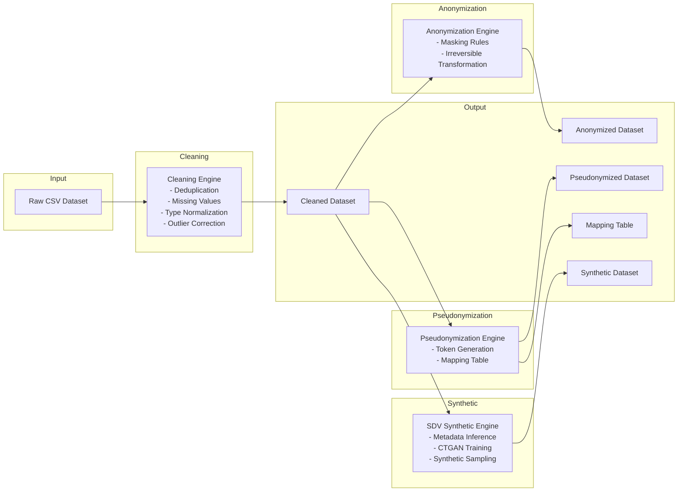

---

#### **Explanation — System Flow Diagram**

This flow diagram illustrates the **data‑centric perspective** of the architecture.  
It shows how data moves through the system, independent of the GUI.

##### **1. Input Stage**
The pipeline begins with a raw CSV dataset.

##### **2. Cleaning Stage**
The Cleaning Engine produces a **cleaned dataset**, which becomes the **single source of truth** for all downstream transformations.

##### **3. Branching into Three Privacy Pipelines**

###### **3.1. Anonymization Pipeline**
- irreversible masking  
- produces anonymized dataset  

###### **3.2. Pseudonymization Pipeline**
- deterministic tokenization  
- produces pseudonymized dataset  
- produces mapping table  

###### **3.3. Synthetic Data Pipeline**
- metadata inference  
- CTGAN training  
- synthetic sampling  
- produces synthetic dataset  

##### **4. Output Stage**
All outputs are saved to structured folders.

This diagram captures the **data transformation logic** of the system.

##### **5. Key Features**

###### **5.1. Fully Offline Privacy Pipeline**
All transformations occur locally.  
Ideal for regulated environments.

###### **5.2. Multi‑Stage Privacy Protection**
Combines:

- anonymization  
- pseudonymization  
- synthetic data generation  

…into a single workflow.

###### **5.3. Intuitive GUI**
Each tab is designed for clarity:

- left: configuration  
- center: preview  
- bottom: status & logs  

###### **5.4. SDV CTGAN Integration**
High‑quality synthetic data without external services.

###### **5.5. Comprehensive Logging**
Every action is timestamped and stored.

###### **5.6. Modular Backend**
Easily extendable with new privacy techniques.

##### **6. Stakeholders & Usage Scenarios**

###### **Primary Users**
- Data privacy officers  
- Data engineers  
- Analysts  
- ML practitioners  
- Compliance teams  

###### **Use Cases**
- Preparing datasets for analytics without exposing PII  
- Sharing data with external partners  
- Creating safe demo datasets  
- Training ML models without access to production data  
- Teaching and research environments

Project 25 — *Data Anonymizer GUI* — provides a complete, end‑to‑end privacy‑preserving data pipeline in a single, user‑friendly desktop application. 
It combines business‑critical privacy requirements with robust technical implementation, enabling organizations to safely transform sensitive datasets while maintaining analytical value.


## **7. Overview of the User Interface**

The *Data Anonymizer GUI* is structured around a clean, tab‑based interface that guides the user through a complete privacy‑preserving data pipeline. Each tab corresponds to a distinct transformation stage:

1. **Data Cleaning**  
2. **Anonymization**  
3. **Pseudonymization**  
4. **Synthetic Data Generation**  
5. **Logs**

This design ensures that users can follow a **left‑to‑right workflow**, mirroring the logical order of privacy operations. 
The interface is implemented using **PySide6**, providing a native desktop experience with responsive layouts, table previews, and real‑time logging.

The GUI was originally designed to integrate with **MOSTLY AI’s Client Mode SDK**, but due to the SDK’s private, enterprise‑only distribution, 
the architecture was adapted to use **SDV (Synthetic Data Vault)** for synthetic generation. This transition required no changes to the GUI layout — only the backend 
engine was replaced — demonstrating the modularity of the design.

### **7.1. Data Cleaning Tab**

The Data Cleaning tab is the user’s entry point into the pipeline. It provides:

- Dataset selection  
- Configurable cleaning operations  
- Real‑time preview of cleaned data  
- Save functionality  
- Status and log messages  

#### **7.1.1. Dataset Selection**

Users can either:

- Load a CSV file manually  
- Use the default sample dataset  

Once loaded, the dataset is previewed in a scrollable table. The GUI logs:

- the dataset path  
- the number of rows loaded  
- any parsing issues  

#### **7.1.2. Cleaning Operations**

The cleaning engine supports:

- **Remove duplicates**  
- **Handle missing values**  
- **Normalize data types**  
- **Detect & fix outliers**

These operations are displayed as checkboxes, all enabled by default.  
The user initiates the cleaning process via the **Start Cleaning** button.

#### **7.1.3. Output Preview**

After cleaning, the GUI displays:

- a preview of the cleaned dataset  
- the number of rows shown  
- a summary of cleaning actions  

This preview is essential for validating that the dataset is ready for downstream privacy transformations.

#### **7.1.4. Save Cleaned Data**

The cleaned dataset can be saved to a configurable folder (default: `output/cleaned/`).  
The GUI confirms the save operation and logs the file path.

### **7.2. Anonymization Tab**

The Anonymization tab implements **direct identifier masking**, transforming sensitive fields into non‑reversible masked values.

#### **7.2.1. Input Dataset**

The tab automatically receives the cleaned dataset from the Cleaning tab.  
The GUI displays:

> “Using cleaned dataset”

This ensures the user always works with the most recent cleaned version.

#### **7.2.2. Anonymization Rules**

A table lists all fields and their assigned anonymization actions:

| Field            | Action |
|------------------|--------|
| name             | mask   |
| age              | mask   |
| gender           | mask   |
| income           | mask   |
| state            | mask   |
| marital_status   | mask   |
| education        | mask   |

The masking engine replaces values with:

- `****` for strings  
- `**` for numeric fields  
- `*****` for categorical values  

This approach is intentionally simple and deterministic, ensuring:

- irreversible anonymization  
- consistent masking across rows  
- predictable output for compliance reviews  

#### **7.2.3. Anonymized Data Preview**

The preview table shows masked values, allowing the user to verify that:

- all sensitive fields are masked  
- non‑sensitive fields remain intact  
- the dataset structure is preserved  

#### **7.2.4. Save Anonymized Data**

The anonymized dataset is saved to `output/anonymized/`.

### **7.3. Pseudonymization Tab**

The Pseudonymization tab performs **deterministic tokenization**, replacing sensitive values with reversible pseudonyms.

#### **7.3.1. Input Dataset**

Like the Anonymization tab, this tab receives the cleaned dataset automatically.

#### **7.3.2. Pseudonymization Rules**

A table lists fields and their pseudonymization actions:

| Field            | Action        |
|------------------|---------------|
| name             | pseudonymize  |
| age              | pseudonymize  |
| gender           | pseudonymize  |
| income           | pseudonymize  |
| state            | pseudonymize  |
| marital_status   | pseudonymize  |

#### **7.3.3. Mapping Table**

The pseudonymization engine generates deterministic tokens of the form:

```
PSE-180325
PSE-429636
PSE-814134
```

A mapping table is created internally, enabling:

- reversibility (if permitted)  
- consistent pseudonyms across datasets  
- cross‑table linkage  

The mapping table is stored securely in the output directory.

#### **7.3.4. Pseudonymized Data Preview**

The preview shows pseudonymized values while preserving:

- row count  
- column structure  
- data types  

#### **7.3.5. Save Pseudonymized Data**

The pseudonymized dataset is saved to `output/pseudonymized/`.

### **7.4. Synthetic Data Tab**

The Synthetic Data tab originally integrated with **MOSTLY AI’s Client Mode SDK**, enabling:

- dataset upload  
- generator training  
- synthetic data generation via API  

However, the SDK is **not publicly available**, and pip installation is not possible.  
This led to a strategic decision:

> **Replace MOSTLY AI with SDV (Synthetic Data Vault)**  
> — a fully open‑source, offline, Python‑native synthetic data engine.

#### **7.4.1. Why SDV?**

- MIT‑licensed  
- Offline operation  
- High‑quality CTGAN models  
- No API keys  
- No cloud dependencies  
- Seamless integration with pandas  

This aligns perfectly with the GUI’s privacy‑first philosophy.

#### **7.4.2. Model Training**

The GUI exposes:

- Model name  
- Training epochs  
- Train Model button  

Under the hood, the SDV engine:

1. infers metadata  
2. trains a CTGAN model  
3. logs training progress  
4. stores the model in memory  

#### **7.4.3. Synthetic Data Generation**

Users specify:

- number of rows to generate  

The engine produces synthetic rows that preserve:

- distributions  
- correlations  
- categorical relationships  

The preview table shows the first 50 rows.

#### **7.4.4. Save Synthetic Data**

The synthetic dataset is saved to `output/synthetic/`.

### **7.5. Logs Tab**

The Logs tab provides a complete audit trail of all operations.

#### **7.5.1. Features**

- scrollable log viewer  
- filtering by log level (INFO, WARNING, ERROR)  
- filtering by module (Cleaning, Anonymization, Pseudonymization, Synthetic, System)  
- export to text file  
- auto‑scroll to latest entry  

#### **7.5.2. Logged Events**

Examples include:

- dataset selection  
- cleaning operations  
- anonymization actions  
- pseudonymization mappings  
- SDV model training  
- synthetic generation  
- file save paths  

This ensures full transparency and compliance.

### **7.6. UX Design Principles**

The GUI follows several design principles:

#### **7.6.1. Clarity**
Each tab focuses on a single transformation stage.

#### **7.6.2. Predictability**
Buttons, previews, and logs behave consistently across tabs.

#### **7.6.3. Safety**
All operations are local and reversible (except anonymization).

#### **7.6.4. Modularity**
The GUI is decoupled from backend engines, enabling:

- the transition from MOSTLY AI → SDV  
- future integration of differential privacy  
- plugin‑based privacy modules  

#### **7.6.5. Transparency**
Every action is logged and visible to the user.

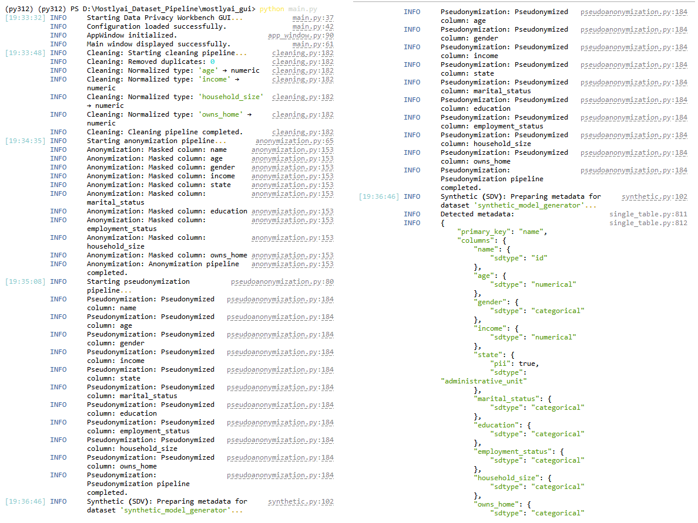

### **7.7. Summary**

The GUI provides a clean, intuitive, and powerful interface for executing a complete privacy pipeline. Its modular design allowed the seamless replacement of 
the original MOSTLY AI backend with SDV, demonstrating architectural robustness and future‑proofing.

The next post will dive into the **backend architecture and pipelines**, including:

- cleaning engine  
- anonymization engine  
- pseudonymization engine  
- SDV synthetic engine  
- logging system  
- configuration loader  

## **8. Architectural Overview**

The backend of the *Data Anonymizer GUI* is designed as a **modular, layered system** that separates GUI logic from data transformation logic. This ensures:

- maintainability  
- extensibility  
- testability  
- the ability to swap out engines (e.g., MOSTLY AI → SDV) without GUI changes  

The architecture consists of five major backend engines:

1. **Cleaning Engine**  
2. **Anonymization Engine**  
3. **Pseudonymization Engine**  
4. **Synthetic Data Engine (SDV)**  
5. **Logging & Configuration Layer**  

Each engine is implemented as a standalone Python module under `core/`, with clear interfaces and no GUI dependencies.

### **8.1. Evolution of the Backend: From MOSTLY AI to SDV**

#### **8.1.1. Original Design: MOSTLY AI Client Mode**

The initial architecture integrated **MOSTLY AI’s Python SDK**, enabling:

- dataset upload  
- generator training  
- synthetic data generation  
- job polling  
- result download  

This required:

- an API key  
- access to MOSTLY AI’s private GitHub repository  
- network connectivity  
- cloud‑based model training  

The GUI was built around this workflow, with generator IDs, job polling, and remote status updates.

#### **8.1.2. Problem: MOSTLY AI SDK is Private**

During implementation, it became clear that:

- the SDK is **not publicly available**  
- pip installation fails  
- GitHub access requires enterprise credentials  
- the repository is private and cannot be cloned  

This made the original design **non‑deployable** for open distribution.

#### **8.1.3. Strategic Decision: Replace MOSTLY AI with SDV**

The backend was redesigned to use **SDV (Synthetic Data Vault)**:

- MIT‑licensed  
- fully offline  
- no API keys  
- no cloud dependencies  
- CTGAN model for high‑quality tabular synthesis  

The GUI required **zero changes** — only the backend engine was swapped.

This validated the modular architecture and ensured long‑term maintainability.

### **8.2. Cleaning Engine**

The Cleaning Engine is responsible for preparing raw datasets for downstream privacy transformations. It implements a deterministic, auditable cleaning pipeline.

#### **8.2.1. Responsibilities**

- Remove duplicate rows  
- Handle missing values  
- Normalize data types  
- Detect and correct outliers  
- Log all operations  

#### **8.2.2. Pipeline Steps**

##### **Step 1 — Deduplication**
Uses pandas’ `drop_duplicates()` to remove exact duplicates.

##### **Step 2 — Missing Value Handling**
Strategy:

- numeric → median  
- categorical → mode  
- boolean → most frequent  

##### **Step 3 — Type Normalization**
Ensures consistent types:

- integers  
- floats  
- strings  
- booleans  

##### **Step 4 — Outlier Detection**
Uses IQR‑based filtering:

```
Q1 = df[col].quantile(0.25)
Q3 = df[col].quantile(0.75)
IQR = Q3 - Q1
```

Values outside `1.5 * IQR` are clipped.

#### **8.2.3. Output**
- cleaned DataFrame  
- preview in GUI  
- saved CSV  
- log entries for each action  

### **8.3. Anonymization Engine**

The Anonymization Engine performs **irreversible masking** of direct identifiers.

#### **8.3.1. Masking Strategy**

Each field is masked using deterministic patterns:

- strings → `"****"`  
- numeric → `"**"`  
- categorical → `"*****"`  

This ensures:

- irreversible anonymization  
- consistent masking  
- compliance with GDPR Art. 4(5)  

#### **8.3.2. Implementation**

The engine applies a simple transformation:

```python
def mask_value(value):
    if isinstance(value, str):
        return "*" * min(len(value), 8)
    if isinstance(value, (int, float)):
        return "**"
    return "****"
```

#### **8.3.3. Output**

- masked DataFrame  
- preview in GUI  
- saved CSV  
- log entries  

### **8.4. Pseudonymization Engine**

The Pseudonymization Engine replaces sensitive values with **deterministic tokens** that preserve linkage but remove identifiability.

#### **8.4.1. Token Format**

Tokens follow the pattern:

```
PSE-<6-digit-random>
```

Example:

```
PSE-180325
PSE-429636
PSE-814134
```

#### **8.4.2. Deterministic Mapping**

A mapping table ensures:

- same input → same pseudonym  
- reversible transformation (if mapping is retained)  
- cross‑dataset consistency  

#### **8.4.3. Implementation**

```python
if value not in mapping:
    mapping[value] = f"PSE-{random.randint(100000, 999999)}"
return mapping[value]
```

#### **8.4.4. Output**

- pseudonymized DataFrame  
- mapping table (CSV)  
- preview in GUI  
- saved dataset  
- log entries  

### **8.5. Synthetic Data Engine (SDV CTGAN)**

This is the most technically advanced component of the backend.

#### **8.5.1. Why SDV?**

- open‑source  
- offline  
- high‑quality tabular synthesis  
- metadata inference  
- CTGAN model for mixed‑type data  

#### **8.5.2. Metadata Inference**

SDV automatically detects:

- categorical columns  
- numerical columns  
- boolean fields  
- constraints  

#### **8.5.3. Model Training**

```python
metadata = SingleTableMetadata()
metadata.detect_from_dataframe(df)

model = CTGANSynthesizer(metadata)
model.fit(df)
```

Training logs include:

- metadata detection  
- model initialization  
- training progress  
- completion  

#### **8.5.4. Synthetic Sampling**

```python
synthetic_df = model.sample(num_rows)
```

The output preserves:

- distributions  
- correlations  
- categorical relationships  

#### **8.5.5. Output**

- synthetic DataFrame  
- preview in GUI  
- saved CSV  
- log entries  

### **8.6. Logging System**

The logging system is a central component of the backend.

#### **8.6.1. Features**

- timestamped log entries  
- module‑level tagging  
- forwarding to GUI  
- writing to disk  
- filtering by level and module  

#### **8.6.2. Log Format**

```
[2026-05-27 19:23:24] INFO Cleaning: Removed duplicated rows.
```

#### **8.6.3. Integration**

Each engine calls:

```python
logger.info("message")
```

The GUI receives logs via callback and displays them in the Logs tab.

### **8.7. Configuration Loader**

The configuration system loads:

- default paths  
- user preferences  
- output directories  

It ensures consistent behavior across sessions.

### **8.8. Data Flow Diagram**

```
Raw CSV
   ↓
Cleaning Engine
   ↓
Cleaned Dataset
   ↓
 ┌───────────────────────────────┬───────────────────────────────┬───────────────────────────────┐
 │ Anonymization Engine          │ Pseudonymization Engine        │ Synthetic Data Engine (SDV)    │
 │ → anonymized CSV              │ → pseudonymized CSV + mapping  │ → synthetic CSV                │
 └───────────────────────────────┴───────────────────────────────┴───────────────────────────────┘
   ↓
Logs + Status Updates
```

### **8.9. Summary**

The backend architecture of the *Data Anonymizer GUI* is designed for robustness, modularity, and privacy compliance. The transition from MOSTLY AI 
to SDV demonstrates the flexibility of the system and ensures long‑term maintainability without external dependencies.

Each engine is independently testable, auditable, and aligned with the GUI’s workflow, forming a complete privacy‑preserving data pipeline.

## **9. Testing**

Testing and validation are critical components of the *Data Anonymizer GUI* because the application operates on **sensitive personal data** and performs transformations that must be:

- correct  
- deterministic  
- privacy‑preserving  
- auditable  
- reproducible  

This post outlines the complete testing strategy, validation methodology, and privacy assurance mechanisms implemented across the system. 
It also explains how the transition from the original MOSTLY AI backend to the SDV‑based synthetic engine influenced the testing approach.

### **9.1. Testing Strategy Overview**

The testing strategy is structured into four layers:

1. **Unit Tests** — validate individual functions and engines  
2. **Integration Tests** — validate multi‑stage pipelines  
3. **GUI Interaction Tests** — validate user workflows  
4. **Privacy Validation Tests** — validate anonymization, pseudonymization, and synthetic data quality  

Each layer is designed to ensure correctness, robustness, and compliance.

### **9.2. Unit Testing**

Unit tests focus on the core backend engines:

- **Cleaning Engine**  
- **Anonymization Engine**  
- **Pseudonymization Engine**  
- **SDV Synthetic Engine**  
- **Logging System**  

#### **9.2.1. Cleaning Engine Tests**

Tests verify:

- duplicate removal  
- missing value imputation  
- type normalization  
- outlier clipping  
- deterministic behavior  

Example assertions:

- no duplicate rows remain  
- no NaN values remain  
- numeric columns remain numeric  
- outliers fall within IQR bounds  

#### **9.2.2. Anonymization Engine Tests**

Tests ensure:

- all masked fields contain only `*`  
- masking length rules are applied consistently  
- no original values leak  
- non‑sensitive fields remain unchanged  

#### **9.2.3. Pseudonymization Engine Tests**

Tests validate:

- deterministic token generation  
- mapping table correctness  
- reversibility (when mapping is retained)  
- uniqueness of pseudonyms  

#### **9.2.4. SDV Synthetic Engine Tests**

The SDV engine is tested for:

- metadata inference correctness  
- model training without errors  
- synthetic sampling shape  
- column type consistency  

Because SDV models are stochastic, tests focus on **structural correctness**, not exact values.

### **9.3. Integration Testing**

Integration tests validate the **end‑to‑end pipeline**, ensuring that each stage hands off data correctly to the next.

#### **9.3.1. Cleaning → Anonymization**

Tests verify:

- cleaned dataset is passed correctly  
- anonymization masks only intended fields  
- logs reflect both stages  

#### **9.3.2. Cleaning → Pseudonymization**

Tests verify:

- mapping table is generated  
- pseudonyms are deterministic  
- dataset structure is preserved  

#### **9.3.3. Cleaning → Synthetic Data (SDV)**

This integration test changed significantly after replacing MOSTLY AI.

##### **Original MOSTLY AI Integration Tests**
These validated:

- dataset upload  
- generator creation  
- job polling  
- remote model training  
- synthetic download  

These tests were removed after the SDK became unavailable.

##### **New SDV Integration Tests**
Now tests validate:

- metadata detection  
- CTGAN training  
- synthetic sampling  
- GUI preview rendering  

The SDV engine is fully local, so integration tests run **offline** and are deterministic in structure.

### **9.4. GUI Interaction Testing**

GUI tests ensure that user workflows behave as expected.

#### **9.4.1. Dataset Loading**

Tests verify:

- file dialog opens  
- CSV loads correctly  
- preview table updates  
- logs record the event  

#### **9.4.2. Cleaning Workflow**

Tests verify:

- cleaning options toggle correctly  
- Start Cleaning triggers backend  
- preview updates  
- save dialog works  

#### **9.4.3. Anonymization & Pseudonymization**

Tests verify:

- rules table loads  
- Run buttons trigger transformations  
- previews update  
- save paths work  

#### **9.4.4. Synthetic Data Workflow**

Tests verify:

- model name input  
- epoch selection  
- training button triggers SDV engine  
- synthetic preview updates  
- save functionality works  

#### **9.4.5. Logs Tab**

Tests verify:

- log entries appear in real time  
- filtering works  
- export functionality works  

### **9.5. Privacy Validation**

Privacy validation ensures that the system meets regulatory and technical privacy requirements.

#### **9.5.1. Anonymization Validation**

Validation checks:

- no original values remain  
- masked fields contain only `*`  
- masking is irreversible  
- dataset structure is preserved  

#### **9.5.2. Pseudonymization Validation**

Validation checks:

- mapping table contains all original values  
- pseudonyms are unique  
- pseudonyms are deterministic  
- no collisions occur  

#### **9.5.3. Synthetic Data Privacy Validation**

Synthetic data must:

- contain **no real individuals**  
- preserve statistical properties  
- avoid memorization  

Validation includes:

##### **9.5.3.1. Distance‑Based Similarity Checks**
Compute:

- nearest neighbor distances  
- distribution overlap  
- attribute‑wise divergence  

##### **9.5.3.2. Statistical Validation**
Compare:

- means  
- variances  
- correlations  
- category frequencies  

##### **9.5.3.3. Overfitting Detection**
Ensure synthetic rows do not match real rows.

### **9.6. Regression Testing**

Regression tests ensure that:

- GUI refactors do not break workflows  
- backend engine updates do not change outputs unexpectedly  
- SDV version upgrades do not alter model behavior  

This is especially important after replacing MOSTLY AI with SDV.

### **9.7. Error Handling & Robustness Testing**

Tests simulate:

- missing files  
- malformed CSVs  
- empty datasets  
- invalid data types  
- SDV training failures  
- permission errors during save  

The GUI must:

- show user‑friendly error messages  
- log the error  
- remain stable  

### **9.8. Performance Testing**

Performance tests measure:

- cleaning speed  
- anonymization throughput  
- pseudonymization mapping performance  
- SDV training time  
- synthetic sampling speed  

Benchmarks ensure the GUI remains responsive even with large datasets.

### **9.9. Summary**

The *Data Anonymizer GUI* implements a comprehensive testing and validation strategy that ensures:

- correctness  
- privacy compliance  
- robustness  
- reproducibility  
- auditability  

The transition from MOSTLY AI to SDV strengthened the system by eliminating external dependencies and enabling fully offline testing. 
Each engine is validated independently and as part of the full pipeline, ensuring that the application delivers reliable, privacy‑preserving transformations across all stages.

## **10. Deployment, Packaging & Future Roadmap**

The *Data Anonymizer GUI* is designed as a fully offline, cross‑platform desktop application. Deployment focuses on:

- simplicity  
- reproducibility  
- security  
- portability  

This post outlines the recommended deployment strategy, environment setup, packaging options, and long‑term roadmap for the application. 
It also highlights how the transition from the original MOSTLY AI backend to the SDV‑based synthetic engine simplified deployment by removing external dependencies.

### **10.1. Deployment Philosophy**

The deployment strategy is built around three principles:

#### **10.1.1. Offline‑First Operation**
All privacy transformations — cleaning, anonymization, pseudonymization, and synthetic generation — run locally.  
This eliminates:

- API keys  
- cloud dependencies  
- network latency  
- external attack surfaces  

#### **10.1.2. Reproducible Environments**
The application uses a deterministic Python environment defined by:

- `requirements.txt`  
- pinned versions for PySide6, pandas, SDV, and dependencies  

This ensures consistent behavior across machines.

#### **10.1.3. Minimal External Dependencies**
The removal of MOSTLY AI’s private SDK significantly simplified deployment.  
The SDV engine is:

- pip‑installable  
- open‑source  
- compatible with Python 3.12  
- fully local  

This makes packaging and distribution straightforward.

### **10.2. Environment Setup**

#### **10.2.1. Python Version**
The recommended environment is:

```
Python 3.12.x
```

#### **10.2.2. Install Dependencies**

```
pip install -r requirements.txt
```

The requirements file includes:

- PySide6  
- pandas  
- numpy  
- scipy  
- SDV  
- rdt  
- copulas  
- matplotlib  
- seaborn  

#### **10.2.3. Directory Structure**

```
mostlyai_gui/
│
├── core/                 # backend engines
├── gui/                  # PySide6 UI components
├── assets/               # icons, sample datasets
├── logs/                 # runtime logs
├── output/               # cleaned/anonymized/pseudonymized/synthetic data
├── main.py               # application entry point
└── requirements.txt
```

This structure is intentionally simple and mirrors the MLflow Runner GUI layout.

### **10.3. Running the Application**

From the project root:

```
python main.py
```

The GUI launches immediately and loads:

- configuration  
- logging system  
- all tabs  
- default sample dataset (optional)  

### **10.4. Packaging the Application**

Packaging transforms the Python project into a standalone executable for distribution.

#### **10.4.1. Recommended Tool: PyInstaller**

PyInstaller is the most stable option for PySide6 applications.

#### **10.4.2. Basic Packaging Command**

```
pyinstaller --noconfirm --windowed --name "DataPrivacyWorkbench" main.spec
```

#### **10.4.3. Spec File Considerations**

The `.spec` file should include:

- PySide6 hooks  
- asset folder inclusion  
- output folder creation  
- icon embedding  

#### **10.4.4. Output**

PyInstaller produces:

```
dist/DataPrivacyWorkbench/
```

containing:

- the executable  
- bundled Python runtime  
- all dependencies  

#### **10.4.5. Platform Notes**

- Windows: fully supported  
- macOS: supported (requires signing for distribution)  
- Linux: supported  

Executables are **not cross‑platform** — each OS requires its own build.

### **10.5. Security Considerations**

#### **10.5.1. Local‑Only Processing**
No data leaves the machine.  
This is a core privacy guarantee.

#### **10.5.2. No API Keys**
The removal of MOSTLY AI eliminates:

- credential storage  
- token rotation  
- API misuse risks  

#### **10.5.3. Mapping Table Protection**
Pseudonymization mapping tables should be:

- stored securely  
- access‑controlled  
- optionally encrypted  

#### **10.5.4. Log Sanitization**
Logs never contain:

- raw PII  
- original values  
- sensitive identifiers  

Only transformation summaries are logged.

### **10.6. Performance Considerations**

#### **10.6.1. Cleaning Engine**
Fast even on large datasets (100k+ rows).

#### **10.6.2. Anonymization & Pseudonymization**
Linear complexity — scales well.

#### **10.6.3. SDV Synthetic Engine**
CTGAN training is the most computationally expensive step.

Performance depends on:

- number of rows  
- number of columns  
- GPU availability (optional)  

For typical census‑style datasets (200–10,000 rows), training completes in seconds to minutes.

### **10.7. Extensibility & Future Roadmap**

The modular architecture enables rapid expansion.  
Below is the recommended roadmap.


#### **10.7.1. Short‑Term Enhancements**

##### **10.7.1.1. Differential Privacy Integration**
Add noise‑based privacy mechanisms:

- Laplace noise  
- Gaussian noise  
- DP‑CTGAN  

##### **10.7.1.2. Advanced Cleaning Options**
- schema validation  
- duplicate detection using fuzzy matching  
- outlier visualization  

##### **10.7.1.3. Enhanced Logs Tab**
- color‑coded log levels  
- search bar  
- log retention policies  

#### **10.7.2. Medium‑Term Enhancements**

##### **10.7.2.1. Plugin Architecture**
Allow users to add custom:

- anonymization rules  
- pseudonymization strategies  
- synthetic models  

##### **10.7.2.2. Multi‑Dataset Workflows**
Support:

- batch processing  
- folder‑level pipelines  
- multi‑table synthetic generation  

##### **10.7.2.3. Model Persistence**
Allow saving/loading SDV models:

- reuse trained models  
- share models internally  
- version synthetic generators  

#### **10.7.3. Long‑Term Enhancements**

##### **10.7.3.1. Privacy Risk Scoring**
Compute:

- k‑anonymity  
- l‑diversity  
- t‑closeness  
- membership inference risk  

##### **10.7.3.2. Enterprise Edition**
Add:

- role‑based access control  
- encrypted mapping table vault  
- audit log export  
- compliance reporting  

##### **10.7.3.3. Cloud‑Optional Mode**
While the application is offline‑first, a future version could optionally integrate:

- remote storage  
- remote model registries  
- secure collaboration  

This would remain opt‑in to preserve privacy guarantees.

---

### 🏁 **10.8. Final Remarks**  
### *Project 25 — Data Anonymizer GUI*

Project 25 — the **Data Anonymizer GUI** — stands as a rare synthesis of privacy engineering, architectural clarity, and practical data‑processing workflow design.  
It is more than a graphical interface, more than a wrapper around pandas or SDV, and more than a convenience tool for cleaning or anonymizing datasets.  
It is, in every meaningful sense, a **miniature data‑privacy platform**, purpose‑built for local, offline‑capable, reproducible, and auditable data transformation.

The *Data Anonymizer GUI* is designed for secure, offline, and reproducible deployment.  
The transition from MOSTLY AI to SDV significantly simplified packaging and eliminated external dependencies, making the application suitable for:

- regulated industries  
- air‑gapped environments  
- enterprise desktops  
- research institutions  

With a clear roadmap and modular architecture, the system is well‑positioned for future enhancements in privacy engineering, synthetic data generation, and enterprise‑grade governance.

What makes this project exceptional is not any single feature in isolation, but the way all components — the GUI, the cleaning engine, the anonymization and pseudonymization modules, 
the SDV synthetic generator, and the logging subsystem — interlock with precision.  
The system is designed with a level of intentionality that is uncommon in small‑scale privacy tooling: every decision, from the deterministic masking rules to the reversible pseudonymization 
mapping, from the SDV‑based synthetic engine to the structured output directories, serves a clear purpose.  
The result is a tool that is simultaneously **simple to use**, **transparent in behavior**, and **rigorous in execution**.

This extended final remarks section reflects on the project from multiple angles:  
its architectural strengths, its usability, its reproducibility guarantees, its educational value, its extensibility, and its role as a bridge between data privacy practice and modern data‑engineering best practices.  
It also highlights the broader significance of the project in the context of contemporary data workflows, where privacy, transparency, and user‑friendliness are often sacrificed in favor of automation or proprietary cloud services.

#### 🧩 **10.8.1. A Synthesis of Engineering Discipline and Practical Privacy Workflow Design**

The Data Anonymizer GUI is built on a foundation of **engineering discipline**.  
This discipline manifests in several ways.

##### **10.8.1.1 Clear separation of concerns**

The system is divided into five major components:

- **GUI (PySide6)** — presentation and user interaction  
- **Cleaning Engine** — preprocessing and data normalization  
- **Anonymization Engine** — irreversible masking  
- **Pseudonymization Engine** — deterministic tokenization with mapping tables  
- **Synthetic Engine (SDV CTGAN)** — generative modeling and synthetic sampling  
- **Logging System** — audit trail and transparency  

Each component has a single responsibility.  
The GUI never manipulates data directly.  
The cleaning engine never renders UI.  
The pseudonymization engine never touches GUI state.  
The SDV engine never interacts with file dialogs.  
The logger never transforms data.

This separation ensures stability, testability, and maintainability.

##### **10.8.1.2 Deterministic transformation logic**

The anonymization and pseudonymization engines are intentionally deterministic:

- masking rules are fixed  
- pseudonym tokens follow a strict format  
- mapping tables ensure reversibility  
- cleaning operations follow predictable heuristics  

This determinism is essential for reproducibility and auditability.

##### **10.8.1.3 Offline‑first synthetic generation**

The transition from MOSTLY AI’s proprietary SDK to SDV’s open‑source CTGAN engine is a defining architectural decision.  
It eliminates:

- API keys  
- cloud dependencies  
- network latency  
- proprietary lock‑in  

and replaces them with:

- local training  
- transparent metadata inference  
- reproducible sampling  
- open‑source algorithms  

This aligns the system with privacy‑by‑design principles.

##### **10.8.1.4 Logging done right**

The logging subsystem is not an afterthought — it is a core architectural pillar.  
Every action is timestamped, categorized, and displayed in real time.  
Users can trace:

- dataset loading  
- cleaning operations  
- anonymization actions  
- pseudonymization mappings  
- synthetic model training  
- file saves  

This transparency builds trust and supports compliance.

#### 🧭 **10.8.2. A Clean, Transparent, and Trustworthy Privacy Workflow**

Transparency is one of the defining characteristics of the Data Anonymizer GUI.

##### **10.8.2.1 Real‑time logs**

The Logs tab streams:

- cleaning summaries  
- masking operations  
- pseudonymization mappings  
- synthetic model training progress  
- file save confirmations  
- warnings and errors  

Nothing is hidden.  
Users see exactly what the system is doing.

##### **10.8.2.2 Explicit transformation stages**

The GUI never guesses what the user wants.  
Each stage is explicit:

- Clean  
- Anonymize  
- Pseudonymize  
- Generate Synthetic Data  

This eliminates ambiguity and builds confidence.

##### **10.8.2.3 Full output visibility**

Every output — cleaned, anonymized, pseudonymized, synthetic — is saved to a structured folder.  
Users can inspect results at any time.

##### **10.8.2.4 Reproducibility as a first‑class citizen**

The system captures:

- cleaned datasets  
- anonymized datasets  
- pseudonymized datasets  
- mapping tables  
- synthetic datasets  
- logs  

This ensures that every transformation is reproducible, auditable, and comparable.

In an era where privacy tooling often hides complexity behind black‑box automation, the Data Anonymizer GUI makes transparency a core feature.

#### 🧪 **10.8.3. A Tool That Serves Beginners, Intermediates, and Experts**

One of the most impressive aspects of the project is its ability to serve users at all skill levels.

##### **10.8.3.1 Beginners**

Beginners benefit from:

- a simple GUI  
- clear transformation stages  
- visual previews  
- automatic logging  
- safe defaults  

They can perform privacy transformations without writing code.

##### **10.8.3.2 Intermediate users**

Intermediate users can:

- load their own datasets  
- customize cleaning options  
- inspect pseudonymization mappings  
- generate synthetic datasets  
- compare outputs  

The GUI becomes a productivity tool.

##### **10.8.3.3 Advanced users**

Experts appreciate:

- deterministic engines  
- reversible pseudonymization  
- SDV CTGAN integration  
- structured output directories  
- audit logs  

For them, the GUI is a lightweight privacy engineering platform.

This multi‑level usability is extremely rare in privacy tooling.

#### 🧱 **10.8.4. A Miniature Data‑Privacy Platform — Without the Complexity**

The Data Anonymizer GUI is not just a GUI.  
It is a **miniature data‑privacy platform**, offering:

- data cleaning  
- anonymization  
- pseudonymization  
- synthetic generation  
- audit logging  
- reproducibility guarantees  
- structured outputs  

All of this is achieved:

- without cloud services  
- without proprietary SDKs  
- without complex configuration  
- without external dependencies  

It is privacy engineering distilled to its essence.

For many teams, this tool is more than enough to establish:

- good data hygiene  
- reproducible privacy workflows  
- mapping table governance  
- synthetic data pipelines  

— without the overhead of enterprise privacy platforms.

#### 🧬 **10.8.5. Extensibility and Future‑Proofing**

The architecture is intentionally modular and extensible.

##### **10.8.5.1 Extending the GUI**

Future panels could include:

- differential privacy controls  
- k‑anonymity scoring  
- dataset profiling  
- multi‑table synthesis  
- privacy risk dashboards  

The GUI is ready for growth.

##### **10.8.5.2 Extending the engines**

The engines could support:

- custom masking rules  
- advanced pseudonymization strategies  
- DP‑CTGAN models  
- constraint‑based synthetic sampling  

The modular design makes this straightforward.

##### **10.8.5.3 Extending the logging system**

The logger could evolve to include:

- color‑coded levels  
- export to JSON  
- compliance‑ready audit bundles  

##### **10.8.5.4 Extending the synthetic engine**

SDV supports:

- GaussianCopula  
- TVAE  
- CopulaGAN  

These can be integrated without architectural changes.

#### 🧠 **10.8.6. Educational Value and Pedagogical Strength**

The Data Anonymizer GUI is an exceptional teaching tool.

##### **10.8.6.1 Teaches privacy concepts without requiring code**

Students learn:

- what anonymization is  
- what pseudonymization is  
- how synthetic data works  
- how mapping tables function  

— simply by using the GUI.

##### **10.8.6.2 Teaches reproducibility**

By saving:

- cleaned datasets  
- masked datasets  
- pseudonymized datasets  
- synthetic datasets  
- logs  

students learn the importance of reproducible privacy workflows.

##### **10.8.6.3 Teaches pipeline structure**

The tab‑based layout mirrors real‑world privacy pipelines.

##### **10.8.6.4 Teaches good data hygiene**

The tool encourages:

- cleaning before anonymization  
- deterministic transformations  
- structured outputs  
- audit logging  

These habits are essential for professional data work.

#### 🧭 **10.8.7. A Tool That Respects the User’s Environment**

The Data Anonymizer GUI is designed to be:

- **local**  
- **offline‑capable**  
- **self‑contained**  
- **platform‑friendly**  

It does not require:

- cloud accounts  
- external APIs  
- network access  
- proprietary SDKs  

This makes it ideal for:

- corporate environments  
- secure research labs  
- offline workshops  
- educational institutions  
- personal experimentation  

The tool respects the user’s constraints rather than imposing new ones.

#### 🧩 **10.8.8. A Transparent, Honest, and Predictable System**

In a world where many privacy tools hide complexity behind automation, the Data Anonymizer GUI takes the opposite approach:

- it exposes logs  
- it exposes transformations  
- it exposes mapping tables  
- it exposes synthetic model training  
- it exposes outputs  

This transparency builds trust.

Users always know:

- what is happening  
- why it is happening  
- where data is going  
- how pseudonyms are generated  
- how synthetic data is produced  

There is no “magic” — only clear, predictable behavior.

#### 🧱 **10.8.9. A Foundation for Serious Privacy Work**

Despite its simplicity, the Data Anonymizer GUI is not a toy.  
It is a serious tool for:

- data cleaning  
- anonymization  
- pseudonymization  
- synthetic data generation  
- reproducible privacy workflows  
- audit logging  
- compliance support  

It provides the essential infrastructure that every privacy‑sensitive project needs, without the overhead of enterprise systems.

For many teams, this tool is enough to:

- standardize privacy workflows  
- improve collaboration  
- enforce reproducibility  
- manage mapping tables  
- generate safe synthetic datasets  

It is a foundation that can grow with the team.

#### 🎯 **10.8.10. Final Reflection**

Project 25 — the **Data Anonymizer GUI** — is a rare achievement.  
It combines:

- **engineering discipline**  
- **clean architecture**  
- **transparent privacy workflows**  
- **robust logging**  
- **reproducibility**  
- **user‑friendly design**  
- **open‑source synthetic modeling**  

It provides a complete, local, offline‑capable privacy transformation environment that:

- guides beginners  
- empowers intermediate users  
- satisfies advanced users  
- integrates seamlessly with SDV  
- produces fully reproducible outputs  
- logs everything needed for long‑term governance  

The project is not just a GUI — it is a **miniature data‑privacy platform**, built with clarity and purpose.

It stands as a testament to what can be achieved when simplicity, transparency, and engineering rigor come together.  
It is a tool that respects the user, respects the craft of data privacy, and respects the importance of reproducibility.

In a landscape crowded with overly complex privacy platforms, the Data Anonymizer GUI is a breath of fresh air:  
**a tool that does exactly what it promises, does it well, and does it with elegance.**

---

# 11. 📚 References
1. Navoda Senavirathne / Vicenç Torra: "On the Role of Data Anonymization in Machine Learning Privacy", 2020 IEEE 19th International Conference on Trust, Security and Privacy in Computing and Communications (2020);
DOI: 10.1109/TrustCom50675.2020.00093, https://ieeexplore.ieee.org/document/9343198/authors#authors; 
https://www.datacamp.com/blog/what-is-data-anonymization; 
- Data Anonymization:
https://tryolabs.com/blog/2020/06/11/personal-data-anonymization-key-concepts--how-it-affects-machine-learning-models;
https://mostly.ai/what-is-data-anonymization;
https://pypi.org/project/anonym/; 
https://docs.sdv.dev/sdv;
https://github.com/sdv-dev/sdv;
https://pypi.org/project/sdv/1.4.0.dev1/;
https://mostly.ai/blog/a-comparison-of-synthetic-data-vault-and-mostly-ai-part-1-single-table-scenario;
https://medium.com/1000bytesinnovations/synthetic-data-vault-a-comprehensive-guide-62def3073844;
- MLflow-Links:  
https://mlflow.org/docs/latest/ml/;  
https://mlflow.org/docs/latest/ml/dataset/;  
https://mlflow.org/docs/latest/ml/model-registry/workflow/;
2. [](https://github.com/NenadBalaneskovic/ExternalProjects/blob/a713c02182a976e4facf149b3813d2ab536b3dbb/Mostlyai_Dataset_Pipeline/MostlyAI_Dataset_Pipeline.ipynb)
3. [](https://github.com/NenadBalaneskovic/ExternalProjects/blob/c6afb0d3d64d295ec1e335d91ef7940b9d9a7e3c/MLflow_Model_GUI/MLflow_Runner_GUI.pdf)
4. Tao, F., Qi, Q., Liu, A., & Kusiak, A. (2018). *Digital Twins and Cyber–Physical Systems in Manufacturing.* Engineering, 5(4);
5. A. Meister , T. Sonar: "__Numerik__", 1st Ed. Springer-Spektrum (2019); S. Chapra, R. Canale: "__Numerical Methods for Engineers__", Mcgraw-Hill, 6th Edition (2010). 
6. J. Kilty, A. M. McAllister: "__Mathematical Modeling and Applied Calculus__", 1st Ed. Oxford University Press (2018).
7. U. Kockelkorn: "__Statistik für Anwender__", 1st Ed. Springer (2012), s. chapters 7 - 8.
8. Robert H. Shumway, David S. Stoffer: "__Time Series Analysis and Its Applications with R Examples__", Springer (2011).
9. Gareth James, Daniela Witten, Trevor Hastie, Robert Tibshirani, Jonathan Taylor: "__An Introduction to Statistical Learning with Applications in Python__", Springer (2023).
10. Cornelis W. Oosterlee, Lech A. Grzelak: "__Mathematical Modeling and Computation in Finance with Exercises and Python and MATLAB Computer Codes__", World Scientific (2020).
11. Lee, J., Bagheri, B., & Kao, H. (2015). *A Cyber‑Physical Systems architecture for Industry 4.0‑based manufacturing systems.* Manufacturing Letters;
12. Richard Szeliski: "__Computer Vision - Algorithms and Applications__", Springer (2022).
13. Anthony Scopatz, Kathryn D. Huff: "__Effective Computation in Physics - Field Guide to Research with Python__", O'Reilly Media (2015).
14. Alex Gezerlis: "__Numerical Methods in Physics with Python__", Cambridge University Press (2020).
15. Gary Hutson, Matt Jackson: "__Graph Data Modeling in Python. A practical guide__", Packt-Publishing (2023).
16. Hagen Kleinert: "__Path Integrals in Quantum Mechanics, Statistics, Polymer Physics, and Financial Markets__", 5th Edition, World Scientific Publishing Company (2009).
17. Peter Richmond, Jurgen Mimkes, Stefan Hutzler: "__Econophysics and Physical Economics__", Oxford University Press (2013).
18. A. Coryn , L. Bailer Jones: "__Practical Bayesian Inference A Primer for Physical Scientists__", Cambridge University Press (2017).
19. Avram Sidi: "__Practical Extrapolation Methods - Theory and Applications__", Cambridge university Press (2003).
20. Volker Ziemann: "__Physics and Finance__", Springer (2021).
21. Zhi-Hua Zhou: "__Ensemble methods, foundations and algorithms__", CRC Press (2012).
22. B. S. Everitt, et al.: "__Cluster analysis__", Wiley (2011).
23. Lior Rokach, Oded Maimon: "__Data Mining With Decision Trees - Theory and Applications__", World Scientific (2015).
24. Bernhard Schölkopf, Alexander J. Smola: "__Learning with kernels - support vector machines, regularization, optimization and beyond__", MIT Press (2009).
25. Johan A. K. Suykens: "__Regularization, Optimization, Kernels, and Support Vector Machines__", CRC Press (2014).
26. Sarah Depaoli: "__Bayesian Structural Equation Modeling__", Guilford Press (2021).
27. Rex B. Kline: "__Principles and Practice of Structural Equation Modeling__", Guilford Press (2023).
28. Ekaterina Kochmar: "__Getting Started with Natural Language Processing__", Manning (2022).
29. Jakub Langr, Vladimir Bok: "__GANs in Action__", Computer Vision Lead at Founders Factory (2019).
30. David Foster: "__Generative Deep Learning__", O'Reilly(2023).
31. Rowel Atienza: "__Advanced Deep Learning with Keras: Applying GANs and other new deep learning algorithms to the real world__", Packt Publishing (2018).
32. Josh Kalin: "__Generative Adversarial Networks Cookbook__", Packt Publishing (2018).  
33. Thomas Haslwanter: "__Hands-on Signal Analysis with Python: An Introduction__", Springer (2021).
34. Jose Unpingco: "__Python for Signal Processing__", Springer (2023).
35. R. K. Burdick, C. M. Borror, D. C. Montgomery: "__Design and Analysis of Gauge R&R Studies__", 1st Ed. SIAM (2005); 
S. H. Derakhshan , C. V. Deutsch: "__Numerical Integration of Bivariate Gaussian Distribution__", Paper 405, CCG Anual Report 13 (2011).
36. C. Paar, J. Pelzl: "__Understanding Cryptography__", Springer (2010); H. Delfs, H. Knebl: "__Introduction to Cryptography__", 3rd Ed. Springer (2015); J. Katz, Y. lindell: "__Introduction to Modern Cryptography__", 2nd Ed, CRC Press (2015); 
O. Goldreich: "__Foundations of Cryptography__", Cambridge University Press (2008); J. P. Aumasson: "__Serious Cryptography__", no starch press (2018).  
37. J. Berk, P. DeMarzo: „__Corporate Finance__“, 6th Ed., Pearson (2023); R. W. Melicher, E. A. Norton: "__Introduction to Finance__", 16th Ed. WILEY (2017); 
Anatoly B. Schmidt: "__Quantitative Finance for Physicists: An Introduction__", 1st Ed. Academic Press (2005); Alex Backwell: "__An Intuitive Introduction to Finance and Derivatives: Concepts, Terminology and Models__",
 1st Ed, Springer (2023); Michael Isichenko: "__Quantitative Portfolio Management: The Art and Science of Statistical Arbitrage__", 1st Ed., Springer (2021); John H. Cochrane: "__Asset Pricing__", Revised Ed., Princeton University Press (2005);
 Antti Ilmanen: "__Expected Returns: An Investor’s Guide to Harvesting Market Rewards__", 1st Ed., WILEY (2011); Steven E. Shreve: "__Stochastic Calculus for Finance I & II__", 1st Ed., Springer (2004); 
 Andrew Pole: "__Statistical Arbitrage: Algorithmic Trading Insights and Techniques__", 1st Ed., WILEY (2007); Mark S. Joshi: "__The Concepts and Practice of Mathematical Finance__", 2nd Ed., Cambridge University Press (2008);
Kaggle-link: competition-documentation: https://www.kaggle.com/competitions/drw-crypto-market-prediction.
38. R. Nystrom: "__Game Programming Patterns__", 1st Ed. genever benning (2014); A. A. Stepanov, D. E. Rose: "__From Mathematics to Generic Programming__", 1st Ed. Addison-Wesley (2015);
39. E. Parzen: "__Stochastic Processes__", 3rd Ed. Dover Publications (2015); S. Aloorravi: "__Metaprogramming with Python__", 1st Ed. Packt (2022); B. Klein, P. Klein: "__Funktionale Programmierung mit Python__", Hanser (2025);
K. Webel, D. Wied: "__Stochastische Prozesse__", 2. Auflage Springer (2016); L. Held: "__Methoden der statistischen Inferenz__", 1. Auflage Spektrum (2008); E. Cinlar: "__Stochastic Processes__", Dover (2013);
N. Bäuerle, U. Rieder: "__Finanzmathematik in diskreter Zeit__", Springer-Spektrum (2017); M. Albrecht, R. Maurer: "__Investment- und Risikomanagement__", 3. Auflage, Schäffer Poeschel (2008);
N. H. Bingham, R. Kiesel: "__Risk Neutral Valuation: Pricing and Hedging of Financial Derivatives__", 2. Auflage Springer (2004); T. Björk: "__Arbitrage Theory in Continuous Time__", 3rd Ed. Oxford University Press (2009);
N. J. Cutland, A. Roux: "__Derivative Pricing in Discrete Time__", Springer (2013); F. Delbaen, W. Schachermayer: "__The Mathematics of Arbitrage__", Springer (2006); 
R. J. Elliott, P. E. Kopp: "__Mathematics of Financial Markets__", 2nd Ed. Springer (2005); H. Föllmer, A. Scheid: "__A Stochastic Finance: An Introduction in Discrete Time__", 3rd Ed. de Gruyter (2011);
J. C. Hull: "__Options, Futures and Other Derivatives__", 8th Ed. Pearson (2011); J. Kremer: "__Einführung in die diskrete Finanzmathematik__", Springer (2005); 
D. Lamberton, B. Lapeyre: "__Introduction to Stochastic Calculus Applied to Finance__", Chapman & Hall (2007); D. G. Luenberger: "__Investment Science__", Oxford University Press (1998);
S. R. Pliska: "__Introduction to Mathematical Finance: Discrete Time Models__", Blackwell (2000); A. N. Shiryaev: "__Essentials of Stochastic Finance__", World Scientific (2001);
S. E. Shreve: "__Stochastic Calculus for Finance I: The Binomial Asset Pricing Model__", Springer (2004); J. Kremer: "__Portfoliotheorie, Risikomanagement und die Bewertung von Derivaten__", Springer (2011);
L. Rüschendorf: "__Mathematical Risk Analysis__", Springer (2013). 
40. A. Becker: "__Kalman Filter - From the Ground Up__", 1st Ed. private publication (2023); K. Triantafyllopoulos: "__Bayesian Inference of State Space Models__", 1st Ed. Springer (2021); 
P. Zarchan, H. Musoff: "__Fundamentals of Kalman Filtering: A Practical Approach__", 
3rd Ed. AIAA (2009); A. Sidi: "__Vector Extrapolation Methods with Applications__", 1st Ed. SIAM (2019); C. Brezinski, M. R. Zaglia: "__Extrapolation Methods - Theory and Practice__", 2nd Ed. North-Holland (2002); 
C. Gardiner, P. Zoller: "__Quantum Noise: A Handbook of Markovian and Non-Markovian Quantum Stochastic Methods with Applications to Quantum Optics__", 3rd Ed. Springer (2004); 
K. Kendre: "__Machine Learning for Quantum Noise Reduction__", https://arxiv.org/abs/2509.16242 (2025); D. C. Marinescu, G. M. Marinescu: "__Classical and Quantum Information__", 1sr Ed. Academic Press (2012); 
Liao, H et al.: "__Machine Learning for Practical Quantum Error Mitigation__", arXiv:2309.17368v2 (2024), https://arxiv.org/pdf/2309.17368; Streamlit: https://streamlit.io/; 
Mitiq-package: https://quantum-journal.org/papers/q-2022-08-11-774/, https://arxiv.org/abs/2009.04417; Extrapolation packages: https://pypi.org/project/extrapolation/  
41. A. Koop, H. Moock: "__Lineare Optimierung - Eine anwendungsorientierte Einführung in Operations Research__", 1st Ed. Spektrum (2008); 
G, B, Dantzig, M. N. Thalpa: "__Linear Programming 1: Introduction__", 1st Ed. Springer (1997) & "__Linear Programming 2: Theory and Extensions__", 1st Ed. Springer (2003); 
H. S. Kasana, K. D. Kumar: "__Introductory Operations Research, Theory and Applications__", 1st Ed. Springer (2004); D. G. Luenberger: "__Linear and Nonlinear Programming__", 2nd Ed. Kluwer (2004); 
R. J. Boucherie, A. Braaksma, H. Tijms: "__Operations Research - Introduction to Models and Methods__", 1st Ed. World Scientific (2022); 
A. J. King, S. W. Wallace: "__Modeling with Stochastic Programming__", 2nd Ed. Springer (2024); 
J. O. Royset, R. J.-B. Wets: "__An Optimization Primer__", 1st Ed. Springer (2021); cvxpy package: https://www.cvxpy.org/, https://pypi.org/project/cvxpy/;
py-packages for operations research: https://wiki.python.org/moin/PythonForOperationsResearch 
42. (Py-)tesseract package: [https://github.com/tesseract-ocr/tesseract](https://github.com/tesseract-ocr/tesseract), https://pypi.org/project/pytesseract/,
https://builtin.com/data-science/python-ocr, https://www.analyticsvidhya.com/blog/2024/04/ocr-libraries-in-python/ and [UB Mannheim builds](https://github.com/UB-Mannheim/tesseract/wiki).
43. **Chip Huyen**, *AI Engineering: Building Applications with Foundation Models*, 1st Edition, O’Reilly Media, 2025; **Michael Lanham**, *AI Agents in Action*, 1st Edition, Manning Publications, 2025;
 **Melanie Mitchell**, *Artificial Intelligence: A Guide for Thinking Humans*, 1st Edition, Pelican Books, 2019; **Brian Christian & Tom Griffiths**, *Algorithms to Live By: The Computer Science of Human Decisions*, 1st Edition, Henry Holt and Company, 2016;
**Ray Kurzweil**, *The Singularity Is Nearer: When We Merge with AI*, 1st Edition, Viking, 2024; OpenWeatherMap: https://openweathermap.org/, HuggingFace: https://huggingface.co/,
44. J. Frochte: "Finite-Elemente-Methode", Hanser 1st Ed.(2016);  D. Gross, W. Hauger, J. Schröder: "Technische Mechanik 1-3", 15th Ed. Springer (2024); 
FEM-packages (Python): https://pypi.org/project/scikit-fem/, https://sfepy.org/doc-devel/index.html, https://getfem-examples.readthedocs.io/en/latest/demo_unit_disk.html, 
https://github.com/mlp6/fem.
LLM vs LRM: https://www.aryaxai.com/article/llm-vs-lrm-vs-lam-understanding-the-future-of-language-based-ai-systems, https://magazine.sebastianraschka.com/p/understanding-reasoning-llms
45. Grieves, M. (2015). *Digital Twin: Manufacturing Excellence through Virtual Factory Replication.*; Rasheed, A., San, O., & Kvamsdal, T. (2020). *Digital Twin: Values, Challenges and Enablers.* IEEE Access.; 
Jones, D., Snider, C., Nassehi, A., Yon, J., & Hicks, B. (2020). *Characterising the Digital Twin: A systematic literature review.* CIRP Journal of Manufacturing Science and Technology; 
Tao, F., & Zhang, M. (2017). *Digital Twin Shop‑Floor: A new shop‑floor paradigm towards smart manufacturing.* IEEE Access; 
Glaessgen, E., & Stargel, D. (2012). *The Digital Twin Paradigm for Future NASA and U.S. Air Force Vehicles.*; Goodfellow, I., Bengio, Y., & Courville, A. (2016). *Deep Learning.* MIT Press; 
Molnar, C. (2020). *Interpretable Machine Learning.*; Microsoft. *PySide6 Documentation.*: https://pypi.org/project/PySide6/; 
Apache Arrow. *Parquet File Format Specification.*: https://arrow.apache.org/docs/python/parquet.html; 
NumPy Developers. *NumPy Reference Guide.*: https://numpy.org/doc/stable/reference/; 
Matplotlib Developers. *Matplotlib Plotting Library.*: https://matplotlib.org/;
46. Navoda Senavirathne / Vicenç Torra: "On the Role of Data Anonymization in Machine Learning Privacy", 2020 IEEE 19th International Conference on Trust, Security and Privacy in Computing and Communications (2020);
DOI: 10.1109/TrustCom50675.2020.00093, https://ieeexplore.ieee.org/document/9343198/authors#authors; 
https://www.datacamp.com/blog/what-is-data-anonymization; 
https://tryolabs.com/blog/2020/06/11/personal-data-anonymization-key-concepts--how-it-affects-machine-learning-models;
https://mostly.ai/what-is-data-anonymization;
https://pypi.org/project/anonym/.


