# Project 38 — PQC Signature Lab & Crypto-Agility
## Chapter 1/13: Introduction & Motivation — Why Post-Quantum Cryptography Now

### Abstract

In this opening chapter, we motivate the need for post-quantum cryptographic (PQC) signature schemes, introduce the "harvest-now-decrypt-later" threat model, summarize the NIST PQC standardization outcome, 
and outline the goals and structure of the *PQC Signature Lab & Crypto-Agility* project. We close with a roadmap of the remaining twelve chapters in this series.

## 1. The Quantum Threat to Classical Public-Key Cryptography

Modern public-key cryptography — RSA, ECDSA, Diffie–Hellman, and their elliptic-curve variants — rests on the computational hardness of two mathematical problems: integer factorization and the discrete logarithm problem 
(including its elliptic-curve form, ECDLP). Under classical computation, no known algorithm solves these problems in polynomial time for cryptographically relevant key sizes, which is precisely why they have anchored internet 
security for the past three decades.

This assumption breaks down in the presence of a sufficiently large, fault-tolerant quantum computer. **Shor's algorithm** (1994) solves both integer factorization and the discrete logarithm problem in polynomial time on a 
quantum computer. Once a quantum computer with enough stable logical qubits exists, RSA and ECDSA signatures become forgeable, and Diffie–Hellman key exchanges become recoverable, in principle, in a matter of hours rather than 
the astronomical timescales required classically.

We want to be precise about what is, and is not, already true today:

- No publicly known quantum computer currently threatens RSA-2048 or ECDSA-P256 in practice.
- Estimates for when a cryptographically relevant quantum computer (CRQC) might exist vary widely — anywhere from the early 2030s to considerably later — and are inherently uncertain.
- The uncertainty itself is the operational problem: security architectures must be updated *before* the threat materializes, not after, because cryptographic migrations across large organizations routinely take five to fifteen years.

This is the reasoning that underlies every serious PQC migration roadmap we have reviewed while scoping this project, including guidance from NIST, ENISA, and the EU cybersecurity agencies.

## 2. Harvest-Now-Decrypt-Later (HNDL)

The most immediate consequence of quantum risk is not "your TLS session will be broken tomorrow." It is a **retroactive** threat: an adversary can record encrypted traffic *today*, store it indefinitely, and decrypt it *later*, 
once a CRQC becomes available. For any data whose confidentiality must hold for years — medical records, government archives, trade secrets, long-lived credentials — this "harvest-now-decrypt-later" (HNDL) pattern already changes 
the risk calculus in the present tense, even though no quantum computer capable of the decryption step exists yet.

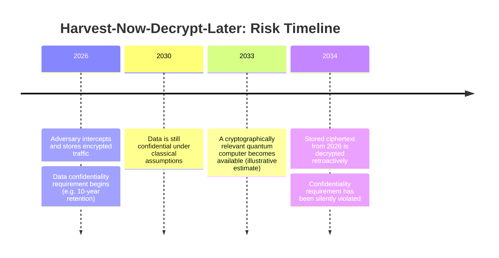
```mermaid
timeline
    title Harvest-Now-Decrypt-Later: Risk Timeline
    2026 : Adversary intercepts and stores encrypted traffic
         : Data confidentiality requirement begins (e.g. 10-year retention)
    2030 : Data is still confidential under classical assumptions
    2033 : A cryptographically relevant quantum computer becomes available (illustrative estimate)
    2034 : Stored ciphertext from 2026 is decrypted retroactively
         : Confidentiality requirement has been silently violated
```

We can express the underlying logic as a single inequality that any organization handling long-lived sensitive data should evaluate:

```
data_confidentiality_deadline  <  estimated_CRQC_arrival_date
                    →  classical-only cryptography is sufficient

data_confidentiality_deadline  >  estimated_CRQC_arrival_date
                    →  PQC migration is required NOW, not later
```

Signatures are a related but distinct concern. A forged signature is not a retroactive confidentiality breach; it is a *future* integrity and authenticity failure. An adversary cannot "harvest" a signature scheme's 
private key today and use it later unless they already possess quantum capability at the moment of forgery. This distinction matters: it means that, for **signatures specifically**, the migration pressure is somewhat less acute 
than for key exchange — but it is not absent, because certificate chains, code-signing infrastructure, and firmware-update mechanisms often have multi-decade trust lifetimes of their own. A root certificate signed with ECDSA today 
may still be relied upon in 2045.

## 3. NIST's Post-Quantum Cryptography Standardization

In response to this risk, the U.S. National Institute of Standards and Technology (NIST) ran a multi-year, public standardization process, evaluating dozens of candidate algorithms across international academic and industry teams. 
The process concluded with a first set of finalized Federal Information Processing Standards (FIPS):

| Standard | Algorithm (informal name) | Category | Hardness Assumption |
|---|---|---|---|
| FIPS 203 | ML-KEM (formerly CRYSTALS-Kyber) | Key Encapsulation | Module-LWE |
| FIPS 204 | ML-DSA (formerly CRYSTALS-Dilithium) | Digital Signature | Module-LWE / Module-SIS |
| FIPS 205 | SLH-DSA (formerly SPHINCS+) | Digital Signature | Hash-based |
| — (NIST Round 4 addition) | Falcon (to be standardized as FN-DSA) | Digital Signature | NTRU lattices |

We deliberately restrict the scope of this project to **digital signatures** rather than key exchange, for a practical reason we will revisit throughout this series: signature verification is embedded in far more places in a typical 
software stack — TLS certificates, code signing, firmware updates, JWTs, container image attestation — and is frequently the *first* place organizations encounter PQC in production, well before PQC key exchange is fully rolled out.

Within the signature family, we chose to compare three concrete algorithms across this project:

- **ECDSA (P-256)** — our classical baseline, included so that every measurement in this series has a familiar point of reference.
- **ML-DSA-65** (the NIST-finalized name for what was informally called "Dilithium3" during standardization) — a lattice-based scheme built on Module-LWE and Module-SIS hardness.
- **Falcon-512** — a lattice-based scheme built on NTRU lattices with a fundamentally different internal structure (Fast Fourier sampling over a GPV-style trapdoor).

We will examine the mathematics behind both PQC candidates in depth in chapters 8–10 of this series; for now, it suffices to note that they represent two structurally distinct approaches to lattice-based signatures, which is precisely why 
comparing them side by side is instructive.

## 4. Why Crypto-Agility, Not a "Big-Bang Migration"

A naïve migration strategy — rip out ECDSA, replace it with ML-DSA everywhere, on a fixed cutover date — is almost never realistic for a live system. Certificate chains must remain verifiable during a transition period. Client software in 
the field cannot always be updated instantly. Interoperability with third parties depends on their migration timeline, not just our own. And, as we will demonstrate empirically in later posts, different PQC algorithms carry meaningfully 
different performance and size trade-offs, so the "right" algorithm may vary by use case even after migration begins.

The alternative — the one this project sets out to demonstrate concretely — is **crypto-agility**: designing systems so that the underlying signature algorithm is a *parameter*, not a hard-coded assumption baked into the architecture. A 
crypto-agile system can run ECDSA and ML-DSA side by side, switch between them per request, per client, or per certificate, and adopt a new algorithm later without a structural rewrite.

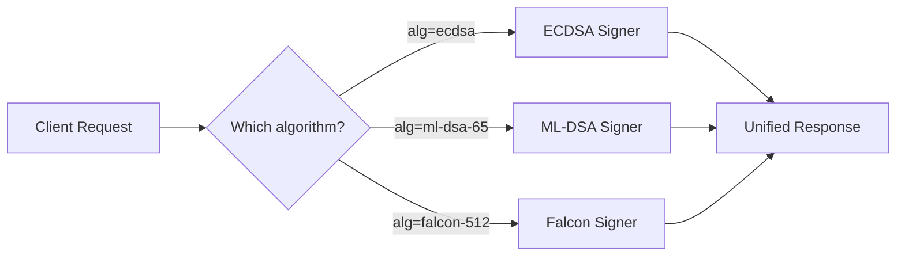
```mermaid
flowchart LR
    A[Client Request] --> B{Which algorithm?}
    B -- alg=ecdsa --> C[ECDSA Signer]
    B -- alg=ml-dsa-65 --> D[ML-DSA Signer]
    B -- alg=falcon-512 --> E[Falcon Signer]
    C --> F[Unified Response]
    D --> F
    E --> F
```

This single design principle — one interface, many interchangeable algorithm backends — is the technical core that the rest of this project builds toward.

## 5. Project Origin: From Seven Ideas to One Lab

This project did not start with a single fixed scope. During initial brainstorming, we sketched seven candidate notebook-based demonstrations relevant to PQC readiness:

1. Crypto Inventory & Risk Scanner (TLS certificate scanning)
2. PQC Key-Exchange Simulator (classical DH vs. Kyber)
3. Mini-Service with a PQC TLS Handshake
4. Harvest-Now-Decrypt-Later Risk Model
5. PQC Migration Planner (interactive roadmap tool)
6. **PQC Signature Lab** (Dilithium & Falcon vs. ECDSA)
7. **Crypto-Agility Demo** (live algorithm switching via API)

We converged on unifying ideas 6 and 7 into a single coherent project, for two reasons. First, signatures — as argued in Section 3 above — touch more of the real-world software stack than key exchange alone, giving the 
strongest "hands-on" learning value per unit of engineering effort. Second, a signature benchmark (idea 6) and a live-switching API (idea 7) are naturally complementary: one produces the *measurements*, the other demonstrates 
the *architecture* that makes those measurements actionable in a running system.

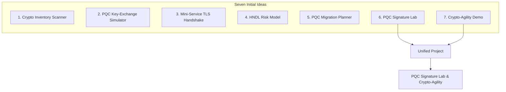
```mermaid
flowchart TD
    subgraph Brainstorm["Seven Initial Ideas"]
        I1[1. Crypto Inventory Scanner]
        I2[2. PQC Key-Exchange Simulator]
        I3[3. Mini-Service TLS Handshake]
        I4[4. HNDL Risk Model]
        I5[5. PQC Migration Planner]
        I6[6. PQC Signature Lab]
        I7[7. Crypto-Agility Demo]
    end

    I6 --> Merge[Unified Project]
    I7 --> Merge
    Merge --> Project["PQC Signature Lab & Crypto-Agility"]
```

## 6. Goals of This Project

We set out with four concrete, falsifiable goals:

1. **Measure** signature generation, verification, key generation time, and signature size for ECDSA, ML-DSA-65, and Falcon-512 on identical hardware and software, using a reproducible benchmark harness.
2. **Build** a crypto-agility abstraction layer — a single `sign()`/`verify()` interface parameterized by algorithm — that hides the underlying cryptographic library differences from calling code.
3. **Expose** this abstraction through a live HTTP microservice (FastAPI), to demonstrate that crypto-agility survives contact with a real request/response architecture, not just isolated function calls.
4. **Document** every practical obstacle encountered along the way — build toolchain issues, dynamic linker configuration, API naming drift as NIST finalized standard names, and subtle correctness bugs — since we consider 
these obstacles as scientifically informative as the benchmark numbers themselves.

We executed this work entirely on a single Fedora Linux workstation, deliberately avoiding cloud dependencies, to keep the project self-contained and reproducible by anyone with a comparable machine.

## 7. Structure of This Series

This is Chapter 1 of a thirteen-part series documenting the project end to end. The remaining chapters are organized as follows:

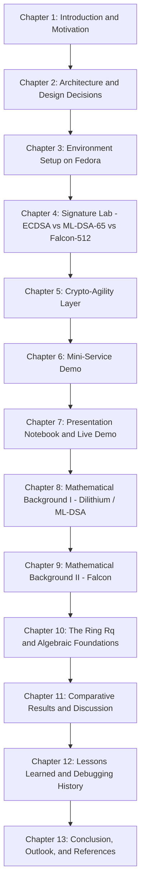
```mermaid
flowchart TD
    P1[Chapter 1: Introduction and Motivation] --> P2[Chapter 2: Architecture and Design Decisions]
    P2 --> P3[Chapter 3: Environment Setup on Fedora]
    P3 --> P4[Chapter 4: Signature Lab - ECDSA vs ML-DSA-65 vs Falcon-512]
    P4 --> P5[Chapter 5: Crypto-Agility Layer]
    P5 --> P6[Chapter 6: Mini-Service Demo]
    P6 --> P7[Chapter 7: Presentation Notebook and Live Demo]
    P7 --> P8[Chapter 8: Mathematical Background I - Dilithium / ML-DSA]
    P8 --> P9[Chapter 9: Mathematical Background II - Falcon]
    P9 --> P10[Chapter 10: The Ring Rq and Algebraic Foundations]
    P10 --> P11[Chapter 11: Comparative Results and Discussion]
    P11 --> P12[Chapter 12: Lessons Learned and Debugging History]
    P12 --> P13[Chapter 13: Conclusion, Outlook, and References]
```

chapters 2–7 follow the project's engineering narrative in the order it was actually built: design decisions first, then environment setup, then each notebook in turn, ending with the integrated presentation notebook. 
chapters 8–10 step back from the engineering and provide the mathematical grounding for the two PQC algorithms under study — readers who want the "why does this work" answer before the "how fast is it" answer may choose to 
read this block first; we have written each Chapter to stand reasonably well on its own. Chapter 11 pulls together every quantitative result from the earlier chapters into one comparative discussion. Chapter 12 is, in our view, the most 
practically useful Chapter for anyone attempting a similar project: a candid account of every build failure, linker error, API rename, and subtle cryptographic bug we hit, and how we diagnosed and fixed each one. Chapter 13 closes the 
series with a summary and pointers to further work.

## 8. What Comes Next

In Chapter 2, we detail the architectural decision-making process that shaped this project: why we settled on four development notebooks plus one integrated presentation notebook, how those five notebooks share state through a small 
set of Python modules and on-disk artifacts rather than direct notebook-to-notebook imports, and why we deliberately designed the presentation notebook to be able to regenerate every artifact inline, with no hard dependency on the development 
notebooks having been run first.

---

## Chapter 2/13: Architecture & Design Decisions

### Abstract

In this chapter, we walk through the architectural decisions that shaped the project before a single line of benchmarking code was written. We explain why we split the work into four development notebooks 
plus one integrated presentation notebook, why notebooks are connected through shared modules and on-disk artifacts rather than direct notebook-to-notebook imports, why every notebook performs its own dependency setup check, 
and how the final project folder is organized. We close with the folder structure and `requirements.txt` that ground the rest of this series.

## 1. From Project Ideas to a Concrete Architecture

Chapter 1 established *what* we wanted to build: a crypto-agility framework comparing ECDSA, ML-DSA-65, and Falcon-512, exposed through both a benchmarking harness and a live HTTP service. This Chapter addresses *how* we structured the 
codebase to deliver that goal without accumulating the kind of tangled, single-file notebook that becomes unmaintainable after the third revision.

We evaluated the problem along two axes that turned out to be in tension with each other:

- **Development ergonomics** — we wanted small, focused notebooks that we could edit, re-run, and debug independently, without re-executing unrelated cells.
- **Presentation ergonomics** — we wanted a single, linear, scrollable narrative for live demos to an audience, without forcing a presenter to jump between five separate notebook windows.

Resolving this tension is the central architectural decision of the whole project, and we describe it in Section 4 below.

## 2. Four Development Notebooks

We split the engineering work into four notebooks, each with a single, well-defined responsibility:

| Notebook | Responsibility | Produces |
|---|---|---|
| `00_setup_environment.ipynb` | Verify the Python/OS environment, install and validate `liboqs`, generate the shared `utils.py` module | `modules/utils.py`, `data/pqc_libs.json`, `data/benchmarks.json` |
| `01_signature_lab.ipynb` | Implement and benchmark ECDSA, ML-DSA-65, and Falcon-512 signature/verification cycles | `data/signatures.pkl`, `data/sizes.csv`, `data/timings.csv`, three plots |
| `02_crypto_agility.ipynb` | Build the algorithm-agnostic `crypto_agility.py` module and exercise algorithm switching | `modules/crypto_agility.py`, `data/agility_tests.json`, two plots |
| `03_service_demo.ipynb` | Wrap `crypto_agility.py` in a FastAPI microservice and measure end-to-end HTTP latency | `data/service_logs.json`, one plot |

Each notebook is runnable in isolation, provided its declared dependencies (Python packages, and — for Notebooks 01–03 — the modules produced by earlier notebooks) are already present. This independence is what let us iterate on, say, 
the crypto-agility layer in Notebook 02 without re-running the (comparatively slow) benchmark suite in Notebook 01 every time.

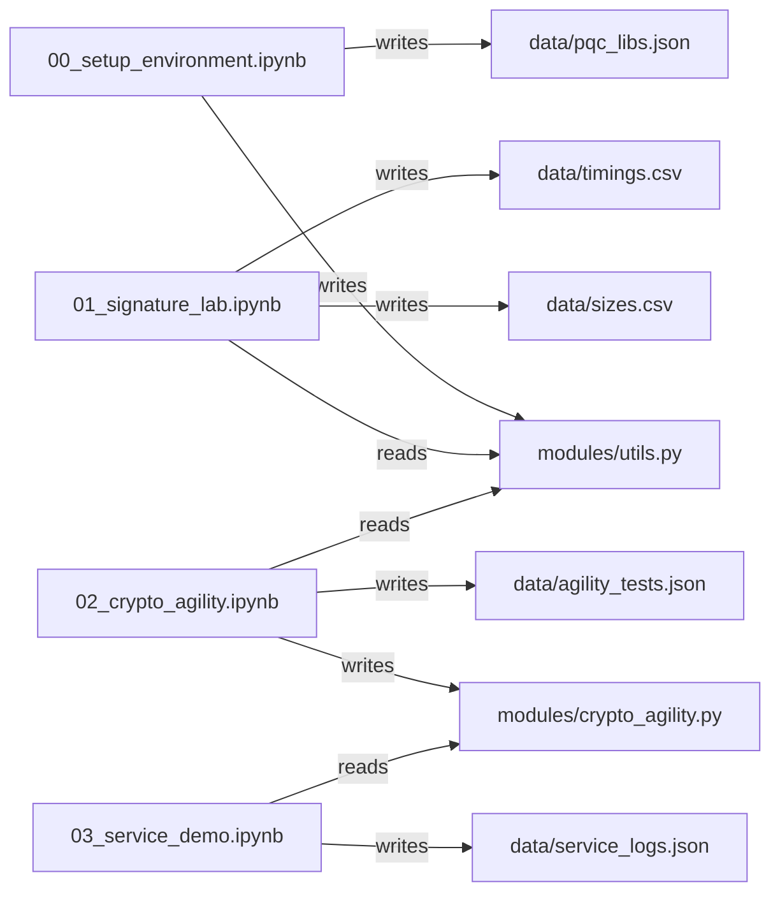
```mermaid
flowchart LR
    N00["00_setup_environment.ipynb"] -->|writes| U["modules/utils.py"]
    N00 -->|writes| PL["data/pqc_libs.json"]
    N01["01_signature_lab.ipynb"] -->|reads| U
    N01 -->|writes| SZ["data/sizes.csv"]
    N01 -->|writes| TM["data/timings.csv"]
    N02["02_crypto_agility.ipynb"] -->|reads| U
    N02 -->|writes| CA["modules/crypto_agility.py"]
    N02 -->|writes| AG["data/agility_tests.json"]
    N03["03_service_demo.ipynb"] -->|reads| CA
    N03 -->|writes| SL["data/service_logs.json"]
```

## 3. Connection via Artifacts, Not Direct Imports

A tempting but ultimately fragile design would have Notebook 03 directly `import` code defined inside Notebook 02, or have the presentation notebook reach into the internal variables of the four development notebooks. 
Jupyter notebooks are not Python modules; they do not expose a stable, importable namespace, and any such coupling breaks the moment cells are re-ordered, re-run out of sequence, or a notebook is deleted.

We therefore adopted a strict rule: **notebooks communicate only through the filesystem** — via three well-defined channels:

1. **Python modules** (`modules/utils.py`, `modules/crypto_agility.py`) — plain `.py` files, `import`-able from any notebook via `sys.path.append("../modules")`.
2. **Data artifacts** (`data/*.json`, `data/*.csv`, `data/*.pkl`) — the numeric and textual results of a notebook's run, written once and read by later notebooks or the presentation notebook.
3. **Plots** (`plots/*.png`) — rendered figures, saved to disk rather than kept only as in-notebook cell output, so that any downstream consumer (including this very documentation series) can reference them without re-executing plotting code.

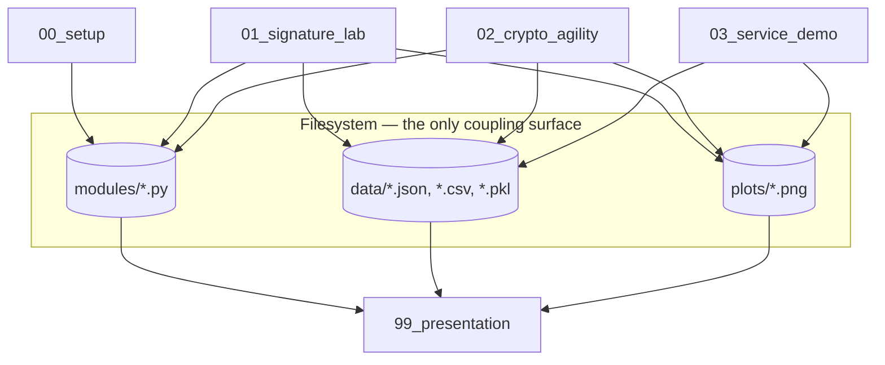
```mermaid
flowchart TD
    subgraph FS["Filesystem — the only coupling surface"]
        MOD[("modules/*.py")]
        DAT[("data/*.json, *.csv, *.pkl")]
        PLT[("plots/*.png")]
    end

    N00["00_setup"] --> MOD
    N01["01_signature_lab"] --> MOD
    N01 --> DAT
    N01 --> PLT
    N02["02_crypto_agility"] --> MOD
    N02 --> DAT
    N02 --> PLT
    N03["03_service_demo"] --> DAT
    N03 --> PLT

    MOD --> N99["99_presentation"]
    DAT --> N99
    PLT --> N99
```

This design has a useful consequence we did not fully appreciate until later in the project: because every intermediate result is a plain file on disk, **this documentation series itself** could be written directly from 
those artifacts — the CSVs, the JSON logs, and the PNG plots — without needing to re-run any notebook. The filesystem-as-interface decision paid for itself twice.

## 4. One Notebook or Four? The Presentation Dilemma

Once the four development notebooks existed, we faced a second, separate question: how should the material be *presented* to an audience? We considered two extremes.

**Option A — one large notebook.** A single notebook containing the entire story, scrollable top to bottom, is easier to present live: no window-switching, no risk of forgetting which notebook was last run, and a natural narrative arc 
from setup through benchmarks to the live demo.

**Option B — four separate notebooks.** Keeping the work modular preserves clean separation of concerns, makes each piece independently testable, and is considerably easier to extend later (adding a fifth algorithm, say, touches only 
Notebook 01, not a monolithic file).

We concluded that this is a false dichotomy — the two options serve different audiences and can coexist without conflict.

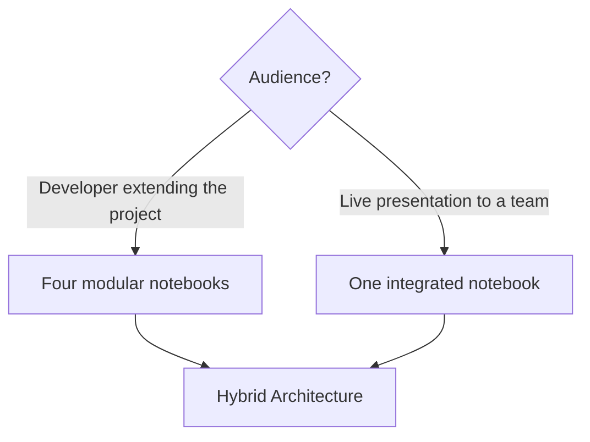
```mermaid
flowchart TD
    Q{Audience?}
    Q -->|Developer extending the project| B[Four modular notebooks]
    Q -->|Live presentation to a team| A[One integrated notebook]
    B --> Hybrid[Hybrid Architecture]
    A --> Hybrid
```

## 5. The Hybrid Solution: `99_presentation.ipynb`

Our resolution was to add a fifth notebook, `99_presentation.ipynb`, that is entirely separate from the four development notebooks in terms of *authorship* but consumes the same filesystem artifacts described in 
Section 3. Critically, we designed it with a **fallback mechanism**: for every artifact it needs, it first checks whether that artifact already exists on disk (produced by an earlier run of the corresponding development 
notebook); if not, it regenerates a minimal version of that artifact inline, on the spot.

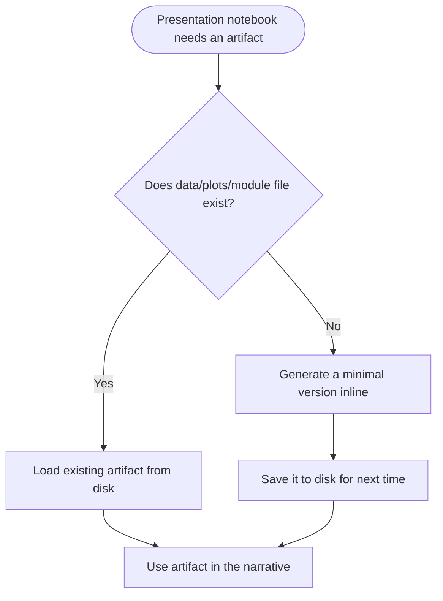
```mermaid
flowchart TD
    Start([Presentation notebook needs an artifact]) --> Check{Does data/plots/module file exist?}
    Check -->|Yes| Load[Load existing artifact from disk]
    Check -->|No| Generate[Generate a minimal version inline]
    Generate --> Save[Save it to disk for next time]
    Load --> Use[Use artifact in the narrative]
    Save --> Use
```

This single design choice gives the presentation notebook a valuable property: **it is fully autonomous**. It can be handed to a colleague on a machine that has never run Notebooks 00–03, and it will still produce a complete, working 
demonstration — slower on first run (since it has to generate everything from scratch), but correct. We verified this directly during our own work: the code excerpts in `99_presentation.ipynb` (which we reproduce and discuss in Chapter 7) 
contain exactly this `if exists(path): load() else: generate()` pattern for every one of its dependencies — signature sizes, timings, agility test results, and all six plots.

The naming convention `99_` for the presentation notebook is deliberate: in a directory listing sorted alphabetically, it sorts last, after `00_` through `03_`, signaling "this is the integration point, not a development step" purely 
through the filename.

## 6. Every Notebook Performs Its Own Setup Check

A second cross-cutting design decision, visible in every one of the five notebooks, is that **each notebook independently verifies its own package dependencies** at the top of its execution, rather than relying on a single shared 
installation script run once at project setup. The pattern is the same everywhere:

```python
def check_package(pkg):
    try:
        importlib.import_module(pkg)
        print(f"✓ {pkg} found")
        return True
    except ImportError:
        print(f"✗ {pkg} missing — install via terminal:")
        print(f"    pip install {pkg}")
        return False
```

We chose this repetition deliberately, for three reasons:

1. **Jupyter kernel `pip install` calls are unreliable.** As we discovered directly during environment setup (documented in full in Chapter 3), a `pip install` executed inside one notebook's kernel does not necessarily install into the 
same Python environment that a *different* kernel, or a terminal session, is using. Relying on in-notebook installation as the source of truth invites exactly the kind of "but it says it's already installed!" confusion we encountered firsthand.
2. **Explicit control belongs in the terminal.** System-level dependencies (a C compiler, `cmake`, `ninja-build`) cannot be installed via `pip` at all — they require `dnf` on Fedora. Mixing "things `pip` can install" with "things only the 
OS package manager can install" inside a single automated setup step obscures which failure mode you are looking at.
3. **The presentation notebook must remain stable independent of the other four.** If `99_presentation.ipynb` trusted a shared setup step that silently failed, the failure would only surface deep into a live demo. An independent, visible 
check at the top of the presentation notebook fails fast and loud, before the audience is watching.

The trade-off, of course, is code duplication: the same `check_package` / `exists` helper functions appear, nearly verbatim, in all five notebooks. We accepted this duplication as the right price for independence, rather than importing yet 
another shared "meta-setup" module — doing so would have reintroduced exactly the cross-notebook coupling we were trying to avoid in Section 3.

## 7. Project Folder Structure

The complete, final project layout is as follows:

```
pqc_signature_lab/
├── notebooks/
│   ├── 00_setup_environment.ipynb
│   ├── 01_signature_lab.ipynb
│   ├── 02_crypto_agility.ipynb
│   ├── 03_service_demo.ipynb
│   └── 99_presentation.ipynb
├── modules/
│   ├── utils.py
│   └── crypto_agility.py
├── data/
│   ├── pqc_libs.json
│   ├── benchmarks.json
│   ├── signatures.pkl
│   ├── sizes.csv
│   ├── timings.csv
│   ├── agility_tests.json
│   └── service_logs.json
├── plots/
│   ├── signature_sizes.png
│   ├── verification_times.png
│   ├── key_sizes.png
│   ├── agility_matrix.png
│   ├── algorithm_switch_cost.png
│   └── service_latency.png
├── requirements.txt
└── README.md
```

Each top-level directory maps directly onto one of the three coupling channels from Section 3, plus the notebooks themselves and the two files (`requirements.txt`, `README.md`) that make the project reproducible and legible to a newcomer:

- **`notebooks/`** — the five notebooks described above; the only files a human is expected to open and execute directly.
- **`modules/`** — the two shared Python modules, generated by Notebook 00 (`utils.py`) and Notebook 02 (`crypto_agility.py`) respectively, and imported by every notebook downstream of their generation point.
- **`data/`** — every numeric result, in a format chosen for the consumer: JSON for structured logs and nested results, CSV for simple tabular data destined for `pandas`, and a single Pickle file (`signatures.pkl`) for the one case 
where we needed to persist raw Python objects (actual signature bytes) rather than summary statistics.
- **`plots/`** — every rendered figure, in PNG form, produced by `matplotlib` via the shared `utils.plot_bar` / `utils.plot_line` helpers (introduced in Chapter 3).
- **`requirements.txt`** and **`README.md`** — the entry points for a new reader: what to install, and what the project does.

## 8. `requirements.txt`: Fedora-Specific Considerations

Our `requirements.txt` deliberately separates pure-Python dependencies (installable via `pip` alone) from `liboqs-python`, which — as we detail in full in Chapter 3 — additionally requires system-level build tools that `pip` cannot provide:

```text
# Pure-Python dependencies (pip-installable)
cryptography
pandas
matplotlib
fastapi
uvicorn
aiohttp
requests

# PQC bindings — requires liboqs to be built first (see Chapter 3)
# pip install cmake git+https://github.com/open-quantum-safe/liboqs-python.git
```

We chose to comment out the `liboqs-python` installation line rather than list it as a plain requirement, precisely because a naïve `pip install -r requirements.txt` on a machine lacking `cmake`, `gcc`, and `ninja-build` fails in a way 
that is easy to misdiagnose as a Python packaging problem, when it is in fact a missing system toolchain. Chapter 3 walks through the full resolution of this issue, including the dynamic linker configuration step that a plain `requirements.txt` 
cannot express at all.

## 9. What Each Notebook Produces, at a Glance

Summarizing Sections 2 and 7 together, the complete artifact inventory the project accumulates by the time all five notebooks have been run once is:

| Category | Files | Origin |
|---|---|---|
| Modules | `utils.py`, `crypto_agility.py` | Notebooks 00, 02 |
| Data (JSON) | `pqc_libs.json`, `benchmarks.json`, `agility_tests.json`, `service_logs.json` | Notebooks 00, 02, 03 |
| Data (CSV) | `sizes.csv`, `timings.csv` | Notebook 01 |
| Data (Pickle) | `signatures.pkl` | Notebook 01 |
| Plots | 6 PNG files | Notebooks 01, 02, 03, 99 |

We will reference every one of these artifacts by name throughout the rest of this series, so this table doubles as a lookup reference for later posts.

## 10. What Comes Next

Chapter 3 turns from architecture to the concrete, occasionally painful reality of standing up this environment on a real Fedora workstation: building `liboqs` from source, configuring the dynamic linker to find a library installed 
outside the standard system paths, resolving a Python multi-interpreter mismatch between a terminal `pip install` and a Jupyter kernel, and adapting to NIST's renaming of "Dilithium3" to "ML-DSA-65" mid-project. Every one of those issues 
is real, was encountered in exactly this project, and is documented with the actual error messages and fixes as they occurred.

---

## Chapter 3/13: Environment Setup on Fedora

### Abstract

In this chapter, we document the complete process of standing up `liboqs` and its Python bindings on a Fedora workstation, exactly as it unfolded — including every build failure, linker error, and interpreter mismatch we encountered, with the 
actual diagnostic reasoning and fix for each. We treat this as primary source material rather than a cleaned-up tutorial, because in our experience the failure modes are at least as instructive as the eventual success. We close with the finished 
`00_setup_environment.ipynb` notebook and its verified output.

## 1. Scope of Notebook 00

`00_setup_environment.ipynb` has a narrow, well-defined job: verify that every package the rest of the project depends on is importable, build and register `liboqs` if it is missing, and generate the one shared utility module (`utils.py`) 
that every later notebook imports. It also performs a small "smoke test" benchmark (Section 8 below) to confirm that signature generation actually works end to end before any of the more elaborate Notebooks 01–03 are attempted.

We deliberately front-load all environment risk into this single notebook. If something is going to fail because of a missing system library or a misconfigured `PATH`, we want that failure to happen here, with a clear, isolated error message, 
not three notebooks later, buried inside an unrelated benchmarking loop.

## 2. Issue 1 — `pip install cmake` Does Not Provide a `cmake` Binary

Our first setup attempt was:

```python
import sys
!{sys.executable} -m pip install cmake git+https://github.com/open-quantum-safe/liboqs-python.git
```

`liboqs-python` does not ship a prebuilt `liboqs` shared library. On first import, it detects that `liboqs` is absent and attempts to **build it from source automatically**, cloning the upstream `liboqs` C repository and invoking `cmake` as 
a subprocess. This is where the first failure appeared:

```
FileNotFoundError: [Errno 2] No such file or directory: 'cmake'
```

The confusing part: `pip install cmake` had *just* reported success, and `pip show cmake` confirmed the package was present. The resolution hinges on a distinction that is easy to miss: **`pip install cmake` installs a Python wrapper package** 
(which exposes `cmake` as an importable Python module, useful for other Python packages' build systems), **not necessarily a `cmake` executable on the shell `$PATH`** in every environment configuration — and even where it does add a wrapper binary, 
`liboqs-python`'s automatic build step additionally needs a full native C toolchain (a C compiler, a build generator such as Ninja or Make, Git, and OpenSSL development headers), none of which `pip` can provide at all, on any platform.

**Fix** — install the native toolchain via Fedora's system package manager:

```bash
sudo dnf install -y cmake gcc gcc-c++ ninja-build git openssl-devel make
```

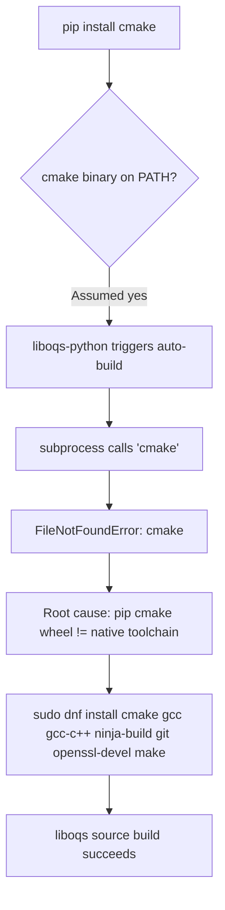
```mermaid
flowchart TD
    A["pip install cmake"] --> B{"cmake binary on PATH?"}
    B -->|"Assumed yes"| C["liboqs-python triggers auto-build"]
    C --> D["subprocess calls 'cmake'"]
    D --> E["FileNotFoundError: cmake"]
    E --> F["Root cause: pip cmake wheel != native toolchain"]
    F --> G["sudo dnf install cmake gcc gcc-c++ ninja-build git openssl-devel make"]
    G --> H["liboqs source build succeeds"]
```

## 3. Issue 2 — The Dynamic Linker Cannot Find the Freshly Built Library

With the toolchain in place, re-running the install cell produced a much longer, and much more encouraging, log:

```
[100%] Built target internal
[100%] Built target oqs-internal
Install the project...
-- Installing: /home/nenadbalaneskovic/_oqs/lib64/liboqs.so.0.16.0
-- Installing: /home/nenadbalaneskovic/_oqs/lib64/liboqs.so.9
-- Installing: /home/nenadbalaneskovic/_oqs/lib64/liboqs.so
Done installing liboqs
```

The build itself succeeded. Immediately afterward, however, importing `oqs` failed with:

```
RuntimeError: No oqs shared libraries found
...
SystemExit: Could not load liboqs shared library
```

This is a fundamentally different class of problem from Issue 1: it is not a missing file (the log clearly shows `liboqs.so` was installed), but a **runtime linker resolution** problem. `liboqs` was installed into a non-standard, 
per-user location (`~/_oqs/lib64`), and Linux's dynamic linker (`ld.so`) only searches a fixed set of standard system directories plus whatever is registered in its cache — it does not automatically discover arbitrary user directories, 
no matter how correctly a library file sits inside them.

```
┌─────────────────────────────────────────────--┐
│  Dynamic linker (ld.so) search order          │
│                                               │
│  1. Paths in LD_LIBRARY_PATH (if set)         │
│  2. Paths cached by ldconfig                  │
│     (registered via /etc/ld.so.conf.d/*.conf) │
│  3. Default system paths (/lib64, /usr/lib64) │
│                                               │
│  ~/_oqs/lib64  ──────X───── not searched      │
│                        unless explicitly      │
│                        registered             │
└─────────────────────────────────────────────--┘
```

**Fix** — register the custom install path with the system linker cache, permanently:

```bash
echo "$HOME/_oqs/lib64" | sudo tee /etc/ld.so.conf.d/liboqs.conf
sudo ldconfig
ldconfig -p | grep liboqs
```

We chose this over the alternative of exporting `LD_LIBRARY_PATH` in the shell that launches Jupyter, for a reason worth stating explicitly: `LD_LIBRARY_PATH` only takes effect if it is set in the *exact* shell that starts the Jupyter 
process, which breaks silently the moment Jupyter is instead launched from a desktop icon, a different terminal, or an IDE integration. Registering the path via `ldconfig` fixes resolution at the operating-system level, independent of 
how Jupyter happens to be started — the correct general solution, at the cost of one `sudo` step performed once.

### 3.1 A Second, Related Discovery: Two `liboqs` Copies Coexisting

Running `ldconfig -p | grep liboqs` after the fix surfaced something we had not anticipated:

```
liboqs.so.9 (libc6,x86-64) => /home/nenadbalaneskovic/_oqs/lib64/liboqs.so.9
liboqs.so.7 (libc6,x86-64) => /lib64/liboqs.so.7
liboqs.so   (libc6,x86-64) => /home/nenadbalaneskovic/_oqs/lib64/liboqs.so
liboqs.so   (libc6,x86-64) => /lib64/liboqs.so
```

A second, older `liboqs` (version-suffixed `.so.7`) was already present on the system, evidently from a Fedora-packaged distribution copy. With two ABI-incompatible versions of the same shared library visible to the linker simultaneously, 
silent misresolution (loading the wrong one) becomes a real risk. In our case, the unversioned `liboqs.so` symlink happened to resolve to our newly built copy first, and a direct test —

```python
import oqs
print(oqs.oqs_version())   # → 0.16.0
```

— confirmed the correct version loaded. Had this returned the *older* system version instead, our fallback plan was either to remove the conflicting Fedora package (`sudo dnf remove liboqs`, after confirming its exact package name 
via `rpm -qa | grep -i liboqs`) or to force our build's priority via `LD_LIBRARY_PATH` scoped only to the Jupyter-launching shell, since `LD_LIBRARY_PATH` takes precedence over the `ldconfig` cache. We record this contingency here because 
a version conflict of this shape can just as easily go the other way on a different machine, and the diagnostic step (`ldconfig -p | grep <library>`, followed by a direct version check) generalizes to any "which shared library actually loaded" question.

## 4. Issue 3 — Multiple Python Interpreters, One Confused Terminal

A third class of problem appeared later, when installing `fastapi` and `uvicorn` for the service demo (Chapter 6). A `pip install fastapi uvicorn` run directly in a terminal reported:

```
Requirement already satisfied: fastapi in /home/nenadbalaneskovic/.local/lib/python3.14/site-packages
```

— yet the notebook's own package check still reported `fastapi` as missing. The mismatch was visible in the installation path itself: **Python 3.14**, user site-packages. Cross-referencing against earlier tracebacks showed the Jupyter kernel 
was actually running a **Python 3.12 virtual environment** (`~/.venv/lib64/python3.12/site-packages/...`). The terminal's `pip` and the notebook's kernel resolved to two entirely different Python installations on the same machine — a common 
situation on any system with more than one Python version installed, and one that is easy to overlook because both commands are simply called `pip`.

**Fix** — install directly through the kernel's own interpreter, from inside the notebook itself, rather than trusting whatever `pip` the terminal happens to resolve to:

```python
import sys
!{sys.executable} -m pip install fastapi uvicorn
```

`{sys.executable}` is the one string guaranteed to point at the interpreter actually running the current kernel, regardless of `PATH` configuration, shell aliases, or how many other Python versions happen to be installed alongside it.

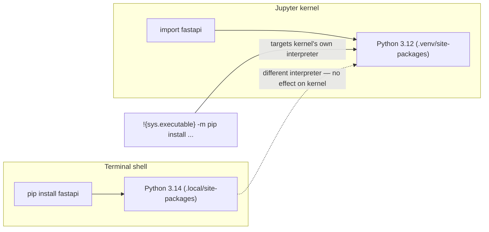
```mermaid
flowchart LR
    subgraph Terminal["Terminal shell"]
        T[pip install fastapi] --> TP["Python 3.14 (.local/site-packages)"]
    end
    subgraph Kernel["Jupyter kernel"]
        K["import fastapi"] --> KP["Python 3.12 (.venv/site-packages)"]
    end
    TP -.->|"different interpreter — no effect on kernel"| KP
    Fix["!{sys.executable} -m pip install ..."] -->|"targets kernel's own interpreter"| KP
```

## 5. Issue 4 — API Naming Drift: `Dilithium3` → `ML-DSA-65`

With the environment otherwise functional, our first attempt to benchmark the lattice-based signature scheme used the name we had seen in older `liboqs` documentation:

```python
oqs.Signature("Dilithium3")
# MechanismNotSupportedError: Dilithium3
```

This is not a configuration error but a **standardization-driven rename**. "Dilithium3" was `liboqs`'s internal name for CRYSTALS-Dilithium at security level 3 while the algorithm was still a NIST draft candidate. Once NIST finalized FIPS 204, 
the algorithm was formally renamed **ML-DSA**, and our `liboqs` build (version 0.16.0, current as of this project) dropped the informal `Dilithium*` aliases entirely in favor of the standardized `ML-DSA-{44,65,87}` naming.

We resolved this the way we recommend resolving any "which exact string does this library expect" question: **query the library directly rather than trusting memory or documentation of a possibly older version**:

```python
import oqs
print(oqs.get_enabled_sig_mechanisms())
```

This returned a long tuple that included `'ML-DSA-44'`, `'ML-DSA-65'`, `'ML-DSA-87'`, `'Falcon-512'`, `'Falcon-1024'`, and many others (SLH-DSA variants, MAYO, Cross-RSDP, SNOVA, and further NIST Round 4 signature candidates). `ML-DSA-65` is 
the correct replacement for the old "Dilithium3" security level, and it is the identifier we use for the remainder of this project. `Falcon-512`, by contrast, had not been renamed in this `liboqs` version and continued to work as originally expected.

## 6. Issue 5 — `oqs.__version__` Does Not Exist

A smaller, quicker issue: our first version-logging attempt used the common Python convention:

```python
info = {"oqs_version": oqs.__version__}
# AttributeError: module 'oqs' has no attribute '__version__'
```

`liboqs-python` simply does not follow the `__version__` convention. It exposes two distinct, explicitly named functions instead:

```python
oqs.oqs_version()          # → "0.16.0"   (the underlying C library's version)
oqs.oqs_python_version()   # → the Python binding package's own version
```

We capture both in our environment log, since they can, in principle, drift independently of each other across `liboqs-python` releases.

## 7. Summary Table: Every Setup Issue and Its Fix

| # | Symptom | Root Cause | Fix |
|---|---|---|---|
| 1 | `FileNotFoundError: cmake` | `pip install cmake` provides a Python wheel, not a native build toolchain | `sudo dnf install cmake gcc gcc-c++ ninja-build git openssl-devel make` |
| 2 | `RuntimeError: No oqs shared libraries found` / `SystemExit` | Custom-built `liboqs` installed outside standard linker search paths | Register path via `/etc/ld.so.conf.d/liboqs.conf` + `ldconfig` |
| 2b | Two `liboqs` versions visible to linker | Fedora-packaged `liboqs.so.7` coexisting with our built `.so.9` | Verify resolved version with `oqs.oqs_version()`; remove or reprioritize if wrong |
| 3 | `pip install fastapi` "succeeds" but notebook still reports it missing | Terminal `pip` and Jupyter kernel resolve to different Python interpreters | `!{sys.executable} -m pip install fastapi uvicorn` from inside the notebook |
| 4 | `MechanismNotSupportedError: Dilithium3` | NIST standardization renamed Dilithium to ML-DSA; `liboqs` dropped the old alias | Use `oqs.get_enabled_sig_mechanisms()` to get exact current names; use `"ML-DSA-65"` |
| 5 | `AttributeError: module 'oqs' has no attribute '__version__'` | `liboqs-python` does not follow the `__version__` convention | Use `oqs.oqs_version()` and `oqs.oqs_python_version()` |

## 8. The Finished Notebook: Verified Output

With all five issues resolved, `00_setup_environment.ipynb` runs cleanly end to end. The final package check confirms every dependency:

```
=== Package Check ===
✓ oqs found
✓ cryptography found
✓ pandas found
✓ matplotlib found
✓ fastapi found
✓ uvicorn found
✓ aiohttp found
✓ requests found

All required packages available.
```

The `liboqs` version check confirms correct resolution:

```python
import oqs
print(oqs.oqs_version())
# 0.16.0
```

The notebook then generates `modules/utils.py` — the shared helper module containing a `timer()` function (used throughout this series to measure keygen, sign, and verify durations) and two plotting helpers, `plot_bar()` and `plot_line()`:

```python
def timer(fn, *args, **kwargs):
    start = time.perf_counter()
    result = fn(*args, **kwargs)
    end = time.perf_counter()
    return result, end - start
```

It exports a full environment snapshot to `data/pqc_libs.json`, including the timestamp, both version strings, and the complete list of enabled signature and KEM mechanisms — the artifact we queried directly in Section 5 above to resolve 
the naming drift issue.

Finally, it runs a small smoke-test benchmark over `ML-DSA-65` and `Falcon-512` (deliberately excluding ECDSA at this stage, since ECDSA requires no `liboqs` involvement at all and is not a useful test of the environment we just built), 
guarded by an explicit mechanism-availability check:

```python
enabled_sigs = oqs.get_enabled_sig_mechanisms()
algorithms = ["ML-DSA-65", "Falcon-512"]

for alg in algorithms:
    if alg not in enabled_sigs:
        raise ValueError(
            f"'{alg}' is not enabled in this liboqs build.\n"
            f"Available signature mechanisms:\n{enabled_sigs}"
        )
    results.append(benchmark_signature(alg))
```

We added this explicit guard *after* encountering Issue 4 above — it converts a future naming drift (should NIST or `liboqs` rename something again) from a cryptic `MechanismNotSupportedError` deep inside a `with` block into 
an immediate, actionable `ValueError` that prints the exact list of currently valid names. We consider this defensive check a direct, permanent artifact of the debugging process described in this chapter, and we carry the same pattern 
forward into the crypto-agility module discussed in Chapter 5.

## 9. What Comes Next

With a verified, reproducible environment in place, Chapter 4 turns to the actual cryptographic work: implementing and benchmarking ECDSA-P256, ML-DSA-65, and Falcon-512 side by side in `01_signature_lab.ipynb`, 
including two further correctness bugs we encountered along the way — one involving accidental key regeneration between sign and verify steps, and one involving a nonexistent `export_public_key()` method — both of 
which we walk through in full, since they generalize to any signature-benchmarking code, not just this project.

---

## Chapter 4/13: Signature Lab — ECDSA vs. ML-DSA-65 vs. Falcon-512

### Abstract

In this chapter, we implement and benchmark three digital signature algorithms — ECDSA-P256, ML-DSA-65, and Falcon-512 — inside `01_signature_lab.ipynb`, measuring key generation, signing, and verification time, 
as well as signature size, for each. We walk through two correctness bugs we introduced and then fixed during this notebook's development, since both generalize beyond this specific project: a key-reuse bug in the ECDSA branch, 
and an incorrect assumption about the `liboqs-python` `Signature` API's public-key export mechanism. We close with the full benchmark results and their interpretation.

## 1. Goal of This Notebook

`01_signature_lab.ipynb` has one job: produce trustworthy, reproducible numbers for four metrics — key generation time, signing time, verification time, and signature size — across our three chosen algorithms, on the environment we 
validated in Chapter 3. These numbers are the empirical backbone of the entire project; every later Chapter that discusses "PQC signatures are fast enough in practice" or "PQC signatures are larger than ECDSA" is grounded in the measurements produced here.

We benchmark:

- **ECDSA (P-256)** — via Python's `cryptography` library, our classical baseline.
- **ML-DSA-65** — via `liboqs-python`, using the NIST-standardized name established in Chapter 3.
- **Falcon-512** — via `liboqs-python`.

## 2. Initial Signature Functions

The notebook begins with three small, standalone signature functions, one per algorithm, intended purely to confirm that each library call works in isolation before any timing instrumentation is added:

```python
def sign_ecdsa(msg):
    key = ec.generate_private_key(ec.SECP256R1())
    signature = key.sign(msg, ec.ECDSA(hashes.SHA256()))
    return signature, key.public_key()

def sign_dilithium(msg):
    with oqs.Signature("Dilithium3") as sig:
        pk = sig.generate_keypair()
        signature = sig.sign(msg)
        return signature, pk

def sign_falcon(msg):
    with oqs.Signature("Falcon-512") as sig:
        pk = sig.generate_keypair()
        signature = sig.sign(msg)
        return signature, pk
```

Two details are worth flagging even at this early, "just testing the API" stage, since both foreshadow issues we return to below. First, `sign_dilithium` still uses the pre-standardization name `"Dilithium3"` — a direct carry-over from 
before we resolved the naming drift in Chapter 3, and something we correct once we move to the actual benchmark function. Second, and more importantly, notice that **each function returns both the signature and the public key together** — 
this pairing is the detail that the next section's bug hinges on.

## 3. The Benchmark Function

The real measurement logic lives in `benchmark_signature(alg)`, which times each of the three phases — key generation, signing, verification — separately, using the `timer()` helper from `modules/utils.py` introduced in Chapter 3:

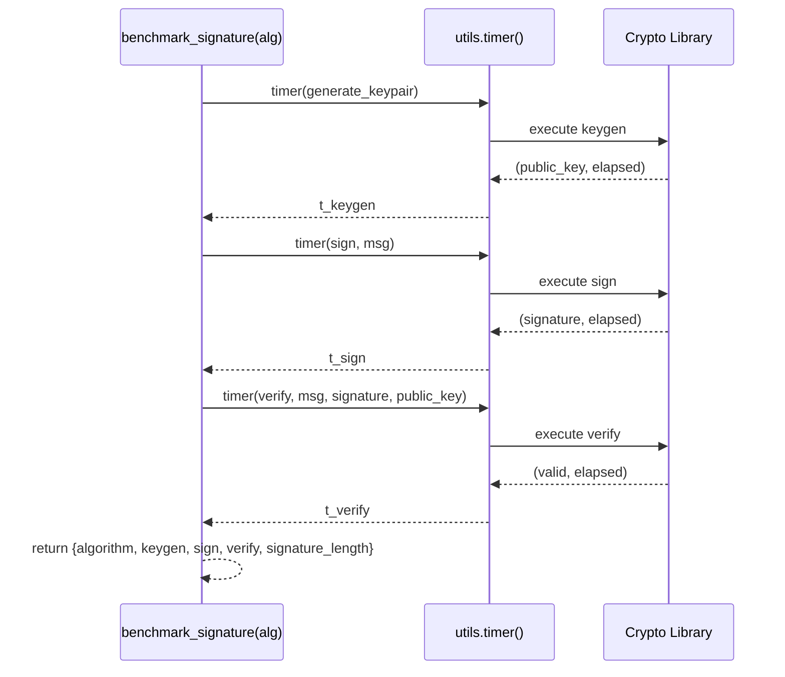
```mermaid
sequenceDiagram
    participant B as benchmark_signature(alg)
    participant T as utils.timer()
    participant L as Crypto Library

    B->>T: timer(generate_keypair)
    T->>L: execute keygen
    L-->>T: (public_key, elapsed)
    T-->>B: t_keygen

    B->>T: timer(sign, msg)
    T->>L: execute sign
    L-->>T: (signature, elapsed)
    T-->>B: t_sign

    B->>T: timer(verify, msg, signature, public_key)
    T->>L: execute verify
    L-->>T: (valid, elapsed)
    T-->>B: t_verify

    B-->>B: return {algorithm, keygen, sign, verify, signature_length}
```

The final, corrected version of this function — after the two fixes described in Sections 4 and 5 — is:

```python
def benchmark_signature(alg):
    msg = b"Hello PQC"

    if alg == "ecdsa":
        # Keygen (generate the key ONCE, reuse for sign+verify)
        private_key, t_keygen = utils.timer(
            lambda: ec.generate_private_key(ec.SECP256R1())
        )
        pubkey = private_key.public_key()

        # Sign (with the SAME private key)
        signature, t_sign = utils.timer(
            lambda: private_key.sign(msg, ec.ECDSA(hashes.SHA256()))
        )

        # Verify
        _, t_verify = utils.timer(
            lambda: pubkey.verify(signature, msg, ec.ECDSA(hashes.SHA256()))
        )

    elif alg == "dilithium3":
        with oqs.Signature("ML-DSA-65") as sig:
            pk, t_keygen = utils.timer(sig.generate_keypair)
            signature, t_sign = utils.timer(sig.sign, msg)
            _, t_verify = utils.timer(sig.verify, msg, signature, pk)

    elif alg == "falcon512":
        with oqs.Signature("Falcon-512") as sig:
            pk, t_keygen = utils.timer(sig.generate_keypair)
            signature, t_sign = utils.timer(sig.sign, msg)
            _, t_verify = utils.timer(sig.verify, msg, signature, pk)

    return {
        "algorithm": alg,
        "keygen": t_keygen,
        "sign": t_sign,
        "verify": t_verify,
        "signature_length": len(signature)
    }
```

Note that `alg` here is an internal branch label (`"ecdsa"`, `"dilithium3"`, `"falcon512"`), distinct from the exact mechanism string passed to `oqs.Signature(...)` inside each branch (`"ML-DSA-65"`, `"Falcon-512"`) — a 
separation of concerns we carry forward unchanged into the crypto-agility layer in Chapter 5.

We arrived at this version only after fixing two distinct bugs, which we now walk through in the order we actually encountered them.

## 4. Bug 1 — Reusing the Wrong Key Between Sign and Verify

Our first working draft of the ECDSA branch read:

```python
(pubkey,), t_keygen = utils.timer(
    lambda: ec.generate_private_key(ec.SECP256R1()).public_key()
)
signature, t_sign = utils.timer(
    lambda: ec.generate_private_key(ec.SECP256R1()).sign(msg, ec.ECDSA(hashes.SHA256()))
)
_, t_verify = utils.timer(
    lambda: pubkey.verify(signature, msg, ec.ECDSA(hashes.SHA256()))
)
```

This raised an immediate `TypeError: cannot unpack non-iterable ECPublicKey object` at the very first line, because of a stray extra parenthesis: `(pubkey,), t_keygen = X` attempts to unpack `X` as a two-element structure 
whose *first* element is itself a one-element tuple — but `utils.timer()` returns a plain `(result, elapsed_time)` pair, where `result` here is a single `ECPublicKey` object, not a nested tuple.

Fixing the syntax alone would not have been sufficient, however. A second, more serious problem was hiding one line below: **the signing step calls `ec.generate_private_key(...)` again**, generating a brand-new, unrelated private key, 
entirely independent of the one whose public half was captured during "keygen." Had we only fixed the unpacking syntax, the very next line would have failed at verification time with `InvalidSignature`, since a signature produced by one 
ECDSA key can never validate against a *different* key's public half.

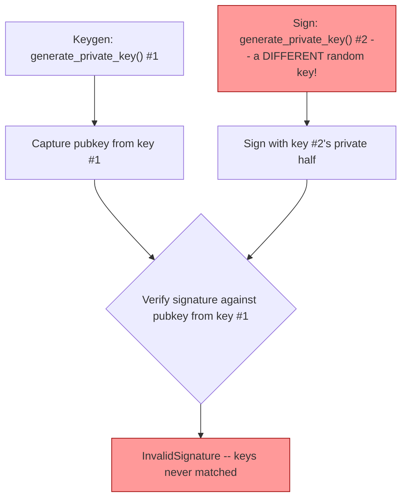
```mermaid
flowchart TD
    A["Keygen: generate_private_key() #1"] --> B["Capture pubkey from key #1"]
    C["Sign: generate_private_key() #2 -- a DIFFERENT random key!"] --> D["Sign with key #2's private half"]
    B --> E{"Verify signature against pubkey from key #1"}
    D --> E
    E --> F["InvalidSignature -- keys never matched"]

    style C fill:#f99,stroke:#900
    style F fill:#f99,stroke:#900
```

The fix is to generate exactly one private key per benchmark run and reuse it for both signing and public-key derivation, exactly as shown in the corrected `benchmark_signature` listing in Section 3 above. We consider 
this bug the single most instructive one in this entire project: it is easy to introduce by writing "keygen" and "sign" as two textually separate steps that *look* independent, but a correct ECDSA benchmark absolutely requires them to share state.

## 5. Bug 2 — `Signature` Has No `export_public_key()` Method

The second bug surfaced in the PQC branches, once we attempted to mirror the ECDSA pattern of "derive the public key, then verify against it explicitly":

```python
_, t_verify = timer(sig.verify, msg, signature, sig.export_public_key())
# AttributeError: 'Signature' object has no attribute 'export_public_key'
```

We had implicitly carried over an assumption from `liboqs-python`'s `KeyEncapsulation` class (used for key exchange, not signatures), which *does* expose separate key-export methods. The `Signature` class follows a different, 
and in our view simpler, convention: **`generate_keypair()` returns the public key directly** as its return value, rather than requiring a separate export call afterward.

We confirmed this directly by inspecting the object's public interface rather than guessing from documentation of a possibly different API version — the same "ask the library, don't assume" discipline we established for the 
naming-drift issue in Chapter 3:

```python
with oqs.Signature("ML-DSA-65") as sig:
    print([m for m in dir(sig) if not m.startswith("_")])
# → generate_keypair, sign, verify, ... (no export_public_key)
```

**Fix**: capture the return value of `generate_keypair()` directly:

```python
public_key, t_keygen = timer(sig.generate_keypair)
...
_, t_verify = timer(sig.verify, msg, signature, public_key)
```

This is reflected in the final `benchmark_signature` code in Section 3, where every PQC branch captures `pk` directly from `sig.generate_keypair()`.

## 6. Saving Artifacts

Once the benchmark loop completes for all three algorithms, the notebook persists results in three complementary formats, matching the "right format for the right consumer" principle established in Chapter 2:

```python
with open("../data/signatures.pkl", "wb") as f:
    pickle.dump(results, f)          # raw Python objects, for later reuse

df_sizes = df[["algorithm", "signature_length"]]
df_sizes.to_csv("../data/sizes.csv", index=False)      # tabular, for pandas/plotting

df_timings = df[["algorithm", "keygen", "sign", "verify"]]
df_timings.to_csv("../data/timings.csv", index=False)  # tabular, for pandas/plotting
```

It then generates three plots via the shared `utils.plot_bar` / `utils.plot_line` helpers from Chapter 3.

## 7. Results

### 7.1 Signature Sizes


| Algorithm | Signature Size |
|---|---|
| ECDSA (P-256) | 72 bytes |
| ML-DSA-65 | 3,309 bytes |
| Falcon-512 | 657 bytes |

The spread here is substantial: ML-DSA-65 signatures are roughly **46 times larger** than ECDSA, while Falcon-512, despite also being a lattice-based scheme, is roughly **5 times smaller than ML-DSA-65** and 
only about **9 times larger than ECDSA**. This size difference is a direct, structural consequence of each algorithm's internal design, which we examine mathematically in chapters 8 and 9 — Falcon's compactness comes at the 
cost of a considerably more complex and failure-sensitive signing procedure (floating-point Gaussian sampling over an NTRU trapdoor), a trade-off we will make precise later in this series.

### 7.2 Key Generation Times

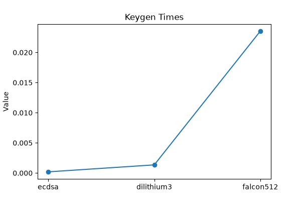

Key generation cost differs sharply across the three algorithms: ECDSA and ML-DSA-65 both complete key generation quickly and land in a broadly similar range, while Falcon-512 is markedly more expensive to key-generate than either of 
the other two, by roughly an order of magnitude. This matches Falcon's known algorithmic profile: its key generation involves sampling a full NTRU trapdoor basis, which is intrinsically more work than ML-DSA's simpler lattice sampling or 
ECDSA's single scalar multiplication.

### 7.3 Verification Times

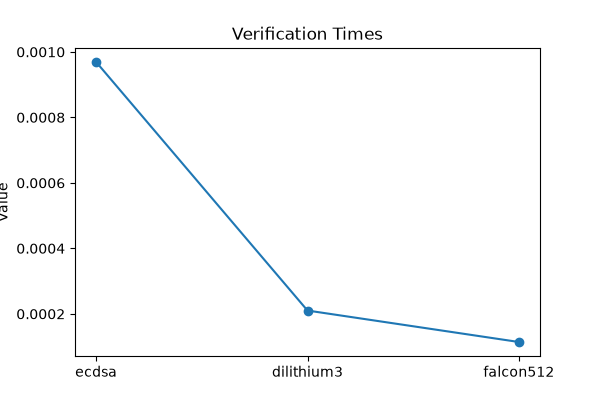

Somewhat counter to a naïve "classical must be fastest" intuition, **ECDSA verification was the slowest of the three** in our measurements, with both PQC algorithms verifying faster. Falcon-512 verified marginally faster than ML-DSA-65. 
We want to be precise about scope here: these are wall-clock measurements on one specific machine, for one specific message size, using one specific pair of Python bindings — not a general claim that "PQC verification is always faster than 
ECDSA" across all hardware and implementations. We revisit this caveat, and aggregate all timing results side by side, in Chapter 11.

## 8. Interpreting the Trade-offs

Three points emerge clearly from this notebook's results, and they set the stage for the crypto-agility argument we develop in the next post:

1. **No single algorithm dominates on every metric.** ECDSA wins decisively on signature size; the PQC algorithms win on verification speed in our measurements; Falcon wins on size among the PQC pair but loses heavily on key generation time.
2. **The "PQC is slow" intuition, at least for signing and verifying with these specific algorithms, does not hold up under direct measurement** on this hardware. The genuinely costly operation, where it exists, is Falcon's key generation — not 
signing or verifying.
3. **Signature size is the dimension most likely to matter operationally**, since it directly affects TLS handshake sizes, certificate chain lengths, and storage overhead for signed artifacts — an ML-DSA-65 signature is not a drop-in size 
replacement for an ECDSA one in bandwidth-constrained contexts.

These three observations, taken together, are precisely why a *fixed* choice of "the" PQC signature algorithm is premature, and why the next post's crypto-agility layer — letting the algorithm be a runtime parameter rather than a compile-time 
decision — is the architecturally correct response to this data, not merely a convenient abstraction.

## 9. What Comes Next

Chapter 5 builds directly on top of the `benchmark_signature` function developed here, generalizing it into the `crypto_agility.py` module: a single, algorithm-parameterized `sign()` / `verify()` interface that Notebooks 02, 03, 
and 99 all consume. We also cover a subtle correctness bug specific to that module — one where `sign()` and `verify()` initially generated *independent* keypairs on every call, causing every single verification to fail, and the module-level, 
generate-once pattern we adopted to fix it permanently.

---

## Chapter 5/13: The Crypto-Agility Layer

### Abstract

In this chapter, we build `crypto_agility.py`, the algorithm-agnostic `sign()` / `verify()` abstraction that turns the per-algorithm code from Chapter 4 into a single, unified interface. We document a critical correctness bug we 
introduced during its first draft — every `verify()` call generated a brand-new, unrelated keypair, causing every single verification to fail deterministically — and the module-level "generate once, reuse always" fix that resolves 
it permanently. We close with the algorithm-switching test results and the two plots this notebook produces.

## 1. From Per-Algorithm Functions to a Single Interface

Chapter 4's `benchmark_signature(alg)` function already contains all three algorithms' logic behind one `if/elif` chain. `02_crypto_agility.ipynb` takes the natural next step: extracting that logic into a 
**standalone, importable Python module** with exactly two public functions, so that any caller — a benchmark loop, a test script, or (as we build in Chapter 6) an HTTP request handler — can sign and verify without knowing anything about 
`liboqs` or `cryptography` internals:

```python
crypto_agility.sign(msg, alg)
crypto_agility.verify(msg, signature, alg)
```

This is the concrete implementation of the crypto-agility principle introduced conceptually in Chapter 1: the signature algorithm becomes a runtime string parameter, not a compile-time or architecture-level decision.

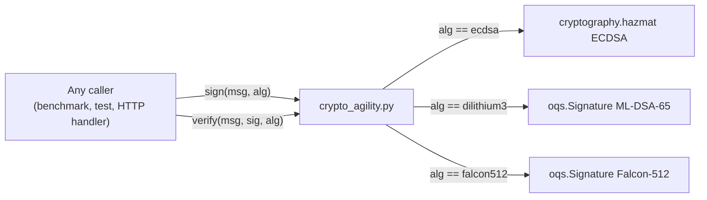
```mermaid
flowchart LR
    Caller["Any caller\n(benchmark, test, HTTP handler)"] -->|"sign(msg, alg)"| CA["crypto_agility.py"]
    Caller -->|"verify(msg, sig, alg)"| CA
    CA -->|"alg == ecdsa"| ECDSA["cryptography.hazmat ECDSA"]
    CA -->|"alg == dilithium3"| MLDSA["oqs.Signature ML-DSA-65"]
    CA -->|"alg == falcon512"| FALCON["oqs.Signature Falcon-512"]
```

## 2. First Draft — and a Critical Bug

Our first implementation of the module looked reasonable on inspection, and mirrors what many developers would naturally write for a stateless-looking `sign()`/`verify()` pair:

```python
def sign(msg, alg):
    if alg == "ecdsa":
        key = ec.generate_private_key(ec.SECP256R1())
        return key.sign(msg, ec.ECDSA(hashes.SHA256()))

    if alg == "dilithium3":
        with oqs.Signature("Dilithium3") as sig:
            sig.generate_keypair()
            return sig.sign(msg)
    # ... falcon512 analogous


def verify(msg, signature, alg):
    if alg == "ecdsa":
        key = ec.generate_private_key(ec.SECP256R1())   # <-- a NEW, unrelated key!
        pub = key.public_key()
        pub.verify(signature, msg, ec.ECDSA(hashes.SHA256()))
        return True

    if alg == "dilithium3":
        with oqs.Signature("Dilithium3") as sig:
            pk = sig.generate_keypair()                  # <-- also new and unrelated!
            return sig.verify(msg, signature, pk)
    # ... falcon512 analogous
```

Running the algorithm-switching test suite against this version produced:

```
InvalidSignature
```

— on every single call, for every algorithm, with no exceptions. This is a stronger and more diagnostic failure signature than an intermittent bug would be: a **100% failure rate** is itself the clue. If verification failed only occasionally, we 
might suspect a genuinely probabilistic cryptographic issue (Falcon's Gaussian sampling, for instance, does have algorithm-specific failure modes we discuss in Chapter 9). A deterministic, universal failure instead points directly at a structural 
mismatch between what was signed and what is being checked.

The root cause: **`sign()` and `verify()` each generate their own, independent, randomly sampled keypair, with no mechanism connecting the two calls.** `sign()` produces a valid signature under key A; a subsequent, 
separate call to `verify()` checks that signature against the public half of an entirely different, freshly generated key B. No signature scheme — classical or post-quantum — can validate under a mismatched key; this is not a corner case, 
it is the defining security property of a signature scheme working as intended.

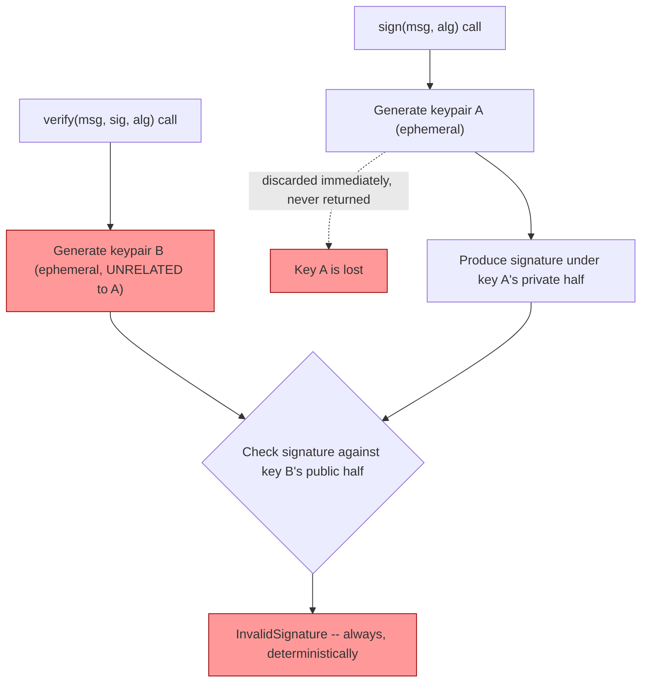
```mermaid
flowchart TD
    S["sign(msg, alg) call"] --> KA["Generate keypair A (ephemeral)"]
    KA --> SIG["Produce signature under key A's private half"]
    KA -.->|"discarded immediately, never returned"| Lost["Key A is lost"]

    V["verify(msg, sig, alg) call"] --> KB["Generate keypair B (ephemeral, UNRELATED to A)"]
    KB --> Check{"Check signature against key B's public half"}
    SIG --> Check
    Check --> Fail["InvalidSignature -- always, deterministically"]

    style Lost fill:#f99,stroke:#900
    style KB fill:#f99,stroke:#900
    style Fail fill:#f99,stroke:#900
```

This is structurally the same class of error as Bug 1 in Chapter 4 (an ECDSA benchmark that regenerated its key between signing and verifying) — but here it is more severe, because it affects **every algorithm, on every call**, 
rather than one branch of one function.

## 3. The Fix — Generate Once, at Import Time, Reuse Always

The correct design generates exactly one keypair per algorithm, **once, when the module is first imported**, and holds those keypairs (and, for the PQC algorithms, the live `oqs.Signature` object itself) as 
module-level state that both `sign()` and `verify()` share:

```python
import oqs
from cryptography.hazmat.primitives.asymmetric import ec
from cryptography.hazmat.primitives import hashes

# Generate one keypair per algorithm, once at import time, and reuse it
# for both sign() and verify() -- otherwise each call would use a fresh,
# unrelated random key and verification would always fail.
_ecdsa_private_key = ec.generate_private_key(ec.SECP256R1())
_ecdsa_public_key = _ecdsa_private_key.public_key()

_dilithium_sig = oqs.Signature("ML-DSA-65")
_dilithium_pk = _dilithium_sig.generate_keypair()

_falcon_sig = oqs.Signature("Falcon-512")
_falcon_pk = _falcon_sig.generate_keypair()


def sign(msg, alg):
    if alg == "ecdsa":
        return _ecdsa_private_key.sign(msg, ec.ECDSA(hashes.SHA256()))
    if alg == "dilithium3":
        return _dilithium_sig.sign(msg)
    if alg == "falcon512":
        return _falcon_sig.sign(msg)
    raise ValueError("Unknown algorithm")


def verify(msg, signature, alg):
    if alg == "ecdsa":
        _ecdsa_public_key.verify(signature, msg, ec.ECDSA(hashes.SHA256()))
        return True
    if alg == "dilithium3":
        return _dilithium_sig.verify(msg, signature, _dilithium_pk)
    if alg == "falcon512":
        return _falcon_sig.verify(msg, signature, _falcon_pk)
    raise ValueError("Unknown algorithm")
```

Two implementation details are worth calling out explicitly, since both are easy to get wrong in the opposite direction:

- **`"Dilithium3"` → `"ML-DSA-65"`.** The first draft also still carried the pre-standardization mechanism name discussed in Chapter 3; we corrected it in the same pass as the keypair-reuse fix.
- **The `oqs.Signature` objects for the PQC algorithms are kept open at module scope, not wrapped in a `with` block.** This is a deliberate deviation from the `with oqs.Signature(...) as sig:` pattern used everywhere in Chapter 4's benchmark code. 
The private key material for an `oqs.Signature` instance lives inside that object's internal native state for as long as it remains open; a `with` block closes it — and invalidates further signing — the moment its block exits. Since `_dilithium_sig` 
and `_falcon_sig` must remain usable across arbitrarily many later `sign()`/`verify()` calls throughout the module's lifetime, they cannot be scoped to a `with` block the way a one-shot benchmark measurement can.

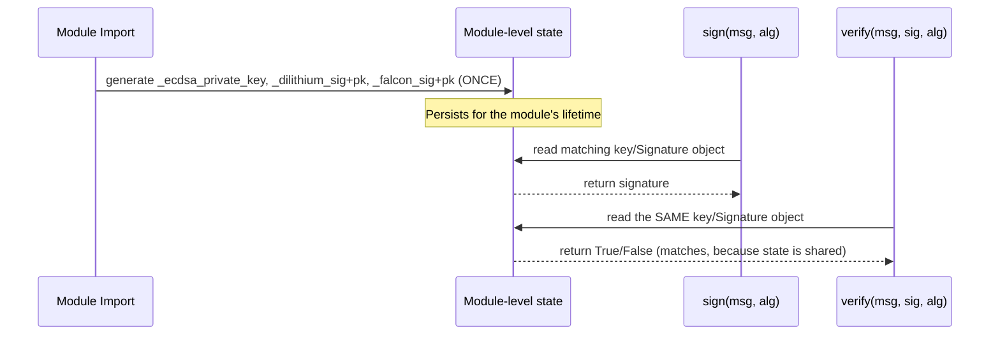
```mermaid
sequenceDiagram
    participant Import as Module Import
    participant State as Module-level state
    participant Sign as sign(msg, alg)
    participant Verify as verify(msg, sig, alg)

    Import->>State: generate _ecdsa_private_key, _dilithium_sig+pk, _falcon_sig+pk (ONCE)
    Note over State: Persists for the module's lifetime

    Sign->>State: read matching key/Signature object
    State-->>Sign: return signature

    Verify->>State: read the SAME key/Signature object
    State-->>Verify: return True/False (matches, because state is shared)
```

## 4. A Deployment Pitfall We Also Hit: Stale Module Caching

While iterating on this fix, we encountered a second, entirely separate problem that is worth flagging here even though we treat it fully in Chapter 12: our first attempt to apply the fix only rewrote `crypto_agility.py` **on disk**, 
guarded by an `if not exists(module_path):` check left over from an earlier version of the notebook. Since the file already existed from the buggy first draft, re-running that cell did nothing — it printed `"✓ crypto_agility.py already exists"` 
and left the broken file untouched. Once we removed that guard so the cell unconditionally rewrites the file, a second, independent issue surfaced: Python's `import` statement does not re-read a module's source file on a second 
`import crypto_agility` call within the same running kernel — it returns the already-cached module object from `sys.modules`. Only a full kernel restart (or an explicit `importlib.reload(crypto_agility)`) picks up changes made to the file 
after the first import.

We flag this here, adjacent to the bug it was masking, precisely because a naïve reading of "the file on disk is correct now" can mislead a developer into believing a fix has taken effect when it has not — the notebook state and the filesystem 
state had silently diverged. Chapter 12 walks through the exact diagnostic sequence we used to catch this.

## 5. Algorithm-Switching Tests

With the corrected module in place, Section 5 of the notebook exercises all three algorithms through the unified interface, timing sign and verify separately for each:

```python
algorithms = ["ecdsa", "dilithium3", "falcon512"]
msg = b"Agility Test"

results = []
for alg in algorithms:
    signature, t_sign = utils.timer(crypto_agility.sign, msg, alg)
    _, t_verify = utils.timer(crypto_agility.verify, msg, signature, alg)
    results.append({
        "algorithm": alg,
        "sign_time": t_sign,
        "verify_time": t_verify,
        "signature_length": len(signature)
    })
```

This test suite is deliberately structured differently from Chapter 4's `benchmark_signature`: it does not measure key generation at all (since keys are now generated once, at import time, outside the timed section), and it calls `sign()` and `verify()` 
exclusively through the public module interface, exactly as any downstream consumer — including the FastAPI service in Chapter 6 — will.

## 6. Results

### 6.1 Signature Sizes via the Agility Layer

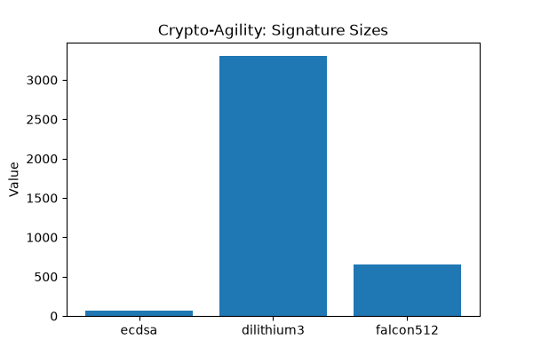

The measured signature lengths — 72 bytes (ECDSA), 3,309 bytes (ML-DSA-65 / "dilithium3"), and 657 bytes (Falcon-512) — are numerically identical to those measured directly in Chapter 4. This is an important sanity check, not a redundant one: 
it confirms that the abstraction layer introduces **no observable overhead or distortion** in the cryptographic output itself. The `crypto_agility` module is a pure routing and lifecycle-management layer around the same underlying library 
calls exercised in Chapter 4 — exactly the property we want from an abstraction that is meant to be transparent to the algorithms it wraps.

### 6.2 Algorithm Switch Cost (Sign Time)

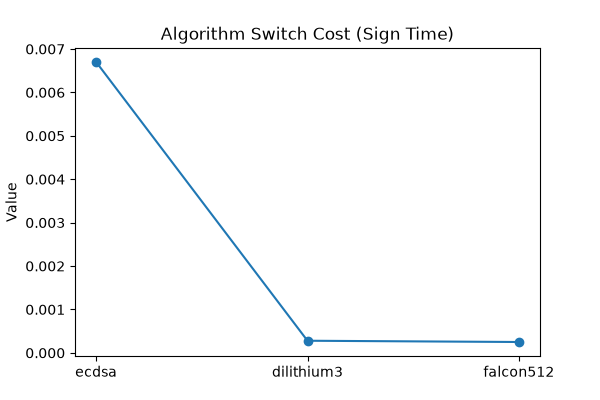

Measuring sign time specifically through the agility layer — with key generation excluded, since it happens once at import — shows ECDSA taking noticeably longer to sign than either PQC algorithm in this measurement, with ML-DSA-65 and 
Falcon-512 landing close to each other. We defer detailed cross-Chapter timing comparison (including how these numbers relate to the raw benchmark from Chapter 4) to Chapter 11, where we assemble every timing result from this series into one consolidated 
table; the point we want to establish here is narrower and structural: **switching which algorithm signs a given message costs nothing beyond the algorithm's own intrinsic sign time** — there is no "agility tax" imposed by the abstraction 
layer itself, since `sign()` and `verify()` are simple dispatch functions with no per-call setup cost of their own.

## 7. Why This Design Choice Matters Beyond This Project

We want to state the general principle this notebook embodies, since it is the load-bearing idea of the entire project, not merely an implementation convenience specific to our three chosen 
algorithms: **a crypto-agile system must treat "which algorithm" as data, and "how to use that algorithm correctly" (key lifecycle, object lifetime, exact mechanism-name strings) as an implementation detail hidden entirely behind the interface.** 
Every bug documented in this Chapter — the accidental key regeneration, the premature `with`-block closure, the stale mechanism name — was a leak of that implementation detail into the interface's behavior. Fixing each one was, in 
every case, a matter of tightening the boundary between "what the caller specifies" (an algorithm label and a message) and "what the module manages internally" (key lifecycle and library-specific calling conventions).

## 8. What Comes Next

Chapter 6 wraps `crypto_agility.py` in a small FastAPI microservice (`03_service_demo.ipynb`), exposing `/sign` and `/verify` as HTTP endpoints, and measures how the module's near-zero "switching tax" documented here holds up 
once real network and web-framework overhead enters the picture.

---

## Chapter 6/13: The Mini-Service Demo

### Abstract

In this chapter, we wrap the `crypto_agility` module from Chapter 5 in a small FastAPI microservice (`03_service_demo.ipynb`), exposing signature generation over HTTP. We walk through the service's evolution from a 
bare single-endpoint app to one with request logging middleware and a self-documenting root route, and we flag an honest, unresolved design flaw in the `/verify` endpoint that we believe is more instructive left 
visible than silently patched. We close with end-to-end HTTP latency measurements for all three algorithms.

## 1. Goal of This Notebook

chapters 4 and 5 measured signing and verification as direct, in-process Python function calls. Real systems, of course, rarely call a signing library directly from the same process that needs a signature — they go 
through a service boundary: an internal microservice, a signing API, a certificate authority endpoint. `03_service_demo.ipynb` closes that gap by placing `crypto_agility.sign()` and `crypto_agility.verify()` behind 
a FastAPI HTTP interface, and then measuring what changes once network and web-framework overhead enter the picture.

## 2. The Minimal Service

The first working version of the service is deliberately small — a single endpoint, no middleware, no logging:

```python
from fastapi import FastAPI

app = FastAPI()

@app.get("/sign")
def sign_endpoint(msg: str, alg: str):
    signature = crypto_agility.sign(msg.encode(), alg)
    return {
        "algorithm": alg,
        "signature_length": len(signature)
    }

@app.get("/verify")
def verify_endpoint(msg: str, alg: str):
    signature = crypto_agility.sign(msg.encode(), alg)
    valid = crypto_agility.verify(msg.encode(), signature, alg)
    return {
        "algorithm": alg,
        "valid": valid
    }
```

The service runs inside a background thread within the notebook process itself, using `uvicorn.run()`, so that the notebook's own execution is not blocked while the server is live:

```python
def run_service():
    uvicorn.run(app, host="127.0.0.1", port=8000, log_level="warning")

thread = threading.Thread(target=run_service, daemon=True)
thread.start()
```

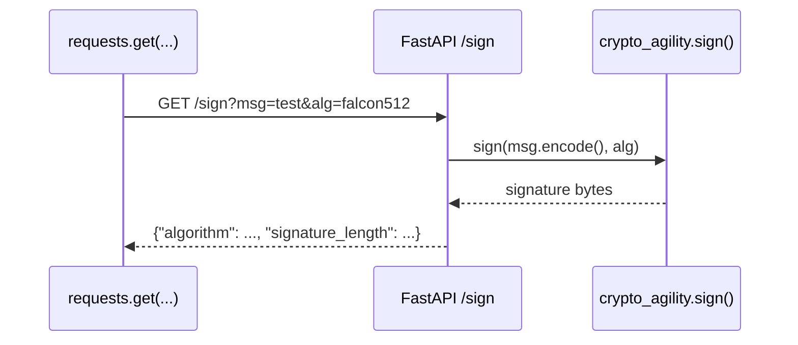
```mermaid
sequenceDiagram
    participant Client as requests.get(...)
    participant API as FastAPI /sign
    participant CA as crypto_agility.sign()

    Client->>API: GET /sign?msg=test&alg=falcon512
    API->>CA: sign(msg.encode(), alg)
    CA-->>API: signature bytes
    API-->>Client: {"algorithm": ..., "signature_length": ...}
```

## 3. A Non-Bug: `GET /` Returns 404

Opening `http://127.0.0.1:8000/` directly in a browser at this stage returns:

```json
{"detail": "Not Found"}
```

We want to be explicit that this is **expected FastAPI behavior, not a defect**. FastAPI returns a 404 automatically for any path with no matching route, and the minimal service above defines routes only for `/sign` and 
`/verify` — the root path `/` was simply never declared. The proof that the service is otherwise functioning correctly is straightforward: every request to `/sign?msg=...&alg=...` in our client tests (Section 6 below) returned a 
valid `200 OK` with a correctly structured JSON body; a genuinely broken service would instead raise a `ConnectionError` on the client side, not a well-formed 404 from a *different* endpoint.

That said, a bare 404 at the root is poor operator ergonomics — a colleague opening the URL for the first time has no way to discover what the service actually offers. We addressed this directly in the next revision.

## 4. Adding Observability: Root Route, Middleware, and a Request Log

The improved service adds three things: a root route that documents available endpoints, HTTP middleware that transparently logs every request regardless of which endpoint handled it, and a `/requests` endpoint to inspect that log:

```python
import time
from datetime import datetime
from fastapi import FastAPI, Request

app = FastAPI()
request_log = []

@app.middleware("http")
async def log_requests(request: Request, call_next):
    start = time.perf_counter()
    response = await call_next(request)
    duration = time.perf_counter() - start

    request_log.append({
        "timestamp": datetime.now().isoformat(),
        "method": request.method,
        "path": request.url.path,
        "query_params": dict(request.query_params),
        "status_code": response.status_code,
        "duration_sec": round(duration, 6)
    })
    return response


@app.get("/")
def root():
    return {
        "message": "PQC signature service is running",
        "endpoints": ["/sign", "/verify", "/requests"],
        "docs": "/docs"
    }


@app.get("/requests")
def get_requests(limit: int = 50):
    """Return the most recent logged requests (default: last 50)."""
    return {
        "total_requests": len(request_log),
        "showing": min(limit, len(request_log)),
        "requests": request_log[-limit:]
    }
```

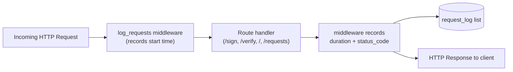
```mermaid
flowchart LR
    Req[Incoming HTTP Request] --> MW["log_requests middleware\n(records start time)"]
    MW --> Handler["Route handler\n(/sign, /verify, /, /requests)"]
    Handler --> MW2["middleware records\nduration + status_code"]
    MW2 --> Log[(request_log list)]
    MW2 --> Resp[HTTP Response to client]
```

Because the middleware wraps *every* route indiscriminately, it required no changes to the existing `/sign` or `/verify` handlers — a direct benefit of FastAPI's middleware model, and a small but genuine illustration of 
separation of concerns: request observability is a cross-cutting service-layer property, and should not need to be threaded manually through every individual endpoint's business logic.

We also confirmed, via FastAPI's automatically generated OpenAPI documentation at `/docs` (Swagger UI), that both `/sign` and the new `/requests` endpoint declare their query parameters correctly — `msg` and `alg` as required 
strings for `/sign`, and an optional `limit` integer (default 50) for `/requests` — which makes the service self-describing for any client without needing to read the source code.

## 5. An Honest, Unresolved Flaw in `/verify`

We want to flag something in the `/verify` endpoint's design that we did not fix, and explain why we consider it worth leaving visible in this documentation rather than silently correcting after the fact:

```python
@app.get("/verify")
def verify_endpoint(msg: str, alg: str):
    signature = crypto_agility.sign(msg.encode(), alg)      # generates a FRESH signature
    valid = crypto_agility.verify(msg.encode(), signature, alg)  # then verifies THAT SAME signature
    return {"algorithm": alg, "valid": valid}
```

This endpoint signs a message and then immediately verifies the signature it just produced, inside the same request. It can never meaningfully return `valid: false` for any inputs the underlying algorithm supports, 
because it is not verifying a signature supplied by the *caller* — it is round-tripping its own freshly generated one. A functioning `/verify` endpoint, in a real system, needs to accept an externally produced signature 
as an input parameter (most naturally as a base64-encoded string, since signatures are raw bytes and HTTP query parameters are text) and verify *that* value against the module's known public key for the given algorithm.

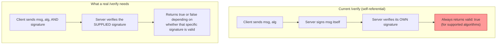
```mermaid
flowchart TD
    subgraph Current["Current /verify (self-referential)"]
        A1["Client sends msg, alg"] --> A2["Server signs msg itself"]
        A2 --> A3["Server verifies its OWN signature"]
        A3 --> A4["Always returns valid: true\n(for supported algorithms)"]
    end

    subgraph Correct["What a real /verify needs"]
        B1["Client sends msg, alg, AND signature"] --> B2["Server verifies the SUPPLIED signature"]
        B2 --> B3["Returns true or false depending on\nwhether that specific signature is valid"]
    end

    style A4 fill:#f99,stroke:#900
```

We chose to document this as-is, rather than quietly patching it before writing this series, for a reason consistent with the goals we stated in Chapter 1: this project treats its debugging and design history as primary source material. 
A `/verify` endpoint that cannot fail is a realistic and common mistake in early service prototypes — precisely the kind of gap that a code reviewer, rather than a unit test, is likely to catch, since every individual request the endpoint 
handles "succeeds." We record the fix that *would* be needed (accepting a caller-supplied, base64-encoded signature parameter) as a concrete, actionable item, without implementing it here, since it is not exercised by any of the benchmark 
or latency measurements in this Chapter — those measurements (Section 6, below) only exercise `/sign`.

## 6. Measuring End-to-End Service Latency

With the service running, the notebook issues one HTTP request per algorithm and measures wall-clock round-trip time from the client side:

```python
algorithms = ["ecdsa", "dilithium3", "falcon512"]
logs = []

for alg in algorithms:
    url = f"http://127.0.0.1:8000/sign?msg=test&alg={alg}"
    start = time.perf_counter()
    r = requests.get(url)
    end = time.perf_counter()

    logs.append({
        "algorithm": alg,
        "latency": end - start,
        "signature_length": r.json()["signature_length"]
    })
```

### Results

| Algorithm | Service Latency |
|---|---|
| ECDSA | 18.362 ms |
| ML-DSA-65 ("dilithium3") | 6.029 ms |
| Falcon-512 | 5.262 ms |

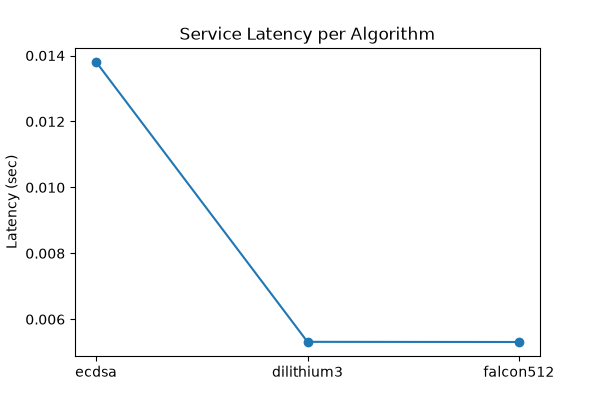

The relative ranking matches the in-process verification-time results from Chapter 4: ECDSA is the slowest of the three, with both PQC algorithms landing close together and noticeably faster. What has changed is the **absolute scale**: 
recall from Chapter 4 that in-process verification times were on the order of hundreds of microseconds to roughly one millisecond. Here, every request — including the fastest, Falcon-512 — takes several milliseconds. This gap is expected 
and informative: it is the combined cost of Python's `requests` library opening an HTTP connection, FastAPI/Starlette's ASGI request routing, our own logging middleware, and `uvicorn`'s event loop — none of which are part of the raw 
cryptographic operation being measured. We measure this same service again from the presentation notebook in Chapter 7, on a separate port, and compare both runs directly in Chapter 11's consolidated results table, where the run-to-run variability 
itself becomes a useful data point about how much of "service latency" is fixed HTTP/ASGI overhead versus algorithm-dependent cost.

## 7. Saved Artifacts

The notebook persists its results to `data/service_logs.json` and renders the latency comparison to `plots/service_latency.png`, following the same artifact-based coupling convention established in Chapter 2 — allowing the presentation notebook in 
Chapter 7 to either reuse these exact files or regenerate equivalent ones from its own, independently run service instance.

## 8. What Comes Next

Chapter 7 examines `99_presentation.ipynb`, the integrated notebook introduced architecturally in Chapter 2. We show its artifact-loading fallback logic in action, its own independent instance of the mini-service (running on port 8001 
rather than 8000, so it does not collide with a still-running Notebook 03 service), and the live, in-notebook demonstration that ties every prior post's artifacts into one continuous narrative.

---

## Chapter 7/13: The Presentation Notebook and Live Demo

### Abstract

In this chapter, we examine `99_presentation.ipynb`, the integration notebook designed in Chapter 2 to stand on its own as a single, linear narrative for live demonstrations. We show its artifact-loading fallback logic actually 
running, present its live crypto-agility and mini-service demos, and — in the spirit of the candor we committed to in Chapter 1 — flag two real inconsistencies we found between this notebook's fallback code paths and the corrected 
modules from chapters 3 and 5. Both inconsistencies never triggered during our own runs, precisely because the correct artifacts already existed on disk, but they represent a latent risk worth surfacing rather than quietly fixing after the fact.

## 1. Purpose, Recapped

Chapter 2 described the design goal for this notebook: a single scrollable narrative, runnable by a presenter with no dependency on Notebooks 00–03 having been executed first, achieved via a fallback pattern of 
`if exists(artifact): load() else: generate_inline()` applied to every module, data file, and plot the notebook needs. This Chapter shows that pattern as it actually appears in the finished notebook, and reports what we found 
when we looked closely at both branches of that fallback — not just the one that executed.

## 2. Loading Modules, With a Fallback That Never Ran (and a Reason to Care Anyway)

The notebook's Section 2 attempts to import `utils` and `crypto_agility`, generating a minimal inline version of either module if the corresponding file is missing from `../modules/`:

```python
if not exists("../modules/crypto_agility.py"):
    print("crypto_agility.py missing — creating inline fallback...")
    crypto_agility_code = """
import oqs
from cryptography.hazmat.primitives.asymmetric import ec
from cryptography.hazmat.primitives import hashes

def sign(msg, alg):
    if alg == "ecdsa":
        key = ec.generate_private_key(ec.SECP256R1())
        return key.sign(msg, ec.ECDSA(hashes.SHA256()))
    if alg == "dilithium3":
        with oqs.Signature("Dilithium3") as sig:
            sig.generate_keypair()
            return sig.sign(msg)
    ...
"""
    with open("../modules/crypto_agility.py", "w") as f:
        f.write(crypto_agility_code)

import crypto_agility
print("✓ crypto_agility.py loaded")
```

In every run we performed, this branch never executed — `../modules/crypto_agility.py` already existed on disk, correctly, from Chapter 5's `02_crypto_agility.ipynb`, and the notebook's output confirmed the direct-load path:

```
✓ utils.py loaded
✓ crypto_agility.py loaded
```

We want to flag something we noticed on close reading of the *unexecuted* fallback code above, because it is a real and instructive gap: **this inline fallback is textually identical to the very first, buggy draft of 
`crypto_agility.py` from Chapter 5** — it still calls `oqs.Signature("Dilithium3")` (the pre-standardization name that raises `MechanismNotSupportedError` on our `liboqs` build, per Chapter 3) and it still generates an independent, 
unrelated keypair inside `verify()` on every call (the deterministic `InvalidSignature` bug we diagnosed and fixed in Chapter 5). The fallback was authored before those fixes existed, and — because it lives as an embedded string 
literal inside `99_presentation.ipynb`, entirely separate from `modules/crypto_agility.py` itself — **fixing the real module in Chapter 5 did nothing to update this fallback copy.**

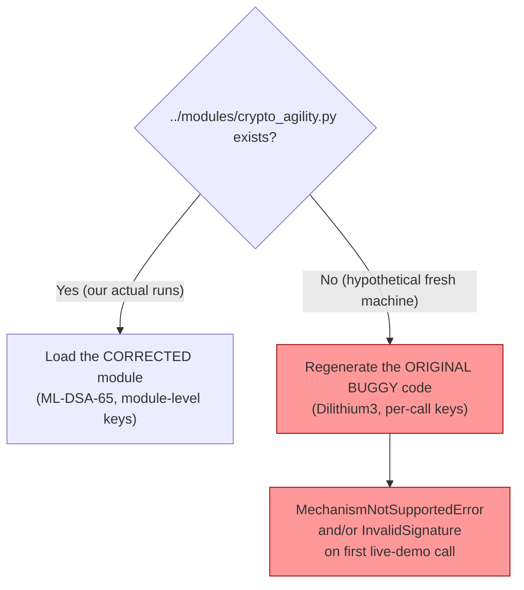
```mermaid
flowchart TD
    Check{"../modules/crypto_agility.py exists?"}
    Check -->|"Yes (our actual runs)"| Good["Load the CORRECTED module\n(ML-DSA-65, module-level keys)"]
    Check -->|"No (hypothetical fresh machine)"| Bad["Regenerate the ORIGINAL BUGGY code\n(Dilithium3, per-call keys)"]
    Bad --> Fail["MechanismNotSupportedError\nand/or InvalidSignature\non first live-demo call"]

    style Bad fill:#f99,stroke:#900
    style Fail fill:#f99,stroke:#900
```

The practical consequence: if this presentation notebook were handed to a colleague on a genuinely fresh machine — the exact scenario the fallback mechanism was designed to support — the very fallback intended to make the 
demo "just work" would instead regenerate a module that fails immediately, for two independent reasons already solved earlier in this series. We record this here as a concrete illustration of a general risk with fallback/inline-regeneration 
code: **it silently drifts out of sync with the primary implementation it shadows, unless the two are actively kept in lockstep or, better, the fallback is generated by importing and serializing the real module rather than duplicating its 
source as a separate string literal.** We did not go back and patch this fallback before writing this chapter, for the same reason we left the `/verify` design flaw visible in Chapter 6: it is a real artifact of how the project evolved, and 
patching it silently would understate a failure mode worth naming explicitly for anyone building a similar fallback pattern.

## 3. Loading Data Artifacts, With a Subtler Fallback Risk

Section 3 applies the same `exists → load, else → generate` pattern to `sizes.csv`, `timings.csv`, and `agility_tests.json`. The `sizes.csv` and `agility_tests.json` fallbacks regenerate genuine values by actually invoking the 
signing functions inline — so, unlike the module fallback above, these two would still produce *correct*, if freshly-measured, numbers even if triggered. The `timings.csv` fallback, however, is different in kind:

```python
if exists("../data/timings.csv"):
    df_timings = pd.read_csv("../data/timings.csv")
else:
    print("timings.csv missing — generating inline minimal timings...")
    df_timings = pd.DataFrame({
        "algorithm": df_sizes["algorithm"],
        "keygen": [0.001, 0.002, 0.002],
        "sign":   [0.001, 0.003, 0.002],
        "verify": [0.001, 0.004, 0.003]
    })
```

These numbers are **hardcoded placeholders**, not measurements — and critically, the console output in this branch (`"✓ Generated timings.csv"`) is textually indistinguishable from the output produced when Section 3 loads 
genuinely measured data (`"✓ Loaded timings.csv"` differs by exactly one word, easy to miss when scanning notebook output quickly during a live presentation). A presenter relying on this fallback without reading the source code 
closely could unknowingly narrate fabricated placeholder numbers as if they were the real benchmark results from Chapter 4. In every run we performed, `timings.csv` already existed from Notebook 01, so this branch never fired — but we 
flag it here as the second of two "silent fallback divergence" risks this notebook carries, both of which we believe are more useful documented than quietly removed.

## 4. Loading Plots, and the Genuinely Robust Part of the Pattern

Section 4's plot-loading fallback is, by contrast, fully sound: it calls the *same* `utils.plot_bar` / `utils.plot_line` helpers used by the original notebooks, operating on whatever DataFrame Section 3 produced (real or placeholder), 
so a regenerated plot is always visually and structurally consistent with its data source — it just might be plotting placeholder numbers if Section 3's fallback fired. This is a useful, general observation: a rendering fallback is safe 
once its inputs are already validated or flagged; the risk in this notebook's design concentrates entirely in the two upstream fallbacks discussed in Sections 2 and 3, not in the plotting layer itself.

Our own run loaded all three existing plots directly, with no regeneration:

```
✓ Loaded ../plots/signature_sizes.png
✓ Loaded ../plots/verification_times.png
✓ Loaded ../plots/agility_matrix.png
```

## 5. Live Demo — Crypto-Agility

Section 5 performs a genuinely live signing pass, in front of whatever audience is watching, across all three algorithms via `crypto_agility.sign()`:

```python
msg = b"Live Demo Message"
for alg in ["ecdsa", "dilithium3", "falcon512"]:
    sig, t_sign = utils.timer(crypto_agility.sign, msg, alg)
    print(f"{alg}: signature length = {len(sig)}, sign time = {t_sign:.6f} sec")
```

```
ecdsa:      signature length = 72,   sign time = 0.007366 sec
dilithium3: signature length = 3309, sign time = 0.000289 sec
falcon512:  signature length = 657,  sign time = 0.000311 sec
```

The signature lengths match chapters 4 and 5 exactly, as expected — this is the same underlying module. The sign times are new measurements from this specific run, and are consistent in ranking (ECDSA slower than both PQC algorithms) with, 
though not numerically identical to, the corresponding measurements in chapters 4 and 5 — the kind of run-to-run variation we address explicitly in Chapter 11's consolidated results discussion.

## 6. Live Demo — Mini-Service on Port 8001

Section 6 starts a second, independent FastAPI instance — with its own `app` object, its own `request_log`, and its own logging middleware and `/requests` endpoint, directly mirroring the improved service design from Chapter 6 — but bound to 
**port 8001** rather than Notebook 03's port 8000:

```python
def run_service():
    uvicorn.run(app, host="127.0.0.1", port=8001, log_level="warning")

thread = threading.Thread(target=run_service, daemon=True)
thread.start()
print("✓ Mini-Service started at http://127.0.0.1:8001")
```

The choice of a different port is a small but important operational detail: it lets this notebook's service run **simultaneously** alongside a still-running instance from Notebook 03, without a port-binding conflict — relevant in exactly 
the situation this notebook is designed for, where a presenter might have Notebook 03 still open from an earlier demonstration in the same session.

We separately confirmed, via a browser visit to `http://127.0.0.1:8001/docs`, that FastAPI's automatically generated Swagger UI correctly lists all three routes — `GET /`, `GET /sign`, and `GET /requests` — with accurate parameter documentation 
for each, including the `limit: int = 50` default on `/requests`.

## 7. Measuring Service Latency, Again

Section 7 repeats Chapter 6's client-side latency measurement, this time against port 8001:

```
=== Service Latency Test ===
ecdsa:      0.013804 sec
dilithium3: 0.005314 sec
falcon512:  0.005309 sec
```

| Algorithm | Notebook 03 (port 8000) | Notebook 99 (port 8001) |
|---|---|---|
| ECDSA | 18.362 ms | 13.804 ms |
| ML-DSA-65 | 6.029 ms | 5.314 ms |
| Falcon-512 | 5.262 ms | 5.309 ms |

Both runs agree on the qualitative story — ECDSA measurably slower over HTTP than either PQC algorithm, with ML-DSA-65 and Falcon-512 close together — while differing by several milliseconds in absolute terms for ECDSA specifically. 
We attribute this gap to ordinary process-level variance (JIT/cache warm-up in the Python process, background system load, and the fact that these are single-shot measurements rather than averages over many requests) rather than to 
any structural difference between the two service instances, since the underlying `crypto_agility` module and endpoint code are identical between them. We return to this variance explicitly, alongside every other timing result in this 
series, in Chapter 11.

## 8. Completion, and What This Notebook Demonstrates

The notebook's final cell prints a simple completion message:

```
=== Presentation Notebook Complete ===
All demos, plots, and live tests executed successfully.
You are ready for your team presentation.
```

Taken as a whole, `99_presentation.ipynb` successfully demonstrates the property it was designed for in Chapter 2: a single, top-to-bottom runnable narrative that reuses every artifact from Notebooks 00–03 when available, 
re-derives them when not, and layers two genuinely live demonstrations (in-process signing, and an HTTP round trip) on top. The two fallback-drift issues documented in Sections 2 and 3 do not undermine that core design — they are, 
in effect, a maintenance debt specific to the fallback branches rather than a flaw in the fallback *pattern* itself, and we surface them here precisely so that pattern can be reused correctly elsewhere: fallback code that duplicates 
a primary implementation's source, rather than importing and serializing it, needs an explicit synchronization discipline (a shared source of truth, or a test that fails when the two diverge) that this project did not originally include.

## 9. What Comes Next

Having now covered the full engineering arc of the project — architecture, environment, benchmarking, the agility layer, the service, and the integration notebook — the series turns, in chapters 8 through 10, to the mathematical foundations 
underneath the two PQC algorithms we have been measuring throughout. Chapter 8 begins with ML-DSA (Dilithium): its Module-LWE and Module-SIS hardness assumptions, and how its signing and verification procedures are built from them.

---

## Chapter 8/13: Mathematical Background I — Dilithium / ML-DSA

### Abstract

In this chapter, we step back from engineering and examine the mathematics underlying ML-DSA — the NIST-standardized signature scheme we have been benchmarking since Chapter 4 under its pre-standardization name, 
"Dilithium3." We cover its algebraic setting, the two lattice problems it relies on (Module-LWE and Module-SIS), its key generation, signing, and verification procedures, and we reconcile commonly cited textbook 
signature sizes against the concrete 3,309-byte figure we measured ourselves in Chapter 4.

## 1. Why We Start Here

Of the three algorithms compared throughout this series, ML-DSA is the one NIST's own guidance recommends as the default, general-purpose choice for most PQC migrations — a recommendation that also matches our 
own empirical results from Chapter 4, where it delivered competitive verification speed without Falcon's markedly higher key-generation cost. Understanding *why* it behaves the way it does requires understanding the 
two hardness assumptions it is built on, which is the purpose of this post.

## 2. The Algebraic Setting: A Cyclotomic Ring

ML-DSA does not operate over plain integers or unstructured matrices — it operates inside a specific polynomial ring:

$$R_q = \mathbb{Z}_q[x] / (x^n + 1)$$

with the standard parameters:

- $n = 256$
- $q = 8{,}380{,}417$

In plain terms: elements of $R_q$ are polynomials of degree less than $n$, with integer coefficients taken modulo $q$, where polynomial multiplication additionally reduces modulo $x^n + 1$ — meaning $x^n$ is treated as $-1$ 
whenever it appears. This particular ring is called **cyclotomic**, and the choice is not arbitrary: reduction modulo $x^n + 1$ is exactly the structure that admits an efficient **Number-Theoretic Transform** (an integer analogue 
of the Fast Fourier Transform), which is what makes polynomial multiplication in $R_q$ run in $O(n \log n)$ time rather than the $O(n^2)$ time a naive implementation would require. This efficiency gain is the practical reason ML-DSA 
can be fast enough for real-world deployment at all — every key generation, signing, and verification operation involves many such polynomial multiplications.

"Module" in Module-LWE and Module-SIS (Sections 3–4 below) refers to working with **vectors and matrices whose entries are themselves elements of $R_q$**, rather than with plain scalars modulo $q$ — a middle ground between plain LWE (scalars) 
and ring-LWE restricted to a single ring element, chosen because it gives implementers a tunable security/efficiency trade-off via the matrix dimensions $k \times \ell$.

## 3. Module-LWE: The Assumption Behind the Public Key

The first hardness assumption ML-DSA relies on is **Module Learning-With-Errors (Module-LWE)**. The defining relation is:

$$t = A s + e \pmod q$$

where:

- $A \in R_q^{k \times \ell}$ is a public matrix, deterministically derived from a public seed (so it never needs to be transmitted in full — only the seed does),
- $s$ is a **short** secret vector (small coefficients, drawn from a narrow distribution),
- $e$ is a **short noise vector**, and
- $t$ is the public "noisy" output — this is, in essence, the public key.

The Module-LWE problem is: *given $A$ and $t$, recover $s$.* Without the noise term $e$, this would be a straightforward linear algebra problem, solvable directly by matrix inversion. The noise is precisely what makes the 
system computationally indistinguishable from a uniformly random pair $(A, t)$ — an adversary cannot simply "solve" for $s$ the way they could without $e$, because the noise obscures the exact linear relationship. Module-LWE 
benefits from a **worst-case-to-average-case reduction**: solving a randomly generated LWE instance is provably at least as hard as solving the worst possible instance of certain lattice problems, which is a substantially stronger 
security guarantee than "we have not found an attack yet."

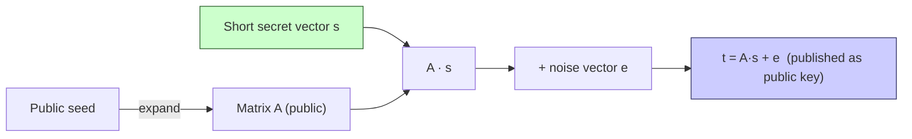
```mermaid
flowchart LR
    Seed["Public seed"] -->|expand| A["Matrix A (public)"]
    S["Short secret vector s"] --> Mult["A · s"]
    A --> Mult
    Mult --> Add["+ noise vector e"]
    Add --> T["t = A·s + e  (published as public key)"]

    style S fill:#cfc,stroke:#363
    style T fill:#ccf,stroke:#336
```

## 4. Module-SIS: The Assumption Behind Short Vectors

The second hardness assumption is **Module Short Integer Solution (Module-SIS)**:

$$A x = 0 \pmod q, \qquad \|x\| \le \beta$$

The task here is: *find a nonzero vector $x$, no longer than some bound $\beta$, satisfying this homogeneous linear system.* This is provably equivalent to finding a short vector in a structured lattice — an instance of the 
**Shortest Vector Problem (SVP)**, which is believed to be hard even for quantum computers (no known quantum algorithm, including variants of Shor's or Grover's algorithm, solves SVP in polynomial time for the lattice dimensions used here). 
ML-DSA uses Module-SIS internally to guarantee that the final signature vector produced during signing is provably short — which is exactly the property the verifier checks, as we detail in Section 7.

## 5. Key Generation

Putting Module-LWE to work, ML-DSA key generation proceeds as:

1. **Generate** the public matrix $A \in R_q^{k \times \ell}$, expanded deterministically from a random seed (this is why only the seed, not the full matrix, needs to be part of the private key material — $A$ is regenerated identically 
by anyone who has the seed).
2. **Sample** two short secret vectors, $s_1$ and $s_2$, from a narrow coefficient distribution.
3. **Compute** the public key component:
   $$t = A s_1 + s_2$$
4. **Compress** $t$ to reduce its representation size before publishing it as (part of) the public key.

```mermaid
sequenceDiagram
    participant KG as KeyGen
    KG->>KG: sample seed, expand to matrix A
    KG->>KG: sample short vectors s1, s2
    KG->>KG: compute t = A·s1 + s2
    KG->>KG: compress t
    KG-->>KG: public key = (seed, compressed t)
    KG-->>KG: private key = (s1, s2)
```

## 6. Signing: A Fiat–Shamir Transform Over Lattices

ML-DSA's signing procedure is a lattice-adapted instance of the **Fiat–Shamir transform** — a general technique for converting an interactive "prove you know a secret" protocol into a non-interactive one, using a hash function to 
simulate the verifier's random challenge:

$$z = y + c\, s_1$$

The full procedure:

1. **Choose** a random short vector $y$.
2. **Compute** the commitment $w = A y$.
3. **Derive** the challenge deterministically from a hash of the commitment and the message: $c = H(w, \text{msg})$.
4. **Compute** the response $z = y + c\, s_1$.
5. **Rejection-sample**: if $z$ (or certain intermediate values) falls outside a required bound, discard this attempt and restart from step 1 with a fresh $y$.

Step 5 is not an edge case — it is a structural part of the algorithm, executed on a meaningful fraction of signing attempts by design. Its purpose is subtle but critical: without rejection sampling, the *distribution* of $z$ 
values an adversary could observe across many signatures would leak statistical information about the secret vector $s_1$, since $z$ is a linear combination directly involving it. Rejection sampling reshapes the output distribution 
of accepted $z$ values so that it is (close to) independent of $s_1$, closing that side channel at the level of the underlying algorithm rather than relying on implementation-level countermeasures.

```mermaid
flowchart TD
    Start([Start signing]) --> Y["Choose random short vector y"]
    Y --> W["Compute w = A·y"]
    W --> C["c = H(w, msg)"]
    C --> Z["Compute z = y + c·s1"]
    Z --> Check{"Is z within required bounds?"}
    Check -->|No -- reject| Y
    Check -->|Yes -- accept| Output(["Signature = (z, c)"])

    style Check fill:#ffd,stroke:#960
```

## 7. Verification

Verification reverses the commitment step using the public data, and checks consistency against the challenge embedded in the signature:

$$H(w', \text{msg}) \stackrel{?}{=} c$$

The verifier reconstructs an approximation $w'$ of the original commitment from the received $(z, c)$ and the public key, then re-derives the challenge from $(w', \text{msg})$ and checks it matches the $c$ received in the signature. 
It additionally checks that $z$ satisfies the same bound the signer's rejection-sampling step enforced — a signature with an out-of-bound $z$ is rejected outright, since a legitimately generated signature could never have passed 
the signer's own rejection check with such a value.

## 8. Security Rationale, Summarized

ML-DSA's security rests on three pillars, each already introduced above:

1. **Worst-case-to-average-case reduction** — breaking a randomly sampled instance is provably as hard as breaking the hardest instance of the underlying lattice problem, not merely "empirically hard so far."
2. **No known efficient quantum algorithm** for Module-LWE or Module-SIS at the parameter sizes used — unlike factoring and discrete log, which Shor's algorithm solves efficiently.
3. **Rejection sampling** — closes a specific statistical side channel that would otherwise leak the secret key across many observed signatures, independent of the two hardness assumptions above.

## 9. Reconciling Textbook Figures With Our Own Measurements

General PQC reference material (including our own project's early research notes) commonly cites Dilithium's signature size as "approximately 2.5 KB." Our own direct measurement in Chapter 4, however, produced **3,309 bytes** for 
ML-DSA-65 specifically. We want to resolve this apparent discrepancy explicitly rather than let two different numbers for "the same algorithm" stand unreconciled in this series.

The explanation is parameter-set granularity: ML-DSA is standardized at **three security levels** — ML-DSA-44, ML-DSA-65, and ML-DSA-87 — corresponding to the matrix dimensions $k \times \ell$ referenced in Section 2 (larger dimensions 
mean larger keys, larger signatures, and higher security margin). The commonly cited "~2.5 KB" figure corresponds more closely to **ML-DSA-44** (NIST security category 2), the smallest of the three parameter sets, while our project 
measured **ML-DSA-65** (security category 3, the mid-tier, and the level we chose in Chapter 3 as the closest match for the informal "Dilithium3" naming used before standardization). NIST's published specification for ML-DSA-65 lists a 
signature size in the same range as our measured 3,309 bytes, which confirms our own benchmark is consistent with the standard once the correct parameter set is compared against the correct reference figure — a small but, in our view, 
worthwhile piece of due diligence, since conflating parameter sets is an easy mistake to make when moving between general PQC literature and a specific, concrete implementation.

## 10. Practical Use Cases

Consistent with its balance of moderate signature size, competitive speed, and the strongest standardization backing among lattice-based signature schemes, ML-DSA is generally positioned as the default choice for:

- TLS 1.3 hybrid handshakes (combined with a classical algorithm during the transition period discussed in Chapter 1),
- general-purpose code and firmware signing,
- PKI and certificate infrastructure.

We revisit this positioning quantitatively, alongside Falcon and our ECDSA baseline, in Chapter 11's consolidated comparison.

## 11. What Comes Next

Chapter 9 turns to Falcon-512 — mathematically the more intricate of the two PQC algorithms in this project, built on NTRU lattices and the GPV Gaussian sampler, with signing that depends on floating-point stability in a way 
ML-DSA's integer-only arithmetic never has to contend with.

---

## Chapter 9/13: Mathematical Background II — Falcon

### Abstract

In this chapter, we examine Falcon-512, the second of the two PQC signature algorithms benchmarked throughout this series. We cover its NTRU lattice foundation, the GPV trapdoor sampler and the discrete Gaussian 
sampling it requires, and why Falcon's signing procedure depends on floating-point arithmetic in a way no other algorithm in this project does. We connect this mathematical structure directly back to two of our 
own empirical results from Chapter 4: Falcon's markedly higher key-generation cost, and its 657-byte measured signature size against a commonly cited ~666-byte reference figure.

## 1. What Sets Falcon Apart

Every other algorithm discussed in this series — ECDSA, and ML-DSA in Chapter 8 — performs its core signing arithmetic entirely over integers modulo a fixed prime or modulus. Falcon is the exception: its signing procedure requires 
**floating-point Gaussian sampling** over a lattice basis, computed via a Fast Fourier Transform. This is unusual enough in cryptographic engineering that it is worth stating plainly up front, since it explains several of Falcon's 
most distinctive practical properties — including, as we show in Section 5, why its key generation is so much more expensive than ML-DSA's or ECDSA's.

## 2. NTRU Lattices

Falcon is built on **NTRU lattices**, a different structured-lattice family from the Module-LWE/SIS lattices underlying ML-DSA. Given two short polynomials $f, g \in R_q$ (the same cyclotomic ring $R_q = \mathbb{Z}_q[x]/(x^n+1)$ 
introduced in Chapter 8), the public key is defined as their ratio:

$$h = g / f \pmod q$$

computed by finding the modular inverse of $f$ in $R_q$ and multiplying by $g$. The corresponding **NTRU lattice** is the set:

$$\Lambda = \{ (u, v) : u = fw,\ v = gw \ \text{for some } w \in R_q \}$$

This lattice has a special property that Falcon exploits directly: because $f$ and $g$ are both *short* (small-coefficient polynomials), $\Lambda$ contains an unusually short, near-orthogonal basis — but only if you know $f$ and $g$. 
Anyone who only sees the public ratio $h$ faces a lattice that looks, geometrically, just as hard to find short vectors in as a random lattice of the same dimension. This gap — easy with the trapdoor $(f, g)$, hard without it — is 
precisely what makes $(f, g)$ usable as a private key and $h$ safe to publish.

```mermaid
flowchart TD
    F["short polynomial f"] --> Inv["compute f⁻¹ mod q"]
    G["short polynomial g"] --> Mult["g · f⁻¹"]
    Inv --> Mult
    Mult --> H["h = g/f mod q  (public key)"]

    F -.->|"together form the trapdoor"| Lattice["NTRU lattice Λ\n(has a short basis IF you know f,g)"]
    G -.-> Lattice
    H -.->|"public view of same lattice\n(no visible short basis)"| Lattice

    style Lattice fill:#eef,stroke:#336
```

## 3. The GPV Trapdoor Sampler

Knowing a short basis for a lattice is what enables the **Gentry–Peikert–Vaikuntanathan (GPV) sampler**: a procedure that, given a target point and a short lattice basis, samples a lattice point close to that target, distributed 
according to a **discrete Gaussian distribution**:

$$z \sim D_{\Lambda, \sigma}$$

The security intuition is the mirror image of ML-DSA's rejection sampling from Chapter 8, arrived at from a different mathematical direction: a GPV-sampled signature must be statistically indistinguishable from a sample that reveals *nothing* 
about which particular short basis (i.e., which particular secret key) produced it — otherwise, an adversary observing many signatures could gradually recover a good approximation of the private trapdoor from statistical bias alone. 
Achieving this requires the sampling procedure to be extremely precise; small numerical errors in the sampling distribution are exactly the kind of leakage this scheme must avoid.

## 4. Key Generation: Why It Is So Expensive

Falcon's key generation must solve a constrained version of the **NTRU equation** to produce a valid trapdoor: given short $f, g$, it must additionally find short polynomials $F, G$ satisfying

$$fG - gF = q$$

This is a non-trivial computational step — an extended-Euclidean-style algorithm carried out over polynomial rings, with careful control over the size of every intermediate value, since the whole point of the exercise is 
producing a basis that is short *and* well-conditioned enough for stable Gaussian sampling later. Once $(f, g, F, G)$ are found, key generation performs a further, computationally significant step: constructing a numerically stable 
representation of this basis suitable for **fast Fourier sampling** (Section 5), which in Falcon's reference design takes the form of a precomputed **FFT tree** — a hierarchical decomposition of the basis into a tree of smaller Fourier-domain 
matrices that signing will later traverse.

This directly explains an empirical result from Chapter 4: **Falcon-512's measured key generation time was roughly an order of magnitude higher than ML-DSA-65's or ECDSA's.** ML-DSA's key generation (Chapter 8, Section 5) is comparatively cheap — 
sample two short vectors, do one matrix-vector multiply, and compress the result. Falcon's key generation must additionally solve the NTRU equation for $(F, G)$ and build the entire FFT tree structure the signer will need for every future 
signature — substantially more computational work concentrated into a single one-time step.

```mermaid
sequenceDiagram
    participant KG as Falcon KeyGen
    KG->>KG: sample short f, g
    KG->>KG: solve NTRU equation f·G - g·F = q for short F, G
    Note over KG: computationally expensive step
    KG->>KG: compute h = g·f⁻¹ mod q  (public key)
    KG->>KG: build FFT tree from (f,g,F,G) for fast sampling
    Note over KG: also expensive -- explains high measured keygen time
    KG-->>KG: private key = FFT tree over (f,g,F,G)
```

## 5. Signing via Fast Fourier Sampling

With the FFT tree built during key generation, Falcon's signing procedure samples a short vector pair via the GPV sampler, traversing the tree using **Fast Fourier Sampling (FFS)** — an algorithm 
that performs the discrete Gaussian sampling in $O(n \log n)$ time by working in the Fourier domain rather than sampling coordinate-by-coordinate directly. The output pair $(s_1, s_2)$ must additionally satisfy the signature relation:

$$s_1 + s_2 \cdot h = c \pmod q$$

where $c$ is a hash-derived challenge value, analogous in role to ML-DSA's challenge $c = H(w, \text{msg})$ from Chapter 8, though computed differently.

This sampling step is where Falcon's floating-point dependency becomes unavoidable: Fast Fourier Sampling operates over complex or real-valued Fourier coefficients internally, even though the final output must be rounded back to integer 
polynomial coefficients. Two consequences follow directly from this:

1. **Numerical stability is a first-class security requirement, not just a performance concern.** Insufficient floating-point precision, or platform-dependent rounding behavior, can distort the sampled distribution in ways that leak 
information about the secret basis — the same statistical-leakage concern from Section 3, but now made concrete as a floating-point implementation hazard rather than an abstract sampling-theory one.
2. **Rejection sampling is still needed on top of this**, to catch the residual cases where a sampled value falls outside acceptable bounds despite the FFT sampler's precision safeguards — structurally similar to ML-DSA's rejection loop 
from Chapter 8, but layered on top of a floating-point sampling step rather than an integer one.

```mermaid
flowchart TD
    Start([Start signing]) --> Hash["Compute challenge c from message"]
    Hash --> FFT["Traverse FFT tree: Fast Fourier Sampling\n(floating-point Gaussian sampling)"]
    FFT --> Sample["Obtain candidate (s1, s2)"]
    Sample --> Check{"Within norm bound AND\nnumerically valid?"}
    Check -->|No -- reject| FFT
    Check -->|Yes| Output(["Signature = s2 (compressed)"])

    style FFT fill:#fde,stroke:#939
    style Check fill:#ffd,stroke:#960
```

## 6. Verification

Verification is comparatively simple, and involves no floating-point arithmetic at all: the verifier recomputes $s_1 = c - s_2 \cdot h \pmod q$ from the public key, the received $s_2$, and the challenge $c$, 
then checks two things — that the signature relation holds exactly, and that the norm (length) of the vector $(s_1, s_2)$ is within the bound a legitimately GPV-sampled signature could have produced. A forged or corrupted signature will, 
with overwhelming probability, either fail the modular equation outright or exceed the norm bound, since satisfying both simultaneously without knowledge of the trapdoor is equivalent to solving the underlying NTRU lattice problem directly.

## 7. Security Basis, Summarized

Falcon's security rests on the hardness of the **Shortest Vector Problem (SVP)** and **Closest Vector Problem (CVP)** in NTRU lattices — both believed hard for quantum computers at the parameter sizes used, with no known efficient 
quantum algorithm analogous to Shor's algorithm for factoring or discrete log. This is the same category of hardness assumption (structured-lattice SVP/CVP) that underlies ML-DSA's Module-SIS problem from Chapter 8, applied to a differently 
structured lattice family.

## 8. Reconciling Our Measurement Against the Textbook Figure

Chapter 4 measured Falcon-512's signature size directly at **657 bytes**. General PQC reference material commonly cites Falcon-512's signature size as "approximately 666 bytes." Unlike the more substantial Dilithium/ML-DSA discrepancy we 
resolved in Chapter 8 (which traced to comparing different parameter sets), this gap is small — under 2% — and does not indicate a parameter mismatch, since "Falcon-512" unambiguously refers to a single, specific parameter set (there is no 
equivalent of ML-DSA's 44/65/87 tiering within "Falcon-512" itself; the corresponding higher-security variant is the entirely separate Falcon-1024). We attribute the small residual difference to signature encoding overhead that varies 
slightly by implementation — Falcon's reference specification defines a **compressed encoding** for signatures with a variable-length component, so the exact byte count for any individual signature can differ by a handful of bytes from one 
message to the next, depending on the specific values sampled during that particular signing operation, rather than the 657-byte figure being wrong or the 666-byte figure being wrong. Both numbers are consistent with Falcon-512 operating correctly; 
the discrepancy here is measurement-level noise inherent to a variable-length encoding, not a structural error of the kind we identified in Chapter 8.

## 9. A Nuance on Falcon's "Ideal for IoT" Reputation

General PQC literature — including our own project's early research notes, quoted in Chapter 1's origin story — commonly recommends Falcon specifically for IoT and embedded deployment, citing its small signature size and fast verification. 
We want to add a nuance to that recommendation that the mathematics in this Chapter surfaces directly: **Falcon's dependency on floating-point Gaussian sampling is in some tension with typical embedded and IoT hardware constraints.** 
Many microcontroller-class devices either lack a hardware floating-point unit entirely (requiring slow, software-emulated floating-point arithmetic) or, even where floating-point hardware exists, achieving the constant-time execution needed 
to avoid timing side-channels in floating-point code is substantially harder than in the pure-integer arithmetic ML-DSA or ECDSA rely on. This does not disqualify Falcon from embedded use — reference implementations exist that address these 
concerns with fixed-point approximations and careful constant-time engineering — but it means the "small signature → good for constrained devices" reasoning, taken alone, understates the implementation complexity that a genuinely constrained 
device would need to absorb elsewhere. We consider this a useful corrective to keep in mind for Chapter 11's cross-cutting recommendations.

## 10. What Comes Next

Chapter 10 returns to the algebraic object shared by both algorithms in this project — the ring $R_q = \mathbb{Z}_q[x]/(x^n+1)$ — and works through its arithmetic in more concrete, computational detail than chapters 8 and 9 needed individually, 
including a worked example of polynomial reduction modulo $x^n + 1$.

---

## Chapter 10/13: The Ring $R_q$ and Algebraic Foundations

### Abstract

In this chapter, we work through the single algebraic structure shared by both PQC algorithms in this project — the ring $R_q = \mathbb{Z}_q[x]/(x^n+1)$ — in more computational detail than chapters 8 and 9 needed individually. 
We build the ring up layer by layer, derive the negacyclic "fold-back-with-sign-flip" rule from first principles via two independent methods, work a complete numerical example of a polynomial multiplication inside this ring, 
and correct one inaccuracy in our own project's early research notes regarding which modulus polynomial Falcon actually uses.

## 1. Why We Return to This Ring

chapters 8 and 9 each referenced $R_q = \mathbb{Z}_q[x]/(x^n+1)$ as "the ring both algorithms operate in," but treated it as a given structure rather than deriving its properties. This Chapter fills that gap. Understanding this ring 
concretely — not just naming it — is what makes claims like "ML-DSA's polynomial multiplication runs in $O(n \log n)$ time" (Chapter 8) or "Falcon's FFT tree operates over the same cyclotomic structure" (Chapter 9) verifiable rather than asserted.

## 2. Building $R_q$ Layer by Layer

### 2.1 $\mathbb{Z}_q$ — The Coefficient Space

$$\mathbb{Z}_q = \{0, 1, 2, \dots, q-1\}$$

All arithmetic on individual coefficients happens modulo a fixed prime (or prime-like) modulus $q$. The two algorithms in this project use different values, matched to their respective security and efficiency requirements:

- ML-DSA (Chapter 8): $q = 8{,}380{,}417$
- Falcon (Chapter 9): $q = 12{,}289$

### 2.2 $\mathbb{Z}_q[x]$ — Polynomials Over That Space

$$a(x) = a_0 + a_1 x + a_2 x^2 + \dots + a_k x^k, \qquad a_i \in \mathbb{Z}_q$$

This is the ordinary ring of polynomials with coefficients drawn from $\mathbb{Z}_q$, supporting the usual polynomial addition and multiplication, with every coefficient reduced modulo $q$ after each operation.

### 2.3 The Quotient by $(x^n+1)$ — Where the Interesting Structure Appears

The final step is to work modulo the polynomial $x^n + 1$ as well as modulo $q$. This means every occurrence of $x^n$ is replaced by $-1$:

$$x^n \equiv -1 \pmod{x^n+1}$$

Any term $x^k$ with $k \geq n$ is "folded back" into the range $0, \dots, n-1$ using this identity, repeatedly if necessary. The practical effect: **every element of $R_q$ is representable by exactly $n$ coefficients** — polynomials 
never grow past degree $n-1$, because any higher-degree term arising during multiplication is immediately rewritten in terms of lower-degree ones.

```mermaid
flowchart TD
    Z["ℤ  (integers)"] -->|"reduce mod q"| Zq["ℤ_q  (coefficients 0..q-1)"]
    Zq -->|"form polynomials"| Zqx["ℤ_q[x]  (unbounded degree)"]
    Zqx -->|"reduce mod (xⁿ+1)"| Rq["R_q = ℤ_q[x]/(xⁿ+1)\n(degree bounded by n-1)"]
```

## 3. Deriving the Negacyclic Wrap-Around Rule

We now derive, explicitly, what happens to $x^{n+1}$ — the first term past the defining identity $x^n \equiv -1$ — using two independent methods, both of which must agree if the ring is consistently defined.

**Method 1 — direct substitution.** Rewrite $x^{n+1} = x \cdot x^n$, then substitute the known congruence $x^n \equiv -1$:

$$x^{n+1} = x \cdot x^n \equiv x \cdot (-1) = -x \pmod{x^n+1}$$

**Method 2 — polynomial division.** Write $x^{n+1} = x(x^n+1) - x$. The term $x(x^n+1)$ is, by definition, an exact multiple of the modulus polynomial $x^n+1$, and therefore congruent to zero:

$$x^{n+1} = \underbrace{x(x^n+1)}_{\equiv\, 0} - x \equiv -x \pmod{x^n+1}$$

Both methods agree: $x^{n+1} \equiv -x$. Continuing this pattern for every subsequent power gives the full **negacyclic** identity table:

$$
\begin{aligned}
x^n     &\equiv -1 \\
x^{n+1} &\equiv -x \\
x^{n+2} &\equiv -x^2 \\
&\ \ \vdots \\
x^{2n-1} &\equiv -x^{n-1} \\
x^{2n}   &\equiv 1 \qquad \text{(since } x^{2n} = x^n \cdot x^n \equiv (-1)(-1) = 1\text{)}
\end{aligned}
$$

The name "negacyclic" describes exactly this behavior: a term that would "wrap around" past degree $n-1$ reappears at the corresponding lower degree, **with its sign flipped** — in contrast to an ordinary cyclic ring (quotient by 
$x^n - 1$ instead), where wrap-around terms reappear with no sign change at all.

```
Degree:     0    1    2   ...  n-1  |  n    n+1   n+2  ...  2n-1
Coefficient: a0   a1   a2  ...  a_{n-1}
                                     |  folds back, sign flipped
                                     v
Contributes to:  -a_n, -a_{n+1}, -a_{n+2}, ..., -a_{2n-1}
                 (added into positions 0, 1, 2, ..., n-1 respectively)
```

## 4. Correcting Our Own Notes: Which Modulus Does Falcon Actually Use?

Our project's early research notes (referenced in chapters 8 and 9) included a claim we want to correct explicitly here, in keeping with the same standard of verification we applied to the signature-size figures in those two posts: 
the notes stated that "Falcon uses $x^n - 1$" while "Dilithium uses $x^n + 1$." Checking this against Falcon's actual NIST specification shows this is not correct for the standardized scheme: 
**Falcon operates over the same negacyclic ring $R_q = \mathbb{Z}_q[x]/(x^n+1)$ as ML-DSA**, using power-of-two cyclotomics for exactly the security and FFT-efficiency reasons developed in this post. The confusion in our original 
notes most likely stems from the *original 1996 NTRU cryptosystem* (NTRUEncrypt), whose classical convolution ring is indeed $\mathbb{Z}[x]/(x^n-1)$ — a genuinely cyclic (not negacyclic) ring. Falcon borrows the "NTRU lattice" *idea* 
from that older scheme (Chapter 9), but implements it over the negacyclic ring, not the original cyclic one. We flag this correction here because propagating it uncorrected into a comparison table — as our own early notes did — would 
understate a genuine structural similarity between the two PQC algorithms this project studies: both, in fact, share the exact same ring construction, differing only in their choice of $n$ and $q$.

## 5. Geometric Interpretation

Every element of $R_q$ corresponds directly to a vector in $\mathbb{Z}_q^n$:

$$a(x) = a_0 + a_1 x + \dots + a_{n-1}x^{n-1} \quad \longleftrightarrow \quad (a_0, a_1, \dots, a_{n-1}) \in \mathbb{Z}_q^n$$

Under this correspondence, polynomial addition is ordinary vector addition, and polynomial multiplication becomes a specific structured linear operation on that vector — a **negacyclic convolution**. This is precisely what turns 
"Module-LWE over $R_q$" (Chapter 8) and "the NTRU lattice $\Lambda$ over $R_q$" (Chapter 9) into genuine, well-studied lattice problems in $n$-dimensional space: the algebra and the geometry are two descriptions of the same object.

## 6. A Complete Worked Example

Our project's original notes set up, but did not finish, a concrete multiplication example. We complete it here. Let $n = 4$, $q = 17$, and:

$$a(x) = 3 + 2x + 5x^2 + x^3, \qquad b(x) = 4 + 7x^2 + 2x^3$$

**Step 1 — ordinary polynomial multiplication** (no reduction yet), computing each coefficient $c_k = \sum_{i+j=k} a_i b_j$:

| $k$ | Computation | $c_k$ |
|---|---|---|
| 0 | $3 \cdot 4$ | 12 |
| 1 | $3\cdot 0 + 2\cdot 4$ | 8 |
| 2 | $3\cdot 7 + 2\cdot 0 + 5\cdot 4$ | 41 |
| 3 | $3\cdot 2 + 2\cdot 7 + 5\cdot 0 + 1\cdot 4$ | 24 |
| 4 | $2\cdot 2 + 5\cdot 7 + 1\cdot 0$ | 39 |
| 5 | $5\cdot 2 + 1\cdot 7$ | 17 |
| 6 | $1\cdot 2$ | 2 |

giving the raw product $12 + 8x + 41x^2 + 24x^3 + 39x^4 + 17x^5 + 2x^6$.

**Step 2 — fold back using the negacyclic identities** $x^4 \equiv -1$, $x^5 \equiv -x$, $x^6 \equiv -x^2$:

$$
\begin{aligned}
\text{new } c_0 &= c_0 - c_4 = 12 - 39 = -27 \\
\text{new } c_1 &= c_1 - c_5 = 8 - 17 = -9 \\
\text{new } c_2 &= c_2 - c_6 = 41 - 2 = 39 \\
\text{new } c_3 &= c_3 = 24
\end{aligned}
$$

**Step 3 — reduce every coefficient modulo $q = 17$:**

$$
\begin{aligned}
-27 \bmod 17 &= 7 \\
-9 \bmod 17 &= 8 \\
39 \bmod 17 &= 5 \\
24 \bmod 17 &= 7
\end{aligned}
$$

**Result:**

$$a(x) \cdot b(x) \equiv 7 + 8x + 5x^2 + 7x^3 \pmod{q,\ x^4+1}$$

This four-coefficient result is the complete, final answer in $R_{17}$ for $n=4$ — no further reduction is possible or needed, illustrating directly the property claimed in Section 2.3: multiplication in $R_q$ never produces a 
result with more than $n$ coefficients, regardless of the degree the raw, unreduced product would otherwise reach.

## 7. Why This Enables Fast Arithmetic

The negacyclic structure derived in Section 3 is not an incidental convenience — it is the specific property that permits multiplication in $R_q$ to be computed via a **Number-Theoretic Transform (NTT)**, an integer-arithmetic 
analogue of the Fast Fourier Transform, in $O(n \log n)$ time rather than the $O(n^2)$ time the schoolbook method used in Section 6 requires. For the parameter sizes actually used ($n=256$ for ML-DSA, $n=512$ for Falcon-512), this is 
the difference between an operation costing on the order of thousands of multiplications (NTT/FFT) versus tens of thousands (schoolbook) — a meaningful, measurable factor at the throughput ML-DSA and Falcon are expected to sustain in 
production TLS or code-signing infrastructure. This is the concrete mathematical justification behind a claim we made without proof in both Chapter 8 and Chapter 9: that the choice of $x^n+1$ specifically (rather than an arbitrary modulus polynomial) 
is what makes lattice-based PQC practically fast enough to deploy at all.

## 8. What Comes Next

With the mathematical foundations of both PQC algorithms now established, Chapter 11 returns to empirical ground: we assemble every timing, size, and latency measurement from chapters 4 through 7 into one consolidated comparison, 
address the run-to-run variance we flagged but deferred in chapters 5 and 7, and connect each observed performance characteristic back to the specific algorithmic step — from this chapter, and from chapters 8 and 9 — responsible for it.

---

## Chapter 11/13: Comparative Results and Discussion

### Abstract

In this chapter, we consolidate every timing, size, and latency measurement produced across chapters 4 through 7 into one comparison, decompose measured service latency into its cryptographic and non-cryptographic components, 
and connect each observed performance characteristic back to the specific algorithmic mechanism identified in chapters 8 through 10. We also address, directly, the run-to-run variance we flagged but deferred in earlier posts, 
and state plainly what our measurement methodology can and cannot support.

## 1. Signature Size — The One Fully Consistent Metric

Across every context in which we measured it — the raw benchmark in Chapter 4, the crypto-agility layer in Chapter 5, and the live demo in Chapter 7 — signature size was **identical, to the byte**, every single time:

| Algorithm | Signature Size |
|---|---|
| ECDSA (P-256) | 72 bytes |
| ML-DSA-65 | 3,309 bytes |
| Falcon-512 | 657 bytes |

This consistency is expected, and it is worth stating plainly why: signature size is a **deterministic structural property** of each scheme's fixed-size output encoding, not a runtime performance measurement subject to system load or 
scheduling noise. Chapter 10 established why this is architecturally guaranteed for the two lattice-based schemes — every element of $R_q$ is representable in exactly $n$ coefficients, and a signature's encoded size follows directly from $n$, 
$q$, and the scheme's specific packing format, none of which vary between runs on the same build. This is the single metric in our entire dataset with zero measurement uncertainty.

## 2. Key Generation Time

Key generation times, read from the `key_sizes.png` chart produced in Chapter 4, showed ECDSA and ML-DSA-65 landing in a broadly similar, low range, with **Falcon-512 markedly higher — roughly an order of magnitude above the other two**. 
This is not a measurement artifact; it is a direct, predicted consequence of the mathematics developed in Chapter 9: Falcon's key generation must solve the NTRU equation $fG - gF = q$ for short $F, G$ and then construct a full FFT tree over 
the resulting basis, both non-trivial computational steps with no equivalent in ECDSA's single scalar multiplication or ML-DSA's one matrix-vector product (Chapter 8, Section 5). We consider this one of the cleanest examples in the whole project 
of a measured result directly explained by the underlying algorithm's structure, rather than by implementation quirks.

## 3. Signing Time — Three Independent Measurement Contexts

We measured signing time in three separate notebook runs, using different code paths:

| Context | ECDSA | ML-DSA-65 | Falcon-512 |
|---|---|---|---|
| Chapter 4 — raw `benchmark_signature()` (Notebook 01, chart) | highest of the three | low | low, close to ML-DSA-65 |
| Chapter 5 — `crypto_agility.sign()` switch-cost test (Notebook 02) | ≈ 6.7 ms | ≈ 0.27 ms | ≈ 0.25 ms |
| Chapter 7 — live demo `crypto_agility.sign()` (Notebook 99) | 7.366 ms | 0.289 ms | 0.311 ms |

The qualitative ranking is identical across all three independent runs: **ECDSA signs noticeably slower than either PQC algorithm**, with ML-DSA-65 and Falcon-512 close to each other and both roughly 20–25 times faster than ECDSA 
in this specific measurement. This is worth pausing on, since it runs counter to a common intuition that "post-quantum must mean slower." At least for signing, on this hardware, with these specific library implementations, the opposite holds. 
We are careful, however, to scope this claim precisely — Section 6 below discusses exactly what this result does and does not generalize to.

## 4. Verification Time

Chapter 4's `verification_times.png` chart showed the same qualitative pattern as signing: **ECDSA verification was the slowest of the three**, with both PQC algorithms verifying faster, and Falcon-512 marginally faster than ML-DSA-65. Connecting 
this to the mathematics from chapters 8 and 9: ML-DSA verification (Chapter 8, Section 7) requires reconstructing a commitment and checking a hash equality — comparatively cheap polynomial arithmetic in $R_q$. Falcon verification (Chapter 9, Section 6) 
is, notably, **entirely free of floating-point arithmetic** — only the signing side requires the FFT-based Gaussian sampler — leaving a single modular equation check and a norm bound check, which explains why Falcon's verification is not 
penalized by the same numerical complexity that makes its key generation and signing more involved. ECDSA verification, by contrast, requires an elliptic-curve point multiplication, which — despite ECDSA's much smaller key and signature 
sizes — is not necessarily cheaper in wall-clock terms than the lattice arithmetic underlying either PQC scheme at these parameter sizes.

## 5. Service Latency, Decomposed

chapters 6 and 7 each measured end-to-end HTTP latency for a `/sign` request, on different ports, in different notebook runs:

| Algorithm | Notebook 03 (port 8000) | Notebook 99 (port 8001) |
|---|---|---|
| ECDSA | 18.362 ms | 13.804 ms |
| ML-DSA-65 | 6.029 ms | 5.314 ms |
| Falcon-512 | 5.262 ms | 5.309 ms |

Because Notebook 99's run also measured raw, in-process signing time (Section 3 above) in the *same* session, we can decompose its service latency into a cryptographic component and a residual "everything else" component — client-side HTTP 
connection handling, FastAPI/Starlette routing, our own logging middleware, and `uvicorn`'s event loop:

| Algorithm | Raw sign time | Service latency | Estimated overhead | Crypto op as % of total |
|---|---|---|---|---|
| ECDSA | 7.366 ms | 13.804 ms | ≈ 6.44 ms | ≈ 53% |
| ML-DSA-65 | 0.289 ms | 5.314 ms | ≈ 5.03 ms | ≈ 5% |
| Falcon-512 | 0.311 ms | 5.309 ms | ≈ 5.00 ms | ≈ 6% |

```mermaid
flowchart LR
    subgraph ECDSA["ECDSA -- 13.8 ms total"]
        E1["Crypto op: 7.37 ms (53%)"] --- E2["HTTP/ASGI overhead: 6.44 ms (47%)"]
    end
    subgraph MLDSA["ML-DSA-65 -- 5.3 ms total"]
        M1["Crypto op: 0.29 ms (5%)"] --- M2["HTTP/ASGI overhead: 5.03 ms (95%)"]
    end
    subgraph Falcon["Falcon-512 -- 5.3 ms total"]
        F1["Crypto op: 0.31 ms (6%)"] --- F2["HTTP/ASGI overhead: 5.00 ms (94%)"]
    end
```

This decomposition produces the most practically significant finding in this post: **the fixed HTTP/ASGI overhead (roughly 5–6.4 ms in our setup) is essentially constant across all three algorithms**, while the cryptographic operation 
itself varies by more than an order of magnitude between them. The consequence is almost paradoxical relative to the size and math differences documented throughout this series — 
**once any of these three algorithms sits behind a typical HTTP microservice, the choice of algorithm has only a small effect on total observed latency**, because for both PQC algorithms the crypto operation is a small fraction (5–6%) 
of total request time, while even for the comparatively slower ECDSA it remains roughly half. A system architect deciding purely on "which algorithm makes my API faster" would find the answer, at this service-layer granularity, to be 
"it barely matters" — a materially different conclusion from "which algorithm signs fastest in a tight in-process loop," where the differences documented in Sections 3–4 are large and directly consequential (e.g., for batch-signing workloads 
with no network hop per operation at all).

## 6. Addressing Run-to-Run Variance Directly

We flagged, in both Chapter 5 and Chapter 7, that our measured numbers vary somewhat between separate runs of conceptually identical code — ECDSA's signing time, for instance, ranged from roughly 6.7 ms (Chapter 5) to 7.4 ms (Chapter 7), and its 
service latency from 13.8 ms (Notebook 99) to 18.4 ms (Notebook 03). We want to state plainly, rather than gloss over, what this variance does and does not tell us:

- **It does not undermine the qualitative rankings** established throughout this Chapter — every single run, across every measurement context, agreed on ECDSA being the slowest to sign, service-latency-dominated by fixed overhead for the PQC algorithms, 
and so on.
- **It does reflect a genuine methodological limitation of this project's benchmarking approach**: every measurement in Notebooks 00–03 and 99 is a **single-shot measurement** — one call to `timer()`, once, per algorithm, per run. None of 
our notebooks average over repeated trials or report a standard deviation. Single-shot wall-clock timing on a general-purpose operating system is inherently subject to noise from process scheduling, CPU frequency scaling, cache state, and 
(for the very first call to any given algorithm in a fresh process) interpreter and library warm-up costs that a "second call, same process" would not pay.
- **A more rigorous version of this benchmark suite** would run each measurement some number of times (say, 50–100 repetitions per algorithm per metric), discard an initial warm-up period, and report a mean and standard deviation, or a median 
with interquartile range to reduce sensitivity to occasional outliers. We did not implement this in the current project, and we record its absence here as an explicit limitation rather than allow the precision of numbers like "7.366 ms" to 
imply a level of statistical confidence the underlying single-shot methodology does not actually provide.

We consider this level of honesty about measurement limitations to be consistent with the standard we set for this entire series in Chapter 1: reporting what we actually measured, including its limitations, rather than presenting a cleaner story 
than the data supports.

## 7. Consolidated Summary Table

Pulling every dimension discussed across chapters 4 through 11 into one place:

| Dimension | ECDSA (P-256) | ML-DSA-65 | Falcon-512 |
|---|---|---|---|
| Signature size | 72 B (smallest) | 3,309 B (largest) | 657 B |
| Public key size (typical, per literature) | ~65 B | ~1,952 B | ~897 B |
| Key generation | fastest | fast | slowest (≈10× others) |
| Signing (in-process) | slowest (≈20–25× PQC) | fast | fast |
| Verification (in-process) | slowest | fast | fastest |
| Service latency (behind HTTP) | overhead ≈ 50% of total | overhead ≈ 95% of total | overhead ≈ 94% of total |
| Floating-point dependency | none | none | yes (signing only) |
| NIST standardization | pre-quantum baseline | FIPS 204 | Round 4 selection (FN-DSA pending) |
| Hardness assumption | ECDLP (broken by Shor's algorithm) | Module-LWE / Module-SIS | NTRU lattice SVP/CVP |

## 8. What Comes Next

Chapter 12 shifts from results to process: a complete, chronological account of every build failure, linker error, API rename, and correctness bug we encountered while producing this project — including the ones 
referenced only briefly in earlier chapters — together with the diagnostic reasoning that led to each fix. We consider it the most directly reusable Chapter in this series for anyone attempting a comparable project on their own machine.

---

## Chapter 12/13: Lessons Learned and Debugging History

### Abstract

In this chapter, we assemble every build failure, linker error, API rename, and correctness bug encountered across this entire project into one chronological, categorized account. We group the sixteen distinct issues we 
hit into six categories, extract the cross-cutting diagnostic patterns that recur across categories, and close with a general troubleshooting decision tree distilled from the experience. As stated in Chapter 1, we consider this 
the most directly reusable Chapter in the series for anyone attempting a comparable project.

## 1. Why We Document Bugs As Rigorously As Results

A conventional project write-up presents a clean, working final state and quietly omits the path taken to reach it. We made a deliberate choice not to do that, for a reason grounded in this project's own goals (Chapter 1, Section 6): 
every issue documented here is scientifically informative in its own right — each one reveals a genuine property of the tools, libraries, or language runtime involved, not merely "a mistake we happened to make." Several of these issues 
(stale module caching, silently drifting fallback code, single-keypair reuse bugs) generalize directly to any Python cryptography or scientific-computing project, well beyond PQC specifically.

## 2. Complete Issue Inventory

| # | Symptom | Root Cause | Fix | Reference |
|---|---|---|---|---|
| 1 | `FileNotFoundError: cmake` | `pip install cmake` provides a Python wheel, not a native build toolchain | `sudo dnf install cmake gcc gcc-c++ ninja-build git openssl-devel make` | Chapter 3 §2 |
| 2 | `SystemExit: Could not load liboqs shared library` | Custom-built `liboqs` installed outside standard dynamic linker search paths | Register path via `/etc/ld.so.conf.d/liboqs.conf` + `ldconfig` | Chapter 3 §3 |
| 3 | Two `liboqs` versions visible simultaneously (`.so.7` and `.so.9`) | Fedora-packaged `liboqs` coexisting with our source build | Verify resolved version with `oqs.oqs_version()`; remove/reprioritize if wrong | Chapter 3 §3.1 |
| 4 | `pip install fastapi` "succeeds," notebook still reports it missing | Terminal `pip` and Jupyter kernel resolve to different Python interpreters (3.14 vs 3.12) | `!{sys.executable} -m pip install ...` from inside the notebook | Chapter 3 §4 |
| 5 | `AttributeError: module 'oqs' has no attribute '__version__'` | `liboqs-python` does not follow the `__version__` convention | Use `oqs.oqs_version()` / `oqs.oqs_python_version()` | Chapter 3 §6 |
| 6 | `ModuleNotFoundError: No module named 'modules'` | File written to `../modules/utils.py` (parent dir), imported as if in current dir | `sys.path.append(os.path.abspath(".."))` before import | Chapter 3 (env), general Python |
| 7 | `MechanismNotSupportedError: Dilithium3` | NIST standardization renamed Dilithium to ML-DSA; `liboqs` dropped the informal alias | Query `oqs.get_enabled_sig_mechanisms()`; use `"ML-DSA-65"` | Chapter 3 §5 |
| 8 | `AttributeError: 'Signature' object has no attribute 'export_public_key'` | Incorrectly assumed `KeyEncapsulation`-style export API; `Signature.generate_keypair()` returns the public key directly | Capture `generate_keypair()`'s return value | Chapter 4 §5 |
| 9 | `UnboundLocalError: cannot access local variable 't_keygen'` | `algorithms` list used raw mechanism names (`"ML-DSA-65"`) that did not match the function's internal branch labels (`"dilithium3"`) | Keep the outer list as internal labels; add explicit `else: raise ValueError(...)` | Chapter 4 (benchmark design) |
| 10 | `TypeError: cannot unpack non-iterable ECPublicKey object` | Stray extra parenthesis: `(pubkey,), t = ...` instead of `pubkey, t = ...` | Remove the extra tuple wrapping | Chapter 4 §4 |
| 11 | `InvalidSignature` (ECDSA benchmark) | Signing step generated a **second, unrelated** private key, different from the one used for "keygen" | Generate exactly one private key; reuse for both keygen and signing | Chapter 4 §4 |
| 12 | `InvalidSignature`, 100% of calls, all algorithms (`crypto_agility.py`) | `sign()` and `verify()` each generated independent, ephemeral keypairs with no shared state | Module-level keypairs generated once at import, shared by both functions | Chapter 5 §2–3 |
| 13 | Bug fix to `crypto_agility.py` appeared to have no effect | `if not exists(module_path):` guard skipped rewriting an already-existing (buggy) file | Always rewrite the file unconditionally on each run of that cell | Chapter 5 §4 |
| 14 | Bug fix *still* appeared to have no effect, even after file was correctly rewritten | Python caches imported modules in `sys.modules`; re-`import`ing does not re-read the file | Restart the kernel, or `importlib.reload(crypto_agility)` | Chapter 5 §4, Chapter 7 §2 |
| 15 | Browser shows `{"detail": "Not Found"}` at service root | No route was defined for `GET /`; this is correct FastAPI behavior, not a defect | Add an explicit root route documenting available endpoints | Chapter 6 §3 |
| 16 | `/verify` endpoint can never return `false` | Endpoint signs a message and then verifies its own freshly generated signature, never checking a caller-supplied one | Documented as an open design flaw; a real fix requires accepting an externally supplied, base64-encoded signature parameter | Chapter 6 §5 |
| 17 | Presentation notebook's inline `crypto_agility` fallback would fail if ever triggered | Fallback code duplicated the *original, pre-fix* module source as a string literal; never updated when the real module was fixed | Documented as a latent risk; general fix is to generate fallbacks from the real module rather than duplicating source | Chapter 7 §2 |
| 18 | `timings.csv` fallback could silently present fabricated numbers as real results | Hardcoded placeholder values, with console output nearly identical to the "loaded real data" case | Documented as a latent risk; general fix is to make placeholder/real status visually unmistakable | Chapter 7 §3 |

Eighteen distinct, concretely diagnosed issues, spanning the full stack from OS package management down to cryptographic correctness. We now group these into six categories and extract the pattern each category illustrates.

```mermaid
timeline
    title Chronological Issue Timeline (by project phase)
    Environment Setup : Issues 1-5 (toolchain, linker, interpreter, version API)
    Module Wiring : Issue 6 (sys.path)
    Signature Lab : Issues 7-11 (naming, API assumptions, benchmark bugs)
    Crypto-Agility Layer : Issues 12-14 (key reuse, stale writes, stale imports)
    Service Demo : Issues 15-16 (routing, verify design flaw)
    Presentation Notebook : Issues 17-18 (fallback drift)
```

## 3. Category A — Environment and Toolchain (Issues 1–5)

**Pattern:** Python package managers cannot see, install, or version-check anything outside the Python ecosystem itself — native compilers, system shared libraries, and the dynamic linker's search path are all invisible to `pip`, and 
confusing "installed via `pip`" with "usable by the OS" was the root of three separate issues (1, 2, 4). The fourth issue in this category (3, the coexisting `liboqs` versions) is a variant of the same theme: two package managers 
(Fedora's `dnf` and our manual source build) can legitimately both believe they are the sole provider of a given library, and only explicit verification (`ldconfig -p`, `oqs.oqs_version()`) resolves the ambiguity.

**Generalizable lesson:** whenever a Python binding wraps a native library, budget separate diagnostic effort for "is the Python package importable" versus "is the underlying native library correctly built, installed, and resolvable 
by the OS" — these are genuinely independent failure surfaces.

## 4. Category B — Python Import Mechanics (Issues 6, 13, 14)

**Pattern:** All three issues in this category stem from an implicit assumption that "the code on disk" and "the code currently running" are the same thing. They are not, in three distinct ways: a relative path resolves differently 
depending on the *importing* location versus the *writing* location (Issue 6); a conditional guard can silently prevent a file from being rewritten at all (Issue 13); and even a correctly rewritten file does not retroactively update a 
module already loaded into `sys.modules` within a running kernel (Issue 14).

**Generalizable lesson:** in any long-lived interactive session (a Jupyter kernel, a REPL, a running server with hot-reload disabled), "I changed the file" and "the running process is using my change" are two separate claims, and only the second 
one matters for behavior. Verifying the second claim — via a fresh kernel restart, an explicit `importlib.reload()`, or printing the actual source the running process holds in memory — is the direct fix whenever a fix "doesn't seem to take effect."

## 5. Category C — API Naming and Library Interface Assumptions (Issues 7, 8)

**Pattern:** Both issues resulted from trusting a *remembered* or *externally documented* API surface rather than querying the actual installed library directly. "Dilithium3" was correct terminology at one point in `liboqs`'s history and 
stopped being correct once NIST finalized FIPS 204; `export_public_key()` was a reasonable-sounding guess based on a *different* class's (`KeyEncapsulation`) actual API, applied incorrectly to `Signature`.

**Generalizable lesson:** for any library still under active development or recent standardization, treat `dir(obj)`, `help(obj)`, or an explicit "list available options" call (here, `oqs.get_enabled_sig_mechanisms()`) as the source of truth, 
and treat memory, older documentation, or a superficially similar sibling API as a hypothesis to verify, not a fact to build on directly.

## 6. Category D — Cryptographic Correctness Bugs (Issues 9, 10, 11, 12)

**Pattern:** This is the category we consider most conceptually important, and all four issues share a single underlying theme, made explicit for the first time here: 
**every one of them involved two operations — keygen/sign, or sign/verify — that must operate on the exact same key material, but were written in a way that let each operation independently and silently obtain its own, different key.** 
Issue 9 (list/label mismatch) is a milder variant of the same "two things that must agree, didn't" theme, at the level of program control flow rather than cryptographic state.

```mermaid
flowchart TD
    A["Two operations that MUST share state\n(keygen+sign, or sign+verify)"] --> B{"Is the key/label explicitly\npassed or persisted between them?"}
    B -->|No -- each regenerates independently| C["Silent mismatch:\nInvalidSignature, or\nUnboundLocalError, or\nwrong verification result"]
    B -->|Yes -- explicitly shared| D["Correct behavior"]

    style C fill:#f99,stroke:#900
    style D fill:#9f9,stroke:#090
```

**Generalizable lesson:** in any signature or key-exchange implementation, explicitly ask, for every pair of operations that must agree — "where does this key/label come from, and is it provably the same object (or same string) 
used by the other half of this pair?" A deterministic, 100%-reproducible failure (as in Issue 12) is actually the *easy* case to diagnose, precisely because it rules out flaky, load-dependent causes immediately; the harder version 
of this bug class would be an intermittent key mismatch under concurrent access, which none of our single-threaded notebooks were structured to expose, but which a production multi-worker deployment of this same code absolutely could.

## 7. Category E — Service and API Design (Issues 15, 16)

**Pattern:** Both issues in this category are less "bugs" in the traditional sense than **incomplete API surfaces**: a 404 at an undefined route is the framework working exactly as designed, and a `/verify` endpoint that verifies its own 
output is fully functional Python code that simply does not implement the operation its name promises. Neither would be caught by a type checker, a linter, or even most unit tests written against the code as it stands — both require a 
human reading the endpoint's logic and asking "does this actually do what its name says?"

**Generalizable lesson:** for HTTP APIs specifically, "the endpoint returns 200 with well-formed JSON" is a necessary but insufficient correctness signal — it says nothing about whether the *logic* the endpoint performs matches its 
documented contract. This is exactly the gap integration tests with deliberately adversarial inputs (e.g., calling `/verify` with a signature you know to be invalid, and checking that it actually returns `false`) are designed to close, 
and which this project's demonstration-focused notebooks did not include.

## 8. Category F — Fallback and Documentation Drift (Issues 17, 18)

**Pattern:** Both issues concern code paths that exist specifically to handle an edge case (a missing file) but were never exercised during normal development, and therefore never benefited from the same iterative bug-fixing the "main path" 
code received. The inline fallback in `99_presentation.ipynb` is, quite literally, a time capsule of `crypto_agility.py`'s state *before* the fixes documented in Category D above.

**Generalizable lesson:** any fallback, default, or "if missing, regenerate" code path is untested by definition until the condition that triggers it actually occurs — and if that condition is rare (a fresh machine, a deleted file), 
the fallback can silently rot for the entire lifetime of a project without anyone noticing. Where possible, fallback logic should derive from the same source as the primary path (e.g., importing and serializing the real module, rather than 
duplicating its source as a separate string) specifically to eliminate this class of drift structurally, rather than relying on manual synchronization discipline that this project itself demonstrates is easy to forget.

## 9. A Distilled Diagnostic Decision Tree

Reviewing all eighteen issues together, we distilled the following general-purpose triage flowchart, which we found ourselves applying, implicitly, to nearly every issue in this post:

```mermaid
flowchart TD
    Start(["Something isn't working"]) --> Q1{"Is the error from Python\nor from the OS/native layer?"}
    Q1 -->|"Native (linker, missing binary)"| Native["Check: is this even Python's problem?\n(cmake, ldconfig, dnf — Category A)"]
    Q1 -->|Python| Q2{"Does the error suggest\na name/attribute that doesn't exist?"}
    Q2 -->|Yes| Query["Query the library directly:\ndir(obj), get_enabled_*(), help()\n(Category C)"]
    Q2 -->|No| Q3{"Did you JUST edit a file\nand the fix seems not to apply?"}
    Q3 -->|Yes| Stale["Check for a stale guard,\nor a stale import/module cache\n(Category B)"]
    Q3 -->|No| Q4{"Does this involve two operations\nthat must share a key or label?"}
    Q4 -->|Yes| Shared["Verify both sides use the\nSAME object/string, explicitly\n(Category D)"]
    Q4 -->|No| Q5{"Does the endpoint/function 'succeed'\nbut the RESULT is suspicious?"}
    Q5 -->|Yes| Logic["Read the logic line by line —\nthis is a design gap, not a crash\n(Category E/F)"]
```

## 10. What Comes Next

Chapter 13, the final Chapter in this series, closes with a summary of the project's overall findings, a candid assessment of what we would do differently on a second iteration, and pointers toward the further work — additional algorithms, 
hybrid signatures, and load testing — that this project's scope deliberately left out.

---

## Chapter 13/13: Conclusion, Outlook, and References

### Abstract

This final Chapter closes the series with a summary of what we set out to do, what we actually found, a candid list of what we would change on a second iteration, the future work this project's scope deliberately 
left out, and how the underlying notebooks translate into the 30-minute live presentation they were originally built to support. We close with a full index of the series and our references.

## 1. What We Set Out to Do

Chapter 1 stated four concrete goals: measure ECDSA, ML-DSA-65, and Falcon-512 head to head; build a crypto-agility abstraction layer; expose that layer through a live HTTP service; and document every practical obstacle honestly, treating 
the debugging history as scientifically informative in its own right. Twelve chapters later, we can say plainly: all four goals were met, and the fourth one — documentation of obstacles — ended up producing the single Chapter (Chapter 12) we 
expect readers to return to most often.

## 2. What We Actually Found

Distilling Chapter 11's consolidated results into the smallest possible summary:

- **No algorithm dominates every dimension.** ECDSA wins on signature size by a wide margin; ML-DSA-65 and Falcon-512 both won on in-process signing and verification speed in our measurements; Falcon loses heavily on key-generation time, 
for reasons the mathematics in Chapter 9 predicts directly.
- **"PQC is slow" did not hold up** for signing and verification specifically, on our hardware, with these library implementations — the opposite was true. The real cost we measured was concentrated entirely in Falcon's key generation.
- **Once behind an HTTP service, algorithm choice mattered far less than expected** — fixed ASGI/network overhead dominated total latency for both PQC algorithms (roughly 94–95% of total request time), a genuinely counter-intuitive finding 
we would not have discovered without explicitly decomposing service latency into its components in Chapter 11.
- **Crypto-agility, as a design pattern, carries no measurable "switching tax"** — Chapter 5 showed the abstraction layer reproduces identical signature sizes to the raw benchmark, and dispatch overhead is negligible next to the algorithms' 
own intrinsic costs.

## 3. What We Would Do Differently

In the direct spirit of Chapter 12, we list this candidly rather than only in the abstract:

1. **Average our timing measurements.** Every number in this series came from a single-shot `timer()` call. A second iteration should run each measurement 50–100 times, discard a warm-up period, and report mean ± standard deviation rather 
than one data point per algorithm.
2. **Fix the `/verify` endpoint properly.** Chapter 6 documented, rather than silently patched, an endpoint that can never return `false`. A second iteration should accept a caller-supplied, base64-encoded signature and genuinely exercise the 
failure path with adversarial test inputs.
3. **Eliminate fallback-code drift structurally.** Chapter 7's discovery — an inline fallback in the presentation notebook that would regenerate the *original, buggy* `crypto_agility.py` if ever triggered — should be fixed by generating fallback 
code from the real module (e.g., reading and embedding its actual source at build time) rather than maintaining a hand-duplicated copy.
4. **Add SPHINCS+ as a genuine third benchmarked algorithm.** Our early research notes (referenced across chapters 8–9) covered SPHINCS+'s hash-based design in comparable mathematical depth to ML-DSA and Falcon, but we never actually implemented 
or benchmarked it in any notebook. Given its role as NIST's most conservative fallback (Chapter 1, Section 3), a second iteration should close this gap rather than leave SPHINCS+ as research material only.
5. **Test under concurrency.** Chapter 12, Category D, noted explicitly that our module-level shared-key design (Chapter 5) was never exercised under concurrent access — a production multi-worker deployment of the same code is exactly the situation 
where a subtler version of the key-sharing bugs we found could resurface in a form single-threaded notebooks cannot expose.

## 4. Future Work Beyond a Second Iteration

Looking further out than "fixing this project's own gaps," three directions follow naturally from what we built:

- **Hybrid signatures** — combining a classical algorithm (ECDSA) with a PQC algorithm (ML-DSA-65) in a single certificate or handshake, the migration strategy explicitly favored by current TLS 1.3 hybrid deployment guidance (Chapter 8, 
Section 10), rather than a hard cutover to PQC-only.
- **A genuine PQC TLS handshake demo** — one of the seven original project ideas from Chapter 1 that we did not pursue in this iteration, now made more approachable by the crypto-agility groundwork already in place.
- **Load testing the mini-service** — Chapter 11's latency decomposition was based on single-request measurements; a proper load test (concurrent clients, sustained throughput) would reveal whether the "overhead dominates" finding 
still holds under real production-like traffic, or whether it changes once `uvicorn`'s event loop is under sustained pressure.

## 5. From Notebooks to a 30-Minute Talk

The engineering work documented across chapters 2–7 was, from the outset, built to support a live 30-minute team presentation — the storyline our own early project notes sketched out before a single benchmark was run. We close this series by 
connecting that original intent back to the finished artifacts:

```mermaid
timeline
    title 30-Minute Talk Structure (as originally planned)
    0-2 min   : Opening — why PQC, live not slides
    2-5 min   : Motivation — the quantum transition, NIST standards
    5-10 min  : Classical vs PQC — show signature_sizes.png (Chapter 4)
    10-15 min : Performance — show verification_times.png (Chapter 4)
    15-20 min : Crypto-Agility — show agility_matrix.png, explain sign/verify API (Chapter 5)
    20-24 min : Live Demo — switch algorithms in real time (Chapter 7)
    24-28 min : Mini-Service — start FastAPI, show service_latency.png (Chapter 6/7)
    28-30 min : Closing — crypto-agility as the migration strategy
```

Every plot named in that timeline is a real artifact this series has already walked through in depth — nothing in the live talk requires material beyond what chapters 2 through 7 document. The one deliberate exception is Chapter 12's debugging 
history: we recommend a presenter keep it in reserve rather than presenting it live, since an audience watching a 30-minute demo benefits far more from seeing things work smoothly than from a guided tour of every linker error along the way — 
but we recommend having it open in a second window, since "what happens when I run this on a fresh machine" is reliably the first question a technically engaged audience asks once the live demo concludes.

## 6. Series Index

| Chapter | Title |
|---|---|
| 1 | Introduction & Motivation — Why Post-Quantum Cryptography Now |
| 2 | Architecture & Design Decisions |
| 3 | Environment Setup on Fedora |
| 4 | Signature Lab — ECDSA vs. ML-DSA-65 vs. Falcon-512 |
| 5 | The Crypto-Agility Layer |
| 6 | The Mini-Service Demo |
| 7 | The Presentation Notebook and Live Demo |
| 8 | Mathematical Background I — Dilithium / ML-DSA |
| 9 | Mathematical Background II — Falcon |
| 10 | The Ring $R_q$ and Algebraic Foundations |
| 11 | Comparative Results and Discussion |
| 12 | Lessons Learned and Debugging History |
| 13 | Conclusion, Outlook, and References (this post) |

## 7. References

- NIST, *FIPS 204: Module-Lattice-Based Digital Signature Standard (ML-DSA)*, U.S. Department of Commerce.
- NIST, *FIPS 205: Stateless Hash-Based Digital Signature Standard (SLH-DSA)*, U.S. Department of Commerce.
- NIST, *FIPS 203: Module-Lattice-Based Key-Encapsulation Mechanism Standard (ML-KEM)*, U.S. Department of Commerce.
- Fouque, Hoffstein, Kirchner, Lyubashevsky, Pornin, Prest, Ricosset, Seiler, Whyte, Zhang, *Falcon: Fast-Fourier Lattice-based Compact Signatures over NTRU*, NIST PQC submission specification.
- Ducas, Kiltz, Lepoint, Lyubashevsky, Schwabe, Seiler, Stehlé, *CRYSTALS-Dilithium: Algorithm Specifications and Supporting Documentation*.
- Open Quantum Safe Project, `liboqs` and `liboqs-python`, https://github.com/open-quantum-safe.
- FastAPI documentation, https://fastapi.tiangolo.com.
- Python `cryptography` library documentation, https://cryptography.io.

## 8. Closing

This project began as one of seven brainstormed ideas (Chapter 1) and ended as thirteen posts, eighteen documented bugs, three mathematically distinct signature algorithms, and one central, empirically supported thesis: crypto-agility is 
not merely a defensive architectural nicety for an uncertain quantum future — it is a design pattern that, on our own measurements, costs nothing to adopt and pays for itself the moment any single algorithm's assumptions, performance profile, 
or standardization status changes underneath a running system. We hope this series is useful not only as a record of what we built, but as a template for how to build, measure, and honestly document a comparable project of your own.

---

## 14. References & Further Reading

1.

### Note on This Chapter

This appendix supplements the brief reference list in Chapter 13 with a fuller, categorized bibliography: the official standards, foundational academic papers, algorithm specifications, textbooks, 
software libraries, and migration-policy documents that inform this project. Where we are aware of a detail changing after this series' primary writing (such as a still-pending standard), we note that 
explicitly rather than presenting it as settled.

## 1. Official NIST Standards and Project Pages

- NIST, **FIPS 203 — Module-Lattice-Based Key-Encapsulation Mechanism Standard (ML-KEM)**, U.S. Department of Commerce, finalized August 13, 2024.
- NIST, **FIPS 204 — Module-Lattice-Based Digital Signature Standard (ML-DSA)**, U.S. Department of Commerce, finalized August 13, 2024.
- NIST, **FIPS 205 — Stateless Hash-Based Digital Signature Standard (SLH-DSA)**, U.S. Department of Commerce, finalized August 13, 2024.
- NIST, **FIPS 206 — FN-DSA (Falcon-based signature standard)** — at the time of this project, still in draft rather than finalized; readers should check NIST's Computer Security Resource Center for current status before relying on 
"Falcon" and "FN-DSA" as fully interchangeable, standardized terms.
- NIST, **Post-Quantum Cryptography Project** (Computer Security Resource Center), the central hub for submission packages, round reports, and standardization announcements: `https://csrc.nist.gov/projects/post-quantum-cryptography`
- NIST IR 8547, **Transition to Post-Quantum Cryptography Standards** — sets the deprecation timeline referenced in Chapter 1 (legacy algorithms such as RSA and ECC deprecated after 2030, disallowed after 2035 under current guidance).

## 2. Foundational Academic Papers

### 2.1 Lattice Hardness Assumptions

- Ajtai, M., **"Generating Hard Instances of Lattice Problems"**, STOC 1996 — the original worst-case-to-average-case reduction underlying SIS-based cryptography, referenced in Chapter 8.
- Regev, O., **"On Lattices, Learning with Errors, Random Linear Codes, and Cryptography"**, STOC 2005 / *Journal of the ACM*, 2009 — the original LWE paper, foundational to Module-LWE as used in ML-DSA (Chapter 8).
- Lyubashevsky, V., Peikert, C., Regev, O., **"On Ideal Lattices and Learning with Errors over Rings"**, EUROCRYPT 2010 — introduces Ring-LWE, the direct conceptual ancestor of the Module-LWE construction discussed in Chapter 8.
- Langlois, A., Stehlé, D., **"Worst-Case to Average-Case Reductions for Module Lattices"**, *Designs, Codes and Cryptography*, 2015 — the Module-LWE/Module-SIS hardness reductions specifically underlying Dilithium/ML-DSA.

### 2.2 NTRU and Falcon's Foundations

- Hoffstein, J., Pipher, J., Silverman, J. H., **"NTRU: A Ring-Based Public Key Cryptosystem"**, ANTS 1998 — the original NTRU cryptosystem; note (per our correction in Chapter 10) that this original scheme uses the cyclic 
ring $\mathbb{Z}[x]/(x^n-1)$, distinct from Falcon's negacyclic $R_q = \mathbb{Z}_q[x]/(x^n+1)$.
- Gentry, C., Peikert, C., Vaikuntanathan, V., **"Trapdoors for Hard Lattices and New Cryptographic Constructions"**, STOC 2008 — the original GPV trapdoor sampler underlying Falcon's signing procedure (Chapter 9).
- Ducas, L., Prest, T., **"Fast Fourier Orthogonalization"**, ISSAC 2016 — the Fast Fourier Sampling technique Falcon uses to make GPV sampling efficient (Chapter 9, Section 5).

### 2.3 Hash-Based Signatures (SPHINCS+ / SLH-DSA)

- Bernstein, D. J., Hülsing, A., Kölbl, S., Niederhagen, R., Rijneveld, J., Schwabe, P., **"The SPHINCS+ Signature Framework"**, ACM CCS 2019 — the design SLH-DSA (FIPS 205) is based on; referenced in our early research notes 
(chapters 8–9) though not implemented in this project's own benchmarks (see Chapter 13, Section 3, item 4).
- Buchmann, J., Dahmen, E., Hülsing, A., **"XMSS — A Practical Forward Secure Signature Scheme based on Minimal Security Assumptions"**, PQCrypto 2011 — background on stateful hash-based signatures, a useful contrast to SPHINCS+'s 
stateless design.

### 2.4 The Quantum Threat Itself

- Shor, P. W., **"Algorithms for Quantum Computation: Discrete Logarithms and Factoring"**, FOCS 1994 — the algorithm whose existence motivates this entire project, discussed in Chapter 1, Section 1.
- Mosca, M., **"Cybersecurity in an Era with Quantum Computers: Will We Be Ready?"**, *IEEE Security & Privacy*, 2018 — a widely cited framing of the "harvest-now-decrypt-later" risk model used in Chapter 1, Section 2.

## 3. Algorithm Specification Documents

- Ducas, L., Kiltz, E., Lepoint, T., Lyubashevsky, V., Schwabe, P., Seiler, G., Stehlé, D., **"CRYSTALS-Dilithium: Algorithm Specifications and Supporting Documentation"**, NIST PQC submission (the direct source for the key generation, 
signing, and verification procedures described in Chapter 8).
- Fouque, P.-A., Hoffstein, J., Kirchner, P., Lyubashevsky, V., Pornin, T., Prest, T., Ricosset, T., Seiler, G., Whyte, W., Zhang, Z., **"Falcon: Fast-Fourier Lattice-based Compact Signatures over NTRU"**, NIST PQC submission specification 
(the direct source for Chapter 9's key generation, FFT sampling, and verification description).
- NIST, **"Module-Lattice-Based Digital Signature Standard (ML-DSA), Draft FIPS 204"** and its final version — the authoritative parameter tables for ML-DSA-44/65/87 referenced in Chapter 8's reconciliation of textbook vs. measured signature sizes.

## 4. Books

- Bernstein, D. J., Buchmann, J., Dahmen, E. (eds.), **"Post-Quantum Cryptography"**, Springer, 2009 — an early, still-relevant survey covering lattice-, hash-, code-, and multivariate-based cryptography.
- Peikert, C., **"A Decade of Lattice Cryptography"**, *Foundations and Trends in Theoretical Computer Science*, 2016 — a thorough, accessible survey of the lattice hardness assumptions underlying both ML-DSA and Falcon.
- Hoffstein, J., Pipher, J., Silverman, J. H., **"An Introduction to Mathematical Cryptography"**, 2nd ed., Springer, 2014 — includes an accessible treatment of NTRU alongside classical public-key cryptography, useful background for Chapter 9.
- Galbraith, S., **"Mathematics of Public Key Cryptography"**, Cambridge University Press, 2012 (freely available online) — covers the elliptic-curve mathematics underlying our ECDSA baseline (Chapter 4) as well as broader lattice background.

## 5. Software and Libraries Used in This Project

- Open Quantum Safe Project, **`liboqs`** — the C library providing the actual ML-DSA-65 and Falcon-512 implementations this project benchmarks: `https://github.com/open-quantum-safe/liboqs`
- Open Quantum Safe Project, **`liboqs-python`** — the Python bindings used throughout chapters 3–7: `https://github.com/open-quantum-safe/liboqs-python`
- **`cryptography`** (pyca), the Python library providing our ECDSA baseline implementation: `https://cryptography.io`
- **FastAPI**, the ASGI web framework used for the mini-service in chapters 6–7: `https://fastapi.tiangolo.com`
- **Uvicorn**, the ASGI server running the FastAPI service: `https://www.uvicorn.org`
- **pandas** and **Matplotlib**, used throughout for data handling and the plots referenced in chapters 4–7.

## 6. Migration Guidance and Policy Documents

- U.S. National Security Agency, **CNSA 2.0 (Commercial National Security Algorithm Suite 2.0)** — the U.S. government's own PQC transition timeline and mandated algorithm/parameter choices for national security systems, a useful point of 
comparison against the general-purpose recommendations in Chapter 8, Section 10.
- ENISA (European Union Agency for Cybersecurity), **"Post-Quantum Cryptography: Current State and Quantum Mitigation"** — EU-level migration guidance.
- BSI (Germany's Federal Office for Information Security), **"Migration zu Post-Quanten-Kryptografie"** — German-language migration guidance, directly relevant given this project's Fedora/German-context origin.
- ETSI, **Quantum-Safe Cryptography technical reports** — standardization-adjacent guidance for telecom and infrastructure contexts.

## 7. Articles and Practitioner Resources on Crypto-Agility

- Cloudflare Blog, **"The state of the post-quantum internet"** and related chapters on real-world PQC/hybrid TLS deployment — practical grounding for the "TLS 1.3 hybrid handshake" recommendation referenced in Chapter 8, Section 10.
- Google Security Blog, chapters on **Kyber/ML-KEM deployment in Chrome and BoringSSL** — a real-world crypto-agility case study at internet scale, complementary to this project's much smaller mini-service demonstration (Chapter 6).
- Open Quantum Safe Project documentation on **OpenSSL provider integration** — relevant follow-up reading for anyone wanting to move from this project's application-level crypto-agility layer (Chapter 5) toward transport-level (TLS) crypto-agility.

## 8. How to Cite This Series

If referencing this project series in your own work, we suggest a citation of the form:

> Balaneskovic, N., *"PQC Signature Lab & Crypto-Agility" (Project 38)*, 13-part documentation series, 2026.

with individual chapters cited by their number and title as listed in Chapter 13's series index.


2. [](https://github.com/NenadBalaneskovic/ExternalProjects/blob/8c2655a30963ad65a1a2c2983f37d85c29a84510/PQC_SignatureLab/PQC_SignatureLab.ipynb)

3. [](https://github.com/NenadBalaneskovic/ExternalProjects/blob/6499b42b9b1c1e835c00b7b8f44c5460f94b5ff0/CVE_free_ImageBuilds_Concept/Project37.pdf)


---

