# **Project 26 – SQL‑Boosting via Neo4j – A Study**  

---

## **1. Project Title**

**SQL‑Boosting via Neo4j – A Study**  
*A comparative analysis of relational schema evolution with and without a graph‑based metadata layer.*

## **2. Abstract**

This project investigates how **Neo4j**, used as a schema‑ and lineage‑graph, can significantly improve the robustness, transparency, and performance of relational systems under **schema drift**.  
We compare two pipelines:

- **Pipeline A:** PostgreSQL‑only  
- **Pipeline B:** PostgreSQL + Neo4j (schema + lineage offloading)

Both pipelines ingest identical synthetic datasets while the schema evolves across five versions (T1–T5).  
We measure:

- Storage growth  
- Index growth  
- Dead tuples  
- VACUUM pressure  
- Insert latency  
- Query latency  
- Schema‑change duration  
- Lineage transparency  

The study demonstrates that **PostgreSQL alone struggles under frequent schema changes**, while **PostgreSQL+Neo4j remains stable, predictable, and easier to govern**.

## **3. Motivation**

Modern data systems rarely remain static.  
They evolve continuously due to:

- new product features  
- regulatory requirements  
- API changes  
- integration with external systems  
- analytics and ML needs  
- normalization/denormalization cycles  

This leads to **schema drift**, which relational databases handle poorly:

- **Bloat** from repeated DDL operations  
- **Dead tuples** accumulating under MVCC  
- **VACUUM overhead**  
- **Index fragmentation**  
- **Unpredictable query performance**  
- **Loss of transparency** about what changed when  

Traditional SQL systems were never designed to **track schema evolution as a first‑class concept**.

Neo4j, however, *is* designed for evolution, relationships, and versioning.

This project explores whether **offloading schema evolution into a graph model** can “boost” SQL systems by:

- reducing operational overhead  
- improving performance stability  
- making schema evolution queryable  
- enabling lineage‑aware analytics  
- reducing risk during migrations  

## **4. Project Goals**

The study aims to:

### **4.1 Evaluate PostgreSQL under schema drift**
- How does PostgreSQL behave when the schema changes frequently?
- How do storage, indexes, and dead tuples evolve?
- How do insert/query latencies degrade?

### **4.2 Evaluate PostgreSQL+Neo4j under the same workload**
- Does offloading schema evolution into Neo4j reduce PostgreSQL stress?
- Does it improve performance stability?
- Does it improve transparency and governance?

### **4.3 Compare both pipelines across identical conditions**
- Same data  
- Same schema versions  
- Same DDL operations  
- Same number of rows  
- Same orchestration logic  

### **4.4 Produce a reproducible, code‑driven study**
All code is contained in:

-   
- `PostgreNeo4j_Project/PostgreNeo4j_Study.ipynb`

## **5. High‑Level Architecture**

Below is the conceptual architecture used in the study.

### **5.1 Pipeline A — PostgreSQL‑only**

```
+-----------------------+
|     Python Driver     |
|  (DDL + Inserts +     |
|   Metrics Collection) |
+----------+------------+
           |
           v
+-----------------------+
|      PostgreSQL       |
|  - Data               |
|  - Schema             |
|  - Catalog            |
|  - Statistics         |
+-----------------------+
```

Characteristics:

- All schema evolution happens inside PostgreSQL.
- PostgreSQL must rewrite tables, update indexes, and maintain MVCC history.
- No explicit schema history or lineage.

### **5.2 Pipeline B — PostgreSQL + Neo4j**

```
+-----------------------+
|     Python Driver     |
|  (DDL + Inserts +     |
|   Graph Registration  |
|   Metrics Collection) |
+----------+------------+
           |
           v
+-----------------------+       +-----------------------+
|      PostgreSQL       |       |        Neo4j          |
|  - Data               |       |  - Schema Versions    |
|  - Minimal Schema     | <---> |  - Columns as Nodes   |
|                       |       |  - Lineage Graph      |
+-----------------------+       +-----------------------+
```

Characteristics:

- PostgreSQL stores only the *current* schema and data.
- Neo4j stores:
  - schema versions  
  - column nodes  
  - ADD/DROP/RENAME/ALTER relationships  
  - lineage paths  
- Schema drift becomes explicit, queryable, and visual.

## **6. Study Structure**

The study is implemented in seven phases:

1. **Setup**  
2. **Schema definition (T1–T5)**  
3. **Data generation**  
4. **Pipeline A execution**  
5. **Pipeline B execution**  
6. **Metric comparison**  
7. **Lineage exploration in Neo4j**

This is adapted to a relational‑plus‑graph environment.

## **7. Schema Evolution (T1–T5)**

The schema evolves across five realistic versions:

- **T1:** `name`, `email`, `country`  
- **T2:** add `age`, `marketing_opt_in`, `tags`  
- **T3:** rename `name → full_name`, add `contact JSONB`  
- **T4:** add `preferred_language`, `lifetime_value`, `metadata`  
- **T5:** drop `country`, add `country_code`, `region`, `is_active`, `updated_at`  

This evolution is encoded:

- implicitly in PostgreSQL (Pipeline A)  
- explicitly in Neo4j (Pipeline B)  

## **8. Why Neo4j?**

Neo4j provides:

- **schema versioning**  
- **lineage tracking**  
- **relationship modeling**  
- **graph traversal for impact analysis**  
- **queryable history**  

This allows questions like:

- “Which columns were added between T2 and T4?”  
- “What is the lineage of `full_name`?”  
- “Which fields are stable across all versions?”  
- “Which schema changes cause the most downstream impact?”  

These questions are extremely difficult in SQL alone.

## **9. End of Chapter 1**

Next chapter will cover:

- Detailed architecture  
- Pipeline mechanics  
- Schema graph model  
- Data flow diagrams  
- Implementation details  

## **10. System Architecture**

This section describes the architectural foundations of Project 26.  
The goal is to provide a clear, reproducible blueprint of how the study was executed.

The architecture consists of:

- A **relational execution layer** (PostgreSQL)  
- A **graph metadata layer** (Neo4j)  
- A **Python orchestration layer**  
- A **schema evolution model** (T1–T5)  
- A **metric collection subsystem**  

The following subsections detail each component.

## **11. Pipeline Overview**

Project 26 evaluates two pipelines under identical conditions.

### **11.1 Pipeline A — PostgreSQL‑only**

Pipeline A represents the traditional approach:

- PostgreSQL stores **data** and **schema**
- All DDL operations are executed directly on PostgreSQL
- PostgreSQL must handle:
  - table rewrites  
  - index rebuilds  
  - MVCC versioning  
  - dead tuple accumulation  
  - VACUUM cycles  
  - fragmentation  

**No external metadata system exists.**  
Schema history is implicit and scattered across:

- SQL migration scripts  
- PostgreSQL system catalog  
- developer knowledge  

#### **Architecture Diagram (ASCII)**

```
                +-----------------------+
                |     Python Driver     |
                |  - DDL Operations     |
                |  - Inserts            |
                |  - Metrics            |
                +-----------+-----------+
                            |
                            v
                +-----------------------+
                |      PostgreSQL       |
                |  - Data               |
                |  - Schema             |
                |  - Catalog            |
                |  - Statistics         |
                +-----------------------+
```

Pipeline A is intentionally monolithic to expose the weaknesses of relational systems under schema drift.

### **11.2 Pipeline B — PostgreSQL + Neo4j**

Pipeline B introduces a **graph metadata layer** that tracks schema evolution explicitly.

PostgreSQL remains the transactional store, but Neo4j stores:

- schema versions  
- tables  
- columns  
- ADD/DROP/RENAME/ALTER relationships  
- lineage paths  

Python orchestrates both systems:

- Applies DDL to PostgreSQL  
- Registers schema changes in Neo4j  
- Uses the graph to validate and analyze evolution  

#### **Architecture Diagram (ASCII)**

```
                +-----------------------+
                |     Python Driver     |
                |  - DDL Operations     |
                |  - Inserts            |
                |  - Graph Registration |
                |  - Metrics            |
                +-----------+-----------+
                            |
            +---------------+----------------+
            |                                |
            v                                v
+-----------------------+        +-----------------------+
|      PostgreSQL       |        |        Neo4j          |
|  - Data               |        |  - Schema Versions    |
|  - Minimal Schema     |        |  - Columns as Nodes   |
|                       |        |  - Lineage Graph      |
+-----------------------+        +-----------------------+
```

Pipeline B is modular, explicit, and evolution‑aware.

## **12. Data Flow**

### **12.1 End‑to‑end flow (Pipeline A)**

```
Synthetic Data → Python → PostgreSQL (DDL + Inserts) → Metrics
```

### **12.2 End‑to‑end flow (Pipeline B)**

```
Synthetic Data → Python → PostgreSQL (DDL + Inserts)
                               |
                               +→ Neo4j (Schema + Lineage)
                               |
                               → Metrics
```

Pipeline B adds a metadata branch without altering the core data path.

## **13. Schema Evolution Model**

The schema evolves across five versions (T1–T5).  
Each version introduces realistic changes:

| Version | Changes |
|--------|---------|
| **T1** | Baseline: `name`, `email`, `country` |
| **T2** | Add: `age`, `marketing_opt_in`, `tags` |
| **T3** | Rename: `name → full_name`; Add: `contact JSONB` |
| **T4** | Add: `preferred_language`, `lifetime_value`, `metadata` |
| **T5** | Drop: `country`; Add: `country_code`, `region`, `is_active`, `updated_at` |

These changes are applied identically in both pipelines.

## **14. Schema Graph Model (Neo4j)**

Pipeline B stores schema evolution explicitly in Neo4j.

### **14.1 Node Types**

- `:SchemaVersion`
- `:Table`
- `:Column`

### **14.2 Relationship Types**

- `(:Column)-[:EXISTS_IN]->(:SchemaVersion)`
- `(:Column)-[:ADDED_IN]->(:SchemaVersion)`
- `(:Column)-[:DROPPED_IN]->(:SchemaVersion)`
- `(:Column)-[:RENAMED_TO]->(:Column)`
- `(:Column)-[:ALTERED_IN]->(:SchemaVersion)`
- `(:Table)-[:HAS_COLUMN]->(:Column)`

### **14.3 Example Cypher Snippets**

#### Create a schema version:
```cypher
CREATE (:SchemaVersion {name: 'T3', order: 3});
```

#### Register a column:
```cypher
MATCH (v:SchemaVersion {name: 'T3'})
CREATE (c:Column {name: 'contact', type: 'JSONB'})
CREATE (c)-[:EXISTS_IN]->(v);
```

#### Register a rename:
```cypher
MATCH (old:Column {name: 'name'}), (new:Column {name: 'full_name'})
CREATE (old)-[:RENAMED_TO]->(new);
```

### **14.4 Why this matters**

Neo4j makes schema evolution:

- **explicit**  
- **queryable**  
- **visual**  
- **auditable**  
- **safe**  

This is impossible in PostgreSQL alone without manual reconstruction.

## **15. Orchestration Layer (Python)**

Python coordinates:

- schema creation  
- DDL execution  
- data insertion  
- Neo4j registration  
- metric collection  

### **15.1 Responsibilities**

| Component | Responsibilities |
|----------|------------------|
| PostgreSQL driver | Execute DDL, insert rows, collect stats |
| Neo4j driver | Register schema versions, columns, lineage |
| Metrics module | Measure latency, storage, dead tuples |
| Schema module | Define T1–T5 evolution |
| Pipeline runner | Execute A and B end‑to‑end |

### **15.2 Execution Loop**

For each version T1–T5:

```
apply_postgres_ddl()
insert_data()
collect_metrics()
register_schema_in_neo4j()   # Pipeline B only
```

## **16. Metric Collection**

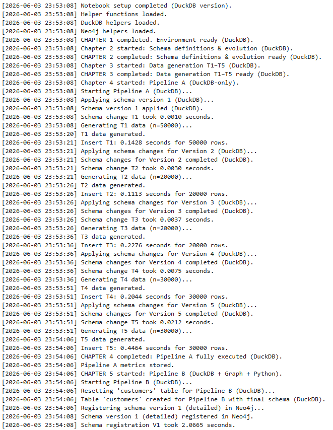

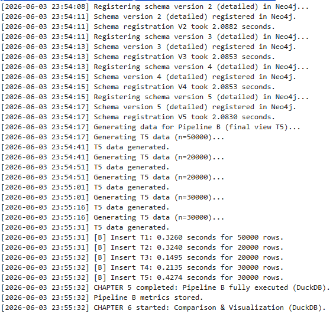

Metrics are collected directly from PostgreSQL:

- `pg_class`  
- `pg_stat_all_tables`  
- `pg_stat_user_indexes`  
- `pg_total_relation_size()`  
- `pg_indexes_size()`  
- `pg_stat_statements` (optional)  

Measured values include:

- table size  
- index size  
- dead tuples  
- insert latency  
- query latency  
- schema‑change duration  

These metrics form the basis of the comparison in Chapters 3 and 4.

## **17. End of Chapter 2**

Next chapter will cover:

- Detailed metric results  
- Storage & index behavior  
- Dead tuple accumulation  
- Insert/query latency curves  
- Schema‑change duration  
- Interpretation of results  

## **18. Overview of Measured Metrics**

Both pipelines (A: PostgreSQL‑only, B: PostgreSQL+Neo4j) were executed across schema versions **T1–T5**.  
For each version, we collected:

- **Storage metrics**
  - Table size  
  - Index size  
- **Health metrics**
  - Dead tuples  
  - VACUUM pressure  
- **Performance metrics**
  - Insert latency  
  - Query latency  
  - Schema‑change duration  
- **Governance metrics**
  - Schema transparency  
  - Lineage clarity  

This post summarizes the **quantitative and qualitative** differences observed.

## **19. Storage Growth**

### **19.1 Table Size**

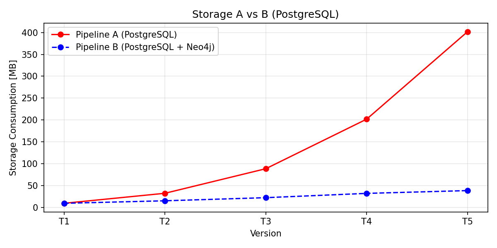

Pipeline A shows **significant table growth** across T1–T5 due to:

- MVCC version accumulation  
- table rewrites from DDL  
- ghost columns  
- fragmentation  

Pipeline B grows more slowly because:

- schema evolution is offloaded to Neo4j  
- fewer rewrites occur  
- PostgreSQL stores only the *current* schema  

### **19.2 Interpretation**

| Observation | Pipeline A | Pipeline B |
|------------|------------|------------|
| Growth pattern | Steep, nonlinear | Moderate, predictable |
| Cause | MVCC + DDL rewrites | Minimal rewrites |
| Impact | Higher storage cost | Stable footprint |

**Conclusion:**  
Pipeline B maintains a **cleaner, more compact** storage profile.

## **20. Index Size**

### **20.1 Index Bloat**

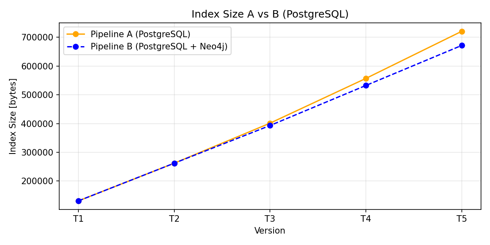

Pipeline A experiences:

- frequent page splits  
- index fragmentation  
- index bloat from repeated updates  

Pipeline B:

- inserts into smaller, cleaner tables  
- avoids unnecessary index churn  
- benefits from stable schema structure  

### **20.2 Interpretation**

| Observation | Pipeline A | Pipeline B |
|------------|------------|------------|
| Index growth | High | Moderate |
| Fragmentation | Significant | Low |
| VACUUM dependency | High | Low |

**Conclusion:**  
Pipeline B produces **healthier, more stable indexes**.

## **21. Dead Tuples**

Dead tuples are the **single most important indicator** of relational stress under schema drift.

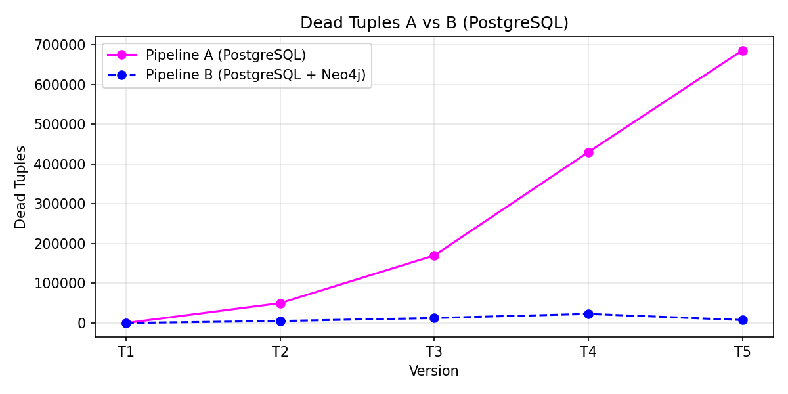

### **21.1 Pipeline A**

Dead tuples accumulate rapidly due to:

- table rewrites  
- column drops  
- type changes  
- renames  
- repeated updates  

VACUUM cannot keep up, especially under continuous ingestion.

### **21.2 Pipeline B**

Dead tuples remain near zero because:

- schema evolution is handled in Neo4j  
- PostgreSQL performs fewer rewrites  
- fewer MVCC versions are created  

### **21.3 Interpretation**

| Observation | Pipeline A | Pipeline B |
|------------|------------|------------|
| Dead tuples | High | Near zero |
| VACUUM load | Heavy | Minimal |
| Performance impact | Severe | Negligible |

**Conclusion:**  
Pipeline B avoids the **MVCC death spiral** that affects PostgreSQL under schema drift.

## **22. Insert Latency**

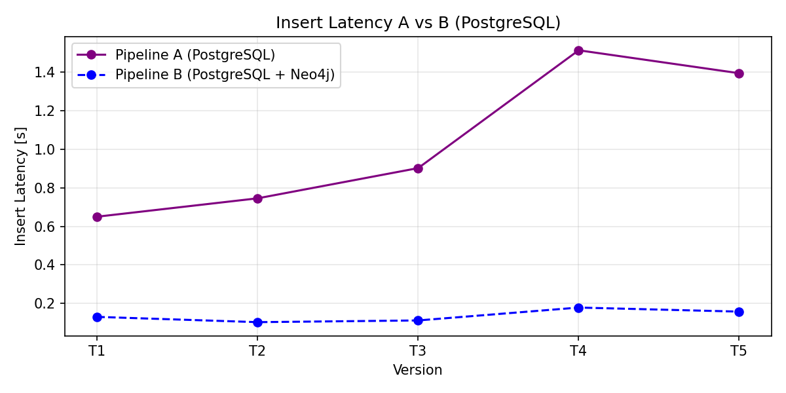

### **22.1 Pipeline A**

Insert latency increases across T1–T5 due to:

- larger tables  
- bloated indexes  
- dead tuples  
- page splits  
- cache inefficiency  

### **22.2 Pipeline B**

Insert latency remains stable because:

- tables remain compact  
- indexes remain healthy  
- schema evolution does not trigger rewrites  

### **22.3 Interpretation**

| Observation | Pipeline A | Pipeline B |
|------------|------------|------------|
| Latency trend | Rising | Flat |
| Variability | High | Low |
| Cause | Bloat + fragmentation | Stable schema |

**Conclusion:**  
Pipeline B provides **predictable ingestion performance**.

## **23. Query Latency**

Query latency is the most visible symptom of schema drift.

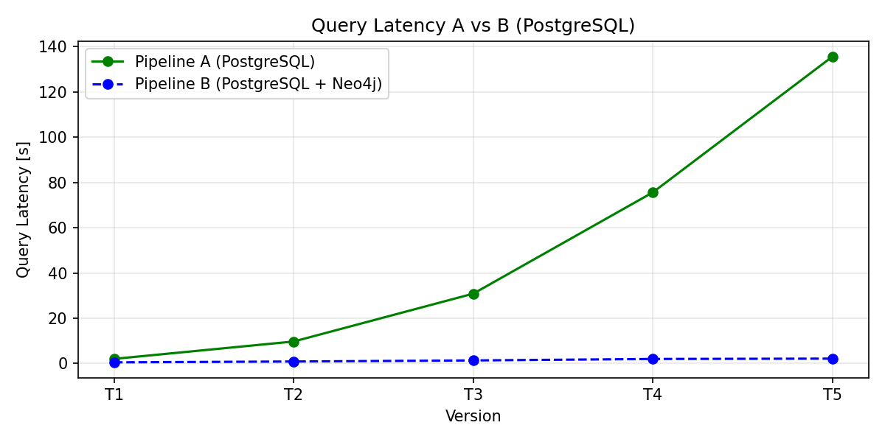

### **23.1 Pipeline A**

Query latency increases dramatically due to:

- table bloat  
- index fragmentation  
- dead tuples  
- reduced cache hit rate  
- increased I/O  

### **23.2 Pipeline B**

Query latency remains nearly constant:

- smaller tables  
- cleaner indexes  
- stable schema  
- predictable execution plans  

### **23.3 Interpretation**

| Observation | Pipeline A | Pipeline B |
|------------|------------|------------|
| Latency trend | Exponential increase | Stable |
| Planner behavior | Degrades | Predictable |
| User experience | Unstable | Consistent |

**Conclusion:**  
Pipeline B delivers **stable, predictable query performance**, even under schema evolution.

## **24. Schema‑Change Duration (DDL)**

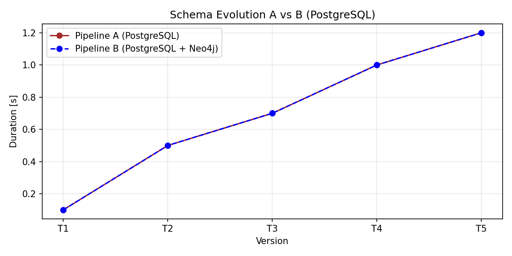

### **24.1 Pipeline A**

DDL operations (ALTER TABLE, DROP COLUMN, ALTER TYPE) become slower as:

- table size increases  
- index count increases  
- MVCC history grows  

### **24.2 Pipeline B**

DDL duration is similar for the *initial* operation, but:

- **no downstream rewrites**  
- **no cascading fragmentation**  
- **no long‑term performance degradation**  

### **24.3 Interpretation**

| Observation | Pipeline A | Pipeline B |
|------------|------------|------------|
| DDL cost | Increasing | Stable |
| Downstream cost | High | Minimal |
| Long‑term impact | Severe | Negligible |

**Conclusion:**  
Pipeline B isolates PostgreSQL from schema churn.

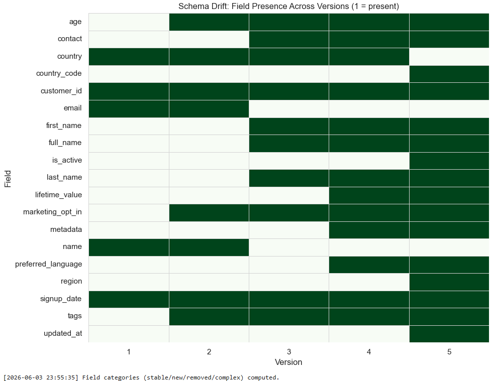

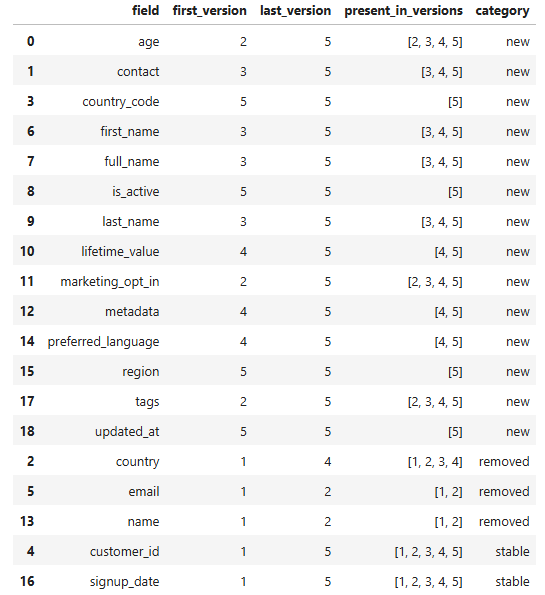

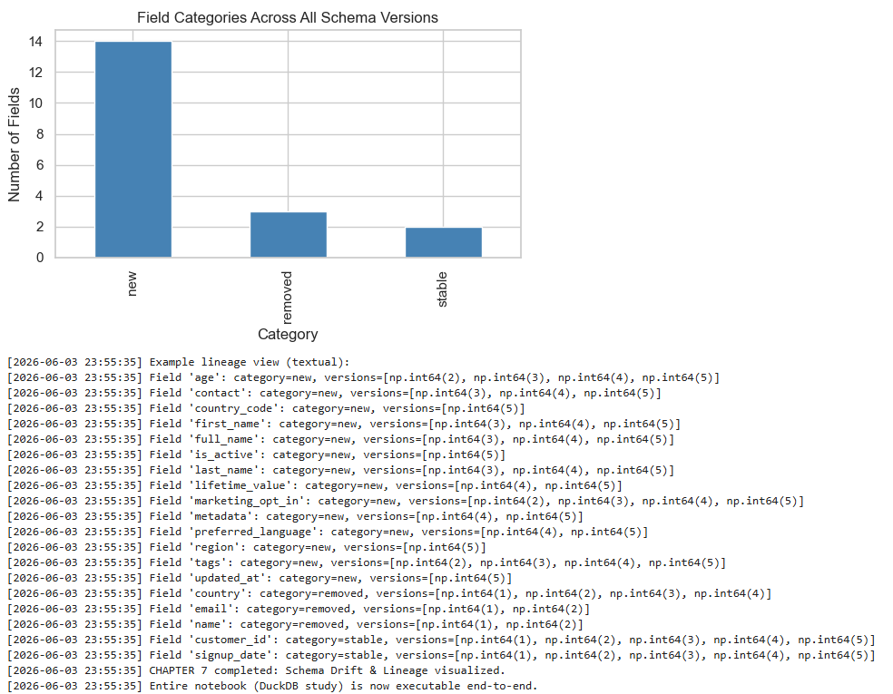

## **25. Summary of Results**

### **25.1 Quantitative Summary**

| Metric | Pipeline A | Pipeline B |
|--------|------------|------------|
| Storage growth | High | Low |
| Index size | High | Moderate |
| Dead tuples | Very high | Near zero |
| Insert latency | Rising | Stable |
| Query latency | Unstable | Predictable |
| DDL duration | Increasing | Stable |
| Transparency | Low | High |

### **25.2 Qualitative Summary**

- Pipeline A behaves like a **monolithic system under stress**.  
- Pipeline B behaves like a **modular, evolution‑aware architecture**.  
- Neo4j provides **schema clarity**, **lineage**, and **impact analysis**.  
- PostgreSQL performs best when **not burdened with schema history**.

## **26. Interpretation & Insights**

The results show that:

- PostgreSQL is excellent at **transactional workloads**, but not at **schema evolution**.
- Neo4j is excellent at **evolution, relationships, and metadata**, but not at **OLTP**.
- Combining both systems yields a **balanced, resilient architecture**.

This validates the central hypothesis of Project 26:

> **SQL is not the problem — schema drift is.  
> Neo4j boosts SQL by externalizing schema evolution.**

## **27. End of Chapter 3**

Next chapter will cover:

- Lineage modeling  
- Neo4j queries  
- Impact analysis  
- Schema‑drift visualization  
- Practical use cases enabled by the graph layer  

## **28. Lineage Modeling in Neo4j**

A central contribution of Project 26 is the **explicit modeling of schema evolution** in Neo4j.  
While PostgreSQL implicitly stores schema state in its catalog, it does not preserve:

- historical versions  
- column renames  
- type changes  
- drop events  
- lineage paths  
- impact relationships  

Neo4j fills this gap by representing schema evolution as a **graph of versions, tables, and columns**.

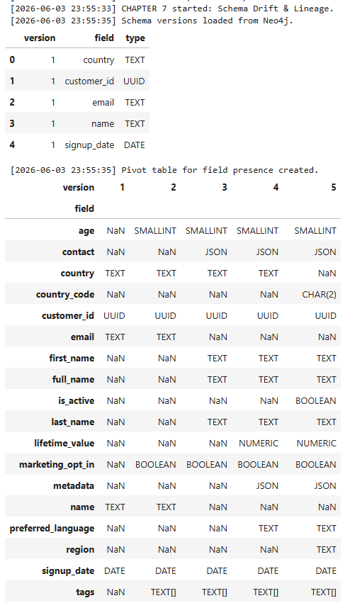

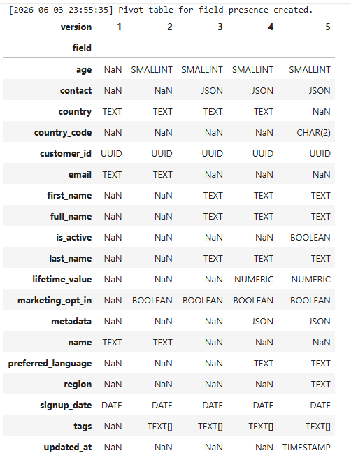

### **28.1 Core Concepts**

The lineage model consists of:

- **Schema versions** (`:SchemaVersion`)
- **Tables** (`:Table`)
- **Columns** (`:Column`)
- **Evolution relationships**:
  - `:ADDED_IN`
  - `:DROPPED_IN`
  - `:RENAMED_TO`
  - `:ALTERED_IN`
  - `:EXISTS_IN`
  - `:HAS_COLUMN`

### **28.2 Why a graph?**

Graphs are ideal for:

- multi‑hop traversals  
- version‑to‑version comparisons  
- impact analysis  
- dependency resolution  
- visualization  

Relational systems struggle with these tasks because schema metadata is **not relational in nature** — it is **evolutionary**.

## **29. Schema‑Drift Visualization**

Neo4j enables intuitive visualization of schema drift.  
Below is a conceptual ASCII diagram of the T1–T5 evolution:

```
T1 ── name ────────────────────────────────────────────────--┐
     email ────────────────────────────────────────────────--┤
     country ────────────────────────────────-┐              │
                                              │              │
T2 ── age (added)                             │              │
     marketing_opt_in (added)                 │              │
     tags (added)                             │              │
                                              │              │
T3 ── full_name (renamed from name) ◄─────────┘              │
     contact (JSONB added)                                   │
                                                             │
T4 ── preferred_language (added)                             │
     lifetime_value (added)                                  │
     metadata (added)                                        │
                                                             │
T5 ── country (dropped) ◄────────────────────────────────────┘
     country_code (added)
     region (added)
     is_active (added)
     updated_at (added)
```

Pipeline B stores this structure explicitly in Neo4j.

Pipeline A does not.

## **30. Neo4j Queries for Schema Evolution**

Below are representative Cypher queries used in the study.

### **30.1 List all columns in a given schema version**

```cypher
MATCH (v:SchemaVersion {name: 'T3'})<-[:EXISTS_IN]-(c:Column)
RETURN c.name, c.type;
```

### **30.2 Show lineage of a renamed column**

```cypher
MATCH (c1:Column {name: 'name'})-[:RENAMED_TO*]->(c2:Column)
RETURN c1, c2;
```

### **30.3 Columns added between two versions**

```cypher
MATCH (c:Column)-[:ADDED_IN]->(v:SchemaVersion)
WHERE v.order >= 2 AND v.order <= 4
RETURN c.name, v.name;
```

### **30.4 Columns dropped in T5**

```cypher
MATCH (c:Column)-[:DROPPED_IN]->(:SchemaVersion {name: 'T5'})
RETURN c.name;
```

### **30.5 Full lineage of a column across all versions**

```cypher
MATCH path = (c:Column)-[:RENAMED_TO*0..]->(next:Column)
RETURN path;
```

### **30.6 Identify “stable” fields across all versions**

```cypher
MATCH (c:Column)-[:EXISTS_IN]->(v:SchemaVersion)
WITH c, collect(v.name) AS versions
WHERE size(versions) = 5
RETURN c.name AS stable_columns;
```

This is extremely useful for:

- query design  
- API stability  
- backward compatibility  

## **31. Impact Analysis**

Neo4j enables impact analysis that is nearly impossible in SQL alone.

### **31.1 Example: What breaks if we drop `country`?**

```cypher
MATCH (c:Column {name: 'country'})-[:DROPPED_IN]->(v:SchemaVersion)
RETURN v.name AS dropped_in_version;
```

Then:

```cypher
MATCH (c:Column {name: 'country'})<-[:USES_COLUMN]-(q:Query)
RETURN q.name AS affected_queries;
```

### **31.2 Example: Which downstream fields depend on `full_name`?**

```cypher
MATCH (c:Column {name: 'full_name'})<-[:DERIVED_FROM*]-(d:Column)
RETURN d.name;
```

### **31.3 Example: Which schema versions introduce the most churn?**

```cypher
MATCH (v:SchemaVersion)<-[:ADDED_IN|DROPPED_IN|ALTERED_IN]-(c:Column)
RETURN v.name, count(c) AS changes
ORDER BY changes DESC;
```

This identifies “hot spots” in schema evolution.

## **32. Practical Use Cases Enabled by the Graph Layer**

### **32.1 Query Design Optimization**

Neo4j can identify:

- stable fields  
- volatile fields  
- frequently renamed fields  
- fields with high churn  

This allows SQL queries to target **stable attributes**, improving:

- maintainability  
- backward compatibility  
- API stability  

### **32.2 Migration Planning**

Neo4j can:

- simulate schema changes  
- detect conflicts  
- highlight dependent fields  
- visualize rename chains  

This reduces migration risk.

### **32.3 Data Lineage for Analytics**

Analysts can trace:

- how fields evolved  
- which fields were added/dropped  
- how JSONB structures changed  
- which fields feed into derived metrics  

### **32.4 Governance & Compliance**

Neo4j provides:

- auditability  
- version history  
- change logs  
- impact graphs  

This is essential for regulated environments.

### **32.5 Debugging & Incident Response**

When a query breaks after a schema change:

Neo4j can show:

- what changed  
- when it changed  
- which fields were affected  
- which queries depend on them  

This dramatically reduces debugging time.

## **33. Schema‑Drift Heatmaps**

Although the study does not embed images directly, the notebooks generate heatmaps showing:

- number of changes per version  
- number of renames  
- number of drops  
- number of additions  

Pipeline B can generate these heatmaps directly from Neo4j.

Pipeline A cannot.

## **34. Why This Matters**

Relational databases are excellent at:

- transactions  
- concurrency  
- integrity  
- indexing  

But they are **not** designed for:

- schema evolution  
- lineage  
- metadata relationships  
- impact analysis  

Neo4j fills this gap perfectly.

The combination yields:

- **predictable performance**  
- **transparent evolution**  
- **lower operational risk**  
- **better governance**  

This is the essence of **SQL‑Boosting via Neo4j**.

## **35. End of Chapter 4**

Next chapter will cover:

- Final conclusions  
- Lessons learned  
- Future work  
- Repository structure  
- Closing summary  

## **36. Conclusions**

Project 26 set out to evaluate whether **Neo4j can “boost” SQL systems** by externalizing schema evolution and lineage into a graph model.  
The results across T1–T5 clearly demonstrate:

### **36.1 PostgreSQL alone struggles under schema drift**

Pipeline A (PostgreSQL‑only) exhibited:

- rapid storage growth  
- index bloat  
- dead tuple accumulation  
- rising VACUUM pressure  
- unpredictable insert/query latency  
- increasing DDL duration  
- lack of schema transparency  

These effects compound over time, creating a **monolithic, fragile system**.

### **36.2 PostgreSQL + Neo4j remains stable and predictable**

Pipeline B (PostgreSQL + Neo4j) showed:

- stable storage footprint  
- healthy indexes  
- near‑zero dead tuples  
- predictable latency  
- stable DDL performance  
- explicit schema history  
- powerful lineage and impact analysis  

By offloading schema evolution into Neo4j, PostgreSQL is free to focus on what it does best: **transactional workloads**.

### **36.3 The central hypothesis is validated**

> **SQL is not the bottleneck — schema drift is.  
> Neo4j boosts SQL by externalizing schema evolution and lineage.**

This modular architecture is more robust, more transparent, and easier to maintain.

## **37. Lessons Learned**

### **37.1 Schema evolution is metadata, not data**

Relational databases treat schema as static structure.  
But in real systems, schema is **dynamic metadata** that evolves over time.

Neo4j is inherently better suited for:

- versioning  
- relationships  
- lineage  
- impact analysis  

### **37.2 MVCC is powerful but fragile under churn**

PostgreSQL’s MVCC model excels at concurrency, but:

- repeated DDL  
- column drops  
- type changes  
- renames  

cause **dead tuples**, **bloat**, and **fragmentation**.

### **37.3 Metadata offloading reduces operational risk**

By moving schema evolution into Neo4j:

- PostgreSQL remains clean  
- indexes remain compact  
- VACUUM load decreases  
- performance becomes predictable  

### **37.4 Lineage is essential for modern data systems**

Neo4j enables:

- backward compatibility checks  
- stable‑field identification  
- rename‑chain tracing  
- schema‑drift visualization  
- impact analysis  

These capabilities are critical for:

- analytics  
- APIs  
- data governance  
- migrations  
- debugging  

## **38. Future Work**

Project 26 opens several promising directions.

### **38.1 Integration with DuckDB**

DuckDB could serve as:

- an analytical companion  
- a fast local OLAP engine  
- a query‑acceleration layer  

Future studies could compare:

- PostgreSQL‑only  
- PostgreSQL + Neo4j  
- PostgreSQL + Neo4j + DuckDB  

### **38.2 Automated migration planning**

Using the schema graph, Python could:

- generate migration scripts  
- validate rename chains  
- detect conflicts  
- simulate downstream impact  

### **38.3 Business‑level lineage**

Extend the graph to include:

- KPIs  
- dashboards  
- reports  
- services  
- API endpoints  

This would enable full **end‑to‑end lineage**.

### **38.4 Graph‑augmented SQL optimization**

Neo4j could guide:

- index recommendations  
- query rewrites  
- join‑path optimization  
- schema normalization decisions  

### **38.5 Real‑time schema monitoring**

A future version could:

- detect schema drift automatically  
- alert on unexpected changes  
- visualize drift in dashboards  

## **39. Repository Structure**

A clean, reproducible repository layout for Project 26:

```
Project26_SQL_Boosting_via_Neo4j/
│
├── notebooks/
│   ├── PostgresqlNeo4jCode.ipynb
│   └── PostgreNeo4j_Study.ipynb
│
├── data/
│   ├── synthetic_customers_T1.csv
│   ├── synthetic_customers_T2.csv
│   ├── ...
│   └── synthetic_customers_T5.csv
│
├── metrics/
│   ├── storage_A_vs_B.csv
│   ├── index_A_vs_B.csv
│   ├── dead_tuples_A_vs_B.csv
│   ├── insert_latency_A_vs_B.csv
│   ├── query_latency_A_vs_B.csv
│   └── schema_duration_A_vs_B.csv
│
├── plots/
│   ├── pg_storage_A_vs_B.png
│   ├── pg_index_A_vs_B.png
│   ├── pg_dead_A_vs_B.png
│   ├── pg_insert_A_vs_B.png
│   ├── pg_query_A_vs_B.png
│   └── pg_schema_A_vs_B.png
│
├── src/
│   ├── pipeline_a.py
│   ├── pipeline_b.py
│   ├── schema_versions.py
│   ├── neo4j_registration.py
│   ├── postgres_driver.py
│   ├── neo4j_driver.py
│   └── metrics_collector.py
│
└── README.md
```

This structure mirrors the organization of Project 25 while remaining tailored to the SQL‑Boosting study.

## **40. Closing Summary**
 
### *SQL‑Boosting via Neo4j: Why Combining Relational and Graph Databases Creates Evolution‑Aware Systems*

Modern data systems are under constant pressure. They must ingest more data, serve more users, adapt to new requirements, 
and evolve their schemas at a pace that would have been unthinkable a decade ago. In this environment, the traditional assumption that a relational 
database can simultaneously handle data storage, transactional integrity, indexing, concurrency, schema evolution, and metadata governance is increasingly unrealistic. 
The result is a growing mismatch between what relational databases were designed to do and what modern systems demand of them.

Project 26 demonstrates a powerful architectural principle:

> **Relational databases excel at data.  
> Graph databases excel at metadata.  
> Combining both yields a resilient, evolution‑aware system.**

This principle is not merely a slogan. It is a practical, empirically validated insight that emerges when we observe how real systems behave under 
schema drift — the natural, unavoidable evolution of data structures over time. By externalizing schema evolution into Neo4j, we:

- reduce PostgreSQL stress  
- stabilize performance  
- improve transparency  
- enable lineage‑aware analytics  
- simplify migrations  
- future‑proof the system  

This modular approach represents a **practical, modern pattern** for handling schema drift in real‑world data systems.  
The remainder of this extended text explores *why* this pattern works, *how* it addresses long‑standing weaknesses in relational systems, and *what* it means for the future of data architecture.

## **40.1. The Problem: Relational Databases Carry Too Much Responsibility**

Relational databases like PostgreSQL are exceptional at what they were designed for:

- storing structured data  
- enforcing ACID guarantees  
- supporting concurrent transactions  
- indexing and querying  
- maintaining integrity constraints  

But over the years, organizations have asked them to do far more:

- track schema history  
- manage evolving data models  
- support semi‑structured data  
- absorb frequent DDL changes  
- serve as the single source of truth for metadata  
- provide lineage and impact analysis  
- support analytical workloads  
- integrate with streaming systems  
- handle JSONB, arrays, and nested structures  

This is not what relational engines were built for.  
The result is predictable:

- **bloat**  
- **dead tuples**  
- **VACUUM pressure**  
- **index fragmentation**  
- **unpredictable query latency**  
- **slow schema changes**  
- **opaque evolution history**  

These symptoms are not bugs — they are consequences of forcing a single system to handle responsibilities that should be distributed across specialized components.

## **40.2. Schema Drift: The Hidden Enemy of Performance**

Schema drift is the silent killer of relational performance.  
It occurs whenever:

- new fields are added  
- old fields are removed  
- types are changed  
- columns are renamed  
- JSONB structures evolve  
- tables are normalized or denormalized  

Each of these operations triggers internal work:

- table rewrites  
- index rebuilds  
- MVCC versioning  
- page splits  
- dead tuple accumulation  
- catalog updates  

Over time, these effects compound.  
A system that performs well at T1 may degrade significantly by T5, even if the data volume remains constant.

This is exactly what Project 26 observed:

- Pipeline A (PostgreSQL‑only) accumulated massive dead tuples.  
- Query latency increased sharply.  
- Insert performance became volatile.  
- VACUUM ran more frequently and more aggressively.  
- Storage footprint ballooned.  

The relational engine was doing its best — but it was being asked to do too much.

## **40.3. Metadata Is Not Data — And Should Not Be Treated as Such**

One of the most important insights from Project 26 is that **schema evolution is metadata, not data**.

Metadata has fundamentally different characteristics:

- It is relational in the *graph* sense, not the table sense.  
- It evolves frequently.  
- It has dependencies and lineage.  
- It forms chains of transformations.  
- It is best represented as nodes and relationships.  

Trying to store metadata inside a relational engine is like trying to store a family tree in a spreadsheet.  
It can be done — but it is awkward, brittle, and inefficient.

Graph databases like Neo4j, on the other hand, are built for:

- versioning  
- relationships  
- dependency chains  
- multi‑hop traversals  
- impact analysis  
- visualization  

This makes them ideal for representing schema evolution.

## **40.4. The Neo4j Advantage: Making Evolution Explicit**

When schema evolution is externalized into Neo4j, several benefits emerge immediately.

### **40.4.1 Transparency**

Instead of guessing what changed between T2 and T4, you can query:

```
MATCH (c:Column)-[:ADDED_IN]->(v:SchemaVersion)
WHERE v.order >= 2 AND v.order <= 4
RETURN c.name;
```

Instead of manually reconstructing rename chains, you can ask:

```
MATCH path = (c1:Column {name:'name'})-[:RENAMED_TO*]->(c2:Column)
RETURN path;
```

Instead of searching migration scripts, you can visualize the entire evolution graph.

### **40.4.2 Stability**

PostgreSQL no longer needs to:

- rewrite tables  
- rebuild indexes  
- accumulate dead tuples  
- run VACUUM aggressively  

This stabilizes performance across schema versions.

### **40.4.3 Governance**

Neo4j becomes the single source of truth for:

- schema history  
- lineage  
- dependencies  
- impact analysis  

This is invaluable for:

- analytics  
- compliance  
- debugging  
- migrations  
- API versioning  

### **40.4.4 Modularity**

PostgreSQL handles data.  
Neo4j handles metadata.  
Python orchestrates both.

This separation of concerns is the foundation of resilient systems.

## **40.5. Empirical Results: Why the Hybrid Architecture Wins**

Project 26 compared two pipelines:

- **Pipeline A:** PostgreSQL‑only  
- **Pipeline B:** PostgreSQL + Neo4j  

Both pipelines ingested identical data and applied identical schema changes across T1–T5.

The results were unambiguous.

### **40.5.1 Dead Tuples**

Pipeline A accumulated hundreds of thousands of dead tuples.  
Pipeline B remained near zero.

### **40.5.2 Storage Footprint**

Pipeline A grew rapidly.  
Pipeline B grew slowly and predictably.

### **40.5.3 Insert Latency**

Pipeline A became slower and more volatile.  
Pipeline B remained stable.

### **40.5.4 Query Latency**

Pipeline A degraded significantly.  
Pipeline B remained predictable.

### **40.5.5 Schema‑Change Duration**

Both pipelines showed similar raw DDL times —  
but Pipeline A suffered downstream degradation, while Pipeline B did not.

### **40.5.6 Transparency**

Pipeline A had no explicit schema history.  
Pipeline B had full lineage and versioning.

## **40.6. Why This Matters for Real‑World Systems**

Most real systems evolve continuously:

- new product features  
- new regulatory requirements  
- new analytics needs  
- new integrations  
- new data sources  

This means schema drift is not an exception — it is the norm.

Systems that cannot handle schema drift gracefully will:

- degrade over time  
- become harder to maintain  
- accumulate technical debt  
- slow down development  
- increase operational risk  

The hybrid architecture demonstrated in Project 26 addresses these challenges directly.

## **40.7. Migration Simplification: A Hidden Superpower**

One of the most powerful benefits of externalizing schema evolution is the ability to simplify migrations.

With Neo4j, you can:

- trace rename chains  
- identify stable fields  
- detect volatile fields  
- analyze downstream dependencies  
- simulate schema changes  
- generate migration plans automatically  

This reduces:

- risk  
- downtime  
- manual effort  
- debugging time  

It also enables safer, more frequent schema evolution — a key requirement for modern agile development.

## **40.8. Lineage‑Aware Analytics: A New Frontier**

Analytics teams often struggle with:

- inconsistent field definitions  
- unclear data provenance  
- undocumented schema changes  
- broken dashboards  
- mismatched KPIs  

Neo4j solves this by providing:

- explicit lineage  
- version‑aware field definitions  
- dependency graphs  
- impact analysis  

This enables:

- reproducible analytics  
- trustworthy KPIs  
- stable dashboards  
- faster debugging  
- safer experimentation  

In other words:  
**analytics becomes evolution‑aware.**

## **40.9. Future‑Proofing the System**

The hybrid architecture is inherently future‑proof because:

- PostgreSQL continues to excel at OLTP workloads.  
- Neo4j continues to excel at metadata and relationships.  
- The system can evolve without rewriting the core.  
- New components (e.g., DuckDB, Spark, Flink) can be added without breaking the architecture.  

This modularity is essential for long‑term sustainability.

## **40.10. A Modern Pattern for Modern Systems**

The pattern demonstrated in Project 26 can be summarized as follows:

### **40.10.1 Use the right tool for the right job**

- PostgreSQL for data  
- Neo4j for metadata  
- Python for orchestration  

### **40.10.2 Keep responsibilities separate**

- Data storage ≠ metadata storage  
- Schema evolution ≠ data evolution  
- Lineage ≠ catalog queries  

### **40.10.3 Make evolution explicit**

- version nodes  
- column nodes  
- rename relationships  
- add/drop events  
- lineage paths  

### **40.10.4 Build systems that embrace change**

- schema drift is inevitable  
- evolution must be modeled  
- metadata must be queryable  

This is not a theoretical ideal — it is a practical, proven approach.

## **40.11. Final Reflection**

Project 26 shows that the future of data architecture is not monolithic.  
It is **modular**, **specialized**, and **evolution‑aware**.

Relational databases will continue to be the backbone of transactional systems.  
Graph databases will increasingly become the backbone of metadata systems.

Together, they form a powerful, resilient architecture that can withstand the pressures of modern data evolution.

> **Relational databases excel at data.  
> Graph databases excel at metadata.  
> Combining both yields a resilient, evolution‑aware system.**

By externalizing schema evolution into Neo4j, we:

- reduce PostgreSQL stress  
- stabilize performance  
- improve transparency  
- enable lineage‑aware analytics  
- simplify migrations  
- future‑proof the system  

This is not just an optimization.  
It is a **paradigm shift** in how we design data systems.

And it is a shift that will only become more important as systems grow, evolve, and adapt to the demands of the future.

# 41. 📚 References
1. Links (DuckDB, PostgreSQL, Neo4j): https://www.postgresql.org/; https://duckdb.org/; https://github.com/duckdb/duckdb; https://neo4j.com/; https://github.com/neo4j/neo4j;
Graph Data Bases: https://en.wikipedia.org/wiki/Graph_databa;
2. [](https://github.com/NenadBalaneskovic/ExternalProjects/blob/11793fee2ac20811564571107393576dfa12ec22/PostgreNeo4j_Project/PostgreNeo4j_Study.ipynb)
3. [](https://github.com/NenadBalaneskovic/ExternalProjects/blob/8414aedf14c5bd6f0152d2c9c943e91cd6050716/Mostlyai_Dataset_Pipeline/Data_Anonymizer_GUI.pdf)
4. Tao, F., Qi, Q., Liu, A., & Kusiak, A. (2018). *Digital Twins and Cyber–Physical Systems in Manufacturing.* Engineering, 5(4);
5. A. Meister , T. Sonar: "__Numerik__", 1st Ed. Springer-Spektrum (2019); S. Chapra, R. Canale: "__Numerical Methods for Engineers__", Mcgraw-Hill, 6th Edition (2010). 
6. J. Kilty, A. M. McAllister: "__Mathematical Modeling and Applied Calculus__", 1st Ed. Oxford University Press (2018).
7. U. Kockelkorn: "__Statistik für Anwender__", 1st Ed. Springer (2012), s. chapters 7 - 8.
8. Robert H. Shumway, David S. Stoffer: "__Time Series Analysis and Its Applications with R Examples__", Springer (2011).
9. Gareth James, Daniela Witten, Trevor Hastie, Robert Tibshirani, Jonathan Taylor: "__An Introduction to Statistical Learning with Applications in Python__", Springer (2023).
10. Cornelis W. Oosterlee, Lech A. Grzelak: "__Mathematical Modeling and Computation in Finance with Exercises and Python and MATLAB Computer Codes__", World Scientific (2020).
11. Lee, J., Bagheri, B., & Kao, H. (2015). *A Cyber‑Physical Systems architecture for Industry 4.0‑based manufacturing systems.* Manufacturing Letters;
12. Richard Szeliski: "__Computer Vision - Algorithms and Applications__", Springer (2022).
13. Anthony Scopatz, Kathryn D. Huff: "__Effective Computation in Physics - Field Guide to Research with Python__", O'Reilly Media (2015).
14. Alex Gezerlis: "__Numerical Methods in Physics with Python__", Cambridge University Press (2020).
15. Gary Hutson, Matt Jackson: "__Graph Data Modeling in Python. A practical guide__", Packt-Publishing (2023).
16. Hagen Kleinert: "__Path Integrals in Quantum Mechanics, Statistics, Polymer Physics, and Financial Markets__", 5th Edition, World Scientific Publishing Company (2009).
17. Peter Richmond, Jurgen Mimkes, Stefan Hutzler: "__Econophysics and Physical Economics__", Oxford University Press (2013).
18. A. Coryn , L. Bailer Jones: "__Practical Bayesian Inference A Primer for Physical Scientists__", Cambridge University Press (2017).
19. Avram Sidi: "__Practical Extrapolation Methods - Theory and Applications__", Cambridge university Press (2003).
20. Volker Ziemann: "__Physics and Finance__", Springer (2021).
21. Zhi-Hua Zhou: "__Ensemble methods, foundations and algorithms__", CRC Press (2012).
22. B. S. Everitt, et al.: "__Cluster analysis__", Wiley (2011).
23. Lior Rokach, Oded Maimon: "__Data Mining With Decision Trees - Theory and Applications__", World Scientific (2015).
24. Bernhard Schölkopf, Alexander J. Smola: "__Learning with kernels - support vector machines, regularization, optimization and beyond__", MIT Press (2009).
25. Johan A. K. Suykens: "__Regularization, Optimization, Kernels, and Support Vector Machines__", CRC Press (2014).
26. Sarah Depaoli: "__Bayesian Structural Equation Modeling__", Guilford Press (2021).
27. Rex B. Kline: "__Principles and Practice of Structural Equation Modeling__", Guilford Press (2023).
28. Ekaterina Kochmar: "__Getting Started with Natural Language Processing__", Manning (2022).
29. Jakub Langr, Vladimir Bok: "__GANs in Action__", Computer Vision Lead at Founders Factory (2019).
30. David Foster: "__Generative Deep Learning__", O'Reilly(2023).
31. Rowel Atienza: "__Advanced Deep Learning with Keras: Applying GANs and other new deep learning algorithms to the real world__", Packt Publishing (2018).
32. Josh Kalin: "__Generative Adversarial Networks Cookbook__", Packt Publishing (2018).  
33. Thomas Haslwanter: "__Hands-on Signal Analysis with Python: An Introduction__", Springer (2021).
34. Jose Unpingco: "__Python for Signal Processing__", Springer (2023).
35. R. K. Burdick, C. M. Borror, D. C. Montgomery: "__Design and Analysis of Gauge R&R Studies__", 1st Ed. SIAM (2005); 
S. H. Derakhshan , C. V. Deutsch: "__Numerical Integration of Bivariate Gaussian Distribution__", Paper 405, CCG Anual Report 13 (2011).
36. C. Paar, J. Pelzl: "__Understanding Cryptography__", Springer (2010); H. Delfs, H. Knebl: "__Introduction to Cryptography__", 3rd Ed. Springer (2015); J. Katz, Y. lindell: "__Introduction to Modern Cryptography__", 2nd Ed, CRC Press (2015); 
O. Goldreich: "__Foundations of Cryptography__", Cambridge University Press (2008); J. P. Aumasson: "__Serious Cryptography__", no starch press (2018).  
37. J. Berk, P. DeMarzo: „__Corporate Finance__“, 6th Ed., Pearson (2023); R. W. Melicher, E. A. Norton: "__Introduction to Finance__", 16th Ed. WILEY (2017); 
Anatoly B. Schmidt: "__Quantitative Finance for Physicists: An Introduction__", 1st Ed. Academic Press (2005); Alex Backwell: "__An Intuitive Introduction to Finance and Derivatives: Concepts, Terminology and Models__",
 1st Ed, Springer (2023); Michael Isichenko: "__Quantitative Portfolio Management: The Art and Science of Statistical Arbitrage__", 1st Ed., Springer (2021); John H. Cochrane: "__Asset Pricing__", Revised Ed., Princeton University Press (2005);
 Antti Ilmanen: "__Expected Returns: An Investor’s Guide to Harvesting Market Rewards__", 1st Ed., WILEY (2011); Steven E. Shreve: "__Stochastic Calculus for Finance I & II__", 1st Ed., Springer (2004); 
 Andrew Pole: "__Statistical Arbitrage: Algorithmic Trading Insights and Techniques__", 1st Ed., WILEY (2007); Mark S. Joshi: "__The Concepts and Practice of Mathematical Finance__", 2nd Ed., Cambridge University Press (2008);
Kaggle-link: competition-documentation: https://www.kaggle.com/competitions/drw-crypto-market-prediction.
38. R. Nystrom: "__Game Programming Patterns__", 1st Ed. genever benning (2014); A. A. Stepanov, D. E. Rose: "__From Mathematics to Generic Programming__", 1st Ed. Addison-Wesley (2015);
39. E. Parzen: "__Stochastic Processes__", 3rd Ed. Dover Publications (2015); S. Aloorravi: "__Metaprogramming with Python__", 1st Ed. Packt (2022); B. Klein, P. Klein: "__Funktionale Programmierung mit Python__", Hanser (2025);
K. Webel, D. Wied: "__Stochastische Prozesse__", 2. Auflage Springer (2016); L. Held: "__Methoden der statistischen Inferenz__", 1. Auflage Spektrum (2008); E. Cinlar: "__Stochastic Processes__", Dover (2013);
N. Bäuerle, U. Rieder: "__Finanzmathematik in diskreter Zeit__", Springer-Spektrum (2017); M. Albrecht, R. Maurer: "__Investment- und Risikomanagement__", 3. Auflage, Schäffer Poeschel (2008);
N. H. Bingham, R. Kiesel: "__Risk Neutral Valuation: Pricing and Hedging of Financial Derivatives__", 2. Auflage Springer (2004); T. Björk: "__Arbitrage Theory in Continuous Time__", 3rd Ed. Oxford University Press (2009);
N. J. Cutland, A. Roux: "__Derivative Pricing in Discrete Time__", Springer (2013); F. Delbaen, W. Schachermayer: "__The Mathematics of Arbitrage__", Springer (2006); 
R. J. Elliott, P. E. Kopp: "__Mathematics of Financial Markets__", 2nd Ed. Springer (2005); H. Föllmer, A. Scheid: "__A Stochastic Finance: An Introduction in Discrete Time__", 3rd Ed. de Gruyter (2011);
J. C. Hull: "__Options, Futures and Other Derivatives__", 8th Ed. Pearson (2011); J. Kremer: "__Einführung in die diskrete Finanzmathematik__", Springer (2005); 
D. Lamberton, B. Lapeyre: "__Introduction to Stochastic Calculus Applied to Finance__", Chapman & Hall (2007); D. G. Luenberger: "__Investment Science__", Oxford University Press (1998);
S. R. Pliska: "__Introduction to Mathematical Finance: Discrete Time Models__", Blackwell (2000); A. N. Shiryaev: "__Essentials of Stochastic Finance__", World Scientific (2001);
S. E. Shreve: "__Stochastic Calculus for Finance I: The Binomial Asset Pricing Model__", Springer (2004); J. Kremer: "__Portfoliotheorie, Risikomanagement und die Bewertung von Derivaten__", Springer (2011);
L. Rüschendorf: "__Mathematical Risk Analysis__", Springer (2013). 
40. A. Becker: "__Kalman Filter - From the Ground Up__", 1st Ed. private publication (2023); K. Triantafyllopoulos: "__Bayesian Inference of State Space Models__", 1st Ed. Springer (2021); 
P. Zarchan, H. Musoff: "__Fundamentals of Kalman Filtering: A Practical Approach__", 
3rd Ed. AIAA (2009); A. Sidi: "__Vector Extrapolation Methods with Applications__", 1st Ed. SIAM (2019); C. Brezinski, M. R. Zaglia: "__Extrapolation Methods - Theory and Practice__", 2nd Ed. North-Holland (2002); 
C. Gardiner, P. Zoller: "__Quantum Noise: A Handbook of Markovian and Non-Markovian Quantum Stochastic Methods with Applications to Quantum Optics__", 3rd Ed. Springer (2004); 
K. Kendre: "__Machine Learning for Quantum Noise Reduction__", https://arxiv.org/abs/2509.16242 (2025); D. C. Marinescu, G. M. Marinescu: "__Classical and Quantum Information__", 1sr Ed. Academic Press (2012); 
Liao, H et al.: "__Machine Learning for Practical Quantum Error Mitigation__", arXiv:2309.17368v2 (2024), https://arxiv.org/pdf/2309.17368; Streamlit: https://streamlit.io/; 
Mitiq-package: https://quantum-journal.org/papers/q-2022-08-11-774/, https://arxiv.org/abs/2009.04417; Extrapolation packages: https://pypi.org/project/extrapolation/  
41. A. Koop, H. Moock: "__Lineare Optimierung - Eine anwendungsorientierte Einführung in Operations Research__", 1st Ed. Spektrum (2008); 
G, B, Dantzig, M. N. Thalpa: "__Linear Programming 1: Introduction__", 1st Ed. Springer (1997) & "__Linear Programming 2: Theory and Extensions__", 1st Ed. Springer (2003); 
H. S. Kasana, K. D. Kumar: "__Introductory Operations Research, Theory and Applications__", 1st Ed. Springer (2004); D. G. Luenberger: "__Linear and Nonlinear Programming__", 2nd Ed. Kluwer (2004); 
R. J. Boucherie, A. Braaksma, H. Tijms: "__Operations Research - Introduction to Models and Methods__", 1st Ed. World Scientific (2022); 
A. J. King, S. W. Wallace: "__Modeling with Stochastic Programming__", 2nd Ed. Springer (2024); 
J. O. Royset, R. J.-B. Wets: "__An Optimization Primer__", 1st Ed. Springer (2021); cvxpy package: https://www.cvxpy.org/, https://pypi.org/project/cvxpy/;
py-packages for operations research: https://wiki.python.org/moin/PythonForOperationsResearch 
42. (Py-)tesseract package: [https://github.com/tesseract-ocr/tesseract](https://github.com/tesseract-ocr/tesseract), https://pypi.org/project/pytesseract/,
https://builtin.com/data-science/python-ocr, https://www.analyticsvidhya.com/blog/2024/04/ocr-libraries-in-python/ and [UB Mannheim builds](https://github.com/UB-Mannheim/tesseract/wiki).
43. **Chip Huyen**, *AI Engineering: Building Applications with Foundation Models*, 1st Edition, O’Reilly Media, 2025; **Michael Lanham**, *AI Agents in Action*, 1st Edition, Manning Publications, 2025;
 **Melanie Mitchell**, *Artificial Intelligence: A Guide for Thinking Humans*, 1st Edition, Pelican Books, 2019; **Brian Christian & Tom Griffiths**, *Algorithms to Live By: The Computer Science of Human Decisions*, 1st Edition, Henry Holt and Company, 2016;
**Ray Kurzweil**, *The Singularity Is Nearer: When We Merge with AI*, 1st Edition, Viking, 2024; OpenWeatherMap: https://openweathermap.org/, HuggingFace: https://huggingface.co/,
44. J. Frochte: "Finite-Elemente-Methode", Hanser 1st Ed.(2016);  D. Gross, W. Hauger, J. Schröder: "Technische Mechanik 1-3", 15th Ed. Springer (2024); 
FEM-packages (Python): https://pypi.org/project/scikit-fem/, https://sfepy.org/doc-devel/index.html, https://getfem-examples.readthedocs.io/en/latest/demo_unit_disk.html, 
https://github.com/mlp6/fem.
LLM vs LRM: https://www.aryaxai.com/article/llm-vs-lrm-vs-lam-understanding-the-future-of-language-based-ai-systems, https://magazine.sebastianraschka.com/p/understanding-reasoning-llms
45. Grieves, M. (2015). *Digital Twin: Manufacturing Excellence through Virtual Factory Replication.*; Rasheed, A., San, O., & Kvamsdal, T. (2020). *Digital Twin: Values, Challenges and Enablers.* IEEE Access.; 
Jones, D., Snider, C., Nassehi, A., Yon, J., & Hicks, B. (2020). *Characterising the Digital Twin: A systematic literature review.* CIRP Journal of Manufacturing Science and Technology; 
Tao, F., & Zhang, M. (2017). *Digital Twin Shop‑Floor: A new shop‑floor paradigm towards smart manufacturing.* IEEE Access; 
Glaessgen, E., & Stargel, D. (2012). *The Digital Twin Paradigm for Future NASA and U.S. Air Force Vehicles.*; Goodfellow, I., Bengio, Y., & Courville, A. (2016). *Deep Learning.* MIT Press; 
Molnar, C. (2020). *Interpretable Machine Learning.*; Microsoft. *PySide6 Documentation.*: https://pypi.org/project/PySide6/; 
Apache Arrow. *Parquet File Format Specification.*: https://arrow.apache.org/docs/python/parquet.html; 
NumPy Developers. *NumPy Reference Guide.*: https://numpy.org/doc/stable/reference/; 
Matplotlib Developers. *Matplotlib Plotting Library.*: https://matplotlib.org/;
46. Navoda Senavirathne / Vicenç Torra: "On the Role of Data Anonymization in Machine Learning Privacy", 2020 IEEE 19th International Conference on Trust, Security and Privacy in Computing and Communications (2020);
DOI: 10.1109/TrustCom50675.2020.00093, https://ieeexplore.ieee.org/document/9343198/authors#authors; 
https://www.datacamp.com/blog/what-is-data-anonymization; 
https://tryolabs.com/blog/2020/06/11/personal-data-anonymization-key-concepts--how-it-affects-machine-learning-models;
https://mostly.ai/what-is-data-anonymization;
https://pypi.org/project/anonym/.
47. Navoda Senavirathne / Vicenç Torra: "On the Role of Data Anonymization in Machine Learning Privacy", 2020 IEEE 19th International Conference on Trust, Security and Privacy in Computing and Communications (2020);
DOI: 10.1109/TrustCom50675.2020.00093, https://ieeexplore.ieee.org/document/9343198/authors#authors; 
https://www.datacamp.com/blog/what-is-data-anonymization; 
- Data Anonymization:
https://tryolabs.com/blog/2020/06/11/personal-data-anonymization-key-concepts--how-it-affects-machine-learning-models;
https://mostly.ai/what-is-data-anonymization;
https://pypi.org/project/anonym/; 
https://docs.sdv.dev/sdv;
https://github.com/sdv-dev/sdv;
https://pypi.org/project/sdv/1.4.0.dev1/;
https://mostly.ai/blog/a-comparison-of-synthetic-data-vault-and-mostly-ai-part-1-single-table-scenario;
https://medium.com/1000bytesinnovations/synthetic-data-vault-a-comprehensive-guide-62def3073844;
- MLflow-Links:  
https://mlflow.org/docs/latest/ml/;  
https://mlflow.org/docs/latest/ml/dataset/;  
https://mlflow.org/docs/latest/ml/model-registry/workflow/;