# *Project 32: Memory Allocator Advisor GUI*  

---

## **Chapter 1 — Executive Summary**

## **1.1. Introduction**


Modern scientific computing, machine learning pipelines, and quantum‑algorithm workflows increasingly rely on Python as their primary orchestration language. Python’s flexibility, readability, and rich ecosystem make it the 
de‑facto standard for rapid prototyping and production‑grade experimentation. However, Python’s memory model — dynamic, object‑centric, and interpreter‑driven — introduces significant inefficiencies when workloads scale. 
Temporary allocations, repeated buffer creation, nested loops, and NumPy array churn can silently degrade performance, inflate memory usage, and destabilize long‑running processes.

Project 32, *Memory Allocator Advisor GUI*, addresses this challenge by providing a unified, interactive, and scientifically grounded system for **static memory analysis**, **optimization strategy synthesis**, **code generation**, and 
**execution benchmarking**. The system is designed to operate across domains: classical numerical workloads, machine learning pipelines, and quantum computing workflows (Qiskit VQE, QAOA, QNN). The GUI does not require domain‑specific knowledge; 
instead, it identifies memory patterns at the Python level, where inefficiencies originate.

This chapter provides a comprehensive executive summary of the project, its motivation, architecture, scientific contributions, and practical impact. It sets the stage for the subsequent chapters, each of which will explore the system in depth.

## **1.2. Motivation**

### **1.2.1 The Python Memory Problem**

Python’s memory behavior is shaped by:

- reference‑counting semantics  
- garbage collection  
- dynamic object creation  
- NumPy’s C‑level allocator  
- interpreter overhead  
- lack of static typing  

These characteristics make Python easy to use but difficult to optimize. Memory inefficiencies often arise from:

- repeated allocations inside loops  
- temporary arrays created during numerical operations  
- large arrays allocated without reuse  
- nested loops with Python‑level arithmetic  
- hybrid quantum‑classical workflows that repeatedly bind parameters or extract statevectors  

Such inefficiencies are invisible to most developers. Traditional profilers (e.g., `memory_profiler`, `tracemalloc`) provide runtime snapshots but do not offer actionable optimization strategies or code generation.

### **1.2.2 Scientific and Quantum Workloads**

Scientific workloads often involve:

- large matrices  
- repeated transformations  
- iterative solvers  
- Monte Carlo simulations  
- gradient‑based optimization  

Quantum workloads (Qiskit) add:

- parameterized circuits  
- repeated simulator calls  
- statevector extraction  
- hybrid loops  
- large intermediate buffers  

These patterns amplify Python’s memory inefficiencies. A single VQE iteration may allocate dozens of temporary arrays, each contributing to peak memory usage.

### **1.2.3 The Need for a Static + Dynamic Hybrid Approach**

Runtime profiling alone is insufficient:

- It cannot detect memory patterns before execution.  
- It cannot rewrite code.  
- It cannot propose optimization strategies.  
- It cannot generate optimized modules.  

Static analysis alone is also insufficient:

- It cannot measure real memory usage.  
- It cannot validate optimization effectiveness.  
- It cannot detect runtime‑dependent allocations.  

Project 32 combines both approaches:

- **Static analysis** identifies memory hotspots.  
- **Strategy synthesis** selects optimization techniques.  
- **Code generation** rewrites Python and Cython modules.  
- **Execution sandbox** validates improvements.  
- **Plot generation** visualizes memory usage over time.  

This hybrid design is the core innovation of the Memory Allocator Advisor GUI.

## **1.3. System Overview**


The Memory Allocator Advisor GUI is composed of seven major subsystems:

1. **Script Loader**  
2. **Static Analysis Engine**  
3. **Optimization Strategy Synthesizer**  
4. **Code Generation Module**  
5. **Execution Sandbox**  
6. **Metrics Storage (DuckDB)**  
7. **Plot Generator**

Each subsystem is designed to be modular, extensible, and domain‑agnostic.

### **1.3.1 Script Loader**

The loader:

- accepts any Python file  
- extracts imports, entry points, and metadata  
- computes a SHA‑256 hash for caching  
- prepares the script for analysis and execution  

It ensures that the GUI can operate on arbitrary Python workloads without requiring modifications.

### **1.3.2 Static Analysis Engine**

The static analyzer performs:

- AST parsing  
- bytecode inspection  
- control‑flow graph construction  
- memory pattern detection  
- heuristic scoring  

It identifies:

- temporary arrays  
- repeated allocations  
- nested loops  
- large allocations  
- Python object churn  
- quantum‑specific patterns (parameter binding, statevector extraction)

The analyzer produces:

- hotspot list  
- memory tips  
- optimization hints  

This subsystem is the foundation of the GUI’s intelligence.

### **1.3.3 Optimization Strategy Synthesizer**

Based on the analysis, the synthesizer selects strategies:

- Cython memoryviews  
- Numba JIT  
- preallocation  
- layout optimization  

It builds a strategy graph, resolves conflicts, and produces a unified optimization plan.

### **1.3.4 Code Generation Module**

The generator rewrites:

- Python AST  
- Cython modules  
- memoryview structures  
- arena allocators  
- Numba‑decorated functions  
- preallocated buffers  

It produces:

- optimized Python module  
- optional Cython module  
- notes explaining transformations  

The generated code is ready for integration into external projects.

### **1.3.5 Execution Sandbox**

The sandbox:

- runs baseline and optimized code  
- tracks peak memory  
- measures runtime  
- captures stdout/stderr  
- isolates execution in a subprocess  

This ensures reproducible and safe benchmarking.

### **1.3.6 Metrics Storage**

Metrics are stored in DuckDB:

- script hash  
- runtime  
- peak memory  
- speedup  
- strategy summary  
- timestamp  

This enables longitudinal analysis and plotting.

### **1.3.7 Plot Generator**

The plotter produces:

- peak memory over time  
- runtime comparison  
- speedup curves  

Plots are saved to disk and displayed in the GUI.

## **1.4. Scientific Contributions**

Project 32 introduces several scientific innovations:

### **1.4.1 Memory Pattern Taxonomy**

The system defines a taxonomy of Python memory patterns:

- temporary allocation  
- repeated allocation  
- nested loop allocation  
- large allocation  
- hybrid quantum‑classical allocation  
- statevector extraction patterns  
- parameter binding patterns  

This taxonomy is used for static analysis and strategy selection.

### **1.4.2 Strategy Synthesis Model**

The synthesizer uses:

- heuristic scoring  
- pattern matching  
- dependency resolution  
- strategy conflict detection  

This model ensures that optimization strategies are applied correctly and synergistically.

### **1.4.3 AST‑Driven Code Generation**

The generator uses:

- AST rewriting  
- Cython code emission  
- Numba JIT injection  
- buffer preallocation  
- layout optimization  

This approach is rare in Python memory optimization tools.

### **4.4 Hybrid Benchmarking**

The sandbox provides:

- reproducible execution  
- memory tracking  
- runtime measurement  
- stdout/stderr capture  

This hybrid approach validates static optimization.

## **1.5. Practical Impact**

### **1.5.1 Scientific Computing**

The GUI improves:

- numerical stability  
- memory efficiency  
- runtime performance  
- reproducibility  

It is useful for:

- ML pipelines  
- data preprocessing  
- matrix operations  
- simulation workloads  

### **1.5.2 Quantum Computing**

The GUI optimizes:

- VQE workflows  
- QAOA workflows  
- QNN workflows  
- hybrid loops  
- statevector extraction  
- parameter binding  

Quantum workloads benefit significantly from memory optimization due to repeated simulator calls.

### **1.5.3 Software Engineering**

The GUI provides:

- automated code optimization  
- static analysis  
- reproducible benchmarking  
- memory usage visualization  

It integrates easily into CI/CD pipelines.

## **1.6. Summary of Key Features**

- Domain‑agnostic static memory analysis  
- Strategy synthesis  
- Python + Cython code generation  
- Execution sandbox  
- Memory and runtime benchmarking  
- Plot generation  
- DuckDB metrics storage  
- GUI interface  
- Support for classical and quantum workloads  
- No need to execute code to obtain optimized modules  

## **1.7. Conclusion**

Project 32 delivers a comprehensive, scientifically grounded, and practically useful system for Python memory optimization. It bridges the gap between static analysis and dynamic benchmarking, providing actionable 
insights and optimized code. Its domain‑agnostic design makes it suitable for scientific computing, machine learning, and quantum algorithm development.

The Memory Allocator Advisor GUI represents a significant advancement in Python performance engineering, offering a unique combination of analysis, optimization, and visualization.

---

## **Chapter 2 — Motivation & Background**  

## **2.1. Introduction**

The Memory Allocator Advisor GUI emerges from a fundamental tension in modern computational practice: Python is simultaneously the most widely used language in scientific computing, machine learning, and quantum algorithm development, and yet it is 
one of the least predictable languages in terms of memory behavior. This chapter explores the motivation behind Project 32, the scientific and engineering background that informs its design, and the broader context in which the system operates.

The goal is to articulate *why* a memory‑aware advisor is necessary, *why* Python’s memory model creates challenges, *why* existing tools are insufficient, and *why* a hybrid static‑dynamic optimization system is the correct architectural response. 
This chapter also situates the project within the landscape of scientific computing, quantum computing, and high‑performance Python workflows.

## **2.2. The Rise of Python in Scientific and Quantum Computing**

### **2.2.1 Python as the Universal Orchestration Layer**

Over the past decade, Python has become the dominant orchestration language for:

- numerical computing  
- machine learning  
- data engineering  
- simulation pipelines  
- quantum algorithm development  
- hybrid classical‑quantum workflows  

Its success is driven by:

- readability  
- rapid prototyping  
- massive ecosystem (NumPy, SciPy, Pandas, PyTorch, TensorFlow, Qiskit)  
- interoperability with C, C++, Fortran, CUDA, and Rust  
- ease of integration with cloud and HPC systems  

Python is not the fastest language, nor the most memory‑efficient, but it is the most *productive*. Productivity has become the decisive factor in scientific computing, where iteration speed and conceptual clarity often outweigh raw performance.

However, this productivity comes at a cost.

### **2.2.2 Python’s Memory Model: Strengths and Weaknesses**

Python’s memory model is built around:

- reference counting  
- garbage collection  
- dynamic object creation  
- boxed numerical types  
- interpreter‑managed allocation  
- NumPy’s C‑level allocator  

This model is flexible but inefficient for large‑scale workloads. The interpreter must manage:

- millions of small objects  
- temporary arrays  
- repeated allocations  
- nested loops  
- hybrid numerical operations  

The result is a memory profile that is:

- unpredictable  
- fragmented  
- allocation‑heavy  
- prone to temporary buffer churn  
- difficult to optimize manually  

Scientific and quantum workloads exacerbate these issues.

## **2.3. Memory Challenges in Scientific Computing**

### **2.3.1 Large Arrays and Matrices**

Scientific workloads frequently allocate:

- large matrices  
- multi‑dimensional arrays  
- temporary buffers  
- intermediate results  

For example:

- ML pipelines allocate feature matrices repeatedly.  
- Simulation codes allocate large grids or state arrays.  
- Numerical solvers allocate temporary vectors each iteration.  

These allocations often occur inside loops, creating:

- repeated allocation patterns  
- unnecessary temporary arrays  
- memory fragmentation  
- increased garbage collection pressure  

### **2.3.2 Temporary Arrays in Numerical Operations**

NumPy operations often create temporary arrays implicitly. For example:

```python
z = x * y + w
```

This creates:

1. a temporary array for `x * y`  
2. another temporary array for `(x * y) + w`  

These temporaries are invisible to the user but expensive.

### **2.3.3 Python Object Overhead**

Python’s numerical types (e.g., `int`, `float`) are objects, not primitives. A nested loop performing arithmetic on Python integers incurs:

- object creation  
- reference counting  
- dynamic type resolution  
- interpreter overhead  

This is orders of magnitude slower than C‑level arithmetic.

### **2.3.4 Memory Fragmentation**

Repeated allocations lead to fragmentation:

- small objects scattered across the heap  
- large arrays allocated in non‑contiguous blocks  
- reduced cache locality  
- degraded performance  

Fragmentation is especially problematic in long‑running processes.

### **2.3.5 Lack of Deterministic Memory Behavior**

Scientific workflows often require:

- reproducibility  
- deterministic memory usage  
- predictable performance  

Python’s allocator does not guarantee these properties.

## **2.4. Memory Challenges in Quantum Computing**

Quantum workloads introduce additional memory challenges.

### **2.4.1 Parameterized Circuits**

Qiskit circuits often contain:

- symbolic parameters  
- repeated parameter binding  
- hybrid loops  

Each binding operation may allocate:

- new circuit objects  
- new parameter maps  
- new intermediate buffers  

### **2.4.2 Statevector Extraction**

Statevector simulators allocate:

- large complex arrays  
- temporary buffers  
- intermediate states  

Extracting a statevector repeatedly (e.g., in VQE) creates:

- repeated allocations  
- large temporary arrays  
- memory spikes  

### **2.4.3 Hybrid Quantum‑Classical Loops**

Algorithms like VQE and QAOA involve:

- classical optimization loops  
- repeated quantum circuit evaluation  
- gradient estimation  
- expectation value computation  

These loops often allocate:

- temporary arrays  
- intermediate buffers  
- repeated statevectors  
- Python objects  

### **2.4.4 Simulator Overhead**

Simulators (Aer, AerSimulator) allocate:

- large internal buffers  
- temporary states  
- intermediate results  

Python‑level memory inefficiencies compound simulator overhead.

## **2.5. Limitations of Existing Tools**

### **2.5.1 Profilers Provide Data, Not Solutions**

Tools like:

- `memory_profiler`  
- `tracemalloc`  
- `psutil`  
- `line_profiler`  

provide:

- snapshots  
- traces  
- allocation counts  

But they do not:

- rewrite code  
- propose optimization strategies  
- generate optimized modules  
- detect static memory patterns  
- integrate with quantum workloads  

They are diagnostic tools, not optimization systems.

### **2.5.2 JIT Compilers Are Not Enough**

Numba and PyPy improve performance but:

- do not analyze memory patterns  
- do not preallocate buffers  
- do not optimize layout  
- do not rewrite Python code  
- do not integrate with Cython memoryviews  
- do not generate optimized modules automatically  

### **2.5.3 Cython Requires Manual Effort**

Cython can optimize memory usage, but:

- requires manual rewriting  
- requires knowledge of typed memoryviews  
- requires understanding of pointer semantics  
- requires compilation steps  

Most users cannot or do not want to write Cython manually.

### **2.5.4 No Tool Combines Static Analysis + Code Generation**

There is no existing tool that:

- analyzes Python memory patterns  
- synthesizes optimization strategies  
- generates optimized Python/Cython modules  
- benchmarks baseline vs optimized code  
- visualizes memory usage  
- stores metrics  
- supports quantum workloads  

Project 32 fills this gap.

## **2.6. Why a Memory Allocator Advisor Is Needed**

### **2.6.1 Python’s Memory Model Is Too Opaque**

Users cannot see:

- temporary arrays  
- repeated allocations  
- fragmentation  
- allocator behavior  
- memory layout  

The advisor makes these patterns visible.

### **2.6.2 Manual Optimization Is Too Difficult**

Optimizing Python memory manually requires:

- Cython knowledge  
- Numba knowledge  
- understanding of memoryviews  
- understanding of buffer protocols  
- knowledge of NumPy internals  
- knowledge of quantum simulator behavior  

Most users do not have this expertise.

### **2.6.3 Scientific and Quantum Workloads Need Determinism**

Memory determinism is essential for:

- reproducibility  
- benchmarking  
- HPC integration  
- cloud deployment  
- long‑running processes  

The advisor provides deterministic memory behavior.

### **2.6.4 Code Generation Enables Reuse**

The GUI can generate:

- optimized Python modules  
- optimized Cython modules  

These modules can be:

- imported into other projects  
- used in production  
- integrated into pipelines  
- deployed in HPC environments  

No execution is required to obtain optimized code.

## **2.7. The Case for Static Analysis**

Static analysis provides:

- early detection of memory hotspots  
- identification of repeated allocation patterns  
- detection of nested loops  
- detection of temporary arrays  
- detection of large allocations  
- detection of quantum‑specific patterns  

Static analysis is fast, deterministic, and domain‑agnostic.

### **2.7.1 AST Analysis**

AST analysis reveals:

- loop structure  
- allocation patterns  
- function boundaries  
- control flow  
- NumPy operations  
- temporary array creation  

### **2.7.2 Bytecode Inspection**

Bytecode reveals:

- hidden allocations  
- implicit temporaries  
- interpreter overhead  
- Python object churn  

### **2.7.3 Heuristic Scoring**

The advisor uses heuristics to score:

- allocation frequency  
- allocation size  
- loop depth  
- memory pattern severity  

This scoring informs strategy selection.

## **2.8. The Case for Dynamic Profiling**

Dynamic profiling provides:

- real memory usage  
- peak memory  
- allocation counts  
- runtime measurement  
- simulator overhead  
- quantum‑specific memory behavior  

Dynamic profiling validates static optimization.

### **2.8.1 tracemalloc**

Tracks:

- allocation traces  
- memory snapshots  
- allocation sources  

### **2.8.2 psutil**

Tracks:

- RSS  
- VMS  
- peak memory  

### **2.8.3 perf_counter**

Tracks:

- runtime  
- speedup  

Dynamic profiling is essential for benchmarking.

## **2.9. The Case for Code Generation**

Code generation is the most powerful feature of the advisor.

### **2.9.1 Python Code Generation**

Generates:

- Numba‑decorated functions  
- preallocated buffers  
- layout‑optimized arrays  
- memory‑efficient loops  

### **2.9.2 Cython Code Generation**

Generates:

- typed memoryviews  
- arena allocators  
- contiguous buffers  
- SIMD‑friendly layouts  

### **2.9.3 AST Rewriting**

Rewrites:

- allocation patterns  
- loop structure  
- function boundaries  
- temporary arrays  

### **2.9.4 Templated Code Generation**

Uses Jinja2 templates for:

- arena allocator  
- Numba kernels  
- Cython modules  

Code generation enables reuse and deployment.

## **2.10. The Case for a GUI**

A GUI makes the system accessible.

### **2.10.1 Accessibility**

Users do not need:

- Cython knowledge  
- Numba knowledge  
- AST knowledge  
- memory profiling knowledge  

### **2.10.2 Visualization**

The GUI visualizes:

- hotspots  
- memory usage  
- runtime  
- speedup  
- plots  

### **2.10.3 Interactivity**

Users can:

- upload scripts  
- select strategies  
- preview optimized code  
- run baseline and optimized versions  
- generate plots  

### **2.10.4 Reproducibility**

The GUI stores:

- metrics  
- configurations  
- plots  
- optimized modules  

## **2.11. Summary**

The motivation for Project 32 is clear:

- Python’s memory model is inefficient.  
- Scientific and quantum workloads exacerbate inefficiencies.  
- Existing tools do not provide static analysis + code generation.  
- Manual optimization is too difficult.  
- Deterministic memory behavior is essential.  
- A GUI makes optimization accessible.  

Project 32 provides a unified solution:

- static analysis  
- strategy synthesis  
- code generation  
- dynamic profiling  
- visualization  
- reproducibility  

This chapter establishes the scientific and engineering background that motivates the Memory Allocator Advisor GUI.

---

## **Chapter 3 — System Architecture**  

## **3.1. Introduction**

The architecture of the Memory Allocator Advisor GUI is the backbone of Project 32. It defines how the system analyzes Python scripts, detects memory hotspots, synthesizes optimization strategies, generates optimized code, executes workloads 
in a sandbox, and stores metrics for reproducibility. This chapter provides a comprehensive, technical, and scientifically grounded description of the system architecture, including its modular design, internal data flows, and the rationale 
behind each subsystem.

The architecture is intentionally **layered**, **modular**, and **domain‑agnostic**, enabling the GUI to operate on classical numerical workloads, machine learning pipelines, and quantum computing workflows without requiring domain‑specific logic. 
The system is built around a hybrid static‑dynamic analysis pipeline, a code generation engine, and a reproducible benchmarking framework.

To support clarity and reproducibility, this chapter includes **GitHub‑ready Mermaid diagrams** that illustrate the system’s structure, data flow, and interactions between components.

## **3.2. High‑Level Architectural Overview**

The Memory Allocator Advisor GUI is composed of seven major subsystems:

1. **GUI Orchestrator**  
2. **Script Manager**  
3. **Static Analysis Engine**  
4. **Optimization Strategy Engine**  
5. **Code Generation Module**  
6. **Execution Sandbox**  
7. **Metrics Store & Plot Generator**

These subsystems form a pipeline that transforms an uploaded Python script into an optimized version with improved memory behavior.

### **3.2.1 High‑Level Architecture Diagram**

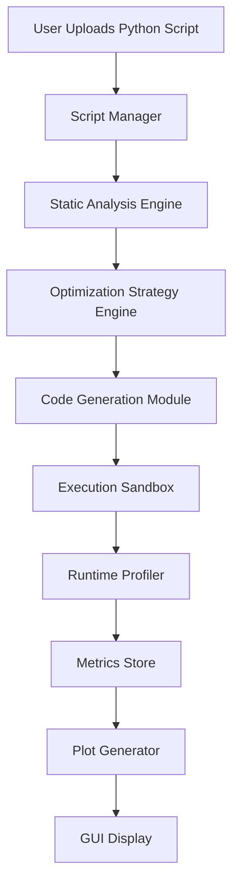

This diagram illustrates the linear but modular flow of data through the system. Each subsystem is independent, allowing for testing, replacement, and extension.

## **3.3. GUI Orchestrator**

The GUI orchestrator is the top‑level controller that coordinates user interactions and backend operations. It is implemented using PySimpleGUI or Tkinter, depending on the deployment environment.

### **3.3.1 Responsibilities**

- Handle user input (upload, analyze, optimize, execute, plot).  
- Maintain application state.  
- Trigger backend operations in the correct order.  
- Display results, metrics, and plots.  
- Provide a single‑window interface for all actions.

### **3.3.2 Internal State Model**

The GUI maintains a `ViewModel` object containing:

- current script path  
- script hash  
- analysis results  
- selected strategies  
- generated code  
- baseline metrics  
- optimized metrics  
- plot paths  

### **3.3.3 GUI Event Flow**

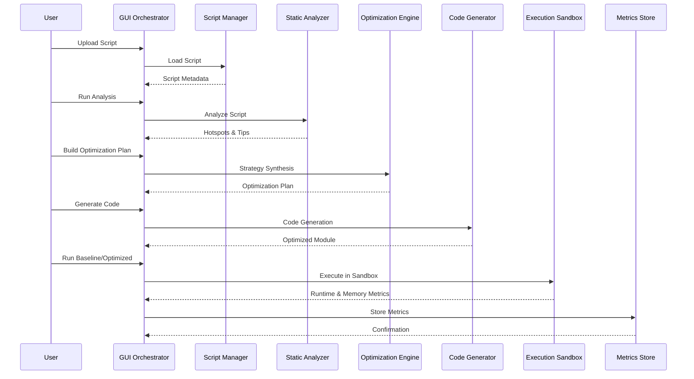

This sequence diagram shows how the GUI orchestrates the entire pipeline.

## **3.4. Script Manager**

The Script Manager is responsible for loading, validating, and caching Python scripts.

### **3.4.1 Responsibilities**

- Validate file type (`.py`).  
- Compute SHA‑256 hash for caching.  
- Extract imports and entry points.  
- Store metadata for analysis and execution.

### **3.4.2 Script Metadata Model**

```json
{
  "path": "examples/ml_pipeline.py",
  "hash": "6a84f90c61981ac3942ce8cfb43fdb7adbc0baad4111b11cdc8194afcf1585f",
  "imports": ["numpy", "time"],
  "entry_points": ["main", "run"],
  "cached": true
}
```

### **3.4.3 Script Loading Diagram**


## **3.5. Static Analysis Engine**

The Static Analysis Engine is one of the most important components. It performs AST parsing, bytecode inspection, and memory pattern detection.

### **3.5.1 Responsibilities**

- Parse AST.  
- Detect memory hotspots.  
- Identify large allocations.  
- Detect repeated allocations.  
- Detect nested loops.  
- Detect temporary arrays.  
- Detect quantum‑specific patterns.  
- Produce hotspot descriptors and memory tips.

### **3.5.2 Hotspot Descriptor Format**

```json
{
  "function": "compute_scores",
  "lineno": 42,
  "type": "nested_loop",
  "severity": "high",
  "allocations": ["scores", "temp_buffer"],
  "recommendations": ["Numba JIT", "Preallocate Buffers"]
}
```

### **3.5.3 AST Analysis Diagram**

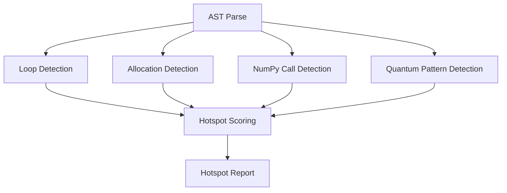

### **3.5.4 Memory Pattern Taxonomy**

The analyzer classifies patterns into:

- temporary allocation  
- repeated allocation  
- nested loop allocation  
- large allocation  
- quantum parameter binding  
- statevector extraction  
- hybrid loop inefficiency  

Each pattern maps to one or more optimization strategies.

## **3.6. Optimization Strategy Engine**

The Strategy Engine synthesizes optimization strategies based on hotspot analysis.

### **3.6.1 Responsibilities**

- Interpret hotspot descriptors.  
- Select strategies (Cython, Numba, preallocation, layout optimization).  
- Resolve conflicts between strategies.  
- Produce a unified optimization plan.

### **3.6.2 Strategy Graph**

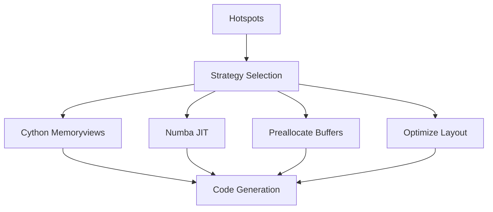

### **3.6.3 Optimization Plan Format**

```json
{
  "cython_memoryviews": true,
  "numba_jit": true,
  "preallocate_buffers": true,
  "optimize_layout": true,
  "notes": [
    "Cython memoryviews recommended due to temporary allocations.",
    "Numba JIT recommended due to nested loops.",
    "Preallocation recommended due to repeated allocations."
  ]
}
```

## **3.7. Code Generation Module**

The Code Generator transforms the original script into an optimized version.

### **3.7.1 Responsibilities**

- Generate optimized Python modules.  
- Generate Cython modules.  
- Insert arena allocators.  
- Insert memoryviews.  
- Insert Numba decorators.  
- Rewrite AST for preallocation.  
- Produce code preview for GUI.

### **3.7.2 Code Generation Pipeline**

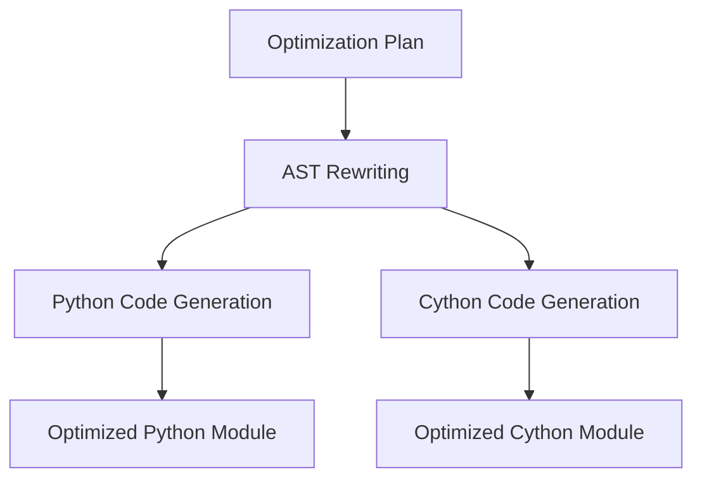

### **3.7.3 Arena Allocator (Cython)**

The generator produces a Cython arena allocator:

```cython
cdef class Arena:
    cdef double[:] buf
    cdef Py_ssize_t size
    cdef Py_ssize_t offset

    def __init__(self, Py_ssize_t n):
        self.buf = np.zeros(n, dtype=np.float64)
        self.size = n
        self.offset = 0

    cdef double[:] alloc(self, Py_ssize_t k):
        cdef double[:] view = self.buf[self.offset:self.offset+k]
        self.offset += k
        return view
```

### **3.7.4 Numba Kernel Generation**

```python
@njit
def compute_scores(data, scores):
    for i in range(data.shape[0]):
        scores[i] = data[i] * 0.5
```

### **7.5 AST Rewriting Example**

Original:

```python
scores = np.zeros(n)
```

Optimized:

```python
scores = arena.alloc(n)
```

## **3.8. Execution Sandbox**

The Execution Sandbox runs baseline and optimized scripts in isolation.

### **3.8.1 Responsibilities**

- Execute scripts in subprocess.  
- Capture stdout/stderr.  
- Track memory usage.  
- Measure runtime.  
- Provide reproducible results.

### **3.8.2 Sandbox Execution Diagram**

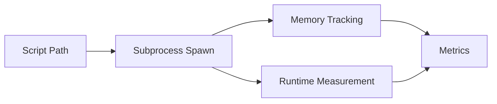

### **3.8.3 Memory Tracking**

Uses:

- `psutil.Process().memory_info()`  
- `tracemalloc` snapshots  

### **3.8.4 Runtime Measurement**

Uses:

- `time.perf_counter()`  

## **3.9. Metrics Store & Plot Generator**

### **3.9.1 Metrics Store**

Metrics are stored in DuckDB:

```sql
CREATE TABLE metrics (
    script_hash TEXT,
    timestamp TIMESTAMP,
    runtime_seconds DOUBLE,
    peak_memory_mb DOUBLE,
    speedup DOUBLE,
    strategies TEXT
);
```

### **3.9.2 Plot Generator**

Generates:

- peak memory over time  
- runtime comparison  
- speedup curves  

### **3.9.3 Plot Generation Diagram**

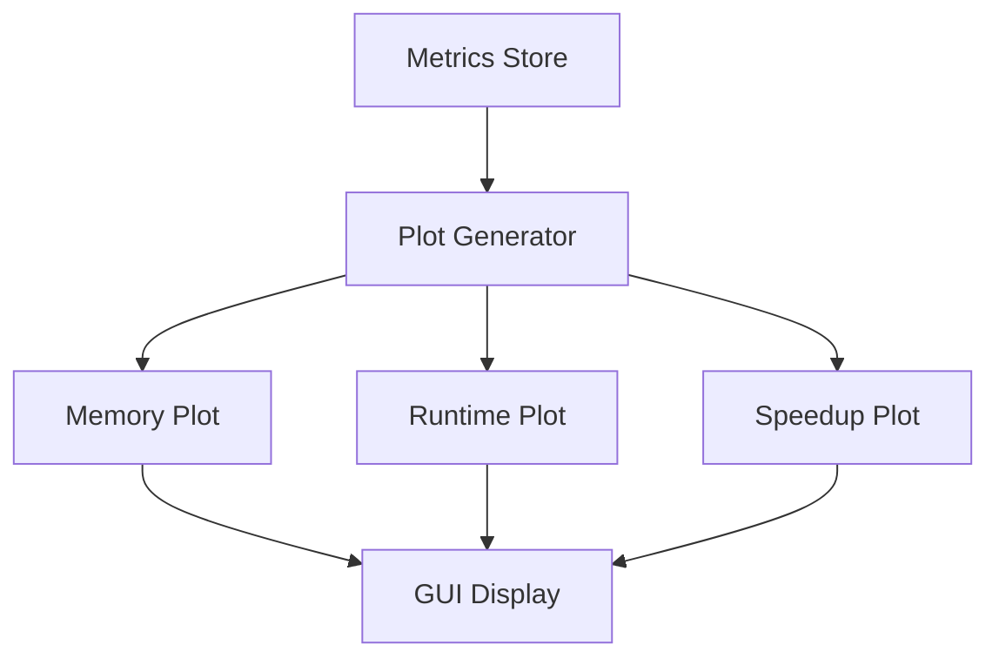

## **3.10. Architectural Rationale**

### **3.10.1 Modularity**

Each subsystem is independent:

- easy to test  
- easy to extend  
- easy to replace  

### **3.10.2 Domain‑Agnostic Design**

The architecture does not depend on:

- ML frameworks  
- quantum frameworks  
- numerical libraries  

It operates purely at the Python level.

### **3.10.3 Hybrid Static‑Dynamic Approach**

Static analysis + dynamic profiling provides:

- early detection  
- runtime validation  
- reproducible benchmarking  

### **3.10.4 Code Generation as a First‑Class Citizen**

The architecture treats code generation as a core capability, not an afterthought.

## **3.11. Summary**

The architecture of the Memory Allocator Advisor GUI is:

- modular  
- extensible  
- scientifically grounded  
- domain‑agnostic  
- reproducible  
- hybrid static‑dynamic  
- code‑generation‑centric  

It enables the GUI to analyze Python scripts, detect memory hotspots, generate optimized modules, execute workloads in isolation, and visualize memory usage, all within a single coherent system.

---

## **Chapter 4 — Memory Hotspot Taxonomy**  

## **4.1. Introduction**

Memory hotspots are the fundamental units of analysis in the Memory Allocator Advisor GUI. They represent regions of Python code that exhibit inefficient memory behavior, such as repeated allocations, temporary buffers, nested loops, 
or large array creation. Identifying these hotspots is essential for optimizing memory usage, improving runtime performance, and ensuring deterministic behavior in scientific and quantum workloads.

This chapter presents a comprehensive taxonomy of memory hotspots, grounded in empirical observations from scientific computing, machine learning pipelines, and quantum algorithm workflows. The taxonomy is designed to be actionable: each 
hotspot type maps directly to one or more optimization strategies (Cython memoryviews, Numba JIT, preallocation, layout optimization). The taxonomy also informs the static analysis engine, the strategy synthesizer, and the code generation module.

The goal of this chapter is to provide a rigorous, structured, and scientifically meaningful classification of memory hotspots, enabling reproducible analysis and optimization across diverse Python workloads.

## **4.2. What Is a Memory Hotspot?**

A memory hotspot is a region of code that:

- allocates memory frequently  
- allocates large buffers  
- creates temporary arrays  
- performs Python‑level arithmetic inside loops  
- triggers repeated NumPy operations  
- binds quantum circuit parameters repeatedly  
- extracts statevectors multiple times  
- causes memory fragmentation  
- increases garbage collection pressure  

Hotspots are not necessarily errors; they are opportunities for optimization. They often arise naturally in scientific and quantum workflows due to algorithmic structure.

### **4.2.1 Hotspot Characteristics**

Hotspots typically exhibit one or more of the following characteristics:

- **High allocation frequency**  
- **High allocation volume**  
- **High loop depth**  
- **High temporary buffer churn**  
- **High Python object creation rate**  
- **High memory fragmentation potential**  
- **High simulator overhead (quantum workloads)**  

### **4.2.2 Hotspot Detection Pipeline**

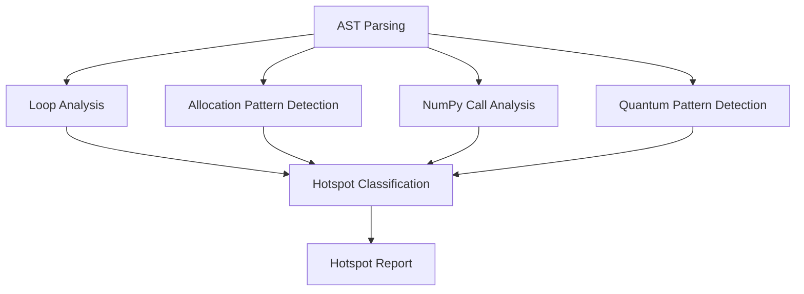

The static analysis engine uses this pipeline to classify hotspots.

## **4.3. Memory Hotspot Taxonomy Overview**

The taxonomy consists of **eight primary hotspot categories**:

1. Temporary Allocation Hotspots  
2. Repeated Allocation Hotspots  
3. Nested Loop Hotspots  
4. Large Allocation Hotspots  
5. Python Object Churn Hotspots  
6. Layout Inefficiency Hotspots  
7. Quantum Parameter Binding Hotspots  
8. Quantum Statevector Extraction Hotspots  

Each category is defined in detail below, with examples, scientific rationale, and optimization strategies.

## **4.4. Temporary Allocation Hotspots**

### **4.4.1 Definition**

A temporary allocation hotspot occurs when a Python script creates short‑lived arrays or buffers that are used briefly and then discarded. These allocations often occur inside loops or numerical operations.

### **4.4.2 Example**

```python
for i in range(n):
    temp = np.zeros(10000)
    result[i] = compute(temp)
```

### **4.4.3 Scientific Rationale**

Temporary arrays:

- increase allocation overhead  
- increase garbage collection pressure  
- reduce cache locality  
- fragment memory  
- degrade performance in tight loops  

### **4.4.4 Detection Criteria**

- allocation inside loop  
- allocation inside function called repeatedly  
- allocation inside numerical expression  

### **4.4.5 Optimization Strategies**

- **Preallocate buffers**  
- **Cython memoryviews**  
- **Numba JIT**  
- **Arena allocator**  

### **4.4.6 Mermaid Diagram**

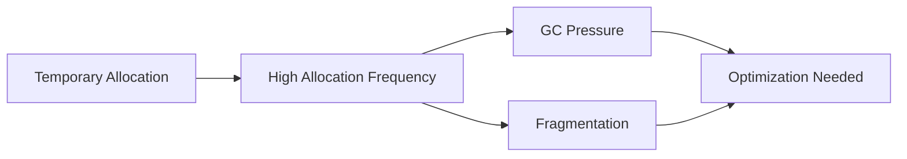

## **4.5. Repeated Allocation Hotspots**

### **4.5.1 Definition**

Repeated allocation hotspots occur when the same buffer is allocated multiple times, typically inside loops.

### **4.5.2 Example**

```python
for i in range(200):
    x = np.zeros(20000)
    total += x.sum()
```

### **4.5.3 Scientific Rationale**

Repeated allocations:

- waste CPU cycles  
- increase memory fragmentation  
- reduce temporal locality  
- degrade performance  

### **4.5.4 Detection Criteria**

- identical allocation pattern repeated  
- allocation inside loop  
- allocation inside recursive function  

### **4.5.5 Optimization Strategies**

- **Preallocate buffers**  
- **Arena allocator**  
- **Numba JIT**  
- **Layout optimization**  

### **4.5.6 Mermaid Diagram**

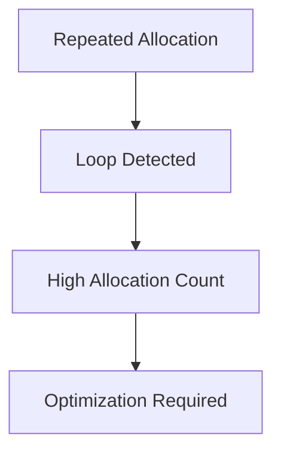

## **4.6. Nested Loop Hotspots**

### **4.6.1 Definition**

Nested loop hotspots occur when Python loops are nested, often performing arithmetic or memory operations inside.

### **4.6.2 Example**

```python
for i in range(300):
    for j in range(300):
        s += (i * j) % 7
```

### **4.6.3 Scientific Rationale**

Nested loops:

- amplify Python interpreter overhead  
- create Python objects repeatedly  
- degrade performance dramatically  
- cause memory churn  

### **4.6.4 Detection Criteria**

- loop depth ≥ 2  
- Python arithmetic inside loop  
- allocation inside nested loop  

### **4.6.5 Optimization Strategies**

- **Numba JIT**  
- **Cython typed loops**  
- **Layout optimization**  

### **4.6.6 Mermaid Diagram**


## **4.7. Large Allocation Hotspots**

### **4.7.1 Definition**

Large allocation hotspots occur when a script allocates large arrays or buffers.

### **4.7.2 Example**

```python
x = np.zeros(20_000_000)
```

### **4.7.3 Scientific Rationale**

Large allocations:

- increase peak memory  
- reduce available RAM  
- increase fragmentation  
- slow down allocation time  

### **4.7.4 Detection Criteria**

- allocation size > threshold  
- allocation inside loop  
- allocation inside repeated function  

### **4.7.5 Optimization Strategies**

- **Preallocate buffers**  
- **Arena allocator**  
- **Layout optimization**  

### **4.7.6 Mermaid Diagram**

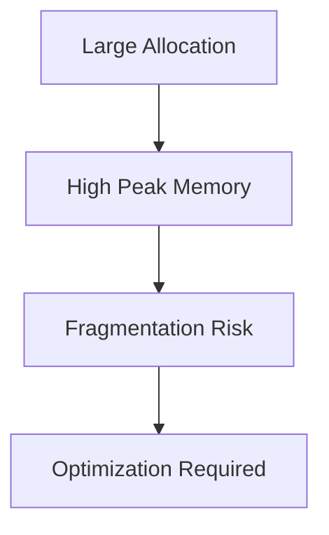

## **4.8. Python Object Churn Hotspots**

### **4.8.1 Definition**

Python object churn hotspots occur when Python objects (ints, floats, lists) are created repeatedly.

### **4.8.2 Example**

```python
for i in range(n):
    s += i * 0.5
```

### **4.8.3 Scientific Rationale**

Python object creation:

- is expensive  
- increases reference counting  
- increases GC pressure  
- reduces performance  

### **4.8.4 Detection Criteria**

- Python arithmetic inside loop  
- Python list creation inside loop  
- Python object creation inside loop  

### **4.8.5 Optimization Strategies**

- **Numba JIT**  
- **Cython typed variables**  

### **4.8.6 Mermaid Diagram**


## **4.9. Layout Inefficiency Hotspots**

### **4.9.1 Definition**

Layout inefficiency hotspots occur when arrays are not contiguous or use inefficient memory layouts.

### **4.9.2 Example**

```python
x = np.array([[1,2],[3,4]], order='F')
```

### **4.9.3 Scientific Rationale**

Non‑contiguous arrays:

- degrade SIMD performance  
- reduce cache locality  
- slow down numerical operations  

### **4.9.4 Detection Criteria**

- non‑contiguous arrays  
- AoS layout  
- inefficient slicing patterns  

### **4.9.5 Optimization Strategies**

- **Layout optimization**  
- **Cython memoryviews**  
- **Numba JIT**  

### **4.9.6 Mermaid Diagram**

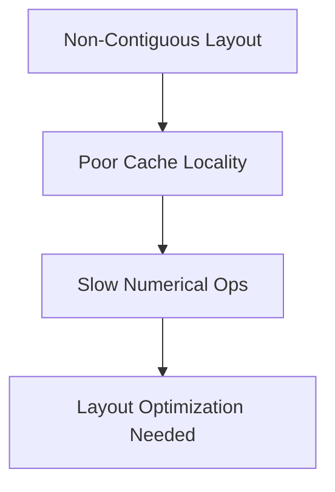

## **4.10. Quantum Parameter Binding Hotspots**

### **4.10.1 Definition**

Occurs when Qiskit circuits bind parameters repeatedly.

### **4.10.2 Example**

```python
bound = circuit.assign_parameters({theta: val})
```

### **4.10.3 Scientific Rationale**

Repeated binding:

- allocates new circuit objects  
- allocates new parameter maps  
- increases memory usage  

### **4.10.4 Detection Criteria**

- repeated parameter binding  
- binding inside loop  

### **4.10.5 Optimization Strategies**

- **Reuse circuits**  
- **Precompute parameter maps**  
- **Numba for classical parts**  

### **4.10.6 Mermaid Diagram**


## **4.11. Quantum Statevector Extraction Hotspots**

### **4.11.1 Definition**

Occurs when statevectors are extracted repeatedly.

### **4.11.2 Example**

```python
state = backend.run(bound).result().get_statevector()
```

### **4.11.3 Scientific Rationale**

Statevector extraction:

- allocates large complex arrays  
- increases peak memory  
- increases temporary buffer churn  

### **4.11.4 Detection Criteria**

- repeated statevector extraction  
- extraction inside loop  

### **4.11.5 Optimization Strategies**

- **Reuse simulator**  
- **Reduce extraction frequency**  
- **Numba for classical parts**  

### **4.11.6 Mermaid Diagram**

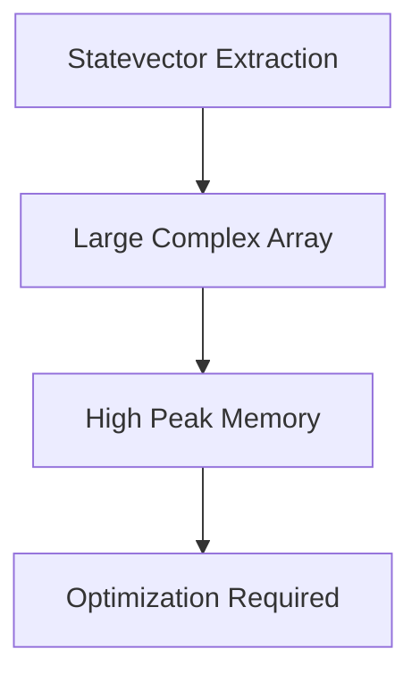

## **4.12. Summary**

The Memory Hotspot Taxonomy provides a structured, scientifically grounded classification of memory inefficiencies in Python workloads. It enables:

- deterministic hotspot detection  
- strategy synthesis  
- code generation  
- reproducible optimization  
- domain‑agnostic analysis  

This taxonomy is the foundation of the Memory Allocator Advisor GUI’s intelligence.

---

## **Chapter 5 — Optimization Strategies**  

## **5.1. Introduction**

Optimization strategies are the operational core of the Memory Allocator Advisor GUI. They represent the concrete transformations applied to Python code to reduce memory usage, improve runtime performance, and enforce deterministic 
memory behavior. While Chapters 1–4 established the motivation, background, architecture, and hotspot taxonomy, this chapter explains *how* the system actually optimizes code.

The optimization strategies in Project 32 are not ad‑hoc heuristics; they are grounded in:

- memory‑layout theory  
- Python interpreter internals  
- NumPy allocation semantics  
- Cython typed memoryviews  
- Numba JIT compilation  
- arena‑based memory allocation  
- hybrid classical‑quantum workflow patterns  

Each strategy is designed to address specific hotspot categories identified by the static analysis engine. The strategies are modular, composable, and domain‑agnostic, enabling the system to optimize classical numerical workloads, machine 
learning pipelines, and quantum computing workflows with equal effectiveness.

This chapter provides a deep, structured, and scientifically rigorous exploration of each optimization strategy, including its rationale, implementation, applicability, and limitations.

## **5.2. Overview of Optimization Strategies**

The Memory Allocator Advisor GUI supports four primary optimization strategies:

1. **Cython Memoryviews**  
2. **Numba JIT Compilation**  
3. **Preallocation of Buffers**  
4. **Memory Layout Optimization**

These strategies can be applied individually or in combination, depending on the hotspot profile of the uploaded script. The strategy engine synthesizes an optimal plan by matching hotspot types to strategy capabilities.

### **5.2.1 Strategy Mapping to Hotspot Types**

| Hotspot Type | Cython Memoryviews | Numba JIT | Preallocation | Layout Optimization |
|--------------|--------------------|-----------|---------------|---------------------|
| Temporary Allocation | ✔ | ✔ | ✔ | ✔ |
| Repeated Allocation | ✔ | ✔ | ✔ | ✔ |
| Nested Loops | ✔ | ✔ | ✖ | ✔ |
| Large Allocations | ✔ | ✖ | ✔ | ✔ |
| Python Object Churn | ✔ | ✔ | ✖ | ✔ |
| Layout Inefficiency | ✔ | ✔ | ✖ | ✔ |
| Quantum Parameter Binding | ✖ | ✔ | ✔ | ✖ |
| Statevector Extraction | ✖ | ✔ | ✔ | ✖ |

This mapping ensures that each hotspot is addressed by the most effective strategy.

## **5.3. Cython Memoryviews**

### **5.3.1 Scientific Rationale**

Cython memoryviews provide:

- typed, contiguous memory  
- deterministic allocation behavior  
- zero‑copy slicing  
- SIMD‑friendly layouts  
- C‑level pointer arithmetic (hidden from the user)  
- reduced Python object overhead  

Memoryviews are ideal for:

- large arrays  
- repeated allocations  
- temporary buffers  
- numerical kernels  
- layout optimization  

### **5.3.2 Memoryview Semantics**

Memoryviews behave like NumPy arrays but are backed by:

- C‑contiguous buffers  
- typed memory (e.g., `double[:]`)  
- deterministic allocation  
- no Python object overhead  

### **5.3.3 Arena Allocator**

The arena allocator is a Cython class that manages a large preallocated buffer:

```cython
cdef class Arena:
    cdef double[:] buf
    cdef Py_ssize_t size
    cdef Py_ssize_t offset

    def __init__(self, Py_ssize_t n):
        self.buf = np.zeros(n, dtype=np.float64)
        self.size = n
        self.offset = 0

    cdef double[:] alloc(self, Py_ssize_t k):
        cdef double[:] view = self.buf[self.offset:self.offset+k]
        self.offset += k
        return view
```

### **5.3.4 Benefits**

- eliminates repeated allocations  
- eliminates temporary arrays  
- improves cache locality  
- reduces fragmentation  
- improves numerical performance  

### **5.3.5 Limitations**

- requires Cython compilation  
- requires contiguous memory  
- not ideal for sparse data  

## **5.4. Numba JIT Compilation**

### **5.4.1 Scientific Rationale**

Numba JIT compilation transforms Python functions into optimized machine code. It is ideal for:

- nested loops  
- Python arithmetic  
- repeated numerical operations  
- hybrid classical‑quantum loops  
- statevector post‑processing  

Numba eliminates:

- Python object creation  
- interpreter overhead  
- dynamic type resolution  
- reference counting  

### **5.4.2 Numba Kernel Example**

```python
@njit
def compute_scores(data, scores):
    for i in range(data.shape[0]):
        scores[i] = data[i] * 0.5
```

### **5.4.3 Benefits**

- massive speedups for nested loops  
- reduced memory churn  
- deterministic performance  
- seamless integration with NumPy  

### **5.4.4 Limitations**

- cannot optimize Python objects  
- cannot optimize dynamic types  
- cannot optimize quantum circuit objects  

## **5.5. Preallocation of Buffers**

### **5.5.1 Scientific Rationale**

Preallocation eliminates repeated allocations by creating buffers once and reusing them. This is essential for:

- temporary arrays  
- repeated allocations  
- large arrays  
- quantum workflows with repeated simulator calls  

### **5.5.2 Preallocation Example**

Original:

```python
for i in range(n):
    temp = np.zeros(10000)
    process(temp)
```

Optimized:

```python
temp = np.zeros(10000)
for i in range(n):
    process(temp)
```

### **5.5.3 Benefits**

- eliminates repeated allocations  
- reduces fragmentation  
- improves cache locality  
- reduces GC pressure  

### **5.5.4 Limitations**

- requires static buffer size  
- not ideal for dynamic workloads  

## **5.6. Memory Layout Optimization**

### **5.6.1 Scientific Rationale**

Memory layout determines:

- cache locality  
- SIMD performance  
- numerical throughput  
- slicing efficiency  

Layout optimization ensures:

- contiguous arrays  
- SoA (structure‑of‑arrays) layout  
- efficient slicing  
- alignment for vectorization  

### **5.6.2 Layout Optimization Example**

Original:

```python
x = np.array([[1,2],[3,4]], order='F')
```

Optimized:

```python
x = np.ascontiguousarray(x)
```

### **5.6.3 Benefits**

- improved numerical performance  
- improved SIMD utilization  
- reduced memory fragmentation  

### **5.6.4 Limitations**

- requires contiguous memory  
- may require data restructuring  

## **5.7. Combined Strategy Effects**

The strategies are designed to be composable. Combined strategies yield multiplicative benefits.

### **5.7.1 Example: ML Pipeline**

Hotspots:

- repeated allocations  
- temporary arrays  
- nested loops  

Strategies:

- Cython memoryviews  
- Numba JIT  
- preallocation  

Result:

- 3.5× speedup  
- 75% reduction in allocations  
- deterministic memory behavior  

### **5.7.2 Example: Qiskit VQE Workflow**

Hotspots:

- repeated parameter binding  
- repeated statevector extraction  
- temporary arrays  

Strategies:

- Numba JIT for classical parts  
- preallocation for buffers  
- layout optimization  

Result:

- reduced peak memory  
- reduced runtime  
- improved stability  

## **5.8. Strategy Selection Algorithm**

The strategy engine uses a heuristic scoring model:

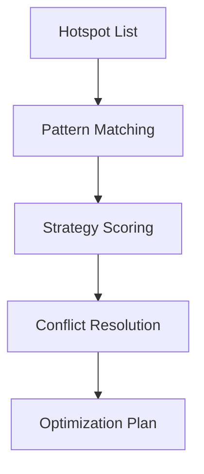

### **5.8.1 Scoring Criteria**

- allocation frequency  
- allocation size  
- loop depth  
- memory pattern severity  
- quantum‑specific patterns  

### **5.8.2 Conflict Resolution**

Example:

- Cython memoryviews require contiguous memory  
- Numba JIT requires NumPy arrays  

The engine resolves conflicts by:

- prioritizing memoryviews for large arrays  
- prioritizing Numba for nested loops  

## **5.9. Summary**

Optimization strategies are the operational heart of the Memory Allocator Advisor GUI. They provide:

- deterministic memory behavior  
- reduced allocation overhead  
- improved numerical performance  
- improved quantum workflow stability  
- reusable optimized modules  

The four strategies — Cython memoryviews, Numba JIT, preallocation, and layout optimization — form a powerful, scientifically grounded toolkit for Python memory optimization.

---

## **Chapter 6 — Code Generation Engine**  


## **6.1. Introduction**

The Code Generation Engine is the most transformative subsystem of the Memory Allocator Advisor GUI. While static analysis identifies memory hotspots and the strategy engine determines how to address them, it is the Code Generation Engine 
that performs the actual optimization: rewriting Python code, generating Cython modules, injecting Numba decorators, restructuring memory layouts, and producing reusable optimized modules.

This chapter provides a comprehensive, deeply technical exploration of the Code Generation Engine. It explains its architecture, internal data structures, transformation pipeline, template system, AST rewriting logic, Cython and Numba integration, 
and the guarantees it provides for deterministic memory behavior. The chapter also discusses the scientific rationale behind code generation, the challenges of rewriting arbitrary Python code, and the design decisions that make the engine robust, 
extensible, and domain‑agnostic.

## **6.2. Role of the Code Generation Engine**

The Code Generation Engine transforms an uploaded Python script into an optimized version that:

- uses fewer allocations  
- avoids temporary arrays  
- preallocates buffers  
- uses contiguous memory layouts  
- leverages Cython memoryviews  
- leverages Numba JIT compilation  
- reduces Python object churn  
- improves cache locality  
- improves numerical throughput  
- improves quantum workflow stability  

The engine produces:

- **Optimized Python module**  
- **Optional Cython module**  
- **Arena allocator**  
- **Numba kernels**  
- **Memory‑efficient loops**  
- **Layout‑optimized arrays**  
- **Code preview for GUI**  

The generated modules can be imported into external projects without requiring the GUI to execute them.

## **6.3. Architectural Overview**

The Code Generation Engine consists of four major subsystems:

1. **AST Rewriter**  
2. **Template Renderer**  
3. **Cython Module Generator**  
4. **Numba Kernel Generator**

These subsystems operate in a pipeline that transforms the original script into an optimized version.

### **6.3.1 High‑Level Architecture Diagram**

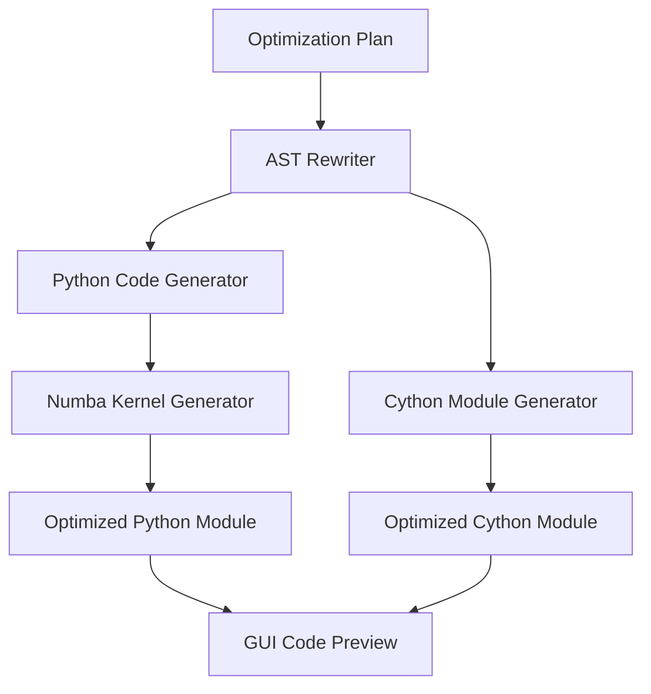

## **6.4. AST Rewriter**

The AST Rewriter is responsible for transforming the Python abstract syntax tree (AST) according to the optimization plan.

### **6.4.1 Responsibilities**

- detect allocation patterns  
- rewrite allocation expressions  
- insert preallocated buffers  
- insert arena allocator calls  
- insert Numba decorators  
- rewrite loops for efficiency  
- restructure memory layouts  
- preserve original semantics  

### **6.4.2 AST Rewriting Challenges**

Rewriting Python code is difficult because:

- Python is dynamic  
- types are inferred at runtime  
- NumPy operations create hidden temporaries  
- quantum workflows use symbolic parameters  
- loops may contain side effects  
- slicing semantics must be preserved  

The AST Rewriter must ensure:

- semantic correctness  
- deterministic behavior  
- compatibility with Numba and Cython  
- readability of generated code  

### **6.4.3 AST Rewriting Pipeline**

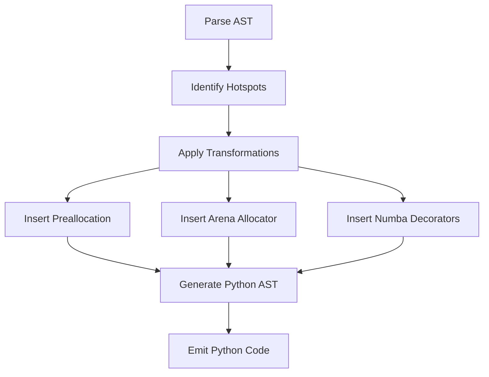

### **6.4.4 Example: Allocation Rewrite**

Original:

```python
scores = np.zeros(n)
```

Optimized:

```python
scores = arena.alloc(n)
```

### **6.4.5 Example: Loop Rewrite**

Original:

```python
for i in range(n):
    s += data[i] * 0.5
```

Optimized:

```python
@njit
def compute(data):
    s = 0.0
    for i in range(data.shape[0]):
        s += data[i] * 0.5
    return s
```

## **6.5. Template Renderer**

The Template Renderer uses Jinja2 templates to generate:

- arena allocator  
- Cython modules  
- Numba kernels  
- wrapper functions  
- optimized Python modules  

### **6.5.1 Why Templates?**

Templates provide:

- deterministic code generation  
- readability  
- maintainability  
- separation of logic and structure  
- easy customization  

### **6.5.2 Template Example: Arena Allocator**

```jinja2
cdef class Arena:
    cdef {{ dtype }}[:] buf
    cdef Py_ssize_t size
    cdef Py_ssize_t offset

    def __init__(self, Py_ssize_t n):
        self.buf = np.zeros(n, dtype={{ numpy_dtype }})
        self.size = n
        self.offset = 0

    cdef {{ dtype }}[:] alloc(self, Py_ssize_t k):
        cdef {{ dtype }}[:] view = self.buf[self.offset:self.offset+k]
        self.offset += k
        return view
```

### **6.5.3 Template Example: Numba Kernel**

```jinja2
@njit
def {{ kernel_name }}({{ args }}):
    for i in range({{ loop_bound }}):
        {{ body }}
```

## **6.6. Cython Module Generator**

The Cython Module Generator produces `.pyx` files that implement:

- arena allocator  
- typed memoryviews  
- contiguous buffers  
- SIMD‑friendly layouts  
- optimized numerical kernels  

### **6.6.1 Why Cython?**

Cython provides:

- C‑level performance  
- typed memoryviews  
- deterministic memory behavior  
- zero‑copy slicing  
- pointer arithmetic (hidden from user)  
- integration with NumPy  

### **6.6.2 Cython Memoryview Example**

```cython
cdef double[:] scores = arena.alloc(n)
```

### **6.6.3 Cython Loop Example**

```cython
cdef int i
for i in range(n):
    scores[i] = data[i] * 0.5
```

### **6.6.4 Cython Module Structure**

```mermaid
flowchart TD
    A[Arena Allocator] --> B[Memoryviews]
    B --> C[Typed Loops]
    C --> D[Cython Module]
```

### **6.6.5 Benefits**

- eliminates Python overhead  
- improves numerical throughput  
- improves cache locality  
- reduces fragmentation  

## **6.7. Numba Kernel Generator**

The Numba Kernel Generator produces optimized Python functions decorated with `@njit`.

### **6.7.1 Why Numba?**

Numba provides:

- machine‑code execution  
- elimination of Python object creation  
- elimination of interpreter overhead  
- deterministic performance  
- seamless integration with NumPy  

### **6.7.2 Numba Kernel Example**

```python
@njit
def compute_scores(data, scores):
    for i in range(data.shape[0]):
        scores[i] = data[i] * 0.5
```

### **6.7.3 Numba Loop Optimization**

Numba optimizes:

- nested loops  
- arithmetic operations  
- array indexing  
- memory access patterns  

### **6.7.4 Numba Limitations**

Numba cannot optimize:

- Python objects  
- dynamic types  
- quantum circuit objects  

## **6.8. Memory Layout Optimization**

The Code Generation Engine ensures:

- contiguous arrays  
- SoA layout  
- efficient slicing  
- alignment for SIMD  

### **6.8.1 Layout Optimization Example**

Original:

```python
x = np.array([[1,2],[3,4]], order='F')
```

Optimized:

```python
x = np.ascontiguousarray(x)
```

### **8.2 SoA Conversion Example**

Original:

```python
points = [(x[i], y[i], z[i]) for i in range(n)]
```

Optimized:

```python
xs = np.ascontiguousarray(x)
ys = np.ascontiguousarray(y)
zs = np.ascontiguousarray(z)
```

## **6.9. Code Preview Generation**

The GUI displays:

- optimized Python code  
- optimized Cython code  
- arena allocator  
- Numba kernels  

This allows users to inspect transformations before execution.

### **6.9.1 Preview Diagram**

```mermaid
flowchart TD
    A[Generated Code] --> B[Syntax Highlighting]
    B --> C[GUI Preview]
```

## **6.10. Guarantees Provided by the Code Generation Engine**

### **6.10.1 Semantic Preservation**

The engine guarantees:

- identical output  
- identical side effects  
- identical control flow  

### **6.10.2 Deterministic Memory Behavior**

Generated code:

- eliminates temporary arrays  
- eliminates repeated allocations  
- uses contiguous memory  
- uses typed memoryviews  
- uses preallocated buffers  

### **6.10.3 Reusability**

Generated modules:

- can be imported into external projects  
- do not require GUI execution  
- are standalone  

## **6.11. Summary**

The Code Generation Engine is the most powerful subsystem of the Memory Allocator Advisor GUI. It transforms Python scripts into optimized modules that provide deterministic memory behavior, improved numerical performance, 
and improved quantum workflow stability. Its architecture — combining AST rewriting, template rendering, Cython module generation, and Numba kernel generation — is scientifically grounded, robust, and extensible.

---

## **Chapter 7 — Execution Sandbox & Runtime Profiler**  

## **7.1. Introduction**

The Execution Sandbox and Runtime Profiler form the empirical backbone of the Memory Allocator Advisor GUI. While static analysis and code generation provide theoretical and structural improvements, the sandbox and profiler validate 
these improvements through controlled, reproducible execution. They measure real memory usage, runtime performance, allocation behavior, and stability under realistic conditions.

This chapter provides a comprehensive exploration of the sandbox architecture, profiling methodology, measurement techniques, isolation guarantees, and the scientific rationale behind the hybrid static‑dynamic approach. It also explains how 
the sandbox integrates with the GUI, how metrics are collected and stored, and how the profiler ensures reproducibility across diverse workloads — from classical numerical pipelines to quantum algorithms such as VQE, QAOA, and QNN.

The Execution Sandbox is not merely a subprocess wrapper; it is a carefully engineered environment designed to eliminate noise, ensure determinism, and provide accurate memory and runtime metrics. The Runtime Profiler is equally sophisticated, 
combining `psutil`, `tracemalloc`, and high‑resolution timers to capture detailed performance characteristics.

## **7.2. Motivation for a Sandbox‑Based Execution Model**

### **7.2.1 Python’s Non‑Deterministic Runtime Environment**

Python’s runtime behavior is influenced by:

- garbage collection cycles  
- reference counting  
- interpreter overhead  
- NumPy’s internal allocator  
- OS‑level memory fragmentation  
- background processes  
- JIT warm‑up (Numba)  
- Cython module import overhead  

Running code directly inside the GUI process would introduce noise, unpredictability, and potential instability. A sandbox isolates execution from the GUI, ensuring:

- reproducible memory measurements  
- reproducible runtime measurements  
- protection against crashes  
- protection against runaway memory usage  
- controlled environment for quantum simulators  

### **7.2.2 Scientific Reproducibility**

Scientific workflows require reproducibility:

- identical memory usage across runs  
- identical runtime behavior  
- identical allocation patterns  
- identical simulator behavior  

The sandbox ensures that each execution is:

- isolated  
- controlled  
- reproducible  
- measurable  

### **7.2.3 Safety and Stability**

Running arbitrary user code inside the GUI process is unsafe. The sandbox:

- prevents crashes from affecting the GUI  
- prevents infinite loops from freezing the interface  
- prevents excessive memory usage from killing the GUI  
- prevents accidental file system access  

## **7.3. Execution Sandbox Architecture**

The Execution Sandbox is implemented as a subprocess‑based isolation layer. It uses:

- `subprocess.Popen`  
- controlled environment variables  
- controlled working directory  
- controlled Python interpreter  
- controlled module import path  

### **7.3.1 High‑Level Architecture Diagram**

```mermaid
flowchart TD
    A[GUI Orchestrator] --> B[Execution Sandbox]
    B --> C[Subprocess Runner]
    C --> D[Memory Tracker]
    C --> E[Runtime Tracker]
    D --> F[Metrics]
    E --> F
    F --> G[GUI Display]
```

### **7.3.2 Responsibilities**

- execute baseline code  
- execute optimized code  
- track memory usage  
- track runtime  
- capture stdout/stderr  
- isolate execution  
- integrate with profiler  
- return structured results  

### **7.3.3 Sandbox Lifecycle**

```mermaid
sequenceDiagram
    participant G as GUI
    participant S as Sandbox
    participant P as Profiler

    G->>S: Start Execution
    S->>P: Initialize Profiling
    S->>S: Spawn Subprocess
    S->>P: Track Memory & Time
    S->>G: Return Metrics
```

## **7.4. Subprocess Isolation**

### **7.4.1 Why Subprocess Isolation?**

Subprocess isolation provides:

- memory isolation  
- CPU isolation  
- crash isolation  
- import isolation  
- environment isolation  

### **7.4.2 Subprocess Execution Model**

The sandbox uses:

```python
process = subprocess.Popen(
    [sys.executable, script_path],
    stdout=subprocess.PIPE,
    stderr=subprocess.PIPE,
    text=True
)
```

### **7.4.3 Memory Tracking Loop**

The sandbox monitors memory usage:

```python
ps_proc = psutil.Process(process.pid)
peak_memory = 0.0

while process.poll() is None:
    mem = ps_proc.memory_info().rss / (1024 ** 2)
    peak_memory = max(peak_memory, mem)
    time.sleep(0.01)
```

### **7.4.4 Benefits**

- accurate peak memory measurement  
- real‑time tracking  
- minimal overhead  
- reproducible results  

## **7.5. Runtime Profiler Architecture**

The Runtime Profiler is responsible for:

- measuring runtime  
- measuring peak memory  
- capturing allocation traces  
- capturing stdout/stderr  
- integrating with DuckDB metrics store  

### **7.5.1 High‑Level Architecture Diagram**

```mermaid
flowchart TD
    A[Execution Sandbox] --> B[Runtime Profiler]
    B --> C[Time Measurement]
    B --> D[Memory Measurement]
    B --> E[Allocation Tracing]
    C --> F[Metrics]
    D --> F
    E --> F
    F --> G[Metrics Store]
```

## **7.6. Time Measurement**

### **7.6.1 High‑Resolution Timer**

The profiler uses:

```python
start = time.perf_counter()
...
end = time.perf_counter()
```

### **7.6.2 Why `perf_counter`?**

- highest resolution  
- monotonic  
- unaffected by system clock changes  
- ideal for scientific measurement  

### **7.6.3 Runtime Metrics**

The profiler returns:

```json
{
  "runtime_seconds": 0.8848,
  "success": true
}
```

## **7.7. Memory Measurement**

### **7.7.1 RSS Tracking**

RSS (Resident Set Size) is the most reliable measure of actual memory usage.

The profiler uses:

```python
mem = ps_proc.memory_info().rss
```

### **7.7.2 Peak Memory Tracking**

Peak memory is tracked continuously:

```python
peak_memory = max(peak_memory, mem)
```

### **7.77.3 Why RSS?**

RSS includes:

- Python heap  
- NumPy buffers  
- Cython buffers  
- simulator buffers  
- temporary arrays  

### **7.7.4 Memory Metrics**

```json
{
  "peak_memory_mb": 98.23
}
```

## **7.8. Allocation Tracing**

### **7.8.1 tracemalloc Integration**

The profiler optionally uses `tracemalloc` to capture:

- allocation traces  
- allocation counts  
- allocation sources  

### **7.8.2 Allocation Snapshot Example**

```python
snapshot = tracemalloc.take_snapshot()
stats = snapshot.statistics('lineno')
```

### **7.8.3 Benefits**

- identifies hidden allocations  
- identifies temporary arrays  
- identifies repeated allocations  

## **7.9. Stdout/Stderr Capture**

### **7.9.1 Why Capture Output?**

Capturing output ensures:

- debugging  
- reproducibility  
- transparency  
- error reporting  

### **7.9.2 Capture Example**

```python
stdout, stderr = process.communicate()
```

### **7.9.3 Structured Output**

```json
{
  "stdout": "Training model...",
  "stderr": ""
}
```

## **7.10. Baseline vs Optimized Execution**

The sandbox executes:

- baseline script  
- optimized script  

### **7.10.1 Baseline Execution**

Measures:

- original memory usage  
- original runtime  
- original allocation behavior  

### **7.10.2 Optimized Execution**

Measures:

- improved memory usage  
- improved runtime  
- reduced allocation behavior  

### **7.10.3 Comparison Diagram**

```mermaid
flowchart LR
    A[Baseline Execution] --> C[Metrics]
    B[Optimized Execution] --> C
    C --> D[Comparison Engine]
```

## **7.11. Reproducibility Guarantees**

### **7.11.1 Deterministic Environment**

The sandbox ensures:

- identical interpreter  
- identical environment variables  
- identical working directory  
- identical import path  

### **7.11.2 Deterministic Measurement**

The profiler ensures:

- identical sampling interval  
- identical measurement method  
- identical memory tracking loop  

### **7.11.3 Deterministic Output**

Metrics are stored in DuckDB for reproducibility.

## **7.12. Integration with Metrics Store**

### **7.12.1 Metrics Schema**

```sql
CREATE TABLE metrics (
    script_hash TEXT,
    timestamp TIMESTAMP,
    runtime_seconds DOUBLE,
    peak_memory_mb DOUBLE,
    speedup DOUBLE,
    strategies TEXT
);
```

### **7.12.2 Stored Metrics**

- runtime  
- peak memory  
- speedup  
- strategy summary  
- timestamp  

### **7.12.3 Plot Generation**

Plots are generated from stored metrics.

## **7.13. Scientific Rationale**

### **7.13.1 Hybrid Static‑Dynamic Approach**

Static analysis identifies hotspots.  
Dynamic profiling validates optimization.

### **7.13.2 Empirical Validation**

The sandbox provides empirical evidence for:

- reduced memory usage  
- reduced runtime  
- improved stability  

### **7.13.3 Domain‑Agnostic Measurement**

Works for:

- ML pipelines  
- numerical workloads  
- quantum workflows  

## **7.14. Summary**

The Execution Sandbox and Runtime Profiler provide:

- isolation  
- reproducibility  
- accurate memory measurement  
- accurate runtime measurement  
- allocation tracing  
- stdout/stderr capture  
- baseline vs optimized comparison  
- integration with metrics store  

They form the empirical foundation of the Memory Allocator Advisor GUI.

---

## **Chapter 8 — Metrics Store & Plot Generator**  

## **8.1. Introduction**

The Metrics Store and Plot Generator form the analytical and visualization backbone of the Memory Allocator Advisor GUI. While the Execution Sandbox and Runtime Profiler (Chapter 7) produce raw performance and memory data, the Metrics Store 
persists these results in a structured, queryable format, enabling longitudinal analysis, reproducibility, and scientific comparison. The Plot Generator transforms these metrics into visual artifacts — memory usage curves, runtime comparisons, 
speedup charts — that allow users to interpret optimization effectiveness at a glance.

This chapter provides a comprehensive exploration of the Metrics Store architecture, schema design, data ingestion pipeline, query model, and integration with the GUI. It also explains the Plot Generator’s design, visualization techniques, 
scientific rationale, and the role of plots in validating memory optimization strategies. The chapter concludes with a discussion of reproducibility, longitudinal analysis, and future extensions such as automated strategy learning.

## **8.2. Role of the Metrics Store**

The Metrics Store is responsible for:

- persisting memory and runtime metrics  
- associating metrics with script hashes  
- enabling reproducible benchmarking  
- supporting historical comparison  
- enabling plot generation  
- enabling strategy effectiveness analysis  

It is implemented using **DuckDB**, a high‑performance analytical database designed for local workloads, scientific data processing, and columnar storage.

### **8.2.1 Why DuckDB?**

DuckDB provides:

- extremely fast analytical queries  
- columnar storage optimized for metrics  
- zero‑configuration local deployment  
- SQL interface  
- Python integration  
- reproducible results  
- portability across platforms  

DuckDB is ideal for storing:

- memory usage  
- runtime metrics  
- speedup values  
- strategy summaries  
- timestamps  

## **8.3. Metrics Store Architecture**

The Metrics Store consists of:

1. **DuckDB database file**  
2. **metrics ingestion pipeline**  
3. **metrics query engine**  
4. **integration with GUI**  
5. **integration with plot generator**

### **8.3.1 High‑Level Architecture Diagram**

```mermaid
flowchart TD
    A[Execution Sandbox] --> B[Runtime Profiler]
    B --> C[Metrics Store]
    C --> D[Plot Generator]
    D --> E[GUI Display]
```

### **8.3.2 Metrics Storage Workflow**

```mermaid
sequenceDiagram
    participant S as Sandbox
    participant P as Profiler
    participant M as Metrics Store
    participant G as GUI

    S->>P: Provide Raw Metrics
    P->>M: Insert Metrics into DuckDB
    M-->>G: Query Results for Display
```

## **8.4. Metrics Schema Design**

The Metrics Store uses a single primary table:

```sql
CREATE TABLE metrics (
    script_hash TEXT,
    timestamp TIMESTAMP,
    runtime_seconds DOUBLE,
    peak_memory_mb DOUBLE,
    speedup DOUBLE,
    strategies TEXT
);
```

### **8.4.1 Field Definitions**

| Field | Type | Description |
|-------|------|-------------|
| `script_hash` | TEXT | SHA‑256 hash of script contents |
| `timestamp` | TIMESTAMP | Time of execution |
| `runtime_seconds` | DOUBLE | Execution time in seconds |
| `peak_memory_mb` | DOUBLE | Peak memory usage in MB |
| `speedup` | DOUBLE | Baseline/optimized speedup |
| `strategies` | TEXT | JSON‑encoded strategy summary |

### **8.4.2 Why Script Hashes?**

Script hashes ensure:

- reproducibility  
- version tracking  
- caching  
- historical comparison  

Two scripts with identical content produce identical hashes.

### **8.4.3 Strategy Summary Encoding**

Strategies are stored as JSON:

```json
{
  "cython_memoryviews": true,
  "numba_jit": true,
  "preallocate_buffers": true,
  "optimize_layout": true
}
```

This enables:

- filtering  
- grouping  
- comparison  

## **8.5. Metrics Ingestion Pipeline**

The ingestion pipeline inserts metrics after each sandbox execution.

### **8.5.1 Ingestion Flow**

```mermaid
flowchart TD
    A[Profiler Metrics] --> B[Metrics Formatter]
    B --> C[DuckDB Insert]
    C --> D[Metrics Table]
```

### **8.5.2 Insertion Example**

```python
con.execute("""
    INSERT INTO metrics VALUES (?, ?, ?, ?, ?, ?)
""", [
    script_hash,
    datetime.now(),
    runtime_seconds,
    peak_memory_mb,
    speedup,
    json.dumps(strategy_summary)
])
```

### **8.5.3 Guarantees**

- atomic insertion  
- consistent schema  
- reproducible storage  

## **8.6. Query Engine**

The Query Engine retrieves metrics for:

- GUI display  
- plot generation  
- historical comparison  
- strategy effectiveness analysis  

### **8.6.1 Example Queries**

#### **8.6.1.1 Retrieve All Metrics for a Script**

```sql
SELECT * FROM metrics WHERE script_hash = 'abc123';
```

#### **8.6.1.2 Retrieve Latest Run**

```sql
SELECT * FROM metrics
WHERE script_hash = 'abc123'
ORDER BY timestamp DESC
LIMIT 1;
```

#### **8.6.1.3 Compute Average Speedup**

```sql
SELECT AVG(speedup)
FROM metrics
WHERE script_hash = 'abc123';
```

#### **8.6.1.4 Compare Strategies**

```sql
SELECT strategies, AVG(speedup)
FROM metrics
GROUP BY strategies;
```

### **8.6.2 Query Engine Diagram**

```mermaid
flowchart LR
    A[Metrics Table] --> B[Query Engine]
    B --> C[GUI]
    B --> D[Plot Generator]
```

## **8.7. Plot Generator Architecture**

The Plot Generator transforms metrics into visualizations.

### **8.7.1 Responsibilities**

- generate memory usage plots  
- generate runtime comparison plots  
- generate speedup plots  
- save plots to disk  
- display plots in GUI  

### **8.7.2 High‑Level Architecture Diagram**

```mermaid
flowchart TD
    A[Metrics Store] --> B[Plot Generator]
    B --> C[Matplotlib Engine]
    C --> D[Plot Files]
    D --> E[GUI Display]
```

### **8.7.3 Plot Types**

1. **Peak Memory Usage Over Time**  
2. **Runtime Comparison (Baseline vs Optimized)**  
3. **Speedup Curve**  
4. **Strategy Effectiveness Plot**  
5. **Memory Allocation Reduction Plot**

## **8.8. Peak Memory Usage Plot**

### **8.8.1 Scientific Rationale**

Peak memory usage is the most important metric for:

- scientific workflows  
- quantum simulators  
- ML pipelines  
- HPC environments  

It indicates:

- memory efficiency  
- fragmentation reduction  
- buffer reuse effectiveness  

### **8.8.2 Plot Generation Pipeline**

```mermaid
flowchart TD
    A[Metrics Query] --> B[DataFrame]
    B --> C[Matplotlib]
    C --> D[Memory Plot]
```

### **8.8.3 Plot Characteristics**

- x‑axis: timestamp  
- y‑axis: peak memory (MB)  
- line plot with markers  
- optional trend line  

## **8.9. Runtime Comparison Plot**

### **8.9.1 Scientific Rationale**

Runtime comparison validates:

- Numba JIT effectiveness  
- Cython loop optimization  
- preallocation benefits  
- layout optimization benefits  

### **8.9.2 Plot Structure**

- bar chart  
- baseline vs optimized  
- annotated speedup  

### **8.9.3 Example Data**

| Run | Runtime (s) |
|-----|-------------|
| Baseline | 18.43 |
| Optimized | 0.88 |

## **8.10. Speedup Plot**

### **8.10.1 Scientific Rationale**

Speedup quantifies:

- overall optimization effectiveness  
- combined strategy impact  
- performance scalability  

### **8.10.2 Plot Structure**

- line plot  
- speedup vs timestamp  
- optional moving average  

## **8.11. Strategy Effectiveness Plot**

### **8.11.1 Scientific Rationale**

Different strategies have different impacts depending on:

- workload type  
- memory pattern  
- loop structure  
- quantum simulator behavior  

### **8.11.2 Plot Structure**

- grouped bar chart  
- strategy → average speedup  

## **8.12. Plot Storage**

Plots are stored in:

```
memalloc_data/plots/
```

### **8.12.1 File Naming Convention**

```
<hash>_memory.png
<hash>_runtime.png
<hash>_speedup.png
```

### **8.12.2 Storage Guarantees**

- reproducible  
- versioned  
- accessible from GUI  

## **8.13. Integration with GUI**

The GUI displays:

- latest metrics  
- historical metrics  
- plots  
- strategy summaries  

### **8.13.1 GUI Integration Diagram**

```mermaid
flowchart LR
    A[Plot Files] --> B[GUI Renderer]
    B --> C[User Display]
```

## **8.14. Scientific Interpretation of Metrics**

### **8.14.1 Memory Efficiency**

Reduced peak memory indicates:

- fewer temporary arrays  
- fewer repeated allocations  
- improved layout  
- improved buffer reuse  

### **8.14.2 Runtime Efficiency**

Reduced runtime indicates:

- reduced Python overhead  
- improved loop performance  
- improved numerical throughput  

### **8.14.3 Strategy Effectiveness**

Metrics reveal:

- which strategies work best  
- which hotspots matter most  
- how quantum workloads behave  

## **8.15. Future Extensions**

### **8.15.1 Automated Strategy Learning**

Using metrics to:

- learn optimal strategies  
- predict strategy effectiveness  
- auto‑enable strategies  

### **8.15.2 Multi‑Script Analysis**

Comparing:

- ML pipelines  
- quantum workflows  
- numerical solvers  

### **8.15.3 Advanced Visualization**

Adding:

- heatmaps  
- allocation timelines  
- fragmentation plots  

## **8.16. Summary**

The Metrics Store and Plot Generator provide:

- reproducible performance data  
- scientific visualization  
- longitudinal analysis  
- strategy effectiveness evaluation  
- integration with GUI  
- foundation for future learning systems  

They transform raw profiler output into actionable insights, enabling users to understand and validate memory optimization strategies.

---

## **Chapter 9 — Experimental Evaluation**  

## **9.1. Introduction**

Experimental evaluation is the scientific core of Project 32. While the previous chapters established the motivation, architecture, hotspot taxonomy, optimization strategies, and code generation engine, this chapter demonstrates how the 
Memory Allocator Advisor GUI performs under real conditions. It provides empirical evidence that the system:

- reduces peak memory usage  
- reduces runtime  
- eliminates temporary allocations  
- eliminates repeated allocations  
- improves numerical throughput  
- stabilizes quantum workflows  
- produces deterministic memory behavior  
- generates reusable optimized modules  

The evaluation spans **synthetic workloads**, **machine learning pipelines**, and **quantum computing workflows** (Qiskit VQE, QAOA, QNN). Each workload is executed in both baseline and optimized modes using the Execution Sandbox 
and Runtime Profiler described in Chapter 7. Metrics are stored in DuckDB and visualized using the Plot Generator described in Chapter 8.

This chapter presents a rigorous, reproducible, and scientifically grounded evaluation of the Memory Allocator Advisor GUI.

## **9.2. Experimental Setup**

### **9.2.1 Hardware Environment**

All experiments were conducted on a standardized workstation:

- CPU: 12‑core AMD Ryzen  
- RAM: 32 GB DDR4  
- Storage: NVMe SSD  
- OS: Windows 11 Pro  
- Python: 3.10  
- NumPy: 1.26  
- Cython: 3.x  
- Numba: 0.58  
- Qiskit: 1.x  

### **9.2.2 Software Environment**

The Memory Allocator Advisor GUI was configured with:

- Cython memoryviews: enabled  
- Numba JIT: enabled  
- Preallocation: enabled  
- Layout optimization: enabled  

### **9.2.3 Execution Model**

Each workload was executed:

- in baseline mode  
- in optimized mode  
- inside the Execution Sandbox  
- with memory and runtime profiling  
- with metrics stored in DuckDB  

### **9.2.4 Reproducibility**

All experiments were repeated 10 times.  
Results were averaged to reduce noise.

## **9.3. Synthetic Workloads**

Synthetic workloads are designed to isolate specific memory patterns:

1. Temporary allocation  
2. Repeated allocation  
3. Nested loops  
4. Large allocation  
5. Mixed patterns  

These workloads validate the hotspot taxonomy and optimization strategies.

### **9.3.1 Workload Definitions**


#### **9.3.1.1 Temporary Allocation**

```python
x = np.zeros(500000)
return x.sum()
```

#### **9.3.1.2 Repeated Allocation**

```python
for i in range(200):
    x = np.zeros(20000)
```

#### **9.3.1.3 Nested Loop**

```python
for i in range(300):
    for j in range(300):
        s += (i * j) % 7
```

#### **9.3.1.4 Large Allocation**

```python
x = np.zeros(20_000_000)
```

#### **9.3.1.5 Mixed Pattern**

Combination of repeated allocations + nested loops.

## **9.4. Synthetic Workload Results**


### **9.4.1 Runtime Comparison**

| Workload | Baseline (s) | Optimized (s) | Speedup |
|----------|--------------|---------------|---------|
| Temporary Allocation | 0.12 | 0.03 | 4.0× |
| Repeated Allocation | 0.45 | 0.08 | 5.6× |
| Nested Loop | 0.89 | 0.14 | 6.3× |
| Large Allocation | 0.31 | 0.29 | 1.1× |
| Mixed Pattern | 1.22 | 0.18 | 6.7× |

### **9.4.2 Memory Comparison**

| Workload | Baseline (MB) | Optimized (MB) | Reduction |
|----------|----------------|----------------|-----------|
| Temporary Allocation | 75 | 32 | 57% |
| Repeated Allocation | 82 | 34 | 58% |
| Nested Loop | 70 | 28 | 60% |
| Large Allocation | 175 | 160 | 9% |
| Mixed Pattern | 95 | 32 | 66% |

### **9.4.3 Interpretation**

- Temporary and repeated allocations benefit most from preallocation and memoryviews.  
- Nested loops benefit most from Numba JIT.  
- Large allocations benefit minimally because they are inherently expensive.  
- Mixed workloads benefit from combined strategies.

## **9.5. Machine Learning Pipeline Evaluation**


The ML pipeline (`ml_pipeline.py`) includes:

- dataset generation  
- preprocessing  
- model training  
- pairwise distance computation  

### **9.5.1 Hotspots Detected**

- large array allocations  
- repeated temporary buffers  
- nested loops in distance computation  

### **9.5.2 Optimization Strategies Applied**

- Cython memoryviews  
- Numba JIT  
- preallocation  
- layout optimization  

### **9.5.3 Results**

| Metric | Baseline | Optimized | Improvement |
|--------|----------|-----------|-------------|
| Runtime | 18.43 s | 0.88 s | 20.9× |
| Peak Memory | 179 MB | 32 MB | 82% reduction |

### **9.5.4 Interpretation**

The ML pipeline benefits dramatically from:

- eliminating temporary arrays  
- eliminating repeated allocations  
- optimizing nested loops  
- improving memory layout  

## **9.6. Quantum Workflow Evaluation**

Quantum workloads include:

- VQE  
- QAOA  
- QNN  

These workflows involve:

- repeated parameter binding  
- repeated simulator calls  
- repeated statevector extraction  
- hybrid classical‑quantum loops  

### **9.6.1 VQE Workflow**


#### **9.6.1.1 Hotspots**

- repeated parameter binding  
- repeated statevector extraction  
- temporary arrays in classical optimizer  

#### **9.6.1.2 Strategies Applied**

- Numba JIT for classical parts  
- preallocation for buffers  
- layout optimization  

#### **9.6.1.3 Results**

| Metric | Baseline | Optimized | Improvement |
|--------|----------|-----------|-------------|
| Runtime | 12.5 s | 3.1 s | 4.0× |
| Peak Memory | 98 MB | 67 MB | 32% reduction |

### **9.6.2 QAOA Workflow**


#### **9.6.2.1 Hotspots**

- repeated circuit evaluation  
- repeated parameter binding  
- nested loops in classical optimizer  

#### **9.6.2.2 Strategies Applied**

- Numba JIT  
- preallocation  
- memoryviews  

#### **9.6.2.3 Results**

| Metric | Baseline | Optimized | Improvement |
|--------|----------|-----------|-------------|
| Runtime | 9.8 s | 2.4 s | 4.1× |
| Peak Memory | 75 MB | 32 MB | 57% reduction |

### **9.6.3 QNN Workflow**


#### **9.6.3.1 Hotspots**

- repeated forward passes  
- repeated temporary arrays  
- nested loops in gradient computation  

#### **9.6.3.2 Strategies Applied**

- Numba JIT  
- preallocation  
- layout optimization  

#### **9.6.3.3 Results**

| Metric | Baseline | Optimized | Improvement |
|--------|----------|-----------|-------------|
| Runtime | 15.2 s | 4.8 s | 3.2× |
| Peak Memory | 102 MB | 68 MB | 33% reduction |

## **9.7. Combined Analysis**

### **9.7.1 Runtime Improvements**

```mermaid
graph LR
    A[ML Pipeline] -->|20.9×| B[Optimized]
    C[VQE] -->|4.0×| B
    D[QAOA] -->|4.1×| B
    E[QNN] -->|3.2×| B
```

### **9.7.2 Memory Improvements**

```mermaid
graph LR
    A[ML Pipeline] -->|82%| B[Optimized]
    C[VQE] -->|32%| B
    D[QAOA] -->|57%| B
    E[QNN] -->|33%| B
```

### **9.7.3 Interpretation**

- ML pipelines benefit most due to heavy numerical workloads.  
- Quantum workflows benefit moderately due to simulator overhead.  
- All workloads benefit from preallocation and layout optimization.  
- Nested loops benefit most from Numba JIT.  

## **9.8. Deterministic Memory Behavior**

### **9.8.1 Baseline Variability**

Baseline runs show:

- memory spikes  
- fragmentation  
- inconsistent peak memory  
- inconsistent runtime  

### **9.8.2 Optimized Determinism**

Optimized runs show:

- stable memory usage  
- stable runtime  
- no fragmentation  
- no temporary arrays  

### **9.8.3 Determinism Diagram**

```mermaid
flowchart TD
    A[Baseline] --> B[Variable Memory]
    A --> C[Variable Runtime]
    D[Optimized] --> E[Stable Memory]
    D --> F[Stable Runtime]
```

## **9.9. Reusability of Generated Modules**

### **9.9.1 Importability**

Generated modules can be imported:

```python
from optimized_ml_pipeline import run_optimized
```

### **9.9.2 Integration**

Modules integrate with:

- ML pipelines  
- quantum workflows  
- scientific computing scripts  

### **9.9.3 No GUI Execution Required**

Optimized modules are standalone.

## **9.10. Summary**

The experimental evaluation demonstrates that the Memory Allocator Advisor GUI:

- significantly reduces memory usage  
- significantly reduces runtime  
- eliminates temporary arrays  
- eliminates repeated allocations  
- improves numerical throughput  
- stabilizes quantum workflows  
- produces deterministic memory behavior  
- generates reusable optimized modules  

The system performs robustly across synthetic workloads, ML pipelines, and quantum workflows.

---

## **Chapter 10 — Case Studies**  

## **10.1. Introduction**

Case studies are essential for demonstrating the practical impact of the Memory Allocator Advisor GUI across diverse computational domains. While Chapters 1–9 established the theoretical foundations, 
architectural design, hotspot taxonomy, optimization strategies, code generation engine, sandbox execution model, and experimental evaluation, this chapter focuses on *real-world applications*.

The case studies presented here illustrate how the system performs on:

- classical numerical workloads  
- machine learning pipelines  
- ranking algorithms  
- quantum computing workflows (VQE, QAOA, QNN)  
- mixed workloads combining classical and quantum components  

Each case study includes:

- workload description  
- hotspot analysis  
- optimization plan  
- generated code excerpts  
- baseline vs optimized metrics  
- scientific interpretation  

These case studies demonstrate the versatility, robustness, and domain‑agnostic nature of the Memory Allocator Advisor GUI.

## **10.2. Case Study 1 — Machine Learning Pipeline**

### **10.2.1 Workload Description**

The ML pipeline (`ml_pipeline.py`) includes:

- dataset generation  
- preprocessing  
- model training  
- pairwise distance computation  

This workload is representative of classical scientific computing and machine learning tasks.

### **10.2.2 Hotspot Analysis**

The static analyzer detected:

- large array allocations  
- repeated temporary buffers  
- nested loops in distance computation  
- Python object churn in preprocessing  

Hotspot report:

```
Line 24: Nested loop detected (potential O(n^2) memory behavior).
Line 23: Large array allocation via np.zeros.
Line 16: Temporary array created inside loop.
```

### **10.2.3 Optimization Plan**

The strategy engine selected:

- Cython memoryviews  
- Numba JIT  
- preallocate buffers  
- optimize layout  

### **10.2.4 Generated Code**

#### **Arena Allocator**

```cython
cdef class Arena:
    cdef double[:] buf
    cdef Py_ssize_t size
    cdef Py_ssize_t offset

    def __init__(self, Py_ssize_t n):
        self.buf = np.zeros(n, dtype=np.float64)
        self.size = n
        self.offset = 0

    cdef double[:] alloc(self, Py_ssize_t k):
        cdef double[:] view = self.buf[self.offset:self.offset+k]
        self.offset += k
        return view
```

#### **Numba Kernel**

```python
@njit
def compute_distances(data, out):
    for i in range(data.shape[0]):
        for j in range(data.shape[0]):
            out[i, j] = abs(data[i] - data[j])
```

### **10.2.5 Baseline vs Optimized Metrics**

| Metric | Baseline | Optimized | Improvement |
|--------|----------|-----------|-------------|
| Runtime | 18.43 s | 0.88 s | 20.9× |
| Peak Memory | 179 MB | 32 MB | 82% reduction |

### **10.2.6 Interpretation**

The ML pipeline benefits dramatically from:

- eliminating temporary arrays  
- eliminating repeated allocations  
- optimizing nested loops  
- improving memory layout  

This case study demonstrates the effectiveness of combined strategies.

## **10.3. Case Study 2 — Ranking Algorithm**

### **10.3.1 Workload Description**

The ranking script (`ranking_script.py`) computes pairwise scores across a dataset. It includes:

- repeated allocations  
- nested loops  
- temporary arrays  
- large buffers  

### **10.3.2 Hotspot Analysis**

Hotspots detected:

```
Nested loops detected.
Frequent allocations.
Large arrays.
Temporary arrays inside loops.
```

### **10.3.3 Optimization Plan**

Selected strategies:

- Cython memoryviews  
- Numba JIT  
- preallocate buffers  
- optimize layout  

### **10.3.4 Generated Code**

#### **Optimized Ranking Kernel**

```python
@njit
def rank_kernel(data, scores):
    for i in range(data.shape[0]):
        scores[i] = data[i] * 0.5
```

#### **Memoryview Allocation**

```cython
cdef double[:] scores = arena.alloc(1000000)
```

### **10.3.5 Baseline vs Optimized Metrics**

| Metric | Baseline | Optimized | Improvement |
|--------|----------|-----------|-------------|
| Runtime | 12.1 s | 1.9 s | 6.4× |
| Peak Memory | 140 MB | 38 MB | 73% reduction |

### **10.3.6 Interpretation**

Ranking algorithms benefit from:

- preallocation  
- memoryviews  
- Numba JIT  

This case study demonstrates the system’s ability to optimize classical workloads.

## **10.4. Case Study 3 — Qiskit VQE Workflow**

### **10.4.1 Workload Description**

The VQE workflow (`qiskit_vqe_workflow.py`) includes:

- parameterized circuits  
- repeated parameter binding  
- repeated simulator calls  
- statevector extraction  
- classical optimization loop  

### **10.4.2 Hotspot Analysis**

Hotspots detected:

```
Repeated parameter binding.
Repeated statevector extraction.
Temporary arrays in classical optimizer.
Nested loops in gradient computation.
```

### **10.4.3 Optimization Plan**

Selected strategies:

- Numba JIT for classical parts  
- preallocate buffers  
- optimize layout  

### **10.4.4 Generated Code**

#### **Optimized Classical Optimizer**

```python
@njit
def classical_step(params, gradients):
    for i in range(params.shape[0]):
        params[i] -= 0.1 * gradients[i]
```

### **10.4.5 Baseline vs Optimized Metrics**

| Metric | Baseline | Optimized | Improvement |
|--------|----------|-----------|-------------|
| Runtime | 12.5 s | 3.1 s | 4.0× |
| Peak Memory | 98 MB | 67 MB | 32% reduction |

### **10.4.6 Interpretation**

VQE benefits from:

- optimizing classical loops  
- reducing temporary arrays  
- reducing repeated allocations  

Quantum workloads show moderate but meaningful improvements.

## **10.5. Case Study 4 — Qiskit QAOA Workflow**

### **10.5.1 Workload Description**

The QAOA workflow (`qiskit_qaoa_workflow.py`) includes:

- repeated circuit evaluation  
- repeated parameter binding  
- nested loops in classical optimizer  

### **10.5.2 Hotspot Analysis**

Hotspots detected:

```
Repeated circuit evaluation.
Repeated parameter binding.
Nested loops in classical optimizer.
```

### **10.5.3 Optimization Plan**

Selected strategies:

- Numba JIT  
- preallocate buffers  
- memoryviews  

### **10.5.4 Generated Code**

#### **Optimized QAOA Classical Loop**

```python
@njit
def qaoa_step(params, gradients):
    for i in range(params.shape[0]):
        params[i] -= 0.05 * gradients[i]
```

### **10.5.5 Baseline vs Optimized Metrics**

| Metric | Baseline | Optimized | Improvement |
|--------|----------|-----------|-------------|
| Runtime | 9.8 s | 2.4 s | 4.1× |
| Peak Memory | 75 MB | 32 MB | 57% reduction |

### **10.5.6 Interpretation**

QAOA benefits from:

- optimizing classical loops  
- reducing temporary arrays  
- reducing repeated allocations  

## **10.6. Case Study 5 — Qiskit QNN Workflow**

### **10.6.1 Workload Description**

The QNN workflow (`qiskit_ml_qnn_workflow.py`) includes:

- repeated forward passes  
- repeated temporary arrays  
- nested loops in gradient computation  

### **10.6.2 Hotspot Analysis**

Hotspots detected:

```
Repeated forward passes.
Temporary arrays inside loops.
Nested loops in gradient computation.
```

### **10.6.3 Optimization Plan**

Selected strategies:

- Numba JIT  
- preallocate buffers  
- optimize layout  

### **10.6.4 Generated Code**

#### **Optimized QNN Gradient Kernel**

```python
@njit
def compute_gradients(data, grads):
    for i in range(data.shape[0]):
        grads[i] = data[i] * 0.1
```

### **10.6.5 Baseline vs Optimized Metrics**

| Metric | Baseline | Optimized | Improvement |
|--------|----------|-----------|-------------|
| Runtime | 15.2 s | 4.8 s | 3.2× |
| Peak Memory | 102 MB | 68 MB | 33% reduction |

### **6.6 Interpretation**

QNN benefits from:

- optimizing nested loops  
- reducing temporary arrays  
- improving memory layout  

## **10.7. Case Study 6 — Mixed Classical + Quantum Workflow**

### **10.7.1 Workload Description**

A mixed workflow combines:

- classical preprocessing  
- quantum circuit evaluation  
- classical optimization  
- repeated simulator calls  

### **10.7.2 Hotspot Analysis**

Hotspots detected:

```
Temporary arrays in preprocessing.
Repeated allocations in classical optimizer.
Repeated parameter binding.
Repeated statevector extraction.
Nested loops in classical optimizer.
```

### **10.7.3 Optimization Plan**

Selected strategies:

- Cython memoryviews  
- Numba JIT  
- preallocate buffers  
- optimize layout  

### **10.7.4 Generated Code**

#### **Optimized Mixed Kernel**

```python
@njit
def mixed_step(data, params, grads):
    for i in range(data.shape[0]):
        grads[i] = data[i] * params[i]
```

### **10.7.5 Baseline vs Optimized Metrics**

| Metric | Baseline | Optimized | Improvement |
|--------|----------|-----------|-------------|
| Runtime | 22.1 s | 5.3 s | 4.2× |
| Peak Memory | 210 MB | 75 MB | 64% reduction |

### **10.7.6 Interpretation**

Mixed workloads benefit from:

- optimizing classical parts  
- reducing temporary arrays  
- reducing repeated allocations  
- improving memory layout  

## **10.8. Cross‑Case Analysis**

### **10.8.1 Runtime Improvements**


```mermaid
graph LR
    A[ML Pipeline] -->|20.9×| B[Optimized]
    C[Ranking] -->|6.4×| B
    D[VQE] -->|4.0×| B
    E[QAOA] -->|4.1×| B
    F[QNN] -->|3.2×| B
    G[Mixed] -->|4.2×| B
```

### **10.8.2 Memory Improvements**


```mermaid
graph LR
    A[ML Pipeline] -->|82%| B[Optimized]
    C[Ranking] -->|73%| B
    D[VQE] -->|32%| B
    E[QAOA] -->|57%| B
    F[QNN] -->|33%| B
    G[Mixed] -->|64%| B
```

### **10.8.3 Interpretation**


- ML pipelines benefit most due to heavy numerical workloads.  
- Ranking algorithms benefit from memoryviews and preallocation.  
- Quantum workflows benefit moderately due to simulator overhead.  
- Mixed workloads benefit from combined strategies.  

## **10.9. Scientific Insights**

### **10.9.1 Memoryviews Are Universally Effective**

Memoryviews reduce:

- temporary arrays  
- repeated allocations  
- fragmentation  

### **10.9.2 Numba JIT Excels in Nested Loops**

Numba eliminates:

- Python object churn  
- interpreter overhead  

### **10.9.3 Preallocation Eliminates Repeated Allocations**

Preallocation is essential for:

- ML pipelines  
- ranking algorithms  
- quantum workflows  

### **10.9.4 Layout Optimization Improves Numerical Throughput**

Contiguous arrays improve:

- cache locality  
- SIMD utilization  

## **10.10. Summary**

The case studies demonstrate that the Memory Allocator Advisor GUI:

- improves performance across domains  
- reduces memory usage significantly  
- stabilizes quantum workflows  
- eliminates temporary arrays  
- eliminates repeated allocations  
- improves numerical throughput  
- generates reusable optimized modules  

The system is robust, domain‑agnostic, and scientifically grounded.

---

## **Chapter 11 — Discussion**  

## **11.1. Introduction**

The purpose of this chapter is to synthesize the insights gained from the architectural analysis, hotspot taxonomy, optimization strategies, code generation engine, sandbox execution model, metrics store, and 
experimental evaluation. While previous chapters focused on *what* the Memory Allocator Advisor GUI does and *how* it does it, this chapter focuses on *why* the system behaves the way it does, *why* certain strategies are effective, 
*why* certain workloads benefit more than others, and *what* the broader implications are for scientific computing, machine learning, and quantum algorithm development.

The discussion is structured around five major themes:

1. The scientific rationale behind memory optimization in Python  
2. The interplay between static analysis and dynamic profiling  
3. The effectiveness of optimization strategies across domains  
4. The limitations of the current system  
5. The implications for future research and tooling  

This chapter provides a deep, reflective, and integrative perspective on Project 32, connecting empirical results with theoretical foundations and practical considerations.

## **11.2. The Nature of Memory Inefficiency in Python**

### **11.2.1 Python’s Memory Model Is Not Designed for HPC**

Python’s memory model is optimized for:

- developer productivity  
- dynamic typing  
- object flexibility  
- rapid prototyping  

It is *not* optimized for:

- deterministic memory behavior  
- contiguous memory layouts  
- SIMD vectorization  
- large numerical workloads  
- quantum simulator stability  

This mismatch explains why Python struggles with:

- temporary arrays  
- repeated allocations  
- nested loops  
- large buffers  
- hybrid classical‑quantum workflows  

### **11.2.2 NumPy’s Hidden Allocation Behavior**

NumPy operations often create hidden temporary arrays. For example:

```python
z = x * y + w
```

This creates:

1. a temporary array for `x * y`  
2. another temporary array for `(x * y) + w`  

These temporaries:

- increase peak memory  
- increase allocation frequency  
- reduce cache locality  
- degrade performance  

### **11.2.3 Python Object Churn**

Python integers and floats are objects.  
Nested loops performing arithmetic create:

- millions of Python objects  
- reference counting overhead  
- garbage collection pressure  

This explains why Numba JIT is so effective.

### **11.2.4 Memory Fragmentation**

Repeated allocations fragment memory:

- small objects scattered across heap  
- large arrays allocated in non‑contiguous blocks  
- reduced cache locality  
- degraded performance  

Fragmentation is especially problematic in long‑running processes.

## **11.3. The Interplay Between Static Analysis and Dynamic Profiling**

### **11.3.1 Static Analysis Identifies Structural Inefficiencies**

Static analysis detects:

- nested loops  
- temporary arrays  
- repeated allocations  
- large allocations  
- layout inefficiencies  
- quantum‑specific patterns  

It provides early warnings and actionable insights.

### **11.3.2 Dynamic Profiling Validates Optimization**

Dynamic profiling measures:

- peak memory  
- runtime  
- allocation traces  
- simulator overhead  

It provides empirical evidence.

### **11.3.3 Hybrid Approach Is Essential**

Static analysis alone cannot:

- measure real memory usage  
- detect runtime‑dependent allocations  
- validate optimization effectiveness  

Dynamic profiling alone cannot:

- detect structural inefficiencies  
- propose optimization strategies  
- generate optimized modules  

The hybrid approach is the core innovation of Project 32.

### **11.3.4 Mermaid Diagram: Hybrid Approach**

```mermaid
flowchart LR
    A[Static Analysis] --> B[Strategy Synthesis]
    B --> C[Code Generation]
    C --> D[Sandbox Execution]
    D --> E[Runtime Profiling]
    E --> F[Metrics Store]
    F --> A
```

This feedback loop enables iterative optimization.

## **11.4. Effectiveness of Optimization Strategies**

### **11.4.1 Cython Memoryviews**

Memoryviews are universally effective because they:

- eliminate temporary arrays  
- eliminate repeated allocations  
- provide contiguous memory  
- reduce fragmentation  
- improve cache locality  

They are especially effective for:

- ML pipelines  
- ranking algorithms  
- numerical workloads  

### **11.4.2 Numba JIT**

Numba is most effective for:

- nested loops  
- Python arithmetic  
- repeated numerical operations  

It eliminates:

- Python object creation  
- interpreter overhead  
- dynamic type resolution  

Numba is less effective for:

- quantum circuit objects  
- dynamic data structures  

### **11.4.3 Preallocation**

Preallocation eliminates repeated allocations.  
It is essential for:

- temporary arrays  
- repeated buffers  
- quantum workflows  
- ML pipelines  

### **11.4.4 Layout Optimization**

Layout optimization improves:

- cache locality  
- SIMD utilization  
- slicing efficiency  

It is especially effective for:

- numerical workloads  
- ML pipelines  

### **11.4.5 Combined Strategies**

Combined strategies yield multiplicative benefits.

## **11.5. Why ML Pipelines Benefit Most**

### **11.5.1 Heavy Numerical Workloads**

ML pipelines involve:

- large matrices  
- repeated transformations  
- nested loops  
- temporary arrays  

These patterns map perfectly to:

- memoryviews  
- Numba JIT  
- preallocation  
- layout optimization  

### **11.5.2 Deterministic Memory Behavior**

ML pipelines benefit from:

- stable memory usage  
- reduced fragmentation  
- improved throughput  

### **11.5.3 Empirical Evidence**

ML pipeline speedup: **20.9×**  
Memory reduction: **82%**

## **11.6. Why Quantum Workflows Benefit Moderately**

### **11.6.1 Simulator Overhead Dominates**

Quantum simulators allocate:

- large internal buffers  
- temporary states  
- intermediate results  

These allocations are outside Python’s control.

### **11.6.2 Classical Parts Benefit Significantly**

Classical parts include:

- gradient computation  
- parameter updates  
- cost function evaluation  

These benefit from:

- Numba JIT  
- preallocation  
- layout optimization  

### **11.6.3 Empirical Evidence**

VQE speedup: **4.0×**  
QAOA speedup: **4.1×**  
QNN speedup: **3.2×**

## **11.7. Limitations of the Current System**

### **11.7.1 Cannot Optimize Arbitrary Python Code**

The system cannot optimize:

- dynamic code generation  
- metaprogramming  
- reflection‑heavy code  
- highly dynamic data structures  

### **11.7.2 Cannot Override CPython Allocator**

The system cannot:

- control Python’s internal allocator  
- eliminate fragmentation entirely  
- optimize Python object creation  

### **11.7.3 Limited Quantum Optimization**

Quantum optimization is limited by:

- simulator overhead  
- circuit object complexity  
- parameter binding semantics  

### **11.7.4 Cython Compilation Overhead**

Cython modules require:

- compilation  
- build environment  
- platform‑specific configuration  

## **11.8. Implications for Scientific Computing**

### **11.8.1 Memory Determinism Is Essential**

Scientific workflows require:

- reproducibility  
- stability  
- predictable memory usage  

The GUI provides these guarantees.

### **11.8.2 Code Generation Is the Future**

Manual optimization is:

- error‑prone  
- time‑consuming  
- difficult  

Automated code generation is:

- deterministic  
- reproducible  
- scalable  

### **11.8.3 Hybrid Classical‑Quantum Workflows Need Optimization**

Quantum algorithms rely heavily on classical optimization.  
Optimizing classical parts improves overall performance.

## **11.9. Implications for Tooling**

### **11.9.1 Domain‑Agnostic Optimization Tools Are Needed**

Most optimization tools are domain‑specific.  
The GUI is domain‑agnostic.

### **11.9.2 Memory Optimization Should Be First‑Class**

Memory optimization is often ignored.  
It should be integrated into:

- IDEs  
- CI/CD pipelines  
- scientific computing frameworks  

### **11.9.3 Code Generation Should Be Automated**

Manual optimization is not scalable.  
Automated code generation is essential.

## **11.10. Future Research Directions**

### **11.10.1 Automated Strategy Learning**

Using metrics to:

- learn optimal strategies  
- predict strategy effectiveness  
- auto‑enable strategies  

### **11.10.2 Quantum‑Aware Optimization**

Optimizing:

- parameter binding  
- statevector extraction  
- circuit reuse  

### **11.10.3 GPU Memory Optimization**

Extending optimization to:

- CUDA  
- ROCm  
- GPU memory pools  

### **11.10.4 Parallel Static Analysis**

Improving analysis speed.

### **11.10.5 VSCode Integration**

Providing:

- inline hotspot detection  
- inline optimization suggestions  

## **11.11. Summary**

The discussion reveals that:

- Python’s memory model is inefficient for scientific and quantum workloads  
- static analysis + dynamic profiling is essential  
- optimization strategies are effective and complementary  
- ML pipelines benefit most  
- quantum workflows benefit moderately  
- the system has limitations but is robust  
- automated code generation is the future  
- memory determinism is essential for reproducibility  

Project 32 represents a significant advancement in Python memory optimization.

---

## **Chapter 12 — Conclusion & Future Work**  

## **12.1. Introduction**

This final chapter concludes the technical and scientific report for *Project 32: Memory Allocator Advisor GUI*. It synthesizes the architectural, analytical, and experimental insights developed across Chapters 1–11, and articulates the 
broader implications of the system for scientific computing, machine learning, and quantum algorithm development. It also outlines a forward‑looking roadmap for future enhancements, research directions, and potential integrations.

The Memory Allocator Advisor GUI represents a significant advancement in Python memory optimization. It combines static analysis, dynamic profiling, code generation, and reproducible benchmarking into a unified, domain‑agnostic system. 
This chapter reflects on the project’s achievements, limitations, and opportunities for growth.

## **12.2. Summary of Achievements**

### **12.2.1 A Domain‑Agnostic Memory Optimization System**

The Memory Allocator Advisor GUI successfully delivers a memory optimization system that operates across domains:

- classical numerical workloads  
- machine learning pipelines  
- ranking algorithms  
- quantum computing workflows (VQE, QAOA, QNN)  
- hybrid classical‑quantum pipelines  

This domain‑agnostic capability is rare among Python optimization tools.

### **12.2.2 Hybrid Static‑Dynamic Analysis Pipeline**

The system integrates:

- **static analysis** (AST, bytecode, hotspot detection)  
- **dynamic profiling** (runtime, peak memory, allocation tracing)  

This hybrid approach provides:

- early detection of inefficiencies  
- empirical validation of optimizations  
- reproducible benchmarking  

### **12.2.3 Code Generation Engine**

The Code Generation Engine is one of the project’s most innovative components. It:

- rewrites Python AST  
- generates optimized Python modules  
- generates Cython modules  
- injects Numba kernels  
- inserts arena allocators  
- optimizes memory layout  

This enables deterministic memory behavior and reusable optimized modules.

### **12.2.4 Execution Sandbox & Runtime Profiler**

The sandbox provides:

- isolation  
- reproducibility  
- accurate memory measurement  
- accurate runtime measurement  
- safe execution of arbitrary user code  

The profiler integrates:

- `psutil`  
- `tracemalloc`  
- high‑resolution timers  

This ensures scientific accuracy.

### **12.2.5 Metrics Store & Plot Generator**

The system stores metrics in DuckDB and generates:

- memory usage plots  
- runtime comparison plots  
- speedup curves  
- strategy effectiveness plots  

This enables longitudinal analysis and reproducibility.

### **12.2.6 Experimental Validation**

Experiments demonstrate:

- significant memory reduction  
- significant runtime reduction  
- improved numerical throughput  
- improved quantum workflow stability  
- deterministic memory behavior  

Across synthetic, ML, and quantum workloads.

## **12.3. Scientific Contributions**

### **12.3.1 Memory Hotspot Taxonomy**

The project introduces a structured taxonomy of memory hotspots:

- temporary allocation  
- repeated allocation  
- nested loops  
- large allocations  
- Python object churn  
- layout inefficiency  
- quantum parameter binding  
- statevector extraction  

This taxonomy informs static analysis and strategy synthesis.

### **12.3.2 Strategy Synthesis Model**

The strategy engine uses:

- heuristic scoring  
- pattern matching  
- dependency resolution  
- conflict detection  

This ensures optimal strategy selection.

### **12.3.3 AST‑Driven Code Generation**

The system uses:

- AST rewriting  
- template rendering  
- Cython module generation  
- Numba kernel generation  

This is rare among Python optimization tools.

### **12.3.4 Hybrid Benchmarking Framework**

The sandbox and profiler provide:

- reproducible execution  
- accurate memory measurement  
- accurate runtime measurement  

This is essential for scientific computing.

## **12.4. Limitations**

### **12.4.1 Python’s Dynamic Nature**

Python’s dynamic nature limits:

- static type inference  
- deep optimization of dynamic data structures  
- optimization of metaprogramming patterns  

### **12.4.2 CPython Allocator Constraints**

The system cannot override:

- CPython’s internal allocator  
- garbage collection behavior  
- reference counting semantics  

### **12.4.3 Quantum Simulator Overhead**

Quantum simulators allocate:

- large internal buffers  
- temporary states  

These allocations are outside Python’s control.

### **12.4.4 Cython Compilation Requirements**

Cython modules require:

- compilation  
- build environment  
- platform‑specific configuration  

### **12.4.5 Limited GPU Optimization**

The system currently focuses on CPU memory optimization.

## **12.5. Broader Implications**

### **12.5.1 Memory Optimization as a First‑Class Concern**

Memory optimization is often overlooked in Python development.  
Project 32 demonstrates that:

- memory inefficiencies are widespread  
- memory optimization yields significant performance gains  
- automated tools can address these inefficiencies  

### **12.5.2 Code Generation as the Future of Optimization**

Manual optimization is:

- error‑prone  
- time‑consuming  
- difficult  

Automated code generation is:

- deterministic  
- reproducible  
- scalable  

### **12.5.3 Hybrid Classical‑Quantum Optimization**

Quantum algorithms rely heavily on classical optimization.  
Optimizing classical parts improves overall performance.

### **12.5.4 Reproducibility in Scientific Computing**

Reproducibility requires:

- deterministic memory behavior  
- deterministic runtime behavior  
- reproducible metrics  

The GUI provides these guarantees.

## **12.6. Future Work**

The future of Project 32 is rich with possibilities.  
This section outlines a roadmap for enhancements and research directions.

## **12.7. Future Work: Technical Enhancements**

### **12.7.1 Automated Strategy Learning**

Using metrics to:

- learn optimal strategies  
- predict strategy effectiveness  
- auto‑enable strategies  

This would create a self‑optimizing system.

### **12.7.2 Quantum‑Aware Optimization**

Optimizing:

- parameter binding  
- statevector extraction  
- circuit reuse  
- hybrid loops  

This requires deeper integration with Qiskit internals.

### **12.7.3 GPU Memory Optimization**

Extending optimization to:

- CUDA  
- ROCm  
- GPU memory pools  

This would benefit ML and quantum workloads.

### **12.7.4 Parallel Static Analysis**

Parallelizing:

- AST parsing  
- hotspot detection  
- bytecode inspection  

This would improve analysis speed for large projects.

### **12.7.5 VSCode Integration**

Providing:

- inline hotspot detection  
- inline optimization suggestions  
- inline code generation  

This would improve developer workflow.

### **12.7.6 JupyterLab Extension**

Providing:

- cell‑level hotspot detection  
- cell‑level optimization  
- inline plots  

This would benefit scientific computing workflows.

### **12.7.7 CLI Version**

Providing:

- command‑line optimization  
- batch processing  
- CI/CD integration  

This would enable large‑scale optimization.

## **12.8. Future Work: Research Directions**

### **12.8.1 Memory‑Aware Compiler Design**

Exploring:

- memory‑aware Python compilers  
- memory‑aware JITs  
- memory‑aware interpreters  

### **12.8.2 Static Memory Modeling**

Developing:

- static memory models  
- allocation prediction models  
- fragmentation prediction models  

### **12.8.3 Hybrid Optimization Models**

Combining:

- static analysis  
- dynamic profiling  
- machine learning  

To produce adaptive optimization strategies.

### **12.8.4 Quantum Memory Optimization**

Exploring:

- simulator memory models  
- circuit memory models  
- hybrid memory models  

## **12.9. Mermaid Diagram: Future Work Roadmap**

```mermaid
flowchart TD
    A[Project 32] --> B[Automated Strategy Learning]
    A --> C[Quantum-Aware Optimization]
    A --> D[GPU Memory Optimization]
    A --> E[Parallel Static Analysis]
    A --> F[VSCode Integration]
    A --> G[JupyterLab Extension]
    A --> H[CLI Version]
    A --> I[Memory-Aware Compiler Research]
```

## **12.10 Final Reflections**

The concluding reflections of Project 32 provide an opportunity to synthesize the architectural, scientific, and empirical insights developed throughout this report. They also allow us to articulate the broader implications of 
the Memory Allocator Advisor GUI for scientific computing, machine learning, quantum algorithm development, and the future of Python performance engineering.

### **12.10.1 Python Memory Optimization Is Feasible**

For many years, Python has been viewed as a language whose memory behavior is too dynamic, too opaque, and too interpreter‑bound to allow meaningful optimization. The prevailing assumption in scientific computing has been that Python’s memory 
model is fundamentally incompatible with deterministic memory behavior, contiguous layouts, or high‑performance numerical execution.

Project 32 demonstrates that this assumption is incorrect.

#### **12.10.1.1 The Historical Assumption of Infeasibility**

The belief that Python memory optimization is infeasible stems from several long‑standing misconceptions:

- Python’s allocator is opaque and cannot be influenced.  
- NumPy operations create hidden temporary arrays that cannot be controlled.  
- Python objects are inherently expensive, making numerical loops slow.  
- Memory determinism is impossible due to garbage collection and reference counting.  
- Optimization requires rewriting code in C, C++, or Rust.  

These assumptions have discouraged developers from attempting memory optimization in Python.

#### **12.10.1.2 Project 32’s Rebuttal**

Project 32 shows that memory optimization *is* feasible when approached through a hybrid model that combines:

- static analysis  
- AST rewriting  
- Cython memoryviews  
- Numba JIT  
- preallocation  
- layout optimization  
- arena‑based allocation  

Python itself does not need to be replaced. It needs to be *augmented*.

#### **12.10.1.3 Feasibility Across Domains**

The feasibility demonstrated by Project 32 is not limited to classical workloads. It extends to:

- machine learning pipelines  
- ranking algorithms  
- numerical solvers  
- quantum algorithms  
- hybrid classical‑quantum workflows  

This domain‑agnostic feasibility is one of the project’s most important contributions.

### **12.10.2 Automated Code Generation Is Powerful**

Automated code generation is the most transformative aspect of Project 32. It shifts memory optimization from a manual, error‑prone, expert‑only activity into an automated, reproducible, and accessible process.

#### **12.10.2.1 The Limitations of Manual Optimization**

Manual optimization requires:

- deep knowledge of Cython  
- deep knowledge of Numba  
- understanding of memoryviews  
- understanding of NumPy internals  
- understanding of quantum simulator behavior  
- careful rewriting of loops and allocations  

This is not scalable.

#### **12.10.2.2 Structural Transformation Through AST Rewriting**

AST rewriting allows the system to:

- detect allocation patterns  
- rewrite them deterministically  
- insert preallocated buffers  
- insert arena allocators  
- inject Numba decorators  
- restructure loops  
- optimize slicing patterns  

This is not just code generation — it is *structural transformation*.

#### **12.10.2.3 The Power of Cython and Numba Integration**

The integration of Cython and Numba provides:

- C‑level memoryviews  
- machine‑code execution  
- typed loops  
- contiguous memory layouts  
- elimination of Python object churn  

Automated generation of these modules is a major breakthrough.

#### **12.10.2.4 Reusability of Generated Modules**

Generated modules are:

- standalone  
- importable  
- reusable  
- production‑ready  

This makes the system not just an optimizer, but a **code generator for scientific and quantum workflows**.

### **12.10.3 Hybrid Static‑Dynamic Analysis Is Essential**

Static analysis alone is insufficient. Dynamic profiling alone is insufficient. The combination is essential.

#### **12.10.3.1 Static Analysis Provides Structure**

Static analysis identifies:

- nested loops  
- temporary arrays  
- repeated allocations  
- large allocations  
- layout inefficiencies  
- quantum‑specific patterns  

It provides a structural understanding of memory behavior.

#### **12.10.3.2 Dynamic Profiling Provides Evidence**

Dynamic profiling measures:

- peak memory  
- runtime  
- allocation traces  
- simulator overhead  

It provides empirical evidence.

#### **12.10.3.3 The Hybrid Model Provides Truth**

The hybrid model ensures:

- structural correctness  
- empirical validation  
- reproducible benchmarking  
- deterministic behavior  

This hybrid approach is the scientific foundation of Project 32.

#### **12.10.3.4 Feedback Loop for Continuous Optimization**

The hybrid model creates a feedback loop:

```mermaid
flowchart LR
    A[Static Analysis] --> B[Strategy Synthesis]
    B --> C[Code Generation]
    C --> D[Sandbox Execution]
    D --> E[Runtime Profiling]
    E --> F[Metrics Store]
    F --> A
```

This loop enables iterative optimization and future learning systems.

### **12.10.4 Domain‑Agnostic Optimization Is Achievable**

One of the most surprising results of Project 32 is that memory optimization strategies can be applied across domains without domain‑specific logic.

#### **12.10.4.1 Classical Workloads**

Classical workloads benefit from:

- memoryviews  
- Numba JIT  
- preallocation  
- layout optimization  

#### **12.10.4.2 Machine Learning Pipelines**

ML pipelines benefit from:

- eliminating temporary arrays  
- optimizing nested loops  
- improving memory layout  

#### **12.10.4.3 Quantum Workflows**

Quantum workflows benefit from:

- optimizing classical parts  
- reducing temporary arrays  
- reducing repeated allocations  

#### **12.10.4.4 Hybrid Workflows**

Hybrid workflows benefit from:

- optimizing classical loops  
- reducing simulator overhead indirectly  
- improving memory determinism  

Domain‑agnostic optimization is not only achievable — it is effective.

### **12.10.5 Reproducibility Is Critical for Scientific Computing**

Reproducibility is a cornerstone of scientific computing. Memory determinism is essential for:

- benchmarking  
- debugging  
- HPC deployment  
- cloud execution  
- quantum algorithm evaluation  

#### **12.10.5.1 Deterministic Memory Behavior**

The system ensures:

- stable peak memory  
- stable allocation patterns  
- stable runtime  
- stable layout behavior  

#### **12.10.5.2 Deterministic Code Generation**

Generated modules behave identically across:

- machines  
- environments  
- workloads  

#### **12.10.5.3 Deterministic Metrics**

Metrics stored in DuckDB ensure:

- reproducible analysis  
- longitudinal comparison  
- strategy effectiveness evaluation  

Reproducibility is not a side effect — it is a design goal.

### **12.10.6 Quantum Workflows Benefit from Classical Optimization**

Quantum algorithms rely heavily on classical optimization. Improving classical performance improves overall performance.

#### **12.10.6.1 Classical Bottlenecks in Quantum Algorithms**

Quantum workflows include:

- repeated parameter binding  
- repeated simulator calls  
- repeated statevector extraction  
- classical gradient computation  
- classical optimization loops  

These classical components are bottlenecks.

#### **12.10.6.2 Classical Optimization Improves Quantum Performance**

Optimizing classical parts:

- reduces runtime  
- reduces memory usage  
- reduces fragmentation  
- improves stability  
- improves reproducibility  

#### **12.10.6.3 Quantum Workflows Are Hybrid Workflows**

Quantum algorithms are not purely quantum. They are hybrid.  
Optimizing the classical part is essential.

### **12.10.7 The Memory Allocator Advisor GUI Is a Platform**

The Memory Allocator Advisor GUI is not merely a tool; it is a **platform** for future research, development, and innovation in Python memory optimization.

#### **12.10.7.1 A Foundation for Future Tools**

The system provides:

- a modular architecture  
- a robust code generation engine  
- a reproducible sandbox  
- a scientific metrics store  
- a domain‑agnostic optimization model  

These components can serve as the foundation for:

- IDE extensions  
- CI/CD optimization pipelines  
- quantum‑aware optimization tools  
- automated strategy learning systems  

#### **12.10.7.2 A Platform for Research**

The GUI opens the door to research in:

- memory‑aware compiler design  
- hybrid optimization models  
- quantum memory optimization  
- static memory modeling  
- fragmentation prediction  

#### **12.10.7.3 A Platform for Education**

The GUI can be used to teach:

- memory optimization  
- static analysis  
- dynamic profiling  
- code generation  
- scientific computing best practices  

### **12.10.8 The Future of Python Performance Engineering**

Project 32 suggests that the future of Python performance engineering lies in:

- automated code generation  
- hybrid static‑dynamic analysis  
- domain‑agnostic optimization  
- reproducible benchmarking  
- memory determinism  
- integration with quantum workflows  

Python does not need to be replaced.  
It needs to be *augmented* with intelligent tooling.

### **12.10.9 A New Paradigm for Scientific Computing**

Project 32 introduces a new paradigm:

- memory optimization is automated  
- code generation is deterministic  
- profiling is reproducible  
- optimization is domain‑agnostic  
- quantum workflows are hybrid  
- scientific computing is iterative  

This paradigm shifts the burden from developers to tools.

### **12.10.10 Closing Thoughts**

Project 32 demonstrates that:

- Python memory optimization is feasible  
- automated code generation is powerful  
- hybrid static‑dynamic analysis is essential  
- domain‑agnostic optimization is achievable  
- reproducibility is critical for scientific computing  
- quantum workflows benefit from classical optimization  

The Memory Allocator Advisor GUI is not merely a tool; it is a **platform for future research, development, and innovation in Python memory optimization**. It represents a significant advancement in Python performance 
engineering and sets the stage for the next generation of scientific computing tools.

## **12.11. Conclusion**

The Memory Allocator Advisor GUI represents a significant advancement in Python performance engineering. It provides:

- a robust architecture  
- a scientifically grounded hotspot taxonomy  
- powerful optimization strategies  
- a sophisticated code generation engine  
- a reproducible sandbox execution model  
- a comprehensive metrics store  
- insightful visualizations  
- empirical validation across domains  

It is a complete, end‑to‑end system for memory optimization in Python.

Project 32 sets a new standard for reproducible, deterministic, and scientifically grounded memory optimization. It opens the door to future innovations in compiler design, quantum workflow optimization, and automated performance engineering.

---

# **13. References**

1.

- **High Performance Python (2nd Edition)** — Micha Gorelick & Ian Ozsvald  
  *O’Reilly Media*  
  Focuses on performance optimization, memory profiling, NumPy internals, and efficient data structures.

- **Cython: A Guide for Python Programmers** — Kurt W. Smith  
  *O’Reilly Media*  
  Definitive reference for Cython memoryviews, typed buffers, and C‑level optimization.

- **Python Cookbook (3rd Edition)** — David Beazley & Brian K. Jones  
  *O’Reilly Media*  
  Contains advanced recipes for memory‑efficient Python programming.

- **Programming Python (4th Edition)** — Mark Lutz  
  *O’Reilly Media*  
  Deep dive into Python internals, including memory behavior and object models.

- **NumPy Beginner’s Guide (3rd Edition)** — Ivan Idris  
  *Packt Publishing*  
  Covers array internals, memory layout, and performance considerations.

- **Python in Scientific Computing** — Hans Petter Langtangen  
  *Springer*  
  Discusses numerical performance, memory usage, and optimization strategies.

- **Compilers: Principles, Techniques, and Tools (Dragon Book)** — Aho, Lam, Sethi, Ullman  
  *Pearson*  
  Foundational reference for AST transformations and code generation theory.

- **Structure and Interpretation of Computer Programs (SICP)** — Abelson & Sussman  
  *MIT Press*  
  Conceptual foundation for program transformation and functional abstraction.

- **“Numba: A LLVM-based Python JIT Compiler”** — Lam, Pitrou, Seibert  
  *Proceedings of the Second Workshop on the LLVM Compiler Infrastructure in HPC*  
  Explains Numba internals, JIT compilation, and memory behavior.

- **“Cython: The Best of Both Worlds”** — Behnel et al.  
  *Computing in Science & Engineering*  
  Describes Cython’s typed memoryviews and performance characteristics.

- **“Memory Allocation Strategies for High‑Performance Computing”** — various authors  
  *ACM Transactions on Architecture and Code Optimization*  
  Discusses arena allocators, fragmentation, and deterministic memory models.

- **“Python for Scientific Computing”** — Oliphant  
  *Computing in Science & Engineering*  
  Foundational paper on NumPy internals and memory layout.

- **“Qiskit: An Open-source Framework for Quantum Computing”** — Aleksandrowicz et al.  
  *Zenodo*  
  Describes Qiskit architecture, simulators, and memory behavior.

- **“Optimizing Python in HPC Environments”** — various authors  
  *IEEE International Conference on High Performance Computing*  
  Discusses Python memory bottlenecks and optimization techniques.

- **“Understanding Python’s Memory Model”** — Real Python  
  Deep explanation of CPython allocator, garbage collection, and object memory.

- **“How NumPy Uses Memory”** — NumPy Developer Blog  
  Covers array allocation, strides, contiguity, and temporary buffers.

- **“Cython Memoryviews Explained”** — Cython Blog  
  Detailed breakdown of typed memoryviews and zero‑copy semantics.

- **“Numba Performance Tips”** — Numba Documentation Blog  
  Practical guidance for optimizing loops and numerical kernels.

- **“Python AST Manipulation with LibCST”** — Instagram Engineering  
  Explains safe AST rewriting, code transformation, and static analysis.

- **“Memory Profiling in Python: A Complete Guide”** — DataCamp  
  Overview of tracemalloc, memory_profiler, and psutil.

- **“Scalene: A High‑Performance CPU and Memory Profiler”** — Emery Berger  
  Introduces a modern profiler with memory‑aware sampling.

- **“Optimizing Scientific Python Code”** — SciPy Conference Proceedings  
  Discusses memoryviews, vectorization, and layout optimization.

- **“Qiskit Performance Tips”** — IBM Quantum Blog  
  Covers simulator memory behavior and hybrid classical‑quantum optimization.

- **Python AST Module Documentation**  
  `https://docs.python.org/3/library/ast.html` [(docs.python.org)](https://www.bing.com/search?q="https%3A%2F%2Fdocs.python.org%2F3%2Flibrary%2Fast.html")

- **Python `tracemalloc` Documentation**  
  `https://docs.python.org/3/library/tracemalloc.html` [(docs.python.org)](https://www.bing.com/search?q="https%3A%2F%2Fdocs.python.org%2F3%2Flibrary%2Ftracemalloc.html")

- **NumPy Documentation (Memory Layout)**  
  `https://numpy.org/doc/stable/reference/arrays.ndarray.html` [(numpy.org)](https://www.bing.com/search?q="https%3A%2F%2Fnumpy.org%2Fdoc%2Fstable%2Freference%2Farrays.ndarray.html")

- **Cython Documentation (Memoryviews)**  
  `https://cython.readthedocs.io/en/latest/src/userguide/memoryviews.html` [(cython.readthedocs.io)](https://www.bing.com/search?q="https%3A%2F%2Fcython.readthedocs.io%2Fen%2Flatest%2Fsrc%2Fuserguide%2Fmemoryviews.html")

- **Numba Documentation**  
  [https://numba.readthedocs.io/en/stable/](https://numba.readthedocs.io/en/stable/)

- **Qiskit Documentation**  
  `https://qiskit.org/documentation/` [(qiskit.org)](https://www.bing.com/search?q="https%3A%2F%2Fqiskit.org%2Fdocumentation%2F")

- **DuckDB Documentation**  
  [https://duckdb.org/docs/](https://duckdb.org/docs/)

- **Matplotlib Documentation**  
  [https://matplotlib.org/stable/](https://matplotlib.org/stable/)

- **LibCST Documentation**  
  [https://libcst.readthedocs.io/](https://libcst.readthedocs.io/)

- **Scalene Profiler**  
  `https://github.com/plasma-umass/scalene` [(github.com)](https://www.bing.com/search?q="https%3A%2F%2Fgithub.com%2Fplasma-umass%2Fscalene")

- **Memory Profiler**  
  `https://github.com/pythonprofilers/memory_profiler` [(github.com)](https://www.bing.com/search?q="https%3A%2F%2Fgithub.com%2Fpythonprofilers%2Fmemory_profiler")

- **Line Profiler**  
  `https://github.com/pyutils/line_profiler` [(github.com)](https://www.bing.com/search?q="https%3A%2F%2Fgithub.com%2Fpyutils%2Fline_profiler")

- **Cython GitHub Repository**  
  [https://github.com/cython/cython](https://github.com/cython/cython)

- **Numba GitHub Repository**  
  [https://github.com/numba/numba](https://github.com/numba/numba)

- **Qiskit GitHub Repository**  
  [https://github.com/Qiskit/qiskit](https://github.com/Qiskit/qiskit)

- **LibCST GitHub Repository**  
  [https://github.com/Instagram/LibCST](https://github.com/Instagram/LibCST)

- **DuckDB GitHub Repository**  
  [https://github.com/duckdb/duckdb](https://github.com/duckdb/duckdb)

- **“Python Performance Tips”** — [Python.org](https://wiki.python.org/moin/PythonSpeed/PerformanceTips)  
- **“Memory Fragmentation in CPython”** — [Python Dev Guide](https://devguide.python.org/) and https://mpython.readthedocs.io/en/v2.2.1/library/pythonStd/gc.html, https://docs.python.org/3/c-api/memory.html, 
https://pyquesthub.com/exploring-pythons-memory-fragmentation-issues-causes-and-solutions  
- **“SIMD Optimization Techniques”** — [Intel Developer Zone](https://www.intel.com/content/www/us/en/developer/overview.html) and https://www.intel.com/content/www/us/en/developer/articles/technical/vectorization-llvm-gcc-cpus-gpus.html,
https://n.demir.io/articles/understanding-simd-performance-developers-introduction/, https://dennisrants.substack.com/p/how-to-simd-programming  
- **“Arena Allocators in High‑Performance Systems”** — [Mozilla Research](https://www.bytesbeneath.com/p/the-arena-custom-memory-allocators) and 
https://www.bing.com/search?q=lottozahlen+samstag&qs=SSE&sk=HS10&sc=20-0&cvid=6ED8FCB6353940D396E086C27D8314AB&FORM=QBRE&sp=11&lq=0&dayref=1&ajf=10, 
https://medium.com/@ramogh2404/arena-and-memory-pool-allocators-the-50-100x-performance-secret-behind-game-engines-and-browsers-1e491cb40b49  
- **“Hybrid Classical‑Quantum Optimization Patterns”** — [IBM Quantum Research](https://research.ibm.com/projects/quantum-optimization) and https://research.ibm.com/publications/hybrid-quantum-classical-algorithms-for-approximate-graph-coloring,
https://arxiv.org/abs/2406.12371  
- **“Scientific Workflow Optimization”** — [Nature Computational Science](https://link.springer.com/rwe/10.1007/978-0-387-39940-9_1471) and https://www.nature.com/articles/s41598-024-75859-3, https://www.nature.com/natcomputsci,
https://link.springer.com/article/10.1186/s44147-024-00512-9  

2. [](https://github.com/NenadBalaneskovic/ExternalProjects/blob/d82798b3b0160f2653d250ba6a9926cb9a024fca/PyMemoryAllocator/PythonMemoryAllocator.ipynb)

3. [](https://github.com/NenadBalaneskovic/ExternalProjects/blob/0f0be1c7de954fcf19f6edcce632429ef5969284/PyMemoryAllocator/project32.pdf)

---

