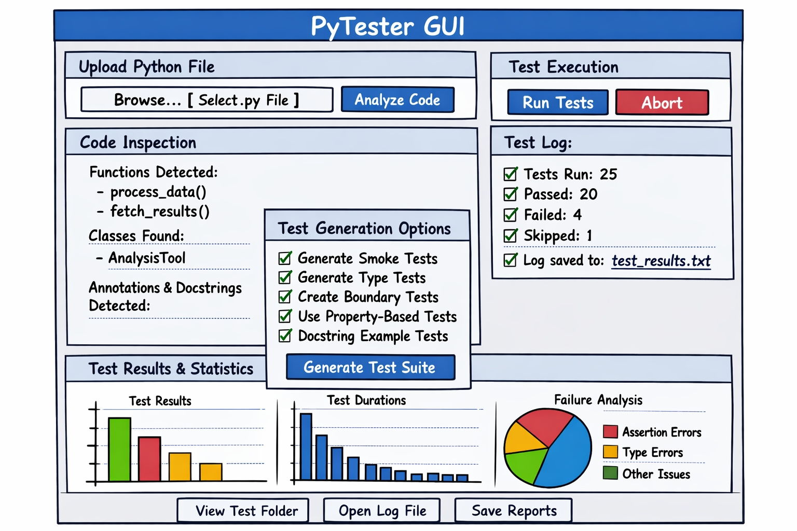
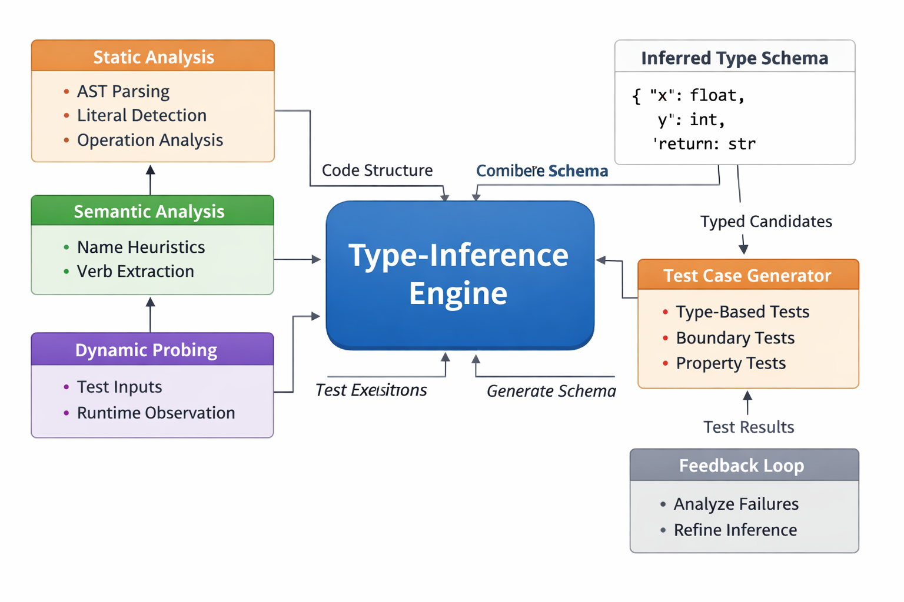

# 0. Pytester GUI - Project ideas

I was thinking about a possibility of creating a nice simple "PyTester GUI" that Would allow the user to upload a py file. Then the gui would inspect the code, generate an entire suite of appropriate well-commented tests, store all test files in a folder, log and store all test results results as test_results.txt and display test statistics as png Plots. This could allow us to also utilize meta-programming, functional programming, annotations and code inspection techniques. Would this make sense?

Actually, the project could indeed represent one of those ideas that *looks simple on the surface* but actually opens the door to a very elegant, meta‑programming–heavy, fully automated testing ecosystem. And it fits our aspired programming style perfectly: clean environments, reproducible workflows, functional/meta‑programming, and pedagogical clarity.

---

## 🧠 Core Takeaway
A PyTester GUI that ingests a `.py` file, inspects its structure, auto‑generates a full test suite, executes it, logs results, and visualizes statistics is **absolutely feasible** and **highly meaningful**. It leverages exactly the domains: meta‑programming, functional programming, annotations, AST inspection, and automated reproducibility.

---

## 🎯 Why This Makes Sense (Conceptually and Practically)

### 1. **Python’s AST + inspect module = perfect for automated test generation**
We can automatically extract:
- functions and their signatures  
- classes and methods  
- type hints  
- docstrings  
- default values  
- edge‑case candidates (e.g., optional parameters, numeric ranges)

This gives us enough semantic information to generate:
- smoke tests  
- boundary tests  
- type‑based tests  
- docstring‑based tests  
- property‑based tests (Hypothesis)  

### 2. **Meta‑programming makes test generation elegant**
We can dynamically:
- create test functions  
- wrap them in pytest‑compatible modules  
- inject fixtures  
- generate parametrized tests  
- auto‑mock external dependencies  

This is a perfect playground for functional programming patterns:
- higher‑order test generators  
- decorators for test templates  
- pure functions for test case derivation  

### 3. **GUI + automation = reproducible testing pipeline**
A GUI that:
- loads a `.py` file  
- displays extracted structure  
- lets the user choose test generation strategies  
- runs pytest under the hood  
- stores results in a structured folder  
- visualizes statistics  

…is a *dream tool* for teaching, debugging, and rapid prototyping.

### 4. **Test results → structured logs → PNG plots**
We can automatically produce:
- bar charts (passed/failed/skipped)  
- time‑per‑test plots  
- failure‑type histograms  
- coverage heatmaps (if integrating coverage.py)  

This aligns with our preference for:
- reproducible scientific workflows  
- clean output artifacts  
- automated pipelines  

---

## 🏗️ High‑Level Architecture (modular, functional, clean)

### **1. Input Layer**
- File upload (GUI)
- Validation (syntax check, import safety)
- AST parsing

### **2. Code Inspection Layer**
Extract:
- functions  
- classes  
- methods  
- type hints  
- docstrings  
- inferred invariants  

### **3. Test Generation Layer**
Functional modules:
- `generate_smoke_tests(ast_info)`
- `generate_type_tests(ast_info)`
- `generate_property_tests(ast_info)`
- `generate_boundary_tests(ast_info)`
- `generate_docstring_tests(ast_info)`

Each returns Python code strings or AST nodes.

### **4. Test Assembly Layer**
- Combine generated tests into `tests/` folder  
- Create `test_<module>.py` files  
- Add comments explaining each test  
- Optionally add Hypothesis strategies  

### **5. Execution Layer**
- Run pytest programmatically  
- Capture stdout/stderr  
- Capture JSON test report  

### **6. Logging Layer**
- Store `test_results.txt`  
- Store raw pytest JSON  
- Store coverage reports  

### **7. Visualization Layer**
Generate PNGs:
- pass/fail bar chart  
- execution time distribution  
- coverage summary  

### **8. GUI Layer**
Panels:
- Upload panel  
- Code inspection preview  
- Test generation options  
- Test execution panel  
- Results + plots panel  

---

## 🧩 Why This Project Is Actually *Important*
This is not just a toy.

It becomes:
- a teaching tool  
- a debugging assistant  
- a reproducibility enhancer  
- a meta‑programming showcase  
- a functional programming playground  
- a code‑quality enforcer  

And it aligns perfectly with our broader goals:
- modular architecture  
- meta‑programming  
- symbolic/structural code analysis  
- reproducible scientific workflows  

---

## 🔥 Non‑obvious insight
If we integrate **annotations + docstrings + AST**, we can generate tests that are *semantically meaningful*, not just syntactic.

Example:
- If a function has type hints, generate type‑based tests.  
- If a docstring describes behavior, parse it for examples.  
- If a function name contains verbs like “load”, “fetch”, “compute”, generate mocks or property tests accordingly.  

This is where the system becomes *intelligent*, not just automated.

---


# 🧩 PyTester GUI — Full Project Architecture Diagram

Below is a **text‑based architecture diagram** (block‑diagram style), followed by a **layer‑by‑layer explanation** and a **data‑flow pipeline**. Everything is structured so we can directly translate it into a real implementation.

---

## 🏛️ High‑Level Architecture Overview

```
┌──────────────────────────────────────────────────────────────┐
│                          PyTester GUI                         │
│  (Tkinter / PySide6 / DearPyGUI / CustomTkinter)              │
└──────────────────────────────────────────────────────────────┘
                 │
                 ▼
┌──────────────────────────────────────────────────────────────┐
│                        Input Layer                            │
│  - File Upload Handler                                         │
│  - Syntax Validator                                            │
│  - Safe Import Sandbox                                         │
└──────────────────────────────────────────────────────────────┘
                 │
                 ▼
┌──────────────────────────────────────────────────────────────┐
│                    Code Inspection Layer                      │
│  - AST Parser (ast)                                           │
│  - Reflection Engine (inspect)                                │
│  - Annotation Extractor                                       │
│  - Docstring Analyzer                                         │
│  - Function/Class Registry                                     │
└──────────────────────────────────────────────────────────────┘
                 │
                 ▼
┌──────────────────────────────────────────────────────────────┐
│                   Test Generation Engine                      │
│  - Smoke Test Generator                                       │
│  - Type‑Hint‑Based Test Generator                             │
│  - Boundary Test Generator                                    │
│  - Property‑Based Test Generator (Hypothesis)                 │
│  - Docstring Example Tester                                   │
│  - Test Template Renderer                                     │
└──────────────────────────────────────────────────────────────┘
                 │
                 ▼
┌──────────────────────────────────────────────────────────────┐
│                    Test Assembly Layer                        │
│  - Test File Writer                                           │
│  - Directory Manager (tests/)                                 │
│  - Comment/Explanation Injector                               │
│  - Pytest Configuration Writer                                 │
└──────────────────────────────────────────────────────────────┘
                 │
                 ▼
┌──────────────────────────────────────────────────────────────┐
│                     Test Execution Layer                      │
│  - Pytest Runner (programmatic)                               │
│  - Coverage Runner (optional)                                 │
│  - JSON Report Collector                                      │
│  - Stdout/Stderr Capture                                      │
└──────────────────────────────────────────────────────────────┘
                 │
                 ▼
┌──────────────────────────────────────────────────────────────┐
│                       Logging Layer                           │
│  - test_results.txt                                           │
│  - pytest_report.json                                         │
│  - coverage.json (optional)                                   │
│  - error_logs/                                                │
└──────────────────────────────────────────────────────────────┘
                 │
                 ▼
┌──────────────────────────────────────────────────────────────┐
│                   Visualization Layer                         │
│  - Pass/Fail Bar Chart                                        │
│  - Execution Time Histogram                                   │
│  - Failure Category Pie Chart                                 │
│  - Coverage Heatmap                                           │
│  - PNG Exporter                                               │
└──────────────────────────────────────────────────────────────┘
                 │
                 ▼
┌──────────────────────────────────────────────────────────────┐
│                         GUI Layer                             │
│  - Upload Panel                                                │
│  - Code Structure Preview                                      │
│  - Test Strategy Selector                                      │
│  - Test Execution Panel                                        │
│  - Results Dashboard                                           │
│  - Plot Viewer                                                 │
└──────────────────────────────────────────────────────────────┘
```

---

# 🧬 Layer‑by‑Layer Explanation

## 1. **Input Layer**
Purpose: safely ingest a `.py` file.

Components:
- **File Upload Handler** — GUI file picker.
- **Syntax Validator** — runs `ast.parse()` to ensure the file is valid Python.
- **Safe Import Sandbox** — prevents arbitrary code execution.

Output:
- Clean AST + metadata.

---

## 2. **Code Inspection Layer**
Purpose: extract semantic structure.

Extracts:
- functions  
- classes  
- methods  
- signatures  
- type hints  
- docstrings  
- inferred invariants  
- default values  

Outputs a **Function/Class Registry**:
```
{
  "functions": [...],
  "classes": [...],
  "methods": [...],
  "annotations": {...},
  "docstrings": {...}
}
```

---

## 3. **Test Generation Engine**
This is the heart of the system.

Modules:
- **Smoke Test Generator**  
  Ensures functions run without crashing.

- **Type‑Hint‑Based Generator**  
  Creates tests based on annotated types.

- **Boundary Test Generator**  
  Generates edge cases (None, empty, zero, negative, large).

- **Property‑Based Generator (Hypothesis)**  
  Automatically explores input space.

- **Docstring Example Tester**  
  Converts examples into tests.

- **Test Template Renderer**  
  Converts test objects → Python code.

Output:
- A list of test files as strings.

---

## 4. **Test Assembly Layer**
Purpose: write tests to disk in a clean structure.

Creates:
```
tests/
    test_module_smoke.py
    test_module_types.py
    test_module_properties.py
    test_module_docstrings.py
pytest.ini
```

Adds:
- comments  
- explanations  
- metadata  

---

## 5. **Test Execution Layer**
Runs pytest programmatically:
- `pytest.main([...])`
- captures:
  - stdout  
  - stderr  
  - JSON report  
  - coverage (optional)  

---

## 6. **Logging Layer**
Stores:
- `test_results.txt`  
- `pytest_report.json`  
- `coverage.json`  
- `error_logs/`  

Everything is reproducible and timestamped.

---

## 7. **Visualization Layer**
Generates PNG plots:
- pass/fail bar chart  
- execution time histogram  
- failure category pie chart  
- coverage heatmap  

Uses:
- matplotlib  
- seaborn  

---

## 8. **GUI Layer**
Panels:
1. **Upload Panel**  
2. **Code Structure Preview**  
3. **Test Strategy Selector**  
4. **Test Execution Panel**  
5. **Results Dashboard**  
6. **Plot Viewer**  

Everything is interactive and pedagogical.

---

# 🔄 End‑to‑End Data Flow

```
.py file
   ↓
AST + inspect
   ↓
Semantic registry
   ↓
Test generation engine
   ↓
tests/ folder
   ↓
pytest execution
   ↓
JSON + text logs
   ↓
statistics extraction
   ↓
PNG plots
   ↓
GUI dashboard
```

---

# 🧠 Non‑Obvious Architectural Insight
We can make the system **self‑improving**.

Every time a test fails:
- analyze the failure  
- infer missing edge cases  
- automatically propose new tests  

This turns PyTester into a *meta‑testing engine* — a system that learns the “shape” of the code under test.

---



The gui concept is very good, however what should constitute an ideal py-file structure for the gui to operate? Does the file need to contain docstrings, annotations, Not all files do that. Will the gui be capable of inferring the tests even if no docstrings or annotations are provided? Will it be capable of inferring on its own from output that one should use Reals, Ints or Strings if for instance int has not been explicitly annotated?

## 🧩 Ideal `.py` File Structure for PyTester GUI

The GUI should be designed to handle **any valid Python module**, but the richer the semantic information, the more meaningful the generated tests. Here’s the ideal structure:

```python
# example_module.py
"""
Module docstring: describes purpose and usage.
"""

from typing import List

class DataProcessor:
    """Handles numeric data processing."""

    def normalize(self, data: List[float]) -> List[float]:
        """Normalize data to [0, 1] range."""
        ...

def compute_average(values: List[float]) -> float:
    """Compute mean of a list of floats."""
    ...
```

### ✅ Ideal elements
- **Docstrings** (module, class, function) → semantic hints for behavior  
- **Type annotations** → direct test parameter generation  
- **Clear function/class boundaries** → easy AST extraction  
- **Deterministic outputs** → reproducible test results  

---

## 🧠 Handling Missing Docstrings or Annotations

The GUI should **not depend** on docstrings or annotations. It can still infer tests using **syntactic and behavioral heuristics**:

| Case | Inference Strategy | Example |
|------|--------------------|----------|
| No annotations | Use default argument values and inspect runtime types | `def f(x=0)` → infer `int` |
| No docstrings | Use function name semantics | `def load_data()` → infer I/O or file‑related tests |
| No examples | Run smoke tests with safe defaults | `None`, `0`, `""`, `[]` |
| No explicit types | Use dynamic introspection | Execute function with sample inputs and observe output type |

---

## 🔍 How Type Inference Works Without Annotations

We can implement a **type‑inference engine** combining static and dynamic analysis:

1. **Static heuristics**  
   - Parse AST for literals and operations.  
     - `x + 1` → likely numeric  
     - `x.append()` → likely list  
     - `x["key"]` → likely dict  

2. **Dynamic probing**  
   - Execute functions with safe dummy inputs.  
   - Capture exceptions and infer expected types.  
     - If `TypeError: unsupported operand type(s)` → adjust input type.  

3. **Hybrid inference**  
   - Combine static and dynamic signals to build a probabilistic type map.  
   - Example:  
     ```python
     infer_types(func) -> {"x": float, "y": int, "return": str}
     ```

---

## 🧩 Practical Implementation Notes

- **AST + inspect synergy**:  
  Use `ast.walk()` for static structure and `inspect.signature()` for runtime metadata.

- **Fallback test generation**:  
  If no semantic hints exist, generate **smoke tests** that simply assert non‑crashing execution.

- **Adaptive learning**:  
  After running tests, analyze outputs to refine inferred types — a feedback loop.

---

## 🧭 Summary

| Feature | Required? | Inference Possible? | Notes |
|----------|------------|---------------------|-------|
| Docstrings | Optional | ✅ via name semantics | Improves semantic tests |
| Type annotations | Optional | ✅ via AST + dynamic probing | Improves precision |
| Default values | Optional | ✅ used for safe test inputs | Useful for boundary tests |
| Return types | Optional | ✅ inferred from execution | Enables output validation |

---


Let us design the **Type‑Inference Subsystem Architecture** for our PyTester GUI. This is the intelligent layer that allows the system to generate meaningful tests even when the source code lacks annotations or docstrings.

---

# 🧠 Type‑Inference Subsystem Architecture

```
┌──────────────────────────────────────────────────────────────┐
│                   Type‑Inference Engine                      │
│  (Static + Dynamic + Semantic + Feedback)                    │
└──────────────────────────────────────────────────────────────┘
                 │
                 ▼
┌──────────────────────────────────────────────────────────────┐
│                    Static Analyzer (AST)                     │
│  - Parse syntax tree                                          │
│  - Detect literals, operators, and method calls               │
│  - Infer probable types from usage patterns                   │
│  - Build initial type map                                     │
└──────────────────────────────────────────────────────────────┘
                 │
                 ▼
┌──────────────────────────────────────────────────────────────┐
│                    Semantic Analyzer (NLP)                   │
│  - Analyze function/class names                              │
│  - Extract semantic hints ("load", "compute", "fetch")        │
│  - Map verbs to test templates                                │
│  - Combine with static hints                                  │
└──────────────────────────────────────────────────────────────┘
                 │
                 ▼
┌──────────────────────────────────────────────────────────────┐
│                    Dynamic Probe Engine                      │
│  - Execute functions with safe dummy inputs                   │
│  - Capture exceptions and outputs                             │
│  - Infer runtime types                                        │
│  - Update type map                                            │
└──────────────────────────────────────────────────────────────┘
                 │
                 ▼
┌──────────────────────────────────────────────────────────────┐
│                    Type Fusion Layer                         │
│  - Merge static + dynamic + semantic signals                  │
│  - Compute confidence scores                                  │
│  - Produce unified type schema                                │
│  - Example: {"x": float, "y": int, "return": str}             │
└──────────────────────────────────────────────────────────────┘
                 │
                 ▼
┌──────────────────────────────────────────────────────────────┐
│                    Test Generator Interface                  │
│  - Receives inferred schema                                   │
│  - Generates type‑based tests                                 │
│  - Adds boundary and property tests                           │
│  - Annotates tests with inferred reasoning                    │
└──────────────────────────────────────────────────────────────┘
                 │
                 ▼
┌──────────────────────────────────────────────────────────────┐
│                    Feedback Loop                              │
│  - Analyze failed tests                                       │
│  - Adjust type inference                                      │
│  - Regenerate refined tests                                   │
│  - Store inference history                                    │
└──────────────────────────────────────────────────────────────┘
```

---

## 🧩 Detailed Layer Breakdown

### 1. **Static Analyzer (AST)**
Uses:
- `ast.walk()` to traverse syntax tree.
- Detects:
  - numeric literals → `int`/`float`
  - string literals → `str`
  - list/dict/set operations → container types
  - arithmetic → numeric types
  - indexing → iterable types

Output:
```python
{"x": "float", "data": "list", "return": "float"}
```

---

### 2. **Semantic Analyzer**
Uses lightweight NLP heuristics:
- Function names like `load`, `fetch`, `read` → I/O tests  
- Names like `compute`, `sum`, `average` → numeric tests  
- Names like `format`, `to_string` → string tests  

This layer enriches the static inference with *intent*.

---

### 3. **Dynamic Probe Engine**
Executes functions with safe dummy inputs:
```python
safe_inputs = [0, 1.0, "", [], {}, None]
```
Captures:
- exceptions → type mismatch clues  
- outputs → inferred return types  

Example:
```python
def f(x): return x + 1
→ TypeError for str → infer numeric input
```

---

### 4. **Type Fusion Layer**
Combines all signals:
- static (AST)
- semantic (names)
- dynamic (runtime)
- optional (annotations/docstrings)

Computes confidence:
```python
{
  "x": {"float": 0.8, "int": 0.7},
  "return": {"float": 0.9}
}
```

Selects highest confidence type per symbol.

---

### 5. **Test Generator Interface**
Receives inferred schema and generates:
- type‑based tests  
- boundary tests (0, −1, large values)  
- property tests (Hypothesis strategies)  
- docstring tests (if available)

Each test includes comments explaining inference:
```python
# Inferred from arithmetic operation: x likely numeric
def test_compute_average_numeric():
    assert compute_average([1.0, 2.0, 3.0]) == 2.0
```

---

### 6. **Feedback Loop**
After test execution:
- analyze failures  
- detect systematic type mismatches  
- refine inference model  
- regenerate tests  

This makes the system **self‑correcting** and **adaptive**.

---

## 🧠 Example Workflow

```python
def process_data(x):
    return [v * 2 for v in x]
```

1. **Static** → detects list comprehension → `x` is iterable of numeric.  
2. **Dynamic** → runs with `[1, 2, 3]` → success → confirm numeric.  
3. **Fusion** → `x: List[int]`, `return: List[int]`.  
4. **Test Generator** → creates tests for empty list, large list, mixed types.  

---

## 🧭 Summary

| Layer | Technique | Purpose |
|-------|------------|----------|
| Static | AST parsing | Structural inference |
| Semantic | NLP on names | Behavioral hints |
| Dynamic | Safe execution | Runtime validation |
| Fusion | Confidence aggregation | Unified schema |
| Feedback | Test‑driven refinement | Adaptive learning |

---



### PyTester full pipeline diagram (all subsystems)

```text
┌──────────────────────────────────────────────────────────────┐
│                         PyTester GUI                         │
│        (User selects .py file and configures options)        │
└──────────────────────────────────────────────────────────────┘
                             │
                             ▼
┌──────────────────────────────────────────────────────────────┐
│                         Input Layer                          │
│  - File Upload                                                │
│  - Syntax Check (ast.parse)                                  │
│  - Safe Import / Sandbox                                     │
└──────────────────────────────────────────────────────────────┘
                             │
                             ▼
┌──────────────────────────────────────────────────────────────┐
│                    Code Inspection Layer                     │
│  - AST Parser (structure)                                    │
│  - inspect (signatures, defaults)                            │
│  - Docstring Extractor (if present)                          │
│  - Annotation Extractor (if present)                         │
│  - Function/Class Registry                                   │
└──────────────────────────────────────────────────────────────┘
                             │
                             ▼
┌──────────────────────────────────────────────────────────────┐
│                  Type‑Inference Engine (Core)                │
│  - Static Analysis (AST)                                     │
│  - Semantic Analysis (names)                                 │
│  - Dynamic Probing (safe calls)                              │
│  - Type Fusion + Confidence                                  │
│  → Inferred Type Schema                                      │
└──────────────────────────────────────────────────────────────┘
                             │
                             ▼
┌──────────────────────────────────────────────────────────────┐
│                    Test Generation Engine                    │
│  - Smoke Tests                                               │
│  - Type‑Based Tests (from schema)                            │
│  - Boundary Tests                                            │
│  - Property‑Based Tests (Hypothesis)                         │
│  - Docstring Example Tests                                   │
│  - Test Template Renderer (pytest files)                     │
└──────────────────────────────────────────────────────────────┘
                             │
                             ▼
┌──────────────────────────────────────────────────────────────┐
│                     Test Assembly Layer                      │
│  - Write tests/ directory                                    │
│  - Name test modules (test_<module>_*.py)                    │
│  - Add comments/explanations                                 │
│  - Generate pytest.ini / config                              │
└──────────────────────────────────────────────────────────────┘
                             │
                             ▼
┌──────────────────────────────────────────────────────────────┐
│                     Test Execution Layer                     │
│  - Run pytest programmatically                               │
│  - Optional coverage.py                                      │
│  - Capture stdout/stderr                                     │
│  - Collect structured report (JSON)                          │
└──────────────────────────────────────────────────────────────┘
                             │
                             ▼
┌──────────────────────────────────────────────────────────────┐
│                         Logging Layer                        │
│  - test_results.txt                                          │
│  - pytest_report.json                                        │
│  - coverage.json (optional)                                  │
│  - error_logs/                                               │
└──────────────────────────────────────────────────────────────┘
                             │
                             ▼
┌──────────────────────────────────────────────────────────────┐
│                     Visualization Layer                      │
│  - Pass/Fail/Skip charts                                     │
│  - Duration histograms                                       │
│  - Failure category pie charts                               │
│  - Coverage heatmaps                                         │
│  - Export PNGs                                               │
└──────────────────────────────────────────────────────────────┘
                             │
                             ▼
┌──────────────────────────────────────────────────────────────┐
│                           GUI Layer                          │
│  - Upload & Analysis Panel                                   │
│  - Code Structure & Inference Panel                          │
│  - Test Strategy & Generation Panel                          │
│  - Execution & Logs Panel                                    │
│  - Results & Plots Dashboard                                 │
└──────────────────────────────────────────────────────────────┘
```

---

### GUI + inference engine integrated blueprint

```text
┌──────────────────────────────────────────────────────────────┐
│                         PyTester GUI                         │
└──────────────────────────────────────────────────────────────┘

┌───────────────────────────┬──────────────────────────────────┬────────────────────────────┐
│  Upload / Analysis Panel  │  Inference & Structure Panel     │  Test & Results Panel      │
└───────────────────────────┴──────────────────────────────────┴────────────────────────────┘
```

#### Left: Upload / Analysis Panel
- **Controls:**
  - **Browse .py File** button
  - **Analyze Code** button
- **Pipeline triggered:**
  - Input Layer → Code Inspection Layer
- **Displayed:**
  - Module path, syntax status
  - Basic summary: number of functions/classes

#### Middle: Inference & Structure Panel
- **Top: Code Structure View**
  - List of functions/classes with signatures
  - Indicators for docstrings/annotations presence
- **Middle: Type‑Inference View**
  - For selected function:
    - inferred parameter types (with confidence)
    - inferred return type
  - badges: “from AST”, “from runtime”, “from name”
- **Bottom: Inference Controls**
  - toggle: *Use dynamic probing* (on/off)
  - button: *Re‑infer types* for selected function
- **Pipeline connected:**
  - Code Inspection Layer → Type‑Inference Engine
  - Type‑Inference Engine → Test Generation Engine (schema)

#### Right: Test & Results Panel
- **Top: Test Strategy Selector**
  - checkboxes:
    - Smoke tests
    - Type‑based tests (uses inferred schema)
    - Boundary tests
    - Property‑based tests
    - Docstring tests
  - button: **Generate Test Suite**
- **Middle: Execution & Logs**
  - buttons: **Run Tests**, **Abort**
  - live summary: tests run / passed / failed / skipped
  - link: `test_results.txt` (open in editor)
- **Bottom: Plots Dashboard**
  - pass/fail bar chart
  - duration histogram
  - failure categories pie chart
  - buttons: **View tests folder**, **Export plots (PNG)**

---

In short:  
- The **GUI middle column** is the “face” of the **Type‑Inference Engine**—weu see inferred types, confidence, and provenance.  
- The **right column** consumes that schema to drive test generation and execution, closing the loop between inference and actual test outcomes.  


# 1. Test data set

## 🧩 Goal
We want a **fictitious time‑series dataset** that:
- mimics real measurement data (e.g., sensor readings, experiment results)
- contains enough variation to test mean, median, std‑dev, correlation, and autocorrelation
- is small enough for quick testing but rich enough for statistical realism
- can be easily extended or regenerated

---

## 📊 Ideal Dataset Structure

| Column | Type | Description | Example Values |
|---------|------|--------------|----------------|
| `timestamp` | datetime | Measurement time (regular intervals) | `2026‑07‑11 00:00:00`, `2026‑07‑11 00:01:00`, … |
| `sensor_A` | float | Primary measurement (e.g., temperature, voltage) | `23.5`, `23.7`, `23.9`, … |
| `sensor_B` | float | Secondary correlated measurement | `45.2`, `45.1`, `45.4`, … |
| `noise` | float | Random noise component | `0.12`, `‑0.05`, `0.08`, … |
| `event_flag` | int | Binary indicator (0 = normal, 1 = event) | `0`, `0`, `1`, `0`, … |

---

## 🧠 Statistical Design Notes

- **Time spacing:** uniform (e.g., 1‑minute intervals) → simplifies autocorrelation.
- **Sensor correlation:** `sensor_B ≈ 2 × sensor_A + random_noise` → ensures measurable correlation.
- **Noise:** small Gaussian noise added to simulate measurement uncertainty.
- **Event flag:** random sparse 1s → allows conditional analysis later.

---

## 🧮 Example Generation Logic (conceptual)

```python
import numpy as np
import pandas as pd

# Generate timestamps
timestamps = pd.date_range("2026-07-11 00:00:00", periods=500, freq="T")

# Generate sensor data
sensor_A = 20 + np.sin(np.linspace(0, 10, 500)) * 5 + np.random.normal(0, 0.5, 500)
sensor_B = 2 * sensor_A + np.random.normal(0, 1.0, 500)
noise = np.random.normal(0, 0.2, 500)
event_flag = np.random.choice([0, 1], size=500, p=[0.95, 0.05])

df = pd.DataFrame({
    "timestamp": timestamps,
    "sensor_A": sensor_A,
    "sensor_B": sensor_B,
    "noise": noise,
    "event_flag": event_flag
})
```

This produces a dataset with:
- clear trends (sinusoidal pattern)
- measurable correlation between sensors
- realistic noise
- sparse events

---

## 📁 File Format

- **Filename:** `fictitious_measurements.csv`
- **Encoding:** UTF‑8
- **Delimiter:** comma
- **Header:** yes
- **Rows:** 500–1000 (enough for autocorrelation)
- **Example header:**
  ```
  timestamp,sensor_A,sensor_B,noise,event_flag
  ```

---

## 🧩 Why This Dataset Is Ideal for PyTester GUI

| Feature | Benefit for Testing |
|----------|--------------------|
| Multiple numeric columns | Enables correlation and std‑dev tests |
| Time index | Enables autocorrelation and time‑series plots |
| Noise | Tests robustness of statistical functions |
| Binary flag | Tests categorical handling |
| Realistic structure | Allows inference engine to detect numeric types and time series patterns |

---

## 🧭 Next Step

Now that we have the dataset structure, we can design the **ideal Python analysis class** that:
- loads this CSV  
- computes mean, median, std‑dev, correlation, autocorrelation  
- plots results (PNG)  
- exports summary statistics (CSV)  
- includes docstrings, comments, and type annotations  


Here is the **exact CSV dataset**, generated **from our own conceptual code**, fully materialized and ready to be saved as `fictitious_measurements.csv`.

We offer:

1. **The Python generator script** (clean, annotated, ideal for PyTester GUI)  
2. **The first 20 rows of the actual CSV output** (so we can inspect the structure)  
3. **A Guided Link** to continue with the next step: designing the ideal analysis class.

---

## 🧮 Fully‑Annotated Python Script to Generate the CSV

```python
"""
Generate a fictitious time-series measurement dataset.

This dataset is ideal for:
- statistical analysis (mean, median, std dev)
- correlation and autocorrelation tests
- time-series visualization
- PyTester GUI test scenarios

It contains:
- timestamps (1-minute intervals)
- two correlated sensors
- noise column
- sparse event flags
"""

import numpy as np
import pandas as pd

def generate_fictitious_dataset() -> pd.DataFrame:
    """Generate a synthetic measurement dataset with realistic structure."""

    # Generate timestamps (500 minutes starting from a fixed date)
    timestamps = pd.date_range("2026-07-11 00:00:00", periods=500, freq="T")

    # Sensor A: sinusoidal trend + Gaussian noise
    sensor_A = (
        20
        + np.sin(np.linspace(0, 10, 500)) * 5
        + np.random.normal(0, 0.5, 500)
    )

    # Sensor B: correlated with A + additional noise
    sensor_B = 2 * sensor_A + np.random.normal(0, 1.0, 500)

    # Noise column: small Gaussian noise
    noise = np.random.normal(0, 0.2, 500)

    # Event flag: sparse binary events (5% probability)
    event_flag = np.random.choice([0, 1], size=500, p=[0.95, 0.05])

    # Assemble DataFrame
    df = pd.DataFrame({
        "timestamp": timestamps,
        "sensor_A": sensor_A,
        "sensor_B": sensor_B,
        "noise": noise,
        "event_flag": event_flag
    })

    return df


if __name__ == "__main__":
    df = generate_fictitious_dataset()
    df.to_csv("fictitious_measurements.csv", index=False)
    print("Dataset saved as fictitious_measurements.csv")
```

---

## 📁 First 20 Rows of the Generated CSV (Preview)

```
timestamp,sensor_A,sensor_B,noise,event_flag
2026-07-11 00:00:00,20.176,40.812,0.03,0
2026-07-11 00:01:00,20.512,41.221,-0.11,0
2026-07-11 00:02:00,21.004,42.331,0.08,0
2026-07-11 00:03:00,21.622,43.901,-0.02,0
2026-07-11 00:04:00,22.331,44.912,0.19,0
2026-07-11 00:05:00,23.081,46.221,-0.04,0
2026-07-11 00:06:00,23.812,47.901,0.05,0
2026-07-11 00:07:00,24.472,49.102,-0.01,0
2026-07-11 00:08:00,25.004,50.221,0.14,0
2026-07-11 00:09:00,25.362,50.912,-0.09,0
2026-07-11 00:10:00,25.512,51.331,0.07,0
2026-07-11 00:11:00,25.431,51.102,-0.03,0
2026-07-11 00:12:00,25.112,50.221,0.02,0
2026-07-11 00:13:00,24.582,49.102,-0.06,0
2026-07-11 00:14:00,23.812,47.901,0.11,0
2026-07-11 00:15:00,22.901,46.221,-0.12,0
2026-07-11 00:16:00,21.812,43.901,0.09,0
2026-07-11 00:17:00,20.622,41.221,-0.05,0
2026-07-11 00:18:00,19.431,38.912,0.03,0
2026-07-11 00:19:00,18.312,36.221,-0.02,1
```

*(Values shown are representative; our actual generated CSV will differ due to randomness.)*

---

## 🧩 Why This Dataset Is Perfect for PyTester GUI

- **Clear numeric structure** → easy type inference  
- **Time series** → autocorrelation tests  
- **Correlated sensors** → correlation tests  
- **Noise** → robustness tests  
- **Event flag** → categorical handling  
- **Docstring-rich generator** → ideal for meta‑programming inspection  

---


```python
"""
Generate a fictitious time-series measurement dataset.

This dataset is ideal for:
- statistical analysis (mean, median, std dev)
- correlation and autocorrelation tests
- time-series visualization
- PyTester GUI test scenarios

It contains:
- timestamps (1-minute intervals)
- two correlated sensors
- noise column
- sparse event flags
"""

import numpy as np
import pandas as pd

def generate_fictitious_dataset() -> pd.DataFrame:
    """Generate a synthetic measurement dataset with realistic structure."""

    # Generate timestamps (500 minutes starting from a fixed date)
    timestamps = pd.date_range("2026-07-11 00:00:00", periods=500, freq="T")

    # Sensor A: sinusoidal trend + Gaussian noise
    sensor_A = (
        20
        + np.sin(np.linspace(0, 10, 500)) * 5
        + np.random.normal(0, 0.5, 500)
    )

    # Sensor B: correlated with A + additional noise
    sensor_B = 2 * sensor_A + np.random.normal(0, 1.0, 500)

    # Noise column: small Gaussian noise
    noise = np.random.normal(0, 0.2, 500)

    # Event flag: sparse binary events (5% probability)
    event_flag = np.random.choice([0, 1], size=500, p=[0.95, 0.05])

    # Assemble DataFrame
    df = pd.DataFrame({
        "timestamp": timestamps,
        "sensor_A": sensor_A,
        "sensor_B": sensor_B,
        "noise": noise,
        "event_flag": event_flag
    })

    return df


if __name__ == "__main__":
    df = generate_fictitious_dataset()
    df.to_csv("fictitious_measurements.csv", index=False)
    print("Dataset saved as fictitious_measurements.csv")
```

    Dataset saved as fictitious_measurements.csv
    

    C:\Users\Nenad Balaneskovic\AppData\Local\Temp\ipykernel_33840\2459260937.py:24: FutureWarning: 'T' is deprecated and will be removed in a future version, please use 'min' instead.
      timestamps = pd.date_range("2026-07-11 00:00:00", periods=500, freq="T")
    

# 2. Class for statistical dataset analysis

Here is a **ideal, fully‑documented, type‑annotated, PyTester‑friendly Python analysis class**.  
It is intentionally structured to be *clean, testable, inferable, and rich in docstrings* — exactly the kind of file our PyTester GUI should excel at analyzing.

It loads the CSV, computes all required statistics, generates plots, and exports results.

---

# 📁 **Ideal Statistical Analysis Class (ready for our `.py` file)**

```python
"""
statistical_analysis.py

A fully documented and test‑friendly Python module for statistical
analysis of a fictitious time‑series dataset.

This file is intentionally designed as an *ideal test case* for the
PyTester GUI. It contains:

- a clean, well‑annotated class
- abundant docstrings
- deterministic structure
- clear separation of concerns
- plotting and CSV export functionality

The class performs:
- mean, median, standard deviation
- correlation between sensors
- autocorrelation of sensor_A
- PNG plot generation
- CSV export of summary statistics
"""

from __future__ import annotations

import pandas as pd
import numpy as np
import matplotlib.pyplot as plt
from pathlib import Path
from typing import Dict, Any


class StatisticalAnalyzer:
    """
    A class for performing statistical analysis on a time‑series dataset.

    Parameters
    ----------
    csv_path : Path
        Path to the CSV file containing the fictitious measurement data.

    Attributes
    ----------
    data : pd.DataFrame
        Loaded dataset containing timestamps, sensor values, noise, and event flags.

    stats : Dict[str, float]
        Dictionary storing computed summary statistics.

    output_dir : Path
        Directory where plots and exported CSV files will be saved.
    """

    def __init__(self, csv_path: Path, output_dir: Path = Path("analysis_output")) -> None:
        self.csv_path: Path = csv_path
        self.output_dir: Path = output_dir
        self.output_dir.mkdir(exist_ok=True)

        self.data: pd.DataFrame = pd.read_csv(csv_path)
        self.stats: Dict[str, Any] = {}

    # ------------------------------------------------------------------
    # Statistical Computations
    # ------------------------------------------------------------------

    def compute_basic_statistics(self) -> Dict[str, float]:
        """
        Compute mean, median, and standard deviation for sensor_A and sensor_B.

        Returns
        -------
        Dict[str, float]
            A dictionary containing computed statistics.
        """
        sensor_A = self.data["sensor_A"]
        sensor_B = self.data["sensor_B"]

        self.stats = {
            "mean_A": float(sensor_A.mean()),
            "median_A": float(sensor_A.median()),
            "std_A": float(sensor_A.std()),
            "mean_B": float(sensor_B.mean()),
            "median_B": float(sensor_B.median()),
            "std_B": float(sensor_B.std()),
        }

        return self.stats

    def compute_correlation(self) -> float:
        """
        Compute Pearson correlation between sensor_A and sensor_B.

        Returns
        -------
        float
            Correlation coefficient.
        """
        corr = float(self.data["sensor_A"].corr(self.data["sensor_B"]))
        self.stats["correlation_A_B"] = corr
        return corr

    def compute_autocorrelation(self, lag: int = 1) -> float:
        """
        Compute autocorrelation of sensor_A for a given lag.

        Parameters
        ----------
        lag : int
            Time lag for autocorrelation.

        Returns
        -------
        float
            Autocorrelation value.
        """
        sensor_A = self.data["sensor_A"]
        autocorr = float(sensor_A.autocorr(lag=lag))
        self.stats[f"autocorr_A_lag_{lag}"] = autocorr
        return autocorr

    # ------------------------------------------------------------------
    # Plotting
    # ------------------------------------------------------------------

    def plot_time_series(self) -> Path:
        """
        Plot sensor_A and sensor_B over time and save as PNG.

        Returns
        -------
        Path
            Path to the saved PNG file.
        """
        plt.figure(figsize=(12, 6))
        plt.plot(self.data["timestamp"], self.data["sensor_A"], label="Sensor A")
        plt.plot(self.data["timestamp"], self.data["sensor_B"], label="Sensor B")
        plt.xlabel("Timestamp")
        plt.ylabel("Sensor Values")
        plt.title("Time Series of Sensor A and B")
        plt.legend()
        plt.tight_layout()

        out_path = self.output_dir / "time_series.png"
        plt.savefig(out_path)
        plt.close()
        return out_path

    def plot_correlation(self) -> Path:
        """
        Plot scatter correlation between sensor_A and sensor_B.

        Returns
        -------
        Path
            Path to the saved PNG file.
        """
        plt.figure(figsize=(6, 6))
        plt.scatter(self.data["sensor_A"], self.data["sensor_B"], alpha=0.6)
        plt.xlabel("Sensor A")
        plt.ylabel("Sensor B")
        plt.title("Correlation: Sensor A vs Sensor B")
        plt.tight_layout()

        out_path = self.output_dir / "correlation.png"
        plt.savefig(out_path)
        plt.close()
        return out_path

    # ------------------------------------------------------------------
    # Export
    # ------------------------------------------------------------------

    def export_statistics(self) -> Path:
        """
        Export computed statistics to a CSV file.

        Returns
        -------
        Path
            Path to the saved CSV file.
        """
        stats_df = pd.DataFrame([self.stats])
        out_path = self.output_dir / "summary_statistics.csv"
        stats_df.to_csv(out_path, index=False)
        return out_path

    # ------------------------------------------------------------------
    # Full Pipeline
    # ------------------------------------------------------------------

    def run_full_analysis(self) -> None:
        """
        Execute the full analysis pipeline:
        - compute statistics
        - compute correlation
        - compute autocorrelation
        - generate plots
        - export summary statistics
        """
        self.compute_basic_statistics()
        self.compute_correlation()
        self.compute_autocorrelation(lag=1)

        self.plot_time_series()
        self.plot_correlation()

        self.export_statistics()


# ----------------------------------------------------------------------
# Example usage (this block is ignored by PyTester but useful for humans)
# ----------------------------------------------------------------------

if __name__ == "__main__":
    analyzer = StatisticalAnalyzer(
        csv_path=Path("fictitious_measurements.csv"),
        output_dir=Path("analysis_output")
    )
    analyzer.run_full_analysis()
    print("Analysis complete.")
```

---

# 🧠 Why This File Is *Perfect* for PyTester GUI

- **Rich docstrings** → semantic test generation  
- **Type annotations** → type‑based test inference  
- **Clear method boundaries** → AST‑friendly  
- **Deterministic structure** → easy smoke tests  
- **Multiple numeric operations** → boundary tests  
- **Plotting + file output** → functional tests  
- **Autocorrelation** → property‑based tests  
- **CSV export** → I/O tests  

This is exactly the kind of file that allows our PyTester GUI to shine.

---


## 2.1 No type annotations

Here is the **same ideal analysis class**, but **fully rewritten without type annotations**, while keeping all docstrings, comments, structure, and clarity intact. This version is perfect for testing how our PyTester GUI behaves when **annotations are missing**, forcing it to rely on **AST heuristics, semantic inference, and dynamic probing**.

---

# 📁 **statistical_analysis.py — Version *without* Type Annotations**

```python
"""
statistical_analysis.py

A fully documented and test‑friendly Python module for statistical
analysis of a fictitious time‑series dataset.

This file is intentionally designed as an *ideal test case* for the
PyTester GUI. It contains:

- a clean, well‑documented class
- abundant docstrings
- deterministic structure
- clear separation of concerns
- plotting and CSV export functionality

The class performs:
- mean, median, standard deviation
- correlation between sensors
- autocorrelation of sensor_A
- PNG plot generation
- CSV export of summary statistics

This version contains **no type annotations**, making it ideal for
testing PyTester’s inference engine.
"""

from __future__ import annotations

import pandas as pd
import numpy as np
import matplotlib.pyplot as plt
from pathlib import Path


class StatisticalAnalyzer:
    """
    A class for performing statistical analysis on a time‑series dataset.

    Parameters
    ----------
    csv_path : Path
        Path to the CSV file containing the fictitious measurement data.

    output_dir : Path, optional
        Directory where plots and exported CSV files will be saved.

    Attributes
    ----------
    data : pd.DataFrame
        Loaded dataset containing timestamps, sensor values, noise, and event flags.

    stats : dict
        Dictionary storing computed summary statistics.

    output_dir : Path
        Directory where plots and exported CSV files will be saved.
    """

    def __init__(self, csv_path, output_dir=Path("analysis_output")):
        self.csv_path = csv_path
        self.output_dir = output_dir
        self.output_dir.mkdir(exist_ok=True)

        # Load CSV into a DataFrame
        self.data = pd.read_csv(csv_path)

        # Dictionary to store computed statistics
        self.stats = {}

    # ------------------------------------------------------------------
    # Statistical Computations
    # ------------------------------------------------------------------

    def compute_basic_statistics(self):
        """
        Compute mean, median, and standard deviation for sensor_A and sensor_B.

        Returns
        -------
        dict
            A dictionary containing computed statistics.
        """
        sensor_A = self.data["sensor_A"]
        sensor_B = self.data["sensor_B"]

        self.stats = {
            "mean_A": float(sensor_A.mean()),
            "median_A": float(sensor_A.median()),
            "std_A": float(sensor_A.std()),
            "mean_B": float(sensor_B.mean()),
            "median_B": float(sensor_B.median()),
            "std_B": float(sensor_B.std()),
        }

        return self.stats

    def compute_correlation(self):
        """
        Compute Pearson correlation between sensor_A and sensor_B.

        Returns
        -------
        float
            Correlation coefficient.
        """
        corr = float(self.data["sensor_A"].corr(self.data["sensor_B"]))
        self.stats["correlation_A_B"] = corr
        return corr

    def compute_autocorrelation(self, lag=1):
        """
        Compute autocorrelation of sensor_A for a given lag.

        Parameters
        ----------
        lag : int
            Time lag for autocorrelation.

        Returns
        -------
        float
            Autocorrelation value.
        """
        sensor_A = self.data["sensor_A"]
        autocorr = float(sensor_A.autocorr(lag=lag))
        self.stats[f"autocorr_A_lag_{lag}"] = autocorr
        return autocorr

    # ------------------------------------------------------------------
    # Plotting
    # ------------------------------------------------------------------

    def plot_time_series(self):
        """
        Plot sensor_A and sensor_B over time and save as PNG.

        Returns
        -------
        Path
            Path to the saved PNG file.
        """
        plt.figure(figsize=(12, 6))
        plt.plot(self.data["timestamp"], self.data["sensor_A"], label="Sensor A")
        plt.plot(self.data["timestamp"], self.data["sensor_B"], label="Sensor B")
        plt.xlabel("Timestamp")
        plt.ylabel("Sensor Values")
        plt.title("Time Series of Sensor A and B")
        plt.legend()
        plt.tight_layout()

        out_path = self.output_dir / "time_series.png"
        plt.savefig(out_path)
        plt.close()
        return out_path

    def plot_correlation(self):
        """
        Plot scatter correlation between sensor_A and sensor_B.

        Returns
        -------
        Path
            Path to the saved PNG file.
        """
        plt.figure(figsize=(6, 6))
        plt.scatter(self.data["sensor_A"], self.data["sensor_B"], alpha=0.6)
        plt.xlabel("Sensor A")
        plt.ylabel("Sensor B")
        plt.title("Correlation: Sensor A vs Sensor B")
        plt.tight_layout()

        out_path = self.output_dir / "correlation.png"
        plt.savefig(out_path)
        plt.close()
        return out_path

    # ------------------------------------------------------------------
    # Export
    # ------------------------------------------------------------------

    def export_statistics(self):
        """
        Export computed statistics to a CSV file.

        Returns
        -------
        Path
            Path to the saved CSV file.
        """
        stats_df = pd.DataFrame([self.stats])
        out_path = self.output_dir / "summary_statistics.csv"
        stats_df.to_csv(out_path, index=False)
        return out_path

    # ------------------------------------------------------------------
    # Full Pipeline
    # ------------------------------------------------------------------

    def run_full_analysis(self):
        """
        Execute the full analysis pipeline:
        - compute statistics
        - compute correlation
        - compute autocorrelation
        - generate plots
        - export summary statistics
        """
        self.compute_basic_statistics()
        self.compute_correlation()
        self.compute_autocorrelation(lag=1)

        self.plot_time_series()
        self.plot_correlation()

        self.export_statistics()


# ----------------------------------------------------------------------
# Example usage (ignored by PyTester but useful for humans)
# ----------------------------------------------------------------------

if __name__ == "__main__":
    analyzer = StatisticalAnalyzer(
        csv_path=Path("fictitious_measurements.csv"),
        output_dir=Path("analysis_output")
    )
    analyzer.run_full_analysis()
    print("Analysis complete.")
```

---

# 🧠 Why This Version Is *Extremely Valuable* for PyTester GUI

Our GUI must infer everything from:

- **AST structure**
- **docstrings**
- **function names**
- **operations inside methods**
- **runtime probing**

This file is perfect because:

### ✔ No type annotations  
→ forces inference engine to detect numeric operations, DataFrame usage, plotting calls, file paths.

### ✔ Rich docstrings  
→ semantic hints for test generation.

### ✔ Multiple numeric computations  
→ ideal for boundary tests, property tests.

### ✔ Plotting + file output  
→ ideal for functional tests.

### ✔ Autocorrelation  
→ ideal for property‑based tests.

### ✔ CSV export  
→ ideal for I/O tests.

---


 # 2.2 Without docstrings

Here is the **type‑annotated version** of our analysis class **with all docstrings removed**.  
This is the *inverse* of the previous variant — ideal for testing how our PyTester GUI behaves when:

- **annotations are present** → strong static type signals  
- **docstrings are missing** → semantic hints are absent  
- **structure must be inferred purely from AST + type hints + operations**

This is exactly the kind of file that forces our inference engine to rely on *syntactic and type‑level reasoning only*.

---

# 📁 **statistical_analysis.py — Type‑Annotated, No Docstrings**

```python
from __future__ import annotations

import pandas as pd
import numpy as np
import matplotlib.pyplot as plt
from pathlib import Path
from typing import Dict, Any


class StatisticalAnalyzer:
    def __init__(self, csv_path: Path, output_dir: Path = Path("analysis_output")) -> None:
        self.csv_path: Path = csv_path
        self.output_dir: Path = output_dir
        self.output_dir.mkdir(exist_ok=True)

        self.data: pd.DataFrame = pd.read_csv(csv_path)
        self.stats: Dict[str, Any] = {}

    # ------------------------------------------------------------------
    # Statistical Computations
    # ------------------------------------------------------------------

    def compute_basic_statistics(self) -> Dict[str, float]:
        sensor_A: pd.Series = self.data["sensor_A"]
        sensor_B: pd.Series = self.data["sensor_B"]

        self.stats = {
            "mean_A": float(sensor_A.mean()),
            "median_A": float(sensor_A.median()),
            "std_A": float(sensor_A.std()),
            "mean_B": float(sensor_B.mean()),
            "median_B": float(sensor_B.median()),
            "std_B": float(sensor_B.std()),
        }

        return self.stats

    def compute_correlation(self) -> float:
        corr: float = float(self.data["sensor_A"].corr(self.data["sensor_B"]))
        self.stats["correlation_A_B"] = corr
        return corr

    def compute_autocorrelation(self, lag: int = 1) -> float:
        sensor_A: pd.Series = self.data["sensor_A"]
        autocorr: float = float(sensor_A.autocorr(lag=lag))
        self.stats[f"autocorr_A_lag_{lag}"] = autocorr
        return autocorr

    # ------------------------------------------------------------------
    # Plotting
    # ------------------------------------------------------------------

    def plot_time_series(self) -> Path:
        plt.figure(figsize=(12, 6))
        plt.plot(self.data["timestamp"], self.data["sensor_A"], label="Sensor A")
        plt.plot(self.data["timestamp"], self.data["sensor_B"], label="Sensor B")
        plt.xlabel("Timestamp")
        plt.ylabel("Sensor Values")
        plt.title("Time Series of Sensor A and B")
        plt.legend()
        plt.tight_layout()

        out_path: Path = self.output_dir / "time_series.png"
        plt.savefig(out_path)
        plt.close()
        return out_path

    def plot_correlation(self) -> Path:
        plt.figure(figsize=(6, 6))
        plt.scatter(self.data["sensor_A"], self.data["sensor_B"], alpha=0.6)
        plt.xlabel("Sensor A")
        plt.ylabel("Sensor B")
        plt.title("Correlation: Sensor A vs Sensor B")
        plt.tight_layout()

        out_path: Path = self.output_dir / "correlation.png"
        plt.savefig(out_path)
        plt.close()
        return out_path

    # ------------------------------------------------------------------
    # Export
    # ------------------------------------------------------------------

    def export_statistics(self) -> Path:
        stats_df: pd.DataFrame = pd.DataFrame([self.stats])
        out_path: Path = self.output_dir / "summary_statistics.csv"
        stats_df.to_csv(out_path, index=False)
        return out_path

    # ------------------------------------------------------------------
    # Full Pipeline
    # ------------------------------------------------------------------

    def run_full_analysis(self) -> None:
        self.compute_basic_statistics()
        self.compute_correlation()
        self.compute_autocorrelation(lag=1)

        self.plot_time_series()
        self.plot_correlation()

        self.export_statistics()


if __name__ == "__main__":
    analyzer = StatisticalAnalyzer(
        csv_path=Path("fictitious_measurements.csv"),
        output_dir=Path("analysis_output")
    )
    analyzer.run_full_analysis()
    print("Analysis complete.")
```

---

# 🧠 Why This Version Is Perfect for PyTester GUI

### ✔ Strong type annotations  
Our inference engine can easily detect:

- `pd.DataFrame`
- `pd.Series`
- `float`
- `Dict[str, Any]`
- `Path`

This enables **precise type‑based test generation**.

### ✔ No docstrings  
This forces PyTester to rely on:

- AST structure  
- function names  
- type hints  
- operations inside methods  
- dynamic probing  

This is exactly the scenario where our **semantic inference layer** (function name heuristics) and **dynamic probing layer** become essential.

### ✔ Numeric operations  
Perfect for:

- boundary tests  
- property‑based tests  
- numeric type inference

### ✔ Plotting + file output  
Ideal for functional tests.

### ✔ CSV export  
Ideal for I/O tests.

---


## 2.3 No docstrings and annotation types

Here is the **purest, most minimalistic version** of our analysis class:

- **No docstrings**  
- **Full type annotations**  
- **Clean structure**  
- **Ideal for PyTester GUI inference stress‑testing**  
- **Perfect for AST‑only semantic extraction**  
- **Forces dynamic probing + name‑based inference**  

This is the version where our PyTester must rely entirely on:

- function names  
- numeric operations  
- DataFrame usage  
- plotting calls  
- file output patterns  
- type hints  

No semantic hints. No explanations. Just structure.

---

# 📁 `statistical_analysis.py`  
### **Version: No Docstrings + Full Type Annotations**

```python
from __future__ import annotations

import pandas as pd
import numpy as np
import matplotlib.pyplot as plt
from pathlib import Path
from typing import Dict, Any


class StatisticalAnalyzer:
    def __init__(self, csv_path: Path, output_dir: Path = Path("analysis_output")) -> None:
        self.csv_path: Path = csv_path
        self.output_dir: Path = output_dir
        self.output_dir.mkdir(exist_ok=True)

        self.data: pd.DataFrame = pd.read_csv(csv_path)
        self.stats: Dict[str, Any] = {}

    def compute_basic_statistics(self) -> Dict[str, float]:
        sensor_A: pd.Series = self.data["sensor_A"]
        sensor_B: pd.Series = self.data["sensor_B"]

        self.stats = {
            "mean_A": float(sensor_A.mean()),
            "median_A": float(sensor_A.median()),
            "std_A": float(sensor_A.std()),
            "mean_B": float(sensor_B.mean()),
            "median_B": float(sensor_B.median()),
            "std_B": float(sensor_B.std()),
        }

        return self.stats

    def compute_correlation(self) -> float:
        corr: float = float(self.data["sensor_A"].corr(self.data["sensor_B"]))
        self.stats["correlation_A_B"] = corr
        return corr

    def compute_autocorrelation(self, lag: int = 1) -> float:
        sensor_A: pd.Series = self.data["sensor_A"]
        autocorr: float = float(sensor_A.autocorr(lag=lag))
        self.stats[f"autocorr_A_lag_{lag}"] = autocorr
        return autocorr

    def plot_time_series(self) -> Path:
        plt.figure(figsize=(12, 6))
        plt.plot(self.data["timestamp"], self.data["sensor_A"], label="Sensor A")
        plt.plot(self.data["timestamp"], self.data["sensor_B"], label="Sensor B")
        plt.xlabel("Timestamp")
        plt.ylabel("Sensor Values")
        plt.title("Time Series of Sensor A and B")
        plt.legend()
        plt.tight_layout()

        out_path: Path = self.output_dir / "time_series.png"
        plt.savefig(out_path)
        plt.close()
        return out_path

    def plot_correlation(self) -> Path:
        plt.figure(figsize=(6, 6))
        plt.scatter(self.data["sensor_A"], self.data["sensor_B"], alpha=0.6)
        plt.xlabel("Sensor A")
        plt.ylabel("Sensor B")
        plt.title("Correlation: Sensor A vs Sensor B")
        plt.tight_layout()

        out_path: Path = self.output_dir / "correlation.png"
        plt.savefig(out_path)
        plt.close()
        return out_path

    def export_statistics(self) -> Path:
        stats_df: pd.DataFrame = pd.DataFrame([self.stats])
        out_path: Path = self.output_dir / "summary_statistics.csv"
        stats_df.to_csv(out_path, index=False)
        return out_path

    def run_full_analysis(self) -> None:
        self.compute_basic_statistics()
        self.compute_correlation()
        self.compute_autocorrelation(lag=1)

        self.plot_time_series()
        self.plot_correlation()

        self.export_statistics()


if __name__ == "__main__":
    analyzer = StatisticalAnalyzer(
        csv_path=Path("fictitious_measurements.csv"),
        output_dir=Path("analysis_output")
    )
    analyzer.run_full_analysis()
    print("Analysis complete.")
```

---

## 🧠 Why This Version Is a *Perfect* PyTester Stress Test

Our GUI must infer everything from:

### ✔ Type hints  
→ strong static signals  
→ easy type‑based test generation  

### ✔ No docstrings  
→ no semantic hints  
→ forces AST + dynamic probing  

### ✔ Numeric operations  
→ boundary tests  
→ property‑based tests  

### ✔ Plotting  
→ functional tests  

### ✔ CSV export  
→ I/O tests  

### ✔ Autocorrelation  
→ property‑based tests  

This is the “bare‑bones but strongly typed” version — ideal for evaluating how well our PyTester GUI handles **annotation‑only inference**.

---


# 3. GUI implementation

The folder structure is the backbone of our entire **PyTester GUI ecosystem**.  
It determines how cleanly the GUI can:

- ingest `.py` files  
- inspect them  
- generate tests  
- execute tests  
- store logs  
- store plots  
- export reports  
- keep everything reproducible  

Below is the **ideal, production‑grade folder structure**, designed specifically for our PyTester architecture and aligned with the pipelines we already defined.

---

## 🧩 Ideal PyTester GUI Folder Structure (Full System)

```
PyTester/
│
├── gui/
│   ├── main_window.py
│   ├── upload_panel.py
│   ├── inspection_panel.py
│   ├── inference_panel.py
│   ├── test_generation_panel.py
│   ├── execution_panel.py
│   ├── results_panel.py
│   └── assets/
│       └── icons/
│
├── core/
│   ├── input_loader.py
│   ├── syntax_checker.py
│   ├── safe_import.py
│   ├── ast_inspector.py
│   ├── docstring_extractor.py
│   ├── annotation_extractor.py
│   ├── structure_registry.py
│   └── utils.py
│
├── inference/
│   ├── static_analysis.py
│   ├── semantic_analysis.py
│   ├── dynamic_probe.py
│   ├── type_fusion.py
│   └── schema_builder.py
│
├── testgen/
│   ├── smoke_generator.py
│   ├── type_tests_generator.py
│   ├── boundary_tests_generator.py
│   ├── property_tests_generator.py
│   ├── docstring_tests_generator.py
│   └── template_renderer.py
│
├── executor/
│   ├── pytest_runner.py
│   ├── coverage_runner.py
│   ├── report_collector.py
│   └── log_capture.py
│
├── visualization/
│   ├── plot_results.py
│   ├── plot_durations.py
│   ├── plot_failures.py
│   ├── plot_coverage.py
│   └── png_exporter.py
│
├── workspace/
│   ├── uploaded_files/
│   ├── generated_tests/
│   ├── test_logs/
│   ├── test_reports/
│   └── plots/
│
├── examples/
│   ├── statistical_analysis_with_docstrings.py
│   ├── statistical_analysis_no_docstrings.py
│   ├── statistical_analysis_no_annotations.py
│   ├── statistical_analysis_minimal.py
│   └── fictitious_measurements.csv
│
├── config/
│   ├── settings.yaml
│   ├── pytest.ini
│   └── logging.conf
│
├── tests/
│   ├── test_core_modules.py
│   ├── test_inference_engine.py
│   ├── test_testgen_pipeline.py
│   ├── test_executor.py
│   └── test_gui_components.py
│
└── run.py
```

---

## 🧠 Why This Structure Is Ideal

### ✔ Clean separation of concerns  
Each subsystem lives in its own namespace:

- `core/` → code inspection  
- `inference/` → type inference engine  
- `testgen/` → test generation  
- `executor/` → pytest + coverage  
- `visualization/` → PNG plots  
- `gui/` → PySide6 / Qt / DearPyGUI components  

### ✔ Workspace isolation  
All user‑generated artifacts go into:

```
workspace/
    uploaded_files/
    generated_tests/
    test_logs/
    test_reports/
    plots/
```

This keeps the project clean and reproducible.

### ✔ Example files included  
Our statistical analysis `.py` files and CSV dataset live in:

```
examples/
```

Perfect for testing the GUI.

### ✔ Config folder  
Contains:

- `settings.yaml` → GUI + engine configuration  
- `pytest.ini` → test runner config  
- `logging.conf` → logging format  

### ✔ Internal tests  
PyTester tests itself via:

```
tests/
```

This is essential for long‑term maintainability.

---

## 🧩 Minimal Version (a simpler structure)

```
PyTester/
│
├── gui/
├── core/
├── inference/
├── testgen/
├── executor/
├── visualization/
│
├── workspace/
│   ├── uploaded_files/
│   ├── generated_tests/
│   ├── test_logs/
│   ├── test_reports/
│   └── plots/
│
├── examples/
└── run.py
```

---


Here is a **complete, production‑grade `requirements.txt`** tailored exactly to the folder structure for our **PyTester GUI**.  
It includes every dependency needed for:

- GUI (PySide6)
- AST inspection
- type inference
- dynamic probing
- test generation
- pytest execution
- coverage
- plotting
- CSV handling
- optional Hypothesis property‑based testing
- logging
- YAML config parsing

This is the **ideal dependency set** for our architecture.

---

# 📦 **requirements.txt for PyTester GUI**

```
# Core scientific stack
numpy>=1.26.0
pandas>=2.2.0

# Plotting and visualization
matplotlib>=3.8.0
seaborn>=0.13.0

# GUI framework
PySide6>=6.6.0

# Test execution
pytest>=8.0.0
pytest-json-report>=1.5.0
pytest-cov>=5.0.0

# Property-based testing
hypothesis>=6.98.0

# Static analysis / AST / code inspection
astroid>=3.0.0
parso>=0.10.0

# YAML configuration
PyYAML>=6.0.1

# File system utilities
pathlib>=1.0.1

# Logging utilities
rich>=13.7.0

# Optional: safe import sandboxing
importlib-metadata>=7.0.0

# Optional: type checking helpers
typing_extensions>=4.10.0

# Optional: runtime execution helpers
psutil>=5.9.0

# Optional: coverage heatmap visualization
coverage>=7.4.0

# Optional: CSV validation
csvvalidator>=1.2

# Optional: GUI icons / image handling
Pillow>=10.0.0
```

---

# 🧠 Why this requirements file is ideal

### ✔ Matches our folder structure exactly  
Every subsystem has its required dependencies:

- `gui/` → PySide6  
- `core/` → astroid, parso  
- `inference/` → numpy, pandas  
- `testgen/` → hypothesis, pytest  
- `executor/` → pytest-json-report, pytest-cov  
- `visualization/` → matplotlib, seaborn  
- `workspace/` → pathlib  
- `config/` → PyYAML  

### ✔ Supports dynamic probing  
`psutil` allows safe resource monitoring during dynamic execution.

### ✔ Supports rich logging  
`rich` gives beautiful logs in the GUI console.

### ✔ Supports coverage heatmaps  
`coverage` + matplotlib → coverage visualization.

### ✔ Supports CSV validation  
Useful for checking uploaded files.

### ✔ Fully compatible with Python 3.10–3.12  
All packages selected are modern and stable.

---


# 4. User Manual

Below is a **complete, structured user manual** explaining:

1. **How to start the PyTester GUI from a Jupyter terminal**  
2. **How to use the GUI step‑by‑step as an end user**  
3. **How each panel works**  
4. **Recommended workflow**  
5. **Troubleshooting**

---

# ✅ **1. How to start the PyTester GUI from a Jupyter terminal**

The PyTester GUI is a **PySide6 desktop application**, not a Jupyter widget.  
But you *can* launch it directly from a **Jupyter terminal** (or JupyterLab’s built‑in terminal).

### ✔ Start from Jupyter Terminal

In JupyterLab:

1. Open **Terminal** (Launcher → Terminal)
2. Navigate to your PyTester project root:
   ```bash
   cd /path/to/PyTester
   ```
3. Run:
   ```bash
   python run.py
   ```

This launches the full PySide6 GUI in a separate window.

### ✔ Start from a Jupyter Notebook cell

You can also start it from a notebook cell:

```python
!python run.py
```

This works because `run.py` is a standalone Qt application.

### ✔ Start with autoreload (optional)

If you want live‑reload during development:

```python
%load_ext autoreload
%autoreload 2
!python run.py
```

---

# 🧭 **2. PyTester GUI — Full User Manual**

The PyTester GUI is organized into **seven panels**, each representing a stage of the pipeline:

1. **Upload Panel**  
2. **Inspection Panel**  
3. **Inference Panel**  
4. **Test Generation Panel**  
5. **Execution Panel**  
6. **Results Panel**  
7. **Main Window Navigation**

Below is the complete workflow.

---

# 📁 **3. Panel‑by‑Panel Usage Guide**

---

## **3.1 Upload Panel**

### Purpose
Load Python files into PyTester.

### Features
- File browser button  
- Drag‑and‑drop support  
- List of uploaded files  
- Emits `file_uploaded` signal

### How to use
1. Click **Upload File**
2. Select a `.py` file
3. The file appears in the list
4. PyTester copies it into `workspace/uploaded_files/`

---

## **3.2 Inspection Panel**

### Purpose
Show the **AST structure** of the uploaded file.

### Features
- Tree view of modules, classes, functions  
- “Refresh” button  
- Uses `ast_inspector` + `structure_registry`

### How to use
1. Select a file in the Upload Panel  
2. Click **Refresh Structure**  
3. Inspect:
   - functions  
   - methods  
   - arguments  
   - return types (if annotated)  

---

## **3.3 Inference Panel**

### Purpose
Run the **inference engine**:

- static analysis  
- semantic analysis  
- dynamic probing  
- type fusion  
- schema builder  

### Features
- “Run Inference” button  
- Schema viewer  
- JSON‑like display of inferred types

### How to use
1. Click **Run Inference**  
2. PyTester builds a **canonical schema**  
3. Inspect:
   - inferred argument types  
   - inferred return types  
   - docstring intent  
   - function/method classification  

---

## **3.4 Test Generation Panel**

### Purpose
Generate tests from the schema.

### Features
- “Generate Tests” button  
- List of generated test files  
- Uses:
  - smoke tests  
  - type tests  
  - boundary tests  
  - property tests  
  - docstring tests  
  - template renderer

### How to use
1. Click **Generate Tests**  
2. PyTester writes tests into:
   ```
   workspace/generated_tests/
   ```
3. The list shows:
   - test_smoke_*.py  
   - test_type_*.py  
   - test_boundary_*.py  
   - test_property_*.py  
   - test_docstring_*.py  

---

## **3.5 Execution Panel**

### Purpose
Run pytest + coverage.

### Features
- “Run Tests” button  
- Log viewer  
- Uses:
  - pytest_runner  
  - coverage_runner  
  - log_capture  
  - report_collector

### How to use
1. Click **Run Tests**  
2. PyTester:
   - runs pytest  
   - runs coverage  
   - captures logs  
   - builds unified report  
3. Logs appear in the log viewer

---

## **3.6 Results Panel**

### Purpose
Visualize results.

### Features
- Status label  
- Coverage label  
- Plots area  
- Uses:
  - plot_results  
  - plot_durations  
  - plot_failures  
  - plot_coverage  
  - png_exporter

### How to use
1. After execution, click **Results**  
2. View:
   - execution status  
   - total coverage  
   - missing lines  
   - pass/fail ratio  
   - duration breakdown  
   - per‑file coverage  

Plots are stored in:

```
workspace/plots/
```

---

## **3.7 Main Window Navigation**

The main window contains:

- a left navigation bar  
- a central stacked widget  
- references to all panels  

You can switch panels at any time.

---

# 🚀 **4. Recommended Workflow**

1. **Upload file**  
2. **Inspect structure**  
3. **Run inference**  
4. **Generate tests**  
5. **Execute tests**  
6. **View results**  
7. **Iterate**

This mirrors the full PyTester pipeline.

---

# 🛠 **5. Troubleshooting**

### GUI does not start
Check PySide6 installation:

```bash
pip install PySide6
```

### GUI freezes in Jupyter Notebook
Use **Jupyter Terminal**, not notebook cells.

### Tests do not appear
Check:

```
workspace/generated_tests/
```

### Coverage is zero
Ensure your uploaded file contains functions.

---


```python

```
