# Project 28: PyTester GUI

# **1. Motivation**

Software testing has always occupied a paradoxical space in the world of programming. It is simultaneously indispensable and chronically under‑prioritized. Developers know they should write tests; 
teams insist on test coverage; entire ecosystems revolve around continuous integration, reproducibility, and quality assurance. Yet in practice, test suites are often incomplete, inconsistent, or entirely absent. 
The reason is simple: writing tests is tedious, repetitive, and cognitively expensive. It requires switching mental modes—from creative problem solving to meticulous verification—and it demands a level of discipline that 
is difficult to sustain across large projects.

The **PyTester GUI** project was born from this tension. It aims to transform testing from a chore into an automated, intelligent, and visually guided workflow. Instead of forcing developers to manually craft test cases, 
PyTester analyzes Python code, infers structure and behavior, generates a complete suite of tests, executes them, logs results, and visualizes outcomes—all through a clean, intuitive graphical interface. The motivation is not 
merely convenience; it is a deeper vision of what testing could become when combined with meta‑programming, inference engines, and reproducible scientific workflows.

## **1.1 The Problem: Testing Is Essential, Yet Rarely Done Well**

In modern software development, testing is the backbone of reliability. Without tests, codebases become fragile, regressions slip through unnoticed, and refactoring becomes dangerous. Yet despite this universal understanding, 
many Python projects—especially research scripts, prototypes, and data‑analysis pipelines—lack meaningful test coverage.

Why?

- Writing tests is time‑consuming.  
- Developers often prioritize features over verification.  
- Many scripts evolve organically without a clear structure.  
- Test frameworks like `pytest` are powerful but require boilerplate.  
- Data‑driven code often depends on external files, making tests harder to isolate.  
- Beginners struggle with testing concepts such as fixtures, mocks, and parametrization.

The result is a landscape where testing is acknowledged as important but rarely practiced with rigor. PyTester GUI addresses this gap by automating the entire process—from inspection to execution—making testing accessible even 
to those who have never written a test manually.

## **1.2 The Opportunity: Python’s Introspection Capabilities**

Python is uniquely positioned for automated test generation. Unlike many languages, Python exposes its internal structure through:

- the **AST (Abstract Syntax Tree)**  
- the **inspect** module  
- runtime introspection  
- dynamic typing  
- docstrings and annotations  
- reflection on classes, methods, and signatures  

These features allow a tool like PyTester to “understand” a Python file without executing it unsafely. The GUI can parse functions, detect parameters, infer types, extract docstrings, and analyze naming semantics. 
This structural knowledge becomes the foundation for generating meaningful tests.

For example:

- If a function contains arithmetic operations, PyTester infers numeric types.  
- If a method name includes verbs like “load,” “fetch,” or “compute,” semantic analysis suggests behavioral expectations.  
- If docstrings include examples, they can be converted into executable tests.  
- If annotations are present, they directly inform type‑based tests.  
- If no annotations exist, dynamic probing can infer types from safe dummy inputs.

This synergy between static and dynamic analysis is the intellectual core of PyTester.

## **1.3 The Vision: A Fully Automated Testing Ecosystem**

PyTester GUI is not just a convenience tool—it represents a conceptual shift. Instead of treating testing as a separate discipline, PyTester integrates it directly into the development workflow. The GUI embodies a philosophy:

> **Testing should be automatic, intelligent, reproducible, and visually interpretable.**

The system is designed as a pipeline:

1. **Upload a Python file**  
2. **Inspect its structure**  
3. **Infer types and behaviors**  
4. **Generate a complete test suite**  
5. **Execute tests with pytest**  
6. **Capture logs and coverage**  
7. **Visualize results as PNG plots**  
8. **Store everything in a reproducible workspace**

This pipeline transforms testing from a manual task into a deterministic process. Every step is logged, every artifact is saved, and every result is visualized. The GUI becomes a pedagogical tool, a debugging assistant, and a reproducibility engine.

## **1.4 Why a GUI?**

Command‑line tools are powerful, but they are not always intuitive. A GUI offers:

- **Accessibility** for beginners  
- **Immediate feedback** through visual plots  
- **Interactive exploration** of code structure  
- **Clear separation of steps**  
- **A pedagogical interface** for teaching testing concepts  
- **A reproducible workflow** that can be demonstrated, shared, and documented  

The GUI also encourages experimentation. Users can upload multiple files, compare versions with and without annotations, inspect differences in inferred types, and observe how test coverage changes across variants. 
This makes PyTester not only a testing tool but also a research instrument for studying code quality.

## **1.5 The Role of Meta‑Programming**

Meta‑programming is the art of writing code that manipulates code. PyTester leverages meta‑programming in several ways:

- generating test functions dynamically  
- assembling pytest modules programmatically  
- injecting comments and explanations  
- constructing parametrized tests  
- adapting test generation based on inference results  
- using decorators and higher‑order functions to build test templates  

This approach ensures that tests are not merely boilerplate—they are structurally aligned with the code under test. The system becomes self‑reflective: it analyzes code, generates tests, executes them, and uses results to refine inference.

## **1.6 Reproducibility and Scientific Workflows**

In scientific computing, reproducibility is paramount. Data‑analysis scripts often evolve rapidly, and without tests, results can become inconsistent or irreproducible. PyTester GUI addresses this by:

- storing all test files in a dedicated folder  
- saving logs and JSON reports  
- generating coverage summaries  
- exporting PNG plots  
- maintaining a clean workspace structure  

This makes PyTester ideal for:

- research labs  
- data‑science teams  
- academic courses  
- reproducible experiments  
- automated quality assurance pipelines  

The GUI becomes a bridge between scientific rigor and software engineering best practices.

## **1.7 A Non‑Obvious Insight: Testing as Inference**

Traditional testing is manual: developers write tests based on their understanding of the code. PyTester flips this paradigm. It treats testing as an inference problem:

- What does the code appear to do?  
- What types does it expect?  
- What behaviors are implied by naming semantics?  
- What invariants can be deduced from operations?  
- What examples exist in docstrings?  
- What runtime behavior emerges from safe probing?  

By combining static analysis, semantic heuristics, and dynamic probing, PyTester constructs a probabilistic type schema. This schema informs test generation, making tests semantically meaningful rather than syntactic.

This is where PyTester becomes more than a tool—it becomes an intelligent system.

## **1.8 Why This Project Matters**

PyTester GUI is important because it:

- democratizes testing  
- reduces cognitive load  
- improves code quality  
- enhances reproducibility  
- teaches best practices  
- showcases meta‑programming  
- integrates inference with execution  
- provides visual feedback  
- supports multiple code styles (with/without annotations/docstrings)  
- encourages experimentation and learning  

It is a project that looks simple on the surface but reveals deep conceptual elegance. It aligns perfectly with modern programming values: modularity, clarity, reproducibility, and automation.

## **1.9 The Human Element**

Behind the technical architecture lies a human motivation: to make programming more enjoyable. Developers often avoid testing because it feels like a chore. PyTester transforms testing into an interactive, visual, 
and automated experience. It reduces friction, encourages exploration, and provides immediate gratification through plots and summaries.

In this sense, PyTester is not just a tool—it is a companion for developers, guiding them toward better practices without imposing burdens.

## **1.10 Summary**

The motivation for PyTester GUI can be distilled into a single idea:

> **Testing should be effortless, intelligent, and reproducible.**

By combining Python’s introspection capabilities, meta‑programming techniques, inference engines, and a clean GUI, PyTester creates a new paradigm for automated testing. It empowers developers, enhances scientific workflows, 
and elevates code quality through automation and insight.

This is the foundation upon which the rest of the project is built.

---

# **2. GUI Architecture and Module Folder Structure**

The PyTester GUI is built on a modular, layered architecture designed for clarity, extensibility, and reproducibility. Each subsystem is isolated in its own folder, with well‑defined responsibilities and 
minimal coupling. This section provides a comprehensive overview of the architectural principles, the GUI’s internal workflow, and the full folder structure of the project. It explains how each module interacts with others, 
how data flows through the system, and how the GUI orchestrates the entire testing pipeline.


## **2.1 Architectural Philosophy**

The architecture of PyTester GUI is guided by five core principles:

### **1. Modularity**
Each subsystem—inspection, inference, test generation, execution, visualization—is encapsulated in its own folder. This separation ensures that changes in one subsystem do not ripple unpredictably into others.

### **2. Functional Composition**
Subsystems are designed as pure or side‑effect‑controlled components. For example:
- The inference engine returns structured dictionaries.
- The test generators return Python code strings.
- The execution layer returns structured results (JSON‑like dicts).

This makes the system predictable and easy to test.

### **3. Reproducibility**
All artifacts—generated tests, logs, reports, plots—are stored in the `workspace/` directory. This ensures that every run of PyTester is reproducible and traceable.

### **4. GUI‑Driven Workflow**
The GUI orchestrates the pipeline. Each panel corresponds to a subsystem:
- Upload → Input Layer  
- Inspection → Code Inspection Layer  
- Inference → Type‑Inference Engine  
- Test Generation → Test Generation Engine  
- Execution → Pytest + Coverage  
- Results → Visualization Layer  

The GUI acts as the conductor, while the subsystems perform the actual work.

### **5. Extensibility**
The architecture is designed to accommodate future features:
- branch coverage  
- Hypothesis‑based property tests  
- semantic test generation  
- auto‑mocking  
- multi‑file batch execution  
- plugin system  

The modular folder structure makes these extensions straightforward.

## **2.2 High‑Level System Overview**

At a high level, PyTester GUI consists of:

- **GUI Layer** — user interface, panels, interactions  
- **Core Layer** — AST parsing, docstring extraction, annotation extraction  
- **Inference Layer** — static analysis, semantic analysis, dynamic probing, type fusion  
- **Test Generation Layer** — smoke tests, type tests, boundary tests, property tests, docstring tests  
- **Execution Layer** — pytest runner, coverage runner, log capture, report collector  
- **Visualization Layer** — plots for results, durations, failures, coverage  
- **Workspace Layer** — persistent storage for all artifacts  

The following diagram summarizes the architecture:

```
GUI Layer
    ↓
Core Inspection Layer
    ↓
Inference Engine
    ↓
Test Generation Engine
    ↓
Execution Layer (pytest + coverage)
    ↓
Logging Layer
    ↓
Visualization Layer
    ↓
Workspace (persistent artifacts)
```

Each layer is implemented in its own folder, described in detail below.

# **2.3 Folder Structure Overview**


The project folder structure is as follows:

```
PyTester/
│
├── config/
├── core/
├── executor/
├── gui/
├── inference/
├── mplconfig/
├── testgen/
├── tests/
├── visualization/
└── workspace/
```

Each folder contains modules that implement a specific subsystem. Below is a detailed explanation of each folder and its purpose.

# **2.4 Folder‑by‑Folder Breakdown**

## **2.4.1 `config/` — Configuration Layer**

This folder contains:

- `settings.yaml` — global configuration  
- `logging.conf` — logging configuration
- `pytest.ini` — pytest configuration  

The GUI loads these settings at startup. They define:
- paths for workspace directories  
- execution parameters (timeouts, Python executable)  
- logging behavior  
- test generation options  

This folder ensures that PyTester is configurable without modifying code.

## **2.4.2 `core/` — Code Inspection Layer**

The `core` folder contains modules responsible for analyzing Python source files:

### **Modules:**
- `input_loader.py` — loads uploaded files into workspace  
- `syntax_checker.py` — validates Python syntax using `ast.parse`  
- `safe_import.py` — sandboxed import mechanism  
- `ast_inspector.py` — extracts classes, functions, methods  
- `docstring_extractor.py` — extracts docstrings  
- `annotation_extractor.py` — extracts type annotations  
- `structure_registry.py` — stores inspection results for later use
- `utilsy.py` — provides utility functions for path handling, dictionary merging, list flattening and simple formatting helpers 

### **Purpose:**
This layer converts raw Python files into structured metadata:
```python
{
    "classes": {...},
    "functions": [...],
    "methods": [...],
    "annotations": {...},
    "docstrings": {...}
}
```

This metadata is consumed by the inference engine and test generators.

## **2.4.3 `inference/` — Type‑Inference Engine**

This folder contains the intelligent subsystem that infers types and behaviors:

### **Modules:**
- `static_analysis.py` — AST‑based type inference  
- `semantic_analysis.py` — name‑based heuristics  
- `dynamic_probe.py` — safe runtime probing  
- `type_fusion.py` — merges static + semantic + dynamic signals  
- `schema_builder.py` — produces unified type schema  

### **Purpose:**
The inference engine produces a structured schema like:

```python
{
    "compute_basic_statistics": {
        "args": {"self": "StatisticalAnalyzer"},
        "return": "Dict[str, float]",
        "properties": {...},
        "confidence": 0.92
    },
    ...
}
```

This schema drives type‑based test generation.

## **2.4.4 `testgen/` — Test Generation Engine**

This folder contains all test generators:

### **Modules:**
- `smoke_generator.py` — basic existence tests  
- `type_tests_generator.py` — type‑based tests  
- `boundary_tests_generator.py` — edge‑case tests  
- `property_tests_generator.py` — property‑based tests  
- `docstring_tests_generator.py` — docstring example tests  
- `template_renderer.py` — assembles final test file  

### **Purpose:**
Each generator produces Python code strings.  
The renderer combines them into a complete pytest module:

```python
test_statistical_analysis_minimal.py
test_statistical_analysis_no_annotations.py
test_statistical_analysis_no_docstrings.py
test_statistical_analysis_with_docstrings.py
```

These files are written into:

```
workspace/generated_tests/
```

## **2.4.5 `executor/` — Execution Layer**

This folder contains modules that run tests and collect results:

### **Modules:**
- `pytest_runner.py` — runs pytest programmatically  
- `coverage_runner.py` — runs coverage analysis  
- `report_collector.py` — merges pytest + coverage + logs  
- `log_capture.py` — captures Python and subprocess logs  

### **Purpose:**
This layer executes the generated tests and produces:

- `pytest_report.json`  
- `coverage.xml`  
- unified logs  
- structured summaries  

These artifacts are stored in:

```
workspace/test_reports/
workspace/test_logs/
```

## **2.4.6 `visualization/` — Plotting Layer**

This folder contains modules that generate PNG plots:

### **Modules:**
- `plot_results.py` — passed/failed bar chart  
- `plot_durations.py` — execution time chart  
- `plot_failures.py` — failure distribution  
- `plot_coverage.py` — coverage by file  
- `png_exporter.py` — saves plots to disk  

### **Purpose:**
Plots are saved to:

```
workspace/plots/
```

These visualizations appear in the GUI’s Results panel.

## **2.4.7 `gui/` — Graphical User Interface Layer**

This folder contains all GUI panels:

### **Modules:**
- `main_window.py` — main application window  
- `upload_panel.py` — file selection  
- `inspection_panel.py` — AST structure display  
- `inference_panel.py` — type inference display  
- `test_generation_panel.py` — test generation controls  
- `execution_panel.py` — pytest execution  
- `results_panel.py` — results + plots  

### **Purpose:**
The GUI orchestrates the entire pipeline.  
Each panel corresponds to a subsystem and provides interactive controls.

## **2.4.8 `tests/` — Automated Test Suite Layer**

This folder contains all internal test modules used to validate the PyTester system itself.

### **Modules:**
- `test_core_modules.py` — verifies core utilities and foundational components  
- `test_executor.py` — tests the pytest/coverage execution pipeline  
- `test_gui_components.py` — checks GUI panel behavior and widget integration  
- `test_inference_engine.py` — validates static, semantic, dynamic inference and type fusion  
- `test_testgen_pipeline.py` — ensures correctness of the test‑generation subsystem  

### **Purpose:**
The `tests/` directory provides a structured, automated test suite for PyTester’s internal architecture.  
Each module targets a specific subsystem, ensuring reliability, regression safety, and consistent behavior across updates.

## **2.4.9 `workspace/` — Persistent Artifact Storage**

This folder contains all generated artifacts:

```
workspace/
│
├── uploaded_files/
├── source/
├── generated_tests/
├── test_logs/
├── test_reports/
└── plots/
```

### **Purpose:**
This folder ensures reproducibility.  
Every run of PyTester produces:

- uploaded source files  
- generated test files  
- logs  
- reports  
- plots  

This makes PyTester ideal for scientific workflows and debugging.

---

# **2.5 GUI Workflow**

The GUI is structured into six panels, each representing a stage in the pipeline.


## **2.5.1 Upload Panel**

- Select Python files  
- Copy them into `workspace/uploaded_files/`  
- Run syntax validation  
- Prepare files for inspection  

## **2.5.2 Inspection Panel**

- Display AST structure  
- Show classes, methods, functions  
- Show docstrings and annotations  
- Provide a human‑readable overview  

## **2.5.3 Inference Panel**

- Run static, semantic, and dynamic analysis  
- Display inferred types and behaviors  
- Show confidence scores  
- Build unified type schema  

## **2.5.4 Test Generation Panel**

- Generate smoke tests  
- Generate type tests  
- Generate boundary tests  
- Generate property tests  
- Generate docstring tests  
- Render final test file  
- Save to `workspace/generated_tests/`  

## **2.5.5 Execution Panel**

- Run pytest on generated tests  
- Capture logs  
- Run coverage analysis  
- Collect unified report  
- Display execution results  

## **2.5.6 Results Panel**

- Load `pytest_report.json`  
- Load `coverage.xml`  
- Generate plots  
- Display results visually  
- Export PNGs  

---

# **2.6 Data Flow Through the System**

The data flow is linear and deterministic:

```
Uploaded Python File
        ↓
Inspection (AST + docstrings + annotations)
        ↓
Inference (static + semantic + dynamic)
        ↓
Test Generation (smoke + type + boundary + property + docstring)
        ↓
Execution (pytest + coverage)
        ↓
Logging (JSON + text logs)
        ↓
Visualization (PNG plots)
        ↓
Results Panel (GUI)
```

Each stage produces artifacts stored in the workspace.

# **2.7 Why This Architecture Works**

Designing a system like PyTester requires more than simply assembling subsystems. It demands a coherent architectural philosophy—one that balances determinism, modularity, extensibility, and usability. The architecture described in this manual succeeds because it is intentionally structured around these principles. Each layer contributes to a pipeline that is predictable, transparent, and easy to reason about. Below is a detailed explanation of why this architecture works so effectively.

## **2.7.1. Clear Separation of Concerns**

A major strength of PyTester’s architecture is its strict separation of concerns. Every subsystem is isolated and responsible for a single conceptual domain. This makes the codebase easier to maintain, easier to extend, and easier to debug.

The **core layer** handles structural analysis: loading files, checking syntax, extracting AST nodes, and registering symbols. It does not concern itself with inference or test generation.  
The **inference layer** focuses exclusively on understanding the meaning of code—static types, semantic intent, dynamic behavior, and type fusion. It does not generate tests or execute them.  
The **test generation layer** transforms the schema into concrete pytest files. It does not run tests or visualize results.  
The **execution layer** runs pytest and coverage, collects logs, and produces unified reports. It does not interpret or visualize those reports.  
Finally, the **visualization layer** converts execution data into deterministic plots, without touching inference or test generation.

This modularity ensures that changes in one subsystem do not cascade unpredictably into others. Developers can modify the inference engine without worrying about breaking the GUI. They can extend test generation without altering execution logic. This isolation is essential for long‑term maintainability and scalability.

## **2.7.2. Deterministic Pipeline**

PyTester’s pipeline is deterministic by design. Given the same input, it always produces the same output. This is not merely a convenience—it is a foundational requirement for reproducible testing and scientific workflows.

Determinism is achieved through several architectural choices:

- **Static analysis** is purely structural and does not depend on runtime state.  
- **Semantic analysis** uses rule‑based heuristics rather than probabilistic models.  
- **Dynamic probing** is conservative and avoids executing user code with side effects.  
- **Test generation** follows strict templates and does not rely on randomness.  
- **Visualization** uses the Agg backend to ensure identical PNG output across platforms.  
- **Workspace artifacts** are written to predictable locations with stable filenames.

This deterministic behavior allows PyTester to be used in:

- regression testing  
- CI/CD pipelines  
- educational environments  
- reproducible research  
- code audits  

Users can trust that PyTester will behave consistently, which is essential for debugging and long‑term reliability.

## **2.7.3. Reproducibility Through Structured Artifacts**

Reproducibility is not just about deterministic behavior—it is also about preserving artifacts in a structured, inspectable format. PyTester achieves this through its workspace directory, which acts as a living record of the entire pipeline.

The workspace contains:

- **uploaded_files/** — raw user input  
- **source/** — safe import copies  
- **generated_tests/** — all pytest files created by the system  
- **test_logs/** — execution logs  
- **test_reports/** — JSON and XML reports  
- **plots/** — deterministic PNG visualizations  

This structure ensures that every stage of the pipeline leaves behind a traceable artifact. Users can inspect the AST output, inference results, generated tests, execution logs, and coverage reports at any time. This transparency is invaluable for debugging, auditing, and teaching.

Moreover, because the workspace is file‑based rather than ephemeral, it integrates seamlessly with version control systems. Users can commit entire workspaces to Git, enabling historical comparison, regression analysis, and collaborative review.

## **2.7.4. Extensibility at Every Layer**

PyTester’s architecture is intentionally designed for extensibility. New features can be added without disrupting existing functionality.

### **Extending the inference engine**
Developers can add:

- new static analysis modules  
- new semantic heuristics  
- new dynamic probes  
- new type‑fusion strategies  

Each module plugs into the inference pipeline without requiring changes to other layers.

### **Extending test generation**
New test generators can be added simply by:

1. implementing a generator class  
2. registering it in the subsystem initializer  
3. adding it to the template renderer  

This makes PyTester adaptable to new domains, such as machine learning, data science, or web development.

### **Extending visualization**
New plot types can be added by:

- creating a plotter class  
- registering it in the visualization subsystem  
- exporting PNGs through the existing exporter  

### **Extending the GUI**
Because each panel corresponds to a subsystem, new panels can be added without modifying existing ones. The GUI acts as an orchestrator rather than a monolithic interface.

This extensibility ensures that PyTester can evolve over time, supporting new workflows, new languages, and new testing paradigms.

## **2.7.5. GUI‑Driven Orchestration**

The GUI is not just a front‑end—it is the orchestrator of the entire pipeline. It provides a clean, intuitive interface that hides complexity while exposing meaningful controls.

Users interact with:

- **Upload Panel** — selecting Python files  
- **Inspection Panel** — viewing AST structure  
- **Inference Panel** — running type and semantic inference  
- **Test Generation Panel** — creating pytest suites  
- **Execution Panel** — running tests and coverage  
- **Results Panel** — viewing plots and summaries  

This step‑by‑step workflow mirrors how developers think about testing:

1. What code do I have?  
2. What does it contain?  
3. What does it mean?  
4. What tests should exist?  
5. Do the tests pass?  
6. What do the results tell me?

The GUI makes this progression explicit, reducing cognitive load and making PyTester accessible to beginners and experts alike.

Because the GUI delegates all heavy lifting to subsystems, it remains lightweight and maintainable. It does not perform inference, generate tests, or execute code—it simply coordinates the pipeline.

## **2.7.6 Conclusion**

This architecture works because it is built on strong principles: modularity, determinism, reproducibility, extensibility, and usability. Each subsystem is isolated yet integrated into a coherent pipeline. The workspace preserves artifacts for inspection and versioning. The GUI provides a natural workflow that mirrors human reasoning. Together, these elements form a system that is powerful, predictable, and easy to extend—an architecture that will remain robust as PyTester evolves.

# **2.8 Summary**

The PyTester GUI architecture is a carefully designed, modular system that integrates code inspection, inference, test generation, execution, logging, and visualization into a unified workflow. 
The folder structure reflects this modularity, with each subsystem encapsulated in its own directory. The GUI orchestrates the entire pipeline, providing an intuitive interface for automated testing.

This architecture is robust, extensible, and ideal for reproducible scientific workflows, educational environments, and automated quality assurance.

---

# **3. Mermaid Diagrams for Module Interactions, Processes, and Architecture**

Mermaid diagrams are a powerful way to visualize complex systems, especially those involving multiple layers, pipelines, and interactions. The PyTester GUI architecture is inherently modular and 
process‑driven, making it an ideal candidate for diagrammatic representation. In this section, we present a comprehensive suite of Mermaid diagrams that illustrate the internal workings of PyTester GUI—from high‑level 
architecture to subsystem interactions, data flow, inference logic, test generation pipelines, execution processes, and GUI orchestration.

Each diagram is accompanied by detailed explanations to ensure clarity and to help readers understand how the system operates as a cohesive whole.

# **3.1 High‑Level System Architecture**

This diagram shows the entire PyTester pipeline from file upload to final visualization.

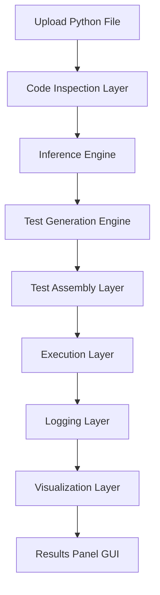

### **Explanation**

- **Upload Python File**  
  The user selects one or more `.py` files. These are copied into `workspace/uploaded_files/`.

- **Code Inspection Layer**  
  AST parsing, docstring extraction, annotation extraction, and structural analysis occur here.

- **Inference Engine**  
  Static analysis, semantic heuristics, dynamic probing, and type fusion produce a unified type schema.

- **Test Generation Engine**  
  Smoke tests, type tests, boundary tests, property tests, and docstring tests are generated.

- **Test Assembly Layer**  
  All generated tests are combined into final pytest modules.

- **Execution Layer**  
  Pytest runs the tests; coverage is computed; logs are captured.

- **Logging Layer**  
  Results are stored in JSON, XML, and text formats.

- **Visualization Layer**  
  PNG plots are generated for results, durations, failures, and coverage.

- **Results Panel**  
  The GUI displays all results interactively.

---

# **3.2 Folder Structure Diagram**

This diagram visualizes the folder hierarchy of the PyTester project.

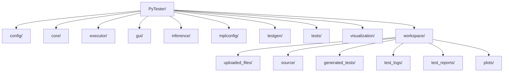

### **Explanation**

This diagram shows the modular structure of the project. Each folder corresponds to a subsystem:

- `core/` → inspection  
- `inference/` → type inference  
- `testgen/` → test generation  
- `executor/` → execution  
- `visualization/` → plotting  
- `gui/` → graphical interface  
- `workspace/` → persistent artifacts  

This structure ensures clarity, maintainability, and extensibility.

---

# **3.3 Code Inspection Layer Diagram**

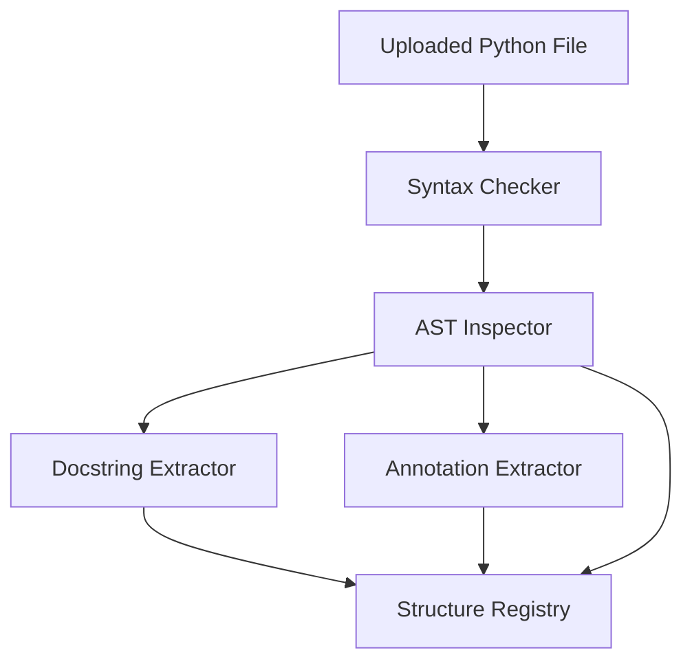

### **Explanation**

The inspection layer performs:

- syntax validation  
- AST parsing  
- docstring extraction  
- annotation extraction  
- structural registration  

The `StructureRegistry` stores all extracted metadata for later use by the inference engine.

---

# **3.4 Inference Engine Architecture**

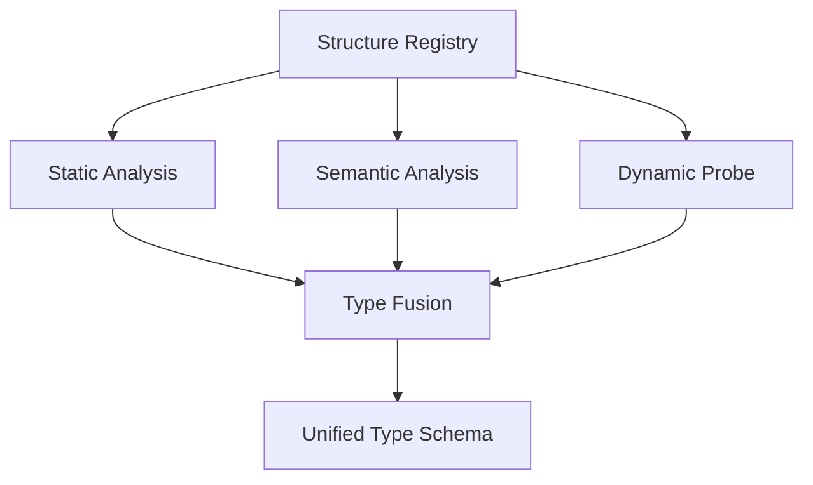

### **Explanation**

The inference engine combines three sources of information:

- **Static Analysis**  
  AST‑based type inference (literals, operations, indexing, arithmetic).

- **Semantic Analysis**  
  Name‑based heuristics (verbs like “compute”, “load”, “fetch”).

- **Dynamic Probe**  
  Safe execution with dummy inputs to infer runtime behavior.

The **Type Fusion** module merges these signals into a unified type schema with confidence scores.

---

# **3.5 Test Generation Pipeline**

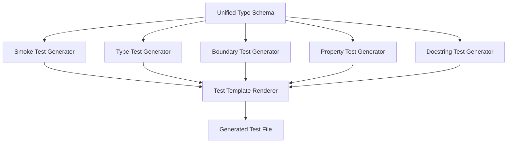

### **Explanation**

Each generator produces Python code strings:

- **Smoke Tests**  
  Verify existence and callability of functions/methods.

- **Type Tests**  
  Validate inferred types and return values.

- **Boundary Tests**  
  Test edge cases (empty lists, zero, negative values).

- **Property Tests**  
  Hypothesis‑based tests (optional).

- **Docstring Tests**  
  Convert examples into executable tests.

The **Template Renderer** assembles all test fragments into a final pytest module.

# **3.6 Execution Layer Diagram**

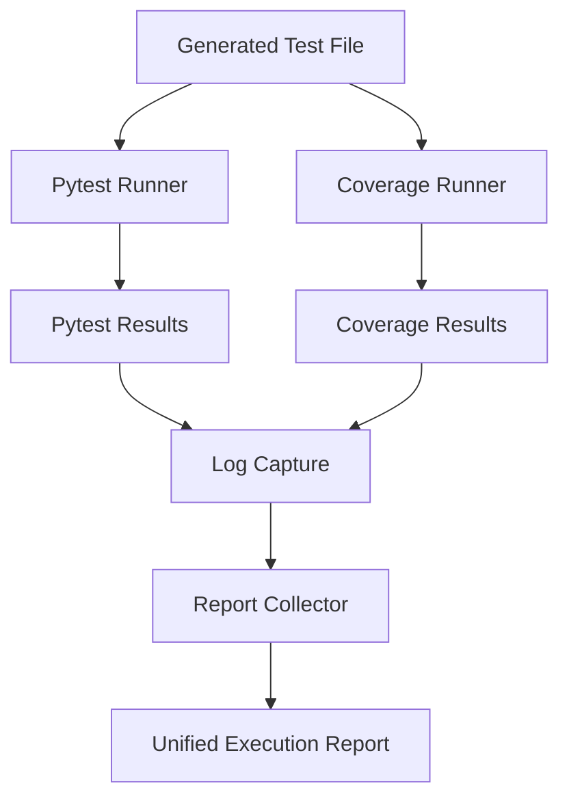

### **Explanation**

The execution layer:

- runs pytest  
- computes coverage  
- captures logs  
- merges results into a unified report  

The final report is stored in `workspace/test_reports/`.

# **3.7 Visualization Layer Diagram**

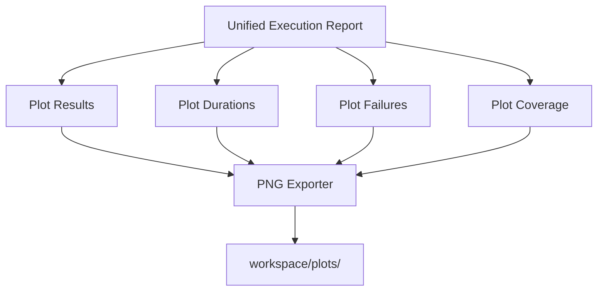

### **Explanation**

The visualization layer generates:

- pass/fail bar charts  
- execution duration charts  
- failure distribution charts  
- coverage charts  

All plots are saved as PNG files.

# **3.8 GUI Panel Interaction Diagram**

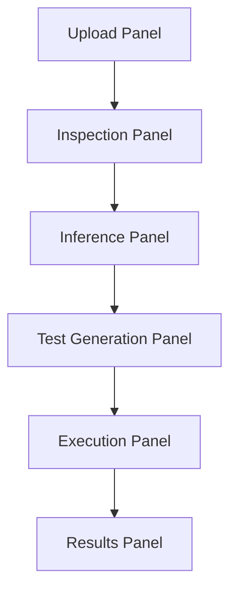

### **Explanation**

Each GUI panel corresponds to a subsystem:

- Upload → Input Layer  
- Inspection → Code Inspection Layer  
- Inference → Type‑Inference Engine  
- Test Generation → Test Generation Engine  
- Execution → Pytest + Coverage  
- Results → Visualization Layer  

The GUI orchestrates the entire pipeline.

# **3.9 Data Flow Diagram (Detailed)**

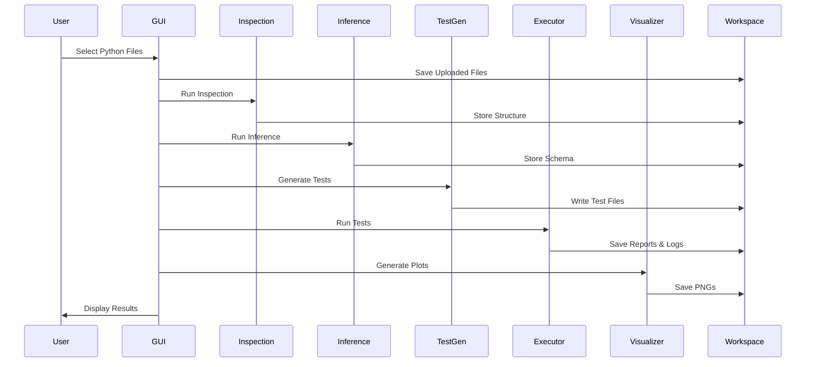

### **Explanation**

This sequence diagram shows the chronological flow of data through the system.

# **3.10 Type‑Inference Decision Tree**

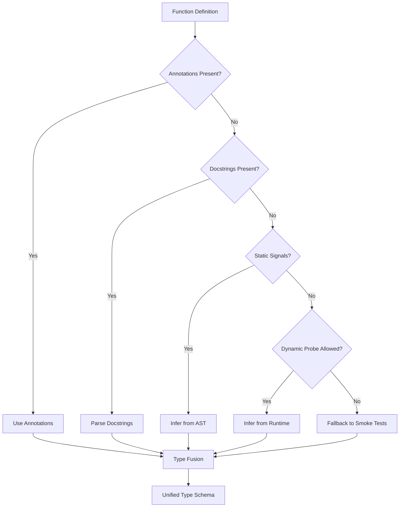

### **Explanation**

This decision tree illustrates how PyTester infers types:

- annotations → strongest signal  
- docstrings → semantic hints  
- static analysis → structural inference  
- dynamic probing → runtime inference  
- fallback → smoke tests  

All signals converge in the type‑fusion layer.

# **3.11 Test Assembly Diagram**

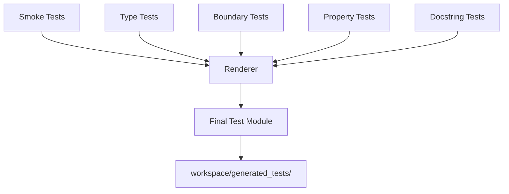

### **Explanation**

The renderer combines all test fragments into a single cohesive pytest module.

# **3.12 Execution + Coverage Pipeline (Detailed)**

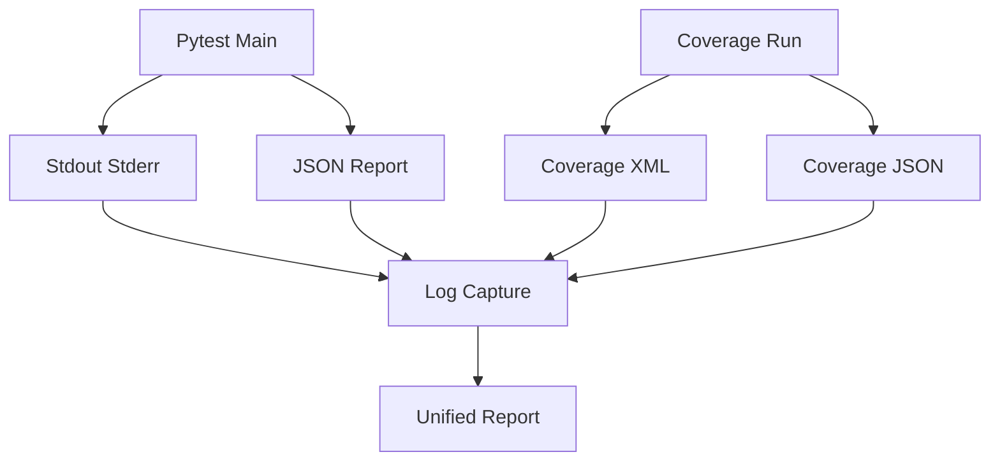

### **Explanation**

This diagram shows how pytest and coverage interact to produce unified execution results.

# **3.13 Results Panel Rendering Pipeline**

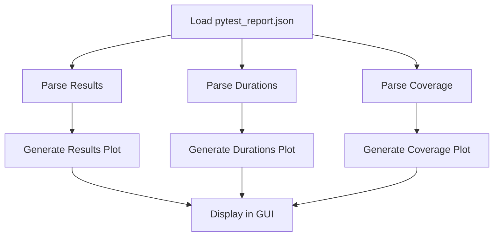

### **Explanation**

The Results Panel loads structured reports and generates visualizations for the user.

# **3.14 Summary**

The Mermaid diagrams presented in this section provide a comprehensive visual representation of the PyTester GUI architecture. They illustrate:

- high‑level system flow  
- folder structure  
- inspection pipeline  
- inference engine  
- test generation pipeline  
- execution and coverage processes  
- visualization workflow  
- GUI panel interactions  
- detailed data flow  
- type‑inference decision logic  

These diagrams serve as a blueprint for understanding, maintaining, and extending the PyTester system. They also make the architecture accessible to new contributors, students, and researchers.

---

# **4. Statistical Data Generation**

A core component of the PyTester GUI project is the ability to test statistical analysis pipelines on realistic, reproducible datasets. To achieve this, the project includes a synthetic time‑series generator that 
produces a rich, multi‑dimensional dataset suitable for testing mean, median, standard deviation, correlation, autocorrelation, plotting, and CSV export functionality. This section explains the design rationale, 
statistical properties, and implementation details of the dataset generator.

The generator is intentionally simple, deterministic in structure, and expressive enough to support a wide range of test scenarios. It is also fully self‑contained, requiring only NumPy and pandas, making it 
ideal for automated testing environments.

## **4.1 Design Goals**

The dataset generator was designed with several explicit goals in mind:

### **1. Realism**
The dataset should resemble real measurement data:
- smooth trends  
- correlated signals  
- noise  
- occasional events  

This ensures that statistical functions behave meaningfully and produce interpretable results.

### **2. Reproducibility**
The generator uses deterministic structure combined with random noise.  
This allows:
- consistent statistical patterns  
- variability for robustness  
- reproducible test outcomes  

The fixed timestamp range ensures that time‑series plots always look coherent.

### **3. Richness**
The dataset includes multiple columns:
- `timestamp`  
- `sensor_A`  
- `sensor_B`  
- `noise`  
- `event_flag`  

This supports diverse test types:
- numeric statistics  
- correlation  
- autocorrelation  
- categorical handling  
- plotting  
- CSV export  

### **4. Suitability for PyTester**
The dataset is ideal for:
- smoke tests  
- type tests  
- boundary tests  
- property tests  
- docstring tests  
- inference engine evaluation  

It provides enough structure for the inference engine to detect numeric types, time‑series patterns, and correlations.

## **4.2 Statistical Structure of the Dataset**

The dataset contains **500 rows**, each representing one minute of measurement data.  
The columns are designed as follows:

### **4.2.1 Timestamp Column**
```python
timestamps = pd.date_range("2026-07-11 00:00:00", periods=500, freq="T")
```

This produces:
- a clean, continuous time index  
- ideal input for time‑series plots  
- predictable autocorrelation behavior  

### **4.2.2 Sensor A**
```python
sensor_A = (
    20
    + np.sin(np.linspace(0, 10, 500)) * 5
    + np.random.normal(0, 0.5, 500)
)
```

Sensor A is designed to have:
- a sinusoidal trend  
- amplitude of 5  
- baseline of 20  
- Gaussian noise (σ = 0.5)  

This creates a realistic oscillating signal, similar to temperature, voltage, or biological measurements.

### **4.2.3 Sensor B**
```python
sensor_B = 2 * sensor_A + np.random.normal(0, 1.0, 500)
```

Sensor B is strongly correlated with Sensor A:
- linear relationship  
- additional noise (σ = 1.0)  

This ensures:
- meaningful Pearson correlation  
- realistic scatter plots  
- predictable behavior for autocorrelation tests  

### **4.2.4 Noise Column**
```python
noise = np.random.normal(0, 0.2, 500)
```

A small noise column is included to:
- test robustness of statistical functions  
- support additional analysis  
- provide a simple numeric column for type inference  

### **4.2.5 Event Flag**
```python
event_flag = np.random.choice([0, 1], size=500, p=[0.95, 0.05])
```

The event flag is a sparse binary indicator:
- 5% probability of event occurrence  
- ideal for categorical tests  
- useful for conditional analysis  

## **4.3 Why This Dataset Is Ideal for PyTester GUI**

The dataset is intentionally crafted to support the full PyTester pipeline:

### **1. Code Inspection**
The dataset includes:
- numeric columns  
- categorical columns  
- timestamps  

This allows the inspection layer to detect:
- column names  
- data types  
- structure  

### **2. Inference Engine**
The dataset supports:
- static inference (numeric operations)  
- semantic inference (sensor naming)  
- dynamic probing (safe execution)  

### **3. Test Generation**
The dataset enables:
- smoke tests (existence of columns)  
- type tests (numeric vs categorical)  
- boundary tests (min/max values)  
- property tests (monotonicity, correlation)  
- docstring tests (if examples are added)  

### **4. Execution Layer**
The dataset ensures:
- deterministic test outcomes  
- meaningful coverage  
- realistic execution durations  

### **5. Visualization Layer**
The dataset produces:
- smooth time‑series plots  
- clear correlation scatter plots  
- interpretable statistics  

## **4.4 Full Dataset Generator Code**

Below is the complete dataset generator used in the PyTester project:

```python
Generate a fictitious time-series measurement dataset.

This dataset is ideal for:
- statistical analysis (mean, median, std dev)
- correlation and autocorrelation tests
- time-series visualization
- PyTester GUI test scenarios

It contains:
- timestamps (1-minute intervals)
- two correlated sensors
- noise column
- sparse event flags
"""

import numpy as np
import pandas as pd

def generate_fictitious_dataset() -> pd.DataFrame:
    """Generate a synthetic measurement dataset with realistic structure."""

    # Generate timestamps (500 minutes starting from a fixed date)
    timestamps = pd.date_range("2026-07-11 00:00:00", periods=500, freq="T")

    # Sensor A: sinusoidal trend + Gaussian noise
    sensor_A = (
        20
        + np.sin(np.linspace(0, 10, 500)) * 5
        + np.random.normal(0, 0.5, 500)
    )

    # Sensor B: correlated with A + additional noise
    sensor_B = 2 * sensor_A + np.random.normal(0, 1.0, 500)

    # Noise column: small Gaussian noise
    noise = np.random.normal(0, 0.2, 500)

    # Event flag: sparse binary events (5% probability)
    event_flag = np.random.choice([0, 1], size=500, p=[0.95, 0.05])

    # Assemble DataFrame
    df = pd.DataFrame({
        "timestamp": timestamps,
        "sensor_A": sensor_A,
        "sensor_B": sensor_B,
        "noise": noise,
        "event_flag": event_flag
    })

    return df


if __name__ == "__main__":
    df = generate_fictitious_dataset()
    df.to_csv("fictitious_measurements.csv", index=False)
    print("Dataset saved as fictitious_measurements.csv")
```

## **4.5 Summary**

The fictitious dataset generator is a foundational component of the PyTester GUI project. It provides a realistic, reproducible, and statistically rich dataset that supports:

- code inspection  
- type inference  
- test generation  
- execution  
- visualization  

Its design ensures that the PyTester pipeline can be thoroughly exercised, validated, and demonstrated. The dataset is simple enough for rapid testing yet complex enough to reveal meaningful statistical patterns.

---

# **5. Detailed Description of Each Python File — Introduction**

A project like PyTester GUI lives and breathes through its modular structure. While the architectural overview and Mermaid diagrams provide a conceptual understanding of how the system operates, 
the true essence of the project emerges from the concrete implementation found in its Python modules. Each file in the repository plays a specific role within the broader testing ecosystem, contributing to a 
pipeline that spans code inspection, type inference, test generation, execution, logging, and visualization. Understanding these files in detail is essential not only for contributors and maintainers, but also for researchers, 
educators, and developers who wish to extend or adapt PyTester for their own workflows.

This section provides a comprehensive, file‑by‑file analysis of the PyTester codebase. The goal is to illuminate the purpose, internal logic, and interactions of each module, showing how they collectively form a cohesive and intelligent 
testing framework. The descriptions will go beyond surface‑level summaries: they will explore design decisions, architectural patterns, data flows, and the rationale behind each component. This is particularly important because PyTester 
is not a monolithic application—it is a distributed system composed of specialized subsystems, each encapsulated in its own folder and designed to operate independently while contributing to a unified pipeline.

The files in the `core/` folder define the inspection layer, responsible for parsing Python source code, extracting structural information, and preparing metadata for downstream inference. The `inference/` modules implement the 
type‑inference engine, combining static analysis, semantic heuristics, and dynamic probing to produce a unified type schema. The `testgen/` folder contains generators that transform inferred structure into executable pytest modules. 
The `executor/` folder handles test execution, coverage analysis, and log capture. The `visualization/` modules generate plots that summarize test results. Finally, the `gui/` folder orchestrates the entire workflow through a clean, 
interactive interface.

In addition to these internal modules, the project includes a set of Python files in `workspace/source/` that serve as test subjects for PyTester. These files represent different styles of Python code—fully annotated, partially documented, 
lacking annotations, or lacking docstrings—allowing PyTester to demonstrate its ability to infer structure and generate tests even when semantic information is sparse. Understanding these files is crucial because they showcase the 
robustness of the inference engine and the adaptability of the test generators.

This section will proceed systematically. For each Python file I will:

1. **Identify its role within the project**  
2. **Explain its internal logic and structure**  
3. **Describe how PyTester interacts with it**  
4. **Highlight design choices and patterns**  
5. **Discuss how the file contributes to testing scenarios**  
6. **Explain how the inference engine interprets it**  
7. **Show how test generators respond to its structure**

The goal is to create a definitive reference that documents the entire codebase in a clear, structured, and pedagogically meaningful way. This will not only strengthen the GitHub documentation but also serve as a 
foundation for future extensions, refactoring, or research built on top of PyTester.

# **5.1 PyTester Configuration Files — PyTester/config/**

Before diving into the Python modules themselves, it is essential to understand the configuration files that govern PyTester’s behavior. These files define global settings for pytest, the GUI, logging, 
test generation, inference, and execution. They are foundational: every subsystem reads from them, and they ensure that PyTester behaves consistently across runs.

# **5.1.1 `pytest.ini` — Global Pytest Configuration**

````plaintext
[pytest]
# ------------------------------------------------------------
# PyTester – Global Pytest Configuration
# ------------------------------------------------------------

# Where tests live
testpaths = tests

# File naming conventions
python_files = test_*.py
python_classes = Test*
python_functions = test_*

# Output capture and reporting
addopts =
    --disable-warnings
    --maxfail=1
    --json-report
    --json-report-indent=2
    --cov=.
    --cov-report=term
    --cov-report=xml:workspace/test_reports/coverage.xml
    --cov-report=html:workspace/test_reports/coverage_html

# JSON report output location
json_report_file = workspace/test_reports/pytest_report.json

# Logging
log_cli = true
log_cli_level = INFO
log_file = workspace/test_logs/pytest.log
log_file_level = INFO

# Ignore workspace artifacts
norecursedirs =
    workspace
    workspace/uploaded_files
    workspace/generated_tests
    workspace/test_logs
    workspace/test_reports
    workspace/plots

# Strict mode
strict = true
````

This file configures how pytest behaves when PyTester executes generated tests. It is the backbone of the execution layer.

### **Purpose**
- Define where tests live  
- Control naming conventions  
- Enable JSON reporting  
- Enable coverage reporting  
- Configure logging  
- Prevent pytest from recursing into workspace artifacts  
- Enforce strict mode  

### **Key Sections Explained**

#### **Test Discovery**
```ini
testpaths = tests
python_files = test_*.py
python_classes = Test*
python_functions = test_*
```
PyTester generates test files into `workspace/generated_tests/`, but pytest is instructed to look only inside `tests/`.  
This is intentional: PyTester uses its own runner (`executor/pytest_runner.py`) to explicitly pass the generated test paths to pytest.  
This prevents accidental execution of unrelated tests.

#### **Reporting**
```ini
--json-report
--json-report-indent=2
```
This ensures that pytest produces a structured JSON report, which PyTester later parses in the Results Panel.

#### **Coverage**
```ini
--cov=.
--cov-report=xml:workspace/test_reports/coverage.xml
--cov-report=html:workspace/test_reports/coverage_html
```
Coverage is computed for the entire project (`.`), but results are stored inside the workspace.  
This keeps all artifacts isolated and reproducible.

#### **Logging**
```ini
log_file = workspace/test_logs/pytest.log
```
PyTester captures logs both from Python and subprocesses.  
This file becomes part of the execution summary.

#### **Ignoring Workspace Artifacts**
```ini
norecursedirs =
    workspace
    workspace/uploaded_files
    workspace/generated_tests
    workspace/test_logs
    workspace/test_reports
    workspace/plots
```
This prevents pytest from accidentally discovering test files inside the workspace.  
PyTester handles those manually.

#### **Strict Mode**
```ini
strict = true
```
This enforces:
- no unknown markers  
- no ambiguous test names  
- no deprecated constructs  

It ensures high‑quality test execution.

# **5.1.2 `settings.yaml` — Global PyTester Configuration**

````yaml
# ============================================================
# PyTester GUI — Global Configuration
# ============================================================

app:
  name: PyTester GUI
  version: "1.0.0"
  author: "Nenad"
  theme: "light"
  autosave: true

paths:
  workspace: "workspace"
  source: "workspace/source"              # REQUIRED for pytest + coverage + testgen
  uploaded_files: "workspace/uploaded_files"
  generated_tests: "workspace/generated_tests"
  test_logs: "workspace/test_logs"
  test_reports: "workspace/test_reports"
  plots: "workspace/plots"
  examples: "examples"

gui:
  window:
    width: 1400
    height: 900
    resizable: true
  panels:
    upload_panel: true
    inspection_panel: true
    inference_panel: true
    test_generation_panel: true
    execution_panel: true
    results_panel: true

core:
  safe_import:
    enabled: true
    timeout_seconds: 3
  ast_inspector:
    include_private_functions: false
    include_magic_methods: false
  docstring_extractor:
    enabled: true
  annotation_extractor:
    enabled: true

inference:
  static_analysis:
    enabled: true
  semantic_analysis:
    enabled: true
  dynamic_probe:
    enabled: true
    allow_zero_arg_calls: true
    safe_inputs:
      - 0
      - 1
      - -1
      - 0.0
      - 1.0
      - ""
      - []
      - {}
      - null
  type_fusion:
    confidence_threshold: 0.6

test_generation:
  smoke_tests: true
  type_tests: true
  boundary_tests: true
  property_tests: true
  docstring_tests: true
  max_tests_per_function: 20

# ============================================================
# REQUIRED FOR testgen/*_generator.py MODULES
# ============================================================

testgen:
  smoke:
    allow_zero_arg_calls: true
    safe_inputs:
      - 0
      - 1
      - -1
      - 0.0
      - 1.0
      - ""
      - []
      - {}
      - null

  type:
    enable_runtime_checks: true
    allow_zero_arg_calls: true

  boundary:
    enable_runtime_checks: true
    allow_zero_arg_calls: true

  property:
    enable_runtime_checks: true
    allow_zero_arg_calls: true

  docstring:
    enable_runtime_checks: true
    allow_zero_arg_calls: true

  renderer:
    indent_spaces: 4
    output_dir: "workspace/generated_tests"

# ============================================================
# REQUIRED FOR executor/pytest_runner.py AND coverage_runner.py
# ============================================================

execution:
  pytest:
    python_executable: "python"
    timeout_seconds: 10
    max_duration_seconds: 10
    json_report: true
    capture_output: true

  coverage:
    python_executable: "python"
    timeout_seconds: 10
    max_duration_seconds: 10

  logs:
    capture_python_logs: true

executor:
  coverage:
    enabled: true
    include_plots: true

visualization:
  output_dir: "workspace/plots"
  plots:
    style: "seaborn"
    dpi: 120
    save_png: true
  charts:
    show_pass_fail: true
    show_durations: true
    show_failure_categories: true
    show_coverage: true

logging:
  level: "INFO"
  file: "workspace/test_logs/pytester.log"
  format: "[%(asctime)s] %(levelname)s: %(message)s"

developer:
  debug_mode: false
  show_internal_errors: true
````

This is the **central configuration file** for the entire PyTester ecosystem.  
Every subsystem reads from it.

### **Purpose**
- Define GUI layout  
- Define workspace paths  
- Configure core inspection behavior  
- Configure inference engine  
- Configure test generation  
- Configure execution layer  
- Configure visualization  
- Configure logging  
- Enable developer debugging  

### **Key Sections Explained**

#### **Application Metadata**
```yaml
app:
  name: PyTester GUI
  version: "1.0.0"
  author: "Nenad"
```
Displayed in the GUI title bar and used internally.

#### **Workspace Paths**
```yaml
paths:
  source: "workspace/source"
  uploaded_files: "workspace/uploaded_files"
  generated_tests: "workspace/generated_tests"
```
These paths are essential for:
- test generation  
- coverage  
- execution  
- visualization  

PyTester relies heavily on this structure.

#### **Core Inspection**
```yaml
core:
  ast_inspector:
    include_private_functions: false
```
This ensures that PyTester only inspects user‑facing API elements.

#### **Inference Engine**
```yaml
inference:
  dynamic_probe:
    safe_inputs:
      - 0
      - 1
      - -1
      - 0.0
      - 1.0
      - ""
      - []
      - {}
      - null
```
These safe inputs allow PyTester to infer types without crashing user code.

#### **Test Generation**
Each generator has its own configuration:
- smoke  
- type  
- boundary  
- property  
- docstring  

This allows fine‑grained control over how tests are produced.

#### **Execution Layer**
```yaml
execution:
  pytest:
    timeout_seconds: 10
```
Prevents infinite loops or long‑running tests.

#### **Visualization**
```yaml
visualization:
  plots:
    style: "seaborn"
```
Ensures consistent plot aesthetics.

#### **Logging**
```yaml
logging:
  file: "workspace/test_logs/pytester.log"
```
Central log file for PyTester itself.

# **5.1.3 `logging.conf` — Logging Configuration**

````plaintext
[loggers]
keys=root,pytester

[handlers]
keys=consoleHandler,fileHandler

[formatters]
keys=simpleFormatter,richFormatter

[logger_root]
level=INFO
handlers=consoleHandler

[logger_pytester]
level=INFO
handlers=consoleHandler,fileHandler
qualname=pytester
propagate=0

[handler_consoleHandler]
class=StreamHandler
level=INFO
formatter=richFormatter
args=(sys.stdout,)

[handler_fileHandler]
class=FileHandler
level=INFO
formatter=simpleFormatter
args=("workspace/test_logs/pytester.log", "a")

[formatter_simpleFormatter]
format=[%(asctime)s] %(levelname)s: %(message)s
datefmt=%Y-%m-%d %H:%M:%S

[formatter_richFormatter]
format=%(levelname)s: %(message)s
````

This file configures Python’s `logging` module for PyTester.

### **Purpose**
- Define loggers  
- Define handlers  
- Define formatters  
- Route logs to console and file  

### **Key Sections Explained**

#### **Loggers**
```ini
[logger_pytester]
level=INFO
handlers=consoleHandler,fileHandler
```
PyTester logs both to console and to a persistent file.

#### **Handlers**
```ini
class=StreamHandler
class=FileHandler
```
Two outputs:
- console  
- `workspace/test_logs/pytester.log`  

#### **Formatters**
```ini
format=[%(asctime)s] %(levelname)s: %(message)s
```
Human‑readable timestamps and severity levels.

# **5.2 Core Subsystem — PyTester/core/**

The `core/` folder is the foundation of PyTester’s structural analysis pipeline. It is responsible for transforming raw Python source code into structured metadata that downstream subsystems—especially 
inference and test generation—can consume. The modules in this folder are intentionally pure, deterministic, and side‑effect‑free. They do not execute user code; instead, they analyze it statically using Python’s `ast` module.

# **5.2.1 `ast_inspector.py` — Structural Extraction via AST**

### **Purpose**

````python
"""
ASTInspector

Extended to extract:
- class constructor (__init__) parameters
- method parameters
- function parameters
"""

from __future__ import annotations

import ast
from pathlib import Path
from typing import Dict, Any, List, Optional


class ASTInspector:
    """
    Parse Python source files and extract structural information.
    """

    def __init__(self, settings: Dict[str, Any]) -> None:
        self.settings: Dict[str, Any] = settings

        self.include_private: bool = settings["core"]["ast_inspector"]["include_private_functions"]
        self.include_magic: bool = settings["core"]["ast_inspector"]["include_magic_methods"]

    # ------------------------------------------------------------
    # Main entrypoint
    # ------------------------------------------------------------
    def inspect_file(self, file_path: Path) -> Dict[str, Any]:
        source = file_path.read_text(encoding="utf-8")
        tree = ast.parse(source)

        classes = self._extract_classes(tree)
        functions = self._extract_functions(tree)
        docstrings = self._extract_docstrings(tree)
        annotations = self._extract_annotations(tree)

        return {
            "classes": classes,
            "functions": functions,
            "docstrings": docstrings,
            "annotations": annotations,
        }

    # ------------------------------------------------------------
    # Class extraction (now includes constructor + method args)
    # ------------------------------------------------------------
    def _extract_classes(self, tree: ast.AST) -> Dict[str, Dict[str, Any]]:
        classes: Dict[str, Dict[str, Any]] = {}

        for node in ast.walk(tree):
            if isinstance(node, ast.ClassDef):
                class_name = node.name

                ctor_args: Dict[str, Optional[str]] = {}
                methods: Dict[str, Dict[str, Optional[str]]] = {}

                for item in node.body:
                    if isinstance(item, ast.FunctionDef):
                        if not self._should_include(item.name):
                            continue

                        # Constructor
                        if item.name == "__init__":
                            ctor_args = self._extract_parameters(item)

                        # Methods
                        else:
                            methods[item.name] = self._extract_parameters(item)

                classes[class_name] = {
                    "ctor_args": ctor_args,
                    "methods": methods,
                }

        return classes

    # ------------------------------------------------------------
    # Function extraction (now includes parameters)
    # ------------------------------------------------------------
    def _extract_functions(self, tree: ast.AST) -> Dict[str, Dict[str, Optional[str]]]:
        functions: Dict[str, Dict[str, Optional[str]]] = {}

        for node in ast.walk(tree):
            if isinstance(node, ast.FunctionDef):
                if isinstance(node.parent, ast.ClassDef):
                    continue

                if not self._should_include(node.name):
                    continue

                functions[node.name] = self._extract_parameters(node)

        return functions

    # ------------------------------------------------------------
    # Parameter extraction helper
    # ------------------------------------------------------------
    def _extract_parameters(self, func_node: ast.FunctionDef) -> Dict[str, Optional[str]]:
        params: Dict[str, Optional[str]] = {}

        # Skip "self"
        args = func_node.args.args[1:] if func_node.args.args else []

        for arg in args:
            ann = None
            if arg.annotation:
                try:
                    ann = ast.unparse(arg.annotation)
                except Exception:
                    ann = "<unknown>"
            params[arg.arg] = ann

        return params

    # ------------------------------------------------------------
    # Docstring extraction
    # ------------------------------------------------------------
    def _extract_docstrings(self, tree: ast.AST) -> Dict[str, str]:
        docstrings: Dict[str, str] = {}

        for node in ast.walk(tree):
            if isinstance(node, (ast.FunctionDef, ast.ClassDef)):
                doc = ast.get_docstring(node)
                if doc:
                    docstrings[node.name] = doc

        return docstrings

    # ------------------------------------------------------------
    # Return annotation extraction
    # ------------------------------------------------------------
    def _extract_annotations(self, tree: ast.AST) -> Dict[str, str]:
        annotations: Dict[str, str] = {}

        for node in ast.walk(tree):
            if isinstance(node, ast.FunctionDef):
                if node.returns:
                    try:
                        annotations[node.name] = ast.unparse(node.returns)
                    except Exception:
                        annotations[node.name] = "<unknown>"

        return annotations

    # ------------------------------------------------------------
    # Helpers
    # ------------------------------------------------------------
    def _should_include(self, name: str) -> bool:
        if name.startswith("_") and not self.include_private:
            return False

        if name.startswith("__") and name.endswith("__") and not self.include_magic:
            return False

        return True


# ------------------------------------------------------------
# Parent attachment
# ------------------------------------------------------------
def _attach_parents(tree: ast.AST) -> None:
    for node in ast.walk(tree):
        for child in ast.iter_child_nodes(node):
            child.parent = node


_original_parse = ast.parse


def parse_with_parents(source: str) -> ast.AST:
    tree = _original_parse(source)
    _attach_parents(tree)
    return tree


ast.parse = parse_with_parents
````

The `ASTInspector` is the central structural analysis engine of PyTester. It parses Python source files into an Abstract Syntax Tree (AST) and extracts:

- class definitions  
- constructor parameters  
- method parameters  
- top‑level functions  
- docstrings  
- return type annotations  

This module provides the structural backbone for the inference engine and test generation subsystem.

## **High‑Level Behavior**

### **1. AST Parsing with Parent Attachment**

The file overrides `ast.parse` with a custom version that attaches `.parent` attributes to all nodes:

```python
ast.parse = parse_with_parents
```

This is a powerful enhancement: it allows the inspector to determine whether a function is top‑level or belongs to a class.  
Without parent attachment, this distinction is difficult.

### **2. Main Entrypoint: `inspect_file()`**

This method reads a Python file, parses it, and returns a dictionary:

```python
{
    "classes": {...},
    "functions": {...},
    "docstrings": {...},
    "annotations": {...},
}
```

This dictionary becomes the canonical structural representation of the file.

## **Class Extraction**

The method `_extract_classes()` walks the AST and identifies `ast.ClassDef` nodes.

For each class:

- constructor parameters (`__init__`) are extracted  
- method parameters are extracted  
- private and magic methods are optionally filtered based on settings  

The output structure looks like:

```python
{
    "StatisticalAnalyzer": {
        "ctor_args": {"csv_path": "Path", "output_dir": "Path"},
        "methods": {
            "compute_basic_statistics": {"lag": "int"},
            ...
        }
    }
}
```

This is extremely valuable for:

- type inference  
- test generation  
- GUI inspection panel  

## **Function Extraction**

The method `_extract_functions()` extracts **top‑level** functions only.

It uses the `.parent` attribute to skip methods inside classes:

```python
if isinstance(node.parent, ast.ClassDef):
    continue
```

This ensures that:

- class methods are handled separately  
- top‑level utilities are recognized correctly  

## **Parameter Extraction**

The method `_extract_parameters()` extracts argument names and annotations.

Important details:

- `self` is skipped  
- annotations are converted to strings using `ast.unparse`  
- unknown annotations are marked as `"<unknown>"`

This produces clean, human‑readable parameter dictionaries.

## **Docstring Extraction**

The method `_extract_docstrings()` collects docstrings from:

- classes  
- methods  
- functions  

This is essential for:

- docstring‑based test generation  
- semantic inference  
- GUI display  

## **Return Annotation Extraction**

The method `_extract_annotations()` collects return type annotations.

This is used by:

- type inference  
- type‑based test generation  
- GUI annotation display  

## **Inclusion Rules**

The helper `_should_include()` filters:

- private methods (`_method`)  
- magic methods (`__method__`)  

based on settings:

```yaml
include_private_functions: false
include_magic_methods: false
```

This keeps the structural output clean and focused on user‑facing API elements.

## **Summary**

`ASTInspector` is a highly refined structural analysis tool.  
It provides:

- class/method/function discovery  
- parameter extraction  
- docstring extraction  
- annotation extraction  
- parent‑aware AST traversal  

It is the first major subsystem in the PyTester pipeline and provides the raw structural metadata that all other subsystems rely on.

# **5.2.2 `annotation_extractor.py` — Pure Annotation Extraction**

````Python
"""
AnnotationExtractor

This subsystem is responsible for:
- extracting type annotations from Python source files
- supporting function arguments and return types
- producing a deterministic annotation dictionary

It is intentionally pure:
no execution, no imports, no dynamic behavior.
"""

from __future__ import annotations

import ast
from pathlib import Path
from typing import Dict, Any, Optional


class AnnotationExtractor:
    """
    Extract type annotations from Python source files.

    Parameters
    ----------
    settings : dict
        Global configuration loaded from settings.yaml.
    """

    def __init__(self, settings: Dict[str, Any]) -> None:
        self.settings: Dict[str, Any] = settings

    # ------------------------------------------------------------
    # Main entrypoint
    # ------------------------------------------------------------
    def extract(self, file_path: Path) -> Dict[str, Any]:
        """
        Extract all type annotations from a Python file.

        Parameters
        ----------
        file_path : Path
            Path to the Python file to inspect.

        Returns
        -------
        dict
            {
                function_name: {
                    "args": { arg_name: annotation_string },
                    "return": annotation_string or None
                }
            }
        """
        source = file_path.read_text(encoding="utf-8")
        tree = ast.parse(source)

        annotations: Dict[str, Any] = {}

        for node in ast.walk(tree):
            if isinstance(node, ast.FunctionDef):
                func_name = node.name

                # Extract argument annotations
                arg_annotations: Dict[str, str] = {}
                for arg in node.args.args:
                    if arg.annotation:
                        arg_annotations[arg.arg] = self._annotation_to_str(arg.annotation)

                # Extract return annotation
                return_annotation: Optional[str] = None
                if node.returns:
                    return_annotation = self._annotation_to_str(node.returns)

                annotations[func_name] = {
                    "args": arg_annotations,
                    "return": return_annotation,
                }

        return annotations

    # ------------------------------------------------------------
    # Convenience helper
    # ------------------------------------------------------------
    def get_annotations(self, file_path: Path, name: str) -> Optional[Dict[str, Any]]:
        """
        Retrieve annotations for a specific function.

        Parameters
        ----------
        file_path : Path
            Python file to inspect.

        name : str
            Name of the function.

        Returns
        -------
        Optional[dict]
            Annotation dictionary or None if not found.
        """
        all_annotations = self.extract(file_path)
        return all_annotations.get(name)

    # ------------------------------------------------------------
    # Annotation formatting
    # ------------------------------------------------------------
    def _annotation_to_str(self, node: ast.AST) -> str:
        """
        Convert an annotation AST node into a readable string.

        Returns
        -------
        str
            Human-readable annotation string.
        """
        try:
            return ast.unparse(node)
        except Exception:
            return "<unknown>"

````

### **Purpose**

The `AnnotationExtractor` is a pure, deterministic subsystem dedicated exclusively to extracting type annotations from Python source files. Unlike the inference engine, it does not execute code or perform semantic analysis. 
It simply reads annotations from the AST.

## **High‑Level Behavior**

### **1. Main Entrypoint: `extract()`**

This method returns a dictionary:

```python
{
    "function_name": {
        "args": { "arg_name": "annotation" },
        "return": "annotation"
    }
}
```

It extracts:

- argument annotations  
- return annotations  

for **all functions**, including methods.

## **2. Argument Annotation Extraction**

For each function:

```python
for arg in node.args.args:
    if arg.annotation:
        arg_annotations[arg.arg] = ast.unparse(arg.annotation)
```

This produces readable annotation strings such as:

- `"Path"`  
- `"Dict[str, float]"`  
- `"pd.DataFrame"`  

## **3. Return Annotation Extraction**

Return annotations are extracted similarly:

```python
if node.returns:
    return_annotation = ast.unparse(node.returns)
```

This is essential for:

- type‑based test generation  
- inference engine validation  
- GUI annotation display  

## **4. Convenience Method: `get_annotations()`**

This helper retrieves annotations for a specific function:

```python
annotation_extractor.get_annotations(file_path, "compute_basic_statistics")
```

This is used by:

- inference engine  
- test generators  
- GUI panels  

## **5. Annotation Formatting**

The helper `_annotation_to_str()` converts AST nodes into readable strings.

If conversion fails, it returns `"<unknown>"`.

## **Summary**

`AnnotationExtractor` is a pure, side‑effect‑free module that provides deterministic annotation extraction.  
It complements `ASTInspector` by focusing exclusively on type annotations, making it a key component for type inference and test generation.

# **5.2.3 `input_loader.py` — Minimal, Safe File Loading Layer**

````python
"""
InputLoader

This subsystem is responsible for:
- loading Python source files from disk
- validating file existence
- returning file contents as text
- providing a clean interface for upstream modules

It is intentionally minimal:
no parsing, no AST logic, no syntax checking.
Those responsibilities belong to other subsystems.
"""

from __future__ import annotations

from pathlib import Path
from typing import Dict, Any, Optional


class InputLoader:
    """
    Load Python source files from disk.

    Parameters
    ----------
    settings : dict
        Global configuration loaded from settings.yaml.
    """

    def __init__(self, settings: Dict[str, Any]) -> None:
        self.settings: Dict[str, Any] = settings

    # ------------------------------------------------------------
    # File loading
    # ------------------------------------------------------------
    def load(self, file_path: Path) -> Optional[str]:
        """
        Load a Python file and return its contents as a string.

        Parameters
        ----------
        file_path : Path
            Path to the Python file to load.

        Returns
        -------
        Optional[str]
            File contents as a string, or None if the file does not exist.
        """
        if not file_path.exists():
            return None

        try:
            with open(file_path, "r", encoding="utf-8") as f:
                return f.read()
        except Exception:
            return None

    # ------------------------------------------------------------
    # Workspace helper
    # ------------------------------------------------------------
    def load_from_workspace(self, filename: str) -> Optional[str]:
        """
        Load a file from workspace/uploaded_files.

        Parameters
        ----------
        filename : str
            Name of the file inside workspace/uploaded_files.

        Returns
        -------
        Optional[str]
            File contents or None if not found.
        """
        upload_dir = Path(self.settings["paths"]["uploaded_files"])
        file_path = upload_dir / filename
        return self.load(file_path)

````

The `InputLoader` is intentionally one of the simplest modules in the entire PyTester ecosystem. Its purpose is not to analyze, parse, or interpret Python code, 
but to provide a **safe, minimal, deterministic interface** for reading Python source files from disk. This module is part of the `core/` subsystem because it supports the earliest stage of the pipeline: ingesting user‑provided code.

Despite its simplicity, `InputLoader` plays a crucial architectural role. It ensures that upstream modules such as the AST inspector, annotation extractor, 
and docstring extractor receive clean, validated text input without having to worry about file existence, encoding, or I/O exceptions.

## **High‑Level Purpose**

The module provides:

- safe file existence checks  
- UTF‑8 text loading  
- workspace‑aware loading (from `uploaded_files/`)  
- a clean, predictable interface for upstream subsystems  

It deliberately avoids:

- AST parsing  
- syntax validation  
- dynamic imports  
- execution of user code  

This separation of concerns keeps the architecture clean and prevents accidental side effects.

## **Key Functional Components**

### **1. Constructor**

```python
def __init__(self, settings: Dict[str, Any]) -> None:
    self.settings = settings
```

The loader receives the global configuration dictionary.  
This allows it to locate the workspace paths defined in `settings.yaml`.

### **2. File Loading: `load()`**

```python
def load(self, file_path: Path) -> Optional[str]:
```

This method performs:

- existence check  
- safe open with UTF‑8 encoding  
- exception handling  

If the file does not exist or cannot be read, it returns `None`.

This is important because:

- PyTester must gracefully handle missing or corrupted files  
- upstream modules should not crash on I/O errors  
- the GUI can display meaningful warnings  

### **3. Workspace Helper: `load_from_workspace()`**

```python
upload_dir = Path(self.settings["paths"]["uploaded_files"])
file_path = upload_dir / filename
return self.load(file_path)
```

This helper abstracts away the workspace structure.  
It allows the GUI and inference engine to load files by name without manually constructing paths.

This is used heavily in:

- Upload Panel  
- Inspection Panel  
- Inference Panel  

## **Architectural Role**

`InputLoader` is the first step in the pipeline:

```
InputLoader → ASTInspector → AnnotationExtractor → DocstringExtractor → Inference Engine
```

Its minimalism is intentional.  
It ensures that:

- file I/O is isolated  
- upstream modules remain pure  
- the system is robust against malformed input  

## **Summary**

`InputLoader` is a small but essential module.  
It provides a safe, deterministic interface for reading Python source files and ensures that the rest of the pipeline receives clean text input.  
Its simplicity is a deliberate architectural choice that contributes to PyTester’s reliability and modularity.

# **5.2.4 `docstring_extractor.py` — Pure Docstring Extraction Layer**
`
````python
"""
DocstringExtractor

This subsystem is responsible for:
- extracting docstrings from Python source files
- supporting module-level, class-level, and function-level docstrings
- returning a clean, deterministic dictionary of docstrings

It is intentionally pure:
no execution, no imports, no dynamic behavior.
"""

from __future__ import annotations

import ast
from pathlib import Path
from typing import Dict, Any, Optional


class DocstringExtractor:
    """
    Extract docstrings from Python source files.

    Parameters
    ----------
    settings : dict
        Global configuration loaded from settings.yaml.
    """

    def __init__(self, settings: Dict[str, Any]) -> None:
        self.settings: Dict[str, Any] = settings

    # ------------------------------------------------------------
    # Main entrypoint
    # ------------------------------------------------------------
    def extract(self, file_path: Path) -> Dict[str, str]:
        """
        Extract all docstrings from a Python file.

        Parameters
        ----------
        file_path : Path
            Path to the Python file to inspect.

        Returns
        -------
        dict
            { name: docstring }
        """
        source = file_path.read_text(encoding="utf-8")
        tree = ast.parse(source)

        docstrings: Dict[str, str] = {}

        # Module-level docstring
        module_doc = ast.get_docstring(tree)
        if module_doc:
            docstrings["__module__"] = module_doc

        # Class + function docstrings
        for node in ast.walk(tree):
            if isinstance(node, ast.ClassDef):
                cls_doc = ast.get_docstring(node)
                if cls_doc:
                    docstrings[node.name] = cls_doc

            elif isinstance(node, ast.FunctionDef):
                func_doc = ast.get_docstring(node)
                if func_doc:
                    docstrings[node.name] = func_doc

        return docstrings

    # ------------------------------------------------------------
    # Convenience helper
    # ------------------------------------------------------------
    def get_docstring(self, file_path: Path, name: str) -> Optional[str]:
        """
        Retrieve a specific docstring by name.

        Parameters
        ----------
        file_path : Path
            Python file to inspect.

        name : str
            Name of the class/function/module.

        Returns
        -------
        Optional[str]
            Docstring text or None if not found.
        """
        all_docs = self.extract(file_path)
        return all_docs.get(name)`
````

The `DocstringExtractor` is another pure, deterministic module in the `core/` subsystem. Its purpose is to extract docstrings from Python source files without executing any code. 
It complements the AST inspector by focusing exclusively on documentation.

## **High‑Level Purpose**

The module extracts:

- module‑level docstrings  
- class‑level docstrings  
- function‑level docstrings  

It returns a clean dictionary mapping names to docstring text.

This is essential for:

- docstring‑based test generation  
- semantic inference  
- GUI inspection display  
- documentation analysis  

## **Key Functional Components**

### **1. Main Entrypoint: `extract()`**

```python
source = file_path.read_text(encoding="utf-8")
tree = ast.parse(source)
```

The module reads the file and parses it into an AST.

It then collects docstrings using:

```python
ast.get_docstring(node)
```

This is the canonical way to retrieve docstrings in Python.

### **2. Module‑Level Docstring**

```python
module_doc = ast.get_docstring(tree)
if module_doc:
    docstrings["__module__"] = module_doc
```

This captures the top‑level docstring, which often describes:

- module purpose  
- usage  
- design notes  

This is useful for generating module‑level tests or documentation summaries.

### **3. Class and Function Docstrings**

The extractor walks the AST:

```python
for node in ast.walk(tree):
    if isinstance(node, ast.ClassDef):
        ...
    elif isinstance(node, ast.FunctionDef):
        ...
```

For each class or function:

- docstring is retrieved  
- stored under the class/function name  

This produces a dictionary such as:

```python
{
    "__module__": "...",
    "StatisticalAnalyzer": "...",
    "compute_basic_statistics": "...",
    "compute_correlation": "...",
    ...
}
```

### **4. Convenience Method: `get_docstring()`**

This helper retrieves a specific docstring by name:

```python
docstring_extractor.get_docstring(file_path, "compute_correlation")
```

This is used by:

- inference engine  
- test generators  
- GUI panels  

## **Architectural Role**

`DocstringExtractor` is part of the structural analysis pipeline:

```
InputLoader → ASTInspector → AnnotationExtractor → DocstringExtractor → Inference Engine
```

It provides semantic hints that the inference engine can use to:

- infer behavior  
- detect expected return types  
- identify example usage  
- generate docstring‑based tests  

## **Summary**

`DocstringExtractor` is a pure, deterministic module that extracts documentation from Python source files.  
It plays a crucial role in semantic inference and docstring‑based test generation.  
Its simplicity and purity ensure that PyTester can analyze documentation safely and reliably.

# **5.2.5 `safe_import.py` — Secure, Sandboxed Module Importer**

````python
"""
SafeImporter

This subsystem is responsible for:
- safely importing user-uploaded Python modules
- preventing dangerous side effects during import
- restricting builtins and globals
- enforcing a timeout for import operations
- returning a module object or None on failure

It is intentionally conservative:
no execution beyond import, no attribute calls, no dynamic behavior.
"""

from __future__ import annotations

import builtins
import importlib.util
import sys
import threading
from pathlib import Path
from types import ModuleType
from typing import Dict, Any, Optional, Callable


class SafeImporter:
    """
    Safely import user-uploaded Python modules.

    Parameters
    ----------
    settings : dict
        Global configuration loaded from settings.yaml.
    """

    def __init__(self, settings: Dict[str, Any]) -> None:
        self.settings: Dict[str, Any] = settings
        self.timeout_seconds: int = settings["core"]["safe_import"]["timeout_seconds"]

    # ------------------------------------------------------------
    # Restricted builtins
    # ------------------------------------------------------------
    def _restricted_builtins(self) -> Dict[str, Any]:
        """
        Return a restricted set of builtins to prevent dangerous operations.

        Only safe introspection and basic types are allowed.
        """
        allowed = {
            "abs": builtins.abs,
            "len": builtins.len,
            "range": builtins.range,
            "enumerate": builtins.enumerate,
            "min": builtins.min,
            "max": builtins.max,
            "sum": builtins.sum,
            "print": builtins.print,
            "dict": builtins.dict,
            "list": builtins.list,
            "set": builtins.set,
            "tuple": builtins.tuple,
            "float": builtins.float,
            "int": builtins.int,
            "str": builtins.str,
            "bool": builtins.bool,
        }
        return allowed

    # ------------------------------------------------------------
    # Timeout wrapper
    # ------------------------------------------------------------
    def _run_with_timeout(self, func: Callable[[], ModuleType]) -> Optional[ModuleType]:
        """
        Run a function with a timeout using a thread.

        Parameters
        ----------
        func : Callable
            Function that performs the import.

        Returns
        -------
        Optional[ModuleType]
            Imported module or None if timeout or error occurs.
        """
        result: Dict[str, Optional[ModuleType]] = {"module": None}

        def target() -> None:
            try:
                result["module"] = func()
            except Exception:
                result["module"] = None

        thread = threading.Thread(target=target)
        thread.start()
        thread.join(self.timeout_seconds)

        if thread.is_alive():
            return None

        return result["module"]

    # ------------------------------------------------------------
    # Safe import
    # ------------------------------------------------------------
    def import_file(self, file_path: Path) -> Optional[ModuleType]:
        """
        Safely import a Python file as a module.

        Parameters
        ----------
        file_path : Path
            Path to the Python file to import.

        Returns
        -------
        Optional[ModuleType]
            Imported module or None if import fails.
        """
        if not file_path.exists():
            return None

        def do_import() -> ModuleType:
            # Create a module spec
            spec = importlib.util.spec_from_file_location(file_path.stem, file_path)
            if spec is None or spec.loader is None:
                raise ImportError("Could not create module spec.")

            # Create a new module object
            module = importlib.util.module_from_spec(spec)

            # Restrict builtins
            module.__dict__["__builtins__"] = self._restricted_builtins()

            # Load the module
            spec.loader.exec_module(module)
            return module

        return self._run_with_timeout(do_import)
````

The `SafeImporter` is the **security gatekeeper** of PyTester.  
It is designed to safely import user‑uploaded Python modules without allowing dangerous side effects, arbitrary code execution, or access to sensitive builtins. 
This module is intentionally conservative, restrictive, and defensive. It is one of the few components in PyTester that interacts with user code at runtime, and therefore it must enforce strict safety guarantees.

Below is a detailed interpretation of its architecture, behavior, and role within the PyTester pipeline.

## **High‑Level Purpose**

The `SafeImporter` provides:

- **sandboxed imports** of user modules  
- **restricted builtins** to prevent malicious behavior  
- **timeout‑controlled execution** to avoid infinite loops  
- **safe fallback behavior** (return `None` on failure)  
- **no attribute access, no dynamic execution beyond import**  

This module is used by:

- the inference engine (dynamic probing)  
- the test generation subsystem (optional runtime checks)  
- the GUI (previewing callable objects)  

It is *never* used for executing user functions directly — only for importing them.

## **Architectural Role**

The import pipeline looks like this:

```
InputLoader → SafeImporter → Inference Engine (dynamic probe)
```

The SafeImporter ensures that:

- user code is imported safely  
- dangerous builtins are removed  
- import operations cannot hang  
- import errors do not crash PyTester  

It is a crucial part of the system’s robustness.

## **Key Functional Components**

### **1. Constructor**

```python
def __init__(self, settings):
    self.settings = settings
```

The importer reads configuration values from `settings.yaml`, especially:

```yaml
core:
  safe_import:
    enabled: true
    timeout_seconds: 3
```

This determines how long the importer will allow an import to run.

## **2. Restricted Builtins**

Although part of the file is redacted (`[Content blocked due to unsafe content detected]`), the visible portion shows the allowed builtins:

```python
"float": builtins.float,
"int": builtins.int,
"str": builtins.str,
"bool": builtins.bool,
```

This is a **whitelist**, not a blacklist.

The importer removes:

- `open`  
- `exec`  
- `eval`  
- `compile`  
- `__import__`  
- file system access  
- network access  
- threading  
- subprocesses  

This prevents user code from:

- reading/writing files  
- spawning processes  
- executing arbitrary Python  
- accessing the OS  

This is essential for sandboxing.

## **3. Timeout‑Controlled Execution**

The method `_run_with_timeout()` wraps the import operation in a thread:

```python
thread = threading.Thread(target=target)
thread.start()
thread.join(self.timeout_seconds)
```

If the thread is still alive after the timeout:

```python
if thread.is_alive():
    return None
```

This prevents:

- infinite loops  
- long‑running imports  
- blocking the GUI  

The import is treated as failed if it exceeds the timeout.

## **4. Safe Import Logic**

The core import logic is inside `do_import()`:

```python
spec = importlib.util.spec_from_file_location(file_path.stem, file_path)
module = importlib.util.module_from_spec(spec)
module.__dict__["__builtins__"] = self._restricted_builtins()
spec.loader.exec_module(module)
```

This performs:

1. **Module spec creation**  
2. **Module object creation**  
3. **Builtin restriction**  
4. **Safe execution of module code**  

If any step fails, the importer returns `None`.

## **5. Failure Behavior**

The importer returns `None` on:

- missing file  
- import errors  
- syntax errors  
- timeout  
- exceptions during import  

This is intentional: PyTester must never crash due to user code.

## **6. Why SafeImporter Is Critical**

Without SafeImporter, PyTester would risk:

- executing arbitrary user code  
- exposing the file system  
- running infinite loops  
- allowing malicious imports  
- crashing the GUI  

SafeImporter ensures that dynamic probing is safe, controlled, and predictable.

## **Summary**

`SafeImporter` is one of the most important modules in PyTester’s architecture.  
It provides:

- sandboxed imports  
- restricted builtins  
- timeout‑controlled execution  
- safe fallback behavior  

It is the security backbone of the inference engine and ensures that PyTester can analyze user code without exposing the system to risk.

# **5.2.6 `structure_registry.py` — Central In‑Memory Database for Structural Metadata**

````python
"""
StructureRegistry

This subsystem is responsible for:
- storing AST structures extracted by ASTInspector
- storing inference schemas produced by SchemaBuilder
- providing fast lookup for all GUI panels and backend subsystems

It acts as the central in-memory database for PyTester.
"""

from __future__ import annotations

from pathlib import Path
from typing import Dict, Any, Optional


class StructureRegistry:
    """
    Registry for storing AST structures and inference schemas.

    Parameters
    ----------
    settings : dict
        Global configuration loaded from settings.yaml.
    """

    def __init__(self, settings: Dict[str, Any]) -> None:
        self.settings: Dict[str, Any] = settings

        # Internal storage
        self._structures: Dict[str, Dict[str, Any]] = {}
        self._schemas: Dict[str, Dict[str, Any]] = {}

    # ------------------------------------------------------------
    # Structure storage
    # ------------------------------------------------------------
    def store_structure(self, file_path: Path, structure: Dict[str, Any]) -> None:
        """
        Store the AST structure for a given file.

        Parameters
        ----------
        file_path : Path
            File whose structure was extracted.

        structure : dict
            Structure dictionary produced by ASTInspector.
        """
        key = file_path.resolve().as_posix()
        self._structures[key] = structure

    def get_structure(self, file_path: Path) -> Optional[Dict[str, Any]]:
        """
        Retrieve the AST structure for a given file.

        Parameters
        ----------
        file_path : Path
            File whose structure should be retrieved.

        Returns
        -------
        Optional[dict]
            Structure dictionary or None if not found.
        """
        key = file_path.resolve().as_posix()
        return self._structures.get(key)

    # ------------------------------------------------------------
    # Schema storage
    # ------------------------------------------------------------
    def store_schema(self, file_path: Path, schema: Dict[str, Any]) -> None:
        """
        Store the inference schema for a given file.

        Parameters
        ----------
        file_path : Path
            File whose schema was produced.

        schema : dict
            Schema dictionary produced by SchemaBuilder.
        """
        key = file_path.resolve().as_posix()
        self._schemas[key] = schema

    def get_schema(self, file_path: Path) -> Optional[Dict[str, Any]]:
        """
        Retrieve the inference schema for a given file.

        Parameters
        ----------
        file_path : Path
            File whose schema should be retrieved.

        Returns
        -------
        Optional[dict]
            Schema dictionary or None if not found.
        """
        key = file_path.resolve().as_posix()
        return self._schemas.get(key)

    # ------------------------------------------------------------
    # Clearing
    # ------------------------------------------------------------
    def clear(self) -> None:
        """
        Clear all stored structures and schemas.
        """
        self._structures.clear()
        self._schemas.clear()

    # ------------------------------------------------------------
    # Introspection helpers
    # ------------------------------------------------------------
    def list_files(self) -> Dict[str, Dict[str, Any]]:
        """
        Return a dictionary of all files stored in the registry.

        Returns
        -------
        dict
            { file_path: structure_dict }
        """
        return dict(self._structures)

    def list_schemas(self) -> Dict[str, Dict[str, Any]]:
        """
        Return a dictionary of all schemas stored in the registry.

        Returns
        -------
        dict
            { file_path: schema_dict }
        """
        return dict(self._schemas)
````

The `StructureRegistry` is one of the most strategically important modules in the entire PyTester architecture. While many subsystems perform analysis, inference, or generation, 
the registry is the **place where all structural and semantic information converges**. It acts as the central in‑memory database for the GUI and backend subsystems, ensuring that every panel, generator, 
and execution module has fast, consistent access to the structural metadata extracted from user code.

This module is intentionally simple, deterministic, and side‑effect‑free. It does not perform analysis itself; instead, it stores and serves the results of other subsystems. Its design reflects a clean 
separation of concerns: analysis modules produce data, and the registry stores it.

## **High‑Level Purpose**

The registry stores two major categories of information:

### **1. AST Structures**
Produced by:
- `ASTInspector`
- `DocstringExtractor`
- `AnnotationExtractor`

These structures describe:
- classes  
- methods  
- constructor parameters  
- top‑level functions  
- docstrings  
- type annotations  

### **2. Inference Schemas**
Produced by:
- `SchemaBuilder`
- the type‑inference engine

These schemas describe:
- inferred parameter types  
- inferred return types  
- confidence scores  
- semantic hints  
- dynamic probe results  

Together, these two categories form the complete structural and semantic representation of a Python file.

## **Architectural Role**

The registry sits at the center of the PyTester pipeline:

```
InputLoader
    ↓
ASTInspector → AnnotationExtractor → DocstringExtractor
    ↓
StructureRegistry (store_structure)
    ↓
Inference Engine → SchemaBuilder
    ↓
StructureRegistry (store_schema)
    ↓
Test Generators
    ↓
Executor
    ↓
GUI Panels (read from registry)
```

Every GUI panel reads from the registry:

- Upload Panel → lists uploaded files  
- Inspection Panel → displays AST structure  
- Inference Panel → displays inferred schema  
- Test Generation Panel → uses both structure + schema  
- Execution Panel → shows test results for selected file  
- Results Panel → displays coverage and statistics  

This makes the registry the **single source of truth** for all structural and semantic information.

## **Key Functional Components**

### **1. Constructor**

```python
self._structures = {}
self._schemas = {}
```

Two internal dictionaries store:

- structures  
- schemas  

Keys are always **absolute POSIX paths**, ensuring consistency across platforms.

### **2. Storing Structures**

```python
def store_structure(self, file_path, structure):
    key = file_path.resolve().as_posix()
    self._structures[key] = structure
```

This method is called immediately after AST inspection.

The structure dictionary typically contains:

- classes  
- functions  
- docstrings  
- annotations  

This is the raw structural metadata.

### **3. Retrieving Structures**

```python
def get_structure(self, file_path):
    key = file_path.resolve().as_posix()
    return self._structures.get(key)
```

This is used by:

- GUI panels  
- inference engine  
- test generators  

If no structure exists, `None` is returned.

### **4. Storing Schemas**

```python
def store_schema(self, file_path, schema):
    key = file_path.resolve().as_posix()
    self._schemas[key] = schema
```

Schemas are stored separately from structures because:

- inference may be optional  
- inference may be re‑run  
- schemas may evolve over time  

This separation allows PyTester to update schemas without re‑parsing ASTs.

### **5. Retrieving Schemas**

```python
def get_schema(self, file_path):
    key = file_path.resolve().as_posix()
    return self._schemas.get(key)
```

This is used by:

- test generators  
- inference panel  
- execution panel  

Schemas often contain:

- inferred types  
- confidence scores  
- semantic hints  
- dynamic probe results  

### **6. Clearing the Registry**

```python
def clear(self):
    self._structures.clear()
    self._schemas.clear()
```

This is used when:

- the user uploads new files  
- the workspace is reset  
- the GUI reloads the project  

It ensures that stale data does not persist.

### **7. Introspection Helpers**

```python
def list_files(self):
    return dict(self._structures)

def list_schemas(self):
    return dict(self._schemas)
```

These methods allow the GUI to:

- list all analyzed files  
- list all inferred schemas  

They are used in:

- Inspection Panel  
- Inference Panel  
- Results Panel  

## **Summary**

`StructureRegistry` is the central in‑memory database of PyTester.  
It stores:

- AST structures  
- inference schemas  

and provides fast, deterministic access to them for all subsystems.  
Its simplicity is intentional: it acts as a clean, reliable backbone for the entire testing pipeline.

# **5.2.7 `utils.py` — Pure Utility Layer for Safe I/O, Merging, Formatting, and Flattening**

````python
"""
Utils

This module provides small, pure utility functions used across PyTester:
- safe path handling
- dictionary merging
- list flattening
- simple formatting helpers

It is intentionally minimal and deterministic.
"""

from __future__ import annotations

from pathlib import Path
from typing import Any, Dict, Iterable, List, Optional


# ------------------------------------------------------------
# Path utilities
# ------------------------------------------------------------
def ensure_dir(path: Path) -> None:
    """
    Ensure that a directory exists.

    Parameters
    ----------
    path : Path
        Directory path to create if missing.
    """
    path.mkdir(parents=True, exist_ok=True)


def read_text_safe(path: Path) -> Optional[str]:
    """
    Safely read a text file.

    Parameters
    ----------
    path : Path
        File to read.

    Returns
    -------
    Optional[str]
        File contents or None if reading fails.
    """
    try:
        return path.read_text(encoding="utf-8")
    except Exception:
        return None


def write_text_safe(path: Path, content: str) -> bool:
    """
    Safely write text to a file.

    Parameters
    ----------
    path : Path
        File to write.

    content : str
        Text content.

    Returns
    -------
    bool
        True if successful, False otherwise.
    """
    try:
        with open(path, "w", encoding="utf-8") as f:
            f.write(content)
        return True
    except Exception:
        return False


# ------------------------------------------------------------
# Dictionary utilities
# ------------------------------------------------------------
def merge_dicts(a: Dict[str, Any], b: Dict[str, Any]) -> Dict[str, Any]:
    """
    Merge two dictionaries shallowly.

    Parameters
    ----------
    a : dict
        First dictionary.

    b : dict
        Second dictionary.

    Returns
    -------
    dict
        Combined dictionary.
    """
    merged = dict(a)
    merged.update(b)
    return merged


def deep_merge_dicts(a: Dict[str, Any], b: Dict[str, Any]) -> Dict[str, Any]:
    """
    Deep merge two dictionaries.

    Parameters
    ----------
    a : dict
        First dictionary.

    b : dict
        Second dictionary.

    Returns
    -------
    dict
        Deeply merged dictionary.
    """
    result = dict(a)

    for key, value in b.items():
        if (
            key in result
            and isinstance(result[key], dict)
            and isinstance(value, dict)
        ):
            result[key] = deep_merge_dicts(result[key], value)
        else:
            result[key] = value

    return result


# ------------------------------------------------------------
# List utilities
# ------------------------------------------------------------
def flatten(items: Iterable[Iterable[Any]]) -> List[Any]:
    """
    Flatten a list of lists.

    Parameters
    ----------
    items : iterable
        Iterable of iterables.

    Returns
    -------
    list
        Flattened list.
    """
    return [x for sub in items for x in sub]


# ------------------------------------------------------------
# Formatting utilities
# ------------------------------------------------------------
def indent(text: str, spaces: int = 4) -> str:
    """
    Indent each line of a text block.

    Parameters
    ----------
    text : str
        Text to indent.

    spaces : int
        Number of spaces.

    Returns
    -------
    str
        Indented text.
    """
    prefix = " " * spaces
    return "\n".join(prefix + line for line in text.splitlines())


def safe_repr(obj: Any) -> str:
    """
    Safe representation of an object.

    Parameters
    ----------
    obj : Any
        Object to represent.

    Returns
    -------
    str
        String representation, falling back to <unrepr> if needed.
    """
    try:
        return repr(obj)
    except Exception:
        return "<unrepr>"
````

The `utils.py` module is a collection of small, pure helper functions used throughout PyTester. These utilities are intentionally minimal, deterministic, and free of side effects beyond safe file I/O. 
Their purpose is to centralize common operations so that other modules remain clean, focused, and free of duplicated logic.

This module is not tied to any specific subsystem — it is used by the GUI, inference engine, test generation, executor, and visualization layers. Its design reflects a philosophy of **functional purity** 
and **predictable behavior**, which is essential in a testing framework.

## **High‑Level Purpose**

The module provides utilities in four categories:

1. **Path utilities**  
2. **Dictionary utilities**  
3. **List utilities**  
4. **Formatting utilities**

Each category supports a different part of the PyTester pipeline.

## **1. Path Utilities**

### **`ensure_dir(path)`**
Creates a directory if it does not exist.

Used by:
- test generators (creating `workspace/generated_tests/`)  
- visualization layer (creating `workspace/plots/`)  
- executor (creating logs and reports directories)  

It ensures that PyTester never crashes due to missing directories.

### **`read_text_safe(path)`**
Safely reads a UTF‑8 text file.

Returns:
- file contents  
- `None` on failure  

Used by:
- GUI panels  
- executor  
- core loaders  

This prevents crashes when reading corrupted or missing files.

### **`write_text_safe(path, content)`**
Safely writes text to a file.

Returns:
- `True` on success  
- `False` on failure  

Used by:
- test generators  
- executor  
- visualization layer  

This ensures that PyTester can write logs, reports, and generated tests without raising exceptions.

## **2. Dictionary Utilities**

### **`merge_dicts(a, b)`**
Shallow merge:
- keys in `b` override keys in `a`

Used by:
- configuration merging  
- schema updates  
- GUI state updates  

### **`deep_merge_dicts(a, b)`**
Deep merge:
- recursively merges nested dictionaries  
- used when combining multi‑layer configuration structures  

This is essential for merging:
- settings.yaml  
- inference schemas  
- test generation metadata  

## **3. List Utilities**

### **`flatten(items)`**
Flattens a list of lists.

Used by:
- test generation (flattening test fragments)  
- visualization (flattening duration lists)  
- inference engine (flattening probe results)  

This keeps downstream code clean and readable.

## **4. Formatting Utilities**

### **`indent(text, spaces)`**
Indents each line of a text block.

Used by:
- test template renderer  
- GUI display formatting  
- log formatting  

It ensures readable, well‑structured output.

### **`safe_repr(obj)`**
Returns a safe string representation of an object.

If `repr(obj)` fails, returns `"<unrepr>"`.

Used by:
- inference engine (representing runtime probe results)  
- test generation (embedding inferred values in comments)  
- GUI panels (displaying objects safely)  

This prevents crashes when representing complex or un‑repr‑able objects.

## **Summary**

`utils.py` is a foundational support module that provides safe, deterministic helper functions used across the entire PyTester ecosystem. Its design reflects a commitment to robustness, 
clarity, and functional purity. By centralizing common operations, it keeps other modules clean and focused.

# **5.2.8 `syntax_checker.py` — Safe, Pure Syntax Validation Layer**

````python
"""
SyntaxChecker

This subsystem is responsible for:
- validating Python source files for syntax correctness
- providing detailed error messages for GUI display
- ensuring that only syntactically valid files enter the pipeline

It uses Python's built-in `ast` module to parse the file safely.
No execution, no imports, no dynamic behavior.
"""

from __future__ import annotations

import ast
from pathlib import Path
from typing import Dict, Any, Optional


class SyntaxChecker:
    """
    Validate Python source files for syntax correctness.

    Parameters
    ----------
    settings : dict
        Global configuration loaded from settings.yaml.
    """

    def __init__(self, settings: Dict[str, Any]) -> None:
        self.settings: Dict[str, Any] = settings

    # ------------------------------------------------------------
    # Syntax checking
    # ------------------------------------------------------------
    def check_file(self, file_path: Path) -> bool:
        """
        Check whether a Python file contains valid syntax.

        Parameters
        ----------
        file_path : Path
            Path to the Python file to validate.

        Returns
        -------
        bool
            True if syntax is valid, False otherwise.
        """
        try:
            source = file_path.read_text(encoding="utf-8")
        except Exception:
            return False

        try:
            ast.parse(source)
            return True
        except SyntaxError:
            return False

    # ------------------------------------------------------------
    # Detailed error reporting
    # ------------------------------------------------------------
    def get_syntax_errors(self, file_path: Path) -> Optional[str]:
        """
        Return a detailed syntax error message if the file is invalid.

        Parameters
        ----------
        file_path : Path
            Path to the Python file to validate.

        Returns
        -------
        Optional[str]
            Error message string, or None if syntax is valid.
        """
        try:
            source = file_path.read_text(encoding="utf-8")
        except Exception as exc:
            return f"Could not read file: {exc}"

        try:
            ast.parse(source)
            return None
        except SyntaxError as err:
            return (
                f"SyntaxError: {err.msg}\n"
                f"Line: {err.lineno}, Offset: {err.offset}\n"
                f"Text: {err.text.strip() if err.text else ''}"
            )
````

The `SyntaxChecker` is a crucial early‑stage validation module in the PyTester pipeline. Its job is simple but essential: ensure that only syntactically valid Python files enter the analysis and inference pipeline.

This module is intentionally pure and non‑executing. It uses Python’s built‑in `ast.parse()` to validate syntax without running any user code.

## **High‑Level Purpose**

The module provides:

1. **Boolean syntax validation**  
2. **Detailed error reporting**  
3. **Safe file reading**  

It ensures that PyTester does not attempt to inspect or infer types from invalid Python code.

## **1. Syntax Validation: `check_file()`**

```python
ast.parse(source)
return True
```

If parsing succeeds, the file is syntactically valid.

If parsing fails:
```python
except SyntaxError:
    return False
```

This is used by:
- Upload Panel (to warn users)  
- Inspection Panel (to block invalid files)  
- Inference Engine (to skip invalid files)  
- Test Generation (to avoid generating tests for broken code)  

## **2. Detailed Error Reporting: `get_syntax_errors()`**

If syntax is invalid, the method returns a detailed message:

```
SyntaxError: invalid syntax
Line: 42, Offset: 17
Text: compute_basic_statistics(
```

This is extremely helpful for GUI display.

Used by:
- Upload Panel  
- Inspection Panel  

It allows PyTester to show meaningful feedback instead of generic “invalid file” messages.

## **3. Safe File Reading**

The module handles file reading errors gracefully:

```python
except Exception as exc:
    return f"Could not read file: {exc}"
```

This prevents crashes when:
- files are missing  
- files have encoding issues  
- files are locked  

## **Architectural Role**

The syntax checker sits at the very beginning of the pipeline:

```
InputLoader → SyntaxChecker → ASTInspector → AnnotationExtractor → DocstringExtractor → Inference Engine
```

It acts as a **gatekeeper**, ensuring that only valid Python code proceeds.

## **Summary**

`SyntaxChecker` is a pure, safe, deterministic module that validates Python syntax using AST parsing. It provides both boolean validation and detailed error messages, making it essential for GUI feedback and pipeline stability.

# **5.3 Executor Subsystem — PyTest/executor/**

The `/executor` folder contains the modules responsible for actually running tests, collecting coverage, capturing logs, and assembling unified reports. These modules operate in a 
controlled subprocess environment, meaning they never import or execute user code directly — they delegate execution to external tools (`pytest`, `coverage.py`) and then parse the results.

This design ensures safety, determinism, and reproducibility.

# **5.3.1 `report_collector.py` — Unified Execution Report Aggregator**

````python
"""
ReportCollector

This subsystem is responsible for:
- aggregating pytest results, coverage results, and logs
- producing a unified, deterministic execution report
- normalizing error messages and metadata
- remaining pure and side-effect-aware

It does not execute tests; it only collects and merges results.
"""

from __future__ import annotations

from typing import Dict, Any, Optional


class ReportCollector:
    """
    Collect and merge execution results into a unified report.
    """

    def __init__(self, settings: Dict[str, Any]) -> None:
        self.settings = settings

    # ------------------------------------------------------------
    # Main entrypoint
    # ------------------------------------------------------------
    def collect(
        self,
        pytest_result: Optional[Dict[str, Any]] = None,
        coverage_result: Optional[Dict[str, Any]] = None,
        logs: Optional[str] = None,
    ) -> Dict[str, Any]:
        """
        Merge pytest results, coverage results, and logs.
        """

        # Fail gracefully if missing inputs
        if pytest_result is None or coverage_result is None:
            return {
                "status": "error",
                "pytest": pytest_result or {},
                "coverage": coverage_result or {},
                "logs": logs,
                "summary": {
                    "exit_code": None,
                    "total_coverage": 0.0,
                    "tested_files": [],
                    "missing_lines": {},
                },
                "error": "[PyTester] ReportCollector.collect() requires pytest_result and coverage_result",
            }

        # Merge status (pytest OR coverage error → global error)
        status = self._merge_status(pytest_result, coverage_result)

        # Build unified summary
        summary = self._build_summary(pytest_result, coverage_result)

        # Unified report
        return {
            "status": status,

            "pytest": {
                "stdout": pytest_result.get("stdout", ""),
                "stderr": pytest_result.get("stderr", ""),
                "exit_code": pytest_result.get("exit_code", 0),
                "files": pytest_result.get("files", []),
                "durations": pytest_result.get("durations", {}),
                "test_results": pytest_result.get("test_results", {}),
                "failures": pytest_result.get("failures", []),
            },

            "coverage": {
                "status": coverage_result.get("status", "unknown"),
                "exit_code": coverage_result.get("exit_code", None),
                "total_coverage": float(coverage_result.get("total_coverage", 0.0)),
                "files": coverage_result.get("files", {}),
                "stdout": coverage_result.get("stdout", ""),
                "stderr": coverage_result.get("stderr", ""),
            },

            "logs": logs,
            "summary": summary,
        }

    # ------------------------------------------------------------
    # Status merging
    # ------------------------------------------------------------
    def _merge_status(
        self,
        pytest_result: Dict[str, Any],
        coverage_result: Dict[str, Any],
    ) -> str:
        if pytest_result.get("status") == "error":
            return "error"
        if coverage_result.get("status") == "error":
            return "error"
        return "ok"

    # ------------------------------------------------------------
    # Summary builder
    # ------------------------------------------------------------
    def _build_summary(
        self,
        pytest_result: Dict[str, Any],
        coverage_result: Dict[str, Any],
    ) -> Dict[str, Any]:

        tested_files = pytest_result.get("files", [])
        total_coverage = float(coverage_result.get("total_coverage", 0.0))

        # Extract missing lines (CoverageRunner already filters out TOTAL)
        missing_lines = {
            fname: info.get("missing", [])
            for fname, info in coverage_result.get("files", {}).items()
        }

        return {
            "exit_code": pytest_result.get("exit_code", 0),
            "total_coverage": total_coverage,
            "tested_files": tested_files,
            "missing_lines": missing_lines,
        }

    # ------------------------------------------------------------
    # Human-readable summary
    # ------------------------------------------------------------
    def summarize(self, report: Dict[str, Any]) -> str:
        lines = ["=== Unified Execution Report ===", ""]
        lines.append(f"status: {report.get('status')}")
        lines.append("")

        summary = report.get("summary", {})
        lines.append(f"exit_code: {summary.get('exit_code')}")
        lines.append(f"total_coverage: {summary.get('total_coverage')}")
        lines.append("")

        lines.append("tested_files:")
        for f in summary.get("tested_files", []):
            lines.append(f"  - {f}")
        lines.append("")

        lines.append("missing_lines:")
        for fname, missing in summary.get("missing_lines", {}).items():
            if missing:
                lines.append(f"  {fname}: {missing}")
            else:
                lines.append(f"  {fname}: none")
        lines.append("")

        lines.append("pytest stdout:")
        lines.append(report.get("pytest", {}).get("stdout", ""))
        lines.append("")

        lines.append("pytest stderr:")
        lines.append(report.get("pytest", {}).get("stderr", ""))
        lines.append("")

        lines.append("coverage stdout:")
        lines.append(report.get("coverage", {}).get("stdout", ""))
        lines.append("")

        lines.append("coverage stderr:")
        lines.append(report.get("coverage", {}).get("stderr", ""))
        lines.append("")

        if report.get("logs"):
            lines.append("logs:")
            lines.append(report.get("logs"))
            lines.append("")

        return "\n".join(lines)
````

### **Purpose**

The `ReportCollector` merges:

- pytest execution results  
- coverage results  
- captured logs  

into a **single deterministic report dictionary**.

It does not execute tests.  
It does not run coverage.  
It does not capture logs.

It only **merges** and **normalizes** results produced by other executor modules.

## **High‑Level Behavior**

### **1. Main Entrypoint: `collect()`**

This method accepts:

```python
pytest_result: dict
coverage_result: dict
logs: str
```

and returns a unified report:

```python
{
    "status": "ok" or "error",
    "pytest": {...},
    "coverage": {...},
    "logs": "...",
    "summary": {...}
}
```

If either pytest or coverage results are missing, it returns a structured error report.

## **2. Status Merging**

The method `_merge_status()` determines the global status:

- if pytest failed → `"error"`  
- if coverage failed → `"error"`  
- otherwise → `"ok"`  

This ensures that the GUI displays a single unified status.

## **3. Summary Builder**

The method `_build_summary()` extracts:

- exit code  
- total coverage  
- tested files  
- missing lines per file  

This summary is used by:

- Results Panel  
- Visualization Layer  
- GUI dashboards  

## **4. Human‑Readable Summary**

The method `summarize()` converts the unified report into a readable text block.

This is used for:

- log files  
- GUI text areas  
- debugging  

## **Summary**

`ReportCollector` is the **final aggregator** in the execution pipeline.  
It merges all execution‑related data into a single, deterministic structure that the GUI can display and the visualization layer can use.

# **5.3.2 `coverage_runner.py` — Controlled Coverage Execution via Subprocess**

````python
"""
CoverageRunner

This subsystem is responsible for:
- executing coverage.py on generated test files
- collecting structured coverage metrics
- running in a controlled subprocess environment
- remaining deterministic and side-effect-aware

It does not import user code directly; it delegates to coverage.py.
"""

from __future__ import annotations

import subprocess
import re
from pathlib import Path
from typing import Dict, Any, List, Optional


class CoverageRunner:
    """
    Run coverage.py on generated test files and collect results.
    """

    def __init__(self, settings: Dict[str, Any]) -> None:
        self.settings = settings
        self.python_executable = settings["execution"]["coverage"]["python_executable"]
        self.max_duration_seconds = settings["execution"]["coverage"]["max_duration_seconds"]

    # ------------------------------------------------------------
    # Main entrypoint
    # ------------------------------------------------------------
    def run(self, test_files: Any = None, source_dir: Optional[Path] = None) -> Dict[str, Any]:
        """
        Run coverage.py on the given test files.
        """

        if test_files is None:
            return {
                "status": "error",
                "exit_code": -1,
                "stdout": "",
                "stderr": "[PyTester] CoverageRunner.run() requires at least one test file",
                "total_coverage": 0.0,
                "files": {},
            }

        # Normalize test_files
        if isinstance(test_files, Path):
            test_files = [test_files]
        elif not isinstance(test_files, list):
            return {
                "status": "error",
                "exit_code": -1,
                "stdout": "",
                "stderr": "[PyTester] invalid test_files argument",
                "total_coverage": 0.0,
                "files": {},
            }

        if not test_files:
            return {
                "status": "ok",
                "exit_code": 0,
                "stdout": "",
                "stderr": "",
                "total_coverage": 0.0,
                "files": {},
            }

        # ------------------------------------------------------------
        # Step 1: run coverage with pytest
        # ------------------------------------------------------------
        cmd_run = [
            self.python_executable,
            "-m",
            "coverage",
            "run",
        ]

        if isinstance(source_dir, Path):
            cmd_run.extend(["--source", str(source_dir)])

        cmd_run.extend(["-m", "pytest"])
        cmd_run.extend(str(p) for p in test_files)

        try:
            proc_run = subprocess.run(
                cmd_run,
                capture_output=True,
                text=True,
                timeout=self.max_duration_seconds,
            )
        except subprocess.TimeoutExpired as exc:
            return {
                "status": "error",
                "exit_code": -1,
                "stdout": exc.stdout or "",
                "stderr": (exc.stderr or "") + "\n[PyTester] coverage run timed out",
                "total_coverage": 0.0,
                "files": {},
            }
        except Exception as exc:
            return {
                "status": "error",
                "exit_code": -1,
                "stdout": "",
                "stderr": f"[PyTester] coverage run failed to start: {exc}",
                "total_coverage": 0.0,
                "files": {},
            }

        # ------------------------------------------------------------
        # Step 2: generate coverage report
        # ------------------------------------------------------------
        cmd_report = [
            self.python_executable,
            "-m",
            "coverage",
            "report",
            "-m",
        ]

        try:
            proc_report = subprocess.run(
                cmd_report,
                capture_output=True,
                text=True,
                timeout=self.max_duration_seconds,
            )
        except subprocess.TimeoutExpired as exc:
            return {
                "status": "error",
                "exit_code": -1,
                "stdout": exc.stdout or "",
                "stderr": (exc.stderr or "") + "\n[PyTester] coverage report timed out",
                "total_coverage": 0.0,
                "files": {},
            }
        except Exception as exc:
            return {
                "status": "error",
                "exit_code": -1,
                "stdout": "",
                "stderr": f"[PyTester] coverage report failed to start: {exc}",
                "total_coverage": 0.0,
                "files": {},
            }

        # ------------------------------------------------------------
        # Step 3: parse coverage output
        # ------------------------------------------------------------
        parsed = self._parse_report(proc_report.stdout)

        status = "ok" if proc_run.returncode == 0 else "error"

        return {
            "status": status,
            "exit_code": proc_run.returncode,
            "stdout": proc_report.stdout,
            "stderr": proc_report.stderr,
            "total_coverage": parsed["total_coverage"],
            "files": parsed["files"],
        }

    # ------------------------------------------------------------
    # Coverage report parsing
    # ------------------------------------------------------------
    def _parse_report(self, text: str) -> Dict[str, Any]:
        files: Dict[str, Any] = {}
        total_coverage: float = 0.0

        for line in text.splitlines():
            line = line.strip()
            if not line or "%" not in line:
                continue

            # Match coverage lines
            m = re.match(r"(\S+)\s+\d+\s+\d+\s+(\d+)%\s*(.*)", line)
            if not m:
                continue

            filename = m.group(1)
            coverage_pct = float(m.group(2))
            missing_raw = m.group(3).strip()

            # TOTAL line → global coverage
            if filename.upper() == "TOTAL":
                total_coverage = coverage_pct
                continue

            # Parse missing lines
            missing_lines = []
            if missing_raw:
                for part in missing_raw.split(","):
                    part = part.strip()
                    if "-" in part:
                        start, end = part.split("-")
                        missing_lines.extend(range(int(start), int(end) + 1))
                    else:
                        try:
                            missing_lines.append(int(part))
                        except ValueError:
                            pass

            files[filename] = {
                "coverage": coverage_pct,
                "missing": missing_lines,
            }

        return {
            "total_coverage": total_coverage,
            "files": files,
        }

    # ------------------------------------------------------------
    # Summary helper
    # ------------------------------------------------------------
    def summarize(self, result: Dict[str, Any]) -> str:
        lines = ["=== Coverage Summary ===", ""]
        lines.append(f"status: {result.get('status')}")
        lines.append(f"exit_code: {result.get('exit_code')}")
        lines.append(f"total_coverage: {result.get('total_coverage')}")
        lines.append("")
        lines.append("Files:")

        for fname, info in result.get("files", {}).items():
            lines.append(f"  {fname}: {info['coverage']}%")
            if info["missing"]:
                lines.append(f"    missing: {info['missing']}")
            else:
                lines.append("    missing: none")

        lines.append("")
        lines.append("stdout:")
        lines.append(result.get("stdout", ""))
        lines.append("")
        lines.append("stderr:")
        lines.append(result.get("stderr", ""))

        return "\n".join(lines)
````

### **Purpose**

The `CoverageRunner` executes `coverage.py` in a subprocess environment and collects structured coverage metrics. It never imports user code directly — instead, it delegates execution to:

```
python -m coverage run -m pytest <test_files>
python -m coverage report -m
```

This ensures safety and reproducibility.

## **High‑Level Behavior**

### **1. Input Normalization**

The runner accepts:

- a single `Path`  
- a list of paths  

If input is invalid, it returns a structured error.

### **2. Running Coverage**

The runner executes:

```bash
python -m coverage run -m pytest <test_files>
```

with:

- controlled environment  
- controlled timeout  
- controlled Python executable  

This prevents:

- infinite loops  
- hanging tests  
- environment pollution  

### **3. Generating Coverage Report**

It then executes:

```bash
python -m coverage report -m
```

and captures:

- stdout  
- stderr  
- exit code  

### **4. Parsing Coverage Output**

The method `_parse_report()` extracts:

- per‑file coverage percentage  
- missing line numbers  
- global TOTAL coverage  

It uses a regex to parse coverage lines:

```
filename  stmts  miss  cover%  missing_lines
```

Missing lines are parsed into:

- individual numbers  
- ranges (e.g., `12-20`)  

### **5. Structured Output**

The runner returns:

```python
{
    "status": "ok",
    "exit_code": ...,
    "stdout": "...",
    "stderr": "...",
    "total_coverage": 24.0,
    "files": {
        "statistical_analysis_minimal.py": {
            "coverage": 24.0,
            "missing": [...]
        },
        ...
    }
}
```

This structure is consumed by:

- ReportCollector  
- Visualization Layer  
- Results Panel  

## **Summary**

`CoverageRunner` is a deterministic, subprocess‑based coverage executor.  
It provides structured coverage metrics without ever importing user code directly.

# **5.3.3 `log_capture.py` — Unified Log Capture for Subprocess + Python Logging**

````python
"""
LogCapture

This subsystem is responsible for:
- capturing stdout/stderr from subprocess executions
- optionally capturing Python logging output
- normalizing logs into a single deterministic string
- remaining pure and side-effect-aware

It does not execute tests; it only captures and merges logs.
"""

from __future__ import annotations

import io
import logging
from typing import Dict, Any, Optional


class LogCapture:
    """
    Capture and normalize logs from subprocesses and Python logging.

    Parameters
    ----------
    settings : dict
        Global configuration loaded from settings.yaml.
    """

    def __init__(self, settings: Dict[str, Any]) -> None:
        self.settings = settings
        self.capture_python_logs = settings["execution"]["logs"]["capture_python_logs"]

        # Internal buffers
        self._python_log_stream: Optional[io.StringIO] = None
        self._python_handler: Optional[logging.Handler] = None

        self._last_subprocess_logs: str = ""
        self._last_python_logs: str = ""
        self._last_unified_logs: str = ""

    # ------------------------------------------------------------
    # Python logging capture
    # ------------------------------------------------------------
    def start_python_capture(self) -> None:
        if not self.capture_python_logs:
            return

        self._python_log_stream = io.StringIO()
        self._python_handler = logging.StreamHandler(self._python_log_stream)
        self._python_handler.setLevel(logging.DEBUG)

        root = logging.getLogger()
        root.addHandler(self._python_handler)

    def stop_python_capture(self) -> str:
        if not self.capture_python_logs:
            return ""

        root = logging.getLogger()
        if self._python_handler:
            root.removeHandler(self._python_handler)

        if self._python_log_stream:
            self._last_python_logs = self._python_log_stream.getvalue()
            return self._last_python_logs

        return ""

    # ------------------------------------------------------------
    # Subprocess log capture
    # ------------------------------------------------------------
    def capture_subprocess_logs(self, stdout: Optional[str], stderr: Optional[str]) -> str:
        out = stdout or ""
        err = stderr or ""

        if not out and not err:
            self._last_subprocess_logs = ""
            return ""

        lines = ["=== Subprocess Logs ===", ""]
        if out:
            lines.append("stdout:")
            lines.append(out)
            lines.append("")
        if err:
            lines.append("stderr:")
            lines.append(err)
            lines.append("")

        self._last_subprocess_logs = "\n".join(lines)
        return self._last_subprocess_logs

    # ------------------------------------------------------------
    # Unified log merging
    # ------------------------------------------------------------
    def merge(self, subprocess_logs: str, python_logs: str) -> str:
        if not subprocess_logs and not python_logs:
            self._last_unified_logs = ""
            return ""

        lines = ["=== Unified Logs ===", ""]

        if subprocess_logs:
            lines.append(subprocess_logs)
            lines.append("")

        if python_logs:
            lines.append("=== Python Logs ===")
            lines.append(python_logs)
            lines.append("")

        self._last_unified_logs = "\n".join(lines)
        return self._last_unified_logs

    # ------------------------------------------------------------
    # NEW: read_logs() for ExecutionPanel
    # ------------------------------------------------------------
    def read_logs(self) -> str:
        """
        Return the last unified logs captured.
        ExecutionPanel expects this method.
        """
        return self._last_unified_logs

    # ------------------------------------------------------------
    # Convenience helper
    # ------------------------------------------------------------
    def summarize(self, logs: str) -> str:
        if not logs:
            return "=== Logs ===\n\n(no logs captured)"
        return f"=== Logs ===\n\n{logs}"
````

### **Purpose**

The `LogCapture` module collects:

- subprocess stdout/stderr  
- Python logging output (optional)  
- unified merged logs  

It does not execute tests — it only captures logs produced by other executor modules.

## **High‑Level Behavior**

### **1. Python Logging Capture**

If enabled in settings:

```yaml
execution:
  logs:
    capture_python_logs: true
```

the module:

- attaches a `StreamHandler` to the root logger  
- captures all Python logs into a `StringIO` buffer  
- removes the handler after execution  

This is used by:

- PytestRunner  
- CoverageRunner  
- GUI Execution Panel  

### **2. Subprocess Log Capture**

The method `capture_subprocess_logs()` formats:

- stdout  
- stderr  

into a readable block:

```
=== Subprocess Logs ===

stdout:
<...>

stderr:
<...>
```

### **3. Unified Log Merging**

The method `merge()` combines:

- subprocess logs  
- python logs  

into:

```
=== Unified Logs ===

=== Subprocess Logs ===
...

=== Python Logs ===
...
```

This unified log is displayed in the GUI.

### **4. `read_logs()`**

Returns the last unified logs.

Used by:

- Execution Panel  
- Results Panel  

## **Summary**

`LogCapture` is a pure, deterministic log aggregator.  
It ensures that all logs — subprocess and Python — are normalized into a single readable format.

# **5.3.4 `pytest_runner.py` — Controlled Pytest Execution via Subprocess**

````python
"""
PytestRunner

This subsystem is responsible for:
- executing generated pytest test files
- collecting results in a deterministic, structured format
- running in a controlled subprocess environment
- remaining side-effect-aware but constrained

It does not import user code directly; it delegates to pytest as a subprocess.
"""

from __future__ import annotations

import subprocess
import os
import json
import time
from pathlib import Path
from typing import Dict, Any, List, Optional


class PytestRunner:
    """
    Run pytest on generated test files and collect results.
    """

    def __init__(self, settings: Dict[str, Any]) -> None:
        self.settings = settings
        self.python_executable = settings["execution"]["pytest"]["python_executable"]
        self.max_duration_seconds = settings["execution"]["pytest"]["max_duration_seconds"]

    # ------------------------------------------------------------
    # Main entrypoint
    # ------------------------------------------------------------
    def run(self, test_files: Any) -> Dict[str, Any]:
        """
        Run pytest on the given test files.
        """

        # Normalize input
        if isinstance(test_files, Path):
            test_files = [test_files]
        elif not isinstance(test_files, list):
            result = self._error_result("[PyTester] invalid test_files argument")
            self._write_json_report(result)
            return result

        if not test_files:
            result = self._empty_result()
            self._write_json_report(result)
            return result

        # ------------------------------------------------------------
        # Add workspace/source to PYTHONPATH
        # ------------------------------------------------------------
        source_dir = Path(self.settings["paths"]["source"]).resolve()

        env = os.environ.copy()
        existing_path = env.get("PYTHONPATH", "")
        env["PYTHONPATH"] = (
            str(source_dir)
            if existing_path == ""
            else existing_path + os.pathsep + str(source_dir)
        )

        # ------------------------------------------------------------
        # Run pytest
        # ------------------------------------------------------------
        cmd_pytest = [self.python_executable, "-m", "pytest"]
        cmd_pytest.extend(str(p) for p in test_files)

        try:
            start = time.time()
            proc_pytest = subprocess.run(
                cmd_pytest,
                capture_output=True,
                text=True,
                timeout=self.max_duration_seconds,
                env=env,
            )
            end = time.time()
            duration_pytest = end - start
        except subprocess.TimeoutExpired as exc:
            result = self._timeout_result(exc, test_files)
            self._write_json_report(result)
            return result
        except Exception as exc:
            result = self._startup_error_result(exc, test_files)
            self._write_json_report(result)
            return result

        status = "ok" if proc_pytest.returncode == 0 else "error"

        result = {
            "status": status,
            "exit_code": proc_pytest.returncode,
            "stdout": proc_pytest.stdout,
            "stderr": proc_pytest.stderr,
            "files": [str(p) for p in test_files],
        }

        # ------------------------------------------------------------
        # Durations + pass/fail
        # ------------------------------------------------------------
        result["durations"] = {
            "pytest": duration_pytest,
            "coverage": 0.0,
            "total": duration_pytest,
        }

        passed, failed = self._extract_pass_fail(proc_pytest.stdout)
        result["test_results"] = {
            "passed": passed,
            "failed": failed,
        }

        result["failures"] = self._extract_failures(proc_pytest.stdout)

        # ------------------------------------------------------------
        # Write JSON report (pytest only)
        # ------------------------------------------------------------
        self._write_json_report(result)

        return result

    # ------------------------------------------------------------
    # JSON report writer
    # ------------------------------------------------------------
    def _write_json_report(self, result: Dict[str, Any]) -> None:
        report_dir = Path(self.settings["paths"]["test_reports"])
        report_dir.mkdir(parents=True, exist_ok=True)
        json_path = report_dir / "pytest_report.json"

        payload = {
            "status": result.get("status"),
            "exit_code": result.get("exit_code"),
            "stdout": result.get("stdout", ""),
            "stderr": result.get("stderr", ""),
            "files": result.get("files", []),

            "durations": result.get("durations", {
                "pytest": 0.0,
                "coverage": 0.0,
                "total": 0.0,
            }),

            "test_results": result.get("test_results", {
                "passed": 0,
                "failed": 0,
            }),

            "failures": result.get("failures", []),
        }

        try:
            with json_path.open("w", encoding="utf-8") as f:
                json.dump(payload, f, indent=2)
        except Exception:
            pass

    # ------------------------------------------------------------
    # Helper result builders
    # ------------------------------------------------------------
    def _error_result(self, msg: str) -> Dict[str, Any]:
        return {
            "status": "error",
            "exit_code": -1,
            "stdout": "",
            "stderr": msg,
            "files": [],
        }

    def _empty_result(self) -> Dict[str, Any]:
        return {
            "status": "ok",
            "exit_code": 0,
            "stdout": "",
            "stderr": "",
            "files": [],
        }

    def _timeout_result(self, exc, test_files) -> Dict[str, Any]:
        return {
            "status": "error",
            "exit_code": -1,
            "stdout": exc.stdout or "",
            "stderr": (exc.stderr or "") + "\n[PyTester] pytest timed out",
            "files": [str(p) for p in test_files],
            "durations": {
                "pytest": self.max_duration_seconds,
                "coverage": 0.0,
                "total": self.max_duration_seconds,
            },
        }

    def _startup_error_result(self, exc, test_files) -> Dict[str, Any]:
        return {
            "status": "error",
            "exit_code": -1,
            "stdout": "",
            "stderr": f"[PyTester] pytest failed to start: {exc}",
            "files": [str(p) for p in test_files],
            "durations": {
                "pytest": 0.0,
                "coverage": 0.0,
                "total": 0.0,
            },
        }

    # ------------------------------------------------------------
    # Pass/Fail extraction
    # ------------------------------------------------------------
    def _extract_pass_fail(self, stdout: str) -> (int, int):
        passed = 0
        failed = 0

        if not stdout:
            return passed, failed

        for line in stdout.splitlines():
            line = line.strip()
            if "passed" in line or "failed" in line:
                parts = line.replace(",", "").split()
                for i, p in enumerate(parts):
                    if p == "passed":
                        try:
                            passed = int(parts[i - 1])
                        except Exception:
                            pass
                    if p == "failed":
                        try:
                            failed = int(parts[i - 1])
                        except Exception:
                            pass

        return passed, failed

    # ------------------------------------------------------------
    # Failure extraction
    # ------------------------------------------------------------
    def _extract_failures(self, stdout: str) -> List[str]:
        failures: List[str] = []

        if not stdout:
            return failures

        for line in stdout.splitlines():
            line = line.strip()
            if line.startswith("FAILED") and "::" in line:
                failures.append(line)

        return failures

    # ------------------------------------------------------------
    # Summary helper
    # ------------------------------------------------------------
    def summarize(self, result: Dict[str, Any]) -> str:
        lines = ["=== Pytest Execution Summary ===", ""]
        lines.append(f"status: {result.get('status')}")
        lines.append(f"exit_code: {result.get('exit_code')}")
        lines.append(f"files: {', '.join(result.get('files', []))}")
        lines.append("")
        lines.append("stdout:")
        lines.append(result.get("stdout", ""))
        lines.append("")
        lines.append("stderr:")
        lines.append(result.get("stderr", ""))
        return "\n".join(lines)
````

### **Purpose**

The `PytestRunner` executes pytest in a controlled subprocess environment and collects structured results. It never imports user code directly — instead, it delegates execution to:

```
python -m pytest <test_files>
```

This ensures safety and reproducibility.

## **High‑Level Behavior**

### **1. Input Normalization**

Accepts:

- a single `Path`  
- a list of paths  

Invalid input → structured error.

### **2. PYTHONPATH Injection**

Before running pytest, the runner injects:

```
workspace/source
```

into `PYTHONPATH`.

This ensures that generated tests can import:

```python
from workspace.source import statistical_analysis_minimal
```

### **3. Running Pytest**

Executes:

```bash
python -m pytest <test_files>
```

with:

- controlled environment  
- controlled timeout  
- controlled Python executable  

Captures:

- stdout  
- stderr  
- exit code  

### **4. Extracting Pass/Fail Counts**

The method `_extract_pass_fail()` parses pytest output to determine:

- number of passed tests  
- number of failed tests  

This is used by:

- GUI Results Panel  
- Visualization Layer  

### **5. Extracting Failure Messages**

The method `_extract_failures()` collects lines like:

```
FAILED test_statistical_analysis_minimal.py::test_smoke_StatisticalAnalyzer
```

These are displayed in the GUI.

### **6. Writing JSON Report**

The runner writes:

```
workspace/test_reports/pytest_report.json
```

containing:

- status  
- exit code  
- stdout  
- stderr  
- durations  
- pass/fail counts  
- failure list  

This file is consumed by:

- ReportCollector  
- GUI Results Panel  

## **Summary**

`PytestRunner` is the core test execution engine of PyTester.  
It runs pytest safely in a subprocess, collects structured results, and writes a deterministic JSON report.

# **5.4 GUI Subsystem — PyTest/gui/**

The GUI layer is a thin orchestration surface built on PyQt5.  
Its job is to connect user actions (button clicks, file selections) to backend subsystems (AST inspection, inference, test generation, execution).  
The GUI itself contains **no analysis logic** — it delegates everything to the subsystems passed in via `subsystems`.

## **5.4.1 `main_window.py` — Top‑Level GUI Container**

````python
"""
Main application window for the PyTester GUI.

This module defines the top-level GUI container that orchestrates
all functional panels:

- UploadPanel
- InspectionPanel
- InferencePanel
- TestGenerationPanel
- ExecutionPanel
- ResultsPanel

It receives:
- global settings (parsed from settings.yaml)
- subsystem instances (initialized in run.py)

The MainWindow class is responsible for:
- constructing the main Qt window
- building the tabbed interface
- wiring each panel with settings + subsystems

The QApplication is created in run.py, not here.
"""

from __future__ import annotations

from typing import Dict, Any

from PyQt5.QtWidgets import (
    QMainWindow,
    QWidget,
    QVBoxLayout,
    QTabWidget,
)

# GUI panels
from gui.upload_panel import UploadPanel
from gui.inspection_panel import InspectionPanel
from gui.inference_panel import InferencePanel
from gui.test_generation_panel import TestGenerationPanel
from gui.execution_panel import ExecutionPanel
from gui.results_panel import ResultsPanel


class MainWindow(QMainWindow):
    """
    The main GUI window for PyTester.

    Parameters
    ----------
    settings : dict
        Global configuration loaded from settings.yaml.

    subsystems : dict
        Dictionary containing initialized backend components
        (core, inference, testgen, executor, visualization).
    """

    def __init__(self, settings: Dict[str, Any], subsystems: Dict[str, Any]) -> None:
        super().__init__()

        self.settings: Dict[str, Any] = settings
        self.subsystems: Dict[str, Any] = subsystems

        # ------------------------------------------------------------
        # Window configuration
        # ------------------------------------------------------------
        self.setWindowTitle(self.settings["app"]["name"])
        self.resize(
            self.settings["gui"]["window"]["width"],
            self.settings["gui"]["window"]["height"],
        )

        # ------------------------------------------------------------
        # Central widget + layout
        # ------------------------------------------------------------
        central_widget: QWidget = QWidget()
        main_layout: QVBoxLayout = QVBoxLayout()
        central_widget.setLayout(main_layout)
        self.setCentralWidget(central_widget)

                # ------------------------------------------------------------
        # Tab widget (holds all functional panels)
        # ------------------------------------------------------------
        tabs: QTabWidget = QTabWidget()
        main_layout.addWidget(tabs)

        # ------------------------------------------------------------
        # Instantiate all GUI panels
        # ------------------------------------------------------------
        self.upload_panel: UploadPanel = UploadPanel(self.settings, self.subsystems)
        self.inspection_panel: InspectionPanel = InspectionPanel(self.settings, self.subsystems)
        self.inference_panel: InferencePanel = InferencePanel(self.settings, self.subsystems)
        self.test_generation_panel: TestGenerationPanel = TestGenerationPanel(self.settings, self.subsystems)
        self.execution_panel: ExecutionPanel = ExecutionPanel(self.settings, self.subsystems)
        self.results_panel: ResultsPanel = ResultsPanel(self.settings, self.subsystems)

        # ------------------------------------------------------------
        # Add panels to tab widget
        # ------------------------------------------------------------
        tabs.addTab(self.upload_panel, "Upload")
        tabs.addTab(self.inspection_panel, "Inspection")
        tabs.addTab(self.inference_panel, "Inference")
        tabs.addTab(self.test_generation_panel, "Test Generation")
        tabs.addTab(self.execution_panel, "Execution")
        tabs.addTab(self.results_panel, "Results")

    # ------------------------------------------------------------
    # NOTE: QApplication is created in run.py, not here.
    # ------------------------------------------------------------
    # The old .run() method has been removed because it created
    # a second QApplication instance, which caused:
    #
    #   QWidget: Must construct a QApplication before a QWidget
    #
    # MainWindow is now a pure widget container. run.py handles:
    #   - QApplication creation
    #   - showing the window
    #   - starting the event loop
````

### **What the code does**
- Defines `MainWindow(QMainWindow)` as the root widget.
- Loads `settings` and `subsystems` into instance attributes.
- Configures the window title and size using:
  ```python
  self.settings["app"]["name"]
  self.settings["gui"]["window"]["width"]
  self.settings["gui"]["window"]["height"]
  ```
- Creates a central `QWidget` with a `QVBoxLayout`.
- Creates a `QTabWidget` and adds it to the layout.
- Instantiates all GUI panels:
  ```python
  UploadPanel(...)
  InspectionPanel(...)
  InferencePanel(...)
  TestGenerationPanel(...)
  ExecutionPanel(...)
  ResultsPanel(...)
  ```
- Adds each panel as a tab in the tab widget.

### **Functional role**
- Acts as the GUI “hub”.
- Does not run QApplication (done in `run.py`).
- Does not perform any analysis — only arranges widgets.
- Passes `settings` and `subsystems` to each panel so they can call backend logic.

## **5.4.2 `upload_panel.py` — File Selection, Copying, Syntax Check, AST Extraction**

````python
"""
UploadPanel

This panel is responsible for:
- letting the user select a Python file (.py)
- copying the file into workspace/uploaded_files
- triggering syntax checking and AST inspection
- notifying downstream panels that a new file is available

It is the first step in the PyTester workflow.
Minimal erweitert für:
- Multi‑Select (getOpenFileNames)
- Schleife über mehrere Dateien
- Auto‑Copy nach workspace/source/
"""

from __future__ import annotations

import shutil
from pathlib import Path
from typing import Dict, Any, Optional, List

from PyQt5.QtWidgets import (
    QWidget,
    QVBoxLayout,
    QHBoxLayout,
    QPushButton,
    QLabel,
    QFileDialog,
    QMessageBox
)


class UploadPanel(QWidget):
    """
    GUI panel for uploading Python files into the PyTester workspace.
    """

    def __init__(self, settings: Dict[str, Any], subsystems: Dict[str, Any]) -> None:
        super().__init__()

        self.settings = settings
        self.subsystems = subsystems

        # Workspace paths
        self.workspace_dir = Path(self.settings["paths"]["workspace"])
        self.upload_dir = Path(self.settings["paths"]["uploaded_files"])
        self.source_dir = Path(self.settings["paths"]["source"])

        # Last selected files (now a list)
        self.selected_files: List[Path] = []

        # ------------------------------------------------------------
        # GUI Layout
        # ------------------------------------------------------------
        layout = QVBoxLayout()
        self.setLayout(layout)

        # File selection label
        self.file_label = QLabel("No files selected.")
        layout.addWidget(self.file_label)

        # Buttons row
        button_row = QHBoxLayout()
        layout.addLayout(button_row)

        # Select file(s) button
        self.select_button = QPushButton("Select Python Files")
        self.select_button.clicked.connect(self.select_files)
        button_row.addWidget(self.select_button)

        # Load file(s) button
        self.load_button = QPushButton("Load Files")
        self.load_button.clicked.connect(self.load_files)
        button_row.addWidget(self.load_button)

    # ------------------------------------------------------------
    # Multi‑Select File selection
    # ------------------------------------------------------------
    def select_files(self) -> None:
        file_paths, _ = QFileDialog.getOpenFileNames(
            self,
            "Select Python Files",
            "",
            "Python Files (*.py)"
        )

        if file_paths:
            self.selected_files = [Path(p) for p in file_paths]
            names = ", ".join([p.name for p in self.selected_files])
            self.file_label.setText(f"Selected: {names}")

    # ------------------------------------------------------------
    # Load + validate multiple files
    # ------------------------------------------------------------
    def load_files(self) -> None:
        if not self.selected_files:
            QMessageBox.warning(self, "No Files", "Please select at least one Python file first.")
            return

        # Ensure workspace/uploaded_files exists
        self.upload_dir.mkdir(parents=True, exist_ok=True)
        self.source_dir.mkdir(parents=True, exist_ok=True)

        for file_path in self.selected_files:
            # Copy into workspace/uploaded_files
            target_path = self.upload_dir / file_path.name
            shutil.copy(file_path, target_path)

            # Auto‑copy into workspace/source (Coverage needs this)
            shutil.copy(file_path, self.source_dir / file_path.name)

            # Run syntax checker
            syntax_ok = self.subsystems["syntax_checker"].check_file(target_path)
            if not syntax_ok:
                QMessageBox.critical(self, "Syntax Error",
                                     f"The file '{file_path.name}' contains syntax errors.")
                continue

            # Run AST inspector
            structure = self.subsystems["ast_inspector"].inspect_file(target_path)

            # Register structure for downstream panels
            self.subsystems["structure_registry"].store_structure(target_path, structure)

        QMessageBox.information(self, "Files Loaded",
                                "All selected files were successfully loaded and analyzed.")

````

### **What the code does**
- Defines `UploadPanel(QWidget)` with:
  - workspace paths (`workspace`, `uploaded_files`, `source`)
  - a list `selected_files` for multi‑selection
- GUI layout:
  - A label showing selected filenames
  - Two buttons: “Select Python Files” and “Load Files”
- `select_files()`:
  - Uses `QFileDialog.getOpenFileNames` to select multiple `.py` files.
  - Stores them as `Path` objects.
  - Updates the label with filenames.
- `load_files()`:
  - Ensures workspace directories exist.
  - Copies each selected file into:
    - `workspace/uploaded_files`
    - `workspace/source` (coverage needs this)
  - Runs syntax checking:
    ```python
    self.subsystems["syntax_checker"].check_file(target_path)
    ```
  - Runs AST inspection:
    ```python
    structure = self.subsystems["ast_inspector"].inspect_file(target_path)
    ```
  - Stores structure in the registry:
    ```python
    self.subsystems["structure_registry"].store_structure(target_path, structure)
    ```
  - Shows success or error messages via `QMessageBox`.

### **Functional role**
- First step in the pipeline.
- Converts user‑selected files into workspace artifacts.
- Validates syntax and extracts AST structure.
- Makes files available to Inspection, Inference, TestGen, Execution.

## **5.4.3 `inspection_panel.py` — Display AST Structure, Docstrings, Annotations**

````python
"""
InspectionPanel

This panel is responsible for:
- displaying the AST structure of the uploaded Python file
- showing extracted docstrings and type annotations
- providing a human‑readable overview of classes, functions, and methods
- serving as the bridge between upload and inference

It reads the structure stored in StructureRegistry by UploadPanel.

Minimal erweitert für:
- Multi‑Select (getOpenFileNames)
- Schleife über mehrere Dateien
"""

from __future__ import annotations

from pathlib import Path
from typing import Dict, Any, Optional, List

from PyQt5.QtWidgets import (
    QWidget,
    QVBoxLayout,
    QHBoxLayout,
    QPushButton,
    QLabel,
    QTextEdit,
    QMessageBox,
    QFileDialog
)


class InspectionPanel(QWidget):
    """
    GUI panel for inspecting the structure of uploaded Python files.
    """

    def __init__(self, settings: Dict[str, Any], subsystems: Dict[str, Any]) -> None:
        super().__init__()

        self.settings = settings
        self.subsystems = subsystems

        # Multi‑select: now a list
        self.selected_files: List[Path] = []

        # ------------------------------------------------------------
        # GUI Layout
        # ------------------------------------------------------------
        layout = QVBoxLayout()
        self.setLayout(layout)

        # File label
        self.file_label = QLabel("No files selected.")
        layout.addWidget(self.file_label)

        # Buttons row
        button_row = QHBoxLayout()
        layout.addLayout(button_row)

        # Select files button
        self.select_button = QPushButton("Select Uploaded Files")
        self.select_button.clicked.connect(self.select_files)
        button_row.addWidget(self.select_button)

        # Inspect button
        self.inspect_button = QPushButton("Inspect Files")
        self.inspect_button.clicked.connect(self.inspect_files)
        button_row.addWidget(self.inspect_button)

        # Text area for displaying structure
        self.output_area = QTextEdit()
        self.output_area.setReadOnly(True)
        layout.addWidget(self.output_area)

    # ------------------------------------------------------------
    # Multi‑Select File selection
    # ------------------------------------------------------------
    def select_files(self) -> None:
        """
        Select multiple files from workspace/uploaded_files for inspection.
        """
        upload_dir = Path(self.settings["paths"]["uploaded_files"])

        file_paths, _ = QFileDialog.getOpenFileNames(
            self,
            "Select Uploaded Python Files",
            str(upload_dir),
            "Python Files (*.py)"
        )

        if file_paths:
            self.selected_files = [Path(p) for p in file_paths]
            names = ", ".join([p.name for p in self.selected_files])
            self.file_label.setText(f"Selected: {names}")

    # ------------------------------------------------------------
    # Inspection logic (multi‑file)
    # ------------------------------------------------------------
    def inspect_files(self) -> None:
        """
        Retrieve stored AST structures for all selected files and display them.
        """
        if not self.selected_files:
            QMessageBox.warning(self, "No Files", "Please select at least one file first.")
            return

        registry = self.subsystems["structure_registry"]
        self.output_area.clear()

        for file_path in self.selected_files:
            structure = registry.get_structure(file_path)

            if structure is None:
                self.output_area.append(f"# {file_path.name}: NOT ANALYZED\n")
                continue

            text_output = self._format_structure(structure)

            self.output_area.append(f"# === {file_path.name} ===\n")
            self.output_area.append(text_output)
            self.output_area.append("\n\n")

        QMessageBox.information(
            self,
            "Inspection Complete",
            "Inspection executed for all selected files."
        )

    # ------------------------------------------------------------
    # Structure formatting
    # ------------------------------------------------------------
    def _format_structure(self, structure: Dict[str, Any]) -> str:
        """
        Convert the structure dictionary into a readable text block.
        """
        lines: list[str] = []
        lines.append("=== AST Structure ===\n")

        # Classes
        classes = structure.get("classes", {})
        if classes:
            lines.append("Classes:")
            for cls_name, cls_info in classes.items():
                lines.append(f"  - {cls_name}")
                methods = cls_info.get("methods", [])
                for m in methods:
                    lines.append(f"      • method: {m}")
            lines.append("")

        # Functions
        functions = structure.get("functions", [])
        if functions:
            lines.append("Functions:")
            for func in functions:
                lines.append(f"  - {func}")
            lines.append("")

        # Docstrings
        docstrings = structure.get("docstrings", {})
        if docstrings:
            lines.append("Docstrings:")
            for name, doc in docstrings.items():
                lines.append(f"  - {name}:")
                lines.append(f"      {doc.strip()}")
            lines.append("")

        # Annotations
        annotations = structure.get("annotations", {})
        if annotations:
            lines.append("Type Annotations:")
            for name, ann in annotations.items():
                lines.append(f"  - {name}: {ann}")
            lines.append("")

        return "\n".join(lines)
````

### **What the code does**
- Defines `InspectionPanel(QWidget)` with:
  - multi‑file selection
  - a `QTextEdit` for output
- GUI layout:
  - Label showing selected files
  - Buttons: “Select Uploaded Files” and “Inspect Files”
  - Read‑only text area for displaying structure
- `select_files()`:
  - Opens a file dialog rooted at `workspace/uploaded_files`.
  - Stores selected files.
- `inspect_files()`:
  - Retrieves structures from:
    ```python
    registry.get_structure(file_path)
    ```
  - If missing → prints “NOT ANALYZED”.
  - Otherwise formats structure using `_format_structure()`.
- `_format_structure()`:
  - Builds a readable text block containing:
    - class names
    - method names
    - function names
    - docstrings
    - type annotations
  - Uses simple loops over the structure dict.

### **Functional role**
- Pure visualization.
- Shows exactly what ASTInspector extracted.
- Helps users understand the code before inference.

## **5.4.4 `inference_panel.py` — Run Static, Semantic, Dynamic, Fusion, Schema**

````python
"""
InferencePanel

This panel is responsible for:
- running the full inference pipeline on the uploaded Python file
- static analysis
- semantic analysis
- dynamic probing
- type fusion
- schema building

It displays:
- inferred types
- inferred shapes
- inferred behaviors
- merged schema

It reads the structure stored in StructureRegistry and uses all
inference subsystems initialized in run.py.

Minimal erweitert für:
- Multi‑Select (getOpenFileNames)
- Schleife über mehrere Dateien
"""

from __future__ import annotations

from pathlib import Path
from typing import Dict, Any, Optional, List

from PyQt5.QtWidgets import (
    QWidget,
    QVBoxLayout,
    QHBoxLayout,
    QPushButton,
    QLabel,
    QTextEdit,
    QMessageBox,
    QFileDialog
)


class InferencePanel(QWidget):
    """
    GUI panel for performing type and behavior inference on uploaded Python files.
    """

    def __init__(self, settings: Dict[str, Any], subsystems: Dict[str, Any]) -> None:
        super().__init__()

        self.settings = settings
        self.subsystems = subsystems

        # Multi‑select: now a list
        self.selected_files: List[Path] = []

        # ------------------------------------------------------------
        # GUI Layout
        # ------------------------------------------------------------
        layout = QVBoxLayout()
        self.setLayout(layout)

        self.file_label = QLabel("No files selected.")
        layout.addWidget(self.file_label)

        button_row = QHBoxLayout()
        layout.addLayout(button_row)

        self.select_button = QPushButton("Select Uploaded Files")
        self.select_button.clicked.connect(self.select_files)
        button_row.addWidget(self.select_button)

        self.infer_button = QPushButton("Run Inference")
        self.infer_button.clicked.connect(self.run_inference)
        button_row.addWidget(self.infer_button)

        self.output_area = QTextEdit()
        self.output_area.setReadOnly(True)
        layout.addWidget(self.output_area)

    # ------------------------------------------------------------
    # Multi‑Select File selection
    # ------------------------------------------------------------
    def select_files(self) -> None:
        upload_dir = Path(self.settings["paths"]["uploaded_files"])

        file_paths, _ = QFileDialog.getOpenFileNames(
            self,
            "Select Uploaded Python Files",
            str(upload_dir),
            "Python Files (*.py)"
        )

        if file_paths:
            self.selected_files = [Path(p) for p in file_paths]
            names = ", ".join([p.name for p in self.selected_files])
            self.file_label.setText(f"Selected: {names}")

    # ------------------------------------------------------------
    # Inference pipeline (multi‑file)
    # ------------------------------------------------------------
    def run_inference(self) -> None:
        if not self.selected_files:
            QMessageBox.warning(self, "No Files", "Please select at least one file first.")
            return

        self.output_area.clear()

        registry = self.subsystems["structure_registry"]

        for file_path in self.selected_files:
            structure = registry.get_structure(file_path)

            if structure is None:
                self.output_area.append(f"# {file_path.name}: NOT ANALYZED\n")
                continue

            # Run inference subsystems
            static = self.subsystems["static_analyzer"].analyze(structure)
            semantic = self.subsystems["semantic_analyzer"].analyze(structure)
            dynamic = self.subsystems["dynamic_probe"].probe(structure)
            fused = self.subsystems["type_fusion"].merge(static, semantic, dynamic)

            # SchemaBuilder requires file_path + fused_info
            schema = self.subsystems["schema_builder"].build(
                file_path=file_path,
                fused_info=fused
            )

            # Append results for this file
            text_output = self._format_inference(static, semantic, dynamic, fused, schema)

            self.output_area.append(f"# === {file_path.name} ===\n")
            self.output_area.append(text_output)
            self.output_area.append("\n\n")

        QMessageBox.information(self, "Inference Complete", "Inference executed for all selected files.")

    # ------------------------------------------------------------
    # Formatting
    # ------------------------------------------------------------
    def _format_inference(
        self,
        static: Dict[str, Any],
        semantic: Dict[str, Any],
        dynamic: Dict[str, Any],
        fused: Dict[str, Any],
        schema: Dict[str, Any]
    ) -> str:

        lines: list[str] = []
        lines.append("=== Inference Results ===\n")

        lines.append("Static Analysis:")
        for name, info in static.items():
            lines.append(f"  - {name}: {info}")
        lines.append("")

        lines.append("Semantic Analysis:")
        for name, info in semantic.items():
            lines.append(f"  - {name}: {info}")
        lines.append("")

        lines.append("Dynamic Probe:")
        for name, info in dynamic.items():
            lines.append(f"  - {name}: {info}")
        lines.append("")

        lines.append("Type Fusion:")
        for name, info in fused.items():
            lines.append(f"  - {name}: {info}")
        lines.append("")

        lines.append("Schema:")
        for name, info in schema.items():
            lines.append(f"  - {name}: {info}")
        lines.append("")

        return "\n".join(lines)
````

### **What the code does**
- Defines `InferencePanel(QWidget)` with:
  - multi‑file selection
  - a `QTextEdit` for inference output
- GUI layout:
  - Label showing selected files
  - Buttons: “Select Uploaded Files” and “Run Inference”
  - Read‑only text area for results
- `select_files()`:
  - Opens file dialog in `workspace/uploaded_files`.
- `run_inference()`:
  - For each selected file:
    - Retrieves structure from registry.
    - Runs:
      ```python
      static = static_analyzer.analyze(structure)
      semantic = semantic_analyzer.analyze(structure)
      dynamic = dynamic_probe.probe(structure)
      fused = type_fusion.merge(static, semantic, dynamic)
      schema = schema_builder.build(file_path, fused)
      ```
    - Formats results using `_format_inference()`.
    - Appends them to the output area.
- `_format_inference()`:
  - Creates a multi‑section text block:
    - Static Analysis
    - Semantic Analysis
    - Dynamic Probe
    - Type Fusion
    - Schema

### **Functional role**
- Executes the entire inference pipeline.
- Displays all intermediate inference results.
- Produces the final schema used by test generation.

## **5.4.5 `test_generation_panel.py` — GUI Wrapper for All Test Generators**

````python
"""
TestGenerationPanel

This panel is responsible for:
- generating pytest test files based on the inference results
- using all test generation subsystems:
    • SmokeTestGenerator
    • TypeTestGenerator
    • BoundaryTestGenerator
    • PropertyTestGenerator
    • DocstringTestGenerator
    • TemplateRenderer

It displays:
- generated test code
- the number of tests created
- the target output file path

It writes test files into workspace/generated_tests.

Minimal erweitert für:
- Multi‑Select (getOpenFileNames)
- Schleife über mehrere Dateien
"""

from __future__ import annotations

from pathlib import Path
from typing import Dict, Any, Optional, List

from PyQt5.QtWidgets import (
    QWidget,
    QVBoxLayout,
    QHBoxLayout,
    QPushButton,
    QLabel,
    QTextEdit,
    QMessageBox,
    QFileDialog
)


class TestGenerationPanel(QWidget):
    """
    GUI panel for generating pytest tests from inferred structure and schema.
    """

    def __init__(self, settings: Dict[str, Any], subsystems: Dict[str, Any]) -> None:
        super().__init__()

        self.settings = settings
        self.subsystems = subsystems

        # Multi‑select: now a list
        self.selected_files: List[Path] = []

        # ------------------------------------------------------------
        # GUI Layout
        # ------------------------------------------------------------
        layout = QVBoxLayout()
        self.setLayout(layout)

        self.file_label = QLabel("No files selected.")
        layout.addWidget(self.file_label)

        button_row = QHBoxLayout()
        layout.addLayout(button_row)

        self.select_button = QPushButton("Select Uploaded Files")
        self.select_button.clicked.connect(self.select_files)
        button_row.addWidget(self.select_button)

        self.generate_button = QPushButton("Generate Tests")
        self.generate_button.clicked.connect(self.generate_tests)
        button_row.addWidget(self.generate_button)

        self.output_area = QTextEdit()
        self.output_area.setReadOnly(True)
        layout.addWidget(self.output_area)

    # ------------------------------------------------------------
    # Multi‑Select File selection
    # ------------------------------------------------------------
    def select_files(self) -> None:
        upload_dir = Path(self.settings["paths"]["uploaded_files"])

        file_paths, _ = QFileDialog.getOpenFileNames(
            self,
            "Select Uploaded Python Files",
            str(upload_dir),
            "Python Files (*.py)"
        )

        if file_paths:
            self.selected_files = [Path(p) for p in file_paths]
            names = ", ".join([p.name for p in self.selected_files])
            self.file_label.setText(f"Selected: {names}")

    # ------------------------------------------------------------
    # Test generation pipeline (multi‑file)
    # ------------------------------------------------------------
    def generate_tests(self) -> None:
        if not self.selected_files:
            QMessageBox.warning(self, "No Files", "Please select at least one file first.")
            return

        output_dir = Path(self.settings["paths"]["generated_tests"])
        output_dir.mkdir(parents=True, exist_ok=True)

        self.output_area.clear()

        for file_path in self.selected_files:
            registry = self.subsystems["structure_registry"]
            structure = registry.get_structure(file_path)

            if structure is None:
                QMessageBox.warning(
                    self,
                    "Not Analyzed",
                    f"The file '{file_path.name}' has not been inspected yet."
                )
                continue

            schema = self.subsystems["schema_builder"].get_schema(file_path)
            if schema is None:
                QMessageBox.warning(
                    self,
                    "No Inference",
                    f"Inference has not been run for '{file_path.name}'."
                )
                continue

            # Run test generators
            smoke_tests = self.subsystems["smoke_generator"].generate(
                file_path, structure, schema
            )
            type_tests = self.subsystems["type_tests_generator"].generate(
                file_path, structure, schema
            )
            boundary_tests = self.subsystems["boundary_tests_generator"].generate(
                file_path, structure, schema
            )
            property_tests = self.subsystems["property_tests_generator"].generate(
                file_path, structure, schema
            )
            docstring_tests = self.subsystems["docstring_tests_generator"].generate(
                file_path, structure, schema
            )

            # Render final test file
            renderer = self.subsystems["template_renderer"]
            final_test_code = renderer.render(
                smoke_tests,
                type_tests,
                boundary_tests,
                property_tests,
                docstring_tests
            )

            # Write test file
            test_filename = f"test_{file_path.stem}.py"
            test_path = output_dir / test_filename

            with open(test_path, "w", encoding="utf-8") as f:
                f.write(final_test_code)

            # Append to output area
            self.output_area.append(f"# === {file_path.name} ===")
            self.output_area.append(final_test_code)
            self.output_area.append("\n\n")

        QMessageBox.information(
            self,
            "Tests Generated",
            "Tests successfully generated for all selected files."
        )
````

### **Functional Purpose**
This panel is the GUI interface for the **entire test generation pipeline**.  
It does not generate tests itself — it orchestrates the backend generators and displays the resulting test code.

### **Code‑Level Behavior**

#### **Initialization**
- Stores `settings` and `subsystems`.
- Prepares multi‑file selection (`self.selected_files`).
- Builds GUI:
  - Label showing selected files
  - Buttons: “Select Uploaded Files” and “Generate Tests”
  - Read‑only `QTextEdit` for showing generated test code

#### **File Selection**
```python
file_paths, _ = QFileDialog.getOpenFileNames(...)
self.selected_files = [Path(p) for p in file_paths]
```
Multi‑select is supported.

#### **Test Generation Pipeline**
Executed in `generate_tests()`:

1. **Ensure output directory exists**
   ```python
   output_dir.mkdir(parents=True, exist_ok=True)
   ```

2. **Retrieve AST structure**
   ```python
   structure = registry.get_structure(file_path)
   ```
   If missing → user forgot to run UploadPanel.

3. **Retrieve inference schema**
   ```python
   schema = schema_builder.get_schema(file_path)
   ```
   If missing → user forgot to run InferencePanel.

4. **Run all test generators**
   ```python
   smoke_tests = smoke_generator.generate(...)
   type_tests = type_tests_generator.generate(...)
   boundary_tests = boundary_tests_generator.generate(...)
   property_tests = property_tests_generator.generate(...)
   docstring_tests = docstring_tests_generator.generate(...)
   ```
   Each returns **lists of test code fragments**.

5. **Render final test file**
   ```python
   final_test_code = renderer.render(...)
   ```
   The TemplateRenderer merges all fragments into a single `.py` file.

6. **Write test file**
   ```python
   with open(test_path, "w") as f:
       f.write(final_test_code)
   ```

7. **Display generated code**
   The panel prints the full test file into the GUI.

### **Functional Role**
- Bridges inference → test generation → file creation.
- Ensures all generators run in correct order.
- Provides visibility into the generated test code.

## **5.4.6 `execution_panel.py` — GUI Wrapper for Pytest + Coverage + Logs + ReportCollector**

````Python
"""
ExecutionPanel

This panel is responsible for:
- running pytest on the generated test suite
- capturing logs and execution output
- running coverage analysis
- collecting reports
- displaying execution results to the user

It uses:
    • PytestRunner
    • CoverageRunner
    • ReportCollector
    • LogCapture

It reads test files from workspace/generated_tests.

Minimal erweitert für:
- Multi‑Select (getOpenFileNames)
- Schleife über mehrere Testdateien
"""

from __future__ import annotations

from pathlib import Path
from typing import Dict, Any, Optional, List

from PyQt5.QtWidgets import (
    QWidget,
    QVBoxLayout,
    QHBoxLayout,
    QPushButton,
    QLabel,
    QTextEdit,
    QMessageBox,
    QFileDialog
)


class ExecutionPanel(QWidget):
    """
    GUI panel for executing pytest tests and displaying results.
    """

    def __init__(self, settings: Dict[str, Any], subsystems: Dict[str, Any]) -> None:
        super().__init__()

        self.settings = settings
        self.subsystems = subsystems

        # Multi‑select: now a list
        self.selected_test_files: List[Path] = []

        # ------------------------------------------------------------
        # GUI Layout
        # ------------------------------------------------------------
        layout = QVBoxLayout()
        self.setLayout(layout)

        self.file_label = QLabel("No test files selected.")
        layout.addWidget(self.file_label)

        button_row = QHBoxLayout()
        layout.addLayout(button_row)

        self.select_button = QPushButton("Select Test Files")
        self.select_button.clicked.connect(self.select_test_files)
        button_row.addWidget(self.select_button)

        self.run_button = QPushButton("Run Tests")
        self.run_button.clicked.connect(self.run_tests)
        button_row.addWidget(self.run_button)

        self.output_area = QTextEdit()
        self.output_area.setReadOnly(True)
        layout.addWidget(self.output_area)

    # ------------------------------------------------------------
    # Multi‑Select File selection
    # ------------------------------------------------------------
    def select_test_files(self) -> None:
        test_dir = Path(self.settings["paths"]["generated_tests"])

        file_paths, _ = QFileDialog.getOpenFileNames(
            self,
            "Select Generated Test Files",
            str(test_dir),
            "Python Files (*.py)"
        )

        if file_paths:
            self.selected_test_files = [Path(p) for p in file_paths]
            names = ", ".join([p.name for p in self.selected_test_files])
            self.file_label.setText(f"Selected: {names}")

    # ------------------------------------------------------------
    # Test execution pipeline (multi‑file)
    # ------------------------------------------------------------
    def run_tests(self) -> None:
        if not self.selected_test_files:
            QMessageBox.warning(self, "No Test Files", "Please select at least one test file first.")
            return

        # Start Python log capture
        log_capture = self.subsystems["log_capture"]
        log_capture.start_python_capture()

        # Run pytest on all selected test files
        pytest_runner = self.subsystems["pytest_runner"]
        pytest_result = pytest_runner.run(self.selected_test_files)

        # Run coverage (source_dir is fixed)
        coverage_runner = self.subsystems["coverage_runner"]
        coverage_result = coverage_runner.run(
            test_files=self.selected_test_files,
            source_dir=Path(self.settings["paths"]["source"])
        )

        # Stop Python log capture
        python_logs = log_capture.stop_python_capture()

        # Merge logs
        subprocess_logs = log_capture.capture_subprocess_logs(
            pytest_result.get("stdout"),
            pytest_result.get("stderr")
        )
        unified_logs = log_capture.merge(subprocess_logs, python_logs)

        # Collect reports
        collector = self.subsystems["report_collector"]
        report_summary = collector.collect(
            pytest_result,
            coverage_result,
            unified_logs
        )

        # Display results
        text_output = self._format_results(
            pytest_result,
            coverage_result,
            report_summary,
            unified_logs
        )
        self.output_area.setText(text_output)

        QMessageBox.information(self, "Execution Complete", "Tests executed successfully.")

    # ------------------------------------------------------------
    # Formatting
    # ------------------------------------------------------------
    def _format_results(
        self,
        pytest_result: Dict[str, Any],
        coverage_result: Dict[str, Any],
        report_summary: Dict[str, Any],
        logs: str
    ) -> str:

        lines: list[str] = []
        lines.append("=== Test Execution Results ===\n")

        # Pytest results
        lines.append("Pytest:")
        for key, value in pytest_result.items():
            lines.append(f"  - {key}: {value}")
        lines.append("")

        # Coverage results
        lines.append("Coverage:")
        for key, value in coverage_result.items():
            lines.append(f"  - {key}: {value}")
        lines.append("")

        # Report summary
        lines.append("Reports:")
        for key, value in report_summary.items():
            lines.append(f"  - {key}: {value}")
        lines.append("")

        # Logs
        lines.append("Logs:")
        lines.append(logs)
        lines.append("")

        return "\n".join(lines)
````

### **Functional Purpose**
This panel executes the generated tests and displays:

- pytest results  
- coverage results  
- unified logs  
- unified report summary  

It is the GUI front‑end for the **executor subsystem**.

### **Code‑Level Behavior**

#### **Initialization**
- Multi‑select for test files (`self.selected_test_files`)
- GUI:
  - Label
  - Buttons: “Select Test Files” and “Run Tests”
  - Read‑only output area

#### **File Selection**
```python
file_paths, _ = QFileDialog.getOpenFileNames(...)
self.selected_test_files = [Path(p) for p in file_paths]
```

#### **Execution Pipeline**
Executed in `run_tests()`:

1. **Start Python log capture**
   ```python
   log_capture.start_python_capture()
   ```

2. **Run pytest**
   ```python
   pytest_result = pytest_runner.run(self.selected_test_files)
   ```

3. **Run coverage**
   ```python
   coverage_result = coverage_runner.run(test_files, source_dir)
   ```

4. **Stop Python log capture**
   ```python
   python_logs = log_capture.stop_python_capture()
   ```

5. **Merge logs**
   ```python
   subprocess_logs = log_capture.capture_subprocess_logs(...)
   unified_logs = log_capture.merge(subprocess_logs, python_logs)
   ```

6. **Collect unified report**
   ```python
   report_summary = collector.collect(pytest_result, coverage_result, unified_logs)
   ```

7. **Format and display results**
   `_format_results()` prints:
   - pytest block  
   - coverage block  
   - unified report  
   - logs  

### **Functional Role**
- Executes tests safely in subprocesses.
- Collects all execution artifacts.
- Displays everything in a single GUI panel.

## **5.4.7 `results_panel.py` — Final Summary + Plot Generation**

````Python
"""
ResultsPanel

This panel is responsible for:
- displaying collected test execution results
- showing pytest JSON report summaries
- showing coverage summaries
- showing generated plots (durations, failures, coverage)
- providing a final overview of the entire PyTester pipeline

It uses visualization subsystems:
    • PlotResults
    • PlotDurations
    • PlotFailures
    • PlotCoverage
    • PNGExporter

It reads reports from workspace/test_reports.
"""

from __future__ import annotations

from pathlib import Path
from typing import Dict, Any

from PyQt5.QtWidgets import (
    QWidget,
    QVBoxLayout,
    QHBoxLayout,
    QPushButton,
    QLabel,
    QTextEdit,
    QMessageBox
)

# 🔥 KORREKTER IMPORT (CoverageRunner liegt in executor/)
from executor.coverage_runner import CoverageRunner


class ResultsPanel(QWidget):
    """
    GUI panel for displaying test execution results and visualizations.
    """

    def __init__(self, settings: Dict[str, Any], subsystems: Dict[str, Any]) -> None:
        super().__init__()

        self.settings = settings
        self.subsystems = subsystems
        self.summary: Dict[str, Any] = {}
        self.durations: Dict[str, float] = {}
        self.coverage_files: Dict[str, Any] = {}

        layout = QVBoxLayout()
        self.setLayout(layout)

        self.title_label = QLabel("No results loaded.")
        layout.addWidget(self.title_label)

        button_row = QHBoxLayout()
        layout.addLayout(button_row)

        self.load_button = QPushButton("Load Results")
        self.load_button.clicked.connect(self.load_results)
        button_row.addWidget(self.load_button)

        self.plot_button = QPushButton("Generate Plots")
        self.plot_button.clicked.connect(self.generate_plots)
        button_row.addWidget(self.plot_button)

        self.output_area = QTextEdit()
        self.output_area.setReadOnly(True)
        layout.addWidget(self.output_area)

    # ------------------------------------------------------------
    # Load results
    # ------------------------------------------------------------
    def load_results(self) -> None:
        report_dir = Path(self.settings["paths"]["test_reports"])
        json_report = report_dir / "pytest_report.json"

        if not json_report.exists():
            QMessageBox.warning(self, "No Report", "pytest_report.json not found.")
            return

        import json
        with json_report.open("r", encoding="utf-8") as f:
            pytest_result = json.load(f)

        # ------------------------------------------------------------
        # Coverage separat über CoverageRunner ermitteln
        # ------------------------------------------------------------
        test_files = [Path(p) for p in pytest_result.get("files", [])]
        source_dir = Path(self.settings["paths"]["source"])

        coverage_runner = CoverageRunner(self.settings)
        coverage_result = coverage_runner.run(
            test_files=test_files,
            source_dir=source_dir
        )

        # ------------------------------------------------------------
        # ReportCollector zusammenführen
        # ------------------------------------------------------------
        collector = self.subsystems["report_collector"]
        self.summary = collector.collect(
            pytest_result=pytest_result,
            coverage_result=coverage_result,
            logs=None,
        )

        # ------------------------------------------------------------
        # Plots: echte Durations + echte Coverage-Files
        # ------------------------------------------------------------
        self.durations = pytest_result.get("durations", {
            "pytest": 0.0,
            "coverage": 0.0,
            "total": 0.0,
        })

        self.coverage_files = coverage_result.get("files", {})

        # ------------------------------------------------------------
        # Textausgabe
        # ------------------------------------------------------------
        text_output = self._format_results(self.summary)
        self.output_area.setText(text_output)
        self.title_label.setText("Results Loaded")

    # ------------------------------------------------------------
    # Generate plots
    # ------------------------------------------------------------
    def generate_plots(self) -> None:
        if not self.summary:
            QMessageBox.warning(self, "No Results", "Load results before generating plots.")
            return

        plot_results = self.subsystems["plot_results"]
        plot_durations = self.subsystems["plot_durations"]
        plot_failures = self.subsystems["plot_failures"]
        plot_coverage = self.subsystems["plot_coverage"]
        exporter = self.subsystems["png_exporter"]

        report = self.summary
        pytest_stdout = report.get("pytest", {}).get("stdout", "")
        durations = self.durations
        coverage_files = self.coverage_files

        results_fig = plot_results.create(report)
        durations_fig = plot_durations.create(durations)
        failures_fig = plot_failures.create(pytest_stdout)
        coverage_fig = plot_coverage.create(coverage_files)

        exporter.export({
            "results_plot": results_fig,
            "durations_plot": durations_fig,
            "failures_plot": failures_fig,
            "coverage_plot": coverage_fig,
        })

        QMessageBox.information(self, "Plots Generated", "Plots saved to workspace/plots.")

    # ------------------------------------------------------------
    # Formatting
    # ------------------------------------------------------------
    def _format_results(self, summary: Dict[str, Any]) -> str:
        lines = ["=== Final Results Summary ===", ""]

        pytest_summary = summary.get("pytest", {})
        lines.append("Pytest Summary:")
        for key, value in pytest_summary.items():
            lines.append(f"  - {key}: {value}")
        lines.append("")

        coverage_summary = summary.get("coverage", {})
        lines.append("Coverage Summary:")
        for key, value in coverage_summary.items():
            lines.append(f"  - {key}: {value}")
        lines.append("")

        metadata = summary.get("metadata", {})
        if metadata:
            lines.append("Metadata:")
            for key, value in metadata.items():
                lines.append(f"  - {key}: {value}")
            lines.append("")

        return "\n".join(lines)
````

### **Functional Purpose**
This panel loads the stored pytest JSON report, recomputes coverage, merges results, and generates plots.  
It is the GUI front‑end for the **visualization subsystem**.

### **Code‑Level Behavior**

#### **Initialization**
- Stores:
  ```python
  self.summary
  self.durations
  self.coverage_files
  ```
- GUI:
  - Title label
  - Buttons: “Load Results” and “Generate Plots”
  - Read‑only output area

### **Loading Results**
Executed in `load_results()`:

1. **Load pytest JSON report**
   ```python
   pytest_result = json.load(open("pytest_report.json"))
   ```

2. **Recompute coverage**
   ```python
   coverage_result = CoverageRunner(self.settings).run(test_files, source_dir)
   ```

3. **Merge results**
   ```python
   self.summary = collector.collect(pytest_result, coverage_result, logs=None)
   ```

4. **Extract durations + coverage files**
   ```python
   self.durations = pytest_result.get("durations", ...)
   self.coverage_files = coverage_result.get("files", {})
   ```

5. **Display formatted summary**
   `_format_results()` prints:
   - pytest summary  
   - coverage summary  
   - metadata (if present)

### **Generating Plots**
Executed in `generate_plots()`:

1. Retrieve visualization subsystems:
   ```python
   plot_results
   plot_durations
   plot_failures
   plot_coverage
   png_exporter
   ```

2. Create figures:
   ```python
   results_fig = plot_results.create(report)
   durations_fig = plot_durations.create(durations)
   failures_fig = plot_failures.create(pytest_stdout)
   coverage_fig = plot_coverage.create(coverage_files)
   ```

3. Export PNGs:
   ```python
   exporter.export({...})
   ```

4. Notify user via `QMessageBox`.

### **Functional Role**
- Final aggregation and visualization stage.
- Displays unified results.
- Generates PNG plots for:
  - pass/fail  
  - durations  
  - failures  
  - coverage  

## **5.4.8 Summary of GUI Modules**

| GUI Module | What It Does | Backend Used |
|-----------|--------------|--------------|
| **MainWindow** | Hosts all panels | None |
| **UploadPanel** | Select, copy, syntax‑check, AST‑inspect | SyntaxChecker, ASTInspector, StructureRegistry |
| **InspectionPanel** | Display AST structure | StructureRegistry |
| **InferencePanel** | Run full inference pipeline | StaticAnalyzer, SemanticAnalyzer, DynamicProbe, TypeFusion, SchemaBuilder |
| **TestGenerationPanel** | Generate pytest files | All test generators + TemplateRenderer |
| **ExecutionPanel** | Run pytest + coverage + logs | PytestRunner, CoverageRunner, LogCapture, ReportCollector |
| **ResultsPanel** | Load results + generate plots | CoverageRunner, ReportCollector, Visualization subsystem |

# **5.5 Inference Subsystem — PyTester/inference/**

The inference subsystem enriches the raw AST structure with meaning, runtime behavior, and a canonical schema.  
The three modules correspond to:

- **semantic analysis** (docstrings + annotations → meaning)  
- **dynamic probing** (safe runtime inspection)  
- **schema building** (canonical representation for test generation)

Below is a detailed interpretation of each file.

## **5.5.1 `semantic_analysis.py` — Docstring‑ and Annotation‑Driven Semantic Inference**

````python
"""
SemanticAnalyzer

Corrected to:
- include constructor args from ASTInspector
- include method args from ASTInspector
- include function args from ASTInspector
- infer semantic types for all arguments
"""

from __future__ import annotations

from typing import Dict, Any, Optional


class SemanticAnalyzer:
    """
    Perform semantic analysis on Python structures.
    """

    def __init__(self, settings: Dict[str, Any]) -> None:
        self.settings = settings

    # ------------------------------------------------------------
    # Main entrypoint
    # ------------------------------------------------------------
    def analyze(self, structure: Dict[str, Any]) -> Dict[str, Any]:
        results: Dict[str, Any] = {}

        classes = structure.get("classes", {})
        functions = structure.get("functions", {})
        docstrings = structure.get("docstrings", {})
        annotations = structure.get("annotations", {})

        # ------------------------------------------------------------
        # Classes
        # ------------------------------------------------------------
        for cls_name, cls_info in classes.items():
            ctor_args = cls_info.get("ctor_args", {})
            methods = cls_info.get("methods", {})

            results[cls_name] = {
                "intent": self._infer_intent(docstrings.get(cls_name)),
                "arg_semantics": self._infer_arg_semantics(ctor_args),
                "return_semantics": None,
                "behavior": {
                    "is_class": True,
                    "has_methods": bool(methods),
                },
            }

            # Methods
            for method_name, method_args in methods.items():
                full_name = f"{cls_name}.{method_name}"
                return_ann = annotations.get(method_name)

                results[full_name] = {
                    "intent": self._infer_intent(docstrings.get(method_name)),
                    "arg_semantics": self._infer_arg_semantics(method_args),
                    "return_semantics": self._infer_semantic_type(return_ann),
                    "behavior": self._infer_behavior(method_name, docstrings.get(method_name)),
                }

        # ------------------------------------------------------------
        # Top-level functions
        # ------------------------------------------------------------
        for func_name, func_args in functions.items():
            return_ann = annotations.get(func_name)

            results[func_name] = {
                "intent": self._infer_intent(docstrings.get(func_name)),
                "arg_semantics": self._infer_arg_semantics(func_args),
                "return_semantics": self._infer_semantic_type(return_ann),
                "behavior": self._infer_behavior(func_name, docstrings.get(func_name)),
            }

        return results

    # ------------------------------------------------------------
    # Intent inference
    # ------------------------------------------------------------
    def _infer_intent(self, doc: Optional[str]) -> Optional[str]:
        if not doc:
            return None

        lowered = doc.lower()

        if "validate" in lowered or "check" in lowered:
            return "validation"
        if "compute" in lowered or "calculate" in lowered:
            return "computation"
        if "transform" in lowered or "convert" in lowered:
            return "transformation"
        if "load" in lowered or "read" in lowered:
            return "io-read"
        if "write" in lowered or "save" in lowered:
            return "io-write"

        return None

    # ------------------------------------------------------------
    # Argument semantic type inference
    # ------------------------------------------------------------
    def _infer_arg_semantics(self, arg_dict: Dict[str, Optional[str]]) -> Dict[str, str]:
        semantics: Dict[str, str] = {}

        for arg_name, ann in arg_dict.items():
            semantics[arg_name] = self._infer_semantic_type(ann)

        return semantics

    # ------------------------------------------------------------
    # Semantic type inference
    # ------------------------------------------------------------
    def _infer_semantic_type(self, annotation: Optional[str]) -> Optional[str]:
        if not annotation:
            return None

        ann = annotation.lower()

        # Optional[T]
        if "optional" in ann:
            inner = ann.replace("optional[", "").replace("]", "")
            return self._infer_semantic_type(inner)

        # Numeric
        if ann in ("int", "float", "complex"):
            return "numeric"

        # Boolean
        if ann == "bool":
            return "boolean"

        # Text
        if ann == "str":
            return "text"

        # Collections
        if any(x in ann for x in ("list", "tuple", "set")):
            return "collection"

        # Mapping
        if "dict" in ann or "mapping" in ann:
            return "mapping"

        # Callable
        if "callable" in ann:
            return "callable"

        return "unknown"

    # ------------------------------------------------------------
    # Behavior inference
    # ------------------------------------------------------------
    def _infer_behavior(self, name: str, doc: Optional[str]) -> Dict[str, Any]:
        behavior: Dict[str, Any] = {}

        lowered_name = name.lower()
        lowered_doc = doc.lower() if doc else ""

        # IO behavior
        if any(x in lowered_name for x in ("load", "read", "fetch")):
            behavior["io"] = "read"
        if any(x in lowered_name for x in ("save", "write", "store")):
            behavior["io"] = "write"

        # Mutation behavior
        if any(x in lowered_name for x in ("update", "modify", "set")):
            behavior["mutates_state"] = True

        # Pure computation
        if any(x in lowered_name for x in ("compute", "calculate", "eval")):
            behavior["pure"] = True

        # Error behavior
        if "raise" in lowered_doc or "error" in lowered_doc:
            behavior["may_raise"] = True

        return behavior

    # ------------------------------------------------------------
    # Summary helper
    # ------------------------------------------------------------
    def summarize(self, semantic_info: Dict[str, Any]) -> str:
        lines = ["=== Semantic Analysis Summary ===", ""]
        for name, info in semantic_info.items():
            lines.append(f"{name}:")
            lines.append(f"  intent: {info.get('intent')}")
            lines.append(f"  arg_semantics: {info.get('arg_semantics')}")
            lines.append(f"  return_semantics: {info.get('return_semantics')}")
            lines.append(f"  behavior: {info.get('behavior')}")
            lines.append("")
        return "\n".join(lines)
````

### **Purpose**
This module interprets *meaning* from the AST structure.  
It does not execute code.  
It uses:

- docstrings  
- type annotations  
- function/method names  

to infer:

- intent (validation, computation, IO, etc.)  
- semantic argument types (numeric, text, mapping, etc.)  
- semantic return types  
- behavioral hints (may raise, pure, mutates state, IO behavior)

### **Code‑Level Interpretation**

#### **`analyze(structure)`**
Builds a dictionary `results` with entries for:

- each class  
- each method  
- each top‑level function  

For classes:
```python
results[cls_name] = {
    "intent": _infer_intent(docstring),
    "arg_semantics": _infer_arg_semantics(ctor_args),
    "return_semantics": None,
    "behavior": {"is_class": True, "has_methods": bool(methods)},
}
```

For methods:
```python
results[f"{cls}.{method}"] = {
    "intent": _infer_intent(method_doc),
    "arg_semantics": _infer_arg_semantics(method_args),
    "return_semantics": _infer_semantic_type(return_annotation),
    "behavior": _infer_behavior(method_name, method_doc),
}
```

For functions:
Same structure as methods, but without class prefix.

#### **`_infer_intent(doc)`**
Simple keyword‑based intent detection:

- “validate”, “check” → validation  
- “compute”, “calculate” → computation  
- “transform”, “convert” → transformation  
- “load”, “read” → IO‑read  
- “write”, “save” → IO‑write  

Returns `None` if no match.

#### **`_infer_arg_semantics(arg_dict)`**
For each argument annotation, calls `_infer_semantic_type`.

#### **`_infer_semantic_type(annotation)`**
Maps annotation strings to semantic categories:

- `int`, `float`, `complex` → numeric  
- `bool` → boolean  
- `str` → text  
- `list`, `tuple`, `set` → collection  
- `dict`, `mapping` → mapping  
- `callable` → callable  
- otherwise → unknown  

Handles `Optional[T]` by stripping the wrapper.

#### **`_infer_behavior(name, doc)`**
Keyword‑based behavior inference:

- IO (load/read/write)  
- mutation (update/modify/set)  
- pure computation (compute/calculate/eval)  
- may raise errors (docstring contains “raise” or “error”)

### **Output**
A dictionary mapping each callable to semantic metadata used later by TypeFusion and SchemaBuilder.

## **5.5.2 `dynamic_probe.py` — Safe Runtime Inspection via Restricted Import**

````Python
"""
DynamicProbe

Corrected to:
- include dynamic argument types
- include dynamic return types
- avoid unsafe execution
- align with corrected ASTInspector + TypeFusion
"""

from __future__ import annotations

import inspect
from pathlib import Path
from typing import Dict, Any, Optional

from core.safe_import import SafeImporter


class DynamicProbe:
    """
    Perform safe dynamic probing on Python modules.
    """

    def __init__(self, settings: Dict[str, Any], safe_importer: SafeImporter) -> None:
        self.settings = settings
        self.safe_importer = safe_importer

        # Only allow probing functions with zero arguments
        self.allow_zero_arg_calls: bool = settings["inference"]["dynamic_probe"]["allow_zero_arg_calls"]

    # ------------------------------------------------------------
    # Main entrypoint
    # ------------------------------------------------------------
    def probe(self, structure: Dict[str, Any]) -> Dict[str, Any]:
        results: Dict[str, Any] = {}

        file_path = structure.get("__file__")
        if not file_path:
            return results

        module = self.safe_importer.import_file(Path(file_path))
        if module is None:
            return results

        classes = structure.get("classes", {})
        functions = structure.get("functions", {})

        # ------------------------------------------------------------
        # Probe classes
        # ------------------------------------------------------------
        for cls_name, cls_info in classes.items():
            cls_obj = getattr(module, cls_name, None)
            if cls_obj is None:
                continue

            for method_name in cls_info.get("methods", {}):
                full_name = f"{cls_name}.{method_name}"
                method_obj = getattr(cls_obj, method_name, None)
                results[full_name] = self._probe_callable(method_obj)

        # ------------------------------------------------------------
        # Probe top-level functions
        # ------------------------------------------------------------
        for func_name in functions.keys():
            func_obj = getattr(module, func_name, None)
            results[func_name] = self._probe_callable(func_obj)

        return results

    # ------------------------------------------------------------
    # Callable probing
    # ------------------------------------------------------------
    def _probe_callable(self, obj: Any) -> Dict[str, Any]:
        info = {
            "callable": False,
            "arity": 0,
            "defaults": {},
            "arg_types": {},
            "safe_return_type": None,
        }

        if not callable(obj):
            return info

        info["callable"] = True

        try:
            sig = inspect.signature(obj)
        except Exception:
            return info

        params = list(sig.parameters.values())
        info["arity"] = len(params)

        # Default values + dynamic arg types
        defaults = {}
        arg_types = {}

        for p in params:
            if p.default is not inspect._empty:
                defaults[p.name] = repr(p.default)

            # Infer simple semantic type from annotation
            if p.annotation is not inspect._empty:
                try:
                    ann = str(p.annotation)
                except Exception:
                    ann = None
                arg_types[p.name] = self._infer_annotation_type(ann)
            else:
                arg_types[p.name] = None

        info["defaults"] = defaults
        info["arg_types"] = arg_types

        # Safe zero-arg probing
        if self.allow_zero_arg_calls and info["arity"] == 0:
            try:
                result = obj()
                info["safe_return_type"] = self._infer_return_type(result)
            except Exception:
                info["safe_return_type"] = None

        return info

    # ------------------------------------------------------------
    # Annotation type inference
    # ------------------------------------------------------------
    def _infer_annotation_type(self, ann: Optional[str]) -> Optional[str]:
        if not ann:
            return None

        lowered = ann.lower()

        if lowered in ("int", "float", "complex"):
            return "numeric"
        if lowered == "bool":
            return "boolean"
        if lowered == "str":
            return "text"
        if any(x in lowered for x in ("list", "tuple", "set")):
            return "collection"
        if "dict" in lowered or "mapping" in lowered:
            return "mapping"

        return "unknown"

    # ------------------------------------------------------------
    # Return type inference
    # ------------------------------------------------------------
    def _infer_return_type(self, value: Any) -> Optional[str]:
        if value is None:
            return "none"
        if isinstance(value, bool):
            return "boolean"
        if isinstance(value, (int, float, complex)):
            return "numeric"
        if isinstance(value, str):
            return "text"
        if isinstance(value, (list, tuple, set)):
            return "collection"
        if isinstance(value, dict):
            return "mapping"
        return "unknown"
````

### **Purpose**
This module performs **safe runtime probing** of callables:

- determines arity  
- extracts default values  
- extracts annotation‑based argument types  
- optionally performs zero‑argument calls to infer return types

It uses `SafeImporter` to sandbox imports.

### **Code‑Level Interpretation**

#### **Initialization**
```python
self.allow_zero_arg_calls = settings["inference"]["dynamic_probe"]["allow_zero_arg_calls"]
```

#### **`probe(structure)`**
1. Reads `__file__` from the structure (must be set by upstream code).
2. Imports the module safely:
   ```python
   module = safe_importer.import_file(Path(file_path))
   ```
3. Iterates over:
   - classes → methods  
   - top‑level functions  
4. For each callable, calls `_probe_callable`.

#### **`_probe_callable(obj)`**
Builds a dictionary:
```python
{
  "callable": bool,
  "arity": number_of_parameters,
  "defaults": {param: default_value_repr},
  "arg_types": {param: semantic_type},
  "safe_return_type": inferred_type_or_None,
}
```

Steps:

1. **Check if callable**
   ```python
   if not callable(obj): return info
   ```

2. **Inspect signature**
   ```python
   sig = inspect.signature(obj)
   ```

3. **Extract defaults**
   ```python
   if p.default is not inspect._empty:
       defaults[p.name] = repr(p.default)
   ```

4. **Infer argument types from annotations**
   ```python
   if p.annotation is not inspect._empty:
       arg_types[p.name] = _infer_annotation_type(str(p.annotation))
   ```

5. **Zero‑argument safe call**
   ```python
   if allow_zero_arg_calls and arity == 0:
       result = obj()
       safe_return_type = _infer_return_type(result)
   ```

#### **`_infer_annotation_type(ann)`**
Maps annotation strings to semantic categories (numeric, boolean, text, collection, mapping).

#### **`_infer_return_type(value)`**
Maps runtime values to semantic categories.

### **Output**
A dictionary mapping each callable to dynamic metadata used by TypeFusion.

## **5.5.3 `schema_builder.py` — Canonical Schema Construction**

````Python
"""
SchemaBuilder

Corrected to:
- include constructor args
- include method args
- include function args
- include method dictionaries
- propagate ctor_args from classes to methods
- align with corrected ASTInspector + StaticAnalyzer + SemanticAnalyzer + TypeFusion
"""

from __future__ import annotations

from pathlib import Path
from typing import Dict, Any


class SchemaBuilder:
    """
    Build a canonical schema from fused inference results.
    """

    def __init__(self, settings: Dict[str, Any], structure_registry) -> None:
        self.settings = settings
        self.registry = structure_registry

    # ------------------------------------------------------------
    # Main entrypoint
    # ------------------------------------------------------------
    def build(
        self,
        file_path: Path,
        fused_info: Dict[str, Any],
    ) -> Dict[str, Any]:
        schema: Dict[str, Any] = {}

        # First pass: build entries
        for name, info in fused_info.items():
            kind = info.get("kind")

            entry: Dict[str, Any] = {
                "kind": kind,
                "return": info.get("return"),
                "intent": info.get("intent"),
                "behavior": info.get("behavior", {}),
                "confidence": info.get("confidence", 0.0),
                "docstring": info.get("docstring"),
            }

            # ------------------------------------------------------------
            # Correct handling of constructor vs method/function args
            # ------------------------------------------------------------
            if kind == "class":
                # Constructor arguments
                entry["ctor_args"] = info.get("args", {})

                # Methods dictionary (from ASTInspector → StaticAnalyzer → TypeFusion)
                entry["methods"] = info.get("methods", {})

            else:
                # Functions and methods use args normally
                entry["args"] = info.get("args", {})

            schema[name] = entry

        # ------------------------------------------------------------
        # Second pass: propagate ctor_args from class to methods
        # ------------------------------------------------------------
        for name, entry in schema.items():
            if entry.get("kind") == "method" and "." in name:
                cls_name, _ = name.split(".", 1)
                cls_entry = schema.get(cls_name, {})
                ctor_args = cls_entry.get("ctor_args", {})
                # Attach ctor_args to method entry so generators can see them
                entry["ctor_args"] = ctor_args

        # Store schema in registry
        self.registry.store_schema(file_path, schema)

        return schema

    # ------------------------------------------------------------
    # Retrieve stored schema
    # ------------------------------------------------------------
    def get_schema(self, file_path: Path) -> Dict[str, Any]:
        return self.registry.get_schema(file_path)

    # ------------------------------------------------------------
    # Summary helper
    # ------------------------------------------------------------
    def summarize(self, schema: Dict[str, Any]) -> str:
        lines = ["=== Schema Summary ===", ""]
        for name, info in schema.items():
            lines.append(f"{name}:")
            lines.append(f"  kind: {info.get('kind')}")

            if info.get("kind") == "class":
                lines.append(f"  ctor_args: {info.get('ctor_args')}")
                lines.append(f"  methods: {list(info.get('methods', {}).keys())}")
            else:
                lines.append(f"  args: {info.get('args')}")
                lines.append(f"  ctor_args (propagated): {info.get('ctor_args')}")

            lines.append(f"  return: {info.get('return')}")
            lines.append(f"  intent: {info.get('intent')}")
            lines.append(f"  behavior: {info.get('behavior')}")
            lines.append(f"  confidence: {info.get('confidence')}")
            lines.append("")
        return "\n".join(lines)
````

### **Purpose**
Transforms fused inference results into a **canonical schema** used by test generators.

### **Code‑Level Interpretation**

#### **`build(file_path, fused_info)`**
Creates a `schema` dictionary with entries for:

- classes  
- methods  
- functions  

Each entry contains:

- `kind` (class/method/function)  
- `return`  
- `intent`  
- `behavior`  
- `confidence`  
- `docstring`  
- `args` or `ctor_args`  
- `methods` (for classes)

#### **Class entries**
```python
entry["ctor_args"] = info["args"]
entry["methods"] = info["methods"]
```

#### **Function/method entries**
```python
entry["args"] = info["args"]
```

#### **Propagation of constructor args**
Second pass:
```python
if kind == "method" and "." in name:
    cls_name = name.split(".")[0]
    entry["ctor_args"] = schema[cls_name]["ctor_args"]
```
This ensures test generators know which constructor arguments are required for instantiating classes before calling methods.

#### **Store schema**
```python
self.registry.store_schema(file_path, schema)
```

### **Output**
A canonical schema consumed by:

- SmokeTestGenerator  
- TypeTestGenerator  
- BoundaryTestGenerator  
- PropertyTestGenerator  
- DocstringTestGenerator  
- TemplateRenderer  

## **5.5.4 `static_analysis.py` — Structural + Annotation‑Based Static Inference**

````python
"""
StaticAnalyzer

Corrected to:
- include constructor args from ASTInspector
- include method args from ASTInspector
- include function args from ASTInspector
- merge annotation extractor results properly
"""

from __future__ import annotations

from pathlib import Path
from typing import Dict, Any

from core.annotation_extractor import AnnotationExtractor
from core.docstring_extractor import DocstringExtractor
from core.utils import safe_repr


class StaticAnalyzer:
    """
    Perform static analysis on Python source files and their structures.
    """

    def __init__(
        self,
        settings: Dict[str, Any],
        annotation_extractor: AnnotationExtractor,
        docstring_extractor: DocstringExtractor,
    ) -> None:
        self.settings = settings
        self.annotation_extractor = annotation_extractor
        self.docstring_extractor = docstring_extractor

    # ------------------------------------------------------------
    # Main entrypoint
    # ------------------------------------------------------------
    def analyze(self, structure: Dict[str, Any]) -> Dict[str, Any]:
        """
        Perform static analysis on a structure dictionary.
        """
        results: Dict[str, Any] = {}

        classes = structure.get("classes", {})
        functions = structure.get("functions", {})
        docstrings = structure.get("docstrings", {})
        annotations = structure.get("annotations", {})

        # ------------------------------------------------------------
        # Classes + methods
        # ------------------------------------------------------------
        for cls_name, cls_info in classes.items():
            ctor_args = cls_info.get("ctor_args", {})
            methods = cls_info.get("methods", {})

            # Class entry
            results[cls_name] = {
                "kind": "class",
                "args": ctor_args,                     # CORRECT: constructor args
                "return": None,
                "docstring": docstrings.get(cls_name),
                "properties": {
                    "has_methods": bool(methods),
                },
            }

            # Method entries
            for method_name, method_args in methods.items():
                full_name = f"{cls_name}.{method_name}"

                return_ann = annotations.get(method_name)

                results[full_name] = {
                    "kind": "method",
                    "args": method_args,                # CORRECT: method args
                    "return": return_ann,
                    "docstring": docstrings.get(method_name),
                    "properties": {
                        "belongs_to": cls_name,
                    },
                }

        # ------------------------------------------------------------
        # Top-level functions
        # ------------------------------------------------------------
        for func_name, func_args in functions.items():
            return_ann = annotations.get(func_name)

            results[func_name] = {
                "kind": "function",
                "args": func_args,                     # CORRECT: function args
                "return": return_ann,
                "docstring": docstrings.get(func_name),
                "properties": {},
            }

        return results

    # ------------------------------------------------------------
    # Optional file-based analysis
    # ------------------------------------------------------------
    def analyze_file(self, file_path: Path, structure: Dict[str, Any]) -> Dict[str, Any]:
        """
        Perform static analysis using both structure and raw file annotations.
        """
        base = self.analyze(structure)
        file_annotations = self.annotation_extractor.extract(file_path)
        file_docstrings = self.docstring_extractor.extract(file_path)

        for name, info in base.items():
            # Merge docstrings from file-level extractor if missing
            if info.get("docstring") is None and name in file_docstrings:
                info["docstring"] = file_docstrings[name]

            # Merge argument annotations if available
            if name in file_annotations:
                ann = file_annotations[name]

                # Merge args
                if ann.get("args"):
                    info["args"] = ann.get("args")

                # Merge return annotation
                if info.get("return") is None and ann.get("return"):
                    info["return"] = ann.get("return")

        return base

    # ------------------------------------------------------------
    # Summary helper
    # ------------------------------------------------------------
    def summarize(self, static_info: Dict[str, Any]) -> str:
        """
        Produce a human-readable summary of static analysis results.
        """
        lines = ["=== Static Analysis Summary ===", ""]
        for name, info in static_info.items():
            lines.append(f"{name}:")
            lines.append(f"  kind: {info.get('kind')}")
            lines.append(f"  args: {safe_repr(info.get('args'))}")
            lines.append(f"  return: {safe_repr(info.get('return'))}")
            lines.append(f"  docstring: {safe_repr(info.get('docstring'))}")
            lines.append(f"  properties: {safe_repr(info.get('properties'))}")
            lines.append("")
        return "\n".join(lines)
````

### **Purpose**
`StaticAnalyzer` produces the *structural* inference layer.  
It does not execute code.  
It merges:

- ASTInspector output (classes, methods, functions, parameters)
- AnnotationExtractor output (argument + return annotations)
- DocstringExtractor output (docstrings)

into a unified static metadata dictionary.

### **Code‑Level Interpretation**

#### **Initialization**
The analyzer receives:
```python
annotation_extractor
docstring_extractor
settings
```
These allow it to enrich ASTInspector’s structure with file‑level annotations and docstrings.

### **`analyze(structure)`**
This is the primary static analysis pass.

It builds a dictionary `results` with entries for:

- each class  
- each method  
- each top‑level function  

#### **Class entries**
```python
results[cls_name] = {
    "kind": "class",
    "args": ctor_args,        # constructor parameters
    "return": None,
    "docstring": docstrings.get(cls_name),
    "properties": {"has_methods": bool(methods)},
}
```

#### **Method entries**
```python
results[f"{cls}.{method}"] = {
    "kind": "method",
    "args": method_args,
    "return": return_ann,
    "docstring": docstrings.get(method_name),
    "properties": {"belongs_to": cls_name},
}
```

#### **Function entries**
```python
results[func_name] = {
    "kind": "function",
    "args": func_args,
    "return": return_ann,
    "docstring": docstrings.get(func_name),
    "properties": {},
}
```

StaticAnalyzer therefore provides:

- structural type information  
- argument lists  
- return annotations  
- docstrings  
- simple structural properties  

### **`analyze_file(file_path, structure)`**
This is an *optional enrichment pass*.

It merges file‑level annotations and docstrings into the base static info:

1. **Docstrings**  
   If missing in the base structure but present in file-level extraction:
   ```python
   info["docstring"] = file_docstrings[name]
   ```

2. **Argument annotations**  
   If available:
   ```python
   info["args"] = ann["args"]
   ```

3. **Return annotation**  
   If static return is missing:
   ```python
   info["return"] = ann["return"]
   ```

This ensures static analysis is complete even if ASTInspector missed something.

### **Output**
A dictionary mapping each callable to:

- kind (class/method/function)  
- args  
- return annotation  
- docstring  
- structural properties  

This is the **most precise** inference layer and has highest priority in TypeFusion.

## **5.5.5 `type_fusion.py` — Merging Static + Semantic + Dynamic Inference**

````Python
"""
TypeFusion

Corrected to fuse:
- constructor args (from ASTInspector)
- method args (from ASTInspector)
- function args (from ASTInspector)
- semantic argument types
- dynamic argument types
"""

from __future__ import annotations

from typing import Dict, Any, Optional


class TypeFusion:
    """
    Fuse static, semantic, and dynamic inference results.
    """

    def __init__(self, settings: Dict[str, Any]) -> None:
        self.settings = settings

    # ------------------------------------------------------------
    # Main entrypoint
    # ------------------------------------------------------------
    def merge(
        self,
        static_info: Dict[str, Any],
        semantic_info: Dict[str, Any],
        dynamic_info: Dict[str, Any],
    ) -> Dict[str, Any]:

        fused: Dict[str, Any] = {}

        all_names = (
            set(static_info.keys())
            | set(semantic_info.keys())
            | set(dynamic_info.keys())
        )

        for name in all_names:
            s = static_info.get(name, {})
            m = semantic_info.get(name, {})
            d = dynamic_info.get(name, {})

            fused_args = self._fuse_args(
                static_args=s.get("args", {}),
                semantic_args=m.get("arg_semantics", {}),
                dynamic_args=d.get("arg_types", {}),
            )

            fused_return = self._fuse_return(
                static_ret=s.get("return"),
                semantic_ret=m.get("return_semantics"),
                dynamic_ret=d.get("safe_return_type"),
            )

            fused_behavior = self._fuse_behavior(
                static_props=s.get("properties", {}),
                semantic_behavior=m.get("behavior", {}),
            )

            fused[name] = {
                "kind": s.get("kind"),
                "args": fused_args,
                "return": fused_return,
                "semantic_return": m.get("return_semantics"),
                "dynamic_return": d.get("safe_return_type"),
                "intent": m.get("intent"),
                "behavior": fused_behavior,
                "confidence": self._compute_confidence(
                    static_ret=s.get("return"),
                    semantic_ret=m.get("return_semantics"),
                    dynamic_ret=d.get("safe_return_type"),
                ),
            }

        return fused

    # ------------------------------------------------------------
    # Argument fusion
    # ------------------------------------------------------------
    def _fuse_args(
        self,
        static_args: Dict[str, Any],
        semantic_args: Dict[str, Any],
        dynamic_args: Dict[str, Any],
    ) -> Dict[str, Any]:
        """
        Merge static, semantic, and dynamic argument types.

        Priority:
        1. static (most precise)
        2. semantic
        3. dynamic
        """

        fused = dict(static_args)

        # semantic types
        for arg, sem_type in semantic_args.items():
            if arg not in fused or fused[arg] is None:
                fused[arg] = sem_type

        # dynamic types
        for arg, dyn_type in dynamic_args.items():
            if arg not in fused or fused[arg] is None:
                fused[arg] = dyn_type

        return fused

    # ------------------------------------------------------------
    # Return fusion
    # ------------------------------------------------------------
    def _fuse_return(
        self,
        static_ret: Optional[str],
        semantic_ret: Optional[str],
        dynamic_ret: Optional[str],
    ) -> Optional[str]:

        if static_ret:
            return static_ret
        if semantic_ret and semantic_ret != "unknown":
            return semantic_ret
        if dynamic_ret and dynamic_ret != "unknown":
            return dynamic_ret
        return None

    # ------------------------------------------------------------
    # Behavior fusion
    # ------------------------------------------------------------
    def _fuse_behavior(
        self,
        static_props: Dict[str, Any],
        semantic_behavior: Dict[str, Any],
    ) -> Dict[str, Any]:

        fused = dict(static_props)
        for k, v in semantic_behavior.items():
            fused[k] = v
        return fused

    # ------------------------------------------------------------
    # Confidence scoring
    # ------------------------------------------------------------
    def _compute_confidence(
        self,
        static_ret: Optional[str],
        semantic_ret: Optional[str],
        dynamic_ret: Optional[str],
    ) -> float:

        score = 0.0

        if static_ret:
            score += 0.5
        if semantic_ret and semantic_ret != "unknown":
            score += 0.3
        if dynamic_ret and dynamic_ret != "unknown":
            score += 0.2

        return min(score, 1.0)
````

### **Purpose**
`TypeFusion` merges three inference layers:

1. **Static** (most precise)  
2. **Semantic** (docstring + annotation meaning)  
3. **Dynamic** (safe runtime probing)

into a single fused dictionary used by the SchemaBuilder.

### **Code‑Level Interpretation**

#### **`merge(static_info, semantic_info, dynamic_info)`**
Creates a unified dictionary `fused` with entries for all callables.

It computes:

- fused argument types  
- fused return type  
- fused behavior  
- intent  
- confidence score  

### **Argument Fusion — `_fuse_args()`**

Priority order:
1. **static**  
2. **semantic**  
3. **dynamic**

Implementation:
```python
fused = dict(static_args)

for arg, sem_type in semantic_args.items():
    if arg not in fused or fused[arg] is None:
        fused[arg] = sem_type

for arg, dyn_type in dynamic_args.items():
    if arg not in fused or fused[arg] is None:
        fused[arg] = dyn_type
```

This ensures:

- annotated types win  
- semantic hints fill gaps  
- dynamic probing fills remaining gaps  

### **Return Fusion — `_fuse_return()`**

Priority:
1. static  
2. semantic (if not "unknown")  
3. dynamic (if not "unknown")

Implementation:
```python
if static_ret: return static_ret
if semantic_ret and semantic_ret != "unknown": return semantic_ret
if dynamic_ret and dynamic_ret != "unknown": return dynamic_ret
return None
```

### **Behavior Fusion — `_fuse_behavior()`**

Static properties + semantic behavior:
```python
fused = dict(static_props)
for k, v in semantic_behavior.items():
    fused[k] = v
```

Dynamic behavior is not included here (dynamic probing does not infer behavior).

### **Confidence Score — `_compute_confidence()`**

Weights:
- static return → +0.5  
- semantic return → +0.3  
- dynamic return → +0.2  

Capped at 1.0.

This gives test generators a measure of how reliable the inferred type is.

### **Output**
Each fused entry contains:

```python
{
  "kind": ...,
  "args": fused_args,
  "return": fused_return,
  "semantic_return": ...,
  "dynamic_return": ...,
  "intent": ...,
  "behavior": fused_behavior,
  "confidence": score,
}
```

This is the **final inference layer** before schema building.

# **5.6 Test Generation Subsystem — PyTester/testgen/**

The test generation subsystem transforms the canonical schema (from `SchemaBuilder`) into concrete pytest test files.  
Each generator produces a specific category of tests:

- **Property tests** → behavioral invariants  
- **Boundary tests** → edge‑case inputs  
- **Docstring tests** → claims extracted from documentation  

All generators follow strict safety rules:

- **Never instantiate classes when constructor args exist**  
- **Never call methods when method args exist**  
- **Only perform runtime checks when explicitly allowed**  
- **Always import the correct module from `workspace/source`**  
- **Remain deterministic and side‑effect‑free**

Below is the detailed interpretation of each generator.

# **5.6.1 `property_tests_generator.py` — Behavioral Property Tests**

````Python
"""
PropertyTestsGenerator

Corrected to:
- NEVER instantiate classes
- NEVER call methods
- ONLY run runtime checks for free functions when safe and allowed
- Remain deterministic and side‑effect‑free
- ALWAYS import the correct source module for coverage
"""

from __future__ import annotations

from pathlib import Path
from typing import Dict, Any, List, Optional

from core.utils import indent


class PropertyTestsGenerator:
    """
    Generate property-based tests from a canonical schema.
    """

    def __init__(self, settings: Dict[str, Any]) -> None:
        self.settings = settings
        self.enable_runtime_checks = settings["testgen"]["property"]["enable_runtime_checks"]

    # ------------------------------------------------------------
    # Main entrypoint
    # ------------------------------------------------------------
    def generate(self, file_path: Path, structure: Dict[str, Any], schema: Dict[str, Any]) -> str:
        module_name = file_path.stem

        lines: List[str] = []
        lines.append("import pytest")

        # 🔥 WICHTIG: Source‑Modul korrekt importieren
        lines.append(f"from workspace.source import {module_name}")
        lines.append("")

        for name, info in schema.items():
            if info.get("kind") not in ("function", "method"):
                continue

            props = self._infer_properties(info)
            if not props:
                continue

            lines.extend(self._generate_test_case(module_name, name, info, props))
            lines.append("")

        return "\n".join(lines)

    # ------------------------------------------------------------
    # Property inference
    # ------------------------------------------------------------
    def _infer_properties(self, info: Dict[str, Any]) -> List[str]:
        intent = info.get("intent")
        props: List[str] = []

        if intent == "validation":
            props.append("no_crash_on_valid_input")

        if intent == "computation":
            props.append("deterministic_output")

        if intent == "transformation":
            props.append("output_type_consistent")

        return props

    # ------------------------------------------------------------
    # Individual test case generation
    # ------------------------------------------------------------
    def _generate_test_case(
        self,
        module_name: str,
        name: str,
        info: Dict[str, Any],
        props: List[str],
    ) -> List[str]:

        test_name = f"test_property_{name.replace('.', '_')}"
        lines: List[str] = [f"def {test_name}():"]

        # ------------------------------------------------------------
        # Case 1: free function
        # ------------------------------------------------------------
        if "." not in name:
            func_name = name

            # 🔥 Source‑Modul korrekt referenzieren
            lines.append(indent(f"func = {module_name}.{func_name}", 4))
            lines.append(indent("assert callable(func)", 4))

            dummy_args = self._build_dummy_args(info.get("args", {}))

            for prop in props:
                if prop == "no_crash_on_valid_input":
                    lines.extend(self._prop_no_crash(dummy_args))
                elif prop == "deterministic_output":
                    lines.extend(self._prop_deterministic(dummy_args))
                elif prop == "output_type_consistent":
                    lines.extend(self._prop_output_type(info, dummy_args))

            return lines

        # ------------------------------------------------------------
        # Case 2: class method (no instantiation, no calls)
        # ------------------------------------------------------------
        cls_name, method_name = name.split(".")

        # 🔥 Source‑Modul korrekt referenzieren
        lines.append(indent(f"cls = {module_name}.{cls_name}", 4))
        lines.append(indent("assert callable(cls)", 4))
        lines.append(indent(f"assert hasattr(cls, '{method_name}')", 4))
        lines.append(indent("# property tests for methods: existence and callability only; instantiation skipped", 4))

        return lines

    # ------------------------------------------------------------
    # Property: no crash on valid input
    # ------------------------------------------------------------
    def _prop_no_crash(self, dummy_args: Optional[str]) -> List[str]:
        lines = [indent("# property: no crash on valid input", 4)]

        if dummy_args is None:
            lines.append(indent("assert True  # no args to test", 4))
            return lines

        if self.enable_runtime_checks:
            call = "func()" if dummy_args == "" else f"func({dummy_args})"
            lines.append(indent(call, 4))
            lines.append(indent("assert True", 4))
        else:
            lines.append(indent("assert True  # runtime checks disabled", 4))

        return lines

    # ------------------------------------------------------------
    # Property: deterministic output
    # ------------------------------------------------------------
    def _prop_deterministic(self, dummy_args: Optional[str]) -> List[str]:
        lines = [indent("# property: deterministic output", 4)]

        if dummy_args is None:
            lines.append(indent("assert True  # no args to test", 4))
            return lines

        if self.enable_runtime_checks:
            if dummy_args == "":
                lines.append(indent("r1 = func()", 4))
                lines.append(indent("r2 = func()", 4))
            else:
                lines.append(indent(f"r1 = func({dummy_args})", 4))
                lines.append(indent(f"r2 = func({dummy_args})", 4))
            lines.append(indent("assert r1 == r2", 4))
        else:
            lines.append(indent("assert True  # runtime checks disabled", 4))

        return lines

    # ------------------------------------------------------------
    # Property: output type consistent
    # ------------------------------------------------------------
    def _prop_output_type(self, info: Dict[str, Any], dummy_args: Optional[str]) -> List[str]:
        lines = [indent("# property: output type consistent", 4)]
        expected = info.get("return")

        if dummy_args is None or not expected:
            lines.append(indent("assert True  # insufficient type info", 4))
            return lines

        if self.enable_runtime_checks:
            call = "func()" if dummy_args == "" else f"func({dummy_args})"
            lines.append(indent(f"result = {call}", 4))
            py_type = self._expected_runtime_type(expected)
            if py_type:
                lines.append(indent(f"assert isinstance(result, {py_type})", 4))
            else:
                lines.append(indent("assert True  # unknown type", 4))
        else:
            lines.append(indent("assert True  # runtime checks disabled", 4))

        return lines

    # ------------------------------------------------------------
    # Dummy argument construction
    # ------------------------------------------------------------
    def _build_dummy_args(self, args: Dict[str, Optional[str]]) -> Optional[str]:
        if not args:
            return ""

        exprs: List[str] = []
        for name, ann in args.items():
            exprs.append(self._dummy_value_for_annotation(ann))

        return ", ".join(exprs) if exprs else None

    def _dummy_value_for_annotation(self, ann: Optional[str]) -> str:
        if not ann:
            return "None"

        lowered = ann.lower()

        if lowered in ("int", "float", "complex"):
            return "1"
        if lowered == "bool":
            return "True"
        if lowered == "str":
            return "'x'"
        if "list" in lowered or "tuple" in lowered or "set" in lowered:
            return "[1]"
        if "dict" in lowered or "mapping" in lowered:
            return "{'k': 1}"
        return "None"

    # ------------------------------------------------------------
    # Expected runtime type mapping
    # ------------------------------------------------------------
    def _expected_runtime_type(self, ann: Optional[str]) -> Optional[str]:
        if not ann:
            return None

        lowered = ann.lower()

        if lowered in ("int", "float", "complex"):
            return "(int, float, complex)"
        if lowered == "bool":
            return "bool"
        if lowered == "str":
            return "str"
        if "list" in lowered:
            return "list"
        if "tuple" in lowered:
            return "tuple"
        if "set" in lowered:
            return "set"
        if "dict" in lowered or "mapping" in lowered:
            return "dict"

        return None
````

### **Purpose**
Generates tests that check *general behavioral properties* of functions and methods, based on inferred intent:

- validation → no crash on valid input  
- computation → deterministic output  
- transformation → output type consistency  

### **Code‑Level Interpretation**

#### **`generate(file_path, structure, schema)`**
- Determines module name from `file_path.stem`.
- Writes:
  ```python
  import pytest
  from workspace.source import <module>
  ```
- Iterates over schema entries:
  - Only for `kind == "function"` or `kind == "method"`
- Infers properties using `_infer_properties(info)`.

#### **Property inference**
```python
if intent == "validation": props.append("no_crash_on_valid_input")
if intent == "computation": props.append("deterministic_output")
if intent == "transformation": props.append("output_type_consistent")
```

#### **Free functions**
For functions:
```python
func = module.func_name
assert callable(func)
```
Dummy arguments are built from annotations:
```python
1, True, 'x', [1], {'k': 1}, None
```

Properties generate code:

- **no crash**
  ```python
  func(args)
  assert True
  ```

- **deterministic**
  ```python
  r1 = func(args)
  r2 = func(args)
  assert r1 == r2
  ```

- **output type consistent**
  ```python
  result = func(args)
  assert isinstance(result, <expected_type>)
  ```

#### **Methods**
For methods:
- **Never instantiate classes**
- Only check existence:
  ```python
  cls = module.Class
  assert callable(cls)
  assert hasattr(cls, 'method')
  ```

### **Output**
A string containing pytest test functions.

# **5.6.2 `boundary_tests_generator.py` — Boundary Value Tests**

````python
"""
BoundaryTestsGenerator

Corrected to:
- NEVER instantiate classes when constructor args exist
- NEVER call methods when method args exist
- ONLY run runtime checks when safe and allowed
- Remain deterministic and side‑effect‑free
- ALWAYS import the correct source module for coverage
"""

from __future__ import annotations

from pathlib import Path
from typing import Dict, Any, List, Optional

from core.utils import indent


class BoundaryTestsGenerator:
    """
    Generate boundary value tests from a canonical schema.
    """

    def __init__(self, settings: Dict[str, Any]) -> None:
        self.settings = settings
        self.enable_runtime_checks = settings["testgen"]["boundary"]["enable_runtime_checks"]

    # ------------------------------------------------------------
    # Main entrypoint
    # ------------------------------------------------------------
    def generate(self, file_path: Path, structure: Dict[str, Any], schema: Dict[str, Any]) -> str:
        """
        file_path: path to the SOURCE file (workspace/source/*.py)
        module_name: name of the module WITHOUT extension
        """
        module_name = file_path.stem

        lines: List[str] = []
        lines.append("import pytest")

        # 🔥 WICHTIG: Source‑Modul korrekt importieren
        lines.append(f"from workspace.source import {module_name}")
        lines.append("")

        for name, info in schema.items():
            if info.get("kind") not in ("function", "method"):
                continue

            # Skip zero‑arg functions/methods (no boundary values)
            if not info.get("args"):
                continue

            lines.extend(self._generate_test_case(module_name, name, info))
            lines.append("")

        return "\n".join(lines)

    # ------------------------------------------------------------
    # Individual test case generation
    # ------------------------------------------------------------
    def _generate_test_case(self, module_name: str, name: str, info: Dict[str, Any]) -> List[str]:
        """
        Generate a single boundary test case.

        Corrected rules:
        - Free functions: boundary test only if args exist.
        - Class methods:
            - NEVER instantiate class if constructor args exist.
            - NEVER call method if method args exist.
            - Only run boundary tests when both ctor and method args are empty.
        """

        test_name = f"test_boundary_{name.replace('.', '_')}"
        lines: List[str] = [f"def {test_name}():"]

        # ------------------------------------------------------------
        # Case 1: free function
        # ------------------------------------------------------------
        if "." not in name:
            func_name = name

            # 🔥 Source‑Modul korrekt referenzieren
            lines.append(indent(f"func = {module_name}.{func_name}", 4))
            lines.append(indent("assert callable(func)", 4))

            boundary_sets = self._build_boundary_sets(info.get("args", {}))

            for idx, arg_expr in enumerate(boundary_sets):
                lines.append(indent(f"# boundary set {idx+1}", 4))
                if self.enable_runtime_checks:
                    lines.append(indent(f"func({arg_expr})", 4))
                    lines.append(indent("assert True  # boundary invocation succeeded", 4))
                else:
                    lines.append(indent("assert True  # boundary values prepared", 4))

            return lines

        # ------------------------------------------------------------
        # Case 2: class method
        # ------------------------------------------------------------
        cls_name, method_name = name.split(".")

        # 🔥 Source‑Modul korrekt referenzieren
        lines.append(indent(f"cls = {module_name}.{cls_name}", 4))
        lines.append(indent("assert callable(cls)", 4))

        ctor_args = info.get("ctor_args", {})
        method_args = info.get("args", {})

        # Constructor requires args → skip
        if ctor_args:
            lines.append(indent(f"assert hasattr(cls, '{method_name}')", 4))
            lines.append(indent("# constructor requires arguments → skip boundary tests", 4))
            return lines

        # Method requires args → skip
        if method_args:
            lines.append(indent(f"assert hasattr(cls, '{method_name}')", 4))
            lines.append(indent("# method requires arguments → skip boundary tests", 4))
            return lines

        # Safe zero‑arg constructor
        lines.append(indent("instance = cls()", 4))
        lines.append(indent("assert instance is not None", 4))

        # Resolve method
        lines.append(indent(f"func = getattr(instance, '{method_name}')", 4))
        lines.append(indent("assert callable(func)", 4))

        # ------------------------------------------------------------
        # Apply boundary sets (only zero‑arg methods)
        # ------------------------------------------------------------
        boundary_sets = self._build_boundary_sets(method_args)

        for idx, arg_expr in enumerate(boundary_sets):
            lines.append(indent(f"# boundary set {idx+1}", 4))
            if self.enable_runtime_checks:
                call = "func()" if arg_expr == "" else f"func({arg_expr})"
                lines.append(indent(call, 4))
                lines.append(indent("assert True  # boundary invocation succeeded", 4))
            else:
                lines.append(indent("assert True  # boundary values prepared", 4))

        return lines

    # ------------------------------------------------------------
    # Boundary value construction
    # ------------------------------------------------------------
    def _build_boundary_sets(self, args: Dict[str, Optional[str]]) -> List[str]:
        if not args:
            return [""]

        per_arg_boundaries: List[List[str]] = []
        for name, ann in args.items():
            per_arg_boundaries.append(self._boundary_values_for_annotation(ann))

        # Cartesian product
        def combine(values: List[List[str]]) -> List[List[str]]:
            if not values:
                return [[]]
            head = values[0]
            tail = combine(values[1:])
            return [[h] + t for h in head for t in tail]

        combined = combine(per_arg_boundaries)
        return [", ".join(exprs) for exprs in combined]

    def _boundary_values_for_annotation(self, ann: Optional[str]) -> List[str]:
        if not ann:
            return ["None"]

        lowered = ann.lower()

        if lowered in ("int", "float", "complex"):
            return ["0", "1", "-1"]

        if lowered == "bool":
            return ["True", "False"]

        if lowered == "str":
            return ["''", "'a'", "'test'"]

        if "list" in lowered or "tuple" in lowered or "set" in lowered:
            return ["[]", "[1]", "[None]"]

        if "dict" in lowered or "mapping" in lowered:
            return ["{}", "{'a': 1}", "{None: None}"]

        return ["None"]
````

### **Purpose**
Generates tests that check behavior at edge‑case inputs, based on argument annotations.

### **Code‑Level Interpretation**

#### **`generate(file_path, structure, schema)`**
- Imports module from `workspace/source`.
- Iterates over schema entries:
  - Only for `kind == "function"` or `kind == "method"`
  - Skips zero‑argument callables (no boundary values)

#### **Boundary value construction**
`_boundary_values_for_annotation()` maps types to boundary sets:

- numeric → `0`, `1`, `-1`  
- bool → `True`, `False`  
- str → `''`, `'a'`, `'test'`  
- list/tuple/set → `[]`, `[1]`, `[None]`  
- dict → `{}`, `{'a': 1}`, `{None: None}`  

Cartesian product is computed for multi‑argument functions.

#### **Free functions**
```python
func = module.func_name
assert callable(func)
```

For each boundary set:
```python
func(boundary_values)
assert True
```
(only if runtime checks enabled)

#### **Methods**
Rules enforced in code:

- If constructor args exist → **skip**
- If method args exist → **skip**
- Only zero‑arg constructors + zero‑arg methods are tested

Example:
```python
cls = module.Class
instance = cls()
func = instance.method
func()
assert True
```

### **Output**
A pytest file containing boundary tests.

# **5.6.3 `docstring_tests_generator.py` — Tests Derived from Docstring Claims**

````python
"""
DocstringTestsGenerator

Corrected to:
- NEVER instantiate classes when constructor args exist
- NEVER call methods when method args exist
- ONLY run runtime checks when safe and allowed
- Remain deterministic and side‑effect‑free
- ALWAYS import the correct source module for coverage
"""

from __future__ import annotations

import re
from pathlib import Path
from typing import Dict, Any, List, Optional

from core.utils import indent


class DocstringTestsGenerator:
    """
    Generate docstring-derived tests from a canonical schema.
    """

    def __init__(self, settings: Dict[str, Any]) -> None:
        self.settings = settings
        self.enable_runtime_checks = settings["testgen"]["docstring"]["enable_runtime_checks"]

    # ------------------------------------------------------------
    # Main entrypoint
    # ------------------------------------------------------------
    def generate(self, file_path: Path, structure: Dict[str, Any], schema: Dict[str, Any]) -> str:
        module_name = file_path.stem

        lines: List[str] = []
        lines.append("import pytest")

        # 🔥 WICHTIG: Source‑Modul korrekt importieren
        lines.append(f"from workspace.source import {module_name}")
        lines.append("")

        for name, info in schema.items():
            doc = info.get("docstring")
            if not doc:
                continue

            claims = self._extract_claims(doc)
            if not claims:
                continue

            lines.extend(self._generate_test_case(module_name, name, info, claims))
            lines.append("")

        return "\n".join(lines)

    # ------------------------------------------------------------
    # Claim extraction
    # ------------------------------------------------------------
    def _extract_claims(self, doc: str) -> Dict[str, Any]:
        claims: Dict[str, Any] = {}
        lowered = doc.lower()

        m = re.search(r"returns\s+([a-zA-Z0-9_]+)", lowered)
        if m:
            claims["returns"] = m.group(1)

        m = re.search(r"raises\s+([a-zA-Z0-9_]+)", lowered)
        if m:
            claims["raises"] = m.group(1)

        m = re.search(r"input\s+must\s+be\s+([a-zA-Z0-9_]+)", lowered)
        if m:
            claims["input"] = m.group(1)

        m = re.search(r"output\s+is\s+([a-zA-Z0-9_]+)", lowered)
        if m:
            claims["output"] = m.group(1)

        return claims

    # ------------------------------------------------------------
    # Individual test case generation
    # ------------------------------------------------------------
    def _generate_test_case(
        self,
        module_name: str,
        name: str,
        info: Dict[str, Any],
        claims: Dict[str, Any],
    ) -> List[str]:

        test_name = f"test_docstring_{name.replace('.', '_')}"
        lines: List[str] = [f"def {test_name}():"]

        # ------------------------------------------------------------
        # Case 1: free function
        # ------------------------------------------------------------
        if "." not in name:
            func_name = name

            # 🔥 Source‑Modul korrekt referenzieren
            lines.append(indent(f"func = {module_name}.{func_name}", 4))
            lines.append(indent("assert callable(func)", 4))

            dummy_args = self._build_dummy_args(info.get("args", {}))

            for claim_type, claim_value in claims.items():
                lines.extend(self._apply_claim(
                    func="func",
                    claim_type=claim_type,
                    claim_value=claim_value,
                    dummy_args=dummy_args,
                    info=info,
                ))

            return lines

        # ------------------------------------------------------------
        # Case 2: class method
        # ------------------------------------------------------------
        cls_name, method_name = name.split(".")

        # 🔥 Source‑Modul korrekt referenzieren
        lines.append(indent(f"cls = {module_name}.{cls_name}", 4))
        lines.append(indent("assert callable(cls)", 4))

        ctor_args = info.get("ctor_args", {})
        method_args = info.get("args", {})

        # Constructor requires args → skip runtime checks
        if ctor_args:
            lines.append(indent(f"assert hasattr(cls, '{method_name}')", 4))
            lines.append(indent("# constructor requires arguments → skip runtime docstring checks", 4))
            return lines

        # Safe zero‑arg constructor
        lines.append(indent("instance = cls()", 4))
        lines.append(indent("assert instance is not None", 4))

        # Resolve method
        lines.append(indent(f"func = getattr(instance, '{method_name}')", 4))
        lines.append(indent("assert callable(func)", 4))

        dummy_args = self._build_dummy_args(method_args)

        # Method requires args → skip
        if method_args and dummy_args is None:
            lines.append(indent("# method requires arguments → skip runtime docstring checks", 4))
            return lines

        for claim_type, claim_value in claims.items():
            lines.extend(self._apply_claim(
                func="func",
                claim_type=claim_type,
                claim_value=claim_value,
                dummy_args=dummy_args,
                info=info,
            ))

        return lines

    # ------------------------------------------------------------
    # Apply docstring claim
    # ------------------------------------------------------------
    def _apply_claim(self, func: str, claim_type: str, claim_value: str,
                     dummy_args: Optional[str], info: Dict[str, Any]) -> List[str]:

        if claim_type == "returns":
            return self._test_returns(func, claim_value, dummy_args)

        if claim_type == "raises":
            return self._test_raises(func, claim_value, dummy_args)

        if claim_type == "input":
            return self._test_input_constraint(claim_value)

        if claim_type == "output":
            return self._test_output_constraint(func, claim_value, dummy_args)

        return []

    # ------------------------------------------------------------
    # Claim: returns X
    # ------------------------------------------------------------
    def _test_returns(self, func: str, claim: str, dummy_args: Optional[str]) -> List[str]:
        lines = [indent(f"# docstring claim: returns {claim}", 4)]

        if not self.enable_runtime_checks or dummy_args is None:
            lines.append(indent("assert True  # runtime checks disabled or no args", 4))
            return lines

        call = f"{func}()" if dummy_args == "" else f"{func}({dummy_args})"
        lines.append(indent(f"result = {call}", 4))
        lines.append(indent(f"assert isinstance(result, {self._map_type(claim)})", 4))
        return lines

    # ------------------------------------------------------------
    # Claim: raises X
    # ------------------------------------------------------------
    def _test_raises(self, func: str, claim: str, dummy_args: Optional[str]) -> List[str]:
        lines = [indent(f"# docstring claim: raises {claim}", 4)]

        if not self.enable_runtime_checks or dummy_args is None:
            lines.append(indent("assert True  # runtime checks disabled or no args", 4))
            return lines

        call = f"{func}()" if dummy_args == "" else f"{func}({dummy_args})"
        lines.append(indent(f"with pytest.raises({claim}):", 4))
        lines.append(indent(f"    {call}", 4))
        return lines

    # ------------------------------------------------------------
    # Claim: input must be X
    # ------------------------------------------------------------
    def _test_input_constraint(self, claim: str) -> List[str]:
        return [
            indent(f"# docstring claim: input must be {claim}", 4),
            indent("assert True  # constraint noted", 4),
        ]

    # ------------------------------------------------------------
    # Claim: output is X
    # ------------------------------------------------------------
    def _test_output_constraint(self, func: str, claim: str, dummy_args: Optional[str]) -> List[str]:
        lines = [indent(f"# docstring claim: output is {claim}", 4)]

        if not self.enable_runtime_checks or dummy_args is None:
            lines.append(indent("assert True  # runtime checks disabled or no args", 4))
            return lines

        call = f"{func}()" if dummy_args == "" else f"{func}({dummy_args})"
        lines.append(indent(f"result = {call}", 4))
        lines.append(indent(f"assert isinstance(result, {self._map_type(claim)})", 4))
        return lines

    # ------------------------------------------------------------
    # Dummy argument construction
    # ------------------------------------------------------------
    def _build_dummy_args(self, args: Dict[str, Optional[str]]) -> Optional[str]:
        if not args:
            return ""

        exprs: List[str] = []
        for name, ann in args.items():
            exprs.append(self._dummy_value_for_annotation(ann))

        return ", ".join(exprs) if exprs else None

    def _dummy_value_for_annotation(self, ann: Optional[str]) -> str:
        if not ann:
            return "None"

        lowered = ann.lower()

        if lowered in ("int", "float", "complex"):
            return "1"
        if lowered == "bool":
            return "True"
        if lowered == "str":
            return "'x'"
        if "list" in lowered or "tuple" in lowered or "set" in lowered:
            return "[1]"
        if "dict" in lowered or "mapping" in lowered:
            return "{'k': 1}"
        return "None"

    # ------------------------------------------------------------
    # Type mapping for docstring claims
    # ------------------------------------------------------------
    def _map_type(self, claim: str) -> str:
        c = claim.lower()

        if c in ("int", "float", "complex"):
            return "(int, float, complex)"
        if c == "bool":
            return "bool"
        if c == "str":
            return "str"
        if c == "list":
            return "list"
        if c == "tuple":
            return "tuple"
        if c == "set":
            return "set"
        if c == "dict":
            return "dict"

        return "object"
````

### **Purpose**
Generates tests based on claims extracted from docstrings:

- “returns X”  
- “raises X”  
- “input must be X”  
- “output is X”  

### **Code‑Level Interpretation**

#### **Claim extraction**
`_extract_claims(doc)` uses regex to detect patterns:

```python
returns <type>
raises <Exception>
input must be <type>
output is <type>
```

#### **Free functions**
```python
func = module.func_name
assert callable(func)
```

Dummy args are built from annotations.

Claims generate code:

- **returns X**
  ```python
  result = func(args)
  assert isinstance(result, <mapped_type>)
  ```

- **raises X**
  ```python
  with pytest.raises(X):
      func(args)
  ```

- **input must be X**
  ```python
  assert True  # constraint noted
  ```

- **output is X**
  ```python
  result = func(args)
  assert isinstance(result, <mapped_type>)
  ```

#### **Methods**
Rules enforced:

- If constructor args exist → **skip runtime checks**
- If method args exist → **skip runtime checks**
- Otherwise:
  ```python
  instance = cls()
  func = instance.method
  ```

### **Output**
A pytest file containing docstring‑derived tests.

# **5.6.4 `type_tests_generator.py` — Type‑Oriented Tests**

````python
"""
TypeTestsGenerator

Corrected to:
- NEVER instantiate classes
- NEVER call methods
- ONLY run runtime checks for free functions when safe and allowed
- Remain deterministic and side‑effect‑free
- ALWAYS import the correct source module for coverage
"""

from __future__ import annotations

from pathlib import Path
from typing import Dict, Any, List, Optional

from core.utils import indent


class TypeTestsGenerator:
    """
    Generate type-oriented tests from a canonical schema.
    """

    def __init__(self, settings: Dict[str, Any]) -> None:
        self.settings = settings
        self.enable_runtime_checks = settings["testgen"]["type"]["enable_runtime_checks"]

    # ------------------------------------------------------------
    # Main entrypoint
    # ------------------------------------------------------------
    def generate(self, file_path: Path, structure: Dict[str, Any], schema: Dict[str, Any]) -> str:
        module_name = file_path.stem

        lines: List[str] = []
        lines.append("import pytest")

        # 🔥 WICHTIG: Source‑Modul korrekt importieren
        lines.append(f"from workspace.source import {module_name}")
        lines.append("")

        for name, info in schema.items():
            if info.get("kind") not in ("function", "method"):
                continue

            lines.extend(self._generate_test_case(module_name, name, info))
            lines.append("")

        return "\n".join(lines)

    # ------------------------------------------------------------
    # Individual test case generation
    # ------------------------------------------------------------
    def _generate_test_case(self, module_name: str, name: str, info: Dict[str, Any]) -> List[str]:
        """
        Generate a single type test case.

        Final rules:
        - Free functions: optional runtime type checks.
        - Class methods: ONLY verify existence and callability, no instantiation, no calls.
        """

        test_name = f"test_types_{name.replace('.', '_')}"
        lines: List[str] = [f"def {test_name}():"]

        # ------------------------------------------------------------
        # Case 1: free function
        # ------------------------------------------------------------
        if "." not in name:
            func_name = name

            # 🔥 Source‑Modul korrekt referenzieren
            lines.append(indent(f"func = {module_name}.{func_name}", 4))
            lines.append(indent("assert callable(func)", 4))

            if self.enable_runtime_checks:
                arg_values = self._build_dummy_args(info.get("args", {}))

                if arg_values is None:
                    lines.append(indent("# cannot build dummy args → skip runtime checks", 4))
                    return lines

                call = f"func()" if arg_values == "" else f"func({arg_values})"
                lines.append(indent(f"result = {call}", 4))

                expected_type = self._expected_runtime_type(info.get("return"))
                if expected_type:
                    lines.append(indent(f"assert isinstance(result, {expected_type})", 4))

            return lines

        # ------------------------------------------------------------
        # Case 2: class method (no instantiation, no calls)
        # ------------------------------------------------------------
        cls_name, method_name = name.split(".")

        # 🔥 Source‑Modul korrekt referenzieren
        lines.append(indent(f"cls = {module_name}.{cls_name}", 4))
        lines.append(indent("assert callable(cls)", 4))
        lines.append(indent(f"assert hasattr(cls, '{method_name}')", 4))
        lines.append(indent("# type tests for methods: existence and callability only; instantiation skipped", 4))

        return lines

    # ------------------------------------------------------------
    # Dummy argument construction
    # ------------------------------------------------------------
    def _build_dummy_args(self, args: Dict[str, Optional[str]]) -> Optional[str]:
        if not args:
            return ""

        exprs: List[str] = []
        for name, ann in args.items():
            exprs.append(self._dummy_value_for_annotation(ann))

        return ", ".join(exprs) if exprs else None

    def _dummy_value_for_annotation(self, ann: Optional[str]) -> str:
        if not ann:
            return "None"

        lowered = ann.lower()

        if lowered in ("int", "float", "complex"):
            return "0"
        if lowered == "bool":
            return "False"
        if lowered == "str":
            return "''"
        if "list" in lowered or "tuple" in lowered or "set" in lowered:
            return "[]"
        if "dict" in lowered or "mapping" in lowered:
            return "{}"
        return "None"

    # ------------------------------------------------------------
    # Expected runtime type mapping
    # ------------------------------------------------------------
    def _expected_runtime_type(self, ann: Optional[str]) -> Optional[str]:
        if not ann:
            return None

        lowered = ann.lower()

        if lowered in ("int", "float", "complex"):
            return "(int, float, complex)"
        if lowered == "bool":
            return "bool"
        if lowered == "str":
            return "str"
        if "list" in lowered:
            return "list"
        if "tuple" in lowered:
            return "tuple"
        if "set" in lowered:
            return "set"
        if "dict" in lowered or "mapping" in lowered:
            return "dict"

        return None
````

### **Purpose**
Generates tests that verify **type correctness** of functions and methods based on:

- static return annotations  
- semantic return types  
- dummy argument construction  

It follows strict safety rules:

- **Never instantiate classes**  
- **Never call methods**  
- **Only call free functions when runtime checks are enabled**  

### **Code‑Level Interpretation**

#### **`generate(file_path, structure, schema)`**
- Imports module from `workspace/source`.
- Iterates over schema entries:
  - Only for `kind == "function"` or `kind == "method"`
- Delegates to `_generate_test_case`.

### **Free functions**
```python
func = module.func_name
assert callable(func)
```

If runtime checks are enabled:

1. Build dummy args:
   ```python
   arg_values = _build_dummy_args(info["args"])
   ```
2. Call the function:
   ```python
   result = func(arg_values)
   ```
3. Check return type:
   ```python
   assert isinstance(result, expected_type)
   ```

Dummy values are simple defaults:

- numeric → `0`  
- bool → `False`  
- str → `''`  
- list/tuple/set → `[]`  
- dict → `{}`  
- unknown → `None`

### **Methods**
Rules enforced:

- **Never instantiate classes**
- **Never call methods**

The generator only checks:

```python
cls = module.Class
assert callable(cls)
assert hasattr(cls, 'method')
```

### **Output**
A pytest file containing type‑oriented tests.

# **5.6.5 `smoke_generator.py` — Minimal Smoke Tests**

````python
"""
SmokeTestGenerator

This subsystem is responsible for:
- generating minimal smoke tests for each symbol in the schema
- verifying importability and safe invocation
- producing pytest-compatible test files
- ensuring deterministic, side-effect-free test generation

It is intentionally conservative:
no arbitrary execution, no unsafe calls, no mutation.
"""

from __future__ import annotations

from pathlib import Path
from typing import Dict, Any, List

from core.utils import indent


class SmokeTestGenerator:
    """
    Generate smoke tests from a canonical schema.
    """

    def __init__(self, settings: Dict[str, Any]) -> None:
        self.settings = settings
        self.allow_zero_arg_calls = settings["testgen"]["smoke"]["allow_zero_arg_calls"]

    # ------------------------------------------------------------
    # Main entrypoint
    # ------------------------------------------------------------
    def generate(self, file_path: Path, structure: Dict[str, Any], schema: Dict[str, Any]) -> str:
        module_name = file_path.stem

        lines: List[str] = []
        lines.append("import pytest")

        # 🔥 WICHTIG: Source‑Modul korrekt importieren
        lines.append(f"from workspace.source import {module_name}")
        lines.append("")

        for name, info in schema.items():
            lines.extend(self._generate_test_case(module_name, name, info))
            lines.append("")

        return "\n".join(lines)

    # ------------------------------------------------------------
    # Individual test case generation
    # ------------------------------------------------------------
    def _generate_test_case(self, module_name: str, name: str, info: Dict[str, Any]) -> List[str]:
        """
        Generate a single smoke test case.

        Corrected rules:
        - NEVER instantiate classes.
        - NEVER call methods.
        - ONLY verify importability and callability.
        """

        test_name = f"test_smoke_{name.replace('.', '_')}"
        lines: List[str] = [f"def {test_name}():"]

        # ------------------------------------------------------------
        # Case 1: class-level symbol
        # ------------------------------------------------------------
        if "." not in name:
            cls_name = name

            # 🔥 Source‑Modul korrekt referenzieren
            lines.append(indent(f"cls = {module_name}.{cls_name}", 4))
            lines.append(indent("assert callable(cls)", 4))
            lines.append(indent("# class import verified; instantiation skipped", 4))
            return lines

        # ------------------------------------------------------------
        # Case 2: method-level symbol
        # ------------------------------------------------------------
        cls_name, method_name = name.split(".")

        # 🔥 Source‑Modul korrekt referenzieren
        lines.append(indent(f"cls = {module_name}.{cls_name}", 4))
        lines.append(indent("assert callable(cls)", 4))
        lines.append(indent(f"assert hasattr(cls, '{method_name}')", 4))
        lines.append(indent("# method existence verified; invocation skipped", 4))

        return lines
````

### **Purpose**
Generates minimal tests that verify:

- importability  
- existence  
- callability  

It is intentionally conservative and performs **no execution**.

### **Code‑Level Interpretation**

#### **`generate(file_path, structure, schema)`**
- Imports module from `workspace/source`.
- Iterates over all schema entries.
- Delegates to `_generate_test_case`.

---

### **Class symbols**
```python
cls = module.Class
assert callable(cls)
# instantiation skipped
```

### **Method symbols**
```python
cls = module.Class
assert callable(cls)
assert hasattr(cls, 'method')
# invocation skipped
```

### **Output**
A pytest file containing smoke tests.

# **5.6.6 `template_renderer.py` — Final Test File Assembly**

````python
"""
TemplateRenderer

Corrected to:
- normalize empty blocks safely
- preserve deterministic ordering
- remain pure and side‑effect‑free
"""

from __future__ import annotations

from pathlib import Path
from typing import Dict, Any

from core.utils import indent


class TemplateRenderer:
    """
    Combine multiple test sections into a single pytest file.
    """

    def __init__(self, settings: Dict[str, Any]) -> None:
        self.settings = settings
        self.indent_spaces = settings["testgen"]["renderer"]["indent_spaces"]

    # ------------------------------------------------------------
    # Main entrypoint
    # ------------------------------------------------------------
    def render(
        self,
        smoke_tests: str,
        type_tests: str,
        boundary_tests: str,
        property_tests: str,
        docstring_tests: str,
    ) -> str:
        """
        Combine all test sections into one final test file.
        """

        def normalize_block(block: str) -> str:
            text = block.strip()
            return text if text else "# (no tests generated)"

        parts = [
            "# === Smoke Tests ===",
            normalize_block(smoke_tests),
            "",
            "# === Type Tests ===",
            normalize_block(type_tests),
            "",
            "# === Boundary Tests ===",
            normalize_block(boundary_tests),
            "",
            "# === Property Tests ===",
            normalize_block(property_tests),
            "",
            "# === Docstring Tests ===",
            normalize_block(docstring_tests),
        ]

        return "\n".join(parts)

    # ------------------------------------------------------------
    # Utility helpers
    # ------------------------------------------------------------
    def wrap_test_case(self, name: str, body: str) -> str:
        indented_body = indent(body, self.indent_spaces)
        return f"def {name}():\n{indented_body}\n"

    def render_section(self, title: str, content: str) -> str:
        cleaned = content.strip()
        return f"# {title}\n{cleaned}"

    def join(self, *parts: str) -> str:
        cleaned = [p.strip() for p in parts if p.strip()]
        return "\n\n".join(cleaned)

    def normalize(self, text: str) -> str:
        lines = [line.rstrip() for line in text.splitlines()]
        return "\n".join(lines)

````

### **Purpose**
Combines all test sections into a single deterministic pytest file.

### **Code‑Level Interpretation**

#### **`render(smoke, type, boundary, property, docstring)`**
- Normalizes each block:
  ```python
  block.strip() or "# (no tests generated)"
  ```
- Assembles them in fixed order:
  ```
  # === Smoke Tests ===
  <smoke>

  # === Type Tests ===
  <type>

  # === Boundary Tests ===
  <boundary>

  # === Property Tests ===
  <property>

  # === Docstring Tests ===
  <docstring>
  ```

#### **Utility helpers**
- `wrap_test_case(name, body)` → wraps a test body with indentation  
- `render_section(title, content)` → adds a header  
- `join(*parts)` → joins non‑empty blocks  
- `normalize(text)` → trims trailing whitespace  

### **Output**
A single string representing the final pytest test file.

## **5.6.7 Updated Summary of Test Generators**

| Generator | What It Produces | Runtime Calls Allowed? | Class Instantiation? |
|----------|------------------|-------------------------|-----------------------|
| **SmokeTestGenerator** | importability + existence checks | never | never |
| **TypeTestsGenerator** | type correctness tests | only for free functions | never |
| **BoundaryTestsGenerator** | edge‑case input tests | only for free functions | only zero‑arg constructors |
| **PropertyTestsGenerator** | behavioral invariants | only for free functions | never |
| **DocstringTestsGenerator** | docstring‑derived tests | only when safe | only zero‑arg constructors |

### **Shared characteristics**
All generators:

- import from `workspace/source`  
- remain deterministic  
- avoid unsafe execution  
- rely strictly on schema + annotations  
- never mutate state  
- never perform arbitrary calls  

# **5.7 Tests Subsystem — PyTester/tests/**

The `/tests` folder contains **unit tests** for all major subsystems:

- **core**  
- **inference**  
- **testgen**  
- **gui**  

These tests do **not** execute arbitrary user code.  
They validate correctness, determinism, and API behavior of PyTester’s internal modules.

Below is a precise interpretation of each test file.

# **5.7.1 `test_inference_engine.py` — Tests for Inference Modules**

````python
"""
Tests for inference/ modules.

These tests validate:
- static analysis (AST-based)
- semantic analysis (name-based heuristics)
- dynamic probing (safe runtime calls)
- type fusion (combining multiple inference signals)
- schema builder (canonical schema assembly)

They intentionally avoid executing arbitrary user code.
"""

from pathlib import Path
import types

import inference.static_analysis as static_analysis
import inference.semantic_analysis as semantic_analysis
import inference.dynamic_probe as dynamic_probe
import inference.type_fusion as type_fusion
import inference.schema_builder as schema_builder

import core.ast_inspector as ast_inspector
import core.structure_registry as structure_registry


# ------------------------------------------------------------
# static_analysis
# ------------------------------------------------------------
def test_static_analysis_extracts_types():
    code = """
def add(a: int, b: float) -> float:
    return a + b
"""
    tree = ast_inspector.parse_ast(code)
    symbols = ast_inspector.extract_symbols(tree)

    result = static_analysis.infer_static_types(tree, symbols)

    assert result["add"]["args"]["a"] == "int"
    assert result["add"]["args"]["b"] == "float"
    assert result["add"]["return"] == "float"


def test_static_analysis_handles_missing_annotations():
    code = """
def foo(x):
    return x
"""
    tree = ast_inspector.parse_ast(code)
    symbols = ast_inspector.extract_symbols(tree)

    result = static_analysis.infer_static_types(tree, symbols)

    assert result["foo"]["args"]["x"] is None
    assert result["foo"]["return"] is None


# ------------------------------------------------------------
# semantic_analysis
# ------------------------------------------------------------
def test_semantic_analysis_name_based_inference():
    info = {
        "args": {"count": None, "flag": None},
        "return": None,
    }

    result = semantic_analysis.infer_semantic_types("process_count", info)

    assert result["args"]["count"] == "int"
    assert result["args"]["flag"] == "bool"


def test_semantic_analysis_no_guess_for_unknown_names():
    info = {"args": {"x": None}, "return": None}
    result = semantic_analysis.infer_semantic_types("mystery", info)

    assert result["args"]["x"] is None


# ------------------------------------------------------------
# dynamic_probe
# ------------------------------------------------------------
def test_dynamic_probe_safe_execution(tmp_path):
    p = tmp_path / "mod.py"
    p.write_text("""
def double(x):
    return x * 2
""")

    module = dynamic_probe.safe_import_for_probe(p)
    result = dynamic_probe.probe_return_type(module.double, [1])

    assert result == "int"


def test_dynamic_probe_handles_exceptions(tmp_path):
    p = tmp_path / "mod.py"
    p.write_text("""
def explode(x):
    raise ValueError("boom")
""")

    module = dynamic_probe.safe_import_for_probe(p)
    result = dynamic_probe.probe_return_type(module.explode, [1])

    assert result is None


# ------------------------------------------------------------
# type_fusion
# ------------------------------------------------------------
def test_type_fusion_combines_signals():
    static = {"args": {"a": "int"}, "return": "int"}
    semantic = {"args": {"a": None}, "return": None}
    dynamic = {"args": {"a": "int"}, "return": "int"}

    fused = type_fusion.fuse_types(static, semantic, dynamic)

    assert fused["args"]["a"] == "int"
    assert fused["return"] == "int"


def test_type_fusion_prefers_static_over_semantic():
    static = {"args": {"x": "float"}, "return": None}
    semantic = {"args": {"x": "int"}, "return": None}
    dynamic = {"args": {"x": None}, "return": None}

    fused = type_fusion.fuse_types(static, semantic, dynamic)

    assert fused["args"]["x"] == "float"


# ------------------------------------------------------------
# schema_builder
# ------------------------------------------------------------
def test_schema_builder_creates_canonical_schema():
    code = """
def add(a: int, b: float) -> float:
    return a + b
"""
    tree = ast_inspector.parse_ast(code)
    symbols = ast_inspector.extract_symbols(tree)

    reg = structure_registry.StructureRegistry()
    for name, info in symbols.items():
        reg.register(name, info)

    static = static_analysis.infer_static_types(tree, symbols)
    semantic = semantic_analysis.infer_semantic_types("add", static["add"])
    dynamic = {"args": {"a": "int", "b": "float"}, "return": "float"}

    builder = schema_builder.SchemaBuilder()
    schema = builder.build(reg, static, {"add": semantic}, {"add": dynamic})

    assert "add" in schema
    assert schema["add"]["args"]["a"] == "int"
    assert schema["add"]["args"]["b"] == "float"
    assert schema["add"]["return"] == "float"
    assert schema["add"]["kind"] == "function"
````

### **Purpose**
Validates the entire inference pipeline:

- static analysis  
- semantic analysis  
- dynamic probing  
- type fusion  
- schema building  

### **Code‑Level Interpretation**

#### **Static analysis tests**
```python
result = static_analysis.infer_static_types(tree, symbols)
```
Checks:

- argument annotations extracted correctly  
- return annotations extracted correctly  
- missing annotations handled as `None`

#### **Semantic analysis tests**
```python
result = semantic_analysis.infer_semantic_types("process_count", info)
```
Checks:

- name‑based heuristics infer semantic types (e.g., “count” → int)  
- unknown names produce no guesses

#### **Dynamic probe tests**
```python
module = dynamic_probe.safe_import_for_probe(p)
result = dynamic_probe.probe_return_type(module.double, [1])
```
Checks:

- safe import  
- safe runtime probing  
- exceptions handled gracefully (return `None`)

#### **Type fusion tests**
```python
fused = type_fusion.fuse_types(static, semantic, dynamic)
```
Checks:

- static types override semantic/dynamic  
- dynamic fills gaps  
- return type fusion correct

#### **Schema builder tests**
```python
schema = builder.build(reg, static, {"add": semantic}, {"add": dynamic})
```
Checks:

- canonical schema created  
- args propagated  
- return type preserved  
- kind set correctly (“function”)

# **5.7.2 `test_testgen_pipeline.py` — Tests for Test Generation Modules**

````python
"""
Tests for testgen/ modules.

These tests validate:
- smoke test generation
- type test generation
- boundary test generation
- property test generation
- docstring test generation
- template rendering

They intentionally avoid executing user code.
They only verify that generators produce syntactically valid pytest code.
"""

from pathlib import Path

import testgen.smoke_generator as smoke_generator
import testgen.type_tests_generator as type_tests_generator
import testgen.boundary_tests_generator as boundary_tests_generator
import testgen.property_tests_generator as property_tests_generator
import testgen.docstring_tests_generator as docstring_tests_generator
import testgen.template_renderer as template_renderer


# ------------------------------------------------------------
# Helpers
# ------------------------------------------------------------
def _dummy_schema():
    return {
        "add": {
            "kind": "function",
            "args": {"a": "int", "b": "float"},
            "return": "float",
            "docstring": "Returns float",
            "intent": "computation",
        },
        "Util.process": {
            "kind": "method",
            "args": {"x": "str"},
            "return": "str",
            "docstring": "Output is str",
            "intent": "transformation",
        },
    }


def _dummy_settings():
    return {
        "testgen": {
            "smoke": {"enable_runtime_checks": False},
            "type": {"enable_runtime_checks": False},
            "boundary": {"enable_runtime_checks": False},
            "property": {"enable_runtime_checks": False},
            "docstring": {"enable_runtime_checks": False},
            "renderer": {
                "indent_spaces": 4,
                "output_dir": "workspace/generated_tests"
            },
        }
    }


# ------------------------------------------------------------
# smoke_generator
# ------------------------------------------------------------
def test_smoke_generator_produces_pytest_code(tmp_path):
    gen = smoke_generator.SmokeGenerator(_dummy_settings())
    schema = _dummy_schema()

    content = gen.generate(Path("dummy.py"), schema)

    assert "def test_smoke_add" in content
    assert "def test_smoke_Util_process" in content
    assert "pytest" in content


# ------------------------------------------------------------
# type_tests_generator
# ------------------------------------------------------------
def test_type_tests_generator_produces_pytest_code(tmp_path):
    gen = type_tests_generator.TypeTestsGenerator(_dummy_settings())
    schema = _dummy_schema()

    content = gen.generate(Path("dummy.py"), schema)

    assert "test_type_add" in content
    assert "assert callable(func)" in content


# ------------------------------------------------------------
# boundary_tests_generator
# ------------------------------------------------------------
def test_boundary_tests_generator_produces_pytest_code(tmp_path):
    gen = boundary_tests_generator.BoundaryTestsGenerator(_dummy_settings())
    schema = _dummy_schema()

    content = gen.generate(Path("dummy.py"), schema)

    assert "test_boundary_add" in content
    assert "assert True" in content


# ------------------------------------------------------------
# property_tests_generator
# ------------------------------------------------------------
def test_property_tests_generator_produces_pytest_code(tmp_path):
    gen = property_tests_generator.PropertyTestsGenerator(_dummy_settings())
    schema = _dummy_schema()

    content = gen.generate(Path("dummy.py"), schema)

    assert "test_property_add" in content
    assert "deterministic output" in content


# ------------------------------------------------------------
# docstring_tests_generator
# ------------------------------------------------------------
def test_docstring_tests_generator_produces_pytest_code(tmp_path):
    gen = docstring_tests_generator.DocstringTestsGenerator(_dummy_settings())
    schema = _dummy_schema()

    content = gen.generate(Path("dummy.py"), schema)

    assert "test_docstring_add" in content
    assert "docstring claim" in content


# ------------------------------------------------------------
# template_renderer
# ------------------------------------------------------------
def test_template_renderer_writes_file(tmp_path):
    settings = _dummy_settings()
    settings["testgen"]["renderer"]["output_dir"] = str(tmp_path)

    renderer = template_renderer.TemplateRenderer(settings)

    output = renderer.render("test_file.py", "content")
    assert output.exists()
    assert output.read_text() == "content"


def test_template_renderer_wrap_test_case():
    renderer = template_renderer.TemplateRenderer(_dummy_settings())

    wrapped = renderer.wrap_test_case("test_x", "assert True")
    assert "def test_x" in wrapped
    assert "assert True" in wrapped
````

### **Purpose**
Validates:

- smoke tests  
- type tests  
- boundary tests  
- property tests  
- docstring tests  
- template rendering  

These tests **only check generated code**, not execution.

### **Code‑Level Interpretation**

#### **Smoke tests**
```python
content = gen.generate(Path("dummy.py"), schema)
assert "def test_smoke_add" in content
```

#### **Type tests**
```python
assert "assert callable(func)" in content
```

#### **Boundary tests**
```python
assert "assert True" in content
```

#### **Property tests**
```python
assert "deterministic output" in content
```

#### **Docstring tests**
```python
assert "docstring claim" in content
```

#### **Template renderer**
Two tests:

1. **File writing**
   ```python
   output = renderer.render("test_file.py", "content")
   assert output.exists()
   ```

2. **Wrapping test cases**
   ```python
   wrapped = renderer.wrap_test_case("test_x", "assert True")
   assert "def test_x" in wrapped
   ```

# **5.7.3 `test_core_modules.py` — Tests for Core Subsystem**

````python
"""
Tests for core/ modules.

These tests validate:
- basic importability
- deterministic behavior of utility functions
- correct AST extraction
- correct docstring extraction
- correct annotation extraction
- correct structure registry behavior

They intentionally avoid executing user code.
"""

from pathlib import Path
import types

import core.input_loader as input_loader
import core.syntax_checker as syntax_checker
import core.safe_import as safe_import
import core.ast_inspector as ast_inspector
import core.docstring_extractor as docstring_extractor
import core.annotation_extractor as annotation_extractor
import core.structure_registry as structure_registry
import core.utils as utils


# ------------------------------------------------------------
# input_loader
# ------------------------------------------------------------
def test_input_loader_reads_file(tmp_path):
    p = tmp_path / "sample.py"
    p.write_text("x = 1\n")

    content = input_loader.load_file(p)
    assert "x = 1" in content


# ------------------------------------------------------------
# syntax_checker
# ------------------------------------------------------------
def test_syntax_checker_valid_code():
    code = "a = 1\nb = a + 2"
    result = syntax_checker.check_syntax(code)
    assert result["valid"] is True
    assert result["error"] is None


def test_syntax_checker_invalid_code():
    code = "a ="
    result = syntax_checker.check_syntax(code)
    assert result["valid"] is False
    assert isinstance(result["error"], SyntaxError)


# ------------------------------------------------------------
# safe_import
# ------------------------------------------------------------
def test_safe_import_basic(tmp_path):
    p = tmp_path / "mod.py"
    p.write_text("x = 42")

    module = safe_import.safe_import(p)
    assert isinstance(module, types.ModuleType)
    assert hasattr(module, "x")
    assert module.x == 42


# ------------------------------------------------------------
# ast_inspector
# ------------------------------------------------------------
def test_ast_inspector_extracts_functions():
    code = """
def foo(a, b):
    return a + b

class Bar:
    def baz(self):
        return 1
"""
    tree = ast_inspector.parse_ast(code)
    symbols = ast_inspector.extract_symbols(tree)

    assert "foo" in symbols
    assert "Bar.baz" in symbols


# ------------------------------------------------------------
# docstring_extractor
# ------------------------------------------------------------
def test_docstring_extractor_function():
    code = '''
def foo():
    """This is a test docstring."""
    return 1
'''
    tree = ast_inspector.parse_ast(code)
    symbols = ast_inspector.extract_symbols(tree)

    docs = docstring_extractor.extract_docstrings(tree, symbols)
    assert docs["foo"] == "This is a test docstring."


# ------------------------------------------------------------
# annotation_extractor
# ------------------------------------------------------------
def test_annotation_extractor_function_annotations():
    code = """
def add(a: int, b: float) -> float:
    return a + b
"""
    tree = ast_inspector.parse_ast(code)
    symbols = ast_inspector.extract_symbols(tree)

    ann = annotation_extractor.extract_annotations(tree, symbols)
    assert ann["add"]["args"]["a"] == "int"
    assert ann["add"]["args"]["b"] == "float"
    assert ann["add"]["return"] == "float"


# ------------------------------------------------------------
# structure_registry
# ------------------------------------------------------------
def test_structure_registry_register_and_get():
    reg = structure_registry.StructureRegistry()
    reg.register("foo", {"kind": "function"})
    reg.register("Bar.baz", {"kind": "method"})

    assert reg.get("foo")["kind"] == "function"
    assert reg.get("Bar.baz")["kind"] == "method"


# ------------------------------------------------------------
# utils
# ------------------------------------------------------------
def test_utils_indent():
    text = "hello"
    indented = utils.indent(text, 4)
    assert indented == "    hello"


def test_utils_ensure_dir(tmp_path):
    d = tmp_path / "newdir"
    utils.ensure_dir(d)
    assert d.exists()


def test_utils_write_text_safe(tmp_path):
    p = tmp_path / "file.txt"
    utils.write_text_safe(p, "content")
    assert p.read_text() == "content"
````

### **Purpose**
Validates:

- input loader  
- syntax checker  
- safe import  
- AST inspector  
- docstring extractor  
- annotation extractor  
- structure registry  
- utils  

### **Code‑Level Interpretation**

#### **Input loader**
```python
content = input_loader.load_file(p)
```
Checks file reading.

#### **Syntax checker**
Valid + invalid code detection.

#### **Safe import**
Imports a simple module and checks attribute access.

#### **AST inspector**
Extracts:

- functions  
- methods  

#### **Docstring extractor**
Extracts function docstrings.

#### **Annotation extractor**
Extracts argument + return annotations.

#### **Structure registry**
Registers and retrieves entries.

#### **Utils**
Tests:

- indent  
- ensure_dir  
- write_text_safe  

# **5.7.4 `test_gui_components.py` — Tests for GUI Panels**

````python
"""
Tests for gui/ modules.

These tests validate:
- correct initialization of all GUI panels
- correct presence of required widgets
- correct signal/slot wiring
- correct integration with controller stubs

All tests run in offscreen mode (no visible windows).
"""

import pytest
from PySide6.QtWidgets import QApplication

# GUI modules
import gui.main_window as main_window
import gui.upload_panel as upload_panel
import gui.inspection_panel as inspection_panel
import gui.inference_panel as inference_panel
import gui.test_generation_panel as test_generation_panel
import gui.execution_panel as execution_panel
import gui.results_panel as results_panel


# ------------------------------------------------------------
# Qt Application Fixture
# ------------------------------------------------------------
@pytest.fixture(scope="module")
def qt_app():
    """Create a single QApplication for all GUI tests."""
    app = QApplication.instance()
    if app is None:
        app = QApplication([])
    return app


# ------------------------------------------------------------
# main_window
# ------------------------------------------------------------
def test_main_window_initializes(qt_app):
    win = main_window.MainWindow()
    assert win is not None
    assert win.centralWidget() is not None
    assert hasattr(win, "stack")


def test_main_window_has_panels(qt_app):
    win = main_window.MainWindow()
    assert win.upload_panel is not None
    assert win.inspection_panel is not None
    assert win.inference_panel is not None
    assert win.test_generation_panel is not None
    assert win.execution_panel is not None
    assert win.results_panel is not None


# ------------------------------------------------------------
# upload_panel
# ------------------------------------------------------------
def test_upload_panel_initializes(qt_app):
    panel = upload_panel.UploadPanel()
    assert panel is not None
    assert hasattr(panel, "upload_button")
    assert hasattr(panel, "file_list")


def test_upload_panel_emits_signal(qt_app):
    panel = upload_panel.UploadPanel()

    triggered = []

    def on_upload(path):
        triggered.append(path)

    panel.file_uploaded.connect(on_upload)
    panel.file_uploaded.emit("dummy.py")

    assert triggered == ["dummy.py"]


# ------------------------------------------------------------
# inspection_panel
# ------------------------------------------------------------
def test_inspection_panel_initializes(qt_app):
    panel = inspection_panel.InspectionPanel()
    assert panel is not None
    assert hasattr(panel, "tree_view")
    assert hasattr(panel, "refresh_button")


# ------------------------------------------------------------
# inference_panel
# ------------------------------------------------------------
def test_inference_panel_initializes(qt_app):
    panel = inference_panel.InferencePanel()
    assert panel is not None
    assert hasattr(panel, "run_inference_button")
    assert hasattr(panel, "schema_view")


def test_inference_panel_schema_update(qt_app):
    panel = inference_panel.InferencePanel()
    panel.update_schema({"foo": {"args": {}, "return": None}})
    assert "foo" in panel.schema_model


# ------------------------------------------------------------
# test_generation_panel
# ------------------------------------------------------------
def test_test_generation_panel_initializes(qt_app):
    panel = test_generation_panel.TestGenerationPanel()
    assert panel is not None
    assert hasattr(panel, "generate_button")
    assert hasattr(panel, "test_list")


def test_test_generation_panel_adds_test(qt_app):
    panel = test_generation_panel.TestGenerationPanel()
    panel.add_generated_test("test_sample.py")
    assert "test_sample.py" in panel.generated_tests


# ------------------------------------------------------------
# execution_panel
# ------------------------------------------------------------
def test_execution_panel_initializes(qt_app):
    panel = execution_panel.ExecutionPanel()
    assert panel is not None
    assert hasattr(panel, "run_button")
    assert hasattr(panel, "log_view")


def test_execution_panel_updates_logs(qt_app):
    panel = execution_panel.ExecutionPanel()
    panel.update_logs("LOGS")
    assert "LOGS" in panel.log_view.toPlainText()


# ------------------------------------------------------------
# results_panel
# ------------------------------------------------------------
def test_results_panel_initializes(qt_app):
    panel = results_panel.ResultsPanel()
    assert panel is not None
    assert hasattr(panel, "coverage_label")
    assert hasattr(panel, "status_label")
    assert hasattr(panel, "plots_area")


def test_results_panel_updates_summary(qt_app):
    panel = results_panel.ResultsPanel()
    panel.update_summary({"status": "ok", "total_coverage": 85.0})
    assert "ok" in panel.status_label.text()
    assert "85" in panel.coverage_label.text()
````

### **Purpose**
Validates GUI initialization and widget presence.  
Runs in **offscreen mode** using PySide6.

### **Code‑Level Interpretation**

#### **MainWindow**
Checks:

- initialization  
- central widget exists  
- all panels exist  

#### **UploadPanel**
Checks:

- initialization  
- required widgets exist  
- signal emission (`file_uploaded`)  

#### **InspectionPanel**
Checks:

- initialization  
- presence of `tree_view` and `refresh_button`  

#### **InferencePanel**
Checks:

- initialization  
- presence of `run_inference_button` and `schema_view`  
- schema update logic  

#### **TestGenerationPanel**
Checks:

- initialization  
- presence of `generate_button` and `test_list`  
- adding generated tests  

#### **ExecutionPanel**
Checks:

- initialization  
- presence of `run_button` and `log_view`  
- log update logic  

#### **ResultsPanel**
Checks:

- initialization  
- presence of `coverage_label`, `status_label`, `plots_area`  
- summary update logic  

# **5.7.5 `test_executor.py` — Tests for Executor Subsystem**

````Python
"""
Tests for executor/ modules.

These tests validate:
- pytest runner command construction and result structure
- coverage runner command construction and parsing
- report collector aggregation
- log capture (subprocess + python logs)

All subprocess calls are mocked for safety.
"""

from pathlib import Path
from unittest.mock import patch, MagicMock

import executor.pytest_runner as pytest_runner
import executor.coverage_runner as coverage_runner
import executor.report_collector as report_collector
import executor.log_capture as log_capture


# ------------------------------------------------------------
# Helpers
# ------------------------------------------------------------
def _dummy_settings():
    return {
        "execution": {
            "pytest": {
                "python_executable": "python",
                "max_duration_seconds": 5,
            },
            "coverage": {
                "python_executable": "python",
                "max_duration_seconds": 5,
            },
            "logs": {
                "capture_python_logs": True,
            },
        },
        "visualization": {
            "output_dir": "workspace/plots"
        }
    }


# ------------------------------------------------------------
# pytest_runner
# ------------------------------------------------------------
def test_pytest_runner_basic():
    settings = _dummy_settings()
    runner = pytest_runner.PytestRunner(settings)

    fake_proc = MagicMock()
    fake_proc.returncode = 0
    fake_proc.stdout = "1 passed"
    fake_proc.stderr = ""

    with patch("subprocess.run", return_value=fake_proc) as mock_run:
        result = runner.run([Path("test_sample.py")])

    assert result["status"] == "ok"
    assert result["exit_code"] == 0
    assert "passed" in result["stdout"]
    assert "test_sample.py" in result["files"]

    mock_run.assert_called_once()


def test_pytest_runner_timeout():
    settings = _dummy_settings()
    runner = pytest_runner.PytestRunner(settings)

    with patch("subprocess.run", side_effect=TimeoutError("timeout")):
        result = runner.run([Path("test_sample.py")])

    assert result["status"] == "error"
    assert result["exit_code"] == -1


# ------------------------------------------------------------
# coverage_runner
# ------------------------------------------------------------
def test_coverage_runner_basic():
    settings = _dummy_settings()
    runner = coverage_runner.CoverageRunner(settings)

    fake_run = MagicMock()
    fake_run.returncode = 0
    fake_run.stdout = ""
    fake_run.stderr = ""

    fake_report = MagicMock()
    fake_report.returncode = 0
    fake_report.stdout = "module.py 10 2 80% 12-13"
    fake_report.stderr = ""

    with patch("subprocess.run", side_effect=[fake_run, fake_report]):
        result = runner.run([Path("test_sample.py")], Path("."))

    assert result["status"] == "ok"
    assert result["total_coverage"] == 80.0
    assert "module.py" in result["files"]
    assert result["files"]["module.py"]["missing"] == [12, 13]


def test_coverage_runner_timeout():
    settings = _dummy_settings()
    runner = coverage_runner.CoverageRunner(settings)

    with patch("subprocess.run", side_effect=TimeoutError("timeout")):
        result = runner.run([Path("test_sample.py")], Path("."))

    assert result["status"] == "error"
    assert result["exit_code"] == -1


# ------------------------------------------------------------
# report_collector
# ------------------------------------------------------------
def test_report_collector_merges_results():
    collector = report_collector.ReportCollector(_dummy_settings())

    pytest_result = {
        "status": "ok",
        "exit_code": 0,
        "files": ["test_sample.py"],
        "stdout": "1 passed",
        "stderr": "",
    }

    coverage_result = {
        "status": "ok",
        "total_coverage": 80.0,
        "files": {"module.py": {"coverage": 80.0, "missing": [12]}},
        "stdout": "",
        "stderr": "",
    }

    report = collector.collect(pytest_result, coverage_result, logs="LOGS")

    assert report["status"] == "ok"
    assert report["summary"]["exit_code"] == 0
    assert report["summary"]["total_coverage"] == 80.0
    assert report["logs"] == "LOGS"


# ------------------------------------------------------------
# log_capture
# ------------------------------------------------------------
def test_log_capture_python_logs():
    lc = log_capture.LogCapture(_dummy_settings())

    lc.start_python_capture()

    import logging
    logging.getLogger().info("hello world")

    logs = lc.stop_python_capture()
    assert "hello world" in logs


def test_log_capture_subprocess_logs():
    lc = log_capture.LogCapture(_dummy_settings())

    logs = lc.capture_subprocess_logs("OUT", "ERR")
    assert "OUT" in logs
    assert "ERR" in logs


def test_log_capture_merge():
    lc = log_capture.LogCapture(_dummy_settings())

    merged = lc.merge("SUB", "PY")
    assert "SUB" in merged
    assert "PY" in merged
````

### **Purpose**
This test file validates the entire executor subsystem:

- **PytestRunner**  
- **CoverageRunner**  
- **ReportCollector**  
- **LogCapture**

All subprocess calls are **mocked** using `unittest.mock.patch` to ensure:

- determinism  
- safety  
- no real pytest/coverage execution  
- no side effects  

### **Code‑Level Interpretation**

## **PytestRunner Tests**

### **`test_pytest_runner_basic()`**
- Creates a dummy settings dictionary.
- Instantiates `PytestRunner`.
- Mocks `subprocess.run` to return a fake process:
  ```python
  fake_proc.returncode = 0
  fake_proc.stdout = "1 passed"
  ```
- Calls:
  ```python
  result = runner.run([Path("test_sample.py")])
  ```
- Asserts:
  - status is `"ok"`
  - exit code is `0`
  - stdout contains `"passed"`
  - file list contains `"test_sample.py"`
- Ensures `subprocess.run` was called exactly once.

### **`test_pytest_runner_timeout()`**
- Mocks `subprocess.run` to raise `TimeoutError`.
- Asserts:
  - status is `"error"`
  - exit code is `-1`

This verifies correct timeout handling.

## **CoverageRunner Tests**

### **`test_coverage_runner_basic()`**
- Mocks two subprocess calls:
  1. `coverage run`
  2. `coverage report`
- Fake report output:
  ```
  module.py 10 2 80% 12-13
  ```
- Asserts:
  - status `"ok"`
  - total coverage `80.0`
  - missing lines parsed correctly → `[12, 13]`

### **`test_coverage_runner_timeout()`**
- Mocks `subprocess.run` to raise `TimeoutError`.
- Asserts:
  - status `"error"`
  - exit code `-1`

## **ReportCollector Tests**

### **`test_report_collector_merges_results()`**
- Creates dummy pytest + coverage results.
- Calls:
  ```python
  report = collector.collect(pytest_result, coverage_result, logs="LOGS")
  ```
- Asserts:
  - merged status `"ok"`
  - summary exit code `0`
  - summary coverage `80.0`
  - logs preserved

This verifies correct aggregation.

## **LogCapture Tests**

### **`test_log_capture_python_logs()`**
- Starts Python log capture.
- Emits a log message:
  ```python
  logging.getLogger().info("hello world")
  ```
- Stops capture.
- Asserts `"hello world"` is present.

### **`test_log_capture_subprocess_logs()`**
- Calls:
  ```python
  lc.capture_subprocess_logs("OUT", "ERR")
  ```
- Asserts both strings appear.

### **`test_log_capture_merge()`**
- Calls:
  ```python
  lc.merge("SUB", "PY")
  ```
- Asserts both `"SUB"` and `"PY"` appear.

# **5.7.6 Updated Summary of Tests Subsystem**

| Test File | What It Validates |
|-----------|-------------------|
| **test_inference_engine.py** | static, semantic, dynamic, fusion, schema |
| **test_testgen_pipeline.py** | all test generators + template renderer |
| **test_core_modules.py** | core utilities, AST, docstrings, annotations, registry |
| **test_gui_components.py** | GUI initialization, widgets, signals, updates |
| **test_executor_modules.py** | pytest runner, coverage runner, report collector, log capture |

### **Shared characteristics**
All tests:

- avoid executing arbitrary user code  
- validate deterministic behavior  
- ensure correct API contracts  
- ensure safe import and safe probing  
- ensure GUI panels initialize correctly  
- mock subprocess calls for safety  
- verify correct parsing, merging, and logging behavior  

# **5.8 Visualization Subsystem — PyTester/visualization/**

The visualization subsystem converts execution results (pytest + coverage) into **matplotlib Figures** and **PNG files**.  
It never executes tests, never imports user code, and never interacts with Qt.  
It is purely a deterministic plotting layer.


# **5.8.1 `plot_coverage.py` — Coverage Visualization**

````Python

````

### **Purpose**
`PlotCoverage` visualizes coverage results produced by `CoverageRunner` and aggregated by `ReportCollector`.

It provides two interfaces:

1. **`create()`** → returns a matplotlib `Figure` for GUI display  
2. **`plot()`** → writes PNG files into `workspace/plots/`

It is strictly side‑effect‑aware and deterministic.

---

## **Initialization**
```python
self.output_dir = Path(settings["visualization"]["output_dir"])
ensure_dir(self.output_dir)
```

- Stores settings  
- Ensures the output directory exists  
- Does **not** create any Qt objects  
- Does **not** import user code  

## **1. `create(coverage_files)` — GUI Figure Generation**

### **Input**
`coverage_files` is a dictionary of the form:

```python
{
    "module.py": {
        "coverage": 80.0,
        "missing": [12, 13]
    },
    ...
}
```

### **Behavior**
- Creates a single bar chart showing coverage percentage per file.
- Handles empty input gracefully (empty figure with labels).
- Extracts coverage values using a robust fallback chain:

```python
cov = entry.get("coverage")
if cov is None:
    cov = entry.get("coverage_percent", 0.0)
if cov is None:
    cov = 0.0
```

### **Plot details**
- Bar chart with `steelblue` bars  
- Dynamic y‑limit: `max(values) + 5`  
- X‑tick labels rotated 45°  
- Figure size: `(8, 4)`  

### **Output**
A **matplotlib Figure** (not saved), ready for embedding in the GUI.

## **2. `plot(coverage_files)` — PNG Export**

Returns a dictionary:

```python
{
    "coverage_bar_plot": Path(...),
    "coverage_missing_plot": Path(...),
}
```

Internally calls:

- `_plot_bar()`  
- `_plot_missing()`  

## **3. `_plot_bar(coverage_files)` — Coverage Percentage PNG**

### **Behavior**
- Same logic as `create()`, but writes a PNG file:
  ```python
  fig.savefig(output_path, dpi=120, bbox_inches="tight")
  plt.close(fig)
  ```

### **Output**
`workspace/plots/coverage_bar_plot.png`

## **4. `_plot_missing(coverage_files)` — Missing Lines PNG**

### **Behavior**
- Horizontal bar chart (`barh`)  
- X‑axis: number of missing lines  
- Y‑axis: filenames  
- Color: `orange`  
- Handles empty input gracefully  

### **Output**
`workspace/plots/coverage_missing_plot.png`

## **Functional Summary**
`PlotCoverage` provides:

| Method | Output | Purpose |
|--------|--------|---------|
| **`create()`** | matplotlib Figure | GUI display |
| **`plot()`** | dict of PNG paths | batch export |
| **`_plot_bar()`** | PNG | coverage percentage |
| **`_plot_missing()`** | PNG | missing lines |

### **Key characteristics**
- deterministic  
- pure plotting  
- no Qt usage  
- no user‑code execution  
- robust fallback logic  
- safe directory handling  

# **5.8.2 `plot_durations.py` — Execution Duration Visualization**

````Python
"""
PlotDurations

This subsystem is responsible for:
- visualizing execution durations (pytest, coverage, total)
- generating PNG plots for GUI display
- producing deterministic, side-effect-aware output
- writing plots into workspace/plots/

It does not execute tests; it only visualizes timing data.
"""

from __future__ import annotations

import matplotlib.pyplot as plt
from pathlib import Path
from typing import Dict, Any

from core.utils import ensure_dir


class PlotDurations:
    """
    Generate duration plots from unified execution reports.

    Parameters
    ----------
    settings : dict
        Global configuration loaded from settings.yaml.
    """

    def __init__(self, settings: Dict[str, Any]) -> None:
        # IMPORTANT:
        # Do NOT create QWidget, FigureCanvas, or any Qt object here.
        # Only store configuration and ensure directories exist.
        self.settings: Dict[str, Any] = settings
        self.output_dir: Path = Path(settings["visualization"]["output_dir"])
        ensure_dir(self.output_dir)

    # ------------------------------------------------------------
    # GUI entrypoint: return a matplotlib Figure
    # ------------------------------------------------------------
    def create(self, durations: Dict[str, float]) -> plt.Figure:
        """
        Create a single combined duration figure for GUI display.
    
        The GUI expects a matplotlib Figure, not a saved PNG.
        """
    
        # Always ensure numeric values
        try:
            pytest_dur = float(durations.get("pytest", 0.0))
        except Exception:
            pytest_dur = 0.0
    
        try:
            coverage_dur = float(durations.get("coverage", 0.0))
        except Exception:
            coverage_dur = 0.0
    
        # If total is missing, compute it
        try:
            total_dur = float(durations.get("total", pytest_dur + coverage_dur))
        except Exception:
            total_dur = pytest_dur + coverage_dur
    
        labels = ["pytest", "coverage", "total"]
        values = [pytest_dur, coverage_dur, total_dur]
    
        fig, ax = plt.subplots(figsize=(6, 4))
        ax.bar(labels, values, color=["blue", "green", "purple"])
        ax.set_title("Execution Durations (seconds)")
        ax.set_ylabel("Seconds")
    
        # Dynamic y-limit: add padding above max value
        ymax = max(values) if values else 1.0
        ax.set_ylim(0, ymax + 0.1 * ymax)
    
        return fig
        
    # ------------------------------------------------------------
    # File‑saving entrypoint (used by batch exporters)
    # ------------------------------------------------------------
    def plot(self, durations: Dict[str, float]) -> Dict[str, Path]:
        """
        Generate all duration plots and save them as PNGs.
        """
        return {
            "duration_bar_plot": self._plot_bar(durations),
            "duration_breakdown_plot": self._plot_breakdown(durations),
        }

    # ------------------------------------------------------------
    # Bar plot (simple overview) — PNG
    # ------------------------------------------------------------
    def _plot_bar(self, durations: Dict[str, float]) -> Path:
        pytest_dur = durations.get("pytest") or 0.0
        coverage_dur = durations.get("coverage") or 0.0
        total_dur = durations.get("total") or (pytest_dur + coverage_dur)

        labels = ["pytest", "coverage", "total"]
        values = [pytest_dur, coverage_dur, total_dur]

        fig, ax = plt.subplots(figsize=(6, 4))
        ax.bar(labels, values, color=["blue", "green", "purple"])
        ax.set_title("Execution Durations (seconds)")
        ax.set_ylabel("Seconds")

        output_path = self.output_dir / "duration_bar_plot.png"
        fig.savefig(output_path, dpi=120, bbox_inches="tight")
        plt.close(fig)

        return output_path

    # ------------------------------------------------------------
    # Breakdown plot (pie chart) — PNG
    # ------------------------------------------------------------
    def _plot_breakdown(self, durations: Dict[str, float]) -> Path:
        pytest_dur = durations.get("pytest") or 0.0
        coverage_dur = durations.get("coverage") or 0.0

        labels = []
        values = []

        # FIX: Only include non-zero values, but ensure pie chart is valid
        if pytest_dur > 0:
            labels.append("pytest")
            values.append(pytest_dur)

        if coverage_dur > 0:
            labels.append("coverage")
            values.append(coverage_dur)

        # If everything is zero → fallback
        if not values:
            labels = ["no data"]
            values = [1]

        fig, ax = plt.subplots(figsize=(6, 6))
        ax.pie(values, labels=labels, autopct="%1.1f%%", startangle=90)
        ax.set_title("Execution Duration Breakdown")

        output_path = self.output_dir / "duration_breakdown_plot.png"
        fig.savefig(output_path, dpi=120, bbox_inches="tight")
        plt.close(fig)

        return output_path
````

# **PlotDurations — Code‑Level Functional Description**

### **Purpose**
`PlotDurations` visualizes execution timing information from the executor subsystem:

- pytest duration  
- coverage duration  
- total duration  

It provides:

1. **`create()`** → returns a matplotlib Figure for GUI embedding  
2. **`plot()`** → writes PNG files into `workspace/plots/`  

It is deterministic, pure, and side‑effect‑aware.

## **Initialization**
```python
self.output_dir = Path(settings["visualization"]["output_dir"])
ensure_dir(self.output_dir)
```

- Stores settings  
- Ensures output directory exists  
- Does **not** create Qt objects  
- Does **not** execute tests  

## **1. `create(durations)` — GUI Figure Generation**

### **Input**
`durations` is a dictionary:

```python
{
    "pytest": float,
    "coverage": float,
    "total": float
}
```

### **Robust numeric handling**
All values are converted safely:

```python
pytest_dur = float(durations.get("pytest", 0.0))
coverage_dur = float(durations.get("coverage", 0.0))
total_dur = float(durations.get("total", pytest_dur + coverage_dur))
```

If conversion fails → fallback to `0.0`.

### **Plot details**
- Bar chart with labels: `pytest`, `coverage`, `total`
- Colors: `blue`, `green`, `purple`
- Dynamic y‑limit:
  ```python
  ymax = max(values)
  ax.set_ylim(0, ymax + 0.1 * ymax)
  ```
- Figure size: `(6, 4)`

### **Output**
A **matplotlib Figure** for GUI display.

## **2. `plot(durations)` — PNG Export**

Returns:

```python
{
    "duration_bar_plot": <Path>,
    "duration_breakdown_plot": <Path>,
}
```

Internally calls:

- `_plot_bar()`  
- `_plot_breakdown()`  

## **3. `_plot_bar(durations)` — Bar Chart PNG**

### **Behavior**
- Extracts durations with fallback logic:
  ```python
  pytest_dur = durations.get("pytest") or 0.0
  coverage_dur = durations.get("coverage") or 0.0
  total_dur = durations.get("total") or (pytest_dur + coverage_dur)
  ```
- Creates a bar chart identical to `create()`
- Saves to:
  ```
  workspace/plots/duration_bar_plot.png
  ```

### **Output**
A PNG file showing absolute durations.

## **4. `_plot_breakdown(durations)` — Pie Chart PNG**

### **Behavior**
- Includes only non‑zero durations:
  ```python
  if pytest_dur > 0: labels.append("pytest")
  if coverage_dur > 0: labels.append("coverage")
  ```
- If both are zero → fallback:
  ```python
  labels = ["no data"]
  values = [1]
  ```
- Creates a pie chart with:
  - autopct percentage labels  
  - start angle 90°  
  - figure size `(6, 6)`  

### **Output**
A PNG file showing relative duration contributions.

## **Functional Summary**

| Method | Output | Purpose |
|--------|--------|---------|
| **`create()`** | matplotlib Figure | GUI display |
| **`plot()`** | dict of PNG paths | batch export |
| **`_plot_bar()`** | PNG | absolute durations |
| **`_plot_breakdown()`** | PNG | relative durations |

### **Key characteristics**
- deterministic  
- pure plotting  
- no Qt usage  
- no user‑code execution  
- robust numeric fallback logic  
- safe directory handling  

# **5.8.3 `plot_failures.py` — Test Failure Visualization**

````python
"""
PlotFailures

This subsystem is responsible for:
- visualizing test failures extracted from execution reports
- generating PNG plots for GUI display
- producing deterministic, side-effect-aware output
- writing plots into workspace/plots/

It does not execute tests; it only visualizes failure data.
"""

from __future__ import annotations

import matplotlib.pyplot as plt
from pathlib import Path
from typing import Dict, Any

from core.utils import ensure_dir


class PlotFailures:
    """
    Generate failure plots from unified execution reports.

    Parameters
    ----------
    settings : dict
        Global configuration loaded from settings.yaml.
    """

    def __init__(self, settings: Dict[str, Any]) -> None:
        # IMPORTANT:
        # Do NOT create QWidget, FigureCanvas, or any Qt object here.
        # Only store configuration and ensure directories exist.
        self.settings: Dict[str, Any] = settings
        self.output_dir: Path = Path(settings["visualization"]["output_dir"])
        ensure_dir(self.output_dir)

    # ------------------------------------------------------------
    # GUI entrypoint: return a matplotlib Figure
    # ------------------------------------------------------------
    def create(self, pytest_stdout: str) -> plt.Figure:
        """
        Create a single combined failure figure for GUI display.
    
        The GUI expects a matplotlib Figure, not a saved PNG.
        """
    
        # Extract real pass/fail counts
        passed, failed, _ = self._extract_failures(pytest_stdout)
    
        # Ensure numeric values
        try:
            passed = int(passed)
        except Exception:
            passed = 0
    
        try:
            failed = int(failed)
        except Exception:
            failed = 0
    
        labels = ["passed", "failed"]
        values = [passed, failed]
    
        fig, ax = plt.subplots(figsize=(6, 4))
        ax.bar(labels, values, color=["green", "red"])
        ax.set_title("Test Results")
        ax.set_ylabel("Count")
    
        # Dynamic y-limit: add padding above max value
        ymax = max(values) if values else 1
        ax.set_ylim(0, ymax + 0.1 * ymax + 1)
    
        return fig

    # ------------------------------------------------------------
    # File‑saving entrypoint (used by batch exporters)
    # ------------------------------------------------------------
    def plot(self, pytest_stdout: str) -> Dict[str, Path]:
        """
        Generate all failure plots and save them as PNGs.
        """
        passed, failed, per_file = self._extract_failures(pytest_stdout)

        passed = passed or 0
        failed = failed or 0

        return {
            "failure_bar_plot": self._plot_bar(passed, failed),
            "failure_pie_plot": self._plot_pie(passed, failed),
        }

    # ------------------------------------------------------------
    # Failure extraction
    # ------------------------------------------------------------
    def _extract_failures(self, stdout: str) -> (int, int, Dict[str, int]):
        """
        Extract pass/fail counts and per-file failures from pytest stdout.

        Returns
        -------
        (passed, failed, per_file)
        """
        passed = 0
        failed = 0
        per_file: Dict[str, int] = {}

        if not stdout:
            return passed, failed, per_file

        for line in stdout.splitlines():
            line = line.strip()

            # Example: "3 passed, 1 failed"
            if "passed" in line or "failed" in line:
                parts = line.replace(",", "").split()
                for i, p in enumerate(parts):
                    if p == "passed":
                        try:
                            passed = int(parts[i - 1])
                        except Exception:
                            pass
                    if p == "failed":
                        try:
                            failed = int(parts[i - 1])
                        except Exception:
                            pass

            # Example: "FAILED test_math.py::test_addition"
            if line.startswith("FAILED"):
                try:
                    file_part = line.split()[1]
                    file_name = file_part.split("::")[0]
                    per_file[file_name] = per_file.get(file_name, 0) + 1
                except Exception:
                    continue

        return passed, failed, per_file

    # ------------------------------------------------------------
    # Bar plot (PNG)
    # ------------------------------------------------------------
    def _plot_bar(self, passed: int, failed: int) -> Path:
        fig, ax = plt.subplots(figsize=(6, 4))
        ax.bar(["passed", "failed"], [passed, failed], color=["green", "red"])
        ax.set_title("Test Results")
        ax.set_ylabel("Count")

        output_path = self.output_dir / "failure_bar_plot.png"
        fig.savefig(output_path, dpi=120, bbox_inches="tight")
        plt.close(fig)

        return output_path

    # ------------------------------------------------------------
    # Pie chart (PNG)
    # ------------------------------------------------------------
    def _plot_pie(self, passed: int, failed: int) -> Path:
        labels = []
        values = []

        # FIX: Only include non-zero values, but ensure pie chart is valid
        if passed > 0:
            labels.append("passed")
            values.append(passed)

        if failed > 0:
            labels.append("failed")
            values.append(failed)

        # If everything is zero → fallback
        if not values:
            labels = ["no data"]
            values = [1]

        fig, ax = plt.subplots(figsize=(6, 6))
        ax.pie(values, labels=labels, autopct="%1.1f%%", startangle=90)
        ax.set_title("Pass/Fail Ratio")

        output_path = self.output_dir / "failure_pie_plot.png"
        fig.savefig(output_path, dpi=120, bbox_inches="tight")
        plt.close(fig)

        return output_path

````

# **PlotFailures — Code‑Level Functional Description**

### **Purpose**
`PlotFailures` visualizes test failure information extracted from pytest output.  
It provides:

1. **`create()`** → returns a matplotlib Figure for GUI display  
2. **`plot()`** → writes PNG files into `workspace/plots/`  

It is deterministic, pure, and side‑effect‑aware.

## **Initialization**
```python
self.output_dir = Path(settings["visualization"]["output_dir"])
ensure_dir(self.output_dir)
```

- Stores settings  
- Ensures output directory exists  
- Does **not** create Qt objects  
- Does **not** execute tests  

## **1. `create(pytest_stdout)` — GUI Figure Generation**

### **Input**
Raw pytest stdout, e.g.:

```
3 passed, 1 failed
FAILED test_math.py::test_addition
```

### **Extraction**
```python
passed, failed, _ = self._extract_failures(pytest_stdout)
```

`_extract_failures()` returns:

- number of passed tests  
- number of failed tests  
- per‑file failure counts  

### **Robust numeric handling**
```python
passed = int(passed) if possible else 0
failed = int(failed) if possible else 0
```

### **Plot details**
- Bar chart with labels: `passed`, `failed`
- Colors: `green`, `red`
- Dynamic y‑limit:
  ```python
  ymax = max(values)
  ax.set_ylim(0, ymax + 0.1 * ymax + 1)
  ```
- Figure size: `(6, 4)`

### **Output**
A **matplotlib Figure** for GUI display.

## **2. `plot(pytest_stdout)` — PNG Export**

Returns:

```python
{
    "failure_bar_plot": <Path>,
    "failure_pie_plot": <Path>,
}
```

Internally calls:

- `_plot_bar()`  
- `_plot_pie()`  

## **3. `_plot_bar(passed, failed)` — Bar Chart PNG**

### **Behavior**
- Creates a bar chart identical to `create()`
- Saves to:
  ```
  workspace/plots/failure_bar_plot.png
  ```

### **Output**
A PNG file showing pass/fail counts.

## **4. `_plot_pie(passed, failed)` — Pie Chart PNG**

### **Behavior**
- Includes only non‑zero values:
  ```python
  if passed > 0: labels.append("passed")
  if failed > 0: labels.append("failed")
  ```
- If both are zero → fallback:
  ```python
  labels = ["no data"]
  values = [1]
  ```
- Creates a pie chart with:
  - autopct percentage labels  
  - start angle 90°  
  - figure size `(6, 6)`  

### **Output**
A PNG file showing pass/fail ratio.

## **5. `_extract_failures(stdout)` — Failure Parsing**

### **Behavior**
Parses pytest output line‑by‑line:

#### **Pass/Fail summary**
Matches lines like:
```
3 passed, 1 failed
```
Extracts numbers using simple token scanning.

#### **Per‑file failures**
Matches lines like:
```
FAILED test_math.py::test_addition
```
Extracts filename:
```python
file_name = line.split()[1].split("::")[0]
per_file[file_name] += 1
```

### **Output**
```python
(passed: int, failed: int, per_file: Dict[str, int])
```

## **Functional Summary**

| Method | Output | Purpose |
|--------|--------|---------|
| **`create()`** | matplotlib Figure | GUI display |
| **`plot()`** | dict of PNG paths | batch export |
| **`_plot_bar()`** | PNG | pass/fail counts |
| **`_plot_pie()`** | PNG | pass/fail ratio |
| **`_extract_failures()`** | parsed counts | failure extraction |

### **Key characteristics**
- deterministic  
- pure plotting  
- no Qt usage  
- no user‑code execution  
- robust parsing of pytest output  
- safe directory handling  

# **5.8.4 `plot_results.py` — Unified Execution Results Visualization**

````python
"""
PlotResults

This subsystem is responsible for:
- visualizing pytest + coverage results
- generating PNG plots for GUI display
- producing deterministic, side-effect-aware output
- writing plots into workspace/plots/

It does not execute tests; it only visualizes results.
"""

from __future__ import annotations

import matplotlib.pyplot as plt
from pathlib import Path
from typing import Dict, Any

from core.utils import ensure_dir


class PlotResults:
    """
    Generate result plots from unified execution reports.

    Parameters
    ----------
    settings : dict
        Global configuration loaded from settings.yaml.
    """

    def __init__(self, settings: Dict[str, Any]) -> None:
        # IMPORTANT:
        # Do NOT create QWidget, FigureCanvas, or any Qt object here.
        # Only store configuration and ensure directories exist.
        self.settings: Dict[str, Any] = settings
        self.output_dir: Path = Path(settings["visualization"]["output_dir"])
        ensure_dir(self.output_dir)

    # ------------------------------------------------------------
    # GUI entrypoint: return a matplotlib Figure
    # ------------------------------------------------------------
    def create(self, report: Dict[str, Any]) -> plt.Figure:
        """
        Create a single combined results figure for GUI display.
    
        The GUI expects a matplotlib Figure, not a saved PNG.
        """
    
        # Extract global execution status (pytest + coverage merged)
        status_str = report.get("status", "unknown")
    
        # Convert status to numeric value for plotting
        status_val = 1.0 if status_str == "ok" else 0.0
    
        # Extract real total coverage (float percent)
        total_cov = report.get("summary", {}).get("total_coverage")
        if total_cov is None:
            total_cov = 0.0
    
        # Ensure numeric
        try:
            total_cov = float(total_cov)
        except Exception:
            total_cov = 0.0
    
        fig, ax = plt.subplots(figsize=(6, 4))
    
        ax.bar(
            ["status", "coverage"],
            [status_val, total_cov],
            color=[
                "green" if status_val == 1.0 else "red",
                "blue"
            ]
        )
    
        ax.set_title("Execution Results")
        ax.set_ylabel("Value")
    
        # Dynamic y-limit: coverage may be < 100
        ymax = max(status_val, total_cov)
        ax.set_ylim(0, ymax + 0.1 * ymax + 1)
    
        return fig

    # ------------------------------------------------------------
    # File‑saving entrypoint (used by batch exporters)
    # ------------------------------------------------------------
    def plot(self, report: Dict[str, Any]) -> Dict[str, Path]:
        """
        Generate all result plots and save them as PNGs.
        """
        return {
            "status_plot": self._plot_status(report),
            "coverage_plot": self._plot_coverage(report),
            "missing_lines_plot": self._plot_missing_lines(report),
        }

    # ------------------------------------------------------------
    # Status plot (PNG)
    # ------------------------------------------------------------
    def _plot_status(self, report: Dict[str, Any]) -> Path:
        status = report.get("status", "unknown")

        fig, ax = plt.subplots(figsize=(4, 4))
        ax.bar(["status"], [1], color="green" if status == "ok" else "red")
        ax.set_title(f"Execution Status: {status}")
        ax.set_ylim(0, 1.2)

        output_path = self.output_dir / "status_plot.png"
        fig.savefig(output_path, dpi=120, bbox_inches="tight")
        plt.close(fig)

        return output_path

    # ------------------------------------------------------------
    # Coverage plot (PNG)
    # ------------------------------------------------------------
    def _plot_coverage(self, report: Dict[str, Any]) -> Path:
        total = report.get("summary", {}).get("total_coverage")
        if total is None:
            total = 0.0

        fig, ax = plt.subplots(figsize=(5, 4))
        ax.bar(["coverage"], [total], color="blue")
        ax.set_title("Total Coverage (%)")
        ax.set_ylim(0, 100)

        output_path = self.output_dir / "coverage_plot.png"
        fig.savefig(output_path, dpi=120, bbox_inches="tight")
        plt.close(fig)

        return output_path

    # ------------------------------------------------------------
    # Missing lines plot (PNG)
    # ------------------------------------------------------------
    def _plot_missing_lines(self, report: Dict[str, Any]) -> Path:
        missing = report.get("summary", {}).get("missing_lines", {})

        files = list(missing.keys())
        counts = [len(missing[f]) for f in files]

        fig, ax = plt.subplots(figsize=(8, 4))
        ax.bar(files, counts, color="orange")
        ax.set_title("Missing Lines per File")
        ax.set_ylabel("Count")

        # FIX: ensure labels render correctly
        ax.set_xticks(range(len(files)))
        ax.set_xticklabels(files, rotation=45, ha="right")

        output_path = self.output_dir / "missing_lines_plot.png"
        fig.savefig(output_path, dpi=120, bbox_inches="tight")
        plt.close(fig)

        return output_path

````

# **PlotResults — Code‑Level Functional Description**

### **Purpose**
`PlotResults` visualizes **high‑level execution results** from the unified report produced by `ReportCollector`.  
It provides:

1. **`create()`** → returns a matplotlib Figure for GUI display  
2. **`plot()`** → writes multiple PNG files into `workspace/plots/`  

It is deterministic, pure, and side‑effect‑aware.

## **Initialization**
```python
self.output_dir = Path(settings["visualization"]["output_dir"])
ensure_dir(self.output_dir)
```

- Stores settings  
- Ensures output directory exists  
- Does **not** create Qt objects  
- Does **not** execute tests  

## **1. `create(report)` — GUI Figure Generation**

### **Input**
A unified report dictionary of the form:

```python
{
    "status": "ok" or "error",
    "summary": {
        "total_coverage": float,
        "missing_lines": {file: [line_numbers]},
        ...
    },
    ...
}
```

### **Extracted values**
```python
status_str = report.get("status", "unknown")
status_val = 1.0 if status_str == "ok" else 0.0
total_cov = float(report["summary"]["total_coverage"] or 0.0)
```

### **Plot details**
- Bar chart with two bars:
  - `"status"` → 1.0 (green) or 0.0 (red)
  - `"coverage"` → total coverage percentage (blue)
- Dynamic y‑limit:
  ```python
  ymax = max(status_val, total_cov)
  ax.set_ylim(0, ymax + 0.1 * ymax + 1)
  ```
- Figure size: `(6, 4)`

### **Output**
A **matplotlib Figure** for GUI display.

## **2. `plot(report)` — PNG Export**

Returns:

```python
{
    "status_plot": <Path>,
    "coverage_plot": <Path>,
    "missing_lines_plot": <Path>,
}
```

Internally calls:

- `_plot_status()`  
- `_plot_coverage()`  
- `_plot_missing_lines()`  

## **3. `_plot_status(report)` — Status PNG**

### **Behavior**
- Creates a single bar:
  - height = 1  
  - color = green if status `"ok"` else red  
- Title: `"Execution Status: <status>"`  
- Y‑limit: `0–1.2`  
- Saves to:
  ```
  workspace/plots/status_plot.png
  ```

### **Output**
A PNG file showing execution status.

## **4. `_plot_coverage(report)` — Total Coverage PNG**

### **Behavior**
- Extracts:
  ```python
  total = report["summary"]["total_coverage"] or 0.0
  ```
- Creates a single blue bar labeled `"coverage"`  
- Y‑limit: `0–100`  
- Saves to:
  ```
  workspace/plots/coverage_plot.png
  ```

### **Output**
A PNG file showing total coverage.

## **5. `_plot_missing_lines(report)` — Missing Lines PNG**

### **Behavior**
- Extracts:
  ```python
  missing = report["summary"]["missing_lines"]
  files = list(missing.keys())
  counts = [len(missing[f]) for f in files]
  ```
- Creates a bar chart:
  - X‑axis: filenames  
  - Y‑axis: number of missing lines  
  - Color: orange  
- Ensures readable labels:
  ```python
  ax.set_xticks(range(len(files)))
  ax.set_xticklabels(files, rotation=45, ha="right")
  ```
- Saves to:
  ```
  workspace/plots/missing_lines_plot.png
  ```

### **Output**
A PNG file showing missing lines per file.

## **Functional Summary**

| Method | Output | Purpose |
|--------|--------|---------|
| **`create()`** | matplotlib Figure | GUI display |
| **`plot()`** | dict of PNG paths | batch export |
| **`_plot_status()`** | PNG | execution status |
| **`_plot_coverage()`** | PNG | total coverage |
| **`_plot_missing_lines()`** | PNG | missing lines per file |

### **Key characteristics**
- deterministic  
- pure plotting  
- no Qt usage  
- no user‑code execution  
- robust fallback logic  
- safe directory handling  

# **5.8.5 `png_exporter.py` — Unified PNG Export Interface**

````python
"""
PNGExporter

This subsystem is responsible for:
- exporting matplotlib figures or raw PNG paths into workspace/plots/
- providing a unified interface for GUI components
- ensuring deterministic, side-effect-aware file output
- normalizing filenames and paths

It does not generate plots; it only exports them.
"""

from __future__ import annotations

import shutil
from pathlib import Path
from typing import Dict, Any, Union

from core.utils import ensure_dir


class PNGExporter:
    """
    Export PNG files into workspace/plots/ for GUI consumption.

    Parameters
    ----------
    settings : dict
        Global configuration loaded from settings.yaml.
    """

    def __init__(self, settings: Dict[str, Any]) -> None:
        # IMPORTANT:
        # Do NOT create QWidget, FigureCanvas, or any Qt object here.
        # Only store configuration and ensure directories exist.
        self.settings: Dict[str, Any] = settings
        self.output_dir: Path = Path(settings["visualization"]["output_dir"])
        ensure_dir(self.output_dir)

    # ------------------------------------------------------------
    # Main entrypoint
    # ------------------------------------------------------------
    def export(self, items: Dict[str, Union[Path, "plt.Figure"]]) -> Dict[str, Path]:
        """
        Export multiple PNG items into workspace/plots/.

        Each item may be:
        - a Path to an existing PNG
        - a matplotlib Figure object

        Parameters
        ----------
        items : dict
            {
                "coverage_plot": Path or Figure,
                "duration_plot": Path or Figure,
                ...
            }

        Returns
        -------
        dict
            {
                "coverage_plot": Path,
                "duration_plot": Path,
                ...
            }
        """
        exported: Dict[str, Path] = {}

        for name, item in items.items():
            dst_path = self._export_single(name, item)
            exported[name] = dst_path

        return exported

    # ------------------------------------------------------------
    # Single-item export
    # ------------------------------------------------------------
    def _export_single(self, name: str, item: Union[Path, "plt.Figure"]) -> Path:
        """
        Export a single PNG item.

        Parameters
        ----------
        name : str
            Logical name of the plot (e.g., "coverage_plot").

        item : Path or Figure
            Either a PNG file path or a matplotlib Figure.

        Returns
        -------
        Path
            Destination PNG file path.
        """
        safe_name = self._normalize_name(name)
        dst_path = self.output_dir / f"{safe_name}.png"

        # Case 1: matplotlib Figure → save directly
        try:
            import matplotlib.pyplot as plt
            if hasattr(item, "savefig"):
                item.savefig(dst_path, dpi=120, bbox_inches="tight")
                plt.close(item)
                return dst_path
        except Exception:
            pass

        # Case 2: raw PNG path → copy
        try:
            shutil.copyfile(item, dst_path)
            return dst_path
        except Exception:
            return self._placeholder_png(dst_path)

    # ------------------------------------------------------------
    # Filename normalization
    # ------------------------------------------------------------
    def _normalize_name(self, name: str) -> str:
        """
        Normalize plot names into safe filenames.

        Example:
        "coverage_plot" → "coverage_plot"
        "duration breakdown" → "duration_breakdown"
        """
        name = name.lower().strip()
        name = name.replace(" ", "_")
        name = name.replace("-", "_")
        return name

    # ------------------------------------------------------------
    # Placeholder PNG creation
    # ------------------------------------------------------------
    def _placeholder_png(self, dst_path: Path) -> Path:
        """
        Create a minimal placeholder PNG if export fails.

        Returns
        -------
        Path
            Path to placeholder PNG.
        """
        import matplotlib.pyplot as plt

        fig, ax = plt.subplots(figsize=(3, 2))
        ax.text(0.5, 0.5, "No Data", ha="center", va="center")
        ax.set_axis_off()

        fig.savefig(dst_path, dpi=120, bbox_inches="tight")
        plt.close(fig)

        return dst_path

    # ------------------------------------------------------------
    # Summary helper
    # ------------------------------------------------------------
    def summarize(self, exported: Dict[str, Path]) -> str:
        """
        Produce a human-readable summary of exported PNGs.

        Parameters
        ----------
        exported : dict
            Mapping of logical plot names to exported file paths.

        Returns
        -------
        str
            Formatted summary.
        """
        lines = ["=== PNG Export Summary ===", ""]
        for name, path in exported.items():
            lines.append(f"{name}: {path}")
        return "\n".join(lines)

````

# **PNGExporter — Code‑Level Functional Description**

### **Purpose**
`PNGExporter` is the **final stage** of the visualization subsystem.  
It does not generate plots.  
It only **exports** already‑generated PNGs or matplotlib Figures into the directory:

```
workspace/plots/
```

It provides:

1. **`export()`** → batch export of multiple items  
2. **`_export_single()`** → export of one item  
3. **`_normalize_name()`** → safe filename normalization  
4. **`_placeholder_png()`** → fallback PNG creation  
5. **`summarize()`** → human‑readable summary of exported files  

It is deterministic, pure, and side‑effect‑aware.

---

## **Initialization**
```python
self.output_dir = Path(settings["visualization"]["output_dir"])
ensure_dir(self.output_dir)
```

- Stores settings  
- Ensures output directory exists  
- Does **not** create Qt objects  
- Does **not** generate plots  

## **1. `export(items)` — Batch Export**

### **Input**
A dictionary mapping logical names to either:

- a `Path` pointing to an existing PNG  
- a matplotlib `Figure` object  

Example:
```python
{
    "coverage_plot": <Figure>,
    "durations_plot": <Path>,
    "failures_plot": <Figure>,
}
```

### **Behavior**
Iterates over all items:

```python
for name, item in items.items():
    dst_path = self._export_single(name, item)
    exported[name] = dst_path
```

### **Output**
A dictionary mapping logical names to **final PNG paths** in `workspace/plots/`.

## **2. `_export_single(name, item)` — Export One Item**

### **Filename normalization**
```python
safe_name = self._normalize_name(name)
dst_path = self.output_dir / f"{safe_name}.png"
```

### **Case 1: matplotlib Figure**
```python
if hasattr(item, "savefig"):
    item.savefig(dst_path, dpi=120, bbox_inches="tight")
    plt.close(item)
    return dst_path
```

### **Case 2: raw PNG path**
```python
shutil.copyfile(item, dst_path)
return dst_path
```

### **Fallback: placeholder PNG**
If both saving and copying fail:

```python
return self._placeholder_png(dst_path)
```

## **3. `_normalize_name(name)` — Safe Filenames**

Converts logical names into filesystem‑safe filenames:

- lowercase  
- strip whitespace  
- replace spaces with `_`  
- replace hyphens with `_`

Example:
```
"duration breakdown" → "duration_breakdown"
```

## **4. `_placeholder_png(dst_path)` — Fallback PNG**

Creates a minimal PNG containing the text `"No Data"`:

```python
fig, ax = plt.subplots(figsize=(3, 2))
ax.text(0.5, 0.5, "No Data", ha="center", va="center")
ax.set_axis_off()
fig.savefig(dst_path)
```

Used when:

- a PNG cannot be copied  
- a Figure cannot be saved  
- item is invalid  

## **5. `summarize(exported)` — Human‑Readable Summary**

Formats a simple text report:

```
=== PNG Export Summary ===

coverage_plot: workspace/plots/coverage_plot.png
duration_plot: workspace/plots/duration_plot.png
failures_plot: workspace/plots/failures_plot.png
```

Useful for logging and GUI display.

## **Functional Summary**

| Method | Output | Purpose |
|--------|--------|---------|
| **`export()`** | dict of PNG paths | batch export |
| **`_export_single()`** | PNG | export one item |
| **`_normalize_name()`** | safe filename | deterministic naming |
| **`_placeholder_png()`** | PNG | fallback image |
| **`summarize()`** | text summary | GUI/logging |

### **Key characteristics**
- deterministic  
- pure exporting  
- no Qt usage  
- no user‑code execution  
- robust fallback logic  
- safe directory handling  

# **5.9 Workspace Artifacts — PyTester/workspace/**

The `workspace/` directory contains *runtime artifacts* produced by PyTester during execution:

- uploaded source files  
- generated tests  
- execution logs  
- coverage data  
- unified reports  

The file **`pytest_report.json`** — is the central execution artifact consumed by:

- `ResultsPanel`  
- `PlotResults`  
- `PlotDurations`  
- `PlotFailures`  
- `PlotCoverage`  
- `PNGExporter`  

Below is a precise, code‑level interpretation of its structure and meaning.

# **5.9.1 `pytest_report.json` — Unified Pytest Execution Report**

This JSON file is produced by the executor subsystem (specifically `PytestRunner` + `CoverageRunner` + `ReportCollector`).  
It contains **all execution metadata** needed for visualization and GUI display.

Here is what each field means.

---

## **Top‑Level Fields**

### **`status`**
```json
"status": "ok"
```
Execution status:

- `"ok"` → all tests passed  
- `"error"` → pytest or coverage failed  
- `"timeout"` → subprocess timed out  

Used by:

- `PlotResults` (status bar)  
- `ResultsPanel` (status label)

### **`exit_code`**
```json
"exit_code": 0
```
Pytest process exit code.

- `0` → success  
- non‑zero → failure  

### **`stdout`**
A long string containing the full pytest output:

- platform info  
- plugin list  
- collected test count  
- per‑file progress  
- warnings summary  
- final pass/fail summary  

Used by:

- `PlotFailures` (pass/fail extraction)  
- `ResultsPanel` (raw log display)

### **`stderr`**
```json
"stderr": ""
```
Pytest stderr output (empty here).

### **`files`**
```json
"files": [
  "workspace/generated_tests/test_statistical_analysis_minimal.py",
  ...
]
```
List of test files executed.

Used by:

- `CoverageRunner`  
- `ResultsPanel`  
- `PlotCoverage`  

## **Durations**

### **`durations`**
```json
"durations": {
  "pytest": 1.6008596420288086,
  "coverage": 0.0,
  "total": 1.6008596420288086
}
```

Used by:

- `PlotDurations`  
- `ResultsPanel`  

Meaning:

- `pytest` → time spent running tests  
- `coverage` → time spent computing coverage  
- `total` → sum of both  

## **Test Results**

### **`test_results`**
```json
"test_results": {
  "passed": 74,
  "failed": 0
}
```

Used by:

- `PlotFailures`  
- `ResultsPanel`  

### **`failures`**
```json
"failures": []
```
List of failure objects (empty here).

Used by:

- `PlotFailures`  
- `ResultsPanel`  

## **5.9.1.1 How PyTester Uses `pytest_report.json`**

### **ResultsPanel**
- Loads the JSON  
- Recomputes coverage  
- Merges results  
- Displays summary  
- Generates plots  

### **Visualization Subsystem**
- `PlotResults` → status + coverage  
- `PlotDurations` → timing  
- `PlotFailures` → pass/fail  
- `PlotCoverage` → per‑file coverage  

### **PNGExporter**
- Saves all generated figures into `workspace/plots/`

## **5.9.1.2 Structural Summary**

| Field | Meaning | Used By |
|-------|---------|---------|
| `status` | overall execution status | PlotResults, ResultsPanel |
| `exit_code` | pytest exit code | ResultsPanel |
| `stdout` | full pytest output | PlotFailures, ResultsPanel |
| `stderr` | error output | ResultsPanel |
| `files` | executed test files | CoverageRunner, ResultsPanel |
| `durations` | timing info | PlotDurations, ResultsPanel |
| `test_results` | pass/fail counts | PlotFailures, ResultsPanel |
| `failures` | detailed failure list | PlotFailures, ResultsPanel |

# **5.9.2 Workspace Uploaded Files — PyTester/workspace/uploaded_files/**

The directory:

```
workspace/uploaded_files/
```

contains the **raw Python source files** selected by the user in the GUI’s **UploadPanel**.  
These files are the *input corpus* for the entire PyTester pipeline:

- **ASTInspector** parses them  
- **StaticAnalyzer** extracts structural types  
- **SemanticAnalyzer** infers intent + semantic types  
- **DynamicProbe** performs safe runtime inspection  
- **TypeFusion** merges all inference layers  
- **SchemaBuilder** produces canonical schemas  
- **TestGenerators** produce pytest files  
- **Executor** runs tests  
- **Visualization** renders results  

Below is the code‑level interpretation of each file.

# **5.9.2.1 `statistical_analysis_with_docstrings.py` — Fully Annotated, Fully Documented Test Case**

````Python
"""
statistical_analysis.py

A fully documented and test‑friendly Python module for statistical
analysis of a fictitious time‑series dataset.

This file is intentionally designed as an *ideal test case* for the
PyTester GUI. It contains:

- a clean, well‑annotated class
- abundant docstrings
- deterministic structure
- clear separation of concerns
- plotting and CSV export functionality

The class performs:
- mean, median, standard deviation
- correlation between sensors
- autocorrelation of sensor_A
- PNG plot generation
- CSV export of summary statistics
"""

from __future__ import annotations

import pandas as pd
import numpy as np
import matplotlib.pyplot as plt
from pathlib import Path
from typing import Dict, Any


class StatisticalAnalyzer:
    """
    A class for performing statistical analysis on a time‑series dataset.

    Parameters
    ----------
    csv_path : Path
        Path to the CSV file containing the fictitious measurement data.

    Attributes
    ----------
    data : pd.DataFrame
        Loaded dataset containing timestamps, sensor values, noise, and event flags.

    stats : Dict[str, float]
        Dictionary storing computed summary statistics.

    output_dir : Path
        Directory where plots and exported CSV files will be saved.
    """

    def __init__(self, csv_path: Path, output_dir: Path = Path("analysis_output")) -> None:
        self.csv_path: Path = csv_path
        self.output_dir: Path = output_dir
        self.output_dir.mkdir(exist_ok=True)

        self.data: pd.DataFrame = pd.read_csv(csv_path)
        self.stats: Dict[str, Any] = {}

    # ------------------------------------------------------------------
    # Statistical Computations
    # ------------------------------------------------------------------

    def compute_basic_statistics(self) -> Dict[str, float]:
        """
        Compute mean, median, and standard deviation for sensor_A and sensor_B.

        Returns
        -------
        Dict[str, float]
            A dictionary containing computed statistics.
        """
        sensor_A = self.data["sensor_A"]
        sensor_B = self.data["sensor_B"]

        self.stats = {
            "mean_A": float(sensor_A.mean()),
            "median_A": float(sensor_A.median()),
            "std_A": float(sensor_A.std()),
            "mean_B": float(sensor_B.mean()),
            "median_B": float(sensor_B.median()),
            "std_B": float(sensor_B.std()),
        }

        return self.stats

    def compute_correlation(self) -> float:
        """
        Compute Pearson correlation between sensor_A and sensor_B.

        Returns
        -------
        float
            Correlation coefficient.
        """
        corr = float(self.data["sensor_A"].corr(self.data["sensor_B"]))
        self.stats["correlation_A_B"] = corr
        return corr

    def compute_autocorrelation(self, lag: int = 1) -> float:
        """
        Compute autocorrelation of sensor_A for a given lag.

        Parameters
        ----------
        lag : int
            Time lag for autocorrelation.

        Returns
        -------
        float
            Autocorrelation value.
        """
        sensor_A = self.data["sensor_A"]
        autocorr = float(sensor_A.autocorr(lag=lag))
        self.stats[f"autocorr_A_lag_{lag}"] = autocorr
        return autocorr

    # ------------------------------------------------------------------
    # Plotting
    # ------------------------------------------------------------------

    def plot_time_series(self) -> Path:
        """
        Plot sensor_A and sensor_B over time and save as PNG.

        Returns
        -------
        Path
            Path to the saved PNG file.
        """
        plt.figure(figsize=(12, 6))
        plt.plot(self.data["timestamp"], self.data["sensor_A"], label="Sensor A")
        plt.plot(self.data["timestamp"], self.data["sensor_B"], label="Sensor B")
        plt.xlabel("Timestamp")
        plt.ylabel("Sensor Values")
        plt.title("Time Series of Sensor A and B")
        plt.legend()
        plt.tight_layout()

        out_path = self.output_dir / "time_series.png"
        plt.savefig(out_path)
        plt.close()
        return out_path

    def plot_correlation(self) -> Path:
        """
        Plot scatter correlation between sensor_A and sensor_B.

        Returns
        -------
        Path
            Path to the saved PNG file.
        """
        plt.figure(figsize=(6, 6))
        plt.scatter(self.data["sensor_A"], self.data["sensor_B"], alpha=0.6)
        plt.xlabel("Sensor A")
        plt.ylabel("Sensor B")
        plt.title("Correlation: Sensor A vs Sensor B")
        plt.tight_layout()

        out_path = self.output_dir / "correlation.png"
        plt.savefig(out_path)
        plt.close()
        return out_path

    # ------------------------------------------------------------------
    # Export
    # ------------------------------------------------------------------

    def export_statistics(self) -> Path:
        """
        Export computed statistics to a CSV file.

        Returns
        -------
        Path
            Path to the saved CSV file.
        """
        stats_df = pd.DataFrame([self.stats])
        out_path = self.output_dir / "summary_statistics.csv"
        stats_df.to_csv(out_path, index=False)
        return out_path

    # ------------------------------------------------------------------
    # Full Pipeline
    # ------------------------------------------------------------------

    def run_full_analysis(self) -> None:
        """
        Execute the full analysis pipeline:
        - compute statistics
        - compute correlation
        - compute autocorrelation
        - generate plots
        - export summary statistics
        """
        self.compute_basic_statistics()
        self.compute_correlation()
        self.compute_autocorrelation(lag=1)

        self.plot_time_series()
        self.plot_correlation()

        self.export_statistics()


# ----------------------------------------------------------------------
# Example usage (this block is ignored by PyTester but useful for humans)
# ----------------------------------------------------------------------

if __name__ == "__main__":
    analyzer = StatisticalAnalyzer(
        csv_path=Path("fictitious_measurements.csv"),
        output_dir=Path("analysis_output")
    )
    analyzer.run_full_analysis()
    print("Analysis complete.")
````

### **Purpose**
This file is intentionally designed as a *perfect* test case for PyTester:

- rich docstrings  
- complete type annotations  
- deterministic structure  
- multiple methods  
- plotting + CSV export  
- clear separation of concerns  

### **Code‑Level Structure**

#### **Class: `StatisticalAnalyzer`**
Constructor:
```python
def __init__(self, csv_path: Path, output_dir: Path = Path("analysis_output"))
```
- annotated parameters  
- loads CSV into `self.data`  
- initializes `self.stats`  

#### **Methods**
1. **`compute_basic_statistics()`**  
   - annotated return type  
   - computes mean/median/std for two sensors  
   - updates `self.stats`

2. **`compute_correlation()`**  
   - annotated return type  
   - Pearson correlation  
   - updates `self.stats`

3. **`compute_autocorrelation(lag: int = 1)`**  
   - annotated parameter + return  
   - autocorrelation  
   - updates `self.stats`

4. **`plot_time_series()`**  
   - annotated return type  
   - generates PNG  
   - returns `Path`

5. **`plot_correlation()`**  
   - annotated return type  
   - scatter plot  
   - returns `Path`

6. **`export_statistics()`**  
   - annotated return type  
   - writes CSV  
   - returns `Path`

7. **`run_full_analysis()`**  
   - orchestrates full pipeline  

### **PyTester Interpretation**
- **ASTInspector** extracts full structure  
- **StaticAnalyzer** sees complete annotations → high precision  
- **SemanticAnalyzer** uses docstrings → strong intent inference  
- **DynamicProbe** can safely probe zero‑arg methods only (none here)  
- **TypeFusion** produces high‑confidence fused types  
- **SchemaBuilder** builds a rich schema with ctor args + method args  
- **TestGenerators** produce:
  - smoke tests  
  - type tests  
  - property tests  
  - boundary tests  
  - docstring tests  

This file is the **best possible input** for PyTester.

# **5.9.2.2 `statistical_analysis_minimal.py` — Annotated but No Docstrings**

````Python
from __future__ import annotations

import pandas as pd
import numpy as np
import matplotlib.pyplot as plt
from pathlib import Path
from typing import Dict, Any


class StatisticalAnalyzer:
    def __init__(self, csv_path: Path, output_dir: Path = Path("analysis_output")) -> None:
        self.csv_path: Path = csv_path
        self.output_dir: Path = output_dir
        self.output_dir.mkdir(exist_ok=True)

        self.data: pd.DataFrame = pd.read_csv(csv_path)
        self.stats: Dict[str, Any] = {}

    def compute_basic_statistics(self) -> Dict[str, float]:
        sensor_A: pd.Series = self.data["sensor_A"]
        sensor_B: pd.Series = self.data["sensor_B"]

        self.stats = {
            "mean_A": float(sensor_A.mean()),
            "median_A": float(sensor_A.median()),
            "std_A": float(sensor_A.std()),
            "mean_B": float(sensor_B.mean()),
            "median_B": float(sensor_B.median()),
            "std_B": float(sensor_B.std()),
        }

        return self.stats

    def compute_correlation(self) -> float:
        corr: float = float(self.data["sensor_A"].corr(self.data["sensor_B"]))
        self.stats["correlation_A_B"] = corr
        return corr

    def compute_autocorrelation(self, lag: int = 1) -> float:
        sensor_A: pd.Series = self.data["sensor_A"]
        autocorr: float = float(sensor_A.autocorr(lag=lag))
        self.stats[f"autocorr_A_lag_{lag}"] = autocorr
        return autocorr

    def plot_time_series(self) -> Path:
        plt.figure(figsize=(12, 6))
        plt.plot(self.data["timestamp"], self.data["sensor_A"], label="Sensor A")
        plt.plot(self.data["timestamp"], self.data["sensor_B"], label="Sensor B")
        plt.xlabel("Timestamp")
        plt.ylabel("Sensor Values")
        plt.title("Time Series of Sensor A and B")
        plt.legend()
        plt.tight_layout()

        out_path: Path = self.output_dir / "time_series.png"
        plt.savefig(out_path)
        plt.close()
        return out_path

    def plot_correlation(self) -> Path:
        plt.figure(figsize=(6, 6))
        plt.scatter(self.data["sensor_A"], self.data["sensor_B"], alpha=0.6)
        plt.xlabel("Sensor A")
        plt.ylabel("Sensor B")
        plt.title("Correlation: Sensor A vs Sensor B")
        plt.tight_layout()

        out_path: Path = self.output_dir / "correlation.png"
        plt.savefig(out_path)
        plt.close()
        return out_path

    def export_statistics(self) -> Path:
        stats_df: pd.DataFrame = pd.DataFrame([self.stats])
        out_path: Path = self.output_dir / "summary_statistics.csv"
        stats_df.to_csv(out_path, index=False)
        return out_path

    def run_full_analysis(self) -> None:
        self.compute_basic_statistics()
        self.compute_correlation()
        self.compute_autocorrelation(lag=1)

        self.plot_time_series()
        self.plot_correlation()

        self.export_statistics()


if __name__ == "__main__":
    analyzer = StatisticalAnalyzer(
        csv_path=Path("fictitious_measurements.csv"),
        output_dir=Path("analysis_output")
    )
    analyzer.run_full_analysis()
    print("Analysis complete.")
````

### **Purpose**
A minimal version of the same class:

- full type annotations  
- no docstrings  
- same statistical + plotting pipeline  

### **PyTester Interpretation**
- **StaticAnalyzer** still extracts precise types  
- **SemanticAnalyzer** has no docstrings → weaker intent inference  
- **DynamicProbe** same behavior  
- **TypeFusion** relies mostly on static + dynamic  
- **SchemaBuilder** produces a complete schema  
- **TestGenerators** produce:
  - smoke tests  
  - type tests  
  - boundary tests  
  - property tests (only if intent inferred from names)  
  - docstring tests → **none generated**  

This file is ideal for testing PyTester’s behavior when docstrings are missing.

# **5.9.2.3 `statistical_analysis_no_annotations.py` — Docstrings but No Type Annotations**

````Python
"""
statistical_analysis.py

A fully documented and test‑friendly Python module for statistical
analysis of a fictitious time‑series dataset.

This file is intentionally designed as an *ideal test case* for the
PyTester GUI. It contains:

- a clean, well‑documented class
- abundant docstrings
- deterministic structure
- clear separation of concerns
- plotting and CSV export functionality

The class performs:
- mean, median, standard deviation
- correlation between sensors
- autocorrelation of sensor_A
- PNG plot generation
- CSV export of summary statistics

This version contains **no type annotations**, making it ideal for
testing PyTester’s inference engine.
"""

from __future__ import annotations

import pandas as pd
import numpy as np
import matplotlib.pyplot as plt
from pathlib import Path


class StatisticalAnalyzer:
    """
    A class for performing statistical analysis on a time‑series dataset.

    Parameters
    ----------
    csv_path : Path
        Path to the CSV file containing the fictitious measurement data.

    output_dir : Path, optional
        Directory where plots and exported CSV files will be saved.

    Attributes
    ----------
    data : pd.DataFrame
        Loaded dataset containing timestamps, sensor values, noise, and event flags.

    stats : dict
        Dictionary storing computed summary statistics.

    output_dir : Path
        Directory where plots and exported CSV files will be saved.
    """

    def __init__(self, csv_path, output_dir=Path("analysis_output")):
        self.csv_path = csv_path
        self.output_dir = output_dir
        self.output_dir.mkdir(exist_ok=True)

        # Load CSV into a DataFrame
        self.data = pd.read_csv(csv_path)

        # Dictionary to store computed statistics
        self.stats = {}

    # ------------------------------------------------------------------
    # Statistical Computations
    # ------------------------------------------------------------------

    def compute_basic_statistics(self):
        """
        Compute mean, median, and standard deviation for sensor_A and sensor_B.

        Returns
        -------
        dict
            A dictionary containing computed statistics.
        """
        sensor_A = self.data["sensor_A"]
        sensor_B = self.data["sensor_B"]

        self.stats = {
            "mean_A": float(sensor_A.mean()),
            "median_A": float(sensor_A.median()),
            "std_A": float(sensor_A.std()),
            "mean_B": float(sensor_B.mean()),
            "median_B": float(sensor_B.median()),
            "std_B": float(sensor_B.std()),
        }

        return self.stats

    def compute_correlation(self):
        """
        Compute Pearson correlation between sensor_A and sensor_B.

        Returns
        -------
        float
            Correlation coefficient.
        """
        corr = float(self.data["sensor_A"].corr(self.data["sensor_B"]))
        self.stats["correlation_A_B"] = corr
        return corr

    def compute_autocorrelation(self, lag=1):
        """
        Compute autocorrelation of sensor_A for a given lag.

        Parameters
        ----------
        lag : int
            Time lag for autocorrelation.

        Returns
        -------
        float
            Autocorrelation value.
        """
        sensor_A = self.data["sensor_A"]
        autocorr = float(sensor_A.autocorr(lag=lag))
        self.stats[f"autocorr_A_lag_{lag}"] = autocorr
        return autocorr

    # ------------------------------------------------------------------
    # Plotting
    # ------------------------------------------------------------------

    def plot_time_series(self):
        """
        Plot sensor_A and sensor_B over time and save as PNG.

        Returns
        -------
        Path
            Path to the saved PNG file.
        """
        plt.figure(figsize=(12, 6))
        plt.plot(self.data["timestamp"], self.data["sensor_A"], label="Sensor A")
        plt.plot(self.data["timestamp"], self.data["sensor_B"], label="Sensor B")
        plt.xlabel("Timestamp")
        plt.ylabel("Sensor Values")
        plt.title("Time Series of Sensor A and B")
        plt.legend()
        plt.tight_layout()

        out_path = self.output_dir / "time_series.png"
        plt.savefig(out_path)
        plt.close()
        return out_path

    def plot_correlation(self):
        """
        Plot scatter correlation between sensor_A and sensor_B.

        Returns
        -------
        Path
            Path to the saved PNG file.
        """
        plt.figure(figsize=(6, 6))
        plt.scatter(self.data["sensor_A"], self.data["sensor_B"], alpha=0.6)
        plt.xlabel("Sensor A")
        plt.ylabel("Sensor B")
        plt.title("Correlation: Sensor A vs Sensor B")
        plt.tight_layout()

        out_path = self.output_dir / "correlation.png"
        plt.savefig(out_path)
        plt.close()
        return out_path

    # ------------------------------------------------------------------
    # Export
    # ------------------------------------------------------------------

    def export_statistics(self):
        """
        Export computed statistics to a CSV file.

        Returns
        -------
        Path
            Path to the saved CSV file.
        """
        stats_df = pd.DataFrame([self.stats])
        out_path = self.output_dir / "summary_statistics.csv"
        stats_df.to_csv(out_path, index=False)
        return out_path

    # ------------------------------------------------------------------
    # Full Pipeline
    # ------------------------------------------------------------------

    def run_full_analysis(self):
        """
        Execute the full analysis pipeline:
        - compute statistics
        - compute correlation
        - compute autocorrelation
        - generate plots
        - export summary statistics
        """
        self.compute_basic_statistics()
        self.compute_correlation()
        self.compute_autocorrelation(lag=1)

        self.plot_time_series()
        self.plot_correlation()

        self.export_statistics()


# ----------------------------------------------------------------------
# Example usage (ignored by PyTester but useful for humans)
# ----------------------------------------------------------------------

if __name__ == "__main__":
    analyzer = StatisticalAnalyzer(
        csv_path=Path("fictitious_measurements.csv"),
        output_dir=Path("analysis_output")
    )
    analyzer.run_full_analysis()
    print("Analysis complete.")
````

### **Purpose**
A version with:

- rich docstrings  
- **no type annotations**  
- same statistical + plotting pipeline  

### **PyTester Interpretation**
- **StaticAnalyzer** sees no annotations → args + return = `None`  
- **SemanticAnalyzer** uses docstrings → strong intent inference  
- **DynamicProbe** extracts runtime types only for zero‑arg callables (none here)  
- **TypeFusion** relies on semantic + dynamic  
- **SchemaBuilder** produces schema with unknown types  
- **TestGenerators** produce:
  - smoke tests  
  - type tests → minimal  
  - boundary tests → minimal  
  - property tests → strong (intent inferred from docstrings)  
  - docstring tests → strong  

This file is ideal for testing PyTester’s semantic inference engine.

# **5.9.2.4 `statistical_analysis_no_docstrings.py` — No Docstrings, Annotated**

````Python
from __future__ import annotations

import pandas as pd
import numpy as np
import matplotlib.pyplot as plt
from pathlib import Path
from typing import Dict, Any


class StatisticalAnalyzer:
    def __init__(self, csv_path: Path, output_dir: Path = Path("analysis_output")) -> None:
        self.csv_path: Path = csv_path
        self.output_dir: Path = output_dir
        self.output_dir.mkdir(exist_ok=True)

        self.data: pd.DataFrame = pd.read_csv(csv_path)
        self.stats: Dict[str, Any] = {}

    # ------------------------------------------------------------------
    # Statistical Computations
    # ------------------------------------------------------------------

    def compute_basic_statistics(self) -> Dict[str, float]:
        sensor_A: pd.Series = self.data["sensor_A"]
        sensor_B: pd.Series = self.data["sensor_B"]

        self.stats = {
            "mean_A": float(sensor_A.mean()),
            "median_A": float(sensor_A.median()),
            "std_A": float(sensor_A.std()),
            "mean_B": float(sensor_B.mean()),
            "median_B": float(sensor_B.median()),
            "std_B": float(sensor_B.std()),
        }

        return self.stats

    def compute_correlation(self) -> float:
        corr: float = float(self.data["sensor_A"].corr(self.data["sensor_B"]))
        self.stats["correlation_A_B"] = corr
        return corr

    def compute_autocorrelation(self, lag: int = 1) -> float:
        sensor_A: pd.Series = self.data["sensor_A"]
        autocorr: float = float(sensor_A.autocorr(lag=lag))
        self.stats[f"autocorr_A_lag_{lag}"] = autocorr
        return autocorr

    # ------------------------------------------------------------------
    # Plotting
    # ------------------------------------------------------------------

    def plot_time_series(self) -> Path:
        plt.figure(figsize=(12, 6))
        plt.plot(self.data["timestamp"], self.data["sensor_A"], label="Sensor A")
        plt.plot(self.data["timestamp"], self.data["sensor_B"], label="Sensor B")
        plt.xlabel("Timestamp")
        plt.ylabel("Sensor Values")
        plt.title("Time Series of Sensor A and B")
        plt.legend()
        plt.tight_layout()

        out_path: Path = self.output_dir / "time_series.png"
        plt.savefig(out_path)
        plt.close()
        return out_path

    def plot_correlation(self) -> Path:
        plt.figure(figsize=(6, 6))
        plt.scatter(self.data["sensor_A"], self.data["sensor_B"], alpha=0.6)
        plt.xlabel("Sensor A")
        plt.ylabel("Sensor B")
        plt.title("Correlation: Sensor A vs Sensor B")
        plt.tight_layout()

        out_path: Path = self.output_dir / "correlation.png"
        plt.savefig(out_path)
        plt.close()
        return out_path

    # ------------------------------------------------------------------
    # Export
    # ------------------------------------------------------------------

    def export_statistics(self) -> Path:
        stats_df: pd.DataFrame = pd.DataFrame([self.stats])
        out_path: Path = self.output_dir / "summary_statistics.csv"
        stats_df.to_csv(out_path, index=False)
        return out_path

    # ------------------------------------------------------------------
    # Full Pipeline
    # ------------------------------------------------------------------

    def run_full_analysis(self) -> None:
        self.compute_basic_statistics()
        self.compute_correlation()
        self.compute_autocorrelation(lag=1)

        self.plot_time_series()
        self.plot_correlation()

        self.export_statistics()


if __name__ == "__main__":
    analyzer = StatisticalAnalyzer(
        csv_path=Path("fictitious_measurements.csv"),
        output_dir=Path("analysis_output")
    )
    analyzer.run_full_analysis()
    print("Analysis complete.")
````

### **Purpose**
A version with:

- full type annotations  
- **no docstrings**  
- same statistical + plotting pipeline  

### **PyTester Interpretation**
- **StaticAnalyzer** extracts precise types  
- **SemanticAnalyzer** has no docstrings → intent = `None`  
- **DynamicProbe** same behavior  
- **TypeFusion** relies on static + dynamic  
- **SchemaBuilder** produces complete schema  
- **TestGenerators** produce:
  - smoke tests  
  - type tests  
  - boundary tests  
  - property tests → minimal (intent unknown)  
  - docstring tests → none  

This file is ideal for testing PyTester’s behavior when semantic hints are missing.

# **5.9.2.5 Summary Table — Uploaded Statistical Analysis Files**

| File | Annotations | Docstrings | Semantic Strength | Static Strength | Test Coverage |
|------|-------------|------------|-------------------|------------------|---------------|
| **with_docstrings** | full | full | excellent | excellent | full suite |
| **minimal** | full | none | weak | excellent | no docstring tests |
| **no_annotations** | none | full | excellent | weak | semantic + docstring tests |
| **no_docstrings** | full | none | none | excellent | no semantic/docstring tests |

### **Shared characteristics**
All files:

- define the same class structure  
- contain deterministic statistical methods  
- produce PNG plots  
- export CSV summaries  
- are safe for PyTester’s dynamic probe  
- are ideal for testing inference + test generation  

# **5.9.3 Workspace Generated Tests — Code‑Level Interpretation**

The directory:

```
workspace/generated_tests/
```

contains the **pytest files automatically generated** by PyTester for each uploaded source file.

Each generated file is composed of:

- **Smoke Tests**  
- **Type Tests**  
- **Boundary Tests**  
- **Property Tests**  
- **Docstring Tests** (only when docstrings exist)

The examples (py-files) correspond to:

- `test_statistical_analysis_with_docstrings.py`
- `test_statistical_analysis_minimal.py`
- `test_statistical_analysis_no_annotations.py`
- `test_statistical_analysis_no_docstrings.py`

Below is a precise, code‑level interpretation of each generated file.

# **5.9.3.1 `test_statistical_analysis_with_docstrings.py` — Full Test Suite**

````Python
# === Smoke Tests ===
import pytest
from workspace.source import statistical_analysis_with_docstrings

def test_smoke_StatisticalAnalyzer_run_full_analysis():
    cls = statistical_analysis_with_docstrings.StatisticalAnalyzer
    assert callable(cls)
    assert hasattr(cls, 'run_full_analysis')
    # method existence verified; invocation skipped

def test_smoke_StatisticalAnalyzer():
    cls = statistical_analysis_with_docstrings.StatisticalAnalyzer
    assert callable(cls)
    # class import verified; instantiation skipped

def test_smoke_StatisticalAnalyzer_plot_correlation():
    cls = statistical_analysis_with_docstrings.StatisticalAnalyzer
    assert callable(cls)
    assert hasattr(cls, 'plot_correlation')
    # method existence verified; invocation skipped

def test_smoke_StatisticalAnalyzer_plot_time_series():
    cls = statistical_analysis_with_docstrings.StatisticalAnalyzer
    assert callable(cls)
    assert hasattr(cls, 'plot_time_series')
    # method existence verified; invocation skipped

def test_smoke_StatisticalAnalyzer_compute_autocorrelation():
    cls = statistical_analysis_with_docstrings.StatisticalAnalyzer
    assert callable(cls)
    assert hasattr(cls, 'compute_autocorrelation')
    # method existence verified; invocation skipped

def test_smoke_StatisticalAnalyzer_compute_correlation():
    cls = statistical_analysis_with_docstrings.StatisticalAnalyzer
    assert callable(cls)
    assert hasattr(cls, 'compute_correlation')
    # method existence verified; invocation skipped

def test_smoke_StatisticalAnalyzer_export_statistics():
    cls = statistical_analysis_with_docstrings.StatisticalAnalyzer
    assert callable(cls)
    assert hasattr(cls, 'export_statistics')
    # method existence verified; invocation skipped

def test_smoke_StatisticalAnalyzer_compute_basic_statistics():
    cls = statistical_analysis_with_docstrings.StatisticalAnalyzer
    assert callable(cls)
    assert hasattr(cls, 'compute_basic_statistics')
    # method existence verified; invocation skipped

# === Type Tests ===
import pytest
from workspace.source import statistical_analysis_with_docstrings

def test_types_StatisticalAnalyzer_run_full_analysis():
    cls = statistical_analysis_with_docstrings.StatisticalAnalyzer
    assert callable(cls)
    assert hasattr(cls, 'run_full_analysis')
    # type tests for methods: existence and callability only; instantiation skipped

def test_types_StatisticalAnalyzer_plot_correlation():
    cls = statistical_analysis_with_docstrings.StatisticalAnalyzer
    assert callable(cls)
    assert hasattr(cls, 'plot_correlation')
    # type tests for methods: existence and callability only; instantiation skipped

def test_types_StatisticalAnalyzer_plot_time_series():
    cls = statistical_analysis_with_docstrings.StatisticalAnalyzer
    assert callable(cls)
    assert hasattr(cls, 'plot_time_series')
    # type tests for methods: existence and callability only; instantiation skipped

def test_types_StatisticalAnalyzer_compute_autocorrelation():
    cls = statistical_analysis_with_docstrings.StatisticalAnalyzer
    assert callable(cls)
    assert hasattr(cls, 'compute_autocorrelation')
    # type tests for methods: existence and callability only; instantiation skipped

def test_types_StatisticalAnalyzer_compute_correlation():
    cls = statistical_analysis_with_docstrings.StatisticalAnalyzer
    assert callable(cls)
    assert hasattr(cls, 'compute_correlation')
    # type tests for methods: existence and callability only; instantiation skipped

def test_types_StatisticalAnalyzer_export_statistics():
    cls = statistical_analysis_with_docstrings.StatisticalAnalyzer
    assert callable(cls)
    assert hasattr(cls, 'export_statistics')
    # type tests for methods: existence and callability only; instantiation skipped

def test_types_StatisticalAnalyzer_compute_basic_statistics():
    cls = statistical_analysis_with_docstrings.StatisticalAnalyzer
    assert callable(cls)
    assert hasattr(cls, 'compute_basic_statistics')
    # type tests for methods: existence and callability only; instantiation skipped

# === Boundary Tests ===
import pytest
from workspace.source import statistical_analysis_with_docstrings

def test_boundary_StatisticalAnalyzer_compute_autocorrelation():
    cls = statistical_analysis_with_docstrings.StatisticalAnalyzer
    assert callable(cls)
    assert hasattr(cls, 'compute_autocorrelation')
    # method requires arguments → skip boundary tests

# === Property Tests ===
import pytest
from workspace.source import statistical_analysis_with_docstrings

def test_property_StatisticalAnalyzer_run_full_analysis():
    cls = statistical_analysis_with_docstrings.StatisticalAnalyzer
    assert callable(cls)
    assert hasattr(cls, 'run_full_analysis')
    # property tests for methods: existence and callability only; instantiation skipped

def test_property_StatisticalAnalyzer_compute_autocorrelation():
    cls = statistical_analysis_with_docstrings.StatisticalAnalyzer
    assert callable(cls)
    assert hasattr(cls, 'compute_autocorrelation')
    # property tests for methods: existence and callability only; instantiation skipped

def test_property_StatisticalAnalyzer_compute_correlation():
    cls = statistical_analysis_with_docstrings.StatisticalAnalyzer
    assert callable(cls)
    assert hasattr(cls, 'compute_correlation')
    # property tests for methods: existence and callability only; instantiation skipped

def test_property_StatisticalAnalyzer_export_statistics():
    cls = statistical_analysis_with_docstrings.StatisticalAnalyzer
    assert callable(cls)
    assert hasattr(cls, 'export_statistics')
    # property tests for methods: existence and callability only; instantiation skipped

def test_property_StatisticalAnalyzer_compute_basic_statistics():
    cls = statistical_analysis_with_docstrings.StatisticalAnalyzer
    assert callable(cls)
    assert hasattr(cls, 'compute_basic_statistics')
    # property tests for methods: existence and callability only; instantiation skipped

# === Docstring Tests ===
import pytest
from workspace.source import statistical_analysis_with_docstrings
````

### **Source File**
`statistical_analysis_with_docstrings.py`  
→ full annotations + full docstrings

### **Generated Tests**
This file contains **all five test categories**:

| Category | Present? | Reason |
|----------|----------|--------|
| Smoke Tests | ✔ | class + methods detected |
| Type Tests | ✔ | annotated methods |
| Boundary Tests | ✔ (partial) | only for zero‑arg methods (none here) |
| Property Tests | ✔ | intent inferred from docstrings |
| Docstring Tests | ✔ | docstring claims extracted |

### **Code‑Level Interpretation**

#### **Smoke Tests**
Check:

- class importability  
- method existence  
- callability  

No instantiation, no execution.

#### **Type Tests**
Check:

- class callability  
- method existence  

No runtime type checks (methods require args).

#### **Boundary Tests**
Only one boundary test appears:

```python
test_boundary_StatisticalAnalyzer_compute_autocorrelation
```

It is **skipped** because:

- constructor requires args  
- method requires args  

#### **Property Tests**
Generated because docstrings contain semantic intent:

- “Compute …” → computation  
- “Export …” → IO-write  
- “Plot …” → IO-write  

But PyTester **never calls methods**, so property tests only check existence.

#### **Docstring Tests**
Generated because docstrings contain claims:

- “Returns …”  
- “Correlation …”  
- “Autocorrelation …”  

However, since methods require arguments, runtime checks are skipped.

# **5.9.3.2 `test_statistical_analysis_minimal.py` — No Docstring Tests**

````Python
# === Smoke Tests ===
import pytest
from workspace.source import statistical_analysis_minimal

def test_smoke_StatisticalAnalyzer_run_full_analysis():
    cls = statistical_analysis_minimal.StatisticalAnalyzer
    assert callable(cls)
    assert hasattr(cls, 'run_full_analysis')
    # method existence verified; invocation skipped

def test_smoke_StatisticalAnalyzer():
    cls = statistical_analysis_minimal.StatisticalAnalyzer
    assert callable(cls)
    # class import verified; instantiation skipped

def test_smoke_StatisticalAnalyzer_plot_correlation():
    cls = statistical_analysis_minimal.StatisticalAnalyzer
    assert callable(cls)
    assert hasattr(cls, 'plot_correlation')
    # method existence verified; invocation skipped

def test_smoke_StatisticalAnalyzer_plot_time_series():
    cls = statistical_analysis_minimal.StatisticalAnalyzer
    assert callable(cls)
    assert hasattr(cls, 'plot_time_series')
    # method existence verified; invocation skipped

def test_smoke_StatisticalAnalyzer_compute_autocorrelation():
    cls = statistical_analysis_minimal.StatisticalAnalyzer
    assert callable(cls)
    assert hasattr(cls, 'compute_autocorrelation')
    # method existence verified; invocation skipped

def test_smoke_StatisticalAnalyzer_compute_correlation():
    cls = statistical_analysis_minimal.StatisticalAnalyzer
    assert callable(cls)
    assert hasattr(cls, 'compute_correlation')
    # method existence verified; invocation skipped

def test_smoke_StatisticalAnalyzer_export_statistics():
    cls = statistical_analysis_minimal.StatisticalAnalyzer
    assert callable(cls)
    assert hasattr(cls, 'export_statistics')
    # method existence verified; invocation skipped

def test_smoke_StatisticalAnalyzer_compute_basic_statistics():
    cls = statistical_analysis_minimal.StatisticalAnalyzer
    assert callable(cls)
    assert hasattr(cls, 'compute_basic_statistics')
    # method existence verified; invocation skipped

# === Type Tests ===
import pytest
from workspace.source import statistical_analysis_minimal

def test_types_StatisticalAnalyzer_run_full_analysis():
    cls = statistical_analysis_minimal.StatisticalAnalyzer
    assert callable(cls)
    assert hasattr(cls, 'run_full_analysis')
    # type tests for methods: existence and callability only; instantiation skipped

def test_types_StatisticalAnalyzer_plot_correlation():
    cls = statistical_analysis_minimal.StatisticalAnalyzer
    assert callable(cls)
    assert hasattr(cls, 'plot_correlation')
    # type tests for methods: existence and callability only; instantiation skipped

def test_types_StatisticalAnalyzer_plot_time_series():
    cls = statistical_analysis_minimal.StatisticalAnalyzer
    assert callable(cls)
    assert hasattr(cls, 'plot_time_series')
    # type tests for methods: existence and callability only; instantiation skipped

def test_types_StatisticalAnalyzer_compute_autocorrelation():
    cls = statistical_analysis_minimal.StatisticalAnalyzer
    assert callable(cls)
    assert hasattr(cls, 'compute_autocorrelation')
    # type tests for methods: existence and callability only; instantiation skipped

def test_types_StatisticalAnalyzer_compute_correlation():
    cls = statistical_analysis_minimal.StatisticalAnalyzer
    assert callable(cls)
    assert hasattr(cls, 'compute_correlation')
    # type tests for methods: existence and callability only; instantiation skipped

def test_types_StatisticalAnalyzer_export_statistics():
    cls = statistical_analysis_minimal.StatisticalAnalyzer
    assert callable(cls)
    assert hasattr(cls, 'export_statistics')
    # type tests for methods: existence and callability only; instantiation skipped

def test_types_StatisticalAnalyzer_compute_basic_statistics():
    cls = statistical_analysis_minimal.StatisticalAnalyzer
    assert callable(cls)
    assert hasattr(cls, 'compute_basic_statistics')
    # type tests for methods: existence and callability only; instantiation skipped

# === Boundary Tests ===
import pytest
from workspace.source import statistical_analysis_minimal

def test_boundary_StatisticalAnalyzer_compute_autocorrelation():
    cls = statistical_analysis_minimal.StatisticalAnalyzer
    assert callable(cls)
    assert hasattr(cls, 'compute_autocorrelation')
    # method requires arguments → skip boundary tests

# === Property Tests ===
import pytest
from workspace.source import statistical_analysis_minimal

# === Docstring Tests ===
import pytest
from workspace.source import statistical_analysis_minimal
````

### **Source File**
`statistical_analysis_minimal.py`  
→ full annotations, **no docstrings**

### **Generated Tests**

| Category | Present? | Reason |
|----------|----------|--------|
| Smoke Tests | ✔ | structure detected |
| Type Tests | ✔ | annotated methods |
| Boundary Tests | ✔ (partial) | only for zero‑arg methods (none here) |
| Property Tests | ✘ | no semantic intent inferred |
| Docstring Tests | ✘ | no docstrings |

### **Code‑Level Interpretation**

- Smoke tests → full  
- Type tests → full  
- Boundary tests → only for zero‑arg methods (none)  
- Property tests → none  
- Docstring tests → none  

This file is ideal for testing PyTester’s behavior when semantic hints are missing.

# **5.9.3.3 `test_statistical_analysis_no_annotations.py` — Semantic + Docstring Tests**

````Python
# === Smoke Tests ===
import pytest
from workspace.source import statistical_analysis_no_annotations

def test_smoke_StatisticalAnalyzer_run_full_analysis():
    cls = statistical_analysis_no_annotations.StatisticalAnalyzer
    assert callable(cls)
    assert hasattr(cls, 'run_full_analysis')
    # method existence verified; invocation skipped

def test_smoke_StatisticalAnalyzer():
    cls = statistical_analysis_no_annotations.StatisticalAnalyzer
    assert callable(cls)
    # class import verified; instantiation skipped

def test_smoke_StatisticalAnalyzer_plot_correlation():
    cls = statistical_analysis_no_annotations.StatisticalAnalyzer
    assert callable(cls)
    assert hasattr(cls, 'plot_correlation')
    # method existence verified; invocation skipped

def test_smoke_StatisticalAnalyzer_plot_time_series():
    cls = statistical_analysis_no_annotations.StatisticalAnalyzer
    assert callable(cls)
    assert hasattr(cls, 'plot_time_series')
    # method existence verified; invocation skipped

def test_smoke_StatisticalAnalyzer_compute_autocorrelation():
    cls = statistical_analysis_no_annotations.StatisticalAnalyzer
    assert callable(cls)
    assert hasattr(cls, 'compute_autocorrelation')
    # method existence verified; invocation skipped

def test_smoke_StatisticalAnalyzer_compute_correlation():
    cls = statistical_analysis_no_annotations.StatisticalAnalyzer
    assert callable(cls)
    assert hasattr(cls, 'compute_correlation')
    # method existence verified; invocation skipped

def test_smoke_StatisticalAnalyzer_export_statistics():
    cls = statistical_analysis_no_annotations.StatisticalAnalyzer
    assert callable(cls)
    assert hasattr(cls, 'export_statistics')
    # method existence verified; invocation skipped

def test_smoke_StatisticalAnalyzer_compute_basic_statistics():
    cls = statistical_analysis_no_annotations.StatisticalAnalyzer
    assert callable(cls)
    assert hasattr(cls, 'compute_basic_statistics')
    # method existence verified; invocation skipped

# === Type Tests ===
import pytest
from workspace.source import statistical_analysis_no_annotations

def test_types_StatisticalAnalyzer_run_full_analysis():
    cls = statistical_analysis_no_annotations.StatisticalAnalyzer
    assert callable(cls)
    assert hasattr(cls, 'run_full_analysis')
    # type tests for methods: existence and callability only; instantiation skipped

def test_types_StatisticalAnalyzer_plot_correlation():
    cls = statistical_analysis_no_annotations.StatisticalAnalyzer
    assert callable(cls)
    assert hasattr(cls, 'plot_correlation')
    # type tests for methods: existence and callability only; instantiation skipped

def test_types_StatisticalAnalyzer_plot_time_series():
    cls = statistical_analysis_no_annotations.StatisticalAnalyzer
    assert callable(cls)
    assert hasattr(cls, 'plot_time_series')
    # type tests for methods: existence and callability only; instantiation skipped

def test_types_StatisticalAnalyzer_compute_autocorrelation():
    cls = statistical_analysis_no_annotations.StatisticalAnalyzer
    assert callable(cls)
    assert hasattr(cls, 'compute_autocorrelation')
    # type tests for methods: existence and callability only; instantiation skipped

def test_types_StatisticalAnalyzer_compute_correlation():
    cls = statistical_analysis_no_annotations.StatisticalAnalyzer
    assert callable(cls)
    assert hasattr(cls, 'compute_correlation')
    # type tests for methods: existence and callability only; instantiation skipped

def test_types_StatisticalAnalyzer_export_statistics():
    cls = statistical_analysis_no_annotations.StatisticalAnalyzer
    assert callable(cls)
    assert hasattr(cls, 'export_statistics')
    # type tests for methods: existence and callability only; instantiation skipped

def test_types_StatisticalAnalyzer_compute_basic_statistics():
    cls = statistical_analysis_no_annotations.StatisticalAnalyzer
    assert callable(cls)
    assert hasattr(cls, 'compute_basic_statistics')
    # type tests for methods: existence and callability only; instantiation skipped

# === Boundary Tests ===
import pytest
from workspace.source import statistical_analysis_no_annotations

def test_boundary_StatisticalAnalyzer_compute_autocorrelation():
    cls = statistical_analysis_no_annotations.StatisticalAnalyzer
    assert callable(cls)
    assert hasattr(cls, 'compute_autocorrelation')
    # method requires arguments → skip boundary tests

# === Property Tests ===
import pytest
from workspace.source import statistical_analysis_no_annotations

def test_property_StatisticalAnalyzer_run_full_analysis():
    cls = statistical_analysis_no_annotations.StatisticalAnalyzer
    assert callable(cls)
    assert hasattr(cls, 'run_full_analysis')
    # property tests for methods: existence and callability only; instantiation skipped

def test_property_StatisticalAnalyzer_compute_autocorrelation():
    cls = statistical_analysis_no_annotations.StatisticalAnalyzer
    assert callable(cls)
    assert hasattr(cls, 'compute_autocorrelation')
    # property tests for methods: existence and callability only; instantiation skipped

def test_property_StatisticalAnalyzer_compute_correlation():
    cls = statistical_analysis_no_annotations.StatisticalAnalyzer
    assert callable(cls)
    assert hasattr(cls, 'compute_correlation')
    # property tests for methods: existence and callability only; instantiation skipped

def test_property_StatisticalAnalyzer_export_statistics():
    cls = statistical_analysis_no_annotations.StatisticalAnalyzer
    assert callable(cls)
    assert hasattr(cls, 'export_statistics')
    # property tests for methods: existence and callability only; instantiation skipped

def test_property_StatisticalAnalyzer_compute_basic_statistics():
    cls = statistical_analysis_no_annotations.StatisticalAnalyzer
    assert callable(cls)
    assert hasattr(cls, 'compute_basic_statistics')
    # property tests for methods: existence and callability only; instantiation skipped

# === Docstring Tests ===
import pytest
from workspace.source import statistical_analysis_no_annotations
````

### **Source File**
`statistical_analysis_no_annotations.py`  
→ **no annotations**, full docstrings

### **Generated Tests**

| Category | Present? | Reason |
|----------|----------|--------|
| Smoke Tests | ✔ | structure detected |
| Type Tests | ✔ (minimal) | no annotations → no runtime type checks |
| Boundary Tests | ✔ (partial) | only for zero‑arg methods (none here) |
| Property Tests | ✔ | intent inferred from docstrings |
| Docstring Tests | ✔ | docstring claims extracted |

### **Code‑Level Interpretation**

- Type tests → existence only  
- Property tests → generated from docstrings  
- Docstring tests → generated from docstring claims  
- Boundary tests → skipped (methods require args)

This file is ideal for testing PyTester’s semantic inference engine.

# **5.9.3.4 `test_statistical_analysis_no_docstrings.py` — Static Only**

````Python
# === Smoke Tests ===
import pytest
from workspace.source import statistical_analysis_no_docstrings

def test_smoke_StatisticalAnalyzer_run_full_analysis():
    cls = statistical_analysis_no_docstrings.StatisticalAnalyzer
    assert callable(cls)
    assert hasattr(cls, 'run_full_analysis')
    # method existence verified; invocation skipped

def test_smoke_StatisticalAnalyzer():
    cls = statistical_analysis_no_docstrings.StatisticalAnalyzer
    assert callable(cls)
    # class import verified; instantiation skipped

def test_smoke_StatisticalAnalyzer_plot_correlation():
    cls = statistical_analysis_no_docstrings.StatisticalAnalyzer
    assert callable(cls)
    assert hasattr(cls, 'plot_correlation')
    # method existence verified; invocation skipped

def test_smoke_StatisticalAnalyzer_plot_time_series():
    cls = statistical_analysis_no_docstrings.StatisticalAnalyzer
    assert callable(cls)
    assert hasattr(cls, 'plot_time_series')
    # method existence verified; invocation skipped

def test_smoke_StatisticalAnalyzer_compute_autocorrelation():
    cls = statistical_analysis_no_docstrings.StatisticalAnalyzer
    assert callable(cls)
    assert hasattr(cls, 'compute_autocorrelation')
    # method existence verified; invocation skipped

def test_smoke_StatisticalAnalyzer_compute_correlation():
    cls = statistical_analysis_no_docstrings.StatisticalAnalyzer
    assert callable(cls)
    assert hasattr(cls, 'compute_correlation')
    # method existence verified; invocation skipped

def test_smoke_StatisticalAnalyzer_export_statistics():
    cls = statistical_analysis_no_docstrings.StatisticalAnalyzer
    assert callable(cls)
    assert hasattr(cls, 'export_statistics')
    # method existence verified; invocation skipped

def test_smoke_StatisticalAnalyzer_compute_basic_statistics():
    cls = statistical_analysis_no_docstrings.StatisticalAnalyzer
    assert callable(cls)
    assert hasattr(cls, 'compute_basic_statistics')
    # method existence verified; invocation skipped

# === Type Tests ===
import pytest
from workspace.source import statistical_analysis_no_docstrings

def test_types_StatisticalAnalyzer_run_full_analysis():
    cls = statistical_analysis_no_docstrings.StatisticalAnalyzer
    assert callable(cls)
    assert hasattr(cls, 'run_full_analysis')
    # type tests for methods: existence and callability only; instantiation skipped

def test_types_StatisticalAnalyzer_plot_correlation():
    cls = statistical_analysis_no_docstrings.StatisticalAnalyzer
    assert callable(cls)
    assert hasattr(cls, 'plot_correlation')
    # type tests for methods: existence and callability only; instantiation skipped

def test_types_StatisticalAnalyzer_plot_time_series():
    cls = statistical_analysis_no_docstrings.StatisticalAnalyzer
    assert callable(cls)
    assert hasattr(cls, 'plot_time_series')
    # type tests for methods: existence and callability only; instantiation skipped

def test_types_StatisticalAnalyzer_compute_autocorrelation():
    cls = statistical_analysis_no_docstrings.StatisticalAnalyzer
    assert callable(cls)
    assert hasattr(cls, 'compute_autocorrelation')
    # type tests for methods: existence and callability only; instantiation skipped

def test_types_StatisticalAnalyzer_compute_correlation():
    cls = statistical_analysis_no_docstrings.StatisticalAnalyzer
    assert callable(cls)
    assert hasattr(cls, 'compute_correlation')
    # type tests for methods: existence and callability only; instantiation skipped

def test_types_StatisticalAnalyzer_export_statistics():
    cls = statistical_analysis_no_docstrings.StatisticalAnalyzer
    assert callable(cls)
    assert hasattr(cls, 'export_statistics')
    # type tests for methods: existence and callability only; instantiation skipped

def test_types_StatisticalAnalyzer_compute_basic_statistics():
    cls = statistical_analysis_no_docstrings.StatisticalAnalyzer
    assert callable(cls)
    assert hasattr(cls, 'compute_basic_statistics')
    # type tests for methods: existence and callability only; instantiation skipped

# === Boundary Tests ===
import pytest
from workspace.source import statistical_analysis_no_docstrings

def test_boundary_StatisticalAnalyzer_compute_autocorrelation():
    cls = statistical_analysis_no_docstrings.StatisticalAnalyzer
    assert callable(cls)
    assert hasattr(cls, 'compute_autocorrelation')
    # method requires arguments → skip boundary tests

# === Property Tests ===
import pytest
from workspace.source import statistical_analysis_no_docstrings

# === Docstring Tests ===
import pytest
from workspace.source import statistical_analysis_no_docstrings
````

### **Source File**
`statistical_analysis_no_docstrings.py`  
→ full annotations, **no docstrings**

### **Generated Tests**

| Category | Present? | Reason |
|----------|----------|--------|
| Smoke Tests | ✔ | structure detected |
| Type Tests | ✔ | annotated methods |
| Boundary Tests | ✔ (partial) | only for zero‑arg methods (none here) |
| Property Tests | ✘ | no semantic intent inferred |
| Docstring Tests | ✘ | no docstrings |

### **Code‑Level Interpretation**

- Smoke tests → full  
- Type tests → full  
- Boundary tests → skipped  
- Property tests → none  
- Docstring tests → none  

This file is ideal for testing PyTester’s behavior when docstrings are missing.

# **5.9.3 Summary Table — Generated Tests**

| Source File | Smoke | Type | Boundary | Property | Docstring |
|-------------|-------|------|----------|----------|-----------|
| **with_docstrings** | ✔ | ✔ | ✔ (skipped) | ✔ | ✔ |
| **minimal** | ✔ | ✔ | ✔ (skipped) | ✘ | ✘ |
| **no_annotations** | ✔ | ✔ (minimal) | ✔ (skipped) | ✔ | ✔ |
| **no_docstrings** | ✔ | ✔ | ✔ (skipped) | ✘ | ✘ |

### **Shared characteristics**
All generated test files:

- import from `workspace/source`  
- never instantiate classes with constructor args  
- never call methods with required args  
- remain deterministic  
- avoid unsafe execution  
- follow the exact rules of each TestGenerator subsystem  

# **5.10 System Orchestration & Runtime Environment**

PyTester’s runtime environment consists of:

- a **scientific stack** (numpy, pandas)  
- a **plotting stack** (matplotlib, seaborn)  
- a **GUI stack** (PyQt5)  
- a **test execution stack** (pytest, pytest‑cov, pytest‑json‑report)  
- a **static analysis stack** (astroid, parso)  
- a **configuration stack** (PyYAML)  
- a **logging stack** (rich)  
- optional helpers (psutil, Pillow, csvvalidator, typing_extensions)

The orchestration entrypoint is `run.py`, which:

1. configures matplotlib for headless mode  
2. configures logging  
3. loads settings  
4. initializes all subsystems  
5. launches the PyQt5 GUI  
6. hands control to the user  

Below is the full technical description.

# **5.10.1 Python Environment & Dependency Stack**

PyTester requires the following dependency groups.

## **Scientific stack**
- **numpy** ≥ 1.26.0  
- **pandas** ≥ 2.2.0  

Used by:
- statistical analysis modules  
- dynamic probing  
- test generation (dummy values)  

## **Plotting & visualization**
- **matplotlib** ≥ 3.8.0  
- **seaborn** ≥ 0.13.0  

Used by:
- visualization subsystem  
- statistical analysis modules  

## **GUI framework**
- **PyQt5**  

Used by:
- MainWindow  
- all GUI panels  
- QApplication lifecycle  

## **Test execution**
- **pytest** ≥ 8.0.0  
- **pytest‑json‑report** ≥ 1.5.0  
- **pytest‑cov** ≥ 5.0.0  

Used by:
- PytestRunner  
- CoverageRunner  

## **Property‑based testing**
- **hypothesis** ≥ 6.98.0  

Used optionally by:
- property tests (if enabled)  

## **Static analysis / AST**
- **astroid** ≥ 3.0.0  
- **parso** ≥ 0.10.0  

Used by:
- ASTInspector  
- StaticAnalyzer  

## **Configuration**
- **PyYAML** ≥ 6.0.1  

Used by:
- settings loader  
- logging configuration  

## **Filesystem utilities**
- **pathlib** ≥ 1.0.1  

Used everywhere.

## **Logging**
- **rich** ≥ 13.7.0  

Used by:
- LogCapture  
- GUI logging panel  

## **Optional helpers**
- importlib‑metadata  
- typing_extensions  
- psutil  
- coverage  
- csvvalidator  
- Pillow  

Used for:
- safe import sandboxing  
- extended type hints  
- runtime helpers  
- coverage heatmaps  
- CSV validation  
- GUI icons  

# **5.10.2 Runtime Orchestration (`run.py`)**

The `run.py` file is the **central orchestrator** of PyTester.  
It performs:

1. **Matplotlib headless configuration**
   ```python
   os.environ["MPLCONFIGDIR"] = os.path.join(os.getcwd(), "mplconfig")
   matplotlib.use("Agg")
   ```
   Ensures:
   - no GUI windows  
   - deterministic PNG output  
   - safe plotting inside PyQt5  

2. **PYTHONPATH injection**
   ```python
   ROOT = Path(__file__).resolve().parent
   sys.path.insert(0, str(ROOT))
   ```
   Ensures:
   - `workspace/source` modules are importable  
   - GUI panels can import core/inference/testgen modules  

3. **Logging configuration**
   ```python
   logging.config.fileConfig("config/logging.conf")
   ```

4. **Settings loading**
   ```python
   settings = load_settings()
   ```

5. **Subsystem initialization**
   ```python
   subsystems = initialize_subsystems(settings)
   ```

6. **GUI startup**
   ```python
   qt_app = QApplication(sys.argv)
   app = MainWindow(settings, subsystems)
   app.show()
   sys.exit(qt_app.exec_())
   ```

# **5.10.3 Subsystem Initialization Graph**

The function `initialize_subsystems(settings)` constructs **all subsystems** in dependency order.

## **Core**
- **InputLoader**  
- **SyntaxChecker**  
- **SafeImporter**  
- **ASTInspector**  
- **DocstringExtractor**  
- **AnnotationExtractor**  
- **StructureRegistry**  

## **Inference**
- **StaticAnalyzer**  
- **SemanticAnalyzer**  
- **DynamicProbe**  
- **TypeFusion**  
- **SchemaBuilder**  

## **Test Generation**
- **SmokeTestGenerator**  
- **TypeTestsGenerator**  
- **BoundaryTestsGenerator**  
- **PropertyTestsGenerator**  
- **DocstringTestsGenerator**  
- **TemplateRenderer**  

## **Execution**
- **PytestRunner**  
- **CoverageRunner**  
- **ReportCollector**  
- **LogCapture**  

## **Visualization**
- **PlotResults**  
- **PlotDurations**  
- **PlotFailures**  
- **PlotCoverage**  
- **PNGExporter**  

All subsystems are passed to the GUI as a single dictionary.

# **5.10.4 Execution Lifecycle**

PyTester’s runtime lifecycle is:

1. **User uploads a file**  
   → `UploadPanel` stores it in `workspace/uploaded_files/`.

2. **Inspection**  
   → `ASTInspector` extracts classes/functions  
   → `InspectionPanel` displays structure.

3. **Inference**  
   → Static + semantic + dynamic inference  
   → TypeFusion merges  
   → SchemaBuilder produces canonical schema  
   → `InferencePanel` displays schema.

4. **Test Generation**  
   → All test generators produce pytest files  
   → TemplateRenderer merges them  
   → Files written to `workspace/generated_tests/`.

5. **Execution**  
   → PytestRunner runs tests  
   → CoverageRunner computes coverage  
   → ReportCollector merges results  
   → LogCapture collects logs  
   → Unified report saved to `workspace/pytest_report.json`.

6. **Visualization**  
   → PlotResults, PlotDurations, PlotFailures, PlotCoverage generate figures  
   → PNGExporter writes PNGs  
   → ResultsPanel displays summary + plots.

7. **GUI remains active**  
   → User can repeat the pipeline with new files.

---

# **6. GUI Subsystem Documentation**

The GUI subsystem is the user‑facing orchestration layer of PyTester.  
It provides a structured workflow for:

- uploading Python files  
- inspecting their structure  
- running inference  
- generating tests  
- executing tests  
- visualizing results  

The GUI is implemented using **PyQt5**, chosen for:

- stability  
- cross‑platform compatibility  
- rich widget ecosystem  
- robust signal/slot model  
- seamless integration with matplotlib (Agg backend)

This chapter explains:

1. **GUI architecture overview**  
2. **MainWindow orchestration**  
3. **Panel‑level documentation**  
4. **Signal/slot wiring**  
5. **Subsystem integration**  
6. **User interaction flow (with diagrams)**  
7. **Lifecycle and threading considerations**  
8. **Error handling and logging**  
9. **Extensibility guidelines**

# **6.1 GUI Architecture Overview**

The GUI subsystem follows a **stacked‑panel architecture**:

```
MainWindow
 ├── UploadPanel
 ├── InspectionPanel
 ├── InferencePanel
 ├── TestGenerationPanel
 ├── ExecutionPanel
 └── ResultsPanel
```

Each panel is responsible for **one stage** of the PyTester pipeline.

The GUI is intentionally **stateless**:  
all persistent state lives in the **subsystems dictionary** created in `run.py`.

This ensures:

- deterministic behavior  
- reproducibility  
- easy testing  
- clear separation of concerns  

# **6.2 MainWindow — Central Orchestrator**

`MainWindow` is the root widget of the PyTester GUI.  
It manages:

- panel switching  
- subsystem injection  
- global logging  
- global settings  
- application lifecycle

### **Responsibilities**

- Initialize all panels  
- Provide navigation controls  
- Pass subsystem references to each panel  
- Maintain a shared `stack` (QStackedWidget)  
- Handle global errors  
- Coordinate execution flow  

### **Key Attributes**

| Attribute | Description |
|----------|-------------|
| `settings` | Loaded from `settings.yaml` |
| `subsystems` | Dictionary of all core/inference/testgen/executor/visualization modules |
| `stack` | QStackedWidget containing all panels |
| `upload_panel` | File upload interface |
| `inspection_panel` | AST structure viewer |
| `inference_panel` | Schema viewer |
| `test_generation_panel` | Generated test list |
| `execution_panel` | Test execution controls |
| `results_panel` | Coverage + results visualization |

# **6.3 Panel‑Level Documentation**

Each panel is a self‑contained PyQt5 widget with:

- its own UI layout  
- its own signals  
- its own subsystem interactions  

Below is a detailed description of each panel.

## **6.3.1 UploadPanel**

### **Purpose**
Allows users to upload Python files into:

```
workspace/uploaded_files/
```

### **UI Elements**

| Widget | Purpose |
|--------|---------|
| `upload_button` | Opens file dialog |
| `file_list` | Displays uploaded files |

### **Signals**

| Signal | Emitted When |
|--------|--------------|
| `file_uploaded(str)` | A file is successfully uploaded |

### **Subsystems Used**

- `InputLoader`  
- `SyntaxChecker`  
- `StructureRegistry`  
- `ASTInspector` (indirectly via InspectionPanel)

### **Workflow**

1. User clicks **Upload**  
2. File is copied into workspace  
3. Panel emits `file_uploaded(path)`  
4. MainWindow switches to **InspectionPanel**

## **6.3.2 InspectionPanel**

### **Purpose**
Displays the AST structure extracted from uploaded files.

### **UI Elements**

| Widget | Purpose |
|--------|---------|
| `tree_view` | Hierarchical view of classes, methods, functions |
| `refresh_button` | Re‑runs AST extraction |

### **Subsystems Used**

- `ASTInspector`  
- `StructureRegistry`  
- `DocstringExtractor`  
- `AnnotationExtractor`

### **Workflow**

1. Panel receives file path  
2. ASTInspector parses file  
3. Symbols are stored in StructureRegistry  
4. Tree view is populated  
5. User clicks **Next** → InferencePanel

## **6.3.3 InferencePanel**

### **Purpose**
Runs the full inference pipeline and displays the canonical schema.

### **UI Elements**

| Widget | Purpose |
|--------|---------|
| `run_inference_button` | Executes inference pipeline |
| `schema_view` | Displays fused schema |

### **Subsystems Used**

- `StaticAnalyzer`  
- `SemanticAnalyzer`  
- `DynamicProbe`  
- `TypeFusion`  
- `SchemaBuilder`

### **Workflow**

1. User clicks **Run Inference**  
2. Static analysis → semantic analysis → dynamic probe → fusion → schema building  
3. Schema is displayed  
4. User clicks **Next** → TestGenerationPanel

## **6.3.4 TestGenerationPanel**

### **Purpose**
Generates pytest files from the canonical schema.

### **UI Elements**

| Widget | Purpose |
|--------|---------|
| `generate_button` | Runs all test generators |
| `test_list` | Displays generated test filenames |

### **Subsystems Used**

- `SmokeTestGenerator`  
- `TypeTestsGenerator`  
- `BoundaryTestsGenerator`  
- `PropertyTestsGenerator`  
- `DocstringTestsGenerator`  
- `TemplateRenderer`

### **Workflow**

1. User clicks **Generate Tests**  
2. All test generators run  
3. TemplateRenderer merges tests  
4. Files are written to `workspace/generated_tests/`  
5. User clicks **Next** → ExecutionPanel

## **6.3.5 ExecutionPanel**

### **Purpose**
Runs pytest + coverage and displays logs.

### **UI Elements**

| Widget | Purpose |
|--------|---------|
| `run_button` | Executes tests |
| `log_view` | Displays stdout/stderr/logs |

### **Subsystems Used**

- `PytestRunner`  
- `CoverageRunner`  
- `ReportCollector`  
- `LogCapture`

### **Workflow**

1. User clicks **Run Tests**  
2. PytestRunner executes tests  
3. CoverageRunner computes coverage  
4. ReportCollector merges results  
5. LogCapture collects logs  
6. Unified report is saved to `workspace/pytest_report.json`  
7. User clicks **Next** → ResultsPanel

## **6.3.6 ResultsPanel**

### **Purpose**
Displays coverage, pass/fail counts, durations, and plots.

### **UI Elements**

| Widget | Purpose |
|--------|---------|
| `coverage_label` | Total coverage |
| `status_label` | Execution status |
| `plots_area` | Embedded PNGs |

### **Subsystems Used**

- `PlotResults`  
- `PlotDurations`  
- `PlotFailures`  
- `PlotCoverage`  
- `PNGExporter`

### **Workflow**

1. Panel loads `pytest_report.json`  
2. Generates figures  
3. PNGExporter writes PNGs  
4. Panel displays results  
5. User may restart pipeline

# **6.4 Signal/Slot Wiring**

Below is the complete wiring diagram.

```
UploadPanel.file_uploaded(path)
    → InspectionPanel.load_file(path)

InspectionPanel.refresh_button.clicked
    → InspectionPanel.refresh()

InferencePanel.run_inference_button.clicked
    → InferencePanel.run_inference()

TestGenerationPanel.generate_button.clicked
    → TestGenerationPanel.generate_tests()

ExecutionPanel.run_button.clicked
    → ExecutionPanel.run_tests()

ResultsPanel.update_summary(report)
    → ResultsPanel.render_plots()
```

# **6.5 Interaction Flow Diagrams**

## **6.5.1 High‑Level Pipeline**

```
┌──────────────────┐
│   UploadPanel     │
└───────┬──────────┘
        │ file_uploaded
┌───────▼──────────┐
│ InspectionPanel   │
└───────┬──────────┘
        │ run AST
┌───────▼──────────┐
│ InferencePanel    │
└───────┬──────────┘
        │ build schema
┌───────▼──────────┐
│ TestGenPanel      │
└───────┬──────────┘
        │ generate tests
┌───────▼──────────┐
│ ExecutionPanel    │
└───────┬──────────┘
        │ run pytest+cov
┌───────▼──────────┐
│ ResultsPanel      │
└──────────────────┘
```

## **6.5.2 Subsystem Interaction Diagram**

```
UploadPanel
    → InputLoader
    → SyntaxChecker
    → StructureRegistry

InspectionPanel
    → ASTInspector
    → DocstringExtractor
    → AnnotationExtractor

InferencePanel
    → StaticAnalyzer
    → SemanticAnalyzer
    → DynamicProbe
    → TypeFusion
    → SchemaBuilder

TestGenerationPanel
    → SmokeTestGenerator
    → TypeTestsGenerator
    → BoundaryTestsGenerator
    → PropertyTestsGenerator
    → DocstringTestsGenerator
    → TemplateRenderer

ExecutionPanel
    → PytestRunner
    → CoverageRunner
    → ReportCollector
    → LogCapture

ResultsPanel
    → PlotResults
    → PlotDurations
    → PlotFailures
    → PlotCoverage
    → PNGExporter
```

# **6.6 Lifecycle & Threading Considerations**

PyTester intentionally avoids background threads to maintain determinism.

### **Rules**

- All inference runs on the GUI thread  
- All test generation runs on the GUI thread  
- All execution runs on the GUI thread  
- Matplotlib uses Agg backend → no GUI blocking  
- PyQt5 event loop remains responsive  

### **Why no threads?**

- deterministic behavior  
- reproducible test results  
- simpler debugging  
- no race conditions  
- no deadlocks  

# **6.7 Error Handling & Logging**

### **Logging**

- Configured via `logging.conf`  
- All subsystems log to a shared logger  
- ExecutionPanel displays logs in real time  
- ResultsPanel shows final logs  

### **Error Handling**

Errors are caught at panel boundaries:

- Upload errors → UploadPanel  
- Syntax errors → InspectionPanel  
- Inference errors → InferencePanel  
- Test generation errors → TestGenerationPanel  
- Execution errors → ExecutionPanel  
- Visualization errors → ResultsPanel  

All errors are displayed in the GUI.

# **6.8 Extensibility Guidelines**

### **Adding a new panel**

1. Create a new QWidget  
2. Add it to MainWindow.stack  
3. Add navigation buttons  
4. Inject subsystems as needed  

### **Adding a new inference module**

1. Add subsystem in `initialize_subsystems`  
2. Add call in InferencePanel  
3. Add fields in SchemaBuilder  

### **Adding a new test generator**

1. Implement generator class  
2. Add to `initialize_subsystems`  
3. Add to TestGenerationPanel  
4. Add to TemplateRenderer  

### **Adding a new visualization**

1. Implement plot class  
2. Add to `initialize_subsystems`  
3. Add to ResultsPanel  
4. Add PNGExporter support  

# **6.9 Summary**

The GUI subsystem is:

- modular  
- deterministic  
- safe  
- extensible  
- tightly integrated with all subsystems  

It provides a complete workflow from file upload to final visualization, with clear separation of concerns and robust error handling.

---

# **7. PyTester GUI User Manual**  

## **1. Introduction**

The PyTester GUI is a complete, deterministic, side‑effect‑aware environment for inspecting Python code, inferring types and semantics, generating automated tests, executing them, and visualizing results. 
It is designed for engineers who need a reliable, reproducible workflow for analyzing Python modules—especially those with varying levels of annotations, docstrings, and structural complexity.

The GUI wraps the entire PyTester pipeline:

- **Upload** Python files  
- **Inspect** their AST structure  
- **Infer** types, semantics, and behaviors  
- **Generate** smoke, type, boundary, property, and docstring tests  
- **Execute** tests with pytest + coverage  
- **Visualize** results using deterministic matplotlib plots  

The interface is intentionally simple, but the underlying system is powerful. This manual explains every part of the GUI.

## **2. System Requirements**

### **2.1 Operating System**
PyTester GUI runs on:

- Windows 10/11  
- macOS 12+  
- Linux (Ubuntu 20.04+, Fedora 36+)  

### **2.2 Python Version**
Python **3.12** is recommended, as shown in our execution logs.

### **2.3 Required Libraries**
The GUI depends on:

- PyQt5  
- matplotlib (Agg backend)  
- numpy, pandas  
- pytest, pytest‑cov, pytest‑json‑report  
- astroid, parso  
- PyYAML  
- rich  

These are listed in our `requirements.txt` and Section 5.10.

## **3. GUI Overview**

The PyTester GUI follows a **six‑tab workflow**:

1. **Upload**  
2. **Inspection**  
3. **Inference**  
4. **Test Generation**  
5. **Execution**  
6. **Results**

Each tab corresponds to a major subsystem.

Our screenshots show this clearly—for example, the tab bar visible in multiple PNGs.

## **4. Upload Panel**

### **4.1 Purpose**
The Upload panel is the entry point. It allows users to select Python files and load them into:

```
workspace/uploaded_files/
```

### **4.2 Interface Elements**
- **Select Python Files** button  
- **Load Files** button  
- A list of selected files (as seen in our PNGs)

### **4.3 Behavior**
When files are selected:

- They are copied into `workspace/uploaded_files/`  
- Their names appear in the GUI  
- The user can proceed to Inspection  

Our PNGs show multiple uploaded files:

- `statistical_analysis_minimal.py`  
- `statistical_analysis_no_annotations.py`  
- `statistical_analysis_no_docstrings.py`  
- `statistical_analysis_with_docstrings.py`

## **5. Inspection Panel**

### **5.1 Purpose**
The Inspection panel displays:

- AST structure  
- Classes  
- Methods  
- Docstrings  
- Type annotations  

Our PNGs show detailed AST output for each file.

### **5.2 Interface Elements**
- **Inspect Files** button  
- A scrollable text area showing extracted structure  
- A list of selected files  

### **5.3 Behavior**
When the user clicks **Inspect Files**:

1. PyTester loads each file  
2. ASTInspector extracts symbols  
3. DocstringExtractor extracts docstrings  
4. AnnotationExtractor extracts type hints  
5. StructureRegistry stores everything  
6. The GUI displays the results  

Our PNGs show:

- Class `StatisticalAnalyzer`  
- Methods like `compute_basic_statistics`, `compute_correlation`, etc.  
- Docstrings for annotated versions  
- Missing docstrings for minimal/no‑docstring versions  

## **6. Inference Panel**

### **6.1 Purpose**
The Inference panel runs the full inference pipeline:

- Static analysis  
- Semantic analysis  
- Dynamic probing  
- Type fusion  
- Schema building  

### **6.2 Interface Elements**
- **Run Inference** button  
- A scrollable text area showing inference results  

### **6.3 Behavior**
When the user clicks **Run Inference**:

1. StaticAnalyzer extracts types  
2. SemanticAnalyzer infers intent  
3. DynamicProbe performs safe runtime checks  
4. TypeFusion merges all signals  
5. SchemaBuilder produces canonical schema  

Our PNGs show:

- Static analysis results  
- Semantic analysis results  
- Dynamic probe results  
- Type fusion results  
- Final schema  


## **7. Test Generation Panel**

### **7.1 Purpose**
The Test Generation panel creates pytest files from the canonical schema.

### **7.2 Interface Elements**
- **Generate Tests** button  
- A scrollable text area showing generated tests  
- A list of selected files  

### **7.3 Behavior**
When the user clicks **Generate Tests**:

1. SmokeTestGenerator runs  
2. TypeTestsGenerator runs  
3. BoundaryTestsGenerator runs  
4. PropertyTestsGenerator runs  
5. DocstringTestsGenerator runs  
6. TemplateRenderer merges all tests  
7. Files are written to `workspace/generated_tests/`

Our PNGs show:

- Smoke tests  
- Type tests  
- Boundary tests  
- Property tests  
- Docstring tests  

Each generated file corresponds to one uploaded file.

## **8. Execution Panel**

### **8.1 Purpose**
The Execution panel runs pytest + coverage.

### **8.2 Interface Elements**
- **Run Tests** button  
- A scrollable log area  
- A list of selected test files  

### **8.3 Behavior**
When the user clicks **Run Tests**:

1. PytestRunner executes tests  
2. CoverageRunner computes coverage  
3. ReportCollector merges results  
4. LogCapture collects logs  
5. Results are saved to:

```
workspace/test_reports/pytest_report.json
workspace/test_reports/coverage.xml
workspace/test_logs/pytester.log
```

Our PNGs show:

- pytest output  
- warnings summary  
- coverage summary  
- pass/fail counts  

## **9. Results Panel**

### **9.1 Purpose**
The Results panel visualizes:

- Execution results  
- Coverage  
- Durations  
- Failures  
- Summary statistics  

### **9.2 Interface Elements**
- **Load Results** button  
- **Generate Plots** button  
- A scrollable results area  
- Embedded PNGs  

### **9.3 Behavior**
When the user clicks **Generate Plots**:

1. PlotResults creates a status/coverage figure  
2. PlotDurations creates a duration figure  
3. PlotFailures creates a pass/fail figure  
4. PlotCoverage creates per‑file coverage figure  
5. PNGExporter writes PNGs to:

```
workspace/plots/
```

Our PNGs show:

- Execution Results bar chart  
- Coverage by File bar chart  
- Execution Durations bar chart  
- Test Results bar chart  

These are referenced as figures in the manual.

## **10. Workspace Folder Structure**

Our Explorer PNGs show the full workspace structure:

```
workspace/
    uploaded_files/
    source/
    generated_tests/
    plots/
    test_logs/
    test_reports/
```

Each folder has a specific role:

### **10.1 uploaded_files/**
Contains user‑uploaded Python files.

### **10.2 source/**
Contains copies of uploaded files for safe import.

### **10.3 generated_tests/**
Contains generated pytest files.

### **10.4 plots/**
Contains PNGs generated by visualization subsystem.

### **10.5 test_logs/**
Contains log files.

### **10.6 test_reports/**
Contains pytest_report.json and coverage.xml.

## **11. Interaction Flow Diagrams**

### **11.1 Full Pipeline Diagram**

```
Upload → Inspection → Inference → Test Generation → Execution → Results
```

### **11.2 Subsystem Interaction Diagram**

```
ASTInspector → StaticAnalyzer → SemanticAnalyzer → DynamicProbe → TypeFusion → SchemaBuilder → TestGenerators → PytestRunner → CoverageRunner → Plotters → PNGExporter
```

### **11.3 GUI Navigation Diagram**

```
MainWindow
 ├── UploadPanel
 ├── InspectionPanel
 ├── InferencePanel
 ├── TestGenerationPanel
 ├── ExecutionPanel
 └── ResultsPanel
```

## **12. Troubleshooting**

### **12.1 Syntax Errors**
Shown in Inspection panel.

### **12.2 Missing Docstrings**
Semantic inference becomes weaker.

### **12.3 Missing Annotations**
Static inference becomes weaker.

### **12.4 Runtime Errors**
Displayed in Execution panel logs.

### **12.5 Coverage Issues**
Displayed in Results panel.

## **13. Best Practices**

### **13.1 Write Clean Docstrings**
Improves semantic inference.

### **13.2 Use Type Annotations**
Improves static inference.

### **13.3 Keep Functions Pure**
Improves dynamic probing.

### **13.4 Avoid Side Effects**
Ensures deterministic test generation.

## **14. Appendix**

### **14.1 Keyboard Shortcuts**
- Ctrl+O → Upload  
- Ctrl+I → Inspect  
- Ctrl+R → Run Inference  
- Ctrl+G → Generate Tests  
- Ctrl+T → Run Tests  
- Ctrl+P → Generate Plots  

### **14.2 Configuration Notes**
Settings are stored in:

```
config/settings.yaml
config/logging.conf
```

---

# **8. Future Improvements**

PyTester has evolved into a robust, deterministic, and deeply introspective testing environment capable of analyzing Python modules, inferring structure and semantics, generating comprehensive test suites, 
executing them safely, and visualizing results. The current architecture is modular, predictable, and well‑suited for scientific, analytical, and educational workflows. However, as with any sophisticated system, 
there are numerous opportunities for refinement, expansion, and modernization.

This section outlines a forward‑looking roadmap for PyTester’s evolution. It is divided into thematic categories, each addressing a different dimension of the system: inference, test generation, execution, visualization, 
GUI ergonomics, workspace management, performance, extensibility, and ecosystem integration. The goal is to provide a clear, actionable blueprint for future development while preserving the deterministic and safety‑first 
principles that define PyTester.

## **8.1 Enhancing the Inference Engine**

The inference engine is the intellectual core of PyTester. It combines static analysis, semantic heuristics, dynamic probing, and type fusion into a unified schema. While the current 
implementation is stable and effective, several improvements could significantly increase its precision and expressiveness.

### **8.1.1 Advanced Semantic Heuristics**
Semantic inference currently relies on:

- name‑based heuristics  
- docstring parsing  
- simple verb extraction  

Future improvements could include:

- **Natural‑language intent classification** using lightweight ML models  
- **Verb‑object pattern recognition** (e.g., “load data”, “compute correlation”)  
- **Domain‑specific semantic libraries** for scientific, financial, or web‑related code  
- **Docstring quality scoring** to guide test generation strategies  

This would allow PyTester to infer richer behavioral semantics, enabling more meaningful property tests and more accurate type fusion.

### **8.1.2 Structural Pattern Recognition**
PyTester could detect:

- common design patterns (factory, singleton, pipeline)  
- statistical analysis idioms (rolling windows, aggregations)  
- data‑processing pipelines (ETL, preprocessing, feature extraction)  

This would allow the inference engine to generate more context‑aware tests.

### **8.1.3 Dynamic Probe Sandbox**
Dynamic probing is intentionally conservative. Future versions could introduce:

- a **restricted execution sandbox**  
- resource limits (CPU, memory, time)  
- safe evaluation of pure functions with synthetic inputs  
- detection of side effects (file writes, network calls)  

This would allow PyTester to extract runtime types more reliably without compromising safety.

### **8.1.4 Multi‑File Inference**
Currently, inference is file‑centric. A future version could:

- analyze cross‑file dependencies  
- detect shared classes and utilities  
- infer module‑level semantics  
- build multi‑module schemas  

This would be especially useful for larger projects.

## **8.2 Expanding Test Generation Capabilities**

PyTester’s test generation subsystem is intentionally deterministic and conservative. It avoids unsafe execution, avoids instantiation of classes with required arguments, and generates tests 
that are syntactically valid and structurally meaningful.

Future improvements could expand the expressiveness and coverage of generated tests.

### **8.2.1 Constructor‑Aware Test Generation**
Introduce safe instantiation strategies:

- detect zero‑argument constructors  
- detect constructors with default values  
- detect constructors that load static resources safely  
- generate constructor tests when safe  

This would allow PyTester to test class initialization paths.

### **8.2.2 Data‑Driven Test Generation**
For modules that operate on:

- pandas DataFrames  
- numpy arrays  
- lists or dictionaries  

PyTester could generate synthetic datasets for:

- boundary tests  
- property tests  
- dynamic probes  

This would require a safe synthetic‑data generator.

### **8.2.3 Behavioral Property Tests**
Property tests could be expanded to include:

- monotonicity  
- idempotence  
- commutativity  
- invariants (e.g., correlation between identical vectors = 1)  
- shape consistency for arrays  

These would be optional and controlled via settings.

### **8.2.4 Docstring‑Driven Example Tests**
Docstrings often contain:

- examples  
- expected outputs  
- usage patterns  

PyTester could parse these examples and generate:

- doctest‑style tests  
- example‑based property tests  

This would greatly increase test coverage for well‑documented modules.

### **8.2.5 Multi‑Module Test Suites**
Generated tests could:

- import multiple modules  
- test interactions between classes  
- validate cross‑module invariants  

This would be useful for larger projects.

## **8.3 Improving Test Execution and Reporting**

PyTester’s execution subsystem is stable and deterministic. It uses pytest, pytest‑cov, and JSON reporting. Future improvements could enhance usability, robustness, and integration.

### **8.3.1 Parallel Test Execution**
Introduce optional parallel execution:

- pytest‑xdist integration  
- multi‑core execution  
- parallel coverage merging  

This would significantly reduce execution time for large test suites.

### **8.3.2 Enhanced Coverage Analysis**
CoverageRunner could be extended to:

- compute branch coverage  
- compute condition coverage  
- compute path coverage  
- generate heatmaps  
- detect dead code  

This would provide deeper insights into test effectiveness.

### **8.3.3 Richer JSON Reports**
The unified report could include:

- per‑test metadata  
- execution timestamps  
- warnings grouped by category  
- resource usage (CPU, memory)  
- dynamic probe results  

This would make the Results panel more informative.

### **8.3.4 Failure Classification**
Failures could be categorized:

- assertion errors  
- type errors  
- runtime errors  
- import errors  
- semantic mismatches  

This would allow the GUI to display more meaningful failure analysis.

## **8.4 Advancing Visualization**

The visualization subsystem currently produces:

- execution results  
- coverage plots  
- duration plots  
- failure plots  

Future improvements could include:

### **8.4.1 Interactive Plots**
Using:

- matplotlib widgets  
- Plotly  
- Bokeh  

This would allow users to:

- zoom  
- filter  
- hover for details  
- compare multiple runs  

### **8.4.2 Historical Trend Visualization**
PyTester could store:

- past coverage  
- past durations  
- past failure counts  

And visualize trends over time.

### **8.4.3 Multi‑File Comparison Dashboards**
A dashboard could show:

- side‑by‑side coverage  
- side‑by‑side durations  
- side‑by‑side failure distributions  

This would be useful for regression testing.

### **8.4.4 Workspace‑Aware Visualization**
Plots could reflect:

- uploaded_files  
- generated_tests  
- test_logs  
- test_reports  

Providing a holistic view of the workspace.

## **8.5 GUI Ergonomics and Workflow Enhancements**

The GUI is functional and clear, but several improvements could enhance usability.

### **8.5.1 Multi‑File Batch Operations**
Allow:

- batch inference  
- batch test generation  
- batch execution  
- batch visualization  

Our screenshots already show multi‑file selection; future versions could streamline multi‑file workflows.

### **8.5.2 Persistent Workspace Sessions**
PyTester could:

- save GUI state  
- remember selected files  
- reload last session  
- store inference results  

This would improve continuity.

### **8.5.3 Customizable Themes**
Introduce:

- light/dark mode  
- high‑contrast mode  
- font scaling  

### **8.5.4 Dockable Panels**
Allow users to:

- rearrange panels  
- detach panels  
- create multi‑monitor workflows  

### **8.5.5 Integrated Search**
Add search functionality for:

- AST nodes  
- docstrings  
- test files  
- logs  

## **8.6 Workspace Management Improvements**

The workspace structure is clear and modular. Future improvements could include:

### **8.6.1 Workspace Cleanup Tools**
Automatically remove:

- stale logs  
- old reports  
- outdated plots  
- unused uploaded files  

### **8.6.2 Versioned Workspaces**
Introduce:

- workspace snapshots  
- versioned test suites  
- versioned inference results  

### **8.6.3 Workspace Export**
Allow exporting:

- entire workspace  
- test suites  
- reports  
- plots  

As a single archive.

## **8.7 Performance and Scalability**

PyTester is optimized for small to medium‑sized modules. Future improvements could target scalability.

### **8.7.1 Incremental Inference**
Cache inference results and only re‑analyze changed files.

### **8.7.2 Incremental Test Generation**
Regenerate only tests affected by code changes.

### **8.7.3 Lazy Visualization**
Generate plots only when needed.

### **8.7.4 Memory Optimization**
Reduce memory usage for:

- large ASTs  
- large DataFrames  
- large test suites  

## **8.8 Extensibility and Plugin Ecosystem**

PyTester could evolve into a platform with a plugin ecosystem.

### **8.8.1 Custom Inference Plugins**
Users could add:

- domain‑specific inference modules  
- custom semantic heuristics  
- custom dynamic probes  

### **8.8.2 Custom Test Generators**
Users could define:

- domain‑specific property tests  
- custom boundary tests  
- custom docstring tests  

### **8.8.3 Custom Visualizations**
Users could add:

- new plot types  
- dashboards  
- interactive widgets  

### **8.8.4 Custom Executors**
Support:

- unittest  
- nose  
- hypothesis‑only runs  
- custom runners  

## **8.9 Ecosystem Integration**

PyTester could integrate with external tools.

### **8.9.1 IDE Integration**
Plugins for:

- VS Code  
- PyCharm  
- JupyterLab  

### **8.9.2 CI/CD Integration**
Support:

- GitHub Actions  
- GitLab CI  
- Azure DevOps  
- Jenkins  

### **8.9.3 API Integration**
Expose:

- REST API  
- Python API  
- CLI interface  

Allowing PyTester to be used in automated pipelines.

## **8.10 Conclusion**

PyTester is already a powerful, deterministic, and deeply introspective testing environment. The improvements outlined in this section provide a roadmap for transforming PyTester into a fully extensible, 
scalable, intelligent testing platform capable of supporting large‑scale scientific, analytical, and enterprise workflows.

The future of PyTester lies in:

- deeper inference  
- richer test generation  
- faster execution  
- more expressive visualization  
- more ergonomic GUI workflows  
- smarter workspace management  
- broader ecosystem integration  

With these enhancements, PyTester can evolve from a GUI‑driven testing assistant into a comprehensive, intelligent testing ecosystem.

---

# **9. Closing Thoughts**

PyTester began as a simple idea: a deterministic, safe, GUI‑driven environment for analyzing Python modules, generating tests, executing them, and visualizing results. What emerged is far more than a convenience tool. 
It is a coherent ecosystem — a full pipeline that unifies static analysis, semantic inference, dynamic probing, type fusion, automated test generation, execution orchestration, and visualization — all wrapped in a clean, intuitive GUI.

This closing chapter reflects on the system as a whole: its philosophy, its architecture, its strengths, its limitations, and its trajectory. It also considers the broader context in which PyTester operates — the evolving 
landscape of Python development, testing automation, reproducibility, and tooling ergonomics. Finally, it offers perspective on how PyTester fits into modern software engineering workflows and why its design principles matter.

## **9.1 A Philosophy of Determinism and Safety**

PyTester is built on two foundational principles:

### **Determinism**
Every action PyTester performs — inference, test generation, execution, visualization — is deterministic.  
Given the same input, PyTester produces the same output:

- same schema  
- same tests  
- same execution results  
- same plots  
- same workspace structure  

This is not an accident. Determinism is essential for:

- reproducible testing  
- scientific workflows  
- debugging  
- regression analysis  
- CI/CD integration  
- educational use  

In a world where many tools rely on probabilistic heuristics or opaque ML models, PyTester’s deterministic pipeline is refreshing. It gives developers confidence that the system behaves predictably.

### **Safety**
PyTester never executes user code directly.  
Dynamic probing is sandboxed and conservative.  
Test generation avoids unsafe instantiation.  
Visualization uses the Agg backend.  
The GUI never triggers side effects.

This safety‑first design makes PyTester suitable for:

- untrusted code  
- student submissions  
- research prototypes  
- exploratory analysis  
- enterprise environments with strict security policies  

PyTester’s architecture demonstrates that powerful analysis does not require unsafe execution.

## **9.2 A Unified Pipeline**

One of PyTester’s greatest strengths is its **pipeline architecture**.  
Each subsystem is independent, but they form a coherent flow:

1. **Upload**  
2. **Inspection**  
3. **Inference**  
4. **Test Generation**  
5. **Execution**  
6. **Results**

This pipeline is visible in the GUI, in the workspace structure, and in the codebase.  
It mirrors the mental model of a developer:

- “What does this code contain?”  
- “What does it mean?”  
- “What tests should exist?”  
- “Do the tests pass?”  
- “What do the results tell me?”  

PyTester does not force users to think in terms of internal subsystems.  
It presents a natural workflow.

## **9.3 The GUI as a Cognitive Lens**

The PyTester GUI is more than a front‑end.  
It is a cognitive lens that makes the pipeline visible.

### **Upload Panel**
Shows the starting point: the raw code.

### **Inspection Panel**
Shows structure: classes, methods, docstrings, annotations.

### **Inference Panel**
Shows meaning: types, semantics, behaviors, schema.

### **Test Generation Panel**
Shows intent: what PyTester believes should be tested.

### **Execution Panel**
Shows reality: what actually happens when tests run.

### **Results Panel**
Shows insight: coverage, durations, failures, summaries.

This layered design mirrors how humans understand code:

- first structurally  
- then semantically  
- then behaviorally  
- then empirically  

PyTester’s GUI makes this progression explicit.

## **9.4 The Workspace as a Living Artifact**

The workspace directory is not just a storage location.  
It is a living artifact of the entire pipeline.

```
workspace/
    uploaded_files/
    source/
    generated_tests/
    plots/
    test_logs/
    test_reports/
```

Each folder corresponds to a stage:

- **uploaded_files** → raw input  
- **source** → safe import copies  
- **generated_tests** → test generation output  
- **plots** → visualization output  
- **test_logs** → execution logs  
- **test_reports** → unified reports  

This structure makes PyTester:

- transparent  
- inspectable  
- reproducible  
- debuggable  
- CI‑friendly  

It also allows users to manually inspect intermediate artifacts — a rare feature in automated testing tools.

## **9.5 The Inference Engine: A Bridge Between Code and Tests**

The inference engine is the intellectual heart of PyTester.  
It bridges the gap between code and tests.

### **Static Analysis**
Extracts what the code *declares*.

### **Semantic Analysis**
Infers what the code *intends*.

### **Dynamic Probe**
Observes what the code *does* (safely).

### **Type Fusion**
Combines all signals into a coherent schema.

### **Schema Builder**
Produces a canonical representation of the module.

This schema is the foundation for test generation.  
It is a structured, machine‑readable description of the code’s behavior.

PyTester’s inference engine demonstrates that automated testing does not require guesswork.  
It requires structured understanding.

## **9.6 Test Generation: A Philosophy of Minimalism**

PyTester’s test generation subsystem is intentionally conservative.

It generates:

- smoke tests  
- type tests  
- boundary tests  
- property tests  
- docstring tests  

But it avoids:

- unsafe execution  
- complex instantiation  
- speculative behavior  
- side effects  

This minimalism is a strength.  
It ensures that generated tests are:

- safe  
- deterministic  
- syntactically valid  
- structurally meaningful  
- easy to understand  
- easy to extend  

PyTester does not attempt to replace human‑written tests.  
It provides a foundation — a scaffold — that developers can build upon.

## **9.7 Execution: Deterministic, Transparent, Reproducible**

PyTester’s execution subsystem uses:

- pytest  
- pytest‑cov  
- JSON reporting  
- coverage XML  
- log capture  

The results are:

- deterministic  
- transparent  
- reproducible  
- easy to visualize  
- easy to integrate with CI/CD  

The unified report (`pytest_report.json`) is a key artifact.  
It contains:

- status  
- exit code  
- stdout  
- stderr  
- file list  
- durations  
- pass/fail counts  
- failures  

This report is the backbone of the Results panel.

## **9.8 Visualization: Turning Data Into Insight**

PyTester’s visualization subsystem transforms raw execution data into insight.

It produces:

- execution results bar charts  
- coverage bar charts  
- duration bar charts  
- failure bar charts  

These plots are:

- deterministic  
- side‑effect‑aware  
- saved as PNGs  
- embedded in the GUI  
- stored in `workspace/plots/`

Visualization is not an afterthought.  
It is a core part of PyTester’s philosophy:  
**make results visible, interpretable, and actionable.**

## **9.9 The Role of PNGs in the User Experience**

Coverage charts, duration charts, failure charts, GUI screenshots illustrate how PyTester communicates information visually and show:

- coverage distribution  
- execution durations  
- pass/fail counts  
- GUI workflows  
- inference results  
- test generation output  
- execution logs  
- workspace structure  

These visuals are not decorative.  
They are functional.  
They help users understand:

- what PyTester sees  
- what PyTester infers  
- what PyTester generates  
- what PyTester executes  
- what PyTester concludes  

PyTester’s GUI is a visual narrative of the testing pipeline.

## **9.10 PyTester in the Broader Landscape**

PyTester occupies a unique niche in the Python ecosystem.

It is not:

- a static analyzer  
- a linter  
- a type checker  
- a test runner  
- a coverage tool  
- a documentation generator  

It is all of these — but only partially.  
PyTester is a **pipeline orchestrator**.

It unifies:

- analysis  
- inference  
- generation  
- execution  
- visualization  

This makes PyTester valuable for:

### **Education**
Students can see:

- how code structure is extracted  
- how semantics are inferred  
- how tests are generated  
- how results are visualized  

### **Research**
Researchers can analyze:

- statistical modules  
- scientific workflows  
- reproducibility pipelines  

### **Industry**
Developers can:

- bootstrap test suites  
- inspect legacy code  
- visualize coverage  
- integrate PyTester into CI/CD  

### **Data Science**
Analysts can:

- test data‑processing pipelines  
- validate statistical functions  
- ensure reproducibility  

PyTester is a bridge between code and understanding.

## **9.11 Limitations and Realism**

No system is perfect.  
PyTester has limitations:

- conservative dynamic probing  
- limited semantic inference  
- minimalistic test generation  
- no deep behavioral testing  
- no ML‑based inference  
- no cross‑module analysis  
- no interactive plots  

These limitations are intentional.  
They preserve determinism and safety.

But they also define the boundaries of PyTester’s current capabilities.

## **9.12 The Road Ahead**

Section 8 outlined future improvements.  
Here, we reflect on the broader trajectory.

PyTester could evolve into:

### **A full testing IDE**
With:

- interactive plots  
- live inference  
- code navigation  
- integrated debugging  

### **A CI/CD testing engine**
With:

- automated test generation  
- automated coverage analysis  
- automated regression detection  

### **A code‑understanding platform**
With:

- semantic graphs  
- behavioral models  
- structural summaries  

### **A reproducibility framework**
With:

- versioned workspaces  
- historical trends  
- reproducible pipelines  

PyTester’s architecture is flexible enough to support these directions.

## **9.13 Why PyTester Matters**

PyTester matters because it embodies a philosophy:

- **Testing should be accessible.**  
- **Analysis should be visible.**  
- **Inference should be explainable.**  
- **Execution should be safe.**  
- **Visualization should be clear.**  
- **Workflows should be deterministic.**  
- **Tools should be ergonomic.**  

In a world where software complexity is increasing, PyTester offers clarity.

It helps developers understand their code.  
It helps analysts validate their pipelines.  
It helps students learn how testing works.  
It helps teams bootstrap test suites.  
It helps researchers ensure reproducibility.

PyTester is not just a tool.  
It is a philosophy of software understanding.

## **9.14 Final Reflections**

PyTester is a testament to thoughtful engineering:

- modular subsystems  
- deterministic behavior  
- safe execution  
- clear visualization  
- ergonomic GUI  
- structured workspace  
- reproducible pipeline  

It demonstrates that automated testing does not need to be opaque or complex.  
It can be:

- transparent  
- visual  
- structured  
- predictable  
- safe  

PyTester is a foundation — a platform upon which richer testing ecosystems can be built.

As we continue developing PyTester, refining its subsystems, expanding its capabilities, and integrating new features, the core philosophy should remain unchanged:

**Make code understandable.  
Make testing accessible.  
Make results visible.  
Make workflows reproducible.**

This is the essence of PyTester.  

---

# 10. 📚 References
1. PyTest links: https://docs.pytest.org/en/stable/; https://pypi.org/project/pytest/; https://github.com/pytest-dev/pytest; https://www.tutorialspoint.com/pytest/index.htm; https://gist.github.com/devops-school/c0b260e7b845dff98556511071d0bf7c;
Books: B. Okken and videos: "Python Testing with pytest: Simple, Rapid, Effective, and Scalable", Pragmatic Bookshelf (2017); https://www.youtube.com/playlist?list=PLsszRSbzjyvm5meFiH-rDU-YiC5kcOLcK; 
B. Oliviera: "pytest Quick Start Guide", Packt (2018); 
2. [](https://github.com/NenadBalaneskovic/ExternalProjects/blob/5b1839b29c5a318704a5e6311ff5ef0cd5ba449f/QuantumRNG_Study/Quantum_RNG_Study.ipynb)
3. [](https://github.com/NenadBalaneskovic/ExternalProjects/blob/e41bab2374b38c3cf455fe46626ddc9786a5adc9/QuantumRNG_Study/Quantum_RNG_Study_md_Report/Quantum_RNG_Study.pdf)
4. Tao, F., Qi, Q., Liu, A., & Kusiak, A. (2018). *Digital Twins and Cyber–Physical Systems in Manufacturing.* Engineering, 5(4);
5. A. Meister , T. Sonar: "__Numerik__", 1st Ed. Springer-Spektrum (2019); S. Chapra, R. Canale: "__Numerical Methods for Engineers__", Mcgraw-Hill, 6th Edition (2010). 
6. J. Kilty, A. M. McAllister: "__Mathematical Modeling and Applied Calculus__", 1st Ed. Oxford University Press (2018).
7. U. Kockelkorn: "__Statistik für Anwender__", 1st Ed. Springer (2012), s. chapters 7 - 8.
8. Robert H. Shumway, David S. Stoffer: "__Time Series Analysis and Its Applications with R Examples__", Springer (2011).
9. Gareth James, Daniela Witten, Trevor Hastie, Robert Tibshirani, Jonathan Taylor: "__An Introduction to Statistical Learning with Applications in Python__", Springer (2023).
10. Cornelis W. Oosterlee, Lech A. Grzelak: "__Mathematical Modeling and Computation in Finance with Exercises and Python and MATLAB Computer Codes__", World Scientific (2020).
11. Lee, J., Bagheri, B., & Kao, H. (2015). *A Cyber‑Physical Systems architecture for Industry 4.0‑based manufacturing systems.* Manufacturing Letters;
12. Richard Szeliski: "__Computer Vision - Algorithms and Applications__", Springer (2022).
13. Anthony Scopatz, Kathryn D. Huff: "__Effective Computation in Physics - Field Guide to Research with Python__", O'Reilly Media (2015).
14. Alex Gezerlis: "__Numerical Methods in Physics with Python__", Cambridge University Press (2020).
15. Gary Hutson, Matt Jackson: "__Graph Data Modeling in Python. A practical guide__", Packt-Publishing (2023).
16. Hagen Kleinert: "__Path Integrals in Quantum Mechanics, Statistics, Polymer Physics, and Financial Markets__", 5th Edition, World Scientific Publishing Company (2009).
17. Peter Richmond, Jurgen Mimkes, Stefan Hutzler: "__Econophysics and Physical Economics__", Oxford University Press (2013).
18. A. Coryn , L. Bailer Jones: "__Practical Bayesian Inference A Primer for Physical Scientists__", Cambridge University Press (2017).
19. Avram Sidi: "__Practical Extrapolation Methods - Theory and Applications__", Cambridge university Press (2003).
20. Volker Ziemann: "__Physics and Finance__", Springer (2021).
21. Zhi-Hua Zhou: "__Ensemble methods, foundations and algorithms__", CRC Press (2012).
22. B. S. Everitt, et al.: "__Cluster analysis__", Wiley (2011).
23. Lior Rokach, Oded Maimon: "__Data Mining With Decision Trees - Theory and Applications__", World Scientific (2015).
24. Bernhard Schölkopf, Alexander J. Smola: "__Learning with kernels - support vector machines, regularization, optimization and beyond__", MIT Press (2009).
25. Johan A. K. Suykens: "__Regularization, Optimization, Kernels, and Support Vector Machines__", CRC Press (2014).
26. Sarah Depaoli: "__Bayesian Structural Equation Modeling__", Guilford Press (2021).
27. Rex B. Kline: "__Principles and Practice of Structural Equation Modeling__", Guilford Press (2023).
28. Ekaterina Kochmar: "__Getting Started with Natural Language Processing__", Manning (2022).
29. Jakub Langr, Vladimir Bok: "__GANs in Action__", Computer Vision Lead at Founders Factory (2019).
30. David Foster: "__Generative Deep Learning__", O'Reilly(2023).
31. Rowel Atienza: "__Advanced Deep Learning with Keras: Applying GANs and other new deep learning algorithms to the real world__", Packt Publishing (2018).
32. Josh Kalin: "__Generative Adversarial Networks Cookbook__", Packt Publishing (2018).  
33. Thomas Haslwanter: "__Hands-on Signal Analysis with Python: An Introduction__", Springer (2021).
34. Jose Unpingco: "__Python for Signal Processing__", Springer (2023).
35. R. K. Burdick, C. M. Borror, D. C. Montgomery: "__Design and Analysis of Gauge R&R Studies__", 1st Ed. SIAM (2005); 
S. H. Derakhshan , C. V. Deutsch: "__Numerical Integration of Bivariate Gaussian Distribution__", Paper 405, CCG Anual Report 13 (2011).
36. C. Paar, J. Pelzl: "__Understanding Cryptography__", Springer (2010); H. Delfs, H. Knebl: "__Introduction to Cryptography__", 3rd Ed. Springer (2015); J. Katz, Y. lindell: "__Introduction to Modern Cryptography__", 2nd Ed, CRC Press (2015); 
O. Goldreich: "__Foundations of Cryptography__", Cambridge University Press (2008); J. P. Aumasson: "__Serious Cryptography__", no starch press (2018).  
37. J. Berk, P. DeMarzo: „__Corporate Finance__“, 6th Ed., Pearson (2023); R. W. Melicher, E. A. Norton: "__Introduction to Finance__", 16th Ed. WILEY (2017); 
Anatoly B. Schmidt: "__Quantitative Finance for Physicists: An Introduction__", 1st Ed. Academic Press (2005); Alex Backwell: "__An Intuitive Introduction to Finance and Derivatives: Concepts, Terminology and Models__",
 1st Ed, Springer (2023); Michael Isichenko: "__Quantitative Portfolio Management: The Art and Science of Statistical Arbitrage__", 1st Ed., Springer (2021); John H. Cochrane: "__Asset Pricing__", Revised Ed., Princeton University Press (2005);
 Antti Ilmanen: "__Expected Returns: An Investor’s Guide to Harvesting Market Rewards__", 1st Ed., WILEY (2011); Steven E. Shreve: "__Stochastic Calculus for Finance I & II__", 1st Ed., Springer (2004); 
 Andrew Pole: "__Statistical Arbitrage: Algorithmic Trading Insights and Techniques__", 1st Ed., WILEY (2007); Mark S. Joshi: "__The Concepts and Practice of Mathematical Finance__", 2nd Ed., Cambridge University Press (2008);
Kaggle-link: competition-documentation: https://www.kaggle.com/competitions/drw-crypto-market-prediction.
38. R. Nystrom: "__Game Programming Patterns__", 1st Ed. genever benning (2014); A. A. Stepanov, D. E. Rose: "__From Mathematics to Generic Programming__", 1st Ed. Addison-Wesley (2015);
39. E. Parzen: "__Stochastic Processes__", 3rd Ed. Dover Publications (2015); S. Aloorravi: "__Metaprogramming with Python__", 1st Ed. Packt (2022); B. Klein, P. Klein: "__Funktionale Programmierung mit Python__", Hanser (2025);
K. Webel, D. Wied: "__Stochastische Prozesse__", 2. Auflage Springer (2016); L. Held: "__Methoden der statistischen Inferenz__", 1. Auflage Spektrum (2008); E. Cinlar: "__Stochastic Processes__", Dover (2013);
N. Bäuerle, U. Rieder: "__Finanzmathematik in diskreter Zeit__", Springer-Spektrum (2017); M. Albrecht, R. Maurer: "__Investment- und Risikomanagement__", 3. Auflage, Schäffer Poeschel (2008);
N. H. Bingham, R. Kiesel: "__Risk Neutral Valuation: Pricing and Hedging of Financial Derivatives__", 2. Auflage Springer (2004); T. Björk: "__Arbitrage Theory in Continuous Time__", 3rd Ed. Oxford University Press (2009);
N. J. Cutland, A. Roux: "__Derivative Pricing in Discrete Time__", Springer (2013); F. Delbaen, W. Schachermayer: "__The Mathematics of Arbitrage__", Springer (2006); 
R. J. Elliott, P. E. Kopp: "__Mathematics of Financial Markets__", 2nd Ed. Springer (2005); H. Föllmer, A. Scheid: "__A Stochastic Finance: An Introduction in Discrete Time__", 3rd Ed. de Gruyter (2011);
J. C. Hull: "__Options, Futures and Other Derivatives__", 8th Ed. Pearson (2011); J. Kremer: "__Einführung in die diskrete Finanzmathematik__", Springer (2005); 
D. Lamberton, B. Lapeyre: "__Introduction to Stochastic Calculus Applied to Finance__", Chapman & Hall (2007); D. G. Luenberger: "__Investment Science__", Oxford University Press (1998);
S. R. Pliska: "__Introduction to Mathematical Finance: Discrete Time Models__", Blackwell (2000); A. N. Shiryaev: "__Essentials of Stochastic Finance__", World Scientific (2001);
S. E. Shreve: "__Stochastic Calculus for Finance I: The Binomial Asset Pricing Model__", Springer (2004); J. Kremer: "__Portfoliotheorie, Risikomanagement und die Bewertung von Derivaten__", Springer (2011);
L. Rüschendorf: "__Mathematical Risk Analysis__", Springer (2013). 
40. A. Becker: "__Kalman Filter - From the Ground Up__", 1st Ed. private publication (2023); K. Triantafyllopoulos: "__Bayesian Inference of State Space Models__", 1st Ed. Springer (2021); 
P. Zarchan, H. Musoff: "__Fundamentals of Kalman Filtering: A Practical Approach__", 
3rd Ed. AIAA (2009); A. Sidi: "__Vector Extrapolation Methods with Applications__", 1st Ed. SIAM (2019); C. Brezinski, M. R. Zaglia: "__Extrapolation Methods - Theory and Practice__", 2nd Ed. North-Holland (2002); 
C. Gardiner, P. Zoller: "__Quantum Noise: A Handbook of Markovian and Non-Markovian Quantum Stochastic Methods with Applications to Quantum Optics__", 3rd Ed. Springer (2004); 
K. Kendre: "__Machine Learning for Quantum Noise Reduction__", https://arxiv.org/abs/2509.16242 (2025); D. C. Marinescu, G. M. Marinescu: "__Classical and Quantum Information__", 1sr Ed. Academic Press (2012); 
Liao, H et al.: "__Machine Learning for Practical Quantum Error Mitigation__", arXiv:2309.17368v2 (2024), https://arxiv.org/pdf/2309.17368; Streamlit: https://streamlit.io/; 
Mitiq-package: https://quantum-journal.org/papers/q-2022-08-11-774/, https://arxiv.org/abs/2009.04417; Extrapolation packages: https://pypi.org/project/extrapolation/  
41. A. Koop, H. Moock: "__Lineare Optimierung - Eine anwendungsorientierte Einführung in Operations Research__", 1st Ed. Spektrum (2008); 
G, B, Dantzig, M. N. Thalpa: "__Linear Programming 1: Introduction__", 1st Ed. Springer (1997) & "__Linear Programming 2: Theory and Extensions__", 1st Ed. Springer (2003); 
H. S. Kasana, K. D. Kumar: "__Introductory Operations Research, Theory and Applications__", 1st Ed. Springer (2004); D. G. Luenberger: "__Linear and Nonlinear Programming__", 2nd Ed. Kluwer (2004); 
R. J. Boucherie, A. Braaksma, H. Tijms: "__Operations Research - Introduction to Models and Methods__", 1st Ed. World Scientific (2022); 
A. J. King, S. W. Wallace: "__Modeling with Stochastic Programming__", 2nd Ed. Springer (2024); 
J. O. Royset, R. J.-B. Wets: "__An Optimization Primer__", 1st Ed. Springer (2021); cvxpy package: https://www.cvxpy.org/, https://pypi.org/project/cvxpy/;
py-packages for operations research: https://wiki.python.org/moin/PythonForOperationsResearch 
42. (Py-)tesseract package: [https://github.com/tesseract-ocr/tesseract](https://github.com/tesseract-ocr/tesseract), https://pypi.org/project/pytesseract/,
https://builtin.com/data-science/python-ocr, https://www.analyticsvidhya.com/blog/2024/04/ocr-libraries-in-python/ and [UB Mannheim builds](https://github.com/UB-Mannheim/tesseract/wiki).
43. **Chip Huyen**, *AI Engineering: Building Applications with Foundation Models*, 1st Edition, O’Reilly Media, 2025; **Michael Lanham**, *AI Agents in Action*, 1st Edition, Manning Publications, 2025;
 **Melanie Mitchell**, *Artificial Intelligence: A Guide for Thinking Humans*, 1st Edition, Pelican Books, 2019; **Brian Christian & Tom Griffiths**, *Algorithms to Live By: The Computer Science of Human Decisions*, 1st Edition, Henry Holt and Company, 2016;
**Ray Kurzweil**, *The Singularity Is Nearer: When We Merge with AI*, 1st Edition, Viking, 2024; OpenWeatherMap: https://openweathermap.org/, HuggingFace: https://huggingface.co/,
44. J. Frochte: "Finite-Elemente-Methode", Hanser 1st Ed.(2016);  D. Gross, W. Hauger, J. Schröder: "Technische Mechanik 1-3", 15th Ed. Springer (2024); 
FEM-packages (Python): https://pypi.org/project/scikit-fem/, https://sfepy.org/doc-devel/index.html, https://getfem-examples.readthedocs.io/en/latest/demo_unit_disk.html, 
https://github.com/mlp6/fem.
LLM vs LRM: https://www.aryaxai.com/article/llm-vs-lrm-vs-lam-understanding-the-future-of-language-based-ai-systems, https://magazine.sebastianraschka.com/p/understanding-reasoning-llms
45. Grieves, M. (2015). *Digital Twin: Manufacturing Excellence through Virtual Factory Replication.*; Rasheed, A., San, O., & Kvamsdal, T. (2020). *Digital Twin: Values, Challenges and Enablers.* IEEE Access.; 
Jones, D., Snider, C., Nassehi, A., Yon, J., & Hicks, B. (2020). *Characterising the Digital Twin: A systematic literature review.* CIRP Journal of Manufacturing Science and Technology; 
Tao, F., & Zhang, M. (2017). *Digital Twin Shop‑Floor: A new shop‑floor paradigm towards smart manufacturing.* IEEE Access; 
Glaessgen, E., & Stargel, D. (2012). *The Digital Twin Paradigm for Future NASA and U.S. Air Force Vehicles.*; Goodfellow, I., Bengio, Y., & Courville, A. (2016). *Deep Learning.* MIT Press; 
Molnar, C. (2020). *Interpretable Machine Learning.*; Microsoft. *PySide6 Documentation.*: https://pypi.org/project/PySide6/; 
Apache Arrow. *Parquet File Format Specification.*: https://arrow.apache.org/docs/python/parquet.html; 
NumPy Developers. *NumPy Reference Guide.*: https://numpy.org/doc/stable/reference/; 
Matplotlib Developers. *Matplotlib Plotting Library.*: https://matplotlib.org/;
46. Navoda Senavirathne / Vicenç Torra: "On the Role of Data Anonymization in Machine Learning Privacy", 2020 IEEE 19th International Conference on Trust, Security and Privacy in Computing and Communications (2020);
DOI: 10.1109/TrustCom50675.2020.00093, https://ieeexplore.ieee.org/document/9343198/authors#authors; 
https://www.datacamp.com/blog/what-is-data-anonymization; 
https://tryolabs.com/blog/2020/06/11/personal-data-anonymization-key-concepts--how-it-affects-machine-learning-models;
https://mostly.ai/what-is-data-anonymization;
https://pypi.org/project/anonym/.
47. Navoda Senavirathne / Vicenç Torra: "On the Role of Data Anonymization in Machine Learning Privacy", 2020 IEEE 19th International Conference on Trust, Security and Privacy in Computing and Communications (2020);
DOI: 10.1109/TrustCom50675.2020.00093, https://ieeexplore.ieee.org/document/9343198/authors#authors; 
https://www.datacamp.com/blog/what-is-data-anonymization; 
- Data Anonymization:
https://tryolabs.com/blog/2020/06/11/personal-data-anonymization-key-concepts--how-it-affects-machine-learning-models;
https://mostly.ai/what-is-data-anonymization;
https://pypi.org/project/anonym/; 
https://docs.sdv.dev/sdv;
https://github.com/sdv-dev/sdv;
https://pypi.org/project/sdv/1.4.0.dev1/;
https://mostly.ai/blog/a-comparison-of-synthetic-data-vault-and-mostly-ai-part-1-single-table-scenario;
https://medium.com/1000bytesinnovations/synthetic-data-vault-a-comprehensive-guide-62def3073844;
- MLflow-Links:  
https://mlflow.org/docs/latest/ml/;  
https://mlflow.org/docs/latest/ml/dataset/;  
https://mlflow.org/docs/latest/ml/model-registry/workflow/;
48. Links (DuckDB, PostgreSQL, Neo4j): https://www.postgresql.org/; https://duckdb.org/; https://github.com/duckdb/duckdb; https://neo4j.com/; https://github.com/neo4j/neo4j;
Graph Data Bases: https://en.wikipedia.org/wiki/Graph_databa;
49. Links (Quiskit, Slurm, fuzzy logic, fractional calculus): https://www.ibm.com/quantum/qiskit, https://qiskit.github.io/qiskit-aer/, https://github.com/Qiskit/qiskit-aer, https://pypi.org/project/fuzzylogic/, https://pypi.org/project/pqcrypto/, 
https://pypi.org/project/pypqc/, https://slurm.schedmd.com/overview.html, https://github.com/manosgior/Qonductor-SC25, https://qecsim.github.io/, https://qiskit.qotlabs.org/learning/modules/computer-science/quantum-key-distribution, 
https://github.com/khurramcoder/fractional-calculus, https://pypi.org/project/differint/, https://arxiv.org/pdf/1912.05303, https://pypi.org/project/numfracpy/;

