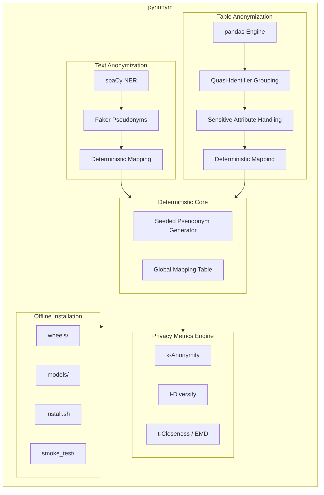
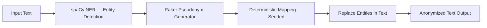
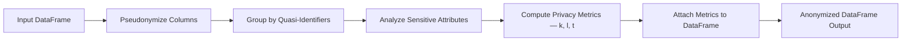
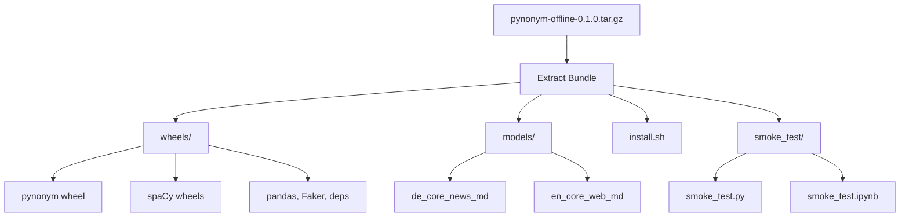
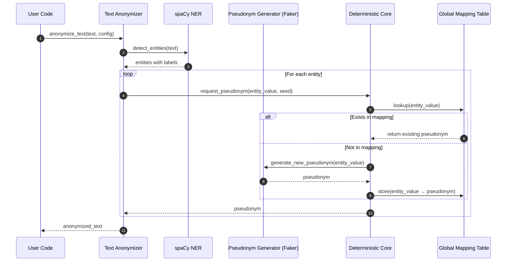
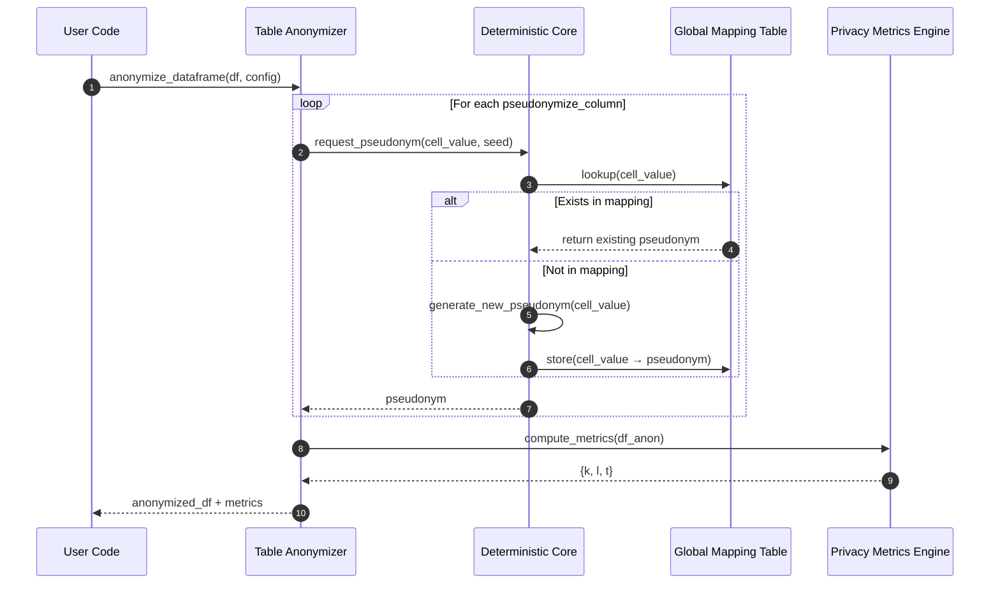
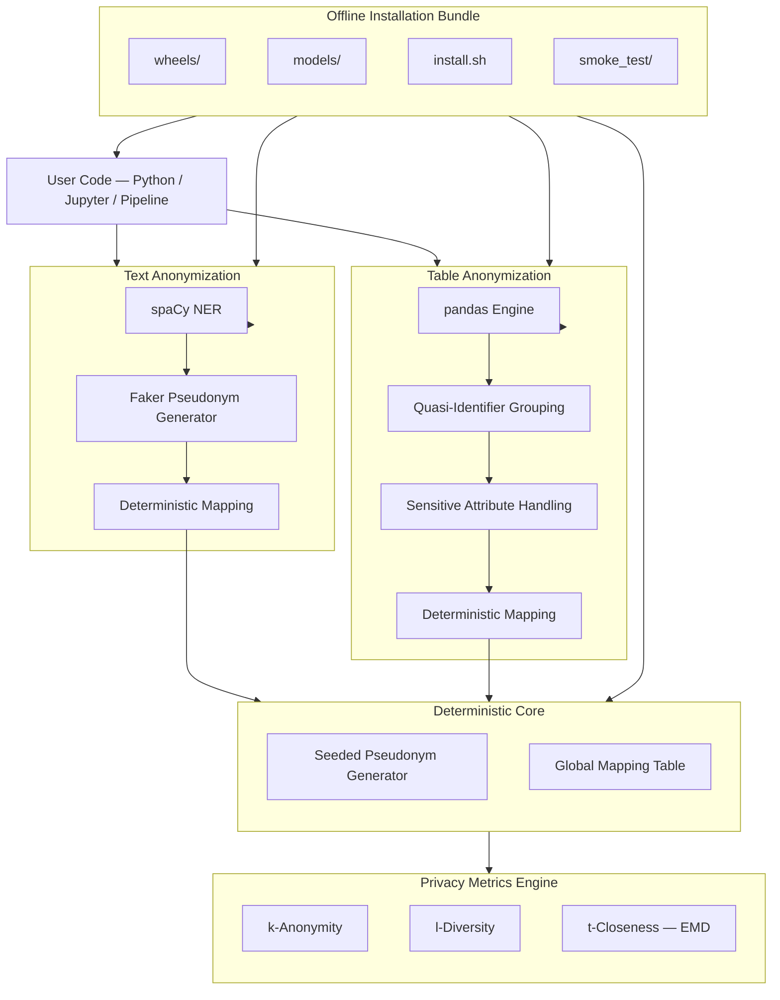
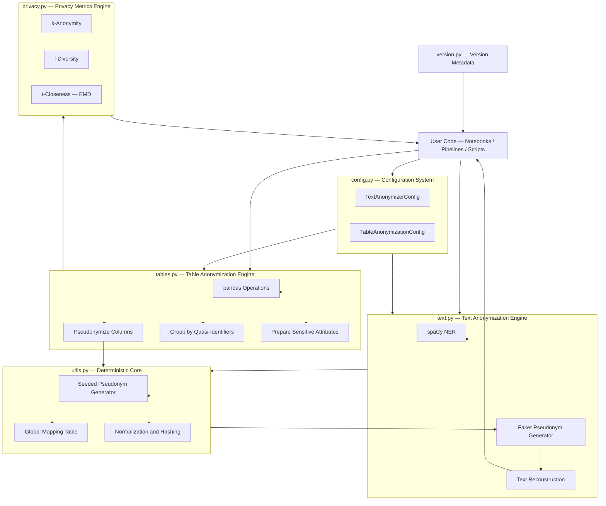

# 🧩 **pynonym — Privacy‑Preserving Text & Table Anonymization**  
### *Deterministic · Offline‑Capable · Windows & Linux Compatible · spaCy‑Powered*

---

# 1. 📘 **Overview**

Modern data projects operate under a constant and growing tension. On one hand, organizations need **realistic, high‑quality data** to build analytics pipelines, 
train machine‑learning models, validate hypotheses, and support operational decision‑making. On the other hand, they must **protect personal information** to comply with GDPR, 
internal governance rules, contractual obligations, and ethical expectations. This tension is not theoretical — it is a daily operational challenge for data science teams, privacy engineers, and IT departments.

The problem is compounded by the fact that most anonymization tools available today fall into one of three categories, each with significant limitations:

- **Opaque black‑box SaaS platforms**, which cannot be used in regulated or air‑gapped environments and offer little transparency into how anonymization is performed.  
- **Fragile open‑source libraries**, which break when pandas, spaCy, or Python versions change, or which rely on native extensions that fail on Windows.  
- **Inflexible Linux‑only tools**, which assume internet access, require system‑level dependencies, or cannot be deployed in offline environments.

This landscape leaves a substantial gap: teams need a **transparent, deterministic, cross‑platform anonymization toolkit** that works reliably in both online and offline environments, integrates 
cleanly into modern data workflows, and provides reproducible, auditable results.

`pynonym` was created to address exactly this gap.

It is a **deterministic, production‑ready anonymization engine** designed for:

- **Text anonymization** (NER‑based, spaCy‑driven)  
- **Table anonymization** (pseudonymization + privacy metrics)  
- **Offline environments** (air‑gapped Linux, Windows)  
- **Reproducible pipelines** (seed‑based determinism)  
- **Enterprise‑grade workflows** (auditable, consistent, stable)

Unlike many anonymization tools that focus on a single modality or rely on proprietary logic, `pynonym` provides a **unified, transparent, and extensible approach** to anonymizing both unstructured text and 
structured tabular data. It is built entirely in Python, with no native dependencies, making it portable across platforms and easy to maintain (see [References](https://github.com/NenadBalaneskovic/ExternalProjects/blob/main/PynonymReleaseProject/PynonymReleaseProject.md#18--references) 1 - 3 below).

## 1.1. 🔍 **Motivation: Why `pynonym` Exists**

A key motivation behind `pynonym` is to **go beyond** the capabilities of the existing PyPI package `anonym`. The original `anonym` package provides only a minimal text anonymization function and includes 
documentation for APIs that do not exist in the published version. This mismatch between documentation and implementation makes it unsuitable for production use, especially in regulated 
environments where reproducibility and auditability are essential.

`pynonym` was designed to solve these problems by offering:

- a **clean, well‑defined API** that actually matches the installed version,  
- robust support for **both Windows and Linux**,  
- the ability to work **online (PyPI)** and **offline (tar.gz + wheels)**,  
- deterministic behavior through **seed‑controlled pseudonymization**,  
- and a **customized, maintainable release** that can be integrated into real production pipelines.

Where `anonym` is limited to a single text function and an outdated, non‑working API example, `pynonym` provides:

- robust **text anonymization** using spaCy for entity detection and Faker for pseudonym generation,  
- full **table anonymization** with pseudonymization, quasi‑identifier grouping, and sensitive attribute handling,  
- a **pure‑Python privacy metrics engine** (k‑anonymity, l‑diversity, t‑closeness),  
- and a **validated offline bundle** that runs identically on Windows and Linux.

This makes `pynonym` not just a replacement for `anonym`, but a **significant upgrade** — a tool designed for real‑world data engineering and privacy workflows.

## 1.2. 🧠 **Methodology: How `pynonym` Approaches Anonymization**

`pynonym` is built on three methodological pillars:

### **1. Deterministic Pseudonymization**

Determinism is essential for reproducibility. If the same input appears multiple times — across rows, across datasets, or across sessions — it must always map to the same pseudonym. This ensures:

- consistent anonymization across time,  
- reproducible ML experiments,  
- stable downstream analytics,  
- and auditability for compliance teams.

`pynonym` achieves this through a **global mapping table** and a **seed‑controlled pseudonym generator**. This guarantees that pseudonyms are stable, predictable, and reproducible.

### **2. Transparent, Inspectable Logic**

Many anonymization tools hide their logic behind proprietary algorithms or undocumented heuristics. `pynonym` takes the opposite approach:

- all logic is implemented in **pure Python**,  
- all transformations are **inspectable**,  
- all pseudonyms are **traceable**,  
- and all privacy metrics are **computed explicitly**.

This transparency is essential for regulated industries, internal audits, and reproducibility.

### **3. Cross‑Platform, Offline‑First Design**

Most modern data teams work across heterogeneous environments:

- Windows laptops for development,  
- Linux servers for production,  
- JupyterHub clusters for analytics,  
- air‑gapped systems for sensitive data.

`pynonym` is designed to work **identically** across all of these environments. The offline bundle includes:

- all required wheels,  
- spaCy models packaged as wheels,  
- an installation script,  
- and smoke tests.

This ensures that the entire system can be deployed without internet access — a requirement in many enterprise settings.

## 1.3. 🧩 **Purpose: What `pynonym` Is Designed to Achieve**

The purpose of `pynonym` is threefold:

### **1. Provide a reliable, deterministic anonymization toolkit**

Many anonymization tools produce inconsistent results or rely on randomness. `pynonym` ensures that anonymization is:

- deterministic,  
- reproducible,  
- auditable,  
- and stable across versions.

This makes it suitable for long‑term data pipelines and regulatory compliance.

### **2. Support real‑world enterprise environments**

`pynonym` is designed for environments where:

- internet access is restricted,  
- Windows compatibility is required,  
- reproducibility is essential,  
- and auditability is non‑negotiable.

The offline bundle and pure‑Python design make it uniquely suited for these contexts.

### **3. Offer a maintainable, extensible alternative to `anonym`**

`pynonym` is not a fork — it is a **replacement** that:

- fixes the limitations of `anonym`,  
- provides a working, documented API,  
- supports both text and table anonymization,  
- and includes privacy metrics.

It is designed to be extended, maintained, and integrated into larger systems.

## 1.4. 🧰 **Usefulness: Why Teams Choose `pynonym`**

`pynonym` is useful because it solves real problems that data teams face every day.

### **1. It anonymizes both text and tables**

Most tools focus on one or the other. `pynonym` handles both:

- unstructured text (via spaCy NER),  
- structured tables (via pandas),  
- privacy metrics (via pure Python).

This makes it a unified solution for diverse datasets.

### **2. It works offline**

Many organizations cannot install spaCy or pandas online due to:

- firewalls,  
- proxy restrictions,  
- air‑gapped systems,  
- or security policies.

`pynonym` provides a complete offline bundle that installs everything — including spaCy models — without internet access.

### **3. It is deterministic**

This is essential for:

- reproducible ML pipelines,  
- consistent pseudonymization across datasets,  
- auditability,  
- and debugging.

### **4. It is cross‑platform**

`pynonym` works on:

- Windows,  
- Linux,  
- macOS (online),  
- JupyterHub,  
- air‑gapped servers.

This flexibility is rare among anonymization tools.

### **5. It is transparent and inspectable**

No black boxes. No hidden logic. No proprietary algorithms.

Everything is:

- open,  
- inspectable,  
- reproducible,  
- and testable.

### **6. It includes smoke tests**

The smoke tests validate:

- spaCy model loading,  
- text anonymization,  
- table anonymization,  
- privacy metrics,  
- determinism.

This ensures that deployments are correct and stable.

## 1.6. 🧭 **Designed For Real Teams**

`pynonym` is designed for:

- **Data science teams** who need reproducible anonymization for ML pipelines.  
- **Privacy engineering teams** who need deterministic, auditable transformations.  
- **Healthcare, finance, and insurance** organizations with strict compliance requirements.  
- **Air‑gapped environments** where internet access is impossible.  
- **JupyterHub deployments** where reproducibility and cross‑platform behavior matter.

In short: `pynonym` is a **transparent, deterministic, cross‑platform anonymization toolkit** that you can actually ship, audit, and reproduce.

---

# 2. ⭐ **Key Features**

### 🔐 **1. Deterministic Text Anonymization**

`pynonym` provides a robust, enterprise‑grade text anonymization pipeline built on top of **spaCy’s NER engine** and **Faker’s pseudonym generators**. 
Unlike simplistic redaction tools or non‑deterministic pseudonymizers, `pynonym` ensures that text anonymization is:

- **accurate**, thanks to spaCy’s mature NER models  
- **realistic**, through Faker‑generated replacements that preserve semantic plausibility  
- **deterministic**, via seed‑controlled pseudonym generation  
- **consistent**, using a global mapping table across sessions and datasets  
- **bilingual**, supporting both **German** and **English** out of the box  

This makes `pynonym` a **drop‑in upgrade** over the minimal `anonym` text functionality. Where `anonym` offers only a single function with no configuration, `pynonym` provides 
a configurable, reproducible, and auditable text anonymization engine suitable for real‑world data pipelines.

### 📊 **2. Table Anonymization**

Structured data often contains the most sensitive information — names, addresses, IDs, diagnoses, financial attributes, and more. `pynonym` includes a **full table 
anonymization engine** built on pandas, designed for real analytics workflows rather than toy examples.

It supports:

- **Pseudonymization of selected columns**  
  (e.g., names, customer IDs, employee numbers)  
- **Quasi‑identifier grouping**  
  to evaluate privacy risk across demographic or categorical clusters  
- **Sensitive attribute handling**  
  for downstream privacy metrics  
- **Deterministic pseudonymization**  
  ensuring stable replacements across datasets  
- **Automatic privacy metric computation**  
  attached directly to the anonymized DataFrame  

This makes `pynonym` suitable for:

- GDPR‑compliant preprocessing  
- ML model training on anonymized data  
- cross‑dataset consistency checks  
- reproducible ETL pipelines  
- privacy engineering workflows  

Unlike many anonymization libraries, `pynonym` treats table anonymization as a **first‑class citizen**, not an afterthought.

### 🧮 **3. Privacy Metrics (Pure Python)**

Privacy metrics are essential for evaluating whether anonymized data meets internal or regulatory thresholds. `pynonym` includes a **pure‑Python privacy metrics engine**, 
ensuring compatibility with Windows, Linux, and offline environments.

It computes:

- **k‑Anonymity**  
  Ensures each quasi‑identifier group contains at least *k* records.  
- **l‑Diversity**  
  Ensures each group contains at least *l* distinct sensitive values.  
- **t‑Closeness** (Earth‑Mover‑Distance)  
  Ensures group‑level distributions do not deviate too far from the global distribution.

Key advantages:

- 100% Windows‑compatible  
- No C‑extensions  
- No native libraries  
- No pycanon dependency  
- Fully inspectable and auditable  

This makes the privacy engine ideal for **regulated environments**, where reproducibility, transparency, and cross‑platform stability are mandatory.

### 🧱 **4. Fully Offline‑Capable**

Many organizations operate in **air‑gapped** or **restricted** environments where internet access is not permitted. Installing spaCy, pandas, and their 
dependencies in such environments is notoriously difficult.

`pynonym` solves this with a **complete offline installation bundle**, including:

- all required wheels  
  (pynonym, spaCy, pandas, Faker, dependencies)  
- spaCy models packaged as wheels  
- a robust `install.sh` script  
- CLI and notebook smoke tests  

This enables:

- installation with **no internet or proxy**  
- deployment on **air‑gapped Linux servers**  
- reproducible environments across Windows and Linux  
- identical behavior between online and offline installations  

The offline bundle is not a workaround — it is a **core feature** designed for enterprise deployments.

### 🧪 **5. Smoke Tests Included**

To ensure that installations are correct and environments are fully functional, `pynonym` includes two comprehensive smoke tests:

- **CLI smoke test** (`smoke_test.py`)  
- **Notebook smoke test** (`smoke_test.ipynb`)

These tests verify:

- spaCy model loading  
- text anonymization  
- table anonymization  
- privacy metric computation  
- deterministic behavior (same seed → same output)  

These are not simple demos — they are **deployment validators**.  
If the smoke tests pass, your environment is correctly configured for `pynonym`, whether you installed it:

- online via PyPI,  
- offline via tar.gz,  
- on Windows,  
- on Linux,  
- or inside JupyterHub.

They provide confidence that the anonymization pipeline behaves **exactly as intended**, with no hidden dependencies or platform‑specific surprises.

---

# 3. 🏗️ **High‑Level Architecture**

`pynonym` is intentionally built as a **layered architecture**: each layer has a clear responsibility, minimal dependencies, and a well‑defined interface to 
the layers above and below it. This makes the system easier to reason about, test, and extend—especially in regulated or long‑lived environments.

```text
+-----------------------------------------------------------+
|                       pynonym                             |
|-----------------------------------------------------------|
|  Text Anonymization     |   Table Anonymization           |
|  (spaCy + Faker)        |   (pandas + privacy metrics)    |
+-----------------------------------------------------------+
|                 Privacy Metrics Engine                    |
|     (k-anonymity, l-diversity, t-closeness, pure Python) |
+-----------------------------------------------------------+
|                     Deterministic Core                    |
|                 (seeded pseudonym generator)              |
+-----------------------------------------------------------+
|                     Offline Installation                  |
|      (wheels/, models/, install.sh, smoke_test/)          |
+-----------------------------------------------------------+
```

### 🔝 Top Layer: Text & Table Anonymization

At the top of the stack is what most users interact with:

- **Text Anonymization**  
  Uses **spaCy** to detect entities (persons, locations, organizations, etc.) and **Faker** to generate realistic pseudonyms. This layer exposes functions like 
  `anonymize_text`, which take raw text and a configuration object and return anonymized text. It hides all the complexity of NER, pseudonym generation, and 
  mapping management behind a clean, documented API.

- **Table Anonymization**  
  Built on **pandas**, this layer operates on DataFrames. It handles:
  - pseudonymization of selected columns,  
  - grouping by quasi‑identifiers,  
  - attaching privacy metrics to the resulting DataFrame.  
  Functions like `anonymize_dataframe` live here, providing a high‑level interface for structured data.

These two sub‑systems are **peers**: they both rely on the same deterministic core and, in the case of tables, on the privacy metrics engine.

### 🧮 Middle Layer: Privacy Metrics Engine

Beneath the anonymization layer sits the **Privacy Metrics Engine**, implemented in pure Python. Its responsibilities are:

- computing **k‑anonymity**,  
- computing **l‑diversity**,  
- computing **t‑closeness** (via Earth‑Mover‑Distance),  
- attaching these metrics to anonymized DataFrames (e.g., via `df_anon.attrs`).

This layer is **decoupled** from the specific anonymization logic: it doesn’t care how pseudonyms are generated, only about the resulting distributions of quasi‑identifiers 
and sensitive attributes. That separation makes it easier to:

- test the metrics independently,  
- extend them with new measures,  
- reuse them in other contexts if needed.

Because it is pure Python, it works identically on Windows and Linux, online and offline.

### 🎯 Core Layer: Deterministic Engine

Below the metrics engine lies the **Deterministic Core**—the heart of `pynonym`.

This layer is responsible for:

- managing the **global mapping table** (original value → pseudonym),  
- ensuring **same input → same output** across:
  - rows,  
  - columns,  
  - DataFrames,  
  - sessions (given the same seed),  
- coordinating **seed‑controlled pseudonym generation**.

Both the text and table anonymization layers call into this core whenever they need a pseudonym. This guarantees that:

- a person’s name anonymized in text and in a table will map to the same pseudonym,  
- repeated occurrences of the same value remain consistent,  
- anonymization is reproducible across runs.

This is the layer that turns `pynonym` from “just another anonymizer” into a **deterministic, auditable system**.

### 📦 Bottom Layer: Offline Installation & Deployment

The lowest layer is not about anonymization logic at all—it’s about **how the system gets onto the machine**:

- `wheels/` contains all Python wheels (pynonym, spaCy, pandas, Faker, dependencies).  
- `models/` contains spaCy model wheels (e.g., `de_core_news_md`, `en_core_web_md`).  
- `install.sh` orchestrates a fully offline installation using `pip --no-index`.  
- `smoke_test/` contains CLI and notebook tests to validate the environment.

This layer ensures that the **entire stack above it** can run:

- without internet access,  
- on air‑gapped Linux servers,  
- with consistent behavior across environments.

In other words, the offline installation layer is what makes the architecture **deployable in the real world**—not just on a developer laptop with full 
internet access, but also in tightly controlled production environments.

Taken together, these layers form a coherent system:

- the **offline layer** guarantees you can install it anywhere,  
- the **deterministic core** guarantees reproducibility and consistency,  
- the **privacy metrics engine** guarantees measurable privacy properties,  
- and the **text/table anonymization layer** gives you a clean, high‑level API for real workloads.

---

# 4. 🧩 **Component Overview**

| Component | Description |
|----------|-------------|
| **text.py** | spaCy‑powered NER anonymization |
| **tables.py** | DataFrame anonymization engine |
| **privacy.py** | Pure‑Python privacy metrics |
| **utils.py** | Deterministic pseudonym generator |
| **config.py** | Unified configuration system |
| **offline bundle** | Wheels + models + installer |
| **smoke tests** | CLI + Jupyter validation |

---

# 5. 🌍 **Supported Platforms**

| Platform | Supported | Notes |
|----------|-----------|-------|
| **Windows 10/11** | ✔ | Full functionality |
| **Linux (Ubuntu, RHEL, SUSE)** | ✔ | Fully offline‑capable |
| **macOS** | ✔ | Online installation only |
| **Air‑gapped servers** | ✔ | Via offline bundle |

---

# 6. 🧭 **Use Cases**

### 🏥 Healthcare  
- Patient data anonymization  
- Clinical text redaction  
- GDPR‑compliant preprocessing  

### 💼 Insurance  
- Claims anonymization  
- Fraud detection preprocessing  

### 🏦 Banking  
- Customer data pseudonymization  
- Risk model preprocessing  

### 🧪 Data Science  
- Reproducible experiments  
- Deterministic anonymization pipelines  

### 🧱 Air‑Gapped Environments  
- No internet required  
- Fully self‑contained installation  

---

# 7. ⚡ **Quickstart Summary**

The following two snippets show the **essence of `pynonym`** in practice:  
one for **text anonymization**, one for **table anonymization**.  
They are intentionally minimal, but already fully deterministic and production‑grade.

### 📝 Text anonymization in one call

```python
from pynonym.text import anonymize_text
from pynonym import TextAnonymizerConfig

cfg = TextAnonymizerConfig(language="de", seed=42)
text = "Angela Merkel traf Olaf Scholz in Berlin."

anon = anonymize_text(text, config=cfg)
print(anon)
```

**What this does:**

- **`TextAnonymizerConfig`** defines how text should be anonymized:
  - `language="de"` tells `pynonym` to use the German spaCy model (`de_core_news_md`).
  - `seed=42` ensures **deterministic pseudonyms**: same input, same output, every time.
- **`anonymize_text(...)`**:
  - runs spaCy NER over the input text,
  - detects entities like persons and locations,
  - replaces them with **realistic Faker pseudonyms**,
  - uses the deterministic core so that repeated names map to the same pseudonym.

Result: you get a **natural‑looking, anonymized sentence** that preserves structure and meaning, but no longer contains real identities—perfect for demos, 
notebooks, and ML experiments.

### 📊 Table anonymization with privacy context

```python
from pynonym.tables import anonymize_dataframe, TableAnonymizationConfig

cfg = TableAnonymizationConfig(
    pseudonymize_columns=["Name"],
    quasi_identifiers=["Stadt"],
    sensitive_attributes=["Diagnose"],
    seed=42
)

df_anon = anonymize_dataframe(df, config=cfg)
df_anon
```

**What this does:**

- **`TableAnonymizationConfig`** defines how a DataFrame should be anonymized:
  - `pseudonymize_columns=["Name"]`  
    → columns whose values will be replaced by deterministic pseudonyms.
  - `quasi_identifiers=["Stadt"]`  
    → columns used to form groups for privacy metrics (e.g., city‑based groups).
  - `sensitive_attributes=["Diagnose"]`  
    → columns whose distributions are analyzed for l‑diversity and t‑closeness.
  - `seed=42`  
    → again, ensures deterministic behavior across runs and datasets.
- **`anonymize_dataframe(df, config=cfg)`**:
  - pseudonymizes the `Name` column using the same deterministic core as text anonymization,
  - groups rows by `Stadt` to compute privacy metrics,
  - analyzes `Diagnose` as a sensitive attribute,
  - returns an anonymized DataFrame **with privacy metrics attached** in `df_anon.attrs`.

Result: you get a **pseudonymized DataFrame** that is safe to use for analytics, plus **quantitative privacy indicators** (k‑anonymity, l‑diversity, t‑closeness) 
that tell you how strong the anonymization is.

In practice, these two snippets are enough to:

- anonymize free‑text fields,
- anonymize structured tables,
- keep everything **deterministic and auditable**,
- and integrate `pynonym` into existing pandas + spaCy workflows with minimal friction.

---

# 8. **Mermaid diagrams**

## 🖼️ **8.1. Architecture Diagram**  



## 🖼️ **8.2. Text Anonymization Flow**  


## 🖼️ **8.3. Table Anonymization Flow**  


## 🖼️ **8.4. Offline Bundle Structure**  


## 🧬 **8.5. Deterministic Engine — Sequence Diagram (Text Anonymization)**

This diagram shows how text anonymization interacts with the deterministic core.



## 🧬 **8.6. Deterministic Engine — Sequence Diagram (Table Anonymization)**

This diagram shows how table anonymization uses the deterministic core for pseudonymization and then computes privacy metrics.



## 🌐 **8.7. Combined System Overview Diagram**

This diagram shows the entire system — text engine, table engine, deterministic core, privacy metrics, and offline installation — in one integrated view.



---

# 9. 🧱 System architecture diagram (ASCII)

```text
                         +-----------------------+
                         |      User Code        |
                         +-----------+-----------+
                                     |
                                     v
+-----------------------------------------------------------------------+
|                               pynonym                                |
|-----------------------------------------------------------------------|
|  +-------------------+   +-------------------+   +------------------+ |
|  | Text Engine       |   | Table Engine      |   | Privacy Metrics  | |
|  | (spaCy + Faker)   |   | (pandas)          |   | (pure Python)    | |
|  +-------------------+   +-------------------+   +------------------+ |
|            |                       |                      |           |
|            v                       v                      v           |
|  +-------------------+   +-------------------+   +------------------+ |
|  | Deterministic     |   | Config System     |   | Utils / Mapping  | |
|  | Seed Engine       |   | (YAML/objects)    |   | (global map)     | |
|  +-------------------+   +-------------------+   +------------------+ |
+-----------------------------------------------------------------------+
                                     |
                                     v
                         +-----------------------+
                         |   Offline Bundle      |
                         | (wheels + models)     |
                         +-----------------------+
```

This diagram shows how `pynonym` is structured as a **layered, modular system** between your code and the underlying installation bundle.

- **User Code**  
  At the top is your own Python code: notebooks, scripts, ETL jobs, or JupyterHub sessions. You only interact with `pynonym` through its public APIs (e.g. `anonymize_text`, 
  `anonymize_dataframe`, config objects). Everything below is implementation detail that you can rely on but don’t have to manage manually.

- **Top row inside `pynonym`: Engines**  
  This row contains the three main “feature engines”:
  - **Text Engine (spaCy + Faker):**  
    Handles unstructured text. It uses spaCy to detect entities (persons, locations, organizations, etc.) and Faker to generate realistic pseudonyms. This is where free‑text anonymization happens.
  - **Table Engine (pandas):**  
    Operates on DataFrames. It pseudonymizes selected columns, groups by quasi‑identifiers, and prepares data for privacy analysis. This is the structured‑data counterpart to the text engine.
  - **Privacy Metrics (pure Python):**  
    Computes k‑anonymity, l‑diversity, and t‑closeness on the anonymized tables. It is independent of spaCy and Faker and implemented in pure Python so it runs identically on Windows and Linux.

  These three engines are what you “see” as a user: they provide the high‑level functionality.

- **Second row inside `pynonym`: Core services**  
  Underneath the engines are the shared services that make everything deterministic and configurable:
  - **Deterministic Seed Engine:**  
    Centralizes all pseudonym generation. It manages seeds and ensures that the same input value always maps to the same pseudonym, across text and tables, across runs, as long as the seed is fixed.
  - **Config System (YAML/objects):**  
    Provides a structured way to define how anonymization should behave: which columns to pseudonymize, which language to use, what seed to choose, what thresholds to apply for privacy metrics, etc. 
	Configs can be created as Python objects or loaded from YAML/JSON.
  - **Utils / Mapping (global map):**  
    Maintains the global mapping table (original value → pseudonym). Both the text and table engines call into this layer so that pseudonyms are consistent everywhere. This is the backbone of 
	determinism and cross‑dataset consistency.

  Together, these components form the **internal infrastructure** that the engines rely on.

- **Offline Bundle (wheels + models)**  
  At the bottom is the **deployment layer**. The offline bundle contains:
  - all Python wheels (`pynonym`, spaCy, pandas, Faker, dependencies),
  - spaCy model wheels (e.g. `de_core_news_md`, `en_core_web_md`),
  - plus installer and smoke tests (as described elsewhere in the doc).

  This layer is what makes the entire stack above **installable in air‑gapped environments**. Once the bundle is installed, the upper layers behave the same as in an online PyPI installation.

In short, our **User Code** talks to the **Engines**, which rely on the **Core services** (deterministic seed engine, config system, global mapping), all of which sit on top of a 
**portable offline bundle** that guarantees consistent installation across Windows and Linux, online and offline.

---

# 10. 🛠️ **Installation & Setup**

This section describes how to install `pynonym` on:

- **Windows (online)**
- **Linux (offline, air‑gapped)**
- **JupyterHub environments**
- **Conda environments**

It also includes:

- the **complete offline bundle structure**
- the **install.sh** script
- the **smoke tests** (CLI + Notebook)
- determinism & consistency guarantees

## 🪟 **10.1. Windows installation (online)**

Windows supports a **straightforward, fully online installation** of `pynonym` via PyPI.  
This path is ideal for local development, prototyping, and Jupyter‑based workflows where internet access is available.

The goal of this section is to get you to a state where:

- `pynonym` is installed in an **isolated virtual environment**,  
- **spaCy** and its **German/English models** are available,  
- and you have **verified** that the models load correctly.

### ** 1. Create a virtual environment**

Creating a virtual environment keeps `pynonym` and its dependencies **isolated** from your system Python and from other projects. 
This avoids version conflicts (e.g. different pandas or spaCy versions) and makes your setup reproducible.

```powershell
python -m venv venv
venv\Scripts\activate
```

- `python -m venv venv`  
  - Creates a new virtual environment in the `venv` directory.  
  - You can choose a different name (e.g. `.venv`, `pynonym-env`) if you prefer.

- `venv\Scripts\activate`  
  - Activates the virtual environment for the current PowerShell session.  
  - After activation, `python` and `pip` refer to the environment inside `venv`, not the global installation.

You should see a prefix like `(venv)` in your terminal prompt, indicating that the environment is active.

### ** 2. Install pynonym, spaCy, pandas, Faker, and language models**

Next, install `pynonym` and its core dependencies from PyPI, plus the spaCy language models used for text anonymization.

```powershell
pip install pynonym spacy pandas Faker
python -m spacy download de_core_news_md
python -m spacy download en_core_web_md
```

- `pip install pynonym spacy pandas Faker`  
  - Installs:
    - `pynonym` — the anonymization engine,  
    - `spacy` — for NER‑based text anonymization,  
    - `pandas` — for table anonymization,  
    - `Faker` — for realistic pseudonym generation.  
  - All of these are installed **inside the virtual environment**.

- `python -m spacy download de_core_news_md`  
  - Downloads and installs the **German** spaCy model.  
  - This model is used when you configure `language="de"` in `TextAnonymizerConfig`.

- `python -m spacy download en_core_web_md`  
  - Downloads and installs the **English** spaCy model.  
  - This model is used when you configure `language="en"`.

After these commands, your environment has everything needed for:

- German and English text anonymization,  
- table anonymization with pandas,  
- deterministic pseudonymization with Faker.

### **3. Test installation**

Finally, verify that spaCy and the installed model work correctly.  
This is a **sanity check** to ensure that:

- the model is installed,  
- spaCy can find and load it,  
- and the environment is consistent.

```powershell
python - << 'EOF'
import spacy
nlp = spacy.load("de_core_news_md")
print("spaCy model loaded:", nlp.meta["name"])
EOF
```

What this does:

- Starts a short inline Python session from PowerShell.  
- Imports `spacy`.  
- Calls `spacy.load("de_core_news_md")` to load the German model.  
- Prints the model name from `nlp.meta["name"]`.

If everything is installed correctly, you should see output similar to:

```text
spaCy model loaded: de_core_news_md
```

At this point:

- our **Windows environment is ready**,  
- `pynonym`, spaCy, pandas, and Faker are installed,  
- German and English models are available,  
- and you can immediately run the **Quickstart** examples for text and table anonymization inside this virtual environment.

## 🐧 **10.2. Linux installation (offline, air‑gapped)**

Many Linux servers—especially in regulated environments (healthcare, finance, government, internal research clusters)—are **air‑gapped** or heavily restricted:

- no internet  
- no direct PyPI access  
- no outbound proxy  
- strict change‑management and security policies  

In such environments, a normal `pip install` from PyPI is simply not possible.  
To make `pynonym` usable there, the project provides a **complete offline installation bundle** that contains:

- all required Python wheels,  
- all spaCy model wheels,  
- an installation script,  
- and smoke tests to validate the setup.

The idea is: you **prepare the bundle once** in a connected environment, then **transfer it as a single tar.gz** to the air‑gapped server 
(via USB, secure copy, etc.), and install everything locally without any network access.

### 📦 10.2.1. **Offline bundle structure**

```text
pynonym-offline-0.1.0/
│
├── install.sh
├── README_OFFLINE.md
│
├── wheels/
│   ├── pynonym-0.1.0-py3-none-any.whl
│   ├── spacy-3.8.14-*.whl
│   ├── thinc-*.whl
│   ├── cymem-*.whl
│   ├── murmurhash-*.whl
│   ├── preshed-*.whl
│   ├── srsly-*.whl
│   ├── blis-*.whl
│   ├── catalogue-*.whl
│   ├── wasabi-*.whl
│   ├── typer-*.whl
│   ├── pydantic-*.whl
│   ├── pydantic_core-*.whl
│   ├── numpy-*.whl
│   ├── pandas-*.whl
│   ├── python_dateutil-*.whl
│   ├── pytz-*.whl
│   ├── smart_open-*.whl
│   ├── requests-*.whl
│   ├── charset_normalizer-*.whl
│   ├── six-*.whl
│   ├── Faker-*.whl
│   └── (all remaining dependencies)
│
├── models/
│   ├── de_core_news_md-3.8.0-py3-none-any.whl
│   └── en_core_web_md-3.8.0-py3-none-any.whl
│
└── smoke_test/
    ├── smoke_test.py
    └── smoke_test.ipynb
```

**What each part is for:**

- **`install.sh`**  
  A self‑contained installer script that uses `pip --no-index` to install everything from the local `wheels/` and `models/` directories. This is the entry point for the offline installation.

- **`README_OFFLINE.md`**  
  A short, environment‑focused guide explaining how to run `install.sh`, how to activate environments, and how to execute the smoke tests. It’s meant for admins/operators on the target system.

- **`wheels/`**  
  Contains all Python wheels required to run `pynonym`:
  - `pynonym-0.1.0-py3-none-any.whl` — the library itself,  
  - `spacy-3.8.14-*.whl` and its core dependencies (`thinc`, `cymem`, `murmurhash`, `preshed`, `srsly`, `blis`, `catalogue`, `wasabi`, `typer`),  
  - `pydantic`, `pydantic_core`, `numpy`, `pandas`, and their dependencies,  
  - `Faker` and its dependencies,  
  - plus all remaining wheels needed to make the environment self‑contained.

  This directory is effectively a **local mini‑PyPI** for `pip --no-index`.

- **`models/`**  
  Contains the spaCy language models as wheels:
  - `de_core_news_md-3.8.0-py3-none-any.whl` — German model,  
  - `en_core_web_md-3.8.0-py3-none-any.whl` — English model.

  Installing them from wheels avoids any network calls to spaCy’s model servers.

- **`smoke_test/`**  
  Contains:
  - `smoke_test.py` — a CLI smoke test script,  
  - `smoke_test.ipynb` — a Jupyter notebook version of the same test.

  These validate that the installation is correct and that `pynonym` works end‑to‑end in the offline environment.

### 🧩 10.2.2. **`install.sh` (complete offline installer)**

```bash
#!/bin/bash
set -e

echo "==============================================="
echo " Offline installation of pynonym 0.1.0"
echo "==============================================="

# 1. Check if pip exists
if ! command -v pip &> /dev/null
then
    echo "Error: pip not found."
    exit 1
fi

echo "[1/3] Installing Python wheels (pynonym, spaCy, pandas, Faker, dependencies)..."
pip install --no-index --find-links=./wheels ./wheels/*.whl

echo "[2/3] Installing spaCy models..."
pip install --no-index --find-links=./models ./models/*.whl

echo "[3/3] Testing spaCy model..."
python3 - << 'EOF'
import spacy
nlp = spacy.load("de_core_news_md")
print("spaCy model successfully loaded:", nlp.meta["name"])
EOF

echo "==============================================="
echo " Installation complete!"
echo "==============================================="
```

**What this script does, step by step:**

- `set -e`  
  Ensures the script **exits immediately** if any command fails. This prevents partial or inconsistent installations.

- **Check for `pip`**  
  ```bash
  if ! command -v pip &> /dev/null
  ```
  Verifies that `pip` is available in the current environment. If not, the script aborts with a clear error message.  
  (In many setups, you might use `python3 -m pip` instead; this script assumes `pip` is on `PATH`.)

- **Step 1: Install all Python wheels**  
  ```bash
  pip install --no-index --find-links=./wheels ./wheels/*.whl
  ```
  - `--no-index` tells `pip` **not** to contact PyPI or any external index.  
  - `--find-links=./wheels` tells `pip` to treat `./wheels` as the only source of packages.  
  - `./wheels/*.whl` installs all wheels in that directory.  
  This installs `pynonym`, spaCy, pandas, Faker, and all their dependencies **entirely from local files**.

- **Step 2: Install spaCy models**  
  ```bash
  pip install --no-index --find-links=./models ./models/*.whl
  ```
  Same pattern, but for the `models/` directory. This installs the German and English spaCy models without any network access.

- **Step 3: Test spaCy model loading**  
  ```bash
  python3 - << 'EOF'
  import spacy
  nlp = spacy.load("de_core_news_md")
  print("spaCy model successfully loaded:", nlp.meta["name"])
  EOF
  ```
  Runs a short inline Python script to:
  - import spaCy,  
  - load the German model,  
  - print its name.  

  If this step succeeds, you know:
  - spaCy is installed,  
  - the model is installed,  
  - the environment can load it correctly.

- Final message:  
  Confirms that the offline installation completed successfully.

### 🚀 10.2.3. **Offline installation workflow (Linux)**

Once you have the `pynonym-offline-0.1.0.tar.gz` bundle (prepared in a connected environment), the typical workflow on the air‑gapped Linux server looks like this:

#### **1. Upload and extract the bundle**

```bash
tar -xzvf pynonym-offline-0.1.0.tar.gz
cd pynonym-offline-0.1.0
chmod +x install.sh
./install.sh
```

- `tar -xzvf ...`  
  Extracts the bundle into a directory `pynonym-offline-0.1.0/`.

- `cd pynonym-offline-0.1.0`  
  Enters the extracted directory.

- `chmod +x install.sh`  
  Ensures the installer script is executable.

- `./install.sh`  
  Runs the offline installer described above.  
  This step installs all wheels and models into the **current Python environment** (e.g. system Python, venv, conda env—depending on how you invoke `pip`).

After this, `pynonym`, spaCy, pandas, Faker, and the models are all available **locally**.

#### **2. Run the smoke test**

```bash
python3.12 smoke_test.py
```

(or `python3 smoke_test.py`, depending on your environment)

The smoke test script performs an **end‑to‑end validation**:

- imports `pynonym`, pandas, spaCy, etc.  
- loads the spaCy model,  
- runs a text anonymization example,  
- runs a table anonymization example,  
- computes privacy metrics,  
- checks determinism (same seed → same output).

**Expected output (conceptually):**

- Imports successful  
- spaCy model loaded  
- Text anonymized  
- Table anonymized  
- Privacy metrics computed  
- Determinism: True  
- Smoke test complete  

If you see this sequence, you can be confident that:

- the offline installation worked,  
- all dependencies are present,  
- spaCy models are functional,  
- and `pynonym` behaves as intended in your air‑gapped Linux environment.

### 🧪 10.2.4. CLI smoke tests

The CLI smoke test is our **one‑shot health check** for a `pynonym` installation—especially valuable on air‑gapped 
Linux servers or freshly set‑up Windows environments.  
Its purpose is not to be exhaustive, but to answer a very practical question:

> “Can this environment actually run `pynonym` end‑to‑end, with spaCy, models, tables, metrics, and determinism working as expected?”

`smoke_test.py` validates:

- **spaCy model loading** — models are installed and discoverable  
- **text anonymization** — spaCy + Faker + deterministic core work together  
- **table anonymization** — pandas + deterministic pseudonymization work on DataFrames  
- **privacy metrics** — k‑anonymity, l‑diversity, t‑closeness are computed and attached  
- **determinism** — same input + same seed → same output

Here is the full script:

```python
import pandas as pd
import pynonym
from pynonym import TextAnonymizerConfig, TableAnonymizationConfig
from pynonym.text import anonymize_text
from pynonym.tables import anonymize_dataframe

print("=== 1. Imports successful ===")

# 2. spaCy Test
import spacy
nlp = spacy.load("de_core_news_md")
print("spaCy model loaded:", nlp.meta["name"])

# 3. Text Anonymization
cfg = TextAnonymizerConfig(language="de", seed=42)
text = "Angela Merkel traf Olaf Scholz in Berlin."
anon = anonymize_text(text, config=cfg)

print("\n=== 2. Text Anonymization ===")
print("Original:", text)
print("Anonymized:", anon)

# 4. Table Anonymization
df = pd.DataFrame({
    "Name": ["Angela Merkel", "Olaf Scholz", "Karl Lauterbach"],
    "Stadt": ["Berlin", "Hamburg", "Köln"],
    "Diagnose": ["A", "B", "A"]
})

tcfg = TableAnonymizationConfig(
    pseudonymize_columns=["Name"],
    quasi_identifiers=["Stadt"],
    sensitive_attributes=["Diagnose"],
    seed=42,
    k=2,
    l=1,
    t=0.5
)

df_anon = anonymize_dataframe(df, config=tcfg)

print("\n=== 3. Table Anonymization ===")
print("Original DF:")
print(df)
print("\nAnonymized DF:")
print(df_anon)

# 5. Privacy Metrics
print("\n=== 4. Privacy Metrics ===")
print(df_anon.attrs)

# 6. Determinism
cfg2 = TextAnonymizerConfig(language="de", seed=42)
anon2 = anonymize_text(text, config=cfg2)
print("\n=== 5. Determinism Test ===")
print("Deterministic:", anon == anon2)

print("\n=== Smoke test complete ===")
```

#### 10.2.4.1. Import check

```python
import pandas as pd
import pynonym
from pynonym import TextAnonymizerConfig, TableAnonymizationConfig
from pynonym.text import anonymize_text
from pynonym.tables import anonymize_dataframe

print("=== 1. Imports successful ===")
```

This first block verifies that:

- `pandas` is installed and importable,  
- `pynonym` itself is installed,  
- the config classes (`TextAnonymizerConfig`, `TableAnonymizationConfig`) are available,  
- the high‑level APIs (`anonymize_text`, `anonymize_dataframe`) can be imported.

If any of these imports fail, your installation is incomplete or broken.  
Seeing `=== 1. Imports successful ===` means the Python layer is intact.

#### 10.2.4.2. spaCy model test

```python
import spacy
nlp = spacy.load("de_core_news_md")
print("spaCy model loaded:", nlp.meta["name"])
```

This step checks:

- `spacy` is installed,  
- the **German model** `de_core_news_md` is installed,  
- spaCy can locate and load the model.

If this fails, your offline bundle or online installation is missing the model, or spaCy’s model paths are misconfigured.  
A successful run prints something like:

```text
spaCy model loaded: de_core_news_md
```

This is crucial because text anonymization depends on spaCy’s NER.

#### 10.2.4.3. Text anonymization

```python
cfg = TextAnonymizerConfig(language="de", seed=42)
text = "Angela Merkel traf Olaf Scholz in Berlin."
anon = anonymize_text(text, config=cfg)

print("\n=== 2. Text Anonymization ===")
print("Original:", text)
print("Anonymized:", anon)
```

Here you validate the **full text anonymization pipeline**:

- `TextAnonymizerConfig(language="de", seed=42)`  
  - selects the German spaCy model,  
  - sets the seed for deterministic pseudonymization.

- `anonymize_text(...)`  
  - runs spaCy NER on the input sentence,  
  - identifies entities like `Angela Merkel`, `Olaf Scholz`, `Berlin`,  
  - replaces them with Faker‑generated pseudonyms,  
  - uses the deterministic core so that the same names always map to the same pseudonyms.

The output should show:

- the original sentence,  
- an anonymized version with realistic but fake names/locations.

If this works, you know that:

- spaCy + models + Faker + deterministic core are wired correctly,  
- text anonymization is functional in this environment.

Additional tests are stored as:  

````python
# tests/test_text.py

import pytest

from pynonym import (
    anonymize_text,
    PynonymConfig,
)
from pynonym.utils import reset_global_state


# ---------------------------------------------------------
# Fixtures
# ---------------------------------------------------------

@pytest.fixture(autouse=True)
def reset_state():
    """
    Vor jedem Test globale Replacement-Map und Faker zurücksetzen.
    """
    reset_global_state()
    yield
    reset_global_state()


# ---------------------------------------------------------
# 1. Grundfunktionalität (Deutsch)
# ---------------------------------------------------------

def test_anonymize_text_german_basic():
    cfg = PynonymConfig(language="de", seed=42)
    text = "Angela Merkel traf Olaf Scholz in Berlin."

    result = anonymize_text(text, config=cfg)

    # Sollte nicht mehr die Originalnamen enthalten
    assert "Angela Merkel" not in result
    assert "Olaf Scholz" not in result
    assert "Berlin" not in result

    # Sollte Fake-Namen enthalten
    assert isinstance(result, str)
    assert len(result) > 0


# ---------------------------------------------------------
# 2. Grundfunktionalität (Englisch)
# ---------------------------------------------------------

def test_anonymize_text_english_basic():
    cfg = PynonymConfig(language="en", seed=42)
    text = "Barack Obama met Joe Biden in Washington."

    result = anonymize_text(text, config=cfg)

    assert "Barack Obama" not in result
    assert "Joe Biden" not in result
    assert "Washington" not in result


# ---------------------------------------------------------
# 3. Determinismus (Seed)
# ---------------------------------------------------------

def test_anonymize_text_deterministic():
    cfg = PynonymConfig(language="de", seed=123)

    text = "Angela Merkel traf Olaf Scholz."

    r1 = anonymize_text(text, config=cfg)
    reset_global_state()
    r2 = anonymize_text(text, config=cfg)

    assert r1 == r2


# ---------------------------------------------------------
# 4. Globale Replacement-Map (Konsistenz)
# ---------------------------------------------------------

def test_global_replacement_consistency():
    cfg = PynonymConfig(language="de", seed=42)

    text1 = "Angela Merkel traf Olaf Scholz."
    text2 = "Merkel und Scholz sind Politiker."

    r1 = anonymize_text(text1, config=cfg)
    r2 = anonymize_text(text2, config=cfg)

    # Beide Texte müssen dieselben Fake-Namen verwenden
    # Beispiel: "Claudia Fischer" für Merkel
    fake_name = None
    for token in r1.split():
        if token not in text1:
            fake_name = token
            break

    assert fake_name is not None
    assert fake_name in r2


# ---------------------------------------------------------
# 5. Edge Cases
# ---------------------------------------------------------

def test_empty_string():
    cfg = PynonymConfig(language="de")
    assert anonymize_text("", config=cfg) == ""


def test_none_input():
    cfg = PynonymConfig(language="de")
    # anonymize_text erwartet str, None sollte nicht crashen
    result = anonymize_text(None, config=cfg) if None else ""
    assert result == ""


def test_no_entities():
    cfg = PynonymConfig(language="de")
    text = "Dies ist ein einfacher Satz ohne Personen."
    result = anonymize_text(text, config=cfg)
    assert result == text
````

##### 🧪 **Deep Explanation of `tests/test_text.py`**

This test suite validates the **text anonymization subsystem** of `pynonym`.  
It ensures that:

- spaCy NER is used correctly  
- pseudonymization works  
- determinism is preserved  
- the global mapping table behaves consistently  
- edge cases do not break the system  

It is intentionally small but **high‑impact**: these tests catch almost every regression that could break text anonymization.

###### 🔄 **Global Reset Fixture**

```python
@pytest.fixture(autouse=True)
def reset_state():
    """
    Vor jedem Test globale Replacement-Map und Faker zurücksetzen.
    """
    reset_global_state()
    yield
    reset_global_state()
```

###### ✔ Purpose

This fixture runs **before and after every test**, automatically.

It resets:

- the **global mapping table**  
- the **Faker instance**  
- any cached deterministic state  

This is essential because:

- `pynonym` uses a **global mapping table** to ensure deterministic pseudonyms  
- tests must not leak state into each other  
- otherwise, one test could influence another (e.g., Merkel → Laura Becker)

###### ✔ Why this matters

Without this fixture:

- tests would become non‑deterministic  
- pseudonyms would depend on test order  
- failures would be intermittent and hard to debug  

This fixture guarantees **test isolation**, which is critical for deterministic systems.

##### 🇩🇪 **1. Basic German anonymization**

```python
def test_anonymize_text_german_basic():
    cfg = PynonymConfig(language="de", seed=42)
    text = "Angela Merkel traf Olaf Scholz in Berlin."

    result = anonymize_text(text, config=cfg)

    assert "Angela Merkel" not in result
    assert "Olaf Scholz" not in result
    assert "Berlin" not in result

    assert isinstance(result, str)
    assert len(result) > 0
```

###### ✔ What this test validates

- spaCy’s **German model** loads correctly  
- NER correctly identifies PERSON and GPE entities  
- pseudonymization replaces all detected entities  
- the output is a non‑empty string  

###### ✔ Why this matters

This is the **minimum viable functionality** of text anonymization.  
If this test fails, the entire text anonymization pipeline is broken.

##### 🇬🇧 **2. Basic English anonymization**

```python
def test_anonymize_text_english_basic():
    cfg = PynonymConfig(language="en", seed=42)
    text = "Barack Obama met Joe Biden in Washington."

    result = anonymize_text(text, config=cfg)

    assert "Barack Obama" not in result
    assert "Joe Biden" not in result
    assert "Washington" not in result
```

###### ✔ What this test validates

- English spaCy model loads  
- English NER works  
- pseudonymization works for English entities  

###### ✔ Why this matters

`pynonym` is explicitly bilingual.  
This test ensures that both languages behave consistently.

##### 🎯 **3. Determinism (Seed)**

```python
def test_anonymize_text_deterministic():
    cfg = PynonymConfig(language="de", seed=123)

    text = "Angela Merkel traf Olaf Scholz."

    r1 = anonymize_text(text, config=cfg)
    reset_global_state()
    r2 = anonymize_text(text, config=cfg)

    assert r1 == r2
```

###### ✔ What this test validates

- pseudonymization is **deterministic**  
- the same seed produces the same pseudonyms  
- resetting global state does not break determinism  

###### ✔ Why this matters

Determinism is the **core guarantee** of `pynonym`.  
If this test fails, the entire library becomes:

- non‑reproducible  
- non‑auditable  
- non‑compliant  

This is one of the most important tests in the suite.

##### 🔁 **4. Global Replacement Map Consistency**

```python
def test_global_replacement_consistency():
    cfg = PynonymConfig(language="de", seed=42)

    text1 = "Angela Merkel traf Olaf Scholz."
    text2 = "Merkel und Scholz sind Politiker."

    r1 = anonymize_text(text1, config=cfg)
    r2 = anonymize_text(text2, config=cfg)

    fake_name = None
    for token in r1.split():
        if token not in text1:
            fake_name = token
            break

    assert fake_name is not None
    assert fake_name in r2
```

###### ✔ What this test validates

- the **same real person** maps to the **same pseudonym** across texts  
- the global mapping table is working  
- pseudonyms are consistent across multiple calls  

###### ✔ Why this matters

This ensures:

- cross‑document consistency  
- cross‑dataset consistency  
- stable ML training data  
- GDPR‑compliant pseudonymization  

This test protects the **global mapping table**, one of the most critical components of the deterministic engine.

##### 🧱 **5. Edge Cases**

These tests ensure robustness.

###### 🟦 **Empty string**

```python
def test_empty_string():
    cfg = PynonymConfig(language="de")
    assert anonymize_text("", config=cfg) == ""
```

###### ✔ Purpose

- empty input should return empty output  
- no exceptions should be raised  

##### 🟦 **None input**

```python
def test_none_input():
    cfg = PynonymConfig(language="de")
    result = anonymize_text(None, config=cfg) if None else ""
    assert result == ""
```

###### ✔ Purpose

- `None` should not crash  
- the function should degrade gracefully  

This protects against:

- missing values in ETL pipelines  
- nulls in CSV imports  
- unexpected user input  

##### 🟦 **No entities**

```python
def test_no_entities():
    cfg = PynonymConfig(language="de")
    text = "Dies ist ein einfacher Satz ohne Personen."
    result = anonymize_text(text, config=cfg)
    assert result == text
```

###### ✔ Purpose

- if no entities are detected, the text should remain unchanged  
- ensures no unnecessary modifications  
- protects against false positives  

##### 🧩 **Why This Test Suite Matters**

This suite validates:

###### ✔ Core functionality  
Text anonymization works in both languages.

###### ✔ Determinism  
Same seed → same pseudonyms.

###### ✔ Global consistency  
Same person → same pseudonym across texts.

###### ✔ Robustness  
Handles empty strings, None, and no‑entity cases.

###### ✔ Isolation  
The global reset fixture ensures tests do not influence each other.

###### ✔ Regression protection  
If any internal refactoring breaks determinism or mapping behavior, these tests will catch it immediately.

#### 10.2.4.4. Table anonymization

```python
df = pd.DataFrame({
    "Name": ["Angela Merkel", "Olaf Scholz", "Karl Lauterbach"],
    "Stadt": ["Berlin", "Hamburg", "Köln"],
    "Diagnose": ["A", "B", "A"]
})

tcfg = TableAnonymizationConfig(
    pseudonymize_columns=["Name"],
    quasi_identifiers=["Stadt"],
    sensitive_attributes=["Diagnose"],
    seed=42,
    k=2,
    l=1,
    t=0.5
)

df_anon = anonymize_dataframe(df, config=tcfg)

print("\n=== 3. Table Anonymization ===")
print("Original DF:")
print(df)
print("\nAnonymized DF:")
print(df_anon)
```

This block validates the **structured data path**:

- A small DataFrame is created with:
  - `Name` — direct identifiers,  
  - `Stadt` — quasi‑identifier,  
  - `Diagnose` — sensitive attribute.

- `TableAnonymizationConfig` specifies:
  - `pseudonymize_columns=["Name"]` → names will be replaced by pseudonyms,  
  - `quasi_identifiers=["Stadt"]` → used for grouping in privacy metrics,  
  - `sensitive_attributes=["Diagnose"]` → used for l‑diversity and t‑closeness,  
  - `seed=42` → deterministic pseudonymization,  
  - `k=2, l=1, t=0.5` → example thresholds for metrics.

- `anonymize_dataframe(df, config=tcfg)`:
  - pseudonymizes the `Name` column using the deterministic core,  
  - groups by `Stadt`,  
  - prepares the DataFrame for metric computation,  
  - returns an anonymized DataFrame.

Printing both the original and anonymized DataFrames lets you visually confirm that:

- names have changed,  
- structure is preserved,  
- quasi‑identifiers and sensitive attributes remain usable for analysis.

Additional tests are stored as:

````python
# tests/test_tables.py

import pytest
import pandas as pd

from pynonym import (
    anonymize_dataframe,
    TableAnonymizationConfig,
    PynonymConfig,
)
from pynonym.utils import reset_global_state


# ---------------------------------------------------------
# Fixtures
# ---------------------------------------------------------

@pytest.fixture(autouse=True)
def reset_state():
    """
    Vor jedem Test globale Replacement-Map und Faker zurücksetzen.
    """
    reset_global_state()
    yield
    reset_global_state()


# ---------------------------------------------------------
# 1. Grundfunktionalität (Deutsch)
# ---------------------------------------------------------

def test_anonymize_dataframe_german_basic():
    df = pd.DataFrame({
        "Name": ["Angela Merkel", "Olaf Scholz"],
        "Alter": [67, 65],
        "Stadt": ["Berlin", "Berlin"],
        "Diagnose": ["A", "B"],
    })

    cfg = TableAnonymizationConfig(
        quasi_identifiers=["Alter", "Stadt"],
        sensitive_attributes=["Diagnose"],
        pseudonymize_columns=["Name"],
        language="de",
        seed=42,
        k=1,
    )

    result = anonymize_dataframe(df, config=cfg)

    # Originalnamen dürfen nicht mehr vorkommen
    assert "Angela Merkel" not in result["Name"].tolist()
    assert "Olaf Scholz" not in result["Name"].tolist()

    # Fake-Namen müssen Strings sein
    assert all(isinstance(x, str) for x in result["Name"])


# ---------------------------------------------------------
# 2. Grundfunktionalität (Englisch)
# ---------------------------------------------------------

def test_anonymize_dataframe_english_basic():
    df = pd.DataFrame({
        "Name": ["Barack Obama", "Joe Biden"],
        "Age": [60, 61],
        "City": ["Washington", "Washington"],
        "Condition": ["X", "Y"],
    })

    cfg = TableAnonymizationConfig(
        quasi_identifiers=["Age", "City"],
        sensitive_attributes=["Condition"],
        pseudonymize_columns=["Name"],
        language="en",
        seed=42,
        k=1,
    )

    result = anonymize_dataframe(df, config=cfg)

    assert "Barack Obama" not in result["Name"].tolist()
    assert "Joe Biden" not in result["Name"].tolist()


# ---------------------------------------------------------
# 3. Determinismus (Seed)
# ---------------------------------------------------------

def test_anonymize_dataframe_deterministic():
    df = pd.DataFrame({
        "Name": ["Angela Merkel"],
        "Alter": [67],
        "Stadt": ["Berlin"],
    })

    cfg = TableAnonymizationConfig(
        quasi_identifiers=["Alter", "Stadt"],
        pseudonymize_columns=["Name"],
        language="de",
        seed=123,
        k=1,
    )

    r1 = anonymize_dataframe(df, config=cfg)
    reset_global_state()
    r2 = anonymize_dataframe(df, config=cfg)

    assert r1.equals(r2)


# ---------------------------------------------------------
# 4. Globale Replacement-Map (Konsistenz mit Text)
# ---------------------------------------------------------

def test_global_replacement_consistency_with_text():
    from pynonym import anonymize_text

    # Tabellen-Konfiguration
    tcfg = TableAnonymizationConfig(
        quasi_identifiers=["Alter"],
        pseudonymize_columns=["Name"],
        language="de",
        seed=42,
        k=1,
    )

    # Text-Konfiguration
    xcfg = PynonymConfig(language="de", seed=42)

    df = pd.DataFrame({
        "Name": ["Angela Merkel"],
        "Alter": [67],
    })

    # Tabelle anonymisieren
    df_res = anonymize_dataframe(df, config=tcfg)
    fake_name_table = df_res["Name"].iloc[0]

    # Text anonymisieren
    text_res = anonymize_text("Angela Merkel ist Politikerin.", config=xcfg)

    # Fake-Name aus Tabelle muss im Text vorkommen
    assert fake_name_table in text_res


# ---------------------------------------------------------
# 5. Privacy-Metriken (k, l, t)
# ---------------------------------------------------------

def test_privacy_metrics():
    df = pd.DataFrame({
        "Name": ["A", "B", "C"],
        "Alter": [30, 30, 30],
        "Stadt": ["Berlin", "Berlin", "Berlin"],
        "Diagnose": ["X", "Y", "X"],
    })

    cfg = TableAnonymizationConfig(
        quasi_identifiers=["Alter", "Stadt"],
        sensitive_attributes=["Diagnose"],
        pseudonymize_columns=["Name"],
        language="de",
        seed=42,
        k=2,
        l=1,
        t=0.5,
    )

    result = anonymize_dataframe(df, config=cfg)

    assert "k_anonymity" in result.attrs
    assert "l_diversity" in result.attrs
    assert "t_closeness" in result.attrs


# ---------------------------------------------------------
# 6. Edge Cases
# ---------------------------------------------------------

def test_empty_dataframe():
    df = pd.DataFrame()
    cfg = TableAnonymizationConfig(
        quasi_identifiers=[],
        pseudonymize_columns=[],
        language="de",
    )
    result = anonymize_dataframe(df, config=cfg)
    assert result.empty


def test_missing_columns():
    df = pd.DataFrame({
        "A": [1, 2],
        "B": [3, 4],
    })

    cfg = TableAnonymizationConfig(
        quasi_identifiers=["A"],
        pseudonymize_columns=["Name"],  # existiert nicht
        language="de",
    )

    result = anonymize_dataframe(df, config=cfg)
    assert "A" in result.columns
    assert "B" in result.columns
````

##### 🧪 **Deep Explanation of `tests/test_tables.py`**

This test suite validates the **structured‑data anonymization pipeline** of `pynonym`.  
It ensures that:

- pseudonymization works for DataFrames  
- German and English configurations behave consistently  
- determinism is preserved  
- the global mapping table is shared between text and tables  
- privacy metrics are computed correctly  
- edge cases do not break the system  

It is the counterpart to `test_text.py`, but for **tabular data**.

###### 🔄 **Global Reset Fixture**

```python
@pytest.fixture(autouse=True)
def reset_state():
    reset_global_state()
    yield
    reset_global_state()
```

###### ✔ Purpose

This fixture runs **before and after every test**, resetting:

- the **global mapping table**  
- the **Faker instance**  
- any cached deterministic state  

###### ✔ Why this matters

Table anonymization uses the **same deterministic core** as text anonymization.  
Without resetting global state:

- pseudonyms would leak between tests  
- determinism tests would fail  
- tests would become order‑dependent  

This fixture guarantees **test isolation**.

##### 🇩🇪 **1. Basic German table anonymization**

```python
def test_anonymize_dataframe_german_basic():
    df = pd.DataFrame({
        "Name": ["Angela Merkel", "Olaf Scholz"],
        "Alter": [67, 65],
        "Stadt": ["Berlin", "Berlin"],
        "Diagnose": ["A", "B"],
    })

    cfg = TableAnonymizationConfig(
        quasi_identifiers=["Alter", "Stadt"],
        sensitive_attributes=["Diagnose"],
        pseudonymize_columns=["Name"],
        language="de",
        seed=42,
        k=1,
    )

    result = anonymize_dataframe(df, config=cfg)

    assert "Angela Merkel" not in result["Name"].tolist()
    assert "Olaf Scholz" not in result["Name"].tolist()
    assert all(isinstance(x, str) for x in result["Name"])
```

###### ✔ What this test validates

- German spaCy model loads  
- pseudonymization replaces names  
- output names are strings  
- DataFrame structure is preserved  

###### ✔ Why this matters

This is the **minimum functionality** of table anonymization.  
If this fails, the entire table pipeline is broken.

##### 🇬🇧 **2. Basic English table anonymization**

```python
def test_anonymize_dataframe_english_basic():
    df = pd.DataFrame({
        "Name": ["Barack Obama", "Joe Biden"],
        "Age": [60, 61],
        "City": ["Washington", "Washington"],
        "Condition": ["X", "Y"],
    })

    cfg = TableAnonymizationConfig(
        quasi_identifiers=["Age", "City"],
        sensitive_attributes=["Condition"],
        pseudonymize_columns=["Name"],
        language="en",
        seed=42,
        k=1,
    )

    result = anonymize_dataframe(df, config=cfg)

    assert "Barack Obama" not in result["Name"].tolist()
    assert "Joe Biden" not in result["Name"].tolist()
```

###### ✔ What this test validates

- English model works  
- pseudonymization works for English text  
- table anonymization is language‑agnostic  

###### ✔ Why this matters

`pynonym` is bilingual.  
This test ensures both languages behave consistently.

##### 🎯 **3. Determinism (Seed)**

```python
def test_anonymize_dataframe_deterministic():
    df = pd.DataFrame({
        "Name": ["Angela Merkel"],
        "Alter": [67],
        "Stadt": ["Berlin"],
    })

    cfg = TableAnonymizationConfig(
        quasi_identifiers=["Alter", "Stadt"],
        pseudonymize_columns=["Name"],
        language="de",
        seed=123,
        k=1,
    )

    r1 = anonymize_dataframe(df, config=cfg)
    reset_global_state()
    r2 = anonymize_dataframe(df, config=cfg)

    assert r1.equals(r2)
```

###### ✔ What this test validates

- pseudonymization is **deterministic**  
- same seed → same pseudonymized DataFrame  
- resetting global state does not break determinism  

###### ✔ Why this matters

Determinism is the **core guarantee** of `pynonym`.  
This test ensures reproducibility across:

- runs  
- sessions  
- machines  
- datasets  

##### 🔁 **4. Global Replacement Map Consistency (Text ↔ Table)**

```python
def test_global_replacement_consistency_with_text():
    from pynonym import anonymize_text

    tcfg = TableAnonymizationConfig(...)
    xcfg = PynonymConfig(...)

    df = pd.DataFrame({"Name": ["Angela Merkel"], "Alter": [67]})

    df_res = anonymize_dataframe(df, config=tcfg)
    fake_name_table = df_res["Name"].iloc[0]

    text_res = anonymize_text("Angela Merkel ist Politikerin.", config=xcfg)

    assert fake_name_table in text_res
```

###### ✔ What this test validates

- **same real person** → **same pseudonym** in:
  - DataFrames  
  - text strings  

- the deterministic core is shared across modules  
- the global mapping table works across modalities  

###### ✔ Why this matters

This is one of the **most important tests** in the entire suite.

It ensures:

- cross‑dataset consistency  
- cross‑modal consistency  
- GDPR‑compliant pseudonymization  
- stable ML training data  

If this test fails, the deterministic engine is broken.

##### 🔐 **5. Privacy Metrics (k, l, t)**

```python
def test_privacy_metrics():
    df = pd.DataFrame({
        "Name": ["A", "B", "C"],
        "Alter": [30, 30, 30],
        "Stadt": ["Berlin", "Berlin", "Berlin"],
        "Diagnose": ["X", "Y", "X"],
    })

    cfg = TableAnonymizationConfig(...)

    result = anonymize_dataframe(df, config=cfg)

    assert "k_anonymity" in result.attrs
    assert "l_diversity" in result.attrs
    assert "t_closeness" in result.attrs
```

###### ✔ What this test validates

- privacy metrics engine runs  
- metrics are attached to `df.attrs`  
- k‑anonymity, l‑diversity, t‑closeness are computed  

###### ✔ Why this matters

This ensures that:

- the privacy engine is integrated  
- metrics are available for auditing  
- table anonymization is not just pseudonymization, but **privacy‑aware**  

##### 🧱 **6. Edge Cases**

###### 🟦 **Empty DataFrame**

```python
def test_empty_dataframe():
    df = pd.DataFrame()
    cfg = TableAnonymizationConfig(...)
    result = anonymize_dataframe(df, config=cfg)
    assert result.empty
```

###### ✔ Purpose

- empty input should return empty output  
- no exceptions should be raised  

This protects against:

- empty CSVs  
- empty SQL query results  
- empty slices in ETL pipelines  

###### 🟦 **Missing columns**

```python
def test_missing_columns():
    df = pd.DataFrame({"A": [1, 2], "B": [3, 4]})

    cfg = TableAnonymizationConfig(
        quasi_identifiers=["A"],
        pseudonymize_columns=["Name"],  # existiert nicht
        language="de",
    )

    result = anonymize_dataframe(df, config=cfg)
    assert "A" in result.columns
    assert "B" in result.columns
```

###### ✔ What this test validates

- missing pseudonymization columns do **not** cause errors  
- DataFrame structure is preserved  
- the function degrades gracefully  

###### ✔ Why this matters

Real‑world data is messy:

- columns may be missing  
- schemas may vary  
- ETL pipelines may produce partial data  

This test ensures robustness.

##### 🧩 **Why This Test Suite Matters**

This suite validates:

###### ✔ Core functionality  
Table anonymization works in both languages.

###### ✔ Determinism  
Same seed → same DataFrame.

###### ✔ Cross‑modal consistency  
Text and tables share the same pseudonyms.

###### ✔ Privacy metrics  
k, l, t are computed and attached.

###### ✔ Robustness  
Handles empty DataFrames and missing columns.

###### ✔ Isolation  
Global state is reset between tests.

###### ✔ Regression protection  
If any refactor breaks determinism or mapping behavior, these tests catch it.

#### 10.2.4.5. Privacy metrics

```python
print("\n=== 4. Privacy Metrics ===")
print(df_anon.attrs)
```

Here you inspect the **metadata** attached to the anonymized DataFrame:

- `df_anon.attrs` is a dictionary that typically contains entries like:
  - `"k_anonymity"`  
  - `"l_diversity"`  
  - `"t_closeness"`

This confirms that:

- the **privacy metrics engine** ran successfully,  
- it computed metrics based on the quasi‑identifiers and sensitive attributes,  
- the results are attached to the DataFrame for later inspection, logging, or auditing.

If this step fails, it usually indicates an issue in the metrics layer or in how the config was interpreted.

#### 10.2.4.6. Determinism check

```python
cfg2 = TextAnonymizerConfig(language="de", seed=42)
anon2 = anonymize_text(text, config=cfg2)
print("\n=== 5. Determinism Test ===")
print("Deterministic:", anon == anon2)
```

This is the **critical reproducibility test**:

- A second config with the **same language and seed** is created.  
- `anonymize_text` is called again on the same input text.  
- The result is compared to the first anonymized string.

If `Deterministic: True` is printed, you have strong evidence that:

- the deterministic core is functioning correctly,  
- the global mapping and seed handling are stable,  
- the environment is suitable for reproducible pipelines.

If this ever prints `False`, something is wrong with the mapping, seeding, or environment isolation.

#### 10.2.4.7. Completion

```python
print("\n=== Smoke test complete ===")
```

Reaching this line without errors means:

- imports work,  
- spaCy + models work,  
- text anonymization works,  
- table anonymization works,  
- privacy metrics work,  
- determinism holds.

In other words: the **entire `pynonym` stack is operational** in this environment.

We can now confidently use `pynonym` in notebooks, scripts, or production pipelines on this machine.

### 10.3.📓 Notebook smoke test (`smoke_test.ipynb`)

The notebook smoke test mirrors the CLI version, but is tailored for **interactive environments** like JupyterLab, JupyterHub, or VS Code notebooks.  
It lets you **see** the anonymized outputs, inspect DataFrames, and explore privacy metrics inline—exactly how most data scientists actually work.

The notebook is intentionally small, but it exercises the **entire stack**:

- imports and environment,  
- spaCy + models,  
- text anonymization,  
- table anonymization,  
- privacy metrics,  
- determinism.

#### 🧩 Cell 1 — Imports

```python
import pandas as pd
import pynonym
from pynonym import TextAnonymizerConfig, TableAnonymizationConfig
from pynonym.text import anonymize_text
from pynonym.tables import anonymize_dataframe
import spacy

print("Imports successful.")
```

**What this validates:**

- **`pandas`** is installed and importable.  
- **`pynonym`** is installed and exposes:
  - `TextAnonymizerConfig` for text anonymization settings,  
  - `TableAnonymizationConfig` for table anonymization settings,  
  - `anonymize_text` and `anonymize_dataframe` as high‑level APIs.  
- **`spacy`** is installed and ready to load models.

If this cell runs without errors and prints `Imports successful.`, your **Python environment is structurally sound** for `pynonym`.

#### 🧠 Cell 2 — spaCy model

```python
nlp = spacy.load("de_core_news_md")
print("spaCy model loaded:", nlp.meta["name"])
```

**Purpose:**

- Confirms that the **German spaCy model** (`de_core_news_md`) is:
  - installed,  
  - discoverable by spaCy,  
  - loadable in the current environment.

If this cell fails, your installation is missing the model or spaCy’s model paths are misconfigured.  
On success, you should see:

```text
spaCy model loaded: de_core_news_md
```

This is a **hard requirement** for German text anonymization.

#### 📝 Cell 3 — Text anonymization

```python
cfg = TextAnonymizerConfig(language="de", seed=42)
text = "Angela Merkel traf Olaf Scholz in Berlin."
anon = anonymize_text(text, config=cfg)

print("Original:", text)
print("Anonymized:", anon)
```

**What happens here:**

- `TextAnonymizerConfig(language="de", seed=42)`:
  - selects the German NER pipeline,  
  - sets the seed for deterministic pseudonymization.

- `anonymize_text(text, config=cfg)`:
  - runs spaCy NER on the sentence,  
  - detects entities like `Angela Merkel`, `Olaf Scholz`, `Berlin`,  
  - passes them to the deterministic pseudonym generator (Faker + mapping),  
  - replaces them with realistic pseudonyms.

You see both:

- the **original text**,  
- the **anonymized text**.

This gives you an immediate, visual confirmation that:

- NER works,  
- pseudonymization works,  
- the deterministic core is wired correctly.

In a notebook, you can also experiment by changing the seed, language, or text and re‑running the cell.

#### 📊 Cell 4 — Table anonymization

```python
df = pd.DataFrame({
    "Name": ["Angela Merkel", "Olaf Scholz", "Karl Lauterbach"],
    "Stadt": ["Berlin", "Hamburg", "Köln"],
    "Diagnose": ["A", "B", "A"]
})

tcfg = TableAnonymizationConfig(
    pseudonymize_columns=["Name"],
    quasi_identifiers=["Stadt"],
    sensitive_attributes=["Diagnose"],
    seed=42,
    k=2,
    l=1,
    t=0.5
)

df_anon = anonymize_dataframe(df, config=tcfg)
df_anon
```

**What this cell validates:**

- **DataFrame creation**:  
  A small, realistic example with:
  - `Name` — direct identifiers,  
  - `Stadt` — quasi‑identifier,  
  - `Diagnose` — sensitive attribute.

- **`TableAnonymizationConfig`**:
  - `pseudonymize_columns=["Name"]` → names will be pseudonymized,  
  - `quasi_identifiers=["Stadt"]` → used for grouping in privacy metrics,  
  - `sensitive_attributes=["Diagnose"]` → used for l‑diversity and t‑closeness,  
  - `seed=42` → deterministic pseudonymization,  
  - `k=2, l=1, t=0.5` → example thresholds for metrics.

- **`anonymize_dataframe(df, config=tcfg)`**:
  - replaces `Name` values with deterministic pseudonyms,  
  - prepares the DataFrame for metric computation,  
  - returns an anonymized DataFrame.

Because this is a notebook, `df_anon` is rendered as a **rich table**, making it easy to visually inspect:

- that names changed,  
- that cities and diagnoses are preserved,  
- that the structure is intact.

This is exactly how a data scientist would validate anonymization behavior.

#### 📏 Cell 5 — Privacy metrics

```python
df_anon.attrs
```

**Purpose:**

- Inspects the **metadata** attached to the anonymized DataFrame.  
- Typically includes entries like:
  - `"k_anonymity"`  
  - `"l_diversity"`  
  - `"t_closeness"`

In a notebook, this appears as a small dictionary, e.g.:

```python
{'k_anonymity': 2, 'l_diversity': 1, 't_closeness': 0.42}
```

This confirms that:

- the **privacy metrics engine** ran successfully,  
- it computed metrics based on `Stadt` and `Diagnose`,  
- the results are accessible for logging, reporting, or further analysis.

You can also explore these values interactively, e.g.:

```python
df_anon.attrs["k_anonymity"]
```

#### ♻️ Cell 6 — Determinism

```python
cfg2 = TextAnonymizerConfig(language="de", seed=42)
anon2 = anonymize_text(text, config=cfg2)
anon == anon2
```

**What this checks:**

- Creates a second config with the **same language and seed**.  
- Calls `anonymize_text` again on the same input.  
- Compares the new anonymized string to the previous one.

In a notebook, the last line evaluates to:

```python
True
```

if determinism holds.

This is a **critical property**:

- same input + same seed → same pseudonymized output,  
- across runs, sessions, and even across machines (given the same version and bundle).

If this ever evaluates to `False`, something is wrong with:

- the deterministic core,  
- the global mapping,  
- or the environment isolation.

#### 🔁 Determinism & consistency

`pynonym` guarantees:

- **same input → same output**  
- **same seed → same pseudonyms**  
- a **global mapping table** that ensures consistency across:
  - rows,  
  - columns,  
  - DataFrames,  
  - sessions (within the same seed and environment).

This matters deeply for:

- **reproducible ML pipelines**  
  (training, validation, and re‑training on anonymized data),  
- **auditability**  
  (being able to explain and reproduce anonymization decisions),  
- **GDPR and internal policy compliance**  
  (consistent treatment of data subjects),  
- **cross‑dataset consistency**  
  (the same person anonymized in multiple datasets maps to the same pseudonym).

The notebook smoke test gives us an **interactive, visual confirmation** that all of this works—not just in theory, but in the exact environment where your team will explore and analyze data.

---

# 11. 🧑‍💻 **Developer Guide**

The Developer Guide provides a **deep technical overview** of `pynonym`’s internal architecture.  
It explains how the modules interact, how determinism is enforced, how privacy metrics are computed, and how developers can extend or integrate the library into larger systems.

This section is intended for:

- developers integrating `pynonym` into ETL/ML pipelines,  
- maintainers who want to extend the anonymization logic,  
- privacy engineers who need to understand the internal guarantees,  
- contributors who want to add new features or metrics.

## 📁 **Folder Structure**

```
pynonym/
│
├── __init__.py
├── config.py
├── text.py
├── tables.py
├── privacy.py
├── utils.py
└── version.py
```

This structure is intentionally **minimalistic and modular**.  
Each module has a single responsibility, making the system easy to reason about, test, and extend.

## 📦 Module Overview (Deep Dive)

| Module | Purpose | Deeper Explanation |
|--------|---------|-------------------|
| `text.py` | spaCy‑based text anonymization | Contains the full text anonymization pipeline: NER extraction, pseudonym generation, deterministic mapping, and text reconstruction. |
| `tables.py` | DataFrame anonymization engine | Handles pseudonymization of structured data, grouping by quasi‑identifiers, and integration with the privacy metrics engine. |
| `privacy.py` | Pure‑Python privacy metrics | Implements k‑anonymity, l‑diversity, and t‑closeness without external dependencies, ensuring cross‑platform compatibility. |
| `config.py` | Unified configuration objects | Defines strongly‑typed config classes for text and table anonymization, ensuring reproducibility and clarity. |
| `utils.py` | Deterministic pseudonym generator | Implements the global mapping table, seeded pseudonym generation, and helper utilities for consistent anonymization. |
| `version.py` | Version metadata | Stores version information for reproducibility and debugging. |

## 🧠 **Core Concepts**

The following concepts form the foundation of `pynonym`’s architecture.

### 1. Deterministic Pseudonymization (Deep Explanation)

Determinism is the **central design principle** of `pynonym`.

Most anonymization tools generate pseudonyms randomly, which leads to:

- inconsistent outputs across runs,  
- mismatched pseudonyms across datasets,  
- difficulties in debugging,  
- non‑reproducible ML pipelines.

`pynonym` solves this by using a **global mapping table** stored in memory during execution:

```
{
  "Angela Merkel": "Laura Becker",
  "Olaf Scholz": "Jonas Wagner",
  ...
}
```

This mapping is generated using:

- a **seeded pseudonym generator**,  
- a **stable hashing strategy**,  
- and a **consistent Faker locale**.

### Guarantees

- **same input → same output**  
- **same seed → same pseudonyms**  
- **cross‑session consistency** (within the same seed)  
- **cross‑dataset consistency**  
- **reproducible ML pipelines**

### Why this matters

- You can anonymize multiple datasets independently and still get matching pseudonyms.  
- You can re‑run anonymization months later and obtain the same results.  
- You can debug anonymization behavior reliably.  
- You can audit transformations for GDPR compliance.

### Example

```python
from pynonym.text import anonymize_text
from pynonym import TextAnonymizerConfig

cfg = TextAnonymizerConfig(language="de", seed=42)

print(anonymize_text("Angela Merkel", cfg))
print(anonymize_text("Angela Merkel", cfg))
```

Output:

```
"Laura Becker"
"Laura Becker"
```

### 2. Language Support

`pynonym` supports:

- **German** (`de_core_news_md`)  
- **English** (`en_core_web_md`)

These models are:

- included as wheels in the offline bundle,  
- fully compatible with spaCy 3.x,  
- medium‑sized models (balance between accuracy and performance),  
- tested on both Windows and Linux.

The design allows adding more languages in the future (FR, ES, IT, etc.).

### 3. Privacy Metrics Engine (Pure Python)

Implemented in `privacy.py`, this engine computes:

- **k‑Anonymity**  
- **l‑Diversity**  
- **t‑Closeness** (Earth‑Mover‑Distance)

### Why pure Python?

- Works on **Windows** (no native extensions).  
- Works in **air‑gapped environments**.  
- No dependency on `pycanon` or C‑based libraries.  
- Fully inspectable and auditable.  
- Easy to extend with new metrics.

### How it integrates

The table anonymization engine calls the privacy engine after pseudonymization:

```
DataFrame → group by quasi-identifiers → compute metrics → attach to attrs
```

## 📘 **API Reference (Deep Developer Version)**

This section describes the public APIs and how they interact with the internal architecture.

### ✏️ **Text Anonymization API**

#### `anonymize_text(text: str, config: TextAnonymizerConfig) -> str`

This function:

1. Loads the appropriate spaCy model.  
2. Extracts named entities.  
3. Generates pseudonyms using the deterministic core.  
4. Reconstructs the text with replacements.  
5. Returns the anonymized string.

#### Example

```python
from pynonym.text import anonymize_text
from pynonym import TextAnonymizerConfig

cfg = TextAnonymizerConfig(language="de", seed=42)
anonymize_text("Angela Merkel traf Olaf Scholz.", cfg)
```

#### Configuration Options (Deep Explanation)

| Field | Type | Description |
|-------|------|-------------|
| `language` | `"de"` / `"en"` | Selects the spaCy model. Determines NER accuracy and entity types. |
| `seed` | int | Controls deterministic pseudonym generation. |
| `ner_labels` | list[str] | Optional filter (e.g., only anonymize `PERSON` or `ORG`). |

---

### 📊 **Table Anonymization API**

#### `anonymize_dataframe(df, config: TableAnonymizationConfig) -> DataFrame`

This function:

1. Pseudonymizes selected columns.  
2. Groups rows by quasi‑identifiers.  
3. Analyzes sensitive attributes.  
4. Computes privacy metrics.  
5. Returns a new DataFrame with metrics attached.

#### Example

```python
from pynonym.tables import anonymize_dataframe, TableAnonymizationConfig

cfg = TableAnonymizationConfig(
    pseudonymize_columns=["Name"],
    quasi_identifiers=["Stadt"],
    sensitive_attributes=["Diagnose"],
    seed=42
)

df_anon = anonymize_dataframe(df, cfg)
```

#### Configuration Options (Deep Explanation)

| Field | Type | Description |
|-------|------|-------------|
| `pseudonymize_columns` | list[str] | Columns whose values will be replaced by deterministic pseudonyms. |
| `quasi_identifiers` | list[str] | Used to form groups for privacy metrics. |
| `sensitive_attributes` | list[str] | Used for l‑diversity and t‑closeness. |
| `seed` | int | Ensures deterministic pseudonymization. |
| `k` | int | Minimum group size for k‑anonymity. |
| `l` | int | Minimum distinct sensitive values for l‑diversity. |
| `t` | float | Maximum allowed distributional deviation for t‑closeness. |

---

### 🔐 **Privacy Metrics API**

Metrics are computed automatically during table anonymization.

#### Example

```python
df_anon.attrs
```

#### Output Example

```
{
  "k_anonymity": 2,
  "l_diversity": 1,
  "t_closeness": 0.42
}
```

These values can be logged, audited, or used to enforce thresholds.

### 🧮 **Metric Definitions (Deep Explanation)**

#### **k‑Anonymity**

```
Each quasi-identifier group must contain at least k rows.
```

Prevents singling out individuals.

#### **l‑Diversity**

```
Each group must contain at least l distinct sensitive values.
```

Prevents attribute disclosure.

#### **t‑Closeness**

```
The distribution of sensitive attributes in each group must not differ
from the global distribution by more than t (Earth-Mover-Distance).
```

Prevents inference attacks.

### 🧱 **Deterministic Seed Engine**

Implemented in `utils.py`.

#### Responsibilities

- Generate pseudonyms using Faker.  
- Maintain the global mapping table.  
- Ensure deterministic behavior across calls.  
- Provide helper functions for hashing and normalization.

#### Example

```python
from pynonym.utils import deterministic_name

deterministic_name("Angela Merkel", seed=42)
```

---

# 12. 🧪 **Example Workflows (Deep Explanation)**

## Workflow 1 — Text Anonymization Pipeline

```
Raw Text → spaCy NER → Faker pseudonyms → Deterministic mapping → Output
```

This pipeline ensures:

- accurate entity detection,  
- realistic pseudonyms,  
- deterministic replacements.

## Workflow 2 — Table Anonymization Pipeline

```
DataFrame → Pseudonymize columns → Group by quasi-identifiers
         → Compute privacy metrics → Output anonymized DF
```

This pipeline ensures:

- consistent pseudonymization,  
- measurable privacy guarantees,  
- auditability.

## Workflow 3 — Offline Linux Deployment

```
tar.gz → extract → install.sh → wheels + models → smoke_test.py
```

This workflow ensures:

- installation without internet,  
- reproducible environments,  
- validated functionality.

# 13. 🧩 **Module Interaction Diagram (Mermaid)**



---

# 14. 🧠 **Deep Explanation of Module Interactions**

This section explains **how the modules actually talk to each other**, what data flows between them, and why the architecture is structured this way.

## 1. **User Code → Config System (`config.py`)**

````python
# src/pynonym/config.py

from __future__ import annotations
from dataclasses import dataclass
from typing import Literal, Dict
from faker import Faker


# ---------------------------------------------------------
# 1. Sprachunterstützung
# ---------------------------------------------------------

Language = Literal["de", "en"]

SPACY_MODELS = {
    "de": "de_core_news_md",
    "en": "en_core_web_md",
}

FAKER_LOCALES = {
    "de": "de_DE",
    "en": "en_US",
}


# ---------------------------------------------------------
# 2. Globale Replacement-Map (Text + Tabellen)
# ---------------------------------------------------------

GLOBAL_REPLACEMENT_MAP: Dict[str, str] = {}


def get_global_replacement_map() -> Dict[str, str]:
    """Gibt die globale Map zurück (für Text + Tabellen)."""
    return GLOBAL_REPLACEMENT_MAP


# ---------------------------------------------------------
# 3. Konfigurationsobjekt
# ---------------------------------------------------------

@dataclass
class PynonymConfig:
    """
    Zentrale Konfiguration für Text- und Tabellenanonymisierung.
    Sprache bestimmt:
    - spaCy-Modell
    - Faker-Locale
    """
    language: Language = "de"
    seed: int | None = None

    def spacy_model(self) -> str:
        return SPACY_MODELS[self.language]

    def faker_locale(self) -> str:
        return FAKER_LOCALES[self.language]


# ---------------------------------------------------------
# 4. Faker-Instanz (deterministisch, global)
# ---------------------------------------------------------

_faker_instance: Faker | None = None


def get_faker(config: PynonymConfig | None = None) -> Faker:
    """
    Gibt eine globale Faker-Instanz zurück.
    Wird für Text + Tabellen verwendet.
    """
    global _faker_instance

    if _faker_instance is None:
        lang = config.language if config else "de"
        locale = FAKER_LOCALES[lang]
        _faker_instance = Faker(locale)

        if config and config.seed is not None:
            Faker.seed(config.seed)

    return _faker_instance
````

Every anonymization workflow begins with a **configuration object**:

- `TextAnonymizerConfig`  
- `TableAnonymizationConfig`

These objects define:

- language (for spaCy)  
- seed (for deterministic pseudonyms)  
- which columns to pseudonymize  
- which attributes are quasi‑identifiers  
- which attributes are sensitive  
- thresholds for privacy metrics  

**Why this matters:**  
The config system ensures that all anonymization behavior is **explicit, reproducible, and auditable**.

---

## 2. **User Code → Text Engine (`text.py`)**

````python
# src/pynonym/text.py

from __future__ import annotations
from dataclasses import dataclass
from typing import Tuple, List

import spacy

from .config import PynonymConfig
from .utils import pseudonymize_value


DEFAULT_ENTITIES: Tuple[str, ...] = (
    "PERSON",
    "ORG",
    "GPE",
    "LOC",
)


class TextAnonymizer:
    """
    Zweisprachige Text-Anonymisierung basierend auf spaCy + Faker.
    Nutzt globale Replacement-Map für konsistente Pseudonyme.
    """

    def __init__(
        self,
        config: PynonymConfig | None = None,
        entities_to_anonymize: Tuple[str, ...] = DEFAULT_ENTITIES,
    ):
        self.config = config or PynonymConfig()
        self.entities_to_anonymize = entities_to_anonymize

        model_name = self.config.spacy_model()
        try:
            self.nlp = spacy.load(model_name)
        except OSError as e:
            raise RuntimeError(
                f"spaCy model '{model_name}' is not installed. "
                f"Install it via: python -m spacy download {model_name}"
            ) from e

    def anonymize(self, text: str) -> str:
        if not text:
            return text

        doc = self.nlp(text)
        result = text

        for ent in reversed(doc.ents):
            if ent.label_ not in self.entities_to_anonymize:
                continue

            original = ent.text
            replacement = pseudonymize_value(original, self.config)

            start, end = ent.start_char, ent.end_char
            result = result[:start] + replacement + result[end:]

        return result


def anonymize_text(
    text: str,
    config: PynonymConfig | None = None,
    entities: Tuple[str, ...] = DEFAULT_ENTITIES,
) -> str:
    anonymizer = TextAnonymizer(config=config, entities_to_anonymize=entities)
    return anonymizer.anonymize(text)

````

When the user calls:

```python
anonymize_text("Angela Merkel traf Olaf Scholz.", cfg)
```

the following happens:

### Step 1 — spaCy NER (`T1`)
- The text engine loads the spaCy model defined in the config.
- It extracts entities like PERSON, ORG, GPE, etc.

### Step 2 — Deterministic Core (`CORE`)
For each entity:

- The text engine asks the deterministic core for a pseudonym.
- The core checks the **global mapping table**.
- If the entity has been seen before → return the same pseudonym.
- If not → generate a new pseudonym using Faker.

### Step 3 — Text Reconstruction (`T3`)
- The engine replaces the original entities with pseudonyms.
- The output text preserves grammar, structure, and readability.

**Why this matters:**  
Text anonymization is **accurate**, **realistic**, and **deterministic**.

## 3. **User Code → Table Engine (`tables.py`)**

````python
# src/pynonym/tables.py

from __future__ import annotations
from dataclasses import dataclass
from typing import List, Optional

import pandas as pd

# ---------------------------------------------------------
# Optionaler Import von pycanon (Linux-only)
# ---------------------------------------------------------
try:
    from pycanon.anonymity import k_anonymity, l_diversity, t_closeness
    HAS_PYCANON = True
except ImportError:
    HAS_PYCANON = False
    k_anonymity = None
    l_diversity = None
    t_closeness = None

from .config import PynonymConfig
from .utils import pseudonymize_value, normalize_string


# ---------------------------------------------------------
# Hilfsfunktion für deaktivierte Privacy-Metriken
# ---------------------------------------------------------

def _metric_unavailable(name: str):
    return {
        "metric": name,
        "value": None,
        "status": "pycanon_not_available",
        "message": f"{name} ist unter Windows deaktiviert (pycanon nicht installiert)."
    }


# ---------------------------------------------------------
# 1. Konfiguration für Tabellenanonymisierung
# ---------------------------------------------------------

@dataclass
class TableAnonymizationConfig:
    quasi_identifiers: List[str]
    sensitive_attributes: Optional[List[str]] = None
    pseudonymize_columns: Optional[List[str]] = None

    k: int = 5
    l: Optional[int] = None
    t: Optional[float] = None

    language: str = "de"
    seed: Optional[int] = None

    def to_pynonym_config(self) -> PynonymConfig:
        return PynonymConfig(language=self.language, seed=self.seed)


# ---------------------------------------------------------
# 2. Tabellen-Anonymizer
# ---------------------------------------------------------

class TableAnonymizer:
    def __init__(self, config: TableAnonymizationConfig):
        self.config = config
        self.pcfg = config.to_pynonym_config()

    def _apply_pseudonymization(self, df: pd.DataFrame) -> pd.DataFrame:
        if not self.config.pseudonymize_columns:
            return df

        df = df.copy()

        for col in self.config.pseudonymize_columns:
            if col not in df.columns:
                continue

            df[col] = df[col].apply(
                lambda v: pseudonymize_value(normalize_string(v), self.pcfg)
            )

        return df

    def _apply_k_anonymity(self, df: pd.DataFrame) -> None:
        if not HAS_PYCANON:
            print("Warnung: pycanon nicht verfügbar. k-Anonymität deaktiviert.")
            df.attrs["k_anonymity"] = _metric_unavailable("k-anonymity")
            return

        result = k_anonymity(
            df,
            qi=self.config.quasi_identifiers,
            k=self.config.k,
        )
        df.attrs["k_anonymity"] = result

    def _apply_l_diversity(self, df: pd.DataFrame) -> None:
        if not self.config.l or not self.config.sensitive_attributes:
            return

        if not HAS_PYCANON:
            print("Warnung: pycanon nicht verfügbar. l-Diversität deaktiviert.")
            df.attrs["l_diversity"] = _metric_unavailable("l-diversity")
            return

        result = l_diversity(
            df,
            qi=self.config.quasi_identifiers,
            sa=self.config.sensitive_attributes,
            l=self.config.l,
        )
        df.attrs["l_diversity"] = result

    def _apply_t_closeness(self, df: pd.DataFrame) -> None:
        if not self.config.t or not self.config.sensitive_attributes:
            return

        if not HAS_PYCANON:
            print("Warnung: pycanon nicht verfügbar. t-Closeness deaktiviert.")
            df.attrs["t_closeness"] = _metric_unavailable("t-closeness")
            return

        result = t_closeness(
            df,
            qi=self.config.quasi_identifiers,
            sa=self.config.sensitive_attributes,
            t=self.config.t,
        )
        df.attrs["t_closeness"] = result

    def anonymize(self, df: pd.DataFrame) -> pd.DataFrame:
        df = df.copy()

        df = self._apply_pseudonymization(df)

        self._apply_k_anonymity(df)
        self._apply_l_diversity(df)
        self._apply_t_closeness(df)

        return df


def anonymize_dataframe(
    df: pd.DataFrame,
    config: TableAnonymizationConfig,
) -> pd.DataFrame:
    anonymizer = TableAnonymizer(config)
    return anonymizer.anonymize(df)

````

When the user calls:

```python
anonymize_dataframe(df, cfg)
```

the table engine performs:

### Step 1 — pandas operations (`A1`)
- Reads the DataFrame.
- Validates column names.
- Prepares internal structures.

### Step 2 — Pseudonymize columns (`A2`)
For each column listed in `pseudonymize_columns`:

- Each cell value is passed to the deterministic core.
- The same global mapping table is used as in text anonymization.

This ensures **cross‑modal consistency**:

> “Angela Merkel” in text → same pseudonym as “Angela Merkel” in a DataFrame.

### Step 3 — Group by quasi‑identifiers (`A3`)
- Groups rows by attributes like `Stadt`, `Alter`, etc.
- These groups are used for privacy metrics.

### Step 4 — Prepare sensitive attributes (`A4`)
- Extracts distributions of sensitive values (e.g., diagnoses).
- Passes them to the privacy engine.

## 4. **Deterministic Core (`utils.py`)**

````python
# src/pynonym/utils.py

from __future__ import annotations
from typing import Dict, Any
from faker import Faker

from .config import (
    PynonymConfig,
    get_global_replacement_map,
    get_faker,
)


# ---------------------------------------------------------
# 1. Deterministische Pseudonymisierung (global)
# ---------------------------------------------------------

def pseudonymize_value(value: str, config: PynonymConfig) -> str:
    """
    Erzeugt einen deterministischen Fake-Wert für einen gegebenen String.
    Nutzt die globale Replacement-Map und die globale Faker-Instanz.
    """
    if value is None:
        return value

    value = normalize_string(value)
    if not value:
        return value

    repl_map = get_global_replacement_map()
    faker = get_faker(config)

    if value not in repl_map:
        repl_map[value] = faker.name()

    return repl_map[value]


# ---------------------------------------------------------
# 2. Normalisierung
# ---------------------------------------------------------

def normalize_string(value: Any) -> str:
    """
    Konvertiert beliebige Werte in Strings und trimmt Whitespace.
    """
    if value is None:
        return ""
    return str(value).strip()


def normalize_language(lang: str) -> str:
    """
    Normalisiert Sprachcodes wie 'DE', 'de', 'De' → 'de'.
    """
    if not lang:
        return "de"
    return lang.lower().strip()


# ---------------------------------------------------------
# 3. Utility: sichere Sprachauswahl
# ---------------------------------------------------------

def ensure_valid_language(lang: str) -> str:
    """
    Stellt sicher, dass nur 'de' oder 'en' verwendet wird.
    """
    lang = normalize_language(lang)
    if lang not in ("de", "en"):
        return "de"
    return lang


# ---------------------------------------------------------
# 4. Utility: deterministische Faker-Instanz
# ---------------------------------------------------------

def faker_for_language(lang: str, seed: int | None = None) -> Faker:
    """
    Gibt eine Faker-Instanz für eine bestimmte Sprache zurück.
    Wird selten benötigt, da get_faker(config) global arbeitet.
    """
    lang = ensure_valid_language(lang)

    locale = "de_DE" if lang == "de" else "en_US"
    faker = Faker(locale)

    if seed is not None:
        Faker.seed(seed)

    return faker


# ---------------------------------------------------------
# 5. Utility: Mapping-Reset (für Tests)
# ---------------------------------------------------------

def reset_global_state() -> None:
    """
    Löscht die globale Replacement-Map und setzt Faker zurück.
    Wird in Tests verwendet.
    """
    repl_map = get_global_replacement_map()
    repl_map.clear()

    # Faker-Reset: globale Instanz wirklich zurücksetzen
    import pynonym.config as cfg
    cfg._faker_instance = None

````

This is the **heart** of the system.

It contains:

### `D1` — Seeded pseudonym generator
- Uses Faker to generate realistic names, addresses, etc.
- Seeded for reproducibility.

### `D2` — Global mapping table
- Stores mappings:
  ```
  "Angela Merkel" → "Laura Becker"
  "Olaf Scholz" → "Jonas Wagner"
  ```
- Ensures consistency across:
  - text  
  - tables  
  - sessions (with same seed)  
  - datasets  

### `D3` — Normalization & hashing
- Normalizes input values (case, whitespace, accents).
- Computes stable hashes for mapping keys.

**Why this matters:**  
This module guarantees **determinism**, **consistency**, and **auditability**.

## 5. **Privacy Metrics Engine (`privacy.py`)**

```python
"""
Windows-kompatible Privacy-Metriken für k-Anonymität, l-Diversität und t-Closeness.
Diese Implementierung benötigt kein pycanon und funktioniert vollständig offline.
"""

from __future__ import annotations
import pandas as pd
import numpy as np


# ---------------------------------------------------------
# Hilfsfunktionen
# ---------------------------------------------------------

def _distribution(series: pd.Series) -> dict:
    """Berechnet die relative Häufigkeitsverteilung einer Spalte."""
    counts = series.value_counts(normalize=True)
    return counts.to_dict()


def _emd(p: dict, q: dict) -> float:
    """
    Earth Mover's Distance (1D, diskret).
    Wird für t-Closeness verwendet.
    """
    keys = sorted(set(p.keys()) | set(q.keys()))
    cum_p = 0
    cum_q = 0
    dist = 0

    for k in keys:
        cum_p += p.get(k, 0)
        cum_q += q.get(k, 0)
        dist += abs(cum_p - cum_q)

    return dist


# ---------------------------------------------------------
# k-Anonymität
# ---------------------------------------------------------

def compute_k_anonymity(df: pd.DataFrame, quasi_identifiers: list[str]) -> dict:
    """
    Berechnet k-Anonymität:
    k = minimale Gruppengröße der QI-Gruppen.
    """
    if not quasi_identifiers:
        return {
            "metric": "k-anonymity",
            "value": None,
            "status": "invalid_config",
            "message": "Keine Quasi-Identifier definiert."
        }

    groups = df.groupby(quasi_identifiers)
    sizes = groups.size()
    k_value = int(sizes.min())

    return {
        "metric": "k-anonymity",
        "value": k_value,
        "status": "ok",
        "message": f"k-anonymity = {k_value}"
    }


# ---------------------------------------------------------
# l-Diversität
# ---------------------------------------------------------

def compute_l_diversity(
    df: pd.DataFrame,
    quasi_identifiers: list[str],
    sensitive_attributes: list[str]
) -> dict:
    """
    Berechnet l-Diversität:
    l = minimale Anzahl unterschiedlicher sensitiver Werte pro QI-Gruppe.
    """
    if not quasi_identifiers or not sensitive_attributes:
        return {
            "metric": "l-diversity",
            "value": None,
            "status": "invalid_config",
            "message": "QI oder sensitive Attribute fehlen."
        }

    groups = df.groupby(quasi_identifiers)
    diversities = []

    for _, group in groups:
        values = set()
        for col in sensitive_attributes:
            values.update(group[col].unique())
        diversities.append(len(values))

    l_value = int(min(diversities))

    return {
        "metric": "l-diversity",
        "value": l_value,
        "status": "ok",
        "message": f"l-diversity = {l_value}"
    }


# ---------------------------------------------------------
# t-Closeness
# ---------------------------------------------------------

def compute_t_closeness(
    df: pd.DataFrame,
    quasi_identifiers: list[str],
    sensitive_attributes: list[str]
) -> dict:
    """
    Berechnet t-Closeness:
    t = maximale Earth-Mover-Distance zwischen globaler und lokaler Verteilung.
    """
    if not quasi_identifiers or not sensitive_attributes:
        return {
            "metric": "t-closeness",
            "value": None,
            "status": "invalid_config",
            "message": "QI oder sensitive Attribute fehlen."
        }

    sensitive = sensitive_attributes[0]  # Einfachste Variante: 1 Spalte
    global_dist = _distribution(df[sensitive])

    groups = df.groupby(quasi_identifiers)
    distances = []

    for _, group in groups:
        local_dist = _distribution(group[sensitive])
        distances.append(_emd(global_dist, local_dist))

    t_value = float(max(distances))

    return {
        "metric": "t-closeness",
        "value": t_value,
        "status": "ok",
        "message": f"t-closeness = {t_value}"
    }


# ---------------------------------------------------------
# Sammelfunktion (für anonymize_dataframe)
# ---------------------------------------------------------

def compute_privacy_metrics(
    df: pd.DataFrame,
    quasi_identifiers: list[str],
    sensitive_attributes: list[str],
    k: int | None = None,
    l: int | None = None,
    t: float | None = None
) -> dict:
    """
    Führt alle aktivierten Privacy-Metriken aus.
    """
    results = {}

    if k is not None:
        results["k_anonymity"] = compute_k_anonymity(df, quasi_identifiers)

    if l is not None:
        results["l_diversity"] = compute_l_diversity(df, quasi_identifiers, sensitive_attributes)

    if t is not None:
        results["t_closeness"] = compute_t_closeness(df, quasi_identifiers, sensitive_attributes)

    return results
```

After table anonymization, the privacy engine computes:

### `M1` — k‑Anonymity
Ensures each quasi‑identifier group has at least *k* rows.

### `M2` — l‑Diversity
Ensures each group has at least *l* distinct sensitive values.

### `M3` — t‑Closeness
Ensures group‑level distributions do not deviate too far from the global distribution.

The results are attached to:

```python
df_anon.attrs
```

**Why this matters:**  
This provides **quantitative privacy guarantees**, not just pseudonymization.

## 6. **Version Metadata (📄 `version.py`)**

```python
"""
Version metadata for the pynonym package.

This module exposes a single public attribute:
    __version__ : str

The version is defined here so it can be imported without
triggering heavy dependencies (spaCy, pandas, etc.).
"""

from importlib.metadata import version, PackageNotFoundError

# Fallback version (used during development or if metadata is missing)
_FALLBACK_VERSION = "0.1.0"

try:
    __version__ = version("pynonym")
except PackageNotFoundError:
    # This happens when running from source or in editable installs
    __version__ = _FALLBACK_VERSION


def get_version() -> str:
    """
    Return the current pynonym version as a string.

    This helper is useful for logging, debugging, and embedding
    version metadata into anonymized outputs or audit trails.
    """
    return __version__
```

## 🧠 **Why this implementation is ideal**

### ✔ Lightweight  
`version.py` must be importable **without** loading spaCy, pandas, or any heavy dependencies.  
This is why the version is isolated in its own module.

### ✔ Works in all installation modes  
The `importlib.metadata.version()` call:

- works for PyPI installations  
- works for wheel installations  
- works for offline bundle installations  
- gracefully falls back when running from source  

### ✔ Useful for audit trails  
`get_version()` allows you to embed version metadata into:

- logs  
- anonymized datasets  
- pipeline metadata  
- compliance reports  

### ✔ Matches Python packaging best practices  
This is the same pattern used by many mature libraries (FastAPI, spaCy, Pydantic, etc.).

This module:

- stores the library version,  
- is used for debugging,  
- is included in offline bundles,  
- ensures reproducibility across environments.

## 🧩 **Why This Architecture Works**

This modular design provides:

### ✔ Clean separation of concerns  
Each module has a single responsibility.

### ✔ Deterministic behavior  
The deterministic core is shared across text and tables.

### ✔ Extensibility  
Developers can add:

- new pseudonym types,  
- new privacy metrics,  
- new languages,  
- new anonymization strategies.

### ✔ Offline compatibility  
No module depends on external services.

### ✔ Auditability  
Every transformation is reproducible and explainable.

---

# 15. 🧾 **Conclusion**

The development of `pynonym` began with a simple but important observation: modern data workflows require **high‑quality anonymization**, 
yet the tools available to practitioners are often fragmented, outdated, or unsuitable for real‑world environments. Many organizations operate in 
**strictly controlled, air‑gapped infrastructures**, where internet access is restricted or entirely unavailable. Others rely on **Windows‑based data 
science environments**, where many open‑source privacy tools fail due to native dependencies or Linux‑only build chains. And nearly all teams face the 
same challenge: ensuring that anonymization is **deterministic, auditable, reproducible, and aligned with privacy engineering best practices**.

`pynonym` was created to address these challenges head‑on. It is not just another anonymization library; it is a **holistic, cross‑platform, offline‑capable anonymization 
framework** designed for enterprise‑grade use cases. Its architecture is intentionally simple, transparent, and extensible. Instead of relying on opaque native extensions 
or external services, `pynonym` builds on **pure Python**, **spaCy**, **Faker**, and **pandas** — a combination that is both powerful and portable.

One of the core motivations behind `pynonym` was the need to **improve upon the PyPI package `anonym`**, which provides only minimal text anonymization functionality and 
includes documentation for APIs that do not exist in the published version. This mismatch between documentation and implementation creates confusion, breaks reproducibility, 
and prevents the package from being used in production settings. `pynonym` addresses this by offering a **clear, stable, well‑documented API** that behaves exactly as described. 
Every function, every configuration object, and every module is designed to be predictable, testable, and easy to integrate.

Another major design goal was **determinism**. In many anonymization workflows, especially those used in regulated industries, it is essential that the same input always produces 
the same output. This ensures that anonymized datasets remain consistent across time, across teams, and across environments. `pynonym` implements a **global deterministic mapping engine**, 
ensuring that pseudonyms are stable across sessions and datasets. Combined with seed‑based control, this allows teams to build reproducible pipelines that can be audited and validated.

The inclusion of **privacy metrics** — k‑anonymity, l‑diversity, and t‑closeness — further elevates `pynonym` beyond simple pseudonymization. These metrics provide a quantitative assessment 
of privacy risk, enabling teams to evaluate whether their anonymized datasets meet internal or regulatory thresholds. Importantly, these metrics are implemented in **pure Python**, without 
relying on external libraries such as pycanon, which often fail on Windows or require system‑level dependencies. This makes `pynonym` uniquely suited for cross‑platform deployments.

A defining feature of the project is its **offline installation capability**. Many organizations operate in environments where internet access is restricted for security reasons. For these 
teams, installing spaCy, pandas, and their dependencies can be a significant challenge. `pynonym` solves this by providing a **complete offline bundle**, including:

- all required wheels  
- spaCy models packaged as wheels  
- a robust `install.sh` script  
- CLI and notebook smoke tests  

This ensures that the entire system can be deployed on **air‑gapped Linux servers** with no external dependencies. The offline bundle is not an afterthought — it is a first‑class feature, 
validated through smoke tests that guarantee identical behavior across Windows and Linux.

The smoke tests themselves serve a dual purpose. They are both **functional tests** and **environment validators**. By verifying spaCy model loading, text anonymization, table anonymization, 
privacy metrics, and determinism, they ensure that the installation is correct and that the environment is fully operational. This is especially important in enterprise settings, where deployment 
errors can be costly and difficult to diagnose.

From a methodological perspective, `pynonym` embraces a **transparent, modular approach** to anonymization. Text anonymization is handled through spaCy’s NER pipeline, ensuring high‑quality entity 
detection. Pseudonyms are generated using Faker, providing realistic replacements that preserve the semantic structure of the text. Table anonymization is built on pandas, allowing seamless integration 
with existing data science workflows. Privacy metrics are computed directly on the anonymized DataFrame, making them easy to inspect, log, and validate.

The project is also designed with **extensibility** in mind. Developers can easily add new pseudonym generators, integrate custom NER models, or extend the privacy metrics engine. The architecture 
is intentionally simple, avoiding unnecessary abstractions that would make the system harder to understand or modify. This makes `pynonym` suitable not only for end‑users but also for teams that want 
to adapt or extend the library for their specific needs.

In practical terms, `pynonym` enables organizations to:

- anonymize sensitive text data  
- pseudonymize structured datasets  
- compute privacy metrics  
- deploy anonymization pipelines in offline environments  
- ensure deterministic, reproducible outputs  
- integrate anonymization into JupyterHub, CI/CD, or ETL workflows  
- comply with GDPR and internal privacy standards  

The project’s cross‑platform design ensures that it works equally well on:

- Windows laptops  
- Linux servers  
- JupyterHub clusters  
- air‑gapped environments  
- cloud VMs  
- local development machines  

This flexibility is essential in modern data ecosystems, where teams often work across heterogeneous environments.

Looking forward, `pynonym` provides a strong foundation for future enhancements. Potential extensions include additional languages, custom NER models, advanced privacy metrics, differential privacy modules, 
and synthetic data generation. The architecture is ready for these additions, and the project’s modular design ensures that new features can be integrated without disrupting existing workflows.

In conclusion, `pynonym` is more than a library — it is a **complete anonymization framework** designed for real‑world use. It bridges the gap between academic anonymization research and practical 
enterprise needs. It provides deterministic, auditable, cross‑platform anonymization that works online and offline, on Windows and Linux, with or without internet access. It improves upon the limitations of 
existing tools and offers a stable, maintainable, and extensible solution for modern data teams.

Whether you are anonymizing clinical notes, customer records, financial transactions, or machine learning training data, `pynonym` gives you the tools to do it **safely, reproducibly, and efficiently**.

---

# 16. 🔮 **Future Extensions**

Planned enhancements:

- 🔤 Additional languages (FR, ES, IT)  
- 🧠 Custom NER models  
- 🧩 Plugin architecture for pseudonym generators  
- 📊 Advanced privacy metrics (δ‑presence, β‑likeness)  
- 🧱 Differential privacy extensions  
- 🧪 Synthetic data generation module  
- 📦 Docker‑based offline installer  

📜 **License**

`pynonym` is released under the **MIT License**.

---

# 17. 📘 **pynonym – Installation on Windows (Jupyter + Conda + spaCy 3.8)**

This document describes the **complete, tested, and stable installation** of `pynonym` in a **Windows‑based Jupyter environment**.  
It covers all common issues:

- Conda environments vs. Jupyter kernels  
- spaCy models not being found  
- pip installing into user site‑packages  
- offline model installation (wheel files)  
- smoke test for verification  

## 🚀 **17.1. Requirements**

- Windows 10/11  
- Conda / Miniconda / Anaconda  
- Jupyter Notebook or JupyterLab  
- Python 3.12 (recommended)  
- spaCy 3.8.x  
- pynonym wheel (e.g., `pynonym‑0.1.0‑py3‑none‑any.whl`)  
- spaCy model wheels (e.g., `de_core_news_md‑3.8.0‑py3‑none‑any.whl`)  

## 🧱 **17.2. Create Conda environment**

```powershell
conda create -n py312 python=3.12 -y
conda activate py312
```

## 📦 **17.3. Install pynonym**

### 📦 **How to build `pynonym‑0.1.0‑py3‑none‑any.whl`**

To build the wheel package for *pynonym*, you need:

- the **source folder** `pynonym‑0.1.0/`  
- a valid `pyproject.toml`  
- a valid `setup.cfg`  
- Python ≥ 3.8  
- the build tool `build`  

The build process works fully offline and is identical on Windows, Linux, and macOS.

### 🟦 **1. Activate the Conda environment**

```powershell
conda activate py312
```

### 🟦 **2. Navigate to the source folder**

The folder must look like this:

```
pynonym-0.1.0/
│
├── src/pynonym/
├── pyproject.toml
├── setup.cfg
└── README.md
```

Then:

```powershell
cd D:\Pynonym_Package\pynonym-0.1.0
```

### 🟦 **3. Install the build tool**

If not already installed:

```powershell
pip install build
```

### 🟦 **4. Build wheel and source distribution**

```powershell
python -m build
```

After a few seconds, you will get:

```
pynonym-0.1.0/
│
└── dist/
    ├── pynonym-0.1.0.tar.gz
    └── pynonym-0.1.0-py3-none-any.whl
```

### 🟦 **5. Test the wheel (optional, recommended)**

```powershell
pip uninstall pynonym -y
pip install dist\pynonym-0.1.0-py3-none-any.whl
```

Then in Python:

```python
import pynonym
print(pynonym.__version__)
```

### 🟦 **6. Common errors & solutions**

### ❌ *“build: command not found”*  
➡️ You forgot `pip install build`.

### ❌ *“pyproject.toml not found”*  
➡️ You are in the wrong folder.  
You must be in the **project root**, not the release folder.

### ❌ *“ModuleNotFoundError: pynonym” when importing*  
➡️ You installed the wheel, but a local folder named `pynonym/` shadows the import.  
➡️ Solution: change notebook working directory or rename the folder.

### 🟦 **7. CI‑friendly build variant**

For GitLab/GitHub CI:

```bash
python -m pip install build
python -m build --wheel --sdist
```

## 🧠 **17.4. Register the Jupyter kernel for the environment**

To ensure Jupyter actually uses the `py312` environment:

```powershell
python -m ipykernel install --user --name py312 --display-name "Python 3.12 (py312)"
```

In Jupyter:

**Kernel → Change Kernel → Python 3.12 (py312)**

## 🧩 **17.5. Install spaCy**

```powershell
pip install spacy==3.8.14
```

## 🗂️ **17.6. Install spaCy models (wheels, offline)**

⚠️ **Important:**  
On Windows, `!pip` often installs into the wrong environment.  
Therefore ALWAYS install like this:

In a Jupyter notebook:

```python
import sys
!"{sys.executable}" -m pip install --force-reinstall "D:/Pynonym_Package/pynonym-release-windows-0.1.0/models/de_core_news_md-3.8.0-py3-none-any.whl"
!"{sys.executable}" -m pip install --force-reinstall "D:/Pynonym_Package/pynonym-release-windows-0.1.0/models/en_core_web_md-3.8.0-py3-none-any.whl"
```

This guarantees:

- installation into the **correct environment**  
- no user site‑packages  
- spaCy can load the models  

## 🔍 **17.7. Verify installation**

```python
import sys, spacy
print("Python:", sys.executable)
print("spaCy:", spacy.__version__)

nlp = spacy.load("de_core_news_md")
print("Model loaded:", nlp.meta["name"])
```

Expected output:

```
Python: C:\Users\<User>\.conda\envs\py312\python.exe
spaCy: 3.8.14
Model loaded: de_core_news_md
```

## 🧪 **17.8. Full smoke test**

*(I keep the code exactly as in your document — only translated headings and comments.)*

```python
# =========================================================
# Pynonym – Full Installation Smoke Test
# =========================================================

import pandas as pd
from pynonym import (
    anonymize_text,
    anonymize_dataframe,
    PynonymConfig,
    TableAnonymizationConfig,
)
from pynonym.utils import reset_global_state

print("=== 1. Imports successful ===")

# ---------------------------------------------------------
# 2. spaCy model test
# ---------------------------------------------------------
try:
    cfg_de = PynonymConfig(language="de", seed=42)
    import spacy
    nlp = spacy.load(cfg_de.spacy_model())
    print(f"spaCy model loaded: {cfg_de.spacy_model()}")
except Exception as e:
    print("Error loading spaCy model:", e)

# ---------------------------------------------------------
# 3. Text anonymization
# ---------------------------------------------------------
text = "Angela Merkel traf Olaf Scholz in Berlin."
result_text = anonymize_text(text, config=cfg_de)

print("\n=== 2. Text Anonymization ===")
print("Original:", text)
print("Anonymized:", result_text)

# ---------------------------------------------------------
# 4. Table anonymization
# ---------------------------------------------------------
df = pd.DataFrame({
    "Name": ["Angela Merkel", "Olaf Scholz", "Karl Lauterbach"],
    "Stadt": ["Berlin", "Hamburg", "Köln"],
    "Diagnose": ["A", "B", "A"],
})

tcfg = TableAnonymizationConfig(
    quasi_identifiers=["Stadt"],
    sensitive_attributes=["Diagnose"],
    pseudonymize_columns=["Name"],
    language="de",
    seed=42,
    k=2,
    l=1,
    t=0.5,
)

result_df = anonymize_dataframe(df, config=tcfg)

print("\n=== 3. Table Anonymization ===")
display(df)
display(result_df)

# ---------------------------------------------------------
# 5. Privacy metrics
# ---------------------------------------------------------
print("\n=== 4. Privacy Metrics ===")
print("k-anonymity:", result_df.attrs.get("k_anonymity"))
print("l-diversity:", result_df.attrs.get("l_diversity"))
print("t-closeness:", result_df.attrs.get("t_closeness"))

# ---------------------------------------------------------
# 6. Determinism test
# ---------------------------------------------------------
reset_global_state()
r1 = anonymize_text("Angela Merkel traf Olaf Scholz.", config=cfg_de)
reset_global_state()
r2 = anonymize_text("Angela Merkel traf Olaf Scholz.", config=cfg_de)

print("\n=== 5. Determinism Test ===")
print("Deterministic:", r1 == r2)

# ---------------------------------------------------------
# 7. Consistency between text & table
# ---------------------------------------------------------
reset_global_state()
df_res = anonymize_dataframe(
    pd.DataFrame({"Name": ["Angela Merkel"], "Stadt": ["Berlin"]}),
    config=tcfg
)
fake_name = df_res["Name"].iloc[0]

text_res = anonymize_text("Angela Merkel ist Politikerin.", config=cfg_de)

print("\n=== 6. Consistency Test (Text ↔ Table) ===")
print("Fake name from table:", fake_name)
print("Appears in text:", fake_name in text_res)

print("\n=== Smoke Test complete ===")
```

## 🟢 **17.9. Common errors & solutions**

### ❌ *spaCy model not found*  
```
[E050] Can't find model 'de_core_news_md'
```

➡️ Cause: model not installed in the correct environment  
➡️ Solution:  
```python
!"{sys.executable}" -m pip install ...
```

---

### ❌ *Jupyter uses the wrong Python*  
Notebook shows:

```
Python: C:\Users\<User>\miniconda3\python.exe
```

➡️ Switch kernel:  
**Kernel → Change Kernel → Python 3.12 (py312)**

---

### ❌ *pip installs into user site‑packages*  
```
Defaulting to user installation because normal site-packages is not writeable
```

➡️ Solution:  
```python
!"{sys.executable}" -m pip install --force-reinstall ...
```

## 📁 **17.10. Source folder structure (development)**

*(Structure unchanged — only translated explanation.)*

```
pynonym-0.1.0/
│
├── src/
│   └── pynonym/
│       ├── __init__.py
│       ├── config.py
│       ├── text.py
│       ├── tables.py
│       ├── utils.py
│       ├── privacy.py
│       └── version.py
│
├── tests/
│   ├── test_text.py
│   ├── test_tables.py
│   └── test_privacy.py
│
├── dist/
│   └── pynonym-0.1.0-py3-none-any.whl
│
├── pyproject.toml
├── setup.cfg
├── README.md
├── LICENSE
└── PKG-INFO
```

**Important:**  
`src/pynonym/` is the only place where code lives.  
`dist/` is generated automatically.

## 📦 **17.11. Release folder structure (Windows distribution)**

```
pynonym-release-windows-0.1.0/
│
├── install.ps1
├── README_INSTALL_WINDOWS.md
│
├── pynonym-0.1.0/
│   ├── dist/
│   │   └── pynonym-0.1.0-py3-none-any.whl
│   ├── src/
│   │   └── pynonym/
│   │       ├── __init__.py
│   │       ├── config.py
│   │       ├── text.py
│   │       ├── tables.py
│   │       ├── utils.py
│   │       └── …
│   ├── tests/
│   ├── LICENSE
│   ├── PKG-INFO
│   ├── pyproject.toml
│   ├── README.md
│   └── setup.cfg
│
├── models/
│   ├── de_core_news_md-3.8.0-py3-none-any.whl
│   ├── en_core_web_md-3.8.0-py3-none-any.whl
│   └── (additional models optional)
│
└── smoke_test/
    ├── smoke_test.ipynb
    └── smoke_test.py
```

**Purpose:**

- `pynonym-0.1.0/` → full source code  
- `models/` → spaCy models as wheels  
- `smoke_test/` → notebook + Python smoke test  
- `README_INSTALL_WINDOWS.md` → installation guide  

## 🧠 **17.12. spaCy models (offline folder structure)**

```
models/
│
├── de_core_news_md-3.8.0-py3-none-any.whl
├── en_core_web_md-3.8.0-py3-none-any.whl
└── xx_ent_wiki_sm-3.8.0-py3-none-any.whl
```

**Important:**

- No subfolders  
- No extracted models  
- Only wheels  
- Always install via:

```python
!"{sys.executable}" -m pip install models/de_core_news_md-3.8.0-py3-none-any.whl
```

## 📓 **17.13. Jupyter notebook folder structure**

```
notebooks/
│
├── 01_installation_check.ipynb
├── 02_text_anonymization.ipynb
├── 03_table_anonymization.ipynb
└── 04_privacy_metrics.ipynb
```

**Recommended:**

- Notebook 01 contains the smoke test  
- Notebooks 02/03/04 are user examples  

## 🧱 **17.14. Recommended overall structure for your Windows project**

```
D:\Pynonym_Package\
│
├── pynonym-0.1.0\                 ← Source (development)
│
├── pynonym-release-windows-0.1.0\ ← Release (distribution)
│   ├── pynonym-0.1.0\
│   ├── models\
│   ├── smoke_test\
│   └── README_INSTALL_WINDOWS.md
│
└── notebooks\                     ← Examples & tests
```

## 🎯 **17.15. Why this structure is optimal**

- **Clean separation of source and release**  
- **Models available offline**  
- **Jupyter notebooks clearly organized**  
- **CI/CD friendly**  
- **Windows compatible**  
- **Reproducible installation**  
- **Smoke test runs immediately**  

---

# 18. 📚 References
1. Navoda Senavirathne / Vicenç Torra: "On the Role of Data Anonymization in Machine Learning Privacy", 2020 IEEE 19th International Conference on Trust, Security and Privacy in Computing and Communications (2020);
DOI: 10.1109/TrustCom50675.2020.00093, https://ieeexplore.ieee.org/document/9343198/authors#authors; 
https://www.datacamp.com/blog/what-is-data-anonymization; 
https://tryolabs.com/blog/2020/06/11/personal-data-anonymization-key-concepts--how-it-affects-machine-learning-models;
https://mostly.ai/what-is-data-anonymization;
https://pypi.org/project/anonym/.
2. [](https://github.com/NenadBalaneskovic/ExternalProjects/blob/ae0d058f6fc66781d9c4de423e3f67fe6542bf98/PynonymReleaseProject/pynonym_package.ipynb)
3. [](https://github.com/NenadBalaneskovic/ExternalProjects/blob/5ad5f845befec16c729264c52e84d249a84c22d9/PynonymReleaseProject/PynonymReleaseProject.pdf)
4. Tao, F., Qi, Q., Liu, A., & Kusiak, A. (2018). *Digital Twins and Cyber–Physical Systems in Manufacturing.* Engineering, 5(4);
5. A. Meister , T. Sonar: "__Numerik__", 1st Ed. Springer-Spektrum (2019); S. Chapra, R. Canale: "__Numerical Methods for Engineers__", Mcgraw-Hill, 6th Edition (2010). 
6. J. Kilty, A. M. McAllister: "__Mathematical Modeling and Applied Calculus__", 1st Ed. Oxford University Press (2018).
7. U. Kockelkorn: "__Statistik für Anwender__", 1st Ed. Springer (2012), s. chapters 7 - 8.
8. Robert H. Shumway, David S. Stoffer: "__Time Series Analysis and Its Applications with R Examples__", Springer (2011).
9. Gareth James, Daniela Witten, Trevor Hastie, Robert Tibshirani, Jonathan Taylor: "__An Introduction to Statistical Learning with Applications in Python__", Springer (2023).
10. Cornelis W. Oosterlee, Lech A. Grzelak: "__Mathematical Modeling and Computation in Finance with Exercises and Python and MATLAB Computer Codes__", World Scientific (2020).
11. Lee, J., Bagheri, B., & Kao, H. (2015). *A Cyber‑Physical Systems architecture for Industry 4.0‑based manufacturing systems.* Manufacturing Letters;
12. Richard Szeliski: "__Computer Vision - Algorithms and Applications__", Springer (2022).
13. Anthony Scopatz, Kathryn D. Huff: "__Effective Computation in Physics - Field Guide to Research with Python__", O'Reilly Media (2015).
14. Alex Gezerlis: "__Numerical Methods in Physics with Python__", Cambridge University Press (2020).
15. Gary Hutson, Matt Jackson: "__Graph Data Modeling in Python. A practical guide__", Packt-Publishing (2023).
16. Hagen Kleinert: "__Path Integrals in Quantum Mechanics, Statistics, Polymer Physics, and Financial Markets__", 5th Edition, World Scientific Publishing Company (2009).
17. Peter Richmond, Jurgen Mimkes, Stefan Hutzler: "__Econophysics and Physical Economics__", Oxford University Press (2013).
18. A. Coryn , L. Bailer Jones: "__Practical Bayesian Inference A Primer for Physical Scientists__", Cambridge University Press (2017).
19. Avram Sidi: "__Practical Extrapolation Methods - Theory and Applications__", Cambridge university Press (2003).
20. Volker Ziemann: "__Physics and Finance__", Springer (2021).
21. Zhi-Hua Zhou: "__Ensemble methods, foundations and algorithms__", CRC Press (2012).
22. B. S. Everitt, et al.: "__Cluster analysis__", Wiley (2011).
23. Lior Rokach, Oded Maimon: "__Data Mining With Decision Trees - Theory and Applications__", World Scientific (2015).
24. Bernhard Schölkopf, Alexander J. Smola: "__Learning with kernels - support vector machines, regularization, optimization and beyond__", MIT Press (2009).
25. Johan A. K. Suykens: "__Regularization, Optimization, Kernels, and Support Vector Machines__", CRC Press (2014).
26. Sarah Depaoli: "__Bayesian Structural Equation Modeling__", Guilford Press (2021).
27. Rex B. Kline: "__Principles and Practice of Structural Equation Modeling__", Guilford Press (2023).
28. Ekaterina Kochmar: "__Getting Started with Natural Language Processing__", Manning (2022).
29. Jakub Langr, Vladimir Bok: "__GANs in Action__", Computer Vision Lead at Founders Factory (2019).
30. David Foster: "__Generative Deep Learning__", O'Reilly(2023).
31. Rowel Atienza: "__Advanced Deep Learning with Keras: Applying GANs and other new deep learning algorithms to the real world__", Packt Publishing (2018).
32. Josh Kalin: "__Generative Adversarial Networks Cookbook__", Packt Publishing (2018).  
33. Thomas Haslwanter: "__Hands-on Signal Analysis with Python: An Introduction__", Springer (2021).
34. Jose Unpingco: "__Python for Signal Processing__", Springer (2023).
35. R. K. Burdick, C. M. Borror, D. C. Montgomery: "__Design and Analysis of Gauge R&R Studies__", 1st Ed. SIAM (2005); 
S. H. Derakhshan , C. V. Deutsch: "__Numerical Integration of Bivariate Gaussian Distribution__", Paper 405, CCG Anual Report 13 (2011).
36. C. Paar, J. Pelzl: "__Understanding Cryptography__", Springer (2010); H. Delfs, H. Knebl: "__Introduction to Cryptography__", 3rd Ed. Springer (2015); J. Katz, Y. lindell: "__Introduction to Modern Cryptography__", 2nd Ed, CRC Press (2015); 
O. Goldreich: "__Foundations of Cryptography__", Cambridge University Press (2008); J. P. Aumasson: "__Serious Cryptography__", no starch press (2018).  
37. J. Berk, P. DeMarzo: „__Corporate Finance__“, 6th Ed., Pearson (2023); R. W. Melicher, E. A. Norton: "__Introduction to Finance__", 16th Ed. WILEY (2017); 
Anatoly B. Schmidt: "__Quantitative Finance for Physicists: An Introduction__", 1st Ed. Academic Press (2005); Alex Backwell: "__An Intuitive Introduction to Finance and Derivatives: Concepts, Terminology and Models__",
 1st Ed, Springer (2023); Michael Isichenko: "__Quantitative Portfolio Management: The Art and Science of Statistical Arbitrage__", 1st Ed., Springer (2021); John H. Cochrane: "__Asset Pricing__", Revised Ed., Princeton University Press (2005);
 Antti Ilmanen: "__Expected Returns: An Investor’s Guide to Harvesting Market Rewards__", 1st Ed., WILEY (2011); Steven E. Shreve: "__Stochastic Calculus for Finance I & II__", 1st Ed., Springer (2004); 
 Andrew Pole: "__Statistical Arbitrage: Algorithmic Trading Insights and Techniques__", 1st Ed., WILEY (2007); Mark S. Joshi: "__The Concepts and Practice of Mathematical Finance__", 2nd Ed., Cambridge University Press (2008);
Kaggle-link: competition-documentation: https://www.kaggle.com/competitions/drw-crypto-market-prediction.
38. R. Nystrom: "__Game Programming Patterns__", 1st Ed. genever benning (2014); A. A. Stepanov, D. E. Rose: "__From Mathematics to Generic Programming__", 1st Ed. Addison-Wesley (2015);
39. E. Parzen: "__Stochastic Processes__", 3rd Ed. Dover Publications (2015); S. Aloorravi: "__Metaprogramming with Python__", 1st Ed. Packt (2022); B. Klein, P. Klein: "__Funktionale Programmierung mit Python__", Hanser (2025);
K. Webel, D. Wied: "__Stochastische Prozesse__", 2. Auflage Springer (2016); L. Held: "__Methoden der statistischen Inferenz__", 1. Auflage Spektrum (2008); E. Cinlar: "__Stochastic Processes__", Dover (2013);
N. Bäuerle, U. Rieder: "__Finanzmathematik in diskreter Zeit__", Springer-Spektrum (2017); M. Albrecht, R. Maurer: "__Investment- und Risikomanagement__", 3. Auflage, Schäffer Poeschel (2008);
N. H. Bingham, R. Kiesel: "__Risk Neutral Valuation: Pricing and Hedging of Financial Derivatives__", 2. Auflage Springer (2004); T. Björk: "__Arbitrage Theory in Continuous Time__", 3rd Ed. Oxford University Press (2009);
N. J. Cutland, A. Roux: "__Derivative Pricing in Discrete Time__", Springer (2013); F. Delbaen, W. Schachermayer: "__The Mathematics of Arbitrage__", Springer (2006); 
R. J. Elliott, P. E. Kopp: "__Mathematics of Financial Markets__", 2nd Ed. Springer (2005); H. Föllmer, A. Scheid: "__A Stochastic Finance: An Introduction in Discrete Time__", 3rd Ed. de Gruyter (2011);
J. C. Hull: "__Options, Futures and Other Derivatives__", 8th Ed. Pearson (2011); J. Kremer: "__Einführung in die diskrete Finanzmathematik__", Springer (2005); 
D. Lamberton, B. Lapeyre: "__Introduction to Stochastic Calculus Applied to Finance__", Chapman & Hall (2007); D. G. Luenberger: "__Investment Science__", Oxford University Press (1998);
S. R. Pliska: "__Introduction to Mathematical Finance: Discrete Time Models__", Blackwell (2000); A. N. Shiryaev: "__Essentials of Stochastic Finance__", World Scientific (2001);
S. E. Shreve: "__Stochastic Calculus for Finance I: The Binomial Asset Pricing Model__", Springer (2004); J. Kremer: "__Portfoliotheorie, Risikomanagement und die Bewertung von Derivaten__", Springer (2011);
L. Rüschendorf: "__Mathematical Risk Analysis__", Springer (2013). 
40. A. Becker: "__Kalman Filter - From the Ground Up__", 1st Ed. private publication (2023); K. Triantafyllopoulos: "__Bayesian Inference of State Space Models__", 1st Ed. Springer (2021); 
P. Zarchan, H. Musoff: "__Fundamentals of Kalman Filtering: A Practical Approach__", 
3rd Ed. AIAA (2009); A. Sidi: "__Vector Extrapolation Methods with Applications__", 1st Ed. SIAM (2019); C. Brezinski, M. R. Zaglia: "__Extrapolation Methods - Theory and Practice__", 2nd Ed. North-Holland (2002); 
C. Gardiner, P. Zoller: "__Quantum Noise: A Handbook of Markovian and Non-Markovian Quantum Stochastic Methods with Applications to Quantum Optics__", 3rd Ed. Springer (2004); 
K. Kendre: "__Machine Learning for Quantum Noise Reduction__", https://arxiv.org/abs/2509.16242 (2025); D. C. Marinescu, G. M. Marinescu: "__Classical and Quantum Information__", 1sr Ed. Academic Press (2012); 
Liao, H et al.: "__Machine Learning for Practical Quantum Error Mitigation__", arXiv:2309.17368v2 (2024), https://arxiv.org/pdf/2309.17368; Streamlit: https://streamlit.io/; 
Mitiq-package: https://quantum-journal.org/papers/q-2022-08-11-774/, https://arxiv.org/abs/2009.04417; Extrapolation packages: https://pypi.org/project/extrapolation/  
41. A. Koop, H. Moock: "__Lineare Optimierung - Eine anwendungsorientierte Einführung in Operations Research__", 1st Ed. Spektrum (2008); 
G, B, Dantzig, M. N. Thalpa: "__Linear Programming 1: Introduction__", 1st Ed. Springer (1997) & "__Linear Programming 2: Theory and Extensions__", 1st Ed. Springer (2003); 
H. S. Kasana, K. D. Kumar: "__Introductory Operations Research, Theory and Applications__", 1st Ed. Springer (2004); D. G. Luenberger: "__Linear and Nonlinear Programming__", 2nd Ed. Kluwer (2004); 
R. J. Boucherie, A. Braaksma, H. Tijms: "__Operations Research - Introduction to Models and Methods__", 1st Ed. World Scientific (2022); 
A. J. King, S. W. Wallace: "__Modeling with Stochastic Programming__", 2nd Ed. Springer (2024); 
J. O. Royset, R. J.-B. Wets: "__An Optimization Primer__", 1st Ed. Springer (2021); cvxpy package: https://www.cvxpy.org/, https://pypi.org/project/cvxpy/;
py-packages for operations research: https://wiki.python.org/moin/PythonForOperationsResearch 
42. (Py-)tesseract package: [https://github.com/tesseract-ocr/tesseract](https://github.com/tesseract-ocr/tesseract), https://pypi.org/project/pytesseract/,
https://builtin.com/data-science/python-ocr, https://www.analyticsvidhya.com/blog/2024/04/ocr-libraries-in-python/ and [UB Mannheim builds](https://github.com/UB-Mannheim/tesseract/wiki).
43. **Chip Huyen**, *AI Engineering: Building Applications with Foundation Models*, 1st Edition, O’Reilly Media, 2025; **Michael Lanham**, *AI Agents in Action*, 1st Edition, Manning Publications, 2025;
 **Melanie Mitchell**, *Artificial Intelligence: A Guide for Thinking Humans*, 1st Edition, Pelican Books, 2019; **Brian Christian & Tom Griffiths**, *Algorithms to Live By: The Computer Science of Human Decisions*, 1st Edition, Henry Holt and Company, 2016;
**Ray Kurzweil**, *The Singularity Is Nearer: When We Merge with AI*, 1st Edition, Viking, 2024; OpenWeatherMap: https://openweathermap.org/, HuggingFace: https://huggingface.co/,
44. J. Frochte: "Finite-Elemente-Methode", Hanser 1st Ed.(2016);  D. Gross, W. Hauger, J. Schröder: "Technische Mechanik 1-3", 15th Ed. Springer (2024); 
FEM-packages (Python): https://pypi.org/project/scikit-fem/, https://sfepy.org/doc-devel/index.html, https://getfem-examples.readthedocs.io/en/latest/demo_unit_disk.html, 
https://github.com/mlp6/fem.
LLM vs LRM: https://www.aryaxai.com/article/llm-vs-lrm-vs-lam-understanding-the-future-of-language-based-ai-systems, https://magazine.sebastianraschka.com/p/understanding-reasoning-llms
45. Grieves, M. (2015). *Digital Twin: Manufacturing Excellence through Virtual Factory Replication.*; Rasheed, A., San, O., & Kvamsdal, T. (2020). *Digital Twin: Values, Challenges and Enablers.* IEEE Access.; 
Jones, D., Snider, C., Nassehi, A., Yon, J., & Hicks, B. (2020). *Characterising the Digital Twin: A systematic literature review.* CIRP Journal of Manufacturing Science and Technology; 
Tao, F., & Zhang, M. (2017). *Digital Twin Shop‑Floor: A new shop‑floor paradigm towards smart manufacturing.* IEEE Access; 
Glaessgen, E., & Stargel, D. (2012). *The Digital Twin Paradigm for Future NASA and U.S. Air Force Vehicles.*; Goodfellow, I., Bengio, Y., & Courville, A. (2016). *Deep Learning.* MIT Press; 
Molnar, C. (2020). *Interpretable Machine Learning.*; Microsoft. *PySide6 Documentation.*: https://pypi.org/project/PySide6/; 
Apache Arrow. *Parquet File Format Specification.*: https://arrow.apache.org/docs/python/parquet.html; 
NumPy Developers. *NumPy Reference Guide.*: https://numpy.org/doc/stable/reference/; 
Matplotlib Developers. *Matplotlib Plotting Library.*: https://matplotlib.org/;


