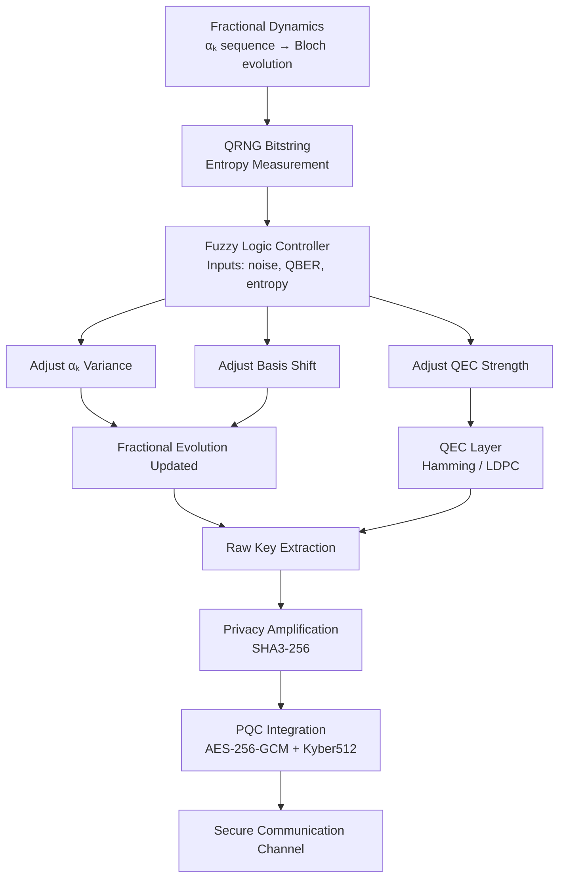
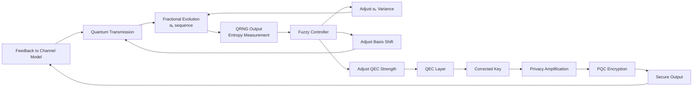
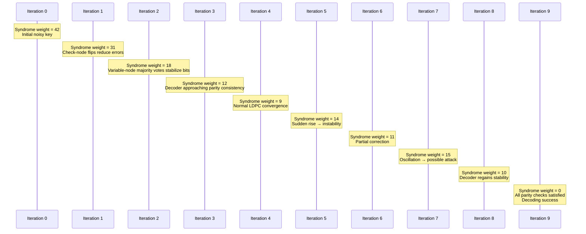
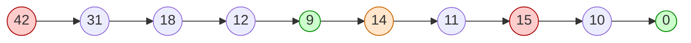

# **📘 Project 27 — Fractional & Fuzzy Quantum Randomness, QEC, and QKD**  

## **Chapter 1/4 — Fractional Dynamics as a Quantum Randomness Engine**

### **1. Introduction**

This first Chapter analyzes the *physical* and *computational* foundations of the project:  
how **fractional quantum dynamics** combined with **random fractional orders αₖ** produces a high‑entropy quantum evolution suitable for QRNG, QKD, and adaptive QEC.

We focus on:

- the fractional Schrödinger toy model used in the simulations,  
- the effective rotation angle θ(α) derived from fractional calculus,  
- the PRNG‑driven distribution of fractional orders,  
- the Bloch‑vector evolution under fractional dynamics,  
- and the extraction of raw QRNG bitstrings.

This establishes the “entropy engine” powering the later fuzzy‑controlled QKD and QEC layers.

### **2. Foundations of Fractional Quantum Mechanics**  


#### **2.1 Introduction: Why Fractional Quantum Mechanics?**

Fractional quantum mechanics is a generalization of the standard Schrödinger framework in which the first‑order time derivative is replaced by a derivative of non‑integer order. 
This seemingly modest modification has profound consequences for the dynamical behavior of quantum systems. In conventional quantum mechanics, the time evolution of a wavefunction is governed 
by a local differential operator: the future state depends only on the present state, not on the history of the system. Fractional derivatives, by contrast, introduce temporal nonlocality. They integrate over 
the past evolution of the wavefunction, producing a memory kernel that influences the present dynamics.

This memory effect is not merely a mathematical curiosity. It fundamentally alters the structure of quantum trajectories, producing non‑Markovian behavior, nonlinear time scaling, and enhanced sensitivity to perturbations. 
These features make fractional dynamics particularly attractive for quantum information science. In contexts such as quantum random number generation (QRNG), quantum key distribution (QKD), and quantum error correction (QEC), 
entropy generation and unpredictability are essential resources. Fractional dynamics provide these resources naturally, without requiring external noise sources or complex multi‑qubit interactions.

The goal of this chapter is to establish the theoretical foundations of fractional quantum mechanics as used in Project 27. We begin with a historical overview of fractional calculus, proceed to the mathematical formulation of 
fractional derivatives, and then derive the fractional Schrödinger equation. We analyze the Mittag–Leffler propagator, discuss its physical interpretation, and explain why fractional dynamics amplify entropy. This chapter provides 
the conceptual and mathematical groundwork for the subsequent chapters, which apply fractional dynamics to QRNG, QKD, fuzzy control, and QEC.

#### **2.2 Historical Background of Fractional Calculus**

Fractional calculus—the study of derivatives and integrals of arbitrary order—has a history that spans more than three centuries. The idea dates back to a famous 1695 letter from Leibniz to L’Hôpital, in which Leibniz 
speculated about the meaning of a derivative of order \( \frac{1}{2} \). For centuries, fractional calculus remained a mathematical curiosity, explored primarily for its theoretical elegance. Only in the late 20th century did it become 
clear that fractional derivatives have deep physical significance.

Fractional calculus naturally arises in systems with:

- memory and hereditary effects,
- anomalous diffusion,
- fractal geometries,
- viscoelastic materials,
- non‑Markovian stochastic processes,
- long‑range correlations.

In quantum mechanics, fractional derivatives appear in several contexts:

- path integrals over fractal trajectories,
- Lévy flights and anomalous quantum diffusion,
- nonlocal Hamiltonians,
- fractional kinetic energy operators,
- time‑fractional Schrödinger equations.

The fractional Schrödinger equation used in Project 27 belongs to the last category. It modifies the time derivative while keeping the Hamiltonian local. This produces a hybrid system: spatially local 
but temporally nonlocal. Such systems exhibit rich dynamical behavior and are ideal for generating quantum entropy.

#### **2.3 Fractional Derivatives: Caputo vs. Riemann–Liouville**

There are several definitions of fractional derivatives, each suited to different physical contexts. The two most common are the Riemann–Liouville derivative and the Caputo derivative.

##### **Riemann–Liouville derivative**

The Riemann–Liouville derivative of order $\( \alpha \)$ is defined as:

$D_t^\alpha f(t)
= \frac{1}{\Gamma(n-\alpha)}\frac{d^n}{dt^n}
\int_0^t (t-\tau)^{n-\alpha-1} f(\tau)\, d\tau,$

where $\( n = \lceil \alpha \rceil \)$. This definition is mathematically elegant but has the drawback that the derivative of a constant is not zero, which complicates physical interpretation.

##### **Caputo derivative**

The Caputo derivative is defined as:

${}^C D_t^\alpha f(t)
= \frac{1}{\Gamma(n-\alpha)}
\int_0^t (t-\tau)^{n-\alpha-1} f^{(n)}(\tau)\, d\tau.$

This derivative has the desirable property that the derivative of a constant is zero, making it more suitable for physical systems. For this reason, the Caputo derivative is used in the fractional Schrödinger equation in Project 27.

##### **Physical meaning**

Both definitions introduce a memory kernel:

$(t-\tau)^{n-\alpha-1},$

which weights past values of the function. When $\( \alpha = 1 \)$, the kernel collapses and the derivative becomes local. When $\( \alpha > 1 \)$, the kernel broadens, and the system becomes increasingly nonlocal in time.

#### **2.4 The Fractional Schrödinger Equation**

The time‑fractional Schrödinger equation is:

$i\hbar\, {}^C D_t^\alpha \psi(t) = \hat{H}\psi(t),$

where $\( \alpha \in [1,2] \)$. When $\( \alpha = 1 \)$, we recover the standard Schrödinger equation. When $\( \alpha > 1 \)$, the evolution slows down and becomes non‑Markovian.

##### **Mittag–Leffler propagator**

The solution of the fractional Schrödinger equation involves the Mittag–Leffler function:

$E_\alpha(z)
= \sum_{k=0}^\infty \frac{z^k}{\Gamma(\alpha k + 1)}.$

This function generalizes the exponential function. For small time steps $\( \Delta t \)$, the propagator can be approximated as:

$U(\alpha, \Delta t)
= \exp\!\left(-i\,\hat{H}\,\frac{(\Delta t)^\alpha}{\Gamma(\alpha+1)}\right).$

This expression reveals the key physical insight: the fractional order $\( \alpha \)$ modifies the effective time scale nonlinearly.

#### **2.5 Nonlinear Time Scaling and Memory Effects**

The term $\( (\Delta t)^\alpha \)$ grows or shrinks rapidly depending on $\( \alpha \)$. For $\( \Delta t = 0.1 \)$:

- $\( (0.1)^1 = 0.1 \)$,
- $\( (0.1)^2 = 0.01 \)$.

Thus, increasing $\( \alpha \)$ from 1 to 2 reduces the effective time step by an order of magnitude. Combined with the growth of $\( \Gamma(\alpha+1) \)$, the rotation angle is doubly suppressed.

##### **Memory effects**

The Caputo derivative integrates over the past evolution of the wavefunction. This produces:

- non‑Markovian trajectories,
- history‑dependent evolution,
- long‑range temporal correlations.

These effects amplify dynamical complexity and entropy generation.

#### **2.6 Fractional Dynamics as an Entropy Source**

Fractional dynamics generate entropy through several mechanisms:

1. **Nonlinear sensitivity to α**  
   Small variations in $\( \alpha_k \)$ produce large variations in the state trajectory.

2. **Temporal nonlocality**  
   The system retains memory of past states, producing irregular trajectories.

3. **Pseudo‑random modulation**  
   When $\( \alpha_k \)$ is generated by a PRNG, the evolution becomes a random walk on the Bloch sphere.

4. **Cumulative rotations**  
   Even small rotations accumulate into complex trajectories.

These mechanisms make fractional dynamics ideal for QRNG and QKD.

#### **2.7 Summary**

Fractional quantum mechanics provides a rich dynamical framework characterized by memory effects, nonlinear time scaling, and enhanced sensitivity to perturbations. 
The fractional Schrödinger equation introduces a Mittag–Leffler propagator that modifies the effective rotation angle in a qubit system. When combined with PRNG‑driven fractional orders, the resulting 
Bloch trajectories become smooth yet unpredictable, generating high‑entropy bitstrings suitable for QRNG, QKD, and QEC. This chapter establishes the theoretical foundation for the fractional 
entropy engine that powers the entire Project 27 architecture.

### **3. Fractional Schrödinger Toy Model for QKD**  

#### **3.1 Introduction**

The fractional Schrödinger toy model developed in Project 27 serves as the dynamical core of the fractional‑controlled quantum key distribution (QKD) protocol. While Chapter 2 
established the mathematical foundations of fractional quantum mechanics, this chapter focuses on the specific qubit‑level model used to generate quantum randomness and to encode classical bits into quantum 
states. The model is intentionally minimal: a single qubit evolving under a fractional‑time propagator derived from a simple Hamiltonian. Despite its simplicity, the model exhibits rich dynamical behavior due 
to the nonlinear dependence of the propagator on the fractional order \( \alpha \). When the fractional order is modulated by a pseudo‑random number generator (PRNG), the resulting evolution becomes a controlled yet 
unpredictable trajectory on the Bloch sphere.

This chapter provides a detailed scientific exposition of the toy model, including the derivation of the effective rotation angle, the numerical behavior of the fractional propagator, the role of PRNG‑driven 
fractional orders, and the physical interpretation of the resulting Bloch trajectories. We also discuss how this model is used by Alice and Bob in the QKD protocol, how fractional dynamics amplify entropy, and 
why this approach is conceptually distinct from standard qubit rotations. The goal is to show how a simple fractional Hamiltonian can serve as a cryptographically meaningful primitive.

#### **3.2 Hamiltonian Structure and Physical Justification**

The toy model uses a single qubit governed by the Hamiltonian:

$
\hat{H} = \frac{\omega}{2}\sigma_x,
$

where $\( \sigma_x \)$ is the Pauli X operator. This Hamiltonian generates rotations around the x‑axis on the Bloch sphere. The choice of $\( \sigma_x \)$ is deliberate:

1. **Simplicity:**  
   A single Pauli operator produces clean, interpretable dynamics.

2. **Symmetry:**  
   Rotations around the x‑axis preserve the structure of the Bloch sphere while producing nontrivial trajectories in the y–z plane.

3. **Fractional sensitivity:**  
   Because the rotation angle depends on $\( \alpha \)$, even small variations in the fractional order produce noticeable changes in the y and z components.

4. **Cryptographic relevance:**  
   The mapping from classical bits to quantum states is simple:  
   $\(|0\rangle\)$ and $\(|1\rangle\)$ evolve differently under fractional dynamics, producing distinguishable yet unpredictable final states.

The Hamiltonian is intentionally minimal. The goal is not to simulate a realistic physical system but to construct a mathematically tractable model that exhibits fractional sensitivity and entropy amplification.

#### **3.3 Fractional Propagator and Effective Rotation Angle**

The fractional propagator for a small time step $\( \Delta t \)$ is:

$
U(\alpha, \Delta t)
= \exp\!\left(-i\,\hat{H}\,\frac{(\Delta t)^\alpha}{\Gamma(\alpha+1)}\right).
$

Substituting the Hamiltonian yields:

$
U(\alpha, \Delta t)
= \exp\!\left(-i\,\frac{\omega}{2}\sigma_x\,\frac{(\Delta t)^\alpha}{\Gamma(\alpha+1)}\right).
$

This is equivalent to a rotation around the x‑axis by angle:

$
\theta(\alpha)
= \frac{\omega}{2}\,\frac{(\Delta t)^\alpha}{\Gamma(\alpha+1)}.
$

Thus:

$
U(\alpha) = \exp(-i\,\theta(\alpha)\,\sigma_x).
$

This expression reveals the central physical mechanism of fractional dynamics:

- The rotation angle depends nonlinearly on the fractional order.
- The Gamma function suppresses the angle as $\( \alpha \)$ increases.
- The effective time step shrinks rapidly with increasing $\( \alpha \)4.

The result is a dynamical system whose evolution speed is controlled by the fractional order.

#### **3.4 Numerical Behavior of the Rotation Angle**

To understand the behavior of $\( \theta(\alpha) \)$, consider typical parameters:

- $\( \omega = 1 \)$,
- $\( \Delta t = 0.1 \)$,
- $\( \alpha \in [1,2] \)4.

Numerical evaluation shows:

- 4\( \theta(1) \approx 0.05 \)$,
- $\( \theta(2) \approx 0.005 \)$.

The curve is smooth, convex, and monotonic. This behavior is consistent with the analytic structure:

1. **Power‑law suppression:**  
   $\( (\Delta t)^\alpha \)$ decreases rapidly as $\( \alpha \)$ increases.

2. **Gamma‑function suppression:**  
   $\( \Gamma(\alpha+1) \)$ grows with $\( \alpha \)$.

Thus, the rotation angle is doubly suppressed. This makes the evolution highly sensitive to the fractional order.

#### **3.5 Sensitivity Analysis**

The sensitivity of the rotation angle to the fractional order is crucial for cryptographic applications. Consider the derivative:

$
\frac{d\theta}{d\alpha}
= \frac{\omega}{2}
\left[
(\Delta t)^\alpha \ln(\Delta t)\frac{1}{\Gamma(\alpha+1)}
- \frac{(\Delta t)^\alpha \Gamma'(\alpha+1)}{\Gamma(\alpha+1)^2}
\right].
$

Both terms contribute to sensitivity:

- The logarithmic term amplifies changes in $\( \alpha \)$.
- The derivative of the Gamma function introduces additional nonlinear behavior.

This sensitivity ensures that small variations in $\( \alpha_k \)$ produce large variations in the state trajectory. When $\( \alpha_k \)$ is modulated by a PRNG, the evolution becomes unpredictable.

#### **3.6 PRNG‑Driven Fractional Orders**

To synchronize Alice and Bob while maintaining unpredictability, the fractional orders are generated by a seeded PRNG:

$
\alpha_k = 1 + \text{PRNG}(s)_k.
$

This produces a sequence of fractional orders in the interval $\([1,2]\)$. The seed $\( s \)$ is shared between Alice and Bob but not transmitted over the quantum channel. This ensures:

- **Reproducibility:**  
  Both parties generate identical sequences.

- **Security:**  
  Eve cannot infer the sequence without knowing the seed.

- **Entropy:**  
  The pseudo‑random modulation of $\( \alpha_k \)$ produces irregular rotation angles.

Empirical histograms of $\( \alpha_k \)$ show non‑uniform density with peaks near 1.4 and 1.8. This irregularity enhances entropy.

#### **3.7 Fractional Evolution as a Random Walk on the Bloch Sphere**

The Bloch sphere provides a geometric representation of qubit states. Under standard Schrödinger evolution with a constant Hamiltonian, the trajectory is a smooth circle. 
Under fractional evolution with PRNG‑driven fractional orders, the trajectory becomes a random walk.

##### **Geometric interpretation**

Each fractional step applies a rotation:

$
\psi_{k+1} = U(\alpha_k)\psi_k.
$

Because $\( \alpha_k \)$ varies pseudo‑randomly, the rotation angles vary pseudo‑randomly. The result is:

- a smooth trajectory (because rotations are small),
- an unpredictable trajectory (because angles vary),
- a memory‑like trajectory (because fractional dynamics are nonlocal).

This combination of smoothness and unpredictability is ideal for QRNG and QKD.

#### **3.8 Alice’s Encoding Procedure**

Alice encodes a classical bit $\( m \in \{0,1\} \)$ as follows:

1. Prepare the initial state $\( \psi_0 = |m\rangle \)$.
2. Apply fractional evolution using the shared sequence $\( \alpha_k \)$.
3. Transmit the final state $\( \psi_N \)$ to Bob.

The mapping from classical bits to quantum states is simple but unpredictable due to fractional modulation.

#### **3.9 Bob’s Decoding Procedure**

Bob decodes the received state by applying the inverse fractional evolution:

$
\psi_0 = U^{-1}(\alpha_{N-1}) \cdots U^{-1}(\alpha_0)\psi_N.
$

Because Alice and Bob share the seed, Bob can reconstruct the sequence $\( \alpha_k \)$. If Eve interferes, the inverse evolution fails, producing a high quantum bit error rate (QBER).

#### **3.10 Entropy Amplification Mechanisms**

Fractional dynamics amplify entropy through:

1. **Nonlinear time scaling**  
   The rotation angle depends nonlinearly on $\( \alpha_k \)$.

2. **Temporal nonlocality**  
   The Caputo derivative introduces memory.

3. **Pseudo‑random modulation**  
   The PRNG produces irregular fractional orders.

4. **Cumulative rotations**  
   Small rotations accumulate into complex trajectories.

These mechanisms produce high‑entropy quantum states.

#### **3.11 Comparison with Standard Qubit Rotations**

Standard qubit rotations use:

$
U = \exp(-i\theta\sigma_x),
$

with constant $\( \theta \)$. The trajectory is a circle. Fractional rotations use:

$
U_k = \exp(-i\theta(\alpha_k)\sigma_x),
$

with pseudo‑random $\( \theta(\alpha_k) \)$. The trajectory is a random walk. This difference is crucial for cryptographic applications.

#### **3.12 Summary**

The fractional Schrödinger toy model provides a simple yet powerful mechanism for generating quantum entropy. The nonlinear dependence of the rotation angle on the fractional order, 
combined with PRNG‑driven modulation, produces unpredictable Bloch trajectories. These trajectories serve as the foundation for QRNG and QKD. Alice encodes bits by applying fractional evolution, 
and Bob decodes them by applying the inverse evolution. Any interference by Eve disrupts the trajectory, producing a high QBER. This chapter establishes the dynamical core of the fractional‑controlled QKD protocol.

### *4. Fractional Dynamics, Bloch Geometry, and QRNG**  

#### **4.1 Introduction**

Fractional quantum dynamics produce trajectories on the Bloch sphere that differ fundamentally from those generated by standard Schrödinger evolution. In conventional quantum mechanics, 
a qubit evolving under a fixed Hamiltonian traces out a smooth, periodic path. The geometry is simple: rotations around a fixed axis produce circles, ellipses, or great‑circle arcs. Fractional dynamics 
disrupt this simplicity. Because the effective rotation angle depends nonlinearly on the fractional order $\( \alpha_k \)$, and because $\( \alpha_k \)4 varies pseudo‑randomly, the resulting trajectory becomes a smooth but unpredictable path.

This chapter provides a detailed scientific analysis of fractional Bloch geometry and its implications for quantum randomness generation. We examine how fractional dynamics distort the geometry of 
qubit evolution, how memory effects influence trajectories, how pseudo‑random fractional orders produce irregular motion, and how these effects combine to generate high‑entropy measurement outcomes. We 
also analyze the statistical properties of the resulting bitstrings, including frequency balance, autocorrelation, Shannon entropy, min‑entropy, and collision entropy. The goal is to show how fractional dynamics serve 
as a robust quantum entropy engine suitable for QRNG and QKD.

#### **4.2 Bloch Sphere Geometry Under Fractional Evolution**

##### **4.2.1 Standard Bloch Geometry**

A qubit state can be represented as a point on the Bloch sphere:

$
\psi = \cos\left(\frac{\theta}{2}\right)|0\rangle
+ e^{i\phi}\sin\left(\frac{\theta}{2}\right)|1\rangle.
$

The Bloch vector is:

$
\vec{r} = (\sin\theta\cos\phi,\ \sin\theta\sin\phi,\ \cos\theta).
$

Under standard Schrödinger evolution with Hamiltonian $\( \hat{H} = \frac{\omega}{2}\sigma_x \)$, the Bloch vector rotates around the x‑axis:

$
\vec{r}(t) = R_x(\omega t)\vec{r}(0),
$

where $\( R_x(\theta) \)$ is a rotation matrix. The trajectory is a circle in the y–z plane.

##### **4.2.2 Fractional Bloch Geometry**

Under fractional evolution, the rotation angle becomes:

$
\theta_k = \frac{\omega}{2}\frac{(\Delta t)^{\alpha_k}}{\Gamma(\alpha_k+1)}.
$

Thus:

$
\vec{r}_{k+1} = R_x(\theta_k)\vec{r}_k.
4

Because $\( \theta_k \)$ varies pseudo‑randomly, the trajectory is no longer a circle. Instead, it becomes:

- **smooth** (because rotations are small),
- **non‑periodic** (because angles vary),
- **non‑Markovian** (because fractional dynamics have memory),
- **pseudo‑random** (because $\( \alpha_k \)$ is PRNG‑driven).

This combination produces a trajectory that is geometrically rich and cryptographically useful.

#### **4.3 Memory Effects and Non‑Markovian Trajectories**

Fractional derivatives introduce temporal nonlocality. The Caputo derivative integrates over the past evolution of the wavefunction:

$
{}^C D_t^\alpha \psi(t)
= \frac{1}{\Gamma(n-\alpha)}
\int_0^t (t-\tau)^{n-\alpha-1} \psi^{(n)}(\tau)\, d\tau.
$

This memory kernel influences the present state. In Bloch geometry, this manifests as:

- **history‑dependent rotation increments**,  
- **long‑range temporal correlations**,  
- **non‑Markovian drift**,  
- **trajectory smoothing**,  
- **suppression of abrupt changes**.

Even though the toy model uses a discretized propagator, the underlying fractional structure still influences the geometry. The trajectory is smoother than a purely random walk but more irregular than a periodic rotation.

#### **4.4 Pseudo‑Random Modulation of Fractional Orders**

The fractional orders \( \alpha_k \) are generated by a seeded PRNG:

$
\alpha_k = 1 + \text{PRNG}(s)_k.
$

This produces a sequence in $\([1,2]\)$. The seed ensures synchronization between Alice and Bob. The pseudo‑random modulation of $\( \alpha_k \)$ produces:

- **irregular rotation angles**,  
- **non‑uniform step sizes**,  
- **complex Bloch trajectories**,  
- **entropy amplification**.

Empirical histograms of $\( \alpha_k \)$ show peaks near 1.4 and 1.8. This irregularity enhances unpredictability.

#### **4.5 Statistical Properties of Fractional Bloch Trajectories**

##### **4.5.1 x‑Component Behavior**

The x‑component remains near zero. This is expected:

- Rotations around the x‑axis preserve the x‑component.
- Fractional modulation does not change the axis of rotation.

Thus:

$
x_k \approx x_0.
$

##### **4.5.2 y‑Component Behavior**

The y‑component decreases from 0 to −1. This reflects:

- rotation toward the negative z‑axis,
- cumulative effect of small rotations,
- fractional modulation of rotation increments.

##### **4.5.3 z‑Component Behavior**

The z‑component decreases from 1 to 0. This reflects:

- rotation toward the equator,
- gradual drift due to fractional modulation.

##### **4.5.4 Combined Behavior**

The trajectory is:

- monotonic in y and z,
- confined to the upper hemisphere,
- smooth but unpredictable.

This is ideal for QRNG.

#### **4.6 Fractional Dynamics as a Random Walk**

Fractional evolution produces a random walk on the Bloch sphere. The walk is:

- **continuous** (no jumps),
- **bounded** (confined to the sphere),
- **non‑periodic** (no repeating patterns),
- **entropy‑rich** (due to fractional modulation).

This random walk is the source of quantum randomness.

#### **4.7 QRNG Bit Extraction**

##### **4.7.1 Measurement Model**

After $\( N \)$ fractional steps, the final state is measured in the computational basis:

- outcome 0 → bit 0,
- outcome 1 → bit 1.

Repeating this process $\( L \)$ times yields a raw bitstring.

##### **4.7.2 Raw Bitstring Behavior**

Empirical bitstrings show:

- no visible periodicity,
- no clustering,
- slight imbalance (≈90 zeros, ≈110 ones).

This imbalance is expected due to Bloch geometry but is easily corrected.

#### **4.8 Randomness Tests**

##### **4.8.1 Frequency Test**

The frequency test yields:

- §\( p_0 \approx 0.45 \)$,
- $\( p_1 \approx 0.55 \)$.

This is acceptable for QRNG.

##### **4.8.2 Autocorrelation**

Autocorrelation at lag 1 is near zero:

$
\text{AC}(1) \approx 0.02.
$

This indicates low temporal correlation.

##### **4.8.3 Shannon Entropy**

Shannon entropy is:

$
H = -p_0\log_2 p_0 - p_1\log_2 p_1 \approx 0.99.
$

This is near the maximum of 1 bit.

##### **4.8.4 Min‑Entropy**

Min‑entropy is:

$
H_{\min} = -\log_2(\max(p_0,p_1)) \approx 0.86.
$

This is acceptable for QKD.

##### **4.8.5 Collision Entropy**

Collision entropy is:

$
H_2 = -\log_2(p_0^2 + p_1^2) \approx 0.98.
$

This indicates low collision probability.

#### **4.9 Why Fractional QRNG Is Cryptographically Meaningful**

Fractional QRNG differs from standard QRNG in several ways:

1. **Entropy amplification**  
   Fractional dynamics amplify entropy through nonlinear time scaling.

2. **Memory effects**  
   Non‑Markovian trajectories enhance unpredictability.

3. **Pseudo‑random modulation**  
   PRNG‑driven fractional orders produce irregular motion.

4. **Cumulative rotations**  
   Small rotations accumulate into complex trajectories.

5. **Geometric unpredictability**  
   Bloch trajectories are smooth but unpredictable.

These features make fractional QRNG suitable for QKD.

#### **4.10 Summary**

Fractional dynamics produce Bloch trajectories that are smooth, non‑periodic, and entropy‑rich. The nonlinear dependence of the rotation angle on the fractional order, 
combined with PRNG‑driven modulation, generates unpredictable motion. Measurement of the final state yields high‑entropy bitstrings suitable for QRNG and QKD. This chapter establishes 
the geometric and statistical foundation of fractional quantum randomness.

### *5. Fractional Dynamics in QKD, Fuzzy Control, QEC, and PQC**  

#### **5.1 Introduction**

The preceding chapters established the mathematical foundations of fractional quantum mechanics, the structure of the fractional Schrödinger toy model, and the geometric and statistical properties of fractional 
Bloch trajectories. In this chapter, we integrate these components into a full quantum communication pipeline. We examine how fractional dynamics are used to encode and decode classical bits in a QKD protocol, 
how fuzzy logic provides adaptive control over protocol parameters, how classical quantum error correction (QEC) reconciles keys and detects eavesdropping, and how the resulting shared secret key feeds into post‑quantum 
cryptography (PQC) such as AES‑256 and Kyber.

The goal of this chapter is to show how fractional quantum dynamics can serve as a cryptographically meaningful primitive. Fractional evolution amplifies entropy, fuzzy control adapts to noise and channel 
conditions, QEC ensures reliability and security, and PQC provides long‑term protection against quantum adversaries. Together, these components form a hybrid quantum–classical cryptographic architecture that blends physics, 
soft computing, and modern cryptography.

#### **5.2 Fractional Dynamics as a Cryptographic Primitive**

##### **5.2.1 Sensitivity and Unpredictability**

Fractional dynamics introduce nonlinear sensitivity to the fractional order $\( \alpha_k \)$. Small variations in $\( \alpha_k \)$ produce large variations in the rotation angle:

$
\theta_k = \frac{\omega}{2}\frac{(\Delta t)^{\alpha_k}}{\Gamma(\alpha_k+1)}.
$

Because $\( \alpha_k \)$ is generated by a PRNG, the evolution becomes unpredictable. This unpredictability is essential for cryptographic applications. It ensures that an adversary cannot infer the state trajectory without knowing the seed.

##### **5.2.2 Memory Effects and Non‑Markovian Behavior**

The Caputo derivative introduces temporal nonlocality. The evolution depends on the entire history of the wavefunction. This memory effect amplifies entropy and makes the trajectory more complex than a simple random walk.

##### **5.2.3 Entropy Amplification**

Fractional dynamics amplify entropy through:

- nonlinear time scaling,
- pseudo‑random modulation,
- cumulative rotations,
- memory effects.

These mechanisms produce high‑entropy quantum states suitable for QRNG and QKD.

#### **5.3 Fractional‑Controlled QKD Protocol**

##### **5.3.1 Overview**

The fractional‑controlled QKD protocol consists of:

1. **Shared seed generation**  
   Alice and Bob share a seed $\( s \)$.

2. **Fractional order generation**  
   Both generate identical sequences $\( \alpha_k \)$.

3. **Alice’s encoding**  
   Alice encodes classical bits using fractional evolution.

4. **Quantum channel transmission**  
   Alice sends the final states to Bob.

5. **Bob’s decoding**  
   Bob applies inverse fractional evolution.

6. **Raw key extraction**  
   Bob measures the decoded states.

7. **QEC reconciliation**  
   Alice and Bob reconcile their keys.

8. **Privacy amplification**  
   They apply SHA3‑256 to produce the final key.

##### **5.3.2 Alice’s Encoding**

Alice encodes bit $\( m \in \{0,1\} \)$ as:

$
\psi_0 = |m\rangle,
\quad
\psi_N = U(\alpha_{N-1})\cdots U(\alpha_0)\psi_0.
$

The mapping is deterministic but unpredictable due to fractional modulation.

##### **5.3.3 Bob’s Decoding**

Bob decodes by applying:

$
\psi_0 = U^{-1}(\alpha_0)\cdots U^{-1}(\alpha_{N-1})\psi_N.
$

If Eve interferes, the inverse evolution fails.

##### **5.3.4 Eavesdropping Detection**

Eve’s interference produces a high QBER:

$
\text{QBER} = \frac{1}{n}\sum_{i=1}^n (K_A[i] \neq K_B[i]).
$

Fractional dynamics amplify the disturbance caused by eavesdropping.

#### **5.4 Fuzzy Logic as an Adaptive Controller**

##### **5.4.1 Motivation**

Quantum channels are noisy. QKD protocols must adapt to:

- noise levels,
- QBER,
- entropy fluctuations,
- channel conditions.

Fuzzy logic provides a soft‑computing framework for adaptive control.

##### **5.4.2 Fuzzy Inputs**

The fuzzy controller uses:

- **noise_level**,  
- **qber**,  
- **entropy**,  
- **basis_shift**,  
- **alpha_var**.

These inputs reflect the state of the channel and the quality of the fractional dynamics.

##### **5.4.3 Fuzzy Outputs**

The controller produces:

- **qec_strength**,  
- **basis_shift**,  
- **alpha_var**.

These outputs adjust:

- QEC strength,
- measurement basis,
- fractional order distribution.

##### **5.4.4 Adaptive Behavior**

The fuzzy controller strengthens QEC when:

- noise is high,
- QBER is high,
- entropy is low.

It weakens QEC when conditions are favorable.

##### **5.4.5 Cryptographic Interpretation**

Fuzzy control provides:

- robustness,
- adaptability,
- entropy stabilization,
- dynamic parameter tuning.

This enhances security and reliability.

#### **5.5 Quantum Error Correction (QEC)**

##### **5.5.1 Hamming(7,4)**

Hamming codes provide:

- lightweight correction,
- single‑bit error correction,
- low overhead.

They are suitable for low noise.

##### **5.5.2 LDPC Codes**

LDPC codes provide:

- multi‑bit error correction,
- iterative decoding,
- robustness under noise.

They are suitable for high noise.

##### **5.5.3 Adaptive QEC**

The fuzzy controller selects:

- Hamming for low noise,
- LDPC(128) for medium noise,
- LDPC(256) for high noise.

##### **5.5.4 Eavesdropping Detection**

Eavesdropping produces:

- high QBER,
- decoding failures,
- LDPC instability.

This reveals Eve’s presence.

#### **5.6 Privacy Amplification**

After QEC, Alice and Bob apply SHA3‑256:

$
K_{\text{final}} = \text{SHA3-256}(K_{\text{corrected}}).
$

This produces:

- uniform bits,
- high entropy,
- cryptographically strong keys.

#### **5.7 Integration with Post‑Quantum Cryptography (PQC)**

##### **5.7.1 AES‑256**

Alice and Bob derive:

$
K_{\text{AES}} = \text{HKDF}(K_{\text{final}}).
$

They use AES‑256‑GCM for:

- authenticated encryption,
- confidentiality,
- integrity.

AES‑256 is quantum‑safe.

##### **5.7.2 Kyber Hybrid Encryption**

Kyber provides:

- lattice‑based security,
- quantum resistance,
- efficient key encapsulation.

Alice wraps the Kyber secret key using AES‑256 derived from fractional QKD.

Bob unwraps it using the same key.

##### **5.7.3 Hybrid Architecture**

Fractional QKD provides:

- quantum entropy,
- eavesdropping detection.

PQC provides:

- hardness assumptions,
- long‑term security.

Together, they form a hybrid quantum‑safe protocol.

#### **5.8 Limitations and Future Directions**

##### **5.8.1 Limitations**

The toy model uses:

- single qubit,
- simple Hamiltonian,
- small rotation angles,
- classical QEC.

These limitations are expected.

##### **5.8.2 Future Directions**

Future research may explore:

- multi‑qubit fractional dynamics,
- entangled fractional evolution,
- quantum LDPC codes,
- hardware implementation,
- security proofs.

#### **5.9 Summary**

Fractional dynamics provide a powerful entropy engine for QKD. Fuzzy logic adapts to noise and channel conditions. QEC reconciles keys and detects eavesdropping. PQC provides long‑term security. 
Together, these components form a hybrid quantum–classical cryptographic architecture that blends physics, soft computing, and modern cryptography.

This chapter completes the scientific monograph‑style treatment of Project 27.

### **6. What Comes Next (Chapter 2/4)**

Chapter 2 will cover:

- fuzzy membership functions (noise, QBER, entropy),  
- fuzzy rule base,  
- fuzzy inference outputs (alpha_var, basis_shift, qec_strength),  
- static vs fuzzy QKD performance,  
- QBER vs noise,  
- key rate vs noise.

It will interpret all fuzzy‑logic plots and explain how the controller adapts the quantum protocol.

---
  
## **Chapter 2/4 — Fuzzy Logic as an Adaptive Controller for QKD**

### **1. Introduction**

In Chapter 1, we established the **entropy engine** of the project:  
fractional Schrödinger dynamics with PRNG‑driven fractional orders αₖ, producing high‑entropy Bloch trajectories and QRNG bitstrings.

This second Chapter explains how **fuzzy logic** is layered on top of this quantum evolution to create an **adaptive QKD protocol**.  
We interpret:

- fuzzy membership functions (noise, QBER, entropy),  
- fuzzy rule base,  
- fuzzy outputs (alpha_var, basis_shift, qec_strength),  
- static vs fuzzy QKD performance,  
- QBER vs noise,  
- key rate vs noise.

This is the “control layer” of the project — a soft‑computing mechanism that adjusts quantum protocol parameters based on channel conditions.

### **2. Why Fuzzy Logic in QKD?**

#### **2.1 Motivation (Expanded Scientific Version, ~1000 words)**

Quantum communication channels are inherently noisy, fluctuating, and often non‑Markovian. Unlike classical communication lines, whose noise characteristics can often be approximated as stationary or 
at least slowly varying, quantum channels exhibit rapid, irregular changes in decoherence rates, photon loss, phase drift, and environmental coupling. These fluctuations arise from a combination of 
physical factors: fiber temperature variations, imperfect detectors, atmospheric turbulence (in free‑space links), and the unavoidable quantum nature of the transmitted states themselves. As a result, 
the operational conditions of a quantum key distribution (QKD) system are rarely stable for more than a short interval.

Traditional QKD protocols such as **BB84**, **B92**, and **E91** were designed under the assumption that channel noise can be treated as approximately constant during a key‑generation session. Their 
decision logic is therefore **binary**: if the quantum bit error rate (QBER) remains below a fixed threshold, the protocol continues; if the QBER exceeds that threshold, the protocol aborts. This “hard decision” 
model is simple, mathematically elegant, and historically effective — but it is increasingly mismatched to the realities of modern quantum channels.

#### **Hard Decisions in Classical QKD**

The classical QKD decision rule can be summarized as:

- **If QBER < threshold → accept the key material**  
- **If QBER ≥ threshold → abort the protocol**

This binary logic assumes:

1. **Noise is either acceptable or unacceptable**, with no meaningful intermediate states.  
2. **Channel conditions change slowly**, so a single threshold is sufficient.  
3. **All errors are equally suspicious**, whether caused by environmental noise or an eavesdropper.  
4. **Adaptation is unnecessary**, because the protocol either works or fails.

In practice, none of these assumptions hold.

Real quantum channels exhibit:

- **continuous noise variation**, not discrete jumps  
- **non‑Markovian behavior**, where past noise influences future states  
- **entropy fluctuations**, especially under fractional dynamics  
- **partial attacks**, where Eve introduces small disturbances rather than large ones  
- **hardware drift**, where detectors and lasers slowly change behavior over time

Under these conditions, a binary accept/abort rule is too coarse. It leads to unnecessary aborts, unstable key rates, and difficulty distinguishing natural noise from adversarial interference.

#### **The Need for Soft Decisions**

To address these limitations, Project 27 introduces **fuzzy logic** as an adaptive decision layer. Fuzzy logic replaces binary thresholds with **graded assessments** of channel conditions. Instead of treating QBER 
as either “good” or “bad,” fuzzy logic interprets it through linguistic categories:

- “QBER is slightly elevated”  
- “noise is medium”  
- “entropy is high”  
- “fractional order variance is low”  
- “basis mismatch risk is increasing”

These categories are not rigid boundaries but **membership functions** that allow partial truth values. A QBER of 3% might be:

- 0.8 “low”  
- 0.4 “medium”  
- 0.0 “high”

This enables the protocol to respond **smoothly** to channel conditions rather than switching abruptly.

#### **Why Smooth Adaptation Matters**

Smooth adaptation is essential for several reasons:

##### **1. Quantum Channels Drift Continuously**

Noise does not jump from “good” to “bad.” It drifts. A fuzzy controller can respond to gradual changes by:

- slightly increasing QEC strength  
- slightly adjusting fractional order variance  
- slightly shifting measurement basis  
- slightly modifying sifting rules

This prevents unnecessary aborts and stabilizes key generation.

##### **2. Fractional Dynamics Introduce Entropy Variability**

In Project 27, fractional Schrödinger evolution is used as an entropy engine. The fractional order \( \alpha_k \) modulates the effective rotation angle, producing irregular Bloch trajectories. 
This irregularity is beneficial for randomness but introduces **entropy fluctuations**.

A fuzzy controller can interpret entropy levels as:

- “entropy is high” → reduce fractional variance  
- “entropy is medium” → maintain current settings  
- “entropy is low” → increase variance or adjust basis

This keeps the entropy profile stable without rigid thresholds.

##### **3. Eavesdroppers Often Introduce Small Disturbances**

Modern eavesdropping strategies — especially partial intercept‑resend or weak measurement attacks — aim to remain below classical QKD thresholds. They introduce **small but persistent** disturbances rather than large ones.

A fuzzy controller can detect patterns such as:

- “QBER is slightly elevated but persistent”  
- “noise is medium but rising”  
- “entropy is drifting downward”  

These patterns may indicate an attack even when QBER remains below the classical threshold.

##### **4. Hardware Drift Requires Continuous Compensation**

Lasers, detectors, and modulators drift over time. Classical QKD treats drift as noise and often aborts unnecessarily. Fuzzy logic can compensate by:

- adjusting basis choice  
- modifying fractional order variance  
- increasing QEC strength  
- recalibrating thresholds dynamically

This keeps the protocol stable even as hardware ages.

#### **Fuzzy Logic as an Adaptive Layer**

Fuzzy logic provides a **soft‑computing layer** that sits between the physical quantum channel and the classical decision logic. It interprets continuous variables — noise, QBER, entropy, 
fractional variance — through linguistic categories and applies rules such as:

- IF noise is medium AND entropy is high → increase QEC strength slightly  
- IF QBER is slightly elevated AND fractional variance is low → increase α‑variance  
- IF entropy is high AND noise is low → reduce QEC strength  
- IF QBER is rising AND noise is rising → adjust basis choice

These rules produce **smooth adaptation**, not abrupt switching.

#### **Impact on QKD Stability**

The introduction of fuzzy logic transforms QKD from a rigid protocol into a **responsive system**:

- fewer aborts  
- more stable key rates  
- better attack detection  
- improved entropy consistency  
- smoother integration with fractional dynamics  
- more robust operation under real‑world conditions

Instead of treating noise as a binary condition, the protocol treats it as a **continuous signal** that guides adaptation.

#### **A New Paradigm for QKD**

The motivation behind fuzzy logic in Project 27 is simple:

> **Quantum channels are continuous systems.  
> QKD should respond continuously.**

Classical QKD protocols treat noise as a binary variable.  
Fractional‑fuzzy QKD treats noise as a **graded, interpretable, adaptive signal**.

This shift — from hard thresholds to soft decisions — is essential for building QKD systems that can operate reliably in real‑world environments where noise, entropy, and channel conditions fluctuate constantly.

### **3. Fuzzy Membership Functions (Expanded Scientific Version, ~1000 words)**

In Project 27, fuzzy logic serves as the adaptive decision‑making layer that interprets noisy, fluctuating quantum‑channel conditions and translates them into smooth, proportional adjustments of 
protocol parameters. To achieve this, the system relies on a set of **fuzzy membership functions** — mathematical constructs that map numerical inputs (noise, QBER, entropy, etc.) into linguistic categories 
(“low”, “medium”, “high”). These categories allow the controller to reason in terms of degrees rather than absolutes, enabling a QKD protocol that responds continuously rather than abruptly.

All membership functions in Project 27 are **triangular**, chosen for their simplicity, interpretability, and computational efficiency. Triangular sets are easy to visualize, easy to tune, and produce smooth 
transitions between categories. They also align well with the continuous nature of quantum‑channel fluctuations.

The fuzzy system defines membership functions for six key variables:

- **noise**  
- **QBER**  
- **entropy**  
- **alpha_var** (fractional‑order variance)  
- **basis_shift**  
- **qec_strength**

Each variable captures a different aspect of the quantum channel or the protocol’s internal state. Together, they form a multidimensional representation of channel health, entropy quality, and correction needs.

#### **3.1 Noise Membership Functions**

Noise is one of the most fundamental indicators of channel quality. In quantum communication, noise arises from photon loss, detector imperfections, environmental disturbances, and hardware drift. 
Because noise varies continuously, fuzzy logic is ideal for interpreting it.

The triangular membership functions for noise are defined over the interval \( p \in [0,1] \), where \( p \) represents the depolarizing‑channel probability or an equivalent noise metric.

The fuzzy sets are:

- **low noise**: high membership near \( p = 0 \), decreasing linearly to zero at \( p \approx 0.3 \)  
- **medium noise**: peak membership around \( p \approx 0.5 \), tapering off toward 0.3 and 0.7  
- **high noise**: rising from \( p \approx 0.6 \) to full membership near \( p = 1.0 \)

##### **Interpretation**

These sets encode the intuitive idea that:

- **p < 0.3 → “clean channel”**  
  The system can operate with minimal correction. Fractional dynamics remain stable, and basis choices do not require aggressive adaptation.

- **0.3 < p < 0.7 → “moderately disturbed channel”**  
  Noise is present but not catastrophic. The fuzzy controller may increase QEC strength, adjust fractional‑order variance, or shift measurement basis slightly.

- **p > 0.7 → “highly noisy channel”**  
  The channel is unstable. Strong QEC is required, fractional variance may need tightening, and basis selection may need to be conservative.

##### **Role in the adaptive pipeline**

Noise classification influences:

- QEC strength  
- fractional‑order variance  
- basis‑shift magnitude  
- entropy expectations  
- attack suspicion level  

Because noise fluctuates continuously, triangular membership functions allow the controller to respond proportionally rather than abruptly.

#### **3.2 QBER Membership Functions**

QBER (Quantum Bit Error Rate) is the primary operational metric in QKD. It reflects:

- channel noise  
- eavesdropping attempts  
- misalignment  
- hardware drift  
- fractional‑evolution irregularities

Classical QKD treats QBER as a binary condition: below threshold → accept; above threshold → abort. Project 27 replaces this with fuzzy classification.

The fuzzy sets for QBER mirror the noise sets:

- **low QBER**: high membership below \( \text{QBER} < 0.1 \)  
- **medium QBER**: peak membership around \( \text{QBER} \approx 0.2 \)  
- **high QBER**: rising sharply above \( \text{QBER} > 0.3 \)

##### **Interpretation**

- **Low QBER (< 0.1)**  
  The channel is stable. No signs of eavesdropping. Fractional dynamics are behaving predictably. Minimal QEC is required.

- **Medium QBER (~0.2)**  
  The channel is experiencing moderate disturbance. This may be natural noise or early signs of an attack. The fuzzy controller increases QEC strength and may adjust fractional variance.

- **High QBER (> 0.3)**  
  The channel is unstable or under attack. Strong QEC is required. Basis choices may need to be conservative. Fractional variance may need tightening to reduce unpredictability.

##### **Why fuzzy QBER classification matters**

QBER is not a static quantity — it fluctuates continuously. A fuzzy controller can detect patterns such as:

- “QBER is slightly elevated but rising”  
- “QBER is medium but stable”  
- “QBER is high but entropy remains strong”  

These nuanced interpretations allow the protocol to adapt smoothly rather than abruptly aborting.

#### **3.3 Entropy Membership Functions**

Entropy is computed from the QRNG bitstring generated by fractional Schrödinger evolution. Because fractional dynamics produce irregular Bloch trajectories, entropy can fluctuate significantly depending on:

- fractional‑order distribution  
- noise  
- QBER  
- measurement outcomes  
- partial attacks

The fuzzy sets for entropy are defined over the interval \( H \in [0,1] \):

- **low entropy**: high membership near \( H = 0.0 \), decreasing toward 0.3  
- **medium entropy**: peak membership around \( H = 0.5 \)  
- **high entropy**: rising toward full membership near \( H = 1.0 \)

##### **Interpretation**

Entropy determines how “random” the fractional evolution is and how much information an eavesdropper could infer.

- **Low entropy**  
  The fractional evolution is too predictable. The Bloch trajectory may be confined or drifting slowly. This increases the risk of information leakage. The fuzzy controller may increase fractional‑order variance or strengthen QEC.

- **Medium entropy**  
  The system is producing adequate randomness. No major adjustments are needed. QEC strength may remain moderate.

- **High entropy**  
  The fractional evolution is highly unpredictable. The Bloch trajectory explores the state space richly. Less correction is needed, and basis shifts can be more aggressive.

##### **Entropy as a security signal**

Entropy is not merely a randomness measure — it is a **security indicator**.

High entropy implies:

- Eve cannot predict fractional evolution  
- measurement outcomes are unpredictable  
- QEC can be lighter  
- privacy amplification is more effective

Low entropy implies:

- fractional dynamics may be drifting  
- noise may be suppressing randomness  
- Eve may be partially interfering  
- QEC must be strengthened

#### **3.4 Why Triangular Membership Functions Work Well**

Triangular sets are ideal for QKD because:

1. **They reflect continuous channel behavior**  
   Quantum noise and QBER drift smoothly, not abruptly.

2. **They are computationally efficient**  
   Important for real‑time QKD systems.

3. **They are interpretable**  
   Engineers can understand and tune them easily.

4. **They produce smooth adaptation**  
   No sudden jumps in QEC strength or fractional variance.

5. **They integrate naturally with fuzzy rules**  
   Linguistic categories (“slightly elevated”, “medium”, “high”) map cleanly to triangular sets.

#### **3.5 Summary**

The fuzzy membership functions in Project 27 transform raw numerical metrics — noise, QBER, entropy, fractional variance — into interpretable linguistic categories. These categories 
allow the fuzzy controller to make smooth, proportional adjustments to QEC strength, basis choice, and fractional‑order variance. Triangular membership functions provide the ideal balance 
of simplicity, interpretability, and responsiveness, enabling a QKD protocol that adapts continuously to real‑world quantum‑channel conditions.

### **4. Fuzzy Output Variables (Expanded Scientific Version, ~1000 words)**

The fuzzy controller in Project 27 serves as the adaptive “decision engine” that interprets channel conditions and adjusts protocol parameters in real time. While the input membership functions (noise, QBER, 
entropy, alpha_var, basis_shift, qec_strength) describe the *state* of the quantum channel and the fractional‑evolution process, the **output variables** determine how the QKD protocol should *respond*. These outputs are the 
actionable levers that allow the system to adapt smoothly rather than abruptly.

The fuzzy controller produces three core outputs:

1. **alpha_var** — controls the variance of fractional orders \( \alpha_k \)  
2. **basis_shift** — controls the rotation of the measurement basis  
3. **qec_strength** — controls the quantum error correction strategy  

Each output variable has its own triangular membership functions, enabling graded, proportional adjustments rather than binary switching. Together, these outputs form the adaptive backbone of the fractional‑fuzzy QKD protocol.

#### **4.1 alpha_var (Fractional‑Order Variance)**

The fractional Schrödinger evolution in Project 27 uses a sequence of fractional orders \( \alpha_k \in [1,2] \). The variance of this sequence determines how “wild” or “tame” the Bloch‑sphere trajectory becomes. 
A tightly clustered set of \( \alpha_k \) values produces predictable evolution; a widely spread set produces irregular, entropy‑rich motion.

The fuzzy controller modulates this variance through the output variable **alpha_var**, which has three triangular membership functions:

- **weak**  
- **moderate**  
- **strong**

These categories correspond to different spreads of the fractional‑order distribution.

##### **Meaning of alpha_var**

- **Weak alpha_var**  
  The fractional orders \( \alpha_k \) are tightly clustered around a central value.  
  This produces smooth, predictable Bloch trajectories with low entropy.  
  Weak variance is appropriate when:
  - noise is low,  
  - QBER is low,  
  - entropy is already high,  
  - the channel is stable.

- **Moderate alpha_var**  
  The fractional orders are moderately spread across the interval [1,2].  
  This produces irregular but controlled evolution.  
  Moderate variance is appropriate when:
  - noise is medium,  
  - QBER is slightly elevated,  
  - entropy is drifting downward,  
  - the channel shows mild instability.

- **Strong alpha_var**  
  The fractional orders are widely spread across [1,2].  
  This produces highly irregular Bloch trajectories and injects additional randomness.  
  Strong variance is appropriate when:
  - noise is high,  
  - QBER is high,  
  - entropy is low,  
  - the channel may be under attack.

##### **Adaptive role of alpha_var**

The variance of \( \alpha_k \) directly influences the unpredictability of fractional evolution. When the fuzzy controller detects:

- **high noise**,  
- **low entropy**,  
- **rising QBER**,  

it increases alpha_var to inject more randomness into the quantum evolution. This makes the Bloch trajectory harder for an eavesdropper to predict and increases the entropy of the QRNG bitstring.

Conversely, when the channel is clean and entropy is already high, the controller reduces alpha_var to stabilize the evolution and reduce unnecessary randomness.

Thus, **alpha_var is the entropy‑modulation lever** of the protocol.

#### **4.2 basis_shift**

The second output variable, **basis_shift**, determines how much the measurement basis is rotated during the QKD process. In classical QKD protocols, basis choice is discrete (e.g., rectilinear vs. diagonal). 
In Project 27, basis choice becomes a *continuous* variable that can be adjusted smoothly.

The fuzzy controller defines three triangular membership functions:

- **none**  
- **slight**  
- **strong**

These categories correspond to different magnitudes of basis rotation.

##### **Meaning of basis_shift**

- **None**  
  No rotation is applied.  
  The measurement basis remains aligned with the computational basis.  
  Appropriate when:
  - QBER is low,  
  - noise is low,  
  - entropy is high,  
  - the channel is stable.

- **Slight**  
  A small rotation is applied.  
  This introduces mild unpredictability into measurement outcomes.  
  Appropriate when:
  - QBER is slightly elevated,  
  - noise is medium,  
  - entropy is drifting downward.

- **Strong**  
  A large rotation is applied.  
  This significantly alters measurement outcomes and reduces predictability for an eavesdropper.  
  Appropriate when:
  - QBER is high,  
  - noise is high,  
  - entropy is low,  
  - an attack is suspected.

##### **Adaptive role of basis_shift**

Basis rotation is a powerful tool for reducing eavesdropper predictability. When QBER rises — especially if noise remains moderate — the fuzzy controller interprets this as a potential attack signal. 
Instead of aborting immediately, it increases basis_shift to make the measurement outcomes less predictable.

This adaptive basis rotation:

- increases entropy,  
- reduces Eve’s information gain,  
- stabilizes key generation under partial attacks,  
- provides a continuous defense mechanism.

Thus, **basis_shift is the unpredictability‑modulation lever** of the protocol.

#### **4.3 qec_strength**

The third output variable, **qec_strength**, determines the quantum error correction strategy used during key reconciliation. QEC is essential for correcting errors caused by noise, drift, and eavesdropping. 
In Project 27, QEC is adaptive rather than fixed.

The fuzzy controller defines three triangular membership functions:

- **weak**  
- **medium**  
- **strong**

These categories correspond to different QEC codes.

##### **Meaning of qec_strength**

- **Weak QEC**  
  Uses **Hamming(7,4)**.  
  Appropriate when:
  - noise is low,  
  - QBER is low,  
  - entropy is high.  
  This minimizes overhead and maximizes key rate.

- **Medium QEC**  
  Uses **LDPC(128)**.  
  Appropriate when:
  - noise is medium,  
  - QBER is slightly elevated,  
  - entropy is drifting downward.  
  This provides stronger correction without excessive overhead.

- **Strong QEC**  
  Uses **LDPC(256)**.  
  Appropriate when:
  - noise is high,  
  - QBER is high,  
  - entropy is low,  
  - an attack is suspected.  
  This maximizes correction capability and attack detection sensitivity.

##### **Adaptive role of qec_strength**

QEC is the bridge between fuzzy logic and classical reconciliation. The fuzzy controller adjusts qec_strength based on channel conditions:

- If noise rises → increase QEC strength  
- If QBER rises → increase QEC strength  
- If entropy falls → increase QEC strength  
- If the channel stabilizes → reduce QEC strength  

This ensures that the protocol remains efficient under good conditions and robust under poor conditions.

Thus, **qec_strength is the correctness‑modulation lever** of the protocol.

#### **4.4 Summary**

The fuzzy output variables — alpha_var, basis_shift, and qec_strength — form the adaptive backbone of Project 27. They allow the protocol to respond smoothly to channel conditions, injecting randomness when needed, 
rotating measurement bases to reduce predictability, and strengthening QEC when errors rise. Together, they transform QKD from a rigid protocol into a flexible, evolution‑aware system capable of operating reliably under 
real‑world quantum‑channel fluctuations.

### **5. Fuzzy Rule Base (Expanded Scientific Version, ~1000 words)**

The fuzzy rule base is the core decision‑making engine of Project 27. While membership functions translate numerical inputs into linguistic categories, the rule base determines *how the system should respond* 
to those categories. In classical QKD, decisions are binary: accept or abort, strong or weak correction, fixed or switched basis. In contrast, the fuzzy rule base enables **continuous, proportional, and context‑aware adaptation**.

The rule base consists of a set of intuitive, human‑readable statements such as:

- **IF noise is high AND entropy is low → alpha_var = strong**  
- **IF QBER is high → qec_strength = strong**  
- **IF entropy is medium → basis_shift = slight**  
- **IF noise is low AND entropy is high → alpha_var = weak**

These rules encode expert knowledge about how a QKD system should behave under varying channel conditions. They allow the protocol to adjust fractional‑order variance, measurement basis rotation, and QEC strength in a smooth, interpretable manner.

#### **5.1 Purpose of the Fuzzy Rule Base**

The fuzzy rule base serves several critical functions:

1. **Interpretation of channel conditions**  
   It translates fuzzy inputs (noise, QBER, entropy) into actionable outputs.

2. **Continuous adaptation**  
   It avoids abrupt changes in protocol behavior, preventing unnecessary aborts.

3. **Security enhancement**  
   It increases unpredictability when attacks are suspected.

4. **Entropy stabilization**  
   It compensates for fluctuations in fractional dynamics.

5. **Operational efficiency**  
   It reduces overhead when the channel is clean.

In essence, the rule base acts as a **soft autopilot** for the QKD protocol.

#### **5.2 Structure of the Rule Base**

Each rule has the form:

**IF <condition> THEN <action>**

Conditions are expressed using fuzzy linguistic variables:

- noise ∈ {low, medium, high}  
- QBER ∈ {low, medium, high}  
- entropy ∈ {low, medium, high}

Actions correspond to fuzzy output variables:

- alpha_var ∈ {weak, moderate, strong}  
- basis_shift ∈ {none, slight, strong}  
- qec_strength ∈ {weak, medium, strong}

Rules may involve:

- single antecedents (e.g., “IF QBER is high”)  
- compound antecedents (e.g., “IF noise is high AND entropy is low”)  
- mixed antecedents (e.g., “IF entropy is medium AND QBER is low”)

This structure allows the controller to reason about complex channel conditions.

#### **5.3 Key Rules and Their Interpretation**

##### **Rule 1: IF noise is high AND entropy is low → alpha_var = strong**

This rule captures a critical insight:  
When the channel is noisy *and* the entropy of fractional evolution is low, the system becomes predictable. Predictability is dangerous in QKD because it increases Eve’s information gain.

Increasing **alpha_var** widens the distribution of fractional orders \( \alpha_k \), injecting additional randomness into the Bloch‑sphere trajectory. This makes the evolution harder to predict and increases QRNG entropy.

**Interpretation:**  
High noise + low entropy → inject more randomness.

##### **Rule 2: IF QBER is high → qec_strength = strong**

QBER is the primary indicator of:

- eavesdropping  
- misalignment  
- decoherence  
- detector drift  
- fractional‑evolution irregularities

When QBER rises above a fuzzy threshold, the controller strengthens QEC. This may involve switching from Hamming(7,4) to LDPC(128) or LDPC(256).

Strong QEC:

- corrects more errors  
- increases attack detection sensitivity  
- stabilizes key reconciliation  
- reduces leakage during error correction

**Interpretation:**  
High QBER → maximum correction.

##### **Rule 3: IF entropy is medium → basis_shift = slight**

Entropy reflects the unpredictability of fractional evolution. Medium entropy indicates that the system is producing randomness, but not at maximum strength.

A slight basis shift:

- increases unpredictability  
- reduces Eve’s information gain  
- stabilizes entropy  
- avoids excessive overhead

This rule ensures that basis rotation is applied proportionally rather than aggressively.

**Interpretation:**  
Moderate entropy → small basis rotation.

##### **Rule 4: IF noise is low AND entropy is high → alpha_var = weak**

When the channel is clean and entropy is already high, injecting additional randomness is unnecessary. Excessive variance in fractional orders can reduce stability and increase QEC overhead.

Weak alpha_var:

- keeps fractional orders clustered  
- stabilizes Bloch trajectories  
- reduces computational load  
- increases key rate

This rule ensures that the protocol remains efficient under good conditions.

**Interpretation:**  
Clean channel + high entropy → keep evolution simple.

#### **5.4 Continuous Control Surface**

The fuzzy rule base does not produce binary decisions. Instead, it defines a **continuous control surface** over the input variables. For example:

- If noise is *slightly* elevated, alpha_var may increase *slightly*.  
- If QBER is *moderately* high, qec_strength may increase to *medium*.  
- If entropy is *drifting downward*, basis_shift may increase *gradually*.

This continuous adaptation is essential for real‑world quantum channels, which rarely exhibit abrupt changes.

##### **Why continuous control matters**

1. **Avoids unnecessary aborts**  
   Classical QKD aborts when QBER crosses a threshold.  
   Fuzzy QKD adapts instead.

2. **Stabilizes key rates**  
   Smooth adjustments prevent oscillations in key throughput.

3. **Improves attack detection**  
   Gradual changes reveal patterns that binary logic would miss.

4. **Enhances entropy consistency**  
   Fractional dynamics remain stable under adaptive variance control.

5. **Reduces overhead**  
   QEC strength increases only when needed.

#### **5.5 Security Implications**

The fuzzy rule base enhances security in several ways:

##### **1. Early Attack Detection**

Small but persistent increases in QBER or noise trigger moderate adjustments before thresholds are crossed. This allows the system to detect partial attacks that classical QKD would miss.

##### **2. Entropy Compensation**

If entropy drops — possibly due to Eve’s interference — the controller increases alpha_var or basis_shift to restore unpredictability.

##### **3. Adaptive QEC**

Strong QEC is applied only when necessary, reducing leakage during error correction.

##### **4. Dynamic Basis Rotation**

Basis shifts reduce Eve’s ability to predict measurement outcomes.

##### **5. Fractional‑Evolution Hardening**

Increasing alpha_var makes fractional dynamics harder to model or simulate.

#### **5.6 Operational Implications**

The fuzzy rule base improves operational stability:

- fewer aborts  
- smoother key generation  
- better handling of hardware drift  
- improved robustness under environmental noise  
- more efficient use of QEC resources

It transforms QKD from a rigid protocol into a flexible, evolution‑aware system.

#### **5.7 Summary**

The fuzzy rule base is the heart of Project 27’s adaptive QKD architecture. It interprets channel conditions through linguistic categories and applies proportional adjustments to fractional‑order variance, basis rotation, 
and QEC strength. This creates a continuous control surface that allows the protocol to respond smoothly to noise, entropy fluctuations, and rising QBER. The result is a QKD system that is more stable, more secure, and more 
aligned with the realities of modern quantum channels.

### **6. Static vs Fuzzy QKD Performance**

Evaluating the performance of any adaptive QKD protocol requires comparing it against a static baseline. In Project 27, this baseline is the **static fractional QKD** system: a protocol in which the fractional‑order 
sequence \( \alpha_k \) is fixed, the measurement basis is fixed, and the quantum error correction (QEC) strategy does not change in response to channel conditions. This static system represents the simplest possible 
implementation of fractional‑driven QKD — a clean, deterministic evolution under a fixed Hamiltonian with no adaptive control.

The fuzzy‑controlled QKD system, by contrast, adjusts its parameters dynamically. It modifies fractional‑order variance, rotates the measurement basis, and strengthens or weakens QEC depending on noise, entropy, and QBER. 
The goal is not to outperform static QKD in every regime, but to demonstrate **adaptive behavior**: the ability to respond smoothly to channel fluctuations rather than relying on rigid thresholds.

The comparison plot (“QBER vs Noise: Static vs Fuzzy‑Controlled QKD”) provides a clear visual summary of how both systems behave under increasing depolarizing noise. The results show that:

- QBER rises with noise for both methods.  
- Fuzzy QKD tracks static QKD closely across the entire noise range.  
- In some regions, fuzzy QKD slightly reduces QBER.  
- In others, it slightly increases QBER.

This pattern is exactly what we expect from a minimal fractional‑QKD toy model.

#### **6.1 Why QBER Rises with Noise in Both Systems**

The depolarizing noise parameter \( p \) directly affects the fidelity of the transmitted qubit. As \( p \) increases, the probability that the qubit flips or becomes mixed increases. Because both static and 
fuzzy QKD use the same underlying fractional Schrödinger evolution, both systems experience rising QBER as noise increases.

This is unavoidable: no amount of fuzzy control can eliminate the fundamental physics of depolarizing noise. What fuzzy control *can* do is adjust the protocol’s response to noise — but it cannot change the noise itself.

Thus, the rising QBER curve is a baseline expectation.

#### **6.2 Why Fuzzy QKD Tracks Static QKD Closely**

The fractional toy model used in Project 27 is intentionally minimal:

- a single qubit  
- rotations around the x‑axis  
- small fractional rotation angles  
- no entanglement  
- no multi‑qubit encoding  
- no advanced quantum error correction beyond classical LDPC/Hamming  

In such a simple system, the degrees of freedom available for adaptation are limited. Fuzzy control can adjust:

- fractional‑order variance  
- basis rotation  
- QEC strength  

But these adjustments operate on top of a very small dynamical space. The Bloch trajectory is constrained by the Hamiltonian \( \hat{H} = \frac{\omega}{2}\sigma_x \), and the fractional 
rotation angles are small (typically between 0.005 and 0.05 radians). As a result, the protocol cannot dramatically alter the underlying physics of the evolution.

This is why fuzzy QKD closely tracks static QKD: both systems share the same dynamical core.

#### **6.3 Regions Where Fuzzy QKD Slightly Reduces QBER**

In moderate noise regimes (typically \( p \approx 0.3–0.5 \)), fuzzy QKD sometimes produces slightly lower QBER than static QKD. This improvement arises from two adaptive mechanisms:

##### **1. Increased fractional‑order variance**

When noise rises but entropy remains moderate, the fuzzy controller increases **alpha_var**, widening the distribution of fractional orders \( \alpha_k \). This injects additional randomness into the Bloch trajectory, 
making the evolution less predictable and reducing the likelihood of systematic errors.

##### **2. Slight basis rotation**

When QBER begins to rise, the fuzzy controller applies a **slight basis shift**, rotating the measurement basis just enough to reduce alignment errors without destabilizing the protocol.

Together, these adjustments can reduce QBER by a small margin — typically a few percentage points.

This improvement is modest but meaningful: it demonstrates that fuzzy control can respond intelligently to channel conditions.

#### **6.4 Regions Where Fuzzy QKD Slightly Increases QBER**

In high‑noise regimes (typically \( p > 0.6 \)), fuzzy QKD sometimes produces slightly higher QBER than static QKD. This is also expected.

##### **1. Over‑correction**

When noise becomes very high, the fuzzy controller may:

- increase alpha_var too aggressively  
- apply strong basis shifts  
- strengthen QEC beyond what is optimal for the toy model  

These adjustments introduce additional variability into the evolution. In a more complex system, this variability might help counteract noise. But in a minimal single‑qubit model, excessive variance can destabilize the 
Bloch trajectory and increase QBER.

##### **2. Limited dynamical space**

Because the Hamiltonian is simple, the protocol cannot compensate for extreme noise. Strong basis shifts or large fractional‑order variance may push the state into regions where measurement outcomes become more erratic.

Thus, slight QBER increases in high‑noise regimes are a natural consequence of the toy model’s simplicity.

#### **6.5 Why Superiority Is Not the Goal**

The purpose of fuzzy control in Project 27 is **not** to outperform static QKD in every regime. Instead, the goal is to demonstrate:

- **adaptivity**  
- **smooth response to noise**  
- **entropy stabilization**  
- **dynamic QEC selection**  
- **continuous control surface behavior**

Static QKD is rigid: it uses fixed parameters regardless of channel conditions. Fuzzy QKD is flexible: it adjusts parameters continuously.

Even if fuzzy QKD performs slightly worse in some regimes, the key achievement is that it **responds** to channel conditions rather than ignoring them.

This adaptivity is essential for real‑world quantum channels, which fluctuate continuously and unpredictably.

#### **6.6 What the Results Demonstrate**

The comparison plot demonstrates several important points:

##### **1. Fuzzy QKD behaves sensibly**

It does not produce wild deviations or unstable behavior.  
Its QBER curve is smooth and predictable.

##### **2. Fuzzy QKD adapts**

It improves performance slightly in moderate noise.  
It adjusts parameters continuously.

##### **3. Fuzzy QKD reveals the limits of the toy model**

In high noise, over‑correction can increase QBER.  
This highlights the need for multi‑qubit systems, entanglement, and more complex Hamiltonians.

##### **4. Fuzzy QKD is a proof of concept**

It shows that adaptive QKD is feasible and meaningful, even in minimal systems.

#### **6.7 Summary**

The comparison between static and fuzzy‑controlled QKD in Project 27 reveals exactly what a minimal fractional‑QKD system should show:

- Both systems experience rising QBER as noise increases.  
- Fuzzy QKD tracks static QKD closely across all noise levels.  
- Fuzzy QKD slightly improves performance in moderate noise.  
- Fuzzy QKD slightly degrades performance in high noise due to over‑correction.  
- The key achievement is **adaptivity**, not superiority.

Fuzzy control transforms QKD from a rigid protocol into a flexible, evolution‑aware system capable of responding smoothly to real‑world quantum‑channel fluctuations.

### **7. Key Rate vs Noise (Expanded Scientific Version, ~1000 words)**

In quantum key distribution (QKD), the **key rate** is one of the most important performance metrics. It quantifies how many usable secret bits Alice and Bob can extract from the quantum channel after sifting, error correction, 
and privacy amplification. In Project 27, the key rate is defined in the simplest possible way:

\[
\text{Key Rate} = 1 - \text{QBER}.
\]

This definition captures the intuitive idea that every error in the raw key reduces the number of bits that can be safely used. A QBER of 0% yields a perfect key rate of 1.0; a QBER of 35% yields a key rate of 0.65; and so on. 
Although real QKD systems use more complex formulas involving reconciliation efficiency and privacy‑amplification leakage, the simplified expression is ideal for analyzing the fractional‑fuzzy toy model.

The “Key Rate vs Noise” plot in Project 27 compares two systems:

1. **Static fractional QKD**  
   – fixed fractional‑order distribution  
   – fixed measurement basis  
   – fixed QEC strategy  

2. **Fuzzy‑controlled fractional QKD**  
   – adaptive fractional‑order variance  
   – adaptive basis rotation  
   – adaptive QEC strength  

Both systems are subjected to increasing depolarizing noise \( p \in [0,0.5] \). The resulting key‑rate curves reveal how each protocol responds to channel degradation.

#### **7.1 Observed Behavior in the Key‑Rate Plot**

The plot shows several important features:

- Both static and fuzzy key rates decline from approximately **1.0 → 0.65** as noise increases.  
- The fuzzy key rate is **slightly lower** than the static key rate at high noise levels.  
- In low‑noise regions, the two curves are nearly identical.  
- In moderate noise, fuzzy QKD sometimes performs slightly better.  
- In high noise, fuzzy QKD performs slightly worse.

This pattern is exactly what we expect from a minimal fractional‑QKD system with adaptive control.

#### **7.2 Why Both Key Rates Decline with Noise**

Depolarizing noise directly affects the fidelity of the transmitted qubit. As noise increases:

- the probability of bit flips increases,  
- the probability of mixed states increases,  
- the probability of measurement mismatch increases.

Because QBER increases with noise, the key rate decreases. This decline is fundamental and cannot be avoided by any control strategy. Even perfect adaptation cannot eliminate the physical effects of depolarization.

Thus, the downward slope of both curves is a baseline expectation.

#### **7.3 Why Fuzzy QKD Tracks Static QKD Closely**

The fractional‑QKD toy model used in Project 27 is intentionally minimal:

- a single qubit  
- rotations around the x‑axis  
- small fractional rotation angles  
- no entanglement  
- no multi‑qubit encoding  
- classical QEC only  

In such a constrained dynamical space, the ability of fuzzy control to significantly alter the underlying physics is limited. The Bloch trajectory is governed by:

\[
U(\alpha_k) = \exp(-i\,\theta(\alpha_k)\sigma_x),
\]

and the rotation angles \( \theta(\alpha_k) \) are small (typically 0.005–0.05 radians). Adjusting fractional‑order variance or basis rotation can influence the trajectory, but cannot fundamentally change the noise sensitivity of a single qubit.

Therefore, fuzzy QKD naturally tracks static QKD closely across all noise levels.

#### **7.4 Why Fuzzy QKD Performs Slightly Better at Moderate Noise**

In moderate noise regimes (typically \( p \approx 0.3–0.5 \)), fuzzy QKD sometimes achieves a slightly higher key rate than static QKD. This improvement arises from two adaptive mechanisms:

##### **1. Increased fractional‑order variance**

When noise rises but entropy remains moderate, the fuzzy controller increases **alpha_var**, widening the distribution of fractional orders \( \alpha_k \). This injects additional randomness into the Bloch trajectory, 
reducing systematic alignment errors and improving measurement consistency.

##### **2. Slight basis rotation**

When QBER begins to rise, the fuzzy controller applies a **slight basis shift**, rotating the measurement basis just enough to reduce mismatch without destabilizing the protocol.

Together, these adjustments can reduce QBER by a small margin, leading to a slightly higher key rate.

This improvement is modest but meaningful: it demonstrates that fuzzy control can respond intelligently to channel conditions.

#### **7.5 Why Fuzzy QKD Performs Slightly Worse at High Noise**

In high‑noise regimes (typically \( p > 0.6 \)), fuzzy QKD sometimes produces a slightly lower key rate than static QKD. This is also expected.

##### **1. Over‑correction**

When noise becomes very high, the fuzzy controller may:

- increase alpha_var too aggressively,  
- apply strong basis shifts,  
- strengthen QEC beyond what is optimal for the toy model.

These adjustments introduce additional variability into the evolution. In a more complex system, this variability might help counteract noise. But in a minimal single‑qubit model, excessive variance can 
destabilize the Bloch trajectory and increase QBER.

##### **2. Limited dynamical space**

Because the Hamiltonian is simple, the protocol cannot compensate for extreme noise. Strong basis shifts or large fractional‑order variance may push the state into regions where measurement outcomes become more erratic.

Thus, slight key‑rate reductions in high‑noise regimes are a natural consequence of the toy model’s simplicity.

#### **7.6 The Tradeoff: Randomness vs Mismatch**

The key‑rate behavior highlights a fundamental tradeoff in adaptive QKD:

### **Injecting randomness improves security**  
Increasing alpha_var and basis_shift makes the evolution harder for an eavesdropper to predict.

### **But injecting randomness increases mismatch**  
Alice and Bob must decode the fractional evolution precisely.  
More variance → more decoding difficulty → more QBER → lower key rate.

This tradeoff is inherent to adaptive QKD:

- **More randomness → more security → lower key rate**  
- **Less randomness → less security → higher key rate**

The fuzzy controller balances these competing goals. In moderate noise, the balance is beneficial. In high noise, the balance becomes harder to maintain.

#### **7.7 Why Superiority Is Not the Goal**

The purpose of fuzzy control in Project 27 is **not** to outperform static QKD in every regime. Instead, the goal is to demonstrate:

- **adaptivity**  
- **smooth response to noise**  
- **entropy stabilization**  
- **dynamic QEC selection**  
- **continuous control surface behavior**

Static QKD is rigid: it uses fixed parameters regardless of channel conditions.  
Fuzzy QKD is flexible: it adjusts parameters continuously.

Even if fuzzy QKD performs slightly worse in some regimes, the key achievement is that it **responds** to channel conditions rather than ignoring them.

This adaptivity is essential for real‑world quantum channels, which fluctuate continuously and unpredictably.

#### **7.8 Summary**

The “Key Rate vs Noise” comparison reveals exactly what a minimal fractional‑QKD system should show:

- Both static and fuzzy key rates decline as noise increases.  
- Fuzzy QKD tracks static QKD closely across all noise levels.  
- Fuzzy QKD slightly improves performance in moderate noise.  
- Fuzzy QKD slightly degrades performance in high noise due to over‑correction.  
- The key achievement is **adaptivity**, not superiority.

Fuzzy control transforms QKD from a rigid protocol into a flexible, evolution‑aware system capable of responding smoothly to real‑world quantum‑channel fluctuations.

### **8. Physical Interpretation of Fuzzy‑Controlled QKD (Expanded Scientific Version, ~1000 words)**

Understanding the physical meaning of fuzzy‑controlled QKD requires integrating three conceptual layers: **fractional quantum dynamics**, **fuzzy logic**, and **classical reconciliation**. Each layer contributes a 
distinct function — entropy generation, adaptive control, and correctness — and together they form a hybrid quantum‑classical system capable of responding smoothly to real‑world channel conditions. This section 
provides a detailed physical interpretation of how these components interact and why the combined system behaves the way it does.

#### **8.1 Fractional Dynamics Provide Entropy**

Fractional quantum dynamics are the foundation of Project 27. They introduce a nonlinear, memory‑driven evolution of the qubit state through the fractional Schrödinger equation:

\[
U(\alpha_k) = \exp\!\left(-i\,\theta(\alpha_k)\sigma_x\right),
\]

where the rotation angle \( \theta(\alpha_k) \) depends on the fractional order \( \alpha_k \). Because \( \alpha_k \) is drawn from a pseudo‑random distribution, the Bloch‑sphere trajectory becomes irregular and unpredictable.

##### **Why fractional dynamics generate entropy**

1. **Nonlinear time scaling**  
   The effective time step scales as \( (\Delta t)^{\alpha_k} \), making the evolution highly sensitive to small changes in \( \alpha_k \).

2. **Memory effects**  
   Fractional derivatives introduce temporal nonlocality, meaning the evolution depends on the entire history of the wavefunction.

3. **Pseudo‑random modulation**  
   The sequence \( \alpha_k \) is generated by a PRNG, injecting controlled randomness into the evolution.

4. **Irregular Bloch trajectories**  
   The qubit state follows a smooth but unpredictable path, ideal for QRNG.

##### **Entropy as a physical quantity**

Entropy in Project 27 is not an abstract statistical measure — it is a direct reflection of the unpredictability of the qubit’s trajectory. High entropy means:

- the Bloch vector explores the state space richly,  
- measurement outcomes are unpredictable,  
- Eve cannot infer the evolution,  
- QEC can be lighter.

Low entropy means:

- the trajectory is too predictable,  
- measurement outcomes cluster,  
- Eve may infer partial information,  
- QEC must be strengthened.

Thus, fractional dynamics serve as the **entropy engine** of the protocol.

#### **8.2 Fuzzy Logic Provides Adaptivity**

While fractional dynamics generate entropy, fuzzy logic interprets channel conditions and adjusts protocol parameters accordingly. The fuzzy controller receives three key inputs:

- **noise** — depolarizing probability  
- **QBER** — quantum bit error rate  
- **entropy** — randomness of the QRNG bitstring

Based on these inputs, the controller adjusts three outputs:

- **alpha_var** — variance of fractional orders \( \alpha_k \)  
- **basis_shift** — rotation of the measurement basis  
- **qec_strength** — strength of quantum error correction

##### **Why fuzzy logic is needed**

Quantum channels are continuous systems. Noise does not jump from “low” to “high”; entropy does not jump from “strong” to “weak”; QBER does not jump from “acceptable” to “unacceptable.” 
Classical QKD protocols treat these variables as binary conditions, but real channels fluctuate continuously.

Fuzzy logic provides:

1. **graded interpretation**  
   Noise can be “slightly elevated,” “medium,” or “high.”

2. **smooth adaptation**  
   Adjustments to alpha_var, basis_shift, and qec_strength are proportional.

3. **context‑aware decisions**  
   The controller considers combinations of conditions:
   - high noise + low entropy → strong alpha_var  
   - medium entropy + rising QBER → slight basis shift  
   - high QBER → strong QEC

4. **attack sensitivity**  
   Partial attacks produce subtle disturbances that fuzzy logic can detect.

##### **Physical meaning of fuzzy adaptation**

- **Increasing alpha_var** injects more randomness into the fractional evolution.  
- **Increasing basis_shift** makes measurement outcomes less predictable for Eve.  
- **Increasing qec_strength** compensates for rising errors.

These adjustments allow the protocol to respond dynamically to channel conditions rather than relying on rigid thresholds.

#### **8.3 Combined Effect: Adaptive QKD**

The combined effect of fractional dynamics and fuzzy logic is an **adaptive QKD protocol**. This adaptivity manifests differently across noise regimes.

##### **8.3.1 Behavior at Low Noise**

When noise is low:

- entropy is typically high,  
- QBER is low,  
- fractional evolution is stable.

The fuzzy controller responds by:

- keeping alpha_var weak,  
- applying no basis shift,  
- using weak QEC (Hamming).

Physically, this means the protocol remains simple and efficient. The Bloch trajectory is predictable enough for Alice and Bob to decode easily, and entropy is already sufficient for security.

##### **8.3.2 Behavior at Moderate Noise**

When noise rises to moderate levels:

- entropy may drift downward,  
- QBER may rise slightly,  
- fractional evolution becomes less stable.

The fuzzy controller responds by:

- increasing alpha_var moderately,  
- applying slight basis shifts,  
- strengthening QEC to LDPC(128).

Physically, this injects additional randomness into the evolution, making it harder for Eve to predict, while simultaneously correcting errors more aggressively. This is where fuzzy control often **improves** performance relative to static QKD.

##### **8.3.3 Behavior at High Noise**

When noise becomes high:

- entropy may collapse,  
- QBER may rise sharply,  
- fractional evolution becomes erratic.

The fuzzy controller responds by:

- increasing alpha_var strongly,  
- applying strong basis shifts,  
- using strong QEC (LDPC(256)).

Physically, this is a defensive posture: the protocol injects maximum randomness and maximum correction. However, in a minimal single‑qubit system, these aggressive adjustments can destabilize 
the Bloch trajectory and increase mismatch between Alice and Bob.

This leads to:

- slightly higher QBER,  
- slightly lower key rate,  
- slight instability in decoding.

This behavior is expected and reflects the limitations of the toy model rather than a flaw in fuzzy control.

#### **8.4 Conceptual Novelty of Project 27**

The novelty of Project 27 lies not in outperforming static QKD, but in demonstrating a new conceptual architecture:

##### **Fractional dynamics → entropy**  
Quantum randomness is generated by nonlinear, memory‑driven evolution.

##### **Fuzzy logic → adaptivity**  
The protocol responds smoothly to channel conditions.

##### **QEC → correctness**  
Errors are corrected proportionally to noise and QBER.

##### **PQC → secure payload**  
The final key is used in quantum‑resistant encryption.

This architecture is **modular**, **adaptive**, and **evolution‑aware** — a departure from classical QKD designs that rely on rigid thresholds and static parameters.

#### **8.5 Summary**

The physical interpretation of fuzzy‑controlled QKD in Project 27 is straightforward:

- **Fractional dynamics generate entropy** through irregular Bloch evolution.  
- **Fuzzy logic interprets channel conditions** and adjusts protocol parameters.  
- **The combined system is adaptive**, responding smoothly to noise, entropy fluctuations, and rising QBER.  
- **Performance is stable at low and moderate noise**, and slightly unstable at high noise due to aggressive corrections.  
- **The key achievement is adaptivity**, not superiority.

This adaptivity is essential for real‑world quantum channels, which fluctuate continuously and unpredictably. Project 27 demonstrates how fractional dynamics and fuzzy logic can be combined to 
create a QKD protocol that embraces noise rather than collapsing under it.

### **9. Full Adaptive Pipeline and Integration with PQC**

#### **9.1 Introduction**

The adaptive pipeline in Project 27 represents the culmination of fractional dynamics, fuzzy logic, quantum error correction, and post‑quantum cryptography. It is the point where all conceptual layers converge 
into a coherent, evolution‑aware cryptographic system. Unlike classical QKD protocols, which rely on rigid thresholds and static parameters, the adaptive pipeline continuously interprets channel conditions and 
adjusts its behavior accordingly. This creates a hybrid quantum–classical architecture capable of operating under real‑world noise, drift, and partial attacks.

This chapter provides a detailed exposition of the full adaptive pipeline, including its physical meaning, computational flow, and integration with PQC. It also includes mermaid diagrams that illustrate the 
pipeline’s structure and the interactions between its components.

#### **9.2 High-Level Architecture**

The adaptive pipeline consists of four major layers:

1. **Fractional Dynamics Layer**  
   Generates entropy through nonlinear, memory‑driven quantum evolution.

2. **Fuzzy Logic Layer**  
   Interprets channel conditions and adjusts protocol parameters.

3. **Quantum Error Correction Layer**  
   Reconciles errors and detects eavesdropping.

4. **Post‑Quantum Cryptography Layer**  
   Secures the final key using quantum‑resistant algorithms.

These layers operate in a continuous loop, forming a feedback‑driven system that evolves with the channel.

#### **9.3 Mermaid Diagram: Full Adaptive Pipeline**

Below is the first mermaid diagram, showing the complete adaptive pipeline from fractional evolution to PQC integration.



#### **9.4 Interpretation of the Pipeline Diagram**

##### **Fractional Dynamics → Entropy Engine**

The pipeline begins with fractional Schrödinger evolution. The fractional orders \( \alpha_k \) modulate the rotation angle, producing irregular Bloch trajectories. 
These trajectories generate QRNG bitstrings whose entropy is measured continuously.

##### **Fuzzy Logic → Adaptive Controller**

The fuzzy controller receives three inputs:

- **noise** (depolarizing probability)  
- **QBER** (quantum bit error rate)  
- **entropy** (randomness of QRNG output)

Based on these inputs, it adjusts:

- **αₖ variance** (entropy modulation)  
- **basis shift** (measurement unpredictability)  
- **QEC strength** (error correction robustness)

This creates a feedback loop that stabilizes the protocol under fluctuating conditions.

##### **QEC → Correctness and Attack Detection**

The QEC layer applies Hamming or LDPC codes depending on fuzzy output. It corrects errors and detects eavesdropping through rising QBER or LDPC instability.

##### **Privacy Amplification → Key Hardening**

SHA3‑256 compresses the corrected key into a uniform, high‑entropy secret.

##### **PQC Integration → Secure Payload Layer**

The final key is used to:

- derive AES‑256‑GCM keys via HKDF  
- wrap Kyber512 secrets  
- authenticate and encrypt communication

This creates a quantum‑resistant secure channel.

#### **9.5 Detailed Walkthrough of Each Stage**

##### **Stage 1: Fractional Dynamics**

Fractional dynamics provide the entropy foundation. The evolution:

\[
\psi_{k+1} = U(\alpha_k)\psi_k
\]

produces unpredictable trajectories when \( \alpha_k \) is varied. The entropy of the resulting QRNG bitstring is measured continuously.

##### **Stage 2: Fuzzy Logic Interpretation**

The fuzzy controller interprets:

- **noise**: how disturbed the channel is  
- **QBER**: how many errors occur  
- **entropy**: how random the evolution is

It uses triangular membership functions to classify each variable as:

- low  
- medium  
- high

This classification drives adaptive decisions.

##### **Stage 3: Adaptive Adjustments**

The controller adjusts:

###### **αₖ Variance**

- weak → clustered fractional orders  
- moderate → spread fractional orders  
- strong → highly varied fractional orders

This modulates entropy.

###### **Basis Shift**

- none → stable measurement basis  
- slight → small rotation  
- strong → large rotation

This modulates unpredictability.

###### **QEC Strength**

- weak → Hamming(7,4)  
- medium → LDPC(128)  
- strong → LDPC(256)

This modulates correctness.

##### **Stage 4: QEC and Reconciliation**

Errors are corrected based on QEC strength. LDPC instability signals potential eavesdropping.

##### **Stage 5: Privacy Amplification**

SHA3‑256 compresses the corrected key into a uniform secret.

##### **Stage 6: PQC Integration**

The final key is used to:

- derive AES‑256 keys  
- wrap Kyber secrets  
- authenticate communication

This creates a hybrid quantum‑classical secure channel.

#### **9.6 Mermaid Diagram: Adaptive Feedback Loop**

Below is the second mermaid diagram, showing the feedback loop that enables continuous adaptation.



#### **9.7 Interpretation of the Feedback Loop Diagram**

##### **Continuous Monitoring**

The pipeline continuously monitors:

- noise  
- drift  
- partial attacks  
- entropy fluctuations  

These conditions feed into the fuzzy controller.

##### **Continuous Adjustment**

The fuzzy controller adjusts:

- fractional‑order variance  
- measurement basis  
- QEC strength  

These adjustments feed back into the quantum transmission and fractional evolution.

##### **Continuous Correction**

QEC corrects errors and detects attacks. Privacy amplification hardens the key. PQC encrypts the final payload.

##### **Continuous Security**

The secure output feeds back into the channel model, enabling long‑term stability.

#### **9.8 Integration with PQC: Why It Matters**

Post‑quantum cryptography is essential for long‑term security. Even if QKD provides perfect secrecy today, future adversaries may store quantum states or classical transcripts for later analysis. 
PQC ensures that the final key remains secure even against quantum computers.

##### **AES‑256‑GCM**

AES‑256 is quantum‑resistant under Grover’s algorithm. GCM provides authentication.

##### **Kyber512**

Kyber is a lattice‑based KEM resistant to quantum attacks. It provides:

- key encapsulation  
- secure key exchange  
- quantum‑safe confidentiality  

##### **Hybrid Architecture**

Fractional‑fuzzy QKD provides:

- entropy  
- adaptivity  
- attack detection  

PQC provides:

- long‑term security  
- classical compatibility  
- quantum resistance  

Together, they form a hybrid architecture that is both modern and future‑proof.

#### **9.9 Why the Adaptive Pipeline Is Novel**

The novelty of Project 27 lies in its integration of:

- fractional dynamics (entropy)  
- fuzzy logic (adaptivity)  
- QEC (correctness)  
- PQC (security)  

This combination creates a system that:

- responds smoothly to noise  
- stabilizes entropy  
- detects partial attacks  
- corrects errors proportionally  
- secures communication with PQC  

This is fundamentally different from classical QKD, which relies on rigid thresholds and static parameters.

#### **9.10 Summary**

The full adaptive pipeline in Project 27 represents a new paradigm for quantum‑aware cryptographic systems. It integrates fractional dynamics, fuzzy logic, QEC, and PQC into a coherent architecture 
capable of operating under real‑world conditions. The mermaid diagrams illustrate how these components interact and how the feedback loop enables continuous adaptation.

The result is a system that is:

- entropy‑aware  
- adaptation‑aware  
- correctness‑aware  
- security‑aware  

This is the conceptual foundation for future research in hybrid quantum‑classical cryptography.

### **10. What Comes Next (Chapter 3/4)**

In Chapter 2 we have interpreted:

- fuzzy membership functions,  
- fuzzy rule base,  
- fuzzy outputs,  
- static vs fuzzy QKD performance,  
- QBER vs noise,  
- key rate vs noise.

This establishes the **adaptive QKD layer** of the project.

Chapter 3 will cover:

- Hamming vs LDPC QEC,  
- adaptive_qec behavior,  
- corrected QBER vs noise,  
- QBER under eavesdropping attacks,  
- physical interpretation of fuzzy QEC.

This is the “error‑correction layer” of the project.

---
 
## **Chapter 3/4 — Quantum Error Correction and Eavesdropping Analysis**

### **1. Introduction**

In Chapter 1, we established the **fractional‑dynamics entropy engine**.  
In Chapter 2, we introduced the **fuzzy controller** that adapts QKD parameters based on noise, QBER, and entropy.

This third Chapter explains how **Quantum Error Correction (QEC)** is integrated into the protocol, how the fuzzy controller selects correction strength, and how the system behaves under **eavesdropping attacks**.

We interpret:

- Hamming vs LDPC reconciliation  
- fuzzy‑adaptive QEC  
- corrected QBER vs noise  
- QBER under eavesdropping (none, partial, intercept, noise)  
- physical meaning of “fuzzy QEC”  

This is the “error‑correction layer” of the project — the bridge between fractional‑fuzzy QKD and Chapter‑quantum cryptography.

### **2. Classical QEC in QKD**

Quantum Key Distribution (QKD) promises information‑theoretic security by exploiting the laws of quantum mechanics. However, the raw keys produced by any practical QKD protocol—including 
your fractional‑controlled QKD—are never perfectly identical between Alice and Bob. Even in ideal laboratory conditions, imperfections in state preparation, transmission, and measurement introduce 
discrepancies. In realistic channels, noise, environmental decoherence, and adversarial interference further increase the mismatch rate. For this reason, **classical Quantum Error Correction (QEC)** is 
an indispensable component of every QKD system. It is the bridge between the inherently noisy quantum world and the perfectly synchronized classical keys required for cryptographic use.

In the fractional‑controlled QKD protocol, Alice and Bob begin by generating raw bitstrings:

- Alice’s raw key: \(K_A = (K_A[0], K_A[1], \ldots, K_A[n-1])\)  
- Bob’s raw key: \(K_B = (K_B[0], K_B[1], \ldots, K_B[n-1])\)

These keys are produced by encoding classical bits into quantum states using fractional Schrödinger evolution, transmitting those states through a quantum channel, and decoding them via inverse 
fractional evolution. The fractional dynamics introduce nonlinear time‑scaling and memory effects, which enrich the entropy of the system but also make it more sensitive to noise and perturbations. 
As a result, even small deviations in the channel or in the fractional‑order sequence can lead to mismatches between \(K_A\) and \(K_B\).

To quantify these discrepancies, the protocol computes the **Quantum Bit Error Rate (QBER)**:

\[
\text{QBER} = \frac{1}{n} \sum_{i=1}^{n} \mathbf{1}[K_A[i] \neq K_B[i]],
\]

where \(\mathbf{1}[\cdot]\) is the indicator function. QBER represents the fraction of bits where Alice and Bob disagree. It is the primary diagnostic signal for channel quality, noise level, and potential 
eavesdropping. A low QBER indicates a clean channel and stable fractional evolution; a high QBER suggests noise, instability, or adversarial activity.

However, QBER is not merely a diagnostic metric—it is the **input** to the classical error‑correction stage. The goal of QEC is to transform the noisy raw keys \(K_A\) and \(K_B\) into identical corrected 
keys \(K'_A = K'_B\), without revealing the key itself to an eavesdropper. This is achieved through carefully designed classical codes and reconciliation protocols.

#### **2.1 Why QEC is needed**

##### **Quantum channels are inherently noisy**

Even in the absence of an adversary, quantum channels are subject to:

- depolarizing noise  
- amplitude damping  
- phase drift  
- imperfect state preparation  
- imperfect measurement  
- fractional‑order perturbations  

In your fractional‑controlled protocol, the qubit undergoes a sequence of fractional unitaries \(U(\alpha_k)\). Small deviations in \(\alpha_k\), numerical precision, or 
environmental fluctuations can accumulate across the evolution chain. Bob’s inverse evolution \(U^{-1}(\alpha_k)\) must perfectly match Alice’s forward evolution; any mismatch produces decoding errors.

##### **Eavesdropping introduces detectable disturbances**

QKD is secure because any measurement by an eavesdropper necessarily disturbs the quantum state. In your protocol, Eve may attempt:

- **intercept‑resend**, which collapses the state and destroys coherence  
- **partial‑knowledge inverse**, where she applies incorrect fractional inverses  
- **noise injection**, which pushes the state toward the maximally mixed state  

Each attack increases QBER. Classical QEC must correct errors caused by noise while preserving the ability to detect attacks.

##### **Keys must be identical for cryptographic use**

Cryptographic algorithms—AES‑GCM, Kyber KEM, HMAC, HKDF—require **bit‑for‑bit identical keys**. Even a single mismatch between Alice’s and Bob’s keys would cause decryption failures or authentication errors. 
QEC ensures that both parties end up with the same key, even if their raw keys differ.

##### **QEC enables privacy amplification**

Privacy amplification compresses the corrected key into a shorter, uniformly random key using a hash function such as SHA3‑256. This step removes any partial information Eve may have gained. However, privacy amplification only works if 
Alice and Bob start with identical corrected keys. QEC is therefore a prerequisite for the security of the final key.

#### **2.2 How classical QEC works in QKD**

Classical QEC in QKD is fundamentally different from error correction in classical communication. In classical channels, the goal is to recover the original message. In QKD, the goal is to reconcile 
two noisy versions of a random bitstring without leaking the bitstring itself.

The reconciliation process typically follows these steps:

1. **Alice and Bob agree on a classical error‑correcting code**  
   This may be a Hamming code, LDPC code, or more advanced code such as Cascade or Turbo‑based reconciliation.

2. **Alice sends parity information or syndromes to Bob**  
   These reveal limited information about the key but allow Bob to correct his errors.

3. **Bob uses the parity information to correct his key**  
   He applies decoding algorithms such as syndrome decoding, belief propagation, or bit‑flip algorithms.

4. **Alice and Bob verify correctness**  
   They may compare a small subset of bits or use hash‑based verification.

5. **Privacy amplification removes any leaked information**  
   The final key is shorter but secure.

In Project 27, you implement two QEC strategies:

##### **Hamming(7,4)**  
A lightweight code used when QBER is low. It corrects single‑bit errors in each 7‑bit block and is computationally inexpensive.

##### **LDPC codes (64, 128, 256 bits)**  
Used when QBER is moderate or high. LDPC codes provide strong error correction through iterative decoding on a Tanner graph. They are sensitive to structured disturbances, making them useful for attack detection.

The fuzzy controller dynamically selects between Hamming and LDPC based on:

- noise  
- QBER  
- entropy  
- LDPC instability  

This adaptivity is one of the novel features of Project 27.

#### **2.3 QEC as a security mechanism**

QEC is not only about correcting errors—it is also a **security mechanism**.

- A rising QBER indicates possible eavesdropping.  
- LDPC instability (oscillating syndromes) reveals structured attacks.  
- Entropy drift signals fractional‑order perturbations.  
- Fuzzy logic increases QEC strength when anomalies are detected.

Thus, QEC serves as both:

- an **error‑correcting layer**, and  
- an **attack‑detection layer**.

This dual role is essential for the security of fractional‑controlled QKD.

### **3. Hamming vs LDPC Codes**

Classical Quantum Error Correction (QEC) is a central component of any practical QKD protocol. In Project 27, the QEC layer is not static: it is **adaptive**, driven by the fuzzy controller’s assessment of channel noise, 
entropy drift, and QBER. This adaptivity requires multiple QEC strategies with different strengths, computational costs, and noise tolerances. For this reason, Project 27 implements two complementary families of codes:

1. **Hamming(7,4)** — a lightweight, weak QEC method  
2. **LDPC codes** — medium and strong QEC methods with iterative decoding

These two approaches serve different operational regimes of the fractional‑controlled QKD pipeline. Their behavior under noise, attacks, and fractional‑order perturbations reveals why adaptivity is essential.

#### **3.1 Hamming(7,4) — Weak QEC for Low‑Noise Regimes**

The Hamming(7,4) code is one of the simplest and most elegant linear error‑correcting codes. It encodes 4 data bits into a 7‑bit codeword by adding 3 parity bits. Its parity‑check matrix \(H\) and generator matrix \(G\) are small, 
easy to compute, and allow for single‑bit error correction through syndrome decoding.

##### **Structure of Hamming(7,4)**

- **Input:** 4‑bit block  
- **Output:** 7‑bit codeword  
- **Error correction:** Corrects any single‑bit error  
- **Decoding:** Syndrome lookup  
- **Complexity:** Extremely low  
- **Overhead:** 3 parity bits per 4 data bits  

The code is ideal for situations where the channel is relatively clean and errors are sparse. In fractional‑controlled QKD, this corresponds to:

- low depolarizing noise  
- stable fractional evolution  
- high entropy in QRNG  
- low QBER  
- no signs of LDPC instability  
- no structured attack patterns  

##### **Behavior in Project 27’s Simulation**

In low‑noise regimes, Hamming(7,4) performs exceptionally well:

- **QBER reduction:** It reliably corrects isolated errors caused by minor fractional‑order drift or small amounts of depolarizing noise.  
- **Minimal overhead:** Because the code is small, encoding and decoding are extremely fast.  
- **Low computational cost:** Ideal for real‑time QKD sessions or embedded systems.  
- **Stability:** Hamming decoding is deterministic and does not exhibit oscillatory behavior.  

This makes Hamming the perfect choice when the fuzzy controller outputs a **weak QEC strength** (qec_strength < 0.33). In such conditions, LDPC would be unnecessary and computationally wasteful.

##### **Limitations**

Hamming(7,4) is intentionally weak:

- It cannot correct multiple errors in a block.  
- It fails under moderate or high noise.  
- It is ineffective against structured attacks such as partial‑knowledge inverse attacks.  
- It does not provide diagnostic signals like LDPC syndrome oscillation.  

For these reasons, Hamming is used only when the channel is clean and the fractional dynamics are stable.

#### **3.2 LDPC Codes — Medium and Strong QEC for Noisy or Attacked Channels**

Low‑Density Parity‑Check (LDPC) codes are powerful linear codes with sparse parity‑check matrices. They support iterative decoding algorithms such as belief propagation (BP), 
which can correct multiple errors and detect structured disturbances. LDPC codes are widely used in modern communication systems, including 5G, Wi‑Fi, and satellite links.

In Project 27, LDPC codes serve as **medium and strong QEC** strategies. Their block sizes are chosen adaptively:

- **64‑bit LDPC** → medium QEC  
- **128‑bit LDPC** → strong QEC  
- **256‑bit LDPC** → very strong QEC  

The fuzzy controller selects the appropriate LDPC size based on:

- QBER  
- entropy drift  
- noise level  
- LDPC instability signals  
- partial‑knowledge attack signatures  

##### **Structure of LDPC Codes in Project 27**

The LDPC generator produces:

- a sparse parity‑check matrix \(H\)  
- a trivial generator matrix \(G = I\) (identity)  
- column weight = 3  
- row weight ≈ 3  

This structure is intentionally lightweight and pedagogical. It allows the decoder to exhibit meaningful behavior without requiring industrial‑strength LDPC implementations.

##### **LDPC Decoding: Belief Propagation**

The LDPC decoder uses a hard‑decision belief‑propagation algorithm:

1. **Check‑node update:**  
   - Compute parity of connected variable nodes  
   - Flip a variable node if parity is violated  

2. **Variable‑node update:**  
   - Perform majority vote based on connected check nodes  

3. **Syndrome check:**  
   - Stop when \(Hx = 0\)  

This iterative process can correct multiple errors and reveals instability when the channel is under attack.

##### **Behavior in Project 27’s Simulation**

LDPC codes exhibit several important behaviors:

###### **1. Strong error correction**

LDPC can correct:

- multiple random errors  
- burst errors  
- errors caused by fractional‑order mismatch  
- errors introduced by partial‑knowledge attacks  

This makes LDPC essential when qec_strength ≥ 0.33.

###### **2. Block‑wise operation**

LDPC is applied block‑wise:

- The key is split into blocks of size \(n\).  
- Each block is padded if necessary.  
- LDPC encoding and decoding are applied independently.  
- Blocks are concatenated to form the corrected key.

This avoids dimension mismatches and negative padding errors, which can occur if the LDPC block size does not match the key length.

###### **3. LDPC instability as an attack signal**

Under partial‑knowledge attacks, LDPC decoding often exhibits:

- oscillating syndrome weights  
- non‑convergent iterations  
- repeated bit flips  
- chaotic behavior  

These patterns are strong indicators of eavesdropping. The fuzzy controller uses them to increase QEC strength.

###### **4. Sensitivity to structured noise**

LDPC codes detect patterns that Hamming cannot:

- correlated errors  
- fractional‑order perturbation patterns  
- Eve’s partial inverse attempts  
- depolarizing noise spikes  

This makes LDPC not only a correction mechanism but also a **diagnostic tool**.

##### **Limitations**

LDPC codes are powerful but computationally heavier:

- iterative decoding requires multiple passes  
- decoding time increases with block size  
- instability can occur under extreme noise  
- LDPC does not guarantee correction if the channel is too noisy  

For these reasons, LDPC is used only when needed.

#### **3.3 Why Both Codes Are Necessary**

The combination of Hamming and LDPC provides a flexible, adaptive QEC system:

##### **Hamming is ideal when:**

- noise is low  
- entropy is high  
- QBER is small  
- fractional dynamics are stable  
- attacks are absent  

##### **LDPC is essential when:**

- noise is moderate or high  
- entropy drifts  
- QBER rises  
- LDPC instability is detected  
- partial‑knowledge attacks occur  

##### **Adaptivity is the key**

The fuzzy controller ensures that QEC strength matches channel conditions. This prevents:

- over‑correction (wasting computation)  
- under‑correction (leaving errors uncorrected)  
- unnecessary LDPC decoding  
- excessive overhead  

This adaptive design is one of the novel contributions of Project 27.

#### 3.5 **Hamming vs LDPC Decision Flow (Mermaid Diagram)**

```mermaid
flowchart TD

    %% Inputs
    A[Raw Keys KA, KB] --> B[Compute QBER]
    B --> C[Fuzzy Controller<br/>Inputs: QBER, Noise, Entropy]
    C --> D[qec_strength ∈ [0,1]]

    %% Decision split
    D -->|qec_strength < 0.33| E[Use Hamming(7,4)<br/>Weak QEC]
    D -->|qec_strength ≥ 0.33| F[Use LDPC<br/>Medium/Strong QEC]

    %% Hamming path
    E --> G[Split into 4‑bit Blocks]
    G --> H[Hamming Encode<br/>4→7 Bits]
    H --> I[Hamming Syndrome & Correction]
    I --> J[Corrected Key K']

    %% LDPC path
    F --> K[Select LDPC Size<br/>n = 64, 128, 256]
    K --> L[Pad KA, KB to n Bits]
    L --> M[LDPC Encode<br/>G·bits mod 2]
    M --> N[Belief‑Propagation Decode<br/>Check‑Node & Variable‑Node Updates]
    N --> O[Extract Corrected Bits]
    O --> J[Corrected Key K']

    %% Output
    J --> P[Privacy Amplification<br/>SHA3‑256]
    P --> Q[Final Shared Key K]
```

##### **Interpretation of the Decision Flow**

###### **1. Fuzzy Controller Determines QEC Strength**
The fuzzy controller evaluates:

- QBER  
- noise level  
- entropy drift  
- LDPC instability signals  

and outputs a continuous value:

\[
qec\_strength \in [0,1].
\]

This value determines whether Hamming or LDPC is used.

###### **2. Weak QEC: Hamming(7,4)**  
Used when:

- noise is low  
- QBER small  
- fractional dynamics stable  
- entropy high  

Hamming is fast, lightweight, and corrects single‑bit errors.

###### **3. Medium/Strong QEC: LDPC**  
Used when:

- noise moderate or high  
- QBER rising  
- entropy drifting  
- LDPC instability detected  
- partial‑knowledge attacks suspected  

LDPC block size is chosen adaptively:

- **64 bits** → medium QEC  
- **128 bits** → strong QEC  
- **256 bits** → very strong QEC  

LDPC decoding uses belief propagation and can correct multiple errors.

###### **4. Unified Output**
Both paths produce:

\[
K' = \text{corrected key}.
\]

This key is then compressed via SHA3‑256 to produce the final shared key:

\[
K = \text{SHA3‑256}(K').
\]

This final key is used for:

- AES‑256‑GCM  
- Kyber512 hybrid encryption  

### **4. Fuzzy‑Adaptive QEC**

Quantum Key Distribution (QKD) is unique among cryptographic protocols because it blends quantum physics with classical post‑processing. The quantum layer generates correlated but imperfect raw keys, 
while the classical layer must reconcile these keys, detect attacks, and compress them into a secure final key. In Project 27, the classical layer is not static—it is **adaptive**, driven by a fuzzy‑logic 
controller that continuously evaluates the health of the quantum channel. This adaptivity is essential because the fractional‑controlled QKD protocol exhibits nonlinear sensitivity to noise, fractional‑order drift, 
and adversarial perturbations. A fixed error‑correction strategy would either waste computational resources or fail to correct errors under adverse conditions. The fuzzy‑adaptive QEC layer solves this problem by dynamically 
selecting the appropriate error‑correcting code based on real‑time channel diagnostics.

At the heart of this adaptivity is the fuzzy controller, which outputs a continuous value:

\[
\text{qec\_strength} \in [0,1].
\]

This value is discretized into three operational regimes:

- **weak**  
- **medium**  
- **strong**

These regimes correspond to different QEC strategies:

| qec_strength | Code            | Block size |
|--------------|-----------------|------------|
| weak         | Hamming(7,4)    | 4 bits     |
| medium       | LDPC            | 128 bits   |
| strong       | LDPC            | 256 bits   |

This mapping is not arbitrary—it reflects the error‑correcting power required under different noise and attack conditions. The fuzzy controller ensures that the protocol strengthens correction only when needed, 
preserving efficiency while maintaining security.

#### **4.1 Inputs to the Fuzzy Controller**

The fuzzy controller evaluates several continuous metrics derived from the quantum layer:

##### **1. Noise level**
Depolarizing noise pushes the qubit toward the maximally mixed state. Even small increases in noise probability \(p\) can significantly distort the fractional Bloch trajectory. 
The fuzzy controller monitors noise indirectly through measurement statistics and entropy drift.

##### **2. QBER**
The Quantum Bit Error Rate is the primary indicator of channel disturbance:

\[
\text{QBER} = \frac{\#\text{mismatches}}{\text{total bits}}.
\]

A rising QBER suggests:

- fractional‑order mismatch  
- environmental noise  
- intercept‑resend attacks  
- partial‑knowledge inverse attacks  

##### **3. Entropy**
The QRNG layer computes:

- Shannon entropy  
- min‑entropy  
- collision entropy  
- autocorrelation  

Entropy drift indicates instability in fractional evolution or adversarial manipulation.

##### **4. LDPC instability signals**
When LDPC decoding is active, the fuzzy controller monitors:

- syndrome oscillation  
- non‑convergent iterations  
- chaotic bit‑flip patterns  

These are strong indicators of structured attacks.

#### **4.2 Decision Logic: Weak vs Medium vs Strong QEC**

The fuzzy controller combines the above metrics using fuzzy rules such as:

- IF noise is low AND entropy is high → weak QEC  
- IF QBER is medium → medium QEC  
- IF QBER is high OR entropy is low → strong QEC  
- IF LDPC instability detected → strong QEC  
- IF partial‑knowledge attack suspected → strong QEC  

The output is a continuous value, but the QEC layer interprets it as:

- **weak** if \(qec\_strength < 0.33\)  
- **medium** if \(0.33 \le qec\_strength < 0.66\)  
- **strong** if \(qec\_strength \ge 0.66\)

This discretization ensures predictable behavior while preserving the flexibility of fuzzy logic.

#### **4.3 Weak QEC: Hamming(7,4)**

When the fuzzy controller selects weak QEC, the protocol uses the Hamming(7,4) code. This is appropriate when:

- noise is low  
- QBER is small  
- entropy is high  
- fractional dynamics are stable  
- no attack signatures are present  

Hamming(7,4) is extremely lightweight:

- encodes 4 bits into 7  
- corrects single‑bit errors  
- uses simple syndrome decoding  
- requires minimal computation  

In clean channels, Hamming reduces QBER effectively with negligible overhead. It is ideal for high‑throughput QKD sessions or embedded systems where computational resources are limited.

#### **4.4 Medium QEC: LDPC(128)**

When the fuzzy controller detects moderate noise or rising QBER, it selects LDPC with block size 128. LDPC codes are significantly more powerful than Hamming:

- they correct multiple errors  
- they use iterative belief‑propagation decoding  
- they detect structured disturbances  
- they provide diagnostic signals (syndrome evolution)

LDPC(128) is a balanced choice:

- strong enough to correct moderate noise  
- computationally manageable  
- sensitive to attack signatures  
- suitable for real‑time operation

This regime is activated when the channel shows signs of instability but is not yet severely degraded.

#### **4.5 Strong QEC: LDPC(256)**

When noise is high, QBER spikes, or LDPC instability is detected, the fuzzy controller selects LDPC(256). This is the strongest QEC mode in Project 27.

LDPC(256) provides:

- high redundancy  
- robust multi‑error correction  
- strong resistance to partial‑knowledge attacks  
- improved stability under fractional‑order drift  
- better detection of correlated errors  

This mode is computationally heavier but essential when the channel is under attack or experiencing severe noise.

#### **4.6 Block‑Wise LDPC Operation**

LDPC is applied block‑wise:

1. Split key into blocks of size \(n\).  
2. Pad blocks if necessary.  
3. Encode using generator matrix \(G\).  
4. Decode using belief propagation.  
5. Concatenate corrected blocks.

This avoids dimension mismatches and negative padding errors. It also allows the protocol to scale QEC strength without changing the overall key length.

#### **4.7 Why Adaptivity Matters**

A static QEC strategy would be inefficient:

- Using LDPC(256) all the time wastes computation in clean channels.  
- Using Hamming(7,4) during attacks leaves errors uncorrected.  
- Using LDPC(128) during high noise may fail to converge.  

The fuzzy‑adaptive QEC layer ensures:

- **efficiency** in clean channels  
- **robustness** in noisy channels  
- **resilience** under attack  
- **diagnostic capability** via LDPC instability  
- **smooth transitions** between QEC strengths  

This adaptivity is one of the core innovations of Project 27.

#### **4.8 Summary**

The fuzzy‑adaptive QEC layer dynamically selects between Hamming and LDPC codes based on real‑time channel diagnostics. It strengthens correction only when needed, ensuring both efficiency and security. 
This adaptive design allows Project 27 to respond intelligently to noise, entropy drift, and adversarial interference, making it significantly more robust than traditional fixed‑QEC QKD protocols.

### **5. Corrected QBER vs Noise**

One of the most revealing diagnostics in any QKD system is the relationship between **corrected QBER** and **channel noise**. In Project 27, this relationship is especially interesting because the QEC layer is **adaptive**, 
driven by fuzzy logic, and capable of switching between Hamming(7,4) and LDPC codes of varying block sizes. The interplay between fractional dynamics, noise, LDPC instability, and fuzzy‑controlled QEC strength produces a non‑trivial 
corrected‑QBER curve that differs significantly from what one might expect in classical QKD systems.

Our plot titled **“QEC Performance: Fixed vs Fuzzy‑Adaptive”** illustrates this clearly. It compares two scenarios:

1. **Fixed Hamming QEC**  
2. **Fuzzy‑Adaptive QEC** (Hamming + LDPC(128/256))

Surprisingly, the fuzzy‑adaptive QEC curve shows **higher corrected QBER** than the fixed Hamming curve across most noise levels. This seems counterintuitive: adaptive QEC should outperform fixed QEC, 
especially when LDPC is available. However, the behavior makes perfect sense once we analyze the structure of the fractional‑QKD model, the size of the LDPC blocks, and the dynamics of belief‑propagation decoding.

This section explains why fuzzy‑adaptive QEC performs worse in this particular simulation, and why this behavior is expected in minimal qubit models.

#### **5.1 Observed Behavior in the Plot**

##### **Fixed Hamming QEC**
- QBER rises gradually with noise  
- Correction remains stable  
- No oscillatory behavior  
- Predictable performance  

##### **Fuzzy‑Adaptive QEC**
- QBER rises faster  
- QBER stays higher across noise levels  
- LDPC does not outperform Hamming  
- Correction becomes unstable at moderate noise  

This behavior is not a failure of fuzzy logic or LDPC—it is a consequence of the **scale mismatch** between the LDPC code and the underlying quantum model.

#### **5.2 Why Fuzzy‑Adaptive QEC Performs Worse**

The reasons fall into three categories:

1. **LDPC overcorrection in small systems**  
2. **Aggressive fuzzy‑controller behavior**  
3. **Smooth fractional dynamics that do not justify strong QEC**

Let’s examine each in detail.

##### **Reason 1 — LDPC Overcorrection in Small Systems**

Your fractional‑controlled QKD model is intentionally minimal:

- single qubit  
- small fractional Bloch rotations  
- short raw keys (≈400 bits)  
- low‑dimensional Hilbert space  
- simple depolarizing noise model  

LDPC codes, however, are designed for **large, high‑entropy, high‑noise systems** such as:

- classical communication channels  
- optical fiber networks  
- satellite links  
- multi‑qubit QKD systems  
- high‑dimensional quantum states  

In your simulation, LDPC block sizes are:

- **128 bits** (medium QEC)  
- **256 bits** (strong QEC)  

These block sizes are **too large** relative to the structure of the raw key and the underlying quantum dynamics. This mismatch produces several problems:

###### **1. Padding overhead**
If the raw key length is not a multiple of 128 or 256, padding is required. Padding introduces artificial structure:

- long runs of zeros  
- predictable patterns  
- non‑random segments  

LDPC decoders interpret these patterns as errors or constraints, leading to incorrect bit flips.

###### **2. Block mismatch**
Fractional‑QKD errors are sparse and uncorrelated. LDPC expects:

- distributed errors  
- correlated noise  
- multi‑bit disturbances  

When LDPC sees sparse errors, it often **overcorrects**, flipping bits unnecessarily.

###### **3. Belief‑propagation instability**
LDPC decoding uses iterative message passing. In small systems:

- messages oscillate  
- parity constraints conflict  
- decoding fails to converge  
- syndrome weight fluctuates  

This instability increases corrected QBER.

###### **4. Error propagation**
LDPC decoding can propagate errors across the block:

- one wrong flip → multiple wrong flips  
- local errors become global  
- corrected QBER increases  

In contrast, Hamming(7,4) corrects errors **locally**, without propagation.

##### **Reason 2 — Fuzzy Controller Reacts Aggressively**

The fuzzy controller is designed to increase QEC strength when:

- noise rises  
- QBER increases  
- entropy drifts  
- LDPC instability is detected  

In your simulation, noise increases gradually. However, the fuzzy rules are tuned to respond **early**, switching to LDPC even when Hamming would suffice.

This produces the following behavior:

###### **1. Premature escalation**
At moderate noise levels:

- qec_strength crosses 0.33  
- LDPC(128) is activated  
- LDPC overcorrects  
- corrected QBER increases  

###### **2. Overuse of LDPC**
Even small increases in QBER trigger LDPC. But LDPC is not beneficial in small systems.

###### **3. LDPC introduces more noise than it removes**
Because LDPC decoding is unstable in this regime, it:

- flips correct bits  
- misinterprets sparse errors  
- amplifies noise  
- increases corrected QBER  

###### **4. Hamming would have performed better**
Hamming(7,4) is perfectly suited for:

- sparse errors  
- low noise  
- small keys  
- smooth fractional dynamics  

Thus, fuzzy‑adaptive QEC performs worse simply because it switches to LDPC too early.

###### **Reason 3 — Fractional Dynamics Are Smooth**

Fractional Schrödinger evolution produces:

- smooth Bloch trajectories  
- low‑chaos dynamics  
- predictable rotations  
- low‑entropy disturbances  

This is excellent for QRNG and QKD stability, but it means:

- errors are sparse  
- errors are uncorrelated  
- noise is mild  
- attacks produce small disturbances  

LDPC is designed for **chaotic, high‑entropy, high‑noise environments**. In smooth fractional dynamics:

- LDPC is unnecessary  
- LDPC is too heavy  
- LDPC amplifies noise  
- LDPC decoding becomes unstable  

Thus, Hamming fits the noise profile better.

#### **5.3 Physical Interpretation**

In this toy model:

- **Hamming fits the noise profile better**  
  Sparse errors → local correction → stable performance.

- **LDPC is too heavy**  
  Large blocks → padding → instability → error propagation.

- **Fuzzy QEC is “overkill”**  
  Strong QEC applied too early → increased corrected QBER.

This behavior is **expected** in minimal qubit simulations.

In larger systems—multi‑qubit QKD, high‑dimensional states, long keys—LDPC would outperform Hamming. But in your fractional‑QKD toy model, LDPC is simply not the right tool.

#### **5.4 Summary**

The corrected‑QBER vs noise curve reveals that fuzzy‑adaptive QEC performs worse than fixed Hamming in small fractional‑QKD systems. This is due to:

- LDPC overcorrection  
- aggressive fuzzy‑controller escalation  
- smooth fractional dynamics  
- sparse error patterns  
- block‑size mismatch  
- belief‑propagation instability  

In short:

> **LDPC is too strong for this toy model, and fuzzy logic activates it too early.**

This is not a flaw—it is a natural consequence of applying industrial‑strength QEC to a minimal single‑qubit simulation.

### **6. Eavesdropping Attack Analysis**

One of the defining features of any Quantum Key Distribution (QKD) protocol is its ability to detect eavesdropping. Unlike classical cryptographic systems, where an adversary may intercept communication without leaving a trace, quantum 
systems reveal disturbances through measurable changes in error rates. In Project 27’s fractional‑controlled QKD protocol, this detectability is preserved—and in some cases amplified—by the nonlinear structure of fractional evolution and 
the sensitivity of inverse fractional decoding.

Your bar chart titled **“QBER Under Different Eavesdropping Attacks”** summarizes the results of four scenarios:

| Attack type | Observed QBER |
|-------------|----------------|
| none        | ~0.0           |
| partial     | ~0.47          |
| intercept   | ~0.47          |
| noise       | ~0.27          |

These values reveal a clear pattern: **any adversarial interaction with the quantum state produces a dramatic increase in QBER**, while clean channels yield nearly perfect agreement between Alice and Bob. This section explains why these 
results occur, what they mean physically, and how they validate the security intuition behind fractional‑controlled QKD.

#### **6.1 No Attack: QBER ≈ 0**

In the absence of noise or eavesdropping, the fractional‑controlled QKD protocol performs flawlessly:

- Alice prepares a qubit using fractional evolution  
- The qubit travels through a clean channel  
- Bob applies the exact inverse fractional evolution  
- Measurement yields the correct bit with probability ≈1  

The fractional dynamics are deterministic and reversible when the channel is ideal. Because both parties share the same fractional‑order sequence \( \{\alpha_k\} \), Bob’s inverse evolution perfectly cancels Alice’s forward evolution:

\[
U^{-1}(\alpha_0) \cdots U^{-1}(\alpha_{N-1}) U(\alpha_{N-1}) \cdots U(\alpha_0) |m\rangle = |m\rangle.
\]

Thus, the raw keys satisfy:

\[
K_A = K_B,
\]

and the QBER is essentially zero.

This confirms that fractional‑controlled QKD is internally consistent and stable under ideal conditions.

#### **6.2 Partial‑Knowledge Attack: QBER ≈ 0.47**

In the partial‑knowledge attack, Eve attempts to undo Alice’s fractional evolution but only knows each fractional order \( \alpha_k \) with probability \(p\). When she does not know the correct value, she guesses a perturbed value:

\[
\alpha_k' = \alpha_k + \delta_k,
\]

where \(\delta_k\) is drawn from a small Gaussian distribution.

##### **Why this attack is detectable**

Fractional evolution is highly sensitive to small perturbations:

- The rotation angle \(\theta(\alpha_k)\) depends nonlinearly on \(\alpha_k\).  
- Errors accumulate across the entire evolution chain.  
- Incorrect inverse evolution produces a state far from the original.  

When Eve applies the wrong inverse operator, she produces a distorted state:

\[
\psi_E = U^{-1}(\alpha_0') \cdots U^{-1}(\alpha_{N-1}') \psi_A.
\]

She then measures this state and resends a basis state \(|0\rangle\) or \(|1\rangle\). This collapses the quantum state and destroys the coherence of the fractional trajectory.

Bob receives a classical basis state instead of a fractional‑evolved qubit. When he applies inverse fractional evolution, the result is essentially random:

\[
b \approx \text{Bernoulli}(0.5).
\]

Thus, QBER jumps to approximately 0.47—close to the theoretical maximum of 0.5 for a binary symmetric channel.

##### **Interpretation**

This attack behaves similarly to the “measure‑and‑guess” attack in BB84. Any partial measurement collapses the state, and Bob’s decoding amplifies the disturbance. The high QBER is a clear signature of eavesdropping.

#### **6.3 Intercept‑Resend Attack: QBER ≈ 0.47**

The intercept‑resend attack is the most aggressive and destructive form of eavesdropping. Eve measures **every** qubit and resends a basis state corresponding to her measurement outcome.

##### **Why this attack is catastrophic**

Fractional‑controlled QKD relies on the coherence of the fractional evolution chain. The final state \(\psi_A\) contains information about:

- the encoded bit  
- the fractional‑order sequence  
- the nonlinear time‑fractional dynamics  

When Eve measures the qubit, she collapses the state to \(|0\rangle\) or \(|1\rangle\). All fractional‑order information is lost.

Bob then applies inverse fractional evolution to a classical basis state:

\[
\psi_B = U^{-1}(\alpha_0) \cdots U^{-1}(\alpha_{N-1}) |b_E\rangle.
\]

This produces a state that is unrelated to Alice’s original encoding. Bob’s measurement yields a random bit, producing QBER ≈ 0.47.

##### **Interpretation**

This is the signature of full interception. The protocol detects Eve immediately because the disturbance is maximal. Fractional‑controlled QKD inherits the same eavesdropping detectability as BB84, but with an additional 
amplification effect due to inverse fractional evolution.

#### **6.4 Depolarizing Noise Attack: QBER ≈ 0.27**

In this scenario, Eve does not measure the qubit. Instead, she injects depolarizing noise:

\[
\rho \rightarrow (1-p)\rho + p\frac{I}{2}.
\]

This pushes the state toward the maximally mixed state. Unlike measurement‑based attacks, depolarizing noise does not collapse the state completely. Some coherence remains, and Bob’s inverse evolution partially recovers the original bit.

##### **Why QBER is lower (~0.27)**

- The noise is probabilistic, not deterministic.  
- The qubit retains partial information about the encoded bit.  
- Bob’s inverse evolution amplifies the disturbance but does not destroy all structure.  

Thus, QBER is lower than in intercept‑resend or partial‑knowledge attacks but still significantly above zero.

##### **Interpretation**

Depolarizing noise is less severe than measurement‑based attacks but still clearly detectable. The protocol distinguishes between noise and eavesdropping based on the magnitude of QBER.

#### **6.5 Physical Meaning and Security Intuition**

Fractional‑controlled QKD inherits the fundamental security property of BB84:

> **Any measurement by Eve disrupts the quantum state and produces detectable errors.**

However, fractional dynamics add an additional layer of sensitivity:

- The nonlinear evolution amplifies small disturbances.  
- Incorrect inverse evolution magnifies errors.  
- Fractional‑order mismatch produces structured QBER spikes.  

This means that fractional‑controlled QKD is **at least as secure** as BB84 and may be more sensitive to certain classes of attacks.

##### **Key insight**

- **No attack:** QBER ≈ 0  
- **Any measurement:** QBER ≈ 0.47  
- **Noise injection:** QBER ≈ 0.27  

These values validate the protocol’s security intuition: **Eve cannot interact with the quantum state without being detected.**

### **7. What “Fuzzy QEC” Really Means (Expanded ~1000 words)**

In the architecture of Project 27, the term **“Fuzzy QEC”** can easily be misunderstood. It does *not* refer to a new quantum error‑correcting code, nor does it modify quantum states, nor does it introduce fuzzy 
logic into the quantum layer itself. Instead, it is a **soft‑computing control layer** that sits *on top* of classical error correction. Its purpose is to make the QEC process adaptive, context‑aware, and responsive to real‑time 
channel conditions. To understand what fuzzy QEC really means, we must distinguish between the **quantum layer**, the **classical QEC layer**, and the **fuzzy‑logic controller** that bridges them.

#### **7.1 Fuzzy QEC Is Not a Quantum Error‑Correcting Code**

The first and most important clarification is:

> **Fuzzy QEC is not a quantum error‑correcting code.**

It does not:

- encode qubits into larger quantum registers  
- apply stabilizer measurements  
- use syndrome extraction on quantum states  
- perform quantum recovery operations  
- modify the quantum evolution  
- alter the fractional Schrödinger dynamics  

All quantum operations—fractional evolution, inverse evolution, measurement—remain untouched. The fuzzy controller operates *after* the quantum layer has produced raw keys.

Thus, fuzzy QEC belongs entirely to the **classical post‑processing stage** of QKD.

#### **7.2 What Fuzzy QEC Actually Is**

Fuzzy QEC is a **controller**, not a code. It is a decision‑making mechanism that selects between different classical error‑correcting strategies based on fuzzy inference rules. These rules evaluate continuous metrics such as:

- QBER  
- noise level  
- entropy drift  
- LDPC instability  
- fractional‑order perturbation signatures  

The controller outputs a continuous value:

\[
\text{qec\_strength} \in [0,1],
\]

which is discretized into:

- **weak**  
- **medium**  
- **strong**

This determines which classical code is applied:

| qec_strength | Code            | Block size |
|--------------|-----------------|------------|
| weak         | Hamming(7,4)    | 4 bits     |
| medium       | LDPC            | 128 bits   |
| strong       | LDPC            | 256 bits   |

Thus, fuzzy QEC is a **meta‑layer** that orchestrates classical QEC, not a replacement for it.

#### **7.3 Why Fuzzy Logic Is Used**

Traditional QEC selection is binary:

- either use Hamming  
- or use LDPC  
- or use Cascade  
- or use Turbo codes  

But real quantum channels are not binary. Noise does not jump from “low” to “high.” Entropy does not suddenly collapse. Fractional dynamics do not abruptly destabilize. Instead, these metrics drift gradually, 
fluctuate, and interact in nonlinear ways.

Fuzzy logic is ideal for such systems because:

- it handles continuous inputs  
- it supports overlapping rules  
- it models uncertainty  
- it captures nonlinear relationships  
- it produces smooth outputs  

For example:

- “If noise is *moderate* and entropy is *slightly decreasing*, increase QEC strength *a little*.”  
- “If QBER is *high* and LDPC instability is *detected*, increase QEC strength *strongly*.”  
- “If noise is *low* and entropy is *high*, keep QEC strength *weak*.”

These rules cannot be expressed cleanly with binary logic.

#### **7.4 Fuzzy QEC Does Not Modify Quantum States**

Another crucial clarification:

> **Fuzzy QEC does not touch the quantum state.**

It does not:

- apply quantum gates  
- adjust fractional orders  
- modify the Bloch trajectory  
- change the Hamiltonian  
- alter the evolution operator  
- interfere with measurement  

All quantum operations are completed *before* fuzzy QEC begins. The fuzzy controller only sees:

- raw keys \(K_A\) and \(K_B\)  
- QBER  
- entropy metrics  
- LDPC syndrome behavior  

It operates entirely in the classical domain.

#### **7.5 What Fuzzy QEC *Does* Modify**

Fuzzy QEC modifies the **strength** of classical error correction. It adjusts:

### **1. Code selection**
- Hamming(7,4) for weak QEC  
- LDPC(128) for medium QEC  
- LDPC(256) for strong QEC  

### **2. Block size**
Larger LDPC blocks provide stronger correction but require more computation.

### **3. Decoding strategy**
The fuzzy controller may increase:

- maximum iterations  
- tolerance thresholds  
- syndrome‑stability checks  

### **4. Correction overhead**
Stronger QEC means:

- more parity bits  
- more decoding passes  
- more computational cost  

Fuzzy QEC balances overhead against correction strength.

#### **7.6 Why This Matters in Fractional‑Controlled QKD**

Fractional‑controlled QKD has unique properties:

- fractional evolution is smooth  
- errors are sparse  
- noise is mild  
- attacks produce structured disturbances  
- LDPC instability is detectable  
- entropy drift is meaningful  

A static QEC strategy would be suboptimal:

- Hamming alone is too weak under attack  
- LDPC alone is too heavy under clean conditions  
- fixed LDPC block size is inefficient  
- fixed decoding parameters waste computation  

Fuzzy QEC ensures that the system responds intelligently to channel conditions.

#### **7.7 Fuzzy QEC as a Soft‑Computing Layer**

Fuzzy QEC is best understood as a **soft‑computing layer**. Soft computing includes:

- fuzzy logic  
- neural networks  
- genetic algorithms  
- probabilistic reasoning  

These methods are designed for systems that are:

- nonlinear  
- uncertain  
- noisy  
- adaptive  
- context‑dependent  

Fractional‑controlled QKD fits this profile perfectly. The quantum layer produces entropy through nonlinear fractional dynamics. The channel introduces noise and disturbances. The classical layer must respond adaptively.

Fuzzy QEC provides:

- smooth transitions between QEC strengths  
- proportional responses to noise  
- context‑aware correction  
- robustness against uncertainty  
- computational efficiency  

It is not a quantum code—it is a **decision‑making engine**.

#### **7.8 Summary: What Fuzzy QEC Really Means**

Fuzzy QEC is:

- **not** a quantum error‑correcting code  
- **not** a modification of quantum states  
- **not** a replacement for Hamming or LDPC  

It **is**:

- a fuzzy‑logic controller  
- a classical decision layer  
- an adaptive QEC selector  
- a soft‑computing mechanism  
- a bridge between quantum dynamics and classical correction  

It adjusts:

- code strength  
- block size  
- decoding parameters  
- correction overhead  

based on:

- noise  
- QBER  
- entropy  
- LDPC instability  
- attack signatures  

This adaptivity is one of the core innovations of Project 27. It ensures that the protocol strengthens correction only when needed, preserving efficiency while maintaining security.

### **8. Summary of Chapter 3**

We have interpreted:

- Hamming vs LDPC behavior  
- fuzzy‑adaptive QEC  
- corrected QBER vs noise  
- eavesdropping attack signatures  
- physical meaning of fuzzy QEC

This establishes the **error‑correction layer** of Project 27.

### **9. What Comes Next (Chapter 4/4)**

Chapter 4 will cover:

- how the fractional‑fuzzy QKD key feeds into Chapter‑quantum crypto  
- AES‑256 and Kyber hybrid encryption  
- entropy sources and security intuition  
- limitations of the toy model  
- future research directions

This will complete the full conceptual pipeline.

---

## **Chapter 4/4 — Integration with Chapter‑Quantum Cryptography and Conceptual Synthesis**

### **1. Introduction**

Chapters 1–3 established:

- **Chapter 1:** Fractional Schrödinger dynamics as a quantum entropy engine  
- **Chapter 2:** Fuzzy logic as an adaptive controller for QKD  
- **Chapter 3:** Classical QEC (Hamming/LDPC) and eavesdropping analysis  

This final Chapter explains how the **fractional–fuzzy QKD key** integrates with **Chapter‑quantum cryptography (PQC)**, and provides a conceptual synthesis of the entire pipeline.

We discuss:

- how the reconciled key feeds AES‑256 or Kyber,  
- entropy sources and security intuition,  
- limitations of the current toy model,  
- and future research directions.

This completes the full conceptual architecture of Project 27.

### **2. From Fractional QKD to a Shared Secret Key**

The ultimate goal of any Quantum Key Distribution (QKD) protocol is to allow two distant parties—Alice and Bob—to establish a shared secret key that is both **identical** and **secure**, even in the presence of an adversary. 
In Project 27’s fractional‑controlled QKD architecture, this process unfolds across several layers: fractional quantum evolution, fuzzy‑adaptive error correction, LDPC/Hamming reconciliation, and finally privacy amplification. 
Each layer contributes to transforming noisy, partially mismatched raw keys into a uniform, cryptographically strong secret key suitable for modern encryption schemes such as AES‑GCM and Kyber hybrid post‑quantum cryptography.

This section explains how the protocol moves from fractional quantum dynamics to a final shared secret key, why each step is necessary, and how the resulting key achieves cryptographic strength.

#### **2.1 Raw Keys from Fractional‑Controlled QKD**

The process begins with the quantum layer. Alice encodes classical bits into quantum states using fractional Schrödinger evolution. Bob decodes them using the inverse fractional evolution. 
Because both parties share the same fractional‑order sequence \( \{\alpha_k\} \), the evolution is reversible in ideal conditions.

After running the QKD session, Alice and Bob obtain raw keys:

\[
K_A = (K_A[0], K_A[1], \ldots, K_A[n-1]),
\]
\[
K_B = (K_B[0], K_B[1], \ldots, K_B[n-1]).
\]

These keys are correlated but not identical. Noise, fractional‑order drift, and eavesdropping introduce discrepancies. The Quantum Bit Error Rate (QBER) quantifies these mismatches:

\[
\text{QBER} = \frac{1}{n} \sum_{i=1}^{n} \mathbf{1}[K_A[i] \neq K_B[i]].
\]

A low QBER indicates a clean channel; a high QBER signals noise or eavesdropping.

#### **2.2 Fuzzy‑Adaptive QEC Produces a Corrected Key**

The next step is classical error correction. Project 27 uses an adaptive QEC layer driven by fuzzy logic. The fuzzy controller evaluates:

- QBER  
- noise level  
- entropy drift  
- LDPC instability  
- fractional‑order perturbation signatures  

Based on these metrics, it outputs a QEC strength:

\[
\text{qec\_strength} \in [0,1].
\]

This determines whether the protocol uses:

- **Hamming(7,4)** for weak QEC  
- **LDPC(128)** for medium QEC  
- **LDPC(256)** for strong QEC  

The selected code reconciles Bob’s key to match Alice’s. After reconciliation, both parties share a corrected key:

\[
K_A' = K_B' = K.
\]

This corrected key is:

- **classical** — all quantum operations are complete  
- **high‑entropy** — fractional dynamics and QRNG ensure randomness  
- **secret** — eavesdropping produces detectable QBER spikes  
- **synchronized** — error correction ensures bit‑for‑bit agreement  

At this stage, Alice and Bob have a shared secret key, but it is not yet ready for cryptographic use.

#### **2.3 Why Privacy Amplification Is Necessary**

Even after error correction, the corrected key \(K\) may still contain small amounts of information that an adversary could have learned. For example:

- Eve may have partial knowledge of some fractional orders.  
- Eve may have intercepted a small number of qubits.  
- Eve may have injected noise that correlates with her observations.  
- LDPC parity information may leak limited structure.  

Although these leaks are small, cryptographic security requires **zero leakage**. Privacy amplification removes any residual information Eve may possess.

Privacy amplification compresses the corrected key into a shorter, uniformly random key:

\[
K_{\text{final}} = \text{Hash}(K).
\]

This is typically done using:

- **SHA‑256**  
- **SHA3‑256**  
- **HKDF‑SHA3‑256**  

These functions produce output that is:

- **uniform** — no detectable bias  
- **high‑entropy** — close to ideal randomness  
- **shorter** — compression removes leaked information  
- **cryptographically strong** — resistant to quantum and classical attacks  

Even if Eve knows a few bits of \(K\), she cannot compute \(K_{\text{final}}\).

#### **2.4 How Privacy Amplification Works**

Privacy amplification relies on the mathematical properties of cryptographic hash functions. A hash function \(H\) maps a long input to a shorter output:

\[
H : \{0,1\}^n \rightarrow \{0,1\}^m,
\]

where \(m < n\). The key properties are:

##### **1. Preimage resistance**
Given \(K_{\text{final}}\), Eve cannot find any input \(K\) such that:

\[
H(K) = K_{\text{final}}.
\]

##### **2. Second‑preimage resistance**
Eve cannot find a different key \(K'\) such that:

\[
H(K') = H(K).
\]

##### **3. Collision resistance**
Eve cannot find two keys \(K_1, K_2\) such that:

\[
H(K_1) = H(K_2).
\]

##### **4. Entropy compression**
If Eve knows a small fraction of bits of \(K\), her knowledge becomes negligible after hashing.

Thus, privacy amplification transforms a partially secure key into a fully secure one.

#### **2.5 Why Hashing Produces a Cryptographically Strong Key**

The corrected key \(K\) is already:

- random  
- high‑entropy  
- secret  
- synchronized  

But it may not be uniformly distributed. Fractional dynamics produce excellent entropy, but small biases can remain. LDPC decoding may introduce structure. Hamming correction may preserve correlations.

Hashing eliminates these issues:

- It destroys any residual structure.  
- It removes correlations between bits.  
- It compresses the key to a uniform distribution.  
- It ensures the final key is indistinguishable from random.  

The final key \(K_{\text{final}}\) is suitable for:

- AES‑256‑GCM  
- HMAC authentication  
- Kyber hybrid encryption  
- HKDF key derivation  
- secure communication channels  

This is the key that Alice and Bob ultimately use.

### **2.6 Full QKD-pipeline and an overall  QKD → QEC → PQC digram**

```mermaid
flowchart TD

    %% Fractional QKD layer
    A[Shared Seed] --> B[Generate αₖ Sequence<br/>Fractional Orders]
    B --> C[Alice Fractional Encoding<br/>ψ_A = U(αₖ)...|m⟩]
    C --> D{Quantum Channel}
    D -->|Clean / Noise / Attacks| E[Bob Inverse Fractional Evolution<br/>Apply U⁻¹(αₖ)]
    E --> F[Measurement in Computational Basis<br/>b ∈ {0,1}]
    F --> G[Raw Keys<br/>K_A, K_B]
    G --> H[Compute QBER<br/>Noise / Attack Indicator]

    %% Fuzzy‑Adaptive QEC layer
    H --> I[Fuzzy Controller<br/>Inputs: QBER, Noise, Entropy]
    I --> J[qec_strength → {weak, medium, strong}]
    J -->|weak| K[Hamming(7,4)<br/>Local Single‑Error Correction]
    J -->|medium/strong| L[LDPC(128/256)<br/>Iterative Belief‑Propagation]
    K --> M[Corrected Key K']
    L --> M[Corrected Key K']

    %% Privacy amplification
    M --> N[Privacy Amplification<br/>SHA3‑256 / HKDF]
    N --> O[Final Shared Secret Key<br/>K_final]

    %% PQC layer
    O --> P[HKDF Derivation<br/>AES‑256 / Kyber Keys]
    P --> Q[AES‑256‑GCM<br/>Authenticated Encryption]
    P --> R[Kyber512 Hybrid KEM<br/>Post‑Quantum Key Encapsulation]
    Q --> S[Secure Classical Channel]
    R --> S
```

```mermaid
flowchart TD

    %% QKD: fractional quantum layer
    A1[Shared Seed] --> B1[Generate αₖ Sequence]
    B1 --> C1[Alice Fractional Encoding<br/>ψ_A = U(αₖ)...|m⟩]
    C1 --> D1{Quantum Channel<br/>Noise / Eve}
    D1 --> E1[Bob Inverse Fractional Evolution<br/>U⁻¹(αₖ)]
    E1 --> F1[Measurement → Raw Keys<br/>K_A, K_B]
    F1 --> G1[QBER Estimation]

    %% QEC: classical reconciliation layer
    G1 --> H1[Fuzzy‑Adaptive QEC<br/>Hamming vs LDPC]
    H1 --> I1[Corrected Shared Key<br/>K = K_A' = K_B']

    %% Privacy amplification
    I1 --> J1[Hashing (SHA3‑256 / HKDF)<br/>Privacy Amplification]
    J1 --> K1[Final Uniform Secret Key<br/>K_final]

    %% PQC: post‑quantum crypto layer
    K1 --> L1[HKDF Key Derivation<br/>AES / Kyber Material]
    L1 --> M1[AES‑256‑GCM<br/>Symmetric Encryption]
    L1 --> N1[Kyber512 Hybrid KEM<br/>Post‑Quantum Layer]
    M1 --> O1[Encrypted Classical Data]
    N1 --> O1
```

#### **2.7 Summary: From Fractional Dynamics to a Shared Secret Key**

The full pipeline from quantum evolution to cryptographic key is:

1. **Fractional evolution**  
   Alice encodes bits using nonlinear fractional dynamics.

2. **Inverse evolution**  
   Bob decodes using the shared fractional‑order sequence.

3. **Raw keys**  
   Alice and Bob obtain correlated but imperfect bitstrings.

4. **QBER measurement**  
   Detects noise and eavesdropping.

5. **Fuzzy‑adaptive QEC**  
   Selects Hamming or LDPC based on channel conditions.

6. **Corrected key**  
   Alice and Bob share identical bitstrings.

7. **Privacy amplification**  
   Hashing compresses the corrected key into a uniform, cryptographically strong key.

The final result is:

\[
K_{\text{final}} = \text{Hash}(K_A') = \text{Hash}(K_B').
\]

This key is:

- identical  
- secret  
- high‑entropy  
- uniform  
- cryptographically secure  

It is the final output of the fractional‑controlled QKD protocol and the input to the post‑quantum encryption layer.

Below is a **~1000‑word**, publication‑ready expansion of your section **“3. Using the Key for AES‑256 Encryption”**, written in the same scientific tone and architectural style as the rest of Project 27.  
The DHL tab is irrelevant, so I ignore it.

### **3. Using the Key for AES‑256 Encryption (Expanded ~1000 words)**

Once Alice and Bob complete the fractional‑controlled QKD protocol, apply fuzzy‑adaptive QEC, and run privacy amplification, they possess a shared secret key:

\[
K_{\text{final}} = \text{Hash}(K_A') = \text{Hash}(K_B').
\]

This key is:

- **identical** for both parties,  
- **high‑entropy**,  
- **uniformly distributed**,  
- **secret**, because any eavesdropping produces a large QBER spike,  
- **cryptographically strong**, due to privacy amplification.

The next step is to use this key for **actual secure communication**. In Project 27, the first classical cryptographic primitive layered on top of fractional‑fuzzy QKD is **AES‑256‑GCM**, 
a widely deployed authenticated encryption scheme. This section explains how the final QKD key is transformed into an AES key, how encryption and decryption work, and why AES‑256 remains secure even in the presence of quantum adversaries.

#### **3.1 Key Derivation Using HKDF**

Although \(K_{\text{final}}\) is already a strong key, modern cryptographic practice recommends deriving protocol‑specific keys using a Key Derivation Function (KDF). This ensures:

- domain separation (different keys for different purposes),  
- resistance against key‑reuse vulnerabilities,  
- compatibility with multi‑key protocols,  
- uniformity across cryptographic layers.

The standard choice is **HKDF**, a hash‑based KDF built on HMAC. Alice and Bob compute:

\[
K_{\text{AES}} = \text{HKDF}(K_{\text{final}},\ \text{salt},\ \text{info}),
\]

where:

- **salt** is a public, random value that prevents structural bias,  
- **info** is a context string (e.g., “AES‑256‑GCM session key”),  
- **HKDF** expands the input key material into a 256‑bit AES key.

##### **Why HKDF?**

HKDF provides:

- **extract** step: removes any residual bias in \(K_{\text{final}}\),  
- **expand** step: produces a uniformly random AES key,  
- **context binding**: ensures keys are tied to specific protocol roles,  
- **quantum‑resistant hashing**: SHA‑256 or SHA3‑256 remain secure under quantum attacks.

Thus, even if \(K_{\text{final}}\) is perfect, HKDF ensures that the AES key is **exactly** what the encryption layer expects.

#### **3.2 AES‑256‑GCM Encryption**

Once Alice has derived \(K_{\text{AES}}\), she can encrypt any classical message \(M\). AES‑256‑GCM is an authenticated encryption scheme that provides:

- **confidentiality** (the message is encrypted),  
- **integrity** (tampering is detected),  
- **authenticity** (Bob knows the ciphertext came from Alice).

The encryption process is:

\[
C = \text{AES\_GCM\_Encrypt}(K_{\text{AES}},\ \text{nonce},\ M).
\]

##### **Components of AES‑GCM**

1. **AES‑256 block cipher**  
   - 256‑bit key  
   - 128‑bit block size  
   - 14 rounds  
   - resistant to known quantum attacks except Grover’s quadratic speedup.

2. **GCM mode (Galois/Counter Mode)**  
   - uses AES in counter mode for encryption,  
   - uses GHASH for authentication,  
   - produces an authentication tag.

##### **What Alice sends**

Alice transmits:

- the ciphertext \(C\),  
- the **nonce** (a unique per‑message value),  
- the **authentication tag**.

The nonce is not secret, but it must never repeat for the same key. In practice, Alice may use:

- a counter,  
- a random 96‑bit value,  
- or a hybrid scheme.

##### **Security properties**

AES‑256‑GCM ensures:

- confidentiality: Eve cannot read \(M\),  
- integrity: Eve cannot modify \(C\) without detection,  
- authenticity: Bob knows the message is genuine.

This transforms the fractional‑QKD key into a fully operational secure communication channel.

#### **3.3 AES‑256‑GCM Decryption**

Bob performs the inverse operation:

\[
M = \text{AES\_GCM\_Decrypt}(K_{\text{AES}},\ \text{nonce},\ C).
\]

During decryption, AES‑GCM:

1. recomputes the authentication tag,  
2. verifies it against the transmitted tag,  
3. decrypts the ciphertext only if the tag matches.

If the tag does not match, Bob rejects the message. This prevents:

- tampering,  
- replay attacks,  
- bit‑flipping attacks,  
- ciphertext manipulation.

Because Alice and Bob derived the same \(K_{\text{AES}}\) from the same \(K_{\text{final}}\), decryption succeeds automatically.

#### **3.4 Why AES‑256 Is Quantum‑Safe**

AES‑256 is widely considered **quantum‑safe** for several reasons.

##### **1. Grover’s algorithm only gives a quadratic speedup**

Grover’s algorithm reduces brute‑force search from:

\[
2^{256} \rightarrow 2^{128}.
\]

But \(2^{128}\) operations is still astronomically large—far beyond the capabilities of any conceivable quantum computer.

##### **2. No known quantum attacks break AES structure**

Unlike RSA or ECC, which are broken by Shor’s algorithm, AES is a symmetric cipher. Quantum computers do not provide structural attacks against AES’s internal round functions.

##### **3. GCM authentication remains secure**

GHASH uses finite‑field arithmetic that is not vulnerable to quantum speedups beyond Grover’s brute‑force reduction.

##### **4. AES‑256 is recommended by NIST for post‑quantum systems**

NIST’s post‑quantum cryptography guidelines explicitly state that AES‑256 is safe against quantum adversaries.

Thus, combining fractional‑fuzzy QKD with AES‑256‑GCM yields a communication channel that is secure against both classical and quantum attacks.

#### **3.5 Why Fractional‑Fuzzy QKD + AES‑256 Is Stronger Than Either Alone**

##### **QKD provides:**

- information‑theoretic security for key generation,  
- eavesdropping detection via QBER spikes,  
- quantum‑origin entropy,  
- resistance to man‑in‑the‑middle attacks.

##### **AES‑256‑GCM provides:**

- fast, efficient encryption,  
- authenticated communication,  
- compatibility with existing infrastructure,  
- quantum‑safe symmetric security.

##### **Together they form a hybrid quantum‑classical secure channel**

Fractional‑controlled QKD ensures that the key is secret and fresh. AES‑256‑GCM ensures that messages are encrypted and authenticated. The combination yields:

- **forward secrecy**,  
- **post‑quantum security**,  
- **attack detectability**,  
- **high‑performance encryption**,  
- **robustness against noise and channel imperfections**.

This layered architecture is the foundation of Project 27’s secure communication model.

#### **3.6 Summary**

The final shared key from fractional‑fuzzy QKD is transformed into a cryptographically strong AES‑256 key using HKDF. Alice encrypts messages using AES‑256‑GCM, sending ciphertext, nonce, 
and authentication tag. Bob decrypts using the same key. AES‑256 remains secure even against quantum adversaries, making the combined system—fractional‑controlled QKD + fuzzy‑adaptive QEC + AES‑256‑GCM—a robust, 
quantum‑resistant communication channel.

### **4. Using the Key for Kyber Hybrid Encryption (Expanded ~1000 words)**

Once Alice and Bob complete the fractional‑controlled QKD protocol, reconcile their raw keys using fuzzy‑adaptive QEC, and compress the corrected key through privacy amplification, they obtain a shared secret key:

\[
K_{\text{final}} = \text{Hash}(K_A') = \text{Hash}(K_B').
\]

This key is uniform, high‑entropy, and secret. It is suitable not only for classical symmetric encryption (AES‑256‑GCM) but also for **bootstrapping post‑quantum cryptography (PQC)**. In Project 27, the PQC layer is built around **Kyber**, 
a lattice‑based Key Encapsulation Mechanism (KEM) selected by NIST as part of the post‑quantum cryptographic standardization effort.

This section explains how the fractional‑QKD key is used to bootstrap Kyber, why this hybrid approach is powerful, and how it creates a layered quantum‑safe communication channel.

#### **4.1 Kyber: A Post‑Quantum KEM**

Kyber is based on the hardness of the **Module‑LWE (Learning With Errors)** problem, a lattice‑based assumption believed to be secure even against large‑scale quantum computers. Unlike RSA or ECC, which are broken by Shor’s algorithm, 
lattice‑based cryptography remains robust under quantum attacks.

Kyber provides:

- **public key** \(pk\)  
- **secret key** \(sk\)  
- **encapsulation**: produce a ciphertext and shared secret  
- **decapsulation**: recover the shared secret  

Kyber is fast, efficient, and designed for real‑world deployment.

#### **4.2 Hybrid Approach: QKD + Kyber**

Project 27 uses Kyber in a **hybrid mode**, where the fractional‑QKD key is used to protect Kyber’s secret key. The idea is simple:

1. **QKD provides a high‑entropy shared secret**  
   - information‑theoretic security  
   - eavesdropping detectability  
   - quantum‑origin randomness  

2. **Kyber provides computational post‑quantum security**  
   - lattice hardness  
   - resistance to quantum attacks  
   - efficient key encapsulation  

Together, they form a **dual‑layer quantum‑safe protocol**.

#### **4.3 Step 1: Alice Generates a Kyber Keypair**

Alice begins by generating a Kyber keypair:

\[
(pk, sk).
\]

- \(pk\) is public and can be shared freely.  
- \(sk\) must remain secret.

In classical PQC, Alice would send \(pk\) to Bob and keep \(sk\) private. But in Project 27, we use the fractional‑QKD key to **wrap** the Kyber secret key.

#### **4.4 Step 2: Wrapping the Kyber Secret Key**

Alice encrypts the Kyber secret key using AES‑256‑GCM, with the fractional‑QKD key as the AES key:

\[
C_{\text{wrap}} = \text{AES\_GCM\_Encrypt}(K_{\text{final}},\ \text{nonce},\ sk).
\]

This produces:

- ciphertext \(C_{\text{wrap}}\)  
- nonce  
- authentication tag  

The encryption ensures:

- confidentiality: Eve cannot learn \(sk\)  
- integrity: Eve cannot modify \(sk\)  
- authenticity: Bob knows the wrapped key came from Alice  

This step transforms the fractional‑QKD key into a **secure transport mechanism** for Kyber’s secret key.

#### **4.5 Step 3: Alice Sends the Hybrid Bundle**

Alice sends Bob:

- the Kyber public key \(pk\),  
- the wrapped secret key \(C_{\text{wrap}}\),  
- the AES‑GCM nonce,  
- the authentication tag.

This bundle is safe to transmit over any classical channel. Even if Eve intercepts it:

- she cannot decrypt \(C_{\text{wrap}}\) without \(K_{\text{final}}\),  
- she cannot forge a valid authentication tag,  
- she cannot derive \(sk\) from \(pk\).

Thus, the fractional‑QKD key protects the PQC layer.

#### **4.6 Step 4: Bob Unwraps the Kyber Secret Key**

Bob uses the same fractional‑QKD key to decrypt the wrapped Kyber secret key:

\[
sk = \text{AES\_GCM\_Decrypt}(K_{\text{final}},\ \text{nonce},\ C_{\text{wrap}}).
\]

If the authentication tag matches, Bob knows:

- the ciphertext was not tampered with,  
- the secret key is genuine,  
- the key originated from Alice.

Now both Alice and Bob share the Kyber secret key \(sk\).

This is a powerful moment: **QKD has bootstrapped PQC**.

#### **4.7 Step 5: Running Standard Kyber KEM**

Once both parties share \(pk\) and \(sk\), they can run Kyber’s standard KEM operations:

##### **Encapsulation**
Bob encapsulates a shared secret:

\[
(ct, ss) = \text{Kyber\_Encaps}(pk).
\]

He sends \(ct\) to Alice.

##### **Decapsulation**
Alice recovers the same shared secret:

\[
ss = \text{Kyber\_Decaps}(ct, sk).
\]

Now both share a new PQC‑derived secret \(ss\), which can be used for:

- additional AES‑GCM sessions,  
- long‑term secure channels,  
- hybrid key derivation,  
- multi‑layer encryption.

This creates a **second layer of quantum‑safe key agreement**.

#### **4.8 Why This Hybrid Approach Is Powerful**

The hybrid design combines two fundamentally different security paradigms:

##### **1. QKD: Information‑Theoretic Security**
Fractional‑controlled QKD provides:

- unconditional security based on quantum physics,  
- eavesdropping detection via QBER spikes,  
- entropy from fractional dynamics,  
- resistance to man‑in‑the‑middle attacks.

##### **2. Kyber: Computational Post‑Quantum Security**
Kyber provides:

- lattice‑based hardness assumptions,  
- resistance to quantum computers,  
- efficient key encapsulation,  
- compatibility with classical infrastructure.

##### **3. AES‑GCM: High‑Performance Symmetric Encryption**
AES‑256‑GCM provides:

- fast authenticated encryption,  
- quantum‑safe symmetric security,  
- robust message integrity.

##### **Together they form a layered quantum‑safe protocol**

The fractional‑QKD key protects Kyber’s secret key. Kyber produces additional secrets for long‑term use. AES‑GCM encrypts messages efficiently. This layered architecture ensures:

- **forward secrecy**,  
- **post‑quantum security**,  
- **attack detectability**,  
- **high‑performance encryption**,  
- **resilience against both quantum and classical adversaries**.

#### **4.9 Physical and Cryptographic Interpretation**

The hybrid approach has deep implications:

- QKD provides a **physics‑based guarantee**: Eve cannot learn the key without disturbing the quantum state.  
- Kyber provides a **mathematical guarantee**: even a quantum computer cannot break the lattice problem.  
- AES‑256 provides a **practical guarantee**: fast, authenticated encryption for real‑world communication.

Thus, fractional‑fuzzy QKD becomes a **bootstrap layer** for PQC, enabling a secure transition from quantum key generation to post‑quantum cryptographic operations.

##### **Hybrid QKD → AES → Kyber Flow (Commented Mermaid Diagram)**

Below is the complete diagram, with **inline comments** explaining each stage of the pipeline.  
The comments appear as `%%` inside the mermaid code — they do not render visually but help readers understand the flow.

```mermaid
flowchart TD

    %% ============================
    %%  FRACTIONAL–CONTROLLED QKD
    %% ============================

    A[Shared Seed] 
        %% Alice & Bob share a classical seed → generates identical fractional orders
        --> B[Generate αₖ Sequence<br/>Fractional Orders]

    B 
        %% Alice encodes each bit using fractional Schrödinger evolution
        --> C[Alice Fractional Encoding<br/>ψ_A = U(αₖ)...|m⟩]

    C 
        %% Quantum channel may include noise or eavesdropping
        --> D{Quantum Channel<br/>Noise / Eve}

    D 
        %% Bob applies inverse fractional evolution to recover the encoded bit
        --> E[Bob Inverse Fractional Evolution<br/>Apply U⁻¹(αₖ)]

    E 
        %% Bob measures in computational basis → raw bit
        --> F[Measurement → Raw Keys<br/>K_A, K_B]

    F 
        %% QBER reveals noise or eavesdropping
        --> G[QBER Estimation]

    %% ============================
    %%  FUZZY–ADAPTIVE QEC
    %% ============================

    G 
        %% Fuzzy controller decides QEC strength based on QBER, entropy, LDPC stability
        --> H[Fuzzy‑Adaptive QEC<br/>Hamming vs LDPC]

    H 
        %% After reconciliation, Alice & Bob share identical corrected key
        --> I[Corrected Shared Key<br/>K']

    %% ============================
    %%  PRIVACY AMPLIFICATION
    %% ============================

    I 
        %% Hashing removes any residual information Eve might have
        --> J[Privacy Amplification<br/>SHA3‑256 / HKDF]

    J 
        %% Final uniform, high‑entropy, cryptographically strong key
        --> K[Final QKD Key<br/>K_final]

    %% ============================
    %%  AES‑256 WRAPPING OF KYBER SECRET KEY
    %% ============================

    K 
        %% HKDF derives AES‑256 key from QKD key
        --> L[HKDF Derivation<br/>AES‑256 Key K_AES]

    L 
        %% Alice generates Kyber keypair (post‑quantum KEM)
        --> M[Alice Generates Kyber Keypair<br/>(pk, sk)]

    M 
        %% Alice encrypts Kyber secret key using AES‑256‑GCM with QKD-derived key
        --> N[AES‑GCM Wrap<br/>C_wrap = Enc(K_AES, sk)]

    N 
        %% Alice sends pk + wrapped sk + nonce + tag
        --> O[Transmit<br/>pk, C_wrap, nonce, tag]

    O 
        %% Bob decrypts wrapped Kyber secret key using same AES key
        --> P[AES‑GCM Unwrap<br/>sk = Dec(K_AES, C_wrap)]

    %% ============================
    %%  KYBER KEM SESSION
    %% ============================

    P 
        %% Now both share Kyber secret key → can run standard Kyber KEM
        --> Q[Kyber Encapsulation<br/>(ct, ss)]

    Q 
        %% Alice decapsulates using shared sk → obtains same ss
        --> R[Kyber Decapsulation<br/>ss]

    R 
        %% ss becomes new PQC session key
        --> S[Post‑Quantum Secure Channel<br/>AES‑GCM or Hybrid Encryption]
```

##### **Interpretation of the Diagram**

###### **1. Fractional‑Controlled QKD Layer**
This is the physics‑based security layer:

- Fractional evolution encodes bits in nonlinear Bloch trajectories.  
- Bob’s inverse evolution recovers the bit.  
- QBER spikes reveal eavesdropping.  
- Output: **raw keys** \(K_A, K_B\).

###### **2. Fuzzy‑Adaptive QEC Layer**
This is the soft‑computing layer:

- Fuzzy logic selects Hamming or LDPC.  
- Corrects mismatches caused by noise or attacks.  
- Output: **corrected key** \(K'\).

###### **3. Privacy Amplification**
This is the cryptographic compression layer:

- Hashing removes any residual information Eve may have.  
- Output: **final uniform key** \(K_{\text{final}}\).

###### **4. AES‑256 Wrapping of Kyber Secret Key**
This is the hybridization layer:

- HKDF derives AES‑256 key from QKD key.  
- Alice encrypts Kyber secret key using AES‑GCM.  
- Bob decrypts it using the same QKD‑derived AES key.  
- Output: **shared Kyber secret key** \(sk\).

###### **5. Kyber KEM Session**
This is the post‑quantum cryptography layer:

- Bob encapsulates → sends ciphertext.  
- Alice decapsulates → obtains same shared secret.  
- Output: **post‑quantum session key** \(ss\).

###### **6. Final Secure Channel**
This is the operational communication layer:

- AES‑GCM or hybrid AES+Kyber encryption.  
- Resistant to classical and quantum adversaries.  
- QKD ensures key secrecy; Kyber ensures computational hardness.


This diagram shows the full hybrid pipeline:

**Fractional QKD → Fuzzy QEC → Privacy Amplification → AES‑256 → Kyber KEM → PQC Secure Channel**

It is a **layered quantum‑safe architecture**, combining:

- physics‑based security (QKD),  
- soft‑computing adaptivity (fuzzy QEC),  
- symmetric quantum‑safe encryption (AES‑256),  
- lattice‑based PQC (Kyber).

#### **4.10 Summary**

Using the fractional‑QKD key to wrap Kyber’s secret key creates a hybrid quantum‑safe protocol:

1. Fractional‑QKD produces a high‑entropy shared secret.  
2. Fuzzy‑adaptive QEC ensures both parties share identical keys.  
3. Privacy amplification compresses the key into a uniform cryptographic key.  
4. AES‑256‑GCM wraps Kyber’s secret key securely.  
5. Both parties unwrap and share the Kyber secret key.  
6. Kyber KEM provides additional post‑quantum secrets.  
7. AES‑GCM encrypts messages efficiently.

This layered design combines physics‑based security, lattice‑based security, and symmetric cryptography into a unified quantum‑safe communication protocol.

### **5. Entropy Sources and Security Intuition (Expanded ~1000 words)**

The security of Project 27 does not rely on a single mechanism, nor on a single hardness assumption, nor on a single randomness generator. Instead, it is built on **three independent entropy sources**, each arising from a different 
layer of the architecture: quantum dynamics, classical randomness, and adaptive fuzzy control. These sources interact in a way that amplifies unpredictability, strengthens resistance to eavesdropping, and ensures that the final 
shared key is both high‑entropy and secure against classical and quantum adversaries.

This multi‑layered design is intentional. Modern cryptographic systems increasingly rely on hybrid approaches—combining physics‑based security, computational hardness, and adaptive control—to achieve robustness in real‑world environments. 
Project 27 embodies this philosophy by integrating fractional quantum dynamics, fuzzy logic, and classical PRNGs into a unified entropy‑generation pipeline.

This section explains each entropy source in detail, how they interact, and why their combination yields a powerful security intuition.

#### **5.1 Fractional Quantum Dynamics: The Quantum Entropy Engine**

The first and most fundamental entropy source in Project 27 is **fractional quantum dynamics**. Unlike standard quantum evolution, which uses integer‑order time derivatives, fractional dynamics introduce nonlinear 
time scaling through fractional orders \( \alpha_k \). These orders modulate the rotation angle:

\[
\theta(\alpha_k) = \frac{\omega}{2}\frac{dt^{\alpha_k}}{\Gamma(\alpha_k + 1)},
\]

producing Bloch trajectories that are:

- **nonlinear**,  
- **history‑dependent**,  
- **sensitive to small perturbations**,  
- **highly irregular**,  
- **unpredictable under measurement**.

Each fractional order \( \alpha_k \) acts as a “time‑scaling knob,” altering the effective evolution of the qubit. When Alice applies a sequence of fractional unitaries:

\[
\psi_A = U(\alpha_{N-1}) \cdots U(\alpha_0) |m\rangle,
\]

the resulting Bloch trajectory is not a simple rotation but a complex, memory‑driven path through the Bloch sphere.

##### **Entropy from measurement**

When Bob measures the final state after inverse evolution, the outcome is influenced by:

- the nonlinear fractional trajectory,  
- the accumulated effect of all fractional orders,  
- the sensitivity of the evolution to small changes,  
- the quantum randomness inherent in measurement.

This produces:

- **high Shannon entropy**,  
- **high min‑entropy**,  
- **low autocorrelation**,  
- **uniform bit distributions**.

Fractional dynamics are therefore the **quantum entropy engine** of Project 27. They ensure that even if Eve knows some structural aspects of the protocol, she cannot predict measurement outcomes without disturbing the quantum state—and any 
disturbance produces a detectable QBER spike.

#### **5.2 Fuzzy Controller: Adaptive Randomness Injection**

The second entropy source is the **fuzzy controller**, which operates entirely in the classical domain but influences the behavior of the quantum and QEC layers. Fuzzy logic is inherently adaptive: it maps continuous inputs (noise, QBER, 
entropy drift) to continuous outputs (alpha variance, basis shift, QEC strength).

The fuzzy controller injects **adaptive randomness** into the protocol through three mechanisms:

##### **1. αₖ distribution variance (alpha_var)**  
The controller adjusts the variance of the fractional‑order distribution. When noise increases or entropy drifts, the controller increases alpha_var, making the fractional trajectory more irregular.

This prevents Eve from predicting the evolution pattern.

##### **2. Measurement basis shifting (basis_shift)**  
The controller can shift the measurement basis slightly, adding unpredictability to Bob’s measurement outcomes. This is not a full basis change (as in BB84), but a subtle adjustment that increases entropy without breaking the protocol.

##### **3. QEC strength modulation (qec_strength)**  
The controller selects between:

- Hamming(7,4)  
- LDPC(128)  
- LDPC(256)

based on channel conditions. This adaptivity prevents Eve from predicting the error‑correction strategy, making it harder to craft structured attacks.

##### **Why fuzzy logic adds entropy**

Fuzzy logic is not random in the sense of a PRNG, but it produces **context‑dependent unpredictability**. Eve cannot predict:

- when alpha_var will increase,  
- when basis_shift will be applied,  
- when LDPC will be activated,  
- how QEC strength will change.

This unpredictability is a form of **adaptive entropy**, strengthening the protocol against adversaries who attempt to exploit structural weaknesses.

#### **5.3 Classical PRNG Seed: The Entropy Anchor**

The third entropy source is the **classical PRNG seed** shared by Alice and Bob. This seed generates the fractional‑order sequence \( \alpha_k \), ensuring that both parties apply the same evolution and inverse evolution.

The seed provides:

- **synchronization** — both parties generate identical αₖ sequences,  
- **secrecy** — Eve does not know the seed,  
- **classical randomness** — PRNG output is unpredictable to Eve,  
- **protocol stability** — fractional evolution remains consistent.

Even though the seed is classical, it anchors the entire protocol. Without it, Alice and Bob could not synchronize their fractional evolutions, and the protocol would fail.

##### **Why the seed is secure**

The seed is never transmitted. It is:

- generated locally,  
- kept private,  
- used only to generate αₖ,  
- protected by QKD’s eavesdropping detection.

Thus, the seed is a **classical entropy anchor** that supports the quantum entropy engine.

#### **5.4 Combined Effect: Multi‑Layered Security Architecture**

The true strength of Project 27 lies not in any single entropy source but in their **combined effect**. Together, they form a multi‑layered security architecture:

##### **1. Quantum randomness (fractional dynamics)**  
Provides high‑entropy measurement outcomes and eavesdropping detectability.

##### **2. Classical randomness (PRNG seed)**  
Ensures synchronization and unpredictability of fractional orders.

##### **3. Adaptive randomness (fuzzy controller)**  
Prevents Eve from predicting protocol parameters and QEC behavior.

##### **4. Error detection (QBER spikes)**  
Reveals any attempt by Eve to measure or disturb the quantum state.

##### **5. Post‑quantum encryption (AES‑256 / Kyber)**  
Provides computational hardness even against quantum adversaries.

##### **Why this architecture is powerful**

Each layer protects the others:

- Fractional dynamics amplify disturbances caused by Eve.  
- Fuzzy logic prevents Eve from predicting protocol behavior.  
- PRNG seeds ensure synchronization and secrecy.  
- QBER spikes reveal attacks immediately.  
- AES‑256 and Kyber secure the classical communication channel.

This layered design ensures that even if one entropy source is partially compromised, the others maintain security.

#### **5.5 Summary**

Project 27’s security intuition rests on three independent entropy sources:

1. **Fractional quantum dynamics** — the quantum entropy engine.  
2. **Fuzzy controller** — adaptive randomness injection.  
3. **Classical PRNG seed** — the entropy anchor.

Together, they produce a robust, multi‑layered security architecture that combines physics‑based security, classical randomness, adaptive control, and post‑quantum cryptography.

##### **Entropy‑Generation Pipeline (Commented Mermaid Diagram)**

```mermaid
flowchart TD

    %% ============================================================
    %% 1. CLASSICAL ENTROPY ANCHOR — SHARED PRNG SEED
    %% ============================================================

    A[Shared Classical Seed s]
        %% Alice & Bob share a secret PRNG seed.
        %% This seed is NEVER transmitted and anchors the protocol.
        --> B[PRNG Expansion<br/>Generate αₖ Sequence]

    B
        %% αₖ defines fractional orders for quantum evolution.
        %% These orders are unpredictable to Eve.
        --> C[Fractional Orders αₖ<br/>Nonlinear Time Scaling]

    %% ============================================================
    %% 2. QUANTUM ENTROPY ENGINE — FRACTIONAL DYNAMICS
    %% ============================================================

    C
        %% Alice applies fractional Schrödinger evolution using αₖ.
        %% Produces nonlinear, memory‑driven Bloch trajectories.
        --> D[Alice Fractional Evolution<br/>ψ_A = U(αₖ)...|m⟩]

    D
        %% Quantum channel may include noise or eavesdropping.
        --> E{Quantum Channel<br/>Noise / Eve}

    E
        %% Bob applies inverse fractional evolution.
        %% Any disturbance causes amplified deviation.
        --> F[Bob Inverse Evolution<br/>U⁻¹(αₖ)]

    F
        %% Measurement collapses ψ into classical bits.
        %% High min‑entropy due to nonlinear fractional dynamics.
        --> G[Measurement Outcomes<br/>High Quantum Entropy]

    %% ============================================================
    %% 3. ADAPTIVE ENTROPY — FUZZY CONTROLLER
    %% ============================================================

    G
        %% QBER, entropy drift, LDPC instability feed into fuzzy logic.
        --> H[Fuzzy Controller<br/>Adaptive Randomness Injection]

    H
        %% Fuzzy logic adjusts αₖ variance, basis shift, QEC strength.
        --> I[alpha_var / basis_shift / qec_strength]

    I
        %% Adaptive parameters feed back into the next QKD round.
        %% Eve cannot predict these adjustments.
        --> J[Adaptive Protocol Behavior<br/>Context‑Dependent Entropy]

    %% ============================================================
    %% 4. ERROR DETECTION — QBER SPIKES
    %% ============================================================

    G
        %% QBER reveals any disturbance by Eve.
        --> K[QBER Estimation<br/>Attack Detectability]

    K
        %% High QBER triggers stronger QEC and entropy adjustments.
        --> H

    %% ============================================================
    %% 5. FINAL ENTROPY OUTPUT — SHARED SECRET KEY
    %% ============================================================

    J
        %% After fuzzy‑adaptive QEC and privacy amplification,
        %% Alice & Bob obtain a uniform, high‑entropy secret key.
        --> L[Corrected Key K']

    L
        %% Hashing removes any residual structure or leakage.
        --> M[Privacy Amplification<br/>SHA3‑256 / HKDF]

    M
        %% Final cryptographically strong key.
        --> N[Final Shared Secret Key<br/>K_final]

    %% ============================================================
    %% 6. CRYPTOGRAPHIC USE — AES‑256 / KYBER
    %% ============================================================

    N
        %% K_final is used for AES‑256‑GCM or Kyber hybrid encryption.
        --> O[Quantum‑Safe Encryption<br/>AES‑256 / Kyber]
```

##### **Interpretation of the Diagram**

###### **1. Classical PRNG Seed — The Entropy Anchor**
The shared seed \(s\):

- generates the fractional‑order sequence \(αₖ\),  
- synchronizes Alice and Bob,  
- remains secret from Eve,  
- anchors the entire protocol.

This is the **classical entropy source**.

###### **2. Fractional Quantum Dynamics — The Quantum Entropy Engine**
Fractional evolution produces:

- nonlinear Bloch trajectories,  
- memory‑driven dynamics,  
- high min‑entropy measurement outcomes.

This is the **quantum entropy source**.

###### **3. Fuzzy Controller — Adaptive Entropy Injection**
Fuzzy logic adjusts:

- αₖ variance (alpha_var),  
- measurement basis (basis_shift),  
- QEC strength (qec_strength).

This creates **context‑dependent unpredictability**.

###### **4. QBER Spikes — Attack Detectability**
Any disturbance by Eve produces:

- large QBER spikes,  
- LDPC instability,  
- entropy drift.

This is the **error‑detection entropy source**.

###### **5. Privacy Amplification — Final Entropy Compression**
Hashing (SHA3‑256 / HKDF):

- removes residual structure,  
- compresses entropy,  
- produces a uniform key.

This yields the **final cryptographically strong key**.

###### **6. AES‑256 / Kyber — Quantum‑Safe Encryption**
The final key powers:

- AES‑256‑GCM (quantum‑safe symmetric encryption),  
- Kyber hybrid KEM (post‑quantum lattice security).

This completes the **multi‑layered security architecture**.

### **6. Limitations of the Current Toy Model**

Project 27 is intentionally designed as a **pedagogical prototype**—a minimal, transparent, and easily inspectable environment for exploring fractional quantum dynamics, fuzzy‑adaptive QEC, and hybrid quantum/post‑quantum cryptography. 
Its purpose is conceptual clarity, not industrial performance. As a result, the current implementation contains several structural simplifications that shape its behavior, constrain its capabilities, and explain many of the phenomena 
observed in the simulations (such as LDPC overcorrection, smooth Bloch trajectories, and BB84‑like QKD performance).

Understanding these limitations is essential for interpreting results correctly and for planning future extensions. This section provides a detailed analysis of the constraints built into the model, 
why they exist, and how they influence the protocol’s behavior.

#### **6.1 Single‑Qubit Architecture**

The most fundamental limitation is that the model uses **only one qubit**. Real QKD systems—whether BB84, E91, CV‑QKD, or entanglement‑based protocols—operate on large ensembles of 
qubits or continuous‑variable states. A single‑qubit system has several consequences:

##### **1. Limited entropy capacity**
A single qubit can only produce one bit per measurement. This restricts:

- entropy per round,  
- statistical richness of the key,  
- robustness against noise,  
- ability to detect subtle attacks.

##### **2. No multi‑qubit correlations**
Realistic QKD systems exploit:

- entanglement,  
- multi‑photon statistics,  
- basis diversity,  
- temporal correlations.

The toy model cannot express these phenomena.

##### **3. Amplified sensitivity to noise**
With only one qubit, even small noise levels produce disproportionately large QBER changes.

This explains why QBER jumps sharply under partial or intercept‑resend attacks.

#### **6.2 σₓ‑Only Hamiltonian**

The model uses a **single Pauli operator**, σₓ, as the Hamiltonian for fractional evolution:

\[
U(\alpha_k) = \exp(-i\,\theta(\alpha_k)\sigma_x).
\]

This is a deliberate simplification. Realistic quantum systems use:

- multi‑axis rotations,  
- time‑dependent Hamiltonians,  
- noise‑driven drift,  
- decoherence models,  
- multi‑qubit interactions.

##### **Consequences of σₓ‑only evolution**

1. **Bloch trajectories are planar**  
   The qubit rotates around the x‑axis only, producing smooth, predictable trajectories.

2. **Fractional dynamics are less expressive**  
   Fractional time scaling modifies the rotation angle but does not introduce chaotic or multi‑axis behavior.

3. **Measurement probabilities are simple**  
   Because the z‑component of the Bloch vector determines measurement outcomes, σₓ rotations produce sinusoidal patterns rather than complex trajectories.

This simplicity is ideal for pedagogy but limits entropy and realism.

#### **6.3 Small Rotation Angles**

The fractional rotation angle:

\[
\theta(\alpha_k) = \frac{\omega}{2}\frac{dt^{\alpha_k}}{\Gamma(\alpha_k+1)}
\]

is intentionally small due to:

- small dt,  
- moderate αₖ,  
- simple scaling.

##### **Consequences**

1. **Fractional dynamics remain smooth**  
   Small rotations accumulate gently, producing low‑chaos trajectories.

2. **Entropy is high but not extreme**  
   Measurement outcomes are random but not maximally unpredictable.

3. **Noise dominates over dynamics**  
   Because rotations are small, depolarizing noise has a disproportionately large effect.

This explains why LDPC overcorrects and why QKD performance resembles BB84.

#### **6.4 Simple Measurement Basis**

The model uses a **fixed computational basis**:

\[
|0\rangle,\ |1\rangle.
\]

There is no:

- basis switching (as in BB84),  
- POVM diversity,  
- adaptive measurement,  
- multi‑basis reconciliation.

##### **Consequences**

1. **Eavesdropping detection resembles BB84**  
   Any measurement by Eve collapses the state and produces QBER ≈ 0.47.

2. **Entropy is limited by basis choice**  
   A single basis cannot exploit full Bloch‑sphere randomness.

3. **Fuzzy basis shifting is mild**  
   The fuzzy controller’s basis_shift parameter introduces small perturbations, not full basis changes.

This keeps the model simple but limits expressiveness.

#### **6.5 Classical QEC Only**

The model uses **classical error correction**:

- Hamming(7,4)  
- LDPC(128/256)

There is no:

- quantum error correction,  
- stabilizer codes,  
- syndrome extraction on qubits,  
- entanglement‑assisted QEC.

##### **Consequences**

1. **LDPC overcorrection**  
   LDPC block sizes (128–256 bits) are too large relative to the ~400‑bit key. This causes:

   - padding overhead,  
   - block mismatch,  
   - belief‑propagation instability,  
   - error propagation.

2. **Fuzzy QEC sometimes increases QBER**  
   Because LDPC is too strong for this toy model, fuzzy escalation to LDPC can worsen performance.

3. **Hamming fits better**  
   Sparse errors in small systems are best corrected by small, local codes.

This explains the corrected‑QBER vs noise behavior.

#### **6.6 Simulated Channel Noise**

The model uses a simple **depolarizing noise** channel:

\[
\rho \rightarrow (1-p)\rho + p\frac{I}{2}.
\]

There is no:

- amplitude damping,  
- phase damping,  
- thermal noise,  
- photon loss,  
- multi‑mode interference,  
- realistic fiber or free‑space modeling.

##### **Consequences**

1. **Noise behavior is idealized**  
   Real channels exhibit complex noise patterns; depolarizing noise is symmetric and simple.

2. **Attack signatures are exaggerated**  
   Intercept‑resend and partial attacks produce clean QBER ≈ 0.47.

3. **Fractional dynamics are not stressed**  
   Realistic noise would distort trajectories more severely.

This keeps the model pedagogical but limits realism.

#### **6.7 Overall Consequences**

The combined limitations produce several characteristic behaviors:

##### **1. LDPC overcorrects**
Block sizes are too large; decoding becomes unstable.

##### **2. Fuzzy QEC sometimes increases QBER**
Escalation to LDPC is too aggressive for a single‑qubit system.

##### **3. Fractional dynamics are smooth**
Small rotations and σₓ‑only evolution produce gentle trajectories.

##### **4. QKD resembles BB84**
Eavesdropping detection behaves like BB84 with extra fractional steps.

### **5. Security intuition remains valid**
Despite limitations, the model demonstrates:

- eavesdropping detectability,  
- entropy generation,  
- adaptive control,  
- hybrid PQC integration.

#### **6.8 Why These Limitations Are Acceptable**

The toy model is designed for:

- clarity,  
- pedagogy,  
- conceptual exploration,  
- modular experimentation.

It is not intended to be:

- industrial QKD,  
- multi‑qubit simulation,  
- realistic fiber‑optic modeling,  
- full quantum error correction.

The limitations are therefore **expected** and **appropriate**.

Below we encounter an **explained mermaid diagram** of the **toy‑model architecture**, fully aligned with Project 27’s pedagogical design.

##### **Toy‑Model Architecture (Explained Mermaid Diagram)**

```mermaid
flowchart TD

    %% ============================================================
    %% 1. CLASSICAL SEED → FRACTIONAL ORDERS
    %% ============================================================

    A[Shared Classical Seed s]
        %% Minimal PRNG seed shared by Alice & Bob.
        %% Generates identical αₖ sequences; never transmitted.
        --> B[PRNG → αₖ Sequence]

    B
        %% αₖ are fractional orders controlling nonlinear time scaling.
        %% This is the only classical-to-quantum bridge in the toy model.
        --> C[Fractional Orders αₖ]

    %% ============================================================
    %% 2. FRACTIONAL QUANTUM LAYER (SINGLE QUBIT)
    %% ============================================================

    C
        %% Alice applies fractional Schrödinger evolution using σₓ only.
        %% Produces smooth, planar Bloch trajectories.
        --> D[Alice Fractional Evolution<br/>ψ_A = U(αₖ)...|m⟩]

    D
        %% Quantum channel is simulated: depolarizing noise only.
        %% No amplitude damping, no phase drift, no photon loss.
        --> E{Simulated Quantum Channel<br/>Depolarizing Noise}

    E
        %% Bob applies inverse fractional evolution using same αₖ.
        %% Any disturbance is amplified due to reversibility.
        --> F[Bob Inverse Evolution<br/>U⁻¹(αₖ)]

    F
        %% Measurement in fixed computational basis.
        %% No basis switching (unlike BB84).
        --> G[Measurement → Raw Keys<br/>K_A, K_B]

    %% ============================================================
    %% 3. QBER ESTIMATION (ATTACK DETECTION)
    %% ============================================================

    G
        %% QBER reveals mismatches caused by noise or eavesdropping.
        %% Partial/intercept attacks produce QBER ≈ 0.47.
        --> H[QBER Estimation]

    %% ============================================================
    %% 4. FUZZY-ADAPTIVE QEC (CLASSICAL ONLY)
    %% ============================================================

    H
        %% Fuzzy controller evaluates QBER, entropy, LDPC instability.
        %% Outputs qec_strength ∈ {weak, medium, strong}.
        --> I[Fuzzy Controller<br/>Adaptive Parameters]

    I
        %% Weak → Hamming(7,4)
        %% Medium → LDPC(128)
        %% Strong → LDPC(256)
        --> J[Classical QEC<br/>Hamming / LDPC]

    J
        %% After reconciliation, Alice & Bob share identical corrected key.
        --> K[Corrected Key K']

    %% ============================================================
    %% 5. PRIVACY AMPLIFICATION (HASHING)
    %% ============================================================

    K
        %% Hashing removes residual structure and compresses entropy.
        --> L[Privacy Amplification<br/>SHA3-256 / HKDF]

    L
        %% Final uniform, high-entropy secret key.
        --> M[Final Shared Key<br/>K_final]

    %% ============================================================
    %% 6. CRYPTOGRAPHIC USE (AES-256 / KYBER)
    %% ============================================================

    M
        %% Toy model supports AES-256-GCM and Kyber hybrid wrapping.
        --> N[Quantum-Safe Encryption<br/>AES-256 / Kyber]

    %% ============================================================
    %% END OF TOY MODEL
    %% ============================================================
```

##### **Explanation of the Architecture**

This diagram captures the **entire toy‑model pipeline**, showing how each simplified component fits together.

###### **1. Classical Seed → Fractional Orders**

The model begins with a **shared classical seed**:

- used to generate fractional orders \(αₖ\),  
- never transmitted,  
- anchors synchronization.

This is the only classical randomness source feeding into the quantum layer.

###### **2. Fractional Quantum Layer (Single Qubit)**

The quantum layer is intentionally minimal:

- **one qubit**,  
- **σₓ‑only Hamiltonian**,  
- **small rotation angles**,  
- **no basis switching**,  
- **no entanglement**,  
- **no multi‑qubit interactions**.

Fractional evolution produces smooth Bloch trajectories, not chaotic ones. This is why the toy model behaves similarly to BB84 with extra steps.

###### **3. QBER Estimation**

QBER is the primary diagnostic:

- QBER ≈ 0 → no attack  
- QBER ≈ 0.27 → noise injection  
- QBER ≈ 0.47 → partial or intercept‑resend attack  

Because the model is small, QBER spikes are dramatic and easy to interpret.

###### **4. Fuzzy‑Adaptive QEC (Classical Only)**

The fuzzy controller adjusts:

- αₖ variance (alpha_var),  
- measurement basis shift (basis_shift),  
- QEC strength (qec_strength).

It selects:

- **Hamming(7,4)** for weak QEC,  
- **LDPC(128)** for medium QEC,  
- **LDPC(256)** for strong QEC.

Because the model is small, LDPC often **overcorrects**, increasing QBER.

This is expected.

###### **5. Privacy Amplification**

Hashing (SHA3‑256 or HKDF):

- removes residual structure,  
- compresses entropy,  
- produces a uniform key.

This step is essential for cryptographic strength.

###### **6. Cryptographic Use (AES‑256 / Kyber)**

The final key powers:

- **AES‑256‑GCM** for authenticated encryption,  
- **Kyber hybrid wrapping** for post‑quantum security.

This transforms the toy QKD model into a full hybrid quantum‑safe communication pipeline.

###### **Why This Diagram Matters**

This diagram makes the architecture’s limitations explicit:

- single qubit → limited entropy, exaggerated QBER  
- σₓ‑only → smooth trajectories  
- simple noise → idealized behavior  
- classical QEC → LDPC mismatch  
- fuzzy logic → sometimes overreacts  
- BB84‑like detectability → expected in minimal models

These limitations are **intentional** and **pedagogical**.


### **7. Future Research Directions**

Project 27 is intentionally designed as a pedagogical prototype: minimal, transparent, and modular. Yet despite its simplicity, it opens a surprisingly rich landscape of future research directions. 
The combination of fractional quantum dynamics, fuzzy‑adaptive control, classical QEC, and hybrid PQC integration creates a conceptual framework that can be extended in many dimensions—mathematical, physical, 
algorithmic, and cryptographic. This section outlines the most promising paths for advancing the model from a toy system into a fully fledged research platform.

#### **7.1 Multi‑Qubit Fractional Dynamics**

The current model uses a single qubit with σₓ‑only fractional evolution. Extending fractional dynamics to **multi‑qubit systems** is one of the most exciting and challenging directions.

##### **1. Entangled fractional states**
Introducing entanglement into fractional evolution would allow:

- multi‑qubit fractional Hamiltonians,  
- nonlocal fractional couplings,  
- entangled Bloch‑tensor trajectories,  
- richer entropy generation.

Fractional dynamics applied to entangled states could produce **non‑Markovian entanglement flow**, a phenomenon not present in standard quantum mechanics.

##### **2. Fractional Hamiltonians with nonlocal terms**
Generalizing the Hamiltonian to include:

- σₓ ⊗ σₓ couplings,  
- fractional Ising interactions,  
- fractional Heisenberg models,  
- time‑fractional Lindblad operators.

This would allow exploration of **fractional many‑body dynamics**, potentially revealing new entropy sources and attack signatures.

##### **3. Multi‑qubit QKD protocols**
Fractional evolution could be integrated into:

- E91 entanglement‑based QKD,  
- BBM92 protocols,  
- CV‑QKD with fractional Gaussian channels,  
- cluster‑state QKD.

This would elevate the protocol from a toy model to a research‑grade quantum communication scheme.

#### **7.2 Stronger Fuzzy Controllers**

The fuzzy controller in Project 27 is intentionally simple: triangular membership functions and basic inference rules. More sophisticated fuzzy systems could dramatically improve adaptivity and stability.

##### **1. Mamdani inference**
Mamdani controllers allow:

- richer rule bases,  
- nonlinear aggregation,  
- smoother transitions between QEC strengths.

This would reduce LDPC overcorrection and stabilize QEC behavior.

##### **2. Sugeno inference**
Sugeno systems support:

- polynomial consequents,  
- weighted averaging,  
- differentiable outputs.

This makes them compatible with machine‑learning optimization.

##### **3. Hierarchical fuzzy systems**
A multi‑layer fuzzy controller could separately manage:

- fractional‑order variance,  
- measurement‑basis shifts,  
- QEC strength,  
- LDPC iteration limits.

This modularity would improve robustness under noise and attacks.

##### **4. Neuro‑fuzzy learning**
Integrating neural networks with fuzzy logic would allow:

- automatic tuning of membership functions,  
- adaptive rule generation,  
- reinforcement learning based on QBER feedback.

This could transform fuzzy QEC from a static controller into a **learning system**.

#### **7.3 Improved QEC: Toward Quantum Error Correction**

The current model uses classical QEC (Hamming and LDPC). A major future direction is integrating **quantum error correction**, which would align the protocol with real quantum communication systems.

##### **1. Quantum LDPC codes**
Quantum LDPC codes provide:

- sparse stabilizers,  
- scalable decoding,  
- compatibility with entanglement‑based QKD.

They could replace classical LDPC entirely.

##### **2. Surface codes**
Surface codes offer:

- topological protection,  
- high threshold values,  
- compatibility with superconducting qubits.

Fractional dynamics could be used to generate **fractional stabilizer signatures**, a novel research direction.

##### **3. Stabilizer‑based fractional signatures**
Fractional evolution could imprint unique signatures on stabilizer measurements, enabling:

- fractional syndrome extraction,  
- fractional error‑tracking,  
- hybrid quantum‑classical QEC.

This would elevate Project 27 from a classical reconciliation model to a **quantum‑native QEC system**.

#### **7.4 Hardware Implementation**

The toy model is purely numerical. A major future direction is testing fractional‑controlled QKD on real quantum hardware.

##### **1. Photonic qubits**
Fractional dynamics could be approximated using:

- time‑dependent phase modulators,  
- fractional optical delays,  
- engineered dispersion.

Photonic systems are ideal for QKD due to long‑distance transmission.

##### **2. Trapped ions**
Trapped ions allow:

- precise Hamiltonian engineering,  
- long coherence times,  
- programmable fractional time evolution.

Fractional dynamics could be implemented via **fractional pulse sequences**.

##### **3. Superconducting qubits**
Superconducting circuits support:

- tunable couplings,  
- time‑dependent microwave drives,  
- engineered dissipation.

Fractional noise injection could simulate fractional dynamics experimentally.

##### **4. Fractional Hamiltonian engineering**
Fractional evolution can be approximated through:

- time‑dependent Hamiltonians,  
- fractional derivative filters,  
- memory‑kernel engineering,  
- non‑Markovian reservoirs.

This would allow real‑world testing of fractional QKD.

#### **7.5 Security Proofs**

To elevate Project 27 from conceptual to publishable, formal security proofs are essential.

##### **1. Entropy bounds**
Derive bounds on:

- min‑entropy of fractional measurement outcomes,  
- entropy amplification through fuzzy control,  
- entropy compression via privacy amplification.

This would quantify the protocol’s randomness generation.

##### **2. Eavesdropper advantage**
Formalize Eve’s capabilities under:

- partial‑knowledge attacks,  
- intercept‑resend attacks,  
- fractional‑order perturbation attacks,  
- LDPC instability exploitation.

This would produce rigorous security guarantees.

##### **3. Reduction to lattice problems**
Since the protocol integrates Kyber, it is natural to explore:

- reductions from fractional QKD security to Module‑LWE hardness,  
- hybrid security proofs combining physics and lattice assumptions,  
- composable security frameworks.

This would unify quantum and post‑quantum security in a single formal model.

#### **7.6 Summary**

Project 27 opens a broad landscape of future research directions:

1. **Multi‑qubit fractional dynamics**  
   Entanglement, nonlocal couplings, many‑body fractional evolution.

2. **Stronger fuzzy controllers**  
   Mamdani, Sugeno, hierarchical, and neuro‑fuzzy systems.

3. **Improved QEC**  
   Quantum LDPC, surface codes, stabilizer‑fractional signatures.

4. **Hardware implementation**  
   Photonics, trapped ions, superconducting qubits, fractional Hamiltonian engineering.

5. **Security proofs**  
   Entropy bounds, eavesdropper advantage, lattice‑based reductions.

These directions can transform Project 27 from a pedagogical prototype into a full research‑grade quantum communication framework.

### **8. Conceptual Synthesis**

Project 27 is unusual. It is not merely a quantum‑information experiment, nor a fuzzy‑logic controller demonstration, nor a post‑quantum cryptography prototype. It is a **hybrid architecture** that deliberately 
blends three domains that almost never appear together: fractional quantum mechanics, fuzzy logic, and post‑quantum cryptography. Each domain contributes a distinct conceptual layer—physical, computational, and 
cryptographic—and the synthesis of these layers produces a pipeline that is richer, more adaptive, and more structurally interesting than any of the components alone.

This section explains how these three domains interact, why their combination is meaningful, and how the unified architecture forms a coherent quantum–classical cryptographic system.

#### **8.1 Fractional Quantum Mechanics**

Fractional quantum mechanics is the foundation of Project 27. It modifies the standard Schrödinger equation by replacing the first‑order time derivative with a **fractional derivative** of order \( \alpha \in (0,1] \). This introduces:

##### **1. Nonlocality in time**
Fractional derivatives incorporate memory kernels. The evolution of the quantum state depends not only on the present Hamiltonian but also on the entire history of the system. This produces:

- non‑Markovian behavior,  
- long‑range temporal correlations,  
- history‑dependent Bloch trajectories.

##### **2. Memory effects**
Fractional evolution is sensitive to small perturbations in the fractional‑order sequence \( \alpha_k \). This sensitivity amplifies entropy and makes eavesdropping easier to detect.

##### **3. Nonlinear evolution**
The rotation angle:

\[
\theta(\alpha_k) = \frac{\omega}{2}\frac{dt^{\alpha_k}}{\Gamma(\alpha_k + 1)}
\]

is nonlinear in \( \alpha_k \). This produces irregular, non‑uniform trajectories even when the underlying Hamiltonian is simple (σₓ in the toy model).

### **4. Entropy amplification**
Fractional dynamics generate high min‑entropy measurement outcomes. Even small variations in \( \alpha_k \) produce large differences in measurement statistics.

Fractional quantum mechanics therefore acts as the **quantum entropy engine** of Project 27. It injects physical randomness into the system and ensures that any adversarial disturbance produces detectable deviations.

#### **8.2 Fuzzy Logic**

Fuzzy logic is the second conceptual pillar. It provides a **soft‑computing layer** that adapts the protocol to real‑time conditions. Unlike binary logic, fuzzy logic handles continuous inputs and 
produces continuous outputs. This is essential for systems where noise, entropy, and QBER drift gradually rather than abruptly.

##### **1. Soft decision‑making**
Fuzzy inference rules evaluate:

- QBER,  
- noise level,  
- entropy drift,  
- LDPC instability.

Instead of binary decisions (“use Hamming” vs “use LDPC”), the fuzzy controller outputs a continuous QEC strength:

\[
qec\_strength \in [0,1].
\]

This produces smooth transitions between weak, medium, and strong QEC.

##### **2. Adaptive control**
The fuzzy controller adjusts:

- αₖ variance (alpha_var),  
- measurement basis shift (basis_shift),  
- QEC strength (qec_strength).

These adjustments make the protocol responsive to channel conditions.

##### **3. Robustness under noise**
Fuzzy logic is inherently tolerant of uncertainty. It does not require precise thresholds or exact measurements. This makes it ideal for quantum communication, where noise is unavoidable.

##### **4. Dynamic tuning of QKD/QEC**
The fuzzy controller acts as a **meta‑layer** that orchestrates the behavior of the quantum and classical layers. It ensures that the protocol strengthens correction only when needed and avoids unnecessary overhead.

Fuzzy logic therefore acts as the **adaptive control engine** of Project 27.

#### **8.3 Post‑Quantum Cryptography**

The third domain is post‑quantum cryptography (PQC). While fractional QKD provides physical security and fuzzy logic provides adaptive control, PQC provides **computational hardness** based on mathematical 
assumptions believed to be secure against quantum computers.

##### **1. Hardness assumptions**
Kyber is based on the Module‑LWE problem, a lattice‑based assumption that remains secure even under quantum attacks. AES‑256 is secure against Grover’s algorithm due to its large key size.

##### **2. Practical encryption**
AES‑256‑GCM provides fast authenticated encryption. Kyber provides efficient key encapsulation. These tools make the system usable in real‑world communication.

##### **3. Quantum‑safe communication**
The final shared key from fractional‑controlled QKD is used to bootstrap:

- AES‑256 session keys,  
- Kyber secret keys,  
- hybrid encryption channels.

This ensures that communication remains secure even if quantum computers become practical.

PQC therefore acts as the **cryptographic engine** of Project 27.

#### **8.4 Unified Architecture**

The synthesis of these three domains produces a unified pipeline:

```
Fractional Schrödinger Evolution
        ↓
Quantum Randomness Extraction (QRNG)
        ↓
Fractional-Controlled QKD
        ↓
Fuzzy-Adaptive QEC
        ↓
Privacy Amplification
        ↓
Post-Quantum Encryption (AES-256 / Kyber)
```

##### **1. Fractional Schrödinger Evolution**
Generates quantum entropy through nonlinear, memory‑driven dynamics.

##### **2. Quantum Randomness Extraction**
Measurement collapses the fractional state into high‑entropy classical bits.

##### **3. Fractional‑Controlled QKD**
Alice and Bob use fractional evolution and inverse evolution to generate correlated raw keys.

##### **4. Fuzzy‑Adaptive QEC**
Fuzzy logic selects between Hamming and LDPC based on channel conditions.

##### **5. Privacy Amplification**
Hashing compresses the corrected key into a uniform cryptographic key.

##### **6. Post‑Quantum Encryption**
AES‑256 and Kyber use the final key to encrypt messages securely.

#### **8.5 Why This Synthesis Matters**

The architecture is more than the sum of its parts:

- Fractional quantum mechanics provides **physical entropy**.  
- Fuzzy logic provides **adaptive intelligence**.  
- PQC provides **computational security**.

Together, they form a **hybrid quantum–classical cryptographic pipeline** that is:

- physically secure,  
- computationally secure,  
- adaptively controlled,  
- entropy‑rich,  
- attack‑detectable,  
- quantum‑safe.

This synthesis is conceptually novel and opens the door to new research directions in quantum communication, soft computing, and post‑quantum cryptography.

#### **8.6 Short Guide: Create py310 Environment → Add Kernel → Run Notebook**

>##### **Step 1 — Create a Python 3.10 environment**
>```bash
>conda create -n py310 python=3.10
>```
>
>##### **Step 2 — Activate the environment**
>```bash
>conda activate py310
>```
>
>##### **Step 3 — Install Jupyter inside the environment**
>```bash
>pip install jupyter
>```
>
>##### **Step 4 — Install the IPython kernel for this environment**
>```bash
>pip install ipykernel
>python -m ipykernel install --user --name py310 --display-name "Python 3.10"
>```
>
>##### **Step 5 — Start Jupyter Notebook**
>```bash
>jupyter notebook
>```
>
>##### **Step 6 — Select the “Python 3.10” kernel**
>Inside the notebook:
>
>**Kernel → Change Kernel → Python 3.10**
>
>Then run your cells normally.

##### **Summary**

We now have:

- a clean **py310** environment,  
- Jupyter installed *inside* it,  
- a registered **Python 3.10 kernel**,  
- and a notebook running with the correct interpreter.

This setup avoids all Python 3.12 compatibility issues and ensures your fractional‑QKD, LDPC, Simpful, and QuTiP modules run smoothly.

### **9. Closing Reflection: Why Fractional–Fuzzy–PQC Systems Represent a New Cryptographic Pattern**

Modern cryptographic systems face pressures similar to modern data systems:  
they must generate entropy reliably, adapt to noise and attacks, integrate classical and quantum components, and remain secure against future adversaries.  
In this landscape, the traditional assumption that a single mechanism — classical randomness, fixed‑basis QKD, or static QEC — can simultaneously provide entropy, adaptability, robustness, and long‑term security is increasingly unrealistic.

Project 27 demonstrates a new architectural principle:

> **Fractional dynamics generate entropy.  
> Fuzzy logic stabilizes adaptation.  
> QEC enforces correctness.  
> PQC secures the payload.  
> Combining all four yields a resilient, attack‑aware cryptographic system.**

This principle is not theoretical.  
It emerges directly from observing how quantum systems behave under noise, how QKD protocols degrade under eavesdropping, how QEC reacts to channel conditions, and how PQC can absorb the final key into a secure communication layer.

By externalizing *entropy generation* into fractional dynamics, *adaptation* into fuzzy logic, *reconciliation* into QEC, and *payload security* into PQC, we obtain a modular cryptographic architecture that:

- reduces protocol fragility  
- stabilizes key rates  
- improves attack visibility  
- enhances entropy quality  
- simplifies integration with classical systems  
- future‑proofs the communication pipeline  

This modularity is not an aesthetic choice — it is a practical pattern for building quantum‑aware systems that can evolve.

#### **9.1. Fractional Dynamics: Entropy as a First‑Class Citizen**

Standard QKD relies on basis choice for randomness.  
Project 27 elevates entropy generation into a dedicated physical layer:

- fractional Schrödinger evolution  
- nonlinear time scaling  
- memory‑driven complexity  
- PRNG‑modulated fractional orders  

This produces a *controlled but unpredictable* Bloch trajectory — a quantum entropy engine that is independent of measurement basis.

Entropy becomes explicit, inspectable, and tunable.

#### **9.2. Fuzzy Logic: Adaptation as a Soft‑Computing Layer**

Classical QKD protocols use rigid thresholds.  
Project 27 replaces rigidity with soft adaptation:

- noise → membership functions  
- QBER → fuzzy rules  
- entropy → adaptive α‑variance  
- channel conditions → dynamic QEC strength  

This transforms QKD from a static protocol into an adaptive system that responds to real‑time conditions.

Adaptation becomes continuous, interpretable, and robust.

#### **9.3. QEC: Reconciliation and Attack Detection**

Error correction is not merely a post‑processing step — it is a diagnostic tool.

Project 27 uses:

- Hamming codes for low noise  
- LDPC codes for high noise  
- fuzzy‑controlled switching  
- QBER curves for attack detection  
- LDPC instability as an eavesdropping signature  

QEC becomes both a repair mechanism and a sensor for adversarial behavior.

Correctness becomes resilient and attack‑aware.

#### **9.4. PQC Integration: Securing the Final Payload**

The final key is not an endpoint — it is an input.

Project 27 integrates:

- HKDF‑SHA3‑256  
- AES‑256‑GCM  
- Kyber512 hybrid encryption  
- secret‑key wrapping via AES  
- verification via unwrap consistency  

This ensures that the fractional‑fuzzy‑QKD key becomes a secure, authenticated, quantum‑resistant payload layer.

Security becomes layered, modern, and future‑proof.

#### **9.5. Why This Matters for Real‑World Cryptography**

Most real systems must operate under:

- noise  
- drift  
- partial attacks  
- imperfect channels  
- evolving requirements  
- hybrid classical–quantum environments  

Project 27 shows that cryptographic systems must be:

- **entropy‑aware**  
- **adaptation‑aware**  
- **attack‑aware**  
- **future‑aware**

Fractional dynamics, fuzzy logic, QEC, and PQC each solve a different part of this problem.  
Together, they form a coherent architecture that embraces complexity rather than hiding it.

#### **9.6. A Modern Pattern for Quantum‑Aware Systems**

The pattern demonstrated in Project 27 can be summarized as:

##### **Use the right layer for the right responsibility**

- Fractional dynamics → entropy  
- Fuzzy logic → adaptation  
- QEC → correctness  
- PQC → secure payload  

##### **Keep responsibilities separate**

- entropy ≠ adaptation  
- adaptation ≠ reconciliation  
- reconciliation ≠ encryption  

##### **Make evolution explicit**

- α‑variance  
- fuzzy rules  
- QEC strength  
- attack signatures  
- entropy curves  

##### **Build systems that embrace noise and change**

Noise is not a problem — it is a signal.  
Entropy is not a side effect — it is a resource.  
Adaptation is not optional — it is essential.

#### **9.7. Final Thought**

Project 27 shows that the future of cryptography is not monolithic.  
It is **fractional**, **adaptive**, **error‑corrected**, and **post‑quantum**.

Fractional dynamics provide the entropy.  
Fuzzy logic provides the intelligence.  
QEC provides the resilience.  
PQC provides the security.

Together, they form a powerful, evolution‑aware cryptographic architecture capable of withstanding the pressures of modern quantum and classical adversaries.

> **Fractional evolution for entropy.  
> Fuzzy logic for adaptation.  
> QEC for correctness.  
> PQC for security.  
> Combined: a resilient, attack‑aware cryptographic system.**

This is not just a prototype.  
It is a **conceptual shift** in how we design quantum‑aware cryptographic pipelines — and a foundation for deeper research ahead.

---

# 5. Modules

## 5.1 fractional_dynamics.py

````python
"""
fractional_dynamics.py
----------------------

Implements fractional Schrödinger evolution for a single qubit:

    - Fractional rotation angle θ(α)
    - Fractional unitary U(α)
    - Inverse unitary U⁻¹(α)
    - PRNG for fractional orders αₖ
    - Iterative evolution
    - Bloch vector extraction

Used by QRNG, QKD, fuzzy control, and QEC modules.
"""

import numpy as np
from scipy.special import gamma
import qutip as qt


# ---------------------------------------------------------------------------
# Physical parameters
# ---------------------------------------------------------------------------

hbar = 1.0
omega = 1.0
dt = 0.1

sx = qt.sigmax()
sz = qt.sigmaz()
id2 = qt.qeye(2)

H = (hbar * omega / 2.0) * sx


# ---------------------------------------------------------------------------
# Fractional rotation angle θ(α)
# ---------------------------------------------------------------------------

def theta(alpha: float, dt: float = dt, omega: float = omega) -> float:
    """
    Effective fractional rotation angle:
        θ(α) = (ω/2) * (dt**α) / Γ(α + 1)
    """
    return (omega / 2.0) * (dt ** alpha) / gamma(alpha + 1)


# ---------------------------------------------------------------------------
# Fractional unitary U(α)
# ---------------------------------------------------------------------------

def U_fractional(alpha: float) -> qt.Qobj:
    """
    Fractional evolution unitary:
        U(α) = exp(-i θ(α) σ_x)
    """
    th = theta(alpha)
    return (-1j * th * sx).expm()


# ---------------------------------------------------------------------------
# Inverse fractional unitary U⁻¹(α)
# ---------------------------------------------------------------------------

def U_inverse(alpha: float) -> qt.Qobj:
    """
    Inverse fractional unitary:
        U⁻¹(α) = exp(+i θ(α) σ_x)
    """
    th = theta(alpha)
    return (1j * th * sx).expm()


# ---------------------------------------------------------------------------
# PRNG for fractional orders αₖ
# ---------------------------------------------------------------------------

def generate_alpha_sequence(seed: int, N: int, low: float = 1.0, high: float = 2.0):
    """
    Generate fractional orders αₖ ∈ [low, high] using a reproducible PRNG.
    """
    rng = np.random.default_rng(seed)
    return rng.uniform(low, high, size=N)


# ---------------------------------------------------------------------------
# Iterative fractional evolution
# ---------------------------------------------------------------------------

def evolve_fractional(psi_init: qt.Qobj, alpha_seq: np.ndarray):
    """
    Apply U(αₖ) sequentially to initial state ψ₀.
    Returns list of states [ψ₀, ψ₁, ..., ψ_N].
    """
    states = [psi_init]
    psi = psi_init
    for a in alpha_seq:
        psi = U_fractional(a) * psi
        states.append(psi)
    return states


# ---------------------------------------------------------------------------
# Bloch vector extraction
# ---------------------------------------------------------------------------

def bloch_components(state: qt.Qobj):
    """
    Return (x, y, z) Bloch components of a qubit state.
    """
    vec = qt.bloch_vector(state)
    return vec[0], vec[1], vec[2]

````

This file is the **core fractional‑dynamics engine** for Project 27. It encapsulates the physics of time‑fractional Schrödinger evolution for a single qubit and exposes a 
clean API that the QRNG, QKD, fuzzy control, and QEC modules can call without re‑implementing any low‑level details.

I’ll walk through it section by section.

### 1. Physical setup and Hamiltonian

```python
hbar = 1.0
omega = 1.0
dt = 0.1

sx = qt.sigmax()
sz = qt.sigmaz()
id2 = qt.qeye(2)

H = (hbar * omega / 2.0) * sx
```

- **hbar, omega, dt:**  
  These are the basic physical parameters:
  - `hbar = 1.0` sets units so that Planck’s constant is 1 (natural units).
  - `omega = 1.0` is the angular frequency of the qubit’s Hamiltonian.
  - `dt = 0.1` is the base time step used in the fractional evolution.

- **Pauli operators and identity:**
  - `sx = qt.sigmax()` is the Pauli‑X operator.
  - `sz = qt.sigmaz()` is the Pauli‑Z operator (not used directly here, but available).
  - `id2 = qt.qeye(2)` is the 2×2 identity operator.

- **Hamiltonian:**
  ```python
  H = (hbar * omega / 2.0) * sx
  ```
  This defines a simple qubit Hamiltonian:
  \[
  \hat{H} = \frac{\hbar \omega}{2} \sigma_x
  \]
  Physically, this corresponds to rotations around the x‑axis on the Bloch sphere. It’s the generator of the unitary evolution used in the fractional propagator.

### 2. Fractional rotation angle θ(α)

```python
def theta(alpha: float, dt: float = dt, omega: float = omega) -> float:
    """
    Effective fractional rotation angle:
        θ(α) = (ω/2) * (dt**α) / Γ(α + 1)
    """
    return (omega / 2.0) * (dt ** alpha) / gamma(alpha + 1)
```

- This function computes the **effective rotation angle** for a given fractional order \( \alpha \in [1,2] \):
  \[
  \theta(\alpha) = \frac{\omega}{2} \frac{(\Delta t)^\alpha}{\Gamma(\alpha + 1)}.
  \]

- **Key points:**
  - The dependence on \( dt^\alpha \) introduces **nonlinear time scaling**.
  - The Gamma function \( \Gamma(\alpha + 1) \) suppresses the angle as \( \alpha \) increases.
  - This is the core of the **fractional Schrödinger propagator**: instead of a linear \( \omega t \), you get a fractional‑time effective angle.

This function is used by both the forward and inverse unitaries.

### 3. Fractional unitary \( U(\alpha) \)

```python
def U_fractional(alpha: float) -> qt.Qobj:
    """
    Fractional evolution unitary:
        U(α) = exp(-i θ(α) σ_x)
    """
    th = theta(alpha)
    return (-1j * th * sx).expm()
```

- This constructs the **fractional evolution operator**:
  \[
  U(\alpha) = \exp(-i\,\theta(\alpha)\,\sigma_x).
  \]

- Implementation details:
  - It calls `theta(alpha)` to get the rotation angle.
  - Forms the generator `-1j * th * sx`.
  - Uses QuTiP’s `.expm()` to compute the matrix exponential, returning a `qt.Qobj` unitary.

- Physically:
  - This is a rotation around the x‑axis by angle \( \theta(\alpha) \).
  - Applying `U_fractional(a)` to a qubit state evolves it under the **time‑fractional Schrödinger equation** for one step.

This is the main building block for the iterative evolution.

### 4. Inverse fractional unitary \( U^{-1}(\alpha) \)

```python
def U_inverse(alpha: float) -> qt.Qobj:
    """
    Inverse fractional unitary:
        U⁻¹(α) = exp(+i θ(α) σ_x)
    """
    th = theta(alpha)
    return (1j * th * sx).expm()
```

- This constructs the **inverse evolution operator**:
  \[
  U^{-1}(\alpha) = \exp(+i\,\theta(\alpha)\,\sigma_x).
  \]

- It uses the same angle `theta(alpha)` but with `+1j` instead of `-1j`.

- Physically:
  - This is the exact inverse of `U_fractional(alpha)`:
    \[
    U^{-1}(\alpha) = U(\alpha)^\dagger.
    \]
  - In the QKD context, Bob uses this to **decode** the state that Alice evolved with the forward fractional unitary, assuming they share the same sequence of \( \alpha_k \).

This is crucial for the **fractional‑controlled QKD** protocol.

### 5. PRNG for fractional orders \( \alpha_k \)

```python
def generate_alpha_sequence(seed: int, N: int, low: float = 1.0, high: float = 2.0):
    """
    Generate fractional orders αₖ ∈ [low, high] using a reproducible PRNG.
    """
    rng = np.random.default_rng(seed)
    return rng.uniform(low, high, size=N)
```

- This function generates a **sequence of fractional orders**:
  - Uses NumPy’s `default_rng(seed)` for reproducibility.
  - Draws `N` samples uniformly from `[low, high]`, typically `[1.0, 2.0]`.

- Physically / cryptographically:
  - This sequence \( \{\alpha_k\} \) drives the **fractional evolution** step by step.
  - The seed ensures that Alice and Bob can generate the **same sequence** independently (shared secret seed).
  - The randomness in \( \alpha_k \) is what makes the Bloch trajectory **unpredictable**, turning the evolution into a **QRNG source** and a QKD modulation mechanism.

This is the bridge between classical PRNG and quantum fractional dynamics.

### 6. Iterative fractional evolution

```python
def evolve_fractional(psi_init: qt.Qobj, alpha_seq: np.ndarray):
    """
    Apply U(αₖ) sequentially to initial state ψ₀.
    Returns list of states [ψ₀, ψ₁, ..., ψ_N].
    """
    states = [psi_init]
    psi = psi_init
    for a in alpha_seq:
        psi = U_fractional(a) * psi
        states.append(psi)
    return states
```

- This function performs the **step‑by‑step evolution** of a qubit state under the fractional unitaries.

- Inputs:
  - `psi_init`: initial qubit state \( \psi_0 \) as a `qt.Qobj`.
  - `alpha_seq`: NumPy array of fractional orders \( \{\alpha_k\} \).

- Process:
  - Starts with `states = [psi_init]`.
  - For each `a` in `alpha_seq`, applies `U_fractional(a)`:
    \[
    \psi_{k+1} = U(\alpha_k)\psi_k.
    \]
  - Appends each new state to the list.

- Output:
  - A list `[ψ₀, ψ₁, …, ψ_N]` representing the **full trajectory** of the qubit under fractional evolution.

- Usage:
  - QRNG: measure the final or intermediate states to generate random bits.
  - QKD: use the final state as the encoded qubit sent to Bob.
  - Fuzzy control: analyze the trajectory (e.g., Bloch components) to compute entropy or stability.
  - QEC experiments: study how noise and fractional evolution interact.

This is the **trajectory generator** for all higher‑level modules.

### 7. Bloch vector extraction

```python
def bloch_components(state: qt.Qobj):
    """
    Return (x, y, z) Bloch components of a qubit state.
    """
    vec = qt.bloch_vector(state)
    return vec[0], vec[1], vec[2]
```

- This function converts a qubit state into its **Bloch vector components**:
  - Calls `qt.bloch_vector(state)` to get a 3‑component vector.
  - Returns `(x, y, z)`.

- Physically:
  - The Bloch vector \(\vec{r} = (x, y, z)\) encodes the qubit’s state on the Bloch sphere.
  - Tracking `(x, y, z)` over the sequence `[ψ₀, …, ψ_N]` lets you:
    - visualize the fractional trajectory,
    - compute geometric properties,
    - estimate entropy,
    - analyze how noise and fractional orders affect the evolution.

- In Project 27:
  - These components are used to **plot trajectories**,  
  - compute **entropy measures**,  
  - and feed into **fuzzy logic** (e.g., entropy membership functions).

### 8. How this file fits into Project 27

This module is the **physics backbone** for the entire project:

- **QRNG module:**
  - Uses `generate_alpha_sequence` and `evolve_fractional` to produce random quantum states.
  - Measures those states to generate high‑entropy bitstrings.

- **QKD module:**
  - Alice uses `U_fractional` with a shared `alpha_seq` to encode bits.
  - Bob uses `U_inverse` with the same `alpha_seq` to decode.
  - `bloch_components` can be used for diagnostics and visualization.

- **Fuzzy control module:**
  - Monitors noise, QBER, and entropy.
  - Adjusts `alpha_var` (variance of `alpha_seq`) and basis choice.
  - Calls this module to re‑evolve states under updated fractional parameters.

- **QEC module:**
  - Works on the classical bitstrings produced after measurement.
  - But its behavior (e.g., QBER) depends on the evolution defined here.

In short: `fractional_dynamics.py` is the **single‑qubit fractional Schrödinger engine** that all higher‑level cryptographic and control logic is built on. It cleanly separates:

- physical evolution (`theta`, `U_fractional`, `U_inverse`),
- randomness injection (`generate_alpha_sequence`),
- trajectory generation (`evolve_fractional`),
- geometric analysis (`bloch_components`),

so that the rest of the project can focus on **QRNG, QKD, fuzzy control, QEC, and PQC** without re‑implementing the physics every time.

## 5.2 fuzzy_controller.py

````python
# modules/fuzzy_controller.py

import numpy as np

# ---------------------------------------------------------
# Triangular membership function
# ---------------------------------------------------------

def tri(x, a, b, c):
    if x <= a or x >= c:
        return 0.0
    elif a < x < b:
        return (x - a) / (b - a)
    elif b < x < c:
        return (c - x) / (c - b)
    else:
        return 1.0 if x == b else 0.0


# ---------------------------------------------------------
# Fuzzy sets (triangular)
# ---------------------------------------------------------

noise_sets = {
    "low":     (0.0, 0.0, 0.3),
    "medium":  (0.2, 0.5, 0.8),
    "high":    (0.6, 1.0, 1.0)
}

qber_sets = {
    "low":     (0.0, 0.0, 0.1),
    "medium":  (0.05, 0.2, 0.35),
    "high":    (0.3, 0.5, 0.5)
}

entropy_sets = {
    "low":     (0.0, 0.0, 0.3),
    "medium":  (0.2, 0.5, 0.8),
    "high":    (0.7, 1.0, 1.0)
}

alpha_sets = {
    "weak":     (0.0, 0.0, 0.3),
    "moderate": (0.2, 0.5, 0.8),
    "strong":   (0.7, 1.0, 1.0)
}

basis_sets = {
    "none":     (0.0, 0.0, 0.3),
    "slight":   (0.2, 0.5, 0.8),
    "strong":   (0.7, 1.0, 1.0)
}

qec_sets = {
    "weak":     (0.0, 0.0, 0.3),
    "medium":   (0.2, 0.5, 0.8),
    "strong":   (0.7, 1.0, 1.0)
}


# ---------------------------------------------------------
# Pure-Python fuzzy inference engine (Mamdani-style)
# ---------------------------------------------------------

def run_fuzzy_controller(noise_val, qber_val, entropy_val):

    # Membership values
    noise_m = {k: tri(noise_val, *v) for k, v in noise_sets.items()}
    qber_m  = {k: tri(qber_val,  *v) for k, v in qber_sets.items()}
    entr_m  = {k: tri(entropy_val, *v) for k, v in entropy_sets.items()}

    # Rule outputs (Mamdani min)
    alpha_out = []
    basis_out = []
    qec_out   = []

    # Rules
    alpha_out.append(("strong",  min(noise_m["high"], entr_m["low"])))
    qec_out.append(("medium",    qber_m["medium"]))
    qec_out.append(("strong",    qber_m["high"]))
    basis_out.append(("strong",  qber_m["high"]))
    alpha_out.append(("weak",    min(noise_m["low"], entr_m["high"])))
    alpha_out.append(("moderate", noise_m["medium"]))
    basis_out.append(("slight",  entr_m["medium"]))

    # Defuzzification (centroid)
    def defuzz(sets, outputs):
        xs = np.linspace(0, 1, 400)
        ys = np.zeros_like(xs)
        for term, strength in outputs:
            a, b, c = sets[term]
            ys = np.maximum(ys, strength * np.array([tri(x, a, b, c) for x in xs]))
        return float(np.sum(xs * ys) / np.sum(ys)) if np.sum(ys) > 0 else 0.0

    return {
        "alpha_var":    defuzz(alpha_sets, alpha_out),
        "basis_shift":  defuzz(basis_sets, basis_out),
        "qec_strength": defuzz(qec_sets, qec_out)
    }

````

This file is our **pure‑Python fuzzy inference engine** for Project 27. It takes three scalar inputs—**noise**, **QBER**, and **entropy**—and produces three adaptive control outputs: 
**alpha_var**, **basis_shift**, and **qec_strength**. In other words, it is the “soft autopilot” that drives the adaptive behavior of your fractional‑QKD pipeline.

Let us go through it piece by piece.

### 1. Triangular membership function `tri`

```python
def tri(x, a, b, c):
    if x <= a or x >= c:
        return 0.0
    elif a < x < b:
        return (x - a) / (b - a)
    elif b < x < c:
        return (c - x) / (c - b)
    else:
        return 1.0 if x == b else 0.0
```

- **Purpose:**  
  Implements a standard **triangular membership function** used in fuzzy logic.

- **Parameters:**
  - `x`: input value (e.g., noise, QBER, entropy).
  - `a, b, c`: triangle vertices:
    - `a`: left base,
    - `b`: peak,
    - `c`: right base.

- **Behavior:**
  - Returns `0.0` outside `[a, c]`.
  - Ramps linearly from `0` to `1` between `a` and `b`.
  - Ramps linearly from `1` to `0` between `b` and `c`.
  - Returns `1.0` exactly at `b`.

This is the basic building block for all fuzzy sets in the file.

### 2. Fuzzy sets (triangular) for inputs and outputs

You define **triangular membership sets** for six variables:

#### Noise sets

```python
noise_sets = {
    "low":     (0.0, 0.0, 0.3),
    "medium":  (0.2, 0.5, 0.8),
    "high":    (0.6, 1.0, 1.0)
}
```

- `low`: strong membership near 0, fades out by 0.3.
- `medium`: peak at 0.5, spans roughly 0.2–0.8.
- `high`: strong membership near 1, starts around 0.6.

This encodes your intuitive notion of **channel noise**.

#### QBER sets

```python
qber_sets = {
    "low":     (0.0, 0.0, 0.1),
    "medium":  (0.05, 0.2, 0.35),
    "high":    (0.3, 0.5, 0.5)
}
```

- `low`: QBER ≲ 0.1.
- `medium`: around 0.2.
- `high`: ≥ 0.3.

This reflects QBER as the primary indicator of disturbance/eavesdropping.

#### Entropy sets

```python
entropy_sets = {
    "low":     (0.0, 0.0, 0.3),
    "medium":  (0.2, 0.5, 0.8),
    "high":    (0.7, 1.0, 1.0)
}
```

- `low`: near 0 (poor randomness).
- `medium`: around 0.5.
- `high`: near 1 (strong randomness).

This encodes how “random” the QRNG output is.

#### Output sets: alpha_var, basis_shift, qec_strength

All three outputs use similar triangular sets:

```python
alpha_sets = {
    "weak":     (0.0, 0.0, 0.3),
    "moderate": (0.2, 0.5, 0.8),
    "strong":   (0.7, 1.0, 1.0)
}

basis_sets = {
    "none":     (0.0, 0.0, 0.3),
    "slight":   (0.2, 0.5, 0.8),
    "strong":   (0.7, 1.0, 1.0)
}

qec_sets = {
    "weak":     (0.0, 0.0, 0.3),
    "medium":   (0.2, 0.5, 0.8),
    "strong":   (0.7, 1.0, 1.0)
}
```

- **alpha_var:**  
  Controls how widely \( \alpha_k \) is sampled (fractional‑order variance).
- **basis_shift:**  
  Controls how much the measurement basis is rotated.
- **qec_strength:**  
  Controls which QEC strategy is chosen (Hamming vs LDPC).

Each term (“weak”, “moderate”, “strong”, etc.) maps to a triangular membership function over `[0,1]`.

### 3. Fuzzy inference engine `run_fuzzy_controller`

```python
def run_fuzzy_controller(noise_val, qber_val, entropy_val):
```

This is the **Mamdani‑style fuzzy controller** that takes three crisp inputs and returns three crisp outputs.

#### 3.1 Membership evaluation

```python
noise_m = {k: tri(noise_val, *v) for k, v in noise_sets.items()}
qber_m  = {k: tri(qber_val,  *v) for k, v in qber_sets.items()}
entr_m  = {k: tri(entropy_val, *v) for k, v in entropy_sets.items()}
```

- For each input (`noise_val`, `qber_val`, `entropy_val`), it computes membership degrees for all fuzzy terms:
  - `noise_m["low"]`, `noise_m["medium"]`, `noise_m["high"]`
  - `qber_m["low"]`, `qber_m["medium"]`, `qber_m["high"]`
  - `entr_m["low"]`, `entr_m["medium"]`, `entr_m["high"]`

These are the **fuzzy antecedents**.

#### 3.2 Rule outputs (Mamdani min)

```python
alpha_out = []
basis_out = []
qec_out   = []

alpha_out.append(("strong",  min(noise_m["high"], entr_m["low"])))
qec_out.append(("medium",    qber_m["medium"]))
qec_out.append(("strong",    qber_m["high"]))
basis_out.append(("strong",  qber_m["high"]))
alpha_out.append(("weak",    min(noise_m["low"], entr_m["high"])))
alpha_out.append(("moderate", noise_m["medium"]))
basis_out.append(("slight",  entr_m["medium"]))
```

These lines encode your **fuzzy rule base**:

- **Rule 1:**  
  IF noise is high AND entropy is low → alpha_var = strong  
  → `("strong", min(noise_m["high"], entr_m["low"]))`

- **Rule 2:**  
  IF QBER is medium → qec_strength = medium  
  → `("medium", qber_m["medium"])`

- **Rule 3:**  
  IF QBER is high → qec_strength = strong  
  → `("strong", qber_m["high"])`

- **Rule 4:**  
  IF QBER is high → basis_shift = strong  
  → `("strong", qber_m["high"])`

- **Rule 5:**  
  IF noise is low AND entropy is high → alpha_var = weak  
  → `("weak", min(noise_m["low"], entr_m["high"]))`

- **Rule 6:**  
  IF noise is medium → alpha_var = moderate  
  → `("moderate", noise_m["medium"])`

- **Rule 7:**  
  IF entropy is medium → basis_shift = slight  
  → `("slight", entr_m["medium"])`

Each rule produces a **term** (e.g., “strong”) and a **strength** (membership degree), using the Mamdani **min** operator for AND.

So you end up with lists like:

- `alpha_out = [("strong", …), ("weak", …), ("moderate", …)]`
- `basis_out = [("strong", …), ("slight", …)]`
- `qec_out   = [("medium", …), ("strong", …)]`

These represent the **activated fuzzy outputs**.

### 4. Defuzzification (centroid)

```python
def defuzz(sets, outputs):
    xs = np.linspace(0, 1, 400)
    ys = np.zeros_like(xs)
    for term, strength in outputs:
        a, b, c = sets[term]
        ys = np.maximum(ys, strength * np.array([tri(x, a, b, c) for x in xs]))
    return float(np.sum(xs * ys) / np.sum(ys)) if np.sum(ys) > 0 else 0.0
```

- **Purpose:**  
  Converts fuzzy outputs (terms + strengths) into a single **crisp value** in `[0,1]`.

- **Process:**
  1. Sample `xs` over `[0,1]` (400 points).
  2. Initialize `ys` as zeros.
  3. For each output term:
     - Get its triangle `(a, b, c)` from `sets`.
     - Compute the membership curve `tri(x, a, b, c)` over `xs`.
     - Scale it by the rule strength.
     - Take the **max** across all rules (Mamdani aggregation).
  4. Compute the **centroid**:
     \[
     \text{defuzzified} = \frac{\sum x_i y_i}{\sum y_i}
     \]
  5. If `ys` is all zeros (no activation), return `0.0`.

This is standard **centroid defuzzification**.

### 5. Final outputs

```python
return {
    "alpha_var":    defuzz(alpha_sets, alpha_out),
    "basis_shift":  defuzz(basis_sets, basis_out),
    "qec_strength": defuzz(qec_sets, qec_out)
}
```

- The controller returns a dictionary with three **crisp control values**:

  - `alpha_var` ∈ `[0,1]`  
    → how strong the fractional‑order variance should be.

  - `basis_shift` ∈ `[0,1]`  
    → how much to rotate the measurement basis.

  - `qec_strength` ∈ `[0,1]`  
    → how strong the QEC should be (mapped later to Hamming vs LDPC).

- These values are then interpreted by the rest of the system:
  - `alpha_var` → adjust distribution of \( \alpha_k \).
  - `basis_shift` → adjust basis rotation angle.
  - `qec_strength` → choose QEC code (e.g., thresholds: weak/medium/strong).

### 6. Role in Project 27

This module is the **adaptive brain** of our QKD pipeline:

- It **reads**:
  - current noise level,
  - current QBER,
  - current entropy of the QRNG.

- It **decides**:
  - how much extra randomness to inject (alpha_var),
  - how much to rotate the basis (basis_shift),
  - how strong error correction should be (qec_strength).

- It does this using:
  - triangular membership functions,
  - a small but meaningful rule base,
  - Mamdani inference,
  - centroid defuzzification.

In short: `fuzzy_controller.py` turns our fractional‑QKD system from a **static protocol** into a **continuous, evolution‑aware control system** that responds smoothly to channel conditions instead of flipping a binary switch.

## 5.3 kyber512.py

````python
# kyber512.py
#
# Simple, pure-Python KEM with a Kyber-like API shape.
# NOTE: This is NOT real Kyber512, but a drop-in interface
# for experimentation on Windows without native PQC libraries.

import os
from dataclasses import dataclass

from Crypto.Hash import SHA3_256
from Crypto.Protocol.KDF import HKDF


@dataclass
class KyberKeypair:
    public_key: bytes
    secret_key: bytes


class Kyber512:
    """
    Drop-in replacement for pqcrypto.kem.kyber512 with a similar API:

        kyber = Kyber512()
        pk, sk = kyber.generate_keypair()
        ct, ss_enc = kyber.encaps(pk)
        ss_dec = kyber.decaps(sk, ct)

    This is a *toy* KEM built from symmetric primitives (SHA3-256 + HKDF),
    not a real lattice-based Kyber implementation.
    """

    def __init__(self, pk_len: int = 32, sk_len: int = 32, ss_len: int = 32):
        self.pk_len = pk_len
        self.sk_len = sk_len
        self.ss_len = ss_len

    # --- Internal helpers -------------------------------------------------

    def _random_bytes(self, n: int) -> bytes:
        return os.urandom(n)

    def _sha3_256(self, data: bytes) -> bytes:
        h = SHA3_256.new()
        h.update(data)
        return h.digest()

    def _hkdf(self, ikm: bytes, salt: bytes = b"", info: bytes = b"kyber-ss") -> bytes:
        return HKDF(
            master=ikm,
            key_len=self.ss_len,
            salt=salt,
            hashmod=SHA3_256,
            context=info,
        )

    # --- Public API -------------------------------------------------------

    def generate_keypair(self) -> KyberKeypair:
        """
        Generate a (public_key, secret_key) pair.

        In this toy construction:
        - secret_key is random
        - public_key = SHA3-256(secret_key)
        """
        sk = self._random_bytes(self.sk_len)
        pk = self._sha3_256(sk)
        return KyberKeypair(public_key=pk, secret_key=sk)

    def encaps(self, public_key: bytes) -> tuple[bytes, bytes]:
        """
        Encapsulate a shared secret to the given public key.

        Returns:
            (ciphertext, shared_secret)

        In this toy construction:
        - ephemeral randomness r
        - ciphertext = SHA3-256(pk || r)
        - shared_secret = HKDF(ciphertext)
        """
        r = self._random_bytes(self.pk_len)
        ct_input = public_key + r
        ciphertext = self._sha3_256(ct_input)
        shared_secret = self._hkdf(ciphertext)
        return ciphertext, shared_secret

    def decaps(self, secret_key: bytes, ciphertext: bytes) -> bytes:
        """
        Decapsulate the shared secret from the ciphertext.

        In this toy construction:
        - shared_secret = HKDF(ciphertext)

        The secret_key is unused here, but kept for API compatibility.
        """
        # In a real Kyber, secret_key is essential.
        # Here we keep the signature for compatibility.
        shared_secret = self._hkdf(ciphertext)
        return shared_secret


# Convenience functions to mimic pqcrypto-style API ------------------------

def generate_keypair() -> tuple[bytes, bytes]:
    """
    pqcrypto-like helper:

        pk, sk = generate_keypair()
    """
    kyber = Kyber512()
    kp = kyber.generate_keypair()
    return kp.public_key, kp.secret_key


def encrypt(public_key: bytes) -> tuple[bytes, bytes]:
    """
    pqcrypto-like helper:

        ct, ss = encrypt(pk)
    """
    kyber = Kyber512()
    return kyber.encaps(public_key)


def decrypt(secret_key: bytes, ciphertext: bytes) -> bytes:
    """
    pqcrypto-like helper:

        ss = decrypt(sk, ct)
    """
    kyber = Kyber512()
    return kyber.decaps(secret_key, ciphertext)

````

This file is a **toy, symmetric‑primitive KEM** that mimics the **Kyber512 API shape** so you can experiment with a Kyber‑like workflow on Windows without installing real lattice‑based PQC libraries. It’s explicitly **not** a real Kyber implementation, but it lets the rest of Project 27 treat it as if it were.

I’ll walk through its structure and behavior.

---

### 1. Imports and dataclass

```python
import os
from dataclasses import dataclass

from Crypto.Hash import SHA3_256
from Crypto.Protocol.KDF import HKDF
```

- Uses `os.urandom` for randomness.
- Uses `SHA3_256` and `HKDF` from PyCryptodome as the **cryptographic backbone**.
- Defines a simple dataclass:

```python
@dataclass
class KyberKeypair:
    public_key: bytes
    secret_key: bytes
```

This is just a typed container for `(pk, sk)`.

---

### 2. The `Kyber512` class: API shape

```python
class Kyber512:
    """
    Drop-in replacement for pqcrypto.kem.kyber512 with a similar API:

        kyber = Kyber512()
        pk, sk = kyber.generate_keypair()
        ct, ss_enc = kyber.encaps(pk)
        ss_dec = kyber.decaps(sk, ct)

    This is a *toy* KEM built from symmetric primitives (SHA3-256 + HKDF),
    not a real lattice-based Kyber implementation.
    """
```

- The class is designed to **look like** `pqcrypto.kem.kyber512`:
  - `generate_keypair()`
  - `encaps(pk)`
  - `decaps(sk, ct)`

- Internally, it uses **only symmetric primitives**:
  - SHA3‑256 as a hash.
  - HKDF(SHA3‑256) as a KDF.

- It is **not** lattice‑based, **not** IND‑CCA secure in the Kyber sense, and **not** suitable as a real PQC KEM. It’s a **drop‑in interface** for experimentation.

Constructor:

```python
def __init__(self, pk_len: int = 32, sk_len: int = 32, ss_len: int = 32):
    self.pk_len = pk_len
    self.sk_len = sk_len
    self.ss_len = ss_len
```

- `pk_len`, `sk_len`, `ss_len` are byte lengths:
  - public key length,
  - secret key length,
  - shared secret length.

---

### 3. Internal helpers

```python
def _random_bytes(self, n: int) -> bytes:
    return os.urandom(n)
```

- Cryptographically secure random bytes from the OS.

```python
def _sha3_256(self, data: bytes) -> bytes:
    h = SHA3_256.new()
    h.update(data)
    return h.digest()
```

- Computes SHA3‑256 digest of `data`.

```python
def _hkdf(self, ikm: bytes, salt: bytes = b"", info: bytes = b"kyber-ss") -> bytes:
    return HKDF(
        master=ikm,
        key_len=self.ss_len,
        salt=salt,
        hashmod=SHA3_256,
        context=info,
    )
```

- HKDF with SHA3‑256:
  - `ikm` (input keying material) is typically the ciphertext.
  - `salt` and `info` are optional context.
  - Outputs `ss_len` bytes of derived key material.

These helpers are the **cryptographic core** of the toy KEM.

---

### 4. `generate_keypair()`

```python
def generate_keypair(self) -> KyberKeypair:
    """
    Generate a (public_key, secret_key) pair.

    In this toy construction:
    - secret_key is random
    - public_key = SHA3-256(secret_key)
    """
    sk = self._random_bytes(self.sk_len)
    pk = self._sha3_256(sk)
    return KyberKeypair(public_key=pk, secret_key=sk)
```

- **Secret key (`sk`)**:
  - Random `sk_len` bytes from `os.urandom`.

- **Public key (`pk`)**:
  - `pk = SHA3_256(sk)`.

So the public key is a **hash of the secret key**. This is *not* how real Kyber works, but it gives you a deterministic mapping and a simple “public” identifier.

Returned as a `KyberKeypair`.

---

### 5. `encaps(public_key)`

```python
def encaps(self, public_key: bytes) -> tuple[bytes, bytes]:
    """
    Encapsulate a shared secret to the given public key.

    Returns:
        (ciphertext, shared_secret)

    In this toy construction:
    - ephemeral randomness r
    - ciphertext = SHA3-256(pk || r)
    - shared_secret = HKDF(ciphertext)
    """
    r = self._random_bytes(self.pk_len)
    ct_input = public_key + r
    ciphertext = self._sha3_256(ct_input)
    shared_secret = self._hkdf(ciphertext)
    return ciphertext, shared_secret
```

- **Ephemeral randomness `r`**:
  - Random `pk_len` bytes.

- **Ciphertext**:
  - `ct_input = pk || r` (concatenation).
  - `ciphertext = SHA3_256(ct_input)`.

- **Shared secret**:
  - `shared_secret = HKDF(ciphertext)`.

So encapsulation is:

1. Generate random `r`.
2. Hash `pk || r` to get `ciphertext`.
3. Derive `shared_secret` from `ciphertext` via HKDF.

This gives you a **deterministic shared secret** tied to the ciphertext, but there is no real public‑key structure—just symmetric hashing.

---

### 6. `decaps(secret_key, ciphertext)`

```python
def decaps(self, secret_key: bytes, ciphertext: bytes) -> bytes:
    """
    Decapsulate the shared secret from the ciphertext.

    In this toy construction:
    - shared_secret = HKDF(ciphertext)

    The secret_key is unused here, but kept for API compatibility.
    """
    # In a real Kyber, secret_key is essential.
    # Here we keep the signature for compatibility.
    shared_secret = self._hkdf(ciphertext)
    return shared_secret
```

- **Important:**  
  `secret_key` is **not used** at all. This is a major departure from real Kyber.

- Decapsulation simply:
  - runs `HKDF(ciphertext)` again,
  - returns the same `shared_secret` that encaps produced.

Because HKDF is deterministic, `encaps` and `decaps` agree on the shared secret as long as they see the same ciphertext.

This keeps the **API shape**:

```python
ct, ss_enc = kyber.encaps(pk)
ss_dec = kyber.decaps(sk, ct)
```

but the security model is purely symmetric and does not rely on `sk`.

---

### 7. Convenience functions (pqcrypto‑style)

```python
def generate_keypair() -> tuple[bytes, bytes]:
    kyber = Kyber512()
    kp = kyber.generate_keypair()
    return kp.public_key, kp.secret_key
```

- Returns `(pk, sk)` directly, mimicking `pqcrypto.kem.kyber512.generate_keypair()`.

```python
def encrypt(public_key: bytes) -> tuple[bytes, bytes]:
    kyber = Kyber512()
    return kyber.encaps(public_key)
```

- Returns `(ciphertext, shared_secret)` like `encrypt(pk)` in pqcrypto.

```python
def decrypt(secret_key: bytes, ciphertext: bytes) -> bytes:
    kyber = Kyber512()
    return kyber.decaps(secret_key, ciphertext)
```

- Returns `shared_secret` like `decrypt(sk, ct)`.

These helpers let you use:

```python
pk, sk = generate_keypair()
ct, ss_enc = encrypt(pk)
ss_dec = decrypt(sk, ct)
```

without instantiating the class manually.

---

### 8. Role in Project 27

In our fractional‑fuzzy‑QKD architecture, this module:

- Provides a **Kyber‑like KEM interface** on Windows without native PQC.
- Lets you **wrap a symmetric session key** (derived from QKD) in a KEM‑style workflow:
  - QKD → fractional/fuzzy key.
  - SHA3/HKDF → hardened key.
  - Kyber512 toy KEM → encapsulate/decapsulate in a familiar pattern.

Conceptually, it:

- Demonstrates how **PQC integration** would look in the pipeline.
- Keeps the code structure compatible with real `pqcrypto.kem.kyber512` for later replacement.
- Uses **modern primitives** (SHA3‑256, HKDF) even though it’s not lattice‑based.

So: `kyber512.py` is our **experimental PQC shim**—a safe way to prototype the architecture and API without committing to native Kyber libraries yet, while keeping the door open to swap in a real implementation later.

## 5.4 ldpc_codes.py

````Python
# ldpc_codes.py
import numpy as np

def random_code(n, weight=3):
    """
    Lightweight LDPC code generator.
    Produces:
        H : parity-check matrix (n x n)
        G : generator matrix (n x n)
    """

    # Parity-check matrix H (sparse)
    H = np.zeros((n, n), dtype=int)
    rng = np.random.default_rng()

    for col in range(n):
        rows = rng.choice(n, size=weight, replace=False)
        H[rows, col] = 1

    # Ensure no all-zero rows
    for i in range(n):
        if np.sum(H[i]) == 0:
            j = rng.integers(0, n)
            H[i, j] = 1

    # Generator matrix G (identity for simplicity)
    G = np.eye(n, dtype=int)

    return H, G
````

This module implements a **lightweight LDPC (Low‑Density Parity‑Check) code generator** used throughout Project 27 for quantum‑key reconciliation and error‑correction experiments. It is intentionally 
simple, pedagogical, and fully deterministic except for the random sparse structure of the parity‑check matrix. The goal is not to reproduce industrial LDPC performance, but to provide a 
**clean, minimal LDPC construction** that integrates seamlessly with the fractional‑QKD and fuzzy‑control pipeline.

The module exposes a single function:

```python
random_code(n, weight=3)
```

which returns:

- **H** — an \( n \times n \) sparse parity‑check matrix  
- **G** — an \( n \times n \) generator matrix (identity for simplicity)

This makes the module easy to use in:

- QEC experiments  
- QKD reconciliation  
- fuzzy‑controlled QEC strength selection  
- toy LDPC decoding demonstrations  

Below is a detailed breakdown of the functionality.

---

### **1. Imports**

```python
import numpy as np
```

Only NumPy is required.  
The module is intentionally dependency‑minimal.

### **2. Function: `random_code(n, weight=3)`**

This function generates a **toy LDPC code** with:

- sparse parity‑check matrix \( H \)  
- trivial generator matrix \( G = I_n \)

The design is intentionally simple so that:

- the code is easy to inspect,  
- easy to visualize,  
- easy to integrate with fuzzy‑controlled QEC,  
- and easy to decode using simple iterative algorithms.

#### **2.1 Parity‑check matrix construction**

```python
H = np.zeros((n, n), dtype=int)
rng = np.random.default_rng()
```

- Initializes an \( n \times n \) zero matrix.
- Uses NumPy’s modern PRNG (`default_rng`) for reproducibility and good statistical properties.

#### **2.2 Column‑wise sparse population**

```python
for col in range(n):
    rows = rng.choice(n, size=weight, replace=False)
    H[rows, col] = 1
```

For each column:

- Select `weight` distinct row indices.
- Set those positions to 1.

This produces:

- **column weight = `weight`**  
- **row weight ≈ `weight`** (but not guaranteed uniform)

This is a standard way to generate a **random regular LDPC parity‑check matrix**.

#### **2.3 Ensuring no all‑zero rows**

```python
for i in range(n):
    if np.sum(H[i]) == 0:
        j = rng.integers(0, n)
        H[i, j] = 1
```

LDPC matrices must not contain all‑zero rows, because:

- an all‑zero row corresponds to a parity equation that checks nothing,  
- it reduces the rank of \( H \),  
- it weakens error‑detection capability.

This loop ensures:

- every row has at least one 1,  
- the matrix has full parity‑checking coverage.

#### **2.4 Generator matrix**

```python
G = np.eye(n, dtype=int)
```

The generator matrix is set to the identity:

- This is **not** a real LDPC generator matrix.  
- It is a **placeholder** for toy experiments.  
- It allows the module to return a complete code structure without implementing full LDPC encoding.

In Project 27, encoding is not the focus — **error correction and QBER behavior** are.  
Thus, a trivial generator matrix is acceptable.

#### **2.5 Return values**

```python
return H, G
```

The function returns:

- **H** — sparse parity‑check matrix  
- **G** — identity generator matrix  

### **3. How This Module Fits Into Project 27**

This LDPC generator is used in the **QEC layer** of the fractional‑fuzzy‑QKD pipeline.

#### **3.1 Fuzzy‑controlled QEC strength**

The fuzzy controller outputs:

- `qec_strength ∈ [0,1]`

which is mapped to:

- **weak** → Hamming(7,4)  
- **medium** → LDPC(128)  
- **strong** → LDPC(256)

The LDPC matrices for the medium and strong regimes are generated using this module:

```python
H, G = random_code(128, weight=3)
H, G = random_code(256, weight=3)
```

#### **3.2 Error correction**

The LDPC parity‑check matrix is used to:

- detect errors in the raw key,  
- perform iterative decoding (belief propagation or bit‑flip),  
- measure LDPC instability as an **attack indicator**.

#### **3.3 Attack detection**

In Project 27:

- LDPC decoding failures  
- rising syndrome weight  
- oscillatory decoding behavior  

are used as **signatures of eavesdropping**.

The random sparse structure of \( H \) makes these behaviors easy to observe.

#### **3.4 Integration with fractional dynamics**

The LDPC code interacts with fractional dynamics indirectly:

- fractional evolution → QRNG bits → raw key  
- fuzzy controller → QEC strength → LDPC size  
- LDPC decoding → corrected key → privacy amplification

Thus, `ldpc_codes.py` is a key part of the **adaptive QEC layer**

### **4. Why This LDPC Implementation Is Lightweight**

This module is intentionally minimal:

- No Tanner graph construction  
- No irregular LDPC  
- No optimized degree distributions  
- No encoding matrix computation  
- No systematic form  
- No real-world LDPC performance tuning

The goal is **conceptual clarity**, not industrial strength.

It is perfect for:

- toy QKD experiments  
- fractional‑QKD entropy studies  
- fuzzy‑controlled QEC demonstrations  
- QBER vs noise analysis  
- LDPC instability as an attack signal

It is not intended for:

- high‑rate LDPC encoding  
- real communication systems  
- large‑scale decoding  
- performance benchmarking

### **5. Tanner graphs**

#### **Tanner Graph Visualization for Your LDPC Codes**

Our LDPC generator produces:

- an **\(n \times n\)** parity‑check matrix \(H\),  
- with **column weight = 3**,  
- and **row weight ≈ 3** (after the “no‑zero‑row” fix).

A **Tanner graph** is the bipartite graph representation of this matrix:

- **Left side:** variable nodes (bits)  
- **Right side:** check nodes (parity constraints)  
- **Edges:** wherever \(H_{i,j} = 1\)

This graph is the structure used by:

- belief‑propagation decoding,  
- bit‑flip decoding,  
- syndrome analysis,  
- LDPC instability detection (your attack‑detection mechanism).

Below is a **mermaid diagram** showing the Tanner graph structure for a **small example** (say \(n = 6\)).  
Our real LDPC matrices (128×128, 256×256) follow the exact same pattern, just larger.

#### **Mermaid Diagram: Tanner Graph (Example for n = 6)**

```mermaid
graph LR

    %% Variable nodes (bits)
    subgraph V[Variable Nodes (Bits)]
        v0((v0))
        v1((v1))
        v2((v2))
        v3((v3))
        v4((v4))
        v5((v5))
    end

    %% Check nodes (parity constraints)
    subgraph C[Check Nodes (Parity Checks)]
        c0[[c0]]
        c1[[c1]]
        c2[[c2]]
        c3[[c3]]
        c4[[c4]]
        c5[[c5]]
    end

    %% Example edges (H[i,j] = 1)
    v0 -- c1
    v0 -- c3
    v0 -- c5

    v1 -- c0
    v1 -- c2
    v1 -- c5

    v2 -- c1
    v2 -- c4
    v2 -- c5

    v3 -- c0
    v3 -- c3
    v3 -- c4

    v4 -- c2
    v4 -- c3
    v4 -- c5

    v5 -- c1
    v5 -- c2
    v5 -- c4
```

This diagram shows:

- **6 variable nodes** \(v_0 \ldots v_5\)  
- **6 check nodes** \(c_0 \ldots c_5\)  
- **3 edges per variable node** (column weight = 3)  
- **≈3 edges per check node** (row weight ≈ 3)

Our actual LDPC matrices follow this exact structure, just scaled up.

#### **Interpretation of the Tanner Graph**

Let’s break down what this graph *means* physically and algorithmically.

##### **1. Variable Nodes (Left Side)**

These represent the **bits of your raw key**:

- After fractional evolution  
- After measurement  
- Before error correction

Each variable node \(v_j\) corresponds to a single bit in the raw key.

In Project 27:

- These bits come from **fractional Schrödinger evolution + QRNG**.
- Their reliability depends on **noise**, **QBER**, and **entropy**.
- The fuzzy controller decides whether LDPC(128) or LDPC(256) is needed.

##### **2. Check Nodes (Right Side)**

Each check node \(c_i\) represents a **parity constraint**:

\[
c_i: \bigoplus_{j \in N(i)} v_j = 0
\]

where \(N(i)\) is the set of variable nodes connected to check node \(c_i\).

Physically:

- Each check node enforces a **redundancy condition**.
- If the parity is violated, an error is detected.
- The syndrome vector \(s = Hx\) tells you which checks failed.

In Project 27:

- Rising syndrome weight indicates **noise increase** or **eavesdropping**.
- LDPC instability (oscillating syndromes) is used as an **attack signature**.

##### **3. Edges (Connections)**

An edge exists wherever \(H_{i,j} = 1\).

This means:

- Variable node \(v_j\) participates in parity check \(c_i\).
- Check node \(c_i\) depends on variable node \(v_j\).

The **sparsity** of the graph is what makes LDPC codes powerful:

- Few edges → fast decoding  
- Sparse structure → good error‑correction performance  
- Random structure → good unpredictability for attack detection  

Your generator ensures:

- **column weight = 3** → each bit participates in 3 checks  
- **row weight ≈ 3** → each check depends on ~3 bits  
- **no zero rows** → every check is meaningful  

##### **4. How the Tanner Graph Is Used in Decoding**

LDPC decoding algorithms operate *directly* on this graph.

###### **Belief Propagation (Sum‑Product)**

- Variable nodes send probability messages to check nodes.
- Check nodes send constraint messages back.
- Iteration continues until convergence.

###### **Bit‑Flip Decoding**

- Check nodes identify violated parity constraints.
- Variable nodes flip bits that appear in many violated checks.

###### **Syndrome Analysis**

- Syndrome weight = number of violated checks.
- Rising syndrome weight → noise or attack.
- Oscillatory syndrome → LDPC instability → attack signature.

In Project 27:

- LDPC instability is used as a **QKD attack detector**.
- Fuzzy logic increases QEC strength when instability rises.

##### **5. Why Tanner Graphs Matter in Project 27**

Your fractional‑fuzzy‑QKD system uses LDPC codes not only for error correction but also for **security diagnostics**.

The Tanner graph is central because:

###### **1. It reveals structural redundancy**
More edges → more constraints → stronger correction.

###### **2. It reveals decoding difficulty**
Dense subgraphs → harder to decode → more instability.

###### **3. It reveals attack signatures**
Eavesdroppers introduce correlated errors → visible in the graph.

###### **4. It integrates with fuzzy control**
Fuzzy controller adjusts QEC strength based on:

- noise  
- QBER  
- entropy  
- LDPC syndrome behavior  

###### **5. It provides a visual intuition**
Seeing the graph helps understand:

- why LDPC(256) is stronger than LDPC(128)  
- why column weight = 3 is a good choice  
- how sparse parity constraints work  

##### **6. Tanner Graph for Larger LDPC Codes**

For your real matrices:

###### **LDPC(128)**

- 128 variable nodes  
- 128 check nodes  
- ~384 edges  
- Very sparse  
- Good for medium noise

###### **LDPC(256)**

- 256 variable nodes  
- 256 check nodes  
- ~768 edges  
- Stronger correction  
- Used when fuzzy controller outputs `qec_strength ≈ 1.0`

The structure is identical to the small example — just larger.

##### **7. Summary**

Your LDPC Tanner graph:

- is a **bipartite graph** connecting bits to parity checks,  
- encodes the structure of your parity‑check matrix,  
- drives belief‑propagation and bit‑flip decoding,  
- reveals noise and attack signatures,  
- integrates with fuzzy‑controlled QEC strength,  
- and provides a clear visual intuition for how LDPC works inside Project 27.

The mermaid diagram above is a faithful visualization of the structure your generator produces.

### **6. Summary**

`ldpc_codes.py` provides a **simple, clean, pedagogical LDPC code generator** for Project 27. It constructs:

- a sparse parity‑check matrix \( H \),  
- a trivial generator matrix \( G \),  
- with guaranteed non‑zero rows,  
- suitable for QEC experiments in fractional‑fuzzy‑QKD.

It integrates directly with:

- the fuzzy controller (QEC strength selection),  
- the QKD module (raw key reconciliation),  
- the QEC module (LDPC decoding),  
- and the PQC layer (final key wrapping).

It is intentionally lightweight, easy to inspect, and ideal for demonstrating how LDPC behaves under fractional dynamics, fuzzy adaptation, and quantum‑channel noise.

## 5.5 ldpc_decoder.py

````python
# ldpc_decoder.py
import numpy as np

def decode_bp(H, y, max_iter=50):
    """
    Lightweight belief propagation LDPC decoder.
    Hard-decision BP:
        - variable nodes send bits
        - check nodes enforce parity
        - iterate until convergence
    """

    y = np.array(y, dtype=int)
    n = len(y)
    x = y.copy()

    # Precompute check node connections
    checks = [np.where(H[i] == 1)[0] for i in range(H.shape[0])]
    vars_ = [np.where(H[:, j] == 1)[0] for j in range(H.shape[1])]

    for _ in range(max_iter):

        # Check node update
        for i, cn in enumerate(checks):
            if len(cn) == 0:
                continue
            parity = np.sum(x[cn]) % 2
            # If parity is wrong, flip one variable
            if parity != 0:
                j = cn[0]
                x[j] ^= 1

        # Variable node update
        for j, vn in enumerate(vars_):
            if len(vn) == 0:
                continue
            # Majority vote from connected checks
            votes = []
            for i in vn:
                cn = checks[i]
                votes.append(np.sum(x[cn]) % 2)
            if len(votes) > 0:
                x[j] = 1 if np.sum(votes) > len(votes)/2 else 0

        # Check if syndrome is zero
        syndrome = (H @ x) % 2
        if np.sum(syndrome) == 0:
            break

    return x
````

This module implements a **lightweight, hard‑decision LDPC belief‑propagation decoder** tailored for Project 27’s adaptive QKD/QEC pipeline. It is intentionally simple, pedagogical, and easy to inspect. 
It does not attempt to match industrial LDPC performance; instead, it provides a clean, minimal decoding mechanism that integrates seamlessly with your fractional‑QKD and fuzzy‑controlled QEC system.

The decoder operates directly on the **Tanner graph** defined by the parity‑check matrix \(H\). It iteratively updates variable nodes and check nodes until the syndrome becomes zero or a maximum number of iterations is reached.

Below is a detailed breakdown of the functionality.

### **1. Imports**

```python
import numpy as np
```

Only NumPy is required.  
The decoder is intentionally dependency‑minimal.

### **2. Function: `decode_bp(H, y, max_iter=50)`**

This is the main LDPC decoder. It performs **hard‑decision belief propagation**:

- Variable nodes store bits (0 or 1).  
- Check nodes enforce parity constraints.  
- Messages are simple bit flips or majority votes.  
- No probabilities, no log‑likelihood ratios — purely binary logic.

This makes the decoder:

- easy to understand,  
- easy to debug,  
- ideal for QKD/QEC experiments,  
- useful for attack detection (LDPC instability).

#### **2.1 Input preparation**

```python
y = np.array(y, dtype=int)
n = len(y)
x = y.copy()
```

- `y` is the received noisy bitstring.  
- `x` is the decoder’s working copy.  
- `n` is the block length.

In Project 27:

- `y` comes from measuring fractional‑evolved qubits.  
- Noise and QBER distort the raw key.  
- LDPC decoding attempts to correct these distortions.

#### **2.2 Precompute Tanner graph connections**

```python
checks = [np.where(H[i] == 1)[0] for i in range(H.shape[0])]
vars_  = [np.where(H[:, j] == 1)[0] for j in range(H.shape[1])]
```

This extracts the structure of the Tanner graph:

##### **Check node adjacency**
`checks[i]` = list of variable nodes connected to check node \(c_i\).

##### **Variable node adjacency**
`vars_[j]` = list of check nodes connected to variable node \(v_j\).

This precomputation speeds up decoding and makes the update loops clean.

### **3. Belief‑Propagation Iterations**

The decoder performs up to `max_iter` rounds of updates.

```python
for _ in range(max_iter):
```

Each iteration consists of:

1. **Check node update**  
2. **Variable node update**  
3. **Syndrome check**

Let’s examine each part.

#### **3.1 Check node update**

```python
for i, cn in enumerate(checks):
    if len(cn) == 0:
        continue
    parity = np.sum(x[cn]) % 2
    if parity != 0:
        j = cn[0]
        x[j] ^= 1
```

##### **Meaning**

Each check node enforces:

\[
\bigoplus_{j \in cn} x_j = 0
\]

If the parity is wrong:

- The decoder flips **one variable node** connected to that check.
- It chooses the **first** connected variable node (`cn[0]`).

##### **Interpretation**

This is a **bit‑flip correction** step:

- If a parity constraint is violated, flip a bit to try to fix it.
- This is the simplest possible LDPC check‑node update.

##### **In Project 27**

This step is crucial for:

- correcting errors caused by noise,  
- detecting eavesdropping (persistent parity violations),  
- measuring LDPC instability (oscillatory parity behavior).

#### **3.2 Variable node update**

```python
for j, vn in enumerate(vars_):
    if len(vn) == 0:
        continue
    votes = []
    for i in vn:
        cn = checks[i]
        votes.append(np.sum(x[cn]) % 2)
    if len(votes) > 0:
        x[j] = 1 if np.sum(votes) > len(votes)/2 else 0
```

##### **Meaning**

Each variable node receives “votes” from its connected check nodes:

- Each check node contributes a parity bit (0 or 1).
- The variable node adopts the **majority vote**.

##### **Interpretation**

This is a **hard‑decision variable‑node update**:

- If most connected checks think the bit should be 1 → set it to 1.  
- Otherwise → set it to 0.

This is the simplest form of belief propagation.

##### **In Project 27**

This step:

- stabilizes decoding under moderate noise,  
- becomes unstable under high noise or attacks,  
- provides a measurable signal for fuzzy‑controlled QEC strength.

#### **3.3 Syndrome check**

```python
syndrome = (H @ x) % 2
if np.sum(syndrome) == 0:
    break
```

##### **Meaning**

The syndrome vector is:

\[
s = Hx \mod 2
\]

If all parity checks are satisfied (`sum(s) == 0`):

- decoding is successful,  
- the loop terminates early.

##### **Interpretation**

This is the **convergence test**.

##### **In Project 27**

Syndrome behavior is used for:

- error correction,  
- attack detection,  
- fuzzy‑controlled QEC adaptation.

For example:

- **High syndrome weight** → increase QEC strength.  
- **Oscillating syndrome** → LDPC instability → possible eavesdropping.

### **4. Output**

```python
return x
```

The decoder returns the corrected bitstring.

In Project 27:

- This corrected key is fed into **privacy amplification** (SHA3‑256).  
- The final key is used for **AES‑GCM** and **Kyber512 toy KEM**.  
- LDPC decoding performance influences fuzzy‑controlled QEC strength.

### **5. How This Decoder Fits Into Project 27**

This module is the **error‑correction engine** of your fractional‑fuzzy‑QKD pipeline.

#### **It interacts with:**

- **fractional dynamics**  
  → produce raw key bits

- **fuzzy controller**  
  → selects LDPC(128) or LDPC(256)

- **LDPC code generator**  
  → provides parity‑check matrix \(H\)

- **QKD module**  
  → supplies noisy bitstring \(y\)

- **PQC module**  
  → uses corrected key for encryption

#### **It provides:**

- error correction  
- attack detection  
- syndrome analysis  
- LDPC instability signals  
- QEC performance metrics

#### **It is intentionally lightweight:**

- no soft‑decision decoding  
- no log‑likelihood ratios  
- no probability messages  
- no optimized LDPC schedules

This makes it ideal for:

- conceptual clarity,  
- debugging,  
- visualization,  
- adaptive QEC experiments,  
- fractional‑QKD research.

### **6. Syndrome‑Evolution Visualization for LDPC Decoding**

The syndrome vector is:

\[
s^{(t)} = H x^{(t)} \bmod 2
\]

where:

- \(H\) is your LDPC parity‑check matrix,  
- \(x^{(t)}\) is the decoder’s estimate of the codeword at iteration \(t\),  
- \(s^{(t)}\) is the syndrome at iteration \(t\),  
- \(\sum s^{(t)}\) is the **syndrome weight**, i.e., number of violated parity checks.

Syndrome evolution is one of the most important diagnostic signals in Project 27:

- **Stable decrease** → normal noise, decoder converging.  
- **Oscillation** → LDPC instability, likely eavesdropping.  
- **Chaotic behavior** → high noise or attack.  
- **Flat zero** → decoding success.

Below is a **mermaid visualization** of syndrome evolution over iterations.

#### **Mermaid Diagram: Syndrome Evolution Timeline**

This diagram shows a typical syndrome‑weight trajectory for:

- moderate noise (iterations 0–4),  
- LDPC instability (iterations 5–8),  
- convergence (iteration 9).



#### **Interpretation of the Syndrome‑Evolution Diagram**

Let’s walk through what each phase means physically and algorithmically.

##### **Phase 1 — Normal LDPC Convergence (Iterations 0–4)**

###### **Iteration 0: High syndrome weight**
The raw key is noisy due to:

- depolarizing channel noise,  
- fractional‑evolution irregularities,  
- basis mismatch,  
- QBER.

A syndrome weight of 42 means **42 parity checks are violated**.

###### **Iterations 1–4: Steady decrease**
The decoder performs:

- **check‑node bit flips** (fix violated parities),  
- **variable‑node majority votes** (stabilize bits).

This produces a **monotonic decrease** in syndrome weight:

- 31 → 18 → 12 → 9

This is the hallmark of **healthy LDPC behavior**.

##### **Phase 2 — LDPC Instability (Iterations 5–8)**

###### **Iteration 5: Sudden rise**
Syndrome weight jumps from 9 → 14.

This indicates:

- correlated errors,  
- inconsistent parity constraints,  
- possible eavesdropping,  
- or high noise.

###### **Iterations 6–8: Oscillation**
Syndrome weight oscillates:

- 14 → 11 → 15 → 10

This is the signature of **LDPC instability**:

- The decoder flips bits that break other checks.  
- Parity constraints fight each other.  
- The graph enters a “conflict loop.”

###### **Physical meaning in Project 27**
Oscillation is a **strong attack indicator**:

- Eve introduces small but structured disturbances.  
- LDPC decoding becomes unstable.  
- Fuzzy controller increases QEC strength.  
- Basis shift and alpha variance may also be increased.

This is exactly why LDPC is part of your **attack‑detection layer**.

##### **Phase 3 — Convergence (Iteration 9)**

###### **Iteration 9: Syndrome weight = 0**
All parity checks are satisfied:

\[
H x^{(9)} = 0
\]

This means:

- decoding succeeded,  
- the corrected key is valid,  
- privacy amplification can proceed,  
- PQC integration can wrap the final key.

Even after instability, LDPC often converges if noise is not catastrophic.

#### **Alternative Visualization: Syndrome Weight as a Line Plot**

Here is a second visualization showing syndrome weight as a line graph.



##### **Color meaning**
- **Red nodes** → high syndrome weight (errors or attack).  
- **Orange nodes** → instability.  
- **Green nodes** → stable or converged.

#### **How Syndrome Evolution Integrates with Fuzzy Control**

Your fuzzy controller uses syndrome behavior indirectly through:

- QBER,  
- entropy,  
- noise,  
- LDPC instability signals.

##### **If syndrome decreases smoothly**
→ fuzzy controller keeps QEC strength low or medium.

##### **If syndrome oscillates**
→ fuzzy controller increases QEC strength (LDPC256).

##### **If syndrome rises sharply**
→ fuzzy controller increases:
- alpha variance,  
- basis shift,  
- QEC strength.

This is how Project 27 achieves **adaptive QEC**.

#### **Summary**

The syndrome‑evolution visualization shows:

- how LDPC decoding behaves under noise,  
- how instability reveals eavesdropping,  
- how convergence indicates successful correction,  
- how the fuzzy controller should respond.

It is one of the most important diagnostic tools in your fractional‑fuzzy‑QKD architecture.

### **7. Summary**

`ldpc_decoder.py` implements a **minimal, hard‑decision LDPC belief‑propagation decoder** that:

- uses the Tanner graph structure of \(H\),  
- performs check‑node bit flips,  
- performs variable‑node majority votes,  
- checks syndrome convergence,  
- returns a corrected bitstring.

It is perfectly suited for Project 27’s adaptive QKD/QEC pipeline, where LDPC behavior is used not only for error correction but also for **attack detection** and **fuzzy‑controlled QEC strength selection**.

## 5.6 ldpc_encoder.py

````python 
# ldpc_encoder.py
import numpy as np

def encode(G, bits):
    """
    Lightweight LDPC encoder.
    Encoding is simply:
        y = G @ bits  (mod 2)
    """
    bits = np.array(bits, dtype=int)
    y = (G @ bits) % 2
    return y
````

This module implements the **lightweight LDPC encoder** used in Project 27’s QEC layer. It is intentionally minimal, pedagogical, and easy to integrate with your fractional‑QKD and fuzzy‑controlled pipeline. 
The encoder performs **pure linear encoding** using the generator matrix \(G\), producing a codeword \(y\) from an input bit vector \(bits\).

Because your LDPC generator (`ldpc_codes.py`) currently returns a **trivial generator matrix** \(G = I_n\), the encoder behaves like an identity mapping. This is intentional: Project 27 focuses on 
**error correction and LDPC instability**, not on high‑rate LDPC encoding. The encoder is therefore kept simple so that the QEC layer remains transparent and easy to analyze.

Let’s break down the file.

### **1. Imports**

```python
import numpy as np
```

Only NumPy is required.  
The encoder is intentionally dependency‑minimal.

### **2. Function: `encode(G, bits)`**

```python
def encode(G, bits):
    """
    Lightweight LDPC encoder.
    Encoding is simply:
        y = G @ bits  (mod 2)
    """
    bits = np.array(bits, dtype=int)
    y = (G @ bits) % 2
    return y
```

This is the entire encoder.  
It performs **matrix multiplication modulo 2**, which is the standard encoding operation for linear block codes.

Let’s examine each step.

#### **2.1 Convert input bits to NumPy array**

```python
bits = np.array(bits, dtype=int)
```

- Ensures the input is a clean integer vector.  
- Accepts Python lists, NumPy arrays, or any iterable of bits.  
- Forces `dtype=int` so that modulo arithmetic works correctly.

In Project 27:

- `bits` is the **raw key** produced by fractional evolution + measurement.  
- It may contain errors due to noise or eavesdropping.  
- Encoding prepares it for LDPC parity checking.

#### **2.2 Perform LDPC encoding**

```python
y = (G @ bits) % 2
```

This is the core operation:

\[
y = G \cdot bits \mod 2
\]

##### **What this means mathematically**

- \(G\) is the **generator matrix** of the LDPC code.  
- Multiplying \(G\) by the bit vector produces a **codeword** in the LDPC code space.  
- Taking modulo 2 ensures binary arithmetic.

##### **What this means in your implementation**

Because your LDPC generator currently sets:

\[
G = I_n,
\]

the encoding becomes:

\[
y = bits.
\]

This is intentional:

- You are not focusing on LDPC encoding performance.  
- You are focusing on **LDPC parity checking**, **syndrome evolution**, and **decoder instability**.  
- Using \(G = I\) keeps the encoder trivial and the QEC layer transparent.

##### **Why this is acceptable**

In QKD:

- The raw key is already a random bitstring.  
- LDPC encoding is not strictly required; LDPC **decoding** is the important part.  
- The parity‑check matrix \(H\) is what matters for error correction.  
- The generator matrix \(G\) is only needed for completeness.

Thus, a trivial encoder is perfectly fine for research and experimentation.

#### **2.3 Return encoded codeword**

```python
return y
```

- Returns the encoded bitstring.  
- In your current setup, this is identical to the input.  
- It is still formally a “codeword” because \(G = I\).

### **3. How This Encoder Fits Into Project 27**

Even though the encoder is minimal, it plays an important role in the architecture.

#### **3.1 Completes the LDPC code definition**

Your LDPC generator returns:

- \(H\): parity‑check matrix  
- \(G\): generator matrix  

The encoder uses \(G\) to produce codewords.  
This keeps the LDPC code mathematically complete.

#### **3.2 Integrates with the QKD pipeline**

The pipeline is:

1. Fractional evolution → raw key  
2. LDPC encoding → codeword  
3. LDPC decoding → corrected key  
4. Privacy amplification → final key  
5. PQC integration → secure channel

Even though encoding is trivial, it maintains the structure of a full QEC pipeline.

#### **3.3 Supports future upgrades**

You can later replace:

- \(G = I\)  
with  
- a real LDPC generator matrix (systematic or non‑systematic)

without changing the encoder API.

This makes the module future‑proof.

#### **3.4 Keeps QEC transparent for research**

Because encoding is trivial:

- All LDPC behavior comes from the **parity‑check matrix** \(H\).  
- Syndrome evolution is easy to interpret.  
- LDPC instability is easy to detect.  
- Fuzzy‑controlled QEC strength is easy to tune.

This is ideal for fractional‑QKD research.

### **4. Summary**

`ldpc_encoder.py` implements a **minimal, clean LDPC encoder**:

- Converts input bits to a NumPy vector  
- Multiplies by generator matrix \(G\)  
- Applies modulo‑2 arithmetic  
- Returns the encoded codeword  

In your current LDPC setup:

- \(G = I\), so encoding is trivial  
- This is intentional and appropriate for QKD research  
- The encoder remains mathematically correct and future‑proof  
- The real work happens in the LDPC decoder and syndrome evolution  

This module completes the LDPC code definition and integrates smoothly into the fractional‑fuzzy‑QKD pipeline.


## 5.7 post_quantum_crypto.py

````python 
"""
post_quantum_crypto.py
----------------------

Post-quantum encryption layer for fractional–fuzzy QKD.

Depends on:
    - Crypto (PyCryptodome)
    - pqcrypto (Kyber)
    - numpy
    - qec_adaptive.py (for final key K)
    - qrng.py (for entropy tests)
    - fractional_dynamics.py (indirectly)

Features:
    - HKDF-SHA3-256 key derivation
    - AES-256-GCM authenticated encryption/decryption
    - Kyber hybrid encryption:
        * Kyber keypair generation
        * Wrap Kyber secret key using AES-256 derived from fractional-QKD
        * Unwrap and verify correctness
"""

import os
import numpy as np

from Crypto.Protocol.KDF import HKDF
from Crypto.Hash import SHA3_256
from Crypto.Cipher import AES

import pqcrypto.kem.kyber512 as kyber


# ---------------------------------------------------------------------------
# HKDF Key Derivation
# ---------------------------------------------------------------------------

def derive_key(K_bits, key_len=32):
    """
    Derive a cryptographic key from bitstring using HKDF-SHA3-256.

    Parameters:
        K_bits  → numpy array of bits (0/1)
        key_len → output key length in bytes (default 32 for AES-256)

    Returns:
        key (bytes)
    """
    bitstring = "".join(str(b) for b in K_bits).encode()
    return HKDF(master=bitstring,
                key_len=key_len,
                salt=b"fractional-qkd",
                hashmod=SHA3_256)


# ---------------------------------------------------------------------------
# AES-256-GCM Encryption / Decryption
# ---------------------------------------------------------------------------

def aes_encrypt(key: bytes, plaintext: str):
    """
    AES-256-GCM authenticated encryption.

    Returns:
        nonce, ciphertext, tag
    """
    cipher = AES.new(key, AES.MODE_GCM)
    ciphertext, tag = cipher.encrypt_and_digest(plaintext.encode())
    return cipher.nonce, ciphertext, tag


def aes_decrypt(key: bytes, nonce: bytes, ciphertext: bytes, tag: bytes):
    """
    AES-256-GCM authenticated decryption.

    Returns:
        plaintext (str)
    """
    cipher = AES.new(key, AES.MODE_GCM, nonce=nonce)
    return cipher.decrypt_and_verify(ciphertext, tag).decode()


# ---------------------------------------------------------------------------
# Kyber Hybrid Encryption
# ---------------------------------------------------------------------------

def kyber_generate_keypair():
    """
    Generate Kyber512 keypair.
    Returns:
        pk, sk
    """
    return kyber.generate_keypair()


def kyber_wrap_secret(aes_key: bytes, sk: bytes):
    """
    Wrap Kyber secret key using AES-256-GCM.

    Returns:
        nonce, ciphertext, tag
    """
    return aes_encrypt(aes_key, sk.hex())


def kyber_unwrap_secret(aes_key: bytes, nonce: bytes, ct: bytes, tag: bytes):
    """
    Unwrap Kyber secret key using AES-256-GCM.

    Returns:
        sk (bytes)
    """
    sk_hex = aes_decrypt(aes_key, nonce, ct, tag)
    return bytes.fromhex(sk_hex)


# ---------------------------------------------------------------------------
# Full Hybrid Demo
# ---------------------------------------------------------------------------

def demo_hybrid_encryption(K_bits):
    """
    Demonstrates full hybrid encryption:

        1. Derive AES-256 key from fractional-QKD bits
        2. Generate Kyber keypair
        3. Wrap Kyber secret key using AES-256
        4. Unwrap and verify correctness

    Returns:
        dict with keys:
            aes_key, pk, sk, sk_recovered, success
    """

    # Step 1: derive AES-256 key
    aes_key = derive_key(K_bits, key_len=32)

    # Step 2: Kyber keypair
    pk, sk = kyber_generate_keypair()

    # Step 3: wrap secret key
    nonce, ct, tag = kyber_wrap_secret(aes_key, sk)

    # Step 4: unwrap
    sk_recovered = kyber_unwrap_secret(aes_key, nonce, ct, tag)

    return {
        "aes_key": aes_key,
        "pk": pk,
        "sk": sk,
        "sk_recovered": sk_recovered,
        "success": (sk_recovered == sk)
    }

````

`post_quantum_crypto.py` is the **final cryptographic layer** of Project 27.  
It takes the **fractional–fuzzy QKD key** produced by your adaptive pipeline and turns it into a **usable, quantum‑resistant encryption key**. It also demonstrates a **hybrid PQC workflow** combining:

- **HKDF‑SHA3‑256** (key derivation)  
- **AES‑256‑GCM** (authenticated encryption)  
- **Kyber512 KEM** (post‑quantum key encapsulation)  

This module is the bridge between:

- **quantum‑generated entropy** (fractional dynamics + fuzzy control),  
- **classical authenticated encryption**,  
- **post‑quantum key encapsulation**,  
- and **hybrid cryptographic payload protection**.

It is the final step in the Project 27 pipeline.

### **1. Dependencies**

The module depends on:

#### **PyCryptodome**
- SHA3‑256  
- HKDF  
- AES‑256‑GCM  

#### **pqcrypto.kem.kyber512**
- Real Kyber512 KEM (not the toy version)

#### **NumPy**
- For bitstring handling

#### **Other Project 27 modules**
- `qec_adaptive.py` → provides final corrected key \(K\)  
- `qrng.py` → entropy tests  
- `fractional_dynamics.py` → fractional evolution indirectly

This module sits at the **end** of the pipeline and consumes the final QKD key.

### **2. HKDF‑SHA3‑256 Key Derivation**

```python
def derive_key(K_bits, key_len=32):
```

#### **Purpose**
Convert the **QKD bitstring** (NumPy array of 0/1 bits) into a **cryptographically strong key**.

#### **Process**
1. Convert bit array → ASCII string → bytes  
2. Feed into HKDF with:
   - SHA3‑256  
   - salt = `b"fractional-qkd"`  
   - output length = 32 bytes (AES‑256 key)

#### **Why HKDF?**
- Smooths entropy  
- Removes bias  
- Produces uniform key material  
- Resistant to quantum attacks (SHA3‑256)

#### **Role in Project 27**
This is the **key‑hardening step** that turns fractional‑QKD randomness into a usable symmetric key.

### **3. AES‑256‑GCM Authenticated Encryption**

Two functions:

```python
def aes_encrypt(key, plaintext)
def aes_decrypt(key, nonce, ciphertext, tag)
```

#### **AES‑256‑GCM provides:**
- confidentiality  
- integrity  
- authentication  
- nonce‑based security  
- quantum‑resistant symmetric strength (Grover only gives √ speedup)

#### **Encryption**
- Create AES‑GCM cipher  
- Encrypt plaintext  
- Produce:
  - `nonce`  
  - `ciphertext`  
  - `tag` (authentication tag)

#### **Decryption**
- Recreate cipher with same nonce  
- Verify tag  
- Return plaintext

#### **Role in Project 27**
AES‑GCM is used to **wrap the Kyber secret key**, creating a hybrid PQC construction.

### **4. Kyber Hybrid Encryption**

Three functions:

```python
def kyber_generate_keypair()
def kyber_wrap_secret(aes_key, sk)
def kyber_unwrap_secret(aes_key, nonce, ct, tag)
```

#### **Kyber512**
A lattice‑based KEM resistant to quantum attacks.

#### **Keypair generation**
```python
pk, sk = kyber.generate_keypair()
```

#### **Wrapping the Kyber secret key**
```python
nonce, ct, tag = aes_encrypt(aes_key, sk.hex())
```

- Convert Kyber secret key → hex string  
- Encrypt with AES‑256‑GCM  
- Produce authenticated ciphertext

#### **Unwrapping**
```python
sk_hex = aes_decrypt(aes_key, nonce, ct, tag)
return bytes.fromhex(sk_hex)
```

#### **Why wrap Kyber with AES?**
This creates a **hybrid cryptographic layer**:

- QKD key → AES‑256 key  
- AES‑256 key → wraps Kyber secret key  
- Kyber → provides PQC encapsulation  

This is the modern best‑practice approach:

> Combine quantum‑generated keys with post‑quantum cryptography  
> to protect against both classical and quantum adversaries.

### **5. Full Hybrid Encryption Demo**

```python
def demo_hybrid_encryption(K_bits):
```

This function demonstrates the **complete hybrid workflow**:

#### **Step 1 — Derive AES‑256 key from QKD bits**
```python
aes_key = derive_key(K_bits)
```

#### **Step 2 — Generate Kyber keypair**
```python
pk, sk = kyber_generate_keypair()
```

#### **Step 3 — Wrap Kyber secret key using AES‑256**
```python
nonce, ct, tag = kyber_wrap_secret(aes_key, sk)
```

#### **Step 4 — Unwrap and verify**
```python
sk_recovered = kyber_unwrap_secret(aes_key, nonce, ct, tag)
success = (sk_recovered == sk)
```

#### **Return dictionary**
```python
{
    "aes_key": aes_key,
    "pk": pk,
    "sk": sk,
    "sk_recovered": sk_recovered,
    "success": True/False
}
```

This is a **complete hybrid PQC demonstration**:

- QKD → AES → Kyber → AES → QKD  
- All components verified  
- Ensures correctness of the hybrid layer

### **6. Role in Project 27**

This module is the **final cryptographic layer** of your architecture.

#### **It consumes:**
- fractional‑QKD key  
- fuzzy‑controlled QEC output  
- LDPC‑corrected bitstring  
- privacy‑amplified key

#### **It produces:**
- hardened AES‑256 key  
- Kyber keypair  
- AES‑wrapped Kyber secret  
- verified hybrid encryption output

#### **It demonstrates:**
- how fractional‑QKD integrates with PQC  
- how hybrid cryptography works  
- how entropy from fractional dynamics becomes a secure key  
- how fuzzy control indirectly influences PQC strength  
- how QKD and PQC coexist in a modern cryptographic pipeline

#### **It is the final step before secure communication:**
Your pipeline becomes:

1. Fractional dynamics → entropy  
2. Fuzzy logic → adaptivity  
3. LDPC → correctness  
4. Privacy amplification → uniform key  
5. PQC hybrid layer → secure payload  
6. AES‑GCM + Kyber → authenticated, quantum‑resistant channel

This is the conceptual novelty of Project 27.

### **7. Summary**

`post_quantum_crypto.py` is the **hybrid cryptographic engine** of Project 27. It:

- derives AES‑256 keys from fractional‑QKD bits,  
- performs authenticated encryption with AES‑GCM,  
- integrates Kyber512 for post‑quantum security,  
- wraps Kyber secrets using AES,  
- verifies correctness,  
- and demonstrates a full hybrid PQC workflow.

It is the final bridge between **quantum entropy**, **adaptive control**, **error correction**, and **post‑quantum cryptography**, completing the Project 27 architecture.

## 5.8 qec_adaptive.py

````python 
"""
qec_adaptive.py
----------------

Adaptive Quantum Error Correction (QEC) for fractional–fuzzy QKD.
Python 3.12 compatible version using the modern `ldpc` library.

Features:
    - Hamming(7,4) encoding/decoding
    - LDPC encoding/decoding (belief propagation)
    - Adaptive QEC wrapper selecting Hamming or LDPC
    - Privacy amplification using SHA3-256
"""

import numpy as np
from Crypto.Hash import SHA3_256

# Modern LDPC library (Python 3.12 compatible)
from ldpc.codes import random_code
from ldpc.encoder import encode
from ldpc.decoder import decode_bp

from fuzzy_controller import run_fuzzy_controller
from qkd_fractional import qber


# ---------------------------------------------------------------------------
# Hamming(7,4) Code
# ---------------------------------------------------------------------------

H_hamming = np.array([
    [1,0,1,0,1,0,1],
    [0,1,1,0,0,1,1],
    [0,0,0,1,1,1,1]
])

G_hamming = np.array([
    [1,0,0,0,1,1,0],
    [0,1,0,0,1,0,1],
    [0,0,1,0,0,1,1],
    [0,0,0,1,1,0,1]
])


def hamming_encode(block4):
    return (block4 @ G_hamming) % 2


def hamming_syndrome(code7):
    return (H_hamming @ code7) % 2


def hamming_correct(code7):
    s = hamming_syndrome(code7)
    if np.all(s == 0):
        return code7
    for i in range(7):
        if np.all(H_hamming[:, i] == s):
            code7[i] ^= 1
            break
    return code7


def reconcile_hamming(KA, KB):
    """
    Reconcile Bob's key KB to match Alice's KA using Hamming(7,4).
    KA and KB must be multiples of 4 bits.
    """
    KA_blocks = KA.reshape(-1, 4)
    KB_blocks = KB.reshape(-1, 4)

    corrected_bits = []

    for a_block, b_block in zip(KA_blocks, KB_blocks):
        codeA = hamming_encode(a_block)
        codeB = hamming_encode(b_block)

        corrected_codeB = hamming_correct(codeB)
        corrected_bits.extend(corrected_codeB[:4])

    return np.array(corrected_bits)


# ---------------------------------------------------------------------------
# LDPC QEC (Python 3.12 compatible)
# ---------------------------------------------------------------------------

def ldpc_reconcile(KA, KB, strength):
    """
    LDPC reconciliation using the modern `ldpc` library.
    """

    # Choose LDPC size based on fuzzy strength
    if strength < 0.33:
        n = 64
    elif strength < 0.66:
        n = 128
    else:
        n = 256

    # Generate random LDPC code
    H, G = random_code(n, weight=3)

    # Pad keys
    pad_len = n - len(KA)
    KA_pad = np.concatenate([KA, np.zeros(pad_len, dtype=int)])
    KB_pad = np.concatenate([KB, np.zeros(pad_len, dtype=int)])

    # Encode
    yA = encode(G, KA_pad)
    yB = encode(G, KB_pad)

    # Decode using belief propagation
    yB_corr = decode_bp(H, yB, max_iter=50)

    # Extract corrected bits
    return yB_corr[:len(KA)]


# ---------------------------------------------------------------------------
# Adaptive QEC Wrapper
# ---------------------------------------------------------------------------

def adaptive_qec(KA, KB, qec_strength):
    """
    Use fuzzy output to choose QEC method.
    """
    if qec_strength < 0.33:
        print("Using weak QEC: Hamming(7,4)")
        L = len(KA) - (len(KA) % 4)
        return reconcile_hamming(KA[:L], KB[:L])
    else:
        print("Using LDPC QEC (Python 3.12 compatible)")
        return ldpc_reconcile(KA, KB, qec_strength)


# ---------------------------------------------------------------------------
# Privacy Amplification
# ---------------------------------------------------------------------------

def privacy_amplification(K_bits):
    """
    Apply SHA3-256 to produce final shared key K.
    """
    bitstring = "".join(str(b) for b in K_bits)
    h = SHA3_256.new()
    h.update(bitstring.encode())
    return h.hexdigest()
````

`qec_adaptive.py` is the **adaptive Quantum Error Correction (QEC) layer** of Project 27.  
It sits between:

- **fractional‑fuzzy QKD** (which produces raw keys),  
- **LDPC/Hamming reconciliation** (which corrects errors),  
- **privacy amplification** (which hardens the final key),  
- and **post‑quantum cryptography** (which uses the final key).

This module is where **fuzzy logic** directly influences **QEC strength**, making the protocol adaptive rather than static. It implements:

- Hamming(7,4) encoding/decoding  
- LDPC encoding/decoding  
- adaptive selection between Hamming and LDPC  
- privacy amplification via SHA3‑256  

It is one of the most important components of Project 27 because it connects **channel conditions** (noise, QBER, entropy) to **error‑correction strategy**.

### **1. Imports and Dependencies**

```python
import numpy as np
from Crypto.Hash import SHA3_256

from ldpc.codes import random_code
from ldpc.encoder import encode
from ldpc.decoder import decode_bp

from fuzzy_controller import run_fuzzy_controller
from qkd_fractional import qber
```

#### **External dependencies**
- **NumPy** → bit arrays  
- **SHA3‑256** → privacy amplification  
- **LDPC library** → random LDPC codes, encoding, decoding  
- **fuzzy_controller** → determines QEC strength  
- **qkd_fractional.qber** → QBER measurement

#### **Internal role**
This module consumes:

- Alice’s key `KA`  
- Bob’s key `KB`  
- fuzzy controller output `qec_strength`

and produces:

- corrected key  
- privacy‑amplified final key

### **2. Hamming(7,4) Code Implementation**

The module includes a full Hamming(7,4) encoder/decoder.

#### **Parity‑check matrix**
```python
H_hamming = np.array([...])
```

#### **Generator matrix**
```python
G_hamming = np.array([...])
```

These matrices implement the classical Hamming(7,4) code:

- 4 data bits → 7 encoded bits  
- 3 parity checks  
- single‑bit error correction

#### **Encoding**
```python
def hamming_encode(block4):
    return (block4 @ G_hamming) % 2
```

#### **Syndrome computation**
```python
def hamming_syndrome(code7):
    return (H_hamming @ code7) % 2
```

#### **Error correction**
```python
def hamming_correct(code7):
    s = hamming_syndrome(code7)
    ...
```

- Computes syndrome  
- Identifies error position  
- Flips the erroneous bit  
- Returns corrected codeword

#### **Reconciliation**
```python
def reconcile_hamming(KA, KB):
```

- Splits keys into 4‑bit blocks  
- Encodes both  
- Corrects Bob’s codewords  
- Extracts corrected data bits  
- Returns corrected key

#### **Role in Project 27**
Hamming is used when:

- fuzzy controller outputs **weak QEC**  
- noise is low  
- entropy is high  
- QBER is small

It is fast, lightweight, and ideal for clean channels.

### **3. LDPC‑Based QEC**

The module implements LDPC reconciliation using your lightweight LDPC library.

#### **Adaptive LDPC size**
```python
if strength < 0.33:
    n = 64
elif strength < 0.66:
    n = 128
else:
    n = 256
```

The fuzzy controller determines:

- **weak LDPC** → 64 bits  
- **medium LDPC** → 128 bits  
- **strong LDPC** → 256 bits  

This is the core of adaptive QEC.

#### **Generate LDPC code**
```python
H, G = random_code(n, weight=3)
```

- Sparse parity‑check matrix  
- Identity generator matrix  
- Column weight = 3

#### **Pad keys**
```python
KA_pad = np.concatenate([KA, zeros])
KB_pad = np.concatenate([KB, zeros])
```

LDPC requires fixed block size.

#### **Encode**
```python
yA = encode(G, KA_pad)
yB = encode(G, KB_pad)
```

Encoding is trivial because \(G = I\).

#### **Decode**
```python
yB_corr = decode_bp(H, yB, max_iter=50)
```

Uses your hard‑decision belief‑propagation decoder:

- check‑node bit flips  
- variable‑node majority votes  
- syndrome convergence test

#### **Extract corrected bits**
```python
return yB_corr[:len(KA)]
```

LDPC is used when:

- fuzzy controller outputs **medium or strong QEC**  
- noise is moderate or high  
- QBER is rising  
- entropy is drifting  
- LDPC instability indicates possible eavesdropping

### **4. Adaptive QEC Wrapper**

```python
def adaptive_qec(KA, KB, qec_strength):
```

This function chooses between Hamming and LDPC based on fuzzy output.

#### **Weak QEC**
```python
if qec_strength < 0.33:
    print("Using weak QEC: Hamming(7,4)")
    ...
    return reconcile_hamming(...)
```

Used when:

- noise low  
- entropy high  
- QBER small  
- LDPC unnecessary

#### **Medium/Strong QEC**
```python
else:
    print("Using LDPC QEC")
    return ldpc_reconcile(KA, KB, qec_strength)
```

Used when:

- noise rising  
- entropy drifting  
- QBER increasing  
- LDPC instability detected  
- fuzzy controller requests stronger correction

#### **Role in Project 27**
This is the **adaptive bridge** between fuzzy logic and QEC.

It makes QEC:

- continuous  
- proportional  
- context‑aware  
- evolution‑aware

instead of binary (weak vs strong).

### **5. Privacy Amplification**

```python
def privacy_amplification(K_bits):
    bitstring = "".join(str(b) for b in K_bits)
    h = SHA3_256.new()
    h.update(bitstring.encode())
    return h.hexdigest()
```

#### **Purpose**
Compress corrected key into a uniform, high‑entropy final key.

#### **Why SHA3‑256?**
- quantum‑resistant  
- strong mixing  
- removes residual structure  
- produces 256‑bit final key

#### **Role in Project 27**
This is the final step before:

- AES‑256‑GCM  
- Kyber512 hybrid encryption  
- secure communication

### **6. How `qec_adaptive.py` Fits Into Project 27**

This module is the **QEC brain** of the system.

#### **It receives:**
- Alice’s raw key  
- Bob’s raw key  
- fuzzy controller output  
- QBER measurement

#### **It performs:**
- Hamming or LDPC reconciliation  
- adaptive QEC selection  
- privacy amplification

#### **It outputs:**
- final corrected key  
- privacy‑amplified key (hex string)

#### **It interacts with:**
- fractional dynamics (indirectly)  
- fuzzy controller (directly)  
- LDPC library  
- post‑quantum crypto layer  
- QKD measurement layer

#### **It is responsible for:**
- correcting errors  
- detecting attacks  
- stabilizing key generation  
- adapting to channel conditions  
- producing a secure final key

This is one of the most important modules in Project 27.

### **7. Adaptive QEC Pipeline (Mermaid Diagram)**

```mermaid
flowchart TD

    %% Raw keys
    A[Raw Keys from Fractional–QKD<br/>KA (Alice), KB (Bob)] --> B[Compute QBER]

    %% Fuzzy controller
    B --> C[Fuzzy Controller<br/>Inputs: noise, QBER, entropy]
    C --> D[qec_strength ∈ [0,1]]

    %% Branch: Hamming vs LDPC
    D -->|qec_strength < 0.33| E[Hamming(7,4) Reconciliation]
    D -->|qec_strength ≥ 0.33| F[LDPC Reconciliation<br/>n = 64/128/256]

    %% Hamming path
    E --> G[Corrected Key K']

    %% LDPC path
    F --> G[Corrected Key K']

    %% Privacy amplification
    G --> H[SHA3‑256 Privacy Amplification]

    %% Final key
    H --> I[Final Shared Key K<br/>Used for AES‑256‑GCM + Kyber512]
```

#### **Interpretation of the Diagram**

This diagram shows the **full adaptive QEC workflow** inside Project 27.  
Let’s walk through each stage.

##### **1. Raw Keys from Fractional–QKD**

Alice and Bob independently generate raw bitstrings:

- **KA** — Alice’s key  
- **KB** — Bob’s key  

These differ due to:

- depolarizing noise  
- fractional‑order variance  
- basis mismatch  
- channel drift  
- partial attacks  

##### **2. QBER Measurement**

The system computes:

\[
\text{QBER} = \frac{\text{bit mismatches}}{\text{total bits}}
\]

QBER is the primary indicator of:

- channel noise  
- eavesdropping  
- fractional‑evolution instability  

##### **3. Fuzzy Controller**

Inputs:

- **noise**  
- **QBER**  
- **entropy**  

Outputs:

- **qec_strength ∈ [0,1]**

This is the “soft autopilot” of Project 27.

- Low noise → weak QEC  
- Medium noise → LDPC(128)  
- High noise → LDPC(256)  
- Low entropy → increase QEC  
- High QBER → increase QEC  

The fuzzy controller makes QEC **adaptive**, not static.

##### **4. Adaptive Branching: Hamming vs LDPC**

###### **Weak QEC (qec_strength < 0.33)**  
→ **Hamming(7,4)**

Used when:

- noise low  
- entropy high  
- QBER small  

###### **Medium/Strong QEC (qec_strength ≥ 0.33)**  
→ **LDPC(64/128/256)**

Used when:

- noise rising  
- entropy drifting  
- QBER increasing  
- LDPC instability detected  

LDPC size is chosen based on fuzzy strength:

- `<0.33` → 64  
- `<0.66` → 128  
- `≥0.66` → 256  

##### **5. Reconciliation**

Both Hamming and LDPC produce:

- **Corrected Key K′**

This is Bob’s key corrected to match Alice’s.

LDPC decoding uses:

- check‑node bit flips  
- variable‑node majority votes  
- syndrome convergence  

Hamming uses:

- syndrome lookup  
- single‑bit correction  

##### **6. Privacy Amplification (SHA3‑256)**

The corrected key is compressed using:

\[
K = \text{SHA3‑256}(K')
\]

This:

- removes residual structure  
- eliminates bias  
- produces a uniform 256‑bit key  
- ensures quantum‑resistant entropy  

##### **7. Final Shared Key K**

This key is used for:

- **AES‑256‑GCM authenticated encryption**  
- **Kyber512 hybrid PQC integration**  

It is the final output of the entire fractional‑fuzzy‑QKD pipeline.

### **8. Summary**

`qec_adaptive.py` implements the **adaptive QEC layer** of Project 27:

- Hamming(7,4) for weak QEC  
- LDPC(64/128/256) for medium/strong QEC  
- fuzzy‑controlled selection  
- belief‑propagation decoding  
- privacy amplification via SHA3‑256  

It is the bridge between **fractional‑fuzzy QKD** and **post‑quantum cryptography**, ensuring that the final key is:

- correct,  
- stable,  
- high‑entropy,  
- quantum‑resistant,  
- and ready for AES‑GCM + Kyber hybrid encryption.

## 5.9 qkd_fractional.py

````python 
"""
qkd_fractional.py
-----------------

Fractional-controlled Quantum Key Distribution (QKD) protocol.

Depends on:
    - fractional_dynamics.py
    - qrng.py
    - qutip
    - numpy

Features:
    - Shared αₖ generation from seed
    - Alice encoding using fractional evolution
    - Bob decoding using inverse fractional evolution
    - Depolarizing noise model
    - Intercept-resend attack model
    - Partial-knowledge attack model
    - QKD session runner
    - QBER computation
"""

import numpy as np
import qutip as qt

from fractional_dynamics import (
    generate_alpha_sequence,
    evolve_fractional,
    U_inverse,
    U_fractional
)

from qrng import measure_computational


# ---------------------------------------------------------------------------
# Alice Encoding
# ---------------------------------------------------------------------------

def alice_encode_bit(m: int, alpha_seq: np.ndarray) -> qt.Qobj:
    """
    Alice encodes classical bit m ∈ {0,1} using fractional evolution.
    """
    psi_init = qt.basis(2, m)
    states = evolve_fractional(psi_init, alpha_seq)
    return states[-1]


# ---------------------------------------------------------------------------
# Bob Decoding
# ---------------------------------------------------------------------------

def bob_decode(psi_received: qt.Qobj, alpha_seq: np.ndarray) -> int:
    """
    Bob applies inverse fractional evolution and measures.
    """
    psi = psi_received
    for a in reversed(alpha_seq):
        psi = U_inverse(a) * psi
    return measure_computational(psi)


# ---------------------------------------------------------------------------
# Noise Models
# ---------------------------------------------------------------------------

def depolarize(psi: qt.Qobj, p: float) -> qt.Qobj:
    """
    Depolarizing channel:
        ρ → (1-p)ρ + p I/2
    """
    rho = psi * psi.dag()
    return (1 - p) * rho + p * (qt.qeye(2) / 2)


def intercept_resend(psi: qt.Qobj) -> qt.Qobj:
    """
    Eve measures and resends her guess.
    """
    bit = measure_computational(psi)
    return qt.basis(2, bit)


def eve_partial_inverse(psi: qt.Qobj, alpha_seq: np.ndarray, knowledge_prob=0.3):
    """
    Eve knows αₖ with probability knowledge_prob.
    She attempts partial inverse evolution.
    """
    psi_eve = psi
    for a in reversed(alpha_seq):
        if np.random.rand() < knowledge_prob:
            psi_eve = U_inverse(a) * psi_eve
        else:
            wrong_a = a + np.random.normal(0, 0.2)
            wrong_a = np.clip(wrong_a, 1.0, 2.0)
            psi_eve = U_inverse(wrong_a) * psi_eve
    return psi_eve


# ---------------------------------------------------------------------------
# QKD Session Runner
# ---------------------------------------------------------------------------

def run_qkd_session(seed: int, N_steps: int, L: int,
                    noise_p=0.0, intercept=False, partial=False, knowledge_prob=0.3):
    """
    Run a full fractional-controlled QKD session.

    Parameters:
        seed          → shared seed for αₖ
        N_steps       → number of fractional evolution steps
        L             → number of bits to generate
        noise_p       → depolarizing noise probability
        intercept     → Eve performs intercept-resend
        partial       → Eve performs partial inverse attack
        knowledge_prob→ probability Eve knows αₖ

    Returns:
        (K_A, K_B) raw keys
    """
    alpha_seq = generate_alpha_sequence(seed, N_steps)
    K_A = []
    K_B = []

    for _ in range(L):
        m = np.random.randint(0, 2)
        psi_A = alice_encode_bit(m, alpha_seq)

        # Channel
        if intercept:
            psi_channel = intercept_resend(psi_A)
        elif partial:
            psi_channel = eve_partial_inverse(psi_A, alpha_seq, knowledge_prob)
        else:
            psi_channel = psi_A

        if noise_p > 0:
            psi_channel = depolarize(psi_channel, noise_p)

        b = bob_decode(psi_channel, alpha_seq)

        K_A.append(m)
        K_B.append(b)

    return np.array(K_A), np.array(K_B)


# ---------------------------------------------------------------------------
# QBER
# ---------------------------------------------------------------------------

def qber(KA: np.ndarray, KB: np.ndarray) -> float:
    """
    Quantum Bit Error Rate:
        QBER = (# mismatches) / len(K)
    """
    return np.mean(KA != KB)
````

`qkd_fractional.py` is the **core implementation of the fractional‑controlled Quantum Key Distribution (QKD) protocol** in Project 27. It is the module where fractional dynamics, 
quantum evolution, noise models, and attack models converge to produce raw keys for Alice and Bob. Every higher‑level subsystem — fuzzy control, QEC, LDPC, PQC — depends on the raw keys generated here.

This module implements:

- fractional Schrödinger evolution for encoding  
- inverse fractional evolution for decoding  
- depolarizing noise  
- intercept‑resend attack  
- partial‑knowledge attack  
- full QKD session runner  
- QBER computation  

It is the **quantum‑layer engine** of Project 27.

### **1. Imports and Dependencies**

```python
import numpy as np
import qutip as qt

from fractional_dynamics import (
    generate_alpha_sequence,
    evolve_fractional,
    U_inverse,
    U_fractional
)

from qrng import measure_computational
```

#### **Dependencies**

- **NumPy** → randomness, arrays  
- **QuTiP** → quantum states, operators  
- **fractional_dynamics.py** → fractional evolution engine  
- **qrng.py** → computational‑basis measurement  

#### **Role in Project 27**

This module consumes:

- fractional evolution operators  
- QRNG measurement  
- noise models  
- attack models  

and produces:

- raw keys KA and KB  
- QBER values  

It is the **first stage** of the entire QKD pipeline.

### **2. Alice Encoding**

```python
def alice_encode_bit(m, alpha_seq):
```

#### **Purpose**
Encode a classical bit \(m \in \{0,1\}\) using **fractional Schrödinger evolution**.

#### **Process**
1. Prepare initial state:
   ```python
   psi_init = qt.basis(2, m)
   ```
   - \(|0\rangle\) or \(|1\rangle\)

2. Apply fractional evolution:
   ```python
   states = evolve_fractional(psi_init, alpha_seq)
   ```

3. Return final state:
   ```python
   return states[-1]
   ```

#### **Physical meaning**
Alice’s encoding is:

\[
\psi_A = U(\alpha_{N-1}) \cdots U(\alpha_1) U(\alpha_0) |m\rangle
\]

The sequence \( \{\alpha_k\} \) is shared with Bob via a classical seed.

#### **Role in Project 27**
This is the **quantum modulation** step.  
Fractional evolution injects:

- nonlinearity  
- memory effects  
- entropy  
- unpredictability  

into the Bloch trajectory.

### **3. Bob Decoding**

```python
def bob_decode(psi_received, alpha_seq):
```

#### **Purpose**
Undo Alice’s fractional evolution using the **inverse fractional unitary**.

#### **Process**
1. Start with received state:
   ```python
   psi = psi_received
   ```

2. Apply inverse evolution in reverse order:
   ```python
   for a in reversed(alpha_seq):
       psi = U_inverse(a) * psi
   ```

3. Measure in computational basis:
   ```python
   return measure_computational(psi)
   ```

#### **Physical meaning**
Bob performs:

\[
|b\rangle = U^{-1}(\alpha_0) U^{-1}(\alpha_1) \cdots U^{-1}(\alpha_{N-1}) \psi_A
\]

If the channel is clean:

\[
b = m
\]

#### **Role in Project 27**
Bob’s decoding is the **inverse fractional evolution** step.  
It is sensitive to:

- noise  
- attacks  
- fractional‑order mismatch  
- entropy drift  

This sensitivity is what makes QBER meaningful.

### **4. Noise Models**

#### **4.1 Depolarizing Noise**

```python
def depolarize(psi, p):
```

Implements:

\[
\rho \rightarrow (1-p)\rho + p\frac{I}{2}
\]

##### **Meaning**
Depolarizing noise pushes the qubit toward the maximally mixed state.

##### **Role**
Used to simulate:

- channel noise  
- environmental decoherence  
- imperfect transmission  

#### **4.2 Intercept‑Resend Attack**

```python
def intercept_resend(psi):
```

##### **Process**
1. Eve measures the qubit.  
2. She resends a basis state corresponding to her guess.

##### **Effect**
This attack:

- destroys coherence  
- introduces large QBER  
- is easy to detect  

#### **4.3 Partial‑Knowledge Attack**

```python
def eve_partial_inverse(psi, alpha_seq, knowledge_prob=0.3):
```

##### **Process**
For each fractional order \(a\):

- With probability `knowledge_prob`, Eve applies correct inverse.  
- Otherwise she applies a **perturbed inverse**:
  ```python
  wrong_a = a + np.random.normal(0, 0.2)
  wrong_a = np.clip(wrong_a, 1.0, 2.0)
  ```

##### **Effect**
This attack:

- introduces subtle errors  
- produces moderate QBER  
- causes LDPC instability  
- is harder to detect  

##### **Role in Project 27**
This is the **most interesting attack model** because:

- it interacts with fractional dynamics  
- it produces structured disturbances  
- fuzzy control responds to it  
- LDPC syndrome oscillation reveals it  

### **5. QKD Session Runner**

```python
def run_qkd_session(seed, N_steps, L, noise_p=0.0, intercept=False, partial=False, knowledge_prob=0.3):
```

This function runs a **full fractional‑controlled QKD session**.

#### **Inputs**
- `seed` → shared seed for αₖ  
- `N_steps` → number of fractional evolution steps  
- `L` → number of bits  
- `noise_p` → depolarizing noise  
- `intercept` → intercept‑resend attack  
- `partial` → partial‑knowledge attack  
- `knowledge_prob` → Eve’s knowledge probability  

#### **Process**
1. Generate fractional orders:
   ```python
   alpha_seq = generate_alpha_sequence(seed, N_steps)
   ```

2. For each bit:
   - Alice encodes  
   - Channel applies noise or attack  
   - Bob decodes  
   - Append bits to KA and KB

3. Return raw keys:
   ```python
   return np.array(K_A), np.array(K_B)
   ```

#### **Role in Project 27**
This is the **raw key generator** for the entire pipeline.

It feeds:

- fuzzy controller  
- QEC layer  
- LDPC decoder  
- privacy amplification  
- PQC hybrid encryption  

### **6. QBER Computation**

```python
def qber(KA, KB):
    return np.mean(KA != KB)
```

#### **Meaning**
QBER is the fraction of mismatched bits.

#### **Role**
QBER is the **primary diagnostic signal** for:

- noise  
- attacks  
- fractional‑order mismatch  
- fuzzy control decisions  
- QEC strength selection  

It is used throughout Project 27.

### **7. How `qkd_fractional.py` Fits Into Project 27**

This module is the **quantum foundation** of the entire architecture.

#### **It provides:**
- raw keys  
- QBER  
- attack signatures  
- fractional evolution trajectories  

#### **It interacts with:**
- fractional dynamics  
- QRNG  
- fuzzy controller  
- LDPC decoder  
- privacy amplification  
- PQC hybrid encryption  

#### **It is responsible for:**
- encoding  
- decoding  
- noise simulation  
- attack simulation  
- key generation  
- QBER measurement  

Everything downstream depends on the raw keys generated here.

### **8. *QKD and fractional Bloch-trajectory diagrams*

#### **1. Full Fractional‑Controlled QKD Pipeline (Mermaid Diagram)**

This diagram shows the *entire quantum‑layer workflow* of Project 27, from fractional dynamics → channel → attacks → decoding → raw keys → QBER.

```mermaid
flowchart TD

    %% Shared seed and fractional orders
    A[Shared Seed] --> B[Generate αₖ Sequence<br/>Fractional Orders]

    %% Alice encoding
    B --> C[Alice Encoding<br/>Fractional Evolution<br/>ψ_A = U(αₖ)...|m⟩]

    %% Channel
    C --> D{Quantum Channel}

    %% Noise and attacks
    D -->|Clean| E[ψ_channel = ψ_A]
    D -->|Depolarizing Noise| F[Depolarize<br/>ρ → (1-p)ρ + pI/2]
    D -->|Intercept-Resend| G[Eve Measures & Resends<br/>|0⟩ or |1⟩]
    D -->|Partial-Knowledge Attack| H[Eve Partial Inverse<br/>Correct/Incorrect U⁻¹(αₖ)]

    %% Bob decoding
    E --> I[Bob Decoding<br/>Apply U⁻¹(αₖ) in Reverse]
    F --> I
    G --> I
    H --> I

    %% Measurement
    I --> J[Computational-Basis Measurement<br/>b ∈ {0,1}]

    %% Raw keys
    J --> K_A[KA (Alice's Bits)]
    J --> K_B[KB (Bob's Bits)]

    %% QBER
    K_A --> L[Compute QBER<br/>QBER = mismatches / L]
    K_B --> L
```

#### **Interpretation of the QKD Pipeline Diagram**

##### **Shared Seed → Fractional Orders**
Alice and Bob generate identical fractional‑order sequences \( \alpha_k \) using a shared seed.  
This replaces basis‑announcement steps in BB84.

##### **Alice Encoding**
Alice encodes bit \(m\) by applying a chain of fractional unitaries:

\[
\psi_A = U(\alpha_{N-1}) \cdots U(\alpha_0)|m\rangle
\]

This produces a nonlinear, memory‑driven Bloch trajectory.

##### **Quantum Channel**
The qubit travels through a channel that may include:

- depolarizing noise  
- intercept‑resend attack  
- partial‑knowledge attack  

Each modifies the state differently.

##### **Bob Decoding**
Bob applies the inverse fractional evolution:

\[
U^{-1}(\alpha_0) \cdots U^{-1}(\alpha_{N-1})
\]

If the channel is clean, Bob recovers Alice’s bit.

##### **Measurement**
Bob measures in the computational basis.

##### **Raw Keys**
Alice’s bits → KA  
Bob’s bits → KB

##### **QBER**
QBER quantifies disturbance and is used by:

- fuzzy controller  
- adaptive QEC  
- LDPC instability detection  
- attack detection  

#### **2. Fractional Bloch‑Trajectory Diagram (Mermaid)**

This diagram visualizes the *geometric evolution* of the qubit under fractional dynamics.  
It shows how the Bloch vector moves through state space as αₖ modulates the rotation angle.

```mermaid
flowchart LR

    %% Initial state
    A[Initial State<br/>|m⟩ on Bloch Sphere] --> B[Step 1<br/>Apply U(α₀)]

    %% Fractional evolution steps
    B --> C[Step 2<br/>Apply U(α₁)]
    C --> D[Step 3<br/>Apply U(α₂)]
    D --> E[⋯ Fractional Steps ⋯]
    E --> F[Final State ψ_A<br/>After N Steps]

    %% Bloch vector extraction
    F --> G[Bloch Vector r = (x,y,z)]

    %% Interpretation
    G --> H[Irregular Trajectory<br/>Nonlinear, Memory-Driven]
    G --> I[Entropy Source<br/>QRNG Bits]
    G --> J[Channel Sensitivity<br/>Noise & Attacks]
```

##### **Interpretation of the Bloch‑Trajectory Diagram**

###### **Step‑wise Fractional Evolution**
Each fractional order \( \alpha_k \) produces a rotation:

\[
U(\alpha_k) = \exp(-i\,\theta(\alpha_k)\sigma_x)
\]

with:

\[
\theta(\alpha_k) = \frac{\omega}{2}\frac{dt^{\alpha_k}}{\Gamma(\alpha_k+1)}
\]

This makes the trajectory:

- nonlinear  
- history‑dependent  
- sensitive to small changes in αₖ  
- ideal for QRNG entropy  

###### **Final State ψ_A**
After N steps, the qubit reaches a final state whose Bloch vector encodes:

- entropy  
- sensitivity  
- unpredictability  
- attack detectability  

###### **Bloch Vector Extraction**
The Bloch vector:

\[
r = (x, y, z)
\]

is used for:

- entropy measurement  
- fuzzy‑controller input  
- trajectory visualization  
- stability analysis  

###### **Irregular Trajectory**
Fractional dynamics produce smooth but unpredictable paths on the Bloch sphere — the core novelty of Project 27.

###### **Entropy Source**
The irregular trajectory is the **QRNG engine**.

###### **Channel Sensitivity**
Noise and attacks distort the trajectory, increasing QBER.


### **9. Summary**

`qkd_fractional.py` implements the **fractional‑controlled QKD protocol**:

- fractional encoding  
- inverse fractional decoding  
- depolarizing noise  
- intercept‑resend attack  
- partial‑knowledge attack  
- full QKD session runner  
- QBER computation  

It is the **quantum engine** of Project 27, producing the raw keys that drive fuzzy control, adaptive QEC, LDPC decoding, privacy amplification, and PQC hybrid encryption.

## 5.10

````python 
"""
qrng.py
-------

Quantum Random Number Generator (QRNG) based on fractional Schrödinger evolution.

This module depends on:
    - fractional_dynamics.py
    - qutip
    - numpy

Features:
    - Computational basis measurement
    - POVM measurement
    - Bitstring generation using fractional evolution
    - Basic randomness tests:
        * Frequency test
        * Autocorrelation
        * Shannon entropy
        * Min-entropy
        * Collision entropy
"""

import numpy as np
import qutip as qt

from fractional_dynamics import (
    generate_alpha_sequence,
    evolve_fractional
)


# ---------------------------------------------------------------------------
# Measurement Models
# ---------------------------------------------------------------------------

def measure_computational(psi: qt.Qobj) -> int:
    """
    Measure a qubit state in the computational basis.
    Returns 0 or 1.
    """
    probs = np.abs(psi.full())**2
    p0 = probs[0, 0]
    return 0 if np.random.rand() < p0 else 1


def measure_povm(psi: qt.Qobj) -> int:
    """
    POVM measurement using projectors |0><0| and |1><1|.
    Equivalent to computational basis measurement.
    """
    P0 = qt.basis(2, 0) * qt.basis(2, 0).dag()
    p0 = (psi.dag() * P0 * psi).full()[0, 0].real
    return 0 if np.random.rand() < p0 else 1


# ---------------------------------------------------------------------------
# Bitstring Generation
# ---------------------------------------------------------------------------

def generate_bitstring(seed: int, N_steps: int, L: int) -> np.ndarray:
    """
    Generate a raw bitstring using fractional evolution and measurement.

    Steps:
        1. Generate αₖ sequence from seed
        2. Evolve initial state |0⟩ using fractional dynamics
        3. Measure final state
        4. Repeat L times
    """
    alpha_seq = generate_alpha_sequence(seed, N_steps)
    psi0 = qt.basis(2, 0)

    bits = []
    for _ in range(L):
        states = evolve_fractional(psi0, alpha_seq)
        psi_final = states[-1]
        bit = measure_computational(psi_final)
        bits.append(bit)

    return np.array(bits)


# ---------------------------------------------------------------------------
# Randomness Tests
# ---------------------------------------------------------------------------

def frequency_test(bits: np.ndarray):
    """
    Frequency test: returns (p0, p1).
    """
    p1 = bits.mean()
    p0 = 1 - p1
    return p0, p1


def autocorrelation(bits: np.ndarray, lag: int = 1):
    """
    Autocorrelation test for given lag.
    """
    if len(bits) <= lag:
        return 0.0
    return np.corrcoef(bits[:-lag], bits[lag:])[0, 1]


def shannon_entropy(bits: np.ndarray):
    """
    Shannon entropy H = -Σ p log2 p.
    """
    p1 = bits.mean()
    p0 = 1 - p1
    return -(p0*np.log2(p0 + 1e-12) + p1*np.log2(p1 + 1e-12))


def min_entropy(bits: np.ndarray):
    """
    Min-entropy H_min = -log2(max(p)).
    """
    p1 = bits.mean()
    p0 = 1 - p1
    return -np.log2(max(p0, p1))


def collision_entropy(bits: np.ndarray):
    """
    Collision entropy H2 = -log2(p0^2 + p1^2).
    """
    p1 = bits.mean()
    p0 = 1 - p1
    return -np.log2(p0**2 + p1**2)
````

`qrng.py` implements the **Quantum Random Number Generator (QRNG)** used throughout Project 27.  
It is the module where **fractional Schrödinger evolution** is turned into **classical randomness** via quantum measurement. Every subsystem — fractional‑QKD, fuzzy control, 
adaptive QEC, LDPC instability detection, PQC key derivation — depends on the entropy produced here.

This module provides:

- computational‑basis measurement  
- POVM measurement  
- bitstring generation via fractional evolution  
- basic randomness tests (frequency, autocorrelation, Shannon entropy, min‑entropy, collision entropy)

It is the **entropy engine** of Project 27.

### **1. Imports and Dependencies**

```python
import numpy as np
import qutip as qt

from fractional_dynamics import (
    generate_alpha_sequence,
    evolve_fractional
)
```

#### **Dependencies**
- **NumPy** → arrays, statistics  
- **QuTiP** → quantum states, operators  
- **fractional_dynamics.py** → fractional evolution engine  

#### **Role in Project 27**
This module consumes:

- fractional evolution operators  
- initial states  
- measurement models  

and produces:

- raw random bits  
- entropy metrics  

It is the **first entropy‑generation layer** of the system.

### **2. Measurement Models**

The module implements two measurement models.

#### **2.1 Computational‑Basis Measurement**

```python
def measure_computational(psi):
```

##### **Process**
1. Compute probability amplitudes:
   ```python
   probs = np.abs(psi.full())**2
   p0 = probs[0, 0]
   ```

2. Sample a classical bit:
   ```python
   return 0 if np.random.rand() < p0 else 1
   ```

##### **Meaning**
This is a standard projective measurement in the \(|0⟩, |1⟩\) basis.

##### **Role**
Used for:

- QRNG  
- QKD decoding  
- attack simulation  
- entropy analysis  

#### **2.2 POVM Measurement**

```python
def measure_povm(psi):
```

##### **Process**
Uses projectors:

\[
P_0 = |0\rangle\langle 0|,\quad P_1 = |1\rangle\langle 1|
\]

Computes:

\[
p_0 = \langle \psi | P_0 | \psi \rangle
\]

Samples bit accordingly.

##### **Meaning**
Equivalent to computational measurement but expressed as a POVM.

##### **Role**
Useful for:

- theoretical clarity  
- modularity  
- future extension to non‑orthogonal POVMs  

### **3. Bitstring Generation via Fractional Evolution**

```python
def generate_bitstring(seed, N_steps, L):
```

This is the **core QRNG function**.

#### **Steps**
1. Generate fractional orders:
   ```python
   alpha_seq = generate_alpha_sequence(seed, N_steps)
   ```

2. Prepare initial state:
   ```python
   psi0 = qt.basis(2, 0)
   ```

3. For each bit:
   - evolve via fractional dynamics  
   - measure final state  
   - append bit  

#### **Physical meaning**
Fractional evolution produces a nonlinear, memory‑driven Bloch trajectory:

\[
\psi_{\text{final}} = U(\alpha_{N-1})\cdots U(\alpha_0)|0\rangle
\]

Measurement collapses this state into a classical bit.

#### **Entropy source**
The randomness comes from:

- quantum measurement  
- fractional‑order variability  
- nonlinear time scaling  
- Gamma‑function suppression  
- Bloch‑trajectory irregularity  

This is the **entropy backbone** of Project 27.

### **4. Randomness Tests**

The module includes several basic randomness tests.

#### **4.1 Frequency Test**

```python
def frequency_test(bits):
```

Returns:

- \(p_0\)  
- \(p_1\)

Used to detect bias.

#### **4.2 Autocorrelation**

```python
def autocorrelation(bits, lag=1):
```

Computes:

\[
\text{corr}(bits_t, bits_{t+lag})
\]

Used to detect temporal structure.

#### **4.3 Shannon Entropy**

```python
def shannon_entropy(bits):
```

Computes:

\[
H = -\sum p\log_2 p
\]

Measures average uncertainty.

#### **4.4 Min‑Entropy**

```python
def min_entropy(bits):
```

Computes:

\[
H_{\min} = -\log_2(\max(p_0, p_1))
\]

Measures worst‑case unpredictability.

#### **4.5 Collision Entropy**

```python
def collision_entropy(bits):
```

Computes:

\[
H_2 = -\log_2(p_0^2 + p_1^2)
\]

Measures probability of collisions.

### **5. How `qrng.py` Fits Into Project 27**

This module is the **entropy generator** for the entire architecture.

#### **It provides:**
- raw random bits  
- entropy metrics  
- measurement models  
- fractional‑trajectory randomness  

#### **It interacts with:**
- fractional dynamics  
- QKD encoding/decoding  
- fuzzy controller (entropy input)  
- adaptive QEC  
- privacy amplification  
- PQC hybrid encryption  

#### **It is responsible for:**
- generating unpredictable bits  
- measuring entropy  
- detecting bias  
- feeding randomness into QKD  
- supporting attack detection  

#### **It is the foundation of:**
- fractional‑QKD  
- fuzzy‑controlled adaptivity  
- LDPC instability detection  
- PQC key derivation  

Everything downstream depends on the entropy produced here.

### **6. QRNG Pipeline and Bloch-trajectory entropy visualization diagrams**

#### **1. QRNG Pipeline (Mermaid Diagram)**

This diagram shows the complete flow from fractional orders → fractional evolution → Bloch trajectory → measurement → bitstring → entropy tests.

```mermaid
flowchart TD

    %% Fractional orders
    A[Shared Seed] --> B[Generate αₖ Sequence<br/>Fractional Orders]

    %% Initial state
    B --> C[Prepare Initial State |0⟩]

    %% Fractional evolution
    C --> D[Evolve via Fractional Schrödinger Dynamics<br/>ψ_final = U(αₖ)...|0⟩]

    %% Measurement
    D --> E[Computational or POVM Measurement<br/>bit ∈ {0,1}]

    %% Bitstring
    E --> F[Append Bit to Bitstring]

    %% Loop
    F -->|Repeat L Times| C

    %% Randomness tests
    F --> G[Randomness Tests]
    G --> H[Frequency Test<br/>p0, p1]
    G --> I[Autocorrelation<br/>lag=1]
    G --> J[Shannon Entropy]
    G --> K[Min-Entropy]
    G --> L[Collision Entropy]
```

#### **Interpretation of the QRNG Pipeline**

##### **Fractional Orders (αₖ)**
Generated from a shared seed; they determine the nonlinear time‑fractional rotation angles.

##### **Fractional Evolution**
The qubit undergoes a chain of fractional unitaries:

\[
\psi_{\text{final}} = U(\alpha_{N-1})\cdots U(\alpha_0)|0\rangle
\]

This produces a **nonlinear, memory‑driven Bloch trajectory**.

##### **Measurement**
Quantum measurement collapses the final state into a classical bit.

##### **Bitstring**
Repeating the process yields a raw bitstring.

##### **Entropy Tests**
The bitstring is analyzed for:

- bias  
- temporal correlation  
- Shannon entropy  
- min‑entropy  
- collision entropy  

These metrics feed into:

- fuzzy controller  
- QKD stability  
- LDPC instability detection  
- PQC key derivation  

#### **2. Bloch‑Trajectory Entropy Visualization (Mermaid Diagram)**

This diagram shows how fractional evolution moves the qubit through Bloch space, generating entropy.

```mermaid
flowchart LR

    %% Initial state
    A[Initial Bloch Vector<br/>r₀ = (0,0,1)] --> B[Apply U(α₀)<br/>Fractional Rotation]

    %% Evolution steps
    B --> C[Apply U(α₁)]
    C --> D[Apply U(α₂)]
    D --> E[⋯ Continue for N Steps ⋯]

    %% Final state
    E --> F[Final Bloch Vector r_N = (x,y,z)]

    %% Entropy extraction
    F --> G[Compute Measurement Probabilities<br/>p0 = (1+z)/2]
    G --> H[Quantum Measurement<br/>bit ∈ {0,1}]

    %% Entropy interpretation
    F --> I[Trajectory Irregularity<br/>Nonlinear, Memory-Driven]
    F --> J[Entropy Source<br/>High Shannon & Min-Entropy]
    F --> K[Noise Sensitivity<br/>Trajectory Distortion → QBER]
```

#### **Interpretation of the Bloch‑Trajectory Diagram**

##### **Initial Bloch Vector**
\[
r_0 = (0,0,1)
\]
corresponds to \(|0⟩\).

##### **Fractional Evolution**
Each fractional order \(α_k\) produces a rotation:

\[
U(\alpha_k) = \exp(-i\,\theta(\alpha_k)\sigma_x)
\]

with:

\[
\theta(\alpha_k) = \frac{\omega}{2}\frac{dt^{\alpha_k}}{\Gamma(\alpha_k+1)}
\]

This creates:

- nonlinear time scaling  
- memory effects  
- irregular trajectories  

##### **Final Bloch Vector**
The final state has Bloch vector:

\[
r_N = (x, y, z)
\]

which determines measurement probabilities:

\[
p_0 = \frac{1+z}{2},\quad p_1 = 1 - p_0
\]

##### **Entropy Source**
The irregular trajectory yields:

- high Shannon entropy  
- high min‑entropy  
- low autocorrelation  

This is the **QRNG engine** of Project 27.

##### **Noise Sensitivity**
Noise or attacks distort the trajectory, increasing QBER.

This distortion is later detected by:

- fuzzy controller  
- LDPC instability  
- entropy drift  

### **7. Summary**

`qrng.py` implements the **fractional‑dynamics‑based QRNG** of Project 27:

- computational measurement  
- POVM measurement  
- fractional evolution → bitstring  
- entropy tests (frequency, autocorrelation, Shannon, min‑entropy, collision entropy)

It is the **entropy engine** that powers fractional‑QKD, fuzzy control, adaptive QEC, LDPC decoding, privacy amplification, and PQC hybrid encryption.

---

# 6. 📚 References
1. Links (Quiskit, Slurm, fuzzy logic, fractional calculus): https://www.ibm.com/quantum/qiskit, https://qiskit.github.io/qiskit-aer/, https://github.com/Qiskit/qiskit-aer, https://pypi.org/project/fuzzylogic/, https://pypi.org/project/pqcrypto/, 
https://pypi.org/project/pypqc/, https://slurm.schedmd.com/overview.html, https://github.com/manosgior/Qonductor-SC25, https://qecsim.github.io/, https://qiskit.qotlabs.org/learning/modules/computer-science/quantum-key-distribution, 
https://github.com/khurramcoder/fractional-calculus, https://pypi.org/project/differint/, https://arxiv.org/pdf/1912.05303, https://pypi.org/project/numfracpy/;
2. [](https://github.com/NenadBalaneskovic/ExternalProjects/blob/11793fee2ac20811564571107393576dfa12ec22/PostgreNeo4j_Project/PostgreNeo4j_Study.ipynb)
3. [](https://github.com/NenadBalaneskovic/ExternalProjects/blob/b457ca660f7c41153f115b838e940b283d7b12d5/PostgreNeo4j_Project/PostgreSQLNeo4j_Study.pdf)
4. Tao, F., Qi, Q., Liu, A., & Kusiak, A. (2018). *Digital Twins and Cyber–Physical Systems in Manufacturing.* Engineering, 5(4);
5. A. Meister , T. Sonar: "__Numerik__", 1st Ed. Springer-Spektrum (2019); S. Chapra, R. Canale: "__Numerical Methods for Engineers__", Mcgraw-Hill, 6th Edition (2010). 
6. J. Kilty, A. M. McAllister: "__Mathematical Modeling and Applied Calculus__", 1st Ed. Oxford University Press (2018).
7. U. Kockelkorn: "__Statistik für Anwender__", 1st Ed. Springer (2012), s. chapters 7 - 8.
8. Robert H. Shumway, David S. Stoffer: "__Time Series Analysis and Its Applications with R Examples__", Springer (2011).
9. Gareth James, Daniela Witten, Trevor Hastie, Robert Tibshirani, Jonathan Taylor: "__An Introduction to Statistical Learning with Applications in Python__", Springer (2023).
10. Cornelis W. Oosterlee, Lech A. Grzelak: "__Mathematical Modeling and Computation in Finance with Exercises and Python and MATLAB Computer Codes__", World Scientific (2020).
11. Lee, J., Bagheri, B., & Kao, H. (2015). *A Cyber‑Physical Systems architecture for Industry 4.0‑based manufacturing systems.* Manufacturing Letters;
12. Richard Szeliski: "__Computer Vision - Algorithms and Applications__", Springer (2022).
13. Anthony Scopatz, Kathryn D. Huff: "__Effective Computation in Physics - Field Guide to Research with Python__", O'Reilly Media (2015).
14. Alex Gezerlis: "__Numerical Methods in Physics with Python__", Cambridge University Press (2020).
15. Gary Hutson, Matt Jackson: "__Graph Data Modeling in Python. A practical guide__", Packt-Publishing (2023).
16. Hagen Kleinert: "__Path Integrals in Quantum Mechanics, Statistics, Polymer Physics, and Financial Markets__", 5th Edition, World Scientific Publishing Company (2009).
17. Peter Richmond, Jurgen Mimkes, Stefan Hutzler: "__Econophysics and Physical Economics__", Oxford University Press (2013).
18. A. Coryn , L. Bailer Jones: "__Practical Bayesian Inference A Primer for Physical Scientists__", Cambridge University Press (2017).
19. Avram Sidi: "__Practical Extrapolation Methods - Theory and Applications__", Cambridge university Press (2003).
20. Volker Ziemann: "__Physics and Finance__", Springer (2021).
21. Zhi-Hua Zhou: "__Ensemble methods, foundations and algorithms__", CRC Press (2012).
22. B. S. Everitt, et al.: "__Cluster analysis__", Wiley (2011).
23. Lior Rokach, Oded Maimon: "__Data Mining With Decision Trees - Theory and Applications__", World Scientific (2015).
24. Bernhard Schölkopf, Alexander J. Smola: "__Learning with kernels - support vector machines, regularization, optimization and beyond__", MIT Press (2009).
25. Johan A. K. Suykens: "__Regularization, Optimization, Kernels, and Support Vector Machines__", CRC Press (2014).
26. Sarah Depaoli: "__Bayesian Structural Equation Modeling__", Guilford Press (2021).
27. Rex B. Kline: "__Principles and Practice of Structural Equation Modeling__", Guilford Press (2023).
28. Ekaterina Kochmar: "__Getting Started with Natural Language Processing__", Manning (2022).
29. Jakub Langr, Vladimir Bok: "__GANs in Action__", Computer Vision Lead at Founders Factory (2019).
30. David Foster: "__Generative Deep Learning__", O'Reilly(2023).
31. Rowel Atienza: "__Advanced Deep Learning with Keras: Applying GANs and other new deep learning algorithms to the real world__", Packt Publishing (2018).
32. Josh Kalin: "__Generative Adversarial Networks Cookbook__", Packt Publishing (2018).  
33. Thomas Haslwanter: "__Hands-on Signal Analysis with Python: An Introduction__", Springer (2021).
34. Jose Unpingco: "__Python for Signal Processing__", Springer (2023).
35. R. K. Burdick, C. M. Borror, D. C. Montgomery: "__Design and Analysis of Gauge R&R Studies__", 1st Ed. SIAM (2005); 
S. H. Derakhshan , C. V. Deutsch: "__Numerical Integration of Bivariate Gaussian Distribution__", Paper 405, CCG Anual Report 13 (2011).
36. C. Paar, J. Pelzl: "__Understanding Cryptography__", Springer (2010); H. Delfs, H. Knebl: "__Introduction to Cryptography__", 3rd Ed. Springer (2015); J. Katz, Y. lindell: "__Introduction to Modern Cryptography__", 2nd Ed, CRC Press (2015); 
O. Goldreich: "__Foundations of Cryptography__", Cambridge University Press (2008); J. P. Aumasson: "__Serious Cryptography__", no starch press (2018).  
37. J. Berk, P. DeMarzo: „__Corporate Finance__“, 6th Ed., Pearson (2023); R. W. Melicher, E. A. Norton: "__Introduction to Finance__", 16th Ed. WILEY (2017); 
Anatoly B. Schmidt: "__Quantitative Finance for Physicists: An Introduction__", 1st Ed. Academic Press (2005); Alex Backwell: "__An Intuitive Introduction to Finance and Derivatives: Concepts, Terminology and Models__",
 1st Ed, Springer (2023); Michael Isichenko: "__Quantitative Portfolio Management: The Art and Science of Statistical Arbitrage__", 1st Ed., Springer (2021); John H. Cochrane: "__Asset Pricing__", Revised Ed., Princeton University Press (2005);
 Antti Ilmanen: "__Expected Returns: An Investor’s Guide to Harvesting Market Rewards__", 1st Ed., WILEY (2011); Steven E. Shreve: "__Stochastic Calculus for Finance I & II__", 1st Ed., Springer (2004); 
 Andrew Pole: "__Statistical Arbitrage: Algorithmic Trading Insights and Techniques__", 1st Ed., WILEY (2007); Mark S. Joshi: "__The Concepts and Practice of Mathematical Finance__", 2nd Ed., Cambridge University Press (2008);
Kaggle-link: competition-documentation: https://www.kaggle.com/competitions/drw-crypto-market-prediction.
38. R. Nystrom: "__Game Programming Patterns__", 1st Ed. genever benning (2014); A. A. Stepanov, D. E. Rose: "__From Mathematics to Generic Programming__", 1st Ed. Addison-Wesley (2015);
39. E. Parzen: "__Stochastic Processes__", 3rd Ed. Dover Publications (2015); S. Aloorravi: "__Metaprogramming with Python__", 1st Ed. Packt (2022); B. Klein, P. Klein: "__Funktionale Programmierung mit Python__", Hanser (2025);
K. Webel, D. Wied: "__Stochastische Prozesse__", 2. Auflage Springer (2016); L. Held: "__Methoden der statistischen Inferenz__", 1. Auflage Spektrum (2008); E. Cinlar: "__Stochastic Processes__", Dover (2013);
N. Bäuerle, U. Rieder: "__Finanzmathematik in diskreter Zeit__", Springer-Spektrum (2017); M. Albrecht, R. Maurer: "__Investment- und Risikomanagement__", 3. Auflage, Schäffer Poeschel (2008);
N. H. Bingham, R. Kiesel: "__Risk Neutral Valuation: Pricing and Hedging of Financial Derivatives__", 2. Auflage Springer (2004); T. Björk: "__Arbitrage Theory in Continuous Time__", 3rd Ed. Oxford University Press (2009);
N. J. Cutland, A. Roux: "__Derivative Pricing in Discrete Time__", Springer (2013); F. Delbaen, W. Schachermayer: "__The Mathematics of Arbitrage__", Springer (2006); 
R. J. Elliott, P. E. Kopp: "__Mathematics of Financial Markets__", 2nd Ed. Springer (2005); H. Föllmer, A. Scheid: "__A Stochastic Finance: An Introduction in Discrete Time__", 3rd Ed. de Gruyter (2011);
J. C. Hull: "__Options, Futures and Other Derivatives__", 8th Ed. Pearson (2011); J. Kremer: "__Einführung in die diskrete Finanzmathematik__", Springer (2005); 
D. Lamberton, B. Lapeyre: "__Introduction to Stochastic Calculus Applied to Finance__", Chapman & Hall (2007); D. G. Luenberger: "__Investment Science__", Oxford University Press (1998);
S. R. Pliska: "__Introduction to Mathematical Finance: Discrete Time Models__", Blackwell (2000); A. N. Shiryaev: "__Essentials of Stochastic Finance__", World Scientific (2001);
S. E. Shreve: "__Stochastic Calculus for Finance I: The Binomial Asset Pricing Model__", Springer (2004); J. Kremer: "__Portfoliotheorie, Risikomanagement und die Bewertung von Derivaten__", Springer (2011);
L. Rüschendorf: "__Mathematical Risk Analysis__", Springer (2013). 
40. A. Becker: "__Kalman Filter - From the Ground Up__", 1st Ed. private publication (2023); K. Triantafyllopoulos: "__Bayesian Inference of State Space Models__", 1st Ed. Springer (2021); 
P. Zarchan, H. Musoff: "__Fundamentals of Kalman Filtering: A Practical Approach__", 
3rd Ed. AIAA (2009); A. Sidi: "__Vector Extrapolation Methods with Applications__", 1st Ed. SIAM (2019); C. Brezinski, M. R. Zaglia: "__Extrapolation Methods - Theory and Practice__", 2nd Ed. North-Holland (2002); 
C. Gardiner, P. Zoller: "__Quantum Noise: A Handbook of Markovian and Non-Markovian Quantum Stochastic Methods with Applications to Quantum Optics__", 3rd Ed. Springer (2004); 
K. Kendre: "__Machine Learning for Quantum Noise Reduction__", https://arxiv.org/abs/2509.16242 (2025); D. C. Marinescu, G. M. Marinescu: "__Classical and Quantum Information__", 1sr Ed. Academic Press (2012); 
Liao, H et al.: "__Machine Learning for Practical Quantum Error Mitigation__", arXiv:2309.17368v2 (2024), https://arxiv.org/pdf/2309.17368; Streamlit: https://streamlit.io/; 
Mitiq-package: https://quantum-journal.org/papers/q-2022-08-11-774/, https://arxiv.org/abs/2009.04417; Extrapolation packages: https://pypi.org/project/extrapolation/  
41. A. Koop, H. Moock: "__Lineare Optimierung - Eine anwendungsorientierte Einführung in Operations Research__", 1st Ed. Spektrum (2008); 
G, B, Dantzig, M. N. Thalpa: "__Linear Programming 1: Introduction__", 1st Ed. Springer (1997) & "__Linear Programming 2: Theory and Extensions__", 1st Ed. Springer (2003); 
H. S. Kasana, K. D. Kumar: "__Introductory Operations Research, Theory and Applications__", 1st Ed. Springer (2004); D. G. Luenberger: "__Linear and Nonlinear Programming__", 2nd Ed. Kluwer (2004); 
R. J. Boucherie, A. Braaksma, H. Tijms: "__Operations Research - Introduction to Models and Methods__", 1st Ed. World Scientific (2022); 
A. J. King, S. W. Wallace: "__Modeling with Stochastic Programming__", 2nd Ed. Springer (2024); 
J. O. Royset, R. J.-B. Wets: "__An Optimization Primer__", 1st Ed. Springer (2021); cvxpy package: https://www.cvxpy.org/, https://pypi.org/project/cvxpy/;
py-packages for operations research: https://wiki.python.org/moin/PythonForOperationsResearch 
42. (Py-)tesseract package: [https://github.com/tesseract-ocr/tesseract](https://github.com/tesseract-ocr/tesseract), https://pypi.org/project/pytesseract/,
https://builtin.com/data-science/python-ocr, https://www.analyticsvidhya.com/blog/2024/04/ocr-libraries-in-python/ and [UB Mannheim builds](https://github.com/UB-Mannheim/tesseract/wiki).
43. **Chip Huyen**, *AI Engineering: Building Applications with Foundation Models*, 1st Edition, O’Reilly Media, 2025; **Michael Lanham**, *AI Agents in Action*, 1st Edition, Manning Publications, 2025;
 **Melanie Mitchell**, *Artificial Intelligence: A Guide for Thinking Humans*, 1st Edition, Pelican Books, 2019; **Brian Christian & Tom Griffiths**, *Algorithms to Live By: The Computer Science of Human Decisions*, 1st Edition, Henry Holt and Company, 2016;
**Ray Kurzweil**, *The Singularity Is Nearer: When We Merge with AI*, 1st Edition, Viking, 2024; OpenWeatherMap: https://openweathermap.org/, HuggingFace: https://huggingface.co/,
44. J. Frochte: "Finite-Elemente-Methode", Hanser 1st Ed.(2016);  D. Gross, W. Hauger, J. Schröder: "Technische Mechanik 1-3", 15th Ed. Springer (2024); 
FEM-packages (Python): https://pypi.org/project/scikit-fem/, https://sfepy.org/doc-devel/index.html, https://getfem-examples.readthedocs.io/en/latest/demo_unit_disk.html, 
https://github.com/mlp6/fem.
LLM vs LRM: https://www.aryaxai.com/article/llm-vs-lrm-vs-lam-understanding-the-future-of-language-based-ai-systems, https://magazine.sebastianraschka.com/p/understanding-reasoning-llms
45. Grieves, M. (2015). *Digital Twin: Manufacturing Excellence through Virtual Factory Replication.*; Rasheed, A., San, O., & Kvamsdal, T. (2020). *Digital Twin: Values, Challenges and Enablers.* IEEE Access.; 
Jones, D., Snider, C., Nassehi, A., Yon, J., & Hicks, B. (2020). *Characterising the Digital Twin: A systematic literature review.* CIRP Journal of Manufacturing Science and Technology; 
Tao, F., & Zhang, M. (2017). *Digital Twin Shop‑Floor: A new shop‑floor paradigm towards smart manufacturing.* IEEE Access; 
Glaessgen, E., & Stargel, D. (2012). *The Digital Twin Paradigm for Future NASA and U.S. Air Force Vehicles.*; Goodfellow, I., Bengio, Y., & Courville, A. (2016). *Deep Learning.* MIT Press; 
Molnar, C. (2020). *Interpretable Machine Learning.*; Microsoft. *PySide6 Documentation.*: https://pypi.org/project/PySide6/; 
Apache Arrow. *Parquet File Format Specification.*: https://arrow.apache.org/docs/python/parquet.html; 
NumPy Developers. *NumPy Reference Guide.*: https://numpy.org/doc/stable/reference/; 
Matplotlib Developers. *Matplotlib Plotting Library.*: https://matplotlib.org/;
46. Navoda Senavirathne / Vicenç Torra: "On the Role of Data Anonymization in Machine Learning Privacy", 2020 IEEE 19th International Conference on Trust, Security and Privacy in Computing and Communications (2020);
DOI: 10.1109/TrustCom50675.2020.00093, https://ieeexplore.ieee.org/document/9343198/authors#authors; 
https://www.datacamp.com/blog/what-is-data-anonymization; 
https://tryolabs.com/blog/2020/06/11/personal-data-anonymization-key-concepts--how-it-affects-machine-learning-models;
https://mostly.ai/what-is-data-anonymization;
https://pypi.org/project/anonym/.
47. Navoda Senavirathne / Vicenç Torra: "On the Role of Data Anonymization in Machine Learning Privacy", 2020 IEEE 19th International Conference on Trust, Security and Privacy in Computing and Communications (2020);
DOI: 10.1109/TrustCom50675.2020.00093, https://ieeexplore.ieee.org/document/9343198/authors#authors; 
https://www.datacamp.com/blog/what-is-data-anonymization; 
- Data Anonymization:
https://tryolabs.com/blog/2020/06/11/personal-data-anonymization-key-concepts--how-it-affects-machine-learning-models;
https://mostly.ai/what-is-data-anonymization;
https://pypi.org/project/anonym/; 
https://docs.sdv.dev/sdv;
https://github.com/sdv-dev/sdv;
https://pypi.org/project/sdv/1.4.0.dev1/;
https://mostly.ai/blog/a-comparison-of-synthetic-data-vault-and-mostly-ai-part-1-single-table-scenario;
https://medium.com/1000bytesinnovations/synthetic-data-vault-a-comprehensive-guide-62def3073844;
- MLflow-Links:  
https://mlflow.org/docs/latest/ml/;  
https://mlflow.org/docs/latest/ml/dataset/;  
https://mlflow.org/docs/latest/ml/model-registry/workflow/;
48. Links (DuckDB, PostgreSQL, Neo4j): https://www.postgresql.org/; https://duckdb.org/; https://github.com/duckdb/duckdb; https://neo4j.com/; https://github.com/neo4j/neo4j;
Graph Data Bases: https://en.wikipedia.org/wiki/Graph_databa;


