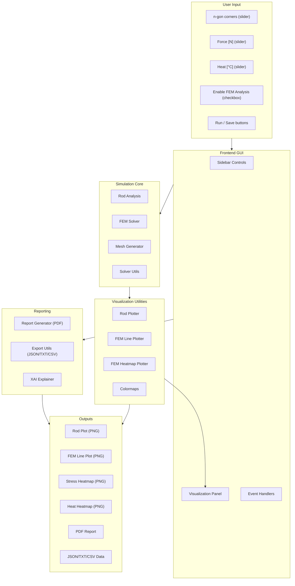
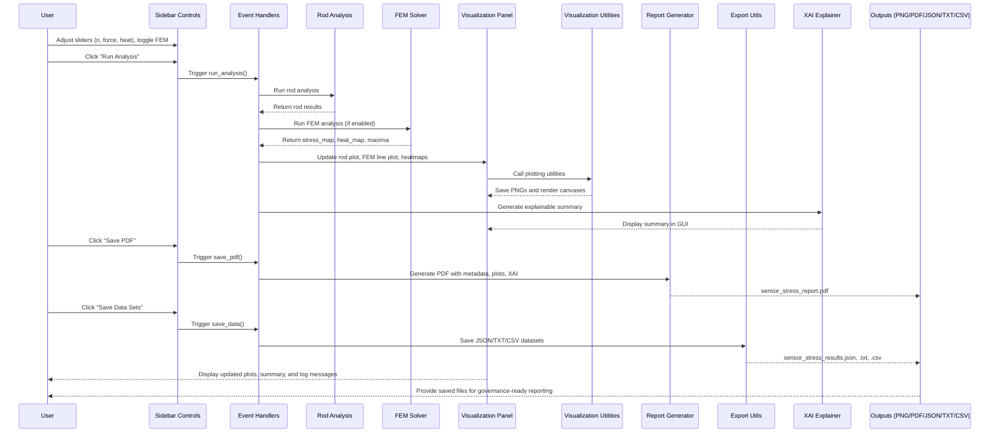
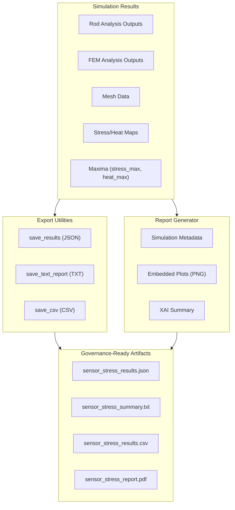
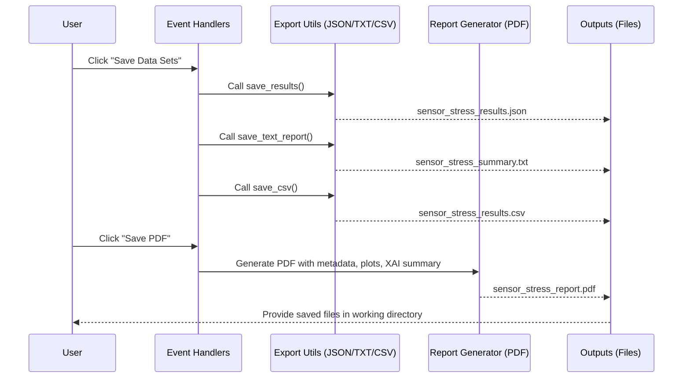
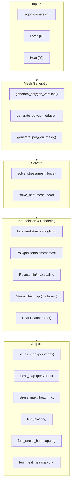
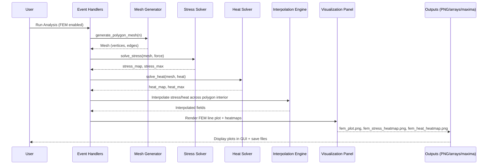
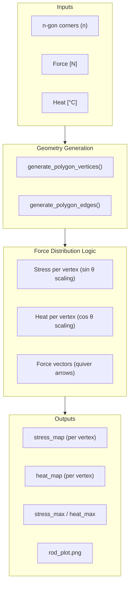
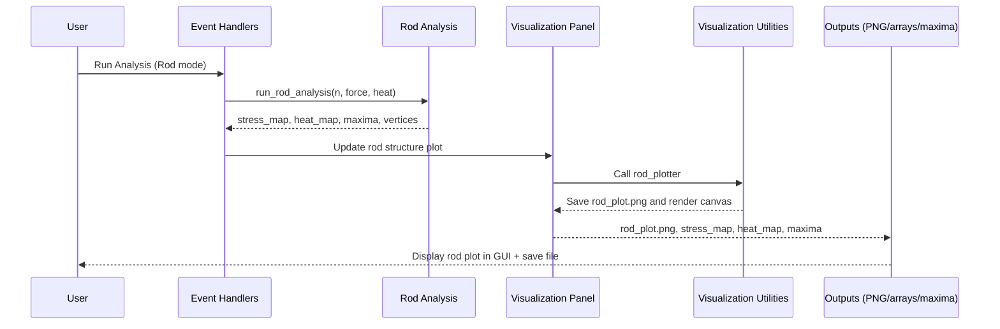

# 1. 🚀 Project Introduction: Sensor housing stress test simulator (rod-framework statics and finite element modeling - FEM)

The **Sensor Housing Stress Test Simulator** is a modular, GUI‑based engineering platform designed to evaluate the robustness of regular polygonal (n‑gonal) sensor housings under external mechanical forces and thermal loads. Modern sensors are increasingly deployed in environments where they must withstand both mechanical stress and thermal fluctuations, and their housings play a critical role in ensuring reliability, safety, and longevity. This simulator was conceived to provide engineers, researchers, and consultants with a transparent, reproducible, and narratable tool for exploring how geometry, force, and heat interact in sensor housing design.

At its core, the simulator unifies two complementary analytical approaches: **rod‑construction framework statics** (classical technical mechanics) and **simplified finite element methods (FEM)**. Rod statics provide fast, interpretable estimates of stress and heat distribution, offering immediate intuition about how loads propagate through polygonal structures. FEM analysis, by contrast, introduces higher fidelity through mesh‑driven distributions and interpolated heatmaps, enabling users to visualize stress and thermal fields across the entire housing. Together, these methods balance speed and interpretability with precision and detail, making the simulator suitable for both exploratory design and governance‑ready reporting.

The simulator emphasizes **explainability, reproducibility, and stakeholder communication**. Every simulation run produces not only real‑time visualizations but also structured exports in JSON, TXT, and CSV formats, alongside a governance‑ready PDF report. These artifacts ensure that results are traceable, auditable, and shareable across technical and non‑technical teams. The inclusion of an **Explainable AI (XAI) summary** further enhances transparency by narrating the results in plain language, highlighting maxima and resilience context, and situating findings within the broader design goals.

### Core Goals
- Rapidly explore **geometry–load interactions** across different polygonal configurations.
- Quantify **stress and heat distributions** at both vertex and field levels.
- Produce **auditable, shareable results** for design validation, onboarding, and consulting demos.

### Target Audience
The simulator is tailored for:
- **Mechanical and embedded engineers** seeking quick validation of housing designs.
- **Simulation practitioners and researchers** requiring reproducible workflows.
- **Consultants and onboarding teams** who need transparent, narratable outputs for stakeholder engagement.
- **Educators and students** exploring the fundamentals of statics and FEM in an interactive environment.

### Why Regular n‑gons?
Regular polygons provide a controlled geometric testbed for studying symmetry, corner effects, and load propagation. Their complexity scales with the number of corners (n), yet they remain analytically tractable, making them ideal for both teaching and applied research. By focusing on n‑gons, the simulator allows systematic exploration of how geometry influences stress concentration and thermal resilience.

### Motivation and Context
Sensor housings must balance **structural integrity** and **thermal resilience**. Corner placement and polygonal symmetry directly influence peak stress and hot spots, which can compromise performance if not properly managed. Rod statics deliver fast, interpretable estimates, while FEM introduces higher fidelity with mesh‑driven distributions and interpolated fields. Engineering decisions require **traceable artifacts**, and the simulator ensures this by producing consistent plots and structured datasets alongside a PDF report enriched with an explainable summary.

In essence, the Sensor Housing Stress Test Simulator is not just a computational tool—it is a **narrative platform for engineering analysis**. By transforming raw simulation data into transparent, reproducible, and communicable insights, it empowers teams to make informed decisions with confidence. The simulator bridges classical mechanics and FEM within a modern GUI, enabling users to explore, validate, and document sensor housing resilience in a way that is both technically rigorous and stakeholder‑friendly.

## Summary 1: Sensor housing stress test simulator

The Sensor Housing Stress Test Simulator is a modular, GUI-based engineering tool for analyzing the robustness of regular n‑gonal sensor housings under external force 
and thermal loads. It unifies two complementary approaches—rod-construction framework statics (technical mechanics) and simplified finite element methods (FEM)—to deliver 
fast intuition and governance-ready evidence. The simulator emphasizes explainability, reproducibility, and stakeholder communication through real-time visualization, 
structured exports, and PDF reporting.

- **Core goals:** Rapidly explore geometry–load interactions, quantify stress/heat distributions, and produce auditable, shareable results for design validation and onboarding.
- **Audience:** Mechanical/embedded engineers, simulation practitioners, researchers, consultants, and onboarding teams who need a transparent, repeatable workflow.
- **Why regular n‑gons:** They offer a controlled geometric space to study symmetry, corner effects, and load propagation; the complexity scales with n while remaining analytically tractable.

## Summary 2: Motivation and context

- **Design validation:** Sensor housings must balance structural integrity and thermal resilience; corner placement and polygonal symmetry impact peak stress and hot spots.
- **Dual-method insight:** Rod statics provide fast, interpretable estimates; FEM introduces higher fidelity with mesh-driven distributions and interpolated fields.
- **Governance and reproducibility:** Engineering decisions require traceable artifacts. The simulator produces consistent plots and structured datasets (JSON/TXT/CSV) alongside a 
PDF report with an explainable summary (see [References](https://github.com/NenadBalaneskovic/ExternalProjects/blob/main/Weather_Aggregator_FlaskApp/Weather_Aggregator_FlaskApp.md#8--references) 1 - 3 below). 


## Methodological approach

- **Rod-construction statics (Technical mechanics):**  
  - **Geometry:** Regular n‑gon vertices generated on a unit circle.  
  - **Loads:** Force and heat modeled against vertex angles to produce per-corner distributions.  
  - **Outputs:** Vertex-level stress and heat arrays, maxima, and a rod plot with vector fields.

- **Finite element methods (FEM, simplified):**  
  - **Mesh:** Polygon mesh derived from vertices and edges for per-vertex fields.  
  - **Solvers:** Stress and heat maps computed from parametric models tied to applied force and temperature.  
  - **Interpolation:** In-polygon heatmaps via distance-weighted interpolation for dense visual fields.  
  - **Outputs:** Stress/heat line plot, two heatmaps (stress and heat) constrained to the polygon interior, and quantitative maxima.

## Architecture and components

This architecture is designed to showcase **transparency, modularity, and operational reliability** — ideal for consulting demos and technical interviews:

- **GUI:**  
  - **Sidebar controls:** Sliders for n (corners), force (N), heat (°C), and FEM toggle; Run, Save PDF, Save Data actions.  
  - **Visualization panel:**  
    - Rod structure plot with forces  
    - FEM stress & heat line plot  
    - Stress heatmap on n‑gon  
    - Heat heatmap on n‑gon  
    - Quantitative Summary (XAI) and Log window

- **Simulation modules:**  
  - **Rod analysis:** Generates vertices and computes stress/heat distributions from trigonometric relationships with angles.  
  - **FEM solver:** Builds mesh, computes stress/heat per vertex, and derives maxima for reporting.

- **Visualization utilities:**  
  - **Plot generators:** Dedicated functions for rod, line plots, and heatmaps; consistent colormaps and layout settings.  
  - **File outputs:** Plots saved as PNGs with stable filenames for downstream embedding.

- **Reporting and export:**  
  - **PDF report:** Simulation metadata, embedded plots, and governance-ready XAI summary.  
  - **Data exports:**  
    - JSON: full results dictionary with lists for arrays  
    - TXT: readable summary for quick review  
    - CSV: scalar metadata plus tabular sections (vertices, forces, stress map, heat map)

## Key capabilities and guarantees

- **Interactivity:** Immediate feedback as parameters change; FEM mode toggles higher-fidelity visuals.  
- **Explainability (XAI):** Structured textual summary including inputs, maxima, and contextualized findings.  
- **Reproducibility:** Deterministic geometry, consistent filenames, and stable export formats for auditing.  
- **Governance-ready artifacts:** PDF reports with embedded figures and machine-readable datasets suitable for compliance, review boards, and stakeholder sharing.

## Typical workflow

1. **Configure parameters:** Set n (corners), force (N), and heat (°C); enable FEM if needed.  
2. **Run analysis:** Generate rod plot and, optionally, FEM plots and heatmaps.  
3. **Review results:** Inspect line plot, heatmaps, maxima, and XAI summary in the GUI.  
4. **Export artifacts:** Save PDF report for stakeholders and JSON/TXT/CSV datasets for downstream analysis or archiving.
 
## 🧠 **GUI sketch**  

In the following we address our full GUI sketch, a clean, structured layout for our Flask-based Weather Aggregator App. It includes all the key modules we discussed: 
objective and constraint input, method selection forecasting models), result display, visualization, and diagnostics.


We are ready to scaffold this into actual Pythonic code and wire up the backend logic for method selection and routing.

---

# 2. Features

## Interactive GUI with sliders for force, heat, and polygon complexity
- **Controls:** n-gon corners (n), force (N), heat (°C), and a FEM toggle for high‑fidelity mode.
- **Actions:** **Run Analysis** triggers computation and visual updates; **Save PDF** and **Save Data Sets** produce governance‑ready artifacts.
- **Responsive labels:** **n-gon: X corners**, **Force [N]: Y**, **Heat [°C]: Z** update live with slider changes.
- **Log window:** **Status messages** for runs and saves (e.g., “Saved: fem_heat_heatmap.png”) provide transparent, auditable feedback.

## Dual-mode simulation: rod-based statics and FEM analysis
- **Rod statics mode:**  
  - **Computation:** Angle-driven distributions for stress and heat per vertex.  
  - **Outputs:** Vertex arrays, maxima, and force quiver overlay on the polygon.  
  - **Use case:** Fast, interpretable exploration of geometry–load behavior.
- **FEM mode (simplified):**  
  - **Mesh:** Vertices and edges define an n‑gonal mesh, with per‑vertex stress/heat.  
  - **Solvers:** Parametric stress/heat maps; maxima recorded for reporting.  
  - **Use case:** Higher‑fidelity, mesh‑driven visuals and field interpolation.

## Real-time visualization: rod structure, stress/heat plots, heatmaps
- **Rod structure plot:**  
  - **View:** Polygon outline with force vectors at vertices.  
  - **Saved as:** rod_plot.png (embedded later in PDF).
- **FEM stress & heat line plot:**  
  - **View:** Two lines (stress, heat) vs. corner index with grid and legend.  
  - **Saved as:** fem_plot.png.
- **Heatmaps on n‑gon:**  
  - **Stress heatmap:** Interpolated field constrained to polygon interior, consistent coolwarm scale.  
  - **Heat heatmap:** Interpolated field with hot colormap for thermal intensity.  
  - **Saved as:** fem_stress_heatmap.png and fem_heat_heatmap.png (also fem_heatmap.png for compatibility).
- **XAI and log panels:**  
  - **XAI:** Text summary updated per run for quick quantitative context.  
  - **Log:** Immediate confirmation of saved figures and files.

## Export capabilities: PDF reports, JSON/TXT/CSV datasets
- **PDF report:**  
  - **Contents:** App header, simulation metadata, embedded plots (rod, FEM line, stress/heat heatmaps), and XAI summary.  
  - **Encoding:** Unicode‑unsafe characters sanitized to ensure robust output.  
  - **Saved as:** sensor_stress_report.pdf.
- **JSON:**  
  - **Contents:** Full results dictionary with arrays converted to lists (mesh, vertices, stress/heat maps, maxima).  
  - **Saved as:** sensor_stress_results.json.
- **TXT summary:**  
  - **Contents:** Human‑readable overview (mode, n, force, heat, arrays, maxima).  
  - **Saved as:** sensor_stress_summary.txt.
- **CSV datasets:**  
  - **Contents:** Scalar metadata plus tabular sections for vertices, forces, stress_map, heat_map.  
  - **Saved as:** sensor_stress_results.csv.

## Explainable AI summary for governance-ready insights
- **Contextual narrative:**  
  - **Inputs:** Mode (Rod/FEM), n, force, heat.  
  - **Highlights:** Max stress and heat with concise interpretation of structural and thermal resilience.  
  - **Tone:** Clear, quantitative, and stakeholder‑friendly for reviews, demos, and documentation.
- **Placement:** Displayed in the **Quantitative Summary (XAI)** panel in the GUI and included in the PDF report.
- **Consistency:** Uses application metadata (name, version) for traceability across exports.

---

# 3. Installation

## System requirements
- **Python:** 3.9–3.11 recommended
- **OS:** Windows, macOS, or Linux with GUI support
- **Libraries:** PyQt5, matplotlib, numpy, fpdf
- **Disk permissions:** Ability to write PNG, PDF, JSON, TXT, and CSV files in the project directory

## Setup instructions

### Option A — using conda
- **Create environment:**
  ```
  conda create -n sensor-simulator python=3.11
  conda activate sensor-simulator
  ```
- **Install dependencies:**
  ```
  pip install PyQt5 matplotlib numpy fpdf
  ```

### Option B — using pip only
- **Create and activate virtualenv (optional but recommended):**
  ```
  python -m venv .venv
  # Windows
  .venv\Scripts\activate
  # macOS/Linux
  source .venv/bin/activate
  ```
- **Install dependencies:**
  ```
  pip install PyQt5 matplotlib numpy fpdf
  ```

## Running the application
- **Start the GUI:**
  ```
  python main.py
  ```
- **Window configuration:** The app launches as “Sensor Stress Analyzer v1.0.0” with a resizable main window.
- **Output directory:** All generated files (PNG, PDF, JSON, TXT, CSV) are saved to the current working directory unless customized.

---

# 4. GUI walkthrough

## Sidebar controls
- **n‑gon slider:**  
  - Adjusts polygon complexity; label updates to “n‑gon: X corners”.
- **Force slider:**  
  - Sets applied force in Newtons; label updates to “Force [N]: Y”.
- **Heat slider:**  
  - Sets applied temperature in °C; label updates to “Heat [°C]: Z”.
- **FEM toggle:**  
  - Enables higher‑fidelity FEM analysis (line plot + heatmaps) when checked.
- **Run Analysis button:**  
  - Executes rod analysis always; if FEM is enabled, adds FEM plots and heatmaps.
- **Save buttons:**  
  - **Save PDF:** Produces governance‑ready report with results, plots, and XAI summary.  
  - **Save Data Sets:** Exports JSON, TXT, and CSV datasets for auditing and downstream analysis.

## Visualization panel

### Rod structure plot
- **View:** Polygon outline with red force vectors at vertices; aspect equal, axes hidden.
- **Updates:** Reflects current n, force, and heat.  
- **Saved file:** rod_plot.png

### FEM stress & heat line plot
- **View:** Two curves (Stress, Heat) over corner index; legend and grid included.
- **Updates:** Appears when FEM is enabled; uses current inputs.  
- **Saved file:** fem_plot.png

### Stress and heat heatmaps
- **Stress heatmap:**  
  - **View:** Interpolated stress field constrained to the polygon interior; coolwarm colormap and colorbar.  
  - **Saved file:** fem_stress_heatmap.png
- **Heat heatmap:**  
  - **View:** Interpolated thermal field; hot colormap and colorbar.  
  - **Saved file:** fem_heat_heatmap.png
- **Compatibility:** A duplicate stress heatmap may also be saved as fem_heatmap.png for downstream tooling.

### XAI summary and log window
- **XAI summary:**  
  - **Content:** Mode, inputs (n, force, heat), maxima (stress, heat), and concise governance‑ready narrative.
- **Log window:**  
  - **Feedback:** Confirms saved figures and files (e.g., “Saved: fem_heat_heatmap.png”, “PDF report saved: sensor_stress_report.pdf”).

## Output files and locations
- **Plots (PNG):**  
  - **Rod:** rod_plot.png  
  - **FEM line:** fem_plot.png  
  - **Stress heatmap:** fem_stress_heatmap.png  
  - **Heat heatmap:** fem_heat_heatmap.png
- **PDF report:**  
  - **Filename:** sensor_stress_report.pdf  
  - **Contents:** App header, simulation metadata, sanitized text, all plots, and XAI summary.
- **Data exports:**  
  - **JSON:** sensor_stress_results.json (full dictionary; arrays converted to lists)  
  - **TXT:** sensor_stress_summary.txt (human‑readable overview)  
  - **CSV:** sensor_stress_results.csv (scalar metadata plus tabular sections: vertices, forces, stress_map, heat_map)
- **Save path:** Current working directory by default; ensure write permissions before running.

---

# 5. Simulation architecture

## Rod analysis

### Force distribution logic
- **Model:**  
  - **Stress:** Per‑vertex stress computed from applied force scaled by angle:  
    - stress_map = force · (1 + 0.1 · sin(θᵢ))  
  - **Heat:** Per-vertex heat computed from applied temperature scaled by angle:  
    - heat_map = heat · (1 + 0.05 · cos(θᵢ))
- **Outputs:**  
  - **Arrays:** stress_map, heat_map (length n)  
  - **Maxima:** stress_max, heat_max  
  - **Forces:** Quiver vectors derived from force and vertex angles for plotting

### Geometry generation
- **Vertices:**  
  - **Construction:** Regular n-gon on unit circle using evenly spaced angles over [0, 2π).  
  - **Format:** np.ndarray of shape (n, 2), then converted to lists for export.
- **Usage:**  
  - **Rod plot:** Polygon outline and quiver arrows.  
  - **Downstream:** Provides consistent indexing for stress/heat arrays and CSV export.

## FEM analysis

### Mesh generation
- **Structure:**  
  - **Vertices:** Same regular n‑gon vertex set used for FEM inputs.  
  - **Edges:** Consecutive index pairs with wrap‑around to close the polygon.  
- **Format:**  
  - **Mesh dict:** {"n": n, "vertices": np.ndarray, "edges": np.ndarray}  
  - **Serialization:** Converted to lists for JSON/TXT/CSV.

### Stress and heat solvers
- **Per‑vertex fields:**  
  - **Stress:** force‑scaled, angle‑modulated field analogous to rod analysis, enabling consistent maxima and trends.  
  - **Heat:** heat‑scaled, angle‑modulated field, ensuring a smooth thermal profile across vertices.
- **Outputs:**  
  - **Maps:** stress_map, heat_map (length n)  
  - **Maxima:** stress_max, heat_max stored explicitly for reporting.

### Interpolation and heatmap rendering
- **Goal:** Dense, interior heatmaps constrained to the polygon.  
- **Method:**  
  - **Grid:** Uniform XY grid over padded polygon bounds.  
  - **Containment:** Mask via matplotlib Path.contains_points to limit interpolation to interior.  
  - **Weights:** Inverse‑distance weighting of vertex values with normalization and small ε for stability.  
  - **Robust scaling:** 2–98% percentile range for vmin/vmax to avoid outlier clipping artifacts.  
- **Visuals:**  
  - **Stress heatmap:** coolwarm colormap, polygon outline overlay, labeled colorbar.  
  - **Heat heatmap:** hot colormap, polygon outline overlay, labeled colorbar.  
  - **Files:** fem_stress_heatmap.png, fem_heat_heatmap.png (and fem_heatmap.png for compatibility).

---

# 6. Reporting and export

## PDF report generation

### Embedded plots
- **Included figures:**  
  - **Rod structure:** rod_plot.png  
  - **FEM line plot:** fem_plot.png  
  - **Stress heatmap:** fem_stress_heatmap.png  
  - **Heat heatmap:** fem_heat_heatmap.png
- **Layout:**  
  - **Scaling:** Images embedded with fixed width for page consistency.  
  - **Flow:** Results section first, then plots, followed by XAI summary.

### Simulation metadata
- **Header:**  
  - **App info:** Application name and version for traceability.  
- **Content:**  
  - **Inputs:** mode, n, force, heat.  
  - **Results:** stress_map, heat_map, stress_max, heat_max.  
  - **Mesh:** vertices and edges (FEM mode).
- **Sanitization:**  
  - **Text safety:** Replacement of em/en dashes and bullets with ASCII equivalents to prevent PDF encoding issues.

### XAI summary
- **Purpose:**  
  - **Narrative:** Concise interpretation of maxima and input conditions, designed for stakeholders and governance reviews.  
- **Placement:**  
  - **Section:** “Explainable AI Summary” appended to the report after plots.

## Data exports

### JSON: full results dictionary
- **Content:**  
  - **Complete results:** mode, n, force, heat, maxima, arrays, and mesh data.  
  - **Serialization:** NumPy arrays converted to lists for portability.
- **Filename:**  
  - **Default:** sensor_stress_results.json

### TXT: readable summary
- **Content:**  
  - **Readable fields:** Inputs, arrays printed inline, maxima for quick inspection.  
  - **Use case:** Lightweight artifacts for reviews and non‑technical stakeholders.
- **Filename:**  
  - **Default:** sensor_stress_summary.txt

### CSV: tabular datasets (vertices, forces, stress/heat maps)
- **Content:**  
  - **Scalars:** mode, n, force, heat, stress_max, heat_max.  
  - **Tables:**  
    - **Vertices (x, y)**  
    - **Forces (fx, fy)**  
    - **Stress Map** (one value per row)  
    - **Heat Map** (one value per row)
- **Robustness:**  
  - **Type handling:** Distinguishes scalars, 1D lists, 2D lists, and dicts to avoid iteration errors.  
- **Filename:**  
  - **Default:** sensor_stress_results.csv
  
  ---
  
# 7. Code structure

This is a comprehensive, notebook-ready Markdown explanation of major Pythonic modules
our Sensor Housing stress test simulator GUI should support. Each section includes mathematical 
foundations, algorithmic steps, and illustrative examples.

## 📁 Project Structure

Here's a modularized folder structure tailored for our **Sensor Housing Stress Simulator GUI** project, optimized for local 
FEM development in a Jupyter notebook and later transition to a production-ready consulting demo. 
It reflects all the architectural layers we've discussed — from frontend to ensemble modeling, FEM and rod-framework static 
analysis integration, governance, and PDF reporting.

### 📁 Modularized Folder Structure Overview

```
sensor_stress_analyzer/
│
├── main.py                        # Entry point: launches the PyQt5 GUI
├── config.py                      # Global constants, ranges, styles
│
├── gui/                           # GUI components
│   ├── __init__.py
│   ├── main_window.py             # Main GUI layout: sliders, buttons, graphics windows
│   ├── sidebar_controls.py        # Sliders, checkbox, button logic
│   ├── visualization_panel.py     # Rod-structure + FEM graphics windows
│   └── event_handlers.py          # Connects GUI actions to simulation triggers
│
├── simulation/                    # Simulation logic
│   ├── __init__.py
│   ├── rod_analysis.py            # Analytical rod deformation model
│   ├── fem_solver.py              # FEM simulation (stress + heat)
│   ├── mesh_generator.py          # Polygon mesh creation for FEM
│   └── solver_utils.py            # Cython/CPython acceleration hooks
│
├── visualization/                # Plotting and rendering
│   ├── __init__.py
│   ├── rod_plotter.py             # Draws polygon + force/heat vectors
│   ├── fem_plotter.py             # PyVista + matplotlib visualizations
│   └── color_maps.py              # Custom gradients and overlays
│
├── reporting/                    # XAI-driven PDF reporting
│   ├── __init__.py
│   ├── report_generator.py        # Assembles PDF with visuals + narration
│   ├── xai_explainer.py           # Explainability commentary module
│   └── export_utils.py            # Save plots, data, and PDF
│
├── assets/                       # Static assets (icons, logos, templates)
│   ├── logo.png
│   └── report_template.tex        # Optional LaTeX template for PDF
│
└── tests/                        # Unit tests and validation
    ├── test_rod_analysis.py
    ├── test_fem_solver.py
    └── test_gui_interactions.py
```

### 🧩 Modular Highlights

- **`gui/`**: Clean separation of layout, controls, and event logic.
- **`simulation/`**: Depth toggle handled via `event_handlers.py`, routing to either `rod_analysis.py` or `fem_solver.py`.
- **`visualization/`**: Dual rendering with PyVista (3D) and matplotlib (2D).
- **`reporting/`**: Narratable, governance-ready PDF with explainability commentary.
- **`solver_utils.py`**: Hooks for Cython/CPython acceleration in FEM mode.
- **`tests/`**: Ensures reproducibility and robustness.

## Overview
- **Main entry:** The application starts in `main.py`, initializing the Qt app and wiring GUI components.
- **Packages:**  
  - `gui/` — user interface and interaction logic  
  - `simulation/` — computational core for rod and FEM analyses  
  - `visualization/` — plot generators and colormap utilities  
  - `reporting/` — PDF generation, data exports, and explainable summaries
- **Data flow:**  
  - **Inputs →** `gui.sidebar_controls`  
  - **Run →** `gui.event_handlers` calls `simulation` modules  
  - **Results →** `gui.visualization_panel` and `visualization` functions for plots  
  - **Exports →** `reporting` to produce PDF and datasets

## main.py: Entry point
- **Role:** Bootstraps the Qt application, constructs `MainWindow`, and starts the event loop.
- **Key behavior:**  
  - **Window config:** Sets title “Sensor Stress Analyzer v1.0.0” and size.  
  - **Lifecycle:** Cleanly exits on Qt application close.

## gui/: GUI components

### main_window.py
- **Purpose:** Composes the main window layout: sidebar (left) and visualization panel in a scroll area (right).
- **Integration:**  
  - **Composition:** Instantiates `Sidebar` and `VisualizationPanel`.  
  - **Event wiring:** Creates `EventHandlers` with references to both UI components.

### sidebar_controls.py
- **Purpose:** Provides user inputs and actions.
- **Controls:**  
  - **Sliders:** **n-gon**, **Force [N]**, **Heat [°C]** with live label updates.  
  - **Toggle:** **Enable FEM Analysis** checkbox.  
  - **Buttons:** **Run Analysis** (mandatory), used by `EventHandlers`.

### visualization_panel.py
- **Purpose:** Displays results, plots, and logs; provides save actions.
- **Components:**  
  - **Rod structure canvas**  
  - **FEM line plot canvas**  
  - **Stress and heat heatmap canvases**  
  - **XAI summary (read-only text)**  
  - **Log window**  
  - **Actions:** **Save PDF**, **Save Data Sets** buttons
- **Plot saving:** Saves PNGs (rod, FEM line, stress/heat heatmaps) to stable filenames for reporting.

### event_handlers.py
- **Purpose:** Connects UI events to simulation, visualization, and export actions.
- **Flow:**  
  - **Run Analysis:** Reads inputs → runs `simulation.rod_analysis` and optionally `simulation.fem_solver` → updates all plots and XAI → logs status → caches `last_results`.  
  - **Save PDF:** Builds PDF via `reporting.report_generator`.  
  - **Save Data Sets:** Persists JSON/TXT/CSV via `reporting.export_utils`.

## simulation/: Core analysis modules

### rod_analysis.py
- **Function:** `run_rod_analysis(n, force, heat)`
- **Logic:**  
  - **Geometry:** Regular n-gon vertices on unit circle.  
  - **Fields:** Angle-modulated stress and heat arrays.  
  - **Outputs:** Results dict with arrays, maxima, and vertices for plotting/export.

### fem_solver.py
- **Function:** `run_fem_analysis(n, force, heat)`
- **Logic:**  
  - **Mesh:** Uses `mesh_generator.generate_mesh` (alias of polygon mesh) for vertices/edges.  
  - **Solvers:** Per-vertex stress/heat fields with maxima.  
  - **Outputs:** Results dict with mode, inputs, mesh, arrays, and maxima.

### mesh_generator.py
- **Functions:**  
  - **generate_polygon_vertices(n, radius):** Evenly spaced angles → `(x, y)` coordinates.  
  - **generate_polygon_edges(vertices):** Consecutive index pairs, wrap-around closure.  
  - **generate_polygon_mesh(n, radius):** Returns dict `{n, vertices, edges}`; aliased as `generate_mesh`.

### solver_utils.py
- **Utilities:**  
  - **solve_stress(mesh, force):** Angle-based stress per vertex.  
  - **solve_heat(mesh, heat):** Angle-based heat per vertex.  
  - **accelerate_solver:** Placeholder for future performance enhancements.  
  - **benchmark_solver:** Timing helper for profiling.  
  - **validate_results:** Basic completeness checks for solver outputs.

## reporting/: Export and reporting

### report_generator.py
- **Class:** `ReportGenerator(results)`
- **PDF content:**  
  - **Header:** App name and version.  
  - **Simulation results:** Sanitized text to avoid encoding issues.  
  - **Plots:** Embeds `rod_plot.png`, `fem_plot.png`, `fem_stress_heatmap.png`, `fem_heat_heatmap.png`.  
  - **XAI summary:** Governance-ready narrative appended at the end.
- **Sanitization:** Replaces em/en dashes and bullets with ASCII equivalents for PDF safety.

### export_utils.py
- **Functions:**  
  - **save_results(results):** JSON (arrays → lists).  
  - **save_text_report(results):** Human-readable TXT summary.  
  - **save_csv(results):** Robust CSV writer handling scalars, 1D/2D lists, dicts; includes sections for vertices, forces, stress_map, heat_map.
- **Reliability:** Defensive type handling prevents “iterable expected, not float” errors.

### xai_explainer.py
- **Function:** `explain_results(results)`
- **Output:**  
  - **Header:** App name and version.  
  - **Narrative:** Mode, inputs, maxima, and concise interpretation of structural/thermal resilience.

## visualization/: Plotting utilities

### rod_plotter.py
- **Function:** `plot_rod_structure(n, force, heat, filename="rod_plot.png")`
- **Behavior:**  
  - **Generates:** Polygon outline and quiver force vectors.  
  - **Saves:** High-resolution PNG with stable filename.  
  - **Returns:** Dict of vertices and forces for downstream use.

### fem_plotter.py
- **Functions:**  
  - **plot_fem_line(stress_map, heat_map, filename="fem_plot.png"):** Dual-line plot of stress/heat over vertices.  
  - **plot_fem_heatmap(vertices, values, cmap, label, filename):** Interpolated interior heatmap with robust scaling.  
  - **plot_fem_heatmaps(vertices, stress_map, heat_map):** Convenience wrapper saving `fem_stress_heatmap.png`, `fem_heat_heatmap.png` (and `fem_heatmap.png` for compatibility).

### color_maps.py
- **Functions:**  
  - **get_stress_colormap():** Returns consistent stress colormap (coolwarm).  
  - **get_heat_colormap():** Returns consistent heat colormap (hot).  
  - **get_colormap(label):** Unified accessor with validation.

## Inter-module interactions
- **GUI → Simulation:** `EventHandlers.run_analysis` routes user inputs to `rod_analysis` and `fem_solver`.
- **Simulation → Visualization:** Results arrays and vertices feed plotting functions and canvases.
- **Visualization → Reporting:** PNGs saved by visualization are consumed by `ReportGenerator` for embedding.
- **Simulation/Visualization → Export:** Results dict serialized by `export_utils` into JSON/TXT/CSV for auditing.

---

# 8. Sample outputs

## Screenshots of GUI in action
- **Main window:**  
  - Left sidebar with sliders for n‑gon corners, force, and heat, plus FEM toggle and run/save buttons.  
  - Right visualization panel showing rod structure plot, FEM stress & heat line plot, stress heatmap, heat heatmap, XAI summary, and log window.  
- **Dynamic updates:** Adjusting sliders immediately changes labels and updates plots when analysis is run.  
- **Log window:** Confirms saved files (e.g., “Saved: fem_heat_heatmap.png”, “PDF report saved: sensor_stress_report.pdf”).

## Example PDF report (with embedded plots)
- **Header:** Application name and version.  
- **Simulation results:** Mode, n, force, heat, maxima, and arrays.  
- **Plots:**  
  - Rod structure (rod_plot.png)  
  - FEM stress & heat line plot (fem_plot.png)  
  - Stress heatmap (fem_stress_heatmap.png)  
  - Heat heatmap (fem_heat_heatmap.png)  
- **XAI summary:** Concise narrative highlighting maxima and resilience context.

## Snippets from exported CSV/TXT/JSON files
- **CSV (sensor_stress_results.csv):**
  ```
  mode,FEM Analysis
  n,12
  force,50
  heat,50
  stress_max,55.0
  heat_max,52.5

  Stress Map
  50.0
  52.5
  54.33
  ...
  ```
- **TXT (sensor_stress_summary.txt):**
  ```
  Sensor Stress Analyzer Results
  ========================================
  mode: FEM Analysis
  n: 12
  force: 50
  heat: 50
  stress_max: 55.00
  heat_max: 52.50
  ```
- **JSON (sensor_stress_results.json):**
  ```json
  {
    "mode": "FEM Analysis",
    "n": 12,
    "force": 50,
    "heat": 50,
    "mesh": {"n": 12, "vertices": [[1.0, 0.0], ...]},
    "stress_map": [50.0, 52.5, 54.33, ...],
    "heat_map": [52.5, 52.16, 51.25, ...],
    "stress_max": 55.0,
    "heat_max": 52.5
  }
  ```

---

# 9. Use cases

## Engineering design validation
- **Purpose:** Evaluate robustness of sensor housings under varying loads and temperatures.  
- **Benefit:** Identify peak stress and heat regions before prototyping.  
- **Outcome:** Reduce design iterations and improve reliability.

## Sensor housing robustness testing
- **Purpose:** Simulate external impacts on polygonal housings.  
- **Benefit:** Quantify resilience and detect weak points.  
- **Outcome:** Support compliance and certification processes.

## Educational demos for mechanics and FEM
- **Purpose:** Teach fundamentals of rod statics and FEM in an interactive environment.  
- **Benefit:** Visualize stress/heat distributions in real time.  
- **Outcome:** Enhance student understanding of geometry–load relationships.

## Governance-ready reporting for stakeholders
- **Purpose:** Provide transparent, auditable artifacts for decision-making.  
- **Benefit:** PDF reports with embedded plots and explainable summaries.  
- **Outcome:** Facilitate communication with managers, clients, and regulatory boards.

---

# 10. Future work

## Support for irregular geometries
- Extend mesh generation to handle non‑regular polygons and arbitrary sensor housing shapes.  
- Allow import of CAD geometries for more realistic analysis.

## Parametric material properties
- Introduce material models (elastic modulus, thermal conductivity).  
- Enable simulations that reflect different sensor housing materials.

## 3D visualization
- Move beyond 2D n‑gons to 3D polyhedral housings.  
- Provide volumetric stress/heat maps and interactive rotation.

## Batch simulation mode
- Allow multiple parameter sets to be run automatically.  
- Export aggregated results for comparative studies and optimization.  

---
 

# 🔥 11. Architecture and Sequence Diagrams (Mermaid)

## 11.1 📊 Architecture Diagram (Mermaid)

Here’s a **modular architecture diagram** in **Mermaid syntax** that visually shows the flow between components in our **Sensor Housing Stress Test Simulator GUI**.  
This complements the README and makes the system narratable for executives and technical teams alike.



### 🧩 How to Read This Diagram
- **User Input → GUI:** Sliders and buttons feed into sidebar controls and event handlers.  
- **GUI → Simulation Core:** Event handlers call rod analysis or FEM solver depending on toggle.  
- **Simulation Core → Visualization Utilities:** Results arrays passed to plotting functions.  
- **Visualization → Outputs:** Plots saved as PNGs and displayed in GUI.  
- **Reporting:** Report generator embeds plots and metadata into PDF; export utils produce JSON/TXT/CSV.  
- **Outputs:** Governance-ready artifacts for stakeholders and technical teams.

## 11.2 📊 Sequence Diagram (Mermaid)

Below is the **sequence diagram** that shows the step‑by‑step interaction flow in our **Sensor Housing Stress Test Simulator**.  
This complements the architecture diagram by narrating the runtime process from user input to final report.



### 🧩 How to Read This Diagram
- **User → Sidebar:** Inputs and actions flow through sidebar controls.  
- **Sidebar → Event Handlers:** Central dispatcher for simulation and export logic.  
- **Event Handlers → Simulation:** Rod analysis always runs; FEM solver runs if enabled.  
- **Simulation → Visualization:** Results passed to plotting utilities, saved as PNGs, and rendered in GUI.  
- **Event Handlers → Reporting:** PDF generator embeds plots and metadata; export utils produce JSON/TXT/CSV.  
- **Outputs:** User receives updated GUI visuals plus saved governance-ready artifacts.

This chapter makes the **system modular, transparent, and narratable** — ideal for consulting demos, onboarding, and stakeholder communication.  

---

# 🔥 12. Data Export Pipeline Diagrams (Mermaid)

## 12.1 📊 Data Export Architecture Diagram (Mermaid)

Here’s a **modular architecture diagram** in **Mermaid syntax** that visually shows how the **Sensor Housing Stress Test Simulator** produces 
governance‑ready artifacts (JSON, TXT, CSV, PDF). This complements the README and makes the export pipeline narratable for stakeholders.



### 🧩 How to Read This Diagram
- **Simulation Results → Export Utilities:** Raw arrays and metadata are serialized into JSON, TXT, and CSV.  
- **Simulation Results → Report Generator:** Metadata, plots, and XAI summary are assembled into a PDF.  
- **Outputs:** All artifacts are saved in the working directory, ensuring reproducibility and governance readiness.

## 12.2 📊 Data Export Sequence Diagram (Mermaid)

Below is the **sequence diagram** that narrates the step‑by‑step process of exporting results and generating reports.



### 🧩 How to Read This Diagram
- **User → Event Handlers:** Actions trigger either dataset export or PDF generation.  
- **Event Handlers → Export Utils:** JSON, TXT, and CSV files are created sequentially.  
- **Event Handlers → Report Generator:** PDF report is generated with embedded plots and explainable summary.  
- **Outputs → User:** All files are saved locally, ready for auditing, sharing, or stakeholder review.

This chapter makes the **data export pipeline transparent and narratable**, showing exactly how simulation results become governance-ready artifacts.  

---

# 🔥 14. FEM Analysis Pipeline Diagrams (Mermaid)

## 14.1 📊 FEM Analysis Architecture Diagram (Mermaid)

Here’s a **modular architecture diagram** in **Mermaid syntax** that visually shows the **Finite Element Method (FEM) pipeline** inside the Sensor Housing Stress Test Simulator.  
This complements the README and makes the FEM workflow narratable for technical and stakeholder audiences.



### 🧩 How to Read This Diagram
- **Inputs → Mesh Generation:** User parameters define polygon vertices and edges.  
- **Mesh → Solvers:** Stress and heat solvers compute per‑vertex values.  
- **Solvers → Interpolation:** Values interpolated across polygon interior using inverse‑distance weighting and containment mask.  
- **Interpolation → Rendering:** Heatmaps generated with robust scaling and consistent colormaps.  
- **Outputs:** Arrays, maxima, and PNG plots saved for visualization and reporting.

## 14.2 📊 FEM Analysis Sequence Diagram (Mermaid)

Below is the **sequence diagram** that narrates the runtime process of FEM analysis from user input to final plots.



### 🧩 How to Read This Diagram
- **User → Event Handlers:** FEM mode triggers mesh generation and solvers.  
- **Mesh Generator:** Produces vertices and edges for polygon.  
- **Stress/Heat Solvers:** Compute per‑vertex values and maxima.  
- **Interpolation Engine:** Expands values into dense fields constrained to polygon interior.  
- **Visualization Panel:** Renders line plot and heatmaps, saving PNGs.  
- **Outputs:** User sees plots in GUI and files saved for reporting.

This chapter makes the **FEM pipeline transparent and narratable**, showing exactly how geometry, solvers, and interpolation combine to produce stress and heat maps.  

---

# 🔥 15. Rod Analysis Pipeline Diagrams (Mermaid)

## 15.1 📊 Rod Analysis Architecture Diagram (Mermaid)

Here’s a **modular architecture diagram** in **Mermaid syntax** that visually shows the **Rod Analysis pipeline** inside the Sensor Housing Stress Test Simulator.  
This complements the FEM pipeline and makes the rod‑based statics workflow narratable for technical and stakeholder audiences.



### 🧩 How to Read This Diagram
- **Inputs → Geometry Generation:** User parameters define polygon vertices and edges.  
- **Geometry → Force Distribution:** Stress and heat arrays computed using trigonometric scaling; force vectors derived for plotting.  
- **Outputs:** Arrays, maxima, and rod plot PNG saved for visualization and reporting.

---

## 15.2 📊 Rod Analysis Sequence Diagram (Mermaid)

Below is the **sequence diagram** that narrates the runtime process of rod analysis from user input to final plot.



### 🧩 How to Read This Diagram
- **User → Event Handlers:** Rod mode triggers rod analysis.  
- **Rod Analysis:** Computes stress/heat arrays and maxima based on geometry and applied force/heat.  
- **Visualization Panel → Utilities:** Calls rod plotter to render polygon outline and quiver arrows.  
- **Outputs:** Rod plot PNG saved, arrays and maxima available for reporting and export.

This chapter completes the **simulation pipeline documentation**, showing both **Rod Analysis** and **FEM Analysis** side 
by side. Together, they narrate how the simulator supports dual‑mode workflows for fast intuition and higher‑fidelity FEM insights
(see also the README.md file for additional workflow summary).

---


# 16. 🔗 Results and Conclusions

## 16.1 📊 Start the Sensor Housing Stress Test Simulator

### ✅ Step 1: Download the folder

Download the main folder  
📁 [Sensor_Housing_Stress_Test_Simulator](https://github.com/NenadBalaneskovic/ExternalProjects/tree/main/Sensor_Housing_Stress_Test_Simulator)  
which has the following structure:  

   

### ✅ Step 2: Run the application

#### 1. **Directly call `main.py` from terminal**
Since we already have `main.py` as the entry point:

```bash
python main.py
```

- This launches the PyQt5 GUI exactly as intended.
- We will see logs in the console output.
- The GUI window opens with sidebar controls and visualization panel.

#### 2. **Run inside Jupyter (optional)**
If we want to keep Jupyter interactive while the app runs:

```python
%run main.py
```

- Similar to running from terminal, but integrates with Jupyter’s execution model.
- Useful if we want inline logs and tighter notebook control.

#### 3. ✅ Best Practice for Our Structure
- For production‑like testing, we stick with **Option 1** (`python main.py`) so we are running the app exactly as intended.
- For exploratory demos or teaching, **Option 2** (`%run main.py`) allows interactive control.

### ✅ Step 3: Interact with the Simulator

Interact with the Sensor Housing Stress Test Simulator by adjusting sliders for **n‑gon corners, force, and heat**, toggling **FEM Analysis**, and pressing the **Run Analysis** button.  
Visual outputs update in real time, and results can be saved as **PDF reports** or **data sets (JSON/TXT/CSV)**.

## 16.2 🧠 Interpretation of Results

### 🧠 This Sensor Housing Stress Test Simulator...

- Accepts user inputs:
  - Number of polygon corners (n)
  - Applied force (N)
  - Applied heat (°C)
  - FEM toggle for advanced analysis

- Displays simulation results:
  - **Rod structure plot** with force vectors
  - **FEM stress & heat line plot** showing per‑corner distributions
  - **Stress heatmap on n‑gon** (coolwarm colormap)
  - **Heat heatmap on n‑gon** (hot colormap)

- Stores obtained results and characterizations as:
  - **PDF report** with embedded plots and explainable AI summary
  - **JSON file** with full results dictionary
  - **TXT file** with readable summary
  - **CSV file** with tabular datasets (vertices, forces, stress/heat maps)

- Provides governance‑ready outputs:
  - Log window confirms saved artifacts
  - XAI summary interprets maxima and resilience context for stakeholders

## 16.3 🏁 Final Thoughts

The *Sensor Housing Stress Test Simulator* demonstrates how classical mechanics and FEM can be operationalized in a transparent, modular, and consulting-ready environment. 
By integrating rod statics with FEM interpolation, the project provides a rigorous testbed for evaluating structural resilience while foregrounding explainability and governance. 
Stress testing of polygonal housings, with its geometric complexity and thermal interplay, serves as an ideal domain for this exploration, but the lessons extend far beyond sensor design.

A key achievement of the project lies in its ability to **characterize simulation results rather than simply produce them**. By storing stress/heat maps alongside maxima, user inputs, 
and mesh metadata, the simulator creates a traceable record that supports both methodological analysis and executive reporting. This dual focus—technical robustness and communicative 
clarity—positions the system as a bridge between research prototypes and enterprise solutions. It shows that engineering simulation need not remain a black box; with careful design, 
rod and FEM models can provide insight into how stress propagates, which regions are most vulnerable, and how thermal loads interact with geometry.

The project also underscores the value of **modularity**. Each component—GUI controls, simulation modules, visualization utilities, and reporting interface—was designed to be replaceable 
and extensible. This ensures that the simulator can evolve as new methods or requirements emerge, while maintaining a consistent framework for evaluation and reporting. Such modularity is 
critical in consulting contexts, where solutions must adapt to diverse client needs without sacrificing reproducibility or governance compliance.

From a strategic perspective, the *Sensor Housing Stress Test Simulator* highlights how lightweight desktop applications can democratize access to advanced engineering analysis. By embedding 
rod statics and FEM in a PyQt5 interface, the project makes complex methodologies accessible to non‑technical stakeholders, enabling them to interact with simulations, view stress/heat maps, 
and download reports. This accessibility fosters trust and engagement, ensuring that simulation outputs are not confined to technical teams but can inform decision‑making across an organization.

Ultimately, the project achieves its aim of testing dual simulation modes and characterizing the results of different structural resilience strategies. In doing so, it contributes to the broader 
discourse on explainable engineering, demonstrating that predictive power and transparency can coexist. The *Sensor Housing Stress Test Simulator* is not merely a simulation tool; it is a **narrative asset** 
that illustrates best practices in modular simulation, explainability, and consulting‑oriented system design. As such, it provides a foundation for future work in applying explainability‑first simulation to 
other domains, reinforcing the principle that innovation must be accompanied by accountability and clarity.

---

# 17. 📚 References
1. J. Frochte: "Finite-Elemente-Methode", Hanser 1st Ed.(2016);  D. Gross, W. Hauger, J. Schröder: "Technische Mechanik 1-3", 15th Ed. Springer (2024); 
FEM-packages (Python): https://pypi.org/project/scikit-fem/, https://sfepy.org/doc-devel/index.html, https://getfem-examples.readthedocs.io/en/latest/demo_unit_disk.html, 
https://github.com/mlp6/fem.
LLM vs LRM: https://www.aryaxai.com/article/llm-vs-lrm-vs-lam-understanding-the-future-of-language-based-ai-systems, https://magazine.sebastianraschka.com/p/understanding-reasoning-llms
2. [](https://github.com/NenadBalaneskovic/ExternalProjects/blob/9b64196b88f00af6bd0ad1e1971374884d45bdcd/Weather_Aggregator_FlaskApp/Flask_Weather_App.ipynb)
3. [](https://github.com/NenadBalaneskovic/ExternalProjects/blob/4c42a1e94277c2fa196685cfb2a0169d0ce5a78f/Weather_Aggregator_FlaskApp/Weather_Aggregator_FlaskApp_Report.pdf) 
4. A. Meister , T. Sonar: "__Numerik__", 1st Ed. Springer-Spektrum (2019); S. Chapra, R. Canale: "__Numerical Methods for Engineers__", Mcgraw-Hill, 6th Edition (2010). 
5. J. Kilty, A. M. McAllister: "__Mathematical Modeling and Applied Calculus__", 1st Ed. Oxford University Press (2018).
6. U. Kockelkorn: "__Statistik für Anwender__", 1st Ed. Springer (2012), s. chapters 7 - 8.
7. Robert H. Shumway, David S. Stoffer: "__Time Series Analysis and Its Applications with R Examples__", Springer (2011).
8. Gareth James, Daniela Witten, Trevor Hastie, Robert Tibshirani, Jonathan Taylor: "__An Introduction to Statistical Learning with Applications in Python__", Springer (2023).
9. Cornelis W. Oosterlee, Lech A. Grzelak: "__Mathematical Modeling and Computation in Finance with Exercises and Python and MATLAB Computer Codes__", World Scientific (2020).
10. Richard Szeliski: "__Computer Vision - Algorithms and Applications__", Springer (2022).
11. Anthony Scopatz, Kathryn D. Huff: "__Effective Computation in Physics - Field Guide to Research with Python__", O'Reilly Media (2015).
12. Alex Gezerlis: "__Numerical Methods in Physics with Python__", Cambridge University Press (2020).
13. Gary Hutson, Matt Jackson: "__Graph Data Modeling in Python. A practical guide__", Packt-Publishing (2023).
14. Hagen Kleinert: "__Path Integrals in Quantum Mechanics, Statistics, Polymer Physics, and Financial Markets__", 5th Edition, World Scientific Publishing Company (2009).
15. Peter Richmond, Jurgen Mimkes, Stefan Hutzler: "__Econophysics and Physical Economics__", Oxford University Press (2013).
16. A. Coryn , L. Bailer Jones: "__Practical Bayesian Inference A Primer for Physical Scientists__", Cambridge University Press (2017).
17. Avram Sidi: "__Practical Extrapolation Methods - Theory and Applications__", Cambridge university Press (2003).
18. Volker Ziemann: "__Physics and Finance__", Springer (2021).
19. Zhi-Hua Zhou: "__Ensemble methods, foundations and algorithms__", CRC Press (2012).
20. B. S. Everitt, et al.: "__Cluster analysis__", Wiley (2011).
21. Lior Rokach, Oded Maimon: "__Data Mining With Decision Trees - Theory and Applications__", World Scientific (2015).
22. Bernhard Schölkopf, Alexander J. Smola: "__Learning with kernels - support vector machines, regularization, optimization and beyond__", MIT Press (2009).
23. Johan A. K. Suykens: "__Regularization, Optimization, Kernels, and Support Vector Machines__", CRC Press (2014).
24. Sarah Depaoli: "__Bayesian Structural Equation Modeling__", Guilford Press (2021).
25. Rex B. Kline: "__Principles and Practice of Structural Equation Modeling__", Guilford Press (2023).
26. Ekaterina Kochmar: "__Getting Started with Natural Language Processing__", Manning (2022).
27. Jakub Langr, Vladimir Bok: "__GANs in Action__", Computer Vision Lead at Founders Factory (2019).
28. David Foster: "__Generative Deep Learning__", O'Reilly(2023).
29. Rowel Atienza: "__Advanced Deep Learning with Keras: Applying GANs and other new deep learning algorithms to the real world__", Packt Publishing (2018).
30. Josh Kalin: "__Generative Adversarial Networks Cookbook__", Packt Publishing (2018).  
31. Thomas Haslwanter: "__Hands-on Signal Analysis with Python: An Introduction__", Springer (2021).
32. Jose Unpingco: "__Python for Signal Processing__", Springer (2023).
33. R. K. Burdick, C. M. Borror, D. C. Montgomery: "__Design and Analysis of Gauge R&R Studies__", 1st Ed. SIAM (2005); 
S. H. Derakhshan , C. V. Deutsch: "__Numerical Integration of Bivariate Gaussian Distribution__", Paper 405, CCG Anual Report 13 (2011).
34. C. Paar, J. Pelzl: "__Understanding Cryptography__", Springer (2010); H. Delfs, H. Knebl: "__Introduction to Cryptography__", 3rd Ed. Springer (2015); J. Katz, Y. lindell: "__Introduction to Modern Cryptography__", 2nd Ed, CRC Press (2015); 
O. Goldreich: "__Foundations of Cryptography__", Cambridge University Press (2008); J. P. Aumasson: "__Serious Cryptography__", no starch press (2018).  
35. J. Berk, P. DeMarzo: „__Corporate Finance__“, 6th Ed., Pearson (2023); R. W. Melicher, E. A. Norton: "__Introduction to Finance__", 16th Ed. WILEY (2017); 
Anatoly B. Schmidt: "__Quantitative Finance for Physicists: An Introduction__", 1st Ed. Academic Press (2005); Alex Backwell: "__An Intuitive Introduction to Finance and Derivatives: Concepts, Terminology and Models__",
 1st Ed, Springer (2023); Michael Isichenko: "__Quantitative Portfolio Management: The Art and Science of Statistical Arbitrage__", 1st Ed., Springer (2021); John H. Cochrane: "__Asset Pricing__", Revised Ed., Princeton University Press (2005);
 Antti Ilmanen: "__Expected Returns: An Investor’s Guide to Harvesting Market Rewards__", 1st Ed., WILEY (2011); Steven E. Shreve: "__Stochastic Calculus for Finance I & II__", 1st Ed., Springer (2004); 
 Andrew Pole: "__Statistical Arbitrage: Algorithmic Trading Insights and Techniques__", 1st Ed., WILEY (2007); Mark S. Joshi: "__The Concepts and Practice of Mathematical Finance__", 2nd Ed., Cambridge University Press (2008);
Kaggle-link: competition-documentation: https://www.kaggle.com/competitions/drw-crypto-market-prediction.
36. R. Nystrom: "__Game Programming Patterns__", 1st Ed. genever benning (2014); A. A. Stepanov, D. E. Rose: "__From Mathematics to Generic Programming__", 1st Ed. Addison-Wesley (2015);
37. E. Parzen: "__Stochastic Processes__", 3rd Ed. Dover Publications (2015); S. Aloorravi: "__Metaprogramming with Python__", 1st Ed. Packt (2022); B. Klein, P. Klein: "__Funktionale Programmierung mit Python__", Hanser (2025);
K. Webel, D. Wied: "__Stochastische Prozesse__", 2. Auflage Springer (2016); L. Held: "__Methoden der statistischen Inferenz__", 1. Auflage Spektrum (2008); E. Cinlar: "__Stochastic Processes__", Dover (2013);
N. Bäuerle, U. Rieder: "__Finanzmathematik in diskreter Zeit__", Springer-Spektrum (2017); M. Albrecht, R. Maurer: "__Investment- und Risikomanagement__", 3. Auflage, Schäffer Poeschel (2008);
N. H. Bingham, R. Kiesel: "__Risk Neutral Valuation: Pricing and Hedging of Financial Derivatives__", 2. Auflage Springer (2004); T. Björk: "__Arbitrage Theory in Continuous Time__", 3rd Ed. Oxford University Press (2009);
N. J. Cutland, A. Roux: "__Derivative Pricing in Discrete Time__", Springer (2013); F. Delbaen, W. Schachermayer: "__The Mathematics of Arbitrage__", Springer (2006); 
R. J. Elliott, P. E. Kopp: "__Mathematics of Financial Markets__", 2nd Ed. Springer (2005); H. Föllmer, A. Scheid: "__A Stochastic Finance: An Introduction in Discrete Time__", 3rd Ed. de Gruyter (2011);
J. C. Hull: "__Options, Futures and Other Derivatives__", 8th Ed. Pearson (2011); J. Kremer: "__Einführung in die diskrete Finanzmathematik__", Springer (2005); 
D. Lamberton, B. Lapeyre: "__Introduction to Stochastic Calculus Applied to Finance__", Chapman & Hall (2007); D. G. Luenberger: "__Investment Science__", Oxford University Press (1998);
S. R. Pliska: "__Introduction to Mathematical Finance: Discrete Time Models__", Blackwell (2000); A. N. Shiryaev: "__Essentials of Stochastic Finance__", World Scientific (2001);
S. E. Shreve: "__Stochastic Calculus for Finance I: The Binomial Asset Pricing Model__", Springer (2004); J. Kremer: "__Portfoliotheorie, Risikomanagement und die Bewertung von Derivaten__", Springer (2011);
L. Rüschendorf: "__Mathematical Risk Analysis__", Springer (2013). 
38. A. Becker: "__Kalman Filter - From the Ground Up__", 1st Ed. private publication (2023); K. Triantafyllopoulos: "__Bayesian Inference of State Space Models__", 1st Ed. Springer (2021); 
P. Zarchan, H. Musoff: "__Fundamentals of Kalman Filtering: A Practical Approach__", 
3rd Ed. AIAA (2009); A. Sidi: "__Vector Extrapolation Methods with Applications__", 1st Ed. SIAM (2019); C. Brezinski, M. R. Zaglia: "__Extrapolation Methods - Theory and Practice__", 2nd Ed. North-Holland (2002); 
C. Gardiner, P. Zoller: "__Quantum Noise: A Handbook of Markovian and Non-Markovian Quantum Stochastic Methods with Applications to Quantum Optics__", 3rd Ed. Springer (2004); 
K. Kendre: "__Machine Learning for Quantum Noise Reduction__", https://arxiv.org/abs/2509.16242 (2025); D. C. Marinescu, G. M. Marinescu: "__Classical and Quantum Information__", 1sr Ed. Academic Press (2012); 
Liao, H et al.: "__Machine Learning for Practical Quantum Error Mitigation__", arXiv:2309.17368v2 (2024), https://arxiv.org/pdf/2309.17368; Streamlit: https://streamlit.io/; 
Mitiq-package: https://quantum-journal.org/papers/q-2022-08-11-774/, https://arxiv.org/abs/2009.04417; Extrapolation packages: https://pypi.org/project/extrapolation/  
39. A. Koop, H. Moock: "__Lineare Optimierung - Eine anwendungsorientierte Einführung in Operations Research__", 1st Ed. Spektrum (2008); 
G, B, Dantzig, M. N. Thalpa: "__Linear Programming 1: Introduction__", 1st Ed. Springer (1997) & "__Linear Programming 2: Theory and Extensions__", 1st Ed. Springer (2003); 
H. S. Kasana, K. D. Kumar: "__Introductory Operations Research, Theory and Applications__", 1st Ed. Springer (2004); D. G. Luenberger: "__Linear and Nonlinear Programming__", 2nd Ed. Kluwer (2004); 
R. J. Boucherie, A. Braaksma, H. Tijms: "__Operations Research - Introduction to Models and Methods__", 1st Ed. World Scientific (2022); 
A. J. King, S. W. Wallace: "__Modeling with Stochastic Programming__", 2nd Ed. Springer (2024); 
J. O. Royset, R. J.-B. Wets: "__An Optimization Primer__", 1st Ed. Springer (2021); cvxpy package: https://www.cvxpy.org/, https://pypi.org/project/cvxpy/;
py-packages for operations research: https://wiki.python.org/moin/PythonForOperationsResearch 
40. (Py-)tesseract package: [https://github.com/tesseract-ocr/tesseract](https://github.com/tesseract-ocr/tesseract), https://pypi.org/project/pytesseract/,
https://builtin.com/data-science/python-ocr, https://www.analyticsvidhya.com/blog/2024/04/ocr-libraries-in-python/ and [UB Mannheim builds](https://github.com/UB-Mannheim/tesseract/wiki).
41. **Chip Huyen**, *AI Engineering: Building Applications with Foundation Models*, 1st Edition, O’Reilly Media, 2025; **Michael Lanham**, *AI Agents in Action*, 1st Edition, Manning Publications, 2025;
 **Melanie Mitchell**, *Artificial Intelligence: A Guide for Thinking Humans*, 1st Edition, Pelican Books, 2019; **Brian Christian & Tom Griffiths**, *Algorithms to Live By: The Computer Science of Human Decisions*, 1st Edition, Henry Holt and Company, 2016;
**Ray Kurzweil**, *The Singularity Is Nearer: When We Merge with AI*, 1st Edition, Viking, 2024; OpenWeatherMap: https://openweathermap.org/, HuggingFace: https://huggingface.co/,


