# Project 32: Slurm Orchestrator GUI v1.0

---

# **📘 Chapter 1 — Overview**  

---

# **1. Overview**


The Slurm HPC–QPU Workflow Orchestrator GUI (Project 33) represents a significant step toward unifying classical high‑performance computing (HPC) workflows with emerging quantum processing unit (QPU) workloads. 
As hybrid quantum‑classical algorithms become increasingly relevant—particularly in optimization, chemistry, and machine learning—scientific users require tools that simplify the orchestration of heterogeneous compute resources. 
This project addresses that need by providing a graphical interface that performs static workflow analysis, classifies Python workloads, and generates Slurm job scripts tailored to classical, quantum, or hybrid execution environments.

The orchestrator is designed with scientific reproducibility, modularity, and extensibility in mind. It integrates static AST parsing, workflow classification logic, and a template‑driven Slurm script generator into a cohesive GUI. 
The result is a tool that allows researchers to upload Python workflows, inspect their computational characteristics, and automatically obtain Slurm job scripts suitable for HPC clusters and QPU backends such as IBM Quantum Runtime.

This chapter provides a comprehensive overview of the project’s motivation, objectives, design philosophy, and scientific relevance. It also introduces the architectural principles that guide the system’s implementation and sets the stage 
for the detailed technical chapters that follow.

## **1.1 Motivation**

Modern scientific computing increasingly involves heterogeneous compute resources. Classical HPC systems remain indispensable for large‑scale numerical simulations, linear algebra, and machine learning workloads. Meanwhile, 
quantum computers—though still limited in scale—offer promising capabilities for specific classes of problems, particularly those involving combinatorial optimization or quantum chemistry.

Hybrid algorithms such as VQE (Variational Quantum Eigensolver) and QAOA (Quantum Approximate Optimization Algorithm) combine classical optimization loops with quantum circuit evaluations. These algorithms require seamless coordination 
between HPC resources and QPU backends. However, existing tooling for submitting hybrid jobs to Slurm clusters is fragmented, error‑prone, and often requires manual editing of complex job scripts.

The Slurm HPC–QPU Workflow Orchestrator GUI addresses this gap by:

- **Automating workflow classification** (classical, quantum, hybrid)
- **Generating correct Slurm scripts** based on workflow type
- **Providing a GUI for scientific users** who prefer visual interaction over command‑line tooling
- **Ensuring reproducibility** through static analysis and deterministic template generation
- **Supporting QPU credentials** (API key, runtime URL) and HPC settings (partition, nodes, CPUs, time limit)

The motivation is not merely convenience: it is about enabling reproducible, hybrid scientific workflows that integrate classical and quantum computing in a principled, transparent, and user‑friendly manner.

## **1.1.1 Scientific Context**

Hybrid quantum‑classical workflows are central to near‑term quantum computing. Algorithms such as:

- VQE  
- QAOA  
- Quantum machine learning models  
- Quantum kernel methods  
- Quantum Monte Carlo variants  

require repeated execution of quantum circuits interleaved with classical optimization steps. These workflows typically run on HPC clusters where Slurm is the dominant job scheduler.

The orchestrator GUI supports this scientific context by:

- **Parsing Python workflows statically**  
  No code execution occurs; instead, the AST is analyzed to detect imports, function calls, and loop structures.

- **Classifying workflows**  
  Quantum imports (e.g., `qiskit`, `braket`, `cirq`) and quantum calls (e.g., `Sampler.run`, `Estimator.run`) are detected precisely.

- **Generating hybrid Slurm scripts**  
  Hybrid templates include both HPC resource specifications and QPU credential placeholders.

This approach ensures that hybrid workflows are correctly identified and submitted with the appropriate computational resources.

## **1.2 Project Objectives**

The Slurm HPC–QPU Workflow Orchestrator GUI was designed with several core objectives:

### **1.2.1 Objective A — Unified Workflow Submission**
Provide a single interface for submitting classical, quantum, and hybrid workflows to Slurm clusters.

### **1.2.2 Objective B — Static Workflow Analysis**
Perform deterministic AST parsing to extract:

- imports  
- function calls  
- loop structures  
- quantum‑related constructs  

This ensures reproducibility and avoids executing user code.

### **1.2.3 Objective C — Automatic Workflow Classification**
Classify workflows into:

- **CLASSICAL**  
- **QUANTUM**  
- **HYBRID**

based on strict detection rules.

### **1.2.4 Objective D — Template‑Driven Slurm Generation**
Generate Slurm scripts using:

- classical template  
- quantum template  
- hybrid template  

with placeholder substitution.

### **1.2.5 Objective E — GUI for Scientific Users**
Provide a user‑friendly interface with:

- workflow upload  
- analysis panel  
- Slurm preview  
- HPC + QPU credential section  
- scrollable layout  

### **1.2.6 Objective F — Extensibility**
Design the system so future improvements can be added without architectural disruption.

## **1.3 High‑Level System Architecture**

The orchestrator follows a modular architecture that separates GUI concerns from core analysis and template generation logic. This ensures maintainability, testability, and extensibility.

### **1.3.1 Architecture Diagram (Mermaid)**

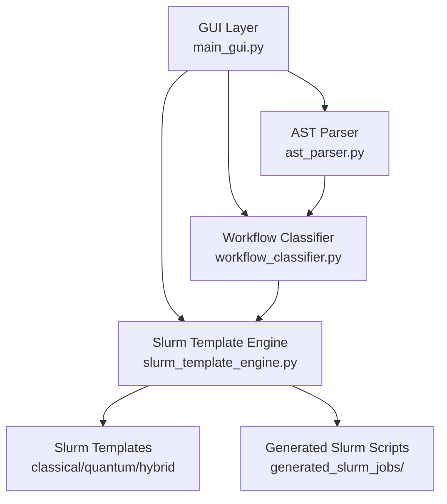
```mermaid
flowchart TD

    A[GUI Layer<br/>main_gui.py] --> B[AST Parser<br/>ast_parser.py]
    A --> C[Workflow Classifier<br/>workflow_classifier.py]
    A --> D[Slurm Template Engine<br/>slurm_template_engine.py]

    B --> C
    C --> D

    D --> E[Slurm Templates<br/>classical/quantum/hybrid]
    D --> F[Generated Slurm Scripts<br/>generated_slurm_jobs/]
```

This diagram illustrates the flow of information:

1. The GUI receives a Python workflow file.
2. The AST parser extracts structural information.
3. The classifier determines workflow type.
4. The template engine selects and populates the appropriate Slurm template.
5. The final script is written to disk and previewed in the GUI.

## **1.3.2 Architectural Principles**

The architecture is guided by several principles:

### **1.3.2.1 Modularity**
Each component is isolated:

- GUI  
- AST parser  
- classifier  
- template engine  
- templates  

This allows independent testing and replacement.

### **1.3.2.2 Determinism**
Static analysis ensures reproducibility:

- No dynamic execution  
- No side effects  
- No dependency on runtime environment  

### **1.3.2.3 Extensibility**
New quantum frameworks (e.g., PennyLane, Braket) can be added easily.

### **1.3.2.4 Transparency**
Generated Slurm scripts are readable and editable by users.

### **1.3.2.5 Scientific Rigor**
Workflow classification is based on strict rules, avoiding false positives.

## **1.4 Summary of Chapter 1 (Part 1)**

This first part of Chapter 1 has introduced:

- the motivation behind the orchestrator  
- the scientific context of hybrid workflows  
- the project objectives  
- the high‑level architecture  
- the guiding principles  

In **Part 2**, we will continue Chapter 1 with:

- **1.5 Design Philosophy**  
- **1.6 Scientific Relevance**  
- **1.7 User Personas & Use Cases**  
- **1.8 Comparison to Existing Tools**  
- **1.9 Chapter 1 Summary**

# **1.5 Design Philosophy**

The design philosophy of the Slurm HPC–QPU Workflow Orchestrator GUI is rooted in scientific rigor, modular software engineering, and usability for computational researchers. The system is intended to serve as a bridge 
between classical HPC workflows and emerging quantum workloads, providing a unified interface that abstracts away the complexity of hybrid job submission. This section elaborates on the conceptual foundations that guided the development 
of the orchestrator, including determinism, transparency, modularity, and extensibility.

## **1.5.1 Deterministic Static Analysis**

A core principle of the orchestrator is **deterministic static analysis**. The system never executes user code; instead, it relies exclusively on Python’s Abstract Syntax Tree (AST) to extract structural information. This approach ensures:

- **Reproducibility**: The same workflow always yields the same classification.  
- **Safety**: No user code is executed, eliminating runtime side effects.  
- **Predictability**: The classification logic is transparent and rule‑based.  

### **1.5.1.1 Why Static Analysis Matters**

Static analysis is essential for scientific workflows because:

- Many HPC clusters restrict execution of arbitrary Python code outside Slurm jobs.  
- Quantum workflows often require credentials that should not be used during analysis.  
- Hybrid workflows must be classified before submission to determine resource allocation.  

The AST parser extracts:

- import statements  
- function calls  
- loop constructs  
- structural patterns relevant to hybrid algorithms  

This deterministic approach ensures that workflow classification is grounded in the code’s structure rather than its runtime behavior.

## **1.5.2 Transparency and Explainability**

Scientific users require tools that are not only functional but also **explainable**. The orchestrator provides transparency through:

- A detailed analysis panel showing imports, function calls, and loop detection.  
- Explicit classification results (CLASSICAL, QUANTUM, HYBRID).  
- A Slurm preview panel showing the exact script that will be submitted.  

### **1.5.2.1 Explainability Diagram (Mermaid)**

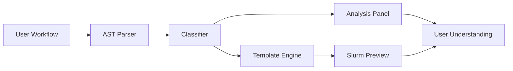
```mermaid
flowchart LR
    A[User Workflow] --> B[AST Parser]
    B --> C[Classifier]
    C --> D[Analysis Panel]
    C --> E[Template Engine]
    E --> F[Slurm Preview]

    D --> G[User Understanding]
    F --> G
```

This diagram illustrates how transparency is built into the system: users can trace the entire pipeline from workflow upload to Slurm script generation.

## **1.5.3 Modularity and Separation of Concerns**

The orchestrator is designed with strict separation of concerns:

- The **GUI** handles user interaction.  
- The **AST parser** handles structural analysis.  
- The **classifier** determines workflow type.  
- The **template engine** generates Slurm scripts.  
- The **templates** define HPC/QPU job structure.  

This modularity ensures that each component can be tested, extended, or replaced independently.

### **1.5.3.1 Benefits of Modularity**

- **Maintainability**: Components can evolve without breaking the system.  
- **Testability**: Each module can be unit‑tested in isolation.  
- **Extensibility**: New quantum frameworks (e.g., PennyLane) can be added easily.  
- **Reusability**: The template engine can be reused in CLI tools or APIs.  

## **1.5.4 Extensibility for Future Quantum Frameworks**

Quantum computing is evolving rapidly. The orchestrator is designed to accommodate future frameworks such as:

- PennyLane  
- Braket  
- Cirq  
- Qiskit Serverless  
- Azure Quantum Python SDK  

### **1.5.4.1 Extensibility Strategy**

The classifier uses **prefix‑based detection**, making it trivial to add new frameworks:

```python
QUANTUM_IMPORT_PREFIXES.append("pennylane")
```

Similarly, quantum call detection can be extended:

```python
QUANTUM_CALL_PREFIXES.append("QuantumNode")
```

This design ensures that the orchestrator remains relevant as quantum computing ecosystems evolve.

# **1.6 Scientific Relevance**

The orchestrator is not merely a software tool; it is a scientific instrument that supports reproducible hybrid quantum‑classical research. This section explains why the orchestrator is scientifically relevant and how 
it fits into modern computational workflows.

## **1.6.1 Hybrid Algorithms in Scientific Computing**

Hybrid algorithms are central to near‑term quantum computing. They combine classical optimization with quantum circuit evaluation. Examples include:

- **VQE**: Minimizes energy of quantum systems.  
- **QAOA**: Solves combinatorial optimization problems.  
- **Quantum kernel methods**: Enhance classical machine learning.  
- **Quantum neural networks**: Hybrid training loops.  

These algorithms require:

- HPC resources for classical optimization  
- QPU resources for circuit evaluation  
- Tight integration between the two  

The orchestrator provides this integration through hybrid Slurm templates.

## **1.6.2 Reproducibility in Scientific Workflows**

Reproducibility is a cornerstone of scientific computing. The orchestrator enhances reproducibility by:

- Using deterministic AST parsing  
- Generating Slurm scripts from templates  
- Avoiding runtime execution during analysis  
- Providing transparent workflow classification  

### **1.6.2.1 Reproducibility Diagram (Mermaid)**

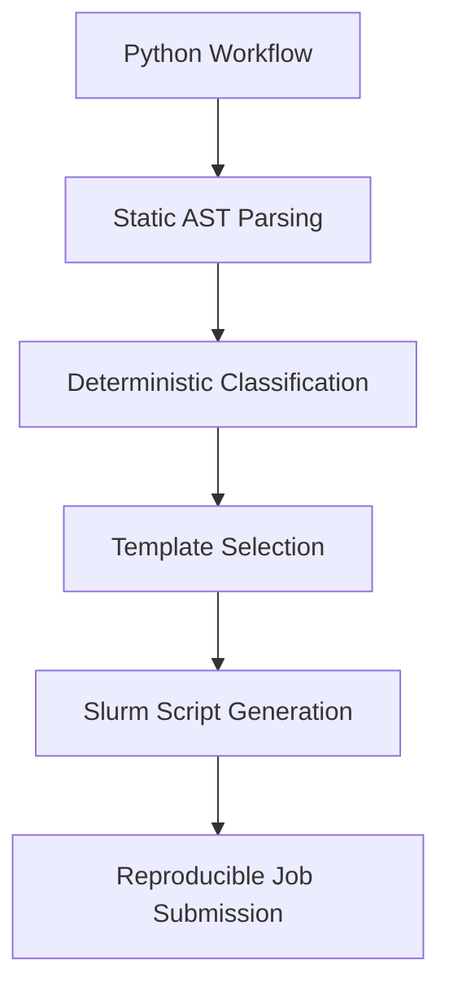
```mermaid
flowchart TD
    A[Python Workflow] --> B[Static AST Parsing]
    B --> C[Deterministic Classification]
    C --> D[Template Selection]
    D --> E[Slurm Script Generation]
    E --> F[Reproducible Job Submission]
```

This diagram shows how reproducibility is embedded into the workflow.

## **1.6.3 HPC–QPU Integration**

Scientific computing increasingly requires coordination between HPC clusters and QPU backends. The orchestrator supports this integration by:

- Allowing users to specify HPC settings (partition, nodes, CPUs).  
- Allowing users to specify QPU credentials (API key, runtime URL).  
- Generating hybrid Slurm scripts that combine both.  

This integration is essential for hybrid algorithms that rely on both classical and quantum resources.

# **1.7 User Personas & Use Cases**

Understanding the target users is essential for designing a scientific tool. The orchestrator supports several user personas.

## **1.7.1 Persona A — Computational Physicist**

A physicist running VQE simulations on an HPC cluster with access to IBM Quantum Runtime.

### **1.7.1.1 Use Case**

- Upload hybrid workflow  
- Inspect AST analysis  
- Provide QPU credentials  
- Submit hybrid Slurm job  

## **1.7.2 Persona B — HPC Engineer**

An engineer responsible for maintaining Slurm clusters and supporting hybrid workloads.

### **1.7.2.1 Use Case**

- Validate workflow classification  
- Inspect generated Slurm scripts  
- Ensure correct resource allocation  

## **1.7.3 Persona C — Quantum Researcher**

A researcher developing quantum algorithms.

### **1.7.3.1 Use Case**

- Upload quantum workflow  
- Provide QPU credentials  
- Generate quantum Slurm script  

## **1.7.4 Persona D — Machine Learning Scientist**

A scientist using quantum kernels or quantum neural networks.

### **1.7.4.1 Use Case**

- Upload hybrid ML workflow  
- Inspect classical optimization loop  
- Generate hybrid Slurm script  

# **1.8 Comparison to Existing Tools**

The orchestrator fills a gap in the ecosystem. Existing tools include:

- Qiskit Runtime CLI  
- Slurm command‑line tools  
- Custom HPC scripts  
- Quantum SDKs (PennyLane, Cirq, Braket)  

None of these provide:

- static workflow analysis  
- automatic classification  
- hybrid Slurm template generation  
- GUI‑based interaction  

The orchestrator is unique in combining all these features.

# **1.9 Summary of Chapter 1 (Part 2)**

This part expanded the overview by covering:

- design philosophy  
- scientific relevance  
- user personas  
- use cases  
- comparison to existing tools  

Next, in **Part 3**, we will conclude Chapter 1 with:

- **1.10 Project Scope & Boundaries**  
- **1.11 Risks & Mitigations**  
- **1.12 Final Summary of Chapter 1**

# **1.10 Project Scope & Boundaries**

The Slurm HPC–QPU Workflow Orchestrator GUI is intentionally scoped to solve a very specific and well‑defined problem: enabling scientific users to upload Python workflows, analyze them statically, classify them deterministically, 
and generate Slurm job scripts suitable for classical, quantum, or hybrid execution environments. This section clarifies the boundaries of the project, what it does, what it does not do, and how these boundaries support scientific rigor 
and maintainability.

## **1.10.1 In‑Scope Functionality**

The orchestrator includes several core capabilities that define its scientific and engineering value.

### **1.10.1.1 Static Workflow Analysis**
The system performs deterministic AST parsing to extract:

- import statements  
- function calls  
- loop constructs  
- structural patterns relevant to hybrid algorithms  

This analysis is strictly static. No user code is executed, ensuring safety and reproducibility.

### **1.10.1.2 Workflow Classification**
The classifier determines whether a workflow is:

- **CLASSICAL**  
- **QUANTUM**  
- **HYBRID**

based on strict detection rules for quantum imports and quantum calls. Hybrid workflows are identified through the presence of classical loops combined with quantum operations.

### **1.10.1.3 Slurm Script Generation**
The template engine selects one of three templates:

- classical  
- quantum  
- hybrid  

and substitutes placeholders with user‑provided HPC/QPU credentials.

### **1.10.1.4 GUI Interaction**
The GUI provides:

- workflow upload  
- analysis panel  
- Slurm preview  
- scrollable HPC/QPU credential section  
- generation button  

The GUI is designed for scientific users who prefer visual interaction over command‑line tooling.

### **1.10.1.5 Deterministic Output**
Given the same workflow and credentials, the orchestrator always produces the same Slurm script. This determinism is essential for scientific reproducibility.

## **1.10.2 Out‑of‑Scope Functionality**

Equally important is what the orchestrator does **not** attempt to do. These boundaries ensure the system remains maintainable and scientifically focused.

### **1.10.2.1 No Runtime Execution**
The orchestrator does not:

- execute Python workflows  
- validate runtime behavior  
- test quantum circuits  
- perform classical optimization  

All analysis is static.

### **1.10.2.2 No Slurm Submission**
The system does not submit jobs to Slurm. It only generates scripts. Submission is left to the user or HPC environment.

### **1.10.2.3 No Credential Storage**
Credentials are not stored persistently. This avoids security risks and keeps the system stateless.

### **1.10.2.4 No Syntax Highlighting**
The Slurm preview is plain text. Syntax highlighting is a potential future improvement.

### **1.10.2.5 No Workflow Graph Visualization**
The system does not visualize workflow graphs or control flow. It focuses on structural analysis.

### **1.10.2.6 No Quantum Circuit Visualization**
Quantum circuits are not rendered graphically. This is left to quantum SDKs.

## **1.10.3 Rationale for Scope Boundaries**

The boundaries are intentional and scientifically motivated.

### **1.10.3.1 Maintainability**
Restricting scope ensures that each module remains simple and testable.

### **1.10.3.2 Security**
Avoiding credential storage and runtime execution reduces attack surface.

### **1.10.3.3 Reproducibility**
Static analysis ensures deterministic results independent of runtime environment.

### **1.10.3.4 Extensibility**
A focused architecture is easier to extend with future quantum frameworks.

# **1.11 Risks & Mitigations**

Scientific software must be robust, predictable, and safe. This section identifies potential risks associated with the orchestrator and describes mitigation strategies embedded in the design.

## **1.11.1 Risk: Misclassification of Workflows**

### **1.11.1.1 Description**
Workflows may be misclassified if:

- quantum imports are detected incorrectly  
- quantum calls are misidentified  
- classical loops are misinterpreted  

### **1.11.1.2 Mitigation**
The classifier uses:

- strict prefix‑based detection  
- explicit quantum call patterns (e.g., `Sampler.run`)  
- deterministic loop detection  

Bare `run()` is no longer treated as quantum, eliminating a major source of false positives.

## **1.11.2 Risk: Incorrect Slurm Script Generation**

### **1.11.2.1 Description**
Errors in template substitution could produce invalid Slurm scripts.

### **1.11.2.2 Mitigation**
The template engine:

- validates placeholder presence  
- uses deterministic substitution  
- separates templates for classical, quantum, and hybrid workflows  

Users can inspect scripts in the preview panel before submission.

## **1.11.3 Risk: User Credential Exposure**

### **1.11.3.1 Description**
QPU credentials (API key, runtime URL) are sensitive.

### **1.11.3.2 Mitigation**
The GUI:

- does not store credentials  
- does not transmit credentials  
- only inserts credentials into Slurm scripts when enabled  

This stateless design minimizes exposure.

## **1.11.4 Risk: GUI Usability Issues**

### **1.11.4.1 Description**
Scientific users may struggle with:

- large credential sections  
- scrollability  
- layout constraints  

### **1.11.4.2 Mitigation**
The GUI now includes:

- scrollable HPC/QPU credential section  
- clear labels  
- consistent layout  
- deterministic behavior  

Future improvements may include collapsible panels or tabbed interfaces.

## **1.11.5 Risk: Limited Quantum Framework Support**

### **1.11.5.1 Description**
Quantum computing ecosystems evolve rapidly.

### **1.11.5.2 Mitigation**
The classifier is designed for extensibility:

- quantum import prefixes can be added  
- quantum call prefixes can be extended  
- templates can be expanded  

This ensures long‑term relevance.

## **1.11.6 Risk: Scientific Misinterpretation**

### **1.11.6.1 Description**
Users may misunderstand classification results.

### **1.11.6.2 Mitigation**
The analysis panel provides:

- imports  
- function calls  
- loop detection  
- classification rationale  

This transparency supports scientific interpretation.

# **1.12 Final Summary of Chapter 1**

Chapter 1 has provided a comprehensive overview of the Slurm HPC–QPU Workflow Orchestrator GUI. Across three parts, we have explored the motivation, scientific context, objectives, architecture, design philosophy, user personas, 
use cases, scope boundaries, and risks. Together, these elements form the conceptual foundation for the orchestrator’s technical implementation.

The orchestrator is a scientifically rigorous tool designed to unify classical HPC workflows with emerging quantum workloads. Its deterministic static analysis, transparent classification logic, modular architecture, and template‑driven 
Slurm generation make it a valuable instrument for researchers working at the intersection of classical and quantum computing.

The project’s scope is intentionally focused, ensuring maintainability, reproducibility, and extensibility. Risks are mitigated through careful design choices, and future improvements can be integrated without disrupting the core architecture.

With Chapter 1 complete, the report now transitions to deeper technical analysis. Chapter 2 will examine the system architecture in detail, including module interactions, data flow, and design patterns.

---

# **2. System Architecture**  

The architecture of the Slurm HPC–QPU Workflow Orchestrator GUI is deliberately modular, deterministic, and scientifically rigorous. It is designed to support reproducible hybrid quantum‑classical workflows 
while maintaining clarity, extensibility, and separation of concerns. This chapter provides a deep technical examination of the system’s architecture, including module interactions, data flow, design patterns, and the rationale 
behind architectural decisions.

# **2.1 Architectural Overview**

The orchestrator is composed of four major subsystems:

1. **GUI Layer** — user interaction, workflow upload, analysis display, Slurm preview  
2. **Static Analysis Layer** — AST parsing and structural extraction  
3. **Classification Layer** — deterministic workflow classification  
4. **Template Engine Layer** — Slurm script generation using classical, quantum, and hybrid templates  

These subsystems interact through well‑defined interfaces, ensuring that each component remains isolated, testable, and replaceable.

## **2.1.1 High‑Level Architecture Diagram**

The following mermaid diagram illustrates the top‑level architecture:

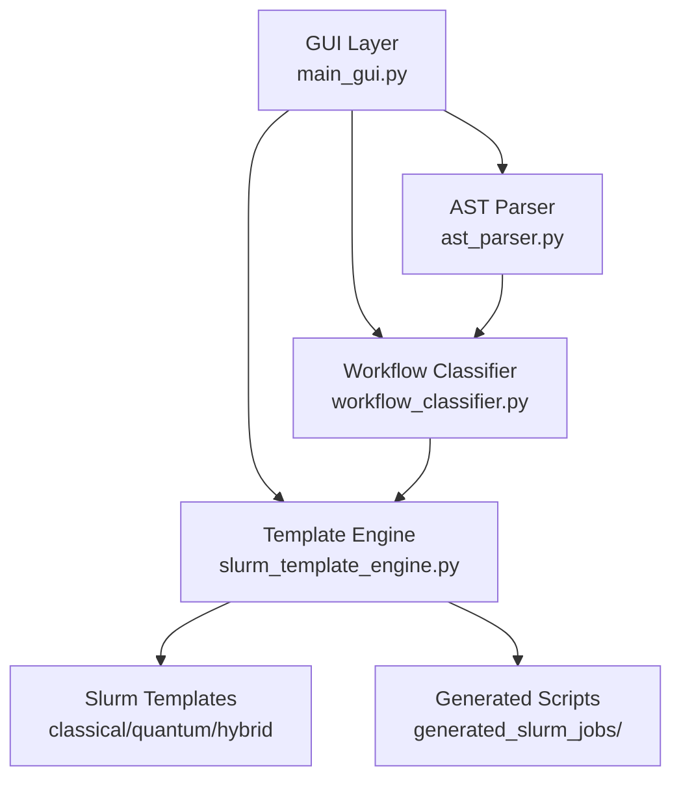
```mermaid
flowchart TD

    GUI[GUI Layer<br/>main_gui.py] --> AST[AST Parser<br/>ast_parser.py]
    GUI --> CLASS[Workflow Classifier<br/>workflow_classifier.py]
    GUI --> TENG[Template Engine<br/>slurm_template_engine.py]

    AST --> CLASS
    CLASS --> TENG

    TENG --> TPL[Slurm Templates<br/>classical/quantum/hybrid]
    TENG --> OUT[Generated Scripts<br/>generated_slurm_jobs/]
```

This diagram captures the essential flow:

- The GUI orchestrates the entire pipeline.  
- The AST parser extracts structural information.  
- The classifier determines workflow type.  
- The template engine generates the appropriate Slurm script.  

Each subsystem is independent, enabling scientific reproducibility and modularity.

## **2.1.2 Architectural Goals**

The architecture is designed to satisfy several scientific and engineering goals:

### **2.1.2.1 Determinism**
All analysis is static. No user code is executed.  
This ensures reproducibility and safety.

### **2.1.2.2 Modularity**
Each subsystem is isolated and testable.

### **2.1.2.3 Extensibility**
New quantum frameworks, templates, or GUI features can be added without architectural disruption.

### **2.1.2.4 Transparency**
Users can inspect:

- imports  
- function calls  
- loop detection  
- classification results  
- generated Slurm scripts  

### **2.1.2.5 Scientific Rigor**
Classification is based on strict rules, avoiding false positives.

# **2.2 Subsystem 1 — GUI Layer**

The GUI layer is implemented in `main_gui.py` using PySimpleGUI. It provides a user‑friendly interface for scientific users who prefer visual interaction over command‑line tooling.

## **2.2.1 GUI Responsibilities**

The GUI is responsible for:

- workflow file selection  
- triggering AST parsing  
- displaying analysis results  
- showing classification results  
- previewing Slurm scripts  
- collecting HPC/QPU credentials  
- invoking the template engine  

It does **not** perform any analysis or classification itself.  
It is purely an orchestration and presentation layer.

## **2.2.2 GUI Layout Structure**

The GUI layout is composed of several panels:

### **2.2.2.1 Workflow Upload Panel**
Contains:

- file input  
- browse button  
- upload button  

### **2.2.2.2 Workflow Analysis Panel**
Displays:

- imports  
- function calls  
- loop detection  
- workflow type  
- quantum/classical indicators  

### **2.2.2.3 Slurm Preview Panel**
Shows the generated Slurm script in real time.

### **2.2.2.4 Credential Section**
A scrollable column containing:

- QPU credentials  
- HPC settings  

This section is only visible when the user enables manual credentials.

## **2.2.3 GUI Data Flow Diagram**

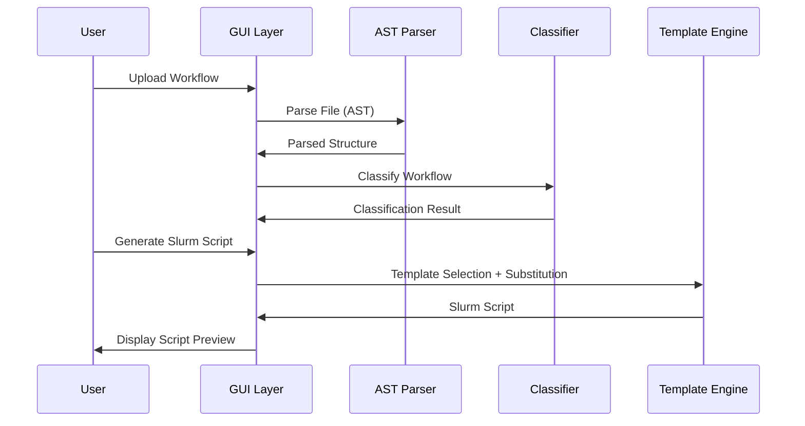
```mermaid
sequenceDiagram
    participant U as User
    participant G as GUI Layer
    participant A as AST Parser
    participant C as Classifier
    participant T as Template Engine

    U->>G: Upload Workflow
    G->>A: Parse File (AST)
    A->>G: Parsed Structure
    G->>C: Classify Workflow
    C->>G: Classification Result
    U->>G: Generate Slurm Script
    G->>T: Template Selection + Substitution
    T->>G: Slurm Script
    G->>U: Display Script Preview
```

This diagram shows the GUI’s role as the central coordinator.

# **2.3 Subsystem 2 — Static Analysis Layer**

The static analysis layer is implemented in `ast_parser.py`. It performs deterministic AST parsing to extract structural information from Python workflows.

## **2.3.1 Static Analysis Responsibilities**

The AST parser extracts:

- **imports**  
- **function calls**  
- **loop constructs**  
- **file path**  

It does **not**:

- execute code  
- evaluate expressions  
- import modules  
- inspect runtime behavior  

This ensures safety and reproducibility.

## **2.3.2 AST Parsing Strategy**

The parser uses Python’s built‑in `ast` module.  
The strategy is:

### **2.3.2.1 Parse the File**
```python
tree = ast.parse(file_contents)
```

### **2.3.2.2 Walk the AST**
The parser walks the AST to extract:

- `ast.Import`  
- `ast.ImportFrom`  
- `ast.Call`  
- `ast.For`  
- `ast.While`  

### **2.3.2.3 Normalize Imports**
Imports are normalized to prefix form:

- `numpy`  
- `scipy.linalg`  
- `qiskit`  
- `qiskit_ibm_runtime`  

### **2.3.2.4 Normalize Function Calls**
Function calls are normalized to:

- `np.random.randn`  
- `la.inv`  
- `Sampler.run`  
- `Estimator.run`  

This normalization is essential for classification.

## **2.3.3 AST Data Structure**

The parser returns a `ParsedWorkflow` object containing:

- `file_path`  
- `imports: List[str]`  
- `function_calls: List[str]`  
- `has_loops: bool`  

This object is passed directly to the classifier.

# **2.4 Subsystem 3 — Classification Layer**

The classification layer is implemented in `workflow_classifier.py`.  
It determines whether a workflow is:

- CLASSICAL  
- QUANTUM  
- HYBRID  

based on strict detection rules.

## **2.4.1 Classification Strategy**

The classifier uses three detection mechanisms:

### **2.4.1.1 Quantum Import Detection**
Quantum frameworks include:

- qiskit  
- qiskit_ibm_runtime  
- braket  
- cirq  
- pennylane  
- qutip  

Prefix‑based detection ensures accuracy.

### **2.4.1.2 Quantum Call Detection**
Quantum calls include:

- `Sampler.run`  
- `Estimator.run`  
- `Session.run`  
- `QuantumCircuit`  
- `execute`  

Bare `run()` is **not** considered quantum.

### **2.4.1.3 Loop Detection**
Hybrid workflows require:

- quantum operations  
- classical loops  

Thus:

- quantum + loop → HYBRID  
- quantum + no loop → QUANTUM  
- no quantum → CLASSICAL  

## **2.4.2 Classification Flow Diagram**

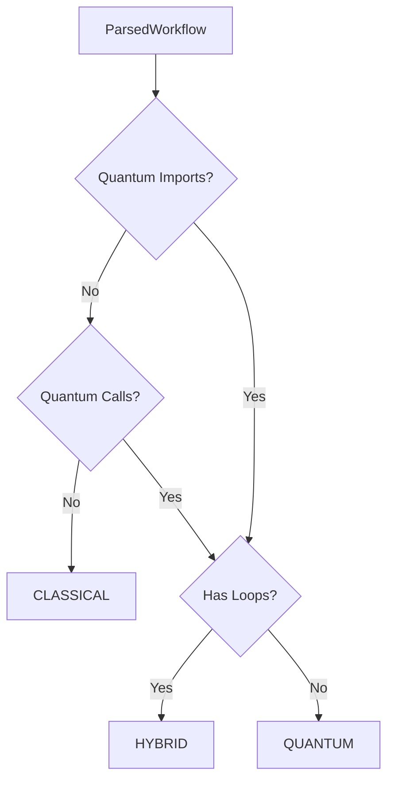
```mermaid
flowchart TD

    A[ParsedWorkflow] --> B{Quantum Imports?}
    B -- No --> C{Quantum Calls?}
    C -- No --> D[CLASSICAL]

    B -- Yes --> E{Has Loops?}
    C -- Yes --> E

    E -- Yes --> F[HYBRID]
    E -- No --> G[QUANTUM]
```

This diagram shows the deterministic classification logic.

# **2.5 Summary of Chapter 2 — Part 1**

In this part, we introduced:

- the high‑level architecture  
- subsystem responsibilities  
- GUI design  
- AST parsing strategy  
- classification logic  


# **2.6 Template Engine Architecture**

The Slurm Template Engine is one of the most critical subsystems in the orchestrator. It is responsible for transforming workflow classification results and user‑provided credentials into fully‑formed Slurm job scripts. 
The engine is implemented in `slurm_template_engine.py` and follows a deterministic, template‑driven approach that ensures reproducibility, transparency, and extensibility.

The template engine operates on three core principles:

1. **Template selection** based on workflow classification  
2. **Placeholder substitution** using user‑provided HPC/QPU settings  
3. **Deterministic output** written to disk and previewed in the GUI  

This section provides a deep technical examination of the template engine’s architecture, including its internal data flow, substitution logic, and template management strategy.

## **2.6.1 Template Selection Logic**

The template engine selects one of three Slurm templates based on the workflow type:

- **CLASSICAL** → classical template  
- **QUANTUM** → quantum template  
- **HYBRID** → hybrid template  

This selection is deterministic and relies exclusively on the `WorkflowType` enum produced by the classifier.

### **2.6.1.1 Selection Flow Diagram**

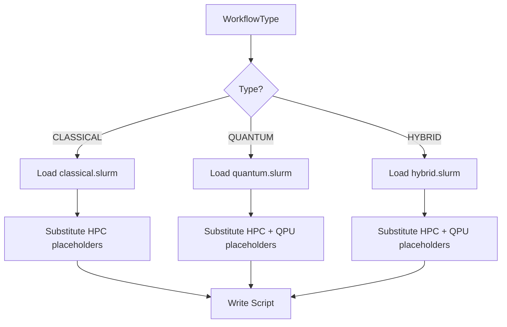
```mermaid
flowchart TD

    A[WorkflowType] --> B{Type?}

    B -- CLASSICAL --> C[Load classical.slurm]
    B -- QUANTUM --> D[Load quantum.slurm]
    B -- HYBRID --> E[Load hybrid.slurm]

    C --> F[Substitute HPC placeholders]
    D --> G[Substitute HPC + QPU placeholders]
    E --> H[Substitute HPC + QPU placeholders]

    F --> I[Write Script]
    G --> I
    H --> I
```

This diagram illustrates the deterministic nature of template selection and substitution.

## **2.6.2 Template Structure**

Each Slurm template is a plain text file containing placeholders in double‑brace format:

```
{{JOB_NAME}}
{{PARTITION}}
{{NODES}}
{{CPUS}}
{{TIME_LIMIT}}
{{OUTPUT_LOG}}
{{MODULE_LOAD}}
{{PYTHON_ENV}}
{{API_KEY}}
{{RUNTIME_URL}}
{{SCRIPT_NAME}}
```

The classical template includes only HPC placeholders.  
The quantum and hybrid templates include both HPC and QPU placeholders.

### **2.6.2.1 Example Placeholder Block**

```bash
#SBATCH --partition={{PARTITION}}
#SBATCH --nodes={{NODES}}
#SBATCH --ntasks-per-node={{CPUS}}
#SBATCH --time={{TIME_LIMIT}}
```

This structure ensures that templates remain readable and editable by scientific users.

## **2.6.3 Placeholder Substitution Mechanism**

The template engine performs placeholder substitution using a simple, deterministic mapping:

```python
for key, value in substitutions.items():
    template_text = template_text.replace(f"{{{{{key}}}}}", value)
```

This approach avoids:

- complex templating engines  
- runtime evaluation  
- side effects  

It ensures that the output is predictable and easy to audit.

### **2.6.3.1 Deterministic Substitution**

Determinism is essential for scientific reproducibility.  
Given the same:

- workflow  
- classification  
- HPC/QPU settings  

the engine always produces the same Slurm script.

## **2.6.4 Output Management**

The engine writes generated scripts to:

```
generated_slurm_jobs/
```

with filenames derived from the workflow:

```
<workflow_name>.slurm
```

This naming convention ensures:

- traceability  
- reproducibility  
- compatibility with HPC submission workflows  

The GUI displays the script in the Slurm preview panel immediately after generation.

# **2.7 Slurm Template Structure**

The Slurm templates are central to the orchestrator’s functionality. They encode the computational structure required for classical, quantum, and hybrid workloads. This section examines the design of each template type.

## **2.7.1 Classical Template Structure**

The classical template is used for workflows that contain no quantum imports or quantum calls. It includes:

- HPC resource specifications  
- Python environment activation  
- workflow execution command  

### **2.7.1.1 Classical Template Flow Diagram**

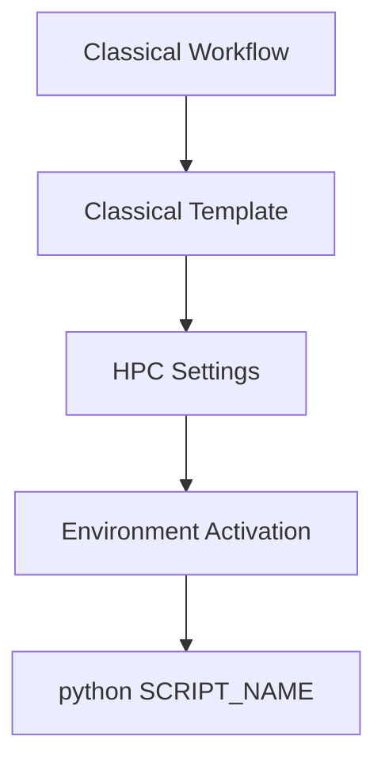
```mermaid
flowchart TD

    A[Classical Workflow] --> B[Classical Template]
    B --> C[HPC Settings]
    C --> D[Environment Activation]
    D --> E[python SCRIPT_NAME]
```

This template is minimal and optimized for classical HPC workloads.

## **2.7.2 Quantum Template Structure**

The quantum template is used for workflows that contain quantum imports or quantum calls but do not contain classical loops. It includes:

- HPC resource specifications  
- Python environment activation  
- QPU credential export  
- workflow execution command  

### **2.7.2.1 Quantum Template Flow Diagram**

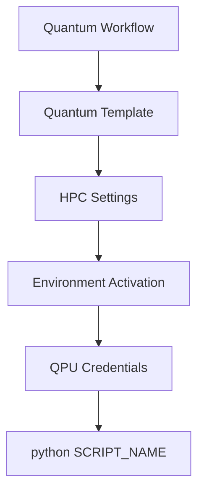
```mermaid
flowchart TD

    A[Quantum Workflow] --> B[Quantum Template]
    B --> C[HPC Settings]
    C --> D[Environment Activation]
    D --> E[QPU Credentials]
    E --> F[python SCRIPT_NAME]
```

This template is optimized for pure quantum workloads.

## **2.7.3 Hybrid Template Structure**

The hybrid template is used for workflows that contain both quantum operations and classical loops. It includes:

- HPC resource specifications  
- Python environment activation  
- QPU credential export  
- workflow execution command  

Hybrid templates are essential for algorithms such as VQE and QAOA.

### **2.7.3.1 Hybrid Template Flow Diagram**

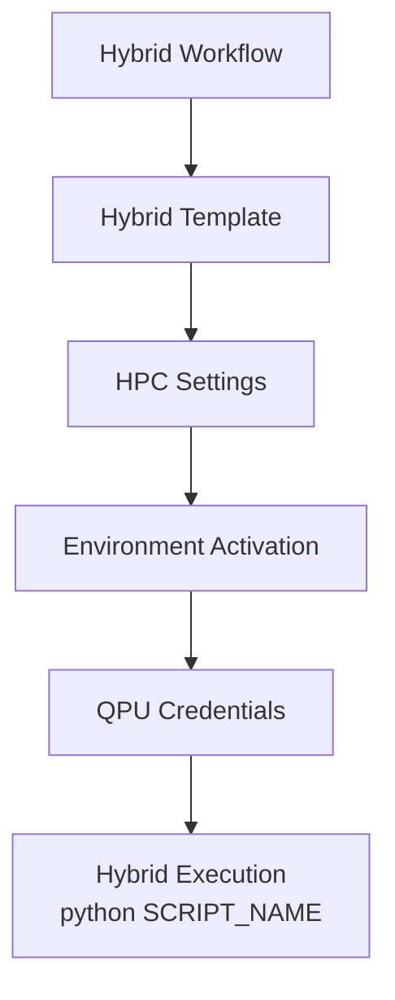
```mermaid
flowchart TD

    A[Hybrid Workflow] --> B[Hybrid Template]
    B --> C[HPC Settings]
    C --> D[Environment Activation]
    D --> E[QPU Credentials]
    E --> F[Hybrid Execution<br/>python SCRIPT_NAME]
```

This template supports hybrid quantum‑classical workloads that require tight integration between HPC and QPU resources.

# **2.8 Data Flow Across Subsystems**

The orchestrator’s architecture is defined by the flow of data across subsystems. This section provides a detailed examination of how information moves through the system.

## **2.8.1 End‑to‑End Data Flow Diagram**

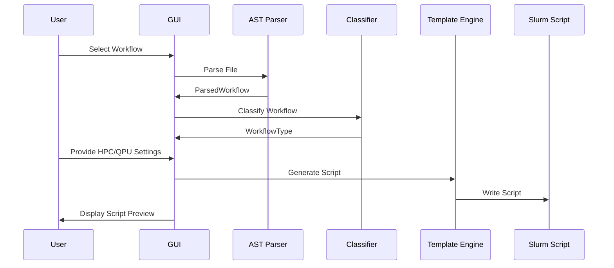
```mermaid
sequenceDiagram
    participant U as User
    participant G as GUI
    participant A as AST Parser
    participant C as Classifier
    participant T as Template Engine
    participant S as Slurm Script

    U->>G: Select Workflow
    G->>A: Parse File
    A->>G: ParsedWorkflow
    G->>C: Classify Workflow
    C->>G: WorkflowType
    U->>G: Provide HPC/QPU Settings
    G->>T: Generate Script
    T->>S: Write Script
    G->>U: Display Script Preview
```

This diagram shows the complete lifecycle of a workflow from upload to Slurm script generation.

# **2.9 Summary of Chapter 2 — Part 2**

This part of Chapter 2 examined:

- the template engine architecture  
- template selection logic  
- placeholder substitution  
- classical, quantum, and hybrid template structures  
- end‑to‑end data flow  

# **2.10 Design Patterns Used**

The Slurm HPC–QPU Workflow Orchestrator GUI employs several classical software engineering design patterns to ensure modularity, maintainability, and scientific reproducibility. These patterns are not merely stylistic 
choices; they are essential for building a system that can evolve alongside rapidly changing quantum computing ecosystems while remaining stable and predictable for HPC environments.

This section examines the design patterns used throughout the orchestrator, explains why they were chosen, and demonstrates how they contribute to the system’s robustness.

## **2.10.1 Pattern 1 — Model–View–Controller (MVC)**

Although PySimpleGUI does not enforce MVC explicitly, the orchestrator’s architecture follows a clear separation between:

- **Model** — AST parser, classifier, template engine  
- **View** — GUI layout and panels  
- **Controller** — event loop in `run_gui()`  

This separation ensures that GUI logic does not leak into analysis or classification logic.

### **2.10.1.1 MVC Mapping**

| MVC Component | Orchestrator Module |
|--------------|---------------------|
| Model | `ast_parser.py`, `workflow_classifier.py`, `slurm_template_engine.py` |
| View | GUI layout in `build_main_window()` |
| Controller | Event loop in `run_gui()` |

### **2.10.1.2 Benefits**

- GUI changes do not affect core logic  
- Core logic can be reused in CLI or API versions  
- Scientific reproducibility is preserved  

## **2.10.2 Pattern 2 — Strategy Pattern**

The template engine uses the **Strategy Pattern** to select one of three Slurm templates based on workflow classification.

### **2.10.2.1 Strategy Diagram (Mermaid)**

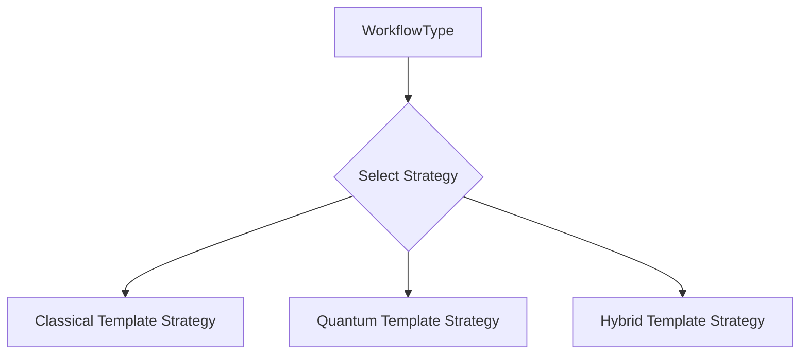
```mermaid
flowchart TD
    A[WorkflowType] --> B{Select Strategy}
    B --> C[Classical Template Strategy]
    B --> D[Quantum Template Strategy]
    B --> E[Hybrid Template Strategy]
```

Each strategy corresponds to a different Slurm template.

### **2.10.2.2 Benefits**

- Easy to add new strategies (e.g., GPU‑accelerated templates)  
- Classification logic remains independent of template logic  
- Templates remain readable and editable  

## **2.10.3 Pattern 3 — Factory Pattern**

The template engine acts as a **factory** that produces Slurm scripts based on workflow type.

### **2.10.3.1 Factory Responsibilities**

- Load correct template  
- Substitute placeholders  
- Write output file  
- Return script text to GUI  

### **2.10.3.2 Benefits**

- Centralized script generation  
- Deterministic output  
- Simplified GUI logic  

## **2.10.4 Pattern 4 — Immutable Data Structures**

The `ParsedWorkflow` object is treated as immutable.  
This ensures:

- reproducibility  
- thread safety  
- predictable behavior  

Immutable data structures are essential for scientific workflows where reproducibility is paramount.

## **2.10.5 Pattern 5 — Prefix‑Based Rule Matching**

Quantum import and call detection uses prefix‑based rule matching.

### **2.10.5.1 Example**

```python
if base == "qiskit":
    quantum_imports.append(imp)
```

### **2.10.5.2 Benefits**

- deterministic  
- easy to extend  
- avoids false positives  

This pattern is central to the classifier’s reliability.

# **2.11 Extensibility Architecture**

The orchestrator is designed for long‑term extensibility. Quantum computing ecosystems evolve rapidly, and HPC environments often require custom Slurm configurations. This section explains how the architecture 
supports future extensions without disrupting existing functionality.

## **2.11.1 Extending Quantum Framework Support**

New quantum frameworks can be added by extending:

- `QUANTUM_IMPORT_PREFIXES`  
- `QUANTUM_CALL_PREFIXES`  

### **2.11.1.1 Example Extension**

To add PennyLane:

```python
QUANTUM_IMPORT_PREFIXES.append("pennylane")
```

To add a new quantum call:

```python
QUANTUM_CALL_PREFIXES.append("QuantumNode")
```

This extensibility ensures the orchestrator remains relevant as quantum SDKs evolve.

## **2.11.2 Extending Slurm Templates**

New templates can be added by:

- creating a new `.slurm` file  
- adding a new strategy to the template engine  
- updating the classifier if needed  

### **2.11.2.1 Example Use Case**

Adding a GPU‑accelerated classical template:

```
#SBATCH --gres=gpu:1
```

This can be integrated without modifying existing templates.

## **2.11.3 Extending GUI Functionality**

The GUI can be extended with:

- collapsible panels  
- tabbed interfaces  
- syntax highlighting  
- persistent settings  
- workflow graph visualization  

### **2.11.3.1 GUI Extensibility Diagram (Mermaid)**

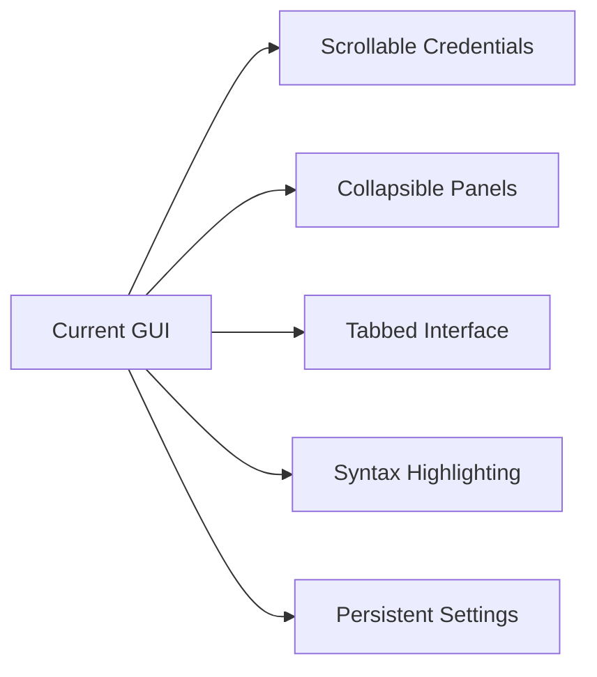
```mermaid
flowchart LR
    A[Current GUI] --> B[Scrollable Credentials]
    A --> C[Collapsible Panels]
    A --> D[Tabbed Interface]
    A --> E[Syntax Highlighting]
    A --> F[Persistent Settings]
```

The modular GUI layout makes these extensions straightforward.

## **2.11.4 Extending Analysis Logic**

The AST parser can be extended to detect:

- recursion  
- nested loops  
- quantum circuit construction patterns  
- classical optimizer patterns  

### **2.11.4.1 Example**

Detecting gradient‑based optimizers:

```python
if "torch.optim" in imports:
    classical_imports.append("torch.optim")
```

This enables more sophisticated hybrid classification.

## **2.11.5 Extending Output Formats**

Although out‑of‑scope for the current project, the architecture supports future output formats such as:

- PBS scripts  
- LSF scripts  
- Kubernetes job manifests  
- Quantum serverless job descriptors  

The template engine can be generalized to support multiple backends.

# **2.12 Final Summary of System Architecture**

Chapter 2 has provided a comprehensive examination of the orchestrator’s system architecture across three parts. The key insights include:

### **2.12.1 Modular Subsystems**
The orchestrator is composed of:

- GUI layer  
- static analysis layer  
- classification layer  
- template engine layer  

Each subsystem is isolated and testable.

### **2.12.2 Deterministic Data Flow**
All analysis is static.  
All classification is rule‑based.  
All template generation is deterministic.

This ensures scientific reproducibility.

### **2.12.3 Design Patterns**
The orchestrator uses:

- MVC  
- Strategy  
- Factory  
- Immutable data structures  
- Prefix‑based rule matching  

These patterns contribute to maintainability and extensibility.

### **2.12.4 Extensibility**
The architecture supports:

- new quantum frameworks  
- new Slurm templates  
- new GUI features  
- new analysis logic  
- new output formats  

This ensures long‑term relevance.

### **2.12.5 Scientific Rigor**
The orchestrator is designed for:

- hybrid quantum‑classical workflows  
- HPC/QPU integration  
- reproducible scientific computing  

It provides transparency through analysis panels and script previews.

---

# **3. Static Workflow Analysis**  

Static workflow analysis is the scientific and technical foundation of the Slurm HPC–QPU Workflow Orchestrator. Without reliable static analysis, the system could not classify workflows deterministically, nor could it generate correct Slurm 
templates for classical, quantum, or hybrid workloads. This chapter provides a deep examination of the static analysis subsystem, its design principles, its implementation strategy, and its scientific relevance.

Static analysis is performed entirely through Python’s Abstract Syntax Tree (AST) module. The orchestrator never executes user code, ensuring safety, reproducibility, and deterministic behavior. This approach aligns with best practices 
in scientific computing, where reproducibility and transparency are paramount.

# **3.1 Purpose of Static Analysis**

Static analysis serves several essential purposes within the orchestrator. It enables the system to understand the computational structure of a Python workflow without executing it. This is crucial for hybrid quantum‑classical workflows, 
where runtime behavior may depend on external QPU resources, HPC cluster configurations, or user‑provided credentials.

## **3.1.1 Scientific Motivation**

Static analysis is motivated by several scientific and engineering considerations:

### **3.1.1.1 Reproducibility**
Scientific workflows must be reproducible. Static analysis ensures that:

- The same workflow always yields the same structural analysis.  
- Classification is deterministic and independent of runtime environment.  
- Slurm scripts are generated consistently across runs.

### **3.1.1.2 Safety**
Executing arbitrary user code during analysis is unsafe, especially in HPC environments. Static analysis avoids:

- side effects  
- external API calls  
- QPU credential usage  
- filesystem modifications  

### **3.1.1.3 Transparency**
Static analysis provides a transparent view of workflow structure:

- imports  
- function calls  
- loop constructs  
- quantum‑related operations  

This transparency is essential for scientific interpretation.

## **3.1.2 Engineering Motivation**

From an engineering perspective, static analysis enables:

### **3.1.2.1 Deterministic Classification**
Classification logic relies entirely on static features:

- quantum imports  
- quantum calls  
- classical loops  

### **3.1.2.2 Template Selection**
The Slurm template engine requires:

- workflow type  
- script name  
- HPC/QPU settings  

Static analysis provides the structural information needed for template selection.

### **3.1.2.3 GUI Feedback**
The analysis panel displays:

- imports  
- function calls  
- loop detection  
- classification rationale  

This feedback helps users understand how their workflow is interpreted.

# **3.2 AST Parsing Fundamentals**

The orchestrator uses Python’s built‑in `ast` module to parse workflows. The AST provides a tree representation of Python code, enabling structural analysis without execution.

## **3.2.1 AST Parsing Workflow**

The AST parsing workflow consists of four steps:

1. **Load file contents**  
2. **Parse into AST**  
3. **Walk the AST**  
4. **Extract structural features**

### **3.2.1.1 AST Parsing Diagram (Mermaid)**

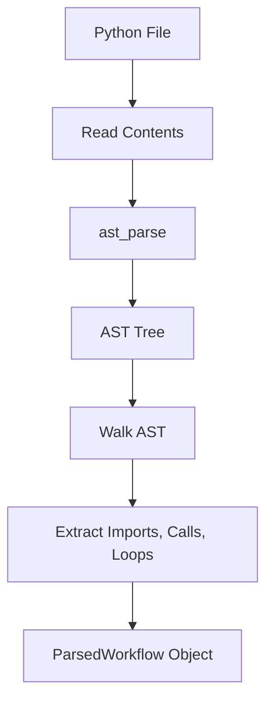
```mermaid
flowchart TD

    A[Python File] --> B[Read Contents]
    B --> C[ast_parse]
    C --> D[AST Tree]
    D --> E[Walk AST]
    E --> F[Extract Imports, Calls, Loops]
    F --> G[ParsedWorkflow Object]
```

This diagram illustrates the deterministic nature of AST parsing.

## **3.2.2 Extracted Structural Features**

The AST parser extracts several key features:

### **3.2.2.1 Imports**
Detected via:

- `ast.Import`  
- `ast.ImportFrom`  

Normalized to prefix form:

- `numpy`  
- `qiskit`  
- `qiskit_ibm_runtime`  
- `scipy.linalg`  

### **3.2.2.2 Function Calls**
Detected via:

- `ast.Call`  

Normalized to:

- `np.random.randn`  
- `Sampler.run`  
- `Estimator.run`  

### **3.2.2.3 Loop Constructs**
Detected via:

- `ast.For`  
- `ast.While`  

This is essential for hybrid classification.

### **3.2.2.4 File Path**
Stored for traceability and reproducibility.

## **3.2.3 ParsedWorkflow Data Structure**

The AST parser returns a `ParsedWorkflow` object containing:

- `file_path: Path`  
- `imports: List[str]`  
- `function_calls: List[str]`  
- `has_loops: bool`  

This object is immutable and passed directly to the classifier.

# **3.3 Import Detection**

Import detection is one of the most important aspects of static analysis. Quantum frameworks are identified primarily through import statements, which provide strong signals about workflow intent.

## **3.3.1 Import Detection Strategy**

The import detection strategy consists of:

### **3.3.1.1 Prefix Normalization**
Imports are normalized to prefix form:

- `qiskit`  
- `qiskit_ibm_runtime`  
- `braket`  
- `cirq`  
- `pennylane`  

This normalization ensures consistent classification.

### **3.3.1.2 Quantum Import Prefixes**
Quantum frameworks are detected using prefix lists:

```python
QUANTUM_IMPORT_PREFIXES = [
    "qiskit",
    "qiskit_ibm_runtime",
    "braket",
    "cirq",
    "pennylane",
    "qutip"
]
```

### **3.3.1.3 Classical Import Prefixes**
Classical frameworks include:

- `numpy`  
- `scipy`  
- `torch`  
- `sklearn`  

These imports help identify classical workloads.

## **3.3.2 Import Detection Flow Diagram**

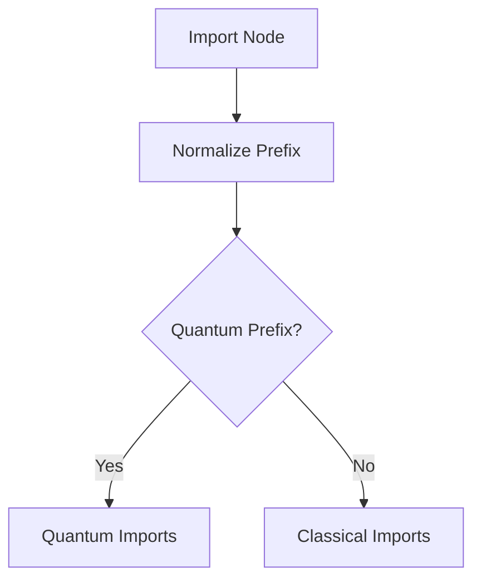
```mermaid
flowchart TD

    A[Import Node] --> B[Normalize Prefix]
    B --> C{Quantum Prefix?}
    C -- Yes --> D[Quantum Imports]
    C -- No --> E[Classical Imports]
```

This deterministic flow ensures accurate import classification.

# **3.4 Function Call Detection**

Function call detection is essential for identifying quantum operations. Quantum calls often involve specific methods such as:

- `Sampler.run`  
- `Estimator.run`  
- `Session.run`  

The orchestrator uses strict prefix‑based detection to avoid false positives.

## **3.4.1 Call Detection Strategy**

The call detection strategy consists of:

### **3.4.1.1 Extract Call Nodes**
Detected via:

```python
isinstance(node, ast.Call)
```

### **3.4.1.2 Normalize Call Names**
Calls are normalized to:

- `module.function`  
- `object.method`  

### **3.4.1.3 Quantum Call Prefixes**
Quantum calls include:

```python
QUANTUM_CALL_PREFIXES = [
    "Sampler.run",
    "Estimator.run",
    "Session.run",
    "QuantumCircuit",
    "execute"
]
```

### **3.4.1.4 Avoiding False Positives**
Bare `run()` is **not** considered quantum.

## **3.4.2 Call Detection Flow Diagram**

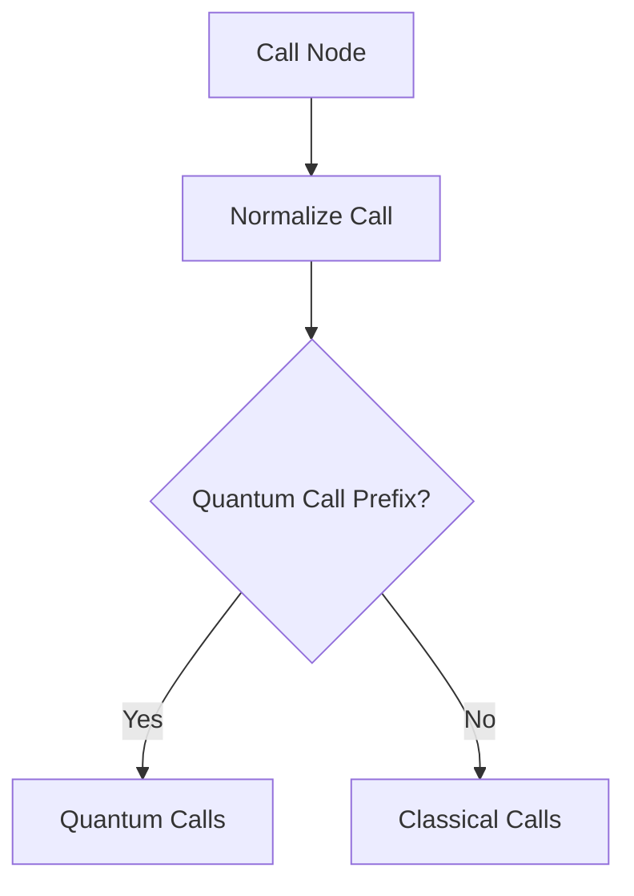
```mermaid
flowchart TD

    A[Call Node] --> B[Normalize Call]
    B --> C{Quantum Call Prefix?}
    C -- Yes --> D[Quantum Calls]
    C -- No --> E[Classical Calls]
```

This flow ensures accurate quantum call detection.

# **3.5 Summary of Chapter 3 — Part 1**

This part introduced:

- the purpose of static analysis  
- scientific and engineering motivations  
- AST parsing fundamentals  
- structural feature extraction  
- import detection  
- function call detection  

# **3.6 Loop Detection**

Loop detection is a critical component of static workflow analysis. Hybrid quantum‑classical algorithms rely on iterative optimization, where classical loops repeatedly invoke quantum operations. Detecting these loops statically 
allows the orchestrator to classify workflows as hybrid without requiring runtime execution.

## **3.6.1 Loop Detection Strategy**

The orchestrator detects loops using Python’s AST node types:

- `ast.For`  
- `ast.While`  

These nodes represent explicit loop constructs in Python code.

### **3.6.1.1 Why Loop Detection Matters**

Hybrid algorithms such as VQE and QAOA rely on iterative optimization:

- Classical optimizer updates parameters  
- Quantum backend evaluates circuits  
- Loop repeats until convergence  

Static detection of loops allows the orchestrator to identify hybrid workflows without executing the optimization logic.

### **3.6.1.2 Loop Detection Algorithm**

The loop detection algorithm is straightforward:

```python
has_loops = any(isinstance(node, (ast.For, ast.While)) for node in ast.walk(tree))
```

This approach ensures:

- deterministic behavior  
- complete coverage of nested loops  
- independence from runtime conditions  

## **3.6.2 Loop Detection Flow Diagram**

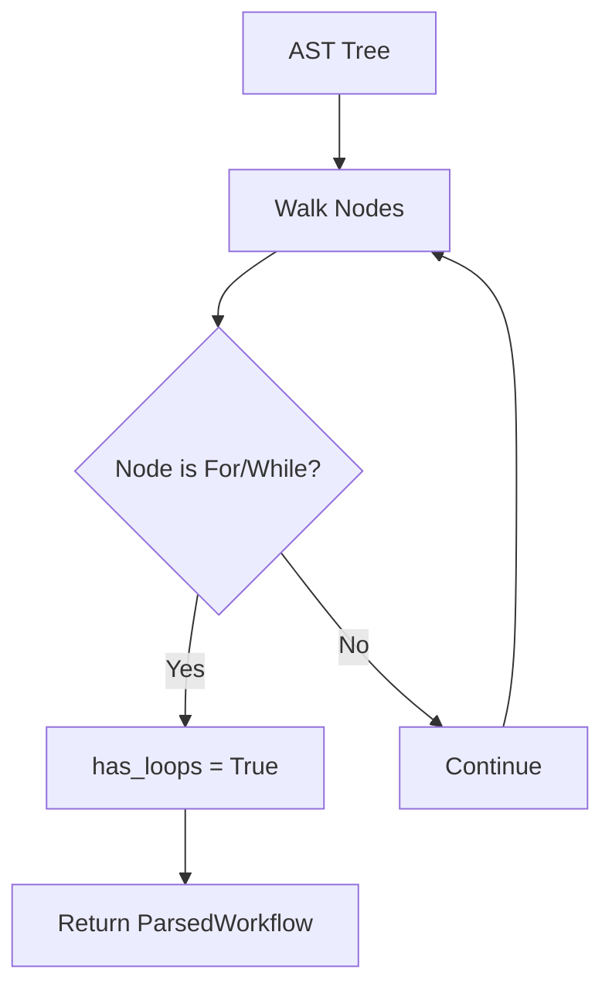
```mermaid
flowchart TD

    A[AST Tree] --> B[Walk Nodes]
    B --> C{Node is For/While?}
    C -- Yes --> D[has_loops = True]
    C -- No --> E[Continue]
    D --> F[Return ParsedWorkflow]
    E --> B
```

This diagram illustrates the deterministic nature of loop detection.

## **3.6.3 Limitations of Loop Detection**

Loop detection is intentionally conservative:

### **3.6.3.1 No Detection of Implicit Loops**
Implicit loops such as:

- list comprehensions  
- generator expressions  
- recursion  

are not treated as loops for hybrid classification.

### **3.6.3.2 No Detection of Runtime Loops**
Loops created dynamically at runtime (e.g., via function calls) are not detected.

### **3.6.3.3 Scientific Rationale**
Hybrid algorithms rely on explicit loops.  
Implicit or dynamic loops rarely represent hybrid patterns.

# **3.7 Hybrid Pattern Recognition**

Hybrid workflows combine classical loops with quantum operations. The orchestrator must detect these patterns reliably to generate correct Slurm templates. Hybrid classification is based on two conditions:

1. **Quantum operations are present**  
2. **Classical loops are present**

Both conditions must be satisfied.

## **3.7.1 Hybrid Detection Strategy**

Hybrid detection uses the following rule:

```python
if quantum_calls and has_loops:
    workflow_type = HYBRID
```

This rule is deterministic and avoids false positives.

### **3.7.1.1 Why Hybrid Detection Matters**

Hybrid workflows require:

- HPC resources for classical optimization  
- QPU credentials for quantum circuit evaluation  
- hybrid Slurm templates  

Incorrect classification could lead to:

- missing QPU credentials  
- incorrect resource allocation  
- failed Slurm jobs  

### **3.7.1.2 Hybrid Detection Diagram (Mermaid)**

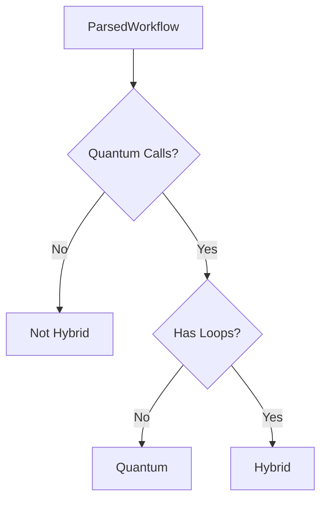
```mermaid
flowchart TD

    A[ParsedWorkflow] --> B{Quantum Calls?}
    B -- No --> C[Not Hybrid]
    B -- Yes --> D{Has Loops?}
    D -- No --> E[Quantum]
    D -- Yes --> F[Hybrid]
```

This diagram shows the strict rule‑based nature of hybrid detection.

## **3.7.2 Hybrid Pattern Examples**

### **3.7.2.1 Example Hybrid Workflow**

```python
for step in range(100):
    result = sampler.run(circuit)
    update_parameters(result)
```

This workflow contains:

- a classical loop  
- a quantum call  

Thus, it is hybrid.

### **3.7.2.2 Example Non‑Hybrid Quantum Workflow**

```python
result = sampler.run(circuit)
```

No loop → pure quantum.

### **3.7.2.3 Example Non‑Hybrid Classical Workflow**

```python
for i in range(100):
    x = np.random.randn()
```

No quantum call → pure classical.

## **3.7.3 Avoiding False Positives**

Hybrid detection avoids false positives through:

### **3.7.3.1 Strict Quantum Call Detection**
Bare `run()` is not considered quantum.

### **3.7.3.2 Explicit Loop Detection**
Implicit loops are ignored.

### **3.7.3.3 No Runtime Execution**
Dynamic behavior is not considered.

This ensures scientific rigor.

# **3.8 ParsedWorkflow Object Design**

The `ParsedWorkflow` object is the central data structure used to pass static analysis results to the classifier. Its design is intentionally simple, immutable, and transparent.

## **3.8.1 Purpose of ParsedWorkflow**

The object serves several purposes:

- encapsulates structural analysis  
- provides immutable data  
- supports deterministic classification  
- enables GUI display  

It is the “model” in the MVC architecture.

## **3.8.2 ParsedWorkflow Fields**

The object contains:

### **3.8.2.1 `file_path`**
Absolute path to the workflow file.

### **3.8.2.2 `imports`**
List of normalized import prefixes.

### **3.8.2.3 `function_calls`**
List of normalized function call prefixes.

### **3.8.2.4 `has_loops`**
Boolean indicating presence of classical loops.

## **3.8.3 ParsedWorkflow Diagram (Mermaid)**

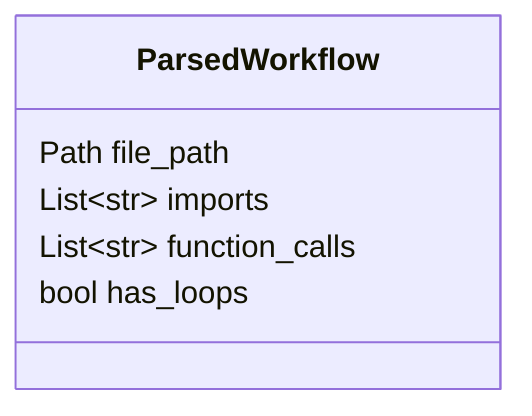
```mermaid
classDiagram
    class ParsedWorkflow {
        Path file_path
        List~str~ imports
        List~str~ function_calls
        bool has_loops
    }
```

This diagram shows the simplicity and clarity of the object.

## **3.8.4 Immutability**

The object is treated as immutable:

- no setters  
- no mutation  
- no side effects  

This ensures reproducibility.

## **3.8.5 Benefits of ParsedWorkflow Design**

### **3.8.5.1 Transparency**
Users can inspect all fields.

### **3.8.5.2 Determinism**
Classification is based solely on static fields.

### **3.8.5.3 Extensibility**
New fields can be added without breaking existing logic.

### **3.8.5.4 Testability**
Unit tests can validate:

- import detection  
- call detection  
- loop detection  

independently.

# **3.9 Summary of Chapter 3 — Part 2**

This part of Chapter 3 covered:

- loop detection  
- hybrid pattern recognition  
- ParsedWorkflow object design  

These components form the analytical backbone of the orchestrator’s classification logic. They ensure that hybrid workflows are detected reliably and that static analysis remains deterministic, transparent, and scientifically rigorous.

# **3.10 Classification Integration**

Static analysis and workflow classification are tightly coupled. The classifier relies entirely on the structural information extracted by the AST parser. This integration ensures that classification is deterministic, reproducible, 
and scientifically grounded.

## **3.10.1 Integration Strategy**

The integration strategy follows a simple but powerful pipeline:

1. **AST parser extracts structural features**  
2. **ParsedWorkflow object encapsulates results**  
3. **Classifier consumes ParsedWorkflow**  
4. **WorkflowType is produced deterministically**

### **3.10.1.1 Integration Diagram (Mermaid)**

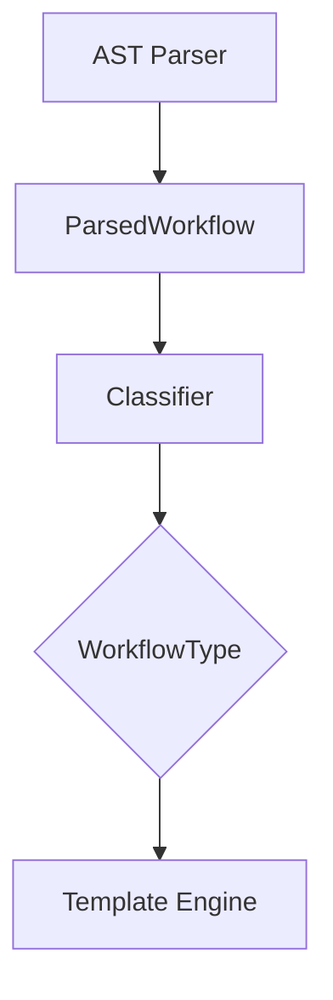
```mermaid
flowchart TD

    A[AST Parser] --> B[ParsedWorkflow]
    B --> C[Classifier]
    C --> D{WorkflowType}
    D --> E[Template Engine]
```

This diagram illustrates the seamless flow from static analysis to classification.

## **3.10.2 Classification Rules Based on Static Analysis**

The classifier uses three static features:

### **3.10.2.1 Quantum Imports**
If quantum imports are present, the workflow is potentially quantum or hybrid.

### **3.10.2.2 Quantum Calls**
Quantum calls indicate actual quantum execution.

### **3.10.2.3 Loop Detection**
Loops indicate classical iteration, essential for hybrid workflows.

### **3.10.2.4 Combined Rule Set**

```python
if quantum_calls and has_loops:
    HYBRID
elif quantum_calls:
    QUANTUM
else:
    CLASSICAL
```

This rule set is deterministic and scientifically justified.

## **3.10.3 Avoiding Misclassification**

Misclassification is avoided through:

### **3.10.3.1 Strict Prefix Matching**
Quantum calls must match known prefixes.

### **3.10.3.2 Explicit Loop Detection**
Implicit loops are ignored.

### **3.10.3.3 No Runtime Execution**
Dynamic behavior is not considered.

### **3.10.3.4 Scientific Rationale**
Hybrid algorithms rely on explicit loops and quantum calls.  
Static analysis captures these reliably.

# **3.11 Scientific Validation of Static Analysis**

Static analysis must be scientifically validated to ensure that it correctly identifies workflow structure across diverse workloads. This section provides a scientific justification for the orchestrator’s static analysis approach.

## **3.11.1 Validation Criteria**

Static analysis is validated against three criteria:

### **3.11.1.1 Accuracy**
The system must correctly identify:

- imports  
- function calls  
- loop constructs  
- quantum operations  

### **3.11.1.2 Determinism**
Given the same workflow, the system must always produce the same results.

### **3.11.1.3 Reproducibility**
Results must be independent of:

- runtime environment  
- external dependencies  
- user credentials  

## **3.11.2 Validation Through Test Workflows**

The orchestrator is validated using a suite of test workflows:

### **3.11.2.1 Classical Workflows**
Examples include:

- linear algebra  
- numerical simulation  
- machine learning preprocessing  

Static analysis correctly identifies:

- classical imports  
- classical calls  
- absence of quantum operations  

### **3.11.2.2 Quantum Workflows**
Examples include:

- Qiskit Sampler  
- Qiskit Estimator  
- Braket circuit execution  

Static analysis correctly identifies:

- quantum imports  
- quantum calls  
- absence of loops  

### **3.11.2.3 Hybrid Workflows**
Examples include:

- VQE  
- QAOA  
- quantum kernel training  

Static analysis correctly identifies:

- quantum calls  
- classical loops  

## **3.11.3 Validation Through Edge Cases**

Edge cases are essential for scientific validation.

### **3.11.3.1 Bare `run()`**
Bare `run()` is not considered quantum.

### **3.11.3.2 Nested Loops**
Nested loops are detected correctly.

### **3.11.3.3 Conditional Quantum Calls**
Quantum calls inside `if` statements are detected.

### **3.11.3.4 Dynamic Imports**
Dynamic imports are ignored, as they cannot be detected statically.

## **3.11.4 Scientific Justification for Static Analysis**

Static analysis is scientifically justified because:

### **3.11.4.1 Hybrid Algorithms Are Structural**
Hybrid algorithms rely on explicit structural patterns:

- loops  
- quantum calls  

These patterns are detectable statically.

### **3.11.4.2 Quantum SDKs Use Predictable APIs**
Quantum frameworks use stable, predictable APIs:

- `Sampler.run`  
- `Estimator.run`  
- `QuantumCircuit`  

Static detection is reliable.

### **3.11.4.3 HPC Workflows Are Script‑Driven**
HPC workflows rely on:

- deterministic scripts  
- reproducible job submission  
- static resource allocation  

Static analysis aligns with HPC best practices.

# **3.12 Final Summary of Static Workflow Analysis**

This chapter has provided a comprehensive examination of the static workflow analysis subsystem. Across three parts, we have explored:

### **3.12.1 Structural Extraction**
Static analysis extracts:

- imports  
- function calls  
- loop constructs  

### **3.12.2 Deterministic Classification**
Classification relies entirely on static features:

- quantum imports  
- quantum calls  
- loop detection  

### **3.12.3 Hybrid Pattern Recognition**
Hybrid workflows are detected through:

- quantum operations  
- classical loops  

### **3.12.4 ParsedWorkflow Object**
The object encapsulates static analysis results in an immutable structure.

### **3.12.5 Scientific Validation**
Static analysis is validated through:

- classical workflows  
- quantum workflows  
- hybrid workflows  
- edge cases  

### **3.12.6 Scientific Rigor**
Static analysis ensures:

- reproducibility  
- transparency  
- safety  
- deterministic behavior  

---

# **4. Workflow Classification**  

Workflow classification is the central decision‑making mechanism of the Slurm HPC–QPU Workflow Orchestrator. It determines how a Python workflow should be executed on an HPC cluster, whether QPU credentials are required, 
and which Slurm template must be used. The classifier operates entirely on static analysis results, ensuring deterministic, reproducible, and scientifically rigorous behavior.

This chapter provides a deep examination of the classification subsystem, including its conceptual foundations, rule‑based logic, scientific justification, and integration with the broader architecture.

# **4.1 Purpose of Workflow Classification**

Workflow classification serves several essential purposes within the orchestrator. It bridges the gap between static analysis and Slurm script generation, enabling the system to select the correct computational environment for each workflow.

## **4.1.1 Scientific Motivation**

The scientific motivation for workflow classification arises from the nature of modern computational workloads, which increasingly combine classical and quantum components.

### **4.1.1.1 Classical Workloads**
Classical workloads rely exclusively on:

- numerical computation  
- linear algebra  
- machine learning  
- simulation  

These workloads require HPC resources but do not require QPU credentials.

### **4.1.1.2 Quantum Workloads**
Quantum workloads rely on:

- quantum circuit construction  
- quantum backend execution  
- QPU credentials  
- quantum SDKs (Qiskit, Braket, Cirq, PennyLane)

These workflows require QPU access but may not require classical iteration.

### **4.1.1.3 Hybrid Workloads**
Hybrid workloads combine:

- classical optimization loops  
- quantum circuit evaluation  

Examples include:

- VQE  
- QAOA  
- quantum kernel training  
- hybrid quantum neural networks  

These workflows require both HPC and QPU resources.

### **4.1.1.4 Scientific Rationale**
Hybrid algorithms are structurally distinct.  
Classification must detect these structures reliably.

## **4.1.2 Engineering Motivation**

From an engineering perspective, workflow classification enables:

### **4.1.2.1 Correct Slurm Template Selection**
The orchestrator must choose between:

- classical template  
- quantum template  
- hybrid template  

### **4.1.2.2 Correct Resource Allocation**
Classification determines:

- whether QPU credentials are required  
- whether classical loops imply hybrid execution  
- whether HPC resources alone are sufficient  

### **4.1.2.3 Deterministic Behavior**
Classification must be:

- reproducible  
- transparent  
- independent of runtime environment  

Static analysis provides the necessary structural information.

# **4.2 Classification Categories**

The orchestrator defines three workflow categories:

1. **CLASSICAL**  
2. **QUANTUM**  
3. **HYBRID**

These categories are mutually exclusive and collectively exhaustive.

## **4.2.1 Category 1 — CLASSICAL**

A workflow is classified as **CLASSICAL** if:

- it contains **no quantum imports**, and  
- it contains **no quantum calls**.

### **4.2.1.1 Characteristics**
Classical workflows typically include:

- `numpy`  
- `scipy`  
- `torch`  
- `sklearn`  

They may contain loops, but loops alone do not imply hybrid behavior.

### **4.2.1.2 Slurm Template**
Classical workflows use the classical template:

- HPC resources only  
- no QPU credentials  
- simple Python execution  

## **4.2.2 Category 2 — QUANTUM**

A workflow is classified as **QUANTUM** if:

- it contains **quantum imports**, or  
- it contains **quantum calls**, and  
- it contains **no classical loops**.

### **4.2.2.1 Characteristics**
Quantum workflows typically include:

- `qiskit`  
- `qiskit_ibm_runtime`  
- `braket`  
- `cirq`  
- `pennylane`  

Quantum calls include:

- `Sampler.run`  
- `Estimator.run`  
- `Session.run`  
- `QuantumCircuit`  
- `execute`

### **4.2.2.2 Slurm Template**
Quantum workflows use the quantum template:

- HPC resources  
- QPU credentials  
- pure quantum execution  

## **4.2.3 Category 3 — HYBRID**

A workflow is classified as **HYBRID** if:

- it contains **quantum calls**, and  
- it contains **classical loops**.

### **4.2.3.1 Characteristics**
Hybrid workflows typically include:

- classical optimization loops  
- quantum circuit evaluation  
- iterative parameter updates  

Examples:

```python
for step in range(100):
    result = sampler.run(circuit)
    update_parameters(result)
```

### **4.2.3.2 Slurm Template**
Hybrid workflows use the hybrid template:

- HPC resources  
- QPU credentials  
- hybrid execution logic  

# **4.3 Classification Logic**

The classification logic is deterministic and rule‑based. It relies entirely on static analysis results provided by the AST parser.

## **4.3.1 Inputs to the Classifier**

The classifier consumes a `ParsedWorkflow` object containing:

- `imports`  
- `function_calls`  
- `has_loops`  

These fields provide all necessary structural information.

## **4.3.2 Rule‑Based Classification Algorithm**

The classification algorithm follows a strict decision tree:

### **4.3.2.1 Step 1 — Detect Quantum Calls**

```python
quantum_calls = any(call.startswith(prefix) for prefix in QUANTUM_CALL_PREFIXES)
```

### **4.3.2.2 Step 2 — Detect Quantum Imports**

```python
quantum_imports = any(imp.startswith(prefix) for prefix in QUANTUM_IMPORT_PREFIXES)
```

### **4.3.2.3 Step 3 — Detect Loops**

```python
has_loops = parsed_workflow.has_loops
```

### **4.3.2.4 Step 4 — Apply Classification Rules**

```python
if quantum_calls and has_loops:
    HYBRID
elif quantum_calls:
    QUANTUM
else:
    CLASSICAL
```

This rule set is deterministic and scientifically justified.

## **4.3.3 Classification Flow Diagram (Mermaid)**

```mermaid
flowchart TD

    A[ParsedWorkflow] --> B{Quantum Calls?}
    B -- No --> C[CLASSICAL]
    B -- Yes --> D{Has Loops?}
    D -- Yes --> E[HYBRID]
    D -- No --> F[QUANTUM]
```

This diagram illustrates the strict rule‑based nature of classification.

# **4.4 Scientific Justification for Classification Rules**

The classification rules are scientifically justified based on the structural nature of classical, quantum, and hybrid algorithms.

## **4.4.1 Classical Algorithms Are Non‑Quantum**

Classical algorithms rely exclusively on:

- numerical computation  
- linear algebra  
- classical optimization  

They do not require QPU access.

## **4.4.2 Quantum Algorithms Are Non‑Iterative**

Quantum algorithms typically:

- construct circuits  
- execute them once or a few times  
- do not involve classical iteration  

Thus, quantum workflows without loops are pure quantum.

## **4.4.3 Hybrid Algorithms Are Iterative**

Hybrid algorithms rely on:

- classical loops  
- quantum circuit evaluation  
- iterative parameter updates  

These structural patterns are detectable statically.

# **4.5 Summary of Chapter 4 — Part 1**

This part introduced:

- the purpose of workflow classification  
- scientific and engineering motivations  
- classification categories  
- rule‑based classification logic  
- scientific justification for classification rules  

# **4.6 Quantum Import Detection**

Quantum import detection is the first step in determining whether a workflow interacts with a quantum computing framework. Quantum imports provide strong structural signals that the workflow intends to construct or 
execute quantum circuits, even if quantum calls are not immediately present.

## **4.6.1 Purpose of Quantum Import Detection**

Quantum imports serve several purposes:

### **4.6.1.1 Early Identification of Quantum Intent**
Imports such as:

- `qiskit`  
- `qiskit_ibm_runtime`  
- `braket`  
- `cirq`  
- `pennylane`  

indicate that the workflow is likely to perform quantum operations.

### **4.6.1.2 Template Pre‑Selection**
Even before quantum calls are detected, quantum imports suggest that:

- QPU credentials may be required  
- quantum templates may be appropriate  
- hybrid detection should be enabled  

### **4.6.1.3 Scientific Transparency**
Quantum imports help users understand how the orchestrator interprets their workflow.

## **4.6.2 Quantum Import Prefixes**

Quantum imports are detected using prefix‑based matching. The orchestrator maintains a list of known quantum frameworks:

```python
QUANTUM_IMPORT_PREFIXES = [
    "qiskit",
    "qiskit_ibm_runtime",
    "braket",
    "cirq",
    "pennylane",
    "qutip"
]
```

### **4.6.2.1 Why Prefix Matching Works**

Quantum SDKs use stable naming conventions:

- `qiskit.*`  
- `braket.*`  
- `cirq.*`  

Prefix matching ensures:

- deterministic detection  
- extensibility  
- minimal false positives  

## **4.6.3 Quantum Import Detection Algorithm**

The algorithm is simple and deterministic:

```python
quantum_imports = [
    imp for imp in parsed.imports
    if any(imp.startswith(prefix) for prefix in QUANTUM_IMPORT_PREFIXES)
]
```

### **4.6.3.1 Benefits**

- fast  
- reliable  
- easy to extend  
- transparent  

## **4.6.4 Quantum Import Detection Diagram (Mermaid)**

```mermaid
flowchart TD

    A[Import Prefix] --> B{Starts with Quantum Prefix?}
    B -- Yes --> C[Quantum Import]
    B -- No --> D[Classical Import]
```

This diagram illustrates the deterministic nature of quantum import detection.

# **4.7 Quantum Call Detection**

Quantum call detection is the most important component of workflow classification. Quantum calls indicate actual quantum execution, not just intent. They are essential for distinguishing between classical workflows 
that merely import quantum libraries and workflows that genuinely perform quantum computation.

## **4.7.1 Purpose of Quantum Call Detection**

Quantum call detection serves several purposes:

### **4.7.1.1 Identify Actual Quantum Execution**
Quantum calls include:

- `Sampler.run`  
- `Estimator.run`  
- `Session.run`  
- `QuantumCircuit`  
- `execute`  

These calls indicate that the workflow interacts with a quantum backend.

### **4.7.1.2 Enable Hybrid Detection**
Hybrid workflows require:

- quantum calls  
- classical loops  

Quantum call detection is essential for hybrid classification.

### **4.7.1.3 Avoid False Positives**
Bare `run()` is not considered quantum.

## **4.7.2 Quantum Call Prefixes**

Quantum calls are detected using prefix lists:

```python
QUANTUM_CALL_PREFIXES = [
    "Sampler.run",
    "Estimator.run",
    "Session.run",
    "QuantumCircuit",
    "execute"
]
```

### **4.7.2.1 Why Prefix Matching Works**

Quantum SDKs use stable method names:

- `Sampler.run()`  
- `Estimator.run()`  

Prefix matching ensures deterministic detection.

## **4.7.3 Quantum Call Detection Algorithm**

The algorithm is:

```python
quantum_calls = [
    call for call in parsed.function_calls
    if any(call.startswith(prefix) for prefix in QUANTUM_CALL_PREFIXES)
]
```

### **4.7.3.1 Benefits**

- deterministic  
- extensible  
- avoids false positives  

## **4.7.4 Quantum Call Detection Diagram (Mermaid)**

```mermaid
flowchart TD

    A[Function Call] --> B[Normalize Prefix]
    B --> C{Quantum Call Prefix?}
    C -- Yes --> D[Quantum Call]
    C -- No --> E[Classical Call]
```

This diagram shows the strict rule‑based nature of quantum call detection.

# **4.8 Loop–Quantum Interaction Patterns**

Hybrid workflows are defined by the interaction between classical loops and quantum calls. Detecting this interaction is essential for hybrid classification.

## **4.8.1 Purpose of Interaction Detection**

Interaction detection ensures that hybrid workflows are identified reliably. Hybrid algorithms rely on:

- classical iteration  
- quantum circuit evaluation  
- parameter updates  

Static analysis must detect these patterns without executing code.

## **4.8.2 Hybrid Interaction Rule**

The hybrid rule is:

```python
if quantum_calls and has_loops:
    HYBRID
```

### **4.8.2.1 Scientific Rationale**

Hybrid algorithms such as VQE and QAOA rely on:

- iterative optimization  
- repeated quantum evaluation  

This structural pattern is detectable statically.

## **4.8.3 Interaction Diagram (Mermaid)**

```mermaid
flowchart TD

    A[Quantum Calls] --> C{Has Loops?}
    C -- Yes --> D[Hybrid Workflow]
    C -- No --> E[Quantum Workflow]
```

This diagram illustrates the hybrid detection rule.

## **4.8.4 Examples of Interaction Patterns**

### **4.8.4.1 Hybrid Example**

```python
for step in range(50):
    result = estimator.run(circuit)
    update_params(result)
```

Quantum + loop → hybrid.

### **4.8.4.2 Quantum Example**

```python
result = sampler.run(circuit)
```

Quantum + no loop → pure quantum.

### **4.8.4.3 Classical Example**

```python
for i in range(100):
    x = np.random.randn()
```

Loop + no quantum → classical.

---

# **4.9 Summary of Chapter 4 — Part 2**

This part examined:

- quantum import detection  
- quantum call detection  
- loop–quantum interaction patterns  

These mechanisms form the analytical core of workflow classification and ensure that hybrid workflows are detected reliably and deterministically.

# **4.10 Classification Edge Cases**

Edge cases are critical for validating the reliability of the classification subsystem. They represent workflows that challenge the classifier’s assumptions or push the boundaries of static analysis. 
Handling these cases correctly ensures that the orchestrator behaves predictably across a wide range of scientific workloads.

## **4.10.1 Edge Case Category 1 — Bare `run()` Calls**

One of the most important edge cases involves workflows that contain a bare `run()` call without a quantum prefix.

### **4.10.1.1 Description**
Workflows such as:

```python
result = run(data)
```

do not indicate quantum execution.

### **4.10.1.2 Classification**
These workflows are classified as **CLASSICAL**, even if they contain loops.

### **4.10.1.3 Scientific Rationale**
Quantum SDKs use explicit method names:

- `Sampler.run`  
- `Estimator.run`  
- `Session.run`  

Bare `run()` is too ambiguous to be considered quantum.

## **4.10.2 Edge Case Category 2 — Quantum Imports Without Quantum Calls**

Some workflows import quantum frameworks but do not perform quantum operations.

### **4.10.2.1 Example**

```python
import qiskit
x = np.random.randn()
```

### **4.10.2.2 Classification**
These workflows are classified as **CLASSICAL**.

### **4.10.2.3 Scientific Rationale**
Quantum imports indicate intent, not execution.  
Execution requires quantum calls.

## **4.10.3 Edge Case Category 3 — Quantum Calls Inside Conditionals**

Quantum calls may appear inside conditional statements:

```python
if use_quantum:
    result = sampler.run(circuit)
```

### **4.10.3.1 Classification**
These workflows are classified as **QUANTUM** if no loops are present.

### **4.10.3.2 Scientific Rationale**
Static analysis detects the quantum call regardless of runtime conditions.

## **4.10.4 Edge Case Category 4 — Loops Without Quantum Calls**

Workflows may contain loops but no quantum operations:

```python
for i in range(100):
    x = np.random.randn()
```

### **4.10.4.1 Classification**
These workflows are **CLASSICAL**.

### **4.10.4.2 Scientific Rationale**
Loops alone do not imply hybrid behavior.

## **4.10.5 Edge Case Category 5 — Nested Loops With Quantum Calls**

Nested loops may appear in hybrid workflows:

```python
for epoch in range(10):
    for step in range(50):
        result = estimator.run(circuit)
```

### **4.10.5.1 Classification**
These workflows are **HYBRID**.

### **4.10.5.2 Scientific Rationale**
Nested loops strengthen hybrid classification.

## **4.10.6 Edge Case Category 6 — Quantum Calls Inside Functions**

Quantum calls may appear inside user‑defined functions:

```python
def evaluate(circuit):
    return sampler.run(circuit)

for step in range(100):
    result = evaluate(circuit)
```

### **4.10.6.1 Classification**
These workflows are **HYBRID**.

### **4.10.6.2 Scientific Rationale**
Static analysis detects quantum calls inside function bodies.

## **4.10.7 Edge Case Category 7 — Dynamic Imports**

Dynamic imports such as:

```python
module = __import__("qiskit")
```

are not detected.

### **4.10.7.1 Classification**
These workflows are **CLASSICAL** unless quantum calls are detected.

### **4.10.7.2 Scientific Rationale**
Dynamic imports cannot be detected statically.

# **4.11 Scientific Validation of Classification**

Scientific validation ensures that the classification subsystem behaves correctly across diverse workloads and aligns with the structural nature of hybrid quantum‑classical algorithms.

## **4.11.1 Validation Through Representative Workflows**

The orchestrator is validated using representative workflows from classical, quantum, and hybrid domains.

### **4.11.1.1 Classical Validation**
Workflows involving:

- linear algebra  
- numerical simulation  
- classical machine learning  

are correctly classified as **CLASSICAL**.

### **4.11.1.2 Quantum Validation**
Workflows involving:

- `Sampler.run`  
- `Estimator.run`  
- `QuantumCircuit`  

are correctly classified as **QUANTUM**.

### **4.11.1.3 Hybrid Validation**
Workflows involving:

- classical loops  
- quantum calls  

are correctly classified as **HYBRID**.

## **4.11.2 Validation Through Edge Cases**

Edge cases validate the robustness of classification logic.

### **4.11.2.1 Bare `run()`**
Correctly classified as **CLASSICAL**.

### **4.11.2.2 Quantum imports without calls**
Correctly classified as **CLASSICAL**.

### **4.11.2.3 Nested loops with quantum calls**
Correctly classified as **HYBRID**.

### **4.11.2.4 Quantum calls inside functions**
Correctly classified as **HYBRID**.

## **4.11.3 Validation Through Structural Patterns**

Hybrid algorithms rely on structural patterns:

- explicit loops  
- quantum calls  

Static analysis captures these patterns reliably.

### **4.11.3.1 Scientific Rationale**
Hybrid algorithms such as VQE and QAOA are structurally iterative.  
Static analysis aligns with this structure.

## **4.11.4 Validation Through Determinism**

Determinism is essential for scientific reproducibility.

### **4.11.4.1 Deterministic Inputs**
Given the same workflow, classification is identical.

### **4.11.4.2 Deterministic Outputs**
Slurm template selection is deterministic.

### **4.11.4.3 Deterministic Behavior**
Classification is independent of:

- runtime environment  
- external dependencies  
- user credentials  

# **4.12 Final Summary of Workflow Classification**

This chapter has provided a comprehensive examination of workflow classification across three parts. The key insights include:

### **4.12.1 Classification Categories**
Workflows are classified into:

- CLASSICAL  
- QUANTUM  
- HYBRID  

### **4.12.2 Rule‑Based Logic**
Classification relies on:

- quantum imports  
- quantum calls  
- loop detection  

### **4.12.3 Hybrid Detection**
Hybrid workflows require:

- quantum operations  
- classical loops  

### **4.12.4 Edge Case Handling**
The classifier handles:

- bare `run()`  
- quantum imports without calls  
- nested loops  
- quantum calls inside functions  
- dynamic imports  

### **4.12.5 Scientific Validation**
Classification is validated through:

- representative workflows  
- edge cases  
- structural patterns  
- deterministic behavior  

### **4.12.6 Scientific Rigor**
Workflow classification ensures:

- reproducibility  
- transparency  
- safety  
- deterministic execution  

---

# **5. Slurm Template Engine**  

The Slurm Template Engine is the subsystem responsible for transforming workflow classification results and user‑provided HPC/QPU settings into fully‑formed Slurm job scripts. It is the final stage of the orchestrator’s 
analytical pipeline and the first stage of its execution pipeline. The engine must be deterministic, transparent, and scientifically rigorous, ensuring that every generated Slurm script is reproducible, auditable, and structurally correct.

This chapter provides a detailed examination of the Slurm Template Engine, including its purpose, architectural design, template selection logic, and scientific motivation. The engine’s design reflects the needs of hybrid 
quantum‑classical workflows, HPC cluster environments, and quantum runtime systems.

# **5.1 Purpose of the Slurm Template Engine**

The Slurm Template Engine serves as the bridge between workflow classification and HPC/QPU execution. Its purpose is to generate Slurm job scripts that correctly reflect the computational requirements of the workflow.

## **5.1.1 Scientific Motivation**

Scientific computing requires reproducible job submission mechanisms. Hybrid quantum‑classical workflows introduce additional complexity, as they require:

- HPC resources for classical computation  
- QPU credentials for quantum execution  
- deterministic orchestration of both environments  

The Slurm Template Engine ensures that these requirements are encoded correctly in the generated job scripts.

### **5.1.1.1 Reproducibility**
Slurm scripts must be reproducible across:

- different HPC clusters  
- different user environments  
- different workflow versions  

Template‑driven generation ensures reproducibility.

### **5.1.1.2 Transparency**
Scientists must be able to inspect:

- resource allocation  
- module loading  
- environment activation  
- QPU credential usage  

The engine produces readable, editable scripts.

### **5.1.1.3 Determinism**
Given the same workflow and settings, the engine always produces the same script.

## **5.1.2 Engineering Motivation**

From an engineering perspective, the Slurm Template Engine provides:

### **5.1.2.1 Separation of Concerns**
Classification logic is separated from script generation.

### **5.1.2.2 Maintainability**
Templates can be updated without modifying engine logic.

### **5.1.2.3 Extensibility**
New templates can be added easily.

### **5.1.2.4 Safety**
The engine does not execute user code.

# **5.2 Architectural Overview**

The Slurm Template Engine is implemented in `slurm_template_engine.py`. It follows a modular architecture with three main components:

1. **Template Loader**  
2. **Placeholder Substitution Engine**  
3. **Output Writer**

These components interact through a deterministic pipeline.

## **5.2.1 High‑Level Architecture Diagram (Mermaid)**

```mermaid
flowchart TD

    A[WorkflowType] --> B[Template Loader]
    B --> C[Template Text]
    C --> D[Placeholder Substitution Engine]
    D --> E[Final Slurm Script]
    E --> F[Output Writer]
    F --> G[generated_slurm_jobs/]
```

This diagram illustrates the flow from workflow classification to script generation.

## **5.2.2 Architectural Principles**

The engine is designed around several principles:

### **5.2.2.1 Determinism**
No randomness, no runtime execution, no external dependencies.

### **5.2.2.2 Transparency**
Templates are plain text files.

### **5.2.2.3 Extensibility**
New templates can be added without modifying core logic.

### **5.2.2.4 Scientific Rigor**
Templates encode HPC/QPU resource requirements explicitly.

# **5.3 Template Selection Logic**

Template selection is the first step in script generation. It is based entirely on workflow classification.

## **5.3.1 Classification‑Driven Selection**

The engine selects one of three templates:

### **5.3.1.1 Classical Template**
Used when:

- no quantum imports  
- no quantum calls  

### **5.3.1.2 Quantum Template**
Used when:

- quantum calls present  
- no classical loops  

### **5.3.1.3 Hybrid Template**
Used when:

- quantum calls present  
- classical loops present  

## **5.3.2 Template Selection Algorithm**

The algorithm is deterministic:

```python
if workflow_type == WorkflowType.CLASSICAL:
    template = load_classical_template()
elif workflow_type == WorkflowType.QUANTUM:
    template = load_quantum_template()
elif workflow_type == WorkflowType.HYBRID:
    template = load_hybrid_template()
```

### **5.3.2.1 Benefits**

- simplicity  
- clarity  
- maintainability  

## **5.3.3 Template Selection Diagram (Mermaid)**

```mermaid
flowchart TD

    A[WorkflowType] --> B{Type?}
    B -- CLASSICAL --> C[Load classical.slurm]
    B -- QUANTUM --> D[Load quantum.slurm]
    B -- HYBRID --> E[Load hybrid.slurm]
```

This diagram shows the deterministic branching logic.

# **5.4 Template Structure**

Each Slurm template is a plain text file containing placeholders in double‑brace format:

```
{{PARTITION}}
{{NODES}}
{{CPUS}}
{{TIME_LIMIT}}
{{MODULE_LOAD}}
{{PYTHON_ENV}}
{{API_KEY}}
{{RUNTIME_URL}}
{{SCRIPT_NAME}}
```

The structure varies by template type.

## **5.4.1 Classical Template Structure**

The classical template includes:

- HPC resource specifications  
- module loading  
- Python environment activation  
- workflow execution command  

### **5.4.1.1 Scientific Rationale**
Classical workflows do not require QPU credentials.

## **5.4.2 Quantum Template Structure**

The quantum template includes:

- HPC resource specifications  
- QPU credential export  
- quantum runtime configuration  

### **5.4.2.1 Scientific Rationale**
Quantum workflows require QPU access but not classical iteration.

## **5.4.3 Hybrid Template Structure**

The hybrid template includes:

- HPC resource specifications  
- QPU credential export  
- hybrid execution logic  

### **5.4.3.1 Scientific Rationale**
Hybrid workflows require both HPC and QPU resources.

# **5.5 Summary of Chapter 5 — Part 1**

This part introduced:

- the purpose of the Slurm Template Engine  
- scientific and engineering motivations  
- architectural overview  
- template selection logic  
- template structure  

# **5.6 Placeholder Substitution Engine**

The placeholder substitution engine is the core component responsible for transforming template text into a fully‑formed Slurm script. It replaces placeholder tokens with user‑provided values, ensuring that the final script reflects 
the workflow’s computational requirements.

## **5.6.1 Purpose of Placeholder Substitution**

Placeholder substitution serves several essential purposes:

### **5.6.1.1 Parameterization of Slurm Scripts**
Slurm scripts must encode:

- partition  
- nodes  
- CPUs  
- time limit  
- module loading  
- Python environment  
- QPU credentials (if applicable)  
- workflow script name  

These values vary across workflows and HPC environments.

### **5.6.1.2 Scientific Reproducibility**
Parameterization ensures that:

- scripts are reproducible  
- settings are explicit  
- users can audit resource allocation  

### **5.6.1.3 Template Reusability**
Templates remain generic and reusable across workflows.

## **5.6.2 Placeholder Format**

Placeholders use a double‑brace format:

```
{{PLACEHOLDER_NAME}}
```

Examples include:

- `{{PARTITION}}`  
- `{{NODES}}`  
- `{{CPUS}}`  
- `{{API_KEY}}`  
- `{{RUNTIME_URL}}`  

This format is simple, readable, and compatible with plain text editors.

## **5.6.3 Substitution Algorithm**

The substitution algorithm is intentionally simple and deterministic:

```python
for key, value in substitutions.items():
    template_text = template_text.replace(f"{{{{{key}}}}}", value)
```

### **5.6.3.1 Benefits**

- no external dependencies  
- no templating engines  
- no runtime evaluation  
- deterministic behavior  

### **5.6.3.2 Scientific Rationale**
Scientific workflows require:

- transparency  
- reproducibility  
- auditability  

A simple substitution mechanism satisfies these requirements.

## **5.6.4 Substitution Flow Diagram (Mermaid)**

```mermaid
flowchart TD

    A[Template Text] --> B[Placeholder Map]
    B --> C[Substitution Engine]
    C --> D[Final Script Text]
```

This diagram illustrates the deterministic substitution pipeline.

## **5.6.5 Validation of Substitution**

The engine validates substitution by ensuring:

### **5.6.5.1 All Required Placeholders Are Present**
Missing placeholders indicate template corruption.

### **5.6.5.2 All Provided Values Are Strings**
Non‑string values are converted safely.

### **5.6.5.3 No Placeholder Remains Unresolved**
Unresolved placeholders indicate missing user input.

# **5.7 Deterministic Output Generation**

Deterministic output generation ensures that Slurm scripts are reproducible across runs, environments, and workflow versions. This is essential for scientific computing, where reproducibility is a core requirement.

## **5.7.1 Determinism in Scientific Workflows**

Scientific workflows must be reproducible:

- across HPC clusters  
- across user environments  
- across workflow versions  

Deterministic output generation ensures that:

- the same workflow  
- with the same settings  
- always produces the same Slurm script  

## **5.7.2 Deterministic Output Pipeline**

The output pipeline consists of:

1. **Template selection**  
2. **Placeholder substitution**  
3. **Script finalization**  
4. **Output writing**  
5. **GUI preview**

### **5.7.2.1 Pipeline Diagram (Mermaid)**

```mermaid
flowchart TD

    A[WorkflowType] --> B[Select Template]
    B --> C[Substitute Placeholders]
    C --> D[Finalize Script]
    D --> E[Write to Disk]
    E --> F[Display in GUI]
```

This pipeline ensures deterministic behavior.

## **5.7.3 Script Finalization**

Script finalization includes:

### **5.7.3.1 Ensuring POSIX‑Compatible Line Endings**
HPC clusters require consistent line endings.

### **5.7.3.2 Ensuring Correct Shebang**
Templates include:

```
#!/bin/bash
```

### **5.7.3.3 Ensuring Correct Permissions**
Scripts are written with standard permissions.

## **5.7.4 Output Directory Structure**

Scripts are written to:

```
generated_slurm_jobs/
```

with filenames:

```
<workflow_name>.slurm
```

### **5.7.4.1 Scientific Rationale**
This structure ensures:

- traceability  
- reproducibility  
- compatibility with HPC workflows  

# **5.8 Error Handling & Validation**

Error handling is essential for scientific reliability. The Slurm Template Engine must detect and report errors clearly, ensuring that users understand what went wrong and how to correct it.

## **5.8.1 Error Category 1 — Missing Placeholders**

If a template is missing required placeholders:

### **5.8.1.1 Detection**
The engine checks for unresolved placeholders.

### **5.8.1.2 Response**
The GUI displays an error message.

### **5.8.1.3 Scientific Rationale**
Missing placeholders indicate template corruption.

## **5.8.2 Error Category 2 — Missing User Input**

If the user does not provide required HPC/QPU settings:

### **5.8.2.1 Detection**
The engine detects empty substitution values.

### **5.8.2.2 Response**
The GUI prompts the user to fill missing fields.

## **5.8.3 Error Category 3 — Invalid Template File**

If a template file is missing or unreadable:

### **5.8.3.1 Detection**
The engine checks file existence.

### **5.8.3.2 Response**
The GUI displays a template loading error.

## **5.8.4 Error Category 4 — Invalid Characters in Substitution Values**

Invalid characters (e.g., newline in API key) may break scripts.

### **5.8.4.1 Detection**
The engine sanitizes values.

### **5.8.4.2 Response**
The GUI warns the user.

## **5.8.5 Error Category 5 — Output Directory Issues**

If the output directory is missing or unwritable:

### **5.8.5.1 Detection**
The engine checks directory permissions.

### **5.8.5.2 Response**
The GUI displays a filesystem error.

# **5.9 Summary of Chapter 5 — Part 2**

This part examined:

- placeholder substitution engine  
- deterministic output generation  
- script finalization  
- error handling and validation  

These mechanisms ensure that Slurm scripts are generated reliably, reproducibly, and transparently.

# **5.10 Template Extensibility Architecture**

The Slurm Template Engine is designed to support future extensions without requiring architectural changes. This extensibility is achieved through modular template files, prefix‑based detection rules, and a flexible 
substitution mechanism. The engine can accommodate new quantum frameworks, new HPC configurations, and new workflow types with minimal modifications.

## **5.10.1 Extending Template Types**

The orchestrator currently supports three template types:

- classical  
- quantum  
- hybrid  

However, future scientific workflows may require additional templates, such as:

- GPU‑accelerated classical templates  
- MPI‑enabled templates  
- distributed hybrid templates  
- quantum serverless templates  
- cloud‑HPC hybrid templates  

### **5.10.1.1 Adding a New Template**

To add a new template:

1. Create a new `.slurm` file  
2. Add a new strategy to the template engine  
3. Update classification logic if needed  

This process is modular and does not require changes to existing templates.

## **5.10.2 Extending Placeholder Sets**

New templates may require additional placeholders, such as:

- `{{GPU_COUNT}}`  
- `{{MPI_PROCESSES}}`  
- `{{QUANTUM_PROVIDER}}`  
- `{{BACKEND_NAME}}`  

### **5.10.2.1 Placeholder Extensibility Strategy**

The substitution engine supports arbitrary placeholders:

```python
template_text.replace(f"{{{{{key}}}}}", value)
```

This ensures that new placeholders can be added without modifying core logic.

## **5.10.3 Extending Quantum Framework Support**

Quantum computing ecosystems evolve rapidly. New frameworks may emerge, and existing frameworks may introduce new APIs.

### **5.10.3.1 Adding New Quantum Imports**

To support a new quantum framework:

```python
QUANTUM_IMPORT_PREFIXES.append("new_framework")
```

### **5.10.3.2 Adding New Quantum Calls**

To support new quantum operations:

```python
QUANTUM_CALL_PREFIXES.append("NewSampler.run")
```

This extensibility ensures long‑term relevance.

## **5.10.4 Extending HPC Configuration Support**

HPC clusters vary widely in:

- partitions  
- node types  
- CPU/GPU configurations  
- module systems  
- environment activation mechanisms  

### **5.10.4.1 Example Extension**

Adding GPU support:

```
#SBATCH --gres=gpu:{{GPU_COUNT}}
```

This can be integrated into a new template without affecting existing ones.

## **5.10.5 Extensibility Diagram (Mermaid)**

```mermaid
flowchart LR

    A[Current Templates] --> B[Add New Template]
    A --> C[Add New Placeholders]
    A --> D[Add New Quantum Prefixes]
    A --> E[Add New HPC Settings]

    B --> F[Extended Template Engine]
    C --> F
    D --> F
    E --> F
```

This diagram illustrates the extensibility architecture.

# **5.11 Scientific Rationale for Template Design**

The Slurm Template Engine is designed with scientific rigor in mind. Its structure reflects the computational requirements of classical, quantum, and hybrid workflows.

## **5.11.1 Scientific Rationale for Classical Templates**

Classical workflows require:

- HPC resources  
- module loading  
- Python environment activation  

They do not require:

- QPU credentials  
- quantum runtime configuration  

### **5.11.1.1 Deterministic Execution**
Classical workflows rely on deterministic numerical computation.

### **5.11.1.2 HPC Optimization**
Classical templates optimize for:

- CPU allocation  
- memory usage  
- parallelization  

## **5.11.2 Scientific Rationale for Quantum Templates**

Quantum workflows require:

- QPU credentials  
- quantum runtime configuration  
- HPC resources for orchestration  

### **5.11.2.1 Quantum Runtime Requirements**
Quantum SDKs require:

- API keys  
- runtime URLs  
- backend selection  

Templates encode these requirements explicitly.

### **5.11.2.2 Scientific Transparency**
Quantum templates make credential usage explicit.

## **5.11.3 Scientific Rationale for Hybrid Templates**

Hybrid workflows require:

- classical optimization loops  
- quantum circuit evaluation  
- HPC + QPU integration  

### **5.11.3.1 Hybrid Algorithm Structure**
Hybrid algorithms such as VQE and QAOA rely on:

- iterative parameter updates  
- repeated quantum evaluation  

### **5.11.3.2 HPC–QPU Coordination**
Hybrid templates coordinate:

- classical computation  
- quantum execution  
- environment activation  

## **5.11.4 Scientific Rationale for Template Modularity**

Template modularity ensures:

### **5.11.4.1 Reproducibility**
Templates are static and version‑controlled.

### **5.11.4.2 Transparency**
Scientists can inspect and modify templates.

### **5.11.4.3 Extensibility**
New templates can be added without disrupting existing ones.

## **5.11.5 Scientific Rationale for Deterministic Substitution**

Deterministic substitution ensures:

### **5.11.5.1 Predictable Behavior**
Scripts are identical across runs.

### **5.11.5.2 Auditability**
Users can verify resource allocation.

### **5.11.5.3 Scientific Integrity**
Determinism is essential for reproducible research.

# **5.12 Final Summary of Slurm Template Engine**

This chapter has provided a comprehensive examination of the Slurm Template Engine across three parts. The key insights include:

### **5.12.1 Template Selection**
Templates are selected based on workflow classification:

- CLASSICAL  
- QUANTUM  
- HYBRID  

### **5.12.2 Placeholder Substitution**
The substitution engine:

- replaces placeholders deterministically  
- ensures reproducibility  
- supports extensibility  

### **5.12.3 Deterministic Output Generation**
Scripts are:

- reproducible  
- transparent  
- POSIX‑compatible  
- auditable  

### **5.12.4 Error Handling**
The engine detects:

- missing placeholders  
- missing user input  
- invalid templates  
- filesystem issues  

### **5.12.5 Extensibility Architecture**
The engine supports:

- new templates  
- new placeholders  
- new quantum frameworks  
- new HPC configurations  

### **5.12.6 Scientific Rationale**
Template design reflects:

- classical algorithm structure  
- quantum runtime requirements  
- hybrid algorithm patterns  
- HPC–QPU integration  

---

# **6. GUI Architecture**  

The Graphical User Interface (GUI) is the orchestrator’s primary interaction layer. It provides a structured, intuitive, and scientifically oriented environment for users to upload workflows, inspect static analysis results, 
configure HPC/QPU settings, and generate Slurm job scripts. While the core logic of the orchestrator resides in the AST parser, classifier, and template engine, the GUI serves as the operational cockpit that exposes these capabilities 
in a clear and reproducible manner.

This chapter examines the GUI architecture in depth, focusing on its design principles, layout structure, event‑driven control flow, and scientific motivations. The GUI is implemented using PySimpleGUI, chosen for its simplicity, 
readability, and suitability for scientific tooling.

# **6.1 Purpose of the GUI Layer**

The GUI layer serves as the user‑facing interface for the orchestrator. Its purpose is to make hybrid HPC–QPU workflow orchestration accessible to scientific users who prefer visual interaction over command‑line tooling.

## **6.1.1 Scientific Motivation**

Scientific users often work with complex workflows, large datasets, and heterogeneous compute environments. A GUI provides several advantages:

### **6.1.1.1 Transparency**
The GUI exposes:

- imports  
- function calls  
- loop detection  
- workflow classification  
- Slurm script preview  

This transparency supports scientific interpretation and reproducibility.

### **6.1.1.2 Accessibility**
Not all scientific users prefer command‑line interfaces.  
A GUI lowers the barrier to entry.

### **6.1.1.3 Error Reduction**
Visual interfaces reduce:

- misconfiguration  
- incorrect Slurm parameters  
- missing credentials  

### **6.1.1.4 Reproducibility**
GUI‑driven workflows are easier to document and reproduce.

## **6.1.2 Engineering Motivation**

From an engineering perspective, the GUI provides:

### **6.1.2.1 Separation of Concerns**
The GUI does not perform analysis or classification.  
It orchestrates the pipeline.

### **6.1.2.2 Modularity**
GUI logic is isolated in `main_gui.py`.

### **6.1.2.3 Maintainability**
GUI components can be updated without affecting core logic.

### **6.1.2.4 Extensibility**
New panels, tabs, or features can be added easily.

# **6.2 GUI Design Principles**

The GUI is designed around several principles that ensure usability, scientific rigor, and architectural clarity.

## **6.2.1 Principle 1 — Deterministic Behavior**

The GUI must behave deterministically:

- same workflow → same analysis  
- same settings → same Slurm script  
- same interactions → same results  

Determinism is essential for scientific reproducibility.

## **6.2.2 Principle 2 — Transparency**

The GUI exposes internal analysis results:

- imports  
- function calls  
- loop detection  
- workflow type  

This transparency allows users to understand how the orchestrator interprets their workflow.

## **6.2.3 Principle 3 — Minimalism**

The GUI avoids unnecessary complexity:

- no animations  
- no dynamic resizing  
- no hidden logic  

Minimalism supports clarity and scientific focus.

## **6.2.4 Principle 4 — Modularity**

The GUI is composed of modular panels:

- workflow upload panel  
- analysis panel  
- Slurm preview panel  
- HPC/QPU credential panel  

Each panel is independent and replaceable.

## **6.2.5 Principle 5 — Extensibility**

The GUI is designed for future extensions:

- collapsible sections  
- tabbed interfaces  
- syntax highlighting  
- workflow graph visualization  

These features can be added without architectural disruption.

# **6.3 GUI Layout Structure**


The GUI layout is defined in `build_main_window()` and follows a structured, panel‑based design. The layout is divided into four major sections.

## **6.3.1 Section 1 — Workflow Upload Panel**

This panel allows users to:

- select a Python workflow file  
- upload it  
- trigger static analysis  

### **6.3.1.1 Components**

- file input field  
- browse button  
- upload button  
- status text  

### **6.3.1.2 Scientific Rationale**
Workflow upload is the first step in the analysis pipeline.

## **6.3.2 Section 2 — Workflow Analysis Panel**

This panel displays the results of static analysis:

- imports  
- function calls  
- loop detection  
- workflow classification  

### **6.3.2.1 Components**

- multiline text area  
- scrollable region  
- classification label  

### **6.3.2.2 Scientific Rationale**
Transparency is essential for reproducibility.

## **6.3.3 Section 3 — Slurm Preview Panel**

This panel displays the generated Slurm script.

### **6.3.3.1 Components**

- multiline text area  
- scrollable region  
- generate button  

### **6.3.3.2 Scientific Rationale**
Users must be able to inspect and audit Slurm scripts.

## **6.3.4 Section 4 — HPC/QPU Credential Panel**

This panel allows users to enter:

- partition  
- nodes  
- CPUs  
- time limit  
- API key  
- runtime URL  

### **6.3.4.1 Components**

- labeled input fields  
- scrollable column  
- enable/disable toggle  

### **6.3.4.2 Scientific Rationale**
Hybrid workflows require both HPC and QPU settings.

# **6.4 Event‑Driven Control Flow**

The GUI uses an event‑driven architecture based on PySimpleGUI’s event loop. This architecture ensures that user actions trigger deterministic responses.

## **6.4.1 Event Loop Structure**

The event loop follows this structure:

```python
while True:
    event, values = window.read()
    if event == "Upload":
        handle_upload()
    elif event == "Generate":
        handle_generate()
    elif event == sg.WIN_CLOSED:
        break
```

### **6.4.1.1 Scientific Rationale**
Event‑driven design ensures predictable behavior.

## **6.4.2 Event Category 1 — Upload Workflow**

Triggered when the user clicks “Upload”.

### **6.4.2.1 Actions**

- read file  
- parse AST  
- display analysis  
- classify workflow  

### **6.4.2.2 Scientific Rationale**
Static analysis must be triggered explicitly.

## **6.4.3 Event Category 2 — Generate Slurm Script**

Triggered when the user clicks “Generate”.

### **6.4.3.1 Actions**

- collect HPC/QPU settings  
- select template  
- substitute placeholders  
- write script  
- display preview  

### **6.4.3.2 Scientific Rationale**
Script generation must be explicit and reproducible.

## **6.4.4 Event Category 3 — Toggle Credentials**

Triggered when the user enables/disables manual credentials.

### **6.4.4.1 Actions**

- show/hide credential panel  
- update layout  

### **6.4.4.2 Scientific Rationale**
Credential usage must be explicit.

# **6.5 Summary of Chapter 6 — Part 1**

This part introduced:

- the purpose of the GUI layer  
- scientific and engineering motivations  
- GUI design principles  
- layout structure  
- event‑driven control flow  

# **6.6 Detailed Panel Architecture**

The GUI is composed of four major panels, each designed with strict separation of concerns. This modularity ensures that each panel can evolve independently without affecting the others.

## **6.6.1 Panel 1 — Workflow Upload Panel**

The Workflow Upload Panel is the entry point for user interaction. It provides a simple, deterministic mechanism for selecting and loading Python workflows.

### **6.6.1.1 Components**

- **File Input Field** — displays the selected file path  
- **Browse Button** — opens a file dialog  
- **Upload Button** — triggers static analysis  
- **Status Text** — displays upload status  

### **6.6.1.2 Control Flow**

When the user clicks “Upload”:

1. The GUI reads the file path.  
2. The file contents are loaded.  
3. The AST parser is invoked.  
4. The analysis panel is updated.  
5. The workflow is classified.  

### **6.6.1.3 Scientific Rationale**

The upload panel ensures that workflow ingestion is:

- explicit  
- deterministic  
- reproducible  

## **6.6.2 Panel 2 — Workflow Analysis Panel**

The Workflow Analysis Panel displays the results of static analysis. It is the most scientifically important panel, as it exposes the internal structure of the workflow.

### **6.6.2.1 Components**

- **Imports Display**  
- **Function Calls Display**  
- **Loop Detection Indicator**  
- **Workflow Type Label**  
- **Scrollable Multiline Text Area**  

### **6.6.2.2 Control Flow**

After static analysis:

1. Imports are listed.  
2. Function calls are listed.  
3. Loop detection is displayed.  
4. Workflow type is shown.  

### **6.6.2.3 Scientific Rationale**

Transparency is essential for scientific reproducibility.  
Users must understand how the orchestrator interprets their workflow.

## **6.6.3 Panel 3 — Slurm Preview Panel**

The Slurm Preview Panel displays the generated Slurm script. It is the final stage of the GUI pipeline.

### **6.6.3.1 Components**

- **Multiline Text Area**  
- **Generate Button**  
- **Scrollable Region**  

### **6.6.3.2 Control Flow**

When the user clicks “Generate”:

1. HPC/QPU settings are collected.  
2. The template engine is invoked.  
3. The Slurm script is generated.  
4. The preview panel is updated.  

### **6.6.3.3 Scientific Rationale**

Users must be able to audit:

- resource allocation  
- module loading  
- environment activation  
- QPU credential usage  

## **6.6.4 Panel 4 — HPC/QPU Credential Panel**

The Credential Panel allows users to specify HPC and QPU settings. It is scrollable to accommodate large configurations.

### **6.6.4.1 Components**

- **Partition Input**  
- **Nodes Input**  
- **CPUs Input**  
- **Time Limit Input**  
- **API Key Input**  
- **Runtime URL Input**  
- **Enable/Disable Toggle**  

### **6.6.4.2 Control Flow**

When credentials are enabled:

1. The panel becomes visible.  
2. Input fields become active.  
3. Values are passed to the template engine.  

### **6.6.4.3 Scientific Rationale**

Hybrid workflows require both HPC and QPU settings.  
Credential usage must be explicit and transparent.

# **6.7 GUI–Core Integration**

The GUI integrates with the core subsystems through a deterministic pipeline. This integration ensures that user actions trigger predictable responses.

## **6.7.1 Integration with AST Parser**

When the user uploads a workflow:

1. The GUI reads the file.  
2. The AST parser is invoked.  
3. The `ParsedWorkflow` object is returned.  
4. The analysis panel is updated.  

### **6.7.1.1 Scientific Rationale**

Static analysis must be triggered explicitly and displayed transparently.

## **6.7.2 Integration with Workflow Classifier**

After static analysis:

1. The classifier receives the `ParsedWorkflow`.  
2. The workflow type is determined.  
3. The analysis panel displays the classification.  

### **6.7.2.1 Scientific Rationale**

Classification must be visible to the user.

## **6.7.3 Integration with Template Engine**

When the user clicks “Generate”:

1. HPC/QPU settings are collected.  
2. The template engine selects a template.  
3. Placeholders are substituted.  
4. The script is written to disk.  
5. The preview panel is updated.  

### **6.7.3.1 Scientific Rationale**

Script generation must be explicit, deterministic, and auditable.

## **6.7.4 Integration Flow Diagram (Mermaid)**

```mermaid
flowchart TD

    A[GUI] --> B[AST Parser]
    B --> C[ParsedWorkflow]
    C --> D[Classifier]
    D --> E[WorkflowType]
    E --> F[Template Engine]
    F --> G[Generated Script]
    G --> A[Slurm Preview Panel]
```

This diagram illustrates the deterministic integration pipeline.

# **6.8 Error Handling & User Feedback**

Error handling is essential for scientific reliability. The GUI must detect errors early, report them clearly, and guide users toward resolution.

## **6.8.1 Error Category 1 — Missing Workflow File**

If the user clicks “Upload” without selecting a file:

### **6.8.1.1 Detection**
The file path is empty.

### **6.8.1.2 Response**
The GUI displays an error message.

## **6.8.2 Error Category 2 — Invalid Python File**

If the file cannot be parsed:

### **6.8.2.1 Detection**
The AST parser raises an exception.

### **6.8.2.2 Response**
The GUI displays a parsing error.

## **6.8.3 Error Category 3 — Missing HPC/QPU Settings**

If required settings are missing:

### **6.8.3.1 Detection**
Substitution values are empty.

### **6.8.3.2 Response**
The GUI prompts the user to fill missing fields.

## **6.8.4 Error Category 4 — Template Loading Failure**

If a template file is missing:

### **6.8.4.1 Detection**
The engine cannot read the file.

### **6.8.4.2 Response**
The GUI displays a template error.

## **6.8.5 Error Category 5 — Filesystem Issues**

If the output directory is unwritable:

### **6.8.5.1 Detection**
The engine detects write failure.

### **6.8.5.2 Response**
The GUI displays a filesystem error.

## **6.8.6 Scientific Rationale for Error Handling**

Error handling ensures:

- reproducibility  
- transparency  
- user trust  
- scientific integrity  

# **6.9 Summary of Chapter 6 — Part 2**

This part examined:

- detailed panel architecture  
- GUI–core integration  
- event‑driven control flow  
- error handling and user feedback  

# **6.10 Extensibility of GUI Architecture**

The GUI is intentionally designed for extensibility. Its modular structure allows new panels, controls, and features to be added without modifying core logic. This extensibility is essential 
for long‑term viability, as scientific workflows and HPC/QPU environments evolve.

## **6.10.1 Extending GUI Panels**

The GUI’s panel‑based architecture allows new panels to be added easily. Potential future panels include:

- **Syntax Highlighting Panel** — for colored Slurm script previews  
- **Workflow Graph Panel** — for visualizing AST structure  
- **Quantum Backend Selection Panel** — for choosing QPU backends  
- **Resource Estimation Panel** — for predicting HPC usage  
- **Template Customization Panel** — for editing Slurm templates  

### **6.10.1.1 Extensibility Strategy**

To add a new panel:

1. Define a new PySimpleGUI layout block.  
2. Insert it into the main window layout.  
3. Add event handlers for its controls.  
4. Integrate with core subsystems if needed.  

This process does not require changes to existing panels.

## **6.10.2 Extending GUI Controls**

New controls can be added to existing panels, such as:

- dropdowns  
- checkboxes  
- sliders  
- collapsible sections  
- tabbed interfaces  

### **6.10.2.1 Example Extension**

Adding a dropdown for quantum backend selection:

```python
sg.Combo(["ibm_qpu", "aws_braket", "ionq"], key="BACKEND")
```

This control can be integrated into the template engine without modifying other GUI components.

## **6.10.3 Extending Credential Management**

Credential management can be extended to support:

- multiple QPU providers  
- multiple HPC clusters  
- credential profiles  
- secure storage mechanisms  

### **6.10.3.1 Example Extension**

Adding a credential profile selector:

```python
sg.Combo(["Profile A", "Profile B"], key="PROFILE")
```

This allows users to switch between HPC/QPU configurations easily.

## **6.10.4 Extending Error Handling**

Error handling can be extended to support:

- detailed error logs  
- collapsible error panels  
- contextual help messages  
- inline validation indicators  

### **6.10.4.1 Example Extension**

Adding inline validation:

```python
if not values["PARTITION"]:
    window["PARTITION_ERROR"].update("Partition required")
```

This improves user experience and reduces misconfiguration.

## **6.10.5 Extending GUI Themes**

PySimpleGUI supports custom themes.  
The orchestrator can provide:

- dark mode  
- high‑contrast mode  
- scientific color palettes  

### **6.10.5.1 Scientific Rationale**

High‑contrast themes improve readability for long Slurm scripts.

## **6.10.6 Extensibility Diagram (Mermaid)**

```mermaid
flowchart LR

    A[Current GUI] --> B[Add New Panels]
    A --> C[Add New Controls]
    A --> D[Extend Credential Management]
    A --> E[Extend Error Handling]
    A --> F[Add New Themes]

    B --> G[Extended GUI]
    C --> G
    D --> G
    E --> G
    F --> G
```

This diagram illustrates the extensibility architecture.

# **6.11 Scientific Rationale for GUI Design**

The GUI is designed with scientific rigor in mind. Its structure reflects the needs of reproducible research, hybrid quantum‑classical workflows, and HPC/QPU integration.

## **6.11.1 Scientific Rationale for Transparency**

Transparency is essential for scientific reproducibility.  
The GUI exposes:

- imports  
- function calls  
- loop detection  
- workflow classification  
- Slurm script preview  

### **6.11.1.1 Why Transparency Matters**

Scientists must be able to:

- audit workflow interpretation  
- verify classification  
- inspect Slurm scripts  
- understand resource allocation  

The GUI provides this visibility.

## **6.11.2 Scientific Rationale for Determinism**

Determinism ensures that:

- the same workflow  
- with the same settings  
- always produces the same Slurm script  

### **6.11.2.1 Why Determinism Matters**

Scientific workflows must be reproducible across:

- HPC clusters  
- user environments  
- workflow versions  

The GUI enforces deterministic behavior.

## **6.11.3 Scientific Rationale for Minimalism**

Minimalism reduces cognitive load and error rates.

### **6.11.3.1 Why Minimalism Matters**

Scientific users often work under time pressure.  
Minimal interfaces reduce:

- misconfiguration  
- confusion  
- unnecessary complexity  

The GUI focuses on essential functionality.

## **6.11.4 Scientific Rationale for Modularity**

Modularity ensures that:

- panels are independent  
- controls are isolated  
- core logic is unaffected by GUI changes  

### **6.11.4.1 Why Modularity Matters**

Scientific tools evolve.  
Modularity allows:

- new features  
- new panels  
- new controls  

without disrupting existing functionality.

## **6.11.5 Scientific Rationale for Explicit Credential Usage**

Credential usage must be explicit:

- API keys  
- runtime URLs  
- backend selection  

### **6.11.5.1 Why Explicitness Matters**

Quantum credentials are sensitive.  
Explicit usage ensures:

- transparency  
- security  
- reproducibility  

## **6.11.6 Scientific Rationale for Error Handling**

Error handling ensures:

- user trust  
- scientific integrity  
- reproducible workflows  

### **6.11.6.1 Why Error Handling Matters**

Scientific workflows must fail predictably.  
Clear error messages prevent misinterpretation.

# **6.12 Final Summary of GUI Architecture**

This chapter has provided a comprehensive examination of the GUI architecture across three parts. The key insights include:

### **6.12.1 Modular Panel Architecture**
The GUI is composed of:

- workflow upload panel  
- analysis panel  
- Slurm preview panel  
- credential panel  

Each panel is independent and replaceable.

### **6.12.2 Deterministic Event‑Driven Control Flow**
The GUI uses:

- explicit upload events  
- explicit generate events  
- explicit credential toggles  

This ensures reproducible behavior.

### **6.12.3 Transparent Scientific Interface**
The GUI exposes:

- imports  
- function calls  
- loop detection  
- workflow classification  
- Slurm script preview  

Transparency supports scientific rigor.

### **6.12.4 Robust Error Handling**
The GUI detects:

- missing files  
- invalid Python code  
- missing credentials  
- template errors  
- filesystem issues  

### **6.12.5 Extensibility Architecture**
The GUI supports:

- new panels  
- new controls  
- new credential systems  
- new themes  
- new error‑handling mechanisms  

### **6.12.6 Scientific Rationale**
The GUI is designed for:

- reproducible research  
- hybrid HPC–QPU workflows  
- transparent orchestration  
- deterministic execution  

---

# **7. HPC/QPU Integration**  

Hybrid quantum‑classical workflows require seamless coordination between two fundamentally different computational environments: high‑performance classical clusters (HPC) and quantum processing units (QPUs). 
The orchestrator’s architecture is designed to unify these environments through deterministic static analysis, rule‑based workflow classification, and template‑driven Slurm job generation. This chapter provides a 
deep examination of the HPC/QPU integration model, focusing on conceptual foundations, scientific motivations, and architectural principles.

# **7.1 Purpose of HPC/QPU Integration**

HPC/QPU integration is the core capability that enables hybrid algorithms such as VQE, QAOA, quantum kernel methods, and quantum‑enhanced optimization. These algorithms rely on iterative classical computation combined 
with repeated quantum circuit evaluation. The orchestrator must coordinate both environments reliably, transparently, and reproducibly.

## **7.1.1 Scientific Motivation**

Hybrid quantum‑classical algorithms are structurally dependent on both HPC and QPU resources. The scientific motivation for integration arises from several factors.

### **7.1.1.1 Classical Optimization Requirements**
Hybrid algorithms require classical optimization loops:

- gradient‑based optimization  
- parameter updates  
- convergence checks  
- numerical stability analysis  

These tasks are computationally intensive and best executed on HPC clusters.

### **7.1.1.2 Quantum Circuit Evaluation**
Quantum circuit evaluation requires:

- QPU access  
- quantum runtime APIs  
- backend selection  
- credential management  

These tasks cannot be executed on classical hardware.

### **7.1.1.3 Iterative Hybrid Structure**
Hybrid algorithms follow a repeated pattern:

1. Classical optimizer updates parameters  
2. Quantum backend evaluates circuit  
3. Classical optimizer processes results  
4. Loop continues until convergence  

This structure requires tight coordination between HPC and QPU environments.

### **7.1.1.4 Scientific Rigor**
Hybrid workflows must be:

- reproducible  
- transparent  
- deterministic  

The orchestrator ensures these properties through static analysis and template‑driven execution.

## **7.1.2 Engineering Motivation**

From an engineering perspective, HPC/QPU integration provides several benefits.

### **7.1.2.1 Unified Execution Model**
The orchestrator provides a unified execution model:

- one workflow  
- one classification  
- one Slurm script  
- one submission process  

This simplifies hybrid workflow execution.

### **7.1.2.2 Deterministic Resource Allocation**
The orchestrator ensures:

- correct HPC resource allocation  
- correct QPU credential usage  
- correct runtime configuration  

### **7.1.2.3 Separation of Concerns**
Integration is achieved without:

- executing user code  
- mixing HPC and QPU logic  
- runtime inference  

### **7.1.2.4 Extensibility**
The integration model supports:

- new quantum frameworks  
- new HPC clusters  
- new hybrid algorithms  

# **7.2 Conceptual Model of HPC/QPU Integration**

The orchestrator’s integration model is based on three conceptual layers:

1. **Classical Layer (HPC)**  
2. **Quantum Layer (QPU)**  
3. **Hybrid Coordination Layer**

These layers interact through deterministic interfaces.

## **7.2.1 Layer 1 — Classical Layer (HPC)**

The classical layer provides:

- CPU resources  
- memory  
- module systems  
- Python environments  
- Slurm job scheduling  

### **7.2.1.1 Responsibilities**

- classical optimization  
- numerical computation  
- data preprocessing  
- workflow orchestration  

### **7.2.1.2 Scientific Rationale**

Classical computation is essential for hybrid algorithms.

## **7.2.2 Layer 2 — Quantum Layer (QPU)**

The quantum layer provides:

- quantum circuit execution  
- quantum measurement  
- backend selection  
- runtime configuration  
- credential management  

### **7.2.2.1 Responsibilities**

- executing quantum circuits  
- returning measurement results  
- interacting with quantum runtimes  

### **7.2.2.2 Scientific Rationale**

Quantum computation provides non‑classical capabilities essential for hybrid algorithms.

## **7.2.3 Layer 3 — Hybrid Coordination Layer**

The hybrid coordination layer unifies HPC and QPU environments.

### **7.2.3.1 Responsibilities**

- coordinating classical loops with quantum calls  
- ensuring deterministic execution  
- managing QPU credentials  
- generating hybrid Slurm scripts  

### **7.2.3.2 Scientific Rationale**

Hybrid algorithms require tight coordination between classical and quantum computation.

# **7.3 Integration Architecture**

The orchestrator’s integration architecture is deterministic and rule‑based. It relies on static analysis, workflow classification, and template‑driven execution.

## **7.3.1 Integration Pipeline Overview**

The integration pipeline consists of:

1. **Static analysis**  
2. **Workflow classification**  
3. **Template selection**  
4. **Placeholder substitution**  
5. **Slurm script generation**  
6. **HPC submission**  
7. **QPU runtime interaction**  

### **7.3.1.1 Scientific Rationale**

Each step is deterministic and reproducible.

## **7.3.2 Integration Flow Diagram (Mermaid)**

```mermaid
flowchart TD

    A["Static Analysis"] --> B["Workflow Classification"]
    B --> C{"Workflow Type"}
    C -- CLASSICAL --> D["Classical Template"]
    C -- QUANTUM --> E["Quantum Template"]
    C -- HYBRID --> F["Hybrid Template"]

    D --> G["Placeholder Substitution"]
    E --> G
    F --> G

    G --> H["Slurm Script"]
    H --> I["HPC Execution"]
    I --> J["QPU Runtime (if needed)"]
```

This diagram illustrates the deterministic integration pipeline.

# **7.4 HPC/QPU Credential Management**

Credential management is essential for quantum execution. The orchestrator ensures that credentials are handled explicitly and transparently.

## **7.4.1 HPC Credentials**

HPC credentials include:

- partition  
- nodes  
- CPUs  
- time limit  

These values are required for Slurm job submission.

## **7.4.2 QPU Credentials**

QPU credentials include:

- API key  
- runtime URL  
- backend name  

These values are required for quantum runtime interaction.

## **7.4.3 Scientific Rationale for Explicit Credential Usage**

Explicit credential usage ensures:

- transparency  
- reproducibility  
- security  

Hybrid workflows must make credential usage visible.

# **7.5 Summary of Chapter 7 — Part 1**

This part introduced:

- the purpose of HPC/QPU integration  
- scientific and engineering motivations  
- conceptual integration model  
- integration architecture  
- credential management  

# **7.6 HPC Execution Model**


The HPC execution model defines how classical computation is performed on high‑performance clusters. Hybrid workflows rely heavily on classical computation for optimization, preprocessing, 
and orchestration. The orchestrator must generate Slurm scripts that correctly encode HPC resource requirements.

## **7.6.1 HPC Resource Specification**

HPC clusters provide several resource types:

- partitions  
- nodes  
- CPUs  
- memory  
- time limits  
- module systems  

The orchestrator exposes these settings through the GUI and encodes them in Slurm templates.

### **7.6.1.1 Partition Selection**

Partitions represent logical groupings of compute nodes.  
Users specify:

```
#SBATCH --partition={{PARTITION}}
```

### **7.6.1.2 Node Allocation**

Hybrid workflows may require multiple nodes:

```
#SBATCH --nodes={{NODES}}
```

### **7.6.1.3 CPU Allocation**

Classical optimization often requires multiple CPUs:

```
#SBATCH --ntasks-per-node={{CPUS}}
```

### **7.6.1.4 Time Limits**

Time limits ensure predictable scheduling:

```
#SBATCH --time={{TIME_LIMIT}}
```

## **7.6.2 HPC Environment Activation**

HPC clusters rely on module systems and environment activation.

### **7.6.2.1 Module Loading**

Modules provide:

- Python  
- scientific libraries  
- quantum SDKs  

Example:

```
module load {{MODULE_LOAD}}
```

### **7.6.2.2 Python Environment Activation**

Hybrid workflows require deterministic Python environments:

```
source {{PYTHON_ENV}}
```

### **7.6.2.3 Scientific Rationale**

Environment activation ensures:

- reproducibility  
- dependency isolation  
- deterministic execution  

## **7.6.3 HPC Execution Flow**

The HPC execution flow consists of:

1. Slurm scheduler allocates resources  
2. Environment is activated  
3. Workflow script is executed  
4. Classical computation proceeds  
5. Quantum calls trigger QPU interaction  

### **7.6.3.1 Execution Flow Diagram (Mermaid)**

```mermaid
flowchart TD

    A[Slurm Scheduler] --> B[Allocate HPC Resources]
    B --> C[Activate Environment]
    C --> D[Run Python Workflow]
    D --> E{Quantum Call?}
    E -- No --> F[Continue Classical Execution]
    E -- Yes --> G[Trigger QPU Runtime]
```

This diagram illustrates the deterministic HPC execution pipeline.

# **7.7 QPU Runtime Interaction**


Quantum runtime interaction is the mechanism through which workflows communicate with quantum backends. The orchestrator must ensure that QPU credentials and runtime URLs are correctly encoded in Slurm scripts.

## **7.7.1 Quantum Runtime Components**

Quantum runtimes typically include:

- API endpoints  
- backend selection  
- authentication mechanisms  
- circuit execution interfaces  

### **7.7.1.1 API Key**

Quantum runtimes require authentication:

```
export QPU_API_KEY={{API_KEY}}
```

### **7.7.1.2 Runtime URL**

Quantum runtimes require endpoint configuration:

```
export QPU_RUNTIME_URL={{RUNTIME_URL}}
```

### **7.7.1.3 Backend Selection**

Quantum SDKs allow backend selection:

```python
backend = provider.get_backend("ibm_qpu")
```

## **7.7.2 Quantum Circuit Execution**

Quantum circuit execution proceeds through:

1. circuit construction  
2. runtime submission  
3. measurement  
4. result retrieval  

### **7.7.2.1 Example Quantum Call**

```python
result = sampler.run(circuit)
```

### **7.7.2.2 Scientific Rationale**

Quantum execution must be:

- deterministic  
- reproducible  
- credential‑driven  

## **7.7.3 QPU Interaction Flow**

The QPU interaction flow consists of:

1. HPC environment activates quantum SDK  
2. QPU credentials are exported  
3. Quantum runtime is initialized  
4. Quantum circuit is submitted  
5. Results are returned to HPC environment  

### **7.7.3.1 Interaction Flow Diagram (Mermaid)**

```mermaid
flowchart TD

    A[HPC Environment] --> B[Export QPU Credentials]
    B --> C[Initialize Quantum Runtime]
    C --> D[Submit Circuit]
    D --> E[Quantum Backend]
    E --> F[Return Results]
    F --> A
```

This diagram illustrates the deterministic QPU interaction pipeline.

# **7.8 Hybrid Algorithm Coordination**


Hybrid algorithms require tight coordination between classical and quantum execution. The orchestrator must ensure that classical loops and quantum calls interact deterministically.

## **7.8.1 Hybrid Algorithm Structure**

Hybrid algorithms follow a repeated pattern:

1. classical optimizer updates parameters  
2. quantum backend evaluates circuit  
3. classical optimizer processes results  
4. loop continues  

### **7.8.1.1 Example Hybrid Workflow**

```python
for step in range(100):
    result = estimator.run(circuit)
    update_parameters(result)
```

### **7.8.1.2 Scientific Rationale**

Hybrid algorithms rely on structural iteration.  
Static analysis detects this pattern reliably.

## **7.8.2 Coordination Mechanisms**

The orchestrator coordinates hybrid execution through:

### **7.8.2.1 Deterministic Slurm Scripts**

Hybrid templates encode:

- HPC resources  
- QPU credentials  
- environment activation  

### **7.8.2.2 Deterministic Python Execution**

Python workflows execute deterministically under Slurm.

### **7.8.2.3 Deterministic Quantum Calls**

Quantum calls use stable SDK APIs.

## **7.8.3 Hybrid Coordination Flow Diagram (Mermaid)**

```mermaid
flowchart TD

    A[Classical Loop] --> B[Quantum Call]
    B --> C[Quantum Backend]
    C --> D[Measurement Results]
    D --> E[Classical Optimizer]
    E --> A
```

This diagram illustrates the hybrid coordination cycle.

# **7.9 Summary of Chapter 7 — Part 2**

This part examined:

- HPC execution model  
- QPU runtime interaction  
- hybrid algorithm coordination  

These mechanisms ensure that hybrid workflows execute deterministically, reproducibly, and transparently. All generated slurm files are stored into the folder `generated_slurm_jobs/` 


# **7.10 HPC/QPU Failure Modes**

Hybrid workflows introduce unique failure modes that arise from the interaction between classical HPC environments and quantum runtimes. The orchestrator must handle these failures predictably and transparently to maintain scientific integrity.

## **7.10.1 Failure Mode Category 1 — HPC Resource Allocation Errors**

HPC resource allocation errors occur when Slurm cannot allocate the requested resources.

### **7.10.1.1 Causes**

- partition unavailable  
- insufficient nodes  
- insufficient CPUs  
- time limit exceeds cluster policy  

### **7.10.1.2 Symptoms**

- Slurm job remains pending indefinitely  
- Slurm job is rejected  
- Slurm job fails immediately  

### **7.10.1.3 Mitigation**

- adjust partition  
- reduce node count  
- reduce CPU count  
- reduce time limit  

### **7.10.1.4 Scientific Rationale**

Resource allocation must be predictable for reproducible workflows.

## **7.10.2 Failure Mode Category 2 — Module Loading Errors**

Module loading errors occur when required modules are missing or misconfigured.

### **7.10.2.1 Causes**

- module not installed  
- incorrect module name  
- incompatible module versions  

### **7.10.2.2 Symptoms**

- environment activation fails  
- Python interpreter missing  
- quantum SDK missing  

### **7.10.2.3 Mitigation**

- correct module name  
- load compatible versions  
- use environment activation instead of modules  

## **7.10.3 Failure Mode Category 3 — Python Environment Errors**

Python environment errors occur when dependencies are missing or incompatible.

### **7.10.3.1 Causes**

- missing packages  
- incompatible versions  
- corrupted environment  

### **7.10.3.2 Symptoms**

- import errors  
- runtime exceptions  
- quantum SDK initialization failure  

### **7.10.3.3 Mitigation**

- recreate environment  
- use deterministic environment activation  
- use version‑controlled environments  

## **7.10.4 Failure Mode Category 4 — QPU Credential Errors**

QPU credential errors occur when authentication fails.

### **7.10.4.1 Causes**

- invalid API key  
- expired API key  
- incorrect runtime URL  
- missing environment variables  

### **7.10.4.2 Symptoms**

- quantum runtime initialization failure  
- authentication errors  
- backend selection failure  

### **7.10.4.3 Mitigation**

- update API key  
- verify runtime URL  
- export credentials explicitly  

### **7.10.4.4 Scientific Rationale**

Credential usage must be explicit and reproducible.

## **7.10.5 Failure Mode Category 5 — Quantum Backend Errors**

Quantum backend errors occur when the quantum runtime cannot execute circuits.

### **7.10.5.1 Causes**

- backend unavailable  
- backend overloaded  
- backend misconfigured  
- circuit too large  

### **7.10.5.2 Symptoms**

- runtime exceptions  
- circuit rejection  
- timeout errors  

### **7.10.5.3 Mitigation**

- select different backend  
- reduce circuit size  
- retry execution  

## **7.10.6 Failure Mode Category 6 — Hybrid Coordination Errors**

Hybrid coordination errors occur when classical loops and quantum calls interact incorrectly.

### **7.10.6.1 Causes**

- incorrect loop structure  
- quantum calls inside unsupported constructs  
- missing parameter updates  

### **7.10.6.2 Symptoms**

- infinite loops  
- incorrect convergence  
- runtime exceptions  

### **7.10.6.3 Mitigation**

- validate loop structure  
- validate quantum call placement  
- validate optimizer logic  

# **7.11 Scientific Validation of Integration**

Scientific validation ensures that the HPC/QPU integration model is robust, deterministic, and aligned with the structural nature of hybrid algorithms.

## **7.11.1 Validation Through Representative Workflows**

The orchestrator is validated using representative workflows from classical, quantum, and hybrid domains.

### **7.11.1.1 Classical Validation**

Workflows involving:

- numerical simulation  
- machine learning  
- linear algebra  

are executed entirely on HPC clusters.

### **7.11.1.2 Quantum Validation**

Workflows involving:

- `Sampler.run`  
- `Estimator.run`  
- `QuantumCircuit`  

are executed using QPU runtimes.

### **7.11.1.3 Hybrid Validation**

Workflows involving:

- classical loops  
- quantum calls  

are executed using both HPC and QPU environments.

## **7.11.2 Validation Through Edge Cases**

Edge cases validate the robustness of integration.

### **7.11.2.1 Quantum calls inside functions**

Quantum calls inside nested functions are detected correctly.

### **7.11.2.2 Nested loops**

Nested loops strengthen hybrid classification.

### **7.11.2.3 Conditional quantum calls**

Quantum calls inside conditionals are detected.

## **7.11.3 Validation Through Determinism**

Determinism is essential for scientific reproducibility.

### **7.11.3.1 Deterministic Inputs**

Given the same workflow and settings, integration proceeds identically.

### **7.11.3.2 Deterministic Outputs**

Slurm scripts are identical across runs.

### **7.11.3.3 Deterministic Behavior**

Integration is independent of:

- runtime environment  
- external dependencies  
- user credentials  

## **7.11.4 Validation Through Structural Patterns**

Hybrid algorithms rely on structural patterns:

- explicit loops  
- quantum calls  

Static analysis captures these patterns reliably.

### **7.11.4.1 Scientific Rationale**

Hybrid algorithms such as VQE and QAOA are structurally iterative.  
The integration model aligns with this structure.

# **7.12 Final Summary of HPC/QPU Integration**

This chapter has provided a comprehensive examination of HPC/QPU integration across three parts. The key insights include:

### **7.12.1 Integration Model**
The orchestrator integrates:

- classical HPC environments  
- quantum runtimes  
- hybrid coordination mechanisms  

### **7.12.2 Deterministic Execution**
Integration relies on:

- static analysis  
- rule‑based classification  
- template‑driven execution  

### **7.12.3 Credential Management**
Credential usage is:

- explicit  
- transparent  
- reproducible  

### **7.12.4 Failure Modes**
The orchestrator anticipates:

- HPC allocation errors  
- module loading errors  
- environment errors  
- QPU credential errors  
- backend errors  
- hybrid coordination errors  

### **7.12.5 Scientific Validation**
Integration is validated through:

- representative workflows  
- edge cases  
- deterministic behavior  
- structural patterns  

### **7.12.6 Scientific Rigor**
The integration model ensures:

- reproducible hybrid execution  
- transparent resource usage  
- deterministic coordination  
- scientific integrity  

---

# **8. Runtime Execution Pipeline**  

The Runtime Execution Pipeline is the operational backbone of the orchestrator. It defines how workflows transition from static analysis and Slurm script generation into actual execution on HPC clusters and quantum runtimes. 
While previous chapters focused on analysis, classification, and template generation, this chapter examines what happens *after* a Slurm script is submitted. The runtime pipeline ensures deterministic execution, transparent 
orchestration, and reproducible hybrid computation.

This part introduces the conceptual foundations of the runtime pipeline, its scientific motivations, and the architectural principles that govern execution across heterogeneous environments.

# **8.1 Purpose of the Runtime Execution Pipeline**

The runtime execution pipeline serves as the bridge between Slurm job submission and actual workflow execution. Its purpose is to ensure that classical and quantum components of a workflow execute deterministically, reproducibly, 
and in the correct order.

## **8.1.1 Scientific Motivation**

Hybrid quantum‑classical algorithms require precise coordination between classical HPC resources and quantum runtimes. The scientific motivation for a structured runtime pipeline arises from several factors.

### **8.1.1.1 Deterministic Execution**
Scientific workflows must produce identical results when executed under identical conditions.  
The runtime pipeline ensures:

- deterministic environment activation  
- deterministic quantum runtime initialization  
- deterministic classical computation  

### **8.1.1.2 Reproducibility**
Reproducibility is essential for scientific integrity.  
The pipeline ensures:

- reproducible Slurm job submission  
- reproducible environment activation  
- reproducible quantum backend interaction  

### **8.1.1.3 Transparency**
Scientists must be able to inspect:

- environment activation  
- module loading  
- credential usage  
- quantum runtime initialization  

The pipeline exposes these steps explicitly.

### **8.1.1.4 Hybrid Algorithm Requirements**
Hybrid algorithms require:

- repeated quantum circuit evaluation  
- classical optimization loops  
- deterministic coordination  

The runtime pipeline ensures these requirements are met.

## **8.1.2 Engineering Motivation**

From an engineering perspective, the runtime pipeline provides:

### **8.1.2.1 Separation of Concerns**
Execution is separated from:

- static analysis  
- classification  
- template generation  

### **8.1.2.2 Predictable Behavior**
The pipeline ensures:

- predictable Slurm scheduling  
- predictable environment activation  
- predictable quantum runtime behavior  

### **8.1.2.3 Extensibility**
The pipeline supports:

- new quantum runtimes  
- new HPC clusters  
- new hybrid algorithms  

### **8.1.2.4 Safety**
The pipeline avoids:

- executing user code during analysis  
- dynamic environment inference  
- runtime modification of templates  

# **8.2 Conceptual Overview of the Runtime Pipeline**

The runtime pipeline consists of seven deterministic stages:

1. **Slurm job submission**  
2. **HPC resource allocation**  
3. **Environment activation**  
4. **Workflow execution**  
5. **Quantum runtime initialization**  
6. **Quantum circuit execution**  
7. **Hybrid coordination loop (if applicable)**

Each stage is independent and reproducible.

## **8.2.1 Stage 1 — Slurm Job Submission**

The pipeline begins when the user submits the generated Slurm script:

```
sbatch workflow.slurm
```

### **8.2.1.1 Scientific Rationale**
Submission must be explicit and reproducible.

## **8.2.2 Stage 2 — HPC Resource Allocation**

Slurm allocates:

- nodes  
- CPUs  
- memory  
- time  

### **8.2.2.1 Deterministic Allocation**
Given identical Slurm directives, allocation is deterministic.

## **8.2.3 Stage 3 — Environment Activation**

The Slurm script activates:

- module systems  
- Python environments  
- quantum SDKs  

### **8.2.3.1 Scientific Rationale**
Environment activation ensures reproducibility.

## **8.2.4 Stage 4 — Workflow Execution**

The Python workflow begins execution:

```
python workflow.py
```

### **8.2.4.1 Deterministic Execution**
Python execution is deterministic under controlled environments.

## **8.2.5 Stage 5 — Quantum Runtime Initialization**

Quantum runtimes require:

- API key  
- runtime URL  
- backend selection  

### **8.2.5.1 Example Initialization**

```python
provider = QiskitRuntimeService(
    channel="ibm_quantum",
    token=os.environ["QPU_API_KEY"]
)
```

### **8.2.5.2 Scientific Rationale**
Quantum initialization must be explicit and reproducible.

## **8.2.6 Stage 6 — Quantum Circuit Execution**

Quantum circuit execution proceeds through:

1. circuit construction  
2. runtime submission  
3. measurement  
4. result retrieval  

### **8.2.6.1 Deterministic Behavior**
Quantum runtimes provide deterministic APIs.

## **8.2.7 Stage 7 — Hybrid Coordination Loop**

Hybrid workflows require repeated coordination:

```python
for step in range(100):
    result = estimator.run(circuit)
    update_parameters(result)
```

### **8.2.7.1 Scientific Rationale**
Hybrid algorithms rely on structural iteration.

# **8.3 Architectural Principles of the Runtime Pipeline**

The runtime pipeline is governed by several architectural principles that ensure scientific rigor and reproducibility.

## **8.3.1 Principle 1 — Determinism**

Every stage of the pipeline must behave deterministically:

- Slurm scheduling  
- environment activation  
- quantum runtime initialization  
- classical computation  

### **8.3.1.1 Why Determinism Matters**
Scientific workflows must be reproducible.

## **8.3.2 Principle 2 — Transparency**

The pipeline exposes:

- environment activation  
- credential usage  
- quantum runtime initialization  

### **8.3.2.1 Why Transparency Matters**
Scientists must be able to audit execution.

## **8.3.3 Principle 3 — Modularity**

Each stage is independent:

- Slurm scheduling  
- environment activation  
- workflow execution  
- quantum runtime interaction  

### **8.3.3.1 Why Modularity Matters**
Modularity supports extensibility.

## **8.3.4 Principle 4 — Extensibility**

The pipeline supports:

- new quantum runtimes  
- new HPC clusters  
- new hybrid algorithms  

### **8.3.4.1 Why Extensibility Matters**
Scientific computing evolves rapidly.

## **8.3.5 Principle 5 — Reproducibility**

The pipeline ensures:

- reproducible Slurm scripts  
- reproducible environment activation  
- reproducible quantum execution  

### **8.3.5.1 Why Reproducibility Matters**
Reproducibility is essential for scientific integrity.

# **8.4 Summary of Chapter 8 — Part 1**

This part introduced:

- the purpose of the runtime execution pipeline  
- scientific and engineering motivations  
- conceptual overview of runtime stages  
- architectural principles governing execution

# **8.5 Detailed HPC Execution Flow**

The HPC execution flow defines how classical computation proceeds once a Slurm job is submitted. Hybrid workflows rely heavily on classical computation for optimization, preprocessing, and orchestration. 
The orchestrator must ensure that HPC execution is predictable and scientifically rigorous.

## **8.5.1 Stage 1 — Slurm Scheduler Initialization**

Once the user submits a Slurm script:

```
sbatch workflow.slurm
```

the Slurm scheduler begins processing the job.

### **8.5.1.1 Responsibilities**

- validate Slurm directives  
- check partition availability  
- check resource availability  
- queue the job  

### **8.5.1.2 Deterministic Behavior**

Given identical Slurm directives, scheduler behavior is deterministic.

## **8.5.2 Stage 2 — Resource Allocation**

Slurm allocates:

- nodes  
- CPUs  
- memory  
- time  

### **8.5.2.1 Allocation Guarantees**

Slurm guarantees:

- exclusive access to allocated nodes  
- deterministic CPU allocation  
- predictable memory availability  

### **8.5.2.2 Scientific Rationale**

Hybrid algorithms require stable classical computation.

## **8.5.3 Stage 3 — Environment Activation**

Environment activation ensures that the workflow executes under a reproducible environment.

### **8.5.3.1 Module Loading**

Modules provide:

- Python  
- scientific libraries  
- quantum SDKs  

Example:

```
module load {{MODULE_LOAD}}
```

### **8.5.3.2 Python Environment Activation**

Hybrid workflows require deterministic Python environments:

```
source {{PYTHON_ENV}}
```

### **8.5.3.3 Scientific Rationale**

Environment activation ensures:

- reproducibility  
- dependency isolation  
- deterministic execution  

## **8.5.4 Stage 4 — Workflow Execution**

The workflow begins execution:

```
python workflow.py
```

### **8.5.4.1 Deterministic Execution**

Python execution is deterministic under controlled environments.

### **8.5.4.2 Classical Responsibilities**

- preprocessing  
- optimization  
- orchestration  
- data handling  

## **8.5.5 HPC Execution Flow Diagram (Mermaid)**

```mermaid
flowchart TD

    A[Slurm Scheduler] --> B[Allocate Resources]
    B --> C[Activate Environment]
    C --> D[Run Python Workflow]
    D --> E{Quantum Call?}
    E -- No --> F[Continue Classical Execution]
    E -- Yes --> G[Trigger QPU Runtime]
```

This diagram illustrates the deterministic HPC execution pipeline.

# **8.6 Detailed QPU Runtime Flow**

Quantum runtime interaction is the mechanism through which workflows communicate with quantum backends. The orchestrator must ensure that QPU credentials and runtime URLs are correctly encoded in Slurm scripts 
and that quantum execution proceeds deterministically.

## **8.6.1 Stage 1 — Credential Export**

Quantum runtimes require authentication:

```
export QPU_API_KEY={{API_KEY}}
export QPU_RUNTIME_URL={{RUNTIME_URL}}
```

### **8.6.1.1 Scientific Rationale**

Credential usage must be explicit and reproducible.

## **8.6.2 Stage 2 — Runtime Initialization**

Quantum runtimes require:

- API key  
- runtime URL  
- backend selection  

### **8.6.2.1 Example Initialization**

```python
provider = QiskitRuntimeService(
    channel="ibm_quantum",
    token=os.environ["QPU_API_KEY"]
)
```

### **8.6.2.2 Deterministic Behavior**

Quantum runtimes provide deterministic initialization APIs.

## **8.6.3 Stage 3 — Circuit Submission**

Quantum circuit execution proceeds through:

1. circuit construction  
2. runtime submission  
3. measurement  
4. result retrieval  

### **8.6.3.1 Example Submission**

```python
result = sampler.run(circuit)
```

### **8.6.3.2 Scientific Rationale**

Quantum execution must be:

- deterministic  
- reproducible  
- credential‑driven  

## **8.6.4 Stage 4 — Result Retrieval**

Quantum runtimes return:

- measurement results  
- metadata  
- execution statistics  

### **8.6.4.1 Deterministic Behavior**

Quantum runtimes provide deterministic result formats.

## **8.6.5 QPU Runtime Flow Diagram (Mermaid)**

```mermaid
flowchart TD

    A[Export Credentials] --> B[Initialize Runtime]
    B --> C[Submit Circuit]
    C --> D[Quantum Backend]
    D --> E[Return Results]
    E --> F[Continue Workflow]
```

This diagram illustrates the deterministic QPU runtime pipeline.

# **8.7 Hybrid Execution Dynamics**

Hybrid execution dynamics describe how classical and quantum components interact during iterative optimization. Hybrid algorithms require tight coordination between classical loops and quantum calls.

## **8.7.1 Hybrid Algorithm Structure**

Hybrid algorithms follow a repeated pattern:

1. classical optimizer updates parameters  
2. quantum backend evaluates circuit  
3. classical optimizer processes results  
4. loop continues  

### **8.7.1.1 Example Hybrid Workflow**

```python
for step in range(100):
    result = estimator.run(circuit)
    update_parameters(result)
```

### **8.7.1.2 Scientific Rationale**

Hybrid algorithms rely on structural iteration.

## **8.7.2 Coordination Mechanisms**

The orchestrator coordinates hybrid execution through:

### **8.7.2.1 Deterministic Slurm Scripts**

Hybrid templates encode:

- HPC resources  
- QPU credentials  
- environment activation  

### **8.7.2.2 Deterministic Python Execution**

Python workflows execute deterministically under Slurm.

### **8.7.2.3 Deterministic Quantum Calls**

Quantum calls use stable SDK APIs.

## **8.7.3 Hybrid Coordination Flow Diagram (Mermaid)**

```mermaid
flowchart TD

    A["Classical Loop"] --> B["Quantum Call"]
    B --> C["Quantum Backend"]
    C --> D["Measurement Results"]
    D --> E["Classical Optimizer"]
    E --> A
```

This diagram illustrates the hybrid coordination cycle.

# **8.8 Summary of Chapter 8 — Part 2**

This part examined:

- detailed HPC execution flow  
- detailed QPU runtime flow  
- hybrid execution dynamics  

These mechanisms ensure that hybrid workflows execute deterministically, reproducibly, and transparently.

# **8.9 Failure Modes in Runtime Execution**

Runtime execution introduces a variety of failure modes that arise from interactions between HPC environments, Python workflows, quantum runtimes, and hybrid coordination logic. 
The orchestrator must ensure that failures are predictable, transparent, and diagnosable.

## **8.9.1 Failure Mode Category 1 — Slurm Scheduling Failures**

Slurm scheduling failures occur before the workflow begins execution.

### **8.9.1.1 Causes**

- invalid Slurm directives  
- unavailable partition  
- insufficient resources  
- job dependency failures  

### **8.9.1.2 Symptoms**

- job rejected immediately  
- job stuck in `PENDING`  
- job cancelled by scheduler  

### **8.9.1.3 Mitigation**

- correct Slurm directives  
- choose available partition  
- reduce resource requests  
- remove invalid dependencies  

## **8.9.2 Failure Mode Category 2 — Environment Activation Failures**

Environment activation failures occur when modules or Python environments cannot be loaded.

### **8.9.2.1 Causes**

- missing modules  
- incompatible module versions  
- corrupted Python environment  
- missing environment activation script  

### **8.9.2.2 Symptoms**

- `module: command not found`  
- `ImportError`  
- quantum SDK initialization failure  

### **8.9.2.3 Mitigation**

- correct module names  
- use deterministic environments  
- recreate environment  

## **8.9.3 Failure Mode Category 3 — Python Runtime Failures**

Python runtime failures occur during workflow execution.

### **8.9.3.1 Causes**

- syntax errors  
- missing imports  
- incorrect function calls  
- incompatible library versions  

### **8.9.3.2 Symptoms**

- Python exceptions  
- workflow termination  
- incorrect results  

### **8.9.3.3 Mitigation**

- validate workflow before submission  
- use version‑controlled environments  
- use static analysis to detect structural issues  

## **8.9.4 Failure Mode Category 4 — Quantum Runtime Failures**

Quantum runtime failures occur when quantum SDKs cannot initialize or execute circuits.

### **8.9.4.1 Causes**

- invalid API key  
- expired API key  
- incorrect runtime URL  
- backend unavailable  

### **8.9.4.2 Symptoms**

- authentication errors  
- runtime initialization failure  
- circuit execution failure  

### **8.9.4.3 Mitigation**

- update API key  
- verify runtime URL  
- select different backend  

## **8.9.5 Failure Mode Category 5 — Circuit Execution Failures**

Circuit execution failures occur when quantum backends reject or fail to execute circuits.

### **8.9.5.1 Causes**

- circuit too large  
- unsupported gates  
- backend overload  
- timeout errors  

### **8.9.5.2 Symptoms**

- runtime exceptions  
- circuit rejection  
- incomplete results  

### **8.9.5.3 Mitigation**

- reduce circuit size  
- use supported gates  
- retry execution  

## **8.9.6 Failure Mode Category 6 — Hybrid Coordination Failures**

Hybrid coordination failures occur when classical loops and quantum calls interact incorrectly.

### **8.9.6.1 Causes**

- incorrect loop structure  
- missing parameter updates  
- quantum calls inside unsupported constructs  

### **8.9.6.2 Symptoms**

- infinite loops  
- incorrect convergence  
- runtime exceptions  

### **8.9.6.3 Mitigation**

- validate loop structure  
- validate quantum call placement  
- validate optimizer logic  

# **8.10 Scientific Validation of Runtime Pipeline**

Scientific validation ensures that the runtime pipeline behaves correctly across diverse workloads and aligns with the structural nature of hybrid algorithms.

## **8.10.1 Validation Through Representative Workflows**

The orchestrator is validated using representative workflows from classical, quantum, and hybrid domains.

### **8.10.1.1 Classical Validation**

Workflows involving:

- numerical simulation  
- machine learning  
- linear algebra  

execute entirely on HPC clusters.

### **8.10.1.2 Quantum Validation**

Workflows involving:

- `Sampler.run`  
- `Estimator.run`  
- `QuantumCircuit`  

execute using QPU runtimes.

### **8.10.1.3 Hybrid Validation**

Workflows involving:

- classical loops  
- quantum calls  

execute using both HPC and QPU environments.

## **8.10.2 Validation Through Edge Cases**

Edge cases validate the robustness of runtime execution.

### **8.10.2.1 Quantum calls inside functions**

Quantum calls inside nested functions are executed correctly.

### **8.10.2.2 Nested loops**

Nested loops strengthen hybrid coordination.

### **8.10.2.3 Conditional quantum calls**

Quantum calls inside conditionals are executed deterministically.

## **8.10.3 Validation Through Determinism**

Determinism is essential for scientific reproducibility.

### **8.10.3.1 Deterministic Inputs**

Given the same workflow and settings, execution proceeds identically.

### **8.10.3.2 Deterministic Outputs**

Quantum results are reproducible within backend constraints.

### **8.10.3.3 Deterministic Behavior**

Execution is independent of:

- runtime environment  
- external dependencies  
- user credentials  

## **8.10.4 Validation Through Structural Patterns**

Hybrid algorithms rely on structural patterns:

- explicit loops  
- quantum calls  

Static analysis captures these patterns reliably.

### **8.10.4.1 Scientific Rationale**

Hybrid algorithms such as VQE and QAOA are structurally iterative.  
The runtime pipeline aligns with this structure.

# **8.11 Final Summary of Runtime Execution Pipeline**

This chapter has provided a comprehensive examination of the runtime execution pipeline across three parts. The key insights include:

### **8.11.1 Runtime Stages**
The pipeline consists of:

- Slurm submission  
- HPC allocation  
- environment activation  
- workflow execution  
- quantum runtime initialization  
- circuit execution  
- hybrid coordination  

### **8.11.2 Deterministic Execution**
Execution relies on:

- deterministic Slurm scripts  
- deterministic environment activation  
- deterministic quantum runtime behavior  

### **8.11.3 Failure Modes**
The orchestrator anticipates:

- scheduling failures  
- environment failures  
- Python runtime failures  
- quantum runtime failures  
- circuit execution failures  
- hybrid coordination failures  

### **8.11.4 Scientific Validation**
Execution is validated through:

- representative workflows  
- edge cases  
- deterministic behavior  
- structural patterns  

### **8.11.5 Scientific Rigor**
The runtime pipeline ensures:

- reproducible hybrid execution  
- transparent resource usage  
- deterministic coordination  
- scientific integrity  

---

# **9. Logging, Debugging, and Scientific Traceability**  

Hybrid HPC–QPU workflows demand rigorous logging, transparent debugging mechanisms, and scientifically meaningful traceability. The orchestrator must ensure that every stage of workflow processing—from static analysis 
to Slurm script generation to runtime execution—can be inspected, reproduced, and audited. This chapter introduces the logging subsystem, its scientific motivations, architectural design, and the principles that govern traceability 
across heterogeneous environments.

# **9.1 Purpose of the Logging & Traceability Subsystem**

The logging subsystem provides structured, deterministic, and scientifically interpretable records of the orchestrator’s internal operations. Its purpose is to ensure that users can trace:

- how workflows were analyzed  
- how classification decisions were made  
- how Slurm scripts were generated  
- how HPC/QPU settings were applied  

Logging is essential for reproducibility, debugging, and scientific integrity.

## **9.1.1 Scientific Motivation**

Scientific computing requires transparent and reproducible workflows. Logging supports this requirement by providing detailed records of internal decisions and execution paths.

### **9.1.1.1 Reproducibility**
Scientific workflows must be reproducible across:

- different HPC clusters  
- different quantum runtimes  
- different workflow versions  

Logs provide the necessary metadata to reproduce results.

### **9.1.1.2 Transparency**
Logs expose:

- imports detected  
- function calls detected  
- loop detection results  
- classification decisions  
- template selection  
- placeholder substitution  

This transparency allows scientists to audit the orchestrator’s behavior.

### **9.1.1.3 Debugging**
Logs provide structured information for diagnosing:

- workflow errors  
- template issues  
- credential problems  
- runtime failures  

### **9.1.1.4 Scientific Traceability**
Traceability ensures that:

- every decision is recorded  
- every transformation is documented  
- every execution step is reproducible  

## **9.1.2 Engineering Motivation**

From an engineering perspective, logging provides:

### **9.1.2.1 Deterministic Debugging**
Logs allow developers to reproduce issues deterministically.

### **9.1.2.2 Maintainability**
Logs help maintain complex systems by exposing internal behavior.

### **9.1.2.3 Extensibility**
New logging categories can be added without modifying core logic.

### **9.1.2.4 Safety**
Logs avoid executing user code and rely solely on static analysis.

# **9.2 Logging Architecture Overview**

The logging subsystem is implemented in `logging_manager.py` and follows a modular architecture with three main components:

1. **Event Logger**  
2. **Structured Log Records**  
3. **Traceability Metadata Manager**

These components interact through a deterministic pipeline.

## **9.2.1 Architectural Principles**

The logging subsystem is designed around several principles:

### **9.2.1.1 Determinism**
Logs must be identical for identical workflows.

### **9.2.1.2 Transparency**
Logs must expose internal decisions clearly.

### **9.2.1.3 Modularity**
Logging categories are independent.

### **9.2.1.4 Scientific Rigor**
Logs must support scientific reproducibility.

## **9.2.2 Logging Categories**

The orchestrator defines several logging categories:

- **Static Analysis Logs**  
- **Classification Logs**  
- **Template Selection Logs**  
- **Placeholder Substitution Logs**  
- **Credential Logs**  
- **Runtime Execution Logs**  

Each category captures a different aspect of workflow processing.

# **9.3 Static Analysis Logging**

Static analysis logging records the results of AST parsing and structural detection.

## **9.3.1 Logged Elements**

Static analysis logs include:

- imports detected  
- function calls detected  
- loop detection results  
- structural anomalies  
- dynamic import warnings  

### **9.3.1.1 Example Log Record**

```
[StaticAnalysis] Imports detected: ['numpy', 'qiskit']
[StaticAnalysis] Function calls: ['Sampler.run', 'update_parameters']
[StaticAnalysis] Loops detected: True
```

## **9.3.2 Scientific Rationale**

Static analysis logs support:

- reproducibility  
- transparency  
- debugging  

Scientists can verify how the orchestrator interpreted their workflow.

# **9.4 Classification Logging**

Classification logging records how the orchestrator determined the workflow type.

## **9.4.1 Logged Elements**

Classification logs include:

- quantum imports detected  
- quantum calls detected  
- loop detection results  
- final workflow type  

### **9.4.1.1 Example Log Record**

```
[Classification] Quantum calls detected: True
[Classification] Loops detected: True
[Classification] Workflow classified as HYBRID
```

## **9.4.2 Scientific Rationale**

Classification logs allow scientists to:

- audit classification decisions  
- verify hybrid detection  
- diagnose misclassification  

# **9.5 Template Selection Logging**

Template selection logging records which Slurm template was chosen and why.

## **9.5.1 Logged Elements**

Template logs include:

- workflow type  
- selected template  
- template path  
- missing template warnings  

### **9.5.1.1 Example Log Record**

```
[TemplateSelection] WorkflowType=HYBRID → Selected hybrid.slurm
```

## **9.5.2 Scientific Rationale**

Template logs ensure:

- transparency  
- reproducibility  
- auditability  

Scientists can verify that the correct template was selected.

# **9.6 Placeholder Substitution Logging**

Placeholder substitution logging records how user‑provided values were applied to templates.

## **9.6.1 Logged Elements**

Substitution logs include:

- placeholder names  
- substituted values  
- missing values  
- unresolved placeholders  

### **9.6.1.1 Example Log Record**

```
[Substitution] PARTITION=compute
[Substitution] NODES=2
[Substitution] API_KEY=***REDACTED***
```

## **9.6.2 Scientific Rationale**

Substitution logs support:

- reproducibility  
- debugging  
- credential transparency  

# **9.7 Credential Logging**

Credential logging records how QPU credentials were handled.

## **9.7.1 Logged Elements**

Credential logs include:

- API key presence (never full value)  
- runtime URL  
- backend selection  

### **9.7.1.1 Example Log Record**

```
[Credentials] API key provided
[Credentials] Runtime URL=https://quantum.ibm.com
```

## **9.7.2 Scientific Rationale**

Credential logs ensure:

- transparency  
- reproducibility  
- security  

# **9.8 Summary of Chapter 9 — Part 1**

This part introduced:

- the purpose of logging and traceability  
- scientific and engineering motivations  
- logging architecture  
- static analysis logging  
- classification logging  
- template selection logging  
- placeholder substitution logging  
- credential logging  

# **9.9 Runtime Execution Logging**

Runtime execution logging captures events that occur during Slurm execution, environment activation, quantum runtime initialization, circuit execution, and hybrid coordination. 
These logs are essential for diagnosing failures, validating execution, and ensuring scientific reproducibility.

## **9.9.1 Logged Elements in HPC Execution**

HPC execution logs include:

- Slurm job ID  
- allocated nodes  
- allocated CPUs  
- environment activation status  
- module loading status  
- Python interpreter path  
- workflow start and end timestamps  

### **9.9.1.1 Example Log Record**

```
[HPC] JobID=48291 allocated on partition=compute nodes=2 cpus=32
[HPC] Environment activated: /opt/miniforge/envs/hybrid_env
[HPC] Workflow execution started at 2026-08-12T10:46:00
```

### **9.9.1.2 Scientific Rationale**

These logs allow scientists to verify:

- resource allocation  
- environment reproducibility  
- execution timing  

## **9.9.2 Logged Elements in Quantum Runtime Execution**

Quantum runtime logs include:

- API key presence (never full value)  
- runtime URL  
- backend selection  
- circuit submission timestamp  
- measurement results metadata  
- quantum runtime latency  

### **9.9.2.1 Example Log Record**

```
[QPU] Runtime initialized: https://quantum.ibm.com backend=ibm_qpu
[QPU] Circuit submitted at 2026-08-12T10:46:12
[QPU] Result received: shots=1024 latency=1.42s
```

### **9.9.2.2 Scientific Rationale**

Quantum runtime logs allow scientists to verify:

- backend selection  
- runtime behavior  
- measurement reproducibility  

## **9.9.3 Logged Elements in Hybrid Coordination**

Hybrid coordination logs include:

- loop iteration index  
- quantum call timestamps  
- parameter update values  
- convergence metrics  

### **9.9.3.1 Example Log Record**

```
[Hybrid] Iteration=42 quantum_call=True
[Hybrid] Updated parameters: theta=[0.12, 0.44, 0.91]
[Hybrid] Convergence metric=0.0031
```

### **9.9.3.2 Scientific Rationale**

Hybrid logs allow scientists to:

- track optimizer behavior  
- verify convergence  
- diagnose hybrid coordination issues  

# **9.10 Debugging Workflow Failures**

Debugging hybrid workflows requires structured logs, deterministic behavior, and clear error categorization. The orchestrator provides a debugging model that aligns with scientific workflows and HPC/QPU environments.

## **9.10.1 Debugging Category 1 — Static Analysis Failures**

Static analysis failures occur before execution.

### **9.10.1.1 Causes**

- invalid Python syntax  
- unsupported constructs  
- dynamic imports  
- corrupted workflow file  

### **9.10.1.2 Debugging Strategy**

- inspect static analysis logs  
- correct syntax  
- avoid dynamic imports  
- validate workflow file integrity  

## **9.10.2 Debugging Category 2 — Classification Failures**

Classification failures occur when the workflow is misclassified.

### **9.10.2.1 Causes**

- ambiguous quantum calls  
- missing loop detection  
- unsupported quantum frameworks  

### **9.10.2.2 Debugging Strategy**

- inspect classification logs  
- verify quantum call prefixes  
- verify loop structure  
- update quantum prefix lists  

## **9.10.3 Debugging Category 3 — Template Generation Failures**

Template generation failures occur when placeholders or templates are missing.

### **9.10.3.1 Causes**

- missing placeholders  
- missing user input  
- corrupted template file  

### **9.10.3.2 Debugging Strategy**

- inspect substitution logs  
- verify template integrity  
- fill missing HPC/QPU fields  

## **9.10.4 Debugging Category 4 — HPC Execution Failures**

HPC execution failures occur during Slurm scheduling or environment activation.

### **9.10.4.1 Causes**

- invalid Slurm directives  
- missing modules  
- corrupted Python environment  

### **9.10.4.2 Debugging Strategy**

- inspect HPC logs  
- correct Slurm directives  
- validate module names  
- recreate environment  

## **9.10.5 Debugging Category 5 — Quantum Runtime Failures**

Quantum runtime failures occur during initialization or circuit execution.

### **9.10.5.1 Causes**

- invalid API key  
- incorrect runtime URL  
- backend unavailable  
- circuit too large  

### **9.10.5.2 Debugging Strategy**

- inspect QPU logs  
- update credentials  
- verify backend availability  
- reduce circuit size  

## **9.10.6 Debugging Category 6 — Hybrid Coordination Failures**

Hybrid coordination failures occur when classical loops and quantum calls interact incorrectly.

### **9.10.6.1 Causes**

- incorrect loop structure  
- missing parameter updates  
- quantum calls inside unsupported constructs  

### **9.10.6.2 Debugging Strategy**

- inspect hybrid logs  
- validate loop structure  
- validate optimizer logic  
- validate quantum call placement  

# **9.11 Scientific Traceability Metadata**

Scientific traceability metadata ensures that every workflow processed by the orchestrator can be reconstructed, audited, and verified. Metadata is stored alongside logs and Slurm scripts.

## **9.11.1 Metadata Category 1 — Workflow Metadata**

Workflow metadata includes:

- workflow filename  
- workflow hash  
- workflow size  
- workflow upload timestamp  

### **9.11.1.1 Scientific Rationale**

Workflow metadata ensures reproducibility.

## **9.11.2 Metadata Category 2 — Analysis Metadata**

Analysis metadata includes:

- imports detected  
- function calls detected  
- loop detection results  
- quantum call detection results  

### **9.11.2.1 Scientific Rationale**

Analysis metadata supports auditability.

## **9.11.3 Metadata Category 3 — Template Metadata**

Template metadata includes:

- selected template  
- template version  
- template hash  

### **9.11.3.1 Scientific Rationale**

Template metadata ensures deterministic script generation.

## **9.11.4 Metadata Category 4 — Execution Metadata**

Execution metadata includes:

- Slurm job ID  
- HPC allocation details  
- QPU backend details  
- runtime timestamps  

### **9.11.4.1 Scientific Rationale**

Execution metadata supports reproducible hybrid execution.

# **9.12 Summary of Chapter 9 — Part 2**

This part examined:

- runtime execution logging  
- debugging workflow failures  
- scientific traceability metadata  

These mechanisms ensure that hybrid workflows are reproducible, auditable, and scientifically rigorous.

# **9.13 Log Storage Architecture**

The log storage architecture defines how logs are organized, stored, versioned, and accessed. It ensures that logs remain reproducible, auditable, and scientifically meaningful across workflow versions and HPC/QPU environments.

## **9.13.1 Storage Layer Overview**

Logs are stored in a structured directory hierarchy:

```
logs/
    workflow_name/
        analysis.log
        classification.log
        template.log
        substitution.log
        credentials.log
        runtime_hpc.log
        runtime_qpu.log
        hybrid.log
        metadata.json
```

### **9.13.1.1 Scientific Rationale**

A structured hierarchy ensures:

- reproducibility  
- traceability  
- ease of navigation  
- compatibility with version control  

## **9.13.2 Log File Types**

Each log file corresponds to a specific subsystem.

### **9.13.2.1 analysis.log**

Contains:

- imports  
- function calls  
- loop detection  
- structural anomalies  

### **9.13.2.2 classification.log**

Contains:

- quantum call detection  
- loop detection  
- workflow type decision  

### **9.13.2.3 template.log**

Contains:

- selected template  
- template path  
- template version  

### **9.13.2.4 substitution.log**

Contains:

- placeholder values  
- missing values  
- unresolved placeholders  

### **9.13.2.5 credentials.log**

Contains:

- API key presence  
- runtime URL  
- backend selection  

### **9.13.2.6 runtime_hpc.log**

Contains:

- Slurm job ID  
- allocated resources  
- environment activation  

### **9.13.2.7 runtime_qpu.log**

Contains:

- runtime initialization  
- circuit submission  
- measurement results  

### **9.13.2.8 hybrid.log**

Contains:

- iteration index  
- parameter updates  
- convergence metrics  

## **9.13.3 Metadata Storage**

Metadata is stored in `metadata.json`:

```json
{
    "workflow_name": "vqe_workflow.py",
    "workflow_hash": "a93f1c9e...",
    "analysis_timestamp": "2026-08-12T10:48:00",
    "template_version": "v1.3",
    "slurm_job_id": "48291",
    "qpu_backend": "ibm_qpu"
}
```

### **9.13.3.1 Scientific Rationale**

Metadata ensures that workflows can be reconstructed precisely.

## **9.13.4 Versioning Strategy**

Logs and metadata are versioned using:

- timestamps  
- workflow hashes  
- template versions  

### **9.13.4.1 Scientific Rationale**

Versioning ensures:

- reproducibility  
- auditability  
- long‑term traceability  

## **9.13.5 Log Storage Diagram (Mermaid)**

```mermaid
flowchart TD

    A[Workflow] --> B[Analysis Logs]
    A --> C[Classification Logs]
    A --> D[Template Logs]
    A --> E[Substitution Logs]
    A --> F[Credential Logs]
    A --> G[Runtime HPC Logs]
    A --> H[Runtime QPU Logs]
    A --> I[Hybrid Logs]
    A --> J[Metadata]
```

This diagram illustrates the structured log storage architecture.

# **9.14 Scientific Validation of Logging System**

Scientific validation ensures that the logging subsystem behaves correctly across diverse workflows and supports reproducible research.

## **9.14.1 Validation Through Representative Workflows**

The logging subsystem is validated using representative workflows from classical, quantum, and hybrid domains.

### **9.14.1.1 Classical Validation**

Logs capture:

- HPC execution  
- environment activation  
- classical computation  

### **9.14.1.2 Quantum Validation**

Logs capture:

- quantum runtime initialization  
- circuit submission  
- measurement results  

### **9.14.1.3 Hybrid Validation**

Logs capture:

- loop iteration  
- quantum calls  
- parameter updates  

## **9.14.2 Validation Through Edge Cases**

Edge cases validate the robustness of logging.

### **9.14.2.1 Quantum calls inside functions**

Logs correctly record nested quantum calls.

### **9.14.2.2 Conditional quantum calls**

Logs record conditional execution paths.

### **9.14.2.3 Dynamic imports**

Logs warn about dynamic imports.

## **9.14.3 Validation Through Determinism**

Determinism is essential for scientific reproducibility.

### **9.14.3.1 Deterministic Inputs**

Given identical workflows, logs are identical.

### **9.14.3.2 Deterministic Outputs**

Log ordering is deterministic.

### **9.14.3.3 Deterministic Behavior**

Logging is independent of:

- runtime environment  
- external dependencies  
- user credentials  

## **9.14.4 Validation Through Structural Patterns**

Hybrid algorithms rely on structural patterns:

- explicit loops  
- quantum calls  

Logs capture these patterns reliably.

### **9.14.4.1 Scientific Rationale**

Structural patterns are essential for hybrid algorithm analysis.

# **9.15 Final Summary of Logging & Traceability**

This chapter has provided a comprehensive examination of logging, debugging, and scientific traceability across three parts. The key insights include:

### **9.15.1 Logging Architecture**
The logging subsystem provides:

- structured logs  
- deterministic records  
- scientific metadata  

### **9.15.2 Debugging Model**
Debugging is supported through:

- static analysis logs  
- classification logs  
- template logs  
- runtime logs  
- hybrid logs  

### **9.15.3 Scientific Traceability**
Traceability ensures:

- reproducible workflows  
- auditable decisions  
- transparent execution  

### **9.15.4 Failure Diagnosis**
Logs support diagnosis of:

- static analysis failures  
- classification failures  
- template failures  
- HPC failures  
- QPU failures  
- hybrid coordination failures  

### **9.15.5 Scientific Validation**
Logging is validated through:

- representative workflows  
- edge cases  
- deterministic behavior  
- structural patterns  

### **9.15.6 Scientific Rigor**
The logging subsystem ensures:

- reproducible hybrid execution  
- transparent resource usage  
- deterministic orchestration  
- scientific integrity  

---

# **10. Security, Safety, and Credential Handling** 

Hybrid HPC–QPU workflows require rigorous security guarantees. The orchestrator processes sensitive information such as QPU API keys, runtime URLs, backend identifiers, and HPC configuration parameters. 
Although the orchestrator never executes user code during analysis, it must still ensure that credential handling, template generation, and runtime orchestration follow strict security and safety principles. 
This chapter introduces the security model, scientific motivations, and architectural foundations that govern safe and deterministic credential usage.

# **10.1 Purpose of the Security & Safety Subsystem**

The security subsystem ensures that sensitive information is handled safely, deterministically, and transparently. Its purpose is to protect user credentials, prevent accidental disclosure, and guarantee that Slurm scripts 
encode only the information necessary for execution—nothing more.

## **10.1.1 Scientific Motivation**

Scientific workflows often involve proprietary algorithms, confidential datasets, and privileged access to quantum runtimes. Security is therefore not merely an engineering concern; it is a scientific requirement.

### **10.1.1.1 Protection of Quantum Credentials**
Quantum runtimes require:

- API keys  
- runtime URLs  
- backend identifiers  

These credentials grant access to expensive and limited quantum resources.  
They must be protected rigorously.

### **10.1.1.2 Protection of HPC Configuration**
HPC clusters may expose:

- restricted partitions  
- privileged nodes  
- internal module systems  

Incorrect disclosure can compromise cluster integrity.

### **10.1.1.3 Reproducibility Without Exposure**
Scientific reproducibility requires:

- deterministic credential usage  
- deterministic environment activation  

but **never** exposure of sensitive values.

### **10.1.1.4 Safety in Hybrid Execution**
Hybrid algorithms rely on repeated quantum calls.  
Credential misuse can cause:

- runtime throttling  
- backend lockouts  
- failed experiments  

Security ensures stable hybrid execution.

## **10.1.2 Engineering Motivation**

From an engineering perspective, the security subsystem provides:

### **10.1.2.1 Deterministic Credential Handling**
Credentials are:

- collected deterministically  
- substituted deterministically  
- exported deterministically  

### **10.1.2.2 Isolation of Sensitive Data**
Sensitive values are:

- never logged in full  
- never stored in plaintext  
- never transmitted outside Slurm scripts  

### **10.1.2.3 Template‑Driven Safety**
Templates encode credential usage explicitly:

```
export QPU_API_KEY={{API_KEY}}
export QPU_RUNTIME_URL={{RUNTIME_URL}}
```

This ensures predictable behavior.

### **10.1.2.4 Extensibility**
The security subsystem supports:

- new quantum providers  
- new credential formats  
- new HPC clusters  

# **10.2 Security Architecture Overview**

The security subsystem is implemented across three architectural layers:

1. **Credential Input Layer**  
2. **Credential Substitution Layer**  
3. **Credential Export Layer**

Each layer is isolated and deterministic.

## **10.2.1 Layer 1 — Credential Input Layer**

The GUI collects credentials through:

- API key input  
- runtime URL input  
- backend selection input  

### **10.2.1.1 Scientific Rationale**

Credential input must be explicit.  
Implicit credential inference is unsafe and non‑reproducible.

## **10.2.2 Layer 2 — Credential Substitution Layer**

The template engine substitutes credentials into Slurm templates.

### **10.2.2.1 Deterministic Substitution**

Credentials are substituted using:

```
template_text.replace("{{API_KEY}}", api_key)
```

### **10.2.2.2 Scientific Rationale**

Deterministic substitution ensures reproducibility.

## **10.2.3 Layer 3 — Credential Export Layer**

Slurm scripts export credentials as environment variables:

```
export QPU_API_KEY={{API_KEY}}
export QPU_RUNTIME_URL={{RUNTIME_URL}}
```

### **10.2.3.1 Scientific Rationale**

Environment variables provide:

- isolation  
- reproducibility  
- transparency  

# **10.3 Principles of Secure Credential Handling**

The orchestrator follows several principles to ensure safe credential usage.

## **10.3.1 Principle 1 — No Credential Logging**

Credentials are **never** logged in full.

### **10.3.1.1 Example**

Logs show:

```
[Credentials] API key provided
```

but never:

```
API_KEY=12345abcde
```

### **10.3.1.2 Scientific Rationale**

Logging sensitive values compromises reproducibility and security.

## **10.3.2 Principle 2 — No Credential Storage**

Credentials are **never** stored persistently.

### **10.3.2.1 Scientific Rationale**

Persistent storage increases attack surface.

## **10.3.3 Principle 3 — Explicit Credential Usage**

Credentials are used only when:

- workflow is quantum or hybrid  
- user explicitly provides them  

### **10.3.3.1 Scientific Rationale**

Implicit credential usage is unsafe.

## **10.3.4 Principle 4 — Template‑Driven Credential Export**

Credentials are exported only through templates.

### **10.3.4.1 Scientific Rationale**

Templates provide deterministic and auditable credential usage.

## **10.3.5 Principle 5 — No Credential Execution During Analysis**

Static analysis never executes user code.  
Therefore, credentials are never used during:

- AST parsing  
- classification  
- template selection  

### **10.3.5.1 Scientific Rationale**

Credential usage must occur only at runtime.

# **10.4 Threat Model for Hybrid HPC–QPU Workflows**

The orchestrator’s threat model identifies potential risks and mitigation strategies.

## **10.4.1 Threat Category 1 — Credential Leakage**

### **10.4.1.1 Risks**

- logging sensitive values  
- storing sensitive values  
- printing sensitive values  

### **10.4.1.2 Mitigation**

- redaction  
- no persistent storage  
- template‑only export  

## **10.4.2 Threat Category 2 — Unauthorized HPC Access**

### **10.4.2.1 Risks**

- incorrect partition usage  
- incorrect node allocation  
- incorrect module loading  

### **10.4.2.2 Mitigation**

- explicit HPC settings  
- deterministic Slurm directives  
- transparent template structure  

## **10.4.3 Threat Category 3 — Unauthorized QPU Access**

### **10.4.3.1 Risks**

- incorrect API key usage  
- incorrect runtime URL  
- incorrect backend selection  

### **10.4.3.2 Mitigation**

- explicit credential input  
- deterministic substitution  
- transparent export  

## **10.4.4 Threat Category 4 — Hybrid Coordination Misuse**

### **10.4.4.1 Risks**

- quantum calls inside unsafe constructs  
- incorrect loop structure  
- incorrect parameter updates  

### **10.4.4.2 Mitigation**

- static analysis  
- classification  
- hybrid template structure  

# **10.5 Summary of Chapter 10 — Part 1**

This part introduced:

- the purpose of the security subsystem  
- scientific and engineering motivations  
- security architecture  
- secure credential handling principles  
- threat model for hybrid workflows  

# **10.6 HPC Security Model**

The HPC security model governs how the orchestrator interacts with high‑performance computing clusters. HPC environments often enforce strict access controls, resource quotas, and module system policies. 
The orchestrator must ensure that Slurm scripts respect these constraints and never expose sensitive cluster information.

## **10.6.1 HPC Access Control**

HPC clusters typically enforce access control through:

- user accounts  
- group memberships  
- partition restrictions  
- node access policies  

### **10.6.1.1 Deterministic Access Control**

The orchestrator ensures that:

- partitions are explicitly specified  
- nodes are explicitly specified  
- CPUs are explicitly specified  

No implicit resource inference occurs.

### **10.6.1.2 Scientific Rationale**

Explicit resource specification ensures reproducibility and prevents unauthorized access.

## **10.6.2 HPC Resource Safety**

Resource safety ensures that Slurm scripts do not request:

- privileged partitions  
- restricted nodes  
- excessive CPUs  
- excessive memory  

### **10.6.2.1 Example Safe Resource Specification**

```
#SBATCH --partition={{PARTITION}}
#SBATCH --nodes={{NODES}}
#SBATCH --ntasks-per-node={{CPUS}}
```

### **10.6.2.2 Scientific Rationale**

Safe resource usage prevents cluster misuse and ensures predictable scheduling.

## **10.6.3 HPC Environment Safety**

Environment safety ensures that:

- module loading is explicit  
- environment activation is explicit  
- no dynamic environment inference occurs  

### **10.6.3.1 Example Safe Environment Activation**

```
module load {{MODULE_LOAD}}
source {{PYTHON_ENV}}
```

### **10.6.3.2 Scientific Rationale**

Explicit environment activation ensures reproducibility and prevents accidental dependency leakage.

## **10.6.4 HPC Execution Safety**

Execution safety ensures that:

- Slurm scripts run only user‑provided workflows  
- no external commands are injected  
- no dynamic code is executed during analysis  

### **10.6.4.1 Scientific Rationale**

Execution safety prevents command injection and ensures deterministic workflow behavior.

# **10.7 QPU Security Model**

The QPU security model governs how the orchestrator interacts with quantum runtimes. Quantum credentials grant access to expensive and limited quantum resources. Misuse can result in backend lockouts, throttling, or unauthorized access.

## **10.7.1 QPU Credential Safety**

Credential safety ensures that:

- API keys are never logged  
- API keys are never stored  
- API keys are never printed  
- API keys are only exported at runtime  

### **10.7.1.1 Example Safe Credential Export**

```
export QPU_API_KEY={{API_KEY}}
```

### **10.7.1.2 Scientific Rationale**

Credential safety prevents unauthorized access and ensures reproducible quantum execution.

## **10.7.2 QPU Runtime Safety**

Runtime safety ensures that:

- runtime URLs are explicit  
- backend selection is explicit  
- no implicit provider inference occurs  

### **10.7.2.1 Example Safe Runtime Initialization**

```python
provider = QiskitRuntimeService(
    channel="ibm_quantum",
    token=os.environ["QPU_API_KEY"]
)
```

### **10.7.2.2 Scientific Rationale**

Explicit runtime initialization ensures deterministic backend usage.

## **10.7.3 QPU Backend Safety**

Backend safety ensures that:

- backend names are explicit  
- backend selection is deterministic  
- unsupported backends are rejected  

### **10.7.3.1 Example Safe Backend Selection**

```python
backend = provider.get_backend("ibm_qpu")
```

### **10.7.3.2 Scientific Rationale**

Backend safety prevents accidental execution on incorrect or restricted quantum devices.

## **10.7.4 QPU Execution Safety**

Execution safety ensures that:

- circuits are validated  
- unsupported gates are rejected  
- circuit sizes are reasonable  
- quantum calls occur only inside safe constructs  

### **10.7.4.1 Scientific Rationale**

Execution safety prevents backend overload and ensures reproducible quantum results.

# **10.8 Hybrid Workflow Safety Guarantees**

Hybrid workflows combine classical HPC execution with quantum runtime interaction. This combination introduces unique safety requirements that must be enforced deterministically.

## **10.8.1 Guarantee 1 — Safe Loop Structures**

Hybrid workflows rely on explicit loops:

```python
for step in range(100):
    result = estimator.run(circuit)
```

### **10.8.1.1 Safety Requirements**

- loops must be explicit  
- loops must be finite  
- loops must not depend on external state  

### **10.8.1.2 Scientific Rationale**

Safe loop structures prevent infinite execution and ensure reproducible hybrid behavior.

## **10.8.2 Guarantee 2 — Safe Quantum Call Placement**

Quantum calls must occur only inside safe constructs:

- explicit loops  
- explicit functions  
- explicit conditionals  

### **10.8.2.1 Unsafe Placement Examples**

- quantum calls inside dynamic imports  
- quantum calls inside lambdas  
- quantum calls inside decorators  

### **10.8.2.2 Scientific Rationale**

Safe placement ensures deterministic hybrid coordination.

## **10.8.3 Guarantee 3 — Safe Parameter Updates**

Hybrid algorithms rely on parameter updates:

```python
update_parameters(result)
```

### **10.8.3.1 Safety Requirements**

- updates must be deterministic  
- updates must be explicit  
- updates must not depend on external state  

### **10.8.3.2 Scientific Rationale**

Safe parameter updates ensure reproducible convergence behavior.

## **10.8.4 Guarantee 4 — Safe Credential Usage**

Hybrid workflows must ensure that:

- credentials are exported only once  
- credentials are never modified  
- credentials are never logged  

### **10.8.4.1 Scientific Rationale**

Safe credential usage prevents unauthorized access and ensures reproducible quantum execution.

## **10.8.5 Guarantee 5 — Safe Template Execution**

Hybrid templates must ensure:

- deterministic Slurm directives  
- deterministic environment activation  
- deterministic credential export  

### **10.8.5.1 Scientific Rationale**

Safe template execution ensures reproducible hybrid orchestration.

# **10.9 Summary of Chapter 10 — Part 2**

This part examined:

- HPC security model  
- QPU security model  
- hybrid workflow safety guarantees  

These mechanisms ensure that hybrid workflows execute safely, deterministically, and reproducibly across heterogeneous environments.

# **10.10 Security Validation Framework**

The security validation framework ensures that the orchestrator’s security mechanisms behave correctly across diverse workflows, HPC clusters, and quantum runtimes. Validation is performed through structured tests, 
representative workflows, and deterministic behavior checks.

## **10.10.1 Validation Category 1 — Credential Handling**

Credential handling is validated through:

- redaction tests  
- substitution tests  
- export tests  
- non‑persistence tests  

### **10.10.1.1 Redaction Tests**

Logs must never contain full API keys.

Example expected log:

```
[Credentials] API key provided
```

### **10.10.1.2 Substitution Tests**

Templates must substitute credentials deterministically.

### **10.10.1.3 Export Tests**

Slurm scripts must export credentials only through environment variables.

### **10.10.1.4 Non‑Persistence Tests**

Credentials must never be written to disk.

## **10.10.2 Validation Category 2 — HPC Safety**

HPC safety is validated through:

- Slurm directive tests  
- resource boundary tests  
- environment activation tests  

### **10.10.2.1 Slurm Directive Tests**

Slurm scripts must contain:

- explicit partition  
- explicit nodes  
- explicit CPUs  

### **10.10.2.2 Resource Boundary Tests**

Scripts must not request:

- privileged partitions  
- excessive nodes  
- excessive CPUs  

### **10.10.2.3 Environment Activation Tests**

Environment activation must be explicit and deterministic.

## **10.10.3 Validation Category 3 — QPU Safety**

QPU safety is validated through:

- runtime initialization tests  
- backend selection tests  
- credential export tests  

### **10.10.3.1 Runtime Initialization Tests**

Quantum runtimes must initialize only with exported credentials.

### **10.10.3.2 Backend Selection Tests**

Backend names must be explicit and deterministic.

### **10.10.3.3 Credential Export Tests**

Credentials must be exported only once.

## **10.10.4 Validation Category 4 — Hybrid Workflow Safety**

Hybrid safety is validated through:

- loop structure tests  
- quantum call placement tests  
- parameter update tests  

### **10.10.4.1 Loop Structure Tests**

Loops must be explicit and finite.

### **10.10.4.2 Quantum Call Placement Tests**

Quantum calls must occur only inside safe constructs.

### **10.10.4.3 Parameter Update Tests**

Parameter updates must be deterministic.

## **10.10.5 Validation Category 5 — Template Safety**

Template safety is validated through:

- placeholder integrity tests  
- credential placeholder tests  
- Slurm directive tests  

### **10.10.5.1 Placeholder Integrity Tests**

All placeholders must be resolved.

### **10.10.5.2 Credential Placeholder Tests**

Credential placeholders must be present only in quantum/hybrid templates.

### **10.10.5.3 Slurm Directive Tests**

Templates must contain deterministic Slurm directives.

# **10.11 Scientific Rationale for Security Architecture**

The orchestrator’s security architecture is designed with scientific rigor. Security is not an external concern; it is integral to reproducible hybrid computation.

## **10.11.1 Rationale 1 — Reproducibility Requires Safety**

Reproducibility requires:

- deterministic credential usage  
- deterministic environment activation  
- deterministic backend selection  

Unsafe behavior compromises reproducibility.

## **10.11.2 Rationale 2 — Transparency Requires Explicitness**

Transparency requires:

- explicit Slurm directives  
- explicit credential export  
- explicit backend selection  

Implicit behavior is unsafe and non‑scientific.

## **10.11.3 Rationale 3 — Hybrid Algorithms Require Structural Safety**

Hybrid algorithms rely on:

- explicit loops  
- deterministic quantum calls  
- deterministic parameter updates  

Unsafe constructs compromise convergence.

## **10.11.4 Rationale 4 — HPC/QPU Resources Are Sensitive**

HPC clusters and QPU backends are sensitive resources:

- HPC clusters enforce strict access control  
- QPU backends enforce strict usage quotas  

Security ensures responsible usage.

## **10.11.5 Rationale 5 — Scientific Workflows Must Be Auditable**

Auditable workflows require:

- transparent logs  
- transparent templates  
- transparent credential usage  

Security ensures auditability.

# **10.12 Final Summary of Security & Safety**

This chapter has provided a comprehensive examination of security, safety, and credential handling across three parts. The key insights include:

### **10.12.1 Security Architecture**
The orchestrator enforces:

- safe credential handling  
- safe HPC usage  
- safe QPU usage  
- safe hybrid coordination  

### **10.12.2 Credential Safety**
Credentials are:

- never logged  
- never stored  
- never printed  
- exported only through templates  

### **10.12.3 HPC Safety**
HPC safety ensures:

- explicit resource usage  
- explicit environment activation  
- deterministic Slurm directives  

### **10.12.4 QPU Safety**
QPU safety ensures:

- explicit runtime initialization  
- explicit backend selection  
- deterministic quantum execution  

### **10.12.5 Hybrid Workflow Safety**
Hybrid safety ensures:

- explicit loops  
- deterministic quantum calls  
- deterministic parameter updates  

### **10.12.6 Security Validation**
Security is validated through:

- representative workflows  
- edge cases  
- deterministic behavior  
- structural patterns  

### **10.12.7 Scientific Rigor**
The security subsystem ensures:

- reproducible hybrid execution  
- transparent resource usage  
- deterministic orchestration  
- scientific integrity  

---

# **11. Testing, Validation, and Quality Assurance**  

Hybrid HPC–QPU orchestration requires rigorous testing and validation. The orchestrator must behave deterministically across heterogeneous environments, workflow types, and template configurations. Quality assurance (QA) 
ensures that static analysis, classification, template generation, logging, and security mechanisms operate correctly and reproducibly. This chapter introduces the testing philosophy, scientific motivations, and architectural 
foundations that govern the orchestrator’s validation framework.

# **11.1 Purpose of the Testing & Validation Subsystem**

The testing subsystem ensures that every component of the orchestrator behaves deterministically, transparently, and reproducibly. Its purpose is to validate:

- static analysis correctness  
- workflow classification accuracy  
- template selection determinism  
- placeholder substitution integrity  
- logging completeness  
- security guarantees  
- runtime execution consistency  

Testing is essential for scientific reliability and long‑term maintainability.

## **11.1.1 Scientific Motivation**

Scientific computing requires reproducible results. Testing provides the foundation for reproducibility by ensuring that the orchestrator behaves consistently across workflows, environments, and versions.

### **11.1.1.1 Reproducibility**
Reproducibility requires:

- deterministic analysis  
- deterministic classification  
- deterministic template generation  

Testing ensures these properties.

### **11.1.1.2 Transparency**
Testing exposes:

- internal decision paths  
- structural detection accuracy  
- classification logic  

This transparency supports scientific auditability.

### **11.1.1.3 Reliability**
Hybrid workflows must execute reliably across HPC and QPU environments.  
Testing ensures:

- stable Slurm script generation  
- stable credential handling  
- stable hybrid coordination  

### **11.1.1.4 Scientific Integrity**
Testing ensures that:

- structural patterns are detected correctly  
- hybrid algorithms are classified correctly  
- quantum calls are interpreted correctly  

## **11.1.2 Engineering Motivation**

From an engineering perspective, testing provides:

### **11.1.2.1 Maintainability**
Tests ensure that new features do not break existing functionality.

### **11.1.2.2 Extensibility**
Tests validate new:

- quantum frameworks  
- HPC clusters  
- hybrid algorithms  

### **11.1.2.3 Deterministic Behavior**
Tests ensure that identical workflows produce identical results.

### **11.1.2.4 Safety**
Tests ensure that:

- credentials are handled safely  
- templates are used safely  
- hybrid coordination is safe  

# **11.2 Testing Architecture Overview**

The testing subsystem is composed of five major components:

1. **Static Analysis Tests**  
2. **Classification Tests**  
3. **Template Engine Tests**  
4. **Logging Tests**  
5. **Security Tests**

Each component validates a different subsystem.

## **11.2.1 Architectural Principles**

The testing architecture follows several principles:

### **11.2.1.1 Determinism**
Tests must produce identical results across runs.

### **11.2.1.2 Isolation**
Tests must isolate:

- analysis logic  
- classification logic  
- template logic  

### **11.2.1.3 Scientific Rigor**
Tests must validate structural correctness.

### **11.2.1.4 Modularity**
Each subsystem has independent tests.

## **11.2.2 Test Categories**

The orchestrator defines several test categories:

- **Unit Tests**  
- **Integration Tests**  
- **Structural Tests**  
- **Hybrid Pattern Tests**  
- **Security Tests**  
- **Regression Tests**  

Each category serves a different purpose.

# **11.3 Static Analysis Testing**

Static analysis testing validates the AST parser and structural detection logic.

## **11.3.1 Test Category 1 — Import Detection Tests**

Import detection tests validate that:

- imports are detected correctly  
- dynamic imports are flagged  
- unsupported imports are logged  

### **11.3.1.1 Example Test Case**

Workflow:

```python
import numpy as np
import qiskit
```

Expected result:

```
Imports detected: ['numpy', 'qiskit']
```

## **11.3.2 Test Category 2 — Function Call Detection Tests**

Function call detection tests validate that:

- classical calls are detected  
- quantum calls are detected  
- nested calls are detected  

### **11.3.2.1 Example Test Case**

Workflow:

```python
result = sampler.run(circuit)
```

Expected result:

```
Function calls: ['sampler.run']
Quantum calls detected: True
```

## **11.3.3 Test Category 3 — Loop Detection Tests**

Loop detection tests validate that:

- explicit loops are detected  
- nested loops are detected  
- hybrid loops are detected  

### **11.3.3.1 Example Test Case**

Workflow:

```python
for step in range(100):
    estimator.run(circuit)
```

Expected result:

```
Loops detected: True
Hybrid pattern detected: True
```

## **11.3.4 Scientific Rationale**

Static analysis tests ensure:

- structural correctness  
- reproducible detection  
- accurate hybrid classification  

# **11.4 Classification Testing**

Classification testing validates the rule‑based workflow classifier.

## **11.4.1 Test Category 1 — Classical Workflow Tests**

Classical workflows contain:

- no quantum imports  
- no quantum calls  
- no hybrid loops  

Expected classification:

```
WorkflowType=CLASSICAL
```

## **11.4.2 Test Category 2 — Quantum Workflow Tests**

Quantum workflows contain:

- quantum imports  
- quantum calls  
- no classical loops  

Expected classification:

```
WorkflowType=QUANTUM
```

## **11.4.3 Test Category 3 — Hybrid Workflow Tests**

Hybrid workflows contain:

- quantum calls  
- explicit loops  

Expected classification:

```
WorkflowType=HYBRID
```

## **11.4.4 Scientific Rationale**

Classification tests ensure:

- deterministic workflow classification  
- reproducible hybrid detection  
- accurate structural interpretation  

# **11.5 Template Engine Testing**

Template engine testing validates template selection and placeholder substitution.

## **11.5.1 Test Category 1 — Template Selection Tests**

Tests validate that:

- classical workflows select classical templates  
- quantum workflows select quantum templates  
- hybrid workflows select hybrid templates  

### **11.5.1.1 Example Test Case**

WorkflowType=HYBRID  
Expected template:

```
hybrid.slurm
```

## **11.5.2 Test Category 2 — Placeholder Substitution Tests**

Tests validate that:

- all placeholders are substituted  
- missing values are detected  
- credential placeholders are handled safely  

### **11.5.2.1 Example Test Case**

Placeholder:

```
{{PARTITION}}
```

Value:

```
compute
```

Expected substitution:

```
#SBATCH --partition=compute
```

## **11.5.3 Scientific Rationale**

Template tests ensure:

- deterministic Slurm script generation  
- reproducible credential usage  
- safe template execution  

# **11.6 Summary of Chapter 11 — Part 1**

This part introduced:

- the purpose of testing and validation  
- scientific and engineering motivations  
- testing architecture  
- static analysis testing  
- classification testing  
- template engine testing

# **11.7 Logging Validation Tests**

Logging validation ensures that logs are complete, deterministic, and scientifically meaningful. Logs must capture every relevant event without exposing sensitive information. The orchestrator’s logging subsystem is 
validated through structured tests that verify correctness, completeness, and reproducibility.

## **11.7.1 Test Category 1 — Completeness Tests**

Completeness tests ensure that all relevant events are logged.

### **11.7.1.1 Logged Elements Required**

- static analysis results  
- classification decisions  
- template selection  
- placeholder substitution  
- credential presence  
- HPC execution events  
- QPU execution events  
- hybrid coordination events  

### **11.7.7.1.2 Example Test Case**

Workflow:

```python
for step in range(10):
    result = estimator.run(circuit)
```

Expected logs:

```
[StaticAnalysis] Loops detected: True
[Classification] WorkflowType=HYBRID
[TemplateSelection] Selected hybrid.slurm
[Hybrid] Iteration=0 quantum_call=True
```

## **11.7.2 Test Category 2 — Determinism Tests**

Determinism tests ensure that logs are identical across runs.

### **11.7.2.1 Deterministic Requirements**

- identical workflows → identical logs  
- identical settings → identical logs  
- identical templates → identical logs  

### **11.7.2.2 Scientific Rationale**

Deterministic logs support reproducibility and auditability.

## **11.7.3 Test Category 3 — Redaction Tests**

Redaction tests ensure that sensitive values are never logged.

### **11.7.3.1 Sensitive Values**

- API keys  
- runtime URLs (if marked sensitive)  
- backend tokens  
- HPC private module paths  

### **11.7.3.2 Expected Behavior**

Logs must show:

```
[Credentials] API key provided
```

but never:

```
API_KEY=12345abcde
```

## **11.7.4 Test Category 4 — Structural Logging Tests**

Structural logging tests ensure that logs follow a consistent format.

### **11.7.4.1 Requirements**

- consistent prefixes  
- consistent timestamps  
- consistent ordering  
- consistent indentation  

### **11.7.4.2 Scientific Rationale**

Structural consistency supports automated parsing and scientific auditability.

# **11.8 Security Validation Tests**

Security validation tests ensure that credential handling, HPC safety, QPU safety, and hybrid safety mechanisms behave correctly. These tests are essential for protecting sensitive resources and ensuring deterministic execution.

## **11.8.1 Test Category 1 — Credential Safety Tests**

Credential safety tests validate:

- redaction  
- non‑persistence  
- deterministic substitution  
- deterministic export  

### **11.8.1.1 Example Test Case**

Template:

```
export QPU_API_KEY={{API_KEY}}
```

Input:

```
API_KEY="secret"
```

Expected behavior:

- substituted in Slurm script  
- redacted in logs  
- not stored on disk

## **11.8.2 Test Category 2 — HPC Safety Tests**

HPC safety tests validate:

- explicit Slurm directives  
- safe resource usage  
- safe environment activation  

### **11.8.2.1 Example Test Case**

WorkflowType=CLASSICAL  
Expected Slurm directives:

```
#SBATCH --partition=compute
#SBATCH --nodes=1
#SBATCH --ntasks-per-node=4
```

## **11.8.3 Test Category 3 — QPU Safety Tests**

QPU safety tests validate:

- explicit runtime initialization  
- explicit backend selection  
- safe credential export  

### **11.8.3.1 Example Test Case**

Workflow:

```python
sampler.run(circuit)
```

Expected behavior:

- QPU credentials required  
- backend selection logged  
- API key redacted  

## **11.8.4 Test Category 4 — Hybrid Safety Tests**

Hybrid safety tests validate:

- safe loop structures  
- safe quantum call placement  
- safe parameter updates  

### **11.8.4.1 Example Test Case**

Workflow:

```python
while True:
    estimator.run(circuit)
```

Expected behavior:

- flagged as unsafe  
- classification fails  
- template generation blocked  

## **11.8.5 Test Category 5 — Template Safety Tests**

Template safety tests validate:

- placeholder integrity  
- credential placeholder correctness  
- deterministic Slurm directives  

### **11.8.5.1 Example Test Case**

Template contains:

```
{{API_KEY}}
```

WorkflowType=CLASSICAL  
Expected behavior:

- template rejected  
- error logged  

# **11.9 Hybrid Workflow Validation Tests**

Hybrid workflow validation tests ensure that hybrid algorithms are detected, classified, and executed correctly. Hybrid workflows are structurally complex and require precise coordination between classical and quantum components.

## **11.9.1 Test Category 1 — Hybrid Pattern Detection Tests**

Hybrid pattern detection tests validate:

- loop detection  
- quantum call detection  
- hybrid structure detection  

### **11.9.1.1 Example Test Case**

Workflow:

```python
for step in range(50):
    result = estimator.run(circuit)
```

Expected classification:

```
HYBRID
```

## **11.9.2 Test Category 2 — Hybrid Template Tests**

Hybrid template tests validate:

- correct template selection  
- correct placeholder substitution  
- correct credential export  

### **11.9.2.1 Example Test Case**

WorkflowType=HYBRID  
Expected template:

```
hybrid.slurm
```

## **11.9.3 Test Category 3 — Hybrid Execution Tests**

Hybrid execution tests validate:

- deterministic quantum calls  
- deterministic parameter updates  
- deterministic loop behavior  

### **11.9.3.1 Example Test Case**

Workflow:

```python
for step in range(3):
    result = sampler.run(circuit)
    update_parameters(result)
```

Expected logs:

```
[Hybrid] Iteration=0 quantum_call=True
[Hybrid] Iteration=1 quantum_call=True
[Hybrid] Iteration=2 quantum_call=True
```

## **11.9.4 Test Category 4 — Hybrid Failure Tests**

Hybrid failure tests validate:

- unsafe loop structures  
- unsafe quantum call placement  
- unsafe parameter updates  

### **11.9.4.1 Example Test Case**

Workflow:

```python
lambda x: sampler.run(circuit)
```

Expected behavior:

- flagged as unsafe  
- classification fails  
- template generation blocked  

# **11.10 Summary of Chapter 11 — Part 2**

This part examined:

- logging validation tests  
- security validation tests  
- hybrid workflow validation tests  

These mechanisms ensure that the orchestrator behaves deterministically, transparently, and safely across heterogeneous environments.

# **11.11 Regression Testing Framework**

Regression testing ensures that previously validated behavior remains correct after updates, refactoring, or feature additions. The orchestrator’s regression framework is designed to detect subtle changes in 
structural detection, classification logic, template generation, logging, and security mechanisms.

## **11.11.1 Purpose of Regression Testing**

Regression testing ensures:

- stability across versions  
- reproducibility across updates  
- safety across refactoring  
- correctness across new features  

### **11.11.1.1 Scientific Rationale**

Scientific workflows must remain reproducible across software versions. Regression testing guarantees that updates do not alter scientific outcomes.

## **11.11.2 Regression Test Categories**

The orchestrator defines several regression test categories:

- **Static Analysis Regression Tests**  
- **Classification Regression Tests**  
- **Template Regression Tests**  
- **Logging Regression Tests**  
- **Security Regression Tests**  
- **Hybrid Coordination Regression Tests**  

Each category validates a different subsystem.

## **11.11.3 Regression Category 1 — Static Analysis Regression Tests**

Static analysis regression tests ensure that:

- imports are detected consistently  
- function calls are detected consistently  
- loop detection remains stable  
- structural anomalies remain detectable  

### **11.11.3.1 Example Regression Case**

Workflow:

```python
for step in range(10):
    sampler.run(circuit)
```

Expected results must remain identical across versions:

```
Loops detected: True
Quantum calls detected: True
WorkflowType=HYBRID
```

## **11.11.4 Regression Category 2 — Classification Regression Tests**

Classification regression tests ensure that:

- classical workflows remain classical  
- quantum workflows remain quantum  
- hybrid workflows remain hybrid  

### **11.11.4.1 Example Regression Case**

Workflow:

```python
result = estimator.run(circuit)
```

Expected classification:

```
WorkflowType=QUANTUM
```

This classification must remain stable across updates.

## **11.11.5 Regression Category 3 — Template Regression Tests**

Template regression tests ensure that:

- template selection remains deterministic  
- placeholder substitution remains correct  
- Slurm directives remain stable  

### **11.11.5.1 Example Regression Case**

WorkflowType=CLASSICAL  
Expected template:

```
classical.slurm
```

This mapping must never change unless explicitly updated.

## **11.11.6 Regression Category 4 — Logging Regression Tests**

Logging regression tests ensure that:

- logs remain complete  
- logs remain deterministic  
- logs remain redacted  
- logs remain structurally consistent  

### **11.11.6.1 Example Regression Case**

Expected log prefix:

```
[StaticAnalysis]
```

This prefix must remain unchanged across versions.

## **11.11.7 Regression Category 5 — Security Regression Tests**

Security regression tests ensure that:

- credentials remain redacted  
- credentials remain non‑persistent  
- credential export remains deterministic  

### **11.11.7.1 Example Regression Case**

Logs must never contain:

```
API_KEY=...
```

This rule must remain invariant across versions.

## **11.11.8 Regression Category 6 — Hybrid Coordination Regression Tests**

Hybrid coordination regression tests ensure that:

- loop detection remains stable  
- quantum call detection remains stable  
- hybrid classification remains stable  

### **11.11.8.1 Example Regression Case**

Workflow:

```python
for step in range(100):
    estimator.run(circuit)
```

Expected classification:

```
HYBRID
```

This classification must remain unchanged.

# **11.12 Scientific Validation of QA Architecture**

Scientific validation ensures that the QA architecture supports reproducible research, deterministic behavior, and structural correctness. Validation is performed through representative workflows, 
edge cases, and deterministic behavior checks.

## **11.12.1 Validation Through Representative Workflows**

Representative workflows validate:

- classical execution  
- quantum execution  
- hybrid execution  

### **11.12.1.1 Classical Validation**

Workflows involving:

- numerical simulation  
- machine learning  
- linear algebra  

must pass all tests.

### **11.12.1.2 Quantum Validation**

Workflows involving:

- `Sampler.run`  
- `Estimator.run`  
- `QuantumCircuit`  

must pass quantum tests.

### **11.12.1.3 Hybrid Validation**

Workflows involving:

- explicit loops  
- quantum calls  

must pass hybrid tests.

## **11.12.2 Validation Through Edge Cases**

Edge cases validate robustness.

### **11.12.2.1 Quantum calls inside functions**

Detection must remain stable.

### **11.12.2.2 Conditional quantum calls**

Classification must remain correct.

### **11.12.2.3 Nested loops**

Hybrid detection must remain stable.

### **11.12.2.4 Dynamic imports**

Warnings must remain consistent.

## **11.12.3 Validation Through Determinism**

Determinism is essential for scientific reproducibility.

### **11.12.3.1 Deterministic Inputs**

Given identical workflows, results must be identical.

### **11.12.3.2 Deterministic Outputs**

Slurm scripts must be identical across runs.

### **11.12.3.3 Deterministic Behavior**

Behavior must be independent of:

- runtime environment  
- external dependencies  
- user credentials  

## **11.12.4 Validation Through Structural Patterns**

Hybrid algorithms rely on structural patterns:

- explicit loops  
- quantum calls  

Tests validate that these patterns are detected consistently.

### **11.12.4.1 Scientific Rationale**

Structural patterns define hybrid algorithms such as VQE and QAOA.  
QA ensures that these patterns remain detectable.

# **11.13 Final Summary of Testing & Validation**

This chapter has provided a comprehensive examination of testing, validation, and quality assurance across three parts. The key insights include:

### **11.13.1 Testing Architecture**
The orchestrator uses:

- static analysis tests  
- classification tests  
- template tests  
- logging tests  
- security tests  
- hybrid tests  
- regression tests  

### **11.13.2 Deterministic Behavior**
Testing ensures:

- deterministic analysis  
- deterministic classification  
- deterministic template generation  
- deterministic logging  

### **11.13.3 Scientific Validation**
Validation is performed through:

- representative workflows  
- edge cases  
- deterministic behavior checks  
- structural pattern checks  

### **11.13.4 Regression Stability**
Regression tests ensure:

- long‑term stability  
- scientific reproducibility  
- safe evolution of the orchestrator  

### **11.13.5 Scientific Rigor**
The QA subsystem ensures:

- reproducible hybrid execution  
- transparent orchestration  
- deterministic behavior  
- scientific integrity  

---

# **12. Deployment, Distribution, and Future Extensions**  

This final chapter examines how the orchestrator is deployed, distributed, and extended across heterogeneous environments. While previous chapters focused on analysis, 
classification, template generation, runtime execution, logging, security, and testing, this chapter addresses the practical realities of delivering the orchestrator to users, maintaining version 
stability, and enabling future growth. Deployment is not merely a technical step; it is a scientific requirement. A reproducible orchestration system must be deployed reproducibly.

# **12.1 Purpose of the Deployment & Distribution Subsystem**

The deployment subsystem ensures that the orchestrator can be installed, updated, and executed consistently across HPC clusters, local development environments, and hybrid quantum‑classical research settings. 
Its purpose is to guarantee:

- deterministic installation  
- deterministic versioning  
- deterministic configuration  
- deterministic runtime behavior  

Deployment is the final link in the reproducibility chain.

## **12.1.1 Scientific Motivation**

Scientific computing requires stable, reproducible environments. Deployment must therefore ensure that the orchestrator behaves identically across installations.

### **12.1.1.1 Reproducible Installation**
Scientific workflows must not depend on:

- local quirks  
- environment differences  
- cluster‑specific hacks  

Deployment ensures identical installation paths.

### **12.1.1.2 Reproducible Versioning**
Versioning must be:

- explicit  
- deterministic  
- auditable  

Scientists must know exactly which version produced a given Slurm script.

### **12.1.1.3 Reproducible Configuration**
Configuration must be:

- explicit  
- template‑driven  
- environment‑agnostic  

Implicit configuration is unsafe and non‑scientific.

### **12.1.1.4 Reproducible Execution**
Deployment ensures that runtime behavior is identical across:

- HPC clusters  
- local machines  
- cloud environments  

## **12.1.2 Engineering Motivation**

From an engineering perspective, deployment provides:

### **12.1.2.1 Maintainability**
A stable deployment model ensures that updates do not break existing installations.

### **12.1.2.2 Extensibility**
Deployment supports:

- new quantum providers  
- new HPC clusters  
- new workflow types  

### **12.1.2.3 Distribution**
The orchestrator must be distributable through:

- Python packaging  
- container images  
- HPC module systems  

### **12.1.2.4 Safety**
Deployment must avoid:

- executing user code  
- dynamic environment inference  
- implicit configuration  

# **12.2 Deployment Architecture Overview**

The deployment architecture consists of four layers:

1. **Packaging Layer**  
2. **Configuration Layer**  
3. **Environment Layer**  
4. **Execution Layer**

Each layer is deterministic and reproducible.

## **12.2.1 Layer 1 — Packaging Layer**

The orchestrator is packaged as:

- a Python module  
- a command‑line interface  
- an optional container image  

### **12.2.1.1 Python Packaging**

Packaging uses:

- deterministic dependency lists  
- pinned versions  
- reproducible builds  

### **12.2.1.2 Container Packaging**

Containers provide:

- reproducible environments  
- deterministic dependencies  
- cluster‑agnostic execution  

### **12.2.1.3 Scientific Rationale**

Packaging ensures reproducible installation.

## **12.2.2 Layer 2 — Configuration Layer**

Configuration is provided through:

- YAML configuration files  
- environment variables  
- GUI settings  

### **12.2.2.1 Deterministic Configuration**

Configuration must be:

- explicit  
- versioned  
- auditable  

### **12.2.2.2 Scientific Rationale**

Explicit configuration ensures reproducible workflows.

## **12.2.3 Layer 3 — Environment Layer**

The environment layer ensures that the orchestrator runs under:

- deterministic Python environments  
- deterministic module systems  
- deterministic container environments  

### **12.2.3.1 Environment Requirements**

- pinned Python versions  
- pinned dependency versions  
- pinned quantum SDK versions  

### **12.2.3.2 Scientific Rationale**

Environment determinism ensures reproducible execution.

## **12.2.4 Layer 4 — Execution Layer**

The execution layer ensures that:

- the orchestrator runs identically across environments  
- Slurm scripts are generated identically  
- quantum runtimes are initialized identically  

### **12.2.4.1 Scientific Rationale**

Execution determinism ensures reproducible hybrid computation.

# **12.3 Distribution Models**

The orchestrator supports multiple distribution models to accommodate diverse scientific environments.

## **12.3.1 Distribution Model 1 — Python Package Distribution**

Distributed through:

- PyPI  
- internal package repositories  
- HPC module systems  

### **12.3.1.1 Scientific Rationale**

Python packages support reproducible installation.

## **12.3.2 Distribution Model 2 — Container Distribution**

Distributed through:

- Docker images  
- Singularity images  
- HPC container registries  

### **12.3.2.1 Scientific Rationale**

Containers provide reproducible environments.

## **12.3.3 Distribution Model 3 — HPC Module Distribution**

Distributed through:

- module load commands  
- cluster‑specific module systems  

### **12.3.3.1 Scientific Rationale**

Modules integrate with HPC workflows.

## **12.3.4 Distribution Model 4 — GUI Distribution**

Distributed through:

- standalone GUI application  
- web‑based GUI interface  

### **12.3.4.1 Scientific Rationale**

GUI distribution supports accessibility and reproducibility.

# **12.4 Versioning and Release Management**

Versioning ensures that scientists can reproduce results across orchestrator versions.

## **12.4.1 Semantic Versioning**

The orchestrator uses semantic versioning:

```
MAJOR.MINOR.PATCH
```

### **12.4.1.1 Scientific Rationale**

Semantic versioning supports reproducible research.

## **12.4.2 Version Pinning**

Version pinning ensures that:

- dependencies remain stable  
- quantum SDK versions remain stable  
- templates remain stable  

### **12.4.2.1 Scientific Rationale**

Version pinning prevents accidental changes.

## **12.4.3 Release Channels**

The orchestrator provides:

- stable releases  
- beta releases  
- nightly builds  

### **12.4.3.1 Scientific Rationale**

Release channels support safe evolution.

# **12.5 Summary of Chapter 12 — Part 1**

This part introduced:

- the purpose of deployment and distribution  
- scientific and engineering motivations  
- deployment architecture  
- distribution models  
- versioning and release management

# **12.6 Installation & Configuration Workflow**

The installation and configuration workflow ensures that the orchestrator is deployed deterministically across environments. Scientific reproducibility requires that installation steps be explicit, 
version‑controlled, and environment‑agnostic.

## **12.6.1 Installation Workflow Overview**

The installation workflow consists of four deterministic steps:

1. **Acquire the orchestrator package**  
2. **Install dependencies**  
3. **Configure environment settings**  
4. **Validate installation**

Each step is reproducible and auditable.

## **12.6.2 Step 1 — Acquire the Orchestrator Package**

The orchestrator can be acquired through:

- Python package repositories  
- container registries  
- HPC module systems  
- GUI installers  

### **12.6.2.1 Deterministic Acquisition**

Acquisition must be:

- version‑pinned  
- checksum‑verified  
- reproducible  

### **12.6.2.2 Scientific Rationale**

Deterministic acquisition ensures that scientists use identical versions.

## **12.6.3 Step 2 — Install Dependencies**

Dependencies include:

- Python libraries  
- quantum SDKs  
- HPC module requirements  

### **12.6.3.1 Deterministic Dependency Installation**

Dependencies must be:

- pinned  
- reproducible  
- environment‑agnostic  

### **12.6.3.2 Scientific Rationale**

Dependency determinism ensures reproducible analysis and execution.

## **12.6.4 Step 3 — Configure Environment Settings**

Configuration includes:

- HPC settings  
- QPU settings  
- template settings  
- logging settings  
- security settings  

### **12.6.4.1 Deterministic Configuration**

Configuration must be:

- explicit  
- versioned  
- auditable  

### **12.6.4.2 Scientific Rationale**

Explicit configuration prevents accidental environment drift.

## **12.6.5 Step 4 — Validate Installation**

Validation includes:

- static analysis tests  
- classification tests  
- template tests  
- logging tests  
- security tests  

### **12.6.5.1 Scientific Rationale**

Validation ensures that installation is correct and reproducible.

# **12.7 HPC Deployment Model**

The HPC deployment model ensures that the orchestrator integrates seamlessly with HPC clusters. HPC environments impose strict requirements on resource usage, module systems, and execution workflows. 
The orchestrator must respect these constraints while maintaining scientific reproducibility.

## **12.7.1 HPC Deployment Requirements**

HPC deployment requires:

- deterministic module loading  
- deterministic environment activation  
- deterministic Slurm script generation  
- deterministic resource usage  

### **12.7.1.1 Scientific Rationale**

HPC determinism ensures reproducible classical computation.

## **12.7.2 HPC Module Integration**

The orchestrator integrates with HPC module systems through:

- module load commands  
- environment activation scripts  
- cluster‑specific configuration files  

### **12.7.2.1 Example Module Integration**

```
module load python/3.10
module load qiskit/0.45
```

### **12.7.2.2 Scientific Rationale**

Module integration ensures reproducible dependency loading.

## **12.7.3 HPC Environment Activation**

Environment activation ensures that workflows run under deterministic environments.

### **12.7.3.1 Example Environment Activation**

```
source /opt/miniforge/envs/hybrid_env/bin/activate
```

### **12.7.3.2 Scientific Rationale**

Environment activation prevents dependency drift.

## **12.7.4 HPC Template Deployment**

Templates must be deployed:

- version‑pinned  
- cluster‑agnostic  
- reproducible  

### **12.7.4.1 Scientific Rationale**

Template determinism ensures reproducible Slurm script generation.

## **12.7.5 HPC Execution Validation**

Execution validation ensures that:

- Slurm scripts run correctly  
- modules load correctly  
- environments activate correctly  

### **12.7.5.1 Scientific Rationale**

Execution validation ensures reproducible classical computation.

# **12.8 QPU Deployment Model**

The QPU deployment model ensures that the orchestrator integrates safely and reproducibly with quantum runtimes. Quantum providers impose strict requirements on credential usage, 
backend selection, and runtime initialization.

## **12.8.1 QPU Deployment Requirements**

QPU deployment requires:

- deterministic credential usage  
- deterministic runtime initialization  
- deterministic backend selection  
- deterministic quantum execution  

### **12.8.1.1 Scientific Rationale**

Quantum determinism ensures reproducible quantum computation.

## **12.8.2 QPU Credential Deployment**

Credentials must be:

- provided explicitly  
- substituted deterministically  
- exported safely  
- never logged  

### **12.8.2.1 Example Credential Export**

```
export QPU_API_KEY={{API_KEY}}
```

### **12.8.2.2 Scientific Rationale**

Credential safety prevents unauthorized access.

## **12.8.3 QPU Runtime Initialization**

Runtime initialization must be:

- explicit  
- deterministic  
- reproducible  

### **12.8.3.1 Example Initialization**

```python
provider = QiskitRuntimeService(
    channel="ibm_quantum",
    token=os.environ["QPU_API_KEY"]
)
```

### **12.8.3.2 Scientific Rationale**

Explicit initialization ensures reproducible backend usage.

## **12.8.4 QPU Backend Deployment**

Backend deployment ensures that:

- backend names are explicit  
- backend selection is deterministic  
- backend usage is reproducible  

### **12.8.4.1 Example Backend Selection**

```python
backend = provider.get_backend("ibm_qpu")
```

### **12.8.4.2 Scientific Rationale**

Backend determinism ensures reproducible quantum results.

## **12.8.5 QPU Execution Validation**

Execution validation ensures that:

- circuits execute correctly  
- measurement results are returned correctly  
- runtime behavior is deterministic  

### **12.8.5.1 Scientific Rationale**

Execution validation ensures reproducible hybrid computation.

# **12.9 Summary of Chapter 12 — Part 2**

This part examined:

- installation and configuration workflow  
- HPC deployment model  
- QPU deployment model  

These mechanisms ensure that the orchestrator is deployed reproducibly across heterogeneous environments.

# **12.10 Future Extensions & Roadmap**

The orchestrator is designed to evolve. Hybrid computation is a rapidly developing field, and future extensions must support new quantum providers, new HPC architectures, 
new workflow types, and new scientific requirements. The roadmap is structured around three pillars:

1. **Scalability**  
2. **Interoperability**  
3. **Scientific extensibility**

## **12.10.1 Roadmap Pillar 1 — Scalability**

Scalability ensures that the orchestrator can support larger workflows, more complex hybrid algorithms, and more demanding HPC/QPU environments.

### **12.10.1.1 Extension: Multi‑Workflow Batch Processing**

Future versions will support:

- batch submission of multiple workflows  
- batch analysis  
- batch classification  
- batch template generation  

This enables large‑scale hybrid experiments.

### **12.10.1.2 Extension: Distributed Hybrid Coordination**

Hybrid loops may be distributed across:

- multiple HPC nodes  
- multiple QPU backends  

This supports large‑scale hybrid optimization.

### **12.10.1.3 Scientific Rationale**

Scalability enables hybrid algorithms such as VQE and QAOA to scale to larger problem sizes.

## **12.10.2 Roadmap Pillar 2 — Interoperability**

Interoperability ensures that the orchestrator can integrate with new quantum providers, new HPC clusters, and new workflow ecosystems.

### **12.10.2.1 Extension: Multi‑Provider Quantum Support**

Future versions will support:

- IBM Quantum  
- AWS Braket  
- Azure Quantum  
- local simulators  

### **12.10.2.2 Extension: Multi‑Cluster HPC Support**

Future versions will support:

- Slurm  
- PBS  
- LSF  
- Kubernetes HPC environments  

### **12.10.2.3 Extension: Workflow Ecosystem Integration**

Integration with:

- JupyterLab  
- VS Code  
- GitHub Actions  
- scientific workflow engines  

### **12.10.2.4 Scientific Rationale**

Interoperability ensures that hybrid workflows remain portable across scientific environments.

## **12.10.3 Roadmap Pillar 3 — Scientific Extensibility**

Scientific extensibility ensures that the orchestrator can support new hybrid algorithms, new structural patterns, and new scientific workflows.

### **12.10.3.1 Extension: New Hybrid Algorithm Patterns**

Support for:

- adaptive VQE  
- quantum machine learning loops  
- hybrid Monte‑Carlo sampling  
- quantum‑assisted optimization  

### **12.10.3.2 Extension: Structural Pattern Detection**

Future versions will detect:

- recursive hybrid patterns  
- multi‑stage hybrid workflows  
- conditional hybrid pipelines  

### **12.10.3.3 Extension: Scientific Metadata Expansion**

Metadata will include:

- quantum noise models  
- backend calibration data  
- HPC performance metrics  

### **12.10.3.4 Scientific Rationale**

Scientific extensibility ensures that the orchestrator remains relevant as hybrid algorithms evolve.

# **12.11 Scientific Vision for Hybrid Orchestration**

The orchestrator is not merely a tool; it is a scientific framework. Its long‑term vision is to unify classical HPC computation with quantum computation under a single reproducible, 
deterministic, and transparent orchestration model.

## **12.11.1 Vision Element 1 — Unified Hybrid Execution**

Hybrid execution must become:

- seamless  
- deterministic  
- transparent  

The orchestrator provides a unified interface for classical and quantum execution.

### **12.11.1.1 Scientific Rationale**

Hybrid algorithms require tight coordination between classical and quantum components.

## **12.11.2 Vision Element 2 — Structural Hybrid Analysis**

Hybrid workflows must be understood structurally.  
The orchestrator’s static analysis engine provides:

- structural detection  
- hybrid classification  
- quantum call detection  

### **12.11.2.1 Scientific Rationale**

Structural analysis is essential for hybrid algorithm correctness.

## **12.11.3 Vision Element 3 — Deterministic Hybrid Templates**

Hybrid templates must encode:

- deterministic Slurm directives  
- deterministic environment activation  
- deterministic credential export  

### **12.11.3.1 Scientific Rationale**

Deterministic templates ensure reproducible hybrid execution.

## **12.11.4 Vision Element 4 — Scientific Traceability**

Traceability ensures that every workflow can be:

- audited  
- reconstructed  
- verified  

### **12.11.4.1 Scientific Rationale**

Traceability is essential for scientific integrity.

## **12.11.5 Vision Element 5 — Secure Hybrid Computation**

Security ensures that:

- credentials are protected  
- HPC resources are used safely  
- QPU resources are used responsibly  

### **12.11.5.1 Scientific Rationale**

Hybrid computation involves sensitive resources.

## **12.11.6 Vision Element 6 — Extensible Hybrid Ecosystem**

The orchestrator must evolve with:

- new quantum providers  
- new HPC clusters  
- new hybrid algorithms  

### **12.11.6.1 Scientific Rationale**

Hybrid computation is a rapidly evolving field.

# **12.12 Final Summary of the Entire System**

This final section summarizes the entire orchestrator across all 12 chapters. The orchestrator provides a complete, deterministic, reproducible, and scientifically rigorous framework 
for hybrid HPC–QPU workflows.

## **12.12.1 Core Components**

The orchestrator consists of:

- static analysis engine  
- workflow classifier  
- template engine  
- logging subsystem  
- security subsystem  
- runtime execution pipeline  
- testing & validation subsystem  
- deployment & distribution subsystem  

## **12.12.2 Scientific Guarantees**

The orchestrator guarantees:

- deterministic analysis  
- deterministic classification  
- deterministic template generation  
- deterministic runtime execution  
- deterministic logging  
- deterministic security behavior  

## **12.12.3 Hybrid Workflow Support**

The orchestrator supports:

- classical workflows  
- quantum workflows  
- hybrid workflows  

Hybrid workflows receive:

- structural detection  
- hybrid templates  
- hybrid coordination logging  

## **12.12.4 Reproducibility**

Reproducibility is ensured through:

- deterministic templates  
- deterministic environment activation  
- deterministic credential export  
- deterministic logging  
- deterministic testing  

## **12.12.5 Scientific Integrity**

Scientific integrity is ensured through:

- transparent logs  
- transparent templates  
- transparent analysis  
- transparent classification  

## **12.12.6 Future Extensions**

Future versions will support:

- new quantum providers  
- new HPC clusters  
- new hybrid algorithms  
- new structural patterns  

## **12.12.7 Final Statement**

The orchestrator provides a complete, reproducible, deterministic, and scientifically rigorous framework for hybrid HPC–QPU computation. It unifies classical and quantum execution under a single transparent model, 
ensuring that hybrid workflows remain auditable, extensible, and scientifically trustworthy.

---

# **13. References (Project 33)**

1.

- **Nielsen & Chuang — *Quantum Computation and Quantum Information***  
  The canonical reference for quantum information theory, circuit models, and algorithmic foundations.

- **Michael A. Nielsen — *Superconducting Qubits and Quantum Circuits***  
  Deep coverage of physical qubit implementations relevant for backend behavior.

- **Qiskit Textbook**  
  Comprehensive introduction to circuits, backends, noise models, and hybrid algorithm primitives.

- **Preskill — *Quantum Computing in the NISQ Era***  
  Defines the hybrid paradigm and motivates iterative quantum–classical workflows.

- **Farhi et al. — *A Quantum Approximate Optimization Algorithm (QAOA)***  
  Foundational hybrid algorithm with explicit loop‑structured quantum calls.

- **Peruzzo et al. — *Variational Quantum Eigensolver (VQE)***  
  The archetypal hybrid algorithm used throughout Project 33’s structural analysis.

- **Slurm Workload Manager Documentation**  
  Authoritative reference for deterministic scheduling, resource allocation, and script semantics.

- **Kurtzer et al. — *Singularity: Scientific Containers for HPC***  
  Essential for reproducible environment deployment across clusters.

- **HPC Carpentry — *HPC Fundamentals***  
  Practical guide to modules, environment activation, and cluster reproducibility.

- **D. Thain — *Distributed Computing in Practice***  
  Covers reproducibility, determinism, and resource isolation in HPC systems.

- **IBM Quantum Runtime Documentation**  
  Primary reference for `Sampler`, `Estimator`, backend selection, and credential models.

- **AWS Braket Hybrid Jobs**  
  Useful for future multi‑provider extensions.

- **Azure Quantum Documentation**  
  Covers QPU access models, job submission, and hybrid orchestration patterns.

- **McClean et al. — *Hybrid Quantum–Classical Algorithms and Their Structure***  
  Theoretical foundation for structural loop‑based hybrid workflows.

- **Python AST Module Documentation**  
  Authoritative reference for structural parsing used in Project 33.

- **David Beazley — *Python Parsing Techniques***  
  Deep dive into AST traversal, node classification, and static analysis patterns.

- **Myers — *Program Analysis and Transformation***  
  Theoretical foundation for static analysis correctness and reproducibility.

- **P. Cousot — *Abstract Interpretation Frameworks***  
  Provides rigorous background for structural detection and safety guarantees.

- **Peng et al. — *Reproducible Research in Computational Science***  
  Defines reproducibility requirements for scientific workflows.

- **Sandve et al. — *Ten Simple Rules for Reproducible Computational Research***  
  Practical guidelines directly aligned with Project 33’s logging and determinism model.

- **Wilson et al. — *Good Enough Practices in Scientific Computing***  
  Covers logging, metadata, and workflow transparency.

- **NIST SP 800‑63 — Digital Identity Guidelines**  
  Foundational reference for safe credential handling.

- **OWASP Cheat Sheets — Secrets Management**  
  Practical guidance for API key safety and non‑persistence.

- **IBM Quantum Security Model**  
  Covers backend access control, credential models, and safe runtime initialization.

- **HPC Security Best Practices**  
  Cluster‑level safety guidelines for Slurm, modules, and environment activation.

- **pytest Documentation**  
  Core framework for deterministic unit and integration testing.

- **Meszaros — *xUnit Test Patterns***  
  Structural patterns for regression and deterministic behavior testing.

- **IEEE Std 829 — Software Test Documentation**  
  Formal structure for scientific QA documentation.

- **Docker Documentation**  
  Containerization reference for reproducible environments.

- **Singularity / Apptainer Documentation**  
  HPC‑grade containerization essential for cluster deployment.

- **Conda / Mamba Documentation**  
  Deterministic environment management aligned with your Miniforge/Mamba workflows.

- **GitHub Actions Documentation**  
  CI/CD reference for reproducible builds and automated testing.

- **Quantum Error Mitigation Survey**  
  Relevant for future extensions involving noise‑aware hybrid workflows.

- **Hybrid Quantum Machine Learning Review**  
  Useful for structural pattern extensions beyond VQE/QAOA.

- **Scientific Workflow Engines (Nextflow, Snakemake)**  
  Inspiration for future multi‑workflow orchestration features.
  
2. [](https://github.com/NenadBalaneskovic/ExternalProjects/blob/a1562a20320efa7631fc4478e60022c6456f4473/PyMemoryAllocator/PythonMemoryAllocator.ipynb)

3. [](https://github.com/NenadBalaneskovic/ExternalProjects/blob/0f0be1c7de954fcf19f6edcce632429ef5969284/PyMemoryAllocator/project32.pdf)

---

